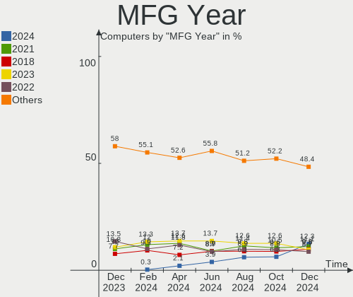
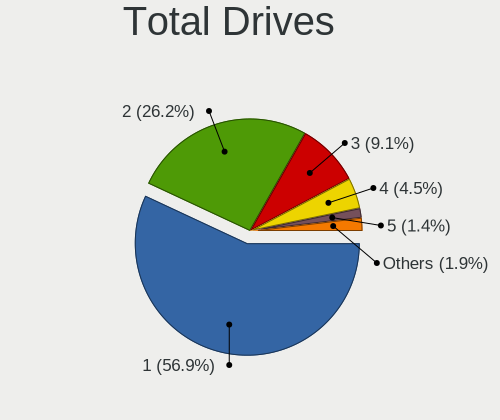
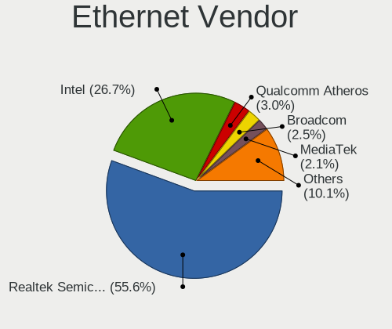
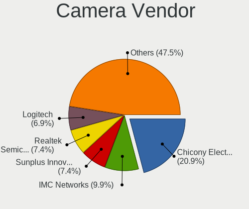

Fedora - Hardware Trends
------------------------

A project to identify most popular hardware characteristics and track their change
over time based on data collected by Linux users at https://Linux-Hardware.org.

Anyone can contribute to this report by the [hw-probe](https://github.com/linuxhw/hw-probe) tool:

    sudo -E hw-probe -all -upload

This is a report for all computer types. See also reports for [desktops](/Dist/Fedora/Desktop/README.md) and [notebooks](/Dist/Fedora/Notebook/README.md).

This report is for one last month. Overall report since the beginning of time: [TestCoverage](https://github.com/linuxhw/TestCoverage)

Period: Jul, 2022.

Contents
--------

* [ System ](#system)
  - [ OS                       ](#os)
  - [ OS Family                ](#os-family)
  - [ Kernel                   ](#kernel)
  - [ Kernel Family            ](#kernel-family)
  - [ Kernel Major Ver.        ](#kernel-major-ver)
  - [ Arch                     ](#arch)
  - [ DE                       ](#de)
  - [ Display Server           ](#display-server)
  - [ Display Manager          ](#display-manager)
  - [ OS Lang                  ](#os-lang)
  - [ Boot Mode                ](#boot-mode)
  - [ Filesystem               ](#filesystem)
  - [ Part. scheme             ](#part-scheme)
  - [ Dual Boot with Linux/BSD ](#dual-boot-with-linuxbsd)
  - [ Dual Boot (Win)          ](#dual-boot-win)

* [ Board ](#board)
  - [ Vendor                   ](#vendor)
  - [ Model                    ](#model)
  - [ Model Family             ](#model-family)
  - [ MFG Year                 ](#mfg-year)
  - [ Form Factor              ](#form-factor)
  - [ Secure Boot              ](#secure-boot)
  - [ Coreboot                 ](#coreboot)
  - [ RAM Size                 ](#ram-size)
  - [ RAM Used                 ](#ram-used)
  - [ Total Drives             ](#total-drives)
  - [ Has CD-ROM               ](#has-cd-rom)
  - [ Has Ethernet             ](#has-ethernet)
  - [ Has WiFi                 ](#has-wifi)
  - [ Has Bluetooth            ](#has-bluetooth)

* [ Location ](#location)
  - [ Country                  ](#country)
  - [ City                     ](#city)

* [ Drives ](#drives)
  - [ Drive Vendor             ](#drive-vendor)
  - [ Drive Model              ](#drive-model)
  - [ HDD Vendor               ](#hdd-vendor)
  - [ SSD Vendor               ](#ssd-vendor)
  - [ Drive Kind               ](#drive-kind)
  - [ Drive Connector          ](#drive-connector)
  - [ Drive Size               ](#drive-size)
  - [ Space Total              ](#space-total)
  - [ Space Used               ](#space-used)
  - [ Malfunc. Drives          ](#malfunc-drives)
  - [ Malfunc. Drive Vendor    ](#malfunc-drive-vendor)
  - [ Malfunc. HDD Vendor      ](#malfunc-hdd-vendor)
  - [ Malfunc. Drive Kind      ](#malfunc-drive-kind)
  - [ Failed Drives            ](#failed-drives)
  - [ Failed Drive Vendor      ](#failed-drive-vendor)
  - [ Drive Status             ](#drive-status)

* [ Storage controller ](#storage-controller)
  - [ Storage Vendor           ](#storage-vendor)
  - [ Storage Model            ](#storage-model)
  - [ Storage Kind             ](#storage-kind)

* [ Processor ](#processor)
  - [ CPU Vendor               ](#cpu-vendor)
  - [ CPU Model                ](#cpu-model)
  - [ CPU Model Family         ](#cpu-model-family)
  - [ CPU Cores                ](#cpu-cores)
  - [ CPU Sockets              ](#cpu-sockets)
  - [ CPU Threads              ](#cpu-threads)
  - [ CPU Op-Modes             ](#cpu-op-modes)
  - [ CPU Microcode            ](#cpu-microcode)
  - [ CPU Microarch            ](#cpu-microarch)

* [ Graphics ](#graphics)
  - [ GPU Vendor               ](#gpu-vendor)
  - [ GPU Model                ](#gpu-model)
  - [ GPU Combo                ](#gpu-combo)
  - [ GPU Driver               ](#gpu-driver)
  - [ GPU Memory               ](#gpu-memory)

* [ Monitor ](#monitor)
  - [ Monitor Vendor           ](#monitor-vendor)
  - [ Monitor Model            ](#monitor-model)
  - [ Monitor Resolution       ](#monitor-resolution)
  - [ Monitor Diagonal         ](#monitor-diagonal)
  - [ Monitor Width            ](#monitor-width)
  - [ Aspect Ratio             ](#aspect-ratio)
  - [ Monitor Area             ](#monitor-area)
  - [ Pixel Density            ](#pixel-density)
  - [ Multiple Monitors        ](#multiple-monitors)

* [ Network ](#network)
  - [ Net Controller Vendor    ](#net-controller-vendor)
  - [ Net Controller Model     ](#net-controller-model)
  - [ Wireless Vendor          ](#wireless-vendor)
  - [ Wireless Model           ](#wireless-model)
  - [ Ethernet Vendor          ](#ethernet-vendor)
  - [ Ethernet Model           ](#ethernet-model)
  - [ Net Controller Kind      ](#net-controller-kind)
  - [ Used Controller          ](#used-controller)
  - [ NICs                     ](#nics)
  - [ IPv6                     ](#ipv6)

* [ Bluetooth ](#bluetooth)
  - [ Bluetooth Vendor         ](#bluetooth-vendor)
  - [ Bluetooth Model          ](#bluetooth-model)

* [ Sound ](#sound)
  - [ Sound Vendor             ](#sound-vendor)
  - [ Sound Model              ](#sound-model)

* [ Memory ](#memory)
  - [ Memory Vendor            ](#memory-vendor)
  - [ Memory Model             ](#memory-model)
  - [ Memory Kind              ](#memory-kind)
  - [ Memory Form Factor       ](#memory-form-factor)
  - [ Memory Size              ](#memory-size)
  - [ Memory Speed             ](#memory-speed)

* [ Printers & scanners ](#printers--scanners)
  - [ Printer Vendor           ](#printer-vendor)
  - [ Printer Model            ](#printer-model)
  - [ Scanner Vendor           ](#scanner-vendor)
  - [ Scanner Model            ](#scanner-model)

* [ Camera ](#camera)
  - [ Camera Vendor            ](#camera-vendor)
  - [ Camera Model             ](#camera-model)

* [ Security ](#security)
  - [ Fingerprint Vendor       ](#fingerprint-vendor)
  - [ Fingerprint Model        ](#fingerprint-model)
  - [ Chipcard Vendor          ](#chipcard-vendor)
  - [ Chipcard Model           ](#chipcard-model)

* [ Unsupported ](#unsupported)
  - [ Unsupported Devices      ](#unsupported-devices)
  - [ Unsupported Device Types ](#unsupported-device-types)

System
------

OS
--

Installed operating systems

| Name      | Computers | Percent |
|-----------|-----------|---------|
| Fedora 36 | 305       | 91.04%  |
| Fedora 35 | 21        | 6.27%   |
| Fedora 32 | 4         | 1.19%   |
| Fedora 34 | 3         | 0.9%    |
| Fedora 37 | 1         | 0.3%    |
| Fedora 33 | 1         | 0.3%    |

OS Family
---------

OS without a version

| Name   | Computers | Percent |
|--------|-----------|---------|
| Fedora | 335       | 100%    |

Kernel
------

Version of the Linux kernel

| Version                                             | Computers | Percent |
|-----------------------------------------------------|-----------|---------|
| 5.18.11-200.fc36.x86_64                             | 85        | 25.37%  |
| 5.18.13-200.fc36.x86_64                             | 64        | 19.1%   |
| 5.18.9-200.fc36.x86_64                              | 46        | 13.73%  |
| 5.18.10-200.fc36.x86_64                             | 44        | 13.13%  |
| 5.18.7-200.fc36.x86_64                              | 30        | 8.96%   |
| 5.17.5-300.fc36.x86_64                              | 15        | 4.48%   |
| 5.18.6-200.fc36.x86_64                              | 4         | 1.19%   |
| 5.18.9-100.fc35.x86_64                              | 3         | 0.9%    |
| 5.18.10-201.fsync.fc36.x86_64                       | 3         | 0.9%    |
| 5.18.10-100.fc35.x86_64                             | 3         | 0.9%    |
| 5.17.12-100.fc34.x86_64                             | 3         | 0.9%    |
| 5.11.22-100.fc32.x86_64                             | 3         | 0.9%    |
| 5.18.5-100.fc35.x86_64                              | 2         | 0.6%    |
| 5.18.13-100.fc35.x86_64                             | 2         | 0.6%    |
| 5.18.11-100.fc35.x86_64                             | 2         | 0.6%    |
| 5.16.18-200.fc35.x86_64                             | 2         | 0.6%    |
| 5.19.0-rc7+                                         | 1         | 0.3%    |
| 5.19.0-0.rc6.20220714git4a57a8400075.49.fc37.x86_64 | 1         | 0.3%    |
| 5.19.0-0.rc5.39.fc37.x86_64                         | 1         | 0.3%    |
| 5.18.9-gnu                                          | 1         | 0.3%    |
| 5.18.9-201.fsync.fc36.x86_64                        | 1         | 0.3%    |
| 5.18.8-xm1.0.fc36.x86_64                            | 1         | 0.3%    |
| 5.18.8-200.fsync.fc36.x86_64                        | 1         | 0.3%    |
| 5.18.8-200.fc36.x86_64                              | 1         | 0.3%    |
| 5.18.7-100.fc35.x86_64                              | 1         | 0.3%    |
| 5.18.6-201.fsync.fc36.x86_64                        | 1         | 0.3%    |
| 5.18.5-200.fc36.x86_64                              | 1         | 0.3%    |
| 5.18.4-101.fc35.x86_64                              | 1         | 0.3%    |
| 5.18.10-250.vanilla.1.fc36.x86_64                   | 1         | 0.3%    |
| 5.17.9-200.fc35.x86_64                              | 1         | 0.3%    |
| 5.17.8-200.fc35.x86_64                              | 1         | 0.3%    |
| 5.17.4-200.fc35.x86_64                              | 1         | 0.3%    |
| 5.17.14-300.fc36.x86_64                             | 1         | 0.3%    |
| 5.17.13-300.fc36.x86_64                             | 1         | 0.3%    |
| 5.17.12-300.fc36.x86_64                             | 1         | 0.3%    |
| 5.16.8-200.fc35.x86_64                              | 1         | 0.3%    |
| 5.16.11-200.fc35.x86_64                             | 1         | 0.3%    |
| 5.14.18-100.fc33.x86_64                             | 1         | 0.3%    |
| 5.14.10-300.fc35.x86_64                             | 1         | 0.3%    |
| 4.18.16-300.fc29.x86_64                             | 1         | 0.3%    |

Kernel Family
-------------

Linux kernel without a distro release

| Version | Computers | Percent |
|---------|-----------|---------|
| 5.18.11 | 87        | 25.97%  |
| 5.18.13 | 66        | 19.7%   |
| 5.18.9  | 51        | 15.22%  |
| 5.18.10 | 51        | 15.22%  |
| 5.18.7  | 31        | 9.25%   |
| 5.17.5  | 15        | 4.48%   |
| 5.18.6  | 5         | 1.49%   |
| 5.17.12 | 4         | 1.19%   |
| 5.19.0  | 3         | 0.9%    |
| 5.18.8  | 3         | 0.9%    |
| 5.18.5  | 3         | 0.9%    |
| 5.11.22 | 3         | 0.9%    |
| 5.16.18 | 2         | 0.6%    |
| 5.18.4  | 1         | 0.3%    |
| 5.17.9  | 1         | 0.3%    |
| 5.17.8  | 1         | 0.3%    |
| 5.17.4  | 1         | 0.3%    |
| 5.17.14 | 1         | 0.3%    |
| 5.17.13 | 1         | 0.3%    |
| 5.16.8  | 1         | 0.3%    |
| 5.16.11 | 1         | 0.3%    |
| 5.14.18 | 1         | 0.3%    |
| 5.14.10 | 1         | 0.3%    |
| 4.18.16 | 1         | 0.3%    |

Kernel Major Ver.
-----------------

Linux kernel major version

| Version | Computers | Percent |
|---------|-----------|---------|
| 5.18    | 298       | 88.96%  |
| 5.17    | 24        | 7.16%   |
| 5.16    | 4         | 1.19%   |
| 5.19    | 3         | 0.9%    |
| 5.11    | 3         | 0.9%    |
| 5.14    | 2         | 0.6%    |
| 4.18    | 1         | 0.3%    |

Arch
----

OS architecture (x86_64, i586, etc.)

| Name   | Computers | Percent |
|--------|-----------|---------|
| x86_64 | 335       | 100%    |

DE
--

Desktop Environment

| Name          | Computers | Percent |
|---------------|-----------|---------|
| GNOME         | 245       | 73.13%  |
| KDE5          | 48        | 14.33%  |
| XFCE          | 12        | 3.58%   |
| Cinnamon      | 10        | 2.99%   |
| X-Cinnamon    | 6         | 1.79%   |
| Unknown       | 4         | 1.19%   |
| MATE          | 3         | 0.9%    |
| i3            | 3         | 0.9%    |
| openbox       | 1         | 0.3%    |
| GNOME Classic | 1         | 0.3%    |
| Deepin        | 1         | 0.3%    |
| awesome       | 1         | 0.3%    |

Display Server
--------------

X11 or Wayland

| Name    | Computers | Percent |
|---------|-----------|---------|
| Wayland | 219       | 65.37%  |
| X11     | 103       | 30.75%  |
| Tty     | 9         | 2.69%   |
| Unknown | 3         | 0.9%    |
| Web     | 1         | 0.3%    |

Display Manager
---------------

SDDM, LightDM, etc.

| Name    | Computers | Percent |
|---------|-----------|---------|
| Unknown | 173       | 51.64%  |
| GDM     | 102       | 30.45%  |
| LightDM | 34        | 10.15%  |
| SDDM    | 26        | 7.76%   |

OS Lang
-------

Language

| Lang  | Computers | Percent |
|-------|-----------|---------|
| en_US | 170       | 50.75%  |
| ru_RU | 29        | 8.66%   |
| pt_BR | 18        | 5.37%   |
| en_AU | 17        | 5.07%   |
| en_GB | 14        | 4.18%   |
| de_DE | 14        | 4.18%   |
| es_ES | 9         | 2.69%   |
| fr_FR | 8         | 2.39%   |
| pl_PL | 7         | 2.09%   |
| it_IT | 4         | 1.19%   |
| es_MX | 4         | 1.19%   |
| en_CA | 4         | 1.19%   |
| de_AT | 4         | 1.19%   |
| es_CL | 3         | 0.9%    |
| en_NZ | 3         | 0.9%    |
| zh_CN | 2         | 0.6%    |
| ru_UA | 2         | 0.6%    |
| id_ID | 2         | 0.6%    |
| hu_HU | 2         | 0.6%    |
| en_IN | 2         | 0.6%    |
| en_DK | 2         | 0.6%    |
| cs_CZ | 2         | 0.6%    |
| tr_TR | 1         | 0.3%    |
| sv_SE | 1         | 0.3%    |
| sr_RS | 1         | 0.3%    |
| sk_SK | 1         | 0.3%    |
| pt_PT | 1         | 0.3%    |
| gl_ES | 1         | 0.3%    |
| es_GT | 1         | 0.3%    |
| es_AR | 1         | 0.3%    |
| en_ZA | 1         | 0.3%    |
| en_PH | 1         | 0.3%    |
| en_IL | 1         | 0.3%    |
| en_IE | 1         | 0.3%    |
| C     | 1         | 0.3%    |

Boot Mode
---------

EFI or BIOS

| Mode | Computers | Percent |
|------|-----------|---------|
| EFI  | 274       | 81.79%  |
| BIOS | 61        | 18.21%  |

Filesystem
----------

Type of filesystem

| Type  | Computers | Percent |
|-------|-----------|---------|
| Btrfs | 259       | 77.31%  |
| Ext4  | 64        | 19.1%   |
| Xfs   | 11        | 3.28%   |
| F2fs  | 1         | 0.3%    |

Part. scheme
------------

Scheme of partitioning

| Type    | Computers | Percent |
|---------|-----------|---------|
| Unknown | 175       | 52.24%  |
| GPT     | 139       | 41.49%  |
| MBR     | 21        | 6.27%   |

Dual Boot with Linux/BSD
------------------------

Hosting more than one Linux/BSD

| Dual boot | Computers | Percent |
|-----------|-----------|---------|
| No        | 297       | 88.66%  |
| Yes       | 38        | 11.34%  |

Dual Boot (Win)
---------------

Hosting Linux and Windows

| Dual boot | Computers | Percent |
|-----------|-----------|---------|
| No        | 264       | 78.81%  |
| Yes       | 71        | 21.19%  |

Board
-----

Vendor
------

Motherboard manufacturer

| Name                | Computers | Percent |
|---------------------|-----------|---------|
| Lenovo              | 69        | 20.6%   |
| ASUSTek Computer    | 58        | 17.31%  |
| Hewlett-Packard     | 50        | 14.93%  |
| MSI                 | 35        | 10.45%  |
| Dell                | 35        | 10.45%  |
| Gigabyte Technology | 19        | 5.67%   |
| ASRock              | 10        | 2.99%   |
| Acer                | 10        | 2.99%   |
| Apple               | 6         | 1.79%   |
| Samsung Electronics | 4         | 1.19%   |
| Intel               | 3         | 0.9%    |
| HUAWEI              | 3         | 0.9%    |
| Framework           | 3         | 0.9%    |
| ZOTAC               | 2         | 0.6%    |
| System76            | 2         | 0.6%    |
| Pegatron            | 2         | 0.6%    |
| GPU Company         | 2         | 0.6%    |
| Unknown             | 2         | 0.6%    |
| VALE                | 1         | 0.3%    |
| Toshiba             | 1         | 0.3%    |
| Supermicro          | 1         | 0.3%    |
| Sony                | 1         | 0.3%    |
| SLIMBOOK            | 1         | 0.3%    |
| Panasonic           | 1         | 0.3%    |
| Notebook            | 1         | 0.3%    |
| NCR                 | 1         | 0.3%    |
| Microsoft           | 1         | 0.3%    |
| Huanan              | 1         | 0.3%    |
| GPD                 | 1         | 0.3%    |
| Google              | 1         | 0.3%    |
| Gateway             | 1         | 0.3%    |
| Fujitsu             | 1         | 0.3%    |
| Foxconn             | 1         | 0.3%    |
| ECS                 | 1         | 0.3%    |
| Clevo               | 1         | 0.3%    |
| Chuwi               | 1         | 0.3%    |
| Aquarius            | 1         | 0.3%    |
| Alienware           | 1         | 0.3%    |

Model
-----

Motherboard model

| Name                                       | Computers | Percent |
|--------------------------------------------|-----------|---------|
| HP Notebook                                | 4         | 1.19%   |
| MSI MS-7C91                                | 3         | 0.9%    |
| Framework Laptop                           | 3         | 0.9%    |
| ASUS ROG STRIX B550-F GAMING               | 3         | 0.9%    |
| Unknown                                    | 3         | 0.9%    |
| MSI MS-7D43                                | 2         | 0.6%    |
| MSI MS-7C37                                | 2         | 0.6%    |
| MSI MS-7A38                                | 2         | 0.6%    |
| Lenovo ThinkBook 14 G3 ACL 21A2            | 2         | 0.6%    |
| Lenovo IdeaPad 5 14ALC05 82LM              | 2         | 0.6%    |
| HP ZBook 17 G5                             | 2         | 0.6%    |
| HP Z2 Tower G4 Workstation                 | 2         | 0.6%    |
| HP Pavilion Laptop 15-cs0xxx               | 2         | 0.6%    |
| HP Pavilion g6                             | 2         | 0.6%    |
| HP ENVY x360 2-in-1 Laptop 15-ey0xxx       | 2         | 0.6%    |
| HP EliteBook 8470p                         | 2         | 0.6%    |
| GPU Company GWNR51416                      | 2         | 0.6%    |
| Dell G3 3590                               | 2         | 0.6%    |
| ASUS X541NA                                | 2         | 0.6%    |
| ASUS ROG STRIX B550-I GAMING               | 2         | 0.6%    |
| ASUS PRIME X470-PRO                        | 2         | 0.6%    |
| Acer Nitro AN515-55                        | 2         | 0.6%    |
| ZOTAC ZBOX-ECM73070C/53060C                | 1         | 0.3%    |
| VALE Notebook Classic C140                 | 1         | 0.3%    |
| Toshiba Satellite L505D                    | 1         | 0.3%    |
| System76 Oryx Pro                          | 1         | 0.3%    |
| System76 Bonobo Extreme                    | 1         | 0.3%    |
| Supermicro X11DPi-N(T)                     | 1         | 0.3%    |
| Sony SVF1531V8CW                           | 1         | 0.3%    |
| SLIMBOOK PROX-AMD5                         | 1         | 0.3%    |
| Samsung 550XBE/350XBE                      | 1         | 0.3%    |
| Samsung 355V4C/356V4C/3445VC/3545VC        | 1         | 0.3%    |
| Samsung 300E4A/300E5A/300E7A/3430EA/3530EA | 1         | 0.3%    |
| Samsung 270E5G/270E5U                      | 1         | 0.3%    |
| Pegatron IPM41-D3                          | 1         | 0.3%    |
| Pegatron D15K                              | 1         | 0.3%    |
| Panasonic FZG1-3                           | 1         | 0.3%    |
| Notebook NH55RGQ                           | 1         | 0.3%    |
| NCR 7606-1007-8801                         | 1         | 0.3%    |
| MSI Summit E13FlipEvo A11MT                | 1         | 0.3%    |
| MSI MS-B09012                              | 1         | 0.3%    |
| MSI MS-7D54                                | 1         | 0.3%    |
| MSI MS-7D25                                | 1         | 0.3%    |
| MSI MS-7D13                                | 1         | 0.3%    |
| MSI MS-7C95                                | 1         | 0.3%    |
| MSI MS-7C92                                | 1         | 0.3%    |
| MSI MS-7C75                                | 1         | 0.3%    |
| MSI MS-7C56                                | 1         | 0.3%    |
| MSI MS-7C35                                | 1         | 0.3%    |
| MSI MS-7C31                                | 1         | 0.3%    |
| MSI MS-7C02                                | 1         | 0.3%    |
| MSI MS-7B86                                | 1         | 0.3%    |
| MSI MS-7B48                                | 1         | 0.3%    |
| MSI MS-7A33                                | 1         | 0.3%    |
| MSI MS-7996                                | 1         | 0.3%    |
| MSI MS-7924                                | 1         | 0.3%    |
| MSI MS-7917                                | 1         | 0.3%    |
| MSI MS-7885                                | 1         | 0.3%    |
| MSI MS-7529                                | 1         | 0.3%    |
| MSI MS-14Y1                                | 1         | 0.3%    |

Model Family
------------

Motherboard model prefix

| Name                   | Computers | Percent |
|------------------------|-----------|---------|
| Lenovo ThinkPad        | 32        | 9.55%   |
| ASUS ROG               | 23        | 6.87%   |
| Lenovo IdeaPad         | 16        | 4.78%   |
| HP Pavilion            | 10        | 2.99%   |
| Dell Latitude          | 10        | 2.99%   |
| Dell Inspiron          | 9         | 2.69%   |
| Dell XPS               | 7         | 2.09%   |
| ASUS PRIME             | 7         | 2.09%   |
| Lenovo IdeaPadFlex     | 5         | 1.49%   |
| HP ProBook             | 5         | 1.49%   |
| HP Laptop              | 5         | 1.49%   |
| HP EliteBook           | 5         | 1.49%   |
| Acer Aspire            | 5         | 1.49%   |
| Lenovo ThinkBook       | 4         | 1.19%   |
| HP ZBook               | 4         | 1.19%   |
| HP Notebook            | 4         | 1.19%   |
| HP ENVY                | 4         | 1.19%   |
| Dell OptiPlex          | 4         | 1.19%   |
| MSI MS-7C91            | 3         | 0.9%    |
| Lenovo Yoga            | 3         | 0.9%    |
| Lenovo ThinkCentre     | 3         | 0.9%    |
| HP Z2                  | 3         | 0.9%    |
| Framework Laptop       | 3         | 0.9%    |
| ASUS TUF               | 3         | 0.9%    |
| Acer Nitro             | 3         | 0.9%    |
| Unknown                | 3         | 0.9%    |
| MSI MS-7D43            | 2         | 0.6%    |
| MSI MS-7C37            | 2         | 0.6%    |
| MSI MS-7A38            | 2         | 0.6%    |
| HP Compaq              | 2         | 0.6%    |
| GPU Company GWNR51416  | 2         | 0.6%    |
| Dell Precision         | 2         | 0.6%    |
| Dell G3                | 2         | 0.6%    |
| ASUS Zenbook           | 2         | 0.6%    |
| ASUS X541NA            | 2         | 0.6%    |
| ASUS VivoBook          | 2         | 0.6%    |
| ASRock X570            | 2         | 0.6%    |
| ASRock B450M           | 2         | 0.6%    |
| ZOTAC ZBOX-ECM73070C   | 1         | 0.3%    |
| VALE Notebook          | 1         | 0.3%    |
| Toshiba Satellite      | 1         | 0.3%    |
| System76 Oryx          | 1         | 0.3%    |
| System76 Bonobo        | 1         | 0.3%    |
| Supermicro X11DPi-N(T) | 1         | 0.3%    |
| Sony SVF1531V8CW       | 1         | 0.3%    |
| SLIMBOOK PROX-AMD5     | 1         | 0.3%    |
| Samsung 550XBE         | 1         | 0.3%    |
| Samsung 355V4C         | 1         | 0.3%    |
| Samsung 300E4A         | 1         | 0.3%    |
| Samsung 270E5G         | 1         | 0.3%    |
| Pegatron IPM41-D3      | 1         | 0.3%    |
| Pegatron D15K          | 1         | 0.3%    |
| Panasonic FZG1-3       | 1         | 0.3%    |
| Notebook NH55RGQ       | 1         | 0.3%    |
| NCR 7606-1007-8801     | 1         | 0.3%    |
| MSI Summit             | 1         | 0.3%    |
| MSI MS-B09012          | 1         | 0.3%    |
| MSI MS-7D54            | 1         | 0.3%    |
| MSI MS-7D25            | 1         | 0.3%    |
| MSI MS-7D13            | 1         | 0.3%    |

MFG Year
--------

Motherboard manufacture year

| Year | Computers | Percent |
|------|-----------|---------|
| 2020 | 56        | 16.72%  |
| 2021 | 51        | 15.22%  |
| 2019 | 43        | 12.84%  |
| 2018 | 29        | 8.66%   |
| 2022 | 22        | 6.57%   |
| 2017 | 21        | 6.27%   |
| 2016 | 19        | 5.67%   |
| 2011 | 19        | 5.67%   |
| 2012 | 18        | 5.37%   |
| 2013 | 17        | 5.07%   |
| 2015 | 13        | 3.88%   |
| 2014 | 10        | 2.99%   |
| 2009 | 8         | 2.39%   |
| 2010 | 6         | 1.79%   |
| 2008 | 2         | 0.6%    |
| 2006 | 1         | 0.3%    |

Form Factor
-----------

Physical design of the computer

| Name        | Computers | Percent |
|-------------|-----------|---------|
| Notebook    | 180       | 53.73%  |
| Desktop     | 124       | 37.01%  |
| Convertible | 16        | 4.78%   |
| All in one  | 9         | 2.69%   |
| Tablet      | 3         | 0.9%    |
| Mini pc     | 2         | 0.6%    |
| Server      | 1         | 0.3%    |

Secure Boot
-----------

Enabled or disabled

| State    | Computers | Percent |
|----------|-----------|---------|
| Disabled | 274       | 81.79%  |
| Enabled  | 61        | 18.21%  |

Coreboot
--------

Have coreboot on board

| Used | Computers | Percent |
|------|-----------|---------|
| No   | 332       | 99.1%   |
| Yes  | 3         | 0.9%    |

RAM Size
--------

Total RAM memory

| Size in GB      | Computers | Percent |
|-----------------|-----------|---------|
| 4.01-8.0        | 93        | 27.76%  |
| 16.01-24.0      | 75        | 22.39%  |
| 8.01-16.0       | 59        | 17.61%  |
| 32.01-64.0      | 57        | 17.01%  |
| 64.01-256.0     | 21        | 6.27%   |
| 3.01-4.0        | 17        | 5.07%   |
| 24.01-32.0      | 8         | 2.39%   |
| 2.01-3.0        | 2         | 0.6%    |
| 1.01-2.0        | 2         | 0.6%    |
| More than 256.0 | 1         | 0.3%    |

RAM Used
--------

Used RAM memory

| Used GB     | Computers | Percent |
|-------------|-----------|---------|
| 4.01-8.0    | 100       | 29.85%  |
| 2.01-3.0    | 86        | 25.67%  |
| 3.01-4.0    | 84        | 25.07%  |
| 1.01-2.0    | 29        | 8.66%   |
| 8.01-16.0   | 25        | 7.46%   |
| 0.51-1.0    | 5         | 1.49%   |
| 16.01-24.0  | 4         | 1.19%   |
| 24.01-32.0  | 1         | 0.3%    |
| 64.01-256.0 | 1         | 0.3%    |

Total Drives
------------

Number of drives on board

| Drives | Computers | Percent |
|--------|-----------|---------|
| 1      | 194       | 57.91%  |
| 2      | 84        | 25.07%  |
| 3      | 26        | 7.76%   |
| 4      | 18        | 5.37%   |
| 6      | 4         | 1.19%   |
| 5      | 4         | 1.19%   |
| 7      | 3         | 0.9%    |
| 10     | 2         | 0.6%    |

Has CD-ROM
----------

Has CD-ROM on board

| Presented | Computers | Percent |
|-----------|-----------|---------|
| No        | 258       | 77.01%  |
| Yes       | 77        | 22.99%  |

Has Ethernet
------------

Has Ethernet on board

| Presented | Computers | Percent |
|-----------|-----------|---------|
| Yes       | 276       | 82.39%  |
| No        | 59        | 17.61%  |

Has WiFi
--------

Has WiFi module

| Presented | Computers | Percent |
|-----------|-----------|---------|
| Yes       | 272       | 81.19%  |
| No        | 63        | 18.81%  |

Has Bluetooth
-------------

Has Bluetooth module

| Presented | Computers | Percent |
|-----------|-----------|---------|
| Yes       | 249       | 74.33%  |
| No        | 86        | 25.67%  |

Location
--------

Country
-------

Geographic location (country)

| Country            | Computers | Percent |
|--------------------|-----------|---------|
| USA                | 76        | 22.69%  |
| Russia             | 27        | 8.06%   |
| Brazil             | 26        | 7.76%   |
| Germany            | 19        | 5.67%   |
| Australia          | 17        | 5.07%   |
| Poland             | 12        | 3.58%   |
| France             | 12        | 3.58%   |
| Spain              | 11        | 3.28%   |
| UK                 | 7         | 2.09%   |
| Turkey             | 7         | 2.09%   |
| India              | 7         | 2.09%   |
| Mexico             | 6         | 1.79%   |
| Indonesia          | 6         | 1.79%   |
| Netherlands        | 5         | 1.49%   |
| Canada             | 5         | 1.49%   |
| Austria            | 5         | 1.49%   |
| Sweden             | 4         | 1.19%   |
| Philippines        | 4         | 1.19%   |
| Norway             | 4         | 1.19%   |
| Italy              | 4         | 1.19%   |
| Hungary            | 4         | 1.19%   |
| Chile              | 4         | 1.19%   |
| Switzerland        | 3         | 0.9%    |
| South Africa       | 3         | 0.9%    |
| Czechia            | 3         | 0.9%    |
| China              | 3         | 0.9%    |
| Bulgaria           | 3         | 0.9%    |
| Ukraine            | 2         | 0.6%    |
| Slovakia           | 2         | 0.6%    |
| Serbia             | 2         | 0.6%    |
| Kazakhstan         | 2         | 0.6%    |
| Israel             | 2         | 0.6%    |
| Finland            | 2         | 0.6%    |
| Egypt              | 2         | 0.6%    |
| Dominican Republic | 2         | 0.6%    |
| Denmark            | 2         | 0.6%    |
| Croatia            | 2         | 0.6%    |
| Belarus            | 2         | 0.6%    |
| Vietnam            | 1         | 0.3%    |
| Uruguay            | 1         | 0.3%    |
| UAE                | 1         | 0.3%    |
| Thailand           | 1         | 0.3%    |
| Sri Lanka          | 1         | 0.3%    |
| South Korea        | 1         | 0.3%    |
| Singapore          | 1         | 0.3%    |
| Qatar              | 1         | 0.3%    |
| Puerto Rico        | 1         | 0.3%    |
| Portugal           | 1         | 0.3%    |
| Pakistan           | 1         | 0.3%    |
| North Macedonia    | 1         | 0.3%    |
| Nigeria            | 1         | 0.3%    |
| New Zealand        | 1         | 0.3%    |
| Nepal              | 1         | 0.3%    |
| Moldova            | 1         | 0.3%    |
| Japan              | 1         | 0.3%    |
| Ireland            | 1         | 0.3%    |
| Iran               | 1         | 0.3%    |
| Iceland            | 1         | 0.3%    |
| Guatemala          | 1         | 0.3%    |
| Estonia            | 1         | 0.3%    |

City
----

Geographic location (city)

| City               | Computers | Percent |
|--------------------|-----------|---------|
| Moscow             | 6         | 1.79%   |
| Launceston         | 6         | 1.79%   |
| Sao Paulo          | 5         | 1.49%   |
| Warsaw             | 4         | 1.19%   |
| Vienna             | 4         | 1.19%   |
| Brisbane           | 4         | 1.19%   |
| St Petersburg      | 3         | 0.9%    |
| Paris              | 3         | 0.9%    |
| Melbourne          | 3         | 0.9%    |
| Los Angeles        | 3         | 0.9%    |
| Chicago            | 3         | 0.9%    |
| Bogor              | 3         | 0.9%    |
| Vitória           | 2         | 0.6%    |
| Valencia           | 2         | 0.6%    |
| Sofia              | 2         | 0.6%    |
| Seattle            | 2         | 0.6%    |
| Santo Domingo Este | 2         | 0.6%    |
| Santiago           | 2         | 0.6%    |
| Sandpoint          | 2         | 0.6%    |
| Prague             | 2         | 0.6%    |
| Pasco              | 2         | 0.6%    |
| Novosibirsk        | 2         | 0.6%    |
| Munich             | 2         | 0.6%    |
| Mundelein          | 2         | 0.6%    |
| Minsk              | 2         | 0.6%    |
| Mexico City        | 2         | 0.6%    |
| Merritt Island     | 2         | 0.6%    |
| Kristiansand       | 2         | 0.6%    |
| Kansas City        | 2         | 0.6%    |
| Jenks              | 2         | 0.6%    |
| Jakarta            | 2         | 0.6%    |
| Istanbul           | 2         | 0.6%    |
| Helsinki           | 2         | 0.6%    |
| Geneva             | 2         | 0.6%    |
| Cairo              | 2         | 0.6%    |
| Bursa              | 2         | 0.6%    |
| Budapest           | 2         | 0.6%    |
| Bezhetsk           | 2         | 0.6%    |
| Belgrade           | 2         | 0.6%    |
| Barueri            | 2         | 0.6%    |
| Atlanta            | 2         | 0.6%    |
| Zurich             | 1         | 0.3%    |
| Zagreb             | 1         | 0.3%    |
| Wroclaw            | 1         | 0.3%    |
| Wooster            | 1         | 0.3%    |
| Wilmington         | 1         | 0.3%    |
| West Bromwich      | 1         | 0.3%    |
| Vladivostok        | 1         | 0.3%    |
| Vijayawada         | 1         | 0.3%    |
| Victoria           | 1         | 0.3%    |
| Vence              | 1         | 0.3%    |
| Vancouver          | 1         | 0.3%    |
| Vadodara           | 1         | 0.3%    |
| Ust'-Ilimsk        | 1         | 0.3%    |
| Ufa                | 1         | 0.3%    |
| Udupi              | 1         | 0.3%    |
| Tyumen             | 1         | 0.3%    |
| Turkeve            | 1         | 0.3%    |
| Trieste            | 1         | 0.3%    |
| Toulouse           | 1         | 0.3%    |

Drives
------

Drive Vendor
------------

Hard drive vendors

| Vendor                    | Computers | Drives | Percent |
|---------------------------|-----------|--------|---------|
| Samsung Electronics       | 100       | 130    | 19.42%  |
| WDC                       | 69        | 91     | 13.4%   |
| Seagate                   | 69        | 95     | 13.4%   |
| SanDisk                   | 35        | 35     | 6.8%    |
| Toshiba                   | 31        | 31     | 6.02%   |
| Kingston                  | 27        | 29     | 5.24%   |
| Crucial                   | 21        | 21     | 4.08%   |
| Micron Technology         | 17        | 17     | 3.3%    |
| Intel                     | 16        | 17     | 3.11%   |
| SK hynix                  | 15        | 15     | 2.91%   |
| Unknown                   | 10        | 10     | 1.94%   |
| Phison                    | 10        | 11     | 1.94%   |
| Hitachi                   | 6         | 6      | 1.17%   |
| Micron/Crucial Technology | 5         | 5      | 0.97%   |
| KIOXIA                    | 5         | 6      | 0.97%   |
| HGST                      | 5         | 5      | 0.97%   |
| A-DATA Technology         | 5         | 5      | 0.97%   |
| Unknown                   | 5         | 5      | 0.97%   |
| SPCC                      | 4         | 5      | 0.78%   |
| Patriot                   | 4         | 4      | 0.78%   |
| China                     | 4         | 4      | 0.78%   |
| Silicon Motion            | 3         | 3      | 0.58%   |
| SABRENT                   | 3         | 3      | 0.58%   |
| GOODRAM                   | 3         | 3      | 0.58%   |
| GALAX                     | 3         | 3      | 0.58%   |
| Team                      | 2         | 2      | 0.39%   |
| T-FORCE                   | 2         | 2      | 0.39%   |
| Plextor                   | 2         | 2      | 0.39%   |
| LITEON                    | 2         | 2      | 0.39%   |
| Lenovo                    | 2         | 3      | 0.39%   |
| Intenso                   | 2         | 2      | 0.39%   |
| Gigabyte Technology       | 2         | 3      | 0.39%   |
| Corsair                   | 2         | 3      | 0.39%   |
| Apple                     | 2         | 2      | 0.39%   |
| XPG                       | 1         | 1      | 0.19%   |
| Union Memory (Shenzhen)   | 1         | 1      | 0.19%   |
| UMIS                      | 1         | 1      | 0.19%   |
| Transcend                 | 1         | 1      | 0.19%   |
| Timetec                   | 1         | 1      | 0.19%   |
| Teclast                   | 1         | 1      | 0.19%   |
| SSSTC                     | 1         | 1      | 0.19%   |
| Phison Electronics        | 1         | 1      | 0.19%   |
| new                       | 1         | 1      | 0.19%   |
| Netac                     | 1         | 1      | 0.19%   |
| MyDigitalSSD              | 1         | 1      | 0.19%   |
| LITEONIT                  | 1         | 1      | 0.19%   |
| KIOXIA-EXCERIA            | 1         | 1      | 0.19%   |
| KingDian                  | 1         | 1      | 0.19%   |
| GLOWAY                    | 1         | 1      | 0.19%   |
| Fujitsu                   | 1         | 1      | 0.19%   |
| EZCOOL                    | 1         | 1      | 0.19%   |
| Colorful                  | 1         | 1      | 0.19%   |
| BIWIN                     | 1         | 1      | 0.19%   |
| Aura                      | 1         | 1      | 0.19%   |
| ASMT106x                  | 1         | 1      | 0.19%   |
| ADATA SU                  | 1         | 1      | 0.19%   |

Drive Model
-----------

Hard drive models

| Model                                | Computers | Percent |
|--------------------------------------|-----------|---------|
| Samsung NVMe SSD Drive 1TB           | 11        | 1.91%   |
| Seagate ST1000LM024 HN-M101MBB 1TB   | 7         | 1.22%   |
| Samsung NVMe SSD Drive 500GB         | 7         | 1.22%   |
| Samsung NVMe SSD Drive 2TB           | 7         | 1.22%   |
| Samsung NVMe SSD Drive 1024GB        | 7         | 1.22%   |
| SanDisk NVMe SSD Drive 512GB         | 6         | 1.04%   |
| Micron NVMe SSD Drive 512GB          | 6         | 1.04%   |
| Crucial CT1000MX500SSD1 1TB          | 6         | 1.04%   |
| Seagate ST1000LM035-1RK172 1TB       | 5         | 0.87%   |
| Samsung NVMe SSD Drive 256GB         | 5         | 0.87%   |
| Unknown                              | 5         | 0.87%   |
| WDC WDS240G2G0A-00JH30 240GB SSD     | 4         | 0.7%    |
| WDC WD10EZEX-08WN4A0 1TB             | 4         | 0.7%    |
| SK hynix NVMe SSD Drive 512GB        | 4         | 0.7%    |
| Seagate ST500DM002-1BD142 500GB      | 4         | 0.7%    |
| Seagate Expansion 1TB                | 4         | 0.7%    |
| SanDisk NVMe SSD Drive 500GB         | 4         | 0.7%    |
| Samsung SSD 860 EVO 500GB            | 4         | 0.7%    |
| Samsung SSD 850 EVO 500GB            | 4         | 0.7%    |
| Samsung SSD 850 EVO 250GB            | 4         | 0.7%    |
| Samsung NVMe SSD Drive 512GB         | 4         | 0.7%    |
| Phison NVMe SSD Drive 1024GB         | 4         | 0.7%    |
| Kingston SA400S37240G 240GB SSD      | 4         | 0.7%    |
| Intel NVMe SSD Drive 512GB           | 4         | 0.7%    |
| Crucial CT500MX500SSD1 500GB         | 4         | 0.7%    |
| Crucial CT240BX500SSD1 240GB         | 4         | 0.7%    |
| Toshiba NVMe SSD Drive 512GB         | 3         | 0.52%   |
| Toshiba MQ04ABF100 1TB               | 3         | 0.52%   |
| Toshiba DT01ACA100 1TB               | 3         | 0.52%   |
| SK hynix NVMe SSD Drive 256GB        | 3         | 0.52%   |
| SK hynix NVMe SSD Drive 1024GB       | 3         | 0.52%   |
| Seagate ST2000DM008-2FR102 2TB       | 3         | 0.52%   |
| Seagate ST2000DM001-1ER164 2TB       | 3         | 0.52%   |
| Seagate ST1000LM048-2E7172 1TB       | 3         | 0.52%   |
| Seagate ST1000DM010-2EP102 1TB       | 3         | 0.52%   |
| Samsung SSD 980 PRO 1TB              | 3         | 0.52%   |
| Samsung MZALQ512HALU-000L2 512GB     | 3         | 0.52%   |
| SABRENT Disk 1TB                     | 3         | 0.52%   |
| Micron/Crucial NVMe SSD Drive 1TB    | 3         | 0.52%   |
| Kingston SA400S37480G 480GB SSD      | 3         | 0.52%   |
| Kingston NVMe SSD Drive 512GB        | 3         | 0.52%   |
| HGST HTS721010A9E630 1TB             | 3         | 0.52%   |
| WDC WDS500G2B0A-00SM50 500GB SSD     | 2         | 0.35%   |
| WDC WDS100T2B0C-00PXH0 1TB           | 2         | 0.35%   |
| WDC WDS100T2B0A-00SM50 1TB SSD       | 2         | 0.35%   |
| WDC WD5000AAKX-08U6AA0 500GB         | 2         | 0.35%   |
| WDC WD5000AAKX-003CA0 500GB          | 2         | 0.35%   |
| WDC WD10EZEX-60M2NA0 1TB             | 2         | 0.35%   |
| WDC WD10EZEX-08M2NA0 1TB             | 2         | 0.35%   |
| WDC PC SN530 SDBPMPZ-512G-1101 512GB | 2         | 0.35%   |
| Toshiba MQ01ABF050 500GB             | 2         | 0.35%   |
| Toshiba MQ01ABD100 1TB               | 2         | 0.35%   |
| Toshiba HDWD110 1TB                  | 2         | 0.35%   |
| Seagate ST2000DM001-1CH164 2TB       | 2         | 0.35%   |
| Seagate ST1000DM003-1SB102 1TB       | 2         | 0.35%   |
| Seagate ST1000DM003-1ER162 1TB       | 2         | 0.35%   |
| Seagate Expansion Desk 4TB           | 2         | 0.35%   |
| SanDisk SSD PLUS 480GB               | 2         | 0.35%   |
| SanDisk SD8SN8U-128G-1006 128GB SSD  | 2         | 0.35%   |
| SanDisk NVMe SSD Drive 480GB         | 2         | 0.35%   |

HDD Vendor
----------

Hard disk drive vendors

| Vendor              | Computers | Drives | Percent |
|---------------------|-----------|--------|---------|
| Seagate             | 67        | 93     | 43.23%  |
| WDC                 | 46        | 62     | 29.68%  |
| Toshiba             | 20        | 20     | 12.9%   |
| Hitachi             | 6         | 6      | 3.87%   |
| HGST                | 5         | 5      | 3.23%   |
| SABRENT             | 3         | 3      | 1.94%   |
| Unknown             | 2         | 2      | 1.29%   |
| Apple               | 2         | 2      | 1.29%   |
| Samsung Electronics | 1         | 2      | 0.65%   |
| Intenso             | 1         | 1      | 0.65%   |
| Fujitsu             | 1         | 1      | 0.65%   |
| ASMT106x            | 1         | 1      | 0.65%   |

SSD Vendor
----------

Solid state drive vendors

| Vendor              | Computers | Drives | Percent |
|---------------------|-----------|--------|---------|
| Samsung Electronics | 41        | 46     | 26.8%   |
| Crucial             | 19        | 19     | 12.42%  |
| Kingston            | 16        | 17     | 10.46%  |
| WDC                 | 12        | 13     | 7.84%   |
| SanDisk             | 12        | 12     | 7.84%   |
| Micron Technology   | 6         | 6      | 3.92%   |
| SPCC                | 4         | 5      | 2.61%   |
| Patriot             | 4         | 4      | 2.61%   |
| China               | 4         | 4      | 2.61%   |
| Intel               | 3         | 3      | 1.96%   |
| GOODRAM             | 3         | 3      | 1.96%   |
| GALAX               | 3         | 3      | 1.96%   |
| A-DATA Technology   | 3         | 3      | 1.96%   |
| Toshiba             | 2         | 2      | 1.31%   |
| Plextor             | 2         | 2      | 1.31%   |
| LITEON              | 2         | 2      | 1.31%   |
| Gigabyte Technology | 2         | 3      | 1.31%   |
| Unknown             | 2         | 2      | 1.31%   |
| Transcend           | 1         | 1      | 0.65%   |
| Timetec             | 1         | 1      | 0.65%   |
| Teclast             | 1         | 1      | 0.65%   |
| Team                | 1         | 1      | 0.65%   |
| SK hynix            | 1         | 1      | 0.65%   |
| Netac               | 1         | 1      | 0.65%   |
| MyDigitalSSD        | 1         | 1      | 0.65%   |
| LITEONIT            | 1         | 1      | 0.65%   |
| KingDian            | 1         | 1      | 0.65%   |
| Intenso             | 1         | 1      | 0.65%   |
| GLOWAY              | 1         | 1      | 0.65%   |
| EZCOOL              | 1         | 1      | 0.65%   |
| ADATA SU            | 1         | 1      | 0.65%   |

Drive Kind
----------

HDD or SSD

| Kind    | Computers | Drives | Percent |
|---------|-----------|--------|---------|
| NVMe    | 192       | 227    | 41.11%  |
| HDD     | 132       | 198    | 28.27%  |
| SSD     | 130       | 162    | 27.84%  |
| MMC     | 7         | 9      | 1.5%    |
| Unknown | 6         | 6      | 1.28%   |

Drive Connector
---------------

SATA, SAS, NVMe, etc.

| Type | Computers | Drives | Percent |
|------|-----------|--------|---------|
| SATA | 204       | 343    | 48.34%  |
| NVMe | 192       | 227    | 45.5%   |
| SAS  | 19        | 23     | 4.5%    |
| MMC  | 7         | 9      | 1.66%   |

Drive Size
----------

Size of hard drive

| Size in TB | Computers | Drives | Percent |
|------------|-----------|--------|---------|
| 0.01-0.5   | 132       | 167    | 46.15%  |
| 0.51-1.0   | 102       | 122    | 35.66%  |
| 1.01-2.0   | 27        | 32     | 9.44%   |
| 3.01-4.0   | 11        | 15     | 3.85%   |
| 2.01-3.0   | 7         | 8      | 2.45%   |
| 4.01-10.0  | 5         | 13     | 1.75%   |
| 10.01-20.0 | 2         | 3      | 0.7%    |

Space Total
-----------

Amount of disk space available on the file system

| Size in GB     | Computers | Percent |
|----------------|-----------|---------|
| 501-1000       | 68        | 20.3%   |
| 251-500        | 52        | 15.52%  |
| 101-250        | 49        | 14.63%  |
| 1001-2000      | 43        | 12.84%  |
| More than 3000 | 31        | 9.25%   |
| 1-20           | 28        | 8.36%   |
| Unknown        | 22        | 6.57%   |
| 2001-3000      | 19        | 5.67%   |
| 51-100         | 16        | 4.78%   |
| 21-50          | 7         | 2.09%   |

Space Used
----------

Amount of used disk space

| Used GB        | Computers | Percent |
|----------------|-----------|---------|
| 1-20           | 91        | 27.16%  |
| 21-50          | 52        | 15.52%  |
| 101-250        | 42        | 12.54%  |
| 51-100         | 38        | 11.34%  |
| 251-500        | 29        | 8.66%   |
| 501-1000       | 29        | 8.66%   |
| Unknown        | 22        | 6.57%   |
| 1001-2000      | 17        | 5.07%   |
| More than 3000 | 10        | 2.99%   |
| 2001-3000      | 5         | 1.49%   |

Malfunc. Drives
---------------

Drive models with a malfunction

| Model                                 | Computers | Drives | Percent |
|---------------------------------------|-----------|--------|---------|
| WDC WD5000LPCX-00VHAT0 500GB          | 1         | 1      | 4%      |
| WDC WD5000AAKX-08ERMA0 500GB          | 1         | 1      | 4%      |
| WDC WD5000AAKX-003CA0 500GB           | 1         | 1      | 4%      |
| WDC WD2500AAKX-753CA1 250GB           | 1         | 1      | 4%      |
| WDC WD10EARS-22Y5B1 1TB               | 1         | 1      | 4%      |
| WDC WD1003FBYX-01Y7B1 752GB           | 1         | 1      | 4%      |
| Toshiba MQ01ABD050 500GB              | 1         | 1      | 4%      |
| Toshiba MK3275GSX 320GB               | 1         | 1      | 4%      |
| Toshiba DT01ACA100 1TB                | 1         | 1      | 4%      |
| SPCC Solid State Disk 1TB             | 1         | 2      | 4%      |
| Seagate ST9500325AS 500GB             | 1         | 1      | 4%      |
| Seagate ST500LM030-2E717D 500GB       | 1         | 1      | 4%      |
| Seagate ST500LM021-1KJ152 500GB       | 1         | 1      | 4%      |
| Seagate ST500DM002-1BD142 500GB       | 1         | 1      | 4%      |
| Seagate ST3500418AS 500GB             | 1         | 1      | 4%      |
| Seagate ST3000DM001-1CH166 3TB        | 1         | 1      | 4%      |
| Seagate ST1000LM024 HN-M101MBB 1TB    | 1         | 1      | 4%      |
| Samsung Electronics SSD 870 EVO 1TB   | 1         | 1      | 4%      |
| Samsung Electronics SSD 850 EVO 1TB   | 1         | 1      | 4%      |
| Samsung Electronics HD501LJ 500GB     | 1         | 2      | 4%      |
| Micron Technology 1100 SATA 256GB SSD | 1         | 1      | 4%      |
| LITEONIT LCS-128M6S-HP 128GB SSD      | 1         | 1      | 4%      |
| Intel SSDSC2CT120A3 120GB             | 1         | 1      | 4%      |
| Hitachi HDP725050GLA360 500GB         | 1         | 1      | 4%      |
| HGST HTS721010A9E630 1TB              | 1         | 1      | 4%      |

Malfunc. Drive Vendor
---------------------

Vendors of faulty drives

| Vendor              | Computers | Drives | Percent |
|---------------------|-----------|--------|---------|
| Seagate             | 7         | 7      | 28%     |
| WDC                 | 6         | 6      | 24%     |
| Toshiba             | 3         | 3      | 12%     |
| Samsung Electronics | 3         | 4      | 12%     |
| SPCC                | 1         | 2      | 4%      |
| Micron Technology   | 1         | 1      | 4%      |
| LITEONIT            | 1         | 1      | 4%      |
| Intel               | 1         | 1      | 4%      |
| Hitachi             | 1         | 1      | 4%      |
| HGST                | 1         | 1      | 4%      |

Malfunc. HDD Vendor
-------------------

Vendors of faulty HDD drives

| Vendor              | Computers | Drives | Percent |
|---------------------|-----------|--------|---------|
| Seagate             | 7         | 7      | 36.84%  |
| WDC                 | 6         | 6      | 31.58%  |
| Toshiba             | 3         | 3      | 15.79%  |
| Samsung Electronics | 1         | 2      | 5.26%   |
| Hitachi             | 1         | 1      | 5.26%   |
| HGST                | 1         | 1      | 5.26%   |

Malfunc. Drive Kind
-------------------

Kinds of faulty drives

| Kind | Computers | Drives | Percent |
|------|-----------|--------|---------|
| HDD  | 19        | 20     | 76%     |
| SSD  | 6         | 7      | 24%     |

Failed Drives
-------------

Failed drive models

Zero info for selected period =(

Failed Drive Vendor
-------------------

Failed drive vendors

Zero info for selected period =(

Drive Status
------------

Number of failed and malfunc. drives

| Status   | Computers | Drives | Percent |
|----------|-----------|--------|---------|
| Detected | 194       | 340    | 53.15%  |
| Works    | 146       | 235    | 40%     |
| Malfunc  | 25        | 27     | 6.85%   |

Storage controller
------------------

Storage Vendor
--------------

Storage controller vendors

| Vendor                         | Computers | Percent |
|--------------------------------|-----------|---------|
| Intel                          | 185       | 38.46%  |
| AMD                            | 88        | 18.3%   |
| Samsung Electronics            | 71        | 14.76%  |
| SanDisk                        | 34        | 7.07%   |
| Phison Electronics             | 15        | 3.12%   |
| SK hynix                       | 14        | 2.91%   |
| Micron Technology              | 11        | 2.29%   |
| Kingston Technology Company    | 11        | 2.29%   |
| Toshiba America Info Systems   | 8         | 1.66%   |
| Micron/Crucial Technology      | 7         | 1.46%   |
| KIOXIA                         | 7         | 1.46%   |
| ASMedia Technology             | 7         | 1.46%   |
| Silicon Motion                 | 4         | 0.83%   |
| Marvell Technology Group       | 4         | 0.83%   |
| ADATA Technology               | 3         | 0.62%   |
| Union Memory (Shenzhen)        | 2         | 0.42%   |
| Seagate Technology             | 2         | 0.42%   |
| Nvidia                         | 2         | 0.42%   |
| Lenovo                         | 2         | 0.42%   |
| Solid State Storage Technology | 1         | 0.21%   |
| LSI Logic / Symbios Logic      | 1         | 0.21%   |
| JMicron Technology             | 1         | 0.21%   |
| Biwin Storage Technology       | 1         | 0.21%   |

Storage Model
-------------

Storage controller models

| Model                                                                            | Computers | Percent |
|----------------------------------------------------------------------------------|-----------|---------|
| AMD FCH SATA Controller [AHCI mode]                                              | 57        | 10.67%  |
| Samsung NVMe SSD Controller SM981/PM981/PM983                                    | 33        | 6.18%   |
| Intel Sunrise Point-LP SATA Controller [AHCI mode]                               | 22        | 4.12%   |
| Samsung NVMe SSD Controller 980                                                  | 20        | 3.75%   |
| Samsung NVMe SSD Controller PM9A1/PM9A3/980PRO                                   | 15        | 2.81%   |
| AMD 400 Series Chipset SATA Controller                                           | 14        | 2.62%   |
| Intel 7 Series Chipset Family 6-port SATA Controller [AHCI mode]                 | 13        | 2.43%   |
| AMD 500 Series Chipset SATA Controller                                           | 13        | 2.43%   |
| SanDisk Non-Volatile memory controller                                           | 12        | 2.25%   |
| Phison E12 NVMe Controller                                                       | 12        | 2.25%   |
| Intel Volume Management Device NVMe RAID Controller                              | 12        | 2.25%   |
| Micron Non-Volatile memory controller                                            | 11        | 2.06%   |
| AMD SB7x0/SB8x0/SB9x0 SATA Controller [AHCI mode]                                | 10        | 1.87%   |
| Intel SATA Controller [RAID mode]                                                | 9         | 1.69%   |
| Intel Comet Lake SATA AHCI Controller                                            | 9         | 1.69%   |
| Intel Cannon Lake Mobile PCH SATA AHCI Controller                                | 9         | 1.69%   |
| Intel 82801 Mobile SATA Controller [RAID mode]                                   | 9         | 1.69%   |
| Intel 8 Series/C220 Series Chipset Family 6-port SATA Controller 1 [AHCI mode]   | 9         | 1.69%   |
| Intel Q170/Q150/B150/H170/H110/Z170/CM236 Chipset SATA Controller [AHCI Mode]    | 8         | 1.5%    |
| AMD SB7x0/SB8x0/SB9x0 IDE Controller                                             | 8         | 1.5%    |
| SanDisk WD Black SN750 / PC SN730 NVMe SSD                                       | 7         | 1.31%   |
| Intel Alder Lake-S PCH SATA Controller [AHCI Mode]                               | 7         | 1.31%   |
| Intel 6 Series/C200 Series Chipset Family 6 port Mobile SATA AHCI Controller     | 7         | 1.31%   |
| Intel 400 Series Chipset Family SATA AHCI Controller                             | 7         | 1.31%   |
| SK hynix Gold P31 SSD                                                            | 6         | 1.12%   |
| SanDisk WD Blue SN550 NVMe SSD                                                   | 6         | 1.12%   |
| KIOXIA NVMe SSD Controller BG4                                                   | 6         | 1.12%   |
| Intel Wildcat Point-LP SATA Controller [AHCI Mode]                               | 6         | 1.12%   |
| Intel 6 Series/C200 Series Chipset Family 6 port Desktop SATA AHCI Controller    | 6         | 1.12%   |
| ASMedia ASM1062 Serial ATA Controller                                            | 6         | 1.12%   |
| Samsung NVMe SSD Controller SM961/PM961/SM963                                    | 5         | 0.94%   |
| Intel SSD 660P Series                                                            | 5         | 0.94%   |
| Intel Cannon Lake PCH SATA AHCI Controller                                       | 5         | 0.94%   |
| Intel 200 Series PCH SATA controller [AHCI mode]                                 | 5         | 0.94%   |
| SanDisk WD PC SN810 / Black SN850 NVMe SSD                                       | 4         | 0.75%   |
| Kingston Company U-SNS8154P3 NVMe SSD                                            | 4         | 0.75%   |
| Intel Tiger Lake-LP SATA Controller                                              | 4         | 0.75%   |
| Intel SSD Pro 7600p/760p/E 6100p Series                                          | 4         | 0.75%   |
| Intel Non-Volatile memory controller                                             | 4         | 0.75%   |
| Toshiba America Info Systems XG6 NVMe SSD Controller                             | 3         | 0.56%   |
| Toshiba America Info Systems XG4 NVMe SSD Controller                             | 3         | 0.56%   |
| SK hynix BC511                                                                   | 3         | 0.56%   |
| Silicon Motion SM2262/SM2262EN SSD Controller                                    | 3         | 0.56%   |
| Micron/Crucial P2 NVMe PCIe SSD                                                  | 3         | 0.56%   |
| Intel HM170/QM170 Chipset SATA Controller [AHCI Mode]                            | 3         | 0.56%   |
| Intel Celeron/Pentium Silver Processor SATA Controller                           | 3         | 0.56%   |
| Intel Cannon Point-LP SATA Controller [AHCI Mode]                                | 3         | 0.56%   |
| Intel 8 Series SATA Controller 1 [AHCI mode]                                     | 3         | 0.56%   |
| AMD SB7x0/SB8x0/SB9x0 SATA Controller [IDE mode]                                 | 3         | 0.56%   |
| AMD FCH IDE Controller                                                           | 3         | 0.56%   |
| Union Memory (Shenzhen) Non-Volatile memory controller                           | 2         | 0.37%   |
| Toshiba America Info Systems Toshiba America Info Non-Volatile memory controller | 2         | 0.37%   |
| SK hynix PC401 NVMe Solid State Drive 256GB                                      | 2         | 0.37%   |
| SK hynix Non-Volatile memory controller                                          | 2         | 0.37%   |
| SanDisk WD Black 2018/SN750 / PC SN720 NVMe SSD                                  | 2         | 0.37%   |
| SanDisk PC SN520 NVMe SSD                                                        | 2         | 0.37%   |
| Samsung NVMe SSD Controller SM951/PM951                                          | 2         | 0.37%   |
| Micron/Crucial P1 NVMe PCIe SSD                                                  | 2         | 0.37%   |
| Micron/Crucial NVMe Controller                                                   | 2         | 0.37%   |
| Lenovo Non-Volatile memory controller                                            | 2         | 0.37%   |

Storage Kind
------------

Kind of storage controller (IDE, SATA, NVMe, SAS, ...)

| Kind | Computers | Percent |
|------|-----------|---------|
| SATA | 236       | 49.27%  |
| NVMe | 191       | 39.87%  |
| RAID | 31        | 6.47%   |
| IDE  | 21        | 4.38%   |

Processor
---------

CPU Vendor
----------

Processor vendors

| Vendor | Computers | Percent |
|--------|-----------|---------|
| Intel  | 219       | 65.37%  |
| AMD    | 116       | 34.63%  |

CPU Model
---------

Processor models

| Model                                         | Computers | Percent |
|-----------------------------------------------|-----------|---------|
| Intel Core i7-8550U CPU @ 1.80GHz             | 8         | 2.39%   |
| AMD Ryzen 7 5800X 8-Core Processor            | 7         | 2.09%   |
| AMD Ryzen 7 5700U with Radeon Graphics        | 7         | 2.09%   |
| AMD Ryzen 5 3600 6-Core Processor             | 7         | 2.09%   |
| AMD Ryzen 5 3500U with Radeon Vega Mobile Gfx | 7         | 2.09%   |
| Intel 11th Gen Core i7-1165G7 @ 2.80GHz       | 6         | 1.79%   |
| AMD Ryzen 5 5500U with Radeon Graphics        | 6         | 1.79%   |
| Intel Core i5-8250U CPU @ 1.60GHz             | 5         | 1.49%   |
| AMD Ryzen 5 5600X 6-Core Processor            | 5         | 1.49%   |
| Intel Core i5-7200U CPU @ 2.50GHz             | 4         | 1.19%   |
| Intel Core i5-6200U CPU @ 2.30GHz             | 4         | 1.19%   |
| Intel Core i5-10210U CPU @ 1.60GHz            | 4         | 1.19%   |
| Intel 11th Gen Core i5-1135G7 @ 2.40GHz       | 4         | 1.19%   |
| Intel Core i7-9750H CPU @ 2.60GHz             | 3         | 0.9%    |
| Intel Core i7-8750H CPU @ 2.20GHz             | 3         | 0.9%    |
| Intel Core i7-7500U CPU @ 2.70GHz             | 3         | 0.9%    |
| Intel Core i7-10510U CPU @ 1.80GHz            | 3         | 0.9%    |
| Intel Core i5-8350U CPU @ 1.70GHz             | 3         | 0.9%    |
| Intel Core i5-8265U CPU @ 1.60GHz             | 3         | 0.9%    |
| Intel Core i5-3320M CPU @ 2.60GHz             | 3         | 0.9%    |
| Intel Core i5-10300H CPU @ 2.50GHz            | 3         | 0.9%    |
| AMD Ryzen 9 5950X 16-Core Processor           | 3         | 0.9%    |
| AMD Ryzen 9 5900X 12-Core Processor           | 3         | 0.9%    |
| AMD Ryzen 7 5700G with Radeon Graphics        | 3         | 0.9%    |
| AMD Ryzen 7 4700U with Radeon Graphics        | 3         | 0.9%    |
| AMD Ryzen 5 2600 Six-Core Processor           | 3         | 0.9%    |
| Intel Pentium Silver N6000 @ 1.10GHz          | 2         | 0.6%    |
| Intel Core i7-8850H CPU @ 2.60GHz             | 2         | 0.6%    |
| Intel Core i7-8700K CPU @ 3.70GHz             | 2         | 0.6%    |
| Intel Core i7-8565U CPU @ 1.80GHz             | 2         | 0.6%    |
| Intel Core i7-7700HQ CPU @ 2.80GHz            | 2         | 0.6%    |
| Intel Core i7-6700HQ CPU @ 2.60GHz            | 2         | 0.6%    |
| Intel Core i7-6700 CPU @ 3.40GHz              | 2         | 0.6%    |
| Intel Core i7-6600U CPU @ 2.60GHz             | 2         | 0.6%    |
| Intel Core i7-4790K CPU @ 4.00GHz             | 2         | 0.6%    |
| Intel Core i7-4790 CPU @ 3.60GHz              | 2         | 0.6%    |
| Intel Core i7-2600 CPU @ 3.40GHz              | 2         | 0.6%    |
| Intel Core i7-10750H CPU @ 2.60GHz            | 2         | 0.6%    |
| Intel Core i7-1065G7 CPU @ 1.30GHz            | 2         | 0.6%    |
| Intel Core i5-9600K CPU @ 3.70GHz             | 2         | 0.6%    |
| Intel Core i5-5300U CPU @ 2.30GHz             | 2         | 0.6%    |
| Intel Core i5-4460 CPU @ 3.20GHz              | 2         | 0.6%    |
| Intel Core i5-4210U CPU @ 1.70GHz             | 2         | 0.6%    |
| Intel Core i5-3360M CPU @ 2.80GHz             | 2         | 0.6%    |
| Intel Core i5-2520M CPU @ 2.50GHz             | 2         | 0.6%    |
| Intel Core i3-6006U CPU @ 2.00GHz             | 2         | 0.6%    |
| Intel Core i3-5005U CPU @ 2.00GHz             | 2         | 0.6%    |
| Intel Core i3-3220 CPU @ 3.30GHz              | 2         | 0.6%    |
| Intel Core i3-1005G1 CPU @ 1.20GHz            | 2         | 0.6%    |
| Intel Core 2 Duo CPU E8400 @ 3.00GHz          | 2         | 0.6%    |
| Intel 11th Gen Core i7-1185G7 @ 3.00GHz       | 2         | 0.6%    |
| Intel 11th Gen Core i7-11800H @ 2.30GHz       | 2         | 0.6%    |
| Intel 11th Gen Core i5-11300H @ 3.10GHz       | 2         | 0.6%    |
| AMD Ryzen 9 5900HX with Radeon Graphics       | 2         | 0.6%    |
| AMD Ryzen 9 5900HS with Radeon Graphics       | 2         | 0.6%    |
| AMD Ryzen 9 3900X 12-Core Processor           | 2         | 0.6%    |
| AMD Ryzen 7 5825U with Radeon Graphics        | 2         | 0.6%    |
| AMD Ryzen 7 4800H with Radeon Graphics        | 2         | 0.6%    |
| AMD Ryzen 7 2700X Eight-Core Processor        | 2         | 0.6%    |
| AMD Ryzen 7 1700 Eight-Core Processor         | 2         | 0.6%    |

CPU Model Family
----------------

Processor model prefix

| Model                   | Computers | Percent |
|-------------------------|-----------|---------|
| Intel Core i5           | 71        | 21.19%  |
| Intel Core i7           | 67        | 20%     |
| AMD Ryzen 5             | 40        | 11.94%  |
| Other                   | 32        | 9.55%   |
| AMD Ryzen 7             | 31        | 9.25%   |
| Intel Core i3           | 19        | 5.67%   |
| AMD Ryzen 9             | 13        | 3.88%   |
| Intel Core i9           | 7         | 2.09%   |
| Intel Celeron           | 7         | 2.09%   |
| AMD FX                  | 6         | 1.79%   |
| AMD A10                 | 6         | 1.79%   |
| Intel Xeon              | 4         | 1.19%   |
| Intel Core 2 Duo        | 4         | 1.19%   |
| AMD A8                  | 4         | 1.19%   |
| AMD Ryzen 7 PRO         | 3         | 0.9%    |
| AMD Phenom II X2        | 3         | 0.9%    |
| Intel Pentium Silver    | 2         | 0.6%    |
| Intel Pentium           | 2         | 0.6%    |
| Intel Atom              | 2         | 0.6%    |
| AMD Ryzen 3             | 2         | 0.6%    |
| Intel Xeon Silver       | 1         | 0.3%    |
| Intel Pentium Gold      | 1         | 0.3%    |
| Intel Pentium Dual-Core | 1         | 0.3%    |
| AMD PRO A8              | 1         | 0.3%    |
| AMD Phenom II X4        | 1         | 0.3%    |
| AMD Athlon II X4        | 1         | 0.3%    |
| AMD Athlon II Dual-Core | 1         | 0.3%    |
| AMD Athlon II           | 1         | 0.3%    |
| AMD Athlon Dual Core    | 1         | 0.3%    |
| AMD A4                  | 1         | 0.3%    |

CPU Cores
---------

Number of processor cores

| Number | Computers | Percent |
|--------|-----------|---------|
| 4      | 118       | 35.22%  |
| 2      | 88        | 26.27%  |
| 6      | 54        | 16.12%  |
| 8      | 50        | 14.93%  |
| 12     | 7         | 2.09%   |
| 10     | 5         | 1.49%   |
| 16     | 4         | 1.19%   |
| 14     | 4         | 1.19%   |
| 3      | 2         | 0.6%    |
| 24     | 1         | 0.3%    |
| 18     | 1         | 0.3%    |
| 1      | 1         | 0.3%    |

CPU Sockets
-----------

Number of sockets

| Number | Computers | Percent |
|--------|-----------|---------|
| 1      | 334       | 99.7%   |
| 2      | 1         | 0.3%    |

CPU Threads
-----------

Threads per core (Hyper-Threading)

| Number | Computers | Percent |
|--------|-----------|---------|
| 2      | 280       | 83.58%  |
| 1      | 55        | 16.42%  |

CPU Op-Modes
------------

CPU Operation Modes (32-bit, 64-bit)

| Op mode        | Computers | Percent |
|----------------|-----------|---------|
| 32-bit, 64-bit | 335       | 100%    |

CPU Microcode
-------------

Microcode number

| Number     | Computers | Percent |
|------------|-----------|---------|
| 0x306a9    | 20        | 5.97%   |
| 0x906ea    | 16        | 4.78%   |
| 0x806ea    | 16        | 4.78%   |
| 0x0a50000c | 16        | 4.78%   |
| 0x806c1    | 14        | 4.18%   |
| 0x206a7    | 14        | 4.18%   |
| 0x806ec    | 13        | 3.88%   |
| Unknown    | 13        | 3.88%   |
| 0x0a201016 | 11        | 3.28%   |
| 0x08608103 | 11        | 3.28%   |
| 0x506e3    | 10        | 2.99%   |
| 0x406e3    | 10        | 2.99%   |
| 0x08701021 | 10        | 2.99%   |
| 0x806e9    | 9         | 2.69%   |
| 0x306c3    | 9         | 2.69%   |
| 0x08108109 | 8         | 2.39%   |
| 0xa0652    | 7         | 2.09%   |
| 0x40651    | 6         | 1.79%   |
| 0x1067a    | 6         | 1.79%   |
| 0x906ed    | 5         | 1.49%   |
| 0x906a3    | 5         | 1.49%   |
| 0x706e5    | 5         | 1.49%   |
| 0x306d4    | 5         | 1.49%   |
| 0x08600106 | 5         | 1.49%   |
| 0x0800820d | 5         | 1.49%   |
| 0xa0655    | 4         | 1.19%   |
| 0x90672    | 4         | 1.19%   |
| 0x906e9    | 3         | 0.9%    |
| 0x08608102 | 3         | 0.9%    |
| 0x06000822 | 3         | 0.9%    |
| 0xa0671    | 2         | 0.6%    |
| 0xa0653    | 2         | 0.6%    |
| 0x906c0    | 2         | 0.6%    |
| 0x90675    | 2         | 0.6%    |
| 0x806eb    | 2         | 0.6%    |
| 0x806d1    | 2         | 0.6%    |
| 0x706a8    | 2         | 0.6%    |
| 0x706a1    | 2         | 0.6%    |
| 0x506c9    | 2         | 0.6%    |
| 0x20652    | 2         | 0.6%    |
| 0x0a404101 | 2         | 0.6%    |
| 0x0a20120a | 2         | 0.6%    |
| 0x0a201009 | 2         | 0.6%    |
| 0x08600104 | 2         | 0.6%    |
| 0x0600611a | 2         | 0.6%    |
| 0x06001119 | 2         | 0.6%    |
| 0x010000b6 | 2         | 0.6%    |
| 0x906ec    | 1         | 0.3%    |
| 0x906eb    | 1         | 0.3%    |
| 0x50657    | 1         | 0.3%    |
| 0x406f1    | 1         | 0.3%    |
| 0x406c4    | 1         | 0.3%    |
| 0x406c3    | 1         | 0.3%    |
| 0x40661    | 1         | 0.3%    |
| 0x306f2    | 1         | 0.3%    |
| 0x306e4    | 1         | 0.3%    |
| 0x30661    | 1         | 0.3%    |
| 0x206d7    | 1         | 0.3%    |
| 0x106e5    | 1         | 0.3%    |
| 0x0a50000d | 1         | 0.3%    |

CPU Microarch
-------------

Microarchitecture

| Name             | Computers | Percent |
|------------------|-----------|---------|
| KabyLake         | 67        | 20%     |
| Zen 3            | 35        | 10.45%  |
| Skylake          | 22        | 6.57%   |
| IvyBridge        | 21        | 6.27%   |
| Zen 2            | 20        | 5.97%   |
| Haswell          | 18        | 5.37%   |
| Unknown          | 18        | 5.37%   |
| TigerLake        | 15        | 4.48%   |
| SandyBridge      | 15        | 4.48%   |
| Zen+             | 13        | 3.88%   |
| CometLake        | 13        | 3.88%   |
| Alderlake Hybrid | 11        | 3.28%   |
| Icelake          | 9         | 2.69%   |
| Piledriver       | 8         | 2.39%   |
| K10              | 7         | 2.09%   |
| Broadwell        | 7         | 2.09%   |
| Penryn           | 6         | 1.79%   |
| Zen              | 5         | 1.49%   |
| Goldmont plus    | 4         | 1.19%   |
| Excavator        | 4         | 1.19%   |
| Westmere         | 2         | 0.6%    |
| Tremont          | 2         | 0.6%    |
| Silvermont       | 2         | 0.6%    |
| K10 Llano        | 2         | 0.6%    |
| Goldmont         | 2         | 0.6%    |
| Bulldozer        | 2         | 0.6%    |
| Steamroller      | 1         | 0.3%    |
| Puma             | 1         | 0.3%    |
| Nehalem          | 1         | 0.3%    |
| K8 Hammer        | 1         | 0.3%    |
| Bonnell          | 1         | 0.3%    |

Graphics
--------

GPU Vendor
----------

Vendors of graphics cards

| Vendor            | Computers | Percent |
|-------------------|-----------|---------|
| Intel             | 173       | 43.14%  |
| Nvidia            | 114       | 28.43%  |
| AMD               | 113       | 28.18%  |
| ASPEED Technology | 1         | 0.25%   |

GPU Model
---------

Graphics card models

| Model                                                                                 | Computers | Percent |
|---------------------------------------------------------------------------------------|-----------|---------|
| Intel UHD Graphics 620                                                                | 17        | 4.12%   |
| Intel TigerLake-LP GT2 [Iris Xe Graphics]                                             | 14        | 3.39%   |
| AMD Lucienne                                                                          | 14        | 3.39%   |
| Intel 3rd Gen Core processor Graphics Controller                                      | 12        | 2.91%   |
| AMD Ellesmere [Radeon RX 470/480/570/570X/580/580X/590]                               | 11        | 2.66%   |
| AMD Cezanne                                                                           | 11        | 2.66%   |
| Intel Skylake GT2 [HD Graphics 520]                                                   | 10        | 2.42%   |
| Intel 2nd Generation Core Processor Family Integrated Graphics Controller             | 10        | 2.42%   |
| Intel HD Graphics 620                                                                 | 9         | 2.18%   |
| Intel CometLake-U GT2 [UHD Graphics]                                                  | 9         | 2.18%   |
| Intel CoffeeLake-H GT2 [UHD Graphics 630]                                             | 9         | 2.18%   |
| AMD Renoir                                                                            | 9         | 2.18%   |
| AMD Picasso/Raven 2 [Radeon Vega Series / Radeon Vega Mobile Series]                  | 9         | 2.18%   |
| Intel CometLake-H GT2 [UHD Graphics]                                                  | 7         | 1.69%   |
| Nvidia GP107 [GeForce GTX 1050 Ti]                                                    | 6         | 1.45%   |
| Intel Xeon E3-1200 v3/4th Gen Core Processor Integrated Graphics Controller           | 6         | 1.45%   |
| Intel WhiskeyLake-U GT2 [UHD Graphics 620]                                            | 6         | 1.45%   |
| Intel HD Graphics 5500                                                                | 6         | 1.45%   |
| Intel HD Graphics 530                                                                 | 6         | 1.45%   |
| Intel Haswell-ULT Integrated Graphics Controller                                      | 6         | 1.45%   |
| AMD Navi 22 [Radeon RX 6700/6700 XT/6750 XT / 6800M]                                  | 6         | 1.45%   |
| Intel GeminiLake [UHD Graphics 600]                                                   | 4         | 0.97%   |
| Intel CoffeeLake-S GT2 [UHD Graphics 630]                                             | 4         | 0.97%   |
| Intel Alder Lake-P Integrated Graphics Controller                                     | 4         | 0.97%   |
| AMD Wani [Radeon R5/R6/R7 Graphics]                                                   | 4         | 0.97%   |
| AMD Sun XT [Radeon HD 8670A/8670M/8690M / R5 M330 / M430 / Radeon 520 Mobile]         | 4         | 0.97%   |
| AMD Navi 21 [Radeon RX 6800/6800 XT / 6900 XT]                                        | 4         | 0.97%   |
| AMD Barcelo                                                                           | 4         | 0.97%   |
| Nvidia TU117M                                                                         | 3         | 0.73%   |
| Nvidia TU116M [GeForce GTX 1660 Ti Mobile]                                            | 3         | 0.73%   |
| Nvidia GP108M [GeForce MX250]                                                         | 3         | 0.73%   |
| Nvidia GP108M [GeForce MX150]                                                         | 3         | 0.73%   |
| Nvidia GP107M [GeForce GTX 1050 Ti Mobile]                                            | 3         | 0.73%   |
| Nvidia GM206 [GeForce GTX 960]                                                        | 3         | 0.73%   |
| Nvidia GM108M [GeForce 940MX]                                                         | 3         | 0.73%   |
| Nvidia GA107M [GeForce RTX 3050 Ti Mobile]                                            | 3         | 0.73%   |
| Nvidia GA106M [GeForce RTX 3060 Mobile / Max-Q]                                       | 3         | 0.73%   |
| Nvidia GA104 [GeForce RTX 3060 Ti Lite Hash Rate]                                     | 3         | 0.73%   |
| Intel Iris Plus Graphics G1 (Ice Lake)                                                | 3         | 0.73%   |
| Intel CometLake-S GT2 [UHD Graphics 630]                                              | 3         | 0.73%   |
| AMD Topaz XT [Radeon R7 M260/M265 / M340/M360 / M440/M445 / 530/535 / 620/625 Mobile] | 3         | 0.73%   |
| AMD Rembrandt [Radeon 680M]                                                           | 3         | 0.73%   |
| AMD Navi 23 [Radeon RX 6600/6600 XT/6600M]                                            | 3         | 0.73%   |
| Nvidia TU117M [GeForce GTX 1650 Mobile / Max-Q]                                       | 2         | 0.48%   |
| Nvidia TU117GLM [Quadro T1000 Mobile]                                                 | 2         | 0.48%   |
| Nvidia TU106 [GeForce RTX 2070]                                                       | 2         | 0.48%   |
| Nvidia GT218 [GeForce 210]                                                            | 2         | 0.48%   |
| Nvidia GP107M [GeForce GTX 1050 Mobile]                                               | 2         | 0.48%   |
| Nvidia GP107 [GeForce GTX 1050]                                                       | 2         | 0.48%   |
| Nvidia GP106 [GeForce GTX 1060 6GB]                                                   | 2         | 0.48%   |
| Nvidia GP106 [GeForce GTX 1060 3GB]                                                   | 2         | 0.48%   |
| Nvidia GP104GLM [Quadro P3200 Mobile]                                                 | 2         | 0.48%   |
| Nvidia GM108M [GeForce MX130]                                                         | 2         | 0.48%   |
| Nvidia GM108M [GeForce 940M]                                                          | 2         | 0.48%   |
| Nvidia GK208B [GeForce GT 710]                                                        | 2         | 0.48%   |
| Nvidia GK107GLM [Quadro K2000M]                                                       | 2         | 0.48%   |
| Nvidia GK104 [GeForce GTX 770]                                                        | 2         | 0.48%   |
| Nvidia GF117M [GeForce 610M/710M/810M/820M / GT 620M/625M/630M/720M]                  | 2         | 0.48%   |
| Nvidia GA107M [GeForce RTX 3050 Mobile]                                               | 2         | 0.48%   |
| Nvidia GA106 [GeForce RTX 3060]                                                       | 2         | 0.48%   |

GPU Combo
---------

Combinations of graphics cards

| Name           | Computers | Percent |
|----------------|-----------|---------|
| 1 x Intel      | 115       | 34.33%  |
| 1 x AMD        | 86        | 25.67%  |
| 1 x Nvidia     | 57        | 17.01%  |
| Intel + Nvidia | 48        | 14.33%  |
| 2 x AMD        | 12        | 3.58%   |
| AMD + Nvidia   | 8         | 2.39%   |
| Intel + AMD    | 7         | 2.09%   |
| 2 x Nvidia     | 1         | 0.3%    |
| 1 x ASPEED     | 1         | 0.3%    |

GPU Driver
----------

Free vs proprietary

| Driver      | Computers | Percent |
|-------------|-----------|---------|
| Free        | 263       | 78.51%  |
| Proprietary | 65        | 19.4%   |
| Unknown     | 7         | 2.09%   |

GPU Memory
----------

Total video memory

| Size in GB | Computers | Percent |
|------------|-----------|---------|
| Unknown    | 168       | 50.15%  |
| 0.01-0.5   | 41        | 12.24%  |
| 1.01-2.0   | 39        | 11.64%  |
| 3.01-4.0   | 35        | 10.45%  |
| 7.01-8.0   | 17        | 5.07%   |
| 0.51-1.0   | 15        | 4.48%   |
| 8.01-16.0  | 13        | 3.88%   |
| 5.01-6.0   | 5         | 1.49%   |
| 2.01-3.0   | 2         | 0.6%    |

Monitor
-------

Monitor Vendor
--------------

Monitor vendors

| Vendor                  | Computers | Percent |
|-------------------------|-----------|---------|
| AU Optronics            | 55        | 13.78%  |
| BOE                     | 40        | 10.03%  |
| Samsung Electronics     | 36        | 9.02%   |
| Goldstar                | 35        | 8.77%   |
| Dell                    | 30        | 7.52%   |
| Chimei Innolux          | 30        | 7.52%   |
| LG Display              | 29        | 7.27%   |
| Lenovo                  | 12        | 3.01%   |
| Hewlett-Packard         | 11        | 2.76%   |
| Acer                    | 11        | 2.76%   |
| Sharp                   | 9         | 2.26%   |
| BenQ                    | 9         | 2.26%   |
| ViewSonic               | 8         | 2.01%   |
| Philips                 | 7         | 1.75%   |
| PANDA                   | 7         | 1.75%   |
| AOC                     | 6         | 1.5%    |
| ASUSTek Computer        | 5         | 1.25%   |
| Ancor Communications    | 5         | 1.25%   |
| MSI                     | 4         | 1%      |
| Iiyama                  | 4         | 1%      |
| Chi Mei Optoelectronics | 4         | 1%      |
| Apple                   | 4         | 1%      |
| Vizio                   | 3         | 0.75%   |
| NEC Computers           | 3         | 0.75%   |
| InfoVision              | 3         | 0.75%   |
| CSO                     | 3         | 0.75%   |
| TMX                     | 2         | 0.5%    |
| Sceptre Tech            | 2         | 0.5%    |
| Gigabyte Technology     | 2         | 0.5%    |
| VOXICON                 | 1         | 0.25%   |
| Unknown                 | 1         | 0.25%   |
| Sony                    | 1         | 0.25%   |
| SGT                     | 1         | 0.25%   |
| ONN                     | 1         | 0.25%   |
| NEX                     | 1         | 0.25%   |
| Mi                      | 1         | 0.25%   |
| LG Philips              | 1         | 0.25%   |
| Insignia                | 1         | 0.25%   |
| INS                     | 1         | 0.25%   |
| HVR                     | 1         | 0.25%   |
| HUAWEI                  | 1         | 0.25%   |
| Hitachi                 | 1         | 0.25%   |
| HannStar                | 1         | 0.25%   |
| Element                 | 1         | 0.25%   |
| Eizo                    | 1         | 0.25%   |
| DSC                     | 1         | 0.25%   |
| Denver                  | 1         | 0.25%   |
| Daewoo                  | 1         | 0.25%   |
| Unknown                 | 1         | 0.25%   |

Monitor Model
-------------

Monitor models

| Model                                                                    | Computers | Percent |
|--------------------------------------------------------------------------|-----------|---------|
| Dell U2412M DELA07B 1920x1200 518x324mm 24.1-inch                        | 4         | 0.96%   |
| BOE LCD Monitor BOE06A4 1366x768 344x194mm 15.5-inch                     | 4         | 0.96%   |
| Goldstar FULL HD GSM5B55 1920x1080 480x270mm 21.7-inch                   | 3         | 0.72%   |
| Chimei Innolux LCD Monitor CMN14D4 1920x1080 309x173mm 13.9-inch         | 3         | 0.72%   |
| BOE LCD Monitor BOE095F 2256x1504 285x190mm 13.5-inch                    | 3         | 0.72%   |
| AU Optronics LCD Monitor AUO21ED 1920x1080 344x194mm 15.5-inch           | 3         | 0.72%   |
| Vizio D32x-D1 VIZ1005 1920x1080 700x390mm 31.5-inch                      | 2         | 0.48%   |
| Samsung Electronics SME1920N SAM06A3 1366x768 410x230mm 18.5-inch        | 2         | 0.48%   |
| Samsung Electronics LCD Monitor SAM0A7A 1920x1080 890x500mm 40.2-inch    | 2         | 0.48%   |
| PANDA LCD Monitor NCP0046 1920x1080 344x194mm 15.5-inch                  | 2         | 0.48%   |
| MSI MAG342CQR MSI3DB6 3440x1440 797x333mm 34.0-inch                      | 2         | 0.48%   |
| LG Display LCD Monitor LGD05E5 1920x1080 344x194mm 15.5-inch             | 2         | 0.48%   |
| LG Display LCD Monitor LGD059E 1920x1080 382x215mm 17.3-inch             | 2         | 0.48%   |
| Lenovo Y25-25 LEN66AA 1920x1080 597x336mm 27.0-inch                      | 2         | 0.48%   |
| Goldstar MP59G GSM5B34 1920x1080 480x270mm 21.7-inch                     | 2         | 0.48%   |
| Goldstar HDR WFHD GSM7714 2560x1080 798x334mm 34.1-inch                  | 2         | 0.48%   |
| Goldstar 24MB65 GSM5A4D 1920x1200 520x330mm 24.2-inch                    | 2         | 0.48%   |
| Gigabyte Technology G32QC GBT3200 2560x1440 697x392mm 31.5-inch          | 2         | 0.48%   |
| Dell U2515H DELD070 2560x1440 553x311mm 25.0-inch                        | 2         | 0.48%   |
| Dell U2412M DELA07A 1920x1200 518x324mm 24.1-inch                        | 2         | 0.48%   |
| Dell E2216H DELF069 1920x1080 476x268mm 21.5-inch                        | 2         | 0.48%   |
| Chimei Innolux P130ZFA-BA1 CMN8201 2160x1440 275x183mm 13.0-inch         | 2         | 0.48%   |
| Chimei Innolux LCD Monitor CMN15C4 1920x1080 344x193mm 15.5-inch         | 2         | 0.48%   |
| Chimei Innolux LCD Monitor CMN1521 1920x1080 344x193mm 15.5-inch         | 2         | 0.48%   |
| Chi Mei Optoelectronics LCD Monitor CMO15A3 1366x768 344x194mm 15.5-inch | 2         | 0.48%   |
| BOE LCD Monitor BOE08E2 1920x1080 344x194mm 15.5-inch                    | 2         | 0.48%   |
| BOE LCD Monitor BOE08D7 1920x1080 309x174mm 14.0-inch                    | 2         | 0.48%   |
| BOE LCD Monitor BOE08A8 1920x1080 344x194mm 15.5-inch                    | 2         | 0.48%   |
| BOE LCD Monitor BOE07C9 1920x1080 309x173mm 13.9-inch                    | 2         | 0.48%   |
| AU Optronics LCD Monitor AUOE48D 1920x1080 344x194mm 15.5-inch           | 2         | 0.48%   |
| AU Optronics LCD Monitor AUO978F 1920x1080 382x215mm 17.3-inch           | 2         | 0.48%   |
| AU Optronics LCD Monitor AUO403D 1920x1080 309x174mm 14.0-inch           | 2         | 0.48%   |
| AU Optronics LCD Monitor AUO23ED 1920x1080 344x194mm 15.5-inch           | 2         | 0.48%   |
| AU Optronics LCD Monitor AUO229E 1920x1080 309x174mm 14.0-inch           | 2         | 0.48%   |
| VOXICON D32QO DUS3200 2560x1440 708x398mm 32.0-inch                      | 1         | 0.24%   |
| Vizio V705-H3 VIZ1039 3840x2160 1538x865mm 69.5-inch                     | 1         | 0.24%   |
| ViewSonic XG2401 SERIES VSCBB31 1920x1080 531x299mm 24.0-inch            | 1         | 0.24%   |
| ViewSonic VX3211-2K VSCF634 2560x1440 698x392mm 31.5-inch                | 1         | 0.24%   |
| ViewSonic VX2458-mhd VSC0437 1920x1080 521x293mm 23.5-inch               | 1         | 0.24%   |
| ViewSonic VX2452 Series VSCDE2E 1920x1080 521x293mm 23.5-inch            | 1         | 0.24%   |
| ViewSonic VX2450 SERIES VSCE226 1920x1080 525x297mm 23.7-inch            | 1         | 0.24%   |
| ViewSonic VX2257 VSCB731 1920x1080 477x268mm 21.5-inch                   | 1         | 0.24%   |
| ViewSonic VA2465 SERIES VSCB730 1920x1080 521x293mm 23.5-inch            | 1         | 0.24%   |
| ViewSonic LCD Monitor VA2226w-3 1680x1050                                | 1         | 0.24%   |
| Unknown LCD Monitor FFFF 2288x1287 2550x2550mm 142.0-inch                | 1         | 0.24%   |
| TMX TL156VDXP0101 TMX1561 1920x1080 344x194mm 15.5-inch                  | 1         | 0.24%   |
| TMX TL140BDXP01-0 TMX1400 2560x1440 310x174mm 14.0-inch                  | 1         | 0.24%   |
| Sony TV SNY6F02 1360x768                                                 | 1         | 0.24%   |
| Sharp LQ173M1JW04 SHP14E1 1920x1080 382x215mm 17.3-inch                  | 1         | 0.24%   |
| Sharp LQ156M1JW25 SHP152C 1920x1080 344x194mm 15.5-inch                  | 1         | 0.24%   |
| Sharp LQ134N1JW55 SHP1558 1920x1200 288x180mm 13.4-inch                  | 1         | 0.24%   |
| Sharp LQ134N1JW53 SHP1521 1920x1200 288x180mm 13.4-inch                  | 1         | 0.24%   |
| Sharp LCD Monitor SHP1517 3840x2400 366x229mm 17.0-inch                  | 1         | 0.24%   |
| Sharp LCD Monitor SHP14A8 3840x2400 288x180mm 13.4-inch                  | 1         | 0.24%   |
| Sharp LCD Monitor SHP1479 1920x1280 259x173mm 12.3-inch                  | 1         | 0.24%   |
| Sharp LCD Monitor SHP1476 3840x2160 346x194mm 15.6-inch                  | 1         | 0.24%   |
| Sharp LCD Monitor SHP1449 1920x1080 294x165mm 13.3-inch                  | 1         | 0.24%   |
| SGT LM156LCFL_03 SGT1560 1920x1080 345x194mm 15.6-inch                   | 1         | 0.24%   |
| Sceptre Tech Sceptre M25 SPT0A05 1920x1080 597x336mm 27.0-inch           | 1         | 0.24%   |
| Sceptre Tech E225W-19206C SPT2261 1920x1080 521x293mm 23.5-inch          | 1         | 0.24%   |

Monitor Resolution
------------------

Monitor screen resolution

| Resolution         | Computers | Percent |
|--------------------|-----------|---------|
| 1920x1080 (FHD)    | 189       | 50.4%   |
| 1366x768 (WXGA)    | 50        | 13.33%  |
| 2560x1440 (QHD)    | 31        | 8.27%   |
| 3840x2160 (4K)     | 26        | 6.93%   |
| 1920x1200 (WUXGA)  | 16        | 4.27%   |
| 3440x1440          | 11        | 2.93%   |
| 1600x900 (HD+)     | 7         | 1.87%   |
| 1280x1024 (SXGA)   | 7         | 1.87%   |
| 2560x1080          | 5         | 1.33%   |
| 1680x1050 (WSXGA+) | 5         | 1.33%   |
| 3840x2400          | 3         | 0.8%    |
| 2256x1504          | 3         | 0.8%    |
| 2160x1440          | 3         | 0.8%    |
| 2880x1800          | 2         | 0.53%   |
| 2560x1600          | 2         | 0.53%   |
| 1600x1200          | 2         | 0.53%   |
| 1360x768           | 2         | 0.53%   |
| 1280x800 (WXGA)    | 2         | 0.53%   |
| 2736x1824          | 1         | 0.27%   |
| 2288x1287          | 1         | 0.27%   |
| 2240x1400          | 1         | 0.27%   |
| 2200x1650          | 1         | 0.27%   |
| 2160x1200          | 1         | 0.27%   |
| 1920x540           | 1         | 0.27%   |
| 1920x1280          | 1         | 0.27%   |
| 1440x900 (WXGA+)   | 1         | 0.27%   |
| 1024x768 (XGA)     | 1         | 0.27%   |

Monitor Diagonal
----------------

Diagonal size in inches

| Inches  | Computers | Percent |
|---------|-----------|---------|
| 15      | 86        | 21.34%  |
| 14      | 46        | 11.41%  |
| 27      | 41        | 10.17%  |
| 13      | 41        | 10.17%  |
| 24      | 29        | 7.2%    |
| 23      | 27        | 6.7%    |
| 21      | 21        | 5.21%   |
| 31      | 20        | 4.96%   |
| 17      | 15        | 3.72%   |
| 34      | 14        | 3.47%   |
| 18      | 10        | 2.48%   |
| 12      | 8         | 1.99%   |
| Unknown | 7         | 1.74%   |
| 26      | 4         | 0.99%   |
| 22      | 4         | 0.99%   |
| 20      | 4         | 0.99%   |
| 19      | 4         | 0.99%   |
| 16      | 3         | 0.74%   |
| 72      | 2         | 0.5%    |
| 48      | 2         | 0.5%    |
| 40      | 2         | 0.5%    |
| 29      | 2         | 0.5%    |
| 25      | 2         | 0.5%    |
| 142     | 1         | 0.25%   |
| 69      | 1         | 0.25%   |
| 50      | 1         | 0.25%   |
| 42      | 1         | 0.25%   |
| 39      | 1         | 0.25%   |
| 38      | 1         | 0.25%   |
| 36      | 1         | 0.25%   |
| 32      | 1         | 0.25%   |
| 28      | 1         | 0.25%   |

Monitor Width
-------------

Physical width

| Width in mm    | Computers | Percent |
|----------------|-----------|---------|
| 301-350        | 156       | 39.39%  |
| 501-600        | 94        | 23.74%  |
| 401-500        | 38        | 9.6%    |
| 201-300        | 28        | 7.07%   |
| 601-700        | 25        | 6.31%   |
| 351-400        | 20        | 5.05%   |
| 701-800        | 15        | 3.79%   |
| Unknown        | 7         | 1.77%   |
| 801-900        | 5         | 1.26%   |
| 1501-2000      | 3         | 0.76%   |
| 1001-1500      | 3         | 0.76%   |
| More than 2000 | 1         | 0.25%   |
| 901-1000       | 1         | 0.25%   |

Aspect Ratio
------------

Proportional relationship between the width and the height

| Ratio   | Computers | Percent |
|---------|-----------|---------|
| 16/9    | 281       | 80.29%  |
| 16/10   | 33        | 9.43%   |
| 21/9    | 15        | 4.29%   |
| 3/2     | 8         | 2.29%   |
| 5/4     | 6         | 1.71%   |
| 4/3     | 3         | 0.86%   |
| Unknown | 2         | 0.57%   |
| 6/5     | 1         | 0.29%   |
| 1.00    | 1         | 0.29%   |

Monitor Area
------------

Area in inch²

| Area in inch² | Computers | Percent |
|----------------|-----------|---------|
| 101-110        | 87        | 21.64%  |
| 81-90          | 71        | 17.66%  |
| 201-250        | 59        | 14.68%  |
| 301-350        | 46        | 11.44%  |
| 351-500        | 37        | 9.2%    |
| 71-80          | 17        | 4.23%   |
| 151-200        | 17        | 4.23%   |
| 251-300        | 14        | 3.48%   |
| 141-150        | 12        | 2.99%   |
| 121-130        | 12        | 2.99%   |
| More than 1000 | 7         | 1.74%   |
| 61-70          | 7         | 1.74%   |
| Unknown        | 7         | 1.74%   |
| 501-1000       | 6         | 1.49%   |
| 111-120        | 2         | 0.5%    |
| 131-140        | 1         | 0.25%   |

Pixel Density
-------------

Pixels per inch

| Density       | Computers | Percent |
|---------------|-----------|---------|
| 121-160       | 124       | 32.38%  |
| 51-100        | 116       | 30.29%  |
| 101-120       | 82        | 21.41%  |
| 161-240       | 33        | 8.62%   |
| More than 240 | 13        | 3.39%   |
| 1-50          | 8         | 2.09%   |
| Unknown       | 7         | 1.83%   |

Multiple Monitors
-----------------

Total monitors connected

| Total | Computers | Percent |
|-------|-----------|---------|
| 1     | 248       | 74.03%  |
| 2     | 70        | 20.9%   |
| 3     | 9         | 2.69%   |
| 0     | 5         | 1.49%   |
| 4     | 3         | 0.9%    |

Network
-------

Net Controller Vendor
---------------------

Controller vendors

| Vendor                          | Computers | Percent |
|---------------------------------|-----------|---------|
| Intel                           | 191       | 38.82%  |
| Realtek Semiconductor           | 188       | 38.21%  |
| Qualcomm Atheros                | 33        | 6.71%   |
| MediaTek                        | 20        | 4.07%   |
| Broadcom                        | 16        | 3.25%   |
| TP-Link                         | 6         | 1.22%   |
| Ralink Technology               | 5         | 1.02%   |
| Samsung Electronics             | 3         | 0.61%   |
| Lenovo                          | 3         | 0.61%   |
| Sierra Wireless                 | 2         | 0.41%   |
| Qualcomm                        | 2         | 0.41%   |
| Nvidia                          | 2         | 0.41%   |
| Fibocom                         | 2         | 0.41%   |
| Broadcom Limited                | 2         | 0.41%   |
| ASIX Electronics                | 2         | 0.41%   |
| Xiaomi                          | 1         | 0.2%    |
| Ralink                          | 1         | 0.2%    |
| Qualcomm Atheros Communications | 1         | 0.2%    |
| QNAP System                     | 1         | 0.2%    |
| Mellanox Technologies           | 1         | 0.2%    |
| Marvell Technology Group        | 1         | 0.2%    |
| LG Electronics                  | 1         | 0.2%    |
| Huawei Technologies             | 1         | 0.2%    |
| Hewlett-Packard                 | 1         | 0.2%    |
| Google                          | 1         | 0.2%    |
| DisplayLink                     | 1         | 0.2%    |
| Dell                            | 1         | 0.2%    |
| Conexant Systems                | 1         | 0.2%    |
| Belkin Components               | 1         | 0.2%    |
| ASUSTek Computer                | 1         | 0.2%    |

Net Controller Model
--------------------

Controller models

| Model                                                             | Computers | Percent |
|-------------------------------------------------------------------|-----------|---------|
| Realtek RTL8111/8168/8411 PCI Express Gigabit Ethernet Controller | 113       | 18.96%  |
| Intel Wi-Fi 6 AX200                                               | 32        | 5.37%   |
| Realtek RTL810xE PCI Express Fast Ethernet controller             | 21        | 3.52%   |
| Realtek RTL8125 2.5GbE Controller                                 | 19        | 3.19%   |
| Intel 82579LM Gigabit Network Connection (Lewisville)             | 15        | 2.52%   |
| Realtek RTL8153 Gigabit Ethernet Adapter                          | 14        | 2.35%   |
| Intel Wireless 8265 / 8275                                        | 13        | 2.18%   |
| Intel Ethernet Controller I225-V                                  | 13        | 2.18%   |
| MediaTek MT7921 802.11ax PCI Express Wireless Network Adapter     | 12        | 2.01%   |
| Intel Wi-Fi 6 AX201                                               | 12        | 2.01%   |
| Intel Wireless 7265                                               | 11        | 1.85%   |
| Intel Wi-Fi 6 AX210/AX211/AX411 160MHz                            | 11        | 1.85%   |
| Intel I211 Gigabit Network Connection                             | 11        | 1.85%   |
| Realtek RTL8821CE 802.11ac PCIe Wireless Network Adapter          | 10        | 1.68%   |
| Realtek RTL8822CE 802.11ac PCIe Wireless Network Adapter          | 8         | 1.34%   |
| Realtek RTL8723BE PCIe Wireless Network Adapter                   | 8         | 1.34%   |
| Qualcomm Atheros QCA6174 802.11ac Wireless Network Adapter        | 8         | 1.34%   |
| Intel Ethernet Connection (4) I219-V                              | 8         | 1.34%   |
| Intel Ethernet Connection (7) I219-LM                             | 7         | 1.17%   |
| Intel Comet Lake PCH CNVi WiFi                                    | 7         | 1.17%   |
| Intel Cannon Lake PCH CNVi WiFi                                   | 7         | 1.17%   |
| Qualcomm Atheros QCA9377 802.11ac Wireless Network Adapter        | 6         | 1.01%   |
| Qualcomm Atheros AR9485 Wireless Network Adapter                  | 6         | 1.01%   |
| Intel Wireless 8260                                               | 6         | 1.01%   |
| Intel Ethernet Connection (2) I219-V                              | 6         | 1.01%   |
| Realtek RTL8822BE 802.11a/b/g/n/ac WiFi adapter                   | 5         | 0.84%   |
| Intel Wireless 3165                                               | 5         | 0.84%   |
| Intel Ice Lake-LP PCH CNVi WiFi                                   | 5         | 0.84%   |
| Intel Comet Lake PCH-LP CNVi WiFi                                 | 5         | 0.84%   |
| Intel Centrino Ultimate-N 6300                                    | 5         | 0.84%   |
| Broadcom BCM4360 802.11ac Wireless Network Adapter                | 5         | 0.84%   |
| Realtek Killer E2600 Gigabit Ethernet Controller                  | 4         | 0.67%   |
| MediaTek WLAN controller                                          | 4         | 0.67%   |
| Intel Wireless 7260                                               | 4         | 0.67%   |
| Intel Ethernet Connection I218-LM                                 | 4         | 0.67%   |
| Intel Cannon Point-LP CNVi [Wireless-AC]                          | 4         | 0.67%   |
| Samsung Galaxy series, misc. (tethering mode)                     | 3         | 0.5%    |
| Realtek Killer E3000 2.5GbE Controller                            | 3         | 0.5%    |
| Qualcomm Atheros QCA9565 / AR9565 Wireless Network Adapter        | 3         | 0.5%    |
| Intel Wireless 3160                                               | 3         | 0.5%    |
| Intel Ethernet Connection I219-LM                                 | 3         | 0.5%    |
| Intel Ethernet Connection (4) I219-LM                             | 3         | 0.5%    |
| Intel Ethernet Connection (2) I219-LM                             | 3         | 0.5%    |
| Intel Alder Lake-S PCH CNVi WiFi                                  | 3         | 0.5%    |
| Intel Alder Lake-P PCH CNVi WiFi                                  | 3         | 0.5%    |
| Intel 82579V Gigabit Network Connection                           | 3         | 0.5%    |
| Broadcom BCM43228 802.11a/b/g/n                                   | 3         | 0.5%    |
| TP-Link TL-WN722N v2/v3 [Realtek RTL8188EUS]                      | 2         | 0.34%   |
| TP-Link AC600 wireless Realtek RTL8811AU [Archer T2U Nano]        | 2         | 0.34%   |
| TP-Link 802.11ac NIC                                              | 2         | 0.34%   |
| Realtek RTL88x2bu [AC1200 Techkey]                                | 2         | 0.34%   |
| Realtek RTL8852AE 802.11ax PCIe Wireless Network Adapter          | 2         | 0.34%   |
| Realtek RTL-8100/8101L/8139 PCI Fast Ethernet Adapter             | 2         | 0.34%   |
| Realtek 802.11ac NIC                                              | 2         | 0.34%   |
| Ralink MT7601U Wireless Adapter                                   | 2         | 0.34%   |
| Qualcomm Atheros Killer E220x Gigabit Ethernet Controller         | 2         | 0.34%   |
| Qualcomm Atheros AR9462 Wireless Network Adapter                  | 2         | 0.34%   |
| Qualcomm Atheros AR93xx Wireless Network Adapter                  | 2         | 0.34%   |
| Qualcomm Atheros AR9285 Wireless Network Adapter (PCI-Express)    | 2         | 0.34%   |
| Qualcomm Atheros AR8151 v2.0 Gigabit Ethernet                     | 2         | 0.34%   |

Wireless Vendor
---------------

Wireless vendors

| Vendor                          | Computers | Percent |
|---------------------------------|-----------|---------|
| Intel                           | 151       | 53.17%  |
| Realtek Semiconductor           | 45        | 15.85%  |
| Qualcomm Atheros                | 30        | 10.56%  |
| MediaTek                        | 20        | 7.04%   |
| Broadcom                        | 15        | 5.28%   |
| TP-Link                         | 6         | 2.11%   |
| Ralink Technology               | 5         | 1.76%   |
| Sierra Wireless                 | 2         | 0.7%    |
| Fibocom                         | 2         | 0.7%    |
| Ralink                          | 1         | 0.35%   |
| Qualcomm Atheros Communications | 1         | 0.35%   |
| Qualcomm                        | 1         | 0.35%   |
| Marvell Technology Group        | 1         | 0.35%   |
| Dell                            | 1         | 0.35%   |
| Broadcom Limited                | 1         | 0.35%   |
| Belkin Components               | 1         | 0.35%   |
| ASUSTek Computer                | 1         | 0.35%   |

Wireless Model
--------------

Wireless models

| Model                                                          | Computers | Percent |
|----------------------------------------------------------------|-----------|---------|
| Intel Wi-Fi 6 AX200                                            | 32        | 11.27%  |
| Intel Wireless 8265 / 8275                                     | 13        | 4.58%   |
| MediaTek MT7921 802.11ax PCI Express Wireless Network Adapter  | 12        | 4.23%   |
| Intel Wi-Fi 6 AX201                                            | 12        | 4.23%   |
| Intel Wireless 7265                                            | 11        | 3.87%   |
| Intel Wi-Fi 6 AX210/AX211/AX411 160MHz                         | 11        | 3.87%   |
| Realtek RTL8821CE 802.11ac PCIe Wireless Network Adapter       | 10        | 3.52%   |
| Realtek RTL8822CE 802.11ac PCIe Wireless Network Adapter       | 8         | 2.82%   |
| Realtek RTL8723BE PCIe Wireless Network Adapter                | 8         | 2.82%   |
| Qualcomm Atheros QCA6174 802.11ac Wireless Network Adapter     | 8         | 2.82%   |
| Intel Comet Lake PCH CNVi WiFi                                 | 7         | 2.46%   |
| Intel Cannon Lake PCH CNVi WiFi                                | 7         | 2.46%   |
| Qualcomm Atheros QCA9377 802.11ac Wireless Network Adapter     | 6         | 2.11%   |
| Qualcomm Atheros AR9485 Wireless Network Adapter               | 6         | 2.11%   |
| Intel Wireless 8260                                            | 6         | 2.11%   |
| Realtek RTL8822BE 802.11a/b/g/n/ac WiFi adapter                | 5         | 1.76%   |
| Intel Wireless 3165                                            | 5         | 1.76%   |
| Intel Ice Lake-LP PCH CNVi WiFi                                | 5         | 1.76%   |
| Intel Comet Lake PCH-LP CNVi WiFi                              | 5         | 1.76%   |
| Intel Centrino Ultimate-N 6300                                 | 5         | 1.76%   |
| Broadcom BCM4360 802.11ac Wireless Network Adapter             | 5         | 1.76%   |
| MediaTek WLAN controller                                       | 4         | 1.41%   |
| Intel Wireless 7260                                            | 4         | 1.41%   |
| Intel Cannon Point-LP CNVi [Wireless-AC]                       | 4         | 1.41%   |
| Qualcomm Atheros QCA9565 / AR9565 Wireless Network Adapter     | 3         | 1.06%   |
| Intel Wireless 3160                                            | 3         | 1.06%   |
| Intel Alder Lake-S PCH CNVi WiFi                               | 3         | 1.06%   |
| Intel Alder Lake-P PCH CNVi WiFi                               | 3         | 1.06%   |
| Broadcom BCM43228 802.11a/b/g/n                                | 3         | 1.06%   |
| TP-Link TL-WN722N v2/v3 [Realtek RTL8188EUS]                   | 2         | 0.7%    |
| TP-Link AC600 wireless Realtek RTL8811AU [Archer T2U Nano]     | 2         | 0.7%    |
| TP-Link 802.11ac NIC                                           | 2         | 0.7%    |
| Realtek RTL88x2bu [AC1200 Techkey]                             | 2         | 0.7%    |
| Realtek RTL8852AE 802.11ax PCIe Wireless Network Adapter       | 2         | 0.7%    |
| Realtek 802.11ac NIC                                           | 2         | 0.7%    |
| Ralink MT7601U Wireless Adapter                                | 2         | 0.7%    |
| Qualcomm Atheros AR9462 Wireless Network Adapter               | 2         | 0.7%    |
| Qualcomm Atheros AR93xx Wireless Network Adapter               | 2         | 0.7%    |
| Qualcomm Atheros AR9285 Wireless Network Adapter (PCI-Express) | 2         | 0.7%    |
| MediaTek MT7922 802.11ax PCI Express Wireless Network Adapter  | 2         | 0.7%    |
| Intel Wireless-AC 9260                                         | 2         | 0.7%    |
| Intel Wi-Fi 6 AX201 160MHz                                     | 2         | 0.7%    |
| Intel Gemini Lake PCH CNVi WiFi                                | 2         | 0.7%    |
| Intel Dual Band Wireless-AC 3168NGW [Stone Peak]               | 2         | 0.7%    |
| Intel Centrino Advanced-N 6235                                 | 2         | 0.7%    |
| Intel Centrino Advanced-N 6205 [Taylor Peak]                   | 2         | 0.7%    |
| Fibocom L830-EB-00 LTE WWAN Modem                              | 2         | 0.7%    |
| Broadcom BCM43142 802.11b/g/n                                  | 2         | 0.7%    |
| Broadcom BCM4313 802.11bgn Wireless Network Adapter            | 2         | 0.7%    |
| Sierra Wireless MC7700                                         | 1         | 0.35%   |
| Sierra Wireless EM7305 Modem                                   | 1         | 0.35%   |
| Realtek RTL8821AE 802.11ac PCIe Wireless Network Adapter       | 1         | 0.35%   |
| Realtek RTL8814AU 802.11a/b/g/n/ac Wireless Adapter            | 1         | 0.35%   |
| Realtek RTL8811AU 802.11a/b/g/n/ac WLAN Adapter                | 1         | 0.35%   |
| Realtek RTL8723DE Wireless Network Adapter                     | 1         | 0.35%   |
| Realtek RTL8723AE PCIe Wireless Network Adapter                | 1         | 0.35%   |
| Realtek RTL8188GU 802.11n WLAN Adapter (After Modeswitch)      | 1         | 0.35%   |
| Realtek RTL8188EUS 802.11n Wireless Network Adapter            | 1         | 0.35%   |
| Realtek RTL8187SE Wireless LAN Controller                      | 1         | 0.35%   |
| Ralink RT3072 Wireless Adapter                                 | 1         | 0.35%   |

Ethernet Vendor
---------------

Ethernet vendors

| Vendor                | Computers | Percent |
|-----------------------|-----------|---------|
| Realtek Semiconductor | 172       | 56.77%  |
| Intel                 | 98        | 32.34%  |
| Qualcomm Atheros      | 7         | 2.31%   |
| Broadcom              | 5         | 1.65%   |
| Samsung Electronics   | 3         | 0.99%   |
| Lenovo                | 3         | 0.99%   |
| Nvidia                | 2         | 0.66%   |
| ASIX Electronics      | 2         | 0.66%   |
| Xiaomi                | 1         | 0.33%   |
| TP-Link               | 1         | 0.33%   |
| Qualcomm              | 1         | 0.33%   |
| QNAP System           | 1         | 0.33%   |
| Mellanox Technologies | 1         | 0.33%   |
| LG Electronics        | 1         | 0.33%   |
| Huawei Technologies   | 1         | 0.33%   |
| Hewlett-Packard       | 1         | 0.33%   |
| Google                | 1         | 0.33%   |
| DisplayLink           | 1         | 0.33%   |
| Broadcom Limited      | 1         | 0.33%   |

Ethernet Model
--------------

Ethernet models

| Model                                                             | Computers | Percent |
|-------------------------------------------------------------------|-----------|---------|
| Realtek RTL8111/8168/8411 PCI Express Gigabit Ethernet Controller | 113       | 36.33%  |
| Realtek RTL810xE PCI Express Fast Ethernet controller             | 21        | 6.75%   |
| Realtek RTL8125 2.5GbE Controller                                 | 19        | 6.11%   |
| Intel 82579LM Gigabit Network Connection (Lewisville)             | 15        | 4.82%   |
| Realtek RTL8153 Gigabit Ethernet Adapter                          | 14        | 4.5%    |
| Intel Ethernet Controller I225-V                                  | 13        | 4.18%   |
| Intel I211 Gigabit Network Connection                             | 11        | 3.54%   |
| Intel Ethernet Connection (4) I219-V                              | 8         | 2.57%   |
| Intel Ethernet Connection (7) I219-LM                             | 7         | 2.25%   |
| Intel Ethernet Connection (2) I219-V                              | 6         | 1.93%   |
| Realtek Killer E2600 Gigabit Ethernet Controller                  | 4         | 1.29%   |
| Intel Ethernet Connection I218-LM                                 | 4         | 1.29%   |
| Samsung Galaxy series, misc. (tethering mode)                     | 3         | 0.96%   |
| Realtek Killer E3000 2.5GbE Controller                            | 3         | 0.96%   |
| Intel Ethernet Connection I219-LM                                 | 3         | 0.96%   |
| Intel Ethernet Connection (4) I219-LM                             | 3         | 0.96%   |
| Intel Ethernet Connection (2) I219-LM                             | 3         | 0.96%   |
| Intel 82579V Gigabit Network Connection                           | 3         | 0.96%   |
| Realtek RTL-8100/8101L/8139 PCI Fast Ethernet Adapter             | 2         | 0.64%   |
| Qualcomm Atheros Killer E220x Gigabit Ethernet Controller         | 2         | 0.64%   |
| Qualcomm Atheros AR8151 v2.0 Gigabit Ethernet                     | 2         | 0.64%   |
| Intel Ethernet Connection I217-LM                                 | 2         | 0.64%   |
| Intel Ethernet Connection (7) I219-V                              | 2         | 0.64%   |
| Intel Ethernet Connection (2) I218-V                              | 2         | 0.64%   |
| Intel Ethernet Connection (10) I219-LM                            | 2         | 0.64%   |
| Intel 82574L Gigabit Network Connection                           | 2         | 0.64%   |
| Intel 82567LM-3 Gigabit Network Connection                        | 2         | 0.64%   |
| Broadcom NetXtreme BCM57766 Gigabit Ethernet PCIe                 | 2         | 0.64%   |
| Broadcom NetXtreme BCM57765 Gigabit Ethernet PCIe                 | 2         | 0.64%   |
| ASIX AX88179 Gigabit Ethernet                                     | 2         | 0.64%   |
| Xiaomi Mi/Redmi series (RNDIS + ADB)                              | 1         | 0.32%   |
| TP-Link UE300 10/100/1000 LAN (ethernet mode) [Realtek RTL8153]   | 1         | 0.32%   |
| Realtek RTL8169 PCI Gigabit Ethernet Controller                   | 1         | 0.32%   |
| Realtek RTL8152 Fast Ethernet Adapter                             | 1         | 0.32%   |
| Qualcomm BENGAL-QRD _SN:C5464635                                  | 1         | 0.32%   |
| Qualcomm Atheros QCA8171 Gigabit Ethernet                         | 1         | 0.32%   |
| Qualcomm Atheros Killer E2400 Gigabit Ethernet Controller         | 1         | 0.32%   |
| Qualcomm Atheros AR8162 Fast Ethernet                             | 1         | 0.32%   |
| QNAP System Pacific                                               | 1         | 0.32%   |
| Nvidia MCP79 Ethernet                                             | 1         | 0.32%   |
| Nvidia MCP61 Ethernet                                             | 1         | 0.32%   |
| Mellanox MT27500 Family [ConnectX-3]                              | 1         | 0.32%   |
| LG LM-X420xxx/G2 Android Phone (USB tethering mode)               | 1         | 0.32%   |
| Lenovo USB-C Hub                                                  | 1         | 0.32%   |
| Lenovo USB-C Dock Ethernet                                        | 1         | 0.32%   |
| Lenovo ThinkPad TBT 3 Dock                                        | 1         | 0.32%   |
| Intel I210 Gigabit Network Connection                             | 1         | 0.32%   |
| Intel Ethernet Controller I225-LM                                 | 1         | 0.32%   |
| Intel Ethernet Controller 10-Gigabit X540-AT2                     | 1         | 0.32%   |
| Intel Ethernet Connection X722 for 1GbE                           | 1         | 0.32%   |
| Intel Ethernet Connection I219-V                                  | 1         | 0.32%   |
| Intel Ethernet Connection (6) I219-V                              | 1         | 0.32%   |
| Intel Ethernet Connection (6) I219-LM                             | 1         | 0.32%   |
| Intel Ethernet Connection (3) I218-LM                             | 1         | 0.32%   |
| Intel Ethernet Connection (14) I219-LM                            | 1         | 0.32%   |
| Intel 82578DC Gigabit Network Connection                          | 1         | 0.32%   |
| Intel 82557/8/9/0/1 Ethernet Pro 100                              | 1         | 0.32%   |
| Intel 82546EB Gigabit Ethernet Controller (Copper)                | 1         | 0.32%   |
| Huawei LYA-L09                                                    | 1         | 0.32%   |
| HP lt4120 Snapdragon X5 LTE                                       | 1         | 0.32%   |

Net Controller Kind
-------------------

Ethernet, WiFi or modem

| Kind     | Computers | Percent |
|----------|-----------|---------|
| Ethernet | 276       | 50.09%  |
| WiFi     | 274       | 49.73%  |
| Modem    | 1         | 0.18%   |

Used Controller
---------------

Currently used network controller

| Kind     | Computers | Percent |
|----------|-----------|---------|
| WiFi     | 215       | 59.39%  |
| Ethernet | 147       | 40.61%  |

NICs
----

Total network controllers on board

| Total | Computers | Percent |
|-------|-----------|---------|
| 2     | 181       | 54.03%  |
| 1     | 138       | 41.19%  |
| 3     | 13        | 3.88%   |
| 0     | 2         | 0.6%    |
| 5     | 1         | 0.3%    |

IPv6
----

IPv6 vs IPv4

| Used | Computers | Percent |
|------|-----------|---------|
| No   | 255       | 76.12%  |
| Yes  | 80        | 23.88%  |

Bluetooth
---------

Bluetooth Vendor
----------------

Controller vendors

| Vendor                          | Computers | Percent |
|---------------------------------|-----------|---------|
| Intel                           | 135       | 53.15%  |
| Realtek Semiconductor           | 31        | 12.2%   |
| Qualcomm Atheros Communications | 17        | 6.69%   |
| Cambridge Silicon Radio         | 14        | 5.51%   |
| Foxconn / Hon Hai               | 13        | 5.12%   |
| IMC Networks                    | 11        | 4.33%   |
| Broadcom                        | 10        | 3.94%   |
| Apple                           | 7         | 2.76%   |
| Lite-On Technology              | 4         | 1.57%   |
| Dell                            | 3         | 1.18%   |
| Realtek                         | 2         | 0.79%   |
| ASUSTek Computer                | 2         | 0.79%   |
| USI                             | 1         | 0.39%   |
| MediaTek                        | 1         | 0.39%   |
| Marvell Semiconductor           | 1         | 0.39%   |
| Kensington                      | 1         | 0.39%   |
| HTC (High Tech Computer)        | 1         | 0.39%   |

Bluetooth Model
---------------

Controller models

| Model                                                                | Computers | Percent |
|----------------------------------------------------------------------|-----------|---------|
| Intel Bluetooth wireless interface                                   | 37        | 14.57%  |
| Intel AX200 Bluetooth                                                | 32        | 12.6%   |
| Intel AX201 Bluetooth                                                | 27        | 10.63%  |
| Realtek Bluetooth Radio                                              | 21        | 8.27%   |
| Intel Bluetooth 9460/9560 Jefferson Peak (JfP)                       | 20        | 7.87%   |
| Cambridge Silicon Radio Bluetooth Dongle (HCI mode)                  | 14        | 5.51%   |
| Qualcomm Atheros  Bluetooth Device                                   | 12        | 4.72%   |
| Intel AX210 Bluetooth                                                | 10        | 3.94%   |
| Foxconn / Hon Hai Wireless_Device                                    | 10        | 3.94%   |
| Realtek  Bluetooth 4.2 Adapter                                       | 6         | 2.36%   |
| IMC Networks Wireless_Device                                         | 6         | 2.36%   |
| Intel Bluetooth Device                                               | 5         | 1.97%   |
| Apple Bluetooth USB Host Controller                                  | 5         | 1.97%   |
| Realtek RTL8822BE Bluetooth 4.2 Adapter                              | 3         | 1.18%   |
| Qualcomm Atheros AR3012 Bluetooth 4.0                                | 3         | 1.18%   |
| IMC Networks Bluetooth Radio                                         | 3         | 1.18%   |
| Broadcom HP Portable SoftSailing                                     | 3         | 1.18%   |
| Realtek Bluetooth Radio                                              | 2         | 0.79%   |
| Lite-On Bluetooth Device                                             | 2         | 0.79%   |
| Intel Wireless-AC 3168 Bluetooth                                     | 2         | 0.79%   |
| Intel Centrino Bluetooth Wireless Transceiver                        | 2         | 0.79%   |
| Dell BCM20702A0 Bluetooth Module                                     | 2         | 0.79%   |
| Broadcom BCM2045B (BDC-2.1)                                          | 2         | 0.79%   |
| ASUS ASUS USB-BT500                                                  | 2         | 0.79%   |
| Apple Built-in Bluetooth 2.0+EDR HCI                                 | 2         | 0.79%   |
| USI Bluetooth Device                                                 | 1         | 0.39%   |
| Realtek RTL8821A Bluetooth                                           | 1         | 0.39%   |
| Qualcomm Atheros Bluetooth                                           | 1         | 0.39%   |
| Qualcomm Atheros AR3011 Bluetooth                                    | 1         | 0.39%   |
| MediaTek Wireless_Device                                             | 1         | 0.39%   |
| Marvell Bluetooth and Wireless LAN Composite                         | 1         | 0.39%   |
| Lite-On Wireless_Device                                              | 1         | 0.39%   |
| Lite-On Qualcomm Atheros QCA9377 Bluetooth                           | 1         | 0.39%   |
| Kensington Bluetooth EDR Dongle                                      | 1         | 0.39%   |
| IMC Networks Bluetooth Device                                        | 1         | 0.39%   |
| IMC Networks Atheros AR3012 Bluetooth 4.0 Adapter                    | 1         | 0.39%   |
| HTC (High Tech Computer) Vive Hub Bluetooth 4.1 (Broadcom BCM920703) | 1         | 0.39%   |
| Foxconn / Hon Hai BT                                                 | 1         | 0.39%   |
| Foxconn / Hon Hai Bluetooth Device                                   | 1         | 0.39%   |
| Foxconn / Hon Hai BCM43142A0                                         | 1         | 0.39%   |
| Dell DW375 Bluetooth Module                                          | 1         | 0.39%   |
| Broadcom HP Portable Valentine                                       | 1         | 0.39%   |
| Broadcom BCM43142A0 Bluetooth 4.0                                    | 1         | 0.39%   |
| Broadcom BCM20702A0 Bluetooth 4.0                                    | 1         | 0.39%   |
| Broadcom BCM20702 Bluetooth 4.0 [ThinkPad]                           | 1         | 0.39%   |
| Broadcom BCM2045A0                                                   | 1         | 0.39%   |

Sound
-----

Sound Vendor
------------

Sound card vendors

| Vendor                      | Computers | Percent |
|-----------------------------|-----------|---------|
| Intel                       | 215       | 41.99%  |
| AMD                         | 129       | 25.2%   |
| Nvidia                      | 87        | 16.99%  |
| C-Media Electronics         | 9         | 1.76%   |
| SteelSeries ApS             | 5         | 0.98%   |
| GN Netcom                   | 5         | 0.98%   |
| Realtek Semiconductor       | 4         | 0.78%   |
| Plantronics                 | 3         | 0.59%   |
| Logitech                    | 3         | 0.59%   |
| Lenovo                      | 3         | 0.59%   |
| Kingston Technology         | 3         | 0.59%   |
| Hewlett-Packard             | 3         | 0.59%   |
| Texas Instruments           | 2         | 0.39%   |
| JMTek                       | 2         | 0.39%   |
| FiiO Electronics Technology | 2         | 0.39%   |
| Creative Technology         | 2         | 0.39%   |
| Creative Labs               | 2         | 0.39%   |
| Corsair                     | 2         | 0.39%   |
| Blue Microphones            | 2         | 0.39%   |
| ASUSTek Computer            | 2         | 0.39%   |
| XMOS                        | 1         | 0.2%    |
| VIA Technologies            | 1         | 0.2%    |
| USB MICROPHONE              | 1         | 0.2%    |
| TerraTec Electronic         | 1         | 0.2%    |
| Tenx Technology             | 1         | 0.2%    |
| Schiit Audio                | 1         | 0.2%    |
| Samsung Electronics         | 1         | 0.2%    |
| Samson Technologies         | 1         | 0.2%    |
| ROCCAT                      | 1         | 0.2%    |
| No brand                    | 1         | 0.2%    |
| Micro Star International    | 1         | 0.2%    |
| Medeli Electronics          | 1         | 0.2%    |
| iRiver                      | 1         | 0.2%    |
| Huawei Technologies         | 1         | 0.2%    |
| Hangzhou Worlde             | 1         | 0.2%    |
| Goldvish                    | 1         | 0.2%    |
| Generalplus Technology      | 1         | 0.2%    |
| Focusrite-Novation          | 1         | 0.2%    |
| FIFINE 683 Microphone       | 1         | 0.2%    |
| Elgato Systems              | 1         | 0.2%    |
| EGO SYStems                 | 1         | 0.2%    |
| DCMT Technology             | 1         | 0.2%    |
| Conexant Systems            | 1         | 0.2%    |
| BY EDIFIER                  | 1         | 0.2%    |
| Barco Display Systems       | 1         | 0.2%    |
| AGPTek                      | 1         | 0.2%    |
| A4Tech                      | 1         | 0.2%    |

Sound Model
-----------

Sound card models

| Model                                                                      | Computers | Percent |
|----------------------------------------------------------------------------|-----------|---------|
| AMD Family 17h/19h HD Audio Controller                                     | 50        | 8%      |
| AMD Renoir Radeon High Definition Audio Controller                         | 38        | 6.08%   |
| Intel Sunrise Point-LP HD Audio                                            | 37        | 5.92%   |
| AMD Starship/Matisse HD Audio Controller                                   | 27        | 4.32%   |
| Intel Cannon Lake PCH cAVS                                                 | 18        | 2.88%   |
| Intel 7 Series/C216 Chipset Family High Definition Audio Controller        | 18        | 2.88%   |
| Intel 6 Series/C200 Series Chipset Family High Definition Audio Controller | 16        | 2.56%   |
| Intel Tiger Lake-LP Smart Sound Technology Audio Controller                | 15        | 2.4%    |
| Nvidia GP107GL High Definition Audio Controller                            | 13        | 2.08%   |
| AMD Navi 21/23 HDMI/DP Audio Controller                                    | 13        | 2.08%   |
| AMD SBx00 Azalia (Intel HDA)                                               | 12        | 1.92%   |
| Intel Comet Lake PCH cAVS                                                  | 11        | 1.76%   |
| AMD Ellesmere HDMI Audio [Radeon RX 470/480 / 570/580/590]                 | 11        | 1.76%   |
| Intel 100 Series/C230 Series Chipset Family HD Audio Controller            | 10        | 1.6%    |
| Intel Comet Lake PCH-LP cAVS                                               | 9         | 1.44%   |
| Intel 8 Series/C220 Series Chipset High Definition Audio Controller        | 9         | 1.44%   |
| AMD Raven/Raven2/Fenghuang HDMI/DP Audio Controller                        | 9         | 1.44%   |
| AMD FCH Azalia Controller                                                  | 8         | 1.28%   |
| AMD Family 17h (Models 00h-0fh) HD Audio Controller                        | 8         | 1.28%   |
| Intel Alder Lake-S HD Audio Controller                                     | 7         | 1.12%   |
| Nvidia TU107 GeForce GTX 1650 High Definition Audio Controller             | 6         | 0.96%   |
| Nvidia TU106 High Definition Audio Controller                              | 6         | 0.96%   |
| Nvidia GA104 High Definition Audio Controller                              | 6         | 0.96%   |
| Intel Xeon E3-1200 v3/4th Gen Core Processor HD Audio Controller           | 6         | 0.96%   |
| Intel Wildcat Point-LP High Definition Audio Controller                    | 6         | 0.96%   |
| Intel Haswell-ULT HD Audio Controller                                      | 6         | 0.96%   |
| Intel Cannon Point-LP High Definition Audio Controller                     | 6         | 0.96%   |
| Intel Broadwell-U Audio Controller                                         | 6         | 0.96%   |
| Intel 8 Series HD Audio Controller                                         | 6         | 0.96%   |
| Intel 200 Series PCH HD Audio                                              | 6         | 0.96%   |
| Nvidia TU116 High Definition Audio Controller                              | 5         | 0.8%    |
| Nvidia GP104 High Definition Audio Controller                              | 5         | 0.8%    |
| Nvidia GK107 HDMI Audio Controller                                         | 5         | 0.8%    |
| Intel Ice Lake-LP Smart Sound Technology Audio Controller                  | 5         | 0.8%    |
| Intel Alder Lake PCH-P High Definition Audio Controller                    | 5         | 0.8%    |
| AMD Kabini HDMI/DP Audio                                                   | 5         | 0.8%    |
| AMD Baffin HDMI/DP Audio [Radeon RX 550 640SP / RX 560/560X]               | 5         | 0.8%    |
| Nvidia GP106 High Definition Audio Controller                              | 4         | 0.64%   |
| Nvidia GF119 HDMI Audio Controller                                         | 4         | 0.64%   |
| Nvidia GA106 High Definition Audio Controller                              | 4         | 0.64%   |
| Intel Tiger Lake-H HD Audio Controller                                     | 4         | 0.64%   |
| Intel Celeron/Pentium Silver Processor High Definition Audio               | 4         | 0.64%   |
| AMD Turks HDMI Audio [Radeon HD 6500/6600 / 6700M Series]                  | 4         | 0.64%   |
| AMD Navi 10 HDMI Audio                                                     | 4         | 0.64%   |
| AMD Family 15h (Models 60h-6fh) Audio Controller                           | 4         | 0.64%   |
| Realtek Semiconductor USB Audio                                            | 3         | 0.48%   |
| Nvidia High Definition Audio Controller                                    | 3         | 0.48%   |
| Nvidia GM206 High Definition Audio Controller                              | 3         | 0.48%   |
| Nvidia GK208 HDMI/DP Audio Controller                                      | 3         | 0.48%   |
| Nvidia GK104 HDMI Audio Controller                                         | 3         | 0.48%   |
| Nvidia GF108 High Definition Audio Controller                              | 3         | 0.48%   |
| Nvidia GA102 High Definition Audio Controller                              | 3         | 0.48%   |
| Nvidia Audio device                                                        | 3         | 0.48%   |
| Intel 5 Series/3400 Series Chipset High Definition Audio                   | 3         | 0.48%   |
| Hewlett-Packard USB Audio                                                  | 3         | 0.48%   |
| C-Media Electronics USB Audio Device                                       | 3         | 0.48%   |
| AMD Trinity HDMI Audio Controller                                          | 3         | 0.48%   |
| AMD RS880 HDMI Audio [Radeon HD 4200 Series]                               | 3         | 0.48%   |
| AMD Rembrandt Radeon High Definition Audio Controller                      | 3         | 0.48%   |
| AMD Oland/Hainan/Cape Verde/Pitcairn HDMI Audio [Radeon HD 7000 Series]    | 3         | 0.48%   |

Memory
------

Memory Vendor
-------------

Memory module vendors

| Vendor              | Computers | Percent |
|---------------------|-----------|---------|
| SK hynix            | 36        | 18.37%  |
| Samsung Electronics | 36        | 18.37%  |
| Micron Technology   | 31        | 15.82%  |
| Kingston            | 21        | 10.71%  |
| Unknown             | 16        | 8.16%   |
| Crucial             | 13        | 6.63%   |
| Corsair             | 10        | 5.1%    |
| G.Skill             | 7         | 3.57%   |
| Ramaxel Technology  | 4         | 2.04%   |
| Team                | 3         | 1.53%   |
| Smart               | 3         | 1.53%   |
| Patriot             | 3         | 1.53%   |
| A-DATA Technology   | 3         | 1.53%   |
| Unknown             | 2         | 1.02%   |
| Unknown (ABCD)      | 1         | 0.51%   |
| Silicon Power       | 1         | 0.51%   |
| PUSKILL             | 1         | 0.51%   |
| Nanya Technology    | 1         | 0.51%   |
| Mircon              | 1         | 0.51%   |
| Goldkey             | 1         | 0.51%   |
| Elpida              | 1         | 0.51%   |
| Atermiter           | 1         | 0.51%   |

Memory Model
------------

Memory module models

| Model                                                               | Computers | Percent |
|---------------------------------------------------------------------|-----------|---------|
| Micron RAM 4ATF51264HZ-2G6E1 4GB SODIMM DDR4 2667MT/s               | 5         | 2.42%   |
| SK hynix RAM HMA81GS6AFR8N-UH 8GB SODIMM DDR4 2667MT/s              | 4         | 1.93%   |
| Micron RAM 8ATF1G64HZ-2G6E1 8GB SODIMM DDR4 2667MT/s                | 3         | 1.45%   |
| Unknown RAM Module 8GB DIMM 1600MT/s                                | 2         | 0.97%   |
| Unknown RAM Module 4GB SODIMM DDR3 1600MT/s                         | 2         | 0.97%   |
| Unknown RAM Module 2GB DIMM 667MT/s                                 | 2         | 0.97%   |
| Team RAM TEAMGROUP-SD4-3200 16GB SODIMM DDR4 3200MT/s               | 2         | 0.97%   |
| Smart RAM SF4641G8CK8IEHLSBG 8GB SODIMM DDR4 2667MT/s               | 2         | 0.97%   |
| SK hynix RAM HMAA1GS6CJR6N-XN 8GB SODIMM DDR4 3200MT/s              | 2         | 0.97%   |
| SK hynix RAM HMA82GS6AFR8N-UH 16GB SODIMM DDR4 2667MT/s             | 2         | 0.97%   |
| SK hynix RAM H9CCNNNBJTALAR-NUD 4GB Row Of Chips LPDDR3 1867MT/s    | 2         | 0.97%   |
| Samsung RAM Module 16GB SODIMM DDR4 2667MT/s                        | 2         | 0.97%   |
| Samsung RAM M471B5173EB0-YK0 4GB SODIMM DDR3 1600MT/s               | 2         | 0.97%   |
| Samsung RAM M471A5244CB0-CWE 4GB SODIMM DDR4 3200MT/s               | 2         | 0.97%   |
| Samsung RAM M471A1G44AB0-CWE 8192MB SODIMM DDR4 3200MT/s            | 2         | 0.97%   |
| Micron RAM 8KTF51264HZ-1G6E1 4GB SODIMM DDR3 1600MT/s               | 2         | 0.97%   |
| Micron RAM 4ATF1G64HZ-3G2E2 8GB SODIMM DDR4 3200MT/s                | 2         | 0.97%   |
| Micron RAM 4ATF1G64HZ-3G2E1 8GB SODIMM DDR4 3200MT/s                | 2         | 0.97%   |
| Micron RAM 4ATF1G64HZ-3G2B1 8GB Row Of Chips DDR4 3200MT/s          | 2         | 0.97%   |
| Unknown                                                             | 2         | 0.97%   |
| Unknown RAM Module 8GB SODIMM DDR4 2400MT/s                         | 1         | 0.48%   |
| Unknown RAM Module 8GB DIMM DDR3 1066MT/s                           | 1         | 0.48%   |
| Unknown RAM Module 4GB SODIMM DDR3 1333MT/s                         | 1         | 0.48%   |
| Unknown RAM Module 4GB SODIMM DDR3                                  | 1         | 0.48%   |
| Unknown RAM Module 4GB Row Of Chips LPDDR3 1867MT/s                 | 1         | 0.48%   |
| Unknown RAM Module 4GB DIMM DDR3 1333MT/s                           | 1         | 0.48%   |
| Unknown RAM Module 2GB DIMM DDR2 1067MT/s                           | 1         | 0.48%   |
| Unknown RAM Module 2GB DIMM DDR2                                    | 1         | 0.48%   |
| Unknown RAM Module 1GB DIMM DDR2 667MT/s                            | 1         | 0.48%   |
| Unknown RAM 1866 CL10 Ser 8192MB DIMM DDR3 800MT/s                  | 1         | 0.48%   |
| Unknown (ABCD) RAM 123456789012345678 4GB SODIMM LPDDR4 2400MT/s    | 1         | 0.48%   |
| Team RAM TEAMGROUP-SD4-3200 8GB SODIMM DDR4 3200MT/s                | 1         | 0.48%   |
| Smart RAM SH5641G8FH8N6TNSQG 8GB DIMM DDR3 1600MT/s                 | 1         | 0.48%   |
| SK hynix RAM Module 4GB DIMM DDR3 1333MT/s                          | 1         | 0.48%   |
| SK hynix RAM Module 2GB SODIMM DDR3 1067MT/s                        | 1         | 0.48%   |
| SK hynix RAM Module 2GB DIMM DDR3 1333MT/s                          | 1         | 0.48%   |
| SK hynix RAM Module 16GB DIMM DDR4 2667MT/s                         | 1         | 0.48%   |
| SK hynix RAM Module 16GB DIMM DDR3 1866MT/s                         | 1         | 0.48%   |
| SK hynix RAM HMT451S6BFR8A-PB 4GB SODIMM DDR3 1600MT/s              | 1         | 0.48%   |
| SK hynix RAM HMT451S6AFR8A-PB 4GB SODIMM DDR3 1600MT/s              | 1         | 0.48%   |
| SK hynix RAM HMT425S6CFR6A-PB 2GB SODIMM DDR3 1600MT/s              | 1         | 0.48%   |
| SK hynix RAM HMT41GS6BFR8A-PB 8GB SODIMM DDR3 1600MT/s              | 1         | 0.48%   |
| SK hynix RAM HMT41GS6AFR8A-PB 8GB SODIMM DDR3 1600MT/s              | 1         | 0.48%   |
| SK hynix RAM HMT351U6CFR8C-PB 4GB DIMM DDR3 1600MT/s                | 1         | 0.48%   |
| SK hynix RAM HMT351U6CFR8C-H9 4GB DIMM DDR3 1600MT/s                | 1         | 0.48%   |
| SK hynix RAM HMT351S6EFR8A-PB 4GB SODIMM DDR3 1600MT/s              | 1         | 0.48%   |
| SK hynix RAM HMT351S6CFR8C-PB 4GB SODIMM DDR3 1600MT/s              | 1         | 0.48%   |
| SK hynix RAM HMAA1GS6CMR6N-XN 8GB SODIMM DDR4 3200MT/s              | 1         | 0.48%   |
| SK hynix RAM HMAA1GS6CJR6N-XN 8GB Row Of Chips DDR4 3200MT/s        | 1         | 0.48%   |
| SK hynix RAM HMA851S6DJR6N-XN 4GB SODIMM DDR4 3200MT/s              | 1         | 0.48%   |
| SK hynix RAM HMA851S6CJR6N-VK 4GB SODIMM DDR4 2667MT/s              | 1         | 0.48%   |
| SK hynix RAM HMA851S6AFR6N-UH 4GB SODIMM DDR4 2667MT/s              | 1         | 0.48%   |
| SK hynix RAM HMA81GU6DJR8N-XN 8GB DIMM DDR4 3200MT/s                | 1         | 0.48%   |
| SK hynix RAM HMA81GS6DJR8N-XN 8GB SODIMM DDR4 3200MT/s              | 1         | 0.48%   |
| SK hynix RAM HMA81GS6AFR8N-UH 8GB SODIMM DDR4 2400MT/s              | 1         | 0.48%   |
| SK hynix RAM H9JCNNNCP3MLYR-N6E 2GB Row Of Chips 6400MT/s           | 1         | 0.48%   |
| SK hynix RAM H9HCNNNCPMMLXR-NEE 8GB SODIMM LPDDR4 4266MT/s          | 1         | 0.48%   |
| SK hynix RAM H9CCNNNCLGALAR-NVD 8192MB Row Of Chips LPDDR3 2133MT/s | 1         | 0.48%   |
| SK hynix RAM 53D512M64D4RQ-046 4GB Row Of Chips LPDDR4 4267MT/s     | 1         | 0.48%   |
| Silicon Power RAM Module 8GB DIMM DDR4 3200MT/s                     | 1         | 0.48%   |

Memory Kind
-----------

Memory module kinds

| Kind    | Computers | Percent |
|---------|-----------|---------|
| DDR4    | 94        | 56.63%  |
| DDR3    | 45        | 27.11%  |
| LPDDR4  | 8         | 4.82%   |
| LPDDR3  | 7         | 4.22%   |
| Unknown | 7         | 4.22%   |
| DDR2    | 3         | 1.81%   |
| LPDDR5  | 2         | 1.2%    |

Memory Form Factor
------------------

Physical design of the memory module

| Name         | Computers | Percent |
|--------------|-----------|---------|
| SODIMM       | 89        | 52.66%  |
| DIMM         | 58        | 34.32%  |
| Row Of Chips | 21        | 12.43%  |
| Chip         | 1         | 0.59%   |

Memory Size
-----------

Memory module size

| Size  | Computers | Percent |
|-------|-----------|---------|
| 8192  | 72        | 41.38%  |
| 4096  | 52        | 29.89%  |
| 16384 | 26        | 14.94%  |
| 32768 | 11        | 6.32%   |
| 2048  | 11        | 6.32%   |
| 1024  | 2         | 1.15%   |

Memory Speed
------------

Memory module speed

| Speed   | Computers | Percent |
|---------|-----------|---------|
| 1600    | 38        | 21.71%  |
| 3200    | 36        | 20.57%  |
| 2667    | 35        | 20%     |
| 2133    | 13        | 7.43%   |
| 1333    | 7         | 4%      |
| 2400    | 6         | 3.43%   |
| 3600    | 4         | 2.29%   |
| 1867    | 4         | 2.29%   |
| 4267    | 3         | 1.71%   |
| 3733    | 3         | 1.71%   |
| 1067    | 3         | 1.71%   |
| 667     | 3         | 1.71%   |
| 6400    | 2         | 1.14%   |
| 4800    | 2         | 1.14%   |
| 3400    | 2         | 1.14%   |
| 3000    | 2         | 1.14%   |
| Unknown | 2         | 1.14%   |
| 5200    | 1         | 0.57%   |
| 4266    | 1         | 0.57%   |
| 3866    | 1         | 0.57%   |
| 3467    | 1         | 0.57%   |
| 3266    | 1         | 0.57%   |
| 2800    | 1         | 0.57%   |
| 2666    | 1         | 0.57%   |
| 1866    | 1         | 0.57%   |
| 1334    | 1         | 0.57%   |
| 1066    | 1         | 0.57%   |

Printers & scanners
-------------------

Printer Vendor
--------------

Printer device vendors

| Vendor              | Computers | Percent |
|---------------------|-----------|---------|
| Hewlett-Packard     | 3         | 50%     |
| Samsung Electronics | 1         | 16.67%  |
| Prolific Technology | 1         | 16.67%  |
| Canon               | 1         | 16.67%  |

Printer Model
-------------

Printer device models

| Model                         | Computers | Percent |
|-------------------------------|-----------|---------|
| Samsung M2070 Series          | 1         | 16.67%  |
| Prolific PL2305 Parallel Port | 1         | 16.67%  |
| HP DeskJet F300 series        | 1         | 16.67%  |
| HP DeskJet 3700 series        | 1         | 16.67%  |
| HP DeskJet 3630 series        | 1         | 16.67%  |
| Canon TR4500 series           | 1         | 16.67%  |

Scanner Vendor
--------------

Scanner device vendors

| Vendor      | Computers | Percent |
|-------------|-----------|---------|
| Seiko Epson | 1         | 100%    |

Scanner Model
-------------

Scanner device models

| Model                                 | Computers | Percent |
|---------------------------------------|-----------|---------|
| Seiko Epson GT-X770 [Perfection V500] | 1         | 100%    |

Camera
------

Camera Vendor
-------------

Camera device vendors

| Vendor                                 | Computers | Percent |
|----------------------------------------|-----------|---------|
| Chicony Electronics                    | 44        | 19.38%  |
| IMC Networks                           | 29        | 12.78%  |
| Realtek Semiconductor                  | 22        | 9.69%   |
| Microdia                               | 19        | 8.37%   |
| Acer                                   | 18        | 7.93%   |
| Logitech                               | 17        | 7.49%   |
| Quanta                                 | 13        | 5.73%   |
| Cheng Uei Precision Industry (Foxlink) | 12        | 5.29%   |
| Sunplus Innovation Technology          | 9         | 3.96%   |
| Apple                                  | 8         | 3.52%   |
| Syntek                                 | 5         | 2.2%    |
| Suyin                                  | 4         | 1.76%   |
| Silicon Motion                         | 3         | 1.32%   |
| Primax Electronics                     | 3         | 1.32%   |
| Luxvisions Innotech Limited            | 3         | 1.32%   |
| Lite-On Technology                     | 3         | 1.32%   |
| Samsung Electronics                    | 2         | 0.88%   |
| Microsoft                              | 2         | 0.88%   |
| Intel                                  | 2         | 0.88%   |
| Xiaomi                                 | 1         | 0.44%   |
| Lenovo                                 | 1         | 0.44%   |
| KYE Systems (Mouse Systems)            | 1         | 0.44%   |
| Jieli Technology                       | 1         | 0.44%   |
| Hewlett-Packard                        | 1         | 0.44%   |
| BKX-210918                             | 1         | 0.44%   |
| Aveo Technology                        | 1         | 0.44%   |
| Asuscom Network                        | 1         | 0.44%   |
| Alcor Micro                            | 1         | 0.44%   |

Camera Model
------------

Camera device models

| Model                                                   | Computers | Percent |
|---------------------------------------------------------|-----------|---------|
| IMC Networks Integrated Camera                          | 15        | 6.47%   |
| Chicony Integrated Camera                               | 14        | 6.03%   |
| IMC Networks USB2.0 HD UVC WebCam                       | 9         | 3.88%   |
| Acer Integrated Camera                                  | 8         | 3.45%   |
| Microdia Integrated_Webcam_HD                           | 7         | 3.02%   |
| Realtek Integrated_Webcam_HD                            | 6         | 2.59%   |
| Syntek Integrated Camera                                | 5         | 2.16%   |
| Logitech HD Pro Webcam C920                             | 5         | 2.16%   |
| Quanta HD User Facing                                   | 4         | 1.72%   |
| Chicony Integrated Camera (1280x720@30)                 | 4         | 1.72%   |
| Quanta HP HD Camera                                     | 3         | 1.29%   |
| Primax HP HD Webcam [Fixed]                             | 3         | 1.29%   |
| Microdia Amcrest AWC2198 USB Webcam                     | 3         | 1.29%   |
| IMC Networks USB2.0 VGA UVC WebCam                      | 3         | 1.29%   |
| Chicony USB 2.0 Camera                                  | 3         | 1.29%   |
| Cheng Uei Precision Industry (Foxlink) Webcam           | 3         | 1.29%   |
| Apple iPhone 5/5C/5S/6/SE                               | 3         | 1.29%   |
| Apple FaceTime HD Camera (Built-in)                     | 3         | 1.29%   |
| Suyin HP Truevision HD                                  | 2         | 0.86%   |
| Sunplus Integrated_Webcam_HD                            | 2         | 0.86%   |
| Sunplus Integrated_Webcam_FHD                           | 2         | 0.86%   |
| Samsung Galaxy A5 (MTP)                                 | 2         | 0.86%   |
| Realtek MTD camera                                      | 2         | 0.86%   |
| Realtek Lenovo EasyCamera                               | 2         | 0.86%   |
| Quanta HP Wide Vision HD Camera                         | 2         | 0.86%   |
| Quanta HP TrueVision HD Camera                          | 2         | 0.86%   |
| Quanta HP True Vision 5MP Camera                        | 2         | 0.86%   |
| Microdia Integrated Webcam                              | 2         | 0.86%   |
| Logitech Webcam C270                                    | 2         | 0.86%   |
| Logitech C922 Pro Stream Webcam                         | 2         | 0.86%   |
| Lite-On Integrated Camera                               | 2         | 0.86%   |
| Intel RealSense 3D Camera (Front F200)                  | 2         | 0.86%   |
| Chicony HP Wide Vision HD Camera                        | 2         | 0.86%   |
| Chicony HP Webcam                                       | 2         | 0.86%   |
| Chicony HP TrueVision HD Camera                         | 2         | 0.86%   |
| Chicony HP HD Camera                                    | 2         | 0.86%   |
| Chicony HD User Facing                                  | 2         | 0.86%   |
| Chicony EasyCamera                                      | 2         | 0.86%   |
| Cheng Uei Precision Industry (Foxlink) HP TrueVision HD | 2         | 0.86%   |
| Cheng Uei Precision Industry (Foxlink) HD Camera        | 2         | 0.86%   |
| Acer SunplusIT Integrated Camera                        | 2         | 0.86%   |
| Acer HD Webcam                                          | 2         | 0.86%   |
| Acer BisonCam, NB Pro                                   | 2         | 0.86%   |
| Xiaomi Redmi Note 10 Pro                                | 1         | 0.43%   |
| Suyin USB 2.0 Camera                                    | 1         | 0.43%   |
| Suyin HD WebCam                                         | 1         | 0.43%   |
| Sunplus Laptop Integrated Webcam HD                     | 1         | 0.43%   |
| Sunplus Full HD webcam                                  | 1         | 0.43%   |
| Sunplus ezcap U3 capture-04                             | 1         | 0.43%   |
| Sunplus Aukey-PC-LM1E Camera                            | 1         | 0.43%   |
| Sunplus ASUS USB2.0 Webcam                              | 1         | 0.43%   |
| Silicon Motion WebCam SCB-1100N                         | 1         | 0.43%   |
| Silicon Motion WebCam SC-10HDD12636N                    | 1         | 0.43%   |
| Silicon Motion Web Camera                               | 1         | 0.43%   |
| Realtek USB2.0 VGA UVC WebCam                           | 1         | 0.43%   |
| Realtek USB2.0 HD UVC WebCam                            | 1         | 0.43%   |
| Realtek USB Camera                                      | 1         | 0.43%   |
| Realtek Thronmax Webcam Mic                             | 1         | 0.43%   |
| Realtek Thronmax StreamGo Webcam                        | 1         | 0.43%   |
| Realtek NYK NEMESIS                                     | 1         | 0.43%   |

Security
--------

Fingerprint Vendor
------------------

Fingerprint sensor vendors

| Vendor                     | Computers | Percent |
|----------------------------|-----------|---------|
| Synaptics                  | 19        | 31.67%  |
| Validity Sensors           | 17        | 28.33%  |
| Shenzhen Goodix Technology | 14        | 23.33%  |
| Upek                       | 3         | 5%      |
| Elan Microelectronics      | 3         | 5%      |
| Focal-systems.Corp         | 2         | 3.33%   |
| LighTuning Technology      | 1         | 1.67%   |
| DigitalPersona             | 1         | 1.67%   |

Fingerprint Model
-----------------

Fingerprint sensor models

| Model                                                                      | Computers | Percent |
|----------------------------------------------------------------------------|-----------|---------|
| Shenzhen Goodix Fingerprint Reader                                         | 9         | 15%     |
| Synaptics Prometheus MIS Touch Fingerprint Reader                          | 6         | 10%     |
| Synaptics Metallica MIS Touch Fingerprint Reader                           | 6         | 10%     |
| Shenzhen Goodix  Fingerprint Device                                        | 5         | 8.33%   |
| Validity Sensors VFS491                                                    | 4         | 6.67%   |
| Validity Sensors VFS7500 Touch Fingerprint Sensor                          | 3         | 5%      |
| Validity Sensors VFS495 Fingerprint Reader                                 | 3         | 5%      |
| Upek Biometric Touchchip/Touchstrip Fingerprint Sensor                     | 3         | 5%      |
| Synaptics  WBDI                                                            | 3         | 5%      |
| Unknown                                                                    | 3         | 5%      |
| Validity Sensors VFS 5011 fingerprint sensor                               | 2         | 3.33%   |
| Validity Sensors Synaptics VFS7552 Touch Fingerprint Sensor with PurePrint | 2         | 3.33%   |
| Focal-systems.Corp FT9201Fingerprint.                                      | 2         | 3.33%   |
| Elan ELAN:Fingerprint                                                      | 2         | 3.33%   |
| Validity Sensors VFS7552 Touch Fingerprint Sensor                          | 1         | 1.67%   |
| Validity Sensors VFS5011 Fingerprint Reader                                | 1         | 1.67%   |
| Validity Sensors Synaptics WBDI                                            | 1         | 1.67%   |
| Synaptics WBDI Device                                                      | 1         | 1.67%   |
| LighTuning ES603 Swipe Fingerprint Sensor                                  | 1         | 1.67%   |
| Elan ELAN:ARM-M4                                                           | 1         | 1.67%   |
| DigitalPersona Fingerprint Reader                                          | 1         | 1.67%   |

Chipcard Vendor
---------------

Chipcard module vendors

| Vendor                | Computers | Percent |
|-----------------------|-----------|---------|
| Alcor Micro           | 9         | 56.25%  |
| Broadcom              | 4         | 25%     |
| Upek                  | 1         | 6.25%   |
| OmniKey               | 1         | 6.25%   |
| Gemalto (was Gemplus) | 1         | 6.25%   |

Chipcard Model
--------------

Chipcard module models

| Model                                                                        | Computers | Percent |
|------------------------------------------------------------------------------|-----------|---------|
| Alcor Micro AU9540 Smartcard Reader                                          | 9         | 56.25%  |
| Upek TouchChip Fingerprint Coprocessor (WBF advanced mode)                   | 1         | 6.25%   |
| OmniKey CardMan 1021                                                         | 1         | 6.25%   |
| Gemalto (was Gemplus) Compact Smart Card Reader Writer                       | 1         | 6.25%   |
| Broadcom BCM5880 Secure Applications Processor with fingerprint touch sensor | 1         | 6.25%   |
| Broadcom BCM5880 Secure Applications Processor                               | 1         | 6.25%   |
| Broadcom 5880                                                                | 1         | 6.25%   |
| Broadcom 58200                                                               | 1         | 6.25%   |

Unsupported
-----------

Unsupported Devices
-------------------

Total unsupported devices on board

| Total | Computers | Percent |
|-------|-----------|---------|
| 0     | 213       | 63.58%  |
| 1     | 101       | 30.15%  |
| 2     | 19        | 5.67%   |
| 8     | 1         | 0.3%    |
| 4     | 1         | 0.3%    |

Unsupported Device Types
------------------------

Types of unsupported devices

| Type                     | Computers | Percent |
|--------------------------|-----------|---------|
| Fingerprint reader       | 60        | 41.96%  |
| Graphics card            | 29        | 20.28%  |
| Multimedia controller    | 15        | 10.49%  |
| Net/wireless             | 14        | 9.79%   |
| Camera                   | 5         | 3.5%    |
| Chipcard                 | 4         | 2.8%    |
| Unassigned class         | 3         | 2.1%    |
| Bluetooth                | 3         | 2.1%    |
| Storage                  | 2         | 1.4%    |
| Sound                    | 2         | 1.4%    |
| Wireless                 | 1         | 0.7%    |
| Storage/ata              | 1         | 0.7%    |
| Network                  | 1         | 0.7%    |
| Net/ethernet             | 1         | 0.7%    |
| Communication controller | 1         | 0.7%    |
| Card reader              | 1         | 0.7%    |

