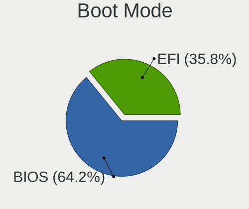
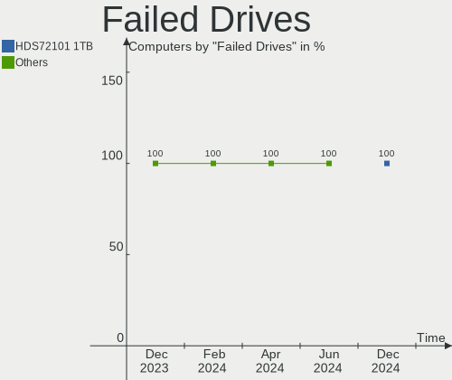
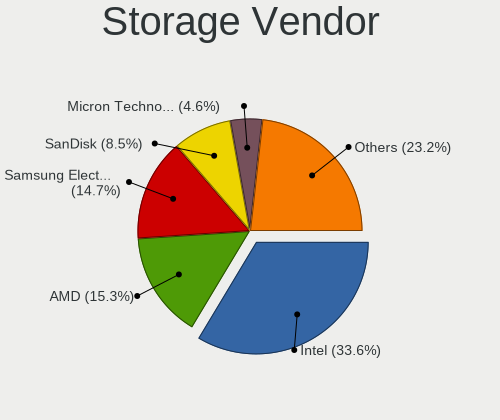
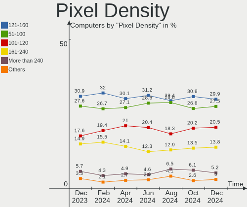
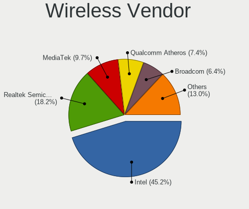
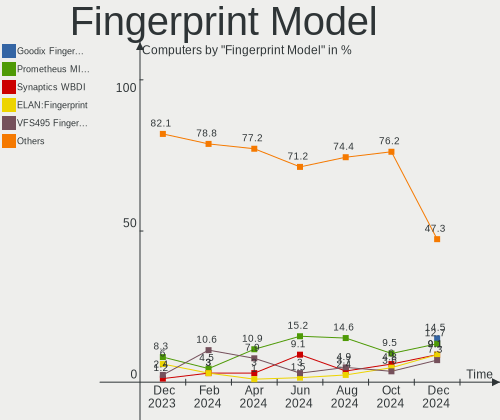

Fedora Hardware Trends
----------------------

A project to identify most popular hardware characteristics and track their change
over time based on data collected by Fedora users at https://Linux-Hardware.org.

Anyone can contribute to the study by uploading probes of their computers by
the [hw-probe](https://github.com/linuxhw/hw-probe) tool:

    sudo -E hw-probe -all -upload

This is a report for all computer types. See also reports for [desktops](/Dist/Fedora/Desktop/README.md) and [notebooks](/Dist/Fedora/Notebook/README.md).

Full-feature report is available here: https://linux-hardware.org/?view=trends

Period: Nov, 2020.

Contents
--------

- [ OS                       ](#os)
- [ OS Family                ](#os-family)
- [ Kernel                   ](#kernel)
- [ Kernel Family            ](#kernel-family)
- [ Kernel Major Ver.        ](#kernel-major-ver)
- [ Arch                     ](#arch)
- [ DE                       ](#de)
- [ Display Server           ](#display-server)
- [ Display Manager          ](#display-manager)
- [ OS Lang                  ](#os-lang)
- [ Boot Mode                ](#boot-mode)
- [ Filesystem               ](#filesystem)
- [ Part. scheme             ](#part-scheme)
- [ Dual Boot with Linux/BSD ](#dual-boot-with-linux/bsd)
- [ Dual Boot (Win)          ](#dual-boot-win)
- [ Country                  ](#country)
- [ City                     ](#city)
- [ Vendor                   ](#vendor)
- [ Model                    ](#model)
- [ Model Family             ](#model-family)
- [ MFG Year                 ](#mfg-year)
- [ Form Factor              ](#form-factor)
- [ Secure Boot              ](#secure-boot)
- [ Coreboot                 ](#coreboot)
- [ RAM Size                 ](#ram-size)
- [ RAM Used                 ](#ram-used)
- [ Has CD-ROM               ](#has-cd-rom)
- [ Total Drives             ](#total-drives)
- [ Has Ethernet             ](#has-ethernet)
- [ Drive Vendor             ](#drive-vendor)
- [ Drive Model              ](#drive-model)
- [ HDD Vendor               ](#hdd-vendor)
- [ SSD Vendor               ](#ssd-vendor)
- [ Drive Kind               ](#drive-kind)
- [ Drive Connector          ](#drive-connector)
- [ Drive Size               ](#drive-size)
- [ Space Total              ](#space-total)
- [ Space Used               ](#space-used)
- [ Malfunc. Drives          ](#malfunc-drives)
- [ Malfunc. Drive Vendor    ](#malfunc-drive-vendor)
- [ Malfunc. HDD Vendor      ](#malfunc-hdd-vendor)
- [ Malfunc. Drive Kind      ](#malfunc-drive-kind)
- [ Failed Drives            ](#failed-drives)
- [ Failed Drive Vendor      ](#failed-drive-vendor)
- [ Drive Status             ](#drive-status)
- [ Storage Vendor           ](#storage-vendor)
- [ Storage Model            ](#storage-model)
- [ Storage Kind             ](#storage-kind)
- [ CPU Vendor               ](#cpu-vendor)
- [ CPU Model                ](#cpu-model)
- [ CPU Model Family         ](#cpu-model-family)
- [ CPU Cores                ](#cpu-cores)
- [ CPU Sockets              ](#cpu-sockets)
- [ CPU Threads              ](#cpu-threads)
- [ CPU Op-Modes             ](#cpu-op-modes)
- [ CPU Microcode            ](#cpu-microcode)
- [ CPU Microarch            ](#cpu-microarch)
- [ GPU Vendor               ](#gpu-vendor)
- [ GPU Model                ](#gpu-model)
- [ GPU Combo                ](#gpu-combo)
- [ GPU Driver               ](#gpu-driver)
- [ GPU Memory               ](#gpu-memory)
- [ Monitor Vendor           ](#monitor-vendor)
- [ Monitor Model            ](#monitor-model)
- [ Monitor Resolution       ](#monitor-resolution)
- [ Monitor Diagonal         ](#monitor-diagonal)
- [ Monitor Width            ](#monitor-width)
- [ Aspect Ratio             ](#aspect-ratio)
- [ Monitor Area             ](#monitor-area)
- [ Pixel Density            ](#pixel-density)
- [ Multiple Monitors        ](#multiple-monitors)
- [ Net Controller Vendor    ](#net-controller-vendor)
- [ Net Controller Model     ](#net-controller-model)
- [ Wireless Vendor          ](#wireless-vendor)
- [ Wireless Model           ](#wireless-model)
- [ Ethernet Vendor          ](#ethernet-vendor)
- [ Ethernet Model           ](#ethernet-model)
- [ Net Controller Kind      ](#net-controller-kind)
- [ Used Controller          ](#used-controller)
- [ NICs                     ](#nics)
- [ Memory Vendor            ](#memory-vendor)
- [ Memory Model             ](#memory-model)
- [ Memory Kind              ](#memory-kind)
- [ Memory Form Factor       ](#memory-form-factor)
- [ Memory Size              ](#memory-size)
- [ Memory Speed             ](#memory-speed)
- [ Sound Vendor             ](#sound-vendor)
- [ Sound Model              ](#sound-model)
- [ Camera Vendor            ](#camera-vendor)
- [ Camera Model             ](#camera-model)
- [ Fingerprint Vendor       ](#fingerprint-vendor)
- [ Fingerprint Model        ](#fingerprint-model)
- [ Chipcard Vendor          ](#chipcard-vendor)
- [ Chipcard Model           ](#chipcard-model)
- [ Printer Vendor           ](#printer-vendor)
- [ Printer Model            ](#printer-model)
- [ Scanner Vendor           ](#scanner-vendor)
- [ Scanner Model            ](#scanner-model)
- [ Bluetooth Vendor         ](#bluetooth-vendor)
- [ Bluetooth Model          ](#bluetooth-model)
- [ Unsupported Devices      ](#unsupported-devices)
- [ Unsupported Device Types ](#unsupported-device-types)

OS
--

Installed operating systems

| Name      | Computers | Percent |
|-----------|-----------|---------|
| Fedora 33 | 308       | 82.35%  |
| Fedora 32 | 44        | 11.76%  |
| Fedora 31 | 12        | 3.21%   |
| Fedora 34 | 5         | 1.34%   |
| Fedora 30 | 2         | 0.53%   |
| Fedora 29 | 1         | 0.27%   |
| Fedora 28 | 1         | 0.27%   |
| Fedora 21 | 1         | 0.27%   |

OS Family
---------

OS without a version

| Name   | Computers | Percent |
|--------|-----------|---------|
| Fedora | 374       | 100%    |

Kernel
------

Version of the Linux kernel

| Version                                             | Computers | Percent |
|-----------------------------------------------------|-----------|---------|
| 5.8.18-300.fc33.x86_64                              | 79        | 21.12%  |
| 5.9.8-200.fc33.x86_64                               | 77        | 20.59%  |
| 5.9.10-200.fc33.x86_64                              | 44        | 11.76%  |
| 5.8.16-300.fc33.x86_64                              | 38        | 10.16%  |
| 5.8.17-300.fc33.x86_64                              | 25        | 6.68%   |
| 5.8.15-301.fc33.x86_64                              | 17        | 4.55%   |
| 5.9.9-200.fc33.x86_64                               | 16        | 4.28%   |
| 5.8.18-200.fc32.x86_64                              | 13        | 3.48%   |
| 5.8.16-200.fc32.x86_64                              | 10        | 2.67%   |
| 5.9.8-100.fc32.x86_64                               | 5         | 1.34%   |
| 5.8.17-200.fc32.x86_64                              | 5         | 1.34%   |
| 5.8.18-100.fc31.x86_64                              | 4         | 1.07%   |
| 5.9.9-100.fc32.x86_64                               | 2         | 0.53%   |
| 5.9.11-200.fc33.x86_64                              | 2         | 0.53%   |
| 5.9.10-100.fc32.x86_64                              | 2         | 0.53%   |
| 5.8.14-200.fc32.x86_64                              | 2         | 0.53%   |
| 5.8.12-200.fc32.x86_64                              | 2         | 0.53%   |
| 5.6.13-100.fc30.x86_64                              | 2         | 0.53%   |
| 5.10.0-rc5+                                         | 2         | 0.53%   |
| 5.10.0-0.rc3.68.fc34.x86_64                         | 2         | 0.53%   |
| 5.10.0-0.rc1.20201028gited8780e3f2ec.57.fc34.x86_64 | 2         | 0.53%   |
| 5.9.8-350.vanilla.knurd.1.fc33.x86_64               | 1         | 0.27%   |
| 5.9.2-300.fc33.x86_64                               | 1         | 0.27%   |
| 5.9.11-100.fc32.x86_64                              | 1         | 0.27%   |
| 5.9.10-200.fc33.x86_64+debug                        | 1         | 0.27%   |
| 5.8.9-200.fc32.x86_64                               | 1         | 0.27%   |
| 5.8.9-101.fc31.x86_64                               | 1         | 0.27%   |
| 5.8.17-100.fc31.x86_64                              | 1         | 0.27%   |
| 5.8.16-100.fc31.x86_64                              | 1         | 0.27%   |
| 5.8.15-201.fc32.x86_64                              | 1         | 0.27%   |
| 5.8.15-101.fc31.x86_64                              | 1         | 0.27%   |
| 5.8.13-200.fc32.x86_64                              | 1         | 0.27%   |
| 5.8.13-100.fc31.x86_64                              | 1         | 0.27%   |
| 5.8.10-100.fc31.x86_64                              | 1         | 0.27%   |
| 5.6.6-300.fc32.x86_64                               | 1         | 0.27%   |
| 5.6.19-300.fc32.x86_64                              | 1         | 0.27%   |
| 5.5.8-200.fc31.x86_64                               | 1         | 0.27%   |
| 5.10.0-rc4+                                         | 1         | 0.27%   |
| 5.10.0-rc3                                          | 1         | 0.27%   |
| 5.10.0-0.rc4.20201117git9c87c9f41245.79.fc34.x86_64 | 1         | 0.27%   |
| 5.10.0-0.rc3.68.vanilla.1.fc32.x86_64               | 1         | 0.27%   |
| 5.10.0-0.rc2.62.vanilla.1.fc33.x86_64               | 1         | 0.27%   |
| 5.0.16-100.fc28.x86_64                              | 1         | 0.27%   |
| 4.1.13-100.fc21.x86_64                              | 1         | 0.27%   |

Kernel Family
-------------

Linux kernel without a distro release

| Version | Computers | Percent |
|---------|-----------|---------|
| 5.8.18  | 96        | 25.67%  |
| 5.9.8   | 83        | 22.19%  |
| 5.8.16  | 49        | 13.1%   |
| 5.9.10  | 47        | 12.57%  |
| 5.8.17  | 31        | 8.29%   |
| 5.8.15  | 19        | 5.08%   |
| 5.9.9   | 18        | 4.81%   |
| 5.10.0  | 11        | 2.94%   |
| 5.9.11  | 3         | 0.8%    |
| 5.8.9   | 2         | 0.53%   |
| 5.8.14  | 2         | 0.53%   |
| 5.8.13  | 2         | 0.53%   |
| 5.8.12  | 2         | 0.53%   |
| 5.6.13  | 2         | 0.53%   |
| 5.9.2   | 1         | 0.27%   |
| 5.8.10  | 1         | 0.27%   |
| 5.6.6   | 1         | 0.27%   |
| 5.6.19  | 1         | 0.27%   |
| 5.5.8   | 1         | 0.27%   |
| 5.0.16  | 1         | 0.27%   |
| 4.1.13  | 1         | 0.27%   |

Kernel Major Ver.
-----------------

Linux kernel major version

| Version | Computers | Percent |
|---------|-----------|---------|
| 5.8     | 204       | 54.55%  |
| 5.9     | 152       | 40.64%  |
| 5.10    | 11        | 2.94%   |
| 5.6     | 4         | 1.07%   |
| 5.5     | 1         | 0.27%   |
| 5.0     | 1         | 0.27%   |
| 4.1     | 1         | 0.27%   |

Arch
----

OS architecture (x86_64, i586, etc.)

| Name   | Computers | Percent |
|--------|-----------|---------|
| x86_64 | 374       | 100%    |

DE
--

Desktop Environment

| Name            | Computers | Percent |
|-----------------|-----------|---------|
| GNOME           | 261       | 69.79%  |
| KDE5            | 30        | 8.02%   |
| KDE             | 20        | 5.35%   |
| Cinnamon        | 13        | 3.48%   |
| XFCE            | 10        | 2.67%   |
| MATE            | 10        | 2.67%   |
| X-Cinnamon      | 8         | 2.14%   |
| LXQt            | 7         | 1.87%   |
| Unknown         | 5         | 1.34%   |
| GNOME Classic   | 3         | 0.8%    |
| Deepin          | 3         | 0.8%    |
| KDE4            | 1         | 0.27%   |
| i3              | 1         | 0.27%   |
| GNOME Flashback | 1         | 0.27%   |
| Budgie          | 1         | 0.27%   |

Display Server
--------------

X11 or Wayland

| Name    | Computers | Percent |
|---------|-----------|---------|
| Wayland | 183       | 48.93%  |
| X11     | 177       | 47.33%  |
| Tty     | 12        | 3.21%   |
| Unknown | 2         | 0.53%   |

Display Manager
---------------

SDDM, LightDM, etc.

| Name    | Computers | Percent |
|---------|-----------|---------|
| Unknown | 215       | 57.49%  |
| GDM     | 106       | 28.34%  |
| SDDM    | 31        | 8.29%   |
| TDM     | 18        | 4.81%   |
| LightDM | 3         | 0.8%    |
| KDM     | 1         | 0.27%   |

OS Lang
-------

Language

| Lang           | Computers | Percent |
|----------------|-----------|---------|
| en_US          | 180       | 48.13%  |
| de_DE          | 30        | 8.02%   |
| en_GB          | 21        | 5.61%   |
| pt_BR          | 19        | 5.08%   |
| fr_FR          | 14        | 3.74%   |
| en_CA          | 12        | 3.21%   |
| ru_RU          | 8         | 2.14%   |
| it_IT          | 7         | 1.87%   |
| en_AU          | 7         | 1.87%   |
| pl_PL          | 6         | 1.6%    |
| en_IN          | 5         | 1.34%   |
| es_MX          | 4         | 1.07%   |
| de_CH          | 4         | 1.07%   |
| Unknown        | 4         | 1.07%   |
| zh_CN          | 3         | 0.8%    |
| sv_SE          | 3         | 0.8%    |
| ko_KR          | 3         | 0.8%    |
| es_AR          | 3         | 0.8%    |
| pt_PT          | 2         | 0.53%   |
| hu_HU          | 2         | 0.53%   |
| fr_CA          | 2         | 0.53%   |
| es_ES          | 2         | 0.53%   |
| es_CO          | 2         | 0.53%   |
| en_US.utf8     | 2         | 0.53%   |
| en_SG          | 2         | 0.53%   |
| en_NZ          | 2         | 0.53%   |
| de_AT.utf8     | 2         | 0.53%   |
| de_AT          | 2         | 0.53%   |
| uk_UA.utf8     | 1         | 0.27%   |
| uk_UA          | 1         | 0.27%   |
| tr_TR          | 1         | 0.27%   |
| sk_SK          | 1         | 0.27%   |
| nl_NL          | 1         | 0.27%   |
| lb_LU          | 1         | 0.27%   |
| ja_JP          | 1         | 0.27%   |
| it_IT.utf8     | 1         | 0.27%   |
| fr_FR.utf8     | 1         | 0.27%   |
| eo             | 1         | 0.27%   |
| en_PH          | 1         | 0.27%   |
| en_NZ.utf8     | 1         | 0.27%   |
| en_IL          | 1         | 0.27%   |
| en_IE          | 1         | 0.27%   |
| en_GB.utf8     | 1         | 0.27%   |
| en_CA.utf8     | 1         | 0.27%   |
| en-US          | 1         | 0.27%   |
| da_DK          | 1         | 0.27%   |
| cs_CZ          | 1         | 0.27%   |
| ca_ES@valencia | 1         | 0.27%   |
| ca_ES          | 1         | 0.27%   |

Boot Mode
---------

EFI or BIOS

| Mode | Computers | Percent |
|------|-----------|---------|
| EFI  | 258       | 68.98%  |
| BIOS | 116       | 31.02%  |

Filesystem
----------

Type of filesystem

| Type  | Computers | Percent |
|-------|-----------|---------|
| Ext4  | 192       | 51.34%  |
| Btrfs | 164       | 43.85%  |
| Xfs   | 15        | 4.01%   |
| Zfs   | 2         | 0.53%   |
| Ext3  | 1         | 0.27%   |

Part. scheme
------------

Scheme of partitioning

| Type    | Computers | Percent |
|---------|-----------|---------|
| Unknown | 217       | 58.02%  |
| GPT     | 124       | 33.16%  |
| MBR     | 33        | 8.82%   |

Dual Boot with Linux/BSD
------------------------

Hosting more than one Linux/BSD

| Dual boot | Computers | Percent |
|-----------|-----------|---------|
| No        | 351       | 93.85%  |
| Yes       | 23        | 6.15%   |

Dual Boot (Win)
---------------

Hosting Linux and Windows

| Dual boot | Computers | Percent |
|-----------|-----------|---------|
| No        | 314       | 83.96%  |
| Yes       | 60        | 16.04%  |

Country
-------

Geographic location (country)

| Country                   | Computers | Percent |
|---------------------------|-----------|---------|
| USA                       | 72        | 19.25%  |
| Germany                   | 37        | 9.89%   |
| Brazil                    | 22        | 5.88%   |
| Canada                    | 21        | 5.61%   |
| France                    | 20        | 5.35%   |
| Netherlands               | 13        | 3.48%   |
| Italy                     | 13        | 3.48%   |
| UK                        | 11        | 2.94%   |
| Russia                    | 10        | 2.67%   |
| Poland                    | 10        | 2.67%   |
| Switzerland               | 8         | 2.14%   |
| Australia                 | 8         | 2.14%   |
| Spain                     | 7         | 1.87%   |
| Singapore                 | 7         | 1.87%   |
| India                     | 6         | 1.6%    |
| Austria                   | 6         | 1.6%    |
| Argentina                 | 6         | 1.6%    |
| Turkey                    | 5         | 1.34%   |
| Portugal                  | 5         | 1.34%   |
| Bulgaria                  | 5         | 1.34%   |
| Ukraine                   | 4         | 1.07%   |
| Romania                   | 4         | 1.07%   |
| Mexico                    | 4         | 1.07%   |
| China                     | 4         | 1.07%   |
| Sweden                    | 3         | 0.8%    |
| Norway                    | 3         | 0.8%    |
| New Zealand               | 3         | 0.8%    |
| Korea, Republic of        | 3         | 0.8%    |
| Israel                    | 3         | 0.8%    |
| Czech Republic            | 3         | 0.8%    |
| Belgium                   | 3         | 0.8%    |
| South Africa              | 2         | 0.53%   |
| Philippines               | 2         | 0.53%   |
| Pakistan                  | 2         | 0.53%   |
| Malaysia                  | 2         | 0.53%   |
| Lithuania                 | 2         | 0.53%   |
| Iran                      | 2         | 0.53%   |
| Indonesia                 | 2         | 0.53%   |
| Hungary                   | 2         | 0.53%   |
| Greece                    | 2         | 0.53%   |
| Finland                   | 2         | 0.53%   |
| Denmark                   | 2         | 0.53%   |
| Colombia                  | 2         | 0.53%   |
| Belarus                   | 2         | 0.53%   |
| Thailand                  | 1         | 0.27%   |
| Taiwan                    | 1         | 0.27%   |
| Slovenia                  | 1         | 0.27%   |
| Slovakia                  | 1         | 0.27%   |
| Serbia                    | 1         | 0.27%   |
| Panama                    | 1         | 0.27%   |
| Morocco                   | 1         | 0.27%   |
| Luxembourg                | 1         | 0.27%   |
| Japan                     | 1         | 0.27%   |
| Jamaica                   | 1         | 0.27%   |
| Ireland                   | 1         | 0.27%   |
| Iran, Islamic Republic of | 1         | 0.27%   |
| Iceland                   | 1         | 0.27%   |
| Hong Kong                 | 1         | 0.27%   |
| Guatemala                 | 1         | 0.27%   |
| Egypt                     | 1         | 0.27%   |

City
----

Geographic location (city)

| City           | Computers | Percent |
|----------------|-----------|---------|
| Singapore      | 6         | 1.6%    |
| Vienna         | 5         | 1.34%   |
| Rio de Janeiro | 5         | 1.34%   |
| London         | 4         | 1.07%   |
| Heilbronn      | 4         | 1.07%   |
| Berlin         | 4         | 1.07%   |
| Wateringen     | 3         | 0.8%    |
| Wahroonga      | 3         | 0.8%    |
| Voronezh       | 3         | 0.8%    |
| Toronto        | 3         | 0.8%    |
| Paris          | 3         | 0.8%    |
| Melbourne      | 3         | 0.8%    |
| Lisbon         | 3         | 0.8%    |
| Greifswald     | 3         | 0.8%    |
| Bucharest      | 3         | 0.8%    |
| Austin         | 3         | 0.8%    |
| Amsterdam      | 3         | 0.8%    |
| Woodbridge     | 2         | 0.53%   |
| Warsaw         | 2         | 0.53%   |
| Virginia Beach | 2         | 0.53%   |
| Vancouver      | 2         | 0.53%   |
| Valencia       | 2         | 0.53%   |
| Tehran         | 2         | 0.53%   |
| Sydney         | 2         | 0.53%   |
| Sofia          | 2         | 0.53%   |
| Seoul          | 2         | 0.53%   |
| Seattle        | 2         | 0.53%   |
| Phoenix        | 2         | 0.53%   |
| Oxford         | 2         | 0.53%   |
| Mount Royal    | 2         | 0.53%   |
| Minsk          | 2         | 0.53%   |
| Milan          | 2         | 0.53%   |
| Miami          | 2         | 0.53%   |
| Madison        | 2         | 0.53%   |
| Kyiv           | 2         | 0.53%   |
| Kreuzlingen    | 2         | 0.53%   |
| Hyderabad      | 2         | 0.53%   |
| Hamburg        | 2         | 0.53%   |
| Goiânia       | 2         | 0.53%   |
| Delft          | 2         | 0.53%   |
| Copenhagen     | 2         | 0.53%   |
| Charlotte      | 2         | 0.53%   |
| Calgary        | 2         | 0.53%   |
| Buenos Aires   | 2         | 0.53%   |
| Budapest       | 2         | 0.53%   |
| Brownsburg     | 2         | 0.53%   |
| Bogotá        | 2         | 0.53%   |
| Beijing        | 2         | 0.53%   |
| Barrie         | 2         | 0.53%   |
| Angier         | 2         | 0.53%   |
| Šiauliai      | 1         | 0.27%   |
| Zurich         | 1         | 0.27%   |
| Zlín          | 1         | 0.27%   |
| Zhukovskiy     | 1         | 0.27%   |
| Ystad          | 1         | 0.27%   |
| Yakima         | 1         | 0.27%   |
| Xinxiang       | 1         | 0.27%   |
| Wrocław       | 1         | 0.27%   |
| Westerly       | 1         | 0.27%   |
| Wauconda       | 1         | 0.27%   |

Vendor
------

Motherboard manufacturer

| Name                             | Computers | Percent |
|----------------------------------|-----------|---------|
| Lenovo                           | 85        | 22.73%  |
| Dell                             | 56        | 14.97%  |
| ASUSTek Computer                 | 51        | 13.64%  |
| Hewlett-Packard                  | 47        | 12.57%  |
| Gigabyte Technology              | 25        | 6.68%   |
| MSI                              | 21        | 5.61%   |
| Acer                             | 20        | 5.35%   |
| ASRock                           | 14        | 3.74%   |
| Toshiba                          | 9         | 2.41%   |
| Unknown                          | 7         | 1.87%   |
| Samsung Electronics              | 5         | 1.34%   |
| Apple                            | 4         | 1.07%   |
| System76                         | 2         | 0.53%   |
| Sony                             | 2         | 0.53%   |
| Shuttle                          | 2         | 0.53%   |
| Notebook                         | 2         | 0.53%   |
| ECS                              | 2         | 0.53%   |
| Alienware                        | 2         | 0.53%   |
| Wortmann AG                      | 1         | 0.27%   |
| Positivo                         | 1         | 0.27%   |
| PC Specialist                    | 1         | 0.27%   |
| Packard Bell                     | 1         | 0.27%   |
| Nvidia                           | 1         | 0.27%   |
| NEXCOM                           | 1         | 0.27%   |
| Medion                           | 1         | 0.27%   |
| LG Electronics                   | 1         | 0.27%   |
| Jumper                           | 1         | 0.27%   |
| Intel                            | 1         | 0.27%   |
| Google                           | 1         | 0.27%   |
| Gateway                          | 1         | 0.27%   |
| FUJITSU CLIENT COMPUTING LIMITED | 1         | 0.27%   |
| Fujitsu                          | 1         | 0.27%   |
| Clevo                            | 1         | 0.27%   |
| BESSTAR Tech                     | 1         | 0.27%   |
| AZW                              | 1         | 0.27%   |
| Avell High Performance           | 1         | 0.27%   |

Model
-----

Motherboard model

| Name                                              | Computers | Percent |
|---------------------------------------------------|-----------|---------|
| Unknown                                           | 8         | 2.14%   |
| HP Pavilion dv6                                   | 3         | 0.8%    |
| Dell Latitude E6530                               | 3         | 0.8%    |
| ASUS All Series                                   | 3         | 0.8%    |
| Shuttle XH61V                                     | 2         | 0.53%   |
| MSI MS-7C84                                       | 2         | 0.53%   |
| MSI MS-7C37                                       | 2         | 0.53%   |
| MSI MS-7B79                                       | 2         | 0.53%   |
| MSI MS-7758                                       | 2         | 0.53%   |
| Lenovo Yoga C740-14IML 81TC                       | 2         | 0.53%   |
| Lenovo ThinkPad X220 42911H8                      | 2         | 0.53%   |
| Lenovo ThinkPad X1 Extreme 2nd 20QVCTO1WW         | 2         | 0.53%   |
| HP Pavilion 15                                    | 2         | 0.53%   |
| Gigabyte AB350-Gaming 3                           | 2         | 0.53%   |
| Dell XPS 15 9560                                  | 2         | 0.53%   |
| Dell XPS 15 7590                                  | 2         | 0.53%   |
| Dell XPS 13 9370                                  | 2         | 0.53%   |
| Dell XPS 13 7390                                  | 2         | 0.53%   |
| Dell OptiPlex 3020                                | 2         | 0.53%   |
| Dell Latitude 7400                                | 2         | 0.53%   |
| Dell Inspiron 5559                                | 2         | 0.53%   |
| ASUS Z170 PRO GAMING                              | 2         | 0.53%   |
| ASUS TUF GAMING X570-PLUS                         | 2         | 0.53%   |
| ASUS PRIME B350-PLUS                              | 2         | 0.53%   |
| Wortmann AG TERRA_MOBILE_1062                     | 1         | 0.27%   |
| Toshiba TECRA R950                                | 1         | 0.27%   |
| Toshiba Satellite S55t-B                          | 1         | 0.27%   |
| Toshiba Satellite S55-B                           | 1         | 0.27%   |
| Toshiba Satellite R945                            | 1         | 0.27%   |
| Toshiba Satellite L850                            | 1         | 0.27%   |
| Toshiba Satellite L50-B                           | 1         | 0.27%   |
| Toshiba Satellite C850-1KD                        | 1         | 0.27%   |
| Toshiba Satellite C70-A-K2W                       | 1         | 0.27%   |
| Toshiba Satellite C55-A                           | 1         | 0.27%   |
| System76 Gazelle                                  | 1         | 0.27%   |
| System76 Galago Pro                               | 1         | 0.27%   |
| Sony VPCCB45FN                                    | 1         | 0.27%   |
| Sony SVF1521C2EW                                  | 1         | 0.27%   |
| Samsung RF510/RF410/RF710                         | 1         | 0.27%   |
| Samsung 930QAA                                    | 1         | 0.27%   |
| Samsung 730QCJ/730QCR                             | 1         | 0.27%   |
| Samsung 530XBB                                    | 1         | 0.27%   |
| Samsung 350U2A/350U2B/300U1A/351U2A/351U2B/301U1A | 1         | 0.27%   |
| Positivo CHT12CP                                  | 1         | 0.27%   |
| PC Specialist N7x0WU                              | 1         | 0.27%   |
| Packard Bell EasyNote TE69HW                      | 1         | 0.27%   |
| Nvidia NFORCE 680i LT SLI                         | 1         | 0.27%   |
| Notebook P377SM-A                                 | 1         | 0.27%   |
| Notebook NH55RGQ                                  | 1         | 0.27%   |
| NEXCOM ASG                                        | 1         | 0.27%   |
| MSI MS-7C79                                       | 1         | 0.27%   |
| MSI MS-7C56                                       | 1         | 0.27%   |
| MSI MS-7C52                                       | 1         | 0.27%   |
| MSI MS-7B86                                       | 1         | 0.27%   |
| MSI MS-7B24                                       | 1         | 0.27%   |
| MSI MS-7B17                                       | 1         | 0.27%   |
| MSI MS-7B09                                       | 1         | 0.27%   |
| MSI MS-7A40                                       | 1         | 0.27%   |
| MSI MS-7A39                                       | 1         | 0.27%   |
| MSI MS-7823                                       | 1         | 0.27%   |

Model Family
------------

Motherboard model prefix

| Name                  | Computers | Percent |
|-----------------------|-----------|---------|
| Lenovo ThinkPad       | 51        | 13.64%  |
| Dell Latitude         | 17        | 4.55%   |
| Lenovo IdeaPad        | 16        | 4.28%   |
| Dell Inspiron         | 16        | 4.28%   |
| HP Pavilion           | 15        | 4.01%   |
| Acer Aspire           | 12        | 3.21%   |
| HP EliteBook          | 11        | 2.94%   |
| Dell XPS              | 10        | 2.67%   |
| Toshiba Satellite     | 8         | 2.14%   |
| ASUS PRIME            | 8         | 2.14%   |
| Unknown               | 8         | 2.14%   |
| ASUS TUF              | 6         | 1.6%    |
| Lenovo Yoga           | 5         | 1.34%   |
| Lenovo ThinkCentre    | 5         | 1.34%   |
| HP ENVY               | 5         | 1.34%   |
| Dell OptiPlex         | 5         | 1.34%   |
| HP Laptop             | 4         | 1.07%   |
| Dell Precision        | 4         | 1.07%   |
| ASUS ROG              | 4         | 1.07%   |
| HP ProBook            | 3         | 0.8%    |
| Gigabyte X570         | 3         | 0.8%    |
| ASUS All              | 3         | 0.8%    |
| Acer Nitro            | 3         | 0.8%    |
| Shuttle XH61V         | 2         | 0.53%   |
| MSI MS-7C84           | 2         | 0.53%   |
| MSI MS-7C37           | 2         | 0.53%   |
| MSI MS-7B79           | 2         | 0.53%   |
| MSI MS-7758           | 2         | 0.53%   |
| HP EliteDesk          | 2         | 0.53%   |
| Gigabyte AB350-Gaming | 2         | 0.53%   |
| ASUS Z170             | 2         | 0.53%   |
| ASUS M5A97            | 2         | 0.53%   |
| ASRock B450           | 2         | 0.53%   |
| Acer Predator         | 2         | 0.53%   |
| Wortmann AG TERRA     | 1         | 0.27%   |
| Toshiba TECRA         | 1         | 0.27%   |
| System76 Gazelle      | 1         | 0.27%   |
| System76 Galago       | 1         | 0.27%   |
| Sony VPCCB45FN        | 1         | 0.27%   |
| Sony SVF1521C2EW      | 1         | 0.27%   |
| Samsung RF510         | 1         | 0.27%   |
| Samsung 930QAA        | 1         | 0.27%   |
| Samsung 730QCJ        | 1         | 0.27%   |
| Samsung 530XBB        | 1         | 0.27%   |
| Samsung 350U2A        | 1         | 0.27%   |
| Positivo CHT12CP      | 1         | 0.27%   |
| PC Specialist N7x0WU  | 1         | 0.27%   |
| Packard Bell EasyNote | 1         | 0.27%   |
| Nvidia NFORCE         | 1         | 0.27%   |
| Notebook P377SM-A     | 1         | 0.27%   |
| Notebook NH55RGQ      | 1         | 0.27%   |
| NEXCOM ASG            | 1         | 0.27%   |
| MSI MS-7C79           | 1         | 0.27%   |
| MSI MS-7C56           | 1         | 0.27%   |
| MSI MS-7C52           | 1         | 0.27%   |
| MSI MS-7B86           | 1         | 0.27%   |
| MSI MS-7B24           | 1         | 0.27%   |
| MSI MS-7B17           | 1         | 0.27%   |
| MSI MS-7B09           | 1         | 0.27%   |
| MSI MS-7A40           | 1         | 0.27%   |

MFG Year
--------

Motherboard manufacture year

| Year    | Computers | Percent |
|---------|-----------|---------|
| 2020    | 113       | 30.21%  |
| 2019    | 72        | 19.25%  |
| 2018    | 49        | 13.1%   |
| 2014    | 22        | 5.88%   |
| 2012    | 21        | 5.61%   |
| 2017    | 19        | 5.08%   |
| 2015    | 17        | 4.55%   |
| 2013    | 17        | 4.55%   |
| 2016    | 13        | 3.48%   |
| 2011    | 12        | 3.21%   |
| 2008    | 8         | 2.14%   |
| 2009    | 6         | 1.6%    |
| 2010    | 3         | 0.8%    |
| 2007    | 1         | 0.27%   |
| Unknown | 1         | 0.27%   |

Form Factor
-----------

Physical design of the computer

| Name        | Computers | Percent |
|-------------|-----------|---------|
| Notebook    | 217       | 58.02%  |
| Desktop     | 128       | 34.22%  |
| Convertible | 18        | 4.81%   |
| Mini pc     | 5         | 1.34%   |
| All in one  | 4         | 1.07%   |
| Tablet      | 2         | 0.53%   |

Secure Boot
-----------

Enabled or disabled

| State    | Computers | Percent |
|----------|-----------|---------|
| Disabled | 326       | 87.17%  |
| Enabled  | 48        | 12.83%  |

Coreboot
--------

Have coreboot on board

| Used | Computers | Percent |
|------|-----------|---------|
| No   | 371       | 99.2%   |
| Yes  | 3         | 0.8%    |

RAM Size
--------

Total RAM memory

| Size in GB  | Computers | Percent |
|-------------|-----------|---------|
| 16.01-24.0  | 93        | 24.87%  |
| 4.01-8.0    | 85        | 22.73%  |
| 8.01-16.0   | 80        | 21.39%  |
| 32.01-64.0  | 48        | 12.83%  |
| 3.01-4.0    | 44        | 11.76%  |
| 24.01-32.0  | 9         | 2.41%   |
| 64.01-256.0 | 9         | 2.41%   |
| 1.01-2.0    | 4         | 1.07%   |
| 2.01-3.0    | 2         | 0.53%   |

RAM Used
--------

Used RAM memory

| Used GB    | Computers | Percent |
|------------|-----------|---------|
| 2.01-3.0   | 108       | 28.88%  |
| 4.01-8.0   | 81        | 21.66%  |
| 1.01-2.0   | 80        | 21.39%  |
| 3.01-4.0   | 69        | 18.45%  |
| 8.01-16.0  | 19        | 5.08%   |
| 0.01-1.0   | 11        | 2.94%   |
| 16.01-24.0 | 6         | 1.6%    |

Has CD-ROM
----------

Has CD-ROM on board

| Presented | Computers | Percent |
|-----------|-----------|---------|
| No        | 248       | 66.31%  |
| Yes       | 126       | 33.69%  |

Total Drives
------------

Number of drives on board

| Drives | Computers | Percent |
|--------|-----------|---------|
| 1      | 220       | 58.82%  |
| 2      | 99        | 26.47%  |
| 3      | 28        | 7.49%   |
| 4      | 16        | 4.28%   |
| 5      | 6         | 1.6%    |
| 6      | 2         | 0.53%   |
| 0      | 2         | 0.53%   |
| 7      | 1         | 0.27%   |

Has Ethernet
------------

Has Ethernet on board

| Presented | Computers | Percent |
|-----------|-----------|---------|
| Yes       | 320       | 85.56%  |
| No        | 54        | 14.44%  |

Drive Vendor
------------

Hard drive vendors

| Vendor                    | Computers | Drives | Percent |
|---------------------------|-----------|--------|---------|
| Samsung Electronics       | 114       | 144    | 21.03%  |
| WDC                       | 87        | 105    | 16.05%  |
| Seagate                   | 68        | 79     | 12.55%  |
| Toshiba                   | 38        | 41     | 7.01%   |
| SanDisk                   | 30        | 31     | 5.54%   |
| Unknown                   | 23        | 27     | 4.24%   |
| Kingston                  | 23        | 25     | 4.24%   |
| Crucial                   | 22        | 24     | 4.06%   |
| Intel                     | 17        | 19     | 3.14%   |
| SK Hynix                  | 16        | 16     | 2.95%   |
| HGST                      | 14        | 15     | 2.58%   |
| Micron Technology         | 9         | 9      | 1.66%   |
| Hitachi                   | 8         | 8      | 1.48%   |
| A-DATA Technology         | 7         | 7      | 1.29%   |
| Phison                    | 6         | 7      | 1.11%   |
| Transcend                 | 4         | 4      | 0.74%   |
| Silicon Motion            | 4         | 4      | 0.74%   |
| KIOXIA                    | 4         | 4      | 0.74%   |
| Team                      | 3         | 3      | 0.55%   |
| SPCC                      | 3         | 3      | 0.55%   |
| OCZ                       | 3         | 3      | 0.55%   |
| Micron/Crucial Technology | 3         | 3      | 0.55%   |
| China                     | 3         | 3      | 0.55%   |
| LITEON                    | 2         | 2      | 0.37%   |
| Lite-On                   | 2         | 2      | 0.37%   |
| KingSpec                  | 2         | 2      | 0.37%   |
| Apple                     | 2         | 2      | 0.37%   |
| ADATA Technology          | 2         | 2      | 0.37%   |
| Unknown (583)             | 1         | 1      | 0.18%   |
| Union Memory              | 1         | 1      | 0.18%   |
| tigo                      | 1         | 1      | 0.18%   |
| SUNEAST                   | 1         | 1      | 0.18%   |
| Solid State Storage       | 1         | 1      | 0.18%   |
| PNY                       | 1         | 1      | 0.18%   |
| PLEXTOR                   | 1         | 2      | 0.18%   |
| Patriot                   | 1         | 1      | 0.18%   |
| Lenovo                    | 1         | 1      | 0.18%   |
| LDLC                      | 1         | 1      | 0.18%   |
| LaCie                     | 1         | 1      | 0.18%   |
| KingDian                  | 1         | 1      | 0.18%   |
| JMicron                   | 1         | 1      | 0.18%   |
| Intenso                   | 1         | 1      | 0.18%   |
| Hewlett-Packard           | 1         | 1      | 0.18%   |
| GOODRAM                   | 1         | 1      | 0.18%   |
| Golden-Memory             | 1         | 1      | 0.18%   |
| Gigabyte Technology       | 1         | 1      | 0.18%   |
| Elite                     | 1         | 2      | 0.18%   |
| ASMT109x                  | 1         | 1      | 0.18%   |
| ASMT                      | 1         | 1      | 0.18%   |
| Apacer                    | 1         | 1      | 0.18%   |
| AMD                       | 1         | 1      | 0.18%   |

Drive Model
-----------

Hard drive models

| Model                                   | Computers | Percent |
|-----------------------------------------|-----------|---------|
| Samsung SSD 850 EVO 250GB               | 16        | 2.67%   |
| Samsung SSD 850 EVO 500GB               | 11        | 1.83%   |
| Samsung NVMe SSD Drive 256GB            | 8         | 1.33%   |
| Kingston SA400S37240G 240GB SSD         | 8         | 1.33%   |
| Samsung SSD 860 EVO 250GB               | 7         | 1.17%   |
| Seagate Expansion 1TB                   | 6         | 1%      |
| Samsung NVMe SSD Drive 500GB            | 6         | 1%      |
| HGST HTS541010A9E680 1TB                | 6         | 1%      |
| WDC WD10EZEX-08WN4A0 1TB                | 5         | 0.83%   |
| Seagate ST1000LM035-1RK172 1TB          | 5         | 0.83%   |
| Samsung SSD 860 EVO 500GB               | 5         | 0.83%   |
| HGST HTS721010A9E630 1TB                | 5         | 0.83%   |
| Crucial CT500MX500SSD1 500GB            | 5         | 0.83%   |
| Unknown MMC Card  64GB                  | 4         | 0.67%   |
| Unknown MMC Card  128GB                 | 4         | 0.67%   |
| Toshiba MQ04ABF100 1TB                  | 4         | 0.67%   |
| Toshiba MQ01ABD075 752GB                | 4         | 0.67%   |
| SK Hynix NVMe SSD Drive 256GB           | 4         | 0.67%   |
| Samsung SSD 970 EVO Plus 500GB          | 4         | 0.67%   |
| Samsung NVMe SSD Drive 512GB            | 4         | 0.67%   |
| Samsung MZVLB1T0HBLR-000L7 1TB          | 4         | 0.67%   |
| Crucial CT240BX500SSD1 240GB            | 4         | 0.67%   |
| WDC WD40EZRZ-00GXCB0 4TB                | 3         | 0.5%    |
| Toshiba NVMe SSD Drive 512GB            | 3         | 0.5%    |
| Seagate ST500DM002-1BD142 500GB         | 3         | 0.5%    |
| Seagate ST1000DM003-1CH162 1TB          | 3         | 0.5%    |
| SanDisk SSD PLUS 240GB                  | 3         | 0.5%    |
| Samsung SSD 860 EVO 1TB                 | 3         | 0.5%    |
| Samsung NVMe SSD Drive 1TB              | 3         | 0.5%    |
| Micron 1100_MTFDDAV256TBN 256GB SSD     | 3         | 0.5%    |
| Intel NVMe SSD Drive 1024GB             | 3         | 0.5%    |
| WDC WDS240G2G0B-00EPW0 240GB SSD        | 2         | 0.33%   |
| WDC WDS120G1G0B-00RC30 120GB SSD        | 2         | 0.33%   |
| WDC WD40EZRZ-22GXCB0 4TB                | 2         | 0.33%   |
| WDC WD2500BEVT-22ZCT0 250GB             | 2         | 0.33%   |
| WDC WD20EZRZ-00Z5HB0 2TB                | 2         | 0.33%   |
| WDC WD20EARX-00PASB0 2TB                | 2         | 0.33%   |
| WDC WD10SPZX-60Z10T0 1TB                | 2         | 0.33%   |
| WDC WD10SPZX-24Z10 1TB                  | 2         | 0.33%   |
| WDC WD10SPZX-21Z10T0 1TB                | 2         | 0.33%   |
| WDC WD10EADS-00L5B1 1TB                 | 2         | 0.33%   |
| WDC PC SN730 SDBQNTY-512G-1001 512GB    | 2         | 0.33%   |
| WDC PC SN730 NVMe 1024GB                | 2         | 0.33%   |
| WDC PC SN520 SDAPNUW-512G-1014 512GB    | 2         | 0.33%   |
| Unknown SLD64G  64GB                    | 2         | 0.33%   |
| Unknown SD/MMC/MS PRO 128GB             | 2         | 0.33%   |
| Unknown MMC Card  32GB                  | 2         | 0.33%   |
| Unknown MMC Card  16GB                  | 2         | 0.33%   |
| Toshiba MQ01ABD100 1TB                  | 2         | 0.33%   |
| Toshiba MK5061GSYN 500GB                | 2         | 0.33%   |
| Toshiba DT01ACA200 2TB                  | 2         | 0.33%   |
| Toshiba DT01ACA050 500GB                | 2         | 0.33%   |
| SK Hynix BC501 HFM256GDJTNG-8310A 256GB | 2         | 0.33%   |
| Seagate ST3750528AS 752GB               | 2         | 0.33%   |
| Seagate ST2000LM007-1R8174 2TB          | 2         | 0.33%   |
| Seagate ST2000LM003 HN-M201RAD 2TB      | 2         | 0.33%   |
| Seagate ST2000DX002-2DV164 2TB          | 2         | 0.33%   |
| Seagate ST2000DM008-2FR102 2TB          | 2         | 0.33%   |
| Seagate ST2000DM001-9YN164 2TB          | 2         | 0.33%   |
| Seagate ST1000LX015-1U7172 1TB          | 2         | 0.33%   |

HDD Vendor
----------

Hard disk drive vendors

| Vendor              | Computers | Drives | Percent |
|---------------------|-----------|--------|---------|
| WDC                 | 63        | 77     | 34.43%  |
| Seagate             | 61        | 69     | 33.33%  |
| Toshiba             | 27        | 29     | 14.75%  |
| HGST                | 14        | 15     | 7.65%   |
| Hitachi             | 8         | 8      | 4.37%   |
| Samsung Electronics | 7         | 8      | 3.83%   |
| Unknown (583)       | 1         | 1      | 0.55%   |
| Intenso             | 1         | 1      | 0.55%   |
| ASMT109x            | 1         | 1      | 0.55%   |

SSD Vendor
----------

Solid state drive vendors

| Vendor              | Computers | Drives | Percent |
|---------------------|-----------|--------|---------|
| Samsung Electronics | 65        | 81     | 33.33%  |
| SanDisk             | 24        | 24     | 12.31%  |
| Kingston            | 22        | 24     | 11.28%  |
| Crucial             | 19        | 21     | 9.74%   |
| WDC                 | 12        | 13     | 6.15%   |
| Intel               | 7         | 7      | 3.59%   |
| A-DATA Technology   | 6         | 6      | 3.08%   |
| Micron Technology   | 5         | 5      | 2.56%   |
| Transcend           | 3         | 3      | 1.54%   |
| OCZ                 | 3         | 3      | 1.54%   |
| China               | 3         | 3      | 1.54%   |
| Toshiba             | 2         | 2      | 1.03%   |
| Team                | 2         | 2      | 1.03%   |
| SPCC                | 2         | 2      | 1.03%   |
| SK Hynix            | 2         | 2      | 1.03%   |
| Seagate             | 2         | 2      | 1.03%   |
| LITEON              | 2         | 2      | 1.03%   |
| KingSpec            | 2         | 2      | 1.03%   |
| tigo                | 1         | 1      | 0.51%   |
| SUNEAST             | 1         | 1      | 0.51%   |
| PNY                 | 1         | 1      | 0.51%   |
| PLEXTOR             | 1         | 2      | 0.51%   |
| Patriot             | 1         | 1      | 0.51%   |
| KingDian            | 1         | 1      | 0.51%   |
| Hewlett-Packard     | 1         | 1      | 0.51%   |
| GOODRAM             | 1         | 1      | 0.51%   |
| Golden-Memory       | 1         | 1      | 0.51%   |
| ASMT                | 1         | 1      | 0.51%   |
| Apple               | 1         | 1      | 0.51%   |
| Apacer              | 1         | 1      | 0.51%   |

Drive Kind
----------

HDD or SSD

| Kind    | Computers | Drives | Percent |
|---------|-----------|--------|---------|
| SSD     | 175       | 217    | 34.72%  |
| HDD     | 159       | 209    | 31.55%  |
| NVMe    | 138       | 155    | 27.38%  |
| MMC     | 23        | 27     | 4.56%   |
| Unknown | 9         | 11     | 1.79%   |

Drive Connector
---------------

SATA, SAS, NVMe, etc.

| Type | Computers | Drives | Percent |
|------|-----------|--------|---------|
| SATA | 266       | 405    | 58.72%  |
| NVMe | 138       | 154    | 30.46%  |
| SAS  | 26        | 33     | 5.74%   |
| MMC  | 23        | 27     | 5.08%   |

Drive Size
----------

Size of hard drive

| Size in TB | Computers | Drives | Percent |
|------------|-----------|--------|---------|
| 0.01-0.5   | 179       | 230    | 51.44%  |
| 0.51-1.0   | 119       | 138    | 34.2%   |
| 1.01-2.0   | 33        | 36     | 9.48%   |
| 3.01-4.0   | 8         | 10     | 2.3%    |
| 4.01-10.0  | 5         | 8      | 1.44%   |
| 2.01-3.0   | 4         | 4      | 1.15%   |

Space Total
-----------

Amount of disk space available on the file system

| Size in GB     | Computers | Percent |
|----------------|-----------|---------|
| 251-500        | 81        | 21.66%  |
| 101-250        | 72        | 19.25%  |
| 501-1000       | 71        | 18.98%  |
| 1001-2000      | 48        | 12.83%  |
| More than 3000 | 24        | 6.42%   |
| 1-20           | 23        | 6.15%   |
| Unknown        | 22        | 5.88%   |
| 51-100         | 17        | 4.55%   |
| 2001-3000      | 10        | 2.67%   |
| 21-50          | 6         | 1.6%    |

Space Used
----------

Amount of used disk space

| Used GB        | Computers | Percent |
|----------------|-----------|---------|
| 21-50          | 76        | 20.32%  |
| 51-100         | 68        | 18.18%  |
| 1-20           | 67        | 17.91%  |
| 101-250        | 53        | 14.17%  |
| 251-500        | 34        | 9.09%   |
| 501-1000       | 27        | 7.22%   |
| Unknown        | 22        | 5.88%   |
| 1001-2000      | 15        | 4.01%   |
| 2001-3000      | 7         | 1.87%   |
| More than 3000 | 5         | 1.34%   |

Malfunc. Drives
---------------

Drive models with a malfunction

| Model                                          | Computers | Drives | Percent |
|------------------------------------------------|-----------|--------|---------|
| HGST HTS541010A9E680 1TB                       | 3         | 3      | 15.79%  |
| WDC WD5000AAKS-00TMA0 500GB                    | 1         | 1      | 5.26%   |
| WDC WD2500JS-22NCB1 250GB                      | 1         | 1      | 5.26%   |
| WDC WD2500BPVT-75JJ5T0 250GB                   | 1         | 1      | 5.26%   |
| WDC WD20EFRX-68AX9N0 2TB                       | 1         | 1      | 5.26%   |
| Toshiba MQ01ABD075 752GB                       | 1         | 1      | 5.26%   |
| Toshiba HDWD105 500GB                          | 1         | 1      | 5.26%   |
| Seagate ST9750420AS 752GB                      | 1         | 1      | 5.26%   |
| Seagate ST3360320AS 360GB                      | 1         | 2      | 5.26%   |
| Seagate ST3250310AS 250GB                      | 1         | 1      | 5.26%   |
| Seagate ST2000DM006-2DM164 2TB                 | 1         | 1      | 5.26%   |
| Samsung Electronics HD103SI 1TB                | 1         | 1      | 5.26%   |
| Micron Technology 1100_MTFDDAV256TBN 256GB SSD | 1         | 1      | 5.26%   |
| Hitachi HUA722020ALA331 2TB                    | 1         | 1      | 5.26%   |
| Hitachi HTS545050B9A300 500GB                  | 1         | 1      | 5.26%   |
| Crucial CT120M500SSD1 120GB                    | 1         | 1      | 5.26%   |
| A-DATA Technology SP900 128GB SSD              | 1         | 1      | 5.26%   |

Malfunc. Drive Vendor
---------------------

Vendors of faulty drives

| Vendor              | Computers | Drives | Percent |
|---------------------|-----------|--------|---------|
| WDC                 | 4         | 4      | 21.05%  |
| Seagate             | 4         | 5      | 21.05%  |
| HGST                | 3         | 3      | 15.79%  |
| Toshiba             | 2         | 2      | 10.53%  |
| Hitachi             | 2         | 2      | 10.53%  |
| Samsung Electronics | 1         | 1      | 5.26%   |
| Micron Technology   | 1         | 1      | 5.26%   |
| Crucial             | 1         | 1      | 5.26%   |
| A-DATA Technology   | 1         | 1      | 5.26%   |

Malfunc. HDD Vendor
-------------------

Vendors of faulty HDD drives

| Vendor              | Computers | Drives | Percent |
|---------------------|-----------|--------|---------|
| WDC                 | 4         | 4      | 25%     |
| Seagate             | 4         | 5      | 25%     |
| HGST                | 3         | 3      | 18.75%  |
| Toshiba             | 2         | 2      | 12.5%   |
| Hitachi             | 2         | 2      | 12.5%   |
| Samsung Electronics | 1         | 1      | 6.25%   |

Malfunc. Drive Kind
-------------------

Kinds of faulty drives

| Kind | Computers | Drives | Percent |
|------|-----------|--------|---------|
| HDD  | 16        | 17     | 84.21%  |
| SSD  | 3         | 3      | 15.79%  |

Failed Drives
-------------

Failed drive models

| Model                             | Computers | Drives | Percent |
|-----------------------------------|-----------|--------|---------|
| Samsung Electronics HD321HJ 320GB | 1         | 2      | 100%    |

Failed Drive Vendor
-------------------

Failed drive vendors

| Vendor              | Computers | Drives | Percent |
|---------------------|-----------|--------|---------|
| Samsung Electronics | 1         | 2      | 100%    |

Drive Status
------------

Number of failed and malfunc. drives

| Status   | Computers | Drives | Percent |
|----------|-----------|--------|---------|
| Detected | 238       | 402    | 59.8%   |
| Works    | 140       | 195    | 35.18%  |
| Malfunc  | 19        | 20     | 4.77%   |
| Failed   | 1         | 2      | 0.25%   |

Storage Vendor
--------------

Storage controller vendors

| Vendor                         | Computers | Percent |
|--------------------------------|-----------|---------|
| Intel                          | 227       | 48.82%  |
| AMD                            | 85        | 18.28%  |
| Samsung Electronics            | 49        | 10.54%  |
| Sandisk                        | 19        | 4.09%   |
| SK Hynix                       | 13        | 2.8%    |
| Toshiba America Info Systems   | 9         | 1.94%   |
| ASMedia Technology             | 9         | 1.94%   |
| Phison Electronics             | 8         | 1.72%   |
| Silicon Motion                 | 6         | 1.29%   |
| Micron/Crucial Technology      | 6         | 1.29%   |
| Micron Technology              | 5         | 1.08%   |
| KIOXIA                         | 5         | 1.08%   |
| Seagate Technology             | 3         | 0.65%   |
| Nvidia                         | 3         | 0.65%   |
| Marvell Technology Group       | 3         | 0.65%   |
| JMicron Technology             | 3         | 0.65%   |
| Lite-On Technology             | 2         | 0.43%   |
| Union Memory (Shenzhen)        | 1         | 0.22%   |
| Solid State Storage Technology | 1         | 0.22%   |
| Silicon Image                  | 1         | 0.22%   |
| Realtek Semiconductor          | 1         | 0.22%   |
| LSI Logic / Symbios Logic      | 1         | 0.22%   |
| Lenovo                         | 1         | 0.22%   |
| Kingston Technology Company    | 1         | 0.22%   |
| Apple                          | 1         | 0.22%   |
| ADATA Technology               | 1         | 0.22%   |
| 3ware                          | 1         | 0.22%   |

Storage Model
-------------

Storage controller models

| Model                                                                                   | Computers | Percent |
|-----------------------------------------------------------------------------------------|-----------|---------|
| AMD FCH SATA Controller [AHCI mode]                                                     | 69        | 13.14%  |
| Samsung Electronics NVMe SSD Controller SM981/PM981/PM983                               | 37        | 7.05%   |
| Intel Sunrise Point-LP SATA Controller [AHCI mode]                                      | 29        | 5.52%   |
| Intel 7 Series Chipset Family 6-port SATA Controller [AHCI mode]                        | 22        | 4.19%   |
| Intel 82801 Mobile SATA Controller [RAID mode]                                          | 15        | 2.86%   |
| Intel 8 Series/C220 Series Chipset Family 6-port SATA Controller 1 [AHCI mode]          | 14        | 2.67%   |
| Intel Q170/Q150/B150/H170/H110/Z170/CM236 Chipset SATA Controller [AHCI Mode]           | 13        | 2.48%   |
| Intel Cannon Lake Mobile PCH SATA AHCI Controller                                       | 13        | 2.48%   |
| Intel 6 Series/C200 Series Chipset Family 6 port Mobile SATA AHCI Controller            | 13        | 2.48%   |
| Intel Wildcat Point-LP SATA Controller [AHCI Mode]                                      | 11        | 2.1%    |
| Intel 7 Series/C210 Series Chipset Family 6-port SATA Controller [AHCI mode]            | 11        | 2.1%    |
| Samsung Electronics NVMe SSD Controller SM961/PM961                                     | 10        | 1.9%    |
| AMD 400 Series Chipset SATA Controller                                                  | 10        | 1.9%    |
| Toshiba America Info Systems Toshiba America Info Non-Volatile memory controller        | 9         | 1.71%   |
| Intel 8 Series SATA Controller 1 [AHCI mode]                                            | 9         | 1.71%   |
| ASMedia Technology ASM1062 Serial ATA Controller                                        | 9         | 1.71%   |
| AMD 300 Series Chipset SATA Controller                                                  | 9         | 1.71%   |
| Sandisk WD Black 2019/PC SN750 NVMe SSD                                                 | 8         | 1.52%   |
| Intel HM170/QM170 Chipset SATA Controller [AHCI Mode]                                   | 8         | 1.52%   |
| Intel Cannon Lake PCH SATA AHCI Controller                                              | 8         | 1.52%   |
| SK Hynix Non-Volatile memory controller                                                 | 7         | 1.33%   |
| Intel SSD 660P Series                                                                   | 7         | 1.33%   |
| Intel 5 Series/3400 Series Chipset 6 port SATA AHCI Controller                          | 7         | 1.33%   |
| Intel 200 Series PCH SATA controller [AHCI mode]                                        | 7         | 1.33%   |
| SK Hynix BC501 NVMe Solid State Drive 512GB                                             | 6         | 1.14%   |
| Silicon Motion Non-Volatile memory controller                                           | 6         | 1.14%   |
| AMD SB7x0/SB8x0/SB9x0 SATA Controller [AHCI mode]                                       | 6         | 1.14%   |
| Micron/Crucial Technology Non-Volatile memory controller                                | 5         | 0.95%   |
| Micron Technology Non-Volatile memory controller                                        | 5         | 0.95%   |
| KIOXIA Non-Volatile memory controller                                                   | 5         | 0.95%   |
| Intel Comet Lake SATA AHCI Controller                                                   | 5         | 0.95%   |
| AMD SATA controller                                                                     | 5         | 0.95%   |
| Sandisk WD Black 2018 / PC SN720 NVMe SSD                                               | 4         | 0.76%   |
| Phison Electronics E12 NVMe Controller                                                  | 4         | 0.76%   |
| AMD SB7x0/SB8x0/SB9x0 IDE Controller                                                    | 4         | 0.76%   |
| Seagate Technology Non-Volatile memory controller                                       | 3         | 0.57%   |
| Sandisk WD Blue SN550 NVMe SSD                                                          | 3         | 0.57%   |
| Sandisk WD Black 2018 / PC SN520 NVMe SSD                                               | 3         | 0.57%   |
| Intel SSD Pro 7600p/760p/E 6100p Series                                                 | 3         | 0.57%   |
| Intel 82801IR/IO/IH (ICH9R/DO/DH) 4 port SATA Controller [IDE mode]                     | 3         | 0.57%   |
| Intel 82801I (ICH9 Family) 2 port SATA Controller [IDE mode]                            | 3         | 0.57%   |
| Intel 82801G (ICH7 Family) IDE Controller                                               | 3         | 0.57%   |
| Intel 6 Series/C200 Series Chipset Family 6 port Desktop SATA AHCI Controller           | 3         | 0.57%   |
| AMD SB7x0/SB8x0/SB9x0 SATA Controller [IDE mode]                                        | 3         | 0.57%   |
| Samsung Electronics NVMe SSD Controller SM951/PM951                                     | 2         | 0.38%   |
| Samsung Electronics Electronics Non-Volatile memory controller                          | 2         | 0.38%   |
| Phison Electronics E16 PCIe4 NVMe Controller                                            | 2         | 0.38%   |
| JMicron Technology JMB363 SATA/IDE Controller                                           | 2         | 0.38%   |
| Intel NM10/ICH7 Family SATA Controller [IDE mode]                                       | 2         | 0.38%   |
| Intel Celeron N3350/Pentium N4200/Atom E3900 Series SATA AHCI Controller                | 2         | 0.38%   |
| Intel Cannon Point-LP SATA Controller [AHCI Mode]                                       | 2         | 0.38%   |
| Intel Atom Processor E3800 Series SATA AHCI Controller                                  | 2         | 0.38%   |
| Intel 82801JD/DO (ICH10 Family) SATA AHCI Controller                                    | 2         | 0.38%   |
| Intel 82801IR/IO/IH (ICH9R/DO/DH) 6 port SATA Controller [AHCI mode]                    | 2         | 0.38%   |
| Intel 82801HM/HEM (ICH8M/ICH8M-E) SATA Controller [AHCI mode]                           | 2         | 0.38%   |
| Intel 82801HM/HEM (ICH8M/ICH8M-E) IDE Controller                                        | 2         | 0.38%   |
| Intel 8 Series/C220 Series Chipset Family 2-port SATA Controller 2 [IDE mode]           | 2         | 0.38%   |
| Intel 6 Series/C200 Series Chipset Family Mobile SATA Controller (IDE mode, ports 4-5)  | 2         | 0.38%   |
| Intel 6 Series/C200 Series Chipset Family Mobile SATA Controller (IDE mode, ports 0-3)  | 2         | 0.38%   |
| Intel 6 Series/C200 Series Chipset Family Desktop SATA Controller (IDE mode, ports 4-5) | 2         | 0.38%   |

Storage Kind
------------

Kind of storage controller (IDE, SATA, NVMe, SAS, ...)

| Kind | Computers | Percent |
|------|-----------|---------|
| SATA | 277       | 59.7%   |
| NVMe | 138       | 29.74%  |
| IDE  | 29        | 6.25%   |
| RAID | 19        | 4.09%   |
| SAS  | 1         | 0.22%   |

CPU Vendor
----------

Processor vendors

| Vendor | Computers | Percent |
|--------|-----------|---------|
| Intel  | 278       | 74.33%  |
| AMD    | 96        | 25.67%  |

CPU Model
---------

Processor models

| Model                                           | Computers | Percent |
|-------------------------------------------------|-----------|---------|
| Intel Core i7-9750H CPU @ 2.60GHz               | 11        | 2.94%   |
| Intel Core i5-8250U CPU @ 1.60GHz               | 9         | 2.41%   |
| Intel Core i5-2520M CPU @ 2.50GHz               | 9         | 2.41%   |
| Intel Core i7-10510U CPU @ 1.80GHz              | 8         | 2.14%   |
| Intel Core i7-8550U CPU @ 1.80GHz               | 7         | 1.87%   |
| AMD Ryzen 7 3700X 8-Core Processor              | 6         | 1.6%    |
| AMD Ryzen 5 3600 6-Core Processor               | 6         | 1.6%    |
| Intel Core i7-8565U CPU @ 1.80GHz               | 5         | 1.34%   |
| Intel Core i7-5500U CPU @ 2.40GHz               | 5         | 1.34%   |
| Intel Core i5-10210U CPU @ 1.60GHz              | 5         | 1.34%   |
| AMD Ryzen 9 3900X 12-Core Processor             | 5         | 1.34%   |
| Intel Core i7-8750H CPU @ 2.20GHz               | 4         | 1.07%   |
| Intel Core i7-7700HQ CPU @ 2.80GHz              | 4         | 1.07%   |
| Intel Core i7-6700K CPU @ 4.00GHz               | 4         | 1.07%   |
| Intel Core i5-8265U CPU @ 1.60GHz               | 4         | 1.07%   |
| Intel Core i5-7200U CPU @ 2.50GHz               | 4         | 1.07%   |
| Intel Core i5-3320M CPU @ 2.60GHz               | 4         | 1.07%   |
| Intel Core i5-3210M CPU @ 2.50GHz               | 4         | 1.07%   |
| Intel Core 2 Duo CPU E8400 @ 3.00GHz            | 4         | 1.07%   |
| AMD Ryzen 5 PRO 3500U w/ Radeon Vega Mobile Gfx | 4         | 1.07%   |
| AMD Ryzen 5 3500U with Radeon Vega Mobile Gfx   | 4         | 1.07%   |
| AMD Ryzen 5 2400G with Radeon Vega Graphics     | 4         | 1.07%   |
| Intel Core i7-8665U CPU @ 1.90GHz               | 3         | 0.8%    |
| Intel Core i7-8650U CPU @ 1.90GHz               | 3         | 0.8%    |
| Intel Core i7-7500U CPU @ 2.70GHz               | 3         | 0.8%    |
| Intel Core i7-6700HQ CPU @ 2.60GHz              | 3         | 0.8%    |
| Intel Core i7-6500U CPU @ 2.50GHz               | 3         | 0.8%    |
| Intel Core i7-4700MQ CPU @ 2.40GHz              | 3         | 0.8%    |
| Intel Core i5-8365U CPU @ 1.60GHz               | 3         | 0.8%    |
| Intel Core i5-5200U CPU @ 2.20GHz               | 3         | 0.8%    |
| Intel Core i5-4300U CPU @ 1.90GHz               | 3         | 0.8%    |
| Intel Atom x5-Z8350 CPU @ 1.44GHz               | 3         | 0.8%    |
| AMD Ryzen 7 4800H with Radeon Graphics          | 3         | 0.8%    |
| AMD Ryzen 7 4700U with Radeon Graphics          | 3         | 0.8%    |
| AMD Ryzen 7 3700U with Radeon Vega Mobile Gfx   | 3         | 0.8%    |
| AMD Ryzen 7 2700 Eight-Core Processor           | 3         | 0.8%    |
| AMD Ryzen 5 4500U with Radeon Graphics          | 3         | 0.8%    |
| AMD Ryzen 5 2500U with Radeon Vega Mobile Gfx   | 3         | 0.8%    |
| AMD Ryzen 5 1600 Six-Core Processor             | 3         | 0.8%    |
| AMD FX-6300 Six-Core Processor                  | 3         | 0.8%    |
| Intel Core i9-9900K CPU @ 3.60GHz               | 2         | 0.53%   |
| Intel Core i9-9880H CPU @ 2.30GHz               | 2         | 0.53%   |
| Intel Core i7-8700 CPU @ 3.20GHz                | 2         | 0.53%   |
| Intel Core i7-7700K CPU @ 4.20GHz               | 2         | 0.53%   |
| Intel Core i7-6600U CPU @ 2.60GHz               | 2         | 0.53%   |
| Intel Core i7-4790 CPU @ 3.60GHz                | 2         | 0.53%   |
| Intel Core i7-3630QM CPU @ 2.40GHz              | 2         | 0.53%   |
| Intel Core i7-2630QM CPU @ 2.00GHz              | 2         | 0.53%   |
| Intel Core i7-10610U CPU @ 1.80GHz              | 2         | 0.53%   |
| Intel Core i5-8400 CPU @ 2.80GHz                | 2         | 0.53%   |
| Intel Core i5-8300H CPU @ 2.30GHz               | 2         | 0.53%   |
| Intel Core i5-6300U CPU @ 2.40GHz               | 2         | 0.53%   |
| Intel Core i5-6200U CPU @ 2.30GHz               | 2         | 0.53%   |
| Intel Core i5-4570 CPU @ 3.20GHz                | 2         | 0.53%   |
| Intel Core i5-4460 CPU @ 3.20GHz                | 2         | 0.53%   |
| Intel Core i5-4200U CPU @ 1.60GHz               | 2         | 0.53%   |
| Intel Core i5-3570 CPU @ 3.40GHz                | 2         | 0.53%   |
| Intel Core i5-3470S CPU @ 2.90GHz               | 2         | 0.53%   |
| Intel Core i5-3470 CPU @ 3.20GHz                | 2         | 0.53%   |
| Intel Core i5-3450 CPU @ 3.10GHz                | 2         | 0.53%   |

CPU Model Family
----------------

Processor model prefix

| Model                   | Computers | Percent |
|-------------------------|-----------|---------|
| Intel Core i7           | 110       | 29.41%  |
| Intel Core i5           | 98        | 26.2%   |
| AMD Ryzen 5             | 31        | 8.29%   |
| AMD Ryzen 7             | 25        | 6.68%   |
| Intel Core i3           | 22        | 5.88%   |
| Intel Core 2 Duo        | 8         | 2.14%   |
| Intel Celeron           | 8         | 2.14%   |
| AMD FX                  | 8         | 2.14%   |
| Intel Core i9           | 7         | 1.87%   |
| Intel Atom              | 7         | 1.87%   |
| Intel Xeon              | 6         | 1.6%    |
| AMD Ryzen 9             | 6         | 1.6%    |
| AMD Ryzen 5 PRO         | 6         | 1.6%    |
| Intel Pentium           | 4         | 1.07%   |
| Intel Core 2 Quad       | 3         | 0.8%    |
| AMD Ryzen Threadripper  | 3         | 0.8%    |
| AMD Ryzen 3             | 3         | 0.8%    |
| AMD E1                  | 2         | 0.53%   |
| AMD A6                  | 2         | 0.53%   |
| AMD A4                  | 2         | 0.53%   |
| Intel Pentium Dual-Core | 1         | 0.27%   |
| Intel Pentium D         | 1         | 0.27%   |
| Intel Core m5           | 1         | 0.27%   |
| Intel Core M            | 1         | 0.27%   |
| Intel Core 2            | 1         | 0.27%   |
| AMD Turion 64 Mobile    | 1         | 0.27%   |
| AMD Ryzen 7 PRO         | 1         | 0.27%   |
| AMD Phenom              | 1         | 0.27%   |
| AMD E2                  | 1         | 0.27%   |
| AMD E                   | 1         | 0.27%   |
| AMD A8                  | 1         | 0.27%   |
| AMD A12                 | 1         | 0.27%   |
| AMD A10                 | 1         | 0.27%   |

CPU Cores
---------

Number of processor cores

| Number | Computers | Percent |
|--------|-----------|---------|
| 4      | 162       | 43.32%  |
| 2      | 122       | 32.62%  |
| 6      | 45        | 12.03%  |
| 8      | 31        | 8.29%   |
| 12     | 8         | 2.14%   |
| 3      | 3         | 0.8%    |
| 32     | 1         | 0.27%   |
| 10     | 1         | 0.27%   |
| 1      | 1         | 0.27%   |

CPU Sockets
-----------

Number of sockets

| Number | Computers | Percent |
|--------|-----------|---------|
| 1      | 373       | 99.73%  |
| 2      | 1         | 0.27%   |

CPU Threads
-----------

Threads per core (Hyper-Threading)

| Number | Computers | Percent |
|--------|-----------|---------|
| 2      | 292       | 78.07%  |
| 1      | 82        | 21.93%  |

CPU Op-Modes
------------

CPU Operation Modes (32-bit, 64-bit)

| Op mode        | Computers | Percent |
|----------------|-----------|---------|
| 32-bit, 64-bit | 374       | 100%    |

CPU Microcode
-------------

Microcode number

| Number     | Computers | Percent |
|------------|-----------|---------|
| 0x306a9    | 32        | 8.56%   |
| 0x806ec    | 25        | 6.68%   |
| Unknown    | 23        | 6.15%   |
| 0x206a7    | 21        | 5.61%   |
| 0x906ea    | 20        | 5.35%   |
| 0x806ea    | 20        | 5.35%   |
| 0x306c3    | 18        | 4.81%   |
| 0x406e3    | 14        | 3.74%   |
| 0x506e3    | 12        | 3.21%   |
| 0x08701021 | 12        | 3.21%   |
| 0x806e9    | 11        | 2.94%   |
| 0x306d4    | 11        | 2.94%   |
| 0x08108102 | 10        | 2.67%   |
| 0x40651    | 9         | 2.41%   |
| 0x906e9    | 8         | 2.14%   |
| 0x1067a    | 7         | 1.87%   |
| 0x06000852 | 7         | 1.87%   |
| 0x08701013 | 6         | 1.6%    |
| 0x08600102 | 6         | 1.6%    |
| 0x08108109 | 6         | 1.6%    |
| 0x906ed    | 5         | 1.34%   |
| 0x406c4    | 5         | 1.34%   |
| 0x0810100b | 5         | 1.34%   |
| 0x0800820d | 5         | 1.34%   |
| 0x08001137 | 5         | 1.34%   |
| 0x906eb    | 4         | 1.07%   |
| 0x30678    | 4         | 1.07%   |
| 0x20655    | 4         | 1.07%   |
| 0x08600103 | 4         | 1.07%   |
| 0xa0655    | 3         | 0.8%    |
| 0x806eb    | 3         | 0.8%    |
| 0x08600104 | 3         | 0.8%    |
| 0x08101016 | 3         | 0.8%    |
| 0x08001138 | 3         | 0.8%    |
| 0x0700010f | 3         | 0.8%    |
| 0xa0652    | 2         | 0.53%   |
| 0x706e5    | 2         | 0.53%   |
| 0x6fd      | 2         | 0.53%   |
| 0x6fb      | 2         | 0.53%   |
| 0x506c9    | 2         | 0.53%   |
| 0x306f2    | 2         | 0.53%   |
| 0x106e5    | 2         | 0.53%   |
| 0x06006705 | 2         | 0.53%   |
| 0x05000119 | 2         | 0.53%   |
| 0x03000027 | 2         | 0.53%   |
| 0xf65      | 1         | 0.27%   |
| 0xa0660    | 1         | 0.27%   |
| 0x906ec    | 1         | 0.27%   |
| 0x6fa      | 1         | 0.27%   |
| 0x6f6      | 1         | 0.27%   |
| 0x406c3    | 1         | 0.27%   |
| 0x306e4    | 1         | 0.27%   |
| 0x20652    | 1         | 0.27%   |
| 0x10677    | 1         | 0.27%   |
| 0x10676    | 1         | 0.27%   |
| 0x08301039 | 1         | 0.27%   |
| 0x08101007 | 1         | 0.27%   |
| 0x0800111c | 1         | 0.27%   |
| 0x06006118 | 1         | 0.27%   |
| 0x06001119 | 1         | 0.27%   |

CPU Microarch
-------------

Microarchitecture

| Name          | Computers | Percent |
|---------------|-----------|---------|
| KabyLake      | 106       | 28.34%  |
| IvyBridge     | 38        | 10.16%  |
| Zen 2         | 33        | 8.82%   |
| Haswell       | 29        | 7.75%   |
| Skylake       | 28        | 7.49%   |
| Zen+          | 23        | 6.15%   |
| SandyBridge   | 21        | 5.61%   |
| Zen           | 18        | 4.81%   |
| Broadwell     | 11        | 2.94%   |
| Silvermont    | 10        | 2.67%   |
| Penryn        | 9         | 2.41%   |
| Piledriver    | 8         | 2.14%   |
| Westmere      | 6         | 1.6%    |
| Core          | 6         | 1.6%    |
| CometLake     | 6         | 1.6%    |
| Jaguar        | 3         | 0.8%    |
| Excavator     | 3         | 0.8%    |
| Nehalem       | 2         | 0.53%   |
| K10 Llano     | 2         | 0.53%   |
| IceLake       | 2         | 0.53%   |
| Goldmont      | 2         | 0.53%   |
| Bobcat        | 2         | 0.53%   |
| NetBurst      | 1         | 0.27%   |
| K8 Hammer     | 1         | 0.27%   |
| K10           | 1         | 0.27%   |
| Goldmont plus | 1         | 0.27%   |
| Bulldozer     | 1         | 0.27%   |
| Unknown       | 1         | 0.27%   |

GPU Vendor
----------

Vendors of graphics cards

| Vendor  | Computers | Percent |
|---------|-----------|---------|
| Intel   | 228       | 49.67%  |
| Nvidia  | 121       | 26.36%  |
| AMD     | 109       | 23.75%  |
| Red Hat | 1         | 0.22%   |

GPU Model
---------

Graphics card models

| Model                                                                                    | Computers | Percent |
|------------------------------------------------------------------------------------------|-----------|---------|
| Intel 3rd Gen Core processor Graphics Controller                                         | 22        | 4.68%   |
| Intel UHD Graphics 620                                                                   | 20        | 4.26%   |
| Intel UHD Graphics                                                                       | 20        | 4.26%   |
| Intel UHD Graphics 630 (Mobile)                                                          | 19        | 4.04%   |
| Intel 2nd Generation Core Processor Family Integrated Graphics Controller                | 17        | 3.62%   |
| AMD Picasso                                                                              | 16        | 3.4%    |
| Intel UHD Graphics 620 (Whiskey Lake)                                                    | 15        | 3.19%   |
| AMD Renoir                                                                               | 13        | 2.77%   |
| Intel Skylake GT2 [HD Graphics 520]                                                      | 10        | 2.13%   |
| Intel HD Graphics 620                                                                    | 10        | 2.13%   |
| Intel HD Graphics 5500                                                                   | 10        | 2.13%   |
| Intel Haswell-ULT Integrated Graphics Controller                                         | 9         | 1.91%   |
| AMD Raven Ridge [Radeon Vega Series / Radeon Vega Mobile Series]                         | 9         | 1.91%   |
| Intel Xeon E3-1200 v2/3rd Gen Core processor Graphics Controller                         | 8         | 1.7%    |
| Intel HD Graphics 530                                                                    | 8         | 1.7%    |
| Intel 4th Gen Core Processor Integrated Graphics Controller                              | 7         | 1.49%   |
| AMD Navi 10 [Radeon RX 5600 OEM/5600 XT / 5700/5700 XT]                                  | 7         | 1.49%   |
| Nvidia GP107M [GeForce GTX 1050 Mobile]                                                  | 6         | 1.28%   |
| Intel Xeon E3-1200 v3/4th Gen Core Processor Integrated Graphics Controller              | 6         | 1.28%   |
| Intel HD Graphics 630                                                                    | 6         | 1.28%   |
| Intel Atom/Celeron/Pentium Processor x5-E8000/J3xxx/N3xxx Integrated Graphics Controller | 6         | 1.28%   |
| AMD Ellesmere [Radeon RX 470/480/570/570X/580/580X/590]                                  | 6         | 1.28%   |
| Nvidia TU117M [GeForce GTX 1650 Mobile / Max-Q]                                          | 5         | 1.06%   |
| Nvidia GP106 [GeForce GTX 1060 6GB]                                                      | 5         | 1.06%   |
| Intel Core Processor Integrated Graphics Controller                                      | 5         | 1.06%   |
| AMD Sun XT [Radeon HD 8670A/8670M/8690M / R5 M330 / M430 / Radeon 520 Mobile]            | 5         | 1.06%   |
| Nvidia GP108M [GeForce MX250]                                                            | 4         | 0.85%   |
| Nvidia GP107M [GeForce GTX 1050 Ti Mobile]                                               | 4         | 0.85%   |
| Nvidia GM107M [GeForce GTX 950M]                                                         | 4         | 0.85%   |
| Intel Atom Processor Z36xxx/Z37xxx Series Graphics & Display                             | 4         | 0.85%   |
| AMD Seymour [Radeon HD 6400M/7400M Series]                                               | 4         | 0.85%   |
| AMD Baffin [Radeon RX 550 640SP / RX 560/560X]                                           | 4         | 0.85%   |
| AMD Baffin [Radeon RX 460/560D / Pro 450/455/460/555/555X/560/560X]                      | 4         | 0.85%   |
| Nvidia TU116M [GeForce GTX 1660 Ti Mobile]                                               | 3         | 0.64%   |
| Nvidia GT218 [GeForce 210]                                                               | 3         | 0.64%   |
| Nvidia GP108 [GeForce GT 1030]                                                           | 3         | 0.64%   |
| Nvidia GP107 [GeForce GTX 1050 Ti]                                                       | 3         | 0.64%   |
| Nvidia GP106 [GeForce GTX 1060 3GB]                                                      | 3         | 0.64%   |
| Nvidia GF117M [GeForce 610M/710M/810M/820M / GT 620M/625M/630M/720M]                     | 3         | 0.64%   |
| AMD Vega 10 XL/XT [Radeon RX Vega 56/64]                                                 | 3         | 0.64%   |
| AMD Navi 14 [Radeon RX 5500/5500M / Pro 5500M]                                           | 3         | 0.64%   |
| AMD Lexa PRO [Radeon 540/540X/550/550X / RX 540X/550/550X]                               | 3         | 0.64%   |
| AMD Hawaii PRO [Radeon R9 290/390]                                                       | 3         | 0.64%   |
| Nvidia TU117M [GeForce GTX 1650 Ti Mobile]                                               | 2         | 0.43%   |
| Nvidia TU117M                                                                            | 2         | 0.43%   |
| Nvidia TU117 [GeForce GTX 1650]                                                          | 2         | 0.43%   |
| Nvidia TU116 [GeForce GTX 1660]                                                          | 2         | 0.43%   |
| Nvidia TU106M [GeForce RTX 2060 Mobile]                                                  | 2         | 0.43%   |
| Nvidia GP108M [GeForce MX150]                                                            | 2         | 0.43%   |
| Nvidia GP104 [GeForce GTX 1070]                                                          | 2         | 0.43%   |
| Nvidia GP102 [GeForce GTX 1080 Ti]                                                       | 2         | 0.43%   |
| Nvidia GM206 [GeForce GTX 960]                                                           | 2         | 0.43%   |
| Nvidia GM108M [GeForce 940MX]                                                            | 2         | 0.43%   |
| Nvidia GM108M [GeForce 920MX]                                                            | 2         | 0.43%   |
| Nvidia GM107 [GeForce GTX 750 Ti]                                                        | 2         | 0.43%   |
| Nvidia GK208B [GeForce GT 710]                                                           | 2         | 0.43%   |
| Nvidia GK107M [GeForce GT 755M]                                                          | 2         | 0.43%   |
| Nvidia GF108GLM [NVS 5200M]                                                              | 2         | 0.43%   |
| Nvidia GF104 [GeForce GTX 460]                                                           | 2         | 0.43%   |
| Intel UHD Graphics 630 (Desktop)                                                         | 2         | 0.43%   |

GPU Combo
---------

Combinations of graphics cards

| Name               | Computers | Percent |
|--------------------|-----------|---------|
| 1 x Intel          | 150       | 40.11%  |
| 1 x AMD            | 84        | 22.46%  |
| 1 x Nvidia         | 57        | 15.24%  |
| Intel + Nvidia     | 56        | 14.97%  |
| Intel + AMD        | 15        | 4.01%   |
| 2 x AMD            | 4         | 1.07%   |
| AMD + Nvidia       | 4         | 1.07%   |
| 2 x Nvidia         | 2         | 0.53%   |
| 1 x Red Hat        | 1         | 0.27%   |
| Intel + 2 x Nvidia | 1         | 0.27%   |

GPU Driver
----------

Free vs proprietary

| Driver      | Computers | Percent |
|-------------|-----------|---------|
| Free        | 314       | 83.96%  |
| Proprietary | 55        | 14.71%  |
| Unknown     | 5         | 1.34%   |

GPU Memory
----------

Total video memory

| Size in GB | Computers | Percent |
|------------|-----------|---------|
| Unknown    | 194       | 51.87%  |
| 1.01-2.0   | 57        | 15.24%  |
| 0.01-0.5   | 33        | 8.82%   |
| 3.01-4.0   | 30        | 8.02%   |
| 0.51-1.0   | 28        | 7.49%   |
| 7.01-8.0   | 18        | 4.81%   |
| 5.01-6.0   | 8         | 2.14%   |
| 2.01-3.0   | 4         | 1.07%   |
| 8.01-16.0  | 2         | 0.53%   |

Monitor Vendor
--------------

Monitor vendors

| Vendor                  | Computers | Percent |
|-------------------------|-----------|---------|
| AU Optronics            | 64        | 14.38%  |
| Samsung Electronics     | 51        | 11.46%  |
| Dell                    | 50        | 11.24%  |
| LG Display              | 46        | 10.34%  |
| Chimei Innolux          | 38        | 8.54%   |
| BOE                     | 28        | 6.29%   |
| Goldstar                | 24        | 5.39%   |
| Acer                    | 16        | 3.6%    |
| Hewlett-Packard         | 14        | 3.15%   |
| Sharp                   | 12        | 2.7%    |
| Lenovo                  | 12        | 2.7%    |
| AOC                     | 12        | 2.7%    |
| Iiyama                  | 9         | 2.02%   |
| BenQ                    | 9         | 2.02%   |
| Ancor Communications    | 8         | 1.8%    |
| Philips                 | 7         | 1.57%   |
| PANDA                   | 6         | 1.35%   |
| ViewSonic               | 5         | 1.12%   |
| Apple                   | 4         | 0.9%    |
| Sceptre Tech            | 3         | 0.67%   |
| HannStar                | 3         | 0.67%   |
| Chi Mei Optoelectronics | 3         | 0.67%   |
| Unknown                 | 2         | 0.45%   |
| SNC                     | 2         | 0.45%   |
| LG Philips              | 2         | 0.45%   |
| InfoVision              | 2         | 0.45%   |
| Eizo                    | 2         | 0.45%   |
| ___                     | 1         | 0.22%   |
| WYT                     | 1         | 0.22%   |
| Toshiba                 | 1         | 0.22%   |
| Sony                    | 1         | 0.22%   |
| RHT                     | 1         | 0.22%   |
| RAT                     | 1         | 0.22%   |
| MStar                   | 1         | 0.22%   |
| Insignia                | 1         | 0.22%   |
| HKC                     | 1         | 0.22%   |
| CSO                     | 1         | 0.22%   |
| ASUSTek Computer        | 1         | 0.22%   |

Monitor Model
-------------

Monitor models

| Model                                                                                 | Computers | Percent |
|---------------------------------------------------------------------------------------|-----------|---------|
| Dell P2419H DELD0DA 1920x1080 527x296mm 23.8-inch                                     | 4         | 0.85%   |
| AU Optronics LCD Monitor AUO403D 1920x1080 309x173mm 13.9-inch                        | 4         | 0.85%   |
| Samsung Electronics LCD Monitor SDC4146 1366x768 344x194mm 15.5-inch                  | 3         | 0.64%   |
| LG Display LCD Monitor LGD033A 1366x768 340x190mm 15.3-inch                           | 3         | 0.64%   |
| Goldstar LG ULTRAWIDE GSM59F1 1920x1080 580x240mm 24.7-inch                           | 3         | 0.64%   |
| Dell U2412M DELA07A 1920x1200 518x324mm 24.1-inch                                     | 3         | 0.64%   |
| Dell P2419H DELD0D9 1920x1080 527x296mm 23.8-inch                                     | 3         | 0.64%   |
| Chimei Innolux LCD Monitor CMN15E8 1920x1080 344x193mm 15.5-inch                      | 3         | 0.64%   |
| Chimei Innolux LCD Monitor CMN14C9 1920x1080 309x173mm 13.9-inch                      | 3         | 0.64%   |
| BenQ GL2450H BNQ78A7 1920x1080 530x300mm 24.0-inch                                    | 3         | 0.64%   |
| AU Optronics LCD Monitor AUO61ED 1920x1080 340x190mm 15.3-inch                        | 3         | 0.64%   |
| SNC PHOTO 190V SNC1850 1366x768 409x230mm 18.5-inch                                   | 2         | 0.43%   |
| Sharp LCD Monitor SHP14B9 3840x2160 344x194mm 15.5-inch                               | 2         | 0.43%   |
| Sharp LCD Monitor SHP148B 3840x2160 294x165mm 13.3-inch                               | 2         | 0.43%   |
| Sharp LCD Monitor SHP1476 3840x2160 346x194mm 15.6-inch                               | 2         | 0.43%   |
| Samsung Electronics LCD Monitor SEC4251 1366x768 344x194mm 15.5-inch                  | 2         | 0.43%   |
| Philips PHL 276E8V PHLC18F 3840x2160 597x336mm 27.0-inch                              | 2         | 0.43%   |
| PANDA LCD Monitor NCP0035 1920x1080 309x174mm 14.0-inch                               | 2         | 0.43%   |
| LG Display LCD Monitor LGD05E5 1920x1080 344x194mm 15.5-inch                          | 2         | 0.43%   |
| LG Display LCD Monitor LGD045C 1366x768 350x190mm 15.7-inch                           | 2         | 0.43%   |
| LG Display LCD Monitor LGD03ED 1366x768 277x156mm 12.5-inch                           | 2         | 0.43%   |
| LG Display LCD Monitor LGD02D8 1366x768 277x156mm 12.5-inch                           | 2         | 0.43%   |
| LG Display LCD Monitor LGD02C5 1920x1080 380x210mm 17.1-inch                          | 2         | 0.43%   |
| Lenovo LEN L27i-28 LEN65E0 1920x1080 598x336mm 27.0-inch                              | 2         | 0.43%   |
| Lenovo LCD Monitor LEN4036 1440x900 304x190mm 14.1-inch                               | 2         | 0.43%   |
| InfoVision LCD Monitor IVO057D 1920x1080 309x174mm 14.0-inch                          | 2         | 0.43%   |
| Iiyama PLE2483H IVM6113 1920x1080 531x299mm 24.0-inch                                 | 2         | 0.43%   |
| Hewlett-Packard 23er HWP331E 1920x1080 509x286mm 23.0-inch                            | 2         | 0.43%   |
| Goldstar W2442 GSM56CC 1920x1080 531x299mm 24.0-inch                                  | 2         | 0.43%   |
| Goldstar W1943 GSM4BAD 1024x768 410x230mm 18.5-inch                                   | 2         | 0.43%   |
| Dell U2415 DELA0BC 1920x1080 518x324mm 24.1-inch                                      | 2         | 0.43%   |
| Dell U2415 DELA0BA 1920x1080 518x324mm 24.1-inch                                      | 2         | 0.43%   |
| Dell U2312HM DEL4072 1920x1080 510x290mm 23.1-inch                                    | 2         | 0.43%   |
| Chimei Innolux LCD Monitor CMN15F5 1920x1080 344x193mm 15.5-inch                      | 2         | 0.43%   |
| Chimei Innolux LCD Monitor CMN15CA 1366x768 340x190mm 15.3-inch                       | 2         | 0.43%   |
| Chimei Innolux LCD Monitor CMN15C3 1920x1080 340x190mm 15.3-inch                      | 2         | 0.43%   |
| Chimei Innolux LCD Monitor CMN150C 1920x1080 344x193mm 15.5-inch                      | 2         | 0.43%   |
| Chimei Innolux LCD Monitor CMN14D6 1366x768 309x173mm 13.9-inch                       | 2         | 0.43%   |
| Chimei Innolux LCD Monitor CMN1406 1920x1080 309x173mm 13.9-inch                      | 2         | 0.43%   |
| BOE LCD Monitor BOE0855 1920x1080 309x174mm 14.0-inch                                 | 2         | 0.43%   |
| BOE LCD Monitor BOE0742 1920x1080 309x173mm 13.9-inch                                 | 2         | 0.43%   |
| BOE LCD Monitor BOE0729 1920x1080 344x193mm 15.5-inch                                 | 2         | 0.43%   |
| AU Optronics LCD Monitor AUO633D 1920x1080 309x174mm 14.0-inch                        | 2         | 0.43%   |
| AU Optronics LCD Monitor AUO5B2D 1920x1080 293x162mm 13.2-inch                        | 2         | 0.43%   |
| AU Optronics LCD Monitor AUO423D 1920x1080 309x173mm 13.9-inch                        | 2         | 0.43%   |
| AU Optronics LCD Monitor AUO38ED 1920x1080 340x190mm 15.3-inch                        | 2         | 0.43%   |
| AU Optronics LCD Monitor AUO23ED 1920x1080 344x193mm 15.5-inch                        | 2         | 0.43%   |
| AU Optronics LCD Monitor AUO233D 1920x1080 309x174mm 14.0-inch                        | 2         | 0.43%   |
| AU Optronics LCD Monitor AUO2336 2560x1440 309x174mm 14.0-inch                        | 2         | 0.43%   |
| AU Optronics LCD Monitor AUO21ED 1920x1080 344x194mm 15.5-inch                        | 2         | 0.43%   |
| AU Optronics LCD Monitor AUO106C 1366x768 277x156mm 12.5-inch                         | 2         | 0.43%   |
| AOC 24B1W AOC2401 1920x1080 521x293mm 23.5-inch                                       | 2         | 0.43%   |
| AOC 2200W AOC2200 1920x1080 476x268mm 21.5-inch                                       | 2         | 0.43%   |
| Acer S232HL ACR0203 1920x1080 510x290mm 23.1-inch                                     | 2         | 0.43%   |
| ___ Monitor ranges (GTF): 48-62Hz V, 14-68kHz H, max dotclock 150MHz ___9000 1440x900 | 1         | 0.21%   |
| WYT MNT-ANALOG WYT0323 1280x1024 330x270mm 16.8-inch                                  | 1         | 0.21%   |
| ViewSonic XG2401 SERIES VSCBB31 1920x1080 531x299mm 24.0-inch                         | 1         | 0.21%   |
| ViewSonic VX3276-QHD VSCE635 2560x1440 698x393mm 31.5-inch                            | 1         | 0.21%   |
| ViewSonic VX2757 VSCF931 1920x1080 598x336mm 27.0-inch                                | 1         | 0.21%   |
| ViewSonic VG2433mh VSC6A34 1920x1080 521x293mm 23.5-inch                              | 1         | 0.21%   |

Monitor Resolution
------------------

Monitor screen resolution

| Resolution         | Computers | Percent |
|--------------------|-----------|---------|
| 1920x1080 (FHD)    | 207       | 49.88%  |
| 1366x768 (WXGA)    | 64        | 15.42%  |
| 3840x2160 (4K)     | 28        | 6.75%   |
| 2560x1440 (QHD)    | 25        | 6.02%   |
| 1600x900 (HD+)     | 24        | 5.78%   |
| 1920x1200 (WUXGA)  | 11        | 2.65%   |
| 1680x1050 (WSXGA+) | 10        | 2.41%   |
| 1440x900 (WXGA+)   | 10        | 2.41%   |
| 1280x1024 (SXGA)   | 10        | 2.41%   |
| 1360x768           | 6         | 1.45%   |
| 3440x1440          | 5         | 1.2%    |
| 2560x1080          | 5         | 1.2%    |
| 1280x800 (WXGA)    | 4         | 0.96%   |
| 2048x1152          | 2         | 0.48%   |
| 3840x2400          | 1         | 0.24%   |
| 2880x1920          | 1         | 0.24%   |
| 2880x1800          | 1         | 0.24%   |
| 2288x1287          | 1         | 0.24%   |

Monitor Diagonal
----------------

Diagonal size in inches

| Inches  | Computers | Percent |
|---------|-----------|---------|
| 15      | 108       | 23.68%  |
| 24      | 47        | 10.31%  |
| 13      | 45        | 9.87%   |
| 23      | 44        | 9.65%   |
| 27      | 41        | 8.99%   |
| 14      | 38        | 8.33%   |
| 21      | 23        | 5.04%   |
| 17      | 20        | 4.39%   |
| 12      | 14        | 3.07%   |
| 19      | 12        | 2.63%   |
| 18      | 11        | 2.41%   |
| 34      | 7         | 1.54%   |
| 31      | 7         | 1.54%   |
| 11      | 7         | 1.54%   |
| 25      | 6         | 1.32%   |
| 20      | 6         | 1.32%   |
| 22      | 5         | 1.1%    |
| 40      | 3         | 0.66%   |
| Unknown | 3         | 0.66%   |
| 35      | 2         | 0.44%   |
| 16      | 2         | 0.44%   |
| 142     | 1         | 0.22%   |
| 72      | 1         | 0.22%   |
| 47      | 1         | 0.22%   |
| 32      | 1         | 0.22%   |
| 26      | 1         | 0.22%   |

Monitor Width
-------------

Physical width

| Width in mm    | Computers | Percent |
|----------------|-----------|---------|
| 301-350        | 174       | 39.1%   |
| 501-600        | 122       | 27.42%  |
| 401-500        | 51        | 11.46%  |
| 201-300        | 41        | 9.21%   |
| 351-400        | 26        | 5.84%   |
| 601-700        | 12        | 2.7%    |
| 701-800        | 8         | 1.8%    |
| 801-900        | 5         | 1.12%   |
| Unknown        | 3         | 0.67%   |
| More than 2000 | 1         | 0.22%   |
| 1501-2000      | 1         | 0.22%   |
| 1001-1500      | 1         | 0.22%   |

Aspect Ratio
------------

Proportional relationship between the width and the height

| Ratio   | Computers | Percent |
|---------|-----------|---------|
| 16/9    | 320       | 83.77%  |
| 16/10   | 36        | 9.42%   |
| 5/4     | 9         | 2.36%   |
| 21/9    | 9         | 2.36%   |
| 3/2     | 2         | 0.52%   |
| Unknown | 2         | 0.52%   |
| 6/5     | 1         | 0.26%   |
| 4/3     | 1         | 0.26%   |
| 2.00    | 1         | 0.26%   |
| 1.00    | 1         | 0.26%   |

Monitor Area
------------

Area in inch²

| Area in inch² | Computers | Percent |
|----------------|-----------|---------|
| 101-110        | 107       | 23.57%  |
| 201-250        | 89        | 19.6%   |
| 81-90          | 63        | 13.88%  |
| 301-350        | 42        | 9.25%   |
| 151-200        | 34        | 7.49%   |
| 71-80          | 20        | 4.41%   |
| 251-300        | 19        | 4.19%   |
| 351-500        | 17        | 3.74%   |
| 121-130        | 16        | 3.52%   |
| 61-70          | 14        | 3.08%   |
| 141-150        | 13        | 2.86%   |
| 51-60          | 7         | 1.54%   |
| 501-1000       | 4         | 0.88%   |
| Unknown        | 3         | 0.66%   |
| More than 1000 | 2         | 0.44%   |
| 131-140        | 2         | 0.44%   |
| 111-120        | 1         | 0.22%   |
| 91-100         | 1         | 0.22%   |

Pixel Density
-------------

Pixels per inch

| Density       | Computers | Percent |
|---------------|-----------|---------|
| 121-160       | 141       | 32.64%  |
| 51-100        | 141       | 32.64%  |
| 101-120       | 94        | 21.76%  |
| 161-240       | 32        | 7.41%   |
| More than 240 | 16        | 3.7%    |
| 1-50          | 5         | 1.16%   |
| Unknown       | 3         | 0.69%   |

Multiple Monitors
-----------------

Total monitors connected

| Total | Computers | Percent |
|-------|-----------|---------|
| 1     | 277       | 74.06%  |
| 2     | 77        | 20.59%  |
| 3     | 12        | 3.21%   |
| 0     | 5         | 1.34%   |
| 4     | 3         | 0.8%    |

Net Controller Vendor
---------------------

Controller vendors

| Vendor                                | Computers | Percent |
|---------------------------------------|-----------|---------|
| Intel                                 | 213       | 39.74%  |
| Realtek Semiconductor                 | 193       | 36.01%  |
| Qualcomm Atheros                      | 61        | 11.38%  |
| Broadcom Inc. and subsidiaries        | 15        | 2.8%    |
| Ralink Technology                     | 9         | 1.68%   |
| Lenovo                                | 5         | 0.93%   |
| Broadcom Limited                      | 5         | 0.93%   |
| ASIX Electronics                      | 4         | 0.75%   |
| TP-Link                               | 3         | 0.56%   |
| Ralink                                | 3         | 0.56%   |
| Nvidia                                | 3         | 0.56%   |
| Marvell Technology Group              | 3         | 0.56%   |
| DisplayLink                           | 3         | 0.56%   |
| Dell                                  | 2         | 0.37%   |
| 802.11g Adapter [Linksys WUSB54GC v3] | 2         | 0.37%   |
| ZTE WCDMA Technologies MSM            | 1         | 0.19%   |
| Wilocity                              | 1         | 0.19%   |
| Samsung Electronics                   | 1         | 0.19%   |
| NXP Semiconductors                    | 1         | 0.19%   |
| Microsoft                             | 1         | 0.19%   |
| Linksys                               | 1         | 0.19%   |
| Ericsson Business Mobile Networks     | 1         | 0.19%   |
| Edimax Technology                     | 1         | 0.19%   |
| D-Link System                         | 1         | 0.19%   |
| Broadcom                              | 1         | 0.19%   |
| ASUSTek Computer                      | 1         | 0.19%   |
| Aquantia                              | 1         | 0.19%   |

Net Controller Model
--------------------

Controller models

| Model                                                                     | Computers | Percent |
|---------------------------------------------------------------------------|-----------|---------|
| Realtek RTL8111/8168/8411 PCI Express Gigabit Ethernet Controller         | 142       | 21.81%  |
| Intel Wi-Fi 6 AX200                                                       | 31        | 4.76%   |
| Realtek RTL810xE PCI Express Fast Ethernet controller                     | 20        | 3.07%   |
| Intel 82579LM Gigabit Network Connection (Lewisville)                     | 18        | 2.76%   |
| Intel Wireless 8265 / 8275                                                | 17        | 2.61%   |
| Realtek RTL8153 Gigabit Ethernet Adapter                                  | 15        | 2.3%    |
| Intel Wireless-AC 9260                                                    | 14        | 2.15%   |
| Qualcomm Atheros QCA9377 802.11ac Wireless Network Adapter                | 12        | 1.84%   |
| Qualcomm Atheros QCA6174 802.11ac Wireless Network Adapter                | 11        | 1.69%   |
| Intel I211 Gigabit Network Connection                                     | 11        | 1.69%   |
| Intel Comet Lake PCH-LP CNVi WiFi                                         | 11        | 1.69%   |
| Intel Centrino Advanced-N 6205 [Taylor Peak]                              | 11        | 1.69%   |
| Intel Cannon Point-LP CNVi [Wireless-AC]                                  | 11        | 1.69%   |
| Intel Wireless 3160                                                       | 10        | 1.54%   |
| Intel Ethernet Connection (2) I219-V                                      | 10        | 1.54%   |
| Intel Wireless-AC 9560 [Jefferson Peak]                                   | 9         | 1.38%   |
| Realtek RTL8822BE 802.11a/b/g/n/ac WiFi adapter                           | 8         | 1.23%   |
| Qualcomm Atheros QCA9565 / AR9565 Wireless Network Adapter                | 8         | 1.23%   |
| Intel Wireless 8260                                                       | 8         | 1.23%   |
| Intel Wireless 7265                                                       | 8         | 1.23%   |
| Intel Ethernet Connection (7) I219-V                                      | 8         | 1.23%   |
| Qualcomm Atheros AR9485 Wireless Network Adapter                          | 7         | 1.08%   |
| Qualcomm Atheros AR8151 v2.0 Gigabit Ethernet                             | 7         | 1.08%   |
| Intel Wireless 7260                                                       | 7         | 1.08%   |
| Realtek RTL8822CE 802.11ac PCIe Wireless Network Adapter                  | 6         | 0.92%   |
| Realtek RTL8821CE 802.11ac PCIe Wireless Network Adapter                  | 6         | 0.92%   |
| Intel Wireless 3165                                                       | 6         | 0.92%   |
| Intel Dual Band Wireless-AC 3168NGW [Stone Peak]                          | 6         | 0.92%   |
| Realtek RTL8821AE 802.11ac PCIe Wireless Network Adapter                  | 5         | 0.77%   |
| Qualcomm Atheros AR9462 Wireless Network Adapter                          | 5         | 0.77%   |
| Intel Ethernet Connection (4) I219-LM                                     | 5         | 0.77%   |
| Intel Centrino Ultimate-N 6300                                            | 5         | 0.77%   |
| Realtek RTL8125 2.5GbE Controller                                         | 4         | 0.61%   |
| Ralink MT7601U Wireless Adapter                                           | 4         | 0.61%   |
| Intel Ethernet Connection I219-LM                                         | 4         | 0.61%   |
| Intel Ethernet Connection I218-LM                                         | 4         | 0.61%   |
| Intel Ethernet Connection (7) I219-LM                                     | 4         | 0.61%   |
| Intel 82577LM Gigabit Network Connection                                  | 4         | 0.61%   |
| Broadcom Inc. and subsidiaries BCM43142 802.11b/g/n                       | 4         | 0.61%   |
| Broadcom Inc. and subsidiaries BCM4313 802.11bgn Wireless Network Adapter | 4         | 0.61%   |
| ASIX AX88179 Gigabit Ethernet                                             | 4         | 0.61%   |
| Qualcomm Atheros Killer E2500 Gigabit Ethernet Controller                 | 3         | 0.46%   |
| Qualcomm Atheros AR8161 Gigabit Ethernet                                  | 3         | 0.46%   |
| Intel Ethernet Controller I225-V                                          | 3         | 0.46%   |
| Intel Ethernet Connection I219-V                                          | 3         | 0.46%   |
| Intel Ethernet Connection I217-LM                                         | 3         | 0.46%   |
| Intel Ethernet Connection (6) I219-LM                                     | 3         | 0.46%   |
| Intel Ethernet Connection (4) I219-V                                      | 3         | 0.46%   |
| Intel Dual Band Wireless-AC 3165 Plus Bluetooth                           | 3         | 0.46%   |
| Intel Comet Lake PCH CNVi WiFi                                            | 3         | 0.46%   |
| Intel Centrino Wireless-N 2230                                            | 3         | 0.46%   |
| Intel 82579V Gigabit Network Connection                                   | 3         | 0.46%   |
| Realtek RTL8723BE PCIe Wireless Network Adapter                           | 2         | 0.31%   |
| Realtek RTL8192CE PCIe Wireless Network Adapter                           | 2         | 0.31%   |
| Realtek RTL8188EE Wireless Network Adapter                                | 2         | 0.31%   |
| Realtek RTL8188CE 802.11b/g/n WiFi Adapter                                | 2         | 0.31%   |
| Realtek RTL8152 Fast Ethernet Adapter                                     | 2         | 0.31%   |
| Realtek RTL-8100/8101L/8139 PCI Fast Ethernet Adapter                     | 2         | 0.31%   |
| Ralink RT2870/RT3070 Wireless Adapter                                     | 2         | 0.31%   |
| Ralink RT3290 Wireless 802.11n 1T/1R PCIe                                 | 2         | 0.31%   |

Wireless Vendor
---------------

Wireless vendors

| Vendor                                | Computers | Percent |
|---------------------------------------|-----------|---------|
| Intel                                 | 175       | 58.53%  |
| Qualcomm Atheros                      | 48        | 16.05%  |
| Realtek Semiconductor                 | 37        | 12.37%  |
| Broadcom Inc. and subsidiaries        | 12        | 4.01%   |
| Ralink Technology                     | 9         | 3.01%   |
| Ralink                                | 3         | 1%      |
| Broadcom Limited                      | 3         | 1%      |
| TP-Link                               | 2         | 0.67%   |
| Dell                                  | 2         | 0.67%   |
| 802.11g Adapter [Linksys WUSB54GC v3] | 2         | 0.67%   |
| Wilocity                              | 1         | 0.33%   |
| Microsoft                             | 1         | 0.33%   |
| Linksys                               | 1         | 0.33%   |
| Edimax Technology                     | 1         | 0.33%   |
| Broadcom                              | 1         | 0.33%   |
| ASUSTek Computer                      | 1         | 0.33%   |

Wireless Model
--------------

Wireless models

| Model                                                                     | Computers | Percent |
|---------------------------------------------------------------------------|-----------|---------|
| Intel Wi-Fi 6 AX200                                                       | 31        | 10.33%  |
| Intel Wireless 8265 / 8275                                                | 17        | 5.67%   |
| Intel Wireless-AC 9260                                                    | 14        | 4.67%   |
| Qualcomm Atheros QCA9377 802.11ac Wireless Network Adapter                | 12        | 4%      |
| Qualcomm Atheros QCA6174 802.11ac Wireless Network Adapter                | 11        | 3.67%   |
| Intel Comet Lake PCH-LP CNVi WiFi                                         | 11        | 3.67%   |
| Intel Centrino Advanced-N 6205 [Taylor Peak]                              | 11        | 3.67%   |
| Intel Cannon Point-LP CNVi [Wireless-AC]                                  | 11        | 3.67%   |
| Intel Wireless 3160                                                       | 10        | 3.33%   |
| Intel Wireless-AC 9560 [Jefferson Peak]                                   | 9         | 3%      |
| Realtek RTL8822BE 802.11a/b/g/n/ac WiFi adapter                           | 8         | 2.67%   |
| Qualcomm Atheros QCA9565 / AR9565 Wireless Network Adapter                | 8         | 2.67%   |
| Intel Wireless 8260                                                       | 8         | 2.67%   |
| Intel Wireless 7265                                                       | 8         | 2.67%   |
| Qualcomm Atheros AR9485 Wireless Network Adapter                          | 7         | 2.33%   |
| Intel Wireless 7260                                                       | 7         | 2.33%   |
| Realtek RTL8822CE 802.11ac PCIe Wireless Network Adapter                  | 6         | 2%      |
| Realtek RTL8821CE 802.11ac PCIe Wireless Network Adapter                  | 6         | 2%      |
| Intel Wireless 3165                                                       | 6         | 2%      |
| Intel Dual Band Wireless-AC 3168NGW [Stone Peak]                          | 6         | 2%      |
| Realtek RTL8821AE 802.11ac PCIe Wireless Network Adapter                  | 5         | 1.67%   |
| Qualcomm Atheros AR9462 Wireless Network Adapter                          | 5         | 1.67%   |
| Intel Centrino Ultimate-N 6300                                            | 5         | 1.67%   |
| Ralink MT7601U Wireless Adapter                                           | 4         | 1.33%   |
| Broadcom Inc. and subsidiaries BCM43142 802.11b/g/n                       | 4         | 1.33%   |
| Broadcom Inc. and subsidiaries BCM4313 802.11bgn Wireless Network Adapter | 4         | 1.33%   |
| Intel Dual Band Wireless-AC 3165 Plus Bluetooth                           | 3         | 1%      |
| Intel Comet Lake PCH CNVi WiFi                                            | 3         | 1%      |
| Intel Centrino Wireless-N 2230                                            | 3         | 1%      |
| Realtek RTL8723BE PCIe Wireless Network Adapter                           | 2         | 0.67%   |
| Realtek RTL8192CE PCIe Wireless Network Adapter                           | 2         | 0.67%   |
| Realtek RTL8188EE Wireless Network Adapter                                | 2         | 0.67%   |
| Realtek RTL8188CE 802.11b/g/n WiFi Adapter                                | 2         | 0.67%   |
| Ralink RT2870/RT3070 Wireless Adapter                                     | 2         | 0.67%   |
| Ralink RT3290 Wireless 802.11n 1T/1R PCIe                                 | 2         | 0.67%   |
| Qualcomm Atheros AR9285 Wireless Network Adapter (PCI-Express)            | 2         | 0.67%   |
| Intel Centrino Advanced-N 6235                                            | 2         | 0.67%   |
| Intel Centrino Advanced-N 6200                                            | 2         | 0.67%   |
| Wilocity Wil6200 802.11ad Wireless Network Adapter                        | 1         | 0.33%   |
| TP-Link Archer T4U ver.3                                                  | 1         | 0.33%   |
| TP-Link 802.11ac WLAN Adapter                                             | 1         | 0.33%   |
| Realtek RTL8723AE PCIe Wireless Network Adapter                           | 1         | 0.33%   |
| Realtek RTL8192EU 802.11b/g/n WLAN Adapter                                | 1         | 0.33%   |
| Realtek RTL8192CU 802.11n WLAN Adapter                                    | 1         | 0.33%   |
| Realtek RTL8188EUS 802.11n Wireless Network Adapter                       | 1         | 0.33%   |
| Ralink RT5370 Wireless Adapter                                            | 1         | 0.33%   |
| Ralink RT3573 Wireless Adapter                                            | 1         | 0.33%   |
| Ralink MT7610U ("Archer T2U" 2.4G+5G WLAN Adapter                         | 1         | 0.33%   |
| Ralink RT3090 Wireless 802.11n 1T/1R PCIe                                 | 1         | 0.33%   |
| Qualcomm Atheros AR928X Wireless Network Adapter (PCI-Express)            | 1         | 0.33%   |
| Qualcomm Atheros AR922X Wireless Network Adapter                          | 1         | 0.33%   |
| Qualcomm Atheros AR9227 Wireless Network Adapter                          | 1         | 0.33%   |
| Microsoft Xbox 360 Wireless Adapter                                       | 1         | 0.33%   |
| Linksys WUSB54GC v1 802.11g Adapter [Ralink RT73]                         | 1         | 0.33%   |
| Intel PRO/Wireless 4965 AG or AGN [Kedron] Network Connection             | 1         | 0.33%   |
| Intel PRO/Wireless 3945ABG [Golan] Network Connection                     | 1         | 0.33%   |
| Intel Killer Wi-Fi 6 AX1650i 160MHz Wireless Network Adapter (201NGW)     | 1         | 0.33%   |
| Intel Centrino Wireless-N 2200                                            | 1         | 0.33%   |
| Intel Centrino Wireless-N 130                                             | 1         | 0.33%   |
| Intel Centrino Wireless-N 1030 [Rainbow Peak]                             | 1         | 0.33%   |

Ethernet Vendor
---------------

Ethernet vendors

| Vendor                         | Computers | Percent |
|--------------------------------|-----------|---------|
| Realtek Semiconductor          | 181       | 53.39%  |
| Intel                          | 107       | 31.56%  |
| Qualcomm Atheros               | 21        | 6.19%   |
| Lenovo                         | 5         | 1.47%   |
| Broadcom Inc. and subsidiaries | 5         | 1.47%   |
| ASIX Electronics               | 4         | 1.18%   |
| Nvidia                         | 3         | 0.88%   |
| Marvell Technology Group       | 3         | 0.88%   |
| DisplayLink                    | 3         | 0.88%   |
| Broadcom Limited               | 2         | 0.59%   |
| ZTE WCDMA Technologies MSM     | 1         | 0.29%   |
| TP-Link                        | 1         | 0.29%   |
| Samsung Electronics            | 1         | 0.29%   |
| D-Link System                  | 1         | 0.29%   |
| Aquantia                       | 1         | 0.29%   |

Ethernet Model
--------------

Ethernet models

| Model                                                                          | Computers | Percent |
|--------------------------------------------------------------------------------|-----------|---------|
| Realtek RTL8111/8168/8411 PCI Express Gigabit Ethernet Controller              | 142       | 40.69%  |
| Realtek RTL810xE PCI Express Fast Ethernet controller                          | 20        | 5.73%   |
| Intel 82579LM Gigabit Network Connection (Lewisville)                          | 18        | 5.16%   |
| Realtek RTL8153 Gigabit Ethernet Adapter                                       | 15        | 4.3%    |
| Intel I211 Gigabit Network Connection                                          | 11        | 3.15%   |
| Intel Ethernet Connection (2) I219-V                                           | 10        | 2.87%   |
| Intel Ethernet Connection (7) I219-V                                           | 8         | 2.29%   |
| Qualcomm Atheros AR8151 v2.0 Gigabit Ethernet                                  | 7         | 2.01%   |
| Intel Ethernet Connection (4) I219-LM                                          | 5         | 1.43%   |
| Realtek RTL8125 2.5GbE Controller                                              | 4         | 1.15%   |
| Intel Ethernet Connection I219-LM                                              | 4         | 1.15%   |
| Intel Ethernet Connection I218-LM                                              | 4         | 1.15%   |
| Intel Ethernet Connection (7) I219-LM                                          | 4         | 1.15%   |
| Intel 82577LM Gigabit Network Connection                                       | 4         | 1.15%   |
| ASIX AX88179 Gigabit Ethernet                                                  | 4         | 1.15%   |
| Qualcomm Atheros Killer E2500 Gigabit Ethernet Controller                      | 3         | 0.86%   |
| Qualcomm Atheros AR8161 Gigabit Ethernet                                       | 3         | 0.86%   |
| Intel Ethernet Controller I225-V                                               | 3         | 0.86%   |
| Intel Ethernet Connection I219-V                                               | 3         | 0.86%   |
| Intel Ethernet Connection I217-LM                                              | 3         | 0.86%   |
| Intel Ethernet Connection (6) I219-LM                                          | 3         | 0.86%   |
| Intel Ethernet Connection (4) I219-V                                           | 3         | 0.86%   |
| Intel 82579V Gigabit Network Connection                                        | 3         | 0.86%   |
| Realtek RTL8152 Fast Ethernet Adapter                                          | 2         | 0.57%   |
| Realtek RTL-8100/8101L/8139 PCI Fast Ethernet Adapter                          | 2         | 0.57%   |
| Qualcomm Atheros QCA8171 Gigabit Ethernet                                      | 2         | 0.57%   |
| Qualcomm Atheros AR8162 Fast Ethernet                                          | 2         | 0.57%   |
| Intel Ethernet Connection (6) I219-V                                           | 2         | 0.57%   |
| Intel Ethernet Connection (3) I218-V                                           | 2         | 0.57%   |
| Intel Ethernet Connection (10) I219-LM                                         | 2         | 0.57%   |
| Intel 82567LM-3 Gigabit Network Connection                                     | 2         | 0.57%   |
| DisplayLink Dell Universal Dock D6000                                          | 2         | 0.57%   |
| Broadcom Inc. and subsidiaries NetXtreme BCM57786 Gigabit Ethernet PCIe        | 2         | 0.57%   |
| ZTE WCDMA MSM Android                                                          | 1         | 0.29%   |
| TP-Link UE300 10/100/1000 LAN (ethernet mode) [Realtek RTL8153]                | 1         | 0.29%   |
| Samsung GT-I9070 (network tethering, USB debugging enabled)                    | 1         | 0.29%   |
| Realtek Killer E3000 2.5 Gigabit Ethernet Controller                           | 1         | 0.29%   |
| Realtek Killer E2600 Gigabit Ethernet Controller                               | 1         | 0.29%   |
| Qualcomm Atheros Killer E2400 Gigabit Ethernet Controller                      | 1         | 0.29%   |
| Qualcomm Atheros Killer E220x Gigabit Ethernet Controller                      | 1         | 0.29%   |
| Qualcomm Atheros AR8152 v2.0 Fast Ethernet                                     | 1         | 0.29%   |
| Qualcomm Atheros AR8121/AR8113/AR8114 Gigabit or Fast Ethernet                 | 1         | 0.29%   |
| Nvidia MCP79 Ethernet                                                          | 1         | 0.29%   |
| Nvidia MCP61 Ethernet                                                          | 1         | 0.29%   |
| Nvidia MCP55 Ethernet                                                          | 1         | 0.29%   |
| Marvell Group Yukon Optima 88E8059 [PCIe Gigabit Ethernet Controller with AVB] | 1         | 0.29%   |
| Marvell Group 88E8056 PCI-E Gigabit Ethernet Controller                        | 1         | 0.29%   |
| Marvell Group 88E8039 PCI-E Fast Ethernet Controller                           | 1         | 0.29%   |
| Lenovo USB 10/100/1000 LAN                                                     | 1         | 0.29%   |
| Lenovo ThinkPad TBT3 LAN                                                       | 1         | 0.29%   |
| Lenovo ThinkPad TBT 3 Dock                                                     | 1         | 0.29%   |
| Lenovo Thinkpad LAN                                                            | 1         | 0.29%   |
| Lenovo Android                                                                 | 1         | 0.29%   |
| Intel WiMAX Connection 2400m                                                   | 1         | 0.29%   |
| Intel I210 Gigabit Network Connection                                          | 1         | 0.29%   |
| Intel Ethernet Connection I217-V                                               | 1         | 0.29%   |
| Intel Ethernet Connection (5) I219-V                                           | 1         | 0.29%   |
| Intel Ethernet Connection (3) I218-LM                                          | 1         | 0.29%   |
| Intel Ethernet Connection (2) I219-LM                                          | 1         | 0.29%   |
| Intel Ethernet Connection (2) I218-V                                           | 1         | 0.29%   |

Net Controller Kind
-------------------

Ethernet, WiFi or modem

| Kind     | Computers | Percent |
|----------|-----------|---------|
| Ethernet | 319       | 52.47%  |
| WiFi     | 287       | 47.2%   |
| Modem    | 2         | 0.33%   |

Used Controller
---------------

Currently used network controller

| Kind     | Computers | Percent |
|----------|-----------|---------|
| WiFi     | 255       | 50.1%   |
| Ethernet | 254       | 49.9%   |

NICs
----

Total network controllers on board

| Total | Computers | Percent |
|-------|-----------|---------|
| 2     | 212       | 56.68%  |
| 1     | 144       | 38.5%   |
| 3     | 7         | 1.87%   |
| 0     | 7         | 1.87%   |
| 8     | 1         | 0.27%   |
| 6     | 1         | 0.27%   |
| 5     | 1         | 0.27%   |
| 4     | 1         | 0.27%   |

Memory Vendor
-------------

Memory module vendors

| Vendor              | Computers | Percent |
|---------------------|-----------|---------|
| SK Hynix            | 39        | 21.08%  |
| Samsung Electronics | 33        | 17.84%  |
| Micron Technology   | 23        | 12.43%  |
| Kingston            | 20        | 10.81%  |
| Unknown             | 14        | 7.57%   |
| Corsair             | 14        | 7.57%   |
| Crucial             | 13        | 7.03%   |
| G.Skill             | 8         | 4.32%   |
| A-DATA Technology   | 6         | 3.24%   |
| Patriot             | 3         | 1.62%   |
| ELPIDA              | 3         | 1.62%   |
| Unknown (ABCD)      | 2         | 1.08%   |
| Ramaxel Technology  | 2         | 1.08%   |
| Unknown (9B)        | 1         | 0.54%   |
| Teikon              | 1         | 0.54%   |
| Team                | 1         | 0.54%   |
| OnBoard             | 1         | 0.54%   |
| Micron/Elpida       | 1         | 0.54%   |

Memory Model
------------

Memory module models

| Model                                                                        | Computers | Percent |
|------------------------------------------------------------------------------|-----------|---------|
| SK Hynix RAM H9CCNNNCLGALAR-NVD 8GB Row Of Chips LPDDR3 2133MT/s             | 4         | 2.01%   |
| Samsung RAM M471A2K43DB1-CTD 16GB SODIMM DDR4 2667MT/s                       | 4         | 2.01%   |
| Micron RAM 4ATF51264HZ-2G6E1 4096MB SODIMM DDR4 2667MT/s                     | 4         | 2.01%   |
| SK Hynix RAM Module 4GB SODIMM DDR3 1066MT/s                                 | 3         | 1.51%   |
| SK Hynix RAM HMT451S6AFR8A-PB 4096MB SODIMM DDR3 1600MT/s                    | 3         | 1.51%   |
| SK Hynix RAM HMA81GS6AFR8N-UH 8192MB SODIMM DDR4 2667MT/s                    | 3         | 1.51%   |
| Samsung RAM M471B5273DH0-CH9 4096MB SODIMM DDR3 1334MT/s                     | 3         | 1.51%   |
| Samsung RAM M471A5244CB0-CTD 4GB SODIMM DDR4 2667MT/s                        | 3         | 1.51%   |
| Samsung RAM M471A1K43DB1-CWE 8192MB SODIMM DDR4 3200MT/s                     | 3         | 1.51%   |
| Corsair RAM CMK16GX4M2B3200C16 8192MB DIMM DDR4 3266MT/s                     | 3         | 1.51%   |
| Unknown RAM Module 4GB DIMM 1333MT/s                                         | 2         | 1.01%   |
| Unknown RAM Module 4GB Chip DDR4 2133MT/s                                    | 2         | 1.01%   |
| SK Hynix RAM Module 8GB Row Of Chips LPDDR3 2133MT/s                         | 2         | 1.01%   |
| SK Hynix RAM HMT351S6CFR8C-PB 4096MB SODIMM DDR3 1600MT/s                    | 2         | 1.01%   |
| SK Hynix RAM HMT351S6BFR8C-H9 4GB SODIMM DDR3 1333MT/s                       | 2         | 1.01%   |
| SK Hynix RAM HMA82GS6DJR8N-VK 16384MB SODIMM DDR4 2667MT/s                   | 2         | 1.01%   |
| SK Hynix RAM HMA81GS6JJR8N-VK 8GB SODIMM DDR4 2667MT/s                       | 2         | 1.01%   |
| Samsung RAM M471A2G44AM0-CTD 16GB SODIMM DDR4 2667MT/s                       | 2         | 1.01%   |
| Samsung RAM M471A1K43DB1-CTD 8192MB SODIMM DDR4 2667MT/s                     | 2         | 1.01%   |
| Samsung RAM M471A1G44AB0-CWE 8GB Row Of Chips DDR4 3200MT/s                  | 2         | 1.01%   |
| Micron RAM 8ATF1G64HZ-2G6E1 8GB SODIMM DDR4 2667MT/s                         | 2         | 1.01%   |
| Micron RAM 4ATS1G64HZ-2G6E1 8GB SODIMM DDR4 2667MT/s                         | 2         | 1.01%   |
| Micron RAM 4ATS1G64HZ-2G6E1 8GB Row Of Chips DDR4 2667MT/s                   | 2         | 1.01%   |
| Micron RAM 16ATF2G64HZ-2G6E1 16GB SODIMM DDR4 2667MT/s                       | 2         | 1.01%   |
| Crucial RAM CT102464BF160B.M16 8GB SODIMM DDR3 1600MT/s                      | 2         | 1.01%   |
| Crucial RAM CT102464BD160B.C16 8GB DIMM DDR3 1600MT/s                        | 2         | 1.01%   |
| Unknown SODIMM 2048MB SODIMM DDR2 667MT/s                                    | 1         | 0.5%    |
| Unknown RAM Module 8GB DIMM DDR4 2400MT/s                                    | 1         | 0.5%    |
| Unknown RAM Module 64MB DDR4 3200MT/s                                        | 1         | 0.5%    |
| Unknown RAM Module 4GB SODIMM DDR3                                           | 1         | 0.5%    |
| Unknown RAM Module 2GB SODIMM DDR3 1333MT/s                                  | 1         | 0.5%    |
| Unknown RAM Module 2GB DIMM DDR2 800MT/s                                     | 1         | 0.5%    |
| Unknown RAM Module 2GB DIMM DDR2 1067MT/s                                    | 1         | 0.5%    |
| Unknown RAM Module 1GB SODIMM DDR3                                           | 1         | 0.5%    |
| Unknown RAM Module 1GB DIMM DDR2 533MT/s                                     | 1         | 0.5%    |
| Unknown RAM 4400 C19 Series 8GB DIMM DDR4 2133MT/s                           | 1         | 0.5%    |
| Unknown RAM 1GX64B160KNYA 8192MB SODIMM DDR3 1600MT/s                        | 1         | 0.5%    |
| Unknown (ABCD) RAM 123456789012345678 2GB DIMM LPDDR4 2400MT/s               | 1         | 0.5%    |
| Unknown (ABCD) RAM 123456789012345678 1536MB SODIMM DDR3 2400MT/s            | 1         | 0.5%    |
| Unknown (9B) RAM CT102464BF160B.M16 8GB SODIMM DDR3 1600MT/s                 | 1         | 0.5%    |
| Teikon RAM TMA851S6AFR6N-UHSC 4GB SODIMM DDR4 2133MT/s                       | 1         | 0.5%    |
| Team RAM TEAMGROUP-UD4-3600 16384MB DIMM DDR4 3600MT/s                       | 1         | 0.5%    |
| SK Hynix RAM Module 8GB SODIMM DDR4 2667MT/s                                 | 1         | 0.5%    |
| SK Hynix RAM Module 4GB SODIMM DDR3 1600MT/s                                 | 1         | 0.5%    |
| SK Hynix RAM Module 16GB SODIMM DDR4 2400MT/s                                | 1         | 0.5%    |
| SK Hynix RAM HMT425S6CFR6A-PB 2GB DDR3 1600MT/s                              | 1         | 0.5%    |
| SK Hynix RAM HMT41GS6MFR8C-PB 8GB SODIMM DDR3 1600MT/s                       | 1         | 0.5%    |
| SK Hynix RAM HMT41GS6AFR8A-PB 8GB SODIMM DDR3 1600MT/s                       | 1         | 0.5%    |
| SK Hynix RAM HMT351S6CFR8C-PB 4GB SODIMM DDR3 1600MT/s                       | 1         | 0.5%    |
| SK Hynix RAM HMT325S6BFR8C-H9 2GB SODIMM DDR3 1600MT/s                       | 1         | 0.5%    |
| SK Hynix RAM HMT325S6BFR8C-H9 2GB SODIMM DDR3 1333MT/s                       | 1         | 0.5%    |
| SK Hynix RAM HMT125U6TFR8C-H9 2GB DIMM DDR3 1333MT/s                         | 1         | 0.5%    |
| SK Hynix RAM HMAA1GS6CMR6N-XN 8GB SODIMM DDR4 3200MT/s                       | 1         | 0.5%    |
| SK Hynix RAM HMA851S6AFR6N-UH 4096MB SODIMM DDR4 2400MT/s                    | 1         | 0.5%    |
| SK Hynix RAM HMA82GS6CJR8N-VK 16GB SODIMM DDR4 2667MT/s                      | 1         | 0.5%    |
| SK Hynix RAM HMA82GS6AFR8N-UH 16GB SODIMM DDR4 2400MT/s                      | 1         | 0.5%    |
| SK Hynix RAM HMA81GS6CJR8N-VK 8192MB SODIMM DDR4 2667MT/s                    | 1         | 0.5%    |
| SK Hynix RAM HMA41GR7AFR8N-TF 8GB DIMM DDR4 2133MT/s                         | 1         | 0.5%    |
| SK Hynix RAM H5ANAG6NCMR-XNC 8GB Row Of Chips DDR4 3200MT/s                  | 1         | 0.5%    |
| SK Hynix RAM 808080808080808080808080808080808080 4GB SODIMM LPDDR3 1600MT/s | 1         | 0.5%    |

Memory Kind
-----------

Memory module kinds

| Kind    | Computers | Percent |
|---------|-----------|---------|
| DDR4    | 93        | 57.76%  |
| DDR3    | 49        | 30.43%  |
| LPDDR3  | 10        | 6.21%   |
| DDR2    | 5         | 3.11%   |
| LPDDR4  | 2         | 1.24%   |
| Unknown | 2         | 1.24%   |

Memory Form Factor
------------------

Physical design of the memory module

| Name         | Computers | Percent |
|--------------|-----------|---------|
| SODIMM       | 97        | 58.79%  |
| DIMM         | 49        | 29.7%   |
| Row Of Chips | 13        | 7.88%   |
| Chip         | 3         | 1.82%   |
| Unknown      | 3         | 1.82%   |

Memory Size
-----------

Memory module size

| Size  | Computers | Percent |
|-------|-----------|---------|
| 8192  | 69        | 38.55%  |
| 4096  | 47        | 26.26%  |
| 16384 | 39        | 21.79%  |
| 2048  | 14        | 7.82%   |
| 32768 | 6         | 3.35%   |
| 1024  | 3         | 1.68%   |
| 64    | 1         | 0.56%   |

Memory Speed
------------

Memory module speed

| Speed   | Computers | Percent |
|---------|-----------|---------|
| 2667    | 46        | 25.7%   |
| 1600    | 33        | 18.44%  |
| 3200    | 20        | 11.17%  |
| 2133    | 19        | 10.61%  |
| 2400    | 16        | 8.94%   |
| 1333    | 10        | 5.59%   |
| 1334    | 6         | 3.35%   |
| 1066    | 4         | 2.23%   |
| 800     | 4         | 2.23%   |
| 3600    | 3         | 1.68%   |
| 3266    | 3         | 1.68%   |
| 3000    | 3         | 1.68%   |
| 1067    | 3         | 1.68%   |
| 2933    | 2         | 1.12%   |
| 1867    | 2         | 1.12%   |
| 3533    | 1         | 0.56%   |
| 3400    | 1         | 0.56%   |
| 667     | 1         | 0.56%   |
| 533     | 1         | 0.56%   |
| Unknown | 1         | 0.56%   |

Sound Vendor
------------

Sound card vendors

| Vendor                    | Computers | Percent |
|---------------------------|-----------|---------|
| Intel                     | 265       | 50.57%  |
| AMD                       | 114       | 21.76%  |
| Nvidia                    | 88        | 16.79%  |
| C-Media Electronics       | 12        | 2.29%   |
| Realtek Semiconductor     | 6         | 1.15%   |
| Plantronics               | 4         | 0.76%   |
| Logitech                  | 4         | 0.76%   |
| Lenovo                    | 4         | 0.76%   |
| JMTek                     | 2         | 0.38%   |
| GYROCOM C&C               | 2         | 0.38%   |
| GN Netcom                 | 2         | 0.38%   |
| Corsair                   | 2         | 0.38%   |
| Unknown                   | 1         | 0.19%   |
| Texas Instruments         | 1         | 0.19%   |
| SteelSeries ApS           | 1         | 0.19%   |
| Sennheiser Communications | 1         | 0.19%   |
| Razer USA                 | 1         | 0.19%   |
| Micronas                  | 1         | 0.19%   |
| Kingston Technology       | 1         | 0.19%   |
| Hewlett-Packard           | 1         | 0.19%   |
| Google                    | 1         | 0.19%   |
| Generalplus Technology    | 1         | 0.19%   |
| Focusrite-Novation        | 1         | 0.19%   |
| FiiO                      | 1         | 0.19%   |
| FIFINE Microphones        | 1         | 0.19%   |
| Creative Technology       | 1         | 0.19%   |
| CalDigit                  | 1         | 0.19%   |
| Blue Microphones          | 1         | 0.19%   |
| Barco Display Systems     | 1         | 0.19%   |
| B & W Group               | 1         | 0.19%   |
| Apple                     | 1         | 0.19%   |

Sound Model
-----------

Sound card models

| Model                                                                      | Computers | Percent |
|----------------------------------------------------------------------------|-----------|---------|
| Intel Sunrise Point-LP HD Audio                                            | 44        | 6.92%   |
| AMD Family 17h (Models 10h-1fh) HD Audio Controller                        | 38        | 5.97%   |
| Intel 7 Series/C216 Chipset Family High Definition Audio Controller        | 36        | 5.66%   |
| Intel Cannon Lake PCH cAVS                                                 | 28        | 4.4%    |
| AMD Raven/Raven2/Fenghuang HDMI/DP Audio Controller                        | 25        | 3.93%   |
| Intel 6 Series/C200 Series Chipset Family High Definition Audio Controller | 22        | 3.46%   |
| AMD Starship/Matisse HD Audio Controller                                   | 20        | 3.14%   |
| Intel Comet Lake PCH-LP cAVS                                               | 16        | 2.52%   |
| Intel Cannon Point-LP High Definition Audio Controller                     | 16        | 2.52%   |
| Intel 8 Series/C220 Series Chipset High Definition Audio Controller        | 16        | 2.52%   |
| Intel 100 Series/C230 Series Chipset Family HD Audio Controller            | 16        | 2.52%   |
| AMD Family 17h (Models 00h-0fh) HD Audio Controller                        | 16        | 2.52%   |
| Intel Xeon E3-1200 v3/4th Gen Core Processor HD Audio Controller           | 12        | 1.89%   |
| Intel Broadwell-U Audio Controller                                         | 11        | 1.73%   |
| AMD Navi 10 HDMI Audio                                                     | 11        | 1.73%   |
| Nvidia GP107GL High Definition Audio Controller                            | 10        | 1.57%   |
| Intel Wildcat Point-LP High Definition Audio Controller                    | 10        | 1.57%   |
| AMD Renoir Radeon High Definition Audio Controller                         | 10        | 1.57%   |
| Nvidia TU107 GeForce GTX 1650 High Definition Audio Controller             | 9         | 1.42%   |
| Intel Haswell-ULT HD Audio Controller                                      | 9         | 1.42%   |
| Intel 8 Series HD Audio Controller                                         | 9         | 1.42%   |
| AMD SBx00 Azalia (Intel HDA)                                               | 9         | 1.42%   |
| AMD Baffin HDMI/DP Audio [Radeon RX 550 640SP / RX 560/560X]               | 9         | 1.42%   |
| Nvidia GP106 High Definition Audio Controller                              | 8         | 1.26%   |
| Intel 5 Series/3400 Series Chipset High Definition Audio                   | 8         | 1.26%   |
| Intel 200 Series PCH HD Audio                                              | 7         | 1.1%    |
| AMD FCH Azalia Controller                                                  | 7         | 1.1%    |
| AMD Ellesmere HDMI Audio [Radeon RX 470/480 / 570/580/590]                 | 7         | 1.1%    |
| Realtek Semiconductor USB Audio                                            | 6         | 0.94%   |
| Nvidia TU116 High Definition Audio Controller                              | 6         | 0.94%   |
| Nvidia High Definition Audio Controller                                    | 6         | 0.94%   |
| Nvidia GK107 HDMI Audio Controller                                         | 6         | 0.94%   |
| Intel 82801I (ICH9 Family) HD Audio Controller                             | 6         | 0.94%   |
| Nvidia TU106 High Definition Audio Controller                              | 5         | 0.79%   |
| Nvidia GM107 High Definition Audio Controller [GeForce 940MX]              | 5         | 0.79%   |
| Intel Comet Lake PCH cAVS                                                  | 5         | 0.79%   |
| Intel CM238 HD Audio Controller                                            | 5         | 0.79%   |
| Nvidia GP104 High Definition Audio Controller                              | 4         | 0.63%   |
| Nvidia GF108 High Definition Audio Controller                              | 4         | 0.63%   |
| AMD Kabini HDMI/DP Audio                                                   | 4         | 0.63%   |
| Nvidia GP108 High Definition Audio Controller                              | 3         | 0.47%   |
| Nvidia GM206 High Definition Audio Controller                              | 3         | 0.47%   |
| Nvidia GK208 HDMI/DP Audio Controller                                      | 3         | 0.47%   |
| C-Media Electronics Audio Adapter (Unitek Y-247A)                          | 3         | 0.47%   |
| AMD Vega 10 HDMI Audio [Radeon Vega 56/64]                                 | 3         | 0.47%   |
| AMD Oland/Hainan/Cape Verde/Pitcairn HDMI Audio [Radeon HD 7000 Series]    | 3         | 0.47%   |
| AMD Hawaii HDMI Audio [Radeon R9 290/290X / 390/390X]                      | 3         | 0.47%   |
| AMD Family 15h (Models 60h-6fh) Audio Controller                           | 3         | 0.47%   |
| Nvidia TU104 HD Audio Controller                                           | 2         | 0.31%   |
| Nvidia GP102 HDMI Audio Controller                                         | 2         | 0.31%   |
| Nvidia GK104 HDMI Audio Controller                                         | 2         | 0.31%   |
| Nvidia GF119 HDMI Audio Controller                                         | 2         | 0.31%   |
| Nvidia GF106 High Definition Audio Controller                              | 2         | 0.31%   |
| Nvidia GF104 High Definition Audio Controller                              | 2         | 0.31%   |
| Logitech USB Headset                                                       | 2         | 0.31%   |
| JMTek USB PnP Audio Device                                                 | 2         | 0.31%   |
| Intel USB PnP Sound Device                                                 | 2         | 0.31%   |
| Intel Smart Sound Technology Audio Controller                              | 2         | 0.31%   |
| Intel NM10/ICH7 Family High Definition Audio Controller                    | 2         | 0.31%   |
| Intel Celeron N3350/Pentium N4200/Atom E3900 Series Audio Cluster          | 2         | 0.31%   |

Camera Vendor
-------------

Camera device vendors

| Vendor                                 | Computers | Percent |
|----------------------------------------|-----------|---------|
| Chicony Electronics                    | 60        | 23.26%  |
| Realtek Semiconductor                  | 28        | 10.85%  |
| Acer                                   | 23        | 8.91%   |
| Logitech                               | 21        | 8.14%   |
| Microdia                               | 20        | 7.75%   |
| IMC Networks                           | 20        | 7.75%   |
| Sunplus Innovation Technology          | 10        | 3.88%   |
| Quanta                                 | 9         | 3.49%   |
| Lite-On Technology                     | 8         | 3.1%    |
| Silicon Motion                         | 6         | 2.33%   |
| Cheng Uei Precision Industry (Foxlink) | 6         | 2.33%   |
| Apple                                  | 6         | 2.33%   |
| Microsoft                              | 5         | 1.94%   |
| Syntek                                 | 4         | 1.55%   |
| Suyin                                  | 4         | 1.55%   |
| Samsung Electronics                    | 4         | 1.55%   |
| Alcor Micro                            | 4         | 1.55%   |
| Lenovo                                 | 3         | 1.16%   |
| SJ-180517-N                            | 2         | 0.78%   |
| MacroSilicon                           | 2         | 0.78%   |
| Intel                                  | 2         | 0.78%   |
| Unknown                                | 1         | 0.39%   |
| Trust                                  | 1         | 0.39%   |
| Ricoh                                  | 1         | 0.39%   |
| Primax Electronics                     | 1         | 0.39%   |
| Luxvisions Innotech Limited            | 1         | 0.39%   |
| KYE Systems (Mouse Systems)            | 1         | 0.39%   |
| Importek                               | 1         | 0.39%   |
| Hewlett-Packard                        | 1         | 0.39%   |
| DJJHFA19IDXEOQ                         | 1         | 0.39%   |
| Creative Technology                    | 1         | 0.39%   |
| Alpha Imaging Technology               | 1         | 0.39%   |

Camera Model
------------

Camera device models

| Model                                    | Computers | Percent |
|------------------------------------------|-----------|---------|
| Chicony Integrated Camera                | 20        | 7.6%    |
| Realtek Integrated_Webcam_HD             | 12        | 4.56%   |
| IMC Networks Integrated Camera           | 9         | 3.42%   |
| Microdia Integrated_Webcam_HD            | 8         | 3.04%   |
| Logitech Webcam C270                     | 7         | 2.66%   |
| Acer Integrated Camera                   | 7         | 2.66%   |
| Quanta HD Webcam                         | 5         | 1.9%    |
| Samsung Galaxy A5 (MTP)                  | 4         | 1.52%   |
| Microsoft LifeCam HD-3000                | 4         | 1.52%   |
| Logitech Webcam C310                     | 4         | 1.52%   |
| Lite-On Integrated Camera                | 4         | 1.52%   |
| Chicony TOSHIBA Web Camera - HD          | 4         | 1.52%   |
| Chicony Lenovo Integrated Camera (0.3MP) | 4         | 1.52%   |
| Chicony HD WebCam                        | 4         | 1.52%   |
| Apple iPhone 5/5C/5S/6/SE                | 4         | 1.52%   |
| Acer EasyCamera                          | 4         | 1.52%   |
| Syntek Integrated Camera                 | 3         | 1.14%   |
| Sunplus HD WebCam                        | 3         | 1.14%   |
| Microdia Webcam Vitade AF                | 3         | 1.14%   |
| Microdia Laptop_Integrated_Webcam_HD     | 3         | 1.14%   |
| Logitech HD Webcam C615                  | 3         | 1.14%   |
| IMC Networks VGA UVC WebCam              | 3         | 1.14%   |
| Chicony USB2.0 Camera                    | 3         | 1.14%   |
| Chicony Integrated Camera (1280x720@30)  | 3         | 1.14%   |
| Acer Lenovo EasyCamera                   | 3         | 1.14%   |
| Suyin HP TrueVision HD Integrated Webcam | 2         | 0.76%   |
| Sunplus Integrated_Webcam_HD             | 2         | 0.76%   |
| SJ-180517-N 1080P Webcam                 | 2         | 0.76%   |
| Silicon Motion 300k Pixel Camera         | 2         | 0.76%   |
| Realtek USB2.0 VGA UVC WebCam            | 2         | 0.76%   |
| Realtek Lenovo EasyCamera                | 2         | 0.76%   |
| Realtek Integrated_Webcam_FHD            | 2         | 0.76%   |
| Realtek Integrated Webcam HD             | 2         | 0.76%   |
| Microdia Integrated Webcam               | 2         | 0.76%   |
| MacroSilicon USB Video                   | 2         | 0.76%   |
| Logitech HD Pro Webcam C920              | 2         | 0.76%   |
| Lenovo Integrated Webcam [R5U877]        | 2         | 0.76%   |
| IMC Networks USB2.0 HD UVC WebCam        | 2         | 0.76%   |
| IMC Networks TOSHIBA Web Camera - HD     | 2         | 0.76%   |
| IMC Networks EasyCamera                  | 2         | 0.76%   |
| Chicony ThinkPad T490 Webcam             | 2         | 0.76%   |
| Chicony Integrated IR Camera             | 2         | 0.76%   |
| Chicony HP Truevision HD                 | 2         | 0.76%   |
| Chicony HP HD Camera                     | 2         | 0.76%   |
| Chicony FJ Camera                        | 2         | 0.76%   |
| Chicony EasyCamera                       | 2         | 0.76%   |
| Alcor Micro USB 2.0 Web Camera           | 2         | 0.76%   |
| Acer SunplusIT Integrated Camera         | 2         | 0.76%   |
| Acer HP TrueVision HD Webcam             | 2         | 0.76%   |
| Unknown 720p HD Camera                   | 1         | 0.38%   |
| Trust USB Camera                         | 1         | 0.38%   |
| Syntek Lenovo EasyCamera                 | 1         | 0.38%   |
| Suyin Laptop_Integrated_Webcam_2M        | 1         | 0.38%   |
| Suyin Integrated_Webcam_HD               | 1         | 0.38%   |
| Sunplus Laptop_Integrated_Webcam_HD      | 1         | 0.38%   |
| Sunplus Laptop Integrated Webcam FHD     | 1         | 0.38%   |
| Sunplus HD User Facing                   | 1         | 0.38%   |
| Sunplus Aukey-PC-LM1E Camera             | 1         | 0.38%   |
| Sunplus ASUS Webcam                      | 1         | 0.38%   |
| Silicon Motion WebCam SCB-0370N          | 1         | 0.38%   |

Fingerprint Vendor
------------------

Fingerprint sensor vendors

| Vendor                     | Computers | Percent |
|----------------------------|-----------|---------|
| Synaptics                  | 28        | 39.44%  |
| Validity Sensors           | 22        | 30.99%  |
| Upek                       | 6         | 8.45%   |
| Shenzhen Goodix Technology | 5         | 7.04%   |
| Samsung Electronics        | 3         | 4.23%   |
| AuthenTec                  | 3         | 4.23%   |
| LighTuning Technology      | 2         | 2.82%   |
| Elan Microelectronics      | 2         | 2.82%   |

Fingerprint Model
-----------------

Fingerprint sensor models

| Model                                                      | Computers | Percent |
|------------------------------------------------------------|-----------|---------|
| Synaptics Prometheus MIS Touch Fingerprint Reader          | 11        | 15.28%  |
| Upek Biometric Touchchip/Touchstrip Fingerprint Sensor     | 6         | 8.33%   |
| Validity Sensors VFS7500 Touch Fingerprint Sensor          | 5         | 6.94%   |
| Synaptics Metallica MIS Touch Fingerprint Reader           | 5         | 6.94%   |
| Unknown                                                    | 5         | 6.94%   |
| Validity Sensors Fingerprint scanner                       | 4         | 5.56%   |
| Shenzhen Goodix Fingerprint Reader                         | 4         | 5.56%   |
| Validity Sensors VFS495 Fingerprint Reader                 | 3         | 4.17%   |
| Validity Sensors VFS 5011 fingerprint sensor               | 3         | 4.17%   |
| Synaptics  WBDI                                            | 3         | 4.17%   |
| Validity Sensors Synaptics WBDI                            | 2         | 2.78%   |
| Synaptics  VFS7552 Touch Fingerprint Sensor with PurePrint | 2         | 2.78%   |
| Synaptics Metallica MOH Touch Fingerprint Reader           | 2         | 2.78%   |
| Samsung Fingerprint Device                                 | 2         | 2.78%   |
| Elan ELAN:Fingerprint                                      | 2         | 2.78%   |
| AuthenTec AES2501 Fingerprint Sensor                       | 2         | 2.78%   |
| Validity Sensors VFS5011 Fingerprint Reader                | 1         | 1.39%   |
| Validity Sensors VFS491                                    | 1         | 1.39%   |
| Validity Sensors VFS471 Fingerprint Reader                 | 1         | 1.39%   |
| Validity Sensors VFS451 Fingerprint Reader                 | 1         | 1.39%   |
| Validity Sensors Swipe Fingerprint Sensor                  | 1         | 1.39%   |
| Synaptics  WBDI Fingerprint Reader - USB 052               | 1         | 1.39%   |
| Shenzhen Goodix  FingerPrint Device                        | 1         | 1.39%   |
| Samsung Fingerprint Sensor Device - 730B                   | 1         | 1.39%   |
| LighTuning ES603 Swipe Fingerprint Sensor                  | 1         | 1.39%   |
| LighTuning EgisTec Touch Fingerprint Sensor                | 1         | 1.39%   |
| AuthenTec Fingerprint Sensor                               | 1         | 1.39%   |

Chipcard Vendor
---------------

Chipcard module vendors

| Vendor                | Computers | Percent |
|-----------------------|-----------|---------|
| Broadcom              | 11        | 52.38%  |
| Alcor Micro           | 4         | 19.05%  |
| Lenovo                | 2         | 9.52%   |
| Yubico.com            | 1         | 4.76%   |
| Realtek Semiconductor | 1         | 4.76%   |
| O2 Micro              | 1         | 4.76%   |
| Gemalto (was Gemplus) | 1         | 4.76%   |

Chipcard Model
--------------

Chipcard module models

| Model                                                                        | Computers | Percent |
|------------------------------------------------------------------------------|-----------|---------|
| Broadcom BCM5880 Secure Applications Processor                               | 4         | 19.05%  |
| Alcor Micro AU9540 Smartcard Reader                                          | 4         | 19.05%  |
| Broadcom 58200                                                               | 3         | 14.29%  |
| Lenovo Integrated Smart Card Reader                                          | 2         | 9.52%   |
| Broadcom BCM5880 Secure Applications Processor with fingerprint swipe sensor | 2         | 9.52%   |
| Broadcom 5880                                                                | 2         | 9.52%   |
| Yubico.com Yubikey 4/5 U2F+CCID                                              | 1         | 4.76%   |
| Realtek Semiconductor Smart Card Reader Interface                            | 1         | 4.76%   |
| O2 Micro OZ776 CCID Smartcard Reader                                         | 1         | 4.76%   |
| Gemalto (was Gemplus) GemPC433-Swap                                          | 1         | 4.76%   |

Printer Vendor
--------------

Printer device vendors

| Vendor              | Computers | Percent |
|---------------------|-----------|---------|
| Canon               | 3         | 27.27%  |
| Seiko Epson         | 2         | 18.18%  |
| Samsung Electronics | 2         | 18.18%  |
| Brother Industries  | 2         | 18.18%  |
| Prolific Technology | 1         | 9.09%   |
| Hewlett-Packard     | 1         | 9.09%   |

Printer Model
-------------

Printer device models

| Model                                | Computers | Percent |
|--------------------------------------|-----------|---------|
| Seiko Epson L200 Series              | 1         | 9.09%   |
| Seiko Epson ET-2710 Series           | 1         | 9.09%   |
| Samsung ML-331x Series Laser Printer | 1         | 9.09%   |
| Samsung ML-2010P Mono Laser Printer  | 1         | 9.09%   |
| Prolific PL2305 Parallel Port        | 1         | 9.09%   |
| HP Deskjet 3510 series               | 1         | 9.09%   |
| Canon PIXMA MG3000 series            | 1         | 9.09%   |
| Canon PIXMA iP4600 Printer           | 1         | 9.09%   |
| Canon MF633C/635C                    | 1         | 9.09%   |
| Brother HL-5250DN Printer            | 1         | 9.09%   |
| Brother DCP-J140W                    | 1         | 9.09%   |

Scanner Vendor
--------------

Scanner device vendors

| Vendor      | Computers | Percent |
|-------------|-----------|---------|
| UMAX        | 1         | 50%     |
| Seiko Epson | 1         | 50%     |

Scanner Model
-------------

Scanner device models

| Model                                                   | Computers | Percent |
|---------------------------------------------------------|-----------|---------|
| UMAX Astra 2200/2200SU                                  | 1         | 50%     |
| Seiko Epson GT-F720 [GT-S620/Perfection V30/V300 Photo] | 1         | 50%     |

Bluetooth Vendor
----------------

Controller vendors

| Vendor                          | Computers | Percent |
|---------------------------------|-----------|---------|
| Intel                           | 132       | 54.77%  |
| Realtek Semiconductor           | 27        | 11.2%   |
| Qualcomm Atheros Communications | 20        | 8.3%    |
| Broadcom                        | 14        | 5.81%   |
| Lite-On Technology              | 10        | 4.15%   |
| Cambridge Silicon Radio         | 8         | 3.32%   |
| Foxconn / Hon Hai               | 6         | 2.49%   |
| IMC Networks                    | 4         | 1.66%   |
| ASUSTek Computer                | 4         | 1.66%   |
| Hewlett-Packard                 | 3         | 1.24%   |
| Apple                           | 3         | 1.24%   |
| Ralink                          | 2         | 0.83%   |
| Dell                            | 2         | 0.83%   |
| Toshiba                         | 1         | 0.41%   |
| Realtek                         | 1         | 0.41%   |
| Ralink Technology               | 1         | 0.41%   |
| Integrated System Solution      | 1         | 0.41%   |
| Foxconn International           | 1         | 0.41%   |
| Creative Technology             | 1         | 0.41%   |

Bluetooth Model
---------------

Controller models

| Model                                               | Computers | Percent |
|-----------------------------------------------------|-----------|---------|
| Intel Bluetooth wireless interface                  | 49        | 20.33%  |
| Intel AX200 Bluetooth                               | 28        | 11.62%  |
| Intel Bluetooth 9460/9560 Jefferson Peak (JfP)      | 21        | 8.71%   |
| Qualcomm Atheros  Bluetooth Device                  | 14        | 5.81%   |
| Realtek Bluetooth Radio                             | 13        | 5.39%   |
| Intel Wireless-AC 9260 Bluetooth Adapter            | 13        | 5.39%   |
| Intel Bluetooth Device                              | 11        | 4.56%   |
| Realtek  Bluetooth 4.2 Adapter                      | 8         | 3.32%   |
| Cambridge Silicon Radio Bluetooth Dongle (HCI mode) | 8         | 3.32%   |
| Lite-On Bluetooth Device                            | 6         | 2.49%   |
| Intel Wireless-AC 3168 Bluetooth                    | 6         | 2.49%   |
| Intel Centrino Bluetooth Wireless Transceiver       | 4         | 1.66%   |
| Foxconn / Hon Hai Bluetooth Device                  | 4         | 1.66%   |
| Broadcom BCM2045B (BDC-2.1)                         | 4         | 1.66%   |
| Realtek RTL8821A Bluetooth                          | 3         | 1.24%   |
| Qualcomm Atheros AR3012 Bluetooth 4.0               | 3         | 1.24%   |
| Realtek RTL8822BE Bluetooth 4.2 Adapter             | 2         | 0.83%   |
| Ralink RT3290 Bluetooth                             | 2         | 0.83%   |
| Lite-On Atheros AR3012 Bluetooth                    | 2         | 0.83%   |
| IMC Networks Bluetooth Device                       | 2         | 0.83%   |
| HP Broadcom 2070 Bluetooth Combo                    | 2         | 0.83%   |
| Broadcom BCM20702A0 Bluetooth 4.0                   | 2         | 0.83%   |
| Broadcom BCM20702 Bluetooth 4.0 [ThinkPad]          | 2         | 0.83%   |
| Apple Bluetooth Host Controller                     | 2         | 0.83%   |
| Toshiba Atheros AR3012 Bluetooth                    | 1         | 0.41%   |
| Realtek RTL8723A Bluetooth                          | 1         | 0.41%   |
| Realtek Bluetooth Radio                             | 1         | 0.41%   |
| Ralink Motorola BC4 Bluetooth 3.0+HS Adapter        | 1         | 0.41%   |
| Qualcomm Atheros Bluetooth USB Host Controller      | 1         | 0.41%   |
| Qualcomm Atheros AR9462 Bluetooth                   | 1         | 0.41%   |
| Qualcomm Atheros AR3011 Bluetooth                   | 1         | 0.41%   |
| Lite-On Bluetooth Radio                             | 1         | 0.41%   |
| Lite-On Atheros Bluetooth                           | 1         | 0.41%   |
| Integrated System Solution Bluetooth Device         | 1         | 0.41%   |
| IMC Networks Bluetooth Radio                        | 1         | 0.41%   |
| IMC Networks Atheros AR3012 Bluetooth 4.0 Adapter   | 1         | 0.41%   |
| HP Bluetooth 2.0 Interface [Broadcom BCM2045]       | 1         | 0.41%   |
| Foxconn International BCM43142A0 Bluetooth module   | 1         | 0.41%   |
| Foxconn / Hon Hai Bluetooth USB Host Controller     | 1         | 0.41%   |
| Foxconn / Hon Hai BCM43142A0                        | 1         | 0.41%   |
| Dell DW375 Bluetooth Module                         | 1         | 0.41%   |
| Dell BCM20702A0 Bluetooth Module                    | 1         | 0.41%   |
| Creative Bluetooth Audio W2                         | 1         | 0.41%   |
| Broadcom HP Portable Valentine                      | 1         | 0.41%   |
| Broadcom HP Portable SoftSailing                    | 1         | 0.41%   |
| Broadcom BCM43142A0 Bluetooth 4.0                   | 1         | 0.41%   |
| Broadcom BCM43142 Bluetooth 4.0                     | 1         | 0.41%   |
| Broadcom BCM20702A0                                 | 1         | 0.41%   |
| Broadcom BCM2070 Bluetooth 2.1 + EDR                | 1         | 0.41%   |
| ASUS Broadcom BCM20702A0 Bluetooth                  | 1         | 0.41%   |
| ASUS Bluetooth Radio                                | 1         | 0.41%   |
| ASUS Bluetooth Device                               | 1         | 0.41%   |
| ASUS BCM20702A0                                     | 1         | 0.41%   |
| Apple Bluetooth HCI MacBookPro (HID mode)           | 1         | 0.41%   |

Unsupported Devices
-------------------

Total unsupported devices on board

| Total | Computers | Percent |
|-------|-----------|---------|
| 0     | 265       | 70.86%  |
| 1     | 96        | 25.67%  |
| 2     | 12        | 3.21%   |
| 3     | 1         | 0.27%   |

Unsupported Device Types
------------------------

Types of unsupported devices

| Type                     | Computers | Percent |
|--------------------------|-----------|---------|
| Fingerprint reader       | 72        | 59.5%   |
| Net/wireless             | 10        | 8.26%   |
| Graphics card            | 8         | 6.61%   |
| Multimedia controller    | 7         | 5.79%   |
| Chipcard                 | 7         | 5.79%   |
| Storage                  | 3         | 2.48%   |
| Communication controller | 3         | 2.48%   |
| Unassigned class         | 2         | 1.65%   |
| Network                  | 2         | 1.65%   |
| Bluetooth                | 2         | 1.65%   |
| Sound                    | 1         | 0.83%   |
| Net/ethernet             | 1         | 0.83%   |
| Flash memory             | 1         | 0.83%   |
| Card reader              | 1         | 0.83%   |
| Camera                   | 1         | 0.83%   |

