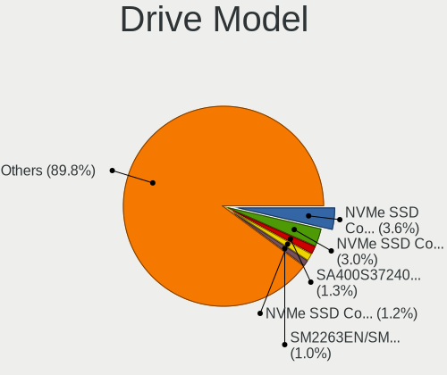
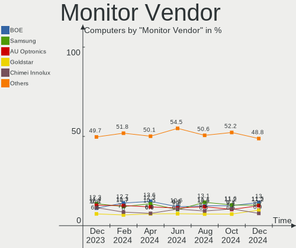
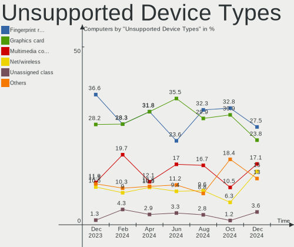

Fedora Hardware Trends
----------------------

A project to identify most popular hardware characteristics and track their change
over time based on data collected by Fedora users at https://Linux-Hardware.org.

Anyone can contribute to the study by uploading probes of their computers by
the [hw-probe](https://github.com/linuxhw/hw-probe) tool:

    sudo hw-probe -all -upload

This is a report for all computer types. See also reports for [desktops](/Dist/Fedora/Desktop/README.md) and [notebooks](/Dist/Fedora/Notebook/README.md).

Full-feature report is available here: https://linux-hardware.org/?view=trends

Period: Jan, 2020.

Contents
--------

- [ OS                       ](#os)
- [ OS Family                ](#os-family)
- [ Kernel                   ](#kernel)
- [ Kernel Family            ](#kernel-family)
- [ Kernel Major Ver.        ](#kernel-major-ver)
- [ Arch                     ](#arch)
- [ DE                       ](#de)
- [ Display Server           ](#display-server)
- [ OS Lang                  ](#os-lang)
- [ Boot Mode                ](#boot-mode)
- [ Filesystem               ](#filesystem)
- [ Dual Boot with Linux     ](#dual-boot-with-linux)
- [ Dual Boot (Win)          ](#dual-boot-win)
- [ Country                  ](#country)
- [ City                     ](#city)
- [ Vendor                   ](#vendor)
- [ Model                    ](#model)
- [ Model Family             ](#model-family)
- [ MFG Year                 ](#mfg-year)
- [ Form Factor              ](#form-factor)
- [ Secure Boot              ](#secure-boot)
- [ Coreboot                 ](#coreboot)
- [ RAM Size                 ](#ram-size)
- [ RAM Used                 ](#ram-used)
- [ Drive Vendor             ](#drive-vendor)
- [ Drive Model              ](#drive-model)
- [ Drive Kind               ](#drive-kind)
- [ Drive Connector          ](#drive-connector)
- [ Drive Size               ](#drive-size)
- [ Space Total              ](#space-total)
- [ Space Used               ](#space-used)
- [ Malfunc. Drives          ](#malfunc-drives)
- [ Malfunc. Drive Vendor    ](#malfunc-drive-vendor)
- [ Malfunc. Drive Kind      ](#malfunc-drive-kind)
- [ Failed Drives            ](#failed-drives)
- [ Failed Drive Vendor      ](#failed-drive-vendor)
- [ Drive Status             ](#drive-status)
- [ Storage Vendor           ](#storage-vendor)
- [ Storage Model            ](#storage-model)
- [ Storage Kind             ](#storage-kind)
- [ CPU Vendor               ](#cpu-vendor)
- [ CPU Model                ](#cpu-model)
- [ CPU Model Family         ](#cpu-model-family)
- [ CPU Cores                ](#cpu-cores)
- [ CPU Sockets              ](#cpu-sockets)
- [ CPU Threads              ](#cpu-threads)
- [ CPU Op-Modes             ](#cpu-op-modes)
- [ CPU Microarch            ](#cpu-microarch)
- [ CPU Microcode            ](#cpu-microcode)
- [ GPU Vendor               ](#gpu-vendor)
- [ GPU Model                ](#gpu-model)
- [ GPU Combo                ](#gpu-combo)
- [ GPU Driver               ](#gpu-driver)
- [ GPU Memory               ](#gpu-memory)
- [ Monitor Vendor           ](#monitor-vendor)
- [ Monitor Model            ](#monitor-model)
- [ Monitor Resolution       ](#monitor-resolution)
- [ Monitor Diagonal         ](#monitor-diagonal)
- [ Monitor Width            ](#monitor-width)
- [ Aspect Ratio             ](#aspect-ratio)
- [ Monitor Area             ](#monitor-area)
- [ Pixel Density            ](#pixel-density)
- [ Multiple Monitors        ](#multiple-monitors)
- [ Net Controller Vendor    ](#net-controller-vendor)
- [ Net Controller Model     ](#net-controller-model)
- [ Net Controller Kind      ](#net-controller-kind)
- [ Used Controller          ](#used-controller)
- [ NICs                     ](#nics)
- [ Unsupported Devices      ](#unsupported-devices)
- [ Unsupported Device Types ](#unsupported-device-types)

OS
--

Installed operating systems

| Name      | Computers | Percent |
|-----------|-----------|---------|
| Fedora 31 | 170       | 87.63%  |
| Fedora 30 | 10        | 5.15%   |
| Fedora 32 | 9         | 4.64%   |
| Fedora 29 | 3         | 1.55%   |
| Fedora 28 | 1         | 0.52%   |
| Fedora 24 | 1         | 0.52%   |

OS Family
---------

OS without a version

| Name   | Computers | Percent |
|--------|-----------|---------|
| Fedora | 194       | 100%    |

Kernel
------

Version of the Linux kernel

| Version                                        | Computers | Percent |
|------------------------------------------------|-----------|---------|
| 5.4.8-200.fc31.x86_64                          | 41        | 21.13%  |
| 5.3.16-300.fc31.x86_64                         | 32        | 16.49%  |
| 5.4.12-200.fc31.x86_64                         | 23        | 11.86%  |
| 5.4.10-200.fc31.x86_64                         | 18        | 9.28%   |
| 5.4.7-200.fc31.x86_64                          | 17        | 8.76%   |
| 5.4.13-201.fc31.x86_64                         | 17        | 8.76%   |
| 5.3.7-301.fc31.x86_64                          | 11        | 5.67%   |
| 5.4.12-100.fc30.x86_64                         | 5         | 2.58%   |
| 5.4.10-100.fc30.x86_64                         | 3         | 1.55%   |
| 5.5.0-0.rc7.git0.2.fc32.x86_64                 | 2         | 1.03%   |
| 5.5.0-0.rc6.git3.1.fc32.x86_64                 | 2         | 1.03%   |
| 5.5.0-0.rc4.git0.1.fc32.x86_64                 | 2         | 1.03%   |
| 5.5.0-0.rc2.git1.1.fc32.x86_64                 | 2         | 1.03%   |
| 5.4.7-100.fc30.x86_64                          | 2         | 1.03%   |
| 5.4.14-200.fc31.x86_64                         | 2         | 1.03%   |
| 5.5.0-fsync.rc6.git0.1.fc31.x86_64             | 1         | 0.52%   |
| 5.5.0-0.rc7.git0.1.vanilla.knurd.1.fc31.x86_64 | 1         | 0.52%   |
| 5.4.5-300.fc31.x86_64                          | 1         | 0.52%   |
| 5.4.13_palladium-1000.fc32.x86_64              | 1         | 0.52%   |
| 5.4.13-1.surface.fc31.x86_64                   | 1         | 0.52%   |
| 5.4.0                                          | 1         | 0.52%   |
| 5.3.15-300.fc31.x86_64                         | 1         | 0.52%   |
| 5.3.15-200.fc30.x86_64                         | 1         | 0.52%   |
| 5.3.14-300.fc31.x86_64                         | 1         | 0.52%   |
| 5.3.13-300.fc31.x86_64                         | 1         | 0.52%   |
| 5.3.11-100.fc29.x86_64                         | 1         | 0.52%   |
| 5.2.7-100.fc29.x86_64                          | 1         | 0.52%   |
| 5.0.17-200.fc29.x86_64                         | 1         | 0.52%   |
| 5.0.16-100.fc28.x86_64                         | 1         | 0.52%   |
| 4.11.12-100.fc24.x86_64                        | 1         | 0.52%   |

Kernel Family
-------------

Linux kernel without a distro release

| Version | Computers | Percent |
|---------|-----------|---------|
| 5.4.8   | 41        | 21.13%  |
| 5.3.16  | 32        | 16.49%  |
| 5.4.12  | 28        | 14.43%  |
| 5.4.10  | 21        | 10.82%  |
| 5.4.7   | 19        | 9.79%   |
| 5.4.13  | 19        | 9.79%   |
| 5.3.7   | 11        | 5.67%   |
| 5.5.0   | 10        | 5.15%   |
| 5.4.14  | 2         | 1.03%   |
| 5.3.15  | 2         | 1.03%   |
| 5.4.5   | 1         | 0.52%   |
| 5.4.0   | 1         | 0.52%   |
| 5.3.14  | 1         | 0.52%   |
| 5.3.13  | 1         | 0.52%   |
| 5.3.11  | 1         | 0.52%   |
| 5.2.7   | 1         | 0.52%   |
| 5.0.17  | 1         | 0.52%   |
| 5.0.16  | 1         | 0.52%   |
| 4.11.12 | 1         | 0.52%   |

Kernel Major Ver.
-----------------

Linux kernel major version

| Version | Computers | Percent |
|---------|-----------|---------|
| 5.4     | 132       | 68.04%  |
| 5.3     | 48        | 24.74%  |
| 5.5     | 10        | 5.15%   |
| 5.0     | 2         | 1.03%   |
| 5.2     | 1         | 0.52%   |
| 4.11    | 1         | 0.52%   |

Arch
----

OS architecture (x86_64, i586, etc.)

| Name   | Computers | Percent |
|--------|-----------|---------|
| x86_64 | 194       | 100%    |

DE
--

Desktop Environment

| Name          | Computers | Percent |
|---------------|-----------|---------|
| GNOME         | 143       | 73.71%  |
| Unknown       | 12        | 6.19%   |
| KDE5          | 11        | 5.67%   |
| KDE           | 9         | 4.64%   |
| Cinnamon      | 8         | 4.12%   |
| XFCE          | 4         | 2.06%   |
| MATE          | 2         | 1.03%   |
| X-Cinnamon    | 1         | 0.52%   |
| LXQt          | 1         | 0.52%   |
| LXDE          | 1         | 0.52%   |
| GNOME Classic | 1         | 0.52%   |
| Deepin        | 1         | 0.52%   |

Display Server
--------------

X11 or Wayland

| Name    | Computers | Percent |
|---------|-----------|---------|
| Wayland | 105       | 54.12%  |
| X11     | 81        | 41.75%  |
| Unknown | 8         | 4.12%   |

OS Lang
-------

Language

| Lang       | Computers | Percent |
|------------|-----------|---------|
| en_US      | 70        | 36.08%  |
| Unknown    | 56        | 28.87%  |
| en_GB      | 15        | 7.73%   |
| de_DE      | 9         | 4.64%   |
| pt_BR      | 6         | 3.09%   |
| fr_FR      | 4         | 2.06%   |
| ru_RU      | 3         | 1.55%   |
| es_MX      | 3         | 1.55%   |
| en_GB.utf8 | 3         | 1.55%   |
| en_CA      | 3         | 1.55%   |
| pl_PL      | 2         | 1.03%   |
| nl_NL      | 2         | 1.03%   |
| en_US.utf8 | 2         | 1.03%   |
| en_NZ      | 2         | 1.03%   |
| en_IN      | 2         | 1.03%   |
| sv_SE      | 1         | 0.52%   |
| sk_SK      | 1         | 0.52%   |
| pt_PT      | 1         | 0.52%   |
| pt_BR.utf8 | 1         | 0.52%   |
| pl_PL.utf8 | 1         | 0.52%   |
| it_IT      | 1         | 0.52%   |
| fr_CH      | 1         | 0.52%   |
| fi_FI      | 1         | 0.52%   |
| es_ES      | 1         | 0.52%   |
| en_AU      | 1         | 0.52%   |
| da_DK      | 1         | 0.52%   |
| cs_CZ      | 1         | 0.52%   |

Boot Mode
---------

EFI or BIOS

| Mode | Computers | Percent |
|------|-----------|---------|
| EFI  | 126       | 64.95%  |
| BIOS | 68        | 35.05%  |

Filesystem
----------

Type of filesystem

| Type    | Computers | Percent |
|---------|-----------|---------|
| Ext4    | 165       | 85.05%  |
| Xfs     | 14        | 7.22%   |
| Btrfs   | 14        | 7.22%   |
| Unknown | 1         | 0.52%   |

Dual Boot with Linux
--------------------

Hosting more than one Linux

| Dual boot | Computers | Percent |
|-----------|-----------|---------|
| No        | 175       | 90.21%  |
| Yes       | 19        | 9.79%   |

Dual Boot (Win)
---------------

Hosting Linux and Windows

| Dual boot | Computers | Percent |
|-----------|-----------|---------|
| No        | 162       | 83.51%  |
| Yes       | 32        | 16.49%  |

Country
-------

Geographic location (country)

| Country             | Computers | Percent |
|---------------------|-----------|---------|
| USA                 | 42        | 21.65%  |
| Germany             | 22        | 11.34%  |
| Netherlands         | 11        | 5.67%   |
| UK                  | 10        | 5.15%   |
| Brazil              | 9         | 4.64%   |
| Russia              | 8         | 4.12%   |
| Poland              | 8         | 4.12%   |
| Canada              | 7         | 3.61%   |
| Switzerland         | 5         | 2.58%   |
| Sweden              | 5         | 2.58%   |
| France              | 5         | 2.58%   |
| Spain               | 4         | 2.06%   |
| Mexico              | 4         | 2.06%   |
| Italy               | 4         | 2.06%   |
| India               | 4         | 2.06%   |
| Serbia              | 3         | 1.55%   |
| Norway              | 3         | 1.55%   |
| New Zealand         | 2         | 1.03%   |
| Japan               | 2         | 1.03%   |
| Indonesia           | 2         | 1.03%   |
| Finland             | 2         | 1.03%   |
| Estonia             | 2         | 1.03%   |
| Denmark             | 2         | 1.03%   |
| Belgium             | 2         | 1.03%   |
| Australia           | 2         | 1.03%   |
| Argentina           | 2         | 1.03%   |
| Ukraine             | 1         | 0.52%   |
| Turkey              | 1         | 0.52%   |
| Trinidad and Tobago | 1         | 0.52%   |
| Thailand            | 1         | 0.52%   |
| Slovakia            | 1         | 0.52%   |
| Singapore           | 1         | 0.52%   |
| Saudi Arabia        | 1         | 0.52%   |
| Romania             | 1         | 0.52%   |
| Portugal            | 1         | 0.52%   |
| Myanmar             | 1         | 0.52%   |
| Jordan              | 1         | 0.52%   |
| Jamaica             | 1         | 0.52%   |
| Israel              | 1         | 0.52%   |
| Isle of Man         | 1         | 0.52%   |
| Hungary             | 1         | 0.52%   |
| Egypt               | 1         | 0.52%   |
| Czech Republic      | 1         | 0.52%   |
| Croatia             | 1         | 0.52%   |
| China               | 1         | 0.52%   |
| Bulgaria            | 1         | 0.52%   |
| Bolivia             | 1         | 0.52%   |
| Austria             | 1         | 0.52%   |

City
----

Geographic location (city)

| City           | Computers | Percent |
|----------------|-----------|---------|
| Hainburg       | 4         | 2.06%   |
| Oslo           | 3         | 1.55%   |
| Mexico City    | 3         | 1.55%   |
| Berlin         | 3         | 1.55%   |
| Wrocław       | 2         | 1.03%   |
| Woodbridge     | 2         | 1.03%   |
| Ufa            | 2         | 1.03%   |
| Tallinn        | 2         | 1.03%   |
| Stockholm      | 2         | 1.03%   |
| Papillion      | 2         | 1.03%   |
| Moscow         | 2         | 1.03%   |
| Montreal       | 2         | 1.03%   |
| Mannheim       | 2         | 1.03%   |
| Helsinki       | 2         | 1.03%   |
| Dayton         | 2         | 1.03%   |
| Belgrade       | 2         | 1.03%   |
| Auckland       | 2         | 1.03%   |
| Amsterdam      | 2         | 1.03%   |
| Évreux        | 1         | 0.52%   |
| Érd           | 1         | 0.52%   |
| Östersund     | 1         | 0.52%   |
| Zurich         | 1         | 0.52%   |
| Zapotlanejo    | 1         | 0.52%   |
| Yangon         | 1         | 0.52%   |
| Winnipeg       | 1         | 0.52%   |
| Westport       | 1         | 0.52%   |
| Werdau         | 1         | 0.52%   |
| Wemyss Bay     | 1         | 0.52%   |
| Warsaw         | 1         | 0.52%   |
| Warrenton      | 1         | 0.52%   |
| Volta Redonda  | 1         | 0.52%   |
| Viggiù        | 1         | 0.52%   |
| Vienna         | 1         | 0.52%   |
| Vaxjo          | 1         | 0.52%   |
| Varaždin      | 1         | 0.52%   |
| Tours          | 1         | 0.52%   |
| Toronto        | 1         | 0.52%   |
| Tolyatti       | 1         | 0.52%   |
| Tokyo          | 1         | 0.52%   |
| The Hague      | 1         | 0.52%   |
| The Bronx      | 1         | 0.52%   |
| Terneuzen      | 1         | 0.52%   |
| Tarnobrzeg     | 1         | 0.52%   |
| Tacoma         | 1         | 0.52%   |
| Stoke-on-Trent | 1         | 0.52%   |
| St Helens Park | 1         | 0.52%   |
| Spokane        | 1         | 0.52%   |
| Sofia          | 1         | 0.52%   |
| Singapore      | 1         | 0.52%   |
| Silver Spring  | 1         | 0.52%   |
| Sierre         | 1         | 0.52%   |
| Sevastopol     | 1         | 0.52%   |
| Serrana        | 1         | 0.52%   |
| Semiluki       | 1         | 0.52%   |
| San Jose       | 1         | 0.52%   |
| Rudno          | 1         | 0.52%   |
| Rozenburg      | 1         | 0.52%   |
| Rome           | 1         | 0.52%   |
| Rokietnica     | 1         | 0.52%   |
| Ripley         | 1         | 0.52%   |

Vendor
------

Motherboard manufacturer

| Name                | Computers | Percent |
|---------------------|-----------|---------|
| Lenovo              | 35        | 18.04%  |
| Dell                | 34        | 17.53%  |
| ASUSTek Computer    | 29        | 14.95%  |
| Hewlett-Packard     | 25        | 12.89%  |
| MSI                 | 17        | 8.76%   |
| Gigabyte Technology | 10        | 5.15%   |
| Acer                | 10        | 5.15%   |
| Intel               | 6         | 3.09%   |
| ASRock              | 6         | 3.09%   |
| Notebook            | 3         | 1.55%   |
| Toshiba             | 2         | 1.03%   |
| Microsoft           | 2         | 1.03%   |
| LG Electronics      | 2         | 1.03%   |
| HUAWEI              | 2         | 1.03%   |
| Apple               | 2         | 1.03%   |
| Supermicro          | 1         | 0.52%   |
| Sony                | 1         | 0.52%   |
| Samsung Electronics | 1         | 0.52%   |
| Razer               | 1         | 0.52%   |
| Positivo            | 1         | 0.52%   |
| Packard Bell        | 1         | 0.52%   |
| HPE                 | 1         | 0.52%   |
| Gateway             | 1         | 0.52%   |
| Foxconn             | 1         | 0.52%   |

Model
-----

Motherboard model

| Name                                     | Computers | Percent |
|------------------------------------------|-----------|---------|
| ASUS PRIME B350-PLUS                     | 3         | 1.55%   |
| ASUS All Series                          | 3         | 1.55%   |
| MSI MS-7A39                              | 2         | 1.03%   |
| Lenovo IdeaPad FLEX-14API 81SS           | 2         | 1.03%   |
| Intel NUC8i7BEH                          | 2         | 1.03%   |
| HUAWEI WRT-WX9                           | 2         | 1.03%   |
| HP Laptop 15-db0xxx                      | 2         | 1.03%   |
| HP EliteBook 840 G5                      | 2         | 1.03%   |
| Dell XPS 15 9550                         | 2         | 1.03%   |
| Dell XPS 13 9380                         | 2         | 1.03%   |
| Dell Inspiron 7591                       | 2         | 1.03%   |
| ASUS ROG STRIX X570-I GAMING             | 2         | 1.03%   |
| Acer Aspire VN7-791G                     | 2         | 1.03%   |
| Toshiba Satellite C55D-A                 | 1         | 0.52%   |
| Toshiba Satellite C50D-A                 | 1         | 0.52%   |
| Supermicro H8SCM                         | 1         | 0.52%   |
| Sony VPCSC41FM                           | 1         | 0.52%   |
| Samsung Electronics 760XBE               | 1         | 0.52%   |
| Razer Blade Stealth 13 Late 2019         | 1         | 0.52%   |
| Positivo I541T                           | 1         | 0.52%   |
| Packard Bell EasyNote TS44HR             | 1         | 0.52%   |
| Notebook W740SU                          | 1         | 0.52%   |
| Notebook NH55RGQ                         | 1         | 0.52%   |
| Notebook N150ZU                          | 1         | 0.52%   |
| MSI MS-7B85                              | 1         | 0.52%   |
| MSI MS-7B17                              | 1         | 0.52%   |
| MSI MS-7B05                              | 1         | 0.52%   |
| MSI MS-7A75                              | 1         | 0.52%   |
| MSI MS-7A40                              | 1         | 0.52%   |
| MSI MS-7A36                              | 1         | 0.52%   |
| MSI MS-7A32                              | 1         | 0.52%   |
| MSI MS-7971                              | 1         | 0.52%   |
| MSI MS-7917                              | 1         | 0.52%   |
| MSI MS-7821                              | 1         | 0.52%   |
| MSI MS-7793                              | 1         | 0.52%   |
| MSI MS-7693                              | 1         | 0.52%   |
| MSI MS-7641                              | 1         | 0.52%   |
| MSI GS65 Stealth Thin 8RE                | 1         | 0.52%   |
| MSI GS63 Stealth 8RE                     | 1         | 0.52%   |
| Microsoft Surface Pro 4                  | 1         | 0.52%   |
| Microsoft Surface Book                   | 1         | 0.52%   |
| LG Electronics 17Z990-V.AA75B            | 1         | 0.52%   |
| LG Electronics 14Z980-G.BH51P1           | 1         | 0.52%   |
| Lenovo Yoga C740-14IML 81TC              | 1         | 0.52%   |
| Lenovo V330-15IKB 81AX                   | 1         | 0.52%   |
| Lenovo ThinkPad X270 20K5S0LS0E          | 1         | 0.52%   |
| Lenovo ThinkPad X250 20CM004UGE          | 1         | 0.52%   |
| Lenovo ThinkPad X220 4290A48             | 1         | 0.52%   |
| Lenovo ThinkPad X1 Yoga 1st 20FRS1N600   | 1         | 0.52%   |
| Lenovo ThinkPad X1 Carbon 7th 20QD00L2MH | 1         | 0.52%   |
| Lenovo ThinkPad T590 20N4001PUS          | 1         | 0.52%   |
| Lenovo ThinkPad T520 42406NU             | 1         | 0.52%   |
| Lenovo ThinkPad T490s 20NXS12C00         | 1         | 0.52%   |
| Lenovo ThinkPad T490 20N2006DPB          | 1         | 0.52%   |
| Lenovo ThinkPad T480s 20L8S2N809         | 1         | 0.52%   |
| Lenovo ThinkPad T480 20L6S29D1V          | 1         | 0.52%   |
| Lenovo ThinkPad T470 W10DG 20JNS29X02    | 1         | 0.52%   |
| Lenovo ThinkPad T470 20HDCTO1WW          | 1         | 0.52%   |
| Lenovo ThinkPad T460s 20FAS35H00         | 1         | 0.52%   |
| Lenovo ThinkPad T460 20FMS0BX0J          | 1         | 0.52%   |

Model Family
------------

Motherboard model prefix

| Name                           | Computers | Percent |
|--------------------------------|-----------|---------|
| Lenovo ThinkPad                | 23        | 11.86%  |
| HP EliteBook                   | 11        | 5.67%   |
| Dell XPS                       | 11        | 5.67%   |
| Acer Aspire                    | 9         | 4.64%   |
| ASUS PRIME                     | 7         | 3.61%   |
| Dell Latitude                  | 6         | 3.09%   |
| Dell Inspiron                  | 6         | 3.09%   |
| Lenovo IdeaPad                 | 5         | 2.58%   |
| Dell OptiPlex                  | 5         | 2.58%   |
| ASUS ROG                       | 5         | 2.58%   |
| HP Laptop                      | 4         | 2.06%   |
| HP ENVY                        | 4         | 2.06%   |
| Gigabyte X570                  | 3         | 1.55%   |
| ASUS TUF                       | 3         | 1.55%   |
| ASUS All                       | 3         | 1.55%   |
| Toshiba Satellite              | 2         | 1.03%   |
| MSI MS-7A39                    | 2         | 1.03%   |
| Microsoft Surface              | 2         | 1.03%   |
| Lenovo ThinkCentre             | 2         | 1.03%   |
| Intel NUC8i7BEH                | 2         | 1.03%   |
| HUAWEI WRT-WX9                 | 2         | 1.03%   |
| HP ProBook                     | 2         | 1.03%   |
| HP Pavilion                    | 2         | 1.03%   |
| Dell Vostro                    | 2         | 1.03%   |
| Dell Precision                 | 2         | 1.03%   |
| Supermicro H8SCM               | 1         | 0.52%   |
| Sony VPCSC41FM                 | 1         | 0.52%   |
| Samsung Electronics 760XBE     | 1         | 0.52%   |
| Razer Blade                    | 1         | 0.52%   |
| Positivo I541T                 | 1         | 0.52%   |
| Packard Bell EasyNote          | 1         | 0.52%   |
| Notebook W740SU                | 1         | 0.52%   |
| Notebook NH55RGQ               | 1         | 0.52%   |
| Notebook N150ZU                | 1         | 0.52%   |
| MSI MS-7B85                    | 1         | 0.52%   |
| MSI MS-7B17                    | 1         | 0.52%   |
| MSI MS-7B05                    | 1         | 0.52%   |
| MSI MS-7A75                    | 1         | 0.52%   |
| MSI MS-7A40                    | 1         | 0.52%   |
| MSI MS-7A36                    | 1         | 0.52%   |
| MSI MS-7A32                    | 1         | 0.52%   |
| MSI MS-7971                    | 1         | 0.52%   |
| MSI MS-7917                    | 1         | 0.52%   |
| MSI MS-7821                    | 1         | 0.52%   |
| MSI MS-7793                    | 1         | 0.52%   |
| MSI MS-7693                    | 1         | 0.52%   |
| MSI MS-7641                    | 1         | 0.52%   |
| MSI GS65                       | 1         | 0.52%   |
| MSI GS63                       | 1         | 0.52%   |
| LG Electronics 17Z990-V.AA75B  | 1         | 0.52%   |
| LG Electronics 14Z980-G.BH51P1 | 1         | 0.52%   |
| Lenovo Yoga                    | 1         | 0.52%   |
| Lenovo V330-15IKB              | 1         | 0.52%   |
| Lenovo K450e                   | 1         | 0.52%   |
| Lenovo G510                    | 1         | 0.52%   |
| Lenovo B570e                   | 1         | 0.52%   |
| Intel DQ77MK                   | 1         | 0.52%   |
| Intel DQ57TM                   | 1         | 0.52%   |
| Intel DQ35JO                   | 1         | 0.52%   |
| Intel D54250WYK                | 1         | 0.52%   |

MFG Year
--------

Motherboard manufacture year

| Year    | Computers | Percent |
|---------|-----------|---------|
| 2019    | 92        | 47.42%  |
| 2018    | 25        | 12.89%  |
| 2014    | 16        | 8.25%   |
| 2017    | 13        | 6.7%    |
| 2011    | 13        | 6.7%    |
| 2016    | 11        | 5.67%   |
| 2015    | 8         | 4.12%   |
| 2013    | 6         | 3.09%   |
| 2012    | 4         | 2.06%   |
| 2010    | 2         | 1.03%   |
| 2008    | 2         | 1.03%   |
| 2007    | 1         | 0.52%   |
| Unknown | 1         | 0.52%   |

Form Factor
-----------

Physical design of the computer

| Name        | Computers | Percent |
|-------------|-----------|---------|
| Notebook    | 106       | 54.64%  |
| Desktop     | 74        | 38.14%  |
| Convertible | 6         | 3.09%   |
| Tablet      | 2         | 1.03%   |
| Mini pc     | 2         | 1.03%   |
| All in one  | 2         | 1.03%   |
| Server      | 2         | 1.03%   |

Secure Boot
-----------

Enabled or disabled

| State    | Computers | Percent |
|----------|-----------|---------|
| Disabled | 159       | 81.96%  |
| Enabled  | 35        | 18.04%  |

Coreboot
--------

Have coreboot on board

| Used | Computers | Percent |
|------|-----------|---------|
| No   | 194       | 100%    |

RAM Size
--------

Total RAM memory

| Size in GB  | Computers | Percent |
|-------------|-----------|---------|
| 16.01-24.0  | 63        | 32.47%  |
| 4.01-8.0    | 42        | 21.65%  |
| 32.01-64.0  | 33        | 17.01%  |
| 8.01-16.0   | 33        | 17.01%  |
| 3.01-4.0    | 13        | 6.7%    |
| 24.01-32.0  | 5         | 2.58%   |
| 64.01-256.0 | 4         | 2.06%   |
| 1.01-2.0    | 1         | 0.52%   |

RAM Used
--------

Used RAM memory

| Used GB    | Computers | Percent |
|------------|-----------|---------|
| 4.01-8.0   | 50        | 25.77%  |
| 2.01-3.0   | 46        | 23.71%  |
| 3.01-4.0   | 45        | 23.2%   |
| 1.01-2.0   | 31        | 15.98%  |
| 8.01-16.0  | 17        | 8.76%   |
| 16.01-24.0 | 4         | 2.06%   |
| 0.01-1.0   | 1         | 0.52%   |

Drive Vendor
------------

Hard drive vendors

| Vendor              | Computers | Drives | Percent |
|---------------------|-----------|--------|---------|
| Samsung Electronics | 54        | 69     | 19.64%  |
| WDC                 | 46        | 58     | 16.73%  |
| Seagate             | 37        | 49     | 13.45%  |
| SanDisk             | 15        | 16     | 5.45%   |
| Crucial             | 14        | 15     | 5.09%   |
| Toshiba             | 13        | 16     | 4.73%   |
| Kingston            | 11        | 14     | 4%      |
| Intel               | 10        | 11     | 3.64%   |
| HGST                | 10        | 11     | 3.64%   |
| A-DATA Technology   | 9         | 10     | 3.27%   |
| SK Hynix            | 8         | 8      | 2.91%   |
| Hitachi             | 8         | 9      | 2.91%   |
| Unknown             | 6         | 6      | 2.18%   |
| LITEON              | 5         | 5      | 1.82%   |
| Transcend           | 3         | 3      | 1.09%   |
| OCZ                 | 3         | 3      | 1.09%   |
| Mushkin             | 2         | 2      | 0.73%   |
| Micron Technology   | 2         | 2      | 0.73%   |
| Generic             | 2         | 2      | 0.73%   |
| Apple               | 2         | 2      | 0.73%   |
| USB3.0              | 1         | 1      | 0.36%   |
| SMART               | 1         | 1      | 0.36%   |
| PNY                 | 1         | 1      | 0.36%   |
| PLEXTOR             | 1         | 1      | 0.36%   |
| Phison              | 1         | 1      | 0.36%   |
| MATSHITA            | 1         | 1      | 0.36%   |
| LDLC                | 1         | 1      | 0.36%   |
| Intenso             | 1         | 1      | 0.36%   |
| Inateck             | 1         | 1      | 0.36%   |
| Hewlett-Packard     | 1         | 1      | 0.36%   |
| GOODRAM             | 1         | 1      | 0.36%   |
| Dogfish             | 1         | 1      | 0.36%   |
| China               | 1         | 1      | 0.36%   |
| ASMT                | 1         | 1      | 0.36%   |
| ASMedia             | 1         | 1      | 0.36%   |

Drive Model
-----------

Hard drive models

| Model                            | Computers | Percent |
|----------------------------------|-----------|---------|
| SSD 860 EVO 500GB                | 7         | 2.28%   |
| SSD 860 EVO 1TB                  | 5         | 1.63%   |
| ST4000DM004-2CV104 4TB           | 4         | 1.3%    |
| SSD 850 EVO 250GB                | 4         | 1.3%    |
| SV300S37A240G 240GB SSD          | 3         | 0.98%   |
| SSD 960 PRO 512GB                | 3         | 0.98%   |
| SSD 850 EVO 500GB                | 3         | 0.98%   |
| MQ01ABD100 1TB                   | 3         | 0.98%   |
| HTS541010A9E680 1TB              | 3         | 0.98%   |
| WD5000AAKX-001CA0 500GB          | 2         | 0.65%   |
| WD30EFRX-68EUZN0 3TB             | 2         | 0.65%   |
| WD2003FZEX-00SRLA0 2TB           | 2         | 0.65%   |
| WD10SPZX-00Z10T0 1TB             | 2         | 0.65%   |
| TS1TSSD230S 1TB                  | 2         | 0.65%   |
| SUV400S37240G 240GB SSD          | 2         | 0.65%   |
| ST3250318AS 250GB                | 2         | 0.65%   |
| ST3250310AS 250GB                | 2         | 0.65%   |
| ST12000NE0007-2GT116 12TB        | 2         | 0.65%   |
| ST1000LM048-2E7172 1TB           | 2         | 0.65%   |
| ST1000LM035-1RK172 1TB           | 2         | 0.65%   |
| ST1000DM003-9YN162 1TB           | 2         | 0.65%   |
| ST1000DM003-1CH162 1TB           | 2         | 0.65%   |
| SSDPE21D480GA 480GB              | 2         | 0.65%   |
| SSD PLUS 120 GB                  | 2         | 0.65%   |
| SSD 960 EVO 250GB                | 2         | 0.65%   |
| SSD 860 QVO 1TB                  | 2         | 0.65%   |
| SDSSDHII240G 240GB               | 2         | 0.65%   |
| SDSSDA120G 120GB                 | 2         | 0.65%   |
| SD/MMC/MS PRO 64GB               | 2         | 0.65%   |
| PC SN720 SDAPNTW-256G-1027 256GB | 2         | 0.65%   |
| MZVLB512HAJQ-000H1 512GB         | 2         | 0.65%   |
| MZNLN128HAHQ-000H1 128GB SSD     | 2         | 0.65%   |
| MMC Card  64GB                   | 2         | 0.65%   |
| HTS721010A9E630 1TB              | 2         | 0.65%   |
| CV8-8E256 256GB SSD              | 2         | 0.65%   |
| CT480BX500SSD1 480GB             | 2         | 0.65%   |
| CT275MX300SSD1 275GB             | 2         | 0.65%   |
| CT240BX500SSD1 240GB             | 2         | 0.65%   |
| BUP Slim BK 1TB                  | 2         | 0.65%   |
| XPG EX500 512GB SSD              | 1         | 0.33%   |
| X400 M.2 2280 256GB SSD          | 1         | 0.33%   |
| WDS500G3X0C-00SJG0 500GB         | 1         | 0.33%   |
| WDS250G2X0C-00L350 250GB         | 1         | 0.33%   |
| WDS120G2G0A-00JH30 120GB SSD     | 1         | 0.33%   |
| WDBNCE5000PNC 500GB SSD          | 1         | 0.33%   |
| WD800JD-00LSA0 80GB              | 1         | 0.33%   |
| WD7500BPVT-35HXZT3 752GB         | 1         | 0.33%   |
| WD6400AAKS-65A7B2 640GB          | 1         | 0.33%   |
| WD6400AAKS-22A7B2 640GB          | 1         | 0.33%   |
| WD6003FZBX-00GXAB0 6TB           | 1         | 0.33%   |
| WD5001AALS-00L3B2 500GB          | 1         | 0.33%   |
| WD5000LPVX-22V0TT0 500GB         | 1         | 0.33%   |
| WD5000LPLX-08ZNTT0 500GB         | 1         | 0.33%   |
| WD5000BUCT-63LS5Y1 500GB         | 1         | 0.33%   |
| WD5000BPKT-75PK4T0 500GB         | 1         | 0.33%   |
| WD5000AZRX-00A8LB0 500GB         | 1         | 0.33%   |
| WD5000AAKS-00A7B2 500GB          | 1         | 0.33%   |
| WD40EZRZ-00GXCB0 4TB             | 1         | 0.33%   |
| WD40EFRX-68WT0N0 4TB             | 1         | 0.33%   |
| WD30EFRX-68N32N0 3TB             | 1         | 0.33%   |

Drive Kind
----------

HDD or SSD

| Kind    | Computers | Drives | Percent |
|---------|-----------|--------|---------|
| SSD     | 94        | 131    | 40.17%  |
| HDD     | 86        | 135    | 36.75%  |
| NVMe    | 41        | 47     | 17.52%  |
| Unknown | 7         | 7      | 2.99%   |
| MMC     | 6         | 6      | 2.56%   |

Drive Connector
---------------

SATA, SAS, NVMe, etc.

| Type | Computers | Drives | Percent |
|------|-----------|--------|---------|
| SATA | 142       | 255    | 69.61%  |
| NVMe | 41        | 47     | 20.1%   |
| SAS  | 15        | 18     | 7.35%   |
| MMC  | 6         | 6      | 2.94%   |

Drive Size
----------

Size of hard drive

| Size in TB | Computers | Drives | Percent |
|------------|-----------|--------|---------|
| 0.01-0.5   | 113       | 169    | 47.28%  |
| 0.51-1.0   | 84        | 108    | 35.15%  |
| 1.01-2.0   | 22        | 26     | 9.21%   |
| 3.01-4.0   | 9         | 12     | 3.77%   |
| 2.01-3.0   | 5         | 5      | 2.09%   |
| 10.01-20.0 | 3         | 3      | 1.26%   |
| 4.01-10.0  | 3         | 3      | 1.26%   |

Space Total
-----------

Amount of disk space available on the file system

| Size in GB     | Computers | Percent |
|----------------|-----------|---------|
| 251-500        | 53        | 27.32%  |
| 101-250        | 40        | 20.62%  |
| 501-1000       | 31        | 15.98%  |
| 1001-2000      | 16        | 8.25%   |
| More than 3000 | 13        | 6.7%    |
| 2001-3000      | 11        | 5.67%   |
| 1-20           | 11        | 5.67%   |
| Unknown        | 11        | 5.67%   |
| 51-100         | 6         | 3.09%   |
| 21-50          | 2         | 1.03%   |

Space Used
----------

Amount of used disk space

| Used GB        | Computers | Percent |
|----------------|-----------|---------|
| 1-20           | 37        | 19.07%  |
| 101-250        | 34        | 17.53%  |
| 21-50          | 33        | 17.01%  |
| 251-500        | 26        | 13.4%   |
| 51-100         | 20        | 10.31%  |
| 501-1000       | 19        | 9.79%   |
| Unknown        | 11        | 5.67%   |
| 1001-2000      | 10        | 5.15%   |
| More than 3000 | 4         | 2.06%   |

Malfunc. Drives
---------------

Drive models with a malfunction

| Model                    | Computers | Drives | Percent |
|--------------------------|-----------|--------|---------|
| WD5000LPLX-08ZNTT0 500GB | 1         | 1      | 10%     |
| WD10EADS-00L5B1 1TB      | 1         | 1      | 10%     |
| ST9500423AS 500GB        | 1         | 1      | 10%     |
| ST3250820AS 250GB        | 1         | 1      | 10%     |
| ST1000LM035-1RK172 1TB   | 1         | 1      | 10%     |
| ST1000DM010-2EP102 1TB   | 1         | 1      | 10%     |
| HTS547575A9E384 752GB    | 1         | 1      | 10%     |
| HTS541010A9E680 1TB      | 1         | 1      | 10%     |
| CT275MX300SSD1 275GB     | 1         | 1      | 10%     |
| CT128MX100SSD1 128GB     | 1         | 1      | 10%     |

Malfunc. Drive Vendor
---------------------

Vendors of faulty drives

| Vendor  | Computers | Drives | Percent |
|---------|-----------|--------|---------|
| Seagate | 4         | 4      | 40%     |
| WDC     | 2         | 2      | 20%     |
| Crucial | 2         | 2      | 20%     |
| Hitachi | 1         | 1      | 10%     |
| HGST    | 1         | 1      | 10%     |

Malfunc. Drive Kind
-------------------

Kinds of faulty drives

| Kind | Computers | Drives | Percent |
|------|-----------|--------|---------|
| HDD  | 8         | 8      | 80%     |
| SSD  | 2         | 2      | 20%     |

Failed Drives
-------------

Failed drive models

Zero info for selected period =(

Failed Drive Vendor
-------------------

Failed drive vendors

Zero info for selected period =(

Drive Status
------------

Number of failed and malfunc. drives

| Status   | Computers | Drives | Percent |
|----------|-----------|--------|---------|
| Detected | 88        | 157    | 47.31%  |
| Works    | 88        | 159    | 47.31%  |
| Malfunc  | 10        | 10     | 5.38%   |

Storage Vendor
--------------

Storage controller vendors

| Vendor                       | Computers | Percent |
|------------------------------|-----------|---------|
| Intel                        | 123       | 49.6%   |
| AMD                          | 39        | 15.73%  |
| Samsung Electronics          | 37        | 14.92%  |
| Sandisk                      | 11        | 4.44%   |
| Marvell Technology Group     | 8         | 3.23%   |
| Toshiba America Info Systems | 5         | 2.02%   |
| SK Hynix                     | 4         | 1.61%   |
| ASMedia Technology           | 3         | 1.21%   |
| Unknown                      | 2         | 0.81%   |
| Silicon Motion               | 2         | 0.81%   |
| Realtek Semiconductor        | 2         | 0.81%   |
| Phison Electronics           | 2         | 0.81%   |
| LSI Logic / Symbios Logic    | 2         | 0.81%   |
| Kingston Technology Company  | 2         | 0.81%   |
| JMicron Technology           | 2         | 0.81%   |
| Silicon Image                | 1         | 0.4%    |
| Nvidia                       | 1         | 0.4%    |
| Micron/Crucial Technology    | 1         | 0.4%    |
| ADATA Technology             | 1         | 0.4%    |

Storage Model
-------------

Storage controller models

| Model                                                                    | Computers | Percent |
|--------------------------------------------------------------------------|-----------|---------|
| FCH SATA Controller [AHCI mode]                                          | 34        | 12.27%  |
| NVMe SSD Controller SM981/PM981/PM983                                    | 22        | 7.94%   |
| Sunrise Point-LP SATA Controller [AHCI mode]                             | 18        | 6.5%    |
| 8 Series/C220 Series Chipset Family 6-port SATA Controller 1 [AHCI mode] | 18        | 6.5%    |
| Non-Volatile memory controller                                           | 11        | 3.97%   |
| NVMe SSD Controller SM961/PM961                                          | 9         | 3.25%   |
| 82801 Mobile SATA Controller [RAID mode]                                 | 8         | 2.89%   |
| 6 Series/C200 Series Chipset Family 6 port Mobile SATA AHCI Controller   | 8         | 2.89%   |
| Q170/Q150/B150/H170/H110/Z170/CM236 Chipset SATA Controller [AHCI Mode]  | 7         | 2.53%   |
| WD Black 2018/PC SN720 NVMe SSD                                          | 6         | 2.17%   |
| Cannon Lake Mobile PCH SATA AHCI Controller                              | 6         | 2.17%   |
| 300 Series Chipset SATA Controller                                       | 6         | 2.17%   |
| Cannon Point-LP SATA Controller [AHCI Mode]                              | 5         | 1.81%   |
| 8 Series SATA Controller 1 [AHCI mode]                                   | 5         | 1.81%   |
| 200 Series PCH SATA controller [AHCI mode]                               | 5         | 1.81%   |
| SSD Pro 7600p/760p/E 6100p Series                                        | 4         | 1.44%   |
| SSD 660P Series                                                          | 4         | 1.44%   |
| SATA Controller [RAID mode]                                              | 4         | 1.44%   |
| NVMe SSD Controller SM951/PM951                                          | 4         | 1.44%   |
| 400 Series Chipset SATA Controller                                       | 4         | 1.44%   |
| X370 Series Chipset SATA Controller                                      | 3         | 1.08%   |
| HM170/QM170 Chipset SATA Controller [AHCI Mode]                          | 3         | 1.08%   |
| ASM1062 Serial ATA Controller                                            | 3         | 1.08%   |
| 88SE9172 SATA 6Gb/s Controller                                           | 3         | 1.08%   |
| 6 Series/C200 Series Chipset Family 6 port Desktop SATA AHCI Controller  | 3         | 1.08%   |
| 5 Series/3400 Series Chipset 6 port SATA AHCI Controller                 | 3         | 1.08%   |
| Wildcat Point-LP SATA Controller [AHCI Mode]                             | 2         | 0.72%   |
| WD Black 2018/PC SN520 NVMe SSD                                          | 2         | 0.72%   |
| Toshiba America Info Non-Volatile memory controller                      | 2         | 0.72%   |
| SB7x0/SB8x0/SB9x0 SATA Controller [IDE mode]                             | 2         | 0.72%   |
| SB7x0/SB8x0/SB9x0 IDE Controller                                         | 2         | 0.72%   |
| Realtek Non-Volatile memory controller                                   | 2         | 0.72%   |
| Optane SSD 900P Series                                                   | 2         | 0.72%   |
| NVMe Controller                                                          | 2         | 0.72%   |
| E12 NVMe Controller                                                      | 2         | 0.72%   |
| Cannon Lake PCH SATA AHCI Controller                                     | 2         | 0.72%   |
| C600/X79 series chipset 6-Port SATA AHCI Controller                      | 2         | 0.72%   |
| Apple PCIe SSD                                                           | 2         | 0.72%   |
| 9 Series Chipset Family SATA Controller [AHCI Mode]                      | 2         | 0.72%   |
| 82801JI (ICH10 Family) SATA AHCI Controller                              | 2         | 0.72%   |
| 7 Series/C210 Series Chipset Family 6-port SATA Controller [AHCI mode]   | 2         | 0.72%   |
| 5 Series/3400 Series Chipset 4 port SATA AHCI Controller                 | 2         | 0.72%   |
| XPG SX8200 Pro PCIe Gen3x4 M.2 2280 Solid State Drive                    | 1         | 0.36%   |
| XG4 NVMe SSD Controller                                                  | 1         | 0.36%   |
| Volume Management Device NVMe RAID Controller                            | 1         | 0.36%   |
| Technology Company Non-Volatile memory controller                        | 1         | 0.36%   |
| SSD 600P Series                                                          | 1         | 0.36%   |
| SiI 3132 Serial ATA Raid II Controller                                   | 1         | 0.36%   |
| SB7x0/SB8x0/SB9x0 SATA Controller [AHCI mode]                            | 1         | 0.36%   |
| SAS2308 PCI-Express Fusion-MPT SAS-2                                     | 1         | 0.36%   |
| SAS1068E PCI-Express Fusion-MPT SAS                                      | 1         | 0.36%   |
| RS690 PCI to PCI Bridge (PCI Express Port 2)                             | 1         | 0.36%   |
| P1 NVMe PCIe SSD                                                         | 1         | 0.36%   |
| NM10/ICH7 Family SATA Controller [IDE mode]                              | 1         | 0.36%   |
| MCP61 SATA Controller                                                    | 1         | 0.36%   |
| MCP61 IDE                                                                | 1         | 0.36%   |
| JMB368 IDE controller                                                    | 1         | 0.36%   |
| JMB363 SATA/IDE Controller                                               | 1         | 0.36%   |
| FCH SATA Controller [IDE mode]                                           | 1         | 0.36%   |
| FCH SATA Controller D                                                    | 1         | 0.36%   |

Storage Kind
------------

Kind of storage controller (IDE, SATA, NVMe, SAS, ...)

| Kind | Computers | Percent |
|------|-----------|---------|
| SATA | 140       | 58.33%  |
| NVMe | 73        | 30.42%  |
| RAID | 14        | 5.83%   |
| IDE  | 11        | 4.58%   |
| SAS  | 1         | 0.42%   |
| SCSI | 1         | 0.42%   |

CPU Vendor
----------

Processor vendors

| Vendor | Computers | Percent |
|--------|-----------|---------|
| Intel  | 151       | 77.84%  |
| AMD    | 43        | 22.16%  |

CPU Model
---------

Processor models

| Model                                         | Computers | Percent |
|-----------------------------------------------|-----------|---------|
| Intel Core i5-6300U CPU @ 2.40GHz             | 7         | 3.61%   |
| Intel Core i7-8565U CPU @ 1.80GHz             | 6         | 3.09%   |
| Intel Core i5-7200U CPU @ 2.50GHz             | 6         | 3.09%   |
| Intel Core i5-8265U CPU @ 1.60GHz             | 5         | 2.58%   |
| Intel Core i7-8750H CPU @ 2.20GHz             | 4         | 2.06%   |
| Intel Core i7-8665U CPU @ 1.90GHz             | 4         | 2.06%   |
| Intel Core i7-8650U CPU @ 1.90GHz             | 4         | 2.06%   |
| Intel Core i7-8550U CPU @ 1.80GHz             | 4         | 2.06%   |
| Intel Core i7-7500U CPU @ 2.70GHz             | 4         | 2.06%   |
| AMD Ryzen 7 3700X 8-Core Processor            | 4         | 2.06%   |
| AMD Ryzen 7 1700 Eight-Core Processor         | 4         | 2.06%   |
| Intel Core i9-9900K CPU @ 3.60GHz             | 3         | 1.55%   |
| Intel Core i7-7700K CPU @ 4.20GHz             | 3         | 1.55%   |
| Intel Core i7-7700HQ CPU @ 2.80GHz            | 3         | 1.55%   |
| Intel Core i7-6600U CPU @ 2.60GHz             | 3         | 1.55%   |
| Intel Core i7-4720HQ CPU @ 2.60GHz            | 3         | 1.55%   |
| Intel Core i5-8250U CPU @ 1.60GHz             | 3         | 1.55%   |
| Intel Core i5-4300U CPU @ 1.90GHz             | 3         | 1.55%   |
| Intel Core i9-9880H CPU @ 2.30GHz             | 2         | 1.03%   |
| Intel Core i7-9750H CPU @ 2.60GHz             | 2         | 1.03%   |
| Intel Core i7-8559U CPU @ 2.70GHz             | 2         | 1.03%   |
| Intel Core i7-6700HQ CPU @ 2.60GHz            | 2         | 1.03%   |
| Intel Core i7-6700 CPU @ 3.40GHz              | 2         | 1.03%   |
| Intel Core i7-4790K CPU @ 4.00GHz             | 2         | 1.03%   |
| Intel Core i7-4790 CPU @ 3.60GHz              | 2         | 1.03%   |
| Intel Core i7-4770 CPU @ 3.40GHz              | 2         | 1.03%   |
| Intel Core i5-4460 CPU @ 3.20GHz              | 2         | 1.03%   |
| Intel Core i5-2450M CPU @ 2.50GHz             | 2         | 1.03%   |
| AMD Ryzen 9 3950X 16-Core Processor           | 2         | 1.03%   |
| AMD Ryzen 9 3900X 12-Core Processor           | 2         | 1.03%   |
| AMD Ryzen 7 3700U with Radeon Vega Mobile Gfx | 2         | 1.03%   |
| AMD Ryzen 7 1800X Eight-Core Processor        | 2         | 1.03%   |
| AMD Ryzen 5 3500U with Radeon Vega Mobile Gfx | 2         | 1.03%   |
| Intel Xeon CPU X5680 @ 3.33GHz                | 1         | 0.52%   |
| Intel Xeon CPU W3690 @ 3.47GHz                | 1         | 0.52%   |
| Intel Xeon CPU E5-2689 0 @ 2.60GHz            | 1         | 0.52%   |
| Intel Xeon CPU E5-1603 v3 @ 2.80GHz           | 1         | 0.52%   |
| Intel Pentium Dual-Core CPU E6700 @ 3.20GHz   | 1         | 0.52%   |
| Intel Pentium CPU N4200 @ 1.10GHz             | 1         | 0.52%   |
| Intel Pentium CPU N3540 @ 2.16GHz             | 1         | 0.52%   |
| Intel Pentium CPU G4400T @ 2.90GHz            | 1         | 0.52%   |
| Intel Pentium CPU B960 @ 2.20GHz              | 1         | 0.52%   |
| Intel Pentium CPU 5405U @ 2.30GHz             | 1         | 0.52%   |
| Intel Core i9-7920X CPU @ 2.90GHz             | 1         | 0.52%   |
| Intel Core i7-9850H CPU @ 2.60GHz             | 1         | 0.52%   |
| Intel Core i7-8850H CPU @ 2.60GHz             | 1         | 0.52%   |
| Intel Core i7-8700K CPU @ 3.70GHz             | 1         | 0.52%   |
| Intel Core i7-7740X CPU @ 4.30GHz             | 1         | 0.52%   |
| Intel Core i7-7600U CPU @ 2.80GHz             | 1         | 0.52%   |
| Intel Core i7-6820HQ CPU @ 2.70GHz            | 1         | 0.52%   |
| Intel Core i7-5600U CPU @ 2.60GHz             | 1         | 0.52%   |
| Intel Core i7-4770K CPU @ 3.50GHz             | 1         | 0.52%   |
| Intel Core i7-4750HQ CPU @ 2.00GHz            | 1         | 0.52%   |
| Intel Core i7-4710HQ CPU @ 2.50GHz            | 1         | 0.52%   |
| Intel Core i7-4600M CPU @ 2.90GHz             | 1         | 0.52%   |
| Intel Core i7-3930K CPU @ 3.20GHz             | 1         | 0.52%   |
| Intel Core i7-2670QM CPU @ 2.20GHz            | 1         | 0.52%   |
| Intel Core i7-2640M CPU @ 2.80GHz             | 1         | 0.52%   |
| Intel Core i7-2630QM CPU @ 2.00GHz            | 1         | 0.52%   |
| Intel Core i7-2600K CPU @ 3.40GHz             | 1         | 0.52%   |

CPU Model Family
----------------

Processor model prefix

| Model                   | Computers | Percent |
|-------------------------|-----------|---------|
| Intel Core i7           | 70        | 36.08%  |
| Intel Core i5           | 53        | 27.32%  |
| AMD Ryzen 7             | 15        | 7.73%   |
| Intel Core i3           | 8         | 4.12%   |
| AMD Ryzen 5             | 8         | 4.12%   |
| Intel Core i9           | 6         | 3.09%   |
| Intel Pentium           | 5         | 2.58%   |
| Intel Xeon              | 4         | 2.06%   |
| AMD Ryzen 9             | 4         | 2.06%   |
| AMD A8                  | 3         | 1.55%   |
| Intel Core 2 Duo        | 2         | 1.03%   |
| Intel Core 2            | 2         | 1.03%   |
| AMD Ryzen 3             | 2         | 1.03%   |
| AMD Opteron             | 2         | 1.03%   |
| AMD A6                  | 2         | 1.03%   |
| Intel Pentium Dual-Core | 1         | 0.52%   |
| AMD Ryzen 5 PRO         | 1         | 0.52%   |
| AMD Phenom II X4        | 1         | 0.52%   |
| AMD FX                  | 1         | 0.52%   |
| AMD Athlon X4           | 1         | 0.52%   |
| AMD Athlon II X4        | 1         | 0.52%   |
| AMD A4                  | 1         | 0.52%   |
| AMD A10                 | 1         | 0.52%   |

CPU Cores
---------

Number of processor cores

| Number | Computers | Percent |
|--------|-----------|---------|
| 4      | 94        | 48.45%  |
| 2      | 59        | 30.41%  |
| 8      | 18        | 9.28%   |
| 6      | 15        | 7.73%   |
| 12     | 4         | 2.06%   |
| 16     | 2         | 1.03%   |
| 1      | 2         | 1.03%   |

CPU Sockets
-----------

Number of sockets

| Number | Computers | Percent |
|--------|-----------|---------|
| 1      | 193       | 99.48%  |
| 2      | 1         | 0.52%   |

CPU Threads
-----------

Threads per core (Hyper-Threading)

| Number | Computers | Percent |
|--------|-----------|---------|
| 2      | 162       | 83.51%  |
| 1      | 32        | 16.49%  |

CPU Op-Modes
------------

CPU Operation Modes (32-bit, 64-bit)

| Op mode        | Computers | Percent |
|----------------|-----------|---------|
| 32-bit, 64-bit | 191       | 98.45%  |
| Unknown        | 3         | 1.55%   |

CPU Microarch
-------------

Microarchitecture

| Name        | Computers | Percent |
|-------------|-----------|---------|
| Skylake     | 79        | 40.72%  |
| Haswell     | 28        | 14.43%  |
| Zen         | 13        | 6.7%    |
| SandyBridge | 13        | 6.7%    |
| Zen+        | 9         | 4.64%   |
| KabyLake    | 9         | 4.64%   |
| Zen 2       | 8         | 4.12%   |
| Westmere    | 7         | 3.61%   |
| Core        | 5         | 2.58%   |
| Piledriver  | 4         | 2.06%   |
| K10         | 3         | 1.55%   |
| IvyBridge   | 3         | 1.55%   |
| Puma        | 2         | 1.03%   |
| Jaguar      | 2         | 1.03%   |
| Icelake     | 2         | 1.03%   |
| Broadwell   | 2         | 1.03%   |
| Steamroller | 1         | 0.52%   |
| Silvermont  | 1         | 0.52%   |
| Nehalem     | 1         | 0.52%   |
| Goldmont    | 1         | 0.52%   |
| Excavator   | 1         | 0.52%   |

CPU Microcode
-------------

Microcode number

| Number     | Computers | Percent |
|------------|-----------|---------|
| 0x306c3    | 19        | 9.79%   |
| Unknown    | 19        | 9.79%   |
| 0x806ea    | 13        | 6.7%    |
| 0x406e3    | 11        | 5.67%   |
| 0x806e9    | 10        | 5.15%   |
| 0x806ec    | 9         | 4.64%   |
| 0x08701013 | 8         | 4.12%   |
| 0x906ea    | 7         | 3.61%   |
| 0x906e9    | 7         | 3.61%   |
| 0x206a7    | 7         | 3.61%   |
| 0x506e3    | 6         | 3.09%   |
| 0x806eb    | 5         | 2.58%   |
| 0x40651    | 5         | 2.58%   |
| 0x08108102 | 5         | 2.58%   |
| 0x08001138 | 5         | 2.58%   |
| 0x906ed    | 4         | 2.06%   |
| 0x20655    | 4         | 2.06%   |
| 0x0810100b | 4         | 2.06%   |
| 0x306a9    | 3         | 1.55%   |
| 0x0800820d | 3         | 1.55%   |
| 0x06001119 | 3         | 1.55%   |
| 0x706e5    | 2         | 1.03%   |
| 0x306d4    | 2         | 1.03%   |
| 0x206d7    | 2         | 1.03%   |
| 0x206c2    | 2         | 1.03%   |
| 0x07030105 | 2         | 1.03%   |
| 0x0700010f | 2         | 1.03%   |
| 0x010000c8 | 2         | 1.03%   |
| 0xa0660    | 1         | 0.52%   |
| 0x906ec    | 1         | 0.52%   |
| 0x906eb    | 1         | 0.52%   |
| 0x6fb      | 1         | 0.52%   |
| 0x6f6      | 1         | 0.52%   |
| 0x6f2      | 1         | 0.52%   |
| 0x506c9    | 1         | 0.52%   |
| 0x50654    | 1         | 0.52%   |
| 0x40661    | 1         | 0.52%   |
| 0x306f2    | 1         | 0.52%   |
| 0x30678    | 1         | 0.52%   |
| 0x20652    | 1         | 0.52%   |
| 0x106e5    | 1         | 0.52%   |
| 0x1067a    | 1         | 0.52%   |
| 0x10676    | 1         | 0.52%   |
| 0x08108109 | 1         | 0.52%   |
| 0x08101016 | 1         | 0.52%   |
| 0x08101007 | 1         | 0.52%   |
| 0x08001137 | 1         | 0.52%   |
| 0x0800111c | 1         | 0.52%   |
| 0x06003106 | 1         | 0.52%   |
| 0x06000852 | 1         | 0.52%   |
| 0x010000d9 | 1         | 0.52%   |

GPU Vendor
----------

Vendors of graphics cards

| Vendor                     | Computers | Percent |
|----------------------------|-----------|---------|
| Intel                      | 121       | 51.27%  |
| Nvidia                     | 60        | 25.42%  |
| AMD                        | 54        | 22.88%  |
| Matrox Electronics Systems | 1         | 0.42%   |

GPU Model
---------

Graphics card models

| Model                                                                             | Computers | Percent |
|-----------------------------------------------------------------------------------|-----------|---------|
| UHD Graphics 620 (Whiskey Lake)                                                   | 16        | 6.69%   |
| UHD Graphics 620                                                                  | 12        | 5.02%   |
| Skylake GT2 [HD Graphics 520]                                                     | 12        | 5.02%   |
| HD Graphics 620                                                                   | 11        | 4.6%    |
| Ellesmere [Radeon RX 470/480/570/570X/580/580X/590]                               | 11        | 4.6%    |
| UHD Graphics 630 (Mobile)                                                         | 10        | 4.18%   |
| 2nd Generation Core Processor Family Integrated Graphics Controller               | 9         | 3.77%   |
| Xeon E3-1200 v3/4th Gen Core Processor Integrated Graphics Controller             | 6         | 2.51%   |
| Picasso                                                                           | 6         | 2.51%   |
| Haswell-ULT Integrated Graphics Controller                                        | 6         | 2.51%   |
| 4th Gen Core Processor Integrated Graphics Controller                             | 6         | 2.51%   |
| Raven Ridge [Radeon Vega Series / Radeon Vega Mobile Series]                      | 5         | 2.09%   |
| GM107M [GeForce GTX 960M]                                                         | 5         | 2.09%   |
| Core Processor Integrated Graphics Controller                                     | 5         | 2.09%   |
| Vega 20 [Radeon VII]                                                              | 4         | 1.67%   |
| HD Graphics 530                                                                   | 4         | 1.67%   |
| TU117M [GeForce GTX 1650 Mobile / Max-Q]                                          | 3         | 1.26%   |
| Topaz XT [Radeon R7 M260/M265 / M340/M360 / M440/M445 / 530/535 / 620/625 Mobile] | 3         | 1.26%   |
| Navi 10 [Radeon RX 5600 OEM/5600 XT / 5700/5700 XT]                               | 3         | 1.26%   |
| HD Graphics 630                                                                   | 3         | 1.26%   |
| GP106M [GeForce GTX 1060 Mobile]                                                  | 3         | 1.26%   |
| GP106 [GeForce GTX 1060 6GB]                                                      | 3         | 1.26%   |
| GM204 [GeForce GTX 970]                                                           | 3         | 1.26%   |
| UHD Graphics 630 (Desktop 9 Series)                                               | 2         | 0.84%   |
| UHD Graphics                                                                      | 2         | 0.84%   |
| Oland [Radeon HD 8570 / R7 240/340 OEM]                                           | 2         | 0.84%   |
| Iris Plus Graphics 655                                                            | 2         | 0.84%   |
| HD Graphics 5500                                                                  | 2         | 0.84%   |
| GT218 [GeForce 210]                                                               | 2         | 0.84%   |
| GP108M [GeForce MX250]                                                            | 2         | 0.84%   |
| GP107M [GeForce GTX 1050 Ti Mobile]                                               | 2         | 0.84%   |
| GP106 [GeForce GTX 1060 3GB]                                                      | 2         | 0.84%   |
| GP104 [GeForce GTX 1070]                                                          | 2         | 0.84%   |
| GM108M [GeForce 940MX]                                                            | 2         | 0.84%   |
| Cedar [Radeon HD 5000/6000/7350/8350 Series]                                      | 2         | 0.84%   |
| Xeon E3-1200 v2/3rd Gen Core processor Graphics Controller                        | 1         | 0.42%   |
| Wani [Radeon R5/R6/R7 Graphics]                                                   | 1         | 0.42%   |
| Vega 10 XL/XT [Radeon RX Vega 56/64]                                              | 1         | 0.42%   |
| UHD Graphics, Gen11 LP                                                            | 1         | 0.42%   |
| TU117GLM [Quadro T2000 Mobile / Max-Q]                                            | 1         | 0.42%   |
| TU116 [GeForce GTX 1660]                                                          | 1         | 0.42%   |
| TU116 [GeForce GTX 1660 Ti]                                                       | 1         | 0.42%   |
| TU106 [GeForce RTX 2070]                                                          | 1         | 0.42%   |
| TU106 [GeForce RTX 2060 Rev. A]                                                   | 1         | 0.42%   |
| TU104BM [GeForce RTX 2080 Mobile]                                                 | 1         | 0.42%   |
| TU104 [GeForce RTX 2080 Rev. A]                                                   | 1         | 0.42%   |
| TU102 [GeForce RTX 2080 Ti Rev. A]                                                | 1         | 0.42%   |
| Tonga XT / Amethyst XT [Radeon R9 380X / R9 M295X]                                | 1         | 0.42%   |
| Seymour [Radeon HD 6400M/7400M Series]                                            | 1         | 0.42%   |
| RS780L [Radeon 3000]                                                              | 1         | 0.42%   |
| Richland [Radeon HD 8650G]                                                        | 1         | 0.42%   |
| Richland [Radeon HD 8470D]                                                        | 1         | 0.42%   |
| Oland PRO [Radeon R7 240/340]                                                     | 1         | 0.42%   |
| Mullins [Radeon R4/R5 Graphics]                                                   | 1         | 0.42%   |
| MGA G200eW WPCM450                                                                | 1         | 0.42%   |
| Madison [Mobility Radeon HD 5650/5750 / 6530M/6550M]                              | 1         | 0.42%   |
| Lexa PRO [Radeon 540/540X/550/550X / RX 540X/550/550X]                            | 1         | 0.42%   |
| Kabini [Radeon HD 8400 / R3 Series]                                               | 1         | 0.42%   |
| Kabini [Radeon HD 8330]                                                           | 1         | 0.42%   |
| Juniper XT [Radeon HD 6770]                                                       | 1         | 0.42%   |

GPU Combo
---------

Combinations of graphics cards

| Name           | Computers | Percent |
|----------------|-----------|---------|
| 1 x Intel      | 82        | 42.27%  |
| 1 x AMD        | 43        | 22.16%  |
| Intel + Nvidia | 32        | 16.49%  |
| 1 x Nvidia     | 25        | 12.89%  |
| Intel + AMD    | 6         | 3.09%   |
| 2 x AMD        | 2         | 1.03%   |
| AMD + Nvidia   | 2         | 1.03%   |
| 2 x Nvidia     | 1         | 0.52%   |
| AMD + Matrox   | 1         | 0.52%   |

GPU Driver
----------

Free vs proprietary

| Driver      | Computers | Percent |
|-------------|-----------|---------|
| Free        | 159       | 81.96%  |
| Proprietary | 31        | 15.98%  |
| Unknown     | 4         | 2.06%   |

GPU Memory
----------

Total video memory

| Size in GB | Computers | Percent |
|------------|-----------|---------|
| Unknown    | 112       | 57.73%  |
| 1.01-2.0   | 19        | 9.79%   |
| 0.51-1.0   | 19        | 9.79%   |
| 7.01-8.0   | 16        | 8.25%   |
| 3.01-4.0   | 8         | 4.12%   |
| 0.01-0.5   | 8         | 4.12%   |
| 8.01-16.0  | 5         | 2.58%   |
| 5.01-6.0   | 4         | 2.06%   |
| 2.01-3.0   | 3         | 1.55%   |

Monitor Vendor
--------------

Monitor vendors

| Vendor               | Computers | Percent |
|----------------------|-----------|---------|
| Dell                 | 28        | 11.86%  |
| LG Display           | 25        | 10.59%  |
| AU Optronics         | 25        | 10.59%  |
| Chimei Innolux       | 19        | 8.05%   |
| BOE                  | 17        | 7.2%    |
| Goldstar             | 16        | 6.78%   |
| Samsung Electronics  | 15        | 6.36%   |
| Acer                 | 12        | 5.08%   |
| Sharp                | 10        | 4.24%   |
| Ancor Communications | 8         | 3.39%   |
| Hewlett-Packard      | 7         | 2.97%   |
| AOC                  | 7         | 2.97%   |
| BenQ                 | 6         | 2.54%   |
| Lenovo               | 5         | 2.12%   |
| Iiyama               | 4         | 1.69%   |
| ViewSonic            | 3         | 1.27%   |
| Philips              | 3         | 1.27%   |
| HannStar             | 3         | 1.27%   |
| RTK                  | 2         | 0.85%   |
| PANDA                | 2         | 0.85%   |
| InfoVision           | 2         | 0.85%   |
| Apple                | 2         | 0.85%   |
| ___                  | 1         | 0.42%   |
| Unknown              | 1         | 0.42%   |
| TCL                  | 1         | 0.42%   |
| STA                  | 1         | 0.42%   |
| PKB                  | 1         | 0.42%   |
| Panasonic            | 1         | 0.42%   |
| NEC Computers        | 1         | 0.42%   |
| LG Electronics       | 1         | 0.42%   |
| Huion                | 1         | 0.42%   |
| HKC                  | 1         | 0.42%   |
| HannStar Display     | 1         | 0.42%   |
| Eizo                 | 1         | 0.42%   |
| CPT                  | 1         | 0.42%   |
| Belinea              | 1         | 0.42%   |
| ASUSTek Computer     | 1         | 0.42%   |

Monitor Model
-------------

Monitor models

| Model                                               | Computers | Percent |
|-----------------------------------------------------|-----------|---------|
| LCD Monitor LGD0521 1920x1080 309x174mm 14.0-inch   | 3         | 1.23%   |
| Ultra HD GSM5B09 3840x2160 600x340mm 27.2-inch      | 2         | 0.82%   |
| U2515H DELD06F 2560x1440 553x311mm 25.0-inch        | 2         | 0.82%   |
| U2412M DELA07A 1920x1200 518x324mm 24.1-inch        | 2         | 0.82%   |
| PD3200U BNQ8025 3840x2160 708x399mm 32.0-inch       | 2         | 0.82%   |
| P2715Q DEL40BD 3840x2160 597x336mm 27.0-inch        | 2         | 0.82%   |
| P130ZDZ-EF1 CMN8201 2160x1440 275x183mm 13.0-inch   | 2         | 0.82%   |
| LCD Monitor SHP143E 3840x2160 346x194mm 15.6-inch   | 2         | 0.82%   |
| LCD Monitor LGD046E 1920x1080 380x210mm 17.1-inch   | 2         | 0.82%   |
| LCD Monitor LGD033A 1366x768 340x190mm 15.3-inch    | 2         | 0.82%   |
| LCD Monitor CMN14C9 1920x1080 309x173mm 13.9-inch   | 2         | 0.82%   |
| LCD Monitor AUO21ED 1920x1080 344x194mm 15.5-inch   | 2         | 0.82%   |
| 2709W DELA032 1920x1200 582x364mm 27.0-inch         | 2         | 0.82%   |
| ZR2440w HWP2954 1920x1080 518x324mm 24.1-inch       | 1         | 0.41%   |
| Z23n HWP3283 1920x1080 509x286mm 23.0-inch          | 1         | 0.41%   |
| XF270HU ACR0549 2560x1440 597x336mm 27.0-inch       | 1         | 0.41%   |
| X223W ACR0050 1680x1050 474x296mm 22.0-inch         | 1         | 0.41%   |
| X203H ACR009D 1600x900 443x249mm 20.0-inch          | 1         | 0.41%   |
| X183H ACR0068 1366x768 410x230mm 18.5-inch          | 1         | 0.41%   |
| W2452 GSM5694 1920x1200 518x324mm 24.1-inch         | 1         | 0.41%   |
| W2343 GSM5701 1920x1080 510x290mm 23.1-inch         | 1         | 0.41%   |
| w2207 HWP26A9 1680x1050 473x296mm 22.0-inch         | 1         | 0.41%   |
| w2207 HWP26A8 1680x1050 473x296mm 22.0-inch         | 1         | 0.41%   |
| W1943 GSM4BAD 1024x768 410x230mm 18.5-inch          | 1         | 0.41%   |
| VX2858 VSCD02F 1920x1080 621x341mm 27.9-inch        | 1         | 0.41%   |
| VX2252 Series VSCDC2E 1920x1080 477x268mm 21.5-inch | 1         | 0.41%   |
| VVX13F009G00 MEI96A2 1920x1080 290x170mm 13.2-inch  | 1         | 0.41%   |
| VS248 ACI2498 1920x1080 531x299mm 24.0-inch         | 1         | 0.41%   |
| VG2428wm VSCA426 1920x1080 520x290mm 23.4-inch      | 1         | 0.41%   |
| VG240Y ACR0673 1920x1080 527x296mm 23.8-inch        | 1         | 0.41%   |
| VE247 ACI2493 1920x1080 531x299mm 24.0-inch         | 1         | 0.41%   |
| U28E850 SAM0CCB 3840x2160 607x345mm 27.5-inch       | 1         | 0.41%   |
| U2718Q DELA0EC 3840x2160 609x349mm 27.6-inch        | 1         | 0.41%   |
| U2419HC DEL4168 1920x1080 527x296mm 23.8-inch       | 1         | 0.41%   |
| U2419H DEL4148 1920x1080 527x296mm 23.8-inch        | 1         | 0.41%   |
| U2415 DELA0BA 1920x1080 518x324mm 24.1-inch         | 1         | 0.41%   |
| U2414H DELA0B2 1920x1080 530x300mm 24.0-inch        | 1         | 0.41%   |
| U2414H DELA0A2 1920x1080 527x296mm 23.8-inch        | 1         | 0.41%   |
| U2412M DELA07B 1920x1200 518x324mm 24.1-inch        | 1         | 0.41%   |
| U2412M DELA079 1920x1200 518x324mm 24.1-inch        | 1         | 0.41%   |
| U2312HM DEL4073 1920x1080 510x287mm 23.0-inch       | 1         | 0.41%   |
| T20C310 SAM0AE8 1600x900 432x240mm 19.5-inch        | 1         | 0.41%   |
| SyncMaster SAM0589 1920x1080 521x293mm 23.5-inch    | 1         | 0.41%   |
| SyncMaster SAM0582 1680x1050 480x270mm 21.7-inch    | 1         | 0.41%   |
| SyncMaster SAM03E3 1680x1050 433x271mm 20.1-inch    | 1         | 0.41%   |
| SyncMaster SAM027F 1680x1050 474x296mm 22.0-inch    | 1         | 0.41%   |
| SMART TV TCL5655 1920x1080 1209x680mm 54.6-inch     | 1         | 0.41%   |
| SEMP LEDTV STA0030 1920x540 708x398mm 32.0-inch     | 1         | 0.41%   |
| SE198WFP DELF004 1440x900 408x255mm 18.9-inch       | 1         | 0.41%   |
| SB220Q ACR06AB 1920x1080 476x268mm 21.5-inch        | 1         | 0.41%   |
| S2817Q DEL40EE 3840x2160 621x341mm 27.9-inch        | 1         | 0.41%   |
| S24B300 SAM08CC 1920x1080 521x293mm 23.5-inch       | 1         | 0.41%   |
| S243HL ACRADCF 1920x1080 531x299mm 24.0-inch        | 1         | 0.41%   |
| S242HL ACR0216 1920x1080 531x299mm 24.0-inch        | 1         | 0.41%   |
| S2415H DELA0B5 1920x1080 527x296mm 23.8-inch        | 1         | 0.41%   |
| S2340L DELD058 1920x1080 510x290mm 23.1-inch        | 1         | 0.41%   |
| S232HL ACR0203 1920x1080 510x290mm 23.1-inch        | 1         | 0.41%   |
| ROG PG279Q ACI27EC 2560x1440 598x336mm 27.0-inch    | 1         | 0.41%   |
| ROG PG278QR AUS27B1 2560x1440 600x340mm 27.2-inch   | 1         | 0.41%   |
| PL2530H IVM6132 1920x1080 544x303mm 24.5-inch       | 1         | 0.41%   |

Monitor Resolution
------------------

Monitor screen resolution

| Resolution         | Computers | Percent |
|--------------------|-----------|---------|
| 1920x1080 (FHD)    | 111       | 50.92%  |
| 3840x2160 (4K)     | 24        | 11.01%  |
| 1366x768 (WXGA)    | 23        | 10.55%  |
| 2560x1440 (QHD)    | 11        | 5.05%   |
| 1680x1050 (WSXGA+) | 11        | 5.05%   |
| 1920x1200 (WUXGA)  | 8         | 3.67%   |
| 1280x1024 (SXGA)   | 7         | 3.21%   |
| 1600x900 (HD+)     | 6         | 2.75%   |
| 1440x900 (WXGA+)   | 4         | 1.83%   |
| 3440x1440          | 2         | 0.92%   |
| 2560x1600          | 2         | 0.92%   |
| 2160x1440          | 2         | 0.92%   |
| 1360x768           | 2         | 0.92%   |
| 3840x1080          | 1         | 0.46%   |
| 3280x1080          | 1         | 0.46%   |
| 2736x1824          | 1         | 0.46%   |
| 2256x1504          | 1         | 0.46%   |
| Unknown            | 1         | 0.46%   |

Monitor Diagonal
----------------

Diagonal size in inches

| Inches  | Computers | Percent |
|---------|-----------|---------|
| 15      | 50        | 21.37%  |
| 13      | 31        | 13.25%  |
| 23      | 27        | 11.54%  |
| 27      | 19        | 8.12%   |
| 24      | 16        | 6.84%   |
| 14      | 16        | 6.84%   |
| 21      | 13        | 5.56%   |
| 22      | 10        | 4.27%   |
| 17      | 10        | 4.27%   |
| 19      | 6         | 2.56%   |
| 12      | 6         | 2.56%   |
| 18      | 5         | 2.14%   |
| Unknown | 5         | 2.14%   |
| 31      | 4         | 1.71%   |
| 32      | 3         | 1.28%   |
| 20      | 3         | 1.28%   |
| 42      | 2         | 0.85%   |
| 34      | 2         | 0.85%   |
| 25      | 2         | 0.85%   |
| 72      | 1         | 0.43%   |
| 54      | 1         | 0.43%   |
| 48      | 1         | 0.43%   |
| 39      | 1         | 0.43%   |

Monitor Width
-------------

Physical width

| Width in mm | Computers | Percent |
|-------------|-----------|---------|
| 301-350     | 83        | 36.56%  |
| 501-600     | 56        | 24.67%  |
| 401-500     | 31        | 13.66%  |
| 201-300     | 21        | 9.25%   |
| 351-400     | 13        | 5.73%   |
| 601-700     | 7         | 3.08%   |
| 701-800     | 5         | 2.2%    |
| Unknown     | 5         | 2.2%    |
| 1001-1500   | 2         | 0.88%   |
| 901-1000    | 2         | 0.88%   |
| 801-900     | 1         | 0.44%   |
| 1501-2000   | 1         | 0.44%   |

Aspect Ratio
------------

Proportional relationship between the width and the height

| Ratio   | Computers | Percent |
|---------|-----------|---------|
| 16/9    | 163       | 78.37%  |
| 16/10   | 26        | 12.5%   |
| 5/4     | 7         | 3.37%   |
| 3/2     | 5         | 2.4%    |
| Unknown | 4         | 1.92%   |
| 21/9    | 2         | 0.96%   |
| 32/9    | 1         | 0.48%   |

Monitor Area
------------

Area in inch²

| Area in inch² | Computers | Percent |
|----------------|-----------|---------|
| 101-110        | 50        | 21.65%  |
| 201-250        | 41        | 17.75%  |
| 81-90          | 33        | 14.29%  |
| 151-200        | 21        | 9.09%   |
| 301-350        | 19        | 8.23%   |
| 71-80          | 14        | 6.06%   |
| 251-300        | 14        | 6.06%   |
| 351-500        | 9         | 3.9%    |
| 121-130        | 8         | 3.46%   |
| 61-70          | 6         | 2.6%    |
| 141-150        | 5         | 2.16%   |
| Unknown        | 5         | 2.16%   |
| 501-1000       | 4         | 1.73%   |
| More than 1000 | 2         | 0.87%   |

Pixel Density
-------------

Pixels per inch

| Density       | Computers | Percent |
|---------------|-----------|---------|
| 51-100        | 71        | 31.98%  |
| 121-160       | 68        | 30.63%  |
| 101-120       | 44        | 19.82%  |
| 161-240       | 20        | 9.01%   |
| More than 240 | 12        | 5.41%   |
| Unknown       | 5         | 2.25%   |
| 1-50          | 2         | 0.9%    |

Multiple Monitors
-----------------

Total monitors connected

| Total | Computers | Percent |
|-------|-----------|---------|
| 1     | 141       | 72.68%  |
| 2     | 47        | 24.23%  |
| 0     | 3         | 1.55%   |
| 3     | 2         | 1.03%   |
| 5     | 1         | 0.52%   |

Net Controller Vendor
---------------------

Controller vendors

| Vendor                         | Computers | Percent |
|--------------------------------|-----------|---------|
| Intel                          | 41        | 61.19%  |
| Realtek Semiconductor          | 8         | 11.94%  |
| Lenovo                         | 4         | 5.97%   |
| ASIX Electronics               | 4         | 5.97%   |
| Sierra Wireless                | 2         | 2.99%   |
| NetGear                        | 2         | 2.99%   |
| Qualcomm                       | 1         | 1.49%   |
| Nvidia                         | 1         | 1.49%   |
| Hewlett-Packard                | 1         | 1.49%   |
| Dell                           | 1         | 1.49%   |
| Broadcom Inc. and subsidiaries | 1         | 1.49%   |
| Arduino SA                     | 1         | 1.49%   |

Net Controller Model
--------------------

Controller models

| Model                                                     | Computers | Percent |
|-----------------------------------------------------------|-----------|---------|
| I211 Gigabit Network Connection                           | 13        | 17.57%  |
| Wi-Fi 6 AX200                                             | 11        | 14.86%  |
| RTL8153 Gigabit Ethernet Adapter                          | 6         | 8.11%   |
| 82579LM Gigabit Network Connection (Lewisville)           | 6         | 8.11%   |
| Wireless 8265 / 8275                                      | 5         | 6.76%   |
| AX88179 Gigabit Ethernet                                  | 4         | 5.41%   |
| ThinkPad TBT3 LAN                                         | 2         | 2.7%    |
| Centrino Advanced-N 6205 [Taylor Peak]                    | 2         | 2.7%    |
| Centrino Advanced-N 6200                                  | 2         | 2.7%    |
| 82566DM-2 Gigabit Network Connection                      | 2         | 2.7%    |
| Wireless Gigabit 17265 Device Driver                      | 1         | 1.35%   |
| WG111v2 54 Mbps Wireless [RealTek RTL8187L]               | 1         | 1.35%   |
| Uno R3 (CDC ACM)                                          | 1         | 1.35%   |
| ThinkPad TBT 3 Dock                                       | 1         | 1.35%   |
| RTL8152 Fast Ethernet Adapter                             | 1         | 1.35%   |
| RTL8111/8168/8411 PCI Express Gigabit Ethernet Controller | 1         | 1.35%   |
| OneLink+ Giga                                             | 1         | 1.35%   |
| Network controller                                        | 1         | 1.35%   |
| MCP61 Ethernet                                            | 1         | 1.35%   |
| lt4112 Gobi 4G Module Network Device                      | 1         | 1.35%   |
| EM7455 Qualcomm Snapdragon X7 LTE-A                       | 1         | 1.35%   |
| EM7345 4G LTE                                             | 1         | 1.35%   |
| DW5811e Snapdragon X7 LTE                                 | 1         | 1.35%   |
| DEXP Ixion X LTE 4.5"                                     | 1         | 1.35%   |
| A6210                                                     | 1         | 1.35%   |
| 82579V Gigabit Network Connection                         | 1         | 1.35%   |
| 82578DM Gigabit Network Connection                        | 1         | 1.35%   |
| 82577LM Gigabit Network Connection                        | 1         | 1.35%   |
| 82574L Gigabit Network Connection                         | 1         | 1.35%   |
| 82566DM Gigabit Network Connection                        | 1         | 1.35%   |
| 82562V 10/100 Network Connection                          | 1         | 1.35%   |

Net Controller Kind
-------------------

Ethernet, WiFi or modem

| Kind     | Computers | Percent |
|----------|-----------|---------|
| Ethernet | 44        | 60.27%  |
| WiFi     | 27        | 36.99%  |
| Modem    | 1         | 1.37%   |
| Unknown  | 1         | 1.37%   |

Used Controller
---------------

Currently used network controller

| Kind     | Computers | Percent |
|----------|-----------|---------|
| Ethernet | 29        | 65.91%  |
| WiFi     | 15        | 34.09%  |

NICs
----

Total network controllers on board

| Total | Computers | Percent |
|-------|-----------|---------|
| 2     | 111       | 57.22%  |
| 1     | 79        | 40.72%  |
| 3     | 4         | 2.06%   |

Unsupported Devices
-------------------

Total unsupported devices on board

| Total | Computers | Percent |
|-------|-----------|---------|
| 0     | 130       | 67.01%  |
| 1     | 52        | 26.8%   |
| 2     | 9         | 4.64%   |
| 3     | 3         | 1.55%   |

Unsupported Device Types
------------------------

Types of unsupported devices

| Type                     | Computers | Percent |
|--------------------------|-----------|---------|
| Fingerprint reader       | 39        | 50%     |
| Graphics card            | 15        | 19.23%  |
| Multimedia controller    | 6         | 7.69%   |
| Chipcard                 | 6         | 7.69%   |
| Net/wireless             | 5         | 6.41%   |
| Communication controller | 4         | 5.13%   |
| Unassigned class         | 1         | 1.28%   |
| Network                  | 1         | 1.28%   |
| Bluetooth                | 1         | 1.28%   |

