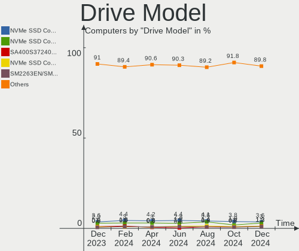

Fedora Hardware Trends
----------------------

A project to identify most popular hardware characteristics and track their change
over time based on data collected by Fedora users at https://Linux-Hardware.org.

Anyone can contribute to this report by the [hw-probe](https://github.com/linuxhw/hw-probe) tool:

    sudo -E hw-probe -all -upload

This is a report for all computer types. See also reports for [desktops](/Dist/Fedora/Desktop/README.md) and [notebooks](/Dist/Fedora/Notebook/README.md).

Full-feature report is available here: https://linux-hardware.org/?view=trends

Period: Mar, 2022.

Contents
--------

* [ System ](#system)
  - [ OS                       ](#os)
  - [ OS Family                ](#os-family)
  - [ Kernel                   ](#kernel)
  - [ Kernel Family            ](#kernel-family)
  - [ Kernel Major Ver.        ](#kernel-major-ver)
  - [ Arch                     ](#arch)
  - [ DE                       ](#de)
  - [ Display Server           ](#display-server)
  - [ Display Manager          ](#display-manager)
  - [ OS Lang                  ](#os-lang)
  - [ Boot Mode                ](#boot-mode)
  - [ Filesystem               ](#filesystem)
  - [ Part. scheme             ](#part-scheme)
  - [ Dual Boot with Linux/BSD ](#dual-boot-with-linuxbsd)
  - [ Dual Boot (Win)          ](#dual-boot-win)

* [ Board ](#board)
  - [ Vendor                   ](#vendor)
  - [ Model                    ](#model)
  - [ Model Family             ](#model-family)
  - [ MFG Year                 ](#mfg-year)
  - [ Form Factor              ](#form-factor)
  - [ Secure Boot              ](#secure-boot)
  - [ Coreboot                 ](#coreboot)
  - [ RAM Size                 ](#ram-size)
  - [ RAM Used                 ](#ram-used)
  - [ Total Drives             ](#total-drives)
  - [ Has CD-ROM               ](#has-cd-rom)
  - [ Has Ethernet             ](#has-ethernet)
  - [ Has WiFi                 ](#has-wifi)
  - [ Has Bluetooth            ](#has-bluetooth)

* [ Location ](#location)
  - [ Country                  ](#country)
  - [ City                     ](#city)

* [ Drives ](#drives)
  - [ Drive Vendor             ](#drive-vendor)
  - [ Drive Model              ](#drive-model)
  - [ HDD Vendor               ](#hdd-vendor)
  - [ SSD Vendor               ](#ssd-vendor)
  - [ Drive Kind               ](#drive-kind)
  - [ Drive Connector          ](#drive-connector)
  - [ Drive Size               ](#drive-size)
  - [ Space Total              ](#space-total)
  - [ Space Used               ](#space-used)
  - [ Malfunc. Drives          ](#malfunc-drives)
  - [ Malfunc. Drive Vendor    ](#malfunc-drive-vendor)
  - [ Malfunc. HDD Vendor      ](#malfunc-hdd-vendor)
  - [ Malfunc. Drive Kind      ](#malfunc-drive-kind)
  - [ Failed Drives            ](#failed-drives)
  - [ Failed Drive Vendor      ](#failed-drive-vendor)
  - [ Drive Status             ](#drive-status)

* [ Storage controller ](#storage-controller)
  - [ Storage Vendor           ](#storage-vendor)
  - [ Storage Model            ](#storage-model)
  - [ Storage Kind             ](#storage-kind)

* [ Processor ](#processor)
  - [ CPU Vendor               ](#cpu-vendor)
  - [ CPU Model                ](#cpu-model)
  - [ CPU Model Family         ](#cpu-model-family)
  - [ CPU Cores                ](#cpu-cores)
  - [ CPU Sockets              ](#cpu-sockets)
  - [ CPU Threads              ](#cpu-threads)
  - [ CPU Op-Modes             ](#cpu-op-modes)
  - [ CPU Microcode            ](#cpu-microcode)
  - [ CPU Microarch            ](#cpu-microarch)

* [ Graphics ](#graphics)
  - [ GPU Vendor               ](#gpu-vendor)
  - [ GPU Model                ](#gpu-model)
  - [ GPU Combo                ](#gpu-combo)
  - [ GPU Driver               ](#gpu-driver)
  - [ GPU Memory               ](#gpu-memory)

* [ Monitor ](#monitor)
  - [ Monitor Vendor           ](#monitor-vendor)
  - [ Monitor Model            ](#monitor-model)
  - [ Monitor Resolution       ](#monitor-resolution)
  - [ Monitor Diagonal         ](#monitor-diagonal)
  - [ Monitor Width            ](#monitor-width)
  - [ Aspect Ratio             ](#aspect-ratio)
  - [ Monitor Area             ](#monitor-area)
  - [ Pixel Density            ](#pixel-density)
  - [ Multiple Monitors        ](#multiple-monitors)

* [ Network ](#network)
  - [ Net Controller Vendor    ](#net-controller-vendor)
  - [ Net Controller Model     ](#net-controller-model)
  - [ Wireless Vendor          ](#wireless-vendor)
  - [ Wireless Model           ](#wireless-model)
  - [ Ethernet Vendor          ](#ethernet-vendor)
  - [ Ethernet Model           ](#ethernet-model)
  - [ Net Controller Kind      ](#net-controller-kind)
  - [ Used Controller          ](#used-controller)
  - [ NICs                     ](#nics)
  - [ IPv6                     ](#ipv6)

* [ Bluetooth ](#bluetooth)
  - [ Bluetooth Vendor         ](#bluetooth-vendor)
  - [ Bluetooth Model          ](#bluetooth-model)

* [ Sound ](#sound)
  - [ Sound Vendor             ](#sound-vendor)
  - [ Sound Model              ](#sound-model)

* [ Memory ](#memory)
  - [ Memory Vendor            ](#memory-vendor)
  - [ Memory Model             ](#memory-model)
  - [ Memory Kind              ](#memory-kind)
  - [ Memory Form Factor       ](#memory-form-factor)
  - [ Memory Size              ](#memory-size)
  - [ Memory Speed             ](#memory-speed)

* [ Printers & scanners ](#printers--scanners)
  - [ Printer Vendor           ](#printer-vendor)
  - [ Printer Model            ](#printer-model)
  - [ Scanner Vendor           ](#scanner-vendor)
  - [ Scanner Model            ](#scanner-model)

* [ Camera ](#camera)
  - [ Camera Vendor            ](#camera-vendor)
  - [ Camera Model             ](#camera-model)

* [ Security ](#security)
  - [ Fingerprint Vendor       ](#fingerprint-vendor)
  - [ Fingerprint Model        ](#fingerprint-model)
  - [ Chipcard Vendor          ](#chipcard-vendor)
  - [ Chipcard Model           ](#chipcard-model)

* [ Unsupported ](#unsupported)
  - [ Unsupported Devices      ](#unsupported-devices)
  - [ Unsupported Device Types ](#unsupported-device-types)

System
------

OS
--

Installed operating systems

| Name      | Computers | Percent |
|-----------|-----------|---------|
| Fedora 35 | 256       | 87.37%  |
| Fedora 36 | 20        | 6.83%   |
| Fedora 34 | 11        | 3.75%   |
| Fedora 33 | 3         | 1.02%   |
| Fedora 32 | 2         | 0.68%   |
| Fedora 37 | 1         | 0.34%   |

OS Family
---------

OS without a version

| Name   | Computers | Percent |
|--------|-----------|---------|
| Fedora | 293       | 100%    |

Kernel
------

Version of the Linux kernel

| Version                           | Computers | Percent |
|-----------------------------------|-----------|---------|
| 5.16.16-200.fc35.x86_64           | 62        | 21.16%  |
| 5.16.12-200.fc35.x86_64           | 60        | 20.48%  |
| 5.16.11-200.fc35.x86_64           | 29        | 9.9%    |
| 5.16.15-201.fc35.x86_64           | 23        | 7.85%   |
| 5.16.14-200.fc35.x86_64           | 18        | 6.14%   |
| 5.14.10-300.fc35.x86_64           | 17        | 5.8%    |
| 5.16.18-200.fc35.x86_64           | 15        | 5.12%   |
| 5.16.13-200.fc35.x86_64           | 9         | 3.07%   |
| 5.17.1-300.fc36.x86_64            | 8         | 2.73%   |
| 5.17.0-0.rc7.116.fc36.x86_64      | 6         | 2.05%   |
| 5.16.17-200.fc35.x86_64           | 5         | 1.71%   |
| 5.16.9-200.fc35.x86_64            | 4         | 1.37%   |
| 5.16.12-100.fc34.x86_64           | 4         | 1.37%   |
| 5.17.0-300.fc36.x86_64            | 3         | 1.02%   |
| 5.17.0-0.rc5.102.fc36.x86_64      | 3         | 1.02%   |
| 5.14.18-100.fc33.x86_64           | 3         | 1.02%   |
| 5.16.11-100.fc34.x86_64           | 2         | 0.68%   |
| 5.16.10-200.fc35.x86_64           | 2         | 0.68%   |
| 5.15.18-200.fc35.x86_64           | 2         | 0.68%   |
| 5.15.10-200.fc35.x86_64           | 2         | 0.68%   |
| 5.17.0-0.rc6.109.fc37.x86_64      | 1         | 0.34%   |
| 5.16.9-100.fc34.x86_64            | 1         | 0.34%   |
| 5.16.7-200.fc35.x86_64            | 1         | 0.34%   |
| 5.16.5-200.fc35.x86_64            | 1         | 0.34%   |
| 5.16.16-lqx2.0.fc35.x86_64        | 1         | 0.34%   |
| 5.16.16-100.fc34.x86_64           | 1         | 0.34%   |
| 5.16.13-xm1.0.fc35.x86_64         | 1         | 0.34%   |
| 5.16.12-250.vanilla.1.fc35.x86_64 | 1         | 0.34%   |
| 5.16.12-200.mbp.fc33.x86_64       | 1         | 0.34%   |
| 5.16.11-xm1.0.fc35.x86_64         | 1         | 0.34%   |
| 5.15.16-200.fc35.x86_64           | 1         | 0.34%   |
| 5.15.16-100.fc34.x86_64           | 1         | 0.34%   |
| 5.15.12-100.fc34.x86_64           | 1         | 0.34%   |
| 5.11.22-100.fc32.x86_64           | 1         | 0.34%   |
| 5.11.15-100.fc32.x86_64           | 1         | 0.34%   |
| 5.10.102-200.fc34.x86_64          | 1         | 0.34%   |

Kernel Family
-------------

Linux kernel without a distro release

| Version  | Computers | Percent |
|----------|-----------|---------|
| 5.16.12  | 66        | 22.53%  |
| 5.16.16  | 64        | 21.84%  |
| 5.16.11  | 32        | 10.92%  |
| 5.16.15  | 23        | 7.85%   |
| 5.16.14  | 18        | 6.14%   |
| 5.14.10  | 17        | 5.8%    |
| 5.16.18  | 15        | 5.12%   |
| 5.17.0   | 13        | 4.44%   |
| 5.16.13  | 10        | 3.41%   |
| 5.17.1   | 8         | 2.73%   |
| 5.16.9   | 5         | 1.71%   |
| 5.16.17  | 5         | 1.71%   |
| 5.14.18  | 3         | 1.02%   |
| 5.16.10  | 2         | 0.68%   |
| 5.15.18  | 2         | 0.68%   |
| 5.15.16  | 2         | 0.68%   |
| 5.15.10  | 2         | 0.68%   |
| 5.16.7   | 1         | 0.34%   |
| 5.16.5   | 1         | 0.34%   |
| 5.15.12  | 1         | 0.34%   |
| 5.11.22  | 1         | 0.34%   |
| 5.11.15  | 1         | 0.34%   |
| 5.10.102 | 1         | 0.34%   |

Kernel Major Ver.
-----------------

Linux kernel major version

| Version | Computers | Percent |
|---------|-----------|---------|
| 5.16    | 242       | 82.59%  |
| 5.17    | 21        | 7.17%   |
| 5.14    | 20        | 6.83%   |
| 5.15    | 7         | 2.39%   |
| 5.11    | 2         | 0.68%   |
| 5.10    | 1         | 0.34%   |

Arch
----

OS architecture (x86_64, i586, etc.)

| Name   | Computers | Percent |
|--------|-----------|---------|
| x86_64 | 293       | 100%    |

DE
--

Desktop Environment

| Name          | Computers | Percent |
|---------------|-----------|---------|
| GNOME         | 233       | 79.52%  |
| KDE5          | 28        | 9.56%   |
| Unknown       | 7         | 2.39%   |
| XFCE          | 6         | 2.05%   |
| Cinnamon      | 6         | 2.05%   |
| X-Cinnamon    | 4         | 1.37%   |
| MATE          | 3         | 1.02%   |
| GNOME Classic | 3         | 1.02%   |
| openbox       | 1         | 0.34%   |
| LXQt          | 1         | 0.34%   |
| KDE           | 1         | 0.34%   |

Display Server
--------------

X11 or Wayland

| Name    | Computers | Percent |
|---------|-----------|---------|
| Wayland | 184       | 62.8%   |
| X11     | 101       | 34.47%  |
| Tty     | 4         | 1.37%   |
| Unknown | 3         | 1.02%   |
| Web     | 1         | 0.34%   |

Display Manager
---------------

SDDM, LightDM, etc.

| Name    | Computers | Percent |
|---------|-----------|---------|
| Unknown | 159       | 54.27%  |
| GDM     | 99        | 33.79%  |
| LightDM | 19        | 6.48%   |
| SDDM    | 16        | 5.46%   |

OS Lang
-------

Language

| Lang  | Computers | Percent |
|-------|-----------|---------|
| en_US | 138       | 47.1%   |
| en_GB | 22        | 7.51%   |
| ru_RU | 17        | 5.8%    |
| fr_FR | 16        | 5.46%   |
| pt_BR | 14        | 4.78%   |
| de_DE | 10        | 3.41%   |
| it_IT | 7         | 2.39%   |
| en_CA | 7         | 2.39%   |
| es_MX | 6         | 2.05%   |
| en_AU | 6         | 2.05%   |
| pl_PL | 4         | 1.37%   |
| nl_BE | 4         | 1.37%   |
| tr_TR | 3         | 1.02%   |
| cs_CZ | 3         | 1.02%   |
| zh_CN | 2         | 0.68%   |
| nl_NL | 2         | 0.68%   |
| fr_CH | 2         | 0.68%   |
| fr_BE | 2         | 0.68%   |
| es_AR | 2         | 0.68%   |
| en_IN | 2         | 0.68%   |
| C     | 2         | 0.68%   |
| uk_UA | 1         | 0.34%   |
| sr_RS | 1         | 0.34%   |
| nb_NO | 1         | 0.34%   |
| lt_LT | 1         | 0.34%   |
| id_ID | 1         | 0.34%   |
| hu_HU | 1         | 0.34%   |
| fr_CA | 1         | 0.34%   |
| fi_FI | 1         | 0.34%   |
| es_VE | 1         | 0.34%   |
| es_GT | 1         | 0.34%   |
| es_ES | 1         | 0.34%   |
| es_EC | 1         | 0.34%   |
| es_CO | 1         | 0.34%   |
| es_CL | 1         | 0.34%   |
| en_ZA | 1         | 0.34%   |
| en_NZ | 1         | 0.34%   |
| en_IL | 1         | 0.34%   |
| en_IE | 1         | 0.34%   |
| de_CH | 1         | 0.34%   |
| da_DK | 1         | 0.34%   |
| bs_BA | 1         | 0.34%   |
| ar_SA | 1         | 0.34%   |

Boot Mode
---------

EFI or BIOS

| Mode | Computers | Percent |
|------|-----------|---------|
| EFI  | 235       | 80.2%   |
| BIOS | 58        | 19.8%   |

Filesystem
----------

Type of filesystem

| Type    | Computers | Percent |
|---------|-----------|---------|
| Btrfs   | 227       | 77.47%  |
| Ext4    | 56        | 19.11%  |
| Xfs     | 9         | 3.07%   |
| Overlay | 1         | 0.34%   |

Part. scheme
------------

Scheme of partitioning

| Type    | Computers | Percent |
|---------|-----------|---------|
| Unknown | 161       | 54.95%  |
| GPT     | 121       | 41.3%   |
| MBR     | 11        | 3.75%   |

Dual Boot with Linux/BSD
------------------------

Hosting more than one Linux/BSD

| Dual boot | Computers | Percent |
|-----------|-----------|---------|
| No        | 268       | 91.47%  |
| Yes       | 25        | 8.53%   |

Dual Boot (Win)
---------------

Hosting Linux and Windows

| Dual boot | Computers | Percent |
|-----------|-----------|---------|
| No        | 240       | 81.91%  |
| Yes       | 53        | 18.09%  |

Board
-----

Vendor
------

Motherboard manufacturer

| Name                   | Computers | Percent |
|------------------------|-----------|---------|
| Lenovo                 | 53        | 18.09%  |
| Hewlett-Packard        | 45        | 15.36%  |
| ASUSTek Computer       | 43        | 14.68%  |
| Dell                   | 37        | 12.63%  |
| Gigabyte Technology    | 25        | 8.53%   |
| MSI                    | 19        | 6.48%   |
| Acer                   | 16        | 5.46%   |
| Apple                  | 11        | 3.75%   |
| ASRock                 | 6         | 2.05%   |
| HUAWEI                 | 3         | 1.02%   |
| Toshiba                | 2         | 0.68%   |
| System76               | 2         | 0.68%   |
| Sony                   | 2         | 0.68%   |
| Positivo               | 2         | 0.68%   |
| Medion                 | 2         | 0.68%   |
| Intel                  | 2         | 0.68%   |
| Vulcan Electronics     | 1         | 0.34%   |
| VALE                   | 1         | 0.34%   |
| TUXEDO                 | 1         | 0.34%   |
| Timi                   | 1         | 0.34%   |
| Supermicro             | 1         | 0.34%   |
| Samsung Electronics    | 1         | 0.34%   |
| Razer                  | 1         | 0.34%   |
| MACHINIST              | 1         | 0.34%   |
| HPE                    | 1         | 0.34%   |
| HONOR                  | 1         | 0.34%   |
| Hampoo                 | 1         | 0.34%   |
| Gateway                | 1         | 0.34%   |
| Fujitsu Siemens        | 1         | 0.34%   |
| Fujitsu                | 1         | 0.34%   |
| Framework              | 1         | 0.34%   |
| eMachines              | 1         | 0.34%   |
| Digibras               | 1         | 0.34%   |
| Colorful Technology    | 1         | 0.34%   |
| BESSTAR Tech           | 1         | 0.34%   |
| Avell High Performance | 1         | 0.34%   |
| Alienware              | 1         | 0.34%   |
| ABIT                   | 1         | 0.34%   |
| AAEON                  | 1         | 0.34%   |

Model
-----

Motherboard model

| Name                                       | Computers | Percent |
|--------------------------------------------|-----------|---------|
| HP Pavilion Aero Laptop 13-be0xxx          | 3         | 1.02%   |
| Apple iMac12,2                             | 3         | 1.02%   |
| MSI MS-7C37                                | 2         | 0.68%   |
| MSI MS-7B79                                | 2         | 0.68%   |
| MSI GE75 Raider 10SE                       | 2         | 0.68%   |
| Lenovo ThinkBook 15 G2 ITL 20VE            | 2         | 0.68%   |
| HP Pavilion Gaming Laptop 15-ec1xxx        | 2         | 0.68%   |
| HP EliteBook 850 G5                        | 2         | 0.68%   |
| Gigabyte X570 AORUS MASTER                 | 2         | 0.68%   |
| Dell Precision T3600                       | 2         | 0.68%   |
| Dell Latitude 7285                         | 2         | 0.68%   |
| ASUS ROG STRIX B550-I GAMING               | 2         | 0.68%   |
| ASUS ROG STRIX B550-F GAMING               | 2         | 0.68%   |
| ASUS ROG CROSSHAIR VII HERO                | 2         | 0.68%   |
| ASUS PRIME B450M-A                         | 2         | 0.68%   |
| Vulcan Excursion XB                        | 1         | 0.34%   |
| VALE Notebook Slim S132                    | 1         | 0.34%   |
| TUXEDO Polaris Intel Gen3 (TGL)            | 1         | 0.34%   |
| Toshiba TECRA Z50-A                        | 1         | 0.34%   |
| Toshiba Satellite C855-12R                 | 1         | 0.34%   |
| Timi TM1612                                | 1         | 0.34%   |
| System76 Oryx Pro                          | 1         | 0.34%   |
| System76 Gazelle                           | 1         | 0.34%   |
| Supermicro SYS-1029U-TRT                   | 1         | 0.34%   |
| Sony VGN-FW180D                            | 1         | 0.34%   |
| Sony SVF14213CLB                           | 1         | 0.34%   |
| Samsung RC420/RC520/RC720                  | 1         | 0.34%   |
| Razer Blade Stealth                        | 1         | 0.34%   |
| Positivo N1250                             | 1         | 0.34%   |
| Positivo CHT12CP                           | 1         | 0.34%   |
| MSI Stealth GS66 12UHS                     | 1         | 0.34%   |
| MSI PPPPP-CCC#MMMMMMMM                     | 1         | 0.34%   |
| MSI MS-7D06                                | 1         | 0.34%   |
| MSI MS-7C92                                | 1         | 0.34%   |
| MSI MS-7C56                                | 1         | 0.34%   |
| MSI MS-7B93                                | 1         | 0.34%   |
| MSI MS-7B85                                | 1         | 0.34%   |
| MSI MS-7B17                                | 1         | 0.34%   |
| MSI MS-7A38                                | 1         | 0.34%   |
| MSI MS-7816                                | 1         | 0.34%   |
| MSI Delta 15 A5EFK                         | 1         | 0.34%   |
| MSI CQ3321L                                | 1         | 0.34%   |
| MSI AUTOCONT OFFICEPRO                     | 1         | 0.34%   |
| Medion E3222                               | 1         | 0.34%   |
| Medion Akoya P6638                         | 1         | 0.34%   |
| MACHINIST X99-G7 V1.0                      | 1         | 0.34%   |
| Lenovo Yoga Slim 7 Pro 14ACH5 82MS         | 1         | 0.34%   |
| Lenovo Yoga 9 14ITL5 82BG                  | 1         | 0.34%   |
| Lenovo Yoga 730-13IWL 81JR                 | 1         | 0.34%   |
| Lenovo Yoga 7 14ITL5 82BH                  | 1         | 0.34%   |
| Lenovo V330-15IKB 81AX                     | 1         | 0.34%   |
| Lenovo V14-ADA 82C6                        | 1         | 0.34%   |
| Lenovo ThinkPad X270 20HMS6AT00            | 1         | 0.34%   |
| Lenovo ThinkPad X260 20F5S0HK1J            | 1         | 0.34%   |
| Lenovo ThinkPad X250 20CLS09Y19            | 1         | 0.34%   |
| Lenovo ThinkPad X220 428767U               | 1         | 0.34%   |
| Lenovo ThinkPad X1 Yoga 2nd 20JF000DUS     | 1         | 0.34%   |
| Lenovo ThinkPad X1 Yoga 1st 20FRS55D00     | 1         | 0.34%   |
| Lenovo ThinkPad X1 Carbon Gen 9 20XW00A9US | 1         | 0.34%   |
| Lenovo ThinkPad X1 Carbon 7th 20QD003LAD   | 1         | 0.34%   |

Model Family
------------

Motherboard model prefix

| Name                     | Computers | Percent |
|--------------------------|-----------|---------|
| Lenovo ThinkPad          | 22        | 7.51%   |
| HP Pavilion              | 15        | 5.12%   |
| ASUS ROG                 | 15        | 5.12%   |
| Lenovo IdeaPad           | 12        | 4.1%    |
| Dell Inspiron            | 10        | 3.41%   |
| Dell Latitude            | 9         | 3.07%   |
| Acer Aspire              | 9         | 3.07%   |
| HP EliteBook             | 7         | 2.39%   |
| Dell XPS                 | 7         | 2.39%   |
| ASUS PRIME               | 7         | 2.39%   |
| HP ProBook               | 5         | 1.71%   |
| HP Laptop                | 5         | 1.71%   |
| Lenovo Yoga              | 4         | 1.37%   |
| Lenovo ThinkCentre       | 4         | 1.37%   |
| HP ZBook                 | 4         | 1.37%   |
| Dell Precision           | 4         | 1.37%   |
| ASUS TUF                 | 4         | 1.37%   |
| Apple iMac12             | 4         | 1.37%   |
| Gigabyte X570            | 3         | 1.02%   |
| Dell Vostro              | 3         | 1.02%   |
| MSI MS-7C37              | 2         | 0.68%   |
| MSI MS-7B79              | 2         | 0.68%   |
| MSI GE75                 | 2         | 0.68%   |
| Lenovo ThinkBook         | 2         | 0.68%   |
| Lenovo Legion            | 2         | 0.68%   |
| HP ENVY                  | 2         | 0.68%   |
| Gigabyte G1.Sniper       | 2         | 0.68%   |
| Gigabyte B450            | 2         | 0.68%   |
| Dell OptiPlex            | 2         | 0.68%   |
| Dell G5                  | 2         | 0.68%   |
| Acer Veriton             | 2         | 0.68%   |
| Vulcan Excursion         | 1         | 0.34%   |
| VALE Notebook            | 1         | 0.34%   |
| TUXEDO Polaris           | 1         | 0.34%   |
| Toshiba TECRA            | 1         | 0.34%   |
| Toshiba Satellite        | 1         | 0.34%   |
| Timi TM1612              | 1         | 0.34%   |
| System76 Oryx            | 1         | 0.34%   |
| System76 Gazelle         | 1         | 0.34%   |
| Supermicro SYS-1029U-TRT | 1         | 0.34%   |
| Sony VGN-FW180D          | 1         | 0.34%   |
| Sony SVF14213CLB         | 1         | 0.34%   |
| Samsung RC420            | 1         | 0.34%   |
| Razer Blade              | 1         | 0.34%   |
| Positivo N1250           | 1         | 0.34%   |
| Positivo CHT12CP         | 1         | 0.34%   |
| MSI Stealth              | 1         | 0.34%   |
| MSI PPPPP-CCC#MMMMMMMM   | 1         | 0.34%   |
| MSI MS-7D06              | 1         | 0.34%   |
| MSI MS-7C92              | 1         | 0.34%   |
| MSI MS-7C56              | 1         | 0.34%   |
| MSI MS-7B93              | 1         | 0.34%   |
| MSI MS-7B85              | 1         | 0.34%   |
| MSI MS-7B17              | 1         | 0.34%   |
| MSI MS-7A38              | 1         | 0.34%   |
| MSI MS-7816              | 1         | 0.34%   |
| MSI Delta                | 1         | 0.34%   |
| MSI CQ3321L              | 1         | 0.34%   |
| MSI AUTOCONT             | 1         | 0.34%   |
| Medion E3222             | 1         | 0.34%   |

MFG Year
--------

Motherboard manufacture year

| Year | Computers | Percent |
|------|-----------|---------|
| 2020 | 58        | 19.8%   |
| 2021 | 40        | 13.65%  |
| 2018 | 32        | 10.92%  |
| 2019 | 31        | 10.58%  |
| 2017 | 23        | 7.85%   |
| 2013 | 19        | 6.48%   |
| 2011 | 19        | 6.48%   |
| 2015 | 15        | 5.12%   |
| 2012 | 15        | 5.12%   |
| 2014 | 13        | 4.44%   |
| 2016 | 11        | 3.75%   |
| 2010 | 7         | 2.39%   |
| 2008 | 6         | 2.05%   |
| 2009 | 2         | 0.68%   |
| 2022 | 1         | 0.34%   |
| 2007 | 1         | 0.34%   |

Form Factor
-----------

Physical design of the computer

| Name        | Computers | Percent |
|-------------|-----------|---------|
| Notebook    | 168       | 57.34%  |
| Desktop     | 100       | 34.13%  |
| Convertible | 12        | 4.1%    |
| All in one  | 9         | 3.07%   |
| Mini pc     | 2         | 0.68%   |
| Server      | 2         | 0.68%   |

Secure Boot
-----------

Enabled or disabled

| State    | Computers | Percent |
|----------|-----------|---------|
| Disabled | 257       | 87.71%  |
| Enabled  | 36        | 12.29%  |

Coreboot
--------

Have coreboot on board

| Used | Computers | Percent |
|------|-----------|---------|
| No   | 293       | 100%    |

RAM Size
--------

Total RAM memory

| Size in GB      | Computers | Percent |
|-----------------|-----------|---------|
| 16.01-24.0      | 83        | 28.33%  |
| 4.01-8.0        | 56        | 19.11%  |
| 8.01-16.0       | 54        | 18.43%  |
| 32.01-64.0      | 44        | 15.02%  |
| 3.01-4.0        | 35        | 11.95%  |
| 64.01-256.0     | 13        | 4.44%   |
| 24.01-32.0      | 5         | 1.71%   |
| 1.01-2.0        | 2         | 0.68%   |
| More than 256.0 | 1         | 0.34%   |

RAM Used
--------

Used RAM memory

| Used GB    | Computers | Percent |
|------------|-----------|---------|
| 4.01-8.0   | 82        | 27.99%  |
| 2.01-3.0   | 80        | 27.3%   |
| 3.01-4.0   | 69        | 23.55%  |
| 1.01-2.0   | 35        | 11.95%  |
| 8.01-16.0  | 17        | 5.8%    |
| 16.01-24.0 | 7         | 2.39%   |
| 32.01-64.0 | 1         | 0.34%   |
| 24.01-32.0 | 1         | 0.34%   |
| 0.51-1.0   | 1         | 0.34%   |

Total Drives
------------

Number of drives on board

| Drives | Computers | Percent |
|--------|-----------|---------|
| 1      | 150       | 51.19%  |
| 2      | 96        | 32.76%  |
| 3      | 24        | 8.19%   |
| 4      | 15        | 5.12%   |
| 7      | 3         | 1.02%   |
| 5      | 3         | 1.02%   |
| 8      | 1         | 0.34%   |
| 6      | 1         | 0.34%   |

Has CD-ROM
----------

Has CD-ROM on board

| Presented | Computers | Percent |
|-----------|-----------|---------|
| No        | 222       | 75.77%  |
| Yes       | 71        | 24.23%  |

Has Ethernet
------------

Has Ethernet on board

| Presented | Computers | Percent |
|-----------|-----------|---------|
| Yes       | 249       | 84.98%  |
| No        | 44        | 15.02%  |

Has WiFi
--------

Has WiFi module

| Presented | Computers | Percent |
|-----------|-----------|---------|
| Yes       | 236       | 80.55%  |
| No        | 57        | 19.45%  |

Has Bluetooth
-------------

Has Bluetooth module

| Presented | Computers | Percent |
|-----------|-----------|---------|
| Yes       | 205       | 69.97%  |
| No        | 88        | 30.03%  |

Location
--------

Country
-------

Geographic location (country)

| Country      | Computers | Percent |
|--------------|-----------|---------|
| USA          | 50        | 17.06%  |
| Brazil       | 23        | 7.85%   |
| Russia       | 18        | 6.14%   |
| France       | 15        | 5.12%   |
| UK           | 14        | 4.78%   |
| Germany      | 12        | 4.1%    |
| Canada       | 12        | 4.1%    |
| Belgium      | 10        | 3.41%   |
| Netherlands  | 9         | 3.07%   |
| Indonesia    | 9         | 3.07%   |
| Italy        | 8         | 2.73%   |
| Poland       | 7         | 2.39%   |
| Mexico       | 7         | 2.39%   |
| Turkey       | 6         | 2.05%   |
| Norway       | 6         | 2.05%   |
| Australia    | 6         | 2.05%   |
| Czechia      | 5         | 1.71%   |
| Switzerland  | 4         | 1.37%   |
| Sweden       | 4         | 1.37%   |
| Belarus      | 4         | 1.37%   |
| Argentina    | 4         | 1.37%   |
| Spain        | 3         | 1.02%   |
| India        | 3         | 1.02%   |
| Hungary      | 3         | 1.02%   |
| Ukraine      | 2         | 0.68%   |
| Saudi Arabia | 2         | 0.68%   |
| Romania      | 2         | 0.68%   |
| Philippines  | 2         | 0.68%   |
| Latvia       | 2         | 0.68%   |
| Kuwait       | 2         | 0.68%   |
| Israel       | 2         | 0.68%   |
| Hong Kong    | 2         | 0.68%   |
| Chile        | 2         | 0.68%   |
| Bulgaria     | 2         | 0.68%   |
| Austria      | 2         | 0.68%   |
| Yemen        | 1         | 0.34%   |
| Venezuela    | 1         | 0.34%   |
| Uzbekistan   | 1         | 0.34%   |
| Uruguay      | 1         | 0.34%   |
| UAE          | 1         | 0.34%   |
| Tunisia      | 1         | 0.34%   |
| South Africa | 1         | 0.34%   |
| Slovenia     | 1         | 0.34%   |
| Serbia       | 1         | 0.34%   |
| Panama       | 1         | 0.34%   |
| New Zealand  | 1         | 0.34%   |
| Myanmar      | 1         | 0.34%   |
| Malaysia     | 1         | 0.34%   |
| Lithuania    | 1         | 0.34%   |
| Kyrgyzstan   | 1         | 0.34%   |
| Japan        | 1         | 0.34%   |
| Ireland      | 1         | 0.34%   |
| Iran         | 1         | 0.34%   |
| Honduras     | 1         | 0.34%   |
| Guatemala    | 1         | 0.34%   |
| Greece       | 1         | 0.34%   |
| Finland      | 1         | 0.34%   |
| Estonia      | 1         | 0.34%   |
| Ecuador      | 1         | 0.34%   |
| Denmark      | 1         | 0.34%   |

City
----

Geographic location (city)

| City              | Computers | Percent |
|-------------------|-----------|---------|
| Sao Paulo         | 5         | 1.71%   |
| Jakarta           | 5         | 1.71%   |
| Sydney            | 4         | 1.37%   |
| Moscow            | 4         | 1.37%   |
| Minsk             | 4         | 1.37%   |
| Istanbul          | 4         | 1.37%   |
| Warsaw            | 3         | 1.02%   |
| Seattle           | 3         | 1.02%   |
| Paris             | 3         | 1.02%   |
| Antwerp           | 3         | 1.02%   |
| Vancouver         | 2         | 0.68%   |
| St Petersburg     | 2         | 0.68%   |
| Santiago          | 2         | 0.68%   |
| Rostov-on-Don     | 2         | 0.68%   |
| Riyadh            | 2         | 0.68%   |
| Riga              | 2         | 0.68%   |
| Portland          | 2         | 0.68%   |
| Oslo              | 2         | 0.68%   |
| Nuremberg         | 2         | 0.68%   |
| Mexico City       | 2         | 0.68%   |
| Louisville        | 2         | 0.68%   |
| Los Angeles       | 2         | 0.68%   |
| Kuwait City       | 2         | 0.68%   |
| Houston           | 2         | 0.68%   |
| Fortaleza         | 2         | 0.68%   |
| Dundee            | 2         | 0.68%   |
| Canton            | 2         | 0.68%   |
| Buenos Aires      | 2         | 0.68%   |
| Bucharest         | 2         | 0.68%   |
| Brussels          | 2         | 0.68%   |
| Brno              | 2         | 0.68%   |
| Berlin            | 2         | 0.68%   |
| Ankara            | 2         | 0.68%   |
| Zagreb            | 1         | 0.34%   |
| Yuzhno-Sakhalinsk | 1         | 0.34%   |
| Yekaterinburg     | 1         | 0.34%   |
| Yangon            | 1         | 0.34%   |
| Winnipeg          | 1         | 0.34%   |
| Windsor           | 1         | 0.34%   |
| Wigan             | 1         | 0.34%   |
| West Drayton      | 1         | 0.34%   |
| Washington        | 1         | 0.34%   |
| Warrington        | 1         | 0.34%   |
| Vrchlabi          | 1         | 0.34%   |
| Vitória          | 1         | 0.34%   |
| Vienna            | 1         | 0.34%   |
| Victoria          | 1         | 0.34%   |
| Vicosa            | 1         | 0.34%   |
| Vegarshei         | 1         | 0.34%   |
| Varginha          | 1         | 0.34%   |
| Vantaa            | 1         | 0.34%   |
| Valence           | 1         | 0.34%   |
| Valbrembo         | 1         | 0.34%   |
| Umeå             | 1         | 0.34%   |
| Ulyanovsk         | 1         | 0.34%   |
| Ufa               | 1         | 0.34%   |
| Tunis             | 1         | 0.34%   |
| Tseung Kwan O     | 1         | 0.34%   |
| Trondheim         | 1         | 0.34%   |
| Tijucas           | 1         | 0.34%   |

Drives
------

Drive Vendor
------------

Hard drive vendors

| Vendor                         | Computers | Drives | Percent |
|--------------------------------|-----------|--------|---------|
| Samsung Electronics            | 88        | 119    | 20.09%  |
| WDC                            | 60        | 78     | 13.7%   |
| Seagate                        | 45        | 65     | 10.27%  |
| Toshiba                        | 28        | 29     | 6.39%   |
| Kingston                       | 27        | 27     | 6.16%   |
| SanDisk                        | 23        | 26     | 5.25%   |
| Crucial                        | 18        | 20     | 4.11%   |
| SK Hynix                       | 14        | 14     | 3.2%    |
| Intel                          | 14        | 16     | 3.2%    |
| Unknown                        | 13        | 18     | 2.97%   |
| A-DATA Technology              | 10        | 10     | 2.28%   |
| Micron Technology              | 8         | 9      | 1.83%   |
| KIOXIA                         | 8         | 8      | 1.83%   |
| Hitachi                        | 8         | 8      | 1.83%   |
| Phison                         | 6         | 6      | 1.37%   |
| Apple                          | 6         | 7      | 1.37%   |
| HGST                           | 4         | 4      | 0.91%   |
| Transcend                      | 3         | 3      | 0.68%   |
| Silicon Motion                 | 3         | 3      | 0.68%   |
| OCZ                            | 3         | 3      | 0.68%   |
| Unknown                        | 3         | 3      | 0.68%   |
| XPG                            | 2         | 2      | 0.46%   |
| UMIS                           | 2         | 2      | 0.46%   |
| SSK                            | 2         | 2      | 0.46%   |
| SPCC                           | 2         | 2      | 0.46%   |
| Realtek Semiconductor          | 2         | 2      | 0.46%   |
| JMicron                        | 2         | 2      | 0.46%   |
| Corsair                        | 2         | 2      | 0.46%   |
| China                          | 2         | 2      | 0.46%   |
| YMTC                           | 1         | 1      | 0.23%   |
| Team                           | 1         | 1      | 0.23%   |
| Solid State Storage Technology | 1         | 1      | 0.23%   |
| sobetter                       | 1         | 1      | 0.23%   |
| Ramsta                         | 1         | 1      | 0.23%   |
| PNY                            | 1         | 2      | 0.23%   |
| PLEXTOR                        | 1         | 2      | 0.23%   |
| Patriot                        | 1         | 1      | 0.23%   |
| NE-1TB                         | 1         | 1      | 0.23%   |
| Mushkin                        | 1         | 1      | 0.23%   |
| MAXTOR                         | 1         | 1      | 0.23%   |
| MaxDigital                     | 1         | 1      | 0.23%   |
| LITEONIT                       | 1         | 1      | 0.23%   |
| LITEON                         | 1         | 1      | 0.23%   |
| Lexar                          | 1         | 1      | 0.23%   |
| LDLC                           | 1         | 1      | 0.23%   |
| KingSpec                       | 1         | 1      | 0.23%   |
| JetFlash                       | 1         | 1      | 0.23%   |
| Intenso                        | 1         | 1      | 0.23%   |
| HPE                            | 1         | 1      | 0.23%   |
| Hewlett-Packard                | 1         | 1      | 0.23%   |
| GOODRAM                        | 1         | 1      | 0.23%   |
| Gigabyte Technology            | 1         | 2      | 0.23%   |
| External                       | 1         | 1      | 0.23%   |
| CT1000P2                       | 1         | 1      | 0.23%   |
| CT1000MX                       | 1         | 1      | 0.23%   |
| APS-SL3N                       | 1         | 1      | 0.23%   |
| Apacer                         | 1         | 1      | 0.23%   |
| AMD                            | 1         | 1      | 0.23%   |
| ADATA Technology               | 1         | 1      | 0.23%   |

Drive Model
-----------

Hard drive models

| Model                                | Computers | Percent |
|--------------------------------------|-----------|---------|
| Samsung NVMe SSD Drive 1TB           | 8         | 1.62%   |
| Samsung NVMe SSD Drive 500GB         | 7         | 1.42%   |
| Kingston SA400S37240G 240GB SSD      | 7         | 1.42%   |
| Sandisk NVMe SSD Drive 1TB           | 6         | 1.21%   |
| Samsung NVMe SSD Drive 512GB         | 6         | 1.21%   |
| Sandisk NVMe SSD Drive 500GB         | 5         | 1.01%   |
| Samsung SSD 860 EVO 500GB            | 5         | 1.01%   |
| Samsung SSD 860 EVO 1TB              | 5         | 1.01%   |
| Samsung NVMe SSD Drive 256GB         | 5         | 1.01%   |
| Crucial CT1000MX500SSD1 1TB          | 5         | 1.01%   |
| Sandisk NVMe SSD Drive 512GB         | 4         | 0.81%   |
| Samsung NVMe SSD Drive 1024GB        | 4         | 0.81%   |
| Kingston SA400S37480G 480GB SSD      | 4         | 0.81%   |
| Unknown MMC Card  64GB               | 3         | 0.61%   |
| Unknown MMC Card  128GB              | 3         | 0.61%   |
| Toshiba MQ04ABF100 1TB               | 3         | 0.61%   |
| Toshiba HDWD120 2TB                  | 3         | 0.61%   |
| SK Hynix NVMe SSD Drive 512GB        | 3         | 0.61%   |
| Seagate ST4000DM004-2CV104 4TB       | 3         | 0.61%   |
| Samsung SSD 970 EVO Plus 1TB         | 3         | 0.61%   |
| Samsung SSD 860 EVO 250GB            | 3         | 0.61%   |
| Samsung SSD 850 EVO 250GB            | 3         | 0.61%   |
| Samsung NVMe SSD Drive 2TB           | 3         | 0.61%   |
| Micron NVMe SSD Drive 512GB          | 3         | 0.61%   |
| KIOXIA NVMe SSD Drive 256GB          | 3         | 0.61%   |
| Crucial CT500MX500SSD1 500GB         | 3         | 0.61%   |
| Unknown                              | 3         | 0.61%   |
| WDC WDS240G2G0A-00JH30 240GB SSD     | 2         | 0.4%    |
| WDC WDS100T2B0A-00SM50 1TB SSD       | 2         | 0.4%    |
| WDC WD30EFRX-68EUZN0 3TB             | 2         | 0.4%    |
| WDC WD20EZRZ-00Z5HB0 2TB             | 2         | 0.4%    |
| WDC WD20EARS-00MVWB0 2TB             | 2         | 0.4%    |
| WDC WD10SPZX-21Z10T0 1TB             | 2         | 0.4%    |
| WDC WD10JPVX-75JC3T0 1TB             | 2         | 0.4%    |
| WDC WD10EZEX-22MFCA0 1TB             | 2         | 0.4%    |
| WDC PC SN730 SDBQNTY-256G-1001 256GB | 2         | 0.4%    |
| Unknown MMC Card  32GB               | 2         | 0.4%    |
| Toshiba NVMe SSD Drive 512GB         | 2         | 0.4%    |
| Toshiba MQ01ABD100 1TB               | 2         | 0.4%    |
| Toshiba HDWD110 1TB                  | 2         | 0.4%    |
| SK Hynix NVMe SSD Drive 256GB        | 2         | 0.4%    |
| SK Hynix NVMe SSD Drive 1024GB       | 2         | 0.4%    |
| Seagate ST9500325AS 500GB            | 2         | 0.4%    |
| Seagate ST500LM030-2E717D 500GB      | 2         | 0.4%    |
| Seagate ST1000LM024 HN-M101MBB 1TB   | 2         | 0.4%    |
| Seagate ST1000DM003-1ER162 1TB       | 2         | 0.4%    |
| Seagate ST1000DM003-1CH162 1TB       | 2         | 0.4%    |
| SanDisk SDSSDA120G 120GB             | 2         | 0.4%    |
| Samsung SSD 970 EVO Plus 500GB       | 2         | 0.4%    |
| Samsung SSD 970 EVO 250GB            | 2         | 0.4%    |
| Samsung SSD 870 EVO 500GB            | 2         | 0.4%    |
| Samsung SSD 860 QVO 1TB              | 2         | 0.4%    |
| Samsung SSD 860 EVO 2TB              | 2         | 0.4%    |
| Samsung SSD 850 EVO 500GB            | 2         | 0.4%    |
| Samsung SSD 840 EVO 500GB            | 2         | 0.4%    |
| Samsung PM991 NVMe 256GB             | 2         | 0.4%    |
| Samsung NVMe SSD Drive 250GB         | 2         | 0.4%    |
| Samsung MZVLV256HCHP-000L2 256GB     | 2         | 0.4%    |
| Samsung MZVLQ512HBLU-00BH1 512GB     | 2         | 0.4%    |
| Samsung MZVLB1T0HBLR-000L7 1TB       | 2         | 0.4%    |

HDD Vendor
----------

Hard disk drive vendors

| Vendor              | Computers | Drives | Percent |
|---------------------|-----------|--------|---------|
| Seagate             | 44        | 62     | 37.61%  |
| WDC                 | 40        | 57     | 34.19%  |
| Toshiba             | 14        | 14     | 11.97%  |
| Hitachi             | 8         | 8      | 6.84%   |
| HGST                | 4         | 4      | 3.42%   |
| Samsung Electronics | 3         | 4      | 2.56%   |
| Unknown             | 1         | 1      | 0.85%   |
| MAXTOR              | 1         | 1      | 0.85%   |
| MaxDigital          | 1         | 1      | 0.85%   |
| Apple               | 1         | 1      | 0.85%   |

SSD Vendor
----------

Solid state drive vendors

| Vendor              | Computers | Drives | Percent |
|---------------------|-----------|--------|---------|
| Samsung Electronics | 33        | 43     | 22.92%  |
| Kingston            | 24        | 24     | 16.67%  |
| Crucial             | 16        | 17     | 11.11%  |
| WDC                 | 10        | 11     | 6.94%   |
| A-DATA Technology   | 8         | 8      | 5.56%   |
| SanDisk             | 7         | 7      | 4.86%   |
| Intel               | 5         | 5      | 3.47%   |
| Toshiba             | 4         | 5      | 2.78%   |
| Micron Technology   | 4         | 4      | 2.78%   |
| Transcend           | 3         | 3      | 2.08%   |
| OCZ                 | 3         | 3      | 2.08%   |
| Apple               | 3         | 3      | 2.08%   |
| SPCC                | 2         | 2      | 1.39%   |
| JMicron             | 2         | 2      | 1.39%   |
| Corsair             | 2         | 2      | 1.39%   |
| China               | 2         | 2      | 1.39%   |
| Team                | 1         | 1      | 0.69%   |
| Ramsta              | 1         | 1      | 0.69%   |
| PLEXTOR             | 1         | 2      | 0.69%   |
| Patriot             | 1         | 1      | 0.69%   |
| Mushkin             | 1         | 1      | 0.69%   |
| LITEONIT            | 1         | 1      | 0.69%   |
| LITEON              | 1         | 1      | 0.69%   |
| KingSpec            | 1         | 1      | 0.69%   |
| Intenso             | 1         | 1      | 0.69%   |
| HPE                 | 1         | 1      | 0.69%   |
| Hewlett-Packard     | 1         | 1      | 0.69%   |
| CT1000P2            | 1         | 1      | 0.69%   |
| CT1000MX            | 1         | 1      | 0.69%   |
| Apacer              | 1         | 1      | 0.69%   |
| AMD                 | 1         | 1      | 0.69%   |
| Unknown             | 1         | 1      | 0.69%   |

Drive Kind
----------

HDD or SSD

| Kind    | Computers | Drives | Percent |
|---------|-----------|--------|---------|
| NVMe    | 145       | 181    | 35.28%  |
| SSD     | 134       | 158    | 32.6%   |
| HDD     | 107       | 153    | 26.03%  |
| Unknown | 13        | 15     | 3.16%   |
| MMC     | 12        | 18     | 2.92%   |

Drive Connector
---------------

SATA, SAS, NVMe, etc.

| Type | Computers | Drives | Percent |
|------|-----------|--------|---------|
| SATA | 186       | 305    | 51.38%  |
| NVMe | 145       | 180    | 40.06%  |
| SAS  | 19        | 22     | 5.25%   |
| MMC  | 12        | 18     | 3.31%   |

Drive Size
----------

Size of hard drive

| Size in TB | Computers | Drives | Percent |
|------------|-----------|--------|---------|
| 0.01-0.5   | 129       | 161    | 51.81%  |
| 0.51-1.0   | 76        | 91     | 30.52%  |
| 1.01-2.0   | 25        | 34     | 10.04%  |
| 3.01-4.0   | 10        | 13     | 4.02%   |
| 4.01-10.0  | 6         | 8      | 2.41%   |
| 2.01-3.0   | 3         | 4      | 1.2%    |

Space Total
-----------

Amount of disk space available on the file system

| Size in GB     | Computers | Percent |
|----------------|-----------|---------|
| 501-1000       | 63        | 21.5%   |
| 251-500        | 58        | 19.8%   |
| 1001-2000      | 50        | 17.06%  |
| 101-250        | 46        | 15.7%   |
| More than 3000 | 26        | 8.87%   |
| 1-20           | 22        | 7.51%   |
| Unknown        | 9         | 3.07%   |
| 51-100         | 8         | 2.73%   |
| 2001-3000      | 7         | 2.39%   |
| 21-50          | 4         | 1.37%   |

Space Used
----------

Amount of used disk space

| Used GB        | Computers | Percent |
|----------------|-----------|---------|
| 1-20           | 80        | 27.3%   |
| 21-50          | 44        | 15.02%  |
| 101-250        | 44        | 15.02%  |
| 51-100         | 37        | 12.63%  |
| 251-500        | 34        | 11.6%   |
| 501-1000       | 22        | 7.51%   |
| 1001-2000      | 11        | 3.75%   |
| Unknown        | 9         | 3.07%   |
| More than 3000 | 6         | 2.05%   |
| 2001-3000      | 6         | 2.05%   |

Malfunc. Drives
---------------

Drive models with a malfunction

| Model                              | Computers | Drives | Percent |
|------------------------------------|-----------|--------|---------|
| WDC WD3200BEVT-24A23T0 320GB       | 1         | 1      | 5.88%   |
| WDC WD20EZRX-00D8PB0 2TB           | 1         | 1      | 5.88%   |
| Seagate ST9750420AS 752GB          | 1         | 1      | 5.88%   |
| Seagate ST9500325AS 500GB          | 1         | 1      | 5.88%   |
| Seagate ST500DM009-2F110A 500GB    | 1         | 1      | 5.88%   |
| Seagate ST500DM002-1BD142 500GB    | 1         | 3      | 5.88%   |
| Seagate ST3500418AS 500GB          | 1         | 1      | 5.88%   |
| Seagate ST31000340NS 1TB           | 1         | 3      | 5.88%   |
| Seagate ST3000DM001-1CH166 3TB     | 1         | 1      | 5.88%   |
| Seagate ST1000LM024 HN-M101MBB 1TB | 1         | 1      | 5.88%   |
| Samsung Electronics HD501LJ 500GB  | 1         | 2      | 5.88%   |
| MAXTOR 6Y080M0 81GB                | 1         | 1      | 5.88%   |
| Intel SSDPEKKW256G7 256GB          | 1         | 1      | 5.88%   |
| Hitachi HTS545050B9A300 500GB      | 1         | 1      | 5.88%   |
| HGST HTS721010A9E630 1TB           | 1         | 1      | 5.88%   |
| Crucial CT240BX500SSD1 240GB       | 1         | 1      | 5.88%   |
| Corsair Force LS SSD 480GB         | 1         | 1      | 5.88%   |

Malfunc. Drive Vendor
---------------------

Vendors of faulty drives

| Vendor              | Computers | Drives | Percent |
|---------------------|-----------|--------|---------|
| Seagate             | 7         | 12     | 43.75%  |
| WDC                 | 2         | 2      | 12.5%   |
| Samsung Electronics | 1         | 2      | 6.25%   |
| MAXTOR              | 1         | 1      | 6.25%   |
| Intel               | 1         | 1      | 6.25%   |
| Hitachi             | 1         | 1      | 6.25%   |
| HGST                | 1         | 1      | 6.25%   |
| Crucial             | 1         | 1      | 6.25%   |
| Corsair             | 1         | 1      | 6.25%   |

Malfunc. HDD Vendor
-------------------

Vendors of faulty HDD drives

| Vendor              | Computers | Drives | Percent |
|---------------------|-----------|--------|---------|
| Seagate             | 7         | 12     | 53.85%  |
| WDC                 | 2         | 2      | 15.38%  |
| Samsung Electronics | 1         | 2      | 7.69%   |
| MAXTOR              | 1         | 1      | 7.69%   |
| Hitachi             | 1         | 1      | 7.69%   |
| HGST                | 1         | 1      | 7.69%   |

Malfunc. Drive Kind
-------------------

Kinds of faulty drives

| Kind | Computers | Drives | Percent |
|------|-----------|--------|---------|
| HDD  | 13        | 19     | 81.25%  |
| SSD  | 2         | 2      | 12.5%   |
| NVMe | 1         | 1      | 6.25%   |

Failed Drives
-------------

Failed drive models

Zero info for selected period =(

Failed Drive Vendor
-------------------

Failed drive vendors

Zero info for selected period =(

Drive Status
------------

Number of failed and malfunc. drives

| Status   | Computers | Drives | Percent |
|----------|-----------|--------|---------|
| Detected | 174       | 306    | 55.06%  |
| Works    | 126       | 197    | 39.87%  |
| Malfunc  | 16        | 22     | 5.06%   |

Storage controller
------------------

Storage Vendor
--------------

Storage controller vendors

| Vendor                           | Computers | Percent |
|----------------------------------|-----------|---------|
| Intel                            | 168       | 41.18%  |
| AMD                              | 68        | 16.67%  |
| Samsung Electronics              | 62        | 15.2%   |
| Sandisk                          | 24        | 5.88%   |
| SK Hynix                         | 13        | 3.19%   |
| Toshiba America Info Systems     | 11        | 2.7%    |
| Phison Electronics               | 7         | 1.72%   |
| Marvell Technology Group         | 7         | 1.72%   |
| KIOXIA                           | 7         | 1.72%   |
| ASMedia Technology               | 6         | 1.47%   |
| Silicon Motion                   | 5         | 1.23%   |
| Micron Technology                | 4         | 0.98%   |
| JMicron Technology               | 4         | 0.98%   |
| ADATA Technology                 | 4         | 0.98%   |
| Micron/Crucial Technology        | 3         | 0.74%   |
| Kingston Technology Company      | 3         | 0.74%   |
| Union Memory (Shenzhen)          | 2         | 0.49%   |
| Nvidia                           | 2         | 0.49%   |
| Apple                            | 2         | 0.49%   |
| Yangtze Memory Technologies      | 1         | 0.25%   |
| VIA Technologies                 | 1         | 0.25%   |
| Solid State Storage Technology   | 1         | 0.25%   |
| Silicon Integrated Systems [SiS] | 1         | 0.25%   |
| Silicon Image                    | 1         | 0.25%   |
| Realtek Semiconductor            | 1         | 0.25%   |

Storage Model
-------------

Storage controller models

| Model                                                                            | Computers | Percent |
|----------------------------------------------------------------------------------|-----------|---------|
| AMD FCH SATA Controller [AHCI mode]                                              | 48        | 10.71%  |
| Samsung NVMe SSD Controller SM981/PM981/PM983                                    | 32        | 7.14%   |
| Intel Sunrise Point-LP SATA Controller [AHCI mode]                               | 18        | 4.02%   |
| Samsung NVMe SSD Controller 980                                                  | 13        | 2.9%    |
| Intel Volume Management Device NVMe RAID Controller                              | 12        | 2.68%   |
| Intel 8 Series/C220 Series Chipset Family 6-port SATA Controller 1 [AHCI mode]   | 12        | 2.68%   |
| AMD 400 Series Chipset SATA Controller                                           | 12        | 2.68%   |
| Sandisk WD Black SN750 / PC SN730 NVMe SSD                                       | 11        | 2.46%   |
| AMD 500 Series Chipset SATA Controller                                           | 11        | 2.46%   |
| Samsung NVMe SSD Controller PM9A1/PM9A3/980PRO                                   | 10        | 2.23%   |
| Intel 7 Series Chipset Family 6-port SATA Controller [AHCI mode]                 | 10        | 2.23%   |
| Intel 6 Series/C200 Series Chipset Family 6 port Desktop SATA AHCI Controller    | 10        | 2.23%   |
| Intel Cannon Lake PCH SATA AHCI Controller                                       | 8         | 1.79%   |
| KIOXIA Non-Volatile memory controller                                            | 7         | 1.56%   |
| Intel Comet Lake SATA AHCI Controller                                            | 7         | 1.56%   |
| Intel Wildcat Point-LP SATA Controller [AHCI Mode]                               | 6         | 1.34%   |
| Intel 6 Series/C200 Series Chipset Family 6 port Mobile SATA AHCI Controller     | 6         | 1.34%   |
| Intel 200 Series PCH SATA controller [AHCI mode]                                 | 6         | 1.34%   |
| ASMedia ASM1062 Serial ATA Controller                                            | 6         | 1.34%   |
| SK Hynix Gold P31 SSD                                                            | 5         | 1.12%   |
| Silicon Motion SM2263EN/SM2263XT SSD Controller                                  | 5         | 1.12%   |
| Sandisk WD Blue SN550 NVMe SSD                                                   | 5         | 1.12%   |
| Samsung NVMe SSD Controller SM961/PM961/SM963                                    | 5         | 1.12%   |
| Intel SATA Controller [RAID mode]                                                | 5         | 1.12%   |
| Intel Q170/Q150/B150/H170/H110/Z170/CM236 Chipset SATA Controller [AHCI Mode]    | 5         | 1.12%   |
| Intel 82801 Mobile SATA Controller [RAID mode]                                   | 5         | 1.12%   |
| Intel 500 Series Chipset Family SATA AHCI Controller                             | 5         | 1.12%   |
| Intel 400 Series Chipset Family SATA AHCI Controller                             | 5         | 1.12%   |
| Toshiba America Info Systems XG6 NVMe SSD Controller                             | 4         | 0.89%   |
| SK Hynix BC501 NVMe Solid State Drive                                            | 4         | 0.89%   |
| Sandisk WD Black 2018/SN750 / PC SN720 NVMe SSD                                  | 4         | 0.89%   |
| Phison E12 NVMe Controller                                                       | 4         | 0.89%   |
| Micron Non-Volatile memory controller                                            | 4         | 0.89%   |
| Intel Tiger Lake-LP SATA Controller [AHCI mode]                                  | 4         | 0.89%   |
| Intel Celeron/Pentium Silver Processor SATA Controller                           | 4         | 0.89%   |
| Intel 8 Series SATA Controller 1 [AHCI mode]                                     | 4         | 0.89%   |
| Toshiba America Info Systems Toshiba America Info Non-Volatile memory controller | 3         | 0.67%   |
| Samsung NVMe SSD Controller SM951/PM951                                          | 3         | 0.67%   |
| Phison E16 PCIe4 NVMe Controller                                                 | 3         | 0.67%   |
| Micron/Crucial P2 NVMe PCIe SSD                                                  | 3         | 0.67%   |
| Marvell Group 88SE9215 PCIe 2.0 x1 4-port SATA 6 Gb/s Controller                 | 3         | 0.67%   |
| Marvell Group 88SE9172 SATA 6Gb/s Controller                                     | 3         | 0.67%   |
| Intel SSD 660P Series                                                            | 3         | 0.67%   |
| Intel Non-Volatile memory controller                                             | 3         | 0.67%   |
| Intel HM170/QM170 Chipset SATA Controller [AHCI Mode]                            | 3         | 0.67%   |
| Intel Cannon Point-LP SATA Controller [AHCI Mode]                                | 3         | 0.67%   |
| Intel Cannon Lake Mobile PCH SATA AHCI Controller                                | 3         | 0.67%   |
| Intel 82801IBM/IEM (ICH9M/ICH9M-E) 4 port SATA Controller [AHCI mode]            | 3         | 0.67%   |
| AMD SB7x0/SB8x0/SB9x0 SATA Controller [AHCI mode]                                | 3         | 0.67%   |
| ADATA XPG SX8200 Pro PCIe Gen3x4 M.2 2280 Solid State Drive                      | 3         | 0.67%   |
| Union Memory (Shenzhen) Non-Volatile memory controller                           | 2         | 0.45%   |
| Toshiba America Info Systems BG3 NVMe SSD Controller                             | 2         | 0.45%   |
| SK Hynix Non-Volatile memory controller                                          | 2         | 0.45%   |
| SK Hynix BC511                                                                   | 2         | 0.45%   |
| Sandisk WD PC SN810 / Black SN850 NVMe SSD                                       | 2         | 0.45%   |
| Sandisk WD Blue SN570 NVMe SSD                                                   | 2         | 0.45%   |
| Sandisk Non-Volatile memory controller                                           | 2         | 0.45%   |
| JMicron JMB368 IDE controller                                                    | 2         | 0.45%   |
| JMicron JMB362 SATA Controller                                                   | 2         | 0.45%   |
| Intel SSD Pro 7600p/760p/E 6100p Series                                          | 2         | 0.45%   |

Storage Kind
------------

Kind of storage controller (IDE, SATA, NVMe, SAS, ...)

| Kind | Computers | Percent |
|------|-----------|---------|
| SATA | 206       | 52.69%  |
| NVMe | 144       | 36.83%  |
| RAID | 26        | 6.65%   |
| IDE  | 13        | 3.32%   |
| SAS  | 2         | 0.51%   |

Processor
---------

CPU Vendor
----------

Processor vendors

| Vendor | Computers | Percent |
|--------|-----------|---------|
| Intel  | 205       | 69.97%  |
| AMD    | 88        | 30.03%  |

CPU Model
---------

Processor models

| Model                                         | Computers | Percent |
|-----------------------------------------------|-----------|---------|
| Intel 11th Gen Core i7-1165G7 @ 2.80GHz       | 9         | 3.07%   |
| Intel 11th Gen Core i5-1135G7 @ 2.40GHz       | 7         | 2.39%   |
| Intel Core i5-8250U CPU @ 1.60GHz             | 5         | 1.71%   |
| Intel Core i7-8700 CPU @ 3.20GHz              | 4         | 1.37%   |
| Intel Core i7-8565U CPU @ 1.80GHz             | 4         | 1.37%   |
| AMD Ryzen 7 4800H with Radeon Graphics        | 4         | 1.37%   |
| AMD Ryzen 5 5600X 6-Core Processor            | 4         | 1.37%   |
| AMD Ryzen 5 5600U with Radeon Graphics        | 4         | 1.37%   |
| Intel Core i7-8550U CPU @ 1.80GHz             | 3         | 1.02%   |
| Intel Core i7-6600U CPU @ 2.60GHz             | 3         | 1.02%   |
| Intel Core i7-5500U CPU @ 2.40GHz             | 3         | 1.02%   |
| Intel Core i5-8265U CPU @ 1.60GHz             | 3         | 1.02%   |
| Intel Core i5-10210U CPU @ 1.60GHz            | 3         | 1.02%   |
| Intel 11th Gen Core i7-1185G7 @ 3.00GHz       | 3         | 1.02%   |
| AMD Ryzen 9 5900X 12-Core Processor           | 3         | 1.02%   |
| AMD Ryzen 9 3900X 12-Core Processor           | 3         | 1.02%   |
| AMD Ryzen 7 4700U with Radeon Graphics        | 3         | 1.02%   |
| AMD Ryzen 7 2700X Eight-Core Processor        | 3         | 1.02%   |
| Intel Core i9-9900K CPU @ 3.60GHz             | 2         | 0.68%   |
| Intel Core i9-9880H CPU @ 2.30GHz             | 2         | 0.68%   |
| Intel Core i7-8665U CPU @ 1.90GHz             | 2         | 0.68%   |
| Intel Core i7-7700HQ CPU @ 2.80GHz            | 2         | 0.68%   |
| Intel Core i7-7600U CPU @ 2.80GHz             | 2         | 0.68%   |
| Intel Core i7-7500U CPU @ 2.70GHz             | 2         | 0.68%   |
| Intel Core i7-4710HQ CPU @ 2.50GHz            | 2         | 0.68%   |
| Intel Core i7-2600 CPU @ 3.40GHz              | 2         | 0.68%   |
| Intel Core i7-10850H CPU @ 2.70GHz            | 2         | 0.68%   |
| Intel Core i7-10750H CPU @ 2.60GHz            | 2         | 0.68%   |
| Intel Core i7-1065G7 CPU @ 1.30GHz            | 2         | 0.68%   |
| Intel Core i5-9600K CPU @ 3.70GHz             | 2         | 0.68%   |
| Intel Core i5-7200U CPU @ 2.50GHz             | 2         | 0.68%   |
| Intel Core i5-6300U CPU @ 2.40GHz             | 2         | 0.68%   |
| Intel Core i5-5200U CPU @ 2.20GHz             | 2         | 0.68%   |
| Intel Core i5-4460 CPU @ 3.20GHz              | 2         | 0.68%   |
| Intel Core i5-4210M CPU @ 2.60GHz             | 2         | 0.68%   |
| Intel Core i5-3210M CPU @ 2.50GHz             | 2         | 0.68%   |
| Intel Core i5-2410M CPU @ 2.30GHz             | 2         | 0.68%   |
| Intel Core i5-10400F CPU @ 2.90GHz            | 2         | 0.68%   |
| Intel Core i3-10100F CPU @ 3.60GHz            | 2         | 0.68%   |
| Intel Core 2 Duo CPU P8600 @ 2.40GHz          | 2         | 0.68%   |
| Intel Celeron N4020 CPU @ 1.10GHz             | 2         | 0.68%   |
| Intel 11th Gen Core i7-11800H @ 2.30GHz       | 2         | 0.68%   |
| AMD Ryzen 9 5900HX with Radeon Graphics       | 2         | 0.68%   |
| AMD Ryzen 9 3950X 16-Core Processor           | 2         | 0.68%   |
| AMD Ryzen 7 5800H with Radeon Graphics        | 2         | 0.68%   |
| AMD Ryzen 7 3750H with Radeon Vega Mobile Gfx | 2         | 0.68%   |
| AMD Ryzen 7 3700X 8-Core Processor            | 2         | 0.68%   |
| AMD Ryzen 7 3700U with Radeon Vega Mobile Gfx | 2         | 0.68%   |
| AMD Ryzen 5 4600H with Radeon Graphics        | 2         | 0.68%   |
| AMD Ryzen 5 3600X 6-Core Processor            | 2         | 0.68%   |
| AMD Ryzen 5 2500U with Radeon Vega Mobile Gfx | 2         | 0.68%   |
| AMD Ryzen 3 3200U with Radeon Vega Mobile Gfx | 2         | 0.68%   |
| Intel Xeon Gold 5220 CPU @ 2.20GHz            | 1         | 0.34%   |
| Intel Xeon CPU X5675 @ 3.07GHz                | 1         | 0.34%   |
| Intel Xeon CPU E5-2680 0 @ 2.70GHz            | 1         | 0.34%   |
| Intel Xeon CPU E5-2673 v3 @ 2.40GHz           | 1         | 0.34%   |
| Intel Xeon CPU E5-1620 0 @ 3.60GHz            | 1         | 0.34%   |
| Intel Xeon CPU E5-1603 v3 @ 2.80GHz           | 1         | 0.34%   |
| Intel Xeon CPU E3-1240 V2 @ 3.40GHz           | 1         | 0.34%   |
| Intel Pentium Silver N5030 CPU @ 1.10GHz      | 1         | 0.34%   |

CPU Model Family
----------------

Processor model prefix

| Model                   | Computers | Percent |
|-------------------------|-----------|---------|
| Intel Core i7           | 66        | 22.53%  |
| Intel Core i5           | 58        | 19.8%   |
| Other                   | 28        | 9.56%   |
| AMD Ryzen 7             | 26        | 8.87%   |
| AMD Ryzen 5             | 25        | 8.53%   |
| Intel Core i3           | 19        | 6.48%   |
| AMD Ryzen 9             | 11        | 3.75%   |
| Intel Xeon              | 6         | 2.05%   |
| Intel Core i9           | 6         | 2.05%   |
| Intel Core 2 Duo        | 6         | 2.05%   |
| Intel Celeron           | 5         | 1.71%   |
| AMD Ryzen 3             | 4         | 1.37%   |
| AMD A10                 | 4         | 1.37%   |
| Intel Pentium           | 3         | 1.02%   |
| Intel Atom              | 3         | 1.02%   |
| AMD A4                  | 3         | 1.02%   |
| Intel Pentium Dual-Core | 2         | 0.68%   |
| AMD Phenom II X4        | 2         | 0.68%   |
| AMD A8                  | 2         | 0.68%   |
| Intel Xeon Gold         | 1         | 0.34%   |
| Intel Pentium Silver    | 1         | 0.34%   |
| Intel Pentium Dual      | 1         | 0.34%   |
| Intel Core m3           | 1         | 0.34%   |
| AMD Ryzen 7 PRO         | 1         | 0.34%   |
| AMD Ryzen 3 PRO         | 1         | 0.34%   |
| AMD Phenom II X2        | 1         | 0.34%   |
| AMD Opteron             | 1         | 0.34%   |
| AMD FX                  | 1         | 0.34%   |
| AMD E2                  | 1         | 0.34%   |
| AMD E                   | 1         | 0.34%   |
| AMD C-60                | 1         | 0.34%   |
| AMD Athlon              | 1         | 0.34%   |
| AMD A6                  | 1         | 0.34%   |

CPU Cores
---------

Number of processor cores

| Number | Computers | Percent |
|--------|-----------|---------|
| 4      | 114       | 38.91%  |
| 2      | 87        | 29.69%  |
| 8      | 39        | 13.31%  |
| 6      | 37        | 12.63%  |
| 12     | 8         | 2.73%   |
| 16     | 4         | 1.37%   |
| 1      | 2         | 0.68%   |
| 36     | 1         | 0.34%   |
| 14     | 1         | 0.34%   |

CPU Sockets
-----------

Number of sockets

| Number | Computers | Percent |
|--------|-----------|---------|
| 1      | 291       | 99.32%  |
| 2      | 2         | 0.68%   |

CPU Threads
-----------

Threads per core (Hyper-Threading)

| Number | Computers | Percent |
|--------|-----------|---------|
| 2      | 231       | 78.84%  |
| 1      | 62        | 21.16%  |

CPU Op-Modes
------------

CPU Operation Modes (32-bit, 64-bit)

| Op mode        | Computers | Percent |
|----------------|-----------|---------|
| 32-bit, 64-bit | 293       | 100%    |

CPU Microcode
-------------

Microcode number

| Number     | Computers | Percent |
|------------|-----------|---------|
| 0x806c1    | 18        | 6.14%   |
| 0x206a7    | 18        | 6.14%   |
| Unknown    | 18        | 6.14%   |
| 0x306a9    | 14        | 4.78%   |
| 0x306c3    | 13        | 4.44%   |
| 0x806ea    | 11        | 3.75%   |
| 0x08701021 | 11        | 3.75%   |
| 0x906e9    | 10        | 3.41%   |
| 0x806ec    | 10        | 3.41%   |
| 0x0a50000c | 10        | 3.41%   |
| 0x906ed    | 8         | 2.73%   |
| 0x806e9    | 8         | 2.73%   |
| 0x08108109 | 7         | 2.39%   |
| 0xa0652    | 6         | 2.05%   |
| 0x906ea    | 6         | 2.05%   |
| 0x406e3    | 6         | 2.05%   |
| 0x306d4    | 6         | 2.05%   |
| 0x1067a    | 5         | 1.71%   |
| 0x0a201016 | 5         | 1.71%   |
| 0x08600106 | 5         | 1.71%   |
| 0x506e3    | 4         | 1.37%   |
| 0x40651    | 4         | 1.37%   |
| 0x0a201009 | 4         | 1.37%   |
| 0x06001119 | 4         | 1.37%   |
| 0xa0655    | 3         | 1.02%   |
| 0xa0653    | 3         | 1.02%   |
| 0x806d1    | 3         | 1.02%   |
| 0x706e5    | 3         | 1.02%   |
| 0x706a8    | 3         | 1.02%   |
| 0x306f2    | 3         | 1.02%   |
| 0x10676    | 3         | 1.02%   |
| 0x08600104 | 3         | 1.02%   |
| 0x0800820d | 3         | 1.02%   |
| 0x08001138 | 3         | 1.02%   |
| 0xa0671    | 2         | 0.68%   |
| 0x806eb    | 2         | 0.68%   |
| 0x406c4    | 2         | 0.68%   |
| 0x30678    | 2         | 0.68%   |
| 0x206d7    | 2         | 0.68%   |
| 0x20655    | 2         | 0.68%   |
| 0x08600103 | 2         | 0.68%   |
| 0x08108102 | 2         | 0.68%   |
| 0x08101016 | 2         | 0.68%   |
| 0x0810100b | 2         | 0.68%   |
| 0x06006705 | 2         | 0.68%   |
| 0x0600611a | 2         | 0.68%   |
| 0xa0660    | 1         | 0.34%   |
| 0x906ec    | 1         | 0.34%   |
| 0x906a3    | 1         | 0.34%   |
| 0x706a1    | 1         | 0.34%   |
| 0x6fd      | 1         | 0.34%   |
| 0x506c9    | 1         | 0.34%   |
| 0x50657    | 1         | 0.34%   |
| 0x40661    | 1         | 0.34%   |
| 0x206c2    | 1         | 0.34%   |
| 0x20652    | 1         | 0.34%   |
| 0x0a50000b | 1         | 0.34%   |
| 0x08701013 | 1         | 0.34%   |
| 0x08608103 | 1         | 0.34%   |
| 0x08608102 | 1         | 0.34%   |

CPU Microarch
-------------

Microarchitecture

| Name             | Computers | Percent |
|------------------|-----------|---------|
| KabyLake         | 58        | 19.8%   |
| Zen 2            | 24        | 8.19%   |
| SandyBridge      | 22        | 7.51%   |
| Haswell          | 22        | 7.51%   |
| Zen 3            | 20        | 6.83%   |
| TigerLake        | 20        | 6.83%   |
| Zen+             | 16        | 5.46%   |
| IvyBridge        | 15        | 5.12%   |
| CometLake        | 15        | 5.12%   |
| Skylake          | 14        | 4.78%   |
| Penryn           | 8         | 2.73%   |
| Icelake          | 8         | 2.73%   |
| Zen              | 7         | 2.39%   |
| Broadwell        | 6         | 2.05%   |
| Silvermont       | 5         | 1.71%   |
| Piledriver       | 5         | 1.71%   |
| Westmere         | 4         | 1.37%   |
| Goldmont plus    | 4         | 1.37%   |
| Excavator        | 4         | 1.37%   |
| K10              | 3         | 1.02%   |
| Unknown          | 3         | 1.02%   |
| Jaguar           | 2         | 0.68%   |
| Bobcat           | 2         | 0.68%   |
| Steamroller      | 1         | 0.34%   |
| Puma             | 1         | 0.34%   |
| K10 Llano        | 1         | 0.34%   |
| Goldmont         | 1         | 0.34%   |
| Core             | 1         | 0.34%   |
| Alderlake Hybrid | 1         | 0.34%   |

Graphics
--------

GPU Vendor
----------

Vendors of graphics cards

| Vendor                           | Computers | Percent |
|----------------------------------|-----------|---------|
| Intel                            | 157       | 43.25%  |
| Nvidia                           | 106       | 29.2%   |
| AMD                              | 98        | 27%     |
| Silicon Integrated Systems [SiS] | 1         | 0.28%   |
| ASPEED Technology                | 1         | 0.28%   |

GPU Model
---------

Graphics card models

| Model                                                                                    | Computers | Percent |
|------------------------------------------------------------------------------------------|-----------|---------|
| Intel TigerLake-LP GT2 [Iris Xe Graphics]                                                | 20        | 5.45%   |
| Intel 2nd Generation Core Processor Family Integrated Graphics Controller                | 14        | 3.81%   |
| AMD Renoir                                                                               | 12        | 3.27%   |
| Intel UHD Graphics 620                                                                   | 11        | 3%      |
| AMD Picasso/Raven 2 [Radeon Vega Series / Radeon Vega Mobile Series]                     | 10        | 2.72%   |
| AMD Cezanne                                                                              | 10        | 2.72%   |
| Intel WhiskeyLake-U GT2 [UHD Graphics 620]                                               | 9         | 2.45%   |
| AMD Ellesmere [Radeon RX 470/480/570/570X/580/580X/590]                                  | 9         | 2.45%   |
| Intel CometLake-H GT2 [UHD Graphics]                                                     | 8         | 2.18%   |
| Intel 3rd Gen Core processor Graphics Controller                                         | 8         | 2.18%   |
| Intel HD Graphics 620                                                                    | 7         | 1.91%   |
| Intel 4th Gen Core Processor Integrated Graphics Controller                              | 7         | 1.91%   |
| Intel Skylake GT2 [HD Graphics 520]                                                      | 6         | 1.63%   |
| Intel HD Graphics 5500                                                                   | 6         | 1.63%   |
| AMD Navi 10 [Radeon RX 5600 OEM/5600 XT / 5700/5700 XT]                                  | 6         | 1.63%   |
| Nvidia TU117M                                                                            | 5         | 1.36%   |
| Nvidia GP107 [GeForce GTX 1050 Ti]                                                       | 5         | 1.36%   |
| Intel HD Graphics 630                                                                    | 5         | 1.36%   |
| Intel CoffeeLake-H GT2 [UHD Graphics 630]                                                | 5         | 1.36%   |
| Nvidia GK208B [GeForce GT 710]                                                           | 4         | 1.09%   |
| Intel Haswell-ULT Integrated Graphics Controller                                         | 4         | 1.09%   |
| Intel CometLake-U GT2 [UHD Graphics]                                                     | 4         | 1.09%   |
| Intel CoffeeLake-S GT2 [UHD Graphics 630]                                                | 4         | 1.09%   |
| AMD Baffin [Radeon RX 460/560D / Pro 450/455/460/555/555X/560/560X]                      | 4         | 1.09%   |
| Nvidia TU117GLM [Quadro T1000 Mobile]                                                    | 3         | 0.82%   |
| Nvidia GM206 [GeForce GTX 960]                                                           | 3         | 0.82%   |
| Nvidia GA106M [GeForce RTX 3060 Mobile / Max-Q]                                          | 3         | 0.82%   |
| Intel Xeon E3-1200 v3/4th Gen Core Processor Integrated Graphics Controller              | 3         | 0.82%   |
| Intel TigerLake-H GT1 [UHD Graphics]                                                     | 3         | 0.82%   |
| Intel HD Graphics 530                                                                    | 3         | 0.82%   |
| Intel GeminiLake [UHD Graphics 600]                                                      | 3         | 0.82%   |
| Intel Atom Processor Z36xxx/Z37xxx Series Graphics & Display                             | 3         | 0.82%   |
| AMD Topaz XT [Radeon R7 M260/M265 / M340/M360 / M440/M445 / 530/535 / 620/625 Mobile]    | 3         | 0.82%   |
| AMD Seymour [Radeon HD 6400M/7400M Series]                                               | 3         | 0.82%   |
| AMD Raven Ridge [Radeon Vega Series / Radeon Vega Mobile Series]                         | 3         | 0.82%   |
| Nvidia TU117M [GeForce GTX 1650 Ti Mobile]                                               | 2         | 0.54%   |
| Nvidia TU117GLM [Quadro T500 Mobile]                                                     | 2         | 0.54%   |
| Nvidia TU116M [GeForce GTX 1660 Ti Mobile]                                               | 2         | 0.54%   |
| Nvidia TU106M [GeForce RTX 2060 Mobile]                                                  | 2         | 0.54%   |
| Nvidia TU104 [GeForce RTX 2070 SUPER]                                                    | 2         | 0.54%   |
| Nvidia TU102 [GeForce RTX 2080 Ti Rev. A]                                                | 2         | 0.54%   |
| Nvidia GT218 [GeForce 210]                                                               | 2         | 0.54%   |
| Nvidia GP106 [GeForce GTX 1060 3GB]                                                      | 2         | 0.54%   |
| Nvidia GM108M [GeForce 940M]                                                             | 2         | 0.54%   |
| Nvidia GM107M [GeForce GTX 950M]                                                         | 2         | 0.54%   |
| Nvidia GM107M [GeForce GTX 850M]                                                         | 2         | 0.54%   |
| Nvidia GK208BM [GeForce 920M]                                                            | 2         | 0.54%   |
| Nvidia GF117M [GeForce 610M/710M/810M/820M / GT 620M/625M/630M/720M]                     | 2         | 0.54%   |
| Nvidia GF108M [GeForce GT 635M]                                                          | 2         | 0.54%   |
| Intel Mobile 4 Series Chipset Integrated Graphics Controller                             | 2         | 0.54%   |
| Intel Iris Plus Graphics G7                                                              | 2         | 0.54%   |
| Intel HD Graphics 615                                                                    | 2         | 0.54%   |
| Intel Atom/Celeron/Pentium Processor x5-E8000/J3xxx/N3xxx Integrated Graphics Controller | 2         | 0.54%   |
| AMD Wani [Radeon R5/R6/R7 Graphics]                                                      | 2         | 0.54%   |
| AMD Sun LE [Radeon HD 8550M / R5 M230]                                                   | 2         | 0.54%   |
| AMD Stoney [Radeon R2/R3/R4/R5 Graphics]                                                 | 2         | 0.54%   |
| AMD Navi 23 [Radeon RX 6600/6600 XT/6600M]                                               | 2         | 0.54%   |
| AMD Navi 22 [Radeon RX 6700/6700 XT/6750 XT / 6800M]                                     | 2         | 0.54%   |
| AMD Navi 21 [Radeon RX 6800/6800 XT / 6900 XT]                                           | 2         | 0.54%   |
| AMD Lucienne                                                                             | 2         | 0.54%   |

GPU Combo
---------

Combinations of graphics cards

| Name               | Computers | Percent |
|--------------------|-----------|---------|
| 1 x Intel          | 95        | 32.42%  |
| 1 x AMD            | 79        | 26.96%  |
| 1 x Nvidia         | 51        | 17.41%  |
| Intel + Nvidia     | 46        | 15.7%   |
| Intel + AMD        | 8         | 2.73%   |
| AMD + Nvidia       | 8         | 2.73%   |
| 2 x AMD            | 3         | 1.02%   |
| 1 x SiS            | 1         | 0.34%   |
| Intel + 2 x Nvidia | 1         | 0.34%   |
| 1 x ASPEED         | 1         | 0.34%   |

GPU Driver
----------

Free vs proprietary

| Driver      | Computers | Percent |
|-------------|-----------|---------|
| Free        | 232       | 79.18%  |
| Proprietary | 57        | 19.45%  |
| Unknown     | 4         | 1.37%   |

GPU Memory
----------

Total video memory

| Size in GB | Computers | Percent |
|------------|-----------|---------|
| Unknown    | 150       | 51.19%  |
| 0.01-0.5   | 37        | 12.63%  |
| 1.01-2.0   | 36        | 12.29%  |
| 0.51-1.0   | 22        | 7.51%   |
| 7.01-8.0   | 18        | 6.14%   |
| 3.01-4.0   | 18        | 6.14%   |
| 8.01-16.0  | 7         | 2.39%   |
| 2.01-3.0   | 3         | 1.02%   |
| 5.01-6.0   | 2         | 0.68%   |

Monitor
-------

Monitor Vendor
--------------

Monitor vendors

| Vendor                  | Computers | Percent |
|-------------------------|-----------|---------|
| Samsung Electronics     | 45        | 12.89%  |
| Chimei Innolux          | 35        | 10.03%  |
| BOE                     | 35        | 10.03%  |
| AU Optronics            | 33        | 9.46%   |
| LG Display              | 24        | 6.88%   |
| Dell                    | 22        | 6.3%    |
| Goldstar                | 19        | 5.44%   |
| Sharp                   | 17        | 4.87%   |
| Acer                    | 17        | 4.87%   |
| AOC                     | 12        | 3.44%   |
| Apple                   | 11        | 3.15%   |
| Hewlett-Packard         | 10        | 2.87%   |
| BenQ                    | 9         | 2.58%   |
| Ancor Communications    | 9         | 2.58%   |
| Philips                 | 7         | 2.01%   |
| Lenovo                  | 7         | 2.01%   |
| CSO                     | 5         | 1.43%   |
| ASUSTek Computer        | 4         | 1.15%   |
| ViewSonic               | 3         | 0.86%   |
| PANDA                   | 3         | 0.86%   |
| InfoVision              | 3         | 0.86%   |
| Iiyama                  | 3         | 0.86%   |
| Sony                    | 2         | 0.57%   |
| InnoLux Display         | 2         | 0.57%   |
| Unknown                 | 1         | 0.29%   |
| TCT                     | 1         | 0.29%   |
| LG Electronics          | 1         | 0.29%   |
| HannStar                | 1         | 0.29%   |
| Eizo                    | 1         | 0.29%   |
| Daewoo                  | 1         | 0.29%   |
| CPT                     | 1         | 0.29%   |
| Chi Mei Optoelectronics | 1         | 0.29%   |
| Belinea                 | 1         | 0.29%   |
| Arnos Instruments       | 1         | 0.29%   |
| AMT International       | 1         | 0.29%   |
| AGO                     | 1         | 0.29%   |

Monitor Model
-------------

Monitor models

| Model                                                                  | Computers | Percent |
|------------------------------------------------------------------------|-----------|---------|
| Samsung Electronics C27F390 SAM0D32 1920x1080 598x336mm 27.0-inch      | 3         | 0.83%   |
| Chimei Innolux LCD Monitor CMN15C4 1920x1080 344x193mm 15.5-inch       | 3         | 0.83%   |
| AU Optronics LCD Monitor AUO6496 1920x1200 286x178mm 13.3-inch         | 3         | 0.83%   |
| Apple iMac APPA007 2560x1440 597x336mm 27.0-inch                       | 3         | 0.83%   |
| Sharp LCD Monitor SHP14AD 3840x2160 294x165mm 13.3-inch                | 2         | 0.55%   |
| Sharp LCD Monitor SHP1482 2880x1920 259x173mm 12.3-inch                | 2         | 0.55%   |
| Samsung Electronics SyncMaster SAM0304 1680x1050 494x320mm 23.2-inch   | 2         | 0.55%   |
| Samsung Electronics SMB1930N SAM0632 1366x768 410x230mm 18.5-inch      | 2         | 0.55%   |
| Samsung Electronics LCD Monitor SDC324C 1920x1080 344x194mm 15.5-inch  | 2         | 0.55%   |
| Samsung Electronics C34H89x SAM0E25 3440x1440 797x333mm 34.0-inch      | 2         | 0.55%   |
| Philips PHL 241V8 PHLC212 1920x1080 527x296mm 23.8-inch                | 2         | 0.55%   |
| LG Display LCD Monitor LGD05FA 1920x1080 309x174mm 14.0-inch           | 2         | 0.55%   |
| LG Display LCD Monitor LGD0306 1600x900 310x174mm 14.0-inch            | 2         | 0.55%   |
| LG Display LCD Monitor LGD02EB 1366x768 309x174mm 14.0-inch            | 2         | 0.55%   |
| InfoVision LCD Monitor IVO0536 1920x1080 294x165mm 13.3-inch           | 2         | 0.55%   |
| Goldstar W2442 GSM56D9 1920x1080 531x299mm 24.0-inch                   | 2         | 0.55%   |
| Goldstar Ultra HD GSM5B09 3840x2160 600x340mm 27.2-inch                | 2         | 0.55%   |
| Goldstar HDR 4K GSM7706 3840x2160 600x340mm 27.2-inch                  | 2         | 0.55%   |
| Goldstar 27GL850 GSM5B7F 2560x1440 597x336mm 27.0-inch                 | 2         | 0.55%   |
| Dell U2412M DELA079 1920x1200 518x324mm 24.1-inch                      | 2         | 0.55%   |
| Dell P2419H DELD0DA 1920x1080 527x296mm 23.8-inch                      | 2         | 0.55%   |
| Chimei Innolux LCD Monitor CMN1738 1920x1080 381x214mm 17.2-inch       | 2         | 0.55%   |
| Chimei Innolux LCD Monitor CMN15F5 1920x1080 344x193mm 15.5-inch       | 2         | 0.55%   |
| Chimei Innolux LCD Monitor CMN150C 1920x1080 344x193mm 15.5-inch       | 2         | 0.55%   |
| Chimei Innolux LCD Monitor CMN14C0 1920x1080 308x173mm 13.9-inch       | 2         | 0.55%   |
| BOE LCD Monitor BOE0900 1920x1080 344x194mm 15.5-inch                  | 2         | 0.55%   |
| BOE LCD Monitor BOE0872 1920x1080 344x194mm 15.5-inch                  | 2         | 0.55%   |
| BOE LCD Monitor BOE06EE 1920x1080 309x173mm 13.9-inch                  | 2         | 0.55%   |
| AU Optronics LCD Monitor AUO23ED 1920x1080 344x194mm 15.5-inch         | 2         | 0.55%   |
| AOC Q27G2WG4 AOC2702 2560x1440 597x336mm 27.0-inch                     | 2         | 0.55%   |
| AOC 2470W AOC2470 1920x1080 521x293mm 23.5-inch                        | 2         | 0.55%   |
| Ancor Communications ASUS PB287Q ACI28A3 3840x2160 621x341mm 27.9-inch | 2         | 0.55%   |
| ViewSonic VX3211-4K VSCC336 3840x2160 698x393mm 31.5-inch              | 1         | 0.28%   |
| ViewSonic VA2349 Series VSC702E 1920x1080 509x286mm 23.0-inch          | 1         | 0.28%   |
| ViewSonic VA2226w-3 VSC2051 1680x1050 490x290mm 22.4-inch              | 1         | 0.28%   |
| Unknown LCD Monitor SAMSUNG                                            | 1         | 0.28%   |
| TCT DP1080P60 TCT0270 2560x1600 480x270mm 21.7-inch                    | 1         | 0.28%   |
| Sony TV SNYAB03 1920x1080                                              | 1         | 0.28%   |
| Sony LCD Monitor SNY9E02 1920x1080                                     | 1         | 0.28%   |
| Sharp LQ156M1JW25 SHP152C 1920x1080 344x194mm 15.5-inch                | 1         | 0.28%   |
| Sharp LQ156M1JW03 SHP155D 1920x1080 344x194mm 15.5-inch                | 1         | 0.28%   |
| Sharp LCD Monitor SHP151C 1920x1080 344x194mm 15.5-inch                | 1         | 0.28%   |
| Sharp LCD Monitor SHP1517 3840x2400 366x229mm 17.0-inch                | 1         | 0.28%   |
| Sharp LCD Monitor SHP14F7 1920x1200 288x180mm 13.4-inch                | 1         | 0.28%   |
| Sharp LCD Monitor SHP14D0 3840x2400 336x210mm 15.6-inch                | 1         | 0.28%   |
| Sharp LCD Monitor SHP14B9 3840x2160 344x194mm 15.5-inch                | 1         | 0.28%   |
| Sharp LCD Monitor SHP14B8 1920x1080 294x165mm 13.3-inch                | 1         | 0.28%   |
| Sharp LCD Monitor SHP14A9 1920x1080 294x165mm 13.3-inch                | 1         | 0.28%   |
| Sharp LCD Monitor SHP14A1 3840x2160 344x194mm 15.5-inch                | 1         | 0.28%   |
| Sharp LCD Monitor SHP1453 1920x1080 346x194mm 15.6-inch                | 1         | 0.28%   |
| Sharp LCD Monitor SHP1447 1920x1080 294x165mm 13.3-inch                | 1         | 0.28%   |
| Sharp HDMI SHP101E 1920x540                                            | 1         | 0.28%   |
| Samsung Electronics U28E850 SAM0CCE 3840x2160 608x345mm 27.5-inch      | 1         | 0.28%   |
| Samsung Electronics U28E590 SAM0C4D 3840x2160 607x345mm 27.5-inch      | 1         | 0.28%   |
| Samsung Electronics U28E510 SAM0D63 3840x2160 607x345mm 27.5-inch      | 1         | 0.28%   |
| Samsung Electronics T27B350 SAM0943 1920x1080 598x336mm 27.0-inch      | 1         | 0.28%   |
| Samsung Electronics T22B300 SAM092B 1920x1080 477x268mm 21.5-inch      | 1         | 0.28%   |
| Samsung Electronics SyncMaster SAM044C 1680x1050 474x296mm 22.0-inch   | 1         | 0.28%   |
| Samsung Electronics SyncMaster SAM036F 1440x900 428x255mm 19.6-inch    | 1         | 0.28%   |
| Samsung Electronics SMS27A550H SAM07CC 1920x1080 598x336mm 27.0-inch   | 1         | 0.28%   |

Monitor Resolution
------------------

Monitor screen resolution

| Resolution         | Computers | Percent |
|--------------------|-----------|---------|
| 1920x1080 (FHD)    | 156       | 47.56%  |
| 1366x768 (WXGA)    | 47        | 14.33%  |
| 3840x2160 (4K)     | 31        | 9.45%   |
| 2560x1440 (QHD)    | 29        | 8.84%   |
| 1920x1200 (WUXGA)  | 10        | 3.05%   |
| 1600x900 (HD+)     | 9         | 2.74%   |
| 1680x1050 (WSXGA+) | 8         | 2.44%   |
| 3440x1440          | 4         | 1.22%   |
| 2880x1800          | 4         | 1.22%   |
| 1280x1024 (SXGA)   | 4         | 1.22%   |
| 1440x900 (WXGA+)   | 3         | 0.91%   |
| 3840x2400          | 2         | 0.61%   |
| 3840x1600          | 2         | 0.61%   |
| 2880x1920          | 2         | 0.61%   |
| 2560x1600          | 2         | 0.61%   |
| 1280x800 (WXGA)    | 2         | 0.61%   |
| Unknown            | 2         | 0.61%   |
| 6784x2160          | 1         | 0.3%    |
| 4480x1080          | 1         | 0.3%    |
| 3840x1080          | 1         | 0.3%    |
| 3200x1800 (QHD+)   | 1         | 0.3%    |
| 3072x1920          | 1         | 0.3%    |
| 2736x1824          | 1         | 0.3%    |
| 2560x1080          | 1         | 0.3%    |
| 2256x1504          | 1         | 0.3%    |
| 2240x1400          | 1         | 0.3%    |
| 1920x550           | 1         | 0.3%    |
| 1600x1200          | 1         | 0.3%    |

Monitor Diagonal
----------------

Diagonal size in inches

| Inches  | Computers | Percent |
|---------|-----------|---------|
| 15      | 75        | 21.37%  |
| 13      | 45        | 12.82%  |
| 27      | 41        | 11.68%  |
| 24      | 37        | 10.54%  |
| 14      | 28        | 7.98%   |
| 23      | 23        | 6.55%   |
| 21      | 21        | 5.98%   |
| 17      | 11        | 3.13%   |
| 12      | 10        | 2.85%   |
| 18      | 9         | 2.56%   |
| 34      | 6         | 1.71%   |
| 31      | 6         | 1.71%   |
| 22      | 6         | 1.71%   |
| 19      | 5         | 1.42%   |
| Unknown | 4         | 1.14%   |
| 37      | 3         | 0.85%   |
| 20      | 3         | 0.85%   |
| 16      | 3         | 0.85%   |
| 11      | 3         | 0.85%   |
| 84      | 2         | 0.57%   |
| 40      | 2         | 0.57%   |
| 72      | 1         | 0.28%   |
| 65      | 1         | 0.28%   |
| 49      | 1         | 0.28%   |
| 48      | 1         | 0.28%   |
| 29      | 1         | 0.28%   |
| 28      | 1         | 0.28%   |
| 25      | 1         | 0.28%   |
| 10      | 1         | 0.28%   |

Monitor Width
-------------

Physical width

| Width in mm | Computers | Percent |
|-------------|-----------|---------|
| 301-350     | 129       | 37.39%  |
| 501-600     | 90        | 26.09%  |
| 401-500     | 40        | 11.59%  |
| 201-300     | 35        | 10.14%  |
| 351-400     | 16        | 4.64%   |
| 601-700     | 14        | 4.06%   |
| 801-900     | 6         | 1.74%   |
| 701-800     | 5         | 1.45%   |
| Unknown     | 4         | 1.16%   |
| 1501-2000   | 3         | 0.87%   |
| 1001-1500   | 3         | 0.87%   |

Aspect Ratio
------------

Proportional relationship between the width and the height

| Ratio   | Computers | Percent |
|---------|-----------|---------|
| 16/9    | 244       | 80.79%  |
| 16/10   | 34        | 11.26%  |
| 21/9    | 8         | 2.65%   |
| 3/2     | 6         | 1.99%   |
| 5/4     | 4         | 1.32%   |
| 4/3     | 2         | 0.66%   |
| 32/9    | 2         | 0.66%   |
| Unknown | 2         | 0.66%   |

Monitor Area
------------

Area in inch²

| Area in inch² | Computers | Percent |
|----------------|-----------|---------|
| 101-110        | 76        | 21.84%  |
| 201-250        | 69        | 19.83%  |
| 81-90          | 53        | 15.23%  |
| 301-350        | 41        | 11.78%  |
| 71-80          | 22        | 6.32%   |
| 151-200        | 17        | 4.89%   |
| 351-500        | 15        | 4.31%   |
| 251-300        | 11        | 3.16%   |
| 121-130        | 11        | 3.16%   |
| 61-70          | 8         | 2.3%    |
| 141-150        | 6         | 1.72%   |
| 501-1000       | 5         | 1.44%   |
| More than 1000 | 4         | 1.15%   |
| Unknown        | 4         | 1.15%   |
| 51-60          | 3         | 0.86%   |
| 111-120        | 2         | 0.57%   |
| 41-50          | 1         | 0.29%   |

Pixel Density
-------------

Pixels per inch

| Density       | Computers | Percent |
|---------------|-----------|---------|
| 121-160       | 100       | 29.67%  |
| 51-100        | 100       | 29.67%  |
| 101-120       | 78        | 23.15%  |
| 161-240       | 35        | 10.39%  |
| More than 240 | 18        | 5.34%   |
| Unknown       | 4         | 1.19%   |
| 1-50          | 2         | 0.59%   |

Multiple Monitors
-----------------

Total monitors connected

| Total | Computers | Percent |
|-------|-----------|---------|
| 1     | 208       | 70.99%  |
| 2     | 66        | 22.53%  |
| 0     | 10        | 3.41%   |
| 3     | 9         | 3.07%   |

Network
-------

Net Controller Vendor
---------------------

Controller vendors

| Vendor                            | Computers | Percent |
|-----------------------------------|-----------|---------|
| Intel                             | 159       | 36.47%  |
| Realtek Semiconductor             | 149       | 34.17%  |
| Qualcomm Atheros                  | 48        | 11.01%  |
| Broadcom                          | 27        | 6.19%   |
| Ralink                            | 6         | 1.38%   |
| Lenovo                            | 5         | 1.15%   |
| TP-Link                           | 4         | 0.92%   |
| Broadcom Limited                  | 4         | 0.92%   |
| Xiaomi                            | 2         | 0.46%   |
| Ralink Technology                 | 2         | 0.46%   |
| Nvidia                            | 2         | 0.46%   |
| MEDIATEK                          | 2         | 0.46%   |
| Marvell Technology Group          | 2         | 0.46%   |
| DisplayLink                       | 2         | 0.46%   |
| ASUSTek Computer                  | 2         | 0.46%   |
| ASIX Electronics                  | 2         | 0.46%   |
| Xilinx                            | 1         | 0.23%   |
| Winbond Electronics               | 1         | 0.23%   |
| Unknown                           | 1         | 0.23%   |
| Silicon Integrated Systems [SiS]  | 1         | 0.23%   |
| Sierra Wireless                   | 1         | 0.23%   |
| Samsung Electronics               | 1         | 0.23%   |
| Qualcomm                          | 1         | 0.23%   |
| OPPO Electronics                  | 1         | 0.23%   |
| MosChip Semiconductor             | 1         | 0.23%   |
| Microsoft                         | 1         | 0.23%   |
| ICS Advent                        | 1         | 0.23%   |
| Hewlett-Packard                   | 1         | 0.23%   |
| Ericsson Business Mobile Networks | 1         | 0.23%   |
| Dell                              | 1         | 0.23%   |
| D-Link System                     | 1         | 0.23%   |
| Belkin Components                 | 1         | 0.23%   |
| Aquantia                          | 1         | 0.23%   |
| Apple                             | 1         | 0.23%   |

Net Controller Model
--------------------

Controller models

| Model                                                             | Computers | Percent |
|-------------------------------------------------------------------|-----------|---------|
| Realtek RTL8111/8168/8411 PCI Express Gigabit Ethernet Controller | 97        | 18.48%  |
| Intel Wi-Fi 6 AX200                                               | 30        | 5.71%   |
| Realtek RTL8153 Gigabit Ethernet Adapter                          | 18        | 3.43%   |
| Intel Wi-Fi 6 AX201                                               | 17        | 3.24%   |
| Intel Wireless 8265 / 8275                                        | 16        | 3.05%   |
| Realtek RTL810xE PCI Express Fast Ethernet controller             | 13        | 2.48%   |
| Intel I211 Gigabit Network Connection                             | 11        | 2.1%    |
| Realtek RTL8125 2.5GbE Controller                                 | 10        | 1.9%    |
| Qualcomm Atheros QCA9377 802.11ac Wireless Network Adapter        | 10        | 1.9%    |
| Realtek RTL8821CE 802.11ac PCIe Wireless Network Adapter          | 8         | 1.52%   |
| Intel Wireless 8260                                               | 8         | 1.52%   |
| Intel Ethernet Controller I225-V                                  | 8         | 1.52%   |
| Intel 82579LM Gigabit Network Connection (Lewisville)             | 8         | 1.52%   |
| Intel Wireless 7265                                               | 7         | 1.33%   |
| Intel Wi-Fi 6 AX210/AX211/AX411 160MHz                            | 7         | 1.33%   |
| Intel Ethernet Connection (7) I219-V                              | 7         | 1.33%   |
| Intel Comet Lake PCH CNVi WiFi                                    | 7         | 1.33%   |
| Qualcomm Atheros AR93xx Wireless Network Adapter                  | 6         | 1.14%   |
| Intel Cannon Point-LP CNVi [Wireless-AC]                          | 6         | 1.14%   |
| Realtek RTL8822CE 802.11ac PCIe Wireless Network Adapter          | 5         | 0.95%   |
| Qualcomm Atheros QCA9565 / AR9565 Wireless Network Adapter        | 5         | 0.95%   |
| Qualcomm Atheros QCA6174 802.11ac Wireless Network Adapter        | 5         | 0.95%   |
| Qualcomm Atheros AR9485 Wireless Network Adapter                  | 5         | 0.95%   |
| Intel Wireless-AC 9260                                            | 5         | 0.95%   |
| Intel Wireless 7260                                               | 5         | 0.95%   |
| Intel Ethernet Connection (4) I219-LM                             | 5         | 0.95%   |
| Intel Ethernet Connection (2) I219-V                              | 5         | 0.95%   |
| Broadcom NetXtreme BCM57765 Gigabit Ethernet PCIe                 | 5         | 0.95%   |
| Realtek RTL8852AE 802.11ax PCIe Wireless Network Adapter          | 4         | 0.76%   |
| Ralink RT3290 Wireless 802.11n 1T/1R PCIe                         | 4         | 0.76%   |
| Qualcomm Atheros AR9462 Wireless Network Adapter                  | 4         | 0.76%   |
| Intel Tiger Lake PCH CNVi WiFi                                    | 4         | 0.76%   |
| Intel Ethernet Connection I219-LM                                 | 4         | 0.76%   |
| Intel Dual Band Wireless-AC 3165 Plus Bluetooth                   | 4         | 0.76%   |
| Broadcom BCM4313 802.11bgn Wireless Network Adapter               | 4         | 0.76%   |
| Realtek RTL8723BE PCIe Wireless Network Adapter                   | 3         | 0.57%   |
| Realtek Killer E2600 Gigabit Ethernet Controller                  | 3         | 0.57%   |
| Qualcomm Atheros QCA8171 Gigabit Ethernet                         | 3         | 0.57%   |
| Lenovo ThinkPad TBT 3 Dock                                        | 3         | 0.57%   |
| Intel Ethernet Connection (7) I219-LM                             | 3         | 0.57%   |
| Intel Ethernet Connection (6) I219-V                              | 3         | 0.57%   |
| Intel Ethernet Connection (4) I219-V                              | 3         | 0.57%   |
| Intel Ethernet Connection (11) I219-LM                            | 3         | 0.57%   |
| Broadcom BCM43602 802.11ac Wireless LAN SoC                       | 3         | 0.57%   |
| Broadcom BCM4360 802.11ac Wireless Network Adapter                | 3         | 0.57%   |
| Broadcom BCM43142 802.11b/g/n                                     | 3         | 0.57%   |
| Xiaomi Mi/Redmi series (RNDIS)                                    | 2         | 0.38%   |
| TP-Link 802.11ac WLAN Adapter                                     | 2         | 0.38%   |
| Realtek RTL8822BE 802.11a/b/g/n/ac WiFi adapter                   | 2         | 0.38%   |
| Realtek RTL8723AE PCIe Wireless Network Adapter                   | 2         | 0.38%   |
| Realtek RTL8152 Fast Ethernet Adapter                             | 2         | 0.38%   |
| Qualcomm Atheros Killer E2500 Gigabit Ethernet Controller         | 2         | 0.38%   |
| Qualcomm Atheros Killer E220x Gigabit Ethernet Controller         | 2         | 0.38%   |
| Qualcomm Atheros AR9287 Wireless Network Adapter (PCI-Express)    | 2         | 0.38%   |
| Qualcomm Atheros AR8161 Gigabit Ethernet                          | 2         | 0.38%   |
| MEDIATEK MT7921 802.11ax PCI Express Wireless Network Adapter     | 2         | 0.38%   |
| Intel Wireless 3165                                               | 2         | 0.38%   |
| Intel I210 Gigabit Network Connection                             | 2         | 0.38%   |
| Intel Ethernet Connection I217-V                                  | 2         | 0.38%   |
| Intel Ethernet Connection I217-LM                                 | 2         | 0.38%   |

Wireless Vendor
---------------

Wireless vendors

| Vendor                            | Computers | Percent |
|-----------------------------------|-----------|---------|
| Intel                             | 131       | 53.25%  |
| Qualcomm Atheros                  | 38        | 15.45%  |
| Realtek Semiconductor             | 32        | 13.01%  |
| Broadcom                          | 18        | 7.32%   |
| Ralink                            | 6         | 2.44%   |
| TP-Link                           | 4         | 1.63%   |
| Broadcom Limited                  | 4         | 1.63%   |
| Ralink Technology                 | 2         | 0.81%   |
| MEDIATEK                          | 2         | 0.81%   |
| ASUSTek Computer                  | 2         | 0.81%   |
| Sierra Wireless                   | 1         | 0.41%   |
| Qualcomm                          | 1         | 0.41%   |
| Microsoft                         | 1         | 0.41%   |
| Ericsson Business Mobile Networks | 1         | 0.41%   |
| Dell                              | 1         | 0.41%   |
| D-Link System                     | 1         | 0.41%   |
| Belkin Components                 | 1         | 0.41%   |

Wireless Model
--------------

Wireless models

| Model                                                          | Computers | Percent |
|----------------------------------------------------------------|-----------|---------|
| Intel Wi-Fi 6 AX200                                            | 30        | 12.1%   |
| Intel Wi-Fi 6 AX201                                            | 17        | 6.85%   |
| Intel Wireless 8265 / 8275                                     | 16        | 6.45%   |
| Qualcomm Atheros QCA9377 802.11ac Wireless Network Adapter     | 10        | 4.03%   |
| Realtek RTL8821CE 802.11ac PCIe Wireless Network Adapter       | 8         | 3.23%   |
| Intel Wireless 8260                                            | 8         | 3.23%   |
| Intel Wireless 7265                                            | 7         | 2.82%   |
| Intel Wi-Fi 6 AX210/AX211/AX411 160MHz                         | 7         | 2.82%   |
| Intel Comet Lake PCH CNVi WiFi                                 | 7         | 2.82%   |
| Qualcomm Atheros AR93xx Wireless Network Adapter               | 6         | 2.42%   |
| Intel Cannon Point-LP CNVi [Wireless-AC]                       | 6         | 2.42%   |
| Realtek RTL8822CE 802.11ac PCIe Wireless Network Adapter       | 5         | 2.02%   |
| Qualcomm Atheros QCA9565 / AR9565 Wireless Network Adapter     | 5         | 2.02%   |
| Qualcomm Atheros QCA6174 802.11ac Wireless Network Adapter     | 5         | 2.02%   |
| Qualcomm Atheros AR9485 Wireless Network Adapter               | 5         | 2.02%   |
| Intel Wireless-AC 9260                                         | 5         | 2.02%   |
| Intel Wireless 7260                                            | 5         | 2.02%   |
| Realtek RTL8852AE 802.11ax PCIe Wireless Network Adapter       | 4         | 1.61%   |
| Ralink RT3290 Wireless 802.11n 1T/1R PCIe                      | 4         | 1.61%   |
| Qualcomm Atheros AR9462 Wireless Network Adapter               | 4         | 1.61%   |
| Intel Tiger Lake PCH CNVi WiFi                                 | 4         | 1.61%   |
| Intel Dual Band Wireless-AC 3165 Plus Bluetooth                | 4         | 1.61%   |
| Broadcom BCM4313 802.11bgn Wireless Network Adapter            | 4         | 1.61%   |
| Realtek RTL8723BE PCIe Wireless Network Adapter                | 3         | 1.21%   |
| Broadcom BCM43602 802.11ac Wireless LAN SoC                    | 3         | 1.21%   |
| Broadcom BCM4360 802.11ac Wireless Network Adapter             | 3         | 1.21%   |
| Broadcom BCM43142 802.11b/g/n                                  | 3         | 1.21%   |
| TP-Link 802.11ac WLAN Adapter                                  | 2         | 0.81%   |
| Realtek RTL8822BE 802.11a/b/g/n/ac WiFi adapter                | 2         | 0.81%   |
| Realtek RTL8723AE PCIe Wireless Network Adapter                | 2         | 0.81%   |
| Qualcomm Atheros AR9287 Wireless Network Adapter (PCI-Express) | 2         | 0.81%   |
| MEDIATEK MT7921 802.11ax PCI Express Wireless Network Adapter  | 2         | 0.81%   |
| Intel Wireless 3165                                            | 2         | 0.81%   |
| Intel Comet Lake PCH-LP CNVi WiFi                              | 2         | 0.81%   |
| Intel Centrino Wireless-N 2230                                 | 2         | 0.81%   |
| Intel Centrino Advanced-N 6205 [Taylor Peak]                   | 2         | 0.81%   |
| Intel Cannon Lake PCH CNVi WiFi                                | 2         | 0.81%   |
| TP-Link TL-WN823N v2/v3 [Realtek RTL8192EU]                    | 1         | 0.4%    |
| TP-Link TL-WN821N v5/v6 [RTL8192EU]                            | 1         | 0.4%    |
| Sierra Wireless EM7305                                         | 1         | 0.4%    |
| Realtek RTL8821AE 802.11ac PCIe Wireless Network Adapter       | 1         | 0.4%    |
| Realtek RTL8723BU 802.11b/g/n WLAN Adapter                     | 1         | 0.4%    |
| Realtek RTL8192EU 802.11b/g/n WLAN Adapter                     | 1         | 0.4%    |
| Realtek RTL8192CU 802.11n WLAN Adapter                         | 1         | 0.4%    |
| Realtek RTL8192CE PCIe Wireless Network Adapter                | 1         | 0.4%    |
| Realtek RTL8188SU 802.11n WLAN Adapter                         | 1         | 0.4%    |
| Realtek RTL8188EUS 802.11n Wireless Network Adapter            | 1         | 0.4%    |
| Realtek RTL8188CE 802.11b/g/n WiFi Adapter                     | 1         | 0.4%    |
| Realtek 802.11ac NIC                                           | 1         | 0.4%    |
| Ralink RT5370 Wireless Adapter                                 | 1         | 0.4%    |
| Ralink RT2870/RT3070 Wireless Adapter                          | 1         | 0.4%    |
| Ralink RT5390 Wireless 802.11n 1T/1R PCIe                      | 1         | 0.4%    |
| Ralink RT2500 Wireless 802.11bg                                | 1         | 0.4%    |
| Qualcomm QCA6390 Wireless Network Adapter [AX500-DBS (2x2)]    | 1         | 0.4%    |
| Qualcomm Atheros AR928X Wireless Network Adapter (PCI-Express) | 1         | 0.4%    |
| Qualcomm Atheros AR9285 Wireless Network Adapter (PCI-Express) | 1         | 0.4%    |
| Microsoft Xbox 360 Wireless Adapter                            | 1         | 0.4%    |
| Intel WiFi Link 5100                                           | 1         | 0.4%    |
| Intel Ice Lake-LP PCH CNVi WiFi                                | 1         | 0.4%    |
| Intel Gemini Lake PCH CNVi WiFi                                | 1         | 0.4%    |

Ethernet Vendor
---------------

Ethernet vendors

| Vendor                           | Computers | Percent |
|----------------------------------|-----------|---------|
| Realtek Semiconductor            | 140       | 52.04%  |
| Intel                            | 81        | 30.11%  |
| Qualcomm Atheros                 | 13        | 4.83%   |
| Broadcom                         | 11        | 4.09%   |
| Lenovo                           | 5         | 1.86%   |
| Xiaomi                           | 2         | 0.74%   |
| Nvidia                           | 2         | 0.74%   |
| Marvell Technology Group         | 2         | 0.74%   |
| DisplayLink                      | 2         | 0.74%   |
| ASIX Electronics                 | 2         | 0.74%   |
| Xilinx                           | 1         | 0.37%   |
| Unknown                          | 1         | 0.37%   |
| Silicon Integrated Systems [SiS] | 1         | 0.37%   |
| Samsung Electronics              | 1         | 0.37%   |
| OPPO Electronics                 | 1         | 0.37%   |
| MosChip Semiconductor            | 1         | 0.37%   |
| ICS Advent                       | 1         | 0.37%   |
| Aquantia                         | 1         | 0.37%   |
| Apple                            | 1         | 0.37%   |

Ethernet Model
--------------

Ethernet models

| Model                                                             | Computers | Percent |
|-------------------------------------------------------------------|-----------|---------|
| Realtek RTL8111/8168/8411 PCI Express Gigabit Ethernet Controller | 97        | 35.27%  |
| Realtek RTL8153 Gigabit Ethernet Adapter                          | 18        | 6.55%   |
| Realtek RTL810xE PCI Express Fast Ethernet controller             | 13        | 4.73%   |
| Intel I211 Gigabit Network Connection                             | 11        | 4%      |
| Realtek RTL8125 2.5GbE Controller                                 | 10        | 3.64%   |
| Intel Ethernet Controller I225-V                                  | 8         | 2.91%   |
| Intel 82579LM Gigabit Network Connection (Lewisville)             | 8         | 2.91%   |
| Intel Ethernet Connection (7) I219-V                              | 7         | 2.55%   |
| Intel Ethernet Connection (4) I219-LM                             | 5         | 1.82%   |
| Intel Ethernet Connection (2) I219-V                              | 5         | 1.82%   |
| Broadcom NetXtreme BCM57765 Gigabit Ethernet PCIe                 | 5         | 1.82%   |
| Intel Ethernet Connection I219-LM                                 | 4         | 1.45%   |
| Realtek Killer E2600 Gigabit Ethernet Controller                  | 3         | 1.09%   |
| Qualcomm Atheros QCA8171 Gigabit Ethernet                         | 3         | 1.09%   |
| Lenovo ThinkPad TBT 3 Dock                                        | 3         | 1.09%   |
| Intel Ethernet Connection (7) I219-LM                             | 3         | 1.09%   |
| Intel Ethernet Connection (6) I219-V                              | 3         | 1.09%   |
| Intel Ethernet Connection (4) I219-V                              | 3         | 1.09%   |
| Intel Ethernet Connection (11) I219-LM                            | 3         | 1.09%   |
| Xiaomi Mi/Redmi series (RNDIS)                                    | 2         | 0.73%   |
| Realtek RTL8152 Fast Ethernet Adapter                             | 2         | 0.73%   |
| Qualcomm Atheros Killer E2500 Gigabit Ethernet Controller         | 2         | 0.73%   |
| Qualcomm Atheros Killer E220x Gigabit Ethernet Controller         | 2         | 0.73%   |
| Qualcomm Atheros AR8161 Gigabit Ethernet                          | 2         | 0.73%   |
| Intel I210 Gigabit Network Connection                             | 2         | 0.73%   |
| Intel Ethernet Connection I217-V                                  | 2         | 0.73%   |
| Intel Ethernet Connection I217-LM                                 | 2         | 0.73%   |
| Intel Ethernet Connection (6) I219-LM                             | 2         | 0.73%   |
| Intel Ethernet Connection (13) I219-V                             | 2         | 0.73%   |
| Intel 82579V Gigabit Network Connection                           | 2         | 0.73%   |
| DisplayLink Dell Universal Dock D6000                             | 2         | 0.73%   |
| ASIX AX88179 Gigabit Ethernet                                     | 2         | 0.73%   |
| Xilinx Smart JTAG Cable                                           | 1         | 0.36%   |
| Unknown Ceton InfiniTV Network                                    | 1         | 0.36%   |
| Silicon Integrated Systems [SiS] 191 Gigabit Ethernet Adapter     | 1         | 0.36%   |
| Samsung Galaxy series, misc. (tethering mode)                     | 1         | 0.36%   |
| Realtek Killer E3000 2.5GbE Controller                            | 1         | 0.36%   |
| Qualcomm Atheros AR8152 v2.0 Fast Ethernet                        | 1         | 0.36%   |
| Qualcomm Atheros AR8151 v2.0 Gigabit Ethernet                     | 1         | 0.36%   |
| Qualcomm Atheros AR8132 Fast Ethernet                             | 1         | 0.36%   |
| Qualcomm Atheros AR8121/AR8113/AR8114 Gigabit or Fast Ethernet    | 1         | 0.36%   |
| OPPO RMX2001                                                      | 1         | 0.36%   |
| Nvidia MCP89 Ethernet                                             | 1         | 0.36%   |
| Nvidia MCP61 Ethernet                                             | 1         | 0.36%   |
| MosChip MCS7830 10/100 Mbps Ethernet adapter                      | 1         | 0.36%   |
| Marvell Group 88E8056 PCI-E Gigabit Ethernet Controller           | 1         | 0.36%   |
| Marvell Group 88E8055 PCI-E Gigabit Ethernet Controller           | 1         | 0.36%   |
| Lenovo ThinkPad Lan                                               | 1         | 0.36%   |
| Lenovo ThinkPad Dock Ethernet [Realtek RTL8153B]                  | 1         | 0.36%   |
| Intel Ethernet Controller 10-Gigabit X540-AT2                     | 1         | 0.36%   |
| Intel Ethernet Connection I219-V                                  | 1         | 0.36%   |
| Intel Ethernet Connection I218-LM                                 | 1         | 0.36%   |
| Intel Ethernet Connection (3) I218-LM                             | 1         | 0.36%   |
| Intel Ethernet Connection (2) I219-LM                             | 1         | 0.36%   |
| Intel Ethernet Connection (2) I218-V                              | 1         | 0.36%   |
| Intel Ethernet Connection (2) I218-LM                             | 1         | 0.36%   |
| Intel Ethernet Connection (10) I219-V                             | 1         | 0.36%   |
| Intel Ethernet Connection (10) I219-LM                            | 1         | 0.36%   |
| Intel 82574L Gigabit Network Connection                           | 1         | 0.36%   |
| Intel 82540EM Gigabit Ethernet Controller                         | 1         | 0.36%   |

Net Controller Kind
-------------------

Ethernet, WiFi or modem

| Kind     | Computers | Percent |
|----------|-----------|---------|
| Ethernet | 248       | 51.03%  |
| WiFi     | 236       | 48.56%  |
| Modem    | 2         | 0.41%   |

Used Controller
---------------

Currently used network controller

| Kind     | Computers | Percent |
|----------|-----------|---------|
| WiFi     | 190       | 57.75%  |
| Ethernet | 139       | 42.25%  |

NICs
----

Total network controllers on board

| Total | Computers | Percent |
|-------|-----------|---------|
| 2     | 167       | 57%     |
| 1     | 111       | 37.88%  |
| 3     | 9         | 3.07%   |
| 0     | 6         | 2.05%   |

IPv6
----

IPv6 vs IPv4

| Used | Computers | Percent |
|------|-----------|---------|
| No   | 218       | 74.4%   |
| Yes  | 75        | 25.6%   |

Bluetooth
---------

Bluetooth Vendor
----------------

Controller vendors

| Vendor                          | Computers | Percent |
|---------------------------------|-----------|---------|
| Intel                           | 117       | 56.25%  |
| Realtek Semiconductor           | 19        | 9.13%   |
| Qualcomm Atheros Communications | 15        | 7.21%   |
| Apple                           | 10        | 4.81%   |
| Cambridge Silicon Radio         | 9         | 4.33%   |
| Broadcom                        | 9         | 4.33%   |
| Lite-On Technology              | 6         | 2.88%   |
| IMC Networks                    | 5         | 2.4%    |
| ASUSTek Computer                | 5         | 2.4%    |
| Ralink                          | 4         | 1.92%   |
| Foxconn / Hon Hai               | 3         | 1.44%   |
| TP-Link                         | 1         | 0.48%   |
| Realtek                         | 1         | 0.48%   |
| Hewlett-Packard                 | 1         | 0.48%   |
| Foxconn International           | 1         | 0.48%   |
| Belkin Components               | 1         | 0.48%   |
| Alps Electric                   | 1         | 0.48%   |

Bluetooth Model
---------------

Controller models

| Model                                                 | Computers | Percent |
|-------------------------------------------------------|-----------|---------|
| Intel Bluetooth wireless interface                    | 35        | 16.83%  |
| Intel AX200 Bluetooth                                 | 29        | 13.94%  |
| Intel AX201 Bluetooth                                 | 28        | 13.46%  |
| Realtek Bluetooth Radio                               | 14        | 6.73%   |
| Qualcomm Atheros  Bluetooth Device                    | 10        | 4.81%   |
| Intel Bluetooth 9460/9560 Jefferson Peak (JfP)        | 9         | 4.33%   |
| Cambridge Silicon Radio Bluetooth Dongle (HCI mode)   | 9         | 4.33%   |
| Intel AX210 Bluetooth                                 | 7         | 3.37%   |
| Intel Bluetooth Device                                | 6         | 2.88%   |
| Realtek  Bluetooth 4.2 Adapter                        | 4         | 1.92%   |
| Ralink RT3290 Bluetooth                               | 4         | 1.92%   |
| Apple Built-in Bluetooth 2.0+EDR HCI                  | 4         | 1.92%   |
| Qualcomm Atheros AR3012 Bluetooth 4.0                 | 3         | 1.44%   |
| Lite-On Qualcomm Atheros QCA9377 Bluetooth            | 3         | 1.44%   |
| Broadcom BCM20702A0 Bluetooth 4.0                     | 3         | 1.44%   |
| Apple Bluetooth USB Host Controller                   | 3         | 1.44%   |
| Apple Bluetooth Host Controller                       | 3         | 1.44%   |
| Qualcomm Atheros QCA61x4 Bluetooth 4.0                | 2         | 0.96%   |
| Intel Centrino Bluetooth Wireless Transceiver         | 2         | 0.96%   |
| IMC Networks Atheros AR3012 Bluetooth 4.0 Adapter     | 2         | 0.96%   |
| ASUS Bluetooth Adapter                                | 2         | 0.96%   |
| TP-Link UB500 Adapter                                 | 1         | 0.48%   |
| Realtek RTL8723B Bluetooth                            | 1         | 0.48%   |
| Realtek Bluetooth Radio                               | 1         | 0.48%   |
| Lite-On Bluetooth Device                              | 1         | 0.48%   |
| Lite-On Atheros Bluetooth                             | 1         | 0.48%   |
| Lite-On Atheros AR3012 Bluetooth                      | 1         | 0.48%   |
| Intel Wireless-AC 3168 Bluetooth                      | 1         | 0.48%   |
| IMC Networks Wireless_Device                          | 1         | 0.48%   |
| IMC Networks Bluetooth USB Host Controller            | 1         | 0.48%   |
| IMC Networks Atheros AR3012 Bluetooth                 | 1         | 0.48%   |
| HP Broadcom 2070 Bluetooth Combo                      | 1         | 0.48%   |
| Foxconn International BCM43142A0 Bluetooth module     | 1         | 0.48%   |
| Foxconn / Hon Hai Wireless_Device                     | 1         | 0.48%   |
| Foxconn / Hon Hai Broadcom BCM20702 Bluetooth         | 1         | 0.48%   |
| Foxconn / Hon Hai BCM43142A0                          | 1         | 0.48%   |
| Broadcom HP Portable SoftSailing                      | 1         | 0.48%   |
| Broadcom HP Portable Bumble Bee                       | 1         | 0.48%   |
| Broadcom BCM920702 Bluetooth 4.0 Zero Touch Dongle    | 1         | 0.48%   |
| Broadcom BCM43142 Bluetooth 4.0                       | 1         | 0.48%   |
| Broadcom BCM2070 Bluetooth Device                     | 1         | 0.48%   |
| Broadcom BCM2070 Bluetooth 2.1 + EDR                  | 1         | 0.48%   |
| Belkin Components F8T065BF Mini Bluetooth 4.0 Adapter | 1         | 0.48%   |
| ASUS Broadcom BCM20702A0 Bluetooth                    | 1         | 0.48%   |
| ASUS Bluetooth Radio                                  | 1         | 0.48%   |
| ASUS ASUS USB-BT500                                   | 1         | 0.48%   |
| Alps Electric BCM2046 Bluetooth Device                | 1         | 0.48%   |

Sound
-----

Sound Vendor
------------

Sound card vendors

| Vendor                               | Computers | Percent |
|--------------------------------------|-----------|---------|
| Intel                                | 196       | 43.17%  |
| AMD                                  | 107       | 23.57%  |
| Nvidia                               | 81        | 17.84%  |
| Realtek Semiconductor                | 8         | 1.76%   |
| Logitech                             | 6         | 1.32%   |
| Lenovo                               | 4         | 0.88%   |
| C-Media Electronics                  | 4         | 0.88%   |
| SteelSeries ApS                      | 3         | 0.66%   |
| Sony                                 | 3         | 0.66%   |
| Plantronics                          | 3         | 0.66%   |
| JMTek                                | 3         | 0.66%   |
| Texas Instruments                    | 2         | 0.44%   |
| Tenx Technology                      | 2         | 0.44%   |
| Kingston Technology                  | 2         | 0.44%   |
| GN Netcom                            | 2         | 0.44%   |
| Generalplus Technology               | 2         | 0.44%   |
| Focusrite-Novation                   | 2         | 0.44%   |
| Creative Labs                        | 2         | 0.44%   |
| Corsair                              | 2         | 0.44%   |
| Cooler Master                        | 2         | 0.44%   |
| Thesycon Systemsoftware & Consulting | 1         | 0.22%   |
| Silicon Integrated Systems [SiS]     | 1         | 0.22%   |
| ShareWave                            | 1         | 0.22%   |
| Sennheiser Communications            | 1         | 0.22%   |
| Schiit Audio                         | 1         | 0.22%   |
| Samson Technologies                  | 1         | 0.22%   |
| Razer USA                            | 1         | 0.22%   |
| PreSonus Audio Electronics           | 1         | 0.22%   |
| Microdia                             | 1         | 0.22%   |
| Micro Star International             | 1         | 0.22%   |
| Meizu                                | 1         | 0.22%   |
| Hewlett-Packard                      | 1         | 0.22%   |
| Cambridge Silicon Radio              | 1         | 0.22%   |
| Barco Display Systems                | 1         | 0.22%   |
| ASUSTek Computer                     | 1         | 0.22%   |
| Apple                                | 1         | 0.22%   |
| Apogee Electronics                   | 1         | 0.22%   |
| A4Tech                               | 1         | 0.22%   |

Sound Model
-----------

Sound card models

| Model                                                                      | Computers | Percent |
|----------------------------------------------------------------------------|-----------|---------|
| AMD Family 17h/19h HD Audio Controller                                     | 38        | 7.05%   |
| Intel Sunrise Point-LP HD Audio                                            | 29        | 5.38%   |
| AMD Starship/Matisse HD Audio Controller                                   | 21        | 3.9%    |
| Intel Tiger Lake-LP Smart Sound Technology Audio Controller                | 20        | 3.71%   |
| Intel 6 Series/C200 Series Chipset Family High Definition Audio Controller | 20        | 3.71%   |
| AMD Renoir Radeon High Definition Audio Controller                         | 18        | 3.34%   |
| Intel 8 Series/C220 Series Chipset High Definition Audio Controller        | 15        | 2.78%   |
| Intel 7 Series/C216 Chipset Family High Definition Audio Controller        | 15        | 2.78%   |
| Intel Comet Lake PCH cAVS                                                  | 12        | 2.23%   |
| Intel Cannon Lake PCH cAVS                                                 | 12        | 2.23%   |
| AMD Raven/Raven2/Fenghuang HDMI/DP Audio Controller                        | 12        | 2.23%   |
| Nvidia TU107 GeForce GTX 1650 High Definition Audio Controller             | 11        | 2.04%   |
| Nvidia GP107GL High Definition Audio Controller                            | 10        | 1.86%   |
| Intel Xeon E3-1200 v3/4th Gen Core Processor HD Audio Controller           | 10        | 1.86%   |
| AMD FCH Azalia Controller                                                  | 10        | 1.86%   |
| Intel Cannon Point-LP High Definition Audio Controller                     | 9         | 1.67%   |
| AMD Family 17h (Models 00h-0fh) HD Audio Controller                        | 9         | 1.67%   |
| AMD Ellesmere HDMI Audio [Radeon RX 470/480 / 570/580/590]                 | 9         | 1.67%   |
| Nvidia GK208 HDMI/DP Audio Controller                                      | 7         | 1.3%    |
| Intel 100 Series/C230 Series Chipset Family HD Audio Controller            | 7         | 1.3%    |
| AMD Navi 10 HDMI Audio                                                     | 7         | 1.3%    |
| Realtek Semiconductor USB Audio                                            | 6         | 1.11%   |
| Intel Wildcat Point-LP High Definition Audio Controller                    | 6         | 1.11%   |
| Intel Broadwell-U Audio Controller                                         | 6         | 1.11%   |
| Intel 200 Series PCH HD Audio                                              | 6         | 1.11%   |
| AMD Navi 21/23 HDMI/DP Audio Controller                                    | 6         | 1.11%   |
| AMD Baffin HDMI/DP Audio [Radeon RX 550 640SP / RX 560/560X]               | 6         | 1.11%   |
| Nvidia TU106 High Definition Audio Controller                              | 5         | 0.93%   |
| Intel Tiger Lake-H HD Audio Controller                                     | 5         | 0.93%   |
| Intel Comet Lake PCH-LP cAVS                                               | 5         | 0.93%   |
| AMD Turks HDMI Audio [Radeon HD 6500/6600 / 6700M Series]                  | 5         | 0.93%   |
| AMD Kabini HDMI/DP Audio                                                   | 5         | 0.93%   |
| Nvidia TU104 HD Audio Controller                                           | 4         | 0.74%   |
| Nvidia GA104 High Definition Audio Controller                              | 4         | 0.74%   |
| Nvidia Audio device                                                        | 4         | 0.74%   |
| Intel Haswell-ULT HD Audio Controller                                      | 4         | 0.74%   |
| Intel Celeron/Pentium Silver Processor High Definition Audio               | 4         | 0.74%   |
| Intel 82801I (ICH9 Family) HD Audio Controller                             | 4         | 0.74%   |
| Intel 8 Series HD Audio Controller                                         | 4         | 0.74%   |
| AMD SBx00 Azalia (Intel HDA)                                               | 4         | 0.74%   |
| Nvidia GP106 High Definition Audio Controller                              | 3         | 0.56%   |
| Nvidia GP104 High Definition Audio Controller                              | 3         | 0.56%   |
| Nvidia GM206 High Definition Audio Controller                              | 3         | 0.56%   |
| Nvidia GM107 High Definition Audio Controller [GeForce 940MX]              | 3         | 0.56%   |
| Nvidia GK107 HDMI Audio Controller                                         | 3         | 0.56%   |
| Nvidia GF108 High Definition Audio Controller                              | 3         | 0.56%   |
| Lenovo ThinkPad Thunderbolt 3 Dock USB Audio                               | 3         | 0.56%   |
| Intel Ice Lake-LP Smart Sound Technology Audio Controller                  | 3         | 0.56%   |
| Intel 82801JI (ICH10 Family) HD Audio Controller                           | 3         | 0.56%   |
| AMD Family 15h (Models 60h-6fh) Audio Controller                           | 3         | 0.56%   |
| Sony Wireless Controller                                                   | 2         | 0.37%   |
| Nvidia TU116 High Definition Audio Controller                              | 2         | 0.37%   |
| Nvidia TU102 High Definition Audio Controller                              | 2         | 0.37%   |
| Nvidia High Definition Audio Controller                                    | 2         | 0.37%   |
| Nvidia GF119 HDMI Audio Controller                                         | 2         | 0.37%   |
| JMTek USB PnP Audio Device                                                 | 2         | 0.37%   |
| Intel CM238 HD Audio Controller                                            | 2         | 0.37%   |
| Intel C610/X99 series chipset HD Audio Controller                          | 2         | 0.37%   |
| Intel C600/X79 series chipset High Definition Audio Controller             | 2         | 0.37%   |
| Intel 5 Series/3400 Series Chipset High Definition Audio                   | 2         | 0.37%   |

Memory
------

Memory Vendor
-------------

Memory module vendors

| Vendor              | Computers | Percent |
|---------------------|-----------|---------|
| Samsung Electronics | 41        | 24.7%   |
| SK Hynix            | 33        | 19.88%  |
| Micron Technology   | 17        | 10.24%  |
| Crucial             | 13        | 7.83%   |
| Kingston            | 12        | 7.23%   |
| Corsair             | 10        | 6.02%   |
| G.Skill             | 8         | 4.82%   |
| Unknown             | 7         | 4.22%   |
| A-DATA Technology   | 4         | 2.41%   |
| Ramaxel Technology  | 3         | 1.81%   |
| Unknown (ABCD)      | 2         | 1.2%    |
| Transcend           | 2         | 1.2%    |
| Goldkey             | 2         | 1.2%    |
| V-GeN               | 1         | 0.6%    |
| TIMETEC             | 1         | 0.6%    |
| Team                | 1         | 0.6%    |
| Smart               | 1         | 0.6%    |
| Silicon Power       | 1         | 0.6%    |
| Patriot             | 1         | 0.6%    |
| Nanya Technology    | 1         | 0.6%    |
| Mushkin             | 1         | 0.6%    |
| Intel               | 1         | 0.6%    |
| GOODRAM             | 1         | 0.6%    |
| Elpida              | 1         | 0.6%    |
| AMD                 | 1         | 0.6%    |

Memory Model
------------

Memory module models

| Model                                                               | Computers | Percent |
|---------------------------------------------------------------------|-----------|---------|
| SK Hynix RAM HMA81GS6DJR8N-XN 8GB SODIMM DDR4 3200MT/s              | 5         | 2.94%   |
| Samsung RAM M471A1K43DB1-CTD 8192MB SODIMM DDR4 2667MT/s            | 3         | 1.76%   |
| Unknown (ABCD) RAM 123456789012345678 2048MB SODIMM LPDDR4 2400MT/s | 2         | 1.18%   |
| SK Hynix RAM HMT451U6AFR8C-PB 4GB DIMM DDR3 1600MT/s                | 2         | 1.18%   |
| SK Hynix RAM HMA81GS6AFR8N-UH 8GB SODIMM DDR4 2667MT/s              | 2         | 1.18%   |
| Samsung RAM Module 8GB SODIMM DDR4 3200MT/s                         | 2         | 1.18%   |
| Samsung RAM M471B1G73QH0-YK0 8GB SODIMM DDR3 1600MT/s               | 2         | 1.18%   |
| Samsung RAM M471A5244CB0-CTD 4096MB SODIMM DDR4 3266MT/s            | 2         | 1.18%   |
| Samsung RAM M471A1K43CB1-CTD 8192MB SODIMM DDR4 2667MT/s            | 2         | 1.18%   |
| Samsung RAM M471A1G44AB0-CWE 8GB SODIMM DDR4 3200MT/s               | 2         | 1.18%   |
| Micron RAM 8ATF1G64HZ-2G6E1 8GB SODIMM DDR4 2667MT/s                | 2         | 1.18%   |
| Kingston RAM 99U5471-054.A00LF 8GB DIMM DDR3 1600MT/s               | 2         | 1.18%   |
| V-GeN RAM D4H8GL32A8TS 8GB DIMM DDR4 3200MT/s                       | 1         | 0.59%   |
| Unknown RAM Module 4GB SODIMM DDR3 1600MT/s                         | 1         | 0.59%   |
| Unknown RAM Module 4GB SODIMM DDR3 1066MT/s                         | 1         | 0.59%   |
| Unknown RAM Module 2GB Row Of Chips LPDDR4 4267MT/s                 | 1         | 0.59%   |
| Unknown RAM Module 2GB DIMM DDR3 1333MT/s                           | 1         | 0.59%   |
| Unknown RAM Module 2GB DIMM 800MT/s                                 | 1         | 0.59%   |
| Unknown RAM Module 2GB DIMM 667MT/s                                 | 1         | 0.59%   |
| Unknown RAM 3600 C18 Series 16GB DIMM DDR4 2933MT/s                 | 1         | 0.59%   |
| Transcend RAM JM3200HSB-8G 8GB SODIMM DDR4 3200MT/s                 | 1         | 0.59%   |
| Transcend RAM JM2666HSB-8G 8GB SODIMM DDR4 2667MT/s                 | 1         | 0.59%   |
| TIMETEC RAM SD4-3200 8GB SODIMM DDR4 3200MT/s                       | 1         | 0.59%   |
| Team RAM TEAMGROUP-UD4-3200 8GB DIMM DDR4 3200MT/s                  | 1         | 0.59%   |
| Smart RAM SMS4WEC8C2K0446FCG 16GB SODIMM DDR4 3200MT/s              | 1         | 0.59%   |
| SK Hynix RAM Module 8GB SODIMM DDR4 2400MT/s                        | 1         | 0.59%   |
| SK Hynix RAM Module 8GB SODIMM DDR3 1600MT/s                        | 1         | 0.59%   |
| SK Hynix RAM Module 4GB SODIMM LPDDR3 1867MT/s                      | 1         | 0.59%   |
| SK Hynix RAM Module 4GB SODIMM DDR3 1333MT/s                        | 1         | 0.59%   |
| SK Hynix RAM Module 32GB SODIMM DDR4 2667MT/s                       | 1         | 0.59%   |
| SK Hynix RAM Module 2GB SODIMM DDR3 1066MT/s                        | 1         | 0.59%   |
| SK Hynix RAM HMT451S6BFR8A-PB 4GB SODIMM DDR3 1600MT/s              | 1         | 0.59%   |
| SK Hynix RAM HMT351S6EFR8A-PB 4GB SODIMM DDR3 1600MT/s              | 1         | 0.59%   |
| SK Hynix RAM HMT351S6CFR8C-PB 4096MB SODIMM DDR3 1600MT/s           | 1         | 0.59%   |
| SK Hynix RAM HMT325U6EFR8C-PB 2GB DIMM DDR3 1600MT/s                | 1         | 0.59%   |
| SK Hynix RAM HMAA4GS6AJR8N-XN 32GB SODIMM DDR4 3200MT/s             | 1         | 0.59%   |
| SK Hynix RAM HMAA1GS6CMR6N-XN 8GB SODIMM DDR4 3200MT/s              | 1         | 0.59%   |
| SK Hynix RAM HMAA1GS6CMR6N-XN 8GB Row Of Chips DDR4 3200MT/s        | 1         | 0.59%   |
| SK Hynix RAM HMAA1GS6CJR6N-XN 8GB SODIMM DDR4 3200MT/s              | 1         | 0.59%   |
| SK Hynix RAM HMA851S6DJR6N-XN 4GB SODIMM DDR4 3200MT/s              | 1         | 0.59%   |
| SK Hynix RAM HMA851S6CJR6N-VK 4GB Row Of Chips DDR4 2667MT/s        | 1         | 0.59%   |
| SK Hynix RAM HMA851S6CJR6N-VK 4GB Row Of Chips DDR4 1866MT/s        | 1         | 0.59%   |
| SK Hynix RAM HMA851S6AFR6N-UH 4096MB SODIMM DDR4 2667MT/s           | 1         | 0.59%   |
| SK Hynix RAM HMA84GR7CJR4N-VK 32GB DIMM DDR4 2666MT/s               | 1         | 0.59%   |
| SK Hynix RAM HMA81GS6CJR8N-VK 8192MB SODIMM DDR4 2667MT/s           | 1         | 0.59%   |
| SK Hynix RAM HMA41GR7AFR4N-TF 8192MB DIMM DDR4 2133MT/s             | 1         | 0.59%   |
| SK Hynix RAM H9CCNNNCLTMLAR 8GB SODIMM LPDDR3 1867MT/s              | 1         | 0.59%   |
| SK Hynix RAM H9CCNNNCLTMLAR 8GB Chip LPDDR3 1867MT/s                | 1         | 0.59%   |
| SK Hynix RAM H9CCNNNCLTALAR-NTD 4GB Row Of Chips LPDDR3 1867MT/s    | 1         | 0.59%   |
| SK Hynix RAM H9CCNNNCLGALAR-NVD 8GB Row Of Chips LPDDR3 2133MT/s    | 1         | 0.59%   |
| SK Hynix RAM H9CCNNNBJTALAR-NVD 4GB Row Of Chips LPDDR3 2133MT/s    | 1         | 0.59%   |
| Silicon Power RAM SP016GBSFU266B02 16GB SODIMM DDR4 2667MT/s        | 1         | 0.59%   |
| Samsung RAM Module 8GB SODIMM DDR4 2667MT/s                         | 1         | 0.59%   |
| Samsung RAM Module 8GB SODIMM DDR4 2133MT/s                         | 1         | 0.59%   |
| Samsung RAM Module 4096MB SODIMM LPDDR3 2133MT/s                    | 1         | 0.59%   |
| Samsung RAM M474A4G43AB1-CWE 32GB SODIMM DDR4 3200MT/s              | 1         | 0.59%   |
| Samsung RAM M471B5773CHS-CH9 2GB SODIMM DDR3 4199MT/s               | 1         | 0.59%   |
| Samsung RAM M471B5273DH0-CH9 4096MB SODIMM DDR3 1334MT/s            | 1         | 0.59%   |
| Samsung RAM M471B5273CH0-YK0 4GB SODIMM DDR3 1600MT/s               | 1         | 0.59%   |
| Samsung RAM M471B1G73EB0-YK0 8GB SODIMM DDR3 1600MT/s               | 1         | 0.59%   |

Memory Kind
-----------

Memory module kinds

| Kind    | Computers | Percent |
|---------|-----------|---------|
| DDR4    | 83        | 58.87%  |
| DDR3    | 36        | 25.53%  |
| LPDDR3  | 10        | 7.09%   |
| LPDDR4  | 7         | 4.96%   |
| Unknown | 3         | 2.13%   |
| SDRAM   | 1         | 0.71%   |
| DDR2    | 1         | 0.71%   |

Memory Form Factor
------------------

Physical design of the memory module

| Name         | Computers | Percent |
|--------------|-----------|---------|
| SODIMM       | 82        | 57.34%  |
| DIMM         | 41        | 28.67%  |
| Row Of Chips | 19        | 13.29%  |
| Chip         | 1         | 0.7%    |

Memory Size
-----------

Memory module size

| Size   | Computers | Percent |
|--------|-----------|---------|
| 8192   | 65        | 42.48%  |
| 4096   | 38        | 24.84%  |
| 16384  | 22        | 14.38%  |
| 2048   | 16        | 10.46%  |
| 32768  | 10        | 6.54%   |
| 129408 | 1         | 0.65%   |
| 1024   | 1         | 0.65%   |

Memory Speed
------------

Memory module speed

| Speed | Computers | Percent |
|-------|-----------|---------|
| 3200  | 33        | 21.85%  |
| 2667  | 28        | 18.54%  |
| 1600  | 24        | 15.89%  |
| 2133  | 13        | 8.61%   |
| 2400  | 10        | 6.62%   |
| 1867  | 7         | 4.64%   |
| 3600  | 6         | 3.97%   |
| 1333  | 6         | 3.97%   |
| 4267  | 3         | 1.99%   |
| 3266  | 3         | 1.99%   |
| 1334  | 3         | 1.99%   |
| 2666  | 2         | 1.32%   |
| 1067  | 2         | 1.32%   |
| 1066  | 2         | 1.32%   |
| 667   | 2         | 1.32%   |
| 4800  | 1         | 0.66%   |
| 4199  | 1         | 0.66%   |
| 4000  | 1         | 0.66%   |
| 3733  | 1         | 0.66%   |
| 3466  | 1         | 0.66%   |
| 1866  | 1         | 0.66%   |
| 800   | 1         | 0.66%   |

Printers & scanners
-------------------

Printer Vendor
--------------

Printer device vendors

| Vendor              | Computers | Percent |
|---------------------|-----------|---------|
| Hewlett-Packard     | 2         | 40%     |
| Seiko Epson         | 1         | 20%     |
| Samsung Electronics | 1         | 20%     |
| Kyocera             | 1         | 20%     |

Printer Model
-------------

Printer device models

| Model                       | Computers | Percent |
|-----------------------------|-----------|---------|
| Seiko Epson WF-2510 Series  | 1         | 20%     |
| Samsung M2070 Series        | 1         | 20%     |
| Kyocera ECOSYS M5521cdw     | 1         | 20%     |
| HP DeskJet F300 series      | 1         | 20%     |
| HP DeskJet F2492 All-in-One | 1         | 20%     |

Scanner Vendor
--------------

Scanner device vendors

| Vendor      | Computers | Percent |
|-------------|-----------|---------|
| Seiko Epson | 1         | 50%     |
| Canon       | 1         | 50%     |

Scanner Model
-------------

Scanner device models

| Model                                 | Computers | Percent |
|---------------------------------------|-----------|---------|
| Seiko Epson GT-X770 [Perfection V500] | 1         | 50%     |
| Canon CanoScan LiDE 220               | 1         | 50%     |

Camera
------

Camera Vendor
-------------

Camera device vendors

| Vendor                                 | Computers | Percent |
|----------------------------------------|-----------|---------|
| Chicony Electronics                    | 34        | 16.92%  |
| Realtek Semiconductor                  | 19        | 9.45%   |
| IMC Networks                           | 17        | 8.46%   |
| Logitech                               | 16        | 7.96%   |
| Acer                                   | 16        | 7.96%   |
| Microdia                               | 14        | 6.97%   |
| Quanta                                 | 13        | 6.47%   |
| Apple                                  | 12        | 5.97%   |
| Cheng Uei Precision Industry (Foxlink) | 9         | 4.48%   |
| Sunplus Innovation Technology          | 7         | 3.48%   |
| Lite-On Technology                     | 7         | 3.48%   |
| Syntek                                 | 6         | 2.99%   |
| Suyin                                  | 4         | 1.99%   |
| Luxvisions Innotech Limited            | 3         | 1.49%   |
| Alcor Micro                            | 3         | 1.49%   |
| Ricoh                                  | 2         | 1%      |
| MacroSilicon                           | 2         | 1%      |
| USB Camera                             | 1         | 0.5%    |
| Trust                                  | 1         | 0.5%    |
| SunplusIT                              | 1         | 0.5%    |
| Sonix Technology                       | 1         | 0.5%    |
| Samsung Electronics                    | 1         | 0.5%    |
| Primax Electronics                     | 1         | 0.5%    |
| Microsoft                              | 1         | 0.5%    |
| Lenovo                                 | 1         | 0.5%    |
| Jieli Technology                       | 1         | 0.5%    |
| Huawei Technologies                    | 1         | 0.5%    |
| Genesys Logic                          | 1         | 0.5%    |
| Generalplus Technology                 | 1         | 0.5%    |
| DJKANA1BIFZTDM                         | 1         | 0.5%    |
| DigiTech                               | 1         | 0.5%    |
| Creative Technology                    | 1         | 0.5%    |
| ARC International                      | 1         | 0.5%    |
| ALi                                    | 1         | 0.5%    |

Camera Model
------------

Camera device models

| Model                                               | Computers | Percent |
|-----------------------------------------------------|-----------|---------|
| Chicony Integrated Camera                           | 12        | 5.94%   |
| Microdia Integrated_Webcam_HD                       | 10        | 4.95%   |
| Acer Integrated Camera                              | 9         | 4.46%   |
| IMC Networks Integrated Camera                      | 8         | 3.96%   |
| Apple FaceTime HD Camera (Built-in)                 | 7         | 3.47%   |
| Realtek Integrated_Webcam_HD                        | 6         | 2.97%   |
| Syntek Integrated Camera                            | 5         | 2.48%   |
| Quanta HP TrueVision HD Camera                      | 4         | 1.98%   |
| Logitech Webcam C270                                | 4         | 1.98%   |
| Lite-On HP HD Camera                                | 4         | 1.98%   |
| Sunplus Integrated_Webcam_HD                        | 3         | 1.49%   |
| Quanta HP HD Camera                                 | 3         | 1.49%   |
| Logitech HD Pro Webcam C920                         | 3         | 1.49%   |
| IMC Networks USB2.0 HD UVC WebCam                   | 3         | 1.49%   |
| Sunplus HD WebCam                                   | 2         | 0.99%   |
| Realtek EasyCamera                                  | 2         | 0.99%   |
| Quanta ov9734_techfront_camera                      | 2         | 0.99%   |
| MacroSilicon MiraBox Capture                        | 2         | 0.99%   |
| Luxvisions Innotech Limited HP TrueVision HD Camera | 2         | 0.99%   |
| Lite-On HP Wide Vision HD Camera                    | 2         | 0.99%   |
| Chicony HP Wide Vision HD Camera                    | 2         | 0.99%   |
| Chicony HP HD Camera                                | 2         | 0.99%   |
| Chicony HD Webcam                                   | 2         | 0.99%   |
| Chicony EasyCamera                                  | 2         | 0.99%   |
| Cheng Uei Precision Industry (Foxlink) Webcam       | 2         | 0.99%   |
| Apple iPhone 5/5C/5S/6/SE                           | 2         | 0.99%   |
| Acer HD Webcam                                      | 2         | 0.99%   |
| USB Camera USB Camera                               | 1         | 0.5%    |
| Trust Full HD Webcam                                | 1         | 0.5%    |
| Syntek EasyCamera                                   | 1         | 0.5%    |
| Suyin Integrated_Webcam_HD                          | 1         | 0.5%    |
| Suyin Integrated_Webcam_2M                          | 1         | 0.5%    |
| Suyin HP TrueVision HD Integrated Webcam            | 1         | 0.5%    |
| Suyin HD WebCam                                     | 1         | 0.5%    |
| SunplusIT MTD camera                                | 1         | 0.5%    |
| Sunplus Integrated Webcam                           | 1         | 0.5%    |
| Sunplus HP HD Webcam [Fixed]                        | 1         | 0.5%    |
| Sonix USB Camera                                    | 1         | 0.5%    |
| Samsung Galaxy series, misc. (MTP mode)             | 1         | 0.5%    |
| Ricoh Sony Vaio Integrated Webcam                   | 1         | 0.5%    |
| Ricoh Laptop_Integrated_Webcam_FHD                  | 1         | 0.5%    |
| Realtek USB2.0 HD UVC WebCam                        | 1         | 0.5%    |
| Realtek Lenovo EasyCamera                           | 1         | 0.5%    |
| Realtek Integrated_Webcam_FHD                       | 1         | 0.5%    |
| Realtek Integrated Webcam HD                        | 1         | 0.5%    |
| Realtek Integrated Webcam                           | 1         | 0.5%    |
| Realtek Integrated Camera                           | 1         | 0.5%    |
| Realtek HP Truevision HD integrated webcam          | 1         | 0.5%    |
| Realtek HP Truevision HD                            | 1         | 0.5%    |
| Realtek HP "Truevision HD" laptop camera            | 1         | 0.5%    |
| Realtek HD WebCam                                   | 1         | 0.5%    |
| Realtek Front Camera                                | 1         | 0.5%    |
| Quanta VGA WebCam                                   | 1         | 0.5%    |
| Quanta HP 2.0MP High Definition Webcam              | 1         | 0.5%    |
| Quanta HD Webcam                                    | 1         | 0.5%    |
| Quanta HD User Facing                               | 1         | 0.5%    |
| Primax HP HD Webcam [Fixed]                         | 1         | 0.5%    |
| Microsoft LifeCam Cinema                            | 1         | 0.5%    |
| Microdia Webcam Vitade AF                           | 1         | 0.5%    |
| Microdia USB 2.0 Camera                             | 1         | 0.5%    |

Security
--------

Fingerprint Vendor
------------------

Fingerprint sensor vendors

| Vendor                     | Computers | Percent |
|----------------------------|-----------|---------|
| Synaptics                  | 19        | 47.5%   |
| Validity Sensors           | 11        | 27.5%   |
| Shenzhen Goodix Technology | 6         | 15%     |
| Elan Microelectronics      | 3         | 7.5%    |
| Upek                       | 1         | 2.5%    |

Fingerprint Model
-----------------

Fingerprint sensor models

| Model                                                                      | Computers | Percent |
|----------------------------------------------------------------------------|-----------|---------|
| Synaptics Prometheus MIS Touch Fingerprint Reader                          | 6         | 15%     |
| Unknown                                                                    | 6         | 15%     |
| Shenzhen Goodix  FingerPrint Device                                        | 4         | 10%     |
| Validity Sensors VFS495 Fingerprint Reader                                 | 3         | 7.5%    |
| Elan ELAN:ARM-M4                                                           | 3         | 7.5%    |
| Validity Sensors VFS 5011 fingerprint sensor                               | 2         | 5%      |
| Validity Sensors Synaptics VFS7552 Touch Fingerprint Sensor with PurePrint | 2         | 5%      |
| Synaptics  VFS7552 Touch Fingerprint Sensor with PurePrint                 | 2         | 5%      |
| Validity Sensors VFS7500 Touch Fingerprint Sensor                          | 1         | 2.5%    |
| Validity Sensors VFS491                                                    | 1         | 2.5%    |
| Validity Sensors VFS471 Fingerprint Reader                                 | 1         | 2.5%    |
| Validity Sensors Synaptics WBDI                                            | 1         | 2.5%    |
| Upek Biometric Touchchip/Touchstrip Fingerprint Sensor                     | 1         | 2.5%    |
| Synaptics WBDI Device                                                      | 1         | 2.5%    |
| Synaptics  WBDI                                                            | 1         | 2.5%    |
| Synaptics  FS7604 Touch Fingerprint Sensor with PurePrint                  | 1         | 2.5%    |
| Synaptics Metallica MOH Touch Fingerprint Reader                           | 1         | 2.5%    |
| Synaptics Metallica MIS Touch Fingerprint Reader                           | 1         | 2.5%    |
| Shenzhen Goodix Fingerprint Reader                                         | 1         | 2.5%    |
| Shenzhen Goodix FingerPrint                                                | 1         | 2.5%    |

Chipcard Vendor
---------------

Chipcard module vendors

| Vendor                    | Computers | Percent |
|---------------------------|-----------|---------|
| Broadcom                  | 5         | 35.71%  |
| Alcor Micro               | 5         | 35.71%  |
| O2 Micro                  | 1         | 7.14%   |
| Hewlett-Packard           | 1         | 7.14%   |
| Gemalto (was Gemplus)     | 1         | 7.14%   |
| Aladdin Knowledge Systems | 1         | 7.14%   |

Chipcard Model
--------------

Chipcard module models

| Model                                                  | Computers | Percent |
|--------------------------------------------------------|-----------|---------|
| Alcor Micro AU9540 Smartcard Reader                    | 5         | 35.71%  |
| Broadcom BCM5880 Secure Applications Processor         | 2         | 14.29%  |
| Broadcom 58200                                         | 2         | 14.29%  |
| O2 Micro OZ776 CCID Smartcard Reader                   | 1         | 7.14%   |
| Hewlett-Packard SC Keyboard - Apollo (Liteon)          | 1         | 7.14%   |
| Gemalto (was Gemplus) Compact Smart Card Reader Writer | 1         | 7.14%   |
| Broadcom 5880                                          | 1         | 7.14%   |
| Aladdin Knowledge Systems Token JC                     | 1         | 7.14%   |

Unsupported
-----------

Unsupported Devices
-------------------

Total unsupported devices on board

| Total | Computers | Percent |
|-------|-----------|---------|
| 0     | 205       | 69.97%  |
| 1     | 70        | 23.89%  |
| 2     | 11        | 3.75%   |
| 3     | 6         | 2.05%   |
| 4     | 1         | 0.34%   |

Unsupported Device Types
------------------------

Types of unsupported devices

| Type                     | Computers | Percent |
|--------------------------|-----------|---------|
| Fingerprint reader       | 39        | 36.11%  |
| Graphics card            | 22        | 20.37%  |
| Multimedia controller    | 13        | 12.04%  |
| Net/wireless             | 9         | 8.33%   |
| Camera                   | 5         | 4.63%   |
| Bluetooth                | 5         | 4.63%   |
| Card reader              | 4         | 3.7%    |
| Unassigned class         | 3         | 2.78%   |
| Storage                  | 2         | 1.85%   |
| Communication controller | 2         | 1.85%   |
| Chipcard                 | 2         | 1.85%   |
| Sound                    | 1         | 0.93%   |
| Net/ethernet             | 1         | 0.93%   |

