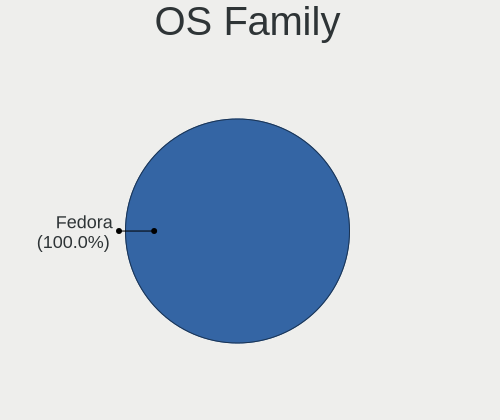
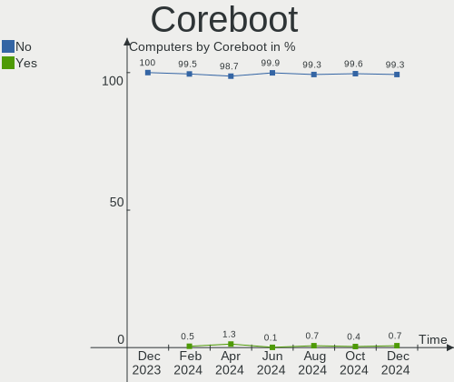
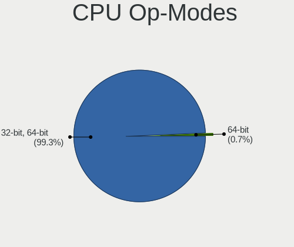
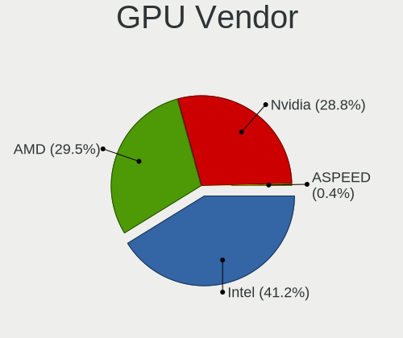

Fedora Hardware Trends
----------------------

A project to identify most popular hardware characteristics and track their change
over time based on data collected by Fedora users at https://Linux-Hardware.org.

Anyone can contribute to the study by uploading probes of their computers by
the [hw-probe](https://github.com/linuxhw/hw-probe) tool:

    sudo hw-probe -all -upload

This is a report for all computer types. See also reports for [desktops](/Dist/Fedora/Desktop/README.md) and [notebooks](/Dist/Fedora/Notebook/README.md).

Full-feature report is available here: https://linux-hardware.org/?view=trends

Period: Apr, 2020.

Contents
--------

- [ OS                       ](#os)
- [ OS Family                ](#os-family)
- [ Kernel                   ](#kernel)
- [ Kernel Family            ](#kernel-family)
- [ Kernel Major Ver.        ](#kernel-major-ver)
- [ Arch                     ](#arch)
- [ DE                       ](#de)
- [ Display Server           ](#display-server)
- [ Display Manager          ](#display-manager)
- [ OS Lang                  ](#os-lang)
- [ Boot Mode                ](#boot-mode)
- [ Filesystem               ](#filesystem)
- [ Dual Boot with Linux/BSD ](#dual-boot-with-linux/bsd)
- [ Dual Boot (Win)          ](#dual-boot-win)
- [ Country                  ](#country)
- [ City                     ](#city)
- [ Vendor                   ](#vendor)
- [ Model                    ](#model)
- [ Model Family             ](#model-family)
- [ MFG Year                 ](#mfg-year)
- [ Form Factor              ](#form-factor)
- [ Secure Boot              ](#secure-boot)
- [ Coreboot                 ](#coreboot)
- [ RAM Size                 ](#ram-size)
- [ RAM Used                 ](#ram-used)
- [ Drive Vendor             ](#drive-vendor)
- [ Drive Model              ](#drive-model)
- [ Drive Kind               ](#drive-kind)
- [ Drive Connector          ](#drive-connector)
- [ Drive Size               ](#drive-size)
- [ Space Total              ](#space-total)
- [ Space Used               ](#space-used)
- [ Malfunc. Drives          ](#malfunc-drives)
- [ Malfunc. Drive Vendor    ](#malfunc-drive-vendor)
- [ Malfunc. Drive Kind      ](#malfunc-drive-kind)
- [ Failed Drives            ](#failed-drives)
- [ Failed Drive Vendor      ](#failed-drive-vendor)
- [ Drive Status             ](#drive-status)
- [ Storage Vendor           ](#storage-vendor)
- [ Storage Model            ](#storage-model)
- [ Storage Kind             ](#storage-kind)
- [ CPU Vendor               ](#cpu-vendor)
- [ CPU Model                ](#cpu-model)
- [ CPU Model Family         ](#cpu-model-family)
- [ CPU Cores                ](#cpu-cores)
- [ CPU Sockets              ](#cpu-sockets)
- [ CPU Threads              ](#cpu-threads)
- [ CPU Op-Modes             ](#cpu-op-modes)
- [ CPU Microarch            ](#cpu-microarch)
- [ CPU Microcode            ](#cpu-microcode)
- [ GPU Vendor               ](#gpu-vendor)
- [ GPU Model                ](#gpu-model)
- [ GPU Combo                ](#gpu-combo)
- [ GPU Driver               ](#gpu-driver)
- [ GPU Memory               ](#gpu-memory)
- [ Monitor Vendor           ](#monitor-vendor)
- [ Monitor Model            ](#monitor-model)
- [ Monitor Resolution       ](#monitor-resolution)
- [ Monitor Diagonal         ](#monitor-diagonal)
- [ Monitor Width            ](#monitor-width)
- [ Aspect Ratio             ](#aspect-ratio)
- [ Monitor Area             ](#monitor-area)
- [ Pixel Density            ](#pixel-density)
- [ Multiple Monitors        ](#multiple-monitors)
- [ Net Controller Vendor    ](#net-controller-vendor)
- [ Net Controller Model     ](#net-controller-model)
- [ Net Controller Kind      ](#net-controller-kind)
- [ Used Controller          ](#used-controller)
- [ NICs                     ](#nics)
- [ Unsupported Devices      ](#unsupported-devices)
- [ Unsupported Device Types ](#unsupported-device-types)

OS
--

Installed operating systems

| Name      | Computers | Percent |
|-----------|-----------|---------|
| Fedora 31 | 153       | 74.27%  |
| Fedora 32 | 44        | 21.36%  |
| Fedora 30 | 5         | 2.43%   |
| Fedora 29 | 2         | 0.97%   |
| Fedora 28 | 1         | 0.49%   |
| Fedora 21 | 1         | 0.49%   |

OS Family
---------

OS without a version

| Name   | Computers | Percent |
|--------|-----------|---------|
| Fedora | 206       | 100%    |

Kernel
------

Version of the Linux kernel

| Version                        | Computers | Percent |
|--------------------------------|-----------|---------|
| 5.5.15-200.fc31.x86_64         | 40        | 19.42%  |
| 5.5.17-200.fc31.x86_64         | 26        | 12.62%  |
| 5.5.13-200.fc31.x86_64         | 21        | 10.19%  |
| 5.6.6-200.fc31.x86_64          | 15        | 7.28%   |
| 5.5.11-200.fc31.x86_64         | 15        | 7.28%   |
| 5.6.7-300.fc32.x86_64          | 14        | 6.8%    |
| 5.5.16-200.fc31.x86_64         | 11        | 5.34%   |
| 5.3.7-301.fc31.x86_64          | 7         | 3.4%    |
| 5.6.3-300.fc32.x86_64          | 6         | 2.91%   |
| 5.6.6-300.fc32.x86_64          | 5         | 2.43%   |
| 5.6.0-300.fc32.x86_64          | 5         | 2.43%   |
| 5.6.4-300.fc32.x86_64          | 3         | 1.46%   |
| 5.5.18-200.fc31.x86_64         | 3         | 1.46%   |
| 5.5.10-100.fc30.x86_64         | 3         | 1.46%   |
| 5.6.5-300.fc32.x86_64          | 2         | 0.97%   |
| 5.6.2-301.fc32.x86_64          | 2         | 0.97%   |
| 5.6.2-300.fc32.x86_64          | 2         | 0.97%   |
| 5.6.0-0.rc7.git0.2.fc32.x86_64 | 2         | 0.97%   |
| 5.3.11-100.fc29.x86_64         | 2         | 0.97%   |
| 5.6.7-200.fc31.x86_64          | 1         | 0.49%   |
| 5.6.7-1.surface.fc31.x86_64    | 1         | 0.49%   |
| 5.6.3-300.fc31.x86_64          | 1         | 0.49%   |
| 5.6.0-1.surface.fc32.x86_64    | 1         | 0.49%   |
| 5.6.0-0.rc5.git0.2.fc32.x86_64 | 1         | 0.49%   |
| 5.5.9-200.fc31.x86_64          | 1         | 0.49%   |
| 5.5.9-100.fc30.x86_64          | 1         | 0.49%   |
| 5.5.8-200.fc31.x86_64          | 1         | 0.49%   |
| 5.5.7-200.fc31.x86_64          | 1         | 0.49%   |
| 5.5.14-200.fc31.x86_64         | 1         | 0.49%   |
| 5.5.10-200.fc31.x86_64         | 1         | 0.49%   |
| 5.5.10-100.fc30.i686           | 1         | 0.49%   |
| 5.4.18-200.fc31.x86_64         | 1         | 0.49%   |
| 5.4.17-200.fc31.x86_64         | 1         | 0.49%   |
| 5.4.10-200.fc31.x86_64         | 1         | 0.49%   |
| 5.3.16-300.fc31.x86_64         | 1         | 0.49%   |
| 5.3.13-300.fc31.x86_64         | 1         | 0.49%   |
| 5.3.11-300.fc31.x86_64         | 1         | 0.49%   |
| 5.1.8-300.fc30.x86_64          | 1         | 0.49%   |
| 4.20.16-100.fc28.x86_64        | 1         | 0.49%   |
| 4.19.114-300.fc31.x86_64       | 1         | 0.49%   |
| 4.1.13-100.fc21.x86_64         | 1         | 0.49%   |

Kernel Family
-------------

Linux kernel without a distro release

| Version  | Computers | Percent |
|----------|-----------|---------|
| 5.5.15   | 40        | 19.42%  |
| 5.5.17   | 26        | 12.62%  |
| 5.5.13   | 21        | 10.19%  |
| 5.6.6    | 20        | 9.71%   |
| 5.6.7    | 16        | 7.77%   |
| 5.5.11   | 15        | 7.28%   |
| 5.5.16   | 11        | 5.34%   |
| 5.6.0    | 9         | 4.37%   |
| 5.6.3    | 7         | 3.4%    |
| 5.3.7    | 7         | 3.4%    |
| 5.5.10   | 5         | 2.43%   |
| 5.6.2    | 4         | 1.94%   |
| 5.6.4    | 3         | 1.46%   |
| 5.5.18   | 3         | 1.46%   |
| 5.3.11   | 3         | 1.46%   |
| 5.6.5    | 2         | 0.97%   |
| 5.5.9    | 2         | 0.97%   |
| 5.5.8    | 1         | 0.49%   |
| 5.5.7    | 1         | 0.49%   |
| 5.5.14   | 1         | 0.49%   |
| 5.4.18   | 1         | 0.49%   |
| 5.4.17   | 1         | 0.49%   |
| 5.4.10   | 1         | 0.49%   |
| 5.3.16   | 1         | 0.49%   |
| 5.3.13   | 1         | 0.49%   |
| 5.1.8    | 1         | 0.49%   |
| 4.20.16  | 1         | 0.49%   |
| 4.19.114 | 1         | 0.49%   |
| 4.1.13   | 1         | 0.49%   |

Kernel Major Ver.
-----------------

Linux kernel major version

| Version | Computers | Percent |
|---------|-----------|---------|
| 5.5     | 126       | 61.17%  |
| 5.6     | 61        | 29.61%  |
| 5.3     | 12        | 5.83%   |
| 5.4     | 3         | 1.46%   |
| 5.1     | 1         | 0.49%   |
| 4.20    | 1         | 0.49%   |
| 4.19    | 1         | 0.49%   |
| 4.1     | 1         | 0.49%   |

Arch
----

OS architecture (x86_64, i586, etc.)

| Name   | Computers | Percent |
|--------|-----------|---------|
| x86_64 | 205       | 99.51%  |
| i686   | 1         | 0.49%   |

DE
--

Desktop Environment

| Name       | Computers | Percent |
|------------|-----------|---------|
| GNOME      | 152       | 73.79%  |
| KDE        | 16        | 7.77%   |
| KDE5       | 14        | 6.8%    |
| Cinnamon   | 6         | 2.91%   |
| XFCE       | 4         | 1.94%   |
| X-Cinnamon | 4         | 1.94%   |
| MATE       | 3         | 1.46%   |
| Unknown    | 3         | 1.46%   |
| Deepin     | 2         | 0.97%   |
| LXDE       | 1         | 0.49%   |
| KDE4       | 1         | 0.49%   |

Display Server
--------------

X11 or Wayland

| Name    | Computers | Percent |
|---------|-----------|---------|
| Wayland | 106       | 51.46%  |
| X11     | 89        | 43.2%   |
| Tty     | 8         | 3.88%   |
| Unknown | 3         | 1.46%   |

Display Manager
---------------

SDDM, LightDM, etc.

| Name    | Computers | Percent |
|---------|-----------|---------|
| Unknown | 118       | 57.28%  |
| GDM     | 66        | 32.04%  |
| SDDM    | 11        | 5.34%   |
| LightDM | 10        | 4.85%   |
| XDM     | 1         | 0.49%   |

OS Lang
-------

Language

| Lang       | Computers | Percent |
|------------|-----------|---------|
| en_US      | 107       | 51.94%  |
| en_GB      | 15        | 7.28%   |
| fr_FR      | 9         | 4.37%   |
| en_AU      | 9         | 4.37%   |
| it_IT      | 8         | 3.88%   |
| de_DE      | 7         | 3.4%    |
| pt_BR      | 5         | 2.43%   |
| pl_PL      | 5         | 2.43%   |
| en_US.utf8 | 4         | 1.94%   |
| ru_RU      | 3         | 1.46%   |
| es_ES      | 3         | 1.46%   |
| en_CA      | 3         | 1.46%   |
| cs_CZ      | 3         | 1.46%   |
| uk_UA      | 2         | 0.97%   |
| ja_JP      | 2         | 0.97%   |
| en_IN      | 2         | 0.97%   |
| en_GB.utf8 | 2         | 0.97%   |
| de_AT      | 2         | 0.97%   |
| Unknown    | 2         | 0.97%   |
| zh_CN      | 1         | 0.49%   |
| sv_SE      | 1         | 0.49%   |
| sk_SK      | 1         | 0.49%   |
| nl_NL      | 1         | 0.49%   |
| nb_NO      | 1         | 0.49%   |
| it_IT.utf8 | 1         | 0.49%   |
| hu_HU      | 1         | 0.49%   |
| fr_CH      | 1         | 0.49%   |
| es_AR      | 1         | 0.49%   |
| en_PH      | 1         | 0.49%   |
| en_IL      | 1         | 0.49%   |
| en_IE      | 1         | 0.49%   |
| cv_RU      | 1         | 0.49%   |

Boot Mode
---------

EFI or BIOS

| Mode | Computers | Percent |
|------|-----------|---------|
| EFI  | 126       | 61.17%  |
| BIOS | 80        | 38.83%  |

Filesystem
----------

Type of filesystem

| Type  | Computers | Percent |
|-------|-----------|---------|
| Ext4  | 183       | 88.83%  |
| Xfs   | 15        | 7.28%   |
| Btrfs | 8         | 3.88%   |

Dual Boot with Linux/BSD
------------------------

Hosting more than one Linux/BSD

| Dual boot | Computers | Percent |
|-----------|-----------|---------|
| No        | 181       | 87.86%  |
| Yes       | 25        | 12.14%  |

Dual Boot (Win)
---------------

Hosting Linux and Windows

| Dual boot | Computers | Percent |
|-----------|-----------|---------|
| No        | 176       | 85.44%  |
| Yes       | 30        | 14.56%  |

Country
-------

Geographic location (country)

| Country             | Computers | Percent |
|---------------------|-----------|---------|
| USA                 | 41        | 19.9%   |
| Germany             | 18        | 8.74%   |
| France              | 13        | 6.31%   |
| Brazil              | 12        | 5.83%   |
| Italy               | 11        | 5.34%   |
| Canada              | 10        | 4.85%   |
| Australia           | 10        | 4.85%   |
| Poland              | 9         | 4.37%   |
| UK                  | 7         | 3.4%    |
| Netherlands         | 6         | 2.91%   |
| India               | 6         | 2.91%   |
| Russia              | 5         | 2.43%   |
| Sweden              | 4         | 1.94%   |
| Ukraine             | 3         | 1.46%   |
| Portugal            | 3         | 1.46%   |
| Czech Republic      | 3         | 1.46%   |
| Colombia            | 3         | 1.46%   |
| Switzerland         | 2         | 0.97%   |
| Spain               | 2         | 0.97%   |
| Slovakia            | 2         | 0.97%   |
| Norway              | 2         | 0.97%   |
| Japan               | 2         | 0.97%   |
| Hungary             | 2         | 0.97%   |
| Finland             | 2         | 0.97%   |
| Austria             | 2         | 0.97%   |
| Uruguay             | 1         | 0.49%   |
| Turkey              | 1         | 0.49%   |
| Trinidad and Tobago | 1         | 0.49%   |
| Slovenia            | 1         | 0.49%   |
| Serbia              | 1         | 0.49%   |
| Romania             | 1         | 0.49%   |
| Qatar               | 1         | 0.49%   |
| Philippines         | 1         | 0.49%   |
| New Zealand         | 1         | 0.49%   |
| Macedonia           | 1         | 0.49%   |
| Latvia              | 1         | 0.49%   |
| Kenya               | 1         | 0.49%   |
| Jordan              | 1         | 0.49%   |
| Israel              | 1         | 0.49%   |
| Ireland             | 1         | 0.49%   |
| Iran                | 1         | 0.49%   |
| Guam                | 1         | 0.49%   |
| Ethiopia            | 1         | 0.49%   |
| Egypt               | 1         | 0.49%   |
| Ecuador             | 1         | 0.49%   |
| China               | 1         | 0.49%   |
| Bulgaria            | 1         | 0.49%   |
| Belgium             | 1         | 0.49%   |
| Belarus             | 1         | 0.49%   |
| Azerbaijan          | 1         | 0.49%   |
| Argentina           | 1         | 0.49%   |

City
----

Geographic location (city)

| City                       | Computers | Percent |
|----------------------------|-----------|---------|
| Hornsby                    | 5         | 2.43%   |
| Wrocław                   | 4         | 1.94%   |
| Toronto                    | 3         | 1.46%   |
| Berlin                     | 3         | 1.46%   |
| Warsaw                     | 2         | 0.97%   |
| Vienna                     | 2         | 0.97%   |
| Utrecht                    | 2         | 0.97%   |
| Raleigh                    | 2         | 0.97%   |
| Pflugerville               | 2         | 0.97%   |
| Paris                      | 2         | 0.97%   |
| Nizhniy Novgorod           | 2         | 0.97%   |
| Nantes                     | 2         | 0.97%   |
| Mukilteo                   | 2         | 0.97%   |
| Madrid                     | 2         | 0.97%   |
| Los Angeles                | 2         | 0.97%   |
| Frankfurt am Main          | 2         | 0.97%   |
| Denver                     | 2         | 0.97%   |
| Dallas                     | 2         | 0.97%   |
| Brisbane                   | 2         | 0.97%   |
| Zurich                     | 1         | 0.49%   |
| Ytterby                    | 1         | 0.49%   |
| Yigo Village               | 1         | 0.49%   |
| Wellington                 | 1         | 0.49%   |
| Voronezh                   | 1         | 0.49%   |
| Vidolasco                  | 1         | 0.49%   |
| Vialonga                   | 1         | 0.49%   |
| Vancouver                  | 1         | 0.49%   |
| Uberlândia                | 1         | 0.49%   |
| Tromsø                    | 1         | 0.49%   |
| Tours                      | 1         | 0.49%   |
| The Hague                  | 1         | 0.49%   |
| The Bronx                  | 1         | 0.49%   |
| Tempe                      | 1         | 0.49%   |
| São Paulo                 | 1         | 0.49%   |
| São José dos Campos      | 1         | 0.49%   |
| São Bernardo do Campo     | 1         | 0.49%   |
| Sydney                     | 1         | 0.49%   |
| Sugar Land                 | 1         | 0.49%   |
| Stockholm                  | 1         | 0.49%   |
| Staten Island              | 1         | 0.49%   |
| St Helens                  | 1         | 0.49%   |
| Spencer                    | 1         | 0.49%   |
| Sofia                      | 1         | 0.49%   |
| Skopje                     | 1         | 0.49%   |
| Seligenstadt               | 1         | 0.49%   |
| Schwabach                  | 1         | 0.49%   |
| Santiago de Cali           | 1         | 0.49%   |
| Santa Cruz do Sul          | 1         | 0.49%   |
| San Antonio                | 1         | 0.49%   |
| Saitama                    | 1         | 0.49%   |
| Sainte-Geneviève-des-Bois | 1         | 0.49%   |
| Saint-Eustache             | 1         | 0.49%   |
| Ruda Śląska              | 1         | 0.49%   |
| Rubeshibecho-fujimi        | 1         | 0.49%   |
| Rubano                     | 1         | 0.49%   |
| Rovon                      | 1         | 0.49%   |
| Round Rock                 | 1         | 0.49%   |
| Roubaix                    | 1         | 0.49%   |
| Rotterdam                  | 1         | 0.49%   |
| Rostov-on-Don              | 1         | 0.49%   |

Vendor
------

Motherboard manufacturer

| Name                   | Computers | Percent |
|------------------------|-----------|---------|
| Dell                   | 46        | 22.33%  |
| Lenovo                 | 34        | 16.5%   |
| ASUSTek Computer       | 34        | 16.5%   |
| Hewlett-Packard        | 29        | 14.08%  |
| Gigabyte Technology    | 14        | 6.8%    |
| MSI                    | 13        | 6.31%   |
| ASRock                 | 5         | 2.43%   |
| Acer                   | 5         | 2.43%   |
| Toshiba                | 4         | 1.94%   |
| Apple                  | 4         | 1.94%   |
| Sony                   | 3         | 1.46%   |
| Microsoft              | 2         | 0.97%   |
| Fujitsu                | 2         | 0.97%   |
| System76               | 1         | 0.49%   |
| Shuttle                | 1         | 0.49%   |
| Notebook               | 1         | 0.49%   |
| MCJ                    | 1         | 0.49%   |
| Intel                  | 1         | 0.49%   |
| HUAWEI                 | 1         | 0.49%   |
| Gateway                | 1         | 0.49%   |
| Foxconn                | 1         | 0.49%   |
| Avell High Performance | 1         | 0.49%   |
| Alienware              | 1         | 0.49%   |
| ABIT                   | 1         | 0.49%   |

Model
-----

Motherboard model

| Name                                     | Computers | Percent |
|------------------------------------------|-----------|---------|
| Dell XPS 15 7590                         | 4         | 1.94%   |
| ASUS All Series                          | 4         | 1.94%   |
| HP EliteBook 840 G6                      | 3         | 1.46%   |
| Dell XPS 13 7390                         | 3         | 1.46%   |
| Dell OptiPlex 9020                       | 3         | 1.46%   |
| Toshiba Satellite C660                   | 2         | 0.97%   |
| MSI MS-7B89                              | 2         | 0.97%   |
| HP ENVY x360 Convertible 15-ds0xxx       | 2         | 0.97%   |
| Dell XPS 15 9550                         | 2         | 0.97%   |
| Dell XPS 13 9370                         | 2         | 0.97%   |
| Dell XPS 13 9350                         | 2         | 0.97%   |
| Dell Inspiron 5570                       | 2         | 0.97%   |
| Dell Inspiron 5567                       | 2         | 0.97%   |
| ASUS PRIME X370-PRO                      | 2         | 0.97%   |
| Apple MacBookPro12,1                     | 2         | 0.97%   |
| Acer Aspire A515-51G                     | 2         | 0.97%   |
| Toshiba Satellite L50-B                  | 1         | 0.49%   |
| Toshiba Satellite A505                   | 1         | 0.49%   |
| System76 Lemur                           | 1         | 0.49%   |
| Sony VPCEB23FM                           | 1         | 0.49%   |
| Sony VPCCB35FN                           | 1         | 0.49%   |
| Sony SVS1311C5E                          | 1         | 0.49%   |
| Shuttle XH61V                            | 1         | 0.49%   |
| Notebook NH55RGQ                         | 1         | 0.49%   |
| MSI MS-7C37                              | 1         | 0.49%   |
| MSI MS-7C08                              | 1         | 0.49%   |
| MSI MS-7C00                              | 1         | 0.49%   |
| MSI MS-7B79                              | 1         | 0.49%   |
| MSI MS-7A34                              | 1         | 0.49%   |
| MSI MS-7916                              | 1         | 0.49%   |
| MSI MS-7821                              | 1         | 0.49%   |
| MSI MS-7816                              | 1         | 0.49%   |
| MSI MS-7758                              | 1         | 0.49%   |
| MSI GS60 6QD                             | 1         | 0.49%   |
| MSI GE70 0NC                             | 1         | 0.49%   |
| Microsoft Surface Book 2                 | 1         | 0.49%   |
| Microsoft Surface Book                   | 1         | 0.49%   |
| MCJ H55M-P33                             | 1         | 0.49%   |
| Lenovo XiaoXinPro-13IML 2019 81XB        | 1         | 0.49%   |
| Lenovo V130-15IKB 81HN                   | 1         | 0.49%   |
| Lenovo ThinkPad X240 20AL007SMS          | 1         | 0.49%   |
| Lenovo ThinkPad X230 2325CP0             | 1         | 0.49%   |
| Lenovo ThinkPad X230 2325B14             | 1         | 0.49%   |
| Lenovo ThinkPad X1 Yoga 1st 20FRS04R12   | 1         | 0.49%   |
| Lenovo ThinkPad X1 Carbon 7th 20QES2P401 | 1         | 0.49%   |
| Lenovo ThinkPad X1 Carbon 6th 20KHCTO1WW | 1         | 0.49%   |
| Lenovo ThinkPad X1 Carbon 3443CTO        | 1         | 0.49%   |
| Lenovo ThinkPad W540 20BHS11M00          | 1         | 0.49%   |
| Lenovo ThinkPad W510 4391A83             | 1         | 0.49%   |
| Lenovo ThinkPad T530 2394EE9             | 1         | 0.49%   |
| Lenovo ThinkPad T480 20L5S1S100          | 1         | 0.49%   |
| Lenovo ThinkPad T470s 20HGS22D1P         | 1         | 0.49%   |
| Lenovo ThinkPad T470 20HEA0TMBR          | 1         | 0.49%   |
| Lenovo ThinkPad T440s 20ARA07500         | 1         | 0.49%   |
| Lenovo ThinkPad T420 4236MBG             | 1         | 0.49%   |
| Lenovo ThinkPad T410 2522PT3             | 1         | 0.49%   |
| Lenovo ThinkPad R61 8934F9U              | 1         | 0.49%   |
| Lenovo ThinkPad P52 20MAS1720C           | 1         | 0.49%   |
| Lenovo ThinkPad P50 20EQS64N0B           | 1         | 0.49%   |
| Lenovo ThinkPad P50 20EN0013US           | 1         | 0.49%   |

Model Family
------------

Motherboard model prefix

| Name                    | Computers | Percent |
|-------------------------|-----------|---------|
| Lenovo ThinkPad         | 23        | 11.17%  |
| Dell XPS                | 14        | 6.8%    |
| Dell Inspiron           | 11        | 5.34%   |
| HP Pavilion             | 8         | 3.88%   |
| Dell Latitude           | 8         | 3.88%   |
| Dell OptiPlex           | 7         | 3.4%    |
| HP EliteBook            | 6         | 2.91%   |
| ASUS PRIME              | 6         | 2.91%   |
| Toshiba Satellite       | 4         | 1.94%   |
| HP ZBook                | 4         | 1.94%   |
| ASUS All                | 4         | 1.94%   |
| Lenovo ThinkCentre      | 3         | 1.46%   |
| Lenovo IdeaPad          | 3         | 1.46%   |
| HP ProBook              | 3         | 1.46%   |
| HP ENVY                 | 3         | 1.46%   |
| Dell Precision          | 3         | 1.46%   |
| Acer Aspire             | 3         | 1.46%   |
| MSI MS-7B89             | 2         | 0.97%   |
| Microsoft Surface       | 2         | 0.97%   |
| Lenovo MIIX             | 2         | 0.97%   |
| HP 250                  | 2         | 0.97%   |
| Dell G5                 | 2         | 0.97%   |
| ASUS TUF                | 2         | 0.97%   |
| ASUS ROG                | 2         | 0.97%   |
| ASUS M5A78L-M           | 2         | 0.97%   |
| Apple MacBookPro12      | 2         | 0.97%   |
| System76 Lemur          | 1         | 0.49%   |
| Sony VPCEB23FM          | 1         | 0.49%   |
| Sony VPCCB35FN          | 1         | 0.49%   |
| Sony SVS1311C5E         | 1         | 0.49%   |
| Shuttle XH61V           | 1         | 0.49%   |
| Notebook NH55RGQ        | 1         | 0.49%   |
| MSI MS-7C37             | 1         | 0.49%   |
| MSI MS-7C08             | 1         | 0.49%   |
| MSI MS-7C00             | 1         | 0.49%   |
| MSI MS-7B79             | 1         | 0.49%   |
| MSI MS-7A34             | 1         | 0.49%   |
| MSI MS-7916             | 1         | 0.49%   |
| MSI MS-7821             | 1         | 0.49%   |
| MSI MS-7816             | 1         | 0.49%   |
| MSI MS-7758             | 1         | 0.49%   |
| MSI GS60                | 1         | 0.49%   |
| MSI GE70                | 1         | 0.49%   |
| MCJ H55M-P33            | 1         | 0.49%   |
| Lenovo XiaoXinPro-13IML | 1         | 0.49%   |
| Lenovo V130-15IKB       | 1         | 0.49%   |
| Lenovo G50-45           | 1         | 0.49%   |
| Intel DH55TC            | 1         | 0.49%   |
| HUAWEI WRT-WX9          | 1         | 0.49%   |
| HP Z600                 | 1         | 0.49%   |
| HP Laptop               | 1         | 0.49%   |
| HP Compaq               | 1         | 0.49%   |
| Gigabyte Z270-HD3P      | 1         | 0.49%   |
| Gigabyte X570           | 1         | 0.49%   |
| Gigabyte X399           | 1         | 0.49%   |
| Gigabyte H77N-WIFI      | 1         | 0.49%   |
| Gigabyte H55M-S2H       | 1         | 0.49%   |
| Gigabyte GA-990FXA-UD3  | 1         | 0.49%   |
| Gigabyte G31M-ES2L      | 1         | 0.49%   |
| Gigabyte F2A58M-HD2     | 1         | 0.49%   |

MFG Year
--------

Motherboard manufacture year

| Year | Computers | Percent |
|------|-----------|---------|
| 2019 | 69        | 33.5%   |
| 2018 | 31        | 15.05%  |
| 2020 | 19        | 9.22%   |
| 2014 | 13        | 6.31%   |
| 2017 | 10        | 4.85%   |
| 2015 | 10        | 4.85%   |
| 2011 | 10        | 4.85%   |
| 2010 | 10        | 4.85%   |
| 2016 | 9         | 4.37%   |
| 2013 | 9         | 4.37%   |
| 2012 | 9         | 4.37%   |
| 2009 | 4         | 1.94%   |
| 2007 | 2         | 0.97%   |
| 2008 | 1         | 0.49%   |

Form Factor
-----------

Physical design of the computer

| Name        | Computers | Percent |
|-------------|-----------|---------|
| Notebook    | 120       | 58.25%  |
| Desktop     | 77        | 37.38%  |
| Tablet      | 6         | 2.91%   |
| Convertible | 3         | 1.46%   |

Secure Boot
-----------

Enabled or disabled

| State    | Computers | Percent |
|----------|-----------|---------|
| Disabled | 182       | 88.35%  |
| Enabled  | 24        | 11.65%  |

Coreboot
--------

Have coreboot on board

| Used | Computers | Percent |
|------|-----------|---------|
| No   | 205       | 99.51%  |
| Yes  | 1         | 0.49%   |

RAM Size
--------

Total RAM memory

| Size in GB  | Computers | Percent |
|-------------|-----------|---------|
| 16.01-24.0  | 62        | 30.1%   |
| 4.01-8.0    | 42        | 20.39%  |
| 8.01-16.0   | 41        | 19.9%   |
| 32.01-64.0  | 21        | 10.19%  |
| 3.01-4.0    | 19        | 9.22%   |
| 64.01-256.0 | 8         | 3.88%   |
| 1.01-2.0    | 6         | 2.91%   |
| 24.01-32.0  | 5         | 2.43%   |
| 2.01-3.0    | 2         | 0.97%   |

RAM Used
--------

Used RAM memory

| Used GB   | Computers | Percent |
|-----------|-----------|---------|
| 2.01-3.0  | 67        | 32.52%  |
| 4.01-8.0  | 47        | 22.82%  |
| 1.01-2.0  | 43        | 20.87%  |
| 3.01-4.0  | 29        | 14.08%  |
| 8.01-16.0 | 15        | 7.28%   |
| 0.01-1.0  | 5         | 2.43%   |

Drive Vendor
------------

Hard drive vendors

| Vendor              | Computers | Drives  | Percent |
|---------------------|-----------|---------|---------|
| Samsung Electronics | 54        | 56      | 18.18%  |
| WDC                 | 50        | 64      | 16.84%  |
| Seagate             | 48        | 56      | 16.16%  |
| Kingston            | 24        | 28      | 8.08%   |
| Toshiba             | 21        | 21      | 7.07%   |
| Crucial             | 13        | 13      | 4.38%   |
| SanDisk             | 12        | 13      | 4.04%   |
| Hitachi             | 12        | 14      | 4.04%   |
| Intel               | 10        | 10      | 3.37%   |
| HGST                | 10        | 10      | 3.37%   |
| Unknown             | 8         | 10      | 2.69%   |
| A-DATA Technology   | 7         | 9       | 2.36%   |
| SK Hynix            | 5         | 5       | 1.68%   |
| Micron Technology   | 5         | 5       | 1.68%   |
| PNY                 | 3         | 3       | 1.01%   |
| Apple               | 2         | 2       | 0.67%   |
| Team                | 1         | 1       | 0.34%   |
| PLEXTOR             | 1         | 1       | 0.34%   |
| LIO-ORG             | 1         | 4       | 0.34%   |
| Lexar               | 1         | 1       | 0.34%   |
| LaCie               | 1         | 1       | 0.34%   |
| KingSpec            | 1         | 1       | 0.34%   |
| JMicron             | 1         | 1       | 0.34%   |
| Intenso             | 1         | 1       | 0.34%   |
| ICY BOX             | 1         | 1       | 0.34%   |
| HL-DT-ST            | 1         | Unknown | 0.34%   |
| Fujitsu             | 1         | 1       | 0.34%   |
| Corsair             | 1         | 1       | 0.34%   |
| China               | 1         | 1       | 0.34%   |

Drive Model
-----------

Hard drive models

| Model                          | Computers | Percent |
|--------------------------------|-----------|---------|
| SV300S37A120G 120GB SSD        | 5         | 1.51%   |
| ST1000LM035-1RK172 1TB         | 4         | 1.21%   |
| SSD 850 EVO 250GB              | 4         | 1.21%   |
| SA400S37480G 480GB SSD         | 4         | 1.21%   |
| WD40EFRX-68N32N0 4TB           | 3         | 0.91%   |
| SV300S37A240G 240GB SSD        | 3         | 0.91%   |
| ST31000528AS 1TB               | 3         | 0.91%   |
| SSDSC2KW256G8 256GB            | 3         | 0.91%   |
| SSD 850 EVO 500GB              | 3         | 0.91%   |
| SSD 840 EVO 250GB              | 3         | 0.91%   |
| SA400S37240G 240GB SSD         | 3         | 0.91%   |
| SA400S37120G 120GB SSD         | 3         | 0.91%   |
| MMC Card  32GB                 | 3         | 0.91%   |
| HTS721010A9E630 1TB            | 3         | 0.91%   |
| CT525MX300SSD1 528GB           | 3         | 0.91%   |
| CT500MX500SSD1 500GB           | 3         | 0.91%   |
| WDS240G2G0A-00JH30 240GB SSD   | 2         | 0.6%    |
| WDS120G2G0A-00JH30 120GB SSD   | 2         | 0.6%    |
| WD40EZRZ-00GXCB0 4TB           | 2         | 0.6%    |
| WD1500HLFS-01G6U3 150GB        | 2         | 0.6%    |
| WD10SPZX-24Z10 1TB             | 2         | 0.6%    |
| WD10SPZX-21Z10T0 1TB           | 2         | 0.6%    |
| WD10EZEX-00BN5A0 1TB           | 2         | 0.6%    |
| THNSN5512GPUK NVMe 512GB       | 2         | 0.6%    |
| ST9500420AS 500GB              | 2         | 0.6%    |
| ST6000DM003-2CY186 6TB         | 2         | 0.6%    |
| ST31000524AS 1TB               | 2         | 0.6%    |
| ST1000DM003-1ER162 1TB         | 2         | 0.6%    |
| ST1000DM003-1CH162 1TB         | 2         | 0.6%    |
| SSD 970 PRO 512GB              | 2         | 0.6%    |
| SSD 860 EVO 500GB              | 2         | 0.6%    |
| SSD 860 EVO 250GB              | 2         | 0.6%    |
| SSD 850 PRO 512GB              | 2         | 0.6%    |
| SP550 120GB SSD                | 2         | 0.6%    |
| PC601 HFS512GD9TNG-L2A0A 512GB | 2         | 0.6%    |
| MZVLB512HAJQ-000H1 512GB       | 2         | 0.6%    |
| MZVLB256HAHQ-000H1 256GB       | 2         | 0.6%    |
| MZ7TD256HAFV-000L9 256GB SSD   | 2         | 0.6%    |
| MQ01ABD100 1TB                 | 2         | 0.6%    |
| MQ01ABD075 752GB               | 2         | 0.6%    |
| HTS545050B9A300 500GB          | 2         | 0.6%    |
| HTS545050A7E380 500GB          | 2         | 0.6%    |
| HTS541010B7E610 1TB            | 2         | 0.6%    |
| HD502HJ 500GB                  | 2         | 0.6%    |
| Expansion 1TB                  | 2         | 0.6%    |
| CT1000MX500SSD1 1TB            | 2         | 0.6%    |
| CS900 120GB SSD                | 2         | 0.6%    |
| 2200S NVMe 1024GB              | 2         | 0.6%    |
| X600 M.2 2280 SATA 128GB SSD   | 1         | 0.3%    |
| WDS500G2B0B-00YS70 500GB SSD   | 1         | 0.3%    |
| WDS500G2B0A-00SM50 500GB SSD   | 1         | 0.3%    |
| WDS240G2G0B-00EPW0 240GB SSD   | 1         | 0.3%    |
| WDS100T2B0B-00YS70 1TB SSD     | 1         | 0.3%    |
| WDS100T1B0A-00H9H0 1TB SSD     | 1         | 0.3%    |
| WD800JD-60LSA0 80GB            | 1         | 0.3%    |
| WD5000LPVX-80V0TT0 500GB       | 1         | 0.3%    |
| WD5000LPLX-08ZNTT0 500GB       | 1         | 0.3%    |
| WD5000BEVT-00ZAT0 500GB        | 1         | 0.3%    |
| WD5000AAKX-75U6AA0 500GB       | 1         | 0.3%    |
| WD5000AAKX-753CA1 500GB        | 1         | 0.3%    |

Drive Kind
----------

HDD or SSD

| Kind    | Computers | Drives | Percent |
|---------|-----------|--------|---------|
| HDD     | 104       | 161    | 41.6%   |
| SSD     | 102       | 128    | 40.8%   |
| NVMe    | 35        | 35     | 14%     |
| MMC     | 6         | 8      | 2.4%    |
| Unknown | 3         | 2      | 1.2%    |

Drive Connector
---------------

SATA, SAS, NVMe, etc.

| Type | Computers | Drives | Percent |
|------|-----------|--------|---------|
| SATA | 156       | 281    | 75%     |
| NVMe | 35        | 35     | 16.83%  |
| SAS  | 11        | 10     | 5.29%   |
| MMC  | 6         | 8      | 2.88%   |

Drive Size
----------

Size of hard drive

| Size in TB | Computers | Drives | Percent |
|------------|-----------|--------|---------|
| 0.01-0.5   | 129       | 180    | 49.81%  |
| 0.51-1.0   | 92        | 109    | 35.52%  |
| 1.01-2.0   | 19        | 24     | 7.34%   |
| 3.01-4.0   | 11        | 11     | 4.25%   |
| 2.01-3.0   | 4         | 5      | 1.54%   |
| 4.01-10.0  | 4         | 5      | 1.54%   |

Space Total
-----------

Amount of disk space available on the file system

| Size in GB     | Computers | Percent |
|----------------|-----------|---------|
| 101-250        | 56        | 27.18%  |
| 251-500        | 46        | 22.33%  |
| 501-1000       | 43        | 20.87%  |
| 51-100         | 17        | 8.25%   |
| 1001-2000      | 15        | 7.28%   |
| More than 3000 | 14        | 6.8%    |
| 1-20           | 6         | 2.91%   |
| 2001-3000      | 5         | 2.43%   |
| 21-50          | 3         | 1.46%   |
| Unknown        | 1         | 0.49%   |

Space Used
----------

Amount of used disk space

| Used GB        | Computers | Percent |
|----------------|-----------|---------|
| 21-50          | 48        | 23.3%   |
| 1-20           | 38        | 18.45%  |
| 51-100         | 35        | 16.99%  |
| 101-250        | 33        | 16.02%  |
| 251-500        | 21        | 10.19%  |
| 501-1000       | 15        | 7.28%   |
| 1001-2000      | 8         | 3.88%   |
| More than 3000 | 4         | 1.94%   |
| 2001-3000      | 3         | 1.46%   |
| Unknown        | 1         | 0.49%   |

Malfunc. Drives
---------------

Drive models with a malfunction

| Model                     | Computers | Drives | Percent |
|---------------------------|-----------|--------|---------|
| ST31000528AS 1TB          | 2         | 2      | 8%      |
| WD5000AAKX-753CA1 500GB   | 1         | 1      | 4%      |
| WD400JB-00FMA0 40GB       | 1         | 1      | 4%      |
| WD2003FYYS-02W0B1 2TB     | 1         | 1      | 4%      |
| WD1600AVVS-63L2B0 160GB   | 1         | 1      | 4%      |
| WD10EZEX-00WN4A0 1TB      | 1         | 1      | 4%      |
| WD1001FALS-00E8B0 1TB     | 1         | 1      | 4%      |
| SV300S37A120G 120GB SSD   | 1         | 1      | 4%      |
| ST9320423AS 320GB         | 1         | 1      | 4%      |
| ST500LT012-1DG142 500GB   | 1         | 1      | 4%      |
| ST31000524AS 1TB          | 1         | 1      | 4%      |
| ST31000333AS 1TB          | 1         | 1      | 4%      |
| SD5SG2256G1052E 256GB SSD | 1         | 1      | 4%      |
| MQ01ABD075 752GB          | 1         | 1      | 4%      |
| MK7559GSXP 752GB          | 1         | 1      | 4%      |
| MK3275GSX 320GB           | 1         | 1      | 4%      |
| MHZ2500BT G1 500GB        | 1         | 1      | 4%      |
| HTS723232A7A364 320GB     | 1         | 1      | 4%      |
| HTS545050B9A300 500GB     | 1         | 1      | 4%      |
| HTS542516K9SA00 160GB     | 1         | 1      | 4%      |
| HTS541075A9E680 752GB     | 1         | 1      | 4%      |
| HDT721016SLA380 160GB     | 1         | 1      | 4%      |
| HDS721010DLE630 1TB       | 1         | 2      | 4%      |
| CT525MX300SSD1 528GB      | 1         | 1      | 4%      |

Malfunc. Drive Vendor
---------------------

Vendors of faulty drives

| Vendor   | Computers | Drives | Percent |
|----------|-----------|--------|---------|
| WDC      | 5         | 6      | 22.73%  |
| Seagate  | 5         | 6      | 22.73%  |
| Hitachi  | 4         | 6      | 18.18%  |
| Toshiba  | 3         | 3      | 13.64%  |
| SanDisk  | 1         | 1      | 4.55%   |
| Kingston | 1         | 1      | 4.55%   |
| HGST     | 1         | 1      | 4.55%   |
| Fujitsu  | 1         | 1      | 4.55%   |
| Crucial  | 1         | 1      | 4.55%   |

Malfunc. Drive Kind
-------------------

Kinds of faulty drives

| Kind | Computers | Drives | Percent |
|------|-----------|--------|---------|
| HDD  | 16        | 23     | 84.21%  |
| SSD  | 3         | 3      | 15.79%  |

Failed Drives
-------------

Failed drive models

| Model                   | Computers | Drives | Percent |
|-------------------------|-----------|--------|---------|
| WD5000BEVT-00ZAT0 500GB | 1         | 1      | 100%    |

Failed Drive Vendor
-------------------

Failed drive vendors

| Vendor | Computers | Drives | Percent |
|--------|-----------|--------|---------|
| WDC    | 1         | 1      | 100%    |

Drive Status
------------

Number of failed and malfunc. drives

| Status   | Computers | Drives | Percent |
|----------|-----------|--------|---------|
| Detected | 98        | 171    | 48.76%  |
| Works    | 83        | 136    | 41.29%  |
| Malfunc  | 19        | 26     | 9.45%   |
| Failed   | 1         | 1      | 0.5%    |

Storage Vendor
--------------

Storage controller vendors

| Vendor                       | Computers | Percent |
|------------------------------|-----------|---------|
| Intel                        | 141       | 56.63%  |
| AMD                          | 34        | 13.65%  |
| Samsung Electronics          | 27        | 10.84%  |
| Toshiba America Info Systems | 9         | 3.61%   |
| Sandisk                      | 7         | 2.81%   |
| SK Hynix                     | 5         | 2.01%   |
| Micron Technology            | 5         | 2.01%   |
| Marvell Technology Group     | 4         | 1.61%   |
| ASMedia Technology           | 4         | 1.61%   |
| JMicron Technology           | 3         | 1.2%    |
| Phison Electronics           | 2         | 0.8%    |
| VIA Technologies             | 1         | 0.4%    |
| Silicon Motion               | 1         | 0.4%    |
| Nvidia                       | 1         | 0.4%    |
| Micron/Crucial Technology    | 1         | 0.4%    |
| LSI Logic / Symbios Logic    | 1         | 0.4%    |
| KIOXIA                       | 1         | 0.4%    |
| Kingston Technology Company  | 1         | 0.4%    |
| ADATA Technology             | 1         | 0.4%    |

Storage Model
-------------

Storage controller models

| Model                                                                    | Computers | Percent |
|--------------------------------------------------------------------------|-----------|---------|
| FCH SATA Controller [AHCI mode]                                          | 26        | 9.06%   |
| Sunrise Point-LP SATA Controller [AHCI mode]                             | 20        | 6.97%   |
| NVMe SSD Controller SM981/PM981/PM983                                    | 16        | 5.57%   |
| 8 Series/C220 Series Chipset Family 6-port SATA Controller 1 [AHCI mode] | 12        | 4.18%   |
| 7 Series Chipset Family 6-port SATA Controller [AHCI mode]               | 12        | 4.18%   |
| Non-Volatile memory controller                                           | 11        | 3.83%   |
| Cannon Lake Mobile PCH SATA AHCI Controller                              | 10        | 3.48%   |
| 82801 Mobile SATA Controller [RAID mode]                                 | 8         | 2.79%   |
| 400 Series Chipset SATA Controller                                       | 8         | 2.79%   |
| Q170/Q150/B150/H170/H110/Z170/CM236 Chipset SATA Controller [AHCI Mode]  | 7         | 2.44%   |
| HM170/QM170 Chipset SATA Controller [AHCI Mode]                          | 7         | 2.44%   |
| Toshiba America Info Non-Volatile memory controller                      | 6         | 2.09%   |
| 6 Series/C200 Series Chipset Family 6 port Mobile SATA AHCI Controller   | 6         | 2.09%   |
| SSD Pro 7600p/760p/E 6100p Series                                        | 5         | 1.74%   |
| SB7x0/SB8x0/SB9x0 IDE Controller                                         | 5         | 1.74%   |
| SATA Controller [RAID mode]                                              | 5         | 1.74%   |
| NVMe SSD Controller SM961/PM961                                          | 5         | 1.74%   |
| 6 Series/C200 Series Chipset Family 6 port Desktop SATA AHCI Controller  | 5         | 1.74%   |
| 5 Series/3400 Series Chipset 4 port SATA AHCI Controller                 | 5         | 1.74%   |
| X370 Series Chipset SATA Controller                                      | 4         | 1.39%   |
| WD Black 2018/PC SN520 NVMe SSD                                          | 4         | 1.39%   |
| SB7x0/SB8x0/SB9x0 SATA Controller [AHCI mode]                            | 4         | 1.39%   |
| NVMe SSD Controller SM951/PM951                                          | 4         | 1.39%   |
| NM10/ICH7 Family SATA Controller [IDE mode]                              | 4         | 1.39%   |
| ASM1062 Serial ATA Controller                                            | 4         | 1.39%   |
| 8 Series SATA Controller 1 [AHCI mode]                                   | 4         | 1.39%   |
| 7 Series/C210 Series Chipset Family 6-port SATA Controller [AHCI mode]   | 4         | 1.39%   |
| 5 Series/3400 Series Chipset 6 port SATA AHCI Controller                 | 4         | 1.39%   |
| 200 Series PCH SATA controller [AHCI mode]                               | 4         | 1.39%   |
| WD Black 2018/PC SN720 NVMe SSD                                          | 3         | 1.05%   |
| SB7x0/SB8x0/SB9x0 SATA Controller [IDE mode]                             | 3         | 1.05%   |
| Cannon Lake PCH SATA AHCI Controller                                     | 3         | 1.05%   |
| 9 Series Chipset Family SATA Controller [AHCI Mode]                      | 3         | 1.05%   |
| 82801G (ICH7 Family) IDE Controller                                      | 3         | 1.05%   |
| 5 Series/3400 Series Chipset 4 port SATA IDE Controller                  | 3         | 1.05%   |
| XG4 NVMe SSD Controller                                                  | 2         | 0.7%    |
| NVMe SSD Optane Series Controller                                        | 2         | 0.7%    |
| JMB368 IDE controller                                                    | 2         | 0.7%    |
| Electronics SATA controller                                              | 2         | 0.7%    |
| E12 NVMe Controller                                                      | 2         | 0.7%    |
| Cannon Point-LP SATA Controller [AHCI Mode]                              | 2         | 0.7%    |
| BC501 NVMe Solid State Drive 512GB                                       | 2         | 0.7%    |
| 82801JD/DO (ICH10 Family) SATA AHCI Controller                           | 2         | 0.7%    |
| 5 Series/3400 Series Chipset 2 port SATA IDE Controller                  | 2         | 0.7%    |
| 4 Series Chipset PT IDER Controller                                      | 2         | 0.7%    |
| XPG SX8200 Pro PCIe Gen3x4 M.2 2280 Solid State Drive                    | 1         | 0.35%   |
| X399 Series Chipset SATA Controller                                      | 1         | 0.35%   |
| Wildcat Point-LP SATA Controller [AHCI Mode]                             | 1         | 0.35%   |
| VT6421 IDE/SATA Controller                                               | 1         | 0.35%   |
| SSD 660P Series                                                          | 1         | 0.35%   |
| SAS1064ET PCI-Express Fusion-MPT SAS                                     | 1         | 0.35%   |
| P1 NVMe PCIe SSD                                                         | 1         | 0.35%   |
| MCP55 SATA Controller                                                    | 1         | 0.35%   |
| MCP55 IDE                                                                | 1         | 0.35%   |
| JMB363 SATA/IDE Controller                                               | 1         | 0.35%   |
| JMB361 AHCI/IDE                                                          | 1         | 0.35%   |
| Ice Lake-LP SATA Controller [AHCI mode]                                  | 1         | 0.35%   |
| FCH SATA Controller [IDE mode]                                           | 1         | 0.35%   |
| FCH SATA Controller D                                                    | 1         | 0.35%   |
| FCH IDE Controller                                                       | 1         | 0.35%   |

Storage Kind
------------

Kind of storage controller (IDE, SATA, NVMe, SAS, ...)

| Kind | Computers | Percent |
|------|-----------|---------|
| SATA | 153       | 60%     |
| NVMe | 66        | 25.88%  |
| IDE  | 21        | 8.24%   |
| RAID | 14        | 5.49%   |
| SCSI | 1         | 0.39%   |

CPU Vendor
----------

Processor vendors

| Vendor | Computers | Percent |
|--------|-----------|---------|
| Intel  | 167       | 81.07%  |
| AMD    | 39        | 18.93%  |

CPU Model
---------

Processor models

| Model                                         | Computers | Percent |
|-----------------------------------------------|-----------|---------|
| Intel Core i7-6700HQ CPU @ 2.60GHz            | 7         | 3.4%    |
| Intel Core i7-9750H CPU @ 2.60GHz             | 5         | 2.43%   |
| Intel Core i7-8650U CPU @ 1.90GHz             | 4         | 1.94%   |
| Intel Core i7-8550U CPU @ 1.80GHz             | 4         | 1.94%   |
| Intel Core i7-7500U CPU @ 2.70GHz             | 4         | 1.94%   |
| Intel Core i5-9400F CPU @ 2.90GHz             | 4         | 1.94%   |
| Intel Core i5-6200U CPU @ 2.30GHz             | 4         | 1.94%   |
| Intel Core i9-9980HK CPU @ 2.40GHz            | 3         | 1.46%   |
| Intel Core i7-8565U CPU @ 1.80GHz             | 3         | 1.46%   |
| Intel Core i7-7600U CPU @ 2.80GHz             | 3         | 1.46%   |
| Intel Core i7-3630QM CPU @ 2.40GHz            | 3         | 1.46%   |
| Intel Core i7-10710U CPU @ 1.10GHz            | 3         | 1.46%   |
| Intel Core i5-8265U CPU @ 1.60GHz             | 3         | 1.46%   |
| Intel Core i5-8250U CPU @ 1.60GHz             | 3         | 1.46%   |
| Intel Core i5-7200U CPU @ 2.50GHz             | 3         | 1.46%   |
| Intel Core 2 Duo CPU E8400 @ 3.00GHz          | 3         | 1.46%   |
| AMD Ryzen 7 2700X Eight-Core Processor        | 3         | 1.46%   |
| Intel Core i7-8850H CPU @ 2.60GHz             | 2         | 0.97%   |
| Intel Core i7-8750H CPU @ 2.20GHz             | 2         | 0.97%   |
| Intel Core i7-8665U CPU @ 1.90GHz             | 2         | 0.97%   |
| Intel Core i7-6820HQ CPU @ 2.70GHz            | 2         | 0.97%   |
| Intel Core i7-6600U CPU @ 2.60GHz             | 2         | 0.97%   |
| Intel Core i7-4800MQ CPU @ 2.70GHz            | 2         | 0.97%   |
| Intel Core i7-4790 CPU @ 3.60GHz              | 2         | 0.97%   |
| Intel Core i7-4770 CPU @ 3.40GHz              | 2         | 0.97%   |
| Intel Core i5-5257U CPU @ 2.70GHz             | 2         | 0.97%   |
| Intel Core i5-4670K CPU @ 3.40GHz             | 2         | 0.97%   |
| Intel Core i5-4200U CPU @ 1.60GHz             | 2         | 0.97%   |
| Intel Core i5-3320M CPU @ 2.60GHz             | 2         | 0.97%   |
| Intel Core i3-6006U CPU @ 2.00GHz             | 2         | 0.97%   |
| Intel Core i3-3220 CPU @ 3.30GHz              | 2         | 0.97%   |
| Intel Core i3 CPU M 380 @ 2.53GHz             | 2         | 0.97%   |
| Intel Core i3 CPU M 350 @ 2.27GHz             | 2         | 0.97%   |
| Intel Atom x5-Z8350 CPU @ 1.44GHz             | 2         | 0.97%   |
| AMD Ryzen 7 3700U with Radeon Vega Mobile Gfx | 2         | 0.97%   |
| AMD Ryzen 7 2700 Eight-Core Processor         | 2         | 0.97%   |
| AMD Ryzen 5 3600 6-Core Processor             | 2         | 0.97%   |
| AMD Ryzen 5 2500U with Radeon Vega Mobile Gfx | 2         | 0.97%   |
| AMD Ryzen 3 3200U with Radeon Vega Mobile Gfx | 2         | 0.97%   |
| AMD Ryzen 3 2200G with Radeon Vega Graphics   | 2         | 0.97%   |
| AMD FX-8350 Eight-Core Processor              | 2         | 0.97%   |
| Intel Xeon CPU E5640 @ 2.67GHz                | 1         | 0.49%   |
| Intel Xeon CPU E3-1535M v6 @ 3.10GHz          | 1         | 0.49%   |
| Intel Xeon CPU E3-1231 v3 @ 3.40GHz           | 1         | 0.49%   |
| Intel Pentium Dual-Core CPU E5200 @ 2.50GHz   | 1         | 0.49%   |
| Intel Core i7-7820HK CPU @ 2.90GHz            | 1         | 0.49%   |
| Intel Core i7-7700HQ CPU @ 2.80GHz            | 1         | 0.49%   |
| Intel Core i7-7560U CPU @ 2.40GHz             | 1         | 0.49%   |
| Intel Core i7-6560U CPU @ 2.20GHz             | 1         | 0.49%   |
| Intel Core i7-5820K CPU @ 3.30GHz             | 1         | 0.49%   |
| Intel Core i7-5500U CPU @ 2.40GHz             | 1         | 0.49%   |
| Intel Core i7-4790K CPU @ 4.00GHz             | 1         | 0.49%   |
| Intel Core i7-4770K CPU @ 3.50GHz             | 1         | 0.49%   |
| Intel Core i7-4702MQ CPU @ 2.20GHz            | 1         | 0.49%   |
| Intel Core i7-4600U CPU @ 2.10GHz             | 1         | 0.49%   |
| Intel Core i7-3770S CPU @ 3.10GHz             | 1         | 0.49%   |
| Intel Core i7-3770 CPU @ 3.40GHz              | 1         | 0.49%   |
| Intel Core i7-3720QM CPU @ 2.60GHz            | 1         | 0.49%   |
| Intel Core i7-3610QM CPU @ 2.30GHz            | 1         | 0.49%   |
| Intel Core i7-3520M CPU @ 2.90GHz             | 1         | 0.49%   |

CPU Model Family
----------------

Processor model prefix

| Model                   | Computers | Percent |
|-------------------------|-----------|---------|
| Intel Core i7           | 76        | 36.89%  |
| Intel Core i5           | 52        | 25.24%  |
| Intel Core i3           | 17        | 8.25%   |
| AMD Ryzen 7             | 12        | 5.83%   |
| AMD Ryzen 5             | 8         | 3.88%   |
| Intel Core 2 Duo        | 7         | 3.4%    |
| AMD FX                  | 6         | 2.91%   |
| Intel Atom              | 5         | 2.43%   |
| AMD Ryzen 3             | 4         | 1.94%   |
| Intel Xeon              | 3         | 1.46%   |
| Intel Core i9           | 3         | 1.46%   |
| AMD A6                  | 3         | 1.46%   |
| Intel Celeron           | 2         | 0.97%   |
| Intel Pentium Dual-Core | 1         | 0.49%   |
| Intel Core 2            | 1         | 0.49%   |
| AMD Ryzen Threadripper  | 1         | 0.49%   |
| AMD Phenom II X4        | 1         | 0.49%   |
| AMD E2                  | 1         | 0.49%   |
| AMD Athlon X4           | 1         | 0.49%   |
| AMD Athlon 64 X2        | 1         | 0.49%   |
| AMD A4                  | 1         | 0.49%   |

CPU Cores
---------

Number of processor cores

| Number | Computers | Percent |
|--------|-----------|---------|
| 4      | 96        | 46.6%   |
| 2      | 69        | 33.5%   |
| 6      | 24        | 11.65%  |
| 8      | 13        | 6.31%   |
| 1      | 2         | 0.97%   |
| 16     | 1         | 0.49%   |
| 3      | 1         | 0.49%   |

CPU Sockets
-----------

Number of sockets

| Number | Computers | Percent |
|--------|-----------|---------|
| 1      | 205       | 99.51%  |
| 2      | 1         | 0.49%   |

CPU Threads
-----------

Threads per core (Hyper-Threading)

| Number | Computers | Percent |
|--------|-----------|---------|
| 2      | 159       | 77.18%  |
| 1      | 47        | 22.82%  |

CPU Op-Modes
------------

CPU Operation Modes (32-bit, 64-bit)

| Op mode        | Computers | Percent |
|----------------|-----------|---------|
| 32-bit, 64-bit | 206       | 100%    |

CPU Microarch
-------------

Microarchitecture

| Name        | Computers | Percent |
|-------------|-----------|---------|
| Skylake     | 79        | 38.35%  |
| Haswell     | 22        | 10.68%  |
| IvyBridge   | 16        | 7.77%   |
| SandyBridge | 12        | 5.83%   |
| Zen+        | 11        | 5.34%   |
| Zen         | 9         | 4.37%   |
| Westmere    | 9         | 4.37%   |
| Core        | 9         | 4.37%   |
| Zen 2       | 5         | 2.43%   |
| Silvermont  | 5         | 2.43%   |
| Nehalem     | 5         | 2.43%   |
| KabyLake    | 5         | 2.43%   |
| Piledriver  | 4         | 1.94%   |
| Bulldozer   | 3         | 1.46%   |
| Broadwell   | 3         | 1.46%   |
| Jaguar      | 2         | 0.97%   |
| Excavator   | 2         | 0.97%   |
| Puma        | 1         | 0.49%   |
| Penryn      | 1         | 0.49%   |
| K8 Hammer   | 1         | 0.49%   |
| K10         | 1         | 0.49%   |
| Icelake     | 1         | 0.49%   |

CPU Microcode
-------------

Microcode number

| Number     | Computers | Percent |
|------------|-----------|---------|
| 0x306c3    | 16        | 7.77%   |
| 0x306a9    | 16        | 7.77%   |
| 0x906ea    | 14        | 6.8%    |
| 0x206a7    | 12        | 5.83%   |
| 0x506e3    | 11        | 5.34%   |
| 0x806ea    | 10        | 4.85%   |
| 0x806e9    | 10        | 4.85%   |
| Unknown    | 10        | 4.85%   |
| 0x406e3    | 9         | 4.37%   |
| 0x806ec    | 7         | 3.4%    |
| 0x0800820d | 6         | 2.91%   |
| 0x906ed    | 5         | 2.43%   |
| 0x40651    | 5         | 2.43%   |
| 0x1067a    | 5         | 2.43%   |
| 0x08701013 | 5         | 2.43%   |
| 0x08108102 | 5         | 2.43%   |
| 0x906e9    | 4         | 1.94%   |
| 0x20655    | 4         | 1.94%   |
| 0x106e5    | 4         | 1.94%   |
| 0x0810100b | 4         | 1.94%   |
| 0xa0660    | 3         | 1.46%   |
| 0x806eb    | 3         | 1.46%   |
| 0x306d4    | 3         | 1.46%   |
| 0x20652    | 3         | 1.46%   |
| 0x10676    | 3         | 1.46%   |
| 0x06000852 | 3         | 1.46%   |
| 0x406c4    | 2         | 0.97%   |
| 0x30678    | 2         | 0.97%   |
| 0x08001137 | 2         | 0.97%   |
| 0x0700010f | 2         | 0.97%   |
| 0x0600063e | 2         | 0.97%   |
| 0x906eb    | 1         | 0.49%   |
| 0x706e5    | 1         | 0.49%   |
| 0x6f6      | 1         | 0.49%   |
| 0x406c3    | 1         | 0.49%   |
| 0x306f2    | 1         | 0.49%   |
| 0x206c2    | 1         | 0.49%   |
| 0x106a4    | 1         | 0.49%   |
| 0x10661    | 1         | 0.49%   |
| 0x08101007 | 1         | 0.49%   |
| 0x08001138 | 1         | 0.49%   |
| 0x08001129 | 1         | 0.49%   |
| 0x07030105 | 1         | 0.49%   |
| 0x06006705 | 1         | 0.49%   |
| 0x0600611a | 1         | 0.49%   |
| 0x06001119 | 1         | 0.49%   |
| 0x010000c8 | 1         | 0.49%   |

GPU Vendor
----------

Vendors of graphics cards

| Vendor | Computers | Percent |
|--------|-----------|---------|
| Intel  | 126       | 49.22%  |
| Nvidia | 74        | 28.91%  |
| AMD    | 56        | 21.88%  |

GPU Model
---------

Graphics card models

| Model                                                                              | Computers | Percent |
|------------------------------------------------------------------------------------|-----------|---------|
| HD Graphics 620                                                                    | 12        | 4.65%   |
| UHD Graphics 630 (Mobile)                                                          | 11        | 4.26%   |
| UHD Graphics 620                                                                   | 11        | 4.26%   |
| UHD Graphics 620 (Whiskey Lake)                                                    | 9         | 3.49%   |
| HD Graphics 530                                                                    | 9         | 3.49%   |
| 3rd Gen Core processor Graphics Controller                                         | 9         | 3.49%   |
| 2nd Generation Core Processor Family Integrated Graphics Controller                | 9         | 3.49%   |
| Skylake GT2 [HD Graphics 520]                                                      | 8         | 3.1%    |
| Ellesmere [Radeon RX 470/480/570/570X/580/580X/590]                                | 7         | 2.71%   |
| Core Processor Integrated Graphics Controller                                      | 7         | 2.71%   |
| Raven Ridge [Radeon Vega Series / Radeon Vega Mobile Series]                       | 5         | 1.94%   |
| Picasso                                                                            | 5         | 1.94%   |
| Haswell-ULT Integrated Graphics Controller                                         | 5         | 1.94%   |
| Xeon E3-1200 v3/4th Gen Core Processor Integrated Graphics Controller              | 4         | 1.55%   |
| UHD Graphics                                                                       | 4         | 1.55%   |
| TU117M [GeForce GTX 1650 Mobile / Max-Q]                                           | 4         | 1.55%   |
| Topaz XT [Radeon R7 M260/M265 / M340/M360 / M440/M445 / 530/535 / 620/625 Mobile]  | 4         | 1.55%   |
| GP107M [GeForce GTX 1050 Ti Mobile]                                                | 4         | 1.55%   |
| GM107M [GeForce GTX 960M]                                                          | 4         | 1.55%   |
| GK208B [GeForce GT 710]                                                            | 4         | 1.55%   |
| Baffin [Radeon RX 460/560D / Pro 450/455/460/555/555X/560/560X]                    | 4         | 1.55%   |
| Xeon E3-1200 v2/3rd Gen Core processor Graphics Controller                         | 3         | 1.16%   |
| Whistler [Radeon HD 6630M/6650M/6750M/7670M/7690M]                                 | 3         | 1.16%   |
| GM108M [GeForce MX130]                                                             | 3         | 1.16%   |
| Atom/Celeron/Pentium Processor x5-E8000/J3xxx/N3xxx Integrated Graphics Controller | 3         | 1.16%   |
| 4 Series Chipset Integrated Graphics Controller                                    | 3         | 1.16%   |
| TU117GLM [Quadro T1000 Mobile]                                                     | 2         | 0.78%   |
| TU116 [GeForce GTX 1660]                                                           | 2         | 0.78%   |
| Sun XT [Radeon HD 8670A/8670M/8690M / R5 M330 / M430 / Radeon 520 Mobile]          | 2         | 0.78%   |
| Navi 10 [Radeon RX 5600 OEM/5600 XT / 5700/5700 XT]                                | 2         | 0.78%   |
| Lexa PRO [Radeon 540/540X/550/550X / RX 540X/550/550X]                             | 2         | 0.78%   |
| Iris Graphics 6100                                                                 | 2         | 0.78%   |
| HD Graphics 630                                                                    | 2         | 0.78%   |
| GP108 [GeForce GT 1030]                                                            | 2         | 0.78%   |
| GP107 [GeForce GTX 1050 Ti]                                                        | 2         | 0.78%   |
| GP106 [GeForce GTX 1060 6GB]                                                       | 2         | 0.78%   |
| GM107GLM [Quadro M1000M]                                                           | 2         | 0.78%   |
| GK107M [GeForce GTX 660M]                                                          | 2         | 0.78%   |
| Baffin [Radeon RX 550 640SP / RX 560/560X]                                         | 2         | 0.78%   |
| Atom Processor Z36xxx/Z37xxx Series Graphics & Display                             | 2         | 0.78%   |
| 4th Gen Core Processor Integrated Graphics Controller                              | 2         | 0.78%   |
| Whistler [Radeon HD 6730M/6770M/7690M XT]                                          | 1         | 0.39%   |
| Vega 10 XL/XT [Radeon RX Vega 56/64]                                               | 1         | 0.39%   |
| UHD Graphics 630 (Desktop)                                                         | 1         | 0.39%   |
| Turks [Radeon HD 7600 Series]                                                      | 1         | 0.39%   |
| Turks XT [Radeon HD 6670/7670]                                                     | 1         | 0.39%   |
| Turks PRO [Radeon HD 7570]                                                         | 1         | 0.39%   |
| TU117 [GeForce GTX 1650]                                                           | 1         | 0.39%   |
| TU116M [GeForce GTX 1660 Ti Mobile]                                                | 1         | 0.39%   |
| TU106 [GeForce RTX 2070 Rev. A]                                                    | 1         | 0.39%   |
| TU106 [GeForce RTX 2060 SUPER]                                                     | 1         | 0.39%   |
| Thames [Radeon HD 7550M/7570M/7650M]                                               | 1         | 0.39%   |
| Tahiti PRO [Radeon HD 7950/8950 OEM / R9 280]                                      | 1         | 0.39%   |
| Stoney [Radeon R2/R3/R4/R5 Graphics]                                               | 1         | 0.39%   |
| RV790 [Radeon HD 4890]                                                             | 1         | 0.39%   |
| RV740 PRO [Radeon HD 4770]                                                         | 1         | 0.39%   |
| RV620 LE [Radeon HD 3450]                                                          | 1         | 0.39%   |
| RS780L [Radeon 3000]                                                               | 1         | 0.39%   |
| Richland [Radeon HD 8470D]                                                         | 1         | 0.39%   |
| Park [Mobility Radeon HD 5430/5450/5470]                                           | 1         | 0.39%   |

GPU Combo
---------

Combinations of graphics cards

| Name           | Computers | Percent |
|----------------|-----------|---------|
| 1 x Intel      | 78        | 37.86%  |
| 1 x Nvidia     | 41        | 19.9%   |
| 1 x AMD        | 40        | 19.42%  |
| Intel + Nvidia | 31        | 15.05%  |
| Intel + AMD    | 14        | 6.8%    |
| 2 x AMD        | 1         | 0.49%   |
| AMD + Nvidia   | 1         | 0.49%   |

GPU Driver
----------

Free vs proprietary

| Driver      | Computers | Percent |
|-------------|-----------|---------|
| Free        | 169       | 82.04%  |
| Proprietary | 31        | 15.05%  |
| Unknown     | 6         | 2.91%   |

GPU Memory
----------

Total video memory

| Size in GB | Computers | Percent |
|------------|-----------|---------|
| Unknown    | 105       | 50.97%  |
| 1.01-2.0   | 37        | 17.96%  |
| 3.01-4.0   | 19        | 9.22%   |
| 0.51-1.0   | 18        | 8.74%   |
| 7.01-8.0   | 14        | 6.8%    |
| 0.01-0.5   | 8         | 3.88%   |
| 5.01-6.0   | 3         | 1.46%   |
| 2.01-3.0   | 2         | 0.97%   |

Monitor Vendor
--------------

Monitor vendors

| Vendor                  | Computers | Percent |
|-------------------------|-----------|---------|
| Samsung Electronics     | 29        | 12.18%  |
| AU Optronics            | 28        | 11.76%  |
| BOE                     | 24        | 10.08%  |
| LG Display              | 18        | 7.56%   |
| Dell                    | 17        | 7.14%   |
| Chimei Innolux          | 15        | 6.3%    |
| Goldstar                | 13        | 5.46%   |
| Sharp                   | 9         | 3.78%   |
| Hewlett-Packard         | 9         | 3.78%   |
| Ancor Communications    | 9         | 3.78%   |
| BenQ                    | 8         | 3.36%   |
| AOC                     | 8         | 3.36%   |
| Acer                    | 8         | 3.36%   |
| Chi Mei Optoelectronics | 7         | 2.94%   |
| Philips                 | 5         | 2.1%    |
| Lenovo                  | 5         | 2.1%    |
| Iiyama                  | 4         | 1.68%   |
| Sony                    | 3         | 1.26%   |
| Apple                   | 3         | 1.26%   |
| VOXICON                 | 1         | 0.42%   |
| ViewSonic               | 1         | 0.42%   |
| Toshiba                 | 1         | 0.42%   |
| SNC                     | 1         | 0.42%   |
| Sceptre Tech            | 1         | 0.42%   |
| RTK                     | 1         | 0.42%   |
| PANDA                   | 1         | 0.42%   |
| Panasonic               | 1         | 0.42%   |
| Onkyo                   | 1         | 0.42%   |
| NEC Computers           | 1         | 0.42%   |
| MSI                     | 1         | 0.42%   |
| Mitsubishi              | 1         | 0.42%   |
| Insignia                | 1         | 0.42%   |
| InfoVision              | 1         | 0.42%   |
| HannStar                | 1         | 0.42%   |
| Achieva Shimian         | 1         | 0.42%   |

Monitor Model
-------------

Monitor models

| Model                                                      | Computers | Percent |
|------------------------------------------------------------|-----------|---------|
| Color LCD SDCA029 2160x1440 252x168mm 11.9-inch            | 4         | 1.63%   |
| LCD Monitor AUO38ED 1920x1080 340x190mm 15.3-inch          | 3         | 1.22%   |
| U2412M DELA07A 1920x1200 518x324mm 24.1-inch               | 2         | 0.82%   |
| LCD Monitor SHP1484 1920x1080 294x165mm 13.3-inch          | 2         | 0.82%   |
| LCD Monitor SHP144A 3200x1800 294x165mm 13.3-inch          | 2         | 0.82%   |
| LCD Monitor LGD046D 1920x1080 309x174mm 14.0-inch          | 2         | 0.82%   |
| LCD Monitor LGD03A3 1366x768 277x156mm 12.5-inch           | 2         | 0.82%   |
| LCD Monitor CMO1720 1920x1080 382x215mm 17.3-inch          | 2         | 0.82%   |
| LCD Monitor CMN15C4 1920x1080 344x193mm 15.5-inch          | 2         | 0.82%   |
| LCD Monitor BOE0812 1920x1080 344x194mm 15.5-inch          | 2         | 0.82%   |
| LCD Monitor BOE06A5 1366x768 344x194mm 15.5-inch           | 2         | 0.82%   |
| LCD Monitor BOE0672 1366x768 344x194mm 15.5-inch           | 2         | 0.82%   |
| LCD Monitor AUO61ED 1920x1080 340x190mm 15.3-inch          | 2         | 0.82%   |
| LCD Monitor AUO5B2D 1920x1080 293x162mm 13.2-inch          | 2         | 0.82%   |
| 2757M AOC2757 1920x1080 598x336mm 27.0-inch                | 2         | 0.82%   |
| Z27 HPN3535 3840x2160 597x336mm 27.0-inch                  | 1         | 0.41%   |
| Z24i HWP309F 1920x1200 518x324mm 24.1-inch                 | 1         | 0.41%   |
| Z23n HWP3284 1920x1080 509x286mm 23.0-inch                 | 1         | 0.41%   |
| X243HQ ACR00AC 1920x1080 521x293mm 23.5-inch               | 1         | 0.41%   |
| VX2433wm VSC3822 1920x1080 520x290mm 23.4-inch             | 1         | 0.41%   |
| VVX13F009G00 MEI96A2 1920x1080 290x170mm 13.2-inch         | 1         | 0.41%   |
| VS24A ACI24D1 1920x1200 518x324mm 24.1-inch                | 1         | 0.41%   |
| VS248 ACI2498 1920x1080 531x299mm 24.0-inch                | 1         | 0.41%   |
| VE248 ACI2494 1920x1080 531x299mm 24.0-inch                | 1         | 0.41%   |
| Ultra HD GSM5B09 3840x2160 600x340mm 27.2-inch             | 1         | 0.41%   |
| U2879G6 AOC2879 3840x2160 621x341mm 27.9-inch              | 1         | 0.41%   |
| U2713HM DEL4080 2560x1440 597x336mm 27.0-inch              | 1         | 0.41%   |
| U2520D DELA14C 2560x1440 553x311mm 25.0-inch               | 1         | 0.41%   |
| U2515H DELD070 2560x1440 553x311mm 25.0-inch               | 1         | 0.41%   |
| U2414H DELA0B2 1920x1080 530x300mm 24.0-inch               | 1         | 0.41%   |
| U2414H DELA0A2 1920x1080 527x296mm 23.8-inch               | 1         | 0.41%   |
| U2410 DELF015 1920x1200 520x320mm 24.0-inch                | 1         | 0.41%   |
| TV TSB0206 1920x1080 886x498mm 40.0-inch                   | 1         | 0.41%   |
| TV SNYFF00 1360x768 1600x900mm 72.3-inch                   | 1         | 0.41%   |
| TV SNYEE01 1920x1080 1600x900mm 72.3-inch                  | 1         | 0.41%   |
| TV SNYE903 1920x1080 1600x900mm 72.3-inch                  | 1         | 0.41%   |
| SyncMaster SAM041F 2048x1152 510x287mm 23.0-inch           | 1         | 0.41%   |
| SyncMaster SAM034E 1280x1024 376x301mm 19.0-inch           | 1         | 0.41%   |
| SyncMaster SAM01D3 1440x900 410x260mm 19.1-inch            | 1         | 0.41%   |
| SyncMaster SAM0115 1280x1024 376x301mm 19.0-inch           | 1         | 0.41%   |
| SyncMaster SAM002D 1280x1024 352x264mm 17.3-inch           | 1         | 0.41%   |
| SMS24A450 SAM0839 1920x1200 518x324mm 24.1-inch            | 1         | 0.41%   |
| SMB2220N SAM06A2 1920x1080 477x268mm 21.5-inch             | 1         | 0.41%   |
| SMB1930N SAM0632 1366x768 410x230mm 18.5-inch              | 1         | 0.41%   |
| SA230 ACR057E 1920x1080 509x286mm 23.0-inch                | 1         | 0.41%   |
| S27D390 SAM0B67 1920x1080 600x340mm 27.2-inch              | 1         | 0.41%   |
| S273HL ACR00DB 1920x1080 600x340mm 27.2-inch               | 1         | 0.41%   |
| S24F350 SAM0D20 1920x1080 521x293mm 23.5-inch              | 1         | 0.41%   |
| S24C230 SAM0A85 1920x1080 521x293mm 23.5-inch              | 1         | 0.41%   |
| S22B300 SAM08C8 1920x1080 480x270mm 21.7-inch              | 1         | 0.41%   |
| S2231 HWP2905 1920x1080 477x268mm 21.5-inch                | 1         | 0.41%   |
| RTD Monitor RTK2A3B 1920x1080 510x290mm 23.1-inch          | 1         | 0.41%   |
| RL2450H BNQ7F0E 1920x1080 531x298mm 24.0-inch              | 1         | 0.41%   |
| RDT234WLM MEL4887 1920x1080 509x286mm 23.0-inch            | 1         | 0.41%   |
| QHD270 QHD270 QHD270 ACH00FA 2560x1440 597x336mm 27.0-inch | 1         | 0.41%   |
| Q3279WG5B AOC3279 2560x1440 725x428mm 33.1-inch            | 1         | 0.41%   |
| PLX2283H IVM5638 1920x1080 477x268mm 21.5-inch             | 1         | 0.41%   |
| PL2530H IVM6132 1920x1080 544x303mm 24.5-inch              | 1         | 0.41%   |
| PL2390 IVM562D 1920x1080 509x286mm 23.0-inch               | 1         | 0.41%   |
| PL2282H IVM5625 1920x1080 477x268mm 21.5-inch              | 1         | 0.41%   |

Monitor Resolution
------------------

Monitor screen resolution

| Resolution        | Computers | Percent |
|-------------------|-----------|---------|
| 1920x1080 (FHD)   | 109       | 48.66%  |
| 1366x768 (WXGA)   | 32        | 14.29%  |
| 3840x2160 (4K)    | 16        | 7.14%   |
| 1280x1024 (SXGA)  | 11        | 4.91%   |
| 2560x1440 (QHD)   | 10        | 4.46%   |
| 1920x1200 (WUXGA) | 10        | 4.46%   |
| 1600x900 (HD+)    | 9         | 4.02%   |
| 1360x768          | 5         | 2.23%   |
| 2560x1600         | 3         | 1.34%   |
| 1440x900 (WXGA+)  | 3         | 1.34%   |
| 1280x800 (WXGA)   | 3         | 1.34%   |
| 3200x1800 (QHD+)  | 2         | 0.89%   |
| 2560x1080         | 2         | 0.89%   |
| 3840x1080         | 1         | 0.45%   |
| 3240x2160         | 1         | 0.45%   |
| 2880x1800         | 1         | 0.45%   |
| 2160x1440         | 1         | 0.45%   |
| 2048x1152         | 1         | 0.45%   |
| 1600x1200         | 1         | 0.45%   |
| 1280x720 (HD)     | 1         | 0.45%   |
| 1024x768 (XGA)    | 1         | 0.45%   |
| Unknown           | 1         | 0.45%   |

Monitor Diagonal
----------------

Diagonal size in inches

| Inches  | Computers | Percent |
|---------|-----------|---------|
| 15      | 67        | 28.15%  |
| 23      | 29        | 12.18%  |
| 13      | 27        | 11.34%  |
| 27      | 16        | 6.72%   |
| 24      | 16        | 6.72%   |
| 14      | 16        | 6.72%   |
| 21      | 15        | 6.3%    |
| 19      | 10        | 4.2%    |
| 17      | 9         | 3.78%   |
| 18      | 6         | 2.52%   |
| 72      | 4         | 1.68%   |
| 12      | 4         | 1.68%   |
| 25      | 3         | 1.26%   |
| Unknown | 3         | 1.26%   |
| 20      | 2         | 0.84%   |
| 10      | 2         | 0.84%   |
| 74      | 1         | 0.42%   |
| 40      | 1         | 0.42%   |
| 34      | 1         | 0.42%   |
| 33      | 1         | 0.42%   |
| 31      | 1         | 0.42%   |
| 29      | 1         | 0.42%   |
| 28      | 1         | 0.42%   |
| 26      | 1         | 0.42%   |
| 22      | 1         | 0.42%   |

Monitor Width
-------------

Physical width

| Width in mm | Computers | Percent |
|-------------|-----------|---------|
| 301-350     | 95        | 40.43%  |
| 501-600     | 59        | 25.11%  |
| 401-500     | 25        | 10.64%  |
| 201-300     | 21        | 8.94%   |
| 351-400     | 18        | 7.66%   |
| 601-700     | 6         | 2.55%   |
| 1501-2000   | 5         | 2.13%   |
| Unknown     | 3         | 1.28%   |
| 701-800     | 2         | 0.85%   |
| 801-900     | 1         | 0.43%   |

Aspect Ratio
------------

Proportional relationship between the width and the height

| Ratio   | Computers | Percent |
|---------|-----------|---------|
| 16/9    | 170       | 81.73%  |
| 16/10   | 21        | 10.1%   |
| 5/4     | 9         | 4.33%   |
| 4/3     | 3         | 1.44%   |
| 3/2     | 2         | 0.96%   |
| 21/9    | 2         | 0.96%   |
| Unknown | 1         | 0.48%   |

Monitor Area
------------

Area in inch²

| Area in inch² | Computers | Percent |
|----------------|-----------|---------|
| 101-110        | 67        | 27.92%  |
| 201-250        | 40        | 16.67%  |
| 81-90          | 27        | 11.25%  |
| 151-200        | 26        | 10.83%  |
| 301-350        | 17        | 7.08%   |
| 71-80          | 16        | 6.67%   |
| 251-300        | 14        | 5.83%   |
| 121-130        | 8         | 3.33%   |
| 141-150        | 6         | 2.5%    |
| More than 1000 | 5         | 2.08%   |
| 61-70          | 4         | 1.67%   |
| 351-500        | 4         | 1.67%   |
| Unknown        | 3         | 1.25%   |
| 41-50          | 2         | 0.83%   |
| 501-1000       | 1         | 0.42%   |

Pixel Density
-------------

Pixels per inch

| Density       | Computers | Percent |
|---------------|-----------|---------|
| 51-100        | 71        | 31%     |
| 121-160       | 70        | 30.57%  |
| 101-120       | 50        | 21.83%  |
| 161-240       | 18        | 7.86%   |
| More than 240 | 12        | 5.24%   |
| 1-50          | 5         | 2.18%   |
| Unknown       | 3         | 1.31%   |

Multiple Monitors
-----------------

Total monitors connected

| Total | Computers | Percent |
|-------|-----------|---------|
| 1     | 153       | 74.27%  |
| 2     | 41        | 19.9%   |
| 3     | 6         | 2.91%   |
| 0     | 6         | 2.91%   |

Net Controller Vendor
---------------------

Controller vendors

| Vendor                            | Computers | Percent |
|-----------------------------------|-----------|---------|
| Intel                             | 46        | 61.33%  |
| Realtek Semiconductor             | 13        | 17.33%  |
| Hewlett-Packard                   | 3         | 4%      |
| Ericsson Business Mobile Networks | 3         | 4%      |
| Samsung Electronics               | 2         | 2.67%   |
| TP-Link                           | 1         | 1.33%   |
| Nvidia                            | 1         | 1.33%   |
| Mellanox Technologies             | 1         | 1.33%   |
| Lenovo                            | 1         | 1.33%   |
| Huawei Technologies               | 1         | 1.33%   |
| Edimax Technology                 | 1         | 1.33%   |
| DisplayLink                       | 1         | 1.33%   |
| ASIX Electronics                  | 1         | 1.33%   |

Net Controller Model
--------------------

Controller models

| Model                                                              | Computers | Percent |
|--------------------------------------------------------------------|-----------|---------|
| Wi-Fi 6 AX200                                                      | 15        | 17.44%  |
| RTL8153 Gigabit Ethernet Adapter                                   | 13        | 15.12%  |
| 82579LM Gigabit Network Connection (Lewisville)                    | 9         | 10.47%  |
| I211 Gigabit Network Connection                                    | 8         | 9.3%    |
| Centrino Advanced-N 6205 [Taylor Peak]                             | 6         | 6.98%   |
| Wireless 8265 / 8275                                               | 4         | 4.65%   |
| Centrino Advanced-N 6200                                           | 3         | 3.49%   |
| L830-EB                                                            | 2         | 2.33%   |
| I210 Gigabit Network Connection                                    | 2         | 2.33%   |
| H5321 gw Mobile Broadband Driver                                   | 2         | 2.33%   |
| Centrino Ultimate-N 6300                                           | 2         | 2.33%   |
| 82577LM Gigabit Network Connection                                 | 2         | 2.33%   |
| 82567LM-3 Gigabit Network Connection                               | 2         | 2.33%   |
| ThinkPad USB 3.0 Dock                                              | 1         | 1.16%   |
| ThinkPad TBT 3 Dock                                                | 1         | 1.16%   |
| RTL8811AU AC600 USB                                                | 1         | 1.16%   |
| RTL8153 TP-Link UE300 USB 10/100/1000 LAN                          | 1         | 1.16%   |
| N5321 gw                                                           | 1         | 1.16%   |
| MT26448 [ConnectX EN 10GigE, PCIe 2.0 5GT/s]                       | 1         | 1.16%   |
| MCP55 Ethernet                                                     | 1         | 1.16%   |
| hs2350 HSPA+ MobileBroadband                                       | 1         | 1.16%   |
| GT-I9500 [Galaxy S4] / GT-I9250 [Galaxy Nexus] (network tethering) | 1         | 1.16%   |
| GT-I9070 (network tethering, USB debugging enabled)                | 1         | 1.16%   |
| E398 LTE/UMTS/GSM Modem/Networkcard                                | 1         | 1.16%   |
| Centrino Advanced-N 6235                                           | 1         | 1.16%   |
| AX88179 Gigabit Ethernet                                           | 1         | 1.16%   |
| 82579V Gigabit Network Connection                                  | 1         | 1.16%   |
| 82578DC Gigabit Network Connection                                 | 1         | 1.16%   |
| 82574L Gigabit Network Connection                                  | 1         | 1.16%   |

Net Controller Kind
-------------------

Ethernet, WiFi or modem

| Kind     | Computers | Percent |
|----------|-----------|---------|
| Ethernet | 43        | 52.44%  |
| WiFi     | 33        | 40.24%  |
| Modem    | 3         | 3.66%   |
| Unknown  | 3         | 3.66%   |

Used Controller
---------------

Currently used network controller

| Kind     | Computers | Percent |
|----------|-----------|---------|
| WiFi     | 25        | 53.19%  |
| Ethernet | 22        | 46.81%  |

NICs
----

Total network controllers on board

| Total | Computers | Percent |
|-------|-----------|---------|
| 2     | 111       | 53.88%  |
| 1     | 84        | 40.78%  |
| 3     | 7         | 3.4%    |
| 0     | 3         | 1.46%   |
| 5     | 1         | 0.49%   |

Unsupported Devices
-------------------

Total unsupported devices on board

| Total | Computers | Percent |
|-------|-----------|---------|
| 0     | 144       | 69.9%   |
| 1     | 53        | 25.73%  |
| 2     | 8         | 3.88%   |
| 3     | 1         | 0.49%   |

Unsupported Device Types
------------------------

Types of unsupported devices

| Type                     | Computers | Percent |
|--------------------------|-----------|---------|
| Fingerprint reader       | 33        | 47.83%  |
| Graphics card            | 9         | 13.04%  |
| Chipcard                 | 8         | 11.59%  |
| Multimedia controller    | 7         | 10.14%  |
| Net/wireless             | 5         | 7.25%   |
| Network                  | 2         | 2.9%    |
| Camera                   | 2         | 2.9%    |
| Unassigned class         | 1         | 1.45%   |
| Storage                  | 1         | 1.45%   |
| Communication controller | 1         | 1.45%   |

