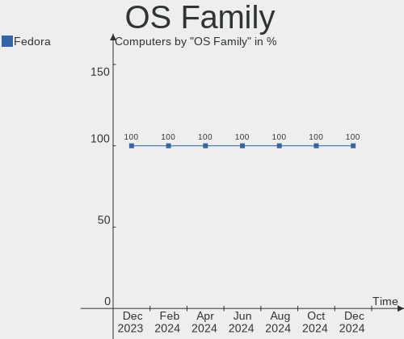
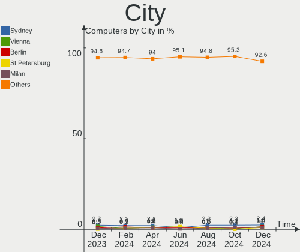
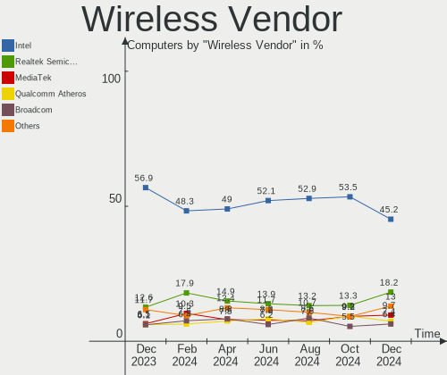
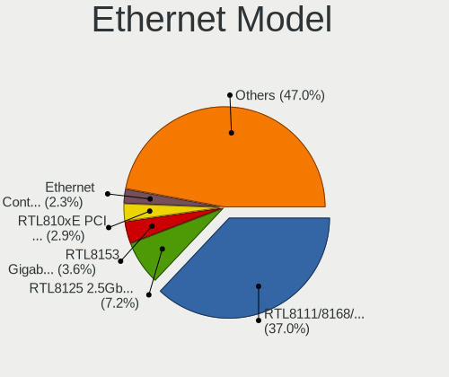
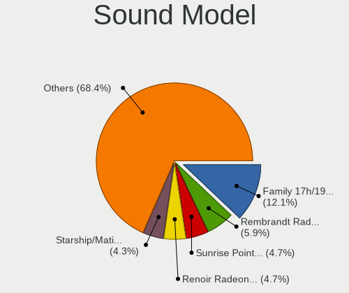

Fedora Hardware Trends
----------------------

A project to identify most popular hardware characteristics and track their change
over time based on data collected by Fedora users at https://Linux-Hardware.org.

Anyone can contribute to this report by the [hw-probe](https://github.com/linuxhw/hw-probe) tool:

    sudo -E hw-probe -all -upload

This is a report for all computer types. See also reports for [desktops](/Dist/Fedora/Desktop/README.md) and [notebooks](/Dist/Fedora/Notebook/README.md).

Full-feature report is available here: https://linux-hardware.org/?view=trends

Period: Oct, 2021.

Contents
--------

* [ System ](#system)
  - [ OS                       ](#os)
  - [ OS Family                ](#os-family)
  - [ Kernel                   ](#kernel)
  - [ Kernel Family            ](#kernel-family)
  - [ Kernel Major Ver.        ](#kernel-major-ver)
  - [ Arch                     ](#arch)
  - [ DE                       ](#de)
  - [ Display Server           ](#display-server)
  - [ Display Manager          ](#display-manager)
  - [ OS Lang                  ](#os-lang)
  - [ Boot Mode                ](#boot-mode)
  - [ Filesystem               ](#filesystem)
  - [ Part. scheme             ](#part-scheme)
  - [ Dual Boot with Linux/BSD ](#dual-boot-with-linuxbsd)
  - [ Dual Boot (Win)          ](#dual-boot-win)

* [ Board ](#board)
  - [ Vendor                   ](#vendor)
  - [ Model                    ](#model)
  - [ Model Family             ](#model-family)
  - [ MFG Year                 ](#mfg-year)
  - [ Form Factor              ](#form-factor)
  - [ Secure Boot              ](#secure-boot)
  - [ Coreboot                 ](#coreboot)
  - [ RAM Size                 ](#ram-size)
  - [ RAM Used                 ](#ram-used)
  - [ Total Drives             ](#total-drives)
  - [ Has CD-ROM               ](#has-cd-rom)
  - [ Has Ethernet             ](#has-ethernet)
  - [ Has WiFi                 ](#has-wifi)
  - [ Has Bluetooth            ](#has-bluetooth)

* [ Location ](#location)
  - [ Country                  ](#country)
  - [ City                     ](#city)

* [ Drives ](#drives)
  - [ Drive Vendor             ](#drive-vendor)
  - [ Drive Model              ](#drive-model)
  - [ HDD Vendor               ](#hdd-vendor)
  - [ SSD Vendor               ](#ssd-vendor)
  - [ Drive Kind               ](#drive-kind)
  - [ Drive Connector          ](#drive-connector)
  - [ Drive Size               ](#drive-size)
  - [ Space Total              ](#space-total)
  - [ Space Used               ](#space-used)
  - [ Malfunc. Drives          ](#malfunc-drives)
  - [ Malfunc. Drive Vendor    ](#malfunc-drive-vendor)
  - [ Malfunc. HDD Vendor      ](#malfunc-hdd-vendor)
  - [ Malfunc. Drive Kind      ](#malfunc-drive-kind)
  - [ Failed Drives            ](#failed-drives)
  - [ Failed Drive Vendor      ](#failed-drive-vendor)
  - [ Drive Status             ](#drive-status)

* [ Storage controller ](#storage-controller)
  - [ Storage Vendor           ](#storage-vendor)
  - [ Storage Model            ](#storage-model)
  - [ Storage Kind             ](#storage-kind)

* [ Processor ](#processor)
  - [ CPU Vendor               ](#cpu-vendor)
  - [ CPU Model                ](#cpu-model)
  - [ CPU Model Family         ](#cpu-model-family)
  - [ CPU Cores                ](#cpu-cores)
  - [ CPU Sockets              ](#cpu-sockets)
  - [ CPU Threads              ](#cpu-threads)
  - [ CPU Op-Modes             ](#cpu-op-modes)
  - [ CPU Microcode            ](#cpu-microcode)
  - [ CPU Microarch            ](#cpu-microarch)

* [ Graphics ](#graphics)
  - [ GPU Vendor               ](#gpu-vendor)
  - [ GPU Model                ](#gpu-model)
  - [ GPU Combo                ](#gpu-combo)
  - [ GPU Driver               ](#gpu-driver)
  - [ GPU Memory               ](#gpu-memory)

* [ Monitor ](#monitor)
  - [ Monitor Vendor           ](#monitor-vendor)
  - [ Monitor Model            ](#monitor-model)
  - [ Monitor Resolution       ](#monitor-resolution)
  - [ Monitor Diagonal         ](#monitor-diagonal)
  - [ Monitor Width            ](#monitor-width)
  - [ Aspect Ratio             ](#aspect-ratio)
  - [ Monitor Area             ](#monitor-area)
  - [ Pixel Density            ](#pixel-density)
  - [ Multiple Monitors        ](#multiple-monitors)

* [ Network ](#network)
  - [ Net Controller Vendor    ](#net-controller-vendor)
  - [ Net Controller Model     ](#net-controller-model)
  - [ Wireless Vendor          ](#wireless-vendor)
  - [ Wireless Model           ](#wireless-model)
  - [ Ethernet Vendor          ](#ethernet-vendor)
  - [ Ethernet Model           ](#ethernet-model)
  - [ Net Controller Kind      ](#net-controller-kind)
  - [ Used Controller          ](#used-controller)
  - [ NICs                     ](#nics)
  - [ IPv6                     ](#ipv6)

* [ Bluetooth ](#bluetooth)
  - [ Bluetooth Vendor         ](#bluetooth-vendor)
  - [ Bluetooth Model          ](#bluetooth-model)

* [ Sound ](#sound)
  - [ Sound Vendor             ](#sound-vendor)
  - [ Sound Model              ](#sound-model)

* [ Memory ](#memory)
  - [ Memory Vendor            ](#memory-vendor)
  - [ Memory Model             ](#memory-model)
  - [ Memory Kind              ](#memory-kind)
  - [ Memory Form Factor       ](#memory-form-factor)
  - [ Memory Size              ](#memory-size)
  - [ Memory Speed             ](#memory-speed)

* [ Printers & scanners ](#printers--scanners)
  - [ Printer Vendor           ](#printer-vendor)
  - [ Printer Model            ](#printer-model)
  - [ Scanner Vendor           ](#scanner-vendor)
  - [ Scanner Model            ](#scanner-model)

* [ Camera ](#camera)
  - [ Camera Vendor            ](#camera-vendor)
  - [ Camera Model             ](#camera-model)

* [ Security ](#security)
  - [ Fingerprint Vendor       ](#fingerprint-vendor)
  - [ Fingerprint Model        ](#fingerprint-model)
  - [ Chipcard Vendor          ](#chipcard-vendor)
  - [ Chipcard Model           ](#chipcard-model)

* [ Unsupported ](#unsupported)
  - [ Unsupported Devices      ](#unsupported-devices)
  - [ Unsupported Device Types ](#unsupported-device-types)

System
------

OS
--

Installed operating systems

| Name      | Computers | Percent |
|-----------|-----------|---------|
| Fedora 34 | 204       | 73.12%  |
| Fedora 35 | 60        | 21.51%  |
| Fedora 33 | 7         | 2.51%   |
| Fedora 36 | 4         | 1.43%   |
| Fedora 32 | 1         | 0.36%   |
| Fedora 31 | 1         | 0.36%   |
| Fedora 29 | 1         | 0.36%   |
| Fedora 25 | 1         | 0.36%   |

OS Family
---------

OS without a version

| Name   | Computers | Percent |
|--------|-----------|---------|
| Fedora | 279       | 100%    |

Kernel
------

Version of the Linux kernel

| Version                                                       | Computers | Percent |
|---------------------------------------------------------------|-----------|---------|
| 5.14.9-200.fc34.x86_64                                        | 53        | 19%     |
| 5.14.13-200.fc34.x86_64                                       | 34        | 12.19%  |
| 5.14.11-200.fc34.x86_64                                       | 33        | 11.83%  |
| 5.13.19-200.fc34.x86_64                                       | 27        | 9.68%   |
| 5.14.10-300.fc35.x86_64                                       | 18        | 6.45%   |
| 5.14.9-300.fc35.x86_64                                        | 15        | 5.38%   |
| 5.14.12-200.fc34.x86_64                                       | 11        | 3.94%   |
| 5.14.10-200.fc34.x86_64                                       | 11        | 3.94%   |
| 5.11.12-300.fc34.x86_64                                       | 11        | 3.94%   |
| 5.14.11-300.fc35.x86_64                                       | 6         | 2.15%   |
| 5.14.0-60.fc35.x86_64                                         | 6         | 2.15%   |
| 5.13.16-200.fc34.x86_64                                       | 4         | 1.43%   |
| 5.14.14-300.fc35.x86_64                                       | 3         | 1.08%   |
| 5.14.14-200.fc34.x86_64                                       | 3         | 1.08%   |
| 5.14.12-300.fc35.x86_64                                       | 3         | 1.08%   |
| 5.13.13-200.fc34.x86_64                                       | 3         | 1.08%   |
| 5.13.12-200.fc34.x86_64                                       | 3         | 1.08%   |
| 5.15.0-0.rc4.20211008git1da38549dd64.36.fc36.x86_64           | 2         | 0.72%   |
| 5.14.12-100.fc33.x86_64                                       | 2         | 0.72%   |
| 5.13.19-100.fc33.x86_64                                       | 2         | 0.72%   |
| 5.13.14-200.fc34.x86_64                                       | 2         | 0.72%   |
| 5.8.18-100.fc31.x86_64                                        | 1         | 0.36%   |
| 5.8.15-301.fc33.x86_64                                        | 1         | 0.36%   |
| 5.4.148-300.fc34.x86_64                                       | 1         | 0.36%   |
| 5.3.6-100.fc29.x86_64                                         | 1         | 0.36%   |
| 5.15.0-0.rc7.20211028git1fc596a56b33.56.vanilla.1.fc35.x86_64 | 1         | 0.36%   |
| 5.15.0-0.rc6.47.fc36.x86_64                                   | 1         | 0.36%   |
| 5.15.0-0.rc4.20211008git1da38549dd64.36.vanilla.1.fc36.x86_64 | 1         | 0.36%   |
| 5.14.9-300.rog.fc34.x86_64                                    | 1         | 0.36%   |
| 5.14.9-300.fc35.aarch64                                       | 1         | 0.36%   |
| 5.14.9-200.fc34.aarch64                                       | 1         | 0.36%   |
| 5.14.8-xm1cacule.0.fc35.x86_64                                | 1         | 0.36%   |
| 5.14.7-300.fc35.x86_64                                        | 1         | 0.36%   |
| 5.14.15-300.fc35.x86_64                                       | 1         | 0.36%   |
| 5.14.13_MY                                                    | 1         | 0.36%   |
| 5.14.13-100.fc33.x86_64                                       | 1         | 0.36%   |
| 5.14.0-0.rc6.46.fc35.x86_64                                   | 1         | 0.36%   |
| 5.13.9-200.fc34.x86_64                                        | 1         | 0.36%   |
| 5.13.4-200.fc34.x86_64                                        | 1         | 0.36%   |
| 5.13.19-200.fc34.x86_64+debug                                 | 1         | 0.36%   |
| 5.13.16-200.fc34.aarch64                                      | 1         | 0.36%   |
| 5.13.12-1                                                     | 1         | 0.36%   |
| 5.12.9-200.fc33.x86_64                                        | 1         | 0.36%   |
| 5.11.22-100.fc32.x86_64                                       | 1         | 0.36%   |
| 5.11.16-300.fc34.x86_64                                       | 1         | 0.36%   |
| 5.10.23-200.fc35.x86_64                                       | 1         | 0.36%   |
| 5.10.23-200.fc33.x86_64                                       | 1         | 0.36%   |
| 4.13.16-100.fc25.x86_64                                       | 1         | 0.36%   |

Kernel Family
-------------

Linux kernel without a distro release

| Version | Computers | Percent |
|---------|-----------|---------|
| 5.14.9  | 71        | 25.45%  |
| 5.14.11 | 39        | 13.98%  |
| 5.14.13 | 36        | 12.9%   |
| 5.13.19 | 30        | 10.75%  |
| 5.14.10 | 29        | 10.39%  |
| 5.14.12 | 16        | 5.73%   |
| 5.11.12 | 11        | 3.94%   |
| 5.14.0  | 7         | 2.51%   |
| 5.14.14 | 6         | 2.15%   |
| 5.15.0  | 5         | 1.79%   |
| 5.13.16 | 5         | 1.79%   |
| 5.13.12 | 4         | 1.43%   |
| 5.13.13 | 3         | 1.08%   |
| 5.13.14 | 2         | 0.72%   |
| 5.10.23 | 2         | 0.72%   |
| 5.8.18  | 1         | 0.36%   |
| 5.8.15  | 1         | 0.36%   |
| 5.4.148 | 1         | 0.36%   |
| 5.3.6   | 1         | 0.36%   |
| 5.14.8  | 1         | 0.36%   |
| 5.14.7  | 1         | 0.36%   |
| 5.14.15 | 1         | 0.36%   |
| 5.13.9  | 1         | 0.36%   |
| 5.13.4  | 1         | 0.36%   |
| 5.12.9  | 1         | 0.36%   |
| 5.11.22 | 1         | 0.36%   |
| 5.11.16 | 1         | 0.36%   |
| 4.13.16 | 1         | 0.36%   |

Kernel Major Ver.
-----------------

Linux kernel major version

| Version | Computers | Percent |
|---------|-----------|---------|
| 5.14    | 207       | 74.19%  |
| 5.13    | 46        | 16.49%  |
| 5.11    | 13        | 4.66%   |
| 5.15    | 5         | 1.79%   |
| 5.8     | 2         | 0.72%   |
| 5.10    | 2         | 0.72%   |
| 5.4     | 1         | 0.36%   |
| 5.3     | 1         | 0.36%   |
| 5.12    | 1         | 0.36%   |
| 4.13    | 1         | 0.36%   |

Arch
----

OS architecture (x86_64, i586, etc.)

| Name    | Computers | Percent |
|---------|-----------|---------|
| x86_64  | 275       | 98.57%  |
| aarch64 | 4         | 1.43%   |

DE
--

Desktop Environment

| Name          | Computers | Percent |
|---------------|-----------|---------|
| GNOME         | 197       | 70.61%  |
| KDE5          | 31        | 11.11%  |
| Unknown       | 17        | 6.09%   |
| Cinnamon      | 12        | 4.3%    |
| XFCE          | 5         | 1.79%   |
| X-Cinnamon    | 5         | 1.79%   |
| MATE          | 4         | 1.43%   |
| sway          | 2         | 0.72%   |
| LXQt          | 2         | 0.72%   |
| GNOME Classic | 2         | 0.72%   |
| i3            | 1         | 0.36%   |
| DWM           | 1         | 0.36%   |

Display Server
--------------

X11 or Wayland

| Name    | Computers | Percent |
|---------|-----------|---------|
| Wayland | 159       | 56.99%  |
| X11     | 93        | 33.33%  |
| Tty     | 17        | 6.09%   |
| Unknown | 10        | 3.58%   |

Display Manager
---------------

SDDM, LightDM, etc.

| Name    | Computers | Percent |
|---------|-----------|---------|
| Unknown | 153       | 54.84%  |
| GDM     | 81        | 29.03%  |
| LightDM | 24        | 8.6%    |
| SDDM    | 21        | 7.53%   |

OS Lang
-------

Language

| Lang    | Computers | Percent |
|---------|-----------|---------|
| en_US   | 143       | 51.25%  |
| en_GB   | 22        | 7.89%   |
| fr_FR   | 14        | 5.02%   |
| en_AU   | 14        | 5.02%   |
| ru_RU   | 13        | 4.66%   |
| pt_BR   | 9         | 3.23%   |
| it_IT   | 7         | 2.51%   |
| es_ES   | 6         | 2.15%   |
| de_DE   | 6         | 2.15%   |
| pl_PL   | 5         | 1.79%   |
| es_MX   | 4         | 1.43%   |
| en_IN   | 4         | 1.43%   |
| nl_BE   | 3         | 1.08%   |
| fr_CH   | 3         | 1.08%   |
| uk_UA   | 2         | 0.72%   |
| hu_HU   | 2         | 0.72%   |
| es_EC   | 2         | 0.72%   |
| es_AR   | 2         | 0.72%   |
| en_NZ   | 2         | 0.72%   |
| en_CA   | 2         | 0.72%   |
| Unknown | 2         | 0.72%   |
| pa_IN   | 1         | 0.36%   |
| nl_NL   | 1         | 0.36%   |
| fr_CA   | 1         | 0.36%   |
| es_VE   | 1         | 0.36%   |
| es_CO   | 1         | 0.36%   |
| en_IL   | 1         | 0.36%   |
| en_IE   | 1         | 0.36%   |
| en_DK   | 1         | 0.36%   |
| de_CH   | 1         | 0.36%   |
| cs_CZ   | 1         | 0.36%   |
| C       | 1         | 0.36%   |
| ar_SA   | 1         | 0.36%   |

Boot Mode
---------

EFI or BIOS

| Mode | Computers | Percent |
|------|-----------|---------|
| EFI  | 194       | 69.53%  |
| BIOS | 85        | 30.47%  |

Filesystem
----------

Type of filesystem

| Type  | Computers | Percent |
|-------|-----------|---------|
| Btrfs | 194       | 69.53%  |
| Ext4  | 65        | 23.3%   |
| Xfs   | 20        | 7.17%   |

Part. scheme
------------

Scheme of partitioning

| Type    | Computers | Percent |
|---------|-----------|---------|
| Unknown | 141       | 50.54%  |
| GPT     | 111       | 39.78%  |
| MBR     | 27        | 9.68%   |

Dual Boot with Linux/BSD
------------------------

Hosting more than one Linux/BSD

| Dual boot | Computers | Percent |
|-----------|-----------|---------|
| No        | 248       | 88.89%  |
| Yes       | 31        | 11.11%  |

Dual Boot (Win)
---------------

Hosting Linux and Windows

| Dual boot | Computers | Percent |
|-----------|-----------|---------|
| No        | 222       | 79.57%  |
| Yes       | 57        | 20.43%  |

Board
-----

Vendor
------

Motherboard manufacturer

| Name                  | Computers | Percent |
|-----------------------|-----------|---------|
| Lenovo                | 59        | 21.15%  |
| Hewlett-Packard       | 40        | 14.34%  |
| Dell                  | 38        | 13.62%  |
| ASUSTek Computer      | 35        | 12.54%  |
| Gigabyte Technology   | 24        | 8.6%    |
| MSI                   | 15        | 5.38%   |
| ASRock                | 10        | 3.58%   |
| Apple                 | 9         | 3.23%   |
| Acer                  | 6         | 2.15%   |
| Unknown               | 6         | 2.15%   |
| Notebook              | 4         | 1.43%   |
| Intel                 | 4         | 1.43%   |
| Toshiba               | 3         | 1.08%   |
| theobroma-systems     | 2         | 0.72%   |
| Samsung Electronics   | 2         | 0.72%   |
| HUAWEI                | 2         | 0.72%   |
| Fujitsu               | 2         | 0.72%   |
| ZOOSTORM              | 1         | 0.36%   |
| TUXEDO                | 1         | 0.36%   |
| Teclast               | 1         | 0.36%   |
| System76              | 1         | 0.36%   |
| Standard              | 1         | 0.36%   |
| Sony                  | 1         | 0.36%   |
| Razer                 | 1         | 0.36%   |
| Positivo Bahia - VAIO | 1         | 0.36%   |
| Pine Microsystems     | 1         | 0.36%   |
| LG Electronics        | 1         | 0.36%   |
| Huanan                | 1         | 0.36%   |
| GPU Company           | 1         | 0.36%   |
| Framework             | 1         | 0.36%   |
| Foxconn               | 1         | 0.36%   |
| eMachines             | 1         | 0.36%   |
| BESSTAR Tech          | 1         | 0.36%   |
| AOpen                 | 1         | 0.36%   |
| Alienware             | 1         | 0.36%   |

Model
-----

Motherboard model

| Name                                                                                     | Computers | Percent |
|------------------------------------------------------------------------------------------|-----------|---------|
| Unknown                                                                                  | 7         | 2.51%   |
| Dell Inspiron N5110                                                                      | 3         | 1.08%   |
| theobroma-systems puma_rk3399                                                            | 2         | 0.72%   |
| MSI MS-7C37                                                                              | 2         | 0.72%   |
| Lenovo G40-45 80E1                                                                       | 2         | 0.72%   |
| Gigabyte B450 AORUS ELITE V2                                                             | 2         | 0.72%   |
| Gigabyte B450 AORUS ELITE                                                                | 2         | 0.72%   |
| ASUS ROG Zephyrus G14 GA401QM_GA401QM                                                    | 2         | 0.72%   |
| Apple MacBook4,1                                                                         | 2         | 0.72%   |
| ZOOSTORM 7200-9041A                                                                      | 1         | 0.36%   |
| TUXEDO Polaris 15 AMD Gen1                                                               | 1         | 0.36%   |
| Toshiba Satellite L750                                                                   | 1         | 0.36%   |
| Toshiba Satellite C855-12R                                                               | 1         | 0.36%   |
| Toshiba Satellite C55-A-1NK                                                              | 1         | 0.36%   |
| Teclast F7 Plus                                                                          | 1         | 0.36%   |
| System76 Oryx Pro                                                                        | 1         | 0.36%   |
| Sony VPCSA25GX                                                                           | 1         | 0.36%   |
| Samsung 370E4K                                                                           | 1         | 0.36%   |
| Samsung 355V4C/355V4X/355V5C/355V5X/356V4C/356V4X/356V5C/356V5X/3445VC/3445VX/3545VC/354 | 1         | 0.36%   |
| Razer Blade 15 Base Model (Early 2020) - RZ09-0328                                       | 1         | 0.36%   |
| Positivo Bahia - VAIO VJFE53F11X-XXXXXX                                                  | 1         | 0.36%   |
| Pine Microsystems Pine64 Pinebook Pro                                                    | 1         | 0.36%   |
| Notebook PCx0Dx                                                                          | 1         | 0.36%   |
| Notebook NH5x_NH7x_HHx_HJx_HKx                                                           | 1         | 0.36%   |
| Notebook NH5x_NH7xHP                                                                     | 1         | 0.36%   |
| Notebook NB50TL                                                                          | 1         | 0.36%   |
| MSI MS-9A45                                                                              | 1         | 0.36%   |
| MSI MS-7C95                                                                              | 1         | 0.36%   |
| MSI MS-7C92                                                                              | 1         | 0.36%   |
| MSI MS-7C56                                                                              | 1         | 0.36%   |
| MSI MS-7C02                                                                              | 1         | 0.36%   |
| MSI MS-7B93                                                                              | 1         | 0.36%   |
| MSI MS-7A69                                                                              | 1         | 0.36%   |
| MSI MS-7A40                                                                              | 1         | 0.36%   |
| MSI MS-7A39                                                                              | 1         | 0.36%   |
| MSI MS-7A38                                                                              | 1         | 0.36%   |
| MSI MS-7A34                                                                              | 1         | 0.36%   |
| MSI MS-7721                                                                              | 1         | 0.36%   |
| MSI Customised Bravo 5 Intel PC                                                          | 1         | 0.36%   |
| LG A550-C.BE55P1                                                                         | 1         | 0.36%   |
| Lenovo Yoga S740-14IIL 81RS                                                              | 1         | 0.36%   |
| Lenovo Yoga 9 14ITL5 82BG                                                                | 1         | 0.36%   |
| Lenovo Yoga 7 14ITL5 82BH                                                                | 1         | 0.36%   |
| Lenovo V580c 20160                                                                       | 1         | 0.36%   |
| Lenovo ThinkStation P620 30E0CTO1WW                                                      | 1         | 0.36%   |
| Lenovo ThinkPad Yoga 260 20FD000GAD                                                      | 1         | 0.36%   |
| Lenovo ThinkPad X240 20AMA1Y3UK                                                          | 1         | 0.36%   |
| Lenovo ThinkPad X220 4289A92                                                             | 1         | 0.36%   |
| Lenovo ThinkPad X1 Extreme 2nd 20QVCTO1WW                                                | 1         | 0.36%   |
| Lenovo ThinkPad X1 Carbon Gen 9 20XWCTO1WW                                               | 1         | 0.36%   |
| Lenovo ThinkPad X1 Carbon 7th 20QD001FZA                                                 | 1         | 0.36%   |
| Lenovo ThinkPad X1 Carbon 6th 20KH007BUK                                                 | 1         | 0.36%   |
| Lenovo ThinkPad T490s 20NX003NRT                                                         | 1         | 0.36%   |
| Lenovo ThinkPad T490 20N3S6VU00                                                          | 1         | 0.36%   |
| Lenovo ThinkPad T490 20N3S37900                                                          | 1         | 0.36%   |
| Lenovo ThinkPad T490 20N2005VMX                                                          | 1         | 0.36%   |
| Lenovo ThinkPad T490 20N2000BPB                                                          | 1         | 0.36%   |
| Lenovo ThinkPad T480s 20L70026US                                                         | 1         | 0.36%   |
| Lenovo ThinkPad T480 20L6S7PE06                                                          | 1         | 0.36%   |
| Lenovo ThinkPad T480 20L5000BMX                                                          | 1         | 0.36%   |

Model Family
------------

Motherboard model prefix

| Name                                    | Computers | Percent |
|-----------------------------------------|-----------|---------|
| Lenovo ThinkPad                         | 33        | 11.83%  |
| Lenovo IdeaPad                          | 12        | 4.3%    |
| Dell Inspiron                           | 9         | 3.23%   |
| ASUS ROG                                | 9         | 3.23%   |
| HP Pavilion                             | 8         | 2.87%   |
| Dell XPS                                | 8         | 2.87%   |
| Dell Latitude                           | 7         | 2.51%   |
| Unknown                                 | 7         | 2.51%   |
| HP ProBook                              | 6         | 2.15%   |
| HP EliteBook                            | 6         | 2.15%   |
| Gigabyte B450                           | 6         | 2.15%   |
| HP ENVY                                 | 5         | 1.79%   |
| ASUS PRIME                              | 5         | 1.79%   |
| HP Laptop                               | 4         | 1.43%   |
| Dell Precision                          | 4         | 1.43%   |
| ASUS VivoBook                           | 4         | 1.43%   |
| Toshiba Satellite                       | 3         | 1.08%   |
| Lenovo Yoga                             | 3         | 1.08%   |
| Dell Vostro                             | 3         | 1.08%   |
| Dell OptiPlex                           | 3         | 1.08%   |
| Acer Aspire                             | 3         | 1.08%   |
| theobroma-systems puma                  | 2         | 0.72%   |
| Notebook NH5x                           | 2         | 0.72%   |
| MSI MS-7C37                             | 2         | 0.72%   |
| Lenovo Legion                           | 2         | 0.72%   |
| Lenovo G40-45                           | 2         | 0.72%   |
| HP ProDesk                              | 2         | 0.72%   |
| HP OMEN                                 | 2         | 0.72%   |
| HP 240                                  | 2         | 0.72%   |
| Gigabyte X570                           | 2         | 0.72%   |
| Gigabyte H310M                          | 2         | 0.72%   |
| Fujitsu ESPRIMO                         | 2         | 0.72%   |
| Dell PowerEdge                          | 2         | 0.72%   |
| ASUS ASUS                               | 2         | 0.72%   |
| Apple MacBookPro5                       | 2         | 0.72%   |
| Apple MacBookPro11                      | 2         | 0.72%   |
| Apple MacBook4                          | 2         | 0.72%   |
| ZOOSTORM 7200-9041A                     | 1         | 0.36%   |
| TUXEDO Polaris                          | 1         | 0.36%   |
| Teclast F7                              | 1         | 0.36%   |
| System76 Oryx                           | 1         | 0.36%   |
| Sony VPCSA25GX                          | 1         | 0.36%   |
| Samsung 370E4K                          | 1         | 0.36%   |
| Samsung 355V4C                          | 1         | 0.36%   |
| Razer Blade                             | 1         | 0.36%   |
| Positivo Bahia - VAIO VJFE53F11X-XXXXXX | 1         | 0.36%   |
| Pine Microsystems Pine64                | 1         | 0.36%   |
| Notebook PCx0Dx                         | 1         | 0.36%   |
| Notebook NB50TL                         | 1         | 0.36%   |
| MSI MS-9A45                             | 1         | 0.36%   |
| MSI MS-7C95                             | 1         | 0.36%   |
| MSI MS-7C92                             | 1         | 0.36%   |
| MSI MS-7C56                             | 1         | 0.36%   |
| MSI MS-7C02                             | 1         | 0.36%   |
| MSI MS-7B93                             | 1         | 0.36%   |
| MSI MS-7A69                             | 1         | 0.36%   |
| MSI MS-7A40                             | 1         | 0.36%   |
| MSI MS-7A39                             | 1         | 0.36%   |
| MSI MS-7A38                             | 1         | 0.36%   |
| MSI MS-7A34                             | 1         | 0.36%   |

MFG Year
--------

Motherboard manufacture year

| Year    | Computers | Percent |
|---------|-----------|---------|
| 2021    | 79        | 28.32%  |
| 2020    | 52        | 18.64%  |
| 2019    | 32        | 11.47%  |
| 2018    | 23        | 8.24%   |
| 2013    | 17        | 6.09%   |
| 2015    | 15        | 5.38%   |
| 2012    | 11        | 3.94%   |
| 2016    | 8         | 2.87%   |
| 2011    | 8         | 2.87%   |
| 2010    | 7         | 2.51%   |
| 2017    | 6         | 2.15%   |
| 2014    | 6         | 2.15%   |
| 2008    | 5         | 1.79%   |
| 2009    | 4         | 1.43%   |
| Unknown | 4         | 1.43%   |
| 2006    | 2         | 0.72%   |

Form Factor
-----------

Physical design of the computer

| Name           | Computers | Percent |
|----------------|-----------|---------|
| Notebook       | 168       | 60.22%  |
| Desktop        | 91        | 32.62%  |
| Convertible    | 12        | 4.3%    |
| System on chip | 3         | 1.08%   |
| Mini pc        | 2         | 0.72%   |
| Server         | 2         | 0.72%   |
| All in one     | 1         | 0.36%   |

Secure Boot
-----------

Enabled or disabled

| State    | Computers | Percent |
|----------|-----------|---------|
| Disabled | 247       | 88.53%  |
| Enabled  | 32        | 11.47%  |

Coreboot
--------

Have coreboot on board

| Used | Computers | Percent |
|------|-----------|---------|
| No   | 279       | 100%    |

RAM Size
--------

Total RAM memory

| Size in GB  | Computers | Percent |
|-------------|-----------|---------|
| 4.01-8.0    | 78        | 27.96%  |
| 16.01-24.0  | 65        | 23.3%   |
| 8.01-16.0   | 54        | 19.35%  |
| 32.01-64.0  | 44        | 15.77%  |
| 3.01-4.0    | 27        | 9.68%   |
| 64.01-256.0 | 5         | 1.79%   |
| 24.01-32.0  | 3         | 1.08%   |
| 1.01-2.0    | 2         | 0.72%   |
| 2.01-3.0    | 1         | 0.36%   |

RAM Used
--------

Used RAM memory

| Used GB    | Computers | Percent |
|------------|-----------|---------|
| 2.01-3.0   | 79        | 28.32%  |
| 4.01-8.0   | 77        | 27.6%   |
| 3.01-4.0   | 49        | 17.56%  |
| 1.01-2.0   | 46        | 16.49%  |
| 8.01-16.0  | 18        | 6.45%   |
| 0.51-1.0   | 8         | 2.87%   |
| 24.01-32.0 | 1         | 0.36%   |
| 0.01-0.5   | 1         | 0.36%   |

Total Drives
------------

Number of drives on board

| Drives | Computers | Percent |
|--------|-----------|---------|
| 1      | 161       | 57.71%  |
| 2      | 81        | 29.03%  |
| 3      | 21        | 7.53%   |
| 4      | 5         | 1.79%   |
| 5      | 4         | 1.43%   |
| 7      | 3         | 1.08%   |
| 8      | 2         | 0.72%   |
| 6      | 2         | 0.72%   |

Has CD-ROM
----------

Has CD-ROM on board

| Presented | Computers | Percent |
|-----------|-----------|---------|
| No        | 207       | 74.19%  |
| Yes       | 72        | 25.81%  |

Has Ethernet
------------

Has Ethernet on board

| Presented | Computers | Percent |
|-----------|-----------|---------|
| Yes       | 231       | 82.8%   |
| No        | 48        | 17.2%   |

Has WiFi
--------

Has WiFi module

| Presented | Computers | Percent |
|-----------|-----------|---------|
| Yes       | 229       | 82.08%  |
| No        | 50        | 17.92%  |

Has Bluetooth
-------------

Has Bluetooth module

| Presented | Computers | Percent |
|-----------|-----------|---------|
| Yes       | 189       | 67.74%  |
| No        | 90        | 32.26%  |

Location
--------

Country
-------

Geographic location (country)

| Country               | Computers | Percent |
|-----------------------|-----------|---------|
| USA                   | 48        | 17.2%   |
| France                | 19        | 6.81%   |
| Brazil                | 19        | 6.81%   |
| Russia                | 15        | 5.38%   |
| Germany               | 14        | 5.02%   |
| Australia             | 14        | 5.02%   |
| Austria               | 12        | 4.3%    |
| Poland                | 11        | 3.94%   |
| UK                    | 8         | 2.87%   |
| Italy                 | 8         | 2.87%   |
| India                 | 8         | 2.87%   |
| Switzerland           | 6         | 2.15%   |
| Netherlands           | 6         | 2.15%   |
| Canada                | 6         | 2.15%   |
| Sweden                | 5         | 1.79%   |
| Spain                 | 5         | 1.79%   |
| Mexico                | 5         | 1.79%   |
| Belgium               | 5         | 1.79%   |
| Ukraine               | 4         | 1.43%   |
| Hungary               | 4         | 1.43%   |
| Ecuador               | 4         | 1.43%   |
| Czechia               | 4         | 1.43%   |
| Romania               | 3         | 1.08%   |
| Portugal              | 3         | 1.08%   |
| Norway                | 3         | 1.08%   |
| New Zealand           | 3         | 1.08%   |
| Iran                  | 3         | 1.08%   |
| Belarus               | 3         | 1.08%   |
| Argentina             | 3         | 1.08%   |
| Israel                | 2         | 0.72%   |
| Ireland               | 2         | 0.72%   |
| Indonesia             | 2         | 0.72%   |
| Egypt                 | 2         | 0.72%   |
| Denmark               | 2         | 0.72%   |
| Colombia              | 2         | 0.72%   |
| Yemen                 | 1         | 0.36%   |
| Venezuela             | 1         | 0.36%   |
| UAE                   | 1         | 0.36%   |
| South Africa          | 1         | 0.36%   |
| Slovenia              | 1         | 0.36%   |
| Serbia                | 1         | 0.36%   |
| Palestinian Territory | 1         | 0.36%   |
| Pakistan              | 1         | 0.36%   |
| Kazakhstan            | 1         | 0.36%   |
| Finland               | 1         | 0.36%   |
| Dominican Republic    | 1         | 0.36%   |
| Cyprus                | 1         | 0.36%   |
| Chile                 | 1         | 0.36%   |
| Bulgaria              | 1         | 0.36%   |
| Azerbaijan            | 1         | 0.36%   |
| Angola                | 1         | 0.36%   |

City
----

Geographic location (city)

| City              | Computers | Percent |
|-------------------|-----------|---------|
| Sydney            | 12        | 4.3%    |
| Vienna            | 9         | 3.23%   |
| Moscow            | 8         | 2.87%   |
| Apex              | 5         | 1.79%   |
| Zurich            | 4         | 1.43%   |
| Paris             | 4         | 1.43%   |
| Montreal          | 3         | 1.08%   |
| Minsk             | 3         | 1.08%   |
| Madrid            | 3         | 1.08%   |
| London            | 3         | 1.08%   |
| Jambes            | 3         | 1.08%   |
| Berlin            | 3         | 1.08%   |
| Warsaw            | 2         | 0.72%   |
| Rio de Janeiro    | 2         | 0.72%   |
| Rillieux-la-Pape  | 2         | 0.72%   |
| Quito             | 2         | 0.72%   |
| Porto Alegre      | 2         | 0.72%   |
| Novosibirsk       | 2         | 0.72%   |
| Milan             | 2         | 0.72%   |
| Lisbon            | 2         | 0.72%   |
| Las Vegas         | 2         | 0.72%   |
| Kyiv              | 2         | 0.72%   |
| Guayaquil         | 2         | 0.72%   |
| Graz              | 2         | 0.72%   |
| Gdansk            | 2         | 0.72%   |
| Dallas            | 2         | 0.72%   |
| Ames              | 2         | 0.72%   |
| Adelaide          | 2         | 0.72%   |
| Yuma              | 1         | 0.36%   |
| Yekaterinburg     | 1         | 0.36%   |
| Worms             | 1         | 0.36%   |
| Voronezh          | 1         | 0.36%   |
| Villeparisis      | 1         | 0.36%   |
| Veresegyhaz       | 1         | 0.36%   |
| Veldhoven         | 1         | 0.36%   |
| Utica             | 1         | 0.36%   |
| Ume??             | 1         | 0.36%   |
| Tuxtla Guti?©rrez | 1         | 0.36%   |
| Tulcea            | 1         | 0.36%   |
| Trbovlje          | 1         | 0.36%   |
| Tongeren          | 1         | 0.36%   |
| Tirunelveli       | 1         | 0.36%   |
| Timbauba          | 1         | 0.36%   |
| Thrissur          | 1         | 0.36%   |
| Teramo            | 1         | 0.36%   |
| Tehran            | 1         | 0.36%   |
| Tauranga          | 1         | 0.36%   |
| Taraz             | 1         | 0.36%   |
| Tallahassee       | 1         | 0.36%   |
| Taby              | 1         | 0.36%   |
| Szczecin          | 1         | 0.36%   |
| Surabaya          | 1         | 0.36%   |
| Sun City Center   | 1         | 0.36%   |
| Stokke            | 1         | 0.36%   |
| Sprockhoevel      | 1         | 0.36%   |
| Sorocaba          | 1         | 0.36%   |
| Somerville        | 1         | 0.36%   |
| Sofia             | 1         | 0.36%   |
| S??o Paulo        | 1         | 0.36%   |
| Sapucaia do Sul   | 1         | 0.36%   |

Drives
------

Drive Vendor
------------

Hard drive vendors

| Vendor                    | Computers | Drives | Percent |
|---------------------------|-----------|--------|---------|
| Samsung Electronics       | 91        | 117    | 22.14%  |
| Seagate                   | 54        | 69     | 13.14%  |
| WDC                       | 49        | 61     | 11.92%  |
| Kingston                  | 26        | 29     | 6.33%   |
| Toshiba                   | 20        | 23     | 4.87%   |
| SanDisk                   | 18        | 20     | 4.38%   |
| Crucial                   | 18        | 19     | 4.38%   |
| Unknown                   | 17        | 19     | 4.14%   |
| SK Hynix                  | 14        | 16     | 3.41%   |
| Intel                     | 14        | 14     | 3.41%   |
| HGST                      | 7         | 7      | 1.7%    |
| PNY                       | 5         | 5      | 1.22%   |
| Micron Technology         | 5         | 5      | 1.22%   |
| Hitachi                   | 5         | 6      | 1.22%   |
| China                     | 5         | 5      | 1.22%   |
| Apple                     | 5         | 6      | 1.22%   |
| KIOXIA                    | 4         | 4      | 0.97%   |
| Transcend                 | 3         | 3      | 0.73%   |
| Silicon Motion            | 3         | 3      | 0.73%   |
| Mushkin                   | 3         | 3      | 0.73%   |
| Corsair                   | 3         | 3      | 0.73%   |
| Union Memory (Shenzhen)   | 2         | 3      | 0.49%   |
| Team                      | 2         | 2      | 0.49%   |
| SPCC                      | 2         | 2      | 0.49%   |
| Realtek Semiconductor     | 2         | 2      | 0.49%   |
| Phison                    | 2         | 2      | 0.49%   |
| OCZ                       | 2         | 2      | 0.49%   |
| LITEON                    | 2         | 2      | 0.49%   |
| Gigabyte Technology       | 2         | 2      | 0.49%   |
| A-DATA Technology         | 2         | 2      | 0.49%   |
| XPG                       | 1         | 1      | 0.24%   |
| USB3.0                    | 1         | 1      | 0.24%   |
| UMIS                      | 1         | 1      | 0.24%   |
| TEXTORM                   | 1         | 1      | 0.24%   |
| SABRENT                   | 1         | 1      | 0.24%   |
| Radeon                    | 1         | 1      | 0.24%   |
| Patriot                   | 1         | 1      | 0.24%   |
| Micron/Crucial Technology | 1         | 1      | 0.24%   |
| MAXTOR                    | 1         | 1      | 0.24%   |
| MaxDigital                | 1         | 1      | 0.24%   |
| LS600                     | 1         | 1      | 0.24%   |
| Lite-On                   | 1         | 1      | 0.24%   |
| Lenovo                    | 1         | 1      | 0.24%   |
| LDLC                      | 1         | 1      | 0.24%   |
| KingSpec                  | 1         | 1      | 0.24%   |
| KingFast                  | 1         | 1      | 0.24%   |
| ITHOO                     | 1         | 1      | 0.24%   |
| HPE                       | 1         | 1      | 0.24%   |
| Hewlett-Packard           | 1         | 1      | 0.24%   |
| GOODRAM                   | 1         | 1      | 0.24%   |
| FORESEE                   | 1         | 1      | 0.24%   |
| Enmotus                   | 1         | 1      | 0.24%   |
| BRAVEEAGLE                | 1         | 1      | 0.24%   |
| AMD                       | 1         | 1      | 0.24%   |

Drive Model
-----------

Hard drive models

| Model                                  | Computers | Percent |
|----------------------------------------|-----------|---------|
| Kingston SA400S37240G 240GB SSD        | 8         | 1.73%   |
| Seagate ST1000LM024 HN-M101MBB 1TB     | 6         | 1.3%    |
| Samsung SSD 860 EVO 1TB                | 6         | 1.3%    |
| Samsung NVMe SSD Drive 1TB             | 6         | 1.3%    |
| Seagate ST4000DM004-2CV104 4TB         | 5         | 1.08%   |
| Samsung SSD 970 EVO Plus 500GB         | 5         | 1.08%   |
| Samsung SSD 860 EVO 500GB              | 5         | 1.08%   |
| Samsung SSD 850 EVO 250GB              | 5         | 1.08%   |
| Samsung PM963 2.5" NVMe PCIe SSD 512GB | 5         | 1.08%   |
| Samsung NVMe SSD Drive 500GB           | 5         | 1.08%   |
| Samsung NVMe SSD Drive 256GB           | 5         | 1.08%   |
| Unknown MMC Card  64GB                 | 4         | 0.86%   |
| Samsung SSD 860 EVO 250GB              | 4         | 0.86%   |
| WDC WDS500G2B0A-00SM50 500GB SSD       | 3         | 0.65%   |
| WDC WDS100T2B0A-00SM50 1TB SSD         | 3         | 0.65%   |
| WDC WD20EZRZ-00Z5HB0 2TB               | 3         | 0.65%   |
| Seagate ST31000524AS 1TB               | 3         | 0.65%   |
| Seagate ST1000LM035-1RK172 1TB         | 3         | 0.65%   |
| Seagate Expansion 1TB                  | 3         | 0.65%   |
| Samsung NVMe SSD Drive 1024GB          | 3         | 0.65%   |
| HGST HTS721010A9E630 1TB               | 3         | 0.65%   |
| Crucial CT1000MX500SSD1 1TB            | 3         | 0.65%   |
| WDC WDS240G2G0A-00JH30 240GB SSD       | 2         | 0.43%   |
| WDC WD10SPZX-60Z10T0 1TB               | 2         | 0.43%   |
| Unknown MMC Card  32GB                 | 2         | 0.43%   |
| Unknown MMC Card  128GB                | 2         | 0.43%   |
| Toshiba NVMe SSD Drive 512GB           | 2         | 0.43%   |
| Toshiba MQ01ABF050 500GB               | 2         | 0.43%   |
| Toshiba KXG6AZNV512G 512GB             | 2         | 0.43%   |
| SK Hynix SHGP31-1000GM-2 1TB           | 2         | 0.43%   |
| SK Hynix NVMe SSD Drive 512GB          | 2         | 0.43%   |
| SK Hynix NVMe SSD Drive 256GB          | 2         | 0.43%   |
| Seagate ST9250315AS 250GB              | 2         | 0.43%   |
| Seagate ST8000AS0002-1NA17Z 8TB        | 2         | 0.43%   |
| Seagate ST500LT012-9WS142 500GB        | 2         | 0.43%   |
| Seagate ST500LT012-1DG142 500GB        | 2         | 0.43%   |
| Seagate ST2000LM015-2E8174 2TB         | 2         | 0.43%   |
| Seagate ST1000LM048-2E7172 1TB         | 2         | 0.43%   |
| Seagate ST1000DM010-2EP102 1TB         | 2         | 0.43%   |
| Sandisk NVMe SSD Drive 512GB           | 2         | 0.43%   |
| Sandisk NVMe SSD Drive 500GB           | 2         | 0.43%   |
| Sandisk NVMe SSD Drive 2TB             | 2         | 0.43%   |
| Samsung SSD 970 EVO Plus 1TB           | 2         | 0.43%   |
| Samsung SSD 970 EVO 500GB              | 2         | 0.43%   |
| Samsung SSD 970 EVO 1TB                | 2         | 0.43%   |
| Samsung NVMe SSD Drive 2TB             | 2         | 0.43%   |
| Samsung MZVLQ512HALU-000H1 512GB       | 2         | 0.43%   |
| Samsung MZVLB256HBHQ-000L7 256GB       | 2         | 0.43%   |
| Samsung MZ7LN512HMJP-000L7 512GB SSD   | 2         | 0.43%   |
| Samsung HM160HI 160GB                  | 2         | 0.43%   |
| PNY CS900 120GB SSD                    | 2         | 0.43%   |
| Kingston SHFS37A240G 240GB SSD         | 2         | 0.43%   |
| Kingston SA400S37480G 480GB SSD        | 2         | 0.43%   |
| Kingston SA2000M8500G 500GB            | 2         | 0.43%   |
| Kingston SA2000M81000G 1TB             | 2         | 0.43%   |
| Intel SSDSC2KW256G8 256GB              | 2         | 0.43%   |
| Intel SSDSC2CT120A3 120GB              | 2         | 0.43%   |
| HGST HTS545050A7E680 500GB             | 2         | 0.43%   |
| Crucial CT275MX300SSD4 275GB           | 2         | 0.43%   |
| Crucial CT1050MX300SSD1 1TB            | 2         | 0.43%   |

HDD Vendor
----------

Hard disk drive vendors

| Vendor              | Computers | Drives | Percent |
|---------------------|-----------|--------|---------|
| Seagate             | 54        | 68     | 45.76%  |
| WDC                 | 31        | 37     | 26.27%  |
| Samsung Electronics | 9         | 14     | 7.63%   |
| Toshiba             | 8         | 9      | 6.78%   |
| HGST                | 7         | 7      | 5.93%   |
| Hitachi             | 5         | 6      | 4.24%   |
| USB3.0              | 1         | 1      | 0.85%   |
| SABRENT             | 1         | 1      | 0.85%   |
| MAXTOR              | 1         | 1      | 0.85%   |
| MaxDigital          | 1         | 1      | 0.85%   |

SSD Vendor
----------

Solid state drive vendors

| Vendor              | Computers | Drives | Percent |
|---------------------|-----------|--------|---------|
| Samsung Electronics | 40        | 46     | 27.59%  |
| Kingston            | 19        | 21     | 13.1%   |
| Crucial             | 14        | 15     | 9.66%   |
| WDC                 | 13        | 14     | 8.97%   |
| SanDisk             | 10        | 10     | 6.9%    |
| PNY                 | 5         | 5      | 3.45%   |
| Intel               | 5         | 5      | 3.45%   |
| China               | 5         | 5      | 3.45%   |
| Mushkin             | 3         | 3      | 2.07%   |
| Corsair             | 3         | 3      | 2.07%   |
| Apple               | 3         | 3      | 2.07%   |
| Toshiba             | 2         | 3      | 1.38%   |
| Team                | 2         | 2      | 1.38%   |
| OCZ                 | 2         | 2      | 1.38%   |
| Micron Technology   | 2         | 2      | 1.38%   |
| Gigabyte Technology | 2         | 2      | 1.38%   |
| Transcend           | 1         | 1      | 0.69%   |
| TEXTORM             | 1         | 1      | 0.69%   |
| SK Hynix            | 1         | 1      | 0.69%   |
| Radeon              | 1         | 1      | 0.69%   |
| Patriot             | 1         | 1      | 0.69%   |
| LS600               | 1         | 1      | 0.69%   |
| LITEON              | 1         | 1      | 0.69%   |
| KingSpec            | 1         | 1      | 0.69%   |
| KingFast            | 1         | 1      | 0.69%   |
| Hewlett-Packard     | 1         | 1      | 0.69%   |
| GOODRAM             | 1         | 1      | 0.69%   |
| FORESEE             | 1         | 1      | 0.69%   |
| BRAVEEAGLE          | 1         | 1      | 0.69%   |
| AMD                 | 1         | 1      | 0.69%   |
| A-DATA Technology   | 1         | 1      | 0.69%   |

Drive Kind
----------

HDD or SSD

| Kind    | Computers | Drives | Percent |
|---------|-----------|--------|---------|
| NVMe    | 129       | 155    | 34.31%  |
| SSD     | 128       | 156    | 34.04%  |
| HDD     | 97        | 145    | 25.8%   |
| MMC     | 16        | 18     | 4.26%   |
| Unknown | 6         | 6      | 1.6%    |

Drive Connector
---------------

SATA, SAS, NVMe, etc.

| Type | Computers | Drives | Percent |
|------|-----------|--------|---------|
| SATA | 175       | 291    | 52.4%   |
| NVMe | 129       | 155    | 38.62%  |
| MMC  | 16        | 18     | 4.79%   |
| SAS  | 14        | 16     | 4.19%   |

Drive Size
----------

Size of hard drive

| Size in TB | Computers | Drives | Percent |
|------------|-----------|--------|---------|
| 0.01-0.5   | 136       | 181    | 58.12%  |
| 0.51-1.0   | 62        | 80     | 26.5%   |
| 1.01-2.0   | 18        | 19     | 7.69%   |
| 3.01-4.0   | 9         | 11     | 3.85%   |
| 2.01-3.0   | 5         | 5      | 2.14%   |
| 4.01-10.0  | 4         | 5      | 1.71%   |

Space Total
-----------

Amount of disk space available on the file system

| Size in GB     | Computers | Percent |
|----------------|-----------|---------|
| 101-250        | 55        | 19.71%  |
| 501-1000       | 51        | 18.28%  |
| 251-500        | 48        | 17.2%   |
| 1001-2000      | 28        | 10.04%  |
| 1-20           | 27        | 9.68%   |
| Unknown        | 24        | 8.6%    |
| More than 3000 | 16        | 5.73%   |
| 2001-3000      | 14        | 5.02%   |
| 51-100         | 12        | 4.3%    |
| 21-50          | 4         | 1.43%   |

Space Used
----------

Amount of used disk space

| Used GB        | Computers | Percent |
|----------------|-----------|---------|
| 1-20           | 63        | 22.58%  |
| 21-50          | 53        | 19%     |
| 101-250        | 37        | 13.26%  |
| 51-100         | 28        | 10.04%  |
| 501-1000       | 27        | 9.68%   |
| 251-500        | 26        | 9.32%   |
| Unknown        | 24        | 8.6%    |
| 1001-2000      | 11        | 3.94%   |
| More than 3000 | 8         | 2.87%   |
| 2001-3000      | 2         | 0.72%   |

Malfunc. Drives
---------------

Drive models with a malfunction

| Model                                               | Computers | Drives | Percent |
|-----------------------------------------------------|-----------|--------|---------|
| Intel SSDSC2CT120A3 120GB                           | 2         | 2      | 6.45%   |
| WDC WD5000BEVT-22A0RT0 500GB                        | 1         | 1      | 3.23%   |
| WDC WD20EFRX-68AX9N0 2TB                            | 1         | 1      | 3.23%   |
| WDC WD1600AVVS-63L2B0 160GB                         | 1         | 1      | 3.23%   |
| WDC WD10EZEX-60WN4A1 1TB                            | 1         | 1      | 3.23%   |
| Seagate ST9250315AS 250GB                           | 1         | 1      | 3.23%   |
| Seagate ST500DM002-1SB10A 500GB                     | 1         | 1      | 3.23%   |
| Seagate ST500DM002-1BD142 500GB                     | 1         | 1      | 3.23%   |
| Seagate ST3500418AS 500GB                           | 1         | 1      | 3.23%   |
| Seagate ST31000524AS 1TB                            | 1         | 1      | 3.23%   |
| Seagate ST2000DL003-9VT166 2TB                      | 1         | 1      | 3.23%   |
| Seagate ST1000LM035-1RK172 1TB                      | 1         | 1      | 3.23%   |
| SanDisk SSD PLUS 240GB                              | 1         | 1      | 3.23%   |
| Samsung Electronics SSD 970 EVO 1TB                 | 1         | 1      | 3.23%   |
| Samsung Electronics SP1614C 160GB                   | 1         | 1      | 3.23%   |
| Samsung Electronics HM160HI 160GB                   | 1         | 1      | 3.23%   |
| Samsung Electronics HD501LJ 500GB                   | 1         | 2      | 3.23%   |
| Samsung Electronics HD103UJ 1TB                     | 1         | 1      | 3.23%   |
| Micron Technology MTFDDAK256MAY-1AH12ABHA 256GB SSD | 1         | 1      | 3.23%   |
| Kingston SV300S37A120G 120GB SSD                    | 1         | 1      | 3.23%   |
| Kingston SUV400S37240G 240GB SSD                    | 1         | 1      | 3.23%   |
| Kingston SA400S37240G 240GB SSD                     | 1         | 1      | 3.23%   |
| Hitachi HTS545025B9SA02 250GB                       | 1         | 1      | 3.23%   |
| Hitachi HTS543216L9A300 160GB                       | 1         | 1      | 3.23%   |
| HGST HTS725050A7E630 500GB                          | 1         | 1      | 3.23%   |
| HGST HTS721010A9E630 1TB                            | 1         | 1      | 3.23%   |
| HGST HTS545050A7E680 500GB                          | 1         | 1      | 3.23%   |
| HGST HTS545050A7E660 500GB                          | 1         | 1      | 3.23%   |
| Crucial CT128MX100SSD1 128GB                        | 1         | 1      | 3.23%   |
| Crucial CT1050MX300SSD1 1TB                         | 1         | 1      | 3.23%   |

Malfunc. Drive Vendor
---------------------

Vendors of faulty drives

| Vendor              | Computers | Drives | Percent |
|---------------------|-----------|--------|---------|
| Seagate             | 7         | 7      | 22.58%  |
| Samsung Electronics | 5         | 6      | 16.13%  |
| WDC                 | 4         | 4      | 12.9%   |
| HGST                | 4         | 4      | 12.9%   |
| Kingston            | 3         | 3      | 9.68%   |
| Intel               | 2         | 2      | 6.45%   |
| Hitachi             | 2         | 2      | 6.45%   |
| Crucial             | 2         | 2      | 6.45%   |
| SanDisk             | 1         | 1      | 3.23%   |
| Micron Technology   | 1         | 1      | 3.23%   |

Malfunc. HDD Vendor
-------------------

Vendors of faulty HDD drives

| Vendor              | Computers | Drives | Percent |
|---------------------|-----------|--------|---------|
| Seagate             | 7         | 7      | 33.33%  |
| WDC                 | 4         | 4      | 19.05%  |
| Samsung Electronics | 4         | 5      | 19.05%  |
| HGST                | 4         | 4      | 19.05%  |
| Hitachi             | 2         | 2      | 9.52%   |

Malfunc. Drive Kind
-------------------

Kinds of faulty drives

| Kind | Computers | Drives | Percent |
|------|-----------|--------|---------|
| HDD  | 19        | 22     | 65.52%  |
| SSD  | 9         | 9      | 31.03%  |
| NVMe | 1         | 1      | 3.45%   |

Failed Drives
-------------

Failed drive models

| Model                       | Computers | Drives | Percent |
|-----------------------------|-----------|--------|---------|
| Hitachi HDS721010DLE630 1TB | 1         | 2      | 100%    |

Failed Drive Vendor
-------------------

Failed drive vendors

| Vendor  | Computers | Drives | Percent |
|---------|-----------|--------|---------|
| Hitachi | 1         | 2      | 100%    |

Drive Status
------------

Number of failed and malfunc. drives

| Status   | Computers | Drives | Percent |
|----------|-----------|--------|---------|
| Detected | 156       | 261    | 49.84%  |
| Works    | 128       | 185    | 40.89%  |
| Malfunc  | 28        | 32     | 8.95%   |
| Failed   | 1         | 2      | 0.32%   |

Storage controller
------------------

Storage Vendor
--------------

Storage controller vendors

| Vendor                       | Computers | Percent |
|------------------------------|-----------|---------|
| Intel                        | 157       | 42.32%  |
| AMD                          | 61        | 16.44%  |
| Samsung Electronics          | 54        | 14.56%  |
| Sandisk                      | 16        | 4.31%   |
| SK Hynix                     | 13        | 3.5%    |
| Toshiba America Info Systems | 10        | 2.7%    |
| Kingston Technology Company  | 9         | 2.43%   |
| Silicon Motion               | 5         | 1.35%   |
| Micron/Crucial Technology    | 5         | 1.35%   |
| ASMedia Technology           | 5         | 1.35%   |
| Nvidia                       | 4         | 1.08%   |
| Marvell Technology Group     | 4         | 1.08%   |
| Union Memory (Shenzhen)      | 3         | 0.81%   |
| Phison Electronics           | 3         | 0.81%   |
| Micron Technology            | 3         | 0.81%   |
| KIOXIA                       | 3         | 0.81%   |
| JMicron Technology           | 3         | 0.81%   |
| Realtek Semiconductor        | 2         | 0.54%   |
| VIA Technologies             | 1         | 0.27%   |
| Unknown                      | 1         | 0.27%   |
| ULi Electronics              | 1         | 0.27%   |
| Silicon Image                | 1         | 0.27%   |
| LSI Logic / Symbios Logic    | 1         | 0.27%   |
| Lite-On Technology           | 1         | 0.27%   |
| Lenovo                       | 1         | 0.27%   |
| Enmotus                      | 1         | 0.27%   |
| Apple                        | 1         | 0.27%   |
| ADATA Technology             | 1         | 0.27%   |
| Adaptec                      | 1         | 0.27%   |

Storage Model
-------------

Storage controller models

| Model                                                                            | Computers | Percent |
|----------------------------------------------------------------------------------|-----------|---------|
| AMD FCH SATA Controller [AHCI mode]                                              | 47        | 11.27%  |
| Samsung NVMe SSD Controller SM981/PM981/PM983                                    | 31        | 7.43%   |
| Intel Sunrise Point-LP SATA Controller [AHCI mode]                               | 18        | 4.32%   |
| Intel 8 Series/C220 Series Chipset Family 6-port SATA Controller 1 [AHCI mode]   | 13        | 3.12%   |
| Samsung NVMe SSD Controller 980                                                  | 10        | 2.4%    |
| Intel 82801 Mobile SATA Controller [RAID mode]                                   | 10        | 2.4%    |
| Intel 6 Series/C200 Series Chipset Family 6 port Mobile SATA AHCI Controller     | 10        | 2.4%    |
| AMD 400 Series Chipset SATA Controller                                           | 10        | 2.4%    |
| Sandisk WD Black SN750 / PC SN730 NVMe SSD                                       | 9         | 2.16%   |
| Intel 7 Series Chipset Family 6-port SATA Controller [AHCI mode]                 | 9         | 2.16%   |
| Toshiba America Info Systems XG6 NVMe SSD Controller                             | 7         | 1.68%   |
| AMD Starship/Matisse Chipset SATA Controller [AHCI mode]                         | 7         | 1.68%   |
| Samsung NVMe SSD Controller SM961/PM961/SM963                                    | 6         | 1.44%   |
| Samsung NVMe SSD Controller PM9A1/PM9A3/980PRO                                   | 6         | 1.44%   |
| Intel Volume Management Device NVMe RAID Controller                              | 6         | 1.44%   |
| Intel SSD 660P Series                                                            | 6         | 1.44%   |
| Intel 500 Series Chipset Family SATA AHCI Controller                             | 6         | 1.44%   |
| Intel 200 Series PCH SATA controller [AHCI mode]                                 | 6         | 1.44%   |
| AMD SB7x0/SB8x0/SB9x0 SATA Controller [AHCI mode]                                | 6         | 1.44%   |
| Intel Cannon Lake PCH SATA AHCI Controller                                       | 5         | 1.2%    |
| Intel 6 Series/C200 Series Chipset Family 6 port Desktop SATA AHCI Controller    | 5         | 1.2%    |
| AMD SB7x0/SB8x0/SB9x0 IDE Controller                                             | 5         | 1.2%    |
| SK Hynix Non-Volatile memory controller                                          | 4         | 0.96%   |
| SK Hynix Gold P31 SSD                                                            | 4         | 0.96%   |
| Silicon Motion SM2263EN/SM2263XT SSD Controller                                  | 4         | 0.96%   |
| Kingston Company A2000 NVMe SSD                                                  | 4         | 0.96%   |
| Intel Wildcat Point-LP SATA Controller [AHCI Mode]                               | 4         | 0.96%   |
| Intel SATA Controller [RAID mode]                                                | 4         | 0.96%   |
| Intel HM170/QM170 Chipset SATA Controller [AHCI Mode]                            | 4         | 0.96%   |
| Intel 400 Series Chipset Family SATA AHCI Controller                             | 4         | 0.96%   |
| ASMedia ASM1062 Serial ATA Controller                                            | 4         | 0.96%   |
| AMD 300 Series Chipset SATA Controller                                           | 4         | 0.96%   |
| Union Memory (Shenzhen) Non-Volatile memory controller                           | 3         | 0.72%   |
| SK Hynix BC511                                                                   | 3         | 0.72%   |
| Sandisk WD Blue SN550 NVMe SSD                                                   | 3         | 0.72%   |
| Micron/Crucial P1 NVMe PCIe SSD                                                  | 3         | 0.72%   |
| Micron Non-Volatile memory controller                                            | 3         | 0.72%   |
| KIOXIA Non-Volatile memory controller                                            | 3         | 0.72%   |
| Kingston Company Company Non-Volatile memory controller                          | 3         | 0.72%   |
| Intel Q170/Q150/B150/H170/H110/Z170/CM236 Chipset SATA Controller [AHCI Mode]    | 3         | 0.72%   |
| Intel NM10/ICH7 Family SATA Controller [IDE mode]                                | 3         | 0.72%   |
| Intel Ice Lake-LP SATA Controller [AHCI mode]                                    | 3         | 0.72%   |
| Intel Comet Lake SATA AHCI Controller                                            | 3         | 0.72%   |
| Intel Celeron/Pentium Silver Processor SATA Controller                           | 3         | 0.72%   |
| Intel Cannon Lake Mobile PCH SATA AHCI Controller                                | 3         | 0.72%   |
| Intel 82801IBM/IEM (ICH9M/ICH9M-E) 4 port SATA Controller [AHCI mode]            | 3         | 0.72%   |
| Intel 8 Series SATA Controller 1 [AHCI mode]                                     | 3         | 0.72%   |
| AMD FCH SATA Controller D                                                        | 3         | 0.72%   |
| Toshiba America Info Systems BG3 NVMe SSD Controller                             | 2         | 0.48%   |
| Sandisk PC SN520 NVMe SSD                                                        | 2         | 0.48%   |
| Samsung Apple PCIe SSD                                                           | 2         | 0.48%   |
| Phison E12 NVMe Controller                                                       | 2         | 0.48%   |
| Nvidia MCP79 AHCI Controller                                                     | 2         | 0.48%   |
| Micron/Crucial P2 NVMe PCIe SSD                                                  | 2         | 0.48%   |
| Marvell Group 88SE9215 PCIe 2.0 x1 4-port SATA 6 Gb/s Controller                 | 2         | 0.48%   |
| Marvell Group 88SE9172 SATA 6Gb/s Controller                                     | 2         | 0.48%   |
| Intel NVMe Optane Memory Series                                                  | 2         | 0.48%   |
| Intel NM10/ICH7 Family SATA Controller [AHCI mode]                               | 2         | 0.48%   |
| Intel Cannon Point-LP SATA Controller [AHCI Mode]                                | 2         | 0.48%   |
| Intel Atom/Celeron/Pentium Processor x5-E8000/J3xxx/N3xxx Series SATA Controller | 2         | 0.48%   |

Storage Kind
------------

Kind of storage controller (IDE, SATA, NVMe, SAS, ...)

| Kind | Computers | Percent |
|------|-----------|---------|
| SATA | 193       | 52.59%  |
| NVMe | 129       | 35.15%  |
| RAID | 23        | 6.27%   |
| IDE  | 21        | 5.72%   |
| SCSI | 1         | 0.27%   |

Processor
---------

CPU Vendor
----------

Processor vendors

| Vendor | Computers | Percent |
|--------|-----------|---------|
| Intel  | 196       | 70.25%  |
| AMD    | 79        | 28.32%  |
| ARM    | 4         | 1.43%   |

CPU Model
---------

Processor models

| Model                                         | Computers | Percent |
|-----------------------------------------------|-----------|---------|
| Intel Core i5-8250U CPU @ 1.60GHz             | 8         | 2.87%   |
| Intel Core i5-8265U CPU @ 1.60GHz             | 6         | 2.15%   |
| Intel Core i7-10750H CPU @ 2.60GHz            | 5         | 1.79%   |
| AMD Ryzen 5 2500U with Radeon Vega Mobile Gfx | 5         | 1.79%   |
| Intel Core i7-10510U CPU @ 1.80GHz            | 4         | 1.43%   |
| Intel 11th Gen Core i5-1135G7 @ 2.40GHz       | 4         | 1.43%   |
| ARM Processor                                 | 4         | 1.43%   |
| Intel Core i7-8650U CPU @ 1.90GHz             | 3         | 1.08%   |
| Intel Core i7-8565U CPU @ 1.80GHz             | 3         | 1.08%   |
| Intel Core i7-8550U CPU @ 1.80GHz             | 3         | 1.08%   |
| Intel Core i7-6700HQ CPU @ 2.60GHz            | 3         | 1.08%   |
| Intel Core i7-3630QM CPU @ 2.40GHz            | 3         | 1.08%   |
| Intel Core i5-7200U CPU @ 2.50GHz             | 3         | 1.08%   |
| Intel Core i5-6300U CPU @ 2.40GHz             | 3         | 1.08%   |
| Intel Core i5-2410M CPU @ 2.30GHz             | 3         | 1.08%   |
| Intel Core i5-10210U CPU @ 1.60GHz            | 3         | 1.08%   |
| Intel 11th Gen Core i7-11800H @ 2.30GHz       | 3         | 1.08%   |
| AMD Ryzen 7 4700U with Radeon Graphics        | 3         | 1.08%   |
| AMD Ryzen 7 2700X Eight-Core Processor        | 3         | 1.08%   |
| AMD Ryzen 5 4500U with Radeon Graphics        | 3         | 1.08%   |
| AMD Ryzen 5 1600 Six-Core Processor           | 3         | 1.08%   |
| Intel Core i9-10900K CPU @ 3.70GHz            | 2         | 0.72%   |
| Intel Core i7-8665U CPU @ 1.90GHz             | 2         | 0.72%   |
| Intel Core i7-7700HQ CPU @ 2.80GHz            | 2         | 0.72%   |
| Intel Core i7-6600U CPU @ 2.60GHz             | 2         | 0.72%   |
| Intel Core i7-6500U CPU @ 2.50GHz             | 2         | 0.72%   |
| Intel Core i7-4790 CPU @ 3.60GHz              | 2         | 0.72%   |
| Intel Core i7-10870H CPU @ 2.20GHz            | 2         | 0.72%   |
| Intel Core i7-10850H CPU @ 2.70GHz            | 2         | 0.72%   |
| Intel Core i7-1065G7 CPU @ 1.30GHz            | 2         | 0.72%   |
| Intel Core i5-9400 CPU @ 2.90GHz              | 2         | 0.72%   |
| Intel Core i5-7300U CPU @ 2.60GHz             | 2         | 0.72%   |
| Intel Core i5-6500 CPU @ 3.20GHz              | 2         | 0.72%   |
| Intel Core i5-3470 CPU @ 3.20GHz              | 2         | 0.72%   |
| Intel Core i5-2430M CPU @ 2.40GHz             | 2         | 0.72%   |
| Intel Core i5-1035G1 CPU @ 1.00GHz            | 2         | 0.72%   |
| Intel Core i3-8130U CPU @ 2.20GHz             | 2         | 0.72%   |
| Intel Core i3-2350M CPU @ 2.30GHz             | 2         | 0.72%   |
| Intel Core 2 Duo CPU T8300 @ 2.40GHz          | 2         | 0.72%   |
| Intel Core 2 Duo CPU P8700 @ 2.53GHz          | 2         | 0.72%   |
| Intel Core 2 Duo CPU E8400 @ 3.00GHz          | 2         | 0.72%   |
| Intel Celeron CPU N3050 @ 1.60GHz             | 2         | 0.72%   |
| Intel Atom CPU D2700 @ 2.13GHz                | 2         | 0.72%   |
| Intel 11th Gen Core i7-1165G7 @ 2.80GHz       | 2         | 0.72%   |
| AMD Ryzen 9 5900HS with Radeon Graphics       | 2         | 0.72%   |
| AMD Ryzen 7 PRO 4750G with Radeon Graphics    | 2         | 0.72%   |
| AMD Ryzen 7 4800H with Radeon Graphics        | 2         | 0.72%   |
| AMD Ryzen 7 3700X 8-Core Processor            | 2         | 0.72%   |
| AMD Ryzen 5 5600H with Radeon Graphics        | 2         | 0.72%   |
| AMD Ryzen 5 5600G with Radeon Graphics        | 2         | 0.72%   |
| AMD Ryzen 5 3600 6-Core Processor             | 2         | 0.72%   |
| AMD Ryzen 5 3500U with Radeon Vega Mobile Gfx | 2         | 0.72%   |
| AMD Ryzen 3 2200G with Radeon Vega Graphics   | 2         | 0.72%   |
| AMD Ryzen 3 1200 Quad-Core Processor          | 2         | 0.72%   |
| AMD Phenom II X2 570 Processor                | 2         | 0.72%   |
| AMD A8-6410 APU with AMD Radeon R5 Graphics   | 2         | 0.72%   |
| Intel Xeon CPU X5670 @ 2.93GHz                | 1         | 0.36%   |
| Intel Xeon CPU X5650 @ 2.67GHz                | 1         | 0.36%   |
| Intel Xeon CPU E5410 @ 2.33GHz                | 1         | 0.36%   |
| Intel Xeon CPU E5-2678 v3 @ 2.50GHz           | 1         | 0.36%   |

CPU Model Family
----------------

Processor model prefix

| Model                   | Computers | Percent |
|-------------------------|-----------|---------|
| Intel Core i5           | 68        | 24.37%  |
| Intel Core i7           | 64        | 22.94%  |
| AMD Ryzen 5             | 27        | 9.68%   |
| Other                   | 17        | 6.09%   |
| Intel Core i3           | 15        | 5.38%   |
| AMD Ryzen 7             | 14        | 5.02%   |
| Intel Core 2 Duo        | 8         | 2.87%   |
| Intel Celeron           | 7         | 2.51%   |
| AMD Ryzen 3             | 7         | 2.51%   |
| AMD Ryzen 9             | 6         | 2.15%   |
| Intel Xeon              | 5         | 1.79%   |
| Intel Core i9           | 5         | 1.79%   |
| AMD A8                  | 5         | 1.79%   |
| AMD Ryzen 7 PRO         | 4         | 1.43%   |
| Intel Atom              | 3         | 1.08%   |
| AMD Phenom II X2        | 3         | 1.08%   |
| AMD A10                 | 3         | 1.08%   |
| Intel Pentium           | 2         | 0.72%   |
| AMD Phenom II X6        | 2         | 0.72%   |
| AMD FX                  | 2         | 0.72%   |
| Intel Pentium Silver    | 1         | 0.36%   |
| Intel Pentium Dual-Core | 1         | 0.36%   |
| Intel Genuine           | 1         | 0.36%   |
| Intel Core m5           | 1         | 0.36%   |
| Intel Core 2 Quad       | 1         | 0.36%   |
| Intel Celeron Dual-Core | 1         | 0.36%   |
| AMD Ryzen Threadripper  | 1         | 0.36%   |
| AMD E1                  | 1         | 0.36%   |
| AMD Athlon II           | 1         | 0.36%   |
| AMD Athlon Dual Core    | 1         | 0.36%   |
| AMD Athlon 64 X2        | 1         | 0.36%   |
| AMD Athlon              | 1         | 0.36%   |

CPU Cores
---------

Number of processor cores

| Number | Computers | Percent |
|--------|-----------|---------|
| 4      | 113       | 40.5%   |
| 2      | 84        | 30.11%  |
| 6      | 41        | 14.7%   |
| 8      | 29        | 10.39%  |
| 12     | 6         | 2.15%   |
| 16     | 2         | 0.72%   |
| 10     | 2         | 0.72%   |
| 3      | 1         | 0.36%   |
| 1      | 1         | 0.36%   |

CPU Sockets
-----------

Number of sockets

| Number | Computers | Percent |
|--------|-----------|---------|
| 1      | 273       | 97.85%  |
| 2      | 6         | 2.15%   |

CPU Threads
-----------

Threads per core (Hyper-Threading)

| Number | Computers | Percent |
|--------|-----------|---------|
| 2      | 207       | 74.19%  |
| 1      | 72        | 25.81%  |

CPU Op-Modes
------------

CPU Operation Modes (32-bit, 64-bit)

| Op mode        | Computers | Percent |
|----------------|-----------|---------|
| 32-bit, 64-bit | 277       | 99.28%  |
| 64-bit         | 2         | 0.72%   |

CPU Microcode
-------------

Microcode number

| Number     | Computers | Percent |
|------------|-----------|---------|
| Unknown    | 20        | 7.17%   |
| 0x206a7    | 16        | 5.73%   |
| 0x806ec    | 14        | 5.02%   |
| 0x806ea    | 14        | 5.02%   |
| 0x306c3    | 14        | 5.02%   |
| 0x306a9    | 13        | 4.66%   |
| 0xa0652    | 12        | 4.3%    |
| 0x806c1    | 9         | 3.23%   |
| 0x406e3    | 9         | 3.23%   |
| 0x906ea    | 8         | 2.87%   |
| 0x1067a    | 7         | 2.51%   |
| 0x0a50000c | 7         | 2.51%   |
| 0x08701021 | 7         | 2.51%   |
| 0x08600106 | 7         | 2.51%   |
| 0x806e9    | 6         | 2.15%   |
| 0x506e3    | 6         | 2.15%   |
| 0xa0655    | 5         | 1.79%   |
| 0x906e9    | 5         | 1.79%   |
| 0x0800820d | 5         | 1.79%   |
| 0x706e5    | 4         | 1.43%   |
| 0x10676    | 4         | 1.43%   |
| 0x0a201009 | 4         | 1.43%   |
| 0x08001138 | 4         | 1.43%   |
| 0x07030105 | 4         | 1.43%   |
| 0x906ed    | 3         | 1.08%   |
| 0x806eb    | 3         | 1.08%   |
| 0x806d1    | 3         | 1.08%   |
| 0x40651    | 3         | 1.08%   |
| 0x306d4    | 3         | 1.08%   |
| 0x30678    | 3         | 1.08%   |
| 0x08600104 | 3         | 1.08%   |
| 0x0810100b | 3         | 1.08%   |
| 0x08101007 | 3         | 1.08%   |
| 0x906eb    | 2         | 0.72%   |
| 0x706a8    | 2         | 0.72%   |
| 0x406c3    | 2         | 0.72%   |
| 0x40661    | 2         | 0.72%   |
| 0x30661    | 2         | 0.72%   |
| 0x206c2    | 2         | 0.72%   |
| 0x08108109 | 2         | 0.72%   |
| 0x08108102 | 2         | 0.72%   |
| 0x08101016 | 2         | 0.72%   |
| 0x06003106 | 2         | 0.72%   |
| 0x010000dc | 2         | 0.72%   |
| 0xf43      | 1         | 0.36%   |
| 0xa0671    | 1         | 0.36%   |
| 0x706a1    | 1         | 0.36%   |
| 0x6fd      | 1         | 0.36%   |
| 0x6fb      | 1         | 0.36%   |
| 0x506c9    | 1         | 0.36%   |
| 0x306f2    | 1         | 0.36%   |
| 0x306e4    | 1         | 0.36%   |
| 0x20652    | 1         | 0.36%   |
| 0x106e5    | 1         | 0.36%   |
| 0x08608103 | 1         | 0.36%   |
| 0x08608102 | 1         | 0.36%   |
| 0x08600103 | 1         | 0.36%   |
| 0x0830104d | 1         | 0.36%   |
| 0x08101013 | 1         | 0.36%   |
| 0x08001137 | 1         | 0.36%   |

CPU Microarch
-------------

Microarchitecture

| Name          | Computers | Percent |
|---------------|-----------|---------|
| KabyLake      | 60        | 21.51%  |
| Haswell       | 22        | 7.89%   |
| Zen 2         | 21        | 7.53%   |
| CometLake     | 17        | 6.09%   |
| Skylake       | 16        | 5.73%   |
| SandyBridge   | 16        | 5.73%   |
| Zen           | 15        | 5.38%   |
| IvyBridge     | 15        | 5.38%   |
| Zen 3         | 12        | 4.3%    |
| Penryn        | 11        | 3.94%   |
| Zen+          | 10        | 3.58%   |
| TigerLake     | 9         | 3.23%   |
| Icelake       | 8         | 2.87%   |
| K10           | 6         | 2.15%   |
| Unknown       | 6         | 2.15%   |
| Silvermont    | 5         | 1.79%   |
| Puma          | 4         | 1.43%   |
| Piledriver    | 4         | 1.43%   |
| Broadwell     | 4         | 1.43%   |
| Westmere      | 3         | 1.08%   |
| Goldmont plus | 3         | 1.08%   |
| Steamroller   | 2         | 0.72%   |
| K8 Hammer     | 2         | 0.72%   |
| Core          | 2         | 0.72%   |
| Bonnell       | 2         | 0.72%   |
| NetBurst      | 1         | 0.36%   |
| Nehalem       | 1         | 0.36%   |
| Goldmont      | 1         | 0.36%   |
| Excavator     | 1         | 0.36%   |

Graphics
--------

GPU Vendor
----------

Vendors of graphics cards

| Vendor | Computers | Percent |
|--------|-----------|---------|
| Intel  | 165       | 47.55%  |
| Nvidia | 98        | 28.24%  |
| AMD    | 84        | 24.21%  |

GPU Model
---------

Graphics card models

| Model                                                                                    | Computers | Percent |
|------------------------------------------------------------------------------------------|-----------|---------|
| Intel UHD Graphics 620                                                                   | 16        | 4.52%   |
| AMD Renoir                                                                               | 13        | 3.67%   |
| Intel CometLake-H GT2 [UHD Graphics]                                                     | 12        | 3.39%   |
| Intel WhiskeyLake-U GT2 [UHD Graphics 620]                                               | 11        | 3.11%   |
| Intel 2nd Generation Core Processor Family Integrated Graphics Controller                | 11        | 3.11%   |
| Intel TigerLake-LP GT2 [Iris Xe Graphics]                                                | 9         | 2.54%   |
| Intel 3rd Gen Core processor Graphics Controller                                         | 9         | 2.54%   |
| Intel Skylake GT2 [HD Graphics 520]                                                      | 8         | 2.26%   |
| AMD Raven Ridge [Radeon Vega Series / Radeon Vega Mobile Series]                         | 8         | 2.26%   |
| Intel CometLake-U GT2 [UHD Graphics]                                                     | 7         | 1.98%   |
| Intel 4th Gen Core Processor Integrated Graphics Controller                              | 7         | 1.98%   |
| AMD Cezanne                                                                              | 7         | 1.98%   |
| Intel HD Graphics 620                                                                    | 6         | 1.69%   |
| Intel CometLake-S GT2 [UHD Graphics 630]                                                 | 6         | 1.69%   |
| AMD Ellesmere [Radeon RX 470/480/570/570X/580/580X/590]                                  | 6         | 1.69%   |
| Nvidia GA106M [GeForce RTX 3060 Mobile / Max-Q]                                          | 5         | 1.41%   |
| Intel Xeon E3-1200 v3/4th Gen Core Processor Integrated Graphics Controller              | 5         | 1.41%   |
| Intel HD Graphics 530                                                                    | 5         | 1.41%   |
| Intel CoffeeLake-H GT2 [UHD Graphics 630]                                                | 5         | 1.41%   |
| AMD Picasso                                                                              | 5         | 1.41%   |
| Nvidia TU106M [GeForce RTX 2060 Mobile]                                                  | 4         | 1.13%   |
| Nvidia GP108M [GeForce MX250]                                                            | 4         | 1.13%   |
| Intel HD Graphics 5500                                                                   | 4         | 1.13%   |
| Intel CoffeeLake-S GT2 [UHD Graphics 630]                                                | 4         | 1.13%   |
| Nvidia TU117M [GeForce GTX 1650 Mobile / Max-Q]                                          | 3         | 0.85%   |
| Nvidia TU116M [GeForce GTX 1660 Ti Mobile]                                               | 3         | 0.85%   |
| Nvidia GP108M [GeForce MX150]                                                            | 3         | 0.85%   |
| Intel TigerLake-H GT1 [UHD Graphics]                                                     | 3         | 0.85%   |
| Intel Mobile 4 Series Chipset Integrated Graphics Controller                             | 3         | 0.85%   |
| Intel HD Graphics 630                                                                    | 3         | 0.85%   |
| Intel Haswell-ULT Integrated Graphics Controller                                         | 3         | 0.85%   |
| Intel Atom Processor Z36xxx/Z37xxx Series Graphics & Display                             | 3         | 0.85%   |
| Intel 4 Series Chipset Integrated Graphics Controller                                    | 3         | 0.85%   |
| AMD Topaz XT [Radeon R7 M260/M265 / M340/M360 / M440/M445 / 530/535 / 620/625 Mobile]    | 3         | 0.85%   |
| AMD Navi 10 [Radeon RX 5600 OEM/5600 XT / 5700/5700 XT]                                  | 3         | 0.85%   |
| AMD Mullins [Radeon R4/R5 Graphics]                                                      | 3         | 0.85%   |
| AMD Baffin [Radeon RX 460/560D / Pro 450/455/460/555/555X/560/560X]                      | 3         | 0.85%   |
| Nvidia TU117M                                                                            | 2         | 0.56%   |
| Nvidia TU117 [GeForce GTX 1650]                                                          | 2         | 0.56%   |
| Nvidia GT218 [GeForce 210]                                                               | 2         | 0.56%   |
| Nvidia GP106 [GeForce GTX 1060 6GB]                                                      | 2         | 0.56%   |
| Nvidia GM108M [GeForce 930MX]                                                            | 2         | 0.56%   |
| Nvidia GM107M [GeForce GTX 960M]                                                         | 2         | 0.56%   |
| Nvidia GK208B [GeForce GT 710]                                                           | 2         | 0.56%   |
| Nvidia GF119 [GeForce GT 520]                                                            | 2         | 0.56%   |
| Nvidia GA107M [GeForce RTX 3050 Ti Mobile]                                               | 2         | 0.56%   |
| Nvidia GA104 [GeForce RTX 3060 Ti Lite Hash Rate]                                        | 2         | 0.56%   |
| Nvidia C79 [GeForce 9400M]                                                               | 2         | 0.56%   |
| Intel Xeon E3-1200 v2/3rd Gen Core processor Graphics Controller                         | 2         | 0.56%   |
| Intel Mobile GM965/GL960 Integrated Graphics Controller (secondary)                      | 2         | 0.56%   |
| Intel Mobile GM965/GL960 Integrated Graphics Controller (primary)                        | 2         | 0.56%   |
| Intel Iris Plus Graphics G7                                                              | 2         | 0.56%   |
| Intel Iris Plus Graphics G1 (Ice Lake)                                                   | 2         | 0.56%   |
| Intel GeminiLake [UHD Graphics 600]                                                      | 2         | 0.56%   |
| Intel Atom/Celeron/Pentium Processor x5-E8000/J3xxx/N3xxx Integrated Graphics Controller | 2         | 0.56%   |
| Intel Atom Processor D2xxx/N2xxx Integrated Graphics Controller                          | 2         | 0.56%   |
| AMD Thames [Radeon HD 7550M/7570M/7650M]                                                 | 2         | 0.56%   |
| AMD Seymour [Radeon HD 6400M/7400M Series]                                               | 2         | 0.56%   |
| AMD Oland XT [Radeon HD 8670 / R5 340X OEM / R7 250/350/350X OEM]                        | 2         | 0.56%   |
| AMD Lucienne                                                                             | 2         | 0.56%   |

GPU Combo
---------

Combinations of graphics cards

| Name           | Computers | Percent |
|----------------|-----------|---------|
| 1 x Intel      | 101       | 36.2%   |
| 1 x AMD        | 65        | 23.3%   |
| Intel + Nvidia | 52        | 18.64%  |
| 1 x Nvidia     | 38        | 13.62%  |
| Intel + AMD    | 7         | 2.51%   |
| AMD + Nvidia   | 7         | 2.51%   |
| 2 x AMD        | 5         | 1.79%   |
| Other          | 4         | 1.43%   |

GPU Driver
----------

Free vs proprietary

| Driver      | Computers | Percent |
|-------------|-----------|---------|
| Free        | 220       | 78.85%  |
| Proprietary | 46        | 16.49%  |
| Unknown     | 13        | 4.66%   |

GPU Memory
----------

Total video memory

| Size in GB | Computers | Percent |
|------------|-----------|---------|
| Unknown    | 151       | 54.12%  |
| 0.01-0.5   | 35        | 12.54%  |
| 1.01-2.0   | 34        | 12.19%  |
| 0.51-1.0   | 22        | 7.89%   |
| 3.01-4.0   | 16        | 5.73%   |
| 7.01-8.0   | 13        | 4.66%   |
| 5.01-6.0   | 4         | 1.43%   |
| 8.01-16.0  | 3         | 1.08%   |
| 2.01-3.0   | 1         | 0.36%   |

Monitor
-------

Monitor Vendor
--------------

Monitor vendors

| Vendor                  | Computers | Percent |
|-------------------------|-----------|---------|
| AU Optronics            | 43        | 13.19%  |
| Samsung Electronics     | 38        | 11.66%  |
| BOE                     | 34        | 10.43%  |
| LG Display              | 32        | 9.82%   |
| Chimei Innolux          | 30        | 9.2%    |
| Goldstar                | 19        | 5.83%   |
| Dell                    | 18        | 5.52%   |
| Hewlett-Packard         | 16        | 4.91%   |
| Apple                   | 8         | 2.45%   |
| AOC                     | 8         | 2.45%   |
| Philips                 | 7         | 2.15%   |
| BenQ                    | 7         | 2.15%   |
| Ancor Communications    | 7         | 2.15%   |
| Sharp                   | 6         | 1.84%   |
| PANDA                   | 5         | 1.53%   |
| Eizo                    | 5         | 1.53%   |
| Acer                    | 5         | 1.53%   |
| Lenovo                  | 4         | 1.23%   |
| InfoVision              | 4         | 1.23%   |
| ViewSonic               | 3         | 0.92%   |
| Fujitsu Siemens         | 3         | 0.92%   |
| Iiyama                  | 2         | 0.61%   |
| HannStar                | 2         | 0.61%   |
| eMachines               | 2         | 0.61%   |
| Chi Mei Optoelectronics | 2         | 0.61%   |
| ASUSTek Computer        | 2         | 0.61%   |
| Yamaha                  | 1         | 0.31%   |
| VOR                     | 1         | 0.31%   |
| TMX                     | 1         | 0.31%   |
| Sony                    | 1         | 0.31%   |
| SAC                     | 1         | 0.31%   |
| RGT                     | 1         | 0.31%   |
| NEW                     | 1         | 0.31%   |
| JDI                     | 1         | 0.31%   |
| Insignia                | 1         | 0.31%   |
| HJW                     | 1         | 0.31%   |
| Gigabyte Technology     | 1         | 0.31%   |
| GDH                     | 1         | 0.31%   |
| CSO                     | 1         | 0.31%   |
| Arnos Instruments       | 1         | 0.31%   |

Monitor Model
-------------

Monitor models

| Model                                                                   | Computers | Percent |
|-------------------------------------------------------------------------|-----------|---------|
| Chimei Innolux LCD Monitor CMN14D4 1920x1080 309x173mm 13.9-inch        | 4         | 1.2%    |
| Samsung Electronics U28E590 SAM0C4D 3840x2160 607x345mm 27.5-inch       | 3         | 0.9%    |
| Samsung Electronics LCD Monitor SEC5441 1366x768 344x194mm 15.5-inch    | 3         | 0.9%    |
| AU Optronics LCD Monitor AUO22EC 1366x768 344x193mm 15.5-inch           | 3         | 0.9%    |
| AU Optronics LCD Monitor AUO103D 1920x1080 310x170mm 13.9-inch          | 3         | 0.9%    |
| Sharp LCD Monitor SHP14D1 1920x1200 336x210mm 15.6-inch                 | 2         | 0.6%    |
| Samsung Electronics SMB1930N SAM0632 1366x768 410x230mm 18.5-inch       | 2         | 0.6%    |
| Samsung Electronics LCD Monitor SAM0A7A 1920x1080 1060x626mm 48.5-inch  | 2         | 0.6%    |
| Samsung Electronics C24F390 SAM0D2C 1920x1080 520x290mm 23.4-inch       | 2         | 0.6%    |
| LG Display LCD Monitor LGD0521 1920x1080 309x174mm 14.0-inch            | 2         | 0.6%    |
| Lenovo LEN LT1712p LEN13B7 1280x1024 338x270mm 17.0-inch                | 2         | 0.6%    |
| Hewlett-Packard 24f HPN3545 1920x1080 527x296mm 23.8-inch               | 2         | 0.6%    |
| Goldstar LG ULTRAWIDE GSM59F1 1920x1080 580x240mm 24.7-inch             | 2         | 0.6%    |
| Goldstar IPS FULLHD GSM5AB8 1920x1080 480x270mm 21.7-inch               | 2         | 0.6%    |
| Goldstar FULL HD GSM5B55 1920x1080 480x270mm 21.7-inch                  | 2         | 0.6%    |
| eMachines E190HQV EMA0212 1280x1024 440x250mm 19.9-inch                 | 2         | 0.6%    |
| Dell U2412M DELA07A 1920x1200 518x324mm 24.1-inch                       | 2         | 0.6%    |
| Chimei Innolux LCD Monitor CMN15F5 1920x1080 344x193mm 15.5-inch        | 2         | 0.6%    |
| Chimei Innolux LCD Monitor CMN14C3 1366x768 309x173mm 13.9-inch         | 2         | 0.6%    |
| BOE LCD Monitor BOE086E 1920x1080 344x194mm 15.5-inch                   | 2         | 0.6%    |
| BOE LCD Monitor BOE0812 1920x1080 344x194mm 15.5-inch                   | 2         | 0.6%    |
| BenQ EL2870U BNQ7949 3840x2160 621x341mm 27.9-inch                      | 2         | 0.6%    |
| AU Optronics LCD Monitor AUO5B2D 1920x1080 293x162mm 13.2-inch          | 2         | 0.6%    |
| AU Optronics LCD Monitor AUO573D 1920x1080 309x174mm 14.0-inch          | 2         | 0.6%    |
| AU Optronics LCD Monitor AUO21EC 1366x768 340x190mm 15.3-inch           | 2         | 0.6%    |
| AU Optronics LCD Monitor AUO2036 2560x1440 309x174mm 14.0-inch          | 2         | 0.6%    |
| Apple LCD Monitor APP9C5F 1280x800 286x179mm 13.3-inch                  | 2         | 0.6%    |
| Apple Color LCD APPA019 2880x1800 330x210mm 15.4-inch                   | 2         | 0.6%    |
| Yamaha HTR-4065 YMH3174 1920x540 708x398mm 32.0-inch                    | 1         | 0.3%    |
| VOR LED19204 VOR1950 1600x900 368x207mm 16.6-inch                       | 1         | 0.3%    |
| ViewSonic VX2858 VSCD02F 1920x1080 621x341mm 27.9-inch                  | 1         | 0.3%    |
| ViewSonic VA2226w-3 VSC2051 1680x1050 495x291mm 22.6-inch               | 1         | 0.3%    |
| ViewSonic VA1938 Series VSC0626 1366x768 410x230mm 18.5-inch            | 1         | 0.3%    |
| TMX TL140BDXP01-0 TMX1400 2560x1440 310x174mm 14.0-inch                 | 1         | 0.3%    |
| Sony TV SNYE903 1920x1080 1600x900mm 72.3-inch                          | 1         | 0.3%    |
| Sharp LCD Monitor SHP14F7 1920x1200 288x180mm 13.4-inch                 | 1         | 0.3%    |
| Sharp LCD Monitor SHP1484 1920x1080 294x165mm 13.3-inch                 | 1         | 0.3%    |
| Sharp LCD Monitor SHP1453 1920x1080 346x194mm 15.6-inch                 | 1         | 0.3%    |
| Sharp LCD Monitor SHP1449 1920x1080 294x165mm 13.3-inch                 | 1         | 0.3%    |
| Samsung Electronics U32R59x SAM0F94 3840x2160 697x392mm 31.5-inch       | 1         | 0.3%    |
| Samsung Electronics SyncMaster SAM041D 1920x1200 459x296mm 21.5-inch    | 1         | 0.3%    |
| Samsung Electronics SyncMaster SAM036F 1440x900 428x255mm 19.6-inch     | 1         | 0.3%    |
| Samsung Electronics SyncMaster SAM01D3 1440x900 410x260mm 19.1-inch     | 1         | 0.3%    |
| Samsung Electronics SMS24A450/460 SAM0838 1920x1080 531x299mm 24.0-inch | 1         | 0.3%    |
| Samsung Electronics SMB2230N SAM0635 1920x1080 477x268mm 21.5-inch      | 1         | 0.3%    |
| Samsung Electronics S34J55x SAM0F72 3440x1440 797x333mm 34.0-inch       | 1         | 0.3%    |
| Samsung Electronics S34J55x SAM0F71 3440x1440 797x333mm 34.0-inch       | 1         | 0.3%    |
| Samsung Electronics S27H85x SAM0E0F 2560x1440 597x336mm 27.0-inch       | 1         | 0.3%    |
| Samsung Electronics S24R35x SAM100E 1920x1080 530x300mm 24.0-inch       | 1         | 0.3%    |
| Samsung Electronics S24F350 SAM0D20 1920x1080 521x293mm 23.5-inch       | 1         | 0.3%    |
| Samsung Electronics LU28R55 SAM1016 3840x2160 632x360mm 28.6-inch       | 1         | 0.3%    |
| Samsung Electronics LF27T450F SAM7099 1920x1080 597x336mm 27.0-inch     | 1         | 0.3%    |
| Samsung Electronics LCD Monitor SEC4251 1366x768 344x194mm 15.5-inch    | 1         | 0.3%    |
| Samsung Electronics LCD Monitor SEC3945 1280x800 331x207mm 15.4-inch    | 1         | 0.3%    |
| Samsung Electronics LCD Monitor SEC3152 1366x768 344x194mm 15.5-inch    | 1         | 0.3%    |
| Samsung Electronics LCD Monitor SEC3046 1366x768 340x190mm 15.3-inch    | 1         | 0.3%    |
| Samsung Electronics LCD Monitor SDC5441 1366x768 340x190mm 15.3-inch    | 1         | 0.3%    |
| Samsung Electronics LCD Monitor SDC4A52 1366x768 344x194mm 15.5-inch    | 1         | 0.3%    |
| Samsung Electronics LCD Monitor SDC4347 1366x768 340x190mm 15.3-inch    | 1         | 0.3%    |
| Samsung Electronics LCD Monitor SAM0D3A 3840x2160 1020x570mm 46.0-inch  | 1         | 0.3%    |

Monitor Resolution
------------------

Monitor screen resolution

| Resolution         | Computers | Percent |
|--------------------|-----------|---------|
| 1920x1080 (FHD)    | 152       | 49.67%  |
| 1366x768 (WXGA)    | 50        | 16.34%  |
| 3840x2160 (4K)     | 21        | 6.86%   |
| 2560x1440 (QHD)    | 18        | 5.88%   |
| 1920x1200 (WUXGA)  | 12        | 3.92%   |
| 1280x1024 (SXGA)   | 10        | 3.27%   |
| 1600x900 (HD+)     | 7         | 2.29%   |
| 1680x1050 (WSXGA+) | 6         | 1.96%   |
| 1440x900 (WXGA+)   | 5         | 1.63%   |
| 2880x1800          | 4         | 1.31%   |
| 2560x1080          | 4         | 1.31%   |
| 1280x800 (WXGA)    | 4         | 1.31%   |
| 3840x1080          | 3         | 0.98%   |
| 3440x1440          | 2         | 0.65%   |
| 3000x2000          | 1         | 0.33%   |
| 2560x1600          | 1         | 0.33%   |
| 2256x1504          | 1         | 0.33%   |
| 2048x1152          | 1         | 0.33%   |
| 1920x540           | 1         | 0.33%   |
| 1920x1280          | 1         | 0.33%   |
| 1360x768           | 1         | 0.33%   |
| Unknown            | 1         | 0.33%   |

Monitor Diagonal
----------------

Diagonal size in inches

| Inches  | Computers | Percent |
|---------|-----------|---------|
| 15      | 88        | 27.16%  |
| 13      | 44        | 13.58%  |
| 27      | 30        | 9.26%   |
| 14      | 28        | 8.64%   |
| 23      | 21        | 6.48%   |
| 21      | 18        | 5.56%   |
| 24      | 17        | 5.25%   |
| 19      | 11        | 3.4%    |
| 17      | 11        | 3.4%    |
| 22      | 7         | 2.16%   |
| 18      | 7         | 2.16%   |
| 34      | 6         | 1.85%   |
| 31      | 6         | 1.85%   |
| 12      | 6         | 1.85%   |
| 32      | 4         | 1.23%   |
| 48      | 3         | 0.93%   |
| 25      | 3         | 0.93%   |
| 46      | 2         | 0.62%   |
| 11      | 2         | 0.62%   |
| Unknown | 2         | 0.62%   |
| 84      | 1         | 0.31%   |
| 72      | 1         | 0.31%   |
| 54      | 1         | 0.31%   |
| 49      | 1         | 0.31%   |
| 29      | 1         | 0.31%   |
| 28      | 1         | 0.31%   |
| 20      | 1         | 0.31%   |
| 16      | 1         | 0.31%   |

Monitor Width
-------------

Physical width

| Width in mm | Computers | Percent |
|-------------|-----------|---------|
| 301-350     | 141       | 43.79%  |
| 501-600     | 61        | 18.94%  |
| 401-500     | 34        | 10.56%  |
| 201-300     | 25        | 7.76%   |
| 351-400     | 24        | 7.45%   |
| 601-700     | 16        | 4.97%   |
| 701-800     | 10        | 3.11%   |
| 1001-1500   | 7         | 2.17%   |
| 1501-2000   | 2         | 0.62%   |
| Unknown     | 2         | 0.62%   |

Aspect Ratio
------------

Proportional relationship between the width and the height

| Ratio   | Computers | Percent |
|---------|-----------|---------|
| 16/9    | 231       | 81.34%  |
| 16/10   | 29        | 10.21%  |
| 5/4     | 9         | 3.17%   |
| 21/9    | 6         | 2.11%   |
| 3/2     | 3         | 1.06%   |
| 6/5     | 2         | 0.7%    |
| 32/9    | 2         | 0.7%    |
| Unknown | 2         | 0.7%    |

Monitor Area
------------

Area in inch²

| Area in inch² | Computers | Percent |
|----------------|-----------|---------|
| 101-110        | 88        | 27.33%  |
| 81-90          | 58        | 18.01%  |
| 201-250        | 55        | 17.08%  |
| 301-350        | 30        | 9.32%   |
| 151-200        | 19        | 5.9%    |
| 351-500        | 17        | 5.28%   |
| 71-80          | 14        | 4.35%   |
| 121-130        | 9         | 2.8%    |
| 251-300        | 7         | 2.17%   |
| 61-70          | 6         | 1.86%   |
| More than 1000 | 5         | 1.55%   |
| 141-150        | 4         | 1.24%   |
| 501-1000       | 4         | 1.24%   |
| 51-60          | 2         | 0.62%   |
| Unknown        | 2         | 0.62%   |
| 131-140        | 1         | 0.31%   |
| 111-120        | 1         | 0.31%   |

Pixel Density
-------------

Pixels per inch

| Density       | Computers | Percent |
|---------------|-----------|---------|
| 121-160       | 107       | 34.74%  |
| 51-100        | 85        | 27.6%   |
| 101-120       | 74        | 24.03%  |
| 161-240       | 27        | 8.77%   |
| 1-50          | 7         | 2.27%   |
| More than 240 | 6         | 1.95%   |
| Unknown       | 2         | 0.65%   |

Multiple Monitors
-----------------

Total monitors connected

| Total | Computers | Percent |
|-------|-----------|---------|
| 1     | 201       | 72.04%  |
| 2     | 56        | 20.07%  |
| 0     | 14        | 5.02%   |
| 3     | 8         | 2.87%   |

Network
-------

Net Controller Vendor
---------------------

Controller vendors

| Vendor                          | Computers | Percent |
|---------------------------------|-----------|---------|
| Realtek Semiconductor           | 157       | 36.85%  |
| Intel                           | 153       | 35.92%  |
| Qualcomm Atheros                | 34        | 7.98%   |
| Broadcom                        | 24        | 5.63%   |
| Ralink Technology               | 9         | 2.11%   |
| Nvidia                          | 4         | 0.94%   |
| MediaTek                        | 4         | 0.94%   |
| Hewlett-Packard                 | 4         | 0.94%   |
| TP-Link                         | 3         | 0.7%    |
| Marvell Technology Group        | 3         | 0.7%    |
| DisplayLink                     | 3         | 0.7%    |
| ASUSTek Computer                | 3         | 0.7%    |
| Realtek                         | 2         | 0.47%   |
| Ralink                          | 2         | 0.47%   |
| Linksys                         | 2         | 0.47%   |
| Lenovo                          | 2         | 0.47%   |
| Aquantia                        | 2         | 0.47%   |
| Sierra Wireless                 | 1         | 0.23%   |
| Qualcomm Atheros Communications | 1         | 0.23%   |
| OPPO Electronics                | 1         | 0.23%   |
| MosChip Semiconductor           | 1         | 0.23%   |
| Microsoft                       | 1         | 0.23%   |
| MicroPython                     | 1         | 0.23%   |
| Manta                           | 1         | 0.23%   |
| INGENICO                        | 1         | 0.23%   |
| Fibocom                         | 1         | 0.23%   |
| D-Link System                   | 1         | 0.23%   |
| D-Link                          | 1         | 0.23%   |
| Belkin Components               | 1         | 0.23%   |
| ASIX Electronics                | 1         | 0.23%   |
| Arduino SA                      | 1         | 0.23%   |
| Apple                           | 1         | 0.23%   |

Net Controller Model
--------------------

Controller models

| Model                                                             | Computers | Percent |
|-------------------------------------------------------------------|-----------|---------|
| Realtek RTL8111/8168/8411 PCI Express Gigabit Ethernet Controller | 113       | 22.33%  |
| Intel Wi-Fi 6 AX200                                               | 28        | 5.53%   |
| Intel Wireless 8265 / 8275                                        | 17        | 3.36%   |
| Realtek RTL810xE PCI Express Fast Ethernet controller             | 14        | 2.77%   |
| Intel Comet Lake PCH CNVi WiFi                                    | 13        | 2.57%   |
| Realtek RTL8153 Gigabit Ethernet Adapter                          | 11        | 2.17%   |
| Intel Wireless 8260                                               | 9         | 1.78%   |
| Intel Cannon Point-LP CNVi [Wireless-AC]                          | 9         | 1.78%   |
| Intel Ethernet Connection (4) I219-LM                             | 8         | 1.58%   |
| Intel Wi-Fi 6 AX201                                               | 7         | 1.38%   |
| Intel I211 Gigabit Network Connection                             | 7         | 1.38%   |
| Intel 82579LM Gigabit Network Connection (Lewisville)             | 7         | 1.38%   |
| Qualcomm Atheros QCA9377 802.11ac Wireless Network Adapter        | 6         | 1.19%   |
| Qualcomm Atheros AR9485 Wireless Network Adapter                  | 6         | 1.19%   |
| Intel Wireless 7265                                               | 6         | 1.19%   |
| Intel Wireless 7260                                               | 6         | 1.19%   |
| Intel Ethernet Connection (6) I219-V                              | 6         | 1.19%   |
| Intel Comet Lake PCH-LP CNVi WiFi                                 | 6         | 1.19%   |
| Realtek RTL8822CE 802.11ac PCIe Wireless Network Adapter          | 5         | 0.99%   |
| Realtek RTL8822BE 802.11a/b/g/n/ac WiFi adapter                   | 5         | 0.99%   |
| Realtek RTL8723BE PCIe Wireless Network Adapter                   | 5         | 0.99%   |
| Realtek RTL8125 2.5GbE Controller                                 | 5         | 0.99%   |
| Qualcomm Atheros QCA9565 / AR9565 Wireless Network Adapter        | 5         | 0.99%   |
| Ralink MT7601U Wireless Adapter                                   | 4         | 0.79%   |
| Qualcomm Atheros QCA6174 802.11ac Wireless Network Adapter        | 4         | 0.79%   |
| Intel Ethernet Connection I219-LM                                 | 4         | 0.79%   |
| Intel Dual Band Wireless-AC 3168NGW [Stone Peak]                  | 4         | 0.79%   |
| Broadcom BCM4360 802.11ac Wireless Network Adapter                | 4         | 0.79%   |
| Broadcom BCM43142 802.11b/g/n                                     | 4         | 0.79%   |
| Realtek RTL88x2bu [AC1200 Techkey]                                | 3         | 0.59%   |
| Realtek RTL8821CE 802.11ac PCIe Wireless Network Adapter          | 3         | 0.59%   |
| Ralink RT5370 Wireless Adapter                                    | 3         | 0.59%   |
| Qualcomm Atheros AR9285 Wireless Network Adapter (PCI-Express)    | 3         | 0.59%   |
| MEDIATEK Network controller                                       | 3         | 0.59%   |
| Intel Wireless 3165                                               | 3         | 0.59%   |
| Intel Wi-Fi 6 AX210/AX211/AX411 160MHz                            | 3         | 0.59%   |
| Intel Ice Lake-LP PCH CNVi WiFi                                   | 3         | 0.59%   |
| Intel Ethernet Controller I225-V                                  | 3         | 0.59%   |
| Intel Ethernet Connection I217-LM                                 | 3         | 0.59%   |
| Intel Ethernet Connection (2) I219-V                              | 3         | 0.59%   |
| Intel Centrino Wireless-N 1030 [Rainbow Peak]                     | 3         | 0.59%   |
| Intel Centrino Advanced-N 6205 [Taylor Peak]                      | 3         | 0.59%   |
| Intel Cannon Lake PCH CNVi WiFi                                   | 3         | 0.59%   |
| Intel 82574L Gigabit Network Connection                           | 3         | 0.59%   |
| Realtek RTL8812AE 802.11ac PCIe Wireless Network Adapter          | 2         | 0.4%    |
| Realtek RTL8723AE PCIe Wireless Network Adapter                   | 2         | 0.4%    |
| Realtek RTL8192CU 802.11n WLAN Adapter                            | 2         | 0.4%    |
| Realtek 802.11n NIC                                               | 2         | 0.4%    |
| Ralink RT2870/RT3070 Wireless Adapter                             | 2         | 0.4%    |
| Qualcomm Atheros QCA8172 Fast Ethernet                            | 2         | 0.4%    |
| Qualcomm Atheros AR8162 Fast Ethernet                             | 2         | 0.4%    |
| Qualcomm Atheros AR8161 Gigabit Ethernet                          | 2         | 0.4%    |
| Qualcomm Atheros AR8152 v2.0 Fast Ethernet                        | 2         | 0.4%    |
| Nvidia MCP79 Ethernet                                             | 2         | 0.4%    |
| Marvell Group 88E8058 PCI-E Gigabit Ethernet Controller           | 2         | 0.4%    |
| Intel Wireless-AC 9260                                            | 2         | 0.4%    |
| Intel Tiger Lake PCH CNVi WiFi                                    | 2         | 0.4%    |
| Intel Ethernet Connection I218-LM                                 | 2         | 0.4%    |
| Intel Ethernet Connection (7) I219-V                              | 2         | 0.4%    |
| Intel Ethernet Connection (7) I219-LM                             | 2         | 0.4%    |

Wireless Vendor
---------------

Wireless vendors

| Vendor                          | Computers | Percent |
|---------------------------------|-----------|---------|
| Intel                           | 134       | 54.69%  |
| Realtek Semiconductor           | 35        | 14.29%  |
| Qualcomm Atheros                | 26        | 10.61%  |
| Broadcom                        | 19        | 7.76%   |
| Ralink Technology               | 9         | 3.67%   |
| MEDIATEK                        | 4         | 1.63%   |
| TP-Link                         | 3         | 1.22%   |
| ASUSTek Computer                | 3         | 1.22%   |
| Realtek                         | 2         | 0.82%   |
| Ralink                          | 2         | 0.82%   |
| Linksys                         | 2         | 0.82%   |
| Sierra Wireless                 | 1         | 0.41%   |
| Qualcomm Atheros Communications | 1         | 0.41%   |
| Microsoft                       | 1         | 0.41%   |
| Hewlett-Packard                 | 1         | 0.41%   |
| Fibocom                         | 1         | 0.41%   |
| Belkin Components               | 1         | 0.41%   |

Wireless Model
--------------

Wireless models

| Model                                                              | Computers | Percent |
|--------------------------------------------------------------------|-----------|---------|
| Intel Wi-Fi 6 AX200                                                | 28        | 11.38%  |
| Intel Wireless 8265 / 8275                                         | 17        | 6.91%   |
| Intel Comet Lake PCH CNVi WiFi                                     | 13        | 5.28%   |
| Intel Wireless 8260                                                | 9         | 3.66%   |
| Intel Cannon Point-LP CNVi [Wireless-AC]                           | 9         | 3.66%   |
| Intel Wi-Fi 6 AX201                                                | 7         | 2.85%   |
| Qualcomm Atheros QCA9377 802.11ac Wireless Network Adapter         | 6         | 2.44%   |
| Qualcomm Atheros AR9485 Wireless Network Adapter                   | 6         | 2.44%   |
| Intel Wireless 7265                                                | 6         | 2.44%   |
| Intel Wireless 7260                                                | 6         | 2.44%   |
| Intel Comet Lake PCH-LP CNVi WiFi                                  | 6         | 2.44%   |
| Realtek RTL8822CE 802.11ac PCIe Wireless Network Adapter           | 5         | 2.03%   |
| Realtek RTL8822BE 802.11a/b/g/n/ac WiFi adapter                    | 5         | 2.03%   |
| Realtek RTL8723BE PCIe Wireless Network Adapter                    | 5         | 2.03%   |
| Qualcomm Atheros QCA9565 / AR9565 Wireless Network Adapter         | 5         | 2.03%   |
| Ralink MT7601U Wireless Adapter                                    | 4         | 1.63%   |
| Qualcomm Atheros QCA6174 802.11ac Wireless Network Adapter         | 4         | 1.63%   |
| Intel Dual Band Wireless-AC 3168NGW [Stone Peak]                   | 4         | 1.63%   |
| Broadcom BCM4360 802.11ac Wireless Network Adapter                 | 4         | 1.63%   |
| Broadcom BCM43142 802.11b/g/n                                      | 4         | 1.63%   |
| Realtek RTL88x2bu [AC1200 Techkey]                                 | 3         | 1.22%   |
| Realtek RTL8821CE 802.11ac PCIe Wireless Network Adapter           | 3         | 1.22%   |
| Ralink RT5370 Wireless Adapter                                     | 3         | 1.22%   |
| Qualcomm Atheros AR9285 Wireless Network Adapter (PCI-Express)     | 3         | 1.22%   |
| MEDIATEK Network controller                                        | 3         | 1.22%   |
| Intel Wireless 3165                                                | 3         | 1.22%   |
| Intel Wi-Fi 6 AX210/AX211/AX411 160MHz                             | 3         | 1.22%   |
| Intel Ice Lake-LP PCH CNVi WiFi                                    | 3         | 1.22%   |
| Intel Centrino Wireless-N 1030 [Rainbow Peak]                      | 3         | 1.22%   |
| Intel Centrino Advanced-N 6205 [Taylor Peak]                       | 3         | 1.22%   |
| Intel Cannon Lake PCH CNVi WiFi                                    | 3         | 1.22%   |
| Realtek RTL8812AE 802.11ac PCIe Wireless Network Adapter           | 2         | 0.81%   |
| Realtek RTL8723AE PCIe Wireless Network Adapter                    | 2         | 0.81%   |
| Realtek RTL8192CU 802.11n WLAN Adapter                             | 2         | 0.81%   |
| Realtek 802.11n NIC                                                | 2         | 0.81%   |
| Ralink RT2870/RT3070 Wireless Adapter                              | 2         | 0.81%   |
| Intel Wireless-AC 9260                                             | 2         | 0.81%   |
| Intel Tiger Lake PCH CNVi WiFi                                     | 2         | 0.81%   |
| Intel Centrino Wireless-N 2230                                     | 2         | 0.81%   |
| Broadcom BCM4350 802.11ac Wireless Network Adapter                 | 2         | 0.81%   |
| Broadcom BCM4322 802.11a/b/g/n Wireless LAN Controller             | 2         | 0.81%   |
| Broadcom BCM4321 802.11a/b/g/n                                     | 2         | 0.81%   |
| Broadcom BCM4313 802.11bgn Wireless Network Adapter                | 2         | 0.81%   |
| ASUS USB-N13 802.11n Network Adapter (rev. B1) [Realtek RTL8192CU] | 2         | 0.81%   |
| TP-Link TL-WN821N v5/v6 [RTL8192EU]                                | 1         | 0.41%   |
| TP-Link TL-WN722N v2/v3 [Realtek RTL8188EUS]                       | 1         | 0.41%   |
| TP-Link 802.11ac NIC                                               | 1         | 0.41%   |
| Sierra Wireless EM7455                                             | 1         | 0.41%   |
| Realtek RTL8852AE 802.11ax PCIe Wireless Network Adapter           | 1         | 0.41%   |
| Realtek RTL8723DE Wireless Network Adapter                         | 1         | 0.41%   |
| Realtek RTL8192EE PCIe Wireless Network Adapter                    | 1         | 0.41%   |
| Realtek RTL8191SEvA Wireless LAN Controller                        | 1         | 0.41%   |
| Realtek RTL8188GU 802.11n WLAN Adapter (After Modeswitch)          | 1         | 0.41%   |
| Realtek RTL8188FTV 802.11b/g/n 1T1R 2.4G WLAN Adapter              | 1         | 0.41%   |
| Realtek RTL8188EUS 802.11n Wireless Network Adapter                | 1         | 0.41%   |
| Realtek RTL8188EE Wireless Network Adapter                         | 1         | 0.41%   |
| Realtek RTL8188CE 802.11b/g/n WiFi Adapter                         | 1         | 0.41%   |
| Ralink RT3290 Wireless 802.11n 1T/1R PCIe                          | 1         | 0.41%   |
| Ralink RT2561/RT61 802.11g PCI                                     | 1         | 0.41%   |
| Qualcomm Atheros AR9271 802.11n                                    | 1         | 0.41%   |

Ethernet Vendor
---------------

Ethernet vendors

| Vendor                   | Computers | Percent |
|--------------------------|-----------|---------|
| Realtek Semiconductor    | 143       | 57.43%  |
| Intel                    | 69        | 27.71%  |
| Qualcomm Atheros         | 11        | 4.42%   |
| Broadcom                 | 5         | 2.01%   |
| Nvidia                   | 4         | 1.61%   |
| Marvell Technology Group | 3         | 1.2%    |
| DisplayLink              | 3         | 1.2%    |
| Lenovo                   | 2         | 0.8%    |
| Aquantia                 | 2         | 0.8%    |
| OPPO Electronics         | 1         | 0.4%    |
| MosChip Semiconductor    | 1         | 0.4%    |
| Hewlett-Packard          | 1         | 0.4%    |
| D-Link System            | 1         | 0.4%    |
| D-Link                   | 1         | 0.4%    |
| ASIX Electronics         | 1         | 0.4%    |
| Apple                    | 1         | 0.4%    |

Ethernet Model
--------------

Ethernet models

| Model                                                                         | Computers | Percent |
|-------------------------------------------------------------------------------|-----------|---------|
| Realtek RTL8111/8168/8411 PCI Express Gigabit Ethernet Controller             | 113       | 44.49%  |
| Realtek RTL810xE PCI Express Fast Ethernet controller                         | 14        | 5.51%   |
| Realtek RTL8153 Gigabit Ethernet Adapter                                      | 11        | 4.33%   |
| Intel Ethernet Connection (4) I219-LM                                         | 8         | 3.15%   |
| Intel I211 Gigabit Network Connection                                         | 7         | 2.76%   |
| Intel 82579LM Gigabit Network Connection (Lewisville)                         | 7         | 2.76%   |
| Intel Ethernet Connection (6) I219-V                                          | 6         | 2.36%   |
| Realtek RTL8125 2.5GbE Controller                                             | 5         | 1.97%   |
| Intel Ethernet Connection I219-LM                                             | 4         | 1.57%   |
| Intel Ethernet Controller I225-V                                              | 3         | 1.18%   |
| Intel Ethernet Connection I217-LM                                             | 3         | 1.18%   |
| Intel Ethernet Connection (2) I219-V                                          | 3         | 1.18%   |
| Intel 82574L Gigabit Network Connection                                       | 3         | 1.18%   |
| Qualcomm Atheros QCA8172 Fast Ethernet                                        | 2         | 0.79%   |
| Qualcomm Atheros AR8162 Fast Ethernet                                         | 2         | 0.79%   |
| Qualcomm Atheros AR8161 Gigabit Ethernet                                      | 2         | 0.79%   |
| Qualcomm Atheros AR8152 v2.0 Fast Ethernet                                    | 2         | 0.79%   |
| Nvidia MCP79 Ethernet                                                         | 2         | 0.79%   |
| Marvell Group 88E8058 PCI-E Gigabit Ethernet Controller                       | 2         | 0.79%   |
| Intel Ethernet Connection I218-LM                                             | 2         | 0.79%   |
| Intel Ethernet Connection (7) I219-V                                          | 2         | 0.79%   |
| Intel Ethernet Connection (7) I219-LM                                         | 2         | 0.79%   |
| Intel Ethernet Connection (6) I219-LM                                         | 2         | 0.79%   |
| Intel Ethernet Connection (4) I219-V                                          | 2         | 0.79%   |
| Intel Ethernet Connection (3) I218-V                                          | 2         | 0.79%   |
| Intel Ethernet Connection (2) I219-LM                                         | 2         | 0.79%   |
| Intel Ethernet Connection (10) I219-V                                         | 2         | 0.79%   |
| Broadcom NetXtreme BCM5761 Gigabit Ethernet PCIe                              | 2         | 0.79%   |
| Realtek RTL-8100/8101L/8139 PCI Fast Ethernet Adapter                         | 1         | 0.39%   |
| Realtek Killer E3000 2.5GbE Controller                                        | 1         | 0.39%   |
| Realtek Killer E2500 Gigabit Ethernet Controller                              | 1         | 0.39%   |
| Qualcomm Atheros QCA8171 Gigabit Ethernet                                     | 1         | 0.39%   |
| Qualcomm Atheros AR8151 v2.0 Gigabit Ethernet                                 | 1         | 0.39%   |
| Qualcomm Atheros AR8132 Fast Ethernet                                         | 1         | 0.39%   |
| OPPO SDM712-MTP _SN:E0B69F21                                                  | 1         | 0.39%   |
| Nvidia MCP77 Ethernet                                                         | 1         | 0.39%   |
| Nvidia MCP61 Ethernet                                                         | 1         | 0.39%   |
| MosChip MCS7830 10/100 Mbps Ethernet adapter                                  | 1         | 0.39%   |
| Marvell Group 88E8053 PCI-E Gigabit Ethernet Controller                       | 1         | 0.39%   |
| Marvell Group 88E8001 Gigabit Ethernet Controller                             | 1         | 0.39%   |
| Lenovo USB-C to LAN                                                           | 1         | 0.39%   |
| Lenovo ThinkPad TBT 3 Dock                                                    | 1         | 0.39%   |
| Intel Ethernet Connection I219-V                                              | 1         | 0.39%   |
| Intel Ethernet Connection I217-V                                              | 1         | 0.39%   |
| Intel Ethernet Connection (2) I218-V                                          | 1         | 0.39%   |
| Intel 82579V Gigabit Network Connection                                       | 1         | 0.39%   |
| Intel 82577LM Gigabit Network Connection                                      | 1         | 0.39%   |
| Intel 82571EB/82571GB Gigabit Ethernet Controller D0/D1 (copper applications) | 1         | 0.39%   |
| Intel 82567LM-3 Gigabit Network Connection                                    | 1         | 0.39%   |
| Intel 82546EB Gigabit Ethernet Controller (Copper)                            | 1         | 0.39%   |
| Intel 82545GM Gigabit Ethernet Controller                                     | 1         | 0.39%   |
| Intel 80003ES2LAN Gigabit Ethernet Controller (Copper)                        | 1         | 0.39%   |
| HP lt4120 Snapdragon X5 LTE                                                   | 1         | 0.39%   |
| DisplayLink USB-C Hybrid UHD Video Dock                                       | 1         | 0.39%   |
| DisplayLink LAPDOCK                                                           | 1         | 0.39%   |
| DisplayLink Dell Universal Dock D6000                                         | 1         | 0.39%   |
| D-Link System RTL8139 Ethernet                                                | 1         | 0.39%   |
| D-Link DUB-1312 Gigabit Ethernet Adapter                                      | 1         | 0.39%   |
| Broadcom NetXtreme II BCM5716 Gigabit Ethernet                                | 1         | 0.39%   |
| Broadcom NetXtreme BCM57765 Gigabit Ethernet PCIe                             | 1         | 0.39%   |

Net Controller Kind
-------------------

Ethernet, WiFi or modem

| Kind     | Computers | Percent |
|----------|-----------|---------|
| Ethernet | 231       | 49.57%  |
| WiFi     | 229       | 49.14%  |
| Modem    | 4         | 0.86%   |
| Unknown  | 2         | 0.43%   |

Used Controller
---------------

Currently used network controller

| Kind     | Computers | Percent |
|----------|-----------|---------|
| WiFi     | 199       | 53.07%  |
| Ethernet | 176       | 46.93%  |

NICs
----

Total network controllers on board

| Total | Computers | Percent |
|-------|-----------|---------|
| 2     | 162       | 58.06%  |
| 1     | 100       | 35.84%  |
| 3     | 10        | 3.58%   |
| 0     | 7         | 2.51%   |

IPv6
----

IPv6 vs IPv4

| Used | Computers | Percent |
|------|-----------|---------|
| No   | 219       | 78.49%  |
| Yes  | 60        | 21.51%  |

Bluetooth
---------

Bluetooth Vendor
----------------

Controller vendors

| Vendor                          | Computers | Percent |
|---------------------------------|-----------|---------|
| Intel                           | 120       | 62.18%  |
| Realtek Semiconductor           | 17        | 8.81%   |
| Cambridge Silicon Radio         | 11        | 5.7%    |
| Qualcomm Atheros Communications | 9         | 4.66%   |
| Apple                           | 8         | 4.15%   |
| Broadcom                        | 7         | 3.63%   |
| IMC Networks                    | 6         | 3.11%   |
| Lite-On Technology              | 5         | 2.59%   |
| Foxconn / Hon Hai               | 3         | 1.55%   |
| ASUSTek Computer                | 2         | 1.04%   |
| Toshiba                         | 1         | 0.52%   |
| Realtek                         | 1         | 0.52%   |
| Ralink                          | 1         | 0.52%   |
| Foxconn International           | 1         | 0.52%   |
| Chicony Electronics             | 1         | 0.52%   |

Bluetooth Model
---------------

Controller models

| Model                                                                               | Computers | Percent |
|-------------------------------------------------------------------------------------|-----------|---------|
| Intel AX200 Bluetooth                                                               | 28        | 14.51%  |
| Intel Bluetooth Device                                                              | 27        | 13.99%  |
| Intel AX201 Bluetooth                                                               | 25        | 12.95%  |
| Intel Bluetooth 9460/9560 Jefferson Peak (JfP)                                      | 17        | 8.81%   |
| Intel Bluetooth wireless interface                                                  | 14        | 7.25%   |
| Cambridge Silicon Radio Bluetooth Dongle (HCI mode)                                 | 11        | 5.7%    |
| Realtek Bluetooth Radio                                                             | 9         | 4.66%   |
| Qualcomm Atheros  Bluetooth Device                                                  | 6         | 3.11%   |
| Realtek  Bluetooth 4.2 Adapter                                                      | 5         | 2.59%   |
| Intel Wireless-AC 3168 Bluetooth                                                    | 4         | 2.07%   |
| Apple Bluetooth Host Controller                                                     | 4         | 2.07%   |
| Lite-On Bluetooth Device                                                            | 3         | 1.55%   |
| Intel AX210 Bluetooth                                                               | 3         | 1.55%   |
| Realtek RTL8723B Bluetooth                                                          | 2         | 1.04%   |
| Qualcomm Atheros AR3011 Bluetooth                                                   | 2         | 1.04%   |
| Intel Wireless-AC 9260 Bluetooth Adapter                                            | 2         | 1.04%   |
| IMC Networks Wireless_Device                                                        | 2         | 1.04%   |
| IMC Networks Atheros AR3012 Bluetooth 4.0 Adapter                                   | 2         | 1.04%   |
| Apple Bluetooth HCI MacBookPro (HID mode)                                           | 2         | 1.04%   |
| Toshiba Bluetooth Radio                                                             | 1         | 0.52%   |
| Realtek RTL8822BE Bluetooth 4.2 Adapter                                             | 1         | 0.52%   |
| Realtek Bluetooth Radio                                                             | 1         | 0.52%   |
| Ralink RT3290 Bluetooth                                                             | 1         | 0.52%   |
| Qualcomm Atheros QCA61x4 Bluetooth 4.0                                              | 1         | 0.52%   |
| Lite-On Qualcomm Atheros Bluetooth                                                  | 1         | 0.52%   |
| Lite-On Atheros Bluetooth                                                           | 1         | 0.52%   |
| IMC Networks Bluetooth Radio                                                        | 1         | 0.52%   |
| IMC Networks Bluetooth                                                              | 1         | 0.52%   |
| Foxconn International BCM43142A0 Bluetooth module                                   | 1         | 0.52%   |
| Foxconn / Hon Hai Wireless_Device                                                   | 1         | 0.52%   |
| Foxconn / Hon Hai Foxconn T77H114 BCM2070 [Single-Chip Bluetooth 2.1 + EDR Adapter] | 1         | 0.52%   |
| Foxconn / Hon Hai Bluetooth Device                                                  | 1         | 0.52%   |
| Chicony Bluetooth (RTL8723BE)                                                       | 1         | 0.52%   |
| Broadcom HP Portable SoftSailing                                                    | 1         | 0.52%   |
| Broadcom BCM92046DG-CL1ROM Bluetooth 2.1 Adapter                                    | 1         | 0.52%   |
| Broadcom BCM43142A0 Bluetooth 4.0                                                   | 1         | 0.52%   |
| Broadcom BCM43142 Bluetooth 4.0                                                     | 1         | 0.52%   |
| Broadcom BCM20702A0 Bluetooth 4.0                                                   | 1         | 0.52%   |
| Broadcom BCM2045A0                                                                  | 1         | 0.52%   |
| Broadcom BCM2045 Bluetooth                                                          | 1         | 0.52%   |
| ASUS Bluetooth Radio                                                                | 1         | 0.52%   |
| ASUS Bluetooth Device                                                               | 1         | 0.52%   |
| Apple Built-in Bluetooth 2.0+EDR HCI                                                | 1         | 0.52%   |
| Apple Bluetooth USB Host Controller                                                 | 1         | 0.52%   |

Sound
-----

Sound Vendor
------------

Sound card vendors

| Vendor                    | Computers | Percent |
|---------------------------|-----------|---------|
| Intel                     | 189       | 47.01%  |
| AMD                       | 91        | 22.64%  |
| Nvidia                    | 70        | 17.41%  |
| C-Media Electronics       | 10        | 2.49%   |
| Lenovo                    | 3         | 0.75%   |
| Texas Instruments         | 2         | 0.5%    |
| SteelSeries ApS           | 2         | 0.5%    |
| Sony                      | 2         | 0.5%    |
| SAVITECH                  | 2         | 0.5%    |
| Realtek Semiconductor     | 2         | 0.5%    |
| Plantronics               | 2         | 0.5%    |
| Logitech                  | 2         | 0.5%    |
| Kingston Technology       | 2         | 0.5%    |
| GN Netcom                 | 2         | 0.5%    |
| Generalplus Technology    | 2         | 0.5%    |
| Creative Technology       | 2         | 0.5%    |
| CMX Systems               | 2         | 0.5%    |
| Unknown                   | 1         | 0.25%   |
| ULi Electronics           | 1         | 0.25%   |
| Tenx Technology           | 1         | 0.25%   |
| Sennheiser Communications | 1         | 0.25%   |
| RODE Microphones          | 1         | 0.25%   |
| Razer USA                 | 1         | 0.25%   |
| JBL                       | 1         | 0.25%   |
| Hewlett-Packard           | 1         | 0.25%   |
| Focusrite-Novation        | 1         | 0.25%   |
| EGO SYStems               | 1         | 0.25%   |
| Creative Labs             | 1         | 0.25%   |
| Corsair                   | 1         | 0.25%   |
| Conexant                  | 1         | 0.25%   |
| Blue Microphones          | 1         | 0.25%   |
| ASUSTek Computer          | 1         | 0.25%   |

Sound Model
-----------

Sound card models

| Model                                                                                             | Computers | Percent |
|---------------------------------------------------------------------------------------------------|-----------|---------|
| AMD Family 17h (Models 10h-1fh) HD Audio Controller                                               | 37        | 7.69%   |
| Intel Sunrise Point-LP HD Audio                                                                   | 32        | 6.65%   |
| AMD Renoir Radeon High Definition Audio Controller                                                | 19        | 3.95%   |
| Intel 6 Series/C200 Series Chipset Family High Definition Audio Controller                        | 17        | 3.53%   |
| Intel 8 Series/C220 Series Chipset High Definition Audio Controller                               | 15        | 3.12%   |
| Intel Xeon E3-1200 v3/4th Gen Core Processor HD Audio Controller                                  | 13        | 2.7%    |
| Intel Comet Lake PCH cAVS                                                                         | 13        | 2.7%    |
| Intel 7 Series/C216 Chipset Family High Definition Audio Controller                               | 13        | 2.7%    |
| AMD Raven/Raven2/Fenghuang HDMI/DP Audio Controller                                               | 12        | 2.49%   |
| Intel Cannon Point-LP High Definition Audio Controller                                            | 11        | 2.29%   |
| Intel Cannon Lake PCH cAVS                                                                        | 11        | 2.29%   |
| AMD Starship/Matisse HD Audio Controller                                                          | 11        | 2.29%   |
| AMD Family 17h (Models 00h-0fh) HD Audio Controller                                               | 11        | 2.29%   |
| Intel Tiger Lake-LP Smart Sound Technology Audio Controller                                       | 9         | 1.87%   |
| AMD FCH Azalia Controller                                                                         | 8         | 1.66%   |
| Nvidia TU107 GeForce GTX 1650 High Definition Audio Controller                                    | 7         | 1.46%   |
| Intel Comet Lake PCH-LP cAVS                                                                      | 7         | 1.46%   |
| Intel 200 Series PCH HD Audio                                                                     | 7         | 1.46%   |
| AMD SBx00 Azalia (Intel HDA)                                                                      | 7         | 1.46%   |
| Nvidia TU106 High Definition Audio Controller                                                     | 6         | 1.25%   |
| Nvidia GP107GL High Definition Audio Controller                                                   | 6         | 1.25%   |
| Nvidia GF119 HDMI Audio Controller                                                                | 6         | 1.25%   |
| Nvidia Audio device                                                                               | 6         | 1.25%   |
| Intel 100 Series/C230 Series Chipset Family HD Audio Controller                                   | 6         | 1.25%   |
| AMD Oland/Hainan/Cape Verde/Pitcairn HDMI Audio [Radeon HD 7000 Series]                           | 6         | 1.25%   |
| AMD Ellesmere HDMI Audio [Radeon RX 470/480 / 570/580/590]                                        | 6         | 1.25%   |
| C-Media Electronics Audio Adapter (Unitek Y-247A)                                                 | 5         | 1.04%   |
| AMD Kabini HDMI/DP Audio                                                                          | 5         | 1.04%   |
| AMD Baffin HDMI/DP Audio [Radeon RX 550 640SP / RX 560/560X]                                      | 5         | 1.04%   |
| Nvidia GP106 High Definition Audio Controller                                                     | 4         | 0.83%   |
| Nvidia GK107 HDMI Audio Controller                                                                | 4         | 0.83%   |
| Intel Wildcat Point-LP High Definition Audio Controller                                           | 4         | 0.83%   |
| Intel Tiger Lake-H HD Audio Controller                                                            | 4         | 0.83%   |
| Intel Ice Lake-LP Smart Sound Technology Audio Controller                                         | 4         | 0.83%   |
| Intel Broadwell-U Audio Controller                                                                | 4         | 0.83%   |
| AMD Navi 10 HDMI Audio                                                                            | 4         | 0.83%   |
| Nvidia TU116 High Definition Audio Controller                                                     | 3         | 0.62%   |
| Nvidia TU104 HD Audio Controller                                                                  | 3         | 0.62%   |
| Nvidia GM107 High Definition Audio Controller [GeForce 940MX]                                     | 3         | 0.62%   |
| Nvidia GF108 High Definition Audio Controller                                                     | 3         | 0.62%   |
| Nvidia GA104 High Definition Audio Controller                                                     | 3         | 0.62%   |
| Intel NM10/ICH7 Family High Definition Audio Controller                                           | 3         | 0.62%   |
| Intel Haswell-ULT HD Audio Controller                                                             | 3         | 0.62%   |
| Intel Celeron/Pentium Silver Processor High Definition Audio                                      | 3         | 0.62%   |
| Intel Audio device                                                                                | 3         | 0.62%   |
| Intel 82801I (ICH9 Family) HD Audio Controller                                                    | 3         | 0.62%   |
| Intel 8 Series HD Audio Controller                                                                | 3         | 0.62%   |
| AMD Turks HDMI Audio [Radeon HD 6500/6600 / 6700M Series]                                         | 3         | 0.62%   |
| AMD RS880 HDMI Audio [Radeon HD 4200 Series]                                                      | 3         | 0.62%   |
| SteelSeries ApS SteelSeries Arctis 7                                                              | 2         | 0.42%   |
| Nvidia MCP79 High Definition Audio                                                                | 2         | 0.42%   |
| Nvidia High Definition Audio Controller                                                           | 2         | 0.42%   |
| Nvidia GP104 High Definition Audio Controller                                                     | 2         | 0.42%   |
| Nvidia GK208 HDMI/DP Audio Controller                                                             | 2         | 0.42%   |
| Nvidia GA102 High Definition Audio Controller                                                     | 2         | 0.42%   |
| Lenovo ThinkPad Dock USB Audio                                                                    | 2         | 0.42%   |
| Intel USB PnP Sound Device                                                                        | 2         | 0.42%   |
| Intel CM238 HD Audio Controller                                                                   | 2         | 0.42%   |
| Intel Atom/Celeron/Pentium Processor x5-E8000/J3xxx/N3xxx Series High Definition Audio Controller | 2         | 0.42%   |
| Intel Atom Processor Z36xxx/Z37xxx Series High Definition Audio Controller                        | 2         | 0.42%   |

Memory
------

Memory Vendor
-------------

Memory module vendors

| Vendor              | Computers | Percent |
|---------------------|-----------|---------|
| SK Hynix            | 36        | 21.95%  |
| Samsung Electronics | 36        | 21.95%  |
| Kingston            | 21        | 12.8%   |
| Unknown             | 17        | 10.37%  |
| Crucial             | 14        | 8.54%   |
| Micron Technology   | 13        | 7.93%   |
| G.Skill             | 9         | 5.49%   |
| Corsair             | 7         | 4.27%   |
| Ramaxel Technology  | 3         | 1.83%   |
| Transcend           | 1         | 0.61%   |
| SMART Brazil        | 1         | 0.61%   |
| Smart               | 1         | 0.61%   |
| Patriot             | 1         | 0.61%   |
| Kllisre             | 1         | 0.61%   |
| Goldkey             | 1         | 0.61%   |
| Avant               | 1         | 0.61%   |
| Apacer              | 1         | 0.61%   |

Memory Model
------------

Memory module models

| Model                                                               | Computers | Percent |
|---------------------------------------------------------------------|-----------|---------|
| Samsung RAM M471A5244CB0-CTD 4GB SODIMM DDR4 3266MT/s               | 5         | 2.81%   |
| SK Hynix RAM HMA81GS6JJR8N-VK 8192MB SODIMM DDR4 2667MT/s           | 4         | 2.25%   |
| Samsung RAM M471A1K43DB1-CWE 8GB SODIMM DDR4 3200MT/s               | 3         | 1.69%   |
| G.Skill RAM F4-3000C16-8GISB 8GB DIMM DDR4 3200MT/s                 | 3         | 1.69%   |
| Unknown RAM Module 4GB DIMM SDRAM                                   | 2         | 1.12%   |
| Unknown RAM Module 2GB DIMM 667MT/s                                 | 2         | 1.12%   |
| SK Hynix RAM Module 8GB SODIMM DDR4 2133MT/s                        | 2         | 1.12%   |
| SK Hynix RAM HMT451S6BFR8A-PB 4GB SODIMM DDR3 1600MT/s              | 2         | 1.12%   |
| SK Hynix RAM HMAB2GS6AMR6N-XN 16GB SODIMM DDR4 3200MT/s             | 2         | 1.12%   |
| SK Hynix RAM HMAA4GS6AJR8N-XN 32GB SODIMM DDR4 3200MT/s             | 2         | 1.12%   |
| SK Hynix RAM HMA81GS6AFR8N-UH 8GB SODIMM DDR4 2667MT/s              | 2         | 1.12%   |
| Samsung RAM M471A2K43DB1-CTD 16GB SODIMM DDR4 2667MT/s              | 2         | 1.12%   |
| Samsung RAM M471A1K43CB1-CRC 8GB SODIMM DDR4 2667MT/s               | 2         | 1.12%   |
| Samsung RAM M471A1K43BB1-CTD 8192MB SODIMM DDR4 2667MT/s            | 2         | 1.12%   |
| Samsung RAM M471A1G44AB0-CWE 8GB SODIMM DDR4 3200MT/s               | 2         | 1.12%   |
| Micron RAM 53E1G32D2NP-046 2048MB Row Of Chips LPDDR4 4267MT/s      | 2         | 1.12%   |
| Kingston RAM KHX2666C16/8G 8GB DIMM DDR4 3200MT/s                   | 2         | 1.12%   |
| Kingston RAM KHX2666C15S4/16G 16GB SODIMM DDR4 2667MT/s             | 2         | 1.12%   |
| Crucial RAM CT16G4SFRA32A.M16FRS 16GB SODIMM DDR4 3200MT/s          | 2         | 1.12%   |
| Crucial RAM BLS16G4D32AESB.M16FE 16GB DIMM DDR4 3400MT/s            | 2         | 1.12%   |
| Unknown RAM Module 8GB SODIMM DDR3 1600MT/s                         | 1         | 0.56%   |
| Unknown RAM Module 8GB DIMM 1600MT/s                                | 1         | 0.56%   |
| Unknown RAM Module 4GB SODIMM DDR3 1067MT/s                         | 1         | 0.56%   |
| Unknown RAM Module 4GB DIMM DDR3 1067MT/s                           | 1         | 0.56%   |
| Unknown RAM Module 4GB DIMM DDR3                                    | 1         | 0.56%   |
| Unknown RAM Module 4GB DIMM 800MT/s                                 | 1         | 0.56%   |
| Unknown RAM Module 4GB DIMM 400MT/s                                 | 1         | 0.56%   |
| Unknown RAM Module 4GB DIMM 1333MT/s                                | 1         | 0.56%   |
| Unknown RAM Module 4GB DIMM                                         | 1         | 0.56%   |
| Unknown RAM Module 2GB Row Of Chips LPDDR4 4267MT/s                 | 1         | 0.56%   |
| Unknown RAM Module 2GB DIMM SDRAM                                   | 1         | 0.56%   |
| Unknown RAM Module 2GB DIMM DDR2 1067MT/s                           | 1         | 0.56%   |
| Unknown RAM Module 2GB DIMM 800MT/s                                 | 1         | 0.56%   |
| Unknown RAM Module 1GB DIMM DDR 333MT/s                             | 1         | 0.56%   |
| Unknown RAM 3460-1664 8GB DIMM DDR3 1600MT/s                        | 1         | 0.56%   |
| Transcend RAM Module 8GB SODIMM DDR4 3200MT/s                       | 1         | 0.56%   |
| Smart RAM SH5641G8FJ8NWRNSQG 8GB SODIMM DDR3 1600MT/s               | 1         | 0.56%   |
| SMART Brazil RAM SMS4TDC3C0K0446SCG 4GB SODIMM DDR4 2667MT/s        | 1         | 0.56%   |
| SK Hynix RAM Module 8GB SODIMM DDR4 2400MT/s                        | 1         | 0.56%   |
| SK Hynix RAM Module 8GB SODIMM DDR3 1600MT/s                        | 1         | 0.56%   |
| SK Hynix RAM Module 8GB Row Of Chips LPDDR3 1600MT/s                | 1         | 0.56%   |
| SK Hynix RAM Module 4GB SODIMM DDR3 1066MT/s                        | 1         | 0.56%   |
| SK Hynix RAM Module 4GB DIMM DDR4 2133MT/s                          | 1         | 0.56%   |
| SK Hynix RAM HMT451U6BFR8C-PB 4GB DIMM DDR3                         | 1         | 0.56%   |
| SK Hynix RAM HMT451U6AFR8C-PB 4096MB DIMM DDR3 1600MT/s             | 1         | 0.56%   |
| SK Hynix RAM HMT41GS6MFR8C-PB 8GB SODIMM DDR3 1600MT/s              | 1         | 0.56%   |
| SK Hynix RAM HMT351S6CFR8C-PB 4GB SODIMM DDR3 1600MT/s              | 1         | 0.56%   |
| SK Hynix RAM HMT351S6BFR8C-H9 4GB SODIMM DDR3 1333MT/s              | 1         | 0.56%   |
| SK Hynix RAM HMAA2GS6CJR8N-XN 16384MB SODIMM DDR4 3200MT/s          | 1         | 0.56%   |
| SK Hynix RAM HMAA1GS6CMR6N-XN 8GB Row Of Chips DDR4 3200MT/s        | 1         | 0.56%   |
| SK Hynix RAM HMA851S6CJR6N-VK 4GB SODIMM DDR4 2667MT/s              | 1         | 0.56%   |
| SK Hynix RAM HMA851S6CJR6N-VK 4GB Row Of Chips DDR4 2667MT/s        | 1         | 0.56%   |
| SK Hynix RAM HMA851S6AFR6N-UH 4GB SODIMM DDR4 2667MT/s              | 1         | 0.56%   |
| SK Hynix RAM HMA851S6AFR6N-UH 4GB SODIMM DDR4 2400MT/s              | 1         | 0.56%   |
| SK Hynix RAM HMA82GS6JJR8N-VK 16GB SODIMM DDR4 2667MT/s             | 1         | 0.56%   |
| SK Hynix RAM HMA81GU6AFR8N-UH 8GB DIMM DDR4 2400MT/s                | 1         | 0.56%   |
| SK Hynix RAM HMA81GS6DJR8N-XN 8GB SODIMM DDR4 3200MT/s              | 1         | 0.56%   |
| SK Hynix RAM HMA81GS6CJR8N-XN 8GB SODIMM DDR4 3200MT/s              | 1         | 0.56%   |
| SK Hynix RAM HMA81GS6CJR8N-VK 8GB SODIMM DDR4 2667MT/s              | 1         | 0.56%   |
| SK Hynix RAM H9CCNNNCLGALAR-NVD 8192MB Row Of Chips LPDDR3 2133MT/s | 1         | 0.56%   |

Memory Kind
-----------

Memory module kinds

| Kind    | Computers | Percent |
|---------|-----------|---------|
| DDR4    | 90        | 60.4%   |
| DDR3    | 37        | 24.83%  |
| Unknown | 7         | 4.7%    |
| LPDDR4  | 5         | 3.36%   |
| LPDDR3  | 4         | 2.68%   |
| DDR2    | 3         | 2.01%   |
| SDRAM   | 2         | 1.34%   |
| DDR     | 1         | 0.67%   |

Memory Form Factor
------------------

Physical design of the memory module

| Name         | Computers | Percent |
|--------------|-----------|---------|
| SODIMM       | 87        | 58.39%  |
| DIMM         | 53        | 35.57%  |
| Row Of Chips | 9         | 6.04%   |

Memory Size
-----------

Memory module size

| Size  | Computers | Percent |
|-------|-----------|---------|
| 8192  | 72        | 46.15%  |
| 4096  | 42        | 26.92%  |
| 16384 | 24        | 15.38%  |
| 2048  | 12        | 7.69%   |
| 32768 | 5         | 3.21%   |
| 1024  | 1         | 0.64%   |

Memory Speed
------------

Memory module speed

| Speed   | Computers | Percent |
|---------|-----------|---------|
| 3200    | 34        | 20.99%  |
| 1600    | 28        | 17.28%  |
| 2667    | 26        | 16.05%  |
| 2400    | 13        | 8.02%   |
| 2133    | 7         | 4.32%   |
| 1333    | 7         | 4.32%   |
| 3266    | 5         | 3.09%   |
| 1067    | 4         | 2.47%   |
| 667     | 4         | 2.47%   |
| Unknown | 4         | 2.47%   |
| 4267    | 3         | 1.85%   |
| 3600    | 3         | 1.85%   |
| 2933    | 3         | 1.85%   |
| 800     | 3         | 1.85%   |
| 3800    | 2         | 1.23%   |
| 3733    | 2         | 1.23%   |
| 3400    | 2         | 1.23%   |
| 2666    | 2         | 1.23%   |
| 1867    | 2         | 1.23%   |
| 1334    | 2         | 1.23%   |
| 3000    | 1         | 0.62%   |
| 2934    | 1         | 0.62%   |
| 2000    | 1         | 0.62%   |
| 1066    | 1         | 0.62%   |
| 400     | 1         | 0.62%   |
| 333     | 1         | 0.62%   |

Printers & scanners
-------------------

Printer Vendor
--------------

Printer device vendors

| Vendor              | Computers | Percent |
|---------------------|-----------|---------|
| Star Micronics      | 1         | 16.67%  |
| Samsung Electronics | 1         | 16.67%  |
| Hewlett-Packard     | 1         | 16.67%  |
| Dell                | 1         | 16.67%  |
| Brother Industries  | 1         | 16.67%  |
| Boca Systems        | 1         | 16.67%  |

Printer Model
-------------

Printer device models

| Model                              | Computers | Percent |
|------------------------------------|-----------|---------|
| Star Micronics TUP592 (STR_T-001)  | 1         | 16.67%  |
| Samsung CLX-6260 Series            | 1         | 16.67%  |
| HP EWS UPD                         | 1         | 16.67%  |
| Dell B1160w Mono Laser Printer     | 1         | 16.67%  |
| Brother DCP-7030                   | 1         | 16.67%  |
| Boca Systems FGL46 Thermal Printer | 1         | 16.67%  |

Scanner Vendor
--------------

Scanner device vendors

Zero info for selected period =(

Scanner Model
-------------

Scanner device models

Zero info for selected period =(

Camera
------

Camera Vendor
-------------

Camera device vendors

| Vendor                                 | Computers | Percent |
|----------------------------------------|-----------|---------|
| Chicony Electronics                    | 42        | 21.21%  |
| IMC Networks                           | 24        | 12.12%  |
| Logitech                               | 21        | 10.61%  |
| Microdia                               | 16        | 8.08%   |
| Sunplus Innovation Technology          | 14        | 7.07%   |
| Acer                                   | 14        | 7.07%   |
| Realtek Semiconductor                  | 10        | 5.05%   |
| Syntek                                 | 6         | 3.03%   |
| Quanta                                 | 6         | 3.03%   |
| Cheng Uei Precision Industry (Foxlink) | 6         | 3.03%   |
| Apple                                  | 6         | 3.03%   |
| Lite-On Technology                     | 5         | 2.53%   |
| Suyin                                  | 4         | 2.02%   |
| Silicon Motion                         | 3         | 1.52%   |
| Ricoh                                  | 3         | 1.52%   |
| Samsung Electronics                    | 2         | 1.01%   |
| DJKANA1RSF34LM                         | 2         | 1.01%   |
| Alcor Micro                            | 2         | 1.01%   |
| Z-Star Microelectronics                | 1         | 0.51%   |
| WN-5693-210616                         | 1         | 0.51%   |
| WaveRider Communications               | 1         | 0.51%   |
| Tobii Technology AB                    | 1         | 0.51%   |
| Razer USA                              | 1         | 0.51%   |
| Microsoft                              | 1         | 0.51%   |
| Luxvisions Innotech Limited            | 1         | 0.51%   |
| LG Electronics                         | 1         | 0.51%   |
| Lenovo                                 | 1         | 0.51%   |
| Gearway Electronics (Dong Guan)        | 1         | 0.51%   |
| AVerMedia Technologies                 | 1         | 0.51%   |
| ARC International                      | 1         | 0.51%   |

Camera Model
------------

Camera device models

| Model                                    | Computers | Percent |
|------------------------------------------|-----------|---------|
| Chicony Integrated Camera                | 17        | 8.5%    |
| IMC Networks Integrated Camera           | 14        | 7%      |
| Logitech Webcam C270                     | 9         | 4.5%    |
| Sunplus Integrated_Webcam_HD             | 7         | 3.5%    |
| Microdia Integrated_Webcam_HD            | 7         | 3.5%    |
| Syntek Integrated Camera                 | 5         | 2.5%    |
| Realtek Integrated_Webcam_HD             | 4         | 2%      |
| Microdia Laptop_Integrated_Webcam_HD     | 4         | 2%      |
| Chicony HP HD Camera                     | 4         | 2%      |
| Chicony HD Webcam                        | 4         | 2%      |
| Realtek USB Camera                       | 3         | 1.5%    |
| Quanta HP TrueVision HD Camera           | 3         | 1.5%    |
| Logitech C922 Pro Stream Webcam          | 3         | 1.5%    |
| IMC Networks USB2.0 HD UVC WebCam        | 3         | 1.5%    |
| Acer Integrated Camera                   | 3         | 1.5%    |
| Acer BisonCam,NB Pro                     | 3         | 1.5%    |
| Suyin HP TrueVision HD Integrated Webcam | 2         | 1%      |
| Sunplus Dell HD Webcam                   | 2         | 1%      |
| Sunplus Asus Webcam                      | 2         | 1%      |
| Samsung Galaxy A5 (MTP)                  | 2         | 1%      |
| Realtek Lenovo EasyCamera                | 2         | 1%      |
| Quanta HD Webcam                         | 2         | 1%      |
| Microdia HP Integrated Webcam            | 2         | 1%      |
| Logitech HD Webcam C615                  | 2         | 1%      |
| Logitech HD Pro Webcam C920              | 2         | 1%      |
| Lite-On HP Wide Vision HD Camera         | 2         | 1%      |
| Lite-On HP HD Camera                     | 2         | 1%      |
| IMC Networks USB2.0 VGA UVC WebCam       | 2         | 1%      |
| IMC Networks USB Camera                  | 2         | 1%      |
| DJKANA1RSF34LM HP Wide Vision HD Camera  | 2         | 1%      |
| Chicony Integrated Camera (1280x720@30)  | 2         | 1%      |
| Chicony HP Wide Vision HD Camera         | 2         | 1%      |
| Chicony HD WebCam (Asus N-series)        | 2         | 1%      |
| Apple iPhone 5/5C/5S/6/SE                | 2         | 1%      |
| Apple Built-in iSight                    | 2         | 1%      |
| Acer Lenovo Integrated Webcam            | 2         | 1%      |
| Acer EasyCamera                          | 2         | 1%      |
| Z-Star Venus USB2.0 Camera               | 1         | 0.5%    |
| WN-5693-210616 BBA USB CAMERA            | 1         | 0.5%    |
| WaveRider USB 2.0 Camera                 | 1         | 0.5%    |
| Tobii AB EyeChip                         | 1         | 0.5%    |
| Syntek Lenovo EasyCamera                 | 1         | 0.5%    |
| Suyin Integrated_Webcam_HD               | 1         | 0.5%    |
| Suyin Acer/HP Integrated Webcam [CN0314] | 1         | 0.5%    |
| Sunplus Integrated Webcam                | 1         | 0.5%    |
| Sunplus HP TrueVision HD Camera          | 1         | 0.5%    |
| Sunplus ezcap U3 capture-04              | 1         | 0.5%    |
| Silicon Motion WebCam SC-03FFL11939N     | 1         | 0.5%    |
| Silicon Motion Lenovo EasyCamera         | 1         | 0.5%    |
| Silicon Motion ATIV VGA Camera           | 1         | 0.5%    |
| Ricoh USB2.0 Camera                      | 1         | 0.5%    |
| Ricoh Laptop_Integrated_Webcam_FHD       | 1         | 0.5%    |
| Ricoh Integrated Webcam                  | 1         | 0.5%    |
| Realtek HD WebCam                        | 1         | 0.5%    |
| Razer USA Razer Kiyo Pro                 | 1         | 0.5%    |
| Quanta HP Wide Vision HD Camera          | 1         | 0.5%    |
| Microsoft LifeCam VX-700                 | 1         | 0.5%    |
| Microdia Lenovo EasyCamera               | 1         | 0.5%    |
| Microdia Dell Integrated HD Webcam       | 1         | 0.5%    |
| Microdia 1.3 MPixel Integrated Webcam    | 1         | 0.5%    |

Security
--------

Fingerprint Vendor
------------------

Fingerprint sensor vendors

| Vendor                     | Computers | Percent |
|----------------------------|-----------|---------|
| Synaptics                  | 28        | 50%     |
| Validity Sensors           | 17        | 30.36%  |
| Shenzhen Goodix Technology | 8         | 14.29%  |
| Upek                       | 2         | 3.57%   |
| LighTuning Technology      | 1         | 1.79%   |

Fingerprint Model
-----------------

Fingerprint sensor models

| Model                                                                      | Computers | Percent |
|----------------------------------------------------------------------------|-----------|---------|
| Synaptics Prometheus MIS Touch Fingerprint Reader                          | 12        | 21.43%  |
| Validity Sensors VFS495 Fingerprint Reader                                 | 6         | 10.71%  |
| Synaptics Metallica MIS Touch Fingerprint Reader                           | 4         | 7.14%   |
| Unknown                                                                    | 4         | 7.14%   |
| Validity Sensors VFS 5011 fingerprint sensor                               | 3         | 5.36%   |
| Synaptics Metallica MOH Touch Fingerprint Reader                           | 3         | 5.36%   |
| Shenzhen Goodix  Fingerprint Device                                        | 3         | 5.36%   |
| Shenzhen Goodix Fingerprint Reader                                         | 3         | 5.36%   |
| Validity Sensors VFS7500 Touch Fingerprint Sensor                          | 2         | 3.57%   |
| Validity Sensors VFS5011 Fingerprint Reader                                | 2         | 3.57%   |
| Validity Sensors Synaptics WBDI                                            | 2         | 3.57%   |
| Upek Biometric Touchchip/Touchstrip Fingerprint Sensor                     | 2         | 3.57%   |
| Synaptics  VFS7552 Touch Fingerprint Sensor with PurePrint                 | 2         | 3.57%   |
| Shenzhen Goodix FingerPrint                                                | 2         | 3.57%   |
| Validity Sensors VFS491                                                    | 1         | 1.79%   |
| Validity Sensors Synaptics VFS7552 Touch Fingerprint Sensor with PurePrint | 1         | 1.79%   |
| Synaptics WBDI Device                                                      | 1         | 1.79%   |
| Synaptics  WBDI                                                            | 1         | 1.79%   |
| Synaptics  FS7604 Touch Fingerprint Sensor with PurePrint                  | 1         | 1.79%   |
| LighTuning EgisTec Touch Fingerprint Sensor                                | 1         | 1.79%   |

Chipcard Vendor
---------------

Chipcard module vendors

| Vendor      | Computers | Percent |
|-------------|-----------|---------|
| Alcor Micro | 9         | 50%     |
| Broadcom    | 7         | 38.89%  |
| O2 Micro    | 1         | 5.56%   |
| Lenovo      | 1         | 5.56%   |

Chipcard Model
--------------

Chipcard module models

| Model                                          | Computers | Percent |
|------------------------------------------------|-----------|---------|
| Alcor Micro AU9540 Smartcard Reader            | 9         | 50%     |
| Broadcom 5880                                  | 5         | 27.78%  |
| Broadcom BCM5880 Secure Applications Processor | 2         | 11.11%  |
| O2 Micro OZ776 CCID Smartcard Reader           | 1         | 5.56%   |
| Lenovo Integrated Smart Card Reader            | 1         | 5.56%   |

Unsupported
-----------

Unsupported Devices
-------------------

Total unsupported devices on board

| Total | Computers | Percent |
|-------|-----------|---------|
| 0     | 192       | 68.82%  |
| 1     | 68        | 24.37%  |
| 2     | 16        | 5.73%   |
| 3     | 3         | 1.08%   |

Unsupported Device Types
------------------------

Types of unsupported devices

| Type                     | Computers | Percent |
|--------------------------|-----------|---------|
| Fingerprint reader       | 55        | 52.38%  |
| Graphics card            | 21        | 20%     |
| Net/wireless             | 11        | 10.48%  |
| Multimedia controller    | 6         | 5.71%   |
| Unassigned class         | 2         | 1.9%    |
| Sound                    | 2         | 1.9%    |
| Card reader              | 2         | 1.9%    |
| Storage                  | 1         | 0.95%   |
| Net/ethernet             | 1         | 0.95%   |
| Communication controller | 1         | 0.95%   |
| Chipcard                 | 1         | 0.95%   |
| Camera                   | 1         | 0.95%   |
| Bluetooth                | 1         | 0.95%   |

