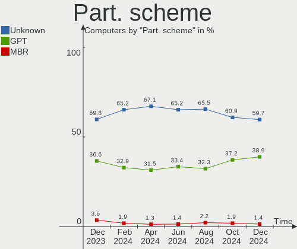
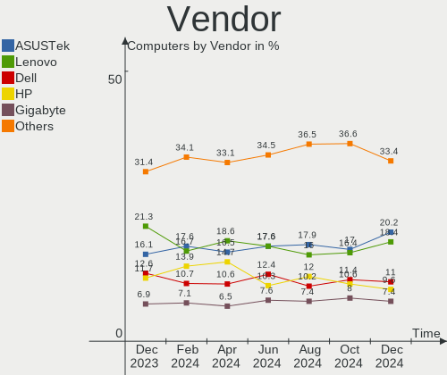
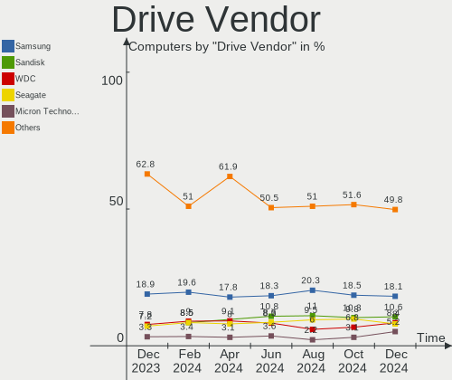
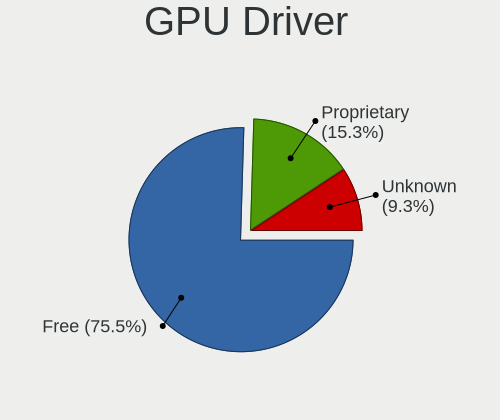

Fedora Hardware Trends
----------------------

A project to identify most popular hardware characteristics and track their change
over time based on data collected by Fedora users at https://Linux-Hardware.org.

Anyone can contribute to the study by uploading probes of their computers by
the [hw-probe](https://github.com/linuxhw/hw-probe) tool:

    sudo -E hw-probe -all -upload

This is a report for all computer types. See also reports for [desktops](/Dist/Fedora/Desktop/README.md) and [notebooks](/Dist/Fedora/Notebook/README.md).

Full-feature report is available here: https://linux-hardware.org/?view=trends

Period: Oct, 2020.

Contents
--------

- [ OS                       ](#os)
- [ OS Family                ](#os-family)
- [ Kernel                   ](#kernel)
- [ Kernel Family            ](#kernel-family)
- [ Kernel Major Ver.        ](#kernel-major-ver)
- [ Arch                     ](#arch)
- [ DE                       ](#de)
- [ Display Server           ](#display-server)
- [ Display Manager          ](#display-manager)
- [ OS Lang                  ](#os-lang)
- [ Boot Mode                ](#boot-mode)
- [ Filesystem               ](#filesystem)
- [ Part. scheme             ](#part-scheme)
- [ Dual Boot with Linux/BSD ](#dual-boot-with-linux/bsd)
- [ Dual Boot (Win)          ](#dual-boot-win)
- [ Country                  ](#country)
- [ City                     ](#city)
- [ Vendor                   ](#vendor)
- [ Model                    ](#model)
- [ Model Family             ](#model-family)
- [ MFG Year                 ](#mfg-year)
- [ Form Factor              ](#form-factor)
- [ Secure Boot              ](#secure-boot)
- [ Coreboot                 ](#coreboot)
- [ RAM Size                 ](#ram-size)
- [ RAM Used                 ](#ram-used)
- [ Has CD-ROM               ](#has-cd-rom)
- [ Total Drives             ](#total-drives)
- [ Has Ethernet             ](#has-ethernet)
- [ Drive Vendor             ](#drive-vendor)
- [ HDD Vendor               ](#hdd-vendor)
- [ SSD Vendor               ](#ssd-vendor)
- [ Drive Model              ](#drive-model)
- [ Drive Kind               ](#drive-kind)
- [ Drive Connector          ](#drive-connector)
- [ Drive Size               ](#drive-size)
- [ Space Total              ](#space-total)
- [ Space Used               ](#space-used)
- [ Malfunc. Drives          ](#malfunc-drives)
- [ Malfunc. Drive Vendor    ](#malfunc-drive-vendor)
- [ Malfunc. HDD Vendor      ](#malfunc-hdd-vendor)
- [ Malfunc. Drive Kind      ](#malfunc-drive-kind)
- [ Failed Drives            ](#failed-drives)
- [ Failed Drive Vendor      ](#failed-drive-vendor)
- [ Drive Status             ](#drive-status)
- [ Storage Vendor           ](#storage-vendor)
- [ Storage Model            ](#storage-model)
- [ Storage Kind             ](#storage-kind)
- [ CPU Vendor               ](#cpu-vendor)
- [ CPU Model                ](#cpu-model)
- [ CPU Model Family         ](#cpu-model-family)
- [ CPU Cores                ](#cpu-cores)
- [ CPU Sockets              ](#cpu-sockets)
- [ CPU Threads              ](#cpu-threads)
- [ CPU Op-Modes             ](#cpu-op-modes)
- [ CPU Microcode            ](#cpu-microcode)
- [ CPU Microarch            ](#cpu-microarch)
- [ GPU Vendor               ](#gpu-vendor)
- [ GPU Model                ](#gpu-model)
- [ GPU Combo                ](#gpu-combo)
- [ GPU Driver               ](#gpu-driver)
- [ GPU Memory               ](#gpu-memory)
- [ Monitor Vendor           ](#monitor-vendor)
- [ Monitor Model            ](#monitor-model)
- [ Monitor Resolution       ](#monitor-resolution)
- [ Monitor Diagonal         ](#monitor-diagonal)
- [ Monitor Width            ](#monitor-width)
- [ Aspect Ratio             ](#aspect-ratio)
- [ Monitor Area             ](#monitor-area)
- [ Pixel Density            ](#pixel-density)
- [ Multiple Monitors        ](#multiple-monitors)
- [ Net Controller Vendor    ](#net-controller-vendor)
- [ Net Controller Model     ](#net-controller-model)
- [ Wireless Vendor          ](#wireless-vendor)
- [ Wireless Model           ](#wireless-model)
- [ Ethernet Vendor          ](#ethernet-vendor)
- [ Ethernet Model           ](#ethernet-model)
- [ Net Controller Kind      ](#net-controller-kind)
- [ Used Controller          ](#used-controller)
- [ NICs                     ](#nics)
- [ Memory Vendor            ](#memory-vendor)
- [ Memory Model             ](#memory-model)
- [ Memory Kind              ](#memory-kind)
- [ Memory Form Factor       ](#memory-form-factor)
- [ Memory Size              ](#memory-size)
- [ Memory Speed             ](#memory-speed)
- [ Sound Vendor             ](#sound-vendor)
- [ Sound Model              ](#sound-model)
- [ Camera Vendor            ](#camera-vendor)
- [ Camera Model             ](#camera-model)
- [ Fingerprint Vendor       ](#fingerprint-vendor)
- [ Fingerprint Model        ](#fingerprint-model)
- [ Chipcard Vendor          ](#chipcard-vendor)
- [ Chipcard Model           ](#chipcard-model)
- [ Printer Vendor           ](#printer-vendor)
- [ Printer Model            ](#printer-model)
- [ Scanner Vendor           ](#scanner-vendor)
- [ Scanner Model            ](#scanner-model)
- [ Bluetooth Vendor         ](#bluetooth-vendor)
- [ Bluetooth Model          ](#bluetooth-model)
- [ Unsupported Devices      ](#unsupported-devices)
- [ Unsupported Device Types ](#unsupported-device-types)

OS
--

Installed operating systems

| Name      | Computers | Percent |
|-----------|-----------|---------|
| Fedora 32 | 219       | 63.11%  |
| Fedora 33 | 113       | 32.56%  |
| Fedora 31 | 9         | 2.59%   |
| Fedora 29 | 2         | 0.58%   |
| Fedora 34 | 1         | 0.29%   |
| Fedora 30 | 1         | 0.29%   |
| Fedora 28 | 1         | 0.29%   |
| Fedora 27 | 1         | 0.29%   |

OS Family
---------

OS without a version

| Name   | Computers | Percent |
|--------|-----------|---------|
| Fedora | 347       | 100%    |

Kernel
------

Version of the Linux kernel

| Version                                            | Computers | Percent |
|----------------------------------------------------|-----------|---------|
| 5.8.16-300.fc33.x86_64                             | 62        | 17.87%  |
| 5.8.15-201.fc32.x86_64                             | 44        | 12.68%  |
| 5.8.12-200.fc32.x86_64                             | 43        | 12.39%  |
| 5.8.13-200.fc32.x86_64                             | 42        | 12.1%   |
| 5.8.16-200.fc32.x86_64                             | 24        | 6.92%   |
| 5.8.14-200.fc32.x86_64                             | 23        | 6.63%   |
| 5.8.15-301.fc33.x86_64                             | 21        | 6.05%   |
| 5.8.14-300.fc33.x86_64                             | 16        | 4.61%   |
| 5.8.11-200.fc32.x86_64                             | 14        | 4.03%   |
| 5.6.6-300.fc32.x86_64                              | 8         | 2.31%   |
| 5.8.12-300.fc33.x86_64                             | 7         | 2.02%   |
| 5.8.13-300.fc33.x86_64                             | 6         | 1.73%   |
| 5.8.13-100.fc31.x86_64                             | 6         | 1.73%   |
| 5.8.7-200.fc32.x86_64                              | 4         | 1.15%   |
| 5.8.10-200.fc32.x86_64                             | 3         | 0.86%   |
| 5.8.9-200.fc32.x86_64                              | 2         | 0.58%   |
| 5.8.8-200.fc32.x86_64                              | 2         | 0.58%   |
| 5.3.11-100.fc29.x86_64                             | 2         | 0.58%   |
| 5.9.0-0.rc8.20201009git7575fdda569b.32.fc34.x86_64 | 1         | 0.29%   |
| 5.8.16-1.surface.fc33.x86_64                       | 1         | 0.29%   |
| 5.8.15-201.fc32.armv7hl                            | 1         | 0.29%   |
| 5.8.15-101.fc31.x86_64                             | 1         | 0.29%   |
| 5.8.13-200.fc32.armv7hl                            | 1         | 0.29%   |
| 5.8.12-100.fc31.x86_64                             | 1         | 0.29%   |
| 5.8.12-1.surface.fc32.x86_64                       | 1         | 0.29%   |
| 5.8.10-100.fc31.x86_64                             | 1         | 0.29%   |
| 5.7.8-200.fc32.x86_64                              | 1         | 0.29%   |
| 5.7.17-200.fc32.x86_64                             | 1         | 0.29%   |
| 5.7.14-200.fc32.x86_64                             | 1         | 0.29%   |
| 5.7.11-200.fc32.x86_64                             | 1         | 0.29%   |
| 5.6.19-300.fc32.x86_64                             | 1         | 0.29%   |
| 5.6.16-300.fc32.x86_64                             | 1         | 0.29%   |
| 5.6.13-100.fc30.x86_64                             | 1         | 0.29%   |
| 5.3.7-301.fc31.x86_64                              | 1         | 0.29%   |
| 5.0.16-100.fc28.x86_64                             | 1         | 0.29%   |
| 4.18.19-100.fc27.x86_64                            | 1         | 0.29%   |

Kernel Family
-------------

Linux kernel without a distro release

| Version | Computers | Percent |
|---------|-----------|---------|
| 5.8.16  | 87        | 25.07%  |
| 5.8.15  | 67        | 19.31%  |
| 5.8.13  | 55        | 15.85%  |
| 5.8.12  | 52        | 14.99%  |
| 5.8.14  | 39        | 11.24%  |
| 5.8.11  | 14        | 4.03%   |
| 5.6.6   | 8         | 2.31%   |
| 5.8.7   | 4         | 1.15%   |
| 5.8.10  | 4         | 1.15%   |
| 5.8.9   | 2         | 0.58%   |
| 5.8.8   | 2         | 0.58%   |
| 5.3.11  | 2         | 0.58%   |
| 5.9.0   | 1         | 0.29%   |
| 5.7.8   | 1         | 0.29%   |
| 5.7.17  | 1         | 0.29%   |
| 5.7.14  | 1         | 0.29%   |
| 5.7.11  | 1         | 0.29%   |
| 5.6.19  | 1         | 0.29%   |
| 5.6.16  | 1         | 0.29%   |
| 5.6.13  | 1         | 0.29%   |
| 5.3.7   | 1         | 0.29%   |
| 5.0.16  | 1         | 0.29%   |
| 4.18.19 | 1         | 0.29%   |

Kernel Major Ver.
-----------------

Linux kernel major version

| Version | Computers | Percent |
|---------|-----------|---------|
| 5.8     | 326       | 93.95%  |
| 5.6     | 11        | 3.17%   |
| 5.7     | 4         | 1.15%   |
| 5.3     | 3         | 0.86%   |
| 5.9     | 1         | 0.29%   |
| 5.0     | 1         | 0.29%   |
| 4.18    | 1         | 0.29%   |

Arch
----

OS architecture (x86_64, i586, etc.)

| Name   | Computers | Percent |
|--------|-----------|---------|
| x86_64 | 345       | 99.42%  |
| armv7l | 2         | 0.58%   |

DE
--

Desktop Environment

| Name          | Computers | Percent |
|---------------|-----------|---------|
| GNOME         | 248       | 71.47%  |
| KDE5          | 28        | 8.07%   |
| KDE           | 20        | 5.76%   |
| XFCE          | 12        | 3.46%   |
| Unknown       | 12        | 3.46%   |
| Cinnamon      | 10        | 2.88%   |
| X-Cinnamon    | 6         | 1.73%   |
| MATE          | 5         | 1.44%   |
| LXDE          | 2         | 0.58%   |
| LXQt          | 1         | 0.29%   |
| i3            | 1         | 0.29%   |
| GNOME Classic | 1         | 0.29%   |
| DWM           | 1         | 0.29%   |

Display Server
--------------

X11 or Wayland

| Name    | Computers | Percent |
|---------|-----------|---------|
| X11     | 172       | 49.57%  |
| Wayland | 159       | 45.82%  |
| Tty     | 13        | 3.75%   |
| Unknown | 3         | 0.86%   |

Display Manager
---------------

SDDM, LightDM, etc.

| Name    | Computers | Percent |
|---------|-----------|---------|
| Unknown | 194       | 55.91%  |
| GDM     | 106       | 30.55%  |
| SDDM    | 25        | 7.2%    |
| TDM     | 15        | 4.32%   |
| LightDM | 5         | 1.44%   |
| XDM     | 2         | 0.58%   |

OS Lang
-------

Language

| Lang       | Computers | Percent |
|------------|-----------|---------|
| en_US      | 168       | 48.41%  |
| en_GB      | 22        | 6.34%   |
| pt_BR      | 19        | 5.48%   |
| fr_FR      | 16        | 4.61%   |
| de_DE      | 16        | 4.61%   |
| ru_RU      | 14        | 4.03%   |
| en_AU      | 11        | 3.17%   |
| en_CA      | 10        | 2.88%   |
| cs_CZ      | 6         | 1.73%   |
| Unknown    | 5         | 1.44%   |
| it_IT      | 4         | 1.15%   |
| es_ES      | 4         | 1.15%   |
| ru_RU.utf8 | 3         | 0.86%   |
| pl_PL      | 3         | 0.86%   |
| fi_FI      | 3         | 0.86%   |
| en_US.utf8 | 3         | 0.86%   |
| en_GB.utf8 | 3         | 0.86%   |
| uk_UA      | 2         | 0.58%   |
| ro_RO      | 2         | 0.58%   |
| ko_KR      | 2         | 0.58%   |
| hu_HU      | 2         | 0.58%   |
| fr_CA      | 2         | 0.58%   |
| es_MX      | 2         | 0.58%   |
| es_AR      | 2         | 0.58%   |
| en_IN      | 2         | 0.58%   |
| en_IE      | 2         | 0.58%   |
| da_DK      | 2         | 0.58%   |
| sv_SE      | 1         | 0.29%   |
| pa_IN      | 1         | 0.29%   |
| nl_NL      | 1         | 0.29%   |
| nb_NO      | 1         | 0.29%   |
| it_IT.utf8 | 1         | 0.29%   |
| fr_FR.utf8 | 1         | 0.29%   |
| fi_FI.utf8 | 1         | 0.29%   |
| es_ES.utf8 | 1         | 0.29%   |
| es_DO      | 1         | 0.29%   |
| es_CL      | 1         | 0.29%   |
| en_NZ      | 1         | 0.29%   |
| en_IL      | 1         | 0.29%   |
| en_BE      | 1         | 0.29%   |
| el_GR      | 1         | 0.29%   |
| de_CH      | 1         | 0.29%   |
| de_AT.utf8 | 1         | 0.29%   |
| de_AT      | 1         | 0.29%   |

Boot Mode
---------

EFI or BIOS

| Mode | Computers | Percent |
|------|-----------|---------|
| EFI  | 242       | 69.74%  |
| BIOS | 105       | 30.26%  |

Filesystem
----------

Type of filesystem

| Type  | Computers | Percent |
|-------|-----------|---------|
| Ext4  | 236       | 68.01%  |
| Btrfs | 85        | 24.5%   |
| Xfs   | 26        | 7.49%   |

Part. scheme
------------

Scheme of partitioning

| Type    | Computers | Percent |
|---------|-----------|---------|
| Unknown | 180       | 51.87%  |
| GPT     | 134       | 38.62%  |
| MBR     | 33        | 9.51%   |

Dual Boot with Linux/BSD
------------------------

Hosting more than one Linux/BSD

| Dual boot | Computers | Percent |
|-----------|-----------|---------|
| No        | 319       | 91.93%  |
| Yes       | 28        | 8.07%   |

Dual Boot (Win)
---------------

Hosting Linux and Windows

| Dual boot | Computers | Percent |
|-----------|-----------|---------|
| No        | 296       | 85.3%   |
| Yes       | 51        | 14.7%   |

Country
-------

Geographic location (country)

| Country                          | Computers | Percent |
|----------------------------------|-----------|---------|
| USA                              | 71        | 20.46%  |
| Germany                          | 33        | 9.51%   |
| Brazil                           | 22        | 6.34%   |
| Russia                           | 21        | 6.05%   |
| Canada                           | 20        | 5.76%   |
| France                           | 18        | 5.19%   |
| India                            | 12        | 3.46%   |
| Australia                        | 11        | 3.17%   |
| Italy                            | 10        | 2.88%   |
| Czech Republic                   | 10        | 2.88%   |
| Austria                          | 9         | 2.59%   |
| Poland                           | 8         | 2.31%   |
| UK                               | 6         | 1.73%   |
| Switzerland                      | 6         | 1.73%   |
| Sweden                           | 6         | 1.73%   |
| Spain                            | 6         | 1.73%   |
| Ukraine                          | 5         | 1.44%   |
| Netherlands                      | 5         | 1.44%   |
| Hungary                          | 5         | 1.44%   |
| Finland                          | 5         | 1.44%   |
| Argentina                        | 5         | 1.44%   |
| Turkey                           | 4         | 1.15%   |
| Romania                          | 4         | 1.15%   |
| Mexico                           | 3         | 0.86%   |
| Denmark                          | 3         | 0.86%   |
| Chile                            | 3         | 0.86%   |
| Belarus                          | 3         | 0.86%   |
| Portugal                         | 2         | 0.58%   |
| Norway                           | 2         | 0.58%   |
| Lithuania                        | 2         | 0.58%   |
| Korea, Republic of               | 2         | 0.58%   |
| Israel                           | 2         | 0.58%   |
| Ireland                          | 2         | 0.58%   |
| Bangladesh                       | 2         | 0.58%   |
| South Africa                     | 1         | 0.29%   |
| Singapore                        | 1         | 0.29%   |
| Saint Vincent and the Grenadines | 1         | 0.29%   |
| Philippines                      | 1         | 0.29%   |
| New Zealand                      | 1         | 0.29%   |
| Morocco                          | 1         | 0.29%   |
| Kenya                            | 1         | 0.29%   |
| Jordan                           | 1         | 0.29%   |
| Indonesia                        | 1         | 0.29%   |
| Iceland                          | 1         | 0.29%   |
| Hong Kong                        | 1         | 0.29%   |
| Greece                           | 1         | 0.29%   |
| Ecuador                          | 1         | 0.29%   |
| Dominican Republic               | 1         | 0.29%   |
| China                            | 1         | 0.29%   |
| Bulgaria                         | 1         | 0.29%   |
| Botswana                         | 1         | 0.29%   |
| Bosnia and Herzegovina           | 1         | 0.29%   |
| Belgium                          | 1         | 0.29%   |

City
----

Geographic location (city)

| City                | Computers | Percent |
|---------------------|-----------|---------|
| Prague              | 6         | 1.73%   |
| Cincinnati          | 6         | 1.73%   |
| St Petersburg       | 5         | 1.44%   |
| Zurich              | 4         | 1.15%   |
| Vancouver           | 4         | 1.15%   |
| Moscow              | 4         | 1.15%   |
| Graz                | 4         | 1.15%   |
| Berlin              | 4         | 1.15%   |
| Vienna              | 3         | 0.86%   |
| São Paulo          | 3         | 0.86%   |
| Paris               | 3         | 0.86%   |
| Hrodna              | 3         | 0.86%   |
| Heilbronn           | 3         | 0.86%   |
| Greifswald          | 3         | 0.86%   |
| Goiânia            | 3         | 0.86%   |
| Dallas              | 3         | 0.86%   |
| Bucharest           | 3         | 0.86%   |
| Barcelona           | 3         | 0.86%   |
| Šilalė            | 2         | 0.58%   |
| Vincennes           | 2         | 0.58%   |
| Vantaa              | 2         | 0.58%   |
| Utrecht             | 2         | 0.58%   |
| Toronto             | 2         | 0.58%   |
| The Bronx           | 2         | 0.58%   |
| Stralsund           | 2         | 0.58%   |
| Red Deer            | 2         | 0.58%   |
| Pflugerville        | 2         | 0.58%   |
| Owatonna            | 2         | 0.58%   |
| Oklahoma City       | 2         | 0.58%   |
| Nuremberg           | 2         | 0.58%   |
| Neustadt            | 2         | 0.58%   |
| Nantes              | 2         | 0.58%   |
| Munich              | 2         | 0.58%   |
| Montreal            | 2         | 0.58%   |
| Kyiv                | 2         | 0.58%   |
| Krakow              | 2         | 0.58%   |
| Kharkiv             | 2         | 0.58%   |
| Kellyville          | 2         | 0.58%   |
| Istanbul            | 2         | 0.58%   |
| Huber Heights       | 2         | 0.58%   |
| Hornsby             | 2         | 0.58%   |
| Helsinki            | 2         | 0.58%   |
| Denver              | 2         | 0.58%   |
| Córdoba            | 2         | 0.58%   |
| Coventry            | 2         | 0.58%   |
| Cornwall            | 2         | 0.58%   |
| Clinton             | 2         | 0.58%   |
| Carbondale          | 2         | 0.58%   |
| Budapest            | 2         | 0.58%   |
| Brno                | 2         | 0.58%   |
| Bengaluru           | 2         | 0.58%   |
| Ashfield            | 2         | 0.58%   |
| České Budějovice | 1         | 0.29%   |
| Zwolle              | 1         | 0.29%   |
| Zgorzelec           | 1         | 0.29%   |
| Zaragoza            | 1         | 0.29%   |
| Wrocław            | 1         | 0.29%   |
| Woodridge           | 1         | 0.29%   |
| Westbury            | 1         | 0.29%   |
| West Chester        | 1         | 0.29%   |

Vendor
------

Motherboard manufacturer

| Name                    | Computers | Percent |
|-------------------------|-----------|---------|
| Lenovo                  | 83        | 23.92%  |
| Dell                    | 48        | 13.83%  |
| ASUSTek Computer        | 46        | 13.26%  |
| Hewlett-Packard         | 32        | 9.22%   |
| Gigabyte Technology     | 30        | 8.65%   |
| MSI                     | 29        | 8.36%   |
| Acer                    | 20        | 5.76%   |
| ASRock                  | 11        | 3.17%   |
| Apple                   | 9         | 2.59%   |
| Unknown                 | 6         | 1.73%   |
| Toshiba                 | 4         | 1.15%   |
| Supermicro              | 4         | 1.15%   |
| Positivo                | 3         | 0.86%   |
| Microsoft               | 3         | 0.86%   |
| HUAWEI                  | 3         | 0.86%   |
| Samsung Electronics     | 2         | 0.58%   |
| Fujitsu Siemens         | 2         | 0.58%   |
| X79                     | 1         | 0.29%   |
| System76                | 1         | 0.29%   |
| Sony                    | 1         | 0.29%   |
| Raspberry Pi Foundation | 1         | 0.29%   |
| Prestigio               | 1         | 0.29%   |
| Packard Bell            | 1         | 0.29%   |
| Notebook                | 1         | 0.29%   |
| MiTAC                   | 1         | 0.29%   |
| Intel                   | 1         | 0.29%   |
| HANSUNG COMPUTER        | 1         | 0.29%   |
| Dynabook                | 1         | 0.29%   |
| Alienware               | 1         | 0.29%   |

Model
-----

Motherboard model

| Name                                                   | Computers | Percent |
|--------------------------------------------------------|-----------|---------|
| Unknown                                                | 8         | 2.31%   |
| Dell XPS 13 9370                                       | 3         | 0.86%   |
| Dell Latitude E7440                                    | 3         | 0.86%   |
| ASUS All Series                                        | 3         | 0.86%   |
| MSI MS-7C02                                            | 2         | 0.58%   |
| MSI MS-7B85                                            | 2         | 0.58%   |
| MSI MS-7817                                            | 2         | 0.58%   |
| MSI MS-7758                                            | 2         | 0.58%   |
| Lenovo ThinkPad T14 Gen 1 20UDCTO1WW                   | 2         | 0.58%   |
| Lenovo IdeaPad S145-15API 81UT                         | 2         | 0.58%   |
| HUAWEI KLVL-WXX9                                       | 2         | 0.58%   |
| HP ProBook 450 G6                                      | 2         | 0.58%   |
| HP Pavilion x360 Convertible 14-dh0xxx                 | 2         | 0.58%   |
| HP Notebook                                            | 2         | 0.58%   |
| HP EliteDesk 800 G2 DM 35W                             | 2         | 0.58%   |
| Gigabyte B450 AORUS ELITE                              | 2         | 0.58%   |
| Dell XPS 15 9570                                       | 2         | 0.58%   |
| Dell OptiPlex 755                                      | 2         | 0.58%   |
| Dell Latitude 5480                                     | 2         | 0.58%   |
| Dell Latitude 5300 2-in-1                              | 2         | 0.58%   |
| Dell Inspiron 5593                                     | 2         | 0.58%   |
| Dell Inspiron 5590                                     | 2         | 0.58%   |
| ASUS TUF GAMING X570-PLUS                              | 2         | 0.58%   |
| ASUS ROG STRIX X570-I GAMING                           | 2         | 0.58%   |
| ASUS P8Z77-V LX                                        | 2         | 0.58%   |
| ASRock A320M-HDV R4.0                                  | 2         | 0.58%   |
| X79 G7-2011                                            | 1         | 0.29%   |
| Toshiba Satellite L500                                 | 1         | 0.29%   |
| Toshiba Satellite C850D-119                            | 1         | 0.29%   |
| Toshiba Satellite C70D-A                               | 1         | 0.29%   |
| Toshiba Satellite C660                                 | 1         | 0.29%   |
| System76 Galago Pro                                    | 1         | 0.29%   |
| Supermicro X9SCI/X9SCA                                 | 1         | 0.29%   |
| Supermicro X7SLA                                       | 1         | 0.29%   |
| Supermicro X7DB8                                       | 1         | 0.29%   |
| Supermicro A1SRM-2558F                                 | 1         | 0.29%   |
| Sony VPCF131FM                                         | 1         | 0.29%   |
| Samsung Electronics 930QAA                             | 1         | 0.29%   |
| Samsung Electronics 900X3C/900X3D/900X3E/900X4C/900X4D | 1         | 0.29%   |
| RPi Raspberry Pi 3 Model B+                            | 1         | 0.29%   |
| Prestigio PSB141C03                                    | 1         | 0.29%   |
| Positivo S14SL01                                       | 1         | 0.29%   |
| Positivo POS-PARS760GCD                                | 1         | 0.29%   |
| Positivo C14CR21                                       | 1         | 0.29%   |
| Packard Bell imedia S3810                              | 1         | 0.29%   |
| Notebook NH55RGQ                                       | 1         | 0.29%   |
| MSI PS42 8M                                            | 1         | 0.29%   |
| MSI MS-7C91                                            | 1         | 0.29%   |
| MSI MS-7C84                                            | 1         | 0.29%   |
| MSI MS-7C37                                            | 1         | 0.29%   |
| MSI MS-7B92                                            | 1         | 0.29%   |
| MSI MS-7B86                                            | 1         | 0.29%   |
| MSI MS-7B84                                            | 1         | 0.29%   |
| MSI MS-7B78                                            | 1         | 0.29%   |
| MSI MS-7B36                                            | 1         | 0.29%   |
| MSI MS-7B09                                            | 1         | 0.29%   |
| MSI MS-7A72                                            | 1         | 0.29%   |
| MSI MS-7A38                                            | 1         | 0.29%   |
| MSI MS-7922                                            | 1         | 0.29%   |
| MSI MS-7917                                            | 1         | 0.29%   |

Model Family
------------

Motherboard model prefix

| Name                       | Computers | Percent |
|----------------------------|-----------|---------|
| Lenovo ThinkPad            | 53        | 15.27%  |
| Lenovo IdeaPad             | 13        | 3.75%   |
| Dell Latitude              | 13        | 3.75%   |
| Dell Inspiron              | 13        | 3.75%   |
| Acer Aspire                | 13        | 3.75%   |
| Dell XPS                   | 10        | 2.88%   |
| Unknown                    | 8         | 2.31%   |
| HP PROBOOK                 | 7         | 2.02%   |
| ASUS PRIME                 | 6         | 1.73%   |
| Lenovo Yoga                | 5         | 1.44%   |
| HP Pavilion                | 5         | 1.44%   |
| Dell OptiPlex              | 5         | 1.44%   |
| ASUS TUF                   | 5         | 1.44%   |
| ASUS ROG                   | 5         | 1.44%   |
| Toshiba Satellite          | 4         | 1.15%   |
| Acer Nitro                 | 4         | 1.15%   |
| Microsoft Surface          | 3         | 0.86%   |
| Lenovo Legion              | 3         | 0.86%   |
| HP Laptop                  | 3         | 0.86%   |
| HP EliteBook               | 3         | 0.86%   |
| Dell Precision             | 3         | 0.86%   |
| ASUS P8Z77-V               | 3         | 0.86%   |
| ASUS All                   | 3         | 0.86%   |
| MSI MS-7C02                | 2         | 0.58%   |
| MSI MS-7B85                | 2         | 0.58%   |
| MSI MS-7817                | 2         | 0.58%   |
| MSI MS-7758                | 2         | 0.58%   |
| HUAWEI KLVL-WXX9           | 2         | 0.58%   |
| HP Notebook                | 2         | 0.58%   |
| HP EliteDesk               | 2         | 0.58%   |
| Gigabyte Z370              | 2         | 0.58%   |
| Gigabyte X570              | 2         | 0.58%   |
| Gigabyte TRX40             | 2         | 0.58%   |
| Gigabyte B450              | 2         | 0.58%   |
| Dell Vostro                | 2         | 0.58%   |
| ASRock B450M               | 2         | 0.58%   |
| ASRock A320M-HDV           | 2         | 0.58%   |
| Apple MacBookPro11         | 2         | 0.58%   |
| X79 G7-2011                | 1         | 0.29%   |
| System76 Galago            | 1         | 0.29%   |
| Supermicro X9SCI           | 1         | 0.29%   |
| Supermicro X7SLA           | 1         | 0.29%   |
| Supermicro X7DB8           | 1         | 0.29%   |
| Supermicro A1SRM-2558F     | 1         | 0.29%   |
| Sony VPCF131FM             | 1         | 0.29%   |
| Samsung Electronics 930QAA | 1         | 0.29%   |
| Samsung Electronics 900X3C | 1         | 0.29%   |
| RPi Raspberry              | 1         | 0.29%   |
| Prestigio PSB141C03        | 1         | 0.29%   |
| Positivo S14SL01           | 1         | 0.29%   |
| Positivo POS-PARS760GCD    | 1         | 0.29%   |
| Positivo C14CR21           | 1         | 0.29%   |
| Packard Bell imedia        | 1         | 0.29%   |
| Notebook NH55RGQ           | 1         | 0.29%   |
| MSI PS42                   | 1         | 0.29%   |
| MSI MS-7C91                | 1         | 0.29%   |
| MSI MS-7C84                | 1         | 0.29%   |
| MSI MS-7C37                | 1         | 0.29%   |
| MSI MS-7B92                | 1         | 0.29%   |
| MSI MS-7B86                | 1         | 0.29%   |

MFG Year
--------

Motherboard manufacture year

| Year    | Computers | Percent |
|---------|-----------|---------|
| 2020    | 109       | 31.41%  |
| 2019    | 69        | 19.88%  |
| 2018    | 38        | 10.95%  |
| 2015    | 18        | 5.19%   |
| 2017    | 16        | 4.61%   |
| 2014    | 16        | 4.61%   |
| 2010    | 16        | 4.61%   |
| 2013    | 15        | 4.32%   |
| 2016    | 14        | 4.03%   |
| 2012    | 13        | 3.75%   |
| 2011    | 11        | 3.17%   |
| 2009    | 6         | 1.73%   |
| 2008    | 3         | 0.86%   |
| Unknown | 2         | 0.58%   |
| 2007    | 1         | 0.29%   |

Form Factor
-----------

Physical design of the computer

| Name           | Computers | Percent |
|----------------|-----------|---------|
| Notebook       | 197       | 56.77%  |
| Desktop        | 122       | 35.16%  |
| Convertible    | 14        | 4.03%   |
| All in one     | 6         | 1.73%   |
| Tablet         | 4         | 1.15%   |
| Server         | 2         | 0.58%   |
| System on chip | 1         | 0.29%   |
| Mini pc        | 1         | 0.29%   |

Secure Boot
-----------

Enabled or disabled

| State    | Computers | Percent |
|----------|-----------|---------|
| Disabled | 296       | 85.3%   |
| Enabled  | 51        | 14.7%   |

Coreboot
--------

Have coreboot on board

| Used | Computers | Percent |
|------|-----------|---------|
| No   | 346       | 99.71%  |
| Yes  | 1         | 0.29%   |

RAM Size
--------

Total RAM memory

| Size in GB  | Computers | Percent |
|-------------|-----------|---------|
| 16.01-24.0  | 95        | 27.38%  |
| 4.01-8.0    | 75        | 21.61%  |
| 8.01-16.0   | 64        | 18.44%  |
| 32.01-64.0  | 44        | 12.68%  |
| 3.01-4.0    | 34        | 9.8%    |
| 64.01-256.0 | 16        | 4.61%   |
| 1.01-2.0    | 10        | 2.88%   |
| 24.01-32.0  | 7         | 2.02%   |
| 0.01-1.0    | 2         | 0.58%   |

RAM Used
--------

Used RAM memory

| Used GB    | Computers | Percent |
|------------|-----------|---------|
| 2.01-3.0   | 85        | 24.5%   |
| 4.01-8.0   | 83        | 23.92%  |
| 3.01-4.0   | 68        | 19.6%   |
| 1.01-2.0   | 56        | 16.14%  |
| 8.01-16.0  | 34        | 9.8%    |
| 0.01-1.0   | 11        | 3.17%   |
| 16.01-24.0 | 6         | 1.73%   |
| 24.01-32.0 | 3         | 0.86%   |
| 32.01-64.0 | 1         | 0.29%   |

Has CD-ROM
----------

Has CD-ROM on board

| Presented | Computers | Percent |
|-----------|-----------|---------|
| No        | 246       | 70.89%  |
| Yes       | 101       | 29.11%  |

Total Drives
------------

Number of drives on board

| Drives | Computers | Percent |
|--------|-----------|---------|
| 1      | 199       | 57.35%  |
| 2      | 95        | 27.38%  |
| 3      | 19        | 5.48%   |
| 4      | 18        | 5.19%   |
| 5      | 8         | 2.31%   |
| 9      | 2         | 0.58%   |
| 8      | 2         | 0.58%   |
| 7      | 2         | 0.58%   |
| 36     | 1         | 0.29%   |
| 6      | 1         | 0.29%   |

Has Ethernet
------------

Has Ethernet on board

| Presented | Computers | Percent |
|-----------|-----------|---------|
| Yes       | 287       | 82.71%  |
| No        | 60        | 17.29%  |

Drive Vendor
------------

Hard drive vendors

| Vendor                    | Computers | Drives | Percent |
|---------------------------|-----------|--------|---------|
| Samsung Electronics       | 96        | 126    | 18.25%  |
| WDC                       | 81        | 110    | 15.4%   |
| Seagate                   | 62        | 89     | 11.79%  |
| Toshiba                   | 33        | 34     | 6.27%   |
| Kingston                  | 31        | 35     | 5.89%   |
| SanDisk                   | 24        | 27     | 4.56%   |
| Intel                     | 23        | 26     | 4.37%   |
| Unknown                   | 22        | 23     | 4.18%   |
| SK Hynix                  | 18        | 20     | 3.42%   |
| Crucial                   | 17        | 17     | 3.23%   |
| Hitachi                   | 12        | 12     | 2.28%   |
| Phison                    | 11        | 11     | 2.09%   |
| HGST                      | 9         | 10     | 1.71%   |
| A-DATA Technology         | 9         | 10     | 1.71%   |
| Apple                     | 7         | 8      | 1.33%   |
| SPCC                      | 5         | 6      | 0.95%   |
| China                     | 5         | 5      | 0.95%   |
| OCZ                       | 4         | 4      | 0.76%   |
| Micron Technology         | 4         | 4      | 0.76%   |
| Corsair                   | 4         | 4      | 0.76%   |
| Transcend                 | 3         | 3      | 0.57%   |
| Silicon Motion            | 3         | 3      | 0.57%   |
| Micron/Crucial Technology | 3         | 3      | 0.57%   |
| LITEON                    | 3         | 3      | 0.57%   |
| KIOXIA                    | 3         | 3      | 0.57%   |
| TO Exter                  | 2         | 2      | 0.38%   |
| Realtek Semiconductor     | 2         | 2      | 0.38%   |
| PNY                       | 2         | 2      | 0.38%   |
| PLEXTOR                   | 2         | 2      | 0.38%   |
| Patriot                   | 2         | 2      | 0.38%   |
| Maxtor                    | 2         | 2      | 0.38%   |
| Lite-On                   | 2         | 2      | 0.38%   |
| Lenovo                    | 2         | 2      | 0.38%   |
| Hewlett-Packard           | 2         | 2      | 0.38%   |
| XrayDisk                  | 1         | 1      | 0.19%   |
| UNIC2                     | 1         | 1      | 0.19%   |
| SUNEAST                   | 1         | 1      | 0.19%   |
| SABRENT                   | 1         | 1      | 0.19%   |
| LITEONIT                  | 1         | 1      | 0.19%   |
| Leven                     | 1         | 1      | 0.19%   |
| LDLC                      | 1         | 1      | 0.19%   |
| KingFast                  | 1         | 1      | 0.19%   |
| JMicron                   | 1         | 5      | 0.19%   |
| Inateck                   | 1         | 1      | 0.19%   |
| IBM-XIV                   | 1         | 16     | 0.19%   |
| IBM-SSG                   | 1         | 8      | 0.19%   |
| HGST HTS                  | 1         | 1      | 0.19%   |
| Fujitsu                   | 1         | 1      | 0.19%   |
| External                  | 1         | 1      | 0.19%   |
| ADATA Technology          | 1         | 1      | 0.19%   |

HDD Vendor
----------

Hard disk drive vendors

| Vendor              | Computers | Drives | Percent |
|---------------------|-----------|--------|---------|
| Seagate             | 62        | 87     | 35.43%  |
| WDC                 | 61        | 87     | 34.86%  |
| Toshiba             | 19        | 19     | 10.86%  |
| Hitachi             | 12        | 12     | 6.86%   |
| HGST                | 9         | 10     | 5.14%   |
| Samsung Electronics | 4         | 4      | 2.29%   |
| TO Exter            | 2         | 2      | 1.14%   |
| Maxtor              | 2         | 2      | 1.14%   |
| Inateck             | 1         | 1      | 0.57%   |
| HGST HTS            | 1         | 1      | 0.57%   |
| Fujitsu             | 1         | 1      | 0.57%   |
| Apple               | 1         | 2      | 0.57%   |

SSD Vendor
----------

Solid state drive vendors

| Vendor              | Computers | Drives | Percent |
|---------------------|-----------|--------|---------|
| Samsung Electronics | 49        | 61     | 27.68%  |
| Kingston            | 28        | 32     | 15.82%  |
| Crucial             | 14        | 14     | 7.91%   |
| WDC                 | 11        | 12     | 6.21%   |
| SanDisk             | 11        | 13     | 6.21%   |
| Intel               | 10        | 10     | 5.65%   |
| A-DATA Technology   | 7         | 8      | 3.95%   |
| Apple               | 6         | 6      | 3.39%   |
| China               | 5         | 5      | 2.82%   |
| SPCC                | 4         | 4      | 2.26%   |
| OCZ                 | 4         | 4      | 2.26%   |
| Transcend           | 3         | 3      | 1.69%   |
| SK Hynix            | 3         | 3      | 1.69%   |
| LITEON              | 3         | 3      | 1.69%   |
| Toshiba             | 2         | 2      | 1.13%   |
| PNY                 | 2         | 2      | 1.13%   |
| PLEXTOR             | 2         | 2      | 1.13%   |
| Patriot             | 2         | 2      | 1.13%   |
| Corsair             | 2         | 2      | 1.13%   |
| XrayDisk            | 1         | 1      | 0.56%   |
| Unknown             | 1         | 1      | 0.56%   |
| UNIC2               | 1         | 1      | 0.56%   |
| SUNEAST             | 1         | 1      | 0.56%   |
| Micron Technology   | 1         | 1      | 0.56%   |
| LITEONIT            | 1         | 1      | 0.56%   |
| Leven               | 1         | 1      | 0.56%   |
| KingFast            | 1         | 1      | 0.56%   |
| External            | 1         | 1      | 0.56%   |

Drive Model
-----------

Hard drive models

| Model                        | Computers | Percent |
|------------------------------|-----------|---------|
| NVMe SSD Drive 512GB         | 30        | 4.98%   |
| NVMe SSD Drive 256GB         | 24        | 3.99%   |
| SA400S37240G 240GB SSD       | 9         | 1.5%    |
| NVMe SSD Drive 500GB         | 9         | 1.5%    |
| NVMe SSD Drive 1024GB        | 9         | 1.5%    |
| SSD 860 EVO 500GB            | 8         | 1.33%   |
| ST1000LM035-1RK172 1TB       | 7         | 1.16%   |
| SSD 850 EVO 250GB            | 7         | 1.16%   |
| NVMe SSD Drive 1TB           | 6         | 1%      |
| SSD 860 EVO 1TB              | 5         | 0.83%   |
| SSD 840 EVO 250GB            | 5         | 0.83%   |
| MQ04ABF100 1TB               | 5         | 0.83%   |
| WDS240G2G0A-00JH30 240GB SSD | 4         | 0.66%   |
| WD10EZEX-08WN4A0 1TB         | 4         | 0.66%   |
| SUV400S37240G 240GB SSD      | 4         | 0.66%   |
| ST2000DM008-2FR102 2TB       | 4         | 0.66%   |
| ST1000DM010-2EP102 1TB       | 4         | 0.66%   |
| SA400S37480G 480GB SSD       | 4         | 0.66%   |
| HTS721010A9E630 1TB          | 4         | 0.66%   |
| WD10JPVX-22JC3T0 1TB         | 3         | 0.5%    |
| SU630 240GB SSD              | 3         | 0.5%    |
| SSD SM0512G 500GB            | 3         | 0.5%    |
| SSD 970 EVO Plus 1TB         | 3         | 0.5%    |
| SSD 860 QVO 1TB              | 3         | 0.5%    |
| SSD 850 EVO 500GB            | 3         | 0.5%    |
| SD/MMC/MS PRO 32GB           | 3         | 0.5%    |
| SATA3 2TB SSD                | 3         | 0.5%    |
| NVMe SSD Drive 2TB           | 3         | 0.5%    |
| NVMe SSD Drive 250GB         | 3         | 0.5%    |
| NVMe SSD Drive 128GB         | 3         | 0.5%    |
| MQ01ABD100 1TB               | 3         | 0.5%    |
| MMC Card  32GB               | 3         | 0.5%    |
| Expansion 4TB                | 3         | 0.5%    |
| X400 M.2 2280 256GB SSD      | 2         | 0.33%   |
| WDS240G2G0B-00EPW0 240GB SSD | 2         | 0.33%   |
| WD30EZRX-00D8PB0 3TB         | 2         | 0.33%   |
| WD10SPZX-75Z10T2 1TB         | 2         | 0.33%   |
| WD10SPZX-24Z10 1TB           | 2         | 0.33%   |
| WD10SPZX-21Z10T0 1TB         | 2         | 0.33%   |
| WD10EZEX-08M2NA0 1TB         | 2         | 0.33%   |
| WD10EZEX-00WN4A0 1TB         | 2         | 0.33%   |
| WD10EARX-00N0YB0 1TB         | 2         | 0.33%   |
| WD10EADS-00L5B1 1TB          | 2         | 0.33%   |
| SV300S37A240G 240GB SSD      | 2         | 0.33%   |
| SV300S37A120G 120GB SSD      | 2         | 0.33%   |
| ST9500325AS 500GB            | 2         | 0.33%   |
| ST500LM021-1KJ152 500GB      | 2         | 0.33%   |
| ST500DM002-1SB10A 500GB      | 2         | 0.33%   |
| ST500DM002-1BD142 500GB      | 2         | 0.33%   |
| ST1000LM048-2E7172 1TB       | 2         | 0.33%   |
| ST1000LM024 HN-M101MBB 1TB   | 2         | 0.33%   |
| ST1000DM003-1SB10C 1TB       | 2         | 0.33%   |
| ST1000DM003-1SB102 1TB       | 2         | 0.33%   |
| SSDPEKNW512G8 512GB          | 2         | 0.33%   |
| SSDPEKKF256G8L 256GB         | 2         | 0.33%   |
| SSD U110 16GB                | 2         | 0.33%   |
| SSD SM0128G 121GB            | 2         | 0.33%   |
| SSD 860 EVO M.2 500GB        | 2         | 0.33%   |
| SSD 860 EVO 250GB            | 2         | 0.33%   |
| SSD 840 EVO 120GB            | 2         | 0.33%   |

Drive Kind
----------

HDD or SSD

| Kind    | Computers | Drives | Percent |
|---------|-----------|--------|---------|
| SSD     | 161       | 197    | 33.54%  |
| NVMe    | 149       | 177    | 31.04%  |
| HDD     | 144       | 228    | 30%     |
| MMC     | 17        | 18     | 3.54%   |
| Unknown | 9         | 36     | 1.88%   |

Drive Connector
---------------

SATA, SAS, NVMe, etc.

| Type | Computers | Drives | Percent |
|------|-----------|--------|---------|
| SATA | 247       | 396    | 57.04%  |
| NVMe | 149       | 177    | 34.41%  |
| SAS  | 20        | 65     | 4.62%   |
| MMC  | 17        | 18     | 3.93%   |

Drive Size
----------

Size of hard drive

| Size in TB | Computers | Drives | Percent |
|------------|-----------|--------|---------|
| 0.01-0.5   | 182       | 234    | 56.7%   |
| 0.51-1.0   | 92        | 120    | 28.66%  |
| 1.01-2.0   | 25        | 31     | 7.79%   |
| 2.01-3.0   | 7         | 20     | 2.18%   |
| 4.01-10.0  | 7         | 10     | 2.18%   |
| 3.01-4.0   | 6         | 8      | 1.87%   |
| 10.01-20.0 | 2         | 2      | 0.62%   |

Space Total
-----------

Amount of disk space available on the file system

| Size in GB     | Computers | Percent |
|----------------|-----------|---------|
| 101-250        | 84        | 24.21%  |
| 251-500        | 70        | 20.17%  |
| 501-1000       | 65        | 18.73%  |
| 1001-2000      | 27        | 7.78%   |
| More than 3000 | 23        | 6.63%   |
| 1-20           | 22        | 6.34%   |
| 2001-3000      | 15        | 4.32%   |
| 21-50          | 14        | 4.03%   |
| Unknown        | 14        | 4.03%   |
| 51-100         | 13        | 3.75%   |

Space Used
----------

Amount of used disk space

| Used GB        | Computers | Percent |
|----------------|-----------|---------|
| 1-20           | 75        | 21.61%  |
| 101-250        | 62        | 17.87%  |
| 21-50          | 58        | 16.71%  |
| 51-100         | 52        | 14.99%  |
| 251-500        | 32        | 9.22%   |
| 501-1000       | 22        | 6.34%   |
| 1001-2000      | 15        | 4.32%   |
| Unknown        | 14        | 4.03%   |
| More than 3000 | 9         | 2.59%   |
| 2001-3000      | 7         | 2.02%   |
| 0              | 1         | 0.29%   |

Malfunc. Drives
---------------

Drive models with a malfunction

| Model                             | Computers | Drives | Percent |
|-----------------------------------|-----------|--------|---------|
| WD30EZRX-00D8PB0 3TB              | 1         | 1      | 3.7%    |
| WD2500BPVT-75JJ5T0 250GB          | 1         | 1      | 3.7%    |
| WD20EZRX-00SPEB0 2TB              | 1         | 1      | 3.7%    |
| WD20EFRX-68AX9N0 2TB              | 1         | 1      | 3.7%    |
| WD1601ABYS-18C0A0 160GB           | 1         | 1      | 3.7%    |
| WD10EZEX-08WN4A0 1TB              | 1         | 1      | 3.7%    |
| WD10EZEX-00BN5A0 1TB              | 1         | 1      | 3.7%    |
| WD10EARX-00N0YB0 1TB              | 1         | 1      | 3.7%    |
| ST95000NSSUN500G 1021M1LVF5 500GB | 1         | 1      | 3.7%    |
| ST500DM002-1SB10A 500GB           | 1         | 1      | 3.7%    |
| ST500DM002-1BD142 500GB           | 1         | 1      | 3.7%    |
| ST31000528AS 1TB                  | 1         | 1      | 3.7%    |
| ST2000DL003-9VT166 2TB            | 1         | 1      | 3.7%    |
| SSDSCKKF256G8H 256GB              | 1         | 1      | 3.7%    |
| SSDSC2KW480H6 480GB               | 1         | 1      | 3.7%    |
| SSDSA2M040G2GC 40GB               | 1         | 1      | 3.7%    |
| SC308 SATA 128GB SSD              | 1         | 1      | 3.7%    |
| PM981 NVMe 512GB                  | 1         | 1      | 3.7%    |
| MQ01ABD100 1TB                    | 1         | 1      | 3.7%    |
| HTS725050A7E630 500GB             | 1         | 1      | 3.7%    |
| HTS547564A9E384 640GB             | 1         | 1      | 3.7%    |
| HTS541010A9E680 1TB               | 1         | 1      | 3.7%    |
| HDWN160 6TB                       | 1         | 1      | 3.7%    |
| Force LS SSD 120GB                | 1         | 1      | 3.7%    |
| CT128MX100SSD1 128GB              | 1         | 1      | 3.7%    |
| CT1000P1SSD8 1TB                  | 1         | 1      | 3.7%    |
| AGILITY3 120GB SSD                | 1         | 1      | 3.7%    |

Malfunc. Drive Vendor
---------------------

Vendors of faulty drives

| Vendor              | Computers | Drives | Percent |
|---------------------|-----------|--------|---------|
| WDC                 | 7         | 8      | 26.92%  |
| Seagate             | 5         | 5      | 19.23%  |
| Intel               | 3         | 3      | 11.54%  |
| Toshiba             | 2         | 2      | 7.69%   |
| HGST                | 2         | 2      | 7.69%   |
| Crucial             | 2         | 2      | 7.69%   |
| SK Hynix            | 1         | 1      | 3.85%   |
| Samsung Electronics | 1         | 1      | 3.85%   |
| OCZ                 | 1         | 1      | 3.85%   |
| Hitachi             | 1         | 1      | 3.85%   |
| Corsair             | 1         | 1      | 3.85%   |

Malfunc. HDD Vendor
-------------------

Vendors of faulty HDD drives

| Vendor  | Computers | Drives | Percent |
|---------|-----------|--------|---------|
| WDC     | 7         | 8      | 41.18%  |
| Seagate | 5         | 5      | 29.41%  |
| Toshiba | 2         | 2      | 11.76%  |
| HGST    | 2         | 2      | 11.76%  |
| Hitachi | 1         | 1      | 5.88%   |

Malfunc. Drive Kind
-------------------

Kinds of faulty drives

| Kind | Computers | Drives | Percent |
|------|-----------|--------|---------|
| HDD  | 17        | 18     | 65.38%  |
| SSD  | 7         | 7      | 26.92%  |
| NVMe | 2         | 2      | 7.69%   |

Failed Drives
-------------

Failed drive models

Zero info for selected period =(

Failed Drive Vendor
-------------------

Failed drive vendors

Zero info for selected period =(

Drive Status
------------

Number of failed and malfunc. drives

| Status   | Computers | Drives | Percent |
|----------|-----------|--------|---------|
| Detected | 204       | 395    | 53.83%  |
| Works    | 150       | 234    | 39.58%  |
| Malfunc  | 25        | 27     | 6.6%    |

Storage Vendor
--------------

Storage controller vendors

| Vendor                        | Computers | Percent |
|-------------------------------|-----------|---------|
| Intel                         | 207       | 45.3%   |
| AMD                           | 78        | 17.07%  |
| Samsung Electronics           | 54        | 11.82%  |
| Sandisk                       | 24        | 5.25%   |
| SK Hynix                      | 13        | 2.84%   |
| Phison Electronics            | 13        | 2.84%   |
| Toshiba America Info Systems  | 10        | 2.19%   |
| ASMedia Technology            | 7         | 1.53%   |
| Silicon Motion                | 6         | 1.31%   |
| Nvidia                        | 6         | 1.31%   |
| Micron/Crucial Technology     | 6         | 1.31%   |
| KIOXIA                        | 5         | 1.09%   |
| JMicron Technology            | 4         | 0.88%   |
| ADATA Technology              | 4         | 0.88%   |
| Realtek Semiconductor         | 3         | 0.66%   |
| Micron Technology             | 3         | 0.66%   |
| Marvell Technology Group      | 3         | 0.66%   |
| Kingston Technology Company   | 3         | 0.66%   |
| Lite-On Technology            | 2         | 0.44%   |
| Lenovo                        | 2         | 0.44%   |
| PMC-Sierra                    | 1         | 0.22%   |
| LSI Logic / Symbios Logic     | 1         | 0.22%   |
| Integrated Technology Express | 1         | 0.22%   |
| HighPoint Technologies        | 1         | 0.22%   |

Storage Model
-------------

Storage controller models

| Model                                                                    | Computers | Percent |
|--------------------------------------------------------------------------|-----------|---------|
| FCH SATA Controller [AHCI mode]                                          | 64        | 12.36%  |
| NVMe SSD Controller SM981/PM981/PM983                                    | 35        | 6.76%   |
| Non-Volatile memory controller                                           | 33        | 6.37%   |
| Sunrise Point-LP SATA Controller [AHCI mode]                             | 22        | 4.25%   |
| 82801 Mobile SATA Controller [RAID mode]                                 | 15        | 2.9%    |
| 400 Series Chipset SATA Controller                                       | 15        | 2.9%    |
| Cannon Lake Mobile PCH SATA AHCI Controller                              | 13        | 2.51%   |
| 8 Series/C220 Series Chipset Family 6-port SATA Controller 1 [AHCI mode] | 11        | 2.12%   |
| 7 Series Chipset Family 6-port SATA Controller [AHCI mode]               | 11        | 2.12%   |
| 7 Series/C210 Series Chipset Family 6-port SATA Controller [AHCI mode]   | 10        | 1.93%   |
| Q170/Q150/B150/H170/H110/Z170/CM236 Chipset SATA Controller [AHCI Mode]  | 9         | 1.74%   |
| E12 NVMe Controller                                                      | 9         | 1.74%   |
| Cannon Point-LP SATA Controller [AHCI Mode]                              | 9         | 1.74%   |
| SB7x0/SB8x0/SB9x0 SATA Controller [AHCI mode]                            | 8         | 1.54%   |
| NVMe SSD Controller SM961/PM961                                          | 8         | 1.54%   |
| WD Black 2019/PC SN750 NVMe SSD                                          | 7         | 1.35%   |
| ASM1062 Serial ATA Controller                                            | 7         | 1.35%   |
| 6 Series/C200 Series Chipset Family 6 port Desktop SATA AHCI Controller  | 7         | 1.35%   |
| 200 Series PCH SATA controller [AHCI mode]                               | 7         | 1.35%   |
| Toshiba America Info Non-Volatile memory controller                      | 6         | 1.16%   |
| P1 NVMe PCIe SSD                                                         | 6         | 1.16%   |
| HM170/QM170 Chipset SATA Controller [AHCI Mode]                          | 6         | 1.16%   |
| Electronics SATA controller                                              | 6         | 1.16%   |
| 8 Series SATA Controller 1 [AHCI mode]                                   | 6         | 1.16%   |
| 6 Series/C200 Series Chipset Family 6 port Mobile SATA AHCI Controller   | 6         | 1.16%   |
| Wildcat Point-LP SATA Controller [AHCI Mode]                             | 5         | 0.97%   |
| WD Black 2018 / PC SN520 NVMe SSD                                        | 5         | 0.97%   |
| SSD Pro 7600p/760p/E 6100p Series                                        | 5         | 0.97%   |
| SATA Controller [RAID mode]                                              | 5         | 0.97%   |
| FCH SATA Controller D                                                    | 5         | 0.97%   |
| Comet Lake SATA AHCI Controller                                          | 5         | 0.97%   |
| Cannon Lake PCH SATA AHCI Controller                                     | 5         | 0.97%   |
| 5 Series/3400 Series Chipset 6 port SATA AHCI Controller                 | 5         | 0.97%   |
| WD Blue SN550 NVMe SSD                                                   | 4         | 0.77%   |
| SSD 660P Series                                                          | 4         | 0.77%   |
| SB7x0/SB8x0/SB9x0 IDE Controller                                         | 4         | 0.77%   |
| Electronics Non-Volatile memory controller                               | 4         | 0.77%   |
| BG3 NVMe SSD Controller                                                  | 4         | 0.77%   |
| 9 Series Chipset Family SATA Controller [AHCI Mode]                      | 4         | 0.77%   |
| 400 Series Chipset Family SATA AHCI Controller                           | 4         | 0.77%   |
| 300 Series Chipset SATA Controller                                       | 4         | 0.77%   |
| X399 Series Chipset SATA Controller                                      | 3         | 0.58%   |
| WD Black 2018 / PC SN720 NVMe SSD                                        | 3         | 0.58%   |
| SSD 600P Series                                                          | 3         | 0.58%   |
| Realtek Non-Volatile memory controller                                   | 3         | 0.58%   |
| NVMe SSD Controller SM951/PM951                                          | 3         | 0.58%   |
| NM10/ICH7 Family SATA Controller [IDE mode]                              | 3         | 0.58%   |
| BC501 NVMe Solid State Drive 512GB                                       | 3         | 0.58%   |
| Atom Processor E3800 Series SATA AHCI Controller                         | 3         | 0.58%   |
| 82801IBM/IEM (ICH9M/ICH9M-E) 4 port SATA Controller [AHCI mode]          | 3         | 0.58%   |
| 82801HM/HEM (ICH8M/ICH8M-E) SATA Controller [AHCI mode]                  | 3         | 0.58%   |
| 82801HM/HEM (ICH8M/ICH8M-E) IDE Controller                               | 3         | 0.58%   |
| 82801G (ICH7 Family) IDE Controller                                      | 3         | 0.58%   |
| 5 Series/3400 Series Chipset 4 port SATA AHCI Controller                 | 3         | 0.58%   |
| SM2262/SM2262EN SSD Controller                                           | 2         | 0.39%   |
| SB7x0/SB8x0/SB9x0 SATA Controller [IDE mode]                             | 2         | 0.39%   |
| SATA controller                                                          | 2         | 0.39%   |
| MCP79 AHCI Controller                                                    | 2         | 0.39%   |
| JMB362 SATA Controller                                                   | 2         | 0.39%   |
| Ice Lake-LP SATA Controller [AHCI mode]                                  | 2         | 0.39%   |

Storage Kind
------------

Kind of storage controller (IDE, SATA, NVMe, SAS, ...)

| Kind | Computers | Percent |
|------|-----------|---------|
| SATA | 255       | 56.67%  |
| NVMe | 148       | 32.89%  |
| RAID | 23        | 5.11%   |
| IDE  | 22        | 4.89%   |
| SAS  | 1         | 0.22%   |
| SCSI | 1         | 0.22%   |

CPU Vendor
----------

Processor vendors

| Vendor | Computers | Percent |
|--------|-----------|---------|
| Intel  | 251       | 72.33%  |
| AMD    | 94        | 27.09%  |
| ARM    | 2         | 0.58%   |

CPU Model
---------

Processor models

| Model                                          | Computers | Percent |
|------------------------------------------------|-----------|---------|
| Intel Core i7-8550U CPU @ 1.80GHz              | 13        | 3.75%   |
| Intel Core i7-9750H CPU @ 2.60GHz              | 8         | 2.31%   |
| Intel Core i7-8750H CPU @ 2.20GHz              | 7         | 2.02%   |
| Intel Core i5-8265U CPU @ 1.60GHz              | 7         | 2.02%   |
| Intel Core i5-8250U CPU @ 1.60GHz              | 7         | 2.02%   |
| Intel Core i7-8565U CPU @ 1.80GHz              | 6         | 1.73%   |
| AMD Ryzen 5 3600 6-Core Processor              | 6         | 1.73%   |
| Intel Core i7-8665U CPU @ 1.90GHz              | 5         | 1.44%   |
| Intel Core i7-7700HQ CPU @ 2.80GHz             | 5         | 1.44%   |
| Intel Core i7-10510U CPU @ 1.80GHz             | 5         | 1.44%   |
| AMD Ryzen 5 2600 Six-Core Processor            | 5         | 1.44%   |
| Intel Core i7-3770 CPU @ 3.40GHz               | 4         | 1.15%   |
| Intel Core i5-7200U CPU @ 2.50GHz              | 4         | 1.15%   |
| Intel Core i5-6200U CPU @ 2.30GHz              | 4         | 1.15%   |
| Intel Core i5-2520M CPU @ 2.50GHz              | 4         | 1.15%   |
| AMD Ryzen 7 4800H with Radeon Graphics         | 4         | 1.15%   |
| AMD Ryzen 5 4500U with Radeon Graphics         | 4         | 1.15%   |
| Intel Core i7-8700 CPU @ 3.20GHz               | 3         | 0.86%   |
| Intel Core i7-4600U CPU @ 2.10GHz              | 3         | 0.86%   |
| Intel Core i7-3520M CPU @ 2.90GHz              | 3         | 0.86%   |
| Intel Core i7-1065G7 CPU @ 1.30GHz             | 3         | 0.86%   |
| Intel Atom CPU Z3735F @ 1.33GHz                | 3         | 0.86%   |
| AMD Ryzen 7 PRO 4750U with Radeon Graphics     | 3         | 0.86%   |
| AMD Ryzen 7 4700U with Radeon Graphics         | 3         | 0.86%   |
| AMD Ryzen 7 2700X Eight-Core Processor         | 3         | 0.86%   |
| AMD Ryzen 5 3600X 6-Core Processor             | 3         | 0.86%   |
| AMD Ryzen 5 3500U with Radeon Vega Mobile Gfx  | 3         | 0.86%   |
| AMD Ryzen 5 2500U with Radeon Vega Mobile Gfx  | 3         | 0.86%   |
| Intel Core i7-8650U CPU @ 1.90GHz              | 2         | 0.58%   |
| Intel Core i7-5500U CPU @ 2.40GHz              | 2         | 0.58%   |
| Intel Core i7-4790K CPU @ 4.00GHz              | 2         | 0.58%   |
| Intel Core i7-2600 CPU @ 3.40GHz               | 2         | 0.58%   |
| Intel Core i7-10875H CPU @ 2.30GHz             | 2         | 0.58%   |
| Intel Core i7 CPU Q 720 @ 1.60GHz              | 2         | 0.58%   |
| Intel Core i5-9400 CPU @ 2.90GHz               | 2         | 0.58%   |
| Intel Core i5-7300HQ CPU @ 2.50GHz             | 2         | 0.58%   |
| Intel Core i5-6500T CPU @ 2.50GHz              | 2         | 0.58%   |
| Intel Core i5-4690K CPU @ 3.50GHz              | 2         | 0.58%   |
| Intel Core i5-3320M CPU @ 2.60GHz              | 2         | 0.58%   |
| Intel Core i5-1035G1 CPU @ 1.00GHz             | 2         | 0.58%   |
| Intel Core i5-10210U CPU @ 1.60GHz             | 2         | 0.58%   |
| Intel Core i5 CPU 650 @ 3.20GHz                | 2         | 0.58%   |
| Intel Core i3-7100U CPU @ 2.40GHz              | 2         | 0.58%   |
| Intel Core i3-2350M CPU @ 2.30GHz              | 2         | 0.58%   |
| Intel Core 2 Duo CPU P8600 @ 2.40GHz           | 2         | 0.58%   |
| Intel Core 2 Duo CPU E8400 @ 3.00GHz           | 2         | 0.58%   |
| Intel Core 2 Duo CPU E6550 @ 2.33GHz           | 2         | 0.58%   |
| AMD Ryzen Threadripper 3970X 32-Core Processor | 2         | 0.58%   |
| AMD Ryzen 7 3700X 8-Core Processor             | 2         | 0.58%   |
| AMD Ryzen 7 2700 Eight-Core Processor          | 2         | 0.58%   |
| AMD Ryzen 5 1600 Six-Core Processor            | 2         | 0.58%   |
| AMD Ryzen 3 4300U with Radeon Graphics         | 2         | 0.58%   |
| AMD Ryzen 3 2300X Quad-Core Processor          | 2         | 0.58%   |
| Intel Xeon E-2276M CPU @ 2.80GHz               | 1         | 0.29%   |
| Intel Xeon CPU X5680 @ 3.33GHz                 | 1         | 0.29%   |
| Intel Xeon CPU E5620 @ 2.40GHz                 | 1         | 0.29%   |
| Intel Xeon CPU E5410 @ 2.33GHz                 | 1         | 0.29%   |
| Intel Xeon CPU E5-2650 v2 @ 2.60GHz            | 1         | 0.29%   |
| Intel Xeon CPU E5-1607 v4 @ 3.10GHz            | 1         | 0.29%   |
| Intel Xeon CPU E31270 @ 3.40GHz                | 1         | 0.29%   |

CPU Model Family
----------------

Processor model prefix

| Model                          | Computers | Percent |
|--------------------------------|-----------|---------|
| Intel Core i7                  | 107       | 30.84%  |
| Intel Core i5                  | 75        | 21.61%  |
| AMD Ryzen 5                    | 29        | 8.36%   |
| Intel Core i3                  | 20        | 5.76%   |
| AMD Ryzen 7                    | 18        | 5.19%   |
| Intel Core 2 Duo               | 11        | 3.17%   |
| Intel Xeon                     | 9         | 2.59%   |
| Intel Atom                     | 8         | 2.31%   |
| AMD Ryzen 3                    | 8         | 2.31%   |
| Intel Pentium                  | 7         | 2.02%   |
| Intel Celeron                  | 7         | 2.02%   |
| AMD Ryzen 7 PRO                | 6         | 1.73%   |
| AMD Ryzen Threadripper         | 5         | 1.44%   |
| AMD A6                         | 5         | 1.44%   |
| AMD FX                         | 4         | 1.15%   |
| AMD Ryzen 9                    | 3         | 0.86%   |
| AMD Phenom II X6               | 3         | 0.86%   |
| Intel Pentium Dual-Core        | 2         | 0.58%   |
| AMD Phenom II X4               | 2         | 0.58%   |
| Intel Pentium Gold             | 1         | 0.29%   |
| Intel Core m3                  | 1         | 0.29%   |
| Intel Core M                   | 1         | 0.29%   |
| Intel Core i9                  | 1         | 0.29%   |
| Intel Core 2                   | 1         | 0.29%   |
| ARM BCM                        | 1         | 0.29%   |
| ARM Allwinner                  | 1         | 0.29%   |
| AMD Turion X2 Dual-Core Mobile | 1         | 0.29%   |
| AMD Ryzen 5 PRO                | 1         | 0.29%   |
| AMD E2                         | 1         | 0.29%   |
| AMD E1                         | 1         | 0.29%   |
| AMD E                          | 1         | 0.29%   |
| AMD Athlon II X2               | 1         | 0.29%   |
| AMD Athlon 64 X2               | 1         | 0.29%   |
| AMD Athlon                     | 1         | 0.29%   |
| AMD A8                         | 1         | 0.29%   |
| AMD A4                         | 1         | 0.29%   |
| AMD A12                        | 1         | 0.29%   |

CPU Cores
---------

Number of processor cores

| Number | Computers | Percent |
|--------|-----------|---------|
| 4      | 141       | 40.63%  |
| 2      | 114       | 32.85%  |
| 6      | 54        | 15.56%  |
| 8      | 25        | 7.2%    |
| 12     | 4         | 1.15%   |
| 16     | 3         | 0.86%   |
| 32     | 2         | 0.58%   |
| 10     | 2         | 0.58%   |
| 3      | 1         | 0.29%   |
| 1      | 1         | 0.29%   |

CPU Sockets
-----------

Number of sockets

| Number | Computers | Percent |
|--------|-----------|---------|
| 1      | 345       | 99.42%  |
| 2      | 2         | 0.58%   |

CPU Threads
-----------

Threads per core (Hyper-Threading)

| Number | Computers | Percent |
|--------|-----------|---------|
| 2      | 254       | 73.2%   |
| 1      | 93        | 26.8%   |

CPU Op-Modes
------------

CPU Operation Modes (32-bit, 64-bit)

| Op mode        | Computers | Percent |
|----------------|-----------|---------|
| 32-bit, 64-bit | 345       | 99.42%  |
| Unknown        | 2         | 0.58%   |

CPU Microcode
-------------

Microcode number

| Number     | Computers | Percent |
|------------|-----------|---------|
| 0x906ea    | 24        | 6.92%   |
| 0x306a9    | 23        | 6.63%   |
| Unknown    | 23        | 6.63%   |
| 0x806ec    | 21        | 6.05%   |
| 0x806ea    | 20        | 5.76%   |
| 0x306c3    | 15        | 4.32%   |
| 0x206a7    | 14        | 4.03%   |
| 0x0800820d | 13        | 3.75%   |
| 0x906e9    | 12        | 3.46%   |
| 0x806e9    | 11        | 3.17%   |
| 0x08701021 | 10        | 2.88%   |
| 0x506e3    | 8         | 2.31%   |
| 0x406e3    | 8         | 2.31%   |
| 0x40651    | 8         | 2.31%   |
| 0x306d4    | 7         | 2.02%   |
| 0x1067a    | 7         | 2.02%   |
| 0x08108102 | 7         | 2.02%   |
| 0x806eb    | 6         | 1.73%   |
| 0x08600104 | 6         | 1.73%   |
| 0x08600103 | 6         | 1.73%   |
| 0x706e5    | 5         | 1.44%   |
| 0x08600102 | 5         | 1.44%   |
| 0x0810100b | 5         | 1.44%   |
| 0xa0652    | 4         | 1.15%   |
| 0x30678    | 4         | 1.15%   |
| 0x20655    | 4         | 1.15%   |
| 0x08701013 | 4         | 1.15%   |
| 0x06006705 | 4         | 1.15%   |
| 0x6fb      | 3         | 0.86%   |
| 0x106e5    | 3         | 0.86%   |
| 0x10676    | 3         | 0.86%   |
| 0x08001137 | 3         | 0.86%   |
| 0x06000852 | 3         | 0.86%   |
| 0x010000c8 | 3         | 0.86%   |
| 0xa0655    | 2         | 0.58%   |
| 0x906ed    | 2         | 0.58%   |
| 0x406f1    | 2         | 0.58%   |
| 0x406c4    | 2         | 0.58%   |
| 0x30673    | 2         | 0.58%   |
| 0x20652    | 2         | 0.58%   |
| 0x05000119 | 2         | 0.58%   |
| 0x010000dc | 2         | 0.58%   |
| 0xa0660    | 1         | 0.29%   |
| 0x906eb    | 1         | 0.29%   |
| 0x6fa      | 1         | 0.29%   |
| 0x6f6      | 1         | 0.29%   |
| 0x506c9    | 1         | 0.29%   |
| 0x406c3    | 1         | 0.29%   |
| 0x40661    | 1         | 0.29%   |
| 0x306e4    | 1         | 0.29%   |
| 0x206d7    | 1         | 0.29%   |
| 0x206c2    | 1         | 0.29%   |
| 0x106c2    | 1         | 0.29%   |
| 0x106a5    | 1         | 0.29%   |
| 0x10661    | 1         | 0.29%   |
| 0x08600106 | 1         | 0.29%   |
| 0x08301039 | 1         | 0.29%   |
| 0x08301025 | 1         | 0.29%   |
| 0x08108109 | 1         | 0.29%   |
| 0x08101016 | 1         | 0.29%   |

CPU Microarch
-------------

Microarchitecture

| Name            | Computers | Percent |
|-----------------|-----------|---------|
| KabyLake        | 104       | 29.97%  |
| Zen 2           | 36        | 10.37%  |
| Haswell         | 26        | 7.49%   |
| IvyBridge       | 24        | 6.92%   |
| Zen+            | 23        | 6.63%   |
| Skylake         | 17        | 4.9%    |
| SandyBridge     | 17        | 4.9%    |
| Zen             | 12        | 3.46%   |
| Silvermont      | 11        | 3.17%   |
| Penryn          | 10        | 2.88%   |
| Westmere        | 9         | 2.59%   |
| Broadwell       | 9         | 2.59%   |
| CometLake       | 7         | 2.02%   |
| K10             | 6         | 1.73%   |
| Core            | 6         | 1.73%   |
| IceLake         | 5         | 1.44%   |
| Excavator       | 5         | 1.44%   |
| Piledriver      | 4         | 1.15%   |
| Nehalem         | 4         | 1.15%   |
| Puma            | 2         | 0.58%   |
| Bobcat          | 2         | 0.58%   |
| Unknown         | 2         | 0.58%   |
| K8 Hammer       | 1         | 0.29%   |
| K8 & K10 hybrid | 1         | 0.29%   |
| Jaguar          | 1         | 0.29%   |
| Goldmont        | 1         | 0.29%   |
| Bulldozer       | 1         | 0.29%   |
| Bonnell         | 1         | 0.29%   |

GPU Vendor
----------

Vendors of graphics cards

| Vendor                     | Computers | Percent |
|----------------------------|-----------|---------|
| Intel                      | 191       | 46.47%  |
| AMD                        | 113       | 27.49%  |
| Nvidia                     | 104       | 25.3%   |
| ASPEED Technology          | 2         | 0.49%   |
| Matrox Electronics Systems | 1         | 0.24%   |

GPU Model
---------

Graphics card models

| Model                                                                              | Computers | Percent |
|------------------------------------------------------------------------------------|-----------|---------|
| UHD Graphics 620                                                                   | 23        | 5.42%   |
| UHD Graphics 620 (Whiskey Lake)                                                    | 19        | 4.48%   |
| Renoir                                                                             | 18        | 4.25%   |
| UHD Graphics 630 (Mobile)                                                          | 16        | 3.77%   |
| UHD Graphics                                                                       | 14        | 3.3%    |
| Ellesmere [Radeon RX 470/480/570/570X/580/580X/590]                                | 13        | 3.07%   |
| 3rd Gen Core processor Graphics Controller                                         | 11        | 2.59%   |
| 2nd Generation Core Processor Family Integrated Graphics Controller                | 11        | 2.59%   |
| HD Graphics 620                                                                    | 9         | 2.12%   |
| Haswell-ULT Integrated Graphics Controller                                         | 9         | 2.12%   |
| Navi 10 [Radeon RX 5600 OEM/5600 XT / 5700/5700 XT]                                | 8         | 1.89%   |
| GP107M [GeForce GTX 1050 Ti Mobile]                                                | 8         | 1.89%   |
| Skylake GT2 [HD Graphics 520]                                                      | 7         | 1.65%   |
| Picasso                                                                            | 7         | 1.65%   |
| Atom Processor Z36xxx/Z37xxx Series Graphics & Display                             | 7         | 1.65%   |
| Xeon E3-1200 v3/4th Gen Core Processor Integrated Graphics Controller              | 6         | 1.42%   |
| Raven Ridge [Radeon Vega Series / Radeon Vega Mobile Series]                       | 6         | 1.42%   |
| HD Graphics 530                                                                    | 6         | 1.42%   |
| GP108M [GeForce MX250]                                                             | 6         | 1.42%   |
| Topaz XT [Radeon R7 M260/M265 / M340/M360 / M440/M445 / 530/535 / 620/625 Mobile]  | 5         | 1.18%   |
| HD Graphics 630                                                                    | 5         | 1.18%   |
| HD Graphics 5500                                                                   | 5         | 1.18%   |
| GP107M [GeForce GTX 1050 Mobile]                                                   | 5         | 1.18%   |
| Cedar [Radeon HD 5000/6000/7350/8350 Series]                                       | 5         | 1.18%   |
| TU117M [GeForce GTX 1650 Mobile / Max-Q]                                           | 4         | 0.94%   |
| TU116 [GeForce GTX 1660 SUPER]                                                     | 4         | 0.94%   |
| Stoney [Radeon R2/R3/R4/R5 Graphics]                                               | 4         | 0.94%   |
| Lexa PRO [Radeon 540/540X/550/550X / RX 540X/550/550X]                             | 4         | 0.94%   |
| GP107 [GeForce GTX 1050 Ti]                                                        | 4         | 0.94%   |
| GP106 [GeForce GTX 1060 6GB]                                                       | 4         | 0.94%   |
| GK208B [GeForce GT 710]                                                            | 4         | 0.94%   |
| Core Processor Integrated Graphics Controller                                      | 4         | 0.94%   |
| Xeon E3-1200 v2/3rd Gen Core processor Graphics Controller                         | 3         | 0.71%   |
| UHD Graphics 630 (Desktop)                                                         | 3         | 0.71%   |
| RS780L [Radeon 3000]                                                               | 3         | 0.71%   |
| Navi 14 [Radeon RX 5500/5500M / Pro 5500M]                                         | 3         | 0.71%   |
| Mobile GM965/GL960 Integrated Graphics Controller (secondary)                      | 3         | 0.71%   |
| Mobile GM965/GL960 Integrated Graphics Controller (primary)                        | 3         | 0.71%   |
| Iris Plus Graphics G7                                                              | 3         | 0.71%   |
| GP102 [GeForce GTX 1080 Ti]                                                        | 3         | 0.71%   |
| Baffin [Radeon RX 550 640SP / RX 560/560X]                                         | 3         | 0.71%   |
| Baffin [Radeon RX 460/560D / Pro 450/455/460/555/555X/560/560X]                    | 3         | 0.71%   |
| Atom/Celeron/Pentium Processor x5-E8000/J3xxx/N3xxx Integrated Graphics Controller | 3         | 0.71%   |
| Vega 20 [Radeon VII]                                                               | 2         | 0.47%   |
| TU117M [GeForce GTX 1650 Ti Mobile]                                                | 2         | 0.47%   |
| TU116M [GeForce GTX 1660 Ti Mobile]                                                | 2         | 0.47%   |
| TU106 [GeForce RTX 2070 Rev. A]                                                    | 2         | 0.47%   |
| Seymour [Radeon HD 6400M/7400M Series]                                             | 2         | 0.47%   |
| RV620/M82 [Mobility Radeon HD 3450/3470]                                           | 2         | 0.47%   |
| Mullins [Radeon R4/R5 Graphics]                                                    | 2         | 0.47%   |
| Mobile 4 Series Chipset Integrated Graphics Controller                             | 2         | 0.47%   |
| Iris Plus Graphics G1 (Ice Lake)                                                   | 2         | 0.47%   |
| HD Graphics 510                                                                    | 2         | 0.47%   |
| Hawaii PRO [Radeon R9 290/390]                                                     | 2         | 0.47%   |
| GP107 [GeForce GTX 1050]                                                           | 2         | 0.47%   |
| GM204 [GeForce GTX 970]                                                            | 2         | 0.47%   |
| GM107GLM [Quadro M1200 Mobile]                                                     | 2         | 0.47%   |
| ASPEED Graphics Family                                                             | 2         | 0.47%   |
| 82945G/GZ Integrated Graphics Controller                                           | 2         | 0.47%   |
| 4th Gen Core Processor Integrated Graphics Controller                              | 2         | 0.47%   |

GPU Combo
---------

Combinations of graphics cards

| Name               | Computers | Percent |
|--------------------|-----------|---------|
| 1 x Intel          | 132       | 38.04%  |
| 1 x AMD            | 91        | 26.22%  |
| 1 x Nvidia         | 51        | 14.7%   |
| Intel + Nvidia     | 45        | 12.97%  |
| Intel + AMD        | 9         | 2.59%   |
| 2 x AMD            | 8         | 2.31%   |
| AMD + Nvidia       | 4         | 1.15%   |
| Other              | 2         | 0.58%   |
| 1 x ASPEED         | 2         | 0.58%   |
| Nvidia + Matrox    | 1         | 0.29%   |
| Intel + 2 x Nvidia | 1         | 0.29%   |
| AMD + 2 x Nvidia   | 1         | 0.29%   |

GPU Driver
----------

Free vs proprietary

| Driver      | Computers | Percent |
|-------------|-----------|---------|
| Free        | 274       | 78.96%  |
| Proprietary | 62        | 17.87%  |
| Unknown     | 11        | 3.17%   |

GPU Memory
----------

Total video memory

| Size in GB | Computers | Percent |
|------------|-----------|---------|
| Unknown    | 191       | 55.04%  |
| 0.01-0.5   | 36        | 10.37%  |
| 3.01-4.0   | 30        | 8.65%   |
| 1.01-2.0   | 30        | 8.65%   |
| 0.51-1.0   | 26        | 7.49%   |
| 7.01-8.0   | 21        | 6.05%   |
| 5.01-6.0   | 6         | 1.73%   |
| 8.01-16.0  | 4         | 1.15%   |
| 2.01-3.0   | 2         | 0.58%   |
| 16.01-24.0 | 1         | 0.29%   |

Monitor Vendor
--------------

Monitor vendors

| Vendor                  | Computers | Percent |
|-------------------------|-----------|---------|
| LG Display              | 44        | 10.95%  |
| AU Optronics            | 43        | 10.7%   |
| Samsung Electronics     | 37        | 9.2%    |
| Chimei Innolux          | 37        | 9.2%    |
| BOE                     | 34        | 8.46%   |
| Goldstar                | 30        | 7.46%   |
| Dell                    | 28        | 6.97%   |
| Acer                    | 15        | 3.73%   |
| BenQ                    | 14        | 3.48%   |
| Hewlett-Packard         | 13        | 3.23%   |
| AOC                     | 11        | 2.74%   |
| Ancor Communications    | 11        | 2.74%   |
| Lenovo                  | 10        | 2.49%   |
| Philips                 | 9         | 2.24%   |
| Apple                   | 9         | 2.24%   |
| Sharp                   | 8         | 1.99%   |
| ViewSonic               | 7         | 1.74%   |
| Unknown                 | 4         | 1%      |
| Sony                    | 3         | 0.75%   |
| Iiyama                  | 3         | 0.75%   |
| Vizio                   | 2         | 0.5%    |
| PANDA                   | 2         | 0.5%    |
| InfoVision              | 2         | 0.5%    |
| HannStar                | 2         | 0.5%    |
| Fujitsu Siemens         | 2         | 0.5%    |
| ASUSTek Computer        | 2         | 0.5%    |
| ___                     | 1         | 0.25%   |
| Wacom                   | 1         | 0.25%   |
| VIE                     | 1         | 0.25%   |
| Valve                   | 1         | 0.25%   |
| Unknown (AAA)           | 1         | 0.25%   |
| SNC                     | 1         | 0.25%   |
| Sceptre Tech            | 1         | 0.25%   |
| PPC                     | 1         | 0.25%   |
| Panasonic               | 1         | 0.25%   |
| Nixeus                  | 1         | 0.25%   |
| MSI                     | 1         | 0.25%   |
| LG Philips              | 1         | 0.25%   |
| Insignia                | 1         | 0.25%   |
| Eizo                    | 1         | 0.25%   |
| CSO                     | 1         | 0.25%   |
| CPT                     | 1         | 0.25%   |
| CMN                     | 1         | 0.25%   |
| CHO                     | 1         | 0.25%   |
| Chi Mei Optoelectronics | 1         | 0.25%   |
| Belinea                 | 1         | 0.25%   |

Monitor Model
-------------

Monitor models

| Model                                               | Computers | Percent |
|-----------------------------------------------------|-----------|---------|
| LG ULTRAWIDE GSM59F1 1920x1080 580x240mm 24.7-inch  | 4         | 0.94%   |
| LCD Monitor CMN14C9 1920x1080 309x173mm 13.9-inch   | 4         | 0.94%   |
| LCD Monitor BOE0791 1920x1080 309x173mm 13.9-inch   | 4         | 0.94%   |
| LCD Monitor AUO23ED 1920x1080 344x193mm 15.5-inch   | 4         | 0.94%   |
| ULTRAWIDE GSM76F9 2560x1080 531x298mm 24.0-inch     | 3         | 0.71%   |
| LCD Monitor CMN14D4 1920x1080 309x173mm 13.9-inch   | 3         | 0.71%   |
| LCD Monitor AUO38ED 1920x1080 340x190mm 15.3-inch   | 3         | 0.71%   |
| LCD Monitor AUO2E8D 1920x1080 344x194mm 15.5-inch   | 3         | 0.71%   |
| FULL HD GSM5B55 1920x1080 480x270mm 21.7-inch       | 3         | 0.71%   |
| VX3276-QHD VSCE635 2560x1440 698x393mm 31.5-inch    | 2         | 0.47%   |
| ULTRAWIDE GSM76FA 2560x1080 798x334mm 34.1-inch     | 2         | 0.47%   |
| U2515H DELD06F 2560x1440 553x311mm 25.0-inch        | 2         | 0.47%   |
| U2415 DELA0BC 1920x1080 518x324mm 24.1-inch         | 2         | 0.47%   |
| U2415 DELA0BA 1920x1080 518x324mm 24.1-inch         | 2         | 0.47%   |
| U2412M DELA07A 1920x1200 518x324mm 24.1-inch        | 2         | 0.47%   |
| P140ZKA-BZ1 CMN8C03 2160x1440 296x197mm 14.0-inch   | 2         | 0.47%   |
| LCD Monitor SHP148B 3840x2160 294x165mm 13.3-inch   | 2         | 0.47%   |
| LCD Monitor SEC3150 1366x768 344x193mm 15.5-inch    | 2         | 0.47%   |
| LCD Monitor SDC4C48 1920x1080 409x230mm 18.5-inch   | 2         | 0.47%   |
| LCD Monitor LGD05DC 1920x1080 294x165mm 13.3-inch   | 2         | 0.47%   |
| LCD Monitor LGD0590 1920x1080 344x194mm 15.5-inch   | 2         | 0.47%   |
| LCD Monitor LGD052D 1920x1080 294x165mm 13.3-inch   | 2         | 0.47%   |
| LCD Monitor LGD040A 1920x1080 310x170mm 13.9-inch   | 2         | 0.47%   |
| LCD Monitor LGD02D8 1366x768 277x156mm 12.5-inch    | 2         | 0.47%   |
| LCD Monitor CMN15D5 1920x1080 340x190mm 15.3-inch   | 2         | 0.47%   |
| LCD Monitor CMN14D6 1366x768 309x173mm 13.9-inch    | 2         | 0.47%   |
| LCD Monitor BOE082C 1920x1080 309x174mm 14.0-inch   | 2         | 0.47%   |
| LCD Monitor BOE0819 1920x1080 344x194mm 15.5-inch   | 2         | 0.47%   |
| LCD Monitor BOE0757 1366x768 344x194mm 15.5-inch    | 2         | 0.47%   |
| LCD Monitor BOE0700 1920x1080 344x194mm 15.5-inch   | 2         | 0.47%   |
| LCD Monitor AUO573D 1920x1080 309x174mm 14.0-inch   | 2         | 0.47%   |
| LCD Monitor AUO403D 1920x1080 309x173mm 13.9-inch   | 2         | 0.47%   |
| LCD Monitor AUO226D 1920x1080 276x155mm 12.5-inch   | 2         | 0.47%   |
| LCD Monitor AUO21ED 1920x1080 344x194mm 15.5-inch   | 2         | 0.47%   |
| LCD Monitor AUO213E 1600x900 309x174mm 14.0-inch    | 2         | 0.47%   |
| LCD Monitor AUO133D 1920x1080 309x173mm 13.9-inch   | 2         | 0.47%   |
| GL2460 BNQ78CE 1920x1080 531x299mm 24.0-inch        | 2         | 0.47%   |
| Color LCD APPA02E 2880x1800 331x207mm 15.4-inch     | 2         | 0.47%   |
| ASUS VH242H ACI24F3 1920x1080 521x293mm 23.5-inch   | 2         | 0.47%   |
| ASUS MG279 ACI27A7 2560x1440 597x336mm 27.0-inch    | 2         | 0.47%   |
| 27E1 AOC2701 1920x1080 598x336mm 27.0-inch          | 2         | 0.47%   |
| 2220W AOC2220 1920x1080 477x268mm 21.5-inch         | 2         | 0.47%   |
| ZR2740w HWP2958 2560x1440 597x336mm 27.0-inch       | 1         | 0.24%   |
| ZR22w HWP2868 1920x1080 475x267mm 21.5-inch         | 1         | 0.24%   |
| ZOWIE XL LCD BNQ7F32 1920x1080 531x298mm 24.0-inch  | 1         | 0.24%   |
| Z321QU ACR060A 2560x1440 697x392mm 31.5-inch        | 1         | 0.24%   |
| XV272U ACR06C1 2560x1440 597x336mm 27.0-inch        | 1         | 0.24%   |
| XL2720Z BNQ7F2B 1920x1080 597x336mm 27.0-inch       | 1         | 0.24%   |
| XL2720Z BNQ7F2A 1920x1080 597x336mm 27.0-inch       | 1         | 0.24%   |
| XF270HU ACR0549 2560x1440 597x336mm 27.0-inch       | 1         | 0.24%   |
| XB270HU ACR0408 2560x1440 600x340mm 27.2-inch       | 1         | 0.24%   |
| W2443 GSM571C 1920x1080 510x290mm 23.1-inch         | 1         | 0.24%   |
| VX3211-4K VSCC336 3840x2160 698x393mm 31.5-inch     | 1         | 0.24%   |
| VX2478 Series VSCE032 2560x1440 526x296mm 23.8-inch | 1         | 0.24%   |
| VX2453 Series VSC0C28 1920x1080 520x290mm 23.4-inch | 1         | 0.24%   |
| VX238 ACI23C1 1920x1080 510x290mm 23.1-inch         | 1         | 0.24%   |
| VX229 ACI22E5 1920x1080 476x268mm 21.5-inch         | 1         | 0.24%   |
| VW246 ACI24F2 1920x1080 530x300mm 24.0-inch         | 1         | 0.24%   |
| VW2420H BNQ7B26 1920x1080 531x298mm 24.0-inch       | 1         | 0.24%   |
| VVX13F009G00 MEI96A2 1920x1080 290x170mm 13.2-inch  | 1         | 0.24%   |

Monitor Resolution
------------------

Monitor screen resolution

| Resolution         | Computers | Percent |
|--------------------|-----------|---------|
| 1920x1080 (FHD)    | 203       | 53.14%  |
| 1366x768 (WXGA)    | 44        | 11.52%  |
| 2560x1440 (QHD)    | 28        | 7.33%   |
| 3840x2160 (4K)     | 26        | 6.81%   |
| 2560x1080          | 11        | 2.88%   |
| 1600x900 (HD+)     | 11        | 2.88%   |
| 1920x1200 (WUXGA)  | 9         | 2.36%   |
| 1680x1050 (WSXGA+) | 9         | 2.36%   |
| 1280x1024 (SXGA)   | 9         | 2.36%   |
| 1440x900 (WXGA+)   | 8         | 2.09%   |
| 1280x800 (WXGA)    | 6         | 1.57%   |
| 1360x768           | 4         | 1.05%   |
| 2880x1800          | 2         | 0.52%   |
| 2160x1440          | 2         | 0.52%   |
| 1920x1280          | 2         | 0.52%   |
| Unknown            | 2         | 0.52%   |
| 9360x2160          | 1         | 0.26%   |
| 6400x2160          | 1         | 0.26%   |
| 3440x1440          | 1         | 0.26%   |
| 3240x2160          | 1         | 0.26%   |
| 2560x1600          | 1         | 0.26%   |
| 2288x1287          | 1         | 0.26%   |

Monitor Diagonal
----------------

Diagonal size in inches

| Inches  | Computers | Percent |
|---------|-----------|---------|
| 15      | 91        | 22.3%   |
| 13      | 51        | 12.5%   |
| 27      | 32        | 7.84%   |
| 24      | 31        | 7.6%    |
| 14      | 31        | 7.6%    |
| 21      | 29        | 7.11%   |
| 23      | 23        | 5.64%   |
| 17      | 20        | 4.9%    |
| 34      | 13        | 3.19%   |
| 19      | 11        | 2.7%    |
| 22      | 10        | 2.45%   |
| 31      | 9         | 2.21%   |
| Unknown | 9         | 2.21%   |
| 12      | 8         | 1.96%   |
| 18      | 7         | 1.72%   |
| 25      | 5         | 1.23%   |
| 32      | 3         | 0.74%   |
| 20      | 3         | 0.74%   |
| 11      | 3         | 0.74%   |
| 84      | 2         | 0.49%   |
| 72      | 2         | 0.49%   |
| 40      | 2         | 0.49%   |
| 28      | 2         | 0.49%   |
| 26      | 2         | 0.49%   |
| 142     | 1         | 0.25%   |
| 65      | 1         | 0.25%   |
| 60      | 1         | 0.25%   |
| 54      | 1         | 0.25%   |
| 50      | 1         | 0.25%   |
| 46      | 1         | 0.25%   |
| 43      | 1         | 0.25%   |
| 42      | 1         | 0.25%   |
| 10      | 1         | 0.25%   |

Monitor Width
-------------

Physical width

| Width in mm    | Computers | Percent |
|----------------|-----------|---------|
| 301-350        | 153       | 38.54%  |
| 501-600        | 80        | 20.15%  |
| 401-500        | 53        | 13.35%  |
| 201-300        | 34        | 8.56%   |
| 351-400        | 25        | 6.3%    |
| 701-800        | 16        | 4.03%   |
| 601-700        | 13        | 3.27%   |
| Unknown        | 9         | 2.27%   |
| 1001-1500      | 5         | 1.26%   |
| 1501-2000      | 4         | 1.01%   |
| 801-900        | 2         | 0.5%    |
| 901-1000       | 2         | 0.5%    |
| More than 2000 | 1         | 0.25%   |

Aspect Ratio
------------

Proportional relationship between the width and the height

| Ratio   | Computers | Percent |
|---------|-----------|---------|
| 16/9    | 283       | 80.17%  |
| 16/10   | 37        | 10.48%  |
| 21/9    | 12        | 3.4%    |
| 5/4     | 8         | 2.27%   |
| 3/2     | 6         | 1.7%    |
| Unknown | 5         | 1.42%   |
| 6/5     | 1         | 0.28%   |
| 1.00    | 1         | 0.28%   |

Monitor Area
------------

Area in inch²

| Area in inch² | Computers | Percent |
|----------------|-----------|---------|
| 101-110        | 91        | 22.75%  |
| 201-250        | 66        | 16.5%   |
| 81-90          | 63        | 15.75%  |
| 301-350        | 34        | 8.5%    |
| 151-200        | 26        | 6.5%    |
| 351-500        | 23        | 5.75%   |
| 71-80          | 19        | 4.75%   |
| 251-300        | 15        | 3.75%   |
| 121-130        | 15        | 3.75%   |
| More than 1000 | 9         | 2.25%   |
| 141-150        | 9         | 2.25%   |
| Unknown        | 9         | 2.25%   |
| 61-70          | 8         | 2%      |
| 501-1000       | 7         | 1.75%   |
| 51-60          | 4         | 1%      |
| 131-140        | 2         | 0.5%    |

Pixel Density
-------------

Pixels per inch

| Density       | Computers | Percent |
|---------------|-----------|---------|
| 121-160       | 129       | 33.16%  |
| 51-100        | 107       | 27.51%  |
| 101-120       | 95        | 24.42%  |
| 161-240       | 27        | 6.94%   |
| 1-50          | 12        | 3.08%   |
| More than 240 | 10        | 2.57%   |
| Unknown       | 9         | 2.31%   |

Multiple Monitors
-----------------

Total monitors connected

| Total | Computers | Percent |
|-------|-----------|---------|
| 1     | 251       | 72.33%  |
| 2     | 69        | 19.88%  |
| 0     | 14        | 4.03%   |
| 3     | 11        | 3.17%   |
| 4     | 2         | 0.58%   |

Net Controller Vendor
---------------------

Controller vendors

| Vendor                            | Computers | Percent |
|-----------------------------------|-----------|---------|
| Intel                             | 185       | 37%     |
| Realtek Semiconductor             | 178       | 35.6%   |
| Qualcomm Atheros                  | 53        | 10.6%   |
| Broadcom Inc. and subsidiaries    | 16        | 3.2%    |
| TP-Link                           | 8         | 1.6%    |
| Lenovo                            | 6         | 1.2%    |
| ASIX Electronics                  | 5         | 1%      |
| Ralink Technology                 | 4         | 0.8%    |
| Qualcomm Atheros Communications   | 4         | 0.8%    |
| Nvidia                            | 4         | 0.8%    |
| Marvell Technology Group          | 4         | 0.8%    |
| D-Link                            | 4         | 0.8%    |
| Ralink                            | 3         | 0.6%    |
| Microsoft                         | 3         | 0.6%    |
| Broadcom Limited                  | 3         | 0.6%    |
| Sierra Wireless                   | 2         | 0.4%    |
| Ericsson Business Mobile Networks | 2         | 0.4%    |
| Xiaomi                            | 1         | 0.2%    |
| vivo                              | 1         | 0.2%    |
| Samsung Electronics               | 1         | 0.2%    |
| Qualcomm                          | 1         | 0.2%    |
| NetGear                           | 1         | 0.2%    |
| Motorola PCS                      | 1         | 0.2%    |
| Microchip Technology              | 1         | 0.2%    |
| MEDIATEK                          | 1         | 0.2%    |
| JMicron Technology                | 1         | 0.2%    |
| Huawei Technologies               | 1         | 0.2%    |
| Hewlett-Packard                   | 1         | 0.2%    |
| Fibocom                           | 1         | 0.2%    |
| Edimax Technology                 | 1         | 0.2%    |
| DisplayLink                       | 1         | 0.2%    |
| Dell                              | 1         | 0.2%    |
| Davicom Semiconductor             | 1         | 0.2%    |

Net Controller Model
--------------------

Controller models

| Model                                                           | Computers | Percent |
|-----------------------------------------------------------------|-----------|---------|
| RTL8111/8168/8411 PCI Express Gigabit Ethernet Controller       | 137       | 22.8%   |
| Wi-Fi 6 AX200                                                   | 41        | 6.82%   |
| QCA6174 802.11ac Wireless Network Adapter                       | 17        | 2.83%   |
| Wireless 8265 / 8275                                            | 16        | 2.66%   |
| QCA9377 802.11ac Wireless Network Adapter                       | 15        | 2.5%    |
| I211 Gigabit Network Connection                                 | 15        | 2.5%    |
| RTL810xE PCI Express Fast Ethernet controller                   | 14        | 2.33%   |
| Cannon Point-LP CNVi [Wireless-AC]                              | 14        | 2.33%   |
| 82579LM Gigabit Network Connection (Lewisville)                 | 13        | 2.16%   |
| Wireless 7265                                                   | 12        | 2%      |
| RTL8153 Gigabit Ethernet Adapter                                | 9         | 1.5%    |
| Centrino Advanced-N 6205 [Taylor Peak]                          | 9         | 1.5%    |
| Wireless-AC 9560 [Jefferson Peak]                               | 8         | 1.33%   |
| Wireless-AC 9260                                                | 8         | 1.33%   |
| RTL8822BE 802.11a/b/g/n/ac WiFi adapter                         | 8         | 1.33%   |
| RTL8821CE 802.11ac PCIe Wireless Network Adapter                | 7         | 1.16%   |
| Ethernet Connection (2) I219-V                                  | 6         | 1%      |
| Wireless 8260                                                   | 5         | 0.83%   |
| Wireless 7260                                                   | 5         | 0.83%   |
| RTL8822CE 802.11ac PCIe Wireless Network Adapter                | 5         | 0.83%   |
| RTL8125 2.5GbE Controller                                       | 5         | 0.83%   |
| Ethernet Connection I218-LM                                     | 5         | 0.83%   |
| Ethernet Connection (4) I219-V                                  | 5         | 0.83%   |
| AX88179 Gigabit Ethernet                                        | 5         | 0.83%   |
| AR9485 Wireless Network Adapter                                 | 5         | 0.83%   |
| Wireless 3160                                                   | 4         | 0.67%   |
| Ethernet Connection (7) I219-V                                  | 4         | 0.67%   |
| Ethernet Connection (6) I219-V                                  | 4         | 0.67%   |
| Ethernet Connection (4) I219-LM                                 | 4         | 0.67%   |
| BCM43602 802.11ac Wireless LAN SoC                              | 4         | 0.67%   |
| AR9271 802.11n                                                  | 4         | 0.67%   |
| RTL8723BE PCIe Wireless Network Adapter                         | 3         | 0.5%    |
| QCA9565 / AR9565 Wireless Network Adapter                       | 3         | 0.5%    |
| Killer Wi-Fi 6 AX1650i 160MHz Wireless Network Adapter (201NGW) | 3         | 0.5%    |
| Ethernet Connection (5) I219-LM                                 | 3         | 0.5%    |
| Ethernet Connection (2) I218-V                                  | 3         | 0.5%    |
| Dual Band Wireless-AC 3168NGW [Stone Peak]                      | 3         | 0.5%    |
| Dual Band Wireless-AC 3165 Plus Bluetooth                       | 3         | 0.5%    |
| Comet Lake PCH CNVi WiFi                                        | 3         | 0.5%    |
| BCM4313 802.11bgn Wireless Network Adapter                      | 3         | 0.5%    |
| AR9285 Wireless Network Adapter (PCI-Express)                   | 3         | 0.5%    |
| 82579V Gigabit Network Connection                               | 3         | 0.5%    |
| Xbox 360 Wireless Adapter                                       | 2         | 0.33%   |
| Wireless 3165                                                   | 2         | 0.33%   |
| USB-C Dock Ethernet                                             | 2         | 0.33%   |
| TL-WN823N v2/v3 [Realtek RTL8192EU]                             | 2         | 0.33%   |
| ThinkPad Lan                                                    | 2         | 0.33%   |
| RTL8821AE 802.11ac PCIe Wireless Network Adapter                | 2         | 0.33%   |
| RTL8188EE Wireless Network Adapter                              | 2         | 0.33%   |
| RTL8188CE 802.11b/g/n WiFi Adapter                              | 2         | 0.33%   |
| PRO/Wireless 4965 AG or AGN [Kedron] Network Connection         | 2         | 0.33%   |
| NetXtreme BCM57766 Gigabit Ethernet PCIe                        | 2         | 0.33%   |
| NetXtreme BCM5761 Gigabit Ethernet PCIe                         | 2         | 0.33%   |
| N5321 gw                                                        | 2         | 0.33%   |
| Killer E2600 Gigabit Ethernet Controller                        | 2         | 0.33%   |
| Killer E220x Gigabit Ethernet Controller                        | 2         | 0.33%   |
| Ethernet Connection I219-LM                                     | 2         | 0.33%   |
| Ethernet Connection I217-LM                                     | 2         | 0.33%   |
| Ethernet Connection (6) I219-LM                                 | 2         | 0.33%   |
| Ethernet Connection (3) I218-V                                  | 2         | 0.33%   |

Wireless Vendor
---------------

Wireless vendors

| Vendor                          | Computers | Percent |
|---------------------------------|-----------|---------|
| Intel                           | 150       | 53.19%  |
| Qualcomm Atheros                | 47        | 16.67%  |
| Realtek Semiconductor           | 39        | 13.83%  |
| Broadcom Inc. and subsidiaries  | 10        | 3.55%   |
| TP-Link                         | 8         | 2.84%   |
| Ralink Technology               | 4         | 1.42%   |
| Qualcomm Atheros Communications | 4         | 1.42%   |
| D-Link                          | 4         | 1.42%   |
| Ralink                          | 3         | 1.06%   |
| Microsoft                       | 3         | 1.06%   |
| Sierra Wireless                 | 2         | 0.71%   |
| Xiaomi                          | 1         | 0.35%   |
| NetGear                         | 1         | 0.35%   |
| MEDIATEK                        | 1         | 0.35%   |
| Marvell Technology Group        | 1         | 0.35%   |
| Fibocom                         | 1         | 0.35%   |
| Edimax Technology               | 1         | 0.35%   |
| Dell                            | 1         | 0.35%   |
| Broadcom Limited                | 1         | 0.35%   |

Wireless Model
--------------

Wireless models

| Model                                                           | Computers | Percent |
|-----------------------------------------------------------------|-----------|---------|
| Wi-Fi 6 AX200                                                   | 41        | 14.54%  |
| QCA6174 802.11ac Wireless Network Adapter                       | 17        | 6.03%   |
| Wireless 8265 / 8275                                            | 16        | 5.67%   |
| QCA9377 802.11ac Wireless Network Adapter                       | 15        | 5.32%   |
| Cannon Point-LP CNVi [Wireless-AC]                              | 14        | 4.96%   |
| Wireless 7265                                                   | 12        | 4.26%   |
| Centrino Advanced-N 6205 [Taylor Peak]                          | 9         | 3.19%   |
| Wireless-AC 9560 [Jefferson Peak]                               | 8         | 2.84%   |
| Wireless-AC 9260                                                | 8         | 2.84%   |
| RTL8822BE 802.11a/b/g/n/ac WiFi adapter                         | 8         | 2.84%   |
| RTL8821CE 802.11ac PCIe Wireless Network Adapter                | 7         | 2.48%   |
| Wireless 8260                                                   | 5         | 1.77%   |
| Wireless 7260                                                   | 5         | 1.77%   |
| RTL8822CE 802.11ac PCIe Wireless Network Adapter                | 5         | 1.77%   |
| AR9485 Wireless Network Adapter                                 | 5         | 1.77%   |
| Wireless 3160                                                   | 4         | 1.42%   |
| BCM43602 802.11ac Wireless LAN SoC                              | 4         | 1.42%   |
| AR9271 802.11n                                                  | 4         | 1.42%   |
| RTL8723BE PCIe Wireless Network Adapter                         | 3         | 1.06%   |
| QCA9565 / AR9565 Wireless Network Adapter                       | 3         | 1.06%   |
| Killer Wi-Fi 6 AX1650i 160MHz Wireless Network Adapter (201NGW) | 3         | 1.06%   |
| Dual Band Wireless-AC 3168NGW [Stone Peak]                      | 3         | 1.06%   |
| Dual Band Wireless-AC 3165 Plus Bluetooth                       | 3         | 1.06%   |
| Comet Lake PCH CNVi WiFi                                        | 3         | 1.06%   |
| BCM4313 802.11bgn Wireless Network Adapter                      | 3         | 1.06%   |
| AR9285 Wireless Network Adapter (PCI-Express)                   | 3         | 1.06%   |
| Xbox 360 Wireless Adapter                                       | 2         | 0.71%   |
| Wireless 3165                                                   | 2         | 0.71%   |
| TL-WN823N v2/v3 [Realtek RTL8192EU]                             | 2         | 0.71%   |
| RTL8821AE 802.11ac PCIe Wireless Network Adapter                | 2         | 0.71%   |
| RTL8188EE Wireless Network Adapter                              | 2         | 0.71%   |
| RTL8188CE 802.11b/g/n WiFi Adapter                              | 2         | 0.71%   |
| PRO/Wireless 4965 AG or AGN [Kedron] Network Connection         | 2         | 0.71%   |
| Centrino Wireless-N 1030 [Rainbow Peak]                         | 2         | 0.71%   |
| Centrino Advanced-N 6200                                        | 2         | 0.71%   |
| BCM43224 802.11a/b/g/n                                          | 2         | 0.71%   |
| AR9287 Wireless Network Adapter (PCI-Express)                   | 2         | 0.71%   |
| 802.11ac WLAN Adapter                                           | 2         | 0.71%   |
| 802.11ac NIC                                                    | 2         | 0.71%   |
| 802.11 n WLAN                                                   | 2         | 0.71%   |
| XBOX ACC                                                        | 1         | 0.35%   |
| Wireless Adapter                                                | 1         | 0.35%   |
| TL-WN722N v2/v3 [Realtek RTL8188EUS]                            | 1         | 0.35%   |
| RTL8812AE 802.11ac PCIe Wireless Network Adapter                | 1         | 0.35%   |
| RTL8723DE Wireless Network Adapter                              | 1         | 0.35%   |
| RTL8723AE PCIe Wireless Network Adapter                         | 1         | 0.35%   |
| RTL8192CE PCIe Wireless Network Adapter                         | 1         | 0.35%   |
| RTL8191SU 802.11n WLAN Adapter                                  | 1         | 0.35%   |
| RTL8191SEvB Wireless LAN Controller                             | 1         | 0.35%   |
| RTL8191SEvA Wireless LAN Controller                             | 1         | 0.35%   |
| RTL8190 802.11n PCI Wireless Network Adapter                    | 1         | 0.35%   |
| RTL8188CUS 802.11n WLAN Adapter                                 | 1         | 0.35%   |
| RT5372 Wireless Adapter                                         | 1         | 0.35%   |
| RT5370 Wireless Adapter                                         | 1         | 0.35%   |
| RT3090 Wireless 802.11n 1T/1R PCIe                              | 1         | 0.35%   |
| RT3060 Wireless 802.11n 1T/1R                                   | 1         | 0.35%   |
| RT2870/RT3070 Wireless Adapter                                  | 1         | 0.35%   |
| RT2790 Wireless 802.11n 1T/2R PCIe                              | 1         | 0.35%   |
| PRO/Wireless 5100 AGN [Shiloh] Network Connection               | 1         | 0.35%   |
| PRO/Wireless 3945ABG [Golan] Network Connection                 | 1         | 0.35%   |

Ethernet Vendor
---------------

Ethernet vendors

| Vendor                         | Computers | Percent |
|--------------------------------|-----------|---------|
| Realtek Semiconductor          | 165       | 53.92%  |
| Intel                          | 94        | 30.72%  |
| Qualcomm Atheros               | 11        | 3.59%   |
| Broadcom Inc. and subsidiaries | 8         | 2.61%   |
| Lenovo                         | 6         | 1.96%   |
| ASIX Electronics               | 5         | 1.63%   |
| Nvidia                         | 4         | 1.31%   |
| Marvell Technology Group       | 3         | 0.98%   |
| Broadcom Limited               | 2         | 0.65%   |
| Samsung Electronics            | 1         | 0.33%   |
| Qualcomm                       | 1         | 0.33%   |
| Motorola PCS                   | 1         | 0.33%   |
| Microchip Technology           | 1         | 0.33%   |
| JMicron Technology             | 1         | 0.33%   |
| Huawei Technologies            | 1         | 0.33%   |
| DisplayLink                    | 1         | 0.33%   |
| Davicom Semiconductor          | 1         | 0.33%   |

Ethernet Model
--------------

Ethernet models

| Model                                                     | Computers | Percent |
|-----------------------------------------------------------|-----------|---------|
| RTL8111/8168/8411 PCI Express Gigabit Ethernet Controller | 137       | 43.49%  |
| I211 Gigabit Network Connection                           | 15        | 4.76%   |
| RTL810xE PCI Express Fast Ethernet controller             | 14        | 4.44%   |
| 82579LM Gigabit Network Connection (Lewisville)           | 13        | 4.13%   |
| RTL8153 Gigabit Ethernet Adapter                          | 9         | 2.86%   |
| Ethernet Connection (2) I219-V                            | 6         | 1.9%    |
| RTL8125 2.5GbE Controller                                 | 5         | 1.59%   |
| Ethernet Connection I218-LM                               | 5         | 1.59%   |
| Ethernet Connection (4) I219-V                            | 5         | 1.59%   |
| AX88179 Gigabit Ethernet                                  | 5         | 1.59%   |
| Ethernet Connection (7) I219-V                            | 4         | 1.27%   |
| Ethernet Connection (6) I219-V                            | 4         | 1.27%   |
| Ethernet Connection (4) I219-LM                           | 4         | 1.27%   |
| Ethernet Connection (5) I219-LM                           | 3         | 0.95%   |
| Ethernet Connection (2) I218-V                            | 3         | 0.95%   |
| 82579V Gigabit Network Connection                         | 3         | 0.95%   |
| USB-C Dock Ethernet                                       | 2         | 0.63%   |
| ThinkPad Lan                                              | 2         | 0.63%   |
| NetXtreme BCM57766 Gigabit Ethernet PCIe                  | 2         | 0.63%   |
| NetXtreme BCM5761 Gigabit Ethernet PCIe                   | 2         | 0.63%   |
| Killer E2600 Gigabit Ethernet Controller                  | 2         | 0.63%   |
| Killer E220x Gigabit Ethernet Controller                  | 2         | 0.63%   |
| Ethernet Connection I219-LM                               | 2         | 0.63%   |
| Ethernet Connection I217-LM                               | 2         | 0.63%   |
| Ethernet Connection (6) I219-LM                           | 2         | 0.63%   |
| Ethernet Connection (3) I218-V                            | 2         | 0.63%   |
| Ethernet Connection (2) I219-LM                           | 2         | 0.63%   |
| Ethernet Connection (10) I219-V                           | 2         | 0.63%   |
| AR8152 v2.0 Fast Ethernet                                 | 2         | 0.63%   |
| AR8151 v2.0 Gigabit Ethernet                              | 2         | 0.63%   |
| AR8131 Gigabit Ethernet                                   | 2         | 0.63%   |
| 82577LM Gigabit Network Connection                        | 2         | 0.63%   |
| 82566DM-2 Gigabit Network Connection                      | 2         | 0.63%   |
| WiMAX Connection 2400m                                    | 1         | 0.32%   |
| VNS-L21                                                   | 1         | 0.32%   |
| USB3.0 Dual Video Dock                                    | 1         | 0.32%   |
| USB 10/100/1000 LAN                                       | 1         | 0.32%   |
| ThinkPad TBT 3 Dock                                       | 1         | 0.32%   |
| RTL8169 PCI Gigabit Ethernet Controller                   | 1         | 0.32%   |
| QCA8171 Gigabit Ethernet                                  | 1         | 0.32%   |
| NetXtreme II BCM5709 Gigabit Ethernet                     | 1         | 0.32%   |
| NetXtreme BCM5764M Gigabit Ethernet PCIe                  | 1         | 0.32%   |
| NetXtreme BCM5755 Gigabit Ethernet PCI Express            | 1         | 0.32%   |
| NetXtreme BCM5751 Gigabit Ethernet PCI Express            | 1         | 0.32%   |
| NetLink BCM5787M Gigabit Ethernet PCI Express             | 1         | 0.32%   |
| NetLink BCM57785 Gigabit Ethernet PCIe                    | 1         | 0.32%   |
| NetLink BCM57780 Gigabit Ethernet PCIe                    | 1         | 0.32%   |
| moto g(7)                                                 | 1         | 0.32%   |
| MCP89 Ethernet                                            | 1         | 0.32%   |
| MCP79 Ethernet                                            | 1         | 0.32%   |
| MCP61 Ethernet                                            | 1         | 0.32%   |
| Killer E2500 Gigabit Ethernet Controller                  | 1         | 0.32%   |
| Killer E2400 Gigabit Ethernet Controller                  | 1         | 0.32%   |
| JMC250 PCI Express Gigabit Ethernet Controller            | 1         | 0.32%   |
| HUAWEI NOVA                                               | 1         | 0.32%   |
| Galaxy series, misc. (tethering mode)                     | 1         | 0.32%   |
| Ethernet Controller I225-V                                | 1         | 0.32%   |
| Ethernet Controller 10G X550T                             | 1         | 0.32%   |
| Ethernet controller                                       | 1         | 0.32%   |
| Ethernet Connection I354                                  | 1         | 0.32%   |

Net Controller Kind
-------------------

Ethernet, WiFi or modem

| Kind     | Computers | Percent |
|----------|-----------|---------|
| Ethernet | 286       | 51.07%  |
| WiFi     | 270       | 48.21%  |
| Modem    | 3         | 0.54%   |
| Unknown  | 1         | 0.18%   |

Used Controller
---------------

Currently used network controller

| Kind     | Computers | Percent |
|----------|-----------|---------|
| WiFi     | 234       | 51.09%  |
| Ethernet | 224       | 48.91%  |

NICs
----

Total network controllers on board

| Total | Computers | Percent |
|-------|-----------|---------|
| 2     | 180       | 51.87%  |
| 1     | 139       | 40.06%  |
| 3     | 15        | 4.32%   |
| 0     | 9         | 2.59%   |
| 4     | 2         | 0.58%   |
| 6     | 1         | 0.29%   |
| 5     | 1         | 0.29%   |

Memory Vendor
-------------

Memory module vendors

| Vendor              | Computers | Percent |
|---------------------|-----------|---------|
| Samsung Electronics | 54        | 28.42%  |
| SK Hynix            | 26        | 13.68%  |
| Kingston            | 24        | 12.63%  |
| Unknown             | 18        | 9.47%   |
| Micron Technology   | 18        | 9.47%   |
| Crucial             | 18        | 9.47%   |
| Corsair             | 13        | 6.84%   |
| G.Skill             | 7         | 3.68%   |
| Ramaxel Technology  | 3         | 1.58%   |
| Nanya Technology    | 2         | 1.05%   |
| Silicon Power       | 1         | 0.53%   |
| PNY                 | 1         | 0.53%   |
| Micron/Elpida       | 1         | 0.53%   |
| Innodisk            | 1         | 0.53%   |
| Elpida              | 1         | 0.53%   |
| Apacer              | 1         | 0.53%   |
| A-DATA Technology   | 1         | 0.53%   |

Memory Model
------------

Memory module models

| Model                                                  | Computers | Percent |
|--------------------------------------------------------|-----------|---------|
| RAM M471A1K43DB1-CTD 8GB SODIMM DDR4 2667MT/s          | 5         | 2.51%   |
| RAM M471B5273DH0-CH9 4GB SODIMM DDR3 1334MT/s          | 4         | 2.01%   |
| RAM HMA81GS6AFR8N-UH 8GB SODIMM DDR4 2667MT/s          | 4         | 2.01%   |
| RAM RMSA3260ME78HAF-2666 8GB SODIMM DDR4 2667MT/s      | 3         | 1.51%   |
| RAM Module 2GB SODIMM DDR3 1333MT/s                    | 3         | 1.51%   |
| RAM M471B5673FH0-CF8 2GB SODIMM DDR3 1067MT/s          | 3         | 1.51%   |
| RAM M471A1K43DB1-CWE 8GB SODIMM DDR4 3200MT/s          | 3         | 1.51%   |
| RAM M471A1K43CB1-CTD 8GB SODIMM DDR4 2667MT/s          | 3         | 1.51%   |
| RAM M471A1K43CB1-CRC 8GB SODIMM DDR4 2667MT/s          | 3         | 1.51%   |
| RAM Module 8GB SODIMM DDR4 2133MT/s                    | 2         | 1.01%   |
| RAM Module 8GB SODIMM DDR3 1600MT/s                    | 2         | 1.01%   |
| RAM Module 2GB SODIMM DDR2                             | 2         | 1.01%   |
| RAM M471B1G73DB0-YK0 8192MB SODIMM DDR3 1600MT/s       | 2         | 1.01%   |
| RAM M471A5244CB0-CTD 4096MB SODIMM DDR4 2667MT/s       | 2         | 1.01%   |
| RAM M471A2K43CB1-CRC 16384MB SODIMM DDR4 2667MT/s      | 2         | 1.01%   |
| RAM M471A2G44AM0-CWE 16GB SODIMM DDR4 3200MT/s         | 2         | 1.01%   |
| RAM M471A1K43BB1-CTD 8GB SODIMM DDR4 2667MT/s          | 2         | 1.01%   |
| RAM HMT351S6CFR8C-PB 4GB SODIMM DDR3 1600MT/s          | 2         | 1.01%   |
| RAM HMA82GS6JJR8N-VK 16384MB SODIMM DDR4 2667MT/s      | 2         | 1.01%   |
| RAM CT8G4SFS824A.C8FBR1 8GB SODIMM DDR4 2400MT/s       | 2         | 1.01%   |
| RAM CT16G4SFD824A.C16FDD 16384MB SODIMM DDR4 2400MT/s  | 2         | 1.01%   |
| RAM CMK16GX4M2B3000C15 8GB DIMM DDR4 3466MT/s          | 2         | 1.01%   |
| RAM 8ATF1G64HZ-2G6E1 8GB SODIMM DDR4 2667MT/s          | 2         | 1.01%   |
| RAM 4ATF51264HZ-2G3B1 4096MB SODIMM DDR4 2400MT/s      | 2         | 1.01%   |
| RAM SP008GBLTU160N02 8GB DIMM DDR3 1600MT/s            | 1         | 0.5%    |
| RAM NT4GC64B8HG0NS-CG 4096MB SODIMM DDR3 1333MT/s      | 1         | 0.5%    |
| RAM NT2GT64U8HD0BY-AD 2048MB DIMM DDR2 2048MT/s        | 1         | 0.5%    |
| RAM Module 8GB SODIMM DDR4 2667MT/s                    | 1         | 0.5%    |
| RAM Module 8GB Row Of Chips LPDDR3 2133MT/s            | 1         | 0.5%    |
| RAM Module 8GB DIMM DDR4 2666MT/s                      | 1         | 0.5%    |
| RAM Module 8GB DIMM 667MT/s                            | 1         | 0.5%    |
| RAM Module 4GB SODIMM DDR3 1600MT/s                    | 1         | 0.5%    |
| RAM Module 4GB SODIMM DDR3 1333MT/s                    | 1         | 0.5%    |
| RAM Module 4GB SODIMM DDR3 1067MT/s                    | 1         | 0.5%    |
| RAM Module 4GB Row Of Chips LPDDR3 1867MT/s            | 1         | 0.5%    |
| RAM Module 4GB DIMM DDR4 2666MT/s                      | 1         | 0.5%    |
| RAM Module 4GB DIMM DDR3 1066MT/s                      | 1         | 0.5%    |
| RAM Module 4GB DIMM 1333MT/s                           | 1         | 0.5%    |
| RAM Module 2GB SODIMM DDR3 1066MT/s                    | 1         | 0.5%    |
| RAM Module 2GB DIMM DDR3 1067MT/s                      | 1         | 0.5%    |
| RAM Module 2GB DIMM DDR2 800MT/s                       | 1         | 0.5%    |
| RAM Module 2GB DIMM DDR2 1067MT/s                      | 1         | 0.5%    |
| RAM Module 2GB DIMM 1333MT/s                           | 1         | 0.5%    |
| RAM Module 2048MB SODIMM DDR3 1600MT/s                 | 1         | 0.5%    |
| RAM Module 1GB DIMM SDRAM                              | 1         | 0.5%    |
| RAM Module 16GB SODIMM DDR4 2400MT/s                   | 1         | 0.5%    |
| RAM Module 16384MB SODIMM DDR4 2667MT/s                | 1         | 0.5%    |
| RAM M474A4G43MB1-CTD 32GB SODIMM DDR4 2667MT/s         | 1         | 0.5%    |
| RAM M471B5673EH1-CF8 2048MB SODIMM 4199MT/s            | 1         | 0.5%    |
| RAM M471B5273DH0-CK0 4GB SODIMM DDR3 1600MT/s          | 1         | 0.5%    |
| RAM M471B5273CH0-YK0 4096MB SODIMM DDR3 1600MT/s       | 1         | 0.5%    |
| RAM M471B5273CH0-CK0 4GB SODIMM DDR3 1600MT/s          | 1         | 0.5%    |
| RAM M471B5173DB0-YK0 4096MB SODIMM DDR3 1600MT/s       | 1         | 0.5%    |
| RAM M471B5173BH0-YK0 4GB SODIMM DDR3 1600MT/s          | 1         | 0.5%    |
| RAM M471A5244CB0-CWE 4096MB Row Of Chips DDR4 3200MT/s | 1         | 0.5%    |
| RAM M471A5244CB0-CTD 4096MB Row Of Chips DDR4 2667MT/s | 1         | 0.5%    |
| RAM M471A5244CB0-CRC 4GB SODIMM DDR4 2667MT/s          | 1         | 0.5%    |
| RAM M471A2K43DB1-CWE 16384MB SODIMM DDR4 3200MT/s      | 1         | 0.5%    |
| RAM M471A2K43DB1-CTD 16GB SODIMM DDR4 2667MT/s         | 1         | 0.5%    |
| RAM M471A2K43CB1-CTD 16384MB SODIMM DDR4 2667MT/s      | 1         | 0.5%    |

Memory Kind
-----------

Memory module kinds

| Kind    | Computers | Percent |
|---------|-----------|---------|
| DDR4    | 98        | 57.31%  |
| DDR3    | 53        | 30.99%  |
| LPDDR3  | 6         | 3.51%   |
| DDR2    | 6         | 3.51%   |
| Unknown | 5         | 2.92%   |
| SDRAM   | 3         | 1.75%   |

Memory Form Factor
------------------

Physical design of the memory module

| Name         | Computers | Percent |
|--------------|-----------|---------|
| SODIMM       | 97        | 57.06%  |
| DIMM         | 61        | 35.88%  |
| Row Of Chips | 11        | 6.47%   |
| RIMM         | 1         | 0.59%   |

Memory Size
-----------

Memory module size

| Size  | Computers | Percent |
|-------|-----------|---------|
| 8192  | 70        | 38.25%  |
| 4096  | 49        | 26.78%  |
| 16384 | 37        | 20.22%  |
| 2048  | 21        | 11.48%  |
| 32768 | 5         | 2.73%   |
| 1024  | 1         | 0.55%   |

Memory Speed
------------

Memory module speed

| Speed   | Computers | Percent |
|---------|-----------|---------|
| 2667    | 45        | 23.94%  |
| 1600    | 28        | 14.89%  |
| 3200    | 22        | 11.7%   |
| 2400    | 18        | 9.57%   |
| 1333    | 18        | 9.57%   |
| 2133    | 11        | 5.85%   |
| 1067    | 7         | 3.72%   |
| 1066    | 5         | 2.66%   |
| 1867    | 4         | 2.13%   |
| 1334    | 4         | 2.13%   |
| 3600    | 3         | 1.6%    |
| 2666    | 3         | 1.6%    |
| 800     | 3         | 1.6%    |
| Unknown | 3         | 1.6%    |
| 3466    | 2         | 1.06%   |
| 2800    | 2         | 1.06%   |
| 667     | 2         | 1.06%   |
| 4199    | 1         | 0.53%   |
| 3666    | 1         | 0.53%   |
| 3266    | 1         | 0.53%   |
| 3100    | 1         | 0.53%   |
| 3000    | 1         | 0.53%   |
| 2048    | 1         | 0.53%   |
| 1800    | 1         | 0.53%   |
| 533     | 1         | 0.53%   |

Sound Vendor
------------

Sound card vendors

| Vendor                     | Computers | Percent |
|----------------------------|-----------|---------|
| Intel                      | 235       | 48.06%  |
| AMD                        | 118       | 24.13%  |
| Nvidia                     | 71        | 14.52%  |
| C-Media Electronics        | 11        | 2.25%   |
| Lenovo                     | 7         | 1.43%   |
| Plantronics                | 4         | 0.82%   |
| Logitech                   | 4         | 0.82%   |
| Realtek Semiconductor      | 3         | 0.61%   |
| GN Netcom                  | 3         | 0.61%   |
| Creative Labs              | 3         | 0.61%   |
| Sennheiser Communications  | 2         | 0.41%   |
| Kingston Technology        | 2         | 0.41%   |
| JMTek                      | 2         | 0.41%   |
| Giga-Byte Technology       | 2         | 0.41%   |
| Creative Technology        | 2         | 0.41%   |
| Corsair                    | 2         | 0.41%   |
| Blue Microphones           | 2         | 0.41%   |
| XMOS                       | 1         | 0.2%    |
| Valve Software             | 1         | 0.2%    |
| Sony                       | 1         | 0.2%    |
| Schiit Audio               | 1         | 0.2%    |
| Micronas                   | 1         | 0.2%    |
| M-Audio                    | 1         | 0.2%    |
| GYROCOM C&C                | 1         | 0.2%    |
| GuangZhou FiiO Electronics | 1         | 0.2%    |
| Generalplus Technology     | 1         | 0.2%    |
| Focusrite-Novation         | 1         | 0.2%    |
| FIFINE Microphones         | 1         | 0.2%    |
| Cooler Master              | 1         | 0.2%    |
| CMX Systems                | 1         | 0.2%    |
| AudioQuest                 | 1         | 0.2%    |
| Audioengine                | 1         | 0.2%    |
| ASUSTek Computer           | 1         | 0.2%    |

Sound Model
-----------

Sound card models

| Model                                                                | Computers | Percent |
|----------------------------------------------------------------------|-----------|---------|
| Sunrise Point-LP HD Audio                                            | 43        | 7.3%    |
| Family 17h (Models 10h-1fh) HD Audio Controller                      | 32        | 5.43%   |
| Cannon Lake PCH cAVS                                                 | 24        | 4.07%   |
| 7 Series/C216 Chipset Family High Definition Audio Controller        | 23        | 3.9%    |
| Family 17h (Models 00h-0fh) HD Audio Controller                      | 21        | 3.57%   |
| Cannon Point-LP High Definition Audio Controller                     | 20        | 3.4%    |
| Starship/Matisse HD Audio Controller                                 | 18        | 3.06%   |
| Renoir Radeon High Definition Audio Controller                       | 16        | 2.72%   |
| 6 Series/C200 Series Chipset Family High Definition Audio Controller | 15        | 2.55%   |
| Raven/Raven2/Fenghuang HDMI/DP Audio Controller                      | 13        | 2.21%   |
| Ellesmere HDMI Audio [Radeon RX 470/480 / 570/580/590]               | 13        | 2.21%   |
| 8 Series/C220 Series Chipset High Definition Audio Controller        | 13        | 2.21%   |
| GP107GL High Definition Audio Controller                             | 12        | 2.04%   |
| Navi 10 HDMI Audio                                                   | 11        | 1.87%   |
| SBx00 Azalia (Intel HDA)                                             | 10        | 1.7%    |
| CM238 HD Audio Controller                                            | 10        | 1.7%    |
| 5 Series/3400 Series Chipset High Definition Audio                   | 10        | 1.7%    |
| Haswell-ULT HD Audio Controller                                      | 9         | 1.53%   |
| Comet Lake PCH-LP cAVS                                               | 9         | 1.53%   |
| Baffin HDMI/DP Audio [Radeon RX 550 640SP / RX 560/560X]             | 9         | 1.53%   |
| 8 Series HD Audio Controller                                         | 9         | 1.53%   |
| Xeon E3-1200 v3/4th Gen Core Processor HD Audio Controller           | 8         | 1.36%   |
| TU116 High Definition Audio Controller                               | 8         | 1.36%   |
| 200 Series PCH HD Audio                                              | 8         | 1.36%   |
| 100 Series/C230 Series Chipset Family HD Audio Controller            | 8         | 1.36%   |
| USB Audio                                                            | 7         | 1.19%   |
| Broadwell-U Audio Controller                                         | 7         | 1.19%   |
| Wildcat Point-LP High Definition Audio Controller                    | 6         | 1.02%   |
| TU107 GeForce GTX 1650 High Definition Audio Controller              | 6         | 1.02%   |
| High Definition Audio Controller                                     | 6         | 1.02%   |
| Comet Lake PCH cAVS                                                  | 6         | 1.02%   |
| Cedar HDMI Audio [Radeon HD 5400/6300/7300 Series]                   | 6         | 1.02%   |
| 82801I (ICH9 Family) HD Audio Controller                             | 6         | 1.02%   |
| Smart Sound Technology Audio Controller                              | 5         | 0.85%   |
| FCH Azalia Controller                                                | 5         | 0.85%   |
| Family 15h (Models 60h-6fh) Audio Controller                         | 5         | 0.85%   |
| TU104 HD Audio Controller                                            | 4         | 0.68%   |
| Oland/Hainan/Cape Verde/Pitcairn HDMI Audio [Radeon HD 7000 Series]  | 4         | 0.68%   |
| Kabini HDMI/DP Audio                                                 | 4         | 0.68%   |
| GP106 High Definition Audio Controller                               | 4         | 0.68%   |
| GM206 High Definition Audio Controller                               | 4         | 0.68%   |
| GK208 HDMI/DP Audio Controller                                       | 4         | 0.68%   |
| 9 Series Chipset Family HD Audio Controller                          | 4         | 0.68%   |
| GP102 HDMI Audio Controller                                          | 3         | 0.51%   |
| GM107 High Definition Audio Controller [GeForce 940MX]               | 3         | 0.51%   |
| Atom Processor Z36xxx/Z37xxx Series High Definition Audio Controller | 3         | 0.51%   |
| 82801H (ICH8 Family) HD Audio Controller                             | 3         | 0.51%   |
| Yeti Stereo Microphone                                               | 2         | 0.34%   |
| Vega 20 HDMI Audio [Radeon VII]                                      | 2         | 0.34%   |
| USB Audio Device                                                     | 2         | 0.34%   |
| TU106 High Definition Audio Controller                               | 2         | 0.34%   |
| TU102 High Definition Audio Controller                               | 2         | 0.34%   |
| ThinkPad USB-C Dock Gen2 USB Audio                                   | 2         | 0.34%   |
| ThinkPad Thunderbolt 3 Dock USB Audio                                | 2         | 0.34%   |
| Tahiti HDMI Audio [Radeon HD 7870 XT / 7950/7970]                    | 2         | 0.34%   |
| RV620 HDMI Audio [Radeon HD 3450/3470/3550/3570]                     | 2         | 0.34%   |
| RS780 HDMI Audio [Radeon 3000/3100 / HD 3200/3300]                   | 2         | 0.34%   |
| NM10/ICH7 Family High Definition Audio Controller                    | 2         | 0.34%   |
| MCP79 High Definition Audio                                          | 2         | 0.34%   |
| Jabra Link 370                                                       | 2         | 0.34%   |

Camera Vendor
-------------

Camera device vendors

| Vendor                                 | Computers | Percent |
|----------------------------------------|-----------|---------|
| Chicony Electronics                    | 54        | 24.43%  |
| Acer                                   | 29        | 13.12%  |
| Realtek Semiconductor                  | 24        | 10.86%  |
| IMC Networks                           | 17        | 7.69%   |
| Sunplus Innovation Technology          | 11        | 4.98%   |
| Logitech                               | 11        | 4.98%   |
| Microdia                               | 10        | 4.52%   |
| Lite-On Technology                     | 10        | 4.52%   |
| Apple                                  | 8         | 3.62%   |
| Quanta                                 | 7         | 3.17%   |
| Cheng Uei Precision Industry (Foxlink) | 6         | 2.71%   |
| Syntek                                 | 5         | 2.26%   |
| Microsoft                              | 5         | 2.26%   |
| Suyin                                  | 4         | 1.81%   |
| Samsung Electronics                    | 2         | 0.9%    |
| Lenovo                                 | 2         | 0.9%    |
| Creative Technology                    | 2         | 0.9%    |
| Valve Software                         | 1         | 0.45%   |
| Silicon Motion                         | 1         | 0.45%   |
| Ricoh                                  | 1         | 0.45%   |
| Razer USA                              | 1         | 0.45%   |
| Primax Electronics                     | 1         | 0.45%   |
| Luxvisions Innotech Limited            | 1         | 0.45%   |
| Linux Foundation                       | 1         | 0.45%   |
| KYE Systems (Mouse Systems)            | 1         | 0.45%   |
| Intel                                  | 1         | 0.45%   |
| Genesys Logic                          | 1         | 0.45%   |
| AVerMedia Technologies                 | 1         | 0.45%   |
| Aveo Technology                        | 1         | 0.45%   |
| Alpha Imaging Technology               | 1         | 0.45%   |
| Alcor Micro                            | 1         | 0.45%   |

Camera Model
------------

Camera device models

| Model                               | Computers | Percent |
|-------------------------------------|-----------|---------|
| Integrated Camera                   | 44        | 19.82%  |
| Integrated_Webcam_HD                | 27        | 12.16%  |
| HP HD Camera                        | 9         | 4.05%   |
| HD WebCam                           | 9         | 4.05%   |
| EasyCamera                          | 8         | 3.6%    |
| USB2.0 HD UVC WebCam                | 7         | 3.15%   |
| Integrated Webcam                   | 7         | 3.15%   |
| SunplusIT Integrated Camera         | 6         | 2.7%    |
| VGA WebCam                          | 3         | 1.35%   |
| USB2.0 Camera                       | 3         | 1.35%   |
| iPhone 5/5C/5S/6/SE                 | 3         | 1.35%   |
| Integrated Camera (1280x720@30)     | 3         | 1.35%   |
| HP Wide Vision HD Camera            | 3         | 1.35%   |
| HP TrueVision HD Camera             | 3         | 1.35%   |
| HD User Facing                      | 3         | 1.35%   |
| Built-in iSight                     | 3         | 1.35%   |
| USB Camera                          | 2         | 0.9%    |
| TOSHIBA Web Camera - HD             | 2         | 0.9%    |
| LifeCam HD-3000                     | 2         | 0.9%    |
| Lenovo Integrated Webcam            | 2         | 0.9%    |
| Lenovo EasyCamera                   | 2         | 0.9%    |
| Integrated HP HD Webcam             | 2         | 0.9%    |
| HP Wide Vision HD Integrated Webcam | 2         | 0.9%    |
| HP Webcam                           | 2         | 0.9%    |
| HD Webcam C525                      | 2         | 0.9%    |
| HD Pro Webcam C920                  | 2         | 0.9%    |
| HD Camera                           | 2         | 0.9%    |
| Galaxy series, misc. (MTP mode)     | 2         | 0.9%    |
| FaceTime HD Camera (Built-in)       | 2         | 0.9%    |
| BisonCam, NB Pro                    | 2         | 0.9%    |
| Webcam SC-13HDL11624N               | 1         | 0.45%   |
| Webcam Pro 9000                     | 1         | 0.45%   |
| Webcam C930e                        | 1         | 0.45%   |
| Webcam C250                         | 1         | 0.45%   |
| Webcam C210                         | 1         | 0.45%   |
| Webcam C170                         | 1         | 0.45%   |
| Webcam                              | 1         | 0.45%   |
| Web Camera - FHD                    | 1         | 0.45%   |
| Villem                              | 1         | 0.45%   |
| VGA UVC WebCam                      | 1         | 0.45%   |
| UVC 1.3MPixel WebCam                | 1         | 0.45%   |
| USB2.0 UVC WebCam                   | 1         | 0.45%   |
| USB2.0 FHD Camera                   | 1         | 0.45%   |
| USB2.0 2MP UVC AF Camera            | 1         | 0.45%   |
| USB2.0 2.0M UVC WebCam              | 1         | 0.45%   |
| USB Webcam gadget                   | 1         | 0.45%   |
| USB 2.0 Camera                      | 1         | 0.45%   |
| ThinkPad P50 Integrated Camera      | 1         | 0.45%   |
| ThinkPad Integrated Camera          | 1         | 0.45%   |
| Streaming Webcam                    | 1         | 0.45%   |
| Sony Visual Communication Camera    | 1         | 0.45%   |
| RealSense Camera SR300              | 1         | 0.45%   |
| Razer Kiyo                          | 1         | 0.45%   |
| PC-LM1E Camera                      | 1         | 0.45%   |
| ov9734_azurewave_camera             | 1         | 0.45%   |
| Live! Cam Sync HD [VF0770]          | 1         | 0.45%   |
| Live! Cam Socialize [VF0640]        | 1         | 0.45%   |
| Live Gamer Ultra-Video              | 1         | 0.45%   |
| LifeCam VX-500 [1357]               | 1         | 0.45%   |
| LifeCam HD-5000                     | 1         | 0.45%   |

Fingerprint Vendor
------------------

Fingerprint sensor vendors

| Vendor                     | Computers | Percent |
|----------------------------|-----------|---------|
| Synaptics                  | 26        | 40.63%  |
| Validity Sensors           | 19        | 29.69%  |
| Shenzhen Goodix Technology | 11        | 17.19%  |
| Upek                       | 5         | 7.81%   |
| AuthenTec                  | 2         | 3.13%   |
| Samsung Electronics        | 1         | 1.56%   |

Fingerprint Model
-----------------

Fingerprint sensor models

| Model                                                     | Computers | Percent |
|-----------------------------------------------------------|-----------|---------|
| Prometheus MIS Touch Fingerprint Reader                   | 11        | 17.19%  |
| Synaptics WBDI                                            | 6         | 9.38%   |
| Synaptics VFS7552 Touch Fingerprint Sensor with PurePrint | 6         | 9.38%   |
| Fingerprint Reader                                        | 6         | 9.38%   |
| VFS 5011 fingerprint sensor                               | 5         | 7.81%   |
| Metallica MIS Touch Fingerprint Reader                    | 5         | 7.81%   |
| Goodix Fingerprint Device                                 | 5         | 7.81%   |
| Biometric Touchchip/Touchstrip Fingerprint Sensor         | 5         | 7.81%   |
| VFS5011 Fingerprint Reader                                | 2         | 3.13%   |
| VFS495 Fingerprint Reader                                 | 2         | 3.13%   |
| Metallica MOH Touch Fingerprint Reader                    | 2         | 3.13%   |
| Unknown                                                   | 2         | 3.13%   |
| VFS491                                                    | 1         | 1.56%   |
| VFS471 Fingerprint Reader                                 | 1         | 1.56%   |
| Synaptics VFS7552 Touch Fingerprint Sensor                | 1         | 1.56%   |
| Fingerprint Sensor                                        | 1         | 1.56%   |
| Fingerprint scanner                                       | 1         | 1.56%   |
| Fingerprint Device                                        | 1         | 1.56%   |
| AES2810                                                   | 1         | 1.56%   |

Chipcard Vendor
---------------

Chipcard module vendors

| Vendor                    | Computers | Percent |
|---------------------------|-----------|---------|
| Alcor Micro               | 10        | 47.62%  |
| Broadcom                  | 5         | 23.81%  |
| Lenovo                    | 2         | 9.52%   |
| Upek                      | 1         | 4.76%   |
| SCM Microsystems          | 1         | 4.76%   |
| Realtek Semiconductor     | 1         | 4.76%   |
| Aladdin Knowledge Systems | 1         | 4.76%   |

Chipcard Model
--------------

Chipcard module models

| Model                                                               | Computers | Percent |
|---------------------------------------------------------------------|-----------|---------|
| AU9540 Smartcard Reader                                             | 10        | 47.62%  |
| Integrated Smart Card Reader                                        | 2         | 9.52%   |
| BCM5880 Secure Applications Processor with fingerprint swipe sensor | 2         | 9.52%   |
| 58200                                                               | 2         | 9.52%   |
| TouchChip Fingerprint Coprocessor (WBF advanced mode)               | 1         | 4.76%   |
| Token JC                                                            | 1         | 4.76%   |
| Smart Card Reader Interface                                         | 1         | 4.76%   |
| SCR331-LC1 / SCR3310 SmartCard Reader                               | 1         | 4.76%   |
| 5880                                                                | 1         | 4.76%   |

Printer Vendor
--------------

Printer device vendors

| Vendor              | Computers | Percent |
|---------------------|-----------|---------|
| Hewlett-Packard     | 2         | 28.57%  |
| Canon               | 2         | 28.57%  |
| Xerox               | 1         | 14.29%  |
| Seiko Epson         | 1         | 14.29%  |
| Samsung Electronics | 1         | 14.29%  |

Printer Model
-------------

Printer device models

| Model                | Computers | Percent |
|----------------------|-----------|---------|
| PIXMA iP4600 Printer | 1         | 14.29%  |
| Phaser 6500DN        | 1         | 14.29%  |
| MF220 Series         | 1         | 14.29%  |
| LaserJet P3005       | 1         | 14.29%  |
| LaserJet P1102       | 1         | 14.29%  |
| ET-2710 Series       | 1         | 14.29%  |
| C43x Series          | 1         | 14.29%  |

Scanner Vendor
--------------

Scanner device vendors

| Vendor      | Computers | Percent |
|-------------|-----------|---------|
| Seiko Epson | 1         | 100%    |

Scanner Model
-------------

Scanner device models

| Model                     | Computers | Percent |
|---------------------------|-----------|---------|
| GT-X770 [Perfection V500] | 1         | 100%    |

Bluetooth Vendor
----------------

Controller vendors

| Vendor                          | Computers | Percent |
|---------------------------------|-----------|---------|
| Intel                           | 120       | 57.14%  |
| Qualcomm Atheros Communications | 21        | 10%     |
| Realtek Semiconductor           | 20        | 9.52%   |
| Cambridge Silicon Radio         | 12        | 5.71%   |
| ASUSTek Computer                | 9         | 4.29%   |
| Apple                           | 7         | 3.33%   |
| Broadcom                        | 6         | 2.86%   |
| Lite-On Technology              | 5         | 2.38%   |
| Foxconn / Hon Hai               | 4         | 1.9%    |
| Realtek                         | 3         | 1.43%   |
| IMC Networks                    | 2         | 0.95%   |
| Toshiba                         | 1         | 0.48%   |

Bluetooth Model
---------------

Controller models

| Model                                      | Computers | Percent |
|--------------------------------------------|-----------|---------|
| Bluetooth wireless interface               | 43        | 20.48%  |
| AX200 Bluetooth                            | 39        | 18.57%  |
| Bluetooth Device                           | 21        | 10%     |
| Bluetooth 9460/9560 Jefferson Peak (JfP)   | 17        | 8.1%    |
| Qualcomm Atheros Bluetooth Device          | 15        | 7.14%   |
| Bluetooth Dongle (HCI mode)                | 12        | 5.71%   |
| Bluetooth Radio                            | 11        | 5.24%   |
| Realtek Bluetooth 4.2 Adapter              | 10        | 4.76%   |
| QCA61x4 Bluetooth 4.0                      | 6         | 2.86%   |
| Bluetooth Host Controller                  | 4         | 1.9%    |
| Wireless-AC 3168 Bluetooth                 | 3         | 1.43%   |
| RTL8822BE Bluetooth 4.2 Adapter            | 3         | 1.43%   |
| Qualcomm Atheros QCA9377 Bluetooth         | 3         | 1.43%   |
| Broadcom BCM20702A0 Bluetooth              | 3         | 1.43%   |
| BCM2045B (BDC-2.1)                         | 3         | 1.43%   |
| Centrino Bluetooth Wireless Transceiver    | 2         | 0.95%   |
| Bluetooth USB Host Controller              | 2         | 0.95%   |
| RTL8821A Bluetooth                         | 1         | 0.48%   |
| RTL8723B Bluetooth                         | 1         | 0.48%   |
| RT Bluetooth Radio                         | 1         | 0.48%   |
| Qualcomm Bluetooth 4.1                     | 1         | 0.48%   |
| HP Portable SoftSailing                    | 1         | 0.48%   |
| Centrino Advanced-N 6230 Bluetooth adapter | 1         | 0.48%   |
| Built-in Bluetooth 2.0+EDR HCI             | 1         | 0.48%   |
| BT-270 Bluetooth Adapter                   | 1         | 0.48%   |
| BT-183 Bluetooth 2.0+EDR adapter           | 1         | 0.48%   |
| BT                                         | 1         | 0.48%   |
| Bluetooth Adapter                          | 1         | 0.48%   |
| BCM20702A0 Bluetooth 4.0                   | 1         | 0.48%   |
| BCM20702 Bluetooth 4.0 [ThinkPad]          | 1         | 0.48%   |

Unsupported Devices
-------------------

Total unsupported devices on board

| Total | Computers | Percent |
|-------|-----------|---------|
| 0     | 235       | 67.72%  |
| 1     | 100       | 28.82%  |
| 2     | 11        | 3.17%   |
| 3     | 1         | 0.29%   |

Unsupported Device Types
------------------------

Types of unsupported devices

| Type                     | Computers | Percent |
|--------------------------|-----------|---------|
| Fingerprint reader       | 64        | 52.03%  |
| Graphics card            | 16        | 13.01%  |
| Net/wireless             | 14        | 11.38%  |
| Chipcard                 | 10        | 8.13%   |
| Multimedia controller    | 6         | 4.88%   |
| Network                  | 3         | 2.44%   |
| Unassigned class         | 2         | 1.63%   |
| Storage                  | 2         | 1.63%   |
| Communication controller | 2         | 1.63%   |
| Bluetooth                | 2         | 1.63%   |
| Dvb card                 | 1         | 0.81%   |
| Camera                   | 1         | 0.81%   |

