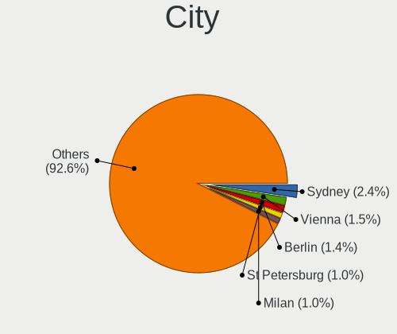
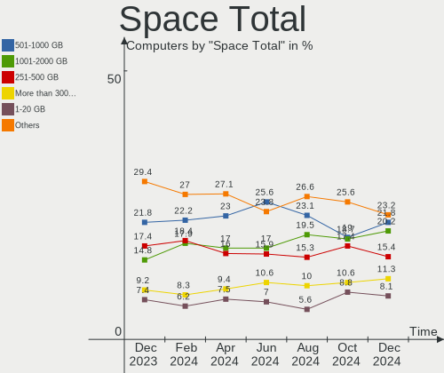
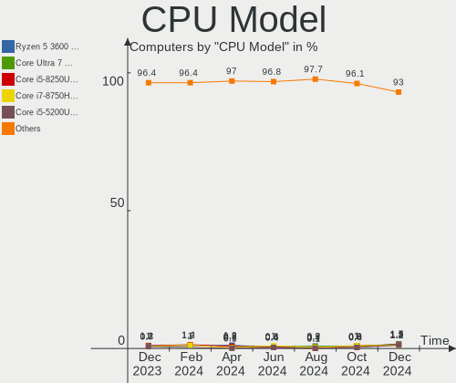
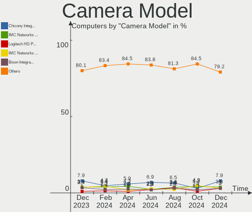

Fedora - Hardware Trends
------------------------

A project to identify most popular hardware characteristics and track their change
over time based on data collected by Linux users at https://Linux-Hardware.org.

Anyone can contribute to this report by the [hw-probe](https://github.com/linuxhw/hw-probe) tool:

    sudo -E hw-probe -all -upload

This is a report for all computer types. See also reports for [desktops](/Dist/Fedora/Desktop/README.md) and [notebooks](/Dist/Fedora/Notebook/README.md).

This report is for one last month. Overall report since the beginning of time: [TestDays](https://github.com/linuxhw/TestDays)

Period: Feb, 2023.

Contents
--------

* [ System ](#system)
  - [ OS                       ](#os)
  - [ OS Family                ](#os-family)
  - [ Kernel                   ](#kernel)
  - [ Kernel Family            ](#kernel-family)
  - [ Kernel Major Ver.        ](#kernel-major-ver)
  - [ Arch                     ](#arch)
  - [ DE                       ](#de)
  - [ Display Server           ](#display-server)
  - [ Display Manager          ](#display-manager)
  - [ OS Lang                  ](#os-lang)
  - [ Boot Mode                ](#boot-mode)
  - [ Filesystem               ](#filesystem)
  - [ Part. scheme             ](#part-scheme)
  - [ Dual Boot with Linux/BSD ](#dual-boot-with-linuxbsd)
  - [ Dual Boot (Win)          ](#dual-boot-win)

* [ Board ](#board)
  - [ Vendor                   ](#vendor)
  - [ Model                    ](#model)
  - [ Model Family             ](#model-family)
  - [ MFG Year                 ](#mfg-year)
  - [ Form Factor              ](#form-factor)
  - [ Secure Boot              ](#secure-boot)
  - [ Coreboot                 ](#coreboot)
  - [ RAM Size                 ](#ram-size)
  - [ RAM Used                 ](#ram-used)
  - [ Total Drives             ](#total-drives)
  - [ Has CD-ROM               ](#has-cd-rom)
  - [ Has Ethernet             ](#has-ethernet)
  - [ Has WiFi                 ](#has-wifi)
  - [ Has Bluetooth            ](#has-bluetooth)

* [ Location ](#location)
  - [ Country                  ](#country)
  - [ City                     ](#city)

* [ Drives ](#drives)
  - [ Drive Vendor             ](#drive-vendor)
  - [ Drive Model              ](#drive-model)
  - [ HDD Vendor               ](#hdd-vendor)
  - [ SSD Vendor               ](#ssd-vendor)
  - [ Drive Kind               ](#drive-kind)
  - [ Drive Connector          ](#drive-connector)
  - [ Drive Size               ](#drive-size)
  - [ Space Total              ](#space-total)
  - [ Space Used               ](#space-used)
  - [ Malfunc. Drives          ](#malfunc-drives)
  - [ Malfunc. Drive Vendor    ](#malfunc-drive-vendor)
  - [ Malfunc. HDD Vendor      ](#malfunc-hdd-vendor)
  - [ Malfunc. Drive Kind      ](#malfunc-drive-kind)
  - [ Failed Drives            ](#failed-drives)
  - [ Failed Drive Vendor      ](#failed-drive-vendor)
  - [ Drive Status             ](#drive-status)

* [ Storage controller ](#storage-controller)
  - [ Storage Vendor           ](#storage-vendor)
  - [ Storage Model            ](#storage-model)
  - [ Storage Kind             ](#storage-kind)

* [ Processor ](#processor)
  - [ CPU Vendor               ](#cpu-vendor)
  - [ CPU Model                ](#cpu-model)
  - [ CPU Model Family         ](#cpu-model-family)
  - [ CPU Cores                ](#cpu-cores)
  - [ CPU Sockets              ](#cpu-sockets)
  - [ CPU Threads              ](#cpu-threads)
  - [ CPU Op-Modes             ](#cpu-op-modes)
  - [ CPU Microcode            ](#cpu-microcode)
  - [ CPU Microarch            ](#cpu-microarch)

* [ Graphics ](#graphics)
  - [ GPU Vendor               ](#gpu-vendor)
  - [ GPU Model                ](#gpu-model)
  - [ GPU Combo                ](#gpu-combo)
  - [ GPU Driver               ](#gpu-driver)
  - [ GPU Memory               ](#gpu-memory)

* [ Monitor ](#monitor)
  - [ Monitor Vendor           ](#monitor-vendor)
  - [ Monitor Model            ](#monitor-model)
  - [ Monitor Resolution       ](#monitor-resolution)
  - [ Monitor Diagonal         ](#monitor-diagonal)
  - [ Monitor Width            ](#monitor-width)
  - [ Aspect Ratio             ](#aspect-ratio)
  - [ Monitor Area             ](#monitor-area)
  - [ Pixel Density            ](#pixel-density)
  - [ Multiple Monitors        ](#multiple-monitors)

* [ Network ](#network)
  - [ Net Controller Vendor    ](#net-controller-vendor)
  - [ Net Controller Model     ](#net-controller-model)
  - [ Wireless Vendor          ](#wireless-vendor)
  - [ Wireless Model           ](#wireless-model)
  - [ Ethernet Vendor          ](#ethernet-vendor)
  - [ Ethernet Model           ](#ethernet-model)
  - [ Net Controller Kind      ](#net-controller-kind)
  - [ Used Controller          ](#used-controller)
  - [ NICs                     ](#nics)
  - [ IPv6                     ](#ipv6)

* [ Bluetooth ](#bluetooth)
  - [ Bluetooth Vendor         ](#bluetooth-vendor)
  - [ Bluetooth Model          ](#bluetooth-model)

* [ Sound ](#sound)
  - [ Sound Vendor             ](#sound-vendor)
  - [ Sound Model              ](#sound-model)

* [ Memory ](#memory)
  - [ Memory Vendor            ](#memory-vendor)
  - [ Memory Model             ](#memory-model)
  - [ Memory Kind              ](#memory-kind)
  - [ Memory Form Factor       ](#memory-form-factor)
  - [ Memory Size              ](#memory-size)
  - [ Memory Speed             ](#memory-speed)

* [ Printers & scanners ](#printers--scanners)
  - [ Printer Vendor           ](#printer-vendor)
  - [ Printer Model            ](#printer-model)
  - [ Scanner Vendor           ](#scanner-vendor)
  - [ Scanner Model            ](#scanner-model)

* [ Camera ](#camera)
  - [ Camera Vendor            ](#camera-vendor)
  - [ Camera Model             ](#camera-model)

* [ Security ](#security)
  - [ Fingerprint Vendor       ](#fingerprint-vendor)
  - [ Fingerprint Model        ](#fingerprint-model)
  - [ Chipcard Vendor          ](#chipcard-vendor)
  - [ Chipcard Model           ](#chipcard-model)

* [ Unsupported ](#unsupported)
  - [ Unsupported Devices      ](#unsupported-devices)
  - [ Unsupported Device Types ](#unsupported-device-types)

System
------

OS
--

Installed operating systems

| Name      | Computers | Percent |
|-----------|-----------|---------|
| Fedora 37 | 361       | 91.16%  |
| Fedora 36 | 21        | 5.3%    |
| Fedora 35 | 5         | 1.26%   |
| Fedora 38 | 4         | 1.01%   |
| Fedora 39 | 3         | 0.76%   |
| Fedora 34 | 1         | 0.25%   |
| Fedora 33 | 1         | 0.25%   |

OS Family
---------

OS without a version

| Name   | Computers | Percent |
|--------|-----------|---------|
| Fedora | 396       | 100%    |

Kernel
------

Version of the Linux kernel

| Version                                            | Computers | Percent |
|----------------------------------------------------|-----------|---------|
| 6.1.9-200.fc37.x86_64                              | 64        | 16.16%  |
| 6.1.11-200.fc37.x86_64                             | 64        | 16.16%  |
| 6.1.8-200.fc37.x86_64                              | 56        | 14.14%  |
| 6.1.10-200.fc37.x86_64                             | 46        | 11.62%  |
| 6.1.13-200.fc37.x86_64                             | 43        | 10.86%  |
| 6.1.12-200.fc37.x86_64                             | 24        | 6.06%   |
| 6.0.7-301.fc37.x86_64                              | 23        | 5.81%   |
| 6.1.7-200.fc37.x86_64                              | 12        | 3.03%   |
| 6.1.6-200.fc37.x86_64                              | 8         | 2.02%   |
| 6.1.9-100.fc36.x86_64                              | 4         | 1.01%   |
| 6.1.8-100.fc36.x86_64                              | 4         | 1.01%   |
| 6.0.12-100.fc35.x86_64                             | 4         | 1.01%   |
| 6.2.0-63.fc38.x86_64                               | 3         | 0.76%   |
| 6.1.6-100.fc36.x86_64                              | 2         | 0.51%   |
| 6.1.12-100.fc36.x86_64                             | 2         | 0.51%   |
| 6.1.11-201.fsync.fc37.x86_64                       | 2         | 0.51%   |
| 6.1.10-100.fc36.x86_64                             | 2         | 0.51%   |
| 6.0.18-300.fc37.x86_64                             | 2         | 0.51%   |
| 6.0.12-300.fc37.x86_64                             | 2         | 0.51%   |
| 6.3.0-0.rc0.20230223gita5c95ca18a98.4.fc39.x86_64  | 1         | 0.25%   |
| 6.2.0-0.rc8.57.fc39.x86_64                         | 1         | 0.25%   |
| 6.2.0-0.rc7.20230208git0983f6bf2bfc.52.fc38.x86_64 | 1         | 0.25%   |
| 6.2.0-0.rc3.asahi7.1.fc37.aarch64                  | 1         | 0.25%   |
| 6.1.9-666.rog.fc37.x86_64                          | 1         | 0.25%   |
| 6.1.8-200.fc37.x86_64+debug                        | 1         | 0.25%   |
| 6.1.5-200.fc37.x86_64                              | 1         | 0.25%   |
| 6.1.12-2.surface.fc37.x86_64                       | 1         | 0.25%   |
| 6.1.11-200.fc37.aarch64                            | 1         | 0.25%   |
| 6.1.11-100.fc36.x86_64                             | 1         | 0.25%   |
| 6.1.11-1.surface.fc37.x86_64                       | 1         | 0.25%   |
| 6.1.10-603.inttf.fc37.x86_64                       | 1         | 0.25%   |
| 6.0.9-300.fc37.x86_64                              | 1         | 0.25%   |
| 6.0.9                                              | 1         | 0.25%   |
| 6.0.8-xm1.0e20221004.fc38.x86_64                   | 1         | 0.25%   |
| 6.0.8-xm1.0.fc37.x86_64                            | 1         | 0.25%   |
| 6.0.7-200.fc36.x86_64                              | 1         | 0.25%   |
| 6.0.15-200.fc36.x86_64                             | 1         | 0.25%   |
| 6.0.12-1.surface.fc37.x86_64                       | 1         | 0.25%   |
| 6.0.11-300.fc37.x86_64                             | 1         | 0.25%   |
| 5.19.16-200.fc36.x86_64                            | 1         | 0.25%   |

Kernel Family
-------------

Linux kernel without a distro release

| Version  | Computers | Percent |
|----------|-----------|---------|
| 6.1.9    | 69        | 17.42%  |
| 6.1.11   | 69        | 17.42%  |
| 6.1.8    | 61        | 15.4%   |
| 6.1.10   | 49        | 12.37%  |
| 6.1.13   | 43        | 10.86%  |
| 6.1.12   | 27        | 6.82%   |
| 6.0.7    | 24        | 6.06%   |
| 6.1.7    | 12        | 3.03%   |
| 6.1.6    | 10        | 2.53%   |
| 6.0.12   | 7         | 1.77%   |
| 6.2.0    | 6         | 1.52%   |
| 6.0.9    | 2         | 0.51%   |
| 6.0.8    | 2         | 0.51%   |
| 6.0.18   | 2         | 0.51%   |
| 6.3.0    | 1         | 0.25%   |
| 6.1.5    | 1         | 0.25%   |
| 6.0.15   | 1         | 0.25%   |
| 6.0.11   | 1         | 0.25%   |
| 5.19.16  | 1         | 0.25%   |
| 5.19.11  | 1         | 0.25%   |
| 5.18.19  | 1         | 0.25%   |
| 5.17.5   | 1         | 0.25%   |
| 5.17.12  | 1         | 0.25%   |
| 5.17.0   | 1         | 0.25%   |
| 5.15.14  | 1         | 0.25%   |
| 5.14.18  | 1         | 0.25%   |
| 5.10.165 | 1         | 0.25%   |

Kernel Major Ver.
-----------------

Linux kernel major version

| Version | Computers | Percent |
|---------|-----------|---------|
| 6.1     | 341       | 86.11%  |
| 6.0     | 39        | 9.85%   |
| 6.2     | 6         | 1.52%   |
| 5.17    | 3         | 0.76%   |
| 5.19    | 2         | 0.51%   |
| 6.3     | 1         | 0.25%   |
| 5.18    | 1         | 0.25%   |
| 5.15    | 1         | 0.25%   |
| 5.14    | 1         | 0.25%   |
| 5.10    | 1         | 0.25%   |

Arch
----

OS architecture (x86_64, i586, etc.)

| Name    | Computers | Percent |
|---------|-----------|---------|
| x86_64  | 394       | 99.49%  |
| aarch64 | 2         | 0.51%   |

DE
--

Desktop Environment

| Name          | Computers | Percent |
|---------------|-----------|---------|
| GNOME         | 282       | 71.21%  |
| KDE5          | 66        | 16.67%  |
| Unknown       | 15        | 3.79%   |
| XFCE          | 7         | 1.77%   |
| GNOME Classic | 5         | 1.26%   |
| Cinnamon      | 5         | 1.26%   |
| X-Cinnamon    | 4         | 1.01%   |
| MATE          | 4         | 1.01%   |
| i3            | 4         | 1.01%   |
| sway          | 1         | 0.25%   |
| KDE           | 1         | 0.25%   |
| GNOME-Classic | 1         | 0.25%   |
| bspwm         | 1         | 0.25%   |

Display Server
--------------

X11 or Wayland

| Name    | Computers | Percent |
|---------|-----------|---------|
| Wayland | 279       | 70.45%  |
| X11     | 102       | 25.76%  |
| Tty     | 10        | 2.53%   |
| Unknown | 5         | 1.26%   |

Display Manager
---------------

SDDM, LightDM, etc.

| Name    | Computers | Percent |
|---------|-----------|---------|
| Unknown | 215       | 54.29%  |
| GDM     | 118       | 29.8%   |
| LightDM | 33        | 8.33%   |
| SDDM    | 30        | 7.58%   |

OS Lang
-------

Language

| Lang    | Computers | Percent |
|---------|-----------|---------|
| en_US   | 218       | 55.05%  |
| ru_RU   | 30        | 7.58%   |
| en_GB   | 29        | 7.32%   |
| de_DE   | 17        | 4.29%   |
| fr_FR   | 12        | 3.03%   |
| en_AU   | 10        | 2.53%   |
| en_CA   | 8         | 2.02%   |
| pt_BR   | 7         | 1.77%   |
| it_IT   | 7         | 1.77%   |
| es_ES   | 5         | 1.26%   |
| en_IN   | 5         | 1.26%   |
| pl_PL   | 4         | 1.01%   |
| es_MX   | 4         | 1.01%   |
| cs_CZ   | 4         | 1.01%   |
| C       | 4         | 1.01%   |
| ko_KR   | 3         | 0.76%   |
| es_CL   | 3         | 0.76%   |
| zh_TW   | 2         | 0.51%   |
| vi_VN   | 2         | 0.51%   |
| es_VE   | 2         | 0.51%   |
| es_SV   | 2         | 0.51%   |
| es_CO   | 2         | 0.51%   |
| en_IL   | 2         | 0.51%   |
| en_IE   | 2         | 0.51%   |
| Unknown | 2         | 0.51%   |
| zh_CN   | 1         | 0.25%   |
| tr_TR   | 1         | 0.25%   |
| sv_SE   | 1         | 0.25%   |
| nb_NO   | 1         | 0.25%   |
| lt_LT   | 1         | 0.25%   |
| fr_CA   | 1         | 0.25%   |
| es_US   | 1         | 0.25%   |
| en_ZA   | 1         | 0.25%   |
| en_HK   | 1         | 0.25%   |
| de_AT   | 1         | 0.25%   |

Boot Mode
---------

EFI or BIOS

| Mode | Computers | Percent |
|------|-----------|---------|
| EFI  | 323       | 81.57%  |
| BIOS | 73        | 18.43%  |

Filesystem
----------

Type of filesystem

| Type    | Computers | Percent |
|---------|-----------|---------|
| Btrfs   | 314       | 79.29%  |
| Ext4    | 70        | 17.68%  |
| Xfs     | 11        | 2.78%   |
| Overlay | 1         | 0.25%   |

Part. scheme
------------

Scheme of partitioning

| Type    | Computers | Percent |
|---------|-----------|---------|
| Unknown | 202       | 51.01%  |
| GPT     | 173       | 43.69%  |
| MBR     | 21        | 5.3%    |

Dual Boot with Linux/BSD
------------------------

Hosting more than one Linux/BSD

| Dual boot | Computers | Percent |
|-----------|-----------|---------|
| No        | 355       | 89.65%  |
| Yes       | 41        | 10.35%  |

Dual Boot (Win)
---------------

Hosting Linux and Windows

| Dual boot | Computers | Percent |
|-----------|-----------|---------|
| No        | 322       | 81.31%  |
| Yes       | 74        | 18.69%  |

Board
-----

Vendor
------

Motherboard manufacturer

| Name                | Computers | Percent |
|---------------------|-----------|---------|
| Lenovo              | 86        | 21.72%  |
| ASUSTek Computer    | 78        | 19.7%   |
| Dell                | 48        | 12.12%  |
| Hewlett-Packard     | 43        | 10.86%  |
| MSI                 | 26        | 6.57%   |
| Gigabyte Technology | 20        | 5.05%   |
| ASRock              | 17        | 4.29%   |
| Acer                | 16        | 4.04%   |
| Samsung Electronics | 7         | 1.77%   |
| HUAWEI              | 6         | 1.52%   |
| Google              | 4         | 1.01%   |
| Toshiba             | 3         | 0.76%   |
| Timi                | 3         | 0.76%   |
| Microsoft           | 3         | 0.76%   |
| Intel               | 3         | 0.76%   |
| Fujitsu             | 3         | 0.76%   |
| Apple               | 3         | 0.76%   |
| TUXEDO              | 2         | 0.51%   |
| Supermicro          | 2         | 0.51%   |
| Standard            | 2         | 0.51%   |
| Pegatron            | 2         | 0.51%   |
| HONOR               | 2         | 0.51%   |
| Alienware           | 2         | 0.51%   |
| TECNO               | 1         | 0.25%   |
| SiComputer          | 1         | 0.25%   |
| Monster             | 1         | 0.25%   |
| MACHENIKE           | 1         | 0.25%   |
| Hardkernel          | 1         | 0.25%   |
| GEO                 | 1         | 0.25%   |
| Gateway             | 1         | 0.25%   |
| Dynabook            | 1         | 0.25%   |
| CyberPowerPC        | 1         | 0.25%   |
| Compal              | 1         | 0.25%   |
| Chuwi               | 1         | 0.25%   |
| BESSTAR Tech        | 1         | 0.25%   |
| AZW                 | 1         | 0.25%   |
| ASRockRack          | 1         | 0.25%   |
| Unknown             | 1         | 0.25%   |

Model
-----

Motherboard model

| Name                                     | Computers | Percent |
|------------------------------------------|-----------|---------|
| MSI MS-7885                              | 3         | 0.76%   |
| Lenovo Yoga 9 14IAP7 82LU                | 3         | 0.76%   |
| Dell XPS 13 7390                         | 3         | 0.76%   |
| ASUS All Series                          | 3         | 0.76%   |
| Unknown                                  | 3         | 0.76%   |
| MSI MS-7C84                              | 2         | 0.51%   |
| MSI MS-7971                              | 2         | 0.51%   |
| MSI Modern 14 B11MOU                     | 2         | 0.51%   |
| Lenovo ThinkPad T14s Gen 1 20T1S39D0Y    | 2         | 0.51%   |
| Lenovo Legion 5 15ACH6H 82JU             | 2         | 0.51%   |
| Lenovo Legion 5 15ACH6A 82NW             | 2         | 0.51%   |
| Lenovo IdeaPad 5 15ARE05 81YQ            | 2         | 0.51%   |
| HUAWEI MACH-WX9                          | 2         | 0.51%   |
| HP ProBook 440 G7                        | 2         | 0.51%   |
| HP OMEN by Laptop 16-c0xxx               | 2         | 0.51%   |
| HP Notebook                              | 2         | 0.51%   |
| Gigabyte J1900M-D2P                      | 2         | 0.51%   |
| Dell Latitude E7270                      | 2         | 0.51%   |
| Dell Latitude 5511                       | 2         | 0.51%   |
| ASUS VivoBook_ASUSLaptop S5402ZA_S5402ZA | 2         | 0.51%   |
| ASUS TUF Gaming X570-PLUS                | 2         | 0.51%   |
| ASUS ProArt X670E-CREATOR WIFI           | 2         | 0.51%   |
| ASUS PRIME B450M-A II                    | 2         | 0.51%   |
| ASRock X570 Phantom Gaming 4             | 2         | 0.51%   |
| Acer Nitro AN515-52                      | 2         | 0.51%   |
| Acer Aspire A315-59                      | 2         | 0.51%   |
| TUXEDO Polaris Intel Gen3 (TGL)          | 1         | 0.25%   |
| TUXEDO InfinityBook S 14 Gen6            | 1         | 0.25%   |
| Toshiba Satellite P870                   | 1         | 0.25%   |
| Toshiba Satellite L515                   | 1         | 0.25%   |
| Toshiba Satellite L50-B                  | 1         | 0.25%   |
| Timi Xiaomi NoteBook Pro                 | 1         | 0.25%   |
| Timi TM1613                              | 1         | 0.25%   |
| Timi TM1612                              | 1         | 0.25%   |
| TECNO MEGABOOK T1                        | 1         | 0.25%   |
| Supermicro SYS-7048GR-TR                 | 1         | 0.25%   |
| Supermicro Super Server                  | 1         | 0.25%   |
| SiComputer Nauta 01C                     | 1         | 0.25%   |
| Samsung 940XFG                           | 1         | 0.25%   |
| Samsung 930QED                           | 1         | 0.25%   |

Model Family
------------

Motherboard model prefix

| Name                | Computers | Percent |
|---------------------|-----------|---------|
| Lenovo ThinkPad     | 44        | 11.11%  |
| ASUS ROG            | 17        | 4.29%   |
| Lenovo IdeaPad      | 16        | 4.04%   |
| ASUS VivoBook       | 15        | 3.79%   |
| Dell Latitude       | 14        | 3.54%   |
| Dell Inspiron       | 12        | 3.03%   |
| HP EliteBook        | 10        | 2.53%   |
| Dell XPS            | 10        | 2.53%   |
| Lenovo Yoga         | 8         | 2.02%   |
| ASUS PRIME          | 8         | 2.02%   |
| HP Pavilion         | 7         | 1.77%   |
| Acer Aspire         | 7         | 1.77%   |
| Lenovo ThinkBook    | 6         | 1.52%   |
| Lenovo Legion       | 6         | 1.52%   |
| ASUS TUF            | 6         | 1.52%   |
| HP ProBook          | 5         | 1.26%   |
| HP Laptop           | 4         | 1.01%   |
| Dell Precision      | 4         | 1.01%   |
| ASUS ASUS           | 4         | 1.01%   |
| Toshiba Satellite   | 3         | 0.76%   |
| MSI MS-7885         | 3         | 0.76%   |
| MSI Modern          | 3         | 0.76%   |
| Microsoft Surface   | 3         | 0.76%   |
| HP ENVY             | 3         | 0.76%   |
| Dell Vostro         | 3         | 0.76%   |
| ASUS ProArt         | 3         | 0.76%   |
| ASUS All            | 3         | 0.76%   |
| Unknown             | 3         | 0.76%   |
| MSI MS-7C84         | 2         | 0.51%   |
| MSI MS-7971         | 2         | 0.51%   |
| HUAWEI MACH-WX9     | 2         | 0.51%   |
| HP Spectre          | 2         | 0.51%   |
| HP OMEN             | 2         | 0.51%   |
| HP Notebook         | 2         | 0.51%   |
| Gigabyte Z370       | 2         | 0.51%   |
| Gigabyte J1900M-D2P | 2         | 0.51%   |
| Gigabyte H310M      | 2         | 0.51%   |
| Gigabyte B550       | 2         | 0.51%   |
| Fujitsu LIFEBOOK    | 2         | 0.51%   |
| ASUS Zenbook        | 2         | 0.51%   |

MFG Year
--------

Motherboard manufacture year

| Year    | Computers | Percent |
|---------|-----------|---------|
| 2022    | 65        | 16.41%  |
| 2020    | 60        | 15.15%  |
| 2021    | 54        | 13.64%  |
| 2019    | 45        | 11.36%  |
| 2018    | 38        | 9.6%    |
| 2017    | 27        | 6.82%   |
| 2015    | 19        | 4.8%    |
| 2012    | 18        | 4.55%   |
| 2016    | 16        | 4.04%   |
| 2014    | 15        | 3.79%   |
| 2013    | 10        | 2.53%   |
| 2011    | 10        | 2.53%   |
| 2010    | 6         | 1.52%   |
| 2023    | 4         | 1.01%   |
| 2008    | 4         | 1.01%   |
| 2009    | 2         | 0.51%   |
| 2007    | 1         | 0.25%   |
| 2006    | 1         | 0.25%   |
| Unknown | 1         | 0.25%   |

Form Factor
-----------

Physical design of the computer

| Name           | Computers | Percent |
|----------------|-----------|---------|
| Notebook       | 250       | 63.13%  |
| Desktop        | 116       | 29.29%  |
| Convertible    | 20        | 5.05%   |
| Tablet         | 4         | 1.01%   |
| Mini pc        | 2         | 0.51%   |
| All in one     | 2         | 0.51%   |
| System on chip | 1         | 0.25%   |
| Server         | 1         | 0.25%   |

Secure Boot
-----------

Enabled or disabled

| State    | Computers | Percent |
|----------|-----------|---------|
| Disabled | 306       | 77.27%  |
| Enabled  | 90        | 22.73%  |

Coreboot
--------

Have coreboot on board

| Used | Computers | Percent |
|------|-----------|---------|
| No   | 392       | 98.99%  |
| Yes  | 4         | 1.01%   |

RAM Size
--------

Total RAM memory

| Size in GB  | Computers | Percent |
|-------------|-----------|---------|
| 16.01-24.0  | 98        | 24.75%  |
| 4.01-8.0    | 81        | 20.45%  |
| 8.01-16.0   | 76        | 19.19%  |
| 32.01-64.0  | 69        | 17.42%  |
| 64.01-256.0 | 26        | 6.57%   |
| 3.01-4.0    | 24        | 6.06%   |
| 24.01-32.0  | 19        | 4.8%    |
| 1.01-2.0    | 3         | 0.76%   |

RAM Used
--------

Used RAM memory

| Used GB     | Computers | Percent |
|-------------|-----------|---------|
| 4.01-8.0    | 144       | 36.36%  |
| 2.01-3.0    | 85        | 21.46%  |
| 3.01-4.0    | 73        | 18.43%  |
| 8.01-16.0   | 44        | 11.11%  |
| 1.01-2.0    | 30        | 7.58%   |
| 16.01-24.0  | 7         | 1.77%   |
| 0.51-1.0    | 7         | 1.77%   |
| 32.01-64.0  | 3         | 0.76%   |
| 24.01-32.0  | 1         | 0.25%   |
| 64.01-256.0 | 1         | 0.25%   |
| 0.01-0.5    | 1         | 0.25%   |

Total Drives
------------

Number of drives on board

| Drives | Computers | Percent |
|--------|-----------|---------|
| 1      | 230       | 58.08%  |
| 2      | 91        | 22.98%  |
| 3      | 32        | 8.08%   |
| 4      | 20        | 5.05%   |
| 5      | 10        | 2.53%   |
| 6      | 6         | 1.52%   |
| 0      | 3         | 0.76%   |
| 9      | 2         | 0.51%   |
| 7      | 2         | 0.51%   |

Has CD-ROM
----------

Has CD-ROM on board

| Presented | Computers | Percent |
|-----------|-----------|---------|
| No        | 321       | 81.06%  |
| Yes       | 75        | 18.94%  |

Has Ethernet
------------

Has Ethernet on board

| Presented | Computers | Percent |
|-----------|-----------|---------|
| Yes       | 285       | 71.97%  |
| No        | 111       | 28.03%  |

Has WiFi
--------

Has WiFi module

| Presented | Computers | Percent |
|-----------|-----------|---------|
| Yes       | 331       | 83.59%  |
| No        | 65        | 16.41%  |

Has Bluetooth
-------------

Has Bluetooth module

| Presented | Computers | Percent |
|-----------|-----------|---------|
| Yes       | 296       | 74.75%  |
| No        | 100       | 25.25%  |

Location
--------

Country
-------

Geographic location (country)

| Country     | Computers | Percent |
|-------------|-----------|---------|
| USA         | 74        | 18.69%  |
| Russia      | 36        | 9.09%   |
| Germany     | 32        | 8.08%   |
| Poland      | 16        | 4.04%   |
| Italy       | 16        | 4.04%   |
| France      | 15        | 3.79%   |
| Brazil      | 14        | 3.54%   |
| Canada      | 13        | 3.28%   |
| India       | 12        | 3.03%   |
| Australia   | 11        | 2.78%   |
| Spain       | 10        | 2.53%   |
| UK          | 9         | 2.27%   |
| Turkey      | 8         | 2.02%   |
| Vietnam     | 6         | 1.52%   |
| Sweden      | 6         | 1.52%   |
| Norway      | 6         | 1.52%   |
| Netherlands | 6         | 1.52%   |
| Israel      | 6         | 1.52%   |
| Czechia     | 6         | 1.52%   |
| Thailand    | 5         | 1.26%   |
| Romania     | 5         | 1.26%   |
| Mexico      | 5         | 1.26%   |
| South Korea | 4         | 1.01%   |
| Portugal    | 4         | 1.01%   |
| Belgium     | 4         | 1.01%   |
| Armenia     | 4         | 1.01%   |
| Ireland     | 3         | 0.76%   |
| Greece      | 3         | 0.76%   |
| Denmark     | 3         | 0.76%   |
| Chile       | 3         | 0.76%   |
| Venezuela   | 2         | 0.51%   |
| Ukraine     | 2         | 0.51%   |
| Serbia      | 2         | 0.51%   |
| Latvia      | 2         | 0.51%   |
| Kazakhstan  | 2         | 0.51%   |
| Indonesia   | 2         | 0.51%   |
| Hungary     | 2         | 0.51%   |
| El Salvador | 2         | 0.51%   |
| Colombia    | 2         | 0.51%   |
| Bulgaria    | 2         | 0.51%   |

City
----

Geographic location (city)

| City              | Computers | Percent |
|-------------------|-----------|---------|
| Moscow            | 11        | 2.78%   |
| Sydney            | 8         | 2.02%   |
| St Petersburg     | 5         | 1.26%   |
| Berlin            | 5         | 1.26%   |
| Milan             | 4         | 1.01%   |
| London            | 4         | 1.01%   |
| Istanbul          | 4         | 1.01%   |
| Dublin            | 4         | 1.01%   |
| Atlanta           | 4         | 1.01%   |
| Yerevan           | 3         | 0.76%   |
| Warsaw            | 3         | 0.76%   |
| Madrid            | 3         | 0.76%   |
| Heidelberg        | 3         | 0.76%   |
| Gdansk            | 3         | 0.76%   |
| Frankfurt am Main | 3         | 0.76%   |
| Yekaterinburg     | 2         | 0.51%   |
| Wroclaw           | 2         | 0.51%   |
| Weinsberg         | 2         | 0.51%   |
| Tel Aviv          | 2         | 0.51%   |
| Seattle           | 2         | 0.51%   |
| Santiago          | 2         | 0.51%   |
| San Salvador      | 2         | 0.51%   |
| San Jose          | 2         | 0.51%   |
| Samara            | 2         | 0.51%   |
| Rishon LeTsiyyon  | 2         | 0.51%   |
| Riga              | 2         | 0.51%   |
| Regina            | 2         | 0.51%   |
| Paris             | 2         | 0.51%   |
| Orenburg          | 2         | 0.51%   |
| Nuremberg         | 2         | 0.51%   |
| Novosibirsk       | 2         | 0.51%   |
| Montreal          | 2         | 0.51%   |
| Mexico City       | 2         | 0.51%   |
| Lyon              | 2         | 0.51%   |
| Los Angeles       | 2         | 0.51%   |
| Liberec           | 2         | 0.51%   |
| Kristiansand      | 2         | 0.51%   |
| Karlsruhe         | 2         | 0.51%   |
| Kansas City       | 2         | 0.51%   |
| Izmir             | 2         | 0.51%   |

Drives
------

Drive Vendor
------------

Hard drive vendors

| Vendor                      | Computers | Drives | Percent |
|-----------------------------|-----------|--------|---------|
| Samsung Electronics         | 126       | 169    | 21.11%  |
| WDC                         | 63        | 92     | 10.55%  |
| Seagate                     | 52        | 60     | 8.71%   |
| SanDisk                     | 44        | 49     | 7.37%   |
| Toshiba                     | 35        | 36     | 5.86%   |
| Kingston                    | 27        | 30     | 4.52%   |
| Intel                       | 26        | 27     | 4.36%   |
| Crucial                     | 24        | 30     | 4.02%   |
| SK hynix                    | 21        | 21     | 3.52%   |
| Micron Technology           | 20        | 20     | 3.35%   |
| Unknown                     | 15        | 19     | 2.51%   |
| KIOXIA                      | 14        | 14     | 2.35%   |
| HGST                        | 13        | 17     | 2.18%   |
| Phison Electronics          | 11        | 12     | 1.84%   |
| China                       | 7         | 7      | 1.17%   |
| A-DATA Technology           | 7         | 7      | 1.17%   |
| PNY                         | 5         | 5      | 0.84%   |
| Micron/Crucial Technology   | 4         | 4      | 0.67%   |
| Kingston Technology Company | 4         | 4      | 0.67%   |
| Corsair                     | 4         | 5      | 0.67%   |
| ADATA Technology            | 4         | 5      | 0.67%   |
| SPCC                        | 3         | 3      | 0.5%    |
| Realtek                     | 3         | 3      | 0.5%    |
| Netac                       | 3         | 3      | 0.5%    |
| LITEONIT                    | 3         | 3      | 0.5%    |
| Lenovo                      | 3         | 3      | 0.5%    |
| JMicron Technology          | 3         | 3      | 0.5%    |
| Intenso                     | 3         | 4      | 0.5%    |
| Hitachi                     | 3         | 3      | 0.5%    |
| Gigabyte Technology         | 3         | 3      | 0.5%    |
| Apple                       | 3         | 5      | 0.5%    |
| XPG                         | 2         | 2      | 0.34%   |
| UMIS                        | 2         | 2      | 0.34%   |
| Transcend                   | 2         | 2      | 0.34%   |
| Team                        | 2         | 2      | 0.34%   |
| Solid State Storage         | 2         | 2      | 0.34%   |
| Silicon Motion              | 2         | 2      | 0.34%   |
| Apacer                      | 2         | 2      | 0.34%   |
| YMTC                        | 1         | 1      | 0.17%   |
| XrayDisk                    | 1         | 1      | 0.17%   |

Drive Model
-----------

Hard drive models

| Model                                                | Computers | Percent |
|------------------------------------------------------|-----------|---------|
| Samsung NVMe SSD Controller SM981/PM981/PM983 250GB  | 22        | 3.32%   |
| Samsung NVMe SSD Controller PM9A1/PM9A3/980PRO 960GB | 13        | 1.96%   |
| Toshiba XG6 NVMe SSD Controller 512GB                | 8         | 1.21%   |
| Seagate ST2000DM008-2FR102 2TB                       | 6         | 0.91%   |
| Sandisk WD Black SN750 / PC SN730 NVMe SSD 512GB     | 6         | 0.91%   |
| Samsung SSD 870 EVO 500GB                            | 6         | 0.91%   |
| Samsung SSD 860 EVO 1TB                              | 6         | 0.91%   |
| Phison E12 NVMe Controller 1024GB                    | 6         | 0.91%   |
| Crucial CT240BX500SSD1 240GB                         | 6         | 0.91%   |
| Unknown MMC Card  32GB                               | 5         | 0.76%   |
| Samsung SSD 860 EVO 500GB                            | 5         | 0.76%   |
| Samsung SSD 850 EVO 500GB                            | 5         | 0.76%   |
| Samsung SSD 850 EVO 250GB                            | 5         | 0.76%   |
| Kingston SA400S37120G 120GB SSD                      | 5         | 0.76%   |
| Intel SSDPEKNU512GZ 512GB                            | 5         | 0.76%   |
| HGST HTS721010A9E630 1TB                             | 5         | 0.76%   |
| Crucial CT1000MX500SSD1 1TB                          | 5         | 0.76%   |
| WDC WDS500G2B0A-00SM50 500GB SSD                     | 4         | 0.6%    |
| WDC WD10EZEX-08WN4A0 1TB                             | 4         | 0.6%    |
| Toshiba MQ01ABD100 1TB                               | 4         | 0.6%    |
| Seagate ST1000LM024 HN-M101MBB 1TB                   | 4         | 0.6%    |
| Samsung SSD 870 QVO 2TB                              | 4         | 0.6%    |
| Micron/Crucial P2 NVMe PCIe SSD 1TB                  | 4         | 0.6%    |
| Kingston SA400S37240G 240GB SSD                      | 4         | 0.6%    |
| WDC WD10SPZX-21Z10T0 1TB                             | 3         | 0.45%   |
| WDC WD10EZEX-08M2NA0 1TB                             | 3         | 0.45%   |
| Toshiba MQ04ABF100 1TB                               | 3         | 0.45%   |
| Seagate ST500LT012-1DG142 500GB                      | 3         | 0.45%   |
| Seagate ST4000DM004-2CV104 4TB                       | 3         | 0.45%   |
| Sandisk WD Blue SN500 / PC SN520 NVMe SSD 256GB      | 3         | 0.45%   |
| SanDisk NVMe SSD Drive 1TB                           | 3         | 0.45%   |
| Samsung SSD 980 PRO 1TB                              | 3         | 0.45%   |
| Samsung SSD 970 EVO Plus 2TB                         | 3         | 0.45%   |
| Samsung SSD 970 EVO 1TB                              | 3         | 0.45%   |
| Samsung SSD 860 EVO 250GB                            | 3         | 0.45%   |
| Samsung NVMe SSD Controller SM961/PM961/SM963 512GB  | 3         | 0.45%   |
| Samsung MZALQ512HBLU-00BL2 512GB                     | 3         | 0.45%   |
| Kingston SA400S37480G 480GB SSD                      | 3         | 0.45%   |
| JMicron Tech 250GB                                   | 3         | 0.45%   |
| Intel SSD Pro 7600p/760p/E 6100p Series 1024GB       | 3         | 0.45%   |

HDD Vendor
----------

Hard disk drive vendors

| Vendor              | Computers | Drives | Percent |
|---------------------|-----------|--------|---------|
| Seagate             | 51        | 59     | 37.23%  |
| WDC                 | 48        | 71     | 35.04%  |
| Toshiba             | 17        | 17     | 12.41%  |
| HGST                | 13        | 17     | 9.49%   |
| Hitachi             | 3         | 3      | 2.19%   |
| Unknown             | 1         | 2      | 0.73%   |
| Synology            | 1         | 2      | 0.73%   |
| Samsung Electronics | 1         | 2      | 0.73%   |
| Intenso             | 1         | 1      | 0.73%   |
| HGST HTS            | 1         | 1      | 0.73%   |

SSD Vendor
----------

Solid state drive vendors

| Vendor              | Computers | Drives | Percent |
|---------------------|-----------|--------|---------|
| Samsung Electronics | 52        | 63     | 29.05%  |
| Kingston            | 22        | 23     | 12.29%  |
| Crucial             | 21        | 27     | 11.73%  |
| SanDisk             | 14        | 15     | 7.82%   |
| WDC                 | 10        | 11     | 5.59%   |
| China               | 7         | 7      | 3.91%   |
| A-DATA Technology   | 6         | 6      | 3.35%   |
| PNY                 | 5         | 5      | 2.79%   |
| Toshiba             | 4         | 4      | 2.23%   |
| Micron Technology   | 3         | 3      | 1.68%   |
| LITEONIT            | 3         | 3      | 1.68%   |
| Intenso             | 3         | 3      | 1.68%   |
| Intel               | 3         | 3      | 1.68%   |
| SPCC                | 2         | 2      | 1.12%   |
| SK hynix            | 2         | 2      | 1.12%   |
| Netac               | 2         | 2      | 1.12%   |
| Gigabyte Technology | 2         | 2      | 1.12%   |
| Apple               | 2         | 2      | 1.12%   |
| Apacer              | 2         | 2      | 1.12%   |
| XrayDisk            | 1         | 1      | 0.56%   |
| VSP                 | 1         | 1      | 0.56%   |
| Transcend           | 1         | 1      | 0.56%   |
| Team                | 1         | 1      | 0.56%   |
| StoreJet            | 1         | 1      | 0.56%   |
| Plextor             | 1         | 1      | 0.56%   |
| Patriot             | 1         | 1      | 0.56%   |
| MidasForce          | 1         | 1      | 0.56%   |
| LT                  | 1         | 1      | 0.56%   |
| LITEON              | 1         | 1      | 0.56%   |
| KingSpec            | 1         | 1      | 0.56%   |
| Dahua               | 1         | 1      | 0.56%   |
| Corsair             | 1         | 1      | 0.56%   |
| ALLIED              | 1         | 1      | 0.56%   |

Drive Kind
----------

HDD or SSD

| Kind    | Computers | Drives | Percent |
|---------|-----------|--------|---------|
| NVMe    | 251       | 306    | 45.64%  |
| SSD     | 157       | 199    | 28.55%  |
| HDD     | 117       | 175    | 21.27%  |
| MMC     | 14        | 15     | 2.55%   |
| Unknown | 11        | 13     | 2%      |

Drive Connector
---------------

SATA, SAS, NVMe, etc.

| Type | Computers | Drives | Percent |
|------|-----------|--------|---------|
| NVMe | 250       | 303    | 50.71%  |
| SATA | 203       | 359    | 41.18%  |
| SAS  | 26        | 31     | 5.27%   |
| MMC  | 14        | 15     | 2.84%   |

Drive Size
----------

Size of hard drive

| Size in TB | Computers | Drives | Percent |
|------------|-----------|--------|---------|
| 0.01-0.5   | 142       | 183    | 48.3%   |
| 0.51-1.0   | 93        | 108    | 31.63%  |
| 1.01-2.0   | 25        | 32     | 8.5%    |
| 4.01-10.0  | 15        | 20     | 5.1%    |
| 3.01-4.0   | 14        | 24     | 4.76%   |
| 2.01-3.0   | 4         | 5      | 1.36%   |
| 10.01-20.0 | 1         | 2      | 0.34%   |

Space Total
-----------

Amount of disk space available on the file system

| Size in GB     | Computers | Percent |
|----------------|-----------|---------|
| 501-1000       | 86        | 21.72%  |
| 251-500        | 72        | 18.18%  |
| 1001-2000      | 58        | 14.65%  |
| 101-250        | 48        | 12.12%  |
| More than 3000 | 40        | 10.1%   |
| Unknown        | 35        | 8.84%   |
| 1-20           | 34        | 8.59%   |
| 2001-3000      | 13        | 3.28%   |
| 51-100         | 6         | 1.52%   |
| 21-50          | 4         | 1.01%   |

Space Used
----------

Amount of used disk space

| Used GB        | Computers | Percent |
|----------------|-----------|---------|
| 1-20           | 91        | 22.98%  |
| 101-250        | 71        | 17.93%  |
| 21-50          | 47        | 11.87%  |
| 251-500        | 39        | 9.85%   |
| 51-100         | 39        | 9.85%   |
| Unknown        | 35        | 8.84%   |
| 501-1000       | 32        | 8.08%   |
| 1001-2000      | 23        | 5.81%   |
| More than 3000 | 13        | 3.28%   |
| 2001-3000      | 6         | 1.52%   |

Malfunc. Drives
---------------

Drive models with a malfunction

| Model                                 | Computers | Drives | Percent |
|---------------------------------------|-----------|--------|---------|
| WDC WD50EFRX-68MYMN1 5TB              | 1         | 4      | 5%      |
| WDC WD5000AAKX-00ERMA0 500GB          | 1         | 1      | 5%      |
| WDC WD40PURZ-85AKKY0 4TB              | 1         | 1      | 5%      |
| WDC WD10JPVX-60JC3T1 1TB              | 1         | 1      | 5%      |
| WDC WD10EZEX-00WN4A0 1TB              | 1         | 1      | 5%      |
| SK hynix HFS128G39TND-N210A 128GB SSD | 1         | 1      | 5%      |
| Seagate ST500LT012-1DG142 500GB       | 1         | 1      | 5%      |
| Seagate ST500LM021-1KJ152 500GB       | 1         | 1      | 5%      |
| Seagate ST500LM012 HN-M500MBB 500GB   | 1         | 1      | 5%      |
| Seagate ST3000DM008-2DM166 3TB        | 1         | 1      | 5%      |
| Seagate ST3000DM001-1CH166 3TB        | 1         | 1      | 5%      |
| SanDisk SSD PLUS 240 GB               | 1         | 1      | 5%      |
| Samsung Electronics SSD 980 1TB       | 1         | 1      | 5%      |
| Samsung Electronics SSD 870 EVO 500GB | 1         | 1      | 5%      |
| Samsung Electronics PM9A1 NVMe 1024GB | 1         | 1      | 5%      |
| Samsung Electronics HD501LJ 500GB     | 1         | 2      | 5%      |
| Intel SSDSC2CT120A3 120GB             | 1         | 1      | 5%      |
| HGST HTS541075A9E680 752GB            | 1         | 1      | 5%      |
| HGST HTS 545050A7E680 500GB           | 1         | 1      | 5%      |
| A-DATA Technology SSD S599 64GB       | 1         | 1      | 5%      |

Malfunc. Drive Vendor
---------------------

Vendors of faulty drives

| Vendor              | Computers | Drives | Percent |
|---------------------|-----------|--------|---------|
| WDC                 | 5         | 8      | 25%     |
| Seagate             | 5         | 5      | 25%     |
| Samsung Electronics | 4         | 5      | 20%     |
| SK hynix            | 1         | 1      | 5%      |
| SanDisk             | 1         | 1      | 5%      |
| Intel               | 1         | 1      | 5%      |
| HGST HTS            | 1         | 1      | 5%      |
| HGST                | 1         | 1      | 5%      |
| A-DATA Technology   | 1         | 1      | 5%      |

Malfunc. HDD Vendor
-------------------

Vendors of faulty HDD drives

| Vendor              | Computers | Drives | Percent |
|---------------------|-----------|--------|---------|
| WDC                 | 5         | 8      | 38.46%  |
| Seagate             | 5         | 5      | 38.46%  |
| Samsung Electronics | 1         | 2      | 7.69%   |
| HGST HTS            | 1         | 1      | 7.69%   |
| HGST                | 1         | 1      | 7.69%   |

Malfunc. Drive Kind
-------------------

Kinds of faulty drives

| Kind | Computers | Drives | Percent |
|------|-----------|--------|---------|
| HDD  | 13        | 17     | 65%     |
| SSD  | 5         | 5      | 25%     |
| NVMe | 2         | 2      | 10%     |

Failed Drives
-------------

Failed drive models

| Model                                            | Computers | Drives | Percent |
|--------------------------------------------------|-----------|--------|---------|
| Samsung Electronics MZNTY128HDHP-00000 128GB SSD | 1         | 1      | 100%    |

Failed Drive Vendor
-------------------

Failed drive vendors

| Vendor              | Computers | Drives | Percent |
|---------------------|-----------|--------|---------|
| Samsung Electronics | 1         | 1      | 100%    |

Drive Status
------------

Number of failed and malfunc. drives

| Status   | Computers | Drives | Percent |
|----------|-----------|--------|---------|
| Detected | 231       | 421    | 54.48%  |
| Works    | 172       | 262    | 40.57%  |
| Malfunc  | 20        | 24     | 4.72%   |
| Failed   | 1         | 1      | 0.24%   |

Storage controller
------------------

Storage Vendor
--------------

Storage controller vendors

| Vendor                         | Computers | Percent |
|--------------------------------|-----------|---------|
| Intel                          | 217       | 38.27%  |
| Samsung Electronics            | 90        | 15.87%  |
| AMD                            | 77        | 13.58%  |
| SanDisk                        | 40        | 7.05%   |
| SK hynix                       | 19        | 3.35%   |
| Micron Technology              | 17        | 3%      |
| Toshiba America Info Systems   | 16        | 2.82%   |
| Phison Electronics             | 15        | 2.65%   |
| KIOXIA                         | 15        | 2.65%   |
| Kingston Technology Company    | 12        | 2.12%   |
| ASMedia Technology             | 11        | 1.94%   |
| Micron/Crucial Technology      | 7         | 1.23%   |
| ADATA Technology               | 6         | 1.06%   |
| Realtek Semiconductor          | 4         | 0.71%   |
| Union Memory (Shenzhen)        | 3         | 0.53%   |
| Solid State Storage Technology | 3         | 0.53%   |
| Silicon Motion                 | 3         | 0.53%   |
| Marvell Technology Group       | 3         | 0.53%   |
| Lenovo                         | 3         | 0.53%   |
| Shenzhen Longsys Electronics   | 2         | 0.35%   |
| Yangtze Memory Technologies    | 1         | 0.18%   |
| Netac Technology               | 1         | 0.18%   |
| LSI Logic / Symbios Logic      | 1         | 0.18%   |
| Lite-On Technology             | 1         | 0.18%   |

Storage Model
-------------

Storage controller models

| Model                                                                          | Computers | Percent |
|--------------------------------------------------------------------------------|-----------|---------|
| AMD FCH SATA Controller [AHCI mode]                                            | 55        | 8.94%   |
| Samsung NVMe SSD Controller SM981/PM981/PM983                                  | 37        | 6.02%   |
| Samsung NVMe SSD Controller PM9A1/PM9A3/980PRO                                 | 26        | 4.23%   |
| Intel Volume Management Device NVMe RAID Controller                            | 26        | 4.23%   |
| Intel Sunrise Point-LP SATA Controller [AHCI mode]                             | 25        | 4.07%   |
| Samsung NVMe SSD Controller 980                                                | 18        | 2.93%   |
| Micron Non-Volatile memory controller                                          | 17        | 2.76%   |
| Intel Q170/Q150/B150/H170/H110/Z170/CM236 Chipset SATA Controller [AHCI Mode]  | 12        | 1.95%   |
| Intel 82801 Mobile SATA Controller [RAID mode]                                 | 12        | 1.95%   |
| Toshiba America Info Systems XG6 NVMe SSD Controller                           | 10        | 1.63%   |
| Sandisk Non-Volatile memory controller                                         | 10        | 1.63%   |
| Intel 8 Series/C220 Series Chipset Family 6-port SATA Controller 1 [AHCI mode] | 10        | 1.63%   |
| Intel 7 Series Chipset Family 6-port SATA Controller [AHCI mode]               | 10        | 1.63%   |
| ASMedia ASM1062 Serial ATA Controller                                          | 10        | 1.63%   |
| SanDisk WD Blue SN550 NVMe SSD                                                 | 9         | 1.46%   |
| Intel Non-Volatile memory controller                                           | 9         | 1.46%   |
| AMD 500 Series Chipset SATA Controller                                         | 9         | 1.46%   |
| Phison E12 NVMe Controller                                                     | 8         | 1.3%    |
| KIOXIA Non-Volatile memory controller                                          | 8         | 1.3%    |
| Kingston Company Company Non-Volatile memory controller                        | 8         | 1.3%    |
| Intel 400 Series Chipset Family SATA AHCI Controller                           | 8         | 1.3%    |
| Intel 200 Series PCH SATA controller [AHCI mode]                               | 8         | 1.3%    |
| SK hynix Gold P31/PC711 NVMe Solid State Drive                                 | 7         | 1.14%   |
| SanDisk WD Black SN750 / PC SN730 NVMe SSD                                     | 7         | 1.14%   |
| Intel SSD 660P Series                                                          | 7         | 1.14%   |
| Intel HM170/QM170 Chipset SATA Controller [AHCI Mode]                          | 7         | 1.14%   |
| Intel Comet Lake SATA AHCI Controller                                          | 7         | 1.14%   |
| AMD 400 Series Chipset SATA Controller                                         | 7         | 1.14%   |
| Samsung NVMe SSD Controller SM961/PM961/SM963                                  | 6         | 0.98%   |
| Micron/Crucial P2 NVMe PCIe SSD                                                | 6         | 0.98%   |
| KIOXIA NVMe SSD Controller BG4                                                 | 6         | 0.98%   |
| Intel SSD Pro 7600p/760p/E 6100p Series                                        | 6         | 0.98%   |
| Intel Cannon Lake Mobile PCH SATA AHCI Controller                              | 6         | 0.98%   |
| Intel C610/X99 series chipset 6-Port SATA Controller [AHCI mode]               | 6         | 0.98%   |
| AMD SATA controller                                                            | 6         | 0.98%   |
| SanDisk WD Blue SN570 NVMe SSD                                                 | 5         | 0.81%   |
| Phison E16 PCIe4 NVMe Controller                                               | 5         | 0.81%   |
| Intel Tiger Lake-LP SATA Controller                                            | 5         | 0.81%   |
| Intel 6 Series/C200 Series Chipset Family 6 port Mobile SATA AHCI Controller   | 5         | 0.81%   |
| Intel 500 Series Chipset Family SATA AHCI Controller                           | 5         | 0.81%   |

Storage Kind
------------

Kind of storage controller (IDE, SATA, NVMe, SAS, ...)

| Kind | Computers | Percent |
|------|-----------|---------|
| NVMe | 250       | 45.37%  |
| SATA | 242       | 43.92%  |
| RAID | 44        | 7.99%   |
| IDE  | 13        | 2.36%   |
| SAS  | 2         | 0.36%   |

Processor
---------

CPU Vendor
----------

Processor vendors

| Vendor  | Computers | Percent |
|---------|-----------|---------|
| Intel   | 278       | 70.2%   |
| AMD     | 116       | 29.29%  |
| ARM     | 1         | 0.25%   |
| Unknown | 1         | 0.25%   |

CPU Model
---------

Processor models

| Model                                         | Computers | Percent |
|-----------------------------------------------|-----------|---------|
| Intel 11th Gen Core i5-1135G7 @ 2.40GHz       | 11        | 2.78%   |
| Intel Core i5-8250U CPU @ 1.60GHz             | 7         | 1.77%   |
| Intel Core i5-8265U CPU @ 1.60GHz             | 6         | 1.52%   |
| Intel 12th Gen Core i7-12700H                 | 6         | 1.52%   |
| Intel 11th Gen Core i7-1165G7 @ 2.80GHz       | 6         | 1.52%   |
| AMD Ryzen 7 5800H with Radeon Graphics        | 6         | 1.52%   |
| AMD Ryzen 5 5500U with Radeon Graphics        | 6         | 1.52%   |
| Intel Core i5-7200U CPU @ 2.50GHz             | 5         | 1.26%   |
| Intel Core i5-1035G1 CPU @ 1.00GHz            | 5         | 1.26%   |
| Intel Core i5-10210U CPU @ 1.60GHz            | 5         | 1.26%   |
| Intel 12th Gen Core i7-1260P                  | 5         | 1.26%   |
| AMD Ryzen 5 3600 6-Core Processor             | 5         | 1.26%   |
| Intel Core i7-10850H CPU @ 2.70GHz            | 4         | 1.01%   |
| Intel Core i5-8300H CPU @ 2.30GHz             | 4         | 1.01%   |
| Intel Core i5-6500 CPU @ 3.20GHz              | 4         | 1.01%   |
| Intel Core i5-6200U CPU @ 2.30GHz             | 4         | 1.01%   |
| AMD Ryzen 7 4800H with Radeon Graphics        | 4         | 1.01%   |
| AMD Ryzen 7 3700X 8-Core Processor            | 4         | 1.01%   |
| AMD Ryzen 5 4500U with Radeon Graphics        | 4         | 1.01%   |
| Intel Core i7-8650U CPU @ 1.90GHz             | 3         | 0.76%   |
| Intel Core i7-8565U CPU @ 1.80GHz             | 3         | 0.76%   |
| Intel Core i7-7700HQ CPU @ 2.80GHz            | 3         | 0.76%   |
| Intel Core i7-10510U CPU @ 1.80GHz            | 3         | 0.76%   |
| Intel Core i5-8350U CPU @ 1.70GHz             | 3         | 0.76%   |
| Intel Core i5-6300U CPU @ 2.40GHz             | 3         | 0.76%   |
| Intel Core i5-5200U CPU @ 2.20GHz             | 3         | 0.76%   |
| Intel 12th Gen Core i9-12900H                 | 3         | 0.76%   |
| Intel 12th Gen Core i7-1255U                  | 3         | 0.76%   |
| Intel 12th Gen Core i5-1235U                  | 3         | 0.76%   |
| Intel 11th Gen Core i7-11800H @ 2.30GHz       | 3         | 0.76%   |
| Intel 11th Gen Core i5-11400H @ 2.70GHz       | 3         | 0.76%   |
| AMD Ryzen 9 7950X 16-Core Processor           | 3         | 0.76%   |
| AMD Ryzen 9 5950X 16-Core Processor           | 3         | 0.76%   |
| AMD Ryzen 7 PRO 6850U with Radeon Graphics    | 3         | 0.76%   |
| AMD Ryzen 7 6800H with Radeon Graphics        | 3         | 0.76%   |
| AMD Ryzen 7 5700G with Radeon Graphics        | 3         | 0.76%   |
| AMD Ryzen 5 5600X 6-Core Processor            | 3         | 0.76%   |
| AMD Ryzen 5 3500U with Radeon Vega Mobile Gfx | 3         | 0.76%   |
| AMD Ryzen 5 2600 Six-Core Processor           | 3         | 0.76%   |
| Intel Core i9-10885H CPU @ 2.40GHz            | 2         | 0.51%   |

CPU Model Family
----------------

Processor model prefix

| Model                   | Computers | Percent |
|-------------------------|-----------|---------|
| Intel Core i5           | 82        | 20.71%  |
| Other                   | 72        | 18.18%  |
| Intel Core i7           | 71        | 17.93%  |
| AMD Ryzen 5             | 41        | 10.35%  |
| AMD Ryzen 7             | 34        | 8.59%   |
| Intel Core i3           | 16        | 4.04%   |
| AMD Ryzen 9             | 15        | 3.79%   |
| Intel Celeron           | 9         | 2.27%   |
| AMD Ryzen 7 PRO         | 7         | 1.77%   |
| Intel Xeon              | 6         | 1.52%   |
| Intel Core i9           | 6         | 1.52%   |
| Intel Pentium           | 5         | 1.26%   |
| AMD Ryzen 3             | 5         | 1.26%   |
| Intel Core 2 Duo        | 3         | 0.76%   |
| AMD A6                  | 3         | 0.76%   |
| Intel Pentium Dual-Core | 2         | 0.51%   |
| Intel Genuine           | 2         | 0.51%   |
| Intel Core 2 Quad       | 2         | 0.51%   |
| Intel Atom              | 2         | 0.51%   |
| AMD Ryzen 5 PRO         | 2         | 0.51%   |
| AMD A8                  | 2         | 0.51%   |
| AMD A12                 | 2         | 0.51%   |
| Intel Pentium Gold      | 1         | 0.25%   |
| Intel Core m3           | 1         | 0.25%   |
| AMD Ryzen Threadripper  | 1         | 0.25%   |
| AMD Phenom II X2        | 1         | 0.25%   |
| AMD FX                  | 1         | 0.25%   |
| AMD E                   | 1         | 0.25%   |
| AMD A4                  | 1         | 0.25%   |

CPU Cores
---------

Number of processor cores

| Number | Computers | Percent |
|--------|-----------|---------|
| 4      | 143       | 36.11%  |
| 2      | 81        | 20.45%  |
| 6      | 63        | 15.91%  |
| 8      | 59        | 14.9%   |
| 12     | 12        | 3.03%   |
| 16     | 11        | 2.78%   |
| 14     | 11        | 2.78%   |
| 10     | 10        | 2.53%   |
| 24     | 2         | 0.51%   |
| 1      | 2         | 0.51%   |
| 28     | 1         | 0.25%   |
| 5      | 1         | 0.25%   |

CPU Sockets
-----------

Number of sockets

| Number | Computers | Percent |
|--------|-----------|---------|
| 1      | 394       | 99.49%  |
| 2      | 2         | 0.51%   |

CPU Threads
-----------

Threads per core (Hyper-Threading)

| Number | Computers | Percent |
|--------|-----------|---------|
| 2      | 343       | 86.62%  |
| 1      | 53        | 13.38%  |

CPU Op-Modes
------------

CPU Operation Modes (32-bit, 64-bit)

| Op mode        | Computers | Percent |
|----------------|-----------|---------|
| 32-bit, 64-bit | 395       | 99.75%  |
| 64-bit         | 1         | 0.25%   |

CPU Microcode
-------------

Microcode number

| Number     | Computers | Percent |
|------------|-----------|---------|
| Unknown    | 27        | 6.82%   |
| 0x806c1    | 19        | 4.8%    |
| 0x806ea    | 17        | 4.29%   |
| 0x906ea    | 16        | 4.04%   |
| 0x906a3    | 16        | 4.04%   |
| 0x806ec    | 16        | 4.04%   |
| 0x306a9    | 15        | 3.79%   |
| 0x506e3    | 14        | 3.54%   |
| 0x406e3    | 14        | 3.54%   |
| 0x0a50000c | 13        | 3.28%   |
| 0xa0652    | 11        | 2.78%   |
| 0x08701021 | 11        | 2.78%   |
| 0x806e9    | 10        | 2.53%   |
| 0x206a7    | 10        | 2.53%   |
| 0x906a4    | 9         | 2.27%   |
| 0x806d1    | 9         | 2.27%   |
| 0x306c3    | 9         | 2.27%   |
| 0x0a404102 | 9         | 2.27%   |
| 0x08608103 | 7         | 1.77%   |
| 0x08600106 | 6         | 1.52%   |
| 0x08108109 | 6         | 1.52%   |
| 0xa0653    | 5         | 1.26%   |
| 0x906e9    | 5         | 1.26%   |
| 0x706e5    | 5         | 1.26%   |
| 0x30678    | 5         | 1.26%   |
| 0x0a601203 | 5         | 1.26%   |
| 0x0a50000d | 5         | 1.26%   |
| 0x08600104 | 5         | 1.26%   |
| 0x1067a    | 4         | 1.01%   |
| 0x0810100b | 4         | 1.01%   |
| 0x90672    | 3         | 0.76%   |
| 0x806eb    | 3         | 0.76%   |
| 0x806c2    | 3         | 0.76%   |
| 0x406f1    | 3         | 0.76%   |
| 0x40651    | 3         | 0.76%   |
| 0x306f2    | 3         | 0.76%   |
| 0x306d4    | 3         | 0.76%   |
| 0x206d7    | 3         | 0.76%   |
| 0x0a404101 | 3         | 0.76%   |
| 0x0a20120a | 3         | 0.76%   |

CPU Microarch
-------------

Microarchitecture

| Name             | Computers | Percent |
|------------------|-----------|---------|
| KabyLake         | 78        | 19.7%   |
| Unknown          | 35        | 8.84%   |
| Zen 3            | 30        | 7.58%   |
| Alderlake Hybrid | 30        | 7.58%   |
| Skylake          | 28        | 7.07%   |
| Zen 2            | 26        | 6.57%   |
| TigerLake        | 25        | 6.31%   |
| CometLake        | 19        | 4.8%    |
| Haswell          | 18        | 4.55%   |
| Icelake          | 17        | 4.29%   |
| IvyBridge        | 15        | 3.79%   |
| SandyBridge      | 13        | 3.28%   |
| Zen+             | 11        | 2.78%   |
| Zen              | 11        | 2.78%   |
| Silvermont       | 7         | 1.77%   |
| Broadwell        | 7         | 1.77%   |
| Penryn           | 6         | 1.52%   |
| Piledriver       | 3         | 0.76%   |
| Excavator        | 3         | 0.76%   |
| Westmere         | 2         | 0.51%   |
| Goldmont plus    | 2         | 0.51%   |
| Core             | 2         | 0.51%   |
| Tremont          | 1         | 0.25%   |
| Steamroller      | 1         | 0.25%   |
| Puma             | 1         | 0.25%   |
| Nehalem          | 1         | 0.25%   |
| K10              | 1         | 0.25%   |
| Jaguar           | 1         | 0.25%   |
| Bonnell          | 1         | 0.25%   |
| Bobcat           | 1         | 0.25%   |

Graphics
--------

GPU Vendor
----------

Vendors of graphics cards

| Vendor            | Computers | Percent |
|-------------------|-----------|---------|
| Intel             | 225       | 45.45%  |
| Nvidia            | 151       | 30.51%  |
| AMD               | 115       | 23.23%  |
| ASPEED Technology | 4         | 0.81%   |

GPU Model
---------

Graphics card models

| Model                                                                     | Computers | Percent |
|---------------------------------------------------------------------------|-----------|---------|
| Intel TigerLake-LP GT2 [Iris Xe Graphics]                                 | 23        | 4.52%   |
| Intel Alder Lake-P Integrated Graphics Controller                         | 18        | 3.54%   |
| Intel UHD Graphics 620                                                    | 17        | 3.34%   |
| AMD Cezanne [Radeon Vega Series / Radeon Vega Mobile Series]              | 17        | 3.34%   |
| Intel Skylake GT2 [HD Graphics 520]                                       | 13        | 2.55%   |
| AMD Renoir                                                                | 12        | 2.36%   |
| AMD Rembrandt [Radeon 680M]                                               | 12        | 2.36%   |
| Intel WhiskeyLake-U GT2 [UHD Graphics 620]                                | 11        | 2.16%   |
| Intel CometLake-H GT2 [UHD Graphics]                                      | 11        | 2.16%   |
| Intel CoffeeLake-H GT2 [UHD Graphics 630]                                 | 10        | 1.96%   |
| Intel CometLake-U GT2 [UHD Graphics]                                      | 9         | 1.77%   |
| Intel 3rd Gen Core processor Graphics Controller                          | 9         | 1.77%   |
| AMD Lucienne                                                              | 9         | 1.77%   |
| Nvidia GA106M [GeForce RTX 3060 Mobile / Max-Q]                           | 8         | 1.57%   |
| Intel TigerLake-H GT1 [UHD Graphics]                                      | 8         | 1.57%   |
| Intel HD Graphics 620                                                     | 8         | 1.57%   |
| Intel HD Graphics 630                                                     | 7         | 1.38%   |
| Intel 2nd Generation Core Processor Family Integrated Graphics Controller | 7         | 1.38%   |
| AMD Picasso/Raven 2 [Radeon Vega Series / Radeon Vega Mobile Series]      | 7         | 1.38%   |
| Intel Iris Plus Graphics G1 (Ice Lake)                                    | 6         | 1.18%   |
| Intel HD Graphics 530                                                     | 6         | 1.18%   |
| Intel Alder Lake-UP3 GT2 [Iris Xe Graphics]                               | 6         | 1.18%   |
| AMD Raven Ridge [Radeon Vega Series / Radeon Vega Mobile Series]          | 6         | 1.18%   |
| AMD Raphael                                                               | 6         | 1.18%   |
| AMD Navi 23 [Radeon RX 6600/6600 XT/6600M]                                | 6         | 1.18%   |
| AMD Navi 22 [Radeon RX 6700/6700 XT/6750 XT / 6800M/6850M XT]             | 6         | 1.18%   |
| AMD Ellesmere [Radeon RX 470/480/570/570X/580/580X/590]                   | 6         | 1.18%   |
| Intel Atom Processor Z36xxx/Z37xxx Series Graphics & Display              | 5         | 0.98%   |
| Nvidia TU117M [GeForce GTX 1650 Mobile / Max-Q]                           | 4         | 0.79%   |
| Nvidia GP108M [GeForce MX150]                                             | 4         | 0.79%   |
| Nvidia GP107M [GeForce GTX 1050 Ti Mobile]                                | 4         | 0.79%   |
| Nvidia GP107M [GeForce GTX 1050 Mobile]                                   | 4         | 0.79%   |
| Nvidia GM206 [GeForce GTX 960]                                            | 4         | 0.79%   |
| Nvidia GA107M [GeForce RTX 3050 Ti Mobile]                                | 4         | 0.79%   |
| ASPEED Technology ASPEED Graphics Family                                  | 4         | 0.79%   |
| Nvidia TU117M [GeForce MX550]                                             | 3         | 0.59%   |
| Nvidia TU117M [GeForce GTX 1650 Ti Mobile]                                | 3         | 0.59%   |
| Nvidia TU117 [GeForce GTX 1650]                                           | 3         | 0.59%   |
| Nvidia TU106M [GeForce RTX 2060 Mobile]                                   | 3         | 0.59%   |
| Nvidia GP107 [GeForce GTX 1050 Ti]                                        | 3         | 0.59%   |

GPU Combo
---------

Combinations of graphics cards

| Name            | Computers | Percent |
|-----------------|-----------|---------|
| 1 x Intel       | 140       | 35.35%  |
| 1 x AMD         | 81        | 20.45%  |
| Intel + Nvidia  | 73        | 18.43%  |
| 1 x Nvidia      | 61        | 15.4%   |
| AMD + Nvidia    | 14        | 3.54%   |
| 2 x AMD         | 12        | 3.03%   |
| Intel + AMD     | 6         | 1.52%   |
| Other           | 2         | 0.51%   |
| 2 x Intel       | 2         | 0.51%   |
| 1 x ASPEED      | 2         | 0.51%   |
| 2 x Nvidia      | 1         | 0.25%   |
| Nvidia + ASPEED | 1         | 0.25%   |
| AMD + ASPEED    | 1         | 0.25%   |

GPU Driver
----------

Free vs proprietary

| Driver      | Computers | Percent |
|-------------|-----------|---------|
| Free        | 292       | 73.74%  |
| Proprietary | 88        | 22.22%  |
| Unknown     | 16        | 4.04%   |

GPU Memory
----------

Total video memory

| Size in GB | Computers | Percent |
|------------|-----------|---------|
| Unknown    | 217       | 54.8%   |
| 0.01-0.5   | 36        | 9.09%   |
| 1.01-2.0   | 35        | 8.84%   |
| 3.01-4.0   | 34        | 8.59%   |
| 0.51-1.0   | 26        | 6.57%   |
| 7.01-8.0   | 25        | 6.31%   |
| 8.01-16.0  | 11        | 2.78%   |
| 5.01-6.0   | 5         | 1.26%   |
| 16.01-24.0 | 5         | 1.26%   |
| 2.01-3.0   | 2         | 0.51%   |

Monitor
-------

Monitor Vendor
--------------

Monitor vendors

| Vendor               | Computers | Percent |
|----------------------|-----------|---------|
| AU Optronics         | 56        | 12.17%  |
| BOE                  | 54        | 11.74%  |
| Chimei Innolux       | 52        | 11.3%   |
| Samsung Electronics  | 47        | 10.22%  |
| LG Display           | 37        | 8.04%   |
| Dell                 | 31        | 6.74%   |
| Goldstar             | 20        | 4.35%   |
| AOC                  | 16        | 3.48%   |
| Sharp                | 15        | 3.26%   |
| Acer                 | 15        | 3.26%   |
| Philips              | 11        | 2.39%   |
| Lenovo               | 11        | 2.39%   |
| Hewlett-Packard      | 10        | 2.17%   |
| ViewSonic            | 7         | 1.52%   |
| ASUSTek Computer     | 7         | 1.52%   |
| Ancor Communications | 6         | 1.3%    |
| BenQ                 | 5         | 1.09%   |
| PANDA                | 4         | 0.87%   |
| Gigabyte Technology  | 4         | 0.87%   |
| CSO                  | 4         | 0.87%   |
| Sceptre Tech         | 3         | 0.65%   |
| MSI                  | 3         | 0.65%   |
| Apple                | 3         | 0.65%   |
| Unknown              | 2         | 0.43%   |
| Sony                 | 2         | 0.43%   |
| Mi                   | 2         | 0.43%   |
| JDI                  | 2         | 0.43%   |
| InfoVision           | 2         | 0.43%   |
| Iiyama               | 2         | 0.43%   |
| HKC                  | 2         | 0.43%   |
| FPT                  | 2         | 0.43%   |
| Vizio                | 1         | 0.22%   |
| Vestel Elektronik    | 1         | 0.22%   |
| Toshiba              | 1         | 0.22%   |
| TMX                  | 1         | 0.22%   |
| Tianma XM            | 1         | 0.22%   |
| RTK                  | 1         | 0.22%   |
| Positivo             | 1         | 0.22%   |
| NEC Computers        | 1         | 0.22%   |
| Microstep            | 1         | 0.22%   |

Monitor Model
-------------

Monitor models

| Model                                                                 | Computers | Percent |
|-----------------------------------------------------------------------|-----------|---------|
| Chimei Innolux LCD Monitor CMN15E7 1920x1080 344x193mm 15.5-inch      | 5         | 1.05%   |
| AU Optronics LCD Monitor AUO403D 1920x1080 309x173mm 13.9-inch        | 5         | 1.05%   |
| Chimei Innolux LCD Monitor CMN14D4 1920x1080 309x173mm 13.9-inch      | 4         | 0.84%   |
| AU Optronics LCD Monitor AUO21ED 1920x1080 344x193mm 15.5-inch        | 4         | 0.84%   |
| Samsung Electronics U28E590 SAM0C4D 3840x2160 607x345mm 27.5-inch     | 3         | 0.63%   |
| Samsung Electronics LCD Monitor SDC416D 2880x1800 312x195mm 14.5-inch | 3         | 0.63%   |
| Chimei Innolux LCD Monitor CMN15E8 1920x1080 344x193mm 15.5-inch      | 3         | 0.63%   |
| Chimei Innolux LCD Monitor CMN15E6 1366x768 344x193mm 15.5-inch       | 3         | 0.63%   |
| Chimei Innolux LCD Monitor CMN15D5 1920x1080 344x193mm 15.5-inch      | 3         | 0.63%   |
| AU Optronics LCD Monitor AUO5B2D 1920x1080 293x162mm 13.2-inch        | 3         | 0.63%   |
| AOC 27G2G4 AOC2702 1920x1080 598x336mm 27.0-inch                      | 3         | 0.63%   |
| Unknown LCD Monitor FFFF 2288x1287 2550x2550mm 142.0-inch             | 2         | 0.42%   |
| Sharp LCD Monitor SHP1476 3840x2160 346x194mm 15.6-inch               | 2         | 0.42%   |
| Samsung Electronics S24F350 SAM0D20 1920x1080 521x293mm 23.5-inch     | 2         | 0.42%   |
| Samsung Electronics LCD Monitor SDC4152 2880x1800 302x189mm 14.0-inch | 2         | 0.42%   |
| Philips PHL 244E5 PHLC0C0 1920x1080 527x296mm 23.8-inch               | 2         | 0.42%   |
| Philips PHL 243V7 PHLC155 1920x1080 527x296mm 23.8-inch               | 2         | 0.42%   |
| PANDA LCD Monitor NCP004D 1920x1080 344x194mm 15.5-inch               | 2         | 0.42%   |
| LG Display LCD Monitor LGD06A5 1920x1080 344x194mm 15.5-inch          | 2         | 0.42%   |
| LG Display LCD Monitor LGD060F 1920x1080 309x174mm 14.0-inch          | 2         | 0.42%   |
| LG Display LCD Monitor LGD046C 1920x1080 382x215mm 17.3-inch          | 2         | 0.42%   |
| LG Display LCD Monitor LGD02DF 1600x900 310x174mm 14.0-inch           | 2         | 0.42%   |
| LG Display LCD Monitor LGD02DC 1366x768 344x194mm 15.5-inch           | 2         | 0.42%   |
| Lenovo LEN L28u-30 LEN65FA 3840x2160 621x341mm 27.9-inch              | 2         | 0.42%   |
| JDI LCD Monitor JDI422A 3000x2000 293x196mm 13.9-inch                 | 2         | 0.42%   |
| Hewlett-Packard 27er HWP3326 1920x1080 598x336mm 27.0-inch            | 2         | 0.42%   |
| Goldstar ULTRAWIDE GSM59F1 2560x1080 798x334mm 34.1-inch              | 2         | 0.42%   |
| Goldstar ULTRAGEAR GSM774B 3440x1440 800x335mm 34.1-inch              | 2         | 0.42%   |
| Gigabyte Technology M27Q GBT270D 2560x1440 596x335mm 26.9-inch        | 2         | 0.42%   |
| FPT F22FAD FPTF22F 1920x1080 477x268mm 21.5-inch                      | 2         | 0.42%   |
| Dell U2412M DELA07B 1920x1200 518x324mm 24.1-inch                     | 2         | 0.42%   |
| Dell P2419H DELD0DA 1920x1080 527x296mm 23.8-inch                     | 2         | 0.42%   |
| Chimei Innolux LCD Monitor CMN15F5 1920x1080 344x193mm 15.5-inch      | 2         | 0.42%   |
| Chimei Innolux LCD Monitor CMN15DB 1366x768 344x193mm 15.5-inch       | 2         | 0.42%   |
| Chimei Innolux LCD Monitor CMN1521 1920x1080 344x193mm 15.5-inch      | 2         | 0.42%   |
| Chimei Innolux LCD Monitor CMN151E 1920x1080 344x193mm 15.5-inch      | 2         | 0.42%   |
| Chimei Innolux LCD Monitor CMN14C9 1920x1080 309x173mm 13.9-inch      | 2         | 0.42%   |
| Chimei Innolux LCD Monitor CMN142B 1920x1080 309x173mm 13.9-inch      | 2         | 0.42%   |
| BOE LCD Monitor BOE095F 2256x1504 285x190mm 13.5-inch                 | 2         | 0.42%   |
| BOE LCD Monitor BOE08E2 1920x1080 344x194mm 15.5-inch                 | 2         | 0.42%   |

Monitor Resolution
------------------

Monitor screen resolution

| Resolution         | Computers | Percent |
|--------------------|-----------|---------|
| 1920x1080 (FHD)    | 205       | 48.35%  |
| 1366x768 (WXGA)    | 43        | 10.14%  |
| 3840x2160 (4K)     | 41        | 9.67%   |
| 2560x1440 (QHD)    | 35        | 8.25%   |
| 1920x1200 (WUXGA)  | 14        | 3.3%    |
| 1600x900 (HD+)     | 12        | 2.83%   |
| 3440x1440          | 10        | 2.36%   |
| 2880x1800          | 10        | 2.36%   |
| 2560x1080          | 6         | 1.42%   |
| 1680x1050 (WSXGA+) | 6         | 1.42%   |
| 1280x1024 (SXGA)   | 5         | 1.18%   |
| 3840x2400          | 4         | 0.94%   |
| 2560x1600          | 4         | 0.94%   |
| 1440x900 (WXGA+)   | 4         | 0.94%   |
| 3840x1080          | 3         | 0.71%   |
| 3000x2000          | 3         | 0.71%   |
| 3072x1920          | 2         | 0.47%   |
| 2288x1287          | 2         | 0.47%   |
| 2256x1504          | 2         | 0.47%   |
| 1360x768           | 2         | 0.47%   |
| Unknown            | 2         | 0.47%   |
| 4160x1440          | 1         | 0.24%   |
| 3456x2160          | 1         | 0.24%   |
| 2880x1620          | 1         | 0.24%   |
| 2736x1824          | 1         | 0.24%   |
| 2496x1664          | 1         | 0.24%   |
| 2160x1440          | 1         | 0.24%   |
| 1800x1200          | 1         | 0.24%   |
| 1600x1200          | 1         | 0.24%   |
| 1280x800 (WXGA)    | 1         | 0.24%   |

Monitor Diagonal
----------------

Diagonal size in inches

| Inches  | Computers | Percent |
|---------|-----------|---------|
| 15      | 121       | 26.42%  |
| 13      | 52        | 11.35%  |
| 27      | 49        | 10.7%   |
| 14      | 48        | 10.48%  |
| 24      | 37        | 8.08%   |
| 23      | 22        | 4.8%    |
| 31      | 19        | 4.15%   |
| 17      | 19        | 4.15%   |
| 21      | 15        | 3.28%   |
| 34      | 12        | 2.62%   |
| 19      | 8         | 1.75%   |
| Unknown | 7         | 1.53%   |
| 16      | 6         | 1.31%   |
| 12      | 6         | 1.31%   |
| 18      | 5         | 1.09%   |
| 22      | 4         | 0.87%   |
| 72      | 3         | 0.66%   |
| 32      | 3         | 0.66%   |
| 11      | 3         | 0.66%   |
| 142     | 2         | 0.44%   |
| 84      | 2         | 0.44%   |
| 48      | 2         | 0.44%   |
| 38      | 2         | 0.44%   |
| 35      | 2         | 0.44%   |
| 28      | 2         | 0.44%   |
| 25      | 2         | 0.44%   |
| 20      | 2         | 0.44%   |
| 69      | 1         | 0.22%   |
| 43      | 1         | 0.22%   |
| 10      | 1         | 0.22%   |

Monitor Width
-------------

Physical width

| Width in mm    | Computers | Percent |
|----------------|-----------|---------|
| 301-350        | 195       | 43.82%  |
| 501-600        | 90        | 20.22%  |
| 201-300        | 40        | 8.99%   |
| 401-500        | 30        | 6.74%   |
| 601-700        | 29        | 6.52%   |
| 351-400        | 24        | 5.39%   |
| 701-800        | 15        | 3.37%   |
| Unknown        | 7         | 1.57%   |
| 1501-2000      | 6         | 1.35%   |
| 801-900        | 4         | 0.9%    |
| More than 2000 | 2         | 0.45%   |
| 1001-1500      | 2         | 0.45%   |
| 901-1000       | 1         | 0.22%   |

Aspect Ratio
------------

Proportional relationship between the width and the height

| Ratio   | Computers | Percent |
|---------|-----------|---------|
| 16/9    | 302       | 77.44%  |
| 16/10   | 49        | 12.56%  |
| 21/9    | 15        | 3.85%   |
| 3/2     | 9         | 2.31%   |
| Unknown | 6         | 1.54%   |
| 5/4     | 4         | 1.03%   |
| 32/9    | 2         | 0.51%   |
| 1.00    | 2         | 0.51%   |
| 4/3     | 1         | 0.26%   |

Monitor Area
------------

Area in inch

| Area in inch | Computers | Percent |
|----------------|-----------|---------|
| 101-110        | 120       | 26.32%  |
| 81-90          | 71        | 15.57%  |
| 201-250        | 60        | 13.16%  |
| 301-350        | 49        | 10.75%  |
| 351-500        | 37        | 8.11%   |
| 71-80          | 25        | 5.48%   |
| 121-130        | 18        | 3.95%   |
| 151-200        | 16        | 3.51%   |
| 251-300        | 14        | 3.07%   |
| More than 1000 | 8         | 1.75%   |
| Unknown        | 7         | 1.54%   |
| 111-120        | 6         | 1.32%   |
| 91-100         | 6         | 1.32%   |
| 61-70          | 5         | 1.1%    |
| 141-150        | 5         | 1.1%    |
| 501-1000       | 5         | 1.1%    |
| 51-60          | 3         | 0.66%   |
| 41-50          | 1         | 0.22%   |

Pixel Density
-------------

Pixels per inch

| Density       | Computers | Percent |
|---------------|-----------|---------|
| 121-160       | 163       | 37.73%  |
| 51-100        | 101       | 23.38%  |
| 101-120       | 80        | 18.52%  |
| 161-240       | 45        | 10.42%  |
| More than 240 | 27        | 6.25%   |
| 1-50          | 9         | 2.08%   |
| Unknown       | 7         | 1.62%   |

Multiple Monitors
-----------------

Total monitors connected

| Total | Computers | Percent |
|-------|-----------|---------|
| 1     | 286       | 72.22%  |
| 2     | 76        | 19.19%  |
| 0     | 21        | 5.3%    |
| 3     | 8         | 2.02%   |
| 4     | 5         | 1.26%   |

Network
-------

Net Controller Vendor
---------------------

Controller vendors

| Vendor                            | Computers | Percent |
|-----------------------------------|-----------|---------|
| Intel                             | 251       | 44.27%  |
| Realtek Semiconductor             | 181       | 31.92%  |
| Qualcomm Atheros                  | 45        | 7.94%   |
| MediaTek                          | 27        | 4.76%   |
| Broadcom                          | 15        | 2.65%   |
| Qualcomm                          | 7         | 1.23%   |
| TP-Link                           | 5         | 0.88%   |
| Lenovo                            | 4         | 0.71%   |
| Microsoft                         | 3         | 0.53%   |
| Aquantia                          | 3         | 0.53%   |
| Samsung Electronics               | 2         | 0.35%   |
| Ralink Technology                 | 2         | 0.35%   |
| Hewlett-Packard                   | 2         | 0.35%   |
| DisplayLink                       | 2         | 0.35%   |
| Broadcom Limited                  | 2         | 0.35%   |
| ASIX Electronics                  | 2         | 0.35%   |
| Xiaomi                            | 1         | 0.18%   |
| Sierra Wireless                   | 1         | 0.18%   |
| Ralink                            | 1         | 0.18%   |
| Qualcomm Atheros Communications   | 1         | 0.18%   |
| QinHeng Electronics               | 1         | 0.18%   |
| Marvell Technology Group          | 1         | 0.18%   |
| ICS Advent                        | 1         | 0.18%   |
| Google                            | 1         | 0.18%   |
| Ericsson Business Mobile Networks | 1         | 0.18%   |
| Dell                              | 1         | 0.18%   |
| D-Link                            | 1         | 0.18%   |
| BUFFALO                           | 1         | 0.18%   |
| ASUSTek Computer                  | 1         | 0.18%   |
| American Megatrends               | 1         | 0.18%   |

Net Controller Model
--------------------

Controller models

| Model                                                             | Computers | Percent |
|-------------------------------------------------------------------|-----------|---------|
| Realtek RTL8111/8168/8411 PCI Express Gigabit Ethernet Controller | 114       | 16.94%  |
| Intel Wi-Fi 6 AX200                                               | 33        | 4.9%    |
| Intel Alder Lake-P PCH CNVi WiFi                                  | 27        | 4.01%   |
| Intel Wireless 8265 / 8275                                        | 20        | 2.97%   |
| Intel Wi-Fi 6 AX201                                               | 20        | 2.97%   |
| Realtek RTL8125 2.5GbE Controller                                 | 19        | 2.82%   |
| Realtek RTL810xE PCI Express Fast Ethernet controller             | 16        | 2.38%   |
| Realtek RTL8822CE 802.11ac PCIe Wireless Network Adapter          | 13        | 1.93%   |
| Realtek RTL8153 Gigabit Ethernet Adapter                          | 12        | 1.78%   |
| MediaTek MT7921 802.11ax PCI Express Wireless Network Adapter     | 11        | 1.63%   |
| Intel I211 Gigabit Network Connection                             | 11        | 1.63%   |
| Intel Ethernet Controller I225-V                                  | 11        | 1.63%   |
| Intel 82579LM Gigabit Network Connection (Lewisville)             | 11        | 1.63%   |
| Qualcomm Atheros QCA9377 802.11ac Wireless Network Adapter        | 10        | 1.49%   |
| Intel Comet Lake PCH CNVi WiFi                                    | 10        | 1.49%   |
| Intel Cannon Lake PCH CNVi WiFi                                   | 10        | 1.49%   |
| MediaTek MT7922 802.11ax PCI Express Wireless Network Adapter     | 9         | 1.34%   |
| Intel Wi-Fi 6 AX210/AX211/AX411 160MHz                            | 9         | 1.34%   |
| Intel Ethernet Connection (2) I219-V                              | 9         | 1.34%   |
| Intel Cannon Point-LP CNVi [Wireless-AC]                          | 9         | 1.34%   |
| Realtek RTL8852AE 802.11ax PCIe Wireless Network Adapter          | 7         | 1.04%   |
| Qualcomm Atheros QCA9565 / AR9565 Wireless Network Adapter        | 7         | 1.04%   |
| Qualcomm Atheros QCA6174 802.11ac Wireless Network Adapter        | 7         | 1.04%   |
| Intel Wireless 8260                                               | 7         | 1.04%   |
| Intel Wireless 7265                                               | 7         | 1.04%   |
| Qualcomm QCNFA765 Wireless Network Adapter                        | 6         | 0.89%   |
| Intel Tiger Lake PCH CNVi WiFi                                    | 6         | 0.89%   |
| Intel Comet Lake PCH-LP CNVi WiFi                                 | 6         | 0.89%   |
| Realtek RTL8723BE PCIe Wireless Network Adapter                   | 5         | 0.74%   |
| Intel Ethernet Connection (4) I219-LM                             | 5         | 0.74%   |
| Intel Centrino Ultimate-N 6300                                    | 5         | 0.74%   |
| Intel Wireless-AC 9260                                            | 4         | 0.59%   |
| Intel Wireless 3165                                               | 4         | 0.59%   |
| Intel Ice Lake-LP PCH CNVi WiFi                                   | 4         | 0.59%   |
| Intel Ethernet Connection I219-LM                                 | 4         | 0.59%   |
| Intel Ethernet Connection (2) I218-V                              | 4         | 0.59%   |
| Intel Ethernet Connection (16) I219-V                             | 4         | 0.59%   |
| Intel Ethernet Connection (11) I219-LM                            | 4         | 0.59%   |
| Intel Dual Band Wireless-AC 3168NGW [Stone Peak]                  | 4         | 0.59%   |
| Broadcom BCM4360 802.11ac Wireless Network Adapter                | 4         | 0.59%   |

Wireless Vendor
---------------

Wireless vendors

| Vendor                          | Computers | Percent |
|---------------------------------|-----------|---------|
| Intel                           | 205       | 59.77%  |
| Realtek Semiconductor           | 46        | 13.41%  |
| Qualcomm Atheros                | 33        | 9.62%   |
| MediaTek                        | 22        | 6.41%   |
| Broadcom                        | 11        | 3.21%   |
| Qualcomm                        | 7         | 2.04%   |
| TP-Link                         | 5         | 1.46%   |
| Microsoft                       | 3         | 0.87%   |
| Ralink Technology               | 2         | 0.58%   |
| Broadcom Limited                | 2         | 0.58%   |
| Sierra Wireless                 | 1         | 0.29%   |
| Ralink                          | 1         | 0.29%   |
| Qualcomm Atheros Communications | 1         | 0.29%   |
| Marvell Technology Group        | 1         | 0.29%   |
| Dell                            | 1         | 0.29%   |
| BUFFALO                         | 1         | 0.29%   |
| ASUSTek Computer                | 1         | 0.29%   |

Wireless Model
--------------

Wireless models

| Model                                                         | Computers | Percent |
|---------------------------------------------------------------|-----------|---------|
| Intel Wi-Fi 6 AX200                                           | 33        | 9.62%   |
| Intel Alder Lake-P PCH CNVi WiFi                              | 27        | 7.87%   |
| Intel Wireless 8265 / 8275                                    | 20        | 5.83%   |
| Intel Wi-Fi 6 AX201                                           | 20        | 5.83%   |
| Realtek RTL8822CE 802.11ac PCIe Wireless Network Adapter      | 13        | 3.79%   |
| Qualcomm Atheros QCA9377 802.11ac Wireless Network Adapter    | 10        | 2.92%   |
| Intel Comet Lake PCH CNVi WiFi                                | 10        | 2.92%   |
| Intel Cannon Lake PCH CNVi WiFi                               | 10        | 2.92%   |
| MediaTek MT7922 802.11ax PCI Express Wireless Network Adapter | 9         | 2.62%   |
| Intel Wi-Fi 6 AX210/AX211/AX411 160MHz                        | 9         | 2.62%   |
| Intel Cannon Point-LP CNVi [Wireless-AC]                      | 9         | 2.62%   |
| Realtek RTL8852AE 802.11ax PCIe Wireless Network Adapter      | 7         | 2.04%   |
| Qualcomm Atheros QCA9565 / AR9565 Wireless Network Adapter    | 7         | 2.04%   |
| Qualcomm Atheros QCA6174 802.11ac Wireless Network Adapter    | 7         | 2.04%   |
| MediaTek MT7921 802.11ax PCI Express Wireless Network Adapter | 7         | 2.04%   |
| Intel Wireless 8260                                           | 7         | 2.04%   |
| Intel Wireless 7265                                           | 7         | 2.04%   |
| Qualcomm QCNFA765 Wireless Network Adapter                    | 6         | 1.75%   |
| Intel Tiger Lake PCH CNVi WiFi                                | 6         | 1.75%   |
| Intel Comet Lake PCH-LP CNVi WiFi                             | 6         | 1.75%   |
| Realtek RTL8723BE PCIe Wireless Network Adapter               | 5         | 1.46%   |
| Intel Centrino Ultimate-N 6300                                | 5         | 1.46%   |
| Intel Wireless-AC 9260                                        | 4         | 1.17%   |
| Intel Wireless 3165                                           | 4         | 1.17%   |
| Intel Ice Lake-LP PCH CNVi WiFi                               | 4         | 1.17%   |
| Intel Dual Band Wireless-AC 3168NGW [Stone Peak]              | 4         | 1.17%   |
| Broadcom BCM4360 802.11ac Wireless Network Adapter            | 4         | 1.17%   |
| Realtek RTL8822BE 802.11a/b/g/n/ac WiFi adapter               | 3         | 0.87%   |
| Realtek RTL8821CE 802.11ac PCIe Wireless Network Adapter      | 3         | 0.87%   |
| Qualcomm Atheros AR9485 Wireless Network Adapter              | 3         | 0.87%   |
| MediaTek MT7921K (RZ608) Wi-Fi 6E 80MHz                       | 3         | 0.87%   |
| Intel Wireless 7260                                           | 3         | 0.87%   |
| TP-Link Archer T2U PLUS [RTL8821AU]                           | 2         | 0.58%   |
| Realtek RTL88x2bu [AC1200 Techkey]                            | 2         | 0.58%   |
| Realtek Realtek Network controller                            | 2         | 0.58%   |
| Realtek 802.11ac NIC                                          | 2         | 0.58%   |
| Qualcomm Atheros AR9462 Wireless Network Adapter              | 2         | 0.58%   |
| Microsoft Xbox 360 Wireless Adapter                           | 2         | 0.58%   |
| MediaTek WLAN controller                                      | 2         | 0.58%   |
| Intel WLAN controller                                         | 2         | 0.58%   |

Ethernet Vendor
---------------

Ethernet vendors

| Vendor                | Computers | Percent |
|-----------------------|-----------|---------|
| Realtek Semiconductor | 160       | 50.79%  |
| Intel                 | 112       | 35.56%  |
| Qualcomm Atheros      | 15        | 4.76%   |
| MediaTek              | 5         | 1.59%   |
| Broadcom              | 5         | 1.59%   |
| Lenovo                | 4         | 1.27%   |
| Aquantia              | 3         | 0.95%   |
| Samsung Electronics   | 2         | 0.63%   |
| DisplayLink           | 2         | 0.63%   |
| ASIX Electronics      | 2         | 0.63%   |
| Xiaomi                | 1         | 0.32%   |
| ICS Advent            | 1         | 0.32%   |
| Google                | 1         | 0.32%   |
| D-Link                | 1         | 0.32%   |
| American Megatrends   | 1         | 0.32%   |

Ethernet Model
--------------

Ethernet models

| Model                                                               | Computers | Percent |
|---------------------------------------------------------------------|-----------|---------|
| Realtek RTL8111/8168/8411 PCI Express Gigabit Ethernet Controller   | 114       | 35.08%  |
| Realtek RTL8125 2.5GbE Controller                                   | 19        | 5.85%   |
| Realtek RTL810xE PCI Express Fast Ethernet controller               | 16        | 4.92%   |
| Realtek RTL8153 Gigabit Ethernet Adapter                            | 12        | 3.69%   |
| Intel I211 Gigabit Network Connection                               | 11        | 3.38%   |
| Intel Ethernet Controller I225-V                                    | 11        | 3.38%   |
| Intel 82579LM Gigabit Network Connection (Lewisville)               | 11        | 3.38%   |
| Intel Ethernet Connection (2) I219-V                                | 9         | 2.77%   |
| Intel Ethernet Connection (4) I219-LM                               | 5         | 1.54%   |
| MediaTek MT7921 802.11ax PCI Express Wireless Network Adapter       | 4         | 1.23%   |
| Intel Ethernet Connection I219-LM                                   | 4         | 1.23%   |
| Intel Ethernet Connection (2) I218-V                                | 4         | 1.23%   |
| Intel Ethernet Connection (16) I219-V                               | 4         | 1.23%   |
| Intel Ethernet Connection (11) I219-LM                              | 4         | 1.23%   |
| Qualcomm Atheros Killer E2400 Gigabit Ethernet Controller           | 3         | 0.92%   |
| Qualcomm Atheros AR8151 v2.0 Gigabit Ethernet                       | 3         | 0.92%   |
| Lenovo ThinkPad TBT 3 Dock                                          | 3         | 0.92%   |
| Intel I210 Gigabit Network Connection                               | 3         | 0.92%   |
| Intel Ethernet Connection (7) I219-V                                | 3         | 0.92%   |
| Intel Ethernet Connection (7) I219-LM                               | 3         | 0.92%   |
| Intel Ethernet Connection (6) I219-LM                               | 3         | 0.92%   |
| Intel Ethernet Connection (4) I219-V                                | 3         | 0.92%   |
| Intel Ethernet Connection (2) I219-LM                               | 3         | 0.92%   |
| Intel Ethernet Connection (13) I219-V                               | 3         | 0.92%   |
| Aquantia AQC113CS NBase-T/IEEE 802.3bz Ethernet Controller [AQtion] | 3         | 0.92%   |
| Samsung Galaxy series, misc. (tethering mode)                       | 2         | 0.62%   |
| Realtek RTL8152 Fast Ethernet Adapter                               | 2         | 0.62%   |
| Realtek Killer E3000 2.5GbE Controller                              | 2         | 0.62%   |
| Qualcomm Atheros Killer E2500 Gigabit Ethernet Controller           | 2         | 0.62%   |
| Qualcomm Atheros Killer E220x Gigabit Ethernet Controller           | 2         | 0.62%   |
| Intel WiMAX Connection 2400m                                        | 2         | 0.62%   |
| Intel Ethernet Connection I217-LM                                   | 2         | 0.62%   |
| Intel Ethernet Connection (16) I219-LM                              | 2         | 0.62%   |
| Intel Ethernet Connection (10) I219-LM                              | 2         | 0.62%   |
| Intel 82579V Gigabit Network Connection                             | 2         | 0.62%   |
| Intel 82577LM Gigabit Network Connection                            | 2         | 0.62%   |
| Intel 82575EB Gigabit Network Connection                            | 2         | 0.62%   |
| Intel 82574L Gigabit Network Connection                             | 2         | 0.62%   |
| ASIX AX88179 Gigabit Ethernet                                       | 2         | 0.62%   |
| Xiaomi Mi/Redmi series (RNDIS)                                      | 1         | 0.31%   |

Net Controller Kind
-------------------

Ethernet, WiFi or modem

| Kind     | Computers | Percent |
|----------|-----------|---------|
| WiFi     | 331       | 53.22%  |
| Ethernet | 286       | 45.98%  |
| Modem    | 3         | 0.48%   |
| Unknown  | 2         | 0.32%   |

Used Controller
---------------

Currently used network controller

| Kind     | Computers | Percent |
|----------|-----------|---------|
| WiFi     | 269       | 65.77%  |
| Ethernet | 140       | 34.23%  |

NICs
----

Total network controllers on board

| Total | Computers | Percent |
|-------|-----------|---------|
| 2     | 196       | 49.49%  |
| 1     | 176       | 44.44%  |
| 3     | 14        | 3.54%   |
| 4     | 4         | 1.01%   |
| 0     | 4         | 1.01%   |
| 5     | 2         | 0.51%   |

IPv6
----

IPv6 vs IPv4

| Used | Computers | Percent |
|------|-----------|---------|
| No   | 291       | 73.48%  |
| Yes  | 105       | 26.52%  |

Bluetooth
---------

Bluetooth Vendor
----------------

Controller vendors

| Vendor                          | Computers | Percent |
|---------------------------------|-----------|---------|
| Intel                           | 176       | 58.86%  |
| Realtek Semiconductor           | 31        | 10.37%  |
| Qualcomm Atheros Communications | 20        | 6.69%   |
| Foxconn / Hon Hai               | 15        | 5.02%   |
| IMC Networks                    | 14        | 4.68%   |
| Broadcom                        | 8         | 2.68%   |
| Cambridge Silicon Radio         | 7         | 2.34%   |
| Lite-On Technology              | 5         | 1.67%   |
| Apple                           | 4         | 1.34%   |
| MediaTek                        | 3         | 1%      |
| ASUSTek Computer                | 3         | 1%      |
| USI                             | 2         | 0.67%   |
| TP-Link                         | 2         | 0.67%   |
| Edimax Technology               | 2         | 0.67%   |
| Dell                            | 2         | 0.67%   |
| Realtek                         | 1         | 0.33%   |
| Ralink                          | 1         | 0.33%   |
| Marvell Semiconductor           | 1         | 0.33%   |
| Integrated System Solution      | 1         | 0.33%   |
| Dynex                           | 1         | 0.33%   |

Bluetooth Model
---------------

Controller models

| Model                                                 | Computers | Percent |
|-------------------------------------------------------|-----------|---------|
| Intel AX201 Bluetooth                                 | 42        | 14.05%  |
| Intel Bluetooth wireless interface                    | 39        | 13.04%  |
| Intel AX200 Bluetooth                                 | 32        | 10.7%   |
| Realtek Bluetooth Radio                               | 27        | 9.03%   |
| Intel Bluetooth 9460/9560 Jefferson Peak (JfP)        | 24        | 8.03%   |
| Intel Bluetooth Device                                | 20        | 6.69%   |
| Qualcomm Atheros  Bluetooth Device                    | 12        | 4.01%   |
| Foxconn / Hon Hai Wireless_Device                     | 11        | 3.68%   |
| Intel AX210 Bluetooth                                 | 8         | 2.68%   |
| IMC Networks Wireless_Device                          | 8         | 2.68%   |
| Cambridge Silicon Radio Bluetooth Dongle (HCI mode)   | 7         | 2.34%   |
| Qualcomm Atheros QCA61x4 Bluetooth 4.0                | 4         | 1.34%   |
| Intel Wireless-AC 3168 Bluetooth                      | 4         | 1.34%   |
| MediaTek Wireless_Device                              | 3         | 1%      |
| Lite-On Bluetooth Device                              | 3         | 1%      |
| Intel Wireless-AC 9260 Bluetooth Adapter              | 3         | 1%      |
| Intel Centrino Bluetooth Wireless Transceiver         | 3         | 1%      |
| IMC Networks Bluetooth Device                         | 3         | 1%      |
| Foxconn / Hon Hai Bluetooth Device                    | 3         | 1%      |
| USI Bluetooth Device                                  | 2         | 0.67%   |
| TP-Link TPuLink UB500 Adapter                         | 2         | 0.67%   |
| Realtek  Bluetooth 4.2 Adapter                        | 2         | 0.67%   |
| Qualcomm Atheros AR3012 Bluetooth 4.0                 | 2         | 0.67%   |
| IMC Networks Bluetooth Radio                          | 2         | 0.67%   |
| Edimax Bluetooth Adapter                              | 2         | 0.67%   |
| Broadcom BCM20702A0 Bluetooth 4.0                     | 2         | 0.67%   |
| Broadcom BCM20702 Bluetooth 4.0 [ThinkPad]            | 2         | 0.67%   |
| Apple Bluetooth USB Host Controller                   | 2         | 0.67%   |
| Apple Bluetooth Host Controller                       | 2         | 0.67%   |
| Realtek RTL8822BE Bluetooth 4.2 Adapter               | 1         | 0.33%   |
| Realtek RTL8723B Bluetooth                            | 1         | 0.33%   |
| Realtek 802.11ac WLAN Adapter                         | 1         | 0.33%   |
| Ralink RT3290 Bluetooth                               | 1         | 0.33%   |
| Qualcomm Atheros AR9462 Bluetooth                     | 1         | 0.33%   |
| Qualcomm Atheros AR3011 Bluetooth                     | 1         | 0.33%   |
| Marvell Bluetooth and Wireless LAN Composite          | 1         | 0.33%   |
| Lite-On Wireless_Device                               | 1         | 0.33%   |
| Lite-On Bluetooth Radio                               | 1         | 0.33%   |
| Intel Centrino Advanced-N 6230 Bluetooth adapter      | 1         | 0.33%   |
| Integrated System Solution KY-BT100 Bluetooth Adapter | 1         | 0.33%   |

Sound
-----

Sound Vendor
------------

Sound card vendors

| Vendor                   | Computers | Percent |
|--------------------------|-----------|---------|
| Intel                    | 275       | 46.22%  |
| AMD                      | 129       | 21.68%  |
| Nvidia                   | 111       | 18.66%  |
| C-Media Electronics      | 10        | 1.68%   |
| Lenovo                   | 6         | 1.01%   |
| ASUSTek Computer         | 5         | 0.84%   |
| JMTek                    | 4         | 0.67%   |
| Generalplus Technology   | 4         | 0.67%   |
| Corsair                  | 4         | 0.67%   |
| Realtek Semiconductor    | 3         | 0.5%    |
| Plantronics              | 3         | 0.5%    |
| Focusrite-Novation       | 3         | 0.5%    |
| Texas Instruments        | 2         | 0.34%   |
| SteelSeries ApS          | 2         | 0.34%   |
| Schiit Audio             | 2         | 0.34%   |
| Samson Technologies      | 2         | 0.34%   |
| Razer USA                | 2         | 0.34%   |
| Logitech                 | 2         | 0.34%   |
| KTMicro                  | 2         | 0.34%   |
| Kingston Technology      | 2         | 0.34%   |
| Hewlett-Packard          | 2         | 0.34%   |
| GN Netcom                | 2         | 0.34%   |
| FDUCE PRO AUDIO MADE     | 2         | 0.34%   |
| Dell                     | 2         | 0.34%   |
| Blue Microphones         | 2         | 0.34%   |
| RODE Microphones         | 1         | 0.17%   |
| No brand                 | 1         | 0.17%   |
| Nektar                   | 1         | 0.17%   |
| Micro Star International | 1         | 0.17%   |
| Harman                   | 1         | 0.17%   |
| Creative Technology      | 1         | 0.17%   |
| Creative Labs            | 1         | 0.17%   |
| CEntrance                | 1         | 0.17%   |
| Cambridge Silicon Radio  | 1         | 0.17%   |
| BY EDIFIER               | 1         | 0.17%   |
| BEHRINGER International  | 1         | 0.17%   |
| Audio-Technica           | 1         | 0.17%   |

Sound Model
-----------

Sound card models

| Model                                                                      | Computers | Percent |
|----------------------------------------------------------------------------|-----------|---------|
| AMD Family 17h/19h HD Audio Controller                                     | 72        | 10.27%  |
| Intel Sunrise Point-LP HD Audio                                            | 42        | 5.99%   |
| AMD Renoir Radeon High Definition Audio Controller                         | 35        | 4.99%   |
| Intel Alder Lake PCH-P High Definition Audio Controller                    | 28        | 3.99%   |
| Intel Tiger Lake-LP Smart Sound Technology Audio Controller                | 25        | 3.57%   |
| AMD Starship/Matisse HD Audio Controller                                   | 23        | 3.28%   |
| AMD Navi 21/23 HDMI/DP Audio Controller                                    | 18        | 2.57%   |
| AMD Rembrandt Radeon High Definition Audio Controller                      | 17        | 2.43%   |
| Intel Cannon Lake PCH cAVS                                                 | 15        | 2.14%   |
| Intel 7 Series/C216 Chipset Family High Definition Audio Controller        | 15        | 2.14%   |
| Intel Comet Lake PCH cAVS                                                  | 14        | 2%      |
| Intel 100 Series/C230 Series Chipset Family HD Audio Controller            | 13        | 1.85%   |
| Nvidia GA106 High Definition Audio Controller                              | 12        | 1.71%   |
| AMD Raven/Raven2/Fenghuang HDMI/DP Audio Controller                        | 12        | 1.71%   |
| Nvidia GP107GL High Definition Audio Controller                            | 11        | 1.57%   |
| Intel Cannon Point-LP High Definition Audio Controller                     | 11        | 1.57%   |
| Intel 8 Series/C220 Series Chipset High Definition Audio Controller        | 11        | 1.57%   |
| Nvidia TU107 GeForce GTX 1650 High Definition Audio Controller             | 10        | 1.43%   |
| Intel Tiger Lake-H HD Audio Controller                                     | 10        | 1.43%   |
| Intel Comet Lake PCH-LP cAVS                                               | 10        | 1.43%   |
| Intel 6 Series/C200 Series Chipset Family High Definition Audio Controller | 10        | 1.43%   |
| Intel 200 Series PCH HD Audio                                              | 9         | 1.28%   |
| Nvidia TU106 High Definition Audio Controller                              | 8         | 1.14%   |
| Nvidia GA104 High Definition Audio Controller                              | 8         | 1.14%   |
| AMD Family 17h (Models 00h-0fh) HD Audio Controller                        | 8         | 1.14%   |
| Intel Ice Lake-LP Smart Sound Technology Audio Controller                  | 7         | 1%      |
| Nvidia GM204 High Definition Audio Controller                              | 6         | 0.86%   |
| Nvidia GF108 High Definition Audio Controller                              | 6         | 0.86%   |
| Nvidia Audio device                                                        | 6         | 0.86%   |
| Intel CM238 HD Audio Controller                                            | 6         | 0.86%   |
| Intel C610/X99 series chipset HD Audio Controller                          | 6         | 0.86%   |
| AMD Ellesmere HDMI Audio [Radeon RX 470/480 / 570/580/590]                 | 6         | 0.86%   |
| Nvidia TU104 HD Audio Controller                                           | 5         | 0.71%   |
| Nvidia GK208 HDMI/DP Audio Controller                                      | 5         | 0.71%   |
| Intel Xeon E3-1200 v3/4th Gen Core Processor HD Audio Controller           | 5         | 0.71%   |
| AMD FCH Azalia Controller                                                  | 5         | 0.71%   |
| Nvidia GP104 High Definition Audio Controller                              | 4         | 0.57%   |
| Nvidia GM206 High Definition Audio Controller                              | 4         | 0.57%   |
| Nvidia GF119 HDMI Audio Controller                                         | 4         | 0.57%   |
| Lenovo ThinkPad Thunderbolt 3 Dock USB Audio                               | 4         | 0.57%   |

Memory
------

Memory Vendor
-------------

Memory module vendors

| Vendor              | Computers | Percent |
|---------------------|-----------|---------|
| Samsung Electronics | 56        | 24.89%  |
| SK hynix            | 42        | 18.67%  |
| Micron Technology   | 34        | 15.11%  |
| Kingston            | 28        | 12.44%  |
| Unknown             | 12        | 5.33%   |
| Crucial             | 12        | 5.33%   |
| G.Skill             | 7         | 3.11%   |
| Ramaxel Technology  | 4         | 1.78%   |
| Corsair             | 4         | 1.78%   |
| Unknown             | 4         | 1.78%   |
| Team                | 3         | 1.33%   |
| A-DATA Technology   | 3         | 1.33%   |
| Transcend           | 2         | 0.89%   |
| Patriot             | 2         | 0.89%   |
| V-Color             | 1         | 0.44%   |
| Unknown (0x0B5E)    | 1         | 0.44%   |
| Unifosa             | 1         | 0.44%   |
| Smart               | 1         | 0.44%   |
| PUSKILL             | 1         | 0.44%   |
| Nanya Technology    | 1         | 0.44%   |
| Innodisk            | 1         | 0.44%   |
| Golden Empire       | 1         | 0.44%   |
| Elpida              | 1         | 0.44%   |
| Avant               | 1         | 0.44%   |
| Apacer              | 1         | 0.44%   |
| AMD                 | 1         | 0.44%   |

Memory Model
------------

Memory module models

| Model                                                            | Computers | Percent |
|------------------------------------------------------------------|-----------|---------|
| Samsung RAM M471A1K43DB1-CWE 8GB SODIMM DDR4 3200MT/s            | 4         | 1.69%   |
| Unknown                                                          | 4         | 1.69%   |
| Samsung RAM M471A5244CB0-CTD 4GB SODIMM DDR4 3266MT/s            | 3         | 1.27%   |
| Samsung RAM M471A1K43EB1-CWE 8GB SODIMM DDR4 3200MT/s            | 3         | 1.27%   |
| Samsung RAM M471A1G44BB0-CWE 8GB SODIMM DDR4 3200MT/s            | 3         | 1.27%   |
| Micron RAM MT62F2G32D8DR-031 WT 8GB SODIMM LPDDR5 6400MT/s       | 3         | 1.27%   |
| Micron RAM Module 16GB SODIMM DDR4 3200MT/s                      | 3         | 1.27%   |
| Unknown RAM Module 8GB SODIMM DDR4 2133MT/s                      | 2         | 0.84%   |
| Unknown RAM Module 4GB DIMM DDR3 1333MT/s                        | 2         | 0.84%   |
| Team RAM TEAMGROUP-SD4-2666 16GB SODIMM DDR4 2667MT/s            | 2         | 0.84%   |
| SK hynix RAM HMAA1GS6CMR6N-XN 8GB Row Of Chips DDR4 3200MT/s     | 2         | 0.84%   |
| SK hynix RAM HMAA1GS6CJR6N-XN 8192MB SODIMM DDR4 3200MT/s        | 2         | 0.84%   |
| SK hynix RAM HMA82GS6AFR8N-UH 16GB SODIMM DDR4 2667MT/s          | 2         | 0.84%   |
| SK hynix RAM HMA81GS6DJR8N-XN 8GB SODIMM DDR4 3200MT/s           | 2         | 0.84%   |
| SK hynix RAM H9JCNNNCP3MLYR-N6E 4GB Row Of Chips LPDDR5 6400MT/s | 2         | 0.84%   |
| SK hynix RAM H9CCNNNCLGALAR-NVD 8GB Row Of Chips LPDDR3 2133MT/s | 2         | 0.84%   |
| Samsung RAM M471B1G73DB0-YK0 8192MB SODIMM DDR3 1600MT/s         | 2         | 0.84%   |
| Samsung RAM M471A5244BB0-CRC 4GB SODIMM DDR4 2667MT/s            | 2         | 0.84%   |
| Samsung RAM M471A5143EB0-CPB 4GB SODIMM DDR4 2133MT/s            | 2         | 0.84%   |
| Samsung RAM M471A4G43MB1-CTD 32GB SODIMM DDR4 2667MT/s           | 2         | 0.84%   |
| Samsung RAM M471A4G43AB1-CWE 32GB SODIMM DDR4 3200MT/s           | 2         | 0.84%   |
| Samsung RAM M471A2K43EB1-CWE 16GB SODIMM DDR4 3200MT/s           | 2         | 0.84%   |
| Samsung RAM M471A2G44AM0-CWE 16GB SODIMM DDR4 3200MT/s           | 2         | 0.84%   |
| Samsung RAM M471A1G44AB0-CWE 8GB SODIMM DDR4 3200MT/s            | 2         | 0.84%   |
| Samsung RAM M471A1G43DB0-CPB 8GB SODIMM DDR4 2400MT/s            | 2         | 0.84%   |
| Samsung RAM K4EBE304EB-EGCG 8GB Row Of Chips LPDDR3 2133MT/s     | 2         | 0.84%   |
| Micron RAM Module 2GB Row Of Chips LPDDR5 6400MT/s               | 2         | 0.84%   |
| Micron RAM 4ATS1G64HZ-2G6E1 8GB SODIMM DDR4 2667MT/s             | 2         | 0.84%   |
| Micron RAM 4ATF51264HZ-2G6E1 4GB SODIMM DDR4 2667MT/s            | 2         | 0.84%   |
| Kingston RAM 9905700-047.A00G 16GB SODIMM DDR4 2667MT/s          | 2         | 0.84%   |
| Corsair RAM CMSX64GX4M2A3200C22 32GB SODIMM DDR4 3200MT/s        | 2         | 0.84%   |
| V-Color RAM TN48G32S822 8GB SODIMM DDR4 3200MT/s                 | 1         | 0.42%   |
| Unknown RAM Module 8GB SODIMM DDR4 3200MT/s                      | 1         | 0.42%   |
| Unknown RAM Module 8GB SODIMM DDR4 2667MT/s                      | 1         | 0.42%   |
| Unknown RAM Module 4GB DIMM 800MT/s                              | 1         | 0.42%   |
| Unknown RAM Module 4GB DIMM 400MT/s                              | 1         | 0.42%   |
| Unknown RAM Module 2GB SODIMM DDR3 1333MT/s                      | 1         | 0.42%   |
| Unknown RAM Module 2GB SODIMM DDR3 1066MT/s                      | 1         | 0.42%   |
| Unknown RAM Module 2GB SODIMM DDR2 667MT/s                       | 1         | 0.42%   |
| Unknown RAM Module 2GB DIMM DDR2 333MT/s                         | 1         | 0.42%   |

Memory Kind
-----------

Memory module kinds

| Kind    | Computers | Percent |
|---------|-----------|---------|
| DDR4    | 114       | 59.69%  |
| DDR3    | 31        | 16.23%  |
| LPDDR5  | 15        | 7.85%   |
| LPDDR4  | 10        | 5.24%   |
| LPDDR3  | 8         | 4.19%   |
| DDR5    | 7         | 3.66%   |
| DDR2    | 3         | 1.57%   |
| Unknown | 3         | 1.57%   |

Memory Form Factor
------------------

Physical design of the memory module

| Name         | Computers | Percent |
|--------------|-----------|---------|
| SODIMM       | 114       | 59.69%  |
| DIMM         | 43        | 22.51%  |
| Row Of Chips | 33        | 17.28%  |
| Unknown      | 1         | 0.52%   |

Memory Size
-----------

Memory module size

| Size  | Computers | Percent |
|-------|-----------|---------|
| 8192  | 89        | 42.18%  |
| 4096  | 45        | 21.33%  |
| 16384 | 43        | 20.38%  |
| 2048  | 21        | 9.95%   |
| 32768 | 13        | 6.16%   |

Memory Speed
------------

Memory module speed

| Speed | Computers | Percent |
|-------|-----------|---------|
| 3200  | 55        | 25.7%   |
| 2667  | 32        | 14.95%  |
| 1600  | 25        | 11.68%  |
| 2400  | 17        | 7.94%   |
| 2133  | 17        | 7.94%   |
| 6400  | 15        | 7.01%   |
| 1333  | 8         | 3.74%   |
| 4800  | 7         | 3.27%   |
| 4267  | 5         | 2.34%   |
| 3600  | 4         | 1.87%   |
| 1867  | 4         | 1.87%   |
| 3266  | 3         | 1.4%    |
| 4266  | 2         | 0.93%   |
| 3866  | 2         | 0.93%   |
| 3733  | 2         | 0.93%   |
| 800   | 2         | 0.93%   |
| 667   | 2         | 0.93%   |
| 3466  | 1         | 0.47%   |
| 3400  | 1         | 0.47%   |
| 3334  | 1         | 0.47%   |
| 3151  | 1         | 0.47%   |
| 3000  | 1         | 0.47%   |
| 2933  | 1         | 0.47%   |
| 2800  | 1         | 0.47%   |
| 2666  | 1         | 0.47%   |
| 1648  | 1         | 0.47%   |
| 1066  | 1         | 0.47%   |
| 400   | 1         | 0.47%   |
| 333   | 1         | 0.47%   |

Printers & scanners
-------------------

Printer Vendor
--------------

Printer device vendors

| Vendor              | Computers | Percent |
|---------------------|-----------|---------|
| Hewlett-Packard     | 2         | 40%     |
| Samsung Electronics | 1         | 20%     |
| MiiiW               | 1         | 20%     |
| Canon               | 1         | 20%     |

Printer Model
-------------

Printer device models

| Model                   | Computers | Percent |
|-------------------------|-----------|---------|
| Samsung SCX-4300 Series | 1         | 20%     |
| MiiiW MW USB Receiver   | 1         | 20%     |
| HP DeskJet F300 series  | 1         | 20%     |
| HP DeskJet 5650c        | 1         | 20%     |
| Canon TS5300 series     | 1         | 20%     |

Scanner Vendor
--------------

Scanner device vendors

| Vendor          | Computers | Percent |
|-----------------|-----------|---------|
| Seiko Epson     | 1         | 33.33%  |
| Hewlett-Packard | 1         | 33.33%  |
| Canon           | 1         | 33.33%  |

Scanner Model
-------------

Scanner device models

| Model                                 | Computers | Percent |
|---------------------------------------|-----------|---------|
| Seiko Epson GT-6600U [Perfection 610] | 1         | 33.33%  |
| HP Scanjet 300                        | 1         | 33.33%  |
| Canon CanoScan N670U/N676U/LiDE 20    | 1         | 33.33%  |

Camera
------

Camera Vendor
-------------

Camera device vendors

| Vendor                                 | Computers | Percent |
|----------------------------------------|-----------|---------|
| Chicony Electronics                    | 63        | 21.07%  |
| IMC Networks                           | 39        | 13.04%  |
| Microdia                               | 29        | 9.7%    |
| Logitech                               | 28        | 9.36%   |
| Quanta                                 | 23        | 7.69%   |
| Acer                                   | 19        | 6.35%   |
| Realtek Semiconductor                  | 16        | 5.35%   |
| Sunplus Innovation Technology          | 15        | 5.02%   |
| Luxvisions Innotech Limited            | 12        | 4.01%   |
| Cheng Uei Precision Industry (Foxlink) | 9         | 3.01%   |
| Syntek                                 | 7         | 2.34%   |
| Sonix Technology                       | 6         | 2.01%   |
| Apple                                  | 4         | 1.34%   |
| Silicon Motion                         | 3         | 1%      |
| Lite-On Technology                     | 3         | 1%      |
| WaveRider Communications               | 2         | 0.67%   |
| Unknown                                | 2         | 0.67%   |
| SunplusIT                              | 2         | 0.67%   |
| Microsoft                              | 2         | 0.67%   |
| AVerMedia Technologies                 | 2         | 0.67%   |
| Suyin                                  | 1         | 0.33%   |
| SJ-180517-N                            | 1         | 0.33%   |
| Samsung Electronics                    | 1         | 0.33%   |
| Ricoh                                  | 1         | 0.33%   |
| MacroSilicon                           | 1         | 0.33%   |
| kingcome                               | 1         | 0.33%   |
| Jieli Technology                       | 1         | 0.33%   |
| Importek                               | 1         | 0.33%   |
| icSpring                               | 1         | 0.33%   |
| Hewlett-Packard                        | 1         | 0.33%   |
| Generalplus Technology                 | 1         | 0.33%   |
| Alcor Micro                            | 1         | 0.33%   |
| 2M UVC CAMERA                          | 1         | 0.33%   |

Camera Model
------------

Camera device models

| Model                                             | Computers | Percent |
|---------------------------------------------------|-----------|---------|
| Chicony Integrated Camera                         | 24        | 7.89%   |
| Microdia Integrated_Webcam_HD                     | 16        | 5.26%   |
| IMC Networks Integrated Camera                    | 14        | 4.61%   |
| IMC Networks USB2.0 HD UVC WebCam                 | 12        | 3.95%   |
| Realtek Integrated_Webcam_HD                      | 9         | 2.96%   |
| Syntek Integrated Camera                          | 7         | 2.3%    |
| Chicony HD Webcam                                 | 7         | 2.3%    |
| Sunplus Integrated_Webcam_HD                      | 6         | 1.97%   |
| Luxvisions Innotech Limited Integrated RGB Camera | 6         | 1.97%   |
| Logitech Webcam C270                              | 6         | 1.97%   |
| Logitech HD Webcam C525                           | 6         | 1.97%   |
| Quanta HD User Facing                             | 5         | 1.64%   |
| Logitech HD Pro Webcam C920                       | 5         | 1.64%   |
| Acer Integrated Camera                            | 5         | 1.64%   |
| Sonix USB2.0 HD UVC WebCam                        | 4         | 1.32%   |
| Quanta HP Wide Vision HD Camera                   | 4         | 1.32%   |
| Logitech C922 Pro Stream Webcam                   | 4         | 1.32%   |
| IMC Networks USB2.0 VGA UVC WebCam                | 4         | 1.32%   |
| Quanta HP HD Camera                               | 3         | 0.99%   |
| Microdia Integrated_Webcam_FHD                    | 3         | 0.99%   |
| Chicony USB2.0 VGA UVC WebCam                     | 3         | 0.99%   |
| Chicony USB2.0 Camera                             | 3         | 0.99%   |
| Chicony Integrated IR Camera                      | 3         | 0.99%   |
| Chicony Integrated Camera (1280x720@30)           | 3         | 0.99%   |
| Chicony HP HD Camera                              | 3         | 0.99%   |
| Chicony HD User Facing                            | 3         | 0.99%   |
| Apple iPhone 5/5C/5S/6/SE                         | 3         | 0.99%   |
| WaveRider USB 2.0 Camera                          | 2         | 0.66%   |
| SunplusIT USB Camera                              | 2         | 0.66%   |
| Quanta USB2.0 HD UVC WebCam                       | 2         | 0.66%   |
| Quanta ACER HD User Facing                        | 2         | 0.66%   |
| Microdia Integrated Camera                        | 2         | 0.66%   |
| Microdia Camera                                   | 2         | 0.66%   |
| Luxvisions Innotech Limited Integrated Camera     | 2         | 0.66%   |
| Luxvisions Innotech Limited HP HD Camera          | 2         | 0.66%   |
| Logitech Webcam C170                              | 2         | 0.66%   |
| Logitech BRIO Ultra HD Webcam                     | 2         | 0.66%   |
| Lite-On Integrated Camera                         | 2         | 0.66%   |
| Chicony XiaoMi USB 2.0 Webcam                     | 2         | 0.66%   |
| Chicony HP IR Camera                              | 2         | 0.66%   |

Security
--------

Fingerprint Vendor
------------------

Fingerprint sensor vendors

| Vendor                             | Computers | Percent |
|------------------------------------|-----------|---------|
| Synaptics                          | 33        | 47.83%  |
| Validity Sensors                   | 13        | 18.84%  |
| Shenzhen Goodix Technology         | 11        | 15.94%  |
| LighTuning Technology              | 4         | 5.8%    |
| Elan Microelectronics              | 3         | 4.35%   |
| Samsung Electronics                | 2         | 2.9%    |
| STMicroelectronics                 | 1         | 1.45%   |
| Realtek USB2.0 Finger Print Bridge | 1         | 1.45%   |
| AuthenTec                          | 1         | 1.45%   |

Fingerprint Model
-----------------

Fingerprint sensor models

| Model                                                                      | Computers | Percent |
|----------------------------------------------------------------------------|-----------|---------|
| Synaptics Prometheus MIS Touch Fingerprint Reader                          | 12        | 17.39%  |
| Unknown                                                                    | 11        | 15.94%  |
| Shenzhen Goodix  FingerPrint Device                                        | 8         | 11.59%  |
| Synaptics Metallica MIS Touch Fingerprint Reader                           | 6         | 8.7%    |
| Validity Sensors Synaptics WBDI                                            | 3         | 4.35%   |
| Validity Sensors VFS5011 Fingerprint Reader                                | 2         | 2.9%    |
| Validity Sensors Synaptics VFS7552 Touch Fingerprint Sensor                | 2         | 2.9%    |
| Synaptics  WBDI                                                            | 2         | 2.9%    |
| Synaptics  VFS7552 Touch Fingerprint Sensor with PurePrint                 | 2         | 2.9%    |
| Shenzhen Goodix FingerPrint                                                | 2         | 2.9%    |
| LighTuning ES603 Swipe Fingerprint Sensor                                  | 2         | 2.9%    |
| LighTuning EgisTec Touch Fingerprint Sensor                                | 2         | 2.9%    |
| Elan ELAN:Fingerprint                                                      | 2         | 2.9%    |
| Validity Sensors VFS7500 Touch Fingerprint Sensor                          | 1         | 1.45%   |
| Validity Sensors VFS491                                                    | 1         | 1.45%   |
| Validity Sensors VFS471 Fingerprint Reader                                 | 1         | 1.45%   |
| Validity Sensors VFS451 Fingerprint Reader                                 | 1         | 1.45%   |
| Validity Sensors VFS Fingerprint sensor                                    | 1         | 1.45%   |
| Validity Sensors Synaptics VFS7552 Touch Fingerprint Sensor with PurePrint | 1         | 1.45%   |
| STMicroelectronics Fingerprint Reader                                      | 1         | 1.45%   |
| Shenzhen Goodix Fingerprint Reader                                         | 1         | 1.45%   |
| Samsung Fingerprint Sensor Device - 730B                                   | 1         | 1.45%   |
| Samsung Fingerprint Device                                                 | 1         | 1.45%   |
| Realtek USB2.0 Finger Print Bridge FocalTech Fingerprint Device            | 1         | 1.45%   |
| Elan ELAN:ARM-M4                                                           | 1         | 1.45%   |
| AuthenTec AES1600                                                          | 1         | 1.45%   |

Chipcard Vendor
---------------

Chipcard module vendors

| Vendor      | Computers | Percent |
|-------------|-----------|---------|
| Broadcom    | 10        | 50%     |
| Alcor Micro | 7         | 35%     |
| Upek        | 2         | 10%     |
| Aktiv       | 1         | 5%      |

Chipcard Model
--------------

Chipcard module models

| Model                                                      | Computers | Percent |
|------------------------------------------------------------|-----------|---------|
| Alcor Micro AU9540 Smartcard Reader                        | 7         | 35%     |
| Broadcom 5880                                              | 5         | 25%     |
| Broadcom 58200                                             | 3         | 15%     |
| Upek TouchChip Fingerprint Coprocessor (WBF advanced mode) | 2         | 10%     |
| Broadcom BCM5880 Secure Applications Processor             | 2         | 10%     |
| Aktiv Rutoken lite                                         | 1         | 5%      |

Unsupported
-----------

Unsupported Devices
-------------------

Total unsupported devices on board

| Total | Computers | Percent |
|-------|-----------|---------|
| 0     | 260       | 65.66%  |
| 1     | 116       | 29.29%  |
| 2     | 16        | 4.04%   |
| 7     | 2         | 0.51%   |
| 5     | 1         | 0.25%   |
| 3     | 1         | 0.25%   |

Unsupported Device Types
------------------------

Types of unsupported devices

| Type                     | Computers | Percent |
|--------------------------|-----------|---------|
| Fingerprint reader       | 68        | 41.72%  |
| Graphics card            | 43        | 26.38%  |
| Multimedia controller    | 16        | 9.82%   |
| Net/wireless             | 9         | 5.52%   |
| Unassigned class         | 6         | 3.68%   |
| Sound                    | 4         | 2.45%   |
| Chipcard                 | 4         | 2.45%   |
| Camera                   | 3         | 1.84%   |
| Storage                  | 2         | 1.23%   |
| Net/ethernet             | 2         | 1.23%   |
| Communication controller | 2         | 1.23%   |
| Bluetooth                | 2         | 1.23%   |
| Firewire controller      | 1         | 0.61%   |
| Card reader              | 1         | 0.61%   |

