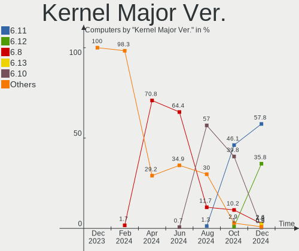
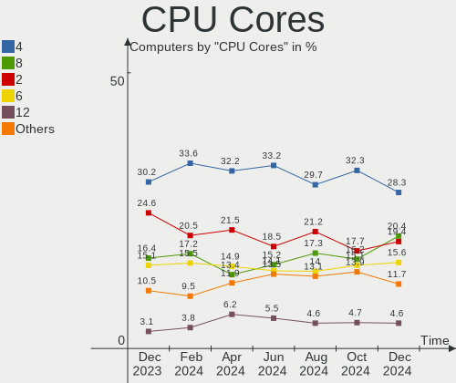
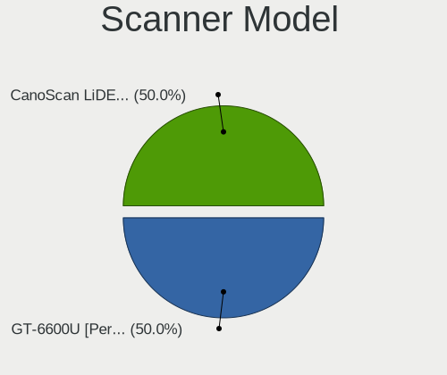
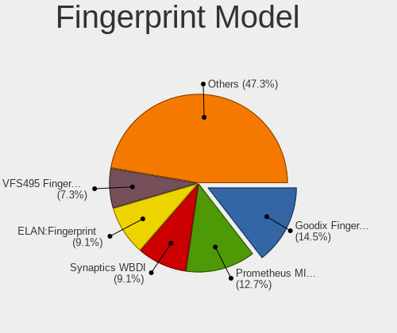

Fedora - Hardware Trends
------------------------

A project to identify most popular hardware characteristics and track their change
over time based on data collected by Linux users at https://Linux-Hardware.org.

Anyone can contribute to this report by the [hw-probe](https://github.com/linuxhw/hw-probe) tool:

    sudo -E hw-probe -all -upload

This is a report for all computer types. See also reports for [desktops](/Dist/Fedora/Desktop/README.md) and [notebooks](/Dist/Fedora/Notebook/README.md).

This report is for one last month. Overall report since the beginning of time: [TestCoverage](https://github.com/linuxhw/TestCoverage)

Period: Aug, 2022.

Contents
--------

* [ System ](#system)
  - [ OS                       ](#os)
  - [ OS Family                ](#os-family)
  - [ Kernel                   ](#kernel)
  - [ Kernel Family            ](#kernel-family)
  - [ Kernel Major Ver.        ](#kernel-major-ver)
  - [ Arch                     ](#arch)
  - [ DE                       ](#de)
  - [ Display Server           ](#display-server)
  - [ Display Manager          ](#display-manager)
  - [ OS Lang                  ](#os-lang)
  - [ Boot Mode                ](#boot-mode)
  - [ Filesystem               ](#filesystem)
  - [ Part. scheme             ](#part-scheme)
  - [ Dual Boot with Linux/BSD ](#dual-boot-with-linuxbsd)
  - [ Dual Boot (Win)          ](#dual-boot-win)

* [ Board ](#board)
  - [ Vendor                   ](#vendor)
  - [ Model                    ](#model)
  - [ Model Family             ](#model-family)
  - [ MFG Year                 ](#mfg-year)
  - [ Form Factor              ](#form-factor)
  - [ Secure Boot              ](#secure-boot)
  - [ Coreboot                 ](#coreboot)
  - [ RAM Size                 ](#ram-size)
  - [ RAM Used                 ](#ram-used)
  - [ Total Drives             ](#total-drives)
  - [ Has CD-ROM               ](#has-cd-rom)
  - [ Has Ethernet             ](#has-ethernet)
  - [ Has WiFi                 ](#has-wifi)
  - [ Has Bluetooth            ](#has-bluetooth)

* [ Location ](#location)
  - [ Country                  ](#country)
  - [ City                     ](#city)

* [ Drives ](#drives)
  - [ Drive Vendor             ](#drive-vendor)
  - [ Drive Model              ](#drive-model)
  - [ HDD Vendor               ](#hdd-vendor)
  - [ SSD Vendor               ](#ssd-vendor)
  - [ Drive Kind               ](#drive-kind)
  - [ Drive Connector          ](#drive-connector)
  - [ Drive Size               ](#drive-size)
  - [ Space Total              ](#space-total)
  - [ Space Used               ](#space-used)
  - [ Malfunc. Drives          ](#malfunc-drives)
  - [ Malfunc. Drive Vendor    ](#malfunc-drive-vendor)
  - [ Malfunc. HDD Vendor      ](#malfunc-hdd-vendor)
  - [ Malfunc. Drive Kind      ](#malfunc-drive-kind)
  - [ Failed Drives            ](#failed-drives)
  - [ Failed Drive Vendor      ](#failed-drive-vendor)
  - [ Drive Status             ](#drive-status)

* [ Storage controller ](#storage-controller)
  - [ Storage Vendor           ](#storage-vendor)
  - [ Storage Model            ](#storage-model)
  - [ Storage Kind             ](#storage-kind)

* [ Processor ](#processor)
  - [ CPU Vendor               ](#cpu-vendor)
  - [ CPU Model                ](#cpu-model)
  - [ CPU Model Family         ](#cpu-model-family)
  - [ CPU Cores                ](#cpu-cores)
  - [ CPU Sockets              ](#cpu-sockets)
  - [ CPU Threads              ](#cpu-threads)
  - [ CPU Op-Modes             ](#cpu-op-modes)
  - [ CPU Microcode            ](#cpu-microcode)
  - [ CPU Microarch            ](#cpu-microarch)

* [ Graphics ](#graphics)
  - [ GPU Vendor               ](#gpu-vendor)
  - [ GPU Model                ](#gpu-model)
  - [ GPU Combo                ](#gpu-combo)
  - [ GPU Driver               ](#gpu-driver)
  - [ GPU Memory               ](#gpu-memory)

* [ Monitor ](#monitor)
  - [ Monitor Vendor           ](#monitor-vendor)
  - [ Monitor Model            ](#monitor-model)
  - [ Monitor Resolution       ](#monitor-resolution)
  - [ Monitor Diagonal         ](#monitor-diagonal)
  - [ Monitor Width            ](#monitor-width)
  - [ Aspect Ratio             ](#aspect-ratio)
  - [ Monitor Area             ](#monitor-area)
  - [ Pixel Density            ](#pixel-density)
  - [ Multiple Monitors        ](#multiple-monitors)

* [ Network ](#network)
  - [ Net Controller Vendor    ](#net-controller-vendor)
  - [ Net Controller Model     ](#net-controller-model)
  - [ Wireless Vendor          ](#wireless-vendor)
  - [ Wireless Model           ](#wireless-model)
  - [ Ethernet Vendor          ](#ethernet-vendor)
  - [ Ethernet Model           ](#ethernet-model)
  - [ Net Controller Kind      ](#net-controller-kind)
  - [ Used Controller          ](#used-controller)
  - [ NICs                     ](#nics)
  - [ IPv6                     ](#ipv6)

* [ Bluetooth ](#bluetooth)
  - [ Bluetooth Vendor         ](#bluetooth-vendor)
  - [ Bluetooth Model          ](#bluetooth-model)

* [ Sound ](#sound)
  - [ Sound Vendor             ](#sound-vendor)
  - [ Sound Model              ](#sound-model)

* [ Memory ](#memory)
  - [ Memory Vendor            ](#memory-vendor)
  - [ Memory Model             ](#memory-model)
  - [ Memory Kind              ](#memory-kind)
  - [ Memory Form Factor       ](#memory-form-factor)
  - [ Memory Size              ](#memory-size)
  - [ Memory Speed             ](#memory-speed)

* [ Printers & scanners ](#printers--scanners)
  - [ Printer Vendor           ](#printer-vendor)
  - [ Printer Model            ](#printer-model)
  - [ Scanner Vendor           ](#scanner-vendor)
  - [ Scanner Model            ](#scanner-model)

* [ Camera ](#camera)
  - [ Camera Vendor            ](#camera-vendor)
  - [ Camera Model             ](#camera-model)

* [ Security ](#security)
  - [ Fingerprint Vendor       ](#fingerprint-vendor)
  - [ Fingerprint Model        ](#fingerprint-model)
  - [ Chipcard Vendor          ](#chipcard-vendor)
  - [ Chipcard Model           ](#chipcard-model)

* [ Unsupported ](#unsupported)
  - [ Unsupported Devices      ](#unsupported-devices)
  - [ Unsupported Device Types ](#unsupported-device-types)

System
------

OS
--

Installed operating systems

| Name      | Computers | Percent |
|-----------|-----------|---------|
| Fedora 36 | 339       | 92.37%  |
| Fedora 35 | 18        | 4.9%    |
| Fedora 37 | 4         | 1.09%   |
| Fedora 34 | 3         | 0.82%   |
| Fedora 33 | 2         | 0.54%   |
| Fedora 30 | 1         | 0.27%   |

OS Family
---------

OS without a version

| Name   | Computers | Percent |
|--------|-----------|---------|
| Fedora | 367       | 100%    |

Kernel
------

Version of the Linux kernel

| Version                           | Computers | Percent |
|-----------------------------------|-----------|---------|
| 5.18.16-200.fc36.x86_64           | 84        | 22.89%  |
| 5.18.13-200.fc36.x86_64           | 50        | 13.62%  |
| 5.18.17-200.fc36.x86_64           | 48        | 13.08%  |
| 5.18.18-200.fc36.x86_64           | 44        | 11.99%  |
| 5.18.19-200.fc36.x86_64           | 36        | 9.81%   |
| 5.17.5-300.fc36.x86_64            | 18        | 4.9%    |
| 5.19.4-200.fc36.x86_64            | 16        | 4.36%   |
| 5.18.15-200.fc36.x86_64           | 15        | 4.09%   |
| 5.18.11-200.fc36.x86_64           | 5         | 1.36%   |
| 5.18.11-100.fc35.x86_64           | 3         | 0.82%   |
| 5.17.12-100.fc34.x86_64           | 3         | 0.82%   |
| 5.19.2-300.fc36.x86_64            | 2         | 0.54%   |
| 5.19.0-xm2.0.fc36.x86_64          | 2         | 0.54%   |
| 5.19.0-65.fc37.x86_64             | 2         | 0.54%   |
| 5.18.5-200.fc36.x86_64            | 2         | 0.54%   |
| 5.18.18-100.fc35.x86_64           | 2         | 0.54%   |
| 5.18.16-100.fc35.x86_64           | 2         | 0.54%   |
| 5.18.13-100.fc35.x86_64           | 2         | 0.54%   |
| 5.18.10-200.fc36.x86_64           | 2         | 0.54%   |
| 5.14.18-100.fc33.x86_64           | 2         | 0.54%   |
| 5.6.13-100.fc30.x86_64            | 1         | 0.27%   |
| 5.19.4-300.fc37.x86_64            | 1         | 0.27%   |
| 5.19.4-250.vanilla.1.fc36.x86_64  | 1         | 0.27%   |
| 5.19.3-603.inttf.fc36.x86_64      | 1         | 0.27%   |
| 5.19.1-xm1.0e20220803.fc36.x86_64 | 1         | 0.27%   |
| 5.19.1-325.vanilla.1.fc36.x86_64  | 1         | 0.27%   |
| 5.19.1-300.fc36.x86_64            | 1         | 0.27%   |
| 5.19.0-xm2.0.fc37.x86_64          | 1         | 0.27%   |
| 5.19.0-xm1.0e20220803.fc36.x86_64 | 1         | 0.27%   |
| 5.18.9-200.fc36.x86_64            | 1         | 0.27%   |
| 5.18.7-200.fc36.x86_64            | 1         | 0.27%   |
| 5.18.19-100.fc35.x86_64           | 1         | 0.27%   |
| 5.18.18-201.fsync.fc36.x86_64     | 1         | 0.27%   |
| 5.18.18-200.rog.fc36.x86_64       | 1         | 0.27%   |
| 5.18.18-200.local.fc36.x86_64     | 1         | 0.27%   |
| 5.18.17-100.fc35.x86_64           | 1         | 0.27%   |
| 5.18.16-602.inttf.fc36.x86_64     | 1         | 0.27%   |
| 5.18.10-100.fc35.x86_64           | 1         | 0.27%   |
| 5.17.8-300.fc36.x86_64            | 1         | 0.27%   |
| 5.17.8-200.fc35.x86_64            | 1         | 0.27%   |
| 5.17.13-200.fc35.x86_64           | 1         | 0.27%   |
| 5.17.11-300.fc36.x86_64           | 1         | 0.27%   |
| 5.16.18-200.fc35.x86_64           | 1         | 0.27%   |
| 5.16.16-200.fc35.x86_64           | 1         | 0.27%   |
| 5.16.15-201.fc35.x86_64           | 1         | 0.27%   |
| 5.16.11-200.fc35.x86_64           | 1         | 0.27%   |
| 5.11.12-300.fc34.x86_64           | 1         | 0.27%   |

Kernel Family
-------------

Linux kernel without a distro release

| Version | Computers | Percent |
|---------|-----------|---------|
| 5.18.16 | 87        | 23.71%  |
| 5.18.13 | 52        | 14.17%  |
| 5.18.18 | 49        | 13.35%  |
| 5.18.17 | 49        | 13.35%  |
| 5.18.19 | 37        | 10.08%  |
| 5.19.4  | 18        | 4.9%    |
| 5.17.5  | 18        | 4.9%    |
| 5.18.15 | 15        | 4.09%   |
| 5.18.11 | 8         | 2.18%   |
| 5.19.0  | 6         | 1.63%   |
| 5.19.1  | 3         | 0.82%   |
| 5.18.10 | 3         | 0.82%   |
| 5.17.12 | 3         | 0.82%   |
| 5.19.2  | 2         | 0.54%   |
| 5.18.5  | 2         | 0.54%   |
| 5.17.8  | 2         | 0.54%   |
| 5.14.18 | 2         | 0.54%   |
| 5.6.13  | 1         | 0.27%   |
| 5.19.3  | 1         | 0.27%   |
| 5.18.9  | 1         | 0.27%   |
| 5.18.7  | 1         | 0.27%   |
| 5.17.13 | 1         | 0.27%   |
| 5.17.11 | 1         | 0.27%   |
| 5.16.18 | 1         | 0.27%   |
| 5.16.16 | 1         | 0.27%   |
| 5.16.15 | 1         | 0.27%   |
| 5.16.11 | 1         | 0.27%   |
| 5.11.12 | 1         | 0.27%   |

Kernel Major Ver.
-----------------

Linux kernel major version

| Version | Computers | Percent |
|---------|-----------|---------|
| 5.18    | 304       | 82.83%  |
| 5.19    | 30        | 8.17%   |
| 5.17    | 25        | 6.81%   |
| 5.16    | 4         | 1.09%   |
| 5.14    | 2         | 0.54%   |
| 5.6     | 1         | 0.27%   |
| 5.11    | 1         | 0.27%   |

Arch
----

OS architecture (x86_64, i586, etc.)

| Name   | Computers | Percent |
|--------|-----------|---------|
| x86_64 | 367       | 100%    |

DE
--

Desktop Environment

| Name          | Computers | Percent |
|---------------|-----------|---------|
| GNOME         | 270       | 73.57%  |
| KDE5          | 63        | 17.17%  |
| Unknown       | 7         | 1.91%   |
| XFCE          | 6         | 1.63%   |
| Cinnamon      | 6         | 1.63%   |
| X-Cinnamon    | 5         | 1.36%   |
| MATE          | 2         | 0.54%   |
| LXQt          | 2         | 0.54%   |
| i3            | 2         | 0.54%   |
| sway          | 1         | 0.27%   |
| GNOME Classic | 1         | 0.27%   |
| bspwm         | 1         | 0.27%   |
| awesome       | 1         | 0.27%   |

Display Server
--------------

X11 or Wayland

| Name    | Computers | Percent |
|---------|-----------|---------|
| Wayland | 248       | 67.57%  |
| X11     | 104       | 28.34%  |
| Tty     | 12        | 3.27%   |
| Unknown | 3         | 0.82%   |

Display Manager
---------------

SDDM, LightDM, etc.

| Name    | Computers | Percent |
|---------|-----------|---------|
| Unknown | 198       | 53.95%  |
| GDM     | 114       | 31.06%  |
| SDDM    | 32        | 8.72%   |
| LightDM | 23        | 6.27%   |

OS Lang
-------

Language

| Lang    | Computers | Percent |
|---------|-----------|---------|
| en_US   | 204       | 55.59%  |
| en_GB   | 24        | 6.54%   |
| ru_RU   | 20        | 5.45%   |
| de_DE   | 16        | 4.36%   |
| en_AU   | 13        | 3.54%   |
| pt_BR   | 12        | 3.27%   |
| fr_FR   | 9         | 2.45%   |
| pl_PL   | 5         | 1.36%   |
| it_IT   | 5         | 1.36%   |
| en_NZ   | 5         | 1.36%   |
| en_CA   | 5         | 1.36%   |
| nl_NL   | 4         | 1.09%   |
| nl_BE   | 4         | 1.09%   |
| es_MX   | 4         | 1.09%   |
| es_ES   | 3         | 0.82%   |
| en_ZA   | 3         | 0.82%   |
| en_IN   | 3         | 0.82%   |
| tr_TR   | 2         | 0.54%   |
| sv_SE   | 2         | 0.54%   |
| pt_PT   | 2         | 0.54%   |
| hu_HU   | 2         | 0.54%   |
| es_CO   | 2         | 0.54%   |
| cs_CZ   | 2         | 0.54%   |
| zh_CN   | 1         | 0.27%   |
| ru_UA   | 1         | 0.27%   |
| ro_RO   | 1         | 0.27%   |
| ga_IE   | 1         | 0.27%   |
| fr_BE   | 1         | 0.27%   |
| es_GT   | 1         | 0.27%   |
| es_CR   | 1         | 0.27%   |
| es_BO   | 1         | 0.27%   |
| es_AR   | 1         | 0.27%   |
| en_SG   | 1         | 0.27%   |
| en_PH   | 1         | 0.27%   |
| Default | 1         | 0.27%   |
| da_DK   | 1         | 0.27%   |
| ca_ES   | 1         | 0.27%   |
| ar_SA   | 1         | 0.27%   |
| Unknown | 1         | 0.27%   |

Boot Mode
---------

EFI or BIOS

| Mode | Computers | Percent |
|------|-----------|---------|
| EFI  | 283       | 77.11%  |
| BIOS | 84        | 22.89%  |

Filesystem
----------

Type of filesystem

| Type  | Computers | Percent |
|-------|-----------|---------|
| Btrfs | 294       | 80.11%  |
| Ext4  | 68        | 18.53%  |
| Xfs   | 5         | 1.36%   |

Part. scheme
------------

Scheme of partitioning

| Type    | Computers | Percent |
|---------|-----------|---------|
| Unknown | 198       | 53.95%  |
| GPT     | 152       | 41.42%  |
| MBR     | 17        | 4.63%   |

Dual Boot with Linux/BSD
------------------------

Hosting more than one Linux/BSD

| Dual boot | Computers | Percent |
|-----------|-----------|---------|
| No        | 332       | 90.46%  |
| Yes       | 35        | 9.54%   |

Dual Boot (Win)
---------------

Hosting Linux and Windows

| Dual boot | Computers | Percent |
|-----------|-----------|---------|
| No        | 282       | 76.84%  |
| Yes       | 85        | 23.16%  |

Board
-----

Vendor
------

Motherboard manufacturer

| Name                   | Computers | Percent |
|------------------------|-----------|---------|
| Lenovo                 | 68        | 18.53%  |
| Hewlett-Packard        | 56        | 15.26%  |
| ASUSTek Computer       | 55        | 14.99%  |
| Dell                   | 40        | 10.9%   |
| Gigabyte Technology    | 30        | 8.17%   |
| MSI                    | 27        | 7.36%   |
| Acer                   | 19        | 5.18%   |
| ASRock                 | 14        | 3.81%   |
| Apple                  | 8         | 2.18%   |
| HUAWEI                 | 5         | 1.36%   |
| Toshiba                | 3         | 0.82%   |
| Microsoft              | 3         | 0.82%   |
| Timi                   | 2         | 0.54%   |
| Sony                   | 2         | 0.54%   |
| Samsung Electronics    | 2         | 0.54%   |
| Notebook               | 2         | 0.54%   |
| Intel                  | 2         | 0.54%   |
| HONOR                  | 2         | 0.54%   |
| Gateway                | 2         | 0.54%   |
| UNOWHY                 | 1         | 0.27%   |
| Supermicro             | 1         | 0.27%   |
| Quanta                 | 1         | 0.27%   |
| Panasonic              | 1         | 0.27%   |
| MACHINIST              | 1         | 0.27%   |
| LG Electronics         | 1         | 0.27%   |
| Itautec                | 1         | 0.27%   |
| Infinix                | 1         | 0.27%   |
| Huanan                 | 1         | 0.27%   |
| GPU Company            | 1         | 0.27%   |
| Google                 | 1         | 0.27%   |
| Fujitsu                | 1         | 0.27%   |
| Foxconn                | 1         | 0.27%   |
| Exo                    | 1         | 0.27%   |
| Eluktronics            | 1         | 0.27%   |
| ECS                    | 1         | 0.27%   |
| Chuwi                  | 1         | 0.27%   |
| BESSTAR Tech           | 1         | 0.27%   |
| AZW                    | 1         | 0.27%   |
| AXDIA International    | 1         | 0.27%   |
| Avell High Performance | 1         | 0.27%   |
| Aquarius               | 1         | 0.27%   |
| Alienware              | 1         | 0.27%   |
| Acidanthera            | 1         | 0.27%   |
| Unknown                | 1         | 0.27%   |

Model
-----

Motherboard model

| Name                                                                                     | Computers | Percent |
|------------------------------------------------------------------------------------------|-----------|---------|
| ASUS All Series                                                                          | 6         | 1.63%   |
| MSI MS-7C37                                                                              | 2         | 0.54%   |
| MSI Modern 14 A10RAS                                                                     | 2         | 0.54%   |
| Lenovo IdeaPad S340-14API 81NB                                                           | 2         | 0.54%   |
| Lenovo IdeaPad 3 15ITL6 82H8                                                             | 2         | 0.54%   |
| HP EliteBook 8460p                                                                       | 2         | 0.54%   |
| Gigabyte GA-78LMT-USB3 6.0                                                               | 2         | 0.54%   |
| Gigabyte B550M DS3H                                                                      | 2         | 0.54%   |
| Dell XPS 8940                                                                            | 2         | 0.54%   |
| Dell XPS 13 7390                                                                         | 2         | 0.54%   |
| ASUS TUF Gaming X570-PLUS                                                                | 2         | 0.54%   |
| ASUS TUF Gaming B550-PLUS                                                                | 2         | 0.54%   |
| Apple MacBookPro5,5                                                                      | 2         | 0.54%   |
| UNOWHY Y13G010S4EI                                                                       | 1         | 0.27%   |
| Toshiba TECRA R940                                                                       | 1         | 0.27%   |
| Toshiba Satellite Pro L300D                                                              | 1         | 0.27%   |
| Toshiba Satellite C55-C                                                                  | 1         | 0.27%   |
| Timi TM1701                                                                              | 1         | 0.27%   |
| Timi Redmi Book Pro 15 2022                                                              | 1         | 0.27%   |
| Supermicro X9DRD-7LN4F(-JBOD)/X9DRD-EF                                                   | 1         | 0.27%   |
| Sony VPCS131FM                                                                           | 1         | 0.27%   |
| Sony SVT15115CXS                                                                         | 1         | 0.27%   |
| Samsung 355V4C/356V4C/3445VC/3545VC                                                      | 1         | 0.27%   |
| Samsung 355V4C/355V4X/355V5C/355V5X/356V4C/356V4X/356V5C/356V5X/3445VC/3445VX/3545VC/354 | 1         | 0.27%   |
| Quanta Pro 3420 AiO PC                                                                   | 1         | 0.27%   |
| Panasonic CFMX4-1                                                                        | 1         | 0.27%   |
| Notebook NS50_70MU                                                                       | 1         | 0.27%   |
| Notebook N15_17RD                                                                        | 1         | 0.27%   |
| MSI Prestige 15 A10SC                                                                    | 1         | 0.27%   |
| MSI Prestige 14Evo A11MO                                                                 | 1         | 0.27%   |
| MSI MS-7D54                                                                              | 1         | 0.27%   |
| MSI MS-7D22                                                                              | 1         | 0.27%   |
| MSI MS-7C92                                                                              | 1         | 0.27%   |
| MSI MS-7C82                                                                              | 1         | 0.27%   |
| MSI MS-7C04                                                                              | 1         | 0.27%   |
| MSI MS-7B85                                                                              | 1         | 0.27%   |
| MSI MS-7B51                                                                              | 1         | 0.27%   |
| MSI MS-7B47                                                                              | 1         | 0.27%   |
| MSI MS-7A33                                                                              | 1         | 0.27%   |
| MSI MS-7A12                                                                              | 1         | 0.27%   |
| MSI MS-7917                                                                              | 1         | 0.27%   |
| MSI MS-7885                                                                              | 1         | 0.27%   |
| MSI MS-7821                                                                              | 1         | 0.27%   |
| MSI MS-7817                                                                              | 1         | 0.27%   |
| MSI MS-7758                                                                              | 1         | 0.27%   |
| MSI MS-7693                                                                              | 1         | 0.27%   |
| MSI MS-16F1                                                                              | 1         | 0.27%   |
| MSI Modern 14 B11SBL                                                                     | 1         | 0.27%   |
| MSI Modern 14 A10M                                                                       | 1         | 0.27%   |
| MSI GT72S 6QE                                                                            | 1         | 0.27%   |
| MSI Delta 15 A5EFK                                                                       | 1         | 0.27%   |
| Microsoft Surface Pro 7                                                                  | 1         | 0.27%   |
| Microsoft Surface Pro 4                                                                  | 1         | 0.27%   |
| Microsoft Surface Pro 3                                                                  | 1         | 0.27%   |
| MACHINIST X99-RS9 V2.0                                                                   | 1         | 0.27%   |
| LG 14Z990-V.AR52A2                                                                       | 1         | 0.27%   |
| Lenovo Z40-70 20366                                                                      | 1         | 0.27%   |
| Lenovo Yoga Slim 7 ProX 14ARH7 82TL                                                      | 1         | 0.27%   |
| Lenovo Yoga Slim 7 Pro 14IHU5 82NC                                                       | 1         | 0.27%   |
| Lenovo Yoga C940-14IIL 81Q9                                                              | 1         | 0.27%   |

Model Family
------------

Motherboard model prefix

| Name                          | Computers | Percent |
|-------------------------------|-----------|---------|
| Lenovo ThinkPad               | 22        | 5.99%   |
| Lenovo IdeaPad                | 18        | 4.9%    |
| ASUS ROG                      | 15        | 4.09%   |
| Dell Inspiron                 | 14        | 3.81%   |
| HP Pavilion                   | 11        | 3%      |
| Acer Aspire                   | 10        | 2.72%   |
| HP ENVY                       | 9         | 2.45%   |
| HP ProBook                    | 8         | 2.18%   |
| HP Laptop                     | 8         | 2.18%   |
| Dell XPS                      | 8         | 2.18%   |
| Dell Latitude                 | 8         | 2.18%   |
| ASUS TUF                      | 7         | 1.91%   |
| Lenovo ThinkCentre            | 6         | 1.63%   |
| ASUS VivoBook                 | 6         | 1.63%   |
| ASUS All                      | 6         | 1.63%   |
| Lenovo Yoga                   | 5         | 1.36%   |
| Lenovo Legion                 | 5         | 1.36%   |
| Dell Precision                | 5         | 1.36%   |
| MSI Modern                    | 4         | 1.09%   |
| Lenovo ThinkBook              | 4         | 1.09%   |
| HP EliteBook                  | 4         | 1.09%   |
| Microsoft Surface             | 3         | 0.82%   |
| Gigabyte B550M                | 3         | 0.82%   |
| Acer Spin                     | 3         | 0.82%   |
| Toshiba Satellite             | 2         | 0.54%   |
| Samsung 355V4C                | 2         | 0.54%   |
| MSI Prestige                  | 2         | 0.54%   |
| MSI MS-7C37                   | 2         | 0.54%   |
| Lenovo IdeaPadFlex            | 2         | 0.54%   |
| HP ZBook                      | 2         | 0.54%   |
| Gigabyte X570                 | 2         | 0.54%   |
| Gigabyte GA-78LMT-USB3        | 2         | 0.54%   |
| Gigabyte B550                 | 2         | 0.54%   |
| Dell OptiPlex                 | 2         | 0.54%   |
| Dell G3                       | 2         | 0.54%   |
| ASUS Zephyrus                 | 2         | 0.54%   |
| ASUS PRIME                    | 2         | 0.54%   |
| ASUS P8H77-V                  | 2         | 0.54%   |
| ASRock B450M                  | 2         | 0.54%   |
| Apple MacBookPro5             | 2         | 0.54%   |
| Acer One                      | 2         | 0.54%   |
| UNOWHY Y13G010S4EI            | 1         | 0.27%   |
| Toshiba TECRA                 | 1         | 0.27%   |
| Timi TM1701                   | 1         | 0.27%   |
| Timi Redmi                    | 1         | 0.27%   |
| Supermicro X9DRD-7LN4F(-JBOD) | 1         | 0.27%   |
| Sony VPCS131FM                | 1         | 0.27%   |
| Sony SVT15115CXS              | 1         | 0.27%   |
| Quanta Pro                    | 1         | 0.27%   |
| Panasonic CFMX4-1             | 1         | 0.27%   |
| Notebook NS50                 | 1         | 0.27%   |
| Notebook N15                  | 1         | 0.27%   |
| MSI MS-7D54                   | 1         | 0.27%   |
| MSI MS-7D22                   | 1         | 0.27%   |
| MSI MS-7C92                   | 1         | 0.27%   |
| MSI MS-7C82                   | 1         | 0.27%   |
| MSI MS-7C04                   | 1         | 0.27%   |
| MSI MS-7B85                   | 1         | 0.27%   |
| MSI MS-7B51                   | 1         | 0.27%   |
| MSI MS-7B47                   | 1         | 0.27%   |

MFG Year
--------

Motherboard manufacture year

| Year | Computers | Percent |
|------|-----------|---------|
| 2021 | 60        | 16.35%  |
| 2020 | 54        | 14.71%  |
| 2019 | 41        | 11.17%  |
| 2018 | 32        | 8.72%   |
| 2014 | 26        | 7.08%   |
| 2012 | 25        | 6.81%   |
| 2017 | 23        | 6.27%   |
| 2022 | 20        | 5.45%   |
| 2015 | 18        | 4.9%    |
| 2016 | 17        | 4.63%   |
| 2013 | 17        | 4.63%   |
| 2011 | 12        | 3.27%   |
| 2010 | 9         | 2.45%   |
| 2009 | 5         | 1.36%   |
| 2008 | 5         | 1.36%   |
| 2007 | 2         | 0.54%   |
| 2006 | 1         | 0.27%   |

Form Factor
-----------

Physical design of the computer

| Name        | Computers | Percent |
|-------------|-----------|---------|
| Notebook    | 211       | 57.49%  |
| Desktop     | 115       | 31.34%  |
| Convertible | 27        | 7.36%   |
| Tablet      | 7         | 1.91%   |
| Mini pc     | 5         | 1.36%   |
| All in one  | 1         | 0.27%   |
| Server      | 1         | 0.27%   |

Secure Boot
-----------

Enabled or disabled

| State    | Computers | Percent |
|----------|-----------|---------|
| Disabled | 300       | 81.74%  |
| Enabled  | 67        | 18.26%  |

Coreboot
--------

Have coreboot on board

| Used | Computers | Percent |
|------|-----------|---------|
| No   | 364       | 99.18%  |
| Yes  | 3         | 0.82%   |

RAM Size
--------

Total RAM memory

| Size in GB  | Computers | Percent |
|-------------|-----------|---------|
| 4.01-8.0    | 96        | 26.16%  |
| 16.01-24.0  | 92        | 25.07%  |
| 8.01-16.0   | 64        | 17.44%  |
| 32.01-64.0  | 59        | 16.08%  |
| 3.01-4.0    | 29        | 7.9%    |
| 64.01-256.0 | 11        | 3%      |
| 1.01-2.0    | 10        | 2.72%   |
| 24.01-32.0  | 6         | 1.63%   |

RAM Used
--------

Used RAM memory

| Used GB    | Computers | Percent |
|------------|-----------|---------|
| 4.01-8.0   | 105       | 28.61%  |
| 3.01-4.0   | 86        | 23.43%  |
| 2.01-3.0   | 86        | 23.43%  |
| 1.01-2.0   | 47        | 12.81%  |
| 8.01-16.0  | 35        | 9.54%   |
| 16.01-24.0 | 3         | 0.82%   |
| 0.51-1.0   | 3         | 0.82%   |
| 32.01-64.0 | 1         | 0.27%   |
| 24.01-32.0 | 1         | 0.27%   |

Total Drives
------------

Number of drives on board

| Drives | Computers | Percent |
|--------|-----------|---------|
| 1      | 217       | 59.13%  |
| 2      | 98        | 26.7%   |
| 3      | 23        | 6.27%   |
| 4      | 16        | 4.36%   |
| 6      | 7         | 1.91%   |
| 5      | 5         | 1.36%   |
| 9      | 1         | 0.27%   |

Has CD-ROM
----------

Has CD-ROM on board

| Presented | Computers | Percent |
|-----------|-----------|---------|
| No        | 275       | 74.93%  |
| Yes       | 92        | 25.07%  |

Has Ethernet
------------

Has Ethernet on board

| Presented | Computers | Percent |
|-----------|-----------|---------|
| Yes       | 271       | 73.84%  |
| No        | 96        | 26.16%  |

Has WiFi
--------

Has WiFi module

| Presented | Computers | Percent |
|-----------|-----------|---------|
| Yes       | 308       | 83.92%  |
| No        | 59        | 16.08%  |

Has Bluetooth
-------------

Has Bluetooth module

| Presented | Computers | Percent |
|-----------|-----------|---------|
| Yes       | 268       | 73.02%  |
| No        | 99        | 26.98%  |

Location
--------

Country
-------

Geographic location (country)

| Country            | Computers | Percent |
|--------------------|-----------|---------|
| USA                | 85        | 23.16%  |
| Russia             | 28        | 7.63%   |
| Germany            | 24        | 6.54%   |
| Brazil             | 16        | 4.36%   |
| Australia          | 14        | 3.81%   |
| Netherlands        | 12        | 3.27%   |
| UK                 | 11        | 3%      |
| Italy              | 11        | 3%      |
| India              | 10        | 2.72%   |
| France             | 10        | 2.72%   |
| Canada             | 9         | 2.45%   |
| Turkey             | 8         | 2.18%   |
| Poland             | 8         | 2.18%   |
| Mexico             | 8         | 2.18%   |
| Belgium            | 8         | 2.18%   |
| Argentina          | 8         | 2.18%   |
| Sweden             | 5         | 1.36%   |
| Spain              | 5         | 1.36%   |
| New Zealand        | 5         | 1.36%   |
| Indonesia          | 5         | 1.36%   |
| Belarus            | 5         | 1.36%   |
| Hungary            | 4         | 1.09%   |
| Costa Rica         | 4         | 1.09%   |
| South Africa       | 3         | 0.82%   |
| Romania            | 3         | 0.82%   |
| Portugal           | 3         | 0.82%   |
| Norway             | 3         | 0.82%   |
| Ireland            | 3         | 0.82%   |
| Guatemala          | 3         | 0.82%   |
| Denmark            | 3         | 0.82%   |
| Colombia           | 3         | 0.82%   |
| Uruguay            | 2         | 0.54%   |
| Pakistan           | 2         | 0.54%   |
| Lebanon            | 2         | 0.54%   |
| Kenya              | 2         | 0.54%   |
| Egypt              | 2         | 0.54%   |
| Czechia            | 2         | 0.54%   |
| Austria            | 2         | 0.54%   |
| Uzbekistan         | 1         | 0.27%   |
| Ukraine            | 1         | 0.27%   |
| Taiwan             | 1         | 0.27%   |
| Switzerland        | 1         | 0.27%   |
| South Korea        | 1         | 0.27%   |
| Slovakia           | 1         | 0.27%   |
| Saudi Arabia       | 1         | 0.27%   |
| Philippines        | 1         | 0.27%   |
| Nigeria            | 1         | 0.27%   |
| Morocco            | 1         | 0.27%   |
| Moldova            | 1         | 0.27%   |
| Mauritania         | 1         | 0.27%   |
| Malaysia           | 1         | 0.27%   |
| Lithuania          | 1         | 0.27%   |
| Japan              | 1         | 0.27%   |
| Israel             | 1         | 0.27%   |
| Iran               | 1         | 0.27%   |
| Hong Kong          | 1         | 0.27%   |
| Ghana              | 1         | 0.27%   |
| Finland            | 1         | 0.27%   |
| Dominican Republic | 1         | 0.27%   |
| China              | 1         | 0.27%   |

City
----

Geographic location (city)

| City           | Computers | Percent |
|----------------|-----------|---------|
| Moscow         | 8         | 2.18%   |
| Antwerp        | 5         | 1.36%   |
| New York       | 4         | 1.09%   |
| Minsk          | 4         | 1.09%   |
| Brisbane       | 4         | 1.09%   |
| Berlin         | 4         | 1.09%   |
| Auckland       | 4         | 1.09%   |
| Warsaw         | 3         | 0.82%   |
| Sydney         | 3         | 0.82%   |
| Surabaya       | 3         | 0.82%   |
| San Jose       | 3         | 0.82%   |
| Portland       | 3         | 0.82%   |
| Mexico City    | 3         | 0.82%   |
| Kansas City    | 3         | 0.82%   |
| Istanbul       | 3         | 0.82%   |
| Guatemala City | 3         | 0.82%   |
| Dallas         | 3         | 0.82%   |
| Copenhagen     | 3         | 0.82%   |
| Chicago        | 3         | 0.82%   |
| Buenos Aires   | 3         | 0.82%   |
| Yekaterinburg  | 2         | 0.54%   |
| St Petersburg  | 2         | 0.54%   |
| Salisbury      | 2         | 0.54%   |
| Rome           | 2         | 0.54%   |
| Petrozavodsk   | 2         | 0.54%   |
| Nairobi        | 2         | 0.54%   |
| Mundelein      | 2         | 0.54%   |
| Montevideo     | 2         | 0.54%   |
| Milton         | 2         | 0.54%   |
| Melbourne      | 2         | 0.54%   |
| Magdeburg      | 2         | 0.54%   |
| Lane Cove      | 2         | 0.54%   |
| Lages          | 2         | 0.54%   |
| Kristiansand   | 2         | 0.54%   |
| Escazu         | 2         | 0.54%   |
| Dublin         | 2         | 0.54%   |
| Charlotte      | 2         | 0.54%   |
| Bursa          | 2         | 0.54%   |
| Bristol        | 2         | 0.54%   |
| Bogotá        | 2         | 0.54%   |
| Bengaluru      | 2         | 0.54%   |
| Belo Horizonte | 2         | 0.54%   |
| Assen          | 2         | 0.54%   |
| Ashburn        | 2         | 0.54%   |
| Amsterdam      | 2         | 0.54%   |
| Zurich         | 1         | 0.27%   |
| Zary           | 1         | 0.27%   |
| Yerevan        | 1         | 0.27%   |
| Wuppertal      | 1         | 0.27%   |
| Worms          | 1         | 0.27%   |
| Wörgl         | 1         | 0.27%   |
| Woodstock      | 1         | 0.27%   |
| Winnipeg       | 1         | 0.27%   |
| Windsor        | 1         | 0.27%   |
| Wilhelmshaven  | 1         | 0.27%   |
| Whittier       | 1         | 0.27%   |
| Wexford        | 1         | 0.27%   |
| Vologda        | 1         | 0.27%   |
| Volgograd      | 1         | 0.27%   |
| Vitória       | 1         | 0.27%   |

Drives
------

Drive Vendor
------------

Hard drive vendors

| Vendor                    | Computers | Drives | Percent |
|---------------------------|-----------|--------|---------|
| Samsung Electronics       | 93        | 113    | 17.22%  |
| WDC                       | 81        | 99     | 15%     |
| Seagate                   | 62        | 85     | 11.48%  |
| SanDisk                   | 37        | 38     | 6.85%   |
| Kingston                  | 25        | 27     | 4.63%   |
| Unknown                   | 23        | 27     | 4.26%   |
| Crucial                   | 23        | 28     | 4.26%   |
| Toshiba                   | 18        | 18     | 3.33%   |
| SK hynix                  | 17        | 17     | 3.15%   |
| Micron Technology         | 15        | 15     | 2.78%   |
| Intel                     | 14        | 16     | 2.59%   |
| Hitachi                   | 12        | 13     | 2.22%   |
| Phison                    | 9         | 9      | 1.67%   |
| KIOXIA                    | 9         | 9      | 1.67%   |
| HGST                      | 8         | 8      | 1.48%   |
| Silicon Motion            | 6         | 6      | 1.11%   |
| A-DATA Technology         | 6         | 6      | 1.11%   |
| XPG                       | 5         | 6      | 0.93%   |
| PNY                       | 5         | 5      | 0.93%   |
| Micron/Crucial Technology | 5         | 5      | 0.93%   |
| Netac                     | 4         | 4      | 0.74%   |
| UMIS                      | 3         | 3      | 0.56%   |
| Transcend                 | 3         | 3      | 0.56%   |
| Patriot                   | 3         | 3      | 0.56%   |
| Apple                     | 3         | 4      | 0.56%   |
| Unknown                   | 3         | 3      | 0.56%   |
| Union Memory (Shenzhen)   | 2         | 2      | 0.37%   |
| Team                      | 2         | 2      | 0.37%   |
| SSSTC                     | 2         | 2      | 0.37%   |
| Plextor                   | 2         | 2      | 0.37%   |
| Phison Electronics        | 2         | 2      | 0.37%   |
| Maxtor                    | 2         | 2      | 0.37%   |
| LITEON                    | 2         | 2      | 0.37%   |
| KIOXIA-EXCERIA            | 2         | 2      | 0.37%   |
| Hewlett-Packard           | 2         | 2      | 0.37%   |
| GOODRAM                   | 2         | 2      | 0.37%   |
| Gigabyte Technology       | 2         | 2      | 0.37%   |
| XSTAR                     | 1         | 1      | 0.19%   |
| Win Memory                | 1         | 1      | 0.19%   |
| Verbatim                  | 1         | 1      | 0.19%   |
| StoreJet                  | 1         | 1      | 0.19%   |
| SPCC                      | 1         | 1      | 0.19%   |
| SABRENT                   | 1         | 1      | 0.19%   |
| RSH-339                   | 1         | 1      | 0.19%   |
| ROG                       | 1         | 1      | 0.19%   |
| OCZ                       | 1         | 2      | 0.19%   |
| Mushkin                   | 1         | 1      | 0.19%   |
| Lexar                     | 1         | 1      | 0.19%   |
| Leven                     | 1         | 1      | 0.19%   |
| Lenovo                    | 1         | 1      | 0.19%   |
| JMicron Technology        | 1         | 1      | 0.19%   |
| Intenso                   | 1         | 2      | 0.19%   |
| INTEL SS                  | 1         | 1      | 0.19%   |
| HS-SSD-E100               | 1         | 1      | 0.19%   |
| G-TECH                    | 1         | 1      | 0.19%   |
| G-DRIVE                   | 1         | 1      | 0.19%   |
| Fujitsu                   | 1         | 1      | 0.19%   |
| ELECOM                    | 1         | 1      | 0.19%   |
| China                     | 1         | 1      | 0.19%   |
| ASMT                      | 1         | 1      | 0.19%   |

Drive Model
-----------

Hard drive models

| Model                                   | Computers | Percent |
|-----------------------------------------|-----------|---------|
| Samsung NVMe SSD Drive 500GB            | 10        | 1.68%   |
| SanDisk NVMe SSD Drive 512GB            | 8         | 1.34%   |
| SanDisk NVMe SSD Drive 1TB              | 8         | 1.34%   |
| Samsung NVMe SSD Drive 256GB            | 8         | 1.34%   |
| Samsung NVMe SSD Drive 512GB            | 7         | 1.17%   |
| Samsung NVMe SSD Drive 1TB              | 7         | 1.17%   |
| Samsung SSD 850 EVO 500GB               | 6         | 1.01%   |
| Crucial CT1000MX500SSD1 1TB             | 6         | 1.01%   |
| WDC WDS500G2B0A-00SM50 500GB SSD        | 5         | 0.84%   |
| Seagate ST1000LM024 HN-M101MBB 1TB      | 5         | 0.84%   |
| Samsung SSD 860 EVO 500GB               | 5         | 0.84%   |
| Samsung NVMe SSD Drive 250GB            | 5         | 0.84%   |
| WDC WD10EZEX-08M2NA0 1TB                | 4         | 0.67%   |
| Seagate ST500DM002-1BD142 500GB         | 4         | 0.67%   |
| Seagate ST2000DM008-2FR102 2TB          | 4         | 0.67%   |
| Samsung SM963 2.5" NVMe PCIe SSD 1024GB | 4         | 0.67%   |
| Samsung NVMe SSD Drive 2TB              | 4         | 0.67%   |
| Micron NVMe SSD Drive 512GB             | 4         | 0.67%   |
| KIOXIA NVMe SSD Drive 512GB             | 4         | 0.67%   |
| Kingston SA400S37240G 240GB SSD         | 4         | 0.67%   |
| WDC WD40EZRZ-00GXCB0 4TB                | 3         | 0.5%    |
| WDC WD30EFRX-68EUZN0 3TB                | 3         | 0.5%    |
| WDC WD10JPVX-22JC3T0 1TB                | 3         | 0.5%    |
| Unknown MMC Card  64GB                  | 3         | 0.5%    |
| SK hynix NVMe SSD Drive 256GB           | 3         | 0.5%    |
| Silicon Motion NVMe SSD Drive 256GB     | 3         | 0.5%    |
| Seagate ST2000DM006-2DM164 2TB          | 3         | 0.5%    |
| Seagate ST1000LM035-1RK172 1TB          | 3         | 0.5%    |
| Seagate ST1000DM010-2EP102 1TB          | 3         | 0.5%    |
| Seagate Backup+ Hub BK 8TB              | 3         | 0.5%    |
| SanDisk NVMe SSD Drive 500GB            | 3         | 0.5%    |
| Phison NVMe SSD Drive 1TB               | 3         | 0.5%    |
| Micron/Crucial NVMe SSD Drive 1TB       | 3         | 0.5%    |
| Kingston SA400S37120G 120GB SSD         | 3         | 0.5%    |
| Intel SSDPEKNW512G8 512GB               | 3         | 0.5%    |
| HGST HTS725050A7E630 500GB              | 3         | 0.5%    |
| Crucial CT500MX500SSD1 500GB            | 3         | 0.5%    |
| Crucial CT250MX500SSD1 250GB            | 3         | 0.5%    |
| Unknown                                 | 3         | 0.5%    |
| XPG NVMe SSD Drive 256GB                | 2         | 0.34%   |
| WDC WDS500G2B0B-00YS70 500GB SSD        | 2         | 0.34%   |
| WDC WDBNCE0010PNC 1TB SSD               | 2         | 0.34%   |
| WDC WD10EZEX-00WN4A0 1TB                | 2         | 0.34%   |
| WDC PC SN730 SDBPNTY-1T00-1101 1TB      | 2         | 0.34%   |
| Unknown MMC Card  32GB                  | 2         | 0.34%   |
| Toshiba MK5061GSYN 500GB                | 2         | 0.34%   |
| Toshiba KBG30ZMV256G 256GB              | 2         | 0.34%   |
| Toshiba KBG30ZMS128G 128GB NVMe SSD     | 2         | 0.34%   |
| SK hynix NVMe SSD Drive 512GB           | 2         | 0.34%   |
| Silicon Motion NVMe SSD Drive 1024GB    | 2         | 0.34%   |
| Seagate ST9500325AS 500GB               | 2         | 0.34%   |
| Seagate ST500LT012-1DG142 500GB         | 2         | 0.34%   |
| Seagate ST500LM012 HN-M500MBB 500GB     | 2         | 0.34%   |
| Seagate ST500LM000-SSHD-8GB             | 2         | 0.34%   |
| Seagate ST3500418AS 500GB               | 2         | 0.34%   |
| Seagate ST31000528AS 1TB                | 2         | 0.34%   |
| Seagate ST3000DM008-2DM166 3TB          | 2         | 0.34%   |
| Seagate ST1000LM048-2E7172 1TB          | 2         | 0.34%   |
| Seagate BUP Portable 5TB                | 2         | 0.34%   |
| SanDisk X400 M.2 2280 128GB SSD         | 2         | 0.34%   |

HDD Vendor
----------

Hard disk drive vendors

| Vendor              | Computers | Drives | Percent |
|---------------------|-----------|--------|---------|
| Seagate             | 59        | 78     | 40.41%  |
| WDC                 | 50        | 64     | 34.25%  |
| Hitachi             | 12        | 13     | 8.22%   |
| Toshiba             | 8         | 8      | 5.48%   |
| HGST                | 8         | 8      | 5.48%   |
| Samsung Electronics | 3         | 4      | 2.05%   |
| SABRENT             | 1         | 1      | 0.68%   |
| RSH-339             | 1         | 1      | 0.68%   |
| Maxtor              | 1         | 1      | 0.68%   |
| Hewlett-Packard     | 1         | 1      | 0.68%   |
| Fujitsu             | 1         | 1      | 0.68%   |
| ASMT                | 1         | 1      | 0.68%   |

SSD Vendor
----------

Solid state drive vendors

| Vendor              | Computers | Drives | Percent |
|---------------------|-----------|--------|---------|
| Samsung Electronics | 30        | 31     | 18.63%  |
| Crucial             | 22        | 27     | 13.66%  |
| Kingston            | 19        | 19     | 11.8%   |
| WDC                 | 14        | 14     | 8.7%    |
| SanDisk             | 13        | 13     | 8.07%   |
| A-DATA Technology   | 6         | 6      | 3.73%   |
| PNY                 | 5         | 5      | 3.11%   |
| Netac               | 4         | 4      | 2.48%   |
| Transcend           | 3         | 3      | 1.86%   |
| SK hynix            | 3         | 3      | 1.86%   |
| Seagate             | 3         | 3      | 1.86%   |
| Patriot             | 3         | 3      | 1.86%   |
| Micron Technology   | 3         | 3      | 1.86%   |
| Intel               | 3         | 3      | 1.86%   |
| Team                | 2         | 2      | 1.24%   |
| Plextor             | 2         | 2      | 1.24%   |
| LITEON              | 2         | 2      | 1.24%   |
| KIOXIA-EXCERIA      | 2         | 2      | 1.24%   |
| GOODRAM             | 2         | 2      | 1.24%   |
| Gigabyte Technology | 2         | 2      | 1.24%   |
| Apple               | 2         | 2      | 1.24%   |
| XSTAR               | 1         | 1      | 0.62%   |
| Win Memory          | 1         | 1      | 0.62%   |
| Verbatim            | 1         | 1      | 0.62%   |
| StoreJet            | 1         | 1      | 0.62%   |
| OCZ                 | 1         | 2      | 0.62%   |
| Mushkin             | 1         | 1      | 0.62%   |
| Maxtor              | 1         | 1      | 0.62%   |
| Lexar               | 1         | 1      | 0.62%   |
| Leven               | 1         | 1      | 0.62%   |
| JMicron Technology  | 1         | 1      | 0.62%   |
| Intenso             | 1         | 2      | 0.62%   |
| INTEL SS            | 1         | 1      | 0.62%   |
| China               | 1         | 1      | 0.62%   |
| AMD                 | 1         | 1      | 0.62%   |
| AGI                 | 1         | 1      | 0.62%   |
| Unknown             | 1         | 1      | 0.62%   |

Drive Kind
----------

HDD or SSD

| Kind    | Computers | Drives | Percent |
|---------|-----------|--------|---------|
| NVMe    | 198       | 235    | 40.49%  |
| SSD     | 141       | 169    | 28.83%  |
| HDD     | 121       | 181    | 24.74%  |
| MMC     | 20        | 25     | 4.09%   |
| Unknown | 9         | 10     | 1.84%   |

Drive Connector
---------------

SATA, SAS, NVMe, etc.

| Type | Computers | Drives | Percent |
|------|-----------|--------|---------|
| SATA | 209       | 331    | 46.14%  |
| NVMe | 198       | 235    | 43.71%  |
| SAS  | 26        | 29     | 5.74%   |
| MMC  | 20        | 25     | 4.42%   |

Drive Size
----------

Size of hard drive

| Size in TB | Computers | Drives | Percent |
|------------|-----------|--------|---------|
| 0.01-0.5   | 147       | 189    | 52.88%  |
| 0.51-1.0   | 76        | 92     | 27.34%  |
| 1.01-2.0   | 26        | 34     | 9.35%   |
| 4.01-10.0  | 12        | 14     | 4.32%   |
| 2.01-3.0   | 9         | 11     | 3.24%   |
| 3.01-4.0   | 8         | 10     | 2.88%   |

Space Total
-----------

Amount of disk space available on the file system

| Size in GB     | Computers | Percent |
|----------------|-----------|---------|
| 501-1000       | 75        | 20.44%  |
| 251-500        | 71        | 19.35%  |
| 101-250        | 50        | 13.62%  |
| 1-20           | 47        | 12.81%  |
| 1001-2000      | 40        | 10.9%   |
| More than 3000 | 36        | 9.81%   |
| Unknown        | 22        | 5.99%   |
| 2001-3000      | 13        | 3.54%   |
| 51-100         | 10        | 2.72%   |
| 21-50          | 3         | 0.82%   |

Space Used
----------

Amount of used disk space

| Used GB        | Computers | Percent |
|----------------|-----------|---------|
| 1-20           | 96        | 26.16%  |
| 21-50          | 63        | 17.17%  |
| 51-100         | 44        | 11.99%  |
| 101-250        | 41        | 11.17%  |
| 251-500        | 38        | 10.35%  |
| 501-1000       | 36        | 9.81%   |
| Unknown        | 22        | 5.99%   |
| 1001-2000      | 13        | 3.54%   |
| More than 3000 | 7         | 1.91%   |
| 2001-3000      | 7         | 1.91%   |

Malfunc. Drives
---------------

Drive models with a malfunction

| Model                                               | Computers | Drives | Percent |
|-----------------------------------------------------|-----------|--------|---------|
| Seagate ST500DM002-1BD142 500GB                     | 2         | 4      | 8%      |
| Seagate ST3500418AS 500GB                           | 2         | 2      | 8%      |
| WDC WD10EZEX-75M2NA0 1TB                            | 1         | 1      | 4%      |
| WDC WD10EARS-00Y5B1 1TB                             | 1         | 1      | 4%      |
| WDC WD10EADS-65M2B1 1TB                             | 1         | 1      | 4%      |
| WDC WD1003FBYX-01Y7B1 1TB                           | 1         | 1      | 4%      |
| Seagate ST9500325AS 500GB                           | 1         | 1      | 4%      |
| Seagate ST500LM012 HN-M500MBB 500GB                 | 1         | 1      | 4%      |
| Seagate ST3000DM001-1CH166 3TB                      | 1         | 1      | 4%      |
| Seagate ST2000DX001-1CM164 2TB                      | 1         | 1      | 4%      |
| Seagate ST1000LM035-1RK172 1TB                      | 1         | 1      | 4%      |
| SanDisk SD6SB1M128G1022 128GB SSD                   | 1         | 1      | 4%      |
| Samsung Electronics SSD 980 PRO 500GB               | 1         | 1      | 4%      |
| Samsung Electronics SSD 870 EVO 500GB               | 1         | 1      | 4%      |
| Samsung Electronics SSD 870 EVO 1TB                 | 1         | 1      | 4%      |
| Samsung Electronics HD501LJ 500GB                   | 1         | 2      | 4%      |
| Micron Technology MTFDDAK256MAY-1AH12ABHA 256GB SSD | 1         | 1      | 4%      |
| Kingston SUV400S37480G 480GB SSD                    | 1         | 1      | 4%      |
| Kingston SHFS37A120G 120GB SSD                      | 1         | 1      | 4%      |
| Intel SSDSC2CT120A3 120GB                           | 1         | 1      | 4%      |
| Hitachi HTS727550A9E364 500GB                       | 1         | 1      | 4%      |
| Hitachi HTS545025B9SA02 250GB                       | 1         | 1      | 4%      |
| Crucial CT1050MX300SSD1 1050GB                      | 1         | 1      | 4%      |

Malfunc. Drive Vendor
---------------------

Vendors of faulty drives

| Vendor              | Computers | Drives | Percent |
|---------------------|-----------|--------|---------|
| Seagate             | 8         | 11     | 33.33%  |
| WDC                 | 4         | 4      | 16.67%  |
| Samsung Electronics | 4         | 5      | 16.67%  |
| Kingston            | 2         | 2      | 8.33%   |
| Hitachi             | 2         | 2      | 8.33%   |
| SanDisk             | 1         | 1      | 4.17%   |
| Micron Technology   | 1         | 1      | 4.17%   |
| Intel               | 1         | 1      | 4.17%   |
| Crucial             | 1         | 1      | 4.17%   |

Malfunc. HDD Vendor
-------------------

Vendors of faulty HDD drives

| Vendor              | Computers | Drives | Percent |
|---------------------|-----------|--------|---------|
| Seagate             | 8         | 11     | 53.33%  |
| WDC                 | 4         | 4      | 26.67%  |
| Hitachi             | 2         | 2      | 13.33%  |
| Samsung Electronics | 1         | 2      | 6.67%   |

Malfunc. Drive Kind
-------------------

Kinds of faulty drives

| Kind | Computers | Drives | Percent |
|------|-----------|--------|---------|
| HDD  | 15        | 19     | 62.5%   |
| SSD  | 8         | 8      | 33.33%  |
| NVMe | 1         | 1      | 4.17%   |

Failed Drives
-------------

Failed drive models

Zero info for selected period =(

Failed Drive Vendor
-------------------

Failed drive vendors

Zero info for selected period =(

Drive Status
------------

Number of failed and malfunc. drives

| Status   | Computers | Drives | Percent |
|----------|-----------|--------|---------|
| Detected | 219       | 379    | 55.3%   |
| Works    | 153       | 213    | 38.64%  |
| Malfunc  | 24        | 28     | 6.06%   |

Storage controller
------------------

Storage Vendor
--------------

Storage controller vendors

| Vendor                         | Computers | Percent |
|--------------------------------|-----------|---------|
| Intel                          | 205       | 40.51%  |
| AMD                            | 82        | 16.21%  |
| Samsung Electronics            | 68        | 13.44%  |
| SanDisk                        | 43        | 8.5%    |
| SK hynix                       | 14        | 2.77%   |
| Toshiba America Info Systems   | 11        | 2.17%   |
| Phison Electronics             | 11        | 2.17%   |
| Micron Technology              | 11        | 2.17%   |
| Silicon Motion                 | 8         | 1.58%   |
| KIOXIA                         | 8         | 1.58%   |
| Kingston Technology Company    | 7         | 1.38%   |
| Micron/Crucial Technology      | 6         | 1.19%   |
| ASMedia Technology             | 6         | 1.19%   |
| ADATA Technology               | 6         | 1.19%   |
| Union Memory (Shenzhen)        | 4         | 0.79%   |
| Nvidia                         | 4         | 0.79%   |
| Solid State Storage Technology | 2         | 0.4%    |
| Marvell Technology Group       | 2         | 0.4%    |
| JMicron Technology             | 2         | 0.4%    |
| Seagate Technology             | 1         | 0.2%    |
| Netac Technology               | 1         | 0.2%    |
| Lenovo                         | 1         | 0.2%    |
| Integrated Technology Express  | 1         | 0.2%    |
| Apple                          | 1         | 0.2%    |
| Unknown                        | 1         | 0.2%    |

Storage Model
-------------

Storage controller models

| Model                                                                            | Computers | Percent |
|----------------------------------------------------------------------------------|-----------|---------|
| AMD FCH SATA Controller [AHCI mode]                                              | 59        | 10.63%  |
| Samsung NVMe SSD Controller SM981/PM981/PM983                                    | 28        | 5.05%   |
| Samsung NVMe SSD Controller 980                                                  | 22        | 3.96%   |
| Intel Volume Management Device NVMe RAID Controller                              | 22        | 3.96%   |
| Intel Sunrise Point-LP SATA Controller [AHCI mode]                               | 17        | 3.06%   |
| Intel 7 Series Chipset Family 6-port SATA Controller [AHCI mode]                 | 17        | 3.06%   |
| SanDisk WD Black SN750 / PC SN730 NVMe SSD                                       | 15        | 2.7%    |
| Intel 8 Series/C220 Series Chipset Family 6-port SATA Controller 1 [AHCI mode]   | 15        | 2.7%    |
| Intel 82801 Mobile SATA Controller [RAID mode]                                   | 14        | 2.52%   |
| Samsung NVMe SSD Controller PM9A1/PM9A3/980PRO                                   | 13        | 2.34%   |
| AMD 500 Series Chipset SATA Controller                                           | 13        | 2.34%   |
| SanDisk WD Blue SN550 NVMe SSD                                                   | 11        | 1.98%   |
| Micron Non-Volatile memory controller                                            | 11        | 1.98%   |
| Intel Q170/Q150/B150/H170/H110/Z170/CM236 Chipset SATA Controller [AHCI Mode]    | 11        | 1.98%   |
| SanDisk Non-Volatile memory controller                                           | 9         | 1.62%   |
| Intel 8 Series SATA Controller 1 [AHCI mode]                                     | 9         | 1.62%   |
| KIOXIA NVMe SSD Controller BG4                                                   | 7         | 1.26%   |
| Intel Cannon Lake PCH SATA AHCI Controller                                       | 7         | 1.26%   |
| AMD SB7x0/SB8x0/SB9x0 IDE Controller                                             | 7         | 1.26%   |
| Samsung NVMe SSD Controller SM961/PM961/SM963                                    | 6         | 1.08%   |
| Intel SSD 660P Series                                                            | 6         | 1.08%   |
| Intel 6 Series/C200 Series Chipset Family 6 port Mobile SATA AHCI Controller     | 6         | 1.08%   |
| ASMedia ASM1062 Serial ATA Controller                                            | 6         | 1.08%   |
| AMD 400 Series Chipset SATA Controller                                           | 6         | 1.08%   |
| Toshiba America Info Systems XG6 NVMe SSD Controller                             | 5         | 0.9%    |
| SK hynix Gold P31 SSD                                                            | 5         | 0.9%    |
| Silicon Motion SM2263EN/SM2263XT SSD Controller                                  | 5         | 0.9%    |
| Phison E12 NVMe Controller                                                       | 5         | 0.9%    |
| Kingston Company Company Non-Volatile memory controller                          | 5         | 0.9%    |
| Intel HM170/QM170 Chipset SATA Controller [AHCI Mode]                            | 5         | 0.9%    |
| Intel Comet Lake SATA AHCI Controller                                            | 5         | 0.9%    |
| Intel Cannon Lake Mobile PCH SATA AHCI Controller                                | 5         | 0.9%    |
| Intel 9 Series Chipset Family SATA Controller [AHCI Mode]                        | 5         | 0.9%    |
| AMD SB7x0/SB8x0/SB9x0 SATA Controller [AHCI mode]                                | 5         | 0.9%    |
| ADATA XPG SX8200 Pro PCIe Gen3x4 M.2 2280 Solid State Drive                      | 5         | 0.9%    |
| Union Memory (Shenzhen) Non-Volatile memory controller                           | 4         | 0.72%   |
| Intel Tiger Lake-LP SATA Controller                                              | 4         | 0.72%   |
| Intel Celeron/Pentium Silver Processor SATA Controller                           | 4         | 0.72%   |
| Intel 6 Series/C200 Series Chipset Family 6 port Desktop SATA AHCI Controller    | 4         | 0.72%   |
| Intel 5 Series/3400 Series Chipset 4 port SATA AHCI Controller                   | 4         | 0.72%   |
| Intel 400 Series Chipset Family SATA AHCI Controller                             | 4         | 0.72%   |
| Intel 200 Series PCH SATA controller [AHCI mode]                                 | 4         | 0.72%   |
| AMD 300 Series Chipset SATA Controller                                           | 4         | 0.72%   |
| Toshiba America Info Systems Toshiba America Info Non-Volatile memory controller | 3         | 0.54%   |
| Toshiba America Info Systems BG3 NVMe SSD Controller                             | 3         | 0.54%   |
| SK hynix BC511                                                                   | 3         | 0.54%   |
| Silicon Motion SM2262/SM2262EN SSD Controller                                    | 3         | 0.54%   |
| SanDisk WD PC SN810 / Black SN850 NVMe SSD                                       | 3         | 0.54%   |
| SanDisk WD Black 2018/SN750 / PC SN720 NVMe SSD                                  | 3         | 0.54%   |
| Phison PS5013 E13 NVMe Controller                                                | 3         | 0.54%   |
| Nvidia MCP79 AHCI Controller                                                     | 3         | 0.54%   |
| Intel Wildcat Point-LP SATA Controller [AHCI Mode]                               | 3         | 0.54%   |
| Intel SATA Controller [RAID mode]                                                | 3         | 0.54%   |
| Intel Non-Volatile memory controller                                             | 3         | 0.54%   |
| Intel Cannon Point-LP SATA Controller [AHCI Mode]                                | 3         | 0.54%   |
| Intel C600/X79 series chipset 6-Port SATA AHCI Controller                        | 3         | 0.54%   |
| Intel Alder Lake-S PCH SATA Controller [AHCI Mode]                               | 3         | 0.54%   |
| Intel 7 Series/C210 Series Chipset Family 6-port SATA Controller [AHCI mode]     | 3         | 0.54%   |
| Intel 500 Series Chipset Family SATA AHCI Controller                             | 3         | 0.54%   |
| AMD X370 Series Chipset SATA Controller                                          | 3         | 0.54%   |

Storage Kind
------------

Kind of storage controller (IDE, SATA, NVMe, SAS, ...)

| Kind | Computers | Percent |
|------|-----------|---------|
| SATA | 239       | 47.61%  |
| NVMe | 197       | 39.24%  |
| RAID | 43        | 8.57%   |
| IDE  | 23        | 4.58%   |

Processor
---------

CPU Vendor
----------

Processor vendors

| Vendor | Computers | Percent |
|--------|-----------|---------|
| Intel  | 255       | 69.48%  |
| AMD    | 112       | 30.52%  |

CPU Model
---------

Processor models

| Model                                         | Computers | Percent |
|-----------------------------------------------|-----------|---------|
| Intel 11th Gen Core i5-1135G7 @ 2.40GHz       | 9         | 2.45%   |
| Intel Core i7-8550U CPU @ 1.80GHz             | 8         | 2.18%   |
| AMD Ryzen 5 5500U with Radeon Graphics        | 8         | 2.18%   |
| Intel Core i7-10510U CPU @ 1.80GHz            | 7         | 1.91%   |
| Intel Core i5-8250U CPU @ 1.60GHz             | 7         | 1.91%   |
| Intel Core i7-6700HQ CPU @ 2.60GHz            | 5         | 1.36%   |
| Intel Core i5-7200U CPU @ 2.50GHz             | 5         | 1.36%   |
| Intel 11th Gen Core i7-1165G7 @ 2.80GHz       | 5         | 1.36%   |
| AMD Ryzen 9 5900X 12-Core Processor           | 5         | 1.36%   |
| AMD Ryzen 5 5600X 6-Core Processor            | 5         | 1.36%   |
| Intel Core i7-7500U CPU @ 2.70GHz             | 4         | 1.09%   |
| Intel Core i7-4790K CPU @ 4.00GHz             | 4         | 1.09%   |
| Intel Core i5-8265U CPU @ 1.60GHz             | 4         | 1.09%   |
| Intel Core i5-4570 CPU @ 3.20GHz              | 4         | 1.09%   |
| Intel Core i5-3320M CPU @ 2.60GHz             | 4         | 1.09%   |
| Intel Core i5-10210U CPU @ 1.60GHz            | 4         | 1.09%   |
| AMD Ryzen 7 5800H with Radeon Graphics        | 4         | 1.09%   |
| AMD Ryzen 5 3500U with Radeon Vega Mobile Gfx | 4         | 1.09%   |
| Intel Core i7-9750H CPU @ 2.60GHz             | 3         | 0.82%   |
| Intel Core i7-10750H CPU @ 2.60GHz            | 3         | 0.82%   |
| Intel Atom CPU Z3735F @ 1.33GHz               | 3         | 0.82%   |
| Intel 11th Gen Core i7-11370H @ 3.30GHz       | 3         | 0.82%   |
| AMD Ryzen 7 6800HS with Radeon Graphics       | 3         | 0.82%   |
| AMD Ryzen 7 5700U with Radeon Graphics        | 3         | 0.82%   |
| AMD Ryzen 7 3700X 8-Core Processor            | 3         | 0.82%   |
| AMD Ryzen 5 5600G with Radeon Graphics        | 3         | 0.82%   |
| AMD Ryzen 5 2400G with Radeon Vega Graphics   | 3         | 0.82%   |
| Intel Core m3-6Y30 CPU @ 0.90GHz              | 2         | 0.54%   |
| Intel Core i7-8750H CPU @ 2.20GHz             | 2         | 0.54%   |
| Intel Core i7-8700 CPU @ 3.20GHz              | 2         | 0.54%   |
| Intel Core i7-4500U CPU @ 1.80GHz             | 2         | 0.54%   |
| Intel Core i7-3537U CPU @ 2.00GHz             | 2         | 0.54%   |
| Intel Core i7-10700 CPU @ 2.90GHz             | 2         | 0.54%   |
| Intel Core i7-1065G7 CPU @ 1.30GHz            | 2         | 0.54%   |
| Intel Core i5-9600K CPU @ 3.70GHz             | 2         | 0.54%   |
| Intel Core i5-8259U CPU @ 2.30GHz             | 2         | 0.54%   |
| Intel Core i5-6500 CPU @ 3.20GHz              | 2         | 0.54%   |
| Intel Core i5-4690 CPU @ 3.50GHz              | 2         | 0.54%   |
| Intel Core i5-3337U CPU @ 1.80GHz             | 2         | 0.54%   |
| Intel Core i5-3210M CPU @ 2.50GHz             | 2         | 0.54%   |
| Intel Core i5-2400 CPU @ 3.10GHz              | 2         | 0.54%   |
| Intel Core i5-10400F CPU @ 2.90GHz            | 2         | 0.54%   |
| Intel Core i5-1035G4 CPU @ 1.10GHz            | 2         | 0.54%   |
| Intel Core i5-1035G1 CPU @ 1.00GHz            | 2         | 0.54%   |
| Intel Core i5 CPU M 460 @ 2.53GHz             | 2         | 0.54%   |
| Intel Core i3-7020U CPU @ 2.30GHz             | 2         | 0.54%   |
| Intel Core 2 Duo CPU P7550 @ 2.26GHz          | 2         | 0.54%   |
| Intel Celeron N4020 CPU @ 1.10GHz             | 2         | 0.54%   |
| Intel Celeron CPU N3450 @ 1.10GHz             | 2         | 0.54%   |
| Intel Atom x5-Z8350 CPU @ 1.44GHz             | 2         | 0.54%   |
| Intel 12th Gen Core i7-12700H                 | 2         | 0.54%   |
| Intel 12th Gen Core i7-1260P                  | 2         | 0.54%   |
| Intel 11th Gen Core i7-11800H @ 2.30GHz       | 2         | 0.54%   |
| Intel 11th Gen Core i3-1115G4 @ 3.00GHz       | 2         | 0.54%   |
| AMD Ryzen 9 5900HX with Radeon Graphics       | 2         | 0.54%   |
| AMD Ryzen 7 PRO 4750U with Radeon Graphics    | 2         | 0.54%   |
| AMD Ryzen 7 5700X 8-Core Processor            | 2         | 0.54%   |
| AMD Ryzen 7 5700G with Radeon Graphics        | 2         | 0.54%   |
| AMD Ryzen 7 2700 Eight-Core Processor         | 2         | 0.54%   |
| AMD Ryzen 5 5600H with Radeon Graphics        | 2         | 0.54%   |

CPU Model Family
----------------

Processor model prefix

| Model                          | Computers | Percent |
|--------------------------------|-----------|---------|
| Intel Core i7                  | 79        | 21.53%  |
| Intel Core i5                  | 75        | 20.44%  |
| AMD Ryzen 5                    | 40        | 10.9%   |
| Other                          | 37        | 10.08%  |
| AMD Ryzen 7                    | 29        | 7.9%    |
| Intel Core i3                  | 19        | 5.18%   |
| AMD Ryzen 9                    | 12        | 3.27%   |
| Intel Celeron                  | 11        | 3%      |
| Intel Xeon                     | 8         | 2.18%   |
| Intel Atom                     | 7         | 1.91%   |
| Intel Core 2 Duo               | 6         | 1.63%   |
| Intel Pentium                  | 5         | 1.36%   |
| AMD A10                        | 4         | 1.09%   |
| AMD A8                         | 3         | 0.82%   |
| AMD A4                         | 3         | 0.82%   |
| Intel Core m3                  | 2         | 0.54%   |
| Intel Core 2 Quad              | 2         | 0.54%   |
| AMD Ryzen 7 PRO                | 2         | 0.54%   |
| AMD Ryzen 5 PRO                | 2         | 0.54%   |
| AMD Phenom II X2               | 2         | 0.54%   |
| AMD FX                         | 2         | 0.54%   |
| AMD Athlon                     | 2         | 0.54%   |
| AMD A6                         | 2         | 0.54%   |
| Intel Pentium Gold             | 1         | 0.27%   |
| Intel Core m5                  | 1         | 0.27%   |
| Intel Core i9                  | 1         | 0.27%   |
| Intel Core 2                   | 1         | 0.27%   |
| AMD Turion X2 Dual-Core Mobile | 1         | 0.27%   |
| AMD Turion 64 X2 Mobile        | 1         | 0.27%   |
| AMD Ryzen 3                    | 1         | 0.27%   |
| AMD PRO A10                    | 1         | 0.27%   |
| AMD Phenom II X6               | 1         | 0.27%   |
| AMD Phenom II X4               | 1         | 0.27%   |
| AMD E1                         | 1         | 0.27%   |
| AMD Athlon II X2               | 1         | 0.27%   |
| AMD Athlon II                  | 1         | 0.27%   |

CPU Cores
---------

Number of processor cores

| Number | Computers | Percent |
|--------|-----------|---------|
| 4      | 140       | 38.15%  |
| 2      | 104       | 28.34%  |
| 6      | 59        | 16.08%  |
| 8      | 38        | 10.35%  |
| 12     | 12        | 3.27%   |
| 10     | 5         | 1.36%   |
| 14     | 4         | 1.09%   |
| 3      | 2         | 0.54%   |
| 1      | 2         | 0.54%   |
| 16     | 1         | 0.27%   |

CPU Sockets
-----------

Number of sockets

| Number | Computers | Percent |
|--------|-----------|---------|
| 1      | 365       | 99.46%  |
| 2      | 2         | 0.54%   |

CPU Threads
-----------

Threads per core (Hyper-Threading)

| Number | Computers | Percent |
|--------|-----------|---------|
| 2      | 294       | 80.11%  |
| 1      | 73        | 19.89%  |

CPU Op-Modes
------------

CPU Operation Modes (32-bit, 64-bit)

| Op mode        | Computers | Percent |
|----------------|-----------|---------|
| 32-bit, 64-bit | 367       | 100%    |

CPU Microcode
-------------

Microcode number

| Number     | Computers | Percent |
|------------|-----------|---------|
| 0x806c1    | 22        | 5.99%   |
| 0x306c3    | 18        | 4.9%    |
| 0x306a9    | 18        | 4.9%    |
| Unknown    | 18        | 4.9%    |
| 0x506e3    | 17        | 4.63%   |
| 0x806ec    | 16        | 4.36%   |
| 0x806ea    | 15        | 4.09%   |
| 0x806e9    | 14        | 3.81%   |
| 0x206a7    | 14        | 3.81%   |
| 0x0a50000c | 14        | 3.81%   |
| 0x906ea    | 11        | 3%      |
| 0x40651    | 10        | 2.72%   |
| 0x08600106 | 8         | 2.18%   |
| 0x08608103 | 7         | 1.91%   |
| 0x906a3    | 6         | 1.63%   |
| 0x706e5    | 6         | 1.63%   |
| 0x08701021 | 6         | 1.63%   |
| 0xa0653    | 5         | 1.36%   |
| 0x20655    | 5         | 1.36%   |
| 0x1067a    | 5         | 1.36%   |
| 0x08608102 | 5         | 1.36%   |
| 0x08108109 | 5         | 1.36%   |
| 0x08101016 | 5         | 1.36%   |
| 0xa0655    | 4         | 1.09%   |
| 0xa0652    | 4         | 1.09%   |
| 0x806d1    | 4         | 1.09%   |
| 0x406e3    | 4         | 1.09%   |
| 0x306d4    | 4         | 1.09%   |
| 0x30678    | 4         | 1.09%   |
| 0x0a201016 | 4         | 1.09%   |
| 0x08108102 | 4         | 1.09%   |
| 0x0800820d | 4         | 1.09%   |
| 0x90672    | 3         | 0.82%   |
| 0x706a8    | 3         | 0.82%   |
| 0x506c9    | 3         | 0.82%   |
| 0x406c4    | 3         | 0.82%   |
| 0x0a404102 | 3         | 0.82%   |
| 0x0a404101 | 3         | 0.82%   |
| 0x0a20120a | 3         | 0.82%   |
| 0x010000c8 | 3         | 0.82%   |
| 0x806c2    | 2         | 0.54%   |
| 0x306f2    | 2         | 0.54%   |
| 0x306e4    | 2         | 0.54%   |
| 0x206d7    | 2         | 0.54%   |
| 0x0a50000b | 2         | 0.54%   |
| 0x0a201205 | 2         | 0.54%   |
| 0x08008204 | 2         | 0.54%   |
| 0x0700010b | 2         | 0.54%   |
| 0x0600611a | 2         | 0.54%   |
| 0x06001119 | 2         | 0.54%   |
| 0xa0660    | 1         | 0.27%   |
| 0x906ed    | 1         | 0.27%   |
| 0x906ec    | 1         | 0.27%   |
| 0x906eb    | 1         | 0.27%   |
| 0x906e9    | 1         | 0.27%   |
| 0x906a4    | 1         | 0.27%   |
| 0x806eb    | 1         | 0.27%   |
| 0x706a1    | 1         | 0.27%   |
| 0x6fd      | 1         | 0.27%   |
| 0x6fb      | 1         | 0.27%   |

CPU Microarch
-------------

Microarchitecture

| Name             | Computers | Percent |
|------------------|-----------|---------|
| KabyLake         | 66        | 17.98%  |
| Haswell          | 33        | 8.99%   |
| Zen 3            | 31        | 8.45%   |
| TigerLake        | 24        | 6.54%   |
| IvyBridge        | 23        | 6.27%   |
| Skylake          | 21        | 5.72%   |
| Unknown          | 19        | 5.18%   |
| SandyBridge      | 16        | 4.36%   |
| Zen+             | 15        | 4.09%   |
| Zen 2            | 15        | 4.09%   |
| CometLake        | 15        | 4.09%   |
| Icelake          | 11        | 3%      |
| Alderlake Hybrid | 10        | 2.72%   |
| Zen              | 8         | 2.18%   |
| Silvermont       | 8         | 2.18%   |
| Piledriver       | 8         | 2.18%   |
| Penryn           | 6         | 1.63%   |
| K10              | 6         | 1.63%   |
| Westmere         | 5         | 1.36%   |
| Broadwell        | 5         | 1.36%   |
| Goldmont plus    | 4         | 1.09%   |
| Jaguar           | 3         | 0.82%   |
| Goldmont         | 3         | 0.82%   |
| Core             | 3         | 0.82%   |
| Puma             | 2         | 0.54%   |
| Excavator        | 2         | 0.54%   |
| Steamroller      | 1         | 0.27%   |
| Nehalem          | 1         | 0.27%   |
| K8 Hammer        | 1         | 0.27%   |
| K8 & K10 hybrid  | 1         | 0.27%   |
| Bonnell          | 1         | 0.27%   |

Graphics
--------

GPU Vendor
----------

Vendors of graphics cards

| Vendor                     | Computers | Percent |
|----------------------------|-----------|---------|
| Intel                      | 210       | 47.09%  |
| AMD                        | 118       | 26.46%  |
| Nvidia                     | 117       | 26.23%  |
| Matrox Electronics Systems | 1         | 0.22%   |

GPU Model
---------

Graphics card models

| Model                                                                                    | Computers | Percent |
|------------------------------------------------------------------------------------------|-----------|---------|
| Intel TigerLake-LP GT2 [Iris Xe Graphics]                                                | 20        | 4.4%    |
| AMD Cezanne                                                                              | 16        | 3.52%   |
| Intel UHD Graphics 620                                                                   | 15        | 3.3%    |
| Intel 3rd Gen Core processor Graphics Controller                                         | 14        | 3.08%   |
| Intel CometLake-U GT2 [UHD Graphics]                                                     | 12        | 2.64%   |
| AMD Lucienne                                                                             | 12        | 2.64%   |
| Intel HD Graphics 620                                                                    | 11        | 2.42%   |
| Intel HD Graphics 530                                                                    | 11        | 2.42%   |
| Intel Haswell-ULT Integrated Graphics Controller                                         | 10        | 2.2%    |
| Intel Xeon E3-1200 v3/4th Gen Core Processor Integrated Graphics Controller              | 9         | 1.98%   |
| Intel 2nd Generation Core Processor Family Integrated Graphics Controller                | 9         | 1.98%   |
| AMD Picasso/Raven 2 [Radeon Vega Series / Radeon Vega Mobile Series]                     | 9         | 1.98%   |
| Nvidia GA106M [GeForce RTX 3060 Mobile / Max-Q]                                          | 8         | 1.76%   |
| AMD Renoir                                                                               | 8         | 1.76%   |
| AMD Rembrandt [Radeon 680M]                                                              | 7         | 1.54%   |
| AMD Navi 23 [Radeon RX 6600/6600 XT/6600M]                                               | 7         | 1.54%   |
| AMD Ellesmere [Radeon RX 470/480/570/570X/580/580X/590]                                  | 7         | 1.54%   |
| Intel WhiskeyLake-U GT2 [UHD Graphics 620]                                               | 6         | 1.32%   |
| Intel CometLake-S GT2 [UHD Graphics 630]                                                 | 6         | 1.32%   |
| Intel Alder Lake-P Integrated Graphics Controller                                        | 6         | 1.32%   |
| Intel CoffeeLake-S GT2 [UHD Graphics 630]                                                | 5         | 1.1%    |
| Intel CoffeeLake-H GT2 [UHD Graphics 630]                                                | 5         | 1.1%    |
| AMD Navi 22 [Radeon RX 6700/6700 XT/6750 XT / 6800M]                                     | 5         | 1.1%    |
| Nvidia GP108M [GeForce MX150]                                                            | 4         | 0.88%   |
| Nvidia GM107M [GeForce GTX 960M]                                                         | 4         | 0.88%   |
| Nvidia GK208B [GeForce GT 710]                                                           | 4         | 0.88%   |
| Intel TigerLake-H GT1 [UHD Graphics]                                                     | 4         | 0.88%   |
| Intel Tiger Lake UHD Graphics                                                            | 4         | 0.88%   |
| Intel HD Graphics 5500                                                                   | 4         | 0.88%   |
| Intel GeminiLake [UHD Graphics 600]                                                      | 4         | 0.88%   |
| Intel Core Processor Integrated Graphics Controller                                      | 4         | 0.88%   |
| Intel CometLake-H GT2 [UHD Graphics]                                                     | 4         | 0.88%   |
| Intel Atom/Celeron/Pentium Processor x5-E8000/J3xxx/N3xxx Integrated Graphics Controller | 4         | 0.88%   |
| Intel Atom Processor Z36xxx/Z37xxx Series Graphics & Display                             | 4         | 0.88%   |
| AMD Topaz XT [Radeon R7 M260/M265 / M340/M360 / M440/M445 / 530/535 / 620/625 Mobile]    | 4         | 0.88%   |
| AMD Raven Ridge [Radeon Vega Series / Radeon Vega Mobile Series]                         | 4         | 0.88%   |
| Nvidia TU117M [GeForce GTX 1650 Ti Mobile]                                               | 3         | 0.66%   |
| Nvidia TU116M [GeForce GTX 1660 Ti Mobile]                                               | 3         | 0.66%   |
| Nvidia TU116 [GeForce GTX 1660 Ti]                                                       | 3         | 0.66%   |
| Nvidia GM206 [GeForce GTX 960]                                                           | 3         | 0.66%   |
| Nvidia GM204 [GeForce GTX 970]                                                           | 3         | 0.66%   |
| Nvidia C79 [GeForce 9400M]                                                               | 3         | 0.66%   |
| Intel Iris Plus Graphics G1 (Ice Lake)                                                   | 3         | 0.66%   |
| Intel HD Graphics 515                                                                    | 3         | 0.66%   |
| Intel HD Graphics 500                                                                    | 3         | 0.66%   |
| Intel 4th Gen Core Processor Integrated Graphics Controller                              | 3         | 0.66%   |
| AMD Baffin [Radeon RX 460/560D / Pro 450/455/460/555/555X/560/560X]                      | 3         | 0.66%   |
| Nvidia TU117M [GeForce GTX 1650 Mobile / Max-Q]                                          | 2         | 0.44%   |
| Nvidia GP108M [GeForce MX330]                                                            | 2         | 0.44%   |
| Nvidia GP108M [GeForce MX230]                                                            | 2         | 0.44%   |
| Nvidia GP108 [GeForce GT 1030]                                                           | 2         | 0.44%   |
| Nvidia GP106 [GeForce GTX 1060 6GB]                                                      | 2         | 0.44%   |
| Nvidia GP104 [GeForce GTX 1080]                                                          | 2         | 0.44%   |
| Nvidia GM108M [GeForce MX130]                                                            | 2         | 0.44%   |
| Nvidia GM108M [GeForce 940MX]                                                            | 2         | 0.44%   |
| Nvidia GM108M [GeForce 840M]                                                             | 2         | 0.44%   |
| Nvidia GM107GLM [Quadro M1000M]                                                          | 2         | 0.44%   |
| Nvidia GM107 [GeForce GTX 750 Ti]                                                        | 2         | 0.44%   |
| Nvidia GF119 [GeForce GT 610]                                                            | 2         | 0.44%   |
| Nvidia GF117M [GeForce 610M/710M/810M/820M / GT 620M/625M/630M/720M]                     | 2         | 0.44%   |

GPU Combo
---------

Combinations of graphics cards

| Name            | Computers | Percent |
|-----------------|-----------|---------|
| 1 x Intel       | 147       | 40.05%  |
| 1 x AMD         | 92        | 25.07%  |
| Intel + Nvidia  | 51        | 13.9%   |
| 1 x Nvidia      | 48        | 13.08%  |
| AMD + Nvidia    | 14        | 3.81%   |
| 2 x AMD         | 7         | 1.91%   |
| Intel + AMD     | 5         | 1.36%   |
| 2 x Nvidia      | 1         | 0.27%   |
| 2 x Intel       | 1         | 0.27%   |
| Nvidia + Matrox | 1         | 0.27%   |

GPU Driver
----------

Free vs proprietary

| Driver      | Computers | Percent |
|-------------|-----------|---------|
| Free        | 300       | 81.74%  |
| Proprietary | 60        | 16.35%  |
| Unknown     | 7         | 1.91%   |

GPU Memory
----------

Total video memory

| Size in GB | Computers | Percent |
|------------|-----------|---------|
| Unknown    | 195       | 53.13%  |
| 1.01-2.0   | 49        | 13.35%  |
| 0.01-0.5   | 44        | 11.99%  |
| 0.51-1.0   | 24        | 6.54%   |
| 3.01-4.0   | 21        | 5.72%   |
| 7.01-8.0   | 17        | 4.63%   |
| 8.01-16.0  | 9         | 2.45%   |
| 5.01-6.0   | 8         | 2.18%   |

Monitor
-------

Monitor Vendor
--------------

Monitor vendors

| Vendor                  | Computers | Percent |
|-------------------------|-----------|---------|
| AU Optronics            | 58        | 14.15%  |
| BOE                     | 54        | 13.17%  |
| LG Display              | 39        | 9.51%   |
| Samsung Electronics     | 33        | 8.05%   |
| Chimei Innolux          | 30        | 7.32%   |
| Dell                    | 24        | 5.85%   |
| Goldstar                | 22        | 5.37%   |
| Acer                    | 17        | 4.15%   |
| Sharp                   | 11        | 2.68%   |
| Hewlett-Packard         | 10        | 2.44%   |
| AOC                     | 10        | 2.44%   |
| BenQ                    | 9         | 2.2%    |
| Apple                   | 8         | 1.95%   |
| CSO                     | 7         | 1.71%   |
| Ancor Communications    | 7         | 1.71%   |
| Philips                 | 6         | 1.46%   |
| PANDA                   | 6         | 1.46%   |
| Iiyama                  | 5         | 1.22%   |
| Lenovo                  | 4         | 0.98%   |
| InfoVision              | 4         | 0.98%   |
| ViewSonic               | 3         | 0.73%   |
| MSI                     | 3         | 0.73%   |
| Eizo                    | 3         | 0.73%   |
| Chi Mei Optoelectronics | 3         | 0.73%   |
| ASUSTek Computer        | 3         | 0.73%   |
| Vizio                   | 2         | 0.49%   |
| TMX                     | 2         | 0.49%   |
| KDC                     | 2         | 0.49%   |
| JDI                     | 2         | 0.49%   |
| YCT                     | 1         | 0.24%   |
| Westinghouse            | 1         | 0.24%   |
| VIE                     | 1         | 0.24%   |
| Toshiba                 | 1         | 0.24%   |
| SKK                     | 1         | 0.24%   |
| Sceptre Tech            | 1         | 0.24%   |
| Pixio                   | 1         | 0.24%   |
| Pioneer                 | 1         | 0.24%   |
| Panasonic               | 1         | 0.24%   |
| NEC Computers           | 1         | 0.24%   |
| LG Electronics          | 1         | 0.24%   |
| LDLC                    | 1         | 0.24%   |
| KTC                     | 1         | 0.24%   |
| Insignia                | 1         | 0.24%   |
| HJC                     | 1         | 0.24%   |
| Hitachi                 | 1         | 0.24%   |
| HannStar                | 1         | 0.24%   |
| Gigabyte Technology     | 1         | 0.24%   |
| Gateway                 | 1         | 0.24%   |
| Fujitsu Siemens         | 1         | 0.24%   |
| Element                 | 1         | 0.24%   |
| CLB                     | 1         | 0.24%   |
| Belinea                 | 1         | 0.24%   |

Monitor Model
-------------

Monitor models

| Model                                                                    | Computers | Percent |
|--------------------------------------------------------------------------|-----------|---------|
| AU Optronics LCD Monitor AUO21ED 1920x1080 344x193mm 15.5-inch           | 4         | 0.95%   |
| BOE LCD Monitor BOE06DF 1920x1080 309x173mm 13.9-inch                    | 3         | 0.71%   |
| AU Optronics LCD Monitor AUO403D 1920x1080 309x173mm 13.9-inch           | 3         | 0.71%   |
| Samsung Electronics S34J55x SAM0F72 1720x1440                            | 2         | 0.48%   |
| Samsung Electronics LCD Monitor SAM7017 3840x2160 1872x1053mm 84.6-inch  | 2         | 0.48%   |
| LG Display LCD Monitor LGD0597 1920x1080 294x165mm 13.3-inch             | 2         | 0.48%   |
| LG Display LCD Monitor LGD046F 1920x1080 345x194mm 15.6-inch             | 2         | 0.48%   |
| LG Display LCD Monitor LGD02D8 1366x768 277x156mm 12.5-inch              | 2         | 0.48%   |
| Goldstar Ultra HD GSM5B09 3840x2160 600x340mm 27.2-inch                  | 2         | 0.48%   |
| Goldstar HDR WFHD GSM7714 2560x1080 798x334mm 34.1-inch                  | 2         | 0.48%   |
| Goldstar HDR 4K GSM7707 3840x2160 600x340mm 27.2-inch                    | 2         | 0.48%   |
| Goldstar FULL HD GSM5B55 1920x1080 480x270mm 21.7-inch                   | 2         | 0.48%   |
| Dell U2719D DEL415A 2560x1440 597x336mm 27.0-inch                        | 2         | 0.48%   |
| Chimei Innolux LCD Monitor CMN15C4 1920x1080 344x193mm 15.5-inch         | 2         | 0.48%   |
| Chimei Innolux LCD Monitor CMN15C3 1920x1080 344x193mm 15.5-inch         | 2         | 0.48%   |
| Chimei Innolux LCD Monitor CMN15BB 1920x1080 344x194mm 15.5-inch         | 2         | 0.48%   |
| Chi Mei Optoelectronics LCD Monitor CMO15A3 1366x768 344x193mm 15.5-inch | 2         | 0.48%   |
| BOE LCD Monitor BOE09D3 1920x1080 344x194mm 15.5-inch                    | 2         | 0.48%   |
| BOE LCD Monitor BOE08D7 1920x1080 309x174mm 14.0-inch                    | 2         | 0.48%   |
| BOE LCD Monitor BOE08A8 1920x1080 344x194mm 15.5-inch                    | 2         | 0.48%   |
| BOE LCD Monitor BOE0877 1920x1080 309x173mm 13.9-inch                    | 2         | 0.48%   |
| BOE LCD Monitor BOE0868 1920x1080 309x174mm 14.0-inch                    | 2         | 0.48%   |
| BOE LCD Monitor BOE06BA 1920x1080 344x193mm 15.5-inch                    | 2         | 0.48%   |
| BOE LCD Monitor BOE06A4 1366x768 344x194mm 15.5-inch                     | 2         | 0.48%   |
| AU Optronics LCD Monitor AUO8E9D 2560x1600 344x215mm 16.0-inch           | 2         | 0.48%   |
| AU Optronics LCD Monitor AUO61ED 1920x1080 344x193mm 15.5-inch           | 2         | 0.48%   |
| AU Optronics LCD Monitor AUO5B2D 1920x1080 293x162mm 13.2-inch           | 2         | 0.48%   |
| AU Optronics LCD Monitor AUO408D 1920x1080 309x174mm 14.0-inch           | 2         | 0.48%   |
| AU Optronics LCD Monitor AUO22EC 1366x768 344x193mm 15.5-inch            | 2         | 0.48%   |
| AU Optronics LCD Monitor AUO229E 1600x900 382x214mm 17.2-inch            | 2         | 0.48%   |
| AU Optronics LCD Monitor AUO213E 1600x900 309x174mm 14.0-inch            | 2         | 0.48%   |
| AU Optronics LCD Monitor AUO203D 1920x1080 309x174mm 14.0-inch           | 2         | 0.48%   |
| AU Optronics LCD Monitor AUO103C 1366x768 309x173mm 13.9-inch            | 2         | 0.48%   |
| AOC 24G2W1G4 AOC2402 1920x1080 527x296mm 23.8-inch                       | 2         | 0.48%   |
| Ancor Communications MX279 ACI27C3 1920x1080 598x336mm 27.0-inch         | 2         | 0.48%   |
| Acer G276HL ACR0300 1920x1080 598x336mm 27.0-inch                        | 2         | 0.48%   |
| YCT Innoview YCTABC8 1920x1080 350x197mm 15.8-inch                       | 1         | 0.24%   |
| Westinghouse EW32S5KW WDT1B8B 1366x768 1150x650mm 52.0-inch              | 1         | 0.24%   |
| Vizio M43Q6-J04 VIZ1033 3840x2160 1096x616mm 49.5-inch                   | 1         | 0.24%   |
| Vizio E321VL VIZ0067 1920x1080 698x393mm 31.5-inch                       | 1         | 0.24%   |
| ViewSonic XG270QC VSCC438 2560x1440 597x336mm 27.0-inch                  | 1         | 0.24%   |
| ViewSonic VA1938 Series VSC0626 1366x768 410x230mm 18.5-inch             | 1         | 0.24%   |
| ViewSonic LCD Monitor VA2226w-3 1680x1050                                | 1         | 0.24%   |
| VIE LED MONITOR VIE2302 1920x1080 473x296mm 22.0-inch                    | 1         | 0.24%   |
| Toshiba Internal LCD TOS5092 1600x900 309x174mm 14.0-inch                | 1         | 0.24%   |
| TMX TL156VDXP0101 TMX1561 1920x1080 344x194mm 15.5-inch                  | 1         | 0.24%   |
| TMX TL156MDMP11-0 TMX1560 3200x2000 336x210mm 15.6-inch                  | 1         | 0.24%   |
| SKK SKK SKK0001 1920x1080 708x398mm 32.0-inch                            | 1         | 0.24%   |
| Sharp LQ173M1JW04 SHP14E1 1920x1080 382x215mm 17.3-inch                  | 1         | 0.24%   |
| Sharp LQ156M1JW03 SHP155D 1920x1080 344x194mm 15.5-inch                  | 1         | 0.24%   |
| Sharp LQ134N1JW55 SHP1558 1920x1200 288x180mm 13.4-inch                  | 1         | 0.24%   |
| Sharp LQ134N1JW52 SHP151E 1920x1200 290x180mm 13.4-inch                  | 1         | 0.24%   |
| Sharp LQ123P1JX32 SHP148A 2400x1600 259x173mm 12.3-inch                  | 1         | 0.24%   |
| Sharp LCD Monitor SHP1515 1920x1200 336x210mm 15.6-inch                  | 1         | 0.24%   |
| Sharp LCD Monitor SHP14D6 3840x2400 366x229mm 17.0-inch                  | 1         | 0.24%   |
| Sharp LCD Monitor SHP14D1 1920x1200 336x210mm 15.6-inch                  | 1         | 0.24%   |
| Sharp LCD Monitor SHP14AF 1920x1200 288x180mm 13.4-inch                  | 1         | 0.24%   |
| Sharp LCD Monitor SHP148D 3840x2160 344x194mm 15.5-inch                  | 1         | 0.24%   |
| Sharp LCD Monitor SHP143E 3840x2160 346x194mm 15.6-inch                  | 1         | 0.24%   |
| Sceptre Tech C32 SPT0CB3 1920x1080 544x303mm 24.5-inch                   | 1         | 0.24%   |

Monitor Resolution
------------------

Monitor screen resolution

| Resolution         | Computers | Percent |
|--------------------|-----------|---------|
| 1920x1080 (FHD)    | 199       | 50.38%  |
| 1366x768 (WXGA)    | 53        | 13.42%  |
| 3840x2160 (4K)     | 30        | 7.59%   |
| 2560x1440 (QHD)    | 22        | 5.57%   |
| 1600x900 (HD+)     | 15        | 3.8%    |
| 3440x1440          | 9         | 2.28%   |
| 2560x1600          | 9         | 2.28%   |
| 1920x1200 (WUXGA)  | 9         | 2.28%   |
| 1280x1024 (SXGA)   | 9         | 2.28%   |
| 1680x1050 (WSXGA+) | 7         | 1.77%   |
| 1440x900 (WXGA+)   | 5         | 1.27%   |
| 2880x1800          | 4         | 1.01%   |
| 1280x800 (WXGA)    | 4         | 1.01%   |
| 3840x2400          | 2         | 0.51%   |
| 2736x1824          | 2         | 0.51%   |
| 2560x1080          | 2         | 0.51%   |
| 2520x1680          | 2         | 0.51%   |
| 2160x1440          | 2         | 0.51%   |
| 3840x1080          | 1         | 0.25%   |
| 3200x2000          | 1         | 0.25%   |
| 3072x1920          | 1         | 0.25%   |
| 3000x2000          | 1         | 0.25%   |
| 2944x1080          | 1         | 0.25%   |
| 2400x1600          | 1         | 0.25%   |
| 2304x1440          | 1         | 0.25%   |
| 2240x1400          | 1         | 0.25%   |
| 1360x768           | 1         | 0.25%   |
| Unknown            | 1         | 0.25%   |

Monitor Diagonal
----------------

Diagonal size in inches

| Inches  | Computers | Percent |
|---------|-----------|---------|
| 15      | 106       | 25.73%  |
| 14      | 51        | 12.38%  |
| 13      | 44        | 10.68%  |
| 27      | 35        | 8.5%    |
| 24      | 28        | 6.8%    |
| 23      | 26        | 6.31%   |
| 17      | 17        | 4.13%   |
| 21      | 15        | 3.64%   |
| 31      | 12        | 2.91%   |
| 12      | 12        | 2.91%   |
| 34      | 10        | 2.43%   |
| 19      | 9         | 2.18%   |
| 16      | 9         | 2.18%   |
| 18      | 7         | 1.7%    |
| 22      | 6         | 1.46%   |
| 84      | 3         | 0.73%   |
| 32      | 3         | 0.73%   |
| 20      | 3         | 0.73%   |
| 40      | 2         | 0.49%   |
| 26      | 2         | 0.49%   |
| Unknown | 2         | 0.49%   |
| 69      | 1         | 0.24%   |
| 54      | 1         | 0.24%   |
| 52      | 1         | 0.24%   |
| 48      | 1         | 0.24%   |
| 44      | 1         | 0.24%   |
| 43      | 1         | 0.24%   |
| 38      | 1         | 0.24%   |
| 35      | 1         | 0.24%   |
| 25      | 1         | 0.24%   |
| 11      | 1         | 0.24%   |

Monitor Width
-------------

Physical width

| Width in mm | Computers | Percent |
|-------------|-----------|---------|
| 301-350     | 181       | 44.8%   |
| 501-600     | 84        | 20.79%  |
| 201-300     | 39        | 9.65%   |
| 401-500     | 32        | 7.92%   |
| 351-400     | 24        | 5.94%   |
| 601-700     | 16        | 3.96%   |
| 701-800     | 13        | 3.22%   |
| 801-900     | 4         | 0.99%   |
| 1501-2000   | 4         | 0.99%   |
| 1001-1500   | 3         | 0.74%   |
| 901-1000    | 2         | 0.5%    |
| Unknown     | 2         | 0.5%    |

Aspect Ratio
------------

Proportional relationship between the width and the height

| Ratio   | Computers | Percent |
|---------|-----------|---------|
| 16/9    | 294       | 79.03%  |
| 16/10   | 48        | 12.9%   |
| 21/9    | 11        | 2.96%   |
| 5/4     | 8         | 2.15%   |
| 3/2     | 7         | 1.88%   |
| Unknown | 2         | 0.54%   |
| 6/5     | 1         | 0.27%   |
| 32/9    | 1         | 0.27%   |

Monitor Area
------------

Area in inch²

| Area in inch² | Computers | Percent |
|----------------|-----------|---------|
| 101-110        | 106       | 26.04%  |
| 81-90          | 72        | 17.69%  |
| 201-250        | 61        | 14.99%  |
| 301-350        | 36        | 8.85%   |
| 351-500        | 25        | 6.14%   |
| 71-80          | 23        | 5.65%   |
| 151-200        | 18        | 4.42%   |
| 121-130        | 14        | 3.44%   |
| 61-70          | 11        | 2.7%    |
| 111-120        | 9         | 2.21%   |
| 251-300        | 8         | 1.97%   |
| 141-150        | 7         | 1.72%   |
| More than 1000 | 6         | 1.47%   |
| 501-1000       | 6         | 1.47%   |
| Unknown        | 2         | 0.49%   |
| 51-60          | 1         | 0.25%   |
| 131-140        | 1         | 0.25%   |
| 91-100         | 1         | 0.25%   |

Pixel Density
-------------

Pixels per inch

| Density       | Computers | Percent |
|---------------|-----------|---------|
| 121-160       | 140       | 34.83%  |
| 51-100        | 114       | 28.36%  |
| 101-120       | 86        | 21.39%  |
| 161-240       | 42        | 10.45%  |
| More than 240 | 14        | 3.48%   |
| 1-50          | 4         | 1%      |
| Unknown       | 2         | 0.5%    |

Multiple Monitors
-----------------

Total monitors connected

| Total | Computers | Percent |
|-------|-----------|---------|
| 1     | 287       | 78.2%   |
| 2     | 67        | 18.26%  |
| 0     | 8         | 2.18%   |
| 3     | 4         | 1.09%   |
| 4     | 1         | 0.27%   |

Network
-------

Net Controller Vendor
---------------------

Controller vendors

| Vendor                            | Computers | Percent |
|-----------------------------------|-----------|---------|
| Intel                             | 207       | 38.33%  |
| Realtek Semiconductor             | 188       | 34.81%  |
| Qualcomm Atheros                  | 46        | 8.52%   |
| Broadcom                          | 22        | 4.07%   |
| MediaTek                          | 15        | 2.78%   |
| TP-Link                           | 5         | 0.93%   |
| Qualcomm Atheros Communications   | 4         | 0.74%   |
| Nvidia                            | 4         | 0.74%   |
| Sierra Wireless                   | 3         | 0.56%   |
| Ralink Technology                 | 3         | 0.56%   |
| Microsoft                         | 3         | 0.56%   |
| Hewlett-Packard                   | 3         | 0.56%   |
| Dell                              | 3         | 0.56%   |
| Broadcom Limited                  | 3         | 0.56%   |
| ASUSTek Computer                  | 3         | 0.56%   |
| Xiaomi                            | 2         | 0.37%   |
| Realtek                           | 2         | 0.37%   |
| Ralink                            | 2         | 0.37%   |
| Marvell Technology Group          | 2         | 0.37%   |
| Huawei Technologies               | 2         | 0.37%   |
| Ericsson Business Mobile Networks | 2         | 0.37%   |
| T & A Mobile Phones               | 1         | 0.19%   |
| Sundance Technology Inc / IC Plus | 1         | 0.19%   |
| Qualcomm                          | 1         | 0.19%   |
| OnePlus Technology (Shenzhen)     | 1         | 0.19%   |
| NetGear                           | 1         | 0.19%   |
| Motorola PCS                      | 1         | 0.19%   |
| Lenovo                            | 1         | 0.19%   |
| JMicron Technology                | 1         | 0.19%   |
| HMD Global                        | 1         | 0.19%   |
| Google                            | 1         | 0.19%   |
| Fibocom                           | 1         | 0.19%   |
| DisplayLink                       | 1         | 0.19%   |
| Davicom Semiconductor             | 1         | 0.19%   |
| D-Link System                     | 1         | 0.19%   |
| Belkin Components                 | 1         | 0.19%   |
| ASIX Electronics                  | 1         | 0.19%   |

Net Controller Model
--------------------

Controller models

| Model                                                             | Computers | Percent |
|-------------------------------------------------------------------|-----------|---------|
| Realtek RTL8111/8168/8411 PCI Express Gigabit Ethernet Controller | 114       | 18.15%  |
| Intel Wi-Fi 6 AX200                                               | 28        | 4.46%   |
| Intel Wi-Fi 6 AX201                                               | 21        | 3.34%   |
| Realtek RTL810xE PCI Express Fast Ethernet controller             | 19        | 3.03%   |
| Realtek RTL8153 Gigabit Ethernet Adapter                          | 17        | 2.71%   |
| Intel Wireless 8265 / 8275                                        | 16        | 2.55%   |
| Realtek RTL8125 2.5GbE Controller                                 | 14        | 2.23%   |
| Intel 82579LM Gigabit Network Connection (Lewisville)             | 12        | 1.91%   |
| Realtek RTL8821CE 802.11ac PCIe Wireless Network Adapter          | 11        | 1.75%   |
| Intel I211 Gigabit Network Connection                             | 10        | 1.59%   |
| Qualcomm Atheros QCA9377 802.11ac Wireless Network Adapter        | 9         | 1.43%   |
| Intel Comet Lake PCH-LP CNVi WiFi                                 | 9         | 1.43%   |
| Qualcomm Atheros QCA6174 802.11ac Wireless Network Adapter        | 8         | 1.27%   |
| Qualcomm Atheros AR9485 Wireless Network Adapter                  | 8         | 1.27%   |
| Intel Wireless 7265                                               | 8         | 1.27%   |
| Intel Ethernet Connection (2) I219-V                              | 8         | 1.27%   |
| Intel Comet Lake PCH CNVi WiFi                                    | 8         | 1.27%   |
| Realtek RTL8822CE 802.11ac PCIe Wireless Network Adapter          | 7         | 1.11%   |
| Intel Cannon Point-LP CNVi [Wireless-AC]                          | 7         | 1.11%   |
| Intel Alder Lake-P PCH CNVi WiFi                                  | 7         | 1.11%   |
| MediaTek MT7921 802.11ax PCI Express Wireless Network Adapter     | 6         | 0.96%   |
| Intel Wireless 8260                                               | 6         | 0.96%   |
| Intel Wi-Fi 6 AX210/AX211/AX411 160MHz                            | 6         | 0.96%   |
| Intel Ice Lake-LP PCH CNVi WiFi                                   | 6         | 0.96%   |
| Intel Ethernet Controller I225-V                                  | 6         | 0.96%   |
| Intel Ethernet Connection (2) I218-V                              | 6         | 0.96%   |
| Qualcomm Atheros QCA9565 / AR9565 Wireless Network Adapter        | 5         | 0.8%    |
| Intel Wireless 7260                                               | 5         | 0.8%    |
| Intel Wireless 3165                                               | 5         | 0.8%    |
| Intel Ethernet Connection (7) I219-V                              | 5         | 0.8%    |
| Intel Ethernet Connection (4) I219-V                              | 5         | 0.8%    |
| Intel Ethernet Connection (2) I219-LM                             | 5         | 0.8%    |
| Intel Dual Band Wireless-AC 3168NGW [Stone Peak]                  | 5         | 0.8%    |
| Intel Centrino Ultimate-N 6300                                    | 5         | 0.8%    |
| Realtek RTL8852AE 802.11ax PCIe Wireless Network Adapter          | 4         | 0.64%   |
| Intel Wireless-AC 9260                                            | 4         | 0.64%   |
| Intel Tiger Lake PCH CNVi WiFi                                    | 4         | 0.64%   |
| Intel Cannon Lake PCH CNVi WiFi                                   | 4         | 0.64%   |
| Realtek RTL88x2bu [AC1200 Techkey]                                | 3         | 0.48%   |
| Realtek RTL8822BE 802.11a/b/g/n/ac WiFi adapter                   | 3         | 0.48%   |
| Realtek RTL8188EUS 802.11n Wireless Network Adapter               | 3         | 0.48%   |
| Realtek RTL8188CE 802.11b/g/n WiFi Adapter                        | 3         | 0.48%   |
| Realtek Killer E2600 Gigabit Ethernet Controller                  | 3         | 0.48%   |
| Realtek 802.11n WLAN Adapter                                      | 3         | 0.48%   |
| Realtek 802.11ac NIC                                              | 3         | 0.48%   |
| Qualcomm Atheros AR9271 802.11n                                   | 3         | 0.48%   |
| Qualcomm Atheros AR9287 Wireless Network Adapter (PCI-Express)    | 3         | 0.48%   |
| Qualcomm Atheros AR9285 Wireless Network Adapter (PCI-Express)    | 3         | 0.48%   |
| Nvidia MCP79 Ethernet                                             | 3         | 0.48%   |
| MediaTek WLAN controller                                          | 3         | 0.48%   |
| MediaTek MT7921K (RZ608) Wi-Fi 6E 80MHz                           | 3         | 0.48%   |
| Intel Ethernet Connection I217-LM                                 | 3         | 0.48%   |
| Intel Ethernet Connection (10) I219-V                             | 3         | 0.48%   |
| Intel Centrino Advanced-N 6205 [Taylor Peak]                      | 3         | 0.48%   |
| Broadcom NetLink BCM57780 Gigabit Ethernet PCIe                   | 3         | 0.48%   |
| Broadcom BCM43228 802.11a/b/g/n                                   | 3         | 0.48%   |
| Realtek RTL8821AE 802.11ac PCIe Wireless Network Adapter          | 2         | 0.32%   |
| Realtek RTL8723BE PCIe Wireless Network Adapter                   | 2         | 0.32%   |
| Realtek RTL8192EU 802.11b/g/n WLAN Adapter                        | 2         | 0.32%   |
| Realtek RTL8188FTV 802.11b/g/n 1T1R 2.4G WLAN Adapter             | 2         | 0.32%   |

Wireless Vendor
---------------

Wireless vendors

| Vendor                          | Computers | Percent |
|---------------------------------|-----------|---------|
| Intel                           | 167       | 51.23%  |
| Realtek Semiconductor           | 54        | 16.56%  |
| Qualcomm Atheros                | 39        | 11.96%  |
| Broadcom                        | 17        | 5.21%   |
| MediaTek                        | 14        | 4.29%   |
| TP-Link                         | 4         | 1.23%   |
| Qualcomm Atheros Communications | 4         | 1.23%   |
| Sierra Wireless                 | 3         | 0.92%   |
| Ralink Technology               | 3         | 0.92%   |
| Microsoft                       | 3         | 0.92%   |
| Broadcom Limited                | 3         | 0.92%   |
| ASUSTek Computer                | 3         | 0.92%   |
| Realtek                         | 2         | 0.61%   |
| Ralink                          | 2         | 0.61%   |
| Marvell Technology Group        | 2         | 0.61%   |
| Dell                            | 2         | 0.61%   |
| NetGear                         | 1         | 0.31%   |
| Hewlett-Packard                 | 1         | 0.31%   |
| D-Link System                   | 1         | 0.31%   |
| Belkin Components               | 1         | 0.31%   |

Wireless Model
--------------

Wireless models

| Model                                                          | Computers | Percent |
|----------------------------------------------------------------|-----------|---------|
| Intel Wi-Fi 6 AX200                                            | 28        | 8.59%   |
| Intel Wi-Fi 6 AX201                                            | 21        | 6.44%   |
| Intel Wireless 8265 / 8275                                     | 16        | 4.91%   |
| Realtek RTL8821CE 802.11ac PCIe Wireless Network Adapter       | 11        | 3.37%   |
| Qualcomm Atheros QCA9377 802.11ac Wireless Network Adapter     | 9         | 2.76%   |
| Intel Comet Lake PCH-LP CNVi WiFi                              | 9         | 2.76%   |
| Qualcomm Atheros QCA6174 802.11ac Wireless Network Adapter     | 8         | 2.45%   |
| Qualcomm Atheros AR9485 Wireless Network Adapter               | 8         | 2.45%   |
| Intel Wireless 7265                                            | 8         | 2.45%   |
| Intel Comet Lake PCH CNVi WiFi                                 | 8         | 2.45%   |
| Realtek RTL8822CE 802.11ac PCIe Wireless Network Adapter       | 7         | 2.15%   |
| Intel Cannon Point-LP CNVi [Wireless-AC]                       | 7         | 2.15%   |
| Intel Alder Lake-P PCH CNVi WiFi                               | 7         | 2.15%   |
| MediaTek MT7921 802.11ax PCI Express Wireless Network Adapter  | 6         | 1.84%   |
| Intel Wireless 8260                                            | 6         | 1.84%   |
| Intel Wi-Fi 6 AX210/AX211/AX411 160MHz                         | 6         | 1.84%   |
| Intel Ice Lake-LP PCH CNVi WiFi                                | 6         | 1.84%   |
| Qualcomm Atheros QCA9565 / AR9565 Wireless Network Adapter     | 5         | 1.53%   |
| Intel Wireless 7260                                            | 5         | 1.53%   |
| Intel Wireless 3165                                            | 5         | 1.53%   |
| Intel Dual Band Wireless-AC 3168NGW [Stone Peak]               | 5         | 1.53%   |
| Intel Centrino Ultimate-N 6300                                 | 5         | 1.53%   |
| Realtek RTL8852AE 802.11ax PCIe Wireless Network Adapter       | 4         | 1.23%   |
| Intel Wireless-AC 9260                                         | 4         | 1.23%   |
| Intel Tiger Lake PCH CNVi WiFi                                 | 4         | 1.23%   |
| Intel Cannon Lake PCH CNVi WiFi                                | 4         | 1.23%   |
| Realtek RTL88x2bu [AC1200 Techkey]                             | 3         | 0.92%   |
| Realtek RTL8822BE 802.11a/b/g/n/ac WiFi adapter                | 3         | 0.92%   |
| Realtek RTL8188EUS 802.11n Wireless Network Adapter            | 3         | 0.92%   |
| Realtek RTL8188CE 802.11b/g/n WiFi Adapter                     | 3         | 0.92%   |
| Realtek 802.11n WLAN Adapter                                   | 3         | 0.92%   |
| Realtek 802.11ac NIC                                           | 3         | 0.92%   |
| Qualcomm Atheros AR9271 802.11n                                | 3         | 0.92%   |
| Qualcomm Atheros AR9287 Wireless Network Adapter (PCI-Express) | 3         | 0.92%   |
| Qualcomm Atheros AR9285 Wireless Network Adapter (PCI-Express) | 3         | 0.92%   |
| MediaTek WLAN controller                                       | 3         | 0.92%   |
| MediaTek MT7921K (RZ608) Wi-Fi 6E 80MHz                        | 3         | 0.92%   |
| Intel Centrino Advanced-N 6205 [Taylor Peak]                   | 3         | 0.92%   |
| Broadcom BCM43228 802.11a/b/g/n                                | 3         | 0.92%   |
| Realtek RTL8821AE 802.11ac PCIe Wireless Network Adapter       | 2         | 0.61%   |
| Realtek RTL8723BE PCIe Wireless Network Adapter                | 2         | 0.61%   |
| Realtek RTL8192EU 802.11b/g/n WLAN Adapter                     | 2         | 0.61%   |
| Realtek RTL8188FTV 802.11b/g/n 1T1R 2.4G WLAN Adapter          | 2         | 0.61%   |
| Realtek Realtek Network controller                             | 2         | 0.61%   |
| Realtek 802.11ac NIC                                           | 2         | 0.61%   |
| Ralink MT7601U Wireless Adapter                                | 2         | 0.61%   |
| Microsoft XBOX ACC                                             | 2         | 0.61%   |
| MediaTek MT7922 802.11ax PCI Express Wireless Network Adapter  | 2         | 0.61%   |
| Marvell Group 88W8897 [AVASTAR] 802.11ac Wireless              | 2         | 0.61%   |
| Intel Dual Band Wireless-AC 3165 Plus Bluetooth                | 2         | 0.61%   |
| Intel Centrino Wireless-N 2230                                 | 2         | 0.61%   |
| Intel Centrino Wireless-N 1000 [Condor Peak]                   | 2         | 0.61%   |
| Intel Alder Lake-S PCH CNVi WiFi                               | 2         | 0.61%   |
| Broadcom BCM4360 802.11ac Wireless Network Adapter             | 2         | 0.61%   |
| Broadcom BCM43224 802.11a/b/g/n                                | 2         | 0.61%   |
| Broadcom BCM4322 802.11a/b/g/n Wireless LAN Controller         | 2         | 0.61%   |
| Broadcom BCM43142 802.11b/g/n                                  | 2         | 0.61%   |
| Broadcom BCM4313 802.11bgn Wireless Network Adapter            | 2         | 0.61%   |
| TP-Link TL-WN821N v5/v6 [RTL8192EU]                            | 1         | 0.31%   |
| TP-Link Archer T4U ver.3                                       | 1         | 0.31%   |

Ethernet Vendor
---------------

Ethernet vendors

| Vendor                            | Computers | Percent |
|-----------------------------------|-----------|---------|
| Realtek Semiconductor             | 166       | 57.24%  |
| Intel                             | 85        | 29.31%  |
| Qualcomm Atheros                  | 10        | 3.45%   |
| Broadcom                          | 7         | 2.41%   |
| Nvidia                            | 4         | 1.38%   |
| Xiaomi                            | 2         | 0.69%   |
| TP-Link                           | 1         | 0.34%   |
| T & A Mobile Phones               | 1         | 0.34%   |
| Sundance Technology Inc / IC Plus | 1         | 0.34%   |
| Qualcomm                          | 1         | 0.34%   |
| OnePlus Technology (Shenzhen)     | 1         | 0.34%   |
| Motorola PCS                      | 1         | 0.34%   |
| MediaTek                          | 1         | 0.34%   |
| Lenovo                            | 1         | 0.34%   |
| JMicron Technology                | 1         | 0.34%   |
| Huawei Technologies               | 1         | 0.34%   |
| HMD Global                        | 1         | 0.34%   |
| Google                            | 1         | 0.34%   |
| Fibocom                           | 1         | 0.34%   |
| DisplayLink                       | 1         | 0.34%   |
| Davicom Semiconductor             | 1         | 0.34%   |
| ASIX Electronics                  | 1         | 0.34%   |

Ethernet Model
--------------

Ethernet models

| Model                                                                      | Computers | Percent |
|----------------------------------------------------------------------------|-----------|---------|
| Realtek RTL8111/8168/8411 PCI Express Gigabit Ethernet Controller          | 114       | 38.51%  |
| Realtek RTL810xE PCI Express Fast Ethernet controller                      | 19        | 6.42%   |
| Realtek RTL8153 Gigabit Ethernet Adapter                                   | 17        | 5.74%   |
| Realtek RTL8125 2.5GbE Controller                                          | 14        | 4.73%   |
| Intel 82579LM Gigabit Network Connection (Lewisville)                      | 12        | 4.05%   |
| Intel I211 Gigabit Network Connection                                      | 10        | 3.38%   |
| Intel Ethernet Connection (2) I219-V                                       | 8         | 2.7%    |
| Intel Ethernet Controller I225-V                                           | 6         | 2.03%   |
| Intel Ethernet Connection (2) I218-V                                       | 6         | 2.03%   |
| Intel Ethernet Connection (7) I219-V                                       | 5         | 1.69%   |
| Intel Ethernet Connection (4) I219-V                                       | 5         | 1.69%   |
| Intel Ethernet Connection (2) I219-LM                                      | 5         | 1.69%   |
| Realtek Killer E2600 Gigabit Ethernet Controller                           | 3         | 1.01%   |
| Nvidia MCP79 Ethernet                                                      | 3         | 1.01%   |
| Intel Ethernet Connection I217-LM                                          | 3         | 1.01%   |
| Intel Ethernet Connection (10) I219-V                                      | 3         | 1.01%   |
| Broadcom NetLink BCM57780 Gigabit Ethernet PCIe                            | 3         | 1.01%   |
| Qualcomm Atheros QCA8171 Gigabit Ethernet                                  | 2         | 0.68%   |
| Qualcomm Atheros Killer E2500 Gigabit Ethernet Controller                  | 2         | 0.68%   |
| Qualcomm Atheros Killer E220x Gigabit Ethernet Controller                  | 2         | 0.68%   |
| Intel Ethernet Connection I218-LM                                          | 2         | 0.68%   |
| Intel Ethernet Connection I217-V                                           | 2         | 0.68%   |
| Intel Ethernet Connection (6) I219-V                                       | 2         | 0.68%   |
| Intel Ethernet Connection (3) I218-LM                                      | 2         | 0.68%   |
| Intel Ethernet Connection (11) I219-LM                                     | 2         | 0.68%   |
| Intel 82579V Gigabit Network Connection                                    | 2         | 0.68%   |
| Xiaomi Mi/Redmi series (RNDIS)                                             | 1         | 0.34%   |
| Xiaomi Mi/Redmi series (RNDIS + ADB)                                       | 1         | 0.34%   |
| TP-Link UE300 10/100/1000 LAN (ethernet mode) [Realtek RTL8153]            | 1         | 0.34%   |
| T & A Mobile Phones ALCATEL ONETOUCH PIXI 3 (4)                            | 1         | 0.34%   |
| Sundance Inc / IC Plus IC Plus IP100A Integrated 10/100 Ethernet MAC + PHY | 1         | 0.34%   |
| Realtek RTL8169 PCI Gigabit Ethernet Controller                            | 1         | 0.34%   |
| Realtek RTL8152 Fast Ethernet Adapter                                      | 1         | 0.34%   |
| Realtek RTL-8100/8101L/8139 PCI Fast Ethernet Adapter                      | 1         | 0.34%   |
| Realtek Realtek Ethernet controller                                        | 1         | 0.34%   |
| Realtek Killer E3000 2.5GbE Controller                                     | 1         | 0.34%   |
| Qualcomm Nokia X100                                                        | 1         | 0.34%   |
| Qualcomm Atheros Killer E2400 Gigabit Ethernet Controller                  | 1         | 0.34%   |
| Qualcomm Atheros AR8161 Gigabit Ethernet                                   | 1         | 0.34%   |
| Qualcomm Atheros AR8151 v2.0 Gigabit Ethernet                              | 1         | 0.34%   |
| Qualcomm Atheros AR8131 Gigabit Ethernet                                   | 1         | 0.34%   |
| OnePlus (Shenzhen) OnePlus                                                 | 1         | 0.34%   |
| Nvidia MCP61 Ethernet                                                      | 1         | 0.34%   |
| Motorola PCS Moto E (4) Plus                                               | 1         | 0.34%   |
| MediaTek Infinix HOT 9                                                     | 1         | 0.34%   |
| Lenovo USB-C Dock Ethernet                                                 | 1         | 0.34%   |
| JMicron JMC250 PCI Express Gigabit Ethernet Controller                     | 1         | 0.34%   |
| Intel WiMAX Connection 2400m                                               | 1         | 0.34%   |
| Intel I350 Gigabit Network Connection                                      | 1         | 0.34%   |
| Intel Ethernet Connection (4) I219-LM                                      | 1         | 0.34%   |
| Intel Ethernet Connection (13) I219-V                                      | 1         | 0.34%   |
| Intel Ethernet Connection (12) I219-V                                      | 1         | 0.34%   |
| Intel Ethernet Connection (11) I219-V                                      | 1         | 0.34%   |
| Intel 82577LM Gigabit Network Connection                                   | 1         | 0.34%   |
| Intel 82574L Gigabit Network Connection                                    | 1         | 0.34%   |
| Intel 82566DM-2 Gigabit Network Connection                                 | 1         | 0.34%   |
| Intel 82546EB Gigabit Ethernet Controller (Copper)                         | 1         | 0.34%   |
| Huawei JNY-LX1                                                             | 1         | 0.34%   |
| HMD Global TA-1032                                                         | 1         | 0.34%   |
| Google Nexus/Pixel Device (tether+ debug)                                  | 1         | 0.34%   |

Net Controller Kind
-------------------

Ethernet, WiFi or modem

| Kind     | Computers | Percent |
|----------|-----------|---------|
| WiFi     | 308       | 52.65%  |
| Ethernet | 271       | 46.32%  |
| Modem    | 6         | 1.03%   |

Used Controller
---------------

Currently used network controller

| Kind     | Computers | Percent |
|----------|-----------|---------|
| WiFi     | 247       | 63.66%  |
| Ethernet | 141       | 36.34%  |

NICs
----

Total network controllers on board

| Total | Computers | Percent |
|-------|-----------|---------|
| 2     | 178       | 48.5%   |
| 1     | 172       | 46.87%  |
| 0     | 9         | 2.45%   |
| 3     | 8         | 2.18%   |

IPv6
----

IPv6 vs IPv4

| Used | Computers | Percent |
|------|-----------|---------|
| No   | 277       | 75.48%  |
| Yes  | 90        | 24.52%  |

Bluetooth
---------

Bluetooth Vendor
----------------

Controller vendors

| Vendor                          | Computers | Percent |
|---------------------------------|-----------|---------|
| Intel                           | 149       | 55.19%  |
| Realtek Semiconductor           | 28        | 10.37%  |
| Qualcomm Atheros Communications | 20        | 7.41%   |
| Cambridge Silicon Radio         | 12        | 4.44%   |
| Broadcom                        | 10        | 3.7%    |
| IMC Networks                    | 8         | 2.96%   |
| Foxconn / Hon Hai               | 7         | 2.59%   |
| Apple                           | 7         | 2.59%   |
| Lite-On Technology              | 6         | 2.22%   |
| ASUSTek Computer                | 6         | 2.22%   |
| TP-Link                         | 3         | 1.11%   |
| MediaTek                        | 3         | 1.11%   |
| Toshiba                         | 2         | 0.74%   |
| Realtek                         | 2         | 0.74%   |
| Marvell Semiconductor           | 2         | 0.74%   |
| Hewlett-Packard                 | 2         | 0.74%   |
| Ralink                          | 1         | 0.37%   |
| Opticis                         | 1         | 0.37%   |
| Kensington                      | 1         | 0.37%   |

Bluetooth Model
---------------

Controller models

| Model                                                        | Computers | Percent |
|--------------------------------------------------------------|-----------|---------|
| Intel AX201 Bluetooth                                        | 42        | 15.56%  |
| Intel Bluetooth wireless interface                           | 39        | 14.44%  |
| Intel AX200 Bluetooth                                        | 26        | 9.63%   |
| Realtek Bluetooth Radio                                      | 18        | 6.67%   |
| Intel Bluetooth 9460/9560 Jefferson Peak (JfP)               | 18        | 6.67%   |
| Cambridge Silicon Radio Bluetooth Dongle (HCI mode)          | 12        | 4.44%   |
| Realtek  Bluetooth 4.2 Adapter                               | 6         | 2.22%   |
| Qualcomm Atheros  Bluetooth Device                           | 6         | 2.22%   |
| Qualcomm Atheros QCA61x4 Bluetooth 4.0                       | 6         | 2.22%   |
| Intel Bluetooth Device                                       | 6         | 2.22%   |
| Intel AX210 Bluetooth                                        | 6         | 2.22%   |
| Apple Bluetooth Host Controller                              | 6         | 2.22%   |
| Intel Wireless-AC 3168 Bluetooth                             | 5         | 1.85%   |
| IMC Networks Wireless_Device                                 | 5         | 1.85%   |
| Foxconn / Hon Hai Wireless_Device                            | 5         | 1.85%   |
| Intel Wireless-AC 9260 Bluetooth Adapter                     | 4         | 1.48%   |
| TP-Link UB500 Adapter                                        | 3         | 1.11%   |
| Qualcomm Atheros AR3012 Bluetooth 4.0                        | 3         | 1.11%   |
| MediaTek Wireless_Device                                     | 3         | 1.11%   |
| Lite-On Qualcomm Atheros QCA9377 Bluetooth                   | 3         | 1.11%   |
| Intel Centrino Bluetooth Wireless Transceiver                | 3         | 1.11%   |
| ASUS Broadcom BCM20702A0 Bluetooth                           | 3         | 1.11%   |
| Realtek RTL8822BE Bluetooth 4.2 Adapter                      | 2         | 0.74%   |
| Realtek Bluetooth Radio                                      | 2         | 0.74%   |
| Qualcomm Atheros AR3011 Bluetooth                            | 2         | 0.74%   |
| IMC Networks Bluetooth Radio                                 | 2         | 0.74%   |
| HP Broadcom 2070 Bluetooth Combo                             | 2         | 0.74%   |
| Broadcom HP Portable Bumble Bee                              | 2         | 0.74%   |
| Broadcom BCM20702 Bluetooth 4.0 [ThinkPad]                   | 2         | 0.74%   |
| ASUS Bluetooth Radio                                         | 2         | 0.74%   |
| Toshiba BCM43142A0                                           | 1         | 0.37%   |
| Toshiba Askey Bluetooth Module                               | 1         | 0.37%   |
| Realtek RTL8821A Bluetooth                                   | 1         | 0.37%   |
| Realtek RTL8723B Bluetooth                                   | 1         | 0.37%   |
| Ralink RT3290 Bluetooth                                      | 1         | 0.37%   |
| Qualcomm Atheros Bluetooth USB Host Controller               | 1         | 0.37%   |
| Qualcomm Atheros AR9462 Bluetooth                            | 1         | 0.37%   |
| Qualcomm Atheros AR3012 Bluetooth                            | 1         | 0.37%   |
| Opticis Bluetooth Radio                                      | 1         | 0.37%   |
| Marvell Bluetooth and Wireless LAN Composite Device          | 1         | 0.37%   |
| Marvell Bluetooth and Wireless LAN Composite                 | 1         | 0.37%   |
| Lite-On Wireless_Device                                      | 1         | 0.37%   |
| Lite-On Bluetooth Device                                     | 1         | 0.37%   |
| Lite-On Atheros AR3012 Bluetooth                             | 1         | 0.37%   |
| Kensington Bluetooth EDR Dongle                              | 1         | 0.37%   |
| IMC Networks Atheros AR3012 Bluetooth 4.0 Adapter            | 1         | 0.37%   |
| Foxconn / Hon Hai Bluetooth USB Host Controller              | 1         | 0.37%   |
| Foxconn / Hon Hai Bluetooth Device                           | 1         | 0.37%   |
| Broadcom BCM92046DG-CL1ROM Bluetooth 2.1 Adapter             | 1         | 0.37%   |
| Broadcom BCM43142A0 Bluetooth Device                         | 1         | 0.37%   |
| Broadcom BCM20703A1 Bluetooth 4.1 + LE                       | 1         | 0.37%   |
| Broadcom BCM20702A0 Bluetooth 4.0                            | 1         | 0.37%   |
| Broadcom BCM20702A0                                          | 1         | 0.37%   |
| Broadcom 2045 Bluetooth 2.0 USB-UHE Device with trace filter | 1         | 0.37%   |
| ASUS Qualcomm Bluetooth 4.1                                  | 1         | 0.37%   |
| Apple Bluetooth USB Host Controller                          | 1         | 0.37%   |

Sound
-----

Sound Vendor
------------

Sound card vendors

| Vendor                     | Computers | Percent |
|----------------------------|-----------|---------|
| Intel                      | 243       | 46.37%  |
| AMD                        | 127       | 24.24%  |
| Nvidia                     | 83        | 15.84%  |
| C-Media Electronics        | 15        | 2.86%   |
| Realtek Semiconductor      | 4         | 0.76%   |
| XMOS                       | 3         | 0.57%   |
| Logitech                   | 3         | 0.57%   |
| JMTek                      | 3         | 0.57%   |
| Creative Technology        | 3         | 0.57%   |
| Texas Instruments          | 2         | 0.38%   |
| Samson Technologies        | 2         | 0.38%   |
| Plantronics                | 2         | 0.38%   |
| Hewlett-Packard            | 2         | 0.38%   |
| GN Netcom                  | 2         | 0.38%   |
| Creative Labs              | 2         | 0.38%   |
| ASUSTek Computer           | 2         | 0.38%   |
| Tenx Technology            | 1         | 0.19%   |
| SteelSeries ApS            | 1         | 0.19%   |
| Sony                       | 1         | 0.19%   |
| Silicon Motion             | 1         | 0.19%   |
| Sennheiser Communications  | 1         | 0.19%   |
| Razer USA                  | 1         | 0.19%   |
| Pro-Ject                   | 1         | 0.19%   |
| PreSonus Audio Electronics | 1         | 0.19%   |
| ONN                        | 1         | 0.19%   |
| Midiplus                   | 1         | 0.19%   |
| Micro Star International   | 1         | 0.19%   |
| Meridian                   | 1         | 0.19%   |
| Lenovo                     | 1         | 0.19%   |
| Kingston Technology        | 1         | 0.19%   |
| GYROCOM C&C                | 1         | 0.19%   |
| Giga-Byte Technology       | 1         | 0.19%   |
| Generalplus Technology     | 1         | 0.19%   |
| Corsair                    | 1         | 0.19%   |
| Cooler Master              | 1         | 0.19%   |
| Conexant Systems           | 1         | 0.19%   |
| Cisco Systems              | 1         | 0.19%   |
| BR25                       | 1         | 0.19%   |
| bestechnic                 | 1         | 0.19%   |
| BEHRINGER International    | 1         | 0.19%   |
| Astro Gaming               | 1         | 0.19%   |
| Apple                      | 1         | 0.19%   |

Sound Model
-----------

Sound card models

| Model                                                                      | Computers | Percent |
|----------------------------------------------------------------------------|-----------|---------|
| AMD Family 17h/19h HD Audio Controller                                     | 59        | 9.1%    |
| AMD Renoir Radeon High Definition Audio Controller                         | 34        | 5.25%   |
| Intel Sunrise Point-LP HD Audio                                            | 33        | 5.09%   |
| Intel Tiger Lake-LP Smart Sound Technology Audio Controller                | 24        | 3.7%    |
| Intel 7 Series/C216 Chipset Family High Definition Audio Controller        | 21        | 3.24%   |
| AMD Starship/Matisse HD Audio Controller                                   | 20        | 3.09%   |
| Intel 8 Series/C220 Series Chipset High Definition Audio Controller        | 17        | 2.62%   |
| AMD Navi 21/23 HDMI/DP Audio Controller                                    | 17        | 2.62%   |
| Intel 100 Series/C230 Series Chipset Family HD Audio Controller            | 16        | 2.47%   |
| Intel Xeon E3-1200 v3/4th Gen Core Processor HD Audio Controller           | 14        | 2.16%   |
| Intel 6 Series/C200 Series Chipset Family High Definition Audio Controller | 14        | 2.16%   |
| Intel Comet Lake PCH-LP cAVS                                               | 13        | 2.01%   |
| AMD Raven/Raven2/Fenghuang HDMI/DP Audio Controller                        | 13        | 2.01%   |
| Intel Cannon Lake PCH cAVS                                                 | 12        | 1.85%   |
| AMD FCH Azalia Controller                                                  | 12        | 1.85%   |
| Nvidia GA106 High Definition Audio Controller                              | 11        | 1.7%    |
| Intel Haswell-ULT HD Audio Controller                                      | 10        | 1.54%   |
| Intel Comet Lake PCH cAVS                                                  | 10        | 1.54%   |
| Intel 8 Series HD Audio Controller                                         | 10        | 1.54%   |
| Intel Cannon Point-LP High Definition Audio Controller                     | 9         | 1.39%   |
| AMD SBx00 Azalia (Intel HDA)                                               | 9         | 1.39%   |
| AMD Family 17h (Models 00h-0fh) HD Audio Controller                        | 8         | 1.23%   |
| Nvidia TU116 High Definition Audio Controller                              | 7         | 1.08%   |
| Intel Ice Lake-LP Smart Sound Technology Audio Controller                  | 7         | 1.08%   |
| Intel Alder Lake PCH-P High Definition Audio Controller                    | 7         | 1.08%   |
| AMD Kabini HDMI/DP Audio                                                   | 7         | 1.08%   |
| AMD Ellesmere HDMI Audio [Radeon RX 470/480 / 570/580/590]                 | 7         | 1.08%   |
| Nvidia GM107 High Definition Audio Controller [GeForce 940MX]              | 6         | 0.93%   |
| Nvidia GA104 High Definition Audio Controller                              | 6         | 0.93%   |
| Intel 9 Series Chipset Family HD Audio Controller                          | 6         | 0.93%   |
| Intel 5 Series/3400 Series Chipset High Definition Audio                   | 6         | 0.93%   |
| AMD Rembrandt Radeon High Definition Audio Controller                      | 6         | 0.93%   |
| Nvidia GK208 HDMI/DP Audio Controller                                      | 5         | 0.77%   |
| AMD Trinity HDMI Audio Controller                                          | 5         | 0.77%   |
| AMD Baffin HDMI/DP Audio [Radeon RX 550 640SP / RX 560/560X]               | 5         | 0.77%   |
| Nvidia TU107 GeForce GTX 1650 High Definition Audio Controller             | 4         | 0.62%   |
| Nvidia GM204 High Definition Audio Controller                              | 4         | 0.62%   |
| Nvidia GF119 HDMI Audio Controller                                         | 4         | 0.62%   |
| Intel Wildcat Point-LP High Definition Audio Controller                    | 4         | 0.62%   |
| Intel Tiger Lake-H HD Audio Controller                                     | 4         | 0.62%   |
| Intel Celeron/Pentium Silver Processor High Definition Audio               | 4         | 0.62%   |
| Intel Broadwell-U Audio Controller                                         | 4         | 0.62%   |
| Intel 200 Series PCH HD Audio                                              | 4         | 0.62%   |
| XMOS iFi (by AMR) HD USB Audio                                             | 3         | 0.46%   |
| Realtek Semiconductor USB Audio                                            | 3         | 0.46%   |
| Nvidia TU106 High Definition Audio Controller                              | 3         | 0.46%   |
| Nvidia MCP79 High Definition Audio                                         | 3         | 0.46%   |
| Nvidia GP107GL High Definition Audio Controller                            | 3         | 0.46%   |
| Nvidia GM206 High Definition Audio Controller                              | 3         | 0.46%   |
| Nvidia GF108 High Definition Audio Controller                              | 3         | 0.46%   |
| JMTek USB PnP Audio Device                                                 | 3         | 0.46%   |
| Intel NM10/ICH7 Family High Definition Audio Controller                    | 3         | 0.46%   |
| Intel Comet Lake PCH-V cAVS                                                | 3         | 0.46%   |
| Intel Celeron N3350/Pentium N4200/Atom E3900 Series Audio Cluster          | 3         | 0.46%   |
| Intel C600/X79 series chipset High Definition Audio Controller             | 3         | 0.46%   |
| Intel Alder Lake-S HD Audio Controller                                     | 3         | 0.46%   |
| C-Media Electronics Blue Snowball                                          | 3         | 0.46%   |
| AMD Turks HDMI Audio [Radeon HD 6500/6600 / 6700M Series]                  | 3         | 0.46%   |
| Texas Instruments PCM2902 Audio Codec                                      | 2         | 0.31%   |
| Nvidia TU104 HD Audio Controller                                           | 2         | 0.31%   |

Memory
------

Memory Vendor
-------------

Memory module vendors

| Vendor                                           | Computers | Percent |
|--------------------------------------------------|-----------|---------|
| Samsung Electronics                              | 39        | 19.21%  |
| SK hynix                                         | 37        | 18.23%  |
| Micron Technology                                | 29        | 14.29%  |
| Kingston                                         | 25        | 12.32%  |
| Crucial                                          | 15        | 7.39%   |
| Unknown                                          | 12        | 5.91%   |
| G.Skill                                          | 9         | 4.43%   |
| Corsair                                          | 6         | 2.96%   |
| Elpida                                           | 5         | 2.46%   |
| A-DATA Technology                                | 5         | 2.46%   |
| Unknown (ABCD)                                   | 4         | 1.97%   |
| Unknown                                          | 4         | 1.97%   |
| Team                                             | 3         | 1.48%   |
| Nanya Technology                                 | 2         | 0.99%   |
| Unknown (0x4E41324D3030314733374455202020202020) | 1         | 0.49%   |
| Unknown (0x4D342037305432393533455A332D43453620) | 1         | 0.49%   |
| Smart Brazil                                     | 1         | 0.49%   |
| Ramaxel Technology                               | 1         | 0.49%   |
| Qimonda                                          | 1         | 0.49%   |
| PNY                                              | 1         | 0.49%   |
| ChangXin Memory                                  | 1         | 0.49%   |
| AMD                                              | 1         | 0.49%   |

Memory Model
------------

Memory module models

| Model                                                                              | Computers | Percent |
|------------------------------------------------------------------------------------|-----------|---------|
| Unknown (ABCD) RAM 123456789012345678 2048MB SODIMM LPDDR4 2400MT/s                | 4         | 1.93%   |
| SK hynix RAM HMA81GS6DJR8N-XN 8GB SODIMM DDR4 3200MT/s                             | 4         | 1.93%   |
| Samsung RAM M471A5244CB0-CWE 4GB SODIMM DDR4 3200MT/s                              | 4         | 1.93%   |
| Unknown                                                                            | 4         | 1.93%   |
| SK hynix RAM HMA851S6AFR6N-UH 4GB SODIMM DDR4 2667MT/s                             | 3         | 1.45%   |
| Samsung RAM M471A5244CB0-CTD 4096MB SODIMM DDR4 3266MT/s                           | 3         | 1.45%   |
| Samsung RAM M471A1K43EB1-CWE 8GB SODIMM DDR4 3200MT/s                              | 3         | 1.45%   |
| Unknown RAM Module 2GB SODIMM DDR3 1600MT/s                                        | 2         | 0.97%   |
| Unknown RAM Module 2GB SODIMM DDR3 1333MT/s                                        | 2         | 0.97%   |
| Unknown RAM Module 2GB DIMM 667MT/s                                                | 2         | 0.97%   |
| SK hynix RAM HMA81GS6JJR8N-VK 8GB SODIMM DDR4 2667MT/s                             | 2         | 0.97%   |
| SK hynix RAM H9CCNNNCLGALAR-NVD 8GB Row Of Chips LPDDR3 2133MT/s                   | 2         | 0.97%   |
| Samsung RAM M471B5173DB0-YK0 4096MB SODIMM DDR3 1600MT/s                           | 2         | 0.97%   |
| Samsung RAM M471B1G73QH0-YK0 8GB SODIMM DDR3 1600MT/s                              | 2         | 0.97%   |
| Samsung RAM M471A5244CB0-CWE 4GB Row Of Chips DDR4 3200MT/s                        | 2         | 0.97%   |
| Samsung RAM M471A2K43DB1-CWE 16GB SODIMM DDR4 3200MT/s                             | 2         | 0.97%   |
| Samsung RAM M471A2K43CB1-CTD 16GB SODIMM DDR4 8400MT/s                             | 2         | 0.97%   |
| Samsung RAM M471A1G44AB0-CWE 8GB SODIMM DDR4 3200MT/s                              | 2         | 0.97%   |
| Micron RAM 4ATF51264HZ-3G2J1 4GB SODIMM DDR4 3200MT/s                              | 2         | 0.97%   |
| G.Skill RAM F4-3200C16-16GVK 16GB DIMM DDR4 3600MT/s                               | 2         | 0.97%   |
| Unknown RAM Module 8GB SODIMM DDR4 3200MT/s                                        | 1         | 0.48%   |
| Unknown RAM Module 4GB SODIMM DDR3 1600MT/s                                        | 1         | 0.48%   |
| Unknown RAM Module 4GB SODIMM DDR3 1067MT/s                                        | 1         | 0.48%   |
| Unknown RAM Module 2GB DIMM DDR3 1333MT/s                                          | 1         | 0.48%   |
| Unknown RAM Module 1GB DIMM 667MT/s                                                | 1         | 0.48%   |
| Unknown RAM MEM-DOWN 8192MB SODIMM DDR4 2400MT/s                                   | 1         | 0.48%   |
| Unknown (0x4E41324D3030314733374455202020202020) RAM Module 1GB SODIMM DDR 533MT/s | 1         | 0.48%   |
| Unknown (0x4D342037305432393533455A332D43453620) RAM Module 1GB SODIMM DDR 533MT/s | 1         | 0.48%   |
| Team RAM TEAMGROUP-UD4-3200 32GB DIMM DDR4 3200MT/s                                | 1         | 0.48%   |
| Team RAM TEAMGROUP-UD4-3000 8GB DIMM DDR4 3067MT/s                                 | 1         | 0.48%   |
| Team RAM TEAMGROUP-SD4-2666 8GB SODIMM DDR4 2667MT/s                               | 1         | 0.48%   |
| Smart Brazil RAM SMS4WEC3C0K0446SCG 4GB SODIMM DDR4 3200MT/s                       | 1         | 0.48%   |
| SK hynix RAM Module 8GB SODIMM DDR4 2400MT/s                                       | 1         | 0.48%   |
| SK hynix RAM Module 4GB SODIMM DDR3 1600MT/s                                       | 1         | 0.48%   |
| SK hynix RAM Module 4GB DIMM DDR3 1600MT/s                                         | 1         | 0.48%   |
| SK hynix RAM HYMP512S64BP8-Y5 1GB SODIMM DDR 667MT/s                               | 1         | 0.48%   |
| SK hynix RAM HMT451U6AFR8C-PB 4GB DIMM DDR3                                        | 1         | 0.48%   |
| SK hynix RAM HMT41GS6BFR8A-PB 8GB SODIMM DDR3 1600MT/s                             | 1         | 0.48%   |
| SK hynix RAM HMT41GS6AFR8A-PB 8GB SODIMM DDR3 1600MT/s                             | 1         | 0.48%   |
| SK hynix RAM HMT351S6EFR8A-PB 4GB SODIMM DDR3 1600MT/s                             | 1         | 0.48%   |
| SK hynix RAM HMT125S6BFR8C-G7 2GB SODIMM DDR3 1067MT/s                             | 1         | 0.48%   |
| SK hynix RAM HMAB2GS6AMR6N-XN 16GB SODIMM DDR4 3200MT/s                            | 1         | 0.48%   |
| SK hynix RAM HMAA51S6AMR6N-UH 8GB SODIMM DDR4 2400MT/s                             | 1         | 0.48%   |
| SK hynix RAM HMAA1GS6CMR6N-XN 8192MB Row Of Chips DDR4 3200MT/s                    | 1         | 0.48%   |
| SK hynix RAM HMAA1GS6CJR6N-XN 8GB SODIMM DDR4 3200MT/s                             | 1         | 0.48%   |
| SK hynix RAM HMA851S6DJR6N-XN 4GB Row Of Chips DDR4 3200MT/s                       | 1         | 0.48%   |
| SK hynix RAM HMA851S6CJR6N-VK 4GB SODIMM DDR4 2667MT/s                             | 1         | 0.48%   |
| SK hynix RAM HMA82GU6DJR8N-XN 16GB DIMM DDR4 3200MT/s                              | 1         | 0.48%   |
| SK hynix RAM HMA82GS6JJR8N-VK 16GB SODIMM DDR4 2667MT/s                            | 1         | 0.48%   |
| SK hynix RAM HMA81GS6CJR8N-XN 8GB SODIMM DDR4 3200MT/s                             | 1         | 0.48%   |
| SK hynix RAM HMA81GS6CJR8N-VK 8GB SODIMM DDR4 2667MT/s                             | 1         | 0.48%   |
| SK hynix RAM HMA81GS6AFR8N-UH 8GB SODIMM DDR4 2667MT/s                             | 1         | 0.48%   |
| SK hynix RAM HMA451S6AFR8N-TF 4GB SODIMM DDR4 2133MT/s                             | 1         | 0.48%   |
| SK hynix RAM HMA41GS6AFR8N-TF 8GB SODIMM DDR4 2667MT/s                             | 1         | 0.48%   |
| SK hynix RAM HCNNNFAMMLXR-NEE 4GB Row Of Chips LPDDR4 4267MT/s                     | 1         | 0.48%   |
| SK hynix RAM HCNNNBKMBLHR-NEE 1GB Row Of Chips LPDDR4 4267MT/s                     | 1         | 0.48%   |
| SK hynix RAM H9CCNNNCLTMLAR-NUD 8GB 1867MT/s                                       | 1         | 0.48%   |
| SK hynix RAM H9CCNNNBJTALAR-NUD 4GB Row Of Chips LPDDR3 1867MT/s                   | 1         | 0.48%   |
| Samsung RAM UBE3D4AA-MGCR 2GB Row Of Chips LPDDR4 4267MT/s                         | 1         | 0.48%   |
| Samsung RAM U6E3S4AA-MGCR 1GB Row Of Chips LPDDR4 4267MT/s                         | 1         | 0.48%   |

Memory Kind
-----------

Memory module kinds

| Kind    | Computers | Percent |
|---------|-----------|---------|
| DDR4    | 89        | 50.86%  |
| DDR3    | 51        | 29.14%  |
| LPDDR4  | 16        | 9.14%   |
| Unknown | 7         | 4%      |
| LPDDR3  | 5         | 2.86%   |
| LPDDR5  | 2         | 1.14%   |
| DDR5    | 2         | 1.14%   |
| SDRAM   | 1         | 0.57%   |
| DDR2    | 1         | 0.57%   |
| DDR     | 1         | 0.57%   |

Memory Form Factor
------------------

Physical design of the memory module

| Name         | Computers | Percent |
|--------------|-----------|---------|
| SODIMM       | 103       | 58.19%  |
| DIMM         | 43        | 24.29%  |
| Row Of Chips | 28        | 15.82%  |
| Chip         | 2         | 1.13%   |
| Unknown      | 1         | 0.56%   |

Memory Size
-----------

Memory module size

| Size  | Computers | Percent |
|-------|-----------|---------|
| 8192  | 61        | 33.15%  |
| 4096  | 61        | 33.15%  |
| 16384 | 32        | 17.39%  |
| 2048  | 19        | 10.33%  |
| 32768 | 7         | 3.8%    |
| 1024  | 4         | 2.17%   |

Memory Speed
------------

Memory module speed

| Speed | Computers | Percent |
|-------|-----------|---------|
| 3200  | 44        | 24.18%  |
| 1600  | 37        | 20.33%  |
| 2667  | 21        | 11.54%  |
| 2400  | 14        | 7.69%   |
| 2133  | 9         | 4.95%   |
| 1333  | 8         | 4.4%    |
| 4267  | 7         | 3.85%   |
| 3600  | 6         | 3.3%    |
| 6400  | 4         | 2.2%    |
| 1067  | 4         | 2.2%    |
| 667   | 4         | 2.2%    |
| 3266  | 3         | 1.65%   |
| 8400  | 2         | 1.1%    |
| 4800  | 2         | 1.1%    |
| 3733  | 2         | 1.1%    |
| 2666  | 2         | 1.1%    |
| 1867  | 2         | 1.1%    |
| 1334  | 2         | 1.1%    |
| 5200  | 1         | 0.55%   |
| 3800  | 1         | 0.55%   |
| 3400  | 1         | 0.55%   |
| 3100  | 1         | 0.55%   |
| 3067  | 1         | 0.55%   |
| 3000  | 1         | 0.55%   |
| 2933  | 1         | 0.55%   |
| 2800  | 1         | 0.55%   |
| 533   | 1         | 0.55%   |

Printers & scanners
-------------------

Printer Vendor
--------------

Printer device vendors

| Vendor              | Computers | Percent |
|---------------------|-----------|---------|
| Canon               | 4         | 33.33%  |
| Brother Industries  | 4         | 33.33%  |
| Seiko Epson         | 1         | 8.33%   |
| Samsung Electronics | 1         | 8.33%   |
| Kyocera             | 1         | 8.33%   |
| Hewlett-Packard     | 1         | 8.33%   |

Printer Model
-------------

Printer device models

| Model                      | Computers | Percent |
|----------------------------|-----------|---------|
| Seiko Epson L300 Series    | 1         | 8.33%   |
| Samsung M2070 Series       | 1         | 8.33%   |
| Kyocera ECOSYS M5521cdw    | 1         | 8.33%   |
| HP DeskJet F300 series     | 1         | 8.33%   |
| Canon TR4500 series        | 1         | 8.33%   |
| Canon TR150 series         | 1         | 8.33%   |
| Canon PIXMA MG3500 Series  | 1         | 8.33%   |
| Canon CanoScan LiDE 300    | 1         | 8.33%   |
| Brother MFC-9330CDW        | 1         | 8.33%   |
| Brother HL-1110 series     | 1         | 8.33%   |
| Brother DCP-L2530DW series | 1         | 8.33%   |
| Brother DCP-7055W          | 1         | 8.33%   |

Scanner Vendor
--------------

Scanner device vendors

| Vendor      | Computers | Percent |
|-------------|-----------|---------|
| Seiko Epson | 2         | 100%    |

Scanner Model
-------------

Scanner device models

| Model                                                   | Computers | Percent |
|---------------------------------------------------------|-----------|---------|
| Seiko Epson GT-X770 [Perfection V500]                   | 1         | 50%     |
| Seiko Epson GT-F720 [GT-S620/Perfection V30/V300 Photo] | 1         | 50%     |

Camera
------

Camera Vendor
-------------

Camera device vendors

| Vendor                                 | Computers | Percent |
|----------------------------------------|-----------|---------|
| Chicony Electronics                    | 63        | 25%     |
| IMC Networks                           | 26        | 10.32%  |
| Quanta                                 | 19        | 7.54%   |
| Microdia                               | 19        | 7.54%   |
| Acer                                   | 19        | 7.54%   |
| Realtek Semiconductor                  | 15        | 5.95%   |
| Logitech                               | 13        | 5.16%   |
| Cheng Uei Precision Industry (Foxlink) | 11        | 4.37%   |
| Sunplus Innovation Technology          | 10        | 3.97%   |
| Apple                                  | 9         | 3.57%   |
| Luxvisions Innotech Limited            | 8         | 3.17%   |
| Syntek                                 | 7         | 2.78%   |
| Microsoft                              | 4         | 1.59%   |
| Ricoh                                  | 3         | 1.19%   |
| Primax Electronics                     | 3         | 1.19%   |
| Suyin                                  | 2         | 0.79%   |
| SunplusIT                              | 2         | 0.79%   |
| Lenovo                                 | 2         | 0.79%   |
| Generalplus Technology                 | 2         | 0.79%   |
| Alcor Micro                            | 2         | 0.79%   |
| webcam                                 | 1         | 0.4%    |
| Silicon Motion                         | 1         | 0.4%    |
| ShineTech                              | 1         | 0.4%    |
| Samsung Electronics                    | 1         | 0.4%    |
| Razer USA                              | 1         | 0.4%    |
| Polycom                                | 1         | 0.4%    |
| Lite-On Technology                     | 1         | 0.4%    |
| KYE Systems (Mouse Systems)            | 1         | 0.4%    |
| Importek                               | 1         | 0.4%    |
| icSpring                               | 1         | 0.4%    |
| Huawei Technologies                    | 1         | 0.4%    |
| Google                                 | 1         | 0.4%    |
| Cubeternet                             | 1         | 0.4%    |

Camera Model
------------

Camera device models

| Model                                                       | Computers | Percent |
|-------------------------------------------------------------|-----------|---------|
| Chicony Integrated Camera                                   | 17        | 6.67%   |
| IMC Networks Integrated Camera                              | 11        | 4.31%   |
| Microdia Integrated_Webcam_HD                               | 9         | 3.53%   |
| Realtek Integrated_Webcam_HD                                | 8         | 3.14%   |
| IMC Networks USB2.0 HD UVC WebCam                           | 8         | 3.14%   |
| Chicony HP Wide Vision HD Camera                            | 7         | 2.75%   |
| Syntek Integrated Camera                                    | 6         | 2.35%   |
| Chicony HD Webcam                                           | 6         | 2.35%   |
| Acer Integrated Camera                                      | 5         | 1.96%   |
| Acer HD Webcam                                              | 5         | 1.96%   |
| Quanta HP TrueVision HD Camera                              | 4         | 1.57%   |
| Quanta HD User Facing                                       | 4         | 1.57%   |
| Luxvisions Innotech Limited HP Wide Vision HD Camera        | 4         | 1.57%   |
| Sunplus Integrated_Webcam_HD                                | 3         | 1.18%   |
| Quanta HP HD Camera                                         | 3         | 1.18%   |
| Primax HP HD Webcam [Fixed]                                 | 3         | 1.18%   |
| Logitech HD Pro Webcam C920                                 | 3         | 1.18%   |
| IMC Networks USB2.0 VGA UVC WebCam                          | 3         | 1.18%   |
| Chicony USB2.0 VGA UVC WebCam                               | 3         | 1.18%   |
| Chicony HP Truevision HD camera                             | 3         | 1.18%   |
| Apple iPhone 5/5C/5S/6/SE                                   | 3         | 1.18%   |
| Apple Built-in iSight                                       | 3         | 1.18%   |
| Acer Lenovo EasyCamera                                      | 3         | 1.18%   |
| Sunplus HD WebCam                                           | 2         | 0.78%   |
| Quanta USB2.0 HD UVC WebCam                                 | 2         | 0.78%   |
| Quanta ov9734_techfront_camera                              | 2         | 0.78%   |
| Microdia Webcam Vitade AF                                   | 2         | 0.78%   |
| Microdia Integrated_Webcam_FHD                              | 2         | 0.78%   |
| Logitech Webcam C270                                        | 2         | 0.78%   |
| Generalplus GENERAL WEBCAM                                  | 2         | 0.78%   |
| Chicony USB2.0 HD UVC WebCam                                | 2         | 0.78%   |
| Chicony Integrated Camera (1280x720@30)                     | 2         | 0.78%   |
| Chicony HP HD Webcam                                        | 2         | 0.78%   |
| Chicony HD User Facing                                      | 2         | 0.78%   |
| Cheng Uei Precision Industry (Foxlink) Webcam               | 2         | 0.78%   |
| Cheng Uei Precision Industry (Foxlink) HD Camera            | 2         | 0.78%   |
| Alcor Micro USB 2.0 Camera                                  | 2         | 0.78%   |
| Acer EasyCamera                                             | 2         | 0.78%   |
| webcam webcam                                               | 1         | 0.39%   |
| Syntek EasyCamera                                           | 1         | 0.39%   |
| Suyin HD WebCam                                             | 1         | 0.39%   |
| Suyin 1.3M WebCam (notebook emachines E730, Acer sub-brand) | 1         | 0.39%   |
| SunplusIT XiaoMi USB 2.0 Webcam                             | 1         | 0.39%   |
| SunplusIT MTD camera                                        | 1         | 0.39%   |
| Sunplus Laptop Integrated WebCam HD                         | 1         | 0.39%   |
| Sunplus Integrated_Webcam_FHD                               | 1         | 0.39%   |
| Sunplus HP HD Webcam [Fixed]                                | 1         | 0.39%   |
| Sunplus HD 720P webcam                                      | 1         | 0.39%   |
| Sunplus Depstech webcam MIC                                 | 1         | 0.39%   |
| Silicon Motion WebCam SC-03FFL11939N                        | 1         | 0.39%   |
| ShineTech HD Camera                                         | 1         | 0.39%   |
| Samsung Galaxy series, misc. (MTP mode)                     | 1         | 0.39%   |
| Ricoh USB2.0 Camera                                         | 1         | 0.39%   |
| Ricoh Sony Visual Communication Camera                      | 1         | 0.39%   |
| Ricoh Laptop_Integrated_Webcam_FHD                          | 1         | 0.39%   |
| Realtek WebCamera                                           | 1         | 0.39%   |
| Realtek USB2.0 VGA UVC WebCam                               | 1         | 0.39%   |
| Realtek Integrated Webcam HD                                | 1         | 0.39%   |
| Realtek HP Truevision HD integrated webcam                  | 1         | 0.39%   |
| Realtek HD Webcam - Realtek                                 | 1         | 0.39%   |

Security
--------

Fingerprint Vendor
------------------

Fingerprint sensor vendors

| Vendor                     | Computers | Percent |
|----------------------------|-----------|---------|
| Synaptics                  | 15        | 29.41%  |
| Shenzhen Goodix Technology | 13        | 25.49%  |
| Validity Sensors           | 12        | 23.53%  |
| Elan Microelectronics      | 6         | 11.76%  |
| LighTuning Technology      | 2         | 3.92%   |
| Upek                       | 1         | 1.96%   |
| Dell                       | 1         | 1.96%   |
| AuthenTec                  | 1         | 1.96%   |

Fingerprint Model
-----------------

Fingerprint sensor models

| Model                                                                      | Computers | Percent |
|----------------------------------------------------------------------------|-----------|---------|
| Shenzhen Goodix  Fingerprint Device                                        | 7         | 13.73%  |
| Unknown                                                                    | 7         | 13.73%  |
| Validity Sensors VFS495 Fingerprint Reader                                 | 4         | 7.84%   |
| Synaptics Prometheus MIS Touch Fingerprint Reader                          | 4         | 7.84%   |
| Shenzhen Goodix Fingerprint Reader                                         | 4         | 7.84%   |
| Elan ELAN:ARM-M4                                                           | 4         | 7.84%   |
| Validity Sensors VFS471 Fingerprint Reader                                 | 3         | 5.88%   |
| Validity Sensors VFS491                                                    | 2         | 3.92%   |
| Synaptics  WBDI                                                            | 2         | 3.92%   |
| Synaptics Metallica MIS Touch Fingerprint Reader                           | 2         | 3.92%   |
| Shenzhen Goodix FingerPrint                                                | 2         | 3.92%   |
| LighTuning ES603 Swipe Fingerprint Sensor                                  | 2         | 3.92%   |
| Elan ELAN:Fingerprint                                                      | 2         | 3.92%   |
| Validity Sensors VFS 5011 fingerprint sensor                               | 1         | 1.96%   |
| Validity Sensors Synaptics WBDI                                            | 1         | 1.96%   |
| Validity Sensors Synaptics VFS7552 Touch Fingerprint Sensor with PurePrint | 1         | 1.96%   |
| Upek Biometric Touchchip/Touchstrip Fingerprint Sensor                     | 1         | 1.96%   |
| Dell MS819 Wired Mouse With Fingerprint Reader                             | 1         | 1.96%   |
| AuthenTec Fingerprint Sensor                                               | 1         | 1.96%   |

Chipcard Vendor
---------------

Chipcard module vendors

| Vendor                     | Computers | Percent |
|----------------------------|-----------|---------|
| Alcor Micro                | 7         | 35%     |
| Broadcom                   | 3         | 15%     |
| Upek                       | 2         | 10%     |
| O2 Micro                   | 2         | 10%     |
| Lenovo                     | 2         | 10%     |
| Yubico.com                 | 1         | 5%      |
| SCM Microsystems           | 1         | 5%      |
| Athena Smartcard Solutions | 1         | 5%      |
| Aktiv                      | 1         | 5%      |

Chipcard Model
--------------

Chipcard module models

| Model                                                                        | Computers | Percent |
|------------------------------------------------------------------------------|-----------|---------|
| Alcor Micro AU9540 Smartcard Reader                                          | 7         | 35%     |
| Upek TouchChip Fingerprint Coprocessor (WBF advanced mode)                   | 2         | 10%     |
| Lenovo Integrated Smart Card Reader                                          | 2         | 10%     |
| Broadcom BCM5880 Secure Applications Processor with fingerprint swipe sensor | 2         | 10%     |
| Yubico.com Yubikey 4/5 CCID                                                  | 1         | 5%      |
| SCM Microsystems SCR331-LC1 / SCR3310 SmartCard Reader                       | 1         | 5%      |
| O2 Micro Oz776 SmartCard Reader                                              | 1         | 5%      |
| O2 Micro OZ776 CCID Smartcard Reader                                         | 1         | 5%      |
| Broadcom 5880                                                                | 1         | 5%      |
| Athena Smartcard Solutions ASEDrive CCID                                     | 1         | 5%      |
| Aktiv Rutoken lite                                                           | 1         | 5%      |

Unsupported
-----------

Unsupported Devices
-------------------

Total unsupported devices on board

| Total | Computers | Percent |
|-------|-----------|---------|
| 0     | 248       | 67.57%  |
| 1     | 106       | 28.88%  |
| 2     | 11        | 3%      |
| 4     | 1         | 0.27%   |
| 3     | 1         | 0.27%   |

Unsupported Device Types
------------------------

Types of unsupported devices

| Type                     | Computers | Percent |
|--------------------------|-----------|---------|
| Fingerprint reader       | 49        | 37.4%   |
| Graphics card            | 30        | 22.9%   |
| Net/wireless             | 16        | 12.21%  |
| Multimedia controller    | 14        | 10.69%  |
| Camera                   | 7         | 5.34%   |
| Communication controller | 3         | 2.29%   |
| Sound                    | 2         | 1.53%   |
| Chipcard                 | 2         | 1.53%   |
| Card reader              | 2         | 1.53%   |
| Bluetooth                | 2         | 1.53%   |
| Unassigned class         | 1         | 0.76%   |
| Storage                  | 1         | 0.76%   |
| Network                  | 1         | 0.76%   |
| Net/ethernet             | 1         | 0.76%   |

