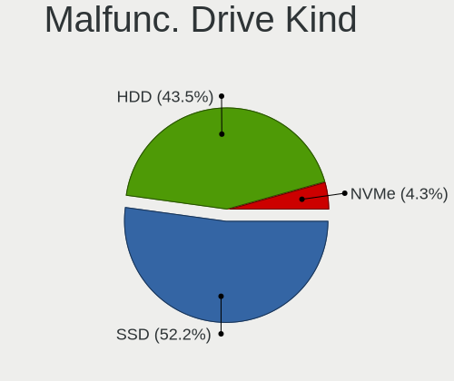
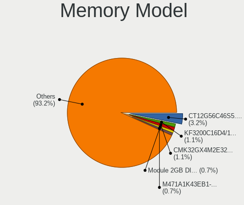
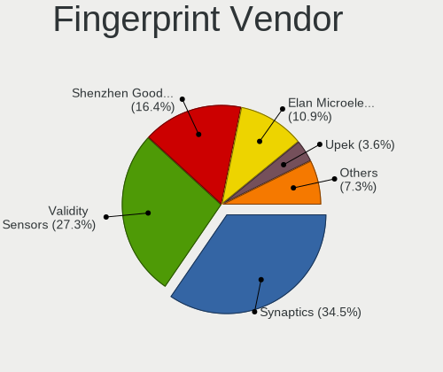
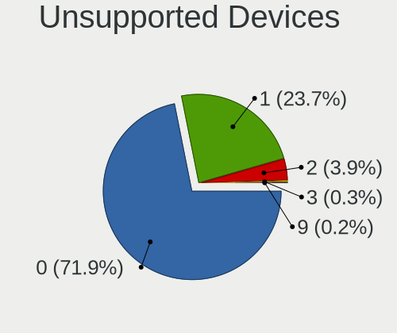

Fedora - Hardware Trends
------------------------

A project to identify most popular hardware characteristics and track their change
over time based on data collected by Linux users at https://Linux-Hardware.org.

Anyone can contribute to this report by the [hw-probe](https://github.com/linuxhw/hw-probe) tool:

    sudo -E hw-probe -all -upload

This is a report for all computer types. See also reports for [desktops](/Dist/Fedora/Desktop/README.md) and [notebooks](/Dist/Fedora/Notebook/README.md).

This report is for one last month. Overall report since the beginning of time: [TestCoverage](https://github.com/linuxhw/TestCoverage)

Period: Jan, 2023.

Contents
--------

* [ System ](#system)
  - [ OS                       ](#os)
  - [ OS Family                ](#os-family)
  - [ Kernel                   ](#kernel)
  - [ Kernel Family            ](#kernel-family)
  - [ Kernel Major Ver.        ](#kernel-major-ver)
  - [ Arch                     ](#arch)
  - [ DE                       ](#de)
  - [ Display Server           ](#display-server)
  - [ Display Manager          ](#display-manager)
  - [ OS Lang                  ](#os-lang)
  - [ Boot Mode                ](#boot-mode)
  - [ Filesystem               ](#filesystem)
  - [ Part. scheme             ](#part-scheme)
  - [ Dual Boot with Linux/BSD ](#dual-boot-with-linuxbsd)
  - [ Dual Boot (Win)          ](#dual-boot-win)

* [ Board ](#board)
  - [ Vendor                   ](#vendor)
  - [ Model                    ](#model)
  - [ Model Family             ](#model-family)
  - [ MFG Year                 ](#mfg-year)
  - [ Form Factor              ](#form-factor)
  - [ Secure Boot              ](#secure-boot)
  - [ Coreboot                 ](#coreboot)
  - [ RAM Size                 ](#ram-size)
  - [ RAM Used                 ](#ram-used)
  - [ Total Drives             ](#total-drives)
  - [ Has CD-ROM               ](#has-cd-rom)
  - [ Has Ethernet             ](#has-ethernet)
  - [ Has WiFi                 ](#has-wifi)
  - [ Has Bluetooth            ](#has-bluetooth)

* [ Location ](#location)
  - [ Country                  ](#country)
  - [ City                     ](#city)

* [ Drives ](#drives)
  - [ Drive Vendor             ](#drive-vendor)
  - [ Drive Model              ](#drive-model)
  - [ HDD Vendor               ](#hdd-vendor)
  - [ SSD Vendor               ](#ssd-vendor)
  - [ Drive Kind               ](#drive-kind)
  - [ Drive Connector          ](#drive-connector)
  - [ Drive Size               ](#drive-size)
  - [ Space Total              ](#space-total)
  - [ Space Used               ](#space-used)
  - [ Malfunc. Drives          ](#malfunc-drives)
  - [ Malfunc. Drive Vendor    ](#malfunc-drive-vendor)
  - [ Malfunc. HDD Vendor      ](#malfunc-hdd-vendor)
  - [ Malfunc. Drive Kind      ](#malfunc-drive-kind)
  - [ Failed Drives            ](#failed-drives)
  - [ Failed Drive Vendor      ](#failed-drive-vendor)
  - [ Drive Status             ](#drive-status)

* [ Storage controller ](#storage-controller)
  - [ Storage Vendor           ](#storage-vendor)
  - [ Storage Model            ](#storage-model)
  - [ Storage Kind             ](#storage-kind)

* [ Processor ](#processor)
  - [ CPU Vendor               ](#cpu-vendor)
  - [ CPU Model                ](#cpu-model)
  - [ CPU Model Family         ](#cpu-model-family)
  - [ CPU Cores                ](#cpu-cores)
  - [ CPU Sockets              ](#cpu-sockets)
  - [ CPU Threads              ](#cpu-threads)
  - [ CPU Op-Modes             ](#cpu-op-modes)
  - [ CPU Microcode            ](#cpu-microcode)
  - [ CPU Microarch            ](#cpu-microarch)

* [ Graphics ](#graphics)
  - [ GPU Vendor               ](#gpu-vendor)
  - [ GPU Model                ](#gpu-model)
  - [ GPU Combo                ](#gpu-combo)
  - [ GPU Driver               ](#gpu-driver)
  - [ GPU Memory               ](#gpu-memory)

* [ Monitor ](#monitor)
  - [ Monitor Vendor           ](#monitor-vendor)
  - [ Monitor Model            ](#monitor-model)
  - [ Monitor Resolution       ](#monitor-resolution)
  - [ Monitor Diagonal         ](#monitor-diagonal)
  - [ Monitor Width            ](#monitor-width)
  - [ Aspect Ratio             ](#aspect-ratio)
  - [ Monitor Area             ](#monitor-area)
  - [ Pixel Density            ](#pixel-density)
  - [ Multiple Monitors        ](#multiple-monitors)

* [ Network ](#network)
  - [ Net Controller Vendor    ](#net-controller-vendor)
  - [ Net Controller Model     ](#net-controller-model)
  - [ Wireless Vendor          ](#wireless-vendor)
  - [ Wireless Model           ](#wireless-model)
  - [ Ethernet Vendor          ](#ethernet-vendor)
  - [ Ethernet Model           ](#ethernet-model)
  - [ Net Controller Kind      ](#net-controller-kind)
  - [ Used Controller          ](#used-controller)
  - [ NICs                     ](#nics)
  - [ IPv6                     ](#ipv6)

* [ Bluetooth ](#bluetooth)
  - [ Bluetooth Vendor         ](#bluetooth-vendor)
  - [ Bluetooth Model          ](#bluetooth-model)

* [ Sound ](#sound)
  - [ Sound Vendor             ](#sound-vendor)
  - [ Sound Model              ](#sound-model)

* [ Memory ](#memory)
  - [ Memory Vendor            ](#memory-vendor)
  - [ Memory Model             ](#memory-model)
  - [ Memory Kind              ](#memory-kind)
  - [ Memory Form Factor       ](#memory-form-factor)
  - [ Memory Size              ](#memory-size)
  - [ Memory Speed             ](#memory-speed)

* [ Printers & scanners ](#printers--scanners)
  - [ Printer Vendor           ](#printer-vendor)
  - [ Printer Model            ](#printer-model)
  - [ Scanner Vendor           ](#scanner-vendor)
  - [ Scanner Model            ](#scanner-model)

* [ Camera ](#camera)
  - [ Camera Vendor            ](#camera-vendor)
  - [ Camera Model             ](#camera-model)

* [ Security ](#security)
  - [ Fingerprint Vendor       ](#fingerprint-vendor)
  - [ Fingerprint Model        ](#fingerprint-model)
  - [ Chipcard Vendor          ](#chipcard-vendor)
  - [ Chipcard Model           ](#chipcard-model)

* [ Unsupported ](#unsupported)
  - [ Unsupported Devices      ](#unsupported-devices)
  - [ Unsupported Device Types ](#unsupported-device-types)

System
------

OS
--

Installed operating systems

| Name      | Computers | Percent |
|-----------|-----------|---------|
| Fedora 37 | 406       | 88.45%  |
| Fedora 36 | 37        | 8.06%   |
| Fedora 35 | 7         | 1.53%   |
| Fedora 38 | 5         | 1.09%   |
| Fedora 34 | 2         | 0.44%   |
| Fedora 33 | 1         | 0.22%   |
| Fedora 28 | 1         | 0.22%   |

OS Family
---------

OS without a version

| Name   | Computers | Percent |
|--------|-----------|---------|
| Fedora | 459       | 100%    |

Kernel
------

Version of the Linux kernel

| Version                                            | Computers | Percent |
|----------------------------------------------------|-----------|---------|
| 6.0.15-300.fc37.x86_64                             | 68        | 14.81%  |
| 6.1.7-200.fc37.x86_64                              | 66        | 14.38%  |
| 6.1.6-200.fc37.x86_64                              | 56        | 12.2%   |
| 6.0.18-300.fc37.x86_64                             | 46        | 10.02%  |
| 6.0.16-300.fc37.x86_64                             | 40        | 8.71%   |
| 6.1.5-200.fc37.x86_64                              | 34        | 7.41%   |
| 6.0.7-301.fc37.x86_64                              | 31        | 6.75%   |
| 6.0.17-300.fc37.x86_64                             | 29        | 6.32%   |
| 6.1.8-200.fc37.x86_64                              | 11        | 2.4%    |
| 6.0.15-200.fc36.x86_64                             | 10        | 2.18%   |
| 6.1.7-100.fc36.x86_64                              | 6         | 1.31%   |
| 6.0.18-200.fc36.x86_64                             | 4         | 0.87%   |
| 6.0.12-100.fc35.x86_64                             | 4         | 0.87%   |
| 6.1.5-100.fc36.x86_64                              | 3         | 0.65%   |
| 6.0.14-300.fc37.x86_64                             | 3         | 0.65%   |
| 6.0.13-300.fc37.x86_64                             | 3         | 0.65%   |
| 5.17.5-300.fc36.x86_64                             | 3         | 0.65%   |
| 6.1.6-100.fc36.x86_64                              | 2         | 0.44%   |
| 6.1.2-200.fc37.x86_64                              | 2         | 0.44%   |
| 6.0.17-200.fc36.x86_64                             | 2         | 0.44%   |
| 6.0.16-200.fc36.x86_64                             | 2         | 0.44%   |
| 6.0.12-300.fc37.x86_64                             | 2         | 0.44%   |
| 6.0.12-200.fc36.x86_64                             | 2         | 0.44%   |
| 6.0.11-300.fc37.x86_64                             | 2         | 0.44%   |
| 5.17.12-100.fc34.x86_64                            | 2         | 0.44%   |
| 6.2.0-0.rc5.20230126git7c46948a6e9c.41.fc38.x86_64 | 1         | 0.22%   |
| 6.2.0-0.rc4.20230120gitd368967cb103.35.fc38.x86_64 | 1         | 0.22%   |
| 6.2.0-0.rc3.20230113gitd9fc1511728c.28.fc38.x86_64 | 1         | 0.22%   |
| 6.2.0-0.rc3.20230110git5a41237ad1d4.25.fc38.x86_64 | 1         | 0.22%   |
| 6.2.0-0.rc2.20230105git41c03ba9beea.20.fc38.x86_64 | 1         | 0.22%   |
| 6.2.0-0.rc2.20230103git69b41ac87e4a.19.fc38.x86_64 | 1         | 0.22%   |
| 6.1.8-603.inttf.fc37.x86_64                        | 1         | 0.22%   |
| 6.1.5-xm1.0.fc37.x86_64                            | 1         | 0.22%   |
| 6.1.4-225.vanilla.1.fc36.x86_64                    | 1         | 0.22%   |
| 6.0.7-301.fc37.aarch64                             | 1         | 0.22%   |
| 6.0.7-200.fc36.x86_64                              | 1         | 0.22%   |
| 6.0.5-100.fc35.x86_64                              | 1         | 0.22%   |
| 6.0.17-1.surface.fc37.x86_64                       | 1         | 0.22%   |
| 6.0.16-602.inttf.fc37.x86_64                       | 1         | 0.22%   |
| 6.0.16-1.surface.fc37.x86_64                       | 1         | 0.22%   |

Kernel Family
-------------

Linux kernel without a distro release

| Version | Computers | Percent |
|---------|-----------|---------|
| 6.0.15  | 79        | 17.21%  |
| 6.1.7   | 72        | 15.69%  |
| 6.1.6   | 58        | 12.64%  |
| 6.0.18  | 50        | 10.89%  |
| 6.0.16  | 44        | 9.59%   |
| 6.1.5   | 38        | 8.28%   |
| 6.0.7   | 33        | 7.19%   |
| 6.0.17  | 32        | 6.97%   |
| 6.1.8   | 12        | 2.61%   |
| 6.0.12  | 9         | 1.96%   |
| 6.2.0   | 6         | 1.31%   |
| 6.0.14  | 4         | 0.87%   |
| 6.0.13  | 3         | 0.65%   |
| 6.0.11  | 3         | 0.65%   |
| 5.17.5  | 3         | 0.65%   |
| 6.1.2   | 2         | 0.44%   |
| 5.17.12 | 2         | 0.44%   |
| 6.1.4   | 1         | 0.22%   |
| 6.0.5   | 1         | 0.22%   |
| 5.19.10 | 1         | 0.22%   |
| 5.18.16 | 1         | 0.22%   |
| 5.16.19 | 1         | 0.22%   |
| 5.15.54 | 1         | 0.22%   |
| 5.14.18 | 1         | 0.22%   |
| 5.11.12 | 1         | 0.22%   |
| 5.0.16  | 1         | 0.22%   |

Kernel Major Ver.
-----------------

Linux kernel major version

| Version | Computers | Percent |
|---------|-----------|---------|
| 6.0     | 258       | 56.21%  |
| 6.1     | 183       | 39.87%  |
| 6.2     | 6         | 1.31%   |
| 5.17    | 5         | 1.09%   |
| 5.19    | 1         | 0.22%   |
| 5.18    | 1         | 0.22%   |
| 5.16    | 1         | 0.22%   |
| 5.15    | 1         | 0.22%   |
| 5.14    | 1         | 0.22%   |
| 5.11    | 1         | 0.22%   |
| 5.0     | 1         | 0.22%   |

Arch
----

OS architecture (x86_64, i586, etc.)

| Name    | Computers | Percent |
|---------|-----------|---------|
| x86_64  | 458       | 99.78%  |
| aarch64 | 1         | 0.22%   |

DE
--

Desktop Environment

| Name          | Computers | Percent |
|---------------|-----------|---------|
| GNOME         | 325       | 70.81%  |
| KDE5          | 90        | 19.61%  |
| XFCE          | 8         | 1.74%   |
| X-Cinnamon    | 7         | 1.53%   |
| MATE          | 7         | 1.53%   |
| Cinnamon      | 6         | 1.31%   |
| Unknown       | 6         | 1.31%   |
| i3            | 5         | 1.09%   |
| sway          | 1         | 0.22%   |
| qtile         | 1         | 0.22%   |
| LXQt          | 1         | 0.22%   |
| KDE           | 1         | 0.22%   |
| GNOME Classic | 1         | 0.22%   |

Display Server
--------------

X11 or Wayland

| Name    | Computers | Percent |
|---------|-----------|---------|
| Wayland | 324       | 70.59%  |
| X11     | 124       | 27.02%  |
| Tty     | 7         | 1.53%   |
| Unknown | 4         | 0.87%   |

Display Manager
---------------

SDDM, LightDM, etc.

| Name    | Computers | Percent |
|---------|-----------|---------|
| Unknown | 228       | 49.67%  |
| GDM     | 158       | 34.42%  |
| SDDM    | 44        | 9.59%   |
| LightDM | 28        | 6.1%    |
| GREETD  | 1         | 0.22%   |

OS Lang
-------

Language

| Lang    | Computers | Percent |
|---------|-----------|---------|
| en_US   | 227       | 49.46%  |
| en_GB   | 37        | 8.06%   |
| ru_RU   | 32        | 6.97%   |
| de_DE   | 26        | 5.66%   |
| pt_BR   | 18        | 3.92%   |
| fr_FR   | 16        | 3.49%   |
| pl_PL   | 15        | 3.27%   |
| en_CA   | 11        | 2.4%    |
| en_AU   | 11        | 2.4%    |
| it_IT   | 8         | 1.74%   |
| en_IN   | 7         | 1.53%   |
| es_ES   | 6         | 1.31%   |
| zh_CN   | 3         | 0.65%   |
| en_NZ   | 3         | 0.65%   |
| de_CH   | 3         | 0.65%   |
| de_AT   | 3         | 0.65%   |
| Unknown | 3         | 0.65%   |
| fi_FI   | 2         | 0.44%   |
| es_CO   | 2         | 0.44%   |
| es_CL   | 2         | 0.44%   |
| es_AR   | 2         | 0.44%   |
| en_IE   | 2         | 0.44%   |
| C       | 2         | 0.44%   |
| zh_TW   | 1         | 0.22%   |
| tr_TR   | 1         | 0.22%   |
| sv_SE   | 1         | 0.22%   |
| ru_UA   | 1         | 0.22%   |
| nb_NO   | 1         | 0.22%   |
| lt_LT   | 1         | 0.22%   |
| id_ID   | 1         | 0.22%   |
| hr_HR   | 1         | 0.22%   |
| fr_BE   | 1         | 0.22%   |
| es_UY   | 1         | 0.22%   |
| es_PE   | 1         | 0.22%   |
| es_MX   | 1         | 0.22%   |
| en_ZA   | 1         | 0.22%   |
| en_PH   | 1         | 0.22%   |
| en_NG   | 1         | 0.22%   |
| en_IL   | 1         | 0.22%   |
| en_DK   | 1         | 0.22%   |

Boot Mode
---------

EFI or BIOS

| Mode | Computers | Percent |
|------|-----------|---------|
| EFI  | 375       | 81.7%   |
| BIOS | 84        | 18.3%   |

Filesystem
----------

Type of filesystem

| Type    | Computers | Percent |
|---------|-----------|---------|
| Btrfs   | 370       | 80.61%  |
| Ext4    | 77        | 16.78%  |
| Xfs     | 9         | 1.96%   |
| Overlay | 2         | 0.44%   |
| F2fs    | 1         | 0.22%   |

Part. scheme
------------

Scheme of partitioning

| Type    | Computers | Percent |
|---------|-----------|---------|
| GPT     | 223       | 48.58%  |
| Unknown | 222       | 48.37%  |
| MBR     | 14        | 3.05%   |

Dual Boot with Linux/BSD
------------------------

Hosting more than one Linux/BSD

| Dual boot | Computers | Percent |
|-----------|-----------|---------|
| No        | 420       | 91.5%   |
| Yes       | 39        | 8.5%    |

Dual Boot (Win)
---------------

Hosting Linux and Windows

| Dual boot | Computers | Percent |
|-----------|-----------|---------|
| No        | 363       | 79.08%  |
| Yes       | 96        | 20.92%  |

Board
-----

Vendor
------

Motherboard manufacturer

| Name                  | Computers | Percent |
|-----------------------|-----------|---------|
| Lenovo                | 91        | 19.83%  |
| ASUSTek Computer      | 81        | 17.65%  |
| Hewlett-Packard       | 61        | 13.29%  |
| Dell                  | 61        | 13.29%  |
| Acer                  | 31        | 6.75%   |
| Gigabyte Technology   | 24        | 5.23%   |
| MSI                   | 17        | 3.7%    |
| ASRock                | 16        | 3.49%   |
| Apple                 | 10        | 2.18%   |
| HUAWEI                | 6         | 1.31%   |
| Intel                 | 5         | 1.09%   |
| Samsung Electronics   | 4         | 0.87%   |
| Microsoft             | 4         | 0.87%   |
| Chuwi                 | 4         | 0.87%   |
| Toshiba               | 3         | 0.65%   |
| Timi                  | 3         | 0.65%   |
| TUXEDO                | 2         | 0.44%   |
| Supermicro            | 2         | 0.44%   |
| Positivo              | 2         | 0.44%   |
| Dynabook              | 2         | 0.44%   |
| Unknown               | 2         | 0.44%   |
| TECNO                 | 1         | 0.22%   |
| System76              | 1         | 0.22%   |
| SLIMBOOK              | 1         | 0.22%   |
| Schenker              | 1         | 0.22%   |
| Razer                 | 1         | 0.22%   |
| Positivo Bahia - VAIO | 1         | 0.22%   |
| PINE64                | 1         | 0.22%   |
| Pegatron              | 1         | 0.22%   |
| PC Specialist         | 1         | 0.22%   |
| Olivetti              | 1         | 0.22%   |
| Notebook              | 1         | 0.22%   |
| Multilaser            | 1         | 0.22%   |
| MECHREVO              | 1         | 0.22%   |
| MACHENIKE             | 1         | 0.22%   |
| Intel Client Systems  | 1         | 0.22%   |
| Infinix               | 1         | 0.22%   |
| HONOR                 | 1         | 0.22%   |
| GPU Company           | 1         | 0.22%   |
| Google                | 1         | 0.22%   |

Model
-----

Motherboard model

| Name                                   | Computers | Percent |
|----------------------------------------|-----------|---------|
| ASUS All Series                        | 4         | 0.87%   |
| Lenovo IdeaPad 330-15IKB 81DE          | 3         | 0.65%   |
| ASUS VivoBook_ASUSLaptop X515EA_X515EA | 3         | 0.65%   |
| Supermicro Super Server                | 2         | 0.44%   |
| MSI MS-7C37                            | 2         | 0.44%   |
| Lenovo ThinkBook 15 G2 ITL 20VE        | 2         | 0.44%   |
| Lenovo IdeaPadFlex 5 14ARE05 81X2      | 2         | 0.44%   |
| HUAWEI BOHB-WAX9                       | 2         | 0.44%   |
| HP ZBook 15 G3                         | 2         | 0.44%   |
| HP Victus by Gaming Laptop 15-fa0xxx   | 2         | 0.44%   |
| HP OMEN by Laptop 16-c0xxx             | 2         | 0.44%   |
| HP EliteBook 840 G3                    | 2         | 0.44%   |
| Gigabyte J1900M-D2P                    | 2         | 0.44%   |
| Gigabyte B550M DS3H                    | 2         | 0.44%   |
| Gigabyte B550I AORUS PRO AX            | 2         | 0.44%   |
| Dell XPS 15 9570                       | 2         | 0.44%   |
| Dell OptiPlex 7010                     | 2         | 0.44%   |
| Dell Latitude E5550                    | 2         | 0.44%   |
| Dell Latitude 7480                     | 2         | 0.44%   |
| ASUS TUF Gaming X570-PLUS              | 2         | 0.44%   |
| ASUS ROG Strix GA15DH_G15DH            | 2         | 0.44%   |
| ASUS ROG STRIX B450-F GAMING II        | 2         | 0.44%   |
| ASUS ProArt X670E-CREATOR WIFI         | 2         | 0.44%   |
| ASUS PRIME X370-PRO                    | 2         | 0.44%   |
| ASUS PRIME B550M-A                     | 2         | 0.44%   |
| ASUS PRIME B450M-A II                  | 2         | 0.44%   |
| Apple iMac13,1                         | 2         | 0.44%   |
| Acer Swift SF314-43                    | 2         | 0.44%   |
| Acer Nitro AN515-54                    | 2         | 0.44%   |
| Acer Nitro AN515-42                    | 2         | 0.44%   |
| Unknown                                | 2         | 0.44%   |
| TUXEDO Stellaris Intel Gen4            | 1         | 0.22%   |
| TUXEDO Pulse 15 Gen1                   | 1         | 0.22%   |
| Toshiba Satellite L855D                | 1         | 0.22%   |
| Toshiba Satellite C75D-B               | 1         | 0.22%   |
| Toshiba Satellite C50-A                | 1         | 0.22%   |
| Timi Xiaomi NoteBook Pro               | 1         | 0.22%   |
| Timi Redmi Book Pro 15 2022            | 1         | 0.22%   |
| Timi A35S                              | 1         | 0.22%   |
| TECNO MEGABOOK T1                      | 1         | 0.22%   |

Model Family
------------

Motherboard model prefix

| Name               | Computers | Percent |
|--------------------|-----------|---------|
| Lenovo ThinkPad    | 47        | 10.24%  |
| Lenovo IdeaPad     | 19        | 4.14%   |
| Dell Latitude      | 19        | 4.14%   |
| Dell Inspiron      | 16        | 3.49%   |
| ASUS ROG           | 15        | 3.27%   |
| Acer Aspire        | 15        | 3.27%   |
| HP EliteBook       | 14        | 3.05%   |
| ASUS PRIME         | 11        | 2.4%    |
| ASUS VivoBook      | 9         | 1.96%   |
| Dell XPS           | 8         | 1.74%   |
| Acer Nitro         | 8         | 1.74%   |
| HP Pavilion        | 7         | 1.53%   |
| ASUS TUF           | 7         | 1.53%   |
| ASUS ASUS          | 7         | 1.53%   |
| HP ProBook         | 6         | 1.31%   |
| Dell Precision     | 6         | 1.31%   |
| Lenovo ThinkBook   | 5         | 1.09%   |
| HP ZBook           | 5         | 1.09%   |
| HP Laptop          | 5         | 1.09%   |
| HP ENVY            | 5         | 1.09%   |
| Dell OptiPlex      | 5         | 1.09%   |
| ASUS Zenbook       | 5         | 1.09%   |
| Microsoft Surface  | 4         | 0.87%   |
| Lenovo Yoga        | 4         | 0.87%   |
| Lenovo Legion      | 4         | 0.87%   |
| HP OMEN            | 4         | 0.87%   |
| ASUS All           | 4         | 0.87%   |
| Acer Swift         | 4         | 0.87%   |
| Toshiba Satellite  | 3         | 0.65%   |
| Lenovo ThinkCentre | 3         | 0.65%   |
| HP Victus          | 3         | 0.65%   |
| Gigabyte B550M     | 3         | 0.65%   |
| Dell Vostro        | 3         | 0.65%   |
| ASUS ProArt        | 3         | 0.65%   |
| Apple MacBookPro11 | 3         | 0.65%   |
| Acer Predator      | 3         | 0.65%   |
| Supermicro Super   | 2         | 0.44%   |
| MSI MS-7C37        | 2         | 0.44%   |
| MSI Modern         | 2         | 0.44%   |
| Lenovo IdeaPadFlex | 2         | 0.44%   |

MFG Year
--------

Motherboard manufacture year

| Year | Computers | Percent |
|------|-----------|---------|
| 2021 | 84        | 18.3%   |
| 2019 | 67        | 14.6%   |
| 2022 | 63        | 13.73%  |
| 2020 | 54        | 11.76%  |
| 2018 | 33        | 7.19%   |
| 2017 | 29        | 6.32%   |
| 2012 | 25        | 5.45%   |
| 2015 | 24        | 5.23%   |
| 2013 | 21        | 4.58%   |
| 2014 | 15        | 3.27%   |
| 2016 | 14        | 3.05%   |
| 2011 | 10        | 2.18%   |
| 2010 | 9         | 1.96%   |
| 2009 | 6         | 1.31%   |
| 2008 | 5         | 1.09%   |

Form Factor
-----------

Physical design of the computer

| Name           | Computers | Percent |
|----------------|-----------|---------|
| Notebook       | 283       | 61.66%  |
| Desktop        | 124       | 27.02%  |
| Convertible    | 26        | 5.66%   |
| Mini pc        | 10        | 2.18%   |
| Tablet         | 8         | 1.74%   |
| All in one     | 5         | 1.09%   |
| Server         | 2         | 0.44%   |
| System on chip | 1         | 0.22%   |

Secure Boot
-----------

Enabled or disabled

| State    | Computers | Percent |
|----------|-----------|---------|
| Disabled | 355       | 77.34%  |
| Enabled  | 104       | 22.66%  |

Coreboot
--------

Have coreboot on board

| Used | Computers | Percent |
|------|-----------|---------|
| No   | 457       | 99.56%  |
| Yes  | 2         | 0.44%   |

RAM Size
--------

Total RAM memory

| Size in GB      | Computers | Percent |
|-----------------|-----------|---------|
| 16.01-24.0      | 116       | 25.27%  |
| 8.01-16.0       | 103       | 22.44%  |
| 4.01-8.0        | 88        | 19.17%  |
| 32.01-64.0      | 80        | 17.43%  |
| 3.01-4.0        | 37        | 8.06%   |
| 24.01-32.0      | 15        | 3.27%   |
| 64.01-256.0     | 13        | 2.83%   |
| 1.01-2.0        | 6         | 1.31%   |
| More than 256.0 | 1         | 0.22%   |

RAM Used
--------

Used RAM memory

| Used GB     | Computers | Percent |
|-------------|-----------|---------|
| 4.01-8.0    | 162       | 35.29%  |
| 2.01-3.0    | 100       | 21.79%  |
| 3.01-4.0    | 92        | 20.04%  |
| 1.01-2.0    | 55        | 11.98%  |
| 8.01-16.0   | 38        | 8.28%   |
| 16.01-24.0  | 6         | 1.31%   |
| 0.51-1.0    | 3         | 0.65%   |
| 32.01-64.0  | 1         | 0.22%   |
| 64.01-256.0 | 1         | 0.22%   |
| 0.01-0.5    | 1         | 0.22%   |

Total Drives
------------

Number of drives on board

| Drives | Computers | Percent |
|--------|-----------|---------|
| 1      | 274       | 59.69%  |
| 2      | 121       | 26.36%  |
| 3      | 35        | 7.63%   |
| 4      | 16        | 3.49%   |
| 5      | 3         | 0.65%   |
| 8      | 2         | 0.44%   |
| 6      | 2         | 0.44%   |
| 0      | 2         | 0.44%   |
| 18     | 1         | 0.22%   |
| 13     | 1         | 0.22%   |
| 9      | 1         | 0.22%   |
| 7      | 1         | 0.22%   |

Has CD-ROM
----------

Has CD-ROM on board

| Presented | Computers | Percent |
|-----------|-----------|---------|
| No        | 383       | 83.44%  |
| Yes       | 76        | 16.56%  |

Has Ethernet
------------

Has Ethernet on board

| Presented | Computers | Percent |
|-----------|-----------|---------|
| Yes       | 352       | 76.69%  |
| No        | 107       | 23.31%  |

Has WiFi
--------

Has WiFi module

| Presented | Computers | Percent |
|-----------|-----------|---------|
| Yes       | 388       | 84.53%  |
| No        | 71        | 15.47%  |

Has Bluetooth
-------------

Has Bluetooth module

| Presented | Computers | Percent |
|-----------|-----------|---------|
| Yes       | 343       | 74.73%  |
| No        | 116       | 25.27%  |

Location
--------

Country
-------

Geographic location (country)

| Country     | Computers | Percent |
|-------------|-----------|---------|
| USA         | 74        | 16.12%  |
| Germany     | 40        | 8.71%   |
| Russia      | 37        | 8.06%   |
| Brazil      | 26        | 5.66%   |
| UK          | 21        | 4.58%   |
| Poland      | 20        | 4.36%   |
| Italy       | 20        | 4.36%   |
| Canada      | 18        | 3.92%   |
| France      | 17        | 3.7%    |
| Austria     | 13        | 2.83%   |
| Australia   | 12        | 2.61%   |
| India       | 11        | 2.4%    |
| Turkey      | 9         | 1.96%   |
| Netherlands | 9         | 1.96%   |
| Switzerland | 7         | 1.53%   |
| Sweden      | 7         | 1.53%   |
| Spain       | 7         | 1.53%   |
| Norway      | 6         | 1.31%   |
| Taiwan      | 5         | 1.09%   |
| Indonesia   | 5         | 1.09%   |
| Belgium     | 5         | 1.09%   |
| Mexico      | 4         | 0.87%   |
| Finland     | 4         | 0.87%   |
| Czechia     | 4         | 0.87%   |
| Belarus     | 4         | 0.87%   |
| Argentina   | 4         | 0.87%   |
| Sri Lanka   | 3         | 0.65%   |
| New Zealand | 3         | 0.65%   |
| Uruguay     | 2         | 0.44%   |
| Ukraine     | 2         | 0.44%   |
| Uganda      | 2         | 0.44%   |
| UAE         | 2         | 0.44%   |
| Thailand    | 2         | 0.44%   |
| Slovakia    | 2         | 0.44%   |
| Serbia      | 2         | 0.44%   |
| Romania     | 2         | 0.44%   |
| Portugal    | 2         | 0.44%   |
| Philippines | 2         | 0.44%   |
| Japan       | 2         | 0.44%   |
| Israel      | 2         | 0.44%   |

City
----

Geographic location (city)

| City          | Computers | Percent |
|---------------|-----------|---------|
| Moscow        | 7         | 1.53%   |
| Vienna        | 6         | 1.31%   |
| Sydney        | 6         | 1.31%   |
| St Petersburg | 6         | 1.31%   |
| Sao Paulo     | 5         | 1.09%   |
| Warsaw        | 4         | 0.87%   |
| Minsk         | 4         | 0.87%   |
| London        | 4         | 0.87%   |
| Innsbruck     | 4         | 0.87%   |
| Amsterdam     | 4         | 0.87%   |
| Zurich        | 3         | 0.65%   |
| Seattle       | 3         | 0.65%   |
| Riverside     | 3         | 0.65%   |
| Prague        | 3         | 0.65%   |
| Portland      | 3         | 0.65%   |
| Novosibirsk   | 3         | 0.65%   |
| Montreal      | 3         | 0.65%   |
| Melbourne     | 3         | 0.65%   |
| Madrid        | 3         | 0.65%   |
| Leeds         | 3         | 0.65%   |
| Istanbul      | 3         | 0.65%   |
| Helsinki      | 3         | 0.65%   |
| Brasília     | 3         | 0.65%   |
| Berlin        | 3         | 0.65%   |
| Ankara        | 3         | 0.65%   |
| Torun         | 2         | 0.44%   |
| Tbilisi       | 2         | 0.44%   |
| Surabaya      | 2         | 0.44%   |
| Shafter       | 2         | 0.44%   |
| Saratov       | 2         | 0.44%   |
| San Jose      | 2         | 0.44%   |
| Saint Paul    | 2         | 0.44%   |
| Porto Alegre  | 2         | 0.44%   |
| Perm          | 2         | 0.44%   |
| Palmas        | 2         | 0.44%   |
| Ottawa        | 2         | 0.44%   |
| Ohringen      | 2         | 0.44%   |
| New York      | 2         | 0.44%   |
| New Taipei    | 2         | 0.44%   |
| Montevideo    | 2         | 0.44%   |

Drives
------

Drive Vendor
------------

Hard drive vendors

| Vendor                         | Computers | Drives | Percent |
|--------------------------------|-----------|--------|---------|
| Samsung Electronics            | 154       | 176    | 22.81%  |
| WDC                            | 70        | 87     | 10.37%  |
| Seagate                        | 62        | 76     | 9.19%   |
| SanDisk                        | 39        | 41     | 5.78%   |
| Toshiba                        | 37        | 43     | 5.48%   |
| Crucial                        | 36        | 38     | 5.33%   |
| Kingston                       | 33        | 36     | 4.89%   |
| SK hynix                       | 32        | 32     | 4.74%   |
| Intel                          | 29        | 35     | 4.3%    |
| Micron Technology              | 24        | 24     | 3.56%   |
| KIOXIA                         | 18        | 18     | 2.67%   |
| Unknown                        | 16        | 20     | 2.37%   |
| Micron/Crucial Technology      | 10        | 11     | 1.48%   |
| Phison Electronics             | 8         | 8      | 1.19%   |
| HGST                           | 8         | 16     | 1.19%   |
| China                          | 8         | 10     | 1.19%   |
| Hitachi                        | 7         | 9      | 1.04%   |
| Apple                          | 7         | 7      | 1.04%   |
| Apacer                         | 5         | 5      | 0.74%   |
| Realtek Semiconductor          | 4         | 4      | 0.59%   |
| LITEON                         | 4         | 4      | 0.59%   |
| A-DATA Technology              | 4         | 4      | 0.59%   |
| Unknown                        | 4         | 5      | 0.59%   |
| Solid State Storage Technology | 3         | 3      | 0.44%   |
| Silicon Motion                 | 3         | 4      | 0.44%   |
| Netac                          | 3         | 3      | 0.44%   |
| Kingston Technology Company    | 3         | 3      | 0.44%   |
| JMicron Technology             | 3         | 3      | 0.44%   |
| HS-SSD-E100                    | 3         | 3      | 0.44%   |
| FORESEE                        | 3         | 3      | 0.44%   |
| SPCC                           | 2         | 2      | 0.3%    |
| PNY                            | 2         | 2      | 0.3%    |
| Phison                         | 2         | 2      | 0.3%    |
| Patriot                        | 2         | 2      | 0.3%    |
| OCZ                            | 2         | 2      | 0.3%    |
| Lexar                          | 2         | 2      | 0.3%    |
| GOODRAM                        | 2         | 3      | 0.3%    |
| Gigabyte Technology            | 2         | 2      | 0.3%    |
| XSTAR                          | 1         | 1      | 0.15%   |
| USB                            | 1         | 1      | 0.15%   |

Drive Model
-----------

Hard drive models

| Model                                                | Computers | Percent |
|------------------------------------------------------|-----------|---------|
| Samsung NVMe SSD Controller SM981/PM981/PM983 500GB  | 27        | 3.72%   |
| Samsung NVMe SSD Controller PM9A1/PM9A3/980PRO 512GB | 13        | 1.79%   |
| Seagate ST1000LM035-1RK172 1TB                       | 11        | 1.52%   |
| Sandisk WD Black SN750 / PC SN730 NVMe SSD 1TB       | 9         | 1.24%   |
| Samsung SSD 870 EVO 500GB                            | 8         | 1.1%    |
| Kingston SA400S37240G 240GB SSD                      | 7         | 0.96%   |
| Crucial CT1000MX500SSD1 1TB                          | 7         | 0.96%   |
| Toshiba MQ04ABF100 1TB                               | 6         | 0.83%   |
| Samsung SSD 870 EVO 1TB                              | 5         | 0.69%   |
| Samsung NVMe SSD Controller SM961/PM961/SM963 256GB  | 5         | 0.69%   |
| Micron/Crucial P2 NVMe PCIe SSD 500GB                | 5         | 0.69%   |
| Intel SSDPEKNU512GZ 512GB                            | 5         | 0.69%   |
| Seagate ST500DM002-1BD142 500GB                      | 4         | 0.55%   |
| Samsung SSD 980 1TB                                  | 4         | 0.55%   |
| Samsung SSD 850 EVO 500GB                            | 4         | 0.55%   |
| Samsung SSD 850 EVO 250GB                            | 4         | 0.55%   |
| Micron 2210_MTFDHBA512QFD 512GB                      | 4         | 0.55%   |
| KIOXIA KBG40ZNV512G 512GB                            | 4         | 0.55%   |
| Crucial CT240BX500SSD1 240GB                         | 4         | 0.55%   |
| Crucial CT1000BX500SSD1 1TB                          | 4         | 0.55%   |
| Unknown                                              | 4         | 0.55%   |
| WDC WD20EZRX-00D8PB0 2TB                             | 3         | 0.41%   |
| Unknown MMC Card  32GB                               | 3         | 0.41%   |
| Toshiba XG6 NVMe SSD Controller 512GB                | 3         | 0.41%   |
| SK hynix SKHynix_HFS512GDE9X081N 512GB               | 3         | 0.41%   |
| Seagate ST1000LM049-2GH172 1TB                       | 3         | 0.41%   |
| Seagate ST1000LM024 HN-M101MBB 1TB                   | 3         | 0.41%   |
| Seagate ST1000DM003-1SB102 1TB                       | 3         | 0.41%   |
| Sandisk WD Blue SN550 NVMe SSD 1TB                   | 3         | 0.41%   |
| Samsung SSD 980 PRO 2TB                              | 3         | 0.41%   |
| Samsung SSD 970 EVO Plus 500GB                       | 3         | 0.41%   |
| Samsung SSD 970 EVO Plus 1TB                         | 3         | 0.41%   |
| Samsung MZALQ512HBLU-00BL2 512GB                     | 3         | 0.41%   |
| Phison PS5013 E13 NVMe Controller 256GB              | 3         | 0.41%   |
| Phison E12 NVMe Controller 1TB                       | 3         | 0.41%   |
| Kingston SA400S37960G 960GB SSD                      | 3         | 0.41%   |
| Kingston SA400S37480G 480GB SSD                      | 3         | 0.41%   |
| Kingston OM8PCP3512F-AI1 512GB                       | 3         | 0.41%   |
| Intel SSD 660P Series 512GB                          | 3         | 0.41%   |
| HGST HTS725050A7E630 500GB                           | 3         | 0.41%   |

HDD Vendor
----------

Hard disk drive vendors

| Vendor              | Computers | Drives | Percent |
|---------------------|-----------|--------|---------|
| Seagate             | 62        | 76     | 40.79%  |
| WDC                 | 44        | 57     | 28.95%  |
| Toshiba             | 22        | 28     | 14.47%  |
| HGST                | 8         | 16     | 5.26%   |
| Hitachi             | 7         | 9      | 4.61%   |
| Samsung Electronics | 4         | 6      | 2.63%   |
| Unknown             | 2         | 2      | 1.32%   |
| USB                 | 1         | 1      | 0.66%   |
| Inateck             | 1         | 1      | 0.66%   |
| Apple               | 1         | 1      | 0.66%   |

SSD Vendor
----------

Solid state drive vendors

| Vendor              | Computers | Drives | Percent |
|---------------------|-----------|--------|---------|
| Samsung Electronics | 50        | 52     | 25.13%  |
| Crucial             | 29        | 31     | 14.57%  |
| Kingston            | 24        | 26     | 12.06%  |
| SanDisk             | 14        | 14     | 7.04%   |
| WDC                 | 11        | 11     | 5.53%   |
| China               | 8         | 10     | 4.02%   |
| Micron Technology   | 7         | 7      | 3.52%   |
| Intel               | 6         | 6      | 3.02%   |
| SK hynix            | 5         | 5      | 2.51%   |
| Apple               | 5         | 5      | 2.51%   |
| LITEON              | 4         | 4      | 2.01%   |
| Apacer              | 4         | 4      | 2.01%   |
| Toshiba             | 3         | 3      | 1.51%   |
| SPCC                | 2         | 2      | 1.01%   |
| PNY                 | 2         | 2      | 1.01%   |
| Patriot             | 2         | 2      | 1.01%   |
| OCZ                 | 2         | 2      | 1.01%   |
| Netac               | 2         | 2      | 1.01%   |
| Lexar               | 2         | 2      | 1.01%   |
| GOODRAM             | 2         | 3      | 1.01%   |
| Unknown             | 2         | 2      | 1.01%   |
| XSTAR               | 1         | 1      | 0.5%    |
| Teclast             | 1         | 1      | 0.5%    |
| Mushkin             | 1         | 1      | 0.5%    |
| LITEONIT            | 1         | 1      | 0.5%    |
| JMicron Technology  | 1         | 1      | 0.5%    |
| Inateck             | 1         | 1      | 0.5%    |
| Gigabyte Technology | 1         | 1      | 0.5%    |
| G521N               | 1         | 1      | 0.5%    |
| Dogfish             | 1         | 1      | 0.5%    |
| Dahua               | 1         | 1      | 0.5%    |
| BIWIN               | 1         | 1      | 0.5%    |
| AMD                 | 1         | 1      | 0.5%    |
| A-DATA Technology   | 1         | 1      | 0.5%    |

Drive Kind
----------

HDD or SSD

| Kind    | Computers | Drives | Percent |
|---------|-----------|--------|---------|
| NVMe    | 280       | 334    | 46.13%  |
| SSD     | 171       | 208    | 28.17%  |
| HDD     | 131       | 197    | 21.58%  |
| MMC     | 15        | 17     | 2.47%   |
| Unknown | 10        | 12     | 1.65%   |

Drive Connector
---------------

SATA, SAS, NVMe, etc.

| Type | Computers | Drives | Percent |
|------|-----------|--------|---------|
| NVMe | 280       | 333    | 50.54%  |
| SATA | 241       | 389    | 43.5%   |
| SAS  | 18        | 29     | 3.25%   |
| MMC  | 15        | 17     | 2.71%   |

Drive Size
----------

Size of hard drive

| Size in TB | Computers | Drives | Percent |
|------------|-----------|--------|---------|
| 0.01-0.5   | 160       | 209    | 50.79%  |
| 0.51-1.0   | 102       | 117    | 32.38%  |
| 1.01-2.0   | 19        | 21     | 6.03%   |
| 3.01-4.0   | 14        | 21     | 4.44%   |
| 4.01-10.0  | 12        | 14     | 3.81%   |
| 2.01-3.0   | 7         | 9      | 2.22%   |
| 10.01-20.0 | 1         | 14     | 0.32%   |

Space Total
-----------

Amount of disk space available on the file system

| Size in GB     | Computers | Percent |
|----------------|-----------|---------|
| 501-1000       | 103       | 22.44%  |
| 251-500        | 95        | 20.7%   |
| 1001-2000      | 72        | 15.69%  |
| 1-20           | 47        | 10.24%  |
| Unknown        | 41        | 8.93%   |
| 101-250        | 37        | 8.06%   |
| More than 3000 | 25        | 5.45%   |
| 2001-3000      | 20        | 4.36%   |
| 51-100         | 14        | 3.05%   |
| 21-50          | 5         | 1.09%   |

Space Used
----------

Amount of used disk space

| Used GB        | Computers | Percent |
|----------------|-----------|---------|
| 1-20           | 115       | 25.05%  |
| 21-50          | 63        | 13.73%  |
| 101-250        | 60        | 13.07%  |
| 251-500        | 54        | 11.76%  |
| 51-100         | 49        | 10.68%  |
| 501-1000       | 43        | 9.37%   |
| Unknown        | 41        | 8.93%   |
| 1001-2000      | 20        | 4.36%   |
| More than 3000 | 11        | 2.4%    |
| 2001-3000      | 3         | 0.65%   |

Malfunc. Drives
---------------

Drive models with a malfunction

| Model                                 | Computers | Drives | Percent |
|---------------------------------------|-----------|--------|---------|
| Samsung Electronics SSD 870 EVO 500GB | 2         | 2      | 6.45%   |
| Samsung Electronics SSD 870 EVO 1TB   | 2         | 2      | 6.45%   |
| Intel SSDSC2CT120A3 120GB             | 2         | 2      | 6.45%   |
| WDC WD3200BPVT-80JJ5T0 320GB          | 1         | 1      | 3.23%   |
| WDC WD3200AAKS-00V1A0 320GB           | 1         | 1      | 3.23%   |
| WDC WD2500BEVT-80A23T0 250GB          | 1         | 1      | 3.23%   |
| WDC WD20EZRX-22D8PB0 2TB              | 1         | 1      | 3.23%   |
| WDC WD20EZRX-00D8PB0 2TB              | 1         | 1      | 3.23%   |
| WDC WD10EZEX-08WN4A0 1TB              | 1         | 1      | 3.23%   |
| WDC WD1002FAEX-00Y9A0 1TB             | 1         | 1      | 3.23%   |
| Toshiba MK7559GSXP 752GB              | 1         | 1      | 3.23%   |
| Toshiba MK5061GSY 500GB               | 1         | 1      | 3.23%   |
| Toshiba HDWJ105 500GB                 | 1         | 1      | 3.23%   |
| SK hynix BC711 HFM512GD3JX013N 512GB  | 1         | 1      | 3.23%   |
| Seagate ST9500325AS 500GB             | 1         | 1      | 3.23%   |
| Seagate ST500LM021-1KJ152 500GB       | 1         | 1      | 3.23%   |
| Seagate ST500LM000-SSHD-8GB           | 1         | 1      | 3.23%   |
| Seagate ST500DM002-1BD142 500GB       | 1         | 1      | 3.23%   |
| Seagate ST3500320AS 500GB             | 1         | 1      | 3.23%   |
| Seagate ST3000DM001-1CH166 3TB        | 1         | 1      | 3.23%   |
| Seagate ST2000DM001-1CH164 2TB        | 1         | 1      | 3.23%   |
| SanDisk SSD PLUS 1000GB               | 1         | 1      | 3.23%   |
| Samsung Electronics HD502IJ 500GB     | 1         | 1      | 3.23%   |
| Samsung Electronics HD322HJ 320GB     | 1         | 3      | 3.23%   |
| Crucial CT275MX300SSD1 275GB          | 1         | 1      | 3.23%   |
| Apple SSD SM0512L 500GB               | 1         | 1      | 3.23%   |
| AMD R5SL960G 960GB SSD                | 1         | 1      | 3.23%   |
| Unknown                               | 1         | 1      | 3.23%   |

Malfunc. Drive Vendor
---------------------

Vendors of faulty drives

| Vendor              | Computers | Drives | Percent |
|---------------------|-----------|--------|---------|
| Seagate             | 7         | 7      | 24.14%  |
| WDC                 | 6         | 7      | 20.69%  |
| Samsung Electronics | 5         | 8      | 17.24%  |
| Toshiba             | 3         | 3      | 10.34%  |
| Intel               | 2         | 2      | 6.9%    |
| SK hynix            | 1         | 1      | 3.45%   |
| SanDisk             | 1         | 1      | 3.45%   |
| Crucial             | 1         | 1      | 3.45%   |
| Apple               | 1         | 1      | 3.45%   |
| AMD                 | 1         | 1      | 3.45%   |
| Unknown             | 1         | 1      | 3.45%   |

Malfunc. HDD Vendor
-------------------

Vendors of faulty HDD drives

| Vendor              | Computers | Drives | Percent |
|---------------------|-----------|--------|---------|
| Seagate             | 7         | 7      | 38.89%  |
| WDC                 | 6         | 7      | 33.33%  |
| Toshiba             | 3         | 3      | 16.67%  |
| Samsung Electronics | 2         | 4      | 11.11%  |

Malfunc. Drive Kind
-------------------

Kinds of faulty drives

| Kind | Computers | Drives | Percent |
|------|-----------|--------|---------|
| HDD  | 16        | 21     | 59.26%  |
| SSD  | 9         | 10     | 33.33%  |
| NVMe | 2         | 2      | 7.41%   |

Failed Drives
-------------

Failed drive models

| Model                           | Computers | Drives | Percent |
|---------------------------------|-----------|--------|---------|
| Seagate ST31000528AS 1TB        | 1         | 1      | 50%     |
| Samsung Electronics SSD 980 1TB | 1         | 1      | 50%     |

Failed Drive Vendor
-------------------

Failed drive vendors

| Vendor              | Computers | Drives | Percent |
|---------------------|-----------|--------|---------|
| Seagate             | 1         | 1      | 50%     |
| Samsung Electronics | 1         | 1      | 50%     |

Drive Status
------------

Number of failed and malfunc. drives

| Status   | Computers | Drives | Percent |
|----------|-----------|--------|---------|
| Detected | 255       | 426    | 51.83%  |
| Works    | 208       | 307    | 42.28%  |
| Malfunc  | 27        | 33     | 5.49%   |
| Failed   | 2         | 2      | 0.41%   |

Storage controller
------------------

Storage Vendor
--------------

Storage controller vendors

| Vendor                         | Computers | Percent |
|--------------------------------|-----------|---------|
| Intel                          | 242       | 37.23%  |
| Samsung Electronics            | 110       | 16.92%  |
| AMD                            | 106       | 16.31%  |
| SanDisk                        | 41        | 6.31%   |
| SK hynix                       | 26        | 4%      |
| Toshiba America Info Systems   | 16        | 2.46%   |
| Micron/Crucial Technology      | 16        | 2.46%   |
| Micron Technology              | 16        | 2.46%   |
| KIOXIA                         | 14        | 2.15%   |
| Kingston Technology Company    | 13        | 2%      |
| Phison Electronics             | 11        | 1.69%   |
| ASMedia Technology             | 8         | 1.23%   |
| Solid State Storage Technology | 4         | 0.62%   |
| Silicon Motion                 | 4         | 0.62%   |
| Realtek Semiconductor          | 4         | 0.62%   |
| Marvell Technology Group       | 4         | 0.62%   |
| Shenzhen Longsys Electronics   | 3         | 0.46%   |
| ADATA Technology               | 3         | 0.46%   |
| Union Memory (Shenzhen)        | 2         | 0.31%   |
| Nvidia                         | 2         | 0.31%   |
| JMicron Technology             | 2         | 0.31%   |
| Netac Technology               | 1         | 0.15%   |
| Hewlett-Packard                | 1         | 0.15%   |
| Broadcom / LSI                 | 1         | 0.15%   |

Storage Model
-------------

Storage controller models

| Model                                                                          | Computers | Percent |
|--------------------------------------------------------------------------------|-----------|---------|
| AMD FCH SATA Controller [AHCI mode]                                            | 76        | 10.72%  |
| Samsung NVMe SSD Controller SM981/PM981/PM983                                  | 46        | 6.49%   |
| Intel Volume Management Device NVMe RAID Controller                            | 29        | 4.09%   |
| Samsung NVMe SSD Controller PM9A1/PM9A3/980PRO                                 | 27        | 3.81%   |
| Samsung NVMe SSD Controller 980                                                | 22        | 3.1%    |
| Intel Sunrise Point-LP SATA Controller [AHCI mode]                             | 21        | 2.96%   |
| Intel 82801 Mobile SATA Controller [RAID mode]                                 | 20        | 2.82%   |
| Micron Non-Volatile memory controller                                          | 16        | 2.26%   |
| Intel Non-Volatile memory controller                                           | 15        | 2.12%   |
| Intel 7 Series Chipset Family 6-port SATA Controller [AHCI mode]               | 15        | 2.12%   |
| SK hynix Gold P31/PC711 NVMe Solid State Drive                                 | 13        | 1.83%   |
| SanDisk WD Black SN750 / PC SN730 NVMe SSD                                     | 12        | 1.69%   |
| Intel Cannon Lake Mobile PCH SATA AHCI Controller                              | 12        | 1.69%   |
| AMD 500 Series Chipset SATA Controller                                         | 12        | 1.69%   |
| AMD 400 Series Chipset SATA Controller                                         | 12        | 1.69%   |
| Intel Tiger Lake-LP SATA Controller                                            | 11        | 1.55%   |
| Intel 7 Series/C210 Series Chipset Family 6-port SATA Controller [AHCI mode]   | 11        | 1.55%   |
| Samsung NVMe SSD Controller SM961/PM961/SM963                                  | 10        | 1.41%   |
| Toshiba America Info Systems XG6 NVMe SSD Controller                           | 9         | 1.27%   |
| SanDisk WD Blue SN550 NVMe SSD                                                 | 9         | 1.27%   |
| KIOXIA NVMe SSD Controller BG4                                                 | 9         | 1.27%   |
| Intel 8 Series/C220 Series Chipset Family 6-port SATA Controller 1 [AHCI mode] | 9         | 1.27%   |
| SanDisk Non-Volatile memory controller                                         | 8         | 1.13%   |
| Intel Q170/Q150/B150/H170/H110/Z170/CM236 Chipset SATA Controller [AHCI Mode]  | 8         | 1.13%   |
| Intel Cannon Point-LP SATA Controller [AHCI Mode]                              | 8         | 1.13%   |
| Intel Alder Lake-S PCH SATA Controller [AHCI Mode]                             | 8         | 1.13%   |
| ASMedia ASM1062 Serial ATA Controller                                          | 8         | 1.13%   |
| Micron/Crucial P2 NVMe PCIe SSD                                                | 7         | 0.99%   |
| Kingston Company Company Non-Volatile memory controller                        | 7         | 0.99%   |
| Intel Wildcat Point-LP SATA Controller [AHCI Mode]                             | 7         | 0.99%   |
| Intel 8 Series SATA Controller 1 [AHCI mode]                                   | 7         | 0.99%   |
| Intel Comet Lake SATA AHCI Controller                                          | 6         | 0.85%   |
| AMD SB7x0/SB8x0/SB9x0 SATA Controller [AHCI mode]                              | 6         | 0.85%   |
| Phison E12 NVMe Controller                                                     | 5         | 0.71%   |
| KIOXIA Non-Volatile memory controller                                          | 5         | 0.71%   |
| Intel SSD 660P Series                                                          | 5         | 0.71%   |
| Intel Celeron/Pentium Silver Processor SATA Controller                         | 5         | 0.71%   |
| Intel Cannon Lake PCH SATA AHCI Controller                                     | 5         | 0.71%   |
| Intel 6 Series/C200 Series Chipset Family 6 port Desktop SATA AHCI Controller  | 5         | 0.71%   |
| Intel 500 Series Chipset Family SATA AHCI Controller                           | 5         | 0.71%   |

Storage Kind
------------

Kind of storage controller (IDE, SATA, NVMe, SAS, ...)

| Kind | Computers | Percent |
|------|-----------|---------|
| SATA | 291       | 45.05%  |
| NVMe | 280       | 43.34%  |
| RAID | 55        | 8.51%   |
| IDE  | 19        | 2.94%   |
| SAS  | 1         | 0.15%   |

Processor
---------

CPU Vendor
----------

Processor vendors

| Vendor | Computers | Percent |
|--------|-----------|---------|
| Intel  | 308       | 67.1%   |
| AMD    | 150       | 32.68%  |
| ARM    | 1         | 0.22%   |

CPU Model
---------

Processor models

| Model                                         | Computers | Percent |
|-----------------------------------------------|-----------|---------|
| Intel 11th Gen Core i5-1135G7 @ 2.40GHz       | 15        | 3.27%   |
| Intel Core i7-8565U CPU @ 1.80GHz             | 8         | 1.74%   |
| Intel 11th Gen Core i7-1165G7 @ 2.80GHz       | 8         | 1.74%   |
| AMD Ryzen 7 5800H with Radeon Graphics        | 8         | 1.74%   |
| Intel Core i5-7200U CPU @ 2.50GHz             | 7         | 1.53%   |
| AMD Ryzen 7 4800H with Radeon Graphics        | 7         | 1.53%   |
| Intel Core i7-3770 CPU @ 3.40GHz              | 6         | 1.31%   |
| Intel Core i7-10510U CPU @ 1.80GHz            | 6         | 1.31%   |
| AMD Ryzen 5 5500U with Radeon Graphics        | 6         | 1.31%   |
| Intel Core i7-9750H CPU @ 2.60GHz             | 5         | 1.09%   |
| Intel Core i7-8750H CPU @ 2.20GHz             | 5         | 1.09%   |
| Intel Core i7-8550U CPU @ 1.80GHz             | 5         | 1.09%   |
| Intel Core i5-3320M CPU @ 2.60GHz             | 5         | 1.09%   |
| Intel Core i5-10210U CPU @ 1.60GHz            | 5         | 1.09%   |
| Intel 12th Gen Core i7-12700H                 | 5         | 1.09%   |
| AMD Ryzen 5 3500U with Radeon Vega Mobile Gfx | 5         | 1.09%   |
| Intel Core i5-8265U CPU @ 1.60GHz             | 4         | 0.87%   |
| Intel Core i5-5200U CPU @ 2.20GHz             | 4         | 0.87%   |
| Intel 12th Gen Core i5-1235U                  | 4         | 0.87%   |
| AMD Ryzen 9 5900HX with Radeon Graphics       | 4         | 0.87%   |
| AMD Ryzen 7 5700U with Radeon Graphics        | 4         | 0.87%   |
| AMD Ryzen 5 5600X 6-Core Processor            | 4         | 0.87%   |
| AMD Ryzen 5 3600 6-Core Processor             | 4         | 0.87%   |
| Intel Core i7-7600U CPU @ 2.80GHz             | 3         | 0.65%   |
| Intel Core i7-7500U CPU @ 2.70GHz             | 3         | 0.65%   |
| Intel Core i7-6700HQ CPU @ 2.60GHz            | 3         | 0.65%   |
| Intel Core i7-6700 CPU @ 3.40GHz              | 3         | 0.65%   |
| Intel Core i7-6600U CPU @ 2.60GHz             | 3         | 0.65%   |
| Intel Core i7-10850H CPU @ 2.70GHz            | 3         | 0.65%   |
| Intel Core i7-1065G7 CPU @ 1.30GHz            | 3         | 0.65%   |
| Intel Core i5-8350U CPU @ 1.70GHz             | 3         | 0.65%   |
| Intel Core i5-8250U CPU @ 1.60GHz             | 3         | 0.65%   |
| Intel 12th Gen Core i9-12900H                 | 3         | 0.65%   |
| Intel 12th Gen Core i7-1260P                  | 3         | 0.65%   |
| Intel 12th Gen Core i5-12450H                 | 3         | 0.65%   |
| Intel 11th Gen Core i7-11800H @ 2.30GHz       | 3         | 0.65%   |
| AMD Ryzen 9 3900X 12-Core Processor           | 3         | 0.65%   |
| AMD Ryzen 7 6800H with Radeon Graphics        | 3         | 0.65%   |
| AMD Ryzen 7 3800X 8-Core Processor            | 3         | 0.65%   |
| AMD Ryzen 7 3700X 8-Core Processor            | 3         | 0.65%   |

CPU Model Family
----------------

Processor model prefix

| Model                                | Computers | Percent |
|--------------------------------------|-----------|---------|
| Intel Core i7                        | 92        | 20.04%  |
| Intel Core i5                        | 75        | 16.34%  |
| Other                                | 73        | 15.9%   |
| AMD Ryzen 5                          | 47        | 10.24%  |
| AMD Ryzen 7                          | 44        | 9.59%   |
| Intel Core i3                        | 23        | 5.01%   |
| AMD Ryzen 9                          | 18        | 3.92%   |
| Intel Celeron                        | 10        | 2.18%   |
| Intel Pentium                        | 9         | 1.96%   |
| Intel Xeon                           | 8         | 1.74%   |
| AMD Ryzen 5 PRO                      | 7         | 1.53%   |
| Intel Atom                           | 6         | 1.31%   |
| Intel Core 2 Duo                     | 5         | 1.09%   |
| AMD Ryzen 3                          | 5         | 1.09%   |
| AMD A6                               | 5         | 1.09%   |
| AMD A4                               | 5         | 1.09%   |
| Intel Core i9                        | 4         | 0.87%   |
| AMD Ryzen 7 PRO                      | 4         | 0.87%   |
| Intel Pentium Silver                 | 3         | 0.65%   |
| AMD Phenom II X6                     | 3         | 0.65%   |
| AMD FX                               | 3         | 0.65%   |
| AMD A10                              | 3         | 0.65%   |
| AMD Phenom II X4                     | 2         | 0.44%   |
| AMD A8                               | 2         | 0.44%   |
| Intel Core 2 Quad                    | 1         | 0.22%   |
| AMD Turion X2 Ultra Dual-Core Mobile | 1         | 0.22%   |
| AMD EPYC                             | 1         | 0.22%   |

CPU Cores
---------

Number of processor cores

| Number | Computers | Percent |
|--------|-----------|---------|
| 4      | 164       | 35.73%  |
| 2      | 108       | 23.53%  |
| 6      | 69        | 15.03%  |
| 8      | 68        | 14.81%  |
| 12     | 17        | 3.7%    |
| 14     | 10        | 2.18%   |
| 10     | 10        | 2.18%   |
| 16     | 8         | 1.74%   |
| 3      | 2         | 0.44%   |
| 1      | 2         | 0.44%   |
| 36     | 1         | 0.22%   |

CPU Sockets
-----------

Number of sockets

| Number | Computers | Percent |
|--------|-----------|---------|
| 1      | 456       | 99.35%  |
| 2      | 3         | 0.65%   |

CPU Threads
-----------

Threads per core (Hyper-Threading)

| Number | Computers | Percent |
|--------|-----------|---------|
| 2      | 384       | 83.66%  |
| 1      | 75        | 16.34%  |

CPU Op-Modes
------------

CPU Operation Modes (32-bit, 64-bit)

| Op mode        | Computers | Percent |
|----------------|-----------|---------|
| 32-bit, 64-bit | 458       | 99.78%  |
| 64-bit         | 1         | 0.22%   |

CPU Microcode
-------------

Microcode number

| Number     | Computers | Percent |
|------------|-----------|---------|
| 0x306a9    | 28        | 6.1%    |
| 0x806c1    | 26        | 5.66%   |
| Unknown    | 24        | 5.23%   |
| 0x806ec    | 23        | 5.01%   |
| 0x906a3    | 19        | 4.14%   |
| 0x906ea    | 18        | 3.92%   |
| 0x0a50000c | 18        | 3.92%   |
| 0x806e9    | 15        | 3.27%   |
| 0x08701021 | 14        | 3.05%   |
| 0x806ea    | 12        | 2.61%   |
| 0x306c3    | 11        | 2.4%    |
| 0x506e3    | 10        | 2.18%   |
| 0x306d4    | 9         | 1.96%   |
| 0x206a7    | 9         | 1.96%   |
| 0x706e5    | 8         | 1.74%   |
| 0x406e3    | 8         | 1.74%   |
| 0x40651    | 8         | 1.74%   |
| 0x0a404102 | 8         | 1.74%   |
| 0x906a4    | 7         | 1.53%   |
| 0x90672    | 7         | 1.53%   |
| 0x08608103 | 7         | 1.53%   |
| 0x08600106 | 7         | 1.53%   |
| 0x08108109 | 7         | 1.53%   |
| 0x906e9    | 6         | 1.31%   |
| 0x806eb    | 6         | 1.31%   |
| 0x20655    | 6         | 1.31%   |
| 0x06006705 | 6         | 1.31%   |
| 0x906ed    | 5         | 1.09%   |
| 0x806d1    | 5         | 1.09%   |
| 0x706a8    | 5         | 1.09%   |
| 0x0a50000d | 5         | 1.09%   |
| 0xa0652    | 4         | 0.87%   |
| 0x906c0    | 4         | 0.87%   |
| 0x30678    | 4         | 0.87%   |
| 0x0a50000b | 4         | 0.87%   |
| 0x0a404101 | 4         | 0.87%   |
| 0x08701013 | 4         | 0.87%   |
| 0x08608102 | 4         | 0.87%   |
| 0x08600104 | 4         | 0.87%   |
| 0x0810100b | 4         | 0.87%   |

CPU Microarch
-------------

Microarchitecture

| Name             | Computers | Percent |
|------------------|-----------|---------|
| KabyLake         | 92        | 20.04%  |
| Zen 3            | 42        | 9.15%   |
| Alderlake Hybrid | 37        | 8.06%   |
| Zen 2            | 34        | 7.41%   |
| TigerLake        | 29        | 6.32%   |
| IvyBridge        | 29        | 6.32%   |
| Unknown          | 27        | 5.88%   |
| Haswell          | 22        | 4.79%   |
| Skylake          | 19        | 4.14%   |
| Zen+             | 14        | 3.05%   |
| Icelake          | 14        | 3.05%   |
| SandyBridge      | 11        | 2.4%    |
| Broadwell        | 11        | 2.4%    |
| Zen              | 10        | 2.18%   |
| CometLake        | 9         | 1.96%   |
| Silvermont       | 7         | 1.53%   |
| Excavator        | 7         | 1.53%   |
| Westmere         | 6         | 1.31%   |
| Piledriver       | 5         | 1.09%   |
| K10              | 5         | 1.09%   |
| Goldmont plus    | 5         | 1.09%   |
| Tremont          | 4         | 0.87%   |
| Penryn           | 4         | 0.87%   |
| Bonnell          | 3         | 0.65%   |
| Steamroller      | 2         | 0.44%   |
| Nehalem          | 2         | 0.44%   |
| Goldmont         | 2         | 0.44%   |
| Core             | 2         | 0.44%   |
| Puma             | 1         | 0.22%   |
| K8 & K10 hybrid  | 1         | 0.22%   |
| K10 Llano        | 1         | 0.22%   |
| Jaguar           | 1         | 0.22%   |
| Bulldozer        | 1         | 0.22%   |

Graphics
--------

GPU Vendor
----------

Vendors of graphics cards

| Vendor | Computers | Percent |
|--------|-----------|---------|
| Intel  | 256       | 44.29%  |
| AMD    | 164       | 28.37%  |
| Nvidia | 158       | 27.34%  |

GPU Model
---------

Graphics card models

| Model                                                                     | Computers | Percent |
|---------------------------------------------------------------------------|-----------|---------|
| Intel TigerLake-LP GT2 [Iris Xe Graphics]                                 | 28        | 4.71%   |
| AMD Cezanne [Radeon Vega Series / Radeon Vega Mobile Series]              | 23        | 3.87%   |
| Intel HD Graphics 620                                                     | 17        | 2.86%   |
| Intel Alder Lake-P Integrated Graphics Controller                         | 17        | 2.86%   |
| Intel WhiskeyLake-U GT2 [UHD Graphics 620]                                | 16        | 2.69%   |
| Intel 3rd Gen Core processor Graphics Controller                          | 15        | 2.52%   |
| AMD Renoir                                                                | 15        | 2.52%   |
| AMD Ellesmere [Radeon RX 470/480/570/570X/580/580X/590]                   | 15        | 2.52%   |
| Intel CometLake-U GT2 [UHD Graphics]                                      | 14        | 2.35%   |
| Intel CoffeeLake-H GT2 [UHD Graphics 630]                                 | 14        | 2.35%   |
| AMD Rembrandt [Radeon 680M]                                               | 12        | 2.02%   |
| AMD Picasso/Raven 2 [Radeon Vega Series / Radeon Vega Mobile Series]      | 12        | 2.02%   |
| AMD Lucienne                                                              | 12        | 2.02%   |
| Intel UHD Graphics 620                                                    | 11        | 1.85%   |
| Nvidia GA106M [GeForce RTX 3060 Mobile / Max-Q]                           | 9         | 1.51%   |
| AMD Navi 23 [Radeon RX 6600/6600 XT/6600M]                                | 9         | 1.51%   |
| Intel Skylake GT2 [HD Graphics 520]                                       | 8         | 1.34%   |
| Intel HD Graphics 5500                                                    | 8         | 1.34%   |
| Intel Haswell-ULT Integrated Graphics Controller                          | 8         | 1.34%   |
| Nvidia TU117M [GeForce GTX 1650 Mobile / Max-Q]                           | 7         | 1.18%   |
| Intel HD Graphics 530                                                     | 7         | 1.18%   |
| Intel Alder Lake-UP3 GT2 [Iris Xe Graphics]                               | 7         | 1.18%   |
| Intel 2nd Generation Core Processor Family Integrated Graphics Controller | 7         | 1.18%   |
| Nvidia GP107M [GeForce GTX 1050 Mobile]                                   | 6         | 1.01%   |
| Nvidia GA107M [GeForce RTX 3050 Mobile]                                   | 6         | 1.01%   |
| AMD Stoney [Radeon R2/R3/R4/R5 Graphics]                                  | 6         | 1.01%   |
| AMD Raven Ridge [Radeon Vega Series / Radeon Vega Mobile Series]          | 6         | 1.01%   |
| AMD Navi 22 [Radeon RX 6700/6700 XT/6750 XT / 6800M]                      | 6         | 1.01%   |
| Nvidia TU106M [GeForce RTX 2060 Mobile]                                   | 5         | 0.84%   |
| Nvidia GP108M [GeForce MX250]                                             | 5         | 0.84%   |
| Intel TigerLake-H GT1 [UHD Graphics]                                      | 5         | 0.84%   |
| Intel CometLake-H GT2 [UHD Graphics]                                      | 5         | 0.84%   |
| Intel Atom Processor Z36xxx/Z37xxx Series Graphics & Display              | 5         | 0.84%   |
| AMD Navi 21 [Radeon RX 6800/6800 XT / 6900 XT]                            | 5         | 0.84%   |
| AMD Navi 10 [Radeon RX 5600 OEM/5600 XT / 5700/5700 XT]                   | 5         | 0.84%   |
| Nvidia TU116 [GeForce GTX 1660 Ti]                                        | 4         | 0.67%   |
| Nvidia GP108M [GeForce MX150]                                             | 4         | 0.67%   |
| Nvidia GA107M [GeForce RTX 3050 Ti Mobile]                                | 4         | 0.67%   |
| Intel JasperLake [UHD Graphics]                                           | 4         | 0.67%   |
| Intel Iris Plus Graphics G1 (Ice Lake)                                    | 4         | 0.67%   |

GPU Combo
---------

Combinations of graphics cards

| Name           | Computers | Percent |
|----------------|-----------|---------|
| 1 x Intel      | 158       | 34.42%  |
| 1 x AMD        | 115       | 25.05%  |
| Intel + Nvidia | 82        | 17.86%  |
| 1 x Nvidia     | 49        | 10.68%  |
| AMD + Nvidia   | 26        | 5.66%   |
| 2 x AMD        | 13        | 2.83%   |
| Intel + AMD    | 10        | 2.18%   |
| 2 x Intel      | 4         | 0.87%   |
| Other          | 1         | 0.22%   |
| 2 x Nvidia     | 1         | 0.22%   |

GPU Driver
----------

Free vs proprietary

| Driver      | Computers | Percent |
|-------------|-----------|---------|
| Free        | 368       | 80.17%  |
| Proprietary | 78        | 16.99%  |
| Unknown     | 13        | 2.83%   |

GPU Memory
----------

Total video memory

| Size in GB | Computers | Percent |
|------------|-----------|---------|
| Unknown    | 232       | 50.54%  |
| 1.01-2.0   | 53        | 11.55%  |
| 0.01-0.5   | 50        | 10.89%  |
| 3.01-4.0   | 39        | 8.5%    |
| 7.01-8.0   | 34        | 7.41%   |
| 0.51-1.0   | 18        | 3.92%   |
| 5.01-6.0   | 17        | 3.7%    |
| 8.01-16.0  | 13        | 2.83%   |
| 2.01-3.0   | 3         | 0.65%   |

Monitor
-------

Monitor Vendor
--------------

Monitor vendors

| Vendor                  | Computers | Percent |
|-------------------------|-----------|---------|
| BOE                     | 63        | 11.6%   |
| Chimei Innolux          | 62        | 11.42%  |
| AU Optronics            | 62        | 11.42%  |
| LG Display              | 46        | 8.47%   |
| Dell                    | 46        | 8.47%   |
| Samsung Electronics     | 43        | 7.92%   |
| Goldstar                | 24        | 4.42%   |
| Lenovo                  | 16        | 2.95%   |
| AOC                     | 16        | 2.95%   |
| Acer                    | 16        | 2.95%   |
| Sharp                   | 14        | 2.58%   |
| Hewlett-Packard         | 14        | 2.58%   |
| BenQ                    | 12        | 2.21%   |
| CSO                     | 9         | 1.66%   |
| ASUSTek Computer        | 8         | 1.47%   |
| Philips                 | 7         | 1.29%   |
| PANDA                   | 7         | 1.29%   |
| InfoVision              | 7         | 1.29%   |
| Apple                   | 7         | 1.29%   |
| Ancor Communications    | 6         | 1.1%    |
| Gigabyte Technology     | 4         | 0.74%   |
| Sceptre Tech            | 3         | 0.55%   |
| MSI                     | 3         | 0.55%   |
| Iiyama                  | 3         | 0.55%   |
| Chi Mei Optoelectronics | 3         | 0.55%   |
| Vestel Elektronik       | 2         | 0.37%   |
| Toshiba                 | 2         | 0.37%   |
| TMX                     | 2         | 0.37%   |
| Sony                    | 2         | 0.37%   |
| ONN                     | 2         | 0.37%   |
| NEC Computers           | 2         | 0.37%   |
| Mi                      | 2         | 0.37%   |
| HUAWEI                  | 2         | 0.37%   |
| Xiaomi                  | 1         | 0.18%   |
| Westinghouse            | 1         | 0.18%   |
| ViewSonic               | 1         | 0.18%   |
| USR                     | 1         | 0.18%   |
| Unknown                 | 1         | 0.18%   |
| STA                     | 1         | 0.18%   |
| Skyworth                | 1         | 0.18%   |

Monitor Model
-------------

Monitor models

| Model                                                                 | Computers | Percent |
|-----------------------------------------------------------------------|-----------|---------|
| PANDA LCD Monitor NCP004D 1920x1080 344x194mm 15.5-inch               | 6         | 1.08%   |
| Chimei Innolux LCD Monitor CMN15E7 1920x1080 344x193mm 15.5-inch      | 6         | 1.08%   |
| Goldstar LG ULTRAWIDE GSM59F1 2560x1080 670x280mm 28.6-inch           | 5         | 0.9%    |
| LG Display LCD Monitor LGD046F 1920x1080 344x194mm 15.5-inch          | 4         | 0.72%   |
| Chimei Innolux LCD Monitor CMN15DB 1366x768 344x193mm 15.5-inch       | 4         | 0.72%   |
| Chimei Innolux LCD Monitor CMN1521 1920x1080 344x193mm 15.5-inch      | 4         | 0.72%   |
| Chimei Innolux LCD Monitor CMN14D4 1920x1080 309x173mm 13.9-inch      | 4         | 0.72%   |
| AU Optronics LCD Monitor AUO403D 1920x1080 309x173mm 13.9-inch        | 4         | 0.72%   |
| Chimei Innolux LCD Monitor CMN15D5 1920x1080 344x193mm 15.5-inch      | 3         | 0.54%   |
| Chimei Innolux LCD Monitor CMN14D5 1920x1080 309x173mm 13.9-inch      | 3         | 0.54%   |
| AU Optronics LCD Monitor AUO21ED 1920x1080 344x194mm 15.5-inch        | 3         | 0.54%   |
| AOC 24G2W1G4 AOC2402 1920x1080 527x296mm 23.8-inch                    | 3         | 0.54%   |
| Vestel Elektronik 50FHD_LCD_TV VES3700 1920x1080 1280x720mm 57.8-inch | 2         | 0.36%   |
| Samsung Electronics LCD Monitor SDC4171 2880x1800 302x189mm 14.0-inch | 2         | 0.36%   |
| Samsung Electronics C49RG9x SAM0F9C 3840x1080 1193x336mm 48.8-inch    | 2         | 0.36%   |
| Philips PHL 276E8V PHLC18F 3840x2160 597x336mm 27.0-inch              | 2         | 0.36%   |
| ONN 100002487 ONN0101 1920x1080 517x323mm 24.0-inch                   | 2         | 0.36%   |
| LG Display LCD Monitor LGD062E 1920x1080 344x194mm 15.5-inch          | 2         | 0.36%   |
| LG Display LCD Monitor LGD0590 1920x1080 344x194mm 15.5-inch          | 2         | 0.36%   |
| LG Display LCD Monitor LGD0563 1920x1080 344x194mm 15.5-inch          | 2         | 0.36%   |
| LG Display LCD Monitor LGD02DC 1366x768 344x194mm 15.5-inch           | 2         | 0.36%   |
| Lenovo LEN L28u-30 LEN65FA 3840x2160 621x341mm 27.9-inch              | 2         | 0.36%   |
| Lenovo LEN C32q-20 LEN65F8 2560x1440 698x393mm 31.5-inch              | 2         | 0.36%   |
| Lenovo LCD Monitor LEN4140 2560x1440 310x175mm 14.0-inch              | 2         | 0.36%   |
| Lenovo LCD Monitor LEN40BA 1920x1080 344x194mm 15.5-inch              | 2         | 0.36%   |
| Lenovo LCD Monitor LEN40B1 1600x900 344x193mm 15.5-inch               | 2         | 0.36%   |
| InfoVision LCD Monitor IVO8C45 2240x1400 302x188mm 14.0-inch          | 2         | 0.36%   |
| InfoVision LCD Monitor IVO057D 1920x1080 309x174mm 14.0-inch          | 2         | 0.36%   |
| HUAWEI ZQE-CBA HWV6A25 3440x1440 797x334mm 34.0-inch                  | 2         | 0.36%   |
| Dell U2415 DELA0BA 1920x1200 518x324mm 24.1-inch                      | 2         | 0.36%   |
| Dell S3221QS DELD107 3840x2160 697x392mm 31.5-inch                    | 2         | 0.36%   |
| Dell P2721Q DELF123 3840x2160 597x336mm 27.0-inch                     | 2         | 0.36%   |
| Dell P2719H DEL4185 1920x1080 598x336mm 27.0-inch                     | 2         | 0.36%   |
| CSO LCD Monitor CSO160A 2560x1600 345x215mm 16.0-inch                 | 2         | 0.36%   |
| Chimei Innolux P130ZFA-BA1 CMN8201 2160x1440 275x183mm 13.0-inch      | 2         | 0.36%   |
| Chimei Innolux LCD Monitor CMN15E8 1920x1080 344x193mm 15.5-inch      | 2         | 0.36%   |
| Chimei Innolux LCD Monitor CMN15C4 1920x1080 344x193mm 15.5-inch      | 2         | 0.36%   |
| Chimei Innolux LCD Monitor CMN14F2 1920x1080 309x173mm 13.9-inch      | 2         | 0.36%   |
| Chimei Innolux LCD Monitor CMN14D6 1366x768 309x173mm 13.9-inch       | 2         | 0.36%   |
| Chimei Innolux LCD Monitor CMN1387 1920x1080 293x165mm 13.2-inch      | 2         | 0.36%   |

Monitor Resolution
------------------

Monitor screen resolution

| Resolution         | Computers | Percent |
|--------------------|-----------|---------|
| 1920x1080 (FHD)    | 247       | 48.81%  |
| 1366x768 (WXGA)    | 53        | 10.47%  |
| 3840x2160 (4K)     | 42        | 8.3%    |
| 2560x1440 (QHD)    | 36        | 7.11%   |
| 2560x1600          | 18        | 3.56%   |
| 1600x900 (HD+)     | 16        | 3.16%   |
| 3440x1440          | 15        | 2.96%   |
| 1920x1200 (WUXGA)  | 14        | 2.77%   |
| 1280x1024 (SXGA)   | 9         | 1.78%   |
| 2560x1080          | 8         | 1.58%   |
| 2880x1800          | 6         | 1.19%   |
| 1680x1050 (WSXGA+) | 5         | 0.99%   |
| 2160x1440          | 4         | 0.79%   |
| 1440x900 (WXGA+)   | 4         | 0.79%   |
| 1920x1280          | 3         | 0.59%   |
| 3840x1080          | 2         | 0.4%    |
| 3456x2160          | 2         | 0.4%    |
| 2736x1824          | 2         | 0.4%    |
| 2240x1400          | 2         | 0.4%    |
| 1600x1200          | 2         | 0.4%    |
| 1280x800 (WXGA)    | 2         | 0.4%    |
| 3840x2400          | 1         | 0.2%    |
| 3840x1600          | 1         | 0.2%    |
| 3200x2000          | 1         | 0.2%    |
| 3000x2000          | 1         | 0.2%    |
| 2880x864           | 1         | 0.2%    |
| 2560x2880          | 1         | 0.2%    |
| 2400x1600          | 1         | 0.2%    |
| 2288x1287          | 1         | 0.2%    |
| 2256x1504          | 1         | 0.2%    |
| 1920x540           | 1         | 0.2%    |
| 1360x768           | 1         | 0.2%    |
| 1280x720 (HD)      | 1         | 0.2%    |
| 1024x768 (XGA)     | 1         | 0.2%    |
| 1024x600           | 1         | 0.2%    |

Monitor Diagonal
----------------

Diagonal size in inches

| Inches  | Computers | Percent |
|---------|-----------|---------|
| 15      | 157       | 28.7%   |
| 14      | 60        | 10.97%  |
| 27      | 49        | 8.96%   |
| 13      | 48        | 8.78%   |
| 24      | 40        | 7.31%   |
| 23      | 27        | 4.94%   |
| 21      | 21        | 3.84%   |
| 34      | 18        | 3.29%   |
| 17      | 18        | 3.29%   |
| 31      | 17        | 3.11%   |
| 16      | 14        | 2.56%   |
| 12      | 11        | 2.01%   |
| 19      | 7         | 1.28%   |
| 18      | 6         | 1.1%    |
| 22      | 5         | 0.91%   |
| 20      | 5         | 0.91%   |
| 84      | 4         | 0.73%   |
| 32      | 4         | 0.73%   |
| 25      | 4         | 0.73%   |
| 11      | 4         | 0.73%   |
| Unknown | 4         | 0.73%   |
| 72      | 3         | 0.55%   |
| 48      | 2         | 0.37%   |
| 42      | 2         | 0.37%   |
| 40      | 2         | 0.37%   |
| 39      | 2         | 0.37%   |
| 26      | 2         | 0.37%   |
| 10      | 2         | 0.37%   |
| 142     | 1         | 0.18%   |
| 65      | 1         | 0.18%   |
| 54      | 1         | 0.18%   |
| 52      | 1         | 0.18%   |
| 37      | 1         | 0.18%   |
| 35      | 1         | 0.18%   |
| 33      | 1         | 0.18%   |
| 29      | 1         | 0.18%   |
| 28      | 1         | 0.18%   |

Monitor Width
-------------

Physical width

| Width in mm    | Computers | Percent |
|----------------|-----------|---------|
| 301-350        | 253       | 47.11%  |
| 501-600        | 109       | 20.3%   |
| 401-500        | 39        | 7.26%   |
| 201-300        | 39        | 7.26%   |
| 351-400        | 26        | 4.84%   |
| 601-700        | 23        | 4.28%   |
| 701-800        | 22        | 4.1%    |
| 1501-2000      | 7         | 1.3%    |
| 801-900        | 6         | 1.12%   |
| 1001-1500      | 5         | 0.93%   |
| Unknown        | 4         | 0.74%   |
| 901-1000       | 3         | 0.56%   |
| More than 2000 | 1         | 0.19%   |

Aspect Ratio
------------

Proportional relationship between the width and the height

| Ratio   | Computers | Percent |
|---------|-----------|---------|
| 16/9    | 360       | 76.27%  |
| 16/10   | 58        | 12.29%  |
| 21/9    | 22        | 4.66%   |
| 3/2     | 12        | 2.54%   |
| 5/4     | 9         | 1.91%   |
| 4/3     | 5         | 1.06%   |
| 32/9    | 2         | 0.42%   |
| 3.33    | 1         | 0.21%   |
| 1.00    | 1         | 0.21%   |
| 0.89    | 1         | 0.21%   |
| Unknown | 1         | 0.21%   |

Monitor Area
------------

Area in inch²

| Area in inch² | Computers | Percent |
|----------------|-----------|---------|
| 101-110        | 159       | 29.23%  |
| 81-90          | 89        | 16.36%  |
| 201-250        | 71        | 13.05%  |
| 301-350        | 50        | 9.19%   |
| 351-500        | 41        | 7.54%   |
| 151-200        | 21        | 3.86%   |
| 251-300        | 19        | 3.49%   |
| 71-80          | 18        | 3.31%   |
| 121-130        | 12        | 2.21%   |
| 111-120        | 12        | 2.21%   |
| More than 1000 | 11        | 2.02%   |
| 61-70          | 9         | 1.65%   |
| 501-1000       | 9         | 1.65%   |
| 141-150        | 7         | 1.29%   |
| 51-60          | 5         | 0.92%   |
| Unknown        | 4         | 0.74%   |
| 131-140        | 3         | 0.55%   |
| 91-100         | 3         | 0.55%   |
| 41-50          | 1         | 0.18%   |

Pixel Density
-------------

Pixels per inch

| Density       | Computers | Percent |
|---------------|-----------|---------|
| 121-160       | 186       | 35.56%  |
| 51-100        | 132       | 25.24%  |
| 101-120       | 102       | 19.5%   |
| 161-240       | 67        | 12.81%  |
| More than 240 | 23        | 4.4%    |
| 1-50          | 9         | 1.72%   |
| Unknown       | 4         | 0.76%   |

Multiple Monitors
-----------------

Total monitors connected

| Total | Computers | Percent |
|-------|-----------|---------|
| 1     | 327       | 71.24%  |
| 2     | 109       | 23.75%  |
| 0     | 13        | 2.83%   |
| 3     | 9         | 1.96%   |
| 4     | 1         | 0.22%   |

Network
-------

Net Controller Vendor
---------------------

Controller vendors

| Vendor                            | Computers | Percent |
|-----------------------------------|-----------|---------|
| Intel                             | 268       | 40%     |
| Realtek Semiconductor             | 245       | 36.57%  |
| Qualcomm Atheros                  | 49        | 7.31%   |
| Broadcom                          | 25        | 3.73%   |
| MediaTek                          | 22        | 3.28%   |
| TP-Link                           | 4         | 0.6%    |
| Samsung Electronics               | 4         | 0.6%    |
| Qualcomm                          | 4         | 0.6%    |
| Broadcom Limited                  | 4         | 0.6%    |
| Aquantia                          | 4         | 0.6%    |
| Sierra Wireless                   | 3         | 0.45%   |
| Ralink Technology                 | 3         | 0.45%   |
| Ralink                            | 3         | 0.45%   |
| Huawei Technologies               | 3         | 0.45%   |
| Dell                              | 3         | 0.45%   |
| Xiaomi                            | 2         | 0.3%    |
| Nvidia                            | 2         | 0.3%    |
| Motorola PCS                      | 2         | 0.3%    |
| Ericsson Business Mobile Networks | 2         | 0.3%    |
| D-Link                            | 2         | 0.3%    |
| ASIX Electronics                  | 2         | 0.3%    |
| Apple                             | 2         | 0.3%    |
| OPPO Electronics                  | 1         | 0.15%   |
| NetGear                           | 1         | 0.15%   |
| Microsoft                         | 1         | 0.15%   |
| Marvell Technology Group          | 1         | 0.15%   |
| JMicron Technology                | 1         | 0.15%   |
| Insyde Software                   | 1         | 0.15%   |
| ICS Advent                        | 1         | 0.15%   |
| Hewlett-Packard                   | 1         | 0.15%   |
| Fibocom                           | 1         | 0.15%   |
| D-Link System                     | 1         | 0.15%   |
| ASUSTek Computer                  | 1         | 0.15%   |
| AboCom Systems                    | 1         | 0.15%   |

Net Controller Model
--------------------

Controller models

| Model                                                             | Computers | Percent |
|-------------------------------------------------------------------|-----------|---------|
| Realtek RTL8111/8168/8411 PCI Express Gigabit Ethernet Controller | 153       | 19.01%  |
| Intel Wi-Fi 6 AX200                                               | 32        | 3.98%   |
| Intel Alder Lake-P PCH CNVi WiFi                                  | 25        | 3.11%   |
| Intel Wi-Fi 6 AX201                                               | 23        | 2.86%   |
| Realtek RTL8153 Gigabit Ethernet Adapter                          | 22        | 2.73%   |
| Realtek RTL8822CE 802.11ac PCIe Wireless Network Adapter          | 21        | 2.61%   |
| Intel Wireless 8265 / 8275                                        | 19        | 2.36%   |
| Realtek RTL8125 2.5GbE Controller                                 | 15        | 1.86%   |
| Realtek RTL810xE PCI Express Fast Ethernet controller             | 15        | 1.86%   |
| MediaTek MT7921 802.11ax PCI Express Wireless Network Adapter     | 15        | 1.86%   |
| Intel I211 Gigabit Network Connection                             | 13        | 1.61%   |
| Intel Comet Lake PCH-LP CNVi WiFi                                 | 13        | 1.61%   |
| Intel Cannon Point-LP CNVi [Wireless-AC]                          | 12        | 1.49%   |
| Intel Cannon Lake PCH CNVi WiFi                                   | 12        | 1.49%   |
| Intel 82579LM Gigabit Network Connection (Lewisville)             | 12        | 1.49%   |
| Intel Wireless 8260                                               | 11        | 1.37%   |
| Realtek RTL8821CE 802.11ac PCIe Wireless Network Adapter          | 10        | 1.24%   |
| Intel Wi-Fi 6 AX210/AX211/AX411 160MHz                            | 10        | 1.24%   |
| Intel Wireless 7265                                               | 9         | 1.12%   |
| Intel Wireless 7260                                               | 9         | 1.12%   |
| Intel Ethernet Controller I225-V                                  | 9         | 1.12%   |
| Realtek RTL8852AE 802.11ax PCIe Wireless Network Adapter          | 8         | 0.99%   |
| Qualcomm Atheros QCA9377 802.11ac Wireless Network Adapter        | 8         | 0.99%   |
| Qualcomm Atheros QCA6174 802.11ac Wireless Network Adapter        | 8         | 0.99%   |
| Qualcomm Atheros QCA9565 / AR9565 Wireless Network Adapter        | 7         | 0.87%   |
| Qualcomm Atheros AR9485 Wireless Network Adapter                  | 7         | 0.87%   |
| Intel Dual Band Wireless-AC 3168NGW [Stone Peak]                  | 7         | 0.87%   |
| Realtek 802.11ac NIC                                              | 6         | 0.75%   |
| Intel Ice Lake-LP PCH CNVi WiFi                                   | 6         | 0.75%   |
| Intel Ethernet Connection (7) I219-V                              | 6         | 0.75%   |
| Intel Ethernet Connection (4) I219-LM                             | 6         | 0.75%   |
| Intel Ethernet Connection (2) I219-V                              | 6         | 0.75%   |
| Realtek Realtek Network controller                                | 5         | 0.62%   |
| Intel Wireless-AC 9260                                            | 5         | 0.62%   |
| Intel Ethernet Connection (4) I219-V                              | 5         | 0.62%   |
| Broadcom BCM43602 802.11ac Wireless LAN SoC                       | 5         | 0.62%   |
| Samsung Galaxy series, misc. (tethering mode)                     | 4         | 0.5%    |
| Realtek Killer E2600 Gigabit Ethernet Controller                  | 4         | 0.5%    |
| MediaTek MT7922 802.11ax PCI Express Wireless Network Adapter     | 4         | 0.5%    |
| Intel Tiger Lake PCH CNVi WiFi                                    | 4         | 0.5%    |

Wireless Vendor
---------------

Wireless vendors

| Vendor                            | Computers | Percent |
|-----------------------------------|-----------|---------|
| Intel                             | 228       | 56.02%  |
| Realtek Semiconductor             | 68        | 16.71%  |
| Qualcomm Atheros                  | 42        | 10.32%  |
| MediaTek                          | 22        | 5.41%   |
| Broadcom                          | 17        | 4.18%   |
| TP-Link                           | 4         | 0.98%   |
| Sierra Wireless                   | 3         | 0.74%   |
| Ralink Technology                 | 3         | 0.74%   |
| Ralink                            | 3         | 0.74%   |
| Qualcomm                          | 3         | 0.74%   |
| Dell                              | 3         | 0.74%   |
| Broadcom Limited                  | 3         | 0.74%   |
| Microsoft                         | 1         | 0.25%   |
| Marvell Technology Group          | 1         | 0.25%   |
| Fibocom                           | 1         | 0.25%   |
| Ericsson Business Mobile Networks | 1         | 0.25%   |
| D-Link System                     | 1         | 0.25%   |
| D-Link                            | 1         | 0.25%   |
| ASUSTek Computer                  | 1         | 0.25%   |
| AboCom Systems                    | 1         | 0.25%   |

Wireless Model
--------------

Wireless models

| Model                                                          | Computers | Percent |
|----------------------------------------------------------------|-----------|---------|
| Intel Wi-Fi 6 AX200                                            | 32        | 7.86%   |
| Intel Alder Lake-P PCH CNVi WiFi                               | 25        | 6.14%   |
| Intel Wi-Fi 6 AX201                                            | 23        | 5.65%   |
| Realtek RTL8822CE 802.11ac PCIe Wireless Network Adapter       | 21        | 5.16%   |
| Intel Wireless 8265 / 8275                                     | 19        | 4.67%   |
| MediaTek MT7921 802.11ax PCI Express Wireless Network Adapter  | 15        | 3.69%   |
| Intel Comet Lake PCH-LP CNVi WiFi                              | 13        | 3.19%   |
| Intel Cannon Point-LP CNVi [Wireless-AC]                       | 12        | 2.95%   |
| Intel Cannon Lake PCH CNVi WiFi                                | 12        | 2.95%   |
| Intel Wireless 8260                                            | 11        | 2.7%    |
| Realtek RTL8821CE 802.11ac PCIe Wireless Network Adapter       | 10        | 2.46%   |
| Intel Wi-Fi 6 AX210/AX211/AX411 160MHz                         | 10        | 2.46%   |
| Intel Wireless 7265                                            | 9         | 2.21%   |
| Intel Wireless 7260                                            | 9         | 2.21%   |
| Realtek RTL8852AE 802.11ax PCIe Wireless Network Adapter       | 8         | 1.97%   |
| Qualcomm Atheros QCA9377 802.11ac Wireless Network Adapter     | 8         | 1.97%   |
| Qualcomm Atheros QCA6174 802.11ac Wireless Network Adapter     | 8         | 1.97%   |
| Qualcomm Atheros QCA9565 / AR9565 Wireless Network Adapter     | 7         | 1.72%   |
| Qualcomm Atheros AR9485 Wireless Network Adapter               | 7         | 1.72%   |
| Intel Dual Band Wireless-AC 3168NGW [Stone Peak]               | 7         | 1.72%   |
| Realtek 802.11ac NIC                                           | 6         | 1.47%   |
| Intel Ice Lake-LP PCH CNVi WiFi                                | 6         | 1.47%   |
| Intel Wireless-AC 9260                                         | 5         | 1.23%   |
| Broadcom BCM43602 802.11ac Wireless LAN SoC                    | 5         | 1.23%   |
| Realtek Realtek Network controller                             | 4         | 0.98%   |
| MediaTek MT7922 802.11ax PCI Express Wireless Network Adapter  | 4         | 0.98%   |
| Intel Tiger Lake PCH CNVi WiFi                                 | 4         | 0.98%   |
| Intel Comet Lake PCH CNVi WiFi                                 | 4         | 0.98%   |
| Intel Centrino Advanced-N 6205 [Taylor Peak]                   | 4         | 0.98%   |
| Broadcom BCM43142 802.11b/g/n                                  | 4         | 0.98%   |
| Sierra Wireless EM7455                                         | 3         | 0.74%   |
| Ralink MT7601U Wireless Adapter                                | 3         | 0.74%   |
| Qualcomm QCNFA765 Wireless Network Adapter                     | 3         | 0.74%   |
| Qualcomm Atheros AR9285 Wireless Network Adapter (PCI-Express) | 3         | 0.74%   |
| Intel Wi-Fi 6 AX201 160MHz                                     | 3         | 0.74%   |
| Intel Dual Band Wireless-AC 3165 Plus Bluetooth                | 3         | 0.74%   |
| Intel Alder Lake-S PCH CNVi WiFi                               | 3         | 0.74%   |
| Broadcom BCM4313 802.11bgn Wireless Network Adapter            | 3         | 0.74%   |
| Realtek RTL8723DE Wireless Network Adapter                     | 2         | 0.49%   |
| Realtek RTL8723BU 802.11b/g/n WLAN Adapter                     | 2         | 0.49%   |

Ethernet Vendor
---------------

Ethernet vendors

| Vendor                | Computers | Percent |
|-----------------------|-----------|---------|
| Realtek Semiconductor | 209       | 54.15%  |
| Intel                 | 129       | 33.42%  |
| Broadcom              | 11        | 2.85%   |
| Qualcomm Atheros      | 9         | 2.33%   |
| Samsung Electronics   | 4         | 1.04%   |
| Aquantia              | 4         | 1.04%   |
| Xiaomi                | 2         | 0.52%   |
| Nvidia                | 2         | 0.52%   |
| Huawei Technologies   | 2         | 0.52%   |
| ASIX Electronics      | 2         | 0.52%   |
| Apple                 | 2         | 0.52%   |
| Qualcomm              | 1         | 0.26%   |
| OPPO Electronics      | 1         | 0.26%   |
| NetGear               | 1         | 0.26%   |
| Motorola PCS          | 1         | 0.26%   |
| JMicron Technology    | 1         | 0.26%   |
| Insyde Software       | 1         | 0.26%   |
| ICS Advent            | 1         | 0.26%   |
| Hewlett-Packard       | 1         | 0.26%   |
| D-Link                | 1         | 0.26%   |
| Broadcom Limited      | 1         | 0.26%   |

Ethernet Model
--------------

Ethernet models

| Model                                                               | Computers | Percent |
|---------------------------------------------------------------------|-----------|---------|
| Realtek RTL8111/8168/8411 PCI Express Gigabit Ethernet Controller   | 153       | 38.83%  |
| Realtek RTL8153 Gigabit Ethernet Adapter                            | 22        | 5.58%   |
| Realtek RTL8125 2.5GbE Controller                                   | 15        | 3.81%   |
| Realtek RTL810xE PCI Express Fast Ethernet controller               | 15        | 3.81%   |
| Intel I211 Gigabit Network Connection                               | 13        | 3.3%    |
| Intel 82579LM Gigabit Network Connection (Lewisville)               | 12        | 3.05%   |
| Intel Ethernet Controller I225-V                                    | 9         | 2.28%   |
| Intel Ethernet Connection (7) I219-V                                | 6         | 1.52%   |
| Intel Ethernet Connection (4) I219-LM                               | 6         | 1.52%   |
| Intel Ethernet Connection (2) I219-V                                | 6         | 1.52%   |
| Intel Ethernet Connection (4) I219-V                                | 5         | 1.27%   |
| Samsung Galaxy series, misc. (tethering mode)                       | 4         | 1.02%   |
| Realtek Killer E2600 Gigabit Ethernet Controller                    | 4         | 1.02%   |
| Intel Ethernet Connection I219-LM                                   | 4         | 1.02%   |
| Intel Ethernet Connection I218-LM                                   | 4         | 1.02%   |
| Intel Ethernet Connection (6) I219-LM                               | 4         | 1.02%   |
| Intel Ethernet Connection (3) I218-LM                               | 4         | 1.02%   |
| Intel Ethernet Connection (2) I219-LM                               | 4         | 1.02%   |
| Intel Ethernet Connection (16) I219-V                               | 4         | 1.02%   |
| Intel Ethernet Connection (13) I219-V                               | 4         | 1.02%   |
| Intel Ethernet Connection (10) I219-V                               | 4         | 1.02%   |
| Broadcom NetXtreme BCM57766 Gigabit Ethernet PCIe                   | 4         | 1.02%   |
| Realtek RTL8152 Fast Ethernet Adapter                               | 3         | 0.76%   |
| Qualcomm Atheros Killer E2400 Gigabit Ethernet Controller           | 3         | 0.76%   |
| Intel Ethernet Connection I219-V                                    | 3         | 0.76%   |
| Intel Ethernet Connection (7) I219-LM                               | 3         | 0.76%   |
| Intel Ethernet Connection (6) I219-V                                | 3         | 0.76%   |
| Intel Ethernet Connection (2) I218-V                                | 3         | 0.76%   |
| Intel Ethernet Connection (11) I219-LM                              | 3         | 0.76%   |
| Intel 82579V Gigabit Network Connection                             | 3         | 0.76%   |
| Aquantia AQC113CS NBase-T/IEEE 802.3bz Ethernet Controller [AQtion] | 3         | 0.76%   |
| Xiaomi Mi/Redmi series (RNDIS)                                      | 2         | 0.51%   |
| Realtek Killer E3000 2.5GbE Controller                              | 2         | 0.51%   |
| Qualcomm Atheros QCA8171 Gigabit Ethernet                           | 2         | 0.51%   |
| Qualcomm Atheros AR8162 Fast Ethernet                               | 2         | 0.51%   |
| Intel I350 Gigabit Network Connection                               | 2         | 0.51%   |
| Intel Ethernet controller                                           | 2         | 0.51%   |
| Intel Ethernet Connection I217-V                                    | 2         | 0.51%   |
| Intel 82577LM Gigabit Network Connection                            | 2         | 0.51%   |
| Intel 82575EB Gigabit Network Connection                            | 2         | 0.51%   |

Net Controller Kind
-------------------

Ethernet, WiFi or modem

| Kind     | Computers | Percent |
|----------|-----------|---------|
| WiFi     | 387       | 52.16%  |
| Ethernet | 351       | 47.3%   |
| Modem    | 2         | 0.27%   |
| Unknown  | 2         | 0.27%   |

Used Controller
---------------

Currently used network controller

| Kind     | Computers | Percent |
|----------|-----------|---------|
| WiFi     | 324       | 67.36%  |
| Ethernet | 157       | 32.64%  |

NICs
----

Total network controllers on board

| Total | Computers | Percent |
|-------|-----------|---------|
| 2     | 248       | 54.03%  |
| 1     | 187       | 40.74%  |
| 3     | 13        | 2.83%   |
| 0     | 7         | 1.53%   |
| 4     | 4         | 0.87%   |

IPv6
----

IPv6 vs IPv4

| Used | Computers | Percent |
|------|-----------|---------|
| No   | 311       | 67.76%  |
| Yes  | 148       | 32.24%  |

Bluetooth
---------

Bluetooth Vendor
----------------

Controller vendors

| Vendor                          | Computers | Percent |
|---------------------------------|-----------|---------|
| Intel                           | 194       | 55.27%  |
| Realtek Semiconductor           | 37        | 10.54%  |
| IMC Networks                    | 18        | 5.13%   |
| Qualcomm Atheros Communications | 17        | 4.84%   |
| Lite-On Technology              | 17        | 4.84%   |
| Cambridge Silicon Radio         | 16        | 4.56%   |
| Apple                           | 11        | 3.13%   |
| Broadcom                        | 10        | 2.85%   |
| Foxconn / Hon Hai               | 9         | 2.56%   |
| TP-Link                         | 7         | 1.99%   |
| Realtek                         | 3         | 0.85%   |
| ASUSTek Computer                | 3         | 0.85%   |
| Opticis                         | 2         | 0.57%   |
| MediaTek                        | 2         | 0.57%   |
| USI                             | 1         | 0.28%   |
| Toshiba                         | 1         | 0.28%   |
| SIN                             | 1         | 0.28%   |
| Marvell Semiconductor           | 1         | 0.28%   |
| Hewlett-Packard                 | 1         | 0.28%   |

Bluetooth Model
---------------

Controller models

| Model                                               | Computers | Percent |
|-----------------------------------------------------|-----------|---------|
| Intel Bluetooth Device                              | 58        | 16.52%  |
| Intel Bluetooth wireless interface                  | 45        | 12.82%  |
| Intel Bluetooth 9460/9560 Jefferson Peak (JfP)      | 35        | 9.97%   |
| Intel AX200 Bluetooth                               | 32        | 9.12%   |
| Realtek Bluetooth Radio                             | 30        | 8.55%   |
| Cambridge Silicon Radio Bluetooth Dongle (HCI mode) | 16        | 4.56%   |
| Intel AX210 Bluetooth                               | 11        | 3.13%   |
| Qualcomm Atheros  Bluetooth Device                  | 9         | 2.56%   |
| Lite-On Bluetooth Device                            | 8         | 2.28%   |
| IMC Networks Bluetooth Radio                        | 8         | 2.28%   |
| Foxconn / Hon Hai Wireless_Device                   | 8         | 2.28%   |
| TP-Link TPuLink UB500 Adapter                       | 7         | 1.99%   |
| Intel Wireless-AC 3168 Bluetooth                    | 7         | 1.99%   |
| Lite-On Wireless_Device                             | 6         | 1.71%   |
| IMC Networks Wireless_Device                        | 6         | 1.71%   |
| Realtek  Bluetooth 4.2 Adapter                      | 5         | 1.42%   |
| Qualcomm Atheros QCA61x4 Bluetooth 4.0              | 5         | 1.42%   |
| Apple Bluetooth USB Host Controller                 | 5         | 1.42%   |
| Apple Bluetooth Host Controller                     | 5         | 1.42%   |
| Intel Wireless-AC 9260 Bluetooth Adapter            | 4         | 1.14%   |
| Broadcom BCM20702 Bluetooth 4.0 [ThinkPad]          | 4         | 1.14%   |
| Realtek Bluetooth Radio                             | 3         | 0.85%   |
| Lite-On Bluetooth Radio                             | 3         | 0.85%   |
| IMC Networks Bluetooth Device                       | 3         | 0.85%   |
| Opticis Bluetooth Radio                             | 2         | 0.57%   |
| MediaTek Wireless_Device                            | 2         | 0.57%   |
| Intel Centrino Bluetooth Wireless Transceiver       | 2         | 0.57%   |
| USI Bluetooth Device                                | 1         | 0.28%   |
| Toshiba BCM43142A0                                  | 1         | 0.28%   |
| SIN Bluetooth Keyboard                              | 1         | 0.28%   |
| Realtek RTL8822BE Bluetooth 4.2 Adapter             | 1         | 0.28%   |
| Realtek RTL8821A Bluetooth                          | 1         | 0.28%   |
| Qualcomm Atheros AR9462 Bluetooth                   | 1         | 0.28%   |
| Qualcomm Atheros AR3012 Bluetooth 4.0               | 1         | 0.28%   |
| Qualcomm Atheros AR3011 Bluetooth                   | 1         | 0.28%   |
| Marvell Bluetooth and Wireless LAN Composite        | 1         | 0.28%   |
| IMC Networks Bluetooth USB Host Controller          | 1         | 0.28%   |
| HP Broadcom 2070 Bluetooth Combo                    | 1         | 0.28%   |
| Foxconn / Hon Hai Bluetooth Device                  | 1         | 0.28%   |
| Broadcom HP Portable Valentine                      | 1         | 0.28%   |

Sound
-----

Sound Vendor
------------

Sound card vendors

| Vendor                                          | Computers | Percent |
|-------------------------------------------------|-----------|---------|
| Intel                                           | 300       | 44.64%  |
| AMD                                             | 170       | 25.3%   |
| Nvidia                                          | 100       | 14.88%  |
| Logitech                                        | 11        | 1.64%   |
| C-Media Electronics                             | 9         | 1.34%   |
| Kingston Technology                             | 7         | 1.04%   |
| Realtek Semiconductor                           | 6         | 0.89%   |
| SteelSeries ApS                                 | 5         | 0.74%   |
| GN Netcom                                       | 5         | 0.74%   |
| Creative Technology                             | 5         | 0.74%   |
| ASUSTek Computer                                | 5         | 0.74%   |
| Razer USA                                       | 4         | 0.6%    |
| Focusrite-Novation                              | 4         | 0.6%    |
| Plantronics                                     | 3         | 0.45%   |
| Hewlett-Packard                                 | 3         | 0.45%   |
| Creative Labs                                   | 3         | 0.45%   |
| Samson Technologies                             | 2         | 0.3%    |
| Medeli Electronics                              | 2         | 0.3%    |
| Lenovo                                          | 2         | 0.3%    |
| JMTek                                           | 2         | 0.3%    |
| Dell                                            | 2         | 0.3%    |
| Corsair                                         | 2         | 0.3%    |
| Asahi Kasei Microsystems                        | 2         | 0.3%    |
| VIA Technologies                                | 1         | 0.15%   |
| Texas Instruments                               | 1         | 0.15%   |
| Tenx Technology                                 | 1         | 0.15%   |
| RME                                             | 1         | 0.15%   |
| PreSonus Audio Electronics                      | 1         | 0.15%   |
| MosArt Semiconductor                            | 1         | 0.15%   |
| Microsoft                                       | 1         | 0.15%   |
| Meridian                                        | 1         | 0.15%   |
| Licensed by Sony Computer Entertainment America | 1         | 0.15%   |
| Jieli Technology                                | 1         | 0.15%   |
| Google                                          | 1         | 0.15%   |
| Generalplus Technology                          | 1         | 0.15%   |
| FiiO Electronics Technology                     | 1         | 0.15%   |
| Comtrue-inc                                     | 1         | 0.15%   |
| Blue Microphones                                | 1         | 0.15%   |
| Arturia                                         | 1         | 0.15%   |
| Apple                                           | 1         | 0.15%   |

Sound Model
-----------

Sound card models

| Model                                                                      | Computers | Percent |
|----------------------------------------------------------------------------|-----------|---------|
| AMD Family 17h/19h HD Audio Controller                                     | 88        | 10.69%  |
| AMD Renoir Radeon High Definition Audio Controller                         | 49        | 5.95%   |
| Intel Sunrise Point-LP HD Audio                                            | 38        | 4.62%   |
| Intel Tiger Lake-LP Smart Sound Technology Audio Controller                | 29        | 3.52%   |
| AMD Starship/Matisse HD Audio Controller                                   | 29        | 3.52%   |
| Intel Alder Lake PCH-P High Definition Audio Controller                    | 28        | 3.4%    |
| Intel 7 Series/C216 Chipset Family High Definition Audio Controller        | 27        | 3.28%   |
| Intel Cannon Lake PCH cAVS                                                 | 22        | 2.67%   |
| AMD Navi 21/23 HDMI/DP Audio Controller                                    | 22        | 2.67%   |
| Intel Cannon Point-LP High Definition Audio Controller                     | 17        | 2.07%   |
| AMD Raven/Raven2/Fenghuang HDMI/DP Audio Controller                        | 17        | 2.07%   |
| Intel Comet Lake PCH-LP cAVS                                               | 16        | 1.94%   |
| AMD Ellesmere HDMI Audio [Radeon RX 470/480 / 570/580/590]                 | 16        | 1.94%   |
| AMD Rembrandt Radeon High Definition Audio Controller                      | 12        | 1.46%   |
| Intel 8 Series/C220 Series Chipset High Definition Audio Controller        | 11        | 1.34%   |
| Intel 6 Series/C200 Series Chipset Family High Definition Audio Controller | 11        | 1.34%   |
| Intel 100 Series/C230 Series Chipset Family HD Audio Controller            | 11        | 1.34%   |
| Nvidia GA106 High Definition Audio Controller                              | 9         | 1.09%   |
| Intel Wildcat Point-LP High Definition Audio Controller                    | 9         | 1.09%   |
| Intel Broadwell-U Audio Controller                                         | 9         | 1.09%   |
| Nvidia TU107 GeForce GTX 1650 High Definition Audio Controller             | 8         | 0.97%   |
| Intel Ice Lake-LP Smart Sound Technology Audio Controller                  | 8         | 0.97%   |
| Intel Haswell-ULT HD Audio Controller                                      | 8         | 0.97%   |
| Intel Alder Lake-S HD Audio Controller                                     | 8         | 0.97%   |
| Intel 8 Series HD Audio Controller                                         | 8         | 0.97%   |
| AMD FCH Azalia Controller                                                  | 8         | 0.97%   |
| Nvidia GP107GL High Definition Audio Controller                            | 7         | 0.85%   |
| Nvidia GA104 High Definition Audio Controller                              | 7         | 0.85%   |
| Intel 5 Series/3400 Series Chipset High Definition Audio                   | 7         | 0.85%   |
| AMD SBx00 Azalia (Intel HDA)                                               | 7         | 0.85%   |
| AMD Navi 10 HDMI Audio                                                     | 7         | 0.85%   |
| Nvidia TU116 High Definition Audio Controller                              | 6         | 0.73%   |
| Nvidia TU106 High Definition Audio Controller                              | 6         | 0.73%   |
| Nvidia GM107 High Definition Audio Controller [GeForce 940MX]              | 6         | 0.73%   |
| Nvidia GK107 HDMI Audio Controller                                         | 6         | 0.73%   |
| Nvidia Audio device                                                        | 6         | 0.73%   |
| Intel Tiger Lake-H HD Audio Controller                                     | 6         | 0.73%   |
| Intel Comet Lake PCH cAVS                                                  | 6         | 0.73%   |
| AMD High Definition Audio Controller                                       | 6         | 0.73%   |
| AMD Family 17h (Models 00h-0fh) HD Audio Controller                        | 6         | 0.73%   |

Memory
------

Memory Vendor
-------------

Memory module vendors

| Vendor              | Computers | Percent |
|---------------------|-----------|---------|
| Samsung Electronics | 53        | 19.92%  |
| SK hynix            | 47        | 17.67%  |
| Micron Technology   | 38        | 14.29%  |
| Kingston            | 25        | 9.4%    |
| Crucial             | 18        | 6.77%   |
| Corsair             | 11        | 4.14%   |
| Unknown             | 10        | 3.76%   |
| A-DATA Technology   | 9         | 3.38%   |
| Team                | 8         | 3.01%   |
| Ramaxel Technology  | 7         | 2.63%   |
| G.Skill             | 7         | 2.63%   |
| Unknown             | 6         | 2.26%   |
| Unknown (ABCD)      | 5         | 1.88%   |
| Unifosa             | 2         | 0.75%   |
| Smart               | 2         | 0.75%   |
| Gold Key            | 2         | 0.75%   |
| Wilk                | 1         | 0.38%   |
| Teikon              | 1         | 0.38%   |
| Silicon Power       | 1         | 0.38%   |
| PUSKILL             | 1         | 0.38%   |
| PNY                 | 1         | 0.38%   |
| Patriot             | 1         | 0.38%   |
| Nanya Technology    | 1         | 0.38%   |
| Miron               | 1         | 0.38%   |
| Lexar Co Limited    | 1         | 0.38%   |
| Lexar               | 1         | 0.38%   |
| Hewlett-Packard     | 1         | 0.38%   |
| GOODRAM             | 1         | 0.38%   |
| Goldkey             | 1         | 0.38%   |
| Elpida              | 1         | 0.38%   |
| Apacer              | 1         | 0.38%   |
| AMD                 | 1         | 0.38%   |

Memory Model
------------

Memory module models

| Model                                                            | Computers | Percent |
|------------------------------------------------------------------|-----------|---------|
| Unknown                                                          | 6         | 2.14%   |
| Unknown (ABCD) RAM 123456789012345678 2GB SODIMM LPDDR4 2400MT/s | 4         | 1.43%   |
| SK hynix RAM HMA81GS6JJR8N-VK 8GB SODIMM DDR4 2667MT/s           | 3         | 1.07%   |
| SK hynix RAM HMA81GS6AFR8N-UH 8192MB SODIMM DDR4 2667MT/s        | 3         | 1.07%   |
| Samsung RAM M471A1K43DB1-CWE 8GB SODIMM DDR4 3200MT/s            | 3         | 1.07%   |
| Samsung RAM M425R1GB4BB0-CQKOL 8GB SODIMM DDR5 4800MT/s          | 3         | 1.07%   |
| Micron RAM 8ATF1G64HZ-3G2J1 8GB SODIMM DDR4 3200MT/s             | 3         | 1.07%   |
| Micron RAM 8ATF1G64HZ-2G6E1 8GB SODIMM DDR4 2667MT/s             | 3         | 1.07%   |
| Micron RAM 4ATS1G64HZ-2G6E1 8GB SODIMM DDR4 2667MT/s             | 3         | 1.07%   |
| Micron RAM 4ATF51264HZ-3G2J1 4GB SODIMM DDR4 3200MT/s            | 3         | 1.07%   |
| Kingston RAM KHX3200C16D4/8GX 8GB DIMM DDR4 3600MT/s             | 3         | 1.07%   |
| Unknown RAM Module 4GB DIMM DDR3 1333MT/s                        | 2         | 0.71%   |
| Team RAM TEAMGROUP-UD3-1600 4GB DIMM DDR3 1600MT/s               | 2         | 0.71%   |
| SK hynix RAM Module 8GB SODIMM DDR4 3200MT/s                     | 2         | 0.71%   |
| SK hynix RAM HMT41GS6BFR8A-PB 8GB SODIMM DDR3 1600MT/s           | 2         | 0.71%   |
| SK hynix RAM HMAA4GS6AJR8N-XN 32GB SODIMM DDR4 3200MT/s          | 2         | 0.71%   |
| SK hynix RAM HMAA1GS6CJR6N-XN 8GB SODIMM DDR4 3200MT/s           | 2         | 0.71%   |
| SK hynix RAM HMA82GS6JJR8N-VK 16GB SODIMM DDR4 2667MT/s          | 2         | 0.71%   |
| SK hynix RAM H9HCNNNCPMMLXR-NEE 8GB SODIMM LPDDR4 4266MT/s       | 2         | 0.71%   |
| Samsung RAM Module 8GB SODIMM DDR4 2133MT/s                      | 2         | 0.71%   |
| Samsung RAM M471B5173DB0-YK0 4GB SODIMM DDR3 1600MT/s            | 2         | 0.71%   |
| Samsung RAM M471A5244CB0-CWE 4GB SODIMM DDR4 3200MT/s            | 2         | 0.71%   |
| Samsung RAM M471A5244CB0-CWE 4GB Row Of Chips DDR4 3200MT/s      | 2         | 0.71%   |
| Samsung RAM M471A4G43MB1-CTD 32GB SODIMM DDR4 2667MT/s           | 2         | 0.71%   |
| Samsung RAM M471A2K43DB1-CWE 16GB SODIMM DDR4 3200MT/s           | 2         | 0.71%   |
| Samsung RAM M471A1K43BB1-CTD 8GB SODIMM DDR4 2667MT/s            | 2         | 0.71%   |
| Samsung RAM M471A1G44BB0-CWE 8GB SODIMM DDR4 3200MT/s            | 2         | 0.71%   |
| Samsung RAM M471A1G44AB0-CWE 8GB Row Of Chips DDR4 3200MT/s      | 2         | 0.71%   |
| Samsung RAM K3LKBKB@BM-MGCP 2GB Row Of Chips LPDDR5 6400MT/s     | 2         | 0.71%   |
| Ramaxel RAM RMSA3260NA78HAF-2400 8GB SODIMM DDR4 2400MT/s        | 2         | 0.71%   |
| Micron RAM MTC4C10163S1SC48BA1 8GB SODIMM DDR5 4800MT/s          | 2         | 0.71%   |
| Micron RAM MT52L1G32D4PG-093 8GB Row Of Chips LPDDR3 2133MT/s    | 2         | 0.71%   |
| Micron RAM 4ATF1G64HZ-3G2E2 8GB SODIMM DDR4 3200MT/s             | 2         | 0.71%   |
| Kingston RAM KHX1600C9D3/4GX 4GB DIMM DDR3 2400MT/s              | 2         | 0.71%   |
| Kingston RAM KF560C40-16 16GB DIMM DDR5 4800MT/s                 | 2         | 0.71%   |
| Kingston RAM 99U5471-020.A00LF 4GB DIMM DDR3 1600MT/s            | 2         | 0.71%   |
| Wilk RAM W-HK32S32O 32GB SODIMM DDR4 3200MT/s                    | 1         | 0.36%   |
| Unknown RAM Module 8GB DIMM DDR3 1600MT/s                        | 1         | 0.36%   |
| Unknown RAM Module 4GB DIMM DDR2 533MT/s                         | 1         | 0.36%   |
| Unknown RAM Module 4GB DIMM 800MT/s                              | 1         | 0.36%   |

Memory Kind
-----------

Memory module kinds

| Kind    | Computers | Percent |
|---------|-----------|---------|
| DDR4    | 136       | 59.13%  |
| DDR3    | 43        | 18.7%   |
| LPDDR4  | 17        | 7.39%   |
| LPDDR5  | 11        | 4.78%   |
| DDR5    | 10        | 4.35%   |
| LPDDR3  | 6         | 2.61%   |
| DDR2    | 5         | 2.17%   |
| Unknown | 2         | 0.87%   |

Memory Form Factor
------------------

Physical design of the memory module

| Name         | Computers | Percent |
|--------------|-----------|---------|
| SODIMM       | 141       | 60.26%  |
| DIMM         | 56        | 23.93%  |
| Row Of Chips | 36        | 15.38%  |
| Unknown      | 1         | 0.43%   |

Memory Size
-----------

Memory module size

| Size  | Computers | Percent |
|-------|-----------|---------|
| 8192  | 116       | 47.74%  |
| 4096  | 49        | 20.16%  |
| 16384 | 45        | 18.52%  |
| 2048  | 18        | 7.41%   |
| 32768 | 15        | 6.17%   |

Memory Speed
------------

Memory module speed

| Speed   | Computers | Percent |
|---------|-----------|---------|
| 3200    | 62        | 25.1%   |
| 2667    | 43        | 17.41%  |
| 1600    | 29        | 11.74%  |
| 2400    | 20        | 8.1%    |
| 2133    | 12        | 4.86%   |
| 6400    | 11        | 4.45%   |
| 4800    | 10        | 4.05%   |
| 3600    | 10        | 4.05%   |
| 1333    | 9         | 3.64%   |
| 4266    | 6         | 2.43%   |
| 3733    | 4         | 1.62%   |
| 4267    | 3         | 1.21%   |
| 1867    | 3         | 1.21%   |
| 1800    | 3         | 1.21%   |
| 800     | 3         | 1.21%   |
| 3400    | 2         | 0.81%   |
| 3266    | 2         | 0.81%   |
| 1866    | 2         | 0.81%   |
| 1334    | 2         | 0.81%   |
| 667     | 2         | 0.81%   |
| 8400    | 1         | 0.4%    |
| 3866    | 1         | 0.4%    |
| 3466    | 1         | 0.4%    |
| 3000    | 1         | 0.4%    |
| 2200    | 1         | 0.4%    |
| 933     | 1         | 0.4%    |
| 533     | 1         | 0.4%    |
| 400     | 1         | 0.4%    |
| Unknown | 1         | 0.4%    |

Printers & scanners
-------------------

Printer Vendor
--------------

Printer device vendors

| Vendor              | Computers | Percent |
|---------------------|-----------|---------|
| Hewlett-Packard     | 2         | 33.33%  |
| Seiko Epson         | 1         | 16.67%  |
| Prolific Technology | 1         | 16.67%  |
| Canon               | 1         | 16.67%  |
| Brother Industries  | 1         | 16.67%  |

Printer Model
-------------

Printer device models

| Model                         | Computers | Percent |
|-------------------------------|-----------|---------|
| Seiko Epson L300 Series       | 1         | 16.67%  |
| Prolific PL2305 Parallel Port | 1         | 16.67%  |
| HP Officejet 2620 series      | 1         | 16.67%  |
| HP DeskJet F300 series        | 1         | 16.67%  |
| Canon MF3110                  | 1         | 16.67%  |
| Brother HL-L2350DW series     | 1         | 16.67%  |

Scanner Vendor
--------------

Scanner device vendors

Zero info for selected period =(

Scanner Model
-------------

Scanner device models

Zero info for selected period =(

Camera
------

Camera Vendor
-------------

Camera device vendors

| Vendor                                 | Computers | Percent |
|----------------------------------------|-----------|---------|
| Chicony Electronics                    | 81        | 24.18%  |
| IMC Networks                           | 41        | 12.24%  |
| Microdia                               | 33        | 9.85%   |
| Quanta                                 | 30        | 8.96%   |
| Logitech                               | 26        | 7.76%   |
| Acer                                   | 22        | 6.57%   |
| Realtek Semiconductor                  | 15        | 4.48%   |
| Cheng Uei Precision Industry (Foxlink) | 13        | 3.88%   |
| Sunplus Innovation Technology          | 12        | 3.58%   |
| Syntek                                 | 9         | 2.69%   |
| Luxvisions Innotech Limited            | 8         | 2.39%   |
| Apple                                  | 7         | 2.09%   |
| Sonix Technology                       | 6         | 1.79%   |
| Microsoft                              | 5         | 1.49%   |
| Lite-On Technology                     | 4         | 1.19%   |
| Silicon Motion                         | 3         | 0.9%    |
| SunplusIT                              | 2         | 0.6%    |
| Samsung Electronics                    | 2         | 0.6%    |
| MacroSilicon                           | 2         | 0.6%    |
| Alcor Micro                            | 2         | 0.6%    |
| Suyin                                  | 1         | 0.3%    |
| Primax Electronics                     | 1         | 0.3%    |
| Nikon                                  | 1         | 0.3%    |
| KYE Systems (Mouse Systems)            | 1         | 0.3%    |
| Jieli Technology                       | 1         | 0.3%    |
| Integrated Technology Express          | 1         | 0.3%    |
| icSpring                               | 1         | 0.3%    |
| Hewlett-Packard                        | 1         | 0.3%    |
| Arkmicro Technologies                  | 1         | 0.3%    |
| ARC International                      | 1         | 0.3%    |
| A4Tech                                 | 1         | 0.3%    |
| 2M UVC CAMERA                          | 1         | 0.3%    |

Camera Model
------------

Camera device models

| Model                                                | Computers | Percent |
|------------------------------------------------------|-----------|---------|
| Chicony Integrated Camera                            | 22        | 6.49%   |
| Microdia Integrated_Webcam_HD                        | 21        | 6.19%   |
| IMC Networks USB2.0 HD UVC WebCam                    | 12        | 3.54%   |
| IMC Networks Integrated Camera                       | 12        | 3.54%   |
| Acer Integrated Camera                               | 9         | 2.65%   |
| Realtek Integrated_Webcam_HD                         | 8         | 2.36%   |
| Chicony HD Webcam                                    | 7         | 2.06%   |
| Syntek Integrated Camera                             | 6         | 1.77%   |
| Sonix USB2.0 HD UVC WebCam                           | 6         | 1.77%   |
| Quanta HP HD Camera                                  | 6         | 1.77%   |
| Quanta HD User Facing                                | 6         | 1.77%   |
| Logitech Webcam C270                                 | 6         | 1.77%   |
| Logitech HD Pro Webcam C920                          | 6         | 1.77%   |
| Chicony HP Wide Vision HD Camera                     | 5         | 1.47%   |
| Chicony HD User Facing                               | 5         | 1.47%   |
| Cheng Uei Precision Industry (Foxlink) HP HD Camera  | 5         | 1.47%   |
| Sunplus Integrated_Webcam_HD                         | 4         | 1.18%   |
| Quanta HP Wide Vision HD Camera                      | 4         | 1.18%   |
| IMC Networks HD Camera                               | 4         | 1.18%   |
| Chicony USB2.0 VGA UVC WebCam                        | 4         | 1.18%   |
| Chicony HP HD Camera                                 | 4         | 1.18%   |
| Quanta VGA WebCam                                    | 3         | 0.88%   |
| Quanta ACER HD User Facing                           | 3         | 0.88%   |
| Microdia Integrated Webcam                           | 3         | 0.88%   |
| Luxvisions Innotech Limited HP Wide Vision HD Camera | 3         | 0.88%   |
| Logitech C922 Pro Stream Webcam                      | 3         | 0.88%   |
| IMC Networks USB2.0 VGA UVC WebCam                   | 3         | 0.88%   |
| IMC Networks USB2.0 HD IR UVC WebCam                 | 3         | 0.88%   |
| Chicony Integrated Camera (1280x720@30)              | 3         | 0.88%   |
| Apple FaceTime HD Camera (Built-in)                  | 3         | 0.88%   |
| Acer EasyCamera                                      | 3         | 0.88%   |
| Samsung Galaxy A5 (MTP)                              | 2         | 0.59%   |
| Realtek Integrated Webcam_HD                         | 2         | 0.59%   |
| Quanta HP TrueVision HD Camera                       | 2         | 0.59%   |
| Quanta HD Webcam                                     | 2         | 0.59%   |
| Microdia USB 2.0 Camera                              | 2         | 0.59%   |
| Microdia JOYACCESS JA-Webcam                         | 2         | 0.59%   |
| Microdia Integrated_Webcam_FHD                       | 2         | 0.59%   |
| MacroSilicon USB Video                               | 2         | 0.59%   |
| Luxvisions Innotech Limited Integrated RGB Camera    | 2         | 0.59%   |

Security
--------

Fingerprint Vendor
------------------

Fingerprint sensor vendors

| Vendor                     | Computers | Percent |
|----------------------------|-----------|---------|
| Synaptics                  | 27        | 39.13%  |
| Validity Sensors           | 20        | 28.99%  |
| Shenzhen Goodix Technology | 12        | 17.39%  |
| Elan Microelectronics      | 4         | 5.8%    |
| AuthenTec                  | 3         | 4.35%   |
| Upek                       | 1         | 1.45%   |
| Microsoft                  | 1         | 1.45%   |
| LighTuning Technology      | 1         | 1.45%   |

Fingerprint Model
-----------------

Fingerprint sensor models

| Model                                                                      | Computers | Percent |
|----------------------------------------------------------------------------|-----------|---------|
| Unknown                                                                    | 12        | 17.39%  |
| Synaptics Prometheus MIS Touch Fingerprint Reader                          | 10        | 14.49%  |
| Shenzhen Goodix  Fingerprint Device                                        | 7         | 10.14%  |
| Shenzhen Goodix Fingerprint Reader                                         | 5         | 7.25%   |
| Validity Sensors Synaptics WBDI                                            | 4         | 5.8%    |
| Validity Sensors VFS495 Fingerprint Reader                                 | 3         | 4.35%   |
| Validity Sensors VFS 5011 fingerprint sensor                               | 3         | 4.35%   |
| Validity Sensors VFS7500 Touch Fingerprint Sensor                          | 2         | 2.9%    |
| Validity Sensors VFS451 Fingerprint Reader                                 | 2         | 2.9%    |
| Validity Sensors Synaptics VFS7552 Touch Fingerprint Sensor with PurePrint | 2         | 2.9%    |
| Synaptics  WBDI                                                            | 2         | 2.9%    |
| Elan ELAN:ARM-M4                                                           | 2         | 2.9%    |
| Validity Sensors VFS491                                                    | 1         | 1.45%   |
| Validity Sensors VFS471 Fingerprint Reader                                 | 1         | 1.45%   |
| Validity Sensors Synaptics VFS7552 Touch Fingerprint Sensor                | 1         | 1.45%   |
| Validity Sensors Fingerprint scanner                                       | 1         | 1.45%   |
| Upek Biometric Touchchip/Touchstrip Fingerprint Sensor                     | 1         | 1.45%   |
| Synaptics  VFS7552 Touch Fingerprint Sensor with PurePrint                 | 1         | 1.45%   |
| Synaptics  FS7604 Touch Fingerprint Sensor with PurePrint                  | 1         | 1.45%   |
| Synaptics Metallica MIS Touch Fingerprint Reader                           | 1         | 1.45%   |
| Microsoft Fingerprint Reader                                               | 1         | 1.45%   |
| LighTuning Fingerprint Sensor                                              | 1         | 1.45%   |
| Elan fingerprint sensor [FeinTech FPS00200]                                | 1         | 1.45%   |
| Elan ELAN:Fingerprint                                                      | 1         | 1.45%   |
| AuthenTec AES2810                                                          | 1         | 1.45%   |
| AuthenTec AES2501 Fingerprint Sensor                                       | 1         | 1.45%   |
| AuthenTec AES1600                                                          | 1         | 1.45%   |

Chipcard Vendor
---------------

Chipcard module vendors

| Vendor      | Computers | Percent |
|-------------|-----------|---------|
| Broadcom    | 14        | 40%     |
| Alcor Micro | 14        | 40%     |
| Upek        | 4         | 11.43%  |
| Lenovo      | 2         | 5.71%   |
| Yubico.com  | 1         | 2.86%   |

Chipcard Model
--------------

Chipcard module models

| Model                                                                        | Computers | Percent |
|------------------------------------------------------------------------------|-----------|---------|
| Alcor Micro AU9540 Smartcard Reader                                          | 14        | 40%     |
| Broadcom 58200                                                               | 6         | 17.14%  |
| Upek TouchChip Fingerprint Coprocessor (WBF advanced mode)                   | 4         | 11.43%  |
| Broadcom BCM5880 Secure Applications Processor                               | 4         | 11.43%  |
| Broadcom BCM5880 Secure Applications Processor with fingerprint swipe sensor | 2         | 5.71%   |
| Broadcom 5880                                                                | 2         | 5.71%   |
| Yubico.com Yubikey 4/5 U2F+CCID                                              | 1         | 2.86%   |
| Lenovo Smartcard Keyboard                                                    | 1         | 2.86%   |
| Lenovo Integrated Smart Card Reader                                          | 1         | 2.86%   |

Unsupported
-----------

Unsupported Devices
-------------------

Total unsupported devices on board

| Total | Computers | Percent |
|-------|-----------|---------|
| 0     | 298       | 64.92%  |
| 1     | 132       | 28.76%  |
| 2     | 24        | 5.23%   |
| 4     | 2         | 0.44%   |
| 3     | 2         | 0.44%   |
| 6     | 1         | 0.22%   |

Unsupported Device Types
------------------------

Types of unsupported devices

| Type                     | Computers | Percent |
|--------------------------|-----------|---------|
| Fingerprint reader       | 68        | 36.17%  |
| Graphics card            | 52        | 27.66%  |
| Multimedia controller    | 26        | 13.83%  |
| Net/wireless             | 13        | 6.91%   |
| Chipcard                 | 10        | 5.32%   |
| Camera                   | 6         | 3.19%   |
| Sound                    | 3         | 1.6%    |
| Bluetooth                | 3         | 1.6%    |
| Unassigned class         | 2         | 1.06%   |
| Network                  | 2         | 1.06%   |
| Tv card                  | 1         | 0.53%   |
| Net/ethernet             | 1         | 0.53%   |
| Communication controller | 1         | 0.53%   |

