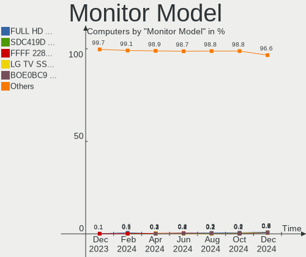

Fedora Hardware Trends
----------------------

A project to identify most popular hardware characteristics and track their change
over time based on data collected by Fedora users at https://Linux-Hardware.org.

Anyone can contribute to the study by uploading probes of their computers by
the [hw-probe](https://github.com/linuxhw/hw-probe) tool:

    sudo -E hw-probe -all -upload

This is a report for all computer types. See also reports for [desktops](/Dist/Fedora/Desktop/README.md) and [notebooks](/Dist/Fedora/Notebook/README.md).

Full-feature report is available here: https://linux-hardware.org/?view=trends

Period: Sep, 2020.

Contents
--------

- [ OS                       ](#os)
- [ OS Family                ](#os-family)
- [ Kernel                   ](#kernel)
- [ Kernel Family            ](#kernel-family)
- [ Kernel Major Ver.        ](#kernel-major-ver)
- [ Arch                     ](#arch)
- [ DE                       ](#de)
- [ Display Server           ](#display-server)
- [ Display Manager          ](#display-manager)
- [ OS Lang                  ](#os-lang)
- [ Boot Mode                ](#boot-mode)
- [ Filesystem               ](#filesystem)
- [ Part. scheme             ](#part-scheme)
- [ Dual Boot with Linux/BSD ](#dual-boot-with-linux/bsd)
- [ Dual Boot (Win)          ](#dual-boot-win)
- [ Country                  ](#country)
- [ City                     ](#city)
- [ Vendor                   ](#vendor)
- [ Model                    ](#model)
- [ Model Family             ](#model-family)
- [ MFG Year                 ](#mfg-year)
- [ Form Factor              ](#form-factor)
- [ Secure Boot              ](#secure-boot)
- [ Coreboot                 ](#coreboot)
- [ RAM Size                 ](#ram-size)
- [ RAM Used                 ](#ram-used)
- [ Has CD-ROM               ](#has-cd-rom)
- [ Total Drives             ](#total-drives)
- [ Has Ethernet             ](#has-ethernet)
- [ Drive Vendor             ](#drive-vendor)
- [ HDD Vendor               ](#hdd-vendor)
- [ SSD Vendor               ](#ssd-vendor)
- [ Drive Model              ](#drive-model)
- [ Drive Kind               ](#drive-kind)
- [ Drive Connector          ](#drive-connector)
- [ Drive Size               ](#drive-size)
- [ Space Total              ](#space-total)
- [ Space Used               ](#space-used)
- [ Malfunc. Drives          ](#malfunc-drives)
- [ Malfunc. Drive Vendor    ](#malfunc-drive-vendor)
- [ Malfunc. HDD Vendor      ](#malfunc-hdd-vendor)
- [ Malfunc. Drive Kind      ](#malfunc-drive-kind)
- [ Failed Drives            ](#failed-drives)
- [ Failed Drive Vendor      ](#failed-drive-vendor)
- [ Drive Status             ](#drive-status)
- [ Storage Vendor           ](#storage-vendor)
- [ Storage Model            ](#storage-model)
- [ Storage Kind             ](#storage-kind)
- [ CPU Vendor               ](#cpu-vendor)
- [ CPU Model                ](#cpu-model)
- [ CPU Model Family         ](#cpu-model-family)
- [ CPU Cores                ](#cpu-cores)
- [ CPU Sockets              ](#cpu-sockets)
- [ CPU Threads              ](#cpu-threads)
- [ CPU Op-Modes             ](#cpu-op-modes)
- [ CPU Microcode            ](#cpu-microcode)
- [ CPU Microarch            ](#cpu-microarch)
- [ GPU Vendor               ](#gpu-vendor)
- [ GPU Model                ](#gpu-model)
- [ GPU Combo                ](#gpu-combo)
- [ GPU Driver               ](#gpu-driver)
- [ GPU Memory               ](#gpu-memory)
- [ Monitor Vendor           ](#monitor-vendor)
- [ Monitor Model            ](#monitor-model)
- [ Monitor Resolution       ](#monitor-resolution)
- [ Monitor Diagonal         ](#monitor-diagonal)
- [ Monitor Width            ](#monitor-width)
- [ Aspect Ratio             ](#aspect-ratio)
- [ Monitor Area             ](#monitor-area)
- [ Pixel Density            ](#pixel-density)
- [ Multiple Monitors        ](#multiple-monitors)
- [ Net Controller Vendor    ](#net-controller-vendor)
- [ Net Controller Model     ](#net-controller-model)
- [ Wireless Vendor          ](#wireless-vendor)
- [ Wireless Model           ](#wireless-model)
- [ Ethernet Vendor          ](#ethernet-vendor)
- [ Ethernet Model           ](#ethernet-model)
- [ Net Controller Kind      ](#net-controller-kind)
- [ Used Controller          ](#used-controller)
- [ NICs                     ](#nics)
- [ Memory Vendor            ](#memory-vendor)
- [ Memory Model             ](#memory-model)
- [ Memory Kind              ](#memory-kind)
- [ Memory Form Factor       ](#memory-form-factor)
- [ Memory Size              ](#memory-size)
- [ Memory Speed             ](#memory-speed)
- [ Sound Vendor             ](#sound-vendor)
- [ Sound Model              ](#sound-model)
- [ Camera Vendor            ](#camera-vendor)
- [ Camera Model             ](#camera-model)
- [ Fingerprint Vendor       ](#fingerprint-vendor)
- [ Fingerprint Model        ](#fingerprint-model)
- [ Chipcard Vendor          ](#chipcard-vendor)
- [ Chipcard Model           ](#chipcard-model)
- [ Printer Vendor           ](#printer-vendor)
- [ Printer Model            ](#printer-model)
- [ Scanner Vendor           ](#scanner-vendor)
- [ Scanner Model            ](#scanner-model)
- [ Bluetooth Vendor         ](#bluetooth-vendor)
- [ Bluetooth Model          ](#bluetooth-model)
- [ Unsupported Devices      ](#unsupported-devices)
- [ Unsupported Device Types ](#unsupported-device-types)

OS
--

Installed operating systems

| Name      | Computers | Percent |
|-----------|-----------|---------|
| Fedora 32 | 308       | 91.67%  |
| Fedora 31 | 14        | 4.17%   |
| Fedora 33 | 10        | 2.98%   |
| Fedora 34 | 1         | 0.3%    |
| Fedora 30 | 1         | 0.3%    |
| Fedora 28 | 1         | 0.3%    |
| Fedora 25 | 1         | 0.3%    |

OS Family
---------

OS without a version

| Name   | Computers | Percent |
|--------|-----------|---------|
| Fedora | 336       | 100%    |

Kernel
------

Version of the Linux kernel

| Version                                                      | Computers | Percent |
|--------------------------------------------------------------|-----------|---------|
| 5.8.4-200.fc32.x86_64                                        | 95        | 28.27%  |
| 5.8.11-200.fc32.x86_64                                       | 43        | 12.8%   |
| 5.8.10-200.fc32.x86_64                                       | 40        | 11.9%   |
| 5.8.9-200.fc32.x86_64                                        | 28        | 8.33%   |
| 5.8.6-201.fc32.x86_64                                        | 24        | 7.14%   |
| 5.8.7-200.fc32.x86_64                                        | 19        | 5.65%   |
| 5.7.17-200.fc32.x86_64                                       | 11        | 3.27%   |
| 5.6.6-300.fc32.x86_64                                        | 11        | 3.27%   |
| 5.8.8-200.fc32.x86_64                                        | 10        | 2.98%   |
| 5.7.15-100.fc31.x86_64                                       | 6         | 1.79%   |
| 5.9.0-rc6+                                                   | 4         | 1.19%   |
| 5.7.16-200.fc32.x86_64                                       | 4         | 1.19%   |
| 5.7.15-200.fc32.x86_64                                       | 3         | 0.89%   |
| 5.8.9-301.fc33.x86_64                                        | 2         | 0.6%    |
| 5.8.3-300.fc33.x86_64                                        | 2         | 0.6%    |
| 5.8.10-300.fc33.x86_64                                       | 2         | 0.6%    |
| 5.8.10-100.fc31.x86_64                                       | 2         | 0.6%    |
| 5.7.14-200.fc32.x86_64                                       | 2         | 0.6%    |
| 5.6.15-300.fc32.x86_64                                       | 2         | 0.6%    |
| 5.9.0_rc4_tkg_cfs                                            | 1         | 0.3%    |
| 5.9.0-rc6-rt8                                                | 1         | 0.3%    |
| 5.9.0-0.rc6.20200925git171d4ff79f96.17.vanilla.1.fc32.x86_64 | 1         | 0.3%    |
| 5.9.0-0.rc3.1.fc34.x86_64                                    | 1         | 0.3%    |
| 5.8.9-250.vanilla.knurd.1.fc32.x86_64                        | 1         | 0.3%    |
| 5.8.9-101.fc31.x86_64                                        | 1         | 0.3%    |
| 5.8.8-1.surface.fc32.x86_64                                  | 1         | 0.3%    |
| 5.8.6-301.fc33.x86_64                                        | 1         | 0.3%    |
| 5.8.6-101.fc31.x86_64                                        | 1         | 0.3%    |
| 5.8.5-zen1                                                   | 1         | 0.3%    |
| 5.8.12-300.fc33.x86_64                                       | 1         | 0.3%    |
| 5.8.11-300.fc33.x86_64                                       | 1         | 0.3%    |
| 5.8.10-2.surface.fc32.x86_64                                 | 1         | 0.3%    |
| 5.8.0-custom                                                 | 1         | 0.3%    |
| 5.7.8-200.fc32.x86_64                                        | 1         | 0.3%    |
| 5.7.7-200.fc32.x86_64                                        | 1         | 0.3%    |
| 5.7.7-100.fc31.x86_64                                        | 1         | 0.3%    |
| 5.7.11-200.fc32.x86_64                                       | 1         | 0.3%    |
| 5.6.19-200.fc31.x86_64                                       | 1         | 0.3%    |
| 5.6.11-300.fc32.x86_64                                       | 1         | 0.3%    |
| 5.5.16-100.fc30.x86_64                                       | 1         | 0.3%    |
| 5.4.66-300.fc32.x86_64                                       | 1         | 0.3%    |
| 5.4.20-200.fc31.x86_64                                       | 1         | 0.3%    |
| 5.3.7-301.fc31.x86_64                                        | 1         | 0.3%    |
| 5.0.16-100.fc28.x86_64                                       | 1         | 0.3%    |
| 4.13.16-100.fc25.x86_64                                      | 1         | 0.3%    |

Kernel Family
-------------

Linux kernel without a distro release

| Version | Computers | Percent |
|---------|-----------|---------|
| 5.8.4   | 95        | 28.27%  |
| 5.8.10  | 45        | 13.39%  |
| 5.8.11  | 44        | 13.1%   |
| 5.8.9   | 32        | 9.52%   |
| 5.8.6   | 26        | 7.74%   |
| 5.8.7   | 19        | 5.65%   |
| 5.8.8   | 11        | 3.27%   |
| 5.7.17  | 11        | 3.27%   |
| 5.6.6   | 11        | 3.27%   |
| 5.7.15  | 9         | 2.68%   |
| 5.9.0   | 8         | 2.38%   |
| 5.7.16  | 4         | 1.19%   |
| 5.8.3   | 2         | 0.6%    |
| 5.7.7   | 2         | 0.6%    |
| 5.7.14  | 2         | 0.6%    |
| 5.6.15  | 2         | 0.6%    |
| 5.8.5   | 1         | 0.3%    |
| 5.8.12  | 1         | 0.3%    |
| 5.8.0   | 1         | 0.3%    |
| 5.7.8   | 1         | 0.3%    |
| 5.7.11  | 1         | 0.3%    |
| 5.6.19  | 1         | 0.3%    |
| 5.6.11  | 1         | 0.3%    |
| 5.5.16  | 1         | 0.3%    |
| 5.4.66  | 1         | 0.3%    |
| 5.4.20  | 1         | 0.3%    |
| 5.3.7   | 1         | 0.3%    |
| 5.0.16  | 1         | 0.3%    |
| 4.13.16 | 1         | 0.3%    |

Kernel Major Ver.
-----------------

Linux kernel major version

| Version | Computers | Percent |
|---------|-----------|---------|
| 5.8     | 277       | 82.44%  |
| 5.7     | 30        | 8.93%   |
| 5.6     | 15        | 4.46%   |
| 5.9     | 8         | 2.38%   |
| 5.4     | 2         | 0.6%    |
| 5.5     | 1         | 0.3%    |
| 5.3     | 1         | 0.3%    |
| 5.0     | 1         | 0.3%    |
| 4.13    | 1         | 0.3%    |

Arch
----

OS architecture (x86_64, i586, etc.)

| Name   | Computers | Percent |
|--------|-----------|---------|
| x86_64 | 336       | 100%    |

DE
--

Desktop Environment

| Name       | Computers | Percent |
|------------|-----------|---------|
| GNOME      | 251       | 74.7%   |
| KDE5       | 27        | 8.04%   |
| KDE        | 17        | 5.06%   |
| Unknown    | 13        | 3.87%   |
| XFCE       | 6         | 1.79%   |
| MATE       | 6         | 1.79%   |
| Cinnamon   | 5         | 1.49%   |
| X-Cinnamon | 4         | 1.19%   |
| Deepin     | 3         | 0.89%   |
| LXDE       | 2         | 0.6%    |
| KDE4       | 1         | 0.3%    |
| i3         | 1         | 0.3%    |

Display Server
--------------

X11 or Wayland

| Name    | Computers | Percent |
|---------|-----------|---------|
| Wayland | 159       | 47.32%  |
| X11     | 158       | 47.02%  |
| Tty     | 17        | 5.06%   |
| Web     | 1         | 0.3%    |
| Unknown | 1         | 0.3%    |

Display Manager
---------------

SDDM, LightDM, etc.

| Name    | Computers | Percent |
|---------|-----------|---------|
| Unknown | 167       | 49.7%   |
| GDM     | 127       | 37.8%   |
| SDDM    | 28        | 8.33%   |
| TDM     | 10        | 2.98%   |
| LightDM | 2         | 0.6%    |
| XDM     | 1         | 0.3%    |
| SLiM    | 1         | 0.3%    |

OS Lang
-------

Language

| Lang       | Computers | Percent |
|------------|-----------|---------|
| en_US      | 174       | 51.79%  |
| en_GB      | 32        | 9.52%   |
| de_DE      | 15        | 4.46%   |
| pt_BR      | 13        | 3.87%   |
| fr_FR      | 12        | 3.57%   |
| ru_RU      | 10        | 2.98%   |
| en_AU      | 9         | 2.68%   |
| pl_PL      | 8         | 2.38%   |
| en_CA      | 8         | 2.38%   |
| it_IT      | 5         | 1.49%   |
| en_US.utf8 | 5         | 1.49%   |
| sv_SE      | 4         | 1.19%   |
| nb_NO      | 2         | 0.6%    |
| fi_FI      | 2         | 0.6%    |
| es_ES.utf8 | 2         | 0.6%    |
| es_ES      | 2         | 0.6%    |
| es_CO      | 2         | 0.6%    |
| en_IN      | 2         | 0.6%    |
| en_GB.utf8 | 2         | 0.6%    |
| en_DK      | 2         | 0.6%    |
| cs_CZ      | 2         | 0.6%    |
| uk_UA.utf8 | 1         | 0.3%    |
| tr_TR      | 1         | 0.3%    |
| sk_SK      | 1         | 0.3%    |
| nl_NL      | 1         | 0.3%    |
| ko_KR      | 1         | 0.3%    |
| id_ID      | 1         | 0.3%    |
| hu_HU      | 1         | 0.3%    |
| fr_FR.utf8 | 1         | 0.3%    |
| fr_CA      | 1         | 0.3%    |
| fr_BE      | 1         | 0.3%    |
| es_PE      | 1         | 0.3%    |
| es_BO      | 1         | 0.3%    |
| es_AR      | 1         | 0.3%    |
| en_ZA      | 1         | 0.3%    |
| en_SE      | 1         | 0.3%    |
| en_PH      | 1         | 0.3%    |
| en_NZ      | 1         | 0.3%    |
| el_GR      | 1         | 0.3%    |
| de_DE.utf8 | 1         | 0.3%    |
| de_CH      | 1         | 0.3%    |
| da_DK      | 1         | 0.3%    |
| C          | 1         | 0.3%    |
| Unknown    | 1         | 0.3%    |

Boot Mode
---------

EFI or BIOS

| Mode | Computers | Percent |
|------|-----------|---------|
| EFI  | 263       | 78.27%  |
| BIOS | 73        | 21.73%  |

Filesystem
----------

Type of filesystem

| Type  | Computers | Percent |
|-------|-----------|---------|
| Ext4  | 278       | 82.74%  |
| Btrfs | 35        | 10.42%  |
| Xfs   | 21        | 6.25%   |
| Zfs   | 1         | 0.3%    |
| Ext3  | 1         | 0.3%    |

Part. scheme
------------

Scheme of partitioning

| Type    | Computers | Percent |
|---------|-----------|---------|
| Unknown | 161       | 47.92%  |
| GPT     | 157       | 46.73%  |
| MBR     | 18        | 5.36%   |

Dual Boot with Linux/BSD
------------------------

Hosting more than one Linux/BSD

| Dual boot | Computers | Percent |
|-----------|-----------|---------|
| No        | 306       | 91.07%  |
| Yes       | 30        | 8.93%   |

Dual Boot (Win)
---------------

Hosting Linux and Windows

| Dual boot | Computers | Percent |
|-----------|-----------|---------|
| No        | 269       | 80.06%  |
| Yes       | 67        | 19.94%  |

Country
-------

Geographic location (country)

| Country                | Computers | Percent |
|------------------------|-----------|---------|
| USA                    | 76        | 22.62%  |
| Germany                | 28        | 8.33%   |
| Brazil                 | 22        | 6.55%   |
| France                 | 19        | 5.65%   |
| Russia                 | 13        | 3.87%   |
| Canada                 | 13        | 3.87%   |
| Poland                 | 12        | 3.57%   |
| Netherlands            | 12        | 3.57%   |
| Australia              | 10        | 2.98%   |
| UK                     | 9         | 2.68%   |
| Spain                  | 9         | 2.68%   |
| Italy                  | 8         | 2.38%   |
| Sweden                 | 7         | 2.08%   |
| India                  | 7         | 2.08%   |
| Finland                | 7         | 2.08%   |
| Switzerland            | 6         | 1.79%   |
| Norway                 | 4         | 1.19%   |
| Korea, Republic of     | 4         | 1.19%   |
| Denmark                | 4         | 1.19%   |
| Czech Republic         | 4         | 1.19%   |
| Belgium                | 4         | 1.19%   |
| Austria                | 4         | 1.19%   |
| Ukraine                | 3         | 0.89%   |
| Turkey                 | 3         | 0.89%   |
| Slovakia               | 3         | 0.89%   |
| Romania                | 3         | 0.89%   |
| Thailand               | 2         | 0.6%    |
| South Africa           | 2         | 0.6%    |
| Philippines            | 2         | 0.6%    |
| Macedonia              | 2         | 0.6%    |
| Kenya                  | 2         | 0.6%    |
| Indonesia              | 2         | 0.6%    |
| Iceland                | 2         | 0.6%    |
| Hungary                | 2         | 0.6%    |
| Colombia               | 2         | 0.6%    |
| Bosnia and Herzegovina | 2         | 0.6%    |
| Zimbabwe               | 1         | 0.3%    |
| Slovenia               | 1         | 0.3%    |
| Singapore              | 1         | 0.3%    |
| Portugal               | 1         | 0.3%    |
| Peru                   | 1         | 0.3%    |
| Nigeria                | 1         | 0.3%    |
| New Zealand            | 1         | 0.3%    |
| Mexico                 | 1         | 0.3%    |
| Malaysia               | 1         | 0.3%    |
| Luxembourg             | 1         | 0.3%    |
| Japan                  | 1         | 0.3%    |
| Iran                   | 1         | 0.3%    |
| Greece                 | 1         | 0.3%    |
| Egypt                  | 1         | 0.3%    |
| Czechia                | 1         | 0.3%    |
| Croatia                | 1         | 0.3%    |
| Chile                  | 1         | 0.3%    |
| Bulgaria               | 1         | 0.3%    |
| Bolivia                | 1         | 0.3%    |
| Bangladesh             | 1         | 0.3%    |
| Argentina              | 1         | 0.3%    |
| Albania                | 1         | 0.3%    |

City
----

Geographic location (city)

| City               | Computers | Percent |
|--------------------|-----------|---------|
| Helsinki           | 7         | 2.08%   |
| Moscow             | 6         | 1.79%   |
| Toronto            | 4         | 1.19%   |
| Stockholm          | 4         | 1.19%   |
| Delft              | 4         | 1.19%   |
| São Paulo         | 3         | 0.89%   |
| Poznan             | 3         | 0.89%   |
| Milan              | 3         | 0.89%   |
| Kansas City        | 3         | 0.89%   |
| Hamburg            | 3         | 0.89%   |
| Berlin             | 3         | 0.89%   |
| Amsterdam          | 3         | 0.89%   |
| Almería           | 3         | 0.89%   |
| Zurich             | 2         | 0.6%    |
| Wrocław           | 2         | 0.6%    |
| Villeurbanne       | 2         | 0.6%    |
| The Bronx          | 2         | 0.6%    |
| St Petersburg      | 2         | 0.6%    |
| Seoul              | 2         | 0.6%    |
| Rostock            | 2         | 0.6%    |
| Reykjavik          | 2         | 0.6%    |
| Recife             | 2         | 0.6%    |
| Portland           | 2         | 0.6%    |
| Paris              | 2         | 0.6%    |
| Orlando            | 2         | 0.6%    |
| North Las Vegas    | 2         | 0.6%    |
| Nairobi            | 2         | 0.6%    |
| Kyiv               | 2         | 0.6%    |
| Klosterneuburg     | 2         | 0.6%    |
| Joliette           | 2         | 0.6%    |
| Greifswald         | 2         | 0.6%    |
| Geneva             | 2         | 0.6%    |
| Denver             | 2         | 0.6%    |
| Copenhagen         | 2         | 0.6%    |
| Charlotte          | 2         | 0.6%    |
| Bratislava         | 2         | 0.6%    |
| Bellevue           | 2         | 0.6%    |
| Łódź            | 1         | 0.3%    |
| Žilina            | 1         | 0.3%    |
| Zaragoza           | 1         | 0.3%    |
| Zagreb             | 1         | 0.3%    |
| Wrexham            | 1         | 0.3%    |
| Wrestedt           | 1         | 0.3%    |
| Woerden            | 1         | 0.3%    |
| Wilmington         | 1         | 0.3%    |
| Wijk bij Duurstede | 1         | 0.3%    |
| White Hall         | 1         | 0.3%    |
| Westerville        | 1         | 0.3%    |
| West Chester       | 1         | 0.3%    |
| Wateringen         | 1         | 0.3%    |
| Warsaw             | 1         | 0.3%    |
| Wahroonga          | 1         | 0.3%    |
| Villavicencio      | 1         | 0.3%    |
| Victoria           | 1         | 0.3%    |
| Veresegyhaz        | 1         | 0.3%    |
| Veles              | 1         | 0.3%    |
| Vancouver          | 1         | 0.3%    |
| Uccle              | 1         | 0.3%    |
| Trieste            | 1         | 0.3%    |
| Trenton            | 1         | 0.3%    |

Vendor
------

Motherboard manufacturer

| Name                | Computers | Percent |
|---------------------|-----------|---------|
| Lenovo              | 82        | 24.4%   |
| ASUSTek Computer    | 45        | 13.39%  |
| Dell                | 41        | 12.2%   |
| Hewlett-Packard     | 37        | 11.01%  |
| Gigabyte Technology | 32        | 9.52%   |
| MSI                 | 23        | 6.85%   |
| ASRock              | 17        | 5.06%   |
| Acer                | 16        | 4.76%   |
| Samsung Electronics | 6         | 1.79%   |
| Toshiba             | 4         | 1.19%   |
| Apple               | 4         | 1.19%   |
| Intel               | 3         | 0.89%   |
| Fujitsu             | 3         | 0.89%   |
| Sony                | 2         | 0.6%    |
| Positivo            | 2         | 0.6%    |
| Microsoft           | 2         | 0.6%    |
| LG Electronics      | 2         | 0.6%    |
| System76            | 1         | 0.3%    |
| Supermicro          | 1         | 0.3%    |
| Shuttle             | 1         | 0.3%    |
| Schenker            | 1         | 0.3%    |
| Razer               | 1         | 0.3%    |
| Pegatron            | 1         | 0.3%    |
| PCWare              | 1         | 0.3%    |
| OEM                 | 1         | 0.3%    |
| Notebook            | 1         | 0.3%    |
| MOTILE              | 1         | 0.3%    |
| KIANO               | 1         | 0.3%    |
| HUAWEI              | 1         | 0.3%    |
| Biostar             | 1         | 0.3%    |
| ASRockRack          | 1         | 0.3%    |
| Unknown             | 1         | 0.3%    |

Model
-----

Motherboard model

| Name                                                | Computers | Percent |
|-----------------------------------------------------|-----------|---------|
| ASUS All Series                                     | 5         | 1.49%   |
| MSI MS-7C02                                         | 4         | 1.19%   |
| Lenovo Yoga C740-14IML 81TC                         | 4         | 1.19%   |
| Dell XPS 13 9370                                    | 3         | 0.89%   |
| Unknown                                             | 3         | 0.89%   |
| MSI MS-7C84                                         | 2         | 0.6%    |
| MSI MS-7B86                                         | 2         | 0.6%    |
| MSI MS-7866                                         | 2         | 0.6%    |
| LG Electronics 17Z90N-V.AA77G                       | 2         | 0.6%    |
| Lenovo ThinkPad X1 Carbon Gen 8 20U9CTO1WW          | 2         | 0.6%    |
| Lenovo ThinkPad T14 Gen 1 20UDCTO1WW                | 2         | 0.6%    |
| Lenovo Legion 5 15ARH05 82B5                        | 2         | 0.6%    |
| Lenovo IdeaPad FLEX 5-1570 81CA                     | 2         | 0.6%    |
| Lenovo IdeaPad Flex 5 14ARE05 81X2                  | 2         | 0.6%    |
| HP Pavilion Laptop 15-cw1xxx                        | 2         | 0.6%    |
| Gigabyte X570 AORUS ELITE                           | 2         | 0.6%    |
| Gigabyte B550M AORUS PRO                            | 2         | 0.6%    |
| Gigabyte B450M S2H                                  | 2         | 0.6%    |
| Dell XPS 8930                                       | 2         | 0.6%    |
| Dell XPS 15 9570                                    | 2         | 0.6%    |
| Dell XPS 15 9560                                    | 2         | 0.6%    |
| Dell XPS 15 9500                                    | 2         | 0.6%    |
| Dell OptiPlex 9020                                  | 2         | 0.6%    |
| Dell Inspiron 5590                                  | 2         | 0.6%    |
| Dell Inspiron 5570                                  | 2         | 0.6%    |
| ASUS PRIME B350-PLUS                                | 2         | 0.6%    |
| Toshiba Satellite S875D                             | 1         | 0.3%    |
| Toshiba Satellite PRO C70-B                         | 1         | 0.3%    |
| Toshiba Satellite C70-A-K2W                         | 1         | 0.3%    |
| Toshiba Satellite C660                              | 1         | 0.3%    |
| System76 Serval                                     | 1         | 0.3%    |
| Supermicro SYS-2049U-TR4                            | 1         | 0.3%    |
| Sony VPCF131FM                                      | 1         | 0.3%    |
| Sony SVF15213SNB                                    | 1         | 0.3%    |
| Shuttle SP45                                        | 1         | 0.3%    |
| Schenker XMG_APEX15_XAP15E20                        | 1         | 0.3%    |
| Samsung Electronics R430/P430                       | 1         | 0.3%    |
| Samsung Electronics 850XBC                          | 1         | 0.3%    |
| Samsung Electronics 350V5C/351V5C/3540VC/3440VC     | 1         | 0.3%    |
| Samsung Electronics 300E5M/300E5L                   | 1         | 0.3%    |
| Samsung Electronics 300E5EV/300E4EV/270E5EV/270E4EV | 1         | 0.3%    |
| Samsung Electronics 300E4C/300E5C/300E7C            | 1         | 0.3%    |
| Razer Blade Stealth 13 Late 2019                    | 1         | 0.3%    |
| Positivo POS-PARS760GCD                             | 1         | 0.3%    |
| Positivo CHT12CP                                    | 1         | 0.3%    |
| Pegatron h8-1024ch                                  | 1         | 0.3%    |
| PCWare IPMH61R3                                     | 1         | 0.3%    |
| OEM 45CMX/45GMX/45CMX-K                             | 1         | 0.3%    |
| Notebook NH55RGQ                                    | 1         | 0.3%    |
| MSI MS-7C56                                         | 1         | 0.3%    |
| MSI MS-7C35                                         | 1         | 0.3%    |
| MSI MS-7B93                                         | 1         | 0.3%    |
| MSI MS-7B85                                         | 1         | 0.3%    |
| MSI MS-7B61                                         | 1         | 0.3%    |
| MSI MS-7B22                                         | 1         | 0.3%    |
| MSI MS-7A39                                         | 1         | 0.3%    |
| MSI MS-7A38                                         | 1         | 0.3%    |
| MSI MS-7821                                         | 1         | 0.3%    |
| MSI GX780/GT780/GT780DX/GT783                       | 1         | 0.3%    |
| MSI GP72 7RE                                        | 1         | 0.3%    |

Model Family
------------

Motherboard model prefix

| Name                          | Computers | Percent |
|-------------------------------|-----------|---------|
| Lenovo ThinkPad               | 43        | 12.8%   |
| Lenovo IdeaPad                | 16        | 4.76%   |
| Dell XPS                      | 16        | 4.76%   |
| Acer Aspire                   | 10        | 2.98%   |
| Lenovo Yoga                   | 9         | 2.68%   |
| ASUS PRIME                    | 8         | 2.38%   |
| HP Pavilion                   | 7         | 2.08%   |
| HP ENVY                       | 7         | 2.08%   |
| Dell Latitude                 | 7         | 2.08%   |
| Gigabyte X570                 | 6         | 1.79%   |
| Dell Precision                | 6         | 1.79%   |
| Dell Inspiron                 | 6         | 1.79%   |
| ASUS TUF                      | 5         | 1.49%   |
| ASUS ROG                      | 5         | 1.49%   |
| ASUS All                      | 5         | 1.49%   |
| Toshiba Satellite             | 4         | 1.19%   |
| MSI MS-7C02                   | 4         | 1.19%   |
| HP Laptop                     | 4         | 1.19%   |
| Lenovo Legion                 | 3         | 0.89%   |
| HP ProBook                    | 3         | 0.89%   |
| HP EliteBook                  | 3         | 0.89%   |
| Gigabyte B450M                | 3         | 0.89%   |
| Dell OptiPlex                 | 3         | 0.89%   |
| Acer Nitro                    | 3         | 0.89%   |
| Unknown                       | 3         | 0.89%   |
| MSI MS-7C84                   | 2         | 0.6%    |
| MSI MS-7B86                   | 2         | 0.6%    |
| MSI MS-7866                   | 2         | 0.6%    |
| Microsoft Surface             | 2         | 0.6%    |
| LG Electronics 17Z90N-V.AA77G | 2         | 0.6%    |
| Lenovo ThinkStation           | 2         | 0.6%    |
| HP Stream                     | 2         | 0.6%    |
| HP OMEN                       | 2         | 0.6%    |
| Gigabyte Z370                 | 2         | 0.6%    |
| Gigabyte TRX40                | 2         | 0.6%    |
| Gigabyte B550M                | 2         | 0.6%    |
| ASUS Maximus                  | 2         | 0.6%    |
| Acer Swift                    | 2         | 0.6%    |
| System76 Serval               | 1         | 0.3%    |
| Supermicro SYS-2049U-TR4      | 1         | 0.3%    |
| Sony VPCF131FM                | 1         | 0.3%    |
| Sony SVF15213SNB              | 1         | 0.3%    |
| Shuttle SP45                  | 1         | 0.3%    |
| Schenker XMG                  | 1         | 0.3%    |
| Samsung Electronics R430      | 1         | 0.3%    |
| Samsung Electronics 850XBC    | 1         | 0.3%    |
| Samsung Electronics 350V5C    | 1         | 0.3%    |
| Samsung Electronics 300E5M    | 1         | 0.3%    |
| Samsung Electronics 300E5EV   | 1         | 0.3%    |
| Samsung Electronics 300E4C    | 1         | 0.3%    |
| Razer Blade                   | 1         | 0.3%    |
| Positivo POS-PARS760GCD       | 1         | 0.3%    |
| Positivo CHT12CP              | 1         | 0.3%    |
| Pegatron h8-1024ch            | 1         | 0.3%    |
| PCWare IPMH61R3               | 1         | 0.3%    |
| OEM 45CMX                     | 1         | 0.3%    |
| Notebook NH55RGQ              | 1         | 0.3%    |
| MSI MS-7C56                   | 1         | 0.3%    |
| MSI MS-7C35                   | 1         | 0.3%    |
| MSI MS-7B93                   | 1         | 0.3%    |

MFG Year
--------

Motherboard manufacture year

| Year | Computers | Percent |
|------|-----------|---------|
| 2020 | 114       | 33.93%  |
| 2019 | 78        | 23.21%  |
| 2018 | 38        | 11.31%  |
| 2017 | 17        | 5.06%   |
| 2014 | 17        | 5.06%   |
| 2013 | 16        | 4.76%   |
| 2015 | 15        | 4.46%   |
| 2011 | 14        | 4.17%   |
| 2016 | 12        | 3.57%   |
| 2012 | 9         | 2.68%   |
| 2010 | 3         | 0.89%   |
| 2009 | 2         | 0.6%    |
| 2008 | 1         | 0.3%    |

Form Factor
-----------

Physical design of the computer

| Name        | Computers | Percent |
|-------------|-----------|---------|
| Notebook    | 169       | 50.3%   |
| Desktop     | 137       | 40.77%  |
| Convertible | 23        | 6.85%   |
| Tablet      | 4         | 1.19%   |
| All in one  | 2         | 0.6%    |
| Server      | 1         | 0.3%    |

Secure Boot
-----------

Enabled or disabled

| State    | Computers | Percent |
|----------|-----------|---------|
| Disabled | 290       | 86.31%  |
| Enabled  | 46        | 13.69%  |

Coreboot
--------

Have coreboot on board

| Used | Computers | Percent |
|------|-----------|---------|
| No   | 336       | 100%    |

RAM Size
--------

Total RAM memory

| Size in GB      | Computers | Percent |
|-----------------|-----------|---------|
| 16.01-24.0      | 108       | 32.14%  |
| 4.01-8.0        | 63        | 18.75%  |
| 8.01-16.0       | 62        | 18.45%  |
| 32.01-64.0      | 45        | 13.39%  |
| 3.01-4.0        | 30        | 8.93%   |
| 64.01-256.0     | 13        | 3.87%   |
| 24.01-32.0      | 10        | 2.98%   |
| 1.01-2.0        | 3         | 0.89%   |
| More than 256.0 | 1         | 0.3%    |
| 2.01-3.0        | 1         | 0.3%    |

RAM Used
--------

Used RAM memory

| Used GB    | Computers | Percent |
|------------|-----------|---------|
| 4.01-8.0   | 89        | 26.49%  |
| 2.01-3.0   | 84        | 25%     |
| 3.01-4.0   | 70        | 20.83%  |
| 8.01-16.0  | 40        | 11.9%   |
| 1.01-2.0   | 38        | 11.31%  |
| 0.01-1.0   | 8         | 2.38%   |
| 16.01-24.0 | 6         | 1.79%   |
| 32.01-64.0 | 1         | 0.3%    |

Has CD-ROM
----------

Has CD-ROM on board

| Presented | Computers | Percent |
|-----------|-----------|---------|
| No        | 240       | 71.43%  |
| Yes       | 96        | 28.57%  |

Total Drives
------------

Number of drives on board

| Drives | Computers | Percent |
|--------|-----------|---------|
| 1      | 183       | 54.46%  |
| 2      | 83        | 24.7%   |
| 3      | 33        | 9.82%   |
| 4      | 18        | 5.36%   |
| 5      | 11        | 3.27%   |
| 7      | 3         | 0.89%   |
| 0      | 2         | 0.6%    |
| 11     | 1         | 0.3%    |
| 8      | 1         | 0.3%    |
| 6      | 1         | 0.3%    |

Has Ethernet
------------

Has Ethernet on board

| Presented | Computers | Percent |
|-----------|-----------|---------|
| Yes       | 285       | 84.82%  |
| No        | 51        | 15.18%  |

Drive Vendor
------------

Hard drive vendors

| Vendor                    | Computers | Drives  | Percent |
|---------------------------|-----------|---------|---------|
| Samsung Electronics       | 118       | 151     | 22.18%  |
| WDC                       | 83        | 105     | 15.6%   |
| Seagate                   | 66        | 83      | 12.41%  |
| Toshiba                   | 37        | 40      | 6.95%   |
| Sandisk                   | 37        | 39      | 6.95%   |
| Kingston                  | 24        | 29      | 4.51%   |
| Intel                     | 22        | 26      | 4.14%   |
| Crucial                   | 18        | 21      | 3.38%   |
| Unknown                   | 17        | 23      | 3.2%    |
| SK Hynix                  | 17        | 17      | 3.2%    |
| HGST                      | 14        | 15      | 2.63%   |
| Hitachi                   | 10        | 11      | 1.88%   |
| Phison                    | 8         | 9       | 1.5%    |
| Micron Technology         | 5         | 6       | 0.94%   |
| A-DATA Technology         | 5         | 5       | 0.94%   |
| Transcend                 | 4         | 4       | 0.75%   |
| Corsair                   | 4         | 4       | 0.75%   |
| KIOXIA                    | 3         | 3       | 0.56%   |
| HL-DT-ST                  | 3         | Unknown | 0.56%   |
| China                     | 3         | 3       | 0.56%   |
| SPCC                      | 2         | 2       | 0.38%   |
| OCZ                       | 2         | 2       | 0.38%   |
| LITEONIT                  | 2         | 2       | 0.38%   |
| LITEON                    | 2         | 2       | 0.38%   |
| JMicron                   | 2         | 1       | 0.38%   |
| Gigabyte Technology       | 2         | 2       | 0.38%   |
| Apple                     | 2         | 2       | 0.38%   |
| Apacer                    | 2         | 2       | 0.38%   |
| XPG                       | 1         | 1       | 0.19%   |
| Union Memory              | 1         | 1       | 0.19%   |
| Solid State Storage       | 1         | 1       | 0.19%   |
| Realtek Semiconductor     | 1         | 1       | 0.19%   |
| PNY                       | 1         | 1       | 0.19%   |
| Patriot                   | 1         | 1       | 0.19%   |
| Mushkin                   | 1         | 1       | 0.19%   |
| Micron/Crucial Technology | 1         | 1       | 0.19%   |
| MAXTOR                    | 1         | 1       | 0.19%   |
| Lexar                     | 1         | 1       | 0.19%   |
| KINGMAX                   | 1         | 1       | 0.19%   |
| KingDian                  | 1         | 1       | 0.19%   |
| InnoDisk                  | 1         | 1       | 0.19%   |
| INDMEM                    | 1         | 1       | 0.19%   |
| Hewlett-Packard           | 1         | 1       | 0.19%   |
| External                  | 1         | 1       | 0.19%   |
| BIWIN SS                  | 1         | 1       | 0.19%   |
| 2-Power                   | 1         | 1       | 0.19%   |

HDD Vendor
----------

Hard disk drive vendors

| Vendor              | Computers | Drives | Percent |
|---------------------|-----------|--------|---------|
| Seagate             | 66        | 80     | 37.29%  |
| WDC                 | 63        | 80     | 35.59%  |
| Toshiba             | 19        | 21     | 10.73%  |
| HGST                | 14        | 15     | 7.91%   |
| Hitachi             | 10        | 11     | 5.65%   |
| Samsung Electronics | 3         | 4      | 1.69%   |
| MAXTOR              | 1         | 1      | 0.56%   |
| Apple               | 1         | 1      | 0.56%   |

SSD Vendor
----------

Solid state drive vendors

| Vendor              | Computers | Drives | Percent |
|---------------------|-----------|--------|---------|
| Samsung Electronics | 58        | 73     | 31.35%  |
| SanDisk             | 26        | 28     | 14.05%  |
| Kingston            | 18        | 22     | 9.73%   |
| Crucial             | 17        | 20     | 9.19%   |
| WDC                 | 13        | 13     | 7.03%   |
| Intel               | 9         | 10     | 4.86%   |
| A-DATA Technology   | 5         | 5      | 2.7%    |
| Toshiba             | 4         | 4      | 2.16%   |
| SK Hynix            | 4         | 4      | 2.16%   |
| Unknown             | 3         | 3      | 1.62%   |
| Transcend           | 3         | 3      | 1.62%   |
| Micron Technology   | 3         | 4      | 1.62%   |
| Corsair             | 3         | 3      | 1.62%   |
| China               | 3         | 3      | 1.62%   |
| OCZ                 | 2         | 2      | 1.08%   |
| LITEONIT            | 2         | 2      | 1.08%   |
| Apacer              | 2         | 2      | 1.08%   |
| PNY                 | 1         | 1      | 0.54%   |
| Patriot             | 1         | 1      | 0.54%   |
| LITEON              | 1         | 1      | 0.54%   |
| KINGMAX             | 1         | 1      | 0.54%   |
| KingDian            | 1         | 1      | 0.54%   |
| JMicron             | 1         | 1      | 0.54%   |
| InnoDisk            | 1         | 1      | 0.54%   |
| Hewlett-Packard     | 1         | 1      | 0.54%   |
| Apple               | 1         | 1      | 0.54%   |
| 2-Power             | 1         | 1      | 0.54%   |

Drive Model
-----------

Hard drive models

| Model                        | Computers | Percent |
|------------------------------|-----------|---------|
| NVMe SSD Drive 512GB         | 22        | 3.69%   |
| NVMe SSD Drive 256GB         | 22        | 3.69%   |
| SSD 850 EVO 250GB            | 9         | 1.51%   |
| NVMe SSD Drive 500GB         | 9         | 1.51%   |
| SSD 850 EVO 500GB            | 8         | 1.34%   |
| NVMe SSD Drive 1024GB        | 8         | 1.34%   |
| NVMe SSD Drive 1TB           | 7         | 1.17%   |
| SSD 860 EVO 500GB            | 6         | 1.01%   |
| SSD 860 EVO 1TB              | 6         | 1.01%   |
| HTS721010A9E630 1TB          | 6         | 1.01%   |
| WD10EZEX-08WN4A0 1TB         | 5         | 0.84%   |
| ST2000DM001-1ER164 2TB       | 5         | 0.84%   |
| ST1000DM010-2EP102 1TB       | 5         | 0.84%   |
| SSD 860 QVO 1TB              | 5         | 0.84%   |
| Expansion Desk 6TB           | 5         | 0.84%   |
| DT01ACA300 3TB               | 5         | 0.84%   |
| ST3000DM008-2DM166 3TB       | 4         | 0.67%   |
| ST1000LM035-1RK172 1TB       | 4         | 0.67%   |
| ST1000DM003-1SB102 1TB       | 4         | 0.67%   |
| SSD 970 EVO Plus 500GB       | 4         | 0.67%   |
| SSD 860 EVO 250GB            | 4         | 0.67%   |
| SSD 840 EVO 250GB            | 4         | 0.67%   |
| SA400S37480G 480GB SSD       | 4         | 0.67%   |
| NVMe SSD Drive 250GB         | 4         | 0.67%   |
| MZVLB512HBJQ-000L7 512GB     | 4         | 0.67%   |
| MZVLB512HBJQ-000L2 512GB     | 4         | 0.67%   |
| WDS500G2B0A-00SM50 500GB SSD | 3         | 0.5%    |
| WDS240G2G0A-00JH30 240GB SSD | 3         | 0.5%    |
| WD30EFRX-68EUZN0 3TB         | 3         | 0.5%    |
| WD10EZEX-08M2NA0 1TB         | 3         | 0.5%    |
| ST500DM002-1BD142 500GB      | 3         | 0.5%    |
| SSDPEKNW010T8 1TB            | 3         | 0.5%    |
| SSD U110 16GB                | 3         | 0.5%    |
| SSD 960 EVO 500GB            | 3         | 0.5%    |
| NVMe SSD Drive 2TB           | 3         | 0.5%    |
| NVMe SSD Drive 128GB         | 3         | 0.5%    |
| MMC Card  32GB               | 3         | 0.5%    |
| CT500MX500SSD1 500GB         | 3         | 0.5%    |
| CT480BX500SSD1 480GB         | 3         | 0.5%    |
| WDS100T3X0C-00SJG0 1TB       | 2         | 0.34%   |
| WD5000AAKX-003CA0 500GB      | 2         | 0.34%   |
| WD30EFRX-68AX9N0 3TB         | 2         | 0.34%   |
| WD20EZRZ-00Z5HB0 2TB         | 2         | 0.34%   |
| WD20EZAZ-00GGJB0 2TB         | 2         | 0.34%   |
| WD10JPVX-22JC3T0 1TB         | 2         | 0.34%   |
| WD10EZEX-60WN4A1 1TB         | 2         | 0.34%   |
| WD10EZEX-21WN4A0 1TB         | 2         | 0.34%   |
| WD10EZEX-00BN5A0 1TB         | 2         | 0.34%   |
| WD1002FAEX-00Z3A0 1TB        | 2         | 0.34%   |
| SV300S37A240G 240GB SSD      | 2         | 0.34%   |
| SV300S37A120G 120GB SSD      | 2         | 0.34%   |
| SUV400S37120G 120GB SSD      | 2         | 0.34%   |
| ST500LM000-SSHD-8GB          | 2         | 0.34%   |
| ST4000VN008-2DR166 4TB       | 2         | 0.34%   |
| ST3500312CS 499GB            | 2         | 0.34%   |
| ST2000DM008-2FR102 2TB       | 2         | 0.34%   |
| ST1000LM048-2E7172 1TB       | 2         | 0.34%   |
| ST1000DM003-1SB10C 1TB       | 2         | 0.34%   |
| SSD PLUS 240GB               | 2         | 0.34%   |
| SSD PLUS 120GB               | 2         | 0.34%   |

Drive Kind
----------

HDD or SSD

| Kind    | Computers | Drives | Percent |
|---------|-----------|--------|---------|
| NVMe    | 157       | 182    | 32.78%  |
| SSD     | 152       | 211    | 31.73%  |
| HDD     | 147       | 213    | 30.69%  |
| Unknown | 12        | 8      | 2.51%   |
| MMC     | 11        | 13     | 2.3%    |

Drive Connector
---------------

SATA, SAS, NVMe, etc.

| Type | Computers | Drives | Percent |
|------|-----------|--------|---------|
| SATA | 226       | 413    | 54.72%  |
| NVMe | 157       | 182    | 38.01%  |
| SAS  | 19        | 19     | 4.6%    |
| MMC  | 11        | 13     | 2.66%   |

Drive Size
----------

Size of hard drive

| Size in TB | Computers | Drives | Percent |
|------------|-----------|--------|---------|
| 0.01-0.5   | 229       | 326    | 48.72%  |
| 0.51-1.0   | 157       | 191    | 33.4%   |
| 1.01-2.0   | 47        | 56     | 10%     |
| 2.01-3.0   | 19        | 26     | 4.04%   |
| 3.01-4.0   | 11        | 17     | 2.34%   |
| 4.01-10.0  | 7         | 11     | 1.49%   |

Space Total
-----------

Amount of disk space available on the file system

| Size in GB     | Computers | Percent |
|----------------|-----------|---------|
| 101-250        | 84        | 25%     |
| 251-500        | 65        | 19.35%  |
| 501-1000       | 62        | 18.45%  |
| More than 3000 | 30        | 8.93%   |
| 1001-2000      | 29        | 8.63%   |
| 2001-3000      | 19        | 5.65%   |
| 1-20           | 17        | 5.06%   |
| 51-100         | 17        | 5.06%   |
| 21-50          | 11        | 3.27%   |
| Unknown        | 2         | 0.6%    |

Space Used
----------

Amount of used disk space

| Used GB        | Computers | Percent |
|----------------|-----------|---------|
| 1-20           | 78        | 23.21%  |
| 21-50          | 56        | 16.67%  |
| 51-100         | 49        | 14.58%  |
| 101-250        | 48        | 14.29%  |
| 251-500        | 41        | 12.2%   |
| 501-1000       | 22        | 6.55%   |
| 1001-2000      | 21        | 6.25%   |
| More than 3000 | 10        | 2.98%   |
| 2001-3000      | 8         | 2.38%   |
| Unknown        | 2         | 0.6%    |
| 0              | 1         | 0.3%    |

Malfunc. Drives
---------------

Drive models with a malfunction

| Model                          | Computers | Drives | Percent |
|--------------------------------|-----------|--------|---------|
| ST2000DM001-1ER164 2TB         | 2         | 2      | 5.88%   |
| WD30EZRX-00D8PB0 3TB           | 1         | 1      | 2.94%   |
| WD1600AAJS-75M0A0 160GB        | 1         | 1      | 2.94%   |
| WD10EZEX-00BN5A0 1TB           | 1         | 1      | 2.94%   |
| WD10EACS-00D6B0 1TB            | 1         | 1      | 2.94%   |
| VERTEX4 256GB SSD              | 1         | 1      | 2.94%   |
| VERTEX4 128GB SSD              | 1         | 1      | 2.94%   |
| ST9750420AS 752GB              | 1         | 1      | 2.94%   |
| ST9500423AS 500GB              | 1         | 1      | 2.94%   |
| ST500LM000-SSHD-8GB            | 1         | 1      | 2.94%   |
| ST500DM002-1BD142 500GB        | 1         | 1      | 2.94%   |
| ST3160815AS 160GB              | 1         | 1      | 2.94%   |
| ST31500341AS 1TB               | 1         | 1      | 2.94%   |
| ST3000DM008-2DM166 3TB         | 1         | 1      | 2.94%   |
| ST2000VX000-1CU164 2TB         | 1         | 1      | 2.94%   |
| ST1000NM0011 1TB               | 1         | 2      | 2.94%   |
| SSDSC2KW480H6 480GB            | 1         | 1      | 2.94%   |
| SSDSA2M160G2GC 160GB           | 1         | 1      | 2.94%   |
| SSD PLUS 240GB                 | 1         | 1      | 2.94%   |
| SSD 960 PRO 512GB              | 1         | 1      | 2.94%   |
| SSD 960 EVO 500GB              | 1         | 1      | 2.94%   |
| SSD 850 EVO 1TB                | 1         | 1      | 2.94%   |
| SD7SB6S-128G-1006 128GB SSD    | 1         | 1      | 2.94%   |
| SC401 SATA 512GB SSD           | 1         | 1      | 2.94%   |
| HTS727550A9E364 500GB          | 1         | 1      | 2.94%   |
| HTS723232A7A364 320GB          | 1         | 1      | 2.94%   |
| HTS721010A9E630 1TB            | 1         | 1      | 2.94%   |
| HTS545050A7E680 500GB          | 1         | 1      | 2.94%   |
| HTS542516K9SA00 160GB          | 1         | 1      | 2.94%   |
| HTS541010A9E680 1TB            | 1         | 1      | 2.94%   |
| HDS721010CLA330 1TB            | 1         | 1      | 2.94%   |
| BC501 HFM128GDJTNG-8310A 128GB | 1         | 1      | 2.94%   |
| AS340 240GB SSD                | 1         | 1      | 2.94%   |

Malfunc. Drive Vendor
---------------------

Vendors of faulty drives

| Vendor              | Computers | Drives | Percent |
|---------------------|-----------|--------|---------|
| Seagate             | 11        | 12     | 33.33%  |
| WDC                 | 4         | 4      | 12.12%  |
| Samsung Electronics | 3         | 3      | 9.09%   |
| Hitachi             | 3         | 4      | 9.09%   |
| HGST                | 3         | 3      | 9.09%   |
| SK Hynix            | 2         | 2      | 6.06%   |
| SanDisk             | 2         | 2      | 6.06%   |
| OCZ                 | 2         | 2      | 6.06%   |
| Intel               | 2         | 2      | 6.06%   |
| Apacer              | 1         | 1      | 3.03%   |

Malfunc. HDD Vendor
-------------------

Vendors of faulty HDD drives

| Vendor  | Computers | Drives | Percent |
|---------|-----------|--------|---------|
| Seagate | 11        | 12     | 52.38%  |
| WDC     | 4         | 4      | 19.05%  |
| Hitachi | 3         | 4      | 14.29%  |
| HGST    | 3         | 3      | 14.29%  |

Malfunc. Drive Kind
-------------------

Kinds of faulty drives

| Kind | Computers | Drives | Percent |
|------|-----------|--------|---------|
| HDD  | 20        | 23     | 62.5%   |
| SSD  | 9         | 9      | 28.13%  |
| NVMe | 3         | 3      | 9.38%   |

Failed Drives
-------------

Failed drive models

Zero info for selected period =(

Failed Drive Vendor
-------------------

Failed drive vendors

Zero info for selected period =(

Drive Status
------------

Number of failed and malfunc. drives

| Status   | Computers | Drives | Percent |
|----------|-----------|--------|---------|
| Detected | 169       | 299    | 46.05%  |
| Works    | 168       | 293    | 45.78%  |
| Malfunc  | 30        | 35     | 8.17%   |

Storage Vendor
--------------

Storage controller vendors

| Vendor                       | Computers | Percent |
|------------------------------|-----------|---------|
| Intel                        | 196       | 42.98%  |
| AMD                          | 87        | 19.08%  |
| Samsung Electronics          | 65        | 14.25%  |
| Sandisk                      | 22        | 4.82%   |
| Toshiba America Info Systems | 15        | 3.29%   |
| ASMedia Technology           | 14        | 3.07%   |
| SK Hynix                     | 12        | 2.63%   |
| Phison Electronics           | 12        | 2.63%   |
| Kingston Technology Company  | 6         | 1.32%   |
| ADATA Technology             | 6         | 1.32%   |
| KIOXIA                       | 4         | 0.88%   |
| Silicon Motion               | 3         | 0.66%   |
| Micron/Crucial Technology    | 2         | 0.44%   |
| Micron Technology            | 2         | 0.44%   |
| JMicron Technology           | 2         | 0.44%   |
| Union Memory (Shenzhen)      | 1         | 0.22%   |
| Shenzhen Longsys Electronics | 1         | 0.22%   |
| Realtek Semiconductor        | 1         | 0.22%   |
| Marvell Technology Group     | 1         | 0.22%   |
| Lite-On Technology           | 1         | 0.22%   |
| Broadcom / LSI               | 1         | 0.22%   |
| Apple                        | 1         | 0.22%   |
| 3ware                        | 1         | 0.22%   |

Storage Model
-------------

Storage controller models

| Model                                                                             | Computers | Percent |
|-----------------------------------------------------------------------------------|-----------|---------|
| FCH SATA Controller [AHCI mode]                                                   | 69        | 13.4%   |
| NVMe SSD Controller SM981/PM981/PM983                                             | 51        | 9.9%    |
| Non-Volatile memory controller                                                    | 38        | 7.38%   |
| Sunrise Point-LP SATA Controller [AHCI mode]                                      | 24        | 4.66%   |
| 400 Series Chipset SATA Controller                                                | 20        | 3.88%   |
| 8 Series/C220 Series Chipset Family 6-port SATA Controller 1 [AHCI mode]          | 19        | 3.69%   |
| Q170/Q150/B150/H170/H110/Z170/CM236 Chipset SATA Controller [AHCI Mode]           | 14        | 2.72%   |
| ASM1062 Serial ATA Controller                                                     | 14        | 2.72%   |
| 82801 Mobile SATA Controller [RAID mode]                                          | 14        | 2.72%   |
| NVMe SSD Controller SM961/PM961                                                   | 13        | 2.52%   |
| 7 Series Chipset Family 6-port SATA Controller [AHCI mode]                        | 13        | 2.52%   |
| 200 Series PCH SATA controller [AHCI mode]                                        | 12        | 2.33%   |
| Toshiba America Info Non-Volatile memory controller                               | 10        | 1.94%   |
| SB7x0/SB8x0/SB9x0 SATA Controller [AHCI mode]                                     | 9         | 1.75%   |
| Cannon Lake Mobile PCH SATA AHCI Controller                                       | 9         | 1.75%   |
| 8 Series SATA Controller 1 [AHCI mode]                                            | 9         | 1.75%   |
| 6 Series/C200 Series Chipset Family 6 port Mobile SATA AHCI Controller            | 8         | 1.55%   |
| HM170/QM170 Chipset SATA Controller [AHCI Mode]                                   | 7         | 1.36%   |
| Comet Lake SATA AHCI Controller                                                   | 7         | 1.36%   |
| SSD 660P Series                                                                   | 6         | 1.17%   |
| SATA controller                                                                   | 6         | 1.17%   |
| E12 NVMe Controller                                                               | 6         | 1.17%   |
| Cannon Lake PCH SATA AHCI Controller                                              | 6         | 1.17%   |
| A2000, M.2, 500GB                                                                 | 6         | 1.17%   |
| WD Black 2018/PC SN520 NVMe SSD                                                   | 5         | 0.97%   |
| 300 Series Chipset SATA Controller                                                | 5         | 0.97%   |
| XPG SX8200 Pro PCIe Gen3x4 M.2 2280 Solid State Drive                             | 4         | 0.78%   |
| SSD 600P Series                                                                   | 4         | 0.78%   |
| SB7x0/SB8x0/SB9x0 IDE Controller                                                  | 4         | 0.78%   |
| SATA Controller [RAID mode]                                                       | 4         | 0.78%   |
| E16 PCIe4 NVMe Controller                                                         | 4         | 0.78%   |
| C610/X99 series chipset sSATA Controller [AHCI mode]                              | 4         | 0.78%   |
| 9 Series Chipset Family SATA Controller [AHCI Mode]                               | 4         | 0.78%   |
| 7 Series/C210 Series Chipset Family 6-port SATA Controller [AHCI mode]            | 4         | 0.78%   |
| Wildcat Point-LP SATA Controller [AHCI Mode]                                      | 3         | 0.58%   |
| SSD Pro 7600p/760p/E 6100p Series                                                 | 3         | 0.58%   |
| NM10/ICH7 Family SATA Controller [IDE mode]                                       | 3         | 0.58%   |
| FCH IDE Controller                                                                | 3         | 0.58%   |
| BC501 NVMe Solid State Drive 512GB                                                | 3         | 0.58%   |
| 82801G (ICH7 Family) IDE Controller                                               | 3         | 0.58%   |
| 6 Series/C200 Series Chipset Family 6 port Desktop SATA AHCI Controller           | 3         | 0.58%   |
| 5 Series/3400 Series Chipset 6 port SATA AHCI Controller                          | 3         | 0.58%   |
| XG4 NVMe SSD Controller                                                           | 2         | 0.39%   |
| WD Black 2018/PC SN720 NVMe SSD                                                   | 2         | 0.39%   |
| SB7x0/SB8x0/SB9x0 SATA Controller [IDE mode]                                      | 2         | 0.39%   |
| RS690 PCI to PCI Bridge (PCI Express Port 2)                                      | 2         | 0.39%   |
| FCH SATA Controller D                                                             | 2         | 0.39%   |
| Cannon Point-LP SATA Controller [AHCI Mode]                                       | 2         | 0.39%   |
| C610/X99 series chipset 6-Port SATA Controller [AHCI mode]                        | 2         | 0.39%   |
| BG3 NVMe SSD Controller                                                           | 2         | 0.39%   |
| 6 Series/C200 Series Chipset Family Mobile SATA Controller (IDE mode, ports 4-5)  | 2         | 0.39%   |
| 6 Series/C200 Series Chipset Family Mobile SATA Controller (IDE mode, ports 0-3)  | 2         | 0.39%   |
| 6 Series/C200 Series Chipset Family Desktop SATA Controller (IDE mode, ports 4-5) | 2         | 0.39%   |
| 6 Series/C200 Series Chipset Family Desktop SATA Controller (IDE mode, ports 0-3) | 2         | 0.39%   |
| 400 Series Chipset Family SATA AHCI Controller                                    | 2         | 0.39%   |
| X399 Series Chipset SATA Controller                                               | 1         | 0.19%   |
| X370 Series Chipset SATA Controller                                               | 1         | 0.19%   |
| WD Black NVMe SSD                                                                 | 1         | 0.19%   |
| SAS2008 PCI-Express Fusion-MPT SAS-2 [Falcon]                                     | 1         | 0.19%   |
| S3X NVMe Controller                                                               | 1         | 0.19%   |

Storage Kind
------------

Kind of storage controller (IDE, SATA, NVMe, SAS, ...)

| Kind | Computers | Percent |
|------|-----------|---------|
| SATA | 246       | 55.66%  |
| NVMe | 156       | 35.29%  |
| RAID | 22        | 4.98%   |
| IDE  | 17        | 3.85%   |
| SAS  | 1         | 0.23%   |

CPU Vendor
----------

Processor vendors

| Vendor | Computers | Percent |
|--------|-----------|---------|
| Intel  | 235       | 69.94%  |
| AMD    | 101       | 30.06%  |

CPU Model
---------

Processor models

| Model                                          | Computers | Percent |
|------------------------------------------------|-----------|---------|
| Intel Core i7-8550U CPU @ 1.80GHz              | 12        | 3.57%   |
| AMD Ryzen 5 3600 6-Core Processor              | 8         | 2.38%   |
| AMD Ryzen 5 3500U with Radeon Vega Mobile Gfx  | 8         | 2.38%   |
| Intel Core i7-9750H CPU @ 2.60GHz              | 7         | 2.08%   |
| Intel Core i7-8565U CPU @ 1.80GHz              | 6         | 1.79%   |
| Intel Core i7-10510U CPU @ 1.80GHz             | 6         | 1.79%   |
| Intel Core i5-10210U CPU @ 1.60GHz             | 6         | 1.79%   |
| Intel Core i7-8750H CPU @ 2.20GHz              | 5         | 1.49%   |
| Intel Core i7-1065G7 CPU @ 1.30GHz             | 5         | 1.49%   |
| Intel Core i5-8250U CPU @ 1.60GHz              | 5         | 1.49%   |
| Intel Core i5-7200U CPU @ 2.50GHz              | 5         | 1.49%   |
| Intel Core i5-6200U CPU @ 2.30GHz              | 5         | 1.49%   |
| AMD Ryzen 7 3700X 8-Core Processor             | 5         | 1.49%   |
| AMD Ryzen 5 2600 Six-Core Processor            | 5         | 1.49%   |
| Intel Core i7-7700HQ CPU @ 2.80GHz             | 4         | 1.19%   |
| Intel Core i5-8265U CPU @ 1.60GHz              | 4         | 1.19%   |
| Intel Core i5-4300U CPU @ 1.90GHz              | 4         | 1.19%   |
| AMD Ryzen 7 PRO 4750U with Radeon Graphics     | 4         | 1.19%   |
| AMD Ryzen 5 2500U with Radeon Vega Mobile Gfx  | 4         | 1.19%   |
| Intel Core i7-6700K CPU @ 4.00GHz              | 3         | 0.89%   |
| Intel Core i7-6700HQ CPU @ 2.60GHz             | 3         | 0.89%   |
| Intel Core i7-6700 CPU @ 3.40GHz               | 3         | 0.89%   |
| Intel Core i7-2630QM CPU @ 2.00GHz             | 3         | 0.89%   |
| Intel Core i5-3320M CPU @ 2.60GHz              | 3         | 0.89%   |
| Intel Atom x5-Z8350 CPU @ 1.44GHz              | 3         | 0.89%   |
| AMD Ryzen 9 3950X 16-Core Processor            | 3         | 0.89%   |
| AMD Ryzen 9 3900XT 12-Core Processor           | 3         | 0.89%   |
| AMD Ryzen 9 3900X 12-Core Processor            | 3         | 0.89%   |
| AMD Ryzen 7 4700U with Radeon Graphics         | 3         | 0.89%   |
| AMD Ryzen 7 2700X Eight-Core Processor         | 3         | 0.89%   |
| AMD Ryzen 5 4500U with Radeon Graphics         | 3         | 0.89%   |
| AMD Ryzen 5 3600X 6-Core Processor             | 3         | 0.89%   |
| Intel Xeon CPU E5-2620 v3 @ 2.40GHz            | 2         | 0.6%    |
| Intel Pentium CPU G620 @ 2.60GHz               | 2         | 0.6%    |
| Intel Core i9-9900K CPU @ 3.60GHz              | 2         | 0.6%    |
| Intel Core i7-8700 CPU @ 3.20GHz               | 2         | 0.6%    |
| Intel Core i7-8650U CPU @ 1.90GHz              | 2         | 0.6%    |
| Intel Core i7-7500U CPU @ 2.70GHz              | 2         | 0.6%    |
| Intel Core i7-4770K CPU @ 3.50GHz              | 2         | 0.6%    |
| Intel Core i7-3770 CPU @ 3.40GHz               | 2         | 0.6%    |
| Intel Core i7-10875H CPU @ 2.30GHz             | 2         | 0.6%    |
| Intel Core i5-8600K CPU @ 3.60GHz              | 2         | 0.6%    |
| Intel Core i5-8400 CPU @ 2.80GHz               | 2         | 0.6%    |
| Intel Core i5-8365U CPU @ 1.60GHz              | 2         | 0.6%    |
| Intel Core i5-7300U CPU @ 2.60GHz              | 2         | 0.6%    |
| Intel Core i5-6500 CPU @ 3.20GHz               | 2         | 0.6%    |
| Intel Core i5-6300U CPU @ 2.40GHz              | 2         | 0.6%    |
| Intel Core i5-4460 CPU @ 3.20GHz               | 2         | 0.6%    |
| Intel Core i5-4210U CPU @ 1.70GHz              | 2         | 0.6%    |
| Intel Core i5-3210M CPU @ 2.50GHz              | 2         | 0.6%    |
| Intel Core i5-2520M CPU @ 2.50GHz              | 2         | 0.6%    |
| Intel Core i5-1035G1 CPU @ 1.00GHz             | 2         | 0.6%    |
| Intel Core i5-10300H CPU @ 2.50GHz             | 2         | 0.6%    |
| Intel Core i3-3110M CPU @ 2.40GHz              | 2         | 0.6%    |
| Intel Core i3-2350M CPU @ 2.30GHz              | 2         | 0.6%    |
| AMD Ryzen Threadripper 3970X 32-Core Processor | 2         | 0.6%    |
| AMD Ryzen 7 PRO 4750G with Radeon Graphics     | 2         | 0.6%    |
| AMD Ryzen 7 4800H with Radeon Graphics         | 2         | 0.6%    |
| AMD Ryzen 7 1700 Eight-Core Processor          | 2         | 0.6%    |
| AMD Ryzen 5 4600H with Radeon Graphics         | 2         | 0.6%    |

CPU Model Family
----------------

Processor model prefix

| Model                   | Computers | Percent |
|-------------------------|-----------|---------|
| Intel Core i7           | 102       | 30.36%  |
| Intel Core i5           | 83        | 24.7%   |
| AMD Ryzen 5             | 41        | 12.2%   |
| AMD Ryzen 7             | 19        | 5.65%   |
| Intel Core i3           | 17        | 5.06%   |
| Intel Xeon              | 10        | 2.98%   |
| AMD Ryzen 9             | 9         | 2.68%   |
| AMD Ryzen 7 PRO         | 6         | 1.79%   |
| Intel Pentium           | 5         | 1.49%   |
| AMD FX                  | 5         | 1.49%   |
| Intel Core i9           | 4         | 1.19%   |
| Intel Celeron           | 4         | 1.19%   |
| AMD Ryzen Threadripper  | 4         | 1.19%   |
| AMD Ryzen 3             | 4         | 1.19%   |
| Intel Core 2 Duo        | 3         | 0.89%   |
| Intel Atom              | 3         | 0.89%   |
| AMD Phenom II X4        | 2         | 0.6%    |
| AMD A8                  | 2         | 0.6%    |
| AMD A6                  | 2         | 0.6%    |
| AMD A10                 | 2         | 0.6%    |
| Other                   | 1         | 0.3%    |
| Intel Xeon Gold         | 1         | 0.3%    |
| Intel Pentium Dual-Core | 1         | 0.3%    |
| Intel Core 2            | 1         | 0.3%    |
| AMD Ryzen 5 PRO         | 1         | 0.3%    |
| AMD Phenom II X6        | 1         | 0.3%    |
| AMD G                   | 1         | 0.3%    |
| AMD E2                  | 1         | 0.3%    |
| AMD Athlon II           | 1         | 0.3%    |

CPU Cores
---------

Number of processor cores

| Number | Computers | Percent |
|--------|-----------|---------|
| 4      | 141       | 41.96%  |
| 2      | 85        | 25.3%   |
| 6      | 59        | 17.56%  |
| 8      | 33        | 9.82%   |
| 12     | 6         | 1.79%   |
| 16     | 4         | 1.19%   |
| 32     | 3         | 0.89%   |
| 10     | 2         | 0.6%    |
| 72     | 1         | 0.3%    |
| 3      | 1         | 0.3%    |
| 1      | 1         | 0.3%    |

CPU Sockets
-----------

Number of sockets

| Number | Computers | Percent |
|--------|-----------|---------|
| 1      | 334       | 99.4%   |
| 4      | 1         | 0.3%    |
| 2      | 1         | 0.3%    |

CPU Threads
-----------

Threads per core (Hyper-Threading)

| Number | Computers | Percent |
|--------|-----------|---------|
| 2      | 276       | 82.14%  |
| 1      | 60        | 17.86%  |

CPU Op-Modes
------------

CPU Operation Modes (32-bit, 64-bit)

| Op mode        | Computers | Percent |
|----------------|-----------|---------|
| 32-bit, 64-bit | 336       | 100%    |

CPU Microcode
-------------

Microcode number

| Number     | Computers | Percent |
|------------|-----------|---------|
| 0x806ec    | 23        | 6.85%   |
| 0x906ea    | 22        | 6.55%   |
| 0x306c3    | 22        | 6.55%   |
| 0x806ea    | 19        | 5.65%   |
| 0x306a9    | 17        | 5.06%   |
| Unknown    | 16        | 4.76%   |
| 0x08701021 | 15        | 4.46%   |
| 0x506e3    | 14        | 4.17%   |
| 0x206a7    | 13        | 3.87%   |
| 0x806e9    | 11        | 3.27%   |
| 0x406e3    | 11        | 3.27%   |
| 0x0800820d | 11        | 3.27%   |
| 0x40651    | 10        | 2.98%   |
| 0x08701013 | 10        | 2.98%   |
| 0x08108102 | 10        | 2.98%   |
| 0x906e9    | 9         | 2.68%   |
| 0x706e5    | 8         | 2.38%   |
| 0x406c4    | 6         | 1.79%   |
| 0xa0652    | 5         | 1.49%   |
| 0x906ed    | 5         | 1.49%   |
| 0x08600104 | 5         | 1.49%   |
| 0x08600103 | 5         | 1.49%   |
| 0x08600102 | 5         | 1.49%   |
| 0x06000852 | 4         | 1.19%   |
| 0x806eb    | 3         | 0.89%   |
| 0x306f2    | 3         | 0.89%   |
| 0x306d4    | 3         | 0.89%   |
| 0x20655    | 3         | 0.89%   |
| 0x1067a    | 3         | 0.89%   |
| 0x08600106 | 3         | 0.89%   |
| 0x0810100b | 3         | 0.89%   |
| 0x08001137 | 3         | 0.89%   |
| 0x010000c8 | 3         | 0.89%   |
| 0x906ec    | 2         | 0.6%    |
| 0x50654    | 2         | 0.6%    |
| 0x30678    | 2         | 0.6%    |
| 0x08301039 | 2         | 0.6%    |
| 0x08108109 | 2         | 0.6%    |
| 0x08101007 | 2         | 0.6%    |
| 0x06006705 | 2         | 0.6%    |
| 0x06001119 | 2         | 0.6%    |
| 0xa0655    | 1         | 0.3%    |
| 0x6f6      | 1         | 0.3%    |
| 0x50657    | 1         | 0.3%    |
| 0x406f1    | 1         | 0.3%    |
| 0x206d7    | 1         | 0.3%    |
| 0x206c2    | 1         | 0.3%    |
| 0x20652    | 1         | 0.3%    |
| 0x10677    | 1         | 0.3%    |
| 0x08301025 | 1         | 0.3%    |
| 0x08101016 | 1         | 0.3%    |
| 0x08001129 | 1         | 0.3%    |
| 0x0800111c | 1         | 0.3%    |
| 0x07030105 | 1         | 0.3%    |
| 0x06003106 | 1         | 0.3%    |
| 0x0600063e | 1         | 0.3%    |
| 0x05000101 | 1         | 0.3%    |
| 0x010000dc | 1         | 0.3%    |

CPU Microarch
-------------

Microarchitecture

| Name        | Computers | Percent |
|-------------|-----------|---------|
| Skylake     | 128       | 38.1%   |
| Zen 2       | 46        | 13.69%  |
| Haswell     | 36        | 10.71%  |
| Zen+        | 27        | 8.04%   |
| IvyBridge   | 19        | 5.65%   |
| SandyBridge | 16        | 4.76%   |
| Zen         | 11        | 3.27%   |
| Silvermont  | 8         | 2.38%   |
| Icelake     | 8         | 2.38%   |
| Piledriver  | 6         | 1.79%   |
| Core        | 6         | 1.79%   |
| Westmere    | 5         | 1.49%   |
| KabyLake    | 5         | 1.49%   |
| K10         | 4         | 1.19%   |
| Broadwell   | 4         | 1.19%   |
| Steamroller | 2         | 0.6%    |
| Excavator   | 2         | 0.6%    |
| Puma        | 1         | 0.3%    |
| Bulldozer   | 1         | 0.3%    |
| Bobcat      | 1         | 0.3%    |

GPU Vendor
----------

Vendors of graphics cards

| Vendor            | Computers | Percent |
|-------------------|-----------|---------|
| Intel             | 179       | 44.75%  |
| Nvidia            | 115       | 28.75%  |
| AMD               | 103       | 25.75%  |
| ASPEED Technology | 2         | 0.5%    |
| ATI Technologies  | 1         | 0.25%   |

GPU Model
---------

Graphics card models

| Model                                                                              | Computers | Percent |
|------------------------------------------------------------------------------------|-----------|---------|
| Ellesmere [Radeon RX 470/480/570/570X/580/580X/590]                                | 21        | 5.15%   |
| UHD Graphics 620                                                                   | 20        | 4.9%    |
| Renoir                                                                             | 18        | 4.41%   |
| UHD Graphics                                                                       | 17        | 4.17%   |
| UHD Graphics 620 (Whiskey Lake)                                                    | 14        | 3.43%   |
| 2nd Generation Core Processor Family Integrated Graphics Controller                | 14        | 3.43%   |
| Picasso                                                                            | 12        | 2.94%   |
| 3rd Gen Core processor Graphics Controller                                         | 12        | 2.94%   |
| HD Graphics 620                                                                    | 10        | 2.45%   |
| UHD Graphics 630 (Mobile)                                                          | 9         | 2.21%   |
| Skylake GT2 [HD Graphics 520]                                                      | 9         | 2.21%   |
| Haswell-ULT Integrated Graphics Controller                                         | 9         | 2.21%   |
| Navi 10 [Radeon RX 5600 OEM/5600 XT / 5700/5700 XT]                                | 8         | 1.96%   |
| HD Graphics 530                                                                    | 8         | 1.96%   |
| UHD Graphics 630 (Desktop)                                                         | 7         | 1.72%   |
| 4th Gen Core Processor Integrated Graphics Controller                              | 7         | 1.72%   |
| Lexa PRO [Radeon 540/540X/550/550X / RX 540X/550/550X]                             | 6         | 1.47%   |
| HD Graphics 630                                                                    | 6         | 1.47%   |
| Atom/Celeron/Pentium Processor x5-E8000/J3xxx/N3xxx Integrated Graphics Controller | 6         | 1.47%   |
| Raven Ridge [Radeon Vega Series / Radeon Vega Mobile Series]                       | 5         | 1.23%   |
| Iris Plus Graphics G7                                                              | 5         | 1.23%   |
| GP108M [GeForce MX250]                                                             | 5         | 1.23%   |
| GP107M [GeForce GTX 1050 Ti Mobile]                                                | 5         | 1.23%   |
| Baffin [Radeon RX 460/560D / Pro 450/455/460/555/555X/560/560X]                    | 5         | 1.23%   |
| GP107 [GeForce GTX 1050 Ti]                                                        | 4         | 0.98%   |
| GM204 [GeForce GTX 970]                                                            | 4         | 0.98%   |
| Xeon E3-1200 v3/4th Gen Core Processor Integrated Graphics Controller              | 3         | 0.74%   |
| Xeon E3-1200 v2/3rd Gen Core processor Graphics Controller                         | 3         | 0.74%   |
| TU117M [GeForce GTX 1650 Mobile / Max-Q]                                           | 3         | 0.74%   |
| TU117M                                                                             | 3         | 0.74%   |
| TU104 [GeForce RTX 2080 SUPER]                                                     | 3         | 0.74%   |
| Topaz XT [Radeon R7 M260/M265 / M340/M360 / M440/M445 / 530/535 / 620/625 Mobile]  | 3         | 0.74%   |
| Iris Plus Graphics G1 (Ice Lake)                                                   | 3         | 0.74%   |
| GP107 [GeForce GTX 1050]                                                           | 3         | 0.74%   |
| GP106 [GeForce GTX 1060 6GB]                                                       | 3         | 0.74%   |
| GP102 [GeForce GTX 1080 Ti]                                                        | 3         | 0.74%   |
| Whistler [Radeon HD 6730M/6770M/7690M XT]                                          | 2         | 0.49%   |
| TU117 [GeForce GTX 1650]                                                           | 2         | 0.49%   |
| TU116 [GeForce GTX 1660]                                                           | 2         | 0.49%   |
| TU106M [GeForce RTX 2070 Mobile / Max-Q Refresh]                                   | 2         | 0.49%   |
| TU106BM [GeForce RTX 2060 Mobile]                                                  | 2         | 0.49%   |
| TU106 [GeForce RTX 2070]                                                           | 2         | 0.49%   |
| TU102 [GeForce RTX 2080 Ti Rev. A]                                                 | 2         | 0.49%   |
| Stoney [Radeon R2/R3/R4/R5 Graphics]                                               | 2         | 0.49%   |
| Kaveri [Radeon R7 Graphics]                                                        | 2         | 0.49%   |
| HD Graphics P630                                                                   | 2         | 0.49%   |
| HD Graphics 5500                                                                   | 2         | 0.49%   |
| Hawaii PRO [Radeon R9 290/390]                                                     | 2         | 0.49%   |
| GT218 [GeForce 8400 GS Rev. 3]                                                     | 2         | 0.49%   |
| GT218 [GeForce 210]                                                                | 2         | 0.49%   |
| GP108M [GeForce MX150]                                                             | 2         | 0.49%   |
| GP107M [GeForce GTX 1050 Mobile]                                                   | 2         | 0.49%   |
| GP106 [GeForce GTX 1060 3GB]                                                       | 2         | 0.49%   |
| GP104 [GeForce GTX 1070]                                                           | 2         | 0.49%   |
| GM108M [GeForce MX130]                                                             | 2         | 0.49%   |
| GM108M [GeForce 840M]                                                              | 2         | 0.49%   |
| GM107M [GeForce GTX 960M]                                                          | 2         | 0.49%   |
| GM107 [GeForce GTX 750 Ti]                                                         | 2         | 0.49%   |
| GK208M [GeForce GT 740M]                                                           | 2         | 0.49%   |
| GF119 [GeForce GT 610]                                                             | 2         | 0.49%   |

GPU Combo
---------

Combinations of graphics cards

| Name             | Computers | Percent |
|------------------|-----------|---------|
| 1 x Intel        | 120       | 35.71%  |
| 1 x AMD          | 81        | 24.11%  |
| 1 x Nvidia       | 69        | 20.54%  |
| Intel + Nvidia   | 39        | 11.61%  |
| Intel + AMD      | 13        | 3.87%   |
| 2 x AMD          | 5         | 1.49%   |
| AMD + Nvidia     | 4         | 1.19%   |
| 2 x Nvidia       | 2         | 0.6%    |
| 1 x ASPEED       | 2         | 0.6%    |
| AMD + 2 x Nvidia | 1         | 0.3%    |

GPU Driver
----------

Free vs proprietary

| Driver      | Computers | Percent |
|-------------|-----------|---------|
| Free        | 268       | 79.76%  |
| Proprietary | 65        | 19.35%  |
| Unknown     | 3         | 0.89%   |

GPU Memory
----------

Total video memory

| Size in GB | Computers | Percent |
|------------|-----------|---------|
| Unknown    | 171       | 50.89%  |
| 1.01-2.0   | 35        | 10.42%  |
| 7.01-8.0   | 34        | 10.12%  |
| 0.01-0.5   | 33        | 9.82%   |
| 3.01-4.0   | 31        | 9.23%   |
| 0.51-1.0   | 20        | 5.95%   |
| 5.01-6.0   | 6         | 1.79%   |
| 8.01-16.0  | 4         | 1.19%   |
| 2.01-3.0   | 2         | 0.6%    |

Monitor Vendor
--------------

Monitor vendors

| Vendor                  | Computers | Percent |
|-------------------------|-----------|---------|
| AU Optronics            | 46        | 11.3%   |
| Samsung Electronics     | 43        | 10.57%  |
| LG Display              | 41        | 10.07%  |
| BOE                     | 33        | 8.11%   |
| Dell                    | 32        | 7.86%   |
| Chimei Innolux          | 30        | 7.37%   |
| Goldstar                | 23        | 5.65%   |
| Acer                    | 19        | 4.67%   |
| Hewlett-Packard         | 16        | 3.93%   |
| Sharp                   | 15        | 3.69%   |
| Ancor Communications    | 13        | 3.19%   |
| AOC                     | 12        | 2.95%   |
| Lenovo                  | 10        | 2.46%   |
| Philips                 | 9         | 2.21%   |
| BenQ                    | 9         | 2.21%   |
| ViewSonic               | 7         | 1.72%   |
| Iiyama                  | 5         | 1.23%   |
| Apple                   | 5         | 1.23%   |
| Sony                    | 4         | 0.98%   |
| PANDA                   | 3         | 0.74%   |
| InfoVision              | 3         | 0.74%   |
| Chi Mei Optoelectronics | 3         | 0.74%   |
| ASUSTek Computer        | 3         | 0.74%   |
| Insignia                | 2         | 0.49%   |
| InnoLux Display         | 2         | 0.49%   |
| Eizo                    | 2         | 0.49%   |
| ___                     | 1         | 0.25%   |
| Vizio                   | 1         | 0.25%   |
| Unknown (XXX)           | 1         | 0.25%   |
| Unknown                 | 1         | 0.25%   |
| SNC                     | 1         | 0.25%   |
| Sceptre Tech            | 1         | 0.25%   |
| RX_                     | 1         | 0.25%   |
| Pixio                   | 1         | 0.25%   |
| Pioneer                 | 1         | 0.25%   |
| LG Electronics          | 1         | 0.25%   |
| KEB                     | 1         | 0.25%   |
| JDI                     | 1         | 0.25%   |
| IBM                     | 1         | 0.25%   |
| HannStar                | 1         | 0.25%   |
| Grundig                 | 1         | 0.25%   |
| DENON                   | 1         | 0.25%   |
| Belinea                 | 1         | 0.25%   |

Monitor Model
-------------

Monitor models

| Model                                               | Computers | Percent |
|-----------------------------------------------------|-----------|---------|
| LCD Monitor CMN1402 1920x1080 309x173mm 13.9-inch   | 4         | 0.94%   |
| LCD Monitor AUO573D 1920x1080 309x174mm 14.0-inch   | 4         | 0.94%   |
| HDR 4K GSM7707 3840x2160 600x340mm 27.2-inch        | 4         | 0.94%   |
| ULTRAWIDE GSM76F9 2560x1080 531x298mm 24.0-inch     | 3         | 0.71%   |
| U2412M DELA07A 1920x1200 518x324mm 24.1-inch        | 3         | 0.71%   |
| S24F350 SAM0D20 1920x1080 521x293mm 23.5-inch       | 3         | 0.71%   |
| LCD Monitor BOE0700 1920x1080 344x194mm 15.5-inch   | 3         | 0.71%   |
| LCD Monitor AUO38ED 1920x1080 340x190mm 15.3-inch   | 3         | 0.71%   |
| LCD Monitor AUO23ED 1920x1080 344x193mm 15.5-inch   | 3         | 0.71%   |
| LCD Monitor AUO21ED 1920x1080 344x194mm 15.5-inch   | 3         | 0.71%   |
| XF270HU ACR0549 2560x1440 597x336mm 27.0-inch       | 2         | 0.47%   |
| U2515H DELD06F 2560x1440 553x311mm 25.0-inch        | 2         | 0.47%   |
| U2515H DELD06E 1920x1080 550x310mm 24.9-inch        | 2         | 0.47%   |
| U2412M DELA07B 1920x1200 518x324mm 24.1-inch        | 2         | 0.47%   |
| ROG PG348Q ACI3433 3440x1440 797x333mm 34.0-inch    | 2         | 0.47%   |
| LG ULTRAWIDE GSM59F1 1920x1080 580x240mm 24.7-inch  | 2         | 0.47%   |
| LEN LI2364d LEN65C8 1920x1080 509x286mm 23.0-inch   | 2         | 0.47%   |
| LCD Monitor SyncMaster                              | 2         | 0.47%   |
| LCD Monitor SHP14D1 1920x1200 336x210mm 15.6-inch   | 2         | 0.47%   |
| LCD Monitor SHP148D 3840x2160 344x194mm 15.5-inch   | 2         | 0.47%   |
| LCD Monitor SHP148B 3840x2160 294x165mm 13.3-inch   | 2         | 0.47%   |
| LCD Monitor SHP1476 3840x2160 346x194mm 15.6-inch   | 2         | 0.47%   |
| LCD Monitor LGD0608 1920x1080 309x174mm 14.0-inch   | 2         | 0.47%   |
| LCD Monitor LGD05F8 2560x1600 366x229mm 17.0-inch   | 2         | 0.47%   |
| LCD Monitor LGD046D 1920x1080 309x174mm 14.0-inch   | 2         | 0.47%   |
| LCD Monitor LGD02DC 1366x768 344x194mm 15.5-inch    | 2         | 0.47%   |
| LCD Monitor CMN15CA 1366x768 340x190mm 15.3-inch    | 2         | 0.47%   |
| LCD Monitor CMN14D6 1366x768 309x173mm 13.9-inch    | 2         | 0.47%   |
| LCD Monitor CMN14D4 1920x1080 309x173mm 13.9-inch   | 2         | 0.47%   |
| LCD Monitor CMN14C9 1920x1080 309x173mm 13.9-inch   | 2         | 0.47%   |
| LCD Monitor BOE07C8 3840x2160 309x174mm 14.0-inch   | 2         | 0.47%   |
| LCD Monitor BOE06A9 1920x1080 344x193mm 15.5-inch   | 2         | 0.47%   |
| LCD Monitor AUO423D 1920x1080 309x173mm 13.9-inch   | 2         | 0.47%   |
| LCD Monitor AUO403D 1920x1080 309x173mm 13.9-inch   | 2         | 0.47%   |
| LCD Monitor AUO22ED 1920x1080 344x193mm 15.5-inch   | 2         | 0.47%   |
| FULL HD GSM5B55 1920x1080 480x270mm 21.7-inch       | 2         | 0.47%   |
| EL2870U BNQ7949 3840x2160 621x341mm 27.9-inch       | 2         | 0.47%   |
| D2719HGF DELA136 1920x1080 598x336mm 27.0-inch      | 2         | 0.47%   |
| 27G2G4 AOC2702 1920x1080 598x336mm 27.0-inch        | 2         | 0.47%   |
| 24f HPN3545 1920x1080 527x296mm 23.8-inch           | 2         | 0.47%   |
| 24B1W AOC2401 1920x1080 521x293mm 23.5-inch         | 2         | 0.47%   |
| 2460G5 AOC246A 1920x1080 531x299mm 24.0-inch        | 2         | 0.47%   |
| ZR2440w HWP2956 1920x1200 518x324mm 24.1-inch       | 1         | 0.24%   |
| Z24i HWP309E 1920x1200 518x324mm 24.1-inch          | 1         | 0.24%   |
| XV340CK P ACR06F3 3440x1440 800x335mm 34.1-inch     | 1         | 0.24%   |
| XL2730Z BNQ7F45 2560x1440 600x340mm 27.2-inch       | 1         | 0.24%   |
| XG2401 SERIES VSCBB31 1920x1080 531x299mm 24.0-inch | 1         | 0.24%   |
| XF270H B ACR064D 1920x1080 598x336mm 27.0-inch      | 1         | 0.24%   |
| X34 ACR0450 3440x1440 798x335mm 34.1-inch           | 1         | 0.24%   |
| X243HQ ACR00AC 1920x1080 521x293mm 23.5-inch        | 1         | 0.24%   |
| w2558hc HWP2818 1920x1200 550x309mm 24.8-inch       | 1         | 0.24%   |
| W2486 GSM5729 1920x1080 531x299mm 24.0-inch         | 1         | 0.24%   |
| w2408 HWP26CF 1920x1200 518x324mm 24.1-inch         | 1         | 0.24%   |
| VX3276-FHD VSCE735 1920x1080 698x393mm 31.5-inch    | 1         | 0.24%   |
| VX2753 SERIES VSC7228 1920x1080 597x336mm 27.0-inch | 1         | 0.24%   |
| VX2370 SERIES VSC342C 1920x1080 509x286mm 23.0-inch | 1         | 0.24%   |
| VX2250 SERIES VSCCB25 1920x1080 477x268mm 21.5-inch | 1         | 0.24%   |
| VX2235wm-EU VSC591E 1680x1050 470x300mm 22.0-inch   | 1         | 0.24%   |
| VS24A ACI24D1 1920x1200 518x324mm 24.1-inch         | 1         | 0.24%   |
| VS248 ACI2498 1920x1080 531x299mm 24.0-inch         | 1         | 0.24%   |

Monitor Resolution
------------------

Monitor screen resolution

| Resolution         | Computers | Percent |
|--------------------|-----------|---------|
| 1920x1080 (FHD)    | 192       | 50.66%  |
| 1366x768 (WXGA)    | 38        | 10.03%  |
| 3840x2160 (4K)     | 35        | 9.23%   |
| 2560x1440 (QHD)    | 25        | 6.6%    |
| 1920x1200 (WUXGA)  | 15        | 3.96%   |
| 1600x900 (HD+)     | 12        | 3.17%   |
| 2560x1080          | 8         | 2.11%   |
| 1440x900 (WXGA+)   | 8         | 2.11%   |
| 3440x1440          | 7         | 1.85%   |
| 1680x1050 (WSXGA+) | 5         | 1.32%   |
| 1360x768           | 5         | 1.32%   |
| 1280x1024 (SXGA)   | 5         | 1.32%   |
| 3840x1080          | 4         | 1.06%   |
| 3200x1800 (QHD+)   | 3         | 0.79%   |
| 1280x800 (WXGA)    | 3         | 0.79%   |
| Unknown            | 3         | 0.79%   |
| 2560x1600          | 2         | 0.53%   |
| 6400x1080          | 1         | 0.26%   |
| 4680x2175          | 1         | 0.26%   |
| 3840x2400          | 1         | 0.26%   |
| 3840x1600          | 1         | 0.26%   |
| 3520x1080          | 1         | 0.26%   |
| 3240x2160          | 1         | 0.26%   |
| 2880x1800          | 1         | 0.26%   |
| 2736x1824          | 1         | 0.26%   |
| 1600x1200          | 1         | 0.26%   |

Monitor Diagonal
----------------

Diagonal size in inches

| Inches  | Computers | Percent |
|---------|-----------|---------|
| 15      | 82        | 20.3%   |
| 13      | 50        | 12.38%  |
| 24      | 41        | 10.15%  |
| 27      | 39        | 9.65%   |
| 23      | 36        | 8.91%   |
| 14      | 28        | 6.93%   |
| 21      | 26        | 6.44%   |
| 17      | 23        | 5.69%   |
| 34      | 9         | 2.23%   |
| 18      | 9         | 2.23%   |
| 31      | 8         | 1.98%   |
| Unknown | 6         | 1.49%   |
| 72      | 5         | 1.24%   |
| 19      | 5         | 1.24%   |
| 25      | 4         | 0.99%   |
| 12      | 4         | 0.99%   |
| 11      | 4         | 0.99%   |
| 48      | 3         | 0.74%   |
| 22      | 3         | 0.74%   |
| 20      | 3         | 0.74%   |
| 32      | 2         | 0.5%    |
| 29      | 2         | 0.5%    |
| 26      | 2         | 0.5%    |
| 10      | 2         | 0.5%    |
| 84      | 1         | 0.25%   |
| 65      | 1         | 0.25%   |
| 54      | 1         | 0.25%   |
| 49      | 1         | 0.25%   |
| 42      | 1         | 0.25%   |
| 40      | 1         | 0.25%   |
| 37      | 1         | 0.25%   |
| 16      | 1         | 0.25%   |

Monitor Width
-------------

Physical width

| Width in mm | Computers | Percent |
|-------------|-----------|---------|
| 301-350     | 141       | 35.52%  |
| 501-600     | 110       | 27.71%  |
| 401-500     | 41        | 10.33%  |
| 201-300     | 30        | 7.56%   |
| 351-400     | 28        | 7.05%   |
| 601-700     | 15        | 3.78%   |
| 701-800     | 11        | 2.77%   |
| 1501-2000   | 6         | 1.51%   |
| 1001-1500   | 6         | 1.51%   |
| Unknown     | 6         | 1.51%   |
| 801-900     | 2         | 0.5%    |
| 901-1000    | 1         | 0.25%   |

Aspect Ratio
------------

Proportional relationship between the width and the height

| Ratio   | Computers | Percent |
|---------|-----------|---------|
| 16/9    | 279       | 81.1%   |
| 16/10   | 35        | 10.17%  |
| 21/9    | 12        | 3.49%   |
| 5/4     | 5         | 1.45%   |
| Unknown | 5         | 1.45%   |
| 32/9    | 3         | 0.87%   |
| 3/2     | 2         | 0.58%   |
| 6/5     | 1         | 0.29%   |
| 2.07    | 1         | 0.29%   |
| 1.96    | 1         | 0.29%   |

Monitor Area
------------

Area in inch²

| Area in inch² | Computers | Percent |
|----------------|-----------|---------|
| 101-110        | 82        | 20.35%  |
| 201-250        | 70        | 17.37%  |
| 81-90          | 59        | 14.64%  |
| 301-350        | 42        | 10.42%  |
| 151-200        | 29        | 7.2%    |
| 121-130        | 22        | 5.46%   |
| 251-300        | 21        | 5.21%   |
| 71-80          | 19        | 4.71%   |
| 351-500        | 19        | 4.71%   |
| More than 1000 | 8         | 1.99%   |
| 141-150        | 7         | 1.74%   |
| 501-1000       | 7         | 1.74%   |
| Unknown        | 6         | 1.49%   |
| 61-70          | 4         | 0.99%   |
| 51-60          | 4         | 0.99%   |
| 41-50          | 2         | 0.5%    |
| 131-140        | 1         | 0.25%   |
| 111-120        | 1         | 0.25%   |

Pixel Density
-------------

Pixels per inch

| Density       | Computers | Percent |
|---------------|-----------|---------|
| 121-160       | 124       | 32.29%  |
| 51-100        | 115       | 29.95%  |
| 101-120       | 87        | 22.66%  |
| More than 240 | 23        | 5.99%   |
| 161-240       | 22        | 5.73%   |
| 1-50          | 7         | 1.82%   |
| Unknown       | 6         | 1.56%   |

Multiple Monitors
-----------------

Total monitors connected

| Total | Computers | Percent |
|-------|-----------|---------|
| 1     | 237       | 70.54%  |
| 2     | 77        | 22.92%  |
| 3     | 12        | 3.57%   |
| 0     | 8         | 2.38%   |
| 4     | 2         | 0.6%    |

Net Controller Vendor
---------------------

Controller vendors

| Vendor                          | Computers | Percent |
|---------------------------------|-----------|---------|
| Intel                           | 194       | 40.59%  |
| Realtek Semiconductor           | 168       | 35.15%  |
| Qualcomm Atheros                | 48        | 10.04%  |
| Broadcom Inc. and subsidiaries  | 13        | 2.72%   |
| Ralink Technology               | 8         | 1.67%   |
| Lenovo                          | 7         | 1.46%   |
| Marvell Technology Group        | 5         | 1.05%   |
| ASIX Electronics                | 5         | 1.05%   |
| TP-Link                         | 3         | 0.63%   |
| Sierra Wireless                 | 3         | 0.63%   |
| Microsoft                       | 3         | 0.63%   |
| NetGear                         | 2         | 0.42%   |
| Google                          | 2         | 0.42%   |
| FIBOCOM                         | 2         | 0.42%   |
| Edimax Technology               | 2         | 0.42%   |
| Dell                            | 2         | 0.42%   |
| Aquantia                        | 2         | 0.42%   |
| Ralink                          | 1         | 0.21%   |
| Qualcomm Atheros Communications | 1         | 0.21%   |
| OnePlus                         | 1         | 0.21%   |
| Huawei Technologies             | 1         | 0.21%   |
| Hewlett-Packard                 | 1         | 0.21%   |
| DisplayLink                     | 1         | 0.21%   |
| D-Link                          | 1         | 0.21%   |
| Broadcom Limited                | 1         | 0.21%   |
| ASUSTek Computer                | 1         | 0.21%   |

Net Controller Model
--------------------

Controller models

| Model                                                           | Computers | Percent |
|-----------------------------------------------------------------|-----------|---------|
| RTL8111/8168/8411 PCI Express Gigabit Ethernet Controller       | 130       | 22.26%  |
| Wi-Fi 6 AX200                                                   | 32        | 5.48%   |
| I211 Gigabit Network Connection                                 | 20        | 3.42%   |
| Wireless 7260                                                   | 15        | 2.57%   |
| Wireless 8265 / 8275                                            | 14        | 2.4%    |
| QCA6174 802.11ac Wireless Network Adapter                       | 14        | 2.4%    |
| RTL8153 Gigabit Ethernet Adapter                                | 13        | 2.23%   |
| Ethernet Connection (2) I219-V                                  | 13        | 2.23%   |
| Comet Lake PCH-LP CNVi WiFi                                     | 12        | 2.05%   |
| RTL810xE PCI Express Fast Ethernet controller                   | 11        | 1.88%   |
| Wireless 8260                                                   | 10        | 1.71%   |
| QCA9377 802.11ac Wireless Network Adapter                       | 9         | 1.54%   |
| RTL8821CE 802.11ac PCIe Wireless Network Adapter                | 8         | 1.37%   |
| Wireless-AC 9560 [Jefferson Peak]                               | 7         | 1.2%    |
| Wireless-AC 9260                                                | 7         | 1.2%    |
| RTL8822BE 802.11a/b/g/n/ac WiFi adapter                         | 7         | 1.2%    |
| Killer Wi-Fi 6 AX1650i 160MHz Wireless Network Adapter (201NGW) | 7         | 1.2%    |
| Dual Band Wireless-AC 3168NGW [Stone Peak]                      | 7         | 1.2%    |
| Cannon Point-LP CNVi [Wireless-AC]                              | 7         | 1.2%    |
| RTL8822CE 802.11ac PCIe Wireless Network Adapter                | 6         | 1.03%   |
| Ethernet Connection I217-LM                                     | 6         | 1.03%   |
| Centrino Advanced-N 6205 [Taylor Peak]                          | 6         | 1.03%   |
| 82579LM Gigabit Network Connection (Lewisville)                 | 6         | 1.03%   |
| RTL8821AE 802.11ac PCIe Wireless Network Adapter                | 5         | 0.86%   |
| RTL8125 2.5GbE Controller                                       | 5         | 0.86%   |
| QCA9565 / AR9565 Wireless Network Adapter                       | 5         | 0.86%   |
| Killer E220x Gigabit Ethernet Controller                        | 5         | 0.86%   |
| Ethernet Connection (4) I219-LM                                 | 5         | 0.86%   |
| Wireless 7265                                                   | 4         | 0.68%   |
| Wireless 3165                                                   | 4         | 0.68%   |
| Ethernet Connection I218-LM                                     | 4         | 0.68%   |
| Ethernet Connection (7) I219-V                                  | 4         | 0.68%   |
| Ethernet Connection (10) I219-V                                 | 4         | 0.68%   |
| Dual Band Wireless-AC 3165 Plus Bluetooth                       | 4         | 0.68%   |
| Comet Lake PCH CNVi WiFi                                        | 4         | 0.68%   |
| AX88179 Gigabit Ethernet                                        | 4         | 0.68%   |
| AR9485 Wireless Network Adapter                                 | 4         | 0.68%   |
| 82574L Gigabit Network Connection                               | 4         | 0.68%   |
| Wireless 3160                                                   | 3         | 0.51%   |
| USB-C Dock Ethernet                                             | 3         | 0.51%   |
| MT7601U Wireless Adapter                                        | 3         | 0.51%   |
| Killer E2400 Gigabit Ethernet Controller                        | 3         | 0.51%   |
| I210 Gigabit Network Connection                                 | 3         | 0.51%   |
| Ethernet Connection I219-V                                      | 3         | 0.51%   |
| Ethernet Connection I219-LM                                     | 3         | 0.51%   |
| Ethernet Connection (7) I219-LM                                 | 3         | 0.51%   |
| Ethernet Connection (6) I219-V                                  | 3         | 0.51%   |
| Ethernet Connection (2) I218-V                                  | 3         | 0.51%   |
| 82579V Gigabit Network Connection                               | 3         | 0.51%   |
| 802.11ac NIC                                                    | 3         | 0.51%   |
| Wireless XBox Controller Dongle                                 | 2         | 0.34%   |
| TL-WN722N v2                                                    | 2         | 0.34%   |
| ThinkPad TBT 3 Dock                                             | 2         | 0.34%   |
| RTL8723BE PCIe Wireless Network Adapter                         | 2         | 0.34%   |
| RTL8723AE PCIe Wireless Network Adapter                         | 2         | 0.34%   |
| RTL8188CE 802.11b/g/n WiFi Adapter                              | 2         | 0.34%   |
| Nexus 4/5/7/10 (tether)                                         | 2         | 0.34%   |
| NetLink BCM57785 Gigabit Ethernet PCIe                          | 2         | 0.34%   |
| L830-EB                                                         | 2         | 0.34%   |
| Killer E2600 Gigabit Ethernet Controller                        | 2         | 0.34%   |

Wireless Vendor
---------------

Wireless vendors

| Vendor                          | Computers | Percent |
|---------------------------------|-----------|---------|
| Intel                           | 149       | 56.23%  |
| Realtek Semiconductor           | 39        | 14.72%  |
| Qualcomm Atheros                | 38        | 14.34%  |
| Broadcom Inc. and subsidiaries  | 9         | 3.4%    |
| Ralink Technology               | 8         | 3.02%   |
| TP-Link                         | 3         | 1.13%   |
| Sierra Wireless                 | 3         | 1.13%   |
| NetGear                         | 2         | 0.75%   |
| Microsoft                       | 2         | 0.75%   |
| FIBOCOM                         | 2         | 0.75%   |
| Edimax Technology               | 2         | 0.75%   |
| Dell                            | 2         | 0.75%   |
| Ralink                          | 1         | 0.38%   |
| Qualcomm Atheros Communications | 1         | 0.38%   |
| Marvell Technology Group        | 1         | 0.38%   |
| D-Link                          | 1         | 0.38%   |
| Broadcom Limited                | 1         | 0.38%   |
| ASUSTek Computer                | 1         | 0.38%   |

Wireless Model
--------------

Wireless models

| Model                                                                 | Computers | Percent |
|-----------------------------------------------------------------------|-----------|---------|
| Wi-Fi 6 AX200                                                         | 32        | 12.03%  |
| Wireless 7260                                                         | 15        | 5.64%   |
| Wireless 8265 / 8275                                                  | 14        | 5.26%   |
| QCA6174 802.11ac Wireless Network Adapter                             | 14        | 5.26%   |
| Comet Lake PCH-LP CNVi WiFi                                           | 12        | 4.51%   |
| Wireless 8260                                                         | 10        | 3.76%   |
| QCA9377 802.11ac Wireless Network Adapter                             | 9         | 3.38%   |
| RTL8821CE 802.11ac PCIe Wireless Network Adapter                      | 8         | 3.01%   |
| Wireless-AC 9560 [Jefferson Peak]                                     | 7         | 2.63%   |
| Wireless-AC 9260                                                      | 7         | 2.63%   |
| RTL8822BE 802.11a/b/g/n/ac WiFi adapter                               | 7         | 2.63%   |
| Killer Wi-Fi 6 AX1650i 160MHz Wireless Network Adapter (201NGW)       | 7         | 2.63%   |
| Dual Band Wireless-AC 3168NGW [Stone Peak]                            | 7         | 2.63%   |
| Cannon Point-LP CNVi [Wireless-AC]                                    | 7         | 2.63%   |
| RTL8822CE 802.11ac PCIe Wireless Network Adapter                      | 6         | 2.26%   |
| Centrino Advanced-N 6205 [Taylor Peak]                                | 6         | 2.26%   |
| RTL8821AE 802.11ac PCIe Wireless Network Adapter                      | 5         | 1.88%   |
| QCA9565 / AR9565 Wireless Network Adapter                             | 5         | 1.88%   |
| Wireless 7265                                                         | 4         | 1.5%    |
| Wireless 3165                                                         | 4         | 1.5%    |
| Dual Band Wireless-AC 3165 Plus Bluetooth                             | 4         | 1.5%    |
| Comet Lake PCH CNVi WiFi                                              | 4         | 1.5%    |
| AR9485 Wireless Network Adapter                                       | 4         | 1.5%    |
| Wireless 3160                                                         | 3         | 1.13%   |
| MT7601U Wireless Adapter                                              | 3         | 1.13%   |
| 802.11ac NIC                                                          | 3         | 1.13%   |
| Wireless XBox Controller Dongle                                       | 2         | 0.75%   |
| TL-WN722N v2                                                          | 2         | 0.75%   |
| RTL8723BE PCIe Wireless Network Adapter                               | 2         | 0.75%   |
| RTL8723AE PCIe Wireless Network Adapter                               | 2         | 0.75%   |
| RTL8188CE 802.11b/g/n WiFi Adapter                                    | 2         | 0.75%   |
| L830-EB                                                               | 2         | 0.75%   |
| EM7455                                                                | 2         | 0.75%   |
| BCM4331 802.11a/b/g/n                                                 | 2         | 0.75%   |
| AR9462 Wireless Network Adapter                                       | 2         | 0.75%   |
| AR9285 Wireless Network Adapter (PCI-Express)                         | 2         | 0.75%   |
| Wireless 5570e HSPA+ (42Mbps) Mobile Broadband Card                   | 1         | 0.38%   |
| Wireless 5570 HSPA+ (42Mbps) Mobile Broadband Card                    | 1         | 0.38%   |
| Ultimate N WiFi Link 5300                                             | 1         | 0.38%   |
| RTL8723DE Wireless Network Adapter                                    | 1         | 0.38%   |
| RTL8187B Wireless 802.11g 54Mbps Network Adapter                      | 1         | 0.38%   |
| RTL-8185 IEEE 802.11a/b/g Wireless LAN Controller                     | 1         | 0.38%   |
| RT5390 [802.11 b/g/n 1T1R G-band PCI Express Single Chip]             | 1         | 0.38%   |
| RT5372 Wireless Adapter                                               | 1         | 0.38%   |
| RT5370 Wireless Adapter                                               | 1         | 0.38%   |
| RT3573 Wireless Adapter                                               | 1         | 0.38%   |
| RT2870/RT3070 Wireless Adapter                                        | 1         | 0.38%   |
| Network controller                                                    | 1         | 0.38%   |
| MT7610U ("Archer T2U" 2.4G+5G WLAN Adapter                            | 1         | 0.38%   |
| EW-7811Un 802.11n Wireless Adapter [Realtek RTL8188CUS]               | 1         | 0.38%   |
| EM7355                                                                | 1         | 0.38%   |
| DWA-160 802.11abgn Xtreme N Dual Band Adapter(rev.B2) [Ralink RT5572] | 1         | 0.38%   |
| Centrino Wireless-N 130                                               | 1         | 0.38%   |
| Centrino Wireless-N 1030 [Rainbow Peak]                               | 1         | 0.38%   |
| Centrino Advanced-N 6235                                              | 1         | 0.38%   |
| Centrino Advanced-N 6200                                              | 1         | 0.38%   |
| Centrino Advanced-N + WiMAX 6250 [Kilmer Peak]                        | 1         | 0.38%   |
| BCM43602 802.11ac Wireless LAN SoC                                    | 1         | 0.38%   |
| BCM4360 802.11ac Wireless Network Adapter                             | 1         | 0.38%   |
| BCM4350 802.11ac Wireless Network Adapter                             | 1         | 0.38%   |

Ethernet Vendor
---------------

Ethernet vendors

| Vendor                         | Computers | Percent |
|--------------------------------|-----------|---------|
| Realtek Semiconductor          | 157       | 51.82%  |
| Intel                          | 102       | 33.66%  |
| Qualcomm Atheros               | 14        | 4.62%   |
| Lenovo                         | 7         | 2.31%   |
| Broadcom Inc. and subsidiaries | 6         | 1.98%   |
| ASIX Electronics               | 5         | 1.65%   |
| Marvell Technology Group       | 4         | 1.32%   |
| Google                         | 2         | 0.66%   |
| Aquantia                       | 2         | 0.66%   |
| OnePlus                        | 1         | 0.33%   |
| Microsoft                      | 1         | 0.33%   |
| Huawei Technologies            | 1         | 0.33%   |
| DisplayLink                    | 1         | 0.33%   |

Ethernet Model
--------------

Ethernet models

| Model                                                                   | Computers | Percent |
|-------------------------------------------------------------------------|-----------|---------|
| RTL8111/8168/8411 PCI Express Gigabit Ethernet Controller               | 130       | 41.01%  |
| I211 Gigabit Network Connection                                         | 20        | 6.31%   |
| RTL8153 Gigabit Ethernet Adapter                                        | 13        | 4.1%    |
| Ethernet Connection (2) I219-V                                          | 13        | 4.1%    |
| RTL810xE PCI Express Fast Ethernet controller                           | 11        | 3.47%   |
| Ethernet Connection I217-LM                                             | 6         | 1.89%   |
| 82579LM Gigabit Network Connection (Lewisville)                         | 6         | 1.89%   |
| RTL8125 2.5GbE Controller                                               | 5         | 1.58%   |
| Killer E220x Gigabit Ethernet Controller                                | 5         | 1.58%   |
| Ethernet Connection (4) I219-LM                                         | 5         | 1.58%   |
| Ethernet Connection I218-LM                                             | 4         | 1.26%   |
| Ethernet Connection (7) I219-V                                          | 4         | 1.26%   |
| Ethernet Connection (10) I219-V                                         | 4         | 1.26%   |
| AX88179 Gigabit Ethernet                                                | 4         | 1.26%   |
| 82574L Gigabit Network Connection                                       | 4         | 1.26%   |
| USB-C Dock Ethernet                                                     | 3         | 0.95%   |
| Killer E2400 Gigabit Ethernet Controller                                | 3         | 0.95%   |
| I210 Gigabit Network Connection                                         | 3         | 0.95%   |
| Ethernet Connection I219-V                                              | 3         | 0.95%   |
| Ethernet Connection I219-LM                                             | 3         | 0.95%   |
| Ethernet Connection (7) I219-LM                                         | 3         | 0.95%   |
| Ethernet Connection (6) I219-V                                          | 3         | 0.95%   |
| Ethernet Connection (2) I218-V                                          | 3         | 0.95%   |
| 82579V Gigabit Network Connection                                       | 3         | 0.95%   |
| ThinkPad TBT 3 Dock                                                     | 2         | 0.63%   |
| Nexus 4/5/7/10 (tether)                                                 | 2         | 0.63%   |
| NetLink BCM57785 Gigabit Ethernet PCIe                                  | 2         | 0.63%   |
| Killer E2600 Gigabit Ethernet Controller                                | 2         | 0.63%   |
| Killer E2500 Gigabit Ethernet Controller                                | 2         | 0.63%   |
| Ethernet Controller I225-V                                              | 2         | 0.63%   |
| Ethernet Connection I217-V                                              | 2         | 0.63%   |
| Ethernet Connection (4) I219-V                                          | 2         | 0.63%   |
| Ethernet Connection (2) I219-LM                                         | 2         | 0.63%   |
| AQC107 NBase-T/IEEE 802.3bz Ethernet Controller [AQtion]                | 2         | 0.63%   |
| 82571EB/82571GB Gigabit Ethernet Controller D0/D1 (copper applications) | 2         | 0.63%   |
| WiMAX Connection 2400m                                                  | 1         | 0.32%   |
| ThinkPad TBT3 LAN                                                       | 1         | 0.32%   |
| ThinkPad Lan                                                            | 1         | 0.32%   |
| RTL8153B GigE [Surface Ethernet Adapter]                                | 1         | 0.32%   |
| RTL8152 Fast Ethernet Adapter                                           | 1         | 0.32%   |
| RTL-8110SC/8169SC Gigabit Ethernet                                      | 1         | 0.32%   |
| OnePlus                                                                 | 1         | 0.32%   |
| NetXtreme BCM57766 Gigabit Ethernet PCIe                                | 1         | 0.32%   |
| NetXtreme BCM57765 Gigabit Ethernet PCIe                                | 1         | 0.32%   |
| NetXtreme BCM5761 Gigabit Ethernet PCIe                                 | 1         | 0.32%   |
| NetLink BCM57780 Gigabit Ethernet PCIe                                  | 1         | 0.32%   |
| I350 Gigabit Network Connection                                         | 1         | 0.32%   |
| Ethernet Controller 10G X550T                                           | 1         | 0.32%   |
| Ethernet Connection I218-V                                              | 1         | 0.32%   |
| Ethernet Connection (6) I219-LM                                         | 1         | 0.32%   |
| Ethernet Connection (5) I219-V                                          | 1         | 0.32%   |
| Ethernet Connection (5) I219-LM                                         | 1         | 0.32%   |
| Ethernet Connection (2) I218-LM                                         | 1         | 0.32%   |
| Ethernet Connection (10) I219-LM                                        | 1         | 0.32%   |
| E353/E3131                                                              | 1         | 0.32%   |
| Dell Universal Dock D6000                                               | 1         | 0.32%   |
| AX88772A Fast Ethernet                                                  | 1         | 0.32%   |
| AR8162 Fast Ethernet                                                    | 1         | 0.32%   |
| AR8152 v2.0 Fast Ethernet                                               | 1         | 0.32%   |
| AR8151 v2.0 Gigabit Ethernet                                            | 1         | 0.32%   |

Net Controller Kind
-------------------

Ethernet, WiFi or modem

| Kind     | Computers | Percent |
|----------|-----------|---------|
| Ethernet | 286       | 52.96%  |
| WiFi     | 253       | 46.85%  |
| Modem    | 1         | 0.19%   |

Used Controller
---------------

Currently used network controller

| Kind     | Computers | Percent |
|----------|-----------|---------|
| WiFi     | 221       | 50.57%  |
| Ethernet | 216       | 49.43%  |

NICs
----

Total network controllers on board

| Total | Computers | Percent |
|-------|-----------|---------|
| 2     | 164       | 48.81%  |
| 1     | 155       | 46.13%  |
| 3     | 12        | 3.57%   |
| 4     | 3         | 0.89%   |
| 0     | 2         | 0.6%    |

Memory Vendor
-------------

Memory module vendors

| Vendor              | Computers | Percent |
|---------------------|-----------|---------|
| SK Hynix            | 39        | 19.4%   |
| Samsung Electronics | 38        | 18.91%  |
| Kingston            | 28        | 13.93%  |
| Corsair             | 20        | 9.95%   |
| Unknown             | 19        | 9.45%   |
| G.Skill             | 16        | 7.96%   |
| Micron Technology   | 14        | 6.97%   |
| Crucial             | 10        | 4.98%   |
| A-DATA Technology   | 4         | 1.99%   |
| Team                | 3         | 1.49%   |
| SMART Brazil        | 2         | 1%      |
| Ramaxel Technology  | 2         | 1%      |
| Patriot             | 2         | 1%      |
| G Skill             | 2         | 1%      |
| Silicon Power       | 1         | 0.5%    |
| Elpida              | 1         | 0.5%    |

Memory Model
------------

Memory module models

| Model                                                      | Computers | Percent |
|------------------------------------------------------------|-----------|---------|
| RAM Module 8GB Row Of Chips LPDDR3 2133MT/s                | 4         | 1.93%   |
| RAM M471A5244CB0-CTD 4096MB SODIMM DDR4 2667MT/s           | 4         | 1.93%   |
| RAM HMA81GS6DJR8N-XN 8192MB SODIMM DDR4 3200MT/s           | 4         | 1.93%   |
| RAM CMK16GX4M2B3200C16 8192MB DIMM DDR4 3266MT/s           | 4         | 1.93%   |
| RAM Module 16GB DIMM DDR4 2666MT/s                         | 3         | 1.45%   |
| RAM M471A2G44AM0-CWE 16GB SODIMM DDR4 3200MT/s             | 3         | 1.45%   |
| RAM HMA81GS6CJR8N-VK 8192MB SODIMM DDR4 2667MT/s           | 3         | 1.45%   |
| RAM HMA41GS6AFR8N-TF 8192MB SODIMM DDR4 2133MT/s           | 3         | 1.45%   |
| RAM CMK32GX4M2B3200C16 16384MB DIMM DDR4 3400MT/s          | 3         | 1.45%   |
| RAM TEAMGROUP-UD4-2400 8192MB DIMM DDR4 2400MT/s           | 2         | 0.97%   |
| RAM SMS4TDC3C0K0446SCG 4096MB SODIMM DDR4 2667MT/s         | 2         | 0.97%   |
| RAM Module 16GB SODIMM DDR4 3200MT/s                       | 2         | 0.97%   |
| RAM Module 16GB SODIMM DDR4 2400MT/s                       | 2         | 0.97%   |
| RAM M471B5273DH0-CH9 4096MB SODIMM DDR3 1334MT/s           | 2         | 0.97%   |
| RAM M471A5244CB0-CRC 4096MB SODIMM DDR4 2667MT/s           | 2         | 0.97%   |
| RAM M471A1K43DB1-CTD 8192MB SODIMM DDR4 2667MT/s           | 2         | 0.97%   |
| RAM M471A1G44AB0-CWE 8192MB SODIMM DDR4 3200MT/s           | 2         | 0.97%   |
| RAM HMAA1GS6CMR6N-XN 8192MB SODIMM DDR4 3200MT/s           | 2         | 0.97%   |
| RAM HMA851S6CJR6N-VK 4096MB Row Of Chips DDR4 2667MT/s     | 2         | 0.97%   |
| RAM HMA81GS6AFR8N-UH 8192MB SODIMM DDR4 2667MT/s           | 2         | 0.97%   |
| RAM F4-3200C16-8GVKB 8192MB DIMM DDR4 3200MT/s             | 2         | 0.97%   |
| RAM F4-2400C15-8GVR 8GB DIMM DDR4 3200MT/s                 | 2         | 0.97%   |
| RAM CT16G4SFD832A.M16FJ 16384MB SODIMM DDR4 3200MT/s       | 2         | 0.97%   |
| RAM CMK16GX4M2B3000C15 8192MB DIMM DDR4 3466MT/s           | 2         | 0.97%   |
| RAM AO1P24HC8T1-BPGS 8192MB SODIMM DDR4 2400MT/s           | 2         | 0.97%   |
| RAM 8ATF1G64HZ-3G2J1 8192MB SODIMM DDR4 3200MT/s           | 2         | 0.97%   |
| SODIMM 2GB SODIMM DDR2 800MT/s                             | 1         | 0.48%   |
| RAM V02D4S84GB5285282400 4096MB SODIMM DDR4 2400MT/s       | 1         | 0.48%   |
| RAM TS1GLH72V4B 8GB DIMM DDR4 2400MT/s                     | 1         | 0.48%   |
| RAM TEAMGROUP-SD3-1600 4096MB DIMM DDR3 1600MT/s           | 1         | 0.48%   |
| RAM SP008GXLZU320BSA 8GB DIMM DDR4 3200MT/s                | 1         | 0.48%   |
| RAM RMSA3320MJ78HAF-3200 8192MB SODIMM DDR4 3200MT/s       | 1         | 0.48%   |
| RAM RMSA3300ME78HBF-2666 16384MB SODIMM DDR4 2667MT/s      | 1         | 0.48%   |
| RAM PSD416G24002S 16384MB SODIMM DDR4 2667MT/s             | 1         | 0.48%   |
| RAM MT52L512M32D2PF-10 4096MB Row Of Chips LPDDR3 1867MT/s | 1         | 0.48%   |
| RAM MSI24D4S7D8MB-8 8GB SODIMM DDR4 2400MT/s               | 1         | 0.48%   |
| RAM Module 8GB SODIMM DDR3 1600MT/s                        | 1         | 0.48%   |
| RAM Module 8GB DIMM DDR4 2666MT/s                          | 1         | 0.48%   |
| RAM Module 8192MB Row Of Chips LPDDR4 4267MT/s             | 1         | 0.48%   |
| RAM Module 4GB SODIMM LPDDR3 2133MT/s                      | 1         | 0.48%   |
| RAM Module 4GB SODIMM LPDDR3 1600MT/s                      | 1         | 0.48%   |
| RAM Module 4GB SODIMM DDR3 1600MT/s                        | 1         | 0.48%   |
| RAM Module 4GB SODIMM DDR3 1333MT/s                        | 1         | 0.48%   |
| RAM Module 4GB SODIMM DDR3                                 | 1         | 0.48%   |
| RAM Module 4GB DIMM SDRAM                                  | 1         | 0.48%   |
| RAM Module 4GB DIMM DDR3 1600MT/s                          | 1         | 0.48%   |
| RAM Module 4GB DIMM DDR3 1333MT/s                          | 1         | 0.48%   |
| RAM Module 4GB DIMM DDR2 667MT/s                           | 1         | 0.48%   |
| RAM Module 4GB Chip DDR4 2133MT/s                          | 1         | 0.48%   |
| RAM Module 4096MB Chip DDR4 2133MT/s                       | 1         | 0.48%   |
| RAM Module 2GB SODIMM DDR3 1600MT/s                        | 1         | 0.48%   |
| RAM Module 2GB SODIMM DDR3 1333MT/s                        | 1         | 0.48%   |
| RAM Module 2GB DIMM DDR3 1333MT/s                          | 1         | 0.48%   |
| RAM Module 2GB DIMM DDR3 1067MT/s                          | 1         | 0.48%   |
| RAM Module 2GB DIMM DDR2 667MT/s                           | 1         | 0.48%   |
| RAM Module 2GB DIMM DDR2 1067MT/s                          | 1         | 0.48%   |
| RAM M471B5773CHS-CH9 2048MB SODIMM DDR3 4199MT/s           | 1         | 0.48%   |
| RAM M471B5273DH0-CK0 4096MB SODIMM DDR3 1600MT/s           | 1         | 0.48%   |
| RAM M471B5173EB0-YK0 4096MB SODIMM DDR3 1600MT/s           | 1         | 0.48%   |
| RAM M471B1G73EB0-YK0 8192MB SODIMM DDR3 1600MT/s           | 1         | 0.48%   |

Memory Kind
-----------

Memory module kinds

| Kind   | Computers | Percent |
|--------|-----------|---------|
| DDR4   | 113       | 64.2%   |
| DDR3   | 48        | 27.27%  |
| LPDDR3 | 9         | 5.11%   |
| DDR2   | 3         | 1.7%    |
| LPDDR4 | 2         | 1.14%   |
| SDRAM  | 1         | 0.57%   |

Memory Form Factor
------------------

Physical design of the memory module

| Name         | Computers | Percent |
|--------------|-----------|---------|
| SODIMM       | 86        | 47.25%  |
| DIMM         | 80        | 43.96%  |
| Row Of Chips | 11        | 6.04%   |
| Chip         | 4         | 2.2%    |
| RIMM         | 1         | 0.55%   |

Memory Size
-----------

Memory module size

| Size  | Computers | Percent |
|-------|-----------|---------|
| 8192  | 61        | 30.96%  |
| 4096  | 36        | 18.27%  |
| 8000  | 27        | 13.71%  |
| 16000 | 25        | 12.69%  |
| 4000  | 18        | 9.14%   |
| 16384 | 15        | 7.61%   |
| 2000  | 9         | 4.57%   |
| 2048  | 4         | 2.03%   |
| 32000 | 2         | 1.02%   |

Memory Speed
------------

Memory module speed

| Speed   | Computers | Percent |
|---------|-----------|---------|
| 2133    | 38        | 20.54%  |
| 1600    | 28        | 15.14%  |
| 3200    | 27        | 14.59%  |
| 2400    | 24        | 12.97%  |
| 2667    | 21        | 11.35%  |
| 1333    | 17        | 9.19%   |
| 2666    | 8         | 4.32%   |
| 800     | 4         | 2.16%   |
| 1067    | 3         | 1.62%   |
| 3000    | 2         | 1.08%   |
| 1867    | 2         | 1.08%   |
| 667     | 2         | 1.08%   |
| Unknown | 2         | 1.08%   |
| 4267    | 1         | 0.54%   |
| 3466    | 1         | 0.54%   |
| 2934    | 1         | 0.54%   |
| 2800    | 1         | 0.54%   |
| 2187    | 1         | 0.54%   |
| 2134    | 1         | 0.54%   |
| 1866    | 1         | 0.54%   |

Sound Vendor
------------

Sound card vendors

| Vendor                                          | Computers | Percent |
|-------------------------------------------------|-----------|---------|
| Intel                                           | 229       | 45.98%  |
| AMD                                             | 116       | 23.29%  |
| Nvidia                                          | 82        | 16.47%  |
| C-Media Electronics                             | 12        | 2.41%   |
| Lenovo                                          | 7         | 1.41%   |
| Logitech                                        | 5         | 1%      |
| Creative Labs                                   | 5         | 1%      |
| Creative Technology                             | 4         | 0.8%    |
| Corsair                                         | 4         | 0.8%    |
| Texas Instruments                               | 3         | 0.6%    |
| Plantronics                                     | 3         | 0.6%    |
| SteelSeries ApS                                 | 2         | 0.4%    |
| Sennheiser Communications                       | 2         | 0.4%    |
| Realtek Semiconductor                           | 2         | 0.4%    |
| JMTek                                           | 2         | 0.4%    |
| GYROCOM C&C                                     | 2         | 0.4%    |
| Giga-Byte Technology                            | 2         | 0.4%    |
| ZOOM                                            | 1         | 0.2%    |
| XMOS                                            | 1         | 0.2%    |
| Unknown                                         | 1         | 0.2%    |
| Tenx Technology                                 | 1         | 0.2%    |
| Sony                                            | 1         | 0.2%    |
| Samsung Electronics                             | 1         | 0.2%    |
| Nam Tai E&E Products                            | 1         | 0.2%    |
| Licensed by Sony Computer Entertainment America | 1         | 0.2%    |
| GN Netcom                                       | 1         | 0.2%    |
| Generalplus Technology                          | 1         | 0.2%    |
| Focusrite-Novation                              | 1         | 0.2%    |
| Cooler Master                                   | 1         | 0.2%    |
| Cambridge Audio                                 | 1         | 0.2%    |
| CalDigit                                        | 1         | 0.2%    |
| Bose                                            | 1         | 0.2%    |
| Blue Microphones                                | 1         | 0.2%    |

Sound Model
-----------

Sound card models

| Model                                                                                       | Computers | Percent |
|---------------------------------------------------------------------------------------------|-----------|---------|
| Sunrise Point-LP HD Audio                                                                   | 42        | 7.08%   |
| Family 17h (Models 10h-1fh) HD Audio Controller                                             | 37        | 6.24%   |
| Starship/Matisse HD Audio Controller                                                        | 26        | 4.38%   |
| Ellesmere HDMI Audio [Radeon RX 470/480 / 570/580/590]                                      | 20        | 3.37%   |
| Family 17h (Models 00h-0fh) HD Audio Controller                                             | 19        | 3.2%    |
| Cannon Lake PCH cAVS                                                                        | 19        | 3.2%    |
| 8 Series/C220 Series Chipset High Definition Audio Controller                               | 18        | 3.04%   |
| Raven/Raven2/Fenghuang HDMI/DP Audio Controller                                             | 17        | 2.87%   |
| 7 Series/C216 Chipset Family High Definition Audio Controller                               | 17        | 2.87%   |
| 6 Series/C200 Series Chipset Family High Definition Audio Controller                        | 16        | 2.7%    |
| 200 Series PCH HD Audio                                                                     | 15        | 2.53%   |
| 100 Series/C230 Series Chipset Family HD Audio Controller                                   | 15        | 2.53%   |
| Renoir Radeon High Definition Audio Controller                                              | 14        | 2.36%   |
| Cannon Point-LP High Definition Audio Controller                                            | 14        | 2.36%   |
| Comet Lake PCH-LP cAVS                                                                      | 13        | 2.19%   |
| Xeon E3-1200 v3/4th Gen Core Processor HD Audio Controller                                  | 11        | 1.85%   |
| Haswell-ULT HD Audio Controller                                                             | 10        | 1.69%   |
| GP107GL High Definition Audio Controller                                                    | 10        | 1.69%   |
| 8 Series HD Audio Controller                                                                | 10        | 1.69%   |
| TU106 High Definition Audio Controller                                                      | 9         | 1.52%   |
| SBx00 Azalia (Intel HDA)                                                                    | 9         | 1.52%   |
| Navi 10 HDMI Audio                                                                          | 9         | 1.52%   |
| Smart Sound Technology Audio Controller                                                     | 8         | 1.35%   |
| High Definition Audio Controller                                                            | 8         | 1.35%   |
| Baffin HDMI/DP Audio [Radeon RX 550 640SP / RX 560/560X]                                    | 8         | 1.35%   |
| TU107 GeForce GTX 1650 High Definition Audio Controller                                     | 7         | 1.18%   |
| CM238 HD Audio Controller                                                                   | 7         | 1.18%   |
| USB Audio                                                                                   | 6         | 1.01%   |
| GP106 High Definition Audio Controller                                                      | 6         | 1.01%   |
| GM204 High Definition Audio Controller                                                      | 6         | 1.01%   |
| Comet Lake PCH cAVS                                                                         | 6         | 1.01%   |
| TU116 High Definition Audio Controller                                                      | 5         | 0.84%   |
| TU104 HD Audio Controller                                                                   | 5         | 0.84%   |
| FCH Azalia Controller                                                                       | 5         | 0.84%   |
| GP104 High Definition Audio Controller                                                      | 4         | 0.67%   |
| C610/X99 series chipset HD Audio Controller                                                 | 4         | 0.67%   |
| 9 Series Chipset Family HD Audio Controller                                                 | 4         | 0.67%   |
| 5 Series/3400 Series Chipset High Definition Audio                                          | 4         | 0.67%   |
| Wildcat Point-LP High Definition Audio Controller                                           | 3         | 0.51%   |
| TU102 High Definition Audio Controller                                                      | 3         | 0.51%   |
| ThinkPad USB-C Dock Gen2 USB Audio                                                          | 3         | 0.51%   |
| ThinkPad Thunderbolt 3 Dock USB Audio                                                       | 3         | 0.51%   |
| Oland/Hainan/Cape Verde/Pitcairn HDMI Audio [Radeon HD 7000 Series]                         | 3         | 0.51%   |
| NM10/ICH7 Family High Definition Audio Controller                                           | 3         | 0.51%   |
| HS70 Wireless Gaming Headset                                                                | 3         | 0.51%   |
| GP102 HDMI Audio Controller                                                                 | 3         | 0.51%   |
| GM206 High Definition Audio Controller                                                      | 3         | 0.51%   |
| GM107 High Definition Audio Controller [GeForce 940MX]                                      | 3         | 0.51%   |
| GK107 HDMI Audio Controller                                                                 | 3         | 0.51%   |
| GF119 HDMI Audio Controller                                                                 | 3         | 0.51%   |
| GF108 High Definition Audio Controller                                                      | 3         | 0.51%   |
| Broadwell-U Audio Controller                                                                | 3         | 0.51%   |
| Audio Adapter (Unitek Y-247A)                                                               | 3         | 0.51%   |
| Atom/Celeron/Pentium Processor x5-E8000/J3xxx/N3xxx Series High Definition Audio Controller | 3         | 0.51%   |
| USB PnP Audio Device(EEPROM)                                                                | 2         | 0.34%   |
| Trinity HDMI Audio Controller                                                               | 2         | 0.34%   |
| SteelSeries Arctis 7                                                                        | 2         | 0.34%   |
| Sound Core3D [Sound Blaster Recon3D / Z-Series]                                             | 2         | 0.34%   |
| RV710/730 HDMI Audio [Radeon HD 4000 series]                                                | 2         | 0.34%   |
| PCM2902 Audio Codec                                                                         | 2         | 0.34%   |

Camera Vendor
-------------

Camera device vendors

| Vendor                                 | Computers | Percent |
|----------------------------------------|-----------|---------|
| Chicony Electronics                    | 55        | 24.77%  |
| Realtek Semiconductor                  | 23        | 10.36%  |
| Logitech                               | 21        | 9.46%   |
| IMC Networks                           | 21        | 9.46%   |
| Acer                                   | 21        | 9.46%   |
| Syntek                                 | 10        | 4.5%    |
| Sunplus Innovation Technology          | 10        | 4.5%    |
| Quanta                                 | 10        | 4.5%    |
| Microdia                               | 9         | 4.05%   |
| Lite-On Technology                     | 8         | 3.6%    |
| Apple                                  | 6         | 2.7%    |
| Silicon Motion                         | 5         | 2.25%   |
| Microsoft                              | 3         | 1.35%   |
| Cheng Uei Precision Industry (Foxlink) | 3         | 1.35%   |
| Suyin                                  | 2         | 0.9%    |
| Z-Star Microelectronics                | 1         | 0.45%   |
| Sunplus IT                             | 1         | 0.45%   |
| SHENZHEN Fullhan                       | 1         | 0.45%   |
| Samsung Electronics                    | 1         | 0.45%   |
| Ricoh                                  | 1         | 0.45%   |
| Razer USA                              | 1         | 0.45%   |
| Pixart Imaging                         | 1         | 0.45%   |
| Intel                                  | 1         | 0.45%   |
| Huawei Technologies                    | 1         | 0.45%   |
| GoPro                                  | 1         | 0.45%   |
| GEMBIRD                                | 1         | 0.45%   |
| DJKCVA1BIDYUKT                         | 1         | 0.45%   |
| Alpha Imaging Technology               | 1         | 0.45%   |
| ALi                                    | 1         | 0.45%   |
| Alcor Micro                            | 1         | 0.45%   |

Camera Model
------------

Camera device models

| Model                              | Computers | Percent |
|------------------------------------|-----------|---------|
| Integrated Camera                  | 52        | 23.32%  |
| Integrated_Webcam_HD               | 22        | 9.87%   |
| HD Pro Webcam C920                 | 9         | 4.04%   |
| HD WebCam                          | 8         | 3.59%   |
| HP Wide Vision HD Camera           | 7         | 3.14%   |
| EasyCamera                         | 7         | 3.14%   |
| USB2.0 HD UVC WebCam               | 6         | 2.69%   |
| Lenovo EasyCamera                  | 6         | 2.69%   |
| Integrated Webcam                  | 5         | 2.24%   |
| Integrated Camera (1280x720@30)    | 5         | 2.24%   |
| HP TrueVision HD Camera            | 5         | 2.24%   |
| Webcam C270                        | 4         | 1.79%   |
| HP TrueVision HD                   | 4         | 1.79%   |
| HP HD Camera                       | 4         | 1.79%   |
| Webcam                             | 3         | 1.35%   |
| iPhone5/5C/5S/6                    | 3         | 1.35%   |
| HP Wide Vision FHD Camera          | 3         | 1.35%   |
| Web Camera                         | 2         | 0.9%    |
| VGA WebCam                         | 2         | 0.9%    |
| USB2.0 Camera                      | 2         | 0.9%    |
| USB 2.0 Camera                     | 2         | 0.9%    |
| TOSHIBA Web Camera - HD            | 2         | 0.9%    |
| ThinkPad P50 Integrated Camera     | 2         | 0.9%    |
| LifeCam Cinema                     | 2         | 0.9%    |
| LG Camera                          | 2         | 0.9%    |
| HP Webcam                          | 2         | 0.9%    |
| HP HD Webcam [Fixed]               | 2         | 0.9%    |
| HD User Facing                     | 2         | 0.9%    |
| FaceTime HD Camera (Built-in)      | 2         | 0.9%    |
| BisonCam, NB Pro                   | 2         | 0.9%    |
| 1.3M HD WebCam                     | 2         | 0.9%    |
| WebCam SC-13HDL11939N              | 1         | 0.45%   |
| WebCam SC-03M12736N                | 1         | 0.45%   |
| WebCam SC-03FFL11939N              | 1         | 0.45%   |
| Webcam Pro 9000                    | 1         | 0.45%   |
| Webcam C930e                       | 1         | 0.45%   |
| Webcam C310                        | 1         | 0.45%   |
| Webcam C170                        | 1         | 0.45%   |
| Webcam B500                        | 1         | 0.45%   |
| UVC Camera                         | 1         | 0.45%   |
| USB2.0 VGA UVC WebCam              | 1         | 0.45%   |
| USB2.0 PC CAMERA                   | 1         | 0.45%   |
| USB2.0 1080p UVC Camera            | 1         | 0.45%   |
| thinkpad t430s camera              | 1         | 0.45%   |
| Streaming Webcam                   | 1         | 0.45%   |
| Sony Visual Communication Camera   | 1         | 0.45%   |
| RealSense Camera SR300             | 1         | 0.45%   |
| Razer Kiyo                         | 1         | 0.45%   |
| ov9734_azurewave_camera            | 1         | 0.45%   |
| LifeCam VX-500 [1357]              | 1         | 0.45%   |
| LENOVO LBG 720P CAM                | 1         | 0.45%   |
| Lenovo Integrated Camera (0.3MP)   | 1         | 0.45%   |
| Laptop_Integrated_Webcam_2HDM      | 1         | 0.45%   |
| Laptop Integrated Webcam HD        | 1         | 0.45%   |
| Integrated_Webcam_8M               | 1         | 0.45%   |
| Integrated IR Camera               | 1         | 0.45%   |
| Integrated Camera [ThinkPad]       | 1         | 0.45%   |
| HP TrueVision HD Integrated Webcam | 1         | 0.45%   |
| HP Full-HD Camera                  | 1         | 0.45%   |
| HERO8 BLACK                        | 1         | 0.45%   |

Fingerprint Vendor
------------------

Fingerprint sensor vendors

| Vendor                     | Computers | Percent |
|----------------------------|-----------|---------|
| Synaptics                  | 32        | 49.23%  |
| Validity Sensors           | 21        | 32.31%  |
| Shenzhen Goodix Technology | 9         | 13.85%  |
| LighTuning Technology      | 2         | 3.08%   |
| Elan Microelectronics      | 1         | 1.54%   |

Fingerprint Model
-----------------

Fingerprint sensor models

| Model                                                     | Computers | Percent |
|-----------------------------------------------------------|-----------|---------|
| Prometheus MIS Touch Fingerprint Reader                   | 10        | 15.38%  |
| Unknown                                                   | 10        | 15.38%  |
| Synaptics WBDI                                            | 8         | 12.31%  |
| VFS 5011 fingerprint sensor                               | 5         | 7.69%   |
| Fingerprint Reader                                        | 5         | 7.69%   |
| Goodix FingerPrint Device                                 | 4         | 6.15%   |
| VFS5011 Fingerprint Reader                                | 3         | 4.62%   |
| Synaptics VFS7552 Touch Fingerprint Sensor with PurePrint | 3         | 4.62%   |
| Metallica MOH Touch Fingerprint Reader                    | 3         | 4.62%   |
| VFS7552 Touch Fingerprint Sensor                          | 2         | 3.08%   |
| VFS7500 Touch Fingerprint Sensor                          | 2         | 3.08%   |
| Swipe Fingerprint Sensor                                  | 2         | 3.08%   |
| Fingerprint scanner                                       | 2         | 3.08%   |
| EgisTec Touch Fingerprint Sensor                          | 2         | 3.08%   |
| WBDI Device                                               | 1         | 1.54%   |
| VFS491                                                    | 1         | 1.54%   |
| Metallica MIS Touch Fingerprint Reader                    | 1         | 1.54%   |
| ELAN:Fingerprint                                          | 1         | 1.54%   |

Chipcard Vendor
---------------

Chipcard module vendors

| Vendor                    | Computers | Percent |
|---------------------------|-----------|---------|
| Broadcom                  | 6         | 37.5%   |
| Alcor Micro               | 6         | 37.5%   |
| Upek                      | 1         | 6.25%   |
| SCM Microsystems          | 1         | 6.25%   |
| Lenovo                    | 1         | 6.25%   |
| Fujitsu Siemens Computers | 1         | 6.25%   |

Chipcard Model
--------------

Chipcard module models

| Model                                                               | Computers | Percent |
|---------------------------------------------------------------------|-----------|---------|
| AU9540 Smartcard Reader                                             | 6         | 37.5%   |
| BCM5880 Secure Applications Processor with fingerprint swipe sensor | 2         | 12.5%   |
| 5880                                                                | 2         | 12.5%   |
| 58200                                                               | 2         | 12.5%   |
| TouchChip Fingerprint Coprocessor (WBF advanced mode)               | 1         | 6.25%   |
| SmartCard Reader 2A                                                 | 1         | 6.25%   |
| SCR3340 - ExpressCard54 Smart Card Reader                           | 1         | 6.25%   |
| Integrated Smart Card Reader                                        | 1         | 6.25%   |

Printer Vendor
--------------

Printer device vendors

| Vendor             | Computers | Percent |
|--------------------|-----------|---------|
| Hewlett-Packard    | 5         | 55.56%  |
| Brother Industries | 4         | 44.44%  |

Printer Model
-------------

Printer device models

| Model                         | Computers | Percent |
|-------------------------------|-----------|---------|
| Printer                       | 1         | 11.11%  |
| MFC-9325CW                    | 1         | 11.11%  |
| LaserJet Professional P 1102w | 1         | 11.11%  |
| HL-2230 series                | 1         | 11.11%  |
| HL-1110 series                | 1         | 11.11%  |
| ENVY 5540 series              | 1         | 11.11%  |
| ENVY 5000 series              | 1         | 11.11%  |
| DeskJet 5550                  | 1         | 11.11%  |
| DeskJet 2130 series           | 1         | 11.11%  |

Scanner Vendor
--------------

Scanner device vendors

| Vendor | Computers | Percent |
|--------|-----------|---------|
| Canon  | 1         | 100%    |

Scanner Model
-------------

Scanner device models

| Model          | Computers | Percent |
|----------------|-----------|---------|
| CanoScan 4400F | 1         | 100%    |

Bluetooth Vendor
----------------

Controller vendors

| Vendor                          | Computers | Percent |
|---------------------------------|-----------|---------|
| Intel                           | 124       | 56.62%  |
| Realtek Semiconductor           | 22        | 10.05%  |
| Qualcomm Atheros Communications | 17        | 7.76%   |
| Cambridge Silicon Radio         | 15        | 6.85%   |
| Lite-On Technology              | 7         | 3.2%    |
| ASUSTek Computer                | 7         | 3.2%    |
| Foxconn / Hon Hai               | 6         | 2.74%   |
| Broadcom                        | 6         | 2.74%   |
| IMC Networks                    | 4         | 1.83%   |
| Apple                           | 3         | 1.37%   |
| Belkin Components               | 2         | 0.91%   |
| Toshiba                         | 1         | 0.46%   |
| Realtek                         | 1         | 0.46%   |
| Ralink Technology               | 1         | 0.46%   |
| Marvell Semiconductor           | 1         | 0.46%   |
| HTC (High Tech Computer)        | 1         | 0.46%   |
| Hewlett-Packard                 | 1         | 0.46%   |

Bluetooth Model
---------------

Controller models

| Model                                       | Computers | Percent |
|---------------------------------------------|-----------|---------|
| Bluetooth Device                            | 131       | 59.82%  |
| Bluetooth Radio                             | 26        | 11.87%  |
| Bluetooth Dongle (HCI mode)                 | 15        | 6.85%   |
| Qualcomm Atheros Bluetooth Device           | 14        | 6.39%   |
| Wireless-AC 3168 Bluetooth                  | 7         | 3.2%    |
| Broadcom BCM20702A0 Bluetooth               | 3         | 1.37%   |
| F8T065BF Mini Bluetooth 4.0 Adapter         | 2         | 0.91%   |
| BCM20702A0                                  | 2         | 0.91%   |
| AR3012 Bluetooth 4.0                        | 2         | 0.91%   |
| RT Bluetooth Radio                          | 1         | 0.46%   |
| Qualcomm Atheros Bluetooth                  | 1         | 0.46%   |
| CSR BS8510                                  | 1         | 0.46%   |
| Built-in Bluetooth 2.0+EDR HCI              | 1         | 0.46%   |
| Broadcom 2070 Bluetooth Combo               | 1         | 0.46%   |
| Bluetooth USB Host Controller               | 1         | 0.46%   |
| Bluetooth Host Controller                   | 1         | 0.46%   |
| Bluetooth and Wireless LAN Composite Device | 1         | 0.46%   |
| Bluetooth 2.1 Device                        | 1         | 0.46%   |
| Bluetooth                                   | 1         | 0.46%   |
| BCM920703 Bluetooth 4.1                     | 1         | 0.46%   |
| BCM43142A0                                  | 1         | 0.46%   |
| BCM20703A1 Bluetooth 4.1 + LE               | 1         | 0.46%   |
| BCM20702 Bluetooth 4.0 [ThinkPad]           | 1         | 0.46%   |
| BCM2045B (BDC-2.1)                          | 1         | 0.46%   |
| AR3012 Bluetooth                            | 1         | 0.46%   |
| 802.11n WLAN Adapter                        | 1         | 0.46%   |

Unsupported Devices
-------------------

Total unsupported devices on board

| Total | Computers | Percent |
|-------|-----------|---------|
| 0     | 229       | 68.15%  |
| 1     | 93        | 27.68%  |
| 2     | 12        | 3.57%   |
| 6     | 1         | 0.3%    |
| 3     | 1         | 0.3%    |

Unsupported Device Types
------------------------

Types of unsupported devices

| Type                     | Computers | Percent |
|--------------------------|-----------|---------|
| Fingerprint reader       | 64        | 53.33%  |
| Chipcard                 | 14        | 11.67%  |
| Net/wireless             | 13        | 10.83%  |
| Graphics card            | 10        | 8.33%   |
| Unassigned class         | 5         | 4.17%   |
| Communication controller | 4         | 3.33%   |
| Multimedia controller    | 3         | 2.5%    |
| Sound                    | 2         | 1.67%   |
| Network                  | 2         | 1.67%   |
| Camera                   | 2         | 1.67%   |
| Card reader              | 1         | 0.83%   |

