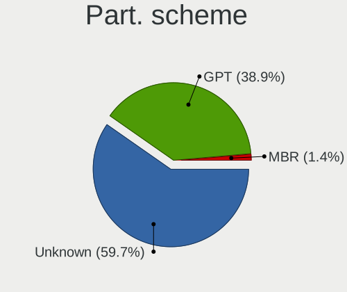
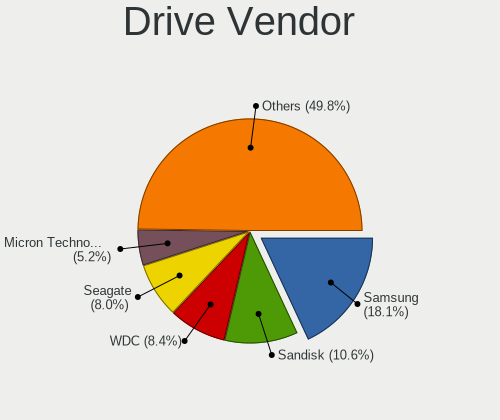
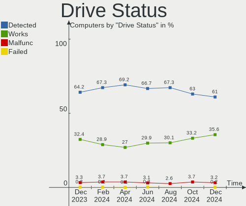
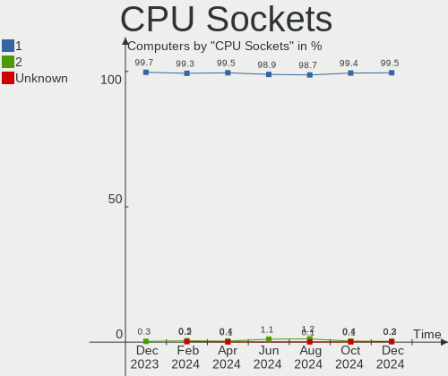
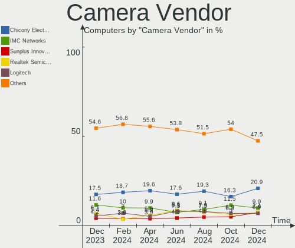

Fedora - Hardware Trends
------------------------

A project to identify most popular hardware characteristics and track their change
over time based on data collected by Linux users at https://Linux-Hardware.org.

Anyone can contribute to this report by the [hw-probe](https://github.com/linuxhw/hw-probe) tool:

    sudo -E hw-probe -all -upload

This is a report for all computer types. See also reports for [desktops](/Dist/Fedora/Desktop/README.md) and [notebooks](/Dist/Fedora/Notebook/README.md).

This report is for one last month. Overall report since the beginning of time: [TestCoverage](https://github.com/linuxhw/TestCoverage)

Period: Jun, 2022.

Contents
--------

* [ System ](#system)
  - [ OS                       ](#os)
  - [ OS Family                ](#os-family)
  - [ Kernel                   ](#kernel)
  - [ Kernel Family            ](#kernel-family)
  - [ Kernel Major Ver.        ](#kernel-major-ver)
  - [ Arch                     ](#arch)
  - [ DE                       ](#de)
  - [ Display Server           ](#display-server)
  - [ Display Manager          ](#display-manager)
  - [ OS Lang                  ](#os-lang)
  - [ Boot Mode                ](#boot-mode)
  - [ Filesystem               ](#filesystem)
  - [ Part. scheme             ](#part-scheme)
  - [ Dual Boot with Linux/BSD ](#dual-boot-with-linuxbsd)
  - [ Dual Boot (Win)          ](#dual-boot-win)

* [ Board ](#board)
  - [ Vendor                   ](#vendor)
  - [ Model                    ](#model)
  - [ Model Family             ](#model-family)
  - [ MFG Year                 ](#mfg-year)
  - [ Form Factor              ](#form-factor)
  - [ Secure Boot              ](#secure-boot)
  - [ Coreboot                 ](#coreboot)
  - [ RAM Size                 ](#ram-size)
  - [ RAM Used                 ](#ram-used)
  - [ Total Drives             ](#total-drives)
  - [ Has CD-ROM               ](#has-cd-rom)
  - [ Has Ethernet             ](#has-ethernet)
  - [ Has WiFi                 ](#has-wifi)
  - [ Has Bluetooth            ](#has-bluetooth)

* [ Location ](#location)
  - [ Country                  ](#country)
  - [ City                     ](#city)

* [ Drives ](#drives)
  - [ Drive Vendor             ](#drive-vendor)
  - [ Drive Model              ](#drive-model)
  - [ HDD Vendor               ](#hdd-vendor)
  - [ SSD Vendor               ](#ssd-vendor)
  - [ Drive Kind               ](#drive-kind)
  - [ Drive Connector          ](#drive-connector)
  - [ Drive Size               ](#drive-size)
  - [ Space Total              ](#space-total)
  - [ Space Used               ](#space-used)
  - [ Malfunc. Drives          ](#malfunc-drives)
  - [ Malfunc. Drive Vendor    ](#malfunc-drive-vendor)
  - [ Malfunc. HDD Vendor      ](#malfunc-hdd-vendor)
  - [ Malfunc. Drive Kind      ](#malfunc-drive-kind)
  - [ Failed Drives            ](#failed-drives)
  - [ Failed Drive Vendor      ](#failed-drive-vendor)
  - [ Drive Status             ](#drive-status)

* [ Storage controller ](#storage-controller)
  - [ Storage Vendor           ](#storage-vendor)
  - [ Storage Model            ](#storage-model)
  - [ Storage Kind             ](#storage-kind)

* [ Processor ](#processor)
  - [ CPU Vendor               ](#cpu-vendor)
  - [ CPU Model                ](#cpu-model)
  - [ CPU Model Family         ](#cpu-model-family)
  - [ CPU Cores                ](#cpu-cores)
  - [ CPU Sockets              ](#cpu-sockets)
  - [ CPU Threads              ](#cpu-threads)
  - [ CPU Op-Modes             ](#cpu-op-modes)
  - [ CPU Microcode            ](#cpu-microcode)
  - [ CPU Microarch            ](#cpu-microarch)

* [ Graphics ](#graphics)
  - [ GPU Vendor               ](#gpu-vendor)
  - [ GPU Model                ](#gpu-model)
  - [ GPU Combo                ](#gpu-combo)
  - [ GPU Driver               ](#gpu-driver)
  - [ GPU Memory               ](#gpu-memory)

* [ Monitor ](#monitor)
  - [ Monitor Vendor           ](#monitor-vendor)
  - [ Monitor Model            ](#monitor-model)
  - [ Monitor Resolution       ](#monitor-resolution)
  - [ Monitor Diagonal         ](#monitor-diagonal)
  - [ Monitor Width            ](#monitor-width)
  - [ Aspect Ratio             ](#aspect-ratio)
  - [ Monitor Area             ](#monitor-area)
  - [ Pixel Density            ](#pixel-density)
  - [ Multiple Monitors        ](#multiple-monitors)

* [ Network ](#network)
  - [ Net Controller Vendor    ](#net-controller-vendor)
  - [ Net Controller Model     ](#net-controller-model)
  - [ Wireless Vendor          ](#wireless-vendor)
  - [ Wireless Model           ](#wireless-model)
  - [ Ethernet Vendor          ](#ethernet-vendor)
  - [ Ethernet Model           ](#ethernet-model)
  - [ Net Controller Kind      ](#net-controller-kind)
  - [ Used Controller          ](#used-controller)
  - [ NICs                     ](#nics)
  - [ IPv6                     ](#ipv6)

* [ Bluetooth ](#bluetooth)
  - [ Bluetooth Vendor         ](#bluetooth-vendor)
  - [ Bluetooth Model          ](#bluetooth-model)

* [ Sound ](#sound)
  - [ Sound Vendor             ](#sound-vendor)
  - [ Sound Model              ](#sound-model)

* [ Memory ](#memory)
  - [ Memory Vendor            ](#memory-vendor)
  - [ Memory Model             ](#memory-model)
  - [ Memory Kind              ](#memory-kind)
  - [ Memory Form Factor       ](#memory-form-factor)
  - [ Memory Size              ](#memory-size)
  - [ Memory Speed             ](#memory-speed)

* [ Printers & scanners ](#printers--scanners)
  - [ Printer Vendor           ](#printer-vendor)
  - [ Printer Model            ](#printer-model)
  - [ Scanner Vendor           ](#scanner-vendor)
  - [ Scanner Model            ](#scanner-model)

* [ Camera ](#camera)
  - [ Camera Vendor            ](#camera-vendor)
  - [ Camera Model             ](#camera-model)

* [ Security ](#security)
  - [ Fingerprint Vendor       ](#fingerprint-vendor)
  - [ Fingerprint Model        ](#fingerprint-model)
  - [ Chipcard Vendor          ](#chipcard-vendor)
  - [ Chipcard Model           ](#chipcard-model)

* [ Unsupported ](#unsupported)
  - [ Unsupported Devices      ](#unsupported-devices)
  - [ Unsupported Device Types ](#unsupported-device-types)

System
------

OS
--

Installed operating systems

| Name      | Computers | Percent |
|-----------|-----------|---------|
| Fedora 36 | 322       | 87.26%  |
| Fedora 35 | 37        | 10.03%  |
| Fedora 34 | 4         | 1.08%   |
| Fedora 33 | 4         | 1.08%   |
| Fedora 37 | 1         | 0.27%   |
| Fedora 30 | 1         | 0.27%   |

OS Family
---------

OS without a version

| Name   | Computers | Percent |
|--------|-----------|---------|
| Fedora | 369       | 100%    |

Kernel
------

Version of the Linux kernel

| Version                                             | Computers | Percent |
|-----------------------------------------------------|-----------|---------|
| 5.18.5-200.fc36.x86_64                              | 73        | 19.78%  |
| 5.17.13-300.fc36.x86_64                             | 53        | 14.36%  |
| 5.17.11-300.fc36.x86_64                             | 48        | 13.01%  |
| 5.17.12-300.fc36.x86_64                             | 46        | 12.47%  |
| 5.18.6-200.fc36.x86_64                              | 35        | 9.49%   |
| 5.17.5-300.fc36.x86_64                              | 23        | 6.23%   |
| 5.17.14-300.fc36.x86_64                             | 7         | 1.9%    |
| 5.17.12-200.fc35.x86_64                             | 7         | 1.9%    |
| 5.17.11-200.fc35.x86_64                             | 7         | 1.9%    |
| 5.18.7-200.fc36.x86_64                              | 6         | 1.63%   |
| 5.18.1-200.fc36.x86_64                              | 5         | 1.36%   |
| 5.18.5-201.fsync.fc36.x86_64                        | 4         | 1.08%   |
| 5.14.18-100.fc33.x86_64                             | 4         | 1.08%   |
| 5.18.5-100.fc35.x86_64                              | 3         | 0.81%   |
| 5.17.9-300.fc36.x86_64                              | 3         | 0.81%   |
| 5.18.2-200.fc36.x86_64                              | 2         | 0.54%   |
| 5.18.1-602.inttf.fc36.x86_64                        | 2         | 0.54%   |
| 5.14.10-300.fc35.x86_64                             | 2         | 0.54%   |
| 5.4.198-300.fc35.x86_64                             | 1         | 0.27%   |
| 5.19.0-0.rc1.20220610git874c8ca1e60b.18.fc37.x86_64 | 1         | 0.27%   |
| 5.18.7-1.surface.fc36.x86_64                        | 1         | 0.27%   |
| 5.18.6-100.fc35.x86_64                              | 1         | 0.27%   |
| 5.18.5-gnu                                          | 1         | 0.27%   |
| 5.18.5-250.vanilla.1.fc36.x86_64                    | 1         | 0.27%   |
| 5.18.4-xm1.0.fc36.x86_64                            | 1         | 0.27%   |
| 5.18.4-xm1.0.fc35.x86_64                            | 1         | 0.27%   |
| 5.18.4-125.vanilla.1.fc36.x86_64                    | 1         | 0.27%   |
| 5.18.4-101.fc35.x86_64                              | 1         | 0.27%   |
| 5.18.4-1.surface.fc36.x86_64                        | 1         | 0.27%   |
| 5.18.2-rc1_MY                                       | 1         | 0.27%   |
| 5.17.9-302.fsync.fc36.x86_64                        | 1         | 0.27%   |
| 5.17.9-200.fc35.x86_64                              | 1         | 0.27%   |
| 5.17.9-100.fc34.x86_64                              | 1         | 0.27%   |
| 5.17.8-300.fc36.x86_64                              | 1         | 0.27%   |
| 5.17.7-200.fc35.x86_64                              | 1         | 0.27%   |
| 5.17.6-300.mbp.fc33.x86_64                          | 1         | 0.27%   |
| 5.17.6-200.fc35.x86_64                              | 1         | 0.27%   |
| 5.17.5-200.fc35.x86_64                              | 1         | 0.27%   |
| 5.17.4-200.fc35.x86_64                              | 1         | 0.27%   |
| 5.17.13-200.fc35.x86_64                             | 1         | 0.27%   |
| 5.17.12-301.fsync.fc36.x86_64                       | 1         | 0.27%   |
| 5.17.12-1.surface.fc35.x86_64                       | 1         | 0.27%   |
| 5.17.11-602.inttf.fc36.x86_64                       | 1         | 0.27%   |
| 5.17.0-300.fc36.x86_64                              | 1         | 0.27%   |
| 5.16.9-200.rog.fc35.x86_64                          | 1         | 0.27%   |
| 5.16.9-200.fc35.x86_64                              | 1         | 0.27%   |
| 5.16.8-1.surface.fc35.x86_64                        | 1         | 0.27%   |
| 5.16.20-200.fc35.x86_64                             | 1         | 0.27%   |
| 5.16.18-200.fc35.x86_64                             | 1         | 0.27%   |
| 5.16.14-200.fc35.x86_64                             | 1         | 0.27%   |
| 5.16.12-100.fc34.x86_64                             | 1         | 0.27%   |
| 5.16.11-200.fc35.x86_64                             | 1         | 0.27%   |
| 5.15.0-60.fc36.x86_64                               | 1         | 0.27%   |
| 5.14.16-301.fc35.x86_64                             | 1         | 0.27%   |
| 5.12.8-300.fc34.x86_64                              | 1         | 0.27%   |
| 5.12.10-300.fc34.x86_64                             | 1         | 0.27%   |
| 5.0.9-301.fc30.x86_64                               | 1         | 0.27%   |

Kernel Family
-------------

Linux kernel without a distro release

| Version | Computers | Percent |
|---------|-----------|---------|
| 5.18.5  | 82        | 22.22%  |
| 5.17.11 | 56        | 15.18%  |
| 5.17.12 | 55        | 14.91%  |
| 5.17.13 | 54        | 14.63%  |
| 5.18.6  | 36        | 9.76%   |
| 5.17.5  | 24        | 6.5%    |
| 5.18.7  | 7         | 1.9%    |
| 5.18.1  | 7         | 1.9%    |
| 5.17.14 | 7         | 1.9%    |
| 5.17.9  | 6         | 1.63%   |
| 5.18.4  | 5         | 1.36%   |
| 5.14.18 | 4         | 1.08%   |
| 5.18.2  | 3         | 0.81%   |
| 5.17.6  | 2         | 0.54%   |
| 5.16.9  | 2         | 0.54%   |
| 5.14.10 | 2         | 0.54%   |
| 5.4.198 | 1         | 0.27%   |
| 5.19.0  | 1         | 0.27%   |
| 5.17.8  | 1         | 0.27%   |
| 5.17.7  | 1         | 0.27%   |
| 5.17.4  | 1         | 0.27%   |
| 5.17.0  | 1         | 0.27%   |
| 5.16.8  | 1         | 0.27%   |
| 5.16.20 | 1         | 0.27%   |
| 5.16.18 | 1         | 0.27%   |
| 5.16.14 | 1         | 0.27%   |
| 5.16.12 | 1         | 0.27%   |
| 5.16.11 | 1         | 0.27%   |
| 5.15.0  | 1         | 0.27%   |
| 5.14.16 | 1         | 0.27%   |
| 5.12.8  | 1         | 0.27%   |
| 5.12.10 | 1         | 0.27%   |
| 5.0.9   | 1         | 0.27%   |

Kernel Major Ver.
-----------------

Linux kernel major version

| Version | Computers | Percent |
|---------|-----------|---------|
| 5.17    | 208       | 56.37%  |
| 5.18    | 140       | 37.94%  |
| 5.16    | 8         | 2.17%   |
| 5.14    | 7         | 1.9%    |
| 5.12    | 2         | 0.54%   |
| 5.4     | 1         | 0.27%   |
| 5.19    | 1         | 0.27%   |
| 5.15    | 1         | 0.27%   |
| 5.0     | 1         | 0.27%   |

Arch
----

OS architecture (x86_64, i586, etc.)

| Name   | Computers | Percent |
|--------|-----------|---------|
| x86_64 | 369       | 100%    |

DE
--

Desktop Environment

| Name          | Computers | Percent |
|---------------|-----------|---------|
| GNOME         | 255       | 69.11%  |
| KDE5          | 73        | 19.78%  |
| Unknown       | 10        | 2.71%   |
| Cinnamon      | 9         | 2.44%   |
| X-Cinnamon    | 7         | 1.9%    |
| XFCE          | 6         | 1.63%   |
| MATE          | 2         | 0.54%   |
| i3            | 2         | 0.54%   |
| GNOME Classic | 2         | 0.54%   |
| LXQt          | 1         | 0.27%   |
| KDE           | 1         | 0.27%   |
| awesome       | 1         | 0.27%   |

Display Server
--------------

X11 or Wayland

| Name    | Computers | Percent |
|---------|-----------|---------|
| Wayland | 254       | 68.83%  |
| X11     | 92        | 24.93%  |
| Tty     | 16        | 4.34%   |
| Unknown | 6         | 1.63%   |
| Web     | 1         | 0.27%   |

Display Manager
---------------

SDDM, LightDM, etc.

| Name    | Computers | Percent |
|---------|-----------|---------|
| Unknown | 214       | 57.99%  |
| GDM     | 102       | 27.64%  |
| SDDM    | 31        | 8.4%    |
| LightDM | 21        | 5.69%   |
| Ly      | 1         | 0.27%   |

OS Lang
-------

Language

| Lang    | Computers | Percent |
|---------|-----------|---------|
| en_US   | 194       | 52.57%  |
| ru_RU   | 25        | 6.78%   |
| en_GB   | 19        | 5.15%   |
| pt_BR   | 18        | 4.88%   |
| en_AU   | 18        | 4.88%   |
| it_IT   | 9         | 2.44%   |
| fr_FR   | 7         | 1.9%    |
| en_IN   | 7         | 1.9%    |
| de_DE   | 7         | 1.9%    |
| pl_PL   | 6         | 1.63%   |
| es_AR   | 6         | 1.63%   |
| nl_BE   | 5         | 1.36%   |
| es_MX   | 5         | 1.36%   |
| es_ES   | 3         | 0.81%   |
| en_CA   | 3         | 0.81%   |
| Unknown | 3         | 0.81%   |
| tr_TR   | 2         | 0.54%   |
| nl_NL   | 2         | 0.54%   |
| hu_HU   | 2         | 0.54%   |
| es_CL   | 2         | 0.54%   |
| en_NZ   | 2         | 0.54%   |
| en_IL   | 2         | 0.54%   |
| en_DK   | 2         | 0.54%   |
| de_CH   | 2         | 0.54%   |
| de_AT   | 2         | 0.54%   |
| zh_CN   | 1         | 0.27%   |
| pt_PT   | 1         | 0.27%   |
| ja_JP   | 1         | 0.27%   |
| id_ID   | 1         | 0.27%   |
| fr_BE   | 1         | 0.27%   |
| es_VE   | 1         | 0.27%   |
| es_SV   | 1         | 0.27%   |
| es_EC   | 1         | 0.27%   |
| en_ZA   | 1         | 0.27%   |
| en_SG   | 1         | 0.27%   |
| en_NL   | 1         | 0.27%   |
| da_DK   | 1         | 0.27%   |
| cs_CZ   | 1         | 0.27%   |
| ca_ES   | 1         | 0.27%   |
| C       | 1         | 0.27%   |
| ar_SA   | 1         | 0.27%   |

Boot Mode
---------

EFI or BIOS

| Mode | Computers | Percent |
|------|-----------|---------|
| EFI  | 285       | 77.24%  |
| BIOS | 84        | 22.76%  |

Filesystem
----------

Type of filesystem

| Type  | Computers | Percent |
|-------|-----------|---------|
| Btrfs | 287       | 77.78%  |
| Ext4  | 66        | 17.89%  |
| Xfs   | 16        | 4.34%   |

Part. scheme
------------

Scheme of partitioning

| Type    | Computers | Percent |
|---------|-----------|---------|
| Unknown | 211       | 57.18%  |
| GPT     | 131       | 35.5%   |
| MBR     | 27        | 7.32%   |

Dual Boot with Linux/BSD
------------------------

Hosting more than one Linux/BSD

| Dual boot | Computers | Percent |
|-----------|-----------|---------|
| No        | 333       | 90.24%  |
| Yes       | 36        | 9.76%   |

Dual Boot (Win)
---------------

Hosting Linux and Windows

| Dual boot | Computers | Percent |
|-----------|-----------|---------|
| No        | 301       | 81.57%  |
| Yes       | 68        | 18.43%  |

Board
-----

Vendor
------

Motherboard manufacturer

| Name                | Computers | Percent |
|---------------------|-----------|---------|
| Lenovo              | 72        | 19.51%  |
| ASUSTek Computer    | 64        | 17.34%  |
| Hewlett-Packard     | 60        | 16.26%  |
| Dell                | 39        | 10.57%  |
| Gigabyte Technology | 29        | 7.86%   |
| MSI                 | 18        | 4.88%   |
| Acer                | 16        | 4.34%   |
| Apple               | 14        | 3.79%   |
| ASRock              | 13        | 3.52%   |
| Microsoft           | 5         | 1.36%   |
| HUAWEI              | 5         | 1.36%   |
| Unknown             | 4         | 1.08%   |
| Intel               | 3         | 0.81%   |
| Toshiba             | 2         | 0.54%   |
| Timi                | 2         | 0.54%   |
| Positivo            | 2         | 0.54%   |
| Foxconn             | 2         | 0.54%   |
| VIT                 | 1         | 0.27%   |
| TUXEDO              | 1         | 0.27%   |
| System76            | 1         | 0.27%   |
| Sony                | 1         | 0.27%   |
| Samsung Electronics | 1         | 0.27%   |
| Panasonic           | 1         | 0.27%   |
| Packard Bell        | 1         | 0.27%   |
| Notebook            | 1         | 0.27%   |
| Micro Electronics   | 1         | 0.27%   |
| Medion              | 1         | 0.27%   |
| Itautec             | 1         | 0.27%   |
| Google              | 1         | 0.27%   |
| Getac               | 1         | 0.27%   |
| GEO                 | 1         | 0.27%   |
| Fujitsu             | 1         | 0.27%   |
| Framework           | 1         | 0.27%   |
| Chuwi               | 1         | 0.27%   |
| BESSTAR Tech        | 1         | 0.27%   |
| Alienware           | 1         | 0.27%   |

Model
-----

Motherboard model

| Name                                 | Computers | Percent |
|--------------------------------------|-----------|---------|
| Unknown                              | 4         | 1.08%   |
| ASUS CROSSHAIR V FORMULA-Z           | 3         | 0.81%   |
| Lenovo IdeaPad Gaming 3 15ARH05 82EY | 2         | 0.54%   |
| HUAWEI KLVL-WXX9                     | 2         | 0.54%   |
| HP Pavilion Laptop 15-cw1xxx         | 2         | 0.54%   |
| HP Pavilion g6                       | 2         | 0.54%   |
| HP Pavilion Aero Laptop 13-be0xxx    | 2         | 0.54%   |
| HP Notebook                          | 2         | 0.54%   |
| HP EliteBook 8470p                   | 2         | 0.54%   |
| ASUS TUF Gaming X570-PLUS            | 2         | 0.54%   |
| ASUS PRIME Z370-A                    | 2         | 0.54%   |
| ASUS All Series                      | 2         | 0.54%   |
| Apple MacBookPro12,1                 | 2         | 0.54%   |
| Acer Swift SF114-32                  | 2         | 0.54%   |
| Acer Aspire E5-573G                  | 2         | 0.54%   |
| VIT M2420                            | 1         | 0.27%   |
| TUXEDO Polaris Intel Gen3 (TGL)      | 1         | 0.27%   |
| Toshiba Satellite C855-12R           | 1         | 0.27%   |
| Toshiba Satellite C50-A              | 1         | 0.27%   |
| Timi Redmi Book Pro 15 2022          | 1         | 0.27%   |
| Timi A35S                            | 1         | 0.27%   |
| System76 Thelio Mira                 | 1         | 0.27%   |
| Sony SVE15128CNB                     | 1         | 0.27%   |
| Samsung 500R5M/500R5W/501R5M         | 1         | 0.27%   |
| Positivo VJF155F11UAR                | 1         | 0.27%   |
| Positivo POS-PIH55BO                 | 1         | 0.27%   |
| Panasonic CFSV9-1                    | 1         | 0.27%   |
| Packard Bell EasyNote TE69HW         | 1         | 0.27%   |
| Notebook NL40_50CU                   | 1         | 0.27%   |
| MSI WC698AA-UUG p6320be              | 1         | 0.27%   |
| MSI MS-7D18                          | 1         | 0.27%   |
| MSI MS-7D16                          | 1         | 0.27%   |
| MSI MS-7C94                          | 1         | 0.27%   |
| MSI MS-7C91                          | 1         | 0.27%   |
| MSI MS-7C82                          | 1         | 0.27%   |
| MSI MS-7C02                          | 1         | 0.27%   |
| MSI MS-7B93                          | 1         | 0.27%   |
| MSI MS-7B89                          | 1         | 0.27%   |
| MSI MS-7B86                          | 1         | 0.27%   |
| MSI MS-7B79                          | 1         | 0.27%   |
| MSI MS-7B23                          | 1         | 0.27%   |
| MSI MS-7A38                          | 1         | 0.27%   |
| MSI MS-7885                          | 1         | 0.27%   |
| MSI MS-7817                          | 1         | 0.27%   |
| MSI GF63 Thin 9SCXR                  | 1         | 0.27%   |
| MSI Cubi N JSL (MS-B0A1)             | 1         | 0.27%   |
| MSI CQ3321L                          | 1         | 0.27%   |
| Microsoft Surface Pro 7              | 1         | 0.27%   |
| Microsoft Surface Laptop 3           | 1         | 0.27%   |
| Microsoft Surface Laptop             | 1         | 0.27%   |
| Microsoft Surface Book 3             | 1         | 0.27%   |
| Microsoft Surface 3                  | 1         | 0.27%   |
| Micro MG-VCP17I-3070                 | 1         | 0.27%   |
| Medion AXA                           | 1         | 0.27%   |
| Lenovo Yoga C740-15IML 81TD          | 1         | 0.27%   |
| Lenovo Yoga 7 14ITL5 82BH            | 1         | 0.27%   |
| Lenovo Y50-70 20378                  | 1         | 0.27%   |
| Lenovo ThinkStation P310 30ATS01E00  | 1         | 0.27%   |
| Lenovo ThinkPad Yoga 460 20EMCTO1WW  | 1         | 0.27%   |
| Lenovo ThinkPad X380 Yoga 20LJS31Y02 | 1         | 0.27%   |

Model Family
------------

Motherboard model prefix

| Name                  | Computers | Percent |
|-----------------------|-----------|---------|
| Lenovo ThinkPad       | 42        | 11.38%  |
| Lenovo IdeaPad        | 15        | 4.07%   |
| ASUS ROG              | 14        | 3.79%   |
| HP Pavilion           | 13        | 3.52%   |
| Dell Inspiron         | 11        | 2.98%   |
| ASUS PRIME            | 10        | 2.71%   |
| HP Laptop             | 9         | 2.44%   |
| Dell XPS              | 9         | 2.44%   |
| Dell Precision        | 8         | 2.17%   |
| ASUS TUF              | 8         | 2.17%   |
| Acer Aspire           | 7         | 1.9%    |
| HP ENVY               | 6         | 1.63%   |
| HP EliteBook          | 6         | 1.63%   |
| Dell OptiPlex         | 6         | 1.63%   |
| Microsoft Surface     | 5         | 1.36%   |
| HP ProBook            | 5         | 1.36%   |
| ASUS VivoBook         | 5         | 1.36%   |
| Dell Latitude         | 4         | 1.08%   |
| ASUS CROSSHAIR        | 4         | 1.08%   |
| ASUS ASUS             | 4         | 1.08%   |
| Acer Swift            | 4         | 1.08%   |
| Unknown               | 4         | 1.08%   |
| HP ZBook              | 3         | 0.81%   |
| HP OMEN               | 3         | 0.81%   |
| ASUS ZenBook          | 3         | 0.81%   |
| Toshiba Satellite     | 2         | 0.54%   |
| Lenovo Yoga           | 2         | 0.54%   |
| Lenovo ThinkCentre    | 2         | 0.54%   |
| Lenovo ThinkBook      | 2         | 0.54%   |
| Lenovo G580           | 2         | 0.54%   |
| HUAWEI KLVL-WXX9      | 2         | 0.54%   |
| HP ProDesk            | 2         | 0.54%   |
| HP Notebook           | 2         | 0.54%   |
| HP EliteDesk          | 2         | 0.54%   |
| HP Elite              | 2         | 0.54%   |
| HP Compaq             | 2         | 0.54%   |
| HP 250                | 2         | 0.54%   |
| ASUS ProArt           | 2         | 0.54%   |
| ASUS All              | 2         | 0.54%   |
| ASRock B450M          | 2         | 0.54%   |
| Apple MacBookPro12    | 2         | 0.54%   |
| VIT M2420             | 1         | 0.27%   |
| TUXEDO Polaris        | 1         | 0.27%   |
| Timi Redmi            | 1         | 0.27%   |
| Timi A35S             | 1         | 0.27%   |
| System76 Thelio       | 1         | 0.27%   |
| Sony SVE15128CNB      | 1         | 0.27%   |
| Samsung 500R5M        | 1         | 0.27%   |
| Positivo VJF155F11UAR | 1         | 0.27%   |
| Positivo POS-PIH55BO  | 1         | 0.27%   |
| Panasonic CFSV9-1     | 1         | 0.27%   |
| Packard Bell EasyNote | 1         | 0.27%   |
| Notebook NL40         | 1         | 0.27%   |
| MSI WC698AA-UUG       | 1         | 0.27%   |
| MSI MS-7D18           | 1         | 0.27%   |
| MSI MS-7D16           | 1         | 0.27%   |
| MSI MS-7C94           | 1         | 0.27%   |
| MSI MS-7C91           | 1         | 0.27%   |
| MSI MS-7C82           | 1         | 0.27%   |
| MSI MS-7C02           | 1         | 0.27%   |

MFG Year
--------

Motherboard manufacture year

| Year | Computers | Percent |
|------|-----------|---------|
| 2021 | 70        | 18.97%  |
| 2020 | 58        | 15.72%  |
| 2019 | 42        | 11.38%  |
| 2018 | 35        | 9.49%   |
| 2017 | 23        | 6.23%   |
| 2015 | 21        | 5.69%   |
| 2012 | 20        | 5.42%   |
| 2013 | 19        | 5.15%   |
| 2011 | 17        | 4.61%   |
| 2022 | 15        | 4.07%   |
| 2010 | 14        | 3.79%   |
| 2014 | 12        | 3.25%   |
| 2016 | 9         | 2.44%   |
| 2009 | 6         | 1.63%   |
| 2008 | 5         | 1.36%   |
| 2007 | 2         | 0.54%   |
| 2006 | 1         | 0.27%   |

Form Factor
-----------

Physical design of the computer

| Name        | Computers | Percent |
|-------------|-----------|---------|
| Notebook    | 205       | 55.56%  |
| Desktop     | 124       | 33.6%   |
| Convertible | 22        | 5.96%   |
| Tablet      | 7         | 1.9%    |
| All in one  | 6         | 1.63%   |
| Mini pc     | 4         | 1.08%   |
| Server      | 1         | 0.27%   |

Secure Boot
-----------

Enabled or disabled

| State    | Computers | Percent |
|----------|-----------|---------|
| Disabled | 303       | 82.11%  |
| Enabled  | 66        | 17.89%  |

Coreboot
--------

Have coreboot on board

| Used | Computers | Percent |
|------|-----------|---------|
| No   | 368       | 99.73%  |
| Yes  | 1         | 0.27%   |

RAM Size
--------

Total RAM memory

| Size in GB  | Computers | Percent |
|-------------|-----------|---------|
| 4.01-8.0    | 103       | 27.91%  |
| 8.01-16.0   | 81        | 21.95%  |
| 16.01-24.0  | 74        | 20.05%  |
| 32.01-64.0  | 63        | 17.07%  |
| 3.01-4.0    | 32        | 8.67%   |
| 64.01-256.0 | 11        | 2.98%   |
| 24.01-32.0  | 4         | 1.08%   |
| 2.01-3.0    | 1         | 0.27%   |

RAM Used
--------

Used RAM memory

| Used GB    | Computers | Percent |
|------------|-----------|---------|
| 2.01-3.0   | 105       | 28.46%  |
| 4.01-8.0   | 100       | 27.1%   |
| 3.01-4.0   | 85        | 23.04%  |
| 1.01-2.0   | 37        | 10.03%  |
| 8.01-16.0  | 28        | 7.59%   |
| 0.51-1.0   | 8         | 2.17%   |
| 16.01-24.0 | 5         | 1.36%   |
| 32.01-64.0 | 1         | 0.27%   |

Total Drives
------------

Number of drives on board

| Drives | Computers | Percent |
|--------|-----------|---------|
| 1      | 217       | 58.81%  |
| 2      | 93        | 25.2%   |
| 3      | 35        | 9.49%   |
| 4      | 13        | 3.52%   |
| 6      | 4         | 1.08%   |
| 5      | 3         | 0.81%   |
| 7      | 2         | 0.54%   |
| 10     | 1         | 0.27%   |
| 0      | 1         | 0.27%   |

Has CD-ROM
----------

Has CD-ROM on board

| Presented | Computers | Percent |
|-----------|-----------|---------|
| No        | 286       | 77.51%  |
| Yes       | 83        | 22.49%  |

Has Ethernet
------------

Has Ethernet on board

| Presented | Computers | Percent |
|-----------|-----------|---------|
| Yes       | 280       | 75.88%  |
| No        | 89        | 24.12%  |

Has WiFi
--------

Has WiFi module

| Presented | Computers | Percent |
|-----------|-----------|---------|
| Yes       | 308       | 83.47%  |
| No        | 61        | 16.53%  |

Has Bluetooth
-------------

Has Bluetooth module

| Presented | Computers | Percent |
|-----------|-----------|---------|
| Yes       | 271       | 73.44%  |
| No        | 98        | 26.56%  |

Location
--------

Country
-------

Geographic location (country)

| Country      | Computers | Percent |
|--------------|-----------|---------|
| USA          | 79        | 21.41%  |
| Russia       | 27        | 7.32%   |
| Australia    | 20        | 5.42%   |
| Brazil       | 18        | 4.88%   |
| India        | 17        | 4.61%   |
| Germany      | 16        | 4.34%   |
| Poland       | 13        | 3.52%   |
| Italy        | 13        | 3.52%   |
| Netherlands  | 12        | 3.25%   |
| Mexico       | 12        | 3.25%   |
| France       | 10        | 2.71%   |
| UK           | 9         | 2.44%   |
| Belgium      | 9         | 2.44%   |
| Switzerland  | 7         | 1.9%    |
| Argentina    | 7         | 1.9%    |
| Turkey       | 6         | 1.63%   |
| Spain        | 6         | 1.63%   |
| Norway       | 5         | 1.36%   |
| Hungary      | 5         | 1.36%   |
| Canada       | 5         | 1.36%   |
| Israel       | 4         | 1.08%   |
| Indonesia    | 4         | 1.08%   |
| Czechia      | 4         | 1.08%   |
| Belarus      | 4         | 1.08%   |
| Taiwan       | 3         | 0.81%   |
| Sweden       | 3         | 0.81%   |
| South Africa | 3         | 0.81%   |
| Japan        | 3         | 0.81%   |
| Bulgaria     | 3         | 0.81%   |
| Austria      | 3         | 0.81%   |
| Ukraine      | 2         | 0.54%   |
| Singapore    | 2         | 0.54%   |
| Puerto Rico  | 2         | 0.54%   |
| New Zealand  | 2         | 0.54%   |
| Greece       | 2         | 0.54%   |
| Finland      | 2         | 0.54%   |
| Ecuador      | 2         | 0.54%   |
| Denmark      | 2         | 0.54%   |
| Chile        | 2         | 0.54%   |
| Venezuela    | 1         | 0.27%   |
| Uruguay      | 1         | 0.27%   |
| Thailand     | 1         | 0.27%   |
| Slovenia     | 1         | 0.27%   |
| Saudi Arabia | 1         | 0.27%   |
| Romania      | 1         | 0.27%   |
| Portugal     | 1         | 0.27%   |
| Philippines  | 1         | 0.27%   |
| Myanmar      | 1         | 0.27%   |
| Moldova      | 1         | 0.27%   |
| Luxembourg   | 1         | 0.27%   |
| Lithuania    | 1         | 0.27%   |
| Ireland      | 1         | 0.27%   |
| Iraq         | 1         | 0.27%   |
| Georgia      | 1         | 0.27%   |
| Estonia      | 1         | 0.27%   |
| El Salvador  | 1         | 0.27%   |
| Cyprus       | 1         | 0.27%   |
| Croatia      | 1         | 0.27%   |
| Colombia     | 1         | 0.27%   |
| China        | 1         | 0.27%   |

City
----

Geographic location (city)

| City           | Computers | Percent |
|----------------|-----------|---------|
| Launceston     | 7         | 1.9%    |
| St Petersburg  | 5         | 1.36%   |
| Moscow         | 5         | 1.36%   |
| Berlin         | 5         | 1.36%   |
| Minsk          | 4         | 1.08%   |
| Marietta       | 4         | 1.08%   |
| Warsaw         | 3         | 0.81%   |
| Vienna         | 3         | 0.81%   |
| Paris          | 3         | 0.81%   |
| New York       | 3         | 0.81%   |
| Mexico City    | 3         | 0.81%   |
| Melbourne      | 3         | 0.81%   |
| Jakarta        | 3         | 0.81%   |
| Budapest       | 3         | 0.81%   |
| Brussels       | 3         | 0.81%   |
| Antwerp        | 3         | 0.81%   |
| Tucson         | 2         | 0.54%   |
| Tel Aviv       | 2         | 0.54%   |
| Sydney         | 2         | 0.54%   |
| Stockholm      | 2         | 0.54%   |
| Singapore      | 2         | 0.54%   |
| San Juan       | 2         | 0.54%   |
| San Antonio    | 2         | 0.54%   |
| Saint Paul     | 2         | 0.54%   |
| Rostov-on-Don  | 2         | 0.54%   |
| Raleigh        | 2         | 0.54%   |
| Prague         | 2         | 0.54%   |
| Pasco          | 2         | 0.54%   |
| Parker         | 2         | 0.54%   |
| Nantes         | 2         | 0.54%   |
| Milan          | 2         | 0.54%   |
| Lima           | 2         | 0.54%   |
| Lepe           | 2         | 0.54%   |
| Las Vegas      | 2         | 0.54%   |
| Lane Cove      | 2         | 0.54%   |
| Kristiansand   | 2         | 0.54%   |
| Kolkata        | 2         | 0.54%   |
| Kastrup        | 2         | 0.54%   |
| Izmir          | 2         | 0.54%   |
| Istanbul       | 2         | 0.54%   |
| Helsinki       | 2         | 0.54%   |
| Hanover        | 2         | 0.54%   |
| Denham Springs | 2         | 0.54%   |
| Chicago        | 2         | 0.54%   |
| Brisbane       | 2         | 0.54%   |
| Bengaluru      | 2         | 0.54%   |
| Zurich         | 1         | 0.27%   |
| Zollikofen     | 1         | 0.27%   |
| Zator          | 1         | 0.27%   |
| Zaporizhzhya   | 1         | 0.27%   |
| Zapopan        | 1         | 0.27%   |
| Zagreb         | 1         | 0.27%   |
| Yaroslavl      | 1         | 0.27%   |
| Yangon         | 1         | 0.27%   |
| Yakutsk        | 1         | 0.27%   |
| Wylie          | 1         | 0.27%   |
| Wetzikon       | 1         | 0.27%   |
| Westlake       | 1         | 0.27%   |
| Westerhoven    | 1         | 0.27%   |
| West Bromwich  | 1         | 0.27%   |

Drives
------

Drive Vendor
------------

Hard drive vendors

| Vendor                         | Computers | Drives | Percent |
|--------------------------------|-----------|--------|---------|
| Samsung Electronics            | 89        | 109    | 16.18%  |
| WDC                            | 72        | 101    | 13.09%  |
| Seagate                        | 59        | 70     | 10.73%  |
| SanDisk                        | 40        | 45     | 7.27%   |
| Toshiba                        | 33        | 33     | 6%      |
| Kingston                       | 27        | 27     | 4.91%   |
| Crucial                        | 27        | 28     | 4.91%   |
| Intel                          | 24        | 28     | 4.36%   |
| SK hynix                       | 23        | 24     | 4.18%   |
| Unknown                        | 14        | 15     | 2.55%   |
| KIOXIA                         | 14        | 15     | 2.55%   |
| A-DATA Technology              | 12        | 12     | 2.18%   |
| Micron Technology              | 11        | 12     | 2%      |
| Hitachi                        | 10        | 11     | 1.82%   |
| Apple                          | 7         | 7      | 1.27%   |
| HGST                           | 6         | 6      | 1.09%   |
| China                          | 6         | 6      | 1.09%   |
| XPG                            | 5         | 5      | 0.91%   |
| SABRENT                        | 5         | 6      | 0.91%   |
| Phison                         | 4         | 4      | 0.73%   |
| Patriot                        | 4         | 4      | 0.73%   |
| UMIS                           | 3         | 3      | 0.55%   |
| Realtek Semiconductor          | 3         | 3      | 0.55%   |
| OCZ                            | 3         | 3      | 0.55%   |
| Micron/Crucial Technology      | 3         | 3      | 0.55%   |
| Transcend                      | 2         | 2      | 0.36%   |
| SSSTC                          | 2         | 2      | 0.36%   |
| SPCC                           | 2         | 3      | 0.36%   |
| Solid State Storage Technology | 2         | 2      | 0.36%   |
| Netac                          | 2         | 2      | 0.36%   |
| Lite-On                        | 2         | 2      | 0.36%   |
| JMicron Technology             | 2         | 2      | 0.36%   |
| Hewlett-Packard                | 2         | 2      | 0.36%   |
| Gigabyte Technology            | 2         | 2      | 0.36%   |
| Unknown                        | 2         | 2      | 0.36%   |
| WXC-M3                         | 1         | 1      | 0.18%   |
| Vaseky                         | 1         | 1      | 0.18%   |
| USB3.0                         | 1         | 1      | 0.18%   |
| StoreJet                       | 1         | 1      | 0.18%   |
| SSK                            | 1         | 1      | 0.18%   |
| Silicon Motion                 | 1         | 1      | 0.18%   |
| Realtek                        | 1         | 1      | 0.18%   |
| RCESSD                         | 1         | 1      | 0.18%   |
| PNY                            | 1         | 2      | 0.18%   |
| Maxtor                         | 1         | 1      | 0.18%   |
| MAXIO Technology (Hangzhou)    | 1         | 1      | 0.18%   |
| LITEONIT                       | 1         | 1      | 0.18%   |
| KUIJIA                         | 1         | 1      | 0.18%   |
| KingSpec                       | 1         | 1      | 0.18%   |
| KingFast                       | 1         | 1      | 0.18%   |
| KingDian                       | 1         | 1      | 0.18%   |
| Intenso                        | 1         | 1      | 0.18%   |
| HPE                            | 1         | 1      | 0.18%   |
| H/W                            | 1         | 3      | 0.18%   |
| Goodram                        | 1         | 1      | 0.18%   |
| Fujitsu                        | 1         | 1      | 0.18%   |
| Dogfish                        | 1         | 1      | 0.18%   |
| ASMT                           | 1         | 1      | 0.18%   |
| Apacer                         | 1         | 1      | 0.18%   |
| AMicro                         | 1         | 1      | 0.18%   |

Drive Model
-----------

Hard drive models

| Model                                    | Computers | Percent |
|------------------------------------------|-----------|---------|
| Kingston SA400S37240G 240GB SSD          | 10        | 1.66%   |
| Samsung NVMe SSD Drive 1TB               | 9         | 1.49%   |
| Samsung NVMe SSD Drive 1024GB            | 9         | 1.49%   |
| Crucial CT500MX500SSD1 500GB             | 9         | 1.49%   |
| Crucial CT1000MX500SSD1 1TB              | 8         | 1.33%   |
| Seagate ST1000LM024 HN-M101MBB 1TB       | 7         | 1.16%   |
| Samsung NVMe SSD Drive 512GB             | 7         | 1.16%   |
| Intel NVMe SSD Drive 512GB               | 7         | 1.16%   |
| SanDisk NVMe SSD Drive 512GB             | 6         | 1%      |
| SanDisk NVMe SSD Drive 500GB             | 6         | 1%      |
| Samsung NVMe SSD Drive 256GB             | 6         | 1%      |
| KIOXIA NVMe SSD Drive 512GB              | 6         | 1%      |
| WDC WD40EFRX-68N32N0 4TB                 | 5         | 0.83%   |
| SABRENT Disk 1TB                         | 5         | 0.83%   |
| Toshiba MQ01ABD100 1TB                   | 4         | 0.66%   |
| Toshiba KBG30ZMS128G 128GB NVMe SSD      | 4         | 0.66%   |
| Seagate ST500LT012-1DG142 500GB          | 4         | 0.66%   |
| Seagate ST500DM002-1BD142 500GB          | 4         | 0.66%   |
| Seagate ST2000DM008-2FR102 2TB           | 4         | 0.66%   |
| SanDisk NVMe SSD Drive 1TB               | 4         | 0.66%   |
| Unknown MMC Card  64GB                   | 3         | 0.5%    |
| SK hynix NVMe SSD Drive 512GB            | 3         | 0.5%    |
| Seagate ST3500418AS 500GB                | 3         | 0.5%    |
| Seagate ST1000LM035-1RK172 1TB           | 3         | 0.5%    |
| SanDisk SSD PLUS 480GB                   | 3         | 0.5%    |
| SanDisk NVMe SSD Drive 1024GB            | 3         | 0.5%    |
| Samsung SSD 970 EVO Plus 1TB             | 3         | 0.5%    |
| Samsung SSD 870 QVO 1TB                  | 3         | 0.5%    |
| Samsung SSD 860 EVO 500GB                | 3         | 0.5%    |
| Samsung SSD 860 EVO 1TB                  | 3         | 0.5%    |
| Samsung SSD 850 EVO 500GB                | 3         | 0.5%    |
| Samsung NVMe SSD Drive 250GB             | 3         | 0.5%    |
| Intel SSDSC2CT120A3 120GB                | 3         | 0.5%    |
| HGST HTS721010A9E630 1TB                 | 3         | 0.5%    |
| A-DATA SX8200PNP 512GB                   | 3         | 0.5%    |
| XPG NVMe SSD Drive 1024GB                | 2         | 0.33%   |
| WDC WDS500G2B0A-00SM50 500GB SSD         | 2         | 0.33%   |
| WDC WD60EFZX-68B3FN0 6TB                 | 2         | 0.33%   |
| WDC WD40EZRZ-00GXCB0 4TB                 | 2         | 0.33%   |
| WDC WD30EFRX-68EUZN0 3TB                 | 2         | 0.33%   |
| WDC WD20EFRX-68EUZN0 2TB                 | 2         | 0.33%   |
| WDC WD2003FZEX-00Z4SA0 2TB               | 2         | 0.33%   |
| WDC WD10SPZX-24Z10 1TB                   | 2         | 0.33%   |
| WDC WD10EZEX-60M2NA0 1TB                 | 2         | 0.33%   |
| WDC WD10EZEX-00WN4A0 1TB                 | 2         | 0.33%   |
| WDC PC SN530 SDBPMPZ-256G-1001 256GB     | 2         | 0.33%   |
| UMIS RPJTJ256MEE1OWX 256GB               | 2         | 0.33%   |
| Transcend TS256GSSD370S 256GB            | 2         | 0.33%   |
| Toshiba NVMe SSD Drive 512GB             | 2         | 0.33%   |
| Toshiba MQ04ABF100 1TB                   | 2         | 0.33%   |
| Toshiba MD04ACA400 4TB                   | 2         | 0.33%   |
| Toshiba KXG6AZNV1T02 1TB                 | 2         | 0.33%   |
| Solid State Storage NVMe SSD Drive 256GB | 2         | 0.33%   |
| SK hynix NVMe SSD Drive 500GB            | 2         | 0.33%   |
| SK hynix NVMe SSD Drive 256GB            | 2         | 0.33%   |
| Seagate ST9500325AS 500GB                | 2         | 0.33%   |
| Seagate ST4000DM004-2CV104 4TB           | 2         | 0.33%   |
| Seagate ST2000DM006-2DM164 2TB           | 2         | 0.33%   |
| Seagate ST2000DM001-1E6164 2TB           | 2         | 0.33%   |
| Seagate ST1000DM010-2EP102 1TB           | 2         | 0.33%   |

HDD Vendor
----------

Hard disk drive vendors

| Vendor              | Computers | Drives | Percent |
|---------------------|-----------|--------|---------|
| Seagate             | 59        | 70     | 37.34%  |
| WDC                 | 54        | 80     | 34.18%  |
| Toshiba             | 17        | 17     | 10.76%  |
| Hitachi             | 10        | 11     | 6.33%   |
| HGST                | 6         | 6      | 3.8%    |
| Samsung Electronics | 4         | 4      | 2.53%   |
| Unknown             | 2         | 2      | 1.27%   |
| Maxtor              | 1         | 1      | 0.63%   |
| JMicron Technology  | 1         | 1      | 0.63%   |
| Hewlett-Packard     | 1         | 1      | 0.63%   |
| Fujitsu             | 1         | 1      | 0.63%   |
| ASMT                | 1         | 1      | 0.63%   |
| Apple               | 1         | 1      | 0.63%   |

SSD Vendor
----------

Solid state drive vendors

| Vendor              | Computers | Drives | Percent |
|---------------------|-----------|--------|---------|
| Samsung Electronics | 35        | 39     | 21.21%  |
| Crucial             | 25        | 26     | 15.15%  |
| SanDisk             | 22        | 23     | 13.33%  |
| Kingston            | 16        | 16     | 9.7%    |
| WDC                 | 8         | 9      | 4.85%   |
| Intel               | 8         | 8      | 4.85%   |
| China               | 6         | 6      | 3.64%   |
| A-DATA Technology   | 6         | 6      | 3.64%   |
| Apple               | 5         | 5      | 3.03%   |
| Patriot             | 4         | 4      | 2.42%   |
| OCZ                 | 3         | 3      | 1.82%   |
| Transcend           | 2         | 2      | 1.21%   |
| SPCC                | 2         | 3      | 1.21%   |
| SK hynix            | 2         | 2      | 1.21%   |
| Netac               | 2         | 2      | 1.21%   |
| Micron Technology   | 2         | 2      | 1.21%   |
| Gigabyte Technology | 2         | 2      | 1.21%   |
| Vaseky              | 1         | 1      | 0.61%   |
| USB3.0              | 1         | 1      | 0.61%   |
| Toshiba             | 1         | 1      | 0.61%   |
| StoreJet            | 1         | 1      | 0.61%   |
| PNY                 | 1         | 2      | 0.61%   |
| LITEONIT            | 1         | 1      | 0.61%   |
| KUIJIA              | 1         | 1      | 0.61%   |
| KingSpec            | 1         | 1      | 0.61%   |
| KingFast            | 1         | 1      | 0.61%   |
| KingDian            | 1         | 1      | 0.61%   |
| Intenso             | 1         | 1      | 0.61%   |
| HPE                 | 1         | 1      | 0.61%   |
| Goodram             | 1         | 1      | 0.61%   |
| Dogfish             | 1         | 1      | 0.61%   |
| Apacer              | 1         | 1      | 0.61%   |

Drive Kind
----------

HDD or SSD

| Kind    | Computers | Drives | Percent |
|---------|-----------|--------|---------|
| NVMe    | 197       | 235    | 39.88%  |
| SSD     | 145       | 174    | 29.35%  |
| HDD     | 132       | 196    | 26.72%  |
| MMC     | 11        | 14     | 2.23%   |
| Unknown | 9         | 11     | 1.82%   |

Drive Connector
---------------

SATA, SAS, NVMe, etc.

| Type | Computers | Drives | Percent |
|------|-----------|--------|---------|
| SATA | 220       | 361    | 49.44%  |
| NVMe | 194       | 228    | 43.6%   |
| SAS  | 20        | 27     | 4.49%   |
| MMC  | 11        | 14     | 2.47%   |

Drive Size
----------

Size of hard drive

| Size in TB | Computers | Drives | Percent |
|------------|-----------|--------|---------|
| 0.01-0.5   | 154       | 193    | 51.51%  |
| 0.51-1.0   | 93        | 107    | 31.1%   |
| 1.01-2.0   | 23        | 29     | 7.69%   |
| 3.01-4.0   | 16        | 21     | 5.35%   |
| 4.01-10.0  | 8         | 14     | 2.68%   |
| 2.01-3.0   | 4         | 5      | 1.34%   |
| 10.01-20.0 | 1         | 1      | 0.33%   |

Space Total
-----------

Amount of disk space available on the file system

| Size in GB     | Computers | Percent |
|----------------|-----------|---------|
| 501-1000       | 90        | 24.39%  |
| 251-500        | 59        | 15.99%  |
| 1001-2000      | 56        | 15.18%  |
| 101-250        | 39        | 10.57%  |
| 1-20           | 33        | 8.94%   |
| Unknown        | 27        | 7.32%   |
| More than 3000 | 25        | 6.78%   |
| 51-100         | 18        | 4.88%   |
| 2001-3000      | 17        | 4.61%   |
| 21-50          | 5         | 1.36%   |

Space Used
----------

Amount of used disk space

| Used GB        | Computers | Percent |
|----------------|-----------|---------|
| 1-20           | 108       | 29.27%  |
| 21-50          | 56        | 15.18%  |
| 51-100         | 43        | 11.65%  |
| 251-500        | 42        | 11.38%  |
| 101-250        | 41        | 11.11%  |
| Unknown        | 27        | 7.32%   |
| 501-1000       | 21        | 5.69%   |
| 1001-2000      | 20        | 5.42%   |
| More than 3000 | 8         | 2.17%   |
| 2001-3000      | 3         | 0.81%   |

Malfunc. Drives
---------------

Drive models with a malfunction

| Model                               | Computers | Drives | Percent |
|-------------------------------------|-----------|--------|---------|
| Samsung Electronics HD322HJ 320GB   | 2         | 2      | 8.33%   |
| Intel SSDSC2CT120A3 120GB           | 2         | 2      | 8.33%   |
| WDC WD5000LPCX-24C6HT0 500GB        | 1         | 1      | 4.17%   |
| WDC WD3200AAKS-75B3A0 320GB         | 1         | 1      | 4.17%   |
| WDC WD20EFRX-68EUZN0 2TB            | 1         | 1      | 4.17%   |
| WDC WD10EZEX-60ZF5A0 1TB            | 1         | 1      | 4.17%   |
| Toshiba MQ01ABD050 500GB            | 1         | 1      | 4.17%   |
| Toshiba DT01ACA100 1TB              | 1         | 1      | 4.17%   |
| Seagate ST9500325AS 500GB           | 1         | 1      | 4.17%   |
| Seagate ST9320325AS 320GB           | 1         | 1      | 4.17%   |
| Seagate ST500LT012-1DG142 500GB     | 1         | 1      | 4.17%   |
| Seagate ST3500418AS 500GB           | 1         | 1      | 4.17%   |
| Seagate ST3000DM001-1CH166 3TB      | 1         | 1      | 4.17%   |
| Seagate ST250DM000-1BD141 250GB     | 1         | 1      | 4.17%   |
| Seagate ST1000LM024 HN-M101MBB 1TB  | 1         | 1      | 4.17%   |
| Seagate ST1000DM010-2EP102 1TB      | 1         | 1      | 4.17%   |
| SanDisk SSD PLUS 240GB              | 1         | 1      | 4.17%   |
| SanDisk SD6PP4M-256G-1006 256GB SSD | 1         | 1      | 4.17%   |
| Intel SSDSCKKF256G8H 256GB          | 1         | 1      | 4.17%   |
| Hitachi HTS547575A9E384 752GB       | 1         | 1      | 4.17%   |
| Hitachi HDS721010CLA332 1TB         | 1         | 1      | 4.17%   |
| HGST HTS721010A9E630 1TB            | 1         | 1      | 4.17%   |

Malfunc. Drive Vendor
---------------------

Vendors of faulty drives

| Vendor              | Computers | Drives | Percent |
|---------------------|-----------|--------|---------|
| Seagate             | 8         | 8      | 34.78%  |
| WDC                 | 3         | 4      | 13.04%  |
| Intel               | 3         | 3      | 13.04%  |
| Toshiba             | 2         | 2      | 8.7%    |
| SanDisk             | 2         | 2      | 8.7%    |
| Samsung Electronics | 2         | 2      | 8.7%    |
| Hitachi             | 2         | 2      | 8.7%    |
| HGST                | 1         | 1      | 4.35%   |

Malfunc. HDD Vendor
-------------------

Vendors of faulty HDD drives

| Vendor              | Computers | Drives | Percent |
|---------------------|-----------|--------|---------|
| Seagate             | 8         | 8      | 44.44%  |
| WDC                 | 3         | 4      | 16.67%  |
| Toshiba             | 2         | 2      | 11.11%  |
| Samsung Electronics | 2         | 2      | 11.11%  |
| Hitachi             | 2         | 2      | 11.11%  |
| HGST                | 1         | 1      | 5.56%   |

Malfunc. Drive Kind
-------------------

Kinds of faulty drives

| Kind | Computers | Drives | Percent |
|------|-----------|--------|---------|
| HDD  | 17        | 19     | 77.27%  |
| SSD  | 5         | 5      | 22.73%  |

Failed Drives
-------------

Failed drive models

Zero info for selected period =(

Failed Drive Vendor
-------------------

Failed drive vendors

Zero info for selected period =(

Drive Status
------------

Number of failed and malfunc. drives

| Status   | Computers | Drives | Percent |
|----------|-----------|--------|---------|
| Detected | 225       | 393    | 57.4%   |
| Works    | 145       | 213    | 36.99%  |
| Malfunc  | 22        | 24     | 5.61%   |

Storage controller
------------------

Storage Vendor
--------------

Storage controller vendors

| Vendor                         | Computers | Percent |
|--------------------------------|-----------|---------|
| Intel                          | 217       | 43.06%  |
| AMD                            | 71        | 14.09%  |
| Samsung Electronics            | 59        | 11.71%  |
| SanDisk                        | 29        | 5.75%   |
| SK hynix                       | 20        | 3.97%   |
| Toshiba America Info Systems   | 17        | 3.37%   |
| KIOXIA                         | 12        | 2.38%   |
| Kingston Technology Company    | 11        | 2.18%   |
| ADATA Technology               | 11        | 2.18%   |
| Micron Technology              | 9         | 1.79%   |
| ASMedia Technology             | 8         | 1.59%   |
| Micron/Crucial Technology      | 5         | 0.99%   |
| Solid State Storage Technology | 4         | 0.79%   |
| Phison Electronics             | 4         | 0.79%   |
| Nvidia                         | 4         | 0.79%   |
| Marvell Technology Group       | 4         | 0.79%   |
| Union Memory (Shenzhen)        | 3         | 0.6%    |
| Realtek Semiconductor          | 3         | 0.6%    |
| JMicron Technology             | 3         | 0.6%    |
| Silicon Image                  | 2         | 0.4%    |
| Lite-On Technology             | 2         | 0.4%    |
| Unknown                        | 1         | 0.2%    |
| ULi Electronics                | 1         | 0.2%    |
| Silicon Motion                 | 1         | 0.2%    |
| MAXIO Technology (Hangzhou)    | 1         | 0.2%    |
| Broadcom / LSI                 | 1         | 0.2%    |
| Apple                          | 1         | 0.2%    |

Storage Model
-------------

Storage controller models

| Model                                                                            | Computers | Percent |
|----------------------------------------------------------------------------------|-----------|---------|
| AMD FCH SATA Controller [AHCI mode]                                              | 49        | 8.78%   |
| Samsung NVMe SSD Controller SM981/PM981/PM983                                    | 25        | 4.48%   |
| Intel Volume Management Device NVMe RAID Controller                              | 24        | 4.3%    |
| Intel 8 Series/C220 Series Chipset Family 6-port SATA Controller 1 [AHCI mode]   | 21        | 3.76%   |
| Intel Sunrise Point-LP SATA Controller [AHCI mode]                               | 16        | 2.87%   |
| Samsung NVMe SSD Controller PM9A1/PM9A3/980PRO                                   | 14        | 2.51%   |
| AMD 400 Series Chipset SATA Controller                                           | 13        | 2.33%   |
| Samsung NVMe SSD Controller 980                                                  | 12        | 2.15%   |
| KIOXIA Non-Volatile memory controller                                            | 12        | 2.15%   |
| Intel 7 Series Chipset Family 6-port SATA Controller [AHCI mode]                 | 12        | 2.15%   |
| AMD 500 Series Chipset SATA Controller                                           | 10        | 1.79%   |
| ADATA XPG SX8200 Pro PCIe Gen3x4 M.2 2280 Solid State Drive                      | 10        | 1.79%   |
| Micron Non-Volatile memory controller                                            | 9         | 1.61%   |
| Intel 82801 Mobile SATA Controller [RAID mode]                                   | 9         | 1.61%   |
| Intel 5 Series/3400 Series Chipset 6 port SATA AHCI Controller                   | 9         | 1.61%   |
| AMD SB7x0/SB8x0/SB9x0 SATA Controller [AHCI mode]                                | 9         | 1.61%   |
| SK hynix Gold P31 SSD                                                            | 8         | 1.43%   |
| SanDisk WD Blue SN550 NVMe SSD                                                   | 8         | 1.43%   |
| Samsung NVMe SSD Controller SM961/PM961/SM963                                    | 8         | 1.43%   |
| Intel Q170/Q150/B150/H170/H110/Z170/CM236 Chipset SATA Controller [AHCI Mode]    | 8         | 1.43%   |
| Intel 6 Series/C200 Series Chipset Family 6 port Mobile SATA AHCI Controller     | 8         | 1.43%   |
| Intel 500 Series Chipset Family SATA AHCI Controller                             | 8         | 1.43%   |
| ASMedia ASM1062 Serial ATA Controller                                            | 8         | 1.43%   |
| Toshiba America Info Systems XG6 NVMe SSD Controller                             | 7         | 1.25%   |
| Toshiba America Info Systems BG3 NVMe SSD Controller                             | 7         | 1.25%   |
| SanDisk WD Black SN750 / PC SN730 NVMe SSD                                       | 7         | 1.25%   |
| SanDisk Non-Volatile memory controller                                           | 7         | 1.25%   |
| Intel Wildcat Point-LP SATA Controller [AHCI Mode]                               | 7         | 1.25%   |
| Intel Cannon Lake Mobile PCH SATA AHCI Controller                                | 7         | 1.25%   |
| Intel Alder Lake-S PCH SATA Controller [AHCI Mode]                               | 7         | 1.25%   |
| Intel SSD 660P Series                                                            | 6         | 1.08%   |
| Intel Non-Volatile memory controller                                             | 6         | 1.08%   |
| Intel Comet Lake SATA AHCI Controller                                            | 6         | 1.08%   |
| Intel 400 Series Chipset Family SATA AHCI Controller                             | 6         | 1.08%   |
| Kingston Company A2000 NVMe SSD                                                  | 5         | 0.9%    |
| Intel 7 Series/C210 Series Chipset Family 6-port SATA Controller [AHCI mode]     | 5         | 0.9%    |
| Intel 200 Series PCH SATA controller [AHCI mode]                                 | 5         | 0.9%    |
| Solid State Storage Non-Volatile memory controller                               | 4         | 0.72%   |
| SK hynix BC501 NVMe Solid State Drive                                            | 4         | 0.72%   |
| Intel Tiger Lake-LP SATA Controller [AHCI mode]                                  | 4         | 0.72%   |
| Intel SATA Controller [RAID mode]                                                | 4         | 0.72%   |
| Intel Celeron/Pentium Silver Processor SATA Controller                           | 4         | 0.72%   |
| Intel Celeron N3350/Pentium N4200/Atom E3900 Series SATA AHCI Controller         | 4         | 0.72%   |
| Intel Cannon Point-LP SATA Controller [AHCI Mode]                                | 4         | 0.72%   |
| Intel Cannon Lake PCH SATA AHCI Controller                                       | 4         | 0.72%   |
| Intel 8 Series SATA Controller 1 [AHCI mode]                                     | 4         | 0.72%   |
| Intel 5 Series/3400 Series Chipset 4 port SATA AHCI Controller                   | 4         | 0.72%   |
| Union Memory (Shenzhen) Non-Volatile memory controller                           | 3         | 0.54%   |
| Toshiba America Info Systems Toshiba America Info Non-Volatile memory controller | 3         | 0.54%   |
| SK hynix Non-Volatile memory controller                                          | 3         | 0.54%   |
| Micron/Crucial P2 NVMe PCIe SSD                                                  | 3         | 0.54%   |
| Kingston Company OM3PDP3 NVMe SSD                                                | 3         | 0.54%   |
| Intel SSD Pro 7600p/760p/E 6100p Series                                          | 3         | 0.54%   |
| Intel NM10/ICH7 Family SATA Controller [AHCI mode]                               | 3         | 0.54%   |
| Intel 6 Series/C200 Series Chipset Family 6 port Desktop SATA AHCI Controller    | 3         | 0.54%   |
| AMD SB7x0/SB8x0/SB9x0 IDE Controller                                             | 3         | 0.54%   |
| SK hynix PC401 NVMe Solid State Drive 256GB                                      | 2         | 0.36%   |
| SK hynix BC511                                                                   | 2         | 0.36%   |
| Silicon Image SiI 3132 Serial ATA Raid II Controller                             | 2         | 0.36%   |
| SanDisk WD PC SN810 / Black SN850 NVMe SSD                                       | 2         | 0.36%   |

Storage Kind
------------

Kind of storage controller (IDE, SATA, NVMe, SAS, ...)

| Kind | Computers | Percent |
|------|-----------|---------|
| SATA | 250       | 49.6%   |
| NVMe | 194       | 38.49%  |
| RAID | 40        | 7.94%   |
| IDE  | 19        | 3.77%   |
| SAS  | 1         | 0.2%    |

Processor
---------

CPU Vendor
----------

Processor vendors

| Vendor  | Computers | Percent |
|---------|-----------|---------|
| Intel   | 261       | 70.73%  |
| AMD     | 107       | 29%     |
| Unknown | 1         | 0.27%   |

CPU Model
---------

Processor models

| Model                                         | Computers | Percent |
|-----------------------------------------------|-----------|---------|
| Intel 11th Gen Core i5-1135G7 @ 2.40GHz       | 12        | 3.25%   |
| Intel 11th Gen Core i7-1165G7 @ 2.80GHz       | 11        | 2.98%   |
| Intel Core i7-10510U CPU @ 1.80GHz            | 7         | 1.9%    |
| Intel Core i5-8250U CPU @ 1.60GHz             | 7         | 1.9%    |
| AMD Ryzen 5 5500U with Radeon Graphics        | 6         | 1.63%   |
| Intel Core i7-8550U CPU @ 1.80GHz             | 5         | 1.36%   |
| Intel Core i7-7700HQ CPU @ 2.80GHz            | 5         | 1.36%   |
| Intel Core i7-10850H CPU @ 2.70GHz            | 5         | 1.36%   |
| AMD Ryzen 5 5600X 6-Core Processor            | 5         | 1.36%   |
| AMD Ryzen 5 5600G with Radeon Graphics        | 5         | 1.36%   |
| AMD Ryzen 5 3500U with Radeon Vega Mobile Gfx | 5         | 1.36%   |
| Intel Core i5-8265U CPU @ 1.60GHz             | 4         | 1.08%   |
| Intel Core i5-5200U CPU @ 2.20GHz             | 4         | 1.08%   |
| AMD Ryzen 5 4600H with Radeon Graphics        | 4         | 1.08%   |
| Intel Core i7-8700K CPU @ 3.70GHz             | 3         | 0.81%   |
| Intel Core i7-4790 CPU @ 3.60GHz              | 3         | 0.81%   |
| Intel Core i5-4200U CPU @ 1.60GHz             | 3         | 0.81%   |
| Intel Core i5-2540M CPU @ 2.60GHz             | 3         | 0.81%   |
| Intel Core i5-2520M CPU @ 2.50GHz             | 3         | 0.81%   |
| Intel Core i5-10400F CPU @ 2.90GHz            | 3         | 0.81%   |
| Intel Core i5-10400 CPU @ 2.90GHz             | 3         | 0.81%   |
| Intel Core i3-7020U CPU @ 2.30GHz             | 3         | 0.81%   |
| Intel 12th Gen Core i7-12700K                 | 3         | 0.81%   |
| Intel 11th Gen Core i7-1185G7 @ 3.00GHz       | 3         | 0.81%   |
| Intel 11th Gen Core i7-11800H @ 2.30GHz       | 3         | 0.81%   |
| AMD Ryzen 9 5900HX with Radeon Graphics       | 3         | 0.81%   |
| AMD Ryzen 7 4700U with Radeon Graphics        | 3         | 0.81%   |
| AMD Ryzen 5 5600U with Radeon Graphics        | 3         | 0.81%   |
| AMD Ryzen 5 3600 6-Core Processor             | 3         | 0.81%   |
| Intel Pentium Silver N5030 CPU @ 1.10GHz      | 2         | 0.54%   |
| Intel Core i9-9880H CPU @ 2.30GHz             | 2         | 0.54%   |
| Intel Core i7-9750H CPU @ 2.60GHz             | 2         | 0.54%   |
| Intel Core i7-8750H CPU @ 2.20GHz             | 2         | 0.54%   |
| Intel Core i7-8665U CPU @ 1.90GHz             | 2         | 0.54%   |
| Intel Core i7-8565U CPU @ 1.80GHz             | 2         | 0.54%   |
| Intel Core i7-7500U CPU @ 2.70GHz             | 2         | 0.54%   |
| Intel Core i7-6700 CPU @ 3.40GHz              | 2         | 0.54%   |
| Intel Core i7-4710HQ CPU @ 2.50GHz            | 2         | 0.54%   |
| Intel Core i7-10750H CPU @ 2.60GHz            | 2         | 0.54%   |
| Intel Core i7 CPU 860 @ 2.80GHz               | 2         | 0.54%   |
| Intel Core i5-9400F CPU @ 2.90GHz             | 2         | 0.54%   |
| Intel Core i5-9300H CPU @ 2.40GHz             | 2         | 0.54%   |
| Intel Core i5-8350U CPU @ 1.70GHz             | 2         | 0.54%   |
| Intel Core i5-6500 CPU @ 3.20GHz              | 2         | 0.54%   |
| Intel Core i5-5257U CPU @ 2.70GHz             | 2         | 0.54%   |
| Intel Core i5-4590 CPU @ 3.30GHz              | 2         | 0.54%   |
| Intel Core i5-3360M CPU @ 2.80GHz             | 2         | 0.54%   |
| Intel Core i5-3210M CPU @ 2.50GHz             | 2         | 0.54%   |
| Intel Core i5-1035G1 CPU @ 1.00GHz            | 2         | 0.54%   |
| Intel Core i5 CPU M 520 @ 2.40GHz             | 2         | 0.54%   |
| Intel Core i3-3110M CPU @ 2.40GHz             | 2         | 0.54%   |
| Intel Core i3 CPU M 350 @ 2.27GHz             | 2         | 0.54%   |
| Intel Core 2 Quad CPU Q6600 @ 2.40GHz         | 2         | 0.54%   |
| Intel Celeron CPU N3450 @ 1.10GHz             | 2         | 0.54%   |
| Intel 11th Gen Core i7-1195G7 @ 2.90GHz       | 2         | 0.54%   |
| Intel 11th Gen Core i5-11400 @ 2.60GHz        | 2         | 0.54%   |
| AMD Ryzen 9 6900HS with Radeon Graphics       | 2         | 0.54%   |
| AMD Ryzen 9 5900HS with Radeon Graphics       | 2         | 0.54%   |
| AMD Ryzen 9 4900H with Radeon Graphics        | 2         | 0.54%   |
| AMD Ryzen 7 PRO 4750U with Radeon Graphics    | 2         | 0.54%   |

CPU Model Family
----------------

Processor model prefix

| Model                | Computers | Percent |
|----------------------|-----------|---------|
| Intel Core i5        | 85        | 23.04%  |
| Intel Core i7        | 70        | 18.97%  |
| Other                | 49        | 13.28%  |
| AMD Ryzen 5          | 43        | 11.65%  |
| Intel Core i3        | 21        | 5.69%   |
| AMD Ryzen 7          | 21        | 5.69%   |
| AMD Ryzen 9          | 12        | 3.25%   |
| Intel Celeron        | 8         | 2.17%   |
| AMD FX               | 7         | 1.9%    |
| Intel Xeon           | 6         | 1.63%   |
| Intel Core 2 Duo     | 5         | 1.36%   |
| Intel Atom           | 5         | 1.36%   |
| AMD Ryzen 7 PRO      | 5         | 1.36%   |
| Intel Pentium Silver | 4         | 1.08%   |
| Intel Pentium        | 4         | 1.08%   |
| AMD Ryzen 3          | 4         | 1.08%   |
| Intel Core i9        | 3         | 0.81%   |
| AMD A10              | 3         | 0.81%   |
| Intel Core 2 Quad    | 2         | 0.54%   |
| AMD Phenom II X2     | 2         | 0.54%   |
| AMD Athlon 64 X2     | 2         | 0.54%   |
| AMD A6               | 2         | 0.54%   |
| AMD Ryzen 5 PRO      | 1         | 0.27%   |
| AMD Phenom II X4     | 1         | 0.27%   |
| AMD Phenom II        | 1         | 0.27%   |
| AMD Athlon Dual Core | 1         | 0.27%   |
| AMD Athlon           | 1         | 0.27%   |
| AMD A4               | 1         | 0.27%   |

CPU Cores
---------

Number of processor cores

| Number | Computers | Percent |
|--------|-----------|---------|
| 4      | 153       | 41.46%  |
| 2      | 92        | 24.93%  |
| 6      | 64        | 17.34%  |
| 8      | 42        | 11.38%  |
| 12     | 7         | 1.9%    |
| 14     | 4         | 1.08%   |
| 16     | 3         | 0.81%   |
| 3      | 2         | 0.54%   |
| 10     | 1         | 0.27%   |
| 1      | 1         | 0.27%   |

CPU Sockets
-----------

Number of sockets

| Number | Computers | Percent |
|--------|-----------|---------|
| 1      | 369       | 100%    |

CPU Threads
-----------

Threads per core (Hyper-Threading)

| Number | Computers | Percent |
|--------|-----------|---------|
| 2      | 303       | 82.11%  |
| 1      | 66        | 17.89%  |

CPU Op-Modes
------------

CPU Operation Modes (32-bit, 64-bit)

| Op mode        | Computers | Percent |
|----------------|-----------|---------|
| 32-bit, 64-bit | 369       | 100%    |

CPU Microcode
-------------

Microcode number

| Number     | Computers | Percent |
|------------|-----------|---------|
| 0x806c1    | 25        | 6.78%   |
| 0x306c3    | 23        | 6.23%   |
| 0x306a9    | 18        | 4.88%   |
| Unknown    | 18        | 4.88%   |
| 0x0a50000c | 16        | 4.34%   |
| 0x206a7    | 15        | 4.07%   |
| 0x806ec    | 14        | 3.79%   |
| 0x906ea    | 13        | 3.52%   |
| 0x806ea    | 12        | 3.25%   |
| 0x306d4    | 10        | 2.71%   |
| 0xa0652    | 8         | 2.17%   |
| 0x806e9    | 8         | 2.17%   |
| 0x906e9    | 7         | 1.9%    |
| 0x08608103 | 7         | 1.9%    |
| 0x08600106 | 7         | 1.9%    |
| 0x08108102 | 7         | 1.9%    |
| 0x90672    | 6         | 1.63%   |
| 0x506e3    | 6         | 1.63%   |
| 0x0a201016 | 6         | 1.63%   |
| 0x706e5    | 5         | 1.36%   |
| 0x40651    | 5         | 1.36%   |
| 0x20652    | 5         | 1.36%   |
| 0x106e5    | 5         | 1.36%   |
| 0x08701021 | 5         | 1.36%   |
| 0x08600104 | 5         | 1.36%   |
| 0x06000822 | 5         | 1.36%   |
| 0xa0671    | 4         | 1.08%   |
| 0xa0653    | 4         | 1.08%   |
| 0x906ed    | 4         | 1.08%   |
| 0x906a3    | 4         | 1.08%   |
| 0x806eb    | 4         | 1.08%   |
| 0x706a8    | 4         | 1.08%   |
| 0x506c9    | 4         | 1.08%   |
| 0x20655    | 4         | 1.08%   |
| 0x1067a    | 4         | 1.08%   |
| 0x08108109 | 4         | 1.08%   |
| 0xa0655    | 3         | 0.81%   |
| 0x806d1    | 3         | 0.81%   |
| 0x406e3    | 3         | 0.81%   |
| 0x0a404101 | 3         | 0.81%   |
| 0x08001138 | 3         | 0.81%   |
| 0x08001137 | 3         | 0.81%   |
| 0x010000b6 | 3         | 0.81%   |
| 0x906c0    | 2         | 0.54%   |
| 0x806c2    | 2         | 0.54%   |
| 0x6fb      | 2         | 0.54%   |
| 0x406c3    | 2         | 0.54%   |
| 0x30661    | 2         | 0.54%   |
| 0x0a50000b | 2         | 0.54%   |
| 0x0a201009 | 2         | 0.54%   |
| 0x08608102 | 2         | 0.54%   |
| 0x08600103 | 2         | 0.54%   |
| 0x08101016 | 2         | 0.54%   |
| 0x0810100b | 2         | 0.54%   |
| 0x906eb    | 1         | 0.27%   |
| 0x706a1    | 1         | 0.27%   |
| 0x50657    | 1         | 0.27%   |
| 0x406f1    | 1         | 0.27%   |
| 0x406c4    | 1         | 0.27%   |
| 0x40671    | 1         | 0.27%   |

CPU Microarch
-------------

Microarchitecture

| Name             | Computers | Percent |
|------------------|-----------|---------|
| KabyLake         | 66        | 17.89%  |
| TigerLake        | 29        | 7.86%   |
| Haswell          | 29        | 7.86%   |
| Zen 3            | 28        | 7.59%   |
| Zen 2            | 22        | 5.96%   |
| IvyBridge        | 18        | 4.88%   |
| SandyBridge      | 16        | 4.34%   |
| CometLake        | 16        | 4.34%   |
| Unknown          | 15        | 4.07%   |
| Zen+             | 14        | 3.79%   |
| IceLake          | 12        | 3.25%   |
| Broadwell        | 12        | 3.25%   |
| Skylake          | 11        | 2.98%   |
| Zen              | 10        | 2.71%   |
| Westmere         | 10        | 2.71%   |
| Alderlake Hybrid | 10        | 2.71%   |
| Piledriver       | 7         | 1.9%    |
| Penryn           | 6         | 1.63%   |
| Nehalem          | 5         | 1.36%   |
| Goldmont plus    | 5         | 1.36%   |
| Silvermont       | 4         | 1.08%   |
| K10              | 4         | 1.08%   |
| Goldmont         | 4         | 1.08%   |
| K8 Hammer        | 3         | 0.81%   |
| Excavator        | 3         | 0.81%   |
| Bonnell          | 3         | 0.81%   |
| Tremont          | 2         | 0.54%   |
| Core             | 2         | 0.54%   |
| Puma             | 1         | 0.27%   |
| Jaguar           | 1         | 0.27%   |
| Bulldozer        | 1         | 0.27%   |

Graphics
--------

GPU Vendor
----------

Vendors of graphics cards

| Vendor                     | Computers | Percent |
|----------------------------|-----------|---------|
| Intel                      | 209       | 45.34%  |
| Nvidia                     | 127       | 27.55%  |
| AMD                        | 124       | 26.9%   |
| Matrox Electronics Systems | 1         | 0.22%   |

GPU Model
---------

Graphics card models

| Model                                                                                    | Computers | Percent |
|------------------------------------------------------------------------------------------|-----------|---------|
| Intel TigerLake-LP GT2 [Iris Xe Graphics]                                                | 28        | 5.96%   |
| AMD Cezanne                                                                              | 18        | 3.83%   |
| AMD Renoir                                                                               | 16        | 3.4%    |
| Intel UHD Graphics 620                                                                   | 14        | 2.98%   |
| Intel 2nd Generation Core Processor Family Integrated Graphics Controller                | 13        | 2.77%   |
| AMD Picasso/Raven 2 [Radeon Vega Series / Radeon Vega Mobile Series]                     | 11        | 2.34%   |
| Intel WhiskeyLake-U GT2 [UHD Graphics 620]                                               | 10        | 2.13%   |
| Intel CoffeeLake-H GT2 [UHD Graphics 630]                                                | 9         | 1.91%   |
| Intel 3rd Gen Core processor Graphics Controller                                         | 9         | 1.91%   |
| AMD Lucienne                                                                             | 9         | 1.91%   |
| Intel HD Graphics 5500                                                                   | 8         | 1.7%    |
| Intel CometLake-U GT2 [UHD Graphics]                                                     | 8         | 1.7%    |
| Intel CometLake-H GT2 [UHD Graphics]                                                     | 8         | 1.7%    |
| Intel Xeon E3-1200 v3/4th Gen Core Processor Integrated Graphics Controller              | 7         | 1.49%   |
| AMD Ellesmere [Radeon RX 470/480/570/570X/580/580X/590]                                  | 7         | 1.49%   |
| Nvidia GP108M [GeForce MX150]                                                            | 6         | 1.28%   |
| Nvidia GA106M [GeForce RTX 3060 Mobile / Max-Q]                                          | 6         | 1.28%   |
| Intel HD Graphics 630                                                                    | 6         | 1.28%   |
| Intel HD Graphics 620                                                                    | 6         | 1.28%   |
| Intel 4th Gen Core Processor Integrated Graphics Controller                              | 6         | 1.28%   |
| Intel Haswell-ULT Integrated Graphics Controller                                         | 5         | 1.06%   |
| Intel Core Processor Integrated Graphics Controller                                      | 5         | 1.06%   |
| Intel AlderLake-S GT1                                                                    | 5         | 1.06%   |
| Intel Alder Lake-P Integrated Graphics Controller                                        | 5         | 1.06%   |
| AMD Baffin [Radeon RX 460/560D / Pro 450/455/460/555/555X/560/560X]                      | 5         | 1.06%   |
| Nvidia TU117M [GeForce GTX 1650 Mobile / Max-Q]                                          | 4         | 0.85%   |
| Nvidia GP108 [GeForce GT 1030]                                                           | 4         | 0.85%   |
| Nvidia GM206 [GeForce GTX 960]                                                           | 4         | 0.85%   |
| Intel Xeon E3-1200 v2/3rd Gen Core processor Graphics Controller                         | 4         | 0.85%   |
| Intel Skylake GT2 [HD Graphics 520]                                                      | 4         | 0.85%   |
| Intel CometLake-S GT2 [UHD Graphics 630]                                                 | 4         | 0.85%   |
| AMD Rembrandt [Radeon 680M]                                                              | 4         | 0.85%   |
| Nvidia TU117M [GeForce GTX 1650 Ti Mobile]                                               | 3         | 0.64%   |
| Nvidia TU117GLM [Quadro T1000 Mobile]                                                    | 3         | 0.64%   |
| Nvidia TU116 [GeForce GTX 1660]                                                          | 3         | 0.64%   |
| Nvidia TU116 [GeForce GTX 1660 SUPER]                                                    | 3         | 0.64%   |
| Nvidia GP107M [GeForce GTX 1050 3 GB Max-Q]                                              | 3         | 0.64%   |
| Nvidia GM107 [GeForce GTX 750 Ti]                                                        | 3         | 0.64%   |
| Nvidia GA107M [GeForce RTX 3050 Ti Mobile]                                               | 3         | 0.64%   |
| Intel TigerLake-H GT1 [UHD Graphics]                                                     | 3         | 0.64%   |
| Intel Iris Plus Graphics G1 (Ice Lake)                                                   | 3         | 0.64%   |
| Intel HD Graphics 530                                                                    | 3         | 0.64%   |
| Intel HD Graphics 500                                                                    | 3         | 0.64%   |
| Intel GeminiLake [UHD Graphics 605]                                                      | 3         | 0.64%   |
| Intel Atom/Celeron/Pentium Processor x5-E8000/J3xxx/N3xxx Integrated Graphics Controller | 3         | 0.64%   |
| AMD Wani [Radeon R5/R6/R7 Graphics]                                                      | 3         | 0.64%   |
| AMD Topaz XT [Radeon R7 M260/M265 / M340/M360 / M440/M445 / 530/535 / 620/625 Mobile]    | 3         | 0.64%   |
| AMD Raven Ridge [Radeon Vega Series / Radeon Vega Mobile Series]                         | 3         | 0.64%   |
| AMD Navi 22 [Radeon RX 6700/6700 XT/6750 XT / 6800M]                                     | 3         | 0.64%   |
| AMD Navi 10 [Radeon RX 5600 OEM/5600 XT / 5700/5700 XT]                                  | 3         | 0.64%   |
| AMD Cape Verde XT [Radeon HD 7770/8760 / R7 250X]                                        | 3         | 0.64%   |
| Nvidia TU117M                                                                            | 2         | 0.43%   |
| Nvidia TU106M [GeForce RTX 2060 Mobile]                                                  | 2         | 0.43%   |
| Nvidia TU106 [GeForce RTX 2060 Rev. A]                                                   | 2         | 0.43%   |
| Nvidia TU104 [GeForce RTX 2070 SUPER]                                                    | 2         | 0.43%   |
| Nvidia TU104 [GeForce RTX 2060]                                                          | 2         | 0.43%   |
| Nvidia GT218 [GeForce 210]                                                               | 2         | 0.43%   |
| Nvidia GP108M [GeForce MX250]                                                            | 2         | 0.43%   |
| Nvidia GP108M [GeForce MX230]                                                            | 2         | 0.43%   |
| Nvidia GP107M [GeForce GTX 1050 Ti Mobile]                                               | 2         | 0.43%   |

GPU Combo
---------

Combinations of graphics cards

| Name            | Computers | Percent |
|-----------------|-----------|---------|
| 1 x Intel       | 127       | 34.42%  |
| 1 x AMD         | 98        | 26.56%  |
| Intel + Nvidia  | 65        | 17.62%  |
| 1 x Nvidia      | 50        | 13.55%  |
| AMD + Nvidia    | 11        | 2.98%   |
| Intel + AMD     | 8         | 2.17%   |
| 2 x AMD         | 6         | 1.63%   |
| Other           | 1         | 0.27%   |
| 2 x Nvidia      | 1         | 0.27%   |
| 1 x Matrox      | 1         | 0.27%   |
| Intel + 2 x AMD | 1         | 0.27%   |

GPU Driver
----------

Free vs proprietary

| Driver      | Computers | Percent |
|-------------|-----------|---------|
| Free        | 301       | 81.57%  |
| Proprietary | 56        | 15.18%  |
| Unknown     | 12        | 3.25%   |

GPU Memory
----------

Total video memory

| Size in GB | Computers | Percent |
|------------|-----------|---------|
| Unknown    | 175       | 47.43%  |
| 1.01-2.0   | 62        | 16.8%   |
| 0.01-0.5   | 48        | 13.01%  |
| 0.51-1.0   | 26        | 7.05%   |
| 3.01-4.0   | 24        | 6.5%    |
| 7.01-8.0   | 15        | 4.07%   |
| 5.01-6.0   | 10        | 2.71%   |
| 8.01-16.0  | 6         | 1.63%   |
| 2.01-3.0   | 3         | 0.81%   |

Monitor
-------

Monitor Vendor
--------------

Monitor vendors

| Vendor                  | Computers | Percent |
|-------------------------|-----------|---------|
| AU Optronics            | 63        | 15.44%  |
| BOE                     | 40        | 9.8%    |
| Samsung Electronics     | 37        | 9.07%   |
| Chimei Innolux          | 36        | 8.82%   |
| LG Display              | 33        | 8.09%   |
| Dell                    | 32        | 7.84%   |
| Goldstar                | 22        | 5.39%   |
| Philips                 | 13        | 3.19%   |
| Apple                   | 13        | 3.19%   |
| Lenovo                  | 12        | 2.94%   |
| Sharp                   | 10        | 2.45%   |
| BenQ                    | 10        | 2.45%   |
| Acer                    | 10        | 2.45%   |
| AOC                     | 8         | 1.96%   |
| ViewSonic               | 7         | 1.72%   |
| Hewlett-Packard         | 7         | 1.72%   |
| Iiyama                  | 6         | 1.47%   |
| Sceptre Tech            | 4         | 0.98%   |
| CSO                     | 4         | 0.98%   |
| TMX                     | 3         | 0.74%   |
| PANDA                   | 3         | 0.74%   |
| Panasonic               | 3         | 0.74%   |
| InfoVision              | 3         | 0.74%   |
| Unknown                 | 2         | 0.49%   |
| RTK                     | 2         | 0.49%   |
| HannStar                | 2         | 0.49%   |
| Gigabyte Technology     | 2         | 0.49%   |
| Ancor Communications    | 2         | 0.49%   |
| ___                     | 1         | 0.25%   |
| Unknown (CEC)           | 1         | 0.25%   |
| Unknown (1080)          | 1         | 0.25%   |
| Toshiba                 | 1         | 0.25%   |
| SGT                     | 1         | 0.25%   |
| Packard Bell            | 1         | 0.25%   |
| MSI                     | 1         | 0.25%   |
| Mitsubishi              | 1         | 0.25%   |
| MIT                     | 1         | 0.25%   |
| KTC                     | 1         | 0.25%   |
| JDI                     | 1         | 0.25%   |
| Insignia                | 1         | 0.25%   |
| HUAWEI                  | 1         | 0.25%   |
| HKC                     | 1         | 0.25%   |
| FOX                     | 1         | 0.25%   |
| Chi Mei Optoelectronics | 1         | 0.25%   |
| CHD                     | 1         | 0.25%   |
| ASUSTek Computer        | 1         | 0.25%   |
| AGO                     | 1         | 0.25%   |

Monitor Model
-------------

Monitor models

| Model                                                                          | Computers | Percent |
|--------------------------------------------------------------------------------|-----------|---------|
| AU Optronics LCD Monitor AUO21ED 1920x1080 344x193mm 15.5-inch                 | 4         | 0.95%   |
| Panasonic LCD Monitor MEI96A2 2560x1440 309x173mm 13.9-inch                    | 3         | 0.71%   |
| LG Display LCD Monitor LGD05E5 1920x1080 340x190mm 15.3-inch                   | 3         | 0.71%   |
| Chimei Innolux LCD Monitor CMN15E7 1920x1080 344x193mm 15.5-inch               | 3         | 0.71%   |
| Chimei Innolux LCD Monitor CMN14D4 1920x1080 309x173mm 13.9-inch               | 3         | 0.71%   |
| BOE LCD Monitor BOE06A4 1366x768 344x194mm 15.5-inch                           | 3         | 0.71%   |
| AU Optronics LCD Monitor AUO61ED 1920x1080 344x194mm 15.5-inch                 | 3         | 0.71%   |
| AU Optronics LCD Monitor AUO38ED 1920x1080 344x193mm 15.5-inch                 | 3         | 0.71%   |
| TMX TL156MDMP01-1 TMX1560 3200x2000 336x210mm 15.6-inch                        | 2         | 0.48%   |
| Samsung Electronics LCD Monitor SDC4158 1920x1080 294x165mm 13.3-inch          | 2         | 0.48%   |
| Samsung Electronics LCD Monitor SDC414D 3456x2160 336x210mm 15.6-inch          | 2         | 0.48%   |
| Samsung Electronics LCD Monitor SAM0A7A 1920x1080 480x270mm 21.7-inch          | 2         | 0.48%   |
| Philips PHL 276E8V PHLC18F 3840x2160 597x336mm 27.0-inch                       | 2         | 0.48%   |
| Philips PHL 273V7 PHLC156 1920x1080 598x336mm 27.0-inch                        | 2         | 0.48%   |
| LG Display LCD Monitor LGD062E 1920x1080 344x194mm 15.5-inch                   | 2         | 0.48%   |
| LG Display LCD Monitor LGD0597 1920x1080 294x165mm 13.3-inch                   | 2         | 0.48%   |
| LG Display LCD Monitor LGD033A 1366x768 344x194mm 15.5-inch                    | 2         | 0.48%   |
| LG Display LCD Monitor LGD02DA 1920x1080 382x215mm 17.3-inch                   | 2         | 0.48%   |
| LG Display LCD Monitor LGD02D8 1366x768 277x156mm 12.5-inch                    | 2         | 0.48%   |
| Lenovo P24q-10 LEN61A5 2560x1440 527x296mm 23.8-inch                           | 2         | 0.48%   |
| Lenovo LEN L1711pC LEN13B7 1280x1024 338x270mm 17.0-inch                       | 2         | 0.48%   |
| Lenovo LCD Monitor LEN4036 1440x900 304x190mm 14.1-inch                        | 2         | 0.48%   |
| Goldstar ULTRAWIDE GSM76F9 2560x1080 531x298mm 24.0-inch                       | 2         | 0.48%   |
| Goldstar IPS FULLHD GSM5AB8 1920x1080 480x270mm 21.7-inch                      | 2         | 0.48%   |
| Goldstar HDR 4K GSM7706 3840x2160 600x340mm 27.2-inch                          | 2         | 0.48%   |
| Goldstar FULL HD GSM5B55 1920x1080 480x270mm 21.7-inch                         | 2         | 0.48%   |
| Dell U4021QW DEL4206 2560x1080 929x392mm 39.7-inch                             | 2         | 0.48%   |
| Dell U2417H DEL40E8 1920x1080 527x296mm 23.8-inch                              | 2         | 0.48%   |
| Dell S2721QS DELA196 3840x2160 597x336mm 27.0-inch                             | 2         | 0.48%   |
| Chimei Innolux LCD Monitor CMN15F5 1920x1080 344x193mm 15.5-inch               | 2         | 0.48%   |
| Chimei Innolux LCD Monitor CMN15C2 1920x1080 344x194mm 15.5-inch               | 2         | 0.48%   |
| Chimei Innolux LCD Monitor CMN150C 1920x1080 344x193mm 15.5-inch               | 2         | 0.48%   |
| Chimei Innolux LCD Monitor CMN14E5 1920x1080 309x173mm 13.9-inch               | 2         | 0.48%   |
| BOE LCD Monitor BOE0977 2560x1440 381x214mm 17.2-inch                          | 2         | 0.48%   |
| BOE LCD Monitor BOE08D7 1920x1080 309x174mm 14.0-inch                          | 2         | 0.48%   |
| BenQ GW2480 BNQ78E7 1920x1080 527x296mm 23.8-inch                              | 2         | 0.48%   |
| AU Optronics LCD Monitor AUOC693 3840x2400 301x188mm 14.0-inch                 | 2         | 0.48%   |
| AU Optronics LCD Monitor AUO683D 1920x1080 309x174mm 14.0-inch                 | 2         | 0.48%   |
| AU Optronics LCD Monitor AUO6496 1920x1200 286x178mm 13.3-inch                 | 2         | 0.48%   |
| AU Optronics LCD Monitor AUO5B2D 1920x1080 293x162mm 13.2-inch                 | 2         | 0.48%   |
| AU Optronics LCD Monitor AUO5A2D 1920x1080 293x165mm 13.2-inch                 | 2         | 0.48%   |
| AU Optronics LCD Monitor AUO403D 1920x1080 309x174mm 14.0-inch                 | 2         | 0.48%   |
| AU Optronics LCD Monitor AUO2E8D 1920x1080 344x194mm 15.5-inch                 | 2         | 0.48%   |
| AU Optronics LCD Monitor AUO23ED 1920x1080 344x193mm 15.5-inch                 | 2         | 0.48%   |
| AU Optronics LCD Monitor AUO223E 1600x900 309x174mm 14.0-inch                  | 2         | 0.48%   |
| Acer V226HQL ACR032D 1920x1080 477x268mm 21.5-inch                             | 2         | 0.48%   |
| ___ LCDTV16 ___9000 1360x768                                                   | 1         | 0.24%   |
| ViewSonic XG2705-2K VSCD73A 2560x1440 597x336mm 27.0-inch                      | 1         | 0.24%   |
| ViewSonic XG2401 SERIES VSCBB31 1920x1080 531x299mm 24.0-inch                  | 1         | 0.24%   |
| ViewSonic VX3276-QHD VSCE635 2560x1440 698x393mm 31.5-inch                     | 1         | 0.24%   |
| ViewSonic VX2263 Series VSC692F 1920x1080 476x268mm 21.5-inch                  | 1         | 0.24%   |
| ViewSonic VA2719-2K VSC6B34 2560x1440 597x336mm 27.0-inch                      | 1         | 0.24%   |
| ViewSonic VA2415-FHD VSC533C 1920x1080 527x296mm 23.8-inch                     | 1         | 0.24%   |
| ViewSonic LCD Monitor VA2406M-LED 1920x1080                                    | 1         | 0.24%   |
| Unknown LCDTV16 9000 1360x768 1600x900mm 72.3-inch                             | 1         | 0.24%   |
| Unknown LCD Monitor FFFF 2288x1287 2550x2550mm 142.0-inch                      | 1         | 0.24%   |
| Unknown (CEC) LCD Monitor CEC143D 1920x1080 530x300mm 24.0-inch                | 1         | 0.24%   |
| Unknown (1080) CEC1920x1080 LCD Monitor 1080143D 1920x1080 309x173mm 13.9-inch | 1         | 0.24%   |
| Toshiba ScreenXpert TSB8888 1080x2160                                          | 1         | 0.24%   |
| TMX TL140BDXP01-0 TMX1400 2560x1440 310x174mm 14.0-inch                        | 1         | 0.24%   |

Monitor Resolution
------------------

Monitor screen resolution

| Resolution         | Computers | Percent |
|--------------------|-----------|---------|
| 1920x1080 (FHD)    | 191       | 48.97%  |
| 1366x768 (WXGA)    | 48        | 12.31%  |
| 3840x2160 (4K)     | 32        | 8.21%   |
| 2560x1440 (QHD)    | 25        | 6.41%   |
| 1920x1200 (WUXGA)  | 13        | 3.33%   |
| 1600x900 (HD+)     | 11        | 2.82%   |
| 1440x900 (WXGA+)   | 10        | 2.56%   |
| 1280x1024 (SXGA)   | 8         | 2.05%   |
| 2560x1600          | 6         | 1.54%   |
| 1680x1050 (WSXGA+) | 6         | 1.54%   |
| 3440x1440          | 5         | 1.28%   |
| 2560x1080          | 5         | 1.28%   |
| 3840x2400          | 4         | 1.03%   |
| 3456x2160          | 3         | 0.77%   |
| 2880x1800          | 3         | 0.77%   |
| 2160x1440          | 3         | 0.77%   |
| 1360x768           | 3         | 0.77%   |
| 1280x800 (WXGA)    | 3         | 0.77%   |
| 3840x1080          | 2         | 0.51%   |
| 3200x2000          | 2         | 0.51%   |
| 3000x2000          | 1         | 0.26%   |
| 2736x1824          | 1         | 0.26%   |
| 2288x1287          | 1         | 0.26%   |
| 2256x1504          | 1         | 0.26%   |
| 2240x1400          | 1         | 0.26%   |
| 1920x540           | 1         | 0.26%   |
| 1920x1280          | 1         | 0.26%   |

Monitor Diagonal
----------------

Diagonal size in inches

| Inches  | Computers | Percent |
|---------|-----------|---------|
| 15      | 103       | 25.06%  |
| 13      | 55        | 13.38%  |
| 27      | 40        | 9.73%   |
| 14      | 40        | 9.73%   |
| 24      | 29        | 7.06%   |
| 21      | 28        | 6.81%   |
| 23      | 19        | 4.62%   |
| 17      | 18        | 4.38%   |
| 31      | 9         | 2.19%   |
| 34      | 8         | 1.95%   |
| 18      | 8         | 1.95%   |
| 12      | 7         | 1.7%    |
| 19      | 6         | 1.46%   |
| 22      | 5         | 1.22%   |
| 20      | 5         | 1.22%   |
| 32      | 4         | 0.97%   |
| 11      | 4         | 0.97%   |
| 48      | 3         | 0.73%   |
| 16      | 3         | 0.73%   |
| Unknown | 3         | 0.73%   |
| 84      | 2         | 0.49%   |
| 72      | 2         | 0.49%   |
| 54      | 2         | 0.49%   |
| 49      | 2         | 0.49%   |
| 39      | 2         | 0.49%   |
| 142     | 1         | 0.24%   |
| 46      | 1         | 0.24%   |
| 26      | 1         | 0.24%   |
| 10      | 1         | 0.24%   |

Monitor Width
-------------

Physical width

| Width in mm    | Computers | Percent |
|----------------|-----------|---------|
| 301-350        | 168       | 41.58%  |
| 501-600        | 81        | 20.05%  |
| 201-300        | 46        | 11.39%  |
| 401-500        | 44        | 10.89%  |
| 351-400        | 21        | 5.2%    |
| 601-700        | 15        | 3.71%   |
| 701-800        | 12        | 2.97%   |
| 1001-1500      | 7         | 1.73%   |
| 1501-2000      | 4         | 0.99%   |
| Unknown        | 3         | 0.74%   |
| 901-1000       | 2         | 0.5%    |
| More than 2000 | 1         | 0.25%   |

Aspect Ratio
------------

Proportional relationship between the width and the height

| Ratio   | Computers | Percent |
|---------|-----------|---------|
| 16/9    | 285       | 77.45%  |
| 16/10   | 52        | 14.13%  |
| 21/9    | 10        | 2.72%   |
| 3/2     | 7         | 1.9%    |
| 5/4     | 5         | 1.36%   |
| 6/5     | 2         | 0.54%   |
| 4/3     | 2         | 0.54%   |
| 32/9    | 2         | 0.54%   |
| 1.96    | 1         | 0.27%   |
| 1.00    | 1         | 0.27%   |
| Unknown | 1         | 0.27%   |

Monitor Area
------------

Area in inch

| Area in inch | Computers | Percent |
|----------------|-----------|---------|
| 101-110        | 103       | 25.31%  |
| 81-90          | 68        | 16.71%  |
| 201-250        | 60        | 14.74%  |
| 301-350        | 41        | 10.07%  |
| 71-80          | 29        | 7.13%   |
| 151-200        | 25        | 6.14%   |
| 351-500        | 21        | 5.16%   |
| 121-130        | 15        | 3.69%   |
| More than 1000 | 9         | 2.21%   |
| 141-150        | 7         | 1.72%   |
| 251-300        | 6         | 1.47%   |
| 501-1000       | 6         | 1.47%   |
| 61-70          | 5         | 1.23%   |
| 51-60          | 4         | 0.98%   |
| 111-120        | 3         | 0.74%   |
| Unknown        | 3         | 0.74%   |
| 41-50          | 1         | 0.25%   |
| 131-140        | 1         | 0.25%   |

Pixel Density
-------------

Pixels per inch

| Density       | Computers | Percent |
|---------------|-----------|---------|
| 121-160       | 133       | 33.25%  |
| 51-100        | 98        | 24.5%   |
| 101-120       | 84        | 21%     |
| 161-240       | 54        | 13.5%   |
| More than 240 | 19        | 4.75%   |
| 1-50          | 9         | 2.25%   |
| Unknown       | 3         | 0.75%   |

Multiple Monitors
-----------------

Total monitors connected

| Total | Computers | Percent |
|-------|-----------|---------|
| 1     | 285       | 77.24%  |
| 2     | 61        | 16.53%  |
| 0     | 16        | 4.34%   |
| 3     | 6         | 1.63%   |
| 4     | 1         | 0.27%   |

Network
-------

Net Controller Vendor
---------------------

Controller vendors

| Vendor                            | Computers | Percent |
|-----------------------------------|-----------|---------|
| Intel                             | 205       | 38.18%  |
| Realtek Semiconductor             | 189       | 35.2%   |
| Qualcomm Atheros                  | 39        | 7.26%   |
| Broadcom                          | 24        | 4.47%   |
| MediaTek                          | 11        | 2.05%   |
| TP-Link                           | 7         | 1.3%    |
| Broadcom Limited                  | 7         | 1.3%    |
| Ralink                            | 5         | 0.93%   |
| Marvell Technology Group          | 5         | 0.93%   |
| ASIX Electronics                  | 5         | 0.93%   |
| Ralink Technology                 | 4         | 0.74%   |
| Nvidia                            | 4         | 0.74%   |
| Aquantia                          | 4         | 0.74%   |
| Xiaomi                            | 3         | 0.56%   |
| Lenovo                            | 3         | 0.56%   |
| Qualcomm Atheros Communications   | 2         | 0.37%   |
| Qualcomm                          | 2         | 0.37%   |
| Microsoft                         | 2         | 0.37%   |
| D-Link                            | 2         | 0.37%   |
| ASUSTek Computer                  | 2         | 0.37%   |
| Apple                             | 2         | 0.37%   |
| Sierra Wireless                   | 1         | 0.19%   |
| Prolific Technology               | 1         | 0.19%   |
| NetGear                           | 1         | 0.19%   |
| MicroPython                       | 1         | 0.19%   |
| LSI                               | 1         | 0.19%   |
| Linksys                           | 1         | 0.19%   |
| InterBiometrics                   | 1         | 0.19%   |
| Ericsson Business Mobile Networks | 1         | 0.19%   |
| Edimax Technology                 | 1         | 0.19%   |
| Belkin Components                 | 1         | 0.19%   |

Net Controller Model
--------------------

Controller models

| Model                                                             | Computers | Percent |
|-------------------------------------------------------------------|-----------|---------|
| Realtek RTL8111/8168/8411 PCI Express Gigabit Ethernet Controller | 114       | 17.54%  |
| Intel Wi-Fi 6 AX200                                               | 25        | 3.85%   |
| Intel Wi-Fi 6 AX201                                               | 24        | 3.69%   |
| Realtek RTL8822CE 802.11ac PCIe Wireless Network Adapter          | 16        | 2.46%   |
| Realtek RTL8821CE 802.11ac PCIe Wireless Network Adapter          | 14        | 2.15%   |
| Realtek RTL8153 Gigabit Ethernet Adapter                          | 14        | 2.15%   |
| Realtek RTL8125 2.5GbE Controller                                 | 13        | 2%      |
| Realtek RTL810xE PCI Express Fast Ethernet controller             | 13        | 2%      |
| Intel Ethernet Controller I225-V                                  | 11        | 1.69%   |
| Intel 82579LM Gigabit Network Connection (Lewisville)             | 11        | 1.69%   |
| Intel Wi-Fi 6 AX210/AX211/AX411 160MHz                            | 10        | 1.54%   |
| Intel Wireless 8265 / 8275                                        | 9         | 1.38%   |
| Qualcomm Atheros QCA9377 802.11ac Wireless Network Adapter        | 8         | 1.23%   |
| Intel Wireless 7265                                               | 8         | 1.23%   |
| Intel Ethernet Connection (2) I219-V                              | 7         | 1.08%   |
| Intel Dual Band Wireless-AC 3168NGW [Stone Peak]                  | 7         | 1.08%   |
| Intel Comet Lake PCH CNVi WiFi                                    | 7         | 1.08%   |
| Intel Centrino Ultimate-N 6300                                    | 7         | 1.08%   |
| Intel Cannon Point-LP CNVi [Wireless-AC]                          | 7         | 1.08%   |
| Realtek RTL8852AE 802.11ax PCIe Wireless Network Adapter          | 6         | 0.92%   |
| Qualcomm Atheros QCA6174 802.11ac Wireless Network Adapter        | 6         | 0.92%   |
| Qualcomm Atheros AR9485 Wireless Network Adapter                  | 6         | 0.92%   |
| Intel Wireless-AC 9260                                            | 6         | 0.92%   |
| Intel I211 Gigabit Network Connection                             | 6         | 0.92%   |
| Intel Ethernet Connection I217-LM                                 | 6         | 0.92%   |
| Intel Cannon Lake PCH CNVi WiFi                                   | 6         | 0.92%   |
| Realtek RTL8822BE 802.11a/b/g/n/ac WiFi adapter                   | 5         | 0.77%   |
| Qualcomm Atheros QCA9565 / AR9565 Wireless Network Adapter        | 5         | 0.77%   |
| MediaTek MT7921 802.11ax PCI Express Wireless Network Adapter     | 5         | 0.77%   |
| Intel Tiger Lake PCH CNVi WiFi                                    | 5         | 0.77%   |
| Intel Ethernet Connection (2) I219-LM                             | 5         | 0.77%   |
| Intel Ethernet Connection (13) I219-V                             | 5         | 0.77%   |
| Intel Comet Lake PCH-LP CNVi WiFi                                 | 5         | 0.77%   |
| Intel Alder Lake-S PCH CNVi WiFi                                  | 5         | 0.77%   |
| ASIX AX88179 Gigabit Ethernet                                     | 5         | 0.77%   |
| Intel Wireless 8260                                               | 4         | 0.62%   |
| Intel Wireless 7260                                               | 4         | 0.62%   |
| Intel Ice Lake-LP PCH CNVi WiFi                                   | 4         | 0.62%   |
| Intel Centrino Advanced-N 6205 [Taylor Peak]                      | 4         | 0.62%   |
| Intel Alder Lake-P PCH CNVi WiFi                                  | 4         | 0.62%   |
| Intel 82577LM Gigabit Network Connection                          | 4         | 0.62%   |
| Broadcom BCM43602 802.11ac Wireless LAN SoC                       | 4         | 0.62%   |
| Realtek RTL8723BE PCIe Wireless Network Adapter                   | 3         | 0.46%   |
| Ralink RT3290 Wireless 802.11n 1T/1R PCIe                         | 3         | 0.46%   |
| Qualcomm Atheros AR9285 Wireless Network Adapter (PCI-Express)    | 3         | 0.46%   |
| Qualcomm Atheros AR8151 v2.0 Gigabit Ethernet                     | 3         | 0.46%   |
| Qualcomm Atheros AR8131 Gigabit Ethernet                          | 3         | 0.46%   |
| Intel Wireless 3165                                               | 3         | 0.46%   |
| Intel Gemini Lake PCH CNVi WiFi                                   | 3         | 0.46%   |
| Intel Ethernet Connection I217-V                                  | 3         | 0.46%   |
| Intel Ethernet Connection (7) I219-V                              | 3         | 0.46%   |
| Intel Ethernet Connection (4) I219-LM                             | 3         | 0.46%   |
| Intel Ethernet Connection (11) I219-LM                            | 3         | 0.46%   |
| Intel Ethernet Connection (10) I219-V                             | 3         | 0.46%   |
| Intel 82583V Gigabit Network Connection                           | 3         | 0.46%   |
| Xiaomi Mi/Redmi series (RNDIS + ADB)                              | 2         | 0.31%   |
| TP-Link Archer T4U ver.3                                          | 2         | 0.31%   |
| Realtek RTL88x2bu [AC1200 Techkey]                                | 2         | 0.31%   |
| Realtek RTL8814AU 802.11a/b/g/n/ac Wireless Adapter               | 2         | 0.31%   |
| Realtek RTL8723AE PCIe Wireless Network Adapter                   | 2         | 0.31%   |

Wireless Vendor
---------------

Wireless vendors

| Vendor                          | Computers | Percent |
|---------------------------------|-----------|---------|
| Intel                           | 165       | 51.08%  |
| Realtek Semiconductor           | 63        | 19.5%   |
| Qualcomm Atheros                | 31        | 9.6%    |
| Broadcom                        | 17        | 5.26%   |
| MediaTek                        | 11        | 3.41%   |
| TP-Link                         | 6         | 1.86%   |
| Broadcom Limited                | 6         | 1.86%   |
| Ralink                          | 5         | 1.55%   |
| Ralink Technology               | 4         | 1.24%   |
| Qualcomm Atheros Communications | 2         | 0.62%   |
| Qualcomm                        | 2         | 0.62%   |
| Microsoft                       | 2         | 0.62%   |
| Marvell Technology Group        | 2         | 0.62%   |
| Sierra Wireless                 | 1         | 0.31%   |
| NetGear                         | 1         | 0.31%   |
| Linksys                         | 1         | 0.31%   |
| Edimax Technology               | 1         | 0.31%   |
| D-Link                          | 1         | 0.31%   |
| Belkin Components               | 1         | 0.31%   |
| ASUSTek Computer                | 1         | 0.31%   |

Wireless Model
--------------

Wireless models

| Model                                                          | Computers | Percent |
|----------------------------------------------------------------|-----------|---------|
| Intel Wi-Fi 6 AX200                                            | 25        | 7.69%   |
| Intel Wi-Fi 6 AX201                                            | 24        | 7.38%   |
| Realtek RTL8822CE 802.11ac PCIe Wireless Network Adapter       | 16        | 4.92%   |
| Realtek RTL8821CE 802.11ac PCIe Wireless Network Adapter       | 14        | 4.31%   |
| Intel Wi-Fi 6 AX210/AX211/AX411 160MHz                         | 10        | 3.08%   |
| Intel Wireless 8265 / 8275                                     | 9         | 2.77%   |
| Qualcomm Atheros QCA9377 802.11ac Wireless Network Adapter     | 8         | 2.46%   |
| Intel Wireless 7265                                            | 8         | 2.46%   |
| Intel Dual Band Wireless-AC 3168NGW [Stone Peak]               | 7         | 2.15%   |
| Intel Comet Lake PCH CNVi WiFi                                 | 7         | 2.15%   |
| Intel Centrino Ultimate-N 6300                                 | 7         | 2.15%   |
| Intel Cannon Point-LP CNVi [Wireless-AC]                       | 7         | 2.15%   |
| Realtek RTL8852AE 802.11ax PCIe Wireless Network Adapter       | 6         | 1.85%   |
| Qualcomm Atheros QCA6174 802.11ac Wireless Network Adapter     | 6         | 1.85%   |
| Qualcomm Atheros AR9485 Wireless Network Adapter               | 6         | 1.85%   |
| Intel Wireless-AC 9260                                         | 6         | 1.85%   |
| Intel Cannon Lake PCH CNVi WiFi                                | 6         | 1.85%   |
| Realtek RTL8822BE 802.11a/b/g/n/ac WiFi adapter                | 5         | 1.54%   |
| Qualcomm Atheros QCA9565 / AR9565 Wireless Network Adapter     | 5         | 1.54%   |
| MediaTek MT7921 802.11ax PCI Express Wireless Network Adapter  | 5         | 1.54%   |
| Intel Tiger Lake PCH CNVi WiFi                                 | 5         | 1.54%   |
| Intel Comet Lake PCH-LP CNVi WiFi                              | 5         | 1.54%   |
| Intel Alder Lake-S PCH CNVi WiFi                               | 5         | 1.54%   |
| Intel Wireless 8260                                            | 4         | 1.23%   |
| Intel Wireless 7260                                            | 4         | 1.23%   |
| Intel Ice Lake-LP PCH CNVi WiFi                                | 4         | 1.23%   |
| Intel Centrino Advanced-N 6205 [Taylor Peak]                   | 4         | 1.23%   |
| Intel Alder Lake-P PCH CNVi WiFi                               | 4         | 1.23%   |
| Broadcom BCM43602 802.11ac Wireless LAN SoC                    | 4         | 1.23%   |
| Realtek RTL8723BE PCIe Wireless Network Adapter                | 3         | 0.92%   |
| Ralink RT3290 Wireless 802.11n 1T/1R PCIe                      | 3         | 0.92%   |
| Qualcomm Atheros AR9285 Wireless Network Adapter (PCI-Express) | 3         | 0.92%   |
| Intel Wireless 3165                                            | 3         | 0.92%   |
| Intel Gemini Lake PCH CNVi WiFi                                | 3         | 0.92%   |
| TP-Link Archer T4U ver.3                                       | 2         | 0.62%   |
| Realtek RTL88x2bu [AC1200 Techkey]                             | 2         | 0.62%   |
| Realtek RTL8814AU 802.11a/b/g/n/ac Wireless Adapter            | 2         | 0.62%   |
| Realtek RTL8723AE PCIe Wireless Network Adapter                | 2         | 0.62%   |
| Realtek RTL8188EUS 802.11n Wireless Network Adapter            | 2         | 0.62%   |
| Realtek RTL8188CUS 802.11n WLAN Adapter                        | 2         | 0.62%   |
| Realtek 802.11n WLAN Adapter                                   | 2         | 0.62%   |
| Realtek 802.11ac NIC                                           | 2         | 0.62%   |
| Ralink MT7601U Wireless Adapter                                | 2         | 0.62%   |
| MediaTek WLAN controller                                       | 2         | 0.62%   |
| MediaTek MT7921K (RZ608) Wi-Fi 6E 80MHz                        | 2         | 0.62%   |
| Marvell Group 88W8897 [AVASTAR] 802.11ac Wireless              | 2         | 0.62%   |
| Intel Centrino Wireless-N 2230                                 | 2         | 0.62%   |
| Broadcom Limited BCM4313 802.11bgn Wireless Network Adapter    | 2         | 0.62%   |
| Broadcom BCM4360 802.11ac Wireless Network Adapter             | 2         | 0.62%   |
| Broadcom BCM4352 802.11ac Wireless Network Adapter             | 2         | 0.62%   |
| Broadcom BCM43228 802.11a/b/g/n                                | 2         | 0.62%   |
| Broadcom BCM43224 802.11a/b/g/n                                | 2         | 0.62%   |
| TP-Link TL-WN823N v2/v3 [Realtek RTL8192EU]                    | 1         | 0.31%   |
| TP-Link TL-WN722N v2/v3 [Realtek RTL8188EUS]                   | 1         | 0.31%   |
| TP-Link Archer T2U PLUS [RTL8821AU]                            | 1         | 0.31%   |
| TP-Link 802.11ac NIC                                           | 1         | 0.31%   |
| Sierra Wireless EM7305 Modem                                   | 1         | 0.31%   |
| Realtek RTL8723DE Wireless Network Adapter                     | 1         | 0.31%   |
| Realtek RTL8192EU 802.11b/g/n WLAN Adapter                     | 1         | 0.31%   |
| Realtek RTL8192EE PCIe Wireless Network Adapter                | 1         | 0.31%   |

Ethernet Vendor
---------------

Ethernet vendors

| Vendor                   | Computers | Percent |
|--------------------------|-----------|---------|
| Realtek Semiconductor    | 156       | 50.65%  |
| Intel                    | 101       | 32.79%  |
| Qualcomm Atheros         | 14        | 4.55%   |
| Broadcom                 | 9         | 2.92%   |
| ASIX Electronics         | 5         | 1.62%   |
| Nvidia                   | 4         | 1.3%    |
| Aquantia                 | 4         | 1.3%    |
| Xiaomi                   | 3         | 0.97%   |
| Marvell Technology Group | 3         | 0.97%   |
| Lenovo                   | 3         | 0.97%   |
| Apple                    | 2         | 0.65%   |
| TP-Link                  | 1         | 0.32%   |
| D-Link                   | 1         | 0.32%   |
| Broadcom Limited         | 1         | 0.32%   |
| ASUSTek Computer         | 1         | 0.32%   |

Ethernet Model
--------------

Ethernet models

| Model                                                               | Computers | Percent |
|---------------------------------------------------------------------|-----------|---------|
| Realtek RTL8111/8168/8411 PCI Express Gigabit Ethernet Controller   | 114       | 35.85%  |
| Realtek RTL8153 Gigabit Ethernet Adapter                            | 14        | 4.4%    |
| Realtek RTL8125 2.5GbE Controller                                   | 13        | 4.09%   |
| Realtek RTL810xE PCI Express Fast Ethernet controller               | 13        | 4.09%   |
| Intel Ethernet Controller I225-V                                    | 11        | 3.46%   |
| Intel 82579LM Gigabit Network Connection (Lewisville)               | 11        | 3.46%   |
| Intel Ethernet Connection (2) I219-V                                | 7         | 2.2%    |
| Intel I211 Gigabit Network Connection                               | 6         | 1.89%   |
| Intel Ethernet Connection I217-LM                                   | 6         | 1.89%   |
| Intel Ethernet Connection (2) I219-LM                               | 5         | 1.57%   |
| Intel Ethernet Connection (13) I219-V                               | 5         | 1.57%   |
| ASIX AX88179 Gigabit Ethernet                                       | 5         | 1.57%   |
| Intel 82577LM Gigabit Network Connection                            | 4         | 1.26%   |
| Qualcomm Atheros AR8151 v2.0 Gigabit Ethernet                       | 3         | 0.94%   |
| Qualcomm Atheros AR8131 Gigabit Ethernet                            | 3         | 0.94%   |
| Intel Ethernet Connection I217-V                                    | 3         | 0.94%   |
| Intel Ethernet Connection (7) I219-V                                | 3         | 0.94%   |
| Intel Ethernet Connection (4) I219-LM                               | 3         | 0.94%   |
| Intel Ethernet Connection (11) I219-LM                              | 3         | 0.94%   |
| Intel Ethernet Connection (10) I219-V                               | 3         | 0.94%   |
| Intel 82583V Gigabit Network Connection                             | 3         | 0.94%   |
| Xiaomi Mi/Redmi series (RNDIS + ADB)                                | 2         | 0.63%   |
| Realtek RTL8152 Fast Ethernet Adapter                               | 2         | 0.63%   |
| Realtek RTL-8110SC/8169SC Gigabit Ethernet                          | 2         | 0.63%   |
| Qualcomm Atheros QCA8172 Fast Ethernet                              | 2         | 0.63%   |
| Qualcomm Atheros AR8162 Fast Ethernet                               | 2         | 0.63%   |
| Qualcomm Atheros AR8161 Gigabit Ethernet                            | 2         | 0.63%   |
| Nvidia MCP79 Ethernet                                               | 2         | 0.63%   |
| Intel I210 Gigabit Network Connection                               | 2         | 0.63%   |
| Intel Ethernet Connection I219-LM                                   | 2         | 0.63%   |
| Intel Ethernet Connection (7) I219-LM                               | 2         | 0.63%   |
| Intel Ethernet Connection (3) I218-LM                               | 2         | 0.63%   |
| Intel Ethernet Connection (2) I218-V                                | 2         | 0.63%   |
| Intel Ethernet Connection (11) I219-V                               | 2         | 0.63%   |
| Intel 82574L Gigabit Network Connection                             | 2         | 0.63%   |
| Broadcom NetXtreme BCM57786 Gigabit Ethernet PCIe                   | 2         | 0.63%   |
| Broadcom NetXtreme BCM57766 Gigabit Ethernet PCIe                   | 2         | 0.63%   |
| Broadcom NetXtreme BCM57762 Gigabit Ethernet PCIe                   | 2         | 0.63%   |
| Aquantia AQC113CS NBase-T/IEEE 802.3bz Ethernet Controller [AQtion] | 2         | 0.63%   |
| Xiaomi Mi/Redmi series (RNDIS)                                      | 1         | 0.31%   |
| TP-Link UE300 10/100/1000 LAN (ethernet mode) [Realtek RTL8153]     | 1         | 0.31%   |
| Realtek RTL8169 PCI Gigabit Ethernet Controller                     | 1         | 0.31%   |
| Realtek RTL-8100/8101L/8139 PCI Fast Ethernet Adapter               | 1         | 0.31%   |
| Realtek Killer E2600 Gigabit Ethernet Controller                    | 1         | 0.31%   |
| Qualcomm Atheros QCA8171 Gigabit Ethernet                           | 1         | 0.31%   |
| Qualcomm Atheros Killer E220x Gigabit Ethernet Controller           | 1         | 0.31%   |
| Nvidia MCP61 Ethernet                                               | 1         | 0.31%   |
| Nvidia MCP55 Ethernet                                               | 1         | 0.31%   |
| Marvell Group 88E8058 PCI-E Gigabit Ethernet Controller             | 1         | 0.31%   |
| Marvell Group 88E8056 PCI-E Gigabit Ethernet Controller             | 1         | 0.31%   |
| Marvell Group 88E8053 PCI-E Gigabit Ethernet Controller             | 1         | 0.31%   |
| Marvell Group 88E8001 Gigabit Ethernet Controller                   | 1         | 0.31%   |
| Lenovo USB-C Dock Ethernet                                          | 1         | 0.31%   |
| Lenovo ThinkPad TBT 3 Dock                                          | 1         | 0.31%   |
| Lenovo ThinkPad Lan                                                 | 1         | 0.31%   |
| Intel Ethernet Controller I225-LM                                   | 1         | 0.31%   |
| Intel Ethernet Connection I219-V                                    | 1         | 0.31%   |
| Intel Ethernet Connection (6) I219-V                                | 1         | 0.31%   |
| Intel Ethernet Connection (6) I219-LM                               | 1         | 0.31%   |
| Intel Ethernet Connection (5) I219-V                                | 1         | 0.31%   |

Net Controller Kind
-------------------

Ethernet, WiFi or modem

| Kind     | Computers | Percent |
|----------|-----------|---------|
| WiFi     | 308       | 51.85%  |
| Ethernet | 279       | 46.97%  |
| Modem    | 5         | 0.84%   |
| Unknown  | 2         | 0.34%   |

Used Controller
---------------

Currently used network controller

| Kind     | Computers | Percent |
|----------|-----------|---------|
| WiFi     | 251       | 65.19%  |
| Ethernet | 134       | 34.81%  |

NICs
----

Total network controllers on board

| Total | Computers | Percent |
|-------|-----------|---------|
| 2     | 180       | 48.78%  |
| 1     | 169       | 45.8%   |
| 3     | 16        | 4.34%   |
| 0     | 3         | 0.81%   |
| 9     | 1         | 0.27%   |

IPv6
----

IPv6 vs IPv4

| Used | Computers | Percent |
|------|-----------|---------|
| No   | 274       | 74.25%  |
| Yes  | 95        | 25.75%  |

Bluetooth
---------

Bluetooth Vendor
----------------

Controller vendors

| Vendor                          | Computers | Percent |
|---------------------------------|-----------|---------|
| Intel                           | 141       | 50.9%   |
| Realtek Semiconductor           | 44        | 15.88%  |
| Cambridge Silicon Radio         | 14        | 5.05%   |
| Qualcomm Atheros Communications | 12        | 4.33%   |
| Apple                           | 12        | 4.33%   |
| Broadcom                        | 11        | 3.97%   |
| IMC Networks                    | 9         | 3.25%   |
| Lite-On Technology              | 7         | 2.53%   |
| Foxconn / Hon Hai               | 7         | 2.53%   |
| ASUSTek Computer                | 5         | 1.81%   |
| Ralink                          | 3         | 1.08%   |
| Realtek                         | 2         | 0.72%   |
| MediaTek                        | 2         | 0.72%   |
| Marvell Semiconductor           | 2         | 0.72%   |
| Hewlett-Packard                 | 2         | 0.72%   |
| TP-Link                         | 1         | 0.36%   |
| Qcom                            | 1         | 0.36%   |
| Opticis                         | 1         | 0.36%   |
| Dell                            | 1         | 0.36%   |

Bluetooth Model
---------------

Controller models

| Model                                               | Computers | Percent |
|-----------------------------------------------------|-----------|---------|
| Intel Bluetooth Device                              | 44        | 15.88%  |
| Realtek Bluetooth Radio                             | 34        | 12.27%  |
| Intel Bluetooth wireless interface                  | 27        | 9.75%   |
| Intel AX200 Bluetooth                               | 24        | 8.66%   |
| Intel Bluetooth 9460/9560 Jefferson Peak (JfP)      | 22        | 7.94%   |
| Cambridge Silicon Radio Bluetooth Dongle (HCI mode) | 14        | 5.05%   |
| Intel AX210 Bluetooth                               | 9         | 3.25%   |
| Realtek  Bluetooth 4.2 Adapter                      | 8         | 2.89%   |
| Qualcomm Atheros  Bluetooth Device                  | 7         | 2.53%   |
| Intel Wireless-AC 3168 Bluetooth                    | 6         | 2.17%   |
| Broadcom BCM2045B (BDC-2.1)                         | 6         | 2.17%   |
| Intel Wireless-AC 9260 Bluetooth Adapter            | 5         | 1.81%   |
| Apple Bluetooth Host Controller                     | 5         | 1.81%   |
| IMC Networks Wireless_Device                        | 4         | 1.44%   |
| Ralink RT3290 Bluetooth                             | 3         | 1.08%   |
| Lite-On Qualcomm Atheros QCA9377 Bluetooth          | 3         | 1.08%   |
| Intel Centrino Bluetooth Wireless Transceiver       | 3         | 1.08%   |
| IMC Networks Bluetooth Radio                        | 3         | 1.08%   |
| Foxconn / Hon Hai Bluetooth Device                  | 3         | 1.08%   |
| Apple Built-in Bluetooth 2.0+EDR HCI                | 3         | 1.08%   |
| Apple Bluetooth USB Host Controller                 | 3         | 1.08%   |
| Realtek Bluetooth Radio                             | 2         | 0.72%   |
| Qualcomm Atheros AR9462 Bluetooth                   | 2         | 0.72%   |
| MediaTek Wireless_Device                            | 2         | 0.72%   |
| Marvell Bluetooth and Wireless LAN Composite        | 2         | 0.72%   |
| Lite-On Wireless_Device                             | 2         | 0.72%   |
| HP Broadcom 2070 Bluetooth Combo                    | 2         | 0.72%   |
| Broadcom HP Portable SoftSailing                    | 2         | 0.72%   |
| ASUS Bluetooth Radio                                | 2         | 0.72%   |
| TP-Link UB500 Adapter                               | 1         | 0.36%   |
| Realtek RTL8723B Bluetooth                          | 1         | 0.36%   |
| Realtek Bluetooth 5.1 Radio                         | 1         | 0.36%   |
| Qualcomm Atheros QCA61x4 Bluetooth 4.0              | 1         | 0.36%   |
| Qualcomm Atheros AR3012 Bluetooth 4.0               | 1         | 0.36%   |
| Qualcomm Atheros AR3011 Bluetooth                   | 1         | 0.36%   |
| Qcom Bluetooth USB                                  | 1         | 0.36%   |
| Opticis Bluetooth Radio                             | 1         | 0.36%   |
| Lite-On Atheros Bluetooth                           | 1         | 0.36%   |
| Lite-On Atheros AR3012 Bluetooth                    | 1         | 0.36%   |
| Intel Centrino Advanced-N 6230 Bluetooth adapter    | 1         | 0.36%   |
| IMC Networks Bluetooth Device                       | 1         | 0.36%   |
| IMC Networks BCM20702A0                             | 1         | 0.36%   |
| Foxconn / Hon Hai Wireless_Device                   | 1         | 0.36%   |
| Foxconn / Hon Hai Broadcom BCM20702 Bluetooth       | 1         | 0.36%   |
| Foxconn / Hon Hai Bluetooth USB Host Controller     | 1         | 0.36%   |
| Foxconn / Hon Hai BCM20702A0                        | 1         | 0.36%   |
| Dell DW375 Bluetooth Module                         | 1         | 0.36%   |
| Broadcom HP Portable Bumble Bee                     | 1         | 0.36%   |
| Broadcom Bluetooth 2.0+eDR dongle                   | 1         | 0.36%   |
| Broadcom BCM43142 Bluetooth 4.0                     | 1         | 0.36%   |
| ASUS BT-270 Bluetooth Adapter                       | 1         | 0.36%   |
| ASUS Broadcom BCM20702A0 Bluetooth                  | 1         | 0.36%   |
| ASUS BCM20702A0                                     | 1         | 0.36%   |
| Apple Bluetooth HCI MacBookPro (HID mode)           | 1         | 0.36%   |

Sound
-----

Sound Vendor
------------

Sound card vendors

| Vendor                     | Computers | Percent |
|----------------------------|-----------|---------|
| Intel                      | 255       | 46.45%  |
| AMD                        | 132       | 24.04%  |
| Nvidia                     | 91        | 16.58%  |
| C-Media Electronics        | 11        | 2%      |
| Logitech                   | 5         | 0.91%   |
| Realtek Semiconductor      | 4         | 0.73%   |
| Lenovo                     | 4         | 0.73%   |
| Focusrite-Novation         | 3         | 0.55%   |
| Creative Technology        | 3         | 0.55%   |
| Creative Labs              | 3         | 0.55%   |
| Corsair                    | 3         | 0.55%   |
| Texas Instruments          | 2         | 0.36%   |
| Plantronics                | 2         | 0.36%   |
| Kingston Technology        | 2         | 0.36%   |
| GN Netcom                  | 2         | 0.36%   |
| Generalplus Technology     | 2         | 0.36%   |
| XMOS                       | 1         | 0.18%   |
| Trust                      | 1         | 0.18%   |
| Tenx Technology            | 1         | 0.18%   |
| SteelSeries ApS            | 1         | 0.18%   |
| Sony                       | 1         | 0.18%   |
| Schiit Audio               | 1         | 0.18%   |
| Samsung Electronics        | 1         | 0.18%   |
| Samson Technologies        | 1         | 0.18%   |
| RODE Microphones           | 1         | 0.18%   |
| Razer USA                  | 1         | 0.18%   |
| PreSonus Audio Electronics | 1         | 0.18%   |
| No brand                   | 1         | 0.18%   |
| Native Instruments         | 1         | 0.18%   |
| M-Audio                    | 1         | 0.18%   |
| JMTek                      | 1         | 0.18%   |
| Giga-Byte Technology       | 1         | 0.18%   |
| FIFINE Microphones         | 1         | 0.18%   |
| Dell                       | 1         | 0.18%   |
| Cooler Master              | 1         | 0.18%   |
| Conexant Systems           | 1         | 0.18%   |
| BontempiSpa                | 1         | 0.18%   |
| Blue Microphones           | 1         | 0.18%   |
| Astro Gaming               | 1         | 0.18%   |
| Apple                      | 1         | 0.18%   |
| AOKEO                      | 1         | 0.18%   |

Sound Model
-----------

Sound card models

| Model                                                                      | Computers | Percent |
|----------------------------------------------------------------------------|-----------|---------|
| AMD Family 17h/19h HD Audio Controller                                     | 62        | 9.41%   |
| AMD Renoir Radeon High Definition Audio Controller                         | 38        | 5.77%   |
| Intel Tiger Lake-LP Smart Sound Technology Audio Controller                | 29        | 4.4%    |
| Intel Sunrise Point-LP HD Audio                                            | 26        | 3.95%   |
| Intel 8 Series/C220 Series Chipset High Definition Audio Controller        | 22        | 3.34%   |
| Intel 7 Series/C216 Chipset Family High Definition Audio Controller        | 20        | 3.03%   |
| Intel Cannon Lake PCH cAVS                                                 | 15        | 2.28%   |
| Intel 5 Series/3400 Series Chipset High Definition Audio                   | 14        | 2.12%   |
| Intel Xeon E3-1200 v3/4th Gen Core Processor HD Audio Controller           | 13        | 1.97%   |
| Intel 6 Series/C200 Series Chipset Family High Definition Audio Controller | 13        | 1.97%   |
| AMD Starship/Matisse HD Audio Controller                                   | 13        | 1.97%   |
| AMD Raven/Raven2/Fenghuang HDMI/DP Audio Controller                        | 13        | 1.97%   |
| Intel Comet Lake PCH cAVS                                                  | 12        | 1.82%   |
| Intel Broadwell-U Audio Controller                                         | 11        | 1.67%   |
| Intel Wildcat Point-LP High Definition Audio Controller                    | 10        | 1.52%   |
| Intel Cannon Point-LP High Definition Audio Controller                     | 10        | 1.52%   |
| AMD SBx00 Azalia (Intel HDA)                                               | 10        | 1.52%   |
| AMD Navi 21/23 HDMI/DP Audio Controller                                    | 9         | 1.37%   |
| AMD Family 17h (Models 00h-0fh) HD Audio Controller                        | 9         | 1.37%   |
| Nvidia TU107 GeForce GTX 1650 High Definition Audio Controller             | 8         | 1.21%   |
| Intel Comet Lake PCH-LP cAVS                                               | 8         | 1.21%   |
| Nvidia GP107GL High Definition Audio Controller                            | 7         | 1.06%   |
| Nvidia Audio device                                                        | 7         | 1.06%   |
| Intel Tiger Lake-H HD Audio Controller                                     | 7         | 1.06%   |
| Intel Alder Lake-S HD Audio Controller                                     | 7         | 1.06%   |
| Intel 200 Series PCH HD Audio                                              | 7         | 1.06%   |
| Intel 100 Series/C230 Series Chipset Family HD Audio Controller            | 7         | 1.06%   |
| AMD Ellesmere HDMI Audio [Radeon RX 470/480 / 570/580/590]                 | 7         | 1.06%   |
| Nvidia TU116 High Definition Audio Controller                              | 6         | 0.91%   |
| Nvidia GM107 High Definition Audio Controller [GeForce 940MX]              | 6         | 0.91%   |
| Nvidia TU106 High Definition Audio Controller                              | 5         | 0.76%   |
| Nvidia TU104 HD Audio Controller                                           | 5         | 0.76%   |
| Intel Ice Lake-LP Smart Sound Technology Audio Controller                  | 5         | 0.76%   |
| Intel Haswell-ULT HD Audio Controller                                      | 5         | 0.76%   |
| Intel Celeron/Pentium Silver Processor High Definition Audio               | 5         | 0.76%   |
| Intel Alder Lake PCH-P High Definition Audio Controller                    | 5         | 0.76%   |
| Intel 8 Series HD Audio Controller                                         | 5         | 0.76%   |
| AMD Oland/Hainan/Cape Verde/Pitcairn HDMI Audio [Radeon HD 7000 Series]    | 5         | 0.76%   |
| AMD Kabini HDMI/DP Audio                                                   | 5         | 0.76%   |
| AMD Baffin HDMI/DP Audio [Radeon RX 550 640SP / RX 560/560X]               | 5         | 0.76%   |
| Realtek Semiconductor USB Audio                                            | 4         | 0.61%   |
| Nvidia High Definition Audio Controller                                    | 4         | 0.61%   |
| Nvidia GP108 High Definition Audio Controller                              | 4         | 0.61%   |
| Nvidia GM206 High Definition Audio Controller                              | 4         | 0.61%   |
| Nvidia GK208 HDMI/DP Audio Controller                                      | 4         | 0.61%   |
| Nvidia GK107 HDMI Audio Controller                                         | 4         | 0.61%   |
| Nvidia GF108 High Definition Audio Controller                              | 4         | 0.61%   |
| Intel NM10/ICH7 Family High Definition Audio Controller                    | 4         | 0.61%   |
| Intel CM238 HD Audio Controller                                            | 4         | 0.61%   |
| AMD Turks HDMI Audio [Radeon HD 6500/6600 / 6700M Series]                  | 4         | 0.61%   |
| AMD Rembrandt Radeon High Definition Audio Controller                      | 4         | 0.61%   |
| AMD Navi 10 HDMI Audio                                                     | 4         | 0.61%   |
| AMD FCH Azalia Controller                                                  | 4         | 0.61%   |
| Nvidia GP106 High Definition Audio Controller                              | 3         | 0.46%   |
| Nvidia GK104 HDMI Audio Controller                                         | 3         | 0.46%   |
| Nvidia GF119 HDMI Audio Controller                                         | 3         | 0.46%   |
| Intel Celeron N3350/Pentium N4200/Atom E3900 Series Audio Cluster          | 3         | 0.46%   |
| C-Media Electronics Audio Adapter (Unitek Y-247A)                          | 3         | 0.46%   |
| AMD RS880 HDMI Audio [Radeon HD 4200 Series]                               | 3         | 0.46%   |
| AMD Family 15h (Models 60h-6fh) Audio Controller                           | 3         | 0.46%   |

Memory
------

Memory Vendor
-------------

Memory module vendors

| Vendor              | Computers | Percent |
|---------------------|-----------|---------|
| Samsung Electronics | 50        | 26.18%  |
| SK hynix            | 40        | 20.94%  |
| Micron Technology   | 21        | 10.99%  |
| Crucial             | 18        | 9.42%   |
| Unknown             | 14        | 7.33%   |
| Kingston            | 12        | 6.28%   |
| G.Skill             | 8         | 4.19%   |
| Corsair             | 8         | 4.19%   |
| Unknown (ABCD)      | 3         | 1.57%   |
| Team                | 3         | 1.57%   |
| A-DATA Technology   | 3         | 1.57%   |
| Ramaxel Technology  | 2         | 1.05%   |
| Timetec             | 1         | 0.52%   |
| PNY                 | 1         | 0.52%   |
| Patriot             | 1         | 0.52%   |
| Neo Forza           | 1         | 0.52%   |
| Nanya Technology    | 1         | 0.52%   |
| Goodram             | 1         | 0.52%   |
| Elpida              | 1         | 0.52%   |
| AMD                 | 1         | 0.52%   |
| Unknown             | 1         | 0.52%   |

Memory Model
------------

Memory module models

| Model                                                               | Computers | Percent |
|---------------------------------------------------------------------|-----------|---------|
| Samsung RAM M471A1G44AB0-CWE 8192MB SODIMM DDR4 3200MT/s            | 7         | 3.41%   |
| Samsung RAM M471A5244CB0-CWE 4GB SODIMM DDR4 3200MT/s               | 5         | 2.44%   |
| Samsung RAM M471A5244CB0-CTD 4GB SODIMM DDR4 3266MT/s               | 3         | 1.46%   |
| Samsung RAM M471A5244CB0-CRC 4GB SODIMM DDR4 2667MT/s               | 3         | 1.46%   |
| Samsung RAM M471A1K43DB1-CTD 8GB SODIMM DDR4 2667MT/s               | 3         | 1.46%   |
| Samsung RAM M471A1K43CB1-CTD 8GB SODIMM DDR4 2667MT/s               | 3         | 1.46%   |
| Micron RAM 4ATF51264HZ-3G2J1 4GB Row Of Chips DDR4 3200MT/s         | 3         | 1.46%   |
| Corsair RAM CMK16GX4M2E3200C16 8GB DIMM DDR4 3200MT/s               | 3         | 1.46%   |
| Unknown RAM Module 4GB DIMM 400MT/s                                 | 2         | 0.98%   |
| Unknown RAM Module 2GB DIMM 400MT/s                                 | 2         | 0.98%   |
| Unknown (ABCD) RAM 123456789012345678 2048MB SODIMM LPDDR4 2400MT/s | 2         | 0.98%   |
| SK hynix RAM HMT451S6AFR8A-PB 4GB SODIMM DDR3 1600MT/s              | 2         | 0.98%   |
| SK hynix RAM HMAA1GS6CJR6N-XN 8192MB SODIMM DDR4 3200MT/s           | 2         | 0.98%   |
| SK hynix RAM HMA851S6CJR6N-VK 4GB Row Of Chips DDR4 2667MT/s        | 2         | 0.98%   |
| SK hynix RAM HMA82GS6JJR8N-VK 16GB SODIMM DDR4 2667MT/s             | 2         | 0.98%   |
| Samsung RAM M471A2G44AM0-CWE 16384MB SODIMM DDR4 3200MT/s           | 2         | 0.98%   |
| Samsung RAM M471A1K43EB1-CWE 8GB SODIMM DDR4 3200MT/s               | 2         | 0.98%   |
| Samsung RAM M378A1K43EB2-CWE 8GB DIMM DDR4 3200MT/s                 | 2         | 0.98%   |
| Micron RAM 4ATF51264HZ-2G6E1 4GB SODIMM DDR4 2667MT/s               | 2         | 0.98%   |
| Micron RAM 4ATF1G64HZ-3G2E1 8GB SODIMM DDR4 3200MT/s                | 2         | 0.98%   |
| Kingston RAM KHX2666C16/8G 8GB DIMM DDR4 3466MT/s                   | 2         | 0.98%   |
| G.Skill RAM F3-14900CL9-4GBSR 4GB DIMM DDR3 1867MT/s                | 2         | 0.98%   |
| Crucial RAM BLS8G3D1609DS1S00. 8192MB DIMM DDR3 1600MT/s            | 2         | 0.98%   |
| Unknown RAM Module 8GB SODIMM DDR3 1600MT/s                         | 1         | 0.49%   |
| Unknown RAM Module 8GB DIMM DDR4 2400MT/s                           | 1         | 0.49%   |
| Unknown RAM Module 8GB DIMM 1600MT/s                                | 1         | 0.49%   |
| Unknown RAM Module 4GB SODIMM DDR4 2400MT/s                         | 1         | 0.49%   |
| Unknown RAM Module 4GB SODIMM DDR3 1600MT/s                         | 1         | 0.49%   |
| Unknown RAM Module 4GB DIMM 800MT/s                                 | 1         | 0.49%   |
| Unknown RAM Module 4GB DIMM                                         | 1         | 0.49%   |
| Unknown RAM Module 4GB Chip DDR4 2133MT/s                           | 1         | 0.49%   |
| Unknown RAM Module 2GB DIMM DDR2 1067MT/s                           | 1         | 0.49%   |
| Unknown RAM Module 2GB DIMM 667MT/s                                 | 1         | 0.49%   |
| Unknown RAM Module 2GB DIMM                                         | 1         | 0.49%   |
| Unknown RAM Module 1GB DIMM DDR 333MT/s                             | 1         | 0.49%   |
| Unknown RAM Module 16GB SODIMM DDR4 2667MT/s                        | 1         | 0.49%   |
| Unknown (ABCD) RAM 123456789012345678 2GB DIMM LPDDR4 2400MT/s      | 1         | 0.49%   |
| Timetec RAM SD4-3200 8GB SODIMM DDR4 3200MT/s                       | 1         | 0.49%   |
| Team RAM TEAMGROUP-UD4-3600 32GB DIMM DDR4 3600MT/s                 | 1         | 0.49%   |
| Team RAM TEAMGROUP-UD4-3000 8GB DIMM DDR4 3067MT/s                  | 1         | 0.49%   |
| Team RAM Module 8GB DIMM DDR4 3200MT/s                              | 1         | 0.49%   |
| SK hynix RAM Module 8GB SODIMM DDR4 2400MT/s                        | 1         | 0.49%   |
| SK hynix RAM Module 8GB DIMM DDR4 3200MT/s                          | 1         | 0.49%   |
| SK hynix RAM Module 4GB SODIMM LPDDR3 1600MT/s                      | 1         | 0.49%   |
| SK hynix RAM Module 4GB SODIMM DDR3 1867MT/s                        | 1         | 0.49%   |
| SK hynix RAM Module 4GB SODIMM DDR3 1600MT/s                        | 1         | 0.49%   |
| SK hynix RAM Module 4GB SODIMM DDR3 1066MT/s                        | 1         | 0.49%   |
| SK hynix RAM Module 32GB SODIMM DDR4 2667MT/s                       | 1         | 0.49%   |
| SK hynix RAM HMT451U6BFR8C-PB 4GB DIMM DDR3 1600MT/s                | 1         | 0.49%   |
| SK hynix RAM HMT451S6BFR8A-PB 4096MB SODIMM DDR3 1600MT/s           | 1         | 0.49%   |
| SK hynix RAM HMT41GS6MFR8A-PB 8GB SODIMM DDR3 1600MT/s              | 1         | 0.49%   |
| SK hynix RAM HMT351S6EFR8C-PB 4GB SODIMM DDR3 1600MT/s              | 1         | 0.49%   |
| SK hynix RAM HMT351S6CFR8C-PB 4GB SODIMM DDR3 1600MT/s              | 1         | 0.49%   |
| SK hynix RAM HMT351S6CFR8C-H9 4GB SODIMM DDR3 1333MT/s              | 1         | 0.49%   |
| SK hynix RAM HMT325S6EFR8C-PB 2GB SODIMM DDR3 1600MT/s              | 1         | 0.49%   |
| SK hynix RAM HMT125U7BFR8C-G7 2GB DIMM DDR3 1066MT/s                | 1         | 0.49%   |
| SK hynix RAM HMAA51S6AMR6N-UH 8GB SODIMM DDR4 2400MT/s              | 1         | 0.49%   |
| SK hynix RAM HMAA4GS6AJR8N-XN 32GB SODIMM DDR4 3200MT/s             | 1         | 0.49%   |
| SK hynix RAM HMAA2GS6AJR8N-XN 16GB SODIMM DDR4 3200MT/s             | 1         | 0.49%   |
| SK hynix RAM HMAA1GS6CMR6N-XN 8GB Row Of Chips DDR4 3200MT/s        | 1         | 0.49%   |

Memory Kind
-----------

Memory module kinds

| Kind    | Computers | Percent |
|---------|-----------|---------|
| DDR4    | 98        | 59.04%  |
| DDR3    | 36        | 21.69%  |
| Unknown | 12        | 7.23%   |
| LPDDR4  | 10        | 6.02%   |
| LPDDR3  | 8         | 4.82%   |
| DDR2    | 1         | 0.6%    |
| DDR     | 1         | 0.6%    |

Memory Form Factor
------------------

Physical design of the memory module

| Name         | Computers | Percent |
|--------------|-----------|---------|
| SODIMM       | 92        | 54.12%  |
| DIMM         | 52        | 30.59%  |
| Row Of Chips | 24        | 14.12%  |
| Chip         | 1         | 0.59%   |
| Unknown      | 1         | 0.59%   |

Memory Size
-----------

Memory module size

| Size  | Computers | Percent |
|-------|-----------|---------|
| 8192  | 75        | 41.9%   |
| 4096  | 59        | 32.96%  |
| 16384 | 23        | 12.85%  |
| 2048  | 11        | 6.15%   |
| 32768 | 8         | 4.47%   |
| 1024  | 3         | 1.68%   |

Memory Speed
------------

Memory module speed

| Speed   | Computers | Percent |
|---------|-----------|---------|
| 3200    | 46        | 25.99%  |
| 2667    | 26        | 14.69%  |
| 1600    | 26        | 14.69%  |
| 2400    | 14        | 7.91%   |
| 2133    | 11        | 6.21%   |
| 1867    | 7         | 3.95%   |
| 4267    | 5         | 2.82%   |
| 3600    | 4         | 2.26%   |
| 6400    | 3         | 1.69%   |
| 4800    | 3         | 1.69%   |
| 3266    | 3         | 1.69%   |
| 1334    | 3         | 1.69%   |
| 1333    | 3         | 1.69%   |
| 400     | 3         | 1.69%   |
| 3466    | 2         | 1.13%   |
| 2933    | 2         | 1.13%   |
| 1067    | 2         | 1.13%   |
| 1066    | 2         | 1.13%   |
| 4266    | 1         | 0.56%   |
| 3733    | 1         | 0.56%   |
| 3500    | 1         | 0.56%   |
| 3333    | 1         | 0.56%   |
| 3067    | 1         | 0.56%   |
| 3000    | 1         | 0.56%   |
| 2733    | 1         | 0.56%   |
| 1866    | 1         | 0.56%   |
| 800     | 1         | 0.56%   |
| 667     | 1         | 0.56%   |
| 333     | 1         | 0.56%   |
| Unknown | 1         | 0.56%   |

Printers & scanners
-------------------

Printer Vendor
--------------

Printer device vendors

| Vendor             | Computers | Percent |
|--------------------|-----------|---------|
| Brother Industries | 2         | 40%     |
| Kyocera            | 1         | 20%     |
| Hewlett-Packard    | 1         | 20%     |
| Graphtec America   | 1         | 20%     |

Printer Model
-------------

Printer device models

| Model                             | Computers | Percent |
|-----------------------------------|-----------|---------|
| Kyocera ECOSYS M5521cdw           | 1         | 20%     |
| HP DeskJet F300 series            | 1         | 20%     |
| Graphtec America Graphtec Printer | 1         | 20%     |
| Brother HL-L2340D series          | 1         | 20%     |
| Brother DCP-T510W                 | 1         | 20%     |

Scanner Vendor
--------------

Scanner device vendors

Zero info for selected period =(

Scanner Model
-------------

Scanner device models

Zero info for selected period =(

Camera
------

Camera Vendor
-------------

Camera device vendors

| Vendor                                 | Computers | Percent |
|----------------------------------------|-----------|---------|
| Chicony Electronics                    | 53        | 21.37%  |
| IMC Networks                           | 36        | 14.52%  |
| Microdia                               | 19        | 7.66%   |
| Quanta                                 | 17        | 6.85%   |
| Syntek                                 | 12        | 4.84%   |
| Realtek Semiconductor                  | 11        | 4.44%   |
| Logitech                               | 11        | 4.44%   |
| Acer                                   | 11        | 4.44%   |
| Sunplus Innovation Technology          | 10        | 4.03%   |
| Lite-On Technology                     | 10        | 4.03%   |
| Cheng Uei Precision Industry (Foxlink) | 10        | 4.03%   |
| Apple                                  | 10        | 4.03%   |
| Luxvisions Innotech Limited            | 8         | 3.23%   |
| Microsoft                              | 5         | 2.02%   |
| Suyin                                  | 3         | 1.21%   |
| SunplusIT                              | 3         | 1.21%   |
| Lenovo                                 | 3         | 1.21%   |
| Creative Technology                    | 2         | 0.81%   |
| Sonix Technology                       | 1         | 0.4%    |
| Silicon Motion                         | 1         | 0.4%    |
| Samsung Electronics                    | 1         | 0.4%    |
| Ricoh                                  | 1         | 0.4%    |
| Primax Electronics                     | 1         | 0.4%    |
| OPPO Electronics                       | 1         | 0.4%    |
| MacroSilicon                           | 1         | 0.4%    |
| KYE Systems (Mouse Systems)            | 1         | 0.4%    |
| Hewlett-Packard                        | 1         | 0.4%    |
| FPL-2053-191010                        | 1         | 0.4%    |
| ARC International                      | 1         | 0.4%    |
| Alcor Micro                            | 1         | 0.4%    |
| A4Tech                                 | 1         | 0.4%    |
| 8SSC20F27145V1SR1BX02P8                | 1         | 0.4%    |

Camera Model
------------

Camera device models

| Model                                                   | Computers | Percent |
|---------------------------------------------------------|-----------|---------|
| Chicony Integrated Camera                               | 19        | 7.6%    |
| Microdia Integrated_Webcam_HD                           | 14        | 5.6%    |
| IMC Networks Integrated Camera                          | 14        | 5.6%    |
| IMC Networks USB2.0 HD UVC WebCam                       | 10        | 4%      |
| Chicony HD WebCam                                       | 9         | 3.6%    |
| Syntek Integrated Camera                                | 8         | 3.2%    |
| Realtek Integrated_Webcam_HD                            | 6         | 2.4%    |
| Logitech HD Pro Webcam C920                             | 6         | 2.4%    |
| Chicony HP Wide Vision HD Camera                        | 5         | 2%      |
| Apple FaceTime HD Camera (Built-in)                     | 5         | 2%      |
| Quanta HP TrueVision HD Camera                          | 4         | 1.6%    |
| Lite-On HP HD Camera                                    | 4         | 1.6%    |
| IMC Networks USB2.0 VGA UVC WebCam                      | 4         | 1.6%    |
| Syntek Lenovo EasyCamera                                | 3         | 1.2%    |
| Quanta HD User Facing                                   | 3         | 1.2%    |
| Luxvisions Innotech Limited HP TrueVision HD Camera     | 3         | 1.2%    |
| Lite-On HP Wide Vision HD Camera                        | 3         | 1.2%    |
| Chicony Integrated Camera (1280x720@30)                 | 3         | 1.2%    |
| Chicony HP TrueVision HD                                | 3         | 1.2%    |
| Apple Built-in iSight                                   | 3         | 1.2%    |
| Sunplus Integrated_Webcam_HD                            | 2         | 0.8%    |
| Sunplus HD WebCam                                       | 2         | 0.8%    |
| Quanta VGA WebCam                                       | 2         | 0.8%    |
| Quanta HP Webcam                                        | 2         | 0.8%    |
| Microsoft LifeCam HD-3000                               | 2         | 0.8%    |
| Microdia USB 2.0 Camera                                 | 2         | 0.8%    |
| Luxvisions Innotech Limited HP Wide Vision HD Camera    | 2         | 0.8%    |
| Lite-On Integrated Camera                               | 2         | 0.8%    |
| Lenovo Integrated Webcam [R5U877]                       | 2         | 0.8%    |
| IMC Networks USB2.0 HD IR UVC WebCam                    | 2         | 0.8%    |
| IMC Networks HD Camera                                  | 2         | 0.8%    |
| Chicony USB2.0 Camera                                   | 2         | 0.8%    |
| Chicony ThinkPad T490 Webcam                            | 2         | 0.8%    |
| Chicony Lenovo Integrated Camera (0.3MP)                | 2         | 0.8%    |
| Cheng Uei Precision Industry (Foxlink) HP Truevision HD | 2         | 0.8%    |
| Cheng Uei Precision Industry (Foxlink) HP HD Webcam     | 2         | 0.8%    |
| Cheng Uei Precision Industry (Foxlink) HD Camera        | 2         | 0.8%    |
| Acer Integrated Camera                                  | 2         | 0.8%    |
| Acer BisonCam,NB Pro                                    | 2         | 0.8%    |
| Syntek Integrated RGB Camera                            | 1         | 0.4%    |
| Suyin HP TrueVision HD Integrated Webcam                | 1         | 0.4%    |
| Suyin HP TrueVision Full HD                             | 1         | 0.4%    |
| Suyin HD WebCam                                         | 1         | 0.4%    |
| SunplusIT XiaoMi USB 2.0 Webcam                         | 1         | 0.4%    |
| SunplusIT MTD camera                                    | 1         | 0.4%    |
| SunplusIT HP TrueVision HD Camera                       | 1         | 0.4%    |
| Sunplus Lihappe8 Webcam L0485A2SP                       | 1         | 0.4%    |
| Sunplus Laptop Integrated Webcam FHD                    | 1         | 0.4%    |
| Sunplus HP HD Webcam [Fixed]                            | 1         | 0.4%    |
| Sunplus HD User Facing                                  | 1         | 0.4%    |
| Sunplus Full HD webcam                                  | 1         | 0.4%    |
| Sunplus ezcap U3 capture-04                             | 1         | 0.4%    |
| Sonix USB2.0 HD UVC WebCam                              | 1         | 0.4%    |
| Silicon Motion Web Camera                               | 1         | 0.4%    |
| Samsung Galaxy series, misc. (MTP mode)                 | 1         | 0.4%    |
| Ricoh Laptop_Integrated_Webcam_FHD                      | 1         | 0.4%    |
| Realtek Laptop Camera                                   | 1         | 0.4%    |
| Realtek Intergrated Camera 5M                           | 1         | 0.4%    |
| Realtek Integrated Webcam                               | 1         | 0.4%    |
| Realtek HP Wide Vision FHD Camera                       | 1         | 0.4%    |

Security
--------

Fingerprint Vendor
------------------

Fingerprint sensor vendors

| Vendor                     | Computers | Percent |
|----------------------------|-----------|---------|
| Synaptics                  | 22        | 33.85%  |
| Validity Sensors           | 15        | 23.08%  |
| Shenzhen Goodix Technology | 15        | 23.08%  |
| Upek                       | 5         | 7.69%   |
| Elan Microelectronics      | 3         | 4.62%   |
| LighTuning Technology      | 2         | 3.08%   |
| AuthenTec                  | 2         | 3.08%   |
| Focal-systems.Corp         | 1         | 1.54%   |

Fingerprint Model
-----------------

Fingerprint sensor models

| Model                                                      | Computers | Percent |
|------------------------------------------------------------|-----------|---------|
| Synaptics Prometheus MIS Touch Fingerprint Reader          | 11        | 16.92%  |
| Shenzhen Goodix  FingerPrint Device                        | 9         | 13.85%  |
| Unknown                                                    | 6         | 9.23%   |
| Upek Biometric Touchchip/Touchstrip Fingerprint Sensor     | 5         | 7.69%   |
| Shenzhen Goodix Fingerprint Reader                         | 4         | 6.15%   |
| Validity Sensors VFS495 Fingerprint Reader                 | 3         | 4.62%   |
| Synaptics Metallica MOH Touch Fingerprint Reader           | 3         | 4.62%   |
| Elan ELAN:ARM-M4                                           | 3         | 4.62%   |
| Validity Sensors VFS7500 Touch Fingerprint Sensor          | 2         | 3.08%   |
| Validity Sensors VFS491                                    | 2         | 3.08%   |
| Validity Sensors Synaptics WBDI                            | 2         | 3.08%   |
| Shenzhen Goodix FingerPrint                                | 2         | 3.08%   |
| LighTuning EgisTec Touch Fingerprint Sensor                | 2         | 3.08%   |
| Validity Sensors VFS7552 Touch Fingerprint Sensor          | 1         | 1.54%   |
| Validity Sensors VFS471 Fingerprint Reader                 | 1         | 1.54%   |
| Validity Sensors VFS451 Fingerprint Reader                 | 1         | 1.54%   |
| Validity Sensors VFS301 Fingerprint Reader                 | 1         | 1.54%   |
| Validity Sensors VFS 5011 fingerprint sensor               | 1         | 1.54%   |
| Validity Sensors Fingerprint scanner                       | 1         | 1.54%   |
| Synaptics  VFS7552 Touch Fingerprint Sensor with PurePrint | 1         | 1.54%   |
| Synaptics  FS7604 Touch Fingerprint Sensor with PurePrint  | 1         | 1.54%   |
| Focal-systems.Corp FT9201Fingerprint.                      | 1         | 1.54%   |
| AuthenTec AES2810                                          | 1         | 1.54%   |
| AuthenTec AES2550 Fingerprint Sensor                       | 1         | 1.54%   |

Chipcard Vendor
---------------

Chipcard module vendors

| Vendor                | Computers | Percent |
|-----------------------|-----------|---------|
| Alcor Micro           | 7         | 41.18%  |
| Broadcom              | 6         | 35.29%  |
| Realtek Semiconductor | 1         | 5.88%   |
| OmniKey               | 1         | 5.88%   |
| Lenovo                | 1         | 5.88%   |
| Gemalto (was Gemplus) | 1         | 5.88%   |

Chipcard Model
--------------

Chipcard module models

| Model                                                  | Computers | Percent |
|--------------------------------------------------------|-----------|---------|
| Alcor Micro AU9540 Smartcard Reader                    | 6         | 35.29%  |
| Broadcom 58200                                         | 3         | 17.65%  |
| Broadcom BCM5880 Secure Applications Processor         | 2         | 11.76%  |
| Realtek Semiconductor Smart Card Reader Interface      | 1         | 5.88%   |
| OmniKey CardMan 1021                                   | 1         | 5.88%   |
| Lenovo Integrated Smart Card Reader                    | 1         | 5.88%   |
| Gemalto (was Gemplus) Compact Smart Card Reader Writer | 1         | 5.88%   |
| Broadcom 5880                                          | 1         | 5.88%   |
| Alcor Micro EMV Smartcard Reader                       | 1         | 5.88%   |

Unsupported
-----------

Unsupported Devices
-------------------

Total unsupported devices on board

| Total | Computers | Percent |
|-------|-----------|---------|
| 0     | 229       | 62.06%  |
| 1     | 112       | 30.35%  |
| 2     | 24        | 6.5%    |
| 3     | 3         | 0.81%   |
| 5     | 1         | 0.27%   |

Unsupported Device Types
------------------------

Types of unsupported devices

| Type                     | Computers | Percent |
|--------------------------|-----------|---------|
| Fingerprint reader       | 64        | 37.43%  |
| Graphics card            | 41        | 23.98%  |
| Net/wireless             | 18        | 10.53%  |
| Multimedia controller    | 16        | 9.36%   |
| Camera                   | 7         | 4.09%   |
| Network                  | 4         | 2.34%   |
| Bluetooth                | 4         | 2.34%   |
| Card reader              | 3         | 1.75%   |
| Unassigned class         | 2         | 1.17%   |
| Storage                  | 2         | 1.17%   |
| Modem                    | 2         | 1.17%   |
| Communication controller | 2         | 1.17%   |
| Chipcard                 | 2         | 1.17%   |
| Storage/raid             | 1         | 0.58%   |
| Sound                    | 1         | 0.58%   |
| Net/ethernet             | 1         | 0.58%   |
| Firewire controller      | 1         | 0.58%   |

