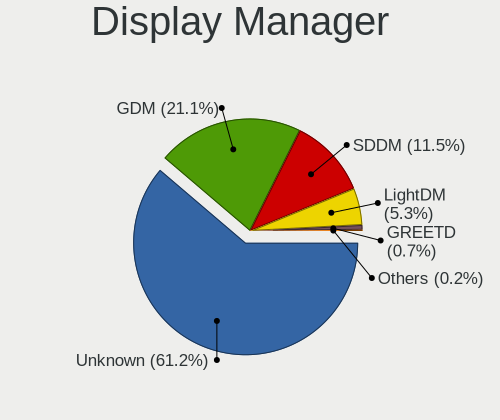
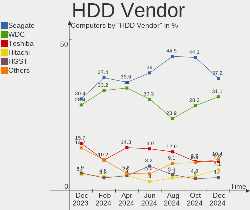
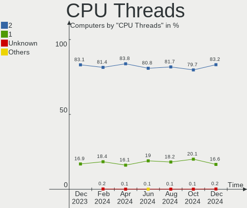
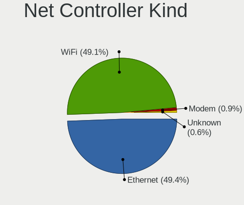
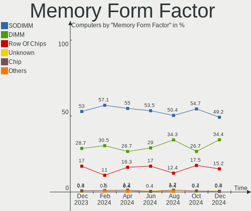

Fedora Hardware Trends
----------------------

A project to identify most popular hardware characteristics and track their change
over time based on data collected by Fedora users at https://Linux-Hardware.org.

Anyone can contribute to this report by the [hw-probe](https://github.com/linuxhw/hw-probe) tool:

    sudo -E hw-probe -all -upload

This is a report for all computer types. See also reports for [desktops](/Dist/Fedora/Desktop/README.md) and [notebooks](/Dist/Fedora/Notebook/README.md).

This report is for one last month. Overall report since the beginning of time: [TestCoverage](https://github.com/linuxhw/TestCoverage)

Period: Apr, 2022.

Contents
--------

* [ System ](#system)
  - [ OS                       ](#os)
  - [ OS Family                ](#os-family)
  - [ Kernel                   ](#kernel)
  - [ Kernel Family            ](#kernel-family)
  - [ Kernel Major Ver.        ](#kernel-major-ver)
  - [ Arch                     ](#arch)
  - [ DE                       ](#de)
  - [ Display Server           ](#display-server)
  - [ Display Manager          ](#display-manager)
  - [ OS Lang                  ](#os-lang)
  - [ Boot Mode                ](#boot-mode)
  - [ Filesystem               ](#filesystem)
  - [ Part. scheme             ](#part-scheme)
  - [ Dual Boot with Linux/BSD ](#dual-boot-with-linuxbsd)
  - [ Dual Boot (Win)          ](#dual-boot-win)

* [ Board ](#board)
  - [ Vendor                   ](#vendor)
  - [ Model                    ](#model)
  - [ Model Family             ](#model-family)
  - [ MFG Year                 ](#mfg-year)
  - [ Form Factor              ](#form-factor)
  - [ Secure Boot              ](#secure-boot)
  - [ Coreboot                 ](#coreboot)
  - [ RAM Size                 ](#ram-size)
  - [ RAM Used                 ](#ram-used)
  - [ Total Drives             ](#total-drives)
  - [ Has CD-ROM               ](#has-cd-rom)
  - [ Has Ethernet             ](#has-ethernet)
  - [ Has WiFi                 ](#has-wifi)
  - [ Has Bluetooth            ](#has-bluetooth)

* [ Location ](#location)
  - [ Country                  ](#country)
  - [ City                     ](#city)

* [ Drives ](#drives)
  - [ Drive Vendor             ](#drive-vendor)
  - [ Drive Model              ](#drive-model)
  - [ HDD Vendor               ](#hdd-vendor)
  - [ SSD Vendor               ](#ssd-vendor)
  - [ Drive Kind               ](#drive-kind)
  - [ Drive Connector          ](#drive-connector)
  - [ Drive Size               ](#drive-size)
  - [ Space Total              ](#space-total)
  - [ Space Used               ](#space-used)
  - [ Malfunc. Drives          ](#malfunc-drives)
  - [ Malfunc. Drive Vendor    ](#malfunc-drive-vendor)
  - [ Malfunc. HDD Vendor      ](#malfunc-hdd-vendor)
  - [ Malfunc. Drive Kind      ](#malfunc-drive-kind)
  - [ Failed Drives            ](#failed-drives)
  - [ Failed Drive Vendor      ](#failed-drive-vendor)
  - [ Drive Status             ](#drive-status)

* [ Storage controller ](#storage-controller)
  - [ Storage Vendor           ](#storage-vendor)
  - [ Storage Model            ](#storage-model)
  - [ Storage Kind             ](#storage-kind)

* [ Processor ](#processor)
  - [ CPU Vendor               ](#cpu-vendor)
  - [ CPU Model                ](#cpu-model)
  - [ CPU Model Family         ](#cpu-model-family)
  - [ CPU Cores                ](#cpu-cores)
  - [ CPU Sockets              ](#cpu-sockets)
  - [ CPU Threads              ](#cpu-threads)
  - [ CPU Op-Modes             ](#cpu-op-modes)
  - [ CPU Microcode            ](#cpu-microcode)
  - [ CPU Microarch            ](#cpu-microarch)

* [ Graphics ](#graphics)
  - [ GPU Vendor               ](#gpu-vendor)
  - [ GPU Model                ](#gpu-model)
  - [ GPU Combo                ](#gpu-combo)
  - [ GPU Driver               ](#gpu-driver)
  - [ GPU Memory               ](#gpu-memory)

* [ Monitor ](#monitor)
  - [ Monitor Vendor           ](#monitor-vendor)
  - [ Monitor Model            ](#monitor-model)
  - [ Monitor Resolution       ](#monitor-resolution)
  - [ Monitor Diagonal         ](#monitor-diagonal)
  - [ Monitor Width            ](#monitor-width)
  - [ Aspect Ratio             ](#aspect-ratio)
  - [ Monitor Area             ](#monitor-area)
  - [ Pixel Density            ](#pixel-density)
  - [ Multiple Monitors        ](#multiple-monitors)

* [ Network ](#network)
  - [ Net Controller Vendor    ](#net-controller-vendor)
  - [ Net Controller Model     ](#net-controller-model)
  - [ Wireless Vendor          ](#wireless-vendor)
  - [ Wireless Model           ](#wireless-model)
  - [ Ethernet Vendor          ](#ethernet-vendor)
  - [ Ethernet Model           ](#ethernet-model)
  - [ Net Controller Kind      ](#net-controller-kind)
  - [ Used Controller          ](#used-controller)
  - [ NICs                     ](#nics)
  - [ IPv6                     ](#ipv6)

* [ Bluetooth ](#bluetooth)
  - [ Bluetooth Vendor         ](#bluetooth-vendor)
  - [ Bluetooth Model          ](#bluetooth-model)

* [ Sound ](#sound)
  - [ Sound Vendor             ](#sound-vendor)
  - [ Sound Model              ](#sound-model)

* [ Memory ](#memory)
  - [ Memory Vendor            ](#memory-vendor)
  - [ Memory Model             ](#memory-model)
  - [ Memory Kind              ](#memory-kind)
  - [ Memory Form Factor       ](#memory-form-factor)
  - [ Memory Size              ](#memory-size)
  - [ Memory Speed             ](#memory-speed)

* [ Printers & scanners ](#printers--scanners)
  - [ Printer Vendor           ](#printer-vendor)
  - [ Printer Model            ](#printer-model)
  - [ Scanner Vendor           ](#scanner-vendor)
  - [ Scanner Model            ](#scanner-model)

* [ Camera ](#camera)
  - [ Camera Vendor            ](#camera-vendor)
  - [ Camera Model             ](#camera-model)

* [ Security ](#security)
  - [ Fingerprint Vendor       ](#fingerprint-vendor)
  - [ Fingerprint Model        ](#fingerprint-model)
  - [ Chipcard Vendor          ](#chipcard-vendor)
  - [ Chipcard Model           ](#chipcard-model)

* [ Unsupported ](#unsupported)
  - [ Unsupported Devices      ](#unsupported-devices)
  - [ Unsupported Device Types ](#unsupported-device-types)

System
------

OS
--

Installed operating systems

| Name      | Computers | Percent |
|-----------|-----------|---------|
| Fedora 35 | 336       | 74.17%  |
| Fedora 36 | 86        | 18.98%  |
| Fedora 34 | 25        | 5.52%   |
| Fedora 37 | 3         | 0.66%   |
| Fedora 33 | 2         | 0.44%   |
| Fedora 31 | 1         | 0.22%   |

OS Family
---------

OS without a version

| Name   | Computers | Percent |
|--------|-----------|---------|
| Fedora | 453       | 100%    |

Kernel
------

Version of the Linux kernel

| Version                                                      | Computers | Percent |
|--------------------------------------------------------------|-----------|---------|
| 5.16.18-200.fc35.x86_64                                      | 151       | 33.33%  |
| 5.16.20-200.fc35.x86_64                                      | 44        | 9.71%   |
| 5.16.19-200.fc35.x86_64                                      | 39        | 8.61%   |
| 5.17.4-200.fc35.x86_64                                       | 35        | 7.73%   |
| 5.17.2-300.fc36.x86_64                                       | 26        | 5.74%   |
| 5.17.1-300.fc36.x86_64                                       | 21        | 4.64%   |
| 5.14.10-300.fc35.x86_64                                      | 21        | 4.64%   |
| 5.16.16-200.fc35.x86_64                                      | 15        | 3.31%   |
| 5.17.3-302.fc36.x86_64                                       | 13        | 2.87%   |
| 5.17.0-0.rc7.116.fc36.x86_64                                 | 11        | 2.43%   |
| 5.16.18-100.fc34.x86_64                                      | 10        | 2.21%   |
| 5.17.4-100.fc34.x86_64                                       | 5         | 1.1%    |
| 5.17.4-300.fc36.x86_64                                       | 4         | 0.88%   |
| 5.16.15-201.fc35.x86_64                                      | 4         | 0.88%   |
| 5.15.16-200.fc35.x86_64                                      | 4         | 0.88%   |
| 5.16.20-100.fc34.x86_64                                      | 3         | 0.66%   |
| 5.16.19-100.fc34.x86_64                                      | 3         | 0.66%   |
| 5.16.12-200.fc35.x86_64                                      | 3         | 0.66%   |
| 5.8.18-100.fc31.x86_64                                       | 2         | 0.44%   |
| 5.18.0-0.rc2.23.fc37.x86_64                                  | 2         | 0.44%   |
| 5.16.8-200.fc35.x86_64                                       | 2         | 0.44%   |
| 5.16.17-200.fc35.x86_64                                      | 2         | 0.44%   |
| 5.18.0-0.rc4.20220428git8f4dd16603ce834.36.fc37.x86_64       | 1         | 0.22%   |
| 5.18.0-0.rc3.27.fc37.x86_64                                  | 1         | 0.22%   |
| 5.18.0-0.rc3.220422.d569e86915b7f2f.31.vanilla.1.fc36.x86_64 | 1         | 0.22%   |
| 5.17.5-300.fc36.x86_64                                       | 1         | 0.22%   |
| 5.17.4-lqx1.0.fc35.x86_64                                    | 1         | 0.22%   |
| 5.17.3-xm1.0.fc35.x86_64                                     | 1         | 0.22%   |
| 5.17.3-301.fsync.fc36.x86_64                                 | 1         | 0.22%   |
| 5.17.3-300.fc36.x86_64                                       | 1         | 0.22%   |
| 5.17.3-300.fc36.aarch64                                      | 1         | 0.22%   |
| 5.17.2-300.fc36.aarch64                                      | 1         | 0.22%   |
| 5.17.2-200.fc35.x86_64                                       | 1         | 0.22%   |
| 5.17.1-xm1.0.fc35.x86_64                                     | 1         | 0.22%   |
| 5.17.1-xanmod1                                               | 1         | 0.22%   |
| 5.17.1-200.fc35.x86_64                                       | 1         | 0.22%   |
| 5.17.0-300.fc36.x86_64                                       | 1         | 0.22%   |
| 5.16.9-200.fc35.x86_64                                       | 1         | 0.22%   |
| 5.16.20m.wael-beta.r2                                        | 1         | 0.22%   |
| 5.16.19-201.fsync.fc35.x86_64                                | 1         | 0.22%   |
| 5.16.18-201.fsync.fc35.x86_64                                | 1         | 0.22%   |
| 5.16.17-250.vanilla.1.fc35.x86_64                            | 1         | 0.22%   |
| 5.16.17-1.surface.fc35.x86_64                                | 1         | 0.22%   |
| 5.16.16-xm1.0e20220113.fc35.x86_64                           | 1         | 0.22%   |
| 5.16.14-200.fc35.x86_64                                      | 1         | 0.22%   |
| 5.16.12-250.vanilla.1.fc35.x86_64                            | 1         | 0.22%   |
| 5.15.5-100.fc34.x86_64                                       | 1         | 0.22%   |
| 5.15.32-xm1tt.0.fc35.x86_64                                  | 1         | 0.22%   |
| 5.15.11-1                                                    | 1         | 0.22%   |
| 5.14.9-200.fc34.x86_64                                       | 1         | 0.22%   |
| 5.14.18-100.fc33.x86_64                                      | 1         | 0.22%   |
| 5.14.16-201.fc34.x86_64                                      | 1         | 0.22%   |
| 5.14.14-300.mbp.fc33.x86_64                                  | 1         | 0.22%   |
| 5.13.10-100.fc33.x86_64                                      | 1         | 0.22%   |
| 5.10.111-200.fc35.x86_64                                     | 1         | 0.22%   |

Kernel Family
-------------

Linux kernel without a distro release

| Version  | Computers | Percent |
|----------|-----------|---------|
| 5.16.18  | 162       | 35.76%  |
| 5.16.20  | 48        | 10.6%   |
| 5.17.4   | 45        | 9.93%   |
| 5.16.19  | 43        | 9.49%   |
| 5.17.2   | 28        | 6.18%   |
| 5.17.1   | 24        | 5.3%    |
| 5.14.10  | 21        | 4.64%   |
| 5.17.3   | 17        | 3.75%   |
| 5.16.16  | 16        | 3.53%   |
| 5.17.0   | 12        | 2.65%   |
| 5.18.0   | 5         | 1.1%    |
| 5.16.17  | 4         | 0.88%   |
| 5.16.15  | 4         | 0.88%   |
| 5.16.12  | 4         | 0.88%   |
| 5.15.16  | 4         | 0.88%   |
| 5.8.18   | 2         | 0.44%   |
| 5.16.8   | 2         | 0.44%   |
| 5.17.5   | 1         | 0.22%   |
| 5.16.9   | 1         | 0.22%   |
| 5.16.14  | 1         | 0.22%   |
| 5.15.5   | 1         | 0.22%   |
| 5.15.32  | 1         | 0.22%   |
| 5.15.11  | 1         | 0.22%   |
| 5.14.9   | 1         | 0.22%   |
| 5.14.18  | 1         | 0.22%   |
| 5.14.16  | 1         | 0.22%   |
| 5.14.14  | 1         | 0.22%   |
| 5.13.10  | 1         | 0.22%   |
| 5.10.111 | 1         | 0.22%   |

Kernel Major Ver.
-----------------

Linux kernel major version

| Version | Computers | Percent |
|---------|-----------|---------|
| 5.16    | 285       | 62.91%  |
| 5.17    | 127       | 28.04%  |
| 5.14    | 25        | 5.52%   |
| 5.15    | 7         | 1.55%   |
| 5.18    | 5         | 1.1%    |
| 5.8     | 2         | 0.44%   |
| 5.13    | 1         | 0.22%   |
| 5.10    | 1         | 0.22%   |

Arch
----

OS architecture (x86_64, i586, etc.)

| Name    | Computers | Percent |
|---------|-----------|---------|
| x86_64  | 450       | 99.34%  |
| aarch64 | 3         | 0.66%   |

DE
--

Desktop Environment

| Name          | Computers | Percent |
|---------------|-----------|---------|
| GNOME         | 334       | 73.73%  |
| KDE5          | 51        | 11.26%  |
| Unknown       | 22        | 4.86%   |
| XFCE          | 11        | 2.43%   |
| Cinnamon      | 10        | 2.21%   |
| X-Cinnamon    | 7         | 1.55%   |
| i3            | 7         | 1.55%   |
| GNOME Classic | 4         | 0.88%   |
| MATE          | 3         | 0.66%   |
| LXDE          | 2         | 0.44%   |
| sway          | 1         | 0.22%   |
| KDE           | 1         | 0.22%   |

Display Server
--------------

X11 or Wayland

| Name    | Computers | Percent |
|---------|-----------|---------|
| Wayland | 283       | 62.47%  |
| X11     | 144       | 31.79%  |
| Tty     | 13        | 2.87%   |
| Unknown | 12        | 2.65%   |
| Web     | 1         | 0.22%   |

Display Manager
---------------

SDDM, LightDM, etc.

| Name    | Computers | Percent |
|---------|-----------|---------|
| Unknown | 202       | 44.59%  |
| GDM     | 183       | 40.4%   |
| LightDM | 36        | 7.95%   |
| SDDM    | 31        | 6.84%   |
| LXDM    | 1         | 0.22%   |

OS Lang
-------

Language

| Lang    | Computers | Percent |
|---------|-----------|---------|
| en_US   | 258       | 56.95%  |
| en_GB   | 36        | 7.95%   |
| pt_BR   | 16        | 3.53%   |
| fr_FR   | 15        | 3.31%   |
| de_DE   | 14        | 3.09%   |
| en_AU   | 13        | 2.87%   |
| ru_RU   | 12        | 2.65%   |
| en_CA   | 11        | 2.43%   |
| pl_PL   | 9         | 1.99%   |
| it_IT   | 7         | 1.55%   |
| es_ES   | 6         | 1.32%   |
| nl_BE   | 4         | 0.88%   |
| cs_CZ   | 4         | 0.88%   |
| C       | 4         | 0.88%   |
| en_IE   | 3         | 0.66%   |
| Unknown | 3         | 0.66%   |
| sv_SE   | 2         | 0.44%   |
| nl_NL   | 2         | 0.44%   |
| hu_HU   | 2         | 0.44%   |
| fr_BE   | 2         | 0.44%   |
| fi_FI   | 2         | 0.44%   |
| es_CL   | 2         | 0.44%   |
| en_IN   | 2         | 0.44%   |
| en_DE   | 2         | 0.44%   |
| zh_TW   | 1         | 0.22%   |
| zh_CN   | 1         | 0.22%   |
| uk_UA   | 1         | 0.22%   |
| tr_TR   | 1         | 0.22%   |
| sr_RS   | 1         | 0.22%   |
| sk_SK   | 1         | 0.22%   |
| ro_RO   | 1         | 0.22%   |
| nb_NO   | 1         | 0.22%   |
| fr_CH   | 1         | 0.22%   |
| fr_CA   | 1         | 0.22%   |
| es_UY   | 1         | 0.22%   |
| es_MX   | 1         | 0.22%   |
| es_CO   | 1         | 0.22%   |
| es_AR   | 1         | 0.22%   |
| en_ZA   | 1         | 0.22%   |
| en_NZ   | 1         | 0.22%   |
| en_IL   | 1         | 0.22%   |
| de_CH   | 1         | 0.22%   |
| da_DK   | 1         | 0.22%   |
| bs_BA   | 1         | 0.22%   |
| ba_RU   | 1         | 0.22%   |
| ar_SA   | 1         | 0.22%   |

Boot Mode
---------

EFI or BIOS

| Mode | Computers | Percent |
|------|-----------|---------|
| EFI  | 357       | 78.81%  |
| BIOS | 96        | 21.19%  |

Filesystem
----------

Type of filesystem

| Type    | Computers | Percent |
|---------|-----------|---------|
| Btrfs   | 319       | 70.42%  |
| Ext4    | 105       | 23.18%  |
| Xfs     | 26        | 5.74%   |
| Zfs     | 1         | 0.22%   |
| Overlay | 1         | 0.22%   |
| Ext3    | 1         | 0.22%   |

Part. scheme
------------

Scheme of partitioning

| Type    | Computers | Percent |
|---------|-----------|---------|
| GPT     | 225       | 49.67%  |
| Unknown | 195       | 43.05%  |
| MBR     | 33        | 7.28%   |

Dual Boot with Linux/BSD
------------------------

Hosting more than one Linux/BSD

| Dual boot | Computers | Percent |
|-----------|-----------|---------|
| No        | 382       | 84.33%  |
| Yes       | 71        | 15.67%  |

Dual Boot (Win)
---------------

Hosting Linux and Windows

| Dual boot | Computers | Percent |
|-----------|-----------|---------|
| No        | 355       | 78.37%  |
| Yes       | 98        | 21.63%  |

Board
-----

Vendor
------

Motherboard manufacturer

| Name                | Computers | Percent |
|---------------------|-----------|---------|
| Lenovo              | 100       | 22.08%  |
| ASUSTek Computer    | 71        | 15.67%  |
| Dell                | 62        | 13.69%  |
| Hewlett-Packard     | 47        | 10.38%  |
| Gigabyte Technology | 33        | 7.28%   |
| MSI                 | 31        | 6.84%   |
| Acer                | 18        | 3.97%   |
| ASRock              | 15        | 3.31%   |
| Apple               | 9         | 1.99%   |
| Intel               | 7         | 1.55%   |
| Framework           | 6         | 1.32%   |
| Microsoft           | 5         | 1.1%    |
| Unknown             | 4         | 0.88%   |
| Toshiba             | 3         | 0.66%   |
| Timi                | 3         | 0.66%   |
| System76            | 3         | 0.66%   |
| Samsung Electronics | 3         | 0.66%   |
| HUAWEI              | 3         | 0.66%   |
| TUXEDO              | 2         | 0.44%   |
| Sony                | 2         | 0.44%   |
| Notebook            | 2         | 0.44%   |
| Google              | 2         | 0.44%   |
| Chuwi               | 2         | 0.44%   |
| Biostar             | 2         | 0.44%   |
| Alienware           | 2         | 0.44%   |
| Wiltronic           | 1         | 0.22%   |
| Razer               | 1         | 0.22%   |
| Positivo            | 1         | 0.22%   |
| Pine Microsystems   | 1         | 0.22%   |
| PC Specialist       | 1         | 0.22%   |
| Nvidia              | 1         | 0.22%   |
| JINGSHA             | 1         | 0.22%   |
| GPU Company         | 1         | 0.22%   |
| Getac               | 1         | 0.22%   |
| Gateway             | 1         | 0.22%   |
| Fujitsu             | 1         | 0.22%   |
| Foxconn             | 1         | 0.22%   |
| ECS                 | 1         | 0.22%   |
| BESSTAR Tech        | 1         | 0.22%   |
| AZW                 | 1         | 0.22%   |
| AMI                 | 1         | 0.22%   |

Model
-----

Motherboard model

| Name                                            | Computers | Percent |
|-------------------------------------------------|-----------|---------|
| Framework Laptop                                | 6         | 1.32%   |
| Unknown                                         | 5         | 1.1%    |
| MSI MS-7C37                                     | 4         | 0.88%   |
| Dell XPS 13 9370                                | 4         | 0.88%   |
| ASUS All Series                                 | 4         | 0.88%   |
| MSI MS-7A38                                     | 3         | 0.66%   |
| Gigabyte B450 AORUS M                           | 3         | 0.66%   |
| Dell XPS 13 9360                                | 3         | 0.66%   |
| ASUS ROG Zephyrus G14 GA402RJ_GA402RJ           | 3         | 0.66%   |
| ASUS ROG STRIX B550-I GAMING                    | 3         | 0.66%   |
| System76 Thelio Mira                            | 2         | 0.44%   |
| Microsoft Surface Pro 7                         | 2         | 0.44%   |
| Microsoft Surface Pro                           | 2         | 0.44%   |
| Lenovo Yoga 6 13ALC6 82ND                       | 2         | 0.44%   |
| Lenovo ThinkBook 15 G2 ITL 20VE                 | 2         | 0.44%   |
| Lenovo IdeaPadFlex 5 14ARE05 81X2               | 2         | 0.44%   |
| Lenovo G500 20236                               | 2         | 0.44%   |
| HP ENVY x360 Convertible 13-ag0xxx              | 2         | 0.44%   |
| HP EliteDesk 800 G3 DM 35W                      | 2         | 0.44%   |
| Gigabyte X570 I AORUS PRO WIFI                  | 2         | 0.44%   |
| Gigabyte B550I AORUS PRO AX                     | 2         | 0.44%   |
| Dell XPS 13 9305                                | 2         | 0.44%   |
| Dell XPS 13 7390                                | 2         | 0.44%   |
| Dell Latitude E6530                             | 2         | 0.44%   |
| Dell Inspiron N5110                             | 2         | 0.44%   |
| Dell Inspiron 7577                              | 2         | 0.44%   |
| Dell Inspiron 5458                              | 2         | 0.44%   |
| Dell Inspiron 15-3567                           | 2         | 0.44%   |
| ASUS ROG STRIX B550-F GAMING                    | 2         | 0.44%   |
| ASUS ROG STRIX B450-F GAMING                    | 2         | 0.44%   |
| ASUS ROG CROSSHAIR VIII DARK HERO               | 2         | 0.44%   |
| ASUS A55M-E                                     | 2         | 0.44%   |
| Apple MacBookPro9,2                             | 2         | 0.44%   |
| Acer Aspire A315-31                             | 2         | 0.44%   |
| Wiltronic iVIEW i896QW                          | 1         | 0.22%   |
| TUXEDO Pulse 15 Gen1                            | 1         | 0.22%   |
| TUXEDO Polaris Intel Gen3 (TGL)                 | 1         | 0.22%   |
| Toshiba Satellite U840                          | 1         | 0.22%   |
| Toshiba Satellite P755                          | 1         | 0.22%   |
| Toshiba Satellite C660                          | 1         | 0.22%   |
| Timi TM1701                                     | 1         | 0.22%   |
| Timi TM1612                                     | 1         | 0.22%   |
| Timi TM1604                                     | 1         | 0.22%   |
| System76 Pangolin                               | 1         | 0.22%   |
| Sony VPCEB4L1E                                  | 1         | 0.22%   |
| Sony VPCEB3PGX                                  | 1         | 0.22%   |
| Samsung RV411/RV511/E3511/S3511/RV711/E3411     | 1         | 0.22%   |
| Samsung RC420/RC520/RC720                       | 1         | 0.22%   |
| Samsung 270E5J/2570EJ                           | 1         | 0.22%   |
| Razer Blade 15 (2022) - RZ09-0421               | 1         | 0.22%   |
| Positivo H14BU08                                | 1         | 0.22%   |
| Pine Microsystems Pine64 Pinebook Pro           | 1         | 0.22%   |
| PC Specialist PC5x_7xHP_HR_HS                   | 1         | 0.22%   |
| Nvidia Jetson Xavier NX Developer Kit (SD-card) | 1         | 0.22%   |
| Notebook NH5x_NH7x_HHx_HJx_HKx                  | 1         | 0.22%   |
| Notebook NH55RGQ                                | 1         | 0.22%   |
| MSI Stealth GS66 12UGS                          | 1         | 0.22%   |
| MSI Prestige 14Evo A11M                         | 1         | 0.22%   |
| MSI MS-7D32                                     | 1         | 0.22%   |
| MSI MS-7D13                                     | 1         | 0.22%   |

Model Family
------------

Motherboard model prefix

| Name               | Computers | Percent |
|--------------------|-----------|---------|
| Lenovo ThinkPad    | 52        | 11.48%  |
| ASUS ROG           | 24        | 5.3%    |
| Dell Inspiron      | 19        | 4.19%   |
| Dell XPS           | 16        | 3.53%   |
| Lenovo ThinkCentre | 15        | 3.31%   |
| Dell Latitude      | 13        | 2.87%   |
| Lenovo IdeaPad     | 12        | 2.65%   |
| Acer Aspire        | 10        | 2.21%   |
| HP Pavilion        | 8         | 1.77%   |
| Lenovo Yoga        | 7         | 1.55%   |
| HP EliteBook       | 7         | 1.55%   |
| Dell Precision     | 7         | 1.55%   |
| Framework Laptop   | 6         | 1.32%   |
| ASUS PRIME         | 6         | 1.32%   |
| Microsoft Surface  | 5         | 1.1%    |
| Lenovo ThinkBook   | 5         | 1.1%    |
| HP ProBook         | 5         | 1.1%    |
| Unknown            | 5         | 1.1%    |
| MSI MS-7C37        | 4         | 0.88%   |
| Lenovo Legion      | 4         | 0.88%   |
| HP Laptop          | 4         | 0.88%   |
| HP ENVY            | 4         | 0.88%   |
| Gigabyte X570      | 4         | 0.88%   |
| ASUS ASUS          | 4         | 0.88%   |
| ASUS All           | 4         | 0.88%   |
| Acer Swift         | 4         | 0.88%   |
| Toshiba Satellite  | 3         | 0.66%   |
| MSI MS-7A38        | 3         | 0.66%   |
| HP ZBook           | 3         | 0.66%   |
| HP EliteDesk       | 3         | 0.66%   |
| Gigabyte B550      | 3         | 0.66%   |
| Gigabyte B450      | 3         | 0.66%   |
| Dell OptiPlex      | 3         | 0.66%   |
| ASUS ZenBook       | 3         | 0.66%   |
| ASUS VivoBook      | 3         | 0.66%   |
| ASUS TUF           | 3         | 0.66%   |
| ASRock B450        | 3         | 0.66%   |
| System76 Thelio    | 2         | 0.44%   |
| Lenovo IdeaPadFlex | 2         | 0.44%   |
| Lenovo G500        | 2         | 0.44%   |
| HP Spectre         | 2         | 0.44%   |
| HP ProDesk         | 2         | 0.44%   |
| Gigabyte B550I     | 2         | 0.44%   |
| ASUS CROSSHAIR     | 2         | 0.44%   |
| ASUS A55M-E        | 2         | 0.44%   |
| ASRock X570        | 2         | 0.44%   |
| Apple MacBookPro9  | 2         | 0.44%   |
| Apple MacBookPro11 | 2         | 0.44%   |
| Acer Nitro         | 2         | 0.44%   |
| Wiltronic iVIEW    | 1         | 0.22%   |
| TUXEDO Pulse       | 1         | 0.22%   |
| TUXEDO Polaris     | 1         | 0.22%   |
| Timi TM1701        | 1         | 0.22%   |
| Timi TM1612        | 1         | 0.22%   |
| Timi TM1604        | 1         | 0.22%   |
| System76 Pangolin  | 1         | 0.22%   |
| Sony VPCEB4L1E     | 1         | 0.22%   |
| Sony VPCEB3PGX     | 1         | 0.22%   |
| Samsung RV411      | 1         | 0.22%   |
| Samsung RC420      | 1         | 0.22%   |

MFG Year
--------

Motherboard manufacture year

| Year    | Computers | Percent |
|---------|-----------|---------|
| 2020    | 74        | 16.34%  |
| 2021    | 72        | 15.89%  |
| 2019    | 63        | 13.91%  |
| 2018    | 42        | 9.27%   |
| 2013    | 33        | 7.28%   |
| 2017    | 30        | 6.62%   |
| 2016    | 28        | 6.18%   |
| 2015    | 20        | 4.42%   |
| 2012    | 20        | 4.42%   |
| 2014    | 19        | 4.19%   |
| 2011    | 17        | 3.75%   |
| 2022    | 10        | 2.21%   |
| 2010    | 7         | 1.55%   |
| 2009    | 6         | 1.32%   |
| 2008    | 5         | 1.1%    |
| 2007    | 3         | 0.66%   |
| 2006    | 2         | 0.44%   |
| Unknown | 2         | 0.44%   |

Form Factor
-----------

Physical design of the computer

| Name           | Computers | Percent |
|----------------|-----------|---------|
| Notebook       | 252       | 55.63%  |
| Desktop        | 153       | 33.77%  |
| Convertible    | 19        | 4.19%   |
| Tablet         | 11        | 2.43%   |
| Mini pc        | 11        | 2.43%   |
| All in one     | 3         | 0.66%   |
| System on chip | 2         | 0.44%   |
| Server         | 2         | 0.44%   |

Secure Boot
-----------

Enabled or disabled

| State    | Computers | Percent |
|----------|-----------|---------|
| Disabled | 387       | 85.43%  |
| Enabled  | 66        | 14.57%  |

Coreboot
--------

Have coreboot on board

| Used | Computers | Percent |
|------|-----------|---------|
| No   | 451       | 99.56%  |
| Yes  | 2         | 0.44%   |

RAM Size
--------

Total RAM memory

| Size in GB  | Computers | Percent |
|-------------|-----------|---------|
| 16.01-24.0  | 114       | 25.17%  |
| 4.01-8.0    | 96        | 21.19%  |
| 8.01-16.0   | 80        | 17.66%  |
| 32.01-64.0  | 78        | 17.22%  |
| 3.01-4.0    | 36        | 7.95%   |
| 64.01-256.0 | 32        | 7.06%   |
| 24.01-32.0  | 11        | 2.43%   |
| 1.01-2.0    | 3         | 0.66%   |
| 2.01-3.0    | 2         | 0.44%   |
| 0.51-1.0    | 1         | 0.22%   |

RAM Used
--------

Used RAM memory

| Used GB    | Computers | Percent |
|------------|-----------|---------|
| 4.01-8.0   | 140       | 30.91%  |
| 2.01-3.0   | 110       | 24.28%  |
| 3.01-4.0   | 90        | 19.87%  |
| 8.01-16.0  | 52        | 11.48%  |
| 1.01-2.0   | 47        | 10.38%  |
| 0.51-1.0   | 5         | 1.1%    |
| 32.01-64.0 | 4         | 0.88%   |
| 24.01-32.0 | 2         | 0.44%   |
| 16.01-24.0 | 2         | 0.44%   |
| 0.01-0.5   | 1         | 0.22%   |

Total Drives
------------

Number of drives on board

| Drives | Computers | Percent |
|--------|-----------|---------|
| 1      | 251       | 55.41%  |
| 2      | 120       | 26.49%  |
| 3      | 37        | 8.17%   |
| 4      | 26        | 5.74%   |
| 5      | 9         | 1.99%   |
| 7      | 4         | 0.88%   |
| 6      | 4         | 0.88%   |
| 9      | 1         | 0.22%   |
| 8      | 1         | 0.22%   |

Has CD-ROM
----------

Has CD-ROM on board

| Presented | Computers | Percent |
|-----------|-----------|---------|
| No        | 359       | 79.25%  |
| Yes       | 94        | 20.75%  |

Has Ethernet
------------

Has Ethernet on board

| Presented | Computers | Percent |
|-----------|-----------|---------|
| Yes       | 360       | 79.47%  |
| No        | 93        | 20.53%  |

Has WiFi
--------

Has WiFi module

| Presented | Computers | Percent |
|-----------|-----------|---------|
| Yes       | 363       | 80.13%  |
| No        | 90        | 19.87%  |

Has Bluetooth
-------------

Has Bluetooth module

| Presented | Computers | Percent |
|-----------|-----------|---------|
| Yes       | 334       | 73.73%  |
| No        | 119       | 26.27%  |

Location
--------

Country
-------

Geographic location (country)

| Country      | Computers | Percent |
|--------------|-----------|---------|
| USA          | 107       | 23.62%  |
| Germany      | 29        | 6.4%    |
| Brazil       | 25        | 5.52%   |
| France       | 21        | 4.64%   |
| Russia       | 20        | 4.42%   |
| Canada       | 19        | 4.19%   |
| Poland       | 16        | 3.53%   |
| Italy        | 16        | 3.53%   |
| Australia    | 15        | 3.31%   |
| UK           | 13        | 2.87%   |
| Sweden       | 11        | 2.43%   |
| Spain        | 11        | 2.43%   |
| Netherlands  | 11        | 2.43%   |
| India        | 9         | 1.99%   |
| Belgium      | 9         | 1.99%   |
| Austria      | 8         | 1.77%   |
| Norway       | 7         | 1.55%   |
| Hungary      | 6         | 1.32%   |
| Czechia      | 6         | 1.32%   |
| Switzerland  | 5         | 1.1%    |
| Romania      | 5         | 1.1%    |
| Mexico       | 5         | 1.1%    |
| Belarus      | 5         | 1.1%    |
| South Africa | 4         | 0.88%   |
| Turkey       | 3         | 0.66%   |
| Saudi Arabia | 3         | 0.66%   |
| Greece       | 3         | 0.66%   |
| Egypt        | 3         | 0.66%   |
| Denmark      | 3         | 0.66%   |
| Argentina    | 3         | 0.66%   |
| Ukraine      | 2         | 0.44%   |
| UAE          | 2         | 0.44%   |
| Thailand     | 2         | 0.44%   |
| Taiwan       | 2         | 0.44%   |
| Portugal     | 2         | 0.44%   |
| New Zealand  | 2         | 0.44%   |
| Myanmar      | 2         | 0.44%   |
| Kenya        | 2         | 0.44%   |
| Israel       | 2         | 0.44%   |
| Indonesia    | 2         | 0.44%   |
| Hong Kong    | 2         | 0.44%   |
| Finland      | 2         | 0.44%   |
| Estonia      | 2         | 0.44%   |
| Colombia     | 2         | 0.44%   |
| Chile        | 2         | 0.44%   |
| Bulgaria     | 2         | 0.44%   |
| Armenia      | 2         | 0.44%   |
| Tunisia      | 1         | 0.22%   |
| Slovenia     | 1         | 0.22%   |
| Slovakia     | 1         | 0.22%   |
| Singapore    | 1         | 0.22%   |
| Qatar        | 1         | 0.22%   |
| Philippines  | 1         | 0.22%   |
| Nepal        | 1         | 0.22%   |
| Malta        | 1         | 0.22%   |
| Latvia       | 1         | 0.22%   |
| Japan        | 1         | 0.22%   |
| Ireland      | 1         | 0.22%   |
| Iran         | 1         | 0.22%   |
| Iceland      | 1         | 0.22%   |

City
----

Geographic location (city)

| City              | Computers | Percent |
|-------------------|-----------|---------|
| Moscow            | 9         | 1.99%   |
| Warsaw            | 8         | 1.77%   |
| Sydney            | 8         | 1.77%   |
| Sao Paulo         | 6         | 1.32%   |
| Vienna            | 5         | 1.1%    |
| Munich            | 5         | 1.1%    |
| Minsk             | 4         | 0.88%   |
| Milan             | 4         | 0.88%   |
| Allen             | 4         | 0.88%   |
| Zurich            | 3         | 0.66%   |
| Wroclaw           | 3         | 0.66%   |
| St Petersburg     | 3         | 0.66%   |
| Portland          | 3         | 0.66%   |
| Paris             | 3         | 0.66%   |
| Oslo              | 3         | 0.66%   |
| Melbourne         | 3         | 0.66%   |
| Iowa City         | 3         | 0.66%   |
| Calgary           | 3         | 0.66%   |
| Amsterdam         | 3         | 0.66%   |
| Yerevan           | 2         | 0.44%   |
| Yangon            | 2         | 0.44%   |
| Vila Velha        | 2         | 0.44%   |
| Tulsa             | 2         | 0.44%   |
| Treffurt          | 2         | 0.44%   |
| Toronto           | 2         | 0.44%   |
| Tallinn           | 2         | 0.44%   |
| Stockholm         | 2         | 0.44%   |
| Springfield       | 2         | 0.44%   |
| Sollentuna        | 2         | 0.44%   |
| Sofia             | 2         | 0.44%   |
| Seattle           | 2         | 0.44%   |
| Saint-Denis       | 2         | 0.44%   |
| Rotterdam         | 2         | 0.44%   |
| Prague            | 2         | 0.44%   |
| Pittsburgh        | 2         | 0.44%   |
| Novosibirsk       | 2         | 0.44%   |
| Nashua            | 2         | 0.44%   |
| Nairobi           | 2         | 0.44%   |
| Mölten           | 2         | 0.44%   |
| Minneapolis       | 2         | 0.44%   |
| Las Vegas         | 2         | 0.44%   |
| Kitchener         | 2         | 0.44%   |
| Kanne             | 2         | 0.44%   |
| Jakarta           | 2         | 0.44%   |
| Hamburg           | 2         | 0.44%   |
| Guadalajara       | 2         | 0.44%   |
| Frankfurt am Main | 2         | 0.44%   |
| Folsom            | 2         | 0.44%   |
| Düsseldorf       | 2         | 0.44%   |
| Chicago           | 2         | 0.44%   |
| Chandler          | 2         | 0.44%   |
| Central           | 2         | 0.44%   |
| Cariacica         | 2         | 0.44%   |
| Budapest          | 2         | 0.44%   |
| Brooklyn          | 2         | 0.44%   |
| Brampton          | 2         | 0.44%   |
| Bhopal            | 2         | 0.44%   |
| Berlin            | 2         | 0.44%   |
| Barcelona         | 2         | 0.44%   |
| Athens            | 2         | 0.44%   |

Drives
------

Drive Vendor
------------

Hard drive vendors

| Vendor                         | Computers | Drives | Percent |
|--------------------------------|-----------|--------|---------|
| Samsung Electronics            | 155       | 204    | 22.76%  |
| WDC                            | 91        | 132    | 13.36%  |
| Seagate                        | 76        | 98     | 11.16%  |
| Toshiba                        | 41        | 45     | 6.02%   |
| SanDisk                        | 33        | 36     | 4.85%   |
| Kingston                       | 32        | 40     | 4.7%    |
| Crucial                        | 31        | 32     | 4.55%   |
| SK Hynix                       | 29        | 32     | 4.26%   |
| Unknown                        | 27        | 31     | 3.96%   |
| Intel                          | 27        | 34     | 3.96%   |
| Micron Technology              | 15        | 16     | 2.2%    |
| Phison                         | 10        | 10     | 1.47%   |
| KIOXIA                         | 10        | 10     | 1.47%   |
| Hitachi                        | 10        | 13     | 1.47%   |
| A-DATA Technology              | 8         | 8      | 1.17%   |
| Silicon Motion                 | 6         | 6      | 0.88%   |
| PNY                            | 6         | 7      | 0.88%   |
| HGST                           | 6         | 6      | 0.88%   |
| Corsair                        | 5         | 6      | 0.73%   |
| Apple                          | 5         | 5      | 0.73%   |
| XPG                            | 4         | 5      | 0.59%   |
| Transcend                      | 4         | 4      | 0.59%   |
| Unknown                        | 4         | 4      | 0.59%   |
| MAXTOR                         | 3         | 3      | 0.44%   |
| Solid State Storage Technology | 2         | 2      | 0.29%   |
| OCZ                            | 2         | 2      | 0.29%   |
| Netac                          | 2         | 2      | 0.29%   |
| LITEON                         | 2         | 2      | 0.29%   |
| Lenovo                         | 2         | 2      | 0.29%   |
| KingDian                       | 2         | 2      | 0.29%   |
| China                          | 2         | 2      | 0.29%   |
| Zozt                           | 1         | 1      | 0.15%   |
| Zheino                         | 1         | 1      | 0.15%   |
| Yangtze Memory Technologies    | 1         | 1      | 0.15%   |
| WDC WDS2                       | 1         | 1      | 0.15%   |
| Vaseky                         | 1         | 1      | 0.15%   |
| UMIS                           | 1         | 1      | 0.15%   |
| Teclast                        | 1         | 1      | 0.15%   |
| Team                           | 1         | 1      | 0.15%   |
| SSK                            | 1         | 1      | 0.15%   |
| SPCC                           | 1         | 1      | 0.15%   |
| Ramsta                         | 1         | 1      | 0.15%   |
| Phison Electronics             | 1         | 1      | 0.15%   |
| Patriot                        | 1         | 1      | 0.15%   |
| OCZ-VERTEX                     | 1         | 1      | 0.15%   |
| N300                           | 1         | 1      | 0.15%   |
| Micron/Crucial Technology      | 1         | 1      | 0.15%   |
| Mass                           | 1         | 1      | 0.15%   |
| LITEONIT                       | 1         | 1      | 0.15%   |
| Lexar                          | 1         | 1      | 0.15%   |
| LDLC                           | 1         | 1      | 0.15%   |
| KingFast                       | 1         | 1      | 0.15%   |
| Intenso                        | 1         | 1      | 0.15%   |
| HUSKY                          | 1         | 1      | 0.15%   |
| Hewlett-Packard                | 1         | 1      | 0.15%   |
| GOODRAM                        | 1         | 1      | 0.15%   |
| G-CB0166                       | 1         | 1      | 0.15%   |
| FORESEE                        | 1         | 1      | 0.15%   |
| EAGET                          | 1         | 1      | 0.15%   |
| Apacer                         | 1         | 1      | 0.15%   |

Drive Model
-----------

Hard drive models

| Model                               | Computers | Percent |
|-------------------------------------|-----------|---------|
| Samsung NVMe SSD Drive 1TB          | 11        | 1.41%   |
| Samsung NVMe SSD Drive 500GB        | 10        | 1.28%   |
| Seagate ST1000LM035-1RK172 1TB      | 9         | 1.16%   |
| Sandisk NVMe SSD Drive 1TB          | 9         | 1.16%   |
| Samsung SSD 970 EVO Plus 500GB      | 9         | 1.16%   |
| Samsung SSD 860 EVO 1TB             | 9         | 1.16%   |
| Samsung SSD 850 EVO 500GB           | 9         | 1.16%   |
| Samsung SSD 850 EVO 250GB           | 9         | 1.16%   |
| Kingston SA400S37240G 240GB SSD     | 9         | 1.16%   |
| Seagate ST1000DM010-2EP102 1TB      | 8         | 1.03%   |
| Unknown MMC Card  32GB              | 6         | 0.77%   |
| Samsung SSD 980 1TB                 | 6         | 0.77%   |
| Samsung SSD 970 EVO Plus 1TB        | 6         | 0.77%   |
| Samsung NVMe SSD Drive 512GB        | 6         | 0.77%   |
| Crucial CT1000MX500SSD1 1TB         | 6         | 0.77%   |
| Seagate ST2000DM008-2FR102 2TB      | 5         | 0.64%   |
| Samsung SSD 860 EVO 500GB           | 5         | 0.64%   |
| Intel NVMe SSD Drive 512GB          | 5         | 0.64%   |
| Crucial CT500MX500SSD1 500GB        | 5         | 0.64%   |
| WDC WDS100T2B0A-00SM50 1TB SSD      | 4         | 0.51%   |
| Unknown MMC Card  128GB             | 4         | 0.51%   |
| Toshiba MQ01ABD100 1TB              | 4         | 0.51%   |
| SK Hynix NVMe SSD Drive 512GB       | 4         | 0.51%   |
| SK Hynix NVMe SSD Drive 256GB       | 4         | 0.51%   |
| Seagate ST500DM002-1BD142 500GB     | 4         | 0.51%   |
| Seagate ST4000DM005-2DP166 4TB      | 4         | 0.51%   |
| Seagate ST1000LM024 HN-M101MBB 1TB  | 4         | 0.51%   |
| Sandisk NVMe SSD Drive 512GB        | 4         | 0.51%   |
| Sandisk NVMe SSD Drive 500GB        | 4         | 0.51%   |
| Sandisk NVMe SSD Drive 1024GB       | 4         | 0.51%   |
| Samsung SSD 980 PRO 1TB             | 4         | 0.51%   |
| Samsung SSD 860 EVO 250GB           | 4         | 0.51%   |
| Samsung NVMe SSD Drive 256GB        | 4         | 0.51%   |
| Samsung NVMe SSD Drive 250GB        | 4         | 0.51%   |
| Samsung NVMe SSD Drive 1024GB       | 4         | 0.51%   |
| KIOXIA NVMe SSD Drive 512GB         | 4         | 0.51%   |
| Intel SSDPEKNW512G8 512GB           | 4         | 0.51%   |
| Crucial CT240BX500SSD1 240GB        | 4         | 0.51%   |
| Unknown                             | 4         | 0.51%   |
| XPG NVMe SSD Drive 1024GB           | 3         | 0.39%   |
| Transcend TS512GMTS430S 512GB SSD   | 3         | 0.39%   |
| Toshiba MQ04ABF100 1TB              | 3         | 0.39%   |
| Toshiba KXG6AZNV512G 512GB          | 3         | 0.39%   |
| Toshiba KBG30ZMS128G 128GB NVMe SSD | 3         | 0.39%   |
| Seagate ST500LT012-1DG142 500GB     | 3         | 0.39%   |
| Seagate ST500LM021-1KJ152 500GB     | 3         | 0.39%   |
| Seagate ST4000DM004-2CV104 4TB      | 3         | 0.39%   |
| Samsung SSD 970 EVO 250GB           | 3         | 0.39%   |
| Samsung SSD 970 EVO 1TB             | 3         | 0.39%   |
| Samsung SSD 860 QVO 1TB             | 3         | 0.39%   |
| Samsung MZVLB1T0HBLR-000L7 1TB      | 3         | 0.39%   |
| Samsung HD103SJ 1TB                 | 3         | 0.39%   |
| Phison Sabrent 512GB                | 3         | 0.39%   |
| Kingston SA400S37480G 480GB SSD     | 3         | 0.39%   |
| Kingston NVMe SSD Drive 1TB         | 3         | 0.39%   |
| WDC WDS500G2B0C-00PXH0 500GB        | 2         | 0.26%   |
| WDC WDS500G2B0C 500GB               | 2         | 0.26%   |
| WDC WDS240G2G0B-00EPW0 240GB SSD    | 2         | 0.26%   |
| WDC WDS240G2G0A-00JH30 240GB SSD    | 2         | 0.26%   |
| WDC WDS200T2B0C-00PXH0 2TB          | 2         | 0.26%   |

HDD Vendor
----------

Hard disk drive vendors

| Vendor              | Computers | Drives | Percent |
|---------------------|-----------|--------|---------|
| Seagate             | 75        | 97     | 42.61%  |
| WDC                 | 58        | 91     | 32.95%  |
| Toshiba             | 17        | 18     | 9.66%   |
| Hitachi             | 10        | 13     | 5.68%   |
| HGST                | 6         | 6      | 3.41%   |
| Samsung Electronics | 4         | 6      | 2.27%   |
| MAXTOR              | 3         | 3      | 1.7%    |
| Unknown             | 2         | 2      | 1.14%   |
| Apple               | 1         | 1      | 0.57%   |

SSD Vendor
----------

Solid state drive vendors

| Vendor              | Computers | Drives | Percent |
|---------------------|-----------|--------|---------|
| Samsung Electronics | 67        | 88     | 31.75%  |
| Crucial             | 27        | 28     | 12.8%   |
| Kingston            | 25        | 29     | 11.85%  |
| WDC                 | 16        | 17     | 7.58%   |
| SanDisk             | 10        | 12     | 4.74%   |
| Intel               | 8         | 9      | 3.79%   |
| PNY                 | 6         | 7      | 2.84%   |
| Micron Technology   | 6         | 6      | 2.84%   |
| Transcend           | 4         | 4      | 1.9%    |
| SK Hynix            | 4         | 5      | 1.9%    |
| A-DATA Technology   | 4         | 4      | 1.9%    |
| Toshiba             | 3         | 4      | 1.42%   |
| Apple               | 3         | 3      | 1.42%   |
| OCZ                 | 2         | 2      | 0.95%   |
| Netac               | 2         | 2      | 0.95%   |
| LITEON              | 2         | 2      | 0.95%   |
| Corsair             | 2         | 3      | 0.95%   |
| China               | 2         | 2      | 0.95%   |
| Zozt                | 1         | 1      | 0.47%   |
| WDC WDS2            | 1         | 1      | 0.47%   |
| Vaseky              | 1         | 1      | 0.47%   |
| Teclast             | 1         | 1      | 0.47%   |
| Team                | 1         | 1      | 0.47%   |
| SPCC                | 1         | 1      | 0.47%   |
| Ramsta              | 1         | 1      | 0.47%   |
| Patriot             | 1         | 1      | 0.47%   |
| OCZ-VERTEX          | 1         | 1      | 0.47%   |
| LITEONIT            | 1         | 1      | 0.47%   |
| Lexar               | 1         | 1      | 0.47%   |
| KingDian            | 1         | 1      | 0.47%   |
| Intenso             | 1         | 1      | 0.47%   |
| HUSKY               | 1         | 1      | 0.47%   |
| GOODRAM             | 1         | 1      | 0.47%   |
| FORESEE             | 1         | 1      | 0.47%   |
| EAGET               | 1         | 1      | 0.47%   |
| Apacer              | 1         | 1      | 0.47%   |

Drive Kind
----------

HDD or SSD

| Kind    | Computers | Drives | Percent |
|---------|-----------|--------|---------|
| NVMe    | 253       | 304    | 40.29%  |
| SSD     | 185       | 245    | 29.46%  |
| HDD     | 153       | 237    | 24.36%  |
| MMC     | 28        | 35     | 4.46%   |
| Unknown | 9         | 9      | 1.43%   |

Drive Connector
---------------

SATA, SAS, NVMe, etc.

| Type | Computers | Drives | Percent |
|------|-----------|--------|---------|
| SATA | 263       | 478    | 47.22%  |
| NVMe | 253       | 304    | 45.42%  |
| MMC  | 28        | 35     | 5.03%   |
| SAS  | 13        | 13     | 2.33%   |

Drive Size
----------

Size of hard drive

| Size in TB | Computers | Drives | Percent |
|------------|-----------|--------|---------|
| 0.01-0.5   | 184       | 249    | 51.69%  |
| 0.51-1.0   | 109       | 128    | 30.62%  |
| 1.01-2.0   | 31        | 55     | 8.71%   |
| 3.01-4.0   | 17        | 26     | 4.78%   |
| 2.01-3.0   | 9         | 12     | 2.53%   |
| 4.01-10.0  | 5         | 8      | 1.4%    |
| 10.01-20.0 | 1         | 4      | 0.28%   |

Space Total
-----------

Amount of disk space available on the file system

| Size in GB     | Computers | Percent |
|----------------|-----------|---------|
| 501-1000       | 94        | 20.75%  |
| 251-500        | 85        | 18.76%  |
| 1001-2000      | 69        | 15.23%  |
| 1-20           | 61        | 13.47%  |
| 101-250        | 52        | 11.48%  |
| More than 3000 | 34        | 7.51%   |
| Unknown        | 28        | 6.18%   |
| 2001-3000      | 17        | 3.75%   |
| 51-100         | 9         | 1.99%   |
| 21-50          | 4         | 0.88%   |

Space Used
----------

Amount of used disk space

| Used GB        | Computers | Percent |
|----------------|-----------|---------|
| 1-20           | 124       | 27.37%  |
| 101-250        | 70        | 15.45%  |
| 21-50          | 56        | 12.36%  |
| 251-500        | 55        | 12.14%  |
| 51-100         | 44        | 9.71%   |
| 501-1000       | 35        | 7.73%   |
| 1001-2000      | 28        | 6.18%   |
| Unknown        | 28        | 6.18%   |
| More than 3000 | 8         | 1.77%   |
| 2001-3000      | 5         | 1.1%    |

Malfunc. Drives
---------------

Drive models with a malfunction

| Model                                            | Computers | Drives | Percent |
|--------------------------------------------------|-----------|--------|---------|
| Intel SSDSC2CT120A3 120GB                        | 2         | 2      | 5.41%   |
| WDC WD5000LPLX-60ZNTT1 500GB                     | 1         | 1      | 2.7%    |
| WDC WD30EZRX-00SPEB0 3TB                         | 1         | 1      | 2.7%    |
| WDC WD30EFRX-68AX9N0 3TB                         | 1         | 1      | 2.7%    |
| WDC WD2003FYYS-02W0B1 2TB                        | 1         | 6      | 2.7%    |
| WDC WD1600BEVS-60RST0 160GB                      | 1         | 1      | 2.7%    |
| WDC WD10JPVX-60JC3T0 1TB                         | 1         | 1      | 2.7%    |
| Toshiba MQ01ABD100 1TB                           | 1         | 1      | 2.7%    |
| Toshiba MQ01ABD050 500GB                         | 1         | 1      | 2.7%    |
| Teclast 360GB A850 SSD                           | 1         | 1      | 2.7%    |
| SK Hynix SC308 SATA 256GB SSD                    | 1         | 1      | 2.7%    |
| Seagate ST500LT012-1DG142 500GB                  | 1         | 1      | 2.7%    |
| Seagate ST500LM000-1EJ162 500GB                  | 1         | 1      | 2.7%    |
| Seagate ST3500418AS 500GB                        | 1         | 1      | 2.7%    |
| Seagate ST31500341AS 1TB                         | 1         | 1      | 2.7%    |
| Seagate ST31000528AS 1TB                         | 1         | 1      | 2.7%    |
| Seagate ST3000DM001-1CH166 3TB                   | 1         | 1      | 2.7%    |
| Seagate ST2000DM008-2FR102 2TB                   | 1         | 1      | 2.7%    |
| Seagate ST1500DM003-9YN16G 1TB                   | 1         | 1      | 2.7%    |
| Seagate ST1000DX001-1CM162 1TB                   | 1         | 1      | 2.7%    |
| Samsung Electronics SSD 980 PRO 2TB              | 1         | 1      | 2.7%    |
| Samsung Electronics SSD 970 EVO 1TB              | 1         | 1      | 2.7%    |
| Samsung Electronics SSD 870 EVO 2TB              | 1         | 1      | 2.7%    |
| Samsung Electronics SSD 850 PRO 2TB              | 1         | 1      | 2.7%    |
| Samsung Electronics MZ7TE256HMHP-000L7 256GB SSD | 1         | 1      | 2.7%    |
| Samsung Electronics HD501LJ 500GB                | 1         | 2      | 2.7%    |
| PNY CS1311 960GB SSD                             | 1         | 1      | 2.7%    |
| Intel SSDSC2CT240A3 240GB                        | 1         | 1      | 2.7%    |
| Hitachi HUA722020ALA330 2TB                      | 1         | 1      | 2.7%    |
| Hitachi HTS725032A9A364 320GB                    | 1         | 1      | 2.7%    |
| Hitachi HTS723232A7A364 320GB                    | 1         | 1      | 2.7%    |
| Hitachi HDP725016GLA380 160GB                    | 1         | 1      | 2.7%    |
| HGST HTS545050A7E680 500GB                       | 1         | 1      | 2.7%    |
| Crucial CT250BX100SSD1 250GB                     | 1         | 1      | 2.7%    |
| Crucial CT1024MX 1TB SSD                         | 1         | 1      | 2.7%    |
| A-DATA Technology SU800 512GB SSD                | 1         | 1      | 2.7%    |

Malfunc. Drive Vendor
---------------------

Vendors of faulty drives

| Vendor              | Computers | Drives | Percent |
|---------------------|-----------|--------|---------|
| Seagate             | 8         | 9      | 22.86%  |
| WDC                 | 6         | 11     | 17.14%  |
| Samsung Electronics | 6         | 7      | 17.14%  |
| Intel               | 3         | 3      | 8.57%   |
| Hitachi             | 3         | 4      | 8.57%   |
| Toshiba             | 2         | 2      | 5.71%   |
| Crucial             | 2         | 2      | 5.71%   |
| Teclast             | 1         | 1      | 2.86%   |
| SK Hynix            | 1         | 1      | 2.86%   |
| PNY                 | 1         | 1      | 2.86%   |
| HGST                | 1         | 1      | 2.86%   |
| A-DATA Technology   | 1         | 1      | 2.86%   |

Malfunc. HDD Vendor
-------------------

Vendors of faulty HDD drives

| Vendor              | Computers | Drives | Percent |
|---------------------|-----------|--------|---------|
| Seagate             | 8         | 9      | 38.1%   |
| WDC                 | 6         | 11     | 28.57%  |
| Hitachi             | 3         | 4      | 14.29%  |
| Toshiba             | 2         | 2      | 9.52%   |
| Samsung Electronics | 1         | 2      | 4.76%   |
| HGST                | 1         | 1      | 4.76%   |

Malfunc. Drive Kind
-------------------

Kinds of faulty drives

| Kind | Computers | Drives | Percent |
|------|-----------|--------|---------|
| HDD  | 21        | 29     | 60%     |
| SSD  | 12        | 12     | 34.29%  |
| NVMe | 2         | 2      | 5.71%   |

Failed Drives
-------------

Failed drive models

Zero info for selected period =(

Failed Drive Vendor
-------------------

Failed drive vendors

Zero info for selected period =(

Drive Status
------------

Number of failed and malfunc. drives

| Status   | Computers | Drives | Percent |
|----------|-----------|--------|---------|
| Works    | 236       | 379    | 47.87%  |
| Detected | 222       | 408    | 45.03%  |
| Malfunc  | 35        | 43     | 7.1%    |

Storage controller
------------------

Storage Vendor
--------------

Storage controller vendors

| Vendor                         | Computers | Percent |
|--------------------------------|-----------|---------|
| Intel                          | 240       | 37.85%  |
| AMD                            | 105       | 16.56%  |
| Samsung Electronics            | 99        | 15.62%  |
| Sandisk                        | 43        | 6.78%   |
| SK Hynix                       | 24        | 3.79%   |
| Toshiba America Info Systems   | 20        | 3.15%   |
| ASMedia Technology             | 17        | 2.68%   |
| Phison Electronics             | 13        | 2.05%   |
| KIOXIA                         | 11        | 1.74%   |
| Kingston Technology Company    | 10        | 1.58%   |
| Micron Technology              | 9         | 1.42%   |
| Silicon Motion                 | 7         | 1.1%    |
| ADATA Technology               | 7         | 1.1%    |
| Marvell Technology Group       | 6         | 0.95%   |
| Micron/Crucial Technology      | 5         | 0.79%   |
| JMicron Technology             | 4         | 0.63%   |
| Solid State Storage Technology | 2         | 0.32%   |
| Silicon Image                  | 2         | 0.32%   |
| Lenovo                         | 2         | 0.32%   |
| Yangtze Memory Technologies    | 1         | 0.16%   |
| VIA Technologies               | 1         | 0.16%   |
| Union Memory (Shenzhen)        | 1         | 0.16%   |
| ULi Electronics                | 1         | 0.16%   |
| Realtek Semiconductor          | 1         | 0.16%   |
| LSI Logic / Symbios Logic      | 1         | 0.16%   |
| Broadcom / LSI                 | 1         | 0.16%   |
| Apple                          | 1         | 0.16%   |

Storage Model
-------------

Storage controller models

| Model                                                                            | Computers | Percent |
|----------------------------------------------------------------------------------|-----------|---------|
| AMD FCH SATA Controller [AHCI mode]                                              | 76        | 11%     |
| Samsung NVMe SSD Controller SM981/PM981/PM983                                    | 52        | 7.53%   |
| Samsung NVMe SSD Controller 980                                                  | 25        | 3.62%   |
| Intel Sunrise Point-LP SATA Controller [AHCI mode]                               | 23        | 3.33%   |
| Intel 8 Series/C220 Series Chipset Family 6-port SATA Controller 1 [AHCI mode]   | 16        | 2.32%   |
| Intel 7 Series Chipset Family 6-port SATA Controller [AHCI mode]                 | 16        | 2.32%   |
| ASMedia ASM1062 Serial ATA Controller                                            | 16        | 2.32%   |
| AMD 400 Series Chipset SATA Controller                                           | 16        | 2.32%   |
| Intel 8 Series SATA Controller 1 [AHCI mode]                                     | 15        | 2.17%   |
| AMD 500 Series Chipset SATA Controller                                           | 15        | 2.17%   |
| Sandisk WD Blue SN550 NVMe SSD                                                   | 14        | 2.03%   |
| SK Hynix Gold P31 SSD                                                            | 13        | 1.88%   |
| Intel Volume Management Device NVMe RAID Controller                              | 13        | 1.88%   |
| Intel Q170/Q150/B150/H170/H110/Z170/CM236 Chipset SATA Controller [AHCI Mode]    | 13        | 1.88%   |
| Intel Cannon Lake Mobile PCH SATA AHCI Controller                                | 13        | 1.88%   |
| Samsung NVMe SSD Controller PM9A1/PM9A3/980PRO                                   | 12        | 1.74%   |
| Sandisk WD Black SN750 / PC SN730 NVMe SSD                                       | 11        | 1.59%   |
| KIOXIA Non-Volatile memory controller                                            | 11        | 1.59%   |
| Micron Non-Volatile memory controller                                            | 9         | 1.3%    |
| Intel Tiger Lake-LP SATA Controller [AHCI mode]                                  | 9         | 1.3%    |
| Intel Non-Volatile memory controller                                             | 9         | 1.3%    |
| AMD SB7x0/SB8x0/SB9x0 SATA Controller [AHCI mode]                                | 9         | 1.3%    |
| Toshiba America Info Systems Toshiba America Info Non-Volatile memory controller | 8         | 1.16%   |
| Phison E12 NVMe Controller                                                       | 8         | 1.16%   |
| Intel Wildcat Point-LP SATA Controller [AHCI Mode]                               | 8         | 1.16%   |
| Intel 82801 Mobile SATA Controller [RAID mode]                                   | 8         | 1.16%   |
| Intel 500 Series Chipset Family SATA AHCI Controller                             | 8         | 1.16%   |
| Intel 200 Series PCH SATA controller [AHCI mode]                                 | 8         | 1.16%   |
| Sandisk Non-Volatile memory controller                                           | 7         | 1.01%   |
| Samsung NVMe SSD Controller SM961/PM961/SM963                                    | 7         | 1.01%   |
| Intel SSD 660P Series                                                            | 7         | 1.01%   |
| Intel 6 Series/C200 Series Chipset Family 6 port Mobile SATA AHCI Controller     | 7         | 1.01%   |
| Toshiba America Info Systems XG6 NVMe SSD Controller                             | 6         | 0.87%   |
| Intel Cannon Lake PCH SATA AHCI Controller                                       | 6         | 0.87%   |
| Intel 6 Series/C200 Series Chipset Family 6 port Desktop SATA AHCI Controller    | 6         | 0.87%   |
| ADATA XPG SX8200 Pro PCIe Gen3x4 M.2 2280 Solid State Drive                      | 6         | 0.87%   |
| Silicon Motion SM2263EN/SM2263XT SSD Controller                                  | 5         | 0.72%   |
| Sandisk WD Blue SN500 / PC SN520 NVMe SSD                                        | 5         | 0.72%   |
| Intel SATA Controller [RAID mode]                                                | 5         | 0.72%   |
| SK Hynix PC401 NVMe Solid State Drive 256GB                                      | 4         | 0.58%   |
| SK Hynix Non-Volatile memory controller                                          | 4         | 0.58%   |
| Intel NM10/ICH7 Family SATA Controller [IDE mode]                                | 4         | 0.58%   |
| Intel HM170/QM170 Chipset SATA Controller [AHCI Mode]                            | 4         | 0.58%   |
| Intel 82801G (ICH7 Family) IDE Controller                                        | 4         | 0.58%   |
| Intel 7 Series/C210 Series Chipset Family 6-port SATA Controller [AHCI mode]     | 4         | 0.58%   |
| Intel 400 Series Chipset Family SATA AHCI Controller                             | 4         | 0.58%   |
| Toshiba America Info Systems XG4 NVMe SSD Controller                             | 3         | 0.43%   |
| Sandisk WD PC SN810 / Black SN850 NVMe SSD                                       | 3         | 0.43%   |
| Sandisk WD Black 2018/SN750 / PC SN720 NVMe SSD                                  | 3         | 0.43%   |
| Marvell Group 88SE9230 PCIe 2.0 x2 4-port SATA 6 Gb/s RAID Controller            | 3         | 0.43%   |
| Kingston Company Company Non-Volatile memory controller                          | 3         | 0.43%   |
| Intel Comet Lake SATA AHCI Controller                                            | 3         | 0.43%   |
| Intel Celeron/Pentium Silver Processor SATA Controller                           | 3         | 0.43%   |
| Intel Celeron N3350/Pentium N4200/Atom E3900 Series SATA AHCI Controller         | 3         | 0.43%   |
| Intel C600/X79 series chipset 6-Port SATA AHCI Controller                        | 3         | 0.43%   |
| Intel 9 Series Chipset Family SATA Controller [AHCI Mode]                        | 3         | 0.43%   |
| Intel 5 Series/3400 Series Chipset 4 port SATA AHCI Controller                   | 3         | 0.43%   |
| AMD SB7x0/SB8x0/SB9x0 IDE Controller                                             | 3         | 0.43%   |
| AMD FCH IDE Controller                                                           | 3         | 0.43%   |
| Toshiba America Info Systems NVMe Controller                                     | 2         | 0.29%   |

Storage Kind
------------

Kind of storage controller (IDE, SATA, NVMe, SAS, ...)

| Kind | Computers | Percent |
|------|-----------|---------|
| SATA | 306       | 49.76%  |
| NVMe | 253       | 41.14%  |
| RAID | 31        | 5.04%   |
| IDE  | 23        | 3.74%   |
| SAS  | 2         | 0.33%   |

Processor
---------

CPU Vendor
----------

Processor vendors

| Vendor  | Computers | Percent |
|---------|-----------|---------|
| Intel   | 315       | 69.54%  |
| AMD     | 135       | 29.8%   |
| ARM     | 2         | 0.44%   |
| Unknown | 1         | 0.22%   |

CPU Model
---------

Processor models

| Model                                         | Computers | Percent |
|-----------------------------------------------|-----------|---------|
| Intel 11th Gen Core i5-1135G7 @ 2.40GHz       | 14        | 3.09%   |
| Intel 11th Gen Core i7-1165G7 @ 2.80GHz       | 10        | 2.21%   |
| Intel Core i7-8550U CPU @ 1.80GHz             | 7         | 1.55%   |
| Intel Core i7-8750H CPU @ 2.20GHz             | 6         | 1.32%   |
| Intel Core i7-7500U CPU @ 2.70GHz             | 6         | 1.32%   |
| Intel Core i7-10510U CPU @ 1.80GHz            | 6         | 1.32%   |
| AMD Ryzen 9 5900HX with Radeon Graphics       | 6         | 1.32%   |
| AMD Ryzen 7 5800X 8-Core Processor            | 6         | 1.32%   |
| AMD Ryzen 7 3700X 8-Core Processor            | 6         | 1.32%   |
| Intel Core i7-7700HQ CPU @ 2.80GHz            | 5         | 1.1%    |
| Intel Core i5-7200U CPU @ 2.50GHz             | 5         | 1.1%    |
| Intel 11th Gen Core i7-1185G7 @ 3.00GHz       | 5         | 1.1%    |
| AMD Ryzen 9 5950X 16-Core Processor           | 5         | 1.1%    |
| AMD Ryzen 9 3900X 12-Core Processor           | 5         | 1.1%    |
| AMD Ryzen 5 4500U with Radeon Graphics        | 5         | 1.1%    |
| AMD Ryzen 5 3500U with Radeon Vega Mobile Gfx | 5         | 1.1%    |
| Intel Core i7-4510U CPU @ 2.00GHz             | 4         | 0.88%   |
| Intel Core i5-8250U CPU @ 1.60GHz             | 4         | 0.88%   |
| Intel Core i5-4210U CPU @ 1.70GHz             | 4         | 0.88%   |
| AMD Ryzen 7 PRO 4750U with Radeon Graphics    | 4         | 0.88%   |
| AMD Ryzen 7 5800H with Radeon Graphics        | 4         | 0.88%   |
| AMD Ryzen 7 5700U with Radeon Graphics        | 4         | 0.88%   |
| AMD Ryzen 7 5700G with Radeon Graphics        | 4         | 0.88%   |
| AMD Ryzen 7 4800H with Radeon Graphics        | 4         | 0.88%   |
| AMD Ryzen 5 3600X 6-Core Processor            | 4         | 0.88%   |
| Intel Core i9-9880H CPU @ 2.30GHz             | 3         | 0.66%   |
| Intel Core i7-9750H CPU @ 2.60GHz             | 3         | 0.66%   |
| Intel Core i7-8665U CPU @ 1.90GHz             | 3         | 0.66%   |
| Intel Core i7-8650U CPU @ 1.90GHz             | 3         | 0.66%   |
| Intel Core i7-8565U CPU @ 1.80GHz             | 3         | 0.66%   |
| Intel Core i7-6700K CPU @ 4.00GHz             | 3         | 0.66%   |
| Intel Core i7-6500U CPU @ 2.50GHz             | 3         | 0.66%   |
| Intel Core i7-3630QM CPU @ 2.40GHz            | 3         | 0.66%   |
| Intel Core i7-10870H CPU @ 2.20GHz            | 3         | 0.66%   |
| Intel Core i7-10850H CPU @ 2.70GHz            | 3         | 0.66%   |
| Intel Core i7-1065G7 CPU @ 1.30GHz            | 3         | 0.66%   |
| Intel Core i5-8265U CPU @ 1.60GHz             | 3         | 0.66%   |
| Intel Core i5-7500T CPU @ 2.70GHz             | 3         | 0.66%   |
| Intel Core i5-7300U CPU @ 2.60GHz             | 3         | 0.66%   |
| Intel Core i5-6500 CPU @ 3.20GHz              | 3         | 0.66%   |
| Intel Core i5-5200U CPU @ 2.20GHz             | 3         | 0.66%   |
| Intel Core i5-4460 CPU @ 3.20GHz              | 3         | 0.66%   |
| Intel Core i5-2410M CPU @ 2.30GHz             | 3         | 0.66%   |
| Intel Core i5-2400 CPU @ 3.10GHz              | 3         | 0.66%   |
| Intel Core i5-10400 CPU @ 2.90GHz             | 3         | 0.66%   |
| Intel Core i3-5005U CPU @ 2.00GHz             | 3         | 0.66%   |
| Intel 11th Gen Core i7-11800H @ 2.30GHz       | 3         | 0.66%   |
| AMD Ryzen 9 6900HS with Radeon Graphics       | 3         | 0.66%   |
| AMD Ryzen 5 3600 6-Core Processor             | 3         | 0.66%   |
| AMD Ryzen 5 2600X Six-Core Processor          | 3         | 0.66%   |
| AMD Athlon X4 760K Quad Core Processor        | 3         | 0.66%   |
| Intel Pentium CPU N4200 @ 1.10GHz             | 2         | 0.44%   |
| Intel Core i7-8850H CPU @ 2.60GHz             | 2         | 0.44%   |
| Intel Core i7-8700 CPU @ 3.20GHz              | 2         | 0.44%   |
| Intel Core i7-7700K CPU @ 4.20GHz             | 2         | 0.44%   |
| Intel Core i7-7600U CPU @ 2.80GHz             | 2         | 0.44%   |
| Intel Core i7-6700 CPU @ 3.40GHz              | 2         | 0.44%   |
| Intel Core i7-4720HQ CPU @ 2.60GHz            | 2         | 0.44%   |
| Intel Core i7-4500U CPU @ 1.80GHz             | 2         | 0.44%   |
| Intel Core i7-3720QM CPU @ 2.60GHz            | 2         | 0.44%   |

CPU Model Family
----------------

Processor model prefix

| Model                   | Computers | Percent |
|-------------------------|-----------|---------|
| Intel Core i7           | 102       | 22.52%  |
| Intel Core i5           | 92        | 20.31%  |
| Other                   | 50        | 11.04%  |
| AMD Ryzen 7             | 41        | 9.05%   |
| AMD Ryzen 5             | 34        | 7.51%   |
| Intel Core i3           | 24        | 5.3%    |
| AMD Ryzen 9             | 22        | 4.86%   |
| Intel Xeon              | 10        | 2.21%   |
| Intel Core 2 Duo        | 8         | 1.77%   |
| Intel Celeron           | 8         | 1.77%   |
| Intel Atom              | 7         | 1.55%   |
| AMD Ryzen 3             | 6         | 1.32%   |
| Intel Core i9           | 5         | 1.1%    |
| AMD Ryzen 7 PRO         | 5         | 1.1%    |
| AMD FX                  | 5         | 1.1%    |
| Intel Pentium           | 3         | 0.66%   |
| AMD Athlon X4           | 3         | 0.66%   |
| AMD A10                 | 3         | 0.66%   |
| Intel Pentium Silver    | 2         | 0.44%   |
| Intel Core 2            | 2         | 0.44%   |
| AMD Ryzen Threadripper  | 2         | 0.44%   |
| AMD Ryzen 5 PRO         | 2         | 0.44%   |
| AMD Phenom II X2        | 2         | 0.44%   |
| AMD A4                  | 2         | 0.44%   |
| Intel Xeon Gold         | 1         | 0.22%   |
| Intel Pentium Dual-Core | 1         | 0.22%   |
| Intel Core m5           | 1         | 0.22%   |
| Intel Core m3           | 1         | 0.22%   |
| Intel Core 2 Quad       | 1         | 0.22%   |
| AMD Ryzen 3 PRO         | 1         | 0.22%   |
| AMD Phenom II X4        | 1         | 0.22%   |
| AMD E2                  | 1         | 0.22%   |
| AMD Athlon II X4        | 1         | 0.22%   |
| AMD Athlon II X2        | 1         | 0.22%   |
| AMD Athlon 64 X2        | 1         | 0.22%   |
| AMD Athlon              | 1         | 0.22%   |
| AMD A6                  | 1         | 0.22%   |

CPU Cores
---------

Number of processor cores

| Number  | Computers | Percent |
|---------|-----------|---------|
| 4       | 177       | 39.07%  |
| 2       | 116       | 25.61%  |
| 8       | 69        | 15.23%  |
| 6       | 58        | 12.8%   |
| 12      | 12        | 2.65%   |
| 16      | 7         | 1.55%   |
| 14      | 3         | 0.66%   |
| 3       | 3         | 0.66%   |
| 24      | 2         | 0.44%   |
| 10      | 2         | 0.44%   |
| 1       | 2         | 0.44%   |
| Unknown | 2         | 0.44%   |

CPU Sockets
-----------

Number of sockets

| Number  | Computers | Percent |
|---------|-----------|---------|
| 1       | 445       | 98.23%  |
| 2       | 6         | 1.32%   |
| Unknown | 2         | 0.44%   |

CPU Threads
-----------

Threads per core (Hyper-Threading)

| Number  | Computers | Percent |
|---------|-----------|---------|
| 2       | 364       | 80.35%  |
| 1       | 87        | 19.21%  |
| Unknown | 2         | 0.44%   |

CPU Op-Modes
------------

CPU Operation Modes (32-bit, 64-bit)

| Op mode        | Computers | Percent |
|----------------|-----------|---------|
| 32-bit, 64-bit | 453       | 100%    |

CPU Microcode
-------------

Microcode number

| Number     | Computers | Percent |
|------------|-----------|---------|
| Unknown    | 29        | 6.4%    |
| 0x806c1    | 27        | 5.96%   |
| 0x306a9    | 21        | 4.64%   |
| 0x306c3    | 18        | 3.97%   |
| 0x806e9    | 17        | 3.75%   |
| 0x40651    | 17        | 3.75%   |
| 0x906ea    | 16        | 3.53%   |
| 0x806ec    | 16        | 3.53%   |
| 0x206a7    | 16        | 3.53%   |
| 0x0a50000c | 16        | 3.53%   |
| 0x08701021 | 16        | 3.53%   |
| 0x906e9    | 15        | 3.31%   |
| 0x806ea    | 15        | 3.31%   |
| 0x506e3    | 13        | 2.87%   |
| 0xa0652    | 10        | 2.21%   |
| 0x08600106 | 10        | 2.21%   |
| 0x406e3    | 8         | 1.77%   |
| 0x306d4    | 8         | 1.77%   |
| 0x08108109 | 8         | 1.77%   |
| 0x0800820d | 7         | 1.55%   |
| 0x906ed    | 6         | 1.32%   |
| 0x806d1    | 6         | 1.32%   |
| 0x06001119 | 6         | 1.32%   |
| 0x706e5    | 5         | 1.1%    |
| 0x0a201016 | 5         | 1.1%    |
| 0x0a201009 | 5         | 1.1%    |
| 0xa0671    | 4         | 0.88%   |
| 0xa0653    | 4         | 0.88%   |
| 0x20655    | 4         | 0.88%   |
| 0x1067a    | 4         | 0.88%   |
| 0x0a50000b | 4         | 0.88%   |
| 0x0a404101 | 4         | 0.88%   |
| 0x08701013 | 4         | 0.88%   |
| 0x0810100b | 4         | 0.88%   |
| 0xa0655    | 3         | 0.66%   |
| 0x806eb    | 3         | 0.66%   |
| 0x706a8    | 3         | 0.66%   |
| 0x506c9    | 3         | 0.66%   |
| 0x30678    | 3         | 0.66%   |
| 0x10676    | 3         | 0.66%   |
| 0x08608103 | 3         | 0.66%   |
| 0x08608102 | 3         | 0.66%   |
| 0x08600104 | 3         | 0.66%   |
| 0x08108102 | 3         | 0.66%   |
| 0x906c0    | 2         | 0.44%   |
| 0x906a3    | 2         | 0.44%   |
| 0x6fd      | 2         | 0.44%   |
| 0x50654    | 2         | 0.44%   |
| 0x406c4    | 2         | 0.44%   |
| 0x406c3    | 2         | 0.44%   |
| 0x206d7    | 2         | 0.44%   |
| 0x0a201205 | 2         | 0.44%   |
| 0x08001138 | 2         | 0.44%   |
| 0x06000822 | 2         | 0.44%   |
| 0x010000c6 | 2         | 0.44%   |
| 0x00000000 | 2         | 0.44%   |
| 0xa0660    | 1         | 0.22%   |
| 0x906ec    | 1         | 0.22%   |
| 0x90672    | 1         | 0.22%   |
| 0x706a1    | 1         | 0.22%   |

CPU Microarch
-------------

Microarchitecture

| Name             | Computers | Percent |
|------------------|-----------|---------|
| KabyLake         | 95        | 20.97%  |
| Zen 2            | 40        | 8.83%   |
| Haswell          | 39        | 8.61%   |
| Zen 3            | 35        | 7.73%   |
| TigerLake        | 34        | 7.51%   |
| Skylake          | 25        | 5.52%   |
| IvyBridge        | 22        | 4.86%   |
| Zen+             | 19        | 4.19%   |
| SandyBridge      | 18        | 3.97%   |
| CometLake        | 18        | 3.97%   |
| Icelake          | 15        | 3.31%   |
| Unknown          | 14        | 3.09%   |
| Piledriver       | 11        | 2.43%   |
| Broadwell        | 9         | 1.99%   |
| Zen              | 8         | 1.77%   |
| Silvermont       | 8         | 1.77%   |
| Penryn           | 7         | 1.55%   |
| Westmere         | 5         | 1.1%    |
| K10              | 5         | 1.1%    |
| Core             | 5         | 1.1%    |
| Goldmont plus    | 4         | 0.88%   |
| Goldmont         | 3         | 0.66%   |
| Alderlake Hybrid | 3         | 0.66%   |
| Tremont          | 2         | 0.44%   |
| Nehalem          | 2         | 0.44%   |
| Jaguar           | 2         | 0.44%   |
| Steamroller      | 1         | 0.22%   |
| K8 Hammer        | 1         | 0.22%   |
| Excavator        | 1         | 0.22%   |
| Bulldozer        | 1         | 0.22%   |
| Bonnell          | 1         | 0.22%   |

Graphics
--------

GPU Vendor
----------

Vendors of graphics cards

| Vendor                     | Computers | Percent |
|----------------------------|-----------|---------|
| Intel                      | 266       | 48.99%  |
| Nvidia                     | 141       | 25.97%  |
| AMD                        | 134       | 24.68%  |
| Matrox Electronics Systems | 1         | 0.18%   |
| ASPEED Technology          | 1         | 0.18%   |

GPU Model
---------

Graphics card models

| Model                                                                                    | Computers | Percent |
|------------------------------------------------------------------------------------------|-----------|---------|
| Intel TigerLake-LP GT2 [Iris Xe Graphics]                                                | 30        | 5.45%   |
| AMD Cezanne                                                                              | 19        | 3.45%   |
| Intel Haswell-ULT Integrated Graphics Controller                                         | 18        | 3.27%   |
| AMD Renoir                                                                               | 18        | 3.27%   |
| Intel HD Graphics 620                                                                    | 17        | 3.09%   |
| Intel CoffeeLake-H GT2 [UHD Graphics 630]                                                | 16        | 2.91%   |
| Intel UHD Graphics 620                                                                   | 15        | 2.73%   |
| Intel 3rd Gen Core processor Graphics Controller                                         | 15        | 2.73%   |
| Intel HD Graphics 630                                                                    | 13        | 2.36%   |
| Intel 2nd Generation Core Processor Family Integrated Graphics Controller                | 13        | 2.36%   |
| AMD Ellesmere [Radeon RX 470/480/570/570X/580/580X/590]                                  | 12        | 2.18%   |
| AMD Picasso/Raven 2 [Radeon Vega Series / Radeon Vega Mobile Series]                     | 11        | 2%      |
| Intel WhiskeyLake-U GT2 [UHD Graphics 620]                                               | 10        | 1.82%   |
| Intel CometLake-U GT2 [UHD Graphics]                                                     | 9         | 1.64%   |
| Intel CometLake-H GT2 [UHD Graphics]                                                     | 9         | 1.64%   |
| Intel HD Graphics 5500                                                                   | 8         | 1.45%   |
| AMD Lucienne                                                                             | 7         | 1.27%   |
| Nvidia GF117M [GeForce 610M/710M/810M/820M / GT 620M/625M/630M/720M]                     | 6         | 1.09%   |
| Intel Xeon E3-1200 v3/4th Gen Core Processor Integrated Graphics Controller              | 6         | 1.09%   |
| Intel HD Graphics 530                                                                    | 6         | 1.09%   |
| Intel CometLake-S GT2 [UHD Graphics 630]                                                 | 6         | 1.09%   |
| Nvidia TU117M [GeForce GTX 1650 Mobile / Max-Q]                                          | 5         | 0.91%   |
| Nvidia GP106 [GeForce GTX 1060 6GB]                                                      | 5         | 0.91%   |
| Nvidia GK208B [GeForce GT 710]                                                           | 5         | 0.91%   |
| Nvidia GA106M [GeForce RTX 3060 Mobile / Max-Q]                                          | 5         | 0.91%   |
| Intel TigerLake-H GT1 [UHD Graphics]                                                     | 5         | 0.91%   |
| Intel Skylake GT2 [HD Graphics 520]                                                      | 5         | 0.91%   |
| Intel CoffeeLake-S GT2 [UHD Graphics 630]                                                | 5         | 0.91%   |
| Intel 4th Gen Core Processor Integrated Graphics Controller                              | 5         | 0.91%   |
| AMD Baffin [Radeon RX 460/560D / Pro 450/455/460/555/555X/560/560X]                      | 5         | 0.91%   |
| Nvidia GP107M [GeForce GTX 1050 Ti Mobile]                                               | 4         | 0.73%   |
| Intel Core Processor Integrated Graphics Controller                                      | 4         | 0.73%   |
| Intel Atom/Celeron/Pentium Processor x5-E8000/J3xxx/N3xxx Integrated Graphics Controller | 4         | 0.73%   |
| AMD Rembrandt [Radeon 680M]                                                              | 4         | 0.73%   |
| AMD Raven Ridge [Radeon Vega Series / Radeon Vega Mobile Series]                         | 4         | 0.73%   |
| AMD Navi 10 [Radeon RX 5600 OEM/5600 XT / 5700/5700 XT]                                  | 4         | 0.73%   |
| Nvidia TU116 [GeForce GTX 1660]                                                          | 3         | 0.55%   |
| Nvidia GP108M [GeForce MX250]                                                            | 3         | 0.55%   |
| Nvidia GP108M [GeForce MX150]                                                            | 3         | 0.55%   |
| Nvidia GP102 [GeForce GTX 1080 Ti]                                                       | 3         | 0.55%   |
| Nvidia GK107 [GeForce GTX 650]                                                           | 3         | 0.55%   |
| Intel Iris Plus Graphics G7                                                              | 3         | 0.55%   |
| Intel GeminiLake [UHD Graphics 600]                                                      | 3         | 0.55%   |
| Intel Atom Processor Z36xxx/Z37xxx Series Graphics & Display                             | 3         | 0.55%   |
| AMD RS880 [Radeon HD 4200]                                                               | 3         | 0.55%   |
| AMD Navi 23 [Radeon RX 6650 XT]                                                          | 3         | 0.55%   |
| AMD Navi 23 [Radeon RX 6600/6600 XT/6600M]                                               | 3         | 0.55%   |
| AMD Navi 21 [Radeon RX 6800/6800 XT / 6900 XT]                                           | 3         | 0.55%   |
| Nvidia TU117M [GeForce GTX 1650 Ti Mobile]                                               | 2         | 0.36%   |
| Nvidia TU117M                                                                            | 2         | 0.36%   |
| Nvidia TU117 [GeForce GTX 1650]                                                          | 2         | 0.36%   |
| Nvidia TU116M [GeForce GTX 1660 Ti Mobile]                                               | 2         | 0.36%   |
| Nvidia TU106M [GeForce RTX 2060 Mobile]                                                  | 2         | 0.36%   |
| Nvidia TU104 [GeForce RTX 2080 SUPER]                                                    | 2         | 0.36%   |
| Nvidia GP107M [GeForce GTX 1050 Mobile]                                                  | 2         | 0.36%   |
| Nvidia GP107M [GeForce GTX 1050 3 GB Max-Q]                                              | 2         | 0.36%   |
| Nvidia GP107GLM [Quadro P1000 Mobile]                                                    | 2         | 0.36%   |
| Nvidia GP107 [GeForce GTX 1050 Ti]                                                       | 2         | 0.36%   |
| Nvidia GP106 [GeForce GTX 1060 3GB]                                                      | 2         | 0.36%   |
| Nvidia GP104M [GeForce GTX 1070 Mobile]                                                  | 2         | 0.36%   |

GPU Combo
---------

Combinations of graphics cards

| Name            | Computers | Percent |
|-----------------|-----------|---------|
| 1 x Intel       | 183       | 40.4%   |
| 1 x AMD         | 112       | 24.72%  |
| Intel + Nvidia  | 69        | 15.23%  |
| 1 x Nvidia      | 61        | 13.47%  |
| AMD + Nvidia    | 9         | 1.99%   |
| Intel + AMD     | 7         | 1.55%   |
| 2 x AMD         | 5         | 1.1%    |
| Other           | 4         | 0.88%   |
| 1 x Matrox      | 1         | 0.22%   |
| Intel + 2 x AMD | 1         | 0.22%   |
| 1 x ASPEED      | 1         | 0.22%   |

GPU Driver
----------

Free vs proprietary

| Driver      | Computers | Percent |
|-------------|-----------|---------|
| Free        | 364       | 80.35%  |
| Proprietary | 78        | 17.22%  |
| Unknown     | 11        | 2.43%   |

GPU Memory
----------

Total video memory

| Size in GB | Computers | Percent |
|------------|-----------|---------|
| Unknown    | 254       | 56.07%  |
| 1.01-2.0   | 43        | 9.49%   |
| 0.01-0.5   | 41        | 9.05%   |
| 3.01-4.0   | 36        | 7.95%   |
| 7.01-8.0   | 31        | 6.84%   |
| 0.51-1.0   | 26        | 5.74%   |
| 8.01-16.0  | 11        | 2.43%   |
| 5.01-6.0   | 7         | 1.55%   |
| 2.01-3.0   | 4         | 0.88%   |

Monitor
-------

Monitor Vendor
--------------

Monitor vendors

| Vendor                  | Computers | Percent |
|-------------------------|-----------|---------|
| AU Optronics            | 56        | 10.22%  |
| Samsung Electronics     | 55        | 10.04%  |
| BOE                     | 54        | 9.85%   |
| Dell                    | 50        | 9.12%   |
| LG Display              | 47        | 8.58%   |
| Chimei Innolux          | 46        | 8.39%   |
| Goldstar                | 34        | 6.2%    |
| Sharp                   | 20        | 3.65%   |
| Hewlett-Packard         | 17        | 3.1%    |
| AOC                     | 16        | 2.92%   |
| Acer                    | 16        | 2.92%   |
| Philips                 | 13        | 2.37%   |
| Lenovo                  | 13        | 2.37%   |
| Ancor Communications    | 13        | 2.37%   |
| BenQ                    | 11        | 2.01%   |
| Apple                   | 9         | 1.64%   |
| PANDA                   | 7         | 1.28%   |
| ViewSonic               | 6         | 1.09%   |
| InfoVision              | 6         | 1.09%   |
| CSO                     | 5         | 0.91%   |
| MSI                     | 4         | 0.73%   |
| Iiyama                  | 4         | 0.73%   |
| ASUSTek Computer        | 4         | 0.73%   |
| Sceptre Tech            | 3         | 0.55%   |
| Chi Mei Optoelectronics | 3         | 0.55%   |
| Vizio                   | 2         | 0.36%   |
| RTK                     | 2         | 0.36%   |
| NEC Computers           | 2         | 0.36%   |
| Mi                      | 2         | 0.36%   |
| Marantz                 | 2         | 0.36%   |
| Insignia                | 2         | 0.36%   |
| Gigabyte Technology     | 2         | 0.36%   |
| Eizo                    | 2         | 0.36%   |
| AGO                     | 2         | 0.36%   |
| Unknown                 | 1         | 0.18%   |
| TCL                     | 1         | 0.18%   |
| Targa Visionary         | 1         | 0.18%   |
| Sony                    | 1         | 0.18%   |
| Panasonic               | 1         | 0.18%   |
| ONN                     | 1         | 0.18%   |
| Medion                  | 1         | 0.18%   |
| LG Electronics          | 1         | 0.18%   |
| INX                     | 1         | 0.18%   |
| Intehill                | 1         | 0.18%   |
| Hedy                    | 1         | 0.18%   |
| HannStar                | 1         | 0.18%   |
| Gateway                 | 1         | 0.18%   |
| DMG                     | 1         | 0.18%   |
| DENON                   | 1         | 0.18%   |
| Belinea                 | 1         | 0.18%   |
| AVX                     | 1         | 0.18%   |
| Aosiman                 | 1         | 0.18%   |

Monitor Model
-------------

Monitor models

| Model                                                                 | Computers | Percent |
|-----------------------------------------------------------------------|-----------|---------|
| BOE LCD Monitor BOE095F 2256x1504 285x190mm 13.5-inch                 | 6         | 1.07%   |
| Chimei Innolux LCD Monitor CMN15E7 1920x1080 344x193mm 15.5-inch      | 5         | 0.89%   |
| Chimei Innolux LCD Monitor CMN14D4 1920x1080 309x173mm 13.9-inch      | 5         | 0.89%   |
| Sharp LCD Monitor SHP144A 3200x1800 294x165mm 13.3-inch               | 4         | 0.71%   |
| LG Display LCD Monitor LGD05FA 1920x1080 309x174mm 14.0-inch          | 4         | 0.71%   |
| LG Display LCD Monitor LGD05E5 1920x1080 344x194mm 15.5-inch          | 4         | 0.71%   |
| LG Display LCD Monitor LGD0555 1536x1024 263x175mm 12.4-inch          | 4         | 0.71%   |
| Hewlett-Packard 24f HPN3545 1920x1080 527x296mm 23.8-inch             | 4         | 0.71%   |
| Sharp LCD Monitor SHP148B 3840x2160 294x165mm 13.3-inch               | 3         | 0.53%   |
| Samsung Electronics C24F390 SAM0D2C 1920x1080 521x293mm 23.5-inch     | 3         | 0.53%   |
| Goldstar ULTRAWIDE GSM59F1 2560x1080 677x290mm 29.0-inch              | 3         | 0.53%   |
| Goldstar LG HDR 4K GSM7707 3840x2160 600x340mm 27.2-inch              | 3         | 0.53%   |
| Goldstar HDR 4K GSM7706 3840x2160 600x340mm 27.2-inch                 | 3         | 0.53%   |
| Dell P2419H DELD0DA 1920x1080 527x296mm 23.8-inch                     | 3         | 0.53%   |
| Chimei Innolux LCD Monitor CMN1482 1600x900 309x174mm 14.0-inch       | 3         | 0.53%   |
| BOE LCD Monitor BOE0A1D 2560x1600 302x189mm 14.0-inch                 | 3         | 0.53%   |
| AU Optronics LCD Monitor AUO5B2D 1920x1080 293x162mm 13.2-inch        | 3         | 0.53%   |
| AU Optronics LCD Monitor AUO573D 1920x1080 309x174mm 14.0-inch        | 3         | 0.53%   |
| AU Optronics LCD Monitor AUO21ED 1920x1080 344x194mm 15.5-inch        | 3         | 0.53%   |
| Acer XF270HU ACR0549 2560x1440 597x336mm 27.0-inch                    | 3         | 0.53%   |
| Sharp LQ156M1JW03 SHP155D 1920x1080 344x194mm 15.5-inch               | 2         | 0.36%   |
| Samsung Electronics LCD Monitor SDC324C 1920x1080 344x194mm 15.5-inch | 2         | 0.36%   |
| Samsung Electronics LCD Monitor SAM07C5 1920x1080 890x500mm 40.2-inch | 2         | 0.36%   |
| RTK FHD HDR RTK3B3A 1920x1080 344x195mm 15.6-inch                     | 2         | 0.36%   |
| Philips PHL 276E8V PHLC18F 1920x1080 597x336mm 27.0-inch              | 2         | 0.36%   |
| Philips PHL 273V7 PHLC156 1920x1080 598x336mm 27.0-inch               | 2         | 0.36%   |
| PANDA LCD Monitor NCP004D 1920x1080 344x194mm 15.5-inch               | 2         | 0.36%   |
| MSI MAG341CQ MSI1462 3440x1440 797x333mm 34.0-inch                    | 2         | 0.36%   |
| Mi Monitor XMI3444 3440x1440 797x334mm 34.0-inch                      | 2         | 0.36%   |
| Marantz AVR MJI0031 1920x1080 2210x1250mm 100.0-inch                  | 2         | 0.36%   |
| LG Display LCD Monitor LGD062E 1920x1080 344x194mm 15.5-inch          | 2         | 0.36%   |
| LG Display LCD Monitor LGD060A 1920x1080 294x165mm 13.3-inch          | 2         | 0.36%   |
| LG Display LCD Monitor LGD053F 1920x1080 344x194mm 15.5-inch          | 2         | 0.36%   |
| LG Display LCD Monitor LGD046F 1920x1080 344x194mm 15.5-inch          | 2         | 0.36%   |
| LG Display LCD Monitor LGD046D 1920x1080 309x174mm 14.0-inch          | 2         | 0.36%   |
| InfoVision LCD Monitor IVO854A 1920x1200 286x179mm 13.3-inch          | 2         | 0.36%   |
| Goldstar TV SSCR2 GSMC0C8 3840x2160                                   | 2         | 0.36%   |
| Goldstar FULL HD GSM5B55 1920x1080 480x270mm 21.7-inch                | 2         | 0.36%   |
| Goldstar 22MP55 GSM5A26 1920x1080 477x268mm 21.5-inch                 | 2         | 0.36%   |
| Gigabyte Technology M27Q GBT270D 2560x1440 596x335mm 26.9-inch        | 2         | 0.36%   |
| Dell U2515H DELD06F 2560x1440 553x311mm 25.0-inch                     | 2         | 0.36%   |
| Dell U2410 DELF017 1920x1200 518x324mm 24.1-inch                      | 2         | 0.36%   |
| Dell P2319H DELD0D7 1920x1080 509x286mm 23.0-inch                     | 2         | 0.36%   |
| Dell P2314H DEL4099 1920x1080 509x286mm 23.0-inch                     | 2         | 0.36%   |
| Chimei Innolux LCD Monitor CMN15DB 1366x768 344x193mm 15.5-inch       | 2         | 0.36%   |
| Chimei Innolux LCD Monitor CMN1521 1920x1080 344x193mm 15.5-inch      | 2         | 0.36%   |
| Chimei Innolux LCD Monitor CMN14F2 1920x1080 309x173mm 13.9-inch      | 2         | 0.36%   |
| BOE LCD Monitor BOE0853 1920x1080 344x194mm 15.5-inch                 | 2         | 0.36%   |
| BOE LCD Monitor BOE07DB 1920x1080 309x174mm 14.0-inch                 | 2         | 0.36%   |
| BOE LCD Monitor BOE07C9 1920x1080 309x173mm 13.9-inch                 | 2         | 0.36%   |
| BOE LCD Monitor BOE06FB 1920x1080 344x194mm 15.5-inch                 | 2         | 0.36%   |
| BOE LCD Monitor BOE06FA 1920x1080 294x165mm 13.3-inch                 | 2         | 0.36%   |
| BenQ GL2460 BNQ78CE 1920x1080 531x299mm 24.0-inch                     | 2         | 0.36%   |
| AU Optronics LCD Monitor AUO82ED 1920x1080 344x193mm 15.5-inch        | 2         | 0.36%   |
| AU Optronics LCD Monitor AUO63ED 1920x1080 344x193mm 15.5-inch        | 2         | 0.36%   |
| AU Optronics LCD Monitor AUO48EC 1366x768 344x193mm 15.5-inch         | 2         | 0.36%   |
| AU Optronics LCD Monitor AUO42EB 3840x2160 344x193mm 15.5-inch        | 2         | 0.36%   |
| AU Optronics LCD Monitor AUO22EC 1366x768 344x193mm 15.5-inch         | 2         | 0.36%   |
| Apple Color LCD APP9CC7 1280x800 286x179mm 13.3-inch                  | 2         | 0.36%   |
| AOC 27G2G3 AOC2702 1920x1080 598x336mm 27.0-inch                      | 2         | 0.36%   |

Monitor Resolution
------------------

Monitor screen resolution

| Resolution         | Computers | Percent |
|--------------------|-----------|---------|
| 1920x1080 (FHD)    | 260       | 51.38%  |
| 3840x2160 (4K)     | 48        | 9.49%   |
| 2560x1440 (QHD)    | 44        | 8.7%    |
| 1366x768 (WXGA)    | 44        | 8.7%    |
| 1600x900 (HD+)     | 13        | 2.57%   |
| 1920x1200 (WUXGA)  | 11        | 2.17%   |
| 3440x1440          | 10        | 1.98%   |
| 1280x1024 (SXGA)   | 8         | 1.58%   |
| 2560x1080          | 7         | 1.38%   |
| 2560x1600          | 6         | 1.19%   |
| 2256x1504          | 6         | 1.19%   |
| 1440x900 (WXGA+)   | 6         | 1.19%   |
| 1280x800 (WXGA)    | 6         | 1.19%   |
| 1680x1050 (WSXGA+) | 5         | 0.99%   |
| 3200x1800 (QHD+)   | 4         | 0.79%   |
| 2880x1800          | 4         | 0.79%   |
| 2736x1824          | 4         | 0.79%   |
| 2160x1440          | 3         | 0.59%   |
| 1360x768           | 3         | 0.59%   |
| 3840x1080          | 2         | 0.4%    |
| 1920x1280          | 2         | 0.4%    |
| 1600x1200          | 2         | 0.4%    |
| 1024x768 (XGA)     | 2         | 0.4%    |
| 4480x1200          | 1         | 0.2%    |
| 3000x2000          | 1         | 0.2%    |
| 2240x1400          | 1         | 0.2%    |
| 1920x540           | 1         | 0.2%    |
| 1280x720 (HD)      | 1         | 0.2%    |
| Unknown            | 1         | 0.2%    |

Monitor Diagonal
----------------

Diagonal size in inches

| Inches  | Computers | Percent |
|---------|-----------|---------|
| 15      | 125       | 22.77%  |
| 13      | 76        | 13.84%  |
| 27      | 60        | 10.93%  |
| 23      | 46        | 8.38%   |
| 24      | 44        | 8.01%   |
| 14      | 44        | 8.01%   |
| 21      | 24        | 4.37%   |
| 31      | 18        | 3.28%   |
| 12      | 16        | 2.91%   |
| 34      | 13        | 2.37%   |
| 17      | 13        | 2.37%   |
| 19      | 10        | 1.82%   |
| 18      | 8         | 1.46%   |
| Unknown | 6         | 1.09%   |
| 22      | 5         | 0.91%   |
| 72      | 4         | 0.73%   |
| 25      | 4         | 0.73%   |
| 20      | 4         | 0.73%   |
| 84      | 3         | 0.55%   |
| 11      | 3         | 0.55%   |
| 100     | 2         | 0.36%   |
| 54      | 2         | 0.36%   |
| 42      | 2         | 0.36%   |
| 40      | 2         | 0.36%   |
| 32      | 2         | 0.36%   |
| 28      | 2         | 0.36%   |
| 26      | 2         | 0.36%   |
| 16      | 2         | 0.36%   |
| 65      | 1         | 0.18%   |
| 49      | 1         | 0.18%   |
| 48      | 1         | 0.18%   |
| 46      | 1         | 0.18%   |
| 35      | 1         | 0.18%   |
| 30      | 1         | 0.18%   |
| 10      | 1         | 0.18%   |

Monitor Width
-------------

Physical width

| Width in mm    | Computers | Percent |
|----------------|-----------|---------|
| 301-350        | 192       | 36.02%  |
| 501-600        | 137       | 25.7%   |
| 201-300        | 73        | 13.7%   |
| 401-500        | 42        | 7.88%   |
| 601-700        | 27        | 5.07%   |
| 351-400        | 21        | 3.94%   |
| 701-800        | 15        | 2.81%   |
| 1501-2000      | 7         | 1.31%   |
| 1001-1500      | 6         | 1.13%   |
| Unknown        | 6         | 1.13%   |
| 801-900        | 3         | 0.56%   |
| More than 2000 | 2         | 0.38%   |
| 901-1000       | 2         | 0.38%   |

Aspect Ratio
------------

Proportional relationship between the width and the height

| Ratio   | Computers | Percent |
|---------|-----------|---------|
| 16/9    | 383       | 81.32%  |
| 16/10   | 39        | 8.28%   |
| 3/2     | 16        | 3.4%    |
| 21/9    | 14        | 2.97%   |
| 5/4     | 8         | 1.7%    |
| 4/3     | 5         | 1.06%   |
| 32/9    | 3         | 0.64%   |
| Unknown | 2         | 0.42%   |
| 6/5     | 1         | 0.21%   |

Monitor Area
------------

Area in inch²

| Area in inch² | Computers | Percent |
|----------------|-----------|---------|
| 101-110        | 125       | 23.02%  |
| 201-250        | 100       | 18.42%  |
| 81-90          | 80        | 14.73%  |
| 301-350        | 62        | 11.42%  |
| 71-80          | 49        | 9.02%   |
| 351-500        | 36        | 6.63%   |
| 151-200        | 20        | 3.68%   |
| 251-300        | 14        | 2.58%   |
| 121-130        | 12        | 2.21%   |
| More than 1000 | 11        | 2.03%   |
| 61-70          | 8         | 1.47%   |
| 141-150        | 7         | 1.29%   |
| 501-1000       | 7         | 1.29%   |
| Unknown        | 6         | 1.1%    |
| 51-60          | 3         | 0.55%   |
| 111-120        | 2         | 0.37%   |
| 41-50          | 1         | 0.18%   |

Pixel Density
-------------

Pixels per inch

| Density       | Computers | Percent |
|---------------|-----------|---------|
| 121-160       | 159       | 30.58%  |
| 51-100        | 157       | 30.19%  |
| 101-120       | 97        | 18.65%  |
| 161-240       | 73        | 14.04%  |
| More than 240 | 20        | 3.85%   |
| 1-50          | 8         | 1.54%   |
| Unknown       | 6         | 1.15%   |

Multiple Monitors
-----------------

Total monitors connected

| Total | Computers | Percent |
|-------|-----------|---------|
| 1     | 325       | 71.74%  |
| 2     | 101       | 22.3%   |
| 0     | 15        | 3.31%   |
| 3     | 10        | 2.21%   |
| 5     | 1         | 0.22%   |
| 4     | 1         | 0.22%   |

Network
-------

Net Controller Vendor
---------------------

Controller vendors

| Vendor                            | Computers | Percent |
|-----------------------------------|-----------|---------|
| Intel                             | 273       | 40.99%  |
| Realtek Semiconductor             | 215       | 32.28%  |
| Qualcomm Atheros                  | 56        | 8.41%   |
| Broadcom                          | 23        | 3.45%   |
| MEDIATEK                          | 18        | 2.7%    |
| Marvell Technology Group          | 7         | 1.05%   |
| Lenovo                            | 7         | 1.05%   |
| ASIX Electronics                  | 7         | 1.05%   |
| Microsoft                         | 5         | 0.75%   |
| Xiaomi                            | 4         | 0.6%    |
| Sierra Wireless                   | 4         | 0.6%    |
| DisplayLink                       | 4         | 0.6%    |
| Dell                              | 4         | 0.6%    |
| Broadcom Limited                  | 4         | 0.6%    |
| TP-Link                           | 3         | 0.45%   |
| Aquantia                          | 3         | 0.45%   |
| Samsung Electronics               | 2         | 0.3%    |
| Ralink Technology                 | 2         | 0.3%    |
| Ralink                            | 2         | 0.3%    |
| OpenMoko                          | 2         | 0.3%    |
| InterBiometrics                   | 2         | 0.3%    |
| ASUSTek Computer                  | 2         | 0.3%    |
| ADMtek                            | 2         | 0.3%    |
| U-Blox                            | 1         | 0.15%   |
| RetroFreak PCB                    | 1         | 0.15%   |
| OPPO Electronics                  | 1         | 0.15%   |
| NetGear                           | 1         | 0.15%   |
| Motorola PCS                      | 1         | 0.15%   |
| Microchip Technology              | 1         | 0.15%   |
| Mellanox Technologies             | 1         | 0.15%   |
| Linksys                           | 1         | 0.15%   |
| Huawei Technologies               | 1         | 0.15%   |
| HMD Global                        | 1         | 0.15%   |
| Hewlett-Packard                   | 1         | 0.15%   |
| Ericsson Business Mobile Networks | 1         | 0.15%   |
| D-Link System                     | 1         | 0.15%   |
| D-Link                            | 1         | 0.15%   |
| AVM                               | 1         | 0.15%   |

Net Controller Model
--------------------

Controller models

| Model                                                             | Computers | Percent |
|-------------------------------------------------------------------|-----------|---------|
| Realtek RTL8111/8168/8411 PCI Express Gigabit Ethernet Controller | 140       | 17.48%  |
| Intel Wi-Fi 6 AX200                                               | 56        | 6.99%   |
| Intel I211 Gigabit Network Connection                             | 26        | 3.25%   |
| Intel Wireless 8265 / 8275                                        | 22        | 2.75%   |
| Intel Wi-Fi 6 AX201                                               | 20        | 2.5%    |
| Realtek RTL8125 2.5GbE Controller                                 | 19        | 2.37%   |
| Realtek RTL810xE PCI Express Fast Ethernet controller             | 19        | 2.37%   |
| Qualcomm Atheros QCA6174 802.11ac Wireless Network Adapter        | 18        | 2.25%   |
| Intel Wireless 7260                                               | 16        | 2%      |
| Realtek RTL8153 Gigabit Ethernet Adapter                          | 15        | 1.87%   |
| Intel Wi-Fi 6 AX210/AX211/AX411 160MHz                            | 13        | 1.62%   |
| Realtek RTL8822CE 802.11ac PCIe Wireless Network Adapter          | 12        | 1.5%    |
| Intel Wireless 8260                                               | 12        | 1.5%    |
| Intel Ethernet Controller I225-V                                  | 12        | 1.5%    |
| Intel 82579LM Gigabit Network Connection (Lewisville)             | 11        | 1.37%   |
| MEDIATEK MT7921 802.11ax PCI Express Wireless Network Adapter     | 10        | 1.25%   |
| Qualcomm Atheros QCA9377 802.11ac Wireless Network Adapter        | 9         | 1.12%   |
| Realtek RTL8822BE 802.11a/b/g/n/ac WiFi adapter                   | 8         | 1%      |
| Intel Ethernet Connection (2) I219-LM                             | 8         | 1%      |
| Intel Dual Band Wireless-AC 3168NGW [Stone Peak]                  | 8         | 1%      |
| Intel Comet Lake PCH-LP CNVi WiFi                                 | 8         | 1%      |
| Intel Comet Lake PCH CNVi WiFi                                    | 8         | 1%      |
| Qualcomm Atheros QCA9565 / AR9565 Wireless Network Adapter        | 7         | 0.87%   |
| Intel Wireless-AC 9260                                            | 7         | 0.87%   |
| Intel Ethernet Connection (7) I219-LM                             | 7         | 0.87%   |
| ASIX AX88179 Gigabit Ethernet                                     | 7         | 0.87%   |
| Intel Ethernet Connection (4) I219-LM                             | 6         | 0.75%   |
| Intel Ethernet Connection (2) I219-V                              | 6         | 0.75%   |
| Intel Ethernet Connection (10) I219-V                             | 6         | 0.75%   |
| Intel Cannon Point-LP CNVi [Wireless-AC]                          | 6         | 0.75%   |
| Realtek RTL8821CE 802.11ac PCIe Wireless Network Adapter          | 5         | 0.62%   |
| Qualcomm Atheros Killer E220x Gigabit Ethernet Controller         | 5         | 0.62%   |
| Intel Wireless 7265                                               | 5         | 0.62%   |
| Intel Wireless 3165                                               | 5         | 0.62%   |
| Intel Ethernet Connection I217-LM                                 | 5         | 0.62%   |
| Intel Cannon Lake PCH CNVi WiFi                                   | 5         | 0.62%   |
| Realtek RTL8852AE 802.11ax PCIe Wireless Network Adapter          | 4         | 0.5%    |
| Lenovo ThinkPad TBT 3 Dock                                        | 4         | 0.5%    |
| Intel Tiger Lake PCH CNVi WiFi                                    | 4         | 0.5%    |
| Intel Ice Lake-LP PCH CNVi WiFi                                   | 4         | 0.5%    |
| Intel I210 Gigabit Network Connection                             | 4         | 0.5%    |
| Intel Ethernet Connection (7) I219-V                              | 4         | 0.5%    |
| Intel Ethernet Connection (6) I219-V                              | 4         | 0.5%    |
| Intel Centrino Advanced-N 6205 [Taylor Peak]                      | 4         | 0.5%    |
| Broadcom NetXtreme BCM57765 Gigabit Ethernet PCIe                 | 4         | 0.5%    |
| Realtek RTL-8100/8101L/8139 PCI Fast Ethernet Adapter             | 3         | 0.37%   |
| Qualcomm Atheros AR9485 Wireless Network Adapter                  | 3         | 0.37%   |
| Qualcomm Atheros AR9285 Wireless Network Adapter (PCI-Express)    | 3         | 0.37%   |
| MEDIATEK WLAN controller                                          | 3         | 0.37%   |
| MEDIATEK RZ608 Wi-Fi 6E 80MHz                                     | 3         | 0.37%   |
| Marvell Group 88W8897 [AVASTAR] 802.11ac Wireless                 | 3         | 0.37%   |
| Intel Wireless 3160                                               | 3         | 0.37%   |
| Intel Ethernet Connection I218-LM                                 | 3         | 0.37%   |
| Intel Ethernet Connection (6) I219-LM                             | 3         | 0.37%   |
| Intel Centrino Wireless-N 2230                                    | 3         | 0.37%   |
| Intel Centrino Wireless-N 1000 [Condor Peak]                      | 3         | 0.37%   |
| Intel 82574L Gigabit Network Connection                           | 3         | 0.37%   |
| Broadcom BCM4331 802.11a/b/g/n                                    | 3         | 0.37%   |
| Xiaomi Mi/Redmi series (RNDIS)                                    | 2         | 0.25%   |
| Xiaomi Mi/Redmi series (RNDIS + ADB)                              | 2         | 0.25%   |

Wireless Vendor
---------------

Wireless vendors

| Vendor                   | Computers | Percent |
|--------------------------|-----------|---------|
| Intel                    | 226       | 59.95%  |
| Realtek Semiconductor    | 44        | 11.67%  |
| Qualcomm Atheros         | 44        | 11.67%  |
| MEDIATEK                 | 18        | 4.77%   |
| Broadcom                 | 15        | 3.98%   |
| Microsoft                | 5         | 1.33%   |
| Sierra Wireless          | 4         | 1.06%   |
| TP-Link                  | 3         | 0.8%    |
| Marvell Technology Group | 3         | 0.8%    |
| Ralink Technology        | 2         | 0.53%   |
| Ralink                   | 2         | 0.53%   |
| Dell                     | 2         | 0.53%   |
| Broadcom Limited         | 2         | 0.53%   |
| ASUSTek Computer         | 2         | 0.53%   |
| Samsung Electronics      | 1         | 0.27%   |
| NetGear                  | 1         | 0.27%   |
| Linksys                  | 1         | 0.27%   |
| D-Link                   | 1         | 0.27%   |
| AVM                      | 1         | 0.27%   |

Wireless Model
--------------

Wireless models

| Model                                                          | Computers | Percent |
|----------------------------------------------------------------|-----------|---------|
| Intel Wi-Fi 6 AX200                                            | 56        | 14.78%  |
| Intel Wireless 8265 / 8275                                     | 22        | 5.8%    |
| Intel Wi-Fi 6 AX201                                            | 20        | 5.28%   |
| Qualcomm Atheros QCA6174 802.11ac Wireless Network Adapter     | 18        | 4.75%   |
| Intel Wireless 7260                                            | 16        | 4.22%   |
| Intel Wi-Fi 6 AX210/AX211/AX411 160MHz                         | 13        | 3.43%   |
| Realtek RTL8822CE 802.11ac PCIe Wireless Network Adapter       | 12        | 3.17%   |
| Intel Wireless 8260                                            | 12        | 3.17%   |
| MEDIATEK MT7921 802.11ax PCI Express Wireless Network Adapter  | 10        | 2.64%   |
| Qualcomm Atheros QCA9377 802.11ac Wireless Network Adapter     | 9         | 2.37%   |
| Realtek RTL8822BE 802.11a/b/g/n/ac WiFi adapter                | 8         | 2.11%   |
| Intel Dual Band Wireless-AC 3168NGW [Stone Peak]               | 8         | 2.11%   |
| Intel Comet Lake PCH-LP CNVi WiFi                              | 8         | 2.11%   |
| Intel Comet Lake PCH CNVi WiFi                                 | 8         | 2.11%   |
| Qualcomm Atheros QCA9565 / AR9565 Wireless Network Adapter     | 7         | 1.85%   |
| Intel Wireless-AC 9260                                         | 7         | 1.85%   |
| Intel Cannon Point-LP CNVi [Wireless-AC]                       | 6         | 1.58%   |
| Realtek RTL8821CE 802.11ac PCIe Wireless Network Adapter       | 5         | 1.32%   |
| Intel Wireless 7265                                            | 5         | 1.32%   |
| Intel Wireless 3165                                            | 5         | 1.32%   |
| Intel Cannon Lake PCH CNVi WiFi                                | 5         | 1.32%   |
| Realtek RTL8852AE 802.11ax PCIe Wireless Network Adapter       | 4         | 1.06%   |
| Intel Tiger Lake PCH CNVi WiFi                                 | 4         | 1.06%   |
| Intel Ice Lake-LP PCH CNVi WiFi                                | 4         | 1.06%   |
| Intel Centrino Advanced-N 6205 [Taylor Peak]                   | 4         | 1.06%   |
| Qualcomm Atheros AR9485 Wireless Network Adapter               | 3         | 0.79%   |
| Qualcomm Atheros AR9285 Wireless Network Adapter (PCI-Express) | 3         | 0.79%   |
| MEDIATEK WLAN controller                                       | 3         | 0.79%   |
| MEDIATEK RZ608 Wi-Fi 6E 80MHz                                  | 3         | 0.79%   |
| Marvell Group 88W8897 [AVASTAR] 802.11ac Wireless              | 3         | 0.79%   |
| Intel Wireless 3160                                            | 3         | 0.79%   |
| Intel Centrino Wireless-N 2230                                 | 3         | 0.79%   |
| Intel Centrino Wireless-N 1000 [Condor Peak]                   | 3         | 0.79%   |
| Broadcom BCM4331 802.11a/b/g/n                                 | 3         | 0.79%   |
| TP-Link TL-WN823N v2/v3 [Realtek RTL8192EU]                    | 2         | 0.53%   |
| Realtek 802.11ac NIC                                           | 2         | 0.53%   |
| Ralink RT3290 Wireless 802.11n 1T/1R PCIe                      | 2         | 0.53%   |
| Microsoft Xbox 360 Wireless Adapter                            | 2         | 0.53%   |
| Microsoft Wireless XBox Controller Dongle                      | 2         | 0.53%   |
| Intel Gemini Lake PCH CNVi WiFi                                | 2         | 0.53%   |
| Intel Dual Band Wireless-AC 3165 Plus Bluetooth                | 2         | 0.53%   |
| Intel Centrino Ultimate-N 6300                                 | 2         | 0.53%   |
| Broadcom BCM43228 802.11a/b/g/n                                | 2         | 0.53%   |
| Broadcom BCM43142 802.11b/g/n                                  | 2         | 0.53%   |
| Broadcom BCM4313 802.11bgn Wireless Network Adapter            | 2         | 0.53%   |
| TP-Link TL-WN722N v2/v3 [Realtek RTL8188EUS]                   | 1         | 0.26%   |
| Sierra Wireless EM7455 Qualcomm Snapdragon X7 LTE-A            | 1         | 0.26%   |
| Sierra Wireless EM7430 Qualcomm Snapdragon X7 LTE-A            | 1         | 0.26%   |
| Sierra Wireless EM7345 4G LTE                                  | 1         | 0.26%   |
| Sierra Wireless EM7305 Modem                                   | 1         | 0.26%   |
| Samsung WIS09ABGN LinkStick Wireless LAN Adapter               | 1         | 0.26%   |
| Realtek RTL88x2bu [AC1200 Techkey]                             | 1         | 0.26%   |
| Realtek RTL8821AE 802.11ac PCIe Wireless Network Adapter       | 1         | 0.26%   |
| Realtek RTL8811AU 802.11a/b/g/n/ac WLAN Adapter                | 1         | 0.26%   |
| Realtek RTL8723BU 802.11b/g/n WLAN Adapter                     | 1         | 0.26%   |
| Realtek RTL8723BE PCIe Wireless Network Adapter                | 1         | 0.26%   |
| Realtek RTL8723AU 802.11n WLAN Adapter                         | 1         | 0.26%   |
| Realtek RTL8192EU 802.11b/g/n WLAN Adapter                     | 1         | 0.26%   |
| Realtek RTL8192CE PCIe Wireless Network Adapter                | 1         | 0.26%   |
| Realtek RTL8188FTV 802.11b/g/n 1T1R 2.4G WLAN Adapter          | 1         | 0.26%   |

Ethernet Vendor
---------------

Ethernet vendors

| Vendor                   | Computers | Percent |
|--------------------------|-----------|---------|
| Realtek Semiconductor    | 193       | 48.98%  |
| Intel                    | 137       | 34.77%  |
| Qualcomm Atheros         | 13        | 3.3%    |
| Broadcom                 | 11        | 2.79%   |
| Lenovo                   | 7         | 1.78%   |
| ASIX Electronics         | 7         | 1.78%   |
| Xiaomi                   | 4         | 1.02%   |
| Marvell Technology Group | 4         | 1.02%   |
| DisplayLink              | 4         | 1.02%   |
| Aquantia                 | 3         | 0.76%   |
| Broadcom Limited         | 2         | 0.51%   |
| ADMtek                   | 2         | 0.51%   |
| Samsung Electronics      | 1         | 0.25%   |
| OPPO Electronics         | 1         | 0.25%   |
| OpenMoko                 | 1         | 0.25%   |
| Motorola PCS             | 1         | 0.25%   |
| Microchip Technology     | 1         | 0.25%   |
| HMD Global               | 1         | 0.25%   |
| D-Link System            | 1         | 0.25%   |

Ethernet Model
--------------

Ethernet models

| Model                                                                          | Computers | Percent |
|--------------------------------------------------------------------------------|-----------|---------|
| Realtek RTL8111/8168/8411 PCI Express Gigabit Ethernet Controller              | 140       | 34.06%  |
| Intel I211 Gigabit Network Connection                                          | 26        | 6.33%   |
| Realtek RTL8125 2.5GbE Controller                                              | 19        | 4.62%   |
| Realtek RTL810xE PCI Express Fast Ethernet controller                          | 19        | 4.62%   |
| Realtek RTL8153 Gigabit Ethernet Adapter                                       | 15        | 3.65%   |
| Intel Ethernet Controller I225-V                                               | 12        | 2.92%   |
| Intel 82579LM Gigabit Network Connection (Lewisville)                          | 11        | 2.68%   |
| Intel Ethernet Connection (2) I219-LM                                          | 8         | 1.95%   |
| Intel Ethernet Connection (7) I219-LM                                          | 7         | 1.7%    |
| ASIX AX88179 Gigabit Ethernet                                                  | 7         | 1.7%    |
| Intel Ethernet Connection (4) I219-LM                                          | 6         | 1.46%   |
| Intel Ethernet Connection (2) I219-V                                           | 6         | 1.46%   |
| Intel Ethernet Connection (10) I219-V                                          | 6         | 1.46%   |
| Qualcomm Atheros Killer E220x Gigabit Ethernet Controller                      | 5         | 1.22%   |
| Intel Ethernet Connection I217-LM                                              | 5         | 1.22%   |
| Lenovo ThinkPad TBT 3 Dock                                                     | 4         | 0.97%   |
| Intel I210 Gigabit Network Connection                                          | 4         | 0.97%   |
| Intel Ethernet Connection (7) I219-V                                           | 4         | 0.97%   |
| Intel Ethernet Connection (6) I219-V                                           | 4         | 0.97%   |
| Broadcom NetXtreme BCM57765 Gigabit Ethernet PCIe                              | 4         | 0.97%   |
| Realtek RTL-8100/8101L/8139 PCI Fast Ethernet Adapter                          | 3         | 0.73%   |
| Intel Ethernet Connection I218-LM                                              | 3         | 0.73%   |
| Intel Ethernet Connection (6) I219-LM                                          | 3         | 0.73%   |
| Intel 82574L Gigabit Network Connection                                        | 3         | 0.73%   |
| Xiaomi Mi/Redmi series (RNDIS)                                                 | 2         | 0.49%   |
| Xiaomi Mi/Redmi series (RNDIS + ADB)                                           | 2         | 0.49%   |
| Realtek Killer E3000 2.5GbE Controller                                         | 2         | 0.49%   |
| Qualcomm Atheros QCA8172 Fast Ethernet                                         | 2         | 0.49%   |
| Qualcomm Atheros AR8161 Gigabit Ethernet                                       | 2         | 0.49%   |
| Marvell Group Yukon Optima 88E8059 [PCIe Gigabit Ethernet Controller with AVB] | 2         | 0.49%   |
| Lenovo USB-C Dock Ethernet                                                     | 2         | 0.49%   |
| Intel Ethernet Connection I219-LM                                              | 2         | 0.49%   |
| Intel Ethernet Connection I217-V                                               | 2         | 0.49%   |
| Intel Ethernet Connection (5) I219-LM                                          | 2         | 0.49%   |
| Intel Ethernet Connection (3) I218-V                                           | 2         | 0.49%   |
| Intel Ethernet Connection (3) I218-LM                                          | 2         | 0.49%   |
| Intel Ethernet Connection (13) I219-V                                          | 2         | 0.49%   |
| Intel Ethernet Connection (11) I219-LM                                         | 2         | 0.49%   |
| Intel 82583V Gigabit Network Connection                                        | 2         | 0.49%   |
| Intel 82579V Gigabit Network Connection                                        | 2         | 0.49%   |
| DisplayLink GIQ Triple-display Mini Docking station                            | 2         | 0.49%   |
| Broadcom NetLink BCM5784M Gigabit Ethernet PCIe                                | 2         | 0.49%   |
| ADMtek NC100 Network Everywhere Fast Ethernet 10/100                           | 2         | 0.49%   |
| Samsung Galaxy series, misc. (tethering mode)                                  | 1         | 0.24%   |
| Realtek RTL8131 PCIe Fast Ethernet Adapter                                     | 1         | 0.24%   |
| Realtek Killer E2600 Gigabit Ethernet Controller                               | 1         | 0.24%   |
| Qualcomm Atheros QCA8171 Gigabit Ethernet                                      | 1         | 0.24%   |
| Qualcomm Atheros Killer E2400 Gigabit Ethernet Controller                      | 1         | 0.24%   |
| Qualcomm Atheros AR8152 v2.0 Fast Ethernet                                     | 1         | 0.24%   |
| Qualcomm Atheros AR8151 v2.0 Gigabit Ethernet                                  | 1         | 0.24%   |
| OPPO SDM665-IDP _SN:18689828                                                   | 1         | 0.24%   |
| OpenMoko Duet 2 WiFi or Duet 2 Ethernet 3D printer control electronics         | 1         | 0.24%   |
| Motorola PCS moto g(30)                                                        | 1         | 0.24%   |
| Microchip SMSC9512/9514 Fast Ethernet Adapter                                  | 1         | 0.24%   |
| Marvell Group 88E8058 PCI-E Gigabit Ethernet Controller                        | 1         | 0.24%   |
| Marvell Group 88E8053 PCI-E Gigabit Ethernet Controller                        | 1         | 0.24%   |
| Marvell Group 88E8001 Gigabit Ethernet Controller                              | 1         | 0.24%   |
| Lenovo ThinkPad Lan                                                            | 1         | 0.24%   |
| Intel PRO/100 VE Network Connection                                            | 1         | 0.24%   |
| Intel I350 Gigabit Network Connection                                          | 1         | 0.24%   |

Net Controller Kind
-------------------

Ethernet, WiFi or modem

| Kind     | Computers | Percent |
|----------|-----------|---------|
| WiFi     | 364       | 49.59%  |
| Ethernet | 360       | 49.05%  |
| Modem    | 9         | 1.23%   |
| Unknown  | 1         | 0.14%   |

Used Controller
---------------

Currently used network controller

| Kind     | Computers | Percent |
|----------|-----------|---------|
| WiFi     | 295       | 62.9%   |
| Ethernet | 174       | 37.1%   |

NICs
----

Total network controllers on board

| Total | Computers | Percent |
|-------|-----------|---------|
| 2     | 233       | 51.43%  |
| 1     | 186       | 41.06%  |
| 3     | 21        | 4.64%   |
| 0     | 7         | 1.55%   |
| 4     | 4         | 0.88%   |
| 6     | 1         | 0.22%   |
| 5     | 1         | 0.22%   |

IPv6
----

IPv6 vs IPv4

| Used | Computers | Percent |
|------|-----------|---------|
| No   | 338       | 74.61%  |
| Yes  | 115       | 25.39%  |

Bluetooth
---------

Bluetooth Vendor
----------------

Controller vendors

| Vendor                          | Computers | Percent |
|---------------------------------|-----------|---------|
| Intel                           | 200       | 59.35%  |
| Realtek Semiconductor           | 25        | 7.42%   |
| Qualcomm Atheros Communications | 24        | 7.12%   |
| IMC Networks                    | 15        | 4.45%   |
| Lite-On Technology              | 13        | 3.86%   |
| Cambridge Silicon Radio         | 12        | 3.56%   |
| Broadcom                        | 10        | 2.97%   |
| Foxconn / Hon Hai               | 9         | 2.67%   |
| Apple                           | 8         | 2.37%   |
| ASUSTek Computer                | 5         | 1.48%   |
| Dell                            | 4         | 1.19%   |
| MediaTek                        | 3         | 0.89%   |
| Marvell Semiconductor           | 3         | 0.89%   |
| TP-Link                         | 2         | 0.59%   |
| Ralink                          | 2         | 0.59%   |
| Realtek                         | 1         | 0.3%    |
| Edimax Technology               | 1         | 0.3%    |

Bluetooth Model
---------------

Controller models

| Model                                               | Computers | Percent |
|-----------------------------------------------------|-----------|---------|
| Intel Bluetooth wireless interface                  | 57        | 16.91%  |
| Intel AX200 Bluetooth                               | 55        | 16.32%  |
| Intel Bluetooth Device                              | 42        | 12.46%  |
| Realtek Bluetooth Radio                             | 16        | 4.75%   |
| Intel Bluetooth 9460/9560 Jefferson Peak (JfP)      | 15        | 4.45%   |
| Qualcomm Atheros  Bluetooth Device                  | 12        | 3.56%   |
| Cambridge Silicon Radio Bluetooth Dongle (HCI mode) | 12        | 3.56%   |
| Intel AX210 Bluetooth                               | 11        | 3.26%   |
| Lite-On Bluetooth Device                            | 8         | 2.37%   |
| Intel Wireless-AC 3168 Bluetooth                    | 8         | 2.37%   |
| IMC Networks Wireless_Device                        | 8         | 2.37%   |
| Intel Wireless-AC 9260 Bluetooth Adapter            | 7         | 2.08%   |
| Foxconn / Hon Hai Bluetooth Device                  | 6         | 1.78%   |
| Realtek  Bluetooth 4.2 Adapter                      | 5         | 1.48%   |
| Qualcomm Atheros QCA61x4 Bluetooth 4.0              | 5         | 1.48%   |
| Qualcomm Atheros AR3011 Bluetooth                   | 4         | 1.19%   |
| Intel Centrino Bluetooth Wireless Transceiver       | 4         | 1.19%   |
| IMC Networks Bluetooth Radio                        | 4         | 1.19%   |
| Apple Bluetooth USB Host Controller                 | 4         | 1.19%   |
| Realtek RTL8822BE Bluetooth 4.2 Adapter             | 3         | 0.89%   |
| MediaTek Wireless_Device                            | 3         | 0.89%   |
| Lite-On Wireless_Device                             | 3         | 0.89%   |
| Broadcom BCM20702A0 Bluetooth 4.0                   | 3         | 0.89%   |
| TP-Link UB500 Adapter                               | 2         | 0.59%   |
| Ralink RT3290 Bluetooth                             | 2         | 0.59%   |
| Qualcomm Atheros AR3012 Bluetooth 4.0               | 2         | 0.59%   |
| Marvell Bluetooth and Wireless LAN Composite        | 2         | 0.59%   |
| IMC Networks Atheros AR3012 Bluetooth 4.0 Adapter   | 2         | 0.59%   |
| Foxconn / Hon Hai Wireless_Device                   | 2         | 0.59%   |
| Dell BCM20702A0 Bluetooth Module                    | 2         | 0.59%   |
| Broadcom HP Portable SoftSailing                    | 2         | 0.59%   |
| ASUS Broadcom BCM20702A0 Bluetooth                  | 2         | 0.59%   |
| ASUS ASUS USB-BT500                                 | 2         | 0.59%   |
| Apple Bluetooth Host Controller                     | 2         | 0.59%   |
| Realtek RTL8821A Bluetooth                          | 1         | 0.3%    |
| Realtek Bluetooth Radio                             | 1         | 0.3%    |
| Qualcomm Atheros AR9462 Bluetooth                   | 1         | 0.3%    |
| Marvell Bluetooth and Wireless LAN Composite Device | 1         | 0.3%    |
| Lite-On Broadcom BCM43142A0 Bluetooth Device        | 1         | 0.3%    |
| Lite-On Bluetooth Radio                             | 1         | 0.3%    |
| Intel Centrino Advanced-N 6230 Bluetooth adapter    | 1         | 0.3%    |
| IMC Networks Bluetooth Device                       | 1         | 0.3%    |
| Foxconn / Hon Hai Broadcom Bluetooth 2.1 Device     | 1         | 0.3%    |
| Edimax Bluetooth Adapter                            | 1         | 0.3%    |
| Dell Wireless 370 Bluetooth Mini-card               | 1         | 0.3%    |
| Dell Wireless 365 Bluetooth                         | 1         | 0.3%    |
| Broadcom HP Portable Bumble Bee                     | 1         | 0.3%    |
| Broadcom BCM92046DG-CL1ROM Bluetooth 2.1 Adapter    | 1         | 0.3%    |
| Broadcom BCM43142A0 Bluetooth Device                | 1         | 0.3%    |
| Broadcom BCM20702 Bluetooth 4.0 [ThinkPad]          | 1         | 0.3%    |
| Broadcom BCM2045A0                                  | 1         | 0.3%    |
| ASUS BCM20702A0                                     | 1         | 0.3%    |
| Apple Built-in Bluetooth 2.0+EDR HCI                | 1         | 0.3%    |
| Apple Bluetooth HCI                                 | 1         | 0.3%    |

Sound
-----

Sound Vendor
------------

Sound card vendors

| Vendor                      | Computers | Percent |
|-----------------------------|-----------|---------|
| Intel                       | 301       | 44.79%  |
| AMD                         | 153       | 22.77%  |
| Nvidia                      | 108       | 16.07%  |
| C-Media Electronics         | 12        | 1.79%   |
| Logitech                    | 11        | 1.64%   |
| SteelSeries ApS             | 7         | 1.04%   |
| Lenovo                      | 6         | 0.89%   |
| Focusrite-Novation          | 6         | 0.89%   |
| Realtek Semiconductor       | 5         | 0.74%   |
| Creative Labs               | 5         | 0.74%   |
| Corsair                     | 5         | 0.74%   |
| Plantronics                 | 4         | 0.6%    |
| GN Netcom                   | 4         | 0.6%    |
| Texas Instruments           | 3         | 0.45%   |
| JMTek                       | 3         | 0.45%   |
| Generalplus Technology      | 3         | 0.45%   |
| XMOS                        | 2         | 0.3%    |
| Tenx Technology             | 2         | 0.3%    |
| Sony                        | 2         | 0.3%    |
| Samson Technologies         | 2         | 0.3%    |
| RODE Microphones            | 2         | 0.3%    |
| Blue Microphones            | 2         | 0.3%    |
| Yamaha                      | 1         | 0.15%   |
| Turtle Beach                | 1         | 0.15%   |
| Sennheiser Communications   | 1         | 0.15%   |
| Razer USA                   | 1         | 0.15%   |
| PreSonus Audio Electronics  | 1         | 0.15%   |
| OLKB                        | 1         | 0.15%   |
| Micro Star International    | 1         | 0.15%   |
| KORG                        | 1         | 0.15%   |
| Kingston Technology         | 1         | 0.15%   |
| Hewlett-Packard             | 1         | 0.15%   |
| GYROCOM C&C                 | 1         | 0.15%   |
| Giga-Byte Technology        | 1         | 0.15%   |
| FiiO Electronics Technology | 1         | 0.15%   |
| fifinemicrophone.com        | 1         | 0.15%   |
| FIFINE Microphones          | 1         | 0.15%   |
| Dell                        | 1         | 0.15%   |
| Creative Technology         | 1         | 0.15%   |
| Cooler Master               | 1         | 0.15%   |
| Cambridge Silicon Radio     | 1         | 0.15%   |
| BR25                        | 1         | 0.15%   |
| BEHRINGER International     | 1         | 0.15%   |
| Audio-Technica              | 1         | 0.15%   |
| ASUSTek Computer            | 1         | 0.15%   |
| Apple                       | 1         | 0.15%   |

Sound Model
-----------

Sound card models

| Model                                                                      | Computers | Percent |
|----------------------------------------------------------------------------|-----------|---------|
| AMD Family 17h/19h HD Audio Controller                                     | 63        | 7.72%   |
| Intel Sunrise Point-LP HD Audio                                            | 42        | 5.15%   |
| AMD Renoir Radeon High Definition Audio Controller                         | 42        | 5.15%   |
| Intel Tiger Lake-LP Smart Sound Technology Audio Controller                | 34        | 4.17%   |
| AMD Starship/Matisse HD Audio Controller                                   | 34        | 4.17%   |
| Intel Cannon Lake PCH cAVS                                                 | 24        | 2.94%   |
| Intel 7 Series/C216 Chipset Family High Definition Audio Controller        | 22        | 2.7%    |
| Intel Haswell-ULT HD Audio Controller                                      | 18        | 2.21%   |
| Intel 8 Series HD Audio Controller                                         | 18        | 2.21%   |
| Intel 8 Series/C220 Series Chipset High Definition Audio Controller        | 17        | 2.08%   |
| Intel 6 Series/C200 Series Chipset Family High Definition Audio Controller | 15        | 1.84%   |
| Intel 100 Series/C230 Series Chipset Family HD Audio Controller            | 15        | 1.84%   |
| AMD Raven/Raven2/Fenghuang HDMI/DP Audio Controller                        | 15        | 1.84%   |
| AMD Navi 21/23 HDMI/DP Audio Controller                                    | 14        | 1.72%   |
| AMD Ellesmere HDMI Audio [Radeon RX 470/480 / 570/580/590]                 | 13        | 1.59%   |
| Intel Xeon E3-1200 v3/4th Gen Core Processor HD Audio Controller           | 12        | 1.47%   |
| Intel Comet Lake PCH cAVS                                                  | 12        | 1.47%   |
| Nvidia GP107GL High Definition Audio Controller                            | 11        | 1.35%   |
| AMD Family 17h (Models 00h-0fh) HD Audio Controller                        | 11        | 1.35%   |
| AMD Baffin HDMI/DP Audio [Radeon RX 550 640SP / RX 560/560X]               | 11        | 1.35%   |
| Nvidia TU107 GeForce GTX 1650 High Definition Audio Controller             | 10        | 1.23%   |
| Nvidia GA104 High Definition Audio Controller                              | 10        | 1.23%   |
| Intel Comet Lake PCH-LP cAVS                                               | 10        | 1.23%   |
| Intel Cannon Point-LP High Definition Audio Controller                     | 10        | 1.23%   |
| Intel 200 Series PCH HD Audio                                              | 10        | 1.23%   |
| AMD SBx00 Azalia (Intel HDA)                                               | 10        | 1.23%   |
| AMD FCH Azalia Controller                                                  | 10        | 1.23%   |
| Intel Tiger Lake-H HD Audio Controller                                     | 9         | 1.1%    |
| Nvidia GP106 High Definition Audio Controller                              | 8         | 0.98%   |
| Nvidia Audio device                                                        | 8         | 0.98%   |
| Intel Wildcat Point-LP High Definition Audio Controller                    | 8         | 0.98%   |
| Intel Broadwell-U Audio Controller                                         | 8         | 0.98%   |
| Nvidia GK107 HDMI Audio Controller                                         | 7         | 0.86%   |
| Intel CM238 HD Audio Controller                                            | 7         | 0.86%   |
| Nvidia TU104 HD Audio Controller                                           | 6         | 0.74%   |
| Nvidia TU116 High Definition Audio Controller                              | 5         | 0.61%   |
| Nvidia GP104 High Definition Audio Controller                              | 5         | 0.61%   |
| Nvidia GK208 HDMI/DP Audio Controller                                      | 5         | 0.61%   |
| Nvidia GA102 High Definition Audio Controller                              | 5         | 0.61%   |
| Intel NM10/ICH7 Family High Definition Audio Controller                    | 5         | 0.61%   |
| Intel Ice Lake-LP Smart Sound Technology Audio Controller                  | 5         | 0.61%   |
| Intel 5 Series/3400 Series Chipset High Definition Audio                   | 5         | 0.61%   |
| C-Media Electronics USB Audio Device                                       | 5         | 0.61%   |
| C-Media Electronics Audio Adapter (Unitek Y-247A)                          | 5         | 0.61%   |
| AMD Oland/Hainan/Cape Verde/Pitcairn HDMI Audio [Radeon HD 7000 Series]    | 5         | 0.61%   |
| AMD Navi 10 HDMI Audio                                                     | 5         | 0.61%   |
| Realtek Semiconductor USB Audio                                            | 4         | 0.49%   |
| Nvidia TU106 High Definition Audio Controller                              | 4         | 0.49%   |
| Lenovo ThinkPad Thunderbolt 3 Dock USB Audio                               | 4         | 0.49%   |
| Intel Comet Lake PCH-V cAVS                                                | 4         | 0.49%   |
| Intel Celeron/Pentium Silver Processor High Definition Audio               | 4         | 0.49%   |
| AMD Rembrandt Radeon High Definition Audio Controller                      | 4         | 0.49%   |
| Nvidia GP102 HDMI Audio Controller                                         | 3         | 0.37%   |
| Nvidia GM204 High Definition Audio Controller                              | 3         | 0.37%   |
| Nvidia GM107 High Definition Audio Controller [GeForce 940MX]              | 3         | 0.37%   |
| Nvidia GF108 High Definition Audio Controller                              | 3         | 0.37%   |
| Logitech Headset H390                                                      | 3         | 0.37%   |
| Intel Celeron N3350/Pentium N4200/Atom E3900 Series Audio Cluster          | 3         | 0.37%   |
| Intel 9 Series Chipset Family HD Audio Controller                          | 3         | 0.37%   |
| Intel 82801I (ICH9 Family) HD Audio Controller                             | 3         | 0.37%   |

Memory
------

Memory Vendor
-------------

Memory module vendors

| Vendor                       | Computers | Percent |
|------------------------------|-----------|---------|
| Samsung Electronics          | 67        | 21.2%   |
| SK Hynix                     | 47        | 14.87%  |
| Micron Technology            | 43        | 13.61%  |
| Crucial                      | 33        | 10.44%  |
| Kingston                     | 32        | 10.13%  |
| Corsair                      | 19        | 6.01%   |
| Unknown                      | 18        | 5.7%    |
| G.Skill                      | 16        | 5.06%   |
| A-DATA Technology            | 5         | 1.58%   |
| Unknown                      | 4         | 1.27%   |
| Ramaxel Technology           | 3         | 0.95%   |
| Elpida                       | 3         | 0.95%   |
| Unknown (ABCD)               | 2         | 0.63%   |
| Team                         | 2         | 0.63%   |
| Smart                        | 2         | 0.63%   |
| V-GeN                        | 1         | 0.32%   |
| Unknown (AB)                 | 1         | 0.32%   |
| Unknown (0xF7F7F7F7F7F7E300) | 1         | 0.32%   |
| Unknown (0x7301)             | 1         | 0.32%   |
| Transcend                    | 1         | 0.32%   |
| Toshiba                      | 1         | 0.32%   |
| TIMETEC                      | 1         | 0.32%   |
| Sesame                       | 1         | 0.32%   |
| Samsung 1                    | 1         | 0.32%   |
| RZX                          | 1         | 0.32%   |
| Qumo                         | 1         | 0.32%   |
| Patriot Memory               | 1         | 0.32%   |
| Patriot                      | 1         | 0.32%   |
| OLOY                         | 1         | 0.32%   |
| Nanya Technology             | 1         | 0.32%   |
| Miron                        | 1         | 0.32%   |
| Hikvision                    | 1         | 0.32%   |
| CSX                          | 1         | 0.32%   |
| AMD                          | 1         | 0.32%   |
| A-TECH                       | 1         | 0.32%   |

Memory Model
------------

Memory module models

| Model                                                            | Computers | Percent |
|------------------------------------------------------------------|-----------|---------|
| Micron RAM 4ATF1G64HZ-3G2E1 8GB SODIMM DDR4 3200MT/s             | 6         | 1.8%    |
| SK Hynix RAM H9CCNNNCLGALAR-NVD 8GB Row Of Chips LPDDR3 2133MT/s | 4         | 1.2%    |
| Micron RAM 8ATF1G64HZ-3G2J1 8192MB SODIMM DDR4 3200MT/s          | 4         | 1.2%    |
| Unknown                                                          | 4         | 1.2%    |
| SK Hynix RAM HMAA2GS6CJR8N-XN 16GB SODIMM DDR4 3200MT/s          | 3         | 0.9%    |
| Samsung RAM M471B5173DB0-YK0 4096MB SODIMM DDR3 1600MT/s         | 3         | 0.9%    |
| Samsung RAM M471A5244CB0-CTD 4096MB SODIMM DDR4 3266MT/s         | 3         | 0.9%    |
| Samsung RAM M471A1G44AB0-CWE 8192MB SODIMM DDR4 3200MT/s         | 3         | 0.9%    |
| Micron RAM 16ATF2G64HZ-2G6E1 16GB SODIMM DDR4 2667MT/s           | 3         | 0.9%    |
| Crucial RAM BLS4G3D1609DS1S00. 4GB DIMM DDR3 1600MT/s            | 3         | 0.9%    |
| Corsair RAM CMK16GX4M2B3000C15 8GB DIMM DDR4 3000MT/s            | 3         | 0.9%    |
| Unknown RAM Module 4GB DIMM DDR3 1333MT/s                        | 2         | 0.6%    |
| Unknown RAM Module 2GB DIMM 667MT/s                              | 2         | 0.6%    |
| SK Hynix RAM Module 8GB SODIMM DDR3 1600MT/s                     | 2         | 0.6%    |
| SK Hynix RAM HMT451S6BFR8A-PB 4096MB SODIMM DDR3 1600MT/s        | 2         | 0.6%    |
| SK Hynix RAM HMA851S6CJR6N-VK 4GB SODIMM DDR4 2667MT/s           | 2         | 0.6%    |
| Samsung RAM UBE3D4AA-MGCR 8GB Row Of Chips LPDDR4 4267MT/s       | 2         | 0.6%    |
| Samsung RAM Module 8GB SODIMM DDR4 2667MT/s                      | 2         | 0.6%    |
| Samsung RAM M471B5773CHS-CH9 2GB SODIMM DDR3 4199MT/s            | 2         | 0.6%    |
| Samsung RAM M471B5273DH0-CK0 4GB SODIMM DDR3 1600MT/s            | 2         | 0.6%    |
| Samsung RAM M471B5173QH0-YK0 4GB SODIMM DDR3 1600MT/s            | 2         | 0.6%    |
| Samsung RAM M471B1G73QH0-YK0 8GB SODIMM DDR3 1600MT/s            | 2         | 0.6%    |
| Samsung RAM M471A5244CB0-CRC 4GB SODIMM DDR4 2667MT/s            | 2         | 0.6%    |
| Samsung RAM M471A2K43DB1-CTD 16GB SODIMM DDR4 2667MT/s           | 2         | 0.6%    |
| Samsung RAM M471A2G44AM0-CWE 16GB SODIMM DDR4 3200MT/s           | 2         | 0.6%    |
| Samsung RAM M471A1K43DB1-CWE 8192MB SODIMM DDR4 3200MT/s         | 2         | 0.6%    |
| Samsung RAM M471A1G44AB0-CWE 8GB Row Of Chips DDR4 3200MT/s      | 2         | 0.6%    |
| Samsung RAM M471A1G43DB0-CPB 8GB SODIMM DDR4 2400MT/s            | 2         | 0.6%    |
| Samsung RAM M425R1GB4BB0-CQKOD 8GB SODIMM 4800MT/s               | 2         | 0.6%    |
| Samsung RAM K4E6E304EB-EGCF 4GB Row Of Chips LPDDR3 1867MT/s     | 2         | 0.6%    |
| Micron RAM Module 8GB Row Of Chips LPDDR4 3733MT/s               | 2         | 0.6%    |
| Micron RAM 8ATF1G64HZ-2G6E1 8GB SODIMM DDR4 2667MT/s             | 2         | 0.6%    |
| Micron RAM 53E1G32D2NP-046 2GB Row Of Chips LPDDR4 4267MT/s      | 2         | 0.6%    |
| Kingston RAM 9905744-035.A00G 16GB SODIMM DDR4 3200MT/s          | 2         | 0.6%    |
| Kingston RAM 9905700-032.A00G 8GB SODIMM DDR4 3200MT/s           | 2         | 0.6%    |
| G.Skill RAM F4-3600C16-16GVKC 16GB DIMM DDR4 3866MT/s            | 2         | 0.6%    |
| Elpida RAM EBJ40UG8EFU0-GN-F 4GB SODIMM DDR3 1600MT/s            | 2         | 0.6%    |
| Crucial RAM CT16G4SFRA32A.M16FRS 16384MB SODIMM DDR4 3200MT/s    | 2         | 0.6%    |
| Crucial RAM CT16G4SFRA32A.C8FE 16GB SODIMM DDR4 3200MT/s         | 2         | 0.6%    |
| Crucial RAM BL32G36C16U4B.M16FB1 32GB DIMM DDR4 3600MT/s         | 2         | 0.6%    |
| Corsair RAM CMK32GX4M2D3600C18 16GB DIMM DDR4 3600MT/s           | 2         | 0.6%    |
| Corsair RAM CMK16GX4M2B3200C16 8GB DIMM DDR4 3600MT/s            | 2         | 0.6%    |
| V-GeN RAM D4H8GL32A8TS 8GB DIMM DDR4 3200MT/s                    | 1         | 0.3%    |
| Unknown RAM Module 8GB DIMM 1333MT/s                             | 1         | 0.3%    |
| Unknown RAM Module 4GB SODIMM DDR3 1600MT/s                      | 1         | 0.3%    |
| Unknown RAM Module 4GB SODIMM DDR3 1333MT/s                      | 1         | 0.3%    |
| Unknown RAM Module 4GB SODIMM DDR3                               | 1         | 0.3%    |
| Unknown RAM Module 4GB DIMM DDR3 1600MT/s                        | 1         | 0.3%    |
| Unknown RAM Module 4GB DIMM 800MT/s                              | 1         | 0.3%    |
| Unknown RAM Module 4GB DIMM 400MT/s                              | 1         | 0.3%    |
| Unknown RAM Module 2GB Row Of Chips LPDDR4 4267MT/s              | 1         | 0.3%    |
| Unknown RAM Module 2GB DIMM DDR2 1067MT/s                        | 1         | 0.3%    |
| Unknown RAM Module 2GB DIMM 800MT/s                              | 1         | 0.3%    |
| Unknown RAM Module 1GB SODIMM DDR2 667MT/s                       | 1         | 0.3%    |
| Unknown RAM Module 1GB Row Of Chips LPDDR4 4267MT/s              | 1         | 0.3%    |
| Unknown RAM Module 1GB DIMM DDR 333MT/s                          | 1         | 0.3%    |
| Unknown RAM 3733 C17 Series 8192MB DIMM DDR4 2133MT/s            | 1         | 0.3%    |
| Unknown RAM 3600 C18 Series 16GB DIMM DDR4 2933MT/s              | 1         | 0.3%    |
| Unknown (ABCD) RAM 123456789012345678 3GB SODIMM LPDDR4 2400MT/s | 1         | 0.3%    |
| Unknown (ABCD) RAM 123456789012345678 2GB DIMM LPDDR3 2400MT/s   | 1         | 0.3%    |

Memory Kind
-----------

Memory module kinds

| Kind    | Computers | Percent |
|---------|-----------|---------|
| DDR4    | 146       | 54.89%  |
| DDR3    | 68        | 25.56%  |
| LPDDR3  | 18        | 6.77%   |
| LPDDR4  | 17        | 6.39%   |
| Unknown | 8         | 3.01%   |
| DDR2    | 5         | 1.88%   |
| SDRAM   | 2         | 0.75%   |
| DDR     | 2         | 0.75%   |

Memory Form Factor
------------------

Physical design of the memory module

| Name         | Computers | Percent |
|--------------|-----------|---------|
| SODIMM       | 145       | 54.92%  |
| DIMM         | 83        | 31.44%  |
| Row Of Chips | 33        | 12.5%   |
| Chip         | 2         | 0.76%   |
| RIMM         | 1         | 0.38%   |

Memory Size
-----------

Memory module size

| Size  | Computers | Percent |
|-------|-----------|---------|
| 8192  | 121       | 42.01%  |
| 4096  | 67        | 23.26%  |
| 16384 | 56        | 19.44%  |
| 32768 | 20        | 6.94%   |
| 2048  | 18        | 6.25%   |
| 1024  | 5         | 1.74%   |
| 3072  | 1         | 0.35%   |

Memory Speed
------------

Memory module speed

| Speed   | Computers | Percent |
|---------|-----------|---------|
| 3200    | 64        | 22.46%  |
| 1600    | 47        | 16.49%  |
| 2667    | 43        | 15.09%  |
| 2400    | 19        | 6.67%   |
| 2133    | 17        | 5.96%   |
| 1867    | 13        | 4.56%   |
| 1333    | 12        | 4.21%   |
| 4267    | 11        | 3.86%   |
| 3600    | 11        | 3.86%   |
| 3466    | 6         | 2.11%   |
| 667     | 6         | 2.11%   |
| 1334    | 4         | 1.4%    |
| 4800    | 3         | 1.05%   |
| 3733    | 3         | 1.05%   |
| 3266    | 3         | 1.05%   |
| 4199    | 2         | 0.7%    |
| 3866    | 2         | 0.7%    |
| 3000    | 2         | 0.7%    |
| 2933    | 2         | 0.7%    |
| 1066    | 2         | 0.7%    |
| 800     | 2         | 0.7%    |
| 49926   | 1         | 0.35%   |
| 3800    | 1         | 0.35%   |
| 3533    | 1         | 0.35%   |
| 3500    | 1         | 0.35%   |
| 2666    | 1         | 0.35%   |
| 2600    | 1         | 0.35%   |
| 1067    | 1         | 0.35%   |
| 533     | 1         | 0.35%   |
| 400     | 1         | 0.35%   |
| 333     | 1         | 0.35%   |
| Unknown | 1         | 0.35%   |

Printers & scanners
-------------------

Printer Vendor
--------------

Printer device vendors

| Vendor              | Computers | Percent |
|---------------------|-----------|---------|
| Hewlett-Packard     | 6         | 54.55%  |
| Canon               | 2         | 18.18%  |
| Prolific Technology | 1         | 9.09%   |
| Kyocera             | 1         | 9.09%   |
| Brother Industries  | 1         | 9.09%   |

Printer Model
-------------

Printer device models

| Model                         | Computers | Percent |
|-------------------------------|-----------|---------|
| HP DeskJet 2130 series        | 2         | 18.18%  |
| Prolific PL2305 Parallel Port | 1         | 9.09%   |
| Kyocera TASKalfa 250ci        | 1         | 9.09%   |
| HP Neverstop Laser 100x       | 1         | 9.09%   |
| HP LaserJet 1018              | 1         | 9.09%   |
| HP DeskJet F300 series        | 1         | 9.09%   |
| HP DeskJet 3700 series        | 1         | 9.09%   |
| Canon TR8500 series           | 1         | 9.09%   |
| Canon G3010 series            | 1         | 9.09%   |
| Brother HL-2030 Laser Printer | 1         | 9.09%   |

Scanner Vendor
--------------

Scanner device vendors

| Vendor          | Computers | Percent |
|-----------------|-----------|---------|
| Canon           | 2         | 66.67%  |
| Hewlett-Packard | 1         | 33.33%  |

Scanner Model
-------------

Scanner device models

| Model                   | Computers | Percent |
|-------------------------|-----------|---------|
| HP ScanJet 5590         | 1         | 33.33%  |
| Canon CanoScan LiDE 220 | 1         | 33.33%  |
| Canon CanoScan LiDE 210 | 1         | 33.33%  |

Camera
------

Camera Vendor
-------------

Camera device vendors

| Vendor                                 | Computers | Percent |
|----------------------------------------|-----------|---------|
| Chicony Electronics                    | 67        | 21.75%  |
| Realtek Semiconductor                  | 32        | 10.39%  |
| IMC Networks                           | 32        | 10.39%  |
| Microdia                               | 28        | 9.09%   |
| Acer                                   | 25        | 8.12%   |
| Logitech                               | 24        | 7.79%   |
| Sunplus Innovation Technology          | 19        | 6.17%   |
| Quanta                                 | 17        | 5.52%   |
| Microsoft                              | 7         | 2.27%   |
| Apple                                  | 7         | 2.27%   |
| Syntek                                 | 6         | 1.95%   |
| Lite-On Technology                     | 6         | 1.95%   |
| Luxvisions Innotech Limited            | 4         | 1.3%    |
| Cheng Uei Precision Industry (Foxlink) | 4         | 1.3%    |
| Samsung Electronics                    | 3         | 0.97%   |
| Generalplus Technology                 | 3         | 0.97%   |
| USB Camera                             | 2         | 0.65%   |
| Tobii Technology AB                    | 2         | 0.65%   |
| Suyin                                  | 2         | 0.65%   |
| Sonix Technology                       | 2         | 0.65%   |
| Primax Electronics                     | 2         | 0.65%   |
| Cubeternet                             | 2         | 0.65%   |
| Unknown                                | 1         | 0.32%   |
| Silicon Motion                         | 1         | 0.32%   |
| Ricoh                                  | 1         | 0.32%   |
| Nokia Mobile Phones                    | 1         | 0.32%   |
| MacroSilicon                           | 1         | 0.32%   |
| Linux Foundation                       | 1         | 0.32%   |
| Lenovo                                 | 1         | 0.32%   |
| KYE Systems (Mouse Systems)            | 1         | 0.32%   |
| Jieli Technology                       | 1         | 0.32%   |
| Google                                 | 1         | 0.32%   |
| DigiTech                               | 1         | 0.32%   |
| ARC International                      | 1         | 0.32%   |

Camera Model
------------

Camera device models

| Model                                    | Computers | Percent |
|------------------------------------------|-----------|---------|
| Chicony Integrated Camera                | 24        | 7.64%   |
| Microdia Integrated_Webcam_HD            | 14        | 4.46%   |
| Realtek Integrated_Webcam_HD             | 13        | 4.14%   |
| IMC Networks USB2.0 HD UVC WebCam        | 13        | 4.14%   |
| IMC Networks Integrated Camera           | 13        | 4.14%   |
| Acer Integrated Camera                   | 10        | 3.18%   |
| Sunplus Integrated_Webcam_HD             | 7         | 2.23%   |
| Quanta HD User Facing                    | 7         | 2.23%   |
| Chicony HD WebCam                        | 7         | 2.23%   |
| Realtek Integrated Webcam                | 4         | 1.27%   |
| Realtek Integrated Camera                | 4         | 1.27%   |
| Logitech C922 Pro Stream Webcam          | 4         | 1.27%   |
| Chicony Integrated Camera (1280x720@30)  | 4         | 1.27%   |
| Syntek Integrated Camera                 | 3         | 0.96%   |
| Sunplus HD WebCam                        | 3         | 0.96%   |
| Samsung Galaxy A5 (MTP)                  | 3         | 0.96%   |
| Realtek Laptop Camera                    | 3         | 0.96%   |
| Quanta HP TrueVision HD Camera           | 3         | 0.96%   |
| Quanta HP HD Camera                      | 3         | 0.96%   |
| Microsoft LifeCam HD-3000                | 3         | 0.96%   |
| Microdia Integrated Webcam HD            | 3         | 0.96%   |
| Logitech HD Pro Webcam C920              | 3         | 0.96%   |
| Logitech C920 PRO HD Webcam              | 3         | 0.96%   |
| Lite-On Integrated Camera                | 3         | 0.96%   |
| Chicony XiaoMi USB 2.0 Webcam            | 3         | 0.96%   |
| Chicony ThinkPad T490 Webcam             | 3         | 0.96%   |
| Chicony HP TrueVision HD Camera          | 3         | 0.96%   |
| Chicony HP HD Camera                     | 3         | 0.96%   |
| Apple FaceTime HD Camera                 | 3         | 0.96%   |
| Acer Lenovo EasyCamera                   | 3         | 0.96%   |
| Acer EasyCamera                          | 3         | 0.96%   |
| Acer BisonCam,NB Pro                     | 3         | 0.96%   |
| USB Camera USB Camera                    | 2         | 0.64%   |
| Tobii AB EyeChip                         | 2         | 0.64%   |
| Quanta HD WebCam                         | 2         | 0.64%   |
| Primax HP HD Webcam [Fixed]              | 2         | 0.64%   |
| Microsoft LifeCam VX-5000                | 2         | 0.64%   |
| Microdia Webcam Vitade AF                | 2         | 0.64%   |
| Microdia JP001                           | 2         | 0.64%   |
| Microdia Integrated Webcam               | 2         | 0.64%   |
| Luxvisions Innotech Limited HP HD Camera | 2         | 0.64%   |
| Logitech Webcam C270                     | 2         | 0.64%   |
| Logitech BRIO Ultra HD Webcam            | 2         | 0.64%   |
| Lite-On HP Wide Vision HD Camera         | 2         | 0.64%   |
| IMC Networks HD Camera                   | 2         | 0.64%   |
| Generalplus USB WEBCAM                   | 2         | 0.64%   |
| Chicony USB2.0 HD UVC WebCam             | 2         | 0.64%   |
| Chicony USB 2.0 Camera                   | 2         | 0.64%   |
| Chicony Integrated IR Camera             | 2         | 0.64%   |
| Chicony HP Wide Vision HD Camera         | 2         | 0.64%   |
| Chicony HP IR Camera                     | 2         | 0.64%   |
| Chicony HP HD Webcam                     | 2         | 0.64%   |
| Apple FaceTime HD Camera (Built-in)      | 2         | 0.64%   |
| Acer HD Webcam                           | 2         | 0.64%   |
| Acer HD Camera                           | 2         | 0.64%   |
| Unknown HD camera                        | 1         | 0.32%   |
| Syntek Lenovo EasyCamera                 | 1         | 0.32%   |
| Syntek Integrated RGB Camera             | 1         | 0.32%   |
| Syntek EasyCamera                        | 1         | 0.32%   |
| Suyin USB 2.0 Camera                     | 1         | 0.32%   |

Security
--------

Fingerprint Vendor
------------------

Fingerprint sensor vendors

| Vendor                     | Computers | Percent |
|----------------------------|-----------|---------|
| Synaptics                  | 43        | 53.75%  |
| Validity Sensors           | 17        | 21.25%  |
| Shenzhen Goodix Technology | 10        | 12.5%   |
| Elan Microelectronics      | 5         | 6.25%   |
| LighTuning Technology      | 4         | 5%      |
| DigitalPersona             | 1         | 1.25%   |

Fingerprint Model
-----------------

Fingerprint sensor models

| Model                                                       | Computers | Percent |
|-------------------------------------------------------------|-----------|---------|
| Synaptics Prometheus MIS Touch Fingerprint Reader           | 24        | 30%     |
| Unknown                                                     | 10        | 12.5%   |
| Shenzhen Goodix  Fingerprint Device                         | 5         | 6.25%   |
| Validity Sensors Synaptics WBDI                             | 4         | 5%      |
| Shenzhen Goodix Fingerprint Reader                          | 4         | 5%      |
| Elan ELAN:Fingerprint                                       | 4         | 5%      |
| Validity Sensors VFS5011 Fingerprint Reader                 | 3         | 3.75%   |
| Validity Sensors VFS491                                     | 3         | 3.75%   |
| Synaptics  FS7604 Touch Fingerprint Sensor with PurePrint   | 3         | 3.75%   |
| LighTuning EgisTec Touch Fingerprint Sensor                 | 3         | 3.75%   |
| Validity Sensors VFS495 Fingerprint Reader                  | 2         | 2.5%    |
| Validity Sensors VFS 5011 fingerprint sensor                | 2         | 2.5%    |
| Synaptics  WBDI                                             | 2         | 2.5%    |
| Synaptics  VFS7552 Touch Fingerprint Sensor with PurePrint  | 2         | 2.5%    |
| Validity Sensors VFS7552 Touch Fingerprint Sensor           | 1         | 1.25%   |
| Validity Sensors VFS451 Fingerprint Reader                  | 1         | 1.25%   |
| Validity Sensors Synaptics VFS7552 Touch Fingerprint Sensor | 1         | 1.25%   |
| Synaptics  WBDI Fingerprint Reader - USB 052                | 1         | 1.25%   |
| Synaptics Metallica MIS Touch Fingerprint Reader            | 1         | 1.25%   |
| Shenzhen Goodix FingerPrint                                 | 1         | 1.25%   |
| LighTuning Fingerprint Sensor                               | 1         | 1.25%   |
| Elan ELAN:ARM-M4                                            | 1         | 1.25%   |
| DigitalPersona Fingerprint Reader                           | 1         | 1.25%   |

Chipcard Vendor
---------------

Chipcard module vendors

| Vendor                            | Computers | Percent |
|-----------------------------------|-----------|---------|
| Alcor Micro                       | 19        | 59.38%  |
| Broadcom                          | 8         | 25%     |
| Yubico.com                        | 2         | 6.25%   |
| VASCO Data Security International | 1         | 3.13%   |
| Hewlett-Packard                   | 1         | 3.13%   |
| Clay Logic                        | 1         | 3.13%   |

Chipcard Model
--------------

Chipcard module models

| Model                                                                        | Computers | Percent |
|------------------------------------------------------------------------------|-----------|---------|
| Alcor Micro AU9540 Smartcard Reader                                          | 19        | 59.38%  |
| Broadcom 58200                                                               | 4         | 12.5%   |
| Broadcom BCM5880 Secure Applications Processor with fingerprint swipe sensor | 3         | 9.38%   |
| Yubico.com Yubikey 4/5 U2F+CCID                                              | 2         | 6.25%   |
| VASCO Data Security International DIGIPASS 870                               | 1         | 3.13%   |
| Hewlett-Packard SC Keyboard - Apollo (Liteon)                                | 1         | 3.13%   |
| Clay Logic Nitrokey Pro                                                      | 1         | 3.13%   |
| Broadcom 5880                                                                | 1         | 3.13%   |

Unsupported
-----------

Unsupported Devices
-------------------

Total unsupported devices on board

| Total | Computers | Percent |
|-------|-----------|---------|
| 0     | 311       | 68.65%  |
| 1     | 111       | 24.5%   |
| 2     | 26        | 5.74%   |
| 3     | 5         | 1.1%    |

Unsupported Device Types
------------------------

Types of unsupported devices

| Type                     | Computers | Percent |
|--------------------------|-----------|---------|
| Fingerprint reader       | 76        | 44.19%  |
| Graphics card            | 37        | 21.51%  |
| Multimedia controller    | 17        | 9.88%   |
| Net/wireless             | 13        | 7.56%   |
| Camera                   | 7         | 4.07%   |
| Unassigned class         | 3         | 1.74%   |
| Modem                    | 3         | 1.74%   |
| Communication controller | 3         | 1.74%   |
| Card reader              | 3         | 1.74%   |
| Bluetooth                | 3         | 1.74%   |
| Net/ethernet             | 2         | 1.16%   |
| Chipcard                 | 2         | 1.16%   |
| Storage/raid             | 1         | 0.58%   |
| Storage                  | 1         | 0.58%   |
| Sound                    | 1         | 0.58%   |

