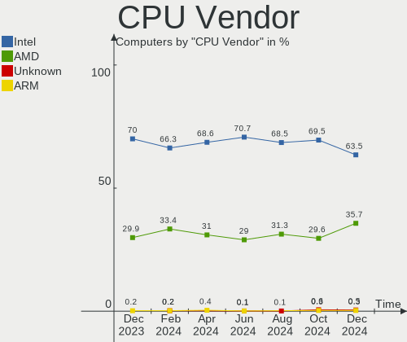
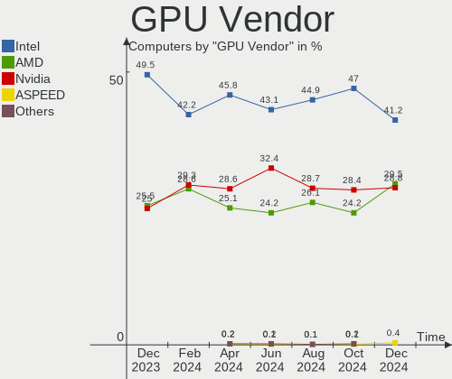
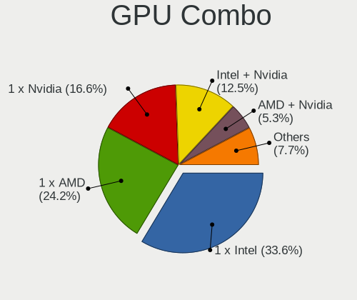
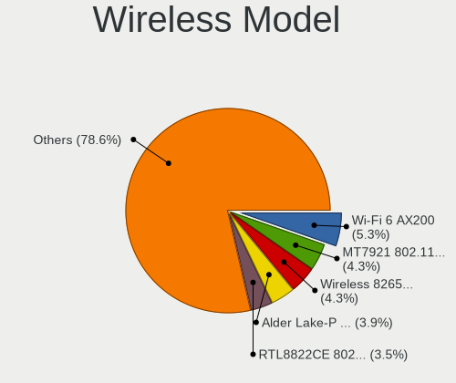
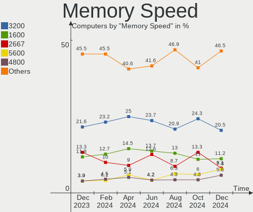

Fedora Hardware Trends
----------------------

A project to identify most popular hardware characteristics and track their change
over time based on data collected by Fedora users at https://Linux-Hardware.org.

Anyone can contribute to the study by uploading probes of their computers by
the [hw-probe](https://github.com/linuxhw/hw-probe) tool:

    sudo -E hw-probe -all -upload

This is a report for all computer types. See also reports for [desktops](/Dist/Fedora/Desktop/README.md) and [notebooks](/Dist/Fedora/Notebook/README.md).

Full-feature report is available here: https://linux-hardware.org/?view=trends

Period: Mar, 2021.

Contents
--------

- [ OS                       ](#os)
- [ OS Family                ](#os-family)
- [ Kernel                   ](#kernel)
- [ Kernel Family            ](#kernel-family)
- [ Kernel Major Ver.        ](#kernel-major-ver)
- [ Arch                     ](#arch)
- [ DE                       ](#de)
- [ Display Server           ](#display-server)
- [ Display Manager          ](#display-manager)
- [ OS Lang                  ](#os-lang)
- [ Boot Mode                ](#boot-mode)
- [ Filesystem               ](#filesystem)
- [ Part. scheme             ](#part-scheme)
- [ Dual Boot with Linux/BSD ](#dual-boot-with-linux/bsd)
- [ Dual Boot (Win)          ](#dual-boot-win)
- [ Country                  ](#country)
- [ City                     ](#city)
- [ Vendor                   ](#vendor)
- [ Model                    ](#model)
- [ Model Family             ](#model-family)
- [ MFG Year                 ](#mfg-year)
- [ Form Factor              ](#form-factor)
- [ Secure Boot              ](#secure-boot)
- [ Coreboot                 ](#coreboot)
- [ RAM Size                 ](#ram-size)
- [ RAM Used                 ](#ram-used)
- [ Has CD-ROM               ](#has-cd-rom)
- [ Total Drives             ](#total-drives)
- [ Has Ethernet             ](#has-ethernet)
- [ Has WiFi                 ](#has-wifi)
- [ Has Bluetooth            ](#has-bluetooth)
- [ Drive Vendor             ](#drive-vendor)
- [ Drive Model              ](#drive-model)
- [ HDD Vendor               ](#hdd-vendor)
- [ SSD Vendor               ](#ssd-vendor)
- [ Drive Kind               ](#drive-kind)
- [ Drive Connector          ](#drive-connector)
- [ Drive Size               ](#drive-size)
- [ Space Total              ](#space-total)
- [ Space Used               ](#space-used)
- [ Malfunc. Drives          ](#malfunc-drives)
- [ Malfunc. Drive Vendor    ](#malfunc-drive-vendor)
- [ Malfunc. HDD Vendor      ](#malfunc-hdd-vendor)
- [ Malfunc. Drive Kind      ](#malfunc-drive-kind)
- [ Failed Drives            ](#failed-drives)
- [ Failed Drive Vendor      ](#failed-drive-vendor)
- [ Drive Status             ](#drive-status)
- [ Storage Vendor           ](#storage-vendor)
- [ Storage Model            ](#storage-model)
- [ Storage Kind             ](#storage-kind)
- [ CPU Vendor               ](#cpu-vendor)
- [ CPU Model                ](#cpu-model)
- [ CPU Model Family         ](#cpu-model-family)
- [ CPU Cores                ](#cpu-cores)
- [ CPU Sockets              ](#cpu-sockets)
- [ CPU Threads              ](#cpu-threads)
- [ CPU Op-Modes             ](#cpu-op-modes)
- [ CPU Microcode            ](#cpu-microcode)
- [ CPU Microarch            ](#cpu-microarch)
- [ GPU Vendor               ](#gpu-vendor)
- [ GPU Model                ](#gpu-model)
- [ GPU Combo                ](#gpu-combo)
- [ GPU Driver               ](#gpu-driver)
- [ GPU Memory               ](#gpu-memory)
- [ Monitor Vendor           ](#monitor-vendor)
- [ Monitor Model            ](#monitor-model)
- [ Monitor Resolution       ](#monitor-resolution)
- [ Monitor Diagonal         ](#monitor-diagonal)
- [ Monitor Width            ](#monitor-width)
- [ Aspect Ratio             ](#aspect-ratio)
- [ Monitor Area             ](#monitor-area)
- [ Pixel Density            ](#pixel-density)
- [ Multiple Monitors        ](#multiple-monitors)
- [ Net Controller Vendor    ](#net-controller-vendor)
- [ Net Controller Model     ](#net-controller-model)
- [ Wireless Vendor          ](#wireless-vendor)
- [ Wireless Model           ](#wireless-model)
- [ Ethernet Vendor          ](#ethernet-vendor)
- [ Ethernet Model           ](#ethernet-model)
- [ Net Controller Kind      ](#net-controller-kind)
- [ Used Controller          ](#used-controller)
- [ NICs                     ](#nics)
- [ IPv6                     ](#ipv6)
- [ Memory Vendor            ](#memory-vendor)
- [ Memory Model             ](#memory-model)
- [ Memory Kind              ](#memory-kind)
- [ Memory Form Factor       ](#memory-form-factor)
- [ Memory Size              ](#memory-size)
- [ Memory Speed             ](#memory-speed)
- [ Sound Vendor             ](#sound-vendor)
- [ Sound Model              ](#sound-model)
- [ Camera Vendor            ](#camera-vendor)
- [ Camera Model             ](#camera-model)
- [ Fingerprint Vendor       ](#fingerprint-vendor)
- [ Fingerprint Model        ](#fingerprint-model)
- [ Chipcard Vendor          ](#chipcard-vendor)
- [ Chipcard Model           ](#chipcard-model)
- [ Printer Vendor           ](#printer-vendor)
- [ Printer Model            ](#printer-model)
- [ Scanner Vendor           ](#scanner-vendor)
- [ Scanner Model            ](#scanner-model)
- [ Bluetooth Vendor         ](#bluetooth-vendor)
- [ Bluetooth Model          ](#bluetooth-model)
- [ Unsupported Devices      ](#unsupported-devices)
- [ Unsupported Device Types ](#unsupported-device-types)

OS
--

Installed operating systems

| Name      | Computers | Percent |
|-----------|-----------|---------|
| Fedora 33 | 268       | 80.48%  |
| Fedora 34 | 31        | 9.31%   |
| Fedora 32 | 22        | 6.61%   |
| Fedora 31 | 5         | 1.5%    |
| Fedora 35 | 2         | 0.6%    |
| Fedora 30 | 2         | 0.6%    |
| Fedora 29 | 1         | 0.3%    |
| Fedora 28 | 1         | 0.3%    |
| Fedora 21 | 1         | 0.3%    |

OS Family
---------

OS without a version

| Name   | Computers | Percent |
|--------|-----------|---------|
| Fedora | 333       | 100%    |

Kernel
------

Version of the Linux kernel

| Version                                                   | Computers | Percent |
|-----------------------------------------------------------|-----------|---------|
| 5.10.19-200.fc33.x86_64                                   | 64        | 19.22%  |
| 5.10.22-200.fc33.x86_64                                   | 38        | 11.41%  |
| 5.11.7-200.fc33.x86_64                                    | 33        | 9.91%   |
| 5.10.23-200.fc33.x86_64                                   | 26        | 7.81%   |
| 5.10.21-200.fc33.x86_64                                   | 25        | 7.51%   |
| 5.11.10-200.fc33.x86_64                                   | 15        | 4.5%    |
| 5.10.18-200.fc33.x86_64                                   | 14        | 4.2%    |
| 5.8.15-301.fc33.x86_64                                    | 9         | 2.7%    |
| 5.10.20-200.fc33.x86_64                                   | 9         | 2.7%    |
| 5.11.8-200.fc33.x86_64                                    | 8         | 2.4%    |
| 5.11.10-300.fc34.x86_64                                   | 7         | 2.1%    |
| 5.11.8-300.fc34.x86_64                                    | 6         | 1.8%    |
| 5.11.3-300.fc34.x86_64                                    | 5         | 1.5%    |
| 5.10.19-100.fc32.x86_64                                   | 5         | 1.5%    |
| 5.8.18-100.fc31.x86_64                                    | 4         | 1.2%    |
| 5.11.9-300.fc34.x86_64                                    | 4         | 1.2%    |
| 5.11.9-200.fc33.x86_64                                    | 4         | 1.2%    |
| 5.10.22-100.fc32.x86_64                                   | 4         | 1.2%    |
| 5.9.16-200.fc33.x86_64                                    | 3         | 0.9%    |
| 5.11.7-300.fc34.x86_64                                    | 3         | 0.9%    |
| 5.11.3-50.fc33.x86_64                                     | 3         | 0.9%    |
| 5.9.16-100.fc32.x86_64                                    | 2         | 0.6%    |
| 5.11.6-300.fc34.x86_64                                    | 2         | 0.6%    |
| 5.11.2-300.fc34.x86_64                                    | 2         | 0.6%    |
| 5.10.21-100.fc32.x86_64                                   | 2         | 0.6%    |
| 5.10.20-100.fc32.x86_64                                   | 2         | 0.6%    |
| 5.10.16-200.fc33.x86_64                                   | 2         | 0.6%    |
| 5.10.12-200.fc33.x86_64                                   | 2         | 0.6%    |
| 5.10.12-100.fc32.x86_64                                   | 2         | 0.6%    |
| 5.8.17-300.fc33.x86_64                                    | 1         | 0.3%    |
| 5.8.15-301.fc33.aarch64                                   | 1         | 0.3%    |
| 5.8.13-300.fc33.x86_64                                    | 1         | 0.3%    |
| 5.6.6-300.fc32.x86_64                                     | 1         | 0.3%    |
| 5.6.19-300.fc32.x86_64                                    | 1         | 0.3%    |
| 5.6.13-100.fc30.x86_64                                    | 1         | 0.3%    |
| 5.6.13-100.fc30.i686                                      | 1         | 0.3%    |
| 5.5.8-200.fc31.x86_64                                     | 1         | 0.3%    |
| 5.12.0-rc1+                                               | 1         | 0.3%    |
| 5.12.0-0.rc4.20210326gitdb24726bfefa.178.fc35.x86_64      | 1         | 0.3%    |
| 5.12.0-0.rc2.20210310git144c79ef3353.166.test.fc33.x86_64 | 1         | 0.3%    |
| 5.12.0-0.rc2.20210309git144c79ef3353.166.fc35.x86_64      | 1         | 0.3%    |
| 5.12.0-0.rc2.165.fc35.x86_64                              | 1         | 0.3%    |
| 5.11.7-100.fc32.x86_64                                    | 1         | 0.3%    |
| 5.11.5-50.fc33.x86_64                                     | 1         | 0.3%    |
| 5.11.5-300.fc34.x86_64                                    | 1         | 0.3%    |
| 5.11.0-156.fc34.x86_64                                    | 1         | 0.3%    |
| 5.10.8-100.fc32.x86_64                                    | 1         | 0.3%    |
| 5.10.7-201.performance.fc33.x86_64                        | 1         | 0.3%    |
| 5.10.7-200.fc33.x86_64                                    | 1         | 0.3%    |
| 5.10.17-200.fc33.x86_64                                   | 1         | 0.3%    |
| 5.10.15-200.fc33.x86_64                                   | 1         | 0.3%    |
| 5.10.15-100.fc32.x86_64                                   | 1         | 0.3%    |
| 5.10.13-200.fc33.x86_64                                   | 1         | 0.3%    |
| 5.10.13-100.fc32.x86_64                                   | 1         | 0.3%    |
| 5.0.16-100.fc28.x86_64                                    | 1         | 0.3%    |
| 4.20.3-200.fc29.x86_64                                    | 1         | 0.3%    |
| 4.1.13-100.fc21.x86_64                                    | 1         | 0.3%    |

Kernel Family
-------------

Linux kernel without a distro release

| Version | Computers | Percent |
|---------|-----------|---------|
| 5.10.19 | 69        | 20.72%  |
| 5.10.22 | 42        | 12.61%  |
| 5.11.7  | 37        | 11.11%  |
| 5.10.21 | 27        | 8.11%   |
| 5.10.23 | 26        | 7.81%   |
| 5.11.10 | 22        | 6.61%   |
| 5.11.8  | 14        | 4.2%    |
| 5.10.18 | 14        | 4.2%    |
| 5.10.20 | 11        | 3.3%    |
| 5.8.15  | 10        | 3%      |
| 5.11.9  | 8         | 2.4%    |
| 5.11.3  | 8         | 2.4%    |
| 5.9.16  | 5         | 1.5%    |
| 5.12.0  | 5         | 1.5%    |
| 5.8.18  | 4         | 1.2%    |
| 5.10.12 | 4         | 1.2%    |
| 5.6.13  | 2         | 0.6%    |
| 5.11.6  | 2         | 0.6%    |
| 5.11.5  | 2         | 0.6%    |
| 5.11.2  | 2         | 0.6%    |
| 5.10.7  | 2         | 0.6%    |
| 5.10.16 | 2         | 0.6%    |
| 5.10.15 | 2         | 0.6%    |
| 5.10.13 | 2         | 0.6%    |
| 5.8.17  | 1         | 0.3%    |
| 5.8.13  | 1         | 0.3%    |
| 5.6.6   | 1         | 0.3%    |
| 5.6.19  | 1         | 0.3%    |
| 5.5.8   | 1         | 0.3%    |
| 5.11.0  | 1         | 0.3%    |
| 5.10.8  | 1         | 0.3%    |
| 5.10.17 | 1         | 0.3%    |
| 5.0.16  | 1         | 0.3%    |
| 4.20.3  | 1         | 0.3%    |
| 4.1.13  | 1         | 0.3%    |

Kernel Major Ver.
-----------------

Linux kernel major version

| Version | Computers | Percent |
|---------|-----------|---------|
| 5.10    | 203       | 60.96%  |
| 5.11    | 96        | 28.83%  |
| 5.8     | 16        | 4.8%    |
| 5.9     | 5         | 1.5%    |
| 5.12    | 5         | 1.5%    |
| 5.6     | 4         | 1.2%    |
| 5.5     | 1         | 0.3%    |
| 5.0     | 1         | 0.3%    |
| 4.20    | 1         | 0.3%    |
| 4.1     | 1         | 0.3%    |

Arch
----

OS architecture (x86_64, i586, etc.)

| Name    | Computers | Percent |
|---------|-----------|---------|
| x86_64  | 331       | 99.4%   |
| i686    | 1         | 0.3%    |
| aarch64 | 1         | 0.3%    |

DE
--

Desktop Environment

| Name          | Computers | Percent |
|---------------|-----------|---------|
| GNOME         | 226       | 67.87%  |
| KDE           | 23        | 6.91%   |
| Unknown       | 22        | 6.61%   |
| KDE5          | 21        | 6.31%   |
| X-Cinnamon    | 11        | 3.3%    |
| Cinnamon      | 9         | 2.7%    |
| XFCE          | 7         | 2.1%    |
| MATE          | 7         | 2.1%    |
| LXDE          | 2         | 0.6%    |
| i3            | 2         | 0.6%    |
| LXQt          | 1         | 0.3%    |
| KDE4          | 1         | 0.3%    |
| GNOME Classic | 1         | 0.3%    |

Display Server
--------------

X11 or Wayland

| Name    | Computers | Percent |
|---------|-----------|---------|
| Wayland | 158       | 47.45%  |
| X11     | 149       | 44.74%  |
| Tty     | 15        | 4.5%    |
| Unknown | 11        | 3.3%    |

Display Manager
---------------

SDDM, LightDM, etc.

| Name    | Computers | Percent |
|---------|-----------|---------|
| Unknown | 198       | 59.46%  |
| GDM     | 88        | 26.43%  |
| SDDM    | 21        | 6.31%   |
| TDM     | 18        | 5.41%   |
| LightDM | 5         | 1.5%    |
| KDM     | 2         | 0.6%    |
| XDM     | 1         | 0.3%    |

OS Lang
-------

Language

| Lang    | Computers | Percent |
|---------|-----------|---------|
| en_US   | 157       | 47.15%  |
| en_GB   | 30        | 9.01%   |
| ru_RU   | 22        | 6.61%   |
| pt_BR   | 19        | 5.71%   |
| de_DE   | 12        | 3.6%    |
| it_IT   | 11        | 3.3%    |
| en_AU   | 11        | 3.3%    |
| fr_FR   | 9         | 2.7%    |
| pl_PL   | 7         | 2.1%    |
| en_CA   | 6         | 1.8%    |
| Unknown | 6         | 1.8%    |
| es_ES   | 5         | 1.5%    |
| nl_BE   | 3         | 0.9%    |
| es_CO   | 3         | 0.9%    |
| zh_CN   | 2         | 0.6%    |
| ru_UA   | 2         | 0.6%    |
| fr_CH   | 2         | 0.6%    |
| fr_CA   | 2         | 0.6%    |
| fi_FI   | 2         | 0.6%    |
| es_MX   | 2         | 0.6%    |
| en_NZ   | 2         | 0.6%    |
| cs_CZ   | 2         | 0.6%    |
| tr_TR   | 1         | 0.3%    |
| sk_SK   | 1         | 0.3%    |
| pt_PT   | 1         | 0.3%    |
| hu_HU   | 1         | 0.3%    |
| fr_BE   | 1         | 0.3%    |
| fil_PH  | 1         | 0.3%    |
| es_AR   | 1         | 0.3%    |
| en_IN   | 1         | 0.3%    |
| en_IE   | 1         | 0.3%    |
| en_DK   | 1         | 0.3%    |
| en_AT   | 1         | 0.3%    |
| en_001  | 1         | 0.3%    |
| el_GR   | 1         | 0.3%    |
| de_CH   | 1         | 0.3%    |
| da_DK   | 1         | 0.3%    |
| ca_ES   | 1         | 0.3%    |

Boot Mode
---------

EFI or BIOS

| Mode | Computers | Percent |
|------|-----------|---------|
| EFI  | 231       | 69.37%  |
| BIOS | 102       | 30.63%  |

Filesystem
----------

Type of filesystem

| Type    | Computers | Percent |
|---------|-----------|---------|
| Btrfs   | 190       | 57.06%  |
| Ext4    | 118       | 35.44%  |
| Xfs     | 24        | 7.21%   |
| Unknown | 1         | 0.3%    |

Part. scheme
------------

Scheme of partitioning

| Type    | Computers | Percent |
|---------|-----------|---------|
| Unknown | 186       | 55.86%  |
| GPT     | 114       | 34.23%  |
| MBR     | 33        | 9.91%   |

Dual Boot with Linux/BSD
------------------------

Hosting more than one Linux/BSD

| Dual boot | Computers | Percent |
|-----------|-----------|---------|
| No        | 307       | 92.19%  |
| Yes       | 26        | 7.81%   |

Dual Boot (Win)
---------------

Hosting Linux and Windows

| Dual boot | Computers | Percent |
|-----------|-----------|---------|
| No        | 282       | 84.68%  |
| Yes       | 51        | 15.32%  |

Country
-------

Geographic location (country)

| Country      | Computers | Percent |
|--------------|-----------|---------|
| USA          | 55        | 16.52%  |
| Russia       | 31        | 9.31%   |
| Germany      | 28        | 8.41%   |
| Brazil       | 23        | 6.91%   |
| Italy        | 13        | 3.9%    |
| Ukraine      | 11        | 3.3%    |
| France       | 11        | 3.3%    |
| Canada       | 11        | 3.3%    |
| Australia    | 11        | 3.3%    |
| UK           | 9         | 2.7%    |
| Spain        | 9         | 2.7%    |
| Netherlands  | 9         | 2.7%    |
| India        | 9         | 2.7%    |
| Poland       | 8         | 2.4%    |
| Turkey       | 6         | 1.8%    |
| Czechia      | 6         | 1.8%    |
| Belgium      | 6         | 1.8%    |
| Switzerland  | 5         | 1.5%    |
| Finland      | 5         | 1.5%    |
| Colombia     | 5         | 1.5%    |
| Sweden       | 3         | 0.9%    |
| New Zealand  | 3         | 0.9%    |
| Mexico       | 3         | 0.9%    |
| Chile        | 3         | 0.9%    |
| Belarus      | 3         | 0.9%    |
| Austria      | 3         | 0.9%    |
| Slovakia     | 2         | 0.6%    |
| Serbia       | 2         | 0.6%    |
| Romania      | 2         | 0.6%    |
| Portugal     | 2         | 0.6%    |
| Japan        | 2         | 0.6%    |
| Israel       | 2         | 0.6%    |
| Iran         | 2         | 0.6%    |
| Egypt        | 2         | 0.6%    |
| Vietnam      | 1         | 0.3%    |
| Tunisia      | 1         | 0.3%    |
| Thailand     | 1         | 0.3%    |
| Taiwan       | 1         | 0.3%    |
| South Africa | 1         | 0.3%    |
| Singapore    | 1         | 0.3%    |
| Philippines  | 1         | 0.3%    |
| Morocco      | 1         | 0.3%    |
| Moldova      | 1         | 0.3%    |
| Malaysia     | 1         | 0.3%    |
| Lithuania    | 1         | 0.3%    |
| Jordan       | 1         | 0.3%    |
| Ireland      | 1         | 0.3%    |
| Iraq         | 1         | 0.3%    |
| Iceland      | 1         | 0.3%    |
| Hungary      | 1         | 0.3%    |
| Hong Kong    | 1         | 0.3%    |
| Greece       | 1         | 0.3%    |
| Estonia      | 1         | 0.3%    |
| Denmark      | 1         | 0.3%    |
| Cyprus       | 1         | 0.3%    |
| Croatia      | 1         | 0.3%    |
| China        | 1         | 0.3%    |
| Bulgaria     | 1         | 0.3%    |
| Bolivia      | 1         | 0.3%    |
| Bangladesh   | 1         | 0.3%    |

City
----

Geographic location (city)

| City             | Computers | Percent |
|------------------|-----------|---------|
| Moscow           | 11        | 3.3%    |
| Hamburg          | 5         | 1.5%    |
| St Petersburg    | 4         | 1.2%    |
| Sydney           | 3         | 0.9%    |
| Novosibirsk      | 3         | 0.9%    |
| Montreal         | 3         | 0.9%    |
| Minsk            | 3         | 0.9%    |
| Marietta         | 3         | 0.9%    |
| Kharkiv          | 3         | 0.9%    |
| Istanbul         | 3         | 0.9%    |
| Chipping Norton  | 3         | 0.9%    |
| Bologna          | 3         | 0.9%    |
| Berlin           | 3         | 0.9%    |
| Bengaluru        | 3         | 0.9%    |
| Zurich           | 2         | 0.6%    |
| Wroclaw          | 2         | 0.6%    |
| Vienna           | 2         | 0.6%    |
| São Paulo       | 2         | 0.6%    |
| Sint-Niklaas     | 2         | 0.6%    |
| Salt Lake City   | 2         | 0.6%    |
| Rillieux-la-Pape | 2         | 0.6%    |
| Porto Alegre     | 2         | 0.6%    |
| Oulu             | 2         | 0.6%    |
| Osaka            | 2         | 0.6%    |
| Nizhniy Novgorod | 2         | 0.6%    |
| Munich           | 2         | 0.6%    |
| Marseille        | 2         | 0.6%    |
| Kyiv             | 2         | 0.6%    |
| Helsinki         | 2         | 0.6%    |
| Gdansk           | 2         | 0.6%    |
| Bucharest        | 2         | 0.6%    |
| Brussels         | 2         | 0.6%    |
| Brno             | 2         | 0.6%    |
| Brisbane         | 2         | 0.6%    |
| Brasília        | 2         | 0.6%    |
| Bogotá          | 2         | 0.6%    |
| Belgrade         | 2         | 0.6%    |
| Augsburg         | 2         | 0.6%    |
| Almería         | 2         | 0.6%    |
| Almere Poort     | 2         | 0.6%    |
| Zielona Góra    | 1         | 0.3%    |
| Zelenograd       | 1         | 0.3%    |
| Zagreb           | 1         | 0.3%    |
| Yuma             | 1         | 0.3%    |
| Yaroslavl        | 1         | 0.3%    |
| Winterberg       | 1         | 0.3%    |
| Wilmington       | 1         | 0.3%    |
| Weiterstadt      | 1         | 0.3%    |
| Wautoma          | 1         | 0.3%    |
| Wateringen       | 1         | 0.3%    |
| Washington       | 1         | 0.3%    |
| Warsaw           | 1         | 0.3%    |
| Warner           | 1         | 0.3%    |
| Virginia Beach   | 1         | 0.3%    |
| Villars          | 1         | 0.3%    |
| Vidnoye          | 1         | 0.3%    |
| Viamão          | 1         | 0.3%    |
| Veresegyhaz      | 1         | 0.3%    |
| Vendome          | 1         | 0.3%    |
| Ven              | 1         | 0.3%    |

Vendor
------

Motherboard manufacturer

| Name                    | Computers | Percent |
|-------------------------|-----------|---------|
| Lenovo                  | 73        | 21.92%  |
| ASUSTek Computer        | 53        | 15.92%  |
| Dell                    | 47        | 14.11%  |
| Hewlett-Packard         | 41        | 12.31%  |
| Gigabyte Technology     | 28        | 8.41%   |
| MSI                     | 25        | 7.51%   |
| ASRock                  | 13        | 3.9%    |
| Acer                    | 12        | 3.6%    |
| Toshiba                 | 5         | 1.5%    |
| Intel                   | 5         | 1.5%    |
| Apple                   | 5         | 1.5%    |
| HUAWEI                  | 4         | 1.2%    |
| Notebook                | 2         | 0.6%    |
| Fujitsu                 | 2         | 0.6%    |
| ECS                     | 2         | 0.6%    |
| AZW                     | 2         | 0.6%    |
| TECNO                   | 1         | 0.3%    |
| System76                | 1         | 0.3%    |
| Supermicro              | 1         | 0.3%    |
| Sony                    | 1         | 0.3%    |
| Schenker                | 1         | 0.3%    |
| Samsung Electronics     | 1         | 0.3%    |
| Raspberry Pi Foundation | 1         | 0.3%    |
| Prestigio               | 1         | 0.3%    |
| PC Specialist           | 1         | 0.3%    |
| Microsoft               | 1         | 0.3%    |
| Foxconn                 | 1         | 0.3%    |
| CRX                     | 1         | 0.3%    |
| AMI                     | 1         | 0.3%    |
| Alienware               | 1         | 0.3%    |

Model
-----

Motherboard model

| Name                                       | Computers | Percent |
|--------------------------------------------|-----------|---------|
| ASUS All Series                            | 6         | 1.8%    |
| Lenovo ThinkPad X1 Carbon Gen 8 20U9CTO1WW | 4         | 1.2%    |
| MSI MS-7C52                                | 2         | 0.6%    |
| MSI MS-7B86                                | 2         | 0.6%    |
| MSI MS-7B78                                | 2         | 0.6%    |
| MSI MS-7641                                | 2         | 0.6%    |
| Lenovo Y520-15IKBN 80WK                    | 2         | 0.6%    |
| HUAWEI BOHK-WAX9X                          | 2         | 0.6%    |
| Gigabyte B450 AORUS ELITE V2               | 2         | 0.6%    |
| Dell XPS 13 9370                           | 2         | 0.6%    |
| Dell Latitude E6530                        | 2         | 0.6%    |
| Dell Latitude E6430                        | 2         | 0.6%    |
| ASUS ROG STRIX X570-F GAMING               | 2         | 0.6%    |
| ASUS PRIME A320M-K                         | 2         | 0.6%    |
| ASUS P8Z77-V PRO                           | 2         | 0.6%    |
| Toshiba TECRA Z40-A                        | 1         | 0.3%    |
| Toshiba Satellite S55t-B                   | 1         | 0.3%    |
| Toshiba Satellite L50-B                    | 1         | 0.3%    |
| Toshiba Satellite C70-A-K2W                | 1         | 0.3%    |
| Toshiba PORTEGE R700                       | 1         | 0.3%    |
| TECNO WinPad 10A                           | 1         | 0.3%    |
| System76 Galago Pro                        | 1         | 0.3%    |
| Supermicro C7Z170-M                        | 1         | 0.3%    |
| Sony VPCCB45FN                             | 1         | 0.3%    |
| Schenker SCHENKER VIA 15 Pro               | 1         | 0.3%    |
| Samsung 950XCJ/951XCJ/950XCR               | 1         | 0.3%    |
| RPi Raspberry Pi 4 Model B                 | 1         | 0.3%    |
| Prestigio PSB141C03                        | 1         | 0.3%    |
| PC Specialist NS50MU                       | 1         | 0.3%    |
| Notebook W942SW                            | 1         | 0.3%    |
| Notebook NH55RGQ                           | 1         | 0.3%    |
| MSI MS-9A45                                | 1         | 0.3%    |
| MSI MS-7C91                                | 1         | 0.3%    |
| MSI MS-7C84                                | 1         | 0.3%    |
| MSI MS-7C75                                | 1         | 0.3%    |
| MSI MS-7C37                                | 1         | 0.3%    |
| MSI MS-7C02                                | 1         | 0.3%    |
| MSI MS-7B98                                | 1         | 0.3%    |
| MSI MS-7B85                                | 1         | 0.3%    |
| MSI MS-7B84                                | 1         | 0.3%    |
| MSI MS-7B79                                | 1         | 0.3%    |
| MSI MS-7B10                                | 1         | 0.3%    |
| MSI MS-7A44                                | 1         | 0.3%    |
| MSI MS-7A32                                | 1         | 0.3%    |
| MSI MS-7816                                | 1         | 0.3%    |
| MSI MS-7596                                | 1         | 0.3%    |
| MSI GL65 Leopard 10SDR                     | 1         | 0.3%    |
| MSI GF63 Thin 9SC                          | 1         | 0.3%    |
| Microsoft Surface Pro                      | 1         | 0.3%    |
| Lenovo Yoga Slim 7 15ITL05 82AC            | 1         | 0.3%    |
| Lenovo Yoga 9 14ITL5 82BG                  | 1         | 0.3%    |
| Lenovo Yoga 7 14ITL5 82BH                  | 1         | 0.3%    |
| Lenovo V330-15IKB 81AX                     | 1         | 0.3%    |
| Lenovo ThinkPad X230 2324DM2               | 1         | 0.3%    |
| Lenovo ThinkPad X220 4291EM4               | 1         | 0.3%    |
| Lenovo ThinkPad X1 Yoga 1st 20FRS55D00     | 1         | 0.3%    |
| Lenovo ThinkPad X1 Tablet Gen 3 20KJ0010US | 1         | 0.3%    |
| Lenovo ThinkPad X1 Extreme 2nd 20QVCTO1WW  | 1         | 0.3%    |
| Lenovo ThinkPad X1 Carbon 7th 20QD001FZA   | 1         | 0.3%    |
| Lenovo ThinkPad X1 Carbon 6th 20KGS03900   | 1         | 0.3%    |

Model Family
------------

Motherboard model prefix

| Name                 | Computers | Percent |
|----------------------|-----------|---------|
| Lenovo ThinkPad      | 51        | 15.32%  |
| Dell Inspiron        | 14        | 4.2%    |
| Dell Latitude        | 13        | 3.9%    |
| Lenovo IdeaPad       | 11        | 3.3%    |
| ASUS ROG             | 10        | 3%      |
| Dell XPS             | 9         | 2.7%    |
| HP ProBook           | 8         | 2.4%    |
| Acer Aspire          | 8         | 2.4%    |
| HP Pavilion          | 6         | 1.8%    |
| Dell Precision       | 6         | 1.8%    |
| ASUS All             | 6         | 1.8%    |
| HP EliteBook         | 5         | 1.5%    |
| ASUS PRIME           | 4         | 1.2%    |
| Toshiba Satellite    | 3         | 0.9%    |
| Lenovo Yoga          | 3         | 0.9%    |
| HP ZBook             | 3         | 0.9%    |
| HP ProDesk           | 3         | 0.9%    |
| HP Laptop            | 3         | 0.9%    |
| Gigabyte B450        | 3         | 0.9%    |
| ASUS VivoBook        | 3         | 0.9%    |
| ASUS P8Z77-V         | 3         | 0.9%    |
| MSI MS-7C52          | 2         | 0.6%    |
| MSI MS-7B86          | 2         | 0.6%    |
| MSI MS-7B78          | 2         | 0.6%    |
| MSI MS-7641          | 2         | 0.6%    |
| Lenovo Y520-15IKBN   | 2         | 0.6%    |
| HUAWEI BOHK-WAX9X    | 2         | 0.6%    |
| HP Spectre           | 2         | 0.6%    |
| HP Compaq            | 2         | 0.6%    |
| Dell G5              | 2         | 0.6%    |
| ASUS ZenBook         | 2         | 0.6%    |
| ASUS SABERTOOTH      | 2         | 0.6%    |
| Toshiba TECRA        | 1         | 0.3%    |
| Toshiba PORTEGE      | 1         | 0.3%    |
| TECNO WinPad         | 1         | 0.3%    |
| System76 Galago      | 1         | 0.3%    |
| Supermicro C7Z170-M  | 1         | 0.3%    |
| Sony VPCCB45FN       | 1         | 0.3%    |
| Schenker SCHENKER    | 1         | 0.3%    |
| Samsung 950XCJ       | 1         | 0.3%    |
| RPi Raspberry        | 1         | 0.3%    |
| Prestigio PSB141C03  | 1         | 0.3%    |
| PC Specialist NS50MU | 1         | 0.3%    |
| Notebook W942SW      | 1         | 0.3%    |
| Notebook NH55RGQ     | 1         | 0.3%    |
| MSI MS-9A45          | 1         | 0.3%    |
| MSI MS-7C91          | 1         | 0.3%    |
| MSI MS-7C84          | 1         | 0.3%    |
| MSI MS-7C75          | 1         | 0.3%    |
| MSI MS-7C37          | 1         | 0.3%    |
| MSI MS-7C02          | 1         | 0.3%    |
| MSI MS-7B98          | 1         | 0.3%    |
| MSI MS-7B85          | 1         | 0.3%    |
| MSI MS-7B84          | 1         | 0.3%    |
| MSI MS-7B79          | 1         | 0.3%    |
| MSI MS-7B10          | 1         | 0.3%    |
| MSI MS-7A44          | 1         | 0.3%    |
| MSI MS-7A32          | 1         | 0.3%    |
| MSI MS-7816          | 1         | 0.3%    |
| MSI MS-7596          | 1         | 0.3%    |

MFG Year
--------

Motherboard manufacture year

| Year | Computers | Percent |
|------|-----------|---------|
| 2020 | 116       | 34.83%  |
| 2019 | 49        | 14.71%  |
| 2018 | 29        | 8.71%   |
| 2014 | 29        | 8.71%   |
| 2021 | 16        | 4.8%    |
| 2016 | 14        | 4.2%    |
| 2015 | 13        | 3.9%    |
| 2012 | 13        | 3.9%    |
| 2011 | 13        | 3.9%    |
| 2013 | 12        | 3.6%    |
| 2017 | 8         | 2.4%    |
| 2010 | 8         | 2.4%    |
| 2009 | 5         | 1.5%    |
| 2008 | 5         | 1.5%    |
| 2007 | 2         | 0.6%    |
| 2006 | 1         | 0.3%    |

Form Factor
-----------

Physical design of the computer

| Name           | Computers | Percent |
|----------------|-----------|---------|
| Notebook       | 171       | 51.35%  |
| Desktop        | 131       | 39.34%  |
| Convertible    | 16        | 4.8%    |
| Tablet         | 5         | 1.5%    |
| All in one     | 5         | 1.5%    |
| Mini pc        | 3         | 0.9%    |
| System on chip | 1         | 0.3%    |
| Server         | 1         | 0.3%    |

Secure Boot
-----------

Enabled or disabled

| State    | Computers | Percent |
|----------|-----------|---------|
| Disabled | 293       | 87.99%  |
| Enabled  | 40        | 12.01%  |

Coreboot
--------

Have coreboot on board

| Used | Computers | Percent |
|------|-----------|---------|
| No   | 333       | 100%    |

RAM Size
--------

Total RAM memory

| Size in GB  | Computers | Percent |
|-------------|-----------|---------|
| 16.01-24.0  | 99        | 29.73%  |
| 4.01-8.0    | 81        | 24.32%  |
| 32.01-64.0  | 52        | 15.62%  |
| 8.01-16.0   | 44        | 13.21%  |
| 3.01-4.0    | 28        | 8.41%   |
| 64.01-256.0 | 10        | 3%      |
| 1.01-2.0    | 9         | 2.7%    |
| 24.01-32.0  | 8         | 2.4%    |
| 2.01-3.0    | 2         | 0.6%    |

RAM Used
--------

Used RAM memory

| Used GB    | Computers | Percent |
|------------|-----------|---------|
| 2.01-3.0   | 88        | 26.43%  |
| 4.01-8.0   | 84        | 25.23%  |
| 3.01-4.0   | 64        | 19.22%  |
| 1.01-2.0   | 55        | 16.52%  |
| 8.01-16.0  | 30        | 9.01%   |
| 16.01-24.0 | 7         | 2.1%    |
| 0.51-1.0   | 4         | 1.2%    |
| 0.01-0.5   | 1         | 0.3%    |

Has CD-ROM
----------

Has CD-ROM on board

| Presented | Computers | Percent |
|-----------|-----------|---------|
| No        | 229       | 68.77%  |
| Yes       | 104       | 31.23%  |

Total Drives
------------

Number of drives on board

| Drives | Computers | Percent |
|--------|-----------|---------|
| 1      | 184       | 55.26%  |
| 2      | 90        | 27.03%  |
| 3      | 26        | 7.81%   |
| 4      | 17        | 5.11%   |
| 5      | 9         | 2.7%    |
| 6      | 5         | 1.5%    |
| 9      | 1         | 0.3%    |
| 7      | 1         | 0.3%    |

Has Ethernet
------------

Has Ethernet on board

| Presented | Computers | Percent |
|-----------|-----------|---------|
| Yes       | 286       | 85.89%  |
| No        | 47        | 14.11%  |

Has WiFi
--------

Has WiFi module

| Presented | Computers | Percent |
|-----------|-----------|---------|
| Yes       | 243       | 72.97%  |
| No        | 90        | 27.03%  |

Has Bluetooth
-------------

Has Bluetooth module

| Presented | Computers | Percent |
|-----------|-----------|---------|
| Yes       | 202       | 60.66%  |
| No        | 131       | 39.34%  |

Drive Vendor
------------

Hard drive vendors

| Vendor                  | Computers | Drives | Percent |
|-------------------------|-----------|--------|---------|
| Samsung Electronics     | 100       | 151    | 20.16%  |
| WDC                     | 80        | 107    | 16.13%  |
| Seagate                 | 58        | 70     | 11.69%  |
| Toshiba                 | 36        | 39     | 7.26%   |
| Kingston                | 31        | 35     | 6.25%   |
| Sandisk                 | 27        | 28     | 5.44%   |
| Intel                   | 24        | 25     | 4.84%   |
| Unknown                 | 22        | 25     | 4.44%   |
| Crucial                 | 18        | 20     | 3.63%   |
| SK Hynix                | 16        | 16     | 3.23%   |
| A-DATA Technology       | 10        | 10     | 2.02%   |
| Phison                  | 6         | 6      | 1.21%   |
| LITEON                  | 6         | 6      | 1.21%   |
| Hitachi                 | 6         | 8      | 1.21%   |
| HGST                    | 6         | 7      | 1.21%   |
| Silicon Motion          | 5         | 5      | 1.01%   |
| PNY                     | 3         | 3      | 0.6%    |
| Micron Technology       | 3         | 3      | 0.6%    |
| Lexar                   | 3         | 3      | 0.6%    |
| Union Memory            | 2         | 2      | 0.4%    |
| PLEXTOR                 | 2         | 2      | 0.4%    |
| KIOXIA                  | 2         | 2      | 0.4%    |
| KingSpec                | 2         | 2      | 0.4%    |
| Corsair                 | 2         | 2      | 0.4%    |
| Apple                   | 2         | 2      | 0.4%    |
| XPG                     | 1         | 1      | 0.2%    |
| Union Memory (Shenzhen) | 1         | 1      | 0.2%    |
| Transcend               | 1         | 1      | 0.2%    |
| TO Exter                | 1         | 1      | 0.2%    |
| Team                    | 1         | 1      | 0.2%    |
| SPCC                    | 1         | 1      | 0.2%    |
| SATADOM                 | 1         | 1      | 0.2%    |
| Realtek Semiconductor   | 1         | 1      | 0.2%    |
| PNY USB                 | 1         | 1      | 0.2%    |
| OCZ                     | 1         | 1      | 0.2%    |
| Mushkin                 | 1         | 1      | 0.2%    |
| MAXTOR                  | 1         | 1      | 0.2%    |
| Lite-On                 | 1         | 1      | 0.2%    |
| Lenovo                  | 1         | 1      | 0.2%    |
| LaCie                   | 1         | 1      | 0.2%    |
| KingFast                | 1         | 1      | 0.2%    |
| JMicron                 | 1         | 4      | 0.2%    |
| Intenso                 | 1         | 1      | 0.2%    |
| INDMEM S                | 1         | 1      | 0.2%    |
| Hewlett-Packard         | 1         | 1      | 0.2%    |
| GOODRAM                 | 1         | 1      | 0.2%    |
| China                   | 1         | 1      | 0.2%    |
| BIWIN                   | 1         | 1      | 0.2%    |
| AMD                     | 1         | 1      | 0.2%    |

Drive Model
-----------

Hard drive models

| Model                                | Computers | Percent |
|--------------------------------------|-----------|---------|
| Samsung SSD 860 EVO 500GB            | 11        | 1.91%   |
| Samsung SSD 850 EVO 250GB            | 10        | 1.74%   |
| Samsung SSD 860 EVO 1TB              | 9         | 1.57%   |
| Samsung NVMe SSD Drive 500GB         | 9         | 1.57%   |
| Kingston SA400S37240G 240GB SSD      | 9         | 1.57%   |
| Samsung SSD 850 EVO 500GB            | 6         | 1.04%   |
| Samsung NVMe SSD Drive 1TB           | 6         | 1.04%   |
| Seagate ST1000LM035-1RK172 1TB       | 5         | 0.87%   |
| Sandisk NVMe SSD Drive 256GB         | 5         | 0.87%   |
| WDC WD10EZEX-08WN4A0 1TB             | 4         | 0.7%    |
| Unknown SD/MMC/MS PRO 128GB          | 4         | 0.7%    |
| Toshiba NVMe SSD Drive 256GB         | 4         | 0.7%    |
| Toshiba DT01ACA200 2TB               | 4         | 0.7%    |
| Toshiba DT01ACA100 1TB               | 4         | 0.7%    |
| Seagate ST500DM002-1BD142 500GB      | 4         | 0.7%    |
| Samsung SSD 970 PRO 512GB            | 4         | 0.7%    |
| Samsung SSD 970 EVO Plus 1TB         | 4         | 0.7%    |
| Samsung NVMe SSD Drive 512GB         | 4         | 0.7%    |
| Kingston SA400S37480G 480GB SSD      | 4         | 0.7%    |
| Kingston SA400S37120G 120GB SSD      | 4         | 0.7%    |
| WDC WDS240G2G0A-00JH30 240GB SSD     | 3         | 0.52%   |
| WDC WD10EFRX-68JCSN0 1TB             | 3         | 0.52%   |
| WDC WD1003FZEX-00K3CA0 1TB           | 3         | 0.52%   |
| Unknown MMC Card  128GB              | 3         | 0.52%   |
| Toshiba NVMe SSD Drive 512GB         | 3         | 0.52%   |
| Seagate ST1000DM010-2EP102 1TB       | 3         | 0.52%   |
| Sandisk NVMe SSD Drive 512GB         | 3         | 0.52%   |
| Samsung SSD 970 EVO 1TB              | 3         | 0.52%   |
| Samsung SSD 870 QVO 1TB              | 3         | 0.52%   |
| Samsung SSD 850 EVO 1TB              | 3         | 0.52%   |
| Samsung NVMe SSD Drive 256GB         | 3         | 0.52%   |
| Samsung MZVLB512HAJQ-000L7 512GB     | 3         | 0.52%   |
| Crucial CT1000MX500SSD1 1TB          | 3         | 0.52%   |
| WDC WDS500G2B0A-00SM50 500GB SSD     | 2         | 0.35%   |
| WDC WDS240G2G0B-00EPW0 240GB SSD     | 2         | 0.35%   |
| WDC WD5000AAKX-75U6AA0 500GB         | 2         | 0.35%   |
| WDC WD20EZRX-00D8PB0 2TB             | 2         | 0.35%   |
| WDC WD10SPZX-60Z10T0 1TB             | 2         | 0.35%   |
| WDC WD10JPVX-22JC3T0 1TB             | 2         | 0.35%   |
| WDC WD10EZEX-00BN5A0 1TB             | 2         | 0.35%   |
| WDC WD10EFRX-68FYTN0 1TB             | 2         | 0.35%   |
| WDC WD10EADS-00L5B1 1TB              | 2         | 0.35%   |
| Unknown MMC Card  32GB               | 2         | 0.35%   |
| Union Memory RPFTJ128PDD2EWX 128GB   | 2         | 0.35%   |
| Toshiba MQ04ABF100 1TB               | 2         | 0.35%   |
| Toshiba MQ01ACF050 500GB             | 2         | 0.35%   |
| Toshiba KXG50ZNV256G 256GB           | 2         | 0.35%   |
| Toshiba HDWD110 1TB                  | 2         | 0.35%   |
| Toshiba DT01ACA300 3TB               | 2         | 0.35%   |
| SK Hynix SC311 SATA 256GB SSD        | 2         | 0.35%   |
| SK Hynix PC401 NVMe 256GB            | 2         | 0.35%   |
| SK Hynix NVMe SSD Drive 512GB        | 2         | 0.35%   |
| Silicon Motion NVMe SSD Drive 1024GB | 2         | 0.35%   |
| Seagate ST9250315AS 250GB            | 2         | 0.35%   |
| Seagate ST8000DM004-2CX188 8TB       | 2         | 0.35%   |
| Seagate ST500LT012-9WS142 500GB      | 2         | 0.35%   |
| Seagate ST3500418AS 500GB            | 2         | 0.35%   |
| Seagate ST3320613AS 320GB            | 2         | 0.35%   |
| Seagate ST3000DM008-2DM166 3TB       | 2         | 0.35%   |
| Seagate ST3000DM001-1ER166 3TB       | 2         | 0.35%   |

HDD Vendor
----------

Hard disk drive vendors

| Vendor              | Computers | Drives | Percent |
|---------------------|-----------|--------|---------|
| WDC                 | 64        | 86     | 38.79%  |
| Seagate             | 56        | 67     | 33.94%  |
| Toshiba             | 23        | 25     | 13.94%  |
| Samsung Electronics | 6         | 6      | 3.64%   |
| Hitachi             | 6         | 8      | 3.64%   |
| HGST                | 6         | 7      | 3.64%   |
| TO Exter            | 1         | 1      | 0.61%   |
| MAXTOR              | 1         | 1      | 0.61%   |
| JMicron             | 1         | 3      | 0.61%   |
| Apple               | 1         | 1      | 0.61%   |

SSD Vendor
----------

Solid state drive vendors

| Vendor              | Computers | Drives | Percent |
|---------------------|-----------|--------|---------|
| Samsung Electronics | 54        | 79     | 29.67%  |
| Kingston            | 25        | 28     | 13.74%  |
| SanDisk             | 17        | 18     | 9.34%   |
| Crucial             | 16        | 18     | 8.79%   |
| Intel               | 13        | 13     | 7.14%   |
| WDC                 | 11        | 11     | 6.04%   |
| A-DATA Technology   | 10        | 10     | 5.49%   |
| LITEON              | 6         | 6      | 3.3%    |
| SK Hynix            | 5         | 5      | 2.75%   |
| PNY                 | 3         | 3      | 1.65%   |
| Seagate             | 2         | 2      | 1.1%    |
| PLEXTOR             | 2         | 2      | 1.1%    |
| Micron Technology   | 2         | 2      | 1.1%    |
| Lexar               | 2         | 2      | 1.1%    |
| Toshiba             | 1         | 1      | 0.55%   |
| Team                | 1         | 1      | 0.55%   |
| SPCC                | 1         | 1      | 0.55%   |
| PNY USB             | 1         | 1      | 0.55%   |
| OCZ                 | 1         | 1      | 0.55%   |
| Mushkin             | 1         | 1      | 0.55%   |
| KingSpec            | 1         | 1      | 0.55%   |
| Intenso             | 1         | 1      | 0.55%   |
| Hewlett-Packard     | 1         | 1      | 0.55%   |
| GOODRAM             | 1         | 1      | 0.55%   |
| Corsair             | 1         | 1      | 0.55%   |
| China               | 1         | 1      | 0.55%   |
| BIWIN               | 1         | 1      | 0.55%   |
| AMD                 | 1         | 1      | 0.55%   |

Drive Kind
----------

HDD or SSD

| Kind    | Computers | Drives | Percent |
|---------|-----------|--------|---------|
| SSD     | 170       | 213    | 36.09%  |
| HDD     | 138       | 205    | 29.3%   |
| NVMe    | 135       | 157    | 28.66%  |
| MMC     | 16        | 19     | 3.4%    |
| Unknown | 12        | 12     | 2.55%   |

Drive Connector
---------------

SATA, SAS, NVMe, etc.

| Type | Computers | Drives | Percent |
|------|-----------|--------|---------|
| SATA | 243       | 411    | 59.56%  |
| NVMe | 135       | 157    | 33.09%  |
| MMC  | 16        | 19     | 3.92%   |
| SAS  | 14        | 19     | 3.43%   |

Drive Size
----------

Size of hard drive

| Size in TB | Computers | Drives | Percent |
|------------|-----------|--------|---------|
| 0.01-0.5   | 182       | 223    | 54.49%  |
| 0.51-1.0   | 100       | 119    | 29.94%  |
| 1.01-2.0   | 26        | 33     | 7.78%   |
| 2.01-3.0   | 9         | 14     | 2.69%   |
| 4.01-10.0  | 9         | 16     | 2.69%   |
| 3.01-4.0   | 8         | 13     | 2.4%    |

Space Total
-----------

Amount of disk space available on the file system

| Size in GB     | Computers | Percent |
|----------------|-----------|---------|
| 251-500        | 81        | 24.32%  |
| 101-250        | 55        | 16.52%  |
| 501-1000       | 54        | 16.22%  |
| 1001-2000      | 41        | 12.31%  |
| More than 3000 | 26        | 7.81%   |
| Unknown        | 26        | 7.81%   |
| 1-20           | 19        | 5.71%   |
| 51-100         | 14        | 4.2%    |
| 2001-3000      | 11        | 3.3%    |
| 21-50          | 6         | 1.8%    |

Space Used
----------

Amount of used disk space

| Used GB        | Computers | Percent |
|----------------|-----------|---------|
| 21-50          | 68        | 20.42%  |
| 101-250        | 59        | 17.72%  |
| 1-20           | 55        | 16.52%  |
| 51-100         | 43        | 12.91%  |
| 251-500        | 32        | 9.61%   |
| 501-1000       | 28        | 8.41%   |
| Unknown        | 26        | 7.81%   |
| 1001-2000      | 11        | 3.3%    |
| 2001-3000      | 6         | 1.8%    |
| More than 3000 | 5         | 1.5%    |

Malfunc. Drives
---------------

Drive models with a malfunction

| Model                               | Computers | Drives | Percent |
|-------------------------------------|-----------|--------|---------|
| WDC WD4004FZWX-00GBGB0 4TB          | 1         | 1      | 2.5%    |
| WDC WD3200AAJS-00L7A0 320GB         | 1         | 1      | 2.5%    |
| WDC WD20EZRZ-00Z5HB0 2TB            | 1         | 4      | 2.5%    |
| WDC WD2002FAEX-007BA0 2TB           | 1         | 1      | 2.5%    |
| WDC WD10EZEX-08WN4A0 1TB            | 1         | 1      | 2.5%    |
| WDC WD10EARS-22Y5B1 1TB             | 1         | 1      | 2.5%    |
| WDC WD10EADS-00L5B1 1TB             | 1         | 1      | 2.5%    |
| WDC WD1002FAEX-00Z3A0 1TB           | 1         | 1      | 2.5%    |
| Toshiba MQ01ACF050 500GB            | 1         | 1      | 2.5%    |
| Toshiba MK1237GSX 120GB             | 1         | 1      | 2.5%    |
| Toshiba HDWN160 6TB                 | 1         | 1      | 2.5%    |
| Toshiba DT01ACA300 3TB              | 1         | 1      | 2.5%    |
| Toshiba DT01ACA200 2TB              | 1         | 1      | 2.5%    |
| Toshiba DT01ACA100 1TB              | 1         | 1      | 2.5%    |
| Seagate ST500LM021-1KJ152 500GB     | 1         | 1      | 2.5%    |
| Seagate ST500DM002-1BD142 500GB     | 1         | 1      | 2.5%    |
| Seagate ST3320613AS 320GB           | 1         | 1      | 2.5%    |
| Seagate ST3000DM001-1ER166 3TB      | 1         | 1      | 2.5%    |
| Seagate ST1000DM010-2EP102 1TB      | 1         | 1      | 2.5%    |
| SanDisk SDSSDXPS960G 960GB          | 1         | 1      | 2.5%    |
| SanDisk SD6PP4M-256G-1006 256GB SSD | 1         | 1      | 2.5%    |
| Samsung Electronics SSD 970 PRO 1TB | 1         | 1      | 2.5%    |
| Samsung Electronics HM160HI 160GB   | 1         | 1      | 2.5%    |
| Samsung Electronics HD252HJ 250GB   | 1         | 1      | 2.5%    |
| LITEON CV8-8E128-HP 128GB SSD       | 1         | 1      | 2.5%    |
| Kingston SV300S37A240G 240GB SSD    | 1         | 1      | 2.5%    |
| Intel SSDSCKKF256G8H 256GB          | 1         | 1      | 2.5%    |
| Intel SSDSC2BF180A5L 180GB          | 1         | 1      | 2.5%    |
| Intel SSDSA2M080G2GC 80GB           | 1         | 1      | 2.5%    |
| Intel SSDPEKKF128G7 128GB           | 1         | 1      | 2.5%    |
| Hitachi HTS547575A9E384 752GB       | 1         | 1      | 2.5%    |
| Hitachi HDP725050GLA360 500GB       | 1         | 1      | 2.5%    |
| HGST HTS725050A7E630 500GB          | 1         | 1      | 2.5%    |
| HGST HTS545050A7E680 500GB          | 1         | 1      | 2.5%    |
| Crucial CT1050MX300SSD1 1TB         | 1         | 1      | 2.5%    |
| Crucial CT1024M550SSD1 1TB          | 1         | 1      | 2.5%    |
| BIWIN SSD 128GB                     | 1         | 1      | 2.5%    |
| A-DATA Technology SU650 480GB SSD   | 1         | 1      | 2.5%    |
| A-DATA Technology SU650 120GB SSD   | 1         | 1      | 2.5%    |
| A-DATA Technology SP900 128GB SSD   | 1         | 1      | 2.5%    |

Malfunc. Drive Vendor
---------------------

Vendors of faulty drives

| Vendor              | Computers | Drives | Percent |
|---------------------|-----------|--------|---------|
| WDC                 | 8         | 11     | 20.51%  |
| Toshiba             | 6         | 6      | 15.38%  |
| Seagate             | 5         | 5      | 12.82%  |
| Intel               | 4         | 4      | 10.26%  |
| Samsung Electronics | 3         | 3      | 7.69%   |
| A-DATA Technology   | 3         | 3      | 7.69%   |
| Hitachi             | 2         | 2      | 5.13%   |
| HGST                | 2         | 2      | 5.13%   |
| Crucial             | 2         | 2      | 5.13%   |
| SanDisk             | 1         | 2      | 2.56%   |
| LITEON              | 1         | 1      | 2.56%   |
| Kingston            | 1         | 1      | 2.56%   |
| BIWIN               | 1         | 1      | 2.56%   |

Malfunc. HDD Vendor
-------------------

Vendors of faulty HDD drives

| Vendor              | Computers | Drives | Percent |
|---------------------|-----------|--------|---------|
| WDC                 | 8         | 11     | 32%     |
| Toshiba             | 6         | 6      | 24%     |
| Seagate             | 5         | 5      | 20%     |
| Samsung Electronics | 2         | 2      | 8%      |
| Hitachi             | 2         | 2      | 8%      |
| HGST                | 2         | 2      | 8%      |

Malfunc. Drive Kind
-------------------

Kinds of faulty drives

| Kind | Computers | Drives | Percent |
|------|-----------|--------|---------|
| HDD  | 20        | 28     | 60.61%  |
| SSD  | 11        | 13     | 33.33%  |
| NVMe | 2         | 2      | 6.06%   |

Failed Drives
-------------

Failed drive models

Zero info for selected period =(

Failed Drive Vendor
-------------------

Failed drive vendors

Zero info for selected period =(

Drive Status
------------

Number of failed and malfunc. drives

| Status   | Computers | Drives | Percent |
|----------|-----------|--------|---------|
| Detected | 203       | 346    | 54.57%  |
| Works    | 136       | 217    | 36.56%  |
| Malfunc  | 33        | 43     | 8.87%   |

Storage Vendor
--------------

Storage controller vendors

| Vendor                       | Computers | Percent |
|------------------------------|-----------|---------|
| Intel                        | 209       | 47.72%  |
| AMD                          | 73        | 16.67%  |
| Samsung Electronics          | 55        | 12.56%  |
| Sandisk                      | 18        | 4.11%   |
| Toshiba America Info Systems | 12        | 2.74%   |
| SK Hynix                     | 11        | 2.51%   |
| ASMedia Technology           | 9         | 2.05%   |
| Phison Electronics           | 7         | 1.6%    |
| JMicron Technology           | 7         | 1.6%    |
| Silicon Motion               | 6         | 1.37%   |
| Marvell Technology Group     | 6         | 1.37%   |
| Kingston Technology Company  | 6         | 1.37%   |
| Union Memory (Shenzhen)      | 3         | 0.68%   |
| KIOXIA                       | 3         | 0.68%   |
| Micron Technology            | 2         | 0.46%   |
| VIA Technologies             | 1         | 0.23%   |
| Shenzhen Longsys Electronics | 1         | 0.23%   |
| Seagate Technology           | 1         | 0.23%   |
| Realtek Semiconductor        | 1         | 0.23%   |
| Nvidia                       | 1         | 0.23%   |
| Micron/Crucial Technology    | 1         | 0.23%   |
| Lite-On Technology           | 1         | 0.23%   |
| Lenovo                       | 1         | 0.23%   |
| Broadcom / LSI               | 1         | 0.23%   |
| Apple                        | 1         | 0.23%   |
| ADATA Technology             | 1         | 0.23%   |

Storage Model
-------------

Storage controller models

| Model                                                                            | Computers | Percent |
|----------------------------------------------------------------------------------|-----------|---------|
| AMD FCH SATA Controller [AHCI mode]                                              | 53        | 10.69%  |
| Samsung NVMe SSD Controller SM981/PM981/PM983                                    | 42        | 8.47%   |
| Intel Sunrise Point-LP SATA Controller [AHCI mode]                               | 25        | 5.04%   |
| Intel 8 Series/C220 Series Chipset Family 6-port SATA Controller 1 [AHCI mode]   | 23        | 4.64%   |
| AMD 400 Series Chipset SATA Controller                                           | 19        | 3.83%   |
| Intel 82801 Mobile SATA Controller [RAID mode]                                   | 14        | 2.82%   |
| Intel 6 Series/C200 Series Chipset Family 6 port Mobile SATA AHCI Controller     | 11        | 2.22%   |
| Intel Wildcat Point-LP SATA Controller [AHCI Mode]                               | 10        | 2.02%   |
| Intel SATA Controller [RAID mode]                                                | 9         | 1.81%   |
| Intel 7 Series Chipset Family 6-port SATA Controller [AHCI mode]                 | 9         | 1.81%   |
| ASMedia ASM1062 Serial ATA Controller                                            | 9         | 1.81%   |
| Sandisk WD Black SN750 / PC SN730 NVMe SSD                                       | 8         | 1.61%   |
| Intel Cannon Lake PCH SATA AHCI Controller                                       | 8         | 1.61%   |
| Intel 7 Series/C210 Series Chipset Family 6-port SATA Controller [AHCI mode]     | 8         | 1.61%   |
| Intel 6 Series/C200 Series Chipset Family 6 port Desktop SATA AHCI Controller    | 8         | 1.61%   |
| AMD SB7x0/SB8x0/SB9x0 SATA Controller [AHCI mode]                                | 8         | 1.61%   |
| Intel Q170/Q150/B150/H170/H110/Z170/CM236 Chipset SATA Controller [AHCI Mode]    | 7         | 1.41%   |
| Intel 8 Series SATA Controller 1 [AHCI mode]                                     | 7         | 1.41%   |
| Sandisk WD Blue SN550 NVMe SSD                                                   | 6         | 1.21%   |
| Samsung NVMe SSD Controller SM961/PM961/SM963                                    | 6         | 1.21%   |
| Intel Cannon Lake Mobile PCH SATA AHCI Controller                                | 6         | 1.21%   |
| AMD Starship/Matisse Chipset SATA Controller [AHCI mode]                         | 6         | 1.21%   |
| AMD SB7x0/SB8x0/SB9x0 IDE Controller                                             | 6         | 1.21%   |
| Phison E12 NVMe Controller                                                       | 5         | 1.01%   |
| Intel Volume Management Device NVMe RAID Controller                              | 5         | 1.01%   |
| Intel SSD 660P Series                                                            | 5         | 1.01%   |
| Intel Comet Lake SATA AHCI Controller                                            | 5         | 1.01%   |
| Intel 200 Series PCH SATA controller [AHCI mode]                                 | 5         | 1.01%   |
| Toshiba America Info Systems BG3 NVMe SSD Controller                             | 4         | 0.81%   |
| SK Hynix BC511                                                                   | 4         | 0.81%   |
| Silicon Motion SM2263EN/SM2263XT SSD Controller                                  | 4         | 0.81%   |
| Samsung NVMe Controller                                                          | 4         | 0.81%   |
| Intel SSD Pro 7600p/760p/E 6100p Series                                          | 4         | 0.81%   |
| Intel NM10/ICH7 Family SATA Controller [IDE mode]                                | 4         | 0.81%   |
| Intel Cannon Point-LP SATA Controller [AHCI Mode]                                | 4         | 0.81%   |
| Intel 400 Series Chipset Family SATA AHCI Controller                             | 4         | 0.81%   |
| AMD SB7x0/SB8x0/SB9x0 SATA Controller [IDE mode]                                 | 4         | 0.81%   |
| Union Memory (Shenzhen) Non-Volatile memory controller                           | 3         | 0.6%    |
| Toshiba America Info Systems XG6 NVMe SSD Controller                             | 3         | 0.6%    |
| Toshiba America Info Systems Toshiba America Info Non-Volatile memory controller | 3         | 0.6%    |
| Samsung NVMe SSD Controller PM9A1/980PRO                                         | 3         | 0.6%    |
| Marvell Group 88SE9172 SATA 6Gb/s Controller                                     | 3         | 0.6%    |
| KIOXIA Non-Volatile memory controller                                            | 3         | 0.6%    |
| Kingston Company A2000 NVMe SSD                                                  | 3         | 0.6%    |
| JMicron JMB363 SATA/IDE Controller                                               | 3         | 0.6%    |
| Intel HM170/QM170 Chipset SATA Controller [AHCI Mode]                            | 3         | 0.6%    |
| Intel 9 Series Chipset Family SATA Controller [AHCI Mode]                        | 3         | 0.6%    |
| Intel 82801G (ICH7 Family) IDE Controller                                        | 3         | 0.6%    |
| Intel 5 Series/3400 Series Chipset 6 port SATA AHCI Controller                   | 3         | 0.6%    |
| Intel 4 Series Chipset PT IDER Controller                                        | 3         | 0.6%    |
| AMD FCH SATA Controller D                                                        | 3         | 0.6%    |
| AMD FCH IDE Controller                                                           | 3         | 0.6%    |
| Toshiba America Info Systems XG4 NVMe SSD Controller                             | 2         | 0.4%    |
| SK Hynix PC401 NVMe Solid State Drive 256GB                                      | 2         | 0.4%    |
| SK Hynix Non-Volatile memory controller                                          | 2         | 0.4%    |
| SK Hynix BC501 NVMe Solid State Drive 512GB                                      | 2         | 0.4%    |
| Silicon Motion SM2262/SM2262EN SSD Controller                                    | 2         | 0.4%    |
| Phison E16 PCIe4 NVMe Controller                                                 | 2         | 0.4%    |
| Kingston Company Company Non-Volatile memory controller                          | 2         | 0.4%    |
| JMicron JMB368 IDE controller                                                    | 2         | 0.4%    |

Storage Kind
------------

Kind of storage controller (IDE, SATA, NVMe, SAS, ...)

| Kind | Computers | Percent |
|------|-----------|---------|
| SATA | 239       | 55.07%  |
| NVMe | 135       | 31.11%  |
| RAID | 30        | 6.91%   |
| IDE  | 29        | 6.68%   |
| SAS  | 1         | 0.23%   |

CPU Vendor
----------

Processor vendors

| Vendor | Computers | Percent |
|--------|-----------|---------|
| Intel  | 250       | 75.08%  |
| AMD    | 82        | 24.62%  |
| ARM    | 1         | 0.3%    |

CPU Model
---------

Processor models

| Model                                         | Computers | Percent |
|-----------------------------------------------|-----------|---------|
| Intel Core i7-8550U CPU @ 1.80GHz             | 10        | 3%      |
| Intel Core i5-8250U CPU @ 1.60GHz             | 8         | 2.4%    |
| Intel Core i7-10510U CPU @ 1.80GHz            | 6         | 1.8%    |
| AMD Ryzen 5 3600 6-Core Processor             | 6         | 1.8%    |
| Intel Core i5-8265U CPU @ 1.60GHz             | 5         | 1.5%    |
| Intel 11th Gen Core i5-1135G7 @ 2.40GHz       | 5         | 1.5%    |
| AMD Ryzen 9 3900X 12-Core Processor           | 5         | 1.5%    |
| Intel Core i5-7200U CPU @ 2.50GHz             | 4         | 1.2%    |
| Intel Core i5-5300U CPU @ 2.30GHz             | 4         | 1.2%    |
| Intel Core i5-3470 CPU @ 3.20GHz              | 4         | 1.2%    |
| Intel Core 2 Duo CPU E8400 @ 3.00GHz          | 4         | 1.2%    |
| Intel 11th Gen Core i7-1165G7 @ 2.80GHz       | 4         | 1.2%    |
| AMD Ryzen 7 3700X 8-Core Processor            | 4         | 1.2%    |
| AMD Ryzen 7 2700X Eight-Core Processor        | 4         | 1.2%    |
| AMD Ryzen 5 3500U with Radeon Vega Mobile Gfx | 4         | 1.2%    |
| Intel Core i9-9900K CPU @ 3.60GHz             | 3         | 0.9%    |
| Intel Core i7-9750H CPU @ 2.60GHz             | 3         | 0.9%    |
| Intel Core i7-8650U CPU @ 1.90GHz             | 3         | 0.9%    |
| Intel Core i7-6500U CPU @ 2.50GHz             | 3         | 0.9%    |
| Intel Core i7-5500U CPU @ 2.40GHz             | 3         | 0.9%    |
| Intel Core i5-6300U CPU @ 2.40GHz             | 3         | 0.9%    |
| Intel Core i5-6200U CPU @ 2.30GHz             | 3         | 0.9%    |
| Intel Core i5-4570 CPU @ 3.20GHz              | 3         | 0.9%    |
| Intel Core i5-10210U CPU @ 1.60GHz            | 3         | 0.9%    |
| Intel Atom CPU Z3735F @ 1.33GHz               | 3         | 0.9%    |
| AMD Ryzen 7 4700U with Radeon Graphics        | 3         | 0.9%    |
| AMD Ryzen 5 4500U with Radeon Graphics        | 3         | 0.9%    |
| AMD Ryzen 5 2600 Six-Core Processor           | 3         | 0.9%    |
| AMD Ryzen 5 2500U with Radeon Vega Mobile Gfx | 3         | 0.9%    |
| Intel Pentium Dual-Core CPU E5200 @ 2.50GHz   | 2         | 0.6%    |
| Intel Core i7-8705G CPU @ 3.10GHz             | 2         | 0.6%    |
| Intel Core i7-8565U CPU @ 1.80GHz             | 2         | 0.6%    |
| Intel Core i7-7820HQ CPU @ 2.90GHz            | 2         | 0.6%    |
| Intel Core i7-7700K CPU @ 4.20GHz             | 2         | 0.6%    |
| Intel Core i7-7700HQ CPU @ 2.80GHz            | 2         | 0.6%    |
| Intel Core i7-6700K CPU @ 4.00GHz             | 2         | 0.6%    |
| Intel Core i7-4710HQ CPU @ 2.50GHz            | 2         | 0.6%    |
| Intel Core i7-4702MQ CPU @ 2.20GHz            | 2         | 0.6%    |
| Intel Core i7-3770K CPU @ 3.50GHz             | 2         | 0.6%    |
| Intel Core i7-3770 CPU @ 3.40GHz              | 2         | 0.6%    |
| Intel Core i7-2640M CPU @ 2.80GHz             | 2         | 0.6%    |
| Intel Core i7-2630QM CPU @ 2.00GHz            | 2         | 0.6%    |
| Intel Core i7-10750H CPU @ 2.60GHz            | 2         | 0.6%    |
| Intel Core i7-1065G7 CPU @ 1.30GHz            | 2         | 0.6%    |
| Intel Core i7-10610U CPU @ 1.80GHz            | 2         | 0.6%    |
| Intel Core i5-9400F CPU @ 2.90GHz             | 2         | 0.6%    |
| Intel Core i5-8350U CPU @ 1.70GHz             | 2         | 0.6%    |
| Intel Core i5-7300U CPU @ 2.60GHz             | 2         | 0.6%    |
| Intel Core i5-4590 CPU @ 3.30GHz              | 2         | 0.6%    |
| Intel Core i5-4200U CPU @ 1.60GHz             | 2         | 0.6%    |
| Intel Core i5-3570K CPU @ 3.40GHz             | 2         | 0.6%    |
| Intel Core i5-3340M CPU @ 2.70GHz             | 2         | 0.6%    |
| Intel Core i5-3210M CPU @ 2.50GHz             | 2         | 0.6%    |
| Intel Core i5-2540M CPU @ 2.60GHz             | 2         | 0.6%    |
| Intel Core i5-2450M CPU @ 2.50GHz             | 2         | 0.6%    |
| Intel Core i3-6100U CPU @ 2.30GHz             | 2         | 0.6%    |
| Intel Core i3-3110M CPU @ 2.40GHz             | 2         | 0.6%    |
| Intel Atom x5-Z8350 CPU @ 1.44GHz             | 2         | 0.6%    |
| AMD Ryzen 7 4800H with Radeon Graphics        | 2         | 0.6%    |
| AMD Ryzen 7 3700U with Radeon Vega Mobile Gfx | 2         | 0.6%    |

CPU Model Family
----------------

Processor model prefix

| Model                   | Computers | Percent |
|-------------------------|-----------|---------|
| Intel Core i7           | 89        | 26.73%  |
| Intel Core i5           | 84        | 25.23%  |
| AMD Ryzen 5             | 30        | 9.01%   |
| Intel Core i3           | 20        | 6.01%   |
| AMD Ryzen 7             | 18        | 5.41%   |
| Other                   | 13        | 3.9%    |
| Intel Xeon              | 8         | 2.4%    |
| Intel Atom              | 8         | 2.4%    |
| AMD Ryzen 9             | 8         | 2.4%    |
| Intel Celeron           | 7         | 2.1%    |
| Intel Core 2 Duo        | 6         | 1.8%    |
| Intel Pentium           | 5         | 1.5%    |
| AMD FX                  | 5         | 1.5%    |
| Intel Core i9           | 4         | 1.2%    |
| AMD A10                 | 4         | 1.2%    |
| AMD Ryzen 3             | 3         | 0.9%    |
| Intel Pentium Dual-Core | 2         | 0.6%    |
| Intel Core M            | 2         | 0.6%    |
| Intel Core 2 Quad       | 2         | 0.6%    |
| Intel Core 2            | 2         | 0.6%    |
| AMD Ryzen 5 PRO         | 2         | 0.6%    |
| AMD Phenom II X4        | 2         | 0.6%    |
| AMD Athlon II X2        | 2         | 0.6%    |
| AMD Turion II           | 1         | 0.3%    |
| AMD Phenom II X2        | 1         | 0.3%    |
| AMD E                   | 1         | 0.3%    |
| AMD Athlon II           | 1         | 0.3%    |
| AMD Athlon 64           | 1         | 0.3%    |
| AMD Athlon              | 1         | 0.3%    |
| AMD A4                  | 1         | 0.3%    |

CPU Cores
---------

Number of processor cores

| Number | Computers | Percent |
|--------|-----------|---------|
| 4      | 147       | 44.14%  |
| 2      | 108       | 32.43%  |
| 6      | 37        | 11.11%  |
| 8      | 26        | 7.81%   |
| 12     | 6         | 1.8%    |
| 1      | 3         | 0.9%    |
| 16     | 2         | 0.6%    |
| 3      | 2         | 0.6%    |
| 20     | 1         | 0.3%    |
| 14     | 1         | 0.3%    |

CPU Sockets
-----------

Number of sockets

| Number | Computers | Percent |
|--------|-----------|---------|
| 1      | 330       | 99.1%   |
| 2      | 3         | 0.9%    |

CPU Threads
-----------

Threads per core (Hyper-Threading)

| Number | Computers | Percent |
|--------|-----------|---------|
| 2      | 252       | 75.68%  |
| 1      | 81        | 24.32%  |

CPU Op-Modes
------------

CPU Operation Modes (32-bit, 64-bit)

| Op mode        | Computers | Percent |
|----------------|-----------|---------|
| 32-bit, 64-bit | 332       | 99.7%   |
| Unknown        | 1         | 0.3%    |

CPU Microcode
-------------

Microcode number

| Number     | Computers | Percent |
|------------|-----------|---------|
| 0x306c3    | 25        | 7.51%   |
| Unknown    | 23        | 6.91%   |
| 0x306a9    | 22        | 6.61%   |
| 0x806ea    | 21        | 6.31%   |
| 0x806ec    | 19        | 5.71%   |
| 0x206a7    | 18        | 5.41%   |
| 0x08701021 | 16        | 4.8%    |
| 0x406e3    | 12        | 3.6%    |
| 0x806c1    | 11        | 3.3%    |
| 0x306d4    | 11        | 3.3%    |
| 0x906ea    | 10        | 3%      |
| 0x906e9    | 10        | 3%      |
| 0x0800820d | 10        | 3%      |
| 0x506e3    | 9         | 2.7%    |
| 0x806e9    | 8         | 2.4%    |
| 0x40651    | 7         | 2.1%    |
| 0x08108109 | 7         | 2.1%    |
| 0x1067a    | 6         | 1.8%    |
| 0x010000c8 | 5         | 1.5%    |
| 0xa0652    | 4         | 1.2%    |
| 0x406c4    | 4         | 1.2%    |
| 0x30678    | 4         | 1.2%    |
| 0x10676    | 4         | 1.2%    |
| 0x906ec    | 3         | 0.9%    |
| 0x706e5    | 3         | 0.9%    |
| 0x0a201009 | 3         | 0.9%    |
| 0x08600103 | 3         | 0.9%    |
| 0x08108102 | 3         | 0.9%    |
| 0x06000852 | 3         | 0.9%    |
| 0xa0653    | 2         | 0.6%    |
| 0x906ed    | 2         | 0.6%    |
| 0x806eb    | 2         | 0.6%    |
| 0x6f6      | 2         | 0.6%    |
| 0x50654    | 2         | 0.6%    |
| 0x20655    | 2         | 0.6%    |
| 0x20652    | 2         | 0.6%    |
| 0x08701013 | 2         | 0.6%    |
| 0x08600106 | 2         | 0.6%    |
| 0x08600104 | 2         | 0.6%    |
| 0x08600102 | 2         | 0.6%    |
| 0x0810100b | 2         | 0.6%    |
| 0x06003106 | 2         | 0.6%    |
| 0xa0660    | 1         | 0.3%    |
| 0xa0655    | 1         | 0.3%    |
| 0x706a8    | 1         | 0.3%    |
| 0x706a1    | 1         | 0.3%    |
| 0x6fd      | 1         | 0.3%    |
| 0x6fb      | 1         | 0.3%    |
| 0x406f1    | 1         | 0.3%    |
| 0x306f2    | 1         | 0.3%    |
| 0x306e4    | 1         | 0.3%    |
| 0x30673    | 1         | 0.3%    |
| 0x106e5    | 1         | 0.3%    |
| 0x106ca    | 1         | 0.3%    |
| 0x106a4    | 1         | 0.3%    |
| 0x10661    | 1         | 0.3%    |
| 0x08101016 | 1         | 0.3%    |
| 0x08101007 | 1         | 0.3%    |
| 0x07030104 | 1         | 0.3%    |
| 0x06006705 | 1         | 0.3%    |

CPU Microarch
-------------

Microarchitecture

| Name          | Computers | Percent |
|---------------|-----------|---------|
| KabyLake      | 81        | 24.32%  |
| Haswell       | 34        | 10.21%  |
| Zen 2         | 30        | 9.01%   |
| IvyBridge     | 25        | 7.51%   |
| Zen+          | 24        | 7.21%   |
| Skylake       | 23        | 6.91%   |
| SandyBridge   | 19        | 5.71%   |
| Broadwell     | 12        | 3.6%    |
| TigerLake     | 11        | 3.3%    |
| Penryn        | 10        | 3%      |
| Silvermont    | 9         | 2.7%    |
| CometLake     | 8         | 2.4%    |
| K10           | 7         | 2.1%    |
| Zen           | 5         | 1.5%    |
| Piledriver    | 5         | 1.5%    |
| Core          | 5         | 1.5%    |
| Westmere      | 4         | 1.2%    |
| Zen 3         | 3         | 0.9%    |
| Steamroller   | 3         | 0.9%    |
| IceLake       | 3         | 0.9%    |
| Nehalem       | 2         | 0.6%    |
| Goldmont plus | 2         | 0.6%    |
| Excavator     | 2         | 0.6%    |
| Bonnell       | 2         | 0.6%    |
| Puma          | 1         | 0.3%    |
| K8 Hammer     | 1         | 0.3%    |
| Bobcat        | 1         | 0.3%    |
| Unknown       | 1         | 0.3%    |

GPU Vendor
----------

Vendors of graphics cards

| Vendor           | Computers | Percent |
|------------------|-----------|---------|
| Intel            | 195       | 49.37%  |
| Nvidia           | 112       | 28.35%  |
| AMD              | 87        | 22.03%  |
| ATI Technologies | 1         | 0.25%   |

GPU Model
---------

Graphics card models

| Model                                                                                    | Computers | Percent |
|------------------------------------------------------------------------------------------|-----------|---------|
| Intel UHD Graphics 620                                                                   | 23        | 5.74%   |
| Intel 2nd Generation Core Processor Family Integrated Graphics Controller                | 15        | 3.74%   |
| Intel Skylake GT2 [HD Graphics 520]                                                      | 12        | 2.99%   |
| Intel CometLake-U GT2 [UHD Graphics]                                                     | 12        | 2.99%   |
| AMD Picasso                                                                              | 12        | 2.99%   |
| Intel 3rd Gen Core processor Graphics Controller                                         | 11        | 2.74%   |
| AMD Renoir                                                                               | 11        | 2.74%   |
| Intel Xeon E3-1200 v3/4th Gen Core Processor Integrated Graphics Controller              | 10        | 2.49%   |
| Intel TigerLake GT2 [Iris Xe Graphics]                                                   | 10        | 2.49%   |
| Nvidia GP106 [GeForce GTX 1060 6GB]                                                      | 9         | 2.24%   |
| Intel WhiskeyLake-U GT2 [UHD Graphics 620]                                               | 9         | 2.24%   |
| Intel HD Graphics 630                                                                    | 9         | 2.24%   |
| Intel HD Graphics 5500                                                                   | 9         | 2.24%   |
| AMD Ellesmere [Radeon RX 470/480/570/570X/580/580X/590]                                  | 9         | 2.24%   |
| Intel HD Graphics 620                                                                    | 8         | 2%      |
| Intel 4th Gen Core Processor Integrated Graphics Controller                              | 8         | 2%      |
| Intel Haswell-ULT Integrated Graphics Controller                                         | 7         | 1.75%   |
| Intel CoffeeLake-H GT2 [UHD Graphics 630]                                                | 7         | 1.75%   |
| AMD Navi 10 [Radeon RX 5600 OEM/5600 XT / 5700/5700 XT]                                  | 7         | 1.75%   |
| Nvidia GK208B [GeForce GT 710]                                                           | 6         | 1.5%    |
| Intel Atom Processor Z36xxx/Z37xxx Series Graphics & Display                             | 5         | 1.25%   |
| Nvidia TU117M [GeForce GTX 1650 Mobile / Max-Q]                                          | 4         | 1%      |
| Nvidia GP107 [GeForce GTX 1050 Ti]                                                       | 4         | 1%      |
| Intel HD Graphics 530                                                                    | 4         | 1%      |
| Intel CometLake-S GT2 [UHD Graphics 630]                                                 | 4         | 1%      |
| Intel Atom/Celeron/Pentium Processor x5-E8000/J3xxx/N3xxx Integrated Graphics Controller | 4         | 1%      |
| AMD Raven Ridge [Radeon Vega Series / Radeon Vega Mobile Series]                         | 4         | 1%      |
| AMD Baffin [Radeon RX 460/560D / Pro 450/455/460/555/555X/560/560X]                      | 4         | 1%      |
| Nvidia GP102 [GeForce GTX 1080 Ti]                                                       | 3         | 0.75%   |
| Nvidia GM204 [GeForce GTX 970]                                                           | 3         | 0.75%   |
| Nvidia GM107 [GeForce GTX 750 Ti]                                                        | 3         | 0.75%   |
| Nvidia GF108GLM [NVS 5200M]                                                              | 3         | 0.75%   |
| Intel Core Processor Integrated Graphics Controller                                      | 3         | 0.75%   |
| Intel CometLake-H GT2 [UHD Graphics]                                                     | 3         | 0.75%   |
| AMD RS880M [Mobility Radeon HD 4225/4250]                                                | 3         | 0.75%   |
| AMD Cedar [Radeon HD 5000/6000/7350/8350 Series]                                         | 3         | 0.75%   |
| Nvidia TU117M [GeForce GTX 1650 Ti Mobile]                                               | 2         | 0.5%    |
| Nvidia GT218 [GeForce 210]                                                               | 2         | 0.5%    |
| Nvidia GP108M [GeForce MX150]                                                            | 2         | 0.5%    |
| Nvidia GP108 [GeForce GT 1030]                                                           | 2         | 0.5%    |
| Nvidia GP107M [GeForce GTX 1050 Mobile]                                                  | 2         | 0.5%    |
| Nvidia GP107GL [Quadro P400]                                                             | 2         | 0.5%    |
| Nvidia GP106 [GeForce GTX 1060 3GB]                                                      | 2         | 0.5%    |
| Nvidia GP104 [GeForce GTX 1070]                                                          | 2         | 0.5%    |
| Nvidia GM108M [GeForce MX130]                                                            | 2         | 0.5%    |
| Nvidia GM108M [GeForce 930MX]                                                            | 2         | 0.5%    |
| Nvidia GM108M [GeForce 840M]                                                             | 2         | 0.5%    |
| Nvidia GK208M [GeForce GT 740M]                                                          | 2         | 0.5%    |
| Nvidia GF119M [Quadro NVS 4200M]                                                         | 2         | 0.5%    |
| Nvidia GF108M [GeForce GT 620M/630M/635M/640M LE]                                        | 2         | 0.5%    |
| Nvidia GF108 [GeForce GT 630]                                                            | 2         | 0.5%    |
| Intel Iris Plus Graphics G7                                                              | 2         | 0.5%    |
| Intel HD Graphics 5300                                                                   | 2         | 0.5%    |
| Intel GeminiLake [UHD Graphics 600]                                                      | 2         | 0.5%    |
| Intel Comet Lake UHD Graphics                                                            | 2         | 0.5%    |
| Intel 4 Series Chipset Integrated Graphics Controller                                    | 2         | 0.5%    |
| AMD Whistler [Radeon HD 6630M/6650M/6750M/7670M/7690M]                                   | 2         | 0.5%    |
| AMD Topaz XT [Radeon R7 M260/M265 / M340/M360 / M440/M445 / 530/535 / 620/625 Mobile]    | 2         | 0.5%    |
| AMD Tonga PRO [Radeon R9 285/380]                                                        | 2         | 0.5%    |
| Nvidia TU117M [GeForce MX450]                                                            | 1         | 0.25%   |

GPU Combo
---------

Combinations of graphics cards

| Name           | Computers | Percent |
|----------------|-----------|---------|
| 1 x Intel      | 136       | 40.84%  |
| 1 x AMD        | 72        | 21.62%  |
| 1 x Nvidia     | 62        | 18.62%  |
| Intel + Nvidia | 45        | 13.51%  |
| Intel + AMD    | 8         | 2.4%    |
| 2 x AMD        | 4         | 1.2%    |
| AMD + Nvidia   | 4         | 1.2%    |
| Other          | 1         | 0.3%    |
| 2 x Nvidia     | 1         | 0.3%    |

GPU Driver
----------

Free vs proprietary

| Driver      | Computers | Percent |
|-------------|-----------|---------|
| Free        | 270       | 81.08%  |
| Proprietary | 56        | 16.82%  |
| Unknown     | 7         | 2.1%    |

GPU Memory
----------

Total video memory

| Size in GB | Computers | Percent |
|------------|-----------|---------|
| Unknown    | 182       | 54.65%  |
| 1.01-2.0   | 38        | 11.41%  |
| 0.51-1.0   | 35        | 10.51%  |
| 3.01-4.0   | 25        | 7.51%   |
| 0.01-0.5   | 22        | 6.61%   |
| 5.01-6.0   | 14        | 4.2%    |
| 7.01-8.0   | 9         | 2.7%    |
| 8.01-16.0  | 5         | 1.5%    |
| 2.01-3.0   | 3         | 0.9%    |

Monitor Vendor
--------------

Monitor vendors

| Vendor                  | Computers | Percent |
|-------------------------|-----------|---------|
| Samsung Electronics     | 55        | 14.03%  |
| LG Display              | 47        | 11.99%  |
| Dell                    | 38        | 9.69%   |
| AU Optronics            | 38        | 9.69%   |
| Chimei Innolux          | 32        | 8.16%   |
| BOE                     | 30        | 7.65%   |
| Goldstar                | 26        | 6.63%   |
| Philips                 | 16        | 4.08%   |
| Acer                    | 12        | 3.06%   |
| Hewlett-Packard         | 11        | 2.81%   |
| AOC                     | 10        | 2.55%   |
| Sharp                   | 9         | 2.3%    |
| Lenovo                  | 6         | 1.53%   |
| Ancor Communications    | 6         | 1.53%   |
| ViewSonic               | 5         | 1.28%   |
| BenQ                    | 5         | 1.28%   |
| ASUSTek Computer        | 5         | 1.28%   |
| Apple                   | 5         | 1.28%   |
| InfoVision              | 3         | 0.77%   |
| Iiyama                  | 3         | 0.77%   |
| ___                     | 2         | 0.51%   |
| Sceptre Tech            | 2         | 0.51%   |
| PANDA                   | 2         | 0.51%   |
| Gateway                 | 2         | 0.51%   |
| Fujitsu Siemens         | 2         | 0.51%   |
| Chi Mei Optoelectronics | 2         | 0.51%   |
| Unknown                 | 1         | 0.26%   |
| TVT                     | 1         | 0.26%   |
| SNC                     | 1         | 0.26%   |
| RZR                     | 1         | 0.26%   |
| NEW                     | 1         | 0.26%   |
| NEC Computers           | 1         | 0.26%   |
| MSI                     | 1         | 0.26%   |
| Medion Akoya            | 1         | 0.26%   |
| LG Electronics          | 1         | 0.26%   |
| IOD                     | 1         | 0.26%   |
| Insignia                | 1         | 0.26%   |
| HannStar                | 1         | 0.26%   |
| Gigabyte Technology     | 1         | 0.26%   |
| Element                 | 1         | 0.26%   |
| Eizo                    | 1         | 0.26%   |
| CSO                     | 1         | 0.26%   |
| Compaq Computer         | 1         | 0.26%   |
| Belinea                 | 1         | 0.26%   |

Monitor Model
-------------

Monitor models

| Model                                                                                 | Computers | Percent |
|---------------------------------------------------------------------------------------|-----------|---------|
| Samsung Electronics C27HG7x SAM0E16 2560x1440 598x336mm 27.0-inch                     | 3         | 0.75%   |
| LG Display LCD Monitor LGD05FA 1920x1080 309x174mm 14.0-inch                          | 3         | 0.75%   |
| LG Display LCD Monitor LGD0590 1920x1080 344x194mm 15.5-inch                          | 3         | 0.75%   |
| LG Display LCD Monitor LGD03FC 1600x900 309x174mm 14.0-inch                           | 3         | 0.75%   |
| Dell U2515H DELD070 2560x1440 553x311mm 25.0-inch                                     | 3         | 0.75%   |
| Dell P2317H DEL40F4 1920x1080 509x286mm 23.0-inch                                     | 3         | 0.75%   |
| Chimei Innolux LCD Monitor CMN14D4 1920x1080 309x173mm 13.9-inch                      | 3         | 0.75%   |
| Chimei Innolux LCD Monitor CMN14C9 1920x1080 309x173mm 13.9-inch                      | 3         | 0.75%   |
| AU Optronics LCD Monitor AUO243D 1920x1080 309x173mm 13.9-inch                        | 3         | 0.75%   |
| Sceptre Tech E275W-1920 SPT0ABF 1920x1080 443x249mm 20.0-inch                         | 2         | 0.5%    |
| Samsung Electronics SyncMaster SAM01D3 1440x900 410x260mm 19.1-inch                   | 2         | 0.5%    |
| Samsung Electronics LCD Monitor SEC544B 1600x900 382x214mm 17.2-inch                  | 2         | 0.5%    |
| Samsung Electronics LCD Monitor SEC5441 1366x768 344x194mm 15.5-inch                  | 2         | 0.5%    |
| Samsung Electronics LCD Monitor SDC4146 1366x768 344x194mm 15.5-inch                  | 2         | 0.5%    |
| Philips PHL 234E5 PHLC0C7 1920x1080 509x286mm 23.0-inch                               | 2         | 0.5%    |
| LG Display LCD Monitor LGD05F2 1920x1080 344x194mm 15.5-inch                          | 2         | 0.5%    |
| LG Display LCD Monitor LGD053F 1920x1080 344x194mm 15.5-inch                          | 2         | 0.5%    |
| LG Display LCD Monitor LGD032C 1920x1080 344x194mm 15.5-inch                          | 2         | 0.5%    |
| LG Display LCD Monitor LGD02DC 1366x768 344x194mm 15.5-inch                           | 2         | 0.5%    |
| Lenovo LCD Monitor LEN4036 1440x900 304x190mm 14.1-inch                               | 2         | 0.5%    |
| InfoVision LCD Monitor IVO057D 1920x1080 309x174mm 14.0-inch                          | 2         | 0.5%    |
| Goldstar ULTRAWIDE GSM76FA 2560x1080 798x334mm 34.1-inch                              | 2         | 0.5%    |
| Goldstar HDR 4K GSM7707 3840x2160 600x340mm 27.2-inch                                 | 2         | 0.5%    |
| Dell U2412M DELA07B 1920x1200 518x324mm 24.1-inch                                     | 2         | 0.5%    |
| Chimei Innolux LCD Monitor CMN15DB 1366x768 344x193mm 15.5-inch                       | 2         | 0.5%    |
| Chimei Innolux LCD Monitor CMN1490 1366x768 309x173mm 13.9-inch                       | 2         | 0.5%    |
| AU Optronics LCD Monitor AUO403D 1920x1080 309x173mm 13.9-inch                        | 2         | 0.5%    |
| AU Optronics LCD Monitor AUO21ED 1920x1080 344x194mm 15.5-inch                        | 2         | 0.5%    |
| AU Optronics LCD Monitor AUO106C 1366x768 277x156mm 12.5-inch                         | 2         | 0.5%    |
| AOC 24B1W AOC2401 1920x1080 521x293mm 23.5-inch                                       | 2         | 0.5%    |
| Ancor Communications ASUS PB278 ACI27A3 2560x1440 597x336mm 27.0-inch                 | 2         | 0.5%    |
| ___ Monitor ranges (GTF): 48-62Hz V, 14-68kHz H, max dotclock 150MHz ___9000 1440x900 | 1         | 0.25%   |
| ___ LCDTV16 ___0101 1600x1200 1600x900mm 72.3-inch                                    | 1         | 0.25%   |
| ViewSonic VX2770 SERIES VSC3A2C 1920x1080 597x336mm 27.0-inch                         | 1         | 0.25%   |
| ViewSonic VX2250 SERIES VSCCB25 1920x1080 477x268mm 21.5-inch                         | 1         | 0.25%   |
| ViewSonic VX2239 SERIES VSC5225 1920x1080 480x270mm 21.7-inch                         | 1         | 0.25%   |
| ViewSonic VA2026w VSC5020 1680x1050 433x271mm 20.1-inch                               | 1         | 0.25%   |
| ViewSonic V3D231 Series VSC4C29 1920x1080 510x290mm 23.1-inch                         | 1         | 0.25%   |
| Unknown LCDTV16 0101 1920x1080 1600x900mm 72.3-inch                                   | 1         | 0.25%   |
| TVT T920 TVT005E 1280x1024 376x301mm 19.0-inch                                        | 1         | 0.25%   |
| SNC PHOTO 190V SNC1850 1366x768 409x230mm 18.5-inch                                   | 1         | 0.25%   |
| Sharp LQ156M1JW16 SHP14F4 1920x1080 344x194mm 15.5-inch                               | 1         | 0.25%   |
| Sharp LQ156M1JW01 SHP14C3 1920x1080 344x194mm 15.5-inch                               | 1         | 0.25%   |
| Sharp LCD Monitor SHP14FA 3840x2400 288x180mm 13.4-inch                               | 1         | 0.25%   |
| Sharp LCD Monitor SHP14F7 1920x1200 288x180mm 13.4-inch                               | 1         | 0.25%   |
| Sharp LCD Monitor SHP14CB 1920x1200 288x180mm 13.4-inch                               | 1         | 0.25%   |
| Sharp LCD Monitor SHP14AF 1920x1200 288x180mm 13.4-inch                               | 1         | 0.25%   |
| Sharp LCD Monitor SHP148D 3840x2160 344x194mm 15.5-inch                               | 1         | 0.25%   |
| Sharp LCD Monitor SHP148B 3840x2160 294x165mm 13.3-inch                               | 1         | 0.25%   |
| Sharp LCD Monitor SHP1453 1920x1080 346x194mm 15.6-inch                               | 1         | 0.25%   |
| Samsung Electronics U32R59x SAM0F96 3840x2160 697x392mm 31.5-inch                     | 1         | 0.25%   |
| Samsung Electronics U32H85x SAM0E3A 3840x2160 697x392mm 31.5-inch                     | 1         | 0.25%   |
| Samsung Electronics U28E590 SAM0C4D 3840x2160 607x345mm 27.5-inch                     | 1         | 0.25%   |
| Samsung Electronics SyncMaster SAM0587 1920x1200 518x324mm 24.1-inch                  | 1         | 0.25%   |
| Samsung Electronics SyncMaster SAM0586 1920x1200 518x324mm 24.1-inch                  | 1         | 0.25%   |
| Samsung Electronics SyncMaster SAM052A 1920x1080 510x287mm 23.0-inch                  | 1         | 0.25%   |
| Samsung Electronics SyncMaster SAM03E5 1680x1050 470x300mm 22.0-inch                  | 1         | 0.25%   |
| Samsung Electronics SyncMaster SAM0302 1680x1050 459x296mm 21.5-inch                  | 1         | 0.25%   |
| Samsung Electronics SyncMaster SAM0230 1280x1024 376x301mm 19.0-inch                  | 1         | 0.25%   |
| Samsung Electronics SMS27A850 SAM083D 1280x1024 520x320mm 24.0-inch                   | 1         | 0.25%   |

Monitor Resolution
------------------

Monitor screen resolution

| Resolution         | Computers | Percent |
|--------------------|-----------|---------|
| 1920x1080 (FHD)    | 185       | 50.41%  |
| 1366x768 (WXGA)    | 52        | 14.17%  |
| 2560x1440 (QHD)    | 30        | 8.17%   |
| 3840x2160 (4K)     | 26        | 7.08%   |
| 1600x900 (HD+)     | 12        | 3.27%   |
| 1920x1200 (WUXGA)  | 11        | 3%      |
| 1680x1050 (WSXGA+) | 11        | 3%      |
| 1440x900 (WXGA+)   | 10        | 2.72%   |
| 1280x1024 (SXGA)   | 7         | 1.91%   |
| 2560x1080          | 5         | 1.36%   |
| 3440x1440          | 3         | 0.82%   |
| 3840x2400          | 1         | 0.27%   |
| 3840x1200          | 1         | 0.27%   |
| 3840x1080          | 1         | 0.27%   |
| 3200x1800 (QHD+)   | 1         | 0.27%   |
| 3000x2000          | 1         | 0.27%   |
| 2736x1824          | 1         | 0.27%   |
| 2560x1600          | 1         | 0.27%   |
| 2160x1440          | 1         | 0.27%   |
| 2048x1152          | 1         | 0.27%   |
| 1600x1200          | 1         | 0.27%   |
| 1360x768           | 1         | 0.27%   |
| 1280x800 (WXGA)    | 1         | 0.27%   |
| 1280x720 (HD)      | 1         | 0.27%   |
| 1024x768 (XGA)     | 1         | 0.27%   |
| Unknown            | 1         | 0.27%   |

Monitor Diagonal
----------------

Diagonal size in inches

| Inches  | Computers | Percent |
|---------|-----------|---------|
| 15      | 85        | 21.96%  |
| 13      | 49        | 12.66%  |
| 14      | 37        | 9.56%   |
| 27      | 36        | 9.3%    |
| 24      | 35        | 9.04%   |
| 23      | 31        | 8.01%   |
| 21      | 26        | 6.72%   |
| 19      | 12        | 3.1%    |
| 17      | 10        | 2.58%   |
| 34      | 8         | 2.07%   |
| 31      | 7         | 1.81%   |
| 22      | 7         | 1.81%   |
| 18      | 7         | 1.81%   |
| 25      | 5         | 1.29%   |
| 32      | 4         | 1.03%   |
| 20      | 4         | 1.03%   |
| Unknown | 4         | 1.03%   |
| 84      | 3         | 0.78%   |
| 12      | 3         | 0.78%   |
| 48      | 2         | 0.52%   |
| 40      | 2         | 0.52%   |
| 33      | 2         | 0.52%   |
| 16      | 2         | 0.52%   |
| 11      | 2         | 0.52%   |
| 72      | 1         | 0.26%   |
| 65      | 1         | 0.26%   |
| 43      | 1         | 0.26%   |
| 30      | 1         | 0.26%   |

Monitor Width
-------------

Physical width

| Width in mm | Computers | Percent |
|-------------|-----------|---------|
| 301-350     | 145       | 38.06%  |
| 501-600     | 101       | 26.51%  |
| 401-500     | 49        | 12.86%  |
| 201-300     | 30        | 7.87%   |
| 351-400     | 18        | 4.72%   |
| 701-800     | 14        | 3.67%   |
| 601-700     | 10        | 2.62%   |
| 1501-2000   | 4         | 1.05%   |
| Unknown     | 4         | 1.05%   |
| 1001-1500   | 3         | 0.79%   |
| 801-900     | 2         | 0.52%   |
| 901-1000    | 1         | 0.26%   |

Aspect Ratio
------------

Proportional relationship between the width and the height

| Ratio   | Computers | Percent |
|---------|-----------|---------|
| 16/9    | 278       | 82.25%  |
| 16/10   | 36        | 10.65%  |
| 21/9    | 8         | 2.37%   |
| 5/4     | 5         | 1.48%   |
| 4/3     | 4         | 1.18%   |
| 3/2     | 4         | 1.18%   |
| Unknown | 2         | 0.59%   |
| 32/9    | 1         | 0.3%    |

Monitor Area
------------

Area in inch²

| Area in inch² | Computers | Percent |
|----------------|-----------|---------|
| 101-110        | 84        | 21.99%  |
| 201-250        | 76        | 19.9%   |
| 81-90          | 61        | 15.97%  |
| 301-350        | 36        | 9.42%   |
| 71-80          | 24        | 6.28%   |
| 151-200        | 23        | 6.02%   |
| 351-500        | 21        | 5.5%    |
| 251-300        | 18        | 4.71%   |
| 121-130        | 11        | 2.88%   |
| More than 1000 | 6         | 1.57%   |
| 141-150        | 6         | 1.57%   |
| 501-1000       | 4         | 1.05%   |
| Unknown        | 4         | 1.05%   |
| 61-70          | 3         | 0.79%   |
| 51-60          | 2         | 0.52%   |
| 131-140        | 1         | 0.26%   |
| 111-120        | 1         | 0.26%   |
| 91-100         | 1         | 0.26%   |

Pixel Density
-------------

Pixels per inch

| Density       | Computers | Percent |
|---------------|-----------|---------|
| 51-100        | 121       | 32.79%  |
| 121-160       | 103       | 27.91%  |
| 101-120       | 99        | 26.83%  |
| 161-240       | 27        | 7.32%   |
| More than 240 | 12        | 3.25%   |
| Unknown       | 4         | 1.08%   |
| 1-50          | 3         | 0.81%   |

Multiple Monitors
-----------------

Total monitors connected

| Total | Computers | Percent |
|-------|-----------|---------|
| 1     | 243       | 72.97%  |
| 2     | 77        | 23.12%  |
| 0     | 9         | 2.7%    |
| 3     | 4         | 1.2%    |

Net Controller Vendor
---------------------

Controller vendors

| Vendor                            | Computers | Percent |
|-----------------------------------|-----------|---------|
| Intel                             | 202       | 42.35%  |
| Realtek Semiconductor             | 160       | 33.54%  |
| Qualcomm Atheros                  | 48        | 10.06%  |
| Broadcom Inc. and subsidiaries    | 16        | 3.35%   |
| TP-Link                           | 5         | 1.05%   |
| Ralink Technology                 | 5         | 1.05%   |
| Ralink                            | 5         | 1.05%   |
| Ericsson Business Mobile Networks | 4         | 0.84%   |
| Lenovo                            | 3         | 0.63%   |
| Sierra Wireless                   | 2         | 0.42%   |
| Fibocom                           | 2         | 0.42%   |
| DisplayLink                       | 2         | 0.42%   |
| D-Link                            | 2         | 0.42%   |
| Broadcom Limited                  | 2         | 0.42%   |
| Xiaomi                            | 1         | 0.21%   |
| Qualcomm Atheros Communications   | 1         | 0.21%   |
| Qualcomm                          | 1         | 0.21%   |
| Nvidia                            | 1         | 0.21%   |
| NetGear                           | 1         | 0.21%   |
| Motorola PCS                      | 1         | 0.21%   |
| Microsoft                         | 1         | 0.21%   |
| Marvell Technology Group          | 1         | 0.21%   |
| Linksys                           | 1         | 0.21%   |
| JMicron Technology                | 1         | 0.21%   |
| IMC Networks                      | 1         | 0.21%   |
| ICS Advent                        | 1         | 0.21%   |
| Huawei Technologies               | 1         | 0.21%   |
| Hewlett-Packard                   | 1         | 0.21%   |
| Dell                              | 1         | 0.21%   |
| Bose                              | 1         | 0.21%   |
| ASUSTek Computer                  | 1         | 0.21%   |
| Arduino SA                        | 1         | 0.21%   |
| Aquantia                          | 1         | 0.21%   |

Net Controller Model
--------------------

Controller models

| Model                                                                     | Computers | Percent |
|---------------------------------------------------------------------------|-----------|---------|
| Realtek RTL8111/8168/8411 PCI Express Gigabit Ethernet Controller         | 110       | 18.93%  |
| Intel Wi-Fi 6 AX200                                                       | 27        | 4.65%   |
| Intel Wireless 8265 / 8275                                                | 26        | 4.48%   |
| Intel I211 Gigabit Network Connection                                     | 17        | 2.93%   |
| Realtek RTL810xE PCI Express Fast Ethernet controller                     | 16        | 2.75%   |
| Intel 82579LM Gigabit Network Connection (Lewisville)                     | 15        | 2.58%   |
| Intel Wireless 7260                                                       | 13        | 2.24%   |
| Intel Comet Lake PCH-LP CNVi WiFi                                         | 12        | 2.07%   |
| Intel Ethernet Connection (2) I219-V                                      | 10        | 1.72%   |
| Realtek RTL8153 Gigabit Ethernet Adapter                                  | 9         | 1.55%   |
| Qualcomm Atheros QCA6174 802.11ac Wireless Network Adapter                | 9         | 1.55%   |
| Intel Wi-Fi 6 AX201                                                       | 9         | 1.55%   |
| Realtek RTL8125 2.5GbE Controller                                         | 8         | 1.38%   |
| Qualcomm Atheros QCA9377 802.11ac Wireless Network Adapter                | 8         | 1.38%   |
| Intel Wireless 7265                                                       | 8         | 1.38%   |
| Intel Ethernet Connection I217-LM                                         | 8         | 1.38%   |
| Intel Ethernet Connection (4) I219-LM                                     | 8         | 1.38%   |
| Qualcomm Atheros AR9485 Wireless Network Adapter                          | 7         | 1.2%    |
| Intel Wireless-AC 9260                                                    | 7         | 1.2%    |
| Intel Ethernet Connection (4) I219-V                                      | 7         | 1.2%    |
| Intel Ethernet Connection (10) I219-V                                     | 7         | 1.2%    |
| Intel Wireless 8260                                                       | 6         | 1.03%   |
| Intel Centrino Advanced-N 6205 [Taylor Peak]                              | 6         | 1.03%   |
| Realtek RTL8822CE 802.11ac PCIe Wireless Network Adapter                  | 5         | 0.86%   |
| Realtek RTL8822BE 802.11a/b/g/n/ac WiFi adapter                           | 5         | 0.86%   |
| Intel Cannon Point-LP CNVi [Wireless-AC]                                  | 5         | 0.86%   |
| Intel 82579V Gigabit Network Connection                                   | 5         | 0.86%   |
| Realtek RTL8723BE PCIe Wireless Network Adapter                           | 4         | 0.69%   |
| Qualcomm Atheros AR8151 v2.0 Gigabit Ethernet                             | 4         | 0.69%   |
| Intel Ethernet Connection (7) I219-V                                      | 4         | 0.69%   |
| Intel Ethernet Connection (3) I218-LM                                     | 4         | 0.69%   |
| Intel Dual Band Wireless-AC 3168NGW [Stone Peak]                          | 4         | 0.69%   |
| Intel 82574L Gigabit Network Connection                                   | 4         | 0.69%   |
| TP-Link AC600 wireless Realtek RTL8811AU [Archer T2U Nano]                | 3         | 0.52%   |
| Realtek RTL8821CE 802.11ac PCIe Wireless Network Adapter                  | 3         | 0.52%   |
| Realtek RTL8821AE 802.11ac PCIe Wireless Network Adapter                  | 3         | 0.52%   |
| Realtek RTL8188EUS 802.11n Wireless Network Adapter                       | 3         | 0.52%   |
| Ralink MT7601U Wireless Adapter                                           | 3         | 0.52%   |
| Qualcomm Atheros QCA9565 / AR9565 Wireless Network Adapter                | 3         | 0.52%   |
| Qualcomm Atheros Killer E220x Gigabit Ethernet Controller                 | 3         | 0.52%   |
| Qualcomm Atheros AR93xx Wireless Network Adapter                          | 3         | 0.52%   |
| Intel Wireless-AC 9560 [Jefferson Peak]                                   | 3         | 0.52%   |
| Intel Wireless 3165                                                       | 3         | 0.52%   |
| Intel Killer Wi-Fi 6 AX1650i 160MHz Wireless Network Adapter (201NGW)     | 3         | 0.52%   |
| Intel Ethernet Connection I219-LM                                         | 3         | 0.52%   |
| Intel Ethernet Connection (6) I219-V                                      | 3         | 0.52%   |
| Intel Dual Band Wireless-AC 3165 Plus Bluetooth                           | 3         | 0.52%   |
| Intel Comet Lake PCH CNVi WiFi                                            | 3         | 0.52%   |
| Intel Centrino Ultimate-N 6300                                            | 3         | 0.52%   |
| Intel 82567LM-3 Gigabit Network Connection                                | 3         | 0.52%   |
| Ericsson Business Mobile Networks N5321 gw                                | 3         | 0.52%   |
| Broadcom Inc. and subsidiaries NetXtreme BCM57766 Gigabit Ethernet PCIe   | 3         | 0.52%   |
| Broadcom Inc. and subsidiaries BCM4313 802.11bgn Wireless Network Adapter | 3         | 0.52%   |
| Realtek RTL8192CE PCIe Wireless Network Adapter                           | 2         | 0.34%   |
| Realtek RTL8188CE 802.11b/g/n WiFi Adapter                                | 2         | 0.34%   |
| Realtek RTL8152 Fast Ethernet Adapter                                     | 2         | 0.34%   |
| Ralink RT5370 Wireless Adapter                                            | 2         | 0.34%   |
| Qualcomm Atheros QCA8171 Gigabit Ethernet                                 | 2         | 0.34%   |
| Qualcomm Atheros AR9285 Wireless Network Adapter (PCI-Express)            | 2         | 0.34%   |
| Qualcomm Atheros AR8121/AR8113/AR8114 Gigabit or Fast Ethernet            | 2         | 0.34%   |

Wireless Vendor
---------------

Wireless vendors

| Vendor                          | Computers | Percent |
|---------------------------------|-----------|---------|
| Intel                           | 148       | 57.81%  |
| Qualcomm Atheros                | 35        | 13.67%  |
| Realtek Semiconductor           | 33        | 12.89%  |
| Broadcom Inc. and subsidiaries  | 10        | 3.91%   |
| TP-Link                         | 5         | 1.95%   |
| Ralink Technology               | 5         | 1.95%   |
| Ralink                          | 5         | 1.95%   |
| Sierra Wireless                 | 2         | 0.78%   |
| Fibocom                         | 2         | 0.78%   |
| Broadcom Limited                | 2         | 0.78%   |
| Qualcomm Atheros Communications | 1         | 0.39%   |
| Qualcomm                        | 1         | 0.39%   |
| NetGear                         | 1         | 0.39%   |
| Microsoft                       | 1         | 0.39%   |
| Marvell Technology Group        | 1         | 0.39%   |
| IMC Networks                    | 1         | 0.39%   |
| Hewlett-Packard                 | 1         | 0.39%   |
| D-Link                          | 1         | 0.39%   |
| ASUSTek Computer                | 1         | 0.39%   |

Wireless Model
--------------

Wireless models

| Model                                                                                         | Computers | Percent |
|-----------------------------------------------------------------------------------------------|-----------|---------|
| Intel Wi-Fi 6 AX200                                                                           | 27        | 10.42%  |
| Intel Wireless 8265 / 8275                                                                    | 26        | 10.04%  |
| Intel Wireless 7260                                                                           | 13        | 5.02%   |
| Intel Comet Lake PCH-LP CNVi WiFi                                                             | 12        | 4.63%   |
| Qualcomm Atheros QCA6174 802.11ac Wireless Network Adapter                                    | 9         | 3.47%   |
| Intel Wi-Fi 6 AX201                                                                           | 9         | 3.47%   |
| Qualcomm Atheros QCA9377 802.11ac Wireless Network Adapter                                    | 8         | 3.09%   |
| Intel Wireless 7265                                                                           | 8         | 3.09%   |
| Qualcomm Atheros AR9485 Wireless Network Adapter                                              | 7         | 2.7%    |
| Intel Wireless-AC 9260                                                                        | 7         | 2.7%    |
| Intel Wireless 8260                                                                           | 6         | 2.32%   |
| Intel Centrino Advanced-N 6205 [Taylor Peak]                                                  | 6         | 2.32%   |
| Realtek RTL8822CE 802.11ac PCIe Wireless Network Adapter                                      | 5         | 1.93%   |
| Realtek RTL8822BE 802.11a/b/g/n/ac WiFi adapter                                               | 5         | 1.93%   |
| Intel Cannon Point-LP CNVi [Wireless-AC]                                                      | 5         | 1.93%   |
| Realtek RTL8723BE PCIe Wireless Network Adapter                                               | 4         | 1.54%   |
| Intel Dual Band Wireless-AC 3168NGW [Stone Peak]                                              | 4         | 1.54%   |
| TP-Link AC600 wireless Realtek RTL8811AU [Archer T2U Nano]                                    | 3         | 1.16%   |
| Realtek RTL8821CE 802.11ac PCIe Wireless Network Adapter                                      | 3         | 1.16%   |
| Realtek RTL8821AE 802.11ac PCIe Wireless Network Adapter                                      | 3         | 1.16%   |
| Realtek RTL8188EUS 802.11n Wireless Network Adapter                                           | 3         | 1.16%   |
| Ralink MT7601U Wireless Adapter                                                               | 3         | 1.16%   |
| Qualcomm Atheros QCA9565 / AR9565 Wireless Network Adapter                                    | 3         | 1.16%   |
| Qualcomm Atheros AR93xx Wireless Network Adapter                                              | 3         | 1.16%   |
| Intel Wireless-AC 9560 [Jefferson Peak]                                                       | 3         | 1.16%   |
| Intel Wireless 3165                                                                           | 3         | 1.16%   |
| Intel Killer Wi-Fi 6 AX1650i 160MHz Wireless Network Adapter (201NGW)                         | 3         | 1.16%   |
| Intel Dual Band Wireless-AC 3165 Plus Bluetooth                                               | 3         | 1.16%   |
| Intel Comet Lake PCH CNVi WiFi                                                                | 3         | 1.16%   |
| Intel Centrino Ultimate-N 6300                                                                | 3         | 1.16%   |
| Broadcom Inc. and subsidiaries BCM4313 802.11bgn Wireless Network Adapter                     | 3         | 1.16%   |
| Realtek RTL8192CE PCIe Wireless Network Adapter                                               | 2         | 0.77%   |
| Realtek RTL8188CE 802.11b/g/n WiFi Adapter                                                    | 2         | 0.77%   |
| Ralink RT5370 Wireless Adapter                                                                | 2         | 0.77%   |
| Qualcomm Atheros AR9285 Wireless Network Adapter (PCI-Express)                                | 2         | 0.77%   |
| Intel Wireless 3160                                                                           | 2         | 0.77%   |
| Intel Centrino Wireless-N 2230                                                                | 2         | 0.77%   |
| Fibocom L830-EB-00 LTE WWAN Modem                                                             | 2         | 0.77%   |
| Broadcom Inc. and subsidiaries BCM4364 802.11ac Wireless Network Adapter                      | 2         | 0.77%   |
| Broadcom Inc. and subsidiaries BCM4360 802.11ac Wireless Network Adapter                      | 2         | 0.77%   |
| Broadcom Inc. and subsidiaries BCM43228 802.11a/b/g/n                                         | 2         | 0.77%   |
| TP-Link 802.11ac WLAN Adapter                                                                 | 1         | 0.39%   |
| TP-Link 802.11ac NIC                                                                          | 1         | 0.39%   |
| Sierra Wireless EM7455                                                                        | 1         | 0.39%   |
| Sierra Wireless EM7345 4G LTE                                                                 | 1         | 0.39%   |
| Realtek RTL8814AU 802.11a/b/g/n/ac Wireless Adapter                                           | 1         | 0.39%   |
| Realtek RTL8723DE Wireless Network Adapter                                                    | 1         | 0.39%   |
| Realtek RTL8723BU 802.11b/g/n WLAN Adapter                                                    | 1         | 0.39%   |
| Realtek RTL8192EE PCIe Wireless Network Adapter                                               | 1         | 0.39%   |
| Realtek RTL8191SEvA Wireless LAN Controller                                                   | 1         | 0.39%   |
| Realtek Realtek 8812AU/8821AU 802.11ac WLAN Adapter [USB Wireless Dual-Band Adapter 2.4/5Ghz] | 1         | 0.39%   |
| Ralink RT2870/RT3070 Wireless Adapter                                                         | 1         | 0.39%   |
| Ralink RT5390 [802.11 b/g/n 1T1R G-band PCI Express Single Chip]                              | 1         | 0.39%   |
| Ralink RT5390 Wireless 802.11n 1T/1R PCIe                                                     | 1         | 0.39%   |
| Ralink RT3290 Wireless 802.11n 1T/1R PCIe                                                     | 1         | 0.39%   |
| Ralink RT2760 Wireless 802.11n 1T/2R                                                          | 1         | 0.39%   |
| Ralink RT2561/RT61 802.11g PCI                                                                | 1         | 0.39%   |
| Qualcomm QCA6390 Wireless Network Adapter [AX500-DBS (2x2)]                                   | 1         | 0.39%   |
| Qualcomm Atheros AR9271 802.11n                                                               | 1         | 0.39%   |
| Qualcomm Atheros AR9462 Wireless Network Adapter                                              | 1         | 0.39%   |

Ethernet Vendor
---------------

Ethernet vendors

| Vendor                         | Computers | Percent |
|--------------------------------|-----------|---------|
| Realtek Semiconductor          | 145       | 47.39%  |
| Intel                          | 122       | 39.87%  |
| Qualcomm Atheros               | 17        | 5.56%   |
| Broadcom Inc. and subsidiaries | 8         | 2.61%   |
| Lenovo                         | 3         | 0.98%   |
| DisplayLink                    | 2         | 0.65%   |
| Xiaomi                         | 1         | 0.33%   |
| TP-Link                        | 1         | 0.33%   |
| Nvidia                         | 1         | 0.33%   |
| Motorola PCS                   | 1         | 0.33%   |
| Linksys                        | 1         | 0.33%   |
| JMicron Technology             | 1         | 0.33%   |
| ICS Advent                     | 1         | 0.33%   |
| D-Link                         | 1         | 0.33%   |
| Aquantia                       | 1         | 0.33%   |

Ethernet Model
--------------

Ethernet models

| Model                                                                         | Computers | Percent |
|-------------------------------------------------------------------------------|-----------|---------|
| Realtek RTL8111/8168/8411 PCI Express Gigabit Ethernet Controller             | 110       | 35.03%  |
| Intel I211 Gigabit Network Connection                                         | 17        | 5.41%   |
| Realtek RTL810xE PCI Express Fast Ethernet controller                         | 16        | 5.1%    |
| Intel 82579LM Gigabit Network Connection (Lewisville)                         | 15        | 4.78%   |
| Intel Ethernet Connection (2) I219-V                                          | 10        | 3.18%   |
| Realtek RTL8153 Gigabit Ethernet Adapter                                      | 9         | 2.87%   |
| Realtek RTL8125 2.5GbE Controller                                             | 8         | 2.55%   |
| Intel Ethernet Connection I217-LM                                             | 8         | 2.55%   |
| Intel Ethernet Connection (4) I219-LM                                         | 8         | 2.55%   |
| Intel Ethernet Connection (4) I219-V                                          | 7         | 2.23%   |
| Intel Ethernet Connection (10) I219-V                                         | 7         | 2.23%   |
| Intel 82579V Gigabit Network Connection                                       | 5         | 1.59%   |
| Qualcomm Atheros AR8151 v2.0 Gigabit Ethernet                                 | 4         | 1.27%   |
| Intel Ethernet Connection (7) I219-V                                          | 4         | 1.27%   |
| Intel Ethernet Connection (3) I218-LM                                         | 4         | 1.27%   |
| Intel 82574L Gigabit Network Connection                                       | 4         | 1.27%   |
| Qualcomm Atheros Killer E220x Gigabit Ethernet Controller                     | 3         | 0.96%   |
| Intel Ethernet Connection I219-LM                                             | 3         | 0.96%   |
| Intel Ethernet Connection (6) I219-V                                          | 3         | 0.96%   |
| Intel 82567LM-3 Gigabit Network Connection                                    | 3         | 0.96%   |
| Broadcom Inc. and subsidiaries NetXtreme BCM57766 Gigabit Ethernet PCIe       | 3         | 0.96%   |
| Realtek RTL8152 Fast Ethernet Adapter                                         | 2         | 0.64%   |
| Qualcomm Atheros QCA8171 Gigabit Ethernet                                     | 2         | 0.64%   |
| Qualcomm Atheros AR8121/AR8113/AR8114 Gigabit or Fast Ethernet                | 2         | 0.64%   |
| Lenovo ThinkPad TBT3 LAN                                                      | 2         | 0.64%   |
| Intel I210 Gigabit Network Connection                                         | 2         | 0.64%   |
| Intel Ethernet Connection I219-V                                              | 2         | 0.64%   |
| Intel Ethernet Connection I217-V                                              | 2         | 0.64%   |
| Intel Ethernet Connection (7) I219-LM                                         | 2         | 0.64%   |
| Intel Ethernet Connection (5) I219-LM                                         | 2         | 0.64%   |
| Intel Ethernet Connection (2) I218-V                                          | 2         | 0.64%   |
| Intel Ethernet Connection (10) I219-LM                                        | 2         | 0.64%   |
| Intel 82577LM Gigabit Network Connection                                      | 2         | 0.64%   |
| Broadcom Inc. and subsidiaries NetXtreme BCM5755 Gigabit Ethernet PCI Express | 2         | 0.64%   |
| Xiaomi Mi/Redmi series (RNDIS)                                                | 1         | 0.32%   |
| TP-Link USB 10/100 LAN                                                        | 1         | 0.32%   |
| Realtek USB 10/100 LAN                                                        | 1         | 0.32%   |
| Realtek Killer E2500 Gigabit Ethernet Controller                              | 1         | 0.32%   |
| Qualcomm Atheros Killer E2500 Gigabit Ethernet Controller                     | 1         | 0.32%   |
| Qualcomm Atheros Killer E2400 Gigabit Ethernet Controller                     | 1         | 0.32%   |
| Qualcomm Atheros Attansic L1 Gigabit Ethernet                                 | 1         | 0.32%   |
| Qualcomm Atheros AR8162 Fast Ethernet                                         | 1         | 0.32%   |
| Qualcomm Atheros AR8161 Gigabit Ethernet                                      | 1         | 0.32%   |
| Qualcomm Atheros AR8152 v2.0 Fast Ethernet                                    | 1         | 0.32%   |
| Nvidia CK804 Ethernet Controller                                              | 1         | 0.32%   |
| Motorola PCS XT1025                                                           | 1         | 0.32%   |
| Linksys Gigabit Ethernet Adapter                                              | 1         | 0.32%   |
| Lenovo ThinkPad TBT 3 Dock                                                    | 1         | 0.32%   |
| JMicron JMC250 PCI Express Gigabit Ethernet Controller                        | 1         | 0.32%   |
| Intel Ethernet Controller I225-V                                              | 1         | 0.32%   |
| Intel Ethernet Controller 10-Gigabit X540-AT2                                 | 1         | 0.32%   |
| Intel Ethernet Connection I218-V                                              | 1         | 0.32%   |
| Intel Ethernet Connection I218-LM                                             | 1         | 0.32%   |
| Intel Ethernet Connection (6) I219-LM                                         | 1         | 0.32%   |
| Intel Ethernet Connection (3) I218-V                                          | 1         | 0.32%   |
| Intel Ethernet Connection (2) I219-LM                                         | 1         | 0.32%   |
| Intel Ethernet Connection (11) I219-V                                         | 1         | 0.32%   |
| Intel Ethernet 10G 2P X520 Adapter                                            | 1         | 0.32%   |
| Intel Centrino Advanced-N + WiMAX 6250                                        | 1         | 0.32%   |
| Intel 82575EB Gigabit Network Connection                                      | 1         | 0.32%   |

Net Controller Kind
-------------------

Ethernet, WiFi or modem

| Kind     | Computers | Percent |
|----------|-----------|---------|
| Ethernet | 286       | 53.26%  |
| WiFi     | 243       | 45.25%  |
| Modem    | 8         | 1.49%   |

Used Controller
---------------

Currently used network controller

| Kind     | Computers | Percent |
|----------|-----------|---------|
| Ethernet | 235       | 52.57%  |
| WiFi     | 212       | 47.43%  |

NICs
----

Total network controllers on board

| Total | Computers | Percent |
|-------|-----------|---------|
| 2     | 182       | 54.65%  |
| 1     | 131       | 39.34%  |
| 3     | 12        | 3.6%    |
| 0     | 7         | 2.1%    |
| 5     | 1         | 0.3%    |

IPv6
----

IPv6 vs IPv4

| Used | Computers | Percent |
|------|-----------|---------|
| No   | 257       | 77.18%  |
| Yes  | 76        | 22.82%  |

Memory Vendor
-------------

Memory module vendors

| Vendor              | Computers | Percent |
|---------------------|-----------|---------|
| Samsung Electronics | 34        | 19.1%   |
| SK Hynix            | 29        | 16.29%  |
| Kingston            | 24        | 13.48%  |
| Micron Technology   | 23        | 12.92%  |
| Unknown             | 20        | 11.24%  |
| Corsair             | 12        | 6.74%   |
| Crucial             | 11        | 6.18%   |
| G.Skill             | 5         | 2.81%   |
| Ramaxel Technology  | 4         | 2.25%   |
| GeIL                | 3         | 1.69%   |
| GOODRAM             | 2         | 1.12%   |
| A-DATA Technology   | 2         | 1.12%   |
| SMART Brazil        | 1         | 0.56%   |
| Smart               | 1         | 0.56%   |
| SHARETRONIC         | 1         | 0.56%   |
| Qumo                | 1         | 0.56%   |
| Elpida              | 1         | 0.56%   |
| 2C080905DF3FF3B0    | 1         | 0.56%   |
| 2C080905DF3FF383    | 1         | 0.56%   |
| 2C080905DF3FF343    | 1         | 0.56%   |
| 2C080905DF3FF327    | 1         | 0.56%   |

Memory Model
------------

Memory module models

| Model                                                               | Computers | Percent |
|---------------------------------------------------------------------|-----------|---------|
| Unknown RAM Module 2GB DIMM 400MT/s                                 | 3         | 1.6%    |
| Samsung RAM M471A5244CB0-CTD 4096MB SODIMM DDR4 2667MT/s            | 3         | 1.6%    |
| Unknown RAM Module 4GB Chip DDR4 2133MT/s                           | 2         | 1.07%   |
| SK Hynix RAM Module 8GB Row Of Chips LPDDR3 2133MT/s                | 2         | 1.07%   |
| SK Hynix RAM HMT351S6CFR8C-H9 4GB SODIMM DDR3 1334MT/s              | 2         | 1.07%   |
| SK Hynix RAM HMA81GS6CJR8N-VK 8192MB SODIMM DDR4 2667MT/s           | 2         | 1.07%   |
| SK Hynix RAM HMA81GS6AFR8N-UH 8GB SODIMM DDR4 2667MT/s              | 2         | 1.07%   |
| Samsung RAM M471B5273CH0-CH9 4GB SODIMM DDR3 1334MT/s               | 2         | 1.07%   |
| Samsung RAM M471A5244CB0-CTD 4096MB Row Of Chips DDR4 2667MT/s      | 2         | 1.07%   |
| Samsung RAM M471A2K43CB1-CRC 16GB SODIMM DDR4 2667MT/s              | 2         | 1.07%   |
| Samsung RAM M471A1K43BB1-CRC 8GB SODIMM DDR4 2667MT/s               | 2         | 1.07%   |
| Micron RAM 16KTF1G64HZ-1G6E1 8GB SODIMM DDR3 1600MT/s               | 2         | 1.07%   |
| Kingston RAM KHX1866C10D3/8G 8GB DIMM DDR3 2133MT/s                 | 2         | 1.07%   |
| Kingston RAM 99U5584-005.A00LF 4GB DIMM DDR3 1600MT/s               | 2         | 1.07%   |
| Corsair RAM CMZ16GX3M4A1600C9 4GB DIMM DDR3 1600MT/s                | 2         | 1.07%   |
| Unknown RAM Module 8GB SODIMM DDR4 3200MT/s                         | 1         | 0.53%   |
| Unknown RAM Module 4GB DIMM DDR3 1600MT/s                           | 1         | 0.53%   |
| Unknown RAM Module 4GB DIMM 400MT/s                                 | 1         | 0.53%   |
| Unknown RAM Module 4GB DIMM 1333MT/s                                | 1         | 0.53%   |
| Unknown RAM Module 4096MB DIMM SDRAM 667MT/s                        | 1         | 0.53%   |
| Unknown RAM Module 2GB SODIMM DDR3 1600MT/s                         | 1         | 0.53%   |
| Unknown RAM Module 2GB SODIMM DDR3 1333MT/s                         | 1         | 0.53%   |
| Unknown RAM Module 2GB DIMM DDR3 1333MT/s                           | 1         | 0.53%   |
| Unknown RAM Module 2GB DIMM DDR2 800MT/s                            | 1         | 0.53%   |
| Unknown RAM Module 2GB DIMM DDR2 667MT/s                            | 1         | 0.53%   |
| Unknown RAM Module 2GB DIMM DDR2 1067MT/s                           | 1         | 0.53%   |
| Unknown RAM Module 2GB DIMM 667MT/s                                 | 1         | 0.53%   |
| Unknown RAM Module 2048MB DIMM SDRAM 667MT/s                        | 1         | 0.53%   |
| Unknown RAM Module 1GB Row Of Chips LPDDR4 4267MT/s                 | 1         | 0.53%   |
| Unknown RAM Module 1GB DIMM DDR2 800MT/s                            | 1         | 0.53%   |
| Unknown RAM Module 16GB DIMM DDR4 2666MT/s                          | 1         | 0.53%   |
| Unknown RAM HCNNNCPMBLHR-NEE 8192MB Row Of Chips LPDDR4 4267MT/s    | 1         | 0.53%   |
| Smart RAM SH564568FJ8NZRNSDR 2GB SODIMM DDR3 1600MT/s               | 1         | 0.53%   |
| SMART Brazil RAM SMS4TDC3C0K0446SCG 4GB SODIMM DDR4 2667MT/s        | 1         | 0.53%   |
| SK Hynix RAM Module 8GB SODIMM DDR4 2667MT/s                        | 1         | 0.53%   |
| SK Hynix RAM Module 4GB SODIMM DDR3 1600MT/s                        | 1         | 0.53%   |
| SK Hynix RAM Module 4GB SODIMM DDR3 1066MT/s                        | 1         | 0.53%   |
| SK Hynix RAM Module 32GB SODIMM DDR4 2667MT/s                       | 1         | 0.53%   |
| SK Hynix RAM Module 2GB SODIMM DDR3 1066MT/s                        | 1         | 0.53%   |
| SK Hynix RAM HYMP525F72CP4D3-Y5 2GB FB-DIMM DDR2 667MT/s            | 1         | 0.53%   |
| SK Hynix RAM HMT451U6AFR8C-PB 4096MB DIMM DDR3 1600MT/s             | 1         | 0.53%   |
| SK Hynix RAM HMT451S6BFR8A-PB 4GB SODIMM DDR3 1600MT/s              | 1         | 0.53%   |
| SK Hynix RAM HMT451S6BFR8A-PB 4096MB SODIMM DDR3 1600MT/s           | 1         | 0.53%   |
| SK Hynix RAM HMT41GU7BFR8A-PB 8GB DIMM DDR3 1600MT/s                | 1         | 0.53%   |
| SK Hynix RAM HMT41GS6BFR8A-PB 8192MB SODIMM DDR3 1600MT/s           | 1         | 0.53%   |
| SK Hynix RAM HMT41GS6AFR8A-PB 8GB SODIMM DDR3 1600MT/s              | 1         | 0.53%   |
| SK Hynix RAM HMT351S6CFR8A-PB 4GB SODIMM DDR3 1600MT/s              | 1         | 0.53%   |
| SK Hynix RAM HMT325S6CFR8C-PB 2GB SODIMM DDR3 1600MT/s              | 1         | 0.53%   |
| SK Hynix RAM HMAA1GS6CMR6N-VK 8GB SODIMM DDR4 2667MT/s              | 1         | 0.53%   |
| SK Hynix RAM HMA851S6CJR6N-XN 4GB SODIMM DDR4 3200MT/s              | 1         | 0.53%   |
| SK Hynix RAM HMA851S6CJR6N-VK 4GB Row Of Chips DDR4 1866MT/s        | 1         | 0.53%   |
| SK Hynix RAM HMA82GS6DJR8N-XN 16384MB SODIMM DDR4 3200MT/s          | 1         | 0.53%   |
| SK Hynix RAM HMA82GS6AFR8N-UH 16384MB SODIMM DDR4 2400MT/s          | 1         | 0.53%   |
| SK Hynix RAM HMA81GS6DJR8N-XN 8GB SODIMM DDR4 3200MT/s              | 1         | 0.53%   |
| SK Hynix RAM H9CCNNNBJTALAR-NUD 4GB Row Of Chips LPDDR3 1867MT/s    | 1         | 0.53%   |
| SK Hynix RAM H9CCNNNBJTALAR-NUD 4096MB Row Of Chips LPDDR3 1867MT/s | 1         | 0.53%   |
| SHARETRONIC RAM Module 8GB SODIMM DDR3 1600MT/s                     | 1         | 0.53%   |
| Samsung RAM Module 4GB SODIMM DDR4 2133MT/s                         | 1         | 0.53%   |
| Samsung RAM M471B5773DH0-CK0 2GB SODIMM DDR3 1600MT/s               | 1         | 0.53%   |
| Samsung RAM M471B5773DH0-CH9 2048MB SODIMM DDR3 1600MT/s            | 1         | 0.53%   |

Memory Kind
-----------

Memory module kinds

| Kind    | Computers | Percent |
|---------|-----------|---------|
| DDR4    | 77        | 50.99%  |
| DDR3    | 51        | 33.77%  |
| LPDDR3  | 6         | 3.97%   |
| DDR2    | 6         | 3.97%   |
| LPDDR4  | 5         | 3.31%   |
| Unknown | 5         | 3.31%   |
| SDRAM   | 1         | 0.66%   |

Memory Form Factor
------------------

Physical design of the memory module

| Name         | Computers | Percent |
|--------------|-----------|---------|
| SODIMM       | 78        | 50.98%  |
| DIMM         | 56        | 36.6%   |
| Row Of Chips | 15        | 9.8%    |
| Chip         | 2         | 1.31%   |
| FB-DIMM      | 1         | 0.65%   |
| Unknown      | 1         | 0.65%   |

Memory Size
-----------

Memory module size

| Size  | Computers | Percent |
|-------|-----------|---------|
| 8192  | 59        | 35.98%  |
| 4096  | 44        | 26.83%  |
| 16384 | 36        | 21.95%  |
| 2048  | 20        | 12.2%   |
| 1024  | 3         | 1.83%   |
| 32768 | 2         | 1.22%   |

Memory Speed
------------

Memory module speed

| Speed | Computers | Percent |
|-------|-----------|---------|
| 1600  | 36        | 21.82%  |
| 2667  | 32        | 19.39%  |
| 3200  | 16        | 9.7%    |
| 2133  | 15        | 9.09%   |
| 2400  | 14        | 8.48%   |
| 1334  | 5         | 3.03%   |
| 1333  | 5         | 3.03%   |
| 667   | 5         | 3.03%   |
| 4267  | 4         | 2.42%   |
| 3600  | 3         | 1.82%   |
| 2666  | 3         | 1.82%   |
| 800   | 3         | 1.82%   |
| 400   | 3         | 1.82%   |
| 3533  | 2         | 1.21%   |
| 1867  | 2         | 1.21%   |
| 1866  | 2         | 1.21%   |
| 1066  | 2         | 1.21%   |
| 4266  | 1         | 0.61%   |
| 4133  | 1         | 0.61%   |
| 3800  | 1         | 0.61%   |
| 3666  | 1         | 0.61%   |
| 3467  | 1         | 0.61%   |
| 3400  | 1         | 0.61%   |
| 3334  | 1         | 0.61%   |
| 3333  | 1         | 0.61%   |
| 2933  | 1         | 0.61%   |
| 2134  | 1         | 0.61%   |
| 2132  | 1         | 0.61%   |
| 2000  | 1         | 0.61%   |
| 1067  | 1         | 0.61%   |

Sound Vendor
------------

Sound card vendors

| Vendor                                          | Computers | Percent |
|-------------------------------------------------|-----------|---------|
| Intel                                           | 239       | 49.28%  |
| AMD                                             | 103       | 21.24%  |
| Nvidia                                          | 81        | 16.7%   |
| Logitech                                        | 9         | 1.86%   |
| C-Media Electronics                             | 7         | 1.44%   |
| Texas Instruments                               | 4         | 0.82%   |
| GN Netcom                                       | 4         | 0.82%   |
| Focusrite-Novation                              | 4         | 0.82%   |
| Corsair                                         | 4         | 0.82%   |
| Razer USA                                       | 3         | 0.62%   |
| Lenovo                                          | 3         | 0.62%   |
| JMTek                                           | 3         | 0.62%   |
| Creative Labs                                   | 3         | 0.62%   |
| SteelSeries ApS                                 | 2         | 0.41%   |
| Realtek Semiconductor                           | 2         | 0.41%   |
| ZOOM                                            | 1         | 0.21%   |
| Sony                                            | 1         | 0.21%   |
| Samsung Electronics                             | 1         | 0.21%   |
| RODE Microphones                                | 1         | 0.21%   |
| Plantronics                                     | 1         | 0.21%   |
| Native Instruments                              | 1         | 0.21%   |
| Licensed by Sony Computer Entertainment America | 1         | 0.21%   |
| Kingston Technology                             | 1         | 0.21%   |
| iCreate Technologies                            | 1         | 0.21%   |
| GYROCOM C&C                                     | 1         | 0.21%   |
| Creative Technology                             | 1         | 0.21%   |
| Cooler Master                                   | 1         | 0.21%   |
| ASUSTek Computer                                | 1         | 0.21%   |
| Apple                                           | 1         | 0.21%   |

Sound Model
-----------

Sound card models

| Model                                                                                             | Computers | Percent |
|---------------------------------------------------------------------------------------------------|-----------|---------|
| Intel Sunrise Point-LP HD Audio                                                                   | 44        | 7.67%   |
| AMD Family 17h (Models 10h-1fh) HD Audio Controller                                               | 28        | 4.88%   |
| Intel 8 Series/C220 Series Chipset High Definition Audio Controller                               | 22        | 3.83%   |
| Intel 6 Series/C200 Series Chipset Family High Definition Audio Controller                        | 22        | 3.83%   |
| AMD Starship/Matisse HD Audio Controller                                                          | 22        | 3.83%   |
| Intel 7 Series/C216 Chipset Family High Definition Audio Controller                               | 21        | 3.66%   |
| Intel Xeon E3-1200 v3/4th Gen Core Processor HD Audio Controller                                  | 17        | 2.96%   |
| AMD Raven/Raven2/Fenghuang HDMI/DP Audio Controller                                               | 16        | 2.79%   |
| Intel Cannon Lake PCH cAVS                                                                        | 15        | 2.61%   |
| Intel Comet Lake PCH-LP cAVS                                                                      | 13        | 2.26%   |
| Nvidia GP106 High Definition Audio Controller                                                     | 12        | 2.09%   |
| Intel Tiger Lake-LP Smart Sound Technology Audio Controller                                       | 11        | 1.92%   |
| Intel Broadwell-U Audio Controller                                                                | 11        | 1.92%   |
| AMD Family 17h (Models 00h-0fh) HD Audio Controller                                               | 11        | 1.92%   |
| Intel Wildcat Point-LP High Definition Audio Controller                                           | 10        | 1.74%   |
| Intel Cannon Point-LP High Definition Audio Controller                                            | 10        | 1.74%   |
| AMD SBx00 Azalia (Intel HDA)                                                                      | 10        | 1.74%   |
| AMD Renoir Radeon High Definition Audio Controller                                                | 10        | 1.74%   |
| Nvidia GP107GL High Definition Audio Controller                                                   | 9         | 1.57%   |
| AMD Ellesmere HDMI Audio [Radeon RX 470/480 / 570/580/590]                                        | 9         | 1.57%   |
| Nvidia GK208 HDMI/DP Audio Controller                                                             | 8         | 1.39%   |
| Nvidia GF108 High Definition Audio Controller                                                     | 8         | 1.39%   |
| Intel 100 Series/C230 Series Chipset Family HD Audio Controller                                   | 8         | 1.39%   |
| AMD Navi 10 HDMI Audio                                                                            | 8         | 1.39%   |
| Intel Haswell-ULT HD Audio Controller                                                             | 7         | 1.22%   |
| Intel CM238 HD Audio Controller                                                                   | 7         | 1.22%   |
| Intel 8 Series HD Audio Controller                                                                | 7         | 1.22%   |
| Intel 200 Series PCH HD Audio                                                                     | 7         | 1.22%   |
| Nvidia TU107 GeForce GTX 1650 High Definition Audio Controller                                    | 6         | 1.05%   |
| Intel Comet Lake PCH cAVS                                                                         | 6         | 1.05%   |
| Nvidia GM107 High Definition Audio Controller [GeForce 940MX]                                     | 5         | 0.87%   |
| Intel NM10/ICH7 Family High Definition Audio Controller                                           | 5         | 0.87%   |
| Intel 5 Series/3400 Series Chipset High Definition Audio                                          | 5         | 0.87%   |
| AMD FCH Azalia Controller                                                                         | 5         | 0.87%   |
| AMD Baffin HDMI/DP Audio [Radeon RX 550 640SP / RX 560/560X]                                      | 5         | 0.87%   |
| Nvidia TU116 High Definition Audio Controller                                                     | 4         | 0.7%    |
| Intel 82801JI (ICH10 Family) HD Audio Controller                                                  | 4         | 0.7%    |
| Texas Instruments PCM2902 Audio Codec                                                             | 3         | 0.52%   |
| Nvidia TU106 High Definition Audio Controller                                                     | 3         | 0.52%   |
| Nvidia High Definition Audio Controller                                                           | 3         | 0.52%   |
| Nvidia GP104 High Definition Audio Controller                                                     | 3         | 0.52%   |
| Nvidia GP102 HDMI Audio Controller                                                                | 3         | 0.52%   |
| Nvidia GM204 High Definition Audio Controller                                                     | 3         | 0.52%   |
| Nvidia GF119 HDMI Audio Controller                                                                | 3         | 0.52%   |
| Intel Ice Lake-LP Smart Sound Technology Audio Controller                                         | 3         | 0.52%   |
| Intel 9 Series Chipset Family HD Audio Controller                                                 | 3         | 0.52%   |
| Intel 82801JD/DO (ICH10 Family) HD Audio Controller                                               | 3         | 0.52%   |
| Focusrite-Novation Scarlett Solo (3rd Gen.)                                                       | 3         | 0.52%   |
| AMD Tonga HDMI Audio [Radeon R9 285/380]                                                          | 3         | 0.52%   |
| AMD Oland/Hainan/Cape Verde/Pitcairn HDMI Audio [Radeon HD 7000 Series]                           | 3         | 0.52%   |
| AMD Cedar HDMI Audio [Radeon HD 5400/6300/7300 Series]                                            | 3         | 0.52%   |
| Realtek Semiconductor USB Audio                                                                   | 2         | 0.35%   |
| Nvidia GP108 High Definition Audio Controller                                                     | 2         | 0.35%   |
| Nvidia GK104 HDMI Audio Controller                                                                | 2         | 0.35%   |
| Logitech PRO X                                                                                    | 2         | 0.35%   |
| Lenovo ThinkPad Thunderbolt 3 Dock Audio                                                          | 2         | 0.35%   |
| JMTek USB PnP Audio Device                                                                        | 2         | 0.35%   |
| Intel Celeron/Pentium Silver Processor High Definition Audio                                      | 2         | 0.35%   |
| Intel Atom/Celeron/Pentium Processor x5-E8000/J3xxx/N3xxx Series High Definition Audio Controller | 2         | 0.35%   |
| Intel 82801H (ICH8 Family) HD Audio Controller                                                    | 2         | 0.35%   |

Camera Vendor
-------------

Camera device vendors

| Vendor                                 | Computers | Percent |
|----------------------------------------|-----------|---------|
| Chicony Electronics                    | 48        | 23.65%  |
| Realtek Semiconductor                  | 22        | 10.84%  |
| Acer                                   | 22        | 10.84%  |
| IMC Networks                           | 19        | 9.36%   |
| Microdia                               | 11        | 5.42%   |
| Logitech                               | 11        | 5.42%   |
| Lite-On Technology                     | 10        | 4.93%   |
| Sunplus Innovation Technology          | 9         | 4.43%   |
| Quanta                                 | 9         | 4.43%   |
| Cheng Uei Precision Industry (Foxlink) | 9         | 4.43%   |
| Microsoft                              | 4         | 1.97%   |
| Apple                                  | 4         | 1.97%   |
| Syntek                                 | 3         | 1.48%   |
| Z-Star Microelectronics                | 2         | 0.99%   |
| Suyin                                  | 2         | 0.99%   |
| Ricoh                                  | 2         | 0.99%   |
| Primax Electronics                     | 2         | 0.99%   |
| YGTek                                  | 1         | 0.49%   |
| Unknown                                | 1         | 0.49%   |
| Trust                                  | 1         | 0.49%   |
| SHENZHEN Fullhan                       | 1         | 0.49%   |
| Samsung Electronics                    | 1         | 0.49%   |
| OmniVision Technologies                | 1         | 0.49%   |
| LG Electronics                         | 1         | 0.49%   |
| Lenovo                                 | 1         | 0.49%   |
| Intel                                  | 1         | 0.49%   |
| Importek                               | 1         | 0.49%   |
| Genesys Logic                          | 1         | 0.49%   |
| GEMBIRD                                | 1         | 0.49%   |
| ASUSTek Computer                       | 1         | 0.49%   |
| Alcor Micro                            | 1         | 0.49%   |

Camera Model
------------

Camera device models

| Model                                                                    | Computers | Percent |
|--------------------------------------------------------------------------|-----------|---------|
| Chicony Integrated Camera                                                | 17        | 8.25%   |
| Realtek Integrated_Webcam_HD                                             | 12        | 5.83%   |
| Acer Integrated Camera                                                   | 12        | 5.83%   |
| Chicony Integrated Camera (1280x720@30)                                  | 7         | 3.4%    |
| Lite-On Integrated Camera                                                | 6         | 2.91%   |
| IMC Networks Integrated Camera                                           | 6         | 2.91%   |
| Microdia Integrated_Webcam_HD                                            | 5         | 2.43%   |
| Lite-On HP HD Camera                                                     | 4         | 1.94%   |
| IMC Networks USB2.0 HD UVC WebCam                                        | 4         | 1.94%   |
| Sunplus Integrated_Webcam_HD                                             | 3         | 1.46%   |
| Microsoft LifeCam HD-3000                                                | 3         | 1.46%   |
| Logitech HD Pro Webcam C920                                              | 3         | 1.46%   |
| Chicony USB2.0 Camera                                                    | 3         | 1.46%   |
| Chicony HD WebCam                                                        | 3         | 1.46%   |
| Cheng Uei Precision Industry (Foxlink) HP HD Camera                      | 3         | 1.46%   |
| Acer Lenovo EasyCamera                                                   | 3         | 1.46%   |
| Syntek Integrated Camera                                                 | 2         | 0.97%   |
| Sunplus HD WebCam                                                        | 2         | 0.97%   |
| Realtek Integrated Webcam                                                | 2         | 0.97%   |
| Realtek EasyCamera                                                       | 2         | 0.97%   |
| Quanta HP TrueVision HD Camera                                           | 2         | 0.97%   |
| Quanta HD Webcam                                                         | 2         | 0.97%   |
| Primax HP HD Webcam [Fixed]                                              | 2         | 0.97%   |
| Logitech HD Webcam B910                                                  | 2         | 0.97%   |
| IMC Networks TOSHIBA Web Camera - HD                                     | 2         | 0.97%   |
| IMC Networks ov9734_azurewave_camera                                     | 2         | 0.97%   |
| Chicony USB2.0 HD UVC WebCam                                             | 2         | 0.97%   |
| Chicony Lenovo Integrated Camera (0.3MP)                                 | 2         | 0.97%   |
| Chicony HP TrueVision HD Camera                                          | 2         | 0.97%   |
| Cheng Uei Precision Industry (Foxlink) HP EliteBook integrated HD Webcam | 2         | 0.97%   |
| Apple FaceTime HD Camera (Built-in)                                      | 2         | 0.97%   |
| Acer EasyCamera                                                          | 2         | 0.97%   |
| Z-Star Venus USB2.0 Camera                                               | 1         | 0.49%   |
| Z-Star Sirius USB 2.0 Camera                                             | 1         | 0.49%   |
| YGTek webcam                                                             | 1         | 0.49%   |
| Unknown 720p HD Camera                                                   | 1         | 0.49%   |
| Trust USB Camera                                                         | 1         | 0.49%   |
| Syntek EasyCamera                                                        | 1         | 0.49%   |
| Suyin HP TrueVision HD Integrated Webcam                                 | 1         | 0.49%   |
| Suyin Asus Integrated Webcam                                             | 1         | 0.49%   |
| Sunplus Laptop_Integrated_Webcam_HD                                      | 1         | 0.49%   |
| Sunplus FHD Capture                                                      | 1         | 0.49%   |
| Sunplus Dell HD Webcam                                                   | 1         | 0.49%   |
| Sunplus Asus Webcam                                                      | 1         | 0.49%   |
| SHENZHEN Fullhan webcam                                                  | 1         | 0.49%   |
| Samsung Galaxy A5 (MTP)                                                  | 1         | 0.49%   |
| Ricoh USB2.0 Camera                                                      | 1         | 0.49%   |
| Ricoh Laptop_Integrated_Webcam_FHD                                       | 1         | 0.49%   |
| Realtek USB2.0 HD UVC WebCam                                             | 1         | 0.49%   |
| Realtek USB Camera                                                       | 1         | 0.49%   |
| Realtek USB Boot                                                         | 1         | 0.49%   |
| Realtek Integrated Webcam HD                                             | 1         | 0.49%   |
| Realtek HP "Truevision HD" laptop camera                                 | 1         | 0.49%   |
| Realtek 2SF001                                                           | 1         | 0.49%   |
| Quanta HP Wide Vision HD Camera                                          | 1         | 0.49%   |
| Quanta HP True Vision HD Camera                                          | 1         | 0.49%   |
| Quanta HP HD Camera                                                      | 1         | 0.49%   |
| Quanta hm1091_techfront                                                  | 1         | 0.49%   |
| Quanta HD User Facing                                                    | 1         | 0.49%   |
| OmniVision Monitor Webcam                                                | 1         | 0.49%   |

Fingerprint Vendor
------------------

Fingerprint sensor vendors

| Vendor                     | Computers | Percent |
|----------------------------|-----------|---------|
| Validity Sensors           | 22        | 38.6%   |
| Synaptics                  | 17        | 29.82%  |
| Shenzhen Goodix Technology | 11        | 19.3%   |
| Upek                       | 3         | 5.26%   |
| Samsung Electronics        | 1         | 1.75%   |
| LighTuning Technology      | 1         | 1.75%   |
| Elan Microelectronics      | 1         | 1.75%   |
| AuthenTec                  | 1         | 1.75%   |

Fingerprint Model
-----------------

Fingerprint sensor models

| Model                                                       | Computers | Percent |
|-------------------------------------------------------------|-----------|---------|
| Synaptics Prometheus MIS Touch Fingerprint Reader           | 9         | 15.79%  |
| Shenzhen Goodix Fingerprint Reader                          | 7         | 12.28%  |
| Validity Sensors VFS495 Fingerprint Reader                  | 6         | 10.53%  |
| Validity Sensors VFS 5011 fingerprint sensor                | 4         | 7.02%   |
| Validity Sensors Synaptics WBDI                             | 3         | 5.26%   |
| Upek Biometric Touchchip/Touchstrip Fingerprint Sensor      | 3         | 5.26%   |
| Validity Sensors VFS7500 Touch Fingerprint Sensor           | 2         | 3.51%   |
| Validity Sensors VFS5011 Fingerprint Reader                 | 2         | 3.51%   |
| Synaptics  FS7604 Touch Fingerprint Sensor with PurePrint   | 2         | 3.51%   |
| Synaptics Metallica MOH Touch Fingerprint Reader            | 2         | 3.51%   |
| Synaptics Metallica MIS Touch Fingerprint Reader            | 2         | 3.51%   |
| Shenzhen Goodix  Fingerprint Device                         | 2         | 3.51%   |
| Shenzhen Goodix FingerPrint                                 | 2         | 3.51%   |
| Validity Sensors VFS491                                     | 1         | 1.75%   |
| Validity Sensors VFS301 Fingerprint Reader                  | 1         | 1.75%   |
| Validity Sensors VFS Fingerprint sensor                     | 1         | 1.75%   |
| Validity Sensors Synaptics VFS7552 Touch Fingerprint Sensor | 1         | 1.75%   |
| Validity Sensors Fingerprint scanner                        | 1         | 1.75%   |
| Synaptics  WBDI                                             | 1         | 1.75%   |
| Samsung Fingerprint Sensor Device - 730B                    | 1         | 1.75%   |
| LighTuning ES603 Swipe Fingerprint Sensor                   | 1         | 1.75%   |
| Elan ELAN:Fingerprint                                       | 1         | 1.75%   |
| AuthenTec Fingerprint Sensor                                | 1         | 1.75%   |
| Unknown                                                     | 1         | 1.75%   |

Chipcard Vendor
---------------

Chipcard module vendors

| Vendor                            | Computers | Percent |
|-----------------------------------|-----------|---------|
| Broadcom                          | 8         | 36.36%  |
| Alcor Micro                       | 8         | 36.36%  |
| Lenovo                            | 2         | 9.09%   |
| VASCO Data Security International | 1         | 4.55%   |
| O2 Micro                          | 1         | 4.55%   |
| Gemalto (was Gemplus)             | 1         | 4.55%   |
| Aladdin Knowledge Systems         | 1         | 4.55%   |

Chipcard Model
--------------

Chipcard module models

| Model                                                                        | Computers | Percent |
|------------------------------------------------------------------------------|-----------|---------|
| Alcor Micro AU9540 Smartcard Reader                                          | 8         | 36.36%  |
| Broadcom 5880                                                                | 3         | 13.64%  |
| Lenovo Integrated Smart Card Reader                                          | 2         | 9.09%   |
| Broadcom BCM5880 Secure Applications Processor with fingerprint swipe sensor | 2         | 9.09%   |
| Broadcom BCM5880 Secure Applications Processor                               | 2         | 9.09%   |
| VASCO Data Security International Digipass 905 SmartCard Reader              | 1         | 4.55%   |
| O2 Micro OZ776 CCID Smartcard Reader                                         | 1         | 4.55%   |
| Gemalto (was Gemplus) Compact Smart Card Reader Writer                       | 1         | 4.55%   |
| Broadcom 58200                                                               | 1         | 4.55%   |
| Aladdin Knowledge Systems Token JC                                           | 1         | 4.55%   |

Printer Vendor
--------------

Printer device vendors

| Vendor             | Computers | Percent |
|--------------------|-----------|---------|
| Hewlett-Packard    | 4         | 57.14%  |
| Brother Industries | 3         | 42.86%  |

Printer Model
-------------

Printer device models

| Model                           | Computers | Percent |
|---------------------------------|-----------|---------|
| HP OfficeJet 6950               | 1         | 14.29%  |
| HP LaserJet 200 colorMFP M276n  | 1         | 14.29%  |
| HP DeskJet F4100 Printer series | 1         | 14.29%  |
| HP DeskJet 895c                 | 1         | 14.29%  |
| Brother HL-5250DN Printer       | 1         | 14.29%  |
| Brother HL-1110 series          | 1         | 14.29%  |
| Brother DCP-1610NW              | 1         | 14.29%  |

Scanner Vendor
--------------

Scanner device vendors

Zero info for selected period =(

Scanner Model
-------------

Scanner device models

Zero info for selected period =(

Bluetooth Vendor
----------------

Controller vendors

| Vendor                          | Computers | Percent |
|---------------------------------|-----------|---------|
| Intel                           | 121       | 59.31%  |
| Realtek Semiconductor           | 15        | 7.35%   |
| Cambridge Silicon Radio         | 12        | 5.88%   |
| Qualcomm Atheros Communications | 11        | 5.39%   |
| Broadcom                        | 9         | 4.41%   |
| Lite-On Technology              | 7         | 3.43%   |
| IMC Networks                    | 5         | 2.45%   |
| Foxconn / Hon Hai               | 5         | 2.45%   |
| Dell                            | 5         | 2.45%   |
| ASUSTek Computer                | 4         | 1.96%   |
| Realtek                         | 3         | 1.47%   |
| Apple                           | 3         | 1.47%   |
| Ralink Technology               | 1         | 0.49%   |
| Ralink                          | 1         | 0.49%   |
| Marvell Semiconductor           | 1         | 0.49%   |
| Hewlett-Packard                 | 1         | 0.49%   |

Bluetooth Model
---------------

Controller models

| Model                                               | Computers | Percent |
|-----------------------------------------------------|-----------|---------|
| Intel Bluetooth wireless interface                  | 52        | 25.49%  |
| Intel Bluetooth Device                              | 28        | 13.73%  |
| Intel AX200 Bluetooth                               | 25        | 12.25%  |
| Cambridge Silicon Radio Bluetooth Dongle (HCI mode) | 12        | 5.88%   |
| Qualcomm Atheros  Bluetooth Device                  | 10        | 4.9%    |
| Realtek Bluetooth Radio                             | 8         | 3.92%   |
| Intel Bluetooth 9460/9560 Jefferson Peak (JfP)      | 8         | 3.92%   |
| Intel Wireless-AC 9260 Bluetooth Adapter            | 6         | 2.94%   |
| Realtek  Bluetooth 4.2 Adapter                      | 5         | 2.45%   |
| Realtek Bluetooth Radio                             | 3         | 1.47%   |
| Lite-On Qualcomm Atheros QCA9377 Bluetooth          | 3         | 1.47%   |
| Lite-On Bluetooth Device                            | 3         | 1.47%   |
| IMC Networks Bluetooth Radio                        | 3         | 1.47%   |
| Foxconn / Hon Hai Bluetooth Device                  | 3         | 1.47%   |
| Dell BCM20702A0 Bluetooth Module                    | 3         | 1.47%   |
| Broadcom BCM20702A0 Bluetooth 4.0                   | 3         | 1.47%   |
| IMC Networks Atheros AR3012 Bluetooth 4.0 Adapter   | 2         | 0.98%   |
| Foxconn / Hon Hai Bluetooth USB Host Controller     | 2         | 0.98%   |
| Dell DW375 Bluetooth Module                         | 2         | 0.98%   |
| Broadcom BCM20702 Bluetooth 4.0 [ThinkPad]          | 2         | 0.98%   |
| ASUS Bluetooth Adapter                              | 2         | 0.98%   |
| Apple Built-in Bluetooth 2.0+EDR HCI                | 2         | 0.98%   |
| Realtek RTL8723B Bluetooth                          | 1         | 0.49%   |
| Realtek 802.11n WLAN Adapter                        | 1         | 0.49%   |
| Ralink CSR BS8510                                   | 1         | 0.49%   |
| Ralink RT3290 Bluetooth                             | 1         | 0.49%   |
| Qualcomm Atheros AR3011 Bluetooth                   | 1         | 0.49%   |
| Marvell Bluetooth and Wireless LAN Composite        | 1         | 0.49%   |
| Lite-On Atheros Bluetooth                           | 1         | 0.49%   |
| Intel Centrino Bluetooth Wireless Transceiver       | 1         | 0.49%   |
| Intel Centrino Advanced-N 6230 Bluetooth adapter    | 1         | 0.49%   |
| HP Broadcom 2070 Bluetooth Combo                    | 1         | 0.49%   |
| Broadcom HP Portable Bumble Bee                     | 1         | 0.49%   |
| Broadcom Bluetooth Device                           | 1         | 0.49%   |
| Broadcom BCM20702A0 Bluetooth                       | 1         | 0.49%   |
| Broadcom BCM2070 Bluetooth 2.1 + EDR                | 1         | 0.49%   |
| ASUS BT-270 Bluetooth Adapter                       | 1         | 0.49%   |
| ASUS ASUS USB-BT500                                 | 1         | 0.49%   |
| Apple Bluetooth Host Controller                     | 1         | 0.49%   |

Unsupported Devices
-------------------

Total unsupported devices on board

| Total | Computers | Percent |
|-------|-----------|---------|
| 0     | 235       | 70.57%  |
| 1     | 81        | 24.32%  |
| 2     | 16        | 4.8%    |
| 3     | 1         | 0.3%    |

Unsupported Device Types
------------------------

Types of unsupported devices

| Type                  | Computers | Percent |
|-----------------------|-----------|---------|
| Fingerprint reader    | 57        | 50.44%  |
| Graphics card         | 14        | 12.39%  |
| Net/wireless          | 12        | 10.62%  |
| Multimedia controller | 9         | 7.96%   |
| Chipcard              | 5         | 4.42%   |
| Camera                | 5         | 4.42%   |
| Sound                 | 2         | 1.77%   |
| Card reader           | 2         | 1.77%   |
| Bluetooth             | 2         | 1.77%   |
| Unassigned class      | 1         | 0.88%   |
| Storage               | 1         | 0.88%   |
| Network               | 1         | 0.88%   |
| Net/ethernet          | 1         | 0.88%   |
| Modem                 | 1         | 0.88%   |

