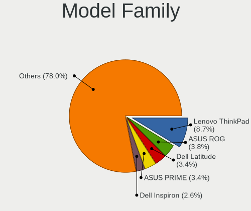
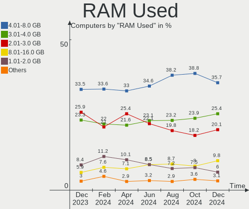
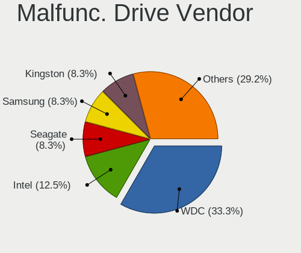
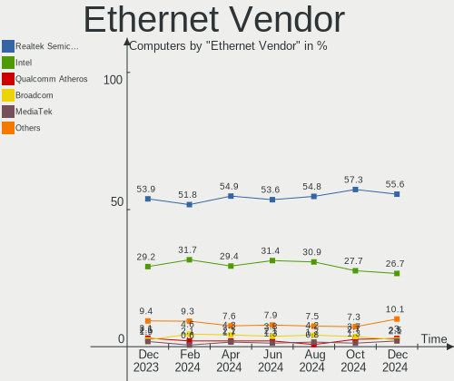
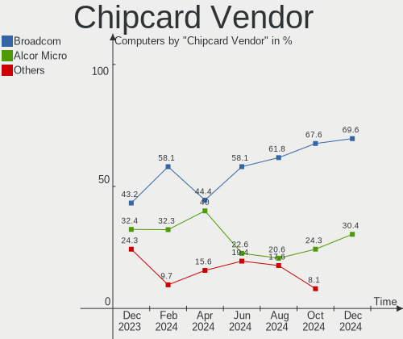
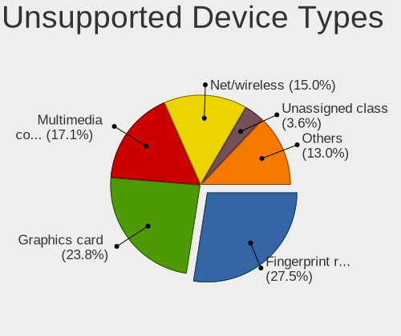

Fedora Hardware Trends
----------------------

A project to identify most popular hardware characteristics and track their change
over time based on data collected by Fedora users at https://Linux-Hardware.org.

Anyone can contribute to this report by the [hw-probe](https://github.com/linuxhw/hw-probe) tool:

    sudo -E hw-probe -all -upload

This is a report for all computer types. See also reports for [desktops](/Dist/Fedora/Desktop/README.md) and [notebooks](/Dist/Fedora/Notebook/README.md).

Full-feature report is available here: https://linux-hardware.org/?view=trends

Period: Nov, 2021.

Contents
--------

* [ System ](#system)
  - [ OS                       ](#os)
  - [ OS Family                ](#os-family)
  - [ Kernel                   ](#kernel)
  - [ Kernel Family            ](#kernel-family)
  - [ Kernel Major Ver.        ](#kernel-major-ver)
  - [ Arch                     ](#arch)
  - [ DE                       ](#de)
  - [ Display Server           ](#display-server)
  - [ Display Manager          ](#display-manager)
  - [ OS Lang                  ](#os-lang)
  - [ Boot Mode                ](#boot-mode)
  - [ Filesystem               ](#filesystem)
  - [ Part. scheme             ](#part-scheme)
  - [ Dual Boot with Linux/BSD ](#dual-boot-with-linuxbsd)
  - [ Dual Boot (Win)          ](#dual-boot-win)

* [ Board ](#board)
  - [ Vendor                   ](#vendor)
  - [ Model                    ](#model)
  - [ Model Family             ](#model-family)
  - [ MFG Year                 ](#mfg-year)
  - [ Form Factor              ](#form-factor)
  - [ Secure Boot              ](#secure-boot)
  - [ Coreboot                 ](#coreboot)
  - [ RAM Size                 ](#ram-size)
  - [ RAM Used                 ](#ram-used)
  - [ Total Drives             ](#total-drives)
  - [ Has CD-ROM               ](#has-cd-rom)
  - [ Has Ethernet             ](#has-ethernet)
  - [ Has WiFi                 ](#has-wifi)
  - [ Has Bluetooth            ](#has-bluetooth)

* [ Location ](#location)
  - [ Country                  ](#country)
  - [ City                     ](#city)

* [ Drives ](#drives)
  - [ Drive Vendor             ](#drive-vendor)
  - [ Drive Model              ](#drive-model)
  - [ HDD Vendor               ](#hdd-vendor)
  - [ SSD Vendor               ](#ssd-vendor)
  - [ Drive Kind               ](#drive-kind)
  - [ Drive Connector          ](#drive-connector)
  - [ Drive Size               ](#drive-size)
  - [ Space Total              ](#space-total)
  - [ Space Used               ](#space-used)
  - [ Malfunc. Drives          ](#malfunc-drives)
  - [ Malfunc. Drive Vendor    ](#malfunc-drive-vendor)
  - [ Malfunc. HDD Vendor      ](#malfunc-hdd-vendor)
  - [ Malfunc. Drive Kind      ](#malfunc-drive-kind)
  - [ Failed Drives            ](#failed-drives)
  - [ Failed Drive Vendor      ](#failed-drive-vendor)
  - [ Drive Status             ](#drive-status)

* [ Storage controller ](#storage-controller)
  - [ Storage Vendor           ](#storage-vendor)
  - [ Storage Model            ](#storage-model)
  - [ Storage Kind             ](#storage-kind)

* [ Processor ](#processor)
  - [ CPU Vendor               ](#cpu-vendor)
  - [ CPU Model                ](#cpu-model)
  - [ CPU Model Family         ](#cpu-model-family)
  - [ CPU Cores                ](#cpu-cores)
  - [ CPU Sockets              ](#cpu-sockets)
  - [ CPU Threads              ](#cpu-threads)
  - [ CPU Op-Modes             ](#cpu-op-modes)
  - [ CPU Microcode            ](#cpu-microcode)
  - [ CPU Microarch            ](#cpu-microarch)

* [ Graphics ](#graphics)
  - [ GPU Vendor               ](#gpu-vendor)
  - [ GPU Model                ](#gpu-model)
  - [ GPU Combo                ](#gpu-combo)
  - [ GPU Driver               ](#gpu-driver)
  - [ GPU Memory               ](#gpu-memory)

* [ Monitor ](#monitor)
  - [ Monitor Vendor           ](#monitor-vendor)
  - [ Monitor Model            ](#monitor-model)
  - [ Monitor Resolution       ](#monitor-resolution)
  - [ Monitor Diagonal         ](#monitor-diagonal)
  - [ Monitor Width            ](#monitor-width)
  - [ Aspect Ratio             ](#aspect-ratio)
  - [ Monitor Area             ](#monitor-area)
  - [ Pixel Density            ](#pixel-density)
  - [ Multiple Monitors        ](#multiple-monitors)

* [ Network ](#network)
  - [ Net Controller Vendor    ](#net-controller-vendor)
  - [ Net Controller Model     ](#net-controller-model)
  - [ Wireless Vendor          ](#wireless-vendor)
  - [ Wireless Model           ](#wireless-model)
  - [ Ethernet Vendor          ](#ethernet-vendor)
  - [ Ethernet Model           ](#ethernet-model)
  - [ Net Controller Kind      ](#net-controller-kind)
  - [ Used Controller          ](#used-controller)
  - [ NICs                     ](#nics)
  - [ IPv6                     ](#ipv6)

* [ Bluetooth ](#bluetooth)
  - [ Bluetooth Vendor         ](#bluetooth-vendor)
  - [ Bluetooth Model          ](#bluetooth-model)

* [ Sound ](#sound)
  - [ Sound Vendor             ](#sound-vendor)
  - [ Sound Model              ](#sound-model)

* [ Memory ](#memory)
  - [ Memory Vendor            ](#memory-vendor)
  - [ Memory Model             ](#memory-model)
  - [ Memory Kind              ](#memory-kind)
  - [ Memory Form Factor       ](#memory-form-factor)
  - [ Memory Size              ](#memory-size)
  - [ Memory Speed             ](#memory-speed)

* [ Printers & scanners ](#printers--scanners)
  - [ Printer Vendor           ](#printer-vendor)
  - [ Printer Model            ](#printer-model)
  - [ Scanner Vendor           ](#scanner-vendor)
  - [ Scanner Model            ](#scanner-model)

* [ Camera ](#camera)
  - [ Camera Vendor            ](#camera-vendor)
  - [ Camera Model             ](#camera-model)

* [ Security ](#security)
  - [ Fingerprint Vendor       ](#fingerprint-vendor)
  - [ Fingerprint Model        ](#fingerprint-model)
  - [ Chipcard Vendor          ](#chipcard-vendor)
  - [ Chipcard Model           ](#chipcard-model)

* [ Unsupported ](#unsupported)
  - [ Unsupported Devices      ](#unsupported-devices)
  - [ Unsupported Device Types ](#unsupported-device-types)

System
------

OS
--

Installed operating systems

| Name      | Computers | Percent |
|-----------|-----------|---------|
| Fedora 35 | 279       | 78.15%  |
| Fedora 34 | 62        | 17.37%  |
| Fedora 33 | 9         | 2.52%   |
| Fedora 36 | 4         | 1.12%   |
| Fedora 32 | 1         | 0.28%   |
| Fedora 30 | 1         | 0.28%   |
| Fedora 21 | 1         | 0.28%   |

OS Family
---------

OS without a version

| Name   | Computers | Percent |
|--------|-----------|---------|
| Fedora | 357       | 100%    |

Kernel
------

Version of the Linux kernel

| Version                                                       | Computers | Percent |
|---------------------------------------------------------------|-----------|---------|
| 5.14.16-301.fc35.x86_64                                       | 67        | 18.77%  |
| 5.14.18-300.fc35.x86_64                                       | 56        | 15.69%  |
| 5.14.17-301.fc35.x86_64                                       | 45        | 12.61%  |
| 5.14.14-300.fc35.x86_64                                       | 37        | 10.36%  |
| 5.14.15-300.fc35.x86_64                                       | 28        | 7.84%   |
| 5.14.14-200.fc34.x86_64                                       | 18        | 5.04%   |
| 5.14.10-300.fc35.x86_64                                       | 18        | 5.04%   |
| 5.15.4-201.fc35.x86_64                                        | 14        | 3.92%   |
| 5.14.16-201.fc34.x86_64                                       | 11        | 3.08%   |
| 5.14.18-200.fc34.x86_64                                       | 8         | 2.24%   |
| 5.14.15-200.fc34.x86_64                                       | 5         | 1.4%    |
| 5.15.4-101.fc34.x86_64                                        | 4         | 1.12%   |
| 5.14.13-200.fc34.x86_64                                       | 3         | 0.84%   |
| 5.11.12-300.fc34.x86_64                                       | 3         | 0.84%   |
| 5.15.0-60.fc36.x86_64                                         | 2         | 0.56%   |
| 5.14.9-200.fc34.x86_64                                        | 2         | 0.56%   |
| 5.14.13-100.fc33.x86_64                                       | 2         | 0.56%   |
| 5.6.13-100.fc30.x86_64                                        | 1         | 0.28%   |
| 5.4.19-200.fc31.x86_64                                        | 1         | 0.28%   |
| 5.16.0-0.rc2.20211126gita4849f6000e2.21.fc36.x86_64           | 1         | 0.28%   |
| 5.16.0-0.rc2.18.vanilla.1.fc35.x86_64                         | 1         | 0.28%   |
| 5.16.0-0.rc1.20211115git8ab774587903.14.vanilla.1.fc35.x86_64 | 1         | 0.28%   |
| 5.15.5-xm1tt.0.fc35.x86_64                                    | 1         | 0.28%   |
| 5.15.5-200.fc35.x86_64                                        | 1         | 0.28%   |
| 5.15.4-xm1.0.fc35.x86_64                                      | 1         | 0.28%   |
| 5.15.4-200.fc35.x86_64                                        | 1         | 0.28%   |
| 5.15.2_tkg_bmq                                                | 1         | 0.28%   |
| 5.15.2-225.vanilla.1.fc35.x86_64                              | 1         | 0.28%   |
| 5.15.2-200.fc35.x86_64                                        | 1         | 0.28%   |
| 5.15.0-500.chinfo.fc35.x86_64                                 | 1         | 0.28%   |
| 5.15.0-0.rc7.20211028git1fc596a56b33.56.fc36.x86_64           | 1         | 0.28%   |
| 5.14.5-300.fc35.x86_64                                        | 1         | 0.28%   |
| 5.14.20-300.fc35.x86_64                                       | 1         | 0.28%   |
| 5.14.18-100.fc33.x86_64                                       | 1         | 0.28%   |
| 5.14.17-201.fc34.x86_64                                       | 1         | 0.28%   |
| 5.14.17-101.fc33.x86_64                                       | 1         | 0.28%   |
| 5.14.15-300.rog.fc35.x86_64                                   | 1         | 0.28%   |
| 5.14.12-200.fc34.x86_64                                       | 1         | 0.28%   |
| 5.13.9-200.fc34.x86_64                                        | 1         | 0.28%   |
| 5.13.8-100.fc33.x86_64                                        | 1         | 0.28%   |
| 5.13.7-200.fc34.x86_64                                        | 1         | 0.28%   |
| 5.13.19-200.fc35.x86_64                                       | 1         | 0.28%   |
| 5.13.19-200.fc34.x86_64                                       | 1         | 0.28%   |
| 5.13.12-200.fc34.x86_64                                       | 1         | 0.28%   |
| 5.12.7-300.fc34.x86_64                                        | 1         | 0.28%   |
| 5.12.6-200.fc33.x86_64                                        | 1         | 0.28%   |
| 5.11.22-100.fc32.x86_64                                       | 1         | 0.28%   |
| 5.11.16-300.fc34.x86_64                                       | 1         | 0.28%   |
| 5.11.15-200.fc33.x86_64                                       | 1         | 0.28%   |
| 5.10.22-200.fc33.x86_64                                       | 1         | 0.28%   |
| 4.1.13-100.fc21.x86_64                                        | 1         | 0.28%   |

Kernel Family
-------------

Linux kernel without a distro release

| Version | Computers | Percent |
|---------|-----------|---------|
| 5.14.16 | 78        | 21.85%  |
| 5.14.18 | 65        | 18.21%  |
| 5.14.14 | 55        | 15.41%  |
| 5.14.17 | 47        | 13.17%  |
| 5.14.15 | 34        | 9.52%   |
| 5.15.4  | 20        | 5.6%    |
| 5.14.10 | 18        | 5.04%   |
| 5.14.13 | 5         | 1.4%    |
| 5.15.0  | 4         | 1.12%   |
| 5.16.0  | 3         | 0.84%   |
| 5.15.2  | 3         | 0.84%   |
| 5.11.12 | 3         | 0.84%   |
| 5.15.5  | 2         | 0.56%   |
| 5.14.9  | 2         | 0.56%   |
| 5.13.19 | 2         | 0.56%   |
| 5.6.13  | 1         | 0.28%   |
| 5.4.19  | 1         | 0.28%   |
| 5.14.5  | 1         | 0.28%   |
| 5.14.20 | 1         | 0.28%   |
| 5.14.12 | 1         | 0.28%   |
| 5.13.9  | 1         | 0.28%   |
| 5.13.8  | 1         | 0.28%   |
| 5.13.7  | 1         | 0.28%   |
| 5.13.12 | 1         | 0.28%   |
| 5.12.7  | 1         | 0.28%   |
| 5.12.6  | 1         | 0.28%   |
| 5.11.22 | 1         | 0.28%   |
| 5.11.16 | 1         | 0.28%   |
| 5.11.15 | 1         | 0.28%   |
| 5.10.22 | 1         | 0.28%   |
| 4.1.13  | 1         | 0.28%   |

Kernel Major Ver.
-----------------

Linux kernel major version

| Version | Computers | Percent |
|---------|-----------|---------|
| 5.14    | 307       | 85.99%  |
| 5.15    | 29        | 8.12%   |
| 5.13    | 6         | 1.68%   |
| 5.11    | 6         | 1.68%   |
| 5.16    | 3         | 0.84%   |
| 5.12    | 2         | 0.56%   |
| 5.6     | 1         | 0.28%   |
| 5.4     | 1         | 0.28%   |
| 5.10    | 1         | 0.28%   |
| 4.1     | 1         | 0.28%   |

Arch
----

OS architecture (x86_64, i586, etc.)

| Name   | Computers | Percent |
|--------|-----------|---------|
| x86_64 | 357       | 100%    |

DE
--

Desktop Environment

| Name          | Computers | Percent |
|---------------|-----------|---------|
| GNOME         | 256       | 71.71%  |
| KDE5          | 33        | 9.24%   |
| Unknown       | 19        | 5.32%   |
| X-Cinnamon    | 12        | 3.36%   |
| MATE          | 11        | 3.08%   |
| Cinnamon      | 10        | 2.8%    |
| XFCE          | 8         | 2.24%   |
| sway          | 2         | 0.56%   |
| LXDE          | 2         | 0.56%   |
| KDE4          | 1         | 0.28%   |
| i3            | 1         | 0.28%   |
| GNOME Classic | 1         | 0.28%   |
| fluxbox       | 1         | 0.28%   |

Display Server
--------------

X11 or Wayland

| Name    | Computers | Percent |
|---------|-----------|---------|
| Wayland | 216       | 60.5%   |
| X11     | 124       | 34.73%  |
| Tty     | 12        | 3.36%   |
| Unknown | 5         | 1.4%    |

Display Manager
---------------

SDDM, LightDM, etc.

| Name    | Computers | Percent |
|---------|-----------|---------|
| Unknown | 163       | 45.66%  |
| GDM     | 133       | 37.25%  |
| LightDM | 35        | 9.8%    |
| SDDM    | 25        | 7%      |
| XDM     | 1         | 0.28%   |

OS Lang
-------

Language

| Lang       | Computers | Percent |
|------------|-----------|---------|
| en_US      | 161       | 45.1%   |
| en_GB      | 35        | 9.8%    |
| ru_RU      | 22        | 6.16%   |
| pt_BR      | 16        | 4.48%   |
| de_DE      | 16        | 4.48%   |
| en_AU      | 13        | 3.64%   |
| it_IT      | 12        | 3.36%   |
| fr_FR      | 12        | 3.36%   |
| es_ES      | 8         | 2.24%   |
| en_CA      | 8         | 2.24%   |
| pl_PL      | 6         | 1.68%   |
| es_MX      | 4         | 1.12%   |
| nl_BE      | 3         | 0.84%   |
| en_NZ      | 3         | 0.84%   |
| en_IN      | 3         | 0.84%   |
| Unknown    | 3         | 0.84%   |
| sv_SE      | 2         | 0.56%   |
| ru_UA      | 2         | 0.56%   |
| pt_PT      | 2         | 0.56%   |
| nl_NL      | 2         | 0.56%   |
| nb_NO      | 2         | 0.56%   |
| fi_FI      | 2         | 0.56%   |
| es_CL      | 2         | 0.56%   |
| ca_ES      | 2         | 0.56%   |
| C          | 2         | 0.56%   |
| zh_CN      | 1         | 0.28%   |
| sr_RS      | 1         | 0.28%   |
| ja_JP      | 1         | 0.28%   |
| es_VE      | 1         | 0.28%   |
| es_GT      | 1         | 0.28%   |
| es_CO      | 1         | 0.28%   |
| es_AR      | 1         | 0.28%   |
| en_ZA      | 1         | 0.28%   |
| en_US.UTF8 | 1         | 0.28%   |
| en_DK      | 1         | 0.28%   |
| de_CH      | 1         | 0.28%   |
| da_DK      | 1         | 0.28%   |
| cs_CZ      | 1         | 0.28%   |
| ar_SA      | 1         | 0.28%   |

Boot Mode
---------

EFI or BIOS

| Mode | Computers | Percent |
|------|-----------|---------|
| EFI  | 267       | 74.79%  |
| BIOS | 90        | 25.21%  |

Filesystem
----------

Type of filesystem

| Type    | Computers | Percent |
|---------|-----------|---------|
| Btrfs   | 253       | 70.87%  |
| Ext4    | 88        | 24.65%  |
| Xfs     | 13        | 3.64%   |
| Overlay | 1         | 0.28%   |
| Ext3    | 1         | 0.28%   |
| Unknown | 1         | 0.28%   |

Part. scheme
------------

Scheme of partitioning

| Type    | Computers | Percent |
|---------|-----------|---------|
| GPT     | 165       | 46.22%  |
| Unknown | 158       | 44.26%  |
| MBR     | 34        | 9.52%   |

Dual Boot with Linux/BSD
------------------------

Hosting more than one Linux/BSD

| Dual boot | Computers | Percent |
|-----------|-----------|---------|
| No        | 321       | 89.92%  |
| Yes       | 36        | 10.08%  |

Dual Boot (Win)
---------------

Hosting Linux and Windows

| Dual boot | Computers | Percent |
|-----------|-----------|---------|
| No        | 283       | 79.27%  |
| Yes       | 74        | 20.73%  |

Board
-----

Vendor
------

Motherboard manufacturer

| Name                | Computers | Percent |
|---------------------|-----------|---------|
| Lenovo              | 74        | 20.73%  |
| Dell                | 52        | 14.57%  |
| Hewlett-Packard     | 45        | 12.61%  |
| ASUSTek Computer    | 45        | 12.61%  |
| Gigabyte Technology | 30        | 8.4%    |
| MSI                 | 21        | 5.88%   |
| Acer                | 15        | 4.2%    |
| ASRock              | 13        | 3.64%   |
| Apple               | 13        | 3.64%   |
| HUAWEI              | 7         | 1.96%   |
| Notebook            | 5         | 1.4%    |
| Toshiba             | 4         | 1.12%   |
| Positivo            | 3         | 0.84%   |
| System76            | 2         | 0.56%   |
| Samsung Electronics | 2         | 0.56%   |
| Pegatron            | 2         | 0.56%   |
| Microsoft           | 2         | 0.56%   |
| Intel               | 2         | 0.56%   |
| Fujitsu             | 2         | 0.56%   |
| Unknown             | 2         | 0.56%   |
| ZOTAC               | 1         | 0.28%   |
| Standard            | 1         | 0.28%   |
| Sony                | 1         | 0.28%   |
| SiComputer          | 1         | 0.28%   |
| Seco                | 1         | 0.28%   |
| Razer               | 1         | 0.28%   |
| Prestigio           | 1         | 0.28%   |
| Login Informatica   | 1         | 0.28%   |
| LG Electronics      | 1         | 0.28%   |
| Itautec             | 1         | 0.28%   |
| Huanan              | 1         | 0.28%   |
| HONOR               | 1         | 0.28%   |
| Google              | 1         | 0.28%   |
| ECS                 | 1         | 0.28%   |
| AMI                 | 1         | 0.28%   |
| ABIT                | 1         | 0.28%   |

Model
-----

Motherboard model

| Name                                                                                     | Computers | Percent |
|------------------------------------------------------------------------------------------|-----------|---------|
| ASUS All Series                                                                          | 4         | 1.12%   |
| Dell Latitude E7440                                                                      | 3         | 0.84%   |
| Unknown                                                                                  | 3         | 0.84%   |
| MSI MS-7C52                                                                              | 2         | 0.56%   |
| MSI MS-7C02                                                                              | 2         | 0.56%   |
| Lenovo IdeaPad 320-15ISK 80XH                                                            | 2         | 0.56%   |
| HP ProBook 470 G5                                                                        | 2         | 0.56%   |
| HP ENVY x360 Convertible 13-ay0xxx                                                       | 2         | 0.56%   |
| Gigabyte X570 AORUS MASTER                                                               | 2         | 0.56%   |
| Gigabyte H97M-D3H                                                                        | 2         | 0.56%   |
| Gigabyte B450M DS3H                                                                      | 2         | 0.56%   |
| Dell XPS 13 9360                                                                         | 2         | 0.56%   |
| Dell Precision 5510                                                                      | 2         | 0.56%   |
| Dell Inspiron 7572                                                                       | 2         | 0.56%   |
| ASUS ROG Strix G513QY_G513QY                                                             | 2         | 0.56%   |
| Apple MacPro5,1                                                                          | 2         | 0.56%   |
| Apple Macmini5,1                                                                         | 2         | 0.56%   |
| Apple MacBookPro6,2                                                                      | 2         | 0.56%   |
| ZOTAC B410                                                                               | 1         | 0.28%   |
| Toshiba TECRA Z50-A                                                                      | 1         | 0.28%   |
| Toshiba Satellite L305                                                                   | 1         | 0.28%   |
| Toshiba Satellite C855-12R                                                               | 1         | 0.28%   |
| Toshiba NB255                                                                            | 1         | 0.28%   |
| System76 Pangolin                                                                        | 1         | 0.28%   |
| System76 Oryx Pro                                                                        | 1         | 0.28%   |
| Sony VPCF131FM                                                                           | 1         | 0.28%   |
| SiComputer Nauta 01W PRO                                                                 | 1         | 0.28%   |
| Seco C40                                                                                 | 1         | 0.28%   |
| Samsung RV411/RV511/E3511/S3511/RV711/E3411                                              | 1         | 0.28%   |
| Samsung 355V4C/355V4X/355V5C/355V5X/356V4C/356V4X/356V5C/356V5X/3445VC/3445VX/3545VC/354 | 1         | 0.28%   |
| Razer Blade 15 Advanced Model (Early 2020) - RZ09-033                                    | 1         | 0.28%   |
| Prestigio PSB141C03                                                                      | 1         | 0.28%   |
| Positivo W942SW_SW1                                                                      | 1         | 0.28%   |
| Positivo V142N_4G                                                                        | 1         | 0.28%   |
| Positivo CHT12CP                                                                         | 1         | 0.28%   |
| Pegatron h9-1350                                                                         | 1         | 0.28%   |
| Pegatron FR566AA-ABU IQ515uk                                                             | 1         | 0.28%   |
| Notebook W65_W67RZ                                                                       | 1         | 0.28%   |
| Notebook PB50_70DFx,DDx                                                                  | 1         | 0.28%   |
| Notebook NH5x_NH7x_HHx_HJx_HKx                                                           | 1         | 0.28%   |
| Notebook NH55RGQ                                                                         | 1         | 0.28%   |
| Notebook NB50TL                                                                          | 1         | 0.28%   |
| MSI MS-7C94                                                                              | 1         | 0.28%   |
| MSI MS-7C56                                                                              | 1         | 0.28%   |
| MSI MS-7C37                                                                              | 1         | 0.28%   |
| MSI MS-7C35                                                                              | 1         | 0.28%   |
| MSI MS-7C31                                                                              | 1         | 0.28%   |
| MSI MS-7B98                                                                              | 1         | 0.28%   |
| MSI MS-7B93                                                                              | 1         | 0.28%   |
| MSI MS-7B89                                                                              | 1         | 0.28%   |
| MSI MS-7B86                                                                              | 1         | 0.28%   |
| MSI MS-7B85                                                                              | 1         | 0.28%   |
| MSI MS-7924                                                                              | 1         | 0.28%   |
| MSI MS-7758                                                                              | 1         | 0.28%   |
| MSI MS-7721                                                                              | 1         | 0.28%   |
| MSI Modern 15 A11M                                                                       | 1         | 0.28%   |
| MSI GL62M 7RDX                                                                           | 1         | 0.28%   |
| MSI GF63 Thin 9SC                                                                        | 1         | 0.28%   |
| MSI Delta 15 A5EFK                                                                       | 1         | 0.28%   |
| Microsoft Surface Pro 3                                                                  | 1         | 0.28%   |

Model Family
------------

Motherboard model prefix

| Name                 | Computers | Percent |
|----------------------|-----------|---------|
| Lenovo ThinkPad      | 46        | 12.89%  |
| Dell Latitude        | 15        | 4.2%    |
| Dell Inspiron        | 11        | 3.08%   |
| Lenovo IdeaPad       | 10        | 2.8%    |
| HP ENVY              | 8         | 2.24%   |
| Dell XPS             | 8         | 2.24%   |
| Dell OptiPlex        | 8         | 2.24%   |
| ASUS ROG             | 8         | 2.24%   |
| HP ProBook           | 7         | 1.96%   |
| HP EliteBook         | 6         | 1.68%   |
| ASUS VivoBook        | 6         | 1.68%   |
| Acer Aspire          | 6         | 1.68%   |
| HP Pavilion          | 5         | 1.4%    |
| Dell Precision       | 5         | 1.4%    |
| Acer Swift           | 5         | 1.4%    |
| HP Laptop            | 4         | 1.12%   |
| Gigabyte X570        | 4         | 1.12%   |
| ASUS All             | 4         | 1.12%   |
| Lenovo Yoga          | 3         | 0.84%   |
| Lenovo ThinkCentre   | 3         | 0.84%   |
| Lenovo Legion        | 3         | 0.84%   |
| HP ZBook             | 3         | 0.84%   |
| HP EliteDesk         | 3         | 0.84%   |
| ASUS PRIME           | 3         | 0.84%   |
| Unknown              | 3         | 0.84%   |
| Toshiba Satellite    | 2         | 0.56%   |
| MSI MS-7C52          | 2         | 0.56%   |
| MSI MS-7C02          | 2         | 0.56%   |
| Microsoft Surface    | 2         | 0.56%   |
| Lenovo ThinkBook     | 2         | 0.56%   |
| Lenovo IdeaPadFlex   | 2         | 0.56%   |
| HP Compaq            | 2         | 0.56%   |
| Gigabyte H97M-D3H    | 2         | 0.56%   |
| Gigabyte B550        | 2         | 0.56%   |
| Gigabyte B450M       | 2         | 0.56%   |
| Dell G5              | 2         | 0.56%   |
| ASUS ZenBook         | 2         | 0.56%   |
| ASUS TUF             | 2         | 0.56%   |
| ASRock X570          | 2         | 0.56%   |
| Apple MacPro5        | 2         | 0.56%   |
| Apple Macmini5       | 2         | 0.56%   |
| Apple MacBookPro6    | 2         | 0.56%   |
| Acer Nitro           | 2         | 0.56%   |
| ZOTAC B410           | 1         | 0.28%   |
| Toshiba TECRA        | 1         | 0.28%   |
| Toshiba NB255        | 1         | 0.28%   |
| System76 Pangolin    | 1         | 0.28%   |
| System76 Oryx        | 1         | 0.28%   |
| Sony VPCF131FM       | 1         | 0.28%   |
| SiComputer Nauta     | 1         | 0.28%   |
| Seco C40             | 1         | 0.28%   |
| Samsung RV411        | 1         | 0.28%   |
| Samsung 355V4C       | 1         | 0.28%   |
| Razer Blade          | 1         | 0.28%   |
| Prestigio PSB141C03  | 1         | 0.28%   |
| Positivo W942SW      | 1         | 0.28%   |
| Positivo V142N       | 1         | 0.28%   |
| Positivo CHT12CP     | 1         | 0.28%   |
| Pegatron h9-1350     | 1         | 0.28%   |
| Pegatron FR566AA-ABU | 1         | 0.28%   |

MFG Year
--------

Motherboard manufacture year

| Year | Computers | Percent |
|------|-----------|---------|
| 2021 | 120       | 33.61%  |
| 2020 | 57        | 15.97%  |
| 2019 | 50        | 14.01%  |
| 2018 | 27        | 7.56%   |
| 2014 | 20        | 5.6%    |
| 2013 | 12        | 3.36%   |
| 2015 | 11        | 3.08%   |
| 2017 | 10        | 2.8%    |
| 2016 | 10        | 2.8%    |
| 2009 | 10        | 2.8%    |
| 2012 | 9         | 2.52%   |
| 2010 | 9         | 2.52%   |
| 2011 | 8         | 2.24%   |
| 2008 | 3         | 0.84%   |
| 2006 | 1         | 0.28%   |

Form Factor
-----------

Physical design of the computer

| Name        | Computers | Percent |
|-------------|-----------|---------|
| Notebook    | 206       | 57.7%   |
| Desktop     | 120       | 33.61%  |
| Convertible | 17        | 4.76%   |
| Mini pc     | 5         | 1.4%    |
| All in one  | 5         | 1.4%    |
| Tablet      | 3         | 0.84%   |
| Server      | 1         | 0.28%   |

Secure Boot
-----------

Enabled or disabled

| State    | Computers | Percent |
|----------|-----------|---------|
| Disabled | 296       | 82.91%  |
| Enabled  | 61        | 17.09%  |

Coreboot
--------

Have coreboot on board

| Used | Computers | Percent |
|------|-----------|---------|
| No   | 356       | 99.72%  |
| Yes  | 1         | 0.28%   |

RAM Size
--------

Total RAM memory

| Size in GB  | Computers | Percent |
|-------------|-----------|---------|
| 16.01-24.0  | 91        | 25.49%  |
| 4.01-8.0    | 88        | 24.65%  |
| 8.01-16.0   | 66        | 18.49%  |
| 32.01-64.0  | 52        | 14.57%  |
| 3.01-4.0    | 36        | 10.08%  |
| 64.01-256.0 | 11        | 3.08%   |
| 24.01-32.0  | 7         | 1.96%   |
| 1.01-2.0    | 4         | 1.12%   |
| 2.01-3.0    | 2         | 0.56%   |

RAM Used
--------

Used RAM memory

| Used GB    | Computers | Percent |
|------------|-----------|---------|
| 2.01-3.0   | 95        | 26.61%  |
| 4.01-8.0   | 92        | 25.77%  |
| 3.01-4.0   | 75        | 21.01%  |
| 1.01-2.0   | 53        | 14.85%  |
| 8.01-16.0  | 26        | 7.28%   |
| 0.51-1.0   | 9         | 2.52%   |
| 16.01-24.0 | 4         | 1.12%   |
| 24.01-32.0 | 2         | 0.56%   |
| 32.01-64.0 | 1         | 0.28%   |

Total Drives
------------

Number of drives on board

| Drives | Computers | Percent |
|--------|-----------|---------|
| 1      | 215       | 60.22%  |
| 2      | 84        | 23.53%  |
| 3      | 32        | 8.96%   |
| 6      | 8         | 2.24%   |
| 5      | 6         | 1.68%   |
| 4      | 6         | 1.68%   |
| 9      | 2         | 0.56%   |
| 7      | 2         | 0.56%   |
| 0      | 2         | 0.56%   |

Has CD-ROM
----------

Has CD-ROM on board

| Presented | Computers | Percent |
|-----------|-----------|---------|
| No        | 264       | 73.95%  |
| Yes       | 93        | 26.05%  |

Has Ethernet
------------

Has Ethernet on board

| Presented | Computers | Percent |
|-----------|-----------|---------|
| Yes       | 289       | 80.95%  |
| No        | 68        | 19.05%  |

Has WiFi
--------

Has WiFi module

| Presented | Computers | Percent |
|-----------|-----------|---------|
| Yes       | 283       | 79.27%  |
| No        | 74        | 20.73%  |

Has Bluetooth
-------------

Has Bluetooth module

| Presented | Computers | Percent |
|-----------|-----------|---------|
| Yes       | 252       | 70.59%  |
| No        | 105       | 29.41%  |

Location
--------

Country
-------

Geographic location (country)

| Country             | Computers | Percent |
|---------------------|-----------|---------|
| USA                 | 51        | 14.29%  |
| Russia              | 25        | 7%      |
| Brazil              | 22        | 6.16%   |
| Italy               | 21        | 5.88%   |
| Germany             | 20        | 5.6%    |
| France              | 17        | 4.76%   |
| UK                  | 16        | 4.48%   |
| Canada              | 16        | 4.48%   |
| Spain               | 15        | 4.2%    |
| Netherlands         | 14        | 3.92%   |
| Australia           | 11        | 3.08%   |
| Poland              | 8         | 2.24%   |
| India               | 8         | 2.24%   |
| Switzerland         | 6         | 1.68%   |
| Mexico              | 6         | 1.68%   |
| Belgium             | 6         | 1.68%   |
| Belarus             | 6         | 1.68%   |
| Sweden              | 4         | 1.12%   |
| Romania             | 4         | 1.12%   |
| Portugal            | 4         | 1.12%   |
| Norway              | 4         | 1.12%   |
| Indonesia           | 4         | 1.12%   |
| Finland             | 4         | 1.12%   |
| Chile               | 4         | 1.12%   |
| Ukraine             | 3         | 0.84%   |
| New Zealand         | 3         | 0.84%   |
| Iran                | 3         | 0.84%   |
| Hungary             | 3         | 0.84%   |
| Greece              | 3         | 0.84%   |
| Denmark             | 3         | 0.84%   |
| Czechia             | 3         | 0.84%   |
| China               | 3         | 0.84%   |
| Austria             | 3         | 0.84%   |
| Venezuela           | 2         | 0.56%   |
| South Africa        | 2         | 0.56%   |
| Malaysia            | 2         | 0.56%   |
| Kazakhstan          | 2         | 0.56%   |
| Estonia             | 2         | 0.56%   |
| Cyprus              | 2         | 0.56%   |
| Colombia            | 2         | 0.56%   |
| Yemen               | 1         | 0.28%   |
| Uganda              | 1         | 0.28%   |
| Trinidad and Tobago | 1         | 0.28%   |
| Slovenia            | 1         | 0.28%   |
| Slovakia            | 1         | 0.28%   |
| Singapore           | 1         | 0.28%   |
| Saudi Arabia        | 1         | 0.28%   |
| Philippines         | 1         | 0.28%   |
| Peru                | 1         | 0.28%   |
| Palestine           | 1         | 0.28%   |
| Morocco             | 1         | 0.28%   |
| Lithuania           | 1         | 0.28%   |
| Latvia              | 1         | 0.28%   |
| Japan               | 1         | 0.28%   |
| Hong Kong           | 1         | 0.28%   |
| Guatemala           | 1         | 0.28%   |
| Georgia             | 1         | 0.28%   |
| Bulgaria            | 1         | 0.28%   |
| Armenia             | 1         | 0.28%   |
| Argentina           | 1         | 0.28%   |

City
----

Geographic location (city)

| City               | Computers | Percent |
|--------------------|-----------|---------|
| Moscow             | 10        | 2.8%    |
| Sydney             | 6         | 1.68%   |
| Berlin             | 5         | 1.4%    |
| Minsk              | 4         | 1.12%   |
| Milan              | 4         | 1.12%   |
| Helsinki           | 4         | 1.12%   |
| East Longmeadow    | 4         | 1.12%   |
| Zurich             | 3         | 0.84%   |
| Weinsberg          | 3         | 0.84%   |
| Ufa                | 3         | 0.84%   |
| S??o Paulo         | 3         | 0.84%   |
| Rome               | 3         | 0.84%   |
| Mangawhai          | 3         | 0.84%   |
| Winterthur         | 2         | 0.56%   |
| Vienna             | 2         | 0.56%   |
| Tartu              | 2         | 0.56%   |
| St Petersburg      | 2         | 0.56%   |
| Shenzhen           | 2         | 0.56%   |
| Rotterdam          | 2         | 0.56%   |
| Rio de Janeiro     | 2         | 0.56%   |
| Raleigh            | 2         | 0.56%   |
| Petaling Jaya      | 2         | 0.56%   |
| Perth              | 2         | 0.56%   |
| Paris              | 2         | 0.56%   |
| Oakville           | 2         | 0.56%   |
| Noyelles-sous-Lens | 2         | 0.56%   |
| Novosibirsk        | 2         | 0.56%   |
| Nova Russas        | 2         | 0.56%   |
| Nijmegen           | 2         | 0.56%   |
| Melbourne          | 2         | 0.56%   |
| Madrid             | 2         | 0.56%   |
| Madison            | 2         | 0.56%   |
| Lawrenceville      | 2         | 0.56%   |
| Kyiv               | 2         | 0.56%   |
| Jakarta            | 2         | 0.56%   |
| Isfahan            | 2         | 0.56%   |
| Epsom              | 2         | 0.56%   |
| De Lier            | 2         | 0.56%   |
| Cavallino-Treporti | 2         | 0.56%   |
| Caracas            | 2         | 0.56%   |
| Brno               | 2         | 0.56%   |
| Brampton           | 2         | 0.56%   |
| Bolzano            | 2         | 0.56%   |
| Bainbridge Island  | 2         | 0.56%   |
| Athens             | 2         | 0.56%   |
| Antwerp            | 2         | 0.56%   |
| Amsterdam          | 2         | 0.56%   |
| Almaty             | 2         | 0.56%   |
| Zulte              | 1         | 0.28%   |
| Zhlobin            | 1         | 0.28%   |
| Zhengzhou          | 1         | 0.28%   |
| Zapopan            | 1         | 0.28%   |
| Yerevan            | 1         | 0.28%   |
| Windsor            | 1         | 0.28%   |
| Westerstede        | 1         | 0.28%   |
| Weissenfels        | 1         | 0.28%   |
| Weert              | 1         | 0.28%   |
| Waynesville        | 1         | 0.28%   |
| Wattrelos          | 1         | 0.28%   |
| Watertown          | 1         | 0.28%   |

Drives
------

Drive Vendor
------------

Hard drive vendors

| Vendor                      | Computers | Drives | Percent |
|-----------------------------|-----------|--------|---------|
| Samsung Electronics         | 103       | 131    | 19.66%  |
| Seagate                     | 73        | 102    | 13.93%  |
| WDC                         | 70        | 89     | 13.36%  |
| SanDisk                     | 32        | 32     | 6.11%   |
| Toshiba                     | 29        | 34     | 5.53%   |
| Kingston                    | 24        | 26     | 4.58%   |
| SK Hynix                    | 22        | 24     | 4.2%    |
| Crucial                     | 20        | 23     | 3.82%   |
| Unknown                     | 17        | 18     | 3.24%   |
| Intel                       | 17        | 19     | 3.24%   |
| Micron Technology           | 12        | 12     | 2.29%   |
| KIOXIA                      | 11        | 11     | 2.1%    |
| A-DATA Technology           | 10        | 10     | 1.91%   |
| HGST                        | 7         | 7      | 1.34%   |
| Corsair                     | 6         | 6      | 1.15%   |
| SPCC                        | 5         | 5      | 0.95%   |
| LITEON                      | 5         | 5      | 0.95%   |
| Hitachi                     | 5         | 5      | 0.95%   |
| Phison                      | 4         | 5      | 0.76%   |
| Patriot                     | 4         | 4      | 0.76%   |
| Hewlett-Packard             | 4         | 4      | 0.76%   |
| Apple                       | 4         | 4      | 0.76%   |
| XPG                         | 3         | 5      | 0.57%   |
| Silicon Motion              | 3         | 3      | 0.57%   |
| PNY                         | 2         | 2      | 0.38%   |
| MAXIO Technology (Hangzhou) | 2         | 2      | 0.38%   |
| LITEONIT                    | 2         | 2      | 0.38%   |
| Lexar                       | 2         | 2      | 0.38%   |
| LDLC                        | 2         | 3      | 0.38%   |
| ASMT                        | 2         | 2      | 0.38%   |
| WDC WDS                     | 1         | 1      | 0.19%   |
| USB 3.0                     | 1         | 2      | 0.19%   |
| UMIS                        | 1         | 1      | 0.19%   |
| Transcend                   | 1         | 1      | 0.19%   |
| TO Exter                    | 1         | 1      | 0.19%   |
| TCSUNBOW                    | 1         | 1      | 0.19%   |
| T-FORCE                     | 1         | 1      | 0.19%   |
| SSSTC                       | 1         | 1      | 0.19%   |
| SP B75P                     | 1         | 1      | 0.19%   |
| Realtek Semiconductor       | 1         | 1      | 0.19%   |
| PLEXTOR                     | 1         | 1      | 0.19%   |
| ORICO                       | 1         | 1      | 0.19%   |
| Mushkin                     | 1         | 1      | 0.19%   |
| Micron/Crucial Technology   | 1         | 1      | 0.19%   |
| Mass                        | 1         | 1      | 0.19%   |
| Intenso                     | 1         | 2      | 0.19%   |
| GOODRAM                     | 1         | 1      | 0.19%   |
| Gigabyte Technology         | 1         | 1      | 0.19%   |
| Enmotus                     | 1         | 1      | 0.19%   |
| AMicro                      | 1         | 1      | 0.19%   |
| ADATA Technology            | 1         | 1      | 0.19%   |
| Unknown                     | 1         | 1      | 0.19%   |

Drive Model
-----------

Hard drive models

| Model                                  | Computers | Percent |
|----------------------------------------|-----------|---------|
| Samsung NVMe SSD Drive 500GB           | 10        | 1.66%   |
| Seagate ST2000DM008-2FR102 2TB         | 8         | 1.33%   |
| Samsung NVMe SSD Drive 512GB           | 7         | 1.16%   |
| SK Hynix NVMe SSD Drive 512GB          | 5         | 0.83%   |
| Seagate ST500DM002-1BD142 500GB        | 5         | 0.83%   |
| Sandisk NVMe SSD Drive 512GB           | 5         | 0.83%   |
| Crucial CT500MX500SSD1 500GB           | 5         | 0.83%   |
| Seagate ST1000LM024 HN-M101MBB 1TB     | 4         | 0.67%   |
| Seagate ST1000LM014-1EJ164 1TB         | 4         | 0.67%   |
| Seagate ST1000DM010-2EP102 1TB         | 4         | 0.67%   |
| Seagate ST1000DM003-1ER162 1TB         | 4         | 0.67%   |
| Sandisk NVMe SSD Drive 500GB           | 4         | 0.67%   |
| Samsung SSD 860 EVO 500GB              | 4         | 0.67%   |
| Samsung SSD 860 EVO 250GB              | 4         | 0.67%   |
| Samsung SSD 860 EVO 1TB                | 4         | 0.67%   |
| Samsung SSD 850 PRO 512GB              | 4         | 0.67%   |
| Samsung MZVLB512HBJQ-000L7 512GB       | 4         | 0.67%   |
| WDC WDS500G2B0A-00SM50 500GB SSD       | 3         | 0.5%    |
| WDC WDS100T1X0E-00AFY0 1TB             | 3         | 0.5%    |
| Unknown MMC Card  32GB                 | 3         | 0.5%    |
| Unknown MMC Card  128GB                | 3         | 0.5%    |
| Toshiba DT01ACA200 2TB                 | 3         | 0.5%    |
| Seagate ST8000DM004-2CX188 8TB         | 3         | 0.5%    |
| Seagate ST4000DM005-2DP166 4TB         | 3         | 0.5%    |
| Seagate ST3500418AS 500GB              | 3         | 0.5%    |
| Seagate ST31000528AS 1TB               | 3         | 0.5%    |
| SanDisk SSD PLUS 240GB                 | 3         | 0.5%    |
| Samsung SSD 980 PRO 500GB              | 3         | 0.5%    |
| Samsung SSD 970 EVO Plus 500GB         | 3         | 0.5%    |
| Samsung SSD 970 EVO 250GB              | 3         | 0.5%    |
| Samsung SSD 850 EVO 250GB              | 3         | 0.5%    |
| Samsung SM963 2.5" NVMe PCIe SSD 250GB | 3         | 0.5%    |
| Samsung NVMe SSD Drive 1024GB          | 3         | 0.5%    |
| KIOXIA NVMe SSD Drive 512GB            | 3         | 0.5%    |
| Kingston SV300S37A120G 120GB SSD       | 3         | 0.5%    |
| Kingston SA400S37480G 480GB SSD        | 3         | 0.5%    |
| Kingston SA400S37240G 240GB SSD        | 3         | 0.5%    |
| Kingston SA400S37120G 120GB SSD        | 3         | 0.5%    |
| Intel NVMe SSD Drive 512GB             | 3         | 0.5%    |
| WDC WDS480G2G0A-00JH30 480GB SSD       | 2         | 0.33%   |
| WDC WD5000AADS-00S9B0 500GB            | 2         | 0.33%   |
| WDC WD40EZRZ-00WN9B0 4TB               | 2         | 0.33%   |
| WDC WD360ADFD-00NLR1 37GB              | 2         | 0.33%   |
| WDC WD3200AAKS-00SBA0 320GB            | 2         | 0.33%   |
| WDC WD20EZRX-00D8PB0 2TB               | 2         | 0.33%   |
| WDC WD16 00BEVT-60ZCT 160GB            | 2         | 0.33%   |
| WDC WD10SPZX-75Z10T1 1TB               | 2         | 0.33%   |
| WDC WD10EZEX-60WN4A0 1TB               | 2         | 0.33%   |
| WDC PC SN730 SDBQNTY-512G-1001 512GB   | 2         | 0.33%   |
| Unknown SD/MMC/MS PRO 394GB            | 2         | 0.33%   |
| Unknown MMC Card  64GB                 | 2         | 0.33%   |
| Toshiba MQ04ABF100 1TB                 | 2         | 0.33%   |
| Toshiba MK5061GSYN 500GB               | 2         | 0.33%   |
| Toshiba KXG6AZNV256G 256GB             | 2         | 0.33%   |
| Toshiba KXG50ZNV256G NVMe 256GB        | 2         | 0.33%   |
| Toshiba HDWD120 2TB                    | 2         | 0.33%   |
| SPCC M.2 PCIe SSD 256GB                | 2         | 0.33%   |
| Seagate ST500LM021-1KJ152 500GB        | 2         | 0.33%   |
| Seagate ST500LM012 HN-M500MBB 500GB    | 2         | 0.33%   |
| Seagate ST3500620AS 500GB              | 2         | 0.33%   |

HDD Vendor
----------

Hard disk drive vendors

| Vendor              | Computers | Drives | Percent |
|---------------------|-----------|--------|---------|
| Seagate             | 72        | 101    | 45%     |
| WDC                 | 48        | 61     | 30%     |
| Toshiba             | 17        | 19     | 10.63%  |
| HGST                | 7         | 7      | 4.38%   |
| Samsung Electronics | 6         | 7      | 3.75%   |
| Hitachi             | 5         | 5      | 3.13%   |
| Unknown             | 2         | 2      | 1.25%   |
| USB 3.0             | 1         | 2      | 0.63%   |
| TO Exter            | 1         | 1      | 0.63%   |
| ASMT                | 1         | 1      | 0.63%   |

SSD Vendor
----------

Solid state drive vendors

| Vendor              | Computers | Drives | Percent |
|---------------------|-----------|--------|---------|
| Samsung Electronics | 47        | 56     | 28.14%  |
| Kingston            | 19        | 21     | 11.38%  |
| SanDisk             | 16        | 16     | 9.58%   |
| Crucial             | 16        | 19     | 9.58%   |
| WDC                 | 10        | 11     | 5.99%   |
| A-DATA Technology   | 6         | 6      | 3.59%   |
| Intel               | 5         | 5      | 2.99%   |
| SK Hynix            | 4         | 4      | 2.4%    |
| Patriot             | 4         | 4      | 2.4%    |
| LITEON              | 4         | 4      | 2.4%    |
| Hewlett-Packard     | 4         | 4      | 2.4%    |
| Toshiba             | 3         | 3      | 1.8%    |
| Micron Technology   | 3         | 3      | 1.8%    |
| Apple               | 3         | 3      | 1.8%    |
| Unknown             | 2         | 2      | 1.2%    |
| SPCC                | 2         | 2      | 1.2%    |
| PNY                 | 2         | 2      | 1.2%    |
| LITEONIT            | 2         | 2      | 1.2%    |
| Lexar               | 2         | 2      | 1.2%    |
| XPG                 | 1         | 2      | 0.6%    |
| WDC WDS             | 1         | 1      | 0.6%    |
| TCSUNBOW            | 1         | 1      | 0.6%    |
| T-FORCE             | 1         | 1      | 0.6%    |
| PLEXTOR             | 1         | 1      | 0.6%    |
| ORICO               | 1         | 1      | 0.6%    |
| Mushkin             | 1         | 1      | 0.6%    |
| LDLC                | 1         | 1      | 0.6%    |
| Intenso             | 1         | 2      | 0.6%    |
| GOODRAM             | 1         | 1      | 0.6%    |
| Gigabyte Technology | 1         | 1      | 0.6%    |
| Corsair             | 1         | 1      | 0.6%    |
| ASMT                | 1         | 1      | 0.6%    |

Drive Kind
----------

HDD or SSD

| Kind    | Computers | Drives | Percent |
|---------|-----------|--------|---------|
| NVMe    | 181       | 209    | 37.55%  |
| SSD     | 146       | 184    | 30.29%  |
| HDD     | 134       | 206    | 27.8%   |
| MMC     | 14        | 15     | 2.9%    |
| Unknown | 7         | 7      | 1.45%   |

Drive Connector
---------------

SATA, SAS, NVMe, etc.

| Type | Computers | Drives | Percent |
|------|-----------|--------|---------|
| SATA | 215       | 373    | 50%     |
| NVMe | 181       | 209    | 42.09%  |
| SAS  | 20        | 24     | 4.65%   |
| MMC  | 14        | 15     | 3.26%   |

Drive Size
----------

Size of hard drive

| Size in TB | Computers | Drives | Percent |
|------------|-----------|--------|---------|
| 0.01-0.5   | 158       | 206    | 52.15%  |
| 0.51-1.0   | 88        | 105    | 29.04%  |
| 1.01-2.0   | 31        | 35     | 10.23%  |
| 3.01-4.0   | 12        | 18     | 3.96%   |
| 2.01-3.0   | 7         | 15     | 2.31%   |
| 4.01-10.0  | 5         | 8      | 1.65%   |
| 10.01-20.0 | 2         | 3      | 0.66%   |

Space Total
-----------

Amount of disk space available on the file system

| Size in GB     | Computers | Percent |
|----------------|-----------|---------|
| 501-1000       | 75        | 21.01%  |
| 251-500        | 59        | 16.53%  |
| 101-250        | 56        | 15.69%  |
| 1-20           | 48        | 13.45%  |
| 1001-2000      | 42        | 11.76%  |
| More than 3000 | 26        | 7.28%   |
| Unknown        | 23        | 6.44%   |
| 2001-3000      | 12        | 3.36%   |
| 51-100         | 12        | 3.36%   |
| 21-50          | 4         | 1.12%   |

Space Used
----------

Amount of used disk space

| Used GB        | Computers | Percent |
|----------------|-----------|---------|
| 1-20           | 98        | 27.45%  |
| 21-50          | 50        | 14.01%  |
| 101-250        | 43        | 12.04%  |
| 51-100         | 43        | 12.04%  |
| 251-500        | 40        | 11.2%   |
| 501-1000       | 31        | 8.68%   |
| Unknown        | 23        | 6.44%   |
| 1001-2000      | 15        | 4.2%    |
| More than 3000 | 10        | 2.8%    |
| 2001-3000      | 4         | 1.12%   |

Malfunc. Drives
---------------

Drive models with a malfunction

| Model                                 | Computers | Drives | Percent |
|---------------------------------------|-----------|--------|---------|
| Seagate ST500DM002-1BD142 500GB       | 4         | 4      | 12.9%   |
| Seagate ST1000LM024 HN-M101MBB 1TB    | 2         | 2      | 6.45%   |
| WDC WD1600BEVT-24A23T0 160GB          | 1         | 1      | 3.23%   |
| WDC WD10EFRX-68JCSN0 1TB              | 1         | 1      | 3.23%   |
| Seagate ST500LM012 HN-M500MBB 500GB   | 1         | 1      | 3.23%   |
| Seagate ST500LM000-1EJ162-SSHD 500GB  | 1         | 1      | 3.23%   |
| Seagate ST3500620AS 500GB             | 1         | 1      | 3.23%   |
| Seagate ST3500418AS 500GB             | 1         | 1      | 3.23%   |
| Seagate ST3250410AS 250GB             | 1         | 1      | 3.23%   |
| Seagate ST3200822A 200GB              | 1         | 1      | 3.23%   |
| Seagate ST31000528AS 1TB              | 1         | 1      | 3.23%   |
| Seagate ST3000DM001-1ER166 3TB        | 1         | 4      | 3.23%   |
| Seagate ST1000LM014-1EJ164 1TB        | 1         | 1      | 3.23%   |
| Seagate ST1000DM003-1ER162 1TB        | 1         | 1      | 3.23%   |
| SanDisk SD7SB3Q128G1001 128GB SSD     | 1         | 1      | 3.23%   |
| Samsung Electronics SSD 970 EVO 250GB | 1         | 1      | 3.23%   |
| Samsung Electronics HM160HI 160GB     | 1         | 1      | 3.23%   |
| Samsung Electronics HD501LJ 500GB     | 1         | 2      | 3.23%   |
| ORICO N300 256GB SSD                  | 1         | 1      | 3.23%   |
| Kingston SV300S37A240G 240GB SSD      | 1         | 1      | 3.23%   |
| Kingston SV300S37A120G 120GB SSD      | 1         | 1      | 3.23%   |
| Intel SSDSC2CT120A3 120GB             | 1         | 1      | 3.23%   |
| HGST HTS725050A7E630 500GB            | 1         | 1      | 3.23%   |
| HGST HTS545050A7E680 500GB            | 1         | 1      | 3.23%   |
| Crucial CT1050MX300SSD1 1TB           | 1         | 1      | 3.23%   |
| Crucial CT1000P1SSD8 1TB              | 1         | 1      | 3.23%   |
| A-DATA Technology SX8100NP 1TB        | 1         | 1      | 3.23%   |

Malfunc. Drive Vendor
---------------------

Vendors of faulty drives

| Vendor              | Computers | Drives | Percent |
|---------------------|-----------|--------|---------|
| Seagate             | 16        | 19     | 51.61%  |
| Samsung Electronics | 3         | 4      | 9.68%   |
| WDC                 | 2         | 2      | 6.45%   |
| Kingston            | 2         | 2      | 6.45%   |
| HGST                | 2         | 2      | 6.45%   |
| Crucial             | 2         | 2      | 6.45%   |
| SanDisk             | 1         | 1      | 3.23%   |
| ORICO               | 1         | 1      | 3.23%   |
| Intel               | 1         | 1      | 3.23%   |
| A-DATA Technology   | 1         | 1      | 3.23%   |

Malfunc. HDD Vendor
-------------------

Vendors of faulty HDD drives

| Vendor              | Computers | Drives | Percent |
|---------------------|-----------|--------|---------|
| Seagate             | 16        | 19     | 72.73%  |
| WDC                 | 2         | 2      | 9.09%   |
| Samsung Electronics | 2         | 3      | 9.09%   |
| HGST                | 2         | 2      | 9.09%   |

Malfunc. Drive Kind
-------------------

Kinds of faulty drives

| Kind | Computers | Drives | Percent |
|------|-----------|--------|---------|
| HDD  | 22        | 26     | 70.97%  |
| SSD  | 6         | 6      | 19.35%  |
| NVMe | 3         | 3      | 9.68%   |

Failed Drives
-------------

Failed drive models

| Model                             | Computers | Drives | Percent |
|-----------------------------------|-----------|--------|---------|
| Samsung Electronics SSD 980 500GB | 1         | 1      | 100%    |

Failed Drive Vendor
-------------------

Failed drive vendors

| Vendor              | Computers | Drives | Percent |
|---------------------|-----------|--------|---------|
| Samsung Electronics | 1         | 1      | 100%    |

Drive Status
------------

Number of failed and malfunc. drives

| Status   | Computers | Drives | Percent |
|----------|-----------|--------|---------|
| Works    | 188       | 294    | 47.59%  |
| Detected | 175       | 291    | 44.3%   |
| Malfunc  | 31        | 35     | 7.85%   |
| Failed   | 1         | 1      | 0.25%   |

Storage controller
------------------

Storage Vendor
--------------

Storage controller vendors

| Vendor                         | Computers | Percent |
|--------------------------------|-----------|---------|
| Intel                          | 195       | 40.46%  |
| AMD                            | 81        | 16.8%   |
| Samsung Electronics            | 61        | 12.66%  |
| Sandisk                        | 31        | 6.43%   |
| SK Hynix                       | 18        | 3.73%   |
| Toshiba America Info Systems   | 13        | 2.7%    |
| Phison Electronics             | 9         | 1.87%   |
| Micron Technology              | 9         | 1.87%   |
| KIOXIA                         | 9         | 1.87%   |
| ASMedia Technology             | 8         | 1.66%   |
| JMicron Technology             | 6         | 1.24%   |
| Realtek Semiconductor          | 5         | 1.04%   |
| Nvidia                         | 5         | 1.04%   |
| Micron/Crucial Technology      | 5         | 1.04%   |
| Kingston Technology Company    | 5         | 1.04%   |
| Silicon Motion                 | 4         | 0.83%   |
| Marvell Technology Group       | 3         | 0.62%   |
| ADATA Technology               | 3         | 0.62%   |
| Silicon Image                  | 2         | 0.41%   |
| MAXIO Technology (Hangzhou)    | 2         | 0.41%   |
| Union Memory (Shenzhen)        | 1         | 0.21%   |
| Solid State Storage Technology | 1         | 0.21%   |
| LSI Logic / Symbios Logic      | 1         | 0.21%   |
| Lite-On Technology             | 1         | 0.21%   |
| HighPoint Technologies         | 1         | 0.21%   |
| Enmotus                        | 1         | 0.21%   |
| Broadcom / LSI                 | 1         | 0.21%   |
| Apple                          | 1         | 0.21%   |

Storage Model
-------------

Storage controller models

| Model                                                                            | Computers | Percent |
|----------------------------------------------------------------------------------|-----------|---------|
| AMD FCH SATA Controller [AHCI mode]                                              | 60        | 11.21%  |
| Samsung NVMe SSD Controller SM981/PM981/PM983                                    | 39        | 7.29%   |
| Intel Sunrise Point-LP SATA Controller [AHCI mode]                               | 24        | 4.49%   |
| Intel 82801 Mobile SATA Controller [RAID mode]                                   | 15        | 2.8%    |
| Intel 8 Series/C220 Series Chipset Family 6-port SATA Controller 1 [AHCI mode]   | 15        | 2.8%    |
| Intel 8 Series SATA Controller 1 [AHCI mode]                                     | 12        | 2.24%   |
| AMD 400 Series Chipset SATA Controller                                           | 12        | 2.24%   |
| Sandisk WD Black SN750 / PC SN730 NVMe SSD                                       | 10        | 1.87%   |
| Intel Volume Management Device NVMe RAID Controller                              | 10        | 1.87%   |
| Intel 7 Series Chipset Family 6-port SATA Controller [AHCI mode]                 | 10        | 1.87%   |
| Samsung NVMe SSD Controller PM9A1/PM9A3/980PRO                                   | 9         | 1.68%   |
| Micron Non-Volatile memory controller                                            | 9         | 1.68%   |
| KIOXIA Non-Volatile memory controller                                            | 9         | 1.68%   |
| Intel Q170/Q150/B150/H170/H110/Z170/CM236 Chipset SATA Controller [AHCI Mode]    | 9         | 1.68%   |
| Intel Cannon Lake PCH SATA AHCI Controller                                       | 8         | 1.5%    |
| Intel Cannon Lake Mobile PCH SATA AHCI Controller                                | 8         | 1.5%    |
| ASMedia ASM1062 Serial ATA Controller                                            | 8         | 1.5%    |
| AMD SB7x0/SB8x0/SB9x0 IDE Controller                                             | 8         | 1.5%    |
| SK Hynix Gold P31 SSD                                                            | 7         | 1.31%   |
| Samsung NVMe SSD Controller 980                                                  | 7         | 1.31%   |
| Intel SSD 660P Series                                                            | 7         | 1.31%   |
| Intel 6 Series/C200 Series Chipset Family 6 port Desktop SATA AHCI Controller    | 7         | 1.31%   |
| AMD Starship/Matisse Chipset SATA Controller [AHCI mode]                         | 7         | 1.31%   |
| AMD SB7x0/SB8x0/SB9x0 SATA Controller [AHCI mode]                                | 7         | 1.31%   |
| Toshiba America Info Systems XG6 NVMe SSD Controller                             | 6         | 1.12%   |
| Sandisk WD PC SN810 / Black SN850 NVMe SSD                                       | 6         | 1.12%   |
| Sandisk WD Blue SN550 NVMe SSD                                                   | 6         | 1.12%   |
| Intel SATA Controller [RAID mode]                                                | 6         | 1.12%   |
| Sandisk WD Black 2018/SN750 / PC SN720 NVMe SSD                                  | 5         | 0.93%   |
| Intel Comet Lake SATA AHCI Controller                                            | 5         | 0.93%   |
| AMD SB7x0/SB8x0/SB9x0 SATA Controller [IDE mode]                                 | 5         | 0.93%   |
| Toshiba America Info Systems Toshiba America Info Non-Volatile memory controller | 4         | 0.75%   |
| SK Hynix BC511                                                                   | 4         | 0.75%   |
| Realtek RTS5763DL NVMe SSD Controller                                            | 4         | 0.75%   |
| Phison E16 PCIe4 NVMe Controller                                                 | 4         | 0.75%   |
| Intel HM170/QM170 Chipset SATA Controller [AHCI Mode]                            | 4         | 0.75%   |
| Intel Celeron/Pentium Silver Processor SATA Controller                           | 4         | 0.75%   |
| Intel 9 Series Chipset Family SATA Controller [AHCI Mode]                        | 4         | 0.75%   |
| Intel 82801IBM/IEM (ICH9M/ICH9M-E) 4 port SATA Controller [AHCI mode]            | 4         | 0.75%   |
| Intel 7 Series/C210 Series Chipset Family 6-port SATA Controller [AHCI mode]     | 4         | 0.75%   |
| Intel 6 Series/C200 Series Chipset Family 6 port Mobile SATA AHCI Controller     | 4         | 0.75%   |
| SK Hynix PC401 NVMe Solid State Drive 256GB                                      | 3         | 0.56%   |
| SK Hynix Non-Volatile memory controller                                          | 3         | 0.56%   |
| Sandisk Non-Volatile memory controller                                           | 3         | 0.56%   |
| Samsung NVMe SSD Controller SM961/PM961/SM963                                    | 3         | 0.56%   |
| Phison E12 NVMe Controller                                                       | 3         | 0.56%   |
| JMicron JMB363 SATA/IDE Controller                                               | 3         | 0.56%   |
| Intel 82801JI (ICH10 Family) SATA AHCI Controller                                | 3         | 0.56%   |
| Intel 5 Series/3400 Series Chipset 4 port SATA AHCI Controller                   | 3         | 0.56%   |
| Intel 400 Series Chipset Family SATA AHCI Controller                             | 3         | 0.56%   |
| Toshiba America Info Systems BG3 NVMe SSD Controller                             | 2         | 0.37%   |
| Silicon Motion SM2263EN/SM2263XT SSD Controller                                  | 2         | 0.37%   |
| Silicon Motion SM2262/SM2262EN SSD Controller                                    | 2         | 0.37%   |
| Silicon Image SiI 3132 Serial ATA Raid II Controller                             | 2         | 0.37%   |
| Samsung NVMe SSD Controller SM951/PM951                                          | 2         | 0.37%   |
| Phison PS5013 E13 NVMe Controller                                                | 2         | 0.37%   |
| Nvidia MCP55 SATA Controller                                                     | 2         | 0.37%   |
| Nvidia MCP55 IDE                                                                 | 2         | 0.37%   |
| Micron/Crucial P2 NVMe PCIe SSD                                                  | 2         | 0.37%   |
| Micron/Crucial P1 NVMe PCIe SSD                                                  | 2         | 0.37%   |

Storage Kind
------------

Kind of storage controller (IDE, SATA, NVMe, SAS, ...)

| Kind | Computers | Percent |
|------|-----------|---------|
| SATA | 238       | 49.48%  |
| NVMe | 179       | 37.21%  |
| RAID | 36        | 7.48%   |
| IDE  | 26        | 5.41%   |
| SAS  | 1         | 0.21%   |
| SCSI | 1         | 0.21%   |

Processor
---------

CPU Vendor
----------

Processor vendors

| Vendor | Computers | Percent |
|--------|-----------|---------|
| Intel  | 252       | 70.59%  |
| AMD    | 105       | 29.41%  |

CPU Model
---------

Processor models

| Model                                         | Computers | Percent |
|-----------------------------------------------|-----------|---------|
| Intel 11th Gen Core i5-1135G7 @ 2.40GHz       | 11        | 3.08%   |
| Intel Core i7-8550U CPU @ 1.80GHz             | 10        | 2.8%    |
| Intel Core i7-10510U CPU @ 1.80GHz            | 8         | 2.24%   |
| Intel Core i5-8250U CPU @ 1.60GHz             | 7         | 1.96%   |
| Intel Core i7-9750H CPU @ 2.60GHz             | 6         | 1.68%   |
| Intel Core i7-7500U CPU @ 2.70GHz             | 6         | 1.68%   |
| Intel 11th Gen Core i7-1165G7 @ 2.80GHz       | 6         | 1.68%   |
| Intel Core i7-3770 CPU @ 3.40GHz              | 5         | 1.4%    |
| Intel Core i5-8265U CPU @ 1.60GHz             | 5         | 1.4%    |
| Intel Core i7-8700 CPU @ 3.20GHz              | 4         | 1.12%   |
| Intel Core i7-6700HQ CPU @ 2.60GHz            | 4         | 1.12%   |
| Intel Core i7-4600U CPU @ 2.10GHz             | 4         | 1.12%   |
| Intel Core i7-10850H CPU @ 2.70GHz            | 4         | 1.12%   |
| Intel Core i5-6200U CPU @ 2.30GHz             | 4         | 1.12%   |
| Intel Core i5-10210U CPU @ 1.60GHz            | 4         | 1.12%   |
| AMD Ryzen 9 5950X 16-Core Processor           | 4         | 1.12%   |
| AMD Ryzen 7 5700U with Radeon Graphics        | 4         | 1.12%   |
| AMD Ryzen 7 4700U with Radeon Graphics        | 4         | 1.12%   |
| AMD Ryzen 5 5500U with Radeon Graphics        | 4         | 1.12%   |
| AMD Ryzen 5 3600 6-Core Processor             | 4         | 1.12%   |
| AMD Ryzen 5 2500U with Radeon Vega Mobile Gfx | 4         | 1.12%   |
| Intel Core i7-9850H CPU @ 2.60GHz             | 3         | 0.84%   |
| Intel Core i7-9700 CPU @ 3.00GHz              | 3         | 0.84%   |
| Intel Core i7-8650U CPU @ 1.90GHz             | 3         | 0.84%   |
| Intel Core i7-8565U CPU @ 1.80GHz             | 3         | 0.84%   |
| Intel Core i7-3520M CPU @ 2.90GHz             | 3         | 0.84%   |
| Intel Core i7-10875H CPU @ 2.30GHz            | 3         | 0.84%   |
| Intel Core i7-10750H CPU @ 2.60GHz            | 3         | 0.84%   |
| Intel Core i5-6500 CPU @ 3.20GHz              | 3         | 0.84%   |
| Intel Core i5-4200U CPU @ 1.60GHz             | 3         | 0.84%   |
| Intel Atom x5-Z8350 CPU @ 1.44GHz             | 3         | 0.84%   |
| AMD Ryzen 9 5900HX with Radeon Graphics       | 3         | 0.84%   |
| AMD Ryzen 7 PRO 4750U with Radeon Graphics    | 3         | 0.84%   |
| AMD Ryzen 7 5800H with Radeon Graphics        | 3         | 0.84%   |
| AMD Ryzen 7 2700X Eight-Core Processor        | 3         | 0.84%   |
| AMD Ryzen 5 5600X 6-Core Processor            | 3         | 0.84%   |
| AMD Ryzen 3 2200G with Radeon Vega Graphics   | 3         | 0.84%   |
| Intel Xeon CPU X5680 @ 3.33GHz                | 2         | 0.56%   |
| Intel Core i7-8750H CPU @ 2.20GHz             | 2         | 0.56%   |
| Intel Core i7-8665U CPU @ 1.90GHz             | 2         | 0.56%   |
| Intel Core i7-7700HQ CPU @ 2.80GHz            | 2         | 0.56%   |
| Intel Core i7-7600U CPU @ 2.80GHz             | 2         | 0.56%   |
| Intel Core i7-6500U CPU @ 2.50GHz             | 2         | 0.56%   |
| Intel Core i7-4790K CPU @ 4.00GHz             | 2         | 0.56%   |
| Intel Core i7-4510U CPU @ 2.00GHz             | 2         | 0.56%   |
| Intel Core i7 CPU 920 @ 2.67GHz               | 2         | 0.56%   |
| Intel Core i5-7300U CPU @ 2.60GHz             | 2         | 0.56%   |
| Intel Core i5-7200U CPU @ 2.50GHz             | 2         | 0.56%   |
| Intel Core i5-2415M CPU @ 2.30GHz             | 2         | 0.56%   |
| Intel Core i5-1035G1 CPU @ 1.00GHz            | 2         | 0.56%   |
| Intel Core i3-8100 CPU @ 3.60GHz              | 2         | 0.56%   |
| Intel Core i3-6006U CPU @ 2.00GHz             | 2         | 0.56%   |
| Intel Core i3-4130 CPU @ 3.40GHz              | 2         | 0.56%   |
| Intel Core 2 Duo CPU E8400 @ 3.00GHz          | 2         | 0.56%   |
| Intel 11th Gen Core i7-1185G7 @ 3.00GHz       | 2         | 0.56%   |
| AMD Ryzen 9 3900X 12-Core Processor           | 2         | 0.56%   |
| AMD Ryzen 7 5800U with Radeon Graphics        | 2         | 0.56%   |
| AMD Ryzen 7 3700X 8-Core Processor            | 2         | 0.56%   |
| AMD Ryzen 7 2700 Eight-Core Processor         | 2         | 0.56%   |
| AMD Ryzen 5 3600X 6-Core Processor            | 2         | 0.56%   |

CPU Model Family
----------------

Processor model prefix

| Model                   | Computers | Percent |
|-------------------------|-----------|---------|
| Intel Core i7           | 106       | 29.69%  |
| Intel Core i5           | 58        | 16.25%  |
| Other                   | 26        | 7.28%   |
| AMD Ryzen 5             | 26        | 7.28%   |
| AMD Ryzen 7             | 23        | 6.44%   |
| Intel Core i3           | 20        | 5.6%    |
| AMD Ryzen 9             | 11        | 3.08%   |
| Intel Xeon              | 10        | 2.8%    |
| Intel Core 2 Duo        | 8         | 2.24%   |
| Intel Pentium           | 7         | 1.96%   |
| Intel Atom              | 7         | 1.96%   |
| AMD Ryzen 3             | 7         | 1.96%   |
| Intel Celeron           | 5         | 1.4%    |
| AMD FX                  | 5         | 1.4%    |
| AMD A10                 | 5         | 1.4%    |
| AMD Ryzen 7 PRO         | 3         | 0.84%   |
| AMD Ryzen 5 PRO         | 3         | 0.84%   |
| AMD Phenom II X2        | 3         | 0.84%   |
| AMD Phenom              | 3         | 0.84%   |
| Intel Pentium Silver    | 2         | 0.56%   |
| Intel Pentium Dual-Core | 2         | 0.56%   |
| AMD Ryzen Threadripper  | 2         | 0.56%   |
| AMD A8                  | 2         | 0.56%   |
| AMD A4                  | 2         | 0.56%   |
| Intel Pentium Dual      | 1         | 0.28%   |
| Intel Core i9           | 1         | 0.28%   |
| AMD Ryzen Embedded      | 1         | 0.28%   |
| AMD PRO A10             | 1         | 0.28%   |
| AMD Phenom II X6        | 1         | 0.28%   |
| AMD E1                  | 1         | 0.28%   |
| AMD Athlon X4           | 1         | 0.28%   |
| AMD Athlon II X2        | 1         | 0.28%   |
| AMD Athlon II           | 1         | 0.28%   |
| AMD Athlon Dual Core    | 1         | 0.28%   |
| AMD Athlon 64 X2        | 1         | 0.28%   |

CPU Cores
---------

Number of processor cores

| Number | Computers | Percent |
|--------|-----------|---------|
| 4      | 148       | 41.46%  |
| 2      | 105       | 29.41%  |
| 6      | 48        | 13.45%  |
| 8      | 38        | 10.64%  |
| 16     | 8         | 2.24%   |
| 12     | 3         | 0.84%   |
| 3      | 3         | 0.84%   |
| 1      | 3         | 0.84%   |
| 10     | 1         | 0.28%   |

CPU Sockets
-----------

Number of sockets

| Number | Computers | Percent |
|--------|-----------|---------|
| 1      | 356       | 99.72%  |
| 2      | 1         | 0.28%   |

CPU Threads
-----------

Threads per core (Hyper-Threading)

| Number | Computers | Percent |
|--------|-----------|---------|
| 2      | 279       | 78.15%  |
| 1      | 78        | 21.85%  |

CPU Op-Modes
------------

CPU Operation Modes (32-bit, 64-bit)

| Op mode        | Computers | Percent |
|----------------|-----------|---------|
| 32-bit, 64-bit | 357       | 100%    |

CPU Microcode
-------------

Microcode number

| Number     | Computers | Percent |
|------------|-----------|---------|
| 0x806c1    | 23        | 6.44%   |
| Unknown    | 22        | 6.16%   |
| 0x806ec    | 20        | 5.6%    |
| 0x806ea    | 18        | 5.04%   |
| 0x306c3    | 18        | 5.04%   |
| 0x906ea    | 15        | 4.2%    |
| 0x40651    | 15        | 4.2%    |
| 0x306a9    | 14        | 3.92%   |
| 0x806e9    | 11        | 3.08%   |
| 0x206a7    | 10        | 2.8%    |
| 0xa0652    | 9         | 2.52%   |
| 0x906ed    | 9         | 2.52%   |
| 0x506e3    | 9         | 2.52%   |
| 0x406e3    | 9         | 2.52%   |
| 0x08701021 | 9         | 2.52%   |
| 0x0a50000c | 8         | 2.24%   |
| 0x08600106 | 8         | 2.24%   |
| 0x1067a    | 7         | 1.96%   |
| 0x20655    | 6         | 1.68%   |
| 0x0800820d | 6         | 1.68%   |
| 0x08608102 | 5         | 1.4%    |
| 0x06001119 | 5         | 1.4%    |
| 0x706e5    | 4         | 1.12%   |
| 0x406c4    | 4         | 1.12%   |
| 0x0a201016 | 4         | 1.12%   |
| 0x08608103 | 4         | 1.12%   |
| 0x0810100b | 4         | 1.12%   |
| 0x906e9    | 3         | 0.84%   |
| 0x706a8    | 3         | 0.84%   |
| 0x106a5    | 3         | 0.84%   |
| 0x10676    | 3         | 0.84%   |
| 0x0a201009 | 3         | 0.84%   |
| 0x08701013 | 3         | 0.84%   |
| 0x08101016 | 3         | 0.84%   |
| 0x06003106 | 3         | 0.84%   |
| 0x906eb    | 2         | 0.56%   |
| 0x406c3    | 2         | 0.56%   |
| 0x306d4    | 2         | 0.56%   |
| 0x206c2    | 2         | 0.56%   |
| 0x08600104 | 2         | 0.56%   |
| 0x08108109 | 2         | 0.56%   |
| 0x08108102 | 2         | 0.56%   |
| 0x08101007 | 2         | 0.56%   |
| 0x0800820b | 2         | 0.56%   |
| 0x0600611a | 2         | 0.56%   |
| 0x010000b6 | 2         | 0.56%   |
| 0xf43      | 1         | 0.28%   |
| 0x906ec    | 1         | 0.28%   |
| 0x90672    | 1         | 0.28%   |
| 0x806eb    | 1         | 0.28%   |
| 0x806d1    | 1         | 0.28%   |
| 0x706a1    | 1         | 0.28%   |
| 0x6fd      | 1         | 0.28%   |
| 0x506c9    | 1         | 0.28%   |
| 0x40671    | 1         | 0.28%   |
| 0x40661    | 1         | 0.28%   |
| 0x306f2    | 1         | 0.28%   |
| 0x30678    | 1         | 0.28%   |
| 0x30661    | 1         | 0.28%   |
| 0x206d7    | 1         | 0.28%   |

CPU Microarch
-------------

Microarchitecture

| Name             | Computers | Percent |
|------------------|-----------|---------|
| KabyLake         | 86        | 24.09%  |
| Haswell          | 36        | 10.08%  |
| Zen 2            | 23        | 6.44%   |
| TigerLake        | 23        | 6.44%   |
| Skylake          | 22        | 6.16%   |
| Zen 3            | 19        | 5.32%   |
| IvyBridge        | 15        | 4.2%    |
| Zen+             | 13        | 3.64%   |
| Zen              | 13        | 3.64%   |
| SandyBridge      | 12        | 3.36%   |
| CometLake        | 11        | 3.08%   |
| Penryn           | 10        | 2.8%    |
| Westmere         | 9         | 2.52%   |
| Piledriver       | 9         | 2.52%   |
| K10              | 9         | 2.52%   |
| Unknown          | 9         | 2.52%   |
| Silvermont       | 7         | 1.96%   |
| Icelake          | 5         | 1.4%    |
| Goldmont plus    | 4         | 1.12%   |
| Steamroller      | 3         | 0.84%   |
| Nehalem          | 3         | 0.84%   |
| Broadwell        | 3         | 0.84%   |
| K8 Hammer        | 2         | 0.56%   |
| Excavator        | 2         | 0.56%   |
| Bulldozer        | 2         | 0.56%   |
| Bonnell          | 2         | 0.56%   |
| Puma             | 1         | 0.28%   |
| NetBurst         | 1         | 0.28%   |
| Goldmont         | 1         | 0.28%   |
| Core             | 1         | 0.28%   |
| Alderlake Hybrid | 1         | 0.28%   |

Graphics
--------

GPU Vendor
----------

Vendors of graphics cards

| Vendor                     | Computers | Percent |
|----------------------------|-----------|---------|
| Intel                      | 210       | 49.3%   |
| Nvidia                     | 121       | 28.4%   |
| AMD                        | 94        | 22.07%  |
| Matrox Electronics Systems | 1         | 0.23%   |

GPU Model
---------

Graphics card models

| Model                                                                                    | Computers | Percent |
|------------------------------------------------------------------------------------------|-----------|---------|
| Intel UHD Graphics 620                                                                   | 20        | 4.6%    |
| Intel TigerLake-LP GT2 [Iris Xe Graphics]                                                | 20        | 4.6%    |
| Intel Haswell-ULT Integrated Graphics Controller                                         | 14        | 3.22%   |
| Intel CometLake-U GT2 [UHD Graphics]                                                     | 13        | 2.99%   |
| Intel CoffeeLake-H GT2 [UHD Graphics 630]                                                | 13        | 2.99%   |
| Intel HD Graphics 620                                                                    | 12        | 2.76%   |
| Intel WhiskeyLake-U GT2 [UHD Graphics 620]                                               | 10        | 2.3%    |
| Intel CometLake-H GT2 [UHD Graphics]                                                     | 10        | 2.3%    |
| AMD Renoir                                                                               | 10        | 2.3%    |
| Intel HD Graphics 530                                                                    | 9         | 2.07%   |
| AMD Raven Ridge [Radeon Vega Series / Radeon Vega Mobile Series]                         | 9         | 2.07%   |
| AMD Lucienne                                                                             | 9         | 2.07%   |
| Intel Skylake GT2 [HD Graphics 520]                                                      | 8         | 1.84%   |
| Intel 3rd Gen Core processor Graphics Controller                                         | 8         | 1.84%   |
| AMD Ellesmere [Radeon RX 470/480/570/570X/580/580X/590]                                  | 8         | 1.84%   |
| AMD Cezanne                                                                              | 8         | 1.84%   |
| Intel CoffeeLake-S GT2 [UHD Graphics 630]                                                | 7         | 1.61%   |
| Nvidia GK208B [GeForce GT 710]                                                           | 6         | 1.38%   |
| Intel Xeon E3-1200 v3/4th Gen Core Processor Integrated Graphics Controller              | 6         | 1.38%   |
| Intel Atom/Celeron/Pentium Processor x5-E8000/J3xxx/N3xxx Integrated Graphics Controller | 6         | 1.38%   |
| Intel 2nd Generation Core Processor Family Integrated Graphics Controller                | 6         | 1.38%   |
| AMD Picasso/Raven 2 [Radeon Vega Series / Radeon Vega Mobile Series]                     | 5         | 1.15%   |
| AMD Navi 10 [Radeon RX 5600 OEM/5600 XT / 5700/5700 XT]                                  | 5         | 1.15%   |
| Nvidia TU116M [GeForce GTX 1660 Ti Mobile]                                               | 4         | 0.92%   |
| Nvidia TU106 [GeForce RTX 2060 Rev. A]                                                   | 4         | 0.92%   |
| Nvidia GP108M [GeForce MX250]                                                            | 4         | 0.92%   |
| Intel 4th Gen Core Processor Integrated Graphics Controller                              | 4         | 0.92%   |
| Nvidia TU117M [GeForce GTX 1650 Mobile / Max-Q]                                          | 3         | 0.69%   |
| Nvidia GP108M [GeForce MX150]                                                            | 3         | 0.69%   |
| Nvidia GP107M [GeForce GTX 1050 Ti Mobile]                                               | 3         | 0.69%   |
| Nvidia GP107M [GeForce GTX 1050 Mobile]                                                  | 3         | 0.69%   |
| Nvidia GM108M [GeForce 840M]                                                             | 3         | 0.69%   |
| Intel Mobile 4 Series Chipset Integrated Graphics Controller                             | 3         | 0.69%   |
| Intel Iris Plus Graphics G1 (Ice Lake)                                                   | 3         | 0.69%   |
| Intel HD Graphics 630                                                                    | 3         | 0.69%   |
| Intel Core Processor Integrated Graphics Controller                                      | 3         | 0.69%   |
| Intel 4th Generation Core Processor Family Integrated Graphics Controller                | 3         | 0.69%   |
| Intel 4 Series Chipset Integrated Graphics Controller                                    | 3         | 0.69%   |
| AMD Topaz XT [Radeon R7 M260/M265 / M340/M360 / M440/M445 / 530/535 / 620/625 Mobile]    | 3         | 0.69%   |
| AMD Navi 22 [Radeon RX 6700/6700 XT / 6800M]                                             | 3         | 0.69%   |
| Nvidia TU117M [GeForce GTX 1650 Ti Mobile]                                               | 2         | 0.46%   |
| Nvidia TU117GLM [Quadro T2000 Mobile / Max-Q]                                            | 2         | 0.46%   |
| Nvidia TU117GLM [Quadro T1000 Mobile]                                                    | 2         | 0.46%   |
| Nvidia TU104M [GeForce RTX 2070 SUPER Mobile / Max-Q]                                    | 2         | 0.46%   |
| Nvidia GT216M [GeForce GT 330M]                                                          | 2         | 0.46%   |
| Nvidia GP108 [GeForce GT 1030]                                                           | 2         | 0.46%   |
| Nvidia GP107 [GeForce GTX 1050]                                                          | 2         | 0.46%   |
| Nvidia GP107 [GeForce GTX 1050 Ti]                                                       | 2         | 0.46%   |
| Nvidia GP104 [GeForce GTX 1070]                                                          | 2         | 0.46%   |
| Nvidia GM108M [GeForce MX110]                                                            | 2         | 0.46%   |
| Nvidia GM108M [GeForce 940MX]                                                            | 2         | 0.46%   |
| Nvidia GM108M [GeForce 930MX]                                                            | 2         | 0.46%   |
| Nvidia GM107GLM [Quadro M1000M]                                                          | 2         | 0.46%   |
| Nvidia GM107 [GeForce GTX 750 Ti]                                                        | 2         | 0.46%   |
| Nvidia GK208B [GeForce GT 730]                                                           | 2         | 0.46%   |
| Nvidia GK104 [GeForce GTX 760]                                                           | 2         | 0.46%   |
| Nvidia GF106 [GeForce GTS 450]                                                           | 2         | 0.46%   |
| Nvidia GA107M [GeForce RTX 3050 Ti Mobile]                                               | 2         | 0.46%   |
| Nvidia GA106M [GeForce RTX 3060 Mobile / Max-Q]                                          | 2         | 0.46%   |
| Nvidia GA106 [GeForce RTX 3060 Lite Hash Rate]                                           | 2         | 0.46%   |

GPU Combo
---------

Combinations of graphics cards

| Name           | Computers | Percent |
|----------------|-----------|---------|
| 1 x Intel      | 144       | 40.34%  |
| 1 x AMD        | 79        | 22.13%  |
| 1 x Nvidia     | 61        | 17.09%  |
| Intel + Nvidia | 57        | 15.97%  |
| 2 x AMD        | 9         | 2.52%   |
| Intel + AMD    | 3         | 0.84%   |
| AMD + Nvidia   | 3         | 0.84%   |
| 1 x Matrox     | 1         | 0.28%   |

GPU Driver
----------

Free vs proprietary

| Driver      | Computers | Percent |
|-------------|-----------|---------|
| Free        | 292       | 81.79%  |
| Proprietary | 64        | 17.93%  |
| Unknown     | 1         | 0.28%   |

GPU Memory
----------

Total video memory

| Size in GB | Computers | Percent |
|------------|-----------|---------|
| Unknown    | 200       | 56.02%  |
| 0.01-0.5   | 37        | 10.36%  |
| 1.01-2.0   | 35        | 9.8%    |
| 0.51-1.0   | 31        | 8.68%   |
| 3.01-4.0   | 22        | 6.16%   |
| 7.01-8.0   | 15        | 4.2%    |
| 5.01-6.0   | 9         | 2.52%   |
| 8.01-16.0  | 7         | 1.96%   |
| 2.01-3.0   | 1         | 0.28%   |

Monitor
-------

Monitor Vendor
--------------

Monitor vendors

| Vendor               | Computers | Percent |
|----------------------|-----------|---------|
| AU Optronics         | 60        | 13.99%  |
| BOE                  | 51        | 11.89%  |
| Dell                 | 41        | 9.56%   |
| Samsung Electronics  | 36        | 8.39%   |
| Chimei Innolux       | 35        | 8.16%   |
| LG Display           | 31        | 7.23%   |
| Goldstar             | 21        | 4.9%    |
| Hewlett-Packard      | 19        | 4.43%   |
| AOC                  | 13        | 3.03%   |
| Lenovo               | 12        | 2.8%    |
| Sharp                | 11        | 2.56%   |
| Apple                | 10        | 2.33%   |
| Acer                 | 10        | 2.33%   |
| Philips              | 9         | 2.1%    |
| ViewSonic            | 8         | 1.86%   |
| InfoVision           | 7         | 1.63%   |
| BenQ                 | 6         | 1.4%    |
| Ancor Communications | 6         | 1.4%    |
| CSO                  | 5         | 1.17%   |
| Iiyama               | 4         | 0.93%   |
| ASUSTek Computer     | 4         | 0.93%   |
| PANDA                | 3         | 0.7%    |
| NEC Computers        | 3         | 0.7%    |
| Unknown (XXX)        | 2         | 0.47%   |
| Toshiba              | 2         | 0.47%   |
| Sceptre Tech         | 2         | 0.47%   |
| Eizo                 | 2         | 0.47%   |
| Westinghouse         | 1         | 0.23%   |
| VOR                  | 1         | 0.23%   |
| TMX                  | 1         | 0.23%   |
| TIANMA XM            | 1         | 0.23%   |
| TCL                  | 1         | 0.23%   |
| Sony                 | 1         | 0.23%   |
| SHX                  | 1         | 0.23%   |
| Plain Tree Systems   | 1         | 0.23%   |
| Panasonic            | 1         | 0.23%   |
| Packard Bell         | 1         | 0.23%   |
| LG Philips           | 1         | 0.23%   |
| Gigabyte Technology  | 1         | 0.23%   |
| eMachines            | 1         | 0.23%   |
| CHE                  | 1         | 0.23%   |
| Belinea              | 1         | 0.23%   |
| Arnos Instruments    | 1         | 0.23%   |

Monitor Model
-------------

Monitor models

| Model                                                                | Computers | Percent |
|----------------------------------------------------------------------|-----------|---------|
| Samsung Electronics C24F390 SAM0D2C 1920x1080 520x290mm 23.4-inch    | 4         | 0.9%    |
| Chimei Innolux LCD Monitor CMN15E8 1920x1080 344x193mm 15.5-inch     | 4         | 0.9%    |
| BOE LCD Monitor BOE0853 1920x1080 344x194mm 15.5-inch                | 4         | 0.9%    |
| Goldstar FULL HD GSM5B55 1920x1080 480x270mm 21.7-inch               | 3         | 0.68%   |
| BOE LCD Monitor BOE08D7 1920x1080 309x174mm 14.0-inch                | 3         | 0.68%   |
| BOE LCD Monitor BOE07DB 1920x1080 309x174mm 14.0-inch                | 3         | 0.68%   |
| ViewSonic VA2419 Series VSC7B32 1920x1080 527x296mm 23.8-inch        | 2         | 0.45%   |
| Sharp LCD Monitor SHP1453 1920x1080 346x194mm 15.6-inch              | 2         | 0.45%   |
| Samsung Electronics S22C350 SAM0A32 1920x1080 477x268mm 21.5-inch    | 2         | 0.45%   |
| Samsung Electronics LCD Monitor SEC5441 1366x768 344x194mm 15.5-inch | 2         | 0.45%   |
| Samsung Electronics C32F391 SAM0D35 1920x1080 698x393mm 31.5-inch    | 2         | 0.45%   |
| Lenovo LEN LT1712p LEN13B7 1280x1024 338x270mm 17.0-inch             | 2         | 0.45%   |
| Lenovo LCD Monitor LEN40BA 1920x1080 344x194mm 15.5-inch             | 2         | 0.45%   |
| InfoVision LCD Monitor IVO057C 1366x768 310x170mm 13.9-inch          | 2         | 0.45%   |
| Hewlett-Packard 27w HPN3494 1920x1080 598x336mm 27.0-inch            | 2         | 0.45%   |
| Hewlett-Packard 24f HPN3545 1920x1080 527x296mm 23.8-inch            | 2         | 0.45%   |
| Goldstar IPS235 GSM587E 1920x1080 510x290mm 23.1-inch                | 2         | 0.45%   |
| Dell U2515H DELD070 2560x1440 553x311mm 25.0-inch                    | 2         | 0.45%   |
| Dell U2515H DELD06F 2560x1440 553x311mm 25.0-inch                    | 2         | 0.45%   |
| Dell U2417H DEL40E8 1920x1080 527x296mm 23.8-inch                    | 2         | 0.45%   |
| Dell 2407WFP DELA017 1680x1050 520x330mm 24.2-inch                   | 2         | 0.45%   |
| Dell 2007FP DELA021 1600x1200 367x275mm 18.1-inch                    | 2         | 0.45%   |
| Chimei Innolux LCD Monitor CMN15F5 1920x1080 344x193mm 15.5-inch     | 2         | 0.45%   |
| Chimei Innolux LCD Monitor CMN14D6 1366x768 309x173mm 13.9-inch      | 2         | 0.45%   |
| Chimei Innolux LCD Monitor CMN14D5 1920x1080 309x173mm 13.9-inch     | 2         | 0.45%   |
| Chimei Innolux LCD Monitor CMN14C9 1920x1080 309x173mm 13.9-inch     | 2         | 0.45%   |
| BOE LCD Monitor BOE0893 2160x1440 296x197mm 14.0-inch                | 2         | 0.45%   |
| BOE LCD Monitor BOE0729 1920x1080 344x193mm 15.5-inch                | 2         | 0.45%   |
| BOE LCD Monitor BOE06B4 1920x1080 344x194mm 15.5-inch                | 2         | 0.45%   |
| AU Optronics LCD Monitor AUOD291 1920x1200 301x188mm 14.0-inch       | 2         | 0.45%   |
| AU Optronics LCD Monitor AUO5A2D 1920x1080 293x165mm 13.2-inch       | 2         | 0.45%   |
| AU Optronics LCD Monitor AUO573D 1920x1080 309x174mm 14.0-inch       | 2         | 0.45%   |
| AU Optronics LCD Monitor AUO423D 1920x1080 309x173mm 13.9-inch       | 2         | 0.45%   |
| AU Optronics LCD Monitor AUO21ED 1920x1080 344x194mm 15.5-inch       | 2         | 0.45%   |
| AU Optronics LCD Monitor AUO21EC 1366x768 340x190mm 15.3-inch        | 2         | 0.45%   |
| AU Optronics LCD Monitor AUO2036 2560x1440 309x174mm 14.0-inch       | 2         | 0.45%   |
| AU Optronics LCD Monitor AUO113D 1920x1080 309x173mm 13.9-inch       | 2         | 0.45%   |
| AU Optronics LCD Monitor AUO109D 1920x1080 381x214mm 17.2-inch       | 2         | 0.45%   |
| Apple LCD Monitor APP9CA3 1440x900 330x210mm 15.4-inch               | 2         | 0.45%   |
| AOC U34G2G4R3 AOC3402 3440x1440 797x334mm 34.0-inch                  | 2         | 0.45%   |
| Westinghouse EU24H1G1 WDT1D42 1366x768 1150x650mm 52.0-inch          | 1         | 0.23%   |
| VOR LED19204 VOR1950 1600x900 368x207mm 16.6-inch                    | 1         | 0.23%   |
| ViewSonic VX2268wm VSC0E23 1680x1050 474x296mm 22.0-inch             | 1         | 0.23%   |
| ViewSonic VX2250 SERIES VSCCB25 1920x1080 477x268mm 21.5-inch        | 1         | 0.23%   |
| ViewSonic VA2431 Series VSCD824 1920x1080 521x293mm 23.5-inch        | 1         | 0.23%   |
| ViewSonic VA2226w-3 VSC2051 1680x1050 495x291mm 22.6-inch            | 1         | 0.23%   |
| ViewSonic VA1938 Series VSC0626 1366x768 410x230mm 18.5-inch         | 1         | 0.23%   |
| ViewSonic VA1926wSERIES VSC5920 1440x900 410x256mm 19.0-inch         | 1         | 0.23%   |
| Unknown (XXX) Union TV XXX2841 1920x1080 1209x680mm 54.6-inch        | 1         | 0.23%   |
| Unknown (XXX) Beyond TV XXX2851 3840x2160 1209x680mm 54.6-inch       | 1         | 0.23%   |
| Toshiba TV TSB0214 1920x1080 1433x809mm 64.8-inch                    | 1         | 0.23%   |
| Toshiba TV TSB010B 1920x1080 1600x900mm 72.3-inch                    | 1         | 0.23%   |
| TMX TL156MDMP01-0 TMX1560 3200x2000 336x210mm 15.6-inch              | 1         | 0.23%   |
| TIANMA XM LCD Monitor TLX1388 3000x2000 293x196mm 13.9-inch          | 1         | 0.23%   |
| TCL SMART TV TCL6586 3840x2160 1209x680mm 54.6-inch                  | 1         | 0.23%   |
| Sony Nvidia Defaul t Flat Panel SNY06FA 1600x900 360x200mm 16.2-inch | 1         | 0.23%   |
| SHX SHX SHX0030 1920x1080 708x398mm 32.0-inch                        | 1         | 0.23%   |
| Sharp LQ156M1JW03 SHP155D 1920x1080 344x194mm 15.5-inch              | 1         | 0.23%   |
| Sharp LCD Monitor SHP14F7 1920x1200 288x180mm 13.4-inch              | 1         | 0.23%   |
| Sharp LCD Monitor SHP14D1 1920x1200 336x210mm 15.6-inch              | 1         | 0.23%   |

Monitor Resolution
------------------

Monitor screen resolution

| Resolution         | Computers | Percent |
|--------------------|-----------|---------|
| 1920x1080 (FHD)    | 208       | 52.13%  |
| 1366x768 (WXGA)    | 46        | 11.53%  |
| 2560x1440 (QHD)    | 35        | 8.77%   |
| 3840x2160 (4K)     | 26        | 6.52%   |
| 1920x1200 (WUXGA)  | 16        | 4.01%   |
| 1600x900 (HD+)     | 11        | 2.76%   |
| 1280x1024 (SXGA)   | 11        | 2.76%   |
| 1680x1050 (WSXGA+) | 8         | 2.01%   |
| 1440x900 (WXGA+)   | 7         | 1.75%   |
| 3440x1440          | 5         | 1.25%   |
| 2560x1600          | 5         | 1.25%   |
| 2160x1440          | 3         | 0.75%   |
| 1280x800 (WXGA)    | 3         | 0.75%   |
| 2560x1080          | 2         | 0.5%    |
| 1600x1200          | 2         | 0.5%    |
| 3840x2400          | 1         | 0.25%   |
| 3840x1080          | 1         | 0.25%   |
| 3200x2000          | 1         | 0.25%   |
| 3200x1800 (QHD+)   | 1         | 0.25%   |
| 3072x1920          | 1         | 0.25%   |
| 3000x2000          | 1         | 0.25%   |
| 2880x1800          | 1         | 0.25%   |
| 2736x1824          | 1         | 0.25%   |
| 2160x1350          | 1         | 0.25%   |
| 1920x515           | 1         | 0.25%   |
| 1024x600           | 1         | 0.25%   |

Monitor Diagonal
----------------

Diagonal size in inches

| Inches  | Computers | Percent |
|---------|-----------|---------|
| 15      | 91        | 21.46%  |
| 13      | 56        | 13.21%  |
| 14      | 48        | 11.32%  |
| 24      | 38        | 8.96%   |
| 27      | 33        | 7.78%   |
| 21      | 30        | 7.08%   |
| 23      | 25        | 5.9%    |
| 17      | 18        | 4.25%   |
| 18      | 10        | 2.36%   |
| 19      | 8         | 1.89%   |
| 34      | 7         | 1.65%   |
| 20      | 7         | 1.65%   |
| 31      | 6         | 1.42%   |
| 22      | 6         | 1.42%   |
| 16      | 6         | 1.42%   |
| 25      | 5         | 1.18%   |
| 12      | 5         | 1.18%   |
| 54      | 4         | 0.94%   |
| 11      | 4         | 0.94%   |
| 48      | 2         | 0.47%   |
| 47      | 2         | 0.47%   |
| 26      | 2         | 0.47%   |
| 10      | 2         | 0.47%   |
| 72      | 1         | 0.24%   |
| 64      | 1         | 0.24%   |
| 52      | 1         | 0.24%   |
| 43      | 1         | 0.24%   |
| 42      | 1         | 0.24%   |
| 40      | 1         | 0.24%   |
| 32      | 1         | 0.24%   |
| 30      | 1         | 0.24%   |
| Unknown | 1         | 0.24%   |

Monitor Width
-------------

Physical width

| Width in mm | Computers | Percent |
|-------------|-----------|---------|
| 301-350     | 174       | 41.53%  |
| 501-600     | 95        | 22.67%  |
| 401-500     | 56        | 13.37%  |
| 201-300     | 39        | 9.31%   |
| 351-400     | 24        | 5.73%   |
| 1001-1500   | 10        | 2.39%   |
| 701-800     | 8         | 1.91%   |
| 601-700     | 8         | 1.91%   |
| 901-1000    | 2         | 0.48%   |
| 801-900     | 1         | 0.24%   |
| 1501-2000   | 1         | 0.24%   |
| Unknown     | 1         | 0.24%   |

Aspect Ratio
------------

Proportional relationship between the width and the height

| Ratio | Computers | Percent |
|-------|-----------|---------|
| 16/9  | 295       | 79.95%  |
| 16/10 | 46        | 12.47%  |
| 5/4   | 8         | 2.17%   |
| 21/9  | 7         | 1.9%    |
| 3/2   | 5         | 1.36%   |
| 6/5   | 4         | 1.08%   |
| 4/3   | 2         | 0.54%   |
| 32/9  | 1         | 0.27%   |
| 3.73  | 1         | 0.27%   |

Monitor Area
------------

Area in inch

| Area in inch | Computers | Percent |
|----------------|-----------|---------|
| 101-110        | 92        | 21.7%   |
| 81-90          | 81        | 19.1%   |
| 201-250        | 76        | 17.92%  |
| 301-350        | 35        | 8.25%   |
| 151-200        | 29        | 6.84%   |
| 71-80          | 25        | 5.9%    |
| 251-300        | 16        | 3.77%   |
| 351-500        | 15        | 3.54%   |
| 121-130        | 13        | 3.07%   |
| 141-150        | 12        | 2.83%   |
| More than 1000 | 8         | 1.89%   |
| 501-1000       | 6         | 1.42%   |
| 111-120        | 5         | 1.18%   |
| 61-70          | 4         | 0.94%   |
| 51-60          | 4         | 0.94%   |
| 41-50          | 2         | 0.47%   |
| Unknown        | 1         | 0.24%   |

Pixel Density
-------------

Pixels per inch

| Density       | Computers | Percent |
|---------------|-----------|---------|
| 121-160       | 135       | 33.25%  |
| 51-100        | 113       | 27.83%  |
| 101-120       | 91        | 22.41%  |
| 161-240       | 44        | 10.84%  |
| More than 240 | 13        | 3.2%    |
| 1-50          | 9         | 2.22%   |
| Unknown       | 1         | 0.25%   |

Multiple Monitors
-----------------

Total monitors connected

| Total | Computers | Percent |
|-------|-----------|---------|
| 1     | 270       | 75.63%  |
| 2     | 66        | 18.49%  |
| 3     | 14        | 3.92%   |
| 0     | 5         | 1.4%    |
| 4     | 2         | 0.56%   |

Network
-------

Net Controller Vendor
---------------------

Controller vendors

| Vendor                            | Computers | Percent |
|-----------------------------------|-----------|---------|
| Intel                             | 203       | 38.89%  |
| Realtek Semiconductor             | 188       | 36.02%  |
| Qualcomm Atheros                  | 44        | 8.43%   |
| Broadcom                          | 17        | 3.26%   |
| Ralink Technology                 | 9         | 1.72%   |
| Ralink                            | 6         | 1.15%   |
| Lenovo                            | 6         | 1.15%   |
| TP-Link                           | 5         | 0.96%   |
| MEDIATEK                          | 5         | 0.96%   |
| Nvidia                            | 4         | 0.77%   |
| NetGear                           | 4         | 0.77%   |
| DisplayLink                       | 4         | 0.77%   |
| Marvell Technology Group          | 3         | 0.57%   |
| Dell                              | 3         | 0.57%   |
| Sierra Wireless                   | 2         | 0.38%   |
| Qualcomm Atheros Communications   | 2         | 0.38%   |
| Huawei Technologies               | 2         | 0.38%   |
| D-Link                            | 2         | 0.38%   |
| Broadcom Limited                  | 2         | 0.38%   |
| AVM                               | 2         | 0.38%   |
| Wilocity                          | 1         | 0.19%   |
| MosChip Semiconductor             | 1         | 0.19%   |
| ICS Advent                        | 1         | 0.19%   |
| HMD Global                        | 1         | 0.19%   |
| Google                            | 1         | 0.19%   |
| Ericsson Business Mobile Networks | 1         | 0.19%   |
| Edimax Technology                 | 1         | 0.19%   |
| Belkin Components                 | 1         | 0.19%   |
| ASIX Electronics                  | 1         | 0.19%   |

Net Controller Model
--------------------

Controller models

| Model                                                             | Computers | Percent |
|-------------------------------------------------------------------|-----------|---------|
| Realtek RTL8111/8168/8411 PCI Express Gigabit Ethernet Controller | 125       | 19.97%  |
| Intel Wi-Fi 6 AX200                                               | 34        | 5.43%   |
| Intel Wireless 8265 / 8275                                        | 19        | 3.04%   |
| Intel Wi-Fi 6 AX201                                               | 18        | 2.88%   |
| Realtek RTL8153 Gigabit Ethernet Adapter                          | 17        | 2.72%   |
| Qualcomm Atheros QCA6174 802.11ac Wireless Network Adapter        | 17        | 2.72%   |
| Realtek RTL810xE PCI Express Fast Ethernet controller             | 14        | 2.24%   |
| Intel I211 Gigabit Network Connection                             | 14        | 2.24%   |
| Intel Wireless 8260                                               | 13        | 2.08%   |
| Realtek RTL8822CE 802.11ac PCIe Wireless Network Adapter          | 12        | 1.92%   |
| Intel Comet Lake PCH-LP CNVi WiFi                                 | 12        | 1.92%   |
| Intel Comet Lake PCH CNVi WiFi                                    | 11        | 1.76%   |
| Realtek RTL8125 2.5GbE Controller                                 | 10        | 1.6%    |
| Intel Wireless 7260                                               | 10        | 1.6%    |
| Qualcomm Atheros QCA9565 / AR9565 Wireless Network Adapter        | 8         | 1.28%   |
| Intel Cannon Point-LP CNVi [Wireless-AC]                          | 8         | 1.28%   |
| Intel Ethernet Connection (7) I219-LM                             | 7         | 1.12%   |
| Intel 82579LM Gigabit Network Connection (Lewisville)             | 7         | 1.12%   |
| Intel Ethernet Connection I218-LM                                 | 6         | 0.96%   |
| Intel Ethernet Connection (4) I219-V                              | 6         | 0.96%   |
| Intel Ethernet Connection (4) I219-LM                             | 6         | 0.96%   |
| Intel Dual Band Wireless-AC 3168NGW [Stone Peak]                  | 6         | 0.96%   |
| Intel 82574L Gigabit Network Connection                           | 6         | 0.96%   |
| Realtek RTL8852AE 802.11ax PCIe Wireless Network Adapter          | 5         | 0.8%    |
| Qualcomm Atheros QCA9377 802.11ac Wireless Network Adapter        | 5         | 0.8%    |
| Qualcomm Atheros AR9485 Wireless Network Adapter                  | 5         | 0.8%    |
| Intel Wireless-AC 9260                                            | 5         | 0.8%    |
| Intel Wireless 3165                                               | 5         | 0.8%    |
| Intel Ethernet Connection (7) I219-V                              | 5         | 0.8%    |
| Intel Cannon Lake PCH CNVi WiFi                                   | 5         | 0.8%    |
| Realtek RTL8821CE 802.11ac PCIe Wireless Network Adapter          | 4         | 0.64%   |
| MEDIATEK Network controller                                       | 4         | 0.64%   |
| Lenovo ThinkPad TBT 3 Dock                                        | 4         | 0.64%   |
| Intel Wireless 7265                                               | 4         | 0.64%   |
| Intel Wi-Fi 6 AX210/AX211/AX411 160MHz                            | 4         | 0.64%   |
| Intel Ethernet Connection I219-V                                  | 4         | 0.64%   |
| Intel Ethernet Connection (10) I219-V                             | 4         | 0.64%   |
| Intel 82579V Gigabit Network Connection                           | 4         | 0.64%   |
| Broadcom NetXtreme BCM5764M Gigabit Ethernet PCIe                 | 4         | 0.64%   |
| Realtek RTL8822BE 802.11a/b/g/n/ac WiFi adapter                   | 3         | 0.48%   |
| Realtek RTL8723BE PCIe Wireless Network Adapter                   | 3         | 0.48%   |
| Realtek RTL8152 Fast Ethernet Adapter                             | 3         | 0.48%   |
| Ralink RT3290 Wireless 802.11n 1T/1R PCIe                         | 3         | 0.48%   |
| Intel Ice Lake-LP PCH CNVi WiFi                                   | 3         | 0.48%   |
| Intel Ethernet Connection I219-LM                                 | 3         | 0.48%   |
| Intel Ethernet Connection I217-LM                                 | 3         | 0.48%   |
| Intel Ethernet Connection (2) I219-V                              | 3         | 0.48%   |
| Broadcom NetXtreme BCM57765 Gigabit Ethernet PCIe                 | 3         | 0.48%   |
| Broadcom BCM4331 802.11a/b/g/n                                    | 3         | 0.48%   |
| TP-Link TL WN823N RTL8192EU                                       | 2         | 0.32%   |
| Realtek Killer E2500 Gigabit Ethernet Controller                  | 2         | 0.32%   |
| Realtek 802.11ac NIC                                              | 2         | 0.32%   |
| Ralink RT5372 Wireless Adapter                                    | 2         | 0.32%   |
| Ralink RT2870/RT3070 Wireless Adapter                             | 2         | 0.32%   |
| Ralink MT7601U Wireless Adapter                                   | 2         | 0.32%   |
| Qualcomm Atheros Killer E2400 Gigabit Ethernet Controller         | 2         | 0.32%   |
| Qualcomm Atheros AR9285 Wireless Network Adapter (PCI-Express)    | 2         | 0.32%   |
| Qualcomm Atheros AR8161 Gigabit Ethernet                          | 2         | 0.32%   |
| Nvidia MCP55 Ethernet                                             | 2         | 0.32%   |
| Marvell Group 88W8897 [AVASTAR] 802.11ac Wireless                 | 2         | 0.32%   |

Wireless Vendor
---------------

Wireless vendors

| Vendor                          | Computers | Percent |
|---------------------------------|-----------|---------|
| Intel                           | 169       | 56.33%  |
| Qualcomm Atheros                | 39        | 13%     |
| Realtek Semiconductor           | 35        | 11.67%  |
| Broadcom                        | 12        | 4%      |
| Ralink Technology               | 9         | 3%      |
| Ralink                          | 6         | 2%      |
| MEDIATEK                        | 5         | 1.67%   |
| TP-Link                         | 4         | 1.33%   |
| NetGear                         | 3         | 1%      |
| Dell                            | 3         | 1%      |
| Sierra Wireless                 | 2         | 0.67%   |
| Qualcomm Atheros Communications | 2         | 0.67%   |
| Marvell Technology Group        | 2         | 0.67%   |
| D-Link                          | 2         | 0.67%   |
| Broadcom Limited                | 2         | 0.67%   |
| AVM                             | 2         | 0.67%   |
| Wilocity                        | 1         | 0.33%   |
| Edimax Technology               | 1         | 0.33%   |
| Belkin Components               | 1         | 0.33%   |

Wireless Model
--------------

Wireless models

| Model                                                          | Computers | Percent |
|----------------------------------------------------------------|-----------|---------|
| Intel Wi-Fi 6 AX200                                            | 34        | 11.18%  |
| Intel Wireless 8265 / 8275                                     | 19        | 6.25%   |
| Intel Wi-Fi 6 AX201                                            | 18        | 5.92%   |
| Qualcomm Atheros QCA6174 802.11ac Wireless Network Adapter     | 17        | 5.59%   |
| Intel Wireless 8260                                            | 13        | 4.28%   |
| Realtek RTL8822CE 802.11ac PCIe Wireless Network Adapter       | 12        | 3.95%   |
| Intel Comet Lake PCH-LP CNVi WiFi                              | 12        | 3.95%   |
| Intel Comet Lake PCH CNVi WiFi                                 | 11        | 3.62%   |
| Intel Wireless 7260                                            | 10        | 3.29%   |
| Qualcomm Atheros QCA9565 / AR9565 Wireless Network Adapter     | 8         | 2.63%   |
| Intel Cannon Point-LP CNVi [Wireless-AC]                       | 8         | 2.63%   |
| Intel Dual Band Wireless-AC 3168NGW [Stone Peak]               | 6         | 1.97%   |
| Realtek RTL8852AE 802.11ax PCIe Wireless Network Adapter       | 5         | 1.64%   |
| Qualcomm Atheros QCA9377 802.11ac Wireless Network Adapter     | 5         | 1.64%   |
| Qualcomm Atheros AR9485 Wireless Network Adapter               | 5         | 1.64%   |
| Intel Wireless-AC 9260                                         | 5         | 1.64%   |
| Intel Wireless 3165                                            | 5         | 1.64%   |
| Intel Cannon Lake PCH CNVi WiFi                                | 5         | 1.64%   |
| Realtek RTL8821CE 802.11ac PCIe Wireless Network Adapter       | 4         | 1.32%   |
| MEDIATEK Network controller                                    | 4         | 1.32%   |
| Intel Wireless 7265                                            | 4         | 1.32%   |
| Intel Wi-Fi 6 AX210/AX211/AX411 160MHz                         | 4         | 1.32%   |
| Realtek RTL8822BE 802.11a/b/g/n/ac WiFi adapter                | 3         | 0.99%   |
| Realtek RTL8723BE PCIe Wireless Network Adapter                | 3         | 0.99%   |
| Ralink RT3290 Wireless 802.11n 1T/1R PCIe                      | 3         | 0.99%   |
| Intel Ice Lake-LP PCH CNVi WiFi                                | 3         | 0.99%   |
| Broadcom BCM4331 802.11a/b/g/n                                 | 3         | 0.99%   |
| TP-Link TL WN823N RTL8192EU                                    | 2         | 0.66%   |
| Realtek 802.11ac NIC                                           | 2         | 0.66%   |
| Ralink RT5372 Wireless Adapter                                 | 2         | 0.66%   |
| Ralink RT2870/RT3070 Wireless Adapter                          | 2         | 0.66%   |
| Ralink MT7601U Wireless Adapter                                | 2         | 0.66%   |
| Qualcomm Atheros AR9285 Wireless Network Adapter (PCI-Express) | 2         | 0.66%   |
| Marvell Group 88W8897 [AVASTAR] 802.11ac Wireless              | 2         | 0.66%   |
| Intel Dual Band Wireless-AC 3165 Plus Bluetooth                | 2         | 0.66%   |
| Dell DW5811e Snapdragon????? X7 LTE                           | 2         | 0.66%   |
| D-Link 11ac adapter                                            | 2         | 0.66%   |
| Broadcom BCM4352 802.11ac Wireless Network Adapter             | 2         | 0.66%   |
| Broadcom BCM43224 802.11a/b/g/n                                | 2         | 0.66%   |
| AVM FRITZ!WLAN AC 860                                          | 2         | 0.66%   |
| Wilocity Wil6200 802.11ad Wireless Network Adapter             | 1         | 0.33%   |
| TP-Link TL-WN722N v2/v3 [Realtek RTL8188EUS]                   | 1         | 0.33%   |
| TP-Link 802.11ac NIC                                           | 1         | 0.33%   |
| Sierra Wireless EM7345 4G LTE                                  | 1         | 0.33%   |
| Sierra Wireless EM7305                                         | 1         | 0.33%   |
| Realtek RTL88x2bu [AC1200 Techkey]                             | 1         | 0.33%   |
| Realtek RTL8723DE Wireless Network Adapter                     | 1         | 0.33%   |
| Realtek RTL8723AE PCIe Wireless Network Adapter                | 1         | 0.33%   |
| Realtek RTL8192EU 802.11b/g/n WLAN Adapter                     | 1         | 0.33%   |
| Realtek RTL8192EE PCIe Wireless Network Adapter                | 1         | 0.33%   |
| Realtek RTL8192CU 802.11n WLAN Adapter                         | 1         | 0.33%   |
| Realtek RTL8191SU 802.11n WLAN Adapter                         | 1         | 0.33%   |
| Realtek RTL8188EUS 802.11n Wireless Network Adapter            | 1         | 0.33%   |
| Ralink RT5370 Wireless Adapter                                 | 1         | 0.33%   |
| Ralink RT2501/RT2573 Wireless Adapter                          | 1         | 0.33%   |
| Ralink MT7610U ("Archer T2U" 2.4G+5G WLAN Adapter              | 1         | 0.33%   |
| Ralink RT5390 Wireless 802.11n 1T/1R PCIe                      | 1         | 0.33%   |
| Ralink RT2790 Wireless 802.11n 1T/2R PCIe                      | 1         | 0.33%   |
| Ralink RT2561/RT61 802.11g PCI                                 | 1         | 0.33%   |
| Qualcomm Atheros AR9271 802.11n                                | 1         | 0.33%   |

Ethernet Vendor
---------------

Ethernet vendors

| Vendor                   | Computers | Percent |
|--------------------------|-----------|---------|
| Realtek Semiconductor    | 168       | 54.37%  |
| Intel                    | 98        | 31.72%  |
| Broadcom                 | 11        | 3.56%   |
| Qualcomm Atheros         | 9         | 2.91%   |
| Lenovo                   | 6         | 1.94%   |
| Nvidia                   | 4         | 1.29%   |
| DisplayLink              | 4         | 1.29%   |
| Huawei Technologies      | 2         | 0.65%   |
| TP-Link                  | 1         | 0.32%   |
| NetGear                  | 1         | 0.32%   |
| MosChip Semiconductor    | 1         | 0.32%   |
| Marvell Technology Group | 1         | 0.32%   |
| ICS Advent               | 1         | 0.32%   |
| HMD Global               | 1         | 0.32%   |
| ASIX Electronics         | 1         | 0.32%   |

Ethernet Model
--------------

Ethernet models

| Model                                                                         | Computers | Percent |
|-------------------------------------------------------------------------------|-----------|---------|
| Realtek RTL8111/8168/8411 PCI Express Gigabit Ethernet Controller             | 125       | 39.18%  |
| Realtek RTL8153 Gigabit Ethernet Adapter                                      | 17        | 5.33%   |
| Realtek RTL810xE PCI Express Fast Ethernet controller                         | 14        | 4.39%   |
| Intel I211 Gigabit Network Connection                                         | 14        | 4.39%   |
| Realtek RTL8125 2.5GbE Controller                                             | 10        | 3.13%   |
| Intel Ethernet Connection (7) I219-LM                                         | 7         | 2.19%   |
| Intel 82579LM Gigabit Network Connection (Lewisville)                         | 7         | 2.19%   |
| Intel Ethernet Connection I218-LM                                             | 6         | 1.88%   |
| Intel Ethernet Connection (4) I219-V                                          | 6         | 1.88%   |
| Intel Ethernet Connection (4) I219-LM                                         | 6         | 1.88%   |
| Intel 82574L Gigabit Network Connection                                       | 6         | 1.88%   |
| Intel Ethernet Connection (7) I219-V                                          | 5         | 1.57%   |
| Lenovo ThinkPad TBT 3 Dock                                                    | 4         | 1.25%   |
| Intel Ethernet Connection I219-V                                              | 4         | 1.25%   |
| Intel Ethernet Connection (10) I219-V                                         | 4         | 1.25%   |
| Intel 82579V Gigabit Network Connection                                       | 4         | 1.25%   |
| Broadcom NetXtreme BCM5764M Gigabit Ethernet PCIe                             | 4         | 1.25%   |
| Realtek RTL8152 Fast Ethernet Adapter                                         | 3         | 0.94%   |
| Intel Ethernet Connection I219-LM                                             | 3         | 0.94%   |
| Intel Ethernet Connection I217-LM                                             | 3         | 0.94%   |
| Intel Ethernet Connection (2) I219-V                                          | 3         | 0.94%   |
| Broadcom NetXtreme BCM57765 Gigabit Ethernet PCIe                             | 3         | 0.94%   |
| Realtek Killer E2500 Gigabit Ethernet Controller                              | 2         | 0.63%   |
| Qualcomm Atheros Killer E2400 Gigabit Ethernet Controller                     | 2         | 0.63%   |
| Qualcomm Atheros AR8161 Gigabit Ethernet                                      | 2         | 0.63%   |
| Nvidia MCP55 Ethernet                                                         | 2         | 0.63%   |
| Intel Ethernet Connection I217-V                                              | 2         | 0.63%   |
| Intel Ethernet Connection (6) I219-V                                          | 2         | 0.63%   |
| Intel Ethernet Connection (6) I219-LM                                         | 2         | 0.63%   |
| Intel Ethernet Connection (2) I219-LM                                         | 2         | 0.63%   |
| Intel 82578DM Gigabit Network Connection                                      | 2         | 0.63%   |
| Intel 82567LM-3 Gigabit Network Connection                                    | 2         | 0.63%   |
| DisplayLink Dell Universal Dock D6000                                         | 2         | 0.63%   |
| Broadcom NetXtreme BCM57786 Gigabit Ethernet PCIe                             | 2         | 0.63%   |
| TP-Link USB 10/100 LAN                                                        | 1         | 0.31%   |
| Realtek RTL8169 PCI Gigabit Ethernet Controller                               | 1         | 0.31%   |
| Realtek Killer E3000 2.5GbE Controller                                        | 1         | 0.31%   |
| Realtek Killer E2600 Gigabit Ethernet Controller                              | 1         | 0.31%   |
| Qualcomm Atheros QCA8171 Gigabit Ethernet                                     | 1         | 0.31%   |
| Qualcomm Atheros Killer E220x Gigabit Ethernet Controller                     | 1         | 0.31%   |
| Qualcomm Atheros AR8162 Fast Ethernet                                         | 1         | 0.31%   |
| Qualcomm Atheros AR8152 v2.0 Fast Ethernet                                    | 1         | 0.31%   |
| Qualcomm Atheros AR8151 v2.0 Gigabit Ethernet                                 | 1         | 0.31%   |
| Nvidia MCP79 Ethernet                                                         | 1         | 0.31%   |
| Nvidia MCP77 Ethernet                                                         | 1         | 0.31%   |
| NetGear LB1120-100NAS                                                         | 1         | 0.31%   |
| MosChip MCS7830 10/100 Mbps Ethernet adapter                                  | 1         | 0.31%   |
| Marvell Group 88E8057 PCI-E Gigabit Ethernet Controller                       | 1         | 0.31%   |
| Lenovo USB-C Dock Ethernet                                                    | 1         | 0.31%   |
| Lenovo RTL8153 Gigabit Ethernet [ThinkPad OneLink Pro Dock]                   | 1         | 0.31%   |
| Intel WiMAX Connection 2400m                                                  | 1         | 0.31%   |
| Intel Ethernet Connection (3) I218-V                                          | 1         | 0.31%   |
| Intel Ethernet Connection (2) I218-V                                          | 1         | 0.31%   |
| Intel Ethernet Connection (13) I219-V                                         | 1         | 0.31%   |
| Intel Ethernet Connection (11) I219-LM                                        | 1         | 0.31%   |
| Intel Ethernet Connection (10) I219-LM                                        | 1         | 0.31%   |
| Intel 82577LM Gigabit Network Connection                                      | 1         | 0.31%   |
| Intel 82571EB/82571GB Gigabit Ethernet Controller D0/D1 (copper applications) | 1         | 0.31%   |
| Intel 82571EB/82571GB Gigabit Ethernet Controller (Copper)                    | 1         | 0.31%   |
| Intel 82567LM Gigabit Network Connection                                      | 1         | 0.31%   |

Net Controller Kind
-------------------

Ethernet, WiFi or modem

| Kind     | Computers | Percent |
|----------|-----------|---------|
| Ethernet | 289       | 50.26%  |
| WiFi     | 283       | 49.22%  |
| Unknown  | 2         | 0.35%   |
| Modem    | 1         | 0.17%   |

Used Controller
---------------

Currently used network controller

| Kind     | Computers | Percent |
|----------|-----------|---------|
| WiFi     | 249       | 54.61%  |
| Ethernet | 207       | 45.39%  |

NICs
----

Total network controllers on board

| Total | Computers | Percent |
|-------|-----------|---------|
| 2     | 177       | 49.58%  |
| 1     | 159       | 44.54%  |
| 3     | 13        | 3.64%   |
| 0     | 6         | 1.68%   |
| 5     | 1         | 0.28%   |
| 4     | 1         | 0.28%   |

IPv6
----

IPv6 vs IPv4

| Used | Computers | Percent |
|------|-----------|---------|
| No   | 271       | 75.91%  |
| Yes  | 86        | 24.09%  |

Bluetooth
---------

Bluetooth Vendor
----------------

Controller vendors

| Vendor                          | Computers | Percent |
|---------------------------------|-----------|---------|
| Intel                           | 149       | 58.2%   |
| Realtek Semiconductor           | 21        | 8.2%    |
| Qualcomm Atheros Communications | 19        | 7.42%   |
| Cambridge Silicon Radio         | 17        | 6.64%   |
| Apple                           | 12        | 4.69%   |
| Lite-On Technology              | 9         | 3.52%   |
| IMC Networks                    | 6         | 2.34%   |
| Realtek                         | 4         | 1.56%   |
| Foxconn / Hon Hai               | 4         | 1.56%   |
| ASUSTek Computer                | 4         | 1.56%   |
| Ralink                          | 3         | 1.17%   |
| Broadcom                        | 3         | 1.17%   |
| Marvell Semiconductor           | 2         | 0.78%   |
| Dell                            | 2         | 0.78%   |
| Hewlett-Packard                 | 1         | 0.39%   |

Bluetooth Model
---------------

Controller models

| Model                                               | Computers | Percent |
|-----------------------------------------------------|-----------|---------|
| Intel Bluetooth wireless interface                  | 48        | 18.75%  |
| Intel Bluetooth Device                              | 39        | 15.23%  |
| Intel AX200 Bluetooth                               | 30        | 11.72%  |
| Cambridge Silicon Radio Bluetooth Dongle (HCI mode) | 17        | 6.64%   |
| Intel Bluetooth 9460/9560 Jefferson Peak (JfP)      | 16        | 6.25%   |
| Realtek Bluetooth Radio                             | 15        | 5.86%   |
| Qualcomm Atheros  Bluetooth Device                  | 12        | 4.69%   |
| Apple Bluetooth Host Controller                     | 7         | 2.73%   |
| Intel Wireless-AC 3168 Bluetooth                    | 6         | 2.34%   |
| Intel Wireless-AC 9260 Bluetooth Adapter            | 5         | 1.95%   |
| Realtek  Bluetooth 4.2 Adapter                      | 4         | 1.56%   |
| Realtek Bluetooth Radio                             | 4         | 1.56%   |
| Qualcomm Atheros QCA61x4 Bluetooth 4.0              | 4         | 1.56%   |
| Intel AX210 Bluetooth                               | 4         | 1.56%   |
| Ralink RT3290 Bluetooth                             | 3         | 1.17%   |
| Lite-On Bluetooth Device                            | 3         | 1.17%   |
| Lite-On Atheros AR3012 Bluetooth                    | 3         | 1.17%   |
| IMC Networks Bluetooth Radio                        | 3         | 1.17%   |
| Apple Built-in Bluetooth 2.0+EDR HCI                | 3         | 1.17%   |
| Marvell Bluetooth and Wireless LAN Composite Device | 2         | 0.78%   |
| Lite-On Wireless_Device                             | 2         | 0.78%   |
| Foxconn / Hon Hai Bluetooth Device                  | 2         | 0.78%   |
| Apple Bluetooth USB Host Controller                 | 2         | 0.78%   |
| Realtek RTL8723B Bluetooth                          | 1         | 0.39%   |
| Realtek 802.11n WLAN Adapter                        | 1         | 0.39%   |
| Qualcomm Atheros Bluetooth USB Host Controller      | 1         | 0.39%   |
| Qualcomm Atheros AR3012 Bluetooth 4.0               | 1         | 0.39%   |
| Qualcomm Atheros AR3012 Bluetooth                   | 1         | 0.39%   |
| Lite-On Bluetooth Radio                             | 1         | 0.39%   |
| Intel Centrino Advanced-N 6230 Bluetooth adapter    | 1         | 0.39%   |
| IMC Networks Wireless_Device                        | 1         | 0.39%   |
| IMC Networks Bluetooth Device                       | 1         | 0.39%   |
| IMC Networks Atheros AR3012 Bluetooth 4.0 Adapter   | 1         | 0.39%   |
| HP Bluetooth 2.0 Interface [Broadcom BCM2045]       | 1         | 0.39%   |
| Foxconn / Hon Hai Wireless_Device                   | 1         | 0.39%   |
| Foxconn / Hon Hai BT                                | 1         | 0.39%   |
| Dell Wireless 370 Bluetooth Mini-card               | 1         | 0.39%   |
| Dell DW375 Bluetooth Module                         | 1         | 0.39%   |
| Broadcom HP Portable Bumble Bee                     | 1         | 0.39%   |
| Broadcom BCM20702A0 Bluetooth 4.0                   | 1         | 0.39%   |
| Broadcom BCM2045 Bluetooth                          | 1         | 0.39%   |
| ASUS Qualcomm Bluetooth 4.1                         | 1         | 0.39%   |
| ASUS Broadcom BCM20702A0 Bluetooth                  | 1         | 0.39%   |
| ASUS Bluetooth Device                               | 1         | 0.39%   |
| ASUS Bluetooth Adapter                              | 1         | 0.39%   |

Sound
-----

Sound Vendor
------------

Sound card vendors

| Vendor                    | Computers | Percent |
|---------------------------|-----------|---------|
| Intel                     | 240       | 47.24%  |
| AMD                       | 114       | 22.44%  |
| Nvidia                    | 79        | 15.55%  |
| Lenovo                    | 7         | 1.38%   |
| C-Media Electronics       | 7         | 1.38%   |
| Logitech                  | 5         | 0.98%   |
| Creative Labs             | 5         | 0.98%   |
| Realtek Semiconductor     | 4         | 0.79%   |
| Plantronics               | 4         | 0.79%   |
| GN Netcom                 | 4         | 0.79%   |
| JMTek                     | 3         | 0.59%   |
| Generalplus Technology    | 3         | 0.59%   |
| Apple                     | 3         | 0.59%   |
| SteelSeries ApS           | 2         | 0.39%   |
| Sennheiser Communications | 2         | 0.39%   |
| Razer USA                 | 2         | 0.39%   |
| Focusrite-Novation        | 2         | 0.39%   |
| Corsair                   | 2         | 0.39%   |
| CMX Systems               | 2         | 0.39%   |
| Blue Microphones          | 2         | 0.39%   |
| Texas Instruments         | 1         | 0.2%    |
| Tenx Technology           | 1         | 0.2%    |
| SAVITECH                  | 1         | 0.2%    |
| Samson Technologies       | 1         | 0.2%    |
| Kingston Technology       | 1         | 0.2%    |
| GYROCOM C&C               | 1         | 0.2%    |
| Goldvish                  | 1         | 0.2%    |
| Fujitsu                   | 1         | 0.2%    |
| FIFINE Microphones        | 1         | 0.2%    |
| Elite Silicon             | 1         | 0.2%    |
| DigiTech                  | 1         | 0.2%    |
| Dell                      | 1         | 0.2%    |
| Creative Technology       | 1         | 0.2%    |
| Cooler Master             | 1         | 0.2%    |
| AKAI Professional M.I.    | 1         | 0.2%    |
| Unknown                   | 1         | 0.2%    |

Sound Model
-----------

Sound card models

| Model                                                                      | Computers | Percent |
|----------------------------------------------------------------------------|-----------|---------|
| AMD Family 17h (Models 10h-1fh) HD Audio Controller                        | 43        | 6.92%   |
| Intel Sunrise Point-LP HD Audio                                            | 42        | 6.76%   |
| AMD Renoir Radeon High Definition Audio Controller                         | 26        | 4.19%   |
| Intel Tiger Lake-LP Smart Sound Technology Audio Controller                | 23        | 3.7%    |
| Intel Cannon Lake PCH cAVS                                                 | 23        | 3.7%    |
| AMD Starship/Matisse HD Audio Controller                                   | 20        | 3.22%   |
| Intel 8 Series/C220 Series Chipset High Definition Audio Controller        | 17        | 2.74%   |
| Intel Haswell-ULT HD Audio Controller                                      | 15        | 2.42%   |
| Intel 8 Series HD Audio Controller                                         | 15        | 2.42%   |
| Intel 7 Series/C216 Chipset Family High Definition Audio Controller        | 14        | 2.25%   |
| AMD Raven/Raven2/Fenghuang HDMI/DP Audio Controller                        | 14        | 2.25%   |
| Intel Xeon E3-1200 v3/4th Gen Core Processor HD Audio Controller           | 13        | 2.09%   |
| Intel Comet Lake PCH-LP cAVS                                               | 13        | 2.09%   |
| AMD SBx00 Azalia (Intel HDA)                                               | 13        | 2.09%   |
| Intel 100 Series/C230 Series Chipset Family HD Audio Controller            | 12        | 1.93%   |
| Intel Comet Lake PCH cAVS                                                  | 11        | 1.77%   |
| Intel Cannon Point-LP High Definition Audio Controller                     | 11        | 1.77%   |
| Intel 6 Series/C200 Series Chipset Family High Definition Audio Controller | 11        | 1.77%   |
| AMD Family 17h (Models 00h-0fh) HD Audio Controller                        | 11        | 1.77%   |
| AMD FCH Azalia Controller                                                  | 10        | 1.61%   |
| Nvidia GK208 HDMI/DP Audio Controller                                      | 9         | 1.45%   |
| AMD Ellesmere HDMI Audio [Radeon RX 470/480 / 570/580/590]                 | 8         | 1.29%   |
| Nvidia TU107 GeForce GTX 1650 High Definition Audio Controller             | 7         | 1.13%   |
| Nvidia GP107GL High Definition Audio Controller                            | 7         | 1.13%   |
| Intel 5 Series/3400 Series Chipset High Definition Audio                   | 7         | 1.13%   |
| AMD Navi 21 HDMI Audio [Radeon RX 6800/6800 XT / 6900 XT]                  | 7         | 1.13%   |
| Intel 82801JI (ICH10 Family) HD Audio Controller                           | 6         | 0.97%   |
| AMD Trinity HDMI Audio Controller                                          | 6         | 0.97%   |
| AMD Navi 10 HDMI Audio                                                     | 6         | 0.97%   |
| Nvidia TU116 High Definition Audio Controller                              | 5         | 0.81%   |
| Nvidia TU104 HD Audio Controller                                           | 5         | 0.81%   |
| Nvidia Audio device                                                        | 5         | 0.81%   |
| Realtek Semiconductor USB Audio                                            | 4         | 0.64%   |
| Nvidia TU106 High Definition Audio Controller                              | 4         | 0.64%   |
| Nvidia GP104 High Definition Audio Controller                              | 4         | 0.64%   |
| Lenovo ThinkPad Thunderbolt 3 Dock USB Audio                               | 4         | 0.64%   |
| Intel Ice Lake-LP Smart Sound Technology Audio Controller                  | 4         | 0.64%   |
| Intel Celeron/Pentium Silver Processor High Definition Audio               | 4         | 0.64%   |
| Intel 9 Series Chipset Family HD Audio Controller                          | 4         | 0.64%   |
| Intel 82801I (ICH9 Family) HD Audio Controller                             | 4         | 0.64%   |
| AMD Oland/Hainan/Cape Verde/Pitcairn HDMI Audio [Radeon HD 7000 Series]    | 4         | 0.64%   |
| Nvidia High Definition Audio Controller                                    | 3         | 0.48%   |
| Nvidia GF108 High Definition Audio Controller                              | 3         | 0.48%   |
| Intel CM238 HD Audio Controller                                            | 3         | 0.48%   |
| Intel Broadwell-U Audio Controller                                         | 3         | 0.48%   |
| Generalplus Technology USB Audio Device                                    | 3         | 0.48%   |
| AMD RS880 HDMI Audio [Radeon HD 4200 Series]                               | 3         | 0.48%   |
| AMD Kabini HDMI/DP Audio                                                   | 3         | 0.48%   |
| AMD Baffin HDMI/DP Audio [Radeon RX 550 640SP / RX 560/560X]               | 3         | 0.48%   |
| Razer USA Gaming Headset [Kraken USB]                                      | 2         | 0.32%   |
| Nvidia MCP55 High Definition Audio                                         | 2         | 0.32%   |
| Nvidia GT216 HDMI Audio Controller                                         | 2         | 0.32%   |
| Nvidia GP108 High Definition Audio Controller                              | 2         | 0.32%   |
| Nvidia GP106 High Definition Audio Controller                              | 2         | 0.32%   |
| Nvidia GM206 High Definition Audio Controller                              | 2         | 0.32%   |
| Nvidia GM107 High Definition Audio Controller [GeForce 940MX]              | 2         | 0.32%   |
| Nvidia GK104 HDMI Audio Controller                                         | 2         | 0.32%   |
| Nvidia GF106 High Definition Audio Controller                              | 2         | 0.32%   |
| Nvidia GA104 High Definition Audio Controller                              | 2         | 0.32%   |
| Nvidia GA102 High Definition Audio Controller                              | 2         | 0.32%   |

Memory
------

Memory Vendor
-------------

Memory module vendors

| Vendor              | Computers | Percent |
|---------------------|-----------|---------|
| Samsung Electronics | 62        | 26.72%  |
| SK Hynix            | 46        | 19.83%  |
| Kingston            | 27        | 11.64%  |
| Micron Technology   | 26        | 11.21%  |
| Unknown             | 17        | 7.33%   |
| Crucial             | 17        | 7.33%   |
| Corsair             | 15        | 6.47%   |
| G.Skill             | 5         | 2.16%   |
| Ramaxel Technology  | 4         | 1.72%   |
| Goldkey             | 2         | 0.86%   |
| A-DATA Technology   | 2         | 0.86%   |
| V-GeN               | 1         | 0.43%   |
| Unknown (ABCD)      | 1         | 0.43%   |
| Team                | 1         | 0.43%   |
| PLEXHD              | 1         | 0.43%   |
| Patriot             | 1         | 0.43%   |
| OCZ                 | 1         | 0.43%   |
| GeIL                | 1         | 0.43%   |
| Elpida              | 1         | 0.43%   |
| Apacer              | 1         | 0.43%   |

Memory Model
------------

Memory module models

| Model                                                          | Computers | Percent |
|----------------------------------------------------------------|-----------|---------|
| Samsung RAM M471A1G44AB0-CWE 8192MB SODIMM DDR4 3200MT/s       | 4         | 1.61%   |
| Unknown RAM Module 2GB DIMM 800MT/s                            | 3         | 1.2%    |
| SK Hynix RAM HMA81GS6JJR8N-VK 8GB SODIMM DDR4 2667MT/s         | 3         | 1.2%    |
| Samsung RAM M471A5244CB0-CWE 4GB SODIMM DDR4 3200MT/s          | 3         | 1.2%    |
| Samsung RAM M471A5244CB0-CTD 4GB SODIMM DDR4 3266MT/s          | 3         | 1.2%    |
| Samsung RAM M471A5244CB0-CRC 4GB SODIMM DDR4 2667MT/s          | 3         | 1.2%    |
| Samsung RAM M471A2K43DB1-CWE 16GB SODIMM DDR4 3200MT/s         | 3         | 1.2%    |
| Samsung RAM M471A2K43DB1-CTD 16384MB SODIMM DDR4 2667MT/s      | 3         | 1.2%    |
| Samsung RAM M471A2G44AM0-CWE 16GB SODIMM DDR4 3200MT/s         | 3         | 1.2%    |
| Micron RAM 4ATF1G64HZ-3G2E2 8192MB SODIMM DDR4 3200MT/s        | 3         | 1.2%    |
| Corsair RAM CMK32GX4M2B3200C16 16GB DIMM DDR4 3400MT/s         | 3         | 1.2%    |
| Corsair RAM CMK16GX4M2B3000C15 8GB DIMM DDR4 3466MT/s          | 3         | 1.2%    |
| Unknown RAM Module 8GB DIMM 1600MT/s                           | 2         | 0.8%    |
| Unknown RAM Module 4GB DIMM 1333MT/s                           | 2         | 0.8%    |
| Unknown RAM Module 2GB DIMM 667MT/s                            | 2         | 0.8%    |
| SK Hynix RAM Module 8GB SODIMM DDR4 2400MT/s                   | 2         | 0.8%    |
| SK Hynix RAM Module 8GB Row Of Chips LPDDR3 2133MT/s           | 2         | 0.8%    |
| SK Hynix RAM Module 4GB SODIMM DDR3 1600MT/s                   | 2         | 0.8%    |
| SK Hynix RAM Module 4GB DIMM DDR3 1066MT/s                     | 2         | 0.8%    |
| SK Hynix RAM HMT451S6BFR8A-PB 4GB SODIMM DDR3 1600MT/s         | 2         | 0.8%    |
| SK Hynix RAM HMT41GS6BFR8A-PB 8GB SODIMM DDR3 1600MT/s         | 2         | 0.8%    |
| SK Hynix RAM HMAA1GS6CJR6N-XN 8GB SODIMM DDR4 3200MT/s         | 2         | 0.8%    |
| SK Hynix RAM HMA41GS6AFR8N-TF 8192MB SODIMM DDR4 2667MT/s      | 2         | 0.8%    |
| Samsung RAM Module 8GB Row Of Chips LPDDR3 2133MT/s            | 2         | 0.8%    |
| Samsung RAM M471B5273DH0-CH9 4096MB SODIMM DDR3 1334MT/s       | 2         | 0.8%    |
| Samsung RAM M471B5173EB0-YK0 4096MB SODIMM DDR3 1600MT/s       | 2         | 0.8%    |
| Samsung RAM M471B5173DB0-YK0 4GB SODIMM DDR3 1600MT/s          | 2         | 0.8%    |
| Samsung RAM M471A1K43DB1-CTD 8GB SODIMM DDR4 2667MT/s          | 2         | 0.8%    |
| Samsung RAM M471A1G44AB0-CWE 8192MB Row Of Chips DDR4 3200MT/s | 2         | 0.8%    |
| Samsung RAM M378A2K43CB1-CTD 16GB DIMM DDR4 2667MT/s           | 2         | 0.8%    |
| Micron RAM 53E1G32D2NP-046 2GB Row Of Chips LPDDR4 4267MT/s    | 2         | 0.8%    |
| Micron RAM 4ATF1G64HZ-3G2E1 8GB SODIMM DDR4 3200MT/s           | 2         | 0.8%    |
| Kingston RAM Module 4GB DIMM DDR3 1066MT/s                     | 2         | 0.8%    |
| Kingston RAM KHX3200C16D4/16GX 16GB DIMM DDR4 3600MT/s         | 2         | 0.8%    |
| Kingston RAM KHX1600C9D3/4GX 4096MB DIMM DDR3 2400MT/s         | 2         | 0.8%    |
| G.Skill RAM F3-12800CL10-8GBXL 8GB DIMM DDR3 1600MT/s          | 2         | 0.8%    |
| Crucial RAM Module 8GB SODIMM DDR3 1600MT/s                    | 2         | 0.8%    |
| Crucial RAM Module 4GB SODIMM DDR3 1067MT/s                    | 2         | 0.8%    |
| Crucial RAM CT16G4SFD824A.C16FE 16GB SODIMM DDR4 2400MT/s      | 2         | 0.8%    |
| V-GeN RAM D4H8GL32A8TS 8GB DIMM DDR4 3200MT/s                  | 1         | 0.4%    |
| Unknown RAM Module 8GB SODIMM DDR4 3200MT/s                    | 1         | 0.4%    |
| Unknown RAM Module 8GB Row Of Chips LPDDR4 4267MT/s            | 1         | 0.4%    |
| Unknown RAM Module 4GB SODIMM DDR3 1066MT/s                    | 1         | 0.4%    |
| Unknown RAM Module 4GB DIMM DDR3 1600MT/s                      | 1         | 0.4%    |
| Unknown RAM Module 4GB DIMM 800MT/s                            | 1         | 0.4%    |
| Unknown RAM Module 4GB DIMM                                    | 1         | 0.4%    |
| Unknown RAM Module 4GB Chip DDR4 2133MT/s                      | 1         | 0.4%    |
| Unknown RAM Module 2GB SODIMM DDR2 667MT/s                     | 1         | 0.4%    |
| Unknown RAM Module 2GB DIMM 1333MT/s                           | 1         | 0.4%    |
| Unknown (ABCD) RAM 123456789012345678 2GB SODIMM DDR4 2400MT/s | 1         | 0.4%    |
| Team RAM TEAMGROUP-UD4-4000 8GB DIMM DDR4 3200MT/s             | 1         | 0.4%    |
| SK Hynix RAM Module 8GB SODIMM DDR4 2133MT/s                   | 1         | 0.4%    |
| SK Hynix RAM Module 4GB SODIMM DDR3 1066MT/s                   | 1         | 0.4%    |
| SK Hynix RAM Module 32GB SODIMM DDR4 2667MT/s                  | 1         | 0.4%    |
| SK Hynix RAM Module 2GB SODIMM DDR3 1066MT/s                   | 1         | 0.4%    |
| SK Hynix RAM HYMP125S64CP8-S6 2048MB SODIMM DDR 975MT/s        | 1         | 0.4%    |
| SK Hynix RAM HMT451U6BFR8A-PB 4096MB DIMM DDR3 1600MT/s        | 1         | 0.4%    |
| SK Hynix RAM HMT351S6CFR8C-H9 4096MB SODIMM DDR3 1333MT/s      | 1         | 0.4%    |
| SK Hynix RAM HMP125U6EFR8C-S6 2GB DIMM DDR2 800MT/s            | 1         | 0.4%    |
| SK Hynix RAM HMAA51S6AMR6N-UH 8GB SODIMM DDR4 2400MT/s         | 1         | 0.4%    |

Memory Kind
-----------

Memory module kinds

| Kind    | Computers | Percent |
|---------|-----------|---------|
| DDR4    | 112       | 54.63%  |
| DDR3    | 54        | 26.34%  |
| LPDDR4  | 12        | 5.85%   |
| LPDDR3  | 11        | 5.37%   |
| Unknown | 11        | 5.37%   |
| DDR2    | 4         | 1.95%   |
| SDRAM   | 1         | 0.49%   |

Memory Form Factor
------------------

Physical design of the memory module

| Name         | Computers | Percent |
|--------------|-----------|---------|
| SODIMM       | 114       | 54.81%  |
| DIMM         | 63        | 30.29%  |
| Row Of Chips | 27        | 12.98%  |
| Chip         | 3         | 1.44%   |
| Unknown      | 1         | 0.48%   |

Memory Size
-----------

Memory module size

| Size  | Computers | Percent |
|-------|-----------|---------|
| 8192  | 93        | 42.66%  |
| 4096  | 64        | 29.36%  |
| 16384 | 41        | 18.81%  |
| 2048  | 16        | 7.34%   |
| 32768 | 4         | 1.83%   |

Memory Speed
------------

Memory module speed

| Speed   | Computers | Percent |
|---------|-----------|---------|
| 3200    | 44        | 20.18%  |
| 1600    | 38        | 17.43%  |
| 2667    | 34        | 15.6%   |
| 2400    | 17        | 7.8%    |
| 2133    | 17        | 7.8%    |
| 1333    | 9         | 4.13%   |
| 4267    | 8         | 3.67%   |
| 1066    | 5         | 2.29%   |
| 800     | 5         | 2.29%   |
| 3266    | 4         | 1.83%   |
| 3600    | 3         | 1.38%   |
| 3466    | 3         | 1.38%   |
| 3400    | 3         | 1.38%   |
| 2666    | 3         | 1.38%   |
| 1867    | 3         | 1.38%   |
| 1067    | 3         | 1.38%   |
| 667     | 3         | 1.38%   |
| 4266    | 2         | 0.92%   |
| 3000    | 2         | 0.92%   |
| 2933    | 2         | 0.92%   |
| 1334    | 2         | 0.92%   |
| 4199    | 1         | 0.46%   |
| 3733    | 1         | 0.46%   |
| 3666    | 1         | 0.46%   |
| 2800    | 1         | 0.46%   |
| 1866    | 1         | 0.46%   |
| 1024    | 1         | 0.46%   |
| 975     | 1         | 0.46%   |
| Unknown | 1         | 0.46%   |

Printers & scanners
-------------------

Printer Vendor
--------------

Printer device vendors

| Vendor             | Computers | Percent |
|--------------------|-----------|---------|
| Brother Industries | 2         | 50%     |
| Hewlett-Packard    | 1         | 25%     |
| Canon              | 1         | 25%     |

Printer Model
-------------

Printer device models

| Model                    | Computers | Percent |
|--------------------------|-----------|---------|
| HP LaserJet CM1415fnw    | 1         | 25%     |
| Canon TR4500 series      | 1         | 25%     |
| Brother HL-L2360D series | 1         | 25%     |
| Brother HL-L2340D series | 1         | 25%     |

Scanner Vendor
--------------

Scanner device vendors

| Vendor | Computers | Percent |
|--------|-----------|---------|
| Canon  | 3         | 100%    |

Scanner Model
-------------

Scanner device models

| Model                   | Computers | Percent |
|-------------------------|-----------|---------|
| Canon CanoScan LIDE 25  | 1         | 33.33%  |
| Canon CanoScan LiDE 220 | 1         | 33.33%  |
| Canon CanoScan LiDE 120 | 1         | 33.33%  |

Camera
------

Camera Vendor
-------------

Camera device vendors

| Vendor                                 | Computers | Percent |
|----------------------------------------|-----------|---------|
| Chicony Electronics                    | 58        | 23.02%  |
| IMC Networks                           | 26        | 10.32%  |
| Acer                                   | 24        | 9.52%   |
| Logitech                               | 22        | 8.73%   |
| Quanta                                 | 18        | 7.14%   |
| Realtek Semiconductor                  | 17        | 6.75%   |
| Microdia                               | 16        | 6.35%   |
| Sunplus Innovation Technology          | 15        | 5.95%   |
| Syntek                                 | 7         | 2.78%   |
| Apple                                  | 7         | 2.78%   |
| Luxvisions Innotech Limited            | 6         | 2.38%   |
| Cheng Uei Precision Industry (Foxlink) | 6         | 2.38%   |
| Lite-On Technology                     | 4         | 1.59%   |
| Suyin                                  | 3         | 1.19%   |
| Silicon Motion                         | 3         | 1.19%   |
| Ricoh                                  | 3         | 1.19%   |
| Microsoft                              | 3         | 1.19%   |
| Alcor Micro                            | 3         | 1.19%   |
| Generalplus Technology                 | 2         | 0.79%   |
| Z-Star Microelectronics                | 1         | 0.4%    |
| Xiongmai                               | 1         | 0.4%    |
| Samsung Electronics                    | 1         | 0.4%    |
| Lenovo                                 | 1         | 0.4%    |
| KYE Systems (Mouse Systems)            | 1         | 0.4%    |
| kingcome                               | 1         | 0.4%    |
| Hewlett-Packard                        | 1         | 0.4%    |
| DLEQNA14PF8SVW                         | 1         | 0.4%    |
| Cubeternet                             | 1         | 0.4%    |

Camera Model
------------

Camera device models

| Model                                                | Computers | Percent |
|------------------------------------------------------|-----------|---------|
| Chicony Integrated Camera                            | 18        | 7%      |
| IMC Networks Integrated Camera                       | 13        | 5.06%   |
| Acer Integrated Camera                               | 13        | 5.06%   |
| Realtek Integrated_Webcam_HD                         | 10        | 3.89%   |
| Sunplus Integrated_Webcam_HD                         | 8         | 3.11%   |
| Quanta HD User Facing                                | 7         | 2.72%   |
| Microdia Integrated_Webcam_HD                        | 6         | 2.33%   |
| Logitech HD Pro Webcam C920                          | 6         | 2.33%   |
| Microdia Integrated Webcam                           | 5         | 1.95%   |
| Chicony HP HD Camera                                 | 5         | 1.95%   |
| Chicony HD WebCam                                    | 5         | 1.95%   |
| Syntek Integrated Camera                             | 4         | 1.56%   |
| IMC Networks USB2.0 VGA UVC WebCam                   | 4         | 1.56%   |
| Chicony Integrated Camera (1280x720@30)              | 4         | 1.56%   |
| Apple Built-in iSight                                | 4         | 1.56%   |
| Sunplus FHD Camera Microphone                        | 3         | 1.17%   |
| Logitech Webcam C270                                 | 3         | 1.17%   |
| Chicony USB2.0 HD UVC WebCam                         | 3         | 1.17%   |
| Cheng Uei Precision Industry (Foxlink) HP HD Camera  | 3         | 1.17%   |
| Alcor Micro USB 2.0 Camera                           | 3         | 1.17%   |
| Acer BisonCam,NB Pro                                 | 3         | 1.17%   |
| Acer BisonCam, NB Pro                                | 3         | 1.17%   |
| Syntek EasyCamera                                    | 2         | 0.78%   |
| Realtek Integrated Webcam_HD                         | 2         | 0.78%   |
| Quanta ov9734_techfront_camera                       | 2         | 0.78%   |
| Quanta HP Wide Vision HD Camera                      | 2         | 0.78%   |
| Quanta HP TrueVision HD Camera                       | 2         | 0.78%   |
| Quanta HP HD Camera                                  | 2         | 0.78%   |
| Luxvisions Innotech Limited Integrated Camera        | 2         | 0.78%   |
| Luxvisions Innotech Limited HP Wide Vision HD Camera | 2         | 0.78%   |
| Logitech Webcam C930e                                | 2         | 0.78%   |
| Logitech StreamCam                                   | 2         | 0.78%   |
| Logitech HD Webcam C525                              | 2         | 0.78%   |
| Lite-On HP HD Camera                                 | 2         | 0.78%   |
| IMC Networks USB2.0 HD UVC WebCam                    | 2         | 0.78%   |
| IMC Networks HD Camera                               | 2         | 0.78%   |
| Generalplus GENERAL WEBCAM                           | 2         | 0.78%   |
| Chicony USB2.0 Camera                                | 2         | 0.78%   |
| Chicony USB 2.0 Camera                               | 2         | 0.78%   |
| Chicony HP Wide Vision HD Camera                     | 2         | 0.78%   |
| Chicony HP Wide Vision FHD Camera                    | 2         | 0.78%   |
| Chicony HP Truevision HD                             | 2         | 0.78%   |
| Acer Lenovo EasyCamera                               | 2         | 0.78%   |
| Acer HD Webcam                                       | 2         | 0.78%   |
| Z-Star Sirius USB 2.0 Camera                         | 1         | 0.39%   |
| Xiongmai web camera                                  | 1         | 0.39%   |
| Syntek Lenovo EasyCamera                             | 1         | 0.39%   |
| Suyin Integrated_Webcam_HD                           | 1         | 0.39%   |
| Suyin HP TrueVision HD Integrated Webcam             | 1         | 0.39%   |
| Suyin HP Truevision HD                               | 1         | 0.39%   |
| Sunplus Laptop_Integrated_Webcam_HD                  | 1         | 0.39%   |
| Sunplus Integrated_Webcam_FHD                        | 1         | 0.39%   |
| Sunplus HD WebCam                                    | 1         | 0.39%   |
| Sunplus ezcap U3 capture-04                          | 1         | 0.39%   |
| Silicon Motion WebCam SCB-0385N                      | 1         | 0.39%   |
| Silicon Motion WebCam SC-03FFL11939N                 | 1         | 0.39%   |
| Silicon Motion HD WebCam                             | 1         | 0.39%   |
| Samsung Galaxy A5 (MTP)                              | 1         | 0.39%   |
| Ricoh Sony Visual Communication Camera               | 1         | 0.39%   |
| Ricoh Integrated Webcam                              | 1         | 0.39%   |

Security
--------

Fingerprint Vendor
------------------

Fingerprint sensor vendors

| Vendor                     | Computers | Percent |
|----------------------------|-----------|---------|
| Synaptics                  | 32        | 45.07%  |
| Validity Sensors           | 20        | 28.17%  |
| Shenzhen Goodix Technology | 13        | 18.31%  |
| Elan Microelectronics      | 4         | 5.63%   |
| LighTuning Technology      | 2         | 2.82%   |

Fingerprint Model
-----------------

Fingerprint sensor models

| Model                                                                      | Computers | Percent |
|----------------------------------------------------------------------------|-----------|---------|
| Synaptics Prometheus MIS Touch Fingerprint Reader                          | 16        | 22.54%  |
| Shenzhen Goodix  FingerPrint Device                                        | 8         | 11.27%  |
| Validity Sensors VFS495 Fingerprint Reader                                 | 7         | 9.86%   |
| Unknown                                                                    | 5         | 7.04%   |
| Synaptics Metallica MIS Touch Fingerprint Reader                           | 4         | 5.63%   |
| Elan ELAN:Fingerprint                                                      | 4         | 5.63%   |
| Validity Sensors Synaptics VFS7552 Touch Fingerprint Sensor with PurePrint | 3         | 4.23%   |
| Synaptics Metallica MOH Touch Fingerprint Reader                           | 3         | 4.23%   |
| Shenzhen Goodix Fingerprint Reader                                         | 3         | 4.23%   |
| Validity Sensors VFS7500 Touch Fingerprint Sensor                          | 2         | 2.82%   |
| Validity Sensors VFS5011 Fingerprint Reader                                | 2         | 2.82%   |
| Validity Sensors VFS 5011 fingerprint sensor                               | 2         | 2.82%   |
| Synaptics  FS7604 Touch Fingerprint Sensor with PurePrint                  | 2         | 2.82%   |
| Shenzhen Goodix FingerPrint                                                | 2         | 2.82%   |
| Validity Sensors VFS491                                                    | 1         | 1.41%   |
| Validity Sensors Synaptics WBDI                                            | 1         | 1.41%   |
| Validity Sensors Synaptics VFS7552 Touch Fingerprint Sensor                | 1         | 1.41%   |
| Validity Sensors Swipe Fingerprint Sensor                                  | 1         | 1.41%   |
| Synaptics WBDI Device                                                      | 1         | 1.41%   |
| Synaptics  VFS7552 Touch Fingerprint Sensor with PurePrint                 | 1         | 1.41%   |
| LighTuning ES603 Swipe Fingerprint Sensor                                  | 1         | 1.41%   |
| LighTuning EgisTec Touch Fingerprint Sensor                                | 1         | 1.41%   |

Chipcard Vendor
---------------

Chipcard module vendors

| Vendor           | Computers | Percent |
|------------------|-----------|---------|
| Alcor Micro      | 12        | 48%     |
| Broadcom         | 10        | 40%     |
| O2 Micro         | 2         | 8%      |
| SCM Microsystems | 1         | 4%      |

Chipcard Model
--------------

Chipcard module models

| Model                                                                        | Computers | Percent |
|------------------------------------------------------------------------------|-----------|---------|
| Alcor Micro AU9540 Smartcard Reader                                          | 12        | 48%     |
| Broadcom 5880                                                                | 4         | 16%     |
| O2 Micro OZ776 CCID Smartcard Reader                                         | 2         | 8%      |
| Broadcom BCM5880 Secure Applications Processor with fingerprint swipe sensor | 2         | 8%      |
| Broadcom BCM5880 Secure Applications Processor                               | 2         | 8%      |
| Broadcom 58200                                                               | 2         | 8%      |
| SCM Microsystems SCR331 SmartCard Reader                                     | 1         | 4%      |

Unsupported
-----------

Unsupported Devices
-------------------

Total unsupported devices on board

| Total | Computers | Percent |
|-------|-----------|---------|
| 0     | 237       | 66.39%  |
| 1     | 101       | 28.29%  |
| 2     | 16        | 4.48%   |
| 3     | 2         | 0.56%   |
| 5     | 1         | 0.28%   |

Unsupported Device Types
------------------------

Types of unsupported devices

| Type                     | Computers | Percent |
|--------------------------|-----------|---------|
| Fingerprint reader       | 70        | 49.3%   |
| Graphics card            | 20        | 14.08%  |
| Net/wireless             | 14        | 9.86%   |
| Multimedia controller    | 12        | 8.45%   |
| Chipcard                 | 8         | 5.63%   |
| Camera                   | 5         | 3.52%   |
| Bluetooth                | 5         | 3.52%   |
| Unassigned class         | 2         | 1.41%   |
| Sound                    | 2         | 1.41%   |
| Communication controller | 2         | 1.41%   |
| Net/ethernet             | 1         | 0.7%    |
| Card reader              | 1         | 0.7%    |

