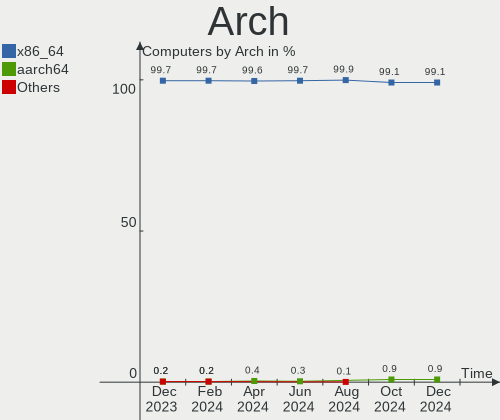

Fedora - Hardware Trends
------------------------

A project to identify most popular hardware characteristics and track their change
over time based on data collected by Linux users at https://Linux-Hardware.org.

Anyone can contribute to this report by the [hw-probe](https://github.com/linuxhw/hw-probe) tool:

    sudo -E hw-probe -all -upload

This is a report for all computer types. See also reports for [desktops](/Dist/Fedora/Desktop/README.md) and [notebooks](/Dist/Fedora/Notebook/README.md).

This report is for one last month. Overall report since the beginning of time: [TestDays](https://github.com/linuxhw/TestDays)

Period: Jan, 2024.

Contents
--------

* [ System ](#system)
  - [ OS                       ](#os)
  - [ OS Family                ](#os-family)
  - [ Kernel                   ](#kernel)
  - [ Kernel Family            ](#kernel-family)
  - [ Kernel Major Ver.        ](#kernel-major-ver)
  - [ Arch                     ](#arch)
  - [ DE                       ](#de)
  - [ Display Server           ](#display-server)
  - [ Display Manager          ](#display-manager)
  - [ OS Lang                  ](#os-lang)
  - [ Boot Mode                ](#boot-mode)
  - [ Filesystem               ](#filesystem)
  - [ Part. scheme             ](#part-scheme)
  - [ Dual Boot with Linux/BSD ](#dual-boot-with-linuxbsd)
  - [ Dual Boot (Win)          ](#dual-boot-win)

* [ Board ](#board)
  - [ Vendor                   ](#vendor)
  - [ Model                    ](#model)
  - [ Model Family             ](#model-family)
  - [ MFG Year                 ](#mfg-year)
  - [ Form Factor              ](#form-factor)
  - [ Secure Boot              ](#secure-boot)
  - [ Coreboot                 ](#coreboot)
  - [ RAM Size                 ](#ram-size)
  - [ RAM Used                 ](#ram-used)
  - [ Total Drives             ](#total-drives)
  - [ Has CD-ROM               ](#has-cd-rom)
  - [ Has Ethernet             ](#has-ethernet)
  - [ Has WiFi                 ](#has-wifi)
  - [ Has Bluetooth            ](#has-bluetooth)

* [ Location ](#location)
  - [ Country                  ](#country)
  - [ City                     ](#city)

* [ Drives ](#drives)
  - [ Drive Vendor             ](#drive-vendor)
  - [ Drive Model              ](#drive-model)
  - [ HDD Vendor               ](#hdd-vendor)
  - [ SSD Vendor               ](#ssd-vendor)
  - [ Drive Kind               ](#drive-kind)
  - [ Drive Connector          ](#drive-connector)
  - [ Drive Size               ](#drive-size)
  - [ Space Total              ](#space-total)
  - [ Space Used               ](#space-used)
  - [ Malfunc. Drives          ](#malfunc-drives)
  - [ Malfunc. Drive Vendor    ](#malfunc-drive-vendor)
  - [ Malfunc. HDD Vendor      ](#malfunc-hdd-vendor)
  - [ Malfunc. Drive Kind      ](#malfunc-drive-kind)
  - [ Failed Drives            ](#failed-drives)
  - [ Failed Drive Vendor      ](#failed-drive-vendor)
  - [ Drive Status             ](#drive-status)

* [ Storage controller ](#storage-controller)
  - [ Storage Vendor           ](#storage-vendor)
  - [ Storage Model            ](#storage-model)
  - [ Storage Kind             ](#storage-kind)

* [ Processor ](#processor)
  - [ CPU Vendor               ](#cpu-vendor)
  - [ CPU Model                ](#cpu-model)
  - [ CPU Model Family         ](#cpu-model-family)
  - [ CPU Cores                ](#cpu-cores)
  - [ CPU Sockets              ](#cpu-sockets)
  - [ CPU Threads              ](#cpu-threads)
  - [ CPU Op-Modes             ](#cpu-op-modes)
  - [ CPU Microcode            ](#cpu-microcode)
  - [ CPU Microarch            ](#cpu-microarch)

* [ Graphics ](#graphics)
  - [ GPU Vendor               ](#gpu-vendor)
  - [ GPU Model                ](#gpu-model)
  - [ GPU Combo                ](#gpu-combo)
  - [ GPU Driver               ](#gpu-driver)
  - [ GPU Memory               ](#gpu-memory)

* [ Monitor ](#monitor)
  - [ Monitor Vendor           ](#monitor-vendor)
  - [ Monitor Model            ](#monitor-model)
  - [ Monitor Resolution       ](#monitor-resolution)
  - [ Monitor Diagonal         ](#monitor-diagonal)
  - [ Monitor Width            ](#monitor-width)
  - [ Aspect Ratio             ](#aspect-ratio)
  - [ Monitor Area             ](#monitor-area)
  - [ Pixel Density            ](#pixel-density)
  - [ Multiple Monitors        ](#multiple-monitors)

* [ Network ](#network)
  - [ Net Controller Vendor    ](#net-controller-vendor)
  - [ Net Controller Model     ](#net-controller-model)
  - [ Wireless Vendor          ](#wireless-vendor)
  - [ Wireless Model           ](#wireless-model)
  - [ Ethernet Vendor          ](#ethernet-vendor)
  - [ Ethernet Model           ](#ethernet-model)
  - [ Net Controller Kind      ](#net-controller-kind)
  - [ Used Controller          ](#used-controller)
  - [ NICs                     ](#nics)
  - [ IPv6                     ](#ipv6)

* [ Bluetooth ](#bluetooth)
  - [ Bluetooth Vendor         ](#bluetooth-vendor)
  - [ Bluetooth Model          ](#bluetooth-model)

* [ Sound ](#sound)
  - [ Sound Vendor             ](#sound-vendor)
  - [ Sound Model              ](#sound-model)

* [ Memory ](#memory)
  - [ Memory Vendor            ](#memory-vendor)
  - [ Memory Model             ](#memory-model)
  - [ Memory Kind              ](#memory-kind)
  - [ Memory Form Factor       ](#memory-form-factor)
  - [ Memory Size              ](#memory-size)
  - [ Memory Speed             ](#memory-speed)

* [ Printers & scanners ](#printers--scanners)
  - [ Printer Vendor           ](#printer-vendor)
  - [ Printer Model            ](#printer-model)
  - [ Scanner Vendor           ](#scanner-vendor)
  - [ Scanner Model            ](#scanner-model)

* [ Camera ](#camera)
  - [ Camera Vendor            ](#camera-vendor)
  - [ Camera Model             ](#camera-model)

* [ Security ](#security)
  - [ Fingerprint Vendor       ](#fingerprint-vendor)
  - [ Fingerprint Model        ](#fingerprint-model)
  - [ Chipcard Vendor          ](#chipcard-vendor)
  - [ Chipcard Model           ](#chipcard-model)

* [ Unsupported ](#unsupported)
  - [ Unsupported Devices      ](#unsupported-devices)
  - [ Unsupported Device Types ](#unsupported-device-types)

System
------

OS
--

Installed operating systems

| Name      | Computers | Percent |
|-----------|-----------|---------|
| Fedora 39 | 597       | 92.27%  |
| Fedora 38 | 36        | 5.56%   |
| Fedora 37 | 4         | 0.62%   |
| Fedora 40 | 3         | 0.46%   |
| Fedora 35 | 3         | 0.46%   |
| Fedora 36 | 2         | 0.31%   |
| Fedora 34 | 1         | 0.15%   |
| Fedora 32 | 1         | 0.15%   |

OS Family
---------

OS without a version

| Name   | Computers | Percent |
|--------|-----------|---------|
| Fedora | 647       | 100%    |

Kernel
------

Version of the Linux kernel

| Version                                                 | Computers | Percent |
|---------------------------------------------------------|-----------|---------|
| 6.6.9-200.fc39.x86_64                                   | 201       | 31.07%  |
| 6.6.11-200.fc39.x86_64                                  | 95        | 14.68%  |
| 6.6.8-200.fc39.x86_64                                   | 80        | 12.36%  |
| 6.6.13-200.fc39.x86_64                                  | 78        | 12.06%  |
| 6.5.6-300.fc39.x86_64                                   | 54        | 8.35%   |
| 6.6.12-200.fc39.x86_64                                  | 40        | 6.18%   |
| 6.6.9-100.fc38.x86_64                                   | 9         | 1.39%   |
| 6.6.8-100.fc38.x86_64                                   | 9         | 1.39%   |
| 6.6.11-100.fc38.x86_64                                  | 6         | 0.93%   |
| 6.6.7-200.fc39.x86_64                                   | 5         | 0.77%   |
| 6.6.12-201.fsync.fc39.x86_64                            | 5         | 0.77%   |
| 6.6.10-200.fc39.x86_64                                  | 4         | 0.62%   |
| 6.2.9-300.fc38.x86_64                                   | 4         | 0.62%   |
| 6.6.14-200.fc39.x86_64                                  | 3         | 0.46%   |
| 6.5.11-300.fc39.x86_64                                  | 3         | 0.46%   |
| 6.0.12-100.fc35.x86_64                                  | 3         | 0.46%   |
| 6.8.0-0.rc0.20240112git70d201a40823.5.fc40.x86_64       | 2         | 0.31%   |
| 6.7.1-0.rc1.250.vanilla.fc39.x86_64                     | 2         | 0.31%   |
| 6.7.0-cb1.0.fc39.x86_64                                 | 2         | 0.31%   |
| 6.7.0-367.vanilla.fc39.x86_64                           | 2         | 0.31%   |
| 6.6.8-200.t2.fc39.x86_64                                | 2         | 0.31%   |
| 6.6.7-666.rog.fc39.x86_64                               | 2         | 0.31%   |
| 6.6.7-100.fc38.x86_64                                   | 2         | 0.31%   |
| 6.6.6-200.fc39.x86_64                                   | 2         | 0.31%   |
| 6.6.3-200.fc39.x86_64                                   | 2         | 0.31%   |
| 6.6.12-100.fc38.x86_64                                  | 2         | 0.31%   |
| 6.5.12-100.fc37.x86_64                                  | 2         | 0.31%   |
| 6.2.15-100.fc36.x86_64                                  | 2         | 0.31%   |
| 6.7.2-250.vanilla.fc39.x86_64                           | 1         | 0.15%   |
| 6.7.2-200.fc39.x86_64                                   | 1         | 0.15%   |
| 6.7.1-200.fc39.x86_64                                   | 1         | 0.15%   |
| 6.7.1-200.1.ipu6.fc39.x86_64                            | 1         | 0.15%   |
| 6.7.0-rc4-b11-773688a6cb24b0b3c2ba40354d883348a2befa38+ | 1         | 0.15%   |
| 6.7.0-68.es83xx.fc40.x86_64                             | 1         | 0.15%   |
| 6.6.4-200.fc39.x86_64                                   | 1         | 0.15%   |
| 6.6.4-100.fc38.x86_64                                   | 1         | 0.15%   |
| 6.6.2-201.fc39.x86_64                                   | 1         | 0.15%   |
| 6.6.13-201.fsync.fc39.x86_64                            | 1         | 0.15%   |
| 6.6.13-100.fc38.x86_64                                  | 1         | 0.15%   |
| 6.6.11-1.surface.fc39.x86_64                            | 1         | 0.15%   |

Kernel Family
-------------

Linux kernel without a distro release

| Version | Computers | Percent |
|---------|-----------|---------|
| 6.6.9   | 210       | 32.46%  |
| 6.6.11  | 102       | 15.77%  |
| 6.6.8   | 91        | 14.06%  |
| 6.6.13  | 80        | 12.36%  |
| 6.5.6   | 54        | 8.35%   |
| 6.6.12  | 47        | 7.26%   |
| 6.6.7   | 9         | 1.39%   |
| 6.7.0   | 6         | 0.93%   |
| 6.6.10  | 5         | 0.77%   |
| 6.2.9   | 5         | 0.77%   |
| 6.7.1   | 4         | 0.62%   |
| 6.5.12  | 4         | 0.62%   |
| 6.6.14  | 3         | 0.46%   |
| 6.5.11  | 3         | 0.46%   |
| 6.2.15  | 3         | 0.46%   |
| 6.0.12  | 3         | 0.46%   |
| 6.8.0   | 2         | 0.31%   |
| 6.7.2   | 2         | 0.31%   |
| 6.6.6   | 2         | 0.31%   |
| 6.6.4   | 2         | 0.31%   |
| 6.6.3   | 2         | 0.31%   |
| 6.6.2   | 1         | 0.15%   |
| 6.5.8   | 1         | 0.15%   |
| 6.4.6   | 1         | 0.15%   |
| 6.4.15  | 1         | 0.15%   |
| 6.3.11  | 1         | 0.15%   |
| 6.0.7   | 1         | 0.15%   |
| 5.6.6   | 1         | 0.15%   |
| 5.17.12 | 1         | 0.15%   |

Kernel Major Ver.
-----------------

Linux kernel major version

| Version | Computers | Percent |
|---------|-----------|---------|
| 6.6     | 554       | 85.63%  |
| 6.5     | 62        | 9.58%   |
| 6.7     | 12        | 1.85%   |
| 6.2     | 8         | 1.24%   |
| 6.0     | 4         | 0.62%   |
| 6.8     | 2         | 0.31%   |
| 6.4     | 2         | 0.31%   |
| 6.3     | 1         | 0.15%   |
| 5.6     | 1         | 0.15%   |
| 5.17    | 1         | 0.15%   |

Arch
----

OS architecture (x86_64, i586, etc.)

| Name   | Computers | Percent |
|--------|-----------|---------|
| x86_64 | 647       | 100%    |

DE
--

Desktop Environment

| Name           | Computers | Percent |
|----------------|-----------|---------|
| GNOME          | 476       | 73.57%  |
| KDE5           | 105       | 16.23%  |
| Cinnamon       | 14        | 2.16%   |
| XFCE           | 12        | 1.85%   |
| X-Cinnamon     | 9         | 1.39%   |
| Unknown        | 8         | 1.24%   |
| sway           | 5         | 0.77%   |
| Budgie         | 5         | 0.77%   |
| GNOME Classic  | 3         | 0.46%   |
| MATE           | 2         | 0.31%   |
| LXQt           | 2         | 0.31%   |
| WindowMaker    | 1         | 0.15%   |
| LXDE           | 1         | 0.15%   |
| i3-with-shmlog | 1         | 0.15%   |
| i3             | 1         | 0.15%   |
| Deepin         | 1         | 0.15%   |
| bspwm          | 1         | 0.15%   |

Display Server
--------------

X11 or Wayland

| Name    | Computers | Percent |
|---------|-----------|---------|
| Wayland | 504       | 77.9%   |
| X11     | 116       | 17.93%  |
| Tty     | 21        | 3.25%   |
| Unknown | 5         | 0.77%   |
| Web     | 1         | 0.15%   |

Display Manager
---------------

SDDM, LightDM, etc.

| Name    | Computers | Percent |
|---------|-----------|---------|
| Unknown | 418       | 64.61%  |
| GDM     | 141       | 21.79%  |
| SDDM    | 49        | 7.57%   |
| LightDM | 38        | 5.87%   |
| LXDM    | 1         | 0.15%   |

OS Lang
-------

Language

| Lang    | Computers | Percent |
|---------|-----------|---------|
| en_US   | 316       | 48.84%  |
| en_GB   | 50        | 7.73%   |
| ru_RU   | 41        | 6.34%   |
| de_DE   | 39        | 6.03%   |
| pt_BR   | 23        | 3.55%   |
| en_AU   | 22        | 3.4%    |
| fr_FR   | 20        | 3.09%   |
| it_IT   | 18        | 2.78%   |
| es_ES   | 10        | 1.55%   |
| en_CA   | 10        | 1.55%   |
| pl_PL   | 7         | 1.08%   |
| es_MX   | 7         | 1.08%   |
| en_IN   | 7         | 1.08%   |
| zh_CN   | 6         | 0.93%   |
| tr_TR   | 5         | 0.77%   |
| en_ZA   | 4         | 0.62%   |
| de_CH   | 4         | 0.62%   |
| de_AT   | 4         | 0.62%   |
| cs_CZ   | 4         | 0.62%   |
| es_CO   | 3         | 0.46%   |
| da_DK   | 3         | 0.46%   |
| Unknown | 3         | 0.46%   |
| ru_UA   | 2         | 0.31%   |
| ro_RO   | 2         | 0.31%   |
| pt_PT   | 2         | 0.31%   |
| nb_NO   | 2         | 0.31%   |
| hu_HU   | 2         | 0.31%   |
| fr_CA   | 2         | 0.31%   |
| es_SV   | 2         | 0.31%   |
| es_CL   | 2         | 0.31%   |
| es_AR   | 2         | 0.31%   |
| en_PH   | 2         | 0.31%   |
| en_NZ   | 2         | 0.31%   |
| en_IL   | 2         | 0.31%   |
| el_GR   | 2         | 0.31%   |
| zh_HK   | 1         | 0.15%   |
| sv_SE   | 1         | 0.15%   |
| sk_SK   | 1         | 0.15%   |
| nl_NL   | 1         | 0.15%   |
| lt_LT   | 1         | 0.15%   |

Boot Mode
---------

EFI or BIOS

| Mode | Computers | Percent |
|------|-----------|---------|
| EFI  | 510       | 78.83%  |
| BIOS | 137       | 21.17%  |

Filesystem
----------

Type of filesystem

| Type  | Computers | Percent |
|-------|-----------|---------|
| Btrfs | 546       | 84.39%  |
| Ext4  | 84        | 12.98%  |
| Xfs   | 16        | 2.47%   |
| Tmpfs | 1         | 0.15%   |

Part. scheme
------------

Scheme of partitioning

| Type    | Computers | Percent |
|---------|-----------|---------|
| Unknown | 409       | 63.21%  |
| GPT     | 217       | 33.54%  |
| MBR     | 21        | 3.25%   |

Dual Boot with Linux/BSD
------------------------

Hosting more than one Linux/BSD

| Dual boot | Computers | Percent |
|-----------|-----------|---------|
| No        | 605       | 93.51%  |
| Yes       | 42        | 6.49%   |

Dual Boot (Win)
---------------

Hosting Linux and Windows

| Dual boot | Computers | Percent |
|-----------|-----------|---------|
| No        | 540       | 83.46%  |
| Yes       | 107       | 16.54%  |

Board
-----

Vendor
------

Motherboard manufacturer

| Name                                 | Computers | Percent |
|--------------------------------------|-----------|---------|
| ASUSTek Computer                     | 123       | 19.01%  |
| Lenovo                               | 121       | 18.7%   |
| Hewlett-Packard                      | 73        | 11.28%  |
| Dell                                 | 73        | 11.28%  |
| MSI                                  | 54        | 8.35%   |
| Gigabyte Technology                  | 34        | 5.26%   |
| Apple                                | 32        | 4.95%   |
| Acer                                 | 26        | 4.02%   |
| ASRock                               | 19        | 2.94%   |
| HUAWEI                               | 9         | 1.39%   |
| Samsung Electronics                  | 7         | 1.08%   |
| Intel                                | 7         | 1.08%   |
| Fujitsu                              | 6         | 0.93%   |
| Unknown                              | 6         | 0.93%   |
| Toshiba                              | 4         | 0.62%   |
| LG Electronics                       | 3         | 0.46%   |
| Google                               | 3         | 0.46%   |
| Sony                                 | 2         | 0.31%   |
| Shenzhen Meigao Electronic Equipment | 2         | 0.31%   |
| Notebook                             | 2         | 0.31%   |
| Microsoft                            | 2         | 0.31%   |
| GPD                                  | 2         | 0.31%   |
| Framework                            | 2         | 0.31%   |
| Foxconn                              | 2         | 0.31%   |
| AZW                                  | 2         | 0.31%   |
| TUXEDO                               | 1         | 0.15%   |
| Timi                                 | 1         | 0.15%   |
| SPA CONDOR                           | 1         | 0.15%   |
| RCA                                  | 1         | 0.15%   |
| Razer                                | 1         | 0.15%   |
| Quanta                               | 1         | 0.15%   |
| Positivo Bahia - VAIO                | 1         | 0.15%   |
| Pegatron                             | 1         | 0.15%   |
| Panasonic                            | 1         | 0.15%   |
| OEM                                  | 1         | 0.15%   |
| Nuvision                             | 1         | 0.15%   |
| mPTech                               | 1         | 0.15%   |
| MECHREVO                             | 1         | 0.15%   |
| MACHENIKE                            | 1         | 0.15%   |
| Infinix                              | 1         | 0.15%   |

Model
-----

Motherboard model

| Name                            | Computers | Percent |
|---------------------------------|-----------|---------|
| Unknown                         | 9         | 1.39%   |
| ASUS All Series                 | 8         | 1.24%   |
| ASUS Zenbook UM3402YAR_UM3402YA | 3         | 0.46%   |
| Apple MacBookPro14,1            | 3         | 0.46%   |
| Apple MacBookPro10,1            | 3         | 0.46%   |
| Apple MacBookAir7,2             | 3         | 0.46%   |
| MSI MS-7D46                     | 2         | 0.31%   |
| MSI MS-7C95                     | 2         | 0.31%   |
| MSI MS-7C37                     | 2         | 0.31%   |
| MSI MS-7885                     | 2         | 0.31%   |
| MSI MS-7817                     | 2         | 0.31%   |
| Lenovo Yoga 7 14ARB7 82QF       | 2         | 0.31%   |
| Lenovo ThinkPad X220 42911H8    | 2         | 0.31%   |
| HUAWEI WRT-WX9                  | 2         | 0.31%   |
| HUAWEI MRGFG-XX                 | 2         | 0.31%   |
| HUAWEI BOM-WXX9                 | 2         | 0.31%   |
| HP Notebook                     | 2         | 0.31%   |
| HP Laptop 14-cf2xxx             | 2         | 0.31%   |
| Gigabyte J1900M-D2P             | 2         | 0.31%   |
| Gigabyte B550I AORUS PRO AX     | 2         | 0.31%   |
| Foxconn Pro3500 Series          | 2         | 0.31%   |
| Dell OptiPlex 9020              | 2         | 0.31%   |
| Dell Latitude 5310              | 2         | 0.31%   |
| Dell Latitude 5290 2-in-1       | 2         | 0.31%   |
| Dell Inspiron 15 3520           | 2         | 0.31%   |
| ASUS TUF Gaming X570-PLUS       | 2         | 0.31%   |
| ASUS TUF Gaming B550-PLUS       | 2         | 0.31%   |
| ASUS ROG STRIX B550-F GAMING    | 2         | 0.31%   |
| ASUS PRIME Z690M-PLUS D4        | 2         | 0.31%   |
| ASUS PRIME B550-PLUS            | 2         | 0.31%   |
| ASUS PRIME B450M-A II           | 2         | 0.31%   |
| ASRock X670E Pro RS             | 2         | 0.31%   |
| ASRock X570 Phantom Gaming 4    | 2         | 0.31%   |
| Apple MacBookPro9,2             | 2         | 0.31%   |
| Apple MacBookAir6,2             | 2         | 0.31%   |
| Acer Predator PH315-53          | 2         | 0.31%   |
| Acer Predator PH16-71           | 2         | 0.31%   |
| Acer Aspire A315-24P            | 2         | 0.31%   |
| TUXEDO Pulse 14 Gen3            | 1         | 0.15%   |
| Toshiba Satellite C855-2J5      | 1         | 0.15%   |

Model Family
------------

Motherboard model prefix

| Name               | Computers | Percent |
|--------------------|-----------|---------|
| Lenovo ThinkPad    | 60        | 9.27%   |
| Dell Latitude      | 24        | 3.71%   |
| Dell Inspiron      | 23        | 3.55%   |
| ASUS PRIME         | 22        | 3.4%    |
| ASUS VivoBook      | 19        | 2.94%   |
| Lenovo IdeaPad     | 18        | 2.78%   |
| ASUS ROG           | 18        | 2.78%   |
| Acer Aspire        | 15        | 2.32%   |
| HP Laptop          | 12        | 1.85%   |
| HP EliteBook       | 12        | 1.85%   |
| ASUS TUF           | 11        | 1.7%    |
| Lenovo Yoga        | 10        | 1.55%   |
| HP ENVY            | 10        | 1.55%   |
| Dell Precision     | 9         | 1.39%   |
| ASUS ZenBook       | 9         | 1.39%   |
| Unknown            | 9         | 1.39%   |
| ASUS All           | 8         | 1.24%   |
| HP Pavilion        | 7         | 1.08%   |
| Dell XPS           | 7         | 1.08%   |
| Lenovo ThinkCentre | 6         | 0.93%   |
| Dell OptiPlex      | 6         | 0.93%   |
| ASUS ASUS          | 6         | 0.93%   |
| HP ProBook         | 5         | 0.77%   |
| Toshiba Satellite  | 4         | 0.62%   |
| Lenovo Legion      | 4         | 0.62%   |
| HP Spectre         | 4         | 0.62%   |
| Apple MacBookPro14 | 4         | 0.62%   |
| Acer Swift         | 4         | 0.62%   |
| Acer Predator      | 4         | 0.62%   |
| MSI Modern         | 3         | 0.46%   |
| HP EliteDesk       | 3         | 0.46%   |
| Gigabyte B650      | 3         | 0.46%   |
| Gigabyte B550      | 3         | 0.46%   |
| Fujitsu LIFEBOOK   | 3         | 0.46%   |
| ASRock B550        | 3         | 0.46%   |
| Apple MacBookPro11 | 3         | 0.46%   |
| Apple MacBookPro10 | 3         | 0.46%   |
| Apple MacBookAir7  | 3         | 0.46%   |
| MSI MS-7D46        | 2         | 0.31%   |
| MSI MS-7C95        | 2         | 0.31%   |

MFG Year
--------

Motherboard manufacture year

| Year | Computers | Percent |
|------|-----------|---------|
| 2022 | 92        | 14.22%  |
| 2020 | 76        | 11.75%  |
| 2021 | 70        | 10.82%  |
| 2023 | 69        | 10.66%  |
| 2019 | 53        | 8.19%   |
| 2018 | 53        | 8.19%   |
| 2017 | 37        | 5.72%   |
| 2012 | 34        | 5.26%   |
| 2013 | 30        | 4.64%   |
| 2014 | 26        | 4.02%   |
| 2016 | 22        | 3.4%    |
| 2011 | 21        | 3.25%   |
| 2015 | 19        | 2.94%   |
| 2009 | 14        | 2.16%   |
| 2010 | 13        | 2.01%   |
| 2008 | 8         | 1.24%   |
| 2007 | 6         | 0.93%   |
| 2006 | 2         | 0.31%   |
| 2024 | 1         | 0.15%   |
| 2005 | 1         | 0.15%   |

Form Factor
-----------

Physical design of the computer

| Name        | Computers | Percent |
|-------------|-----------|---------|
| Notebook    | 363       | 56.11%  |
| Desktop     | 203       | 31.38%  |
| Convertible | 41        | 6.34%   |
| Mini pc     | 20        | 3.09%   |
| All in one  | 12        | 1.85%   |
| Tablet      | 6         | 0.93%   |
| Server      | 2         | 0.31%   |

Secure Boot
-----------

Enabled or disabled

| State    | Computers | Percent |
|----------|-----------|---------|
| Disabled | 516       | 79.75%  |
| Enabled  | 131       | 20.25%  |

Coreboot
--------

Have coreboot on board

| Used | Computers | Percent |
|------|-----------|---------|
| No   | 644       | 99.54%  |
| Yes  | 3         | 0.46%   |

RAM Size
--------

Total RAM memory

| Size in GB  | Computers | Percent |
|-------------|-----------|---------|
| 16.01-24.0  | 152       | 23.49%  |
| 4.01-8.0    | 143       | 22.1%   |
| 32.01-64.0  | 118       | 18.24%  |
| 8.01-16.0   | 112       | 17.31%  |
| 3.01-4.0    | 47        | 7.26%   |
| 64.01-256.0 | 37        | 5.72%   |
| 24.01-32.0  | 31        | 4.79%   |
| 1.01-2.0    | 4         | 0.62%   |
| 2.01-3.0    | 3         | 0.46%   |

RAM Used
--------

Used RAM memory

| Used GB    | Computers | Percent |
|------------|-----------|---------|
| 4.01-8.0   | 222       | 34.31%  |
| 3.01-4.0   | 146       | 22.57%  |
| 2.01-3.0   | 146       | 22.57%  |
| 1.01-2.0   | 69        | 10.66%  |
| 8.01-16.0  | 41        | 6.34%   |
| 0.51-1.0   | 12        | 1.85%   |
| 16.01-24.0 | 9         | 1.39%   |
| 32.01-64.0 | 1         | 0.15%   |
| 24.01-32.0 | 1         | 0.15%   |

Total Drives
------------

Number of drives on board

| Drives | Computers | Percent |
|--------|-----------|---------|
| 1      | 401       | 61.98%  |
| 2      | 146       | 22.57%  |
| 3      | 51        | 7.88%   |
| 4      | 22        | 3.4%    |
| 5      | 20        | 3.09%   |
| 7      | 2         | 0.31%   |
| 6      | 2         | 0.31%   |
| 11     | 1         | 0.15%   |
| 8      | 1         | 0.15%   |
| 0      | 1         | 0.15%   |

Has CD-ROM
----------

Has CD-ROM on board

| Presented | Computers | Percent |
|-----------|-----------|---------|
| No        | 529       | 81.76%  |
| Yes       | 118       | 18.24%  |

Has Ethernet
------------

Has Ethernet on board

| Presented | Computers | Percent |
|-----------|-----------|---------|
| Yes       | 487       | 75.27%  |
| No        | 160       | 24.73%  |

Has WiFi
--------

Has WiFi module

| Presented | Computers | Percent |
|-----------|-----------|---------|
| Yes       | 554       | 85.63%  |
| No        | 93        | 14.37%  |

Has Bluetooth
-------------

Has Bluetooth module

| Presented | Computers | Percent |
|-----------|-----------|---------|
| Yes       | 494       | 76.35%  |
| No        | 153       | 23.65%  |

Location
--------

Country
-------

Geographic location (country)

| Country      | Computers | Percent |
|--------------|-----------|---------|
| USA          | 128       | 19.78%  |
| Germany      | 65        | 10.05%  |
| Russia       | 45        | 6.96%   |
| Italy        | 32        | 4.95%   |
| Brazil       | 29        | 4.48%   |
| France       | 26        | 4.02%   |
| Australia    | 25        | 3.86%   |
| UK           | 21        | 3.25%   |
| Spain        | 20        | 3.09%   |
| India        | 19        | 2.94%   |
| Canada       | 18        | 2.78%   |
| Switzerland  | 16        | 2.47%   |
| Poland       | 16        | 2.47%   |
| Netherlands  | 13        | 2.01%   |
| Mexico       | 10        | 1.55%   |
| Czechia      | 10        | 1.55%   |
| Turkey       | 9         | 1.39%   |
| Romania      | 8         | 1.24%   |
| Colombia     | 7         | 1.08%   |
| Austria      | 7         | 1.08%   |
| South Africa | 6         | 0.93%   |
| Portugal     | 6         | 0.93%   |
| Argentina    | 6         | 0.93%   |
| Philippines  | 5         | 0.77%   |
| Indonesia    | 5         | 0.77%   |
| Belarus      | 5         | 0.77%   |
| Norway       | 4         | 0.62%   |
| El Salvador  | 4         | 0.62%   |
| Denmark      | 4         | 0.62%   |
| China        | 4         | 0.62%   |
| Sweden       | 3         | 0.46%   |
| Puerto Rico  | 3         | 0.46%   |
| New Zealand  | 3         | 0.46%   |
| Japan        | 3         | 0.46%   |
| Chile        | 3         | 0.46%   |
| Bulgaria     | 3         | 0.46%   |
| Belgium      | 3         | 0.46%   |
| Vietnam      | 2         | 0.31%   |
| Uzbekistan   | 2         | 0.31%   |
| Taiwan       | 2         | 0.31%   |

City
----

Geographic location (city)

| City                   | Computers | Percent |
|------------------------|-----------|---------|
| Sydney                 | 15        | 2.32%   |
| Moscow                 | 13        | 2.01%   |
| Stuttgart              | 7         | 1.08%   |
| Berlin                 | 7         | 1.08%   |
| St Petersburg          | 6         | 0.93%   |
| Zurich                 | 5         | 0.77%   |
| Denver                 | 5         | 0.77%   |
| Toronto                | 4         | 0.62%   |
| San Salvador           | 4         | 0.62%   |
| Paris                  | 4         | 0.62%   |
| Minsk                  | 4         | 0.62%   |
| Hamburg                | 4         | 0.62%   |
| Bengaluru              | 4         | 0.62%   |
| Barcelona              | 4         | 0.62%   |
| Vienna                 | 3         | 0.46%   |
| Seattle                | 3         | 0.46%   |
| Santiago               | 3         | 0.46%   |
| Rome                   | 3         | 0.46%   |
| Quezon City            | 3         | 0.46%   |
| Prague                 | 3         | 0.46%   |
| Philadelphia           | 3         | 0.46%   |
| Novosibirsk            | 3         | 0.46%   |
| Munich                 | 3         | 0.46%   |
| London                 | 3         | 0.46%   |
| Istanbul               | 3         | 0.46%   |
| Chennai                | 3         | 0.46%   |
| Boston                 | 3         | 0.46%   |
| Adelaide               | 3         | 0.46%   |
| Wilmington             | 2         | 0.31%   |
| Warsaw                 | 2         | 0.31%   |
| The Hague              | 2         | 0.31%   |
| The Dalles             | 2         | 0.31%   |
| Tepatitlán de Morelos | 2         | 0.31%   |
| Tashkent               | 2         | 0.31%   |
| Syracuse               | 2         | 0.31%   |
| Sofia                  | 2         | 0.31%   |
| Şişli                | 2         | 0.31%   |
| Singapore              | 2         | 0.31%   |
| San Vittore Olona      | 2         | 0.31%   |
| San Jose               | 2         | 0.31%   |

Drives
------

Drive Vendor
------------

Hard drive vendors

| Vendor                       | Computers | Drives | Percent |
|------------------------------|-----------|--------|---------|
| Samsung Electronics          | 187       | 242    | 20%     |
| WDC                          | 91        | 114    | 9.73%   |
| SanDisk                      | 80        | 90     | 8.56%   |
| Seagate                      | 74        | 93     | 7.91%   |
| Kingston                     | 48        | 52     | 5.13%   |
| SK hynix                     | 40        | 42     | 4.28%   |
| Unknown                      | 36        | 41     | 3.85%   |
| Intel                        | 36        | 40     | 3.85%   |
| Toshiba                      | 31        | 33     | 3.32%   |
| Micron Technology            | 27        | 27     | 2.89%   |
| Phison Electronics           | 26        | 27     | 2.78%   |
| Crucial                      | 25        | 25     | 2.67%   |
| Micron/Crucial Technology    | 23        | 27     | 2.46%   |
| KIOXIA                       | 19        | 20     | 2.03%   |
| Apple                        | 19        | 22     | 2.03%   |
| Kingston Technology Company  | 12        | 12     | 1.28%   |
| MAXIO Technology (Hangzhou)  | 11        | 11     | 1.18%   |
| Hitachi                      | 11        | 14     | 1.18%   |
| A-DATA Technology            | 10        | 10     | 1.07%   |
| Silicon Motion               | 8         | 8      | 0.86%   |
| ADATA Technology             | 8         | 8      | 0.86%   |
| PNY                          | 7         | 9      | 0.75%   |
| HGST                         | 7         | 8      | 0.75%   |
| LITEON                       | 6         | 6      | 0.64%   |
| China                        | 6         | 6      | 0.64%   |
| Netac                        | 4         | 4      | 0.43%   |
| Union Memory                 | 3         | 3      | 0.32%   |
| Team                         | 3         | 4      | 0.32%   |
| SPCC                         | 3         | 3      | 0.32%   |
| LITEONIT                     | 3         | 3      | 0.32%   |
| Apacer                       | 3         | 3      | 0.32%   |
| Unknown                      | 3         | 3      | 0.32%   |
| Transcend                    | 2         | 2      | 0.21%   |
| Shenzhen Longsys Electronics | 2         | 2      | 0.21%   |
| Phison                       | 2         | 2      | 0.21%   |
| OCZ                          | 2         | 2      | 0.21%   |
| Maxtor                       | 2         | 2      | 0.21%   |
| Lexar                        | 2         | 2      | 0.21%   |
| JMicron Technology           | 2         | 2      | 0.21%   |
| Intenso                      | 2         | 2      | 0.21%   |

Drive Model
-----------

Hard drive models

| Model                                                 | Computers | Percent |
|-------------------------------------------------------|-----------|---------|
| Samsung NVMe SSD Controller SM981/PM981/PM983 1TB     | 46        | 4.46%   |
| Samsung NVMe SSD Controller PM9A1/PM9A3/980PRO 2TB    | 33        | 3.2%    |
| Micron/Crucial P2 NVMe PCIe SSD 1TB                   | 16        | 1.55%   |
| Samsung NVMe SSD Controller SM961/PM961/SM963 256GB   | 15        | 1.45%   |
| Samsung SSD 850 EVO 250GB                             | 12        | 1.16%   |
| Samsung SSD 860 EVO 500GB                             | 11        | 1.07%   |
| Samsung SSD 980 1TB                                   | 10        | 0.97%   |
| Unknown MMC Card  32GB                                | 9         | 0.87%   |
| Sandisk WD_BLACK SN770 1TB                            | 9         | 0.87%   |
| Sandisk WD Blue SN550 NVMe SSD 512GB                  | 9         | 0.87%   |
| MAXIO (Hangzhou) NVMe SSD Controller MAP1202 512GB    | 9         | 0.87%   |
| Unknown MMC Card  128GB                               | 8         | 0.78%   |
| Samsung SSD 870 EVO 1TB                               | 8         | 0.78%   |
| Kingston SA400S37480G 480GB SSD                       | 8         | 0.78%   |
| Sandisk WD_BLACK SN850X 1000GB                        | 7         | 0.68%   |
| Phison PS5013 E13 NVMe Controller 256GB               | 7         | 0.68%   |
| Phison E12 NVMe Controller 1TB                        | 7         | 0.68%   |
| Intel SSDPEKNU512GZ 512GB                             | 7         | 0.68%   |
| Intel SSD Pro 7600p/760p/E 6100p Series 1024GB        | 7         | 0.68%   |
| Silicon Motion SM2263EN/SM2263XT SSD Controller 128GB | 6         | 0.58%   |
| Seagate ST1000LM035-1RK172 1TB                        | 6         | 0.58%   |
| Samsung SSD 860 EVO 1TB                               | 6         | 0.58%   |
| Samsung SSD 850 EVO 500GB                             | 6         | 0.58%   |
| Phison E16 PCIe4 NVMe Controller 2TB                  | 6         | 0.58%   |
| Kingston SA400S37240G 240GB SSD                       | 6         | 0.58%   |
| Seagate ST500DM002-1BD142 500GB                       | 5         | 0.48%   |
| Sandisk WD Black SN750 / PC SN730 NVMe SSD 512GB      | 5         | 0.48%   |
| Kingston Company SNV2S1000G 1TB                       | 5         | 0.48%   |
| WDC WD10EZEX-08WN4A0 1TB                              | 4         | 0.39%   |
| Unknown MMC Card  64GB                                | 4         | 0.39%   |
| Toshiba DT01ACA100 1TB                                | 4         | 0.39%   |
| Toshiba BG3 NVMe SSD Controller 256GB                 | 4         | 0.39%   |
| Seagate ST2000DM008-2FR102 2TB                        | 4         | 0.39%   |
| Seagate ST2000DM006-2DM164 2TB                        | 4         | 0.39%   |
| Sandisk WD Black SN850 1024GB                         | 4         | 0.39%   |
| Sandisk WD Black 2018/SN750 / PC SN720 NVMe SSD 1TB   | 4         | 0.39%   |
| Samsung SSD 870 QVO 1TB                               | 4         | 0.39%   |
| Kingston SNV2S500G 500GB                              | 4         | 0.39%   |
| Kingston SA400S37960G 960GB SSD                       | 4         | 0.39%   |
| Intel SSD 660P Series 1024GB                          | 4         | 0.39%   |

HDD Vendor
----------

Hard disk drive vendors

| Vendor              | Computers | Drives | Percent |
|---------------------|-----------|--------|---------|
| WDC                 | 73        | 91     | 36.14%  |
| Seagate             | 70        | 88     | 34.65%  |
| Toshiba             | 22        | 24     | 10.89%  |
| Hitachi             | 11        | 14     | 5.45%   |
| Samsung Electronics | 8         | 11     | 3.96%   |
| HGST                | 7         | 8      | 3.47%   |
| Unknown             | 2         | 2      | 0.99%   |
| Maxtor              | 2         | 2      | 0.99%   |
| JMicron Technology  | 2         | 2      | 0.99%   |
| External            | 2         | 4      | 0.99%   |
| Apple               | 2         | 2      | 0.99%   |
| Asm                 | 1         | 1      | 0.5%    |

SSD Vendor
----------

Solid state drive vendors

| Vendor              | Computers | Drives | Percent |
|---------------------|-----------|--------|---------|
| Samsung Electronics | 73        | 85     | 25.26%  |
| Kingston            | 29        | 30     | 10.03%  |
| Crucial             | 25        | 25     | 8.65%   |
| WDC                 | 23        | 23     | 7.96%   |
| SanDisk             | 20        | 20     | 6.92%   |
| Apple               | 11        | 11     | 3.81%   |
| SK hynix            | 10        | 11     | 3.46%   |
| Intel               | 10        | 10     | 3.46%   |
| A-DATA Technology   | 9         | 9      | 3.11%   |
| PNY                 | 7         | 9      | 2.42%   |
| Micron Technology   | 7         | 7      | 2.42%   |
| LITEON              | 6         | 6      | 2.08%   |
| China               | 6         | 6      | 2.08%   |
| Team                | 3         | 4      | 1.04%   |
| SPCC                | 3         | 3      | 1.04%   |
| Netac               | 3         | 3      | 1.04%   |
| LITEONIT            | 3         | 3      | 1.04%   |
| Apacer              | 3         | 3      | 1.04%   |
| Transcend           | 2         | 2      | 0.69%   |
| OCZ                 | 2         | 2      | 0.69%   |
| Lexar               | 2         | 2      | 0.69%   |
| Intenso             | 2         | 2      | 0.69%   |
| GOODRAM             | 2         | 2      | 0.69%   |
| Gigabyte Technology | 2         | 2      | 0.69%   |
| VICK                | 1         | 1      | 0.35%   |
| Vaseky              | 1         | 1      | 0.35%   |
| V7                  | 1         | 1      | 0.35%   |
| Smartbuy            | 1         | 1      | 0.35%   |
| Seagate             | 1         | 1      | 0.35%   |
| SD                  | 1         | 1      | 0.35%   |
| Plextor             | 1         | 1      | 0.35%   |
| Patriot             | 1         | 1      | 0.35%   |
| MSI                 | 1         | 1      | 0.35%   |
| KLEVV               | 1         | 1      | 0.35%   |
| KingSpec            | 1         | 1      | 0.35%   |
| HS-SSD-E100         | 1         | 1      | 0.35%   |
| Hewlett-Packard     | 1         | 1      | 0.35%   |
| Fanxiang            | 1         | 1      | 0.35%   |
| Digma               | 1         | 1      | 0.35%   |
| DEXP                | 1         | 1      | 0.35%   |

Drive Kind
----------

HDD or SSD

| Kind    | Computers | Drives | Percent |
|---------|-----------|--------|---------|
| NVMe    | 391       | 475    | 45.41%  |
| SSD     | 256       | 306    | 29.73%  |
| HDD     | 171       | 249    | 19.86%  |
| MMC     | 25        | 27     | 2.9%    |
| Unknown | 18        | 21     | 2.09%   |

Drive Connector
---------------

SATA, SAS, NVMe, etc.

| Type | Computers | Drives | Percent |
|------|-----------|--------|---------|
| NVMe | 390       | 474    | 49.74%  |
| SATA | 337       | 537    | 42.98%  |
| SAS  | 32        | 40     | 4.08%   |
| MMC  | 25        | 27     | 3.19%   |

Drive Size
----------

Size of hard drive

| Size in TB | Computers | Drives | Percent |
|------------|-----------|--------|---------|
| 0.01-0.5   | 222       | 281    | 50.34%  |
| 0.51-1.0   | 143       | 177    | 32.43%  |
| 1.01-2.0   | 39        | 52     | 8.84%   |
| 3.01-4.0   | 20        | 23     | 4.54%   |
| 4.01-10.0  | 10        | 13     | 2.27%   |
| 2.01-3.0   | 5         | 6      | 1.13%   |
| 10.01-20.0 | 2         | 3      | 0.45%   |

Space Total
-----------

Amount of disk space available on the file system

| Size in GB     | Computers | Percent |
|----------------|-----------|---------|
| 501-1000       | 139       | 21.48%  |
| 1001-2000      | 122       | 18.86%  |
| 251-500        | 112       | 17.31%  |
| 101-250        | 81        | 12.52%  |
| Unknown        | 52        | 8.04%   |
| More than 3000 | 49        | 7.57%   |
| 1-20           | 40        | 6.18%   |
| 51-100         | 24        | 3.71%   |
| 2001-3000      | 22        | 3.4%    |
| 21-50          | 6         | 0.93%   |

Space Used
----------

Amount of used disk space

| Used GB        | Computers | Percent |
|----------------|-----------|---------|
| 1-20           | 164       | 25.35%  |
| 21-50          | 109       | 16.85%  |
| 101-250        | 89        | 13.76%  |
| 51-100         | 66        | 10.2%   |
| 251-500        | 62        | 9.58%   |
| Unknown        | 52        | 8.04%   |
| 501-1000       | 48        | 7.42%   |
| 1001-2000      | 28        | 4.33%   |
| More than 3000 | 18        | 2.78%   |
| 2001-3000      | 11        | 1.7%    |

Malfunc. Drives
---------------

Drive models with a malfunction

| Model                                          | Computers | Drives | Percent |
|------------------------------------------------|-----------|--------|---------|
| WDC WD40EFRX-68N32N0 4TB                       | 2         | 2      | 6.9%    |
| Intel SSDSC2CT120A3 120GB                      | 2         | 2      | 6.9%    |
| WDC WDS240G2G0B-00EPW0 240GB SSD               | 1         | 1      | 3.45%   |
| WDC WD6400AAKS-65A7B2 640GB                    | 1         | 1      | 3.45%   |
| WDC WD5000AVDS-63U7B1 500GB                    | 1         | 2      | 3.45%   |
| WDC WD5000AVCS-632DY1 500GB                    | 1         | 1      | 3.45%   |
| WDC WD5000AAKX-00ERMA0 500GB                   | 1         | 1      | 3.45%   |
| WDC WD3200AAKS-22B3A0 320GB                    | 1         | 1      | 3.45%   |
| WDC WD10JPVT-75A1YT0 1TB                       | 1         | 1      | 3.45%   |
| Toshiba MQ01ABF050 500GB                       | 1         | 1      | 3.45%   |
| Toshiba MQ01ABD050 500GB                       | 1         | 1      | 3.45%   |
| Toshiba MK5056GSYF 500GB                       | 1         | 1      | 3.45%   |
| Toshiba DT01ACA200 2TB                         | 1         | 2      | 3.45%   |
| SK hynix SHGS31-500GS-2 500GB SSD              | 1         | 1      | 3.45%   |
| Seagate ST9500325AS 500GB                      | 1         | 1      | 3.45%   |
| Seagate ST1000LX015-1U7172 1TB                 | 1         | 1      | 3.45%   |
| Seagate ST1000DX001-1NS162 1TB                 | 1         | 1      | 3.45%   |
| Samsung Electronics HD501LJ 500GB              | 1         | 2      | 3.45%   |
| Samsung Electronics HD103UJ 1TB                | 1         | 2      | 3.45%   |
| Micron/Crucial Technology P1 NVMe PCIe SSD 1TB | 1         | 1      | 3.45%   |
| Micron Technology M550_mSATA 512GB SSD         | 1         | 1      | 3.45%   |
| Maxtor 6Y080L0 82GB                            | 1         | 1      | 3.45%   |
| LITEONIT LAT-256M2S 256GB SSD                  | 1         | 1      | 3.45%   |
| Hitachi HUS724030ALE641 3TB                    | 1         | 1      | 3.45%   |
| Hitachi HDS721010CLA332 1TB                    | 1         | 1      | 3.45%   |
| Crucial CT120M500SSD1 120GB                    | 1         | 1      | 3.45%   |
| Apple SSD SM0256F 256GB                        | 1         | 1      | 3.45%   |

Malfunc. Drive Vendor
---------------------

Vendors of faulty drives

| Vendor                    | Computers | Drives | Percent |
|---------------------------|-----------|--------|---------|
| WDC                       | 8         | 10     | 28.57%  |
| Toshiba                   | 4         | 5      | 14.29%  |
| Seagate                   | 3         | 3      | 10.71%  |
| Samsung Electronics       | 2         | 4      | 7.14%   |
| Intel                     | 2         | 2      | 7.14%   |
| Hitachi                   | 2         | 2      | 7.14%   |
| SK hynix                  | 1         | 1      | 3.57%   |
| Micron/Crucial Technology | 1         | 1      | 3.57%   |
| Micron Technology         | 1         | 1      | 3.57%   |
| Maxtor                    | 1         | 1      | 3.57%   |
| LITEONIT                  | 1         | 1      | 3.57%   |
| Crucial                   | 1         | 1      | 3.57%   |
| Apple                     | 1         | 1      | 3.57%   |

Malfunc. HDD Vendor
-------------------

Vendors of faulty HDD drives

| Vendor              | Computers | Drives | Percent |
|---------------------|-----------|--------|---------|
| WDC                 | 8         | 9      | 40%     |
| Toshiba             | 4         | 5      | 20%     |
| Seagate             | 3         | 3      | 15%     |
| Samsung Electronics | 2         | 4      | 10%     |
| Hitachi             | 2         | 2      | 10%     |
| Maxtor              | 1         | 1      | 5%      |

Malfunc. Drive Kind
-------------------

Kinds of faulty drives

| Kind | Computers | Drives | Percent |
|------|-----------|--------|---------|
| HDD  | 19        | 24     | 67.86%  |
| SSD  | 8         | 8      | 28.57%  |
| NVMe | 1         | 1      | 3.57%   |

Failed Drives
-------------

Failed drive models

Zero info for selected period =(

Failed Drive Vendor
-------------------

Failed drive vendors

Zero info for selected period =(

Drive Status
------------

Number of failed and malfunc. drives

| Status   | Computers | Drives | Percent |
|----------|-----------|--------|---------|
| Detected | 434       | 731    | 64.58%  |
| Works    | 211       | 314    | 31.4%   |
| Malfunc  | 27        | 33     | 4.02%   |

Storage controller
------------------

Storage Vendor
--------------

Storage controller vendors

| Vendor                         | Computers | Percent |
|--------------------------------|-----------|---------|
| Intel                          | 347       | 37.84%  |
| Samsung Electronics            | 133       | 14.5%   |
| AMD                            | 125       | 13.63%  |
| Sandisk                        | 64        | 6.98%   |
| Kingston Technology Company    | 31        | 3.38%   |
| SK hynix                       | 30        | 3.27%   |
| Phison Electronics             | 28        | 3.05%   |
| Micron/Crucial Technology      | 23        | 2.51%   |
| Micron Technology              | 20        | 2.18%   |
| KIOXIA                         | 19        | 2.07%   |
| ASMedia Technology             | 13        | 1.42%   |
| MAXIO Technology (Hangzhou)    | 11        | 1.2%    |
| Toshiba America Info Systems   | 10        | 1.09%   |
| ADATA Technology               | 9         | 0.98%   |
| Silicon Motion                 | 8         | 0.87%   |
| Solidigm                       | 6         | 0.65%   |
| Marvell Technology Group       | 6         | 0.65%   |
| Apple                          | 6         | 0.65%   |
| Nvidia                         | 5         | 0.55%   |
| Union Memory (Shenzhen)        | 4         | 0.44%   |
| JMicron Technology             | 4         | 0.44%   |
| Shenzhen Longsys Electronics   | 2         | 0.22%   |
| Seagate Technology             | 2         | 0.22%   |
| Yangtze Memory Technologies    | 1         | 0.11%   |
| VIA Technologies               | 1         | 0.11%   |
| ULi Electronics                | 1         | 0.11%   |
| Solid State Storage Technology | 1         | 0.11%   |
| Silicon Image                  | 1         | 0.11%   |
| Netac Technology               | 1         | 0.11%   |
| Lite-On Technology             | 1         | 0.11%   |
| INNOGRIT                       | 1         | 0.11%   |
| Hosin Global Electronics       | 1         | 0.11%   |
| Broadcom / LSI                 | 1         | 0.11%   |
| Biwin Storage Technology       | 1         | 0.11%   |

Storage Model
-------------

Storage controller models

| Model                                                                          | Computers | Percent |
|--------------------------------------------------------------------------------|-----------|---------|
| AMD FCH SATA Controller [AHCI mode]                                            | 56        | 5.56%   |
| Samsung NVMe SSD Controller SM981/PM981/PM983                                  | 47        | 4.66%   |
| Intel Volume Management Device NVMe RAID Controller                            | 42        | 4.17%   |
| Samsung NVMe SSD Controller PM9A1/PM9A3/980PRO                                 | 33        | 3.27%   |
| Samsung NVMe SSD Controller 980 (DRAM-less)                                    | 30        | 2.98%   |
| Intel Sunrise Point-LP SATA Controller [AHCI mode]                             | 30        | 2.98%   |
| AMD 500 Series Chipset SATA Controller                                         | 29        | 2.88%   |
| Intel 82801 Mobile SATA Controller [RAID mode]                                 | 20        | 1.98%   |
| Intel 8 Series/C220 Series Chipset Family 6-port SATA Controller 1 [AHCI mode] | 20        | 1.98%   |
| AMD 600 Series Chipset SATA Controller                                         | 19        | 1.88%   |
| SanDisk WD Black SN770 / PC SN740 256GB / PC SN560 (DRAM-less) NVMe SSD        | 18        | 1.79%   |
| Intel 7 Series Chipset Family 6-port SATA Controller [AHCI mode]               | 18        | 1.79%   |
| Micron/Crucial P2 [Nick P2] / P3 / P3 Plus NVMe PCIe SSD (DRAM-less)           | 16        | 1.59%   |
| Intel Alder Lake-S PCH SATA Controller [AHCI Mode]                             | 16        | 1.59%   |
| Samsung NVMe SSD Controller SM961/PM961/SM963                                  | 15        | 1.49%   |
| SK hynix Gold P31/BC711/PC711 NVMe Solid State Drive                           | 12        | 1.19%   |
| Intel Q170/Q150/B150/H170/H110/Z170/CM236 Chipset SATA Controller [AHCI Mode]  | 12        | 1.19%   |
| Intel 6 Series/C200 Series Chipset Family 6 port Mobile SATA AHCI Controller   | 12        | 1.19%   |
| ASMedia ASM1061/ASM1062 Serial ATA Controller                                  | 12        | 1.19%   |
| Intel SSD 670p Series [Keystone Harbor]                                        | 11        | 1.09%   |
| Intel Alder Lake-P SATA AHCI Controller                                        | 11        | 1.09%   |
| AMD 400 Series Chipset SATA Controller                                         | 11        | 1.09%   |
| Sandisk WD Black SN850X NVMe SSD                                               | 10        | 0.99%   |
| KIOXIA NVMe SSD Controller BG4 (DRAM-less)                                     | 10        | 0.99%   |
| Kingston Company NV2 NVMe SSD SM2267XT (DRAM-less)                             | 10        | 0.99%   |
| Intel Wildcat Point-LP SATA Controller [AHCI Mode]                             | 10        | 0.99%   |
| Intel Celeron/Pentium Silver Processor SATA Controller                         | 10        | 0.99%   |
| Intel 7 Series/C210 Series Chipset Family 6-port SATA Controller [AHCI mode]   | 10        | 0.99%   |
| Intel 5 Series/3400 Series Chipset 6 port SATA AHCI Controller                 | 10        | 0.99%   |
| SanDisk Ultra 3D / WD Blue SN550 NVMe SSD                                      | 9         | 0.89%   |
| MAXIO (Hangzhou) NVMe SSD Controller MAP1202 (DRAM-less)                       | 9         | 0.89%   |
| Intel Volume Management Device NVMe RAID Controller Intel Corporation          | 9         | 0.89%   |
| Intel Cannon Lake PCH SATA AHCI Controller                                     | 9         | 0.89%   |
| Kingston Company KC3000/FURY Renegade NVMe SSD E18                             | 8         | 0.79%   |
| Intel Cannon Point-LP SATA Controller [AHCI Mode]                              | 8         | 0.79%   |
| Intel 200 Series PCH SATA controller [AHCI mode]                               | 8         | 0.79%   |
| Phison PS5013-E13 PCIe3 NVMe Controller (DRAM-less)                            | 7         | 0.69%   |
| Phison E12 NVMe Controller                                                     | 7         | 0.69%   |
| Intel SSD DC P4101/Pro 7600p/760p/E 6100p Series                               | 7         | 0.69%   |
| Intel HM170/QM170 Chipset SATA Controller [AHCI Mode]                          | 7         | 0.69%   |

Storage Kind
------------

Kind of storage controller (IDE, SATA, NVMe, SAS, ...)

| Kind | Computers | Percent |
|------|-----------|---------|
| SATA | 399       | 44.24%  |
| NVMe | 391       | 43.35%  |
| RAID | 81        | 8.98%   |
| IDE  | 30        | 3.33%   |
| SAS  | 1         | 0.11%   |

Processor
---------

CPU Vendor
----------

Processor vendors

| Vendor | Computers | Percent |
|--------|-----------|---------|
| Intel  | 451       | 69.71%  |
| AMD    | 196       | 30.29%  |

CPU Model
---------

Processor models

| Model                                    | Computers | Percent |
|------------------------------------------|-----------|---------|
| Intel Core i5-8265U CPU @ 1.60GHz        | 10        | 1.55%   |
| Intel 11th Gen Core i7-1165G7 @ 2.80GHz  | 10        | 1.55%   |
| Intel Core i5-1035G1 CPU @ 1.00GHz       | 7         | 1.08%   |
| Intel 12th Gen Core i5-1240P             | 7         | 1.08%   |
| Intel 11th Gen Core i5-1135G7 @ 2.40GHz  | 7         | 1.08%   |
| AMD Ryzen 7 3700X 8-Core Processor       | 7         | 1.08%   |
| AMD Ryzen 5 5600X 6-Core Processor       | 7         | 1.08%   |
| AMD Ryzen 5 5500U with Radeon Graphics   | 7         | 1.08%   |
| AMD Ryzen 5 3600 6-Core Processor        | 7         | 1.08%   |
| Intel Core i5-6300U CPU @ 2.40GHz        | 6         | 0.93%   |
| Intel 12th Gen Core i7-1255U             | 6         | 0.93%   |
| Intel 12th Gen Core i5-1235U             | 6         | 0.93%   |
| AMD Ryzen 7 5800X 8-Core Processor       | 6         | 0.93%   |
| AMD Ryzen 7 4700U with Radeon Graphics   | 6         | 0.93%   |
| Intel Core i7-8565U CPU @ 1.80GHz        | 5         | 0.77%   |
| Intel Core i5-7200U CPU @ 2.50GHz        | 5         | 0.77%   |
| Intel Core i5-3320M CPU @ 2.60GHz        | 5         | 0.77%   |
| Intel Celeron N4020 CPU @ 1.10GHz        | 5         | 0.77%   |
| Intel 13th Gen Core i7-1360P             | 5         | 0.77%   |
| AMD Ryzen 7 5700U with Radeon Graphics   | 5         | 0.77%   |
| AMD Ryzen 7 5700G with Radeon Graphics   | 5         | 0.77%   |
| AMD Ryzen 5 7530U with Radeon Graphics   | 5         | 0.77%   |
| AMD Ryzen 5 5600G with Radeon Graphics   | 5         | 0.77%   |
| Intel Core i7-8550U CPU @ 1.80GHz        | 4         | 0.62%   |
| Intel Core i7-7500U CPU @ 2.70GHz        | 4         | 0.62%   |
| Intel Core i7-10750H CPU @ 2.60GHz       | 4         | 0.62%   |
| Intel Core i5-8250U CPU @ 1.60GHz        | 4         | 0.62%   |
| Intel Core i5-7360U CPU @ 2.30GHz        | 4         | 0.62%   |
| Intel Core i5-5200U CPU @ 2.20GHz        | 4         | 0.62%   |
| Intel Core i5-4590 CPU @ 3.30GHz         | 4         | 0.62%   |
| Intel Core i5-2520M CPU @ 2.50GHz        | 4         | 0.62%   |
| Intel 13th Gen Core i7-1355U             | 4         | 0.62%   |
| Intel 12th Gen Core i7-12700K            | 4         | 0.62%   |
| Intel 12th Gen Core i7-12700H            | 4         | 0.62%   |
| Intel 12th Gen Core i7-1260P             | 4         | 0.62%   |
| Intel 12th Gen Core i5-12450H            | 4         | 0.62%   |
| AMD Ryzen 7 7730U with Radeon Graphics   | 4         | 0.62%   |
| AMD Ryzen 7 5800H with Radeon Graphics   | 4         | 0.62%   |
| AMD Ryzen 7 5700X 8-Core Processor       | 4         | 0.62%   |
| Intel Pentium Silver N5030 CPU @ 1.10GHz | 3         | 0.46%   |

CPU Model Family
----------------

Processor model prefix

| Model                   | Computers | Percent |
|-------------------------|-----------|---------|
| Intel Core i5           | 135       | 20.87%  |
| Other                   | 127       | 19.63%  |
| Intel Core i7           | 102       | 15.77%  |
| AMD Ryzen 7             | 71        | 10.97%  |
| AMD Ryzen 5             | 54        | 8.35%   |
| Intel Core i3           | 25        | 3.86%   |
| Intel Celeron           | 20        | 3.09%   |
| AMD Ryzen 9             | 20        | 3.09%   |
| Intel Pentium           | 10        | 1.55%   |
| Intel Core 2 Duo        | 9         | 1.39%   |
| Intel Xeon              | 7         | 1.08%   |
| AMD Ryzen 7 PRO         | 7         | 1.08%   |
| AMD Ryzen 3             | 7         | 1.08%   |
| Intel Core 2 Quad       | 6         | 0.93%   |
| AMD Ryzen 5 PRO         | 5         | 0.77%   |
| Intel Pentium Silver    | 4         | 0.62%   |
| Intel Core i9           | 3         | 0.46%   |
| AMD Ryzen Threadripper  | 3         | 0.46%   |
| AMD Phenom II X4        | 3         | 0.46%   |
| AMD A8                  | 3         | 0.46%   |
| AMD A6                  | 3         | 0.46%   |
| Intel Atom              | 2         | 0.31%   |
| AMD FX                  | 2         | 0.31%   |
| AMD Athlon 64 X2        | 2         | 0.31%   |
| AMD A4                  | 2         | 0.31%   |
| Intel Pentium Dual-Core | 1         | 0.15%   |
| Intel Core m3           | 1         | 0.15%   |
| Intel Core 2            | 1         | 0.15%   |
| Intel Core              | 1         | 0.15%   |
| AMD Sempron             | 1         | 0.15%   |
| AMD Ryzen 3 PRO         | 1         | 0.15%   |
| AMD Phenom II X2        | 1         | 0.15%   |
| AMD Phenom              | 1         | 0.15%   |
| AMD Opteron             | 1         | 0.15%   |
| AMD G                   | 1         | 0.15%   |
| AMD E                   | 1         | 0.15%   |
| AMD Athlon II X4        | 1         | 0.15%   |
| AMD Athlon II X3        | 1         | 0.15%   |
| AMD Athlon II X2        | 1         | 0.15%   |
| AMD Athlon              | 1         | 0.15%   |

CPU Cores
---------

Number of processor cores

| Number | Computers | Percent |
|--------|-----------|---------|
| 4      | 204       | 31.53%  |
| 2      | 151       | 23.34%  |
| 8      | 97        | 14.99%  |
| 6      | 88        | 13.6%   |
| 12     | 36        | 5.56%   |
| 10     | 27        | 4.17%   |
| 14     | 16        | 2.47%   |
| 16     | 15        | 2.32%   |
| 1      | 4         | 0.62%   |
| 24     | 3         | 0.46%   |
| 32     | 2         | 0.31%   |
| 20     | 2         | 0.31%   |
| 3      | 2         | 0.31%   |

CPU Sockets
-----------

Number of sockets

| Number | Computers | Percent |
|--------|-----------|---------|
| 1      | 645       | 99.69%  |
| 2      | 2         | 0.31%   |

CPU Threads
-----------

Threads per core (Hyper-Threading)

| Number | Computers | Percent |
|--------|-----------|---------|
| 2      | 525       | 81.14%  |
| 1      | 122       | 18.86%  |

CPU Op-Modes
------------

CPU Operation Modes (32-bit, 64-bit)

| Op mode        | Computers | Percent |
|----------------|-----------|---------|
| 32-bit, 64-bit | 647       | 100%    |

CPU Microcode
-------------

Microcode number

| Number     | Computers | Percent |
|------------|-----------|---------|
| Unknown    | 459       | 70.94%  |
| 0x0a50000d | 20        | 3.09%   |
| 0x08701021 | 14        | 2.16%   |
| 0x08600106 | 12        | 1.85%   |
| 0x0a601206 | 11        | 1.7%    |
| 0x0a404102 | 10        | 1.55%   |
| 0x08608103 | 8         | 1.24%   |
| 0x0a50000c | 7         | 1.08%   |
| 0x0a20120a | 7         | 1.08%   |
| 0x0a601203 | 6         | 0.93%   |
| 0x0a201016 | 6         | 0.93%   |
| 0x08101016 | 6         | 0.93%   |
| 0x010000c8 | 6         | 0.93%   |
| 0x0a704103 | 4         | 0.62%   |
| 0x0a20120e | 4         | 0.62%   |
| 0x08701030 | 4         | 0.62%   |
| 0x0a704104 | 3         | 0.46%   |
| 0x0a201205 | 3         | 0.46%   |
| 0x08a00008 | 3         | 0.46%   |
| 0x08608104 | 3         | 0.46%   |
| 0x0800820d | 3         | 0.46%   |
| 0x306c3    | 2         | 0.31%   |
| 0x0a50000f | 2         | 0.31%   |
| 0x0a50000b | 2         | 0.31%   |
| 0x0a404101 | 2         | 0.31%   |
| 0x08600104 | 2         | 0.31%   |
| 0x0830107b | 2         | 0.31%   |
| 0x08108109 | 2         | 0.31%   |
| 0x0810100b | 2         | 0.31%   |
| 0x08001138 | 2         | 0.31%   |
| 0x07030105 | 2         | 0.31%   |
| 0x06006705 | 2         | 0.31%   |
| 0x0600611a | 2         | 0.31%   |
| 0x06001119 | 2         | 0.31%   |
| 0x05000119 | 2         | 0.31%   |
| 0x906ea    | 1         | 0.15%   |
| 0x906e9    | 1         | 0.15%   |
| 0x806ec    | 1         | 0.15%   |
| 0x0a704101 | 1         | 0.15%   |
| 0x0a20102b | 1         | 0.15%   |

CPU Microarch
-------------

Microarchitecture

| Name              | Computers | Percent |
|-------------------|-----------|---------|
| KabyLake          | 99        | 15.3%   |
| Alderlake Hybrid  | 85        | 13.14%  |
| Unknown           | 64        | 9.89%   |
| Zen 3             | 56        | 8.66%   |
| Haswell           | 42        | 6.49%   |
| Zen 2             | 37        | 5.72%   |
| IvyBridge         | 32        | 4.95%   |
| Skylake           | 30        | 4.64%   |
| TigerLake         | 28        | 4.33%   |
| SandyBridge       | 20        | 3.09%   |
| IceLake           | 18        | 2.78%   |
| Broadwell         | 17        | 2.63%   |
| CometLake         | 15        | 2.32%   |
| Penryn            | 14        | 2.16%   |
| Goldmont plus     | 14        | 2.16%   |
| Zen               | 13        | 2.01%   |
| Westmere          | 13        | 2.01%   |
| K10               | 8         | 1.24%   |
| Silvermont        | 7         | 1.08%   |
| Zen+              | 6         | 0.93%   |
| Excavator         | 6         | 0.93%   |
| Piledriver        | 4         | 0.62%   |
| Nehalem           | 4         | 0.62%   |
| K8 Hammer         | 3         | 0.46%   |
| Core              | 3         | 0.46%   |
| Puma              | 2         | 0.31%   |
| Bobcat            | 2         | 0.31%   |
| Tremont           | 1         | 0.15%   |
| Meteorlake Hybrid | 1         | 0.15%   |
| Jaguar            | 1         | 0.15%   |
| Goldmont          | 1         | 0.15%   |
| Bonnell           | 1         | 0.15%   |

Graphics
--------

GPU Vendor
----------

Vendors of graphics cards

| Vendor            | Computers | Percent |
|-------------------|-----------|---------|
| Intel             | 376       | 48.45%  |
| Nvidia            | 205       | 26.42%  |
| AMD               | 193       | 24.87%  |
| VIA Technologies  | 1         | 0.13%   |
| ASPEED Technology | 1         | 0.13%   |

GPU Model
---------

Graphics card models

| Model                                                                       | Computers | Percent |
|-----------------------------------------------------------------------------|-----------|---------|
| Intel TigerLake-LP GT2 [Iris Xe Graphics]                                   | 25        | 3.16%   |
| Intel WhiskeyLake-U GT2 [UHD Graphics 620]                                  | 20        | 2.53%   |
| Intel Raptor Lake-P [Iris Xe Graphics]                                      | 20        | 2.53%   |
| Intel Alder Lake-P GT2 [Iris Xe Graphics]                                   | 17        | 2.15%   |
| Intel 3rd Gen Core processor Graphics Controller                            | 17        | 2.15%   |
| Intel 2nd Generation Core Processor Family Integrated Graphics Controller   | 16        | 2.02%   |
| AMD Cezanne [Radeon Vega Series / Radeon Vega Mobile Series]                | 16        | 2.02%   |
| Intel UHD Graphics 620                                                      | 15        | 1.89%   |
| AMD Renoir [Radeon RX Vega 6 (Ryzen 4000/5000 Mobile Series)]               | 15        | 1.89%   |
| Intel HD Graphics 620                                                       | 14        | 1.77%   |
| Intel Skylake GT2 [HD Graphics 520]                                         | 13        | 1.64%   |
| AMD Rembrandt [Radeon 680M]                                                 | 13        | 1.64%   |
| AMD Raphael                                                                 | 13        | 1.64%   |
| AMD Lucienne                                                                | 13        | 1.64%   |
| Intel Alder Lake-UP3 GT2 [Iris Xe Graphics]                                 | 12        | 1.52%   |
| AMD Barcelo                                                                 | 12        | 1.52%   |
| Intel GeminiLake [UHD Graphics 600]                                         | 11        | 1.39%   |
| Intel HD Graphics 5500                                                      | 10        | 1.26%   |
| Intel HD Graphics 530                                                       | 10        | 1.26%   |
| Intel CometLake-H GT2 [UHD Graphics]                                        | 10        | 1.26%   |
| Intel CoffeeLake-S GT2 [UHD Graphics 630]                                   | 10        | 1.26%   |
| Nvidia GA106M [GeForce RTX 3060 Mobile / Max-Q]                             | 9         | 1.14%   |
| Intel Haswell-ULT Integrated Graphics Controller                            | 9         | 1.14%   |
| Intel 4th Gen Core Processor Integrated Graphics Controller                 | 9         | 1.14%   |
| AMD Phoenix1                                                                | 9         | 1.14%   |
| AMD Navi 22 [Radeon RX 6700/6700 XT/6750 XT / 6800M/6850M XT]               | 9         | 1.14%   |
| Intel Xeon E3-1200 v3/4th Gen Core Processor Integrated Graphics Controller | 8         | 1.01%   |
| Intel Iris Plus Graphics G1 (Ice Lake)                                      | 8         | 1.01%   |
| Intel Core Processor Integrated Graphics Controller                         | 8         | 1.01%   |
| AMD Raven Ridge [Radeon Vega Series / Radeon Vega Mobile Series]            | 8         | 1.01%   |
| AMD Navi 31 [Radeon RX 7900 XT/7900 XTX/7900M]                              | 8         | 1.01%   |
| AMD Navi 21 [Radeon RX 6800/6800 XT / 6900 XT]                              | 8         | 1.01%   |
| AMD Ellesmere [Radeon RX 470/480/570/570X/580/580X/590]                     | 8         | 1.01%   |
| Nvidia GA107M [GeForce RTX 3050 Mobile]                                     | 7         | 0.88%   |
| Intel HD Graphics 630                                                       | 7         | 0.88%   |
| Intel CometLake-U GT2 [UHD Graphics]                                        | 7         | 0.88%   |
| Intel Xeon E3-1200 v2/3rd Gen Core processor Graphics Controller            | 6         | 0.76%   |
| Intel TigerLake-H GT1 [UHD Graphics]                                        | 6         | 0.76%   |
| Intel CoffeeLake-H GT2 [UHD Graphics 630]                                   | 6         | 0.76%   |
| Intel AlderLake-S GT1                                                       | 6         | 0.76%   |

GPU Combo
---------

Combinations of graphics cards

| Name           | Computers | Percent |
|----------------|-----------|---------|
| 1 x Intel      | 261       | 40.34%  |
| 1 x AMD        | 150       | 23.18%  |
| 1 x Nvidia     | 95        | 14.68%  |
| Intel + Nvidia | 92        | 14.22%  |
| AMD + Nvidia   | 16        | 2.47%   |
| 2 x AMD        | 15        | 2.32%   |
| Intel + AMD    | 12        | 1.85%   |
| 2 x Intel      | 2         | 0.31%   |
| Other          | 1         | 0.15%   |
| 2 x Nvidia     | 1         | 0.15%   |
| 1 x VIA        | 1         | 0.15%   |
| 1 x ASPEED     | 1         | 0.15%   |

GPU Driver
----------

Free vs proprietary

| Driver      | Computers | Percent |
|-------------|-----------|---------|
| Free        | 527       | 81.45%  |
| Proprietary | 94        | 14.53%  |
| Unknown     | 26        | 4.02%   |

GPU Memory
----------

Total video memory

| Size in GB | Computers | Percent |
|------------|-----------|---------|
| Unknown    | 361       | 55.8%   |
| 0.01-0.5   | 69        | 10.66%  |
| 1.01-2.0   | 58        | 8.96%   |
| 3.01-4.0   | 39        | 6.03%   |
| 0.51-1.0   | 35        | 5.41%   |
| 7.01-8.0   | 34        | 5.26%   |
| 8.01-16.0  | 28        | 4.33%   |
| 5.01-6.0   | 12        | 1.85%   |
| 16.01-24.0 | 8         | 1.24%   |
| 2.01-3.0   | 3         | 0.46%   |

Monitor
-------

Monitor Vendor
--------------

Monitor vendors

| Vendor                  | Computers | Percent |
|-------------------------|-----------|---------|
| Samsung Electronics     | 96        | 13.01%  |
| BOE                     | 77        | 10.43%  |
| AU Optronics            | 71        | 9.62%   |
| Chimei Innolux          | 67        | 9.08%   |
| LG Display              | 52        | 7.05%   |
| Dell                    | 50        | 6.78%   |
| Goldstar                | 37        | 5.01%   |
| Apple                   | 29        | 3.93%   |
| Hewlett-Packard         | 28        | 3.79%   |
| Acer                    | 20        | 2.71%   |
| Philips                 | 17        | 2.3%    |
| Sharp                   | 16        | 2.17%   |
| Lenovo                  | 15        | 2.03%   |
| AOC                     | 15        | 2.03%   |
| ASUSTek Computer        | 11        | 1.49%   |
| Ancor Communications    | 10        | 1.36%   |
| PANDA                   | 9         | 1.22%   |
| MSI                     | 9         | 1.22%   |
| InfoVision              | 9         | 1.22%   |
| CSO                     | 9         | 1.22%   |
| Sony                    | 6         | 0.81%   |
| Gigabyte Technology     | 6         | 0.81%   |
| Chi Mei Optoelectronics | 6         | 0.81%   |
| BenQ                    | 5         | 0.68%   |
| ViewSonic               | 4         | 0.54%   |
| Unknown                 | 4         | 0.54%   |
| Mi                      | 4         | 0.54%   |
| Iiyama                  | 4         | 0.54%   |
| TMX                     | 3         | 0.41%   |
| RTK                     | 3         | 0.41%   |
| NEC Computers           | 3         | 0.41%   |
| HannStar                | 3         | 0.41%   |
| VIE                     | 2         | 0.27%   |
| TMA                     | 2         | 0.27%   |
| Sceptre Tech            | 2         | 0.27%   |
| Panasonic               | 2         | 0.27%   |
| KDB                     | 2         | 0.27%   |
| HKC                     | 2         | 0.27%   |
| Fujitsu Siemens         | 2         | 0.27%   |
| Eizo                    | 2         | 0.27%   |

Monitor Model
-------------

Monitor models

| Model                                                                 | Computers | Percent |
|-----------------------------------------------------------------------|-----------|---------|
| Unknown LCD Monitor FFFF 2288x1287 2550x2550mm 142.0-inch             | 4         | 0.52%   |
| Samsung Electronics LCD Monitor SDC4171 2880x1800 302x189mm 14.0-inch | 4         | 0.52%   |
| Chimei Innolux LCD Monitor CMN14D6 1366x768 309x173mm 13.9-inch       | 4         | 0.52%   |
| Samsung Electronics LCD Monitor SEC5441 1366x768 344x194mm 15.5-inch  | 3         | 0.39%   |
| Samsung Electronics LCD Monitor SDC416E 2880x1620 344x194mm 15.5-inch | 3         | 0.39%   |
| Goldstar HDR 4K GSM7707 3840x2160 600x340mm 27.2-inch                 | 3         | 0.39%   |
| Dell S2721DGF DEL41D9 2560x1440 597x336mm 27.0-inch                   | 3         | 0.39%   |
| Chimei Innolux LCD Monitor CMN1735 1920x1080 382x215mm 17.3-inch      | 3         | 0.39%   |
| Chimei Innolux LCD Monitor CMN1618 1920x1200 344x215mm 16.0-inch      | 3         | 0.39%   |
| Chimei Innolux LCD Monitor CMN1521 1920x1080 344x193mm 15.5-inch      | 3         | 0.39%   |
| Chimei Innolux LCD Monitor CMN14D4 1920x1080 309x173mm 13.9-inch      | 3         | 0.39%   |
| Chimei Innolux LCD Monitor CMN14C9 1920x1080 309x173mm 13.9-inch      | 3         | 0.39%   |
| BOE LCD Monitor BOE08D5 1920x1080 344x194mm 15.5-inch                 | 3         | 0.39%   |
| AU Optronics LCD Monitor AUO38ED 1920x1080 344x193mm 15.5-inch        | 3         | 0.39%   |
| AU Optronics LCD Monitor AUO26EC 1366x768 344x193mm 15.5-inch         | 3         | 0.39%   |
| AU Optronics LCD Monitor AUO21ED 1920x1080 344x193mm 15.5-inch        | 3         | 0.39%   |
| Apple Color LCD APPA034 2880x1800 286x179mm 13.3-inch                 | 3         | 0.39%   |
| AOC 27G2G8 AOC2702 1920x1080 598x336mm 27.0-inch                      | 3         | 0.39%   |
| TMA TL140ADXP24-0 TMA2004 2880x1800 300x190mm 14.0-inch               | 2         | 0.26%   |
| Sharp LCD Monitor SHP149A 1920x1080 344x194mm 15.5-inch               | 2         | 0.26%   |
| Sharp LCD Monitor SHP1479 1920x1280 259x173mm 12.3-inch               | 2         | 0.26%   |
| Sceptre Tech Sceptre M24 SPT604D 1920x1080 526x296mm 23.8-inch        | 2         | 0.26%   |
| Samsung Electronics U28E590 SAM0C4D 3840x2160 607x345mm 27.5-inch     | 2         | 0.26%   |
| Samsung Electronics S22F350 SAM0D1A 1920x1080 477x268mm 21.5-inch     | 2         | 0.26%   |
| Samsung Electronics LCD Monitor SEC314C 1920x1080 344x194mm 15.5-inch | 2         | 0.26%   |
| Samsung Electronics LCD Monitor SDC417A 2880x1800 302x189mm 14.0-inch | 2         | 0.26%   |
| Samsung Electronics LCD Monitor SAM0659 1920x1080                     | 2         | 0.26%   |
| Samsung Electronics LC27G5xT SAM7079 2560x1440 597x336mm 27.0-inch    | 2         | 0.26%   |
| Samsung Electronics C27R50x SAM0F9D 1920x1080 598x336mm 27.0-inch     | 2         | 0.26%   |
| Samsung Electronics C24F390 SAM0D2C 1920x1080 521x293mm 23.5-inch     | 2         | 0.26%   |
| Philips PHL 276E8V PHLC18F 3840x2160 597x336mm 27.0-inch              | 2         | 0.26%   |
| Philips PHL 246E9Q PHLC17C 1920x1080 527x296mm 23.8-inch              | 2         | 0.26%   |
| PANDA LCD Monitor NCP005F 1920x1080 344x194mm 15.5-inch               | 2         | 0.26%   |
| PANDA LCD Monitor NCP004D 1920x1080 344x194mm 15.5-inch               | 2         | 0.26%   |
| Mi Monitor XMI3444 3440x1440 797x334mm 34.0-inch                      | 2         | 0.26%   |
| LG Display LCD Monitor LGD0521 1920x1080 309x174mm 14.0-inch          | 2         | 0.26%   |
| LG Display LCD Monitor LGD04D4 3840x2160 344x194mm 15.5-inch          | 2         | 0.26%   |
| LG Display LCD Monitor LGD046F 1920x1080 345x194mm 15.6-inch          | 2         | 0.26%   |
| LG Display LCD Monitor LGD033A 1366x768 344x194mm 15.5-inch           | 2         | 0.26%   |
| Lenovo LEN-V5S5/S4-B LEN1201 1920x1080 527x296mm 23.8-inch            | 2         | 0.26%   |

Monitor Resolution
------------------

Monitor screen resolution

| Resolution         | Computers | Percent |
|--------------------|-----------|---------|
| 1920x1080 (FHD)    | 313       | 44.08%  |
| 1366x768 (WXGA)    | 80        | 11.27%  |
| 3840x2160 (4K)     | 70        | 9.86%   |
| 2560x1440 (QHD)    | 54        | 7.61%   |
| 1920x1200 (WUXGA)  | 37        | 5.21%   |
| 2880x1800          | 25        | 3.52%   |
| 1600x900 (HD+)     | 16        | 2.25%   |
| 2560x1600          | 13        | 1.83%   |
| 1440x900 (WXGA+)   | 13        | 1.83%   |
| 1680x1050 (WSXGA+) | 12        | 1.69%   |
| 1280x1024 (SXGA)   | 12        | 1.69%   |
| 3440x1440          | 11        | 1.55%   |
| 2560x1080          | 6         | 0.85%   |
| 3840x2400          | 4         | 0.56%   |
| 2288x1287          | 4         | 0.56%   |
| 1920x1280          | 4         | 0.56%   |
| 1280x800 (WXGA)    | 4         | 0.56%   |
| 3840x1600          | 3         | 0.42%   |
| 3840x1080          | 3         | 0.42%   |
| 2880x1620          | 3         | 0.42%   |
| 3200x2000          | 2         | 0.28%   |
| 3120x2080          | 2         | 0.28%   |
| 3000x2000          | 2         | 0.28%   |
| 2256x1504          | 2         | 0.28%   |
| 2160x1440          | 2         | 0.28%   |
| 1600x1200          | 2         | 0.28%   |
| 3840x1100          | 1         | 0.14%   |
| 3456x2160          | 1         | 0.14%   |
| 2736x1824          | 1         | 0.14%   |
| 2240x1400          | 1         | 0.14%   |
| 2200x1650          | 1         | 0.14%   |
| 1920x540           | 1         | 0.14%   |
| 1800x1200          | 1         | 0.14%   |
| 1400x1050          | 1         | 0.14%   |
| 1360x768           | 1         | 0.14%   |
| 1280x720 (HD)      | 1         | 0.14%   |
| Unknown            | 1         | 0.14%   |

Monitor Diagonal
----------------

Diagonal size in inches

| Inches  | Computers | Percent |
|---------|-----------|---------|
| 15      | 164       | 22.22%  |
| 27      | 86        | 11.65%  |
| 13      | 83        | 11.25%  |
| 14      | 72        | 9.76%   |
| 24      | 48        | 6.5%    |
| 23      | 48        | 6.5%    |
| 21      | 31        | 4.2%    |
| 31      | 30        | 4.07%   |
| 16      | 30        | 4.07%   |
| 17      | 19        | 2.57%   |
| 12      | 17        | 2.3%    |
| 34      | 15        | 2.03%   |
| 19      | 11        | 1.49%   |
| 20      | 10        | 1.36%   |
| 22      | 8         | 1.08%   |
| Unknown | 8         | 1.08%   |
| 84      | 6         | 0.81%   |
| 18      | 6         | 0.81%   |
| 11      | 6         | 0.81%   |
| 142     | 4         | 0.54%   |
| 48      | 3         | 0.41%   |
| 37      | 3         | 0.41%   |
| 32      | 3         | 0.41%   |
| 26      | 3         | 0.41%   |
| 72      | 2         | 0.27%   |
| 54      | 2         | 0.27%   |
| 46      | 2         | 0.27%   |
| 40      | 2         | 0.27%   |
| 33      | 2         | 0.27%   |
| 28      | 2         | 0.27%   |
| 25      | 2         | 0.27%   |
| 86      | 1         | 0.14%   |
| 85      | 1         | 0.14%   |
| 63      | 1         | 0.14%   |
| 60      | 1         | 0.14%   |
| 52      | 1         | 0.14%   |
| 49      | 1         | 0.14%   |
| 42      | 1         | 0.14%   |
| 41      | 1         | 0.14%   |
| 10      | 1         | 0.14%   |

Monitor Width
-------------

Physical width

| Width in mm    | Computers | Percent |
|----------------|-----------|---------|
| 301-350        | 293       | 40.47%  |
| 501-600        | 165       | 22.79%  |
| 201-300        | 75        | 10.36%  |
| 401-500        | 60        | 8.29%   |
| 601-700        | 40        | 5.52%   |
| 351-400        | 30        | 4.14%   |
| 701-800        | 20        | 2.76%   |
| 1001-1500      | 11        | 1.52%   |
| 1501-2000      | 10        | 1.38%   |
| Unknown        | 8         | 1.1%    |
| 801-900        | 5         | 0.69%   |
| More than 2000 | 4         | 0.55%   |
| 901-1000       | 2         | 0.28%   |
| 101-200        | 1         | 0.14%   |

Aspect Ratio
------------

Proportional relationship between the width and the height

| Ratio   | Computers | Percent |
|---------|-----------|---------|
| 16/9    | 483       | 73.52%  |
| 16/10   | 113       | 17.2%   |
| 21/9    | 19        | 2.89%   |
| 3/2     | 16        | 2.44%   |
| 5/4     | 10        | 1.52%   |
| 4/3     | 4         | 0.61%   |
| 1.00    | 4         | 0.61%   |
| 32/9    | 3         | 0.46%   |
| Unknown | 3         | 0.46%   |
| 3.40    | 1         | 0.15%   |
| 0.62    | 1         | 0.15%   |

Monitor Area
------------

Area in inch²

| Area in inch² | Computers | Percent |
|----------------|-----------|---------|
| 101-110        | 162       | 22.16%  |
| 81-90          | 122       | 16.69%  |
| 201-250        | 113       | 15.46%  |
| 301-350        | 87        | 11.9%   |
| 351-500        | 52        | 7.11%   |
| 71-80          | 31        | 4.24%   |
| 151-200        | 30        | 4.1%    |
| 111-120        | 28        | 3.83%   |
| More than 1000 | 20        | 2.74%   |
| 121-130        | 17        | 2.33%   |
| 61-70          | 16        | 2.19%   |
| 251-300        | 12        | 1.64%   |
| 501-1000       | 12        | 1.64%   |
| Unknown        | 8         | 1.09%   |
| 51-60          | 7         | 0.96%   |
| 141-150        | 7         | 0.96%   |
| 91-100         | 3         | 0.41%   |
| 131-140        | 2         | 0.27%   |
| 41-50          | 1         | 0.14%   |
| 1-40           | 1         | 0.14%   |

Pixel Density
-------------

Pixels per inch

| Density       | Computers | Percent |
|---------------|-----------|---------|
| 121-160       | 223       | 31.28%  |
| 51-100        | 202       | 28.33%  |
| 101-120       | 134       | 18.79%  |
| 161-240       | 93        | 13.04%  |
| More than 240 | 40        | 5.61%   |
| 1-50          | 13        | 1.82%   |
| Unknown       | 8         | 1.12%   |

Multiple Monitors
-----------------

Total monitors connected

| Total | Computers | Percent |
|-------|-----------|---------|
| 1     | 490       | 75.73%  |
| 2     | 120       | 18.55%  |
| 0     | 21        | 3.25%   |
| 3     | 14        | 2.16%   |
| 6     | 1         | 0.15%   |
| 4     | 1         | 0.15%   |

Network
-------

Net Controller Vendor
---------------------

Controller vendors

| Vendor                          | Computers | Percent |
|---------------------------------|-----------|---------|
| Intel                           | 353       | 36.77%  |
| Realtek Semiconductor           | 332       | 34.58%  |
| Qualcomm Atheros                | 66        | 6.88%   |
| Broadcom                        | 52        | 5.42%   |
| MediaTek                        | 50        | 5.21%   |
| TP-Link                         | 10        | 1.04%   |
| Broadcom Limited                | 9         | 0.94%   |
| ASIX Electronics                | 9         | 0.94%   |
| Qualcomm                        | 7         | 0.73%   |
| Ralink Technology               | 6         | 0.63%   |
| Microsoft                       | 6         | 0.63%   |
| Lenovo                          | 5         | 0.52%   |
| Marvell Technology Group        | 4         | 0.42%   |
| Google                          | 4         | 0.42%   |
| DisplayLink                     | 4         | 0.42%   |
| Samsung Electronics             | 3         | 0.31%   |
| Ralink                          | 3         | 0.31%   |
| Qualcomm Atheros Communications | 3         | 0.31%   |
| Nvidia                          | 3         | 0.31%   |
| Hewlett-Packard                 | 3         | 0.31%   |
| Dell                            | 3         | 0.31%   |
| D-Link                          | 3         | 0.31%   |
| Xiaomi                          | 2         | 0.21%   |
| Sierra Wireless                 | 2         | 0.21%   |
| Mellanox Technologies           | 2         | 0.21%   |
| Fibocom                         | 2         | 0.21%   |
| VIA Technologies                | 1         | 0.1%    |
| QinHeng Electronics             | 1         | 0.1%    |
| NetGear                         | 1         | 0.1%    |
| Motorola PCS                    | 1         | 0.1%    |
| Mercucys                        | 1         | 0.1%    |
| Hyperkin                        | 1         | 0.1%    |
| Huawei Technologies             | 1         | 0.1%    |
| Holtek Semiconductor            | 1         | 0.1%    |
| Espressif                       | 1         | 0.1%    |
| Emulex                          | 1         | 0.1%    |
| Edimax Technology               | 1         | 0.1%    |
| Bose                            | 1         | 0.1%    |
| Arduino SA                      | 1         | 0.1%    |
| Aquantia                        | 1         | 0.1%    |

Net Controller Model
--------------------

Controller models

| Model                                                                  | Computers | Percent |
|------------------------------------------------------------------------|-----------|---------|
| Realtek RTL8111/8168/8211/8411 PCI Express Gigabit Ethernet Controller | 191       | 16.92%  |
| Realtek RTL8125 2.5GbE Controller                                      | 43        | 3.81%   |
| Intel Alder Lake-P PCH CNVi WiFi                                       | 35        | 3.1%    |
| Intel Wi-Fi 6 AX200                                                    | 33        | 2.92%   |
| Realtek RTL8153 Gigabit Ethernet Adapter                               | 27        | 2.39%   |
| MediaTek MT7922 802.11ax PCI Express Wireless Network Adapter          | 26        | 2.3%    |
| Intel Wireless 8265 / 8275                                             | 23        | 2.04%   |
| Intel Wi-Fi 6E(802.11ax) AX210/AX1675* 2x2 [Typhoon Peak]              | 22        | 1.95%   |
| Intel Wi-Fi 6 AX201                                                    | 20        | 1.77%   |
| Realtek RTL810xE PCI Express Fast Ethernet controller                  | 19        | 1.68%   |
| Realtek RTL8821CE 802.11ac PCIe Wireless Network Adapter               | 18        | 1.59%   |
| Intel Raptor Lake PCH CNVi WiFi                                        | 18        | 1.59%   |
| MediaTek MT7921 802.11ax PCI Express Wireless Network Adapter          | 17        | 1.51%   |
| Realtek RTL8822CE 802.11ac PCIe Wireless Network Adapter               | 16        | 1.42%   |
| Intel Wireless 7265                                                    | 16        | 1.42%   |
| Qualcomm Atheros QCA9377 802.11ac Wireless Network Adapter             | 15        | 1.33%   |
| Intel Cannon Point-LP CNVi [Wireless-AC]                               | 15        | 1.33%   |
| Qualcomm Atheros QCA6174 802.11ac Wireless Network Adapter             | 13        | 1.15%   |
| Intel Ethernet Controller I225-V                                       | 13        | 1.15%   |
| Realtek RTL8852BE PCIe 802.11ax Wireless Network Controller            | 12        | 1.06%   |
| Intel 82579LM Gigabit Network Connection (Lewisville)                  | 11        | 0.97%   |
| Intel Wireless 8260                                                    | 10        | 0.89%   |
| Intel I211 Gigabit Network Connection                                  | 10        | 0.89%   |
| Intel Comet Lake PCH CNVi WiFi                                         | 9         | 0.8%    |
| Broadcom BCM43142 802.11b/g/n                                          | 9         | 0.8%    |
| Qualcomm Atheros AR9485 Wireless Network Adapter                       | 8         | 0.71%   |
| Intel Wireless 7260                                                    | 8         | 0.71%   |
| Intel Wireless 3165                                                    | 8         | 0.71%   |
| Intel Ethernet Connection (4) I219-LM                                  | 8         | 0.71%   |
| Realtek RTL8822BE 802.11a/b/g/n/ac WiFi adapter                        | 7         | 0.62%   |
| Qualcomm Atheros QCA9565 / AR9565 Wireless Network Adapter             | 7         | 0.62%   |
| Intel Raptor Lake-S PCH CNVi WiFi                                      | 7         | 0.62%   |
| Intel Ethernet Connection I217-LM                                      | 7         | 0.62%   |
| Intel Ethernet Connection (17) I219-V                                  | 7         | 0.62%   |
| Intel Centrino Advanced-N 6205 [Taylor Peak]                           | 7         | 0.62%   |
| Intel Alder Lake-S PCH CNVi WiFi                                       | 7         | 0.62%   |
| ASIX AX88179 Gigabit Ethernet                                          | 7         | 0.62%   |
| Intel Tiger Lake PCH CNVi WiFi                                         | 6         | 0.53%   |
| Intel Ethernet Connection (4) I219-V                                   | 6         | 0.53%   |
| Intel Ethernet Connection (2) I219-LM                                  | 6         | 0.53%   |

Wireless Vendor
---------------

Wireless vendors

| Vendor                          | Computers | Percent |
|---------------------------------|-----------|---------|
| Intel                           | 294       | 50.6%   |
| Realtek Semiconductor           | 86        | 14.8%   |
| Qualcomm Atheros                | 53        | 9.12%   |
| MediaTek                        | 50        | 8.61%   |
| Broadcom                        | 42        | 7.23%   |
| TP-Link                         | 10        | 1.72%   |
| Broadcom Limited                | 9         | 1.55%   |
| Ralink Technology               | 6         | 1.03%   |
| Qualcomm                        | 6         | 1.03%   |
| Microsoft                       | 5         | 0.86%   |
| Ralink                          | 3         | 0.52%   |
| Qualcomm Atheros Communications | 3         | 0.52%   |
| D-Link                          | 3         | 0.52%   |
| Sierra Wireless                 | 2         | 0.34%   |
| Fibocom                         | 2         | 0.34%   |
| Dell                            | 2         | 0.34%   |
| NetGear                         | 1         | 0.17%   |
| Mercucys                        | 1         | 0.17%   |
| Marvell Technology Group        | 1         | 0.17%   |
| Hewlett-Packard                 | 1         | 0.17%   |
| Edimax Technology               | 1         | 0.17%   |

Wireless Model
--------------

Wireless models

| Model                                                                | Computers | Percent |
|----------------------------------------------------------------------|-----------|---------|
| Intel Alder Lake-P PCH CNVi WiFi                                     | 35        | 6.01%   |
| Intel Wi-Fi 6 AX200                                                  | 33        | 5.67%   |
| MediaTek MT7922 802.11ax PCI Express Wireless Network Adapter        | 26        | 4.47%   |
| Intel Wireless 8265 / 8275                                           | 23        | 3.95%   |
| Intel Wi-Fi 6E(802.11ax) AX210/AX1675* 2x2 [Typhoon Peak]            | 22        | 3.78%   |
| Intel Wi-Fi 6 AX201                                                  | 20        | 3.44%   |
| Realtek RTL8821CE 802.11ac PCIe Wireless Network Adapter             | 18        | 3.09%   |
| Intel Raptor Lake PCH CNVi WiFi                                      | 18        | 3.09%   |
| MediaTek MT7921 802.11ax PCI Express Wireless Network Adapter        | 17        | 2.92%   |
| Realtek RTL8822CE 802.11ac PCIe Wireless Network Adapter             | 16        | 2.75%   |
| Intel Wireless 7265                                                  | 16        | 2.75%   |
| Qualcomm Atheros QCA9377 802.11ac Wireless Network Adapter           | 15        | 2.58%   |
| Intel Cannon Point-LP CNVi [Wireless-AC]                             | 15        | 2.58%   |
| Qualcomm Atheros QCA6174 802.11ac Wireless Network Adapter           | 13        | 2.23%   |
| Realtek RTL8852BE PCIe 802.11ax Wireless Network Controller          | 12        | 2.06%   |
| Intel Wireless 8260                                                  | 10        | 1.72%   |
| Intel Comet Lake PCH CNVi WiFi                                       | 9         | 1.55%   |
| Broadcom BCM43142 802.11b/g/n                                        | 9         | 1.55%   |
| Qualcomm Atheros AR9485 Wireless Network Adapter                     | 8         | 1.37%   |
| Intel Wireless 7260                                                  | 8         | 1.37%   |
| Intel Wireless 3165                                                  | 8         | 1.37%   |
| Realtek RTL8822BE 802.11a/b/g/n/ac WiFi adapter                      | 7         | 1.2%    |
| Qualcomm Atheros QCA9565 / AR9565 Wireless Network Adapter           | 7         | 1.2%    |
| Intel Raptor Lake-S PCH CNVi WiFi                                    | 7         | 1.2%    |
| Intel Centrino Advanced-N 6205 [Taylor Peak]                         | 7         | 1.2%    |
| Intel Alder Lake-S PCH CNVi WiFi                                     | 7         | 1.2%    |
| Intel Tiger Lake PCH CNVi WiFi                                       | 6         | 1.03%   |
| Intel Dual Band Wireless-AC 3168NGW [Stone Peak]                     | 6         | 1.03%   |
| Broadcom BCM43602 802.11ac Wireless LAN SoC                          | 6         | 1.03%   |
| Qualcomm QCNFA765 Wireless Network Adapter                           | 5         | 0.86%   |
| Qualcomm Atheros AR9285 Wireless Network Adapter (PCI-Express)       | 5         | 0.86%   |
| Intel Wireless 3160                                                  | 5         | 0.86%   |
| Intel Ice Lake-LP PCH CNVi WiFi                                      | 5         | 0.86%   |
| Intel Dual Band Wireless-AC 3165 Plus Bluetooth                      | 5         | 0.86%   |
| Intel Comet Lake PCH-LP CNVi WiFi                                    | 5         | 0.86%   |
| Broadcom Limited BCM4360 802.11ac Dual Band Wireless Network Adapter | 5         | 0.86%   |
| Realtek RTL8852CE PCIe 802.11ax Wireless Network Controller          | 4         | 0.69%   |
| MediaTek MT7921K (RZ608) Wi-Fi 6E 80MHz                              | 4         | 0.69%   |
| Intel Wi-Fi 5(802.11ac) Wireless-AC 9x6x [Thunder Peak]              | 4         | 0.69%   |
| Intel Centrino Advanced-N 6200                                       | 4         | 0.69%   |

Ethernet Vendor
---------------

Ethernet vendors

| Vendor                   | Computers | Percent |
|--------------------------|-----------|---------|
| Realtek Semiconductor    | 288       | 54.65%  |
| Intel                    | 161       | 30.55%  |
| Broadcom                 | 20        | 3.8%    |
| Qualcomm Atheros         | 17        | 3.23%   |
| ASIX Electronics         | 9         | 1.71%   |
| Lenovo                   | 5         | 0.95%   |
| Google                   | 4         | 0.76%   |
| DisplayLink              | 4         | 0.76%   |
| Samsung Electronics      | 3         | 0.57%   |
| Nvidia                   | 3         | 0.57%   |
| Marvell Technology Group | 3         | 0.57%   |
| Xiaomi                   | 2         | 0.38%   |
| Mellanox Technologies    | 2         | 0.38%   |
| VIA Technologies         | 1         | 0.19%   |
| Qualcomm                 | 1         | 0.19%   |
| Motorola PCS             | 1         | 0.19%   |
| Microsoft                | 1         | 0.19%   |
| Hewlett-Packard          | 1         | 0.19%   |
| Aquantia                 | 1         | 0.19%   |

Ethernet Model
--------------

Ethernet models

| Model                                                                  | Computers | Percent |
|------------------------------------------------------------------------|-----------|---------|
| Realtek RTL8111/8168/8211/8411 PCI Express Gigabit Ethernet Controller | 191       | 35.57%  |
| Realtek RTL8125 2.5GbE Controller                                      | 43        | 8.01%   |
| Realtek RTL8153 Gigabit Ethernet Adapter                               | 27        | 5.03%   |
| Realtek RTL810xE PCI Express Fast Ethernet controller                  | 19        | 3.54%   |
| Intel Ethernet Controller I225-V                                       | 13        | 2.42%   |
| Intel 82579LM Gigabit Network Connection (Lewisville)                  | 11        | 2.05%   |
| Intel I211 Gigabit Network Connection                                  | 10        | 1.86%   |
| Intel Ethernet Connection (4) I219-LM                                  | 8         | 1.49%   |
| Intel Ethernet Connection I217-LM                                      | 7         | 1.3%    |
| Intel Ethernet Connection (17) I219-V                                  | 7         | 1.3%    |
| ASIX AX88179 Gigabit Ethernet                                          | 7         | 1.3%    |
| Intel Ethernet Connection (4) I219-V                                   | 6         | 1.12%   |
| Intel Ethernet Connection (2) I219-LM                                  | 6         | 1.12%   |
| Intel Ethernet Connection (16) I219-V                                  | 6         | 1.12%   |
| Realtek Killer E2600 GbE Controller                                    | 5         | 0.93%   |
| Intel Ethernet Connection I219-LM                                      | 5         | 0.93%   |
| Intel Ethernet Connection (3) I218-LM                                  | 5         | 0.93%   |
| Intel Ethernet Connection (2) I218-V                                   | 5         | 0.93%   |
| Intel 82579V Gigabit Network Connection                                | 5         | 0.93%   |
| Intel 82577LM Gigabit Network Connection                               | 5         | 0.93%   |
| Broadcom NetXtreme BCM57766 Gigabit Ethernet PCIe                      | 5         | 0.93%   |
| Intel Ethernet Connection (7) I219-LM                                  | 4         | 0.74%   |
| Intel Ethernet Connection (6) I219-V                                   | 4         | 0.74%   |
| Intel 82574L Gigabit Network Connection                                | 4         | 0.74%   |
| Realtek Killer E3000 2.5GbE Controller                                 | 3         | 0.56%   |
| Qualcomm Atheros QCA8171 Gigabit Ethernet                              | 3         | 0.56%   |
| Qualcomm Atheros Killer E2500 Gigabit Ethernet Controller              | 3         | 0.56%   |
| Qualcomm Atheros Killer E2400 Gigabit Ethernet Controller              | 3         | 0.56%   |
| Intel I210 Gigabit Network Connection                                  | 3         | 0.56%   |
| Intel Ethernet Connection (6) I219-LM                                  | 3         | 0.56%   |
| Intel Ethernet Connection (2) I219-V                                   | 3         | 0.56%   |
| Intel Ethernet Connection (13) I219-V                                  | 3         | 0.56%   |
| Intel Ethernet Connection (10) I219-LM                                 | 3         | 0.56%   |
| Broadcom NetXtreme BCM57786 Gigabit Ethernet PCIe                      | 3         | 0.56%   |
| Broadcom NetXtreme BCM57765 Gigabit Ethernet PCIe                      | 3         | 0.56%   |
| Broadcom NetLink BCM57780 Gigabit Ethernet PCIe                        | 3         | 0.56%   |
| Samsung GT-I9070 (network tethering, USB debugging enabled)            | 2         | 0.37%   |
| Qualcomm Atheros Killer E220x Gigabit Ethernet Controller              | 2         | 0.37%   |
| Nvidia MCP79 Ethernet                                                  | 2         | 0.37%   |
| Lenovo ThinkPad TBT 3 Dock                                             | 2         | 0.37%   |

Net Controller Kind
-------------------

Ethernet, WiFi or modem

| Kind     | Computers | Percent |
|----------|-----------|---------|
| WiFi     | 554       | 52.81%  |
| Ethernet | 485       | 46.23%  |
| Modem    | 7         | 0.67%   |
| Unknown  | 3         | 0.29%   |

Used Controller
---------------

Currently used network controller

| Kind     | Computers | Percent |
|----------|-----------|---------|
| WiFi     | 430       | 64.08%  |
| Ethernet | 241       | 35.92%  |

NICs
----

Total network controllers on board

| Total | Computers | Percent |
|-------|-----------|---------|
| 2     | 335       | 51.78%  |
| 1     | 280       | 43.28%  |
| 3     | 18        | 2.78%   |
| 0     | 7         | 1.08%   |
| 4     | 4         | 0.62%   |
| 5     | 2         | 0.31%   |
| 6     | 1         | 0.15%   |

IPv6
----

IPv6 vs IPv4

| Used | Computers | Percent |
|------|-----------|---------|
| No   | 421       | 65.07%  |
| Yes  | 226       | 34.93%  |

Bluetooth
---------

Bluetooth Vendor
----------------

Controller vendors

| Vendor                          | Computers | Percent |
|---------------------------------|-----------|---------|
| Intel                           | 260       | 52%     |
| Realtek Semiconductor           | 54        | 10.8%   |
| IMC Networks                    | 29        | 5.8%    |
| Qualcomm Atheros Communications | 26        | 5.2%    |
| Apple                           | 24        | 4.8%    |
| Foxconn / Hon Hai               | 23        | 4.6%    |
| Cambridge Silicon Radio         | 15        | 3%      |
| Broadcom                        | 15        | 3%      |
| MediaTek                        | 12        | 2.4%    |
| Lite-On Technology              | 11        | 2.2%    |
| ASUSTek Computer                | 6         | 1.2%    |
| Realtek                         | 4         | 0.8%    |
| USI                             | 3         | 0.6%    |
| Toshiba                         | 3         | 0.6%    |
| TP-Link                         | 2         | 0.4%    |
| Foxconn International           | 2         | 0.4%    |
| Smart Modular Technologies      | 1         | 0.2%    |
| Ralink                          | 1         | 0.2%    |
| Qcom                            | 1         | 0.2%    |
| Marvell Semiconductor           | 1         | 0.2%    |
| Integrated System Solution      | 1         | 0.2%    |
| Hewlett-Packard                 | 1         | 0.2%    |
| Fujitsu                         | 1         | 0.2%    |
| Edimax Technology               | 1         | 0.2%    |
| Dell                            | 1         | 0.2%    |
| Alps Electric                   | 1         | 0.2%    |
| Actions                         | 1         | 0.2%    |

Bluetooth Model
---------------

Controller models

| Model                                               | Computers | Percent |
|-----------------------------------------------------|-----------|---------|
| Intel Bluetooth wireless interface                  | 66        | 13.2%   |
| Intel Bluetooth Device                              | 54        | 10.8%   |
| Intel AX201 Bluetooth                               | 50        | 10%     |
| Realtek Bluetooth Radio                             | 42        | 8.4%    |
| Intel AX200 Bluetooth                               | 29        | 5.8%    |
| Intel Bluetooth 9460/9560 Jefferson Peak (JfP)      | 28        | 5.6%    |
| Intel AX210 Bluetooth                               | 22        | 4.4%    |
| IMC Networks Wireless_Device                        | 17        | 3.4%    |
| Foxconn / Hon Hai Wireless_Device                   | 17        | 3.4%    |
| Cambridge Silicon Radio Bluetooth Dongle (HCI mode) | 15        | 3%      |
| Qualcomm Atheros  Bluetooth Device                  | 13        | 2.6%    |
| MediaTek Wireless_Device                            | 12        | 2.4%    |
| Apple Bluetooth USB Host Controller                 | 12        | 2.4%    |
| IMC Networks Bluetooth Radio                        | 10        | 2%      |
| Apple Bluetooth Host Controller                     | 9         | 1.8%    |
| Realtek  Bluetooth 4.2 Adapter                      | 8         | 1.6%    |
| Qualcomm Atheros QCA61x4 Bluetooth 4.0              | 7         | 1.4%    |
| Lite-On Qualcomm Atheros QCA9377 Bluetooth          | 7         | 1.4%    |
| Intel Wireless-AC 3168 Bluetooth                    | 6         | 1.2%    |
| Broadcom BCM2045B (BDC-2.1)                         | 5         | 1%      |
| Realtek Bluetooth Radio                             | 4         | 0.8%    |
| Intel Wireless-AC 9260 Bluetooth Adapter            | 4         | 0.8%    |
| ASUS ASUS USB-BT500                                 | 4         | 0.8%    |
| USI Bluetooth Device                                | 3         | 0.6%    |
| Lite-On Wireless_Device                             | 3         | 0.6%    |
| Broadcom BCM43142 Bluetooth 4.0                     | 3         | 0.6%    |
| Broadcom BCM20702 Bluetooth 4.0 [ThinkPad]          | 3         | 0.6%    |
| TP-Link UB500 Adapter                               | 2         | 0.4%    |
| Toshiba BCM43142A0                                  | 2         | 0.4%    |
| Realtek RTL8822BE Bluetooth 4.2 Adapter             | 2         | 0.4%    |
| Realtek RTL8723B Bluetooth                          | 2         | 0.4%    |
| Qualcomm Atheros AR3012 Bluetooth 4.0               | 2         | 0.4%    |
| Qualcomm Atheros AR3011 Bluetooth                   | 2         | 0.4%    |
| Foxconn International BCM43142A0 Bluetooth module   | 2         | 0.4%    |
| Foxconn / Hon Hai Bluetooth Device                  | 2         | 0.4%    |
| Broadcom HP Portable Bumble Bee                     | 2         | 0.4%    |
| Apple Built-in Bluetooth 2.0+EDR HCI                | 2         | 0.4%    |
| Toshiba RT Bluetooth Radio                          | 1         | 0.2%    |
| Smart Modular Bluetooth Device                      | 1         | 0.2%    |
| Ralink RT3290 Bluetooth                             | 1         | 0.2%    |

Sound
-----

Sound Vendor
------------

Sound card vendors

| Vendor                   | Computers | Percent |
|--------------------------|-----------|---------|
| Intel                    | 445       | 47.34%  |
| AMD                      | 219       | 23.3%   |
| Nvidia                   | 157       | 16.7%   |
| C-Media Electronics      | 16        | 1.7%    |
| SteelSeries ApS          | 9         | 0.96%   |
| Logitech                 | 7         | 0.74%   |
| Realtek Semiconductor    | 5         | 0.53%   |
| Generalplus Technology   | 5         | 0.53%   |
| ASUSTek Computer         | 5         | 0.53%   |
| Texas Instruments        | 4         | 0.43%   |
| Micro Star International | 4         | 0.43%   |
| Kingston Technology      | 4         | 0.43%   |
| JMTek                    | 4         | 0.43%   |
| Apple                    | 4         | 0.43%   |
| Tenx Technology          | 3         | 0.32%   |
| RODE Microphones         | 3         | 0.32%   |
| Razer USA                | 3         | 0.32%   |
| Plantronics              | 3         | 0.32%   |
| Lenovo                   | 3         | 0.32%   |
| Samson Technologies      | 2         | 0.21%   |
| Mark of the Unicorn      | 2         | 0.21%   |
| GN Netcom                | 2         | 0.21%   |
| Focusrite-Novation       | 2         | 0.21%   |
| FIFINE Microphones       | 2         | 0.21%   |
| Dell                     | 2         | 0.21%   |
| Creative Technology      | 2         | 0.21%   |
| VIA Technologies         | 1         | 0.11%   |
| Valve Software           | 1         | 0.11%   |
| Trust                    | 1         | 0.11%   |
| Telink                   | 1         | 0.11%   |
| Sony                     | 1         | 0.11%   |
| Solid State Logic        | 1         | 0.11%   |
| Setek Elektronik         | 1         | 0.11%   |
| SAVITECH                 | 1         | 0.11%   |
| ONN                      | 1         | 0.11%   |
| Nordic Semiconductor ASA | 1         | 0.11%   |
| miniDSP                  | 1         | 0.11%   |
| M-Audio                  | 1         | 0.11%   |
| Hewlett-Packard          | 1         | 0.11%   |
| Goldvish                 | 1         | 0.11%   |

Sound Model
-----------

Sound card models

| Model                                                                      | Computers | Percent |
|----------------------------------------------------------------------------|-----------|---------|
| AMD Family 17h/19h HD Audio Controller                                     | 113       | 9.9%    |
| AMD Renoir Radeon High Definition Audio Controller                         | 58        | 5.08%   |
| Intel Sunrise Point-LP HD Audio                                            | 55        | 4.82%   |
| AMD Starship/Matisse HD Audio Controller                                   | 42        | 3.68%   |
| Intel Alder Lake PCH-P High Definition Audio Controller                    | 40        | 3.51%   |
| AMD Rembrandt Radeon High Definition Audio Controller                      | 38        | 3.33%   |
| Intel 7 Series/C216 Chipset Family High Definition Audio Controller        | 31        | 2.72%   |
| Intel Tiger Lake-LP Smart Sound Technology Audio Controller                | 28        | 2.45%   |
| Intel 8 Series/C220 Series Chipset High Definition Audio Controller        | 26        | 2.28%   |
| AMD Navi 21/23 HDMI/DP Audio Controller                                    | 26        | 2.28%   |
| Intel Raptor Lake-P/U/H cAVS                                               | 22        | 1.93%   |
| Nvidia Audio device                                                        | 21        | 1.84%   |
| Intel Cannon Point-LP High Definition Audio Controller                     | 21        | 1.84%   |
| Intel 6 Series/C200 Series Chipset Family High Definition Audio Controller | 19        | 1.67%   |
| Intel Xeon E3-1200 v3/4th Gen Core Processor HD Audio Controller           | 17        | 1.49%   |
| Nvidia GA106 High Definition Audio Controller                              | 16        | 1.4%    |
| Intel Alder Lake-S HD Audio Controller                                     | 16        | 1.4%    |
| Intel 5 Series/3400 Series Chipset High Definition Audio                   | 16        | 1.4%    |
| Intel Cannon Lake PCH cAVS                                                 | 15        | 1.31%   |
| Intel Wildcat Point-LP High Definition Audio Controller                    | 14        | 1.23%   |
| Intel Celeron/Pentium Silver Processor High Definition Audio               | 14        | 1.23%   |
| Intel Broadwell-U Audio Controller                                         | 14        | 1.23%   |
| Intel 100 Series/C230 Series Chipset Family HD Audio Controller            | 14        | 1.23%   |
| AMD Navi 31 HDMI/DP Audio                                                  | 13        | 1.14%   |
| Intel Comet Lake PCH cAVS                                                  | 12        | 1.05%   |
| AMD Raven/Raven2/Fenghuang HDMI/DP Audio Controller                        | 12        | 1.05%   |
| Nvidia GF108 High Definition Audio Controller                              | 11        | 0.96%   |
| Intel Ice Lake-LP Smart Sound Technology Audio Controller                  | 11        | 0.96%   |
| Nvidia TU107 GeForce GTX 1650 High Definition Audio Controller             | 10        | 0.88%   |
| AMD Ellesmere HDMI Audio [Radeon RX 470/480 / 570/580/590]                 | 10        | 0.88%   |
| Nvidia TU106 High Definition Audio Controller                              | 9         | 0.79%   |
| Nvidia GP104 High Definition Audio Controller                              | 9         | 0.79%   |
| Intel Haswell-ULT HD Audio Controller                                      | 9         | 0.79%   |
| Intel 8 Series HD Audio Controller                                         | 9         | 0.79%   |
| Intel 200 Series PCH HD Audio                                              | 9         | 0.79%   |
| AMD SBx00 Azalia (Intel HDA)                                               | 9         | 0.79%   |
| Nvidia TU116 High Definition Audio Controller                              | 8         | 0.7%    |
| Nvidia GK107 HDMI Audio Controller                                         | 8         | 0.7%    |
| Intel Tiger Lake-H HD Audio Controller                                     | 8         | 0.7%    |
| Intel Raptor Lake High Definition Audio Controller                         | 8         | 0.7%    |

Memory
------

Memory Vendor
-------------

Memory module vendors

| Vendor                               | Computers | Percent |
|--------------------------------------|-----------|---------|
| Samsung Electronics                  | 66        | 24.91%  |
| SK hynix                             | 48        | 18.11%  |
| Micron Technology                    | 37        | 13.96%  |
| Kingston                             | 21        | 7.92%   |
| Unknown                              | 19        | 7.17%   |
| G.Skill                              | 16        | 6.04%   |
| Crucial                              | 14        | 5.28%   |
| Corsair                              | 14        | 5.28%   |
| Team                                 | 4         | 1.51%   |
| Ramaxel Technology                   | 3         | 1.13%   |
| Patriot                              | 3         | 1.13%   |
| Unknown (ABCD)                       | 2         | 0.75%   |
| Nanya Technology                     | 2         | 0.75%   |
| A-DATA Technology                    | 2         | 0.75%   |
| Wodposit                             | 1         | 0.38%   |
| V-GeN                                | 1         | 0.38%   |
| Unknown (8A5D)                       | 1         | 0.38%   |
| Smart                                | 1         | 0.38%   |
| PNY                                  | 1         | 0.38%   |
| Patriot Memory                       | 1         | 0.38%   |
| Neo Forza                            | 1         | 0.38%   |
| Lexar                                | 1         | 0.38%   |
| Kingmax                              | 1         | 0.38%   |
| King Tiger                           | 1         | 0.38%   |
| Chun Well Technology Holding Limited | 1         | 0.38%   |
| ChangXin Memory                      | 1         | 0.38%   |
| Atermiter                            | 1         | 0.38%   |
| Unknown                              | 1         | 0.38%   |

Memory Model
------------

Memory module models

| Model                                                            | Computers | Percent |
|------------------------------------------------------------------|-----------|---------|
| Samsung RAM M471A1G44BB0-CWE 8GB SODIMM DDR4 3200MT/s            | 5         | 1.8%    |
| SK hynix RAM HMT41GS6BFR8A-PB 8GB SODIMM DDR3 1600MT/s           | 4         | 1.44%   |
| Samsung RAM M471B5273DH0-CH9 4GB SODIMM DDR3 1334MT/s            | 4         | 1.44%   |
| SK hynix RAM HMAA1GS6CJR6N-XN 8GB SODIMM DDR4 3200MT/s           | 3         | 1.08%   |
| SK hynix RAM HMA81GS6AFR8N-UH 8GB SODIMM DDR4 2667MT/s           | 3         | 1.08%   |
| Samsung RAM M471A5244CB0-CWE 4GB SODIMM DDR4 3200MT/s            | 3         | 1.08%   |
| Samsung RAM M471A2K43DB1-CWE 16GB SODIMM DDR4 3200MT/s           | 3         | 1.08%   |
| Samsung RAM M471A2K43CB1-CRC 16GB SODIMM DDR4 2667MT/s           | 3         | 1.08%   |
| Samsung RAM M471A1K43EB1-CWE 8GB SODIMM DDR4 3200MT/s            | 3         | 1.08%   |
| Micron RAM MT62F2G32D4DS-026 WT 8GB SODIMM LPDDR5 7500MT/s       | 3         | 1.08%   |
| Unknown RAM Module 4GB DIMM DDR3 1333MT/s                        | 2         | 0.72%   |
| Unknown RAM Module 4GB DIMM 1333MT/s                             | 2         | 0.72%   |
| Unknown RAM Module 2GB DIMM 667MT/s                              | 2         | 0.72%   |
| Unknown (ABCD) RAM 123456789012345678 2GB DIMM LPDDR4 2400MT/s   | 2         | 0.72%   |
| Team RAM TEAMGROUP-UD4-3200 16GB DIMM DDR4 3733MT/s              | 2         | 0.72%   |
| SK hynix RAM HMA81GS6DJR8N-XN 8GB SODIMM DDR4 3200MT/s           | 2         | 0.72%   |
| SK hynix RAM H9JCNNNCP3MLYR-N6E 2GB Row Of Chips LPDDR5 6400MT/s | 2         | 0.72%   |
| Samsung RAM Module 4GB Row Of Chips LPDDR3 1867MT/s              | 2         | 0.72%   |
| Samsung RAM M471B5173QH0-YK0 4096MB SODIMM DDR3 1600MT/s         | 2         | 0.72%   |
| Samsung RAM M471B1G73QH0-YK0 8GB SODIMM DDR3 1600MT/s            | 2         | 0.72%   |
| Samsung RAM M471B1G73DB0-YK0 8GB SODIMM DDR3 1600MT/s            | 2         | 0.72%   |
| Samsung RAM M471A2K43EB1-CWE 16GB SODIMM DDR4 3200MT/s           | 2         | 0.72%   |
| Samsung RAM M471A2K43BB1-CRC 16GB SODIMM DDR4 2400MT/s           | 2         | 0.72%   |
| Samsung RAM M471A1K43DB1-CWE 8GB SODIMM DDR4 3200MT/s            | 2         | 0.72%   |
| Micron RAM MT62F2G32D8DR-031 WT 8GB SODIMM LPDDR5 6400MT/s       | 2         | 0.72%   |
| Micron RAM Module 4GB SODIMM LPDDR3 2133MT/s                     | 2         | 0.72%   |
| Micron RAM Module 4GB SODIMM DDR3 1600MT/s                       | 2         | 0.72%   |
| Micron RAM 8ATF1G64HZ-3G2R1 8GB SODIMM DDR4 3200MT/s             | 2         | 0.72%   |
| Micron RAM 4ATF1G64HZ-3G2F1 8GB SODIMM DDR4 3200MT/s             | 2         | 0.72%   |
| Micron RAM 16KTF51264HZ-1G6M1 4GB SODIMM DDR3 1600MT/s           | 2         | 0.72%   |
| Kingston RAM ACR24D4S7S8MB-4 4GB SODIMM DDR4 2400MT/s            | 2         | 0.72%   |
| G.Skill RAM F4-3200C16-16GVK 16GB DIMM DDR4 3600MT/s             | 2         | 0.72%   |
| Crucial RAM CT16G4SFRA32A.C16FP 16GB SODIMM DDR4 3200MT/s        | 2         | 0.72%   |
| Corsair RAM CMK32GX4M2E3200C16 16GB DIMM DDR4 3534MT/s           | 2         | 0.72%   |
| Wodposit RAM WPBH32D408SWM-16G 16GB SODIMM DDR4 3200MT/s         | 1         | 0.36%   |
| V-GeN RAM D3R4GL16B8R 4GB DIMM DDR3 1600MT/s                     | 1         | 0.36%   |
| Unknown RAM Module 8GB SODIMM DDR3 1600MT/s                      | 1         | 0.36%   |
| Unknown RAM Module 8GB Row Of Chips LPDDR3 2133MT/s              | 1         | 0.36%   |
| Unknown RAM Module 8GB DIMM DDR3 1333MT/s                        | 1         | 0.36%   |
| Unknown RAM Module 8GB DIMM 1333MT/s                             | 1         | 0.36%   |

Memory Kind
-----------

Memory module kinds

| Kind    | Computers | Percent |
|---------|-----------|---------|
| DDR4    | 123       | 51.46%  |
| DDR3    | 41        | 17.15%  |
| LPDDR5  | 20        | 8.37%   |
| DDR5    | 19        | 7.95%   |
| LPDDR4  | 11        | 4.6%    |
| LPDDR3  | 11        | 4.6%    |
| Unknown | 7         | 2.93%   |
| DDR2    | 5         | 2.09%   |
| DRAM    | 1         | 0.42%   |
| DDR     | 1         | 0.42%   |

Memory Form Factor
------------------

Physical design of the memory module

| Name         | Computers | Percent |
|--------------|-----------|---------|
| SODIMM       | 134       | 55.83%  |
| DIMM         | 70        | 29.17%  |
| Row Of Chips | 35        | 14.58%  |
| RIMM         | 1         | 0.42%   |

Memory Size
-----------

Memory module size

| Size  | Computers | Percent |
|-------|-----------|---------|
| 8192  | 101       | 40.4%   |
| 16384 | 56        | 22.4%   |
| 4096  | 50        | 20%     |
| 32768 | 25        | 10%     |
| 2048  | 15        | 6%      |
| 1024  | 3         | 1.2%    |

Memory Speed
------------

Memory module speed

| Speed   | Computers | Percent |
|---------|-----------|---------|
| 3200    | 55        | 21.91%  |
| 2667    | 29        | 11.55%  |
| 1600    | 28        | 11.16%  |
| 6400    | 17        | 6.77%   |
| 2400    | 17        | 6.77%   |
| 2133    | 14        | 5.58%   |
| 1333    | 11        | 4.38%   |
| 4800    | 8         | 3.19%   |
| 3733    | 8         | 3.19%   |
| 5600    | 7         | 2.79%   |
| 1334    | 7         | 2.79%   |
| 3600    | 5         | 1.99%   |
| 4266    | 4         | 1.59%   |
| 667     | 4         | 1.59%   |
| 7500    | 3         | 1.2%    |
| 6000    | 3         | 1.2%    |
| 1867    | 3         | 1.2%    |
| 4267    | 2         | 0.8%    |
| 3866    | 2         | 0.8%    |
| 3800    | 2         | 0.8%    |
| 3534    | 2         | 0.8%    |
| 1067    | 2         | 0.8%    |
| 800     | 2         | 0.8%    |
| 8400    | 1         | 0.4%    |
| 7467    | 1         | 0.4%    |
| 5800    | 1         | 0.4%    |
| 4000    | 1         | 0.4%    |
| 3466    | 1         | 0.4%    |
| 3400    | 1         | 0.4%    |
| 3266    | 1         | 0.4%    |
| 3000    | 1         | 0.4%    |
| 2934    | 1         | 0.4%    |
| 2733    | 1         | 0.4%    |
| 2666    | 1         | 0.4%    |
| 1776    | 1         | 0.4%    |
| 1066    | 1         | 0.4%    |
| 400     | 1         | 0.4%    |
| 333     | 1         | 0.4%    |
| Unknown | 1         | 0.4%    |

Printers & scanners
-------------------

Printer Vendor
--------------

Printer device vendors

| Vendor             | Computers | Percent |
|--------------------|-----------|---------|
| Hewlett-Packard    | 3         | 37.5%   |
| Brother Industries | 3         | 37.5%   |
| Seiko Epson        | 1         | 12.5%   |
| SAT                | 1         | 12.5%   |

Printer Model
-------------

Printer device models

| Model                           | Computers | Percent |
|---------------------------------|-----------|---------|
| Seiko Epson L300 Series         | 1         | 12.5%   |
| SAT SAT38TUSE                   | 1         | 12.5%   |
| HP ENVY Photo 7800 series       | 1         | 12.5%   |
| HP DeskJet 5810 series          | 1         | 12.5%   |
| HP DeskJet 2700 series          | 1         | 12.5%   |
| Brother MFC-L2710DW series      | 1         | 12.5%   |
| Brother HL-3040CN series        | 1         | 12.5%   |
| Brother HL-2270DW Laser Printer | 1         | 12.5%   |

Scanner Vendor
--------------

Scanner device vendors

Zero info for selected period =(

Scanner Model
-------------

Scanner device models

Zero info for selected period =(

Camera
------

Camera Vendor
-------------

Camera device vendors

| Vendor                                 | Computers | Percent |
|----------------------------------------|-----------|---------|
| Chicony Electronics                    | 71        | 16.82%  |
| IMC Networks                           | 47        | 11.14%  |
| Bison Electronics                      | 35        | 8.29%   |
| Microdia                               | 34        | 8.06%   |
| Realtek Semiconductor                  | 28        | 6.64%   |
| Logitech                               | 28        | 6.64%   |
| Quanta                                 | 24        | 5.69%   |
| Luxvisions Innotech Limited            | 19        | 4.5%    |
| Apple                                  | 19        | 4.5%    |
| Sunplus Innovation Technology          | 13        | 3.08%   |
| Sonix Technology                       | 13        | 3.08%   |
| Syntek                                 | 11        | 2.61%   |
| Cheng Uei Precision Industry (Foxlink) | 11        | 2.61%   |
| Acer                                   | 10        | 2.37%   |
| Lite-On Technology                     | 8         | 1.9%    |
| Silicon Motion                         | 4         | 0.95%   |
| Samsung Electronics                    | 4         | 0.95%   |
| Razer USA                              | 4         | 0.95%   |
| USB Camera                             | 2         | 0.47%   |
| Unknown (3730304233333731323245)       | 2         | 0.47%   |
| Trust                                  | 2         | 0.47%   |
| Suyin                                  | 2         | 0.47%   |
| ShineTech                              | 2         | 0.47%   |
| Ricoh                                  | 2         | 0.47%   |
| Primax Electronics                     | 2         | 0.47%   |
| ARC International                      | 2         | 0.47%   |
| Alcor Micro                            | 2         | 0.47%   |
| webcamvendor                           | 1         | 0.24%   |
| Valve Software                         | 1         | 0.24%   |
| SunplusIT                              | 1         | 0.24%   |
| Spreadtrum Communications              | 1         | 0.24%   |
| Shenzhen Kingcome Optoelectronic       | 1         | 0.24%   |
| Rayprus                                | 1         | 0.24%   |
| Owon                                   | 1         | 0.24%   |
| Microsoft                              | 1         | 0.24%   |
| Lenovo                                 | 1         | 0.24%   |
| Jieli Technology                       | 1         | 0.24%   |
| Insta360                               | 1         | 0.24%   |
| Importek                               | 1         | 0.24%   |
| Google                                 | 1         | 0.24%   |

Camera Model
------------

Camera device models

| Model                                             | Computers | Percent |
|---------------------------------------------------|-----------|---------|
| Chicony Integrated Camera                         | 23        | 5.39%   |
| IMC Networks USB2.0 HD UVC WebCam                 | 18        | 4.22%   |
| Realtek Integrated_Webcam_HD                      | 16        | 3.75%   |
| IMC Networks Integrated Camera                    | 15        | 3.51%   |
| Microdia Integrated_Webcam_HD                     | 14        | 3.28%   |
| Bison Integrated Camera                           | 11        | 2.58%   |
| Syntek Integrated Camera                          | 8         | 1.87%   |
| Luxvisions Innotech Limited Integrated Camera     | 7         | 1.64%   |
| IMC Networks USB2.0 VGA UVC WebCam                | 6         | 1.41%   |
| Chicony HD WebCam                                 | 6         | 1.41%   |
| Apple iPhone 5/5C/5S/6/SE/7/8/X/XR                | 6         | 1.41%   |
| Apple FaceTime HD Camera (Built-in)               | 6         | 1.41%   |
| Acer SunplusIT Integrated Camera                  | 6         | 1.41%   |
| Sonix USB2.0 HD UVC WebCam                        | 5         | 1.17%   |
| Sonix USB2.0 FHD UVC WebCam                       | 5         | 1.17%   |
| Microdia Integrated_Webcam_FHD                    | 5         | 1.17%   |
| Chicony HP TrueVision HD Camera                   | 5         | 1.17%   |
| Sunplus Integrated_Webcam_HD                      | 4         | 0.94%   |
| Samsung Galaxy series, misc. (MTP mode)           | 4         | 0.94%   |
| Razer USA Razer Kiyo Pro                          | 4         | 0.94%   |
| Luxvisions Innotech Limited Integrated RGB Camera | 4         | 0.94%   |
| Chicony FJ Camera                                 | 4         | 0.94%   |
| Bison HD Webcam                                   | 4         | 0.94%   |
| Apple Built-in iSight                             | 4         | 0.94%   |
| Sunplus FHD Camera Microphone                     | 3         | 0.7%    |
| Quanta VGA WebCam                                 | 3         | 0.7%    |
| Quanta HP Wide Vision HD Camera                   | 3         | 0.7%    |
| Quanta HP TrueVision HD Camera                    | 3         | 0.7%    |
| Quanta HP HD Camera                               | 3         | 0.7%    |
| Quanta HD User Facing                             | 3         | 0.7%    |
| Microdia USB 2.0 Camera                           | 3         | 0.7%    |
| Microdia Integrated Webcam                        | 3         | 0.7%    |
| Logitech HD Webcam C615                           | 3         | 0.7%    |
| Logitech BRIO Ultra HD Webcam                     | 3         | 0.7%    |
| Lite-On HP HD Camera                              | 3         | 0.7%    |
| Chicony HP Wide Vision HD Camera                  | 3         | 0.7%    |
| Cheng Uei Precision Industry (Foxlink) HP Webcam  | 3         | 0.7%    |
| Bison Lenovo EasyCamera                           | 3         | 0.7%    |
| Bison EasyCamera                                  | 3         | 0.7%    |
| Bison BisonCam,NB Pro                             | 3         | 0.7%    |

Security
--------

Fingerprint Vendor
------------------

Fingerprint sensor vendors

| Vendor                             | Computers | Percent |
|------------------------------------|-----------|---------|
| Synaptics                          | 35        | 38.04%  |
| Validity Sensors                   | 16        | 17.39%  |
| Shenzhen Goodix Technology         | 16        | 17.39%  |
| Elan Microelectronics              | 9         | 9.78%   |
| Upek                               | 6         | 6.52%   |
| LighTuning Technology              | 4         | 4.35%   |
| Samsung Electronics                | 2         | 2.17%   |
| Realtek USB2.0 Finger Print Bridge | 2         | 2.17%   |
| FocalTech                          | 1         | 1.09%   |
| Focal-systems.Corp                 | 1         | 1.09%   |

Fingerprint Model
-----------------

Fingerprint sensor models

| Model                                                           | Computers | Percent |
|-----------------------------------------------------------------|-----------|---------|
| Shenzhen Goodix Fingerprint Reader                              | 8         | 8.7%    |
| Synaptics Prometheus MIS Touch Fingerprint Reader               | 7         | 7.61%   |
| Synaptics Metallica MIS Touch Fingerprint Reader                | 7         | 7.61%   |
| Shenzhen Goodix  Fingerprint Device                             | 7         | 7.61%   |
| Elan ELAN:ARM-M4                                                | 6         | 6.52%   |
| Upek Biometric Touchchip/Touchstrip Fingerprint Sensor          | 5         | 5.43%   |
| Synaptics UWP WBDI                                              | 5         | 5.43%   |
| Validity Sensors Synaptics WBDI                                 | 4         | 4.35%   |
| Synaptics UWP WBDI Device                                       | 4         | 4.35%   |
| Validity Sensors VFS495 Fingerprint Reader                      | 3         | 3.26%   |
| Synaptics Metallica MOH Touch Fingerprint Reader                | 3         | 3.26%   |
| Elan ELAN:Fingerprint                                           | 3         | 3.26%   |
| Validity Sensors VFS491                                         | 2         | 2.17%   |
| Validity Sensors VFS471 Fingerprint Reader                      | 2         | 2.17%   |
| Validity Sensors VFS 5011 fingerprint sensor                    | 2         | 2.17%   |
| Synaptics WBDI Fingerprint Reader USB 086                       | 2         | 2.17%   |
| Synaptics  FS7604 Touch Fingerprint Sensor with PurePrint       | 2         | 2.17%   |
| Synaptics Fingerprint reader [HP G6]                            | 2         | 2.17%   |
| Realtek USB2.0 Finger Print Bridge FocalTech Fingerprint Device | 2         | 2.17%   |
| LighTuning ES603 Swipe Fingerprint Sensor                       | 2         | 2.17%   |
| Validity Sensors VFS7552 Touch Fingerprint Sensor               | 1         | 1.09%   |
| Validity Sensors VFS7500 Touch Fingerprint Sensor               | 1         | 1.09%   |
| Validity Sensors Fingerprint scanner                            | 1         | 1.09%   |
| Upek TCS5B Fingerprint sensor                                   | 1         | 1.09%   |
| Synaptics WBDI                                                  | 1         | 1.09%   |
| Synaptics  WBDI                                                 | 1         | 1.09%   |
| Synaptics FS7604 Touch Fingerprint Sensor with PurePrint        | 1         | 1.09%   |
| Shenzhen Goodix FingerPrint                                     | 1         | 1.09%   |
| Samsung Fingerprint Sensor Device - 730B                        | 1         | 1.09%   |
| Samsung Fingerprint Device                                      | 1         | 1.09%   |
| LighTuning Fingerprint Sensor                                   | 1         | 1.09%   |
| LighTuning EgisTec Touch Fingerprint Sensor                     | 1         | 1.09%   |
| FocalTech Fingerprint Device                                    | 1         | 1.09%   |
| Focal-systems.Corp FT9201Fingerprint.̚                       | 1         | 1.09%   |

Chipcard Vendor
---------------

Chipcard module vendors

| Vendor                | Computers | Percent |
|-----------------------|-----------|---------|
| Broadcom              | 19        | 47.5%   |
| Alcor Micro           | 15        | 37.5%   |
| Upek                  | 2         | 5%      |
| Lenovo                | 2         | 5%      |
| OmniKey               | 1         | 2.5%    |
| Gemalto (was Gemplus) | 1         | 2.5%    |

Chipcard Model
--------------

Chipcard module models

| Model                                                      | Computers | Percent |
|------------------------------------------------------------|-----------|---------|
| Alcor Micro AU9540 Smartcard Reader                        | 15        | 37.5%   |
| Broadcom 58200                                             | 8         | 20%     |
| Broadcom 5880                                              | 6         | 15%     |
| Broadcom BCM5880 Secure Applications Processor             | 5         | 12.5%   |
| Upek TouchChip Fingerprint Coprocessor (WBF advanced mode) | 2         | 5%      |
| Lenovo Integrated Smart Card Reader                        | 2         | 5%      |
| OmniKey CardMan Smart@Link                                 | 1         | 2.5%    |
| Gemalto (was Gemplus) GemPC Twin SmartCard Reader          | 1         | 2.5%    |

Unsupported
-----------

Unsupported Devices
-------------------

Total unsupported devices on board

| Total | Computers | Percent |
|-------|-----------|---------|
| 0     | 426       | 65.84%  |
| 1     | 188       | 29.06%  |
| 2     | 27        | 4.17%   |
| 4     | 2         | 0.31%   |
| 7     | 1         | 0.15%   |
| 6     | 1         | 0.15%   |
| 5     | 1         | 0.15%   |
| 3     | 1         | 0.15%   |

Unsupported Device Types
------------------------

Types of unsupported devices

| Type                     | Computers | Percent |
|--------------------------|-----------|---------|
| Fingerprint reader       | 90        | 34.22%  |
| Graphics card            | 77        | 29.28%  |
| Multimedia controller    | 36        | 13.69%  |
| Net/wireless             | 19        | 7.22%   |
| Unassigned class         | 7         | 2.66%   |
| Sound                    | 6         | 2.28%   |
| Chipcard                 | 6         | 2.28%   |
| Net/ethernet             | 4         | 1.52%   |
| Communication controller | 4         | 1.52%   |
| Camera                   | 4         | 1.52%   |
| Bluetooth                | 3         | 1.14%   |
| Storage/raid             | 1         | 0.38%   |
| Storage/nvme             | 1         | 0.38%   |
| Storage                  | 1         | 0.38%   |
| Network                  | 1         | 0.38%   |
| Modem                    | 1         | 0.38%   |
| Dvb card                 | 1         | 0.38%   |
| Card reader              | 1         | 0.38%   |

