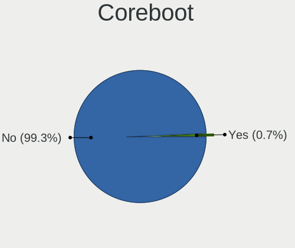

Fedora - Hardware Trends
------------------------

A project to identify most popular hardware characteristics and track their change
over time based on data collected by Linux users at https://Linux-Hardware.org.

Anyone can contribute to this report by the [hw-probe](https://github.com/linuxhw/hw-probe) tool:

    sudo -E hw-probe -all -upload

This is a report for all computer types. See also reports for [desktops](/Dist/Fedora/Desktop/README.md) and [notebooks](/Dist/Fedora/Notebook/README.md).

This report is for one last month. Overall report since the beginning of time: [TestCoverage](https://github.com/linuxhw/TestCoverage)

Period: Oct, 2022.

Contents
--------

* [ System ](#system)
  - [ OS                       ](#os)
  - [ OS Family                ](#os-family)
  - [ Kernel                   ](#kernel)
  - [ Kernel Family            ](#kernel-family)
  - [ Kernel Major Ver.        ](#kernel-major-ver)
  - [ Arch                     ](#arch)
  - [ DE                       ](#de)
  - [ Display Server           ](#display-server)
  - [ Display Manager          ](#display-manager)
  - [ OS Lang                  ](#os-lang)
  - [ Boot Mode                ](#boot-mode)
  - [ Filesystem               ](#filesystem)
  - [ Part. scheme             ](#part-scheme)
  - [ Dual Boot with Linux/BSD ](#dual-boot-with-linuxbsd)
  - [ Dual Boot (Win)          ](#dual-boot-win)

* [ Board ](#board)
  - [ Vendor                   ](#vendor)
  - [ Model                    ](#model)
  - [ Model Family             ](#model-family)
  - [ MFG Year                 ](#mfg-year)
  - [ Form Factor              ](#form-factor)
  - [ Secure Boot              ](#secure-boot)
  - [ Coreboot                 ](#coreboot)
  - [ RAM Size                 ](#ram-size)
  - [ RAM Used                 ](#ram-used)
  - [ Total Drives             ](#total-drives)
  - [ Has CD-ROM               ](#has-cd-rom)
  - [ Has Ethernet             ](#has-ethernet)
  - [ Has WiFi                 ](#has-wifi)
  - [ Has Bluetooth            ](#has-bluetooth)

* [ Location ](#location)
  - [ Country                  ](#country)
  - [ City                     ](#city)

* [ Drives ](#drives)
  - [ Drive Vendor             ](#drive-vendor)
  - [ Drive Model              ](#drive-model)
  - [ HDD Vendor               ](#hdd-vendor)
  - [ SSD Vendor               ](#ssd-vendor)
  - [ Drive Kind               ](#drive-kind)
  - [ Drive Connector          ](#drive-connector)
  - [ Drive Size               ](#drive-size)
  - [ Space Total              ](#space-total)
  - [ Space Used               ](#space-used)
  - [ Malfunc. Drives          ](#malfunc-drives)
  - [ Malfunc. Drive Vendor    ](#malfunc-drive-vendor)
  - [ Malfunc. HDD Vendor      ](#malfunc-hdd-vendor)
  - [ Malfunc. Drive Kind      ](#malfunc-drive-kind)
  - [ Failed Drives            ](#failed-drives)
  - [ Failed Drive Vendor      ](#failed-drive-vendor)
  - [ Drive Status             ](#drive-status)

* [ Storage controller ](#storage-controller)
  - [ Storage Vendor           ](#storage-vendor)
  - [ Storage Model            ](#storage-model)
  - [ Storage Kind             ](#storage-kind)

* [ Processor ](#processor)
  - [ CPU Vendor               ](#cpu-vendor)
  - [ CPU Model                ](#cpu-model)
  - [ CPU Model Family         ](#cpu-model-family)
  - [ CPU Cores                ](#cpu-cores)
  - [ CPU Sockets              ](#cpu-sockets)
  - [ CPU Threads              ](#cpu-threads)
  - [ CPU Op-Modes             ](#cpu-op-modes)
  - [ CPU Microcode            ](#cpu-microcode)
  - [ CPU Microarch            ](#cpu-microarch)

* [ Graphics ](#graphics)
  - [ GPU Vendor               ](#gpu-vendor)
  - [ GPU Model                ](#gpu-model)
  - [ GPU Combo                ](#gpu-combo)
  - [ GPU Driver               ](#gpu-driver)
  - [ GPU Memory               ](#gpu-memory)

* [ Monitor ](#monitor)
  - [ Monitor Vendor           ](#monitor-vendor)
  - [ Monitor Model            ](#monitor-model)
  - [ Monitor Resolution       ](#monitor-resolution)
  - [ Monitor Diagonal         ](#monitor-diagonal)
  - [ Monitor Width            ](#monitor-width)
  - [ Aspect Ratio             ](#aspect-ratio)
  - [ Monitor Area             ](#monitor-area)
  - [ Pixel Density            ](#pixel-density)
  - [ Multiple Monitors        ](#multiple-monitors)

* [ Network ](#network)
  - [ Net Controller Vendor    ](#net-controller-vendor)
  - [ Net Controller Model     ](#net-controller-model)
  - [ Wireless Vendor          ](#wireless-vendor)
  - [ Wireless Model           ](#wireless-model)
  - [ Ethernet Vendor          ](#ethernet-vendor)
  - [ Ethernet Model           ](#ethernet-model)
  - [ Net Controller Kind      ](#net-controller-kind)
  - [ Used Controller          ](#used-controller)
  - [ NICs                     ](#nics)
  - [ IPv6                     ](#ipv6)

* [ Bluetooth ](#bluetooth)
  - [ Bluetooth Vendor         ](#bluetooth-vendor)
  - [ Bluetooth Model          ](#bluetooth-model)

* [ Sound ](#sound)
  - [ Sound Vendor             ](#sound-vendor)
  - [ Sound Model              ](#sound-model)

* [ Memory ](#memory)
  - [ Memory Vendor            ](#memory-vendor)
  - [ Memory Model             ](#memory-model)
  - [ Memory Kind              ](#memory-kind)
  - [ Memory Form Factor       ](#memory-form-factor)
  - [ Memory Size              ](#memory-size)
  - [ Memory Speed             ](#memory-speed)

* [ Printers & scanners ](#printers--scanners)
  - [ Printer Vendor           ](#printer-vendor)
  - [ Printer Model            ](#printer-model)
  - [ Scanner Vendor           ](#scanner-vendor)
  - [ Scanner Model            ](#scanner-model)

* [ Camera ](#camera)
  - [ Camera Vendor            ](#camera-vendor)
  - [ Camera Model             ](#camera-model)

* [ Security ](#security)
  - [ Fingerprint Vendor       ](#fingerprint-vendor)
  - [ Fingerprint Model        ](#fingerprint-model)
  - [ Chipcard Vendor          ](#chipcard-vendor)
  - [ Chipcard Model           ](#chipcard-model)

* [ Unsupported ](#unsupported)
  - [ Unsupported Devices      ](#unsupported-devices)
  - [ Unsupported Device Types ](#unsupported-device-types)

System
------

OS
--

Installed operating systems

| Name      | Computers | Percent |
|-----------|-----------|---------|
| Fedora 36 | 310       | 77.69%  |
| Fedora 37 | 76        | 19.05%  |
| Fedora 35 | 7         | 1.75%   |
| Fedora 38 | 3         | 0.75%   |
| Fedora 34 | 1         | 0.25%   |
| Fedora 32 | 1         | 0.25%   |
| Fedora 29 | 1         | 0.25%   |

OS Family
---------

OS without a version

| Name   | Computers | Percent |
|--------|-----------|---------|
| Fedora | 399       | 100%    |

Kernel
------

Version of the Linux kernel

| Version                                                      | Computers | Percent |
|--------------------------------------------------------------|-----------|---------|
| 5.19.16-200.fc36.x86_64                                      | 84        | 21.05%  |
| 5.19.15-201.fc36.x86_64                                      | 46        | 11.53%  |
| 5.19.14-200.fc36.x86_64                                      | 41        | 10.28%  |
| 5.19.13-200.fc36.x86_64                                      | 37        | 9.27%   |
| 5.19.12-200.fc36.x86_64                                      | 36        | 9.02%   |
| 5.17.5-300.fc36.x86_64                                       | 21        | 5.26%   |
| 5.19.13-300.fc37.x86_64                                      | 18        | 4.51%   |
| 6.0.5-200.fc36.x86_64                                        | 16        | 4.01%   |
| 5.19.11-200.fc36.x86_64                                      | 12        | 3.01%   |
| 5.19.16-301.fc37.x86_64                                      | 10        | 2.51%   |
| 5.19.15-301.fc37.x86_64                                      | 8         | 2.01%   |
| 5.19.14-300.fc37.x86_64                                      | 8         | 2.01%   |
| 5.19.16-300.fc37.x86_64                                      | 6         | 1.5%    |
| 5.19.12-300.fc37.x86_64                                      | 6         | 1.5%    |
| 5.19.7-300.fc37.x86_64                                       | 5         | 1.25%   |
| 6.0.5-300.fc37.x86_64                                        | 3         | 0.75%   |
| 5.19.9-200.fc36.x86_64                                       | 3         | 0.75%   |
| 6.1.0-0.rc0.20221011git60bb8154d1d7.8.fc38.x86_64            | 2         | 0.5%    |
| 5.19.16-100.fc35.x86_64                                      | 2         | 0.5%    |
| 5.19.15-300.fc37.x86_64                                      | 2         | 0.5%    |
| 6.1.0-0.rc2.20221028git23758867219c.24.fc38.x86_64           | 1         | 0.25%   |
| 6.1.0-0.rc0.20221014git9c9155a3509a.11.fc38.x86_64           | 1         | 0.25%   |
| 6.1.0-0.rc0.20221012git49da07006239.10.vanilla.1.fc37.x86_64 | 1         | 0.25%   |
| 6.1.0-0.rc0.20221007git4c86114194e6.5.fc38.x86_64            | 1         | 0.25%   |
| 6.0.3-300.fc37.x86_64                                        | 1         | 0.25%   |
| 6.0.2-xm1.0.fc37.x86_64                                      | 1         | 0.25%   |
| 6.0.2-xm1.0.fc36.x86_64                                      | 1         | 0.25%   |
| 6.0.2-301.fc37.x86_64                                        | 1         | 0.25%   |
| 6.0.2-301.fc36.x86_64                                        | 1         | 0.25%   |
| 6.0.2-300.rog.fc36.x86_64                                    | 1         | 0.25%   |
| 6.0.0-0.rc2.20220826git4c612826bec1.22.vanilla.1.fc36.x86_64 | 1         | 0.25%   |
| 5.9.10-100.fc32.x86_64                                       | 1         | 0.25%   |
| 5.3.11-100.fc29.x86_64                                       | 1         | 0.25%   |
| 5.19.8-xm1.0.fc36.x86_64                                     | 1         | 0.25%   |
| 5.19.8-200.fc36.x86_64                                       | 1         | 0.25%   |
| 5.19.6-100.fc35.x86_64                                       | 1         | 0.25%   |
| 5.19.4-200.fc36.x86_64                                       | 1         | 0.25%   |
| 5.19.4-100.fc35.x86_64                                       | 1         | 0.25%   |
| 5.19.16-602.inttf.fc37.x86_64                                | 1         | 0.25%   |
| 5.19.15-602.inttf.fc36.x86_64                                | 1         | 0.25%   |

Kernel Family
-------------

Linux kernel without a distro release

| Version | Computers | Percent |
|---------|-----------|---------|
| 5.19.16 | 103       | 25.81%  |
| 5.19.15 | 57        | 14.29%  |
| 5.19.13 | 57        | 14.29%  |
| 5.19.14 | 51        | 12.78%  |
| 5.19.12 | 45        | 11.28%  |
| 5.17.5  | 21        | 5.26%   |
| 6.0.5   | 19        | 4.76%   |
| 5.19.11 | 12        | 3.01%   |
| 6.1.0   | 6         | 1.5%    |
| 6.0.2   | 5         | 1.25%   |
| 5.19.7  | 5         | 1.25%   |
| 5.19.9  | 3         | 0.75%   |
| 5.19.8  | 2         | 0.5%    |
| 5.19.4  | 2         | 0.5%    |
| 6.0.3   | 1         | 0.25%   |
| 6.0.0   | 1         | 0.25%   |
| 5.9.10  | 1         | 0.25%   |
| 5.3.11  | 1         | 0.25%   |
| 5.19.6  | 1         | 0.25%   |
| 5.19.10 | 1         | 0.25%   |
| 5.18.6  | 1         | 0.25%   |
| 5.18.19 | 1         | 0.25%   |
| 5.18.16 | 1         | 0.25%   |
| 5.17.12 | 1         | 0.25%   |
| 5.16.18 | 1         | 0.25%   |

Kernel Major Ver.
-----------------

Linux kernel major version

| Version | Computers | Percent |
|---------|-----------|---------|
| 5.19    | 339       | 84.96%  |
| 6.0     | 26        | 6.52%   |
| 5.17    | 22        | 5.51%   |
| 6.1     | 6         | 1.5%    |
| 5.18    | 3         | 0.75%   |
| 5.9     | 1         | 0.25%   |
| 5.3     | 1         | 0.25%   |
| 5.16    | 1         | 0.25%   |

Arch
----

OS architecture (x86_64, i586, etc.)

| Name    | Computers | Percent |
|---------|-----------|---------|
| x86_64  | 398       | 99.75%  |
| aarch64 | 1         | 0.25%   |

DE
--

Desktop Environment

| Name          | Computers | Percent |
|---------------|-----------|---------|
| GNOME         | 303       | 75.94%  |
| KDE5          | 58        | 14.54%  |
| Cinnamon      | 10        | 2.51%   |
| Unknown       | 7         | 1.75%   |
| XFCE          | 4         | 1%      |
| X-Cinnamon    | 4         | 1%      |
| MATE          | 4         | 1%      |
| LXQt          | 3         | 0.75%   |
| LXDE          | 2         | 0.5%    |
| sway          | 1         | 0.25%   |
| i3            | 1         | 0.25%   |
| GNOME Classic | 1         | 0.25%   |
| fluxbox       | 1         | 0.25%   |

Display Server
--------------

X11 or Wayland

| Name    | Computers | Percent |
|---------|-----------|---------|
| Wayland | 280       | 70.18%  |
| X11     | 104       | 26.07%  |
| Tty     | 11        | 2.76%   |
| Unknown | 4         | 1%      |

Display Manager
---------------

SDDM, LightDM, etc.

| Name    | Computers | Percent |
|---------|-----------|---------|
| Unknown | 191       | 47.87%  |
| GDM     | 145       | 36.34%  |
| SDDM    | 32        | 8.02%   |
| LightDM | 30        | 7.52%   |
| LXDM    | 1         | 0.25%   |

OS Lang
-------

Language

| Lang    | Computers | Percent |
|---------|-----------|---------|
| en_US   | 214       | 53.63%  |
| it_IT   | 36        | 9.02%   |
| en_GB   | 26        | 6.52%   |
| ru_RU   | 19        | 4.76%   |
| en_AU   | 17        | 4.26%   |
| fr_FR   | 11        | 2.76%   |
| de_DE   | 11        | 2.76%   |
| es_ES   | 10        | 2.51%   |
| pt_BR   | 9         | 2.26%   |
| pl_PL   | 7         | 1.75%   |
| en_CA   | 5         | 1.25%   |
| en_IN   | 4         | 1%      |
| hu_HU   | 3         | 0.75%   |
| ru_UA   | 2         | 0.5%    |
| nb_NO   | 2         | 0.5%    |
| en_PH   | 2         | 0.5%    |
| de_CH   | 2         | 0.5%    |
| da_DK   | 2         | 0.5%    |
| uk_UA   | 1         | 0.25%   |
| tr_TR   | 1         | 0.25%   |
| sv_SE   | 1         | 0.25%   |
| nl_BE   | 1         | 0.25%   |
| it_CH   | 1         | 0.25%   |
| fr_BE   | 1         | 0.25%   |
| es_PE   | 1         | 0.25%   |
| es_GT   | 1         | 0.25%   |
| en_NZ   | 1         | 0.25%   |
| en_NG   | 1         | 0.25%   |
| en_IL   | 1         | 0.25%   |
| en_IE   | 1         | 0.25%   |
| en_AT   | 1         | 0.25%   |
| cs_CZ   | 1         | 0.25%   |
| C       | 1         | 0.25%   |
| ar_SA   | 1         | 0.25%   |
| Unknown | 1         | 0.25%   |

Boot Mode
---------

EFI or BIOS

| Mode | Computers | Percent |
|------|-----------|---------|
| EFI  | 312       | 78.2%   |
| BIOS | 87        | 21.8%   |

Filesystem
----------

Type of filesystem

| Type    | Computers | Percent |
|---------|-----------|---------|
| Btrfs   | 313       | 78.45%  |
| Ext4    | 71        | 17.79%  |
| Xfs     | 14        | 3.51%   |
| Overlay | 1         | 0.25%   |

Part. scheme
------------

Scheme of partitioning

| Type    | Computers | Percent |
|---------|-----------|---------|
| Unknown | 185       | 46.37%  |
| GPT     | 183       | 45.86%  |
| MBR     | 31        | 7.77%   |

Dual Boot with Linux/BSD
------------------------

Hosting more than one Linux/BSD

| Dual boot | Computers | Percent |
|-----------|-----------|---------|
| No        | 354       | 88.72%  |
| Yes       | 45        | 11.28%  |

Dual Boot (Win)
---------------

Hosting Linux and Windows

| Dual boot | Computers | Percent |
|-----------|-----------|---------|
| No        | 310       | 77.69%  |
| Yes       | 89        | 22.31%  |

Board
-----

Vendor
------

Motherboard manufacturer

| Name                | Computers | Percent |
|---------------------|-----------|---------|
| Lenovo              | 77        | 19.3%   |
| ASUSTek Computer    | 69        | 17.29%  |
| Hewlett-Packard     | 59        | 14.79%  |
| Dell                | 48        | 12.03%  |
| MSI                 | 30        | 7.52%   |
| Gigabyte Technology | 29        | 7.27%   |
| Acer                | 19        | 4.76%   |
| ASRock              | 10        | 2.51%   |
| Apple               | 9         | 2.26%   |
| HUAWEI              | 7         | 1.75%   |
| Timi                | 5         | 1.25%   |
| Framework           | 4         | 1%      |
| BESSTAR Tech        | 3         | 0.75%   |
| System76            | 2         | 0.5%    |
| Sony                | 2         | 0.5%    |
| Samsung Electronics | 2         | 0.5%    |
| Notebook            | 2         | 0.5%    |
| Microsoft           | 2         | 0.5%    |
| LG Electronics      | 2         | 0.5%    |
| Intel               | 2         | 0.5%    |
| Unknown             | 2         | 0.5%    |
| Zinox Technologies  | 1         | 0.25%   |
| UNOWHY              | 1         | 0.25%   |
| Toshiba             | 1         | 0.25%   |
| Shuttle             | 1         | 0.25%   |
| Schenker            | 1         | 0.25%   |
| Purism              | 1         | 0.25%   |
| PINE64              | 1         | 0.25%   |
| Pegatron            | 1         | 0.25%   |
| NZXT                | 1         | 0.25%   |
| MICROMAX            | 1         | 0.25%   |
| LincPlus            | 1         | 0.25%   |
| Itautec             | 1         | 0.25%   |
| Huanan              | 1         | 0.25%   |
| Aquarius            | 1         | 0.25%   |

Model
-----

Motherboard model

| Name                                   | Computers | Percent |
|----------------------------------------|-----------|---------|
| Gigabyte B450 AORUS ELITE              | 3         | 0.75%   |
| Timi TM1701                            | 2         | 0.5%    |
| MSI MS-7C84                            | 2         | 0.5%    |
| MSI MS-7C52                            | 2         | 0.5%    |
| MSI MS-7C37                            | 2         | 0.5%    |
| Lenovo IdeaPadFlex 5 14ARE05 81X2      | 2         | 0.5%    |
| Lenovo IdeaPad 5 15ARE05 81YQ          | 2         | 0.5%    |
| Lenovo IdeaPad 3 15ITL6 82H8           | 2         | 0.5%    |
| HUAWEI NBLB-WAX9N                      | 2         | 0.5%    |
| HP ProDesk 400 G3 DM                   | 2         | 0.5%    |
| HP Pavilion Aero Laptop 13-be0xxx      | 2         | 0.5%    |
| HP Laptop 15s-eq2xxx                   | 2         | 0.5%    |
| HP ENVY x360 2-in-1 Laptop 15-ey0xxx   | 2         | 0.5%    |
| HP 15                                  | 2         | 0.5%    |
| Gigabyte B550M DS3H                    | 2         | 0.5%    |
| Framework Laptop (12th Gen Intel Core) | 2         | 0.5%    |
| Framework Laptop                       | 2         | 0.5%    |
| Dell XPS 15 9510                       | 2         | 0.5%    |
| Dell XPS 13 9300                       | 2         | 0.5%    |
| Dell Precision 5510                    | 2         | 0.5%    |
| ASUS VivoBook_ASUSLaptop X509JA_X509JA | 2         | 0.5%    |
| ASUS PRIME Z270-A                      | 2         | 0.5%    |
| ASUS PRIME B450-PLUS                   | 2         | 0.5%    |
| Apple MacBookPro9,2                    | 2         | 0.5%    |
| Acer Predator PH315-53                 | 2         | 0.5%    |
| Unknown                                | 2         | 0.5%    |
| Zinox x64-Based PC                     | 1         | 0.25%   |
| UNOWHY Y13G011S4EI                     | 1         | 0.25%   |
| Toshiba Satellite C660                 | 1         | 0.25%   |
| Timi Xiaomi Book Pro 16 2022           | 1         | 0.25%   |
| Timi Mi Laptop Pro 15                  | 1         | 0.25%   |
| Timi A35S                              | 1         | 0.25%   |
| System76 Kudu                          | 1         | 0.25%   |
| System76 Galago UltraPro               | 1         | 0.25%   |
| Sony VPCL11S2E                         | 1         | 0.25%   |
| Sony VPCCB3S1R                         | 1         | 0.25%   |
| Shuttle SH67H                          | 1         | 0.25%   |
| Schenker XMG FUSION 15 (XFU15L19)      | 1         | 0.25%   |
| Samsung RV410/RV510/S3510/E3510        | 1         | 0.25%   |
| Samsung 800G5M/800G5W                  | 1         | 0.25%   |

Model Family
------------

Motherboard model prefix

| Name                | Computers | Percent |
|---------------------|-----------|---------|
| Lenovo ThinkPad     | 41        | 10.28%  |
| Dell Inspiron       | 18        | 4.51%   |
| Lenovo IdeaPad      | 13        | 3.26%   |
| ASUS PRIME          | 13        | 3.26%   |
| ASUS VivoBook       | 11        | 2.76%   |
| ASUS TUF            | 11        | 2.76%   |
| Dell XPS            | 10        | 2.51%   |
| Dell Latitude       | 10        | 2.51%   |
| ASUS ROG            | 10        | 2.51%   |
| HP Pavilion         | 8         | 2.01%   |
| HP ENVY             | 8         | 2.01%   |
| HP EliteBook        | 8         | 2.01%   |
| Acer Aspire         | 8         | 2.01%   |
| Lenovo Yoga         | 7         | 1.75%   |
| HP Laptop           | 7         | 1.75%   |
| HP ProBook          | 5         | 1.25%   |
| Lenovo Legion       | 4         | 1%      |
| Lenovo IdeaPadFlex  | 4         | 1%      |
| Framework Laptop    | 4         | 1%      |
| Dell Vostro         | 4         | 1%      |
| Dell Precision      | 4         | 1%      |
| ASUS ASUS           | 4         | 1%      |
| Lenovo ThinkStation | 3         | 0.75%   |
| HP ZBook            | 3         | 0.75%   |
| HP Spectre          | 3         | 0.75%   |
| Gigabyte B450       | 3         | 0.75%   |
| Timi TM1701         | 2         | 0.5%    |
| MSI MS-7C84         | 2         | 0.5%    |
| MSI MS-7C52         | 2         | 0.5%    |
| MSI MS-7C37         | 2         | 0.5%    |
| MSI Modern          | 2         | 0.5%    |
| Microsoft Surface   | 2         | 0.5%    |
| Lenovo ThinkBook    | 2         | 0.5%    |
| HUAWEI NBLB-WAX9N   | 2         | 0.5%    |
| HP ProDesk          | 2         | 0.5%    |
| HP Compaq           | 2         | 0.5%    |
| HP 15               | 2         | 0.5%    |
| Gigabyte B550M      | 2         | 0.5%    |
| Gigabyte B450M      | 2         | 0.5%    |
| Dell OptiPlex       | 2         | 0.5%    |

MFG Year
--------

Motherboard manufacture year

| Year | Computers | Percent |
|------|-----------|---------|
| 2020 | 68        | 17.04%  |
| 2021 | 63        | 15.79%  |
| 2018 | 44        | 11.03%  |
| 2019 | 41        | 10.28%  |
| 2017 | 38        | 9.52%   |
| 2022 | 33        | 8.27%   |
| 2014 | 18        | 4.51%   |
| 2016 | 17        | 4.26%   |
| 2015 | 16        | 4.01%   |
| 2013 | 15        | 3.76%   |
| 2012 | 14        | 3.51%   |
| 2011 | 9         | 2.26%   |
| 2010 | 9         | 2.26%   |
| 2009 | 9         | 2.26%   |
| 2008 | 2         | 0.5%    |
| 2006 | 2         | 0.5%    |
| 2007 | 1         | 0.25%   |

Form Factor
-----------

Physical design of the computer

| Name           | Computers | Percent |
|----------------|-----------|---------|
| Notebook       | 228       | 57.14%  |
| Desktop        | 128       | 32.08%  |
| Convertible    | 28        | 7.02%   |
| Tablet         | 6         | 1.5%    |
| Mini pc        | 4         | 1%      |
| All in one     | 4         | 1%      |
| System on chip | 1         | 0.25%   |

Secure Boot
-----------

Enabled or disabled

| State    | Computers | Percent |
|----------|-----------|---------|
| Disabled | 324       | 81.2%   |
| Enabled  | 75        | 18.8%   |

Coreboot
--------

Have coreboot on board

| Used | Computers | Percent |
|------|-----------|---------|
| No   | 398       | 99.75%  |
| Yes  | 1         | 0.25%   |

RAM Size
--------

Total RAM memory

| Size in GB  | Computers | Percent |
|-------------|-----------|---------|
| 16.01-24.0  | 117       | 29.32%  |
| 4.01-8.0    | 98        | 24.56%  |
| 8.01-16.0   | 66        | 16.54%  |
| 32.01-64.0  | 60        | 15.04%  |
| 3.01-4.0    | 23        | 5.76%   |
| 64.01-256.0 | 17        | 4.26%   |
| 24.01-32.0  | 12        | 3.01%   |
| 1.01-2.0    | 4         | 1%      |
| 2.01-3.0    | 2         | 0.5%    |

RAM Used
--------

Used RAM memory

| Used GB     | Computers | Percent |
|-------------|-----------|---------|
| 4.01-8.0    | 125       | 31.33%  |
| 2.01-3.0    | 99        | 24.81%  |
| 3.01-4.0    | 90        | 22.56%  |
| 8.01-16.0   | 38        | 9.52%   |
| 1.01-2.0    | 35        | 8.77%   |
| 0.51-1.0    | 6         | 1.5%    |
| 16.01-24.0  | 3         | 0.75%   |
| 24.01-32.0  | 1         | 0.25%   |
| 64.01-256.0 | 1         | 0.25%   |
| 0.01-0.5    | 1         | 0.25%   |

Total Drives
------------

Number of drives on board

| Drives | Computers | Percent |
|--------|-----------|---------|
| 1      | 234       | 58.65%  |
| 2      | 105       | 26.32%  |
| 3      | 31        | 7.77%   |
| 4      | 14        | 3.51%   |
| 6      | 7         | 1.75%   |
| 5      | 5         | 1.25%   |
| 11     | 1         | 0.25%   |
| 7      | 1         | 0.25%   |
| 0      | 1         | 0.25%   |

Has CD-ROM
----------

Has CD-ROM on board

| Presented | Computers | Percent |
|-----------|-----------|---------|
| No        | 337       | 84.46%  |
| Yes       | 62        | 15.54%  |

Has Ethernet
------------

Has Ethernet on board

| Presented | Computers | Percent |
|-----------|-----------|---------|
| Yes       | 294       | 73.68%  |
| No        | 105       | 26.32%  |

Has WiFi
--------

Has WiFi module

| Presented | Computers | Percent |
|-----------|-----------|---------|
| Yes       | 323       | 80.95%  |
| No        | 76        | 19.05%  |

Has Bluetooth
-------------

Has Bluetooth module

| Presented | Computers | Percent |
|-----------|-----------|---------|
| Yes       | 283       | 70.93%  |
| No        | 116       | 29.07%  |

Location
--------

Country
-------

Geographic location (country)

| Country            | Computers | Percent |
|--------------------|-----------|---------|
| USA                | 73        | 18.3%   |
| Italy              | 55        | 13.78%  |
| Germany            | 27        | 6.77%   |
| Russia             | 22        | 5.51%   |
| Australia          | 19        | 4.76%   |
| Brazil             | 17        | 4.26%   |
| France             | 16        | 4.01%   |
| India              | 14        | 3.51%   |
| Spain              | 11        | 2.76%   |
| UK                 | 10        | 2.51%   |
| Poland             | 10        | 2.51%   |
| Hungary            | 7         | 1.75%   |
| Belgium            | 7         | 1.75%   |
| Norway             | 5         | 1.25%   |
| Netherlands        | 5         | 1.25%   |
| Indonesia          | 5         | 1.25%   |
| Finland            | 5         | 1.25%   |
| Canada             | 5         | 1.25%   |
| Turkey             | 4         | 1%      |
| Switzerland        | 4         | 1%      |
| Sweden             | 4         | 1%      |
| Czechia            | 4         | 1%      |
| Belarus            | 4         | 1%      |
| Austria            | 4         | 1%      |
| Thailand           | 3         | 0.75%   |
| South Korea        | 3         | 0.75%   |
| Philippines        | 3         | 0.75%   |
| Mexico             | 3         | 0.75%   |
| Vietnam            | 2         | 0.5%    |
| Ukraine            | 2         | 0.5%    |
| UAE                | 2         | 0.5%    |
| Serbia             | 2         | 0.5%    |
| Puerto Rico        | 2         | 0.5%    |
| Lithuania          | 2         | 0.5%    |
| Kenya              | 2         | 0.5%    |
| Israel             | 2         | 0.5%    |
| Ireland            | 2         | 0.5%    |
| Hong Kong          | 2         | 0.5%    |
| Ecuador            | 2         | 0.5%    |
| Dominican Republic | 2         | 0.5%    |

City
----

Geographic location (city)

| City               | Computers | Percent |
|--------------------|-----------|---------|
| Milan              | 9         | 2.26%   |
| Moscow             | 8         | 2.01%   |
| Budapest           | 6         | 1.5%    |
| Warsaw             | 4         | 1%      |
| Sandy Bay          | 4         | 1%      |
| Rome               | 4         | 1%      |
| Lane Cove          | 4         | 1%      |
| Istanbul           | 4         | 1%      |
| Helsinki           | 4         | 1%      |
| Brisbane           | 4         | 1%      |
| Berlin             | 4         | 1%      |
| Vienna             | 3         | 0.75%   |
| Sao Paulo          | 3         | 0.75%   |
| Munich             | 3         | 0.75%   |
| Minsk              | 3         | 0.75%   |
| Madrid             | 3         | 0.75%   |
| Kristiansand       | 3         | 0.75%   |
| Frankfurt am Main  | 3         | 0.75%   |
| St Petersburg      | 2         | 0.5%    |
| Seattle            | 2         | 0.5%    |
| Santo Domingo Este | 2         | 0.5%    |
| Roquetas de Mar    | 2         | 0.5%    |
| Pune               | 2         | 0.5%    |
| Porto Alegre       | 2         | 0.5%    |
| Perth              | 2         | 0.5%    |
| Parma              | 2         | 0.5%    |
| Padova             | 2         | 0.5%    |
| Odessa             | 2         | 0.5%    |
| Navi Mumbai        | 2         | 0.5%    |
| Nairobi            | 2         | 0.5%    |
| Melbourne          | 2         | 0.5%    |
| Manchester         | 2         | 0.5%    |
| Krakow             | 2         | 0.5%    |
| Hanoi              | 2         | 0.5%    |
| Goleta             | 2         | 0.5%    |
| Galway             | 2         | 0.5%    |
| Dubai              | 2         | 0.5%    |
| Denver             | 2         | 0.5%    |
| Chieri             | 2         | 0.5%    |
| Chicago            | 2         | 0.5%    |

Drives
------

Drive Vendor
------------

Hard drive vendors

| Vendor                      | Computers | Drives | Percent |
|-----------------------------|-----------|--------|---------|
| Samsung Electronics         | 112       | 144    | 18.6%   |
| WDC                         | 74        | 91     | 12.29%  |
| Seagate                     | 64        | 66     | 10.63%  |
| Sandisk                     | 42        | 44     | 6.98%   |
| Kingston                    | 34        | 36     | 5.65%   |
| SK hynix                    | 29        | 29     | 4.82%   |
| Intel                       | 29        | 31     | 4.82%   |
| Toshiba                     | 26        | 26     | 4.32%   |
| Crucial                     | 22        | 24     | 3.65%   |
| Unknown                     | 19        | 22     | 3.16%   |
| Micron Technology           | 19        | 19     | 3.16%   |
| KIOXIA                      | 11        | 11     | 1.83%   |
| Hitachi                     | 11        | 13     | 1.83%   |
| Phison Electronics          | 10        | 11     | 1.66%   |
| HGST                        | 9         | 10     | 1.5%    |
| A-DATA Technology           | 8         | 8      | 1.33%   |
| Micron/Crucial Technology   | 7         | 9      | 1.16%   |
| Apple                       | 5         | 5      | 0.83%   |
| Team                        | 4         | 5      | 0.66%   |
| SPCC                        | 4         | 5      | 0.66%   |
| Phison                      | 4         | 4      | 0.66%   |
| China                       | 4         | 4      | 0.66%   |
| Silicon Motion              | 3         | 3      | 0.5%    |
| PNY                         | 3         | 3      | 0.5%    |
| LITEON                      | 3         | 3      | 0.5%    |
| Lexar                       | 3         | 3      | 0.5%    |
| Transcend                   | 2         | 2      | 0.33%   |
| Realtek Semiconductor       | 2         | 2      | 0.33%   |
| Patriot                     | 2         | 2      | 0.33%   |
| MAXIO Technology (Hangzhou) | 2         | 3      | 0.33%   |
| Kingston Technology Company | 2         | 2      | 0.33%   |
| KingDian                    | 2         | 2      | 0.33%   |
| Intenso                     | 2         | 2      | 0.33%   |
| Fujitsu                     | 2         | 2      | 0.33%   |
| Corsair                     | 2         | 3      | 0.33%   |
| ADATA Technology            | 2         | 2      | 0.33%   |
| YMTC                        | 1         | 1      | 0.17%   |
| XPG                         | 1         | 1      | 0.17%   |
| walram                      | 1         | 1      | 0.17%   |
| USB3.0                      | 1         | 1      | 0.17%   |

Drive Model
-----------

Hard drive models

| Model                                                 | Computers | Percent |
|-------------------------------------------------------|-----------|---------|
| Samsung NVMe SSD Controller SM981/PM981/PM983 500GB   | 25        | 3.83%   |
| Kingston SA400S37240G 240GB SSD                       | 9         | 1.38%   |
| Seagate ST1000LM035-1RK172 1TB                        | 8         | 1.23%   |
| Samsung SSD 860 EVO 500GB                             | 8         | 1.23%   |
| Sandisk WD Blue SN550 NVMe SSD 1TB                    | 6         | 0.92%   |
| Phison E12 NVMe Controller 2TB                        | 6         | 0.92%   |
| SK hynix BC501 NVMe Solid State Drive 512GB           | 5         | 0.77%   |
| Sandisk WD Black SN750 / PC SN730 NVMe SSD 1TB        | 5         | 0.77%   |
| Samsung SSD 850 EVO 250GB                             | 5         | 0.77%   |
| Samsung NVMe SSD Controller SM961/PM961/SM963 250GB   | 5         | 0.77%   |
| Samsung NVMe SSD Controller PM9A1/PM9A3/980PRO 250GB  | 5         | 0.77%   |
| Crucial CT500MX500SSD1 500GB                          | 5         | 0.77%   |
| Unknown MMC Card  64GB                                | 4         | 0.61%   |
| Seagate ST2000DM008-2FR102 2TB                        | 4         | 0.61%   |
| Seagate ST1000LM024 HN-M101MBB 1TB                    | 4         | 0.61%   |
| Samsung SSD 860 EVO 2TB                               | 4         | 0.61%   |
| Samsung SSD 860 EVO 250GB                             | 4         | 0.61%   |
| Samsung MZVLQ512HBLU-00BH1 512GB                      | 4         | 0.61%   |
| Samsung MZALQ512HBLU-00BL2 512GB                      | 4         | 0.61%   |
| Micron/Crucial P2 NVMe PCIe SSD 500GB                 | 4         | 0.61%   |
| KIOXIA KBG40ZNV512G 512GB                             | 4         | 0.61%   |
| Kingston SA400S37480G 480GB SSD                       | 4         | 0.61%   |
| WDC WD10SPZX-21Z10T0 1TB                              | 3         | 0.46%   |
| WDC WD10EZEX-60WN4A0 1TB                              | 3         | 0.46%   |
| WDC WD10EZEX-08WN4A0 1TB                              | 3         | 0.46%   |
| Toshiba XG6 NVMe SSD Controller 512GB                 | 3         | 0.46%   |
| Silicon Motion SM2263EN/SM2263XT SSD Controller 256GB | 3         | 0.46%   |
| Seagate ST9500325AS 500GB                             | 3         | 0.46%   |
| Seagate ST1000DM003-1ER162 1TB                        | 3         | 0.46%   |
| Samsung SSD 980 1TB                                   | 3         | 0.46%   |
| Samsung SSD 850 EVO 500GB                             | 3         | 0.46%   |
| Phison PS5013 E13 NVMe Controller 256GB               | 3         | 0.46%   |
| Kingston SA400S37960G 960GB SSD                       | 3         | 0.46%   |
| Intel SSD 660P Series 1024GB                          | 3         | 0.46%   |
| Intel SSD 600P Series 256GB                           | 3         | 0.46%   |
| HGST HTS721010A9E630 1TB                              | 3         | 0.46%   |
| Crucial CT240BX500SSD1 240GB                          | 3         | 0.46%   |
| WDC WDS500G2B0A-00SM50 500GB SSD                      | 2         | 0.31%   |
| WDC WDS100T2B0A-00SM50 1TB SSD                        | 2         | 0.31%   |
| WDC WD30EZRZ-00WN9B0 3TB                              | 2         | 0.31%   |

HDD Vendor
----------

Hard disk drive vendors

| Vendor              | Computers | Drives | Percent |
|---------------------|-----------|--------|---------|
| Seagate             | 64        | 66     | 41.83%  |
| WDC                 | 48        | 57     | 31.37%  |
| Hitachi             | 11        | 13     | 7.19%   |
| Toshiba             | 10        | 10     | 6.54%   |
| HGST                | 9         | 10     | 5.88%   |
| Unknown             | 2         | 2      | 1.31%   |
| Fujitsu             | 2         | 2      | 1.31%   |
| USB3.0              | 1         | 1      | 0.65%   |
| Samsung Electronics | 1         | 2      | 0.65%   |
| SAGE                | 1         | 1      | 0.65%   |
| Maxtor              | 1         | 1      | 0.65%   |
| Hewlett-Packard     | 1         | 2      | 0.65%   |
| ASMT                | 1         | 2      | 0.65%   |
| Apple               | 1         | 1      | 0.65%   |

SSD Vendor
----------

Solid state drive vendors

| Vendor              | Computers | Drives | Percent |
|---------------------|-----------|--------|---------|
| Samsung Electronics | 44        | 56     | 23.78%  |
| Kingston            | 26        | 28     | 14.05%  |
| Crucial             | 20        | 22     | 10.81%  |
| WDC                 | 14        | 17     | 7.57%   |
| SanDisk             | 13        | 14     | 7.03%   |
| Intel               | 10        | 10     | 5.41%   |
| A-DATA Technology   | 5         | 5      | 2.7%    |
| Toshiba             | 4         | 4      | 2.16%   |
| SK hynix            | 4         | 4      | 2.16%   |
| Micron Technology   | 4         | 4      | 2.16%   |
| China               | 4         | 4      | 2.16%   |
| Team                | 3         | 4      | 1.62%   |
| SPCC                | 3         | 4      | 1.62%   |
| PNY                 | 3         | 3      | 1.62%   |
| LITEON              | 3         | 3      | 1.62%   |
| Lexar               | 3         | 3      | 1.62%   |
| Apple               | 3         | 3      | 1.62%   |
| Transcend           | 2         | 2      | 1.08%   |
| KingDian            | 2         | 2      | 1.08%   |
| Corsair             | 2         | 3      | 1.08%   |
| walram              | 1         | 1      | 0.54%   |
| Unknown             | 1         | 1      | 0.54%   |
| Smartbuy            | 1         | 1      | 0.54%   |
| Plextor             | 1         | 1      | 0.54%   |
| Patriot             | 1         | 1      | 0.54%   |
| OCZ                 | 1         | 1      | 0.54%   |
| Mushkin             | 1         | 1      | 0.54%   |
| KUIJIA              | 1         | 1      | 0.54%   |
| KingSpec            | 1         | 1      | 0.54%   |
| Kingmax             | 1         | 1      | 0.54%   |
| Intenso             | 1         | 1      | 0.54%   |
| GOODRAM             | 1         | 1      | 0.54%   |
| ALLIED              | 1         | 1      | 0.54%   |

Drive Kind
----------

HDD or SSD

| Kind    | Computers | Drives | Percent |
|---------|-----------|--------|---------|
| NVMe    | 246       | 278    | 44.73%  |
| SSD     | 157       | 208    | 28.55%  |
| HDD     | 130       | 170    | 23.64%  |
| MMC     | 15        | 18     | 2.73%   |
| Unknown | 2         | 2      | 0.36%   |

Drive Connector
---------------

SATA, SAS, NVMe, etc.

| Type | Computers | Drives | Percent |
|------|-----------|--------|---------|
| NVMe | 246       | 277    | 50.1%   |
| SATA | 212       | 359    | 43.18%  |
| SAS  | 18        | 22     | 3.67%   |
| MMC  | 15        | 18     | 3.05%   |

Drive Size
----------

Size of hard drive

| Size in TB | Computers | Drives | Percent |
|------------|-----------|--------|---------|
| 0.01-0.5   | 152       | 203    | 51.7%   |
| 0.51-1.0   | 86        | 108    | 29.25%  |
| 1.01-2.0   | 33        | 38     | 11.22%  |
| 4.01-10.0  | 9         | 11     | 3.06%   |
| 3.01-4.0   | 7         | 8      | 2.38%   |
| 2.01-3.0   | 6         | 9      | 2.04%   |
| 10.01-20.0 | 1         | 1      | 0.34%   |

Space Total
-----------

Amount of disk space available on the file system

| Size in GB     | Computers | Percent |
|----------------|-----------|---------|
| 501-1000       | 88        | 22.06%  |
| 251-500        | 63        | 15.79%  |
| 101-250        | 56        | 14.04%  |
| 1001-2000      | 56        | 14.04%  |
| 1-20           | 43        | 10.78%  |
| More than 3000 | 32        | 8.02%   |
| Unknown        | 22        | 5.51%   |
| 2001-3000      | 21        | 5.26%   |
| 51-100         | 14        | 3.51%   |
| 21-50          | 4         | 1%      |

Space Used
----------

Amount of used disk space

| Used GB        | Computers | Percent |
|----------------|-----------|---------|
| 1-20           | 104       | 26.07%  |
| 51-100         | 64        | 16.04%  |
| 21-50          | 60        | 15.04%  |
| 101-250        | 56        | 14.04%  |
| 251-500        | 34        | 8.52%   |
| 501-1000       | 28        | 7.02%   |
| Unknown        | 22        | 5.51%   |
| 1001-2000      | 14        | 3.51%   |
| 2001-3000      | 10        | 2.51%   |
| More than 3000 | 7         | 1.75%   |

Malfunc. Drives
---------------

Drive models with a malfunction

| Model                                     | Computers | Drives | Percent |
|-------------------------------------------|-----------|--------|---------|
| Intel SSDSC2CT120A3 120GB                 | 2         | 2      | 6.25%   |
| WDC WDS240G2G0B-00EPW0 240GB SSD          | 1         | 1      | 3.13%   |
| WDC WD40EFRX-68WT0N0 4TB                  | 1         | 1      | 3.13%   |
| WDC WD15EARS-00MVWB0 1TB                  | 1         | 1      | 3.13%   |
| WDC WD10JPVX-60JC3T0 1TB                  | 1         | 1      | 3.13%   |
| WDC WD10EZEX-00MFCA0 1TB                  | 1         | 1      | 3.13%   |
| walram SSD 120G                           | 1         | 1      | 3.13%   |
| Toshiba MK3265GSX 320GB                   | 1         | 1      | 3.13%   |
| Toshiba MK3263GSX 320GB                   | 1         | 1      | 3.13%   |
| Seagate ST9500325AS 500GB                 | 1         | 1      | 3.13%   |
| Seagate ST3500620AS 500GB                 | 1         | 1      | 3.13%   |
| Seagate ST3320620AS 320GB                 | 1         | 1      | 3.13%   |
| Seagate ST32000641AS 2TB                  | 1         | 1      | 3.13%   |
| Seagate ST3000DM001-1CH166 3TB            | 1         | 1      | 3.13%   |
| Seagate ST2000DM001-1CH164 2TB            | 1         | 1      | 3.13%   |
| Seagate ST1000LM048-2E7172 1TB            | 1         | 1      | 3.13%   |
| Seagate ST1000LM024 HN-M101MBB 1TB        | 1         | 1      | 3.13%   |
| Samsung Electronics HD501LJ 500GB         | 1         | 2      | 3.13%   |
| Maxtor 6B200M0 208GB                      | 1         | 1      | 3.13%   |
| LITEON IT LCS-256L9S-11 2.5 7mm 256GB SSD | 1         | 1      | 3.13%   |
| Kingston SV300S37A480G 480GB SSD          | 1         | 1      | 3.13%   |
| Intel SSDSCKKW256H6 256GB                 | 1         | 1      | 3.13%   |
| Intel SSDSC2BF180A4H 180GB                | 1         | 1      | 3.13%   |
| Intel SSDPEKKW256G7 256GB                 | 1         | 1      | 3.13%   |
| Intel SSD 600P Series 256GB               | 1         | 1      | 3.13%   |
| Hitachi HTS545032B9A300 320GB             | 1         | 1      | 3.13%   |
| HGST HTS721010A9E630 1TB                  | 1         | 1      | 3.13%   |
| HGST HTS545050A7E680 500GB                | 1         | 1      | 3.13%   |
| Corsair Force LE200 SSD 240GB             | 1         | 1      | 3.13%   |
| Corsair Force 3 SSD 120GB                 | 1         | 1      | 3.13%   |
| A-DATA Technology IM2P33F3A NVMe 256GB    | 1         | 1      | 3.13%   |

Malfunc. Drive Vendor
---------------------

Vendors of faulty drives

| Vendor              | Computers | Drives | Percent |
|---------------------|-----------|--------|---------|
| Seagate             | 8         | 8      | 25.81%  |
| WDC                 | 5         | 5      | 16.13%  |
| Intel               | 5         | 6      | 16.13%  |
| Toshiba             | 2         | 2      | 6.45%   |
| HGST                | 2         | 2      | 6.45%   |
| Corsair             | 2         | 2      | 6.45%   |
| walram              | 1         | 1      | 3.23%   |
| Samsung Electronics | 1         | 2      | 3.23%   |
| Maxtor              | 1         | 1      | 3.23%   |
| LITEON              | 1         | 1      | 3.23%   |
| Kingston            | 1         | 1      | 3.23%   |
| Hitachi             | 1         | 1      | 3.23%   |
| A-DATA Technology   | 1         | 1      | 3.23%   |

Malfunc. HDD Vendor
-------------------

Vendors of faulty HDD drives

| Vendor              | Computers | Drives | Percent |
|---------------------|-----------|--------|---------|
| Seagate             | 8         | 8      | 42.11%  |
| WDC                 | 4         | 4      | 21.05%  |
| Toshiba             | 2         | 2      | 10.53%  |
| HGST                | 2         | 2      | 10.53%  |
| Samsung Electronics | 1         | 2      | 5.26%   |
| Maxtor              | 1         | 1      | 5.26%   |
| Hitachi             | 1         | 1      | 5.26%   |

Malfunc. Drive Kind
-------------------

Kinds of faulty drives

| Kind | Computers | Drives | Percent |
|------|-----------|--------|---------|
| HDD  | 18        | 20     | 60%     |
| SSD  | 10        | 10     | 33.33%  |
| NVMe | 2         | 3      | 6.67%   |

Failed Drives
-------------

Failed drive models

Zero info for selected period =(

Failed Drive Vendor
-------------------

Failed drive vendors

Zero info for selected period =(

Drive Status
------------

Number of failed and malfunc. drives

| Status   | Computers | Drives | Percent |
|----------|-----------|--------|---------|
| Detected | 210       | 363    | 49.18%  |
| Works    | 188       | 280    | 44.03%  |
| Malfunc  | 29        | 33     | 6.79%   |

Storage controller
------------------

Storage Vendor
--------------

Storage controller vendors

| Vendor                         | Computers | Percent |
|--------------------------------|-----------|---------|
| Intel                          | 212       | 37.26%  |
| AMD                            | 95        | 16.7%   |
| Samsung Electronics            | 80        | 14.06%  |
| SanDisk                        | 47        | 8.26%   |
| SK hynix                       | 25        | 4.39%   |
| Phison Electronics             | 16        | 2.81%   |
| Micron Technology              | 15        | 2.64%   |
| Toshiba America Info Systems   | 12        | 2.11%   |
| KIOXIA                         | 11        | 1.93%   |
| Micron/Crucial Technology      | 9         | 1.58%   |
| Kingston Technology Company    | 9         | 1.58%   |
| Silicon Motion                 | 6         | 1.05%   |
| ADATA Technology               | 5         | 0.88%   |
| Marvell Technology Group       | 4         | 0.7%    |
| LSI Logic / Symbios Logic      | 3         | 0.53%   |
| ASMedia Technology             | 3         | 0.53%   |
| Realtek Semiconductor          | 2         | 0.35%   |
| MAXIO Technology (Hangzhou)    | 2         | 0.35%   |
| Yangtze Memory Technologies    | 1         | 0.18%   |
| VIA Technologies               | 1         | 0.18%   |
| Unknown                        | 1         | 0.18%   |
| Union Memory (Shenzhen)        | 1         | 0.18%   |
| ULi Electronics                | 1         | 0.18%   |
| Solid State Storage Technology | 1         | 0.18%   |
| Silicon Image                  | 1         | 0.18%   |
| Nvidia                         | 1         | 0.18%   |
| JMicron Technology             | 1         | 0.18%   |
| Hewlett-Packard                | 1         | 0.18%   |
| Apple                          | 1         | 0.18%   |
| Adaptec                        | 1         | 0.18%   |
| Unknown                        | 1         | 0.18%   |

Storage Model
-------------

Storage controller models

| Model                                                                          | Computers | Percent |
|--------------------------------------------------------------------------------|-----------|---------|
| AMD FCH SATA Controller [AHCI mode]                                            | 71        | 11.13%  |
| Samsung NVMe SSD Controller SM981/PM981/PM983                                  | 41        | 6.43%   |
| Intel Sunrise Point-LP SATA Controller [AHCI mode]                             | 30        | 4.7%    |
| Intel Volume Management Device NVMe RAID Controller                            | 26        | 4.08%   |
| Samsung NVMe SSD Controller 980                                                | 18        | 2.82%   |
| AMD 400 Series Chipset SATA Controller                                         | 17        | 2.66%   |
| Micron Non-Volatile memory controller                                          | 15        | 2.35%   |
| SanDisk Non-Volatile memory controller                                         | 13        | 2.04%   |
| SanDisk WD Black SN750 / PC SN730 NVMe SSD                                     | 12        | 1.88%   |
| Intel Comet Lake SATA AHCI Controller                                          | 12        | 1.88%   |
| Intel 82801 Mobile SATA Controller [RAID mode]                                 | 12        | 1.88%   |
| SK hynix Gold P31 SSD                                                          | 11        | 1.72%   |
| Samsung NVMe SSD Controller PM9A1/PM9A3/980PRO                                 | 11        | 1.72%   |
| AMD 500 Series Chipset SATA Controller                                         | 11        | 1.72%   |
| KIOXIA NVMe SSD Controller BG4                                                 | 10        | 1.57%   |
| Intel 7 Series Chipset Family 6-port SATA Controller [AHCI mode]               | 10        | 1.57%   |
| SanDisk WD Blue SN550 NVMe SSD                                                 | 9         | 1.41%   |
| Samsung NVMe SSD Controller SM961/PM961/SM963                                  | 9         | 1.41%   |
| Phison E12 NVMe Controller                                                     | 9         | 1.41%   |
| Intel Tiger Lake-LP SATA Controller                                            | 9         | 1.41%   |
| Intel Q170/Q150/B150/H170/H110/Z170/CM236 Chipset SATA Controller [AHCI Mode]  | 9         | 1.41%   |
| SK hynix BC501 NVMe Solid State Drive                                          | 8         | 1.25%   |
| Intel SSD 660P Series                                                          | 8         | 1.25%   |
| Intel 8 Series/C220 Series Chipset Family 6-port SATA Controller 1 [AHCI mode] | 8         | 1.25%   |
| Toshiba America Info Systems XG6 NVMe SSD Controller                           | 7         | 1.1%    |
| Intel Cannon Lake Mobile PCH SATA AHCI Controller                              | 7         | 1.1%    |
| Intel 7 Series/C210 Series Chipset Family 6-port SATA Controller [AHCI mode]   | 7         | 1.1%    |
| Intel 200 Series PCH SATA controller [AHCI mode]                               | 7         | 1.1%    |
| Silicon Motion SM2263EN/SM2263XT SSD Controller                                | 6         | 0.94%   |
| Kingston Company Company Non-Volatile memory controller                        | 6         | 0.94%   |
| Intel Alder Lake-S PCH SATA Controller [AHCI Mode]                             | 6         | 0.94%   |
| Intel 8 Series SATA Controller 1 [AHCI mode]                                   | 6         | 0.94%   |
| Intel 400 Series Chipset Family SATA AHCI Controller                           | 6         | 0.94%   |
| AMD SB7x0/SB8x0/SB9x0 SATA Controller [AHCI mode]                              | 6         | 0.94%   |
| AMD SB7x0/SB8x0/SB9x0 IDE Controller                                           | 6         | 0.94%   |
| SanDisk WD PC SN810 / Black SN850 NVMe SSD                                     | 5         | 0.78%   |
| Micron/Crucial P2 NVMe PCIe SSD                                                | 5         | 0.78%   |
| Intel SSD 600P Series                                                          | 5         | 0.78%   |
| Intel Non-Volatile memory controller                                           | 5         | 0.78%   |
| Intel Cannon Point-LP SATA Controller [AHCI Mode]                              | 5         | 0.78%   |

Storage Kind
------------

Kind of storage controller (IDE, SATA, NVMe, SAS, ...)

| Kind | Computers | Percent |
|------|-----------|---------|
| SATA | 263       | 45.27%  |
| NVMe | 245       | 42.17%  |
| RAID | 50        | 8.61%   |
| IDE  | 21        | 3.61%   |
| SAS  | 1         | 0.17%   |
| SCSI | 1         | 0.17%   |

Processor
---------

CPU Vendor
----------

Processor vendors

| Vendor | Computers | Percent |
|--------|-----------|---------|
| Intel  | 277       | 69.42%  |
| AMD    | 121       | 30.33%  |
| ARM    | 1         | 0.25%   |

CPU Model
---------

Processor models

| Model                                         | Computers | Percent |
|-----------------------------------------------|-----------|---------|
| Intel 11th Gen Core i7-1165G7 @ 2.80GHz       | 13        | 3.26%   |
| Intel 11th Gen Core i5-1135G7 @ 2.40GHz       | 11        | 2.76%   |
| Intel Core i5-8250U CPU @ 1.60GHz             | 9         | 2.26%   |
| Intel Core i7-8565U CPU @ 1.80GHz             | 7         | 1.75%   |
| Intel Core i7-8550U CPU @ 1.80GHz             | 7         | 1.75%   |
| Intel Core i7-7500U CPU @ 2.70GHz             | 7         | 1.75%   |
| Intel Core i5-7200U CPU @ 2.50GHz             | 7         | 1.75%   |
| AMD Ryzen 5 5500U with Radeon Graphics        | 7         | 1.75%   |
| Intel Core i7-10510U CPU @ 1.80GHz            | 6         | 1.5%    |
| Intel Core i5-1035G1 CPU @ 1.00GHz            | 6         | 1.5%    |
| Intel 11th Gen Core i7-1185G7 @ 3.00GHz       | 5         | 1.25%   |
| AMD Ryzen 5 3600 6-Core Processor             | 5         | 1.25%   |
| Intel Core i5-8265U CPU @ 1.60GHz             | 4         | 1%      |
| Intel Core i5-6300U CPU @ 2.40GHz             | 4         | 1%      |
| Intel 11th Gen Core i7-11850H @ 2.50GHz       | 4         | 1%      |
| AMD Ryzen 7 4800H with Radeon Graphics        | 4         | 1%      |
| AMD Ryzen 7 4700U with Radeon Graphics        | 4         | 1%      |
| AMD Ryzen 7 2700X Eight-Core Processor        | 4         | 1%      |
| AMD Ryzen 5 5625U with Radeon Graphics        | 4         | 1%      |
| AMD Ryzen 5 5600X 6-Core Processor            | 4         | 1%      |
| AMD Ryzen 5 4500U with Radeon Graphics        | 4         | 1%      |
| Intel Core i7-7700HQ CPU @ 2.80GHz            | 3         | 0.75%   |
| Intel Core i7-6820HQ CPU @ 2.70GHz            | 3         | 0.75%   |
| Intel Core i5-5200U CPU @ 2.20GHz             | 3         | 0.75%   |
| Intel Core i5-3210M CPU @ 2.50GHz             | 3         | 0.75%   |
| Intel Core i5-2400 CPU @ 3.10GHz              | 3         | 0.75%   |
| Intel Core i5-10210U CPU @ 1.60GHz            | 3         | 0.75%   |
| Intel 12th Gen Core i5-1240P                  | 3         | 0.75%   |
| Intel 11th Gen Core i7-1195G7 @ 2.90GHz       | 3         | 0.75%   |
| AMD Ryzen 9 5950X 16-Core Processor           | 3         | 0.75%   |
| AMD Ryzen 9 5900X 12-Core Processor           | 3         | 0.75%   |
| AMD Ryzen 7 5800X 8-Core Processor            | 3         | 0.75%   |
| AMD Ryzen 7 5800H with Radeon Graphics        | 3         | 0.75%   |
| AMD Ryzen 7 5700U with Radeon Graphics        | 3         | 0.75%   |
| AMD Ryzen 7 5700G with Radeon Graphics        | 3         | 0.75%   |
| AMD Ryzen 7 3700X 8-Core Processor            | 3         | 0.75%   |
| AMD Ryzen 5 5600G with Radeon Graphics        | 3         | 0.75%   |
| AMD Ryzen 5 3500U with Radeon Vega Mobile Gfx | 3         | 0.75%   |
| Intel Xeon CPU X5650 @ 2.67GHz                | 2         | 0.5%    |
| Intel Core i7-9750H CPU @ 2.60GHz             | 2         | 0.5%    |

CPU Model Family
----------------

Processor model prefix

| Model                   | Computers | Percent |
|-------------------------|-----------|---------|
| Intel Core i5           | 81        | 20.3%   |
| Intel Core i7           | 77        | 19.3%   |
| Other                   | 61        | 15.29%  |
| AMD Ryzen 5             | 47        | 11.78%  |
| AMD Ryzen 7             | 39        | 9.77%   |
| Intel Core i3           | 17        | 4.26%   |
| AMD Ryzen 9             | 12        | 3.01%   |
| Intel Xeon              | 11        | 2.76%   |
| Intel Celeron           | 8         | 2.01%   |
| Intel Pentium           | 5         | 1.25%   |
| Intel Core i9           | 5         | 1.25%   |
| AMD FX                  | 5         | 1.25%   |
| Intel Core 2 Duo        | 4         | 1%      |
| Intel Core 2 Quad       | 3         | 0.75%   |
| Intel Atom              | 3         | 0.75%   |
| AMD Ryzen 3             | 3         | 0.75%   |
| AMD A4                  | 3         | 0.75%   |
| AMD Ryzen 7 PRO         | 2         | 0.5%    |
| AMD Ryzen 5 PRO         | 2         | 0.5%    |
| AMD Phenom II X2        | 2         | 0.5%    |
| AMD A8                  | 2         | 0.5%    |
| Intel Pentium Dual-Core | 1         | 0.25%   |
| Intel Pentium Dual      | 1         | 0.25%   |
| Intel Genuine           | 1         | 0.25%   |
| AMD E1                  | 1         | 0.25%   |
| AMD Athlon II           | 1         | 0.25%   |
| AMD Athlon 64 X2        | 1         | 0.25%   |
| AMD A6                  | 1         | 0.25%   |

CPU Cores
---------

Number of processor cores

| Number | Computers | Percent |
|--------|-----------|---------|
| 4      | 159       | 39.85%  |
| 2      | 92        | 23.06%  |
| 6      | 59        | 14.79%  |
| 8      | 58        | 14.54%  |
| 12     | 16        | 4.01%   |
| 16     | 4         | 1%      |
| 10     | 4         | 1%      |
| 14     | 3         | 0.75%   |
| 3      | 3         | 0.75%   |
| 1      | 1         | 0.25%   |

CPU Sockets
-----------

Number of sockets

| Number | Computers | Percent |
|--------|-----------|---------|
| 1      | 397       | 99.5%   |
| 2      | 2         | 0.5%    |

CPU Threads
-----------

Threads per core (Hyper-Threading)

| Number | Computers | Percent |
|--------|-----------|---------|
| 2      | 335       | 83.96%  |
| 1      | 64        | 16.04%  |

CPU Op-Modes
------------

CPU Operation Modes (32-bit, 64-bit)

| Op mode        | Computers | Percent |
|----------------|-----------|---------|
| 32-bit, 64-bit | 398       | 99.75%  |
| 64-bit         | 1         | 0.25%   |

CPU Microcode
-------------

Microcode number

| Number     | Computers | Percent |
|------------|-----------|---------|
| 0x806c1    | 31        | 7.77%   |
| 0x806ec    | 19        | 4.76%   |
| 0x806e9    | 19        | 4.76%   |
| 0x806ea    | 18        | 4.51%   |
| Unknown    | 18        | 4.51%   |
| 0x306a9    | 14        | 3.51%   |
| 0x0a50000c | 13        | 3.26%   |
| 0x906e9    | 11        | 2.76%   |
| 0x206a7    | 11        | 2.76%   |
| 0x306c3    | 10        | 2.51%   |
| 0x08600106 | 10        | 2.51%   |
| 0x906ea    | 9         | 2.26%   |
| 0x506e3    | 9         | 2.26%   |
| 0x08608103 | 9         | 2.26%   |
| 0x08108109 | 9         | 2.26%   |
| 0x806d1    | 8         | 2.01%   |
| 0x406e3    | 8         | 2.01%   |
| 0x08701021 | 8         | 2.01%   |
| 0x906a3    | 7         | 1.75%   |
| 0x706e5    | 7         | 1.75%   |
| 0x40651    | 7         | 1.75%   |
| 0x806eb    | 5         | 1.25%   |
| 0x806c2    | 5         | 1.25%   |
| 0x306d4    | 5         | 1.25%   |
| 0x0a50000d | 5         | 1.25%   |
| 0x0a201016 | 5         | 1.25%   |
| 0x0800820d | 5         | 1.25%   |
| 0xa0655    | 4         | 1%      |
| 0xa0653    | 4         | 1%      |
| 0xa0652    | 4         | 1%      |
| 0x30678    | 4         | 1%      |
| 0x1067a    | 4         | 1%      |
| 0x0a201204 | 4         | 1%      |
| 0x08701013 | 4         | 1%      |
| 0x906ed    | 3         | 0.75%   |
| 0x90672    | 3         | 0.75%   |
| 0x0a50000b | 3         | 0.75%   |
| 0x0a404101 | 3         | 0.75%   |
| 0x08600104 | 3         | 0.75%   |
| 0x06000822 | 3         | 0.75%   |

CPU Microarch
-------------

Microarchitecture

| Name             | Computers | Percent |
|------------------|-----------|---------|
| KabyLake         | 88        | 22.06%  |
| Zen 3            | 38        | 9.52%   |
| TigerLake        | 36        | 9.02%   |
| Zen 2            | 28        | 7.02%   |
| Haswell          | 22        | 5.51%   |
| Skylake          | 21        | 5.26%   |
| Unknown          | 20        | 5.01%   |
| Icelake          | 18        | 4.51%   |
| Zen+             | 16        | 4.01%   |
| IvyBridge        | 15        | 3.76%   |
| SandyBridge      | 14        | 3.51%   |
| Alderlake Hybrid | 14        | 3.51%   |
| CometLake        | 13        | 3.26%   |
| Piledriver       | 7         | 1.75%   |
| Penryn           | 7         | 1.75%   |
| Broadwell        | 7         | 1.75%   |
| Zen              | 6         | 1.5%    |
| Silvermont       | 6         | 1.5%    |
| Westmere         | 5         | 1.25%   |
| Goldmont plus    | 4         | 1%      |
| K10              | 3         | 0.75%   |
| Core             | 3         | 0.75%   |
| Jaguar           | 2         | 0.5%    |
| Excavator        | 2         | 0.5%    |
| Steamroller      | 1         | 0.25%   |
| K8 Hammer        | 1         | 0.25%   |
| Goldmont         | 1         | 0.25%   |
| Bonnell          | 1         | 0.25%   |

Graphics
--------

GPU Vendor
----------

Vendors of graphics cards

| Vendor | Computers | Percent |
|--------|-----------|---------|
| Intel  | 223       | 45.14%  |
| Nvidia | 155       | 31.38%  |
| AMD    | 116       | 23.48%  |

GPU Model
---------

Graphics card models

| Model                                                                       | Computers | Percent |
|-----------------------------------------------------------------------------|-----------|---------|
| Intel TigerLake-LP GT2 [Iris Xe Graphics]                                   | 34        | 6.76%   |
| Intel UHD Graphics 620                                                      | 18        | 3.58%   |
| Intel HD Graphics 620                                                       | 17        | 3.38%   |
| AMD Renoir                                                                  | 16        | 3.18%   |
| AMD Cezanne                                                                 | 14        | 2.78%   |
| Intel WhiskeyLake-U GT2 [UHD Graphics 620]                                  | 13        | 2.58%   |
| Intel CometLake-U GT2 [UHD Graphics]                                        | 12        | 2.39%   |
| AMD Lucienne                                                                | 11        | 2.19%   |
| AMD Ellesmere [Radeon RX 470/480/570/570X/580/580X/590]                     | 10        | 1.99%   |
| Nvidia GM108M [GeForce 940MX]                                               | 9         | 1.79%   |
| Intel HD Graphics 630                                                       | 9         | 1.79%   |
| Intel 3rd Gen Core processor Graphics Controller                            | 9         | 1.79%   |
| AMD Picasso/Raven 2 [Radeon Vega Series / Radeon Vega Mobile Series]        | 9         | 1.79%   |
| Intel Skylake GT2 [HD Graphics 520]                                         | 8         | 1.59%   |
| Intel Alder Lake-P Integrated Graphics Controller                           | 8         | 1.59%   |
| AMD Navi 22 [Radeon RX 6700/6700 XT/6750 XT / 6800M]                        | 8         | 1.59%   |
| Intel TigerLake-H GT1 [UHD Graphics]                                        | 7         | 1.39%   |
| Intel Iris Plus Graphics G1 (Ice Lake)                                      | 7         | 1.39%   |
| Intel HD Graphics 530                                                       | 7         | 1.39%   |
| Intel Haswell-ULT Integrated Graphics Controller                            | 7         | 1.39%   |
| Intel 2nd Generation Core Processor Family Integrated Graphics Controller   | 7         | 1.39%   |
| Nvidia GM206 [GeForce GTX 960]                                              | 6         | 1.19%   |
| Nvidia GM204 [GeForce GTX 970]                                              | 6         | 1.19%   |
| Nvidia GA106M [GeForce RTX 3060 Mobile / Max-Q]                             | 6         | 1.19%   |
| Intel CoffeeLake-H GT2 [UHD Graphics 630]                                   | 6         | 1.19%   |
| AMD Barcelo                                                                 | 6         | 1.19%   |
| Nvidia TU116 [GeForce GTX 1660 SUPER]                                       | 5         | 0.99%   |
| Nvidia GA107M [GeForce RTX 3050 Ti Mobile]                                  | 5         | 0.99%   |
| AMD Rembrandt [Radeon 680M]                                                 | 5         | 0.99%   |
| Nvidia TU116M [GeForce GTX 1660 Ti Mobile]                                  | 4         | 0.8%    |
| Nvidia GP108M [GeForce MX250]                                               | 4         | 0.8%    |
| Nvidia GP108M [GeForce MX150]                                               | 4         | 0.8%    |
| Nvidia GP106 [GeForce GTX 1060 6GB]                                         | 4         | 0.8%    |
| Nvidia GP104 [GeForce GTX 1080]                                             | 4         | 0.8%    |
| Nvidia GP104 [GeForce GTX 1070]                                             | 4         | 0.8%    |
| Nvidia GM107GLM [Quadro M1000M]                                             | 4         | 0.8%    |
| Intel Xeon E3-1200 v3/4th Gen Core Processor Integrated Graphics Controller | 4         | 0.8%    |
| Intel HD Graphics 5500                                                      | 4         | 0.8%    |
| Intel GeminiLake [UHD Graphics 600]                                         | 4         | 0.8%    |
| Intel CometLake-H GT2 [UHD Graphics]                                        | 4         | 0.8%    |

GPU Combo
---------

Combinations of graphics cards

| Name           | Computers | Percent |
|----------------|-----------|---------|
| 1 x Intel      | 145       | 36.34%  |
| 1 x AMD        | 86        | 21.55%  |
| 1 x Nvidia     | 71        | 17.79%  |
| Intel + Nvidia | 65        | 16.29%  |
| AMD + Nvidia   | 17        | 4.26%   |
| 2 x AMD        | 6         | 1.5%    |
| Intel + AMD    | 6         | 1.5%    |
| 2 x Nvidia     | 2         | 0.5%    |
| Other          | 1         | 0.25%   |

GPU Driver
----------

Free vs proprietary

| Driver      | Computers | Percent |
|-------------|-----------|---------|
| Free        | 296       | 74.19%  |
| Proprietary | 89        | 22.31%  |
| Unknown     | 14        | 3.51%   |

GPU Memory
----------

Total video memory

| Size in GB | Computers | Percent |
|------------|-----------|---------|
| Unknown    | 204       | 51.13%  |
| 1.01-2.0   | 51        | 12.78%  |
| 0.01-0.5   | 44        | 11.03%  |
| 3.01-4.0   | 34        | 8.52%   |
| 7.01-8.0   | 24        | 6.02%   |
| 0.51-1.0   | 17        | 4.26%   |
| 5.01-6.0   | 14        | 3.51%   |
| 8.01-16.0  | 11        | 2.76%   |

Monitor
-------

Monitor Vendor
--------------

Monitor vendors

| Vendor               | Computers | Percent |
|----------------------|-----------|---------|
| AU Optronics         | 65        | 13.8%   |
| BOE                  | 54        | 11.46%  |
| Chimei Innolux       | 53        | 11.25%  |
| Samsung Electronics  | 43        | 9.13%   |
| Goldstar             | 37        | 7.86%   |
| LG Display           | 34        | 7.22%   |
| Dell                 | 27        | 5.73%   |
| Acer                 | 15        | 3.18%   |
| BenQ                 | 13        | 2.76%   |
| Sharp                | 12        | 2.55%   |
| Philips              | 11        | 2.34%   |
| Lenovo               | 9         | 1.91%   |
| Hewlett-Packard      | 9         | 1.91%   |
| Apple                | 9         | 1.91%   |
| PANDA                | 8         | 1.7%    |
| AOC                  | 8         | 1.7%    |
| ViewSonic            | 7         | 1.49%   |
| Ancor Communications | 7         | 1.49%   |
| MSI                  | 4         | 0.85%   |
| CSO                  | 4         | 0.85%   |
| Iiyama               | 3         | 0.64%   |
| ASUSTek Computer     | 3         | 0.64%   |
| Vizio                | 2         | 0.42%   |
| Unknown (XXX)        | 2         | 0.42%   |
| Unknown              | 2         | 0.42%   |
| Panasonic            | 2         | 0.42%   |
| Mi                   | 2         | 0.42%   |
| InfoVision           | 2         | 0.42%   |
| Gigabyte Technology  | 2         | 0.42%   |
| Eizo                 | 2         | 0.42%   |
| Belinea              | 2         | 0.42%   |
| VIE                  | 1         | 0.21%   |
| Vestel Elektronik    | 1         | 0.21%   |
| TMX                  | 1         | 0.21%   |
| Sony                 | 1         | 0.21%   |
| Sceptre Tech         | 1         | 0.21%   |
| RTK                  | 1         | 0.21%   |
| NEC Computers        | 1         | 0.21%   |
| MiTAC                | 1         | 0.21%   |
| LG Electronics       | 1         | 0.21%   |

Monitor Model
-------------

Monitor models

| Model                                                                 | Computers | Percent |
|-----------------------------------------------------------------------|-----------|---------|
| PANDA LCD Monitor NCP004D 1920x1080 344x194mm 15.5-inch               | 4         | 0.81%   |
| Goldstar LG HDR 4K GSM7707 3840x2160 600x340mm 27.2-inch              | 4         | 0.81%   |
| Chimei Innolux LCD Monitor CMN151E 1920x1080 344x193mm 15.5-inch      | 4         | 0.81%   |
| Chimei Innolux LCD Monitor CMN14FF 1920x1080 309x173mm 13.9-inch      | 4         | 0.81%   |
| BOE LCD Monitor BOE095F 2256x1504 285x190mm 13.5-inch                 | 4         | 0.81%   |
| AU Optronics LCD Monitor AUO21ED 1920x1080 344x193mm 15.5-inch        | 4         | 0.81%   |
| AOC 24V2W1G5 AOC2402 1920x1080 527x296mm 23.8-inch                    | 4         | 0.81%   |
| Goldstar IPS FULLHD GSM5AB8 1920x1080 480x270mm 21.7-inch             | 3         | 0.61%   |
| Goldstar FULL HD GSM5B55 1920x1080 480x270mm 21.7-inch                | 3         | 0.61%   |
| Chimei Innolux LCD Monitor CMN15DB 1366x768 344x193mm 15.5-inch       | 3         | 0.61%   |
| Chimei Innolux LCD Monitor CMN1521 1920x1080 344x193mm 15.5-inch      | 3         | 0.61%   |
| Chimei Innolux LCD Monitor CMN14D4 1920x1080 309x173mm 13.9-inch      | 3         | 0.61%   |
| AU Optronics LCD Monitor AUO403D 1920x1080 309x173mm 13.9-inch        | 3         | 0.61%   |
| AU Optronics LCD Monitor AUO106C 1366x768 276x155mm 12.5-inch         | 3         | 0.61%   |
| Unknown LCD Monitor FFFF 2288x1287 2550x2550mm 142.0-inch             | 2         | 0.41%   |
| Sharp LCD Monitor SHP14CB 1920x1200 288x180mm 13.4-inch               | 2         | 0.41%   |
| Sharp LCD Monitor SHP1453 1920x1080 346x194mm 15.6-inch               | 2         | 0.41%   |
| Samsung Electronics S24R35x SAM100E 1920x1080 521x293mm 23.5-inch     | 2         | 0.41%   |
| Samsung Electronics LCD Monitor SEC5441 1366x768 344x194mm 15.5-inch  | 2         | 0.41%   |
| Samsung Electronics LCD Monitor SDC4161 1920x1080 344x194mm 15.5-inch | 2         | 0.41%   |
| Samsung Electronics LCD Monitor SAM0C44 3840x2160 890x500mm 40.2-inch | 2         | 0.41%   |
| Samsung Electronics C27F390 SAM0D32 1920x1080 598x336mm 27.0-inch     | 2         | 0.41%   |
| Samsung Electronics C24F390 SAM0D2C 1920x1080 520x290mm 23.4-inch     | 2         | 0.41%   |
| LG Display LCD Monitor LGD062E 1920x1080 344x194mm 15.5-inch          | 2         | 0.41%   |
| LG Display LCD Monitor LGD0608 1920x1080 309x174mm 14.0-inch          | 2         | 0.41%   |
| LG Display LCD Monitor LGD053C 1920x1080 309x174mm 14.0-inch          | 2         | 0.41%   |
| LG Display LCD Monitor LGD0521 1920x1080 309x174mm 14.0-inch          | 2         | 0.41%   |
| LG Display LCD Monitor LGD02D8 1366x768 277x156mm 12.5-inch           | 2         | 0.41%   |
| Goldstar ULTRAWIDE GSM59F1 2560x1080 798x334mm 34.1-inch              | 2         | 0.41%   |
| Goldstar ULTRAGEAR GSM5BD3 2560x1440 697x392mm 31.5-inch              | 2         | 0.41%   |
| Goldstar Ultra HD GSM5B09 3840x2160 600x340mm 27.2-inch               | 2         | 0.41%   |
| Dell U2414H DELA0A4 1920x1080 527x296mm 23.8-inch                     | 2         | 0.41%   |
| Chimei Innolux LCD Monitor CMN1738 1920x1080 381x214mm 17.2-inch      | 2         | 0.41%   |
| Chimei Innolux LCD Monitor CMN15E8 1920x1080 344x193mm 15.5-inch      | 2         | 0.41%   |
| Chimei Innolux LCD Monitor CMN15E7 1920x1080 344x193mm 15.5-inch      | 2         | 0.41%   |
| Chimei Innolux LCD Monitor CMN15C4 1920x1080 344x193mm 15.5-inch      | 2         | 0.41%   |
| Chimei Innolux LCD Monitor CMN1540 2560x1440 344x193mm 15.5-inch      | 2         | 0.41%   |
| Chimei Innolux LCD Monitor CMN1406 1920x1080 309x173mm 13.9-inch      | 2         | 0.41%   |
| Chimei Innolux LCD Monitor CMN13B0 2560x1600 286x178mm 13.3-inch      | 2         | 0.41%   |
| BOE LCD Monitor BOE08A8 1920x1080 344x194mm 15.5-inch                 | 2         | 0.41%   |

Monitor Resolution
------------------

Monitor screen resolution

| Resolution         | Computers | Percent |
|--------------------|-----------|---------|
| 1920x1080 (FHD)    | 236       | 54%     |
| 1366x768 (WXGA)    | 44        | 10.07%  |
| 3840x2160 (4K)     | 36        | 8.24%   |
| 2560x1440 (QHD)    | 31        | 7.09%   |
| 1920x1200 (WUXGA)  | 15        | 3.43%   |
| 3440x1440          | 11        | 2.52%   |
| 2560x1600          | 10        | 2.29%   |
| 1280x1024 (SXGA)   | 9         | 2.06%   |
| 2560x1080          | 5         | 1.14%   |
| 2256x1504          | 5         | 1.14%   |
| 1680x1050 (WSXGA+) | 5         | 1.14%   |
| 1600x900 (HD+)     | 5         | 1.14%   |
| 1440x900 (WXGA+)   | 5         | 1.14%   |
| 3840x2400          | 4         | 0.92%   |
| 2880x1800          | 4         | 0.92%   |
| 2288x1287          | 2         | 0.46%   |
| 1600x1200          | 2         | 0.46%   |
| 1280x800 (WXGA)    | 2         | 0.46%   |
| 3456x2160          | 1         | 0.23%   |
| 3200x1800 (QHD+)   | 1         | 0.23%   |
| 2736x1824          | 1         | 0.23%   |
| 1920x540           | 1         | 0.23%   |
| 1920x1280          | 1         | 0.23%   |
| 1360x768           | 1         | 0.23%   |

Monitor Diagonal
----------------

Diagonal size in inches

| Inches  | Computers | Percent |
|---------|-----------|---------|
| 15      | 120       | 25.21%  |
| 13      | 64        | 13.45%  |
| 27      | 51        | 10.71%  |
| 14      | 43        | 9.03%   |
| 24      | 40        | 8.4%    |
| 23      | 28        | 5.88%   |
| 21      | 25        | 5.25%   |
| 31      | 15        | 3.15%   |
| 17      | 12        | 2.52%   |
| 34      | 11        | 2.31%   |
| 19      | 9         | 1.89%   |
| 12      | 9         | 1.89%   |
| 16      | 8         | 1.68%   |
| Unknown | 6         | 1.26%   |
| 22      | 5         | 1.05%   |
| 84      | 4         | 0.84%   |
| 18      | 4         | 0.84%   |
| 35      | 3         | 0.63%   |
| 20      | 3         | 0.63%   |
| 142     | 2         | 0.42%   |
| 52      | 2         | 0.42%   |
| 42      | 2         | 0.42%   |
| 32      | 2         | 0.42%   |
| 26      | 2         | 0.42%   |
| 65      | 1         | 0.21%   |
| 54      | 1         | 0.21%   |
| 33      | 1         | 0.21%   |
| 29      | 1         | 0.21%   |
| 11      | 1         | 0.21%   |
| 10      | 1         | 0.21%   |

Monitor Width
-------------

Physical width

| Width in mm    | Computers | Percent |
|----------------|-----------|---------|
| 301-350        | 197       | 42%     |
| 501-600        | 107       | 22.81%  |
| 201-300        | 47        | 10.02%  |
| 401-500        | 38        | 8.1%    |
| 601-700        | 25        | 5.33%   |
| 351-400        | 20        | 4.26%   |
| 701-800        | 14        | 2.99%   |
| Unknown        | 6         | 1.28%   |
| 1501-2000      | 4         | 0.85%   |
| 1001-1500      | 4         | 0.85%   |
| 801-900        | 3         | 0.64%   |
| More than 2000 | 2         | 0.43%   |
| 901-1000       | 2         | 0.43%   |

Aspect Ratio
------------

Proportional relationship between the width and the height

| Ratio   | Computers | Percent |
|---------|-----------|---------|
| 16/9    | 320       | 78.05%  |
| 16/10   | 51        | 12.44%  |
| 21/9    | 15        | 3.66%   |
| 5/4     | 8         | 1.95%   |
| 3/2     | 7         | 1.71%   |
| Unknown | 4         | 0.98%   |
| 1.00    | 2         | 0.49%   |
| 6/5     | 1         | 0.24%   |
| 4/3     | 1         | 0.24%   |
| 32/9    | 1         | 0.24%   |

Monitor Area
------------

Area in inch

| Area in inch | Computers | Percent |
|----------------|-----------|---------|
| 101-110        | 120       | 25.53%  |
| 81-90          | 78        | 16.6%   |
| 201-250        | 76        | 16.17%  |
| 301-350        | 53        | 11.28%  |
| 351-500        | 32        | 6.81%   |
| 71-80          | 29        | 6.17%   |
| 151-200        | 20        | 4.26%   |
| 251-300        | 11        | 2.34%   |
| More than 1000 | 10        | 2.13%   |
| 121-130        | 10        | 2.13%   |
| 61-70          | 9         | 1.91%   |
| 111-120        | 8         | 1.7%    |
| Unknown        | 6         | 1.28%   |
| 141-150        | 4         | 0.85%   |
| 51-60          | 2         | 0.43%   |
| 501-1000       | 2         | 0.43%   |

Pixel Density
-------------

Pixels per inch

| Density       | Computers | Percent |
|---------------|-----------|---------|
| 121-160       | 165       | 36.42%  |
| 51-100        | 124       | 27.37%  |
| 101-120       | 80        | 17.66%  |
| 161-240       | 54        | 11.92%  |
| More than 240 | 17        | 3.75%   |
| 1-50          | 7         | 1.55%   |
| Unknown       | 6         | 1.32%   |

Multiple Monitors
-----------------

Total monitors connected

| Total | Computers | Percent |
|-------|-----------|---------|
| 1     | 281       | 70.43%  |
| 2     | 91        | 22.81%  |
| 0     | 14        | 3.51%   |
| 3     | 13        | 3.26%   |

Network
-------

Net Controller Vendor
---------------------

Controller vendors

| Vendor                     | Computers | Percent |
|----------------------------|-----------|---------|
| Intel                      | 237       | 42.47%  |
| Realtek Semiconductor      | 197       | 35.3%   |
| Qualcomm Atheros           | 41        | 7.35%   |
| MediaTek                   | 18        | 3.23%   |
| Broadcom                   | 18        | 3.23%   |
| TP-Link                    | 5         | 0.9%    |
| DisplayLink                | 4         | 0.72%   |
| ASIX Electronics           | 4         | 0.72%   |
| Microsoft                  | 3         | 0.54%   |
| Marvell Technology Group   | 3         | 0.54%   |
| Broadcom Limited           | 3         | 0.54%   |
| Sierra Wireless            | 2         | 0.36%   |
| Mellanox Technologies      | 2         | 0.36%   |
| Lenovo                     | 2         | 0.36%   |
| Google                     | 2         | 0.36%   |
| ZTE WCDMA Technologies MSM | 1         | 0.18%   |
| Xiaomi                     | 1         | 0.18%   |
| STMicroelectronics         | 1         | 0.18%   |
| Sitecom Europe             | 1         | 0.18%   |
| Samsung Electronics        | 1         | 0.18%   |
| Ralink Technology          | 1         | 0.18%   |
| Ralink                     | 1         | 0.18%   |
| Qualcomm                   | 1         | 0.18%   |
| Nvidia                     | 1         | 0.18%   |
| Linksys                    | 1         | 0.18%   |
| IMC Networks               | 1         | 0.18%   |
| ICS Advent                 | 1         | 0.18%   |
| Edimax Technology          | 1         | 0.18%   |
| Dell                       | 1         | 0.18%   |
| D-Link                     | 1         | 0.18%   |
| BUFFALO                    | 1         | 0.18%   |
| Apple                      | 1         | 0.18%   |

Net Controller Model
--------------------

Controller models

| Model                                                             | Computers | Percent |
|-------------------------------------------------------------------|-----------|---------|
| Realtek RTL8111/8168/8411 PCI Express Gigabit Ethernet Controller | 127       | 19.36%  |
| Intel Wi-Fi 6 AX201                                               | 29        | 4.42%   |
| Intel Wi-Fi 6 AX200                                               | 25        | 3.81%   |
| Intel Wireless 8265 / 8275                                        | 21        | 3.2%    |
| Realtek RTL8822CE 802.11ac PCIe Wireless Network Adapter          | 17        | 2.59%   |
| Realtek RTL810xE PCI Express Fast Ethernet controller             | 17        | 2.59%   |
| Realtek RTL8153 Gigabit Ethernet Adapter                          | 16        | 2.44%   |
| Intel Wi-Fi 6 AX210/AX211/AX411 160MHz                            | 16        | 2.44%   |
| Realtek RTL8125 2.5GbE Controller                                 | 13        | 1.98%   |
| Qualcomm Atheros QCA9377 802.11ac Wireless Network Adapter        | 12        | 1.83%   |
| Intel Comet Lake PCH-LP CNVi WiFi                                 | 12        | 1.83%   |
| Intel Wireless 8260                                               | 11        | 1.68%   |
| Intel Ethernet Controller I225-V                                  | 11        | 1.68%   |
| MediaTek MT7921 802.11ax PCI Express Wireless Network Adapter     | 10        | 1.52%   |
| Intel Wireless 7265                                               | 10        | 1.52%   |
| Realtek RTL8821CE 802.11ac PCIe Wireless Network Adapter          | 9         | 1.37%   |
| Intel Ethernet Connection (2) I219-V                              | 9         | 1.37%   |
| Intel 82579LM Gigabit Network Connection (Lewisville)             | 9         | 1.37%   |
| Intel Ice Lake-LP PCH CNVi WiFi                                   | 8         | 1.22%   |
| Intel I211 Gigabit Network Connection                             | 8         | 1.22%   |
| Intel Cannon Point-LP CNVi [Wireless-AC]                          | 8         | 1.22%   |
| Intel Alder Lake-P PCH CNVi WiFi                                  | 8         | 1.22%   |
| Qualcomm Atheros QCA6174 802.11ac Wireless Network Adapter        | 6         | 0.91%   |
| Intel Wireless-AC 9260                                            | 6         | 0.91%   |
| Intel Wireless 7260                                               | 6         | 0.91%   |
| Intel Cannon Lake PCH CNVi WiFi                                   | 6         | 0.91%   |
| MediaTek MT7922 802.11ax PCI Express Wireless Network Adapter     | 5         | 0.76%   |
| Intel Tiger Lake PCH CNVi WiFi                                    | 5         | 0.76%   |
| Intel Comet Lake PCH CNVi WiFi                                    | 5         | 0.76%   |
| Realtek RTL8852AE 802.11ax PCIe Wireless Network Adapter          | 4         | 0.61%   |
| Realtek RTL8723BE PCIe Wireless Network Adapter                   | 4         | 0.61%   |
| Realtek Killer E2600 Gigabit Ethernet Controller                  | 4         | 0.61%   |
| Qualcomm Atheros AR9485 Wireless Network Adapter                  | 4         | 0.61%   |
| Qualcomm Atheros AR9285 Wireless Network Adapter (PCI-Express)    | 4         | 0.61%   |
| Intel Ethernet Connection (4) I219-LM                             | 4         | 0.61%   |
| Intel Dual Band Wireless-AC 3168NGW [Stone Peak]                  | 4         | 0.61%   |
| Intel Centrino Advanced-N 6205 [Taylor Peak]                      | 4         | 0.61%   |
| ASIX AX88179 Gigabit Ethernet                                     | 4         | 0.61%   |
| Realtek RTL8152 Fast Ethernet Adapter                             | 3         | 0.46%   |
| Intel Wireless 3165                                               | 3         | 0.46%   |

Wireless Vendor
---------------

Wireless vendors

| Vendor                | Computers | Percent |
|-----------------------|-----------|---------|
| Intel                 | 196       | 59.39%  |
| Realtek Semiconductor | 46        | 13.94%  |
| Qualcomm Atheros      | 34        | 10.3%   |
| MediaTek              | 18        | 5.45%   |
| Broadcom              | 14        | 4.24%   |
| TP-Link               | 5         | 1.52%   |
| Microsoft             | 3         | 0.91%   |
| Broadcom Limited      | 3         | 0.91%   |
| Sierra Wireless       | 2         | 0.61%   |
| Sitecom Europe        | 1         | 0.3%    |
| Ralink Technology     | 1         | 0.3%    |
| Ralink                | 1         | 0.3%    |
| Qualcomm              | 1         | 0.3%    |
| Linksys               | 1         | 0.3%    |
| IMC Networks          | 1         | 0.3%    |
| Edimax Technology     | 1         | 0.3%    |
| Dell                  | 1         | 0.3%    |
| BUFFALO               | 1         | 0.3%    |

Wireless Model
--------------

Wireless models

| Model                                                          | Computers | Percent |
|----------------------------------------------------------------|-----------|---------|
| Intel Wi-Fi 6 AX201                                            | 29        | 8.79%   |
| Intel Wi-Fi 6 AX200                                            | 25        | 7.58%   |
| Intel Wireless 8265 / 8275                                     | 21        | 6.36%   |
| Realtek RTL8822CE 802.11ac PCIe Wireless Network Adapter       | 17        | 5.15%   |
| Intel Wi-Fi 6 AX210/AX211/AX411 160MHz                         | 16        | 4.85%   |
| Qualcomm Atheros QCA9377 802.11ac Wireless Network Adapter     | 12        | 3.64%   |
| Intel Comet Lake PCH-LP CNVi WiFi                              | 12        | 3.64%   |
| Intel Wireless 8260                                            | 11        | 3.33%   |
| MediaTek MT7921 802.11ax PCI Express Wireless Network Adapter  | 10        | 3.03%   |
| Intel Wireless 7265                                            | 10        | 3.03%   |
| Realtek RTL8821CE 802.11ac PCIe Wireless Network Adapter       | 9         | 2.73%   |
| Intel Ice Lake-LP PCH CNVi WiFi                                | 8         | 2.42%   |
| Intel Cannon Point-LP CNVi [Wireless-AC]                       | 8         | 2.42%   |
| Intel Alder Lake-P PCH CNVi WiFi                               | 8         | 2.42%   |
| Qualcomm Atheros QCA6174 802.11ac Wireless Network Adapter     | 6         | 1.82%   |
| Intel Wireless-AC 9260                                         | 6         | 1.82%   |
| Intel Wireless 7260                                            | 6         | 1.82%   |
| Intel Cannon Lake PCH CNVi WiFi                                | 6         | 1.82%   |
| MediaTek MT7922 802.11ax PCI Express Wireless Network Adapter  | 5         | 1.52%   |
| Intel Tiger Lake PCH CNVi WiFi                                 | 5         | 1.52%   |
| Intel Comet Lake PCH CNVi WiFi                                 | 5         | 1.52%   |
| Realtek RTL8852AE 802.11ax PCIe Wireless Network Adapter       | 4         | 1.21%   |
| Realtek RTL8723BE PCIe Wireless Network Adapter                | 4         | 1.21%   |
| Qualcomm Atheros AR9485 Wireless Network Adapter               | 4         | 1.21%   |
| Qualcomm Atheros AR9285 Wireless Network Adapter (PCI-Express) | 4         | 1.21%   |
| Intel Dual Band Wireless-AC 3168NGW [Stone Peak]               | 4         | 1.21%   |
| Intel Centrino Advanced-N 6205 [Taylor Peak]                   | 4         | 1.21%   |
| Intel Wireless 3165                                            | 3         | 0.91%   |
| Intel Centrino Ultimate-N 6300                                 | 3         | 0.91%   |
| Broadcom BCM43602 802.11ac Wireless LAN SoC                    | 3         | 0.91%   |
| Sierra Wireless EM7455 Qualcomm Snapdragon X7 LTE-A            | 2         | 0.61%   |
| Realtek RTL88x2bu [AC1200 Techkey]                             | 2         | 0.61%   |
| Realtek RTL8188CE 802.11b/g/n WiFi Adapter                     | 2         | 0.61%   |
| Qualcomm Atheros AR9462 Wireless Network Adapter               | 2         | 0.61%   |
| Qualcomm Atheros AR93xx Wireless Network Adapter               | 2         | 0.61%   |
| Qualcomm Atheros AR928X Wireless Network Adapter (PCI-Express) | 2         | 0.61%   |
| Microsoft XBOX ACC                                             | 2         | 0.61%   |
| MediaTek MT7921K (RZ608) Wi-Fi 6E 80MHz                        | 2         | 0.61%   |
| Intel Wireless 3160                                            | 2         | 0.61%   |
| Broadcom BCM4331 802.11a/b/g/n                                 | 2         | 0.61%   |

Ethernet Vendor
---------------

Ethernet vendors

| Vendor                     | Computers | Percent |
|----------------------------|-----------|---------|
| Realtek Semiconductor      | 179       | 56.47%  |
| Intel                      | 99        | 31.23%  |
| Qualcomm Atheros           | 8         | 2.52%   |
| Broadcom                   | 7         | 2.21%   |
| DisplayLink                | 4         | 1.26%   |
| ASIX Electronics           | 4         | 1.26%   |
| Marvell Technology Group   | 3         | 0.95%   |
| Mellanox Technologies      | 2         | 0.63%   |
| Lenovo                     | 2         | 0.63%   |
| Google                     | 2         | 0.63%   |
| ZTE WCDMA Technologies MSM | 1         | 0.32%   |
| Xiaomi                     | 1         | 0.32%   |
| Samsung Electronics        | 1         | 0.32%   |
| Nvidia                     | 1         | 0.32%   |
| ICS Advent                 | 1         | 0.32%   |
| D-Link                     | 1         | 0.32%   |
| Apple                      | 1         | 0.32%   |

Ethernet Model
--------------

Ethernet models

| Model                                                             | Computers | Percent |
|-------------------------------------------------------------------|-----------|---------|
| Realtek RTL8111/8168/8411 PCI Express Gigabit Ethernet Controller | 127       | 39.08%  |
| Realtek RTL810xE PCI Express Fast Ethernet controller             | 17        | 5.23%   |
| Realtek RTL8153 Gigabit Ethernet Adapter                          | 16        | 4.92%   |
| Realtek RTL8125 2.5GbE Controller                                 | 13        | 4%      |
| Intel Ethernet Controller I225-V                                  | 11        | 3.38%   |
| Intel Ethernet Connection (2) I219-V                              | 9         | 2.77%   |
| Intel 82579LM Gigabit Network Connection (Lewisville)             | 9         | 2.77%   |
| Intel I211 Gigabit Network Connection                             | 8         | 2.46%   |
| Realtek Killer E2600 Gigabit Ethernet Controller                  | 4         | 1.23%   |
| Intel Ethernet Connection (4) I219-LM                             | 4         | 1.23%   |
| ASIX AX88179 Gigabit Ethernet                                     | 4         | 1.23%   |
| Realtek RTL8152 Fast Ethernet Adapter                             | 3         | 0.92%   |
| Intel Ethernet Connection I219-LM                                 | 3         | 0.92%   |
| Intel Ethernet Connection I217-V                                  | 3         | 0.92%   |
| Intel Ethernet Connection (6) I219-V                              | 3         | 0.92%   |
| Intel Ethernet Connection (4) I219-V                              | 3         | 0.92%   |
| Intel Ethernet Connection (2) I218-V                              | 3         | 0.92%   |
| Intel Ethernet Connection (10) I219-V                             | 3         | 0.92%   |
| DisplayLink LAPDOCK                                               | 3         | 0.92%   |
| Broadcom NetXtreme BCM57765 Gigabit Ethernet PCIe                 | 3         | 0.92%   |
| Qualcomm Atheros AR8151 v2.0 Gigabit Ethernet                     | 2         | 0.62%   |
| Marvell Group 88E8001 Gigabit Ethernet Controller                 | 2         | 0.62%   |
| Intel Ethernet Controller I225-LM                                 | 2         | 0.62%   |
| Intel Ethernet Connection I218-LM                                 | 2         | 0.62%   |
| Intel Ethernet Connection (7) I219-V                              | 2         | 0.62%   |
| Intel Ethernet Connection (7) I219-LM                             | 2         | 0.62%   |
| Intel Ethernet Connection (6) I219-LM                             | 2         | 0.62%   |
| Intel Ethernet Connection (5) I219-LM                             | 2         | 0.62%   |
| Intel Ethernet Connection (3) I218-LM                             | 2         | 0.62%   |
| Intel Ethernet Connection (2) I219-LM                             | 2         | 0.62%   |
| Intel Ethernet Connection (13) I219-V                             | 2         | 0.62%   |
| Intel Ethernet Connection (11) I219-LM                            | 2         | 0.62%   |
| Intel 82599ES 10-Gigabit SFI/SFP+ Network Connection              | 2         | 0.62%   |
| Intel 82567LM-3 Gigabit Network Connection                        | 2         | 0.62%   |
| ZTE WCDMA MSM ZTE MSM                                             | 1         | 0.31%   |
| Xiaomi Mi/Redmi series (RNDIS)                                    | 1         | 0.31%   |
| Samsung Galaxy series, misc. (tethering mode)                     | 1         | 0.31%   |
| Realtek USB 10/100/1G/2.5G LAN                                    | 1         | 0.31%   |
| Realtek RTL-8100/8101L/8139 PCI Fast Ethernet Adapter             | 1         | 0.31%   |
| Realtek Killer E3000 2.5GbE Controller                            | 1         | 0.31%   |

Net Controller Kind
-------------------

Ethernet, WiFi or modem

| Kind     | Computers | Percent |
|----------|-----------|---------|
| WiFi     | 323       | 52.35%  |
| Ethernet | 293       | 47.49%  |
| Modem    | 1         | 0.16%   |

Used Controller
---------------

Currently used network controller

| Kind     | Computers | Percent |
|----------|-----------|---------|
| WiFi     | 271       | 65.3%   |
| Ethernet | 144       | 34.7%   |

NICs
----

Total network controllers on board

| Total | Computers | Percent |
|-------|-----------|---------|
| 1     | 197       | 49.37%  |
| 2     | 183       | 45.86%  |
| 3     | 13        | 3.26%   |
| 0     | 4         | 1%      |
| 4     | 2         | 0.5%    |

IPv6
----

IPv6 vs IPv4

| Used | Computers | Percent |
|------|-----------|---------|
| No   | 302       | 75.69%  |
| Yes  | 97        | 24.31%  |

Bluetooth
---------

Bluetooth Vendor
----------------

Controller vendors

| Vendor                          | Computers | Percent |
|---------------------------------|-----------|---------|
| Intel                           | 171       | 60.64%  |
| Realtek Semiconductor           | 33        | 11.7%   |
| Foxconn / Hon Hai               | 13        | 4.61%   |
| Qualcomm Atheros Communications | 12        | 4.26%   |
| Cambridge Silicon Radio         | 10        | 3.55%   |
| Lite-On Technology              | 9         | 3.19%   |
| IMC Networks                    | 9         | 3.19%   |
| Broadcom                        | 9         | 3.19%   |
| Apple                           | 7         | 2.48%   |
| TP-Link                         | 3         | 1.06%   |
| MediaTek                        | 2         | 0.71%   |
| Realtek                         | 1         | 0.35%   |
| Ralink                          | 1         | 0.35%   |
| Belkin Components               | 1         | 0.35%   |
| ASUSTek Computer                | 1         | 0.35%   |

Bluetooth Model
---------------

Controller models

| Model                                               | Computers | Percent |
|-----------------------------------------------------|-----------|---------|
| Intel Bluetooth wireless interface                  | 45        | 15.96%  |
| Intel AX201 Bluetooth                               | 42        | 14.89%  |
| Intel Bluetooth 9460/9560 Jefferson Peak (JfP)      | 29        | 10.28%  |
| Realtek Bluetooth Radio                             | 27        | 9.57%   |
| Intel AX200 Bluetooth                               | 23        | 8.16%   |
| Intel AX210 Bluetooth                               | 16        | 5.67%   |
| Foxconn / Hon Hai Wireless_Device                   | 10        | 3.55%   |
| Cambridge Silicon Radio Bluetooth Dongle (HCI mode) | 10        | 3.55%   |
| Qualcomm Atheros  Bluetooth Device                  | 9         | 3.19%   |
| Intel Wireless-AC 9260 Bluetooth Adapter            | 6         | 2.13%   |
| Intel Bluetooth Device                              | 6         | 2.13%   |
| IMC Networks Wireless_Device                        | 4         | 1.42%   |
| TP-Link TPuLink UB500 Adapter                       | 3         | 1.06%   |
| Realtek  Bluetooth 4.2 Adapter                      | 3         | 1.06%   |
| Lite-On Qualcomm Atheros QCA9377 Bluetooth          | 3         | 1.06%   |
| Lite-On Bluetooth Device                            | 3         | 1.06%   |
| Intel Wireless-AC 3168 Bluetooth                    | 3         | 1.06%   |
| Broadcom BCM20702A0 Bluetooth 4.0                   | 3         | 1.06%   |
| Apple Bluetooth USB Host Controller                 | 3         | 1.06%   |
| Apple Bluetooth Host Controller                     | 3         | 1.06%   |
| Qualcomm Atheros AR3011 Bluetooth                   | 2         | 0.71%   |
| MediaTek Wireless_Device                            | 2         | 0.71%   |
| IMC Networks Bluetooth Radio                        | 2         | 0.71%   |
| IMC Networks Bluetooth Device                       | 2         | 0.71%   |
| Foxconn / Hon Hai Bluetooth Device                  | 2         | 0.71%   |
| Realtek RTL8822BE Bluetooth 4.2 Adapter             | 1         | 0.35%   |
| Realtek RTL8821A Bluetooth                          | 1         | 0.35%   |
| Realtek RTL8723B Bluetooth                          | 1         | 0.35%   |
| Realtek Bluetooth Radio                             | 1         | 0.35%   |
| Ralink RT3290 Bluetooth                             | 1         | 0.35%   |
| Qualcomm Atheros AR3012 Bluetooth 4.0               | 1         | 0.35%   |
| Lite-On Wireless_Device                             | 1         | 0.35%   |
| Lite-On Bluetooth Radio                             | 1         | 0.35%   |
| Lite-On Atheros AR3012 Bluetooth                    | 1         | 0.35%   |
| Intel Centrino Bluetooth Wireless Transceiver       | 1         | 0.35%   |
| IMC Networks BCM20702A0                             | 1         | 0.35%   |
| Foxconn / Hon Hai Broadcom Bluetooth 2.1 Device     | 1         | 0.35%   |
| Broadcom HP Portable SoftSailing                    | 1         | 0.35%   |
| Broadcom HP Portable Bumble Bee                     | 1         | 0.35%   |
| Broadcom BCM43142A0 Bluetooth 4.0                   | 1         | 0.35%   |

Sound
-----

Sound Vendor
------------

Sound card vendors

| Vendor                    | Computers | Percent |
|---------------------------|-----------|---------|
| Intel                     | 272       | 45.48%  |
| AMD                       | 132       | 22.07%  |
| Nvidia                    | 110       | 18.39%  |
| C-Media Electronics       | 15        | 2.51%   |
| Logitech                  | 8         | 1.34%   |
| Corsair                   | 6         | 1%      |
| ASUSTek Computer          | 5         | 0.84%   |
| Kingston Technology       | 4         | 0.67%   |
| Generalplus Technology    | 4         | 0.67%   |
| Texas Instruments         | 3         | 0.5%    |
| SteelSeries ApS           | 3         | 0.5%    |
| Lenovo                    | 3         | 0.5%    |
| Creative Labs             | 3         | 0.5%    |
| Sony                      | 2         | 0.33%   |
| Samson Technologies       | 2         | 0.33%   |
| GN Netcom                 | 2         | 0.33%   |
| Focusrite-Novation        | 2         | 0.33%   |
| Creative Technology       | 2         | 0.33%   |
| Yamaha                    | 1         | 0.17%   |
| XMOS                      | 1         | 0.17%   |
| Sennheiser Communications | 1         | 0.17%   |
| Samsung Electronics       | 1         | 0.17%   |
| Realtek Semiconductor     | 1         | 0.17%   |
| Razer USA                 | 1         | 0.17%   |
| Microchip Technology      | 1         | 0.17%   |
| Line6                     | 1         | 0.17%   |
| JMTek                     | 1         | 0.17%   |
| Goldvish                  | 1         | 0.17%   |
| Elgato Systems            | 1         | 0.17%   |
| EasyPass Industrial       | 1         | 0.17%   |
| DSEA A/S                  | 1         | 0.17%   |
| Dell                      | 1         | 0.17%   |
| DCMT Technology           | 1         | 0.17%   |
| Cooler Master             | 1         | 0.17%   |
| CMX Systems               | 1         | 0.17%   |
| Bose                      | 1         | 0.17%   |
| Apple                     | 1         | 0.17%   |
| Alesis                    | 1         | 0.17%   |

Sound Model
-----------

Sound card models

| Model                                                                      | Computers | Percent |
|----------------------------------------------------------------------------|-----------|---------|
| AMD Family 17h/19h HD Audio Controller                                     | 65        | 9.05%   |
| AMD Renoir Radeon High Definition Audio Controller                         | 48        | 6.69%   |
| Intel Sunrise Point-LP HD Audio                                            | 47        | 6.55%   |
| Intel Tiger Lake-LP Smart Sound Technology Audio Controller                | 36        | 5.01%   |
| AMD Starship/Matisse HD Audio Controller                                   | 27        | 3.76%   |
| Intel 7 Series/C216 Chipset Family High Definition Audio Controller        | 19        | 2.65%   |
| Intel Cannon Point-LP High Definition Audio Controller                     | 14        | 1.95%   |
| AMD Navi 21/23 HDMI/DP Audio Controller                                    | 14        | 1.95%   |
| Intel Comet Lake PCH-LP cAVS                                               | 13        | 1.81%   |
| Intel Cannon Lake PCH cAVS                                                 | 13        | 1.81%   |
| AMD Family 17h (Models 00h-0fh) HD Audio Controller                        | 11        | 1.53%   |
| Nvidia TU116 High Definition Audio Controller                              | 10        | 1.39%   |
| Nvidia GP107GL High Definition Audio Controller                            | 10        | 1.39%   |
| Intel Alder Lake PCH-P High Definition Audio Controller                    | 10        | 1.39%   |
| Intel 6 Series/C200 Series Chipset Family High Definition Audio Controller | 10        | 1.39%   |
| Intel 100 Series/C230 Series Chipset Family HD Audio Controller            | 10        | 1.39%   |
| AMD Raven/Raven2/Fenghuang HDMI/DP Audio Controller                        | 10        | 1.39%   |
| AMD Ellesmere HDMI Audio [Radeon RX 470/480 / 570/580/590]                 | 10        | 1.39%   |
| Nvidia TU106 High Definition Audio Controller                              | 9         | 1.25%   |
| Nvidia GP104 High Definition Audio Controller                              | 9         | 1.25%   |
| Intel Tiger Lake-H HD Audio Controller                                     | 9         | 1.25%   |
| Intel Ice Lake-LP Smart Sound Technology Audio Controller                  | 9         | 1.25%   |
| Intel Comet Lake PCH cAVS                                                  | 9         | 1.25%   |
| Intel 8 Series/C220 Series Chipset High Definition Audio Controller        | 9         | 1.25%   |
| Nvidia GA106 High Definition Audio Controller                              | 8         | 1.11%   |
| AMD SBx00 Azalia (Intel HDA)                                               | 8         | 1.11%   |
| Nvidia TU107 GeForce GTX 1650 High Definition Audio Controller             | 7         | 0.97%   |
| Nvidia GM107 High Definition Audio Controller [GeForce 940MX]              | 7         | 0.97%   |
| Intel Haswell-ULT HD Audio Controller                                      | 7         | 0.97%   |
| Intel 8 Series HD Audio Controller                                         | 7         | 0.97%   |
| Intel 200 Series PCH HD Audio                                              | 7         | 0.97%   |
| Nvidia GM206 High Definition Audio Controller                              | 6         | 0.84%   |
| Nvidia GM204 High Definition Audio Controller                              | 6         | 0.84%   |
| Nvidia GA104 High Definition Audio Controller                              | 6         | 0.84%   |
| Intel CM238 HD Audio Controller                                            | 6         | 0.84%   |
| Intel Broadwell-U Audio Controller                                         | 6         | 0.84%   |
| Intel Alder Lake-S HD Audio Controller                                     | 6         | 0.84%   |
| Nvidia GP106 High Definition Audio Controller                              | 5         | 0.7%    |
| Nvidia Audio device                                                        | 5         | 0.7%    |
| Intel Xeon E3-1200 v3/4th Gen Core Processor HD Audio Controller           | 5         | 0.7%    |

Memory
------

Memory Vendor
-------------

Memory module vendors

| Vendor              | Computers | Percent |
|---------------------|-----------|---------|
| Samsung Electronics | 60        | 24.59%  |
| SK hynix            | 52        | 21.31%  |
| Micron Technology   | 33        | 13.52%  |
| Unknown             | 18        | 7.38%   |
| Kingston            | 17        | 6.97%   |
| Corsair             | 15        | 6.15%   |
| Crucial             | 12        | 4.92%   |
| G.Skill             | 9         | 3.69%   |
| A-DATA Technology   | 8         | 3.28%   |
| Patriot             | 4         | 1.64%   |
| Ramaxel Technology  | 3         | 1.23%   |
| Elpida              | 3         | 1.23%   |
| Smart               | 2         | 0.82%   |
| V-GEN               | 1         | 0.41%   |
| Unknown (ABCD)      | 1         | 0.41%   |
| Team                | 1         | 0.41%   |
| Smart Brazil        | 1         | 0.41%   |
| Silicon Power       | 1         | 0.41%   |
| GOODRAM             | 1         | 0.41%   |
| ChangXin Memory     | 1         | 0.41%   |
| Unknown             | 1         | 0.41%   |

Memory Model
------------

Memory module models

| Model                                                               | Computers | Percent |
|---------------------------------------------------------------------|-----------|---------|
| Micron RAM 4ATF1G64HZ-3G2E1 8GB SODIMM DDR4 3200MT/s                | 6         | 2.34%   |
| SK hynix RAM HMA81GS6AFR8N-UH 8GB SODIMM DDR4 2667MT/s              | 4         | 1.56%   |
| Samsung RAM M471A2K43DB1-CWE 16GB SODIMM DDR4 3200MT/s              | 4         | 1.56%   |
| Samsung RAM M471A1G44AB0-CWE 8GB Row Of Chips DDR4 3200MT/s         | 4         | 1.56%   |
| SK hynix RAM HMAA1GS6CMR6N-XN 8GB Row Of Chips DDR4 3200MT/s        | 3         | 1.17%   |
| SK hynix RAM H9CCNNNCLGALAR-NVD 8192MB Row Of Chips LPDDR3 2133MT/s | 3         | 1.17%   |
| Samsung RAM M471A5244CB0-CWE 4GB SODIMM DDR4 3200MT/s               | 3         | 1.17%   |
| Samsung RAM M471A5244CB0-CRC 4GB SODIMM DDR4 2667MT/s               | 3         | 1.17%   |
| Unknown RAM Module 8GB Row Of Chips LPDDR4 4267MT/s                 | 2         | 0.78%   |
| Unknown RAM Module 2GB DIMM 667MT/s                                 | 2         | 0.78%   |
| SK hynix RAM HMAA1GS6CJR6N-XN 8GB SODIMM DDR4 3200MT/s              | 2         | 0.78%   |
| SK hynix RAM HMAA1GS6CJR6N-XN 8192MB SODIMM DDR4 3200MT/s           | 2         | 0.78%   |
| SK hynix RAM HMA851S6AFR6N-UH 4GB SODIMM DDR4 2667MT/s              | 2         | 0.78%   |
| SK hynix RAM HMA82GS6AFR8N-UH 16GB SODIMM DDR4 2667MT/s             | 2         | 0.78%   |
| SK hynix RAM HCNNNFAMMLXR-NEE 4GB Row Of Chips LPDDR4 4267MT/s      | 2         | 0.78%   |
| Samsung RAM M471A5244CB0-CTD 4GB SODIMM DDR4 3266MT/s               | 2         | 0.78%   |
| Samsung RAM M471A2K43BB1-CRC 16GB SODIMM DDR4 2400MT/s              | 2         | 0.78%   |
| Samsung RAM M471A1K43DB1-CWE 8GB SODIMM DDR4 3200MT/s               | 2         | 0.78%   |
| Samsung RAM M471A1K43DB1-CTD 8GB SODIMM DDR4 2667MT/s               | 2         | 0.78%   |
| Samsung RAM M471A1K43CB1-CTD 8GB SODIMM DDR4 2667MT/s               | 2         | 0.78%   |
| Samsung RAM M471A1K43BB0-CPB 8GB SODIMM DDR4 2133MT/s               | 2         | 0.78%   |
| Samsung RAM M471A1G44AB0-CWE 8GB SODIMM DDR4 3200MT/s               | 2         | 0.78%   |
| Samsung RAM M393A2G40DB0-CPB 16GB DIMM DDR4 2133MT/s                | 2         | 0.78%   |
| Micron RAM 8ATF1G64HZ-3G2J1 8GB SODIMM DDR4 3200MT/s                | 2         | 0.78%   |
| Micron RAM 4ATF51264HZ-3G2J1 4GB SODIMM DDR4 3200MT/s               | 2         | 0.78%   |
| Micron RAM 4ATF1G64HZ-3G2E1 8GB Row Of Chips DDR4 3200MT/s          | 2         | 0.78%   |
| Micron RAM 16ATF2G64HZ-2G6E1 16GB SODIMM DDR4 2667MT/s              | 2         | 0.78%   |
| Micron RAM 16ATF1G64HZ-2G1B1 8GB SODIMM DDR4 2133MT/s               | 2         | 0.78%   |
| Kingston RAM KHX3200C16D4/8GX 8GB DIMM DDR4 3600MT/s                | 2         | 0.78%   |
| G.Skill RAM F4-3200C16-8GVKB 8GB DIMM DDR4 3866MT/s                 | 2         | 0.78%   |
| Corsair RAM CMK16GX4M2B3200C16 8192MB DIMM DDR4 3600MT/s            | 2         | 0.78%   |
| Corsair RAM CMK16GX4M2B3000C15 8GB DIMM DDR4 3200MT/s               | 2         | 0.78%   |
| V-GEN RAM D4S32GS32A8 32GB SODIMM DDR4 3200MT/s                     | 1         | 0.39%   |
| Unknown RAM Module 8GB DIMM DDR3 1333MT/s                           | 1         | 0.39%   |
| Unknown RAM Module 4GB SODIMM DDR4 2400MT/s                         | 1         | 0.39%   |
| Unknown RAM Module 4GB Row Of Chips LPDDR4 4267MT/s                 | 1         | 0.39%   |
| Unknown RAM Module 4GB DIMM SDRAM                                   | 1         | 0.39%   |
| Unknown RAM Module 4GB DIMM DDR3 1333MT/s                           | 1         | 0.39%   |
| Unknown RAM Module 4GB DIMM 800MT/s                                 | 1         | 0.39%   |
| Unknown RAM Module 4GB DIMM 400MT/s                                 | 1         | 0.39%   |

Memory Kind
-----------

Memory module kinds

| Kind    | Computers | Percent |
|---------|-----------|---------|
| DDR4    | 141       | 66.2%   |
| DDR3    | 32        | 15.02%  |
| LPDDR4  | 12        | 5.63%   |
| LPDDR3  | 10        | 4.69%   |
| Unknown | 7         | 3.29%   |
| DDR5    | 3         | 1.41%   |
| DDR2    | 3         | 1.41%   |
| SDRAM   | 2         | 0.94%   |
| LPDDR5  | 2         | 0.94%   |
| DDR     | 1         | 0.47%   |

Memory Form Factor
------------------

Physical design of the memory module

| Name         | Computers | Percent |
|--------------|-----------|---------|
| SODIMM       | 121       | 56.81%  |
| DIMM         | 59        | 27.7%   |
| Row Of Chips | 33        | 15.49%  |

Memory Size
-----------

Memory module size

| Size  | Computers | Percent |
|-------|-----------|---------|
| 8192  | 105       | 47.09%  |
| 4096  | 52        | 23.32%  |
| 16384 | 39        | 17.49%  |
| 2048  | 13        | 5.83%   |
| 32768 | 9         | 4.04%   |
| 1024  | 5         | 2.24%   |

Memory Speed
------------

Memory module speed

| Speed   | Computers | Percent |
|---------|-----------|---------|
| 3200    | 56        | 24.67%  |
| 2667    | 40        | 17.62%  |
| 1600    | 20        | 8.81%   |
| 2400    | 18        | 7.93%   |
| 2133    | 16        | 7.05%   |
| 3600    | 12        | 5.29%   |
| 1867    | 8         | 3.52%   |
| 4267    | 7         | 3.08%   |
| 1333    | 7         | 3.08%   |
| 1334    | 5         | 2.2%    |
| 6400    | 3         | 1.32%   |
| 4800    | 3         | 1.32%   |
| 3733    | 3         | 1.32%   |
| 3266    | 3         | 1.32%   |
| 667     | 3         | 1.32%   |
| 5200    | 2         | 0.88%   |
| 3866    | 2         | 0.88%   |
| 3800    | 2         | 0.88%   |
| 3466    | 2         | 0.88%   |
| 3333    | 2         | 0.88%   |
| 3000    | 2         | 0.88%   |
| 800     | 2         | 0.88%   |
| Unknown | 2         | 0.88%   |
| 8400    | 1         | 0.44%   |
| 2933    | 1         | 0.44%   |
| 2666    | 1         | 0.44%   |
| 1066    | 1         | 0.44%   |
| 533     | 1         | 0.44%   |
| 400     | 1         | 0.44%   |
| 333     | 1         | 0.44%   |

Printers & scanners
-------------------

Printer Vendor
--------------

Printer device vendors

| Vendor             | Computers | Percent |
|--------------------|-----------|---------|
| Hewlett-Packard    | 4         | 66.67%  |
| Brother Industries | 2         | 33.33%  |

Printer Model
-------------

Printer device models

| Model                     | Computers | Percent |
|---------------------------|-----------|---------|
| HP LaserJet 1010          | 1         | 16.67%  |
| HP ENVY Photo 7800 series | 1         | 16.67%  |
| HP DeskJet F300 series    | 1         | 16.67%  |
| HP DeskJet 5650c          | 1         | 16.67%  |
| Brother HL-2230 series    | 1         | 16.67%  |
| Brother DCP-L2510D series | 1         | 16.67%  |

Scanner Vendor
--------------

Scanner device vendors

Zero info for selected period =(

Scanner Model
-------------

Scanner device models

Zero info for selected period =(

Camera
------

Camera Vendor
-------------

Camera device vendors

| Vendor                                 | Computers | Percent |
|----------------------------------------|-----------|---------|
| Chicony Electronics                    | 65        | 23.55%  |
| IMC Networks                           | 33        | 11.96%  |
| Microdia                               | 24        | 8.7%    |
| Quanta                                 | 21        | 7.61%   |
| Acer                                   | 19        | 6.88%   |
| Realtek Semiconductor                  | 17        | 6.16%   |
| Logitech                               | 16        | 5.8%    |
| Sunplus Innovation Technology          | 12        | 4.35%   |
| Apple                                  | 10        | 3.62%   |
| Luxvisions Innotech Limited            | 9         | 3.26%   |
| Lite-On Technology                     | 9         | 3.26%   |
| Cheng Uei Precision Industry (Foxlink) | 6         | 2.17%   |
| Syntek                                 | 5         | 1.81%   |
| Razer USA                              | 3         | 1.09%   |
| Microsoft                              | 3         | 1.09%   |
| Hewlett-Packard                        | 3         | 1.09%   |
| Silicon Motion                         | 2         | 0.72%   |
| Ricoh                                  | 2         | 0.72%   |
| KYE Systems (Mouse Systems)            | 2         | 0.72%   |
| Alcor Micro                            | 2         | 0.72%   |
| Suyin                                  | 1         | 0.36%   |
| Sonix Technology                       | 1         | 0.36%   |
| Primax Electronics                     | 1         | 0.36%   |
| LG Electronics                         | 1         | 0.36%   |
| Lenovo                                 | 1         | 0.36%   |
| Importek                               | 1         | 0.36%   |
| Huawei Technologies                    | 1         | 0.36%   |
| HTC (High Tech Computer)               | 1         | 0.36%   |
| Generalplus Technology                 | 1         | 0.36%   |
| Cubeternet                             | 1         | 0.36%   |
| Creative Technology                    | 1         | 0.36%   |
| AVerMedia Technologies                 | 1         | 0.36%   |
| 2M UVC CAMERA                          | 1         | 0.36%   |

Camera Model
------------

Camera device models

| Model                                               | Computers | Percent |
|-----------------------------------------------------|-----------|---------|
| Chicony Integrated Camera                           | 23        | 8.3%    |
| Microdia Integrated_Webcam_HD                       | 14        | 5.05%   |
| IMC Networks USB2.0 HD UVC WebCam                   | 10        | 3.61%   |
| IMC Networks Integrated Camera                      | 10        | 3.61%   |
| Sunplus Integrated_Webcam_HD                        | 8         | 2.89%   |
| Acer Integrated Camera                              | 8         | 2.89%   |
| Realtek Integrated_Webcam_HD                        | 6         | 2.17%   |
| Chicony HP Wide Vision HD Camera                    | 6         | 2.17%   |
| Luxvisions Innotech Limited HP TrueVision HD Camera | 5         | 1.81%   |
| Chicony HD WebCam                                   | 5         | 1.81%   |
| Logitech Webcam C270                                | 4         | 1.44%   |
| Logitech HD Webcam C525                             | 4         | 1.44%   |
| Lite-On Integrated Camera                           | 4         | 1.44%   |
| Chicony EasyCamera                                  | 4         | 1.44%   |
| Apple iPhone 5/5C/5S/6/SE                           | 4         | 1.44%   |
| Syntek Integrated Camera                            | 3         | 1.08%   |
| Razer USA Gaming Webcam [Kiyo]                      | 3         | 1.08%   |
| Quanta HP TrueVision HD Camera                      | 3         | 1.08%   |
| Quanta HD Webcam                                    | 3         | 1.08%   |
| Quanta HD User Facing                               | 3         | 1.08%   |
| Microdia USB 2.0 Camera                             | 3         | 1.08%   |
| Logitech HD Pro Webcam C920                         | 3         | 1.08%   |
| IMC Networks USB2.0 VGA UVC WebCam                  | 3         | 1.08%   |
| Chicony XiaoMi USB 2.0 Webcam                       | 3         | 1.08%   |
| Apple FaceTime HD Camera (Built-in)                 | 3         | 1.08%   |
| Acer SunplusIT Integrated Camera                    | 3         | 1.08%   |
| Quanta USB2.0 VGA UVC WebCam                        | 2         | 0.72%   |
| Quanta HP Wide Vision HD Camera                     | 2         | 0.72%   |
| Quanta HP HD Camera                                 | 2         | 0.72%   |
| Microdia Integrated_Webcam_FHD                      | 2         | 0.72%   |
| Microdia 1.3 MPixel Integrated Webcam               | 2         | 0.72%   |
| Logitech C920 PRO HD Webcam                         | 2         | 0.72%   |
| Lite-On HP Wide Vision HD Camera                    | 2         | 0.72%   |
| Lite-On HP HD Camera                                | 2         | 0.72%   |
| IMC Networks VGA UVC WebCam                         | 2         | 0.72%   |
| IMC Networks ov9734_azurewave_camera                | 2         | 0.72%   |
| Chicony USB2.0 VGA UVC WebCam                       | 2         | 0.72%   |
| Chicony USB2.0 HD UVC WebCam                        | 2         | 0.72%   |
| Chicony USB2.0 Camera                               | 2         | 0.72%   |
| Chicony USB 2.0 Camera                              | 2         | 0.72%   |

Security
--------

Fingerprint Vendor
------------------

Fingerprint sensor vendors

| Vendor                     | Computers | Percent |
|----------------------------|-----------|---------|
| Synaptics                  | 28        | 38.36%  |
| Validity Sensors           | 16        | 21.92%  |
| Elan Microelectronics      | 13        | 17.81%  |
| Shenzhen Goodix Technology | 10        | 13.7%   |
| LighTuning Technology      | 3         | 4.11%   |
| Upek                       | 2         | 2.74%   |
| AuthenTec                  | 1         | 1.37%   |

Fingerprint Model
-----------------

Fingerprint sensor models

| Model                                                       | Computers | Percent |
|-------------------------------------------------------------|-----------|---------|
| Synaptics Prometheus MIS Touch Fingerprint Reader           | 10        | 13.7%   |
| Unknown                                                     | 9         | 12.33%  |
| Elan ELAN:Fingerprint                                       | 7         | 9.59%   |
| Elan ELAN:ARM-M4                                            | 6         | 8.22%   |
| Validity Sensors Synaptics WBDI                             | 5         | 6.85%   |
| Shenzhen Goodix  Fingerprint Device                         | 5         | 6.85%   |
| Validity Sensors VFS5011 Fingerprint Reader                 | 3         | 4.11%   |
| Validity Sensors VFS495 Fingerprint Reader                  | 3         | 4.11%   |
| Synaptics Metallica MIS Touch Fingerprint Reader            | 3         | 4.11%   |
| Shenzhen Goodix FingerPrint                                 | 3         | 4.11%   |
| Validity Sensors VFS 5011 fingerprint sensor                | 2         | 2.74%   |
| Upek Biometric Touchchip/Touchstrip Fingerprint Sensor      | 2         | 2.74%   |
| Synaptics  WBDI                                             | 2         | 2.74%   |
| Synaptics  FS7604 Touch Fingerprint Sensor with PurePrint   | 2         | 2.74%   |
| Shenzhen Goodix Fingerprint Reader                          | 2         | 2.74%   |
| Validity Sensors VFS7500 Touch Fingerprint Sensor           | 1         | 1.37%   |
| Validity Sensors VFS491                                     | 1         | 1.37%   |
| Validity Sensors Synaptics VFS7552 Touch Fingerprint Sensor | 1         | 1.37%   |
| Synaptics  VFS7552 Touch Fingerprint Sensor with PurePrint  | 1         | 1.37%   |
| Synaptics Metallica MOH Touch Fingerprint Reader            | 1         | 1.37%   |
| LighTuning Fingerprint Reader                               | 1         | 1.37%   |
| LighTuning EgisTec_ES603                                    | 1         | 1.37%   |
| LighTuning EgisTec Touch Fingerprint Sensor                 | 1         | 1.37%   |
| AuthenTec AES1660 Fingerprint Sensor                        | 1         | 1.37%   |

Chipcard Vendor
---------------

Chipcard module vendors

| Vendor                | Computers | Percent |
|-----------------------|-----------|---------|
| Alcor Micro           | 11        | 50%     |
| Broadcom              | 8         | 36.36%  |
| Upek                  | 1         | 4.55%   |
| Lenovo                | 1         | 4.55%   |
| Gemalto (was Gemplus) | 1         | 4.55%   |

Chipcard Model
--------------

Chipcard module models

| Model                                                                        | Computers | Percent |
|------------------------------------------------------------------------------|-----------|---------|
| Alcor Micro AU9540 Smartcard Reader                                          | 11        | 50%     |
| Broadcom 58200                                                               | 4         | 18.18%  |
| Broadcom 5880                                                                | 2         | 9.09%   |
| Upek TouchChip Fingerprint Coprocessor (WBF advanced mode)                   | 1         | 4.55%   |
| Lenovo Integrated Smart Card Reader                                          | 1         | 4.55%   |
| Gemalto (was Gemplus) Compact Smart Card Reader Writer                       | 1         | 4.55%   |
| Broadcom BCM5880 Secure Applications Processor with fingerprint swipe sensor | 1         | 4.55%   |
| Broadcom BCM5880 Secure Applications Processor                               | 1         | 4.55%   |

Unsupported
-----------

Unsupported Devices
-------------------

Total unsupported devices on board

| Total | Computers | Percent |
|-------|-----------|---------|
| 0     | 248       | 62.16%  |
| 1     | 122       | 30.58%  |
| 2     | 21        | 5.26%   |
| 3     | 4         | 1%      |
| 5     | 2         | 0.5%    |
| 4     | 2         | 0.5%    |

Unsupported Device Types
------------------------

Types of unsupported devices

| Type                     | Computers | Percent |
|--------------------------|-----------|---------|
| Fingerprint reader       | 71        | 38.17%  |
| Graphics card            | 45        | 24.19%  |
| Multimedia controller    | 19        | 10.22%  |
| Camera                   | 15        | 8.06%   |
| Net/wireless             | 8         | 4.3%    |
| Chipcard                 | 7         | 3.76%   |
| Bluetooth                | 5         | 2.69%   |
| Storage/raid             | 4         | 2.15%   |
| Sound                    | 4         | 2.15%   |
| Unassigned class         | 3         | 1.61%   |
| Communication controller | 2         | 1.08%   |
| Storage                  | 1         | 0.54%   |
| Net/ethernet             | 1         | 0.54%   |
| Card reader              | 1         | 0.54%   |

