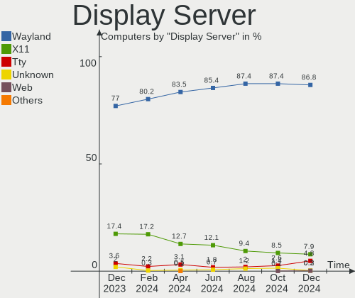
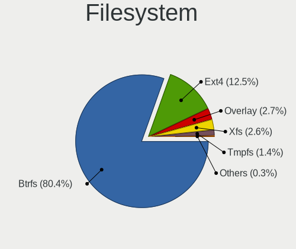
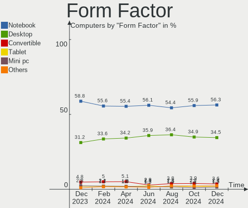
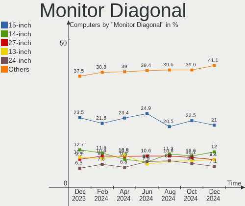
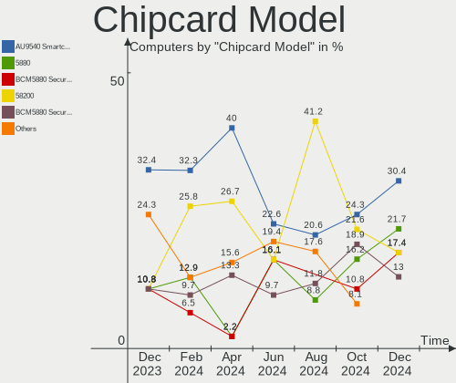

Fedora - Hardware Trends
------------------------

A project to identify most popular hardware characteristics and track their change
over time based on data collected by Linux users at https://Linux-Hardware.org.

Anyone can contribute to this report by the [hw-probe](https://github.com/linuxhw/hw-probe) tool:

    sudo -E hw-probe -all -upload

This is a report for all computer types. See also reports for [desktops](/Dist/Fedora/Desktop/README.md) and [notebooks](/Dist/Fedora/Notebook/README.md).

This report is for one last month. Overall report since the beginning of time: [TestCoverage](https://github.com/linuxhw/TestCoverage)

Period: Nov, 2022.

Contents
--------

* [ System ](#system)
  - [ OS                       ](#os)
  - [ OS Family                ](#os-family)
  - [ Kernel                   ](#kernel)
  - [ Kernel Family            ](#kernel-family)
  - [ Kernel Major Ver.        ](#kernel-major-ver)
  - [ Arch                     ](#arch)
  - [ DE                       ](#de)
  - [ Display Server           ](#display-server)
  - [ Display Manager          ](#display-manager)
  - [ OS Lang                  ](#os-lang)
  - [ Boot Mode                ](#boot-mode)
  - [ Filesystem               ](#filesystem)
  - [ Part. scheme             ](#part-scheme)
  - [ Dual Boot with Linux/BSD ](#dual-boot-with-linuxbsd)
  - [ Dual Boot (Win)          ](#dual-boot-win)

* [ Board ](#board)
  - [ Vendor                   ](#vendor)
  - [ Model                    ](#model)
  - [ Model Family             ](#model-family)
  - [ MFG Year                 ](#mfg-year)
  - [ Form Factor              ](#form-factor)
  - [ Secure Boot              ](#secure-boot)
  - [ Coreboot                 ](#coreboot)
  - [ RAM Size                 ](#ram-size)
  - [ RAM Used                 ](#ram-used)
  - [ Total Drives             ](#total-drives)
  - [ Has CD-ROM               ](#has-cd-rom)
  - [ Has Ethernet             ](#has-ethernet)
  - [ Has WiFi                 ](#has-wifi)
  - [ Has Bluetooth            ](#has-bluetooth)

* [ Location ](#location)
  - [ Country                  ](#country)
  - [ City                     ](#city)

* [ Drives ](#drives)
  - [ Drive Vendor             ](#drive-vendor)
  - [ Drive Model              ](#drive-model)
  - [ HDD Vendor               ](#hdd-vendor)
  - [ SSD Vendor               ](#ssd-vendor)
  - [ Drive Kind               ](#drive-kind)
  - [ Drive Connector          ](#drive-connector)
  - [ Drive Size               ](#drive-size)
  - [ Space Total              ](#space-total)
  - [ Space Used               ](#space-used)
  - [ Malfunc. Drives          ](#malfunc-drives)
  - [ Malfunc. Drive Vendor    ](#malfunc-drive-vendor)
  - [ Malfunc. HDD Vendor      ](#malfunc-hdd-vendor)
  - [ Malfunc. Drive Kind      ](#malfunc-drive-kind)
  - [ Failed Drives            ](#failed-drives)
  - [ Failed Drive Vendor      ](#failed-drive-vendor)
  - [ Drive Status             ](#drive-status)

* [ Storage controller ](#storage-controller)
  - [ Storage Vendor           ](#storage-vendor)
  - [ Storage Model            ](#storage-model)
  - [ Storage Kind             ](#storage-kind)

* [ Processor ](#processor)
  - [ CPU Vendor               ](#cpu-vendor)
  - [ CPU Model                ](#cpu-model)
  - [ CPU Model Family         ](#cpu-model-family)
  - [ CPU Cores                ](#cpu-cores)
  - [ CPU Sockets              ](#cpu-sockets)
  - [ CPU Threads              ](#cpu-threads)
  - [ CPU Op-Modes             ](#cpu-op-modes)
  - [ CPU Microcode            ](#cpu-microcode)
  - [ CPU Microarch            ](#cpu-microarch)

* [ Graphics ](#graphics)
  - [ GPU Vendor               ](#gpu-vendor)
  - [ GPU Model                ](#gpu-model)
  - [ GPU Combo                ](#gpu-combo)
  - [ GPU Driver               ](#gpu-driver)
  - [ GPU Memory               ](#gpu-memory)

* [ Monitor ](#monitor)
  - [ Monitor Vendor           ](#monitor-vendor)
  - [ Monitor Model            ](#monitor-model)
  - [ Monitor Resolution       ](#monitor-resolution)
  - [ Monitor Diagonal         ](#monitor-diagonal)
  - [ Monitor Width            ](#monitor-width)
  - [ Aspect Ratio             ](#aspect-ratio)
  - [ Monitor Area             ](#monitor-area)
  - [ Pixel Density            ](#pixel-density)
  - [ Multiple Monitors        ](#multiple-monitors)

* [ Network ](#network)
  - [ Net Controller Vendor    ](#net-controller-vendor)
  - [ Net Controller Model     ](#net-controller-model)
  - [ Wireless Vendor          ](#wireless-vendor)
  - [ Wireless Model           ](#wireless-model)
  - [ Ethernet Vendor          ](#ethernet-vendor)
  - [ Ethernet Model           ](#ethernet-model)
  - [ Net Controller Kind      ](#net-controller-kind)
  - [ Used Controller          ](#used-controller)
  - [ NICs                     ](#nics)
  - [ IPv6                     ](#ipv6)

* [ Bluetooth ](#bluetooth)
  - [ Bluetooth Vendor         ](#bluetooth-vendor)
  - [ Bluetooth Model          ](#bluetooth-model)

* [ Sound ](#sound)
  - [ Sound Vendor             ](#sound-vendor)
  - [ Sound Model              ](#sound-model)

* [ Memory ](#memory)
  - [ Memory Vendor            ](#memory-vendor)
  - [ Memory Model             ](#memory-model)
  - [ Memory Kind              ](#memory-kind)
  - [ Memory Form Factor       ](#memory-form-factor)
  - [ Memory Size              ](#memory-size)
  - [ Memory Speed             ](#memory-speed)

* [ Printers & scanners ](#printers--scanners)
  - [ Printer Vendor           ](#printer-vendor)
  - [ Printer Model            ](#printer-model)
  - [ Scanner Vendor           ](#scanner-vendor)
  - [ Scanner Model            ](#scanner-model)

* [ Camera ](#camera)
  - [ Camera Vendor            ](#camera-vendor)
  - [ Camera Model             ](#camera-model)

* [ Security ](#security)
  - [ Fingerprint Vendor       ](#fingerprint-vendor)
  - [ Fingerprint Model        ](#fingerprint-model)
  - [ Chipcard Vendor          ](#chipcard-vendor)
  - [ Chipcard Model           ](#chipcard-model)

* [ Unsupported ](#unsupported)
  - [ Unsupported Devices      ](#unsupported-devices)
  - [ Unsupported Device Types ](#unsupported-device-types)

System
------

OS
--

Installed operating systems

| Name      | Computers | Percent |
|-----------|-----------|---------|
| Fedora 37 | 249       | 54.01%  |
| Fedora 36 | 191       | 41.43%  |
| Fedora 35 | 15        | 3.25%   |
| Fedora 38 | 2         | 0.43%   |
| Fedora 34 | 2         | 0.43%   |
| Fedora 33 | 1         | 0.22%   |
| Fedora 29 | 1         | 0.22%   |

OS Family
---------

OS without a version

| Name   | Computers | Percent |
|--------|-----------|---------|
| Fedora | 461       | 100%    |

Kernel
------

Version of the Linux kernel

| Version                                            | Computers | Percent |
|----------------------------------------------------|-----------|---------|
| 6.0.5-200.fc36.x86_64                              | 97        | 21.04%  |
| 6.0.8-300.fc37.x86_64                              | 80        | 17.35%  |
| 6.0.9-300.fc37.x86_64                              | 68        | 14.75%  |
| 6.0.7-301.fc37.x86_64                              | 31        | 6.72%   |
| 5.19.16-301.fc37.x86_64                            | 29        | 6.29%   |
| 6.0.7-200.fc36.x86_64                              | 25        | 5.42%   |
| 5.17.5-300.fc36.x86_64                             | 18        | 3.9%    |
| 6.0.9-200.fc36.x86_64                              | 15        | 3.25%   |
| 6.0.8-200.fc36.x86_64                              | 15        | 3.25%   |
| 6.0.6-300.fc37.x86_64                              | 9         | 1.95%   |
| 5.19.16-200.fc36.x86_64                            | 9         | 1.95%   |
| 6.0.10-300.fc37.x86_64                             | 4         | 0.87%   |
| 5.19.7-300.fc37.x86_64                             | 4         | 0.87%   |
| 6.0.8-100.fc35.x86_64                              | 3         | 0.65%   |
| 6.0.5-300.fc37.x86_64                              | 3         | 0.65%   |
| 6.0.5-100.fc35.x86_64                              | 3         | 0.65%   |
| 6.1.0-rc6+                                         | 2         | 0.43%   |
| 6.1.0-0.rc4.34.inttf.fc37.x86_64                   | 2         | 0.43%   |
| 6.0.9-302.rog.fc37.x86_64                          | 2         | 0.43%   |
| 6.0.9-300.mbp.fc37.x86_64                          | 2         | 0.43%   |
| 6.0.2-xm1.0.fc36.x86_64                            | 2         | 0.43%   |
| 6.0.10-200.fc36.x86_64                             | 2         | 0.43%   |
| 5.19.15-201.fc36.x86_64                            | 2         | 0.43%   |
| 6.1.0-rc4+                                         | 1         | 0.22%   |
| 6.1.0-0.rc6.46.fc38.x86_64                         | 1         | 0.22%   |
| 6.1.0-0.rc5.39.fc38.x86_64                         | 1         | 0.22%   |
| 6.1.0-0.rc4.20221111git4bbf3422df78.39.fc38.x86_64 | 1         | 0.22%   |
| 6.1.0-0.rc2.20221028git23758867219c.24.fc38.x86_64 | 1         | 0.22%   |
| 6.0.9-602.inttf.fc36.x86_64                        | 1         | 0.22%   |
| 6.0.9-350.vanilla.1.fc37.x86_64                    | 1         | 0.22%   |
| 6.0.8-oem-lenovo                                   | 1         | 0.22%   |
| 6.0.8-602.inttf.fc37.x86_64                        | 1         | 0.22%   |
| 6.0.8-201.fsync.fc36.x86_64                        | 1         | 0.22%   |
| 6.0.7-602.inttf.fc37.x86_64                        | 1         | 0.22%   |
| 6.0.5-300.fc37.aarch64                             | 1         | 0.22%   |
| 6.0.2-xm1.0.fc37.x86_64                            | 1         | 0.22%   |
| 6.0.2-300.rog.fc36.x86_64                          | 1         | 0.22%   |
| 5.3.11-100.fc29.i686                               | 1         | 0.22%   |
| 5.19.9-200.fc36.x86_64                             | 1         | 0.22%   |
| 5.19.17-300.fc37.x86_64                            | 1         | 0.22%   |

Kernel Family
-------------

Linux kernel without a distro release

| Version | Computers | Percent |
|---------|-----------|---------|
| 6.0.5   | 104       | 22.56%  |
| 6.0.8   | 101       | 21.91%  |
| 6.0.9   | 89        | 19.31%  |
| 6.0.7   | 57        | 12.36%  |
| 5.19.16 | 40        | 8.68%   |
| 5.17.5  | 18        | 3.9%    |
| 6.1.0   | 9         | 1.95%   |
| 6.0.6   | 9         | 1.95%   |
| 6.0.10  | 6         | 1.3%    |
| 6.0.2   | 4         | 0.87%   |
| 5.19.7  | 4         | 0.87%   |
| 5.19.15 | 3         | 0.65%   |
| 5.3.11  | 1         | 0.22%   |
| 5.19.9  | 1         | 0.22%   |
| 5.19.17 | 1         | 0.22%   |
| 5.19.14 | 1         | 0.22%   |
| 5.19.13 | 1         | 0.22%   |
| 5.19.11 | 1         | 0.22%   |
| 5.18.19 | 1         | 0.22%   |
| 5.18.18 | 1         | 0.22%   |
| 5.17.4  | 1         | 0.22%   |
| 5.17.12 | 1         | 0.22%   |
| 5.17.11 | 1         | 0.22%   |
| 5.16.20 | 1         | 0.22%   |
| 5.16.18 | 1         | 0.22%   |
| 5.15.11 | 1         | 0.22%   |
| 5.14.18 | 1         | 0.22%   |
| 5.14.10 | 1         | 0.22%   |
| 5.11.12 | 1         | 0.22%   |

Kernel Major Ver.
-----------------

Linux kernel major version

| Version | Computers | Percent |
|---------|-----------|---------|
| 6.0     | 370       | 80.26%  |
| 5.19    | 52        | 11.28%  |
| 5.17    | 21        | 4.56%   |
| 6.1     | 9         | 1.95%   |
| 5.18    | 2         | 0.43%   |
| 5.16    | 2         | 0.43%   |
| 5.14    | 2         | 0.43%   |
| 5.3     | 1         | 0.22%   |
| 5.15    | 1         | 0.22%   |
| 5.11    | 1         | 0.22%   |

Arch
----

OS architecture (x86_64, i586, etc.)

| Name    | Computers | Percent |
|---------|-----------|---------|
| x86_64  | 459       | 99.57%  |
| i686    | 1         | 0.22%   |
| aarch64 | 1         | 0.22%   |

DE
--

Desktop Environment

| Name                         | Computers | Percent |
|------------------------------|-----------|---------|
| GNOME                        | 327       | 70.93%  |
| KDE5                         | 85        | 18.44%  |
| Unknown                      | 14        | 3.04%   |
| MATE                         | 7         | 1.52%   |
| XFCE                         | 6         | 1.3%    |
| X-Cinnamon                   | 6         | 1.3%    |
| Cinnamon                     | 4         | 0.87%   |
| sway                         | 2         | 0.43%   |
| GNOME Classic                | 2         | 0.43%   |
| Phosh:GNOME                  | 1         | 0.22%   |
| Pantheon                     | 1         | 0.22%   |
| LXQt                         | 1         | 0.22%   |
| LXDE                         | 1         | 0.22%   |
| KDE                          | 1         | 0.22%   |
| GNOME Flashback              | 1         | 0.22%   |
| Deepin                       | 1         | 0.22%   |
| ${XDG_CURRENT_DESKTOP:-sway} | 1         | 0.22%   |

Display Server
--------------

X11 or Wayland

| Name    | Computers | Percent |
|---------|-----------|---------|
| Wayland | 318       | 68.98%  |
| X11     | 128       | 27.77%  |
| Tty     | 8         | 1.74%   |
| Unknown | 7         | 1.52%   |

Display Manager
---------------

SDDM, LightDM, etc.

| Name    | Computers | Percent |
|---------|-----------|---------|
| Unknown | 221       | 47.94%  |
| GDM     | 164       | 35.57%  |
| SDDM    | 46        | 9.98%   |
| LightDM | 29        | 6.29%   |
| KDM     | 1         | 0.22%   |

OS Lang
-------

Language

| Lang    | Computers | Percent |
|---------|-----------|---------|
| en_US   | 245       | 53.15%  |
| en_GB   | 31        | 6.72%   |
| ru_RU   | 25        | 5.42%   |
| it_IT   | 19        | 4.12%   |
| de_DE   | 19        | 4.12%   |
| fr_FR   | 16        | 3.47%   |
| pt_BR   | 13        | 2.82%   |
| en_IN   | 12        | 2.6%    |
| en_AU   | 11        | 2.39%   |
| pl_PL   | 9         | 1.95%   |
| en_CA   | 8         | 1.74%   |
| tr_TR   | 7         | 1.52%   |
| es_ES   | 6         | 1.3%    |
| nl_NL   | 4         | 0.87%   |
| pt_PT   | 3         | 0.65%   |
| nl_BE   | 3         | 0.65%   |
| ja_JP   | 3         | 0.65%   |
| en_NZ   | 3         | 0.65%   |
| Unknown | 3         | 0.65%   |
| zh_CN   | 2         | 0.43%   |
| fi_FI   | 2         | 0.43%   |
| en_IE   | 2         | 0.43%   |
| sv_SE   | 1         | 0.22%   |
| sr_RS   | 1         | 0.22%   |
| ru_UA   | 1         | 0.22%   |
| id_ID   | 1         | 0.22%   |
| hu_HU   | 1         | 0.22%   |
| es_PE   | 1         | 0.22%   |
| en_PH   | 1         | 0.22%   |
| en_IL   | 1         | 0.22%   |
| en_DK   | 1         | 0.22%   |
| en_001  | 1         | 0.22%   |
| de_AT   | 1         | 0.22%   |
| da_DK   | 1         | 0.22%   |
| cs_CZ   | 1         | 0.22%   |
| C       | 1         | 0.22%   |
| ar_SA   | 1         | 0.22%   |

Boot Mode
---------

EFI or BIOS

| Mode | Computers | Percent |
|------|-----------|---------|
| EFI  | 383       | 83.08%  |
| BIOS | 78        | 16.92%  |

Filesystem
----------

Type of filesystem

| Type    | Computers | Percent |
|---------|-----------|---------|
| Btrfs   | 346       | 75.05%  |
| Ext4    | 101       | 21.91%  |
| Xfs     | 10        | 2.17%   |
| Unknown | 2         | 0.43%   |
| Overlay | 1         | 0.22%   |
| F2fs    | 1         | 0.22%   |

Part. scheme
------------

Scheme of partitioning

| Type    | Computers | Percent |
|---------|-----------|---------|
| GPT     | 224       | 48.59%  |
| Unknown | 214       | 46.42%  |
| MBR     | 23        | 4.99%   |

Dual Boot with Linux/BSD
------------------------

Hosting more than one Linux/BSD

| Dual boot | Computers | Percent |
|-----------|-----------|---------|
| No        | 412       | 89.37%  |
| Yes       | 49        | 10.63%  |

Dual Boot (Win)
---------------

Hosting Linux and Windows

| Dual boot | Computers | Percent |
|-----------|-----------|---------|
| No        | 370       | 80.26%  |
| Yes       | 91        | 19.74%  |

Board
-----

Vendor
------

Motherboard manufacturer

| Name                  | Computers | Percent |
|-----------------------|-----------|---------|
| Lenovo                | 93        | 20.17%  |
| ASUSTek Computer      | 91        | 19.74%  |
| Hewlett-Packard       | 53        | 11.5%   |
| Dell                  | 46        | 9.98%   |
| MSI                   | 35        | 7.59%   |
| Gigabyte Technology   | 33        | 7.16%   |
| Acer                  | 23        | 4.99%   |
| ASRock                | 12        | 2.6%    |
| Apple                 | 10        | 2.17%   |
| Intel                 | 9         | 1.95%   |
| HUAWEI                | 6         | 1.3%    |
| Google                | 4         | 0.87%   |
| TUXEDO                | 3         | 0.65%   |
| GPD                   | 3         | 0.65%   |
| Foxconn               | 3         | 0.65%   |
| Unknown               | 3         | 0.65%   |
| Toshiba               | 2         | 0.43%   |
| Timi                  | 2         | 0.43%   |
| Microsoft             | 2         | 0.43%   |
| Framework             | 2         | 0.43%   |
| Alienware             | 2         | 0.43%   |
| UNOWHY                | 1         | 0.22%   |
| TYAN Computer         | 1         | 0.22%   |
| Sony                  | 1         | 0.22%   |
| SLIMBOOK              | 1         | 0.22%   |
| Samsung Electronics   | 1         | 0.22%   |
| raspberrypi,4-model-b | 1         | 0.22%   |
| Quanta                | 1         | 0.22%   |
| Packard Bell          | 1         | 0.22%   |
| NEC Computers         | 1         | 0.22%   |
| Monster               | 1         | 0.22%   |
| MACHENIKE             | 1         | 0.22%   |
| Kraftway              | 1         | 0.22%   |
| Huanan                | 1         | 0.22%   |
| HASEE Computer        | 1         | 0.22%   |
| GEO                   | 1         | 0.22%   |
| GALAX                 | 1         | 0.22%   |
| Fujitsu               | 1         | 0.22%   |
| Exo                   | 1         | 0.22%   |
| Eluktronics           | 1         | 0.22%   |

Model
-----

Motherboard model

| Name                                     | Computers | Percent |
|------------------------------------------|-----------|---------|
| ASUS All Series                          | 5         | 1.08%   |
| Unknown                                  | 5         | 1.08%   |
| MSI MS-7C02                              | 4         | 0.87%   |
| MSI MS-7A38                              | 3         | 0.65%   |
| HUAWEI CREM-WXX9                         | 3         | 0.65%   |
| GPD G1619-04                             | 3         | 0.65%   |
| ASUS PRIME X370-PRO                      | 3         | 0.65%   |
| ASUS PRIME B550-PLUS                     | 3         | 0.65%   |
| MSI MS-7D54                              | 2         | 0.43%   |
| MSI MS-7C84                              | 2         | 0.43%   |
| Lenovo ThinkBook 15-IIL 20SM             | 2         | 0.43%   |
| Lenovo ThinkBook 15 G3 ACL 21A4          | 2         | 0.43%   |
| Lenovo IdeaPad 5 Pro 16ACH6 82L5         | 2         | 0.43%   |
| Intel NUC11PHi7                          | 2         | 0.43%   |
| HP Pavilion Laptop 14-dv0xxx             | 2         | 0.43%   |
| HP Notebook                              | 2         | 0.43%   |
| HP Laptop 15-dw3xxx                      | 2         | 0.43%   |
| HP ENVY x360 2-in-1 Laptop 15-ey0xxx     | 2         | 0.43%   |
| HP EliteBook 830 G5                      | 2         | 0.43%   |
| Gigabyte X570 GAMING X                   | 2         | 0.43%   |
| Gigabyte A320M-S2H                       | 2         | 0.43%   |
| Framework Laptop (12th Gen Intel Core)   | 2         | 0.43%   |
| Dell XPS 15 9510                         | 2         | 0.43%   |
| Dell XPS 13 9300                         | 2         | 0.43%   |
| Dell OptiPlex 790                        | 2         | 0.43%   |
| Dell OptiPlex 7010                       | 2         | 0.43%   |
| Dell Latitude 7480                       | 2         | 0.43%   |
| Dell G3 3579                             | 2         | 0.43%   |
| ASUS ZenBook UX534FTC_UX534FT            | 2         | 0.43%   |
| ASUS ROG STRIX X570-E GAMING             | 2         | 0.43%   |
| ASUS ROG STRIX B450-F GAMING II          | 2         | 0.43%   |
| ASUS PRIME Z370-A                        | 2         | 0.43%   |
| ASUS ASUS TUF Gaming F15 FX506HM_FX506HM | 2         | 0.43%   |
| Apple MacBookPro9,2                      | 2         | 0.43%   |
| Apple MacBookPro10,1                     | 2         | 0.43%   |
| Acer Aspire A515-45                      | 2         | 0.43%   |
| UNOWHY Y13G011S4EI                       | 1         | 0.22%   |
| TYAN S7012                               | 1         | 0.22%   |
| TUXEDO Stellaris Intel Gen4              | 1         | 0.22%   |
| TUXEDO Pulse 15 Gen2                     | 1         | 0.22%   |

Model Family
------------

Motherboard model prefix

| Name               | Computers | Percent |
|--------------------|-----------|---------|
| Lenovo ThinkPad    | 48        | 10.41%  |
| ASUS ROG           | 20        | 4.34%   |
| ASUS PRIME         | 16        | 3.47%   |
| Acer Aspire        | 13        | 2.82%   |
| Lenovo IdeaPad     | 12        | 2.6%    |
| Dell Inspiron      | 11        | 2.39%   |
| HP Pavilion        | 10        | 2.17%   |
| HP Laptop          | 10        | 2.17%   |
| Dell Latitude      | 10        | 2.17%   |
| Lenovo ThinkBook   | 9         | 1.95%   |
| Lenovo Legion      | 8         | 1.74%   |
| Dell XPS           | 8         | 1.74%   |
| HP EliteBook       | 7         | 1.52%   |
| Dell OptiPlex      | 7         | 1.52%   |
| ASUS VivoBook      | 7         | 1.52%   |
| Lenovo ThinkCentre | 6         | 1.3%    |
| ASUS ZenBook       | 6         | 1.3%    |
| ASUS ASUS          | 6         | 1.3%    |
| Lenovo Yoga        | 5         | 1.08%   |
| HP ENVY            | 5         | 1.08%   |
| ASUS All           | 5         | 1.08%   |
| Acer Nitro         | 5         | 1.08%   |
| Unknown            | 5         | 1.08%   |
| MSI MS-7C02        | 4         | 0.87%   |
| Dell Precision     | 4         | 0.87%   |
| ASUS TUF           | 4         | 0.87%   |
| MSI MS-7A38        | 3         | 0.65%   |
| HUAWEI CREM-WXX9   | 3         | 0.65%   |
| HP ZBook           | 3         | 0.65%   |
| HP ProBook         | 3         | 0.65%   |
| HP Compaq          | 3         | 0.65%   |
| GPD G1619-04       | 3         | 0.65%   |
| Gigabyte X570      | 3         | 0.65%   |
| Gigabyte B550      | 3         | 0.65%   |
| ASUS ProArt        | 3         | 0.65%   |
| Toshiba Satellite  | 2         | 0.43%   |
| Timi RedmiBook     | 2         | 0.43%   |
| MSI MS-7D54        | 2         | 0.43%   |
| MSI MS-7C84        | 2         | 0.43%   |
| MSI Modern         | 2         | 0.43%   |

MFG Year
--------

Motherboard manufacture year

| Year | Computers | Percent |
|------|-----------|---------|
| 2021 | 85        | 18.44%  |
| 2020 | 67        | 14.53%  |
| 2022 | 55        | 11.93%  |
| 2018 | 48        | 10.41%  |
| 2019 | 47        | 10.2%   |
| 2017 | 32        | 6.94%   |
| 2012 | 22        | 4.77%   |
| 2015 | 19        | 4.12%   |
| 2013 | 18        | 3.9%    |
| 2016 | 17        | 3.69%   |
| 2014 | 17        | 3.69%   |
| 2011 | 10        | 2.17%   |
| 2010 | 9         | 1.95%   |
| 2009 | 6         | 1.3%    |
| 2008 | 5         | 1.08%   |
| 2007 | 2         | 0.43%   |
| 2006 | 2         | 0.43%   |

Form Factor
-----------

Physical design of the computer

| Name           | Computers | Percent |
|----------------|-----------|---------|
| Notebook       | 259       | 56.18%  |
| Desktop        | 158       | 34.27%  |
| Convertible    | 21        | 4.56%   |
| Mini pc        | 12        | 2.6%    |
| Tablet         | 4         | 0.87%   |
| All in one     | 3         | 0.65%   |
| Server         | 3         | 0.65%   |
| System on chip | 1         | 0.22%   |

Secure Boot
-----------

Enabled or disabled

| State    | Computers | Percent |
|----------|-----------|---------|
| Disabled | 357       | 77.44%  |
| Enabled  | 104       | 22.56%  |

Coreboot
--------

Have coreboot on board

| Used | Computers | Percent |
|------|-----------|---------|
| No   | 457       | 99.13%  |
| Yes  | 4         | 0.87%   |

RAM Size
--------

Total RAM memory

| Size in GB      | Computers | Percent |
|-----------------|-----------|---------|
| 16.01-24.0      | 115       | 24.95%  |
| 8.01-16.0       | 93        | 20.17%  |
| 4.01-8.0        | 89        | 19.31%  |
| 32.01-64.0      | 77        | 16.7%   |
| 3.01-4.0        | 37        | 8.03%   |
| 64.01-256.0     | 31        | 6.72%   |
| 24.01-32.0      | 11        | 2.39%   |
| 1.01-2.0        | 6         | 1.3%    |
| More than 256.0 | 1         | 0.22%   |
| 0.51-1.0        | 1         | 0.22%   |

RAM Used
--------

Used RAM memory

| Used GB    | Computers | Percent |
|------------|-----------|---------|
| 4.01-8.0   | 148       | 32.1%   |
| 2.01-3.0   | 118       | 25.6%   |
| 3.01-4.0   | 87        | 18.87%  |
| 1.01-2.0   | 47        | 10.2%   |
| 8.01-16.0  | 46        | 9.98%   |
| 0.51-1.0   | 6         | 1.3%    |
| 16.01-24.0 | 5         | 1.08%   |
| 24.01-32.0 | 2         | 0.43%   |
| 32.01-64.0 | 1         | 0.22%   |
| 0.01-0.5   | 1         | 0.22%   |

Total Drives
------------

Number of drives on board

| Drives | Computers | Percent |
|--------|-----------|---------|
| 1      | 267       | 57.92%  |
| 2      | 126       | 27.33%  |
| 3      | 32        | 6.94%   |
| 4      | 16        | 3.47%   |
| 5      | 9         | 1.95%   |
| 6      | 5         | 1.08%   |
| 7      | 2         | 0.43%   |
| 0      | 2         | 0.43%   |
| 15     | 1         | 0.22%   |
| 12     | 1         | 0.22%   |

Has CD-ROM
----------

Has CD-ROM on board

| Presented | Computers | Percent |
|-----------|-----------|---------|
| No        | 372       | 80.69%  |
| Yes       | 89        | 19.31%  |

Has Ethernet
------------

Has Ethernet on board

| Presented | Computers | Percent |
|-----------|-----------|---------|
| Yes       | 359       | 77.87%  |
| No        | 102       | 22.13%  |

Has WiFi
--------

Has WiFi module

| Presented | Computers | Percent |
|-----------|-----------|---------|
| Yes       | 366       | 79.39%  |
| No        | 95        | 20.61%  |

Has Bluetooth
-------------

Has Bluetooth module

| Presented | Computers | Percent |
|-----------|-----------|---------|
| Yes       | 326       | 70.72%  |
| No        | 135       | 29.28%  |

Location
--------

Country
-------

Geographic location (country)

| Country      | Computers | Percent |
|--------------|-----------|---------|
| USA          | 89        | 19.31%  |
| Germany      | 37        | 8.03%   |
| Italy        | 30        | 6.51%   |
| Russia       | 27        | 5.86%   |
| Brazil       | 24        | 5.21%   |
| India        | 22        | 4.77%   |
| Netherlands  | 19        | 4.12%   |
| France       | 16        | 3.47%   |
| Australia    | 15        | 3.25%   |
| Poland       | 14        | 3.04%   |
| UK           | 12        | 2.6%    |
| Turkey       | 12        | 2.6%    |
| Spain        | 12        | 2.6%    |
| Sweden       | 11        | 2.39%   |
| Switzerland  | 7         | 1.52%   |
| Portugal     | 7         | 1.52%   |
| Belgium      | 7         | 1.52%   |
| Romania      | 6         | 1.3%    |
| Canada       | 6         | 1.3%    |
| Mexico       | 5         | 1.08%   |
| Finland      | 5         | 1.08%   |
| Japan        | 4         | 0.87%   |
| Indonesia    | 4         | 0.87%   |
| Belarus      | 4         | 0.87%   |
| Austria      | 4         | 0.87%   |
| New Zealand  | 3         | 0.65%   |
| Hungary      | 3         | 0.65%   |
| Greece       | 3         | 0.65%   |
| Denmark      | 3         | 0.65%   |
| Croatia      | 3         | 0.65%   |
| Taiwan       | 2         | 0.43%   |
| Serbia       | 2         | 0.43%   |
| Saudi Arabia | 2         | 0.43%   |
| Peru         | 2         | 0.43%   |
| Pakistan     | 2         | 0.43%   |
| Oman         | 2         | 0.43%   |
| Norway       | 2         | 0.43%   |
| Israel       | 2         | 0.43%   |
| Ireland      | 2         | 0.43%   |
| Estonia      | 2         | 0.43%   |

City
----

Geographic location (city)

| City            | Computers | Percent |
|-----------------|-----------|---------|
| Moscow          | 11        | 2.39%   |
| Sao Paulo       | 5         | 1.08%   |
| Bucharest       | 5         | 1.08%   |
| Paris           | 4         | 0.87%   |
| Melbourne       | 4         | 0.87%   |
| Izmir           | 4         | 0.87%   |
| Bengaluru       | 4         | 0.87%   |
| Zagreb          | 3         | 0.65%   |
| Warsaw          | 3         | 0.65%   |
| Stockholm       | 3         | 0.65%   |
| New York        | 3         | 0.65%   |
| Minsk           | 3         | 0.65%   |
| Milan           | 3         | 0.65%   |
| Lane Cove       | 3         | 0.65%   |
| Karlskrona      | 3         | 0.65%   |
| Jakarta         | 3         | 0.65%   |
| Delft           | 3         | 0.65%   |
| Chicago         | 3         | 0.65%   |
| Brisbane        | 3         | 0.65%   |
| Bari            | 3         | 0.65%   |
| Auckland        | 3         | 0.65%   |
| Vienna          | 2         | 0.43%   |
| Vantaa          | 2         | 0.43%   |
| Vanlose         | 2         | 0.43%   |
| Tokyo           | 2         | 0.43%   |
| Tallinn         | 2         | 0.43%   |
| Stadtilm        | 2         | 0.43%   |
| St. Petersburg  | 2         | 0.43%   |
| Saratov         | 2         | 0.43%   |
| Rome            | 2         | 0.43%   |
| Rishon LeZiyyon | 2         | 0.43%   |
| Pune            | 2         | 0.43%   |
| Portland        | 2         | 0.43%   |
| Pensacola       | 2         | 0.43%   |
| Omaha           | 2         | 0.43%   |
| Oklahoma City   | 2         | 0.43%   |
| Nashua          | 2         | 0.43%   |
| Naples          | 2         | 0.43%   |
| Muscat          | 2         | 0.43%   |
| Madrid          | 2         | 0.43%   |

Drives
------

Drive Vendor
------------

Hard drive vendors

| Vendor                         | Computers | Drives | Percent |
|--------------------------------|-----------|--------|---------|
| Samsung Electronics            | 148       | 179    | 21.7%   |
| WDC                            | 95        | 121    | 13.93%  |
| SanDisk                        | 62        | 66     | 9.09%   |
| Seagate                        | 53        | 67     | 7.77%   |
| Kingston                       | 40        | 44     | 5.87%   |
| Crucial                        | 31        | 36     | 4.55%   |
| SK hynix                       | 28        | 28     | 4.11%   |
| Toshiba                        | 27        | 28     | 3.96%   |
| Unknown                        | 22        | 27     | 3.23%   |
| Intel                          | 22        | 24     | 3.23%   |
| Micron Technology              | 15        | 15     | 2.2%    |
| Phison Electronics             | 12        | 13     | 1.76%   |
| Hitachi                        | 12        | 13     | 1.76%   |
| A-DATA Technology              | 10        | 10     | 1.47%   |
| KIOXIA                         | 9         | 9      | 1.32%   |
| Apple                          | 7         | 11     | 1.03%   |
| HGST                           | 6         | 7      | 0.88%   |
| ADATA Technology               | 5         | 5      | 0.73%   |
| SPCC                           | 4         | 5      | 0.59%   |
| PNY                            | 4         | 4      | 0.59%   |
| Phison                         | 4         | 4      | 0.59%   |
| Micron/Crucial Technology      | 4         | 4      | 0.59%   |
| UMIS                           | 3         | 3      | 0.44%   |
| Silicon Motion                 | 3         | 3      | 0.44%   |
| KIOXIA-EXCERIA                 | 3         | 3      | 0.44%   |
| Corsair                        | 3         | 3      | 0.44%   |
| Transcend                      | 2         | 2      | 0.29%   |
| Solid State Storage Technology | 2         | 2      | 0.29%   |
| Patriot                        | 2         | 2      | 0.29%   |
| Kingston Technology Company    | 2         | 2      | 0.29%   |
| Intenso                        | 2         | 2      | 0.29%   |
| GOODRAM                        | 2         | 2      | 0.29%   |
| China                          | 2         | 2      | 0.29%   |
| Apacer                         | 2         | 2      | 0.29%   |
| XPG                            | 1         | 1      | 0.15%   |
| WDC WDS                        | 1         | 1      | 0.15%   |
| Verbatim                       | 1         | 1      | 0.15%   |
| Union Memory (Shenzhen)        | 1         | 1      | 0.15%   |
| Union Memory                   | 1         | 1      | 0.15%   |
| TO Exter                       | 1         | 1      | 0.15%   |

Drive Model
-----------

Hard drive models

| Model                                                             | Computers | Percent |
|-------------------------------------------------------------------|-----------|---------|
| Samsung NVMe SSD Controller SM981/PM981/PM983 1TB                 | 22        | 2.95%   |
| Kingston SA400S37240G 240GB SSD                                   | 13        | 1.74%   |
| Samsung NVMe SSD Controller PM9A1/PM9A3/980PRO 250GB              | 10        | 1.34%   |
| Samsung SSD 860 EVO 500GB                                         | 9         | 1.21%   |
| Crucial CT1000MX500SSD1 1TB                                       | 9         | 1.21%   |
| Sandisk WD Blue SN550 NVMe SSD 1TB                                | 8         | 1.07%   |
| Phison E12 NVMe Controller 2TB                                    | 7         | 0.94%   |
| Sandisk WD Black SN750 / PC SN730 NVMe SSD 1024GB                 | 6         | 0.8%    |
| Kingston SA400S37480G 480GB SSD                                   | 6         | 0.8%    |
| WDC WDS500G2B0A-00SM50 500GB SSD                                  | 5         | 0.67%   |
| WDC WDS100T1X0E-00AFY0 1TB                                        | 5         | 0.67%   |
| Sandisk WD Black SN850 256GB                                      | 5         | 0.67%   |
| Samsung SSD 980 500GB                                             | 5         | 0.67%   |
| Samsung SSD 980 1TB                                               | 5         | 0.67%   |
| Samsung SSD 860 EVO 1TB                                           | 5         | 0.67%   |
| Samsung SSD 850 EVO 500GB                                         | 5         | 0.67%   |
| Samsung MZALQ512HALU-000L2 512GB                                  | 5         | 0.67%   |
| Unknown MMC Card  64GB                                            | 4         | 0.54%   |
| Seagate ST500DM002-1BD142 500GB                                   | 4         | 0.54%   |
| Seagate ST1000DM003-1ER162 1TB                                    | 4         | 0.54%   |
| Sandisk WD Black 2018/SN750 / PC SN720 NVMe SSD 500GB             | 4         | 0.54%   |
| Samsung SSD 970 EVO Plus 500GB                                    | 4         | 0.54%   |
| Samsung SSD 970 EVO Plus 250GB                                    | 4         | 0.54%   |
| Samsung SSD 970 EVO Plus 1TB                                      | 4         | 0.54%   |
| Samsung SSD 870 EVO 500GB                                         | 4         | 0.54%   |
| Samsung SSD 860 EVO 250GB                                         | 4         | 0.54%   |
| Intel SSD 660P Series 512GB                                       | 4         | 0.54%   |
| Crucial CT500MX500SSD1 500GB                                      | 4         | 0.54%   |
| ADATA XPG SX8200 Pro PCIe Gen3x4 M.2 2280 Solid State Drive 512GB | 4         | 0.54%   |
| WDC WD30EFRX-68EUZN0 3TB                                          | 3         | 0.4%    |
| WDC WD10JPVX-22JC3T0 1TB                                          | 3         | 0.4%    |
| WDC WD10EZEX-08WN4A0 1TB                                          | 3         | 0.4%    |
| Unknown MMC Card  32GB                                            | 3         | 0.4%    |
| Toshiba MQ04ABF100 1TB                                            | 3         | 0.4%    |
| SK hynix SKHynix_HFS512GDE9X081N 512GB                            | 3         | 0.4%    |
| SK hynix BC711 HFM512GD3JX013N 512GB                              | 3         | 0.4%    |
| Seagate ST2000DM008-2FR102 2TB                                    | 3         | 0.4%    |
| Seagate ST1000LM035-1RK172 1TB                                    | 3         | 0.4%    |
| Seagate ST1000DM010-2EP102 1TB                                    | 3         | 0.4%    |
| SanDisk SSD PLUS 480GB                                            | 3         | 0.4%    |

HDD Vendor
----------

Hard disk drive vendors

| Vendor              | Computers | Drives | Percent |
|---------------------|-----------|--------|---------|
| WDC                 | 61        | 79     | 39.61%  |
| Seagate             | 51        | 63     | 33.12%  |
| Toshiba             | 17        | 17     | 11.04%  |
| Hitachi             | 12        | 13     | 7.79%   |
| HGST                | 6         | 7      | 3.9%    |
| Samsung Electronics | 4         | 5      | 2.6%    |
| Unknown             | 1         | 1      | 0.65%   |
| Hewlett-Packard     | 1         | 8      | 0.65%   |
| Apple               | 1         | 1      | 0.65%   |

SSD Vendor
----------

Solid state drive vendors

| Vendor              | Computers | Drives | Percent |
|---------------------|-----------|--------|---------|
| Samsung Electronics | 55        | 65     | 27.09%  |
| Kingston            | 31        | 32     | 15.27%  |
| Crucial             | 29        | 34     | 14.29%  |
| SanDisk             | 19        | 19     | 9.36%   |
| WDC                 | 15        | 16     | 7.39%   |
| Intel               | 6         | 6      | 2.96%   |
| PNY                 | 4         | 4      | 1.97%   |
| Apple               | 4         | 4      | 1.97%   |
| Toshiba             | 3         | 3      | 1.48%   |
| SPCC                | 3         | 4      | 1.48%   |
| Transcend           | 2         | 2      | 0.99%   |
| SK hynix            | 2         | 2      | 0.99%   |
| Patriot             | 2         | 2      | 0.99%   |
| KIOXIA-EXCERIA      | 2         | 2      | 0.99%   |
| GOODRAM             | 2         | 2      | 0.99%   |
| China               | 2         | 2      | 0.99%   |
| Apacer              | 2         | 2      | 0.99%   |
| A-DATA Technology   | 2         | 2      | 0.99%   |
| WDC WDS             | 1         | 1      | 0.49%   |
| Verbatim            | 1         | 1      | 0.49%   |
| TO Exter            | 1         | 1      | 0.49%   |
| Teclast             | 1         | 1      | 0.49%   |
| Ramaxel Technology  | 1         | 1      | 0.49%   |
| Plextor             | 1         | 1      | 0.49%   |
| OCZ                 | 1         | 2      | 0.49%   |
| Netac               | 1         | 2      | 0.49%   |
| Mushkin             | 1         | 1      | 0.49%   |
| LITEON              | 1         | 1      | 0.49%   |
| Lexar               | 1         | 2      | 0.49%   |
| JAMESDONKEY         | 1         | 1      | 0.49%   |
| Intenso             | 1         | 1      | 0.49%   |
| HS-SSD-C100         | 1         | 1      | 0.49%   |
| FORESEE             | 1         | 1      | 0.49%   |
| ExeGate             | 1         | 1      | 0.49%   |
| Eluktro             | 1         | 1      | 0.49%   |
| Acer                | 1         | 1      | 0.49%   |

Drive Kind
----------

HDD or SSD

| Kind    | Computers | Drives | Percent |
|---------|-----------|--------|---------|
| NVMe    | 285       | 338    | 45.82%  |
| SSD     | 181       | 224    | 29.1%   |
| HDD     | 126       | 194    | 20.26%  |
| MMC     | 19        | 23     | 3.05%   |
| Unknown | 11        | 13     | 1.77%   |

Drive Connector
---------------

SATA, SAS, NVMe, etc.

| Type | Computers | Drives | Percent |
|------|-----------|--------|---------|
| NVMe | 285       | 338    | 50.26%  |
| SATA | 245       | 410    | 43.21%  |
| MMC  | 19        | 23     | 3.35%   |
| SAS  | 18        | 21     | 3.17%   |

Drive Size
----------

Size of hard drive

| Size in TB | Computers | Drives | Percent |
|------------|-----------|--------|---------|
| 0.01-0.5   | 163       | 213    | 51.58%  |
| 0.51-1.0   | 101       | 132    | 31.96%  |
| 1.01-2.0   | 28        | 35     | 8.86%   |
| 3.01-4.0   | 9         | 10     | 2.85%   |
| 2.01-3.0   | 7         | 17     | 2.22%   |
| 4.01-10.0  | 7         | 10     | 2.22%   |
| 10.01-20.0 | 1         | 1      | 0.32%   |

Space Total
-----------

Amount of disk space available on the file system

| Size in GB     | Computers | Percent |
|----------------|-----------|---------|
| 501-1000       | 97        | 21.04%  |
| 251-500        | 70        | 15.18%  |
| 1001-2000      | 70        | 15.18%  |
| 101-250        | 65        | 14.1%   |
| 1-20           | 57        | 12.36%  |
| More than 3000 | 38        | 8.24%   |
| Unknown        | 29        | 6.29%   |
| 2001-3000      | 16        | 3.47%   |
| 51-100         | 12        | 2.6%    |
| 21-50          | 7         | 1.52%   |

Space Used
----------

Amount of used disk space

| Used GB        | Computers | Percent |
|----------------|-----------|---------|
| 1-20           | 125       | 27.11%  |
| 21-50          | 76        | 16.49%  |
| 101-250        | 58        | 12.58%  |
| 51-100         | 53        | 11.5%   |
| 251-500        | 46        | 9.98%   |
| 501-1000       | 37        | 8.03%   |
| Unknown        | 29        | 6.29%   |
| 1001-2000      | 20        | 4.34%   |
| More than 3000 | 13        | 2.82%   |
| 2001-3000      | 4         | 0.87%   |

Malfunc. Drives
---------------

Drive models with a malfunction

| Model                                        | Computers | Drives | Percent |
|----------------------------------------------|-----------|--------|---------|
| Seagate ST3500418AS 500GB                    | 2         | 2      | 8%      |
| Intel SSDSC2CT120A3 120GB                    | 2         | 2      | 8%      |
| WDC WD6400BPVT-75HXZT3 640GB                 | 1         | 1      | 4%      |
| WDC WD5000AAKX-60U6AA0 500GB                 | 1         | 1      | 4%      |
| WDC WD10EZEX-22MFCA0 1TB                     | 1         | 1      | 4%      |
| SPCC SPCCSolidStateDisk 128GB SSD            | 1         | 1      | 4%      |
| SK hynix BC711 HFM512GD3JX013N 512GB         | 1         | 1      | 4%      |
| Seagate ST9320325AS 320GB                    | 1         | 1      | 4%      |
| Seagate ST8000NE001-2M7101 8TB               | 1         | 1      | 4%      |
| Seagate ST500DM002-1BD142 500GB              | 1         | 4      | 4%      |
| Seagate ST32000641AS 2TB                     | 1         | 1      | 4%      |
| Seagate ST3000DM001-1ER166 3TB               | 1         | 1      | 4%      |
| Seagate ST3000DM001-1CH166 3TB               | 1         | 1      | 4%      |
| Seagate ST2000DM008-2FR102 2TB               | 1         | 1      | 4%      |
| Samsung Electronics SSD 870 EVO 1TB          | 1         | 1      | 4%      |
| Samsung Electronics MZVKW512HMJP-000H1 512GB | 1         | 1      | 4%      |
| Samsung Electronics HD501LJ 500GB            | 1         | 2      | 4%      |
| PNY SSD2SC120G3LC726B104-370P 120GB          | 1         | 1      | 4%      |
| Intel SSDSA2M080G2GC 80GB                    | 1         | 1      | 4%      |
| Hitachi HTS545032B9A300 320GB                | 1         | 1      | 4%      |
| Hitachi HDT721032SLA360 320GB                | 1         | 1      | 4%      |
| Crucial CT1050MX300SSD1 1TB                  | 1         | 1      | 4%      |
| Apple SSD SD0128F 121GB                      | 1         | 1      | 4%      |

Malfunc. Drive Vendor
---------------------

Vendors of faulty drives

| Vendor              | Computers | Drives | Percent |
|---------------------|-----------|--------|---------|
| Seagate             | 7         | 12     | 30.43%  |
| WDC                 | 3         | 3      | 13.04%  |
| Samsung Electronics | 3         | 4      | 13.04%  |
| Intel               | 3         | 3      | 13.04%  |
| Hitachi             | 2         | 2      | 8.7%    |
| SPCC                | 1         | 1      | 4.35%   |
| SK hynix            | 1         | 1      | 4.35%   |
| PNY                 | 1         | 1      | 4.35%   |
| Crucial             | 1         | 1      | 4.35%   |
| Apple               | 1         | 1      | 4.35%   |

Malfunc. HDD Vendor
-------------------

Vendors of faulty HDD drives

| Vendor              | Computers | Drives | Percent |
|---------------------|-----------|--------|---------|
| Seagate             | 7         | 12     | 53.85%  |
| WDC                 | 3         | 3      | 23.08%  |
| Hitachi             | 2         | 2      | 15.38%  |
| Samsung Electronics | 1         | 2      | 7.69%   |

Malfunc. Drive Kind
-------------------

Kinds of faulty drives

| Kind | Computers | Drives | Percent |
|------|-----------|--------|---------|
| HDD  | 13        | 19     | 56.52%  |
| SSD  | 8         | 8      | 34.78%  |
| NVMe | 2         | 2      | 8.7%    |

Failed Drives
-------------

Failed drive models

Zero info for selected period =(

Failed Drive Vendor
-------------------

Failed drive vendors

Zero info for selected period =(

Drive Status
------------

Number of failed and malfunc. drives

| Status   | Computers | Drives | Percent |
|----------|-----------|--------|---------|
| Detected | 247       | 420    | 50.41%  |
| Works    | 221       | 343    | 45.1%   |
| Malfunc  | 22        | 29     | 4.49%   |

Storage controller
------------------

Storage Vendor
--------------

Storage controller vendors

| Vendor                         | Computers | Percent |
|--------------------------------|-----------|---------|
| Intel                          | 241       | 36.02%  |
| AMD                            | 108       | 16.14%  |
| Samsung Electronics            | 99        | 14.8%   |
| SanDisk                        | 66        | 9.87%   |
| SK hynix                       | 26        | 3.89%   |
| Phison Electronics             | 17        | 2.54%   |
| Micron Technology              | 15        | 2.24%   |
| ASMedia Technology             | 14        | 2.09%   |
| Kingston Technology Company    | 13        | 1.94%   |
| ADATA Technology               | 13        | 1.94%   |
| KIOXIA                         | 9         | 1.35%   |
| Toshiba America Info Systems   | 8         | 1.2%    |
| Micron/Crucial Technology      | 6         | 0.9%    |
| Union Memory (Shenzhen)        | 5         | 0.75%   |
| Silicon Motion                 | 4         | 0.6%    |
| Solid State Storage Technology | 3         | 0.45%   |
| Seagate Technology             | 3         | 0.45%   |
| Apple                          | 3         | 0.45%   |
| Nvidia                         | 2         | 0.3%    |
| MAXIO Technology (Hangzhou)    | 2         | 0.3%    |
| Marvell Technology Group       | 2         | 0.3%    |
| LSI Logic / Symbios Logic      | 2         | 0.3%    |
| Broadcom / LSI                 | 2         | 0.3%    |
| Lite-On Technology             | 1         | 0.15%   |
| Lenovo                         | 1         | 0.15%   |
| JMicron Technology             | 1         | 0.15%   |
| Integrated Technology Express  | 1         | 0.15%   |
| Hewlett-Packard                | 1         | 0.15%   |
| Biwin Storage Technology       | 1         | 0.15%   |

Storage Model
-------------

Storage controller models

| Model                                                                          | Computers | Percent |
|--------------------------------------------------------------------------------|-----------|---------|
| AMD FCH SATA Controller [AHCI mode]                                            | 78        | 10.6%   |
| Samsung NVMe SSD Controller SM981/PM981/PM983                                  | 42        | 5.71%   |
| Intel Volume Management Device NVMe RAID Controller                            | 30        | 4.08%   |
| Samsung NVMe SSD Controller 980                                                | 25        | 3.4%    |
| Samsung NVMe SSD Controller PM9A1/PM9A3/980PRO                                 | 23        | 3.13%   |
| AMD 400 Series Chipset SATA Controller                                         | 20        | 2.72%   |
| Intel 8 Series/C220 Series Chipset Family 6-port SATA Controller 1 [AHCI mode] | 19        | 2.58%   |
| SK hynix Gold P31/PC711 NVMe Solid State Drive                                 | 17        | 2.31%   |
| SanDisk Non-Volatile memory controller                                         | 17        | 2.31%   |
| Micron Non-Volatile memory controller                                          | 15        | 2.04%   |
| Intel 82801 Mobile SATA Controller [RAID mode]                                 | 15        | 2.04%   |
| SanDisk WD Blue SN550 NVMe SSD                                                 | 14        | 1.9%    |
| Intel Sunrise Point-LP SATA Controller [AHCI mode]                             | 14        | 1.9%    |
| Intel 7 Series Chipset Family 6-port SATA Controller [AHCI mode]               | 14        | 1.9%    |
| ASMedia ASM1062 Serial ATA Controller                                          | 14        | 1.9%    |
| SanDisk WD Black SN750 / PC SN730 NVMe SSD                                     | 13        | 1.77%   |
| Intel Tiger Lake-LP SATA Controller                                            | 13        | 1.77%   |
| Phison E12 NVMe Controller                                                     | 11        | 1.49%   |
| Intel 200 Series PCH SATA controller [AHCI mode]                               | 11        | 1.49%   |
| AMD 500 Series Chipset SATA Controller                                         | 11        | 1.49%   |
| SanDisk WD PC SN810 / Black SN850 NVMe SSD                                     | 10        | 1.36%   |
| Intel 7 Series/C210 Series Chipset Family 6-port SATA Controller [AHCI mode]   | 10        | 1.36%   |
| Samsung NVMe SSD Controller SM961/PM961/SM963                                  | 9         | 1.22%   |
| SanDisk WD Black 2018/SN750 / PC SN720 NVMe SSD                                | 7         | 0.95%   |
| KIOXIA NVMe SSD Controller BG4                                                 | 7         | 0.95%   |
| Kingston Company Company Non-Volatile memory controller                        | 7         | 0.95%   |
| Intel Cannon Lake PCH SATA AHCI Controller                                     | 7         | 0.95%   |
| ADATA XPG SX8200 Pro PCIe Gen3x4 M.2 2280 Solid State Drive                    | 7         | 0.95%   |
| Intel Wildcat Point-LP SATA Controller [AHCI Mode]                             | 6         | 0.82%   |
| Intel SATA Controller [RAID mode]                                              | 6         | 0.82%   |
| Intel Q170/Q150/B150/H170/H110/Z170/CM236 Chipset SATA Controller [AHCI Mode]  | 6         | 0.82%   |
| Intel Non-Volatile memory controller                                           | 6         | 0.82%   |
| Intel Cannon Lake Mobile PCH SATA AHCI Controller                              | 6         | 0.82%   |
| Intel Alder Lake-S PCH SATA Controller [AHCI Mode]                             | 6         | 0.82%   |
| Intel 8 Series SATA Controller 1 [AHCI mode]                                   | 6         | 0.82%   |
| Intel 500 Series Chipset Family SATA AHCI Controller                           | 6         | 0.82%   |
| Intel SSD 660P Series                                                          | 5         | 0.68%   |
| Intel HM170/QM170 Chipset SATA Controller [AHCI Mode]                          | 5         | 0.68%   |
| Intel Cannon Point-LP SATA Controller [AHCI Mode]                              | 5         | 0.68%   |
| Intel 6 Series/C200 Series Chipset Family 6 port Desktop SATA AHCI Controller  | 5         | 0.68%   |

Storage Kind
------------

Kind of storage controller (IDE, SATA, NVMe, SAS, ...)

| Kind | Computers | Percent |
|------|-----------|---------|
| SATA | 296       | 44.78%  |
| NVMe | 284       | 42.97%  |
| RAID | 55        | 8.32%   |
| IDE  | 24        | 3.63%   |
| SAS  | 1         | 0.15%   |
| SCSI | 1         | 0.15%   |

Processor
---------

CPU Vendor
----------

Processor vendors

| Vendor | Computers | Percent |
|--------|-----------|---------|
| Intel  | 310       | 67.25%  |
| AMD    | 150       | 32.54%  |
| ARM    | 1         | 0.22%   |

CPU Model
---------

Processor models

| Model                                      | Computers | Percent |
|--------------------------------------------|-----------|---------|
| Intel 11th Gen Core i7-1165G7 @ 2.80GHz    | 12        | 2.6%    |
| Intel 11th Gen Core i5-1135G7 @ 2.40GHz    | 11        | 2.39%   |
| Intel 11th Gen Core i7-11800H @ 2.30GHz    | 8         | 1.74%   |
| AMD Ryzen 7 5800H with Radeon Graphics     | 7         | 1.52%   |
| Intel 12th Gen Core i7-12700H              | 6         | 1.3%    |
| Intel 11th Gen Core i3-1115G4 @ 3.00GHz    | 6         | 1.3%    |
| Intel Core i7-8565U CPU @ 1.80GHz          | 5         | 1.08%   |
| Intel Core i5-7200U CPU @ 2.50GHz          | 5         | 1.08%   |
| AMD Ryzen 9 3900X 12-Core Processor        | 5         | 1.08%   |
| AMD Ryzen 7 5700U with Radeon Graphics     | 5         | 1.08%   |
| AMD Ryzen 7 4800H with Radeon Graphics     | 5         | 1.08%   |
| Intel Core i7-8700 CPU @ 3.20GHz           | 4         | 0.87%   |
| Intel Core i7-8550U CPU @ 1.80GHz          | 4         | 0.87%   |
| Intel Core i7-3770 CPU @ 3.40GHz           | 4         | 0.87%   |
| Intel Core i5-8350U CPU @ 1.70GHz          | 4         | 0.87%   |
| Intel Core i5-8250U CPU @ 1.60GHz          | 4         | 0.87%   |
| Intel Core i5-1035G1 CPU @ 1.00GHz         | 4         | 0.87%   |
| Intel 12th Gen Core i9-12900H              | 4         | 0.87%   |
| Intel 12th Gen Core i5-1240P               | 4         | 0.87%   |
| AMD Ryzen 9 5900X 12-Core Processor        | 4         | 0.87%   |
| AMD Ryzen 7 PRO 4750U with Radeon Graphics | 4         | 0.87%   |
| AMD Ryzen 7 5800X 8-Core Processor         | 4         | 0.87%   |
| AMD Ryzen 7 5700G with Radeon Graphics     | 4         | 0.87%   |
| AMD Ryzen 7 3700X 8-Core Processor         | 4         | 0.87%   |
| AMD Ryzen 5 5625U with Radeon Graphics     | 4         | 0.87%   |
| AMD Ryzen 5 5600G with Radeon Graphics     | 4         | 0.87%   |
| AMD Ryzen 5 5500U with Radeon Graphics     | 4         | 0.87%   |
| AMD Ryzen 5 3600 6-Core Processor          | 4         | 0.87%   |
| AMD Ryzen 5 2600 Six-Core Processor        | 4         | 0.87%   |
| Intel Core i7-8650U CPU @ 1.90GHz          | 3         | 0.65%   |
| Intel Core i7-7700K CPU @ 4.20GHz          | 3         | 0.65%   |
| Intel Core i7-7500U CPU @ 2.70GHz          | 3         | 0.65%   |
| Intel Core i7-6700HQ CPU @ 2.60GHz         | 3         | 0.65%   |
| Intel Core i7-6700 CPU @ 3.40GHz           | 3         | 0.65%   |
| Intel Core i7-10750H CPU @ 2.60GHz         | 3         | 0.65%   |
| Intel Core i7-1065G7 CPU @ 1.30GHz         | 3         | 0.65%   |
| Intel Core i5-8400 CPU @ 2.80GHz           | 3         | 0.65%   |
| Intel Core i5-6200U CPU @ 2.30GHz          | 3         | 0.65%   |
| Intel Core i5-5200U CPU @ 2.20GHz          | 3         | 0.65%   |
| Intel Core i5-4570 CPU @ 3.20GHz           | 3         | 0.65%   |

CPU Model Family
----------------

Processor model prefix

| Model                   | Computers | Percent |
|-------------------------|-----------|---------|
| Intel Core i5           | 82        | 17.79%  |
| Intel Core i7           | 81        | 17.57%  |
| Other                   | 76        | 16.49%  |
| AMD Ryzen 7             | 55        | 11.93%  |
| AMD Ryzen 5             | 45        | 9.76%   |
| Intel Core i3           | 25        | 5.42%   |
| AMD Ryzen 9             | 20        | 4.34%   |
| Intel Xeon              | 10        | 2.17%   |
| Intel Celeron           | 10        | 2.17%   |
| Intel Atom              | 7         | 1.52%   |
| AMD Ryzen 7 PRO         | 6         | 1.3%    |
| AMD Ryzen 3             | 6         | 1.3%    |
| AMD FX                  | 5         | 1.08%   |
| Intel Core 2 Duo        | 4         | 0.87%   |
| Intel Pentium           | 3         | 0.65%   |
| Intel Core i9           | 3         | 0.65%   |
| AMD A4                  | 3         | 0.65%   |
| Intel Pentium Dual-Core | 2         | 0.43%   |
| Intel Core 2 Quad       | 2         | 0.43%   |
| AMD Ryzen 5 PRO         | 2         | 0.43%   |
| Intel Pentium Silver    | 1         | 0.22%   |
| Intel Pentium Gold      | 1         | 0.22%   |
| Intel Pentium Dual      | 1         | 0.22%   |
| Intel Core m5           | 1         | 0.22%   |
| Intel Core 2            | 1         | 0.22%   |
| Intel Celeron M         | 1         | 0.22%   |
| AMD Ryzen Threadripper  | 1         | 0.22%   |
| AMD Ryzen 3 PRO         | 1         | 0.22%   |
| AMD PRO A10             | 1         | 0.22%   |
| AMD Phenom II X6        | 1         | 0.22%   |
| AMD Phenom II X2        | 1         | 0.22%   |
| AMD Athlon II X4        | 1         | 0.22%   |
| AMD Athlon II X2        | 1         | 0.22%   |
| AMD A6                  | 1         | 0.22%   |

CPU Cores
---------

Number of processor cores

| Number  | Computers | Percent |
|---------|-----------|---------|
| 4       | 162       | 35.14%  |
| 2       | 95        | 20.61%  |
| 8       | 78        | 16.92%  |
| 6       | 68        | 14.75%  |
| 12      | 22        | 4.77%   |
| 14      | 14        | 3.04%   |
| 16      | 11        | 2.39%   |
| 10      | 4         | 0.87%   |
| 1       | 3         | 0.65%   |
| 24      | 1         | 0.22%   |
| 20      | 1         | 0.22%   |
| 3       | 1         | 0.22%   |
| Unknown | 1         | 0.22%   |

CPU Sockets
-----------

Number of sockets

| Number  | Computers | Percent |
|---------|-----------|---------|
| 1       | 457       | 99.13%  |
| 2       | 3         | 0.65%   |
| Unknown | 1         | 0.22%   |

CPU Threads
-----------

Threads per core (Hyper-Threading)

| Number  | Computers | Percent |
|---------|-----------|---------|
| 2       | 381       | 82.65%  |
| 1       | 79        | 17.14%  |
| Unknown | 1         | 0.22%   |

CPU Op-Modes
------------

CPU Operation Modes (32-bit, 64-bit)

| Op mode        | Computers | Percent |
|----------------|-----------|---------|
| 32-bit, 64-bit | 460       | 99.78%  |
| 32-bit         | 1         | 0.22%   |

CPU Microcode
-------------

Microcode number

| Number     | Computers | Percent |
|------------|-----------|---------|
| 0x806c1    | 31        | 6.72%   |
| 0x306c3    | 23        | 4.99%   |
| 0x306a9    | 23        | 4.99%   |
| 0x906a3    | 21        | 4.56%   |
| Unknown    | 20        | 4.34%   |
| 0x806ea    | 19        | 4.12%   |
| 0x0a50000c | 17        | 3.69%   |
| 0x906ea    | 15        | 3.25%   |
| 0x08701021 | 14        | 3.04%   |
| 0x806e9    | 12        | 2.6%    |
| 0x506e3    | 12        | 2.6%    |
| 0x08600106 | 12        | 2.6%    |
| 0x206a7    | 10        | 2.17%   |
| 0x906e9    | 9         | 1.95%   |
| 0x0a50000d | 9         | 1.95%   |
| 0xa0652    | 8         | 1.74%   |
| 0x906ed    | 8         | 1.74%   |
| 0x806ec    | 8         | 1.74%   |
| 0x706e5    | 8         | 1.74%   |
| 0x08108109 | 8         | 1.74%   |
| 0x806d1    | 7         | 1.52%   |
| 0x406e3    | 7         | 1.52%   |
| 0x0800820d | 7         | 1.52%   |
| 0x40651    | 6         | 1.3%    |
| 0x0a404102 | 6         | 1.3%    |
| 0x90672    | 5         | 1.08%   |
| 0x706a8    | 5         | 1.08%   |
| 0x306d4    | 5         | 1.08%   |
| 0x0a404101 | 5         | 1.08%   |
| 0x08608103 | 5         | 1.08%   |
| 0x806eb    | 4         | 0.87%   |
| 0x406c4    | 4         | 0.87%   |
| 0x20655    | 4         | 0.87%   |
| 0x1067a    | 4         | 0.87%   |
| 0x0a20120a | 4         | 0.87%   |
| 0x0a201016 | 4         | 0.87%   |
| 0x0a201009 | 4         | 0.87%   |
| 0x08701013 | 4         | 0.87%   |
| 0xa0653    | 3         | 0.65%   |
| 0x906a4    | 3         | 0.65%   |

CPU Microarch
-------------

Microarchitecture

| Name             | Computers | Percent |
|------------------|-----------|---------|
| KabyLake         | 78        | 16.92%  |
| Zen 3            | 45        | 9.76%   |
| Zen 2            | 38        | 8.24%   |
| TigerLake        | 34        | 7.38%   |
| Haswell          | 32        | 6.94%   |
| Alderlake Hybrid | 30        | 6.51%   |
| Unknown          | 29        | 6.29%   |
| IvyBridge        | 26        | 5.64%   |
| Skylake          | 21        | 4.56%   |
| Zen+             | 18        | 3.9%    |
| Icelake          | 17        | 3.69%   |
| SandyBridge      | 12        | 2.6%    |
| CometLake        | 12        | 2.6%    |
| Zen              | 9         | 1.95%   |
| Silvermont       | 9         | 1.95%   |
| Westmere         | 7         | 1.52%   |
| Penryn           | 7         | 1.52%   |
| Broadwell        | 7         | 1.52%   |
| Goldmont plus    | 6         | 1.3%    |
| Piledriver       | 5         | 1.08%   |
| K10              | 4         | 0.87%   |
| Core             | 4         | 0.87%   |
| Excavator        | 3         | 0.65%   |
| Nehalem          | 2         | 0.43%   |
| Goldmont         | 2         | 0.43%   |
| P6               | 1         | 0.22%   |
| Jaguar           | 1         | 0.22%   |
| Bulldozer        | 1         | 0.22%   |
| Bonnell          | 1         | 0.22%   |

Graphics
--------

GPU Vendor
----------

Vendors of graphics cards

| Vendor                     | Computers | Percent |
|----------------------------|-----------|---------|
| Intel                      | 244       | 42.96%  |
| Nvidia                     | 162       | 28.52%  |
| AMD                        | 159       | 27.99%  |
| Matrox Electronics Systems | 2         | 0.35%   |
| ASPEED Technology          | 1         | 0.18%   |

GPU Model
---------

Graphics card models

| Model                                                                       | Computers | Percent |
|-----------------------------------------------------------------------------|-----------|---------|
| Intel TigerLake-LP GT2 [Iris Xe Graphics]                                   | 27        | 4.66%   |
| Intel Alder Lake-P Integrated Graphics Controller                           | 21        | 3.63%   |
| AMD Cezanne [Radeon Vega Series / Radeon Vega Mobile Series]                | 20        | 3.45%   |
| AMD Ellesmere [Radeon RX 470/480/570/570X/580/580X/590]                     | 19        | 3.28%   |
| AMD Renoir                                                                  | 18        | 3.11%   |
| Intel UHD Graphics 620                                                      | 16        | 2.76%   |
| Intel 3rd Gen Core processor Graphics Controller                            | 14        | 2.42%   |
| AMD Rembrandt [Radeon 680M]                                                 | 11        | 1.9%    |
| AMD Navi 23 [Radeon RX 6600/6600 XT/6600M]                                  | 11        | 1.9%    |
| AMD Lucienne                                                                | 11        | 1.9%    |
| Intel HD Graphics 620                                                       | 10        | 1.73%   |
| Nvidia GA106M [GeForce RTX 3060 Mobile / Max-Q]                             | 9         | 1.55%   |
| Intel WhiskeyLake-U GT2 [UHD Graphics 620]                                  | 9         | 1.55%   |
| Intel CoffeeLake-H GT2 [UHD Graphics 630]                                   | 9         | 1.55%   |
| AMD Picasso/Raven 2 [Radeon Vega Series / Radeon Vega Mobile Series]        | 9         | 1.55%   |
| Intel TigerLake-H GT1 [UHD Graphics]                                        | 8         | 1.38%   |
| Intel HD Graphics 530                                                       | 7         | 1.21%   |
| Intel CometLake-H GT2 [UHD Graphics]                                        | 7         | 1.21%   |
| Intel 4th Gen Core Processor Integrated Graphics Controller                 | 7         | 1.21%   |
| Intel 2nd Generation Core Processor Family Integrated Graphics Controller   | 7         | 1.21%   |
| AMD Barcelo                                                                 | 7         | 1.21%   |
| Nvidia TU117M [GeForce GTX 1650 Mobile / Max-Q]                             | 6         | 1.04%   |
| Intel Xeon E3-1200 v3/4th Gen Core Processor Integrated Graphics Controller | 6         | 1.04%   |
| Intel Tiger Lake-LP GT2 [UHD Graphics G4]                                   | 6         | 1.04%   |
| Intel Skylake GT2 [HD Graphics 520]                                         | 6         | 1.04%   |
| Intel HD Graphics 5500                                                      | 6         | 1.04%   |
| Intel Haswell-ULT Integrated Graphics Controller                            | 6         | 1.04%   |
| Nvidia TU117M [GeForce GTX 1650 Ti Mobile]                                  | 5         | 0.86%   |
| Nvidia TU106M [GeForce RTX 2060 Mobile]                                     | 5         | 0.86%   |
| Intel Iris Plus Graphics G1 (Ice Lake)                                      | 5         | 0.86%   |
| Intel HD Graphics 630                                                       | 5         | 0.86%   |
| Intel GeminiLake [UHD Graphics 600]                                         | 5         | 0.86%   |
| Intel Atom Processor Z36xxx/Z37xxx Series Graphics & Display                | 5         | 0.86%   |
| AMD Raven Ridge [Radeon Vega Series / Radeon Vega Mobile Series]            | 5         | 0.86%   |
| AMD Navi 22 [Radeon RX 6700/6700 XT/6750 XT / 6800M]                        | 5         | 0.86%   |
| Nvidia GP108 [GeForce GT 1030]                                              | 4         | 0.69%   |
| Nvidia GP107M [GeForce GTX 1050 Mobile]                                     | 4         | 0.69%   |
| Nvidia GP104 [GeForce GTX 1070]                                             | 4         | 0.69%   |
| Nvidia GA107M [GeForce RTX 3050 Ti Mobile]                                  | 4         | 0.69%   |
| Nvidia GA107M [GeForce RTX 3050 Mobile]                                     | 4         | 0.69%   |

GPU Combo
---------

Combinations of graphics cards

| Name            | Computers | Percent |
|-----------------|-----------|---------|
| 1 x Intel       | 159       | 34.49%  |
| 1 x AMD         | 124       | 26.9%   |
| Intel + Nvidia  | 72        | 15.62%  |
| 1 x Nvidia      | 67        | 14.53%  |
| AMD + Nvidia    | 20        | 4.34%   |
| 2 x AMD         | 7         | 1.52%   |
| Intel + AMD     | 7         | 1.52%   |
| Other           | 1         | 0.22%   |
| 2 x Intel       | 1         | 0.22%   |
| Nvidia + Matrox | 1         | 0.22%   |
| Nvidia + ASPEED | 1         | 0.22%   |
| 1 x Matrox      | 1         | 0.22%   |

GPU Driver
----------

Free vs proprietary

| Driver      | Computers | Percent |
|-------------|-----------|---------|
| Free        | 361       | 78.31%  |
| Proprietary | 91        | 19.74%  |
| Unknown     | 9         | 1.95%   |

GPU Memory
----------

Total video memory

| Size in GB | Computers | Percent |
|------------|-----------|---------|
| Unknown    | 227       | 49.24%  |
| 0.01-0.5   | 55        | 11.93%  |
| 1.01-2.0   | 53        | 11.5%   |
| 7.01-8.0   | 43        | 9.33%   |
| 3.01-4.0   | 41        | 8.89%   |
| 0.51-1.0   | 20        | 4.34%   |
| 5.01-6.0   | 11        | 2.39%   |
| 8.01-16.0  | 7         | 1.52%   |
| 2.01-3.0   | 4         | 0.87%   |

Monitor
-------

Monitor Vendor
--------------

Monitor vendors

| Vendor               | Computers | Percent |
|----------------------|-----------|---------|
| BOE                  | 68        | 12.71%  |
| AU Optronics         | 62        | 11.59%  |
| Samsung Electronics  | 42        | 7.85%   |
| Chimei Innolux       | 40        | 7.48%   |
| LG Display           | 38        | 7.1%    |
| Goldstar             | 37        | 6.92%   |
| Dell                 | 34        | 6.36%   |
| Hewlett-Packard      | 19        | 3.55%   |
| Acer                 | 18        | 3.36%   |
| BenQ                 | 16        | 2.99%   |
| AOC                  | 14        | 2.62%   |
| Philips              | 12        | 2.24%   |
| Apple                | 10        | 1.87%   |
| Sharp                | 9         | 1.68%   |
| Lenovo               | 9         | 1.68%   |
| Sceptre Tech         | 8         | 1.5%    |
| CSO                  | 8         | 1.5%    |
| ASUSTek Computer     | 8         | 1.5%    |
| PANDA                | 7         | 1.31%   |
| MSI                  | 6         | 1.12%   |
| InfoVision           | 6         | 1.12%   |
| Ancor Communications | 6         | 1.12%   |
| ViewSonic            | 5         | 0.93%   |
| Mi                   | 4         | 0.75%   |
| JDI                  | 4         | 0.75%   |
| Eizo                 | 4         | 0.75%   |
| HUAWEI               | 3         | 0.56%   |
| Gigabyte Technology  | 3         | 0.56%   |
| Toshiba              | 2         | 0.37%   |
| Panasonic            | 2         | 0.37%   |
| Iiyama               | 2         | 0.37%   |
| Fujitsu Siemens      | 2         | 0.37%   |
| CTO                  | 2         | 0.37%   |
| XHS                  | 1         | 0.19%   |
| VOXICON              | 1         | 0.19%   |
| Vizio                | 1         | 0.19%   |
| VIE                  | 1         | 0.19%   |
| Unknown              | 1         | 0.19%   |
| TMX                  | 1         | 0.19%   |
| Pixio                | 1         | 0.19%   |

Monitor Model
-------------

Monitor models

| Model                                                                 | Computers | Percent |
|-----------------------------------------------------------------------|-----------|---------|
| AU Optronics LCD Monitor AUO403D 1920x1080 309x173mm 13.9-inch        | 7         | 1.27%   |
| Goldstar HDR 4K GSM7707 3840x2160 600x340mm 27.2-inch                 | 5         | 0.91%   |
| Chimei Innolux LCD Monitor CMN1521 1920x1080 344x193mm 15.5-inch      | 4         | 0.72%   |
| AU Optronics LCD Monitor AUO21ED 1920x1080 344x193mm 15.5-inch        | 4         | 0.72%   |
| Samsung Electronics S24F350 SAM0D20 1920x1080 521x293mm 23.5-inch     | 3         | 0.54%   |
| Samsung Electronics C24F390 SAM0D2C 1920x1080 520x290mm 23.4-inch     | 3         | 0.54%   |
| JDI GPD1001H JDI0031 2560x1600 890x500mm 40.2-inch                    | 3         | 0.54%   |
| Goldstar LG ULTRAWIDE GSM59F1 2560x1080 670x280mm 28.6-inch           | 3         | 0.54%   |
| Chimei Innolux LCD Monitor CMN15F5 1920x1080 344x193mm 15.5-inch      | 3         | 0.54%   |
| BOE LCD Monitor BOE092F 2520x1680 338x226mm 16.0-inch                 | 3         | 0.54%   |
| AU Optronics LCD Monitor AUO978F 1920x1080 382x215mm 17.3-inch        | 3         | 0.54%   |
| AU Optronics LCD Monitor AUO38ED 1920x1080 344x193mm 15.5-inch        | 3         | 0.54%   |
| Toshiba ScreenXpert TSB8888 1080x2160                                 | 2         | 0.36%   |
| Sceptre Tech Sceptre M25 SPT0A05 1920x1080 597x336mm 27.0-inch        | 2         | 0.36%   |
| Sceptre Tech Sceptre F24 SPT09AB 1920x1080 530x290mm 23.8-inch        | 2         | 0.36%   |
| Sceptre Tech E20 SPT080D 1600x900 434x236mm 19.4-inch                 | 2         | 0.36%   |
| Samsung Electronics LCD Monitor SDC4171 2880x1800 302x189mm 14.0-inch | 2         | 0.36%   |
| Samsung Electronics LCD Monitor SDC4154 2880x1800 302x189mm 14.0-inch | 2         | 0.36%   |
| Samsung Electronics C27F390 SAM0D32 1920x1080 598x336mm 27.0-inch     | 2         | 0.36%   |
| Philips PHL 276E8V PHLC18F 3840x2160 597x336mm 27.0-inch              | 2         | 0.36%   |
| PANDA LCD Monitor NCP004D 1920x1080 344x194mm 15.5-inch               | 2         | 0.36%   |
| Panasonic LCD Monitor MEI96A2 2560x1440 309x173mm 13.9-inch           | 2         | 0.36%   |
| Mi Monitor XMI3446 3440x1440 797x334mm 34.0-inch                      | 2         | 0.36%   |
| Mi Monitor XMI3444 3440x1440 800x330mm 34.1-inch                      | 2         | 0.36%   |
| LG Display LCD Monitor LGD06F0 1920x1080 309x174mm 14.0-inch          | 2         | 0.36%   |
| LG Display LCD Monitor LGD06B3 1920x1200 336x210mm 15.6-inch          | 2         | 0.36%   |
| Lenovo LEN L28u-30 LEN65FA 3840x2160 621x341mm 27.9-inch              | 2         | 0.36%   |
| Lenovo LEN L27i-28 LEN65E0 1920x1080 598x336mm 27.0-inch              | 2         | 0.36%   |
| InfoVision LCD Monitor IVO057D 1920x1080 309x174mm 14.0-inch          | 2         | 0.36%   |
| HUAWEI AD80HW HWV2402 1920x1080 527x296mm 23.8-inch                   | 2         | 0.36%   |
| Goldstar TV SSCR2 GSMC0C8 3840x2160                                   | 2         | 0.36%   |
| Goldstar LG UltraFine GSM5B74                                         | 2         | 0.36%   |
| Goldstar HDR WFHD GSM7714 2560x1080 798x334mm 34.1-inch               | 2         | 0.36%   |
| Dell U2417H DEL40E8 1920x1080 527x296mm 23.8-inch                     | 2         | 0.36%   |
| CSO LCD Monitor CSO160A 2560x1600 345x215mm 16.0-inch                 | 2         | 0.36%   |
| Chimei Innolux LCD Monitor CMN15E8 1920x1080 344x193mm 15.5-inch      | 2         | 0.36%   |
| Chimei Innolux LCD Monitor CMN151E 1920x1080 344x193mm 15.5-inch      | 2         | 0.36%   |
| Chimei Innolux LCD Monitor CMN150C 1920x1080 344x193mm 15.5-inch      | 2         | 0.36%   |
| Chimei Innolux LCD Monitor CMN14D6 1366x768 309x173mm 13.9-inch       | 2         | 0.36%   |
| Chimei Innolux LCD Monitor CMN14D3 1920x1080 309x173mm 13.9-inch      | 2         | 0.36%   |

Monitor Resolution
------------------

Monitor screen resolution

| Resolution         | Computers | Percent |
|--------------------|-----------|---------|
| 1920x1080 (FHD)    | 240       | 47.62%  |
| 2560x1440 (QHD)    | 49        | 9.72%   |
| 3840x2160 (4K)     | 45        | 8.93%   |
| 1366x768 (WXGA)    | 44        | 8.73%   |
| 2560x1600          | 16        | 3.17%   |
| 3440x1440          | 15        | 2.98%   |
| 1920x1200 (WUXGA)  | 13        | 2.58%   |
| 1600x900 (HD+)     | 12        | 2.38%   |
| 2880x1800          | 11        | 2.18%   |
| 1280x1024 (SXGA)   | 10        | 1.98%   |
| 2560x1080          | 8         | 1.59%   |
| 1440x900 (WXGA+)   | 5         | 0.99%   |
| 1280x800 (WXGA)    | 5         | 0.99%   |
| 1680x1050 (WSXGA+) | 4         | 0.79%   |
| 1360x768           | 4         | 0.79%   |
| 3840x1080          | 3         | 0.6%    |
| 2520x1680          | 3         | 0.6%    |
| 3840x2400          | 2         | 0.4%    |
| 3840x1600          | 2         | 0.4%    |
| 2256x1504          | 2         | 0.4%    |
| 1600x1200          | 2         | 0.4%    |
| 3000x2000          | 1         | 0.2%    |
| 2736x1824          | 1         | 0.2%    |
| 2560x2880          | 1         | 0.2%    |
| 2304x1440          | 1         | 0.2%    |
| 2288x1287          | 1         | 0.2%    |
| 2160x1350          | 1         | 0.2%    |
| 1920x540           | 1         | 0.2%    |
| 1920x1280          | 1         | 0.2%    |
| 1024x768 (XGA)     | 1         | 0.2%    |

Monitor Diagonal
----------------

Diagonal size in inches

| Inches  | Computers | Percent |
|---------|-----------|---------|
| 15      | 131       | 24.26%  |
| 27      | 73        | 13.52%  |
| 14      | 51        | 9.44%   |
| 13      | 49        | 9.07%   |
| 23      | 36        | 6.67%   |
| 24      | 31        | 5.74%   |
| 21      | 26        | 4.81%   |
| 34      | 22        | 4.07%   |
| 17      | 19        | 3.52%   |
| 31      | 16        | 2.96%   |
| 16      | 14        | 2.59%   |
| 19      | 10        | 1.85%   |
| 12      | 7         | 1.3%    |
| 32      | 6         | 1.11%   |
| 40      | 5         | 0.93%   |
| 26      | 5         | 0.93%   |
| 18      | 5         | 0.93%   |
| Unknown | 5         | 0.93%   |
| 48      | 4         | 0.74%   |
| 11      | 4         | 0.74%   |
| 22      | 3         | 0.56%   |
| 72      | 2         | 0.37%   |
| 54      | 2         | 0.37%   |
| 37      | 2         | 0.37%   |
| 25      | 2         | 0.37%   |
| 10      | 2         | 0.37%   |
| 142     | 1         | 0.19%   |
| 55      | 1         | 0.19%   |
| 42      | 1         | 0.19%   |
| 39      | 1         | 0.19%   |
| 36      | 1         | 0.19%   |
| 33      | 1         | 0.19%   |
| 29      | 1         | 0.19%   |
| 20      | 1         | 0.19%   |

Monitor Width
-------------

Physical width

| Width in mm    | Computers | Percent |
|----------------|-----------|---------|
| 301-350        | 214       | 40.68%  |
| 501-600        | 126       | 23.95%  |
| 201-300        | 42        | 7.98%   |
| 401-500        | 38        | 7.22%   |
| 701-800        | 30        | 5.7%    |
| 601-700        | 26        | 4.94%   |
| 351-400        | 26        | 4.94%   |
| 801-900        | 7         | 1.33%   |
| 1001-1500      | 7         | 1.33%   |
| Unknown        | 5         | 0.95%   |
| 1501-2000      | 2         | 0.38%   |
| 901-1000       | 2         | 0.38%   |
| More than 2000 | 1         | 0.19%   |

Aspect Ratio
------------

Proportional relationship between the width and the height

| Ratio   | Computers | Percent |
|---------|-----------|---------|
| 16/9    | 364       | 76.63%  |
| 16/10   | 56        | 11.79%  |
| 21/9    | 25        | 5.26%   |
| 3/2     | 8         | 1.68%   |
| 5/4     | 7         | 1.47%   |
| 4/3     | 7         | 1.47%   |
| 32/9    | 3         | 0.63%   |
| Unknown | 3         | 0.63%   |
| 1.00    | 1         | 0.21%   |
| 0.89    | 1         | 0.21%   |

Monitor Area
------------

Area in inch

| Area in inch | Computers | Percent |
|----------------|-----------|---------|
| 101-110        | 131       | 24.39%  |
| 201-250        | 81        | 15.08%  |
| 301-350        | 78        | 14.53%  |
| 81-90          | 76        | 14.15%  |
| 351-500        | 48        | 8.94%   |
| 71-80          | 25        | 4.66%   |
| 151-200        | 20        | 3.72%   |
| 121-130        | 17        | 3.17%   |
| 111-120        | 14        | 2.61%   |
| 501-1000       | 12        | 2.23%   |
| More than 1000 | 7         | 1.3%    |
| 61-70          | 5         | 0.93%   |
| 51-60          | 5         | 0.93%   |
| 251-300        | 5         | 0.93%   |
| 141-150        | 5         | 0.93%   |
| Unknown        | 5         | 0.93%   |
| 41-50          | 1         | 0.19%   |
| 131-140        | 1         | 0.19%   |
| 91-100         | 1         | 0.19%   |

Pixel Density
-------------

Pixels per inch

| Density       | Computers | Percent |
|---------------|-----------|---------|
| 121-160       | 169       | 32.63%  |
| 51-100        | 137       | 26.45%  |
| 101-120       | 108       | 20.85%  |
| 161-240       | 72        | 13.9%   |
| More than 240 | 20        | 3.86%   |
| 1-50          | 7         | 1.35%   |
| Unknown       | 5         | 0.97%   |

Multiple Monitors
-----------------

Total monitors connected

| Total | Computers | Percent |
|-------|-----------|---------|
| 1     | 351       | 76.14%  |
| 2     | 82        | 17.79%  |
| 3     | 14        | 3.04%   |
| 0     | 13        | 2.82%   |
| 5     | 1         | 0.22%   |

Network
-------

Net Controller Vendor
---------------------

Controller vendors

| Vendor                        | Computers | Percent |
|-------------------------------|-----------|---------|
| Intel                         | 264       | 39.52%  |
| Realtek Semiconductor         | 247       | 36.98%  |
| MediaTek                      | 32        | 4.79%   |
| Qualcomm Atheros              | 31        | 4.64%   |
| Broadcom                      | 22        | 3.29%   |
| TP-Link                       | 8         | 1.2%    |
| Ralink                        | 6         | 0.9%    |
| Lenovo                        | 6         | 0.9%    |
| DisplayLink                   | 5         | 0.75%   |
| Xiaomi                        | 4         | 0.6%    |
| Ralink Technology             | 4         | 0.6%    |
| Broadcom Limited              | 4         | 0.6%    |
| ASUSTek Computer              | 4         | 0.6%    |
| Microsoft                     | 3         | 0.45%   |
| Google                        | 3         | 0.45%   |
| Aquantia                      | 3         | 0.45%   |
| Marvell Technology Group      | 2         | 0.3%    |
| D-Link                        | 2         | 0.3%    |
| ASIX Electronics              | 2         | 0.3%    |
| Sitecom Europe                | 1         | 0.15%   |
| Sierra Wireless               | 1         | 0.15%   |
| Qualcomm                      | 1         | 0.15%   |
| OPPO Electronics              | 1         | 0.15%   |
| OnePlus Technology (Shenzhen) | 1         | 0.15%   |
| Nvidia                        | 1         | 0.15%   |
| NetGear                       | 1         | 0.15%   |
| Microchip Technology          | 1         | 0.15%   |
| Linksys                       | 1         | 0.15%   |
| Huawei Technologies           | 1         | 0.15%   |
| Fibocom                       | 1         | 0.15%   |
| Edimax Technology             | 1         | 0.15%   |
| Dell                          | 1         | 0.15%   |
| Conexant Systems              | 1         | 0.15%   |
| Arduino SA                    | 1         | 0.15%   |
| Apple                         | 1         | 0.15%   |

Net Controller Model
--------------------

Controller models

| Model                                                             | Computers | Percent |
|-------------------------------------------------------------------|-----------|---------|
| Realtek RTL8111/8168/8411 PCI Express Gigabit Ethernet Controller | 161       | 20.43%  |
| Intel Wi-Fi 6 AX200                                               | 45        | 5.71%   |
| Intel Wi-Fi 6 AX201                                               | 28        | 3.55%   |
| Realtek RTL8153 Gigabit Ethernet Adapter                          | 20        | 2.54%   |
| Intel Alder Lake-P PCH CNVi WiFi                                  | 20        | 2.54%   |
| Intel I211 Gigabit Network Connection                             | 19        | 2.41%   |
| Realtek RTL8125 2.5GbE Controller                                 | 18        | 2.28%   |
| MediaTek MT7921 802.11ax PCI Express Wireless Network Adapter     | 17        | 2.16%   |
| Intel Wireless 8265 / 8275                                        | 17        | 2.16%   |
| Intel Wi-Fi 6 AX210/AX211/AX411 160MHz                            | 17        | 2.16%   |
| Realtek RTL8822CE 802.11ac PCIe Wireless Network Adapter          | 16        | 2.03%   |
| Intel Ethernet Controller I225-V                                  | 13        | 1.65%   |
| Intel 82579LM Gigabit Network Connection (Lewisville)             | 12        | 1.52%   |
| Realtek RTL810xE PCI Express Fast Ethernet controller             | 11        | 1.4%    |
| Realtek RTL8821CE 802.11ac PCIe Wireless Network Adapter          | 9         | 1.14%   |
| Qualcomm Atheros QCA9377 802.11ac Wireless Network Adapter        | 9         | 1.14%   |
| MediaTek MT7922 802.11ax PCI Express Wireless Network Adapter     | 9         | 1.14%   |
| Intel Ethernet Connection (4) I219-LM                             | 9         | 1.14%   |
| Intel Ethernet Connection (2) I219-V                              | 8         | 1.02%   |
| Realtek RTL8852AE 802.11ax PCIe Wireless Network Adapter          | 7         | 0.89%   |
| Intel Wireless 8260                                               | 7         | 0.89%   |
| Intel Wireless 7265                                               | 7         | 0.89%   |
| Intel Wireless 7260                                               | 7         | 0.89%   |
| Intel Ethernet Connection (2) I219-LM                             | 7         | 0.89%   |
| Intel Comet Lake PCH CNVi WiFi                                    | 7         | 0.89%   |
| Qualcomm Atheros QCA9565 / AR9565 Wireless Network Adapter        | 6         | 0.76%   |
| Intel Tiger Lake PCH CNVi WiFi                                    | 6         | 0.76%   |
| Intel Ice Lake-LP PCH CNVi WiFi                                   | 6         | 0.76%   |
| Qualcomm Atheros AR9485 Wireless Network Adapter                  | 5         | 0.63%   |
| Lenovo ThinkPad TBT 3 Dock                                        | 5         | 0.63%   |
| Intel Ethernet Connection I217-LM                                 | 5         | 0.63%   |
| Intel Ethernet Connection (7) I219-LM                             | 5         | 0.63%   |
| Intel Dual Band Wireless-AC 3168NGW [Stone Peak]                  | 5         | 0.63%   |
| Intel Cannon Point-LP CNVi [Wireless-AC]                          | 5         | 0.63%   |
| Intel Cannon Lake PCH CNVi WiFi                                   | 5         | 0.63%   |
| Realtek RTL88x2bu [AC1200 Techkey]                                | 4         | 0.51%   |
| Realtek RTL8723BE PCIe Wireless Network Adapter                   | 4         | 0.51%   |
| Realtek RTL8152 Fast Ethernet Adapter                             | 4         | 0.51%   |
| Realtek Killer E2600 Gigabit Ethernet Controller                  | 4         | 0.51%   |
| Qualcomm Atheros QCA6174 802.11ac Wireless Network Adapter        | 4         | 0.51%   |

Wireless Vendor
---------------

Wireless vendors

| Vendor                   | Computers | Percent |
|--------------------------|-----------|---------|
| Intel                    | 209       | 55.15%  |
| Realtek Semiconductor    | 59        | 15.57%  |
| MediaTek                 | 32        | 8.44%   |
| Qualcomm Atheros         | 28        | 7.39%   |
| Broadcom                 | 13        | 3.43%   |
| TP-Link                  | 7         | 1.85%   |
| Ralink                   | 6         | 1.58%   |
| Ralink Technology        | 4         | 1.06%   |
| Broadcom Limited         | 4         | 1.06%   |
| ASUSTek Computer         | 4         | 1.06%   |
| Microsoft                | 3         | 0.79%   |
| Sitecom Europe           | 1         | 0.26%   |
| Sierra Wireless          | 1         | 0.26%   |
| Qualcomm                 | 1         | 0.26%   |
| NetGear                  | 1         | 0.26%   |
| Marvell Technology Group | 1         | 0.26%   |
| Linksys                  | 1         | 0.26%   |
| Fibocom                  | 1         | 0.26%   |
| Edimax Technology        | 1         | 0.26%   |
| Dell                     | 1         | 0.26%   |
| D-Link                   | 1         | 0.26%   |

Wireless Model
--------------

Wireless models

| Model                                                         | Computers | Percent |
|---------------------------------------------------------------|-----------|---------|
| Intel Wi-Fi 6 AX200                                           | 45        | 11.87%  |
| Intel Wi-Fi 6 AX201                                           | 28        | 7.39%   |
| Intel Alder Lake-P PCH CNVi WiFi                              | 20        | 5.28%   |
| MediaTek MT7921 802.11ax PCI Express Wireless Network Adapter | 17        | 4.49%   |
| Intel Wireless 8265 / 8275                                    | 17        | 4.49%   |
| Intel Wi-Fi 6 AX210/AX211/AX411 160MHz                        | 17        | 4.49%   |
| Realtek RTL8822CE 802.11ac PCIe Wireless Network Adapter      | 16        | 4.22%   |
| Realtek RTL8821CE 802.11ac PCIe Wireless Network Adapter      | 9         | 2.37%   |
| Qualcomm Atheros QCA9377 802.11ac Wireless Network Adapter    | 9         | 2.37%   |
| MediaTek MT7922 802.11ax PCI Express Wireless Network Adapter | 9         | 2.37%   |
| Realtek RTL8852AE 802.11ax PCIe Wireless Network Adapter      | 7         | 1.85%   |
| Intel Wireless 8260                                           | 7         | 1.85%   |
| Intel Wireless 7265                                           | 7         | 1.85%   |
| Intel Wireless 7260                                           | 7         | 1.85%   |
| Intel Comet Lake PCH CNVi WiFi                                | 7         | 1.85%   |
| Qualcomm Atheros QCA9565 / AR9565 Wireless Network Adapter    | 6         | 1.58%   |
| Intel Tiger Lake PCH CNVi WiFi                                | 6         | 1.58%   |
| Intel Ice Lake-LP PCH CNVi WiFi                               | 6         | 1.58%   |
| Qualcomm Atheros AR9485 Wireless Network Adapter              | 5         | 1.32%   |
| Intel Dual Band Wireless-AC 3168NGW [Stone Peak]              | 5         | 1.32%   |
| Intel Cannon Point-LP CNVi [Wireless-AC]                      | 5         | 1.32%   |
| Intel Cannon Lake PCH CNVi WiFi                               | 5         | 1.32%   |
| Realtek RTL88x2bu [AC1200 Techkey]                            | 4         | 1.06%   |
| Realtek RTL8723BE PCIe Wireless Network Adapter               | 4         | 1.06%   |
| Qualcomm Atheros QCA6174 802.11ac Wireless Network Adapter    | 4         | 1.06%   |
| MediaTek WLAN controller                                      | 4         | 1.06%   |
| Realtek RTL8822BE 802.11a/b/g/n/ac WiFi adapter               | 3         | 0.79%   |
| Realtek RTL8188CE 802.11b/g/n WiFi Adapter                    | 3         | 0.79%   |
| Realtek Realtek Network controller                            | 3         | 0.79%   |
| Intel Wireless-AC 9260                                        | 3         | 0.79%   |
| Intel Wireless 3165                                           | 3         | 0.79%   |
| Intel Gemini Lake PCH CNVi WiFi                               | 3         | 0.79%   |
| Intel Dual Band Wireless-AC 3165 Plus Bluetooth               | 3         | 0.79%   |
| Intel Comet Lake PCH-LP CNVi WiFi                             | 3         | 0.79%   |
| Intel Alder Lake-S PCH CNVi WiFi                              | 3         | 0.79%   |
| ASUS 802.11ac NIC                                             | 3         | 0.79%   |
| TP-Link Archer T3U [Realtek RTL8812BU]                        | 2         | 0.53%   |
| Realtek RTL8812AE 802.11ac PCIe Wireless Network Adapter      | 2         | 0.53%   |
| Ralink RT5370 Wireless Adapter                                | 2         | 0.53%   |
| Ralink RT2561/RT61 802.11g PCI                                | 2         | 0.53%   |

Ethernet Vendor
---------------

Ethernet vendors

| Vendor                        | Computers | Percent |
|-------------------------------|-----------|---------|
| Realtek Semiconductor         | 219       | 55.44%  |
| Intel                         | 128       | 32.41%  |
| Broadcom                      | 13        | 3.29%   |
| Qualcomm Atheros              | 6         | 1.52%   |
| Lenovo                        | 5         | 1.27%   |
| DisplayLink                   | 5         | 1.27%   |
| Xiaomi                        | 4         | 1.01%   |
| Google                        | 3         | 0.76%   |
| Aquantia                      | 3         | 0.76%   |
| ASIX Electronics              | 2         | 0.51%   |
| TP-Link                       | 1         | 0.25%   |
| OPPO Electronics              | 1         | 0.25%   |
| OnePlus Technology (Shenzhen) | 1         | 0.25%   |
| Nvidia                        | 1         | 0.25%   |
| Marvell Technology Group      | 1         | 0.25%   |
| D-Link                        | 1         | 0.25%   |
| Apple                         | 1         | 0.25%   |

Ethernet Model
--------------

Ethernet models

| Model                                                             | Computers | Percent |
|-------------------------------------------------------------------|-----------|---------|
| Realtek RTL8111/8168/8411 PCI Express Gigabit Ethernet Controller | 161       | 39.85%  |
| Realtek RTL8153 Gigabit Ethernet Adapter                          | 20        | 4.95%   |
| Intel I211 Gigabit Network Connection                             | 19        | 4.7%    |
| Realtek RTL8125 2.5GbE Controller                                 | 18        | 4.46%   |
| Intel Ethernet Controller I225-V                                  | 13        | 3.22%   |
| Intel 82579LM Gigabit Network Connection (Lewisville)             | 12        | 2.97%   |
| Realtek RTL810xE PCI Express Fast Ethernet controller             | 11        | 2.72%   |
| Intel Ethernet Connection (4) I219-LM                             | 9         | 2.23%   |
| Intel Ethernet Connection (2) I219-V                              | 8         | 1.98%   |
| Intel Ethernet Connection (2) I219-LM                             | 7         | 1.73%   |
| Lenovo ThinkPad TBT 3 Dock                                        | 5         | 1.24%   |
| Intel Ethernet Connection I217-LM                                 | 5         | 1.24%   |
| Intel Ethernet Connection (7) I219-LM                             | 5         | 1.24%   |
| Realtek RTL8152 Fast Ethernet Adapter                             | 4         | 0.99%   |
| Realtek Killer E2600 Gigabit Ethernet Controller                  | 4         | 0.99%   |
| Intel Ethernet Connection (7) I219-V                              | 4         | 0.99%   |
| Intel Ethernet Connection (4) I219-V                              | 4         | 0.99%   |
| Intel Ethernet Connection (13) I219-V                             | 4         | 0.99%   |
| Intel 82574L Gigabit Network Connection                           | 4         | 0.99%   |
| Broadcom NetXtreme BCM57786 Gigabit Ethernet PCIe                 | 4         | 0.99%   |
| Xiaomi Mi/Redmi series (RNDIS)                                    | 3         | 0.74%   |
| Realtek Killer E3000 2.5GbE Controller                            | 3         | 0.74%   |
| Intel Ethernet Connection (3) I218-LM                             | 3         | 0.74%   |
| Intel Ethernet Connection (2) I218-V                              | 3         | 0.74%   |
| Intel Ethernet Connection (16) I219-V                             | 3         | 0.74%   |
| Qualcomm Atheros QCA8171 Gigabit Ethernet                         | 2         | 0.5%    |
| Qualcomm Atheros AR8151 v1.0 Gigabit Ethernet                     | 2         | 0.5%    |
| Intel Ethernet Controller I225-LM                                 | 2         | 0.5%    |
| Intel Ethernet Connection I219-V                                  | 2         | 0.5%    |
| Intel Ethernet Connection I217-V                                  | 2         | 0.5%    |
| Intel Ethernet Connection (6) I219-V                              | 2         | 0.5%    |
| Intel Ethernet Connection (5) I219-LM                             | 2         | 0.5%    |
| Intel Ethernet Connection (16) I219-LM                            | 2         | 0.5%    |
| Intel Ethernet Connection (10) I219-V                             | 2         | 0.5%    |
| Intel 82579V Gigabit Network Connection                           | 2         | 0.5%    |
| Intel 82567LM-3 Gigabit Network Connection                        | 2         | 0.5%    |
| Google Pixel 6                                                    | 2         | 0.5%    |
| DisplayLink USB 3.0 DOCK                                          | 2         | 0.5%    |
| Broadcom NetXtreme BCM57765 Gigabit Ethernet PCIe                 | 2         | 0.5%    |
| Broadcom NetXtreme BCM57762 Gigabit Ethernet PCIe                 | 2         | 0.5%    |

Net Controller Kind
-------------------

Ethernet, WiFi or modem

| Kind     | Computers | Percent |
|----------|-----------|---------|
| WiFi     | 367       | 50.21%  |
| Ethernet | 359       | 49.11%  |
| Modem    | 4         | 0.55%   |
| Unknown  | 1         | 0.14%   |

Used Controller
---------------

Currently used network controller

| Kind     | Computers | Percent |
|----------|-----------|---------|
| WiFi     | 286       | 58.97%  |
| Ethernet | 199       | 41.03%  |

NICs
----

Total network controllers on board

| Total | Computers | Percent |
|-------|-----------|---------|
| 2     | 224       | 48.59%  |
| 1     | 213       | 46.2%   |
| 3     | 14        | 3.04%   |
| 0     | 7         | 1.52%   |
| 4     | 3         | 0.65%   |

IPv6
----

IPv6 vs IPv4

| Used | Computers | Percent |
|------|-----------|---------|
| No   | 342       | 74.19%  |
| Yes  | 119       | 25.81%  |

Bluetooth
---------

Bluetooth Vendor
----------------

Controller vendors

| Vendor                          | Computers | Percent |
|---------------------------------|-----------|---------|
| Intel                           | 189       | 57.27%  |
| Realtek Semiconductor           | 40        | 12.12%  |
| IMC Networks                    | 18        | 5.45%   |
| Cambridge Silicon Radio         | 18        | 5.45%   |
| Foxconn / Hon Hai               | 17        | 5.15%   |
| Lite-On Technology              | 10        | 3.03%   |
| Qualcomm Atheros Communications | 8         | 2.42%   |
| Apple                           | 8         | 2.42%   |
| Broadcom                        | 6         | 1.82%   |
| TP-Link                         | 4         | 1.21%   |
| Realtek                         | 3         | 0.91%   |
| MediaTek                        | 3         | 0.91%   |
| Ralink                          | 1         | 0.3%    |
| Opticis                         | 1         | 0.3%    |
| Marvell Semiconductor           | 1         | 0.3%    |
| Edimax Technology               | 1         | 0.3%    |
| BUFFALO                         | 1         | 0.3%    |
| Belkin Components               | 1         | 0.3%    |

Bluetooth Model
---------------

Controller models

| Model                                               | Computers | Percent |
|-----------------------------------------------------|-----------|---------|
| Intel AX201 Bluetooth                               | 49        | 14.85%  |
| Intel AX200 Bluetooth                               | 43        | 13.03%  |
| Intel Bluetooth wireless interface                  | 37        | 11.21%  |
| Realtek Bluetooth Radio                             | 31        | 9.39%   |
| Cambridge Silicon Radio Bluetooth Dongle (HCI mode) | 18        | 5.45%   |
| Intel Bluetooth 9460/9560 Jefferson Peak (JfP)      | 17        | 5.15%   |
| Intel AX210 Bluetooth                               | 17        | 5.15%   |
| Intel Bluetooth Device                              | 16        | 4.85%   |
| Foxconn / Hon Hai Wireless_Device                   | 15        | 4.55%   |
| IMC Networks Wireless_Device                        | 11        | 3.33%   |
| Realtek  Bluetooth 4.2 Adapter                      | 7         | 2.12%   |
| Qualcomm Atheros  Bluetooth Device                  | 6         | 1.82%   |
| Intel Wireless-AC 3168 Bluetooth                    | 5         | 1.52%   |
| TP-Link UB500 Adapter                               | 4         | 1.21%   |
| Lite-On Qualcomm Atheros QCA9377 Bluetooth          | 4         | 1.21%   |
| IMC Networks Bluetooth Device                       | 4         | 1.21%   |
| Apple Bluetooth USB Host Controller                 | 4         | 1.21%   |
| Apple Bluetooth Host Controller                     | 4         | 1.21%   |
| Realtek Bluetooth Radio                             | 3         | 0.91%   |
| MediaTek Wireless_Device                            | 3         | 0.91%   |
| Intel Wireless-AC 9260 Bluetooth Adapter            | 3         | 0.91%   |
| Qualcomm Atheros QCA61x4 Bluetooth 4.0              | 2         | 0.61%   |
| Lite-On Wireless_Device                             | 2         | 0.61%   |
| Lite-On Bluetooth Device                            | 2         | 0.61%   |
| Lite-On Atheros AR3012 Bluetooth                    | 2         | 0.61%   |
| IMC Networks Bluetooth Radio                        | 2         | 0.61%   |
| Broadcom BCM20702A0 Bluetooth 4.0                   | 2         | 0.61%   |
| Realtek RTL8723B Bluetooth                          | 1         | 0.3%    |
| Realtek Bluetooth 5.1 Radio                         | 1         | 0.3%    |
| Ralink RT3290 Bluetooth                             | 1         | 0.3%    |
| Opticis Bluetooth Radio                             | 1         | 0.3%    |
| Marvell Bluetooth and Wireless LAN Composite        | 1         | 0.3%    |
| Intel Centrino Bluetooth Wireless Transceiver       | 1         | 0.3%    |
| Intel Centrino Advanced-N 6230 Bluetooth adapter    | 1         | 0.3%    |
| IMC Networks Atheros AR3012 Bluetooth 4.0 Adapter   | 1         | 0.3%    |
| Foxconn / Hon Hai Bluetooth USB Host Controller     | 1         | 0.3%    |
| Foxconn / Hon Hai Bluetooth Device                  | 1         | 0.3%    |
| Edimax Bluetooth Adapter                            | 1         | 0.3%    |
| BUFFALO Bluetooth Radio                             | 1         | 0.3%    |
| Broadcom HP Portable Bumble Bee                     | 1         | 0.3%    |

Sound
-----

Sound Vendor
------------

Sound card vendors

| Vendor                               | Computers | Percent |
|--------------------------------------|-----------|---------|
| Intel                                | 295       | 42.14%  |
| AMD                                  | 178       | 25.43%  |
| Nvidia                               | 123       | 17.57%  |
| C-Media Electronics                  | 10        | 1.43%   |
| Lenovo                               | 7         | 1%      |
| Logitech                             | 6         | 0.86%   |
| Kingston Technology                  | 6         | 0.86%   |
| SteelSeries ApS                      | 5         | 0.71%   |
| Razer USA                            | 5         | 0.71%   |
| Micro Star International             | 5         | 0.71%   |
| Creative Labs                        | 5         | 0.71%   |
| JMTek                                | 4         | 0.57%   |
| GN Netcom                            | 4         | 0.57%   |
| ASUSTek Computer                     | 4         | 0.57%   |
| Thesycon Systemsoftware & Consulting | 3         | 0.43%   |
| Samson Technologies                  | 3         | 0.43%   |
| RODE Microphones                     | 3         | 0.43%   |
| VIA Technologies                     | 2         | 0.29%   |
| Sony                                 | 2         | 0.29%   |
| Samsung Electronics                  | 2         | 0.29%   |
| Realtek Semiconductor                | 2         | 0.29%   |
| LG Electronics                       | 2         | 0.29%   |
| Focusrite-Novation                   | 2         | 0.29%   |
| Creative Technology                  | 2         | 0.29%   |
| Apple                                | 2         | 0.29%   |
| USB MICROPHONE                       | 1         | 0.14%   |
| Tenx Technology                      | 1         | 0.14%   |
| Sennheiser electronic                | 1         | 0.14%   |
| PreSonus Audio Electronics           | 1         | 0.14%   |
| Hewlett-Packard                      | 1         | 0.14%   |
| GYROCOM C&C                          | 1         | 0.14%   |
| Giga-Byte Technology                 | 1         | 0.14%   |
| Generalplus Technology               | 1         | 0.14%   |
| Formosa Industrial Computing         | 1         | 0.14%   |
| FiiO Electronics Technology          | 1         | 0.14%   |
| DSEA A/S                             | 1         | 0.14%   |
| Digidesign                           | 1         | 0.14%   |
| Corsair                              | 1         | 0.14%   |
| Cambridge Silicon Radio              | 1         | 0.14%   |
| Cambridge Audio                      | 1         | 0.14%   |

Sound Model
-----------

Sound card models

| Model                                                                      | Computers | Percent |
|----------------------------------------------------------------------------|-----------|---------|
| AMD Family 17h/19h HD Audio Controller                                     | 88        | 10.35%  |
| AMD Renoir Radeon High Definition Audio Controller                         | 53        | 6.24%   |
| Intel Sunrise Point-LP HD Audio                                            | 36        | 4.24%   |
| AMD Starship/Matisse HD Audio Controller                                   | 35        | 4.12%   |
| Intel Tiger Lake-LP Smart Sound Technology Audio Controller                | 34        | 4%      |
| Intel 7 Series/C216 Chipset Family High Definition Audio Controller        | 26        | 3.06%   |
| Intel Alder Lake PCH-P High Definition Audio Controller                    | 24        | 2.82%   |
| Intel 8 Series/C220 Series Chipset High Definition Audio Controller        | 20        | 2.35%   |
| AMD Navi 21/23 HDMI/DP Audio Controller                                    | 20        | 2.35%   |
| AMD Ellesmere HDMI Audio [Radeon RX 470/480 / 570/580/590]                 | 19        | 2.24%   |
| Intel Cannon Lake PCH cAVS                                                 | 17        | 2%      |
| Nvidia TU107 GeForce GTX 1650 High Definition Audio Controller             | 16        | 1.88%   |
| Intel Xeon E3-1200 v3/4th Gen Core Processor HD Audio Controller           | 14        | 1.65%   |
| AMD Rembrandt Radeon High Definition Audio Controller                      | 14        | 1.65%   |
| Nvidia GA106 High Definition Audio Controller                              | 13        | 1.53%   |
| AMD Raven/Raven2/Fenghuang HDMI/DP Audio Controller                        | 13        | 1.53%   |
| Intel 200 Series PCH HD Audio                                              | 12        | 1.41%   |
| Intel 100 Series/C230 Series Chipset Family HD Audio Controller            | 12        | 1.41%   |
| AMD Family 17h (Models 00h-0fh) HD Audio Controller                        | 12        | 1.41%   |
| Intel Cannon Point-LP High Definition Audio Controller                     | 11        | 1.29%   |
| Nvidia TU106 High Definition Audio Controller                              | 10        | 1.18%   |
| Intel Tiger Lake-H HD Audio Controller                                     | 10        | 1.18%   |
| Nvidia GA104 High Definition Audio Controller                              | 9         | 1.06%   |
| Intel Comet Lake PCH cAVS                                                  | 9         | 1.06%   |
| Intel 6 Series/C200 Series Chipset Family High Definition Audio Controller | 9         | 1.06%   |
| Intel Ice Lake-LP Smart Sound Technology Audio Controller                  | 8         | 0.94%   |
| AMD SBx00 Azalia (Intel HDA)                                               | 8         | 0.94%   |
| Nvidia GP104 High Definition Audio Controller                              | 7         | 0.82%   |
| Nvidia GK208 HDMI/DP Audio Controller                                      | 7         | 0.82%   |
| Nvidia GK107 HDMI Audio Controller                                         | 7         | 0.82%   |
| Intel Alder Lake-S HD Audio Controller                                     | 7         | 0.82%   |
| Intel 5 Series/3400 Series Chipset High Definition Audio                   | 7         | 0.82%   |
| AMD Baffin HDMI/DP Audio [Radeon RX 550 640SP / RX 560/560X]               | 7         | 0.82%   |
| Nvidia TU104 HD Audio Controller                                           | 6         | 0.71%   |
| Nvidia GP107GL High Definition Audio Controller                            | 6         | 0.71%   |
| Intel Wildcat Point-LP High Definition Audio Controller                    | 6         | 0.71%   |
| Intel Haswell-ULT HD Audio Controller                                      | 6         | 0.71%   |
| Intel Celeron/Pentium Silver Processor High Definition Audio               | 6         | 0.71%   |
| Intel Broadwell-U Audio Controller                                         | 6         | 0.71%   |
| Intel 8 Series HD Audio Controller                                         | 6         | 0.71%   |

Memory
------

Memory Vendor
-------------

Memory module vendors

| Vendor              | Computers | Percent |
|---------------------|-----------|---------|
| Samsung Electronics | 67        | 23.26%  |
| SK hynix            | 46        | 15.97%  |
| Kingston            | 39        | 13.54%  |
| Micron Technology   | 32        | 11.11%  |
| Crucial             | 22        | 7.64%   |
| Corsair             | 16        | 5.56%   |
| Unknown             | 13        | 4.51%   |
| G.Skill             | 11        | 3.82%   |
| Patriot             | 9         | 3.13%   |
| Ramaxel Technology  | 8         | 2.78%   |
| A-DATA Technology   | 4         | 1.39%   |
| Unknown             | 3         | 1.04%   |
| Team                | 2         | 0.69%   |
| GOODRAM             | 2         | 0.69%   |
| Elpida              | 2         | 0.69%   |
| Avant               | 2         | 0.69%   |
| Unknown (ABCD)      | 1         | 0.35%   |
| Transcend           | 1         | 0.35%   |
| Smart               | 1         | 0.35%   |
| Silicon Power       | 1         | 0.35%   |
| Qumo                | 1         | 0.35%   |
| Nanya Technology    | 1         | 0.35%   |
| Hewlett-Packard     | 1         | 0.35%   |
| Goldkey             | 1         | 0.35%   |
| Exceleram           | 1         | 0.35%   |
| ASint Technology    | 1         | 0.35%   |

Memory Model
------------

Memory module models

| Model                                                        | Computers | Percent |
|--------------------------------------------------------------|-----------|---------|
| Samsung RAM M471A1K43DB1-CWE 8192MB SODIMM DDR4 3200MT/s     | 9         | 3%      |
| Samsung RAM M471A5244CB0-CWE 4096MB SODIMM DDR4 3200MT/s     | 5         | 1.67%   |
| SK hynix RAM HMAA1GS6CJR6N-XN 8GB SODIMM DDR4 3200MT/s       | 4         | 1.33%   |
| Samsung RAM M471A1G44AB0-CWE 8GB Row Of Chips DDR4 3200MT/s  | 4         | 1.33%   |
| Kingston RAM KHX2666C16/8G 8GB DIMM DDR4 3466MT/s            | 4         | 1.33%   |
| SK hynix RAM HMA81GS6AFR8N-UH 8GB SODIMM DDR4 2667MT/s       | 3         | 1%      |
| Samsung RAM M471A1K43EB1-CWE 8GB SODIMM DDR4 3200MT/s        | 3         | 1%      |
| Samsung RAM M471A1G44BB0-CWE 8GB SODIMM DDR4 3200MT/s        | 3         | 1%      |
| Micron RAM 4ATS2G64HZ-3G2B1 16GB SODIMM DDR4 3200MT/s        | 3         | 1%      |
| Corsair RAM CMK16GX4M2B3200C16 8GB DIMM DDR4 3600MT/s        | 3         | 1%      |
| Unknown                                                      | 3         | 1%      |
| Unknown RAM Module 8GB Row Of Chips LPDDR4 4267MT/s          | 2         | 0.67%   |
| Team RAM TEAMGROUP-SD4-3200 8GB SODIMM DDR4 3200MT/s         | 2         | 0.67%   |
| SK hynix RAM Module 8GB SODIMM DDR3 1600MT/s                 | 2         | 0.67%   |
| SK hynix RAM HMT451U6AFR8C-PB 4GB DIMM DDR3 1600MT/s         | 2         | 0.67%   |
| Samsung RAM U6E3S4AA-MGCR 1GB Row Of Chips LPDDR4 4267MT/s   | 2         | 0.67%   |
| Samsung RAM M471B1G73DB0-YK0 8GB SODIMM DDR3 1600MT/s        | 2         | 0.67%   |
| Samsung RAM M471A5244CB0-CTD 4GB SODIMM DDR4 3266MT/s        | 2         | 0.67%   |
| Samsung RAM M471A2K43DB1-CWE 16GB SODIMM DDR4 3200MT/s       | 2         | 0.67%   |
| Samsung RAM M471A1K43CB1-CRC 8GB SODIMM DDR4 2667MT/s        | 2         | 0.67%   |
| Samsung RAM K4EBE3 4ED-EGCG 8GB Row Of Chips LPDDR3 2133MT/s | 2         | 0.67%   |
| Patriot RAM 3200 C16 Series 16GB DIMM DDR4 3200MT/s          | 2         | 0.67%   |
| Micron RAM MT40A1G16RC-062E:B 8GB SODIMM DDR4 3200MT/s       | 2         | 0.67%   |
| Micron RAM 4ATF1G64HZ-3G2F1 8GB SODIMM DDR4 3200MT/s         | 2         | 0.67%   |
| Micron RAM 4ATF1G64HZ-3G2E1 8GB Row Of Chips DDR4 3200MT/s   | 2         | 0.67%   |
| Kingston RAM KHX2666C15S4/16G 16GB SODIMM DDR4 2667MT/s      | 2         | 0.67%   |
| Kingston RAM KHX1600C10D3/8G 8192MB DIMM DDR3 1600MT/s       | 2         | 0.67%   |
| Kingston RAM KF552C40-32 32GB DIMM DDR5 5200MT/s             | 2         | 0.67%   |
| Kingston RAM 9905744-066.A00G 32GB SODIMM DDR4 3200MT/s      | 2         | 0.67%   |
| G.Skill RAM F4-3200C16-16GVK 16GB DIMM DDR4 3600MT/s         | 2         | 0.67%   |
| Crucial RAM CT8G4SFRA32A.C4FE 8GB SODIMM DDR4 3200MT/s       | 2         | 0.67%   |
| Corsair RAM CMK16GX4M2B3000C15 8GB DIMM DDR4 3200MT/s        | 2         | 0.67%   |
| Unknown RAM Module 8GB SODIMM DDR4 3200MT/s                  | 1         | 0.33%   |
| Unknown RAM Module 4GB SODIMM DDR3 1600MT/s                  | 1         | 0.33%   |
| Unknown RAM Module 4GB SODIMM DDR3 1067MT/s                  | 1         | 0.33%   |
| Unknown RAM Module 4GB SODIMM DDR2 667MT/s                   | 1         | 0.33%   |
| Unknown RAM Module 4GB DIMM 800MT/s                          | 1         | 0.33%   |
| Unknown RAM Module 4GB DIMM 400MT/s                          | 1         | 0.33%   |
| Unknown RAM Module 4GB DIMM 1600MT/s                         | 1         | 0.33%   |
| Unknown RAM Module 2GB SODIMM DDR3 1333MT/s                  | 1         | 0.33%   |

Memory Kind
-----------

Memory module kinds

| Kind    | Computers | Percent |
|---------|-----------|---------|
| DDR4    | 150       | 60.48%  |
| DDR3    | 46        | 18.55%  |
| LPDDR3  | 13        | 5.24%   |
| DDR5    | 12        | 4.84%   |
| LPDDR4  | 11        | 4.44%   |
| LPDDR5  | 7         | 2.82%   |
| Unknown | 6         | 2.42%   |
| DDR2    | 3         | 1.21%   |

Memory Form Factor
------------------

Physical design of the memory module

| Name         | Computers | Percent |
|--------------|-----------|---------|
| SODIMM       | 142       | 56.35%  |
| DIMM         | 75        | 29.76%  |
| Row Of Chips | 33        | 13.1%   |
| Chip         | 1         | 0.4%    |
| Unknown      | 1         | 0.4%    |

Memory Size
-----------

Memory module size

| Size  | Computers | Percent |
|-------|-----------|---------|
| 8192  | 113       | 43.46%  |
| 4096  | 57        | 21.92%  |
| 16384 | 51        | 19.62%  |
| 32768 | 22        | 8.46%   |
| 2048  | 15        | 5.77%   |
| 1024  | 2         | 0.77%   |

Memory Speed
------------

Memory module speed

| Speed | Computers | Percent |
|-------|-----------|---------|
| 3200  | 84        | 31.82%  |
| 1600  | 34        | 12.88%  |
| 2667  | 32        | 12.12%  |
| 2133  | 16        | 6.06%   |
| 2400  | 13        | 4.92%   |
| 3600  | 10        | 3.79%   |
| 4800  | 8         | 3.03%   |
| 6400  | 7         | 2.65%   |
| 3466  | 7         | 2.65%   |
| 1867  | 7         | 2.65%   |
| 4267  | 6         | 2.27%   |
| 1333  | 6         | 2.27%   |
| 1334  | 4         | 1.52%   |
| 667   | 4         | 1.52%   |
| 5200  | 3         | 1.14%   |
| 4266  | 2         | 0.76%   |
| 3266  | 2         | 0.76%   |
| 2933  | 2         | 0.76%   |
| 2800  | 2         | 0.76%   |
| 800   | 2         | 0.76%   |
| 5600  | 1         | 0.38%   |
| 4000  | 1         | 0.38%   |
| 3866  | 1         | 0.38%   |
| 3666  | 1         | 0.38%   |
| 3400  | 1         | 0.38%   |
| 3333  | 1         | 0.38%   |
| 3100  | 1         | 0.38%   |
| 3000  | 1         | 0.38%   |
| 1866  | 1         | 0.38%   |
| 1800  | 1         | 0.38%   |
| 1067  | 1         | 0.38%   |
| 1066  | 1         | 0.38%   |
| 400   | 1         | 0.38%   |

Printers & scanners
-------------------

Printer Vendor
--------------

Printer device vendors

| Vendor                | Computers | Percent |
|-----------------------|-----------|---------|
| Hewlett-Packard       | 5         | 35.71%  |
| Canon                 | 3         | 21.43%  |
| Prolific Technology   | 2         | 14.29%  |
| Seiko Epson           | 1         | 7.14%   |
| Samsung Electronics   | 1         | 7.14%   |
| Lexmark International | 1         | 7.14%   |
| Brother Industries    | 1         | 7.14%   |

Printer Model
-------------

Printer device models

| Model                                | Computers | Percent |
|--------------------------------------|-----------|---------|
| Prolific PL2305 Parallel Port        | 2         | 14.29%  |
| Seiko Epson Printer                  | 1         | 7.14%   |
| Samsung ML-1640 Series Laser Printer | 1         | 7.14%   |
| Lexmark International 2200 series    | 1         | 7.14%   |
| HP Officejet 4630 series             | 1         | 7.14%   |
| HP LaserJet Pro M148-M149            | 1         | 7.14%   |
| HP DeskJet F300 series               | 1         | 7.14%   |
| HP DeskJet 3630 series               | 1         | 7.14%   |
| HP DeskJet 2700 series               | 1         | 7.14%   |
| Canon TS3100 series                  | 1         | 7.14%   |
| Canon TR4500 series                  | 1         | 7.14%   |
| Canon PIXMA MG3600 Series            | 1         | 7.14%   |
| Brother DCP-7055W                    | 1         | 7.14%   |

Scanner Vendor
--------------

Scanner device vendors

| Vendor      | Computers | Percent |
|-------------|-----------|---------|
| Seiko Epson | 1         | 50%     |
| Canon       | 1         | 50%     |

Scanner Model
-------------

Scanner device models

| Model                                       | Computers | Percent |
|---------------------------------------------|-----------|---------|
| Seiko Epson GT-X820 [Perfection V600 Photo] | 1         | 50%     |
| Canon CanoScan LiDE 70                      | 1         | 50%     |

Camera
------

Camera Vendor
-------------

Camera device vendors

| Vendor                                 | Computers | Percent |
|----------------------------------------|-----------|---------|
| Chicony Electronics                    | 64        | 20.51%  |
| IMC Networks                           | 34        | 10.9%   |
| Acer                                   | 31        | 9.94%   |
| Microdia                               | 25        | 8.01%   |
| Logitech                               | 25        | 8.01%   |
| Realtek Semiconductor                  | 19        | 6.09%   |
| Quanta                                 | 19        | 6.09%   |
| Luxvisions Innotech Limited            | 14        | 4.49%   |
| Sunplus Innovation Technology          | 10        | 3.21%   |
| Apple                                  | 10        | 3.21%   |
| Cheng Uei Precision Industry (Foxlink) | 8         | 2.56%   |
| Syntek                                 | 7         | 2.24%   |
| Sonix Technology                       | 7         | 2.24%   |
| Tripath Technology                     | 3         | 0.96%   |
| Samsung Electronics                    | 3         | 0.96%   |
| Microsoft                              | 3         | 0.96%   |
| KYE Systems (Mouse Systems)            | 3         | 0.96%   |
| Trust                                  | 2         | 0.64%   |
| Suyin                                  | 2         | 0.64%   |
| Lite-On Technology                     | 2         | 0.64%   |
| LG Electronics                         | 2         | 0.64%   |
| Hewlett-Packard                        | 2         | 0.64%   |
| ARC International                      | 2         | 0.64%   |
| 2M UVC CAMERA                          | 2         | 0.64%   |
| WCM_USB                                | 1         | 0.32%   |
| Unknown                                | 1         | 0.32%   |
| Silicon Motion                         | 1         | 0.32%   |
| Ricoh                                  | 1         | 0.32%   |
| Razer USA                              | 1         | 0.32%   |
| Linux Foundation                       | 1         | 0.32%   |
| Lenovo                                 | 1         | 0.32%   |
| Jieli Technology                       | 1         | 0.32%   |
| Goodong Industry                       | 1         | 0.32%   |
| DJKANA19IDX53W                         | 1         | 0.32%   |
| Cubeternet                             | 1         | 0.32%   |
| ANYKA                                  | 1         | 0.32%   |
| Alcor Micro                            | 1         | 0.32%   |

Camera Model
------------

Camera device models

| Model                                               | Computers | Percent |
|-----------------------------------------------------|-----------|---------|
| Chicony Integrated Camera                           | 22        | 6.96%   |
| Microdia Integrated_Webcam_HD                       | 16        | 5.06%   |
| IMC Networks Integrated Camera                      | 11        | 3.48%   |
| Acer Integrated Camera                              | 11        | 3.48%   |
| IMC Networks USB2.0 HD UVC WebCam                   | 10        | 3.16%   |
| Realtek Integrated_Webcam_HD                        | 7         | 2.22%   |
| Logitech HD Pro Webcam C920                         | 6         | 1.9%    |
| Chicony HP TrueVision HD Camera                     | 6         | 1.9%    |
| Acer HD Webcam                                      | 6         | 1.9%    |
| Syntek Integrated Camera                            | 5         | 1.58%   |
| Sonix USB2.0 HD UVC WebCam                          | 5         | 1.58%   |
| Quanta HP Wide Vision HD Camera                     | 4         | 1.27%   |
| Quanta HP TrueVision HD Camera                      | 4         | 1.27%   |
| Luxvisions Innotech Limited Integrated RGB Camera   | 4         | 1.27%   |
| Logitech HD Webcam C525                             | 4         | 1.27%   |
| IMC Networks HD Camera                              | 4         | 1.27%   |
| Chicony HD Webcam                                   | 4         | 1.27%   |
| Apple FaceTime HD Camera (Built-in)                 | 4         | 1.27%   |
| Acer SunplusIT Integrated Camera                    | 4         | 1.27%   |
| Tripath USB Camera                                  | 3         | 0.95%   |
| Sunplus HD WebCam                                   | 3         | 0.95%   |
| Samsung Galaxy series, misc. (MTP mode)             | 3         | 0.95%   |
| Quanta HP HD Camera                                 | 3         | 0.95%   |
| Quanta HD User Facing                               | 3         | 0.95%   |
| Microdia Integrated_Webcam_FHD                      | 3         | 0.95%   |
| Luxvisions Innotech Limited Integrated Camera       | 3         | 0.95%   |
| Luxvisions Innotech Limited HP HD Camera            | 3         | 0.95%   |
| IMC Networks USB2.0 VGA UVC WebCam                  | 3         | 0.95%   |
| Chicony Integrated Camera (1280x720@30)             | 3         | 0.95%   |
| Apple iPhone 5/5C/5S/6/SE                           | 3         | 0.95%   |
| Sunplus Integrated Camera                           | 2         | 0.63%   |
| Realtek USB Camera                                  | 2         | 0.63%   |
| Microdia Hy-HD-Camera                               | 2         | 0.63%   |
| Luxvisions Innotech Limited HP TrueVision HD Camera | 2         | 0.63%   |
| Logitech Webcam C270                                | 2         | 0.63%   |
| Logitech StreamCam                                  | 2         | 0.63%   |
| Logitech Logi Webcam C920e                          | 2         | 0.63%   |
| Logitech C922 Pro Stream Webcam                     | 2         | 0.63%   |
| LG LG UltraFine Display Camera                      | 2         | 0.63%   |
| KYE Systems (Mouse Systems) PC-LM1E Camera          | 2         | 0.63%   |

Security
--------

Fingerprint Vendor
------------------

Fingerprint sensor vendors

| Vendor                     | Computers | Percent |
|----------------------------|-----------|---------|
| Synaptics                  | 35        | 51.47%  |
| Shenzhen Goodix Technology | 14        | 20.59%  |
| Validity Sensors           | 9         | 13.24%  |
| Elan Microelectronics      | 5         | 7.35%   |
| LighTuning Technology      | 2         | 2.94%   |
| Upek                       | 1         | 1.47%   |
| STMicroelectronics         | 1         | 1.47%   |
| Samsung Electronics        | 1         | 1.47%   |

Fingerprint Model
-----------------

Fingerprint sensor models

| Model                                                                      | Computers | Percent |
|----------------------------------------------------------------------------|-----------|---------|
| Synaptics Prometheus MIS Touch Fingerprint Reader                          | 14        | 20.59%  |
| Shenzhen Goodix  Fingerprint Device                                        | 10        | 14.71%  |
| Unknown                                                                    | 10        | 14.71%  |
| Synaptics Metallica MIS Touch Fingerprint Reader                           | 6         | 8.82%   |
| Elan ELAN:ARM-M4                                                           | 5         | 7.35%   |
| Validity Sensors VFS 5011 fingerprint sensor                               | 3         | 4.41%   |
| Synaptics  WBDI                                                            | 3         | 4.41%   |
| Validity Sensors VFS5011 Fingerprint Reader                                | 2         | 2.94%   |
| Validity Sensors Synaptics VFS7552 Touch Fingerprint Sensor with PurePrint | 2         | 2.94%   |
| Shenzhen Goodix Fingerprint Reader                                         | 2         | 2.94%   |
| Shenzhen Goodix FingerPrint                                                | 2         | 2.94%   |
| Validity Sensors VFS7500 Touch Fingerprint Sensor                          | 1         | 1.47%   |
| Validity Sensors VFS495 Fingerprint Reader                                 | 1         | 1.47%   |
| Upek Biometric Touchchip/Touchstrip Fingerprint Sensor                     | 1         | 1.47%   |
| Synaptics  VFS7552 Touch Fingerprint Sensor with PurePrint                 | 1         | 1.47%   |
| Synaptics  FS7604 Touch Fingerprint Sensor with PurePrint                  | 1         | 1.47%   |
| STMicroelectronics Fingerprint Reader                                      | 1         | 1.47%   |
| Samsung Fingerprint Sensor Device - 730B                                   | 1         | 1.47%   |
| LighTuning ES603 Swipe Fingerprint Sensor                                  | 1         | 1.47%   |
| LighTuning EgisTec Touch Fingerprint Sensor                                | 1         | 1.47%   |

Chipcard Vendor
---------------

Chipcard module vendors

| Vendor                | Computers | Percent |
|-----------------------|-----------|---------|
| Alcor Micro           | 12        | 57.14%  |
| Broadcom              | 6         | 28.57%  |
| Realtek Semiconductor | 1         | 4.76%   |
| O2 Micro              | 1         | 4.76%   |
| Gemalto (was Gemplus) | 1         | 4.76%   |

Chipcard Model
--------------

Chipcard module models

| Model                                                                        | Computers | Percent |
|------------------------------------------------------------------------------|-----------|---------|
| Alcor Micro AU9540 Smartcard Reader                                          | 12        | 57.14%  |
| Broadcom 5880                                                                | 3         | 14.29%  |
| Broadcom 58200                                                               | 2         | 9.52%   |
| Realtek Semiconductor Smart Card Reader Interface                            | 1         | 4.76%   |
| O2 Micro Oz776 SmartCard Reader                                              | 1         | 4.76%   |
| Gemalto (was Gemplus) Compact Smart Card Reader Writer                       | 1         | 4.76%   |
| Broadcom BCM5880 Secure Applications Processor with fingerprint swipe sensor | 1         | 4.76%   |

Unsupported
-----------

Unsupported Devices
-------------------

Total unsupported devices on board

| Total | Computers | Percent |
|-------|-----------|---------|
| 0     | 325       | 70.5%   |
| 1     | 114       | 24.73%  |
| 2     | 17        | 3.69%   |
| 4     | 3         | 0.65%   |
| 7     | 1         | 0.22%   |
| 3     | 1         | 0.22%   |

Unsupported Device Types
------------------------

Types of unsupported devices

| Type                     | Computers | Percent |
|--------------------------|-----------|---------|
| Fingerprint reader       | 67        | 40.36%  |
| Graphics card            | 36        | 21.69%  |
| Multimedia controller    | 16        | 9.64%   |
| Net/wireless             | 14        | 8.43%   |
| Camera                   | 13        | 7.83%   |
| Sound                    | 4         | 2.41%   |
| Communication controller | 4         | 2.41%   |
| Unassigned class         | 2         | 1.2%    |
| Net/ethernet             | 2         | 1.2%    |
| Chipcard                 | 2         | 1.2%    |
| Bluetooth                | 2         | 1.2%    |
| Storage                  | 1         | 0.6%    |
| Network                  | 1         | 0.6%    |
| Modem                    | 1         | 0.6%    |
| Card reader              | 1         | 0.6%    |

