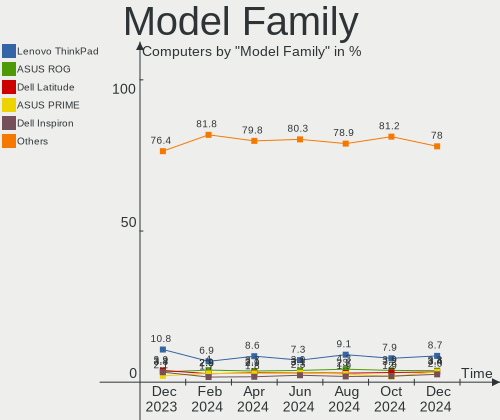
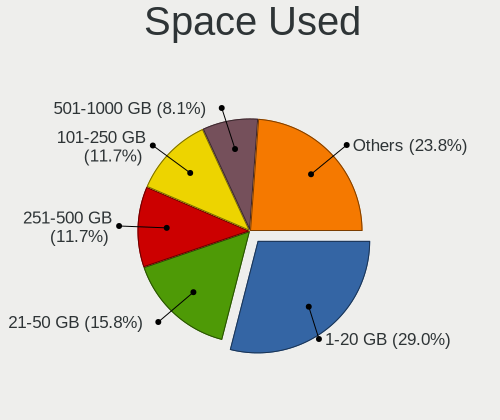
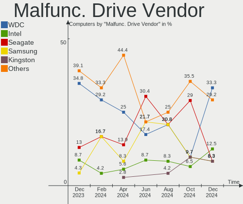
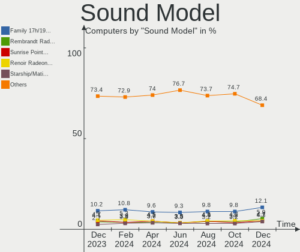

Fedora - Hardware Trends
------------------------

A project to identify most popular hardware characteristics and track their change
over time based on data collected by Linux users at https://Linux-Hardware.org.

Anyone can contribute to this report by the [hw-probe](https://github.com/linuxhw/hw-probe) tool:

    sudo -E hw-probe -all -upload

This is a report for all computer types. See also reports for [desktops](/Dist/Fedora/Desktop/README.md) and [notebooks](/Dist/Fedora/Notebook/README.md).

This report is for one last month. Overall report since the beginning of time: [TestDays](https://github.com/linuxhw/TestDays)

Period: Apr, 2023.

Contents
--------

* [ System ](#system)
  - [ OS                       ](#os)
  - [ OS Family                ](#os-family)
  - [ Kernel                   ](#kernel)
  - [ Kernel Family            ](#kernel-family)
  - [ Kernel Major Ver.        ](#kernel-major-ver)
  - [ Arch                     ](#arch)
  - [ DE                       ](#de)
  - [ Display Server           ](#display-server)
  - [ Display Manager          ](#display-manager)
  - [ OS Lang                  ](#os-lang)
  - [ Boot Mode                ](#boot-mode)
  - [ Filesystem               ](#filesystem)
  - [ Part. scheme             ](#part-scheme)
  - [ Dual Boot with Linux/BSD ](#dual-boot-with-linuxbsd)
  - [ Dual Boot (Win)          ](#dual-boot-win)

* [ Board ](#board)
  - [ Vendor                   ](#vendor)
  - [ Model                    ](#model)
  - [ Model Family             ](#model-family)
  - [ MFG Year                 ](#mfg-year)
  - [ Form Factor              ](#form-factor)
  - [ Secure Boot              ](#secure-boot)
  - [ Coreboot                 ](#coreboot)
  - [ RAM Size                 ](#ram-size)
  - [ RAM Used                 ](#ram-used)
  - [ Total Drives             ](#total-drives)
  - [ Has CD-ROM               ](#has-cd-rom)
  - [ Has Ethernet             ](#has-ethernet)
  - [ Has WiFi                 ](#has-wifi)
  - [ Has Bluetooth            ](#has-bluetooth)

* [ Location ](#location)
  - [ Country                  ](#country)
  - [ City                     ](#city)

* [ Drives ](#drives)
  - [ Drive Vendor             ](#drive-vendor)
  - [ Drive Model              ](#drive-model)
  - [ HDD Vendor               ](#hdd-vendor)
  - [ SSD Vendor               ](#ssd-vendor)
  - [ Drive Kind               ](#drive-kind)
  - [ Drive Connector          ](#drive-connector)
  - [ Drive Size               ](#drive-size)
  - [ Space Total              ](#space-total)
  - [ Space Used               ](#space-used)
  - [ Malfunc. Drives          ](#malfunc-drives)
  - [ Malfunc. Drive Vendor    ](#malfunc-drive-vendor)
  - [ Malfunc. HDD Vendor      ](#malfunc-hdd-vendor)
  - [ Malfunc. Drive Kind      ](#malfunc-drive-kind)
  - [ Failed Drives            ](#failed-drives)
  - [ Failed Drive Vendor      ](#failed-drive-vendor)
  - [ Drive Status             ](#drive-status)

* [ Storage controller ](#storage-controller)
  - [ Storage Vendor           ](#storage-vendor)
  - [ Storage Model            ](#storage-model)
  - [ Storage Kind             ](#storage-kind)

* [ Processor ](#processor)
  - [ CPU Vendor               ](#cpu-vendor)
  - [ CPU Model                ](#cpu-model)
  - [ CPU Model Family         ](#cpu-model-family)
  - [ CPU Cores                ](#cpu-cores)
  - [ CPU Sockets              ](#cpu-sockets)
  - [ CPU Threads              ](#cpu-threads)
  - [ CPU Op-Modes             ](#cpu-op-modes)
  - [ CPU Microcode            ](#cpu-microcode)
  - [ CPU Microarch            ](#cpu-microarch)

* [ Graphics ](#graphics)
  - [ GPU Vendor               ](#gpu-vendor)
  - [ GPU Model                ](#gpu-model)
  - [ GPU Combo                ](#gpu-combo)
  - [ GPU Driver               ](#gpu-driver)
  - [ GPU Memory               ](#gpu-memory)

* [ Monitor ](#monitor)
  - [ Monitor Vendor           ](#monitor-vendor)
  - [ Monitor Model            ](#monitor-model)
  - [ Monitor Resolution       ](#monitor-resolution)
  - [ Monitor Diagonal         ](#monitor-diagonal)
  - [ Monitor Width            ](#monitor-width)
  - [ Aspect Ratio             ](#aspect-ratio)
  - [ Monitor Area             ](#monitor-area)
  - [ Pixel Density            ](#pixel-density)
  - [ Multiple Monitors        ](#multiple-monitors)

* [ Network ](#network)
  - [ Net Controller Vendor    ](#net-controller-vendor)
  - [ Net Controller Model     ](#net-controller-model)
  - [ Wireless Vendor          ](#wireless-vendor)
  - [ Wireless Model           ](#wireless-model)
  - [ Ethernet Vendor          ](#ethernet-vendor)
  - [ Ethernet Model           ](#ethernet-model)
  - [ Net Controller Kind      ](#net-controller-kind)
  - [ Used Controller          ](#used-controller)
  - [ NICs                     ](#nics)
  - [ IPv6                     ](#ipv6)

* [ Bluetooth ](#bluetooth)
  - [ Bluetooth Vendor         ](#bluetooth-vendor)
  - [ Bluetooth Model          ](#bluetooth-model)

* [ Sound ](#sound)
  - [ Sound Vendor             ](#sound-vendor)
  - [ Sound Model              ](#sound-model)

* [ Memory ](#memory)
  - [ Memory Vendor            ](#memory-vendor)
  - [ Memory Model             ](#memory-model)
  - [ Memory Kind              ](#memory-kind)
  - [ Memory Form Factor       ](#memory-form-factor)
  - [ Memory Size              ](#memory-size)
  - [ Memory Speed             ](#memory-speed)

* [ Printers & scanners ](#printers--scanners)
  - [ Printer Vendor           ](#printer-vendor)
  - [ Printer Model            ](#printer-model)
  - [ Scanner Vendor           ](#scanner-vendor)
  - [ Scanner Model            ](#scanner-model)

* [ Camera ](#camera)
  - [ Camera Vendor            ](#camera-vendor)
  - [ Camera Model             ](#camera-model)

* [ Security ](#security)
  - [ Fingerprint Vendor       ](#fingerprint-vendor)
  - [ Fingerprint Model        ](#fingerprint-model)
  - [ Chipcard Vendor          ](#chipcard-vendor)
  - [ Chipcard Model           ](#chipcard-model)

* [ Unsupported ](#unsupported)
  - [ Unsupported Devices      ](#unsupported-devices)
  - [ Unsupported Device Types ](#unsupported-device-types)

System
------

OS
--

Installed operating systems

| Name      | Computers | Percent |
|-----------|-----------|---------|
| Fedora 38 | 266       | 55.77%  |
| Fedora 37 | 179       | 37.53%  |
| Fedora 36 | 18        | 3.77%   |
| Fedora 35 | 8         | 1.68%   |
| Fedora 39 | 3         | 0.63%   |
| Fedora 34 | 2         | 0.42%   |
| Fedora 33 | 1         | 0.21%   |

OS Family
---------

OS without a version

| Name   | Computers | Percent |
|--------|-----------|---------|
| Fedora | 477       | 100%    |

Kernel
------

Version of the Linux kernel

| Version                                            | Computers | Percent |
|----------------------------------------------------|-----------|---------|
| 6.2.11-300.fc38.x86_64                             | 124       | 26%     |
| 6.2.9-200.fc37.x86_64                              | 56        | 11.74%  |
| 6.2.12-300.fc38.x86_64                             | 52        | 10.9%   |
| 6.2.8-200.fc37.x86_64                              | 44        | 9.22%   |
| 6.2.9-300.fc38.x86_64                              | 38        | 7.97%   |
| 6.2.10-200.fc37.x86_64                             | 28        | 5.87%   |
| 6.2.13-300.fc38.x86_64                             | 26        | 5.45%   |
| 6.0.7-301.fc37.x86_64                              | 14        | 2.94%   |
| 6.2.11-200.fc37.x86_64                             | 10        | 2.1%    |
| 6.2.10-300.fc38.x86_64                             | 10        | 2.1%    |
| 6.2.12-200.fc37.x86_64                             | 9         | 1.89%   |
| 6.2.9-100.fc36.x86_64                              | 4         | 0.84%   |
| 6.2.8-300.fc38.x86_64                              | 4         | 0.84%   |
| 6.2.8-100.fc36.x86_64                              | 4         | 0.84%   |
| 6.2.2-301.fc38.x86_64                              | 4         | 0.84%   |
| 6.1.18-200.fc37.x86_64                             | 4         | 0.84%   |
| 6.0.12-100.fc35.x86_64                             | 4         | 0.84%   |
| 6.3.0-rc2+                                         | 2         | 0.42%   |
| 6.3.0+                                             | 2         | 0.42%   |
| 6.2.7-300.fc38.x86_64                              | 2         | 0.42%   |
| 6.2.11-703.inttf.fc38.x86_64                       | 2         | 0.42%   |
| 6.2.11-100.fc36.x86_64                             | 2         | 0.42%   |
| 6.2.10-100.fc36.x86_64                             | 2         | 0.42%   |
| 5.17.12-100.fc34.x86_64                            | 2         | 0.42%   |
| 6.3.0-rc7+                                         | 1         | 0.21%   |
| 6.3.0-rc6+                                         | 1         | 0.21%   |
| 6.3.0-rc4+                                         | 1         | 0.21%   |
| 6.3.0-0.rc7.20230420gitcb0856346a60.59.fc39.x86_64 | 1         | 0.21%   |
| 6.3.0-0.rc6.20230411git0d3eb744aed4.50.fc39.x86_64 | 1         | 0.21%   |
| 6.3.0-0.rc4.20230330gitffe78bbd5121.38.fc39.x86_64 | 1         | 0.21%   |
| 6.2.9-250.vanilla.fc37.x86_64                      | 1         | 0.21%   |
| 6.2.7-200.fc37.x86_64                              | 1         | 0.21%   |
| 6.2.6-300.fc38.x86_64                              | 1         | 0.21%   |
| 6.2.10-cb2.0.fc37.x86_64                           | 1         | 0.21%   |
| 6.2.10-300.rog.fc38.x86_64                         | 1         | 0.21%   |
| 6.2.10-300.rog.fc37.x86_64                         | 1         | 0.21%   |
| 6.2.10-1.surface.fc38.x86_64                       | 1         | 0.21%   |
| 6.1.8-100.fc36.x86_64                              | 1         | 0.21%   |
| 6.1.18-603.inttf.fc37.x86_64                       | 1         | 0.21%   |
| 6.1.15-200.fc37.x86_64                             | 1         | 0.21%   |

Kernel Family
-------------

Linux kernel without a distro release

| Version | Computers | Percent |
|---------|-----------|---------|
| 6.2.11  | 138       | 28.93%  |
| 6.2.9   | 99        | 20.75%  |
| 6.2.12  | 61        | 12.79%  |
| 6.2.8   | 52        | 10.9%   |
| 6.2.10  | 44        | 9.22%   |
| 6.2.13  | 26        | 5.45%   |
| 6.0.7   | 15        | 3.14%   |
| 6.3.0   | 10        | 2.1%    |
| 6.1.18  | 5         | 1.05%   |
| 6.2.2   | 4         | 0.84%   |
| 6.0.12  | 4         | 0.84%   |
| 6.2.7   | 3         | 0.63%   |
| 5.17.12 | 2         | 0.42%   |
| 6.2.6   | 1         | 0.21%   |
| 6.1.8   | 1         | 0.21%   |
| 6.1.15  | 1         | 0.21%   |
| 6.1.14  | 1         | 0.21%   |
| 6.0.9   | 1         | 0.21%   |
| 6.0.8   | 1         | 0.21%   |
| 6.0.18  | 1         | 0.21%   |
| 6.0.11  | 1         | 0.21%   |
| 5.18.5  | 1         | 0.21%   |
| 5.18.17 | 1         | 0.21%   |
| 5.18.16 | 1         | 0.21%   |
| 5.17.3  | 1         | 0.21%   |
| 5.16.2  | 1         | 0.21%   |
| 5.15.7  | 1         | 0.21%   |

Kernel Major Ver.
-----------------

Linux kernel major version

| Version | Computers | Percent |
|---------|-----------|---------|
| 6.2     | 428       | 89.73%  |
| 6.0     | 23        | 4.82%   |
| 6.3     | 10        | 2.1%    |
| 6.1     | 8         | 1.68%   |
| 5.18    | 3         | 0.63%   |
| 5.17    | 3         | 0.63%   |
| 5.16    | 1         | 0.21%   |
| 5.15    | 1         | 0.21%   |

Arch
----

OS architecture (x86_64, i586, etc.)

| Name   | Computers | Percent |
|--------|-----------|---------|
| x86_64 | 477       | 100%    |

DE
--

Desktop Environment

| Name          | Computers | Percent |
|---------------|-----------|---------|
| GNOME         | 348       | 72.96%  |
| KDE5          | 76        | 15.93%  |
| Unknown       | 12        | 2.52%   |
| XFCE          | 8         | 1.68%   |
| MATE          | 8         | 1.68%   |
| Cinnamon      | 7         | 1.47%   |
| X-Cinnamon    | 5         | 1.05%   |
| LXQt          | 3         | 0.63%   |
| GNOME Classic | 2         | 0.42%   |
| sway          | 1         | 0.21%   |
| KDE           | 1         | 0.21%   |
| i3            | 1         | 0.21%   |
| Hyprland      | 1         | 0.21%   |
| GNOME-Classic | 1         | 0.21%   |
| Deepin        | 1         | 0.21%   |
| custom        | 1         | 0.21%   |
| Budgie        | 1         | 0.21%   |

Display Server
--------------

X11 or Wayland

| Name    | Computers | Percent |
|---------|-----------|---------|
| Wayland | 349       | 73.17%  |
| X11     | 108       | 22.64%  |
| Tty     | 13        | 2.73%   |
| Unknown | 7         | 1.47%   |

Display Manager
---------------

SDDM, LightDM, etc.

| Name    | Computers | Percent |
|---------|-----------|---------|
| Unknown | 240       | 50.31%  |
| GDM     | 160       | 33.54%  |
| SDDM    | 51        | 10.69%  |
| LightDM | 25        | 5.24%   |
| LXDM    | 1         | 0.21%   |

OS Lang
-------

Language

| Lang  | Computers | Percent |
|-------|-----------|---------|
| en_US | 252       | 52.83%  |
| en_GB | 35        | 7.34%   |
| ru_RU | 27        | 5.66%   |
| de_DE | 22        | 4.61%   |
| pt_BR | 18        | 3.77%   |
| fr_FR | 15        | 3.14%   |
| en_AU | 15        | 3.14%   |
| it_IT | 11        | 2.31%   |
| en_CA | 11        | 2.31%   |
| es_ES | 8         | 1.68%   |
| es_MX | 6         | 1.26%   |
| pl_PL | 4         | 0.84%   |
| es_CL | 4         | 0.84%   |
| tr_TR | 3         | 0.63%   |
| de_CH | 3         | 0.63%   |
| de_AT | 3         | 0.63%   |
| zh_CN | 2         | 0.42%   |
| sv_SE | 2         | 0.42%   |
| ru_UA | 2         | 0.42%   |
| pt_PT | 2         | 0.42%   |
| nl_NL | 2         | 0.42%   |
| hu_HU | 2         | 0.42%   |
| es_VE | 2         | 0.42%   |
| en_NL | 2         | 0.42%   |
| en_IL | 2         | 0.42%   |
| en_IE | 2         | 0.42%   |
| zh_SG | 1         | 0.21%   |
| uk_UA | 1         | 0.21%   |
| sr_RS | 1         | 0.21%   |
| pa_IN | 1         | 0.21%   |
| lt_LT | 1         | 0.21%   |
| ja_JP | 1         | 0.21%   |
| id_ID | 1         | 0.21%   |
| hr_HR | 1         | 0.21%   |
| gl_ES | 1         | 0.21%   |
| fr_CH | 1         | 0.21%   |
| fr_BE | 1         | 0.21%   |
| es_PE | 1         | 0.21%   |
| es_EC | 1         | 0.21%   |
| es_CO | 1         | 0.21%   |

Boot Mode
---------

EFI or BIOS

| Mode | Computers | Percent |
|------|-----------|---------|
| EFI  | 388       | 81.34%  |
| BIOS | 89        | 18.66%  |

Filesystem
----------

Type of filesystem

| Type    | Computers | Percent |
|---------|-----------|---------|
| Btrfs   | 374       | 78.41%  |
| Ext4    | 84        | 17.61%  |
| Xfs     | 15        | 3.14%   |
| Overlay | 2         | 0.42%   |
| Zfs     | 1         | 0.21%   |
| F2fs    | 1         | 0.21%   |

Part. scheme
------------

Scheme of partitioning

| Type    | Computers | Percent |
|---------|-----------|---------|
| Unknown | 231       | 48.43%  |
| GPT     | 224       | 46.96%  |
| MBR     | 22        | 4.61%   |

Dual Boot with Linux/BSD
------------------------

Hosting more than one Linux/BSD

| Dual boot | Computers | Percent |
|-----------|-----------|---------|
| No        | 436       | 91.4%   |
| Yes       | 41        | 8.6%    |

Dual Boot (Win)
---------------

Hosting Linux and Windows

| Dual boot | Computers | Percent |
|-----------|-----------|---------|
| No        | 391       | 81.97%  |
| Yes       | 86        | 18.03%  |

Board
-----

Vendor
------

Motherboard manufacturer

| Name                | Computers | Percent |
|---------------------|-----------|---------|
| Lenovo              | 96        | 20.13%  |
| ASUSTek Computer    | 78        | 16.35%  |
| Dell                | 60        | 12.58%  |
| Hewlett-Packard     | 56        | 11.74%  |
| Gigabyte Technology | 27        | 5.66%   |
| MSI                 | 25        | 5.24%   |
| Acer                | 16        | 3.35%   |
| HUAWEI              | 14        | 2.94%   |
| Intel               | 12        | 2.52%   |
| ASRock              | 11        | 2.31%   |
| Apple               | 8         | 1.68%   |
| Samsung Electronics | 5         | 1.05%   |
| Toshiba             | 4         | 0.84%   |
| Timi                | 4         | 0.84%   |
| Notebook            | 4         | 0.84%   |
| Microsoft           | 4         | 0.84%   |
| Sony                | 3         | 0.63%   |
| Google              | 3         | 0.63%   |
| Framework           | 3         | 0.63%   |
| Chuwi               | 3         | 0.63%   |
| Unknown             | 3         | 0.63%   |
| Pegatron            | 2         | 0.42%   |
| Insyde              | 2         | 0.42%   |
| ilife               | 2         | 0.42%   |
| Fujitsu             | 2         | 0.42%   |
| ZOTAC               | 1         | 0.21%   |
| VIOS                | 1         | 0.21%   |
| TUXEDO              | 1         | 0.21%   |
| Techvision          | 1         | 0.21%   |
| Razer               | 1         | 0.21%   |
| Positivo            | 1         | 0.21%   |
| PC Specialist       | 1         | 0.21%   |
| Panasonic           | 1         | 0.21%   |
| NEC Computers       | 1         | 0.21%   |
| Medion              | 1         | 0.21%   |
| MECHREVO            | 1         | 0.21%   |
| Linx                | 1         | 0.21%   |
| LDLC                | 1         | 0.21%   |
| Itautec             | 1         | 0.21%   |
| Huanan              | 1         | 0.21%   |

Model
-----

Motherboard model

| Name                                        | Computers | Percent |
|---------------------------------------------|-----------|---------|
| Unknown                                     | 4         | 0.84%   |
| HUAWEI HVY-WXX9                             | 3         | 0.63%   |
| HP Notebook                                 | 3         | 0.63%   |
| Framework Laptop                            | 3         | 0.63%   |
| ASUS PRIME A320M-K                          | 3         | 0.63%   |
| Acer Nitro AN515-54                         | 3         | 0.63%   |
| Timi Redmi Book Pro 15 2022                 | 2         | 0.42%   |
| Samsung 550P5C/550P7C                       | 2         | 0.42%   |
| MSI MS-7C37                                 | 2         | 0.42%   |
| MSI MS-7B89                                 | 2         | 0.42%   |
| MSI MS-7A40                                 | 2         | 0.42%   |
| Lenovo Yoga 6 13ALC6 82ND                   | 2         | 0.42%   |
| Lenovo ThinkPad X220 42911H8                | 2         | 0.42%   |
| Lenovo ThinkPad X1 Carbon Gen 10 21CBCTO1WW | 2         | 0.42%   |
| ilife S806                                  | 2         | 0.42%   |
| HUAWEI BOHK-WAX9X                           | 2         | 0.42%   |
| HP Spectre x360 Convertible 13-ap0xxx       | 2         | 0.42%   |
| HP Pavilion x2 Detachable                   | 2         | 0.42%   |
| HP Laptop 15s-eq2xxx                        | 2         | 0.42%   |
| Gigabyte B450 I AORUS PRO WIFI              | 2         | 0.42%   |
| Gigabyte 970A-DS3P                          | 2         | 0.42%   |
| Dell XPS 15 9500                            | 2         | 0.42%   |
| Dell XPS 13 9380                            | 2         | 0.42%   |
| Dell XPS 13 9310                            | 2         | 0.42%   |
| Dell XPS 13 7390                            | 2         | 0.42%   |
| Dell OptiPlex 7010                          | 2         | 0.42%   |
| Dell OptiPlex 3050                          | 2         | 0.42%   |
| Dell OptiPlex 3020                          | 2         | 0.42%   |
| Dell Latitude 7490                          | 2         | 0.42%   |
| Dell Inspiron 5482                          | 2         | 0.42%   |
| ASUS TUF Gaming B550M-PLUS                  | 2         | 0.42%   |
| ASUS ROG STRIX B650E-F GAMING WIFI          | 2         | 0.42%   |
| ASUS PRIME B550M-A                          | 2         | 0.42%   |
| ASUS All Series                             | 2         | 0.42%   |
| ZOTAC ZBOX-CI527/CI547                      | 1         | 0.21%   |
| VIOS LTH17                                  | 1         | 0.21%   |
| TUXEDO Pulse 15 Gen1                        | 1         | 0.21%   |
| Toshiba Satellite L515                      | 1         | 0.21%   |
| Toshiba Satellite C55-B                     | 1         | 0.21%   |
| Toshiba PORTEGE X20W-E                      | 1         | 0.21%   |

Model Family
------------

Motherboard model prefix

| Name               | Computers | Percent |
|--------------------|-----------|---------|
| Lenovo ThinkPad    | 45        | 9.43%   |
| Lenovo IdeaPad     | 15        | 3.14%   |
| Dell Latitude      | 14        | 2.94%   |
| ASUS ROG           | 14        | 2.94%   |
| Dell XPS           | 12        | 2.52%   |
| Dell OptiPlex      | 10        | 2.1%    |
| Dell Inspiron      | 10        | 2.1%    |
| ASUS VivoBook      | 10        | 2.1%    |
| ASUS TUF           | 10        | 2.1%    |
| ASUS PRIME         | 10        | 2.1%    |
| Lenovo Yoga        | 8         | 1.68%   |
| Lenovo Legion      | 8         | 1.68%   |
| HP Pavilion        | 8         | 1.68%   |
| HP Laptop          | 8         | 1.68%   |
| HP ENVY            | 8         | 1.68%   |
| Lenovo ThinkBook   | 7         | 1.47%   |
| Dell Precision     | 7         | 1.47%   |
| ASUS ASUS          | 6         | 1.26%   |
| Acer Aspire        | 6         | 1.26%   |
| HP ProBook         | 5         | 1.05%   |
| Acer Nitro         | 5         | 1.05%   |
| Microsoft Surface  | 4         | 0.84%   |
| ASUS ZenBook       | 4         | 0.84%   |
| Unknown            | 4         | 0.84%   |
| Timi Redmi         | 3         | 0.63%   |
| Lenovo ThinkCentre | 3         | 0.63%   |
| Lenovo IdeaPadFlex | 3         | 0.63%   |
| HUAWEI HVY-WXX9    | 3         | 0.63%   |
| HP Spectre         | 3         | 0.63%   |
| HP Notebook        | 3         | 0.63%   |
| HP EliteBook       | 3         | 0.63%   |
| Framework Laptop   | 3         | 0.63%   |
| Dell Vostro        | 3         | 0.63%   |
| Toshiba Satellite  | 2         | 0.42%   |
| Samsung 550P5C     | 2         | 0.42%   |
| MSI MS-7C37        | 2         | 0.42%   |
| MSI MS-7B89        | 2         | 0.42%   |
| MSI MS-7A40        | 2         | 0.42%   |
| ilife S806         | 2         | 0.42%   |
| HUAWEI BOHK-WAX9X  | 2         | 0.42%   |

MFG Year
--------

Motherboard manufacture year

| Year    | Computers | Percent |
|---------|-----------|---------|
| 2020    | 71        | 14.88%  |
| 2021    | 67        | 14.05%  |
| 2022    | 63        | 13.21%  |
| 2019    | 51        | 10.69%  |
| 2018    | 47        | 9.85%   |
| 2017    | 29        | 6.08%   |
| 2014    | 22        | 4.61%   |
| 2015    | 20        | 4.19%   |
| 2013    | 20        | 4.19%   |
| 2011    | 20        | 4.19%   |
| 2016    | 18        | 3.77%   |
| 2012    | 15        | 3.14%   |
| 2023    | 13        | 2.73%   |
| 2010    | 8         | 1.68%   |
| 2009    | 5         | 1.05%   |
| 2008    | 4         | 0.84%   |
| 2006    | 2         | 0.42%   |
| 2007    | 1         | 0.21%   |
| Unknown | 1         | 0.21%   |

Form Factor
-----------

Physical design of the computer

| Name        | Computers | Percent |
|-------------|-----------|---------|
| Notebook    | 285       | 59.75%  |
| Desktop     | 138       | 28.93%  |
| Convertible | 27        | 5.66%   |
| Mini pc     | 11        | 2.31%   |
| Tablet      | 10        | 2.1%    |
| All in one  | 3         | 0.63%   |
| Server      | 3         | 0.63%   |

Secure Boot
-----------

Enabled or disabled

| State    | Computers | Percent |
|----------|-----------|---------|
| Disabled | 384       | 80.5%   |
| Enabled  | 93        | 19.5%   |

Coreboot
--------

Have coreboot on board

| Used | Computers | Percent |
|------|-----------|---------|
| No   | 471       | 98.74%  |
| Yes  | 6         | 1.26%   |

RAM Size
--------

Total RAM memory

| Size in GB  | Computers | Percent |
|-------------|-----------|---------|
| 16.01-24.0  | 121       | 25.37%  |
| 8.01-16.0   | 104       | 21.8%   |
| 4.01-8.0    | 93        | 19.5%   |
| 32.01-64.0  | 66        | 13.84%  |
| 3.01-4.0    | 33        | 6.92%   |
| 24.01-32.0  | 24        | 5.03%   |
| 64.01-256.0 | 21        | 4.4%    |
| 1.01-2.0    | 14        | 2.94%   |
| 0.51-1.0    | 1         | 0.21%   |

RAM Used
--------

Used RAM memory

| Used GB     | Computers | Percent |
|-------------|-----------|---------|
| 4.01-8.0    | 132       | 27.67%  |
| 2.01-3.0    | 122       | 25.58%  |
| 3.01-4.0    | 116       | 24.32%  |
| 1.01-2.0    | 55        | 11.53%  |
| 8.01-16.0   | 30        | 6.29%   |
| 0.51-1.0    | 14        | 2.94%   |
| 16.01-24.0  | 6         | 1.26%   |
| 24.01-32.0  | 1         | 0.21%   |
| 64.01-256.0 | 1         | 0.21%   |

Total Drives
------------

Number of drives on board

| Drives | Computers | Percent |
|--------|-----------|---------|
| 1      | 286       | 59.96%  |
| 2      | 129       | 27.04%  |
| 3      | 31        | 6.5%    |
| 4      | 20        | 4.19%   |
| 5      | 6         | 1.26%   |
| 6      | 3         | 0.63%   |
| 11     | 1         | 0.21%   |
| 0      | 1         | 0.21%   |

Has CD-ROM
----------

Has CD-ROM on board

| Presented | Computers | Percent |
|-----------|-----------|---------|
| No        | 390       | 81.76%  |
| Yes       | 87        | 18.24%  |

Has Ethernet
------------

Has Ethernet on board

| Presented | Computers | Percent |
|-----------|-----------|---------|
| Yes       | 349       | 73.17%  |
| No        | 128       | 26.83%  |

Has WiFi
--------

Has WiFi module

| Presented | Computers | Percent |
|-----------|-----------|---------|
| Yes       | 405       | 84.91%  |
| No        | 72        | 15.09%  |

Has Bluetooth
-------------

Has Bluetooth module

| Presented | Computers | Percent |
|-----------|-----------|---------|
| Yes       | 356       | 74.63%  |
| No        | 121       | 25.37%  |

Location
--------

Country
-------

Geographic location (country)

| Country     | Computers | Percent |
|-------------|-----------|---------|
| USA         | 93        | 19.5%   |
| Brazil      | 30        | 6.29%   |
| Russia      | 28        | 5.87%   |
| Germany     | 28        | 5.87%   |
| Netherlands | 24        | 5.03%   |
| UK          | 18        | 3.77%   |
| France      | 18        | 3.77%   |
| Canada      | 17        | 3.56%   |
| Italy       | 16        | 3.35%   |
| Poland      | 15        | 3.14%   |
| Australia   | 15        | 3.14%   |
| Spain       | 10        | 2.1%    |
| Turkey      | 9         | 1.89%   |
| India       | 8         | 1.68%   |
| Switzerland | 7         | 1.47%   |
| Sweden      | 7         | 1.47%   |
| Mexico      | 7         | 1.47%   |
| Belgium     | 6         | 1.26%   |
| Chile       | 5         | 1.05%   |
| Austria     | 5         | 1.05%   |
| Singapore   | 4         | 0.84%   |
| Serbia      | 4         | 0.84%   |
| Portugal    | 4         | 0.84%   |
| Norway      | 4         | 0.84%   |
| Malaysia    | 4         | 0.84%   |
| Hungary     | 4         | 0.84%   |
| Belarus     | 4         | 0.84%   |
| Algeria     | 4         | 0.84%   |
| Taiwan      | 3         | 0.63%   |
| Slovenia    | 3         | 0.63%   |
| Romania     | 3         | 0.63%   |
| Israel      | 3         | 0.63%   |
| Iran        | 3         | 0.63%   |
| Greece      | 3         | 0.63%   |
| Egypt       | 3         | 0.63%   |
| Czechia     | 3         | 0.63%   |
| Colombia    | 3         | 0.63%   |
| Bulgaria    | 3         | 0.63%   |
| Vietnam     | 2         | 0.42%   |
| Ukraine     | 2         | 0.42%   |

City
----

Geographic location (city)

| City              | Computers | Percent |
|-------------------|-----------|---------|
| Sydney            | 9         | 1.89%   |
| Delft             | 8         | 1.68%   |
| New York          | 6         | 1.26%   |
| Riverside         | 5         | 1.05%   |
| Singapore         | 4         | 0.84%   |
| Sao Paulo         | 4         | 0.84%   |
| Rio de Janeiro    | 4         | 0.84%   |
| Moscow            | 4         | 0.84%   |
| Wroclaw           | 3         | 0.63%   |
| Tainan City       | 3         | 0.63%   |
| St Petersburg     | 3         | 0.63%   |
| Seattle           | 3         | 0.63%   |
| Paris             | 3         | 0.63%   |
| Minsk             | 3         | 0.63%   |
| London            | 3         | 0.63%   |
| Kloetinge         | 3         | 0.63%   |
| Istanbul          | 3         | 0.63%   |
| Frankfurt am Main | 3         | 0.63%   |
| Barcelona         | 3         | 0.63%   |
| Amsterdam         | 3         | 0.63%   |
| Zurich            | 2         | 0.42%   |
| Woodstock         | 2         | 0.42%   |
| Winnipeg          | 2         | 0.42%   |
| Warsaw            | 2         | 0.42%   |
| Vienna            | 2         | 0.42%   |
| Turin             | 2         | 0.42%   |
| The Bronx         | 2         | 0.42%   |
| Sofia             | 2         | 0.42%   |
| Santiago de Cali  | 2         | 0.42%   |
| Santiago          | 2         | 0.42%   |
| Rochester         | 2         | 0.42%   |
| Queens            | 2         | 0.42%   |
| Pune              | 2         | 0.42%   |
| Porto Alegre      | 2         | 0.42%   |
| Podgorica         | 2         | 0.42%   |
| Opole             | 2         | 0.42%   |
| Ober-Morlen       | 2         | 0.42%   |
| Montreal          | 2         | 0.42%   |
| Milano            | 2         | 0.42%   |
| Miami             | 2         | 0.42%   |

Drives
------

Drive Vendor
------------

Hard drive vendors

| Vendor                       | Computers | Drives | Percent |
|------------------------------|-----------|--------|---------|
| Samsung Electronics          | 134       | 169    | 19.01%  |
| WDC                          | 68        | 80     | 9.65%   |
| Seagate                      | 56        | 59     | 7.94%   |
| SanDisk                      | 51        | 57     | 7.23%   |
| Unknown                      | 40        | 42     | 5.67%   |
| Toshiba                      | 39        | 40     | 5.53%   |
| Kingston                     | 38        | 40     | 5.39%   |
| Crucial                      | 37        | 44     | 5.25%   |
| SK hynix                     | 27        | 27     | 3.83%   |
| Micron Technology            | 24        | 24     | 3.4%    |
| Intel                        | 23        | 24     | 3.26%   |
| KIOXIA                       | 10        | 10     | 1.42%   |
| Phison Electronics           | 9         | 12     | 1.28%   |
| A-DATA Technology            | 9         | 9      | 1.28%   |
| China                        | 8         | 8      | 1.13%   |
| Hitachi                      | 7         | 8      | 0.99%   |
| Silicon Motion               | 6         | 6      | 0.85%   |
| Phison                       | 6         | 6      | 0.85%   |
| HGST                         | 6         | 6      | 0.85%   |
| Micron/Crucial Technology    | 5         | 5      | 0.71%   |
| Kingston Technology Company  | 5         | 6      | 0.71%   |
| Apple                        | 5         | 5      | 0.71%   |
| PNY                          | 4         | 5      | 0.57%   |
| JMicron Technology           | 4         | 4      | 0.57%   |
| Unknown                      | 4         | 4      | 0.57%   |
| Transcend                    | 3         | 3      | 0.43%   |
| SPCC                         | 3         | 3      | 0.43%   |
| Patriot                      | 3         | 3      | 0.43%   |
| Netac                        | 3         | 3      | 0.43%   |
| KingSpec                     | 3         | 3      | 0.43%   |
| GOODRAM                      | 3         | 4      | 0.43%   |
| Corsair                      | 3         | 3      | 0.43%   |
| ADATA Technology             | 3         | 3      | 0.43%   |
| Team                         | 2         | 2      | 0.28%   |
| Shenzhen Longsys Electronics | 2         | 2      | 0.28%   |
| SABRENT                      | 2         | 2      | 0.28%   |
| Realtek Semiconductor        | 2         | 3      | 0.28%   |
| Mushkin                      | 2         | 2      | 0.28%   |
| MAXIO Technology (Hangzhou)  | 2         | 2      | 0.28%   |
| ASMT                         | 2         | 3      | 0.28%   |

Drive Model
-----------

Hard drive models

| Model                                                  | Computers | Percent |
|--------------------------------------------------------|-----------|---------|
| Samsung NVMe SSD Controller SM981/PM981/PM983 1TB      | 23        | 3.06%   |
| Samsung NVMe SSD Controller PM9A1/PM9A3/980PRO 2TB     | 15        | 1.99%   |
| Seagate ST1000LM035-1RK172 970GB                       | 9         | 1.2%    |
| Crucial CT500MX500SSD1 500GB                           | 9         | 1.2%    |
| Unknown MMC Card  32GB                                 | 7         | 0.93%   |
| Toshiba MQ04ABF100 1TB                                 | 7         | 0.93%   |
| Crucial CT1000MX500SSD1 1TB                            | 7         | 0.93%   |
| Sandisk WD Black SN750 / PC SN730 NVMe SSD 512GB       | 6         | 0.8%    |
| Samsung SSD 980 PRO 1TB                                | 6         | 0.8%    |
| Samsung SSD 860 EVO 1TB                                | 6         | 0.8%    |
| Kingston SA400S37480G 480GB SSD                        | 6         | 0.8%    |
| Kingston SA400S37240G 240GB SSD                        | 6         | 0.8%    |
| WDC WDS500G2B0A-00SM50 500GB SSD                       | 5         | 0.66%   |
| Sandisk WD Blue SN550 NVMe SSD 1024GB                  | 5         | 0.66%   |
| Samsung SSD 980 1TB                                    | 5         | 0.66%   |
| Unknown MMC Card  64GB                                 | 4         | 0.53%   |
| Toshiba HDWD110 1TB                                    | 4         | 0.53%   |
| Sandisk WD Blue SN500 / PC SN520 NVMe SSD 512GB        | 4         | 0.53%   |
| Samsung SSD 860 EVO 500GB                              | 4         | 0.53%   |
| Samsung SSD 850 EVO 500GB                              | 4         | 0.53%   |
| Samsung SSD 850 EVO 250GB                              | 4         | 0.53%   |
| Phison E16 PCIe4 NVMe Controller 500GB                 | 4         | 0.53%   |
| Micron/Crucial P2 NVMe PCIe SSD 1TB                    | 4         | 0.53%   |
| Crucial CT240BX500SSD1 240GB                           | 4         | 0.53%   |
| Unknown                                                | 4         | 0.53%   |
| Unknown MMC Card  128GB                                | 3         | 0.4%    |
| Toshiba XG6 NVMe SSD Controller 1024GB                 | 3         | 0.4%    |
| SK hynix HFM001TD3JX013N 1024GB                        | 3         | 0.4%    |
| Silicon Motion SM2263EN/SM2263XT SSD Controller 1024GB | 3         | 0.4%    |
| Silicon Motion PCIe-8 SSD 512GB                        | 3         | 0.4%    |
| Seagate ST500LT012-1DG142 500GB                        | 3         | 0.4%    |
| Seagate ST500DM002-1BD142 500GB                        | 3         | 0.4%    |
| Seagate ST1000LM048-2E7172 1TB                         | 3         | 0.4%    |
| Sandisk WD Black SN850 1TB                             | 3         | 0.4%    |
| SanDisk NVMe SSD Drive 512GB                           | 3         | 0.4%    |
| SanDisk NVMe SSD Drive 1TB                             | 3         | 0.4%    |
| Samsung MZVL2512HCJQ-00B00 512GB                       | 3         | 0.4%    |
| Samsung MZALQ512HALU-000L2 512GB                       | 3         | 0.4%    |
| Phison E12 NVMe Controller 512GB                       | 3         | 0.4%    |
| Micron 2300 NVMe 512GB                                 | 3         | 0.4%    |

HDD Vendor
----------

Hard disk drive vendors

| Vendor              | Computers | Drives | Percent |
|---------------------|-----------|--------|---------|
| Seagate             | 54        | 57     | 36%     |
| WDC                 | 43        | 51     | 28.67%  |
| Toshiba             | 27        | 27     | 18%     |
| Hitachi             | 7         | 8      | 4.67%   |
| HGST                | 6         | 6      | 4%      |
| Samsung Electronics | 3         | 4      | 2%      |
| JMicron Technology  | 3         | 3      | 2%      |
| Unknown             | 2         | 2      | 1.33%   |
| Apple               | 2         | 2      | 1.33%   |
| USB                 | 1         | 1      | 0.67%   |
| Inateck             | 1         | 2      | 0.67%   |
| ASMT                | 1         | 2      | 0.67%   |

SSD Vendor
----------

Solid state drive vendors

| Vendor              | Computers | Drives | Percent |
|---------------------|-----------|--------|---------|
| Samsung Electronics | 45        | 49     | 21.33%  |
| Crucial             | 32        | 36     | 15.17%  |
| Kingston            | 24        | 25     | 11.37%  |
| WDC                 | 14        | 15     | 6.64%   |
| SanDisk             | 13        | 13     | 6.16%   |
| China               | 8         | 8      | 3.79%   |
| A-DATA Technology   | 8         | 8      | 3.79%   |
| Intel               | 7         | 7      | 3.32%   |
| PNY                 | 4         | 5      | 1.9%    |
| Micron Technology   | 4         | 4      | 1.9%    |
| Toshiba             | 3         | 4      | 1.42%   |
| SPCC                | 3         | 3      | 1.42%   |
| Patriot             | 3         | 3      | 1.42%   |
| KingSpec            | 3         | 3      | 1.42%   |
| GOODRAM             | 3         | 4      | 1.42%   |
| Apple               | 3         | 3      | 1.42%   |
| Transcend           | 2         | 2      | 0.95%   |
| SK hynix            | 2         | 2      | 0.95%   |
| Netac               | 2         | 2      | 0.95%   |
| Mushkin             | 2         | 2      | 0.95%   |
| Corsair             | 2         | 2      | 0.95%   |
| Verbatim            | 1         | 1      | 0.47%   |
| TO Exter            | 1         | 1      | 0.47%   |
| Teclast             | 1         | 1      | 0.47%   |
| Team                | 1         | 1      | 0.47%   |
| TAMMUZ              | 1         | 1      | 0.47%   |
| T-FORCE             | 1         | 1      | 0.47%   |
| Smartbuy            | 1         | 1      | 0.47%   |
| Plextor             | 1         | 1      | 0.47%   |
| ORTIAL              | 1         | 1      | 0.47%   |
| OCZ                 | 1         | 1      | 0.47%   |
| MidasForce          | 1         | 1      | 0.47%   |
| LITEONIT            | 1         | 1      | 0.47%   |
| LITEON              | 1         | 1      | 0.47%   |
| Lexar               | 1         | 1      | 0.47%   |
| Leven               | 1         | 1      | 0.47%   |
| KimMiDi             | 1         | 1      | 0.47%   |
| Gigabyte Technology | 1         | 1      | 0.47%   |
| Fanxiang            | 1         | 1      | 0.47%   |
| Dogfish             | 1         | 1      | 0.47%   |

Drive Kind
----------

HDD or SSD

| Kind    | Computers | Drives | Percent |
|---------|-----------|--------|---------|
| NVMe    | 280       | 342    | 43.75%  |
| SSD     | 181       | 224    | 28.28%  |
| HDD     | 128       | 165    | 20%     |
| MMC     | 41        | 43     | 6.41%   |
| Unknown | 10        | 11     | 1.56%   |

Drive Connector
---------------

SATA, SAS, NVMe, etc.

| Type | Computers | Drives | Percent |
|------|-----------|--------|---------|
| NVMe | 280       | 340    | 48.03%  |
| SATA | 242       | 375    | 41.51%  |
| MMC  | 41        | 43     | 7.03%   |
| SAS  | 20        | 27     | 3.43%   |

Drive Size
----------

Size of hard drive

| Size in TB | Computers | Drives | Percent |
|------------|-----------|--------|---------|
| 0.01-0.5   | 162       | 215    | 51.59%  |
| 0.51-1.0   | 104       | 117    | 33.12%  |
| 1.01-2.0   | 29        | 32     | 9.24%   |
| 2.01-3.0   | 7         | 12     | 2.23%   |
| 4.01-10.0  | 7         | 8      | 2.23%   |
| 3.01-4.0   | 4         | 4      | 1.27%   |
| 10.01-20.0 | 1         | 1      | 0.32%   |

Space Total
-----------

Amount of disk space available on the file system

| Size in GB     | Computers | Percent |
|----------------|-----------|---------|
| 501-1000       | 90        | 18.87%  |
| 1001-2000      | 88        | 18.45%  |
| 251-500        | 78        | 16.35%  |
| 101-250        | 59        | 12.37%  |
| 1-20           | 47        | 9.85%   |
| Unknown        | 37        | 7.76%   |
| More than 3000 | 29        | 6.08%   |
| 51-100         | 20        | 4.19%   |
| 2001-3000      | 18        | 3.77%   |
| 21-50          | 11        | 2.31%   |

Space Used
----------

Amount of used disk space

| Used GB        | Computers | Percent |
|----------------|-----------|---------|
| 1-20           | 142       | 29.77%  |
| 21-50          | 82        | 17.19%  |
| 51-100         | 51        | 10.69%  |
| 101-250        | 50        | 10.48%  |
| 251-500        | 43        | 9.01%   |
| 501-1000       | 39        | 8.18%   |
| Unknown        | 37        | 7.76%   |
| 1001-2000      | 21        | 4.4%    |
| More than 3000 | 6         | 1.26%   |
| 2001-3000      | 6         | 1.26%   |

Malfunc. Drives
---------------

Drive models with a malfunction

| Model                                 | Computers | Drives | Percent |
|---------------------------------------|-----------|--------|---------|
| SanDisk SSD PLUS 480GB                | 2         | 2      | 5.88%   |
| Crucial CT120M500SSD1 120GB           | 2         | 2      | 5.88%   |
| WDC WD5000AADS-00S9B0 500GB           | 1         | 1      | 2.94%   |
| WDC WD2500AAKX-753CA1 250GB           | 1         | 1      | 2.94%   |
| WDC WD10EZEX-00BN5A0 1TB              | 1         | 1      | 2.94%   |
| Toshiba MQ04ABF100 1TB                | 1         | 1      | 2.94%   |
| Toshiba MQ01ABF050 500GB              | 1         | 1      | 2.94%   |
| SK hynix PC711 HFS512GDE9X073N 512GB  | 1         | 1      | 2.94%   |
| Seagate ST750LM022 HN-M750MBB 752GB   | 1         | 1      | 2.94%   |
| Seagate ST500LT012-1DG142 500GB       | 1         | 1      | 2.94%   |
| Seagate ST500DM002-1BD142 500GB       | 1         | 1      | 2.94%   |
| Seagate ST3750528AS 752GB             | 1         | 1      | 2.94%   |
| Seagate ST3500418AS 500GB             | 1         | 1      | 2.94%   |
| Seagate ST31500341AS 1TB              | 1         | 1      | 2.94%   |
| Seagate ST31000524AS 1TB              | 1         | 1      | 2.94%   |
| Seagate ST3000DM001-1CH166 3TB        | 1         | 1      | 2.94%   |
| Seagate ST2000LX001-1RG174 2TB        | 1         | 1      | 2.94%   |
| Seagate ST2000DL003-9VT166 2TB        | 1         | 1      | 2.94%   |
| SanDisk SSD PLUS 240GB                | 1         | 1      | 2.94%   |
| Samsung Electronics SSD 870 EVO 250GB | 1         | 1      | 2.94%   |
| Samsung Electronics SSD 870 EVO 1TB   | 1         | 1      | 2.94%   |
| Samsung Electronics HD501LJ 500GB     | 1         | 2      | 2.94%   |
| Samsung Electronics HD154UI 1TB       | 1         | 1      | 2.94%   |
| Kingston SNV425S264GB SSD             | 1         | 1      | 2.94%   |
| Kingston SA400S37240G 240GB SSD       | 1         | 1      | 2.94%   |
| KingSpec NT-256 256GB SSD             | 1         | 1      | 2.94%   |
| Intel SSDSC2CT120A3 120GB             | 1         | 1      | 2.94%   |
| Intel SSDSC2BF240A5L 240GB            | 1         | 1      | 2.94%   |
| HGST HTS725050A7E630 500GB            | 1         | 1      | 2.94%   |
| HGST HTS545050A7E680 500GB            | 1         | 1      | 2.94%   |
| Crucial CT750MX300SSD1 752GB          | 1         | 1      | 2.94%   |
| Crucial CT275MX300SSD1 275GB          | 1         | 1      | 2.94%   |

Malfunc. Drive Vendor
---------------------

Vendors of faulty drives

| Vendor              | Computers | Drives | Percent |
|---------------------|-----------|--------|---------|
| Seagate             | 10        | 10     | 29.41%  |
| Samsung Electronics | 4         | 5      | 11.76%  |
| Crucial             | 4         | 4      | 11.76%  |
| WDC                 | 3         | 3      | 8.82%   |
| SanDisk             | 3         | 3      | 8.82%   |
| Toshiba             | 2         | 2      | 5.88%   |
| Kingston            | 2         | 2      | 5.88%   |
| Intel               | 2         | 2      | 5.88%   |
| HGST                | 2         | 2      | 5.88%   |
| SK hynix            | 1         | 1      | 2.94%   |
| KingSpec            | 1         | 1      | 2.94%   |

Malfunc. HDD Vendor
-------------------

Vendors of faulty HDD drives

| Vendor              | Computers | Drives | Percent |
|---------------------|-----------|--------|---------|
| Seagate             | 10        | 10     | 52.63%  |
| WDC                 | 3         | 3      | 15.79%  |
| Toshiba             | 2         | 2      | 10.53%  |
| Samsung Electronics | 2         | 3      | 10.53%  |
| HGST                | 2         | 2      | 10.53%  |

Malfunc. Drive Kind
-------------------

Kinds of faulty drives

| Kind | Computers | Drives | Percent |
|------|-----------|--------|---------|
| HDD  | 19        | 20     | 57.58%  |
| SSD  | 13        | 14     | 39.39%  |
| NVMe | 1         | 1      | 3.03%   |

Failed Drives
-------------

Failed drive models

| Model                    | Computers | Drives | Percent |
|--------------------------|-----------|--------|---------|
| Seagate ST31000528AS 1TB | 1         | 1      | 100%    |

Failed Drive Vendor
-------------------

Failed drive vendors

| Vendor  | Computers | Drives | Percent |
|---------|-----------|--------|---------|
| Seagate | 1         | 1      | 100%    |

Drive Status
------------

Number of failed and malfunc. drives

| Status   | Computers | Drives | Percent |
|----------|-----------|--------|---------|
| Detected | 284       | 445    | 54.41%  |
| Works    | 205       | 304    | 39.27%  |
| Malfunc  | 32        | 35     | 6.13%   |
| Failed   | 1         | 1      | 0.19%   |

Storage controller
------------------

Storage Vendor
--------------

Storage controller vendors

| Vendor                         | Computers | Percent |
|--------------------------------|-----------|---------|
| Intel                          | 234       | 36.68%  |
| AMD                            | 104       | 16.3%   |
| Samsung Electronics            | 97        | 15.2%   |
| SanDisk                        | 50        | 7.84%   |
| SK hynix                       | 25        | 3.92%   |
| Micron Technology              | 20        | 3.13%   |
| Kingston Technology Company    | 19        | 2.98%   |
| Phison Electronics             | 15        | 2.35%   |
| Toshiba America Info Systems   | 11        | 1.72%   |
| Silicon Motion                 | 9         | 1.41%   |
| Micron/Crucial Technology      | 9         | 1.41%   |
| KIOXIA                         | 9         | 1.41%   |
| ASMedia Technology             | 5         | 0.78%   |
| JMicron Technology             | 4         | 0.63%   |
| ADATA Technology               | 4         | 0.63%   |
| Solid State Storage Technology | 3         | 0.47%   |
| Shenzhen Longsys Electronics   | 3         | 0.47%   |
| MAXIO Technology (Hangzhou)    | 3         | 0.47%   |
| Union Memory (Shenzhen)        | 2         | 0.31%   |
| Seagate Technology             | 2         | 0.31%   |
| Realtek Semiconductor          | 2         | 0.31%   |
| Marvell Technology Group       | 2         | 0.31%   |
| Solidigm                       | 1         | 0.16%   |
| PMC-Sierra                     | 1         | 0.16%   |
| Netac Technology               | 1         | 0.16%   |
| LSI Logic / Symbios Logic      | 1         | 0.16%   |
| Lite-On Technology             | 1         | 0.16%   |
| INNOGRIT                       | 1         | 0.16%   |

Storage Model
-------------

Storage controller models

| Model                                                                          | Computers | Percent |
|--------------------------------------------------------------------------------|-----------|---------|
| AMD FCH SATA Controller [AHCI mode]                                            | 78        | 11.24%  |
| Samsung NVMe SSD Controller SM981/PM981/PM983                                  | 41        | 5.91%   |
| Samsung NVMe SSD Controller PM9A1/PM9A3/980PRO                                 | 26        | 3.75%   |
| Micron NVMe Storage Controller                                                 | 20        | 2.88%   |
| Intel Sunrise Point-LP SATA Controller [AHCI mode]                             | 20        | 2.88%   |
| Samsung NVMe SSD Controller 980                                                | 19        | 2.74%   |
| Intel Volume Management Device NVMe RAID Controller                            | 18        | 2.59%   |
| Intel 8 Series/C220 Series Chipset Family 6-port SATA Controller 1 [AHCI mode] | 15        | 2.16%   |
| SK hynix Gold P31/PC711 NVMe Solid State Drive                                 | 14        | 2.02%   |
| Intel 82801 Mobile SATA Controller [RAID mode]                                 | 14        | 2.02%   |
| AMD 400 Series Chipset SATA Controller                                         | 14        | 2.02%   |
| AMD 500 Series Chipset SATA Controller                                         | 13        | 1.87%   |
| SanDisk WD Black SN750 / PC SN730 NVMe SSD                                     | 11        | 1.59%   |
| SanDisk Non-Volatile memory controller                                         | 10        | 1.44%   |
| Intel HM170/QM170 Chipset SATA Controller [AHCI Mode]                          | 9         | 1.3%    |
| Intel Celeron/Pentium Silver Processor SATA Controller                         | 9         | 1.3%    |
| Intel 6 Series/C200 Series Chipset Family 6 port Mobile SATA AHCI Controller   | 9         | 1.3%    |
| Intel 400 Series Chipset Family SATA AHCI Controller                           | 9         | 1.3%    |
| SanDisk WD Blue SN550 NVMe SSD                                                 | 8         | 1.15%   |
| Kingston Company Company Non-Volatile memory controller                        | 8         | 1.15%   |
| Intel Q170/Q150/B150/H170/H110/Z170/CM236 Chipset SATA Controller [AHCI Mode]  | 8         | 1.15%   |
| Intel Alder Lake-S PCH SATA Controller [AHCI Mode]                             | 8         | 1.15%   |
| Intel 6 Series/C200 Series Chipset Family 6 port Desktop SATA AHCI Controller  | 8         | 1.15%   |
| AMD SB7x0/SB8x0/SB9x0 IDE Controller                                           | 8         | 1.15%   |
| Intel Cannon Lake Mobile PCH SATA AHCI Controller                              | 7         | 1.01%   |
| Samsung NVMe SSD Controller SM961/PM961/SM963                                  | 6         | 0.86%   |
| Intel SATA Controller [RAID mode]                                              | 6         | 0.86%   |
| Intel Comet Lake SATA AHCI Controller                                          | 6         | 0.86%   |
| Intel 7 Series/C210 Series Chipset Family 6-port SATA Controller [AHCI mode]   | 6         | 0.86%   |
| Intel 7 Series Chipset Family 6-port SATA Controller [AHCI mode]               | 6         | 0.86%   |
| AMD SB7x0/SB8x0/SB9x0 SATA Controller [AHCI mode]                              | 6         | 0.86%   |
| Toshiba America Info Systems XG6 NVMe SSD Controller                           | 5         | 0.72%   |
| Silicon Motion SM2263EN/SM2263XT SSD Controller                                | 5         | 0.72%   |
| Phison E12 NVMe Controller                                                     | 5         | 0.72%   |
| Micron/Crucial P2 NVMe PCIe SSD                                                | 5         | 0.72%   |
| KIOXIA NVMe SSD Controller BG4                                                 | 5         | 0.72%   |
| Intel Wildcat Point-LP SATA Controller [AHCI Mode]                             | 5         | 0.72%   |
| Intel Tiger Lake-LP SATA Controller                                            | 5         | 0.72%   |
| Intel SSD Pro 7600p/760p/E 6100p Series                                        | 5         | 0.72%   |
| Intel Cannon Point-LP SATA Controller [AHCI Mode]                              | 5         | 0.72%   |

Storage Kind
------------

Kind of storage controller (IDE, SATA, NVMe, SAS, ...)

| Kind | Computers | Percent |
|------|-----------|---------|
| SATA | 291       | 45.97%  |
| NVMe | 277       | 43.76%  |
| RAID | 40        | 6.32%   |
| IDE  | 23        | 3.63%   |
| SAS  | 1         | 0.16%   |
| SCSI | 1         | 0.16%   |

Processor
---------

CPU Vendor
----------

Processor vendors

| Vendor | Computers | Percent |
|--------|-----------|---------|
| Intel  | 323       | 67.71%  |
| AMD    | 154       | 32.29%  |

CPU Model
---------

Processor models

| Model                                         | Computers | Percent |
|-----------------------------------------------|-----------|---------|
| Intel 11th Gen Core i5-1135G7 @ 2.40GHz       | 10        | 2.1%    |
| Intel Core i7-8550U CPU @ 1.80GHz             | 8         | 1.68%   |
| Intel Core i7-10750H CPU @ 2.60GHz            | 8         | 1.68%   |
| Intel 12th Gen Core i7-1260P                  | 8         | 1.68%   |
| Intel 12th Gen Core i7-1255U                  | 8         | 1.68%   |
| Intel Core i7-8565U CPU @ 1.80GHz             | 7         | 1.47%   |
| Intel Core i5-10210U CPU @ 1.60GHz            | 6         | 1.26%   |
| Intel 11th Gen Core i7-1185G7 @ 3.00GHz       | 6         | 1.26%   |
| AMD Ryzen 7 5800H with Radeon Graphics        | 6         | 1.26%   |
| AMD Ryzen 5 3500U with Radeon Vega Mobile Gfx | 6         | 1.26%   |
| Intel 11th Gen Core i7-1165G7 @ 2.80GHz       | 5         | 1.05%   |
| AMD Ryzen 7 5700U with Radeon Graphics        | 5         | 1.05%   |
| AMD Ryzen 5 5600X 6-Core Processor            | 5         | 1.05%   |
| AMD Ryzen 5 5500U with Radeon Graphics        | 5         | 1.05%   |
| Intel Core i7-9750H CPU @ 2.60GHz             | 4         | 0.84%   |
| Intel Core i5-8350U CPU @ 1.70GHz             | 4         | 0.84%   |
| Intel Core i5-7200U CPU @ 2.50GHz             | 4         | 0.84%   |
| Intel Atom x5-Z8350 CPU @ 1.44GHz             | 4         | 0.84%   |
| Intel 12th Gen Core i7-12700H                 | 4         | 0.84%   |
| Intel 11th Gen Core i3-1115G4 @ 3.00GHz       | 4         | 0.84%   |
| AMD Ryzen 9 5900X 12-Core Processor           | 4         | 0.84%   |
| AMD Ryzen 7 5700G with Radeon Graphics        | 4         | 0.84%   |
| AMD Ryzen 5 5600H with Radeon Graphics        | 4         | 0.84%   |
| AMD Ryzen 5 4600H with Radeon Graphics        | 4         | 0.84%   |
| Intel Core i7-8750H CPU @ 2.20GHz             | 3         | 0.63%   |
| Intel Core i7-7700HQ CPU @ 2.80GHz            | 3         | 0.63%   |
| Intel Core i7-6700HQ CPU @ 2.60GHz            | 3         | 0.63%   |
| Intel Core i7-3770 CPU @ 3.40GHz              | 3         | 0.63%   |
| Intel Core i7-10870H CPU @ 2.20GHz            | 3         | 0.63%   |
| Intel Core i7-1065G7 CPU @ 1.30GHz            | 3         | 0.63%   |
| Intel Core i7-10510U CPU @ 1.80GHz            | 3         | 0.63%   |
| Intel Core i5-8250U CPU @ 1.60GHz             | 3         | 0.63%   |
| Intel Core i5-6300U CPU @ 2.40GHz             | 3         | 0.63%   |
| Intel Core i5-5200U CPU @ 2.20GHz             | 3         | 0.63%   |
| Intel Core i5-2520M CPU @ 2.50GHz             | 3         | 0.63%   |
| Intel Core i5-10300H CPU @ 2.50GHz            | 3         | 0.63%   |
| Intel Celeron N4020 CPU @ 1.10GHz             | 3         | 0.63%   |
| Intel Celeron J4125 CPU @ 2.00GHz             | 3         | 0.63%   |
| Intel Atom CPU Z3736F @ 1.33GHz               | 3         | 0.63%   |
| Intel 12th Gen Core i5-12500H                 | 3         | 0.63%   |

CPU Model Family
----------------

Processor model prefix

| Model                   | Computers | Percent |
|-------------------------|-----------|---------|
| Intel Core i7           | 87        | 18.24%  |
| Other                   | 73        | 15.3%   |
| Intel Core i5           | 73        | 15.3%   |
| AMD Ryzen 5             | 53        | 11.11%  |
| AMD Ryzen 7             | 40        | 8.39%   |
| Intel Core i3           | 25        | 5.24%   |
| AMD Ryzen 9             | 22        | 4.61%   |
| Intel Celeron           | 20        | 4.19%   |
| Intel Atom              | 17        | 3.56%   |
| Intel Xeon              | 12        | 2.52%   |
| AMD Ryzen 7 PRO         | 6         | 1.26%   |
| AMD A10                 | 5         | 1.05%   |
| Intel Pentium Silver    | 4         | 0.84%   |
| AMD Ryzen 5 PRO         | 4         | 0.84%   |
| AMD FX                  | 4         | 0.84%   |
| Intel Pentium           | 3         | 0.63%   |
| AMD Ryzen 3             | 3         | 0.63%   |
| Intel Pentium Dual-Core | 2         | 0.42%   |
| Intel Core i9           | 2         | 0.42%   |
| Intel Core 2 Duo        | 2         | 0.42%   |
| Intel Core 2            | 2         | 0.42%   |
| AMD Phenom II X4        | 2         | 0.42%   |
| AMD Phenom II X2        | 2         | 0.42%   |
| AMD A8                  | 2         | 0.42%   |
| AMD A6                  | 2         | 0.42%   |
| AMD A4                  | 2         | 0.42%   |
| Intel Xeon Silver       | 1         | 0.21%   |
| Intel Core 2 Quad       | 1         | 0.21%   |
| AMD Ryzen Threadripper  | 1         | 0.21%   |
| AMD PRO A10             | 1         | 0.21%   |
| AMD Phenom II X6        | 1         | 0.21%   |
| AMD E2                  | 1         | 0.21%   |
| AMD Athlon              | 1         | 0.21%   |
| AMD A12                 | 1         | 0.21%   |

CPU Cores
---------

Number of processor cores

| Number | Computers | Percent |
|--------|-----------|---------|
| 4      | 177       | 37.11%  |
| 2      | 102       | 21.38%  |
| 6      | 74        | 15.51%  |
| 8      | 68        | 14.26%  |
| 12     | 25        | 5.24%   |
| 10     | 13        | 2.73%   |
| 16     | 7         | 1.47%   |
| 14     | 4         | 0.84%   |
| 24     | 2         | 0.42%   |
| 3      | 2         | 0.42%   |
| 1      | 2         | 0.42%   |
| 20     | 1         | 0.21%   |

CPU Sockets
-----------

Number of sockets

| Number | Computers | Percent |
|--------|-----------|---------|
| 1      | 473       | 99.16%  |
| 2      | 4         | 0.84%   |

CPU Threads
-----------

Threads per core (Hyper-Threading)

| Number | Computers | Percent |
|--------|-----------|---------|
| 2      | 383       | 80.29%  |
| 1      | 94        | 19.71%  |

CPU Op-Modes
------------

CPU Operation Modes (32-bit, 64-bit)

| Op mode        | Computers | Percent |
|----------------|-----------|---------|
| 32-bit, 64-bit | 477       | 100%    |

CPU Microcode
-------------

Microcode number

| Number     | Computers | Percent |
|------------|-----------|---------|
| Unknown    | 301       | 63.1%   |
| 0x0a50000c | 16        | 3.35%   |
| 0x08600106 | 12        | 2.52%   |
| 0x0a50000d | 10        | 2.1%    |
| 0x08608103 | 9         | 1.89%   |
| 0x08108109 | 9         | 1.89%   |
| 0x08701021 | 8         | 1.68%   |
| 0x0a601203 | 7         | 1.47%   |
| 0x0a20120a | 7         | 1.47%   |
| 0x0a404102 | 5         | 1.05%   |
| 0x0800820d | 5         | 1.05%   |
| 0x0a404101 | 4         | 0.84%   |
| 0x08108102 | 4         | 0.84%   |
| 0xa0652    | 3         | 0.63%   |
| 0x806ec    | 3         | 0.63%   |
| 0x806c1    | 3         | 0.63%   |
| 0x206a7    | 3         | 0.63%   |
| 0x0a50000b | 3         | 0.63%   |
| 0x0810100b | 3         | 0.63%   |
| 0x06006705 | 3         | 0.63%   |
| 0x806d1    | 2         | 0.42%   |
| 0x506e3    | 2         | 0.42%   |
| 0x306a9    | 2         | 0.42%   |
| 0x0a201205 | 2         | 0.42%   |
| 0x08701013 | 2         | 0.42%   |
| 0x08608104 | 2         | 0.42%   |
| 0x08600104 | 2         | 0.42%   |
| 0x0600611a | 2         | 0.42%   |
| 0x06001119 | 2         | 0.42%   |
| 0x06000822 | 2         | 0.42%   |
| 0x010000bf | 2         | 0.42%   |
| 0xa0653    | 1         | 0.21%   |
| 0x906ed    | 1         | 0.21%   |
| 0x806ea    | 1         | 0.21%   |
| 0x806e9    | 1         | 0.21%   |
| 0x806c2    | 1         | 0.21%   |
| 0x706e5    | 1         | 0.21%   |
| 0x306d4    | 1         | 0.21%   |
| 0x30678    | 1         | 0.21%   |
| 0x30673    | 1         | 0.21%   |

CPU Microarch
-------------

Microarchitecture

| Name             | Computers | Percent |
|------------------|-----------|---------|
| KabyLake         | 77        | 16.14%  |
| Zen 3            | 47        | 9.85%   |
| Alderlake Hybrid | 34        | 7.13%   |
| Unknown          | 33        | 6.92%   |
| TigerLake        | 29        | 6.08%   |
| Zen 2            | 27        | 5.66%   |
| Haswell          | 25        | 5.24%   |
| Silvermont       | 23        | 4.82%   |
| CometLake        | 21        | 4.4%    |
| Zen+             | 20        | 4.19%   |
| SandyBridge      | 20        | 4.19%   |
| Skylake          | 19        | 3.98%   |
| IvyBridge        | 19        | 3.98%   |
| IceLake          | 12        | 2.52%   |
| Goldmont plus    | 10        | 2.1%    |
| Broadwell        | 8         | 1.68%   |
| Zen              | 6         | 1.26%   |
| Westmere         | 6         | 1.26%   |
| Piledriver       | 6         | 1.26%   |
| Excavator        | 6         | 1.26%   |
| K10              | 5         | 1.05%   |
| Tremont          | 4         | 0.84%   |
| Penryn           | 4         | 0.84%   |
| Steamroller      | 3         | 0.63%   |
| Core             | 3         | 0.63%   |
| Nehalem          | 2         | 0.42%   |
| Goldmont         | 2         | 0.42%   |
| Bonnell          | 2         | 0.42%   |
| Puma             | 1         | 0.21%   |
| K10 Llano        | 1         | 0.21%   |
| Jaguar           | 1         | 0.21%   |
| Bulldozer        | 1         | 0.21%   |

Graphics
--------

GPU Vendor
----------

Vendors of graphics cards

| Vendor                     | Computers | Percent |
|----------------------------|-----------|---------|
| Intel                      | 273       | 47.56%  |
| AMD                        | 155       | 27%     |
| Nvidia                     | 145       | 25.26%  |
| Matrox Electronics Systems | 1         | 0.17%   |

GPU Model
---------

Graphics card models

| Model                                                                                    | Computers | Percent |
|------------------------------------------------------------------------------------------|-----------|---------|
| Intel TigerLake-LP GT2 [Iris Xe Graphics]                                                | 25        | 4.3%    |
| AMD Cezanne [Radeon Vega Series / Radeon Vega Mobile Series]                             | 23        | 3.96%   |
| Intel UHD Graphics 620                                                                   | 17        | 2.93%   |
| Intel CometLake-H GT2 [UHD Graphics]                                                     | 16        | 2.75%   |
| AMD Renoir                                                                               | 16        | 2.75%   |
| Intel Alder Lake-P Integrated Graphics Controller                                        | 15        | 2.58%   |
| Intel 2nd Generation Core Processor Family Integrated Graphics Controller                | 14        | 2.41%   |
| AMD Picasso/Raven 2 [Radeon Vega Series / Radeon Vega Mobile Series]                     | 13        | 2.24%   |
| Intel WhiskeyLake-U GT2 [UHD Graphics 620]                                               | 12        | 2.07%   |
| Intel Atom Processor Z36xxx/Z37xxx Series Graphics & Display                             | 12        | 2.07%   |
| AMD Lucienne                                                                             | 12        | 2.07%   |
| Intel CometLake-U GT2 [UHD Graphics]                                                     | 11        | 1.89%   |
| Intel CoffeeLake-H GT2 [UHD Graphics 630]                                                | 11        | 1.89%   |
| Intel Atom/Celeron/Pentium Processor x5-E8000/J3xxx/N3xxx Integrated Graphics Controller | 11        | 1.89%   |
| AMD Rembrandt [Radeon 680M]                                                              | 9         | 1.55%   |
| Intel HD Graphics 620                                                                    | 8         | 1.38%   |
| Intel Alder Lake-UP3 GT2 [Iris Xe Graphics]                                              | 8         | 1.38%   |
| AMD Navi 22 [Radeon RX 6700/6700 XT/6750 XT / 6800M/6850M XT]                            | 8         | 1.38%   |
| Nvidia GA106M [GeForce RTX 3060 Mobile / Max-Q]                                          | 7         | 1.2%    |
| Intel HD Graphics 530                                                                    | 7         | 1.2%    |
| Intel Haswell-ULT Integrated Graphics Controller                                         | 7         | 1.2%    |
| Intel GeminiLake [UHD Graphics 600]                                                      | 7         | 1.2%    |
| Intel 3rd Gen Core processor Graphics Controller                                         | 7         | 1.2%    |
| AMD Ellesmere [Radeon RX 470/480/570/570X/580/580X/590]                                  | 7         | 1.2%    |
| Intel Xeon E3-1200 v3/4th Gen Core Processor Integrated Graphics Controller              | 6         | 1.03%   |
| Intel HD Graphics 630                                                                    | 6         | 1.03%   |
| Intel HD Graphics 5500                                                                   | 6         | 1.03%   |
| AMD Barcelo                                                                              | 6         | 1.03%   |
| Nvidia TU117M [GeForce GTX 1650 Ti Mobile]                                               | 5         | 0.86%   |
| Intel Skylake GT2 [HD Graphics 520]                                                      | 5         | 0.86%   |
| AMD Raven Ridge [Radeon Vega Series / Radeon Vega Mobile Series]                         | 5         | 0.86%   |
| AMD Raphael                                                                              | 5         | 0.86%   |
| Nvidia TU117M [GeForce GTX 1650 Mobile / Max-Q]                                          | 4         | 0.69%   |
| Nvidia TU116M [GeForce GTX 1660 Ti Mobile]                                               | 4         | 0.69%   |
| Nvidia GP108M [GeForce MX150]                                                            | 4         | 0.69%   |
| Nvidia GP106 [GeForce GTX 1060 6GB]                                                      | 4         | 0.69%   |
| Nvidia GA107M [GeForce RTX 3050 Mobile]                                                  | 4         | 0.69%   |
| Nvidia GA104 [GeForce RTX 3060 Ti Lite Hash Rate]                                        | 4         | 0.69%   |
| Intel Tiger Lake-LP GT2 [UHD Graphics G4]                                                | 4         | 0.69%   |
| Intel JasperLake [UHD Graphics]                                                          | 4         | 0.69%   |

GPU Combo
---------

Combinations of graphics cards

| Name           | Computers | Percent |
|----------------|-----------|---------|
| 1 x Intel      | 190       | 39.83%  |
| 1 x AMD        | 129       | 27.04%  |
| Intel + Nvidia | 76        | 15.93%  |
| 1 x Nvidia     | 52        | 10.9%   |
| AMD + Nvidia   | 16        | 3.35%   |
| 2 x AMD        | 5         | 1.05%   |
| Intel + AMD    | 5         | 1.05%   |
| 2 x Intel      | 2         | 0.42%   |
| 2 x Nvidia     | 1         | 0.21%   |
| 1 x Matrox     | 1         | 0.21%   |

GPU Driver
----------

Free vs proprietary

| Driver      | Computers | Percent |
|-------------|-----------|---------|
| Free        | 399       | 83.65%  |
| Proprietary | 65        | 13.63%  |
| Unknown     | 13        | 2.73%   |

GPU Memory
----------

Total video memory

| Size in GB | Computers | Percent |
|------------|-----------|---------|
| Unknown    | 254       | 53.25%  |
| 0.01-0.5   | 52        | 10.9%   |
| 1.01-2.0   | 44        | 9.22%   |
| 3.01-4.0   | 33        | 6.92%   |
| 7.01-8.0   | 31        | 6.5%    |
| 0.51-1.0   | 29        | 6.08%   |
| 5.01-6.0   | 16        | 3.35%   |
| 8.01-16.0  | 13        | 2.73%   |
| 2.01-3.0   | 3         | 0.63%   |
| 16.01-24.0 | 2         | 0.42%   |

Monitor
-------

Monitor Vendor
--------------

Monitor vendors

| Vendor                  | Computers | Percent |
|-------------------------|-----------|---------|
| BOE                     | 75        | 13.86%  |
| AU Optronics            | 73        | 13.49%  |
| Chimei Innolux          | 50        | 9.24%   |
| Dell                    | 44        | 8.13%   |
| Samsung Electronics     | 42        | 7.76%   |
| LG Display              | 29        | 5.36%   |
| Goldstar                | 26        | 4.81%   |
| Sharp                   | 20        | 3.7%    |
| Hewlett-Packard         | 16        | 2.96%   |
| Philips                 | 14        | 2.59%   |
| Acer                    | 14        | 2.59%   |
| BenQ                    | 13        | 2.4%    |
| Lenovo                  | 11        | 2.03%   |
| Ancor Communications    | 11        | 2.03%   |
| AOC                     | 10        | 1.85%   |
| PANDA                   | 8         | 1.48%   |
| CSO                     | 8         | 1.48%   |
| ASUSTek Computer        | 8         | 1.48%   |
| Apple                   | 6         | 1.11%   |
| Sceptre Tech            | 5         | 0.92%   |
| ViewSonic               | 4         | 0.74%   |
| Sony                    | 4         | 0.74%   |
| Unknown                 | 3         | 0.55%   |
| InfoVision              | 3         | 0.55%   |
| Gigabyte Technology     | 3         | 0.55%   |
| Chi Mei Optoelectronics | 3         | 0.55%   |
| Toshiba                 | 2         | 0.37%   |
| TMX                     | 2         | 0.37%   |
| MSI                     | 2         | 0.37%   |
| Mi                      | 2         | 0.37%   |
| ITE                     | 2         | 0.37%   |
| Iiyama                  | 2         | 0.37%   |
| Belinea                 | 2         | 0.37%   |
| YTH                     | 1         | 0.18%   |
| XKX                     | 1         | 0.18%   |
| Xiaomi                  | 1         | 0.18%   |
| WIP                     | 1         | 0.18%   |
| Vizio                   | 1         | 0.18%   |
| Vestel Elektronik       | 1         | 0.18%   |
| Unknown (XXX)           | 1         | 0.18%   |

Monitor Model
-------------

Monitor models

| Model                                                                 | Computers | Percent |
|-----------------------------------------------------------------------|-----------|---------|
| Chimei Innolux LCD Monitor CMN14D4 1920x1080 309x173mm 13.9-inch      | 5         | 0.91%   |
| AU Optronics LCD Monitor AUO38ED 1920x1080 344x193mm 15.5-inch        | 5         | 0.91%   |
| AU Optronics LCD Monitor AUO21ED 1920x1080 344x193mm 15.5-inch        | 5         | 0.91%   |
| Chimei Innolux LCD Monitor CMN1521 1920x1080 344x193mm 15.5-inch      | 4         | 0.72%   |
| BOE LCD Monitor BOE0878 1920x1080 355x200mm 16.0-inch                 | 4         | 0.72%   |
| Sharp LCD Monitor SHP14AD 3840x2160 294x165mm 13.3-inch               | 3         | 0.54%   |
| LG Display LCD Monitor LGD046D 1920x1080 309x174mm 14.0-inch          | 3         | 0.54%   |
| Hewlett-Packard 24fw HPN3545 1920x1080 527x296mm 23.8-inch            | 3         | 0.54%   |
| Goldstar HDR WFHD GSM7714 2560x1080 798x334mm 34.1-inch               | 3         | 0.54%   |
| Chimei Innolux LCD Monitor CMN15F5 1920x1080 344x193mm 15.5-inch      | 3         | 0.54%   |
| Chimei Innolux LCD Monitor CMN1406 1920x1080 309x173mm 13.9-inch      | 3         | 0.54%   |
| BOE LCD Monitor BOE095F 2256x1504 285x190mm 13.5-inch                 | 3         | 0.54%   |
| BOE LCD Monitor BOE08A8 1920x1080 344x194mm 15.5-inch                 | 3         | 0.54%   |
| BOE LCD Monitor BOE0872 1920x1080 344x194mm 15.5-inch                 | 3         | 0.54%   |
| AU Optronics LCD Monitor AUO403D 1920x1080 309x174mm 14.0-inch        | 3         | 0.54%   |
| Unknown LCD Monitor FFFF 2288x1287 2550x2550mm 142.0-inch             | 2         | 0.36%   |
| TMX TL156MDMP11-0 TMX1560 3200x2000 336x210mm 15.6-inch               | 2         | 0.36%   |
| Sharp LCD Monitor SHP1453 1920x1080 346x194mm 15.6-inch               | 2         | 0.36%   |
| Sceptre Tech E248W-19203S SPT099D 1920x1080 443x249mm 20.0-inch       | 2         | 0.36%   |
| Samsung Electronics LCD Monitor SDC4E51 1366x768 344x194mm 15.5-inch  | 2         | 0.36%   |
| Samsung Electronics LCD Monitor SDC416E 2880x1620 344x194mm 15.5-inch | 2         | 0.36%   |
| Philips FTV PHL01EA 1920x1080 1440x810mm 65.0-inch                    | 2         | 0.36%   |
| PANDA LCD Monitor NCP005E 1920x1080 309x174mm 14.0-inch               | 2         | 0.36%   |
| LG Display LCD Monitor LGD06B3 1920x1200 336x210mm 15.6-inch          | 2         | 0.36%   |
| LG Display LCD Monitor LGD0555 2736x1824 260x173mm 12.3-inch          | 2         | 0.36%   |
| LG Display LCD Monitor LGD02D8 1366x768 277x156mm 12.5-inch           | 2         | 0.36%   |
| Lenovo LEN L28u-30 LEN65FA 3840x2160 621x341mm 27.9-inch              | 2         | 0.36%   |
| Goldstar ULTRAWIDE GSM59F1 2560x1080 673x284mm 28.8-inch              | 2         | 0.36%   |
| Goldstar HDR 4K GSM7707 3840x2160 600x340mm 27.2-inch                 | 2         | 0.36%   |
| Gigabyte Technology M27Q GBT270D 2560x1440 596x335mm 26.9-inch        | 2         | 0.36%   |
| Dell U3419W DELA12E 3440x1440 800x335mm 34.1-inch                     | 2         | 0.36%   |
| Dell U2412M DELA07B 1920x1200 518x324mm 24.1-inch                     | 2         | 0.36%   |
| Dell U2412M DELA07A 1920x1200 518x324mm 24.1-inch                     | 2         | 0.36%   |
| Dell P2419H DELD0DA 1920x1080 527x296mm 23.8-inch                     | 2         | 0.36%   |
| Dell P2417H DELA0DC 1920x1080 527x296mm 23.8-inch                     | 2         | 0.36%   |
| Dell 2007FP DELA020 1600x1200 367x275mm 18.1-inch                     | 2         | 0.36%   |
| Chimei Innolux LCD Monitor CMN15E8 1920x1080 344x193mm 15.5-inch      | 2         | 0.36%   |
| Chimei Innolux LCD Monitor CMN15E6 1366x768 344x193mm 15.5-inch       | 2         | 0.36%   |
| Chimei Innolux LCD Monitor CMN15C2 1920x1080 344x194mm 15.5-inch      | 2         | 0.36%   |
| Chimei Innolux LCD Monitor CMN14F2 1920x1080 309x173mm 13.9-inch      | 2         | 0.36%   |

Monitor Resolution
------------------

Monitor screen resolution

| Resolution         | Computers | Percent |
|--------------------|-----------|---------|
| 1920x1080 (FHD)    | 254       | 50.1%   |
| 1366x768 (WXGA)    | 51        | 10.06%  |
| 2560x1440 (QHD)    | 42        | 8.28%   |
| 3840x2160 (4K)     | 37        | 7.3%    |
| 1920x1200 (WUXGA)  | 20        | 3.94%   |
| 1600x900 (HD+)     | 13        | 2.56%   |
| 3440x1440          | 11        | 2.17%   |
| 2560x1600          | 11        | 2.17%   |
| 1680x1050 (WSXGA+) | 7         | 1.38%   |
| 1280x1024 (SXGA)   | 7         | 1.38%   |
| 2560x1080          | 6         | 1.18%   |
| 1440x900 (WXGA+)   | 6         | 1.18%   |
| 3840x2400          | 4         | 0.79%   |
| 2256x1504          | 4         | 0.79%   |
| 2160x1440          | 4         | 0.79%   |
| 1280x800 (WXGA)    | 3         | 0.59%   |
| 3200x2000          | 2         | 0.39%   |
| 2880x1800          | 2         | 0.39%   |
| 2880x1620          | 2         | 0.39%   |
| 2736x1824          | 2         | 0.39%   |
| 2288x1287          | 2         | 0.39%   |
| 2048x1152          | 2         | 0.39%   |
| 1600x1200          | 2         | 0.39%   |
| 1024x768 (XGA)     | 2         | 0.39%   |
| 3840x1100          | 1         | 0.2%    |
| 3840x1080          | 1         | 0.2%    |
| 3456x2160          | 1         | 0.2%    |
| 3200x1080          | 1         | 0.2%    |
| 3120x2080          | 1         | 0.2%    |
| 3000x2000          | 1         | 0.2%    |
| 2520x1680          | 1         | 0.2%    |
| 2160x1350          | 1         | 0.2%    |
| 1920x1280          | 1         | 0.2%    |
| 1024x600           | 1         | 0.2%    |
| Unknown            | 1         | 0.2%    |

Monitor Diagonal
----------------

Diagonal size in inches

| Inches  | Computers | Percent |
|---------|-----------|---------|
| 15      | 133       | 24.68%  |
| 13      | 69        | 12.8%   |
| 27      | 61        | 11.32%  |
| 14      | 55        | 10.2%   |
| 24      | 44        | 8.16%   |
| 23      | 24        | 4.45%   |
| 21      | 18        | 3.34%   |
| 34      | 16        | 2.97%   |
| 16      | 15        | 2.78%   |
| 17      | 12        | 2.23%   |
| 12      | 12        | 2.23%   |
| 31      | 9         | 1.67%   |
| 19      | 8         | 1.48%   |
| 22      | 7         | 1.3%    |
| 20      | 7         | 1.3%    |
| Unknown | 7         | 1.3%    |
| 18      | 4         | 0.74%   |
| 11      | 4         | 0.74%   |
| 10      | 4         | 0.74%   |
| 84      | 3         | 0.56%   |
| 54      | 3         | 0.56%   |
| 25      | 3         | 0.56%   |
| 142     | 2         | 0.37%   |
| 65      | 2         | 0.37%   |
| 48      | 2         | 0.37%   |
| 32      | 2         | 0.37%   |
| 74      | 1         | 0.19%   |
| 72      | 1         | 0.19%   |
| 69      | 1         | 0.19%   |
| 55      | 1         | 0.19%   |
| 52      | 1         | 0.19%   |
| 49      | 1         | 0.19%   |
| 43      | 1         | 0.19%   |
| 42      | 1         | 0.19%   |
| 40      | 1         | 0.19%   |
| 36      | 1         | 0.19%   |
| 35      | 1         | 0.19%   |
| 28      | 1         | 0.19%   |
| 26      | 1         | 0.19%   |

Monitor Width
-------------

Physical width

| Width in mm    | Computers | Percent |
|----------------|-----------|---------|
| 301-350        | 223       | 42.08%  |
| 501-600        | 122       | 23.02%  |
| 201-300        | 63        | 11.89%  |
| 401-500        | 37        | 6.98%   |
| 351-400        | 20        | 3.77%   |
| 701-800        | 19        | 3.58%   |
| 601-700        | 17        | 3.21%   |
| 1001-1500      | 10        | 1.89%   |
| Unknown        | 7         | 1.32%   |
| 1501-2000      | 6         | 1.13%   |
| More than 2000 | 2         | 0.38%   |
| 801-900        | 2         | 0.38%   |
| 901-1000       | 2         | 0.38%   |

Aspect Ratio
------------

Proportional relationship between the width and the height

| Ratio   | Computers | Percent |
|---------|-----------|---------|
| 16/9    | 367       | 76.78%  |
| 16/10   | 60        | 12.55%  |
| 21/9    | 17        | 3.56%   |
| 3/2     | 13        | 2.72%   |
| 5/4     | 6         | 1.26%   |
| 4/3     | 6         | 1.26%   |
| Unknown | 5         | 1.05%   |
| 1.00    | 2         | 0.42%   |
| 32/9    | 1         | 0.21%   |
| 3.40    | 1         | 0.21%   |

Monitor Area
------------

Area in inch

| Area in inch | Computers | Percent |
|----------------|-----------|---------|
| 101-110        | 139       | 25.98%  |
| 81-90          | 89        | 16.64%  |
| 201-250        | 74        | 13.83%  |
| 301-350        | 62        | 11.59%  |
| 71-80          | 34        | 6.36%   |
| 351-500        | 29        | 5.42%   |
| 151-200        | 19        | 3.55%   |
| More than 1000 | 16        | 2.99%   |
| 251-300        | 14        | 2.62%   |
| 121-130        | 10        | 1.87%   |
| 61-70          | 9         | 1.68%   |
| 111-120        | 9         | 1.68%   |
| Unknown        | 7         | 1.31%   |
| 51-60          | 6         | 1.12%   |
| 141-150        | 6         | 1.12%   |
| 501-1000       | 6         | 1.12%   |
| 41-50          | 3         | 0.56%   |
| 91-100         | 3         | 0.56%   |

Pixel Density
-------------

Pixels per inch

| Density       | Computers | Percent |
|---------------|-----------|---------|
| 121-160       | 191       | 36.31%  |
| 51-100        | 139       | 26.43%  |
| 101-120       | 100       | 19.01%  |
| 161-240       | 56        | 10.65%  |
| More than 240 | 21        | 3.99%   |
| 1-50          | 12        | 2.28%   |
| Unknown       | 7         | 1.33%   |

Multiple Monitors
-----------------

Total monitors connected

| Total | Computers | Percent |
|-------|-----------|---------|
| 1     | 351       | 73.58%  |
| 2     | 97        | 20.34%  |
| 0     | 22        | 4.61%   |
| 3     | 7         | 1.47%   |

Network
-------

Net Controller Vendor
---------------------

Controller vendors

| Vendor                                | Computers | Percent |
|---------------------------------------|-----------|---------|
| Intel                                 | 279       | 41.33%  |
| Realtek Semiconductor                 | 249       | 36.89%  |
| Qualcomm Atheros                      | 28        | 4.15%   |
| MediaTek                              | 27        | 4%      |
| Broadcom                              | 20        | 2.96%   |
| TP-Link                               | 10        | 1.48%   |
| Lenovo                                | 6         | 0.89%   |
| Broadcom Limited                      | 6         | 0.89%   |
| Ralink                                | 4         | 0.59%   |
| DisplayLink                           | 4         | 0.59%   |
| Xiaomi                                | 3         | 0.44%   |
| Samsung Electronics                   | 3         | 0.44%   |
| Ralink Technology                     | 3         | 0.44%   |
| Qualcomm Atheros Communications       | 3         | 0.44%   |
| Qualcomm                              | 3         | 0.44%   |
| Mellanox Technologies                 | 3         | 0.44%   |
| ASIX Electronics                      | 3         | 0.44%   |
| OPPO Electronics                      | 2         | 0.3%    |
| Microsoft                             | 2         | 0.3%    |
| D-Link                                | 2         | 0.3%    |
| Aquantia                              | 2         | 0.3%    |
| T & A Mobile Phones                   | 1         | 0.15%   |
| Sierra Wireless                       | 1         | 0.15%   |
| Quectel Wireless Solutions            | 1         | 0.15%   |
| Qualcomm Technologies                 | 1         | 0.15%   |
| OnePlus Technology (Shenzhen)         | 1         | 0.15%   |
| NetGear                               | 1         | 0.15%   |
| Marvell Technology Group              | 1         | 0.15%   |
| JMicron Technology                    | 1         | 0.15%   |
| IMC Networks                          | 1         | 0.15%   |
| Hewlett-Packard                       | 1         | 0.15%   |
| Google                                | 1         | 0.15%   |
| Dresden Elektronik                    | 1         | 0.15%   |
| 802.11g Adapter [Linksys WUSB54GC v3] | 1         | 0.15%   |

Net Controller Model
--------------------

Controller models

| Model                                                             | Computers | Percent |
|-------------------------------------------------------------------|-----------|---------|
| Realtek RTL8111/8168/8411 PCI Express Gigabit Ethernet Controller | 166       | 20.47%  |
| Intel Wi-Fi 6 AX200                                               | 42        | 5.18%   |
| Intel Alder Lake-P PCH CNVi WiFi                                  | 25        | 3.08%   |
| Realtek RTL8153 Gigabit Ethernet Adapter                          | 24        | 2.96%   |
| Intel Wi-Fi 6 AX201                                               | 22        | 2.71%   |
| Intel Ethernet Controller I225-V                                  | 17        | 2.1%    |
| Realtek RTL8822CE 802.11ac PCIe Wireless Network Adapter          | 16        | 1.97%   |
| Intel Wireless 8265 / 8275                                        | 16        | 1.97%   |
| Intel Comet Lake PCH CNVi WiFi                                    | 15        | 1.85%   |
| Intel 82579LM Gigabit Network Connection (Lewisville)             | 15        | 1.85%   |
| Realtek RTL8125 2.5GbE Controller                                 | 14        | 1.73%   |
| Intel Wi-Fi 6 AX210/AX211/AX411 160MHz                            | 14        | 1.73%   |
| MediaTek MT7921 802.11ax PCI Express Wireless Network Adapter     | 12        | 1.48%   |
| Realtek RTL8821CE 802.11ac PCIe Wireless Network Adapter          | 10        | 1.23%   |
| Realtek RTL810xE PCI Express Fast Ethernet controller             | 10        | 1.23%   |
| Intel Comet Lake PCH-LP CNVi WiFi                                 | 10        | 1.23%   |
| Intel Cannon Point-LP CNVi [Wireless-AC]                          | 10        | 1.23%   |
| Realtek RTL8852AE 802.11ax PCIe Wireless Network Adapter          | 9         | 1.11%   |
| MediaTek MT7922 802.11ax PCI Express Wireless Network Adapter     | 9         | 1.11%   |
| Intel Wireless 7265                                               | 9         | 1.11%   |
| Realtek RTL8852BE PCIe 802.11ax Wireless Network Controller       | 8         | 0.99%   |
| Intel Dual Band Wireless-AC 3168NGW [Stone Peak]                  | 8         | 0.99%   |
| Qualcomm Atheros QCA9377 802.11ac Wireless Network Adapter        | 7         | 0.86%   |
| Qualcomm Atheros QCA6174 802.11ac Wireless Network Adapter        | 7         | 0.86%   |
| Intel Wireless-AC 9260                                            | 7         | 0.86%   |
| Intel Ethernet Connection I217-LM                                 | 7         | 0.86%   |
| Intel Ethernet Connection (16) I219-V                             | 7         | 0.86%   |
| Intel Cannon Lake PCH CNVi WiFi                                   | 7         | 0.86%   |
| Intel Wireless 8260                                               | 6         | 0.74%   |
| Intel Wireless 3165                                               | 6         | 0.74%   |
| Intel I211 Gigabit Network Connection                             | 6         | 0.74%   |
| Realtek RTL8723BE PCIe Wireless Network Adapter                   | 5         | 0.62%   |
| Realtek 802.11ac NIC                                              | 5         | 0.62%   |
| Intel Ice Lake-LP PCH CNVi WiFi                                   | 5         | 0.62%   |
| Intel Ethernet Connection I219-LM                                 | 5         | 0.62%   |
| Intel Centrino Advanced-N 6235                                    | 5         | 0.62%   |
| Intel Alder Lake-S PCH CNVi WiFi                                  | 5         | 0.62%   |
| Qualcomm Atheros AR8151 v2.0 Gigabit Ethernet                     | 4         | 0.49%   |
| MediaTek MT7921K (RZ608) Wi-Fi 6E 80MHz                           | 4         | 0.49%   |
| Intel Tiger Lake PCH CNVi WiFi                                    | 4         | 0.49%   |

Wireless Vendor
---------------

Wireless vendors

| Vendor                                | Computers | Percent |
|---------------------------------------|-----------|---------|
| Intel                                 | 241       | 57.24%  |
| Realtek Semiconductor                 | 79        | 18.76%  |
| MediaTek                              | 27        | 6.41%   |
| Qualcomm Atheros                      | 23        | 5.46%   |
| Broadcom                              | 15        | 3.56%   |
| TP-Link                               | 9         | 2.14%   |
| Broadcom Limited                      | 6         | 1.43%   |
| Ralink                                | 4         | 0.95%   |
| Ralink Technology                     | 3         | 0.71%   |
| Qualcomm Atheros Communications       | 3         | 0.71%   |
| Qualcomm                              | 2         | 0.48%   |
| Microsoft                             | 2         | 0.48%   |
| Sierra Wireless                       | 1         | 0.24%   |
| Quectel Wireless Solutions            | 1         | 0.24%   |
| Qualcomm Technologies                 | 1         | 0.24%   |
| NetGear                               | 1         | 0.24%   |
| IMC Networks                          | 1         | 0.24%   |
| Hewlett-Packard                       | 1         | 0.24%   |
| 802.11g Adapter [Linksys WUSB54GC v3] | 1         | 0.24%   |

Wireless Model
--------------

Wireless models

| Model                                                          | Computers | Percent |
|----------------------------------------------------------------|-----------|---------|
| Intel Wi-Fi 6 AX200                                            | 42        | 9.95%   |
| Intel Alder Lake-P PCH CNVi WiFi                               | 25        | 5.92%   |
| Intel Wi-Fi 6 AX201                                            | 22        | 5.21%   |
| Realtek RTL8822CE 802.11ac PCIe Wireless Network Adapter       | 16        | 3.79%   |
| Intel Wireless 8265 / 8275                                     | 16        | 3.79%   |
| Intel Comet Lake PCH CNVi WiFi                                 | 15        | 3.55%   |
| Intel Wi-Fi 6 AX210/AX211/AX411 160MHz                         | 14        | 3.32%   |
| MediaTek MT7921 802.11ax PCI Express Wireless Network Adapter  | 12        | 2.84%   |
| Realtek RTL8821CE 802.11ac PCIe Wireless Network Adapter       | 10        | 2.37%   |
| Intel Comet Lake PCH-LP CNVi WiFi                              | 10        | 2.37%   |
| Intel Cannon Point-LP CNVi [Wireless-AC]                       | 10        | 2.37%   |
| Realtek RTL8852AE 802.11ax PCIe Wireless Network Adapter       | 9         | 2.13%   |
| MediaTek MT7922 802.11ax PCI Express Wireless Network Adapter  | 9         | 2.13%   |
| Intel Wireless 7265                                            | 9         | 2.13%   |
| Realtek RTL8852BE PCIe 802.11ax Wireless Network Controller    | 8         | 1.9%    |
| Intel Dual Band Wireless-AC 3168NGW [Stone Peak]               | 8         | 1.9%    |
| Qualcomm Atheros QCA9377 802.11ac Wireless Network Adapter     | 7         | 1.66%   |
| Qualcomm Atheros QCA6174 802.11ac Wireless Network Adapter     | 7         | 1.66%   |
| Intel Wireless-AC 9260                                         | 7         | 1.66%   |
| Intel Cannon Lake PCH CNVi WiFi                                | 7         | 1.66%   |
| Intel Wireless 8260                                            | 6         | 1.42%   |
| Intel Wireless 3165                                            | 6         | 1.42%   |
| Realtek RTL8723BE PCIe Wireless Network Adapter                | 5         | 1.18%   |
| Realtek 802.11ac NIC                                           | 5         | 1.18%   |
| Intel Ice Lake-LP PCH CNVi WiFi                                | 5         | 1.18%   |
| Intel Centrino Advanced-N 6235                                 | 5         | 1.18%   |
| Intel Alder Lake-S PCH CNVi WiFi                               | 5         | 1.18%   |
| MediaTek MT7921K (RZ608) Wi-Fi 6E 80MHz                        | 4         | 0.95%   |
| Intel Tiger Lake PCH CNVi WiFi                                 | 4         | 0.95%   |
| Intel Gemini Lake PCH CNVi WiFi                                | 4         | 0.95%   |
| Intel Centrino Advanced-N 6205 [Taylor Peak]                   | 4         | 0.95%   |
| Broadcom Limited BCM4360 802.11ac Wireless Network Adapter     | 4         | 0.95%   |
| Broadcom BCM43142 802.11b/g/n                                  | 4         | 0.95%   |
| TP-Link 802.11ac WLAN Adapter                                  | 3         | 0.71%   |
| Realtek RTL88x2bu [AC1200 Techkey]                             | 3         | 0.71%   |
| Realtek RTL8821AE 802.11ac PCIe Wireless Network Adapter       | 3         | 0.71%   |
| Realtek RTL8723DE Wireless Network Adapter                     | 3         | 0.71%   |
| Realtek RTL8188CE 802.11b/g/n WiFi Adapter                     | 3         | 0.71%   |
| Qualcomm Atheros QCA9565 / AR9565 Wireless Network Adapter     | 3         | 0.71%   |
| Qualcomm Atheros AR9285 Wireless Network Adapter (PCI-Express) | 3         | 0.71%   |

Ethernet Vendor
---------------

Ethernet vendors

| Vendor                        | Computers | Percent |
|-------------------------------|-----------|---------|
| Realtek Semiconductor         | 211       | 56.27%  |
| Intel                         | 114       | 30.4%   |
| Broadcom                      | 10        | 2.67%   |
| Qualcomm Atheros              | 7         | 1.87%   |
| Lenovo                        | 6         | 1.6%    |
| DisplayLink                   | 4         | 1.07%   |
| Xiaomi                        | 3         | 0.8%    |
| Mellanox Technologies         | 3         | 0.8%    |
| ASIX Electronics              | 3         | 0.8%    |
| Samsung Electronics           | 2         | 0.53%   |
| OPPO Electronics              | 2         | 0.53%   |
| D-Link                        | 2         | 0.53%   |
| Aquantia                      | 2         | 0.53%   |
| TP-Link                       | 1         | 0.27%   |
| Qualcomm                      | 1         | 0.27%   |
| OnePlus Technology (Shenzhen) | 1         | 0.27%   |
| Marvell Technology Group      | 1         | 0.27%   |
| JMicron Technology            | 1         | 0.27%   |
| Google                        | 1         | 0.27%   |

Ethernet Model
--------------

Ethernet models

| Model                                                             | Computers | Percent |
|-------------------------------------------------------------------|-----------|---------|
| Realtek RTL8111/8168/8411 PCI Express Gigabit Ethernet Controller | 166       | 43.01%  |
| Realtek RTL8153 Gigabit Ethernet Adapter                          | 24        | 6.22%   |
| Intel Ethernet Controller I225-V                                  | 17        | 4.4%    |
| Intel 82579LM Gigabit Network Connection (Lewisville)             | 15        | 3.89%   |
| Realtek RTL8125 2.5GbE Controller                                 | 14        | 3.63%   |
| Realtek RTL810xE PCI Express Fast Ethernet controller             | 10        | 2.59%   |
| Intel Ethernet Connection I217-LM                                 | 7         | 1.81%   |
| Intel Ethernet Connection (16) I219-V                             | 7         | 1.81%   |
| Intel I211 Gigabit Network Connection                             | 6         | 1.55%   |
| Intel Ethernet Connection I219-LM                                 | 5         | 1.3%    |
| Qualcomm Atheros AR8151 v2.0 Gigabit Ethernet                     | 4         | 1.04%   |
| Intel Ethernet Connection (6) I219-V                              | 4         | 1.04%   |
| Intel Ethernet Connection (4) I219-LM                             | 4         | 1.04%   |
| Xiaomi Mi/Redmi series (RNDIS)                                    | 3         | 0.78%   |
| Lenovo ThinkPad Lan                                               | 3         | 0.78%   |
| Intel Ethernet Connection (2) I219-V                              | 3         | 0.78%   |
| Intel Ethernet Connection (13) I219-LM                            | 3         | 0.78%   |
| Intel Ethernet Connection (11) I219-LM                            | 3         | 0.78%   |
| ASIX AX88179 Gigabit Ethernet                                     | 3         | 0.78%   |
| Samsung Galaxy series, misc. (tethering mode)                     | 2         | 0.52%   |
| Realtek Killer E2600 Gigabit Ethernet Controller                  | 2         | 0.52%   |
| OPPO KALAMA-MTP_CID:0437_SN:AEEEF597                              | 2         | 0.52%   |
| Lenovo ThinkPad TBT 3 Dock                                        | 2         | 0.52%   |
| Intel Ethernet Connection (7) I219-V                              | 2         | 0.52%   |
| Intel Ethernet Connection (7) I219-LM                             | 2         | 0.52%   |
| Intel Ethernet Connection (4) I219-V                              | 2         | 0.52%   |
| Intel Ethernet Connection (2) I219-LM                             | 2         | 0.52%   |
| Intel Ethernet Connection (2) I218-V                              | 2         | 0.52%   |
| Intel Ethernet Connection (17) I219-V                             | 2         | 0.52%   |
| Intel Ethernet Connection (16) I219-LM                            | 2         | 0.52%   |
| Intel 82579V Gigabit Network Connection                           | 2         | 0.52%   |
| Intel 82574L Gigabit Network Connection                           | 2         | 0.52%   |
| DisplayLink Dell Universal Dock D6000                             | 2         | 0.52%   |
| Broadcom NetXtreme BCM57766 Gigabit Ethernet PCIe                 | 2         | 0.52%   |
| Broadcom NetXtreme BCM57762 Gigabit Ethernet PCIe                 | 2         | 0.52%   |
| TP-Link UE300 10/100/1000 LAN (ethernet mode) [Realtek RTL8153]   | 1         | 0.26%   |
| Realtek USB 10/100/1G/2.5G LAN                                    | 1         | 0.26%   |
| Realtek RTL8152 Fast Ethernet Adapter                             | 1         | 0.26%   |
| Qualcomm Nokia XR20                                               | 1         | 0.26%   |
| Qualcomm Atheros QCA8171 Gigabit Ethernet                         | 1         | 0.26%   |

Net Controller Kind
-------------------

Ethernet, WiFi or modem

| Kind     | Computers | Percent |
|----------|-----------|---------|
| WiFi     | 405       | 53.5%   |
| Ethernet | 349       | 46.1%   |
| Modem    | 2         | 0.26%   |
| Unknown  | 1         | 0.13%   |

Used Controller
---------------

Currently used network controller

| Kind     | Computers | Percent |
|----------|-----------|---------|
| WiFi     | 325       | 66.46%  |
| Ethernet | 164       | 33.54%  |

NICs
----

Total network controllers on board

| Total | Computers | Percent |
|-------|-----------|---------|
| 2     | 236       | 49.48%  |
| 1     | 208       | 43.61%  |
| 0     | 15        | 3.14%   |
| 3     | 14        | 2.94%   |
| 5     | 2         | 0.42%   |
| 4     | 2         | 0.42%   |

IPv6
----

IPv6 vs IPv4

| Used | Computers | Percent |
|------|-----------|---------|
| No   | 335       | 70.23%  |
| Yes  | 142       | 29.77%  |

Bluetooth
---------

Bluetooth Vendor
----------------

Controller vendors

| Vendor                          | Computers | Percent |
|---------------------------------|-----------|---------|
| Intel                           | 213       | 59.66%  |
| Realtek Semiconductor           | 41        | 11.48%  |
| Foxconn / Hon Hai               | 21        | 5.88%   |
| Qualcomm Atheros Communications | 11        | 3.08%   |
| IMC Networks                    | 11        | 3.08%   |
| Cambridge Silicon Radio         | 10        | 2.8%    |
| Broadcom                        | 10        | 2.8%    |
| Lite-On Technology              | 9         | 2.52%   |
| Apple                           | 8         | 2.24%   |
| MediaTek                        | 5         | 1.4%    |
| Realtek                         | 4         | 1.12%   |
| Opticis                         | 3         | 0.84%   |
| Dell                            | 3         | 0.84%   |
| ASUSTek Computer                | 2         | 0.56%   |
| USI                             | 1         | 0.28%   |
| TP-Link                         | 1         | 0.28%   |
| Toshiba                         | 1         | 0.28%   |
| Foxconn International           | 1         | 0.28%   |
| D-Link                          | 1         | 0.28%   |
| Belkin Components               | 1         | 0.28%   |

Bluetooth Model
---------------

Controller models

| Model                                                                               | Computers | Percent |
|-------------------------------------------------------------------------------------|-----------|---------|
| Intel AX201 Bluetooth                                                               | 54        | 15.13%  |
| Intel AX200 Bluetooth                                                               | 40        | 11.2%   |
| Intel Bluetooth wireless interface                                                  | 38        | 10.64%  |
| Realtek Bluetooth Radio                                                             | 33        | 9.24%   |
| Intel Bluetooth 9460/9560 Jefferson Peak (JfP)                                      | 32        | 8.96%   |
| Intel Bluetooth Device                                                              | 18        | 5.04%   |
| Foxconn / Hon Hai Wireless_Device                                                   | 13        | 3.64%   |
| Intel AX210 Bluetooth                                                               | 12        | 3.36%   |
| Cambridge Silicon Radio Bluetooth Dongle (HCI mode)                                 | 10        | 2.8%    |
| Qualcomm Atheros  Bluetooth Device                                                  | 9         | 2.52%   |
| Intel Wireless-AC 3168 Bluetooth                                                    | 8         | 2.24%   |
| IMC Networks Bluetooth Radio                                                        | 8         | 2.24%   |
| Intel Wireless-AC 9260 Bluetooth Adapter                                            | 7         | 1.96%   |
| Realtek  Bluetooth 4.2 Adapter                                                      | 5         | 1.4%    |
| MediaTek Wireless_Device                                                            | 5         | 1.4%    |
| Foxconn / Hon Hai Bluetooth Device                                                  | 5         | 1.4%    |
| Apple Bluetooth Host Controller                                                     | 5         | 1.4%    |
| Realtek 802.11ac WLAN Adapter                                                       | 4         | 1.12%   |
| Intel Centrino Bluetooth Wireless Transceiver                                       | 4         | 1.12%   |
| Opticis Bluetooth Radio                                                             | 3         | 0.84%   |
| IMC Networks Wireless_Device                                                        | 3         | 0.84%   |
| Broadcom BCM20702A0 Bluetooth 4.0                                                   | 3         | 0.84%   |
| Broadcom BCM2045B (BDC-2.1)                                                         | 3         | 0.84%   |
| Apple Bluetooth USB Host Controller                                                 | 3         | 0.84%   |
| Realtek RTL8821A Bluetooth                                                          | 2         | 0.56%   |
| Qualcomm Atheros AR3011 Bluetooth                                                   | 2         | 0.56%   |
| Lite-On Wireless_Device                                                             | 2         | 0.56%   |
| Lite-On Qualcomm Atheros QCA9377 Bluetooth                                          | 2         | 0.56%   |
| Lite-On Broadcom BCM43142A0 Bluetooth Device                                        | 2         | 0.56%   |
| Lite-On Atheros AR3012 Bluetooth                                                    | 2         | 0.56%   |
| USI Bluetooth Device                                                                | 1         | 0.28%   |
| TP-Link UB500 Adapter                                                               | 1         | 0.28%   |
| Toshiba BCM43142A0                                                                  | 1         | 0.28%   |
| Realtek RTL8723B Bluetooth                                                          | 1         | 0.28%   |
| Lite-On Bluetooth Device                                                            | 1         | 0.28%   |
| Foxconn International BCM43142A0 Bluetooth module                                   | 1         | 0.28%   |
| Foxconn / Hon Hai MediaTek MT7921 Bluetooth                                         | 1         | 0.28%   |
| Foxconn / Hon Hai Foxconn T77H114 BCM2070 [Single-Chip Bluetooth 2.1 + EDR Adapter] | 1         | 0.28%   |
| Foxconn / Hon Hai BT                                                                | 1         | 0.28%   |
| Dell Wireless 350 Bluetooth                                                         | 1         | 0.28%   |

Sound
-----

Sound Vendor
------------

Sound card vendors

| Vendor                                       | Computers | Percent |
|----------------------------------------------|-----------|---------|
| Intel                                        | 301       | 45.06%  |
| AMD                                          | 174       | 26.05%  |
| Nvidia                                       | 108       | 16.17%  |
| C-Media Electronics                          | 9         | 1.35%   |
| Realtek Semiconductor                        | 7         | 1.05%   |
| ASUSTek Computer                             | 6         | 0.9%    |
| Logitech                                     | 5         | 0.75%   |
| JMTek                                        | 5         | 0.75%   |
| Lenovo                                       | 4         | 0.6%    |
| GN Netcom                                    | 4         | 0.6%    |
| Creative Labs                                | 3         | 0.45%   |
| Yamaha                                       | 2         | 0.3%    |
| Texas Instruments                            | 2         | 0.3%    |
| SteelSeries ApS                              | 2         | 0.3%    |
| RODE Microphones                             | 2         | 0.3%    |
| Micro Star International                     | 2         | 0.3%    |
| Kingston Technology                          | 2         | 0.3%    |
| Hewlett-Packard                              | 2         | 0.3%    |
| Focusrite-Novation                           | 2         | 0.3%    |
| Creative Technology                          | 2         | 0.3%    |
| Zoran Co. Personal Media Division (Nogatech) | 1         | 0.15%   |
| XMOS                                         | 1         | 0.15%   |
| Unknown                                      | 1         | 0.15%   |
| Trust                                        | 1         | 0.15%   |
| Schiit Audio                                 | 1         | 0.15%   |
| Samson Technologies                          | 1         | 0.15%   |
| OPPO Electronics                             | 1         | 0.15%   |
| Native Instruments                           | 1         | 0.15%   |
| MosArt Semiconductor                         | 1         | 0.15%   |
| Microsoft                                    | 1         | 0.15%   |
| HECATE G30 GAMING HEADSET                    | 1         | 0.15%   |
| Fujitsu                                      | 1         | 0.15%   |
| FiiO Electronics Technology                  | 1         | 0.15%   |
| Dell                                         | 1         | 0.15%   |
| DCMT Technology                              | 1         | 0.15%   |
| Corsair                                      | 1         | 0.15%   |
| Cooler Master                                | 1         | 0.15%   |
| Cambridge Silicon Radio                      | 1         | 0.15%   |
| Cambridge Audio                              | 1         | 0.15%   |
| BEHRINGER International                      | 1         | 0.15%   |

Sound Model
-----------

Sound card models

| Model                                                                      | Computers | Percent |
|----------------------------------------------------------------------------|-----------|---------|
| AMD Family 17h/19h HD Audio Controller                                     | 87        | 10.67%  |
| AMD Renoir Radeon High Definition Audio Controller                         | 57        | 6.99%   |
| Intel Sunrise Point-LP HD Audio                                            | 31        | 3.8%    |
| Intel Tiger Lake-LP Smart Sound Technology Audio Controller                | 29        | 3.56%   |
| Intel Alder Lake PCH-P High Definition Audio Controller                    | 29        | 3.56%   |
| AMD Starship/Matisse HD Audio Controller                                   | 25        | 3.07%   |
| Intel 6 Series/C200 Series Chipset Family High Definition Audio Controller | 20        | 2.45%   |
| Intel Comet Lake PCH cAVS                                                  | 18        | 2.21%   |
| AMD Navi 21/23 HDMI/DP Audio Controller                                    | 17        | 2.09%   |
| Intel Cannon Lake PCH cAVS                                                 | 16        | 1.96%   |
| Intel 8 Series/C220 Series Chipset High Definition Audio Controller        | 16        | 1.96%   |
| Intel 7 Series/C216 Chipset Family High Definition Audio Controller        | 16        | 1.96%   |
| AMD Raven/Raven2/Fenghuang HDMI/DP Audio Controller                        | 16        | 1.96%   |
| Nvidia GA104 High Definition Audio Controller                              | 15        | 1.84%   |
| AMD Rembrandt Radeon High Definition Audio Controller                      | 15        | 1.84%   |
| Intel Cannon Point-LP High Definition Audio Controller                     | 14        | 1.72%   |
| Intel Comet Lake PCH-LP cAVS                                               | 13        | 1.6%    |
| Intel 100 Series/C230 Series Chipset Family HD Audio Controller            | 13        | 1.6%    |
| Nvidia TU107 GeForce GTX 1650 High Definition Audio Controller             | 11        | 1.35%   |
| Intel Xeon E3-1200 v3/4th Gen Core Processor HD Audio Controller           | 10        | 1.23%   |
| Intel Celeron/Pentium Silver Processor High Definition Audio               | 10        | 1.23%   |
| Nvidia Audio device                                                        | 9         | 1.1%    |
| AMD FCH Azalia Controller                                                  | 9         | 1.1%    |
| Nvidia GP106 High Definition Audio Controller                              | 8         | 0.98%   |
| AMD SBx00 Azalia (Intel HDA)                                               | 8         | 0.98%   |
| AMD Family 17h (Models 00h-0fh) HD Audio Controller                        | 8         | 0.98%   |
| AMD Ellesmere HDMI Audio [Radeon RX 470/480 / 570/580/590]                 | 8         | 0.98%   |
| Nvidia TU106 High Definition Audio Controller                              | 7         | 0.86%   |
| Nvidia GP107GL High Definition Audio Controller                            | 7         | 0.86%   |
| Intel Wildcat Point-LP High Definition Audio Controller                    | 7         | 0.86%   |
| Intel Haswell-ULT HD Audio Controller                                      | 7         | 0.86%   |
| Intel Broadwell-U Audio Controller                                         | 7         | 0.86%   |
| Intel Alder Lake-S HD Audio Controller                                     | 7         | 0.86%   |
| Intel 8 Series HD Audio Controller                                         | 7         | 0.86%   |
| Nvidia GP104 High Definition Audio Controller                              | 6         | 0.74%   |
| Nvidia GA106 High Definition Audio Controller                              | 6         | 0.74%   |
| Intel Tiger Lake-H HD Audio Controller                                     | 6         | 0.74%   |
| Intel Ice Lake-LP Smart Sound Technology Audio Controller                  | 6         | 0.74%   |
| AMD Family 15h (Models 60h-6fh) Audio Controller                           | 6         | 0.74%   |
| AMD Baffin HDMI/DP Audio [Radeon RX 550 640SP / RX 560/560X]               | 6         | 0.74%   |

Memory
------

Memory Vendor
-------------

Memory module vendors

| Vendor              | Computers | Percent |
|---------------------|-----------|---------|
| Samsung Electronics | 69        | 23.47%  |
| SK hynix            | 58        | 19.73%  |
| Micron Technology   | 29        | 9.86%   |
| Unknown             | 24        | 8.16%   |
| Crucial             | 24        | 8.16%   |
| Kingston            | 21        | 7.14%   |
| G.Skill             | 15        | 5.1%    |
| Corsair             | 13        | 4.42%   |
| A-DATA Technology   | 9         | 3.06%   |
| Ramaxel Technology  | 6         | 2.04%   |
| Team                | 3         | 1.02%   |
| Smart               | 3         | 1.02%   |
| Teikon              | 2         | 0.68%   |
| Elpida              | 2         | 0.68%   |
| Unknown             | 2         | 0.68%   |
| Unknown (ABCD)      | 1         | 0.34%   |
| Transcend           | 1         | 0.34%   |
| Smart Brazil        | 1         | 0.34%   |
| Silicon Power       | 1         | 0.34%   |
| Qumo                | 1         | 0.34%   |
| PNY                 | 1         | 0.34%   |
| Patriot Memory      | 1         | 0.34%   |
| Patriot             | 1         | 0.34%   |
| Lexar               | 1         | 0.34%   |
| GOODRAM             | 1         | 0.34%   |
| Foxline             | 1         | 0.34%   |
| CSX                 | 1         | 0.34%   |
| Apacer              | 1         | 0.34%   |
| 4ea5                | 1         | 0.34%   |

Memory Model
------------

Memory module models

| Model                                                            | Computers | Percent |
|------------------------------------------------------------------|-----------|---------|
| Micron RAM 4ATF1G64HZ-3G2E1 8GB Row Of Chips DDR4 3200MT/s       | 6         | 1.93%   |
| Samsung RAM M471A5244CB0-CTD 4GB SODIMM DDR4 3266MT/s            | 5         | 1.61%   |
| SK hynix RAM HMA81GS6AFR8N-UH 8GB SODIMM DDR4 2667MT/s           | 4         | 1.29%   |
| Samsung RAM M471A2G44AM0-CWE 16GB SODIMM DDR4 3200MT/s           | 4         | 1.29%   |
| Samsung RAM M471A1G44AB0-CWE 8GB Row Of Chips DDR4 3200MT/s      | 4         | 1.29%   |
| Unknown RAM Module 2GB SODIMM DDR3 1600MT/s                      | 3         | 0.96%   |
| Unknown RAM Module 2GB SODIMM DDR3 1333MT/s                      | 3         | 0.96%   |
| SK hynix RAM HMAA1GS6CJR6N-XN 8GB Row Of Chips DDR4 3200MT/s     | 3         | 0.96%   |
| SK hynix RAM HMA82GS6AFR8N-UH 16GB SODIMM DDR4 2667MT/s          | 3         | 0.96%   |
| SK hynix RAM H9CCNNNCLGALAR-NVD 8GB Row Of Chips LPDDR3 2133MT/s | 3         | 0.96%   |
| Samsung RAM M471A1K43EB1-CWE 8GB SODIMM DDR4 3200MT/s            | 3         | 0.96%   |
| Samsung RAM M471A1K43BB1-CRC 8GB SODIMM DDR4 2667MT/s            | 3         | 0.96%   |
| Samsung RAM M471A1G44BB0-CWE 8GB SODIMM DDR4 3200MT/s            | 3         | 0.96%   |
| Samsung RAM M471A1G44AB0-CWE 8GB SODIMM DDR4 3200MT/s            | 3         | 0.96%   |
| G.Skill RAM F4-3200C22-32GRS 32GB SODIMM DDR4 3200MT/s           | 3         | 0.96%   |
| Unknown RAM Module 4GB SODIMM DDR3 1333MT/s                      | 2         | 0.64%   |
| Unknown RAM Module 2GB Row Of Chips LPDDR4 4267MT/s              | 2         | 0.64%   |
| Unknown RAM Module 2GB DIMM DDR3 1333MT/s                        | 2         | 0.64%   |
| SK hynix RAM HMCG88MEBSA095N 32GB SODIMM DDR5 4800MT/s           | 2         | 0.64%   |
| SK hynix RAM HMCG66MEBSA092N 8GB SODIMM DDR5 4800MT/s            | 2         | 0.64%   |
| SK hynix RAM HMAB2GS6CMR6N-XN 16GB SODIMM DDR4 3200MT/s          | 2         | 0.64%   |
| SK hynix RAM HMA851S6AFR6N-UH 4GB SODIMM DDR4 2667MT/s           | 2         | 0.64%   |
| SK hynix RAM HMA81GS6DJR8N-XN 8GB SODIMM DDR4 3200MT/s           | 2         | 0.64%   |
| SK hynix RAM H9JCNNNCP3MLYR-N6E 4GB Row Of Chips LPDDR5 6400MT/s | 2         | 0.64%   |
| Samsung RAM M471B5273DH0-CH9 4GB SODIMM DDR3 1334MT/s            | 2         | 0.64%   |
| Samsung RAM M471B1G73QH0-YK0 8GB SODIMM DDR3 1867MT/s            | 2         | 0.64%   |
| Samsung RAM M471A2K43CB1-CTD 16384MB SODIMM DDR4 8400MT/s        | 2         | 0.64%   |
| Samsung RAM M471A2G43AB2-CWE 16GB SODIMM DDR4 3200MT/s           | 2         | 0.64%   |
| Samsung RAM M471A1K43CB1-CTD 8GB SODIMM DDR4 2667MT/s            | 2         | 0.64%   |
| Samsung RAM M378B5173DB0-CK0 4GB DIMM DDR3 1600MT/s              | 2         | 0.64%   |
| Samsung RAM K3LKCKC0BM-MGCP 4GB Row Of Chips LPDDR5 6400MT/s     | 2         | 0.64%   |
| Ramaxel RAM RMSA3260MH78HAF-2666 8GB SODIMM DDR4 2667MT/s        | 2         | 0.64%   |
| Micron RAM 8ATF2G64HZ-3G2E2 16GB SODIMM DDR4 3200MT/s            | 2         | 0.64%   |
| Micron RAM 8ATF1G64HZ-3G2J1 8GB SODIMM DDR4 3200MT/s             | 2         | 0.64%   |
| Kingston RAM 9905700-118.A00G 8GB SODIMM DDR4 3200MT/s           | 2         | 0.64%   |
| Crucial RAM CT51264BD160B.C16F 4GB DIMM DDR3 1600MT/s            | 2         | 0.64%   |
| Corsair RAM CM4X8GD3200C16K4 8GB DIMM DDR4 3200MT/s              | 2         | 0.64%   |
| A-DATA RAM Module 16GB SODIMM DDR4 3200MT/s                      | 2         | 0.64%   |
| Unknown                                                          | 2         | 0.64%   |
| Unknown RAM Module 8GB SODIMM DDR3                               | 1         | 0.32%   |

Memory Kind
-----------

Memory module kinds

| Kind    | Computers | Percent |
|---------|-----------|---------|
| DDR4    | 140       | 55.78%  |
| DDR3    | 59        | 23.51%  |
| LPDDR4  | 16        | 6.37%   |
| LPDDR5  | 11        | 4.38%   |
| DDR5    | 11        | 4.38%   |
| LPDDR3  | 7         | 2.79%   |
| SDRAM   | 3         | 1.2%    |
| DDR2    | 2         | 0.8%    |
| Unknown | 2         | 0.8%    |

Memory Form Factor
------------------

Physical design of the memory module

| Name         | Computers | Percent |
|--------------|-----------|---------|
| SODIMM       | 141       | 55.29%  |
| DIMM         | 70        | 27.45%  |
| Row Of Chips | 37        | 14.51%  |
| Unknown      | 5         | 1.96%   |
| DIP          | 1         | 0.39%   |
| Chip         | 1         | 0.39%   |

Memory Size
-----------

Memory module size

| Size  | Computers | Percent |
|-------|-----------|---------|
| 8192  | 115       | 42.12%  |
| 4096  | 58        | 21.25%  |
| 16384 | 51        | 18.68%  |
| 2048  | 26        | 9.52%   |
| 32768 | 19        | 6.96%   |
| 1024  | 4         | 1.47%   |

Memory Speed
------------

Memory module speed

| Speed   | Computers | Percent |
|---------|-----------|---------|
| 3200    | 66        | 24.44%  |
| 2667    | 41        | 15.19%  |
| 1600    | 35        | 12.96%  |
| 1333    | 16        | 5.93%   |
| 2400    | 15        | 5.56%   |
| 2133    | 13        | 4.81%   |
| 6400    | 10        | 3.7%    |
| 4800    | 9         | 3.33%   |
| 4267    | 9         | 3.33%   |
| 3600    | 6         | 2.22%   |
| 3266    | 5         | 1.85%   |
| 3000    | 4         | 1.48%   |
| 1867    | 4         | 1.48%   |
| 1866    | 3         | 1.11%   |
| 1334    | 3         | 1.11%   |
| 1067    | 3         | 1.11%   |
| 1066    | 3         | 1.11%   |
| Unknown | 3         | 1.11%   |
| 8400    | 2         | 0.74%   |
| 4266    | 2         | 0.74%   |
| 3800    | 2         | 0.74%   |
| 2666    | 2         | 0.74%   |
| 667     | 2         | 0.74%   |
| 6000    | 1         | 0.37%   |
| 5800    | 1         | 0.37%   |
| 5500    | 1         | 0.37%   |
| 3866    | 1         | 0.37%   |
| 3666    | 1         | 0.37%   |
| 3534    | 1         | 0.37%   |
| 3400    | 1         | 0.37%   |
| 3334    | 1         | 0.37%   |
| 2800    | 1         | 0.37%   |
| 1800    | 1         | 0.37%   |
| 1639    | 1         | 0.37%   |
| 800     | 1         | 0.37%   |

Printers & scanners
-------------------

Printer Vendor
--------------

Printer device vendors

| Vendor              | Computers | Percent |
|---------------------|-----------|---------|
| Hewlett-Packard     | 3         | 50%     |
| Seiko Epson         | 1         | 16.67%  |
| Samsung Electronics | 1         | 16.67%  |
| Brother Industries  | 1         | 16.67%  |

Printer Model
-------------

Printer device models

| Model                           | Computers | Percent |
|---------------------------------|-----------|---------|
| Seiko Epson WF-2860 Series      | 1         | 16.67%  |
| Samsung SCX-4623 Series         | 1         | 16.67%  |
| HP LaserJet P2055 series        | 1         | 16.67%  |
| HP LaserJet 1012                | 1         | 16.67%  |
| HP DeskJet F300 series          | 1         | 16.67%  |
| Brother HL-2270DW Laser Printer | 1         | 16.67%  |

Scanner Vendor
--------------

Scanner device vendors

| Vendor      | Computers | Percent |
|-------------|-----------|---------|
| Seiko Epson | 1         | 50%     |
| Canon       | 1         | 50%     |

Scanner Model
-------------

Scanner device models

| Model                                 | Computers | Percent |
|---------------------------------------|-----------|---------|
| Seiko Epson GT-X770 [Perfection V500] | 1         | 50%     |
| Canon CanoScan LiDE 100               | 1         | 50%     |

Camera
------

Camera Vendor
-------------

Camera device vendors

| Vendor                                 | Computers | Percent |
|----------------------------------------|-----------|---------|
| Chicony Electronics                    | 63        | 19.5%   |
| IMC Networks                           | 37        | 11.46%  |
| Microdia                               | 29        | 8.98%   |
| Logitech                               | 28        | 8.67%   |
| Quanta                                 | 27        | 8.36%   |
| Bison Electronics                      | 23        | 7.12%   |
| Realtek Semiconductor                  | 18        | 5.57%   |
| Sunplus Innovation Technology          | 16        | 4.95%   |
| Syntek                                 | 11        | 3.41%   |
| Cheng Uei Precision Industry (Foxlink) | 10        | 3.1%    |
| Sonix Technology                       | 8         | 2.48%   |
| Microsoft                              | 5         | 1.55%   |
| Lite-On Technology                     | 5         | 1.55%   |
| SunplusIT                              | 4         | 1.24%   |
| Luxvisions Innotech Limited            | 4         | 1.24%   |
| Samsung Electronics                    | 3         | 0.93%   |
| Apple                                  | 3         | 0.93%   |
| Acer                                   | 3         | 0.93%   |
| Silicon Motion                         | 2         | 0.62%   |
| KYE Systems (Mouse Systems)            | 2         | 0.62%   |
| AVerMedia Technologies                 | 2         | 0.62%   |
| ARC International                      | 2         | 0.62%   |
| TANDBERG                               | 1         | 0.31%   |
| Suyin                                  | 1         | 0.31%   |
| ShineTech                              | 1         | 0.31%   |
| Shenzhen Kingcome Optoelectronic       | 1         | 0.31%   |
| Ricoh                                  | 1         | 0.31%   |
| Razer USA                              | 1         | 0.31%   |
| Qtech                                  | 1         | 0.31%   |
| Pixart Imaging                         | 1         | 0.31%   |
| MacroSilicon                           | 1         | 0.31%   |
| LG Electronics                         | 1         | 0.31%   |
| Lenovo                                 | 1         | 0.31%   |
| icSpring                               | 1         | 0.31%   |
| Google                                 | 1         | 0.31%   |
| Generalplus Technology                 | 1         | 0.31%   |
| Elecom                                 | 1         | 0.31%   |
| Cubeternet                             | 1         | 0.31%   |
| Asuscom Network                        | 1         | 0.31%   |
| Unknown                                | 1         | 0.31%   |

Camera Model
------------

Camera device models

| Model                                            | Computers | Percent |
|--------------------------------------------------|-----------|---------|
| Microdia Integrated_Webcam_HD                    | 20        | 6.17%   |
| IMC Networks Integrated Camera                   | 19        | 5.86%   |
| Chicony Integrated Camera                        | 16        | 4.94%   |
| Syntek Integrated Camera                         | 9         | 2.78%   |
| Realtek Integrated_Webcam_HD                     | 8         | 2.47%   |
| Chicony HD WebCam                                | 8         | 2.47%   |
| Logitech HD Pro Webcam C920                      | 7         | 2.16%   |
| IMC Networks USB2.0 HD UVC WebCam                | 7         | 2.16%   |
| Quanta HP Wide Vision HD Camera                  | 6         | 1.85%   |
| Bison Integrated Camera                          | 6         | 1.85%   |
| Chicony HP Wide Vision HD Camera                 | 5         | 1.54%   |
| Sunplus Integrated_Webcam_HD                     | 4         | 1.23%   |
| Sonix USB2.0 HD UVC WebCam                       | 4         | 1.23%   |
| Logitech HD Webcam C615                          | 4         | 1.23%   |
| Cheng Uei Precision Industry (Foxlink) HD Camera | 4         | 1.23%   |
| Sonix USB2.0 FHD UVC WebCam                      | 3         | 0.93%   |
| Samsung Galaxy series, misc. (MTP mode)          | 3         | 0.93%   |
| Realtek USB Camera                               | 3         | 0.93%   |
| Quanta HP TrueVision HD Camera                   | 3         | 0.93%   |
| Quanta HP HD Camera                              | 3         | 0.93%   |
| Quanta HD User Facing                            | 3         | 0.93%   |
| Logitech Webcam C925e                            | 3         | 0.93%   |
| IMC Networks ov9734_azurewave_camera             | 3         | 0.93%   |
| Chicony USB2.0 VGA UVC WebCam                    | 3         | 0.93%   |
| Chicony Integrated Camera (1280x720@30)          | 3         | 0.93%   |
| Bison SunplusIT Integrated Camera                | 3         | 0.93%   |
| Bison Integrated RGB Camera                      | 3         | 0.93%   |
| Bison BisonCam,NB Pro                            | 3         | 0.93%   |
| Acer Integrated Camera                           | 3         | 0.93%   |
| SunplusIT XiaoMi USB 2.0 Webcam                  | 2         | 0.62%   |
| Sunplus Laptop_Integrated_Webcam_FHD             | 2         | 0.62%   |
| Silicon Motion WebCam SC-13HDL11939N             | 2         | 0.62%   |
| Quanta USB2.0 VGA UVC WebCam                     | 2         | 0.62%   |
| Quanta ACER HD User Facing                       | 2         | 0.62%   |
| Microdia Webcam Vitade AF                        | 2         | 0.62%   |
| Microdia USB 2.0 Camera                          | 2         | 0.62%   |
| Microdia Lenovo EasyCamera                       | 2         | 0.62%   |
| Luxvisions Innotech Limited Integrated Camera    | 2         | 0.62%   |
| Logitech Webcam C930e                            | 2         | 0.62%   |
| Logitech Webcam C270                             | 2         | 0.62%   |

Security
--------

Fingerprint Vendor
------------------

Fingerprint sensor vendors

| Vendor                             | Computers | Percent |
|------------------------------------|-----------|---------|
| Synaptics                          | 30        | 37.5%   |
| Shenzhen Goodix Technology         | 26        | 32.5%   |
| Validity Sensors                   | 8         | 10%     |
| Upek                               | 4         | 5%      |
| Elan Microelectronics              | 4         | 5%      |
| LighTuning Technology              | 3         | 3.75%   |
| AuthenTec                          | 2         | 2.5%    |
| Samsung Electronics                | 1         | 1.25%   |
| Realtek USB2.0 Finger Print Bridge | 1         | 1.25%   |
| DigitalPersona                     | 1         | 1.25%   |

Fingerprint Model
-----------------

Fingerprint sensor models

| Model                                                           | Computers | Percent |
|-----------------------------------------------------------------|-----------|---------|
| Shenzhen Goodix  Fingerprint Device                             | 15        | 18.75%  |
| Synaptics Prometheus MIS Touch Fingerprint Reader               | 11        | 13.75%  |
| Shenzhen Goodix Fingerprint Reader                              | 7         | 8.75%   |
| Synaptics UWP WBDI                                              | 5         | 6.25%   |
| Upek Biometric Touchchip/Touchstrip Fingerprint Sensor          | 4         | 5%      |
| Synaptics WBDI                                                  | 4         | 5%      |
| Shenzhen Goodix FingerPrint                                     | 4         | 5%      |
| Validity Sensors VFS495 Fingerprint Reader                      | 3         | 3.75%   |
| Synaptics Metallica MIS Touch Fingerprint Reader                | 3         | 3.75%   |
| Elan ELAN:Fingerprint                                           | 3         | 3.75%   |
| Validity Sensors Synaptics WBDI                                 | 2         | 2.5%    |
| Synaptics WBDI Fingerprint Reader USB 102                       | 2         | 2.5%    |
| Synaptics WBDI Fingerprint Reader USB 086                       | 2         | 2.5%    |
| Validity Sensors VFS7500 Touch Fingerprint Sensor               | 1         | 1.25%   |
| Validity Sensors VFS Fingerprint sensor                         | 1         | 1.25%   |
| Validity Sensors VFS 5011 fingerprint sensor                    | 1         | 1.25%   |
| Synaptics UWP WBDI Device                                       | 1         | 1.25%   |
| Synaptics  WBDI                                                 | 1         | 1.25%   |
| Synaptics FS7604 Touch Fingerprint Sensor with PurePrint        | 1         | 1.25%   |
| Samsung Fingerprint Sensor Device - 730B                        | 1         | 1.25%   |
| Realtek USB2.0 Finger Print Bridge FocalTech Fingerprint Device | 1         | 1.25%   |
| LighTuning Fingerprint Sensor                                   | 1         | 1.25%   |
| LighTuning ES603 Swipe Fingerprint Sensor                       | 1         | 1.25%   |
| LighTuning EgisTec Touch Fingerprint Sensor                     | 1         | 1.25%   |
| Elan ELAN:ARM-M4                                                | 1         | 1.25%   |
| DigitalPersona Fingerprint Reader                               | 1         | 1.25%   |
| AuthenTec Fingerprint Sensor                                    | 1         | 1.25%   |
| AuthenTec AES1660 Fingerprint Sensor                            | 1         | 1.25%   |

Chipcard Vendor
---------------

Chipcard module vendors

| Vendor                | Computers | Percent |
|-----------------------|-----------|---------|
| Alcor Micro           | 12        | 44.44%  |
| Broadcom              | 8         | 29.63%  |
| Gemalto (was Gemplus) | 2         | 7.41%   |
| Upek                  | 1         | 3.7%    |
| Realtek Semiconductor | 1         | 3.7%    |
| O2 Micro              | 1         | 3.7%    |
| Lenovo                | 1         | 3.7%    |
| Bit4id                | 1         | 3.7%    |

Chipcard Model
--------------

Chipcard module models

| Model                                                                        | Computers | Percent |
|------------------------------------------------------------------------------|-----------|---------|
| Alcor Micro AU9540 Smartcard Reader                                          | 12        | 44.44%  |
| Broadcom 58200                                                               | 3         | 11.11%  |
| Gemalto (was Gemplus) Compact Smart Card Reader Writer                       | 2         | 7.41%   |
| Broadcom BCM5880 Secure Applications Processor                               | 2         | 7.41%   |
| Broadcom 5880                                                                | 2         | 7.41%   |
| Upek TouchChip Fingerprint Coprocessor (WBF advanced mode)                   | 1         | 3.7%    |
| Realtek Semiconductor Smart Card Reader Interface                            | 1         | 3.7%    |
| O2 Micro Oz776 SmartCard Reader                                              | 1         | 3.7%    |
| Lenovo Integrated Smart Card Reader                                          | 1         | 3.7%    |
| Broadcom BCM5880 Secure Applications Processor with fingerprint swipe sensor | 1         | 3.7%    |
| Bit4id miniLector EVO                                                        | 1         | 3.7%    |

Unsupported
-----------

Unsupported Devices
-------------------

Total unsupported devices on board

| Total | Computers | Percent |
|-------|-----------|---------|
| 0     | 310       | 64.99%  |
| 1     | 133       | 27.88%  |
| 2     | 27        | 5.66%   |
| 3     | 4         | 0.84%   |
| 8     | 1         | 0.21%   |
| 7     | 1         | 0.21%   |
| 4     | 1         | 0.21%   |

Unsupported Device Types
------------------------

Types of unsupported devices

| Type                     | Computers | Percent |
|--------------------------|-----------|---------|
| Fingerprint reader       | 80        | 37.21%  |
| Graphics card            | 54        | 25.12%  |
| Multimedia controller    | 27        | 12.56%  |
| Net/wireless             | 20        | 9.3%    |
| Camera                   | 9         | 4.19%   |
| Communication controller | 5         | 2.33%   |
| Unassigned class         | 4         | 1.86%   |
| Sound                    | 4         | 1.86%   |
| Chipcard                 | 3         | 1.4%    |
| Card reader              | 3         | 1.4%    |
| Bluetooth                | 3         | 1.4%    |
| Storage                  | 2         | 0.93%   |
| Network                  | 1         | 0.47%   |

