Fedora - Hardware Trends (Desktops)
-----------------------------------

A project to identify most popular hardware characteristics and track their change
over time based on data collected by Linux users at https://Linux-Hardware.org.

Anyone can contribute to this report by the [hw-probe](https://github.com/linuxhw/hw-probe) tool:

    sudo -E hw-probe -all -upload

This report is for one last month. Overall report since the beginning of time: [TestDays](https://github.com/linuxhw/TestDays)

Period: Dec, 2025.

Contents
--------

* [ System ](#system)
  - [ OS                       ](#os)
  - [ OS Family                ](#os-family)
  - [ Kernel                   ](#kernel)
  - [ Kernel Family            ](#kernel-family)
  - [ Kernel Major Ver.        ](#kernel-major-ver)
  - [ Arch                     ](#arch)
  - [ DE                       ](#de)
  - [ Display Server           ](#display-server)
  - [ Display Manager          ](#display-manager)
  - [ OS Lang                  ](#os-lang)
  - [ Boot Mode                ](#boot-mode)
  - [ Filesystem               ](#filesystem)
  - [ Part. scheme             ](#part-scheme)
  - [ Dual Boot with Linux/BSD ](#dual-boot-with-linuxbsd)
  - [ Dual Boot (Win)          ](#dual-boot-win)

* [ Board ](#board)
  - [ Vendor                   ](#vendor)
  - [ Model                    ](#model)
  - [ Model Family             ](#model-family)
  - [ MFG Year                 ](#mfg-year)
  - [ Form Factor              ](#form-factor)
  - [ Secure Boot              ](#secure-boot)
  - [ Coreboot                 ](#coreboot)
  - [ RAM Size                 ](#ram-size)
  - [ RAM Used                 ](#ram-used)
  - [ Total Drives             ](#total-drives)
  - [ Has CD-ROM               ](#has-cd-rom)
  - [ Has Ethernet             ](#has-ethernet)
  - [ Has WiFi                 ](#has-wifi)
  - [ Has Bluetooth            ](#has-bluetooth)

* [ Location ](#location)
  - [ Country                  ](#country)
  - [ City                     ](#city)

* [ Drives ](#drives)
  - [ Drive Vendor             ](#drive-vendor)
  - [ Drive Model              ](#drive-model)
  - [ HDD Vendor               ](#hdd-vendor)
  - [ SSD Vendor               ](#ssd-vendor)
  - [ Drive Kind               ](#drive-kind)
  - [ Drive Connector          ](#drive-connector)
  - [ Drive Size               ](#drive-size)
  - [ Space Total              ](#space-total)
  - [ Space Used               ](#space-used)
  - [ Malfunc. Drives          ](#malfunc-drives)
  - [ Malfunc. Drive Vendor    ](#malfunc-drive-vendor)
  - [ Malfunc. HDD Vendor      ](#malfunc-hdd-vendor)
  - [ Malfunc. Drive Kind      ](#malfunc-drive-kind)
  - [ Failed Drives            ](#failed-drives)
  - [ Failed Drive Vendor      ](#failed-drive-vendor)
  - [ Drive Status             ](#drive-status)

* [ Storage controller ](#storage-controller)
  - [ Storage Vendor           ](#storage-vendor)
  - [ Storage Model            ](#storage-model)
  - [ Storage Kind             ](#storage-kind)

* [ Processor ](#processor)
  - [ CPU Vendor               ](#cpu-vendor)
  - [ CPU Model                ](#cpu-model)
  - [ CPU Model Family         ](#cpu-model-family)
  - [ CPU Cores                ](#cpu-cores)
  - [ CPU Sockets              ](#cpu-sockets)
  - [ CPU Threads              ](#cpu-threads)
  - [ CPU Op-Modes             ](#cpu-op-modes)
  - [ CPU Microcode            ](#cpu-microcode)
  - [ CPU Microarch            ](#cpu-microarch)

* [ Graphics ](#graphics)
  - [ GPU Vendor               ](#gpu-vendor)
  - [ GPU Model                ](#gpu-model)
  - [ GPU Combo                ](#gpu-combo)
  - [ GPU Driver               ](#gpu-driver)
  - [ GPU Memory               ](#gpu-memory)

* [ Monitor ](#monitor)
  - [ Monitor Vendor           ](#monitor-vendor)
  - [ Monitor Model            ](#monitor-model)
  - [ Monitor Resolution       ](#monitor-resolution)
  - [ Monitor Diagonal         ](#monitor-diagonal)
  - [ Monitor Width            ](#monitor-width)
  - [ Aspect Ratio             ](#aspect-ratio)
  - [ Monitor Area             ](#monitor-area)
  - [ Pixel Density            ](#pixel-density)
  - [ Multiple Monitors        ](#multiple-monitors)

* [ Network ](#network)
  - [ Net Controller Vendor    ](#net-controller-vendor)
  - [ Net Controller Model     ](#net-controller-model)
  - [ Wireless Vendor          ](#wireless-vendor)
  - [ Wireless Model           ](#wireless-model)
  - [ Ethernet Vendor          ](#ethernet-vendor)
  - [ Ethernet Model           ](#ethernet-model)
  - [ Net Controller Kind      ](#net-controller-kind)
  - [ Used Controller          ](#used-controller)
  - [ NICs                     ](#nics)
  - [ IPv6                     ](#ipv6)

* [ Bluetooth ](#bluetooth)
  - [ Bluetooth Vendor         ](#bluetooth-vendor)
  - [ Bluetooth Model          ](#bluetooth-model)

* [ Sound ](#sound)
  - [ Sound Vendor             ](#sound-vendor)
  - [ Sound Model              ](#sound-model)

* [ Memory ](#memory)
  - [ Memory Vendor            ](#memory-vendor)
  - [ Memory Model             ](#memory-model)
  - [ Memory Kind              ](#memory-kind)
  - [ Memory Form Factor       ](#memory-form-factor)
  - [ Memory Size              ](#memory-size)
  - [ Memory Speed             ](#memory-speed)

* [ Printers & scanners ](#printers--scanners)
  - [ Printer Vendor           ](#printer-vendor)
  - [ Printer Model            ](#printer-model)
  - [ Scanner Vendor           ](#scanner-vendor)
  - [ Scanner Model            ](#scanner-model)

* [ Camera ](#camera)
  - [ Camera Vendor            ](#camera-vendor)
  - [ Camera Model             ](#camera-model)

* [ Security ](#security)
  - [ Fingerprint Vendor       ](#fingerprint-vendor)
  - [ Fingerprint Model        ](#fingerprint-model)
  - [ Chipcard Vendor          ](#chipcard-vendor)
  - [ Chipcard Model           ](#chipcard-model)

* [ Unsupported ](#unsupported)
  - [ Unsupported Devices      ](#unsupported-devices)
  - [ Unsupported Device Types ](#unsupported-device-types)

System
------

OS
--

Installed operating systems

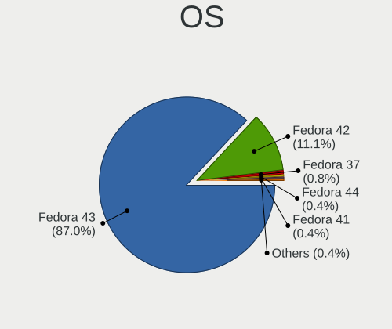

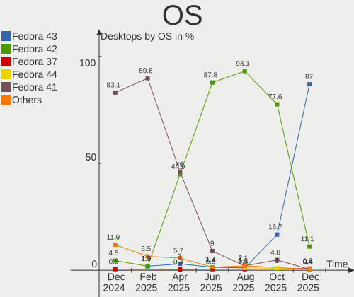

| Name      | Desktops | Percent |
|-----------|----------|---------|
| Fedora 43 | 220      | 86.96%  |
| Fedora 42 | 28       | 11.07%  |
| Fedora 37 | 2        | 0.79%   |
| Fedora 44 | 1        | 0.4%    |
| Fedora 41 | 1        | 0.4%    |
| Fedora 40 | 1        | 0.4%    |

OS Family
---------

OS without a version

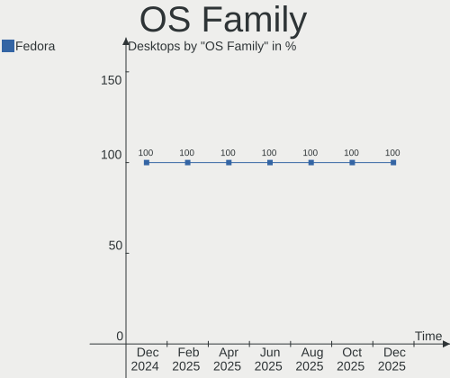

| Name   | Desktops | Percent |
|--------|----------|---------|
| Fedora | 253      | 100%    |

Kernel
------

Version of the Linux kernel

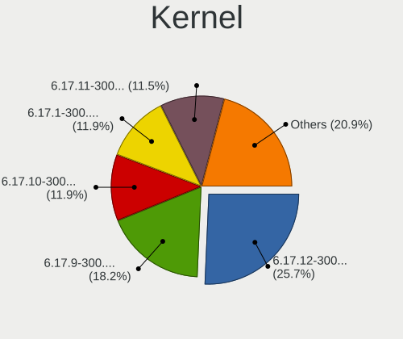

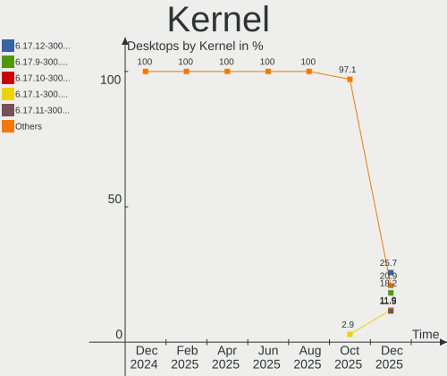

| Version                                              | Desktops | Percent |
|------------------------------------------------------|----------|---------|
| 6.17.12-300.fc43.x86_64                              | 65       | 25.69%  |
| 6.17.9-300.fc43.x86_64                               | 46       | 18.18%  |
| 6.17.10-300.fc43.x86_64                              | 30       | 11.86%  |
| 6.17.1-300.fc43.x86_64                               | 30       | 11.86%  |
| 6.17.11-300.fc43.x86_64                              | 29       | 11.46%  |
| 6.17.8-300.fc43.x86_64                               | 13       | 5.14%   |
| 6.17.9-200.fc42.x86_64                               | 5        | 1.98%   |
| 6.17.13-200.fc42.x86_64                              | 5        | 1.98%   |
| 6.17.10-200.fc42.x86_64                              | 4        | 1.58%   |
| 6.17.7-300.fc43.x86_64                               | 3        | 1.19%   |
| 6.17.12-200.fc42.x86_64                              | 3        | 1.19%   |
| 6.17.6-200.fc42.x86_64                               | 2        | 0.79%   |
| 6.17.11-200.fc42.x86_64                              | 2        | 0.79%   |
| 6.2.15-200.fc37.x86_64                               | 1        | 0.4%    |
| 6.19.0-0.rc0.251204.559e608c.304.vanilla.fc43.x86_64 | 1        | 0.4%    |
| 6.18.2-300.vanilla.fc43.x86_64                       | 1        | 0.4%    |
| 6.18.2-00_cachyos_preempt.fc43.x86_64                | 1        | 0.4%    |
| 6.18.0-559e608c4655-revert-f804a5895eba+             | 1        | 0.4%    |
| 6.17.9-cachyos1.fc43.x86_64                          | 1        | 0.4%    |
| 6.17.9-cachyos1.fc42.x86_64                          | 1        | 0.4%    |
| 6.17.8-200.fc42.x86_64                               | 1        | 0.4%    |
| 6.16.8-200.fc42.x86_64                               | 1        | 0.4%    |
| 6.16.4-200.fc42.x86_64                               | 1        | 0.4%    |
| 6.16.12-200.fc42.x86_64                              | 1        | 0.4%    |
| 6.15.10-200.fc42.x86_64                              | 1        | 0.4%    |
| 6.14.0-63.fc42.x86_64                                | 1        | 0.4%    |
| 6.13.9-200.fc41.x86_64                               | 1        | 0.4%    |
| 6.13.11-100.fc40.x86_64                              | 1        | 0.4%    |
| 6.0.7-301.fc37.x86_64                                | 1        | 0.4%    |

Kernel Family
-------------

Linux kernel without a distro release

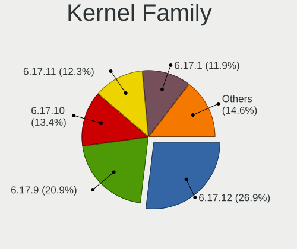

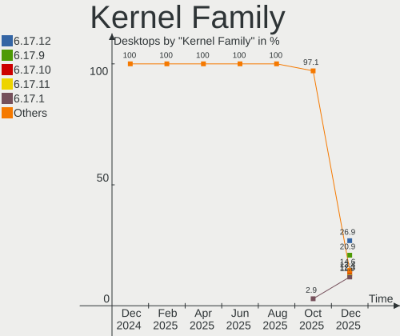

| Version | Desktops | Percent |
|---------|----------|---------|
| 6.17.12 | 68       | 26.88%  |
| 6.17.9  | 53       | 20.95%  |
| 6.17.10 | 34       | 13.44%  |
| 6.17.11 | 31       | 12.25%  |
| 6.17.1  | 30       | 11.86%  |
| 6.17.8  | 14       | 5.53%   |
| 6.17.13 | 5        | 1.98%   |
| 6.17.7  | 3        | 1.19%   |
| 6.18.2  | 2        | 0.79%   |
| 6.17.6  | 2        | 0.79%   |
| 6.2.15  | 1        | 0.4%    |
| 6.19.0  | 1        | 0.4%    |
| 6.18.0  | 1        | 0.4%    |
| 6.16.8  | 1        | 0.4%    |
| 6.16.4  | 1        | 0.4%    |
| 6.16.12 | 1        | 0.4%    |
| 6.15.10 | 1        | 0.4%    |
| 6.14.0  | 1        | 0.4%    |
| 6.13.9  | 1        | 0.4%    |
| 6.13.11 | 1        | 0.4%    |
| 6.0.7   | 1        | 0.4%    |

Kernel Major Ver.
-----------------

Linux kernel major version

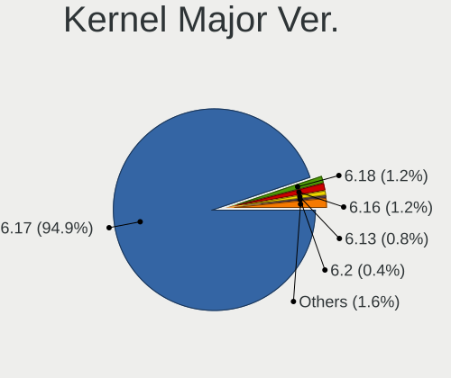

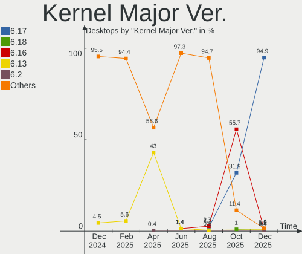

| Version | Desktops | Percent |
|---------|----------|---------|
| 6.17    | 240      | 94.86%  |
| 6.18    | 3        | 1.19%   |
| 6.16    | 3        | 1.19%   |
| 6.13    | 2        | 0.79%   |
| 6.2     | 1        | 0.4%    |
| 6.19    | 1        | 0.4%    |
| 6.15    | 1        | 0.4%    |
| 6.14    | 1        | 0.4%    |
| 6.0     | 1        | 0.4%    |

Arch
----

OS architecture (x86_64, i586, etc.)

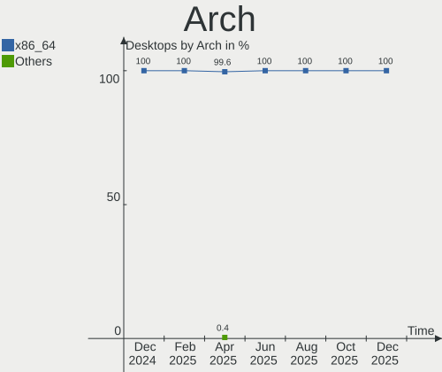

| Name   | Desktops | Percent |
|--------|----------|---------|
| x86_64 | 253      | 100%    |

DE
--

Desktop Environment

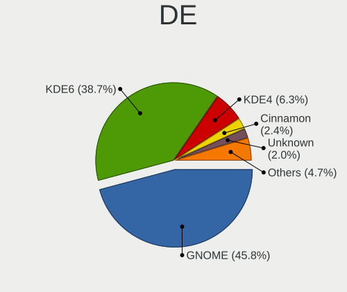

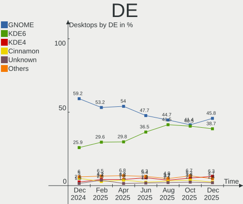

| Name          | Desktops | Percent |
|---------------|----------|---------|
| GNOME         | 116      | 45.85%  |
| KDE6          | 98       | 38.74%  |
| KDE4          | 16       | 6.32%   |
| Cinnamon      | 6        | 2.37%   |
| Unknown       | 5        | 1.98%   |
| XFCE          | 3        | 1.19%   |
| COSMIC        | 3        | 1.19%   |
| X-Cinnamon    | 1        | 0.4%    |
| niri          | 1        | 0.4%    |
| MATE          | 1        | 0.4%    |
| KDE5          | 1        | 0.4%    |
| GNOME Classic | 1        | 0.4%    |
| Budgie        | 1        | 0.4%    |

Display Server
--------------

X11 or Wayland

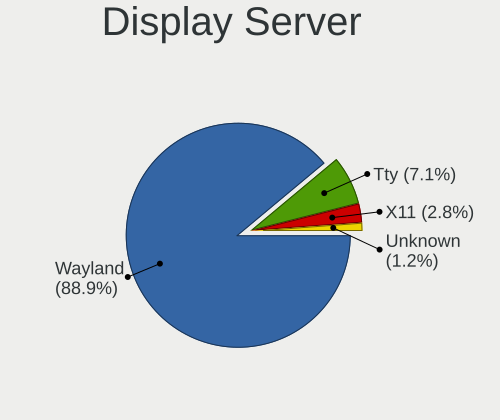

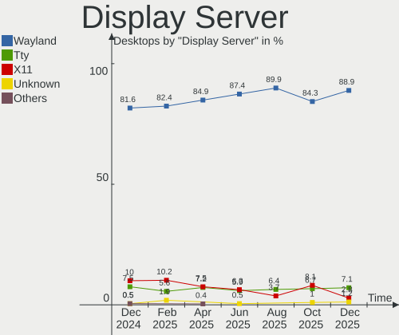

| Name    | Desktops | Percent |
|---------|----------|---------|
| Wayland | 225      | 88.93%  |
| Tty     | 18       | 7.11%   |
| X11     | 7        | 2.77%   |
| Unknown | 3        | 1.19%   |

Display Manager
---------------

SDDM, LightDM, etc.

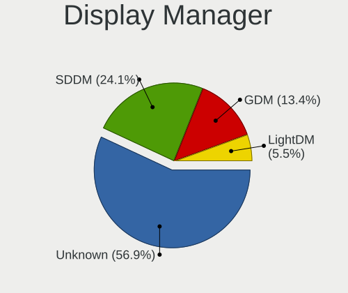

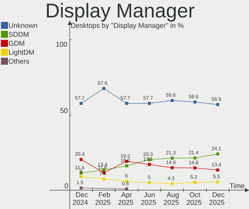

| Name    | Desktops | Percent |
|---------|----------|---------|
| Unknown | 144      | 56.92%  |
| SDDM    | 61       | 24.11%  |
| GDM     | 34       | 13.44%  |
| LightDM | 14       | 5.53%   |

OS Lang
-------

Language

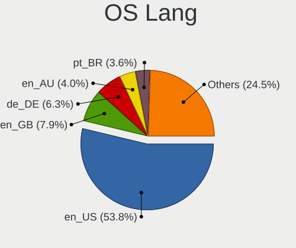

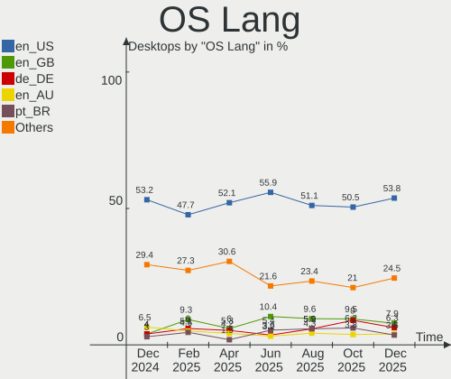

| Lang    | Desktops | Percent |
|---------|----------|---------|
| en_US   | 136      | 53.75%  |
| en_GB   | 20       | 7.91%   |
| de_DE   | 16       | 6.32%   |
| en_AU   | 10       | 3.95%   |
| pt_BR   | 9        | 3.56%   |
| fr_FR   | 7        | 2.77%   |
| ru_RU   | 6        | 2.37%   |
| es_ES   | 5        | 1.98%   |
| en_CA   | 5        | 1.98%   |
| pl_PL   | 4        | 1.58%   |
| it_IT   | 4        | 1.58%   |
| en_NZ   | 3        | 1.19%   |
| es_MX   | 2        | 0.79%   |
| en_ZA   | 2        | 0.79%   |
| en_PH   | 2        | 0.79%   |
| en_IN   | 2        | 0.79%   |
| en_IE   | 2        | 0.79%   |
| Unknown | 2        | 0.79%   |
| zh_CN   | 1        | 0.4%    |
| uk_UA   | 1        | 0.4%    |
| tr_TR   | 1        | 0.4%    |
| sv_SE   | 1        | 0.4%    |
| nl_NL   | 1        | 0.4%    |
| ko_KR   | 1        | 0.4%    |
| ja_JP   | 1        | 0.4%    |
| fr_CH   | 1        | 0.4%    |
| fr_CA   | 1        | 0.4%    |
| fi_FI   | 1        | 0.4%    |
| es_CR   | 1        | 0.4%    |
| es_CO   | 1        | 0.4%    |
| es_CL   | 1        | 0.4%    |
| es_AR   | 1        | 0.4%    |
| en_IL   | 1        | 0.4%    |
| el_GR   | 1        | 0.4%    |

Boot Mode
---------

EFI or BIOS

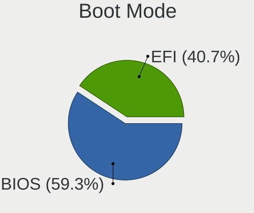

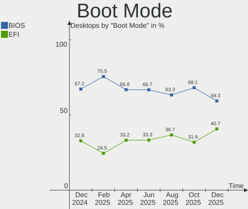

| Mode | Desktops | Percent |
|------|----------|---------|
| BIOS | 150      | 59.29%  |
| EFI  | 103      | 40.71%  |

Filesystem
----------

Type of filesystem

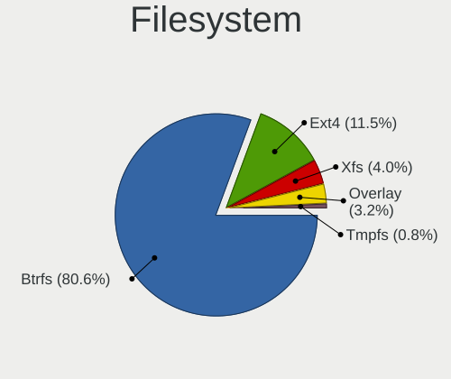

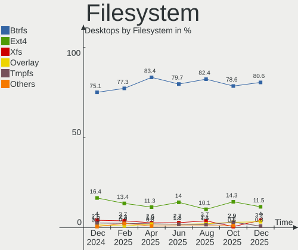

| Type    | Desktops | Percent |
|---------|----------|---------|
| Btrfs   | 204      | 80.63%  |
| Ext4    | 29       | 11.46%  |
| Xfs     | 10       | 3.95%   |
| Overlay | 8        | 3.16%   |
| Tmpfs   | 2        | 0.79%   |

Part. scheme
------------

Scheme of partitioning

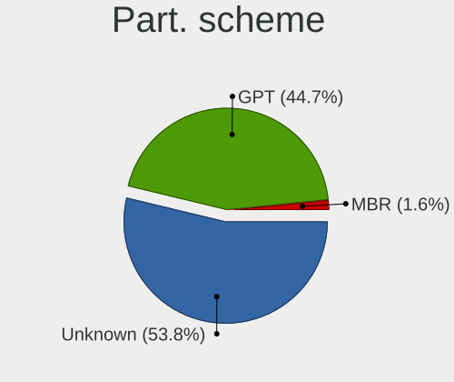

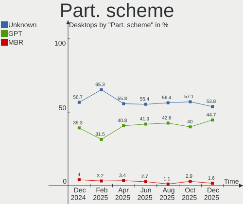

| Type    | Desktops | Percent |
|---------|----------|---------|
| Unknown | 136      | 53.75%  |
| GPT     | 113      | 44.66%  |
| MBR     | 4        | 1.58%   |

Dual Boot with Linux/BSD
------------------------

Hosting more than one Linux/BSD

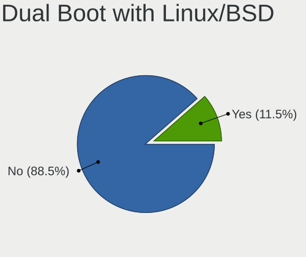

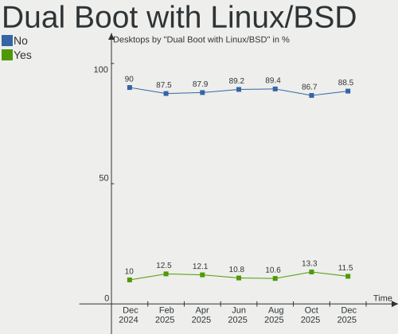

| Dual boot | Desktops | Percent |
|-----------|----------|---------|
| No        | 224      | 88.54%  |
| Yes       | 29       | 11.46%  |

Dual Boot (Win)
---------------

Hosting Linux and Windows

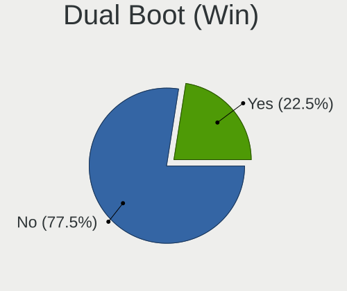

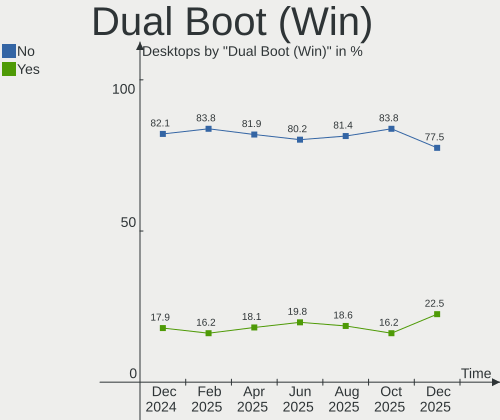

| Dual boot | Desktops | Percent |
|-----------|----------|---------|
| No        | 196      | 77.47%  |
| Yes       | 57       | 22.53%  |

Board
-----

Vendor
------

Motherboard manufacturer

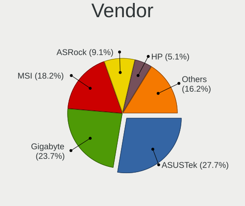

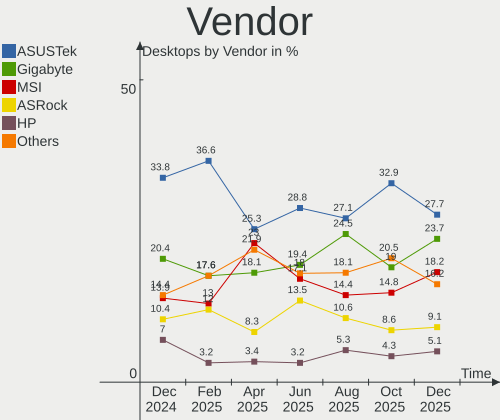

| Name                                 | Desktops | Percent |
|--------------------------------------|----------|---------|
| ASUSTek Computer                     | 70       | 27.67%  |
| Gigabyte Technology                  | 60       | 23.72%  |
| MSI                                  | 46       | 18.18%  |
| ASRock                               | 23       | 9.09%   |
| Hewlett-Packard                      | 13       | 5.14%   |
| Dell                                 | 11       | 4.35%   |
| Lenovo                               | 8        | 3.16%   |
| Unknown                              | 3        | 1.19%   |
| Intel                                | 2        | 0.79%   |
| Fujitsu                              | 2        | 0.79%   |
| Win Element                          | 1        | 0.4%    |
| UGREEN                               | 1        | 0.4%    |
| TOPC                                 | 1        | 0.4%    |
| SZQFTX                               | 1        | 0.4%    |
| Shenzhen Meigao Electronic Equipment | 1        | 0.4%    |
| PELADN                               | 1        | 0.4%    |
| Pegatron                             | 1        | 0.4%    |
| NZXT                                 | 1        | 0.4%    |
| Itautec                              | 1        | 0.4%    |
| Huanan                               | 1        | 0.4%    |
| GMKtec                               | 1        | 0.4%    |
| Biostar                              | 1        | 0.4%    |
| AZW                                  | 1        | 0.4%    |
| Alienware                            | 1        | 0.4%    |
| Acer                                 | 1        | 0.4%    |

Model
-----

Motherboard model

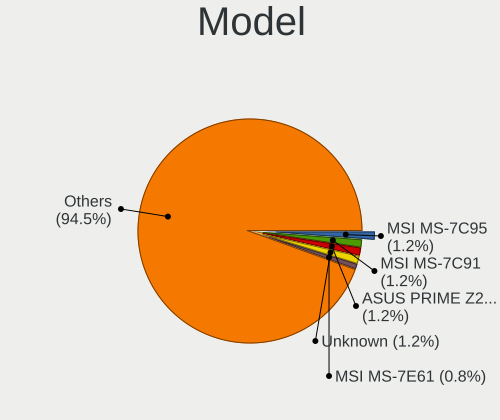

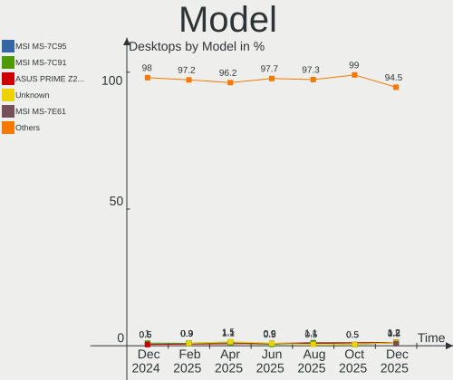

| Name                                              | Desktops | Percent |
|---------------------------------------------------|----------|---------|
| MSI MS-7C95                                       | 3        | 1.19%   |
| MSI MS-7C91                                       | 3        | 1.19%   |
| ASUS PRIME Z270-P                                 | 3        | 1.19%   |
| Unknown                                           | 3        | 1.19%   |
| MSI MS-7E61                                       | 2        | 0.79%   |
| MSI MS-7E12                                       | 2        | 0.79%   |
| MSI MS-7D54                                       | 2        | 0.79%   |
| MSI MS-7B89                                       | 2        | 0.79%   |
| MSI MS-7821                                       | 2        | 0.79%   |
| Gigabyte Z790 AORUS ELITE AX ICE                  | 2        | 0.79%   |
| Gigabyte X570 AORUS ULTRA                         | 2        | 0.79%   |
| Gigabyte B550 AORUS ELITE                         | 2        | 0.79%   |
| Dell Precision Tower 5810                         | 2        | 0.79%   |
| Dell OptiPlex 3050                                | 2        | 0.79%   |
| ASUS TUF Gaming B550-PLUS                         | 2        | 0.79%   |
| ASUS ROG STRIX B450-F GAMING                      | 2        | 0.79%   |
| ASUS ROG CROSSHAIR X870E HERO                     | 2        | 0.79%   |
| ASUS PRIME Z790-P WIFI                            | 2        | 0.79%   |
| ASUS PRIME B550M-K                                | 2        | 0.79%   |
| ASUS PRIME A320M-K                                | 2        | 0.79%   |
| ASRock X870E Taichi                               | 2        | 0.79%   |
| ASRock B850 Steel Legend WiFi                     | 2        | 0.79%   |
| ASRock B450M Steel Legend                         | 2        | 0.79%   |
| Win Element M6                                    | 1        | 0.4%    |
| UGREEN DXP2800                                    | 1        | 0.4%    |
| TOPC FP7R2-12                                     | 1        | 0.4%    |
| SZQFTX MN56                                       | 1        | 0.4%    |
| Shenzhen Meigao Electronic Equipment Venus series | 1        | 0.4%    |
| PELADN WO4                                        | 1        | 0.4%    |
| Pegatron FQ516AA-A2L a6648f                       | 1        | 0.4%    |
| NZXT N7 B650E                                     | 1        | 0.4%    |
| MSI US Desktop Codex R2                           | 1        | 0.4%    |
| MSI US Desktop Codex R                            | 1        | 0.4%    |
| MSI US Desktop Aegis RS                           | 1        | 0.4%    |
| MSI MS-7E80                                       | 1        | 0.4%    |
| MSI MS-7E59                                       | 1        | 0.4%    |
| MSI MS-7E56                                       | 1        | 0.4%    |
| MSI MS-7E47                                       | 1        | 0.4%    |
| MSI MS-7E32                                       | 1        | 0.4%    |
| MSI MS-7E26                                       | 1        | 0.4%    |

Model Family
------------

Motherboard model prefix

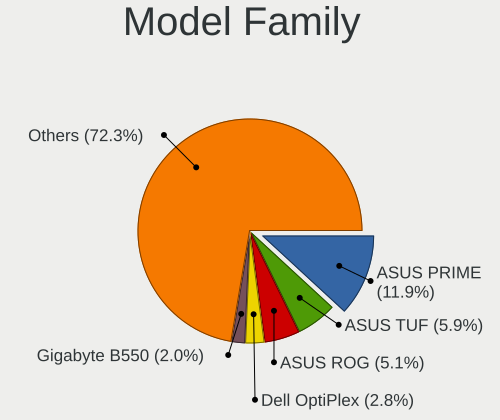

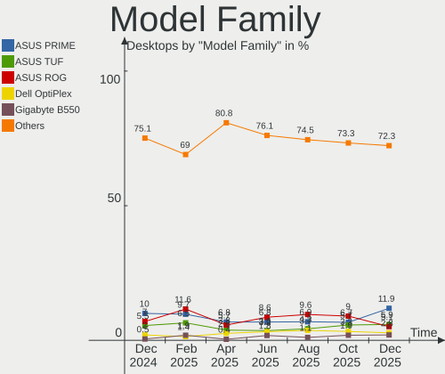

| Name                                       | Desktops | Percent |
|--------------------------------------------|----------|---------|
| ASUS PRIME                                 | 30       | 11.86%  |
| ASUS TUF                                   | 15       | 5.93%   |
| ASUS ROG                                   | 13       | 5.14%   |
| Dell OptiPlex                              | 7        | 2.77%   |
| Gigabyte B550                              | 5        | 1.98%   |
| Gigabyte Z790                              | 4        | 1.58%   |
| Gigabyte X570                              | 4        | 1.58%   |
| MSI US                                     | 3        | 1.19%   |
| MSI MS-7C95                                | 3        | 1.19%   |
| MSI MS-7C91                                | 3        | 1.19%   |
| Lenovo ThinkCentre                         | 3        | 1.19%   |
| Gigabyte B650                              | 3        | 1.19%   |
| Gigabyte B550M                             | 3        | 1.19%   |
| ASRock X870E                               | 3        | 1.19%   |
| ASRock B450M                               | 3        | 1.19%   |
| Unknown                                    | 3        | 1.19%   |
| MSI MS-7E61                                | 2        | 0.79%   |
| MSI MS-7E12                                | 2        | 0.79%   |
| MSI MS-7D54                                | 2        | 0.79%   |
| MSI MS-7B89                                | 2        | 0.79%   |
| MSI MS-7821                                | 2        | 0.79%   |
| Lenovo Legion                              | 2        | 0.79%   |
| HP Slim                                    | 2        | 0.79%   |
| HP ProDesk                                 | 2        | 0.79%   |
| HP OMEN                                    | 2        | 0.79%   |
| Gigabyte H410M                             | 2        | 0.79%   |
| Gigabyte B850                              | 2        | 0.79%   |
| Gigabyte B450M                             | 2        | 0.79%   |
| Gigabyte B450                              | 2        | 0.79%   |
| Fujitsu ESPRIMO                            | 2        | 0.79%   |
| Dell Precision                             | 2        | 0.79%   |
| ASRock X870                                | 2        | 0.79%   |
| ASRock B850                                | 2        | 0.79%   |
| Win Element M6                             | 1        | 0.4%    |
| UGREEN DXP2800                             | 1        | 0.4%    |
| TOPC FP7R2-12                              | 1        | 0.4%    |
| SZQFTX MN56                                | 1        | 0.4%    |
| Shenzhen Meigao Electronic Equipment Venus | 1        | 0.4%    |
| PELADN WO4                                 | 1        | 0.4%    |
| Pegatron FQ516AA-A2L                       | 1        | 0.4%    |

MFG Year
--------

Motherboard manufacture year

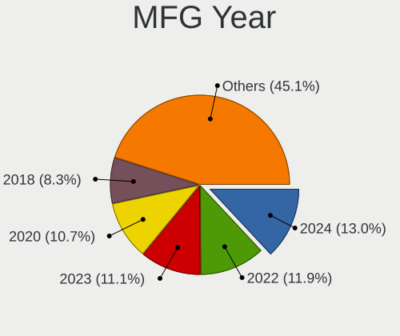

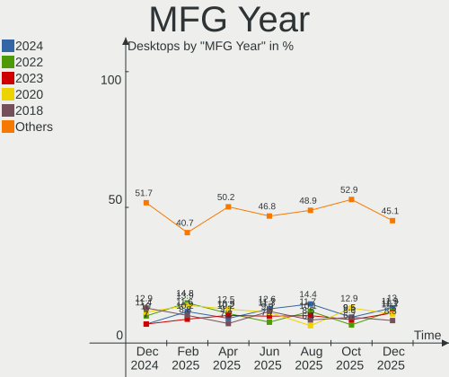

| Year | Desktops | Percent |
|------|----------|---------|
| 2024 | 33       | 13.04%  |
| 2022 | 30       | 11.86%  |
| 2023 | 28       | 11.07%  |
| 2020 | 27       | 10.67%  |
| 2018 | 21       | 8.3%    |
| 2019 | 19       | 7.51%   |
| 2025 | 15       | 5.93%   |
| 2021 | 15       | 5.93%   |
| 2017 | 12       | 4.74%   |
| 2016 | 10       | 3.95%   |
| 2014 | 10       | 3.95%   |
| 2013 | 8        | 3.16%   |
| 2012 | 8        | 3.16%   |
| 2015 | 7        | 2.77%   |
| 2009 | 3        | 1.19%   |
| 2008 | 3        | 1.19%   |
| 2010 | 2        | 0.79%   |
| 2011 | 1        | 0.4%    |
| 2007 | 1        | 0.4%    |

Form Factor
-----------

Physical design of the computer

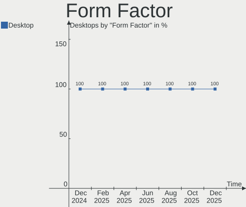

| Name    | Desktops | Percent |
|---------|----------|---------|
| Desktop | 253      | 100%    |

Secure Boot
-----------

Enabled or disabled

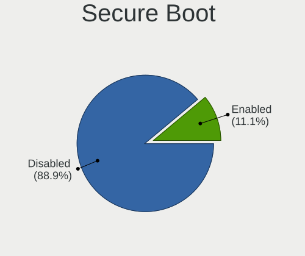

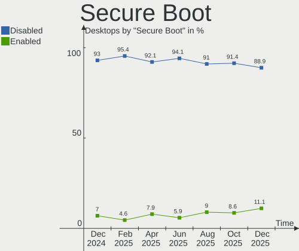

| State    | Desktops | Percent |
|----------|----------|---------|
| Disabled | 225      | 88.93%  |
| Enabled  | 28       | 11.07%  |

Coreboot
--------

Have coreboot on board

| Used | Desktops | Percent |
|------|----------|---------|
| No   | 253      | 100%    |

RAM Size
--------

Total RAM memory

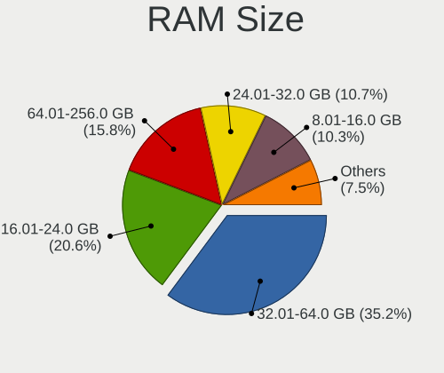

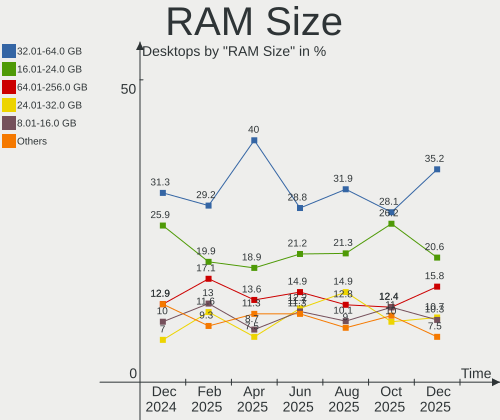

| Size in GB  | Desktops | Percent |
|-------------|----------|---------|
| 32.01-64.0  | 89       | 35.18%  |
| 16.01-24.0  | 52       | 20.55%  |
| 64.01-256.0 | 40       | 15.81%  |
| 24.01-32.0  | 27       | 10.67%  |
| 8.01-16.0   | 26       | 10.28%  |
| 4.01-8.0    | 14       | 5.53%   |
| 3.01-4.0    | 5        | 1.98%   |

RAM Used
--------

Used RAM memory

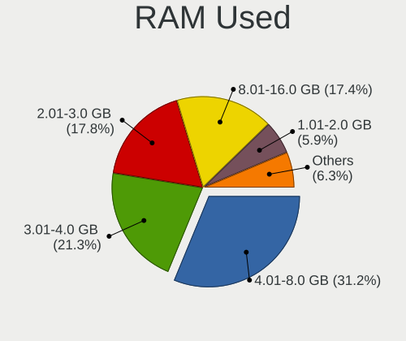

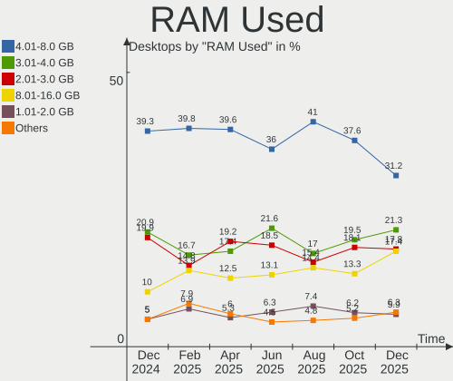

| Used GB    | Desktops | Percent |
|------------|----------|---------|
| 4.01-8.0   | 79       | 31.23%  |
| 3.01-4.0   | 54       | 21.34%  |
| 2.01-3.0   | 45       | 17.79%  |
| 8.01-16.0  | 44       | 17.39%  |
| 1.01-2.0   | 15       | 5.93%   |
| 16.01-24.0 | 7        | 2.77%   |
| 24.01-32.0 | 5        | 1.98%   |
| 0.51-1.0   | 4        | 1.58%   |

Total Drives
------------

Number of drives on board

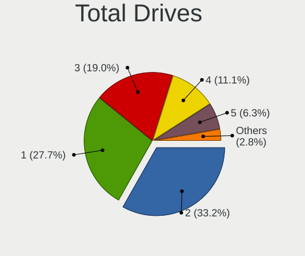

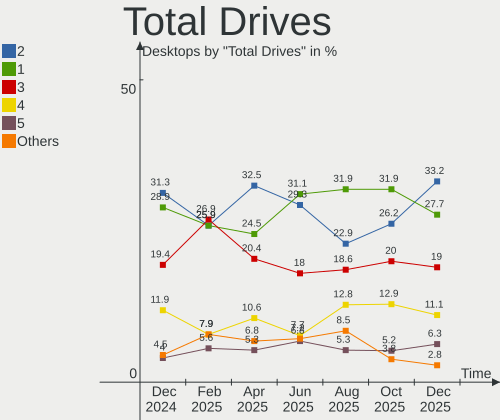

| Drives | Desktops | Percent |
|--------|----------|---------|
| 2      | 84       | 33.2%   |
| 1      | 70       | 27.67%  |
| 3      | 48       | 18.97%  |
| 4      | 28       | 11.07%  |
| 5      | 16       | 6.32%   |
| 6      | 4        | 1.58%   |
| 8      | 3        | 1.19%   |

Has CD-ROM
----------

Has CD-ROM on board

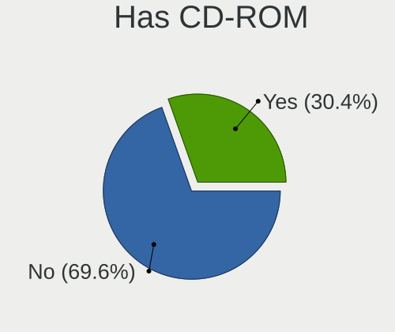

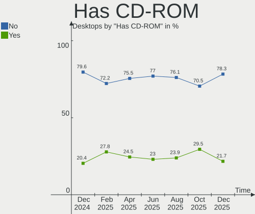

| Presented | Desktops | Percent |
|-----------|----------|---------|
| No        | 198      | 78.26%  |
| Yes       | 55       | 21.74%  |

Has Ethernet
------------

Has Ethernet on board

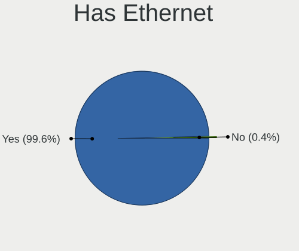

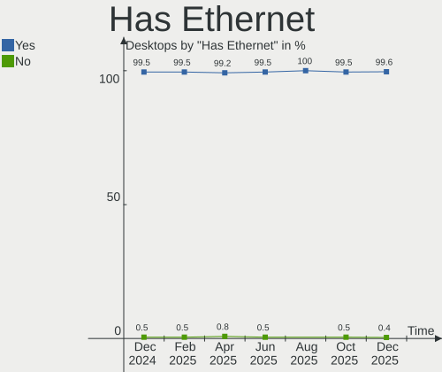

| Presented | Desktops | Percent |
|-----------|----------|---------|
| Yes       | 252      | 99.6%   |
| No        | 1        | 0.4%    |

Has WiFi
--------

Has WiFi module

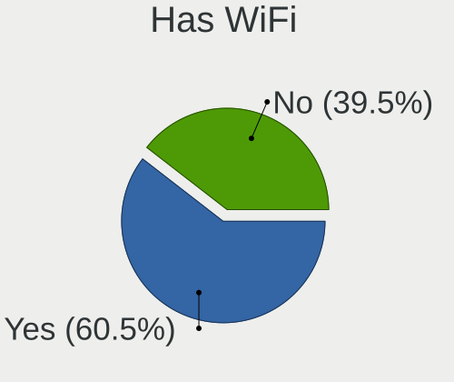

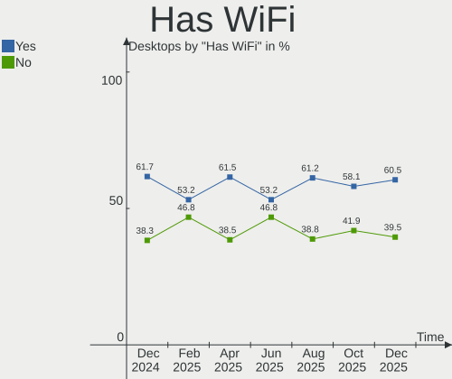

| Presented | Desktops | Percent |
|-----------|----------|---------|
| Yes       | 153      | 60.47%  |
| No        | 100      | 39.53%  |

Has Bluetooth
-------------

Has Bluetooth module

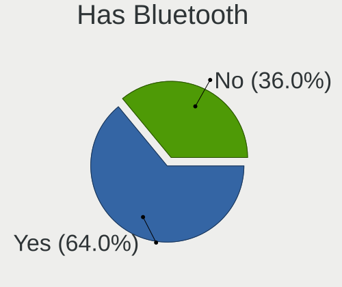

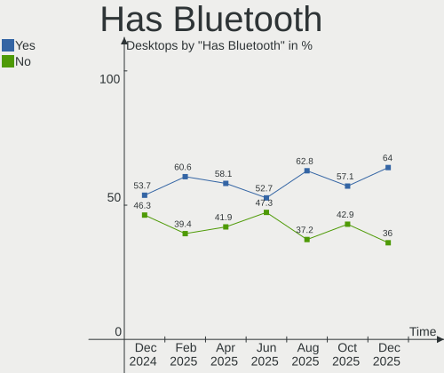

| Presented | Desktops | Percent |
|-----------|----------|---------|
| Yes       | 162      | 64.03%  |
| No        | 91       | 35.97%  |

Location
--------

Country
-------

Geographic location (country)

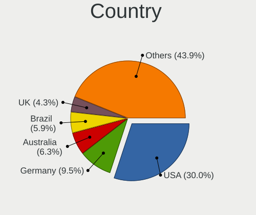

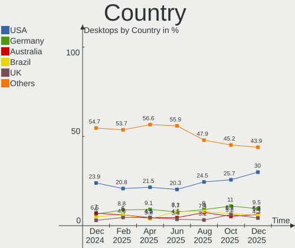

| Country      | Desktops | Percent |
|--------------|----------|---------|
| USA          | 76       | 30.04%  |
| Germany      | 24       | 9.49%   |
| Australia    | 16       | 6.32%   |
| Brazil       | 15       | 5.93%   |
| UK           | 11       | 4.35%   |
| Canada       | 10       | 3.95%   |
| Italy        | 7        | 2.77%   |
| France       | 7        | 2.77%   |
| Finland      | 7        | 2.77%   |
| Poland       | 6        | 2.37%   |
| Spain        | 5        | 1.98%   |
| Russia       | 5        | 1.98%   |
| Thailand     | 3        | 1.19%   |
| Switzerland  | 3        | 1.19%   |
| South Korea  | 3        | 1.19%   |
| New Zealand  | 3        | 1.19%   |
| Netherlands  | 3        | 1.19%   |
| India        | 3        | 1.19%   |
| Belarus      | 3        | 1.19%   |
| Ukraine      | 2        | 0.79%   |
| Sweden       | 2        | 0.79%   |
| South Africa | 2        | 0.79%   |
| Portugal     | 2        | 0.79%   |
| Philippines  | 2        | 0.79%   |
| Norway       | 2        | 0.79%   |
| Mexico       | 2        | 0.79%   |
| Malaysia     | 2        | 0.79%   |
| Japan        | 2        | 0.79%   |
| Greece       | 2        | 0.79%   |
| Estonia      | 2        | 0.79%   |
| Colombia     | 2        | 0.79%   |
| Turkey       | 1        | 0.4%    |
| Tunisia      | 1        | 0.4%    |
| Taiwan       | 1        | 0.4%    |
| Saudi Arabia | 1        | 0.4%    |
| Romania      | 1        | 0.4%    |
| Pakistan     | 1        | 0.4%    |
| Luxembourg   | 1        | 0.4%    |
| Kazakhstan   | 1        | 0.4%    |
| Israel       | 1        | 0.4%    |

City
----

Geographic location (city)

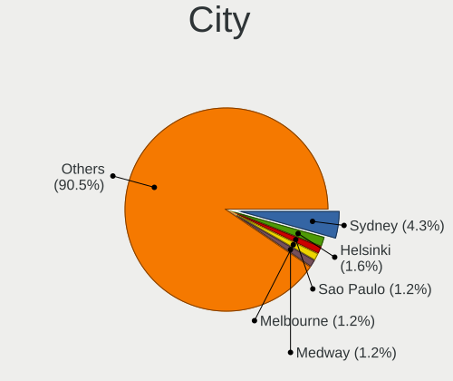

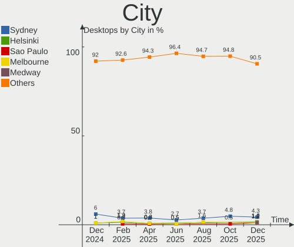

| City             | Desktops | Percent |
|------------------|----------|---------|
| Sydney           | 11       | 4.35%   |
| Helsinki         | 4        | 1.58%   |
| Sao Paulo        | 3        | 1.19%   |
| Melbourne        | 3        | 1.19%   |
| Medway           | 3        | 1.19%   |
| Dongjak-gu       | 3        | 1.19%   |
| Berlin           | 3        | 1.19%   |
| Wroclaw          | 2        | 0.79%   |
| Wellington       | 2        | 0.79%   |
| Vienna           | 2        | 0.79%   |
| Toronto          | 2        | 0.79%   |
| Shah Alam        | 2        | 0.79%   |
| Ober-Morlen      | 2        | 0.79%   |
| Minsk            | 2        | 0.79%   |
| Milan            | 2        | 0.79%   |
| Johannesburg     | 2        | 0.79%   |
| Haltom City      | 2        | 0.79%   |
| Chicago          | 2        | 0.79%   |
| Bangkok          | 2        | 0.79%   |
| Amsterdam        | 2        | 0.79%   |
| Zagreb           | 1        | 0.4%    |
| Yukon            | 1        | 0.4%    |
| Youngstown       | 1        | 0.4%    |
| Wilmington       | 1        | 0.4%    |
| Williamston      | 1        | 0.4%    |
| Wichita          | 1        | 0.4%    |
| Whittier         | 1        | 0.4%    |
| West Springfield | 1        | 0.4%    |
| West Cowes       | 1        | 0.4%    |
| West Bloomfield  | 1        | 0.4%    |
| Warner           | 1        | 0.4%    |
| Vitebsk          | 1        | 0.4%    |
| Virginia Beach   | 1        | 0.4%    |
| Varzea Paulista  | 1        | 0.4%    |
| Van Buren        | 1        | 0.4%    |
| Valencia         | 1        | 0.4%    |
| Utrera           | 1        | 0.4%    |
| Tunkhannock      | 1        | 0.4%    |
| Tunis            | 1        | 0.4%    |
| Trondheim        | 1        | 0.4%    |

Drives
------

Drive Vendor
------------

Hard drive vendors

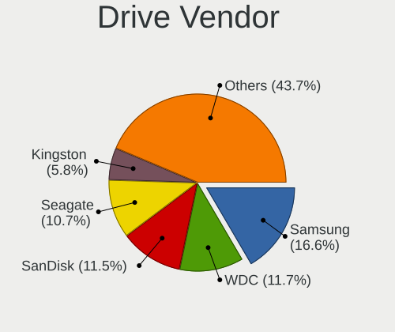

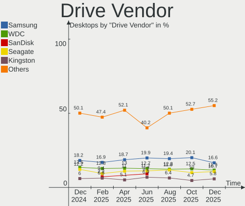

| Vendor                       | Desktops | Drives | Percent |
|------------------------------|----------|--------|---------|
| Samsung Electronics          | 85       | 123    | 16.57%  |
| WDC                          | 60       | 80     | 11.7%   |
| SanDisk                      | 59       | 66     | 11.5%   |
| Seagate                      | 55       | 72     | 10.72%  |
| Kingston                     | 30       | 32     | 5.85%   |
| Micron/Crucial Technology    | 27       | 32     | 5.26%   |
| Crucial                      | 22       | 22     | 4.29%   |
| Phison Electronics           | 20       | 24     | 3.9%    |
| Toshiba                      | 14       | 16     | 2.73%   |
| MAXIO Technology (Hangzhou)  | 13       | 14     | 2.53%   |
| Kingston Technology Company  | 12       | 14     | 2.34%   |
| Micron Technology            | 10       | 10     | 1.95%   |
| Intel                        | 10       | 11     | 1.95%   |
| Realtek Semiconductor        | 9        | 9      | 1.75%   |
| Shenzhen Longsys Electronics | 6        | 6      | 1.17%   |
| A-DATA Technology            | 6        | 6      | 1.17%   |
| SK hynix                     | 5        | 6      | 0.97%   |
| PNY                          | 5        | 5      | 0.97%   |
| HGST                         | 5        | 6      | 0.97%   |
| ADATA Technology             | 5        | 5      | 0.97%   |
| Hitachi                      | 4        | 4      | 0.78%   |
| China                        | 4        | 4      | 0.78%   |
| Unknown                      | 3        | 3      | 0.58%   |
| Team                         | 3        | 3      | 0.58%   |
| Silicon Motion               | 3        | 3      | 0.58%   |
| OCZ                          | 3        | 4      | 0.58%   |
| T-FORCE                      | 2        | 2      | 0.39%   |
| Realtek                      | 2        | 2      | 0.39%   |
| KIOXIA                       | 2        | 2      | 0.39%   |
| JMicron Technology           | 2        | 2      | 0.39%   |
| GOODRAM                      | 2        | 2      | 0.39%   |
| Gigabyte Technology          | 2        | 2      | 0.39%   |
| X12                          | 1        | 1      | 0.19%   |
| TEXTORM                      | 1        | 1      | 0.19%   |
| Super Talent                 | 1        | 1      | 0.19%   |
| SSDPR-CX                     | 1        | 1      | 0.19%   |
| SPCC                         | 1        | 1      | 0.19%   |
| SOLIDIGM                     | 1        | 1      | 0.19%   |
| Shenzhen                     | 1        | 1      | 0.19%   |
| Seagate Technology           | 1        | 1      | 0.19%   |

Drive Model
-----------

Hard drive models

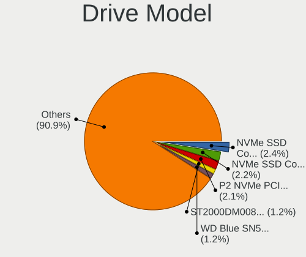

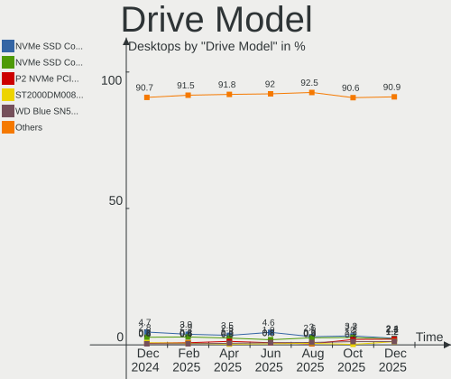

| Model                                                 | Desktops | Percent |
|-------------------------------------------------------|----------|---------|
| Samsung NVMe SSD Controller SM981/PM981/PM983 1TB     | 14       | 2.4%    |
| Samsung NVMe SSD Controller PM9A1/PM9A3/980PRO 1TB    | 13       | 2.23%   |
| Micron/Crucial P2 NVMe PCIe SSD 2TB                   | 12       | 2.05%   |
| Seagate ST2000DM008-2UB102 2TB                        | 7        | 1.2%    |
| Sandisk WD Blue SN550 NVMe SSD 1024GB                 | 7        | 1.2%    |
| MAXIO (Hangzhou) NVMe SSD Controller MAP1202 2TB      | 7        | 1.2%    |
| Seagate ST1000DM010-2EP102 1TB                        | 6        | 1.03%   |
| Sandisk WD_BLACK SN850X 1000GB                        | 6        | 1.03%   |
| Samsung SSD 990 EVO Plus 2TB                          | 6        | 1.03%   |
| WDC WD10EZEX-08WN4A0 1TB                              | 5        | 0.86%   |
| Seagate ST500DM002-1BD142 500GB                       | 5        | 0.86%   |
| Samsung SSD 850 EVO 250GB                             | 5        | 0.86%   |
| Phison E16 PCIe4 NVMe Controller 1TB                  | 5        | 0.86%   |
| Kingston SV300S37A120G 120GB SSD                      | 5        | 0.86%   |
| WDC WD10EZEX-00WN4A0 1TB                              | 4        | 0.68%   |
| Sandisk WD_BLACK SN850X 2000GB                        | 4        | 0.68%   |
| Sandisk WD_BLACK SN770 1TB                            | 4        | 0.68%   |
| Sandisk WD Blue SN570 1TB                             | 4        | 0.68%   |
| Sandisk WD Black SN850 1TB                            | 4        | 0.68%   |
| Samsung SSD 990 PRO 4TB                               | 4        | 0.68%   |
| Samsung SSD 990 EVO Plus 1TB                          | 4        | 0.68%   |
| Samsung SSD 860 EVO 1TB                               | 4        | 0.68%   |
| Phison E12 NVMe Controller 1TB                        | 4        | 0.68%   |
| Micron/Crucial P1 NVMe PCIe SSD 1TB                   | 4        | 0.68%   |
| Micron/Crucial CT2000P3PSSD8 2TB                      | 4        | 0.68%   |
| Kingston Company A2000 NVMe SSD 250GB                 | 4        | 0.68%   |
| Kingston SA400S37480G 480GB SSD                       | 4        | 0.68%   |
| Kingston SA400S37240G 240GB SSD                       | 4        | 0.68%   |
| Crucial CT2000BX500SSD1 2TB                           | 4        | 0.68%   |
| Crucial CT1000MX500SSD1 1TB                           | 4        | 0.68%   |
| WDC WD20EFRX-68EUZN0 2TB                              | 3        | 0.51%   |
| Toshiba HDWD110 1TB                                   | 3        | 0.51%   |
| Seagate ST8000DM004-2U9188 8TB                        | 3        | 0.51%   |
| Seagate ST2000DL003-9VT166 2TB                        | 3        | 0.51%   |
| Seagate ST1000DM003-1CH162 1TB                        | 3        | 0.51%   |
| Sandisk WD_BLACK SN770 2TB                            | 3        | 0.51%   |
| Sandisk WD_BLACK SN7100 2TB                           | 3        | 0.51%   |
| Sandisk WD Black SN750 / PC SN730 NVMe SSD 500GB      | 3        | 0.51%   |
| Sandisk WD Black 2018/SN750 / PC SN720 NVMe SSD 512GB | 3        | 0.51%   |
| Samsung SSD 990 PRO 2TB                               | 3        | 0.51%   |

HDD Vendor
----------

Hard disk drive vendors

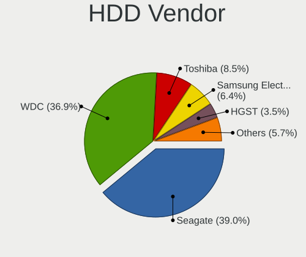

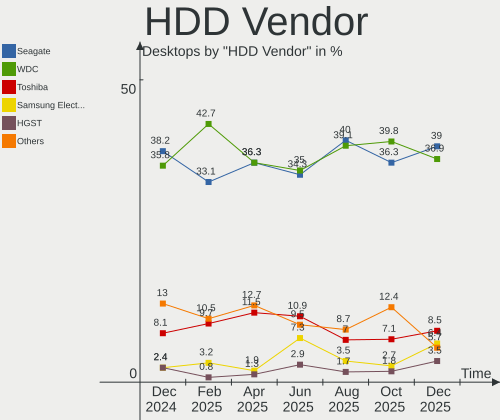

| Vendor              | Desktops | Drives | Percent |
|---------------------|----------|--------|---------|
| Seagate             | 55       | 72     | 39.01%  |
| WDC                 | 52       | 65     | 36.88%  |
| Toshiba             | 12       | 14     | 8.51%   |
| Samsung Electronics | 9        | 11     | 6.38%   |
| HGST                | 5        | 6      | 3.55%   |
| Hitachi             | 4        | 4      | 2.84%   |
| JMicron Technology  | 2        | 2      | 1.42%   |
| Shenzhen            | 1        | 1      | 0.71%   |
| Hewlett-Packard     | 1        | 1      | 0.71%   |

SSD Vendor
----------

Solid state drive vendors

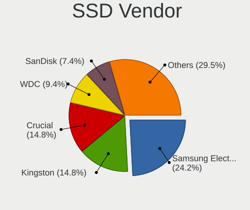

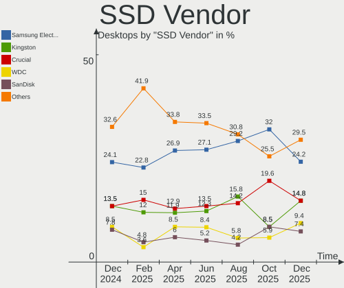

| Vendor              | Desktops | Drives | Percent |
|---------------------|----------|--------|---------|
| Samsung Electronics | 36       | 46     | 24.16%  |
| Kingston            | 22       | 24     | 14.77%  |
| Crucial             | 22       | 22     | 14.77%  |
| WDC                 | 14       | 15     | 9.4%    |
| SanDisk             | 11       | 11     | 7.38%   |
| PNY                 | 5        | 5      | 3.36%   |
| A-DATA Technology   | 5        | 5      | 3.36%   |
| Intel               | 4        | 4      | 2.68%   |
| China               | 4        | 4      | 2.68%   |
| Team                | 3        | 3      | 2.01%   |
| OCZ                 | 3        | 4      | 2.01%   |
| Micron Technology   | 2        | 2      | 1.34%   |
| GOODRAM             | 2        | 2      | 1.34%   |
| Gigabyte Technology | 2        | 2      | 1.34%   |
| X12                 | 1        | 1      | 0.67%   |
| Toshiba             | 1        | 1      | 0.67%   |
| TEXTORM             | 1        | 1      | 0.67%   |
| T-FORCE             | 1        | 1      | 0.67%   |
| Super Talent        | 1        | 1      | 0.67%   |
| SPCC                | 1        | 1      | 0.67%   |
| SK hynix            | 1        | 1      | 0.67%   |
| Rayson              | 1        | 1      | 0.67%   |
| Patriot             | 1        | 1      | 0.67%   |
| NVMe                | 1        | 2      | 0.67%   |
| KODAK               | 1        | 1      | 0.67%   |
| INNOVATION IT       | 1        | 1      | 0.67%   |
| HUSKY               | 1        | 1      | 0.67%   |
| Corsair             | 1        | 1      | 0.67%   |

Drive Kind
----------

HDD or SSD

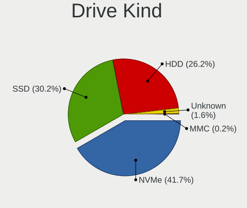

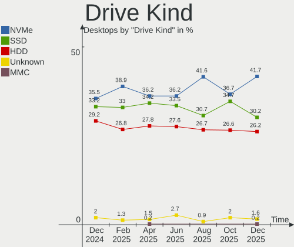

| Kind    | Desktops | Drives | Percent |
|---------|----------|--------|---------|
| NVMe    | 178      | 268    | 41.69%  |
| SSD     | 129      | 164    | 30.21%  |
| HDD     | 112      | 176    | 26.23%  |
| Unknown | 7        | 7      | 1.64%   |
| MMC     | 1        | 1      | 0.23%   |

Drive Connector
---------------

SATA, SAS, NVMe, etc.

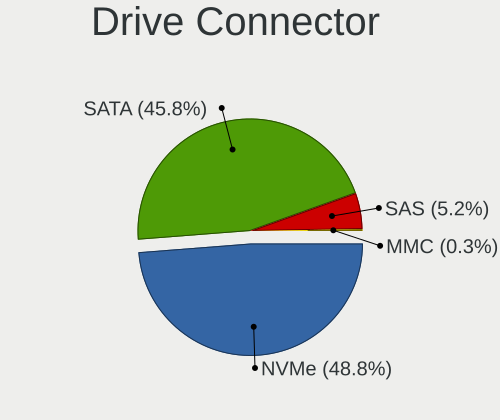

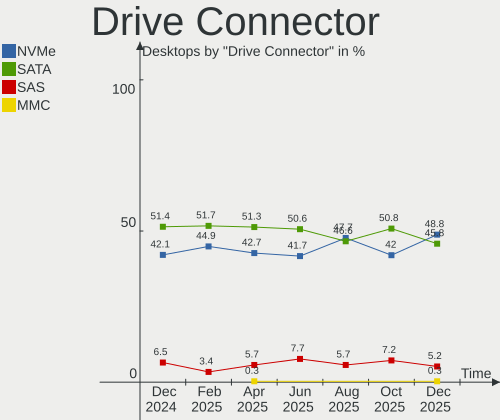

| Type | Desktops | Drives | Percent |
|------|----------|--------|---------|
| NVMe | 178      | 264    | 48.77%  |
| SATA | 167      | 330    | 45.75%  |
| SAS  | 19       | 21     | 5.21%   |
| MMC  | 1        | 1      | 0.27%   |

Drive Size
----------

Size of hard drive

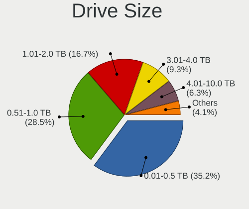

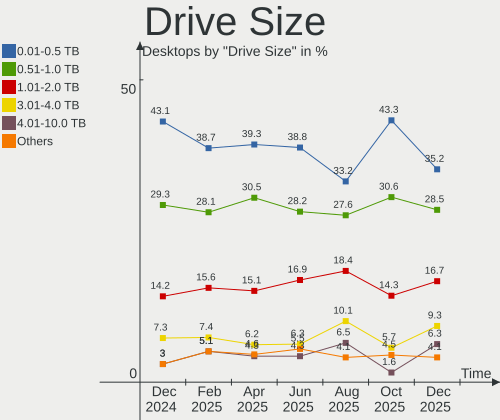

| Size in TB | Desktops | Drives | Percent |
|------------|----------|--------|---------|
| 0.01-0.5   | 95       | 125    | 35.19%  |
| 0.51-1.0   | 77       | 99     | 28.52%  |
| 1.01-2.0   | 45       | 52     | 16.67%  |
| 3.01-4.0   | 25       | 31     | 9.26%   |
| 4.01-10.0  | 17       | 22     | 6.3%    |
| 2.01-3.0   | 6        | 6      | 2.22%   |
| 10.01-20.0 | 5        | 5      | 1.85%   |

Space Total
-----------

Amount of disk space available on the file system

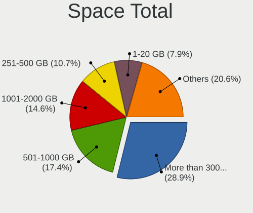

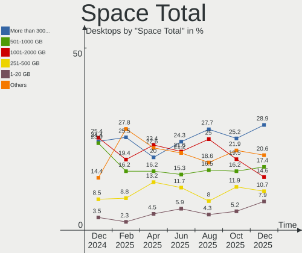

| Size in GB     | Desktops | Percent |
|----------------|----------|---------|
| More than 3000 | 73       | 28.85%  |
| 501-1000       | 44       | 17.39%  |
| 1001-2000      | 37       | 14.62%  |
| 251-500        | 27       | 10.67%  |
| 1-20           | 20       | 7.91%   |
| Unknown        | 20       | 7.91%   |
| 2001-3000      | 17       | 6.72%   |
| 101-250        | 13       | 5.14%   |
| 51-100         | 2        | 0.79%   |

Space Used
----------

Amount of used disk space

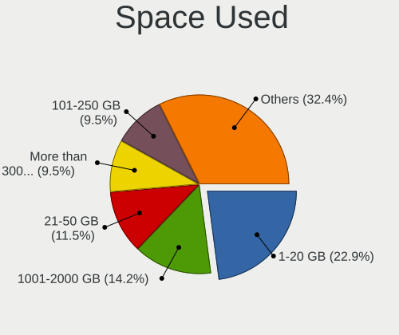

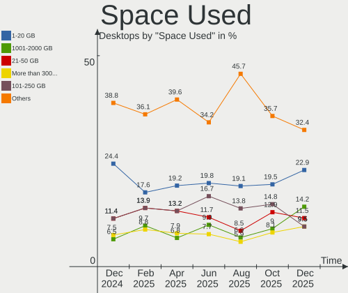

| Used GB        | Desktops | Percent |
|----------------|----------|---------|
| 1-20           | 58       | 22.92%  |
| 1001-2000      | 36       | 14.23%  |
| 21-50          | 29       | 11.46%  |
| More than 3000 | 24       | 9.49%   |
| 101-250        | 24       | 9.49%   |
| 501-1000       | 21       | 8.3%    |
| Unknown        | 20       | 7.91%   |
| 51-100         | 15       | 5.93%   |
| 251-500        | 14       | 5.53%   |
| 2001-3000      | 12       | 4.74%   |

Malfunc. Drives
---------------

Drive models with a malfunction

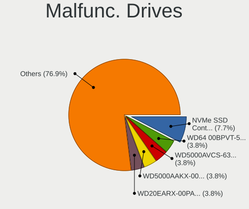

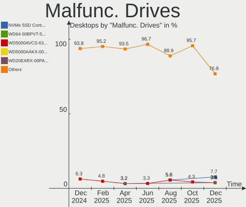

| Model                                                         | Desktops | Drives | Percent |
|---------------------------------------------------------------|----------|--------|---------|
| Samsung Electronics NVMe SSD Controller SM981/PM981/PM983 1TB | 2        | 2      | 7.69%   |
| WDC WD64 00BPVT-55HXZT2 640GB                                 | 1        | 1      | 3.85%   |
| WDC WD5000AVCS-632DY1 500GB                                   | 1        | 1      | 3.85%   |
| WDC WD5000AAKX-00ERMA0 500GB                                  | 1        | 1      | 3.85%   |
| WDC WD20EARX-00PASB0 2TB                                      | 1        | 1      | 3.85%   |
| WDC WD10EZEX-60WN4A1 1TB                                      | 1        | 1      | 3.85%   |
| WDC WD10EZEX-22BN5A0 1TB                                      | 1        | 1      | 3.85%   |
| Seagate ST500DM002-1BD142 500GB                               | 1        | 1      | 3.85%   |
| Seagate ST3250620AS 250GB                                     | 1        | 1      | 3.85%   |
| Seagate ST31000333AS 1TB                                      | 1        | 2      | 3.85%   |
| Seagate ST3000VN000-1H4167 3TB                                | 1        | 1      | 3.85%   |
| Seagate ST2000DM006-2DM164 2TB                                | 1        | 1      | 3.85%   |
| Seagate ST1000LM024 HN-M101MBB 1TB                            | 1        | 1      | 3.85%   |
| Seagate ST1000DM003-1CH162 1TB                                | 1        | 1      | 3.85%   |
| Samsung Electronics SSD 870 EVO 1TB                           | 1        | 1      | 3.85%   |
| Samsung Electronics SSD 850 PRO 1TB                           | 1        | 1      | 3.85%   |
| Samsung Electronics HD502HI 500GB                             | 1        | 1      | 3.85%   |
| Samsung Electronics HD103UJ 1TB                               | 1        | 2      | 3.85%   |
| Micron Technology 1100 SATA 256GB SSD                         | 1        | 1      | 3.85%   |
| Kingston SUV500240G 240GB SSD                                 | 1        | 1      | 3.85%   |
| Kingston SA400S37960G 960GB SSD                               | 1        | 2      | 3.85%   |
| Intel SSDSC2CT120A3 120GB                                     | 1        | 1      | 3.85%   |
| Intel NVMe Datacenter SSD [Optane] 400GB                      | 1        | 1      | 3.85%   |
| INNOVATION IT IT 240GB                                        | 1        | 1      | 3.85%   |
| Crucial CT480M500SSD1 480GB                                   | 1        | 1      | 3.85%   |

Malfunc. Drive Vendor
---------------------

Vendors of faulty drives

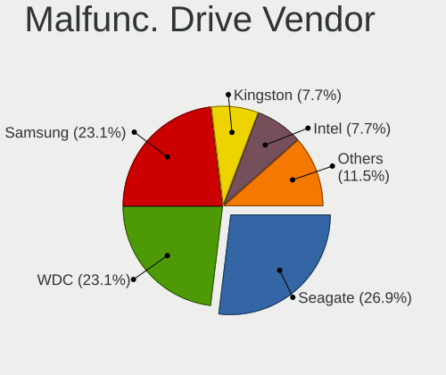

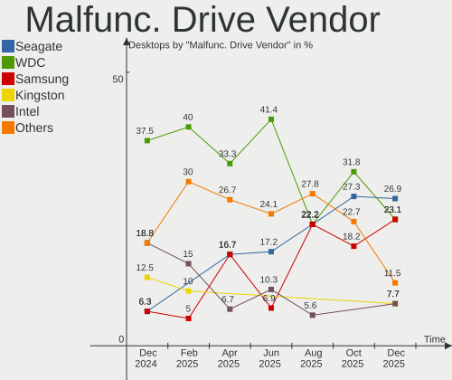

| Vendor              | Desktops | Drives | Percent |
|---------------------|----------|--------|---------|
| Seagate             | 7        | 8      | 26.92%  |
| WDC                 | 6        | 6      | 23.08%  |
| Samsung Electronics | 6        | 7      | 23.08%  |
| Kingston            | 2        | 3      | 7.69%   |
| Intel               | 2        | 2      | 7.69%   |
| Micron Technology   | 1        | 1      | 3.85%   |
| INNOVATION IT       | 1        | 1      | 3.85%   |
| Crucial             | 1        | 1      | 3.85%   |

Malfunc. HDD Vendor
-------------------

Vendors of faulty HDD drives

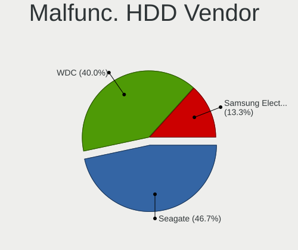

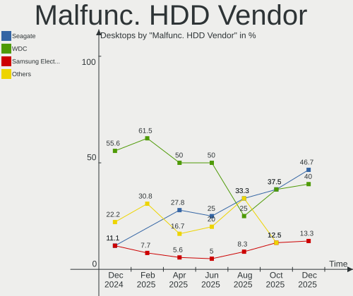

| Vendor              | Desktops | Drives | Percent |
|---------------------|----------|--------|---------|
| Seagate             | 7        | 8      | 46.67%  |
| WDC                 | 6        | 6      | 40%     |
| Samsung Electronics | 2        | 3      | 13.33%  |

Malfunc. Drive Kind
-------------------

Kinds of faulty drives

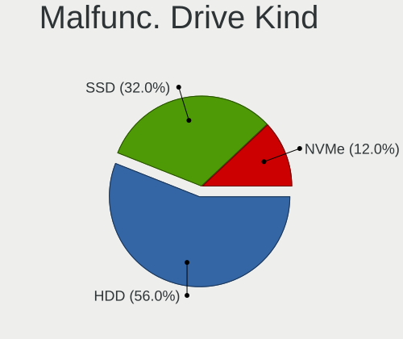

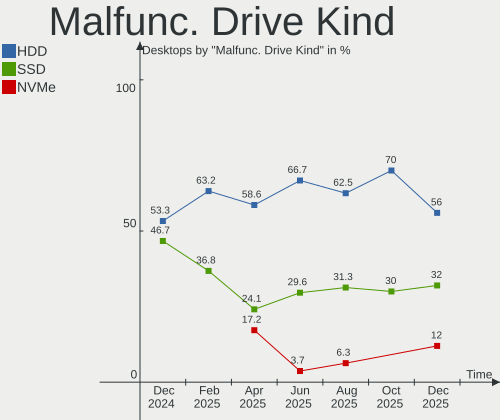

| Kind | Desktops | Drives | Percent |
|------|----------|--------|---------|
| HDD  | 14       | 17     | 56%     |
| SSD  | 8        | 9      | 32%     |
| NVMe | 3        | 3      | 12%     |

Failed Drives
-------------

Failed drive models

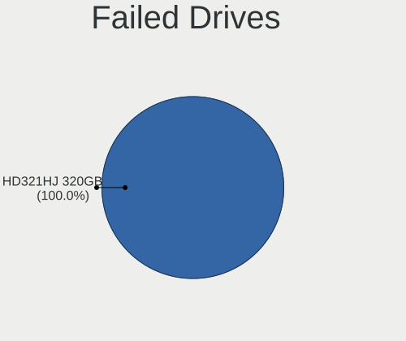

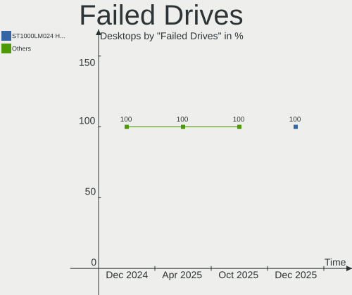

| Model                              | Desktops | Drives | Percent |
|------------------------------------|----------|--------|---------|
| Seagate ST1000LM024 HN-M101MBB 1TB | 1        | 1      | 100%    |

Failed Drive Vendor
-------------------

Failed drive vendors

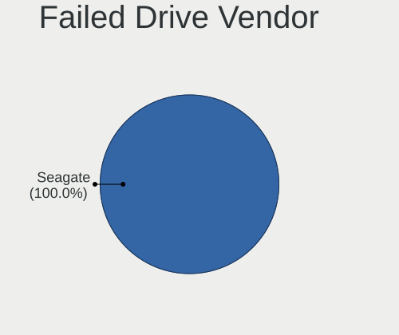

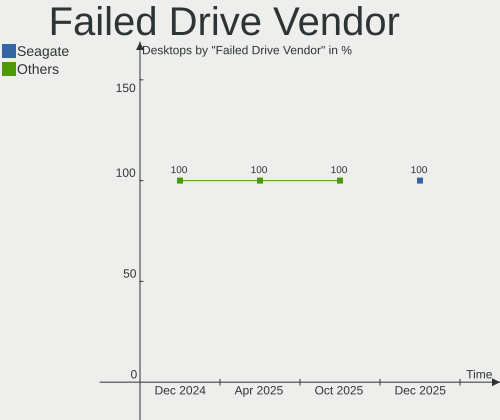

| Vendor  | Desktops | Drives | Percent |
|---------|----------|--------|---------|
| Seagate | 1        | 1      | 100%    |

Drive Status
------------

Number of failed and malfunc. drives

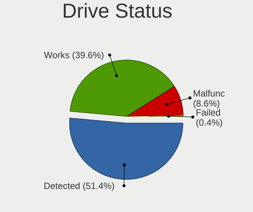

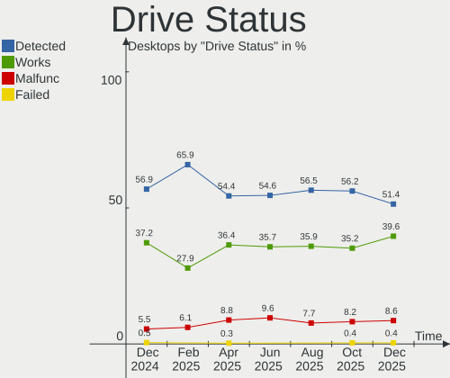

| Status   | Desktops | Drives | Percent |
|----------|----------|--------|---------|
| Detected | 143      | 336    | 51.44%  |
| Works    | 110      | 250    | 39.57%  |
| Malfunc  | 24       | 29     | 8.63%   |
| Failed   | 1        | 1      | 0.36%   |

Storage controller
------------------

Storage Vendor
--------------

Storage controller vendors

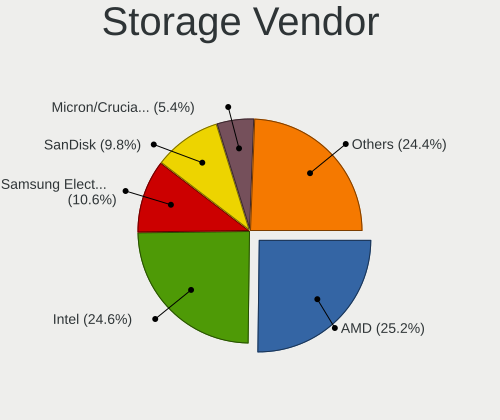

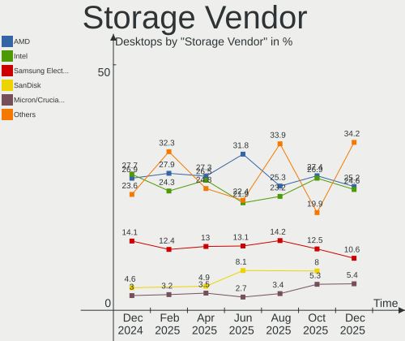

| Vendor                       | Desktops | Percent |
|------------------------------|----------|---------|
| AMD                          | 126      | 25.2%   |
| Intel                        | 123      | 24.6%   |
| Samsung Electronics          | 53       | 10.6%   |
| SanDisk                      | 49       | 9.8%    |
| Micron/Crucial Technology    | 27       | 5.4%    |
| Phison Electronics           | 20       | 4%      |
| Kingston Technology Company  | 20       | 4%      |
| MAXIO Technology (Hangzhou)  | 13       | 2.6%    |
| ASMedia Technology           | 13       | 2.6%    |
| Realtek Semiconductor        | 9        | 1.8%    |
| Micron Technology            | 8        | 1.6%    |
| Shenzhen Longsys Electronics | 6        | 1.2%    |
| ADATA Technology             | 6        | 1.2%    |
| SK hynix                     | 4        | 0.8%    |
| Silicon Motion               | 3        | 0.6%    |
| JMicron Technology           | 3        | 0.6%    |
| INNOGRIT                     | 3        | 0.6%    |
| Broadcom / LSI               | 3        | 0.6%    |
| Marvell Technology Group     | 2        | 0.4%    |
| KIOXIA                       | 2        | 0.4%    |
| Toshiba America Info Systems | 1        | 0.2%    |
| Solidigm                     | 1        | 0.2%    |
| Seagate Technology           | 1        | 0.2%    |
| OCZ Technology Group         | 1        | 0.2%    |
| LSI Logic / Symbios Logic    | 1        | 0.2%    |
| Biwin Storage Technology     | 1        | 0.2%    |
| Adaptec                      | 1        | 0.2%    |

Storage Model
-------------

Storage controller models

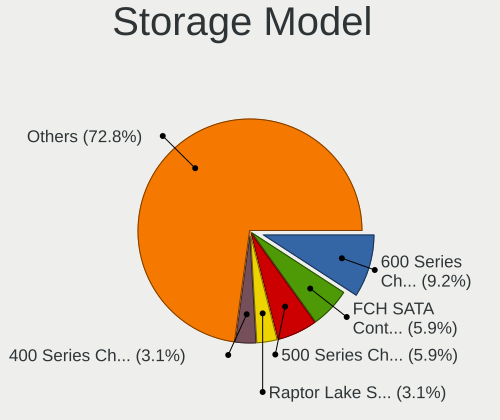

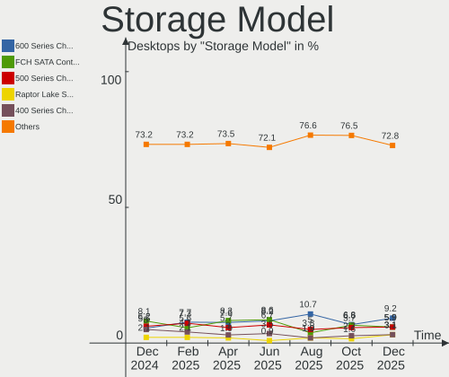

| Model                                                                          | Desktops | Percent |
|--------------------------------------------------------------------------------|----------|---------|
| AMD 600 Series Chipset SATA Controller                                         | 51       | 9.17%   |
| AMD FCH SATA Controller [AHCI mode]                                            | 33       | 5.94%   |
| AMD 500 Series Chipset SATA Controller                                         | 33       | 5.94%   |
| Intel Raptor Lake SATA AHCI Controller                                         | 17       | 3.06%   |
| AMD 400 Series Chipset SATA Controller                                         | 17       | 3.06%   |
| Intel Alder Lake-S PCH SATA Controller [AHCI Mode]                             | 15       | 2.7%    |
| Samsung NVMe SSD Controller SM981/PM981/PM983                                  | 14       | 2.52%   |
| Samsung NVMe SSD Controller PM9A1/PM9A3/980PRO                                 | 13       | 2.34%   |
| Intel Cannon Lake PCH SATA AHCI Controller                                     | 13       | 2.34%   |
| Samsung NVMe SSD Controller PM9C1a (DRAM-less)                                 | 12       | 2.16%   |
| Micron/Crucial P2 [Nick P2] / P3 / P3 Plus NVMe PCIe SSD (DRAM-less)           | 12       | 2.16%   |
| Samsung NVMe SSD Controller S4LV008[Pascal]                                    | 11       | 1.98%   |
| Intel SATA Controller [RAID mode]                                              | 11       | 1.98%   |
| ASMedia ASM1061/ASM1062 Serial ATA Controller                                  | 11       | 1.98%   |
| Sandisk WD Black SN850X NVMe SSD                                               | 10       | 1.8%    |
| Intel 200 Series PCH SATA controller [AHCI mode]                               | 10       | 1.8%    |
| Intel Q170/Q150/B150/H170/H110/Z170/CM236 Chipset SATA Controller [AHCI Mode]  | 9        | 1.62%   |
| SanDisk WD SN560/SN740/SN770/SN5000 NVMe SSD                                   | 8        | 1.44%   |
| Intel 8 Series/C220 Series Chipset Family 6-port SATA Controller 1 [AHCI mode] | 8        | 1.44%   |
| SanDisk Ultra 3D / WD PC SN530, IX SN530, Blue SN550 NVMe SSD (DRAM-less)      | 7        | 1.26%   |
| MAXIO (Hangzhou) NVMe SSD Controller MAP1202 (DRAM-less)                       | 7        | 1.26%   |
| Sandisk WD_BLACK SN7100/WD PC SN7100S M.2 2280 NVMe SSD (DRAM-less)            | 6        | 1.08%   |
| SanDisk Ultra 3D / WD Blue SN570 NVMe SSD (DRAM-less)                          | 6        | 1.08%   |
| Realtek RTS5765DL NVMe SSD Controller (DRAM-less)                              | 6        | 1.08%   |
| Micron/Crucial P3 Plus NVMe PCIe SSD (DRAM-less)                               | 6        | 1.08%   |
| Intel RST Volume Management Device Controller                                  | 6        | 1.08%   |
| Phison E16 PCIe4 NVMe Controller                                               | 5        | 0.9%    |
| MAXIO (Hangzhou) NVMe SSD Controller MAP1602 (DRAM-less)                       | 5        | 0.9%    |
| Intel Volume Management Device NVMe RAID Controller                            | 5        | 0.9%    |
| Intel 7 Series/C210 Series Chipset Family 6-port SATA Controller [AHCI mode]   | 5        | 0.9%    |
| Shenzhen Longsys Lexar NM790 / Patriot Viper VP4300 Lite NVMe SSD (DRAM-less)  | 4        | 0.72%   |
| SanDisk WD PC SN810 / Black SN850 NVMe SSD                                     | 4        | 0.72%   |
| Phison E12 NVMe Controller                                                     | 4        | 0.72%   |
| Micron/Crucial P1 NVMe PCIe SSD[Frampton]                                      | 4        | 0.72%   |
| Micron 2550 NVMe SSD (DRAM-less)                                               | 4        | 0.72%   |
| Kingston Company A2000 NVMe SSD [SM2263EN]                                     | 4        | 0.72%   |
| Intel 500 Series Chipset Family SATA AHCI Controller                           | 4        | 0.72%   |
| AMD A320 Chipset SATA Controller [AHCI mode]                                   | 4        | 0.72%   |
| SanDisk Extreme Pro / WD Black SN750 / PC SN730 / Red SN700 NVMe SSD           | 3        | 0.54%   |
| SanDisk Extreme Pro / WD Black 2018/SN750/PC SN720 NVMe SSD                    | 3        | 0.54%   |

Storage Kind
------------

Kind of storage controller (IDE, SATA, NVMe, SAS, ...)

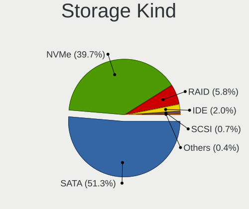

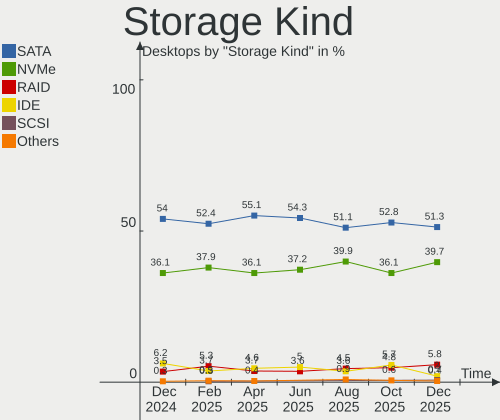

| Kind | Desktops | Percent |
|------|----------|---------|
| SATA | 230      | 51.34%  |
| NVMe | 178      | 39.73%  |
| RAID | 26       | 5.8%    |
| IDE  | 9        | 2.01%   |
| SCSI | 3        | 0.67%   |
| SAS  | 2        | 0.45%   |

Processor
---------

CPU Vendor
----------

Processor vendors

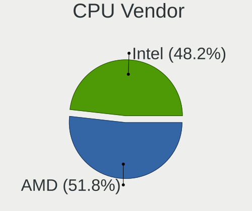

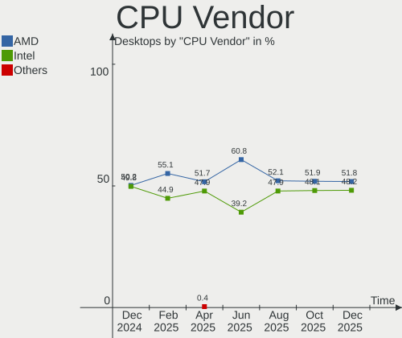

| Vendor | Desktops | Percent |
|--------|----------|---------|
| AMD    | 131      | 51.78%  |
| Intel  | 122      | 48.22%  |

CPU Model
---------

Processor models

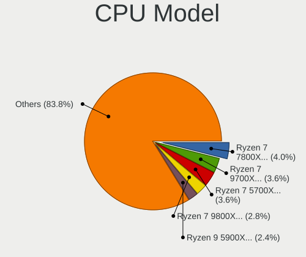

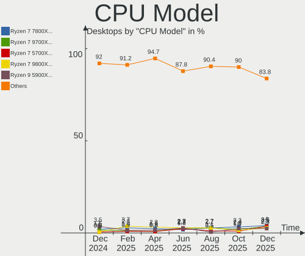

| Model                                      | Desktops | Percent |
|--------------------------------------------|----------|---------|
| AMD Ryzen 7 7800X3D 8-Core Processor       | 10       | 3.95%   |
| AMD Ryzen 7 9700X 8-Core Processor         | 9        | 3.56%   |
| AMD Ryzen 7 5700X 8-Core Processor         | 9        | 3.56%   |
| AMD Ryzen 7 9800X3D 8-Core Processor       | 7        | 2.77%   |
| AMD Ryzen 9 5900X 12-Core Processor        | 6        | 2.37%   |
| AMD Ryzen 5 5600G with Radeon Graphics     | 6        | 2.37%   |
| AMD Ryzen 7 5800X 8-Core Processor         | 5        | 1.98%   |
| Intel Core i7-7700K CPU @ 4.20GHz          | 4        | 1.58%   |
| Intel Core i3-3220 CPU @ 3.30GHz           | 4        | 1.58%   |
| Intel 13th Gen Core i7-13700K              | 4        | 1.58%   |
| Intel 13th Gen Core i5-13400F              | 4        | 1.58%   |
| Intel 12th Gen Core i5-12400F              | 4        | 1.58%   |
| AMD Ryzen 7 3700X 8-Core Processor         | 4        | 1.58%   |
| AMD Ryzen 5 5600X 6-Core Processor         | 4        | 1.58%   |
| AMD Ryzen 5 3600 6-Core Processor          | 4        | 1.58%   |
| Intel Core i7-14700F                       | 3        | 1.19%   |
| Intel Core i5-9400F CPU @ 2.90GHz          | 3        | 1.19%   |
| Intel Core i5-7500T CPU @ 2.70GHz          | 3        | 1.19%   |
| Intel Core 2 Quad CPU Q6600 @ 2.40GHz      | 3        | 1.19%   |
| Intel 12th Gen Core i7-12700K              | 3        | 1.19%   |
| AMD Ryzen 9 9950X 16-Core Processor        | 3        | 1.19%   |
| AMD Ryzen 9 7950X 16-Core Processor        | 3        | 1.19%   |
| AMD Ryzen 9 5950X 16-Core Processor        | 3        | 1.19%   |
| AMD Ryzen 7 7840HS w/ Radeon 780M Graphics | 3        | 1.19%   |
| AMD Ryzen 7 5800X3D 8-Core Processor       | 3        | 1.19%   |
| AMD Ryzen 7 2700X Eight-Core Processor     | 3        | 1.19%   |
| AMD Ryzen 5 5600 6-Core Processor          | 3        | 1.19%   |
| Intel N150                                 | 2        | 0.79%   |
| Intel N100                                 | 2        | 0.79%   |
| Intel Core Ultra 7 265K                    | 2        | 0.79%   |
| Intel Core i7-9700 CPU @ 3.00GHz           | 2        | 0.79%   |
| Intel Core i7-4770K CPU @ 3.50GHz          | 2        | 0.79%   |
| Intel Core i7-4770 CPU @ 3.40GHz           | 2        | 0.79%   |
| Intel Core i7-10700F CPU @ 2.90GHz         | 2        | 0.79%   |
| Intel Core i5-8500 CPU @ 3.00GHz           | 2        | 0.79%   |
| Intel Core i5-8400 CPU @ 2.80GHz           | 2        | 0.79%   |
| Intel Core i5-7500 CPU @ 3.40GHz           | 2        | 0.79%   |
| Intel Core i5-7400 CPU @ 3.00GHz           | 2        | 0.79%   |
| Intel Core i5-6500T CPU @ 2.50GHz          | 2        | 0.79%   |
| Intel Core i5-6500 CPU @ 3.20GHz           | 2        | 0.79%   |

CPU Model Family
----------------

Processor model prefix

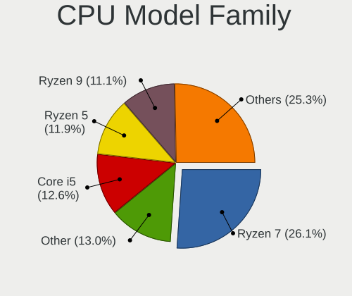

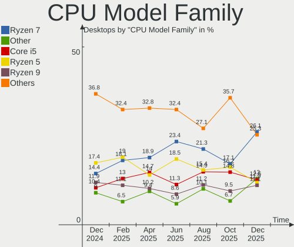

| Model                | Desktops | Percent |
|----------------------|----------|---------|
| AMD Ryzen 7          | 66       | 26.09%  |
| Other                | 33       | 13.04%  |
| Intel Core i5        | 32       | 12.65%  |
| AMD Ryzen 5          | 30       | 11.86%  |
| AMD Ryzen 9          | 28       | 11.07%  |
| Intel Core i7        | 22       | 8.7%    |
| Intel Core i3        | 9        | 3.56%   |
| Intel Xeon           | 7        | 2.77%   |
| Intel Core i9        | 5        | 1.98%   |
| Intel Core           | 4        | 1.58%   |
| Intel Core 2 Quad    | 3        | 1.19%   |
| Intel Core 2 Duo     | 3        | 1.19%   |
| AMD Phenom II X4     | 2        | 0.79%   |
| Intel Pentium Silver | 1        | 0.4%    |
| Intel Pentium        | 1        | 0.4%    |
| Intel Celeron        | 1        | 0.4%    |
| Intel Atom           | 1        | 0.4%    |
| AMD Ryzen 5 PRO      | 1        | 0.4%    |
| AMD Ryzen 3          | 1        | 0.4%    |
| AMD FX               | 1        | 0.4%    |
| AMD A6               | 1        | 0.4%    |
| AMD A4               | 1        | 0.4%    |

CPU Cores
---------

Number of processor cores

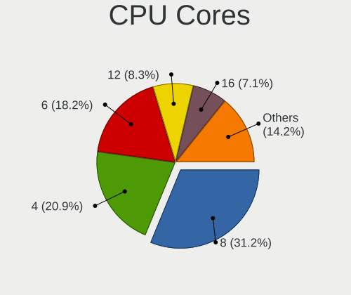

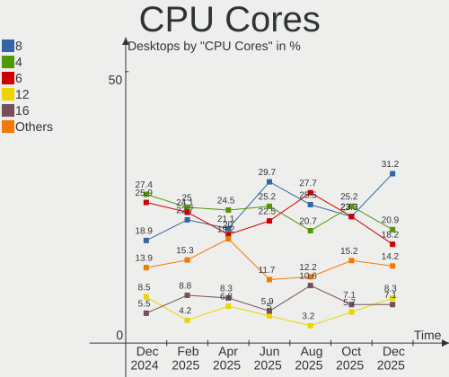

| Number | Desktops | Percent |
|--------|----------|---------|
| 8      | 79       | 31.23%  |
| 4      | 53       | 20.95%  |
| 6      | 46       | 18.18%  |
| 12     | 21       | 8.3%    |
| 16     | 18       | 7.11%   |
| 2      | 13       | 5.14%   |
| 10     | 7        | 2.77%   |
| 20     | 6        | 2.37%   |
| 14     | 6        | 2.37%   |
| 24     | 4        | 1.58%   |

CPU Sockets
-----------

Number of sockets

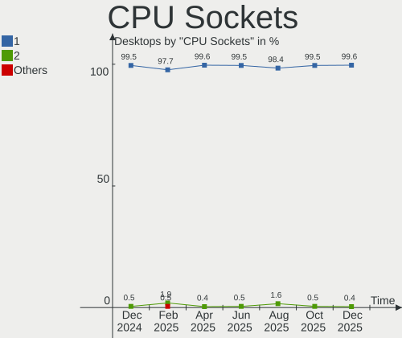

| Number | Desktops | Percent |
|--------|----------|---------|
| 1      | 252      | 99.6%   |
| 2      | 1        | 0.4%    |

CPU Threads
-----------

Threads per core (Hyper-Threading)

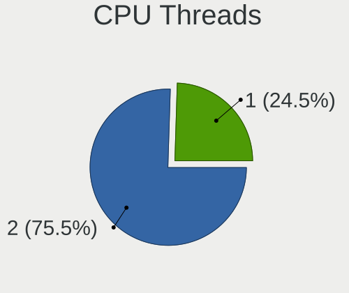

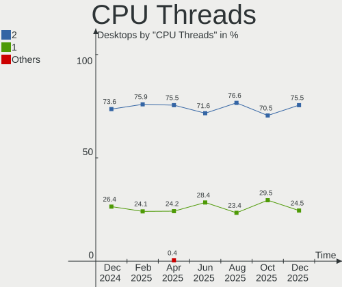

| Number | Desktops | Percent |
|--------|----------|---------|
| 2      | 191      | 75.49%  |
| 1      | 62       | 24.51%  |

CPU Op-Modes
------------

CPU Operation Modes (32-bit, 64-bit)

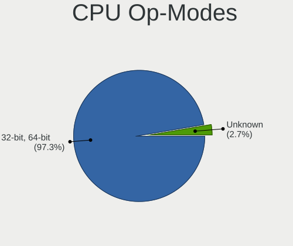

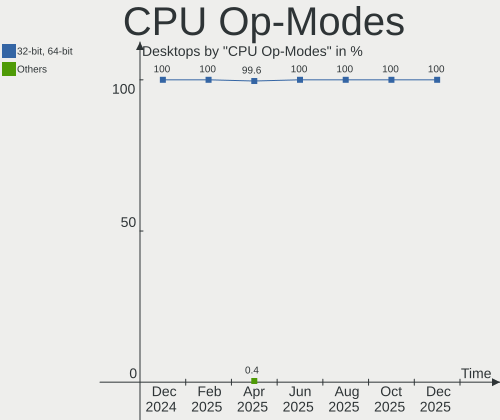

| Op mode        | Desktops | Percent |
|----------------|----------|---------|
| 32-bit, 64-bit | 253      | 100%    |

CPU Microcode
-------------

Microcode number

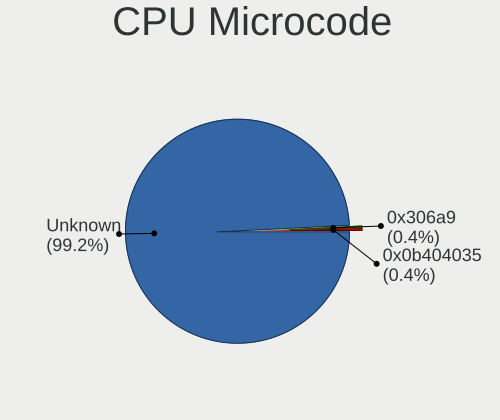

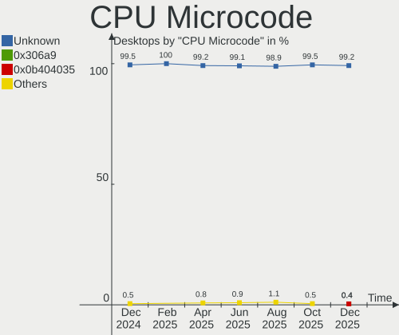

| Number     | Desktops | Percent |
|------------|----------|---------|
| Unknown    | 251      | 99.21%  |
| 0x306a9    | 1        | 0.4%    |
| 0x0b404035 | 1        | 0.4%    |

CPU Microarch
-------------

Microarchitecture

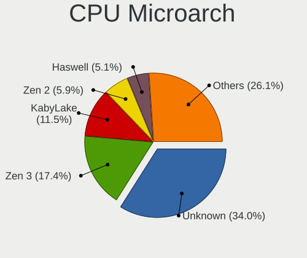

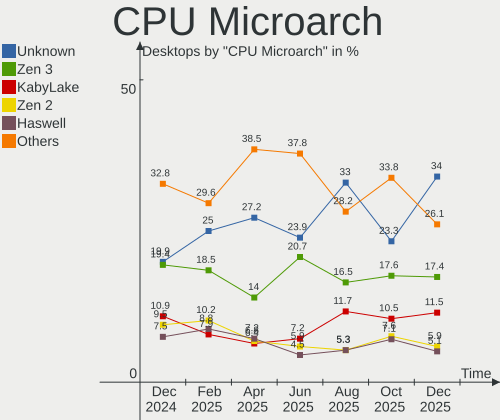

| Name             | Desktops | Percent |
|------------------|----------|---------|
| Unknown          | 86       | 33.99%  |
| Zen 3            | 44       | 17.39%  |
| KabyLake         | 29       | 11.46%  |
| Zen 2            | 15       | 5.93%   |
| Haswell          | 13       | 5.14%   |
| Alderlake Hybrid | 10       | 3.95%   |
| Zen+             | 9        | 3.56%   |
| IvyBridge        | 7        | 2.77%   |
| CometLake        | 7        | 2.77%   |
| Skylake          | 6        | 2.37%   |
| SandyBridge      | 4        | 1.58%   |
| Penryn           | 3        | 1.19%   |
| Core             | 3        | 1.19%   |
| Broadwell        | 3        | 1.19%   |
| Zen              | 2        | 0.79%   |
| Piledriver       | 2        | 0.79%   |
| K10              | 2        | 0.79%   |
| Gracemont        | 2        | 0.79%   |
| Westmere         | 1        | 0.4%    |
| Silvermont       | 1        | 0.4%    |
| Lunarlake Hybrid | 1        | 0.4%    |
| Jaguar           | 1        | 0.4%    |
| Icelake          | 1        | 0.4%    |
| Goldmont plus    | 1        | 0.4%    |

Graphics
--------

GPU Vendor
----------

Vendors of graphics cards

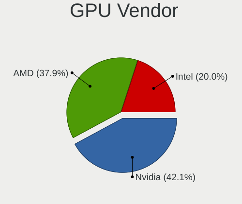

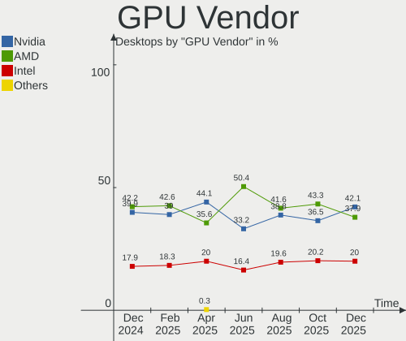

| Vendor | Desktops | Percent |
|--------|----------|---------|
| Nvidia | 118      | 42.14%  |
| AMD    | 106      | 37.86%  |
| Intel  | 56       | 20%     |

GPU Model
---------

Graphics card models

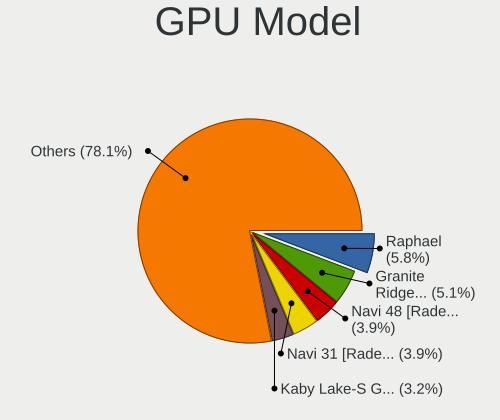

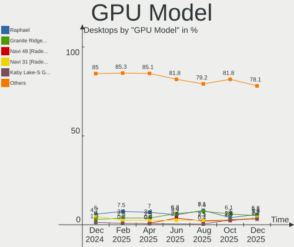

| Model                                                                       | Desktops | Percent |
|-----------------------------------------------------------------------------|----------|---------|
| AMD Raphael                                                                 | 18       | 5.79%   |
| AMD Granite Ridge [Radeon Graphics]                                         | 16       | 5.14%   |
| AMD Navi 48 [Radeon RX 9070/9070 XT/9070 GRE]                               | 12       | 3.86%   |
| AMD Navi 31 [Radeon RX 7900 XT/7900 XTX/7900 GRE/7900M]                     | 12       | 3.86%   |
| Intel Kaby Lake-S GT2 [HD Graphics 630]                                     | 10       | 3.22%   |
| Nvidia GA106 [GeForce RTX 3060 Lite Hash Rate]                              | 8        | 2.57%   |
| AMD Navi 22 [Radeon RX 6700/6700 XT/6750 XT / 6800M/6850M XT]               | 7        | 2.25%   |
| Intel Raptor Lake-S GT1 [UHD Graphics 770]                                  | 6        | 1.93%   |
| AMD Navi 44 [Radeon RX 9060 XT]                                             | 6        | 1.93%   |
| AMD Navi 21 [Radeon RX 6800/6800 XT / 6900 XT]                              | 6        | 1.93%   |
| AMD Cezanne [Radeon Vega Series / Radeon Vega Mobile Series]                | 6        | 1.93%   |
| Nvidia AD106 [GeForce RTX 4060 Ti]                                          | 5        | 1.61%   |
| Nvidia AD104 [GeForce RTX 4070]                                             | 5        | 1.61%   |
| Intel Xeon E3-1200 v3/4th Gen Core Processor Integrated Graphics Controller | 5        | 1.61%   |
| Intel CoffeeLake-S GT2 [UHD Graphics 630]                                   | 5        | 1.61%   |
| AMD Navi 32 [Radeon RX 7700 XT / 7800 XT]                                   | 5        | 1.61%   |
| Nvidia GB203 [GeForce RTX 5070 Ti]                                          | 4        | 1.29%   |
| AMD Ellesmere [Radeon RX 470/480/570/570X/580/580X/590]                     | 4        | 1.29%   |
| Nvidia GP107 [GeForce GTX 1050 Ti]                                          | 3        | 0.96%   |
| Nvidia GM204 [GeForce GTX 970]                                              | 3        | 0.96%   |
| Nvidia GM107 [GeForce GTX 750 Ti]                                           | 3        | 0.96%   |
| Nvidia GB206 [GeForce RTX 5060 Ti]                                          | 3        | 0.96%   |
| Nvidia GA104 [GeForce RTX 3070 Ti]                                          | 3        | 0.96%   |
| Nvidia GA104 [GeForce RTX 3060 Ti Lite Hash Rate]                           | 3        | 0.96%   |
| Nvidia GA102 [GeForce RTX 3090]                                             | 3        | 0.96%   |
| Nvidia AD107 [GeForce RTX 4060]                                             | 3        | 0.96%   |
| Intel Skylake-S GT2 [HD Graphics 530]                                       | 3        | 0.96%   |
| Intel Battlemage G21 [Arc B580]                                             | 3        | 0.96%   |
| Intel Alder Lake-S GT1 [UHD Graphics 770]                                   | 3        | 0.96%   |
| AMD Picasso/Raven 2 [Radeon Vega Series / Radeon Vega Mobile Series]        | 3        | 0.96%   |
| AMD Phoenix1                                                                | 3        | 0.96%   |
| AMD Navi 33 [Radeon RX 7600/7600 XT/7600M XT/7600S/7700S / PRO W7600]       | 3        | 0.96%   |
| AMD Navi 23 [Radeon RX 6600/6600 XT/6600M]                                  | 3        | 0.96%   |
| AMD Navi 10 [Radeon RX 5600 OEM/5600 XT / 5700/5700 XT]                     | 3        | 0.96%   |
| AMD Lexa PRO [Radeon 540/540X/550/550X / RX 540X/550/550X]                  | 3        | 0.96%   |
| Nvidia TU117 [GeForce GTX 1650]                                             | 2        | 0.64%   |
| Nvidia TU116 [GeForce GTX 1660 Ti]                                          | 2        | 0.64%   |
| Nvidia TU116 [GeForce GTX 1660 SUPER]                                       | 2        | 0.64%   |
| Nvidia TU106 [GeForce RTX 2070]                                             | 2        | 0.64%   |
| Nvidia TU106 [GeForce RTX 2060 SUPER]                                       | 2        | 0.64%   |

GPU Combo
---------

Combinations of graphics cards

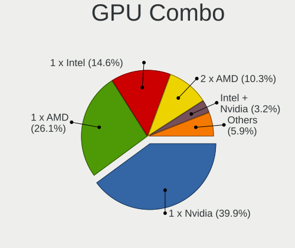

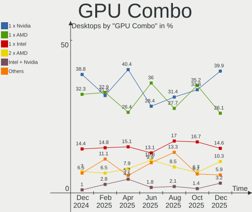

| Name               | Desktops | Percent |
|--------------------|----------|---------|
| 1 x Nvidia         | 101      | 39.92%  |
| 1 x AMD            | 66       | 26.09%  |
| 1 x Intel          | 37       | 14.62%  |
| 2 x AMD            | 26       | 10.28%  |
| Intel + Nvidia     | 8        | 3.16%   |
| AMD + Nvidia       | 7        | 2.77%   |
| Intel + AMD        | 5        | 1.98%   |
| 3 x AMD            | 1        | 0.4%    |
| 2 x Nvidia         | 1        | 0.4%    |
| Intel + 2 x Nvidia | 1        | 0.4%    |

GPU Driver
----------

Free vs proprietary

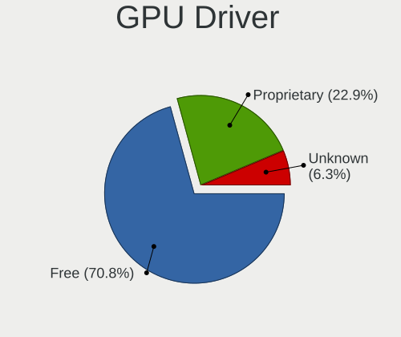

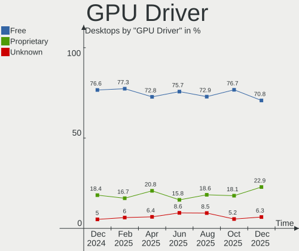

| Driver      | Desktops | Percent |
|-------------|----------|---------|
| Free        | 179      | 70.75%  |
| Proprietary | 58       | 22.92%  |
| Unknown     | 16       | 6.32%   |

GPU Memory
----------

Total video memory

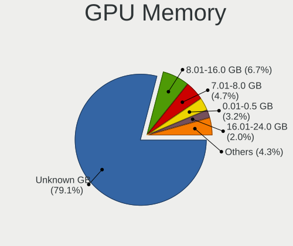

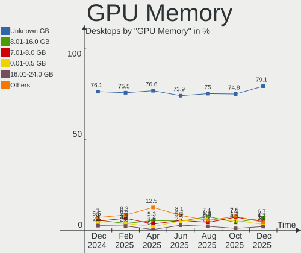

| Size in GB | Desktops | Percent |
|------------|----------|---------|
| Unknown    | 200      | 79.05%  |
| 8.01-16.0  | 17       | 6.72%   |
| 7.01-8.0   | 12       | 4.74%   |
| 0.01-0.5   | 8        | 3.16%   |
| 16.01-24.0 | 5        | 1.98%   |
| 1.01-2.0   | 5        | 1.98%   |
| 3.01-4.0   | 4        | 1.58%   |
| 5.01-6.0   | 1        | 0.4%    |
| 0.51-1.0   | 1        | 0.4%    |

Monitor
-------

Monitor Vendor
--------------

Monitor vendors

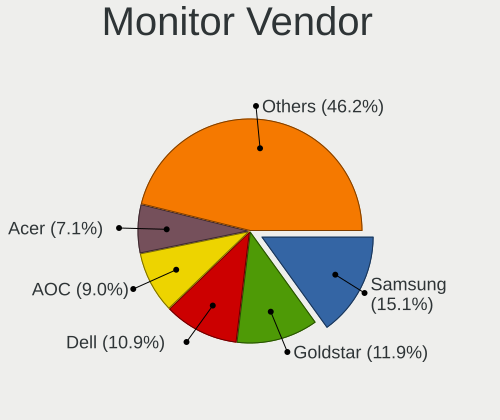

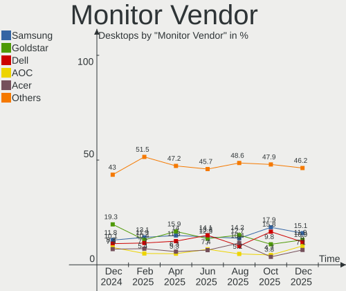

| Vendor               | Desktops | Percent |
|----------------------|----------|---------|
| Samsung Electronics  | 47       | 15.06%  |
| Goldstar             | 37       | 11.86%  |
| Dell                 | 34       | 10.9%   |
| AOC                  | 28       | 8.97%   |
| Acer                 | 22       | 7.05%   |
| Gigabyte Technology  | 11       | 3.53%   |
| Mi                   | 10       | 3.21%   |
| Ancor Communications | 10       | 3.21%   |
| Philips              | 9        | 2.88%   |
| MSI                  | 9        | 2.88%   |
| Hewlett-Packard      | 9        | 2.88%   |
| BenQ                 | 9        | 2.88%   |
| ASUSTek Computer     | 9        | 2.88%   |
| Lenovo               | 8        | 2.56%   |
| ViewSonic            | 4        | 1.28%   |
| Sony                 | 3        | 0.96%   |
| SKG                  | 3        | 0.96%   |
| Iiyama               | 3        | 0.96%   |
| Denver               | 3        | 0.96%   |
| Valve                | 2        | 0.64%   |
| Sceptre Tech         | 2        | 0.64%   |
| SAC                  | 2        | 0.64%   |
| HKC                  | 2        | 0.64%   |
| CHD                  | 2        | 0.64%   |
| Aosiman              | 2        | 0.64%   |
| Yamaha               | 1        | 0.32%   |
| Wacom                | 1        | 0.32%   |
| Vizio                | 1        | 0.32%   |
| VIE                  | 1        | 0.32%   |
| VEI                  | 1        | 0.32%   |
| VCS                  | 1        | 0.32%   |
| Unknown (XXX)        | 1        | 0.32%   |
| Unknown              | 1        | 0.32%   |
| Toshiba              | 1        | 0.32%   |
| TCL                  | 1        | 0.32%   |
| SANSUI               | 1        | 0.32%   |
| Roku                 | 1        | 0.32%   |
| Planar               | 1        | 0.32%   |
| Pioneer              | 1        | 0.32%   |
| OOO                  | 1        | 0.32%   |

Monitor Model
-------------

Monitor models

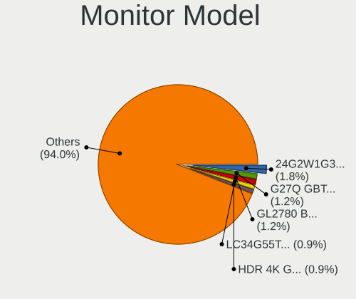

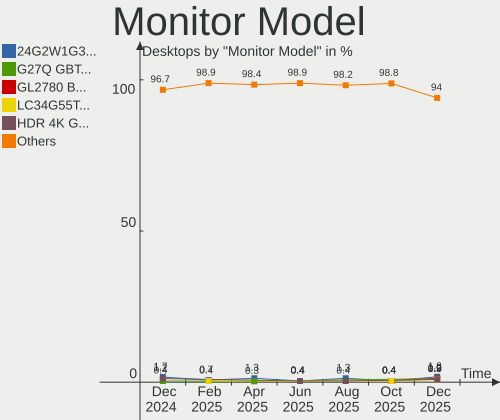

| Model                                                                  | Desktops | Percent |
|------------------------------------------------------------------------|----------|---------|
| AOC 24G2W1G3 AOC2402 1920x1080 527x296mm 23.8-inch                     | 6        | 1.79%   |
| Gigabyte Technology G27Q GBT2709 2560x1440 598x336mm 27.0-inch         | 4        | 1.19%   |
| BenQ GL2780 BNQ78EC 1920x1080 600x340mm 27.2-inch                      | 4        | 1.19%   |
| Samsung Electronics LC34G55T SAM711A 3440x1440 798x334mm 34.1-inch     | 3        | 0.89%   |
| Goldstar HDR 4K GSM7707 3840x2160 600x340mm 27.2-inch                  | 3        | 0.89%   |
| Goldstar FULL HD GSM5B55 1920x1080 480x270mm 21.7-inch                 | 3        | 0.89%   |
| AOC Q3279WG5B AOC3279 2560x1440 725x428mm 33.1-inch                    | 3        | 0.89%   |
| AOC 27G2G4 AOC2702 1920x1080 598x336mm 27.0-inch                       | 3        | 0.89%   |
| Valve Index HMD VLV91A8                                                | 2        | 0.6%    |
| Sony TV SNYEE01 1920x1080                                              | 2        | 0.6%    |
| Samsung Electronics U28D590 SAM0B81 3840x2160 608x345mm 27.5-inch      | 2        | 0.6%    |
| Samsung Electronics LS27AG55x SAM71E1 2560x1440 597x336mm 27.0-inch    | 2        | 0.6%    |
| Samsung Electronics LCD Monitor SAM0DF6 3840x2160 890x500mm 40.2-inch  | 2        | 0.6%    |
| Samsung Electronics LCD Monitor SAM0A7A 1920x1080 1060x626mm 48.5-inch | 2        | 0.6%    |
| Samsung Electronics C24F390 SAM0D2C 1920x1080 521x293mm 23.5-inch      | 2        | 0.6%    |
| Philips PHL32M1N5800A PHLC277 3840x2160 697x392mm 31.5-inch            | 2        | 0.6%    |
| Philips PHL24E1N1100A PHLC324 1920x1080 527x296mm 23.8-inch            | 2        | 0.6%    |
| MSI G273Q MSI3CA8 2560x1440 597x336mm 27.0-inch                        | 2        | 0.6%    |
| Mi Monitor XMI3444 3440x1440 797x334mm 34.0-inch                       | 2        | 0.6%    |
| Mi Monitor XMI23CB 1920x1080 527x296mm 23.8-inch                       | 2        | 0.6%    |
| Mi A22FAB-RAGL XMIF002 1920x1080 479x260mm 21.5-inch                   | 2        | 0.6%    |
| Goldstar W2442 GSM56D9 1920x1080 531x299mm 24.0-inch                   | 2        | 0.6%    |
| Goldstar ULTRAGEAR GSM7811 2560x1440 697x392mm 31.5-inch               | 2        | 0.6%    |
| Goldstar Ultra HD GSM5B09 3840x2160 600x340mm 27.2-inch                | 2        | 0.6%    |
| Goldstar HDR 4K GSM7706 3840x2160 600x340mm 27.2-inch                  | 2        | 0.6%    |
| Goldstar 27GL850 GSM5B7F 2560x1440 597x336mm 27.0-inch                 | 2        | 0.6%    |
| Gigabyte Technology G32QC A GBT3206 2560x1440 697x392mm 31.5-inch      | 2        | 0.6%    |
| Denver MO-HHS-32C LHCFFFF 1920x1080 699x393mm 31.6-inch                | 2        | 0.6%    |
| Dell U4025QW DEL4310 2560x1080 929x392mm 39.7-inch                     | 2        | 0.6%    |
| Dell S2725DS DELD17F 2560x1440 597x336mm 27.0-inch                     | 2        | 0.6%    |
| Aosiman ZEUSLAP-TYPEC CYSBC55 2560x1600 360x190mm 16.0-inch            | 2        | 0.6%    |
| AOC 2369M AOC2369 1920x1080 509x286mm 23.0-inch                        | 2        | 0.6%    |
| Ancor Communications VE248 ACI2494 1920x1080 531x299mm 24.0-inch       | 2        | 0.6%    |
| Acer G257HU ACR0416 2560x1440 550x310mm 24.9-inch                      | 2        | 0.6%    |
| Yamaha TSR-7850 YMH3201 1920x540                                       | 1        | 0.3%    |
| Wacom Cintiq 22 WAC1065 1920x1080 476x268mm 21.5-inch                  | 1        | 0.3%    |
| Vizio V505-J09 VIZ1039 3840x2160 1096x616mm 49.5-inch                  | 1        | 0.3%    |
| ViewSonic XG270QC VSCC438 2560x1440 597x336mm 27.0-inch                | 1        | 0.3%    |
| ViewSonic VX2718 series VSCE439 1920x1080 609x348mm 27.6-inch          | 1        | 0.3%    |
| ViewSonic VX2458 Series VSC36AF 1920x1080 521x293mm 23.5-inch          | 1        | 0.3%    |

Monitor Resolution
------------------

Monitor screen resolution

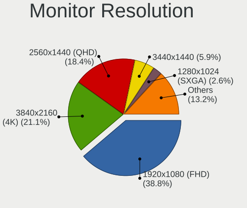

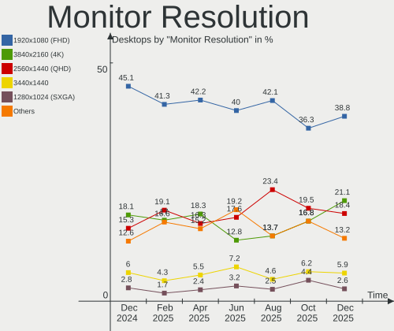

| Resolution         | Desktops | Percent |
|--------------------|----------|---------|
| 1920x1080 (FHD)    | 118      | 38.82%  |
| 3840x2160 (4K)     | 64       | 21.05%  |
| 2560x1440 (QHD)    | 56       | 18.42%  |
| 3440x1440          | 18       | 5.92%   |
| 1280x1024 (SXGA)   | 8        | 2.63%   |
| 3840x1080          | 6        | 1.97%   |
| 2560x1080          | 4        | 1.32%   |
| 1920x1200 (WUXGA)  | 4        | 1.32%   |
| 1366x768 (WXGA)    | 4        | 1.32%   |
| 1920x540           | 3        | 0.99%   |
| 1680x1050 (WSXGA+) | 3        | 0.99%   |
| 1600x900 (HD+)     | 3        | 0.99%   |
| Unknown            | 3        | 0.99%   |
| 2560x1600          | 2        | 0.66%   |
| 1440x900 (WXGA+)   | 2        | 0.66%   |
| 3840x1600          | 1        | 0.33%   |
| 3600x1080          | 1        | 0.33%   |
| 2288x1287          | 1        | 0.33%   |
| 1920x720           | 1        | 0.33%   |
| 1280x768           | 1        | 0.33%   |
| 1024x768 (XGA)     | 1        | 0.33%   |

Monitor Diagonal
----------------

Diagonal size in inches

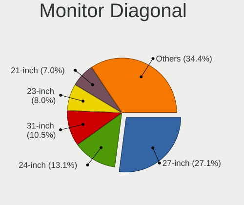

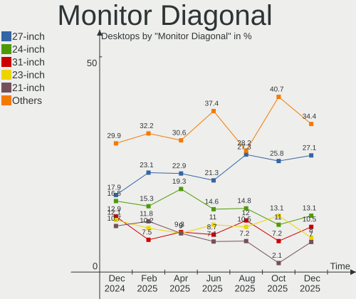

| Inches  | Desktops | Percent |
|---------|----------|---------|
| 27      | 85       | 27.07%  |
| 24      | 41       | 13.06%  |
| 31      | 33       | 10.51%  |
| 23      | 25       | 7.96%   |
| 21      | 22       | 7.01%   |
| 34      | 15       | 4.78%   |
| Unknown | 9        | 2.87%   |
| 48      | 8        | 2.55%   |
| 72      | 6        | 1.91%   |
| 19      | 6        | 1.91%   |
| 84      | 5        | 1.59%   |
| 18      | 5        | 1.59%   |
| 49      | 4        | 1.27%   |
| 54      | 3        | 0.96%   |
| 40      | 3        | 0.96%   |
| 39      | 3        | 0.96%   |
| 33      | 3        | 0.96%   |
| 26      | 3        | 0.96%   |
| 22      | 3        | 0.96%   |
| 16      | 3        | 0.96%   |
| 65      | 2        | 0.64%   |
| 63      | 2        | 0.64%   |
| 35      | 2        | 0.64%   |
| 32      | 2        | 0.64%   |
| 28      | 2        | 0.64%   |
| 20      | 2        | 0.64%   |
| 17      | 2        | 0.64%   |
| 15      | 2        | 0.64%   |
| 14      | 2        | 0.64%   |
| 13      | 2        | 0.64%   |
| 142     | 1        | 0.32%   |
| 74      | 1        | 0.32%   |
| 44      | 1        | 0.32%   |
| 42      | 1        | 0.32%   |
| 37      | 1        | 0.32%   |
| 36      | 1        | 0.32%   |
| 29      | 1        | 0.32%   |
| 25      | 1        | 0.32%   |
| 11      | 1        | 0.32%   |

Monitor Width
-------------

Physical width

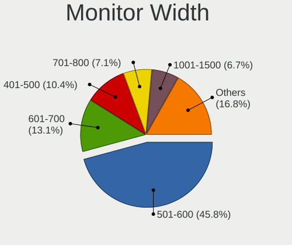

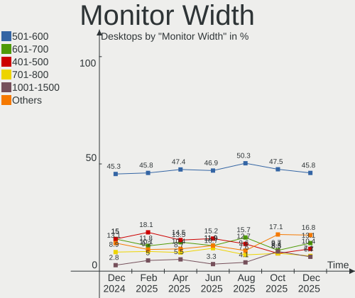

| Width in mm    | Desktops | Percent |
|----------------|----------|---------|
| 501-600        | 136      | 45.79%  |
| 601-700        | 39       | 13.13%  |
| 401-500        | 31       | 10.44%  |
| 701-800        | 21       | 7.07%   |
| 1001-1500      | 20       | 6.73%   |
| 1501-2000      | 12       | 4.04%   |
| 351-400        | 9        | 3.03%   |
| Unknown        | 9        | 3.03%   |
| 301-350        | 7        | 2.36%   |
| 801-900        | 6        | 2.02%   |
| 901-1000       | 4        | 1.35%   |
| 201-300        | 2        | 0.67%   |
| More than 2000 | 1        | 0.34%   |

Aspect Ratio
------------

Proportional relationship between the width and the height

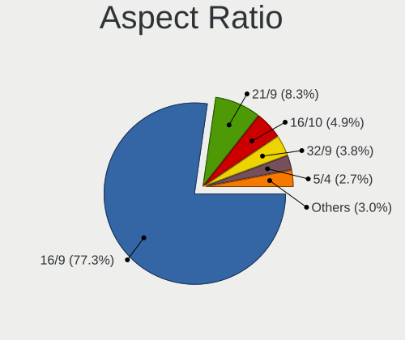

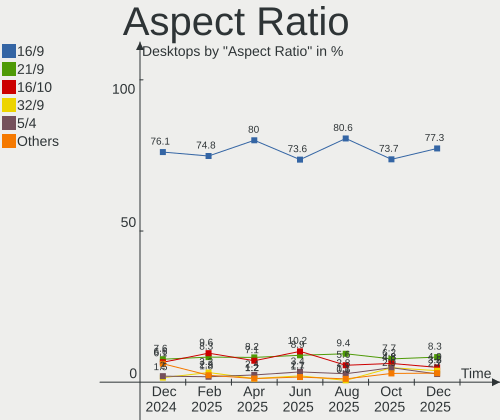

| Ratio   | Desktops | Percent |
|---------|----------|---------|
| 16/9    | 204      | 77.27%  |
| 21/9    | 22       | 8.33%   |
| 16/10   | 13       | 4.92%   |
| 32/9    | 10       | 3.79%   |
| 5/4     | 7        | 2.65%   |
| Unknown | 3        | 1.14%   |
| 4/3     | 2        | 0.76%   |
| 6/5     | 1        | 0.38%   |
| 2.69    | 1        | 0.38%   |
| 1.00    | 1        | 0.38%   |

Monitor Area
------------

Area in inch²

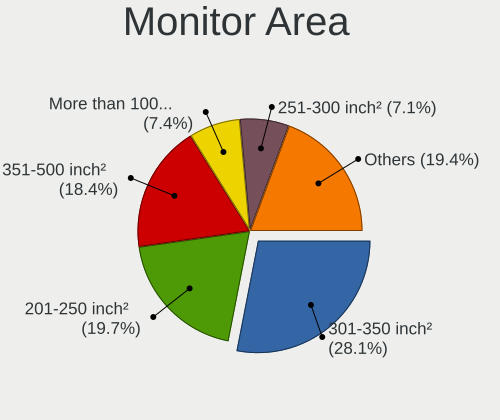

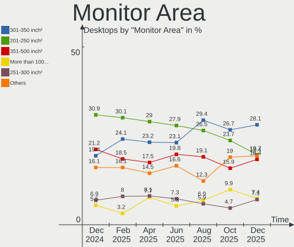

| Area in inch² | Desktops | Percent |
|----------------|----------|---------|
| 301-350        | 87       | 28.06%  |
| 201-250        | 61       | 19.68%  |
| 351-500        | 57       | 18.39%  |
| More than 1000 | 23       | 7.42%   |
| 251-300        | 22       | 7.1%    |
| 151-200        | 19       | 6.13%   |
| 501-1000       | 18       | 5.81%   |
| Unknown        | 9        | 2.9%    |
| 141-150        | 4        | 1.29%   |
| 101-110        | 4        | 1.29%   |
| 81-90          | 2        | 0.65%   |
| 51-60          | 2        | 0.65%   |
| 111-120        | 1        | 0.32%   |
| 91-100         | 1        | 0.32%   |

Pixel Density
-------------

Pixels per inch

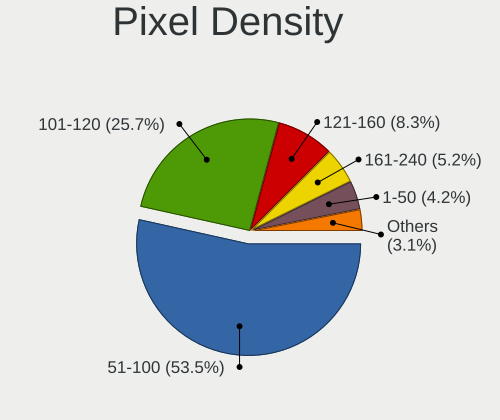

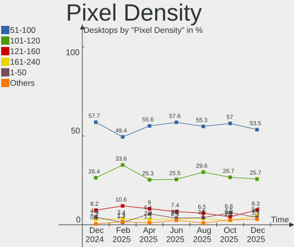

| Density | Desktops | Percent |
|---------|----------|---------|
| 51-100  | 154      | 53.47%  |
| 101-120 | 74       | 25.69%  |
| 121-160 | 24       | 8.33%   |
| 161-240 | 15       | 5.21%   |
| 1-50    | 12       | 4.17%   |
| Unknown | 9        | 3.13%   |

Multiple Monitors
-----------------

Total monitors connected

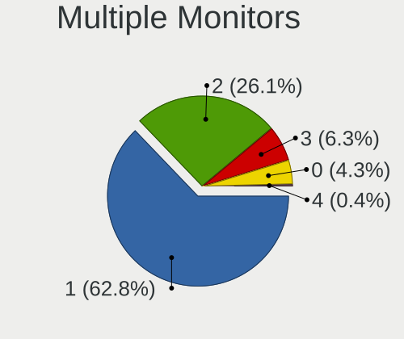

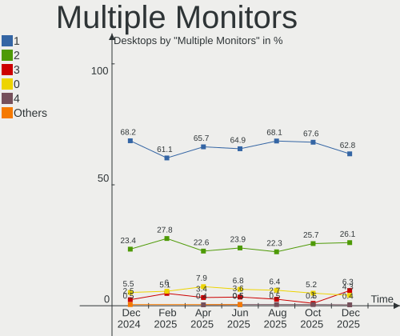

| Total | Desktops | Percent |
|-------|----------|---------|
| 1     | 159      | 62.85%  |
| 2     | 66       | 26.09%  |
| 3     | 16       | 6.32%   |
| 0     | 11       | 4.35%   |
| 4     | 1        | 0.4%    |

Network
-------

Net Controller Vendor
---------------------

Controller vendors

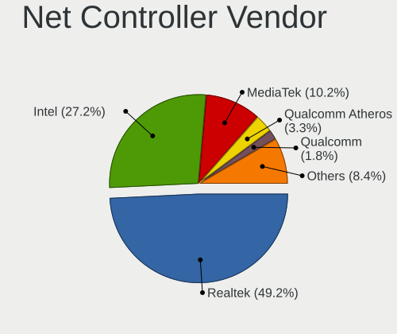

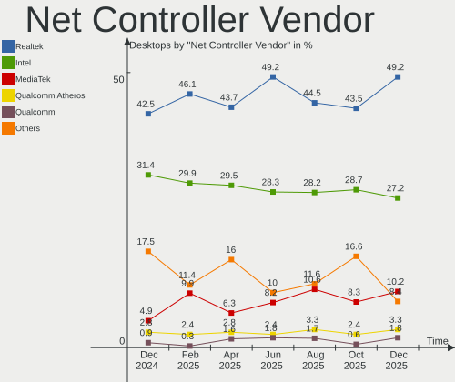

| Vendor                     | Desktops | Percent |
|----------------------------|----------|---------|
| Realtek Semiconductor      | 194      | 49.24%  |
| Intel                      | 107      | 27.16%  |
| MediaTek                   | 40       | 10.15%  |
| Qualcomm Atheros           | 13       | 3.3%    |
| Qualcomm Technologies      | 7        | 1.78%   |
| Broadcom                   | 6        | 1.52%   |
| TP-Link                    | 4        | 1.02%   |
| Samsung Electronics        | 3        | 0.76%   |
| Microsoft                  | 3        | 0.76%   |
| Ralink Technology          | 2        | 0.51%   |
| Google                     | 2        | 0.51%   |
| Xiaomi                     | 1        | 0.25%   |
| ROCCAT                     | 1        | 0.25%   |
| Realtek                    | 1        | 0.25%   |
| Ralink                     | 1        | 0.25%   |
| NetGear                    | 1        | 0.25%   |
| Motorola PCS               | 1        | 0.25%   |
| Mercucys                   | 1        | 0.25%   |
| Mellanox Technologies      | 1        | 0.25%   |
| D-Link                     | 1        | 0.25%   |
| Cisco Systems              | 1        | 0.25%   |
| ASUSTek Computer           | 1        | 0.25%   |
| ASIX Electronics           | 1        | 0.25%   |
| American Future Technology | 1        | 0.25%   |

Net Controller Model
--------------------

Controller models

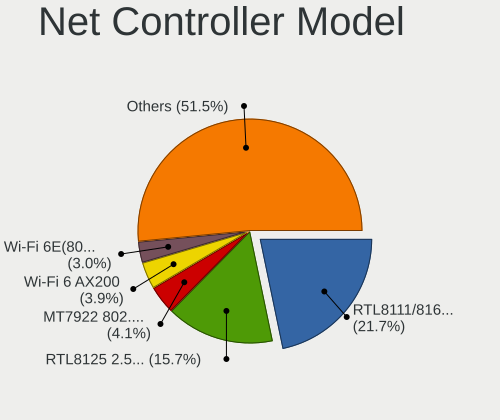

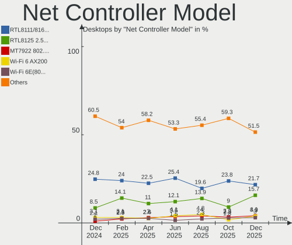

| Model                                                                           | Desktops | Percent |
|---------------------------------------------------------------------------------|----------|---------|
| Realtek RTL8111/8168/8211/8411 PCI Express Gigabit Ethernet Controller          | 100      | 21.74%  |
| Realtek RTL8125 2.5GbE Controller                                               | 72       | 15.65%  |
| MediaTek MT7922 802.11ax PCI Express Wireless Network Adapter                   | 19       | 4.13%   |
| Intel Wi-Fi 6 AX200                                                             | 18       | 3.91%   |
| Intel Wi-Fi 6E(802.11ax) AX210/AX1675* 2x2 [Typhoon Peak]                       | 14       | 3.04%   |
| Realtek RTL8126 5GbE Controller                                                 | 11       | 2.39%   |
| Intel I211 Gigabit Network Connection                                           | 10       | 2.17%   |
| Intel Ethernet Controller I226-V                                                | 10       | 2.17%   |
| Realtek RTL8821CE 802.11ac PCIe Wireless Network Adapter                        | 8        | 1.74%   |
| Intel Ethernet Controller I225-V                                                | 8        | 1.74%   |
| Realtek RTL8852BE PCIe 802.11ax Wireless Network Controller                     | 7        | 1.52%   |
| Qualcomm WCN785x Wi-Fi 7(802.11be) 320MHz 2x2 [FastConnect 7800]                | 7        | 1.52%   |
| Intel 700 Series Chipset CNVi WiFi                                              | 7        | 1.52%   |
| MediaTek MT7925 (RZ717) Wi-Fi 7 160MHz                                          | 6        | 1.3%    |
| Intel Ethernet Connection (2) I219-V                                            | 6        | 1.3%    |
| Realtek RTL8153 Gigabit Ethernet Adapter                                        | 5        | 1.09%   |
| Intel Ethernet Connection I217-LM                                               | 5        | 1.09%   |
| Intel Ethernet Connection (7) I219-V                                            | 5        | 1.09%   |
| Realtek USB 10/100/1G/2.5 LAN                                                   | 4        | 0.87%   |
| Realtek RTL8922AE 802.11be PCIe Wireless Network Adapter                        | 4        | 0.87%   |
| Realtek 802.11ac NIC                                                            | 4        | 0.87%   |
| MediaTek MT7921K (RZ608) Wi-Fi 6E 80MHz                                         | 4        | 0.87%   |
| Samsung Galaxy series, misc. (tethering mode)                                   | 3        | 0.65%   |
| Realtek RTL88x2bu [AC1200 Techkey]                                              | 3        | 0.65%   |
| Realtek RTL8852CE PCIe 802.11ax Wireless Network Controller                     | 3        | 0.65%   |
| Qualcomm Atheros Killer E220x Gigabit Ethernet Controller                       | 3        | 0.65%   |
| MediaTek MT7925 802.11be 160MHz 2x2 PCIe Wireless Network Adapter [Filogic 360] | 3        | 0.65%   |
| MediaTek MT7902 802.11ax PCIe Wireless Network Adapter [Filogic 310]            | 3        | 0.65%   |
| Intel Wi-Fi 5(802.11ac) Wireless-AC 9x6x [Thunder Peak]                         | 3        | 0.65%   |
| Intel Ethernet Connection (17) I219-V                                           | 3        | 0.65%   |
| Intel Dual Band Wireless-AC 3168NGW [Stone Peak]                                | 3        | 0.65%   |
| Intel Alder Lake-S PCH CNVi WiFi                                                | 3        | 0.65%   |
| Broadcom BCM4360 802.11ac Dual Band Wireless Network Adapter                    | 3        | 0.65%   |
| TP-Link Archer T4U ver.3                                                        | 2        | 0.43%   |
| Realtek RTL8851BE PCIe 802.11ax Wireless Network Controller                     | 2        | 0.43%   |
| Realtek RTL8812AE 802.11ac PCIe Wireless Network Adapter                        | 2        | 0.43%   |
| Realtek RTL8192EU 802.11b/g/n WLAN Adapter                                      | 2        | 0.43%   |
| Realtek Killer E3000 2.5GbE Controller                                          | 2        | 0.43%   |
| Realtek Killer E2600 GbE Controller                                             | 2        | 0.43%   |
| Qualcomm Atheros AR9485 Wireless Network Adapter                                | 2        | 0.43%   |

Wireless Vendor
---------------

Wireless vendors

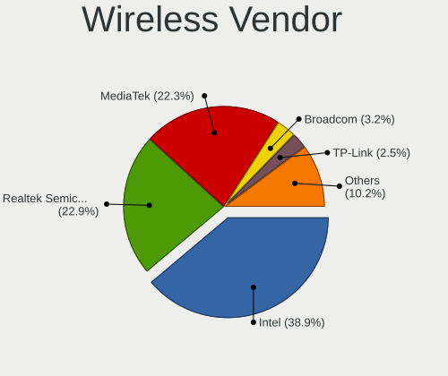

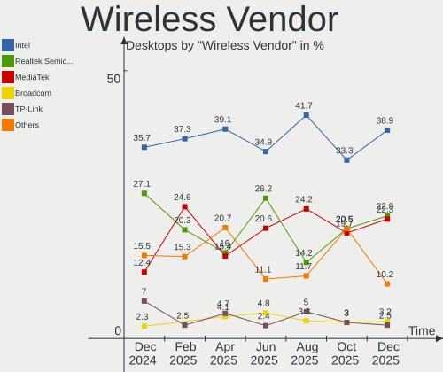

| Vendor                | Desktops | Percent |
|-----------------------|----------|---------|
| Intel                 | 61       | 38.85%  |
| Realtek Semiconductor | 36       | 22.93%  |
| MediaTek              | 35       | 22.29%  |
| Broadcom              | 5        | 3.18%   |
| TP-Link               | 4        | 2.55%   |
| Qualcomm Atheros      | 4        | 2.55%   |
| Microsoft             | 3        | 1.91%   |
| Ralink Technology     | 2        | 1.27%   |
| Realtek               | 1        | 0.64%   |
| Ralink                | 1        | 0.64%   |
| Qualcomm Technologies | 1        | 0.64%   |
| NetGear               | 1        | 0.64%   |
| Mercucys              | 1        | 0.64%   |
| D-Link                | 1        | 0.64%   |
| ASUSTek Computer      | 1        | 0.64%   |

Wireless Model
--------------

Wireless models

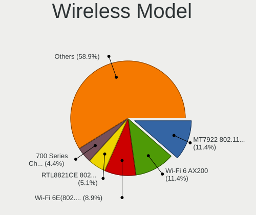

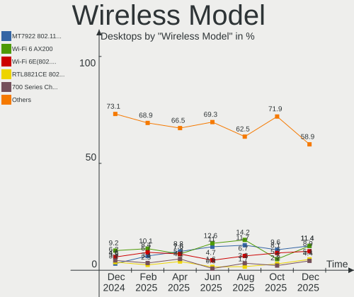

| Model                                                                           | Desktops | Percent |
|---------------------------------------------------------------------------------|----------|---------|
| MediaTek MT7922 802.11ax PCI Express Wireless Network Adapter                   | 18       | 11.39%  |
| Intel Wi-Fi 6 AX200                                                             | 18       | 11.39%  |
| Intel Wi-Fi 6E(802.11ax) AX210/AX1675* 2x2 [Typhoon Peak]                       | 14       | 8.86%   |
| Realtek RTL8821CE 802.11ac PCIe Wireless Network Adapter                        | 8        | 5.06%   |
| Intel 700 Series Chipset CNVi WiFi                                              | 7        | 4.43%   |
| MediaTek MT7925 (RZ717) Wi-Fi 7 160MHz                                          | 6        | 3.8%    |
| Realtek RTL8852BE PCIe 802.11ax Wireless Network Controller                     | 5        | 3.16%   |
| Realtek 802.11ac NIC                                                            | 4        | 2.53%   |
| MediaTek MT7921K (RZ608) Wi-Fi 6E 80MHz                                         | 4        | 2.53%   |
| Realtek RTL88x2bu [AC1200 Techkey]                                              | 3        | 1.9%    |
| Realtek RTL8852CE PCIe 802.11ax Wireless Network Controller                     | 3        | 1.9%    |
| MediaTek MT7902 802.11ax PCIe Wireless Network Adapter [Filogic 310]            | 3        | 1.9%    |
| Intel Wi-Fi 5(802.11ac) Wireless-AC 9x6x [Thunder Peak]                         | 3        | 1.9%    |
| Intel Dual Band Wireless-AC 3168NGW [Stone Peak]                                | 3        | 1.9%    |
| Intel Alder Lake-S PCH CNVi WiFi                                                | 3        | 1.9%    |
| Broadcom BCM4360 802.11ac Dual Band Wireless Network Adapter                    | 3        | 1.9%    |
| TP-Link Archer T4U ver.3                                                        | 2        | 1.27%   |
| Realtek RTL8922AE 802.11be PCIe Wireless Network Adapter                        | 2        | 1.27%   |
| Realtek RTL8851BE PCIe 802.11ax Wireless Network Controller                     | 2        | 1.27%   |
| Realtek RTL8812AE 802.11ac PCIe Wireless Network Adapter                        | 2        | 1.27%   |
| Realtek RTL8192EU 802.11b/g/n WLAN Adapter                                      | 2        | 1.27%   |
| Qualcomm Atheros AR9485 Wireless Network Adapter                                | 2        | 1.27%   |
| Microsoft Wireless XBox Controller Dongle                                       | 2        | 1.27%   |
| MediaTek MT7927 802.11be 320MHz 2x2 PCIe Wireless Network Adapter [Filogic 380] | 2        | 1.27%   |
| Intel Wireless 8260                                                             | 2        | 1.27%   |
| Intel Wireless 7265                                                             | 2        | 1.27%   |
| Intel Comet Lake PCH CNVi WiFi                                                  | 2        | 1.27%   |
| Intel Alder Lake-N PCH CNVi WiFi                                                | 2        | 1.27%   |
| Broadcom BCM4352 802.11ac Dual Band Wireless Network Adapter                    | 2        | 1.27%   |
| TP-Link Archer T3U [Realtek RTL8812BU]                                          | 1        | 0.63%   |
| TP-Link AC600 wireless Realtek RTL8811AU [Archer T2U Nano]                      | 1        | 0.63%   |
| Realtek RTL8852AE 802.11ax PCIe Wireless Network Adapter                        | 1        | 0.63%   |
| Realtek RTL8188RU 802.11n WLAN Adapter                                          | 1        | 0.63%   |
| Realtek RTL8188FTV 802.11b/g/n 1T1R 2.4G WLAN Adapter                           | 1        | 0.63%   |
| Realtek RTL8188EUS 802.11n Wireless Network Adapter                             | 1        | 0.63%   |
| Realtek RTL8188ETV Wireless LAN 802.11n Network Adapter                         | 1        | 0.63%   |
| Realtek RTL8188CUS 802.11n WLAN Adapter                                         | 1        | 0.63%   |
| Realtek 802.11be WLAN Adapter                                                   | 1        | 0.63%   |
| Ralink RT5370 Wireless Adapter                                                  | 1        | 0.63%   |
| Ralink RT2870/RT3070 Wireless Adapter                                           | 1        | 0.63%   |

Ethernet Vendor
---------------

Ethernet vendors

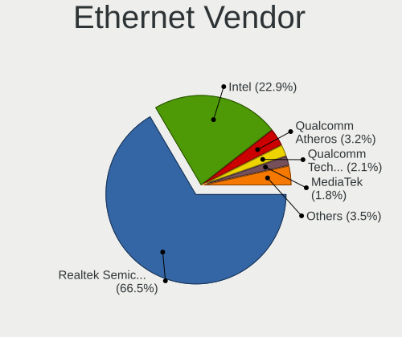

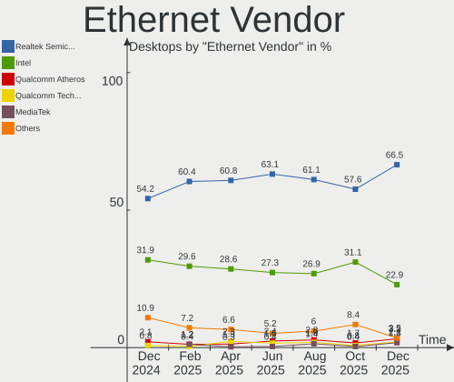

| Vendor                | Desktops | Percent |
|-----------------------|----------|---------|
| Realtek Semiconductor | 189      | 66.55%  |
| Intel                 | 65       | 22.89%  |
| Qualcomm Atheros      | 9        | 3.17%   |
| Qualcomm Technologies | 6        | 2.11%   |
| MediaTek              | 5        | 1.76%   |
| Samsung Electronics   | 3        | 1.06%   |
| Google                | 2        | 0.7%    |
| Xiaomi                | 1        | 0.35%   |
| Motorola PCS          | 1        | 0.35%   |
| Mellanox Technologies | 1        | 0.35%   |
| Broadcom              | 1        | 0.35%   |
| ASIX Electronics      | 1        | 0.35%   |

Ethernet Model
--------------

Ethernet models

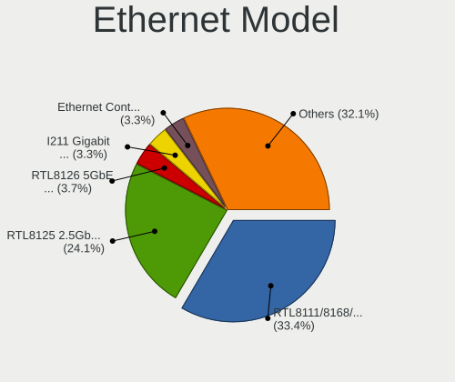

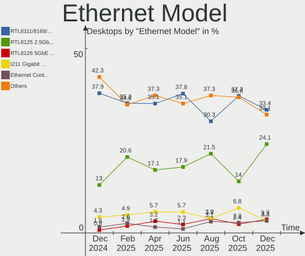

| Model                                                                           | Desktops | Percent |
|---------------------------------------------------------------------------------|----------|---------|
| Realtek RTL8111/8168/8211/8411 PCI Express Gigabit Ethernet Controller          | 100      | 33.44%  |
| Realtek RTL8125 2.5GbE Controller                                               | 72       | 24.08%  |
| Realtek RTL8126 5GbE Controller                                                 | 11       | 3.68%   |
| Intel I211 Gigabit Network Connection                                           | 10       | 3.34%   |
| Intel Ethernet Controller I226-V                                                | 10       | 3.34%   |
| Intel Ethernet Controller I225-V                                                | 8        | 2.68%   |
| Qualcomm WCN785x Wi-Fi 7(802.11be) 320MHz 2x2 [FastConnect 7800]                | 6        | 2.01%   |
| Intel Ethernet Connection (2) I219-V                                            | 6        | 2.01%   |
| Realtek RTL8153 Gigabit Ethernet Adapter                                        | 5        | 1.67%   |
| Intel Ethernet Connection I217-LM                                               | 5        | 1.67%   |
| Intel Ethernet Connection (7) I219-V                                            | 5        | 1.67%   |
| Realtek USB 10/100/1G/2.5 LAN                                                   | 4        | 1.34%   |
| Samsung Galaxy series, misc. (tethering mode)                                   | 3        | 1%      |
| Qualcomm Atheros Killer E220x Gigabit Ethernet Controller                       | 3        | 1%      |
| MediaTek MT7925 802.11be 160MHz 2x2 PCIe Wireless Network Adapter [Filogic 360] | 3        | 1%      |
| Intel Ethernet Connection (17) I219-V                                           | 3        | 1%      |
| Realtek RTL8922AE 802.11be PCIe Wireless Network Adapter                        | 2        | 0.67%   |
| Realtek RTL8852BE PCIe 802.11ax Wireless Network Controller                     | 2        | 0.67%   |
| Realtek Killer E3000 2.5GbE Controller                                          | 2        | 0.67%   |
| Realtek Killer E2600 GbE Controller                                             | 2        | 0.67%   |
| Qualcomm Atheros AR8151 v2.0 Gigabit Ethernet                                   | 2        | 0.67%   |
| Intel Ethernet Connection I217-V                                                | 2        | 0.67%   |
| Intel Ethernet Connection (7) I219-LM                                           | 2        | 0.67%   |
| Intel Ethernet Connection (2) I219-LM                                           | 2        | 0.67%   |
| Intel 82579LM Gigabit Network Connection (Lewisville)                           | 2        | 0.67%   |
| Intel 82574L Gigabit Network Connection                                         | 2        | 0.67%   |
| Intel 82546GB Gigabit Ethernet Controller                                       | 2        | 0.67%   |
| Google Pixel 9a                                                                 | 2        | 0.67%   |
| Xiaomi Mi/Redmi series (RNDIS)                                                  | 1        | 0.33%   |
| Realtek RTL8111/8168/8411 PCI Express Gigabit Ethernet Controller               | 1        | 0.33%   |
| Realtek RTL810xE PCI Express Fast Ethernet controller                           | 1        | 0.33%   |
| Qualcomm Atheros Killer E2500 Gigabit Ethernet Controller                       | 1        | 0.33%   |
| Qualcomm Atheros Killer E2400 Gigabit Ethernet Controller                       | 1        | 0.33%   |
| Qualcomm Atheros Attansic L1 Gigabit Ethernet                                   | 1        | 0.33%   |
| Qualcomm Atheros AR8131 Gigabit Ethernet                                        | 1        | 0.33%   |
| Motorola PCS motorola one 5G ace                                                | 1        | 0.33%   |
| Mellanox MT27500 Family [ConnectX-3]                                            | 1        | 0.33%   |
| MediaTek MT7922 802.11ax PCI Express Wireless Network Adapter                   | 1        | 0.33%   |
| MediaTek Infinix HOT 50i                                                        | 1        | 0.33%   |
| Intel Ethernet Connection (5) I219-V                                            | 1        | 0.33%   |

Net Controller Kind
-------------------

Ethernet, WiFi or modem

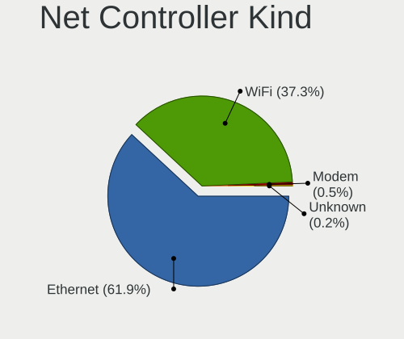

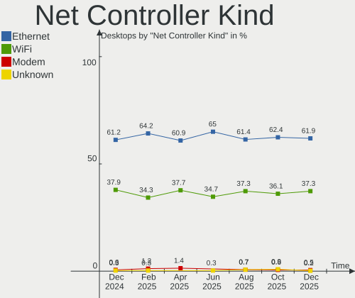

| Kind     | Desktops | Percent |
|----------|----------|---------|
| Ethernet | 252      | 61.92%  |
| WiFi     | 152      | 37.35%  |
| Modem    | 2        | 0.49%   |
| Unknown  | 1        | 0.25%   |

Used Controller
---------------

Currently used network controller

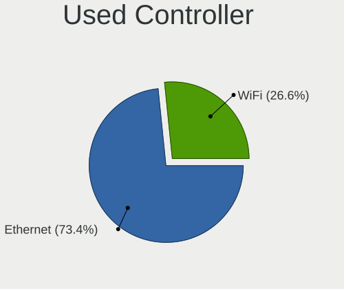

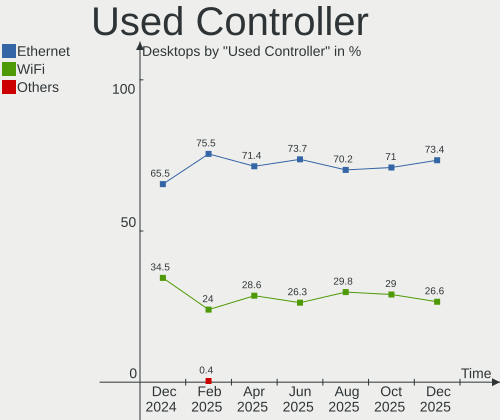

| Kind     | Desktops | Percent |
|----------|----------|---------|
| Ethernet | 193      | 73.38%  |
| WiFi     | 70       | 26.62%  |

NICs
----

Total network controllers on board

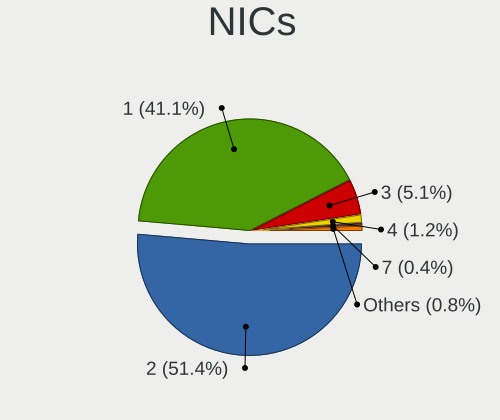

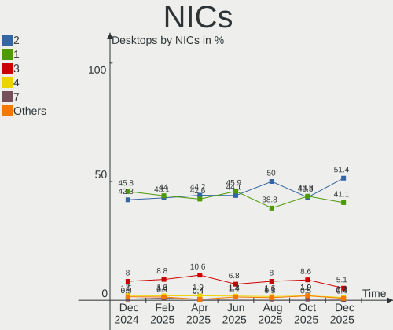

| Total | Desktops | Percent |
|-------|----------|---------|
| 2     | 130      | 51.38%  |
| 1     | 104      | 41.11%  |
| 3     | 13       | 5.14%   |
| 4     | 3        | 1.19%   |
| 7     | 1        | 0.4%    |
| 5     | 1        | 0.4%    |
| 0     | 1        | 0.4%    |

IPv6
----

IPv6 vs IPv4

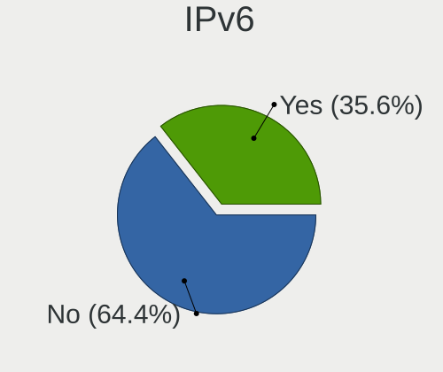

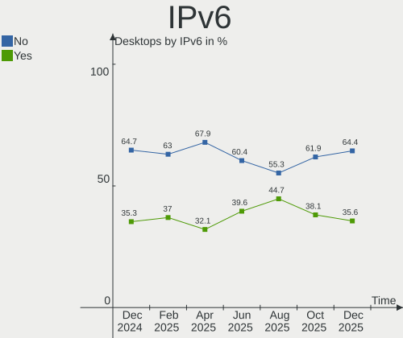

| Used | Desktops | Percent |
|------|----------|---------|
| No   | 163      | 64.43%  |
| Yes  | 90       | 35.57%  |

Bluetooth
---------

Bluetooth Vendor
----------------

Controller vendors

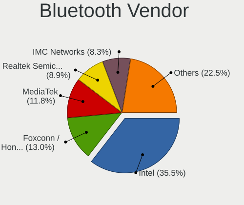

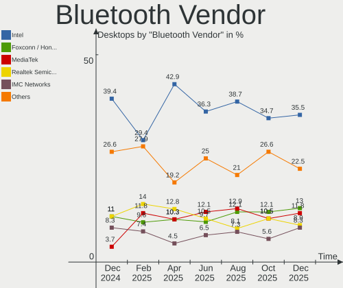

| Vendor                          | Desktops | Percent |
|---------------------------------|----------|---------|
| Intel                           | 60       | 35.5%   |
| Foxconn / Hon Hai               | 22       | 13.02%  |
| MediaTek                        | 20       | 11.83%  |
| Realtek Semiconductor           | 15       | 8.88%   |
| IMC Networks                    | 14       | 8.28%   |
| Cambridge Silicon Radio         | 12       | 7.1%    |
| TP-Link                         | 9        | 5.33%   |
| ASUSTek Computer                | 6        | 3.55%   |
| Broadcom                        | 2        | 1.18%   |
| Actions                         | 2        | 1.18%   |
| Unknown                         | 2        | 1.18%   |
| Realtek                         | 1        | 0.59%   |
| Qualcomm Atheros Communications | 1        | 0.59%   |
| Mercucys                        | 1        | 0.59%   |
| Lite-On Technology              | 1        | 0.59%   |
| Apple                           | 1        | 0.59%   |

Bluetooth Model
---------------

Controller models

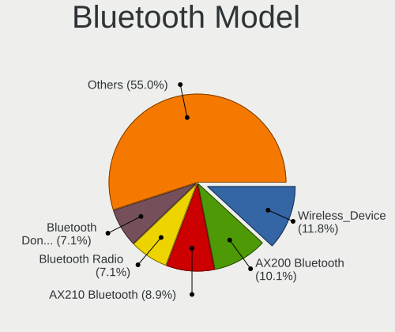

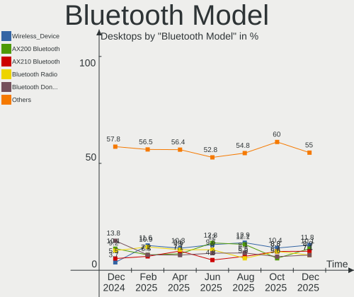

| Model                                               | Desktops | Percent |
|-----------------------------------------------------|----------|---------|
| MediaTek Wireless_Device                            | 20       | 11.83%  |
| Intel AX200 Bluetooth                               | 17       | 10.06%  |
| Intel AX210 Bluetooth                               | 15       | 8.88%   |
| Realtek Bluetooth Radio                             | 12       | 7.1%    |
| Cambridge Silicon Radio Bluetooth Dongle (HCI mode) | 12       | 7.1%    |
| IMC Networks Bluetooth Radio                        | 11       | 6.51%   |
| Foxconn / Hon Hai Wireless_Device                   | 10       | 5.92%   |
| Foxconn / Hon Hai Bluetooth Device                  | 10       | 5.92%   |
| TP-Link TP-T@- UB500 Adapter                        | 9        | 5.33%   |
| Intel AX201 Bluetooth                               | 8        | 4.73%   |
| Intel Bluetooth Device                              | 7        | 4.14%   |
| Intel Bluetooth wireless interface                  | 5        | 2.96%   |
| Intel Wireless-AC 9260 Bluetooth Adapter            | 3        | 1.78%   |
| Intel Wireless-AC 3168 Bluetooth                    | 3        | 1.78%   |
| ASUS ASUS USB-BT500                                 | 3        | 1.78%   |
| Realtek  Bluetooth 4.2 Adapter                      | 2        | 1.18%   |
| IMC Networks Wireless_Device                        | 2        | 1.18%   |
| Foxconn / Hon Hai Bluetooth Radio                   | 2        | 1.18%   |
| ASUS Broadcom BCM20702A0 Bluetooth                  | 2        | 1.18%   |
| Actions general adapter                             | 2        | 1.18%   |
| Unknown                                             | 2        | 1.18%   |
| Realtek Bluetooth 5.3 Radio                         | 1        | 0.59%   |
| Realtek Bluetooth Radio                             | 1        | 0.59%   |
| Qualcomm Atheros  Bluetooth Device                  | 1        | 0.59%   |
| Mercucys Mercusys MA530 Adapter                     | 1        | 0.59%   |
| Lite-On Wireless_Device                             | 1        | 0.59%   |
| Intel Centrino Bluetooth Wireless Transceiver       | 1        | 0.59%   |
| Intel Bluetooth 9460/9560 Jefferson Peak (JfP)      | 1        | 0.59%   |
| IMC Networks BCM20702A0                             | 1        | 0.59%   |
| Broadcom Bluetooth 3.0 Device                       | 1        | 0.59%   |
| Broadcom BCM20702A0 Bluetooth 4.0                   | 1        | 0.59%   |
| ASUS Bluetooth Controller                           | 1        | 0.59%   |
| Apple Bluetooth Host Controller                     | 1        | 0.59%   |

Sound
-----

Sound Vendor
------------

Sound card vendors

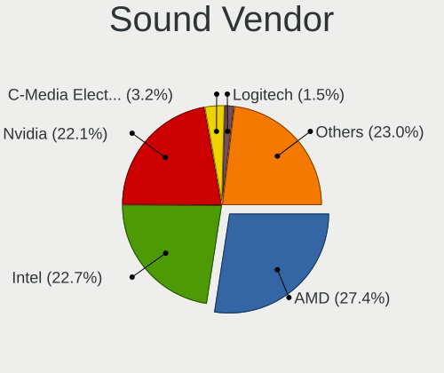

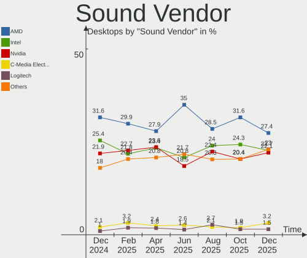

| Vendor                                       | Desktops | Percent |
|----------------------------------------------|----------|---------|
| AMD                                          | 144      | 27.43%  |
| Intel                                        | 119      | 22.67%  |
| Nvidia                                       | 116      | 22.1%   |
| C-Media Electronics                          | 17       | 3.24%   |
| Logitech                                     | 8        | 1.52%   |
| SteelSeries ApS                              | 7        | 1.33%   |
| Micro Star International                     | 7        | 1.33%   |
| JMTek                                        | 7        | 1.33%   |
| ASUSTek Computer                             | 7        | 1.33%   |
| Razer USA                                    | 6        | 1.14%   |
| ASRock                                       | 6        | 1.14%   |
| Corsair                                      | 5        | 0.95%   |
| Kingston Technology                          | 4        | 0.76%   |
| Hewlett-Packard                              | 4        | 0.76%   |
| Generalplus Technology                       | 4        | 0.76%   |
| Creative Labs                                | 4        | 0.76%   |
| Yamaha                                       | 3        | 0.57%   |
| Texas Instruments                            | 3        | 0.57%   |
| Sony                                         | 3        | 0.57%   |
| Realtek Semiconductor                        | 3        | 0.57%   |
| Focusrite-Novation                           | 3        | 0.57%   |
| Creative Technology                          | 3        | 0.57%   |
| Zoran Co. Personal Media Division (Nogatech) | 2        | 0.38%   |
| Turtle Beach                                 | 2        | 0.38%   |
| TTGK Technology                              | 2        | 0.38%   |
| RODE Microphones                             | 2        | 0.38%   |
| MV-SILICON                                   | 2        | 0.38%   |
| Medeli Electronics                           | 2        | 0.38%   |
| BEHRINGER International                      | 2        | 0.38%   |
| Unknown                                      | 2        | 0.38%   |
| XMOS                                         | 1        | 0.19%   |
| Valve Software                               | 1        | 0.19%   |
| Universal Audio                              | 1        | 0.19%   |
| Tenx Technology                              | 1        | 0.19%   |
| Telink                                       | 1        | 0.19%   |
| Samsung Electronics                          | 1        | 0.19%   |
| Samson Technologies                          | 1        | 0.19%   |
| ROCCAT                                       | 1        | 0.19%   |
| M-Audio                                      | 1        | 0.19%   |
| liyuany                                      | 1        | 0.19%   |

Sound Model
-----------

Sound card models

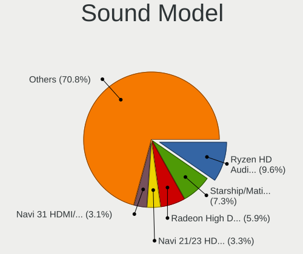

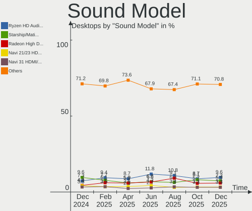

| Model                                                                      | Desktops | Percent |
|----------------------------------------------------------------------------|----------|---------|
| AMD Ryzen HD Audio Controller                                              | 62       | 9.63%   |
| AMD Starship/Matisse HD Audio Controller                                   | 47       | 7.3%    |
| AMD Radeon High Definition Audio Controller                                | 38       | 5.9%    |
| AMD Navi 21/23 HDMI/DP Audio Controller                                    | 21       | 3.26%   |
| AMD Navi 31 HDMI/DP Audio                                                  | 20       | 3.11%   |
| AMD Navi 48 HDMI/DP Audio Controller                                       | 18       | 2.8%    |
| Intel Alder Lake-S HD Audio Controller                                     | 16       | 2.48%   |
| Intel Raptor Lake High Definition Audio Controller                         | 15       | 2.33%   |
| Intel Cannon Lake PCH cAVS                                                 | 12       | 1.86%   |
| Intel 200 Series PCH HD Audio                                              | 12       | 1.86%   |
| Nvidia GA106 High Definition Audio Controller                              | 11       | 1.71%   |
| Nvidia GA104 High Definition Audio Controller                              | 11       | 1.71%   |
| AMD Renoir/Cezanne HDMI/DP Audio Controller                                | 10       | 1.55%   |
| Nvidia AD104 High Definition Audio Controller                              | 9        | 1.4%    |
| Intel 8 Series/C220 Series Chipset High Definition Audio Controller        | 9        | 1.4%    |
| Intel 100 Series/C230 Series Chipset Family HD Audio Controller            | 9        | 1.4%    |
| Nvidia TU106 High Definition Audio Controller                              | 7        | 1.09%   |
| Nvidia GA102 High Definition Audio Controller                              | 7        | 1.09%   |
| Micro Star International USB Audio                                         | 7        | 1.09%   |
| AMD Family 17h (Models 00h-0fh) HD Audio Controller                        | 7        | 1.09%   |
| Nvidia GM107 High Definition Audio Controller [GeForce 940MX]              | 6        | 0.93%   |
| Nvidia AD106M High Definition Audio Controller                             | 6        | 0.93%   |
| Intel Xeon E3-1200 v3/4th Gen Core Processor HD Audio Controller           | 6        | 0.93%   |
| ASRock USB Audio                                                           | 6        | 0.93%   |
| Nvidia TU116 High Definition Audio Controller                              | 5        | 0.78%   |
| Nvidia TU104 HD Audio Controller                                           | 5        | 0.78%   |
| Nvidia GP104 High Definition Audio Controller                              | 5        | 0.78%   |
| Nvidia GM204 High Definition Audio Controller                              | 5        | 0.78%   |
| Nvidia GB203 High Definition Audio Controller                              | 5        | 0.78%   |
| Nvidia AD103 High Definition Audio Controller                              | 5        | 0.78%   |
| Intel 7 Series/C216 Chipset Family High Definition Audio Controller        | 5        | 0.78%   |
| ASUSTek Computer USB Audio                                                 | 5        | 0.78%   |
| AMD Ellesmere HDMI Audio [Radeon RX 470/480 / 570/580/590]                 | 5        | 0.78%   |
| JMTek USB PnP Audio Device                                                 | 4        | 0.62%   |
| Intel C610/X99 series chipset HD Audio Controller                          | 4        | 0.62%   |
| Intel Alder Lake-N PCH High Definition Audio Controller                    | 4        | 0.62%   |
| Intel 6 Series/C200 Series Chipset Family High Definition Audio Controller | 4        | 0.62%   |
| C-Media Electronics Audio Adapter (Unitek Y-247A)                          | 4        | 0.62%   |
| Nvidia GP107GL High Definition Audio Controller                            | 3        | 0.47%   |
| Nvidia GP106 High Definition Audio Controller                              | 3        | 0.47%   |

Memory
------

Memory Vendor
-------------

Memory module vendors

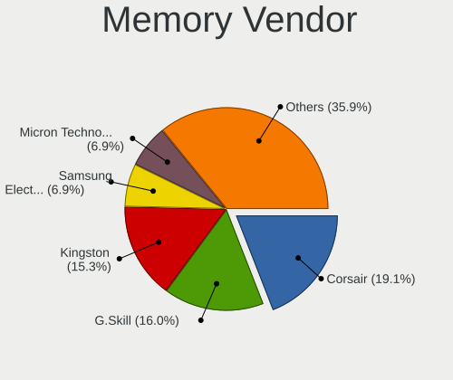

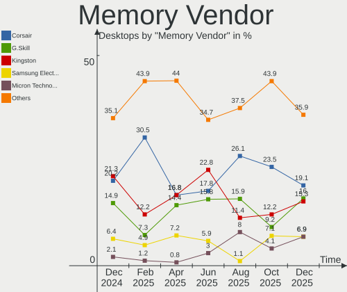

| Vendor                               | Desktops | Percent |
|--------------------------------------|----------|---------|
| Corsair                              | 25       | 19.08%  |
| G.Skill                              | 21       | 16.03%  |
| Kingston                             | 20       | 15.27%  |
| Samsung Electronics                  | 9        | 6.87%   |
| Micron Technology                    | 9        | 6.87%   |
| Unknown                              | 8        | 6.11%   |
| Unknown                              | 7        | 5.34%   |
| Team                                 | 5        | 3.82%   |
| Crucial                              | 5        | 3.82%   |
| SK hynix                             | 3        | 2.29%   |
| A-DATA Technology                    | 3        | 2.29%   |
| TeamGroup                            | 2        | 1.53%   |
| Transcend                            | 1        | 0.76%   |
| Timetec                              | 1        | 0.76%   |
| T-FORCE                              | 1        | 0.76%   |
| Smart                                | 1        | 0.76%   |
| Shenzhen Jinge Information           | 1        | 0.76%   |
| Ramaxel Technology                   | 1        | 0.76%   |
| PNY                                  | 1        | 0.76%   |
| Netac                                | 1        | 0.76%   |
| Lexar                                | 1        | 0.76%   |
| GeIL                                 | 1        | 0.76%   |
| Chun Well Technology Holding Limited | 1        | 0.76%   |
| Chun Well                            | 1        | 0.76%   |
| Apacer                               | 1        | 0.76%   |
| 83130000802C                         | 1        | 0.76%   |

Memory Model
------------

Memory module models

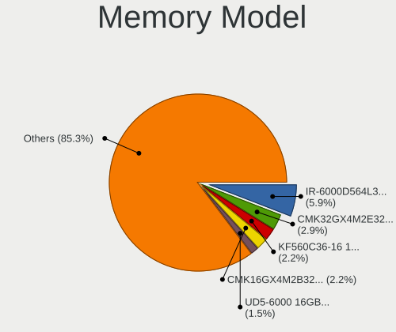

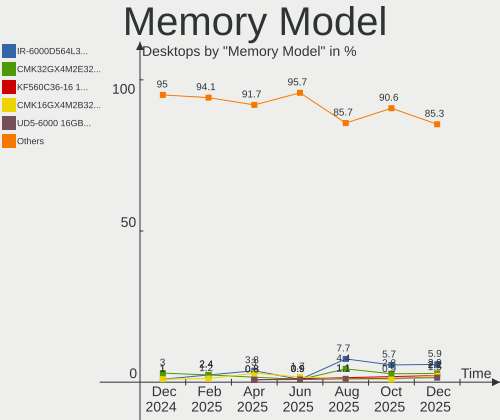

| Model                                                                      | Desktops | Percent |
|----------------------------------------------------------------------------|----------|---------|
| Unknown                                                                    | 8        | 5.88%   |
| Corsair RAM CMK32GX4M2E3200C16 16GB DIMM DDR4 3600MT/s                     | 4        | 2.94%   |
| Kingston RAM KF560C36-16 16GB DIMM DDR5 6000MT/s                           | 3        | 2.21%   |
| Corsair RAM CMK16GX4M2B3200C16 8GB DIMM DDR4 3600MT/s                      | 3        | 2.21%   |
| Team RAM UD5-6000 16GB DIMM DDR5 6000MT/s                                  | 2        | 1.47%   |
| Micron RAM CP16G64C38U5W.M8D3 16GB DIMM DDR5 6400MT/s                      | 2        | 1.47%   |
| G.Skill RAM F5-6000J3636F16G 16GB DIMM DDR5 6400MT/s                       | 2        | 1.47%   |
| G.Skill RAM F5-6000J3040G32G 32GB DIMM DDR5 6200MT/s                       | 2        | 1.47%   |
| G.Skill RAM F5-6000J3038F16G 16GB DIMM DDR5 6000MT/s                       | 2        | 1.47%   |
| Corsair RAM CMK64GX4M2E3200C16 32GB DIMM DDR4 3600MT/s                     | 2        | 1.47%   |
| Unknown RAM Module 8GB DIMM DDR4 3200MT/s                                  | 1        | 0.74%   |
| Unknown RAM Module 4GB DIMM 400MT/s                                        | 1        | 0.74%   |
| Unknown RAM Module 4GB DIMM 1333MT/s                                       | 1        | 0.74%   |
| Unknown RAM Module 2GB DIMM DDR2 1067MT/s                                  | 1        | 0.74%   |
| Unknown RAM Module 2GB DIMM 800MT/s                                        | 1        | 0.74%   |
| Unknown RAM Module 2GB DIMM 667MT/s                                        | 1        | 0.74%   |
| Unknown RAM Module 16GB DIMM DDR4 2667MT/s                                 | 1        | 0.74%   |
| Transcend RAM TS2666HLB-16G 16GB DIMM DDR4 2667MT/s                        | 1        | 0.74%   |
| Timetec RAM U16G-3200 16GB DIMM DDR4 3200MT/s                              | 1        | 0.74%   |
| TeamGroup RAM UD5-6400 16GB DIMM DDR5 6400MT/s                             | 1        | 0.74%   |
| TeamGroup RAM UD5-6000 16GB DIMM DDR5 6000MT/s                             | 1        | 0.74%   |
| Team RAM TEAMGROUP-UD4-3600 16GB DIMM DDR4 4000MT/s                        | 1        | 0.74%   |
| Team RAM TEAMGROUP-UD4-2400 8GB DIMM DDR4 3000MT/s                         | 1        | 0.74%   |
| Team RAM TEAMGROUP-UD3-1600 8GB DIMM DDR3 1866MT/s                         | 1        | 0.74%   |
| T-FORCE RAM ZEUS-1600 4GB DIMM DDR3 1600MT/s                               | 1        | 0.74%   |
| Smart RAM SH564128FH8N0TNSDR 4GB DIMM DDR3 1600MT/s                        | 1        | 0.74%   |
| SK hynix RAM HMCG66MEBUA084N 8GB DIMM DDR5 4800MT/s                        | 1        | 0.74%   |
| SK hynix RAM HMA851S6AFR6N-UH 4GB SODIMM DDR4 2667MT/s                     | 1        | 0.74%   |
| SK hynix RAM HMA82GU6JJR8N-VK 16GB DIMM DDR4 2667MT/s                      | 1        | 0.74%   |
| SK hynix RAM HMA82GU6DJR8N-VK 16GB DIMM DDR4 2667MT/s                      | 1        | 0.74%   |
| Shenzhen Jinge Information RAM BRBN2G416G16C3200 16GB SODIMM DDR4 3200MT/s | 1        | 0.74%   |
| Samsung RAM Module 4GB Row Of Chips LPDDR5 6400MT/s                        | 1        | 0.74%   |
| Samsung RAM M471A1K43DB1-CWE 8GB SODIMM DDR4 3200MT/s                      | 1        | 0.74%   |
| Samsung RAM M471A1K43CB1-CRC 8GB SODIMM DDR4 8400MT/s                      | 1        | 0.74%   |
| Samsung RAM M425R1GB4BB0-CWMOL 8GB SODIMM DDR5 5600MT/s                    | 1        | 0.74%   |
| Samsung RAM M425R1GB4BB0-CWMOD 8GB SODIMM DDR5 5600MT/s                    | 1        | 0.74%   |
| Samsung RAM M393B5170EH1 4GB DIMM DDR3 1600MT/s                            | 1        | 0.74%   |
| Samsung RAM M393A2G40DB0-CPB 16GB RIMM DDR4 2133MT/s                       | 1        | 0.74%   |
| Samsung RAM M378A2K43CB1-CTD 16GB DIMM DDR4 3200MT/s                       | 1        | 0.74%   |
| Samsung RAM M378A1K43EB2-CWE 8GB DIMM DDR4 3200MT/s                        | 1        | 0.74%   |

Memory Kind
-----------

Memory module kinds

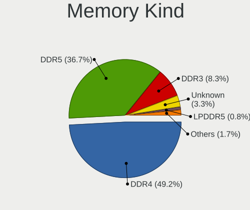

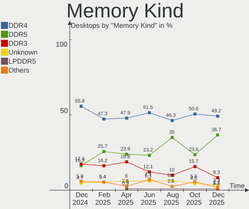

| Kind    | Desktops | Percent |
|---------|----------|---------|
| DDR4    | 59       | 49.17%  |
| DDR5    | 44       | 36.67%  |
| DDR3    | 10       | 8.33%   |
| Unknown | 4        | 3.33%   |
| LPDDR5  | 1        | 0.83%   |
| LPDDR4  | 1        | 0.83%   |
| DDR2    | 1        | 0.83%   |

Memory Form Factor
------------------

Physical design of the memory module

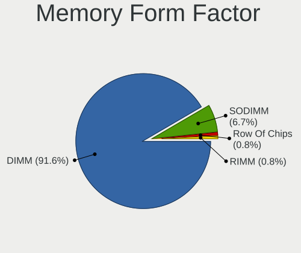

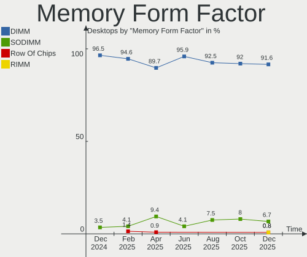

| Name         | Desktops | Percent |
|--------------|----------|---------|
| DIMM         | 109      | 91.6%   |
| SODIMM       | 8        | 6.72%   |
| Row Of Chips | 1        | 0.84%   |
| RIMM         | 1        | 0.84%   |

Memory Size
-----------

Memory module size

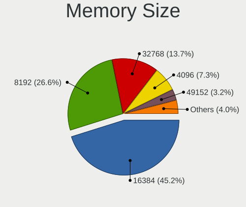

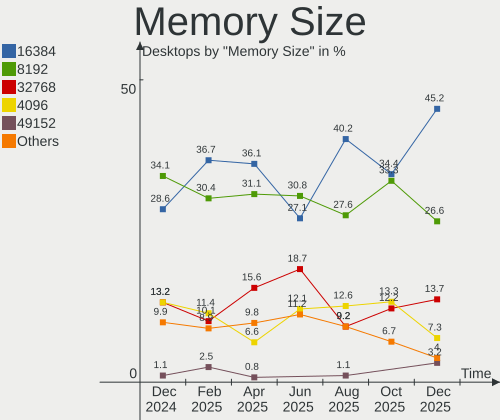

| Size  | Desktops | Percent |
|-------|----------|---------|
| 16384 | 56       | 45.16%  |
| 8192  | 33       | 26.61%  |
| 32768 | 17       | 13.71%  |
| 4096  | 9        | 7.26%   |
| 49152 | 4        | 3.23%   |
| 2048  | 3        | 2.42%   |
| 65536 | 2        | 1.61%   |

Memory Speed
------------

Memory module speed

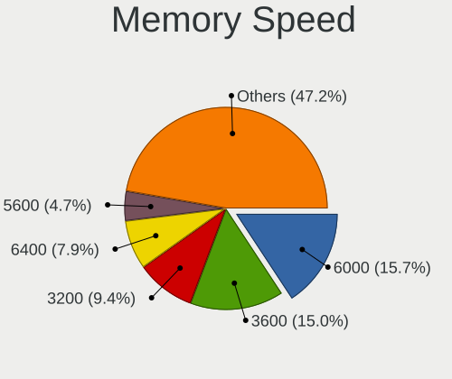

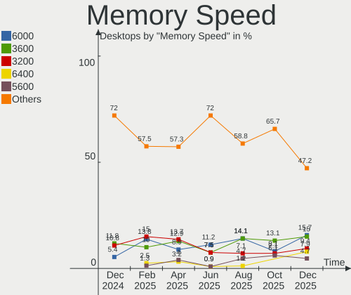

| Speed | Desktops | Percent |
|-------|----------|---------|
| 6000  | 20       | 15.75%  |
| 3600  | 19       | 14.96%  |
| 3200  | 12       | 9.45%   |
| 6400  | 10       | 7.87%   |
| 5600  | 6        | 4.72%   |
| 2667  | 6        | 4.72%   |
| 1600  | 6        | 4.72%   |
| 4800  | 4        | 3.15%   |
| 3733  | 4        | 3.15%   |
| 2666  | 4        | 3.15%   |
| 2133  | 3        | 2.36%   |
| 6200  | 2        | 1.57%   |
| 4000  | 2        | 1.57%   |
| 3800  | 2        | 1.57%   |
| 3000  | 2        | 1.57%   |
| 2400  | 2        | 1.57%   |
| 1866  | 2        | 1.57%   |
| 1333  | 2        | 1.57%   |
| 12800 | 1        | 0.79%   |
| 8400  | 1        | 0.79%   |
| 7000  | 1        | 0.79%   |
| 6800  | 1        | 0.79%   |
| 5800  | 1        | 0.79%   |
| 5200  | 1        | 0.79%   |
| 3866  | 1        | 0.79%   |
| 3400  | 1        | 0.79%   |
| 3266  | 1        | 0.79%   |
| 3100  | 1        | 0.79%   |
| 2933  | 1        | 0.79%   |
| 2870  | 1        | 0.79%   |
| 2800  | 1        | 0.79%   |
| 2448  | 1        | 0.79%   |
| 1800  | 1        | 0.79%   |
| 1067  | 1        | 0.79%   |
| 800   | 1        | 0.79%   |
| 667   | 1        | 0.79%   |
| 400   | 1        | 0.79%   |

Printers & scanners
-------------------

Printer Vendor
--------------

Printer device vendors

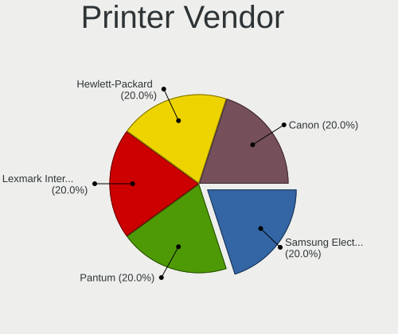

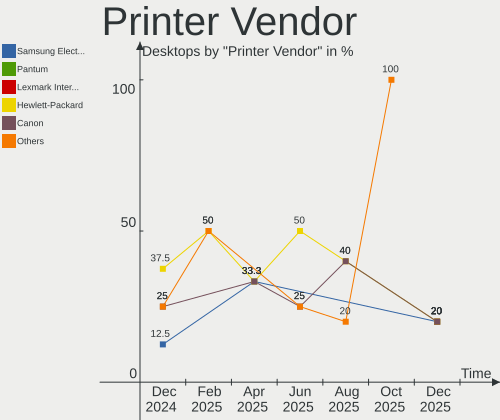

| Vendor                | Desktops | Percent |
|-----------------------|----------|---------|
| Samsung Electronics   | 1        | 20%     |
| Pantum                | 1        | 20%     |
| Lexmark International | 1        | 20%     |
| Hewlett-Packard       | 1        | 20%     |
| Canon                 | 1        | 20%     |

Printer Model
-------------

Printer device models

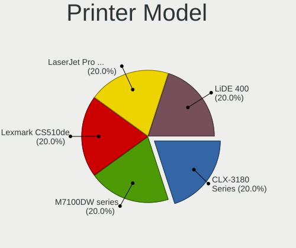

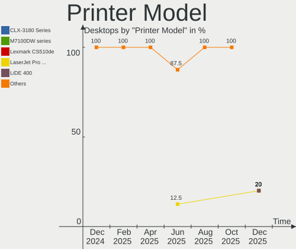

| Model                                 | Desktops | Percent |
|---------------------------------------|----------|---------|
| Samsung CLX-3180 Series               | 1        | 20%     |
| Pantum M7100DW series                 | 1        | 20%     |
| Lexmark International Lexmark CS510de | 1        | 20%     |
| HP LaserJet Pro M148-M149             | 1        | 20%     |
| Canon LiDE 400                        | 1        | 20%     |

Scanner Vendor
--------------

Scanner device vendors

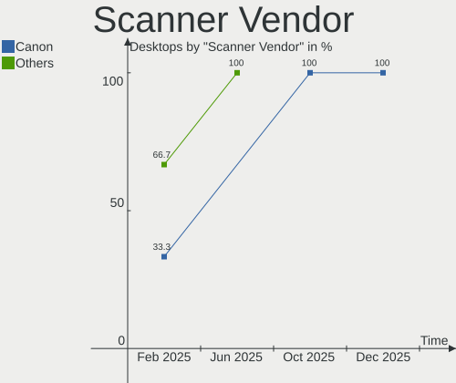

| Vendor | Desktops | Percent |
|--------|----------|---------|
| Canon  | 2        | 100%    |

Scanner Model
-------------

Scanner device models

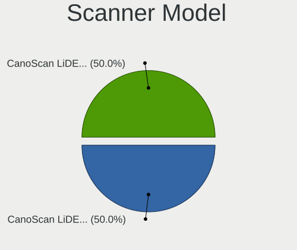

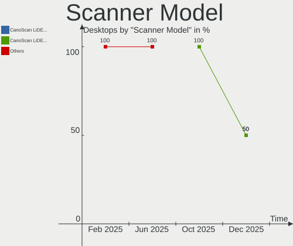

| Model                    | Desktops | Percent |
|--------------------------|----------|---------|
| Canon CanoScan LiDE 700F | 1        | 50%     |
| Canon CanoScan LiDE 120  | 1        | 50%     |

Camera
------

Camera Vendor
-------------

Camera device vendors

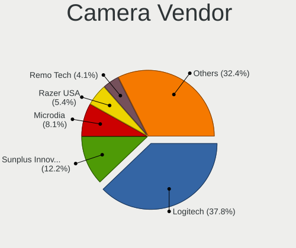

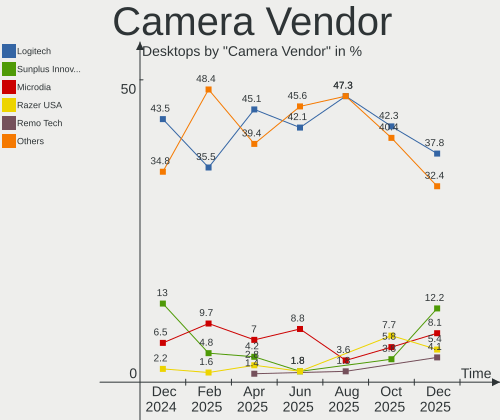

| Vendor                        | Desktops | Percent |
|-------------------------------|----------|---------|
| Logitech                      | 28       | 37.84%  |
| Sunplus Innovation Technology | 9        | 12.16%  |
| Microdia                      | 6        | 8.11%   |
| Razer USA                     | 4        | 5.41%   |
| Remo Tech                     | 3        | 4.05%   |
| Sonix Technology              | 2        | 2.7%    |
| Microsoft                     | 2        | 2.7%    |
| MacroSilicon                  | 2        | 2.7%    |
| Anker PowerConf C200          | 2        | 2.7%    |
| Xiongmai                      | 1        | 1.35%   |
| Valve Software                | 1        | 1.35%   |
| SHENZHEN EMEET TECHNOLOGY     | 1        | 1.35%   |
| Ruision                       | 1        | 1.35%   |
| Realtek Semiconductor         | 1        | 1.35%   |
| Lenovo                        | 1        | 1.35%   |
| KYE Systems (Mouse Systems)   | 1        | 1.35%   |
| Hewlett-Packard               | 1        | 1.35%   |
| Generalplus Technology        | 1        | 1.35%   |
| eMeet                         | 1        | 1.35%   |
| Dell                          | 1        | 1.35%   |
| Creative Technology           | 1        | 1.35%   |
| Bison Electronics             | 1        | 1.35%   |
| AVerMedia Technologies        | 1        | 1.35%   |
| Asuscom Network               | 1        | 1.35%   |
| Apple                         | 1        | 1.35%   |

Camera Model
------------

Camera device models

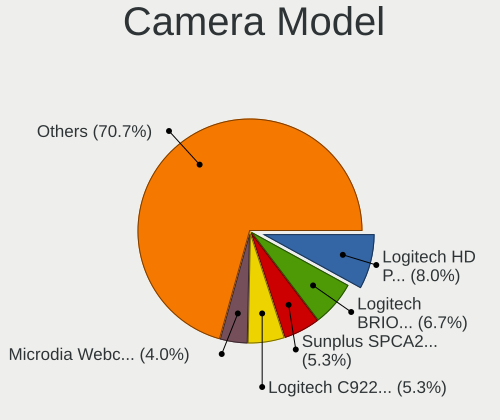

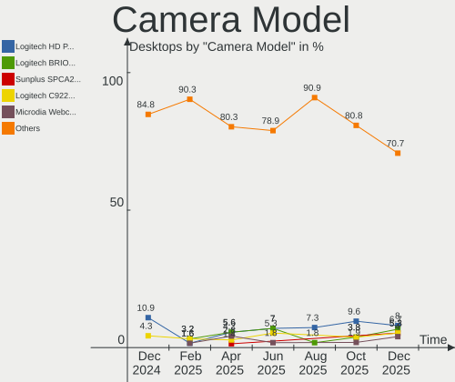

| Model                                         | Desktops | Percent |
|-----------------------------------------------|----------|---------|
| Logitech HD Pro Webcam C920                   | 6        | 8%      |
| Logitech BRIO Ultra HD Webcam                 | 5        | 6.67%   |
| Sunplus SPCA2281 Web Camera                   | 4        | 5.33%   |
| Logitech C922 Pro Stream Webcam               | 4        | 5.33%   |
| Microdia Webcam Vitade AF                     | 3        | 4%      |
| Sunplus Integrated Camera                     | 2        | 2.67%   |
| Razer USA Gaming Webcam [Kiyo]                | 2        | 2.67%   |
| Microdia USB 2.0 Camera                       | 2        | 2.67%   |
| MacroSilicon USB Video                        | 2        | 2.67%   |
| Logitech Webcam C310                          | 2        | 2.67%   |
| Logitech Webcam C270                          | 2        | 2.67%   |
| Logitech HD Webcam C525                       | 2        | 2.67%   |
| Anker PowerConf C200 Anker PowerConf C200     | 2        | 2.67%   |
| Xiongmai web camera                           | 1        | 1.33%   |
| Valve Software 3D Camera                      | 1        | 1.33%   |
| Sunplus WCAM100BK                             | 1        | 1.33%   |
| Sunplus USB 2.0 Camera                        | 1        | 1.33%   |
| Sunplus Aukey-PC-LM1E Camera                  | 1        | 1.33%   |
| Sonix onn 4K Webcam                           | 1        | 1.33%   |
| Sonix EMEET SmartCam C950                     | 1        | 1.33%   |
| SHENZHEN EMEET TECHNOLOGY eMeet Nova          | 1        | 1.33%   |
| Ruision UVC Camera                            | 1        | 1.33%   |
| Remo Tech OBSBOT Tiny 2 Lite                  | 1        | 1.33%   |
| Remo Tech OBSBOT Tiny 2                       | 1        | 1.33%   |
| Remo Tech OBSBOT Meet SE                      | 1        | 1.33%   |
| Realtek FULL HD 1080P Webcam                  | 1        | 1.33%   |
| Razer USA Razer Kiyo X                        | 1        | 1.33%   |
| Razer USA Razer Kiyo Pro                      | 1        | 1.33%   |
| Microsoft LifeCam Studio                      | 1        | 1.33%   |
| Microsoft LifeCam HD-3000                     | 1        | 1.33%   |
| Microdia AUKEY PC-W1                          | 1        | 1.33%   |
| MacroSilicon MS210x Video Grabber [EasierCAP] | 1        | 1.33%   |
| Logitech Webcam C930e                         | 1        | 1.33%   |
| Logitech StreamCam                            | 1        | 1.33%   |
| Logitech Logitech MeetUp                      | 1        | 1.33%   |
| Logitech HD Webcam C615                       | 1        | 1.33%   |
| Logitech HD Webcam C510                       | 1        | 1.33%   |
| Logitech Brio 101                             | 1        | 1.33%   |
| Logitech Brio 100                             | 1        | 1.33%   |
| Lenovo Lenovo Performance Camera              | 1        | 1.33%   |

Security
--------

Fingerprint Vendor
------------------

Fingerprint sensor vendors

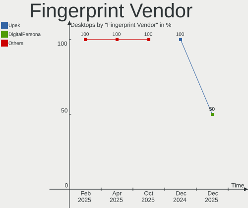

| Vendor         | Desktops | Percent |
|----------------|----------|---------|
| Upek           | 1        | 50%     |
| DigitalPersona | 1        | 50%     |

Fingerprint Model
-----------------

Fingerprint sensor models

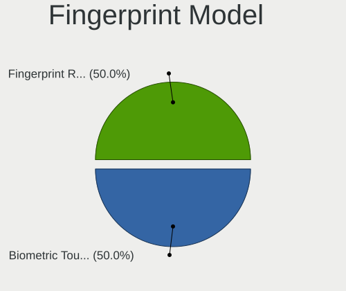

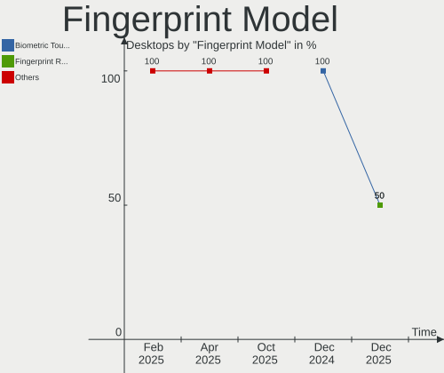

| Model                                                  | Desktops | Percent |
|--------------------------------------------------------|----------|---------|
| Upek Biometric Touchchip/Touchstrip Fingerprint Sensor | 1        | 50%     |
| DigitalPersona Fingerprint Reader                      | 1        | 50%     |

Chipcard Vendor
---------------

Chipcard module vendors

Zero info for selected period =(

Chipcard Model
--------------

Chipcard module models

Zero info for selected period =(

Unsupported
-----------

Unsupported Devices
-------------------

Total unsupported devices on board

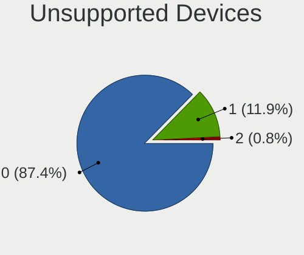

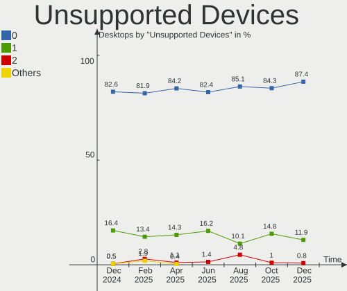

| Total | Desktops | Percent |
|-------|----------|---------|
| 0     | 221      | 87.35%  |
| 1     | 30       | 11.86%  |
| 2     | 2        | 0.79%   |

Unsupported Device Types
------------------------

Types of unsupported devices

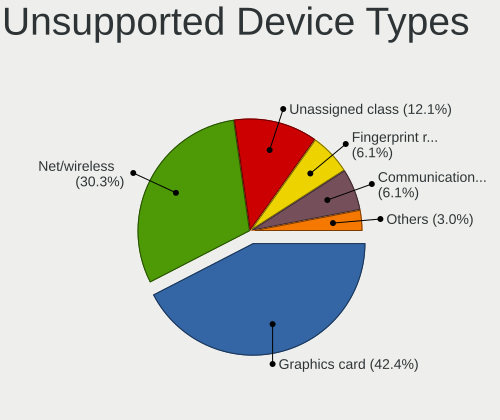

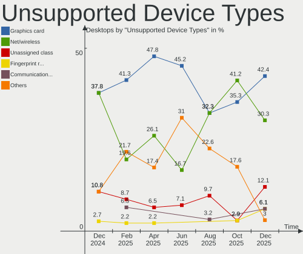

| Type                     | Desktops | Percent |
|--------------------------|----------|---------|
| Graphics card            | 14       | 42.42%  |
| Net/wireless             | 10       | 30.3%   |
| Unassigned class         | 4        | 12.12%  |
| Fingerprint reader       | 2        | 6.06%   |
| Communication controller | 2        | 6.06%   |
| Storage/raid             | 1        | 3.03%   |

