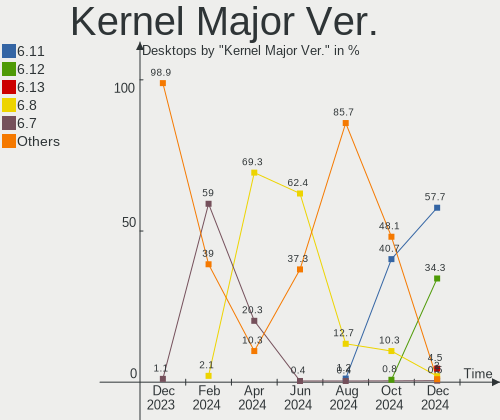
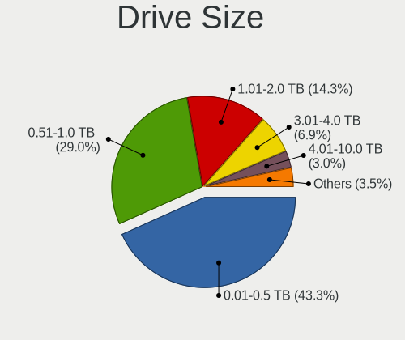
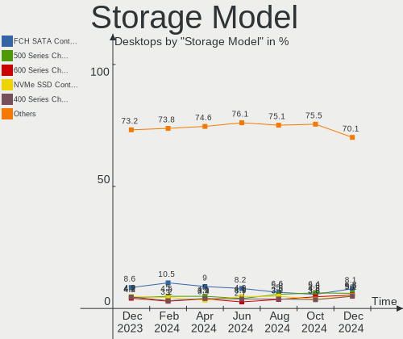
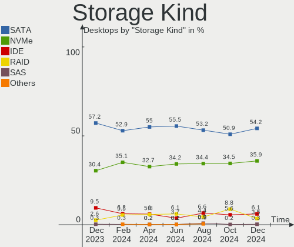
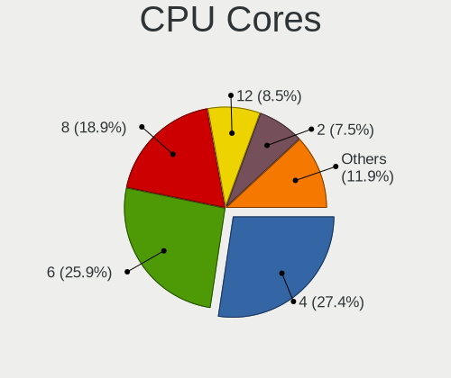
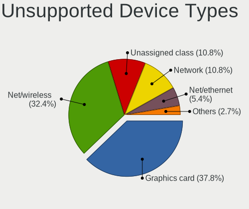

Fedora Hardware Trends (Desktop)
--------------------------------

A project to identify most popular hardware characteristics and track their change
over time based on data collected by Fedora users at https://Linux-Hardware.org.

Anyone can contribute to the study by uploading probes of their computers by
the [hw-probe](https://github.com/linuxhw/hw-probe) tool:

    sudo hw-probe -all -upload

Full-feature report is available here: https://linux-hardware.org/?view=trends&formfactor=desktop

Period: Feb, 2020.

Contents
--------

- [ OS                       ](#os)
- [ OS Family                ](#os-family)
- [ Kernel                   ](#kernel)
- [ Kernel Family            ](#kernel-family)
- [ Kernel Major Ver.        ](#kernel-major-ver)
- [ Arch                     ](#arch)
- [ DE                       ](#de)
- [ Display Server           ](#display-server)
- [ OS Lang                  ](#os-lang)
- [ Boot Mode                ](#boot-mode)
- [ Filesystem               ](#filesystem)
- [ Dual Boot with Linux     ](#dual-boot-with-linux)
- [ Dual Boot (Win)          ](#dual-boot-win)
- [ Country                  ](#country)
- [ City                     ](#city)
- [ Vendor                   ](#vendor)
- [ Model                    ](#model)
- [ Model Family             ](#model-family)
- [ MFG Year                 ](#mfg-year)
- [ Form Factor              ](#form-factor)
- [ Secure Boot              ](#secure-boot)
- [ Coreboot                 ](#coreboot)
- [ RAM Size                 ](#ram-size)
- [ RAM Used                 ](#ram-used)
- [ Drive Vendor             ](#drive-vendor)
- [ Drive Model              ](#drive-model)
- [ Drive Kind               ](#drive-kind)
- [ Drive Connector          ](#drive-connector)
- [ Drive Size               ](#drive-size)
- [ Space Total              ](#space-total)
- [ Space Used               ](#space-used)
- [ Malfunc. Drives          ](#malfunc-drives)
- [ Malfunc. Drive Vendor    ](#malfunc-drive-vendor)
- [ Malfunc. Drive Kind      ](#malfunc-drive-kind)
- [ Failed Drives            ](#failed-drives)
- [ Failed Drive Vendor      ](#failed-drive-vendor)
- [ Drive Status             ](#drive-status)
- [ Storage Vendor           ](#storage-vendor)
- [ Storage Model            ](#storage-model)
- [ Storage Kind             ](#storage-kind)
- [ CPU Vendor               ](#cpu-vendor)
- [ CPU Model                ](#cpu-model)
- [ CPU Model Family         ](#cpu-model-family)
- [ CPU Cores                ](#cpu-cores)
- [ CPU Sockets              ](#cpu-sockets)
- [ CPU Threads              ](#cpu-threads)
- [ CPU Op-Modes             ](#cpu-op-modes)
- [ CPU Microarch            ](#cpu-microarch)
- [ CPU Microcode            ](#cpu-microcode)
- [ GPU Vendor               ](#gpu-vendor)
- [ GPU Model                ](#gpu-model)
- [ GPU Combo                ](#gpu-combo)
- [ GPU Driver               ](#gpu-driver)
- [ GPU Memory               ](#gpu-memory)
- [ Monitor Vendor           ](#monitor-vendor)
- [ Monitor Model            ](#monitor-model)
- [ Monitor Resolution       ](#monitor-resolution)
- [ Monitor Diagonal         ](#monitor-diagonal)
- [ Monitor Width            ](#monitor-width)
- [ Aspect Ratio             ](#aspect-ratio)
- [ Monitor Area             ](#monitor-area)
- [ Pixel Density            ](#pixel-density)
- [ Multiple Monitors        ](#multiple-monitors)
- [ Net Controller Vendor    ](#net-controller-vendor)
- [ Net Controller Model     ](#net-controller-model)
- [ Net Controller Kind      ](#net-controller-kind)
- [ Used Controller          ](#used-controller)
- [ NICs                     ](#nics)
- [ Unsupported Devices      ](#unsupported-devices)
- [ Unsupported Device Types ](#unsupported-device-types)

OS
--

Installed operating systems

| Name      | Computers | Percent |
|-----------|-----------|---------|
| Fedora 31 | 92        | 88.46%  |
| Fedora 30 | 7         | 6.73%   |
| Fedora 33 | 2         | 1.92%   |
| Fedora 32 | 2         | 1.92%   |
| Fedora 21 | 1         | 0.96%   |

OS Family
---------

OS without a version

| Name   | Computers | Percent |
|--------|-----------|---------|
| Fedora | 104       | 100%    |

Kernel
------

Version of the Linux kernel

| Version                          | Computers | Percent |
|----------------------------------|-----------|---------|
| 5.5.5-200.fc31.x86_64            | 17        | 16.35%  |
| 5.4.18-200.fc31.x86_64           | 16        | 15.38%  |
| 5.4.19-200.fc31.x86_64           | 15        | 14.42%  |
| 5.4.17-200.fc31.x86_64           | 14        | 13.46%  |
| 5.4.20-200.fc31.x86_64           | 11        | 10.58%  |
| 5.4.15-200.fc31.x86_64           | 6         | 5.77%   |
| 5.4.18-100.fc30.x86_64           | 3         | 2.88%   |
| 5.4.13-201.fc31.x86_64           | 3         | 2.88%   |
| 5.4.17-100.fc30.x86_64           | 2         | 1.92%   |
| 5.4.12-200.fc31.x86_64           | 2         | 1.92%   |
| 5.6.0-0.rc3.git0.1.fc33.x86_64   | 1         | 0.96%   |
| 5.6.0-0.rc3.git0.1.fc32.x86_64   | 1         | 0.96%   |
| 5.6.0-0.rc2.git1.1.fc33.x86_64   | 1         | 0.96%   |
| 5.6.0-0.rc2.git0.1.fc32.x86_64   | 1         | 0.96%   |
| 5.5.6-201.fc31.x86_64            | 1         | 0.96%   |
| 5.5.3-200.fc31.x86_64            | 1         | 0.96%   |
| 5.5.2-200.fc31.x86_64            | 1         | 0.96%   |
| 5.4.19-100.fc30.x86_64           | 1         | 0.96%   |
| 5.4.18-201.acspatch.fc31.x86_64  | 1         | 0.96%   |
| 5.4.14-200.fc31.x86_64           | 1         | 0.96%   |
| 5.4.14-100.fc30.x86_64           | 1         | 0.96%   |
| 5.3.8-300.navi_reset.fc31.x86_64 | 1         | 0.96%   |
| 5.3.16-300.fc31.x86_64           | 1         | 0.96%   |
| 5.3.11-300.fc31.x86_64           | 1         | 0.96%   |
| 3.17.4-301.fc21.x86_64           | 1         | 0.96%   |

Kernel Family
-------------

Linux kernel without a distro release

| Version | Computers | Percent |
|---------|-----------|---------|
| 5.4.18  | 20        | 19.23%  |
| 5.5.5   | 17        | 16.35%  |
| 5.4.19  | 16        | 15.38%  |
| 5.4.17  | 16        | 15.38%  |
| 5.4.20  | 11        | 10.58%  |
| 5.4.15  | 6         | 5.77%   |
| 5.6.0   | 4         | 3.85%   |
| 5.4.13  | 3         | 2.88%   |
| 5.4.14  | 2         | 1.92%   |
| 5.4.12  | 2         | 1.92%   |
| 5.5.6   | 1         | 0.96%   |
| 5.5.3   | 1         | 0.96%   |
| 5.5.2   | 1         | 0.96%   |
| 5.3.8   | 1         | 0.96%   |
| 5.3.16  | 1         | 0.96%   |
| 5.3.11  | 1         | 0.96%   |
| 3.17.4  | 1         | 0.96%   |

Kernel Major Ver.
-----------------

Linux kernel major version

| Version | Computers | Percent |
|---------|-----------|---------|
| 5.4     | 76        | 73.08%  |
| 5.5     | 20        | 19.23%  |
| 5.6     | 4         | 3.85%   |
| 5.3     | 3         | 2.88%   |
| 3.17    | 1         | 0.96%   |

Arch
----

OS architecture (x86_64, i586, etc.)

| Name   | Computers | Percent |
|--------|-----------|---------|
| x86_64 | 104       | 100%    |

DE
--

Desktop Environment

| Name          | Computers | Percent |
|---------------|-----------|---------|
| GNOME         | 74        | 71.15%  |
| KDE5          | 10        | 9.62%   |
| Cinnamon      | 7         | 6.73%   |
| KDE           | 5         | 4.81%   |
| Unknown       | 4         | 3.85%   |
| GNOME Classic | 2         | 1.92%   |
| i3            | 1         | 0.96%   |
| GNUstep       | 1         | 0.96%   |

Display Server
--------------

X11 or Wayland

| Name    | Computers | Percent |
|---------|-----------|---------|
| X11     | 55        | 52.88%  |
| Wayland | 42        | 40.38%  |
| Tty     | 7         | 6.73%   |

OS Lang
-------

Language

| Lang       | Computers | Percent |
|------------|-----------|---------|
| en_US      | 47        | 45.19%  |
| de_DE      | 8         | 7.69%   |
| en_AU      | 7         | 6.73%   |
| pt_BR      | 5         | 4.81%   |
| ru_RU      | 4         | 3.85%   |
| en_US.utf8 | 4         | 3.85%   |
| en_GB      | 4         | 3.85%   |
| it_IT      | 3         | 2.88%   |
| fr_FR      | 3         | 2.88%   |
| es_ES      | 3         | 2.88%   |
| en_CA      | 3         | 2.88%   |
| sv_SE      | 1         | 0.96%   |
| sv_FI      | 1         | 0.96%   |
| ru_UA      | 1         | 0.96%   |
| pl_PL      | 1         | 0.96%   |
| nl_NL      | 1         | 0.96%   |
| es_MX      | 1         | 0.96%   |
| es_BO      | 1         | 0.96%   |
| es_AR      | 1         | 0.96%   |
| eo         | 1         | 0.96%   |
| en_IN      | 1         | 0.96%   |
| en_IE      | 1         | 0.96%   |
| en_GB.utf8 | 1         | 0.96%   |
| Unknown    | 1         | 0.96%   |

Boot Mode
---------

EFI or BIOS

| Mode | Computers | Percent |
|------|-----------|---------|
| EFI  | 64        | 61.54%  |
| BIOS | 40        | 38.46%  |

Filesystem
----------

Type of filesystem

| Type  | Computers | Percent |
|-------|-----------|---------|
| Ext4  | 84        | 80.77%  |
| Xfs   | 15        | 14.42%  |
| Btrfs | 5         | 4.81%   |

Dual Boot with Linux
--------------------

Hosting more than one Linux

| Dual boot | Computers | Percent |
|-----------|-----------|---------|
| No        | 88        | 84.62%  |
| Yes       | 16        | 15.38%  |

Dual Boot (Win)
---------------

Hosting Linux and Windows

| Dual boot | Computers | Percent |
|-----------|-----------|---------|
| No        | 82        | 78.85%  |
| Yes       | 22        | 21.15%  |

Country
-------

Geographic location (country)

| Country     | Computers | Percent |
|-------------|-----------|---------|
| USA         | 27        | 25.96%  |
| Germany     | 11        | 10.58%  |
| Australia   | 7         | 6.73%   |
| Brazil      | 6         | 5.77%   |
| Russia      | 5         | 4.81%   |
| Spain       | 4         | 3.85%   |
| Netherlands | 4         | 3.85%   |
| Romania     | 3         | 2.88%   |
| Poland      | 3         | 2.88%   |
| Norway      | 3         | 2.88%   |
| Italy       | 3         | 2.88%   |
| Canada      | 3         | 2.88%   |
| Ukraine     | 2         | 1.92%   |
| Finland     | 2         | 1.92%   |
| Argentina   | 2         | 1.92%   |
| Uzbekistan  | 1         | 0.96%   |
| UK          | 1         | 0.96%   |
| Taiwan      | 1         | 0.96%   |
| Sweden      | 1         | 0.96%   |
| Portugal    | 1         | 0.96%   |
| Mexico      | 1         | 0.96%   |
| Malawi      | 1         | 0.96%   |
| Israel      | 1         | 0.96%   |
| Ireland     | 1         | 0.96%   |
| Indonesia   | 1         | 0.96%   |
| India       | 1         | 0.96%   |
| Greece      | 1         | 0.96%   |
| France      | 1         | 0.96%   |
| Croatia     | 1         | 0.96%   |
| Colombia    | 1         | 0.96%   |
| Bulgaria    | 1         | 0.96%   |
| Bolivia     | 1         | 0.96%   |
| Belarus     | 1         | 0.96%   |
| Austria     | 1         | 0.96%   |

City
----

Geographic location (city)

| City                  | Computers | Percent |
|-----------------------|-----------|---------|
| Wahroonga             | 4         | 3.85%   |
| Moscow                | 3         | 2.88%   |
| Utrecht               | 2         | 1.92%   |
| Oslo                  | 2         | 1.92%   |
| Dublin                | 2         | 1.92%   |
| Bucharest             | 2         | 1.92%   |
| Zhytomyr              | 1         | 0.96%   |
| Zagreb                | 1         | 0.96%   |
| York Haven            | 1         | 0.96%   |
| Yoncalla              | 1         | 0.96%   |
| Wrocław              | 1         | 0.96%   |
| Woodbridge            | 1         | 0.96%   |
| Winnipeg              | 1         | 0.96%   |
| Warsaw                | 1         | 0.96%   |
| Warrenton             | 1         | 0.96%   |
| Vienna                | 1         | 0.96%   |
| Vancouver             | 1         | 0.96%   |
| Valencia              | 1         | 0.96%   |
| Vaasa                 | 1         | 0.96%   |
| Ulm                   | 1         | 0.96%   |
| Trondheim             | 1         | 0.96%   |
| Trevignano            | 1         | 0.96%   |
| Thessaloniki          | 1         | 0.96%   |
| Temecula              | 1         | 0.96%   |
| Tashkent              | 1         | 0.96%   |
| São Paulo            | 1         | 0.96%   |
| São José dos Campos | 1         | 0.96%   |
| Stuttgart             | 1         | 0.96%   |
| St Petersburg         | 1         | 0.96%   |
| Sofia                 | 1         | 0.96%   |
| Soest                 | 1         | 0.96%   |
| Smithfield            | 1         | 0.96%   |
| Sibiu                 | 1         | 0.96%   |
| Semiluki              | 1         | 0.96%   |
| Schortens             | 1         | 0.96%   |
| Sao Raimundo Nonato   | 1         | 0.96%   |
| Ruovesi               | 1         | 0.96%   |
| Royal Oak             | 1         | 0.96%   |
| Roubaix               | 1         | 0.96%   |
| Rohnert Park          | 1         | 0.96%   |
| Rochester             | 1         | 0.96%   |
| Reservoir             | 1         | 0.96%   |
| Raleigh               | 1         | 0.96%   |
| Pouso Alegre          | 1         | 0.96%   |
| Porto Alegre          | 1         | 0.96%   |
| Pleasure Point        | 1         | 0.96%   |
| Playa Flamenca        | 1         | 0.96%   |
| Petersfield           | 1         | 0.96%   |
| Ottawa                | 1         | 0.96%   |
| Munich                | 1         | 0.96%   |
| Morganville           | 1         | 0.96%   |
| Moncks Corner         | 1         | 0.96%   |
| Mobile                | 1         | 0.96%   |
| Minsk                 | 1         | 0.96%   |
| Minneapolis           | 1         | 0.96%   |
| Mietingen             | 1         | 0.96%   |
| Mexico City           | 1         | 0.96%   |
| Medellín             | 1         | 0.96%   |
| McCall                | 1         | 0.96%   |
| Marin                 | 1         | 0.96%   |

Vendor
------

Motherboard manufacturer

| Name                | Computers | Percent |
|---------------------|-----------|---------|
| ASUSTek Computer    | 27        | 25.96%  |
| Gigabyte Technology | 24        | 23.08%  |
| ASRock              | 17        | 16.35%  |
| MSI                 | 12        | 11.54%  |
| Hewlett-Packard     | 8         | 7.69%   |
| Dell                | 7         | 6.73%   |
| Lenovo              | 2         | 1.92%   |
| Acer                | 2         | 1.92%   |
| Supermicro          | 1         | 0.96%   |
| Pegatron            | 1         | 0.96%   |
| Medion              | 1         | 0.96%   |
| Fujitsu             | 1         | 0.96%   |
| ABIT                | 1         | 0.96%   |

Model
-----

Motherboard model

| Name                              | Computers | Percent |
|-----------------------------------|-----------|---------|
| ASUS All Series                   | 7         | 6.73%   |
| ASUS SABERTOOTH 990FX R2.0        | 2         | 1.92%   |
| Supermicro X8STi                  | 1         | 0.96%   |
| Pegatron h8-1080sc                | 1         | 0.96%   |
| MSI MS-7C02                       | 1         | 0.96%   |
| MSI MS-7B85                       | 1         | 0.96%   |
| MSI MS-7B79                       | 1         | 0.96%   |
| MSI MS-7B78                       | 1         | 0.96%   |
| MSI MS-7B24                       | 1         | 0.96%   |
| MSI MS-7B19                       | 1         | 0.96%   |
| MSI MS-7B10                       | 1         | 0.96%   |
| MSI MS-7B05                       | 1         | 0.96%   |
| MSI MS-7A38                       | 1         | 0.96%   |
| MSI MS-7895                       | 1         | 0.96%   |
| MSI MS-7821                       | 1         | 0.96%   |
| MSI MS-7793                       | 1         | 0.96%   |
| Medion MS-7728                    | 1         | 0.96%   |
| Lenovo ThinkCentre M83 10AGS17E00 | 1         | 0.96%   |
| Lenovo ThinkCentre M58p 7220A72   | 1         | 0.96%   |
| HP Z620 Workstation               | 1         | 0.96%   |
| HP Z400 Workstation               | 1         | 0.96%   |
| HP Desktop M01-F0xxx              | 1         | 0.96%   |
| HP Compaq 8200 Elite SFF PC       | 1         | 0.96%   |
| HP Compaq 8200 Elite CMT PC       | 1         | 0.96%   |
| HP Compaq 6200 Pro MT PC          | 1         | 0.96%   |
| HP 810-490nf                      | 1         | 0.96%   |
| HP 280 G1 MT                      | 1         | 0.96%   |
| Gigabyte Z77-D3H                  | 1         | 0.96%   |
| Gigabyte Z390 M GAMING            | 1         | 0.96%   |
| Gigabyte Z270N-WIFI               | 1         | 0.96%   |
| Gigabyte X99-UD4-CF               | 1         | 0.96%   |
| Gigabyte X58A-UD5                 | 1         | 0.96%   |
| Gigabyte Q87M-D2H                 | 1         | 0.96%   |
| Gigabyte P61A-D3                  | 1         | 0.96%   |
| Gigabyte H77N-WIFI                | 1         | 0.96%   |
| Gigabyte H310M H 2.0              | 1         | 0.96%   |
| Gigabyte H170M-D3H DDR3-CF        | 1         | 0.96%   |
| Gigabyte H170-D3HP                | 1         | 0.96%   |
| Gigabyte H110M-H DDR3             | 1         | 0.96%   |
| Gigabyte GA-MA770-DS3             | 1         | 0.96%   |
| Gigabyte EP43-UD3L                | 1         | 0.96%   |
| Gigabyte B85M-HD3                 | 1         | 0.96%   |
| Gigabyte B85M-D3H                 | 1         | 0.96%   |
| Gigabyte B450M S2H                | 1         | 0.96%   |
| Gigabyte B450M DS3H               | 1         | 0.96%   |
| Gigabyte B450 AORUS PRO WIFI      | 1         | 0.96%   |
| Gigabyte B360M-DS3H               | 1         | 0.96%   |
| Gigabyte B150M-D3H                | 1         | 0.96%   |
| Gigabyte AX370-Gaming K7          | 1         | 0.96%   |
| Gigabyte AB350-Gaming 3           | 1         | 0.96%   |
| Gigabyte 970A-DS3P                | 1         | 0.96%   |
| Fujitsu ESPRIMO P710              | 1         | 0.96%   |
| Dell XPS 8700                     | 1         | 0.96%   |
| Dell Precision Tower 3620         | 1         | 0.96%   |
| Dell PowerEdge T30                | 1         | 0.96%   |
| Dell OptiPlex 760                 | 1         | 0.96%   |
| Dell OptiPlex 755                 | 1         | 0.96%   |
| Dell OptiPlex 7050                | 1         | 0.96%   |
| Dell OptiPlex 7010                | 1         | 0.96%   |
| ASUS Z170-A                       | 1         | 0.96%   |

Model Family
------------

Motherboard model prefix

| Name                  | Computers | Percent |
|-----------------------|-----------|---------|
| ASUS All              | 7         | 6.73%   |
| ASUS PRIME            | 5         | 4.81%   |
| Dell OptiPlex         | 4         | 3.85%   |
| HP Compaq             | 3         | 2.88%   |
| Lenovo ThinkCentre    | 2         | 1.92%   |
| Gigabyte B450M        | 2         | 1.92%   |
| ASUS TUF              | 2         | 1.92%   |
| ASUS SABERTOOTH       | 2         | 1.92%   |
| ASUS ROG              | 2         | 1.92%   |
| ASRock Z97            | 2         | 1.92%   |
| ASRock X570           | 2         | 1.92%   |
| Supermicro X8STi      | 1         | 0.96%   |
| Pegatron h8-1080sc    | 1         | 0.96%   |
| MSI MS-7C02           | 1         | 0.96%   |
| MSI MS-7B85           | 1         | 0.96%   |
| MSI MS-7B79           | 1         | 0.96%   |
| MSI MS-7B78           | 1         | 0.96%   |
| MSI MS-7B24           | 1         | 0.96%   |
| MSI MS-7B19           | 1         | 0.96%   |
| MSI MS-7B10           | 1         | 0.96%   |
| MSI MS-7B05           | 1         | 0.96%   |
| MSI MS-7A38           | 1         | 0.96%   |
| MSI MS-7895           | 1         | 0.96%   |
| MSI MS-7821           | 1         | 0.96%   |
| MSI MS-7793           | 1         | 0.96%   |
| Medion MS-7728        | 1         | 0.96%   |
| HP Z620               | 1         | 0.96%   |
| HP Z400               | 1         | 0.96%   |
| HP Desktop            | 1         | 0.96%   |
| HP 810-490nf          | 1         | 0.96%   |
| HP 280                | 1         | 0.96%   |
| Gigabyte Z77-D3H      | 1         | 0.96%   |
| Gigabyte Z390         | 1         | 0.96%   |
| Gigabyte Z270N-WIFI   | 1         | 0.96%   |
| Gigabyte X99-UD4-CF   | 1         | 0.96%   |
| Gigabyte X58A-UD5     | 1         | 0.96%   |
| Gigabyte Q87M-D2H     | 1         | 0.96%   |
| Gigabyte P61A-D3      | 1         | 0.96%   |
| Gigabyte H77N-WIFI    | 1         | 0.96%   |
| Gigabyte H310M        | 1         | 0.96%   |
| Gigabyte H170M-D3H    | 1         | 0.96%   |
| Gigabyte H170-D3HP    | 1         | 0.96%   |
| Gigabyte H110M-H      | 1         | 0.96%   |
| Gigabyte GA-MA770-DS3 | 1         | 0.96%   |
| Gigabyte EP43-UD3L    | 1         | 0.96%   |
| Gigabyte B85M-HD3     | 1         | 0.96%   |
| Gigabyte B85M-D3H     | 1         | 0.96%   |
| Gigabyte B450         | 1         | 0.96%   |
| Gigabyte B360M-DS3H   | 1         | 0.96%   |
| Gigabyte B150M-D3H    | 1         | 0.96%   |
| Gigabyte AX370-Gaming | 1         | 0.96%   |
| Gigabyte AB350-Gaming | 1         | 0.96%   |
| Gigabyte 970A-DS3P    | 1         | 0.96%   |
| Fujitsu ESPRIMO       | 1         | 0.96%   |
| Dell XPS              | 1         | 0.96%   |
| Dell Precision        | 1         | 0.96%   |
| Dell PowerEdge        | 1         | 0.96%   |
| ASUS Z170-A           | 1         | 0.96%   |
| ASUS STRIX            | 1         | 0.96%   |
| ASUS P5QL             | 1         | 0.96%   |

MFG Year
--------

Motherboard manufacture year

| Year | Computers | Percent |
|------|-----------|---------|
| 2019 | 27        | 25.96%  |
| 2018 | 17        | 16.35%  |
| 2016 | 11        | 10.58%  |
| 2014 | 10        | 9.62%   |
| 2015 | 7         | 6.73%   |
| 2012 | 7         | 6.73%   |
| 2017 | 6         | 5.77%   |
| 2011 | 6         | 5.77%   |
| 2013 | 4         | 3.85%   |
| 2010 | 4         | 3.85%   |
| 2009 | 3         | 2.88%   |
| 2008 | 1         | 0.96%   |
| 2007 | 1         | 0.96%   |

Form Factor
-----------

Physical design of the computer

| Name    | Computers | Percent |
|---------|-----------|---------|
| Desktop | 104       | 100%    |

Secure Boot
-----------

Enabled or disabled

| State    | Computers | Percent |
|----------|-----------|---------|
| Disabled | 98        | 94.23%  |
| Enabled  | 6         | 5.77%   |

Coreboot
--------

Have coreboot on board

| Used | Computers | Percent |
|------|-----------|---------|
| No   | 104       | 100%    |

RAM Size
--------

Total RAM memory

| Size in GB  | Computers | Percent |
|-------------|-----------|---------|
| 16.01-24.0  | 40        | 38.46%  |
| 8.01-16.0   | 24        | 23.08%  |
| 32.01-64.0  | 15        | 14.42%  |
| 4.01-8.0    | 11        | 10.58%  |
| 3.01-4.0    | 5         | 4.81%   |
| 64.01-256.0 | 5         | 4.81%   |
| 24.01-32.0  | 3         | 2.88%   |
| 2.01-3.0    | 1         | 0.96%   |

RAM Used
--------

Used RAM memory

| Used GB     | Computers | Percent |
|-------------|-----------|---------|
| 4.01-8.0    | 29        | 27.88%  |
| 2.01-3.0    | 25        | 24.04%  |
| 3.01-4.0    | 18        | 17.31%  |
| 1.01-2.0    | 18        | 17.31%  |
| 8.01-16.0   | 6         | 5.77%   |
| 0.01-1.0    | 4         | 3.85%   |
| 24.01-32.0  | 3         | 2.88%   |
| 64.01-256.0 | 1         | 0.96%   |

Drive Vendor
------------

Hard drive vendors

| Vendor              | Computers | Drives | Percent |
|---------------------|-----------|--------|---------|
| WDC                 | 46        | 84     | 22.55%  |
| Seagate             | 39        | 56     | 19.12%  |
| Samsung Electronics | 37        | 53     | 18.14%  |
| Kingston            | 14        | 17     | 6.86%   |
| Toshiba             | 12        | 12     | 5.88%   |
| Hitachi             | 8         | 10     | 3.92%   |
| SanDisk             | 7         | 8      | 3.43%   |
| Crucial             | 7         | 7      | 3.43%   |
| Intel               | 6         | 7      | 2.94%   |
| A-DATA Technology   | 6         | 6      | 2.94%   |
| HGST                | 4         | 5      | 1.96%   |
| China               | 3         | 4      | 1.47%   |
| Hewlett-Packard     | 2         | 2      | 0.98%   |
| Transcend           | 1         | 1      | 0.49%   |
| SK Hynix            | 1         | 1      | 0.49%   |
| PNY                 | 1         | 1      | 0.49%   |
| PLEXTOR             | 1         | 1      | 0.49%   |
| OCZ-AGIL            | 1         | 1      | 0.49%   |
| Micron Technology   | 1         | 1      | 0.49%   |
| LITEON              | 1         | 1      | 0.49%   |
| LaCie               | 1         | 1      | 0.49%   |
| GOODRAM             | 1         | 1      | 0.49%   |
| Generic             | 1         | 1      | 0.49%   |
| Dogfish             | 1         | 1      | 0.49%   |
| Corsair             | 1         | 1      | 0.49%   |
| ASMT                | 1         | 1      | 0.49%   |

Drive Model
-----------

Hard drive models

| Model                        | Computers | Percent |
|------------------------------|-----------|---------|
| DT01ACA100 1TB               | 6         | 2.4%    |
| WD10EZEX-08WN4A0 1TB         | 5         | 2%      |
| ST500DM002-1BD142 500GB      | 5         | 2%      |
| ST1000DM010-2EP102 1TB       | 4         | 1.6%    |
| SSD 860 EVO 1TB              | 4         | 1.6%    |
| SSD 850 EVO 500GB            | 4         | 1.6%    |
| SSD 850 EVO 250GB            | 4         | 1.6%    |
| WD40EFRX-68N32N0 4TB         | 3         | 1.2%    |
| WD30EFRX-68EUZN0 3TB         | 3         | 1.2%    |
| WD20EZRZ-00Z5HB0 2TB         | 3         | 1.2%    |
| WD10EZEX-00BN5A0 1TB         | 3         | 1.2%    |
| ST2000DM001-1ER164 2TB       | 3         | 1.2%    |
| SSD 860 EVO 500GB            | 3         | 1.2%    |
| SSD 840 EVO 250GB            | 3         | 1.2%    |
| SA400S37240G 240GB SSD       | 3         | 1.2%    |
| WDS250G2B0B-00YS70 250GB SSD | 2         | 0.8%    |
| WDS120G2G0A-00JH30 120GB SSD | 2         | 0.8%    |
| WD40EZRZ-00GXCB0 4TB         | 2         | 0.8%    |
| WD2500AAKX-753CA1 250GB      | 2         | 0.8%    |
| WD20EZAZ-00GGJB0 2TB         | 2         | 0.8%    |
| WD2003FZEX-00Z4SA0 2TB       | 2         | 0.8%    |
| WD1600AVVS-63L2B0 160GB      | 2         | 0.8%    |
| ST31000528AS 1TB             | 2         | 0.8%    |
| ST31000524AS 1TB             | 2         | 0.8%    |
| ST2000DM006-2DM164 2TB       | 2         | 0.8%    |
| ST1000DM003-1SB102 1TB       | 2         | 0.8%    |
| SSD 970 EVO 500GB            | 2         | 0.8%    |
| SSD 960 EVO 500GB            | 2         | 0.8%    |
| SSD 860 EVO 250GB            | 2         | 0.8%    |
| SSD 840 EVO 120GB            | 2         | 0.8%    |
| SA400S37480G 480GB SSD       | 2         | 0.8%    |
| HTS721010A9E630 1TB          | 2         | 0.8%    |
| HDS721010DLE630 1TB          | 2         | 0.8%    |
| HD103UJ 1TB                  | 2         | 0.8%    |
| HD103SJ 1TB                  | 2         | 0.8%    |
| CT525MX300SSD1 528GB         | 2         | 0.8%    |
| WDS500G2X0C-00L350 500GB     | 1         | 0.4%    |
| WDS500G2B0B 500GB SSD        | 1         | 0.4%    |
| WDS500G1B0A-00H9H0 500GB SSD | 1         | 0.4%    |
| WDS256G1X0C-00ENX0 256GB     | 1         | 0.4%    |
| WDS250G2X0C-00L350 250GB     | 1         | 0.4%    |
| WDS250G1B0A-00H9H0 250GB SSD | 1         | 0.4%    |
| WD60EFRX-68L0BN1 6TB         | 1         | 0.4%    |
| WD5003AZEX-00K3CA0 500GB     | 1         | 0.4%    |
| WD5000AAKX-753CA1 500GB      | 1         | 0.4%    |
| WD5000AAKX-221CA1 500GB      | 1         | 0.4%    |
| WD5000AAKX-001CA0 500GB      | 1         | 0.4%    |
| WD5000AADS-00L4B1 500GB      | 1         | 0.4%    |
| WD40EZRZ-22GXCB0 4TB         | 1         | 0.4%    |
| WD40EZRX-00SPEB0 4TB         | 1         | 0.4%    |
| WD400JB-00FMA0 40GB          | 1         | 0.4%    |
| WD3200BEVT-00A0RT0 320GB     | 1         | 0.4%    |
| WD3200AAKX-00ERMA0 320GB     | 1         | 0.4%    |
| WD30EZRZ-00Z5HB0 3TB         | 1         | 0.4%    |
| WD30EFRX-68AX9N0 3TB         | 1         | 0.4%    |
| WD2500AAKX-75U6AA0 250GB     | 1         | 0.4%    |
| WD2500AAJS-40VWA1 250GB      | 1         | 0.4%    |
| WD2500AAJS-00VWA0 250GB      | 1         | 0.4%    |
| WD20EZRX-22D8PB0 2TB         | 1         | 0.4%    |
| WD20EARX-00PASB0 2TB         | 1         | 0.4%    |

Drive Kind
----------

HDD or SSD

| Kind    | Computers | Drives | Percent |
|---------|-----------|--------|---------|
| HDD     | 81        | 166    | 47.65%  |
| SSD     | 69        | 94     | 40.59%  |
| NVMe    | 17        | 21     | 10%     |
| Unknown | 3         | 3      | 1.76%   |

Drive Connector
---------------

SATA, SAS, NVMe, etc.

| Type | Computers | Drives | Percent |
|------|-----------|--------|---------|
| SATA | 98        | 255    | 80.99%  |
| NVMe | 17        | 21     | 14.05%  |
| SAS  | 6         | 8      | 4.96%   |

Drive Size
----------

Size of hard drive

| Size in TB | Computers | Drives | Percent |
|------------|-----------|--------|---------|
| 0.01-0.5   | 83        | 131    | 44.62%  |
| 0.51-1.0   | 64        | 81     | 34.41%  |
| 1.01-2.0   | 19        | 26     | 10.22%  |
| 3.01-4.0   | 10        | 12     | 5.38%   |
| 2.01-3.0   | 5         | 18     | 2.69%   |
| 4.01-10.0  | 4         | 15     | 2.15%   |
| 10.01-20.0 | 1         | 1      | 0.54%   |

Space Total
-----------

Amount of disk space available on the file system

| Size in GB     | Computers | Percent |
|----------------|-----------|---------|
| 251-500        | 22        | 21.15%  |
| 501-1000       | 21        | 20.19%  |
| 1001-2000      | 17        | 16.35%  |
| More than 3000 | 14        | 13.46%  |
| 101-250        | 13        | 12.5%   |
| 2001-3000      | 8         | 7.69%   |
| 51-100         | 3         | 2.88%   |
| Unknown        | 3         | 2.88%   |
| 21-50          | 2         | 1.92%   |
| 1-20           | 1         | 0.96%   |

Space Used
----------

Amount of used disk space

| Used GB        | Computers | Percent |
|----------------|-----------|---------|
| 1001-2000      | 19        | 18.27%  |
| 101-250        | 17        | 16.35%  |
| 21-50          | 16        | 15.38%  |
| 51-100         | 14        | 13.46%  |
| 251-500        | 13        | 12.5%   |
| 1-20           | 12        | 11.54%  |
| 501-1000       | 7         | 6.73%   |
| Unknown        | 3         | 2.88%   |
| 2001-3000      | 2         | 1.92%   |
| More than 3000 | 1         | 0.96%   |

Malfunc. Drives
---------------

Drive models with a malfunction

| Model                       | Computers | Drives | Percent |
|-----------------------------|-----------|--------|---------|
| WD1600AVVS-63L2B0 160GB     | 2         | 2      | 10.53%  |
| WD40EZRX-00SPEB0 4TB        | 1         | 1      | 5.26%   |
| WD400JB-00FMA0 40GB         | 1         | 1      | 5.26%   |
| WD30EFRX-68EUZN0 3TB        | 1         | 10     | 5.26%   |
| WD10EZRX-00A8LB0 1TB        | 1         | 1      | 5.26%   |
| WD1001FALS-00E8B0 1TB       | 1         | 1      | 5.26%   |
| ST500DM002-1BD142 500GB     | 1         | 1      | 5.26%   |
| ST31000528AS 1TB            | 1         | 1      | 5.26%   |
| ST31000520AS 1TB            | 1         | 1      | 5.26%   |
| SP900 256GB SSD             | 1         | 1      | 5.26%   |
| SHFS37A120G 120GB SSD       | 1         | 1      | 5.26%   |
| SD9SN8W-128G-1006 128GB SSD | 1         | 1      | 5.26%   |
| HTS723232A7A364 320GB       | 1         | 1      | 5.26%   |
| HTS542516K9SA00 160GB       | 1         | 1      | 5.26%   |
| HTS542512K9SA00 120GB       | 1         | 1      | 5.26%   |
| HDT721016SLA380 160GB       | 1         | 1      | 5.26%   |
| CT525MX300SSD1 528GB        | 1         | 1      | 5.26%   |
| CT240M500SSD1 240GB         | 1         | 1      | 5.26%   |

Malfunc. Drive Vendor
---------------------

Vendors of faulty drives

| Vendor            | Computers | Drives | Percent |
|-------------------|-----------|--------|---------|
| WDC               | 6         | 16     | 35.29%  |
| Seagate           | 3         | 3      | 17.65%  |
| Hitachi           | 3         | 4      | 17.65%  |
| Crucial           | 2         | 2      | 11.76%  |
| SanDisk           | 1         | 1      | 5.88%   |
| Kingston          | 1         | 1      | 5.88%   |
| A-DATA Technology | 1         | 1      | 5.88%   |

Malfunc. Drive Kind
-------------------

Kinds of faulty drives

| Kind | Computers | Drives | Percent |
|------|-----------|--------|---------|
| HDD  | 10        | 23     | 66.67%  |
| SSD  | 5         | 5      | 33.33%  |

Failed Drives
-------------

Failed drive models

Zero info for selected period =(

Failed Drive Vendor
-------------------

Failed drive vendors

Zero info for selected period =(

Drive Status
------------

Number of failed and malfunc. drives

| Status   | Computers | Drives | Percent |
|----------|-----------|--------|---------|
| Works    | 64        | 168    | 55.17%  |
| Detected | 37        | 88     | 31.9%   |
| Malfunc  | 15        | 28     | 12.93%  |

Storage Vendor
--------------

Storage controller vendors

| Vendor                    | Computers | Percent |
|---------------------------|-----------|---------|
| Intel                     | 73        | 50%     |
| AMD                       | 33        | 22.6%   |
| Samsung Electronics       | 13        | 8.9%    |
| ASMedia Technology        | 6         | 4.11%   |
| Sandisk                   | 4         | 2.74%   |
| JMicron Technology        | 4         | 2.74%   |
| VIA Technologies          | 2         | 1.37%   |
| Silicon Motion            | 2         | 1.37%   |
| Phison Electronics        | 2         | 1.37%   |
| Marvell Technology Group  | 2         | 1.37%   |
| SK Hynix                  | 1         | 0.68%   |
| Nvidia                    | 1         | 0.68%   |
| LSI Logic / Symbios Logic | 1         | 0.68%   |
| ADATA Technology          | 1         | 0.68%   |
| 3ware                     | 1         | 0.68%   |

Storage Model
-------------

Storage controller models

| Model                                                                             | Computers | Percent |
|-----------------------------------------------------------------------------------|-----------|---------|
| FCH SATA Controller [AHCI mode]                                                   | 24        | 13.04%  |
| Q170/Q150/B150/H170/H110/Z170/CM236 Chipset SATA Controller [AHCI Mode]           | 10        | 5.43%   |
| 400 Series Chipset SATA Controller                                                | 10        | 5.43%   |
| 8 Series/C220 Series Chipset Family 6-port SATA Controller 1 [AHCI mode]          | 9         | 4.89%   |
| 9 Series Chipset Family SATA Controller [AHCI Mode]                               | 8         | 4.35%   |
| SATA Controller [RAID mode]                                                       | 7         | 3.8%    |
| SB7x0/SB8x0/SB9x0 SATA Controller [AHCI mode]                                     | 6         | 3.26%   |
| NVMe SSD Controller SM981/PM981/PM983                                             | 6         | 3.26%   |
| Cannon Lake PCH SATA AHCI Controller                                              | 6         | 3.26%   |
| ASM1062 Serial ATA Controller                                                     | 6         | 3.26%   |
| 200 Series PCH SATA controller [AHCI mode]                                        | 6         | 3.26%   |
| NVMe SSD Controller SM961/PM961                                                   | 5         | 2.72%   |
| SSD 660P Series                                                                   | 4         | 2.17%   |
| SB7x0/SB8x0/SB9x0 IDE Controller                                                  | 4         | 2.17%   |
| 6 Series/C200 Series Chipset Family 6 port Desktop SATA AHCI Controller           | 4         | 2.17%   |
| WD Black 2018/PC SN720 NVMe SSD                                                   | 3         | 1.63%   |
| Non-Volatile memory controller                                                    | 3         | 1.63%   |
| C610/X99 series chipset sSATA Controller [AHCI mode]                              | 3         | 1.63%   |
| 82801JD/DO (ICH10 Family) SATA AHCI Controller                                    | 3         | 1.63%   |
| 7 Series/C210 Series Chipset Family 6-port SATA Controller [AHCI mode]            | 3         | 1.63%   |
| 4 Series Chipset PT IDER Controller                                               | 3         | 1.63%   |
| X370 Series Chipset SATA Controller                                               | 2         | 1.09%   |
| SB7x0/SB8x0/SB9x0 SATA Controller [IDE mode]                                      | 2         | 1.09%   |
| NVMe SSD Controller SM951/PM951                                                   | 2         | 1.09%   |
| JMB368 IDE controller                                                             | 2         | 1.09%   |
| FCH SATA Controller D                                                             | 2         | 1.09%   |
| E12 NVMe Controller                                                               | 2         | 1.09%   |
| C610/X99 series chipset 6-Port SATA Controller [AHCI mode]                        | 2         | 1.09%   |
| 82801JI (ICH10 Family) SATA AHCI Controller                                       | 2         | 1.09%   |
| 82801JI (ICH10 Family) 4 port SATA IDE Controller #1                              | 2         | 1.09%   |
| 82801JI (ICH10 Family) 2 port SATA IDE Controller #2                              | 2         | 1.09%   |
| 300 Series Chipset SATA Controller                                                | 2         | 1.09%   |
| XPG SX8200 Pro PCIe Gen3x4 M.2 2280 Solid State Drive                             | 1         | 0.54%   |
| WD Black NVMe SSD                                                                 | 1         | 0.54%   |
| VT6421 IDE/SATA Controller                                                        | 1         | 0.54%   |
| VT6415 PATA IDE Host Controller                                                   | 1         | 0.54%   |
| Volume Management Device NVMe RAID Controller                                     | 1         | 0.54%   |
| SSD Pro 7600p/760p/E 6100p Series                                                 | 1         | 0.54%   |
| SB600 Non-Raid-5 SATA                                                             | 1         | 0.54%   |
| SB600 IDE                                                                         | 1         | 0.54%   |
| SAS2008 PCI-Express Fusion-MPT SAS-2 [Falcon]                                     | 1         | 0.54%   |
| NM10/ICH7 Family SATA Controller [IDE mode]                                       | 1         | 0.54%   |
| MCP55 SATA Controller                                                             | 1         | 0.54%   |
| MCP55 IDE                                                                         | 1         | 0.54%   |
| JMB363 SATA/IDE Controller                                                        | 1         | 0.54%   |
| JMB361 AHCI/IDE                                                                   | 1         | 0.54%   |
| C602 chipset 4-Port SATA Storage Control Unit                                     | 1         | 0.54%   |
| C600/X79 series chipset IDE-r Controller                                          | 1         | 0.54%   |
| C600/X79 series chipset 6-Port SATA AHCI Controller                               | 1         | 0.54%   |
| Atom/Celeron/Pentium Processor x5-E8000/J3xxx/N3xxx Series SATA Controller        | 1         | 0.54%   |
| 9650SE SATA-II RAID PCIe                                                          | 1         | 0.54%   |
| 88SE9172 SATA III 6Gb/s RAID Controller                                           | 1         | 0.54%   |
| 88SE9128 PCIe SATA 6 Gb/s RAID controller                                         | 1         | 0.54%   |
| 82Q35 Express PT IDER Controller                                                  | 1         | 0.54%   |
| 82801IR/IO/IH (ICH9R/DO/DH) 6 port SATA Controller [AHCI mode]                    | 1         | 0.54%   |
| 82801G (ICH7 Family) IDE Controller                                               | 1         | 0.54%   |
| 8 Series/C220 Series Chipset Family 4-port SATA Controller 1 [IDE mode]           | 1         | 0.54%   |
| 7 Series/C210 Series Chipset Family 4-port SATA Controller [IDE mode]             | 1         | 0.54%   |
| 7 Series/C210 Series Chipset Family 2-port SATA Controller [IDE mode]             | 1         | 0.54%   |
| 6 Series/C200 Series Chipset Family Desktop SATA Controller (IDE mode, ports 4-5) | 1         | 0.54%   |

Storage Kind
------------

Kind of storage controller (IDE, SATA, NVMe, SAS, ...)

| Kind | Computers | Percent |
|------|-----------|---------|
| SATA | 90        | 62.07%  |
| NVMe | 26        | 17.93%  |
| IDE  | 18        | 12.41%  |
| RAID | 9         | 6.21%   |
| SAS  | 2         | 1.38%   |

CPU Vendor
----------

Processor vendors

| Vendor | Computers | Percent |
|--------|-----------|---------|
| Intel  | 70        | 67.31%  |
| AMD    | 34        | 32.69%  |

CPU Model
---------

Processor models

| Model                                       | Computers | Percent |
|---------------------------------------------|-----------|---------|
| Intel Core i7-4790 CPU @ 3.60GHz            | 4         | 3.85%   |
| Intel Core i7-7700 CPU @ 3.60GHz            | 3         | 2.88%   |
| Intel Core i7-6700K CPU @ 4.00GHz           | 3         | 2.88%   |
| Intel Core i7-4790K CPU @ 4.00GHz           | 3         | 2.88%   |
| Intel Core i5-4460 CPU @ 3.20GHz            | 3         | 2.88%   |
| Intel Core 2 Duo CPU E8400 @ 3.00GHz        | 3         | 2.88%   |
| AMD Ryzen 7 3700X 8-Core Processor          | 3         | 2.88%   |
| Intel Core i9-9900K CPU @ 3.60GHz           | 2         | 1.92%   |
| Intel Core i7-5820K CPU @ 3.30GHz           | 2         | 1.92%   |
| Intel Core i7-2600 CPU @ 3.40GHz            | 2         | 1.92%   |
| Intel Core i5-8400 CPU @ 2.80GHz            | 2         | 1.92%   |
| Intel Core i5-7400 CPU @ 3.00GHz            | 2         | 1.92%   |
| Intel Core i5-4590 CPU @ 3.30GHz            | 2         | 1.92%   |
| Intel Core i3-8100 CPU @ 3.60GHz            | 2         | 1.92%   |
| Intel Core i3-3220 CPU @ 3.30GHz            | 2         | 1.92%   |
| AMD Ryzen 9 3900X 12-Core Processor         | 2         | 1.92%   |
| AMD Ryzen 7 2700X Eight-Core Processor      | 2         | 1.92%   |
| AMD Ryzen 7 2700 Eight-Core Processor       | 2         | 1.92%   |
| AMD Ryzen 5 3600 6-Core Processor           | 2         | 1.92%   |
| AMD Ryzen 5 3400G with Radeon Vega Graphics | 2         | 1.92%   |
| AMD Ryzen 5 2600X Six-Core Processor        | 2         | 1.92%   |
| AMD Ryzen 5 1600 Six-Core Processor         | 2         | 1.92%   |
| Intel Xeon CPU W3690 @ 3.47GHz              | 1         | 0.96%   |
| Intel Xeon CPU W3530 @ 2.80GHz              | 1         | 0.96%   |
| Intel Xeon CPU W3520 @ 2.67GHz              | 1         | 0.96%   |
| Intel Xeon CPU E5-2650 0 @ 2.00GHz          | 1         | 0.96%   |
| Intel Xeon CPU E3-1245 v3 @ 3.40GHz         | 1         | 0.96%   |
| Intel Xeon CPU E3-1240 v5 @ 3.50GHz         | 1         | 0.96%   |
| Intel Pentium Dual-Core CPU E5200 @ 2.50GHz | 1         | 0.96%   |
| Intel Pentium CPU J3710 @ 1.60GHz           | 1         | 0.96%   |
| Intel Pentium CPU G4400 @ 3.30GHz           | 1         | 0.96%   |
| Intel Genuine CPU @ 2.20GHz                 | 1         | 0.96%   |
| Intel Core i9-7920X CPU @ 2.90GHz           | 1         | 0.96%   |
| Intel Core i7-9700 CPU @ 3.00GHz            | 1         | 0.96%   |
| Intel Core i7-7700K CPU @ 4.20GHz           | 1         | 0.96%   |
| Intel Core i7-6700T CPU @ 2.80GHz           | 1         | 0.96%   |
| Intel Core i7-6700 CPU @ 3.40GHz            | 1         | 0.96%   |
| Intel Core i7-4770K CPU @ 3.50GHz           | 1         | 0.96%   |
| Intel Core i7-4770 CPU @ 3.40GHz            | 1         | 0.96%   |
| Intel Core i7-3770 CPU @ 3.40GHz            | 1         | 0.96%   |
| Intel Core i7-2600K CPU @ 3.40GHz           | 1         | 0.96%   |
| Intel Core i5-9400F CPU @ 2.90GHz           | 1         | 0.96%   |
| Intel Core i5-7600 CPU @ 3.50GHz            | 1         | 0.96%   |
| Intel Core i5-6600 CPU @ 3.30GHz            | 1         | 0.96%   |
| Intel Core i5-6500 CPU @ 3.20GHz            | 1         | 0.96%   |
| Intel Core i5-6400 CPU @ 2.70GHz            | 1         | 0.96%   |
| Intel Core i5-4670 CPU @ 3.40GHz            | 1         | 0.96%   |
| Intel Core i5-4590S CPU @ 3.00GHz           | 1         | 0.96%   |
| Intel Core i5-3450 CPU @ 3.10GHz            | 1         | 0.96%   |
| Intel Core i5-3350P CPU @ 3.10GHz           | 1         | 0.96%   |
| Intel Core i5-2500 CPU @ 3.30GHz            | 1         | 0.96%   |
| Intel Core i5-2400 CPU @ 3.10GHz            | 1         | 0.96%   |
| Intel Core i3-4360 CPU @ 3.70GHz            | 1         | 0.96%   |
| Intel Core i3-4150 CPU @ 3.50GHz            | 1         | 0.96%   |
| Intel Core 2 Quad CPU Q6700 @ 2.66GHz       | 1         | 0.96%   |
| Intel Core 2 Quad CPU Q6600 @ 2.40GHz       | 1         | 0.96%   |
| Intel Core 2 Duo CPU E8500 @ 3.16GHz        | 1         | 0.96%   |
| AMD Ryzen 7 1800X Eight-Core Processor      | 1         | 0.96%   |
| AMD Ryzen 7 1700 Eight-Core Processor       | 1         | 0.96%   |
| AMD Ryzen 5 2600 Six-Core Processor         | 1         | 0.96%   |

CPU Model Family
----------------

Processor model prefix

| Model                   | Computers | Percent |
|-------------------------|-----------|---------|
| Intel Core i7           | 25        | 24.04%  |
| Intel Core i5           | 20        | 19.23%  |
| AMD Ryzen 5             | 10        | 9.62%   |
| AMD Ryzen 7             | 9         | 8.65%   |
| Intel Xeon              | 6         | 5.77%   |
| Intel Core i3           | 6         | 5.77%   |
| Intel Core 2 Duo        | 4         | 3.85%   |
| AMD FX                  | 4         | 3.85%   |
| Intel Core i9           | 3         | 2.88%   |
| Intel Pentium           | 2         | 1.92%   |
| Intel Core 2 Quad       | 2         | 1.92%   |
| AMD Ryzen 9             | 2         | 1.92%   |
| AMD Phenom II X6        | 2         | 1.92%   |
| Intel Pentium Dual-Core | 1         | 0.96%   |
| Intel Genuine           | 1         | 0.96%   |
| AMD Phenom II X4        | 1         | 0.96%   |
| AMD Phenom              | 1         | 0.96%   |
| AMD Athlon X4           | 1         | 0.96%   |
| AMD Athlon II X3        | 1         | 0.96%   |
| AMD Athlon 64 X2        | 1         | 0.96%   |
| AMD Athlon              | 1         | 0.96%   |
| AMD A8                  | 1         | 0.96%   |

CPU Cores
---------

Number of processor cores

| Number | Computers | Percent |
|--------|-----------|---------|
| 4      | 55        | 52.88%  |
| 6      | 15        | 14.42%  |
| 2      | 15        | 14.42%  |
| 8      | 13        | 12.5%   |
| 12     | 4         | 3.85%   |
| 3      | 2         | 1.92%   |

CPU Sockets
-----------

Number of sockets

| Number | Computers | Percent |
|--------|-----------|---------|
| 1      | 104       | 100%    |

CPU Threads
-----------

Threads per core (Hyper-Threading)

| Number | Computers | Percent |
|--------|-----------|---------|
| 2      | 66        | 63.46%  |
| 1      | 38        | 36.54%  |

CPU Op-Modes
------------

CPU Operation Modes (32-bit, 64-bit)

| Op mode        | Computers | Percent |
|----------------|-----------|---------|
| 32-bit, 64-bit | 104       | 100%    |

CPU Microarch
-------------

Microarchitecture

| Name        | Computers | Percent |
|-------------|-----------|---------|
| Skylake     | 26        | 25%     |
| Haswell     | 22        | 21.15%  |
| Zen+        | 10        | 9.62%   |
| Zen 2       | 7         | 6.73%   |
| Core        | 7         | 6.73%   |
| SandyBridge | 6         | 5.77%   |
| Zen         | 5         | 4.81%   |
| K10         | 5         | 4.81%   |
| IvyBridge   | 5         | 4.81%   |
| Piledriver  | 4         | 3.85%   |
| Nehalem     | 2         | 1.92%   |
| Westmere    | 1         | 0.96%   |
| Silvermont  | 1         | 0.96%   |
| K8 Hammer   | 1         | 0.96%   |
| Excavator   | 1         | 0.96%   |
| Bulldozer   | 1         | 0.96%   |

CPU Microcode
-------------

Microcode number

| Number     | Computers | Percent |
|------------|-----------|---------|
| 0x306c3    | 19        | 18.27%  |
| 0x506e3    | 10        | 9.62%   |
| 0x0800820d | 8         | 7.69%   |
| 0x906e9    | 7         | 6.73%   |
| 0x08701013 | 7         | 6.73%   |
| 0x206a7    | 5         | 4.81%   |
| 0x306a9    | 4         | 3.85%   |
| 0x906ea    | 3         | 2.88%   |
| 0x1067a    | 3         | 2.88%   |
| 0x06000852 | 3         | 2.88%   |
| Unknown    | 3         | 2.88%   |
| 0x906ed    | 2         | 1.92%   |
| 0x906eb    | 2         | 1.92%   |
| 0x6fb      | 2         | 1.92%   |
| 0x106a5    | 2         | 1.92%   |
| 0x10676    | 2         | 1.92%   |
| 0x08108109 | 2         | 1.92%   |
| 0x010000dc | 2         | 1.92%   |
| 0x010000c8 | 2         | 1.92%   |
| 0x906ec    | 1         | 0.96%   |
| 0x50654    | 1         | 0.96%   |
| 0x406c4    | 1         | 0.96%   |
| 0x306f2    | 1         | 0.96%   |
| 0x306f1    | 1         | 0.96%   |
| 0x206d7    | 1         | 0.96%   |
| 0x206c2    | 1         | 0.96%   |
| 0x08101016 | 1         | 0.96%   |
| 0x0810100b | 1         | 0.96%   |
| 0x08001138 | 1         | 0.96%   |
| 0x08001129 | 1         | 0.96%   |
| 0x08001126 | 1         | 0.96%   |
| 0x06006113 | 1         | 0.96%   |
| 0x06001119 | 1         | 0.96%   |
| 0x0600063e | 1         | 0.96%   |
| 0x01000095 | 1         | 0.96%   |

GPU Vendor
----------

Vendors of graphics cards

| Vendor                     | Computers | Percent |
|----------------------------|-----------|---------|
| Nvidia                     | 40        | 36.36%  |
| AMD                        | 37        | 33.64%  |
| Intel                      | 32        | 29.09%  |
| Matrox Electronics Systems | 1         | 0.91%   |

GPU Model
---------

Graphics card models

| Model                                                                              | Computers | Percent |
|------------------------------------------------------------------------------------|-----------|---------|
| Ellesmere [Radeon RX 470/480/570/570X/580/580X/590]                                | 15        | 13.39%  |
| Xeon E3-1200 v3/4th Gen Core Processor Integrated Graphics Controller              | 10        | 8.93%   |
| HD Graphics 630                                                                    | 5         | 4.46%   |
| GP106 [GeForce GTX 1060 6GB]                                                       | 5         | 4.46%   |
| GP107 [GeForce GTX 1050 Ti]                                                        | 4         | 3.57%   |
| TU116 [GeForce GTX 1660 Ti]                                                        | 3         | 2.68%   |
| Navi 10 [Radeon RX 5600 OEM/5600 XT / 5700/5700 XT]                                | 3         | 2.68%   |
| HD Graphics 530                                                                    | 3         | 2.68%   |
| GP104 [GeForce GTX 1070]                                                           | 3         | 2.68%   |
| 4 Series Chipset Integrated Graphics Controller                                    | 3         | 2.68%   |
| 2nd Generation Core Processor Family Integrated Graphics Controller                | 3         | 2.68%   |
| Vega 10 XL/XT [Radeon RX Vega 56/64]                                               | 2         | 1.79%   |
| UHD Graphics 630 (Desktop)                                                         | 2         | 1.79%   |
| TU104 [GeForce RTX 2080 Rev. A]                                                    | 2         | 1.79%   |
| RS880 [Radeon HD 4250]                                                             | 2         | 1.79%   |
| Picasso                                                                            | 2         | 1.79%   |
| GP102 [GeForce GTX 1080 Ti]                                                        | 2         | 1.79%   |
| GF119 [GeForce GT 520]                                                             | 2         | 1.79%   |
| GF116 [GeForce GTX 550 Ti]                                                         | 2         | 1.79%   |
| Baffin [Radeon RX 460/560D / Pro 450/455/460/555/555X/560/560X]                    | 2         | 1.79%   |
| Xeon E3-1200 v2/3rd Gen Core processor Graphics Controller                         | 1         | 0.89%   |
| Vega 20 [Radeon VII]                                                               | 1         | 0.89%   |
| TU116 [GeForce GTX 1660]                                                           | 1         | 0.89%   |
| TU106 [GeForce RTX 2070]                                                           | 1         | 0.89%   |
| TU106 [GeForce RTX 2060 SUPER]                                                     | 1         | 0.89%   |
| TU106 [GeForce RTX 2060 Rev. A]                                                    | 1         | 0.89%   |
| Tobago PRO [Radeon R7 360 / R9 360 OEM]                                            | 1         | 0.89%   |
| RV770 [Radeon HD 4850]                                                             | 1         | 0.89%   |
| RV620 LE [Radeon HD 3450]                                                          | 1         | 0.89%   |
| Raven Ridge [Radeon Vega Series / Radeon Vega Mobile Series]                       | 1         | 0.89%   |
| Oland [Radeon HD 8570 / R7 240/340 OEM]                                            | 1         | 0.89%   |
| Oland XT [Radeon HD 8670 / R7 250/350]                                             | 1         | 0.89%   |
| Navi 14 [Radeon RX 5500/5500M / Pro 5500M]                                         | 1         | 0.89%   |
| MGA G200eW WPCM450                                                                 | 1         | 0.89%   |
| HD Graphics 510                                                                    | 1         | 0.89%   |
| GP104 [GeForce GTX 1060 3GB]                                                       | 1         | 0.89%   |
| GM204 [GeForce GTX 970]                                                            | 1         | 0.89%   |
| GM107 [GeForce GTX 750]                                                            | 1         | 0.89%   |
| GK208B [GeForce GT 730]                                                            | 1         | 0.89%   |
| GK208B [GeForce GT 720]                                                            | 1         | 0.89%   |
| GK208B [GeForce GT 710]                                                            | 1         | 0.89%   |
| GK107 [GeForce GT 640]                                                             | 1         | 0.89%   |
| GK104 [GeForce GTX 680]                                                            | 1         | 0.89%   |
| GF119 [NVS 310]                                                                    | 1         | 0.89%   |
| GF119 [GeForce GT 610]                                                             | 1         | 0.89%   |
| GF114 [GeForce GTX 560]                                                            | 1         | 0.89%   |
| GF108GL [Quadro 600]                                                               | 1         | 0.89%   |
| G94GL [Quadro FX 1800]                                                             | 1         | 0.89%   |
| G92 [GeForce 9800 GT]                                                              | 1         | 0.89%   |
| Ellesmere [Radeon Pro WX 5100]                                                     | 1         | 0.89%   |
| Cedar [Radeon HD 7350/8350 / R5 220]                                               | 1         | 0.89%   |
| Cape Verde PRO [Radeon HD 7750/8740 / R7 250E]                                     | 1         | 0.89%   |
| Baffin [Radeon RX 550 640SP / RX 560/560X]                                         | 1         | 0.89%   |
| Atom/Celeron/Pentium Processor x5-E8000/J3xxx/N3xxx Integrated Graphics Controller | 1         | 0.89%   |
| 8th Gen Core Processor Gaussian Mixture Model                                      | 1         | 0.89%   |
| 82Q35 Express Integrated Graphics Controller                                       | 1         | 0.89%   |
| 4th Generation Core Processor Family Integrated Graphics Controller                | 1         | 0.89%   |

GPU Combo
---------

Combinations of graphics cards

| Name           | Computers | Percent |
|----------------|-----------|---------|
| 1 x Nvidia     | 36        | 34.62%  |
| 1 x AMD        | 33        | 31.73%  |
| 1 x Intel      | 28        | 26.92%  |
| AMD + Nvidia   | 2         | 1.92%   |
| 2 x Nvidia     | 1         | 0.96%   |
| 2 x AMD        | 1         | 0.96%   |
| 1 x Matrox     | 1         | 0.96%   |
| Intel + Nvidia | 1         | 0.96%   |
| Intel + AMD    | 1         | 0.96%   |

GPU Driver
----------

Free vs proprietary

| Driver      | Computers | Percent |
|-------------|-----------|---------|
| Free        | 75        | 72.12%  |
| Proprietary | 23        | 22.12%  |
| Unknown     | 6         | 5.77%   |

GPU Memory
----------

Total video memory

| Size in GB | Computers | Percent |
|------------|-----------|---------|
| Unknown    | 41        | 39.42%  |
| 7.01-8.0   | 20        | 19.23%  |
| 0.51-1.0   | 12        | 11.54%  |
| 1.01-2.0   | 11        | 10.58%  |
| 3.01-4.0   | 7         | 6.73%   |
| 5.01-6.0   | 6         | 5.77%   |
| 8.01-16.0  | 3         | 2.88%   |
| 0.01-0.5   | 3         | 2.88%   |
| 2.01-3.0   | 1         | 0.96%   |

Monitor Vendor
--------------

Monitor vendors

| Vendor               | Computers | Percent |
|----------------------|-----------|---------|
| Dell                 | 26        | 21.67%  |
| Goldstar             | 18        | 15%     |
| Samsung Electronics  | 17        | 14.17%  |
| Hewlett-Packard      | 8         | 6.67%   |
| Ancor Communications | 8         | 6.67%   |
| Acer                 | 6         | 5%      |
| ViewSonic            | 5         | 4.17%   |
| BenQ                 | 5         | 4.17%   |
| AOC                  | 4         | 3.33%   |
| Lenovo               | 3         | 2.5%    |
| Philips              | 2         | 1.67%   |
| GVT                  | 2         | 1.67%   |
| Unknown              | 1         | 0.83%   |
| Sceptre Tech         | 1         | 0.83%   |
| Planar               | 1         | 0.83%   |
| PKB                  | 1         | 0.83%   |
| Packard Bell         | 1         | 0.83%   |
| Onkyo                | 1         | 0.83%   |
| NXG                  | 1         | 0.83%   |
| NEC Computers        | 1         | 0.83%   |
| Iiyama               | 1         | 0.83%   |
| HKC                  | 1         | 0.83%   |
| HannStar             | 1         | 0.83%   |
| Fujitsu Siemens      | 1         | 0.83%   |
| DUS                  | 1         | 0.83%   |
| Belinea              | 1         | 0.83%   |
| ASUSTek Computer     | 1         | 0.83%   |
| Arnos Instruments    | 1         | 0.83%   |

Monitor Model
-------------

Monitor models

| Model                                               | Computers | Percent |
|-----------------------------------------------------|-----------|---------|
| Z32x HWP3275 3840x2160 697x392mm 31.5-inch          | 2         | 1.5%    |
| VA2226w-3 VSC2051 1680x1050 495x291mm 22.6-inch     | 2         | 1.5%    |
| Ultra HD GSM5B09 3840x2160 600x340mm 27.2-inch      | 2         | 1.5%    |
| U2417H DEL40E8 1920x1080 527x296mm 23.8-inch        | 2         | 1.5%    |
| U2412M DELA07A 1920x1200 518x324mm 24.1-inch        | 2         | 1.5%    |
| SyncMaster SAM01D3 1440x900 410x260mm 19.1-inch     | 2         | 1.5%    |
| MX279 ACI27C3 1920x1080 600x340mm 27.2-inch         | 2         | 1.5%    |
| LG ULTRAWIDE GSM59F1 1920x1080 580x240mm 24.7-inch  | 2         | 1.5%    |
| L9CH_TA GVT1908 1280x960 376x301mm 19.0-inch        | 2         | 1.5%    |
| E176FP DELA014 1280x1024 340x270mm 17.1-inch        | 2         | 1.5%    |
| ASUS VS247 ACI249A 1920x1080 521x293mm 23.5-inch    | 2         | 1.5%    |
| ZOWIE XL LCD BNQ7F58 1920x1080 540x300mm 24.3-inch  | 1         | 0.75%   |
| Z22n G2 HPN3477 1920x1080 476x268mm 21.5-inch       | 1         | 0.75%   |
| XG2401 SERIES VSCBB31 1920x1080 531x299mm 24.0-inch | 1         | 0.75%   |
| X203H ACR009D 1600x900 443x249mm 20.0-inch          | 1         | 0.75%   |
| W1972a HWP3011 1366x768 410x230mm 18.5-inch         | 1         | 0.75%   |
| W1942 GSM4B6F 1440x900 408x255mm 18.9-inch          | 1         | 0.75%   |
| VX2476 Series VSCD332 1920x1080 527x296mm 23.8-inch | 1         | 0.75%   |
| VX2237 SERIES VSC2C24 1680x1050 474x296mm 22.0-inch | 1         | 0.75%   |
| VP278 AUS27AE 1920x1080 598x336mm 27.0-inch         | 1         | 0.75%   |
| VG248 ACI24A4 1920x1080 530x300mm 24.0-inch         | 1         | 0.75%   |
| VA270H ACR0516 1920x1080 598x336mm 27.0-inch        | 1         | 0.75%   |
| ULTRAWIDE GSM76F6 3440x1440 800x335mm 34.1-inch     | 1         | 0.75%   |
| U3277WB AOC3277 3840x2160 698x393mm 31.5-inch       | 1         | 0.75%   |
| U2715H DELD067 2560x1440 597x336mm 27.0-inch        | 1         | 0.75%   |
| U2715H DELD065 2560x1440 597x336mm 27.0-inch        | 1         | 0.75%   |
| U2711 DELA055 2560x1440 597x336mm 27.0-inch         | 1         | 0.75%   |
| U2515H DELD06F 2560x1440 553x311mm 25.0-inch        | 1         | 0.75%   |
| U2415 DELA0BC 1920x1080 518x324mm 24.1-inch         | 1         | 0.75%   |
| U2415 DELA0B9 1920x1080 518x324mm 24.1-inch         | 1         | 0.75%   |
| U2414H DELA0A4 1920x1080 530x300mm 24.0-inch        | 1         | 0.75%   |
| U2413 DELF047 1920x1200 518x324mm 24.1-inch         | 1         | 0.75%   |
| U2410 DELF015 1920x1200 520x320mm 24.0-inch         | 1         | 0.75%   |
| SyncMaster SAM0613 1920x1080                        | 1         | 0.75%   |
| SyncMaster SAM027F 1680x1050 474x296mm 22.0-inch    | 1         | 0.75%   |
| SyncMaster SAM0194 1280x1024 376x301mm 19.0-inch    | 1         | 0.75%   |
| SyncMaster SAM011F 1280x1024 376x301mm 19.0-inch    | 1         | 0.75%   |
| SyncMaster SAM00BB 1280x1024 376x301mm 19.0-inch    | 1         | 0.75%   |
| SMB1930N SAM0632 1366x768 410x230mm 18.5-inch       | 1         | 0.75%   |
| S34J55x SAM0F70 3440x1440 797x333mm 34.0-inch       | 1         | 0.75%   |
| S27C350 SAM0A3E 1920x1080 598x336mm 27.0-inch       | 1         | 0.75%   |
| S24D590 SAM0B47 1920x1080 520x290mm 23.4-inch       | 1         | 0.75%   |
| S24D332 SAM0F5E 1920x1080 531x299mm 24.0-inch       | 1         | 0.75%   |
| S24D300 SAM0B45 1920x1080 521x293mm 23.5-inch       | 1         | 0.75%   |
| S232HL ACR0203 1920x1080 510x290mm 23.1-inch        | 1         | 0.75%   |
| S2309W DELA041 1920x1080 509x286mm 23.0-inch        | 1         | 0.75%   |
| S22E200 SAM0C70 1680x1050 473x291mm 21.9-inch       | 1         | 0.75%   |
| S22B310 SAM0915 1920x1080 477x268mm 21.5-inch       | 1         | 0.75%   |
| S22B300 SAM08AC 1680x1050 480x270mm 21.7-inch       | 1         | 0.75%   |
| S19D300 SAM0B35 1366x768 410x230mm 18.5-inch        | 1         | 0.75%   |
| ROG PG348Q ACI3433 3440x1440 797x333mm 34.0-inch    | 1         | 0.75%   |
| ROG PG279Q ACI27EC 2560x1440 598x336mm 27.0-inch    | 1         | 0.75%   |
| PX212M PNR6163 1600x1200 432x324mm 21.3-inch        | 1         | 0.75%   |
| PLE1700 IVM46DF 1280x1024 338x270mm 17.0-inch       | 1         | 0.75%   |
| PHL 243V5 PHLC0D1 1920x1080 521x293mm 23.5-inch     | 1         | 0.75%   |
| P2715Q DEL40BD 3840x2160 597x336mm 27.0-inch        | 1         | 0.75%   |
| P24W-3 FUS073E 1920x1200 518x324mm 24.1-inch        | 1         | 0.75%   |
| P2418D DELD0C2 2560x1440 526x296mm 23.8-inch        | 1         | 0.75%   |
| P2414H DELA09A 1920x1080 527x297mm 23.8-inch        | 1         | 0.75%   |
| P2319H DELD0D7 1920x1080 509x286mm 23.0-inch        | 1         | 0.75%   |

Monitor Resolution
------------------

Monitor screen resolution

| Resolution         | Computers | Percent |
|--------------------|-----------|---------|
| 1920x1080 (FHD)    | 51        | 43.59%  |
| 1280x1024 (SXGA)   | 12        | 10.26%  |
| 2560x1440 (QHD)    | 10        | 8.55%   |
| 1680x1050 (WSXGA+) | 8         | 6.84%   |
| 3840x2160 (4K)     | 6         | 5.13%   |
| 1920x1200 (WUXGA)  | 6         | 5.13%   |
| 3440x1440          | 4         | 3.42%   |
| 1440x900 (WXGA+)   | 4         | 3.42%   |
| 2560x1080          | 3         | 2.56%   |
| 1600x900 (HD+)     | 2         | 1.71%   |
| 1366x768 (WXGA)    | 2         | 1.71%   |
| 1280x960           | 2         | 1.71%   |
| Unknown            | 2         | 1.71%   |
| 5760x2160          | 1         | 0.85%   |
| 3280x1080          | 1         | 0.85%   |
| 2560x1600          | 1         | 0.85%   |
| 1600x1200          | 1         | 0.85%   |
| 1360x768           | 1         | 0.85%   |

Monitor Diagonal
----------------

Diagonal size in inches

| Inches  | Computers | Percent |
|---------|-----------|---------|
| 23      | 22        | 18.64%  |
| 24      | 16        | 13.56%  |
| 27      | 15        | 12.71%  |
| 21      | 13        | 11.02%  |
| 19      | 11        | 9.32%   |
| 22      | 6         | 5.08%   |
| 18      | 6         | 5.08%   |
| 34      | 5         | 4.24%   |
| 17      | 5         | 4.24%   |
| 31      | 4         | 3.39%   |
| 20      | 3         | 2.54%   |
| Unknown | 3         | 2.54%   |
| 32      | 2         | 1.69%   |
| 29      | 2         | 1.69%   |
| 25      | 2         | 1.69%   |
| 72      | 1         | 0.85%   |
| 40      | 1         | 0.85%   |
| 30      | 1         | 0.85%   |

Monitor Width
-------------

Physical width

| Width in mm | Computers | Percent |
|-------------|-----------|---------|
| 501-600     | 51        | 47.66%  |
| 401-500     | 24        | 22.43%  |
| 351-400     | 9         | 8.41%   |
| 701-800     | 7         | 6.54%   |
| 601-700     | 6         | 5.61%   |
| 301-350     | 5         | 4.67%   |
| Unknown     | 3         | 2.8%    |
| 801-900     | 1         | 0.93%   |
| 1501-2000   | 1         | 0.93%   |

Aspect Ratio
------------

Proportional relationship between the width and the height

| Ratio   | Computers | Percent |
|---------|-----------|---------|
| 16/9    | 68        | 62.39%  |
| 16/10   | 17        | 15.6%   |
| 5/4     | 14        | 12.84%  |
| 21/9    | 7         | 6.42%   |
| Unknown | 2         | 1.83%   |
| 4/3     | 1         | 0.92%   |

Monitor Area
------------

Area in inch²

| Area in inch² | Computers | Percent |
|----------------|-----------|---------|
| 201-250        | 38        | 33.33%  |
| 151-200        | 21        | 18.42%  |
| 301-350        | 17        | 14.91%  |
| 251-300        | 12        | 10.53%  |
| 351-500        | 11        | 9.65%   |
| 141-150        | 10        | 8.77%   |
| Unknown        | 3         | 2.63%   |
| More than 1000 | 1         | 0.88%   |
| 501-1000       | 1         | 0.88%   |

Pixel Density
-------------

Pixels per inch

| Density | Computers | Percent |
|---------|-----------|---------|
| 51-100  | 70        | 67.96%  |
| 101-120 | 22        | 21.36%  |
| 121-160 | 4         | 3.88%   |
| 161-240 | 3         | 2.91%   |
| Unknown | 3         | 2.91%   |
| 1-50    | 1         | 0.97%   |

Multiple Monitors
-----------------

Total monitors connected

| Total | Computers | Percent |
|-------|-----------|---------|
| 1     | 62        | 59.62%  |
| 2     | 32        | 30.77%  |
| 0     | 8         | 7.69%   |
| 3     | 2         | 1.92%   |

Net Controller Vendor
---------------------

Controller vendors

| Vendor                | Computers | Percent |
|-----------------------|-----------|---------|
| Intel                 | 22        | 78.57%  |
| Realtek Semiconductor | 2         | 7.14%   |
| Samsung Electronics   | 1         | 3.57%   |
| Nvidia                | 1         | 3.57%   |
| Edimax Technology     | 1         | 3.57%   |
| ASIX Electronics      | 1         | 3.57%   |

Net Controller Model
--------------------

Controller models

| Model                                                              | Computers | Percent |
|--------------------------------------------------------------------|-----------|---------|
| I211 Gigabit Network Connection                                    | 10        | 32.26%  |
| 82579LM Gigabit Network Connection (Lewisville)                    | 5         | 16.13%  |
| 82574L Gigabit Network Connection                                  | 3         | 9.68%   |
| 82567LM-3 Gigabit Network Connection                               | 3         | 9.68%   |
| Wireless 8265 / 8275                                               | 2         | 6.45%   |
| RTL8153 Gigabit Ethernet Adapter                                   | 2         | 6.45%   |
| MCP55 Ethernet                                                     | 1         | 3.23%   |
| GT-I9500 [Galaxy S4] / GT-I9250 [Galaxy Nexus] (network tethering) | 1         | 3.23%   |
| AX88772B                                                           | 1         | 3.23%   |
| AC1200 MU-MIMO USB2.0 Adapter                                      | 1         | 3.23%   |
| 82579V Gigabit Network Connection                                  | 1         | 3.23%   |
| 82566DM-2 Gigabit Network Connection                               | 1         | 3.23%   |

Net Controller Kind
-------------------

Ethernet, WiFi or modem

| Kind     | Computers | Percent |
|----------|-----------|---------|
| Ethernet | 23        | 88.46%  |
| WiFi     | 3         | 11.54%  |

Used Controller
---------------

Currently used network controller

| Kind     | Computers | Percent |
|----------|-----------|---------|
| Ethernet | 17        | 94.44%  |
| WiFi     | 1         | 5.56%   |

NICs
----

Total network controllers on board

| Total | Computers | Percent |
|-------|-----------|---------|
| 1     | 75        | 72.12%  |
| 2     | 21        | 20.19%  |
| 3     | 8         | 7.69%   |

Unsupported Devices
-------------------

Total unsupported devices on board

| Total | Computers | Percent |
|-------|-----------|---------|
| 0     | 90        | 86.54%  |
| 1     | 13        | 12.5%   |
| 2     | 1         | 0.96%   |

Unsupported Device Types
------------------------

Types of unsupported devices

| Type             | Computers | Percent |
|------------------|-----------|---------|
| Graphics card    | 7         | 46.67%  |
| Unassigned class | 3         | 20%     |
| Net/wireless     | 2         | 13.33%  |
| Network          | 1         | 6.67%   |
| Chipcard         | 1         | 6.67%   |
| Camera           | 1         | 6.67%   |

