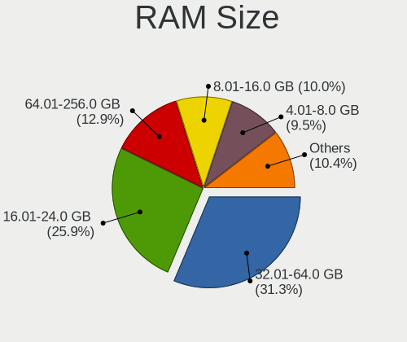
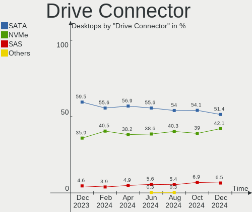
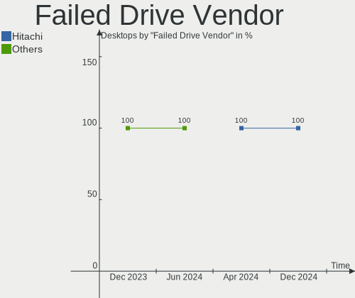
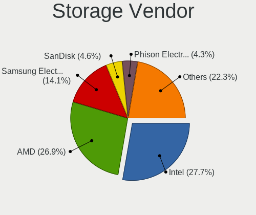
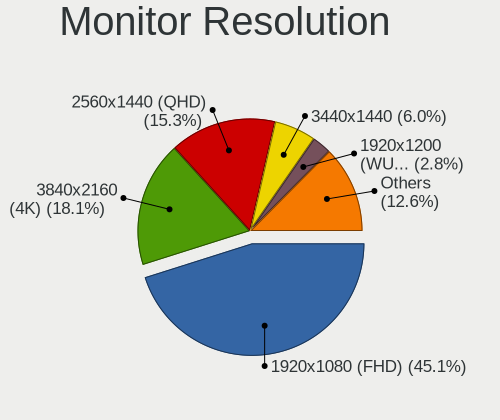

Fedora Hardware Trends (Desktop)
--------------------------------

A project to identify most popular hardware characteristics and track their change
over time based on data collected by Fedora users at https://Linux-Hardware.org.

Anyone can contribute to the study by uploading probes of their computers by
the [hw-probe](https://github.com/linuxhw/hw-probe) tool:

    sudo -E hw-probe -all -upload

Full-feature report is available here: https://linux-hardware.org/?view=trends&formfactor=desktop

Period: May, 2020.

Contents
--------

- [ OS                       ](#os)
- [ OS Family                ](#os-family)
- [ Kernel                   ](#kernel)
- [ Kernel Family            ](#kernel-family)
- [ Kernel Major Ver.        ](#kernel-major-ver)
- [ Arch                     ](#arch)
- [ DE                       ](#de)
- [ Display Server           ](#display-server)
- [ Display Manager          ](#display-manager)
- [ OS Lang                  ](#os-lang)
- [ Boot Mode                ](#boot-mode)
- [ Filesystem               ](#filesystem)
- [ Part. scheme             ](#part-scheme)
- [ Dual Boot with Linux/BSD ](#dual-boot-with-linux/bsd)
- [ Dual Boot (Win)          ](#dual-boot-win)
- [ Country                  ](#country)
- [ City                     ](#city)
- [ Vendor                   ](#vendor)
- [ Model                    ](#model)
- [ Model Family             ](#model-family)
- [ MFG Year                 ](#mfg-year)
- [ Form Factor              ](#form-factor)
- [ Secure Boot              ](#secure-boot)
- [ Coreboot                 ](#coreboot)
- [ RAM Size                 ](#ram-size)
- [ RAM Used                 ](#ram-used)
- [ Drive Vendor             ](#drive-vendor)
- [ Drive Model              ](#drive-model)
- [ Drive Kind               ](#drive-kind)
- [ Drive Connector          ](#drive-connector)
- [ Drive Size               ](#drive-size)
- [ Space Total              ](#space-total)
- [ Space Used               ](#space-used)
- [ Malfunc. Drives          ](#malfunc-drives)
- [ Malfunc. Drive Vendor    ](#malfunc-drive-vendor)
- [ Malfunc. Drive Kind      ](#malfunc-drive-kind)
- [ Failed Drives            ](#failed-drives)
- [ Failed Drive Vendor      ](#failed-drive-vendor)
- [ Drive Status             ](#drive-status)
- [ Storage Vendor           ](#storage-vendor)
- [ Storage Model            ](#storage-model)
- [ Storage Kind             ](#storage-kind)
- [ CPU Vendor               ](#cpu-vendor)
- [ CPU Model                ](#cpu-model)
- [ CPU Model Family         ](#cpu-model-family)
- [ CPU Cores                ](#cpu-cores)
- [ CPU Sockets              ](#cpu-sockets)
- [ CPU Threads              ](#cpu-threads)
- [ CPU Op-Modes             ](#cpu-op-modes)
- [ CPU Microcode            ](#cpu-microcode)
- [ CPU Microarch            ](#cpu-microarch)
- [ GPU Vendor               ](#gpu-vendor)
- [ GPU Model                ](#gpu-model)
- [ GPU Combo                ](#gpu-combo)
- [ GPU Driver               ](#gpu-driver)
- [ GPU Memory               ](#gpu-memory)
- [ Monitor Vendor           ](#monitor-vendor)
- [ Monitor Model            ](#monitor-model)
- [ Monitor Resolution       ](#monitor-resolution)
- [ Monitor Diagonal         ](#monitor-diagonal)
- [ Monitor Width            ](#monitor-width)
- [ Aspect Ratio             ](#aspect-ratio)
- [ Monitor Area             ](#monitor-area)
- [ Pixel Density            ](#pixel-density)
- [ Multiple Monitors        ](#multiple-monitors)
- [ Net Controller Vendor    ](#net-controller-vendor)
- [ Net Controller Model     ](#net-controller-model)
- [ Net Controller Kind      ](#net-controller-kind)
- [ Used Controller          ](#used-controller)
- [ NICs                     ](#nics)
- [ Unsupported Devices      ](#unsupported-devices)
- [ Unsupported Device Types ](#unsupported-device-types)

OS
--

Installed operating systems

| Name      | Computers | Percent |
|-----------|-----------|---------|
| Fedora 32 | 65        | 75.58%  |
| Fedora 31 | 16        | 18.6%   |
| Fedora 30 | 3         | 3.49%   |
| Fedora 28 | 1         | 1.16%   |
| Fedora 24 | 1         | 1.16%   |

OS Family
---------

OS without a version

| Name   | Computers | Percent |
|--------|-----------|---------|
| Fedora | 86        | 100%    |

Kernel
------

Version of the Linux kernel

| Version                 | Computers | Percent |
|-------------------------|-----------|---------|
| 5.6.8-300.fc32.x86_64   | 16        | 18.6%   |
| 5.6.14-300.fc32.x86_64  | 10        | 11.63%  |
| 5.6.13-300.fc32.x86_64  | 10        | 11.63%  |
| 5.6.12-300.fc32.x86_64  | 8         | 9.3%    |
| 5.6.10-300.fc32.x86_64  | 7         | 8.14%   |
| 5.6.7-300.fc32.x86_64   | 5         | 5.81%   |
| 5.6.11-300.fc32.x86_64  | 5         | 5.81%   |
| 5.6.8-200.fc31.x86_64   | 3         | 3.49%   |
| 5.6.7-200.fc31.x86_64   | 3         | 3.49%   |
| 5.6.6-300.fc32.x86_64   | 3         | 3.49%   |
| 5.6.13-200.fc31.x86_64  | 3         | 3.49%   |
| 5.6.11-200.fc31.x86_64  | 3         | 3.49%   |
| 5.5.17-200.fc31.x86_64  | 2         | 2.33%   |
| 5.6.8-100.fc30.x86_64   | 1         | 1.16%   |
| 5.6.12-200.fc31.x86_64  | 1         | 1.16%   |
| 5.6.11-100.fc30.x86_64  | 1         | 1.16%   |
| 5.6.11-100.fc30.i686    | 1         | 1.16%   |
| 5.4.17-200.fc31.x86_64  | 1         | 1.16%   |
| 5.3.16-300.fc31.x86_64  | 1         | 1.16%   |
| 5.0.16-100.fc28.x86_64  | 1         | 1.16%   |
| 4.11.12-100.fc24.x86_64 | 1         | 1.16%   |

Kernel Family
-------------

Linux kernel without a distro release

| Version | Computers | Percent |
|---------|-----------|---------|
| 5.6.8   | 20        | 23.26%  |
| 5.6.13  | 13        | 15.12%  |
| 5.6.14  | 10        | 11.63%  |
| 5.6.11  | 10        | 11.63%  |
| 5.6.12  | 9         | 10.47%  |
| 5.6.7   | 8         | 9.3%    |
| 5.6.10  | 7         | 8.14%   |
| 5.6.6   | 3         | 3.49%   |
| 5.5.17  | 2         | 2.33%   |
| 5.4.17  | 1         | 1.16%   |
| 5.3.16  | 1         | 1.16%   |
| 5.0.16  | 1         | 1.16%   |
| 4.11.12 | 1         | 1.16%   |

Kernel Major Ver.
-----------------

Linux kernel major version

| Version | Computers | Percent |
|---------|-----------|---------|
| 5.6     | 80        | 93.02%  |
| 5.5     | 2         | 2.33%   |
| 5.4     | 1         | 1.16%   |
| 5.3     | 1         | 1.16%   |
| 5.0     | 1         | 1.16%   |
| 4.11    | 1         | 1.16%   |

Arch
----

OS architecture (x86_64, i586, etc.)

| Name   | Computers | Percent |
|--------|-----------|---------|
| x86_64 | 85        | 98.84%  |
| i686   | 1         | 1.16%   |

DE
--

Desktop Environment

| Name       | Computers | Percent |
|------------|-----------|---------|
| GNOME      | 67        | 77.91%  |
| KDE        | 5         | 5.81%   |
| KDE5       | 4         | 4.65%   |
| X-Cinnamon | 3         | 3.49%   |
| Cinnamon   | 3         | 3.49%   |
| XFCE       | 1         | 1.16%   |
| MATE       | 1         | 1.16%   |
| LXDE       | 1         | 1.16%   |
| Unknown    | 1         | 1.16%   |

Display Server
--------------

X11 or Wayland

| Name    | Computers | Percent |
|---------|-----------|---------|
| Wayland | 44        | 51.16%  |
| X11     | 39        | 45.35%  |
| Tty     | 3         | 3.49%   |

Display Manager
---------------

SDDM, LightDM, etc.

| Name    | Computers | Percent |
|---------|-----------|---------|
| Unknown | 59        | 68.6%   |
| GDM     | 18        | 20.93%  |
| LightDM | 5         | 5.81%   |
| SDDM    | 3         | 3.49%   |
| XDM     | 1         | 1.16%   |

OS Lang
-------

Language

| Lang       | Computers | Percent |
|------------|-----------|---------|
| en_US      | 41        | 47.67%  |
| pt_BR      | 6         | 6.98%   |
| de_DE      | 6         | 6.98%   |
| en_AU      | 5         | 5.81%   |
| ru_RU      | 3         | 3.49%   |
| fr_FR      | 3         | 3.49%   |
| en_GB      | 3         | 3.49%   |
| uk_UA      | 2         | 2.33%   |
| it_IT      | 2         | 2.33%   |
| en_CA      | 2         | 2.33%   |
| Unknown    | 2         | 2.33%   |
| sv_SE      | 1         | 1.16%   |
| ru_RU.utf8 | 1         | 1.16%   |
| pl_PL      | 1         | 1.16%   |
| nl_BE.utf8 | 1         | 1.16%   |
| ko_KR      | 1         | 1.16%   |
| ja_JP      | 1         | 1.16%   |
| es_ES      | 1         | 1.16%   |
| en_US.utf8 | 1         | 1.16%   |
| en_NZ      | 1         | 1.16%   |
| en_IE      | 1         | 1.16%   |
| de_AT      | 1         | 1.16%   |

Boot Mode
---------

EFI or BIOS

| Mode | Computers | Percent |
|------|-----------|---------|
| BIOS | 48        | 55.81%  |
| EFI  | 38        | 44.19%  |

Filesystem
----------

Type of filesystem

| Type | Computers | Percent |
|------|-----------|---------|
| Ext4 | 78        | 90.7%   |
| Xfs  | 8         | 9.3%    |

Part. scheme
------------

Scheme of partitioning

| Type    | Computers | Percent |
|---------|-----------|---------|
| Unknown | 73        | 84.88%  |
| GPT     | 8         | 9.3%    |
| MBR     | 5         | 5.81%   |

Dual Boot with Linux/BSD
------------------------

Hosting more than one Linux/BSD

| Dual boot | Computers | Percent |
|-----------|-----------|---------|
| No        | 76        | 88.37%  |
| Yes       | 10        | 11.63%  |

Dual Boot (Win)
---------------

Hosting Linux and Windows

| Dual boot | Computers | Percent |
|-----------|-----------|---------|
| No        | 71        | 82.56%  |
| Yes       | 15        | 17.44%  |

Country
-------

Geographic location (country)

| Country             | Computers | Percent |
|---------------------|-----------|---------|
| USA                 | 21        | 24.42%  |
| Brazil              | 7         | 8.14%   |
| Russia              | 6         | 6.98%   |
| Germany             | 6         | 6.98%   |
| Canada              | 5         | 5.81%   |
| Australia           | 5         | 5.81%   |
| Ukraine             | 3         | 3.49%   |
| UK                  | 3         | 3.49%   |
| France              | 3         | 3.49%   |
| Sweden              | 2         | 2.33%   |
| Japan               | 2         | 2.33%   |
| Italy               | 2         | 2.33%   |
| Trinidad and Tobago | 1         | 1.16%   |
| Spain               | 1         | 1.16%   |
| Serbia              | 1         | 1.16%   |
| Portugal            | 1         | 1.16%   |
| Poland              | 1         | 1.16%   |
| Norway              | 1         | 1.16%   |
| North Macedonia     | 1         | 1.16%   |
| New Zealand         | 1         | 1.16%   |
| Myanmar             | 1         | 1.16%   |
| Korea, Republic of  | 1         | 1.16%   |
| Ireland             | 1         | 1.16%   |
| India               | 1         | 1.16%   |
| Greece              | 1         | 1.16%   |
| Finland             | 1         | 1.16%   |
| Egypt               | 1         | 1.16%   |
| Czech Republic      | 1         | 1.16%   |
| Croatia             | 1         | 1.16%   |
| Colombia            | 1         | 1.16%   |
| China               | 1         | 1.16%   |
| Belgium             | 1         | 1.16%   |
| Austria             | 1         | 1.16%   |

City
----

Geographic location (city)

| City              | Computers | Percent |
|-------------------|-----------|---------|
| St Petersburg     | 2         | 2.33%   |
| Nantes            | 2         | 2.33%   |
| Moscow            | 2         | 2.33%   |
| Hornsby           | 2         | 2.33%   |
| Berlin            | 2         | 2.33%   |
| Čačak           | 1         | 1.16%   |
| Yur'yivka         | 1         | 1.16%   |
| Yokohama          | 1         | 1.16%   |
| Yangon            | 1         | 1.16%   |
| Watford           | 1         | 1.16%   |
| Washington        | 1         | 1.16%   |
| Wahroonga         | 1         | 1.16%   |
| Vienna            | 1         | 1.16%   |
| Vialonga          | 1         | 1.16%   |
| Venarotta         | 1         | 1.16%   |
| Vancouver         | 1         | 1.16%   |
| Urangsvag         | 1         | 1.16%   |
| Theodore          | 1         | 1.16%   |
| Sydney            | 1         | 1.16%   |
| Spring            | 1         | 1.16%   |
| Sosnowiec         | 1         | 1.16%   |
| So Paulo          | 1         | 1.16%   |
| Skopje            | 1         | 1.16%   |
| Sechelt           | 1         | 1.16%   |
| Secaucus          | 1         | 1.16%   |
| Saitama           | 1         | 1.16%   |
| Rural Valley      | 1         | 1.16%   |
| Rozovka           | 1         | 1.16%   |
| Royal Oak         | 1         | 1.16%   |
| Rostock           | 1         | 1.16%   |
| Rio de Janeiro    | 1         | 1.16%   |
| Ribeirão Preto   | 1         | 1.16%   |
| Reno              | 1         | 1.16%   |
| Regina            | 1         | 1.16%   |
| Raleigh           | 1         | 1.16%   |
| Prairie du Chien  | 1         | 1.16%   |
| Prague            | 1         | 1.16%   |
| Port of Spain     | 1         | 1.16%   |
| Oshawa            | 1         | 1.16%   |
| Odesa             | 1         | 1.16%   |
| Nizhniy Novgorod  | 1         | 1.16%   |
| Mulgrave          | 1         | 1.16%   |
| Mississauga       | 1         | 1.16%   |
| Miami             | 1         | 1.16%   |
| Medellín         | 1         | 1.16%   |
| Mechelen          | 1         | 1.16%   |
| Lynnwood          | 1         | 1.16%   |
| Lubbock           | 1         | 1.16%   |
| Lochgilphead      | 1         | 1.16%   |
| Landsberg am Lech | 1         | 1.16%   |
| La Mesa           | 1         | 1.16%   |
| Jönköping       | 1         | 1.16%   |
| Jaboticabal       | 1         | 1.16%   |
| Houghton Lake     | 1         | 1.16%   |
| Helsinki          | 1         | 1.16%   |
| Gwangju           | 1         | 1.16%   |
| Gurgaon           | 1         | 1.16%   |
| Glendale          | 1         | 1.16%   |
| Gainesville       | 1         | 1.16%   |
| Finchley          | 1         | 1.16%   |

Vendor
------

Motherboard manufacturer

| Name                | Computers | Percent |
|---------------------|-----------|---------|
| ASUSTek Computer    | 24        | 27.91%  |
| Gigabyte Technology | 20        | 23.26%  |
| ASRock              | 13        | 15.12%  |
| Dell                | 9         | 10.47%  |
| MSI                 | 7         | 8.14%   |
| Hewlett-Packard     | 4         | 4.65%   |
| Lenovo              | 2         | 2.33%   |
| Intel               | 2         | 2.33%   |
| Shuttle             | 1         | 1.16%   |
| Gateway             | 1         | 1.16%   |
| Alienware           | 1         | 1.16%   |
| Acer                | 1         | 1.16%   |
| Unknown             | 1         | 1.16%   |

Model
-----

Motherboard model

| Name                               | Computers | Percent |
|------------------------------------|-----------|---------|
| Gigabyte H55M-S2V                  | 2         | 2.33%   |
| Gigabyte GA-78LMT-USB3 6.0         | 2         | 2.33%   |
| Gigabyte B450M DS3H                | 2         | 2.33%   |
| ASUS M5A97 R2.0                    | 2         | 2.33%   |
| ASUS All Series                    | 2         | 2.33%   |
| ASRock A320M-HDV R4.0              | 2         | 2.33%   |
| Shuttle XH61V                      | 1         | 1.16%   |
| MSI MS-7C37                        | 1         | 1.16%   |
| MSI MS-7B07                        | 1         | 1.16%   |
| MSI MS-7A72                        | 1         | 1.16%   |
| MSI MS-7850                        | 1         | 1.16%   |
| MSI MS-7721                        | 1         | 1.16%   |
| MSI MS-7693                        | 1         | 1.16%   |
| MSI Hyrican PC                     | 1         | 1.16%   |
| Lenovo ThinkCentre M93p 10A7000BUS | 1         | 1.16%   |
| Lenovo ThinkCentre M58p 7220A72    | 1         | 1.16%   |
| Intel KBL-R MRD                    | 1         | 1.16%   |
| Intel DH55TC AAE70932-206          | 1         | 1.16%   |
| HP Z820 Workstation                | 1         | 1.16%   |
| HP Pavilion Desktop 590-a0xxx      | 1         | 1.16%   |
| HP EliteDesk 800 G1 DM             | 1         | 1.16%   |
| HP 23-h024                         | 1         | 1.16%   |
| Gigabyte Z77MX-D3H                 | 1         | 1.16%   |
| Gigabyte Z370M AORUS Gaming        | 1         | 1.16%   |
| Gigabyte X58A-UD3R                 | 1         | 1.16%   |
| Gigabyte X570 AORUS PRO            | 1         | 1.16%   |
| Gigabyte H77N-WIFI                 | 1         | 1.16%   |
| Gigabyte H55M-S2H                  | 1         | 1.16%   |
| Gigabyte GA-MA790X-UD4             | 1         | 1.16%   |
| Gigabyte GA-990FXA-UD3             | 1         | 1.16%   |
| Gigabyte G31M-ES2L                 | 1         | 1.16%   |
| Gigabyte F2A68HM-H                 | 1         | 1.16%   |
| Gigabyte F2A58M-HD2                | 1         | 1.16%   |
| Gigabyte AX370-Gaming K7           | 1         | 1.16%   |
| Gigabyte 990XA-UD3                 | 1         | 1.16%   |
| Gigabyte 970A-DS3P                 | 1         | 1.16%   |
| Gateway SX2185                     | 1         | 1.16%   |
| Dell XPS420                        | 1         | 1.16%   |
| Dell XPS 8300                      | 1         | 1.16%   |
| Dell Precision WorkStation T3400   | 1         | 1.16%   |
| Dell PowerEdge T30                 | 1         | 1.16%   |
| Dell OptiPlex 9020                 | 1         | 1.16%   |
| Dell OptiPlex 790                  | 1         | 1.16%   |
| Dell OptiPlex 7060                 | 1         | 1.16%   |
| Dell OptiPlex 7020                 | 1         | 1.16%   |
| Dell Inspiron 660                  | 1         | 1.16%   |
| ASUS Z170I PRO GAMING              | 1         | 1.16%   |
| ASUS Z170-A                        | 1         | 1.16%   |
| ASUS ROG STRIX X470-F GAMING       | 1         | 1.16%   |
| ASUS ROG Maximus XI HERO           | 1         | 1.16%   |
| ASUS PRIME X470-PRO                | 1         | 1.16%   |
| ASUS PRIME B350M-A                 | 1         | 1.16%   |
| ASUS PRIME B350-PLUS               | 1         | 1.16%   |
| ASUS P8P67 DELUXE                  | 1         | 1.16%   |
| ASUS P8H77-V LE                    | 1         | 1.16%   |
| ASUS P8H61-M LX3 R2.0              | 1         | 1.16%   |
| ASUS P7P55 LX                      | 1         | 1.16%   |
| ASUS P5KPL/1600                    | 1         | 1.16%   |
| ASUS P5KPL-AM                      | 1         | 1.16%   |
| ASUS M5A99X EVO R2.0               | 1         | 1.16%   |

Model Family
------------

Motherboard model prefix

| Name                   | Computers | Percent |
|------------------------|-----------|---------|
| Dell OptiPlex          | 4         | 4.65%   |
| ASUS PRIME             | 3         | 3.49%   |
| Lenovo ThinkCentre     | 2         | 2.33%   |
| Gigabyte H55M-S2V      | 2         | 2.33%   |
| Gigabyte GA-78LMT-USB3 | 2         | 2.33%   |
| Gigabyte B450M         | 2         | 2.33%   |
| ASUS ROG               | 2         | 2.33%   |
| ASUS M5A99X            | 2         | 2.33%   |
| ASUS M5A97             | 2         | 2.33%   |
| ASUS All               | 2         | 2.33%   |
| ASRock X370            | 2         | 2.33%   |
| ASRock B450            | 2         | 2.33%   |
| ASRock A320M-HDV       | 2         | 2.33%   |
| Shuttle XH61V          | 1         | 1.16%   |
| MSI MS-7C37            | 1         | 1.16%   |
| MSI MS-7B07            | 1         | 1.16%   |
| MSI MS-7A72            | 1         | 1.16%   |
| MSI MS-7850            | 1         | 1.16%   |
| MSI MS-7721            | 1         | 1.16%   |
| MSI MS-7693            | 1         | 1.16%   |
| MSI Hyrican            | 1         | 1.16%   |
| Intel KBL-R            | 1         | 1.16%   |
| Intel DH55TC           | 1         | 1.16%   |
| HP Z820                | 1         | 1.16%   |
| HP Pavilion            | 1         | 1.16%   |
| HP EliteDesk           | 1         | 1.16%   |
| HP 23-h024             | 1         | 1.16%   |
| Gigabyte Z77MX-D3H     | 1         | 1.16%   |
| Gigabyte Z370M         | 1         | 1.16%   |
| Gigabyte X58A-UD3R     | 1         | 1.16%   |
| Gigabyte X570          | 1         | 1.16%   |
| Gigabyte H77N-WIFI     | 1         | 1.16%   |
| Gigabyte H55M-S2H      | 1         | 1.16%   |
| Gigabyte GA-MA790X-UD4 | 1         | 1.16%   |
| Gigabyte GA-990FXA-UD3 | 1         | 1.16%   |
| Gigabyte G31M-ES2L     | 1         | 1.16%   |
| Gigabyte F2A68HM-H     | 1         | 1.16%   |
| Gigabyte F2A58M-HD2    | 1         | 1.16%   |
| Gigabyte AX370-Gaming  | 1         | 1.16%   |
| Gigabyte 990XA-UD3     | 1         | 1.16%   |
| Gigabyte 970A-DS3P     | 1         | 1.16%   |
| Gateway SX2185         | 1         | 1.16%   |
| Dell XPS420            | 1         | 1.16%   |
| Dell XPS               | 1         | 1.16%   |
| Dell Precision         | 1         | 1.16%   |
| Dell PowerEdge         | 1         | 1.16%   |
| Dell Inspiron          | 1         | 1.16%   |
| ASUS Z170I             | 1         | 1.16%   |
| ASUS Z170-A            | 1         | 1.16%   |
| ASUS P8P67             | 1         | 1.16%   |
| ASUS P8H77-V           | 1         | 1.16%   |
| ASUS P8H61-M           | 1         | 1.16%   |
| ASUS P7P55             | 1         | 1.16%   |
| ASUS P5KPL-AM          | 1         | 1.16%   |
| ASUS P5KPL             | 1         | 1.16%   |
| ASUS M5A78L-M          | 1         | 1.16%   |
| ASUS M3A78-T           | 1         | 1.16%   |
| ASUS H110M-A           | 1         | 1.16%   |
| ASUS B150M-C           | 1         | 1.16%   |
| ASUS A58M-K            | 1         | 1.16%   |

MFG Year
--------

Motherboard manufacture year

| Year | Computers | Percent |
|------|-----------|---------|
| 2019 | 17        | 19.77%  |
| 2014 | 11        | 12.79%  |
| 2018 | 10        | 11.63%  |
| 2015 | 8         | 9.3%    |
| 2013 | 7         | 8.14%   |
| 2017 | 5         | 5.81%   |
| 2016 | 5         | 5.81%   |
| 2012 | 5         | 5.81%   |
| 2010 | 5         | 5.81%   |
| 2011 | 4         | 4.65%   |
| 2020 | 3         | 3.49%   |
| 2009 | 3         | 3.49%   |
| 2008 | 3         | 3.49%   |

Form Factor
-----------

Physical design of the computer

| Name    | Computers | Percent |
|---------|-----------|---------|
| Desktop | 86        | 100%    |

Secure Boot
-----------

Enabled or disabled

| State    | Computers | Percent |
|----------|-----------|---------|
| Disabled | 79        | 91.86%  |
| Enabled  | 7         | 8.14%   |

Coreboot
--------

Have coreboot on board

| Used | Computers | Percent |
|------|-----------|---------|
| No   | 86        | 100%    |

RAM Size
--------

Total RAM memory

| Size in GB  | Computers | Percent |
|-------------|-----------|---------|
| 16.01-24.0  | 21        | 24.42%  |
| 8.01-16.0   | 20        | 23.26%  |
| 4.01-8.0    | 18        | 20.93%  |
| 32.01-64.0  | 15        | 17.44%  |
| 3.01-4.0    | 7         | 8.14%   |
| 64.01-256.0 | 3         | 3.49%   |
| 24.01-32.0  | 1         | 1.16%   |
| 2.01-3.0    | 1         | 1.16%   |

RAM Used
--------

Used RAM memory

| Used GB   | Computers | Percent |
|-----------|-----------|---------|
| 4.01-8.0  | 25        | 29.07%  |
| 2.01-3.0  | 25        | 29.07%  |
| 3.01-4.0  | 15        | 17.44%  |
| 1.01-2.0  | 14        | 16.28%  |
| 8.01-16.0 | 4         | 4.65%   |
| 0.01-1.0  | 3         | 3.49%   |

Drive Vendor
------------

Hard drive vendors

| Vendor              | Computers | Drives | Percent |
|---------------------|-----------|--------|---------|
| WDC                 | 32        | 40     | 21.33%  |
| Seagate             | 23        | 29     | 15.33%  |
| Samsung Electronics | 23        | 30     | 15.33%  |
| Toshiba             | 11        | 11     | 7.33%   |
| Kingston            | 10        | 11     | 6.67%   |
| SanDisk             | 7         | 7      | 4.67%   |
| Hitachi             | 6         | 7      | 4%      |
| A-DATA Technology   | 6         | 6      | 4%      |
| Crucial             | 5         | 5      | 3.33%   |
| Intel               | 4         | 4      | 2.67%   |
| HGST                | 3         | 3      | 2%      |
| Unknown             | 2         | 2      | 1.33%   |
| Team                | 2         | 2      | 1.33%   |
| PNY                 | 2         | 2      | 1.33%   |
| Leven               | 2         | 2      | 1.33%   |
| Corsair             | 2         | 2      | 1.33%   |
| StoreJet            | 1         | 1      | 0.67%   |
| Patriot             | 1         | 1      | 0.67%   |
| OCZ                 | 1         | 1      | 0.67%   |
| MG                  | 1         | 1      | 0.67%   |
| Maxtor              | 1         | 1      | 0.67%   |
| KESU                | 1         | 1      | 0.67%   |
| Hewlett-Packard     | 1         | 1      | 0.67%   |
| GOODRAM             | 1         | 1      | 0.67%   |
| China               | 1         | 2      | 0.67%   |
| ASMT109x            | 1         | 1      | 0.67%   |

Drive Model
-----------

Hard drive models

| Model                        | Computers | Percent |
|------------------------------|-----------|---------|
| DT01ACA100 1TB               | 5         | 2.87%   |
| SSD 860 EVO 500GB            | 4         | 2.3%    |
| SSD 850 EVO 250GB            | 4         | 2.3%    |
| SA400S37240G 240GB SSD       | 4         | 2.3%    |
| WD40EZRZ-00GXCB0 4TB         | 2         | 1.15%   |
| WD40EFRX-68N32N0 4TB         | 2         | 1.15%   |
| WD10EZEX-21M2NA0 1TB         | 2         | 1.15%   |
| WD10EZEX-08WN4A0 1TB         | 2         | 1.15%   |
| ST3500413AS 500GB            | 2         | 1.15%   |
| ST31000528AS 1TB             | 2         | 1.15%   |
| ST31000524AS 1TB             | 2         | 1.15%   |
| ST2000DM001-1ER164 2TB       | 2         | 1.15%   |
| ST2000DM001-1CH164 2TB       | 2         | 1.15%   |
| ST1000DM003-1CH162 1TB       | 2         | 1.15%   |
| SSD PLUS 120GB               | 2         | 1.15%   |
| SSD 860 EVO 1TB              | 2         | 1.15%   |
| SSD 850 EVO 500GB            | 2         | 1.15%   |
| M3 Portable 1TB              | 2         | 1.15%   |
| JAJS300M120C 120GB           | 2         | 1.15%   |
| WDS500G2B0B-00YS70 500GB SSD | 1         | 0.57%   |
| WDS500G2B0A-00SM50 500GB SSD | 1         | 0.57%   |
| WDS480G2G0A-00JH30 480GB SSD | 1         | 0.57%   |
| WDS250G2B0A-00SM50 250GB SSD | 1         | 0.57%   |
| WDS240G2G0A-00JH30 240GB SSD | 1         | 0.57%   |
| WDS100T2B0A-00SM50 1TB SSD   | 1         | 0.57%   |
| WD80EFAX-68LHPN0 8TB         | 1         | 0.57%   |
| WD8000AARS-00Y5B1 800GB      | 1         | 0.57%   |
| WD7500BPKT-22PK4T0 752GB     | 1         | 0.57%   |
| WD6400AAKS-22A7B2 640GB      | 1         | 0.57%   |
| WD5000BEVT-00ZAT0 500GB      | 1         | 0.57%   |
| WD5000AZRX-00L4HB0 500GB     | 1         | 0.57%   |
| WD5000AAKS-22A7B2 500GB      | 1         | 0.57%   |
| WD5000AAKS-00TMA0 500GB      | 1         | 0.57%   |
| WD5000AAKS-00A7B2 500GB      | 1         | 0.57%   |
| WD30EZRX-00DC0B0 3TB         | 1         | 0.57%   |
| WD30EFRX-68AX9N0 3TB         | 1         | 0.57%   |
| WD2500BEVT-22ZCT0 250GB      | 1         | 0.57%   |
| WD2500AAKS-00L9A0 250GB      | 1         | 0.57%   |
| WD20EZRZ-00Z5HB0 2TB         | 1         | 0.57%   |
| WD20EFRX-68EUZN0 2TB         | 1         | 0.57%   |
| WD2003FZEX-00Z4SA0 2TB       | 1         | 0.57%   |
| WD1200JS-00MHB1 120GB        | 1         | 0.57%   |
| WD10JPVX-75JC3T0 1TB         | 1         | 0.57%   |
| WD10EZEX-60ZF5A0 1TB         | 1         | 0.57%   |
| WD10EZEX-60M2NA0 1TB         | 1         | 0.57%   |
| WD10EZEX-08RKKA0 1TB         | 1         | 0.57%   |
| WD10EZEX-00ZF5A0 1TB         | 1         | 0.57%   |
| WD10EZEX-00MFCA0 1TB         | 1         | 0.57%   |
| WD10EZEX-00BN5A0 1TB         | 1         | 0.57%   |
| WD10EFRX-68PJCN0 1TB         | 1         | 0.57%   |
| WD10EADS-00L5B1 1TB          | 1         | 0.57%   |
| USB 3.0 752GB                | 1         | 0.57%   |
| TS120GESD220C 120GB          | 1         | 0.57%   |
| TEAML5Lite3D240G 240GB SSD   | 1         | 0.57%   |
| TEAML5Lite3D120G 120GB SSD   | 1         | 0.57%   |
| SX8200PNP 512GB              | 1         | 0.57%   |
| SV300S37A240G 240GB SSD      | 1         | 0.57%   |
| SUV500MS480G 480GB SSD       | 1         | 0.57%   |
| SUV400S37960G 960GB SSD      | 1         | 0.57%   |
| SU800 SSD                    | 1         | 0.57%   |

Drive Kind
----------

HDD or SSD

| Kind    | Computers | Drives | Percent |
|---------|-----------|--------|---------|
| HDD     | 56        | 92     | 46.28%  |
| SSD     | 55        | 72     | 45.45%  |
| NVMe    | 5         | 5      | 4.13%   |
| Unknown | 5         | 5      | 4.13%   |

Drive Connector
---------------

SATA, SAS, NVMe, etc.

| Type | Computers | Drives | Percent |
|------|-----------|--------|---------|
| SATA | 83        | 162    | 87.37%  |
| SAS  | 7         | 7      | 7.37%   |
| NVMe | 5         | 5      | 5.26%   |

Drive Size
----------

Size of hard drive

| Size in TB | Computers | Drives | Percent |
|------------|-----------|--------|---------|
| 0.01-0.5   | 67        | 97     | 49.26%  |
| 0.51-1.0   | 40        | 47     | 29.41%  |
| 1.01-2.0   | 14        | 15     | 10.29%  |
| 3.01-4.0   | 8         | 8      | 5.88%   |
| 2.01-3.0   | 4         | 4      | 2.94%   |
| 4.01-10.0  | 3         | 3      | 2.21%   |

Space Total
-----------

Amount of disk space available on the file system

| Size in GB     | Computers | Percent |
|----------------|-----------|---------|
| 101-250        | 18        | 20.93%  |
| 1001-2000      | 16        | 18.6%   |
| 251-500        | 15        | 17.44%  |
| 501-1000       | 13        | 15.12%  |
| More than 3000 | 10        | 11.63%  |
| 2001-3000      | 9         | 10.47%  |
| 51-100         | 3         | 3.49%   |
| 1-20           | 1         | 1.16%   |
| Unknown        | 1         | 1.16%   |

Space Used
----------

Amount of used disk space

| Used GB        | Computers | Percent |
|----------------|-----------|---------|
| 251-500        | 16        | 18.6%   |
| 21-50          | 14        | 16.28%  |
| 101-250        | 13        | 15.12%  |
| 51-100         | 12        | 13.95%  |
| 1-20           | 9         | 10.47%  |
| 501-1000       | 9         | 10.47%  |
| 1001-2000      | 8         | 9.3%    |
| More than 3000 | 3         | 3.49%   |
| 2001-3000      | 1         | 1.16%   |
| Unknown        | 1         | 1.16%   |

Malfunc. Drives
---------------

Drive models with a malfunction

| Model                   | Computers | Drives | Percent |
|-------------------------|-----------|--------|---------|
| WD8000AARS-00Y5B1 800GB | 1         | 1      | 8.33%   |
| WD5000AAKS-22A7B2 500GB | 1         | 1      | 8.33%   |
| WD5000AAKS-00TMA0 500GB | 1         | 1      | 8.33%   |
| WD10EZEX-60M2NA0 1TB    | 1         | 1      | 8.33%   |
| WD10EZEX-00MFCA0 1TB    | 1         | 1      | 8.33%   |
| ST3160827AS 160GB       | 1         | 1      | 8.33%   |
| SSDSC2BW120H6 120GB     | 1         | 1      | 8.33%   |
| SSDSC2BW120A4 120GB     | 1         | 1      | 8.33%   |
| SSD PLUS 480GB          | 1         | 1      | 8.33%   |
| MQ02ABD100H 1TB         | 1         | 1      | 8.33%   |
| HDS721050CLA362 500GB   | 1         | 1      | 8.33%   |
| 6L200M0 208GB           | 1         | 1      | 8.33%   |

Malfunc. Drive Vendor
---------------------

Vendors of faulty drives

| Vendor  | Computers | Drives | Percent |
|---------|-----------|--------|---------|
| WDC     | 5         | 5      | 41.67%  |
| Intel   | 2         | 2      | 16.67%  |
| Toshiba | 1         | 1      | 8.33%   |
| Seagate | 1         | 1      | 8.33%   |
| SanDisk | 1         | 1      | 8.33%   |
| Maxtor  | 1         | 1      | 8.33%   |
| Hitachi | 1         | 1      | 8.33%   |

Malfunc. Drive Kind
-------------------

Kinds of faulty drives

| Kind | Computers | Drives | Percent |
|------|-----------|--------|---------|
| HDD  | 9         | 9      | 75%     |
| SSD  | 3         | 3      | 25%     |

Failed Drives
-------------

Failed drive models

| Model                   | Computers | Drives | Percent |
|-------------------------|-----------|--------|---------|
| WD5000BEVT-00ZAT0 500GB | 1         | 1      | 50%     |
| HDWD130 3TB             | 1         | 1      | 50%     |

Failed Drive Vendor
-------------------

Failed drive vendors

| Vendor  | Computers | Drives | Percent |
|---------|-----------|--------|---------|
| WDC     | 1         | 1      | 50%     |
| Toshiba | 1         | 1      | 50%     |

Drive Status
------------

Number of failed and malfunc. drives

| Status   | Computers | Drives | Percent |
|----------|-----------|--------|---------|
| Detected | 58        | 113    | 62.37%  |
| Works    | 24        | 47     | 25.81%  |
| Malfunc  | 10        | 12     | 10.75%  |
| Failed   | 1         | 2      | 1.08%   |

Storage Vendor
--------------

Storage controller vendors

| Vendor                       | Computers | Percent |
|------------------------------|-----------|---------|
| Intel                        | 46        | 41.07%  |
| AMD                          | 40        | 35.71%  |
| Samsung Electronics          | 7         | 6.25%   |
| Marvell Technology Group     | 4         | 3.57%   |
| JMicron Technology           | 4         | 3.57%   |
| ASMedia Technology           | 4         | 3.57%   |
| Silicon Motion               | 2         | 1.79%   |
| Toshiba America Info Systems | 1         | 0.89%   |
| Phison Electronics           | 1         | 0.89%   |
| Broadcom / LSI               | 1         | 0.89%   |
| ADATA Technology             | 1         | 0.89%   |
| Adaptec                      | 1         | 0.89%   |

Storage Model
-------------

Storage controller models

| Model                                                                             | Computers | Percent |
|-----------------------------------------------------------------------------------|-----------|---------|
| FCH SATA Controller [AHCI mode]                                                   | 25        | 16.56%  |
| SB7x0/SB8x0/SB9x0 SATA Controller [AHCI mode]                                     | 9         | 5.96%   |
| SB7x0/SB8x0/SB9x0 IDE Controller                                                  | 8         | 5.3%    |
| 400 Series Chipset SATA Controller                                                | 8         | 5.3%    |
| 8 Series/C220 Series Chipset Family 6-port SATA Controller 1 [AHCI mode]          | 7         | 4.64%   |
| Q170/Q150/B150/H170/H110/Z170/CM236 Chipset SATA Controller [AHCI Mode]           | 5         | 3.31%   |
| NVMe SSD Controller SM981/PM981/PM983                                             | 5         | 3.31%   |
| 9 Series Chipset Family SATA Controller [AHCI Mode]                               | 5         | 3.31%   |
| SB7x0/SB8x0/SB9x0 SATA Controller [IDE mode]                                      | 4         | 2.65%   |
| NM10/ICH7 Family SATA Controller [IDE mode]                                       | 4         | 2.65%   |
| ASM1062 Serial ATA Controller                                                     | 4         | 2.65%   |
| 6 Series/C200 Series Chipset Family 6 port Desktop SATA AHCI Controller           | 4         | 2.65%   |
| X370 Series Chipset SATA Controller                                               | 3         | 1.99%   |
| SATA Controller [RAID mode]                                                       | 3         | 1.99%   |
| FCH SATA Controller D                                                             | 3         | 1.99%   |
| 82801G (ICH7 Family) IDE Controller                                               | 3         | 1.99%   |
| 7 Series/C210 Series Chipset Family 6-port SATA Controller [AHCI mode]            | 3         | 1.99%   |
| 5 Series/3400 Series Chipset 6 port SATA AHCI Controller                          | 3         | 1.99%   |
| SSD 660P Series                                                                   | 2         | 1.32%   |
| NVMe SSD Controller SM961/PM961                                                   | 2         | 1.32%   |
| Non-Volatile memory controller                                                    | 2         | 1.32%   |
| JMB362 SATA Controller                                                            | 2         | 1.32%   |
| FCH SATA Controller [IDE mode]                                                    | 2         | 1.32%   |
| Cannon Lake PCH SATA AHCI Controller                                              | 2         | 1.32%   |
| 5 Series/3400 Series Chipset 4 port SATA IDE Controller                           | 2         | 1.32%   |
| 5 Series/3400 Series Chipset 2 port SATA IDE Controller                           | 2         | 1.32%   |
| 300 Series Chipset SATA Controller                                                | 2         | 1.32%   |
| XPG SX8200 Pro PCIe Gen3x4 M.2 2280 Solid State Drive                             | 1         | 0.66%   |
| X399 Series Chipset SATA Controller                                               | 1         | 0.66%   |
| Toshiba America Info Non-Volatile memory controller                               | 1         | 0.66%   |
| Sunrise Point-LP SATA Controller [AHCI mode]                                      | 1         | 0.66%   |
| Series 7 6G SAS/PCIe 3                                                            | 1         | 0.66%   |
| SAS2308 PCI-Express Fusion-MPT SAS-2                                              | 1         | 0.66%   |
| JMB368 IDE controller                                                             | 1         | 0.66%   |
| JMB363 SATA/IDE Controller                                                        | 1         | 0.66%   |
| FCH IDE Controller                                                                | 1         | 0.66%   |
| E12 NVMe Controller                                                               | 1         | 0.66%   |
| C602 chipset 4-Port SATA Storage Control Unit                                     | 1         | 0.66%   |
| C600/X79 series chipset SATA RAID Controller                                      | 1         | 0.66%   |
| C600/X79 series chipset IDE-r Controller                                          | 1         | 0.66%   |
| 92xx SATA 6G Controller                                                           | 1         | 0.66%   |
| 88SE91A3 SATA-600 Controller                                                      | 1         | 0.66%   |
| 88SE9172 SATA III 6Gb/s RAID Controller                                           | 1         | 0.66%   |
| 88SE9128 PCIe SATA 6 Gb/s RAID controller with HyperDuo                           | 1         | 0.66%   |
| 82801JI (ICH10 Family) SATA AHCI Controller                                       | 1         | 0.66%   |
| 82801JD/DO (ICH10 Family) SATA AHCI Controller                                    | 1         | 0.66%   |
| 82801IR/IO/IH (ICH9R/DO/DH) 6 port SATA Controller [AHCI mode]                    | 1         | 0.66%   |
| 7 Series/C210 Series Chipset Family 4-port SATA Controller [IDE mode]             | 1         | 0.66%   |
| 7 Series/C210 Series Chipset Family 2-port SATA Controller [IDE mode]             | 1         | 0.66%   |
| 6 Series/C200 Series Chipset Family Desktop SATA Controller (IDE mode, ports 4-5) | 1         | 0.66%   |
| 6 Series/C200 Series Chipset Family Desktop SATA Controller (IDE mode, ports 0-3) | 1         | 0.66%   |
| 5 Series/3400 Series Chipset PT IDER Controller                                   | 1         | 0.66%   |
| 4 Series Chipset PT IDER Controller                                               | 1         | 0.66%   |
| 200 Series PCH SATA controller [AHCI mode]                                        | 1         | 0.66%   |

Storage Kind
------------

Kind of storage controller (IDE, SATA, NVMe, SAS, ...)

| Kind | Computers | Percent |
|------|-----------|---------|
| SATA | 74        | 64.35%  |
| IDE  | 21        | 18.26%  |
| NVMe | 14        | 12.17%  |
| RAID | 5         | 4.35%   |
| SAS  | 1         | 0.87%   |

CPU Vendor
----------

Processor vendors

| Vendor | Computers | Percent |
|--------|-----------|---------|
| Intel  | 46        | 53.49%  |
| AMD    | 40        | 46.51%  |

CPU Model
---------

Processor models

| Model                                          | Computers | Percent |
|------------------------------------------------|-----------|---------|
| Intel Core i7-4790K CPU @ 4.00GHz              | 4         | 4.65%   |
| Intel Core i3 CPU 540 @ 3.07GHz                | 4         | 4.65%   |
| Intel Core i7-4790 CPU @ 3.60GHz               | 3         | 3.49%   |
| Intel Pentium CPU G4400 @ 3.30GHz              | 2         | 2.33%   |
| Intel Core i5-7600K CPU @ 3.80GHz              | 2         | 2.33%   |
| Intel Core 2 Duo CPU E8400 @ 3.00GHz           | 2         | 2.33%   |
| AMD Ryzen 9 3900X 12-Core Processor            | 2         | 2.33%   |
| AMD Ryzen 7 1700 Eight-Core Processor          | 2         | 2.33%   |
| AMD Ryzen 5 3600 6-Core Processor              | 2         | 2.33%   |
| AMD FX-8350 Eight-Core Processor               | 2         | 2.33%   |
| AMD FX-8120 Eight-Core Processor               | 2         | 2.33%   |
| AMD A6-5200 APU with Radeon HD Graphics        | 2         | 2.33%   |
| Intel Xeon CPU E5-2670 0 @ 2.60GHz             | 1         | 1.16%   |
| Intel Pentium Dual-Core CPU E5200 @ 2.50GHz    | 1         | 1.16%   |
| Intel Core i9-9900K CPU @ 3.60GHz              | 1         | 1.16%   |
| Intel Core i7-8700 CPU @ 3.20GHz               | 1         | 1.16%   |
| Intel Core i7-8550U CPU @ 1.80GHz              | 1         | 1.16%   |
| Intel Core i7-6700K CPU @ 4.00GHz              | 1         | 1.16%   |
| Intel Core i7-6700 CPU @ 3.40GHz               | 1         | 1.16%   |
| Intel Core i7-3770S CPU @ 3.10GHz              | 1         | 1.16%   |
| Intel Core i7-2600K CPU @ 3.40GHz              | 1         | 1.16%   |
| Intel Core i7-2600 CPU @ 3.40GHz               | 1         | 1.16%   |
| Intel Core i7 CPU 950 @ 3.07GHz                | 1         | 1.16%   |
| Intel Core i5-8400 CPU @ 2.80GHz               | 1         | 1.16%   |
| Intel Core i5-7500 CPU @ 3.40GHz               | 1         | 1.16%   |
| Intel Core i5-4590T CPU @ 2.00GHz              | 1         | 1.16%   |
| Intel Core i5-4570 CPU @ 3.20GHz               | 1         | 1.16%   |
| Intel Core i5-4460 CPU @ 3.20GHz               | 1         | 1.16%   |
| Intel Core i5-3470 CPU @ 3.20GHz               | 1         | 1.16%   |
| Intel Core i5-3450 CPU @ 3.10GHz               | 1         | 1.16%   |
| Intel Core i5-3330 CPU @ 3.00GHz               | 1         | 1.16%   |
| Intel Core i5-2500 CPU @ 3.30GHz               | 1         | 1.16%   |
| Intel Core i5-2310 CPU @ 2.90GHz               | 1         | 1.16%   |
| Intel Core i3-4160 CPU @ 3.60GHz               | 1         | 1.16%   |
| Intel Core i3-4150 CPU @ 3.50GHz               | 1         | 1.16%   |
| Intel Core i3-3220 CPU @ 3.30GHz               | 1         | 1.16%   |
| Intel Core i3 CPU 530 @ 2.93GHz                | 1         | 1.16%   |
| Intel Core 2 Quad CPU Q8300 @ 2.50GHz          | 1         | 1.16%   |
| Intel Core 2 Quad CPU Q6600 @ 2.40GHz          | 1         | 1.16%   |
| Intel Core 2 Duo CPU E7400 @ 2.80GHz           | 1         | 1.16%   |
| Intel Core 2 Duo CPU E7300 @ 2.66GHz           | 1         | 1.16%   |
| AMD Ryzen Threadripper 1950X 16-Core Processor | 1         | 1.16%   |
| AMD Ryzen 7 3700X 8-Core Processor             | 1         | 1.16%   |
| AMD Ryzen 7 2700X Eight-Core Processor         | 1         | 1.16%   |
| AMD Ryzen 7 2700 Eight-Core Processor          | 1         | 1.16%   |
| AMD Ryzen 7 1800X Eight-Core Processor         | 1         | 1.16%   |
| AMD Ryzen 5 3600X 6-Core Processor             | 1         | 1.16%   |
| AMD Ryzen 5 3400G with Radeon Vega Graphics    | 1         | 1.16%   |
| AMD Ryzen 5 2600X Six-Core Processor           | 1         | 1.16%   |
| AMD Ryzen 5 2600 Six-Core Processor            | 1         | 1.16%   |
| AMD Ryzen 5 1600X Six-Core Processor           | 1         | 1.16%   |
| AMD Ryzen 5 1400 Quad-Core Processor           | 1         | 1.16%   |
| AMD Ryzen 3 2300X Quad-Core Processor          | 1         | 1.16%   |
| AMD Phenom II X4 945 Processor                 | 1         | 1.16%   |
| AMD Phenom 9650 Quad-Core Processor            | 1         | 1.16%   |
| AMD FX-8320E Eight-Core Processor              | 1         | 1.16%   |
| AMD FX-8320 Eight-Core Processor               | 1         | 1.16%   |
| AMD FX-8310 Eight-Core Processor               | 1         | 1.16%   |
| AMD FX-6350 Six-Core Processor                 | 1         | 1.16%   |
| AMD FX-6300 Six-Core Processor                 | 1         | 1.16%   |

CPU Model Family
----------------

Processor model prefix

| Model                   | Computers | Percent |
|-------------------------|-----------|---------|
| Intel Core i7           | 15        | 17.44%  |
| Intel Core i5           | 12        | 13.95%  |
| AMD FX                  | 10        | 11.63%  |
| Intel Core i3           | 8         | 9.3%    |
| AMD Ryzen 5             | 8         | 9.3%    |
| AMD Ryzen 7             | 6         | 6.98%   |
| AMD A6                  | 5         | 5.81%   |
| Intel Core 2 Duo        | 4         | 4.65%   |
| Intel Pentium           | 2         | 2.33%   |
| Intel Core 2 Quad       | 2         | 2.33%   |
| AMD Ryzen 9             | 2         | 2.33%   |
| Intel Xeon              | 1         | 1.16%   |
| Intel Pentium Dual-Core | 1         | 1.16%   |
| Intel Core i9           | 1         | 1.16%   |
| AMD Ryzen Threadripper  | 1         | 1.16%   |
| AMD Ryzen 3             | 1         | 1.16%   |
| AMD Phenom II X4        | 1         | 1.16%   |
| AMD Phenom              | 1         | 1.16%   |
| AMD E2                  | 1         | 1.16%   |
| AMD Athlon II X3        | 1         | 1.16%   |
| AMD Athlon              | 1         | 1.16%   |
| AMD A8                  | 1         | 1.16%   |
| AMD A12                 | 1         | 1.16%   |

CPU Cores
---------

Number of processor cores

| Number | Computers | Percent |
|--------|-----------|---------|
| 4      | 41        | 47.67%  |
| 2      | 20        | 23.26%  |
| 6      | 8         | 9.3%    |
| 8      | 7         | 8.14%   |
| 3      | 3         | 3.49%   |
| 1      | 3         | 3.49%   |
| 16     | 2         | 2.33%   |
| 12     | 2         | 2.33%   |

CPU Sockets
-----------

Number of sockets

| Number | Computers | Percent |
|--------|-----------|---------|
| 1      | 85        | 98.84%  |
| 2      | 1         | 1.16%   |

CPU Threads
-----------

Threads per core (Hyper-Threading)

| Number | Computers | Percent |
|--------|-----------|---------|
| 2      | 57        | 66.28%  |
| 1      | 29        | 33.72%  |

CPU Op-Modes
------------

CPU Operation Modes (32-bit, 64-bit)

| Op mode        | Computers | Percent |
|----------------|-----------|---------|
| 32-bit, 64-bit | 86        | 100%    |

CPU Microcode
-------------

Microcode number

| Number     | Computers | Percent |
|------------|-----------|---------|
| 0x306c3    | 11        | 12.79%  |
| 0x08701013 | 6         | 6.98%   |
| 0x06000852 | 6         | 6.98%   |
| 0x306a9    | 5         | 5.81%   |
| 0x0800820d | 5         | 5.81%   |
| 0x506e3    | 4         | 4.65%   |
| 0x20655    | 4         | 4.65%   |
| 0x1067a    | 4         | 4.65%   |
| 0x906e9    | 3         | 3.49%   |
| 0x206a7    | 3         | 3.49%   |
| 0x06001119 | 3         | 3.49%   |
| 0x0600063e | 3         | 3.49%   |
| Unknown    | 3         | 3.49%   |
| 0x906ea    | 2         | 2.33%   |
| 0x10676    | 2         | 2.33%   |
| 0x08001138 | 2         | 2.33%   |
| 0x08001137 | 2         | 2.33%   |
| 0x0700010f | 2         | 2.33%   |
| 0x010000c8 | 2         | 2.33%   |
| 0x906ed    | 1         | 1.16%   |
| 0x806ea    | 1         | 1.16%   |
| 0x6fb      | 1         | 1.16%   |
| 0x206d7    | 1         | 1.16%   |
| 0x20652    | 1         | 1.16%   |
| 0x106a5    | 1         | 1.16%   |
| 0x08108109 | 1         | 1.16%   |
| 0x0810100b | 1         | 1.16%   |
| 0x08001129 | 1         | 1.16%   |
| 0x0800111c | 1         | 1.16%   |
| 0x06006705 | 1         | 1.16%   |
| 0x0600611a | 1         | 1.16%   |
| 0x06006118 | 1         | 1.16%   |
| 0x01000095 | 1         | 1.16%   |

CPU Microarch
-------------

Microarchitecture

| Name        | Computers | Percent |
|-------------|-----------|---------|
| Haswell     | 12        | 13.95%  |
| Skylake     | 11        | 12.79%  |
| Piledriver  | 10        | 11.63%  |
| Zen         | 7         | 8.14%   |
| Zen+        | 6         | 6.98%   |
| Zen 2       | 6         | 6.98%   |
| Core        | 6         | 6.98%   |
| Westmere    | 5         | 5.81%   |
| SandyBridge | 5         | 5.81%   |
| IvyBridge   | 5         | 5.81%   |
| K10         | 3         | 3.49%   |
| Excavator   | 3         | 3.49%   |
| Bulldozer   | 3         | 3.49%   |
| Jaguar      | 2         | 2.33%   |
| Penryn      | 1         | 1.16%   |
| Nehalem     | 1         | 1.16%   |

GPU Vendor
----------

Vendors of graphics cards

| Vendor | Computers | Percent |
|--------|-----------|---------|
| Nvidia | 39        | 41.94%  |
| AMD    | 32        | 34.41%  |
| Intel  | 22        | 23.66%  |

GPU Model
---------

Graphics card models

| Model                                                                 | Computers | Percent |
|-----------------------------------------------------------------------|-----------|---------|
| Xeon E3-1200 v3/4th Gen Core Processor Integrated Graphics Controller | 5         | 5.32%   |
| GP104 [GeForce GTX 1080]                                              | 5         | 5.32%   |
| Ellesmere [Radeon RX 470/480/570/570X/580/580X/590]                   | 4         | 4.26%   |
| GT218 [GeForce 210]                                                   | 3         | 3.19%   |
| Core Processor Integrated Graphics Controller                         | 3         | 3.19%   |
| Baffin [Radeon RX 460/560D / Pro 450/455/460/555/555X/560/560X]       | 3         | 3.19%   |
| Xeon E3-1200 v2/3rd Gen Core processor Graphics Controller            | 2         | 2.13%   |
| Wani [Radeon R5/R6/R7 Graphics]                                       | 2         | 2.13%   |
| Oland [Radeon HD 8570 / R7 240/340 / Radeon 520 OEM]                  | 2         | 2.13%   |
| Navi 14 [Radeon RX 5500/5500M / Pro 5500M]                            | 2         | 2.13%   |
| Lexa PRO [Radeon 540/540X/550/550X / RX 540X/550/550X]                | 2         | 2.13%   |
| Kabini [Radeon HD 8400 / R3 Series]                                   | 2         | 2.13%   |
| HD Graphics 630                                                       | 2         | 2.13%   |
| HD Graphics 510                                                       | 2         | 2.13%   |
| GT216 [GeForce GT 220]                                                | 2         | 2.13%   |
| GM204 [GeForce GTX 970]                                               | 2         | 2.13%   |
| GK208B [GeForce GT 730]                                               | 2         | 2.13%   |
| 4th Generation Core Processor Family Integrated Graphics Controller   | 2         | 2.13%   |
| 4 Series Chipset Integrated Graphics Controller                       | 2         | 2.13%   |
| 2nd Generation Core Processor Family Integrated Graphics Controller   | 2         | 2.13%   |
| UHD Graphics 630 (Desktop)                                            | 1         | 1.06%   |
| UHD Graphics 620                                                      | 1         | 1.06%   |
| TU117 [GeForce GTX 1650]                                              | 1         | 1.06%   |
| TU106 [GeForce RTX 2070]                                              | 1         | 1.06%   |
| TU106 [GeForce RTX 2070 Rev. A]                                       | 1         | 1.06%   |
| TU106 [GeForce RTX 2060 SUPER]                                        | 1         | 1.06%   |
| Trinity 2 [Radeon HD 7540D]                                           | 1         | 1.06%   |
| Stoney [Radeon R2/R3/R4/R5 Graphics]                                  | 1         | 1.06%   |
| RV740 PRO [Radeon HD 4770]                                            | 1         | 1.06%   |
| RV620 LE [Radeon HD 3450]                                             | 1         | 1.06%   |
| RS780L [Radeon 3000]                                                  | 1         | 1.06%   |
| Richland [Radeon HD 8470D]                                            | 1         | 1.06%   |
| Raven Ridge [Radeon Vega Series / Radeon Vega Mobile Series]          | 1         | 1.06%   |
| Picasso                                                               | 1         | 1.06%   |
| Navi 10 [Radeon RX 5600 OEM/5600 XT / 5700/5700 XT]                   | 1         | 1.06%   |
| Juniper XT [Radeon HD 6770]                                           | 1         | 1.06%   |
| Hawaii XT / Grenada XT [Radeon R9 290X/390X]                          | 1         | 1.06%   |
| GP108 [GeForce GT 1030]                                               | 1         | 1.06%   |
| GP107 [GeForce GTX 1050 Ti]                                           | 1         | 1.06%   |
| GP106 [GeForce GTX 1060 6GB]                                          | 1         | 1.06%   |
| GP104 [GeForce GTX 1070]                                              | 1         | 1.06%   |
| GP104 [GeForce GTX 1070 Ti]                                           | 1         | 1.06%   |
| GP102 [GeForce GTX 1080 Ti]                                           | 1         | 1.06%   |
| GM107 [GeForce GTX 750]                                               | 1         | 1.06%   |
| GM107 [GeForce GTX 750 Ti]                                            | 1         | 1.06%   |
| GK208B [GeForce GT 710]                                               | 1         | 1.06%   |
| GK110 [GeForce GTX 780]                                               | 1         | 1.06%   |
| GK107 [GeForce GTX 650]                                               | 1         | 1.06%   |
| GF119 [GeForce GT 520]                                                | 1         | 1.06%   |
| GF116 [GeForce GTS 450 Rev. 2]                                        | 1         | 1.06%   |
| GF110 [GeForce GTX 570]                                               | 1         | 1.06%   |
| GF110 [GeForce GTX 560 Ti OEM]                                        | 1         | 1.06%   |
| GF108 [GeForce GT 620]                                                | 1         | 1.06%   |
| GF106 [GeForce GTS 450]                                               | 1         | 1.06%   |
| GF100GL [Quadro 5000]                                                 | 1         | 1.06%   |
| G96CGL [Quadro FX 580]                                                | 1         | 1.06%   |
| G96C [GeForce 9500 GT]                                                | 1         | 1.06%   |
| G94GL [Quadro FX 1800]                                                | 1         | 1.06%   |
| Curacao XT / Trinidad XT [Radeon R7 370 / R9 270X/370X]               | 1         | 1.06%   |
| Curacao PRO [Radeon R7 370 / R9 270/370 OEM]                          | 1         | 1.06%   |

GPU Combo
---------

Combinations of graphics cards

| Name           | Computers | Percent |
|----------------|-----------|---------|
| 1 x Nvidia     | 34        | 39.53%  |
| 1 x AMD        | 28        | 32.56%  |
| 1 x Intel      | 18        | 20.93%  |
| AMD + Nvidia   | 3         | 3.49%   |
| Intel + Nvidia | 2         | 2.33%   |
| Intel + AMD    | 1         | 1.16%   |

GPU Driver
----------

Free vs proprietary

| Driver      | Computers | Percent |
|-------------|-----------|---------|
| Free        | 66        | 76.74%  |
| Proprietary | 17        | 19.77%  |
| Unknown     | 3         | 3.49%   |

GPU Memory
----------

Total video memory

| Size in GB | Computers | Percent |
|------------|-----------|---------|
| Unknown    | 33        | 38.37%  |
| 0.51-1.0   | 18        | 20.93%  |
| 3.01-4.0   | 11        | 12.79%  |
| 1.01-2.0   | 10        | 11.63%  |
| 7.01-8.0   | 7         | 8.14%   |
| 0.01-0.5   | 5         | 5.81%   |
| 5.01-6.0   | 1         | 1.16%   |
| 2.01-3.0   | 1         | 1.16%   |

Monitor Vendor
--------------

Monitor vendors

| Vendor               | Computers | Percent |
|----------------------|-----------|---------|
| Samsung Electronics  | 14        | 15.05%  |
| Goldstar             | 13        | 13.98%  |
| Dell                 | 12        | 12.9%   |
| Acer                 | 8         | 8.6%    |
| Hewlett-Packard      | 6         | 6.45%   |
| Ancor Communications | 6         | 6.45%   |
| ViewSonic            | 5         | 5.38%   |
| BenQ                 | 5         | 5.38%   |
| Philips              | 3         | 3.23%   |
| AOC                  | 3         | 3.23%   |
| Sony                 | 2         | 2.15%   |
| VOXICON              | 1         | 1.08%   |
| Vizio                | 1         | 1.08%   |
| Unknown              | 1         | 1.08%   |
| SNC                  | 1         | 1.08%   |
| Sceptre              | 1         | 1.08%   |
| PRINCETON            | 1         | 1.08%   |
| Planar               | 1         | 1.08%   |
| Pixio                | 1         | 1.08%   |
| Olevia               | 1         | 1.08%   |
| MStar                | 1         | 1.08%   |
| MSI                  | 1         | 1.08%   |
| Mitsubishi           | 1         | 1.08%   |
| Iiyama               | 1         | 1.08%   |
| HannStar             | 1         | 1.08%   |
| Elo Touch            | 1         | 1.08%   |
| ASUSTek Computer     | 1         | 1.08%   |

Monitor Model
-------------

Monitor models

| Model                                               | Computers | Percent |
|-----------------------------------------------------|-----------|---------|
| LG ULTRAWIDE GSM59F1 1920x1080 580x240mm 24.7-inch  | 3         | 2.88%   |
| Ultra HD GSM5B09 3840x2160 600x340mm 27.2-inch      | 2         | 1.92%   |
| U2412M DELA07A 1920x1200 518x324mm 24.1-inch        | 2         | 1.92%   |
| PHL 243V7 PHLC155 1920x1080 530x300mm 24.0-inch     | 2         | 1.92%   |
| 2007FP DELA021 1600x1200 367x275mm 18.1-inch        | 2         | 1.92%   |
| ZR24w HWP286A 1920x1200 546x352mm 25.6-inch         | 1         | 0.96%   |
| xl2411t BNQ7F1E 1920x1080 530x300mm 24.0-inch       | 1         | 0.96%   |
| XF270HU ACR0549 2560x1440 597x336mm 27.0-inch       | 1         | 0.96%   |
| XB271HU ACR0490 2560x1440 598x336mm 27.0-inch       | 1         | 0.96%   |
| X243HQ ACR00AC 1920x1080 521x293mm 23.5-inch        | 1         | 0.96%   |
| W1752 GSM4491 1440x900 370x232mm 17.2-inch          | 1         | 0.96%   |
| VX3276-FHD VSCE735 1920x1080 698x393mm 31.5-inch    | 1         | 0.96%   |
| VS248 ACI2498 1920x1080 531x299mm 24.0-inch         | 1         | 0.96%   |
| VP278 AUS27AE 1920x1080 598x336mm 27.0-inch         | 1         | 0.96%   |
| VP2365 SERIES VSC7C28 1920x1080 509x286mm 23.0-inch | 1         | 0.96%   |
| VL2018W PRT02F4 1680x1050 440x270mm 20.3-inch       | 1         | 0.96%   |
| VE248 ACI2494 1920x1080 531x299mm 24.0-inch         | 1         | 0.96%   |
| VE247 ACI2493 1920x1080 531x299mm 24.0-inch         | 1         | 0.96%   |
| VA703-4SERIES VSC6A1E 1280x1024 338x270mm 17.0-inch | 1         | 0.96%   |
| VA2719-2K VSC6B34 2560x1440 597x336mm 27.0-inch     | 1         | 0.96%   |
| VA2349 Series VSC702E 1920x1080 509x286mm 23.0-inch | 1         | 0.96%   |
| VA2214 Series VSCE02E 1920x1080 477x268mm 21.5-inch | 1         | 0.96%   |
| V196HQL ACR033D 1366x768 410x230mm 18.5-inch        | 1         | 0.96%   |
| U2713HM DEL407E 2560x1440 597x336mm 27.0-inch       | 1         | 0.96%   |
| U2414H DELA0B2 1920x1080 530x300mm 24.0-inch        | 1         | 0.96%   |
| U2412M DELA07B 1920x1200 518x324mm 24.1-inch        | 1         | 0.96%   |
| U2410 DELF017 1920x1200 518x324mm 24.1-inch         | 1         | 0.96%   |
| TV *00 SNYF503 1920x1080 1218x685mm 55.0-inch       | 1         | 0.96%   |
| SyncMaster SAM056A 1440x900 470x300mm 22.0-inch     | 1         | 0.96%   |
| SyncMaster SAM037C 1680x1050 474x296mm 22.0-inch    | 1         | 0.96%   |
| SyncMaster SAM01D3 1440x900 410x260mm 19.1-inch     | 1         | 0.96%   |
| SP2208WFP DEL4039 1680x1050 473x296mm 22.0-inch     | 1         | 0.96%   |
| SMB2220N SAM06A2 1920x1080 477x268mm 21.5-inch      | 1         | 0.96%   |
| SMB1930N SAM0632 1366x768 410x230mm 18.5-inch       | 1         | 0.96%   |
| S34J55x SAM0F70 3440x1440 797x333mm 34.0-inch       | 1         | 0.96%   |
| S24E390 SAM0C1A 1920x1080 520x290mm 23.4-inch       | 1         | 0.96%   |
| S24D390 SAM0B65 1920x1080 520x290mm 23.4-inch       | 1         | 0.96%   |
| S2415H DELA0B5 1920x1080 527x296mm 23.8-inch        | 1         | 0.96%   |
| S23B300 SAM08AF 1920x1080 510x287mm 23.0-inch       | 1         | 0.96%   |
| RDT234WLM MEL4887 1920x1080 509x286mm 23.0-inch     | 1         | 0.96%   |
| PL2488H IVM611A 1920x1080 530x300mm 24.0-inch       | 1         | 0.96%   |
| PL2480H IVM610B 1920x1080 520x290mm 23.4-inch       | 1         | 0.96%   |
| PHOTO 190V SNC1850 1366x768 409x230mm 18.5-inch     | 1         | 0.96%   |
| PHL 276E8V PHLC18F 3840x2160 597x336mm 27.0-inch    | 1         | 0.96%   |
| PD3200U BNQ8025 3840x2160 708x399mm 32.0-inch       | 1         | 0.96%   |
| PCT2485 PLN2485 1920x1080 521x293mm 23.5-inch       | 1         | 0.96%   |
| P2319H DELD0D7 1920x1080 509x286mm 23.0-inch        | 1         | 0.96%   |
| P206HL ACR01A8 1600x900 440x250mm 19.9-inch         | 1         | 0.96%   |
| P2011H DEL4069 1600x900 443x249mm 20.0-inch         | 1         | 0.96%   |
| P1917S DELD091 1280x1024 375x300mm 18.9-inch        | 1         | 0.96%   |
| Optix MAG27CQ MSI1462 2560x1440 597x336mm 27.0-inch | 1         | 0.96%   |
| ML2441 BNQ7588 1920x1080 521x293mm 23.5-inch        | 1         | 0.96%   |
| LE1901w HWP2842 1440x900 410x256mm 19.0-inch        | 1         | 0.96%   |
| LCD Monitor TV 2726x768                             | 1         | 0.96%   |
| LCD Monitor SMB1630N                                | 1         | 0.96%   |
| LCD Monitor SB220Q 5760x2160                        | 1         | 0.96%   |
| LCD Monitor SAMSUNG                                 | 1         | 0.96%   |
| LCD Monitor SAM0F13 3840x2160 1872x1053mm 84.6-inch | 1         | 0.96%   |
| LCD Monitor S240HL                                  | 1         | 0.96%   |
| LCD Monitor KN242HYL 5760x1080                      | 1         | 0.96%   |

Monitor Resolution
------------------

Monitor screen resolution

| Resolution         | Computers | Percent |
|--------------------|-----------|---------|
| 1920x1080 (FHD)    | 43        | 46.74%  |
| 3840x2160 (4K)     | 7         | 7.61%   |
| 1680x1050 (WSXGA+) | 6         | 6.52%   |
| 1600x900 (HD+)     | 5         | 5.43%   |
| 1920x1200 (WUXGA)  | 4         | 4.35%   |
| 1280x1024 (SXGA)   | 4         | 4.35%   |
| 2560x1440 (QHD)    | 3         | 3.26%   |
| 2560x1080          | 3         | 3.26%   |
| 1440x900 (WXGA+)   | 3         | 3.26%   |
| Unknown            | 3         | 3.26%   |
| 1600x1200          | 2         | 2.17%   |
| 1366x768 (WXGA)    | 2         | 2.17%   |
| 1360x768           | 2         | 2.17%   |
| 5760x2160          | 1         | 1.09%   |
| 5760x1080          | 1         | 1.09%   |
| 3840x1080          | 1         | 1.09%   |
| 3440x1440          | 1         | 1.09%   |
| 2726x768           | 1         | 1.09%   |

Monitor Diagonal
----------------

Diagonal size in inches

| Inches  | Computers | Percent |
|---------|-----------|---------|
| 23      | 18        | 19.35%  |
| 27      | 14        | 15.05%  |
| 24      | 11        | 11.83%  |
| 21      | 11        | 11.83%  |
| 20      | 7         | 7.53%   |
| 19      | 5         | 5.38%   |
| 18      | 5         | 5.38%   |
| 34      | 4         | 4.3%    |
| 31      | 3         | 3.23%   |
| 22      | 3         | 3.23%   |
| Unknown | 3         | 3.23%   |
| 17      | 2         | 2.15%   |
| 55      | 1         | 1.08%   |
| 48      | 1         | 1.08%   |
| 43      | 1         | 1.08%   |
| 37      | 1         | 1.08%   |
| 32      | 1         | 1.08%   |
| 26      | 1         | 1.08%   |
| 25      | 1         | 1.08%   |

Monitor Width
-------------

Physical width

| Width in mm | Computers | Percent |
|-------------|-----------|---------|
| 501-600     | 43        | 47.25%  |
| 401-500     | 28        | 30.77%  |
| 701-800     | 5         | 5.49%   |
| 351-400     | 4         | 4.4%    |
| 601-700     | 3         | 3.3%    |
| Unknown     | 3         | 3.3%    |
| 1001-1500   | 2         | 2.2%    |
| 801-900     | 1         | 1.1%    |
| 301-350     | 1         | 1.1%    |
| 901-1000    | 1         | 1.1%    |

Aspect Ratio
------------

Proportional relationship between the width and the height

| Ratio   | Computers | Percent |
|---------|-----------|---------|
| 16/9    | 61        | 70.11%  |
| 16/10   | 12        | 13.79%  |
| 5/4     | 4         | 4.6%    |
| 21/9    | 4         | 4.6%    |
| Unknown | 3         | 3.45%   |
| 4/3     | 2         | 2.3%    |
| 32/9    | 1         | 1.15%   |

Monitor Area
------------

Area in inch²

| Area in inch² | Computers | Percent |
|----------------|-----------|---------|
| 201-250        | 30        | 33.33%  |
| 151-200        | 21        | 23.33%  |
| 301-350        | 15        | 16.67%  |
| 351-500        | 7         | 7.78%   |
| 141-150        | 5         | 5.56%   |
| 251-300        | 4         | 4.44%   |
| 501-1000       | 3         | 3.33%   |
| Unknown        | 3         | 3.33%   |
| More than 1000 | 1         | 1.11%   |
| 131-140        | 1         | 1.11%   |

Pixel Density
-------------

Pixels per inch

| Density | Computers | Percent |
|---------|-----------|---------|
| 51-100  | 58        | 69.88%  |
| 101-120 | 14        | 16.87%  |
| 161-240 | 5         | 6.02%   |
| Unknown | 3         | 3.61%   |
| 1-50    | 2         | 2.41%   |
| 121-160 | 1         | 1.2%    |

Multiple Monitors
-----------------

Total monitors connected

| Total | Computers | Percent |
|-------|-----------|---------|
| 1     | 64        | 74.42%  |
| 2     | 16        | 18.6%   |
| 3     | 4         | 4.65%   |
| 0     | 2         | 2.33%   |

Net Controller Vendor
---------------------

Controller vendors

| Vendor                | Computers | Percent |
|-----------------------|-----------|---------|
| Intel                 | 18        | 72%     |
| Apple                 | 2         | 8%      |
| Xiaomi                | 1         | 4%      |
| Samsung Electronics   | 1         | 4%      |
| NetGear               | 1         | 4%      |
| Mellanox Technologies | 1         | 4%      |
| HMD Global            | 1         | 4%      |

Net Controller Model
--------------------

Controller models

| Model                                           | Computers | Percent |
|-------------------------------------------------|-----------|---------|
| I211 Gigabit Network Connection                 | 10        | 37.04%  |
| Wi-Fi 6 AX200                                   | 2         | 7.41%   |
| iPad 4/Mini1                                    | 2         | 7.41%   |
| 82579LM Gigabit Network Connection (Lewisville) | 2         | 7.41%   |
| 82574L Gigabit Network Connection               | 2         | 7.41%   |
| Nokia7.2                                        | 1         | 3.7%    |
| MT26448 [ConnectX EN 10GigE, PCIe 2.0 5GT/s]    | 1         | 3.7%    |
| Mi/Redmi series (RNDIS)                         | 1         | 3.7%    |
| Galaxy series, misc. (tethering mode)           | 1         | 3.7%    |
| A6210                                           | 1         | 3.7%    |
| 82579V Gigabit Network Connection               | 1         | 3.7%    |
| 82578DC Gigabit Network Connection              | 1         | 3.7%    |
| 82567LM-3 Gigabit Network Connection            | 1         | 3.7%    |
| 82566DC-2 Gigabit Network Connection            | 1         | 3.7%    |

Net Controller Kind
-------------------

Ethernet, WiFi or modem

| Kind     | Computers | Percent |
|----------|-----------|---------|
| Ethernet | 21        | 87.5%   |
| WiFi     | 3         | 12.5%   |

Used Controller
---------------

Currently used network controller

| Kind     | Computers | Percent |
|----------|-----------|---------|
| Ethernet | 14        | 82.35%  |
| WiFi     | 3         | 17.65%  |

NICs
----

Total network controllers on board

| Total | Computers | Percent |
|-------|-----------|---------|
| 1     | 47        | 54.65%  |
| 2     | 32        | 37.21%  |
| 3     | 5         | 5.81%   |
| 0     | 2         | 2.33%   |

Unsupported Devices
-------------------

Total unsupported devices on board

| Total | Computers | Percent |
|-------|-----------|---------|
| 0     | 73        | 84.88%  |
| 1     | 11        | 12.79%  |
| 2     | 2         | 2.33%   |

Unsupported Device Types
------------------------

Types of unsupported devices

| Type                     | Computers | Percent |
|--------------------------|-----------|---------|
| Graphics card            | 5         | 35.71%  |
| Net/wireless             | 3         | 21.43%  |
| Multimedia controller    | 2         | 14.29%  |
| Network                  | 1         | 7.14%   |
| Net/ethernet             | 1         | 7.14%   |
| Communication controller | 1         | 7.14%   |
| Card reader              | 1         | 7.14%   |

