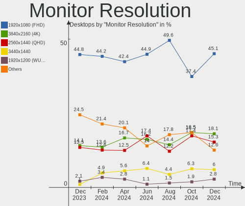
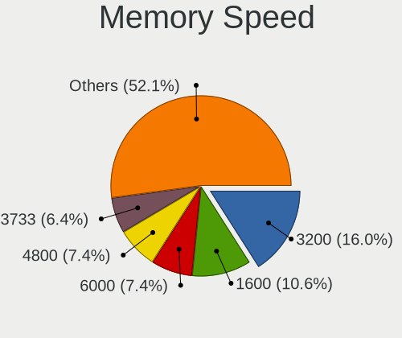
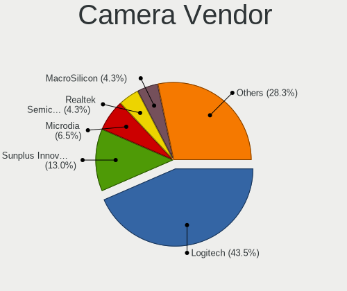
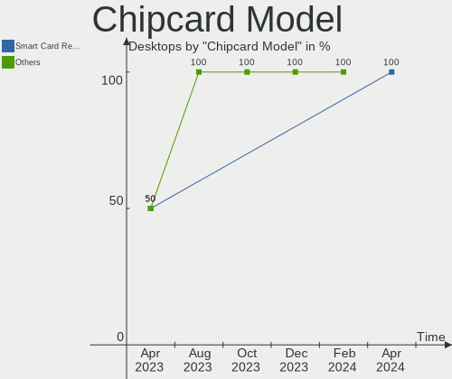

Fedora - Hardware Trends (Desktops)
-----------------------------------

A project to identify most popular hardware characteristics and track their change
over time based on data collected by Linux users at https://Linux-Hardware.org.

Anyone can contribute to this report by the [hw-probe](https://github.com/linuxhw/hw-probe) tool:

    sudo -E hw-probe -all -upload

This report is for one last month. Overall report since the beginning of time: [TestDays](https://github.com/linuxhw/TestDays)

Period: Nov, 2023.

Contents
--------

* [ System ](#system)
  - [ OS                       ](#os)
  - [ OS Family                ](#os-family)
  - [ Kernel                   ](#kernel)
  - [ Kernel Family            ](#kernel-family)
  - [ Kernel Major Ver.        ](#kernel-major-ver)
  - [ Arch                     ](#arch)
  - [ DE                       ](#de)
  - [ Display Server           ](#display-server)
  - [ Display Manager          ](#display-manager)
  - [ OS Lang                  ](#os-lang)
  - [ Boot Mode                ](#boot-mode)
  - [ Filesystem               ](#filesystem)
  - [ Part. scheme             ](#part-scheme)
  - [ Dual Boot with Linux/BSD ](#dual-boot-with-linuxbsd)
  - [ Dual Boot (Win)          ](#dual-boot-win)

* [ Board ](#board)
  - [ Vendor                   ](#vendor)
  - [ Model                    ](#model)
  - [ Model Family             ](#model-family)
  - [ MFG Year                 ](#mfg-year)
  - [ Form Factor              ](#form-factor)
  - [ Secure Boot              ](#secure-boot)
  - [ Coreboot                 ](#coreboot)
  - [ RAM Size                 ](#ram-size)
  - [ RAM Used                 ](#ram-used)
  - [ Total Drives             ](#total-drives)
  - [ Has CD-ROM               ](#has-cd-rom)
  - [ Has Ethernet             ](#has-ethernet)
  - [ Has WiFi                 ](#has-wifi)
  - [ Has Bluetooth            ](#has-bluetooth)

* [ Location ](#location)
  - [ Country                  ](#country)
  - [ City                     ](#city)

* [ Drives ](#drives)
  - [ Drive Vendor             ](#drive-vendor)
  - [ Drive Model              ](#drive-model)
  - [ HDD Vendor               ](#hdd-vendor)
  - [ SSD Vendor               ](#ssd-vendor)
  - [ Drive Kind               ](#drive-kind)
  - [ Drive Connector          ](#drive-connector)
  - [ Drive Size               ](#drive-size)
  - [ Space Total              ](#space-total)
  - [ Space Used               ](#space-used)
  - [ Malfunc. Drives          ](#malfunc-drives)
  - [ Malfunc. Drive Vendor    ](#malfunc-drive-vendor)
  - [ Malfunc. HDD Vendor      ](#malfunc-hdd-vendor)
  - [ Malfunc. Drive Kind      ](#malfunc-drive-kind)
  - [ Failed Drives            ](#failed-drives)
  - [ Failed Drive Vendor      ](#failed-drive-vendor)
  - [ Drive Status             ](#drive-status)

* [ Storage controller ](#storage-controller)
  - [ Storage Vendor           ](#storage-vendor)
  - [ Storage Model            ](#storage-model)
  - [ Storage Kind             ](#storage-kind)

* [ Processor ](#processor)
  - [ CPU Vendor               ](#cpu-vendor)
  - [ CPU Model                ](#cpu-model)
  - [ CPU Model Family         ](#cpu-model-family)
  - [ CPU Cores                ](#cpu-cores)
  - [ CPU Sockets              ](#cpu-sockets)
  - [ CPU Threads              ](#cpu-threads)
  - [ CPU Op-Modes             ](#cpu-op-modes)
  - [ CPU Microcode            ](#cpu-microcode)
  - [ CPU Microarch            ](#cpu-microarch)

* [ Graphics ](#graphics)
  - [ GPU Vendor               ](#gpu-vendor)
  - [ GPU Model                ](#gpu-model)
  - [ GPU Combo                ](#gpu-combo)
  - [ GPU Driver               ](#gpu-driver)
  - [ GPU Memory               ](#gpu-memory)

* [ Monitor ](#monitor)
  - [ Monitor Vendor           ](#monitor-vendor)
  - [ Monitor Model            ](#monitor-model)
  - [ Monitor Resolution       ](#monitor-resolution)
  - [ Monitor Diagonal         ](#monitor-diagonal)
  - [ Monitor Width            ](#monitor-width)
  - [ Aspect Ratio             ](#aspect-ratio)
  - [ Monitor Area             ](#monitor-area)
  - [ Pixel Density            ](#pixel-density)
  - [ Multiple Monitors        ](#multiple-monitors)

* [ Network ](#network)
  - [ Net Controller Vendor    ](#net-controller-vendor)
  - [ Net Controller Model     ](#net-controller-model)
  - [ Wireless Vendor          ](#wireless-vendor)
  - [ Wireless Model           ](#wireless-model)
  - [ Ethernet Vendor          ](#ethernet-vendor)
  - [ Ethernet Model           ](#ethernet-model)
  - [ Net Controller Kind      ](#net-controller-kind)
  - [ Used Controller          ](#used-controller)
  - [ NICs                     ](#nics)
  - [ IPv6                     ](#ipv6)

* [ Bluetooth ](#bluetooth)
  - [ Bluetooth Vendor         ](#bluetooth-vendor)
  - [ Bluetooth Model          ](#bluetooth-model)

* [ Sound ](#sound)
  - [ Sound Vendor             ](#sound-vendor)
  - [ Sound Model              ](#sound-model)

* [ Memory ](#memory)
  - [ Memory Vendor            ](#memory-vendor)
  - [ Memory Model             ](#memory-model)
  - [ Memory Kind              ](#memory-kind)
  - [ Memory Form Factor       ](#memory-form-factor)
  - [ Memory Size              ](#memory-size)
  - [ Memory Speed             ](#memory-speed)

* [ Printers & scanners ](#printers--scanners)
  - [ Printer Vendor           ](#printer-vendor)
  - [ Printer Model            ](#printer-model)
  - [ Scanner Vendor           ](#scanner-vendor)
  - [ Scanner Model            ](#scanner-model)

* [ Camera ](#camera)
  - [ Camera Vendor            ](#camera-vendor)
  - [ Camera Model             ](#camera-model)

* [ Security ](#security)
  - [ Fingerprint Vendor       ](#fingerprint-vendor)
  - [ Fingerprint Model        ](#fingerprint-model)
  - [ Chipcard Vendor          ](#chipcard-vendor)
  - [ Chipcard Model           ](#chipcard-model)

* [ Unsupported ](#unsupported)
  - [ Unsupported Devices      ](#unsupported-devices)
  - [ Unsupported Device Types ](#unsupported-device-types)

System
------

OS
--

Installed operating systems

| Name      | Desktops | Percent |
|-----------|----------|---------|
| Fedora 39 | 125      | 68.31%  |
| Fedora 38 | 55       | 30.05%  |
| Fedora 37 | 2        | 1.09%   |
| Fedora 40 | 1        | 0.55%   |

OS Family
---------

OS without a version

| Name   | Desktops | Percent |
|--------|----------|---------|
| Fedora | 183      | 100%    |

Kernel
------

Version of the Linux kernel

| Version                                                  | Desktops | Percent |
|----------------------------------------------------------|----------|---------|
| 6.5.11-300.fc39.x86_64                                   | 47       | 25.68%  |
| 6.5.12-300.fc39.x86_64                                   | 33       | 18.03%  |
| 6.5.8-200.fc38.x86_64                                    | 17       | 9.29%   |
| 6.5.10-300.fc39.x86_64                                   | 15       | 8.2%    |
| 6.5.10-200.fc38.x86_64                                   | 15       | 8.2%    |
| 6.5.6-300.fc39.x86_64                                    | 12       | 6.56%   |
| 6.5.9-200.fc38.x86_64                                    | 9        | 4.92%   |
| 6.6.2-201.fc39.x86_64                                    | 6        | 3.28%   |
| 6.5.9-300.fc39.x86_64                                    | 6        | 3.28%   |
| 6.5.7-200.fc38.x86_64                                    | 6        | 3.28%   |
| 6.5.12-200.fc38.x86_64                                   | 4        | 2.19%   |
| 6.2.9-300.fc38.x86_64                                    | 2        | 1.09%   |
| 6.7.0-0.rc1.315.vanilla.fc39.x86_64                      | 1        | 0.55%   |
| 6.7.0-0.rc0.20231110git89cdf9d55601.13.fc40.x86_64+debug | 1        | 0.55%   |
| 6.6.2-101.fc38.x86_64                                    | 1        | 0.55%   |
| 6.6.1-300.fc39.x86_64                                    | 1        | 0.55%   |
| 6.6.0-cbrt1.0.fc39.x86_64                                | 1        | 0.55%   |
| 6.6.0-61.fc40.x86_64                                     | 1        | 0.55%   |
| 6.6.0-0.rc4.20231005git3006adf3be79.36.fc38.loongarch64  | 1        | 0.55%   |
| 6.5.9-100.fc37.x86_64                                    | 1        | 0.55%   |
| 6.5.10-xm1.0e20231102.fc39.x86_64                        | 1        | 0.55%   |
| 6.5.10-100.fc37.x86_64                                   | 1        | 0.55%   |
| 6.4.4-200.fc38.x86_64                                    | 1        | 0.55%   |

Kernel Family
-------------

Linux kernel without a distro release

| Version | Desktops | Percent |
|---------|----------|---------|
| 6.5.11  | 47       | 25.68%  |
| 6.5.12  | 37       | 20.22%  |
| 6.5.10  | 32       | 17.49%  |
| 6.5.8   | 17       | 9.29%   |
| 6.5.9   | 16       | 8.74%   |
| 6.5.6   | 12       | 6.56%   |
| 6.6.2   | 7        | 3.83%   |
| 6.5.7   | 6        | 3.28%   |
| 6.6.0   | 3        | 1.64%   |
| 6.7.0   | 2        | 1.09%   |
| 6.2.9   | 2        | 1.09%   |
| 6.6.1   | 1        | 0.55%   |
| 6.4.4   | 1        | 0.55%   |

Kernel Major Ver.
-----------------

Linux kernel major version

| Version | Desktops | Percent |
|---------|----------|---------|
| 6.5     | 167      | 91.26%  |
| 6.6     | 11       | 6.01%   |
| 6.7     | 2        | 1.09%   |
| 6.2     | 2        | 1.09%   |
| 6.4     | 1        | 0.55%   |

Arch
----

OS architecture (x86_64, i586, etc.)

| Name        | Desktops | Percent |
|-------------|----------|---------|
| x86_64      | 182      | 99.45%  |
| loongarch64 | 1        | 0.55%   |

DE
--

Desktop Environment

| Name        | Desktops | Percent |
|-------------|----------|---------|
| GNOME       | 122      | 66.67%  |
| KDE5        | 29       | 15.85%  |
| Cinnamon    | 14       | 7.65%   |
| X-Cinnamon  | 4        | 2.19%   |
| MATE        | 4        | 2.19%   |
| Unknown     | 4        | 2.19%   |
| Budgie      | 3        | 1.64%   |
| XFCE        | 1        | 0.55%   |
| LXQt        | 1        | 0.55%   |
| e16-session | 1        | 0.55%   |

Display Server
--------------

X11 or Wayland

| Name    | Desktops | Percent |
|---------|----------|---------|
| Wayland | 118      | 64.48%  |
| X11     | 48       | 26.23%  |
| Tty     | 16       | 8.74%   |
| Unknown | 1        | 0.55%   |

Display Manager
---------------

SDDM, LightDM, etc.

| Name    | Desktops | Percent |
|---------|----------|---------|
| Unknown | 106      | 57.92%  |
| GDM     | 39       | 21.31%  |
| LightDM | 23       | 12.57%  |
| SDDM    | 15       | 8.2%    |

OS Lang
-------

Language

| Lang    | Desktops | Percent |
|---------|----------|---------|
| en_US   | 74       | 40.44%  |
| en_AU   | 19       | 10.38%  |
| de_DE   | 11       | 6.01%   |
| ru_RU   | 9        | 4.92%   |
| en_GB   | 9        | 4.92%   |
| pt_BR   | 8        | 4.37%   |
| en_CA   | 8        | 4.37%   |
| it_IT   | 5        | 2.73%   |
| fr_FR   | 5        | 2.73%   |
| zh_CN   | 4        | 2.19%   |
| pl_PL   | 4        | 2.19%   |
| hu_HU   | 3        | 1.64%   |
| es_MX   | 3        | 1.64%   |
| es_ES   | 3        | 1.64%   |
| pt_PT   | 2        | 1.09%   |
| cs_CZ   | 2        | 1.09%   |
| zh_TW   | 1        | 0.55%   |
| sv_SE   | 1        | 0.55%   |
| sr_RS   | 1        | 0.55%   |
| nl_NL   | 1        | 0.55%   |
| ja_JP   | 1        | 0.55%   |
| ia_FR   | 1        | 0.55%   |
| fr_BE   | 1        | 0.55%   |
| es_CL   | 1        | 0.55%   |
| en_SG   | 1        | 0.55%   |
| en_NZ   | 1        | 0.55%   |
| en_IE   | 1        | 0.55%   |
| en_BW   | 1        | 0.55%   |
| de_AT   | 1        | 0.55%   |
| Unknown | 1        | 0.55%   |

Boot Mode
---------

EFI or BIOS

| Mode | Desktops | Percent |
|------|----------|---------|
| EFI  | 113      | 61.75%  |
| BIOS | 70       | 38.25%  |

Filesystem
----------

Type of filesystem

| Type  | Desktops | Percent |
|-------|----------|---------|
| Btrfs | 140      | 76.5%   |
| Ext4  | 30       | 16.39%  |
| Xfs   | 13       | 7.1%    |

Part. scheme
------------

Scheme of partitioning

| Type    | Desktops | Percent |
|---------|----------|---------|
| Unknown | 103      | 56.28%  |
| GPT     | 70       | 38.25%  |
| MBR     | 10       | 5.46%   |

Dual Boot with Linux/BSD
------------------------

Hosting more than one Linux/BSD

| Dual boot | Desktops | Percent |
|-----------|----------|---------|
| No        | 158      | 86.34%  |
| Yes       | 25       | 13.66%  |

Dual Boot (Win)
---------------

Hosting Linux and Windows

| Dual boot | Desktops | Percent |
|-----------|----------|---------|
| No        | 147      | 80.33%  |
| Yes       | 36       | 19.67%  |

Board
-----

Vendor
------

Motherboard manufacturer

| Name                | Desktops | Percent |
|---------------------|----------|---------|
| ASUSTek Computer    | 55       | 30.05%  |
| MSI                 | 39       | 21.31%  |
| Gigabyte Technology | 29       | 15.85%  |
| ASRock              | 17       | 9.29%   |
| Dell                | 10       | 5.46%   |
| Hewlett-Packard     | 8        | 4.37%   |
| Lenovo              | 6        | 3.28%   |
| Pegatron            | 3        | 1.64%   |
| Intel               | 2        | 1.09%   |
| Fujitsu             | 2        | 1.09%   |
| eMachines           | 2        | 1.09%   |
| Apple               | 2        | 1.09%   |
| Unknown             | 2        | 1.09%   |
| Loongson            | 1        | 0.55%   |
| EVGA                | 1        | 0.55%   |
| AZW                 | 1        | 0.55%   |
| Alienware           | 1        | 0.55%   |
| Acer                | 1        | 0.55%   |
| ABIT                | 1        | 0.55%   |

Model
-----

Motherboard model

| Name                         | Desktops | Percent |
|------------------------------|----------|---------|
| MSI MS-7C91                  | 4        | 2.19%   |
| MSI MS-7B89                  | 3        | 1.64%   |
| ASUS All Series              | 3        | 1.64%   |
| MSI MS-7D73                  | 2        | 1.09%   |
| MSI MS-7C84                  | 2        | 1.09%   |
| MSI MS-7C52                  | 2        | 1.09%   |
| MSI MS-7C37                  | 2        | 1.09%   |
| MSI MS-7641                  | 2        | 1.09%   |
| Gigabyte J1900M-D2P          | 2        | 1.09%   |
| Gigabyte B550M S2H           | 2        | 1.09%   |
| Gigabyte B550 AORUS PRO AC   | 2        | 1.09%   |
| Dell OptiPlex 990            | 2        | 1.09%   |
| ASUS TUF Gaming X570-PRO     | 2        | 1.09%   |
| ASUS ROG STRIX B550-F GAMING | 2        | 1.09%   |
| ASUS P7P55D PRO              | 2        | 1.09%   |
| Apple MacPro5,1              | 2        | 1.09%   |
| Unknown                      | 2        | 1.09%   |
| Pegatron SM 3322             | 1        | 0.55%   |
| Pegatron IPMIP-GS            | 1        | 0.55%   |
| Pegatron h8-1520t            | 1        | 0.55%   |
| MSI WC779AA-UUW HPE-140sc    | 1        | 0.55%   |
| MSI PPPPP-CCC#MMMMMMMM       | 1        | 0.55%   |
| MSI MS-7E26                  | 1        | 0.55%   |
| MSI MS-7E12                  | 1        | 0.55%   |
| MSI MS-7D78                  | 1        | 0.55%   |
| MSI MS-7D75                  | 1        | 0.55%   |
| MSI MS-7D54                  | 1        | 0.55%   |
| MSI MS-7D32                  | 1        | 0.55%   |
| MSI MS-7C92                  | 1        | 0.55%   |
| MSI MS-7C56                  | 1        | 0.55%   |
| MSI MS-7C02                  | 1        | 0.55%   |
| MSI MS-7B79                  | 1        | 0.55%   |
| MSI MS-7B48                  | 1        | 0.55%   |
| MSI MS-7A66                  | 1        | 0.55%   |
| MSI MS-7A34                  | 1        | 0.55%   |
| MSI MS-7A31                  | 1        | 0.55%   |
| MSI MS-7916                  | 1        | 0.55%   |
| MSI MS-7885                  | 1        | 0.55%   |
| MSI MS-7788                  | 1        | 0.55%   |
| MSI MS-7721                  | 1        | 0.55%   |

Model Family
------------

Motherboard model prefix

| Name                   | Desktops | Percent |
|------------------------|----------|---------|
| ASUS ROG               | 12       | 6.56%   |
| ASUS PRIME             | 11       | 6.01%   |
| ASUS TUF               | 10       | 5.46%   |
| MSI MS-7C91            | 4        | 2.19%   |
| Gigabyte B550          | 4        | 2.19%   |
| Dell OptiPlex          | 4        | 2.19%   |
| MSI MS-7B89            | 3        | 1.64%   |
| HP Compaq              | 3        | 1.64%   |
| Gigabyte B550M         | 3        | 1.64%   |
| Dell Inspiron          | 3        | 1.64%   |
| ASUS All               | 3        | 1.64%   |
| ASRock B450            | 3        | 1.64%   |
| MSI MS-7D73            | 2        | 1.09%   |
| MSI MS-7C84            | 2        | 1.09%   |
| MSI MS-7C52            | 2        | 1.09%   |
| MSI MS-7C37            | 2        | 1.09%   |
| MSI MS-7641            | 2        | 1.09%   |
| Lenovo ThinkCentre     | 2        | 1.09%   |
| HP Pavilion            | 2        | 1.09%   |
| Gigabyte J1900M-D2P    | 2        | 1.09%   |
| Gigabyte B650M         | 2        | 1.09%   |
| Gigabyte A520M         | 2        | 1.09%   |
| Fujitsu ESPRIMO        | 2        | 1.09%   |
| ASUS P8Z77-V           | 2        | 1.09%   |
| ASUS P7P55D            | 2        | 1.09%   |
| ASRock X670E           | 2        | 1.09%   |
| ASRock X570            | 2        | 1.09%   |
| ASRock H97M            | 2        | 1.09%   |
| Apple MacPro5          | 2        | 1.09%   |
| Unknown                | 2        | 1.09%   |
| Pegatron SM            | 1        | 0.55%   |
| Pegatron IPMIP-GS      | 1        | 0.55%   |
| Pegatron h8-1520t      | 1        | 0.55%   |
| MSI WC779AA-UUW        | 1        | 0.55%   |
| MSI PPPPP-CCC#MMMMMMMM | 1        | 0.55%   |
| MSI MS-7E26            | 1        | 0.55%   |
| MSI MS-7E12            | 1        | 0.55%   |
| MSI MS-7D78            | 1        | 0.55%   |
| MSI MS-7D75            | 1        | 0.55%   |
| MSI MS-7D54            | 1        | 0.55%   |

MFG Year
--------

Motherboard manufacture year

| Year    | Desktops | Percent |
|---------|----------|---------|
| 2020    | 29       | 15.85%  |
| 2022    | 19       | 10.38%  |
| 2019    | 16       | 8.74%   |
| 2014    | 14       | 7.65%   |
| 2021    | 13       | 7.1%    |
| 2012    | 12       | 6.56%   |
| 2011    | 12       | 6.56%   |
| 2023    | 11       | 6.01%   |
| 2018    | 9        | 4.92%   |
| 2017    | 9        | 4.92%   |
| 2010    | 8        | 4.37%   |
| 2009    | 8        | 4.37%   |
| 2013    | 6        | 3.28%   |
| 2015    | 5        | 2.73%   |
| 2007    | 4        | 2.19%   |
| 2016    | 3        | 1.64%   |
| 2008    | 3        | 1.64%   |
| 2006    | 1        | 0.55%   |
| Unknown | 1        | 0.55%   |

Form Factor
-----------

Physical design of the computer

| Name    | Desktops | Percent |
|---------|----------|---------|
| Desktop | 183      | 100%    |

Secure Boot
-----------

Enabled or disabled

| State    | Desktops | Percent |
|----------|----------|---------|
| Disabled | 162      | 88.52%  |
| Enabled  | 21       | 11.48%  |

Coreboot
--------

Have coreboot on board

| Used | Desktops | Percent |
|------|----------|---------|
| No   | 183      | 100%    |

RAM Size
--------

Total RAM memory

| Size in GB  | Desktops | Percent |
|-------------|----------|---------|
| 32.01-64.0  | 48       | 26.23%  |
| 16.01-24.0  | 48       | 26.23%  |
| 64.01-256.0 | 25       | 13.66%  |
| 4.01-8.0    | 21       | 11.48%  |
| 8.01-16.0   | 19       | 10.38%  |
| 3.01-4.0    | 11       | 6.01%   |
| 24.01-32.0  | 10       | 5.46%   |
| 1.01-2.0    | 1        | 0.55%   |

RAM Used
--------

Used RAM memory

| Used GB     | Desktops | Percent |
|-------------|----------|---------|
| 4.01-8.0    | 53       | 28.96%  |
| 3.01-4.0    | 45       | 24.59%  |
| 2.01-3.0    | 34       | 18.58%  |
| 8.01-16.0   | 23       | 12.57%  |
| 1.01-2.0    | 18       | 9.84%   |
| 0.51-1.0    | 7        | 3.83%   |
| 16.01-24.0  | 2        | 1.09%   |
| 64.01-256.0 | 1        | 0.55%   |

Total Drives
------------

Number of drives on board

| Drives | Desktops | Percent |
|--------|----------|---------|
| 2      | 61       | 33.33%  |
| 1      | 57       | 31.15%  |
| 3      | 25       | 13.66%  |
| 4      | 21       | 11.48%  |
| 5      | 10       | 5.46%   |
| 8      | 5        | 2.73%   |
| 6      | 3        | 1.64%   |
| 7      | 1        | 0.55%   |

Has CD-ROM
----------

Has CD-ROM on board

| Presented | Desktops | Percent |
|-----------|----------|---------|
| No        | 127      | 69.4%   |
| Yes       | 56       | 30.6%   |

Has Ethernet
------------

Has Ethernet on board

| Presented | Desktops | Percent |
|-----------|----------|---------|
| Yes       | 180      | 98.36%  |
| No        | 3        | 1.64%   |

Has WiFi
--------

Has WiFi module

| Presented | Desktops | Percent |
|-----------|----------|---------|
| Yes       | 104      | 56.83%  |
| No        | 79       | 43.17%  |

Has Bluetooth
-------------

Has Bluetooth module

| Presented | Desktops | Percent |
|-----------|----------|---------|
| Yes       | 93       | 50.82%  |
| No        | 90       | 49.18%  |

Location
--------

Country
-------

Geographic location (country)

| Country     | Desktops | Percent |
|-------------|----------|---------|
| USA         | 37       | 20.22%  |
| Australia   | 20       | 10.93%  |
| Russia      | 12       | 6.56%   |
| Germany     | 11       | 6.01%   |
| Canada      | 9        | 4.92%   |
| Brazil      | 9        | 4.92%   |
| Italy       | 7        | 3.83%   |
| Spain       | 6        | 3.28%   |
| France      | 6        | 3.28%   |
| Sweden      | 5        | 2.73%   |
| Portugal    | 5        | 2.73%   |
| China       | 5        | 2.73%   |
| UK          | 4        | 2.19%   |
| Poland      | 4        | 2.19%   |
| Taiwan      | 3        | 1.64%   |
| Mexico      | 3        | 1.64%   |
| Hungary     | 3        | 1.64%   |
| Argentina   | 3        | 1.64%   |
| Switzerland | 2        | 1.09%   |
| Netherlands | 2        | 1.09%   |
| Czechia     | 2        | 1.09%   |
| Belgium     | 2        | 1.09%   |
| Belarus     | 2        | 1.09%   |
| Austria     | 2        | 1.09%   |
| Ukraine     | 1        | 0.55%   |
| Turkey      | 1        | 0.55%   |
| Thailand    | 1        | 0.55%   |
| Singapore   | 1        | 0.55%   |
| Serbia      | 1        | 0.55%   |
| Romania     | 1        | 0.55%   |
| Philippines | 1        | 0.55%   |
| Norway      | 1        | 0.55%   |
| New Zealand | 1        | 0.55%   |
| Malta       | 1        | 0.55%   |
| Kazakhstan  | 1        | 0.55%   |
| India       | 1        | 0.55%   |
| Finland     | 1        | 0.55%   |
| Ethiopia    | 1        | 0.55%   |
| Egypt       | 1        | 0.55%   |
| Denmark     | 1        | 0.55%   |

City
----

Geographic location (city)

| City          | Desktops | Percent |
|---------------|----------|---------|
| Sydney        | 17       | 9.29%   |
| Brisbane      | 3        | 1.64%   |
| San Luis      | 2        | 1.09%   |
| Prague        | 2        | 1.09%   |
| Paris         | 2        | 1.09%   |
| Moscow        | 2        | 1.09%   |
| Mississauga   | 2        | 1.09%   |
| Lisbon        | 2        | 1.09%   |
| Guangzhou     | 2        | 1.09%   |
| Boston        | 2        | 1.09%   |
| Barcelona     | 2        | 1.09%   |
| Zachary       | 1        | 0.55%   |
| Yekaterinburg | 1        | 0.55%   |
| Xiaolou       | 1        | 0.55%   |
| Würzburg     | 1        | 0.55%   |
| Winnipeg      | 1        | 0.55%   |
| Vitebsk       | 1        | 0.55%   |
| Vienna        | 1        | 0.55%   |
| Vernier       | 1        | 0.55%   |
| Varsta        | 1        | 0.55%   |
| Valparaíso   | 1        | 0.55%   |
| Ufa           | 1        | 0.55%   |
| Turku         | 1        | 0.55%   |
| Toronto       | 1        | 0.55%   |
| Timișoara    | 1        | 0.55%   |
| Taohua        | 1        | 0.55%   |
| Taipei        | 1        | 0.55%   |
| Szolnok       | 1        | 0.55%   |
| Szczecin      | 1        | 0.55%   |
| Stockholm     | 1        | 0.55%   |
| Steinbrunn    | 1        | 0.55%   |
| Smyrna        | 1        | 0.55%   |
| Smolensk      | 1        | 0.55%   |
| Singapore     | 1        | 0.55%   |
| Siena         | 1        | 0.55%   |
| Sheffield     | 1        | 0.55%   |
| Shanghai      | 1        | 0.55%   |
| Sète         | 1        | 0.55%   |
| Serra         | 1        | 0.55%   |
| Saratov       | 1        | 0.55%   |

Drives
------

Drive Vendor
------------

Hard drive vendors

| Vendor                       | Desktops | Drives | Percent |
|------------------------------|----------|--------|---------|
| Samsung Electronics          | 66       | 98     | 18.7%   |
| Seagate                      | 55       | 77     | 15.58%  |
| WDC                          | 52       | 73     | 14.73%  |
| SanDisk                      | 26       | 29     | 7.37%   |
| Crucial                      | 22       | 25     | 6.23%   |
| Kingston                     | 19       | 22     | 5.38%   |
| Toshiba                      | 12       | 13     | 3.4%    |
| Intel                        | 10       | 11     | 2.83%   |
| Micron/Crucial Technology    | 8        | 9      | 2.27%   |
| Phison Electronics           | 7        | 7      | 1.98%   |
| Hitachi                      | 6        | 9      | 1.7%    |
| HGST                         | 5        | 6      | 1.42%   |
| KIOXIA                       | 4        | 4      | 1.13%   |
| ADATA Technology             | 4        | 5      | 1.13%   |
| Unknown                      | 3        | 4      | 0.85%   |
| Silicon Motion               | 3        | 3      | 0.85%   |
| Fanxiang                     | 3        | 4      | 0.85%   |
| A-DATA Technology            | 3        | 3      | 0.85%   |
| SK hynix                     | 2        | 2      | 0.57%   |
| Shenzhen Longsys Electronics | 2        | 2      | 0.57%   |
| Patriot                      | 2        | 2      | 0.57%   |
| Micron Technology            | 2        | 2      | 0.57%   |
| MAXIO Technology (Hangzhou)  | 2        | 2      | 0.57%   |
| Kingston Technology Company  | 2        | 2      | 0.57%   |
| HS-SSD-E100                  | 2        | 2      | 0.57%   |
| Emtec                        | 2        | 2      | 0.57%   |
| Apacer                       | 2        | 2      | 0.57%   |
| ZHITAI                       | 1        | 1      | 0.28%   |
| Yangtze Memory Technologies  | 1        | 1      | 0.28%   |
| WDC WDS1                     | 1        | 1      | 0.28%   |
| USB3.0                       | 1        | 1      | 0.28%   |
| USB                          | 1        | 2      | 0.28%   |
| Transcend                    | 1        | 1      | 0.28%   |
| SPCC                         | 1        | 1      | 0.28%   |
| Smartbuy                     | 1        | 1      | 0.28%   |
| Realtek                      | 1        | 1      | 0.28%   |
| PNY                          | 1        | 1      | 0.28%   |
| OWC                          | 1        | 1      | 0.28%   |
| OCZ                          | 1        | 1      | 0.28%   |
| Mushkin                      | 1        | 1      | 0.28%   |

Drive Model
-----------

Hard drive models

| Model                                                           | Desktops | Percent |
|-----------------------------------------------------------------|----------|---------|
| Samsung NVMe SSD Controller SM981/PM981/PM983 250GB             | 16       | 3.78%   |
| Samsung NVMe SSD Controller PM9A1/PM9A3/980PRO 2TB              | 14       | 3.31%   |
| Samsung SSD 850 EVO 250GB                                       | 7        | 1.65%   |
| Crucial CT500MX500SSD1 500GB                                    | 7        | 1.65%   |
| Seagate ST2000DM008-2FR102 2TB                                  | 6        | 1.42%   |
| Toshiba DT01ACA100 1TB                                          | 5        | 1.18%   |
| Seagate ST500DM002-1BD142 500GB                                 | 5        | 1.18%   |
| Seagate ST4000DM004-2CV104 4TB                                  | 5        | 1.18%   |
| Micron/Crucial P2 NVMe PCIe SSD 1TB                             | 5        | 1.18%   |
| Kingston SA400S37480G 480GB SSD                                 | 5        | 1.18%   |
| WDC WD10EZEX-08WN4A0 1TB                                        | 4        | 0.95%   |
| Seagate ST2000DM006-2DM164 2TB                                  | 4        | 0.95%   |
| Seagate ST2000DM001-1ER164 2TB                                  | 4        | 0.95%   |
| Samsung SSD 860 EVO 1TB                                         | 4        | 0.95%   |
| Samsung NVMe SSD Controller SM961/PM961/SM963 256GB             | 4        | 0.95%   |
| WDC WD10EZEX-60ZF5A0 1TB                                        | 3        | 0.71%   |
| Sandisk WD_BLACK SN770 1TB                                      | 3        | 0.71%   |
| Samsung SSD 980 1TB                                             | 3        | 0.71%   |
| Samsung SSD 860 EVO 500GB                                       | 3        | 0.71%   |
| Samsung SSD 850 EVO 500GB                                       | 3        | 0.71%   |
| Phison E12 NVMe Controller 512GB                                | 3        | 0.71%   |
| Kingston SA400S37240G 240GB SSD                                 | 3        | 0.71%   |
| Intel SSD Pro 7600p/760p/E 6100p Series 1TB                     | 3        | 0.71%   |
| Crucial CT1000MX500SSD1 1TB                                     | 3        | 0.71%   |
| ADATA XPG SX8200 Pro PCIe Gen3x4 M.2 2280 Solid State Drive 1TB | 3        | 0.71%   |
| WDC WDS500G2B0A-00SM50 500GB SSD                                | 2        | 0.47%   |
| WDC WDS240G2G0A-00JH30 240GB SSD                                | 2        | 0.47%   |
| WDC WD5000AVCS-632DY1 500GB                                     | 2        | 0.47%   |
| WDC WD40EFRX-68N32N0 4TB                                        | 2        | 0.47%   |
| WDC WD20EZRZ-00Z5HB0 2TB                                        | 2        | 0.47%   |
| WDC WD10EFRX-68FYTN0 1TB                                        | 2        | 0.47%   |
| Toshiba HDWD110 1TB                                             | 2        | 0.47%   |
| Silicon Motion SM2263EN/SM2263XT SSD Controller 256GB           | 2        | 0.47%   |
| Seagate ST4000VN008-2DR166 4TB                                  | 2        | 0.47%   |
| Seagate ST4000VN006-3CW104 4TB                                  | 2        | 0.47%   |
| Seagate ST4000DM004-2U9104 4TB                                  | 2        | 0.47%   |
| Seagate ST1000LM035-1RK172 1TB                                  | 2        | 0.47%   |
| Seagate ST1000LM024 HN-M101MBB 1TB                              | 2        | 0.47%   |
| Seagate ST1000DX001-1NS162 1TB                                  | 2        | 0.47%   |
| Seagate ST1000DM010-2EP102 1TB                                  | 2        | 0.47%   |

HDD Vendor
----------

Hard disk drive vendors

| Vendor              | Desktops | Drives | Percent |
|---------------------|----------|--------|---------|
| Seagate             | 53       | 74     | 40.46%  |
| WDC                 | 47       | 63     | 35.88%  |
| Toshiba             | 11       | 12     | 8.4%    |
| Hitachi             | 6        | 9      | 4.58%   |
| Samsung Electronics | 5        | 7      | 3.82%   |
| HGST                | 5        | 6      | 3.82%   |
| USB3.0              | 1        | 1      | 0.76%   |
| USB                 | 1        | 1      | 0.76%   |
| JMicron Technology  | 1        | 1      | 0.76%   |
| IB-377U3            | 1        | 1      | 0.76%   |

SSD Vendor
----------

Solid state drive vendors

| Vendor              | Desktops | Drives | Percent |
|---------------------|----------|--------|---------|
| Samsung Electronics | 37       | 47     | 31.09%  |
| Crucial             | 22       | 25     | 18.49%  |
| Kingston            | 15       | 16     | 12.61%  |
| WDC                 | 10       | 10     | 8.4%    |
| SanDisk             | 8        | 9      | 6.72%   |
| A-DATA Technology   | 3        | 3      | 2.52%   |
| Patriot             | 2        | 2      | 1.68%   |
| Intel               | 2        | 2      | 1.68%   |
| Fanxiang            | 2        | 3      | 1.68%   |
| Emtec               | 2        | 2      | 1.68%   |
| Apacer              | 2        | 2      | 1.68%   |
| WDC WDS1            | 1        | 1      | 0.84%   |
| Transcend           | 1        | 1      | 0.84%   |
| SPCC                | 1        | 1      | 0.84%   |
| Smartbuy            | 1        | 1      | 0.84%   |
| PNY                 | 1        | 1      | 0.84%   |
| OWC                 | 1        | 1      | 0.84%   |
| OCZ                 | 1        | 1      | 0.84%   |
| Mushkin             | 1        | 1      | 0.84%   |
| Lexar               | 1        | 1      | 0.84%   |
| KUIJIA              | 1        | 1      | 0.84%   |
| KingSpec            | 1        | 1      | 0.84%   |
| GOODRAM             | 1        | 1      | 0.84%   |
| FORESEE             | 1        | 1      | 0.84%   |
| China               | 1        | 1      | 0.84%   |

Drive Kind
----------

HDD or SSD

| Kind    | Desktops | Drives | Percent |
|---------|----------|--------|---------|
| HDD     | 110      | 175    | 35.37%  |
| NVMe    | 96       | 128    | 30.87%  |
| SSD     | 94       | 135    | 30.23%  |
| Unknown | 10       | 10     | 3.22%   |
| MMC     | 1        | 2      | 0.32%   |

Drive Connector
---------------

SATA, SAS, NVMe, etc.

| Type | Desktops | Drives | Percent |
|------|----------|--------|---------|
| SATA | 142      | 304    | 55.69%  |
| NVMe | 96       | 127    | 37.65%  |
| SAS  | 16       | 17     | 6.27%   |
| MMC  | 1        | 2      | 0.39%   |

Drive Size
----------

Size of hard drive

| Size in TB | Desktops | Drives | Percent |
|------------|----------|--------|---------|
| 0.01-0.5   | 92       | 131    | 40%     |
| 0.51-1.0   | 70       | 91     | 30.43%  |
| 1.01-2.0   | 33       | 42     | 14.35%  |
| 3.01-4.0   | 18       | 28     | 7.83%   |
| 4.01-10.0  | 12       | 13     | 5.22%   |
| 2.01-3.0   | 5        | 5      | 2.17%   |

Space Total
-----------

Amount of disk space available on the file system

| Size in GB     | Desktops | Percent |
|----------------|----------|---------|
| More than 3000 | 43       | 23.5%   |
| 1001-2000      | 38       | 20.77%  |
| 501-1000       | 35       | 19.13%  |
| 251-500        | 20       | 10.93%  |
| 101-250        | 15       | 8.2%    |
| 2001-3000      | 13       | 7.1%    |
| 51-100         | 8        | 4.37%   |
| Unknown        | 5        | 2.73%   |
| 1-20           | 4        | 2.19%   |
| 21-50          | 2        | 1.09%   |

Space Used
----------

Amount of used disk space

| Used GB        | Desktops | Percent |
|----------------|----------|---------|
| 1-20           | 33       | 18.03%  |
| 21-50          | 32       | 17.49%  |
| 251-500        | 20       | 10.93%  |
| 1001-2000      | 20       | 10.93%  |
| 501-1000       | 19       | 10.38%  |
| 101-250        | 18       | 9.84%   |
| More than 3000 | 15       | 8.2%    |
| 51-100         | 15       | 8.2%    |
| 2001-3000      | 6        | 3.28%   |
| Unknown        | 5        | 2.73%   |

Malfunc. Drives
---------------

Drive models with a malfunction

| Model                                 | Desktops | Drives | Percent |
|---------------------------------------|----------|--------|---------|
| Seagate ST1000DX001-1NS162 1TB        | 2        | 2      | 12.5%   |
| Intel SSDSC2CT120A3 120GB             | 2        | 2      | 12.5%   |
| WDC WD5000AVCS-632DY1 500GB           | 1        | 1      | 6.25%   |
| WDC WD30EFRX-68AX9N0 3TB              | 1        | 1      | 6.25%   |
| WDC WD1600AVVS-63L2B0 160GB           | 1        | 1      | 6.25%   |
| Toshiba DT01ACA100 1TB                | 1        | 1      | 6.25%   |
| Seagate ST500DM002-1BD142 500GB       | 1        | 1      | 6.25%   |
| Seagate ST4000DM004-2CV104 4TB        | 1        | 2      | 6.25%   |
| Seagate ST4000DM000-1F2168 4TB        | 1        | 1      | 6.25%   |
| Seagate ST3500320AS 500GB             | 1        | 1      | 6.25%   |
| Seagate ST3250410AS 250GB             | 1        | 1      | 6.25%   |
| Samsung Electronics SSD 840 EVO 250GB | 1        | 1      | 6.25%   |
| Samsung Electronics HD501LJ 500GB     | 1        | 2      | 6.25%   |
| Samsung Electronics HD103UJ 1TB       | 1        | 2      | 6.25%   |

Malfunc. Drive Vendor
---------------------

Vendors of faulty drives

| Vendor              | Desktops | Drives | Percent |
|---------------------|----------|--------|---------|
| Seagate             | 5        | 8      | 35.71%  |
| WDC                 | 3        | 3      | 21.43%  |
| Samsung Electronics | 3        | 5      | 21.43%  |
| Intel               | 2        | 2      | 14.29%  |
| Toshiba             | 1        | 1      | 7.14%   |

Malfunc. HDD Vendor
-------------------

Vendors of faulty HDD drives

| Vendor              | Desktops | Drives | Percent |
|---------------------|----------|--------|---------|
| Seagate             | 5        | 8      | 45.45%  |
| WDC                 | 3        | 3      | 27.27%  |
| Samsung Electronics | 2        | 4      | 18.18%  |
| Toshiba             | 1        | 1      | 9.09%   |

Malfunc. Drive Kind
-------------------

Kinds of faulty drives

| Kind | Desktops | Drives | Percent |
|------|----------|--------|---------|
| HDD  | 11       | 16     | 78.57%  |
| SSD  | 3        | 3      | 21.43%  |

Failed Drives
-------------

Failed drive models

| Model                       | Desktops | Drives | Percent |
|-----------------------------|----------|--------|---------|
| Hitachi HDS721010DLE630 1TB | 1        | 2      | 100%    |

Failed Drive Vendor
-------------------

Failed drive vendors

| Vendor  | Desktops | Drives | Percent |
|---------|----------|--------|---------|
| Hitachi | 1        | 2      | 100%    |

Drive Status
------------

Number of failed and malfunc. drives

| Status   | Desktops | Drives | Percent |
|----------|----------|--------|---------|
| Detected | 115      | 253    | 56.37%  |
| Works    | 74       | 176    | 36.27%  |
| Malfunc  | 14       | 19     | 6.86%   |
| Failed   | 1        | 2      | 0.49%   |

Storage controller
------------------

Storage Vendor
--------------

Storage controller vendors

| Vendor                       | Desktops | Percent |
|------------------------------|----------|---------|
| AMD                          | 101      | 32.17%  |
| Intel                        | 81       | 25.8%   |
| Samsung Electronics          | 37       | 11.78%  |
| Sandisk                      | 18       | 5.73%   |
| ASMedia Technology           | 16       | 5.1%    |
| Micron/Crucial Technology    | 8        | 2.55%   |
| Phison Electronics           | 7        | 2.23%   |
| Kingston Technology Company  | 6        | 1.91%   |
| JMicron Technology           | 6        | 1.91%   |
| KIOXIA                       | 4        | 1.27%   |
| ADATA Technology             | 4        | 1.27%   |
| Silicon Motion               | 3        | 0.96%   |
| Yangtze Memory Technologies  | 2        | 0.64%   |
| SK hynix                     | 2        | 0.64%   |
| Shenzhen Longsys Electronics | 2        | 0.64%   |
| Nvidia                       | 2        | 0.64%   |
| Micron Technology            | 2        | 0.64%   |
| MAXIO Technology (Hangzhou)  | 2        | 0.64%   |
| INNOGRIT                     | 2        | 0.64%   |
| VIA Technologies             | 1        | 0.32%   |
| ULi Electronics              | 1        | 0.32%   |
| Toshiba America Info Systems | 1        | 0.32%   |
| Solidigm                     | 1        | 0.32%   |
| Silicon Image                | 1        | 0.32%   |
| Marvell Technology Group     | 1        | 0.32%   |
| Loongson Technology          | 1        | 0.32%   |
| Broadcom / LSI               | 1        | 0.32%   |
| Biwin Storage Technology     | 1        | 0.32%   |

Storage Model
-------------

Storage controller models

| Model                                                                                   | Desktops | Percent |
|-----------------------------------------------------------------------------------------|----------|---------|
| AMD FCH SATA Controller [AHCI mode]                                                     | 49       | 13.14%  |
| AMD 500 Series Chipset SATA Controller                                                  | 27       | 7.24%   |
| Samsung NVMe SSD Controller SM981/PM981/PM983                                           | 16       | 4.29%   |
| AMD 400 Series Chipset SATA Controller                                                  | 15       | 4.02%   |
| Samsung NVMe SSD Controller PM9A1/PM9A3/980PRO                                          | 14       | 3.75%   |
| ASMedia ASM1062 Serial ATA Controller                                                   | 13       | 3.49%   |
| AMD SB7x0/SB8x0/SB9x0 IDE Controller                                                    | 10       | 2.68%   |
| AMD SB7x0/SB8x0/SB9x0 SATA Controller [AHCI mode]                                       | 8        | 2.14%   |
| Intel 8 Series/C220 Series Chipset Family 6-port SATA Controller 1 [AHCI mode]          | 7        | 1.88%   |
| Intel 7 Series/C210 Series Chipset Family 6-port SATA Controller [AHCI mode]            | 7        | 1.88%   |
| Intel Q170/Q150/B150/H170/H110/Z170/CM236 Chipset SATA Controller [AHCI Mode]           | 6        | 1.61%   |
| Intel Alder Lake-S PCH SATA Controller [AHCI Mode]                                      | 6        | 1.61%   |
| AMD SB7x0/SB8x0/SB9x0 SATA Controller [IDE mode]                                        | 6        | 1.61%   |
| SanDisk WD Black SN770 / PC SN740 256GB / PC SN560 (DRAM-less) NVMe SSD                 | 5        | 1.34%   |
| Micron/Crucial P2 [Nick P2] / P3 / P3 Plus NVMe PCIe SSD (DRAM-less)                    | 5        | 1.34%   |
| JMicron JMB363 SATA/IDE Controller                                                      | 5        | 1.34%   |
| Intel 6 Series/C200 Series Chipset Family Desktop SATA Controller (IDE mode, ports 4-5) | 5        | 1.34%   |
| Intel 6 Series/C200 Series Chipset Family Desktop SATA Controller (IDE mode, ports 0-3) | 5        | 1.34%   |
| Sandisk WD Black SN850X NVMe SSD                                                        | 4        | 1.07%   |
| Samsung NVMe SSD Controller SM961/PM961/SM963                                           | 4        | 1.07%   |
| Samsung NVMe SSD Controller 980 (DRAM-less)                                             | 4        | 1.07%   |
| Intel Cannon Lake PCH SATA AHCI Controller                                              | 4        | 1.07%   |
| Intel 5 Series/3400 Series Chipset 6 port SATA AHCI Controller                          | 4        | 1.07%   |
| AMD 300 Series Chipset SATA Controller                                                  | 4        | 1.07%   |
| SanDisk Ultra 3D / WD Blue SN570 NVMe SSD (DRAM-less)                                   | 3        | 0.8%    |
| Phison E12 NVMe Controller                                                              | 3        | 0.8%    |
| Kingston Company KC3000/FURY Renegade NVMe SSD E18                                      | 3        | 0.8%    |
| Intel SSD DC P4101/Pro 7600p/760p/E 6100p Series                                        | 3        | 0.8%    |
| Intel SATA Controller [RAID mode]                                                       | 3        | 0.8%    |
| Intel C610/X99 series chipset 6-Port SATA Controller [AHCI mode]                        | 3        | 0.8%    |
| Intel 9 Series Chipset Family SATA Controller [AHCI Mode]                               | 3        | 0.8%    |
| Intel 700 Series Chipset Family SATA AHCI Controller                                    | 3        | 0.8%    |
| Intel 6 Series/C200 Series Chipset Family 6 port Desktop SATA AHCI Controller           | 3        | 0.8%    |
| Intel 5 Series/3400 Series Chipset 4 port SATA IDE Controller                           | 3        | 0.8%    |
| Intel 5 Series/3400 Series Chipset 2 port SATA IDE Controller                           | 3        | 0.8%    |
| Intel 200 Series PCH SATA controller [AHCI mode]                                        | 3        | 0.8%    |
| AMD X370 Series Chipset SATA Controller                                                 | 3        | 0.8%    |
| ADATA XPG SX8200 Pro PCIe Gen3x4 M.2 2280 Solid State Drive                             | 3        | 0.8%    |
| Yangtze Memory ZHITAI TiPro5000 NVMe SSD                                                | 2        | 0.54%   |
| Silicon Motion SM2263EN/SM2263XT (DRAM-less) NVMe SSD Controllers                       | 2        | 0.54%   |

Storage Kind
------------

Kind of storage controller (IDE, SATA, NVMe, SAS, ...)

| Kind | Desktops | Percent |
|------|----------|---------|
| SATA | 166      | 54.61%  |
| NVMe | 96       | 31.58%  |
| IDE  | 31       | 10.2%   |
| RAID | 9        | 2.96%   |
| SAS  | 1        | 0.33%   |
| SCSI | 1        | 0.33%   |

Processor
---------

CPU Vendor
----------

Processor vendors

| Vendor   | Desktops | Percent |
|----------|----------|---------|
| AMD      | 103      | 56.28%  |
| Intel    | 79       | 43.17%  |
| Loongson | 1        | 0.55%   |

CPU Model
---------

Processor models

| Model                                  | Desktops | Percent |
|----------------------------------------|----------|---------|
| AMD Ryzen 7 3700X 8-Core Processor     | 8        | 4.37%   |
| AMD Ryzen 5 3600 6-Core Processor      | 7        | 3.83%   |
| AMD Ryzen 5 5600X 6-Core Processor     | 5        | 2.73%   |
| Intel Core i7-3770 CPU @ 3.40GHz       | 4        | 2.19%   |
| AMD Ryzen 9 7950X 16-Core Processor    | 4        | 2.19%   |
| AMD Ryzen 7 5800X3D 8-Core Processor   | 4        | 2.19%   |
| Intel Core i7-4790 CPU @ 3.60GHz       | 3        | 1.64%   |
| Intel Core i7 CPU 860 @ 2.80GHz        | 3        | 1.64%   |
| Intel Core i5-2400 CPU @ 3.10GHz       | 3        | 1.64%   |
| Intel Core i5 CPU 650 @ 3.20GHz        | 3        | 1.64%   |
| Intel Core i3-3220 CPU @ 3.30GHz       | 3        | 1.64%   |
| AMD Ryzen 9 7900X 12-Core Processor    | 3        | 1.64%   |
| AMD Ryzen 9 5950X 16-Core Processor    | 3        | 1.64%   |
| AMD Ryzen 7 5800X 8-Core Processor     | 3        | 1.64%   |
| AMD Ryzen 7 5700G with Radeon Graphics | 3        | 1.64%   |
| AMD Ryzen 5 5600G with Radeon Graphics | 3        | 1.64%   |
| AMD Ryzen 5 5600 6-Core Processor      | 3        | 1.64%   |
| AMD Phenom II X4 955 Processor         | 3        | 1.64%   |
| AMD FX-8320E Eight-Core Processor      | 3        | 1.64%   |
| Intel Core i5-6500 CPU @ 3.20GHz       | 2        | 1.09%   |
| Intel Core i5-2500K CPU @ 3.30GHz      | 2        | 1.09%   |
| Intel Core i3-4150 CPU @ 3.50GHz       | 2        | 1.09%   |
| Intel Celeron CPU J1900 @ 1.99GHz      | 2        | 1.09%   |
| Intel 13th Gen Core i7-13700KF         | 2        | 1.09%   |
| Intel 12th Gen Core i5-12400F          | 2        | 1.09%   |
| AMD Ryzen 9 7900X3D 12-Core Processor  | 2        | 1.09%   |
| AMD Ryzen 9 5900X 12-Core Processor    | 2        | 1.09%   |
| AMD Ryzen 7 7700 8-Core Processor      | 2        | 1.09%   |
| AMD Ryzen 7 5700X 8-Core Processor     | 2        | 1.09%   |
| AMD Ryzen 7 1700 Eight-Core Processor  | 2        | 1.09%   |
| AMD Ryzen 5 7600X 6-Core Processor     | 2        | 1.09%   |
| AMD Ryzen 5 7600 6-Core Processor      | 2        | 1.09%   |
| AMD Ryzen 5 5500                       | 2        | 1.09%   |
| AMD Ryzen 5 2600 Six-Core Processor    | 2        | 1.09%   |
| AMD Ryzen 5 1600X Six-Core Processor   | 2        | 1.09%   |
| Loongson 3A6000-HV                     | 1        | 0.55%   |
| Intel Xeon CPU X5690 @ 3.47GHz         | 1        | 0.55%   |
| Intel Xeon CPU X5650 @ 2.67GHz         | 1        | 0.55%   |
| Intel Xeon CPU X3430 @ 2.40GHz         | 1        | 0.55%   |
| Intel Xeon CPU E5-2603 v4 @ 1.70GHz    | 1        | 0.55%   |

CPU Model Family
----------------

Processor model prefix

| Model                   | Desktops | Percent |
|-------------------------|----------|---------|
| AMD Ryzen 5             | 33       | 18.03%  |
| AMD Ryzen 7             | 28       | 15.3%   |
| Intel Core i5           | 24       | 13.11%  |
| AMD Ryzen 9             | 17       | 9.29%   |
| Intel Core i7           | 16       | 8.74%   |
| Other                   | 13       | 7.1%    |
| Intel Core i3           | 8        | 4.37%   |
| Intel Xeon              | 5        | 2.73%   |
| AMD FX                  | 5        | 2.73%   |
| AMD Phenom II X4        | 4        | 2.19%   |
| Intel Core 2 Quad       | 3        | 1.64%   |
| Intel Celeron           | 3        | 1.64%   |
| Intel Genuine           | 2        | 1.09%   |
| Intel Core i9           | 2        | 1.09%   |
| Intel Atom              | 2        | 1.09%   |
| AMD Ryzen 3             | 2        | 1.09%   |
| AMD Phenom II X6        | 2        | 1.09%   |
| AMD Phenom II X2        | 2        | 1.09%   |
| AMD Athlon 64 X2        | 2        | 1.09%   |
| Intel Pentium Dual-Core | 1        | 0.55%   |
| Intel Core 2 Duo        | 1        | 0.55%   |
| AMD Turion 64 X2 Mobile | 1        | 0.55%   |
| AMD Ryzen Threadripper  | 1        | 0.55%   |
| AMD Ryzen 5 PRO         | 1        | 0.55%   |
| AMD E                   | 1        | 0.55%   |
| AMD Athlon              | 1        | 0.55%   |
| AMD A8                  | 1        | 0.55%   |
| AMD A6                  | 1        | 0.55%   |
| AMD A4                  | 1        | 0.55%   |

CPU Cores
---------

Number of processor cores

| Number | Desktops | Percent |
|--------|----------|---------|
| 4      | 50       | 27.32%  |
| 6      | 44       | 24.04%  |
| 8      | 36       | 19.67%  |
| 2      | 26       | 14.21%  |
| 16     | 13       | 7.1%    |
| 12     | 10       | 5.46%   |
| 24     | 1        | 0.55%   |
| 18     | 1        | 0.55%   |
| 14     | 1        | 0.55%   |
| 1      | 1        | 0.55%   |

CPU Sockets
-----------

Number of sockets

| Number | Desktops | Percent |
|--------|----------|---------|
| 1      | 181      | 98.91%  |
| 2      | 2        | 1.09%   |

CPU Threads
-----------

Threads per core (Hyper-Threading)

| Number | Desktops | Percent |
|--------|----------|---------|
| 2      | 135      | 73.77%  |
| 1      | 48       | 26.23%  |

CPU Op-Modes
------------

CPU Operation Modes (32-bit, 64-bit)

| Op mode        | Desktops | Percent |
|----------------|----------|---------|
| 32-bit, 64-bit | 182      | 99.45%  |
| Unknown        | 1        | 0.55%   |

CPU Microcode
-------------

Microcode number

| Number     | Desktops | Percent |
|------------|----------|---------|
| Unknown    | 89       | 48.63%  |
| 0x08701021 | 12       | 6.56%   |
| 0x0a601203 | 9        | 4.92%   |
| 0x0a20120a | 7        | 3.83%   |
| 0x08701030 | 7        | 3.83%   |
| 0x0a50000d | 5        | 2.73%   |
| 0x0a601206 | 4        | 2.19%   |
| 0x0a201016 | 4        | 2.19%   |
| 0x010000c8 | 4        | 2.19%   |
| 0x0a50000c | 3        | 1.64%   |
| 0x0a20120e | 3        | 1.64%   |
| 0x0800820d | 3        | 1.64%   |
| 0x06000852 | 3        | 1.64%   |
| 0x0a601201 | 2        | 1.09%   |
| 0x0a20102b | 2        | 1.09%   |
| 0x08101016 | 2        | 1.09%   |
| 0x010000dc | 2        | 1.09%   |
| 0x00000000 | 2        | 1.09%   |
| 0x0a50000f | 1        | 0.55%   |
| 0x0a201205 | 1        | 0.55%   |
| 0x0a201204 | 1        | 0.55%   |
| 0x0a201009 | 1        | 0.55%   |
| 0x08701013 | 1        | 0.55%   |
| 0x08600103 | 1        | 0.55%   |
| 0x08108109 | 1        | 0.55%   |
| 0x08001138 | 1        | 0.55%   |
| 0x08001137 | 1        | 0.55%   |
| 0x08001129 | 1        | 0.55%   |
| 0x0800111c | 1        | 0.55%   |
| 0x08001105 | 1        | 0.55%   |
| 0x0700010b | 1        | 0.55%   |
| 0x06006705 | 1        | 0.55%   |
| 0x06003106 | 1        | 0.55%   |
| 0x06001119 | 1        | 0.55%   |
| 0x06000822 | 1        | 0.55%   |
| 0x0600063e | 1        | 0.55%   |
| 0x05000101 | 1        | 0.55%   |
| 0x01000086 | 1        | 0.55%   |

CPU Microarch
-------------

Microarchitecture

| Name             | Desktops | Percent |
|------------------|----------|---------|
| Zen 3            | 31       | 16.94%  |
| Zen 2            | 22       | 12.02%  |
| Unknown          | 18       | 9.84%   |
| Haswell          | 11       | 6.01%   |
| SandyBridge      | 10       | 5.46%   |
| Zen              | 9        | 4.92%   |
| Alderlake Hybrid | 9        | 4.92%   |
| KabyLake         | 8        | 4.37%   |
| K10              | 8        | 4.37%   |
| IvyBridge        | 8        | 4.37%   |
| Skylake          | 6        | 3.28%   |
| Westmere         | 5        | 2.73%   |
| Piledriver       | 5        | 2.73%   |
| Zen+             | 4        | 2.19%   |
| Nehalem          | 4        | 2.19%   |
| Silvermont       | 3        | 1.64%   |
| K8 Hammer        | 3        | 1.64%   |
| Icelake          | 3        | 1.64%   |
| Core             | 3        | 1.64%   |
| Penryn           | 2        | 1.09%   |
| CometLake        | 2        | 1.09%   |
| Broadwell        | 2        | 1.09%   |
| Bonnell          | 2        | 1.09%   |
| Steamroller      | 1        | 0.55%   |
| Jaguar           | 1        | 0.55%   |
| Excavator        | 1        | 0.55%   |
| Bulldozer        | 1        | 0.55%   |
| Bobcat           | 1        | 0.55%   |

Graphics
--------

GPU Vendor
----------

Vendors of graphics cards

| Vendor              | Desktops | Percent |
|---------------------|----------|---------|
| AMD                 | 87       | 45.31%  |
| Nvidia              | 70       | 36.46%  |
| Intel               | 34       | 17.71%  |
| Loongson Technology | 1        | 0.52%   |

GPU Model
---------

Graphics card models

| Model                                                                       | Desktops | Percent |
|-----------------------------------------------------------------------------|----------|---------|
| AMD Raphael                                                                 | 10       | 4.93%   |
| AMD Ellesmere [Radeon RX 470/480/570/570X/580/580X/590]                     | 9        | 4.43%   |
| Intel 2nd Generation Core Processor Family Integrated Graphics Controller   | 7        | 3.45%   |
| AMD Navi 21 [Radeon RX 6800/6800 XT / 6900 XT]                              | 7        | 3.45%   |
| AMD Navi 31 [Radeon RX 7900 XT/7900 XTX]                                    | 6        | 2.96%   |
| AMD Navi 22 [Radeon RX 6700/6700 XT/6750 XT / 6800M/6850M XT]               | 6        | 2.96%   |
| Nvidia GK208B [GeForce GT 710]                                              | 5        | 2.46%   |
| AMD Lexa PRO [Radeon 540/540X/550/550X / RX 540X/550/550X]                  | 5        | 2.46%   |
| Intel IvyBridge GT2 [HD Graphics 4000]                                      | 4        | 1.97%   |
| Intel CoffeeLake-S GT2 [UHD Graphics 630]                                   | 4        | 1.97%   |
| AMD Navi 24 [Radeon RX 6400/6500 XT/6500M]                                  | 4        | 1.97%   |
| AMD Cezanne [Radeon Vega Series / Radeon Vega Mobile Series]                | 4        | 1.97%   |
| Nvidia TU116 [GeForce GTX 1660 Ti]                                          | 3        | 1.48%   |
| Nvidia TU104 [GeForce RTX 2070 SUPER]                                       | 3        | 1.48%   |
| Nvidia GP108 [GeForce GT 1030]                                              | 3        | 1.48%   |
| Nvidia GP104 [GeForce GTX 1080]                                             | 3        | 1.48%   |
| Nvidia GF119 [GeForce GT 610]                                               | 3        | 1.48%   |
| Intel Xeon E3-1200 v3/4th Gen Core Processor Integrated Graphics Controller | 3        | 1.48%   |
| AMD Navi 32 [Radeon RX 7700 XT / 7800 XT]                                   | 3        | 1.48%   |
| AMD Navi 23 [Radeon RX 6600/6600 XT/6600M]                                  | 3        | 1.48%   |
| AMD Caicos [Radeon HD 6450/7450/8450 / R5 230 OEM]                          | 3        | 1.48%   |
| Nvidia TU117 [GeForce GTX 1650]                                             | 2        | 0.99%   |
| Nvidia TU116 [GeForce GTX 1660 SUPER]                                       | 2        | 0.99%   |
| Nvidia GT218 [GeForce 210]                                                  | 2        | 0.99%   |
| Nvidia GP107 [GeForce GTX 1050 Ti]                                          | 2        | 0.99%   |
| Nvidia GP106 [GeForce GTX 1060 6GB]                                         | 2        | 0.99%   |
| Nvidia GP104 [GeForce GTX 1070]                                             | 2        | 0.99%   |
| Nvidia GA106 [GeForce RTX 3060 Lite Hash Rate]                              | 2        | 0.99%   |
| Nvidia GA104 [GeForce RTX 3070]                                             | 2        | 0.99%   |
| Nvidia GA104 [GeForce RTX 3060 Ti Lite Hash Rate]                           | 2        | 0.99%   |
| Nvidia GA102 [GeForce RTX 3090]                                             | 2        | 0.99%   |
| Nvidia AD102 [GeForce RTX 4090]                                             | 2        | 0.99%   |
| Intel Xeon E3-1200 v2/3rd Gen Core processor Graphics Controller            | 2        | 0.99%   |
| Intel Atom Processor Z36xxx/Z37xxx Series Graphics & Display                | 2        | 0.99%   |
| Intel 4th Generation Core Processor Family Integrated Graphics Controller   | 2        | 0.99%   |
| AMD RV730 PRO [Radeon HD 4650]                                              | 2        | 0.99%   |
| AMD RS880 [Radeon HD 4250]                                                  | 2        | 0.99%   |
| AMD RS880 [Radeon HD 4200]                                                  | 2        | 0.99%   |
| AMD Raven Ridge [Radeon Vega Series / Radeon Vega Mobile Series]            | 2        | 0.99%   |
| AMD Navi 33 [Radeon RX 7700S/7600/7600S/7600M XT/PRO W7600]                 | 2        | 0.99%   |

GPU Combo
---------

Combinations of graphics cards

| Name                    | Desktops | Percent |
|-------------------------|----------|---------|
| 1 x AMD                 | 74       | 40.44%  |
| 1 x Nvidia              | 63       | 34.43%  |
| 1 x Intel               | 29       | 15.85%  |
| 2 x AMD                 | 9        | 4.92%   |
| AMD + Nvidia            | 4        | 2.19%   |
| Intel + Nvidia          | 2        | 1.09%   |
| 2 x Nvidia              | 1        | 0.55%   |
| 1 x Loongson Technology | 1        | 0.55%   |

GPU Driver
----------

Free vs proprietary

| Driver      | Desktops | Percent |
|-------------|----------|---------|
| Free        | 139      | 75.96%  |
| Proprietary | 34       | 18.58%  |
| Unknown     | 10       | 5.46%   |

GPU Memory
----------

Total video memory

| Size in GB | Desktops | Percent |
|------------|----------|---------|
| Unknown    | 55       | 30.05%  |
| 7.01-8.0   | 23       | 12.57%  |
| 3.01-4.0   | 21       | 11.48%  |
| 8.01-16.0  | 19       | 10.38%  |
| 0.51-1.0   | 19       | 10.38%  |
| 0.01-0.5   | 19       | 10.38%  |
| 1.01-2.0   | 14       | 7.65%   |
| 16.01-24.0 | 8        | 4.37%   |
| 5.01-6.0   | 5        | 2.73%   |

Monitor
-------

Monitor Vendor
--------------

Monitor vendors

| Vendor               | Desktops | Percent |
|----------------------|----------|---------|
| Samsung Electronics  | 34       | 16.5%   |
| Goldstar             | 31       | 15.05%  |
| Dell                 | 17       | 8.25%   |
| Acer                 | 17       | 8.25%   |
| Philips              | 10       | 4.85%   |
| BenQ                 | 10       | 4.85%   |
| Lenovo               | 9        | 4.37%   |
| Hewlett-Packard      | 8        | 3.88%   |
| AOC                  | 8        | 3.88%   |
| ASUSTek Computer     | 6        | 2.91%   |
| Ancor Communications | 6        | 2.91%   |
| ViewSonic            | 4        | 1.94%   |
| Unknown              | 4        | 1.94%   |
| MSI                  | 4        | 1.94%   |
| Gigabyte Technology  | 4        | 1.94%   |
| Vizio                | 3        | 1.46%   |
| Toshiba              | 2        | 0.97%   |
| Sony                 | 2        | 0.97%   |
| Mi                   | 2        | 0.97%   |
| Insignia             | 2        | 0.97%   |
| Iiyama               | 2        | 0.97%   |
| ___                  | 1        | 0.49%   |
| Xerox                | 1        | 0.49%   |
| Vestel Elektronik    | 1        | 0.49%   |
| UGD                  | 1        | 0.49%   |
| TXD                  | 1        | 0.49%   |
| Sceptre Tech         | 1        | 0.49%   |
| S2-Tek               | 1        | 0.49%   |
| RTK                  | 1        | 0.49%   |
| Pixio                | 1        | 0.49%   |
| PCH                  | 1        | 0.49%   |
| ONN                  | 1        | 0.49%   |
| Kogan                | 1        | 0.49%   |
| Huion                | 1        | 0.49%   |
| HJW                  | 1        | 0.49%   |
| Fujitsu Siemens      | 1        | 0.49%   |
| Envision             | 1        | 0.49%   |
| eMachines            | 1        | 0.49%   |
| Beike                | 1        | 0.49%   |
| Arzopa               | 1        | 0.49%   |

Monitor Model
-------------

Monitor models

| Model                                                                | Desktops | Percent |
|----------------------------------------------------------------------|----------|---------|
| Unknown LCD Monitor FFFF 2288x1287 2550x2550mm 142.0-inch            | 4        | 1.83%   |
| Lenovo LEN L1711pC LEN13B7 1280x1024 338x270mm 17.0-inch             | 3        | 1.37%   |
| Dell P1917S DELD091 1280x1024 380x300mm 19.1-inch                    | 3        | 1.37%   |
| Sony TV SNYA102 1920x1080 708x398mm 32.0-inch                        | 2        | 0.91%   |
| Samsung Electronics U28E590 SAM0C4D 3840x2160 610x350mm 27.7-inch    | 2        | 0.91%   |
| Samsung Electronics U28E590 SAM0C4C 3840x2160 608x345mm 27.5-inch    | 2        | 0.91%   |
| Samsung Electronics S24D590 SAM0B47 1920x1080 521x293mm 23.5-inch    | 2        | 0.91%   |
| Samsung Electronics LCD Monitor SAM0659 1920x1080                    | 2        | 0.91%   |
| Philips PHL 243V5 PHLC0D1 1920x1080 521x293mm 23.5-inch              | 2        | 0.91%   |
| Goldstar LG TV SSCR2 GSMC0C8 3840x2160                               | 2        | 0.91%   |
| Goldstar HDR WFHD GSM7714 2560x1080 798x334mm 34.1-inch              | 2        | 0.91%   |
| Goldstar FULL HD GSM5B55 1920x1080 480x270mm 21.7-inch               | 2        | 0.91%   |
| Goldstar 32inch FHD GSM76F5 1920x1080 698x392mm 31.5-inch            | 2        | 0.91%   |
| Dell S2719DGF DELD0E6 2560x1440 597x336mm 27.0-inch                  | 2        | 0.91%   |
| BenQ GL2480 BNQ78ED 1920x1080 531x298mm 24.0-inch                    | 2        | 0.91%   |
| ASUSTek Computer VP28U AUS28B1 3840x2160 621x341mm 27.9-inch         | 2        | 0.91%   |
| AOC Q3279WG5B AOC3279 2560x1440 725x428mm 33.1-inch                  | 2        | 0.91%   |
| AOC 27V2G5 AOC2702 1920x1080 598x336mm 27.0-inch                     | 2        | 0.91%   |
| AOC 24G2W1G4 AOC2402 1920x1080 527x296mm 23.8-inch                   | 2        | 0.91%   |
| Acer S271HL ACR02CA 1920x1080 600x340mm 27.2-inch                    | 2        | 0.91%   |
| Acer G276HL ACR0300 1920x1080 600x340mm 27.2-inch                    | 2        | 0.91%   |
| ___ LCDTV16 ___9000 1360x768                                         | 1        | 0.46%   |
| Xerox XG-91D XER90B2 1280x1024 376x301mm 19.0-inch                   | 1        | 0.46%   |
| Vizio E221VA VIZ0070 1920x1080 476x268mm 21.5-inch                   | 1        | 0.46%   |
| Vizio D60n-E3 VIZ1009 1920x1080 1330x748mm 60.1-inch                 | 1        | 0.46%   |
| Vizio D39hn-D0 VIZ1007 1366x768 853x480mm 38.5-inch                  | 1        | 0.46%   |
| ViewSonic VX3276-QHD VSCE635 2560x1440 698x393mm 31.5-inch           | 1        | 0.46%   |
| ViewSonic VX3258 Series VSCA037 1920x1080 700x390mm 31.5-inch        | 1        | 0.46%   |
| ViewSonic VP2030 SERIES VSC131C 1600x1200 408x306mm 20.1-inch        | 1        | 0.46%   |
| ViewSonic VA2719-2K VSC6B34 2560x1440 597x336mm 27.0-inch            | 1        | 0.46%   |
| Vestel Elektronik 32W_LCD_TV VES3700 1920x1080 706x398mm 31.9-inch   | 1        | 0.46%   |
| UGD Artist22R Pro UGD2202 1920x1080 476x268mm 21.5-inch              | 1        | 0.46%   |
| TXD HDMI TXD7825 1440x900 408x255mm 18.9-inch                        | 1        | 0.46%   |
| Toshiba TV TSB2017 3840x2160                                         | 1        | 0.46%   |
| Toshiba ScreenXpert TSB8888 1080x2160                                | 1        | 0.46%   |
| Sceptre Tech Sceptre Y40 SPT0FCD 2560x1440 852x480mm 38.5-inch       | 1        | 0.46%   |
| Samsung Electronics U32J59x SAM0F35 3840x2160 697x392mm 31.5-inch    | 1        | 0.46%   |
| Samsung Electronics T22C300 SAM0AB1 1920x1080 477x268mm 21.5-inch    | 1        | 0.46%   |
| Samsung Electronics SyncMaster SAM0589 1920x1080 521x293mm 23.5-inch | 1        | 0.46%   |
| Samsung Electronics SyncMaster SAM0526 1920x1080 510x287mm 23.0-inch | 1        | 0.46%   |

Monitor Resolution
------------------

Monitor screen resolution

| Resolution         | Desktops | Percent |
|--------------------|----------|---------|
| 1920x1080 (FHD)    | 93       | 46.27%  |
| 3840x2160 (4K)     | 31       | 15.42%  |
| 2560x1440 (QHD)    | 29       | 14.43%  |
| 1280x1024 (SXGA)   | 11       | 5.47%   |
| 2560x1080          | 6        | 2.99%   |
| 1680x1050 (WSXGA+) | 5        | 2.49%   |
| 3440x1440          | 4        | 1.99%   |
| 2288x1287          | 4        | 1.99%   |
| 3840x1080          | 3        | 1.49%   |
| 1600x900 (HD+)     | 3        | 1.49%   |
| 1440x900 (WXGA+)   | 3        | 1.49%   |
| 1366x768 (WXGA)    | 3        | 1.49%   |
| 1920x1200 (WUXGA)  | 2        | 1%      |
| 1920x540           | 1        | 0.5%    |
| 1600x1200          | 1        | 0.5%    |
| 1280x800 (WXGA)    | 1        | 0.5%    |
| Unknown            | 1        | 0.5%    |

Monitor Diagonal
----------------

Diagonal size in inches

| Inches  | Desktops | Percent |
|---------|----------|---------|
| 27      | 38       | 17.76%  |
| 24      | 30       | 14.02%  |
| 23      | 27       | 12.62%  |
| 21      | 21       | 9.81%   |
| 31      | 20       | 9.35%   |
| 34      | 10       | 4.67%   |
| 19      | 10       | 4.67%   |
| Unknown | 7        | 3.27%   |
| 142     | 4        | 1.87%   |
| 84      | 4        | 1.87%   |
| 72      | 4        | 1.87%   |
| 48      | 4        | 1.87%   |
| 20      | 4        | 1.87%   |
| 18      | 4        | 1.87%   |
| 42      | 3        | 1.4%    |
| 22      | 3        | 1.4%    |
| 15      | 3        | 1.4%    |
| 38      | 2        | 0.93%   |
| 36      | 2        | 0.93%   |
| 33      | 2        | 0.93%   |
| 32      | 2        | 0.93%   |
| 26      | 2        | 0.93%   |
| 86      | 1        | 0.47%   |
| 60      | 1        | 0.47%   |
| 54      | 1        | 0.47%   |
| 52      | 1        | 0.47%   |
| 47      | 1        | 0.47%   |
| 46      | 1        | 0.47%   |
| 25      | 1        | 0.47%   |
| 17      | 1        | 0.47%   |

Monitor Width
-------------

Physical width

| Width in mm    | Desktops | Percent |
|----------------|----------|---------|
| 501-600        | 82       | 39.81%  |
| 401-500        | 32       | 15.53%  |
| 601-700        | 29       | 14.08%  |
| 701-800        | 16       | 7.77%   |
| 1001-1500      | 10       | 4.85%   |
| 351-400        | 9        | 4.37%   |
| 1501-2000      | 8        | 3.88%   |
| Unknown        | 7        | 3.4%    |
| More than 2000 | 4        | 1.94%   |
| 301-350        | 4        | 1.94%   |
| 901-1000       | 3        | 1.46%   |
| 801-900        | 2        | 0.97%   |

Aspect Ratio
------------

Proportional relationship between the width and the height

| Ratio   | Desktops | Percent |
|---------|----------|---------|
| 16/9    | 139      | 75.54%  |
| 16/10   | 14       | 7.61%   |
| 21/9    | 9        | 4.89%   |
| 5/4     | 8        | 4.35%   |
| 1.00    | 4        | 2.17%   |
| 6/5     | 3        | 1.63%   |
| 32/9    | 2        | 1.09%   |
| Unknown | 2        | 1.09%   |
| 4/3     | 1        | 0.54%   |
| 1.96    | 1        | 0.54%   |
| 0.56    | 1        | 0.54%   |

Monitor Area
------------

Area in inch²

| Area in inch² | Desktops | Percent |
|----------------|----------|---------|
| 201-250        | 65       | 31.55%  |
| 301-350        | 39       | 18.93%  |
| 351-500        | 31       | 15.05%  |
| 151-200        | 22       | 10.68%  |
| More than 1000 | 16       | 7.77%   |
| 501-1000       | 13       | 6.31%   |
| 251-300        | 8        | 3.88%   |
| Unknown        | 7        | 3.4%    |
| 101-110        | 3        | 1.46%   |
| 141-150        | 2        | 0.97%   |

Pixel Density
-------------

Pixels per inch

| Density | Desktops | Percent |
|---------|----------|---------|
| 51-100  | 116      | 60.42%  |
| 101-120 | 39       | 20.31%  |
| 121-160 | 15       | 7.81%   |
| 1-50    | 12       | 6.25%   |
| Unknown | 7        | 3.65%   |
| 161-240 | 3        | 1.56%   |

Multiple Monitors
-----------------

Total monitors connected

| Total | Desktops | Percent |
|-------|----------|---------|
| 1     | 124      | 67.76%  |
| 2     | 49       | 26.78%  |
| 0     | 9        | 4.92%   |
| 3     | 1        | 0.55%   |

Network
-------

Net Controller Vendor
---------------------

Controller vendors

| Vendor                          | Desktops | Percent |
|---------------------------------|----------|---------|
| Realtek Semiconductor           | 128      | 44.91%  |
| Intel                           | 90       | 31.58%  |
| MediaTek                        | 12       | 4.21%   |
| Qualcomm Atheros                | 11       | 3.86%   |
| Broadcom                        | 10       | 3.51%   |
| Ralink                          | 4        | 1.4%    |
| Microsoft                       | 4        | 1.4%    |
| Ralink Technology               | 3        | 1.05%   |
| Google                          | 3        | 1.05%   |
| ASIX Electronics                | 3        | 1.05%   |
| Aquantia                        | 3        | 1.05%   |
| Qualcomm Atheros Communications | 2        | 0.7%    |
| D-Link System                   | 2        | 0.7%    |
| ZyDAS                           | 1        | 0.35%   |
| TP-Link                         | 1        | 0.35%   |
| Samsung Electronics             | 1        | 0.35%   |
| OPPO Electronics                | 1        | 0.35%   |
| Oculus VR                       | 1        | 0.35%   |
| Nvidia                          | 1        | 0.35%   |
| Marvell Technology Group        | 1        | 0.35%   |
| DisplayLink                     | 1        | 0.35%   |
| D-Link                          | 1        | 0.35%   |
| American Future Technology      | 1        | 0.35%   |

Net Controller Model
--------------------

Controller models

| Model                                                             | Desktops | Percent |
|-------------------------------------------------------------------|----------|---------|
| Realtek RTL8111/8168/8411 PCI Express Gigabit Ethernet Controller | 95       | 28.36%  |
| Realtek RTL8125 2.5GbE Controller                                 | 28       | 8.36%   |
| Intel Wi-Fi 6 AX200                                               | 17       | 5.07%   |
| Intel I211 Gigabit Network Connection                             | 11       | 3.28%   |
| Intel Wi-Fi 6 AX210/AX211/AX411 160MHz                            | 9        | 2.69%   |
| Intel Ethernet Controller I225-V                                  | 9        | 2.69%   |
| MediaTek MT7922 802.11ax PCI Express Wireless Network Adapter     | 6        | 1.79%   |
| Intel Ethernet Connection (2) I219-V                              | 6        | 1.79%   |
| Intel Dual Band Wireless-AC 3168NGW [Stone Peak]                  | 6        | 1.79%   |
| Intel 82574L Gigabit Network Connection                           | 6        | 1.79%   |
| Intel 82579LM Gigabit Network Connection (Lewisville)             | 5        | 1.49%   |
| Realtek RTL8821CE 802.11ac PCIe Wireless Network Adapter          | 4        | 1.19%   |
| Intel Ethernet Connection (2) I218-V                              | 4        | 1.19%   |
| Broadcom BCM4360 802.11ac Dual Band Wireless Network Adapter      | 4        | 1.19%   |
| Realtek RTL88x2bu [AC1200 Techkey]                                | 3        | 0.9%    |
| Realtek Killer E3000 2.5GbE Controller                            | 3        | 0.9%    |
| Qualcomm Atheros AR9485 Wireless Network Adapter                  | 3        | 0.9%    |
| Microsoft XBOX ACC                                                | 3        | 0.9%    |
| MediaTek MT7921K (RZ608) Wi-Fi 6E 80MHz                           | 3        | 0.9%    |
| Intel Ethernet Connection I217-V                                  | 3        | 0.9%    |
| Intel Alder Lake-S PCH CNVi WiFi                                  | 3        | 0.9%    |
| ASIX AX88179 Gigabit Ethernet                                     | 3        | 0.9%    |
| Realtek RTL8188EUS 802.11n Wireless Network Adapter               | 2        | 0.6%    |
| Realtek RTL8153 Gigabit Ethernet Adapter                          | 2        | 0.6%    |
| Realtek 802.11ac NIC                                              | 2        | 0.6%    |
| Qualcomm Atheros QCA9565 / AR9565 Wireless Network Adapter        | 2        | 0.6%    |
| Qualcomm Atheros Killer E220x Gigabit Ethernet Controller         | 2        | 0.6%    |
| Qualcomm Atheros AR9271 802.11n                                   | 2        | 0.6%    |
| MediaTek MT7921 802.11ax PCI Express Wireless Network Adapter     | 2        | 0.6%    |
| Intel Wireless-AC 9260                                            | 2        | 0.6%    |
| Intel Ethernet Connection (7) I219-V                              | 2        | 0.6%    |
| Intel Ethernet Connection (17) I219-V                             | 2        | 0.6%    |
| Intel Centrino Wireless-N 2230                                    | 2        | 0.6%    |
| Intel 82575EB Gigabit Network Connection                          | 2        | 0.6%    |
| Intel 82557/8/9/0/1 Ethernet Pro 100                              | 2        | 0.6%    |
| Intel 82546GB Gigabit Ethernet Controller                         | 2        | 0.6%    |
| Intel 700 Series Chipset Family Wi-Fi                             | 2        | 0.6%    |
| Google Pixel 7 Pro                                                | 2        | 0.6%    |
| ZyDAS 802.11bg                                                    | 1        | 0.3%    |
| TP-Link 802.11n NIC                                               | 1        | 0.3%    |

Wireless Vendor
---------------

Wireless vendors

| Vendor                          | Desktops | Percent |
|---------------------------------|----------|---------|
| Intel                           | 46       | 42.99%  |
| Realtek Semiconductor           | 22       | 20.56%  |
| MediaTek                        | 12       | 11.21%  |
| Broadcom                        | 7        | 6.54%   |
| Qualcomm Atheros                | 6        | 5.61%   |
| Ralink                          | 4        | 3.74%   |
| Ralink Technology               | 3        | 2.8%    |
| Microsoft                       | 3        | 2.8%    |
| Qualcomm Atheros Communications | 2        | 1.87%   |
| ZyDAS                           | 1        | 0.93%   |
| TP-Link                         | 1        | 0.93%   |

Wireless Model
--------------

Wireless models

| Model                                                         | Desktops | Percent |
|---------------------------------------------------------------|----------|---------|
| Intel Wi-Fi 6 AX200                                           | 17       | 15.89%  |
| Intel Wi-Fi 6 AX210/AX211/AX411 160MHz                        | 9        | 8.41%   |
| MediaTek MT7922 802.11ax PCI Express Wireless Network Adapter | 6        | 5.61%   |
| Intel Dual Band Wireless-AC 3168NGW [Stone Peak]              | 6        | 5.61%   |
| Realtek RTL8821CE 802.11ac PCIe Wireless Network Adapter      | 4        | 3.74%   |
| Broadcom BCM4360 802.11ac Dual Band Wireless Network Adapter  | 4        | 3.74%   |
| Realtek RTL88x2bu [AC1200 Techkey]                            | 3        | 2.8%    |
| Qualcomm Atheros AR9485 Wireless Network Adapter              | 3        | 2.8%    |
| Microsoft XBOX ACC                                            | 3        | 2.8%    |
| MediaTek MT7921K (RZ608) Wi-Fi 6E 80MHz                       | 3        | 2.8%    |
| Intel Alder Lake-S PCH CNVi WiFi                              | 3        | 2.8%    |
| Realtek RTL8188EUS 802.11n Wireless Network Adapter           | 2        | 1.87%   |
| Realtek 802.11ac NIC                                          | 2        | 1.87%   |
| Qualcomm Atheros QCA9565 / AR9565 Wireless Network Adapter    | 2        | 1.87%   |
| Qualcomm Atheros AR9271 802.11n                               | 2        | 1.87%   |
| MediaTek MT7921 802.11ax PCI Express Wireless Network Adapter | 2        | 1.87%   |
| Intel Wireless-AC 9260                                        | 2        | 1.87%   |
| Intel Centrino Wireless-N 2230                                | 2        | 1.87%   |
| Intel 700 Series Chipset Family Wi-Fi                         | 2        | 1.87%   |
| ZyDAS 802.11bg                                                | 1        | 0.93%   |
| TP-Link 802.11n NIC                                           | 1        | 0.93%   |
| Realtek RTL8852BE PCIe 802.11ax Wireless Network Controller   | 1        | 0.93%   |
| Realtek RTL8822BE 802.11a/b/g/n/ac WiFi adapter               | 1        | 0.93%   |
| Realtek RTL8821AE 802.11ac PCIe Wireless Network Adapter      | 1        | 0.93%   |
| Realtek RTL8812AE 802.11ac PCIe Wireless Network Adapter      | 1        | 0.93%   |
| Realtek RTL8192EE PCIe Wireless Network Adapter               | 1        | 0.93%   |
| Realtek RTL8192CU 802.11n WLAN Adapter                        | 1        | 0.93%   |
| Realtek RTL8188FTV 802.11b/g/n 1T1R 2.4G WLAN Adapter         | 1        | 0.93%   |
| Realtek RTL8188EE Wireless Network Adapter                    | 1        | 0.93%   |
| Realtek RTL-8185 IEEE 802.11a/b/g Wireless LAN Controller     | 1        | 0.93%   |
| Realtek Realtek WLAN controller                               | 1        | 0.93%   |
| Realtek 802.11ac WLAN Adapter                                 | 1        | 0.93%   |
| Ralink RT5370 Wireless Adapter                                | 1        | 0.93%   |
| Ralink MT7610U ("Archer T2U" 2.4G+5G WLAN Adapter             | 1        | 0.93%   |
| Ralink MT7601U Wireless Adapter                               | 1        | 0.93%   |
| Ralink RT5360 Wireless 802.11n 1T/1R                          | 1        | 0.93%   |
| Ralink RT3092 Wireless 802.11n 2T/2R PCIe                     | 1        | 0.93%   |
| Ralink RT2800 802.11n PCI                                     | 1        | 0.93%   |
| Ralink RT2790 Wireless 802.11n 1T/2R PCIe                     | 1        | 0.93%   |
| Qualcomm Atheros QCA6174 802.11ac Wireless Network Adapter    | 1        | 0.93%   |

Ethernet Vendor
---------------

Ethernet vendors

| Vendor                   | Desktops | Percent |
|--------------------------|----------|---------|
| Realtek Semiconductor    | 123      | 58.02%  |
| Intel                    | 64       | 30.19%  |
| Qualcomm Atheros         | 5        | 2.36%   |
| Google                   | 3        | 1.42%   |
| ASIX Electronics         | 3        | 1.42%   |
| Aquantia                 | 3        | 1.42%   |
| D-Link System            | 2        | 0.94%   |
| Broadcom                 | 2        | 0.94%   |
| Samsung Electronics      | 1        | 0.47%   |
| OPPO Electronics         | 1        | 0.47%   |
| Nvidia                   | 1        | 0.47%   |
| Microsoft                | 1        | 0.47%   |
| Marvell Technology Group | 1        | 0.47%   |
| DisplayLink              | 1        | 0.47%   |
| D-Link                   | 1        | 0.47%   |

Ethernet Model
--------------

Ethernet models

| Model                                                             | Desktops | Percent |
|-------------------------------------------------------------------|----------|---------|
| Realtek RTL8111/8168/8411 PCI Express Gigabit Ethernet Controller | 95       | 42.22%  |
| Realtek RTL8125 2.5GbE Controller                                 | 28       | 12.44%  |
| Intel I211 Gigabit Network Connection                             | 11       | 4.89%   |
| Intel Ethernet Controller I225-V                                  | 9        | 4%      |
| Intel Ethernet Connection (2) I219-V                              | 6        | 2.67%   |
| Intel 82574L Gigabit Network Connection                           | 6        | 2.67%   |
| Intel 82579LM Gigabit Network Connection (Lewisville)             | 5        | 2.22%   |
| Intel Ethernet Connection (2) I218-V                              | 4        | 1.78%   |
| Realtek Killer E3000 2.5GbE Controller                            | 3        | 1.33%   |
| Intel Ethernet Connection I217-V                                  | 3        | 1.33%   |
| ASIX AX88179 Gigabit Ethernet                                     | 3        | 1.33%   |
| Realtek RTL8153 Gigabit Ethernet Adapter                          | 2        | 0.89%   |
| Qualcomm Atheros Killer E220x Gigabit Ethernet Controller         | 2        | 0.89%   |
| Intel Ethernet Connection (7) I219-V                              | 2        | 0.89%   |
| Intel Ethernet Connection (17) I219-V                             | 2        | 0.89%   |
| Intel 82575EB Gigabit Network Connection                          | 2        | 0.89%   |
| Intel 82557/8/9/0/1 Ethernet Pro 100                              | 2        | 0.89%   |
| Intel 82546GB Gigabit Ethernet Controller                         | 2        | 0.89%   |
| Google Pixel 7 Pro                                                | 2        | 0.89%   |
| Samsung Galaxy series, misc. (tethering mode)                     | 1        | 0.44%   |
| Realtek RTL8152 Fast Ethernet Adapter                             | 1        | 0.44%   |
| Realtek RTL810xE PCI Express Fast Ethernet controller             | 1        | 0.44%   |
| Realtek RTL-8100/8101L/8139 PCI Fast Ethernet Adapter             | 1        | 0.44%   |
| Qualcomm Atheros AR8161 Gigabit Ethernet                          | 1        | 0.44%   |
| Qualcomm Atheros AR8151 v2.0 Gigabit Ethernet                     | 1        | 0.44%   |
| Qualcomm Atheros AR8131 Gigabit Ethernet                          | 1        | 0.44%   |
| OPPO RMX3623                                                      | 1        | 0.44%   |
| Nvidia MCP51 Ethernet Controller                                  | 1        | 0.44%   |
| Microsoft MN-130 (ADMtek Centaur-P based)                         | 1        | 0.44%   |
| Marvell Group 88E8053 PCI-E Gigabit Ethernet Controller           | 1        | 0.44%   |
| Marvell Group 88E8001 Gigabit Ethernet Controller                 | 1        | 0.44%   |
| Intel I210 Gigabit Network Connection                             | 1        | 0.44%   |
| Intel Ethernet Controller I226-V                                  | 1        | 0.44%   |
| Intel Ethernet Controller I225-LM                                 | 1        | 0.44%   |
| Intel Ethernet Controller I219-V                                  | 1        | 0.44%   |
| Intel Ethernet Controller (2) I225-LMvP                           | 1        | 0.44%   |
| Intel Ethernet Connection I217-LM                                 | 1        | 0.44%   |
| Intel Ethernet Connection (7) I219-LM                             | 1        | 0.44%   |
| Intel 82579V Gigabit Network Connection                           | 1        | 0.44%   |
| Intel 82578DC Gigabit Network Connection                          | 1        | 0.44%   |

Net Controller Kind
-------------------

Ethernet, WiFi or modem

| Kind     | Desktops | Percent |
|----------|----------|---------|
| Ethernet | 180      | 62.94%  |
| WiFi     | 103      | 36.01%  |
| Modem    | 3        | 1.05%   |

Used Controller
---------------

Currently used network controller

| Kind     | Desktops | Percent |
|----------|----------|---------|
| Ethernet | 135      | 71.05%  |
| WiFi     | 55       | 28.95%  |

NICs
----

Total network controllers on board

| Total | Desktops | Percent |
|-------|----------|---------|
| 2     | 86       | 46.99%  |
| 1     | 72       | 39.34%  |
| 3     | 16       | 8.74%   |
| 4     | 4        | 2.19%   |
| 5     | 2        | 1.09%   |
| 0     | 2        | 1.09%   |
| 11    | 1        | 0.55%   |

IPv6
----

IPv6 vs IPv4

| Used | Desktops | Percent |
|------|----------|---------|
| No   | 118      | 64.48%  |
| Yes  | 65       | 35.52%  |

Bluetooth
---------

Bluetooth Vendor
----------------

Controller vendors

| Vendor                          | Desktops | Percent |
|---------------------------------|----------|---------|
| Intel                           | 44       | 46.32%  |
| Realtek Semiconductor           | 9        | 9.47%   |
| MediaTek                        | 9        | 9.47%   |
| ASUSTek Computer                | 9        | 9.47%   |
| Cambridge Silicon Radio         | 8        | 8.42%   |
| IMC Networks                    | 5        | 5.26%   |
| Qualcomm Atheros Communications | 3        | 3.16%   |
| TP-Link                         | 2        | 2.11%   |
| Broadcom                        | 2        | 2.11%   |
| Apple                           | 2        | 2.11%   |
| Hewlett-Packard                 | 1        | 1.05%   |
| Dynex                           | 1        | 1.05%   |

Bluetooth Model
---------------

Controller models

| Model                                                    | Desktops | Percent |
|----------------------------------------------------------|----------|---------|
| Intel AX200 Bluetooth                                    | 16       | 16.84%  |
| MediaTek Wireless_Device                                 | 9        | 9.47%   |
| Intel AX210 Bluetooth                                    | 9        | 9.47%   |
| Cambridge Silicon Radio Bluetooth Dongle (HCI mode)      | 8        | 8.42%   |
| Intel Wireless-AC 3168 Bluetooth                         | 6        | 6.32%   |
| Realtek Bluetooth Radio                                  | 4        | 4.21%   |
| Intel Bluetooth Device                                   | 3        | 3.16%   |
| Intel AX201 Bluetooth                                    | 3        | 3.16%   |
| IMC Networks Wireless_Device                             | 3        | 3.16%   |
| ASUS Broadcom BCM20702A0 Bluetooth                       | 3        | 3.16%   |
| ASUS ASUS USB-BT500                                      | 3        | 3.16%   |
| TP-Link TP-Cdj+ UB5A Adapter                             | 2        | 2.11%   |
| Realtek  Bluetooth 4.2 Adapter                           | 2        | 2.11%   |
| Realtek Bluetooth 5.3 Radio                              | 2        | 2.11%   |
| Intel Wireless-AC 9260 Bluetooth Adapter                 | 2        | 2.11%   |
| Intel Centrino Bluetooth Wireless Transceiver            | 2        | 2.11%   |
| Intel Bluetooth wireless interface                       | 2        | 2.11%   |
| IMC Networks Bluetooth Radio                             | 2        | 2.11%   |
| Apple Built-in Bluetooth 2.0+EDR HCI                     | 2        | 2.11%   |
| Realtek Bluetooth 5.1 Radio                              | 1        | 1.05%   |
| Qualcomm Atheros  Bluetooth Device                       | 1        | 1.05%   |
| Qualcomm Atheros AR9462 Bluetooth                        | 1        | 1.05%   |
| Qualcomm Atheros AR3011 Bluetooth                        | 1        | 1.05%   |
| Intel Bluetooth 9460/9560 Jefferson Peak (JfP)           | 1        | 1.05%   |
| HP Bluetooth 2.0 Interface [Broadcom BCM2045]            | 1        | 1.05%   |
| Dynex Bluetooth 4.0 Adapter [Broadcom, 1.12, BCM20702A0] | 1        | 1.05%   |
| Broadcom Bluetooth 3.0 Dongle                            | 1        | 1.05%   |
| Broadcom BCM20702A0 Bluetooth 4.0                        | 1        | 1.05%   |
| ASUS Qualcomm Bluetooth 4.1                              | 1        | 1.05%   |
| ASUS Broadcom BCM20702 Single-Chip Bluetooth 4.0 + LE    | 1        | 1.05%   |
| ASUS Bluetooth Radio                                     | 1        | 1.05%   |

Sound
-----

Sound Vendor
------------

Sound card vendors

| Vendor                                       | Desktops | Percent |
|----------------------------------------------|----------|---------|
| AMD                                          | 115      | 34.12%  |
| Intel                                        | 71       | 21.07%  |
| Nvidia                                       | 68       | 20.18%  |
| Logitech                                     | 9        | 2.67%   |
| C-Media Electronics                          | 8        | 2.37%   |
| Micro Star International                     | 5        | 1.48%   |
| Creative Labs                                | 5        | 1.48%   |
| Kingston Technology                          | 4        | 1.19%   |
| Razer USA                                    | 3        | 0.89%   |
| Plantronics                                  | 3        | 0.89%   |
| GN Netcom                                    | 3        | 0.89%   |
| ASUSTek Computer                             | 3        | 0.89%   |
| Thesycon Systemsoftware & Consulting         | 2        | 0.59%   |
| Texas Instruments                            | 2        | 0.59%   |
| Samson Technologies                          | 2        | 0.59%   |
| RODE Microphones                             | 2        | 0.59%   |
| Realtek Semiconductor                        | 2        | 0.59%   |
| JMTek                                        | 2        | 0.59%   |
| Hewlett-Packard                              | 2        | 0.59%   |
| Focusrite-Novation                           | 2        | 0.59%   |
| ASRock                                       | 2        | 0.59%   |
| Zoran Co. Personal Media Division (Nogatech) | 1        | 0.3%    |
| Telink                                       | 1        | 0.3%    |
| Soundprese                                   | 1        | 0.3%    |
| Shure                                        | 1        | 0.3%    |
| Native Instruments                           | 1        | 0.3%    |
| miniDSP                                      | 1        | 0.3%    |
| M-Audio                                      | 1        | 0.3%    |
| Loongson Technology                          | 1        | 0.3%    |
| Logic3                                       | 1        | 0.3%    |
| Generalplus Technology                       | 1        | 0.3%    |
| FIFINE Microphones                           | 1        | 0.3%    |
| FDUCE PRO AUDIO MADE                         | 1        | 0.3%    |
| Elite Silicon                                | 1        | 0.3%    |
| Elgato Systems                               | 1        | 0.3%    |
| DSEA A/S                                     | 1        | 0.3%    |
| Dell                                         | 1        | 0.3%    |
| Creative Technology                          | 1        | 0.3%    |
| Corsair                                      | 1        | 0.3%    |
| Cambridge Silicon Radio                      | 1        | 0.3%    |

Sound Model
-----------

Sound card models

| Model                                                                             | Desktops | Percent |
|-----------------------------------------------------------------------------------|----------|---------|
| AMD Starship/Matisse HD Audio Controller                                          | 42       | 10%     |
| AMD Family 17h/19h HD Audio Controller                                            | 25       | 5.95%   |
| AMD Navi 21/23 HDMI/DP Audio Controller                                           | 20       | 4.76%   |
| AMD SBx00 Azalia (Intel HDA)                                                      | 15       | 3.57%   |
| AMD Navi 31 HDMI/DP Audio                                                         | 11       | 2.62%   |
| AMD Renoir Radeon High Definition Audio Controller                                | 10       | 2.38%   |
| AMD Rembrandt Radeon High Definition Audio Controller                             | 10       | 2.38%   |
| AMD Ellesmere HDMI Audio [Radeon RX 470/480 / 570/580/590]                        | 10       | 2.38%   |
| Intel 6 Series/C200 Series Chipset Family High Definition Audio Controller        | 9        | 2.14%   |
| AMD Family 17h (Models 00h-0fh) HD Audio Controller                               | 9        | 2.14%   |
| Intel 7 Series/C216 Chipset Family High Definition Audio Controller               | 8        | 1.9%    |
| AMD Baffin HDMI/DP Audio [Radeon RX 550 640SP / RX 560/560X]                      | 8        | 1.9%    |
| Nvidia TU116 High Definition Audio Controller                                     | 7        | 1.67%   |
| Nvidia GK208 HDMI/DP Audio Controller                                             | 7        | 1.67%   |
| Intel 5 Series/3400 Series Chipset High Definition Audio                          | 7        | 1.67%   |
| Intel Alder Lake-S HD Audio Controller                                            | 6        | 1.43%   |
| Intel 8 Series/C220 Series Chipset High Definition Audio Controller               | 6        | 1.43%   |
| Intel 100 Series/C230 Series Chipset Family HD Audio Controller                   | 6        | 1.43%   |
| Nvidia GP104 High Definition Audio Controller                                     | 5        | 1.19%   |
| Nvidia GF119 HDMI Audio Controller                                                | 5        | 1.19%   |
| Nvidia GA104 High Definition Audio Controller                                     | 5        | 1.19%   |
| Micro Star International USB Audio                                                | 5        | 1.19%   |
| Intel Cannon Lake PCH cAVS                                                        | 5        | 1.19%   |
| Nvidia TU106 High Definition Audio Controller                                     | 4        | 0.95%   |
| Nvidia GA102 High Definition Audio Controller                                     | 4        | 0.95%   |
| Nvidia Audio device                                                               | 4        | 0.95%   |
| Intel Xeon E3-1200 v3/4th Gen Core Processor HD Audio Controller                  | 4        | 0.95%   |
| Nvidia TU104 HD Audio Controller                                                  | 3        | 0.71%   |
| Nvidia GP108 High Definition Audio Controller                                     | 3        | 0.71%   |
| Nvidia GP107GL High Definition Audio Controller                                   | 3        | 0.71%   |
| Nvidia GA106 High Definition Audio Controller                                     | 3        | 0.71%   |
| Kingston Technology HyperX 7.1 Audio                                              | 3        | 0.71%   |
| Intel 9 Series Chipset Family HD Audio Controller                                 | 3        | 0.71%   |
| Intel 700 Series Chipset Family Precise Touch and Stylus Port #1                  | 3        | 0.71%   |
| Intel 200 Series PCH HD Audio                                                     | 3        | 0.71%   |
| ASUSTek Computer USB Audio                                                        | 3        | 0.71%   |
| AMD RS880 HDMI Audio [Radeon HD 4200 Series]                                      | 3        | 0.71%   |
| AMD Raven/Raven2/Fenghuang HDMI/DP Audio Controller                               | 3        | 0.71%   |
| AMD FCH Azalia Controller                                                         | 3        | 0.71%   |
| AMD Caicos HDMI Audio [Radeon HD 6450 / 7450/8450/8490 OEM / R5 230/235/235X OEM] | 3        | 0.71%   |

Memory
------

Memory Vendor
-------------

Memory module vendors

| Vendor              | Desktops | Percent |
|---------------------|----------|---------|
| G.Skill             | 17       | 19.54%  |
| Corsair             | 15       | 17.24%  |
| Unknown             | 14       | 16.09%  |
| Kingston            | 12       | 13.79%  |
| Crucial             | 9        | 10.34%  |
| Micron Technology   | 4        | 4.6%    |
| Unknown             | 3        | 3.45%   |
| Transcend           | 2        | 2.3%    |
| Samsung Electronics | 2        | 2.3%    |
| Timetec             | 1        | 1.15%   |
| Team                | 1        | 1.15%   |
| Ramaxel Technology  | 1        | 1.15%   |
| Patriot Memory      | 1        | 1.15%   |
| Patriot             | 1        | 1.15%   |
| Nanya Technology    | 1        | 1.15%   |
| Hikvision           | 1        | 1.15%   |
| GeIL                | 1        | 1.15%   |
| Apacer              | 1        | 1.15%   |

Memory Model
------------

Memory module models

| Model                                                     | Desktops | Percent |
|-----------------------------------------------------------|----------|---------|
| Unknown                                                   | 3        | 3.19%   |
| Unknown RAM Module 4GB DIMM DDR3 1333MT/s                 | 2        | 2.13%   |
| Unknown RAM Module 4GB DIMM 1333MT/s                      | 2        | 2.13%   |
| Unknown RAM Module 2GB DIMM 667MT/s                       | 2        | 2.13%   |
| Kingston RAM 99U5471-054.A00LF 8192MB DIMM DDR3 1600MT/s  | 2        | 2.13%   |
| Crucial RAM BLS8G3D1609DS1S00. 8GB DIMM DDR3 1800MT/s     | 2        | 2.13%   |
| Unknown RAM Module 8GB DIMM DDR3 1600MT/s                 | 1        | 1.06%   |
| Unknown RAM Module 8GB DIMM 1333MT/s                      | 1        | 1.06%   |
| Unknown RAM Module 4GB DIMM DDR 1066MT/s                  | 1        | 1.06%   |
| Unknown RAM Module 4GB DIMM 667MT/s                       | 1        | 1.06%   |
| Unknown RAM Module 4GB DIMM 400MT/s                       | 1        | 1.06%   |
| Unknown RAM Module 2GB DIMM DDR2 800MT/s                  | 1        | 1.06%   |
| Unknown RAM Module 2GB DIMM DDR2 1067MT/s                 | 1        | 1.06%   |
| Unknown RAM Module 1GB DIMM DDR 333MT/s                   | 1        | 1.06%   |
| Unknown RAM Module 1GB DIMM 667MT/s                       | 1        | 1.06%   |
| Unknown RAM Module 16GB DIMM DDR4 3200MT/s                | 1        | 1.06%   |
| Transcend RAM JM800QLU-2G 2GB DIMM DDR2 2048MT/s          | 1        | 1.06%   |
| Transcend RAM JM3200HLE-32G 32GB DIMM DDR4 3200MT/s       | 1        | 1.06%   |
| Timetec RAM SD3-1600 8GB SODIMM DDR3 1600MT/s             | 1        | 1.06%   |
| Team RAM TEAMGROUP-UD4-3200 8GB DIMM DDR4 3733MT/s        | 1        | 1.06%   |
| Samsung RAM Module 8GB DIMM DDR3 1600MT/s                 | 1        | 1.06%   |
| Samsung RAM M393A2G40DB0-CPB 16GB DIMM DDR4 2133MT/s      | 1        | 1.06%   |
| Ramaxel RAM RMR5040ED58E9W1600 4GB DIMM DDR3 1600MT/s     | 1        | 1.06%   |
| Patriot RAM PSD416G32002 16GB DIMM DDR4 3200MT/s          | 1        | 1.06%   |
| Patriot Memory RAM 3200 C16 Series 4GB DIMM DDR4 3200MT/s | 1        | 1.06%   |
| Nanya RAM Module 2GB DIMM DDR2 800MT/s                    | 1        | 1.06%   |
| Micron RAM 8ATF1G64AZ-2G3B1 8GB DIMM DDR4 2448MT/s        | 1        | 1.06%   |
| Micron RAM 16JTF1G64AZ-1G6J1 8GB DIMM DDR3 1600MT/s       | 1        | 1.06%   |
| Micron RAM 16JTF1G64AZ-1G6E1 8GB DIMM DDR3 1600MT/s       | 1        | 1.06%   |
| Micron RAM 16JTF1G64AZ-1G6D1 8GB DIMM DDR3 1600MT/s       | 1        | 1.06%   |
| Micron RAM 16ATF2G64AZ-2G1B1 16GB DIMM DDR4 2133MT/s      | 1        | 1.06%   |
| Kingston RAM KHX3200C16D4/8GX 8GB DIMM DDR4 3733MT/s      | 1        | 1.06%   |
| Kingston RAM KHX3200C16D4/16GX 16GB DIMM DDR4 3600MT/s    | 1        | 1.06%   |
| Kingston RAM KHX2400C15/8G 8GB DIMM DDR4 3400MT/s         | 1        | 1.06%   |
| Kingston RAM KHX2133C14D4/8G 8GB DIMM DDR4 2667MT/s       | 1        | 1.06%   |
| Kingston RAM KF3600C18D4/32GX 32GB DIMM DDR4 3600MT/s     | 1        | 1.06%   |
| Kingston RAM KF3200C16D4/8GX 8GB DIMM DDR4 3600MT/s       | 1        | 1.06%   |
| Kingston RAM KF3200C16D4/16GX 16GB DIMM DDR4 3200MT/s     | 1        | 1.06%   |
| Kingston RAM 99U5471-056.A00LF 8GB DIMM DDR3 1600MT/s     | 1        | 1.06%   |
| Kingston RAM 99U5471-020.A00LF 4GB DIMM DDR3 1600MT/s     | 1        | 1.06%   |

Memory Kind
-----------

Memory module kinds

| Kind    | Desktops | Percent |
|---------|----------|---------|
| DDR4    | 37       | 46.84%  |
| DDR3    | 16       | 20.25%  |
| DDR5    | 12       | 15.19%  |
| Unknown | 6        | 7.59%   |
| DDR2    | 4        | 5.06%   |
| DDR     | 2        | 2.53%   |
| SDRAM   | 1        | 1.27%   |
| DRAM    | 1        | 1.27%   |

Memory Form Factor
------------------

Physical design of the memory module

| Name   | Desktops | Percent |
|--------|----------|---------|
| DIMM   | 76       | 97.44%  |
| SODIMM | 2        | 2.56%   |

Memory Size
-----------

Memory module size

| Size  | Desktops | Percent |
|-------|----------|---------|
| 8192  | 27       | 32.53%  |
| 16384 | 21       | 25.3%   |
| 32768 | 13       | 15.66%  |
| 4096  | 12       | 14.46%  |
| 2048  | 7        | 8.43%   |
| 1024  | 2        | 2.41%   |
| 49152 | 1        | 1.2%    |

Memory Speed
------------

Memory module speed

| Speed | Desktops | Percent |
|-------|----------|---------|
| 1600  | 15       | 17.44%  |
| 3600  | 12       | 13.95%  |
| 3200  | 9        | 10.47%  |
| 1333  | 6        | 6.98%   |
| 4800  | 4        | 4.65%   |
| 3733  | 3        | 3.49%   |
| 2133  | 3        | 3.49%   |
| 6400  | 2        | 2.33%   |
| 6000  | 2        | 2.33%   |
| 5600  | 2        | 2.33%   |
| 3800  | 2        | 2.33%   |
| 3400  | 2        | 2.33%   |
| 2667  | 2        | 2.33%   |
| 2400  | 2        | 2.33%   |
| 1800  | 2        | 2.33%   |
| 800   | 2        | 2.33%   |
| 667   | 2        | 2.33%   |
| 7000  | 1        | 1.16%   |
| 5200  | 1        | 1.16%   |
| 3866  | 1        | 1.16%   |
| 3534  | 1        | 1.16%   |
| 3533  | 1        | 1.16%   |
| 3000  | 1        | 1.16%   |
| 2733  | 1        | 1.16%   |
| 2448  | 1        | 1.16%   |
| 2048  | 1        | 1.16%   |
| 1334  | 1        | 1.16%   |
| 1067  | 1        | 1.16%   |
| 1066  | 1        | 1.16%   |
| 400   | 1        | 1.16%   |
| 333   | 1        | 1.16%   |

Printers & scanners
-------------------

Printer Vendor
--------------

Printer device vendors

| Vendor             | Desktops | Percent |
|--------------------|----------|---------|
| Seiko Epson        | 1        | 33.33%  |
| Hewlett-Packard    | 1        | 33.33%  |
| Brother Industries | 1        | 33.33%  |

Printer Model
-------------

Printer device models

| Model                 | Desktops | Percent |
|-----------------------|----------|---------|
| Seiko Epson AL-M310DN | 1        | 33.33%  |
| HP LaserJet P1006     | 1        | 33.33%  |
| Brother MFC-L2740DW   | 1        | 33.33%  |

Scanner Vendor
--------------

Scanner device vendors

| Vendor      | Desktops | Percent |
|-------------|----------|---------|
| Seiko Epson | 2        | 50%     |
| Canon       | 2        | 50%     |

Scanner Model
-------------

Scanner device models

| Model                                       | Desktops | Percent |
|---------------------------------------------|----------|---------|
| Seiko Epson GT-X820 [Perfection V600 Photo] | 1        | 25%     |
| Seiko Epson GT-X770 [Perfection V500]       | 1        | 25%     |
| Canon CanoScan LiDE 220                     | 1        | 25%     |
| Canon CanoScan LiDE 210                     | 1        | 25%     |

Camera
------

Camera Vendor
-------------

Camera device vendors

| Vendor                                 | Desktops | Percent |
|----------------------------------------|----------|---------|
| Logitech                               | 17       | 40.48%  |
| Microdia                               | 5        | 11.9%   |
| ARC International                      | 3        | 7.14%   |
| Apple                                  | 3        | 7.14%   |
| Realtek Semiconductor                  | 2        | 4.76%   |
| Z-Star Microelectronics                | 1        | 2.38%   |
| Sunplus IT                             | 1        | 2.38%   |
| Sunplus Innovation Technology          | 1        | 2.38%   |
| Razer USA                              | 1        | 2.38%   |
| Linux Foundation                       | 1        | 2.38%   |
| KYE Systems (Mouse Systems)            | 1        | 2.38%   |
| Jieli Technology                       | 1        | 2.38%   |
| Elgato Systems                         | 1        | 2.38%   |
| Chicony Electronics                    | 1        | 2.38%   |
| Cheng Uei Precision Industry (Foxlink) | 1        | 2.38%   |
| AVerMedia Technologies                 | 1        | 2.38%   |
| Aveo Technology                        | 1        | 2.38%   |

Camera Model
------------

Camera device models

| Model                                                                  | Desktops | Percent |
|------------------------------------------------------------------------|----------|---------|
| Logitech HD Pro Webcam C920                                            | 6        | 13.95%  |
| Logitech Webcam C270                                                   | 3        | 6.98%   |
| ARC International Camera                                               | 3        | 6.98%   |
| Apple iPhone 5/5C/5S/6/SE/7/8/X/XR                                     | 3        | 6.98%   |
| Microdia USB 2.0 Camera                                                | 2        | 4.65%   |
| Logitech CrystalCam                                                    | 2        | 4.65%   |
| Logitech C922 Pro Stream Webcam                                        | 2        | 4.65%   |
| Z-Star Vega USB 2.0 Camera                                             | 1        | 2.33%   |
| Sunplus IT AUKEY PC-LM1 USB Camera                                     | 1        | 2.33%   |
| Sunplus FHD Capture                                                    | 1        | 2.33%   |
| Realtek Thronmax Webcam Mic                                            | 1        | 2.33%   |
| Realtek Thronmax StreamGo Webcam                                       | 1        | 2.33%   |
| Realtek NexiGo N960E FHD Webcam                                        | 1        | 2.33%   |
| Razer USA Razer Kiyo Pro                                               | 1        | 2.33%   |
| Microdia Webcam Vitade AF                                              | 1        | 2.33%   |
| Microdia Sonix USB 2.0 Camera                                          | 1        | 2.33%   |
| Microdia Camera                                                        | 1        | 2.33%   |
| Logitech QuickCam Pro 9000                                             | 1        | 2.33%   |
| Logitech QuickCam E 3500                                               | 1        | 2.33%   |
| Logitech HD Webcam C510                                                | 1        | 2.33%   |
| Logitech C920 PRO HD Webcam                                            | 1        | 2.33%   |
| Linux Foundation EEM Gadget                                            | 1        | 2.33%   |
| KYE Systems (Mouse Systems) Genius Webcam                              | 1        | 2.33%   |
| Jieli USB PHY 2.0                                                      | 1        | 2.33%   |
| Elgato Systems Elgato Facecam                                          | 1        | 2.33%   |
| Chicony USB2.0 FHD UVC WebCam                                          | 1        | 2.33%   |
| Cheng Uei Precision Industry (Foxlink) HP 2.0MP High Definition Webcam | 1        | 2.33%   |
| AVerMedia Live Streamer CAM 313                                        | 1        | 2.33%   |
| Aveo Camera                                                            | 1        | 2.33%   |

Security
--------

Fingerprint Vendor
------------------

Fingerprint sensor vendors

| Vendor | Desktops | Percent |
|--------|----------|---------|
| Dell   | 1        | 100%    |

Fingerprint Model
-----------------

Fingerprint sensor models

| Model                                          | Desktops | Percent |
|------------------------------------------------|----------|---------|
| Dell MS819 Wired Mouse With Fingerprint Reader | 1        | 100%    |

Chipcard Vendor
---------------

Chipcard module vendors

| Vendor                | Desktops | Percent |
|-----------------------|----------|---------|
| Realtek Semiconductor | 1        | 100%    |

Chipcard Model
--------------

Chipcard module models

| Model                                             | Desktops | Percent |
|---------------------------------------------------|----------|---------|
| Realtek Semiconductor Smart Card Reader Interface | 1        | 100%    |

Unsupported
-----------

Unsupported Devices
-------------------

Total unsupported devices on board

| Total | Desktops | Percent |
|-------|----------|---------|
| 0     | 154      | 84.15%  |
| 1     | 28       | 15.3%   |
| 4     | 1        | 0.55%   |

Unsupported Device Types
------------------------

Types of unsupported devices

| Type                  | Desktops | Percent |
|-----------------------|----------|---------|
| Graphics card         | 17       | 51.52%  |
| Net/wireless          | 5        | 15.15%  |
| Unassigned class      | 3        | 9.09%   |
| Sound                 | 3        | 9.09%   |
| Multimedia controller | 2        | 6.06%   |
| Bluetooth             | 2        | 6.06%   |
| Storage/raid          | 1        | 3.03%   |

