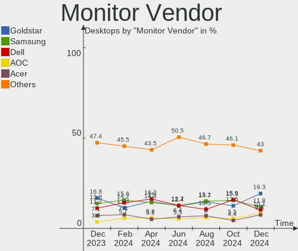
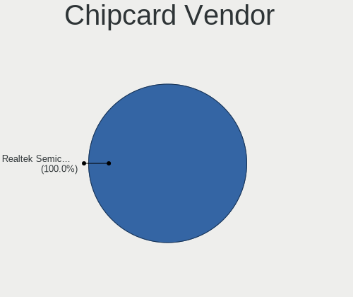
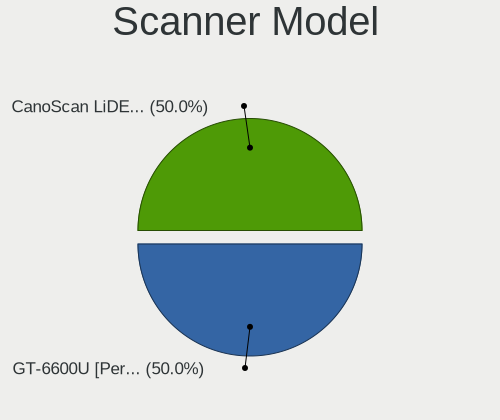

Fedora Hardware Trends (Desktop)
--------------------------------

A project to identify most popular hardware characteristics and track their change
over time based on data collected by Fedora users at https://Linux-Hardware.org.

Anyone can contribute to the study by uploading probes of their computers by
the [hw-probe](https://github.com/linuxhw/hw-probe) tool:

    sudo -E hw-probe -all -upload

Full-feature report is available here: https://linux-hardware.org/?view=trends&formfactor=desktop

Period: Dec, 2020.

Contents
--------

- [ OS                       ](#os)
- [ OS Family                ](#os-family)
- [ Kernel                   ](#kernel)
- [ Kernel Family            ](#kernel-family)
- [ Kernel Major Ver.        ](#kernel-major-ver)
- [ Arch                     ](#arch)
- [ DE                       ](#de)
- [ Display Server           ](#display-server)
- [ Display Manager          ](#display-manager)
- [ OS Lang                  ](#os-lang)
- [ Boot Mode                ](#boot-mode)
- [ Filesystem               ](#filesystem)
- [ Part. scheme             ](#part-scheme)
- [ Dual Boot with Linux/BSD ](#dual-boot-with-linux/bsd)
- [ Dual Boot (Win)          ](#dual-boot-win)
- [ Country                  ](#country)
- [ City                     ](#city)
- [ Vendor                   ](#vendor)
- [ Model                    ](#model)
- [ Model Family             ](#model-family)
- [ MFG Year                 ](#mfg-year)
- [ Form Factor              ](#form-factor)
- [ Secure Boot              ](#secure-boot)
- [ Coreboot                 ](#coreboot)
- [ RAM Size                 ](#ram-size)
- [ RAM Used                 ](#ram-used)
- [ Has CD-ROM               ](#has-cd-rom)
- [ Total Drives             ](#total-drives)
- [ Has Ethernet             ](#has-ethernet)
- [ Drive Vendor             ](#drive-vendor)
- [ Drive Model              ](#drive-model)
- [ HDD Vendor               ](#hdd-vendor)
- [ SSD Vendor               ](#ssd-vendor)
- [ Drive Kind               ](#drive-kind)
- [ Drive Connector          ](#drive-connector)
- [ Drive Size               ](#drive-size)
- [ Space Total              ](#space-total)
- [ Space Used               ](#space-used)
- [ Malfunc. Drives          ](#malfunc-drives)
- [ Malfunc. Drive Vendor    ](#malfunc-drive-vendor)
- [ Malfunc. HDD Vendor      ](#malfunc-hdd-vendor)
- [ Malfunc. Drive Kind      ](#malfunc-drive-kind)
- [ Failed Drives            ](#failed-drives)
- [ Failed Drive Vendor      ](#failed-drive-vendor)
- [ Drive Status             ](#drive-status)
- [ Storage Vendor           ](#storage-vendor)
- [ Storage Model            ](#storage-model)
- [ Storage Kind             ](#storage-kind)
- [ CPU Vendor               ](#cpu-vendor)
- [ CPU Model                ](#cpu-model)
- [ CPU Model Family         ](#cpu-model-family)
- [ CPU Cores                ](#cpu-cores)
- [ CPU Sockets              ](#cpu-sockets)
- [ CPU Threads              ](#cpu-threads)
- [ CPU Op-Modes             ](#cpu-op-modes)
- [ CPU Microcode            ](#cpu-microcode)
- [ CPU Microarch            ](#cpu-microarch)
- [ GPU Vendor               ](#gpu-vendor)
- [ GPU Model                ](#gpu-model)
- [ GPU Combo                ](#gpu-combo)
- [ GPU Driver               ](#gpu-driver)
- [ GPU Memory               ](#gpu-memory)
- [ Monitor Vendor           ](#monitor-vendor)
- [ Monitor Model            ](#monitor-model)
- [ Monitor Resolution       ](#monitor-resolution)
- [ Monitor Diagonal         ](#monitor-diagonal)
- [ Monitor Width            ](#monitor-width)
- [ Aspect Ratio             ](#aspect-ratio)
- [ Monitor Area             ](#monitor-area)
- [ Pixel Density            ](#pixel-density)
- [ Multiple Monitors        ](#multiple-monitors)
- [ Net Controller Vendor    ](#net-controller-vendor)
- [ Net Controller Model     ](#net-controller-model)
- [ Wireless Vendor          ](#wireless-vendor)
- [ Wireless Model           ](#wireless-model)
- [ Ethernet Vendor          ](#ethernet-vendor)
- [ Ethernet Model           ](#ethernet-model)
- [ Net Controller Kind      ](#net-controller-kind)
- [ Used Controller          ](#used-controller)
- [ NICs                     ](#nics)
- [ Memory Vendor            ](#memory-vendor)
- [ Memory Model             ](#memory-model)
- [ Memory Kind              ](#memory-kind)
- [ Memory Form Factor       ](#memory-form-factor)
- [ Memory Size              ](#memory-size)
- [ Memory Speed             ](#memory-speed)
- [ Sound Vendor             ](#sound-vendor)
- [ Sound Model              ](#sound-model)
- [ Camera Vendor            ](#camera-vendor)
- [ Camera Model             ](#camera-model)
- [ Fingerprint Vendor       ](#fingerprint-vendor)
- [ Fingerprint Model        ](#fingerprint-model)
- [ Chipcard Vendor          ](#chipcard-vendor)
- [ Chipcard Model           ](#chipcard-model)
- [ Printer Vendor           ](#printer-vendor)
- [ Printer Model            ](#printer-model)
- [ Scanner Vendor           ](#scanner-vendor)
- [ Scanner Model            ](#scanner-model)
- [ Bluetooth Vendor         ](#bluetooth-vendor)
- [ Bluetooth Model          ](#bluetooth-model)
- [ Unsupported Devices      ](#unsupported-devices)
- [ Unsupported Device Types ](#unsupported-device-types)

OS
--

Installed operating systems

| Name      | Desktops | Percent |
|-----------|----------|---------|
| Fedora 33 | 98       | 85.96%  |
| Fedora 32 | 11       | 9.65%   |
| Fedora 31 | 5        | 4.39%   |

OS Family
---------

OS without a version

| Name   | Desktops | Percent |
|--------|----------|---------|
| Fedora | 114      | 100%    |

Kernel
------

Version of the Linux kernel

| Version                                             | Desktops | Percent |
|-----------------------------------------------------|----------|---------|
| 5.9.11-200.fc33.x86_64                              | 25       | 21.93%  |
| 5.9.14-200.fc33.x86_64                              | 16       | 14.04%  |
| 5.9.15-200.fc33.x86_64                              | 13       | 11.4%   |
| 5.9.13-200.fc33.x86_64                              | 13       | 11.4%   |
| 5.9.16-200.fc33.x86_64                              | 12       | 10.53%  |
| 5.9.12-200.fc33.x86_64                              | 10       | 8.77%   |
| 5.9.10-200.fc33.x86_64                              | 4        | 3.51%   |
| 5.8.18-100.fc31.x86_64                              | 4        | 3.51%   |
| 5.9.12-100.fc32.x86_64                              | 3        | 2.63%   |
| 5.9.11-100.fc32.x86_64                              | 3        | 2.63%   |
| 5.8.15-301.fc33.x86_64                              | 3        | 2.63%   |
| 5.9.14-100.fc32.x86_64                              | 2        | 1.75%   |
| 5.9.16-100.fc32.x86_64                              | 1        | 0.88%   |
| 5.8.17-200.fc32.x86_64                              | 1        | 0.88%   |
| 5.8.16-300.fc33.x86_64                              | 1        | 0.88%   |
| 5.8.16-200.fc32.x86_64                              | 1        | 0.88%   |
| 5.8.13-100.fc31.x86_64                              | 1        | 0.88%   |
| 5.10.0-0.rc5.20201125git127c501a03d5.85.fc34.x86_64 | 1        | 0.88%   |

Kernel Family
-------------

Linux kernel without a distro release

| Version | Desktops | Percent |
|---------|----------|---------|
| 5.9.11  | 28       | 24.56%  |
| 5.9.14  | 18       | 15.79%  |
| 5.9.16  | 13       | 11.4%   |
| 5.9.15  | 13       | 11.4%   |
| 5.9.13  | 13       | 11.4%   |
| 5.9.12  | 13       | 11.4%   |
| 5.9.10  | 4        | 3.51%   |
| 5.8.18  | 4        | 3.51%   |
| 5.8.15  | 3        | 2.63%   |
| 5.8.16  | 2        | 1.75%   |
| 5.8.17  | 1        | 0.88%   |
| 5.8.13  | 1        | 0.88%   |
| 5.10.0  | 1        | 0.88%   |

Kernel Major Ver.
-----------------

Linux kernel major version

| Version | Desktops | Percent |
|---------|----------|---------|
| 5.9     | 102      | 89.47%  |
| 5.8     | 11       | 9.65%   |
| 5.10    | 1        | 0.88%   |

Arch
----

OS architecture (x86_64, i586, etc.)

| Name   | Desktops | Percent |
|--------|----------|---------|
| x86_64 | 114      | 100%    |

DE
--

Desktop Environment

| Name       | Desktops | Percent |
|------------|----------|---------|
| GNOME      | 82       | 71.93%  |
| KDE5       | 9        | 7.89%   |
| KDE        | 8        | 7.02%   |
| MATE       | 5        | 4.39%   |
| X-Cinnamon | 3        | 2.63%   |
| Cinnamon   | 3        | 2.63%   |
| LXDE       | 1        | 0.88%   |
| KDE4       | 1        | 0.88%   |
| Deepin     | 1        | 0.88%   |
| Unknown    | 1        | 0.88%   |

Display Server
--------------

X11 or Wayland

| Name    | Desktops | Percent |
|---------|----------|---------|
| Wayland | 57       | 50%     |
| X11     | 55       | 48.25%  |
| Tty     | 2        | 1.75%   |

Display Manager
---------------

SDDM, LightDM, etc.

| Name    | Desktops | Percent |
|---------|----------|---------|
| Unknown | 82       | 71.93%  |
| GDM     | 21       | 18.42%  |
| SDDM    | 6        | 5.26%   |
| TDM     | 3        | 2.63%   |
| LightDM | 2        | 1.75%   |

OS Lang
-------

Language

| Lang    | Desktops | Percent |
|---------|----------|---------|
| en_US   | 53       | 46.49%  |
| fr_FR   | 9        | 7.89%   |
| en_GB   | 9        | 7.89%   |
| pt_BR   | 6        | 5.26%   |
| en_AU   | 6        | 5.26%   |
| de_DE   | 6        | 5.26%   |
| it_IT   | 4        | 3.51%   |
| es_ES   | 3        | 2.63%   |
| en_CA   | 3        | 2.63%   |
| ru_RU   | 2        | 1.75%   |
| pl_PL   | 2        | 1.75%   |
| cs_CZ   | 2        | 1.75%   |
| tr_TR   | 1        | 0.88%   |
| sv_SE   | 1        | 0.88%   |
| sk_SK   | 1        | 0.88%   |
| ja_JP   | 1        | 0.88%   |
| hu_HU   | 1        | 0.88%   |
| es_DO   | 1        | 0.88%   |
| en_PH   | 1        | 0.88%   |
| en_NZ   | 1        | 0.88%   |
| Unknown | 1        | 0.88%   |

Boot Mode
---------

EFI or BIOS

| Mode | Desktops | Percent |
|------|----------|---------|
| EFI  | 76       | 66.67%  |
| BIOS | 38       | 33.33%  |

Filesystem
----------

Type of filesystem

| Type  | Desktops | Percent |
|-------|----------|---------|
| Btrfs | 55       | 48.25%  |
| Ext4  | 52       | 45.61%  |
| Xfs   | 6        | 5.26%   |
| Ext3  | 1        | 0.88%   |

Part. scheme
------------

Scheme of partitioning

| Type    | Desktops | Percent |
|---------|----------|---------|
| Unknown | 80       | 70.18%  |
| GPT     | 27       | 23.68%  |
| MBR     | 7        | 6.14%   |

Dual Boot with Linux/BSD
------------------------

Hosting more than one Linux/BSD

| Dual boot | Desktops | Percent |
|-----------|----------|---------|
| No        | 106      | 92.98%  |
| Yes       | 8        | 7.02%   |

Dual Boot (Win)
---------------

Hosting Linux and Windows

| Dual boot | Desktops | Percent |
|-----------|----------|---------|
| No        | 95       | 83.33%  |
| Yes       | 19       | 16.67%  |

Country
-------

Geographic location (country)

| Country              | Desktops | Percent |
|----------------------|----------|---------|
| USA                  | 30       | 26.32%  |
| Germany              | 11       | 9.65%   |
| France               | 8        | 7.02%   |
| Brazil               | 7        | 6.14%   |
| Australia            | 6        | 5.26%   |
| UK                   | 5        | 4.39%   |
| Italy                | 5        | 4.39%   |
| Russia               | 4        | 3.51%   |
| Canada               | 4        | 3.51%   |
| Spain                | 3        | 2.63%   |
| Poland               | 3        | 2.63%   |
| Ukraine              | 2        | 1.75%   |
| Turkey               | 2        | 1.75%   |
| Netherlands          | 2        | 1.75%   |
| Czech Republic       | 2        | 1.75%   |
| Austria              | 2        | 1.75%   |
| Sweden               | 1        | 0.88%   |
| Slovakia             | 1        | 0.88%   |
| Saudi Arabia         | 1        | 0.88%   |
| Romania              | 1        | 0.88%   |
| Portugal             | 1        | 0.88%   |
| Philippines          | 1        | 0.88%   |
| New Zealand          | 1        | 0.88%   |
| Moldova, Republic of | 1        | 0.88%   |
| Mexico               | 1        | 0.88%   |
| Malaysia             | 1        | 0.88%   |
| Japan                | 1        | 0.88%   |
| Hungary              | 1        | 0.88%   |
| Hong Kong            | 1        | 0.88%   |
| Dominican Republic   | 1        | 0.88%   |
| Curacao              | 1        | 0.88%   |
| Colombia             | 1        | 0.88%   |
| Argentina            | 1        | 0.88%   |
| Aland Islands        | 1        | 0.88%   |

City
----

Geographic location (city)

| City                | Desktops | Percent |
|---------------------|----------|---------|
| Orlando             | 3        | 2.63%   |
| Presidente Prudente | 2        | 1.75%   |
| Niterói            | 2        | 1.75%   |
| Moscow              | 2        | 1.75%   |
| Izmir               | 2        | 1.75%   |
| Ystad               | 1        | 0.88%   |
| Yokohama            | 1        | 0.88%   |
| Wilmington          | 1        | 0.88%   |
| Willemstad          | 1        | 0.88%   |
| Wiggins             | 1        | 0.88%   |
| Westminster         | 1        | 0.88%   |
| Warsaw              | 1        | 0.88%   |
| Wahroonga           | 1        | 0.88%   |
| Villach             | 1        | 0.88%   |
| Vienna              | 1        | 0.88%   |
| Vancouver           | 1        | 0.88%   |
| Valenzuela          | 1        | 0.88%   |
| Utrecht             | 1        | 0.88%   |
| Ufa                 | 1        | 0.88%   |
| Toulouse            | 1        | 0.88%   |
| Szigetszentmiklos   | 1        | 0.88%   |
| Stockton            | 1        | 0.88%   |
| St Petersburg       | 1        | 0.88%   |
| Salamanca           | 1        | 0.88%   |
| Saint Paul          | 1        | 0.88%   |
| Saginaw             | 1        | 0.88%   |
| Rybnik              | 1        | 0.88%   |
| Rome                | 1        | 0.88%   |
| Rogers              | 1        | 0.88%   |
| Red Deer            | 1        | 0.88%   |
| Québec             | 1        | 0.88%   |
| Pujaut              | 1        | 0.88%   |
| Prague              | 1        | 0.88%   |
| Portsmouth          | 1        | 0.88%   |
| Pittsburgh          | 1        | 0.88%   |
| Pinellas Park       | 1        | 0.88%   |
| Peach Orchard       | 1        | 0.88%   |
| Paris               | 1        | 0.88%   |
| Palermo             | 1        | 0.88%   |
| Pagny-sur-Meuse     | 1        | 0.88%   |
| Oshawa              | 1        | 0.88%   |
| Ormskirk            | 1        | 0.88%   |
| Orhei               | 1        | 0.88%   |
| Olching             | 1        | 0.88%   |
| Oklahoma City       | 1        | 0.88%   |
| Odesa               | 1        | 0.88%   |
| Nokomis             | 1        | 0.88%   |
| Nienburg            | 1        | 0.88%   |
| Munich              | 1        | 0.88%   |
| Montreal            | 1        | 0.88%   |
| Montesson           | 1        | 0.88%   |
| Mitcham             | 1        | 0.88%   |
| Mishawaka           | 1        | 0.88%   |
| Minneapolis         | 1        | 0.88%   |
| Mexico City         | 1        | 0.88%   |
| Mestre              | 1        | 0.88%   |
| Medellín           | 1        | 0.88%   |
| Medebach            | 1        | 0.88%   |
| Mariehamn           | 1        | 0.88%   |
| Madrid              | 1        | 0.88%   |

Vendor
------

Motherboard manufacturer

| Name                | Desktops | Percent |
|---------------------|----------|---------|
| ASUSTek Computer    | 33       | 28.95%  |
| MSI                 | 20       | 17.54%  |
| Gigabyte Technology | 20       | 17.54%  |
| ASRock              | 16       | 14.04%  |
| Hewlett-Packard     | 7        | 6.14%   |
| Dell                | 5        | 4.39%   |
| Biostar             | 2        | 1.75%   |
| Unknown             | 2        | 1.75%   |
| Protectli           | 1        | 0.88%   |
| Positivo            | 1        | 0.88%   |
| Pegatron            | 1        | 0.88%   |
| PCWare              | 1        | 0.88%   |
| Medion              | 1        | 0.88%   |
| Lenovo              | 1        | 0.88%   |
| LattePanda          | 1        | 0.88%   |
| Inventec            | 1        | 0.88%   |
| Acer                | 1        | 0.88%   |

Model
-----

Motherboard model

| Name                             | Desktops | Percent |
|----------------------------------|----------|---------|
| MSI MS-7C37                      | 2        | 1.75%   |
| MSI MS-7641                      | 2        | 1.75%   |
| Gigabyte 970A-DS3P               | 2        | 1.75%   |
| ASUS ROG STRIX B450-F GAMING     | 2        | 1.75%   |
| ASUS PRIME X399-A                | 2        | 1.75%   |
| ASUS All Series                  | 2        | 1.75%   |
| ASRock G41M-VS3                  | 2        | 1.75%   |
| ASRock B550M Pro4                | 2        | 1.75%   |
| Unknown                          | 2        | 1.75%   |
| Protectli FW4B                   | 1        | 0.88%   |
| Positivo POS-PIQ77CL             | 1        | 0.88%   |
| Pegatron p2-1343w                | 1        | 0.88%   |
| PCWare IPMH110G                  | 1        | 0.88%   |
| MSI PPPPP-CCC#MMMMMMMM           | 1        | 0.88%   |
| MSI MS-7C94                      | 1        | 0.88%   |
| MSI MS-7C92                      | 1        | 0.88%   |
| MSI MS-7C87                      | 1        | 0.88%   |
| MSI MS-7C84                      | 1        | 0.88%   |
| MSI MS-7C76                      | 1        | 0.88%   |
| MSI MS-7C56                      | 1        | 0.88%   |
| MSI MS-7C34                      | 1        | 0.88%   |
| MSI MS-7C02                      | 1        | 0.88%   |
| MSI MS-7B85                      | 1        | 0.88%   |
| MSI MS-7B78                      | 1        | 0.88%   |
| MSI MS-7B10                      | 1        | 0.88%   |
| MSI MS-7996                      | 1        | 0.88%   |
| MSI MS-7885                      | 1        | 0.88%   |
| MSI MS-7850                      | 1        | 0.88%   |
| MSI MS-7816                      | 1        | 0.88%   |
| Medion MS-7621                   | 1        | 0.88%   |
| Lenovo ThinkCentre M58p 7220A72  | 1        | 0.88%   |
| LattePanda Alpha                 | 1        | 0.88%   |
| Inventec Z CLASS                 | 1        | 0.88%   |
| HP Z440 Workstation              | 1        | 0.88%   |
| HP Z1 G2 Touch Workstation       | 1        | 0.88%   |
| HP ProDesk 600 G3 SFF            | 1        | 0.88%   |
| HP ProDesk 600 G1 SFF            | 1        | 0.88%   |
| HP EliteDesk 800 G1 TWR          | 1        | 0.88%   |
| HP EliteDesk 705 G4 MT           | 1        | 0.88%   |
| HP Compaq Elite 8300 SFF         | 1        | 0.88%   |
| Gigabyte Z68A-D3H-B3             | 1        | 0.88%   |
| Gigabyte X570 UD                 | 1        | 0.88%   |
| Gigabyte X570 I AORUS PRO WIFI   | 1        | 0.88%   |
| Gigabyte X570 AORUS MASTER       | 1        | 0.88%   |
| Gigabyte TRX40 DESIGNARE         | 1        | 0.88%   |
| Gigabyte TRX40 AORUS XTREME      | 1        | 0.88%   |
| Gigabyte P55A-UD7                | 1        | 0.88%   |
| Gigabyte H77N-WIFI               | 1        | 0.88%   |
| Gigabyte H61M-S2P                | 1        | 0.88%   |
| Gigabyte GA-78LMT-USB3 R2        | 1        | 0.88%   |
| Gigabyte B75M-D3V                | 1        | 0.88%   |
| Gigabyte B550 AORUS MASTER       | 1        | 0.88%   |
| Gigabyte B450M DS3H              | 1        | 0.88%   |
| Gigabyte B450 AORUS M            | 1        | 0.88%   |
| Gigabyte B450 AORUS ELITE        | 1        | 0.88%   |
| Gigabyte B360M-DS3H              | 1        | 0.88%   |
| Gigabyte AB350-Gaming 3          | 1        | 0.88%   |
| Gigabyte A320M-S2H V2            | 1        | 0.88%   |
| Dell XPS 8930                    | 1        | 0.88%   |
| Dell Precision WorkStation T3500 | 1        | 0.88%   |

Model Family
------------

Motherboard model prefix

| Name                   | Desktops | Percent |
|------------------------|----------|---------|
| ASUS PRIME             | 8        | 7.02%   |
| ASUS ROG               | 5        | 4.39%   |
| Gigabyte X570          | 3        | 2.63%   |
| ASUS TUF               | 3        | 2.63%   |
| MSI MS-7C37            | 2        | 1.75%   |
| MSI MS-7641            | 2        | 1.75%   |
| HP ProDesk             | 2        | 1.75%   |
| HP EliteDesk           | 2        | 1.75%   |
| Gigabyte TRX40         | 2        | 1.75%   |
| Gigabyte B450          | 2        | 1.75%   |
| Gigabyte 970A-DS3P     | 2        | 1.75%   |
| Dell Precision         | 2        | 1.75%   |
| Dell OptiPlex          | 2        | 1.75%   |
| ASUS Z170-P            | 2        | 1.75%   |
| ASUS P8Z68-V           | 2        | 1.75%   |
| ASUS All               | 2        | 1.75%   |
| ASRock X570            | 2        | 1.75%   |
| ASRock G41M-VS3        | 2        | 1.75%   |
| ASRock B550M           | 2        | 1.75%   |
| Unknown                | 2        | 1.75%   |
| Protectli FW4B         | 1        | 0.88%   |
| Positivo POS-PIQ77CL   | 1        | 0.88%   |
| Pegatron p2-1343w      | 1        | 0.88%   |
| PCWare IPMH110G        | 1        | 0.88%   |
| MSI PPPPP-CCC#MMMMMMMM | 1        | 0.88%   |
| MSI MS-7C94            | 1        | 0.88%   |
| MSI MS-7C92            | 1        | 0.88%   |
| MSI MS-7C87            | 1        | 0.88%   |
| MSI MS-7C84            | 1        | 0.88%   |
| MSI MS-7C76            | 1        | 0.88%   |
| MSI MS-7C56            | 1        | 0.88%   |
| MSI MS-7C34            | 1        | 0.88%   |
| MSI MS-7C02            | 1        | 0.88%   |
| MSI MS-7B85            | 1        | 0.88%   |
| MSI MS-7B78            | 1        | 0.88%   |
| MSI MS-7B10            | 1        | 0.88%   |
| MSI MS-7996            | 1        | 0.88%   |
| MSI MS-7885            | 1        | 0.88%   |
| MSI MS-7850            | 1        | 0.88%   |
| MSI MS-7816            | 1        | 0.88%   |
| Medion MS-7621         | 1        | 0.88%   |
| Lenovo ThinkCentre     | 1        | 0.88%   |
| LattePanda Alpha       | 1        | 0.88%   |
| Inventec Z             | 1        | 0.88%   |
| HP Z440                | 1        | 0.88%   |
| HP Z1                  | 1        | 0.88%   |
| HP Compaq              | 1        | 0.88%   |
| Gigabyte Z68A-D3H-B3   | 1        | 0.88%   |
| Gigabyte P55A-UD7      | 1        | 0.88%   |
| Gigabyte H77N-WIFI     | 1        | 0.88%   |
| Gigabyte H61M-S2P      | 1        | 0.88%   |
| Gigabyte GA-78LMT-USB3 | 1        | 0.88%   |
| Gigabyte B75M-D3V      | 1        | 0.88%   |
| Gigabyte B550          | 1        | 0.88%   |
| Gigabyte B450M         | 1        | 0.88%   |
| Gigabyte B360M-DS3H    | 1        | 0.88%   |
| Gigabyte AB350-Gaming  | 1        | 0.88%   |
| Gigabyte A320M-S2H     | 1        | 0.88%   |
| Dell XPS               | 1        | 0.88%   |
| Biostar TP45E          | 1        | 0.88%   |

MFG Year
--------

Motherboard manufacture year

| Year | Desktops | Percent |
|------|----------|---------|
| 2020 | 32       | 28.07%  |
| 2019 | 21       | 18.42%  |
| 2018 | 12       | 10.53%  |
| 2013 | 8        | 7.02%   |
| 2012 | 8        | 7.02%   |
| 2017 | 7        | 6.14%   |
| 2015 | 6        | 5.26%   |
| 2011 | 6        | 5.26%   |
| 2014 | 5        | 4.39%   |
| 2016 | 3        | 2.63%   |
| 2010 | 2        | 1.75%   |
| 2009 | 2        | 1.75%   |
| 2008 | 2        | 1.75%   |

Form Factor
-----------

Physical design of the computer

| Name    | Desktops | Percent |
|---------|----------|---------|
| Desktop | 114      | 100%    |

Secure Boot
-----------

Enabled or disabled

| State    | Desktops | Percent |
|----------|----------|---------|
| Disabled | 111      | 97.37%  |
| Enabled  | 3        | 2.63%   |

Coreboot
--------

Have coreboot on board

| Used | Desktops | Percent |
|------|----------|---------|
| No   | 114      | 100%    |

RAM Size
--------

Total RAM memory

| Size in GB  | Desktops | Percent |
|-------------|----------|---------|
| 16.01-24.0  | 32       | 28.07%  |
| 32.01-64.0  | 24       | 21.05%  |
| 4.01-8.0    | 15       | 13.16%  |
| 8.01-16.0   | 15       | 13.16%  |
| 3.01-4.0    | 13       | 11.4%   |
| 64.01-256.0 | 12       | 10.53%  |
| 24.01-32.0  | 3        | 2.63%   |

RAM Used
--------

Used RAM memory

| Used GB    | Desktops | Percent |
|------------|----------|---------|
| 2.01-3.0   | 38       | 33.33%  |
| 4.01-8.0   | 32       | 28.07%  |
| 1.01-2.0   | 20       | 17.54%  |
| 3.01-4.0   | 14       | 12.28%  |
| 8.01-16.0  | 7        | 6.14%   |
| 24.01-32.0 | 1        | 0.88%   |
| 16.01-24.0 | 1        | 0.88%   |
| 0.51-1.0   | 1        | 0.88%   |

Has CD-ROM
----------

Has CD-ROM on board

| Presented | Desktops | Percent |
|-----------|----------|---------|
| No        | 71       | 62.28%  |
| Yes       | 43       | 37.72%  |

Total Drives
------------

Number of drives on board

| Drives | Desktops | Percent |
|--------|----------|---------|
| 1      | 40       | 35.09%  |
| 2      | 32       | 28.07%  |
| 3      | 20       | 17.54%  |
| 4      | 9        | 7.89%   |
| 5      | 6        | 5.26%   |
| 6      | 3        | 2.63%   |
| 9      | 2        | 1.75%   |
| 10     | 1        | 0.88%   |
| 8      | 1        | 0.88%   |

Has Ethernet
------------

Has Ethernet on board

| Presented | Desktops | Percent |
|-----------|----------|---------|
| Yes       | 113      | 99.12%  |
| No        | 1        | 0.88%   |

Drive Vendor
------------

Hard drive vendors

| Vendor              | Desktops | Drives | Percent |
|---------------------|----------|--------|---------|
| WDC                 | 45       | 57     | 20.55%  |
| Seagate             | 38       | 47     | 17.35%  |
| Samsung Electronics | 38       | 72     | 17.35%  |
| Kingston            | 14       | 14     | 6.39%   |
| Crucial             | 14       | 20     | 6.39%   |
| Toshiba             | 13       | 15     | 5.94%   |
| SanDisk             | 11       | 14     | 5.02%   |
| Phison              | 8        | 8      | 3.65%   |
| Hitachi             | 6        | 6      | 2.74%   |
| A-DATA Technology   | 4        | 5      | 1.83%   |
| Unknown             | 3        | 4      | 1.37%   |
| Silicon Motion      | 3        | 3      | 1.37%   |
| SPCC                | 2        | 2      | 0.91%   |
| SK Hynix            | 2        | 2      | 0.91%   |
| OCZ                 | 2        | 2      | 0.91%   |
| Intel               | 2        | 3      | 0.91%   |
| Apacer              | 2        | 2      | 0.91%   |
| XPG                 | 1        | 1      | 0.46%   |
| Realtek             | 1        | 1      | 0.46%   |
| PLEXTOR             | 1        | 1      | 0.46%   |
| Patriot             | 1        | 1      | 0.46%   |
| KingSpec            | 1        | 1      | 0.46%   |
| Inateck             | 1        | 1      | 0.46%   |
| HGST                | 1        | 1      | 0.46%   |
| Hewlett-Packard     | 1        | 1      | 0.46%   |
| GOODRAM             | 1        | 1      | 0.46%   |
| Gigabyte Technology | 1        | 1      | 0.46%   |
| Corsair             | 1        | 1      | 0.46%   |
| China               | 1        | 1      | 0.46%   |

Drive Model
-----------

Hard drive models

| Model                                      | Desktops | Percent |
|--------------------------------------------|----------|---------|
| Samsung SSD 850 EVO 250GB                  | 7        | 2.62%   |
| Samsung SSD 860 EVO 1TB                    | 6        | 2.25%   |
| Seagate ST1000DM010-2EP102 1TB             | 5        | 1.87%   |
| Samsung SSD 860 EVO 500GB                  | 5        | 1.87%   |
| Samsung NVMe SSD Drive 500GB               | 4        | 1.5%    |
| Samsung NVMe SSD Drive 250GB               | 4        | 1.5%    |
| Seagate ST2000DM001-1ER164 2TB             | 3        | 1.12%   |
| Sandisk NVMe SSD Drive 1TB                 | 3        | 1.12%   |
| Kingston SA400S37240G 240GB SSD            | 3        | 1.12%   |
| Crucial CT240BX500SSD1 240GB               | 3        | 1.12%   |
| WDC WD2500BEVT-22ZCT0 250GB                | 2        | 0.75%   |
| WDC WD20EZRZ-00Z5HB0 2TB                   | 2        | 0.75%   |
| WDC WD10EZEX-00BN5A0 1TB                   | 2        | 0.75%   |
| WDC WD10EARS-00Y5B1 1TB                    | 2        | 0.75%   |
| WDC WD1003FZEX-00K3CA0 1TB                 | 2        | 0.75%   |
| Toshiba TR200 240GB SSD                    | 2        | 0.75%   |
| Toshiba MD04ACA400 4TB                     | 2        | 0.75%   |
| Toshiba DT01ACA200 2TB                     | 2        | 0.75%   |
| Toshiba DT01ACA100 1TB                     | 2        | 0.75%   |
| Toshiba DT01ACA050 500GB                   | 2        | 0.75%   |
| Seagate ST500DM002-1BD142 500GB            | 2        | 0.75%   |
| Seagate ST4000DM000-1F2168 4TB             | 2        | 0.75%   |
| Seagate ST3500312CS 500GB                  | 2        | 0.75%   |
| Seagate ST2000DM008-2FR102 2TB             | 2        | 0.75%   |
| Seagate ST2000DM005-2CW102 2TB             | 2        | 0.75%   |
| Seagate FireCuda 520 SSD ZP1000GM30002 1TB | 2        | 0.75%   |
| SanDisk SDSSDA240G 240GB                   | 2        | 0.75%   |
| Samsung SSD 970 EVO Plus 1TB               | 2        | 0.75%   |
| Samsung SSD 970 EVO 500GB                  | 2        | 0.75%   |
| Samsung SSD 850 EVO 500GB                  | 2        | 0.75%   |
| Samsung SSD 840 Series 120GB               | 2        | 0.75%   |
| Samsung SSD 840 EVO 250GB                  | 2        | 0.75%   |
| Samsung NVMe SSD Drive 512GB               | 2        | 0.75%   |
| Samsung HD154UI 1TB                        | 2        | 0.75%   |
| Samsung HD103SJ 1TB                        | 2        | 0.75%   |
| Phison Sabrent Rocket 4.0 1TB              | 2        | 0.75%   |
| Kingston SA400S37120G 120GB SSD            | 2        | 0.75%   |
| Crucial CT500MX500SSD1 500GB               | 2        | 0.75%   |
| Crucial CT1000MX500SSD4 1TB                | 2        | 0.75%   |
| XPG NVMe SSD Drive 512GB                   | 1        | 0.37%   |
| WDC WDS500G2B0A-00SM50 500GB SSD           | 1        | 0.37%   |
| WDC WDS250G2B0C-00PXH0 250GB               | 1        | 0.37%   |
| WDC WDS250G2B0A-00SM50 250GB SSD           | 1        | 0.37%   |
| WDC WD80EFAX-68KNBN0 8TB                   | 1        | 0.37%   |
| WDC WD800JD-60LSA5 80GB                    | 1        | 0.37%   |
| WDC WD7500AACS-00D6B1 752GB                | 1        | 0.37%   |
| WDC WD6400BEVT-22A0RT0 640GB               | 1        | 0.37%   |
| WDC WD6400AAKS-65A7B0 640GB                | 1        | 0.37%   |
| WDC WD5002AALX-00J37A0 500GB               | 1        | 0.37%   |
| WDC WD5000LPVX-75V0TT0 500GB               | 1        | 0.37%   |
| WDC WD5000LPCX-60VHAT0 500GB               | 1        | 0.37%   |
| WDC WD5000AVVS-63H0B1 500GB                | 1        | 0.37%   |
| WDC WD5000AAKX-753CA1 500GB                | 1        | 0.37%   |
| WDC WD5000AAKX-60U6AA0 500GB               | 1        | 0.37%   |
| WDC WD5000AAKX-00ERMA0 500GB               | 1        | 0.37%   |
| WDC WD5000AADS-11M2B1 500GB                | 1        | 0.37%   |
| WDC WD40EZRZ-00GXCB0 4TB                   | 1        | 0.37%   |
| WDC WD40EFRX-68WT0N0 4TB                   | 1        | 0.37%   |
| WDC WD4004FZWX-00GBGB0 4TB                 | 1        | 0.37%   |
| WDC WD4001FFSX-68JNUN0 4TB                 | 1        | 0.37%   |

HDD Vendor
----------

Hard disk drive vendors

| Vendor              | Desktops | Drives | Percent |
|---------------------|----------|--------|---------|
| WDC                 | 43       | 54     | 40.57%  |
| Seagate             | 35       | 41     | 33.02%  |
| Toshiba             | 12       | 13     | 11.32%  |
| Samsung Electronics | 8        | 9      | 7.55%   |
| Hitachi             | 6        | 6      | 5.66%   |
| Inateck             | 1        | 1      | 0.94%   |
| HGST                | 1        | 1      | 0.94%   |

SSD Vendor
----------

Solid state drive vendors

| Vendor              | Desktops | Drives | Percent |
|---------------------|----------|--------|---------|
| Samsung Electronics | 26       | 42     | 34.21%  |
| Crucial             | 13       | 19     | 17.11%  |
| Kingston            | 10       | 10     | 13.16%  |
| SanDisk             | 6        | 7      | 7.89%   |
| A-DATA Technology   | 4        | 5      | 5.26%   |
| WDC                 | 2        | 2      | 2.63%   |
| Toshiba             | 2        | 2      | 2.63%   |
| SK Hynix            | 2        | 2      | 2.63%   |
| OCZ                 | 2        | 2      | 2.63%   |
| Apacer              | 2        | 2      | 2.63%   |
| Seagate             | 1        | 1      | 1.32%   |
| PLEXTOR             | 1        | 1      | 1.32%   |
| Patriot             | 1        | 1      | 1.32%   |
| KingSpec            | 1        | 1      | 1.32%   |
| Hewlett-Packard     | 1        | 1      | 1.32%   |
| GOODRAM             | 1        | 1      | 1.32%   |
| China               | 1        | 1      | 1.32%   |

Drive Kind
----------

HDD or SSD

| Kind    | Desktops | Drives | Percent |
|---------|----------|--------|---------|
| HDD     | 78       | 125    | 40.63%  |
| SSD     | 66       | 100    | 34.38%  |
| NVMe    | 43       | 56     | 22.4%   |
| Unknown | 4        | 6      | 2.08%   |
| MMC     | 1        | 1      | 0.52%   |

Drive Connector
---------------

SATA, SAS, NVMe, etc.

| Type | Desktops | Drives | Percent |
|------|----------|--------|---------|
| SATA | 101      | 221    | 66.89%  |
| NVMe | 43       | 56     | 28.48%  |
| SAS  | 6        | 10     | 3.97%   |
| MMC  | 1        | 1      | 0.66%   |

Drive Size
----------

Size of hard drive

| Size in TB | Desktops | Drives | Percent |
|------------|----------|--------|---------|
| 0.01-0.5   | 74       | 102    | 46.25%  |
| 0.51-1.0   | 49       | 74     | 30.63%  |
| 1.01-2.0   | 20       | 26     | 12.5%   |
| 3.01-4.0   | 7        | 10     | 4.38%   |
| 2.01-3.0   | 5        | 7      | 3.13%   |
| 4.01-10.0  | 4        | 5      | 2.5%    |
| 10.01-20.0 | 1        | 1      | 0.63%   |

Space Total
-----------

Amount of disk space available on the file system

| Size in GB     | Desktops | Percent |
|----------------|----------|---------|
| 1001-2000      | 24       | 21.05%  |
| 501-1000       | 19       | 16.67%  |
| 101-250        | 17       | 14.91%  |
| More than 3000 | 15       | 13.16%  |
| 2001-3000      | 13       | 11.4%   |
| 251-500        | 12       | 10.53%  |
| Unknown        | 9        | 7.89%   |
| 51-100         | 4        | 3.51%   |
| 1-20           | 1        | 0.88%   |

Space Used
----------

Amount of used disk space

| Used GB        | Desktops | Percent |
|----------------|----------|---------|
| 21-50          | 17       | 14.91%  |
| 101-250        | 17       | 14.91%  |
| 1001-2000      | 15       | 13.16%  |
| 51-100         | 14       | 12.28%  |
| 251-500        | 13       | 11.4%   |
| 1-20           | 12       | 10.53%  |
| 501-1000       | 10       | 8.77%   |
| Unknown        | 9        | 7.89%   |
| 2001-3000      | 5        | 4.39%   |
| More than 3000 | 2        | 1.75%   |

Malfunc. Drives
---------------

Drive models with a malfunction

| Model                             | Desktops | Drives | Percent |
|-----------------------------------|----------|--------|---------|
| WDC WD5000AAKX-753CA1 500GB       | 1        | 1      | 9.09%   |
| WDC WD40EFRX-68WT0N0 4TB          | 1        | 1      | 9.09%   |
| WDC WD4004FZWX-00GBGB0 4TB        | 1        | 1      | 9.09%   |
| WDC WD3003FZEX-00Z4SA0 3TB        | 1        | 1      | 9.09%   |
| WDC WD20EFRX-68AX9N0 2TB          | 1        | 1      | 9.09%   |
| WDC WD10EADS-65M2B0 1TB           | 1        | 1      | 9.09%   |
| Seagate ST3250410AS 250GB         | 1        | 1      | 9.09%   |
| Seagate ST31000528AS 1TB          | 1        | 1      | 9.09%   |
| Samsung Electronics SP2514N 250GB | 1        | 1      | 9.09%   |
| OCZ AGILITY3 120GB SSD            | 1        | 1      | 9.09%   |
| Hitachi HTS541616J9SA00 160GB     | 1        | 1      | 9.09%   |

Malfunc. Drive Vendor
---------------------

Vendors of faulty drives

| Vendor              | Desktops | Drives | Percent |
|---------------------|----------|--------|---------|
| WDC                 | 6        | 6      | 54.55%  |
| Seagate             | 2        | 2      | 18.18%  |
| Samsung Electronics | 1        | 1      | 9.09%   |
| OCZ                 | 1        | 1      | 9.09%   |
| Hitachi             | 1        | 1      | 9.09%   |

Malfunc. HDD Vendor
-------------------

Vendors of faulty HDD drives

| Vendor              | Desktops | Drives | Percent |
|---------------------|----------|--------|---------|
| WDC                 | 6        | 6      | 60%     |
| Seagate             | 2        | 2      | 20%     |
| Samsung Electronics | 1        | 1      | 10%     |
| Hitachi             | 1        | 1      | 10%     |

Malfunc. Drive Kind
-------------------

Kinds of faulty drives

| Kind | Desktops | Drives | Percent |
|------|----------|--------|---------|
| HDD  | 10       | 10     | 90.91%  |
| SSD  | 1        | 1      | 9.09%   |

Failed Drives
-------------

Failed drive models

Zero info for selected period =(

Failed Drive Vendor
-------------------

Failed drive vendors

Zero info for selected period =(

Drive Status
------------

Number of failed and malfunc. drives

| Status   | Desktops | Drives | Percent |
|----------|----------|--------|---------|
| Detected | 82       | 180    | 63.08%  |
| Works    | 37       | 97     | 28.46%  |
| Malfunc  | 11       | 11     | 8.46%   |

Storage Vendor
--------------

Storage controller vendors

| Vendor                      | Desktops | Percent |
|-----------------------------|----------|---------|
| Intel                       | 63       | 34.62%  |
| AMD                         | 51       | 28.02%  |
| Samsung Electronics         | 17       | 9.34%   |
| ASMedia Technology          | 12       | 6.59%   |
| Phison Electronics          | 11       | 6.04%   |
| Sandisk                     | 7        | 3.85%   |
| JMicron Technology          | 5        | 2.75%   |
| Marvell Technology Group    | 4        | 2.2%    |
| Kingston Technology Company | 4        | 2.2%    |
| Silicon Motion              | 3        | 1.65%   |
| Seagate Technology          | 2        | 1.1%    |
| Nvidia                      | 1        | 0.55%   |
| Micron/Crucial Technology   | 1        | 0.55%   |
| ADATA Technology            | 1        | 0.55%   |

Storage Model
-------------

Storage controller models

| Model                                                                                   | Desktops | Percent |
|-----------------------------------------------------------------------------------------|----------|---------|
| AMD FCH SATA Controller [AHCI mode]                                                     | 35       | 15.49%  |
| Samsung NVMe SSD Controller SM981/PM981/PM983                                           | 14       | 6.19%   |
| ASMedia ASM1062 Serial ATA Controller                                                   | 10       | 4.42%   |
| AMD 400 Series Chipset SATA Controller                                                  | 10       | 4.42%   |
| Intel Q170/Q150/B150/H170/H110/Z170/CM236 Chipset SATA Controller [AHCI Mode]           | 9        | 3.98%   |
| Phison E12 NVMe Controller                                                              | 7        | 3.1%    |
| AMD SATA controller                                                                     | 7        | 3.1%    |
| Intel Cannon Lake PCH SATA AHCI Controller                                              | 6        | 2.65%   |
| Intel 7 Series/C210 Series Chipset Family 6-port SATA Controller [AHCI mode]            | 6        | 2.65%   |
| AMD SB7x0/SB8x0/SB9x0 IDE Controller                                                    | 6        | 2.65%   |
| Sandisk WD Blue SN550 NVMe SSD                                                          | 5        | 2.21%   |
| Intel 8 Series/C220 Series Chipset Family 6-port SATA Controller 1 [AHCI mode]          | 5        | 2.21%   |
| Intel 6 Series/C200 Series Chipset Family 6 port Desktop SATA AHCI Controller           | 5        | 2.21%   |
| Intel 200 Series PCH SATA controller [AHCI mode]                                        | 5        | 2.21%   |
| AMD SB7x0/SB8x0/SB9x0 SATA Controller [AHCI mode]                                       | 5        | 2.21%   |
| Phison E16 PCIe4 NVMe Controller                                                        | 4        | 1.77%   |
| Kingston Company A2000 NVMe SSD                                                         | 4        | 1.77%   |
| Intel SATA Controller [RAID mode]                                                       | 4        | 1.77%   |
| Intel NM10/ICH7 Family SATA Controller [IDE mode]                                       | 4        | 1.77%   |
| Intel 82801JI (ICH10 Family) 4 port SATA IDE Controller #1                              | 4        | 1.77%   |
| Intel 82801JI (ICH10 Family) 2 port SATA IDE Controller #2                              | 4        | 1.77%   |
| Intel 82801G (ICH7 Family) IDE Controller                                               | 4        | 1.77%   |
| AMD FCH SATA Controller D                                                               | 4        | 1.77%   |
| AMD 300 Series Chipset SATA Controller                                                  | 4        | 1.77%   |
| Samsung Electronics Non-Volatile memory controller                                      | 3        | 1.33%   |
| AMD SB7x0/SB8x0/SB9x0 SATA Controller [IDE mode]                                        | 3        | 1.33%   |
| Seagate Non-Volatile memory controller                                                  | 2        | 0.88%   |
| Sandisk WD Black 2018 / PC SN720 NVMe SSD                                               | 2        | 0.88%   |
| JMicron JMB363 SATA/IDE Controller                                                      | 2        | 0.88%   |
| JMicron JMB362 SATA Controller                                                          | 2        | 0.88%   |
| Intel C610/X99 series chipset sSATA Controller [AHCI mode]                              | 2        | 0.88%   |
| Intel C610/X99 series chipset 6-Port SATA Controller [AHCI mode]                        | 2        | 0.88%   |
| Intel 6 Series/C200 Series Chipset Family Desktop SATA Controller (IDE mode, ports 4-5) | 2        | 0.88%   |
| Intel 6 Series/C200 Series Chipset Family Desktop SATA Controller (IDE mode, ports 0-3) | 2        | 0.88%   |
| Intel 5 Series/3400 Series Chipset 6 port SATA AHCI Controller                          | 2        | 0.88%   |
| ASMedia ASM1061 SATA IDE Controller                                                     | 2        | 0.88%   |
| AMD X399 Series Chipset SATA Controller                                                 | 2        | 0.88%   |
| AMD X370 Series Chipset SATA Controller                                                 | 2        | 0.88%   |
| Silicon Motion SM2263EN/SM2263XT SSD Controller                                         | 1        | 0.44%   |
| Silicon Motion SM2262/SM2262EN SSD Controller                                           | 1        | 0.44%   |
| Silicon Motion Non-Volatile memory controller                                           | 1        | 0.44%   |
| Sandisk WD Black SN750 / PC SN730 NVMe SSD                                              | 1        | 0.44%   |
| Samsung NVMe SSD Controller SM961/PM961/SM963                                           | 1        | 0.44%   |
| Samsung Electronics SATA controller                                                     | 1        | 0.44%   |
| Nvidia MCP79 AHCI Controller                                                            | 1        | 0.44%   |
| Micron/Crucial P1 NVMe PCIe SSD                                                         | 1        | 0.44%   |
| Marvell Group 88SE9172 SATA 6Gb/s Controller                                            | 1        | 0.44%   |
| Marvell Group 88SE9123 PCIe SATA 6.0 Gb/s controller                                    | 1        | 0.44%   |
| Marvell Group 88SE6111/6121 SATA II / PATA Controller                                   | 1        | 0.44%   |
| Marvell Group 88SE6101/6102 single-port PATA133 interface                               | 1        | 0.44%   |
| JMicron JMB368 IDE controller                                                           | 1        | 0.44%   |
| Intel SSD 660P Series                                                                   | 1        | 0.44%   |
| Intel NVMe Optane Memory Series                                                         | 1        | 0.44%   |
| Intel C610/X99 series chipset sSATA Controller [RAID mode]                              | 1        | 0.44%   |
| Intel C600/X79 series chipset SATA RAID Controller                                      | 1        | 0.44%   |
| Intel Atom/Celeron/Pentium Processor x5-E8000/J3xxx/N3xxx Series SATA Controller        | 1        | 0.44%   |
| Intel 9 Series Chipset Family SATA Controller [AHCI Mode]                               | 1        | 0.44%   |
| Intel 82801JD/DO (ICH10 Family) SATA AHCI Controller                                    | 1        | 0.44%   |
| Intel 82801IR/IO/IH (ICH9R/DO/DH) 6 port SATA Controller [AHCI mode]                    | 1        | 0.44%   |
| Intel 400 Series Chipset Family SATA AHCI Controller                                    | 1        | 0.44%   |

Storage Kind
------------

Kind of storage controller (IDE, SATA, NVMe, SAS, ...)

| Kind | Desktops | Percent |
|------|----------|---------|
| SATA | 98       | 59.04%  |
| NVMe | 43       | 25.9%   |
| IDE  | 19       | 11.45%  |
| RAID | 6        | 3.61%   |

CPU Vendor
----------

Processor vendors

| Vendor | Desktops | Percent |
|--------|----------|---------|
| Intel  | 63       | 55.26%  |
| AMD    | 51       | 44.74%  |

CPU Model
---------

Processor models

| Model                                          | Desktops | Percent |
|------------------------------------------------|----------|---------|
| AMD Ryzen 7 3700X 8-Core Processor             | 6        | 5.26%   |
| Intel Core i7-6700K CPU @ 4.00GHz              | 3        | 2.63%   |
| Intel Core i5-3570K CPU @ 3.40GHz              | 3        | 2.63%   |
| Intel Core 2 Duo CPU E8400 @ 3.00GHz           | 3        | 2.63%   |
| AMD Ryzen 9 3900XT 12-Core Processor           | 3        | 2.63%   |
| AMD Ryzen 9 3900X 12-Core Processor            | 3        | 2.63%   |
| AMD Ryzen 5 3400G with Radeon Vega Graphics    | 3        | 2.63%   |
| AMD Ryzen 3 3100 4-Core Processor              | 3        | 2.63%   |
| Intel Core i7-9700F CPU @ 3.00GHz              | 2        | 1.75%   |
| Intel Core i7-8700 CPU @ 3.20GHz               | 2        | 1.75%   |
| Intel Core i7-4770 CPU @ 3.40GHz               | 2        | 1.75%   |
| Intel Core i7-3770 CPU @ 3.40GHz               | 2        | 1.75%   |
| Intel Core i7 CPU 870 @ 2.93GHz                | 2        | 1.75%   |
| Intel Core i5-6500 CPU @ 3.20GHz               | 2        | 1.75%   |
| Intel Core 2 CPU 6600 @ 2.40GHz                | 2        | 1.75%   |
| AMD Ryzen Threadripper 3970X 32-Core Processor | 2        | 1.75%   |
| AMD Ryzen Threadripper 1950X 16-Core Processor | 2        | 1.75%   |
| AMD Ryzen 9 5900X 12-Core Processor            | 2        | 1.75%   |
| AMD Ryzen 7 2700X Eight-Core Processor         | 2        | 1.75%   |
| AMD Ryzen 7 1700 Eight-Core Processor          | 2        | 1.75%   |
| AMD Ryzen 5 3600 6-Core Processor              | 2        | 1.75%   |
| AMD FX-4300 Quad-Core Processor                | 2        | 1.75%   |
| AMD Athlon 200GE with Radeon Vega Graphics     | 2        | 1.75%   |
| Intel Xeon CPU X5690 @ 3.47GHz                 | 1        | 0.88%   |
| Intel Xeon CPU E5-2697 v3 @ 2.60GHz            | 1        | 0.88%   |
| Intel Xeon CPU E5-2670 v3 @ 2.30GHz            | 1        | 0.88%   |
| Intel Pentium Dual-Core CPU E5200 @ 2.50GHz    | 1        | 0.88%   |
| Intel Pentium CPU G4400 @ 3.30GHz              | 1        | 0.88%   |
| Intel Core m3-8100Y CPU @ 1.10GHz              | 1        | 0.88%   |
| Intel Core i9-9900K CPU @ 3.60GHz              | 1        | 0.88%   |
| Intel Core i7-9700K CPU @ 3.60GHz              | 1        | 0.88%   |
| Intel Core i7-8700K CPU @ 3.70GHz              | 1        | 0.88%   |
| Intel Core i7-7700K CPU @ 4.20GHz              | 1        | 0.88%   |
| Intel Core i7-5960X CPU @ 3.00GHz              | 1        | 0.88%   |
| Intel Core i7-5820K CPU @ 3.30GHz              | 1        | 0.88%   |
| Intel Core i7-4790K CPU @ 4.00GHz              | 1        | 0.88%   |
| Intel Core i7-4790 CPU @ 3.60GHz               | 1        | 0.88%   |
| Intel Core i7-2600K CPU @ 3.40GHz              | 1        | 0.88%   |
| Intel Core i5-9400F CPU @ 2.90GHz              | 1        | 0.88%   |
| Intel Core i5-7400 CPU @ 3.00GHz               | 1        | 0.88%   |
| Intel Core i5-6600K CPU @ 3.50GHz              | 1        | 0.88%   |
| Intel Core i5-6400 CPU @ 2.70GHz               | 1        | 0.88%   |
| Intel Core i5-4590 CPU @ 3.30GHz               | 1        | 0.88%   |
| Intel Core i5-4570 CPU @ 3.20GHz               | 1        | 0.88%   |
| Intel Core i5-4460 CPU @ 3.20GHz               | 1        | 0.88%   |
| Intel Core i5-3470 CPU @ 3.20GHz               | 1        | 0.88%   |
| Intel Core i5-2500K CPU @ 3.30GHz              | 1        | 0.88%   |
| Intel Core i5-2500 CPU @ 3.30GHz               | 1        | 0.88%   |
| Intel Core i5-2405S CPU @ 2.50GHz              | 1        | 0.88%   |
| Intel Core i5-10600K CPU @ 4.10GHz             | 1        | 0.88%   |
| Intel Core i5 CPU 650 @ 3.20GHz                | 1        | 0.88%   |
| Intel Core i3-8100 CPU @ 3.60GHz               | 1        | 0.88%   |
| Intel Core i3-7100 CPU @ 3.90GHz               | 1        | 0.88%   |
| Intel Core i3-6100 CPU @ 3.70GHz               | 1        | 0.88%   |
| Intel Core i3-4130 CPU @ 3.40GHz               | 1        | 0.88%   |
| Intel Core i3-3240 CPU @ 3.40GHz               | 1        | 0.88%   |
| Intel Core i3-3220 CPU @ 3.30GHz               | 1        | 0.88%   |
| Intel Core i3-2100 CPU @ 3.10GHz               | 1        | 0.88%   |
| Intel Core 2 Quad CPU Q9400 @ 2.66GHz          | 1        | 0.88%   |
| Intel Core 2 Quad CPU Q6600 @ 2.40GHz          | 1        | 0.88%   |

CPU Model Family
----------------

Processor model prefix

| Model                   | Desktops | Percent |
|-------------------------|----------|---------|
| Intel Core i7           | 21       | 18.42%  |
| Intel Core i5           | 18       | 15.79%  |
| AMD Ryzen 7             | 12       | 10.53%  |
| AMD Ryzen 9             | 10       | 8.77%   |
| AMD Ryzen 5             | 10       | 8.77%   |
| Intel Core i3           | 7        | 6.14%   |
| AMD FX                  | 6        | 5.26%   |
| Intel Core 2 Duo        | 5        | 4.39%   |
| AMD Ryzen Threadripper  | 4        | 3.51%   |
| Intel Xeon              | 3        | 2.63%   |
| AMD Ryzen 3             | 3        | 2.63%   |
| Intel Core 2 Quad       | 2        | 1.75%   |
| Intel Core 2            | 2        | 1.75%   |
| AMD Athlon              | 2        | 1.75%   |
| Intel Pentium Dual-Core | 1        | 0.88%   |
| Intel Pentium           | 1        | 0.88%   |
| Intel Core m3           | 1        | 0.88%   |
| Intel Core i9           | 1        | 0.88%   |
| Intel Celeron           | 1        | 0.88%   |
| AMD Ryzen 7 PRO         | 1        | 0.88%   |
| AMD Ryzen 5 PRO         | 1        | 0.88%   |
| AMD G                   | 1        | 0.88%   |
| AMD E2                  | 1        | 0.88%   |

CPU Cores
---------

Number of processor cores

| Number | Desktops | Percent |
|--------|----------|---------|
| 4      | 41       | 35.96%  |
| 2      | 23       | 20.18%  |
| 8      | 18       | 15.79%  |
| 6      | 14       | 12.28%  |
| 12     | 9        | 7.89%   |
| 16     | 4        | 3.51%   |
| 32     | 2        | 1.75%   |
| 3      | 2        | 1.75%   |
| 14     | 1        | 0.88%   |

CPU Sockets
-----------

Number of sockets

| Number | Desktops | Percent |
|--------|----------|---------|
| 1      | 114      | 100%    |

CPU Threads
-----------

Threads per core (Hyper-Threading)

| Number | Desktops | Percent |
|--------|----------|---------|
| 2      | 79       | 69.3%   |
| 1      | 35       | 30.7%   |

CPU Op-Modes
------------

CPU Operation Modes (32-bit, 64-bit)

| Op mode        | Desktops | Percent |
|----------------|----------|---------|
| 32-bit, 64-bit | 114      | 100%    |

CPU Microcode
-------------

Microcode number

| Number     | Desktops | Percent |
|------------|----------|---------|
| 0x08701021 | 14       | 12.28%  |
| 0x506e3    | 8        | 7.02%   |
| 0x306c3    | 8        | 7.02%   |
| 0x306a9    | 8        | 7.02%   |
| 0x0800820d | 6        | 5.26%   |
| 0x06000852 | 6        | 5.26%   |
| 0x206a7    | 5        | 4.39%   |
| 0x1067a    | 5        | 4.39%   |
| 0x08701013 | 5        | 4.39%   |
| 0x906ea    | 4        | 3.51%   |
| 0x306f2    | 4        | 3.51%   |
| 0x0a201009 | 4        | 3.51%   |
| 0x906ed    | 3        | 2.63%   |
| 0x906e9    | 3        | 2.63%   |
| 0x08108109 | 3        | 2.63%   |
| 0x08101016 | 3        | 2.63%   |
| 0x6f6      | 2        | 1.75%   |
| 0x106e5    | 2        | 1.75%   |
| 0x05000119 | 2        | 1.75%   |
| Unknown    | 2        | 1.75%   |
| 0xa0655    | 1        | 0.88%   |
| 0x906ec    | 1        | 0.88%   |
| 0x906eb    | 1        | 0.88%   |
| 0x806e9    | 1        | 0.88%   |
| 0x6fb      | 1        | 0.88%   |
| 0x6fa      | 1        | 0.88%   |
| 0x406c4    | 1        | 0.88%   |
| 0x206c2    | 1        | 0.88%   |
| 0x20655    | 1        | 0.88%   |
| 0x10676    | 1        | 0.88%   |
| 0x08600103 | 1        | 0.88%   |
| 0x08301039 | 1        | 0.88%   |
| 0x08301025 | 1        | 0.88%   |
| 0x08001138 | 1        | 0.88%   |
| 0x08001137 | 1        | 0.88%   |
| 0x08001129 | 1        | 0.88%   |
| 0x08001126 | 1        | 0.88%   |

CPU Microarch
-------------

Microarchitecture

| Name        | Desktops | Percent |
|-------------|----------|---------|
| Zen 2       | 22       | 19.3%   |
| KabyLake    | 13       | 11.4%   |
| Haswell     | 12       | 10.53%  |
| Zen+        | 9        | 7.89%   |
| Skylake     | 9        | 7.89%   |
| Zen         | 8        | 7.02%   |
| IvyBridge   | 8        | 7.02%   |
| Piledriver  | 6        | 5.26%   |
| Penryn      | 6        | 5.26%   |
| SandyBridge | 5        | 4.39%   |
| Core        | 4        | 3.51%   |
| Unknown     | 4        | 3.51%   |
| Westmere    | 2        | 1.75%   |
| Nehalem     | 2        | 1.75%   |
| Bobcat      | 2        | 1.75%   |
| Silvermont  | 1        | 0.88%   |
| CometLake   | 1        | 0.88%   |

GPU Vendor
----------

Vendors of graphics cards

| Vendor | Desktops | Percent |
|--------|----------|---------|
| Nvidia | 50       | 40.65%  |
| AMD    | 45       | 36.59%  |
| Intel  | 28       | 22.76%  |

GPU Model
---------

Graphics card models

| Model                                                                                    | Desktops | Percent |
|------------------------------------------------------------------------------------------|----------|---------|
| AMD Navi 10 [Radeon RX 5600 OEM/5600 XT / 5700/5700 XT]                                  | 8        | 6.4%    |
| AMD Ellesmere [Radeon RX 470/480/570/570X/580/580X/590]                                  | 8        | 6.4%    |
| Intel 2nd Generation Core Processor Family Integrated Graphics Controller                | 5        | 4%      |
| Nvidia TU104 [GeForce RTX 2070 SUPER]                                                    | 4        | 3.2%    |
| Intel Xeon E3-1200 v3/4th Gen Core Processor Integrated Graphics Controller              | 4        | 3.2%    |
| Intel Xeon E3-1200 v2/3rd Gen Core processor Graphics Controller                         | 4        | 3.2%    |
| Intel HD Graphics 530                                                                    | 4        | 3.2%    |
| Nvidia TU106 [GeForce RTX 2060 Rev. A]                                                   | 3        | 2.4%    |
| Nvidia GP104 [GeForce GTX 1080]                                                          | 3        | 2.4%    |
| Intel 4 Series Chipset Integrated Graphics Controller                                    | 3        | 2.4%    |
| AMD Raven Ridge [Radeon Vega Series / Radeon Vega Mobile Series]                         | 3        | 2.4%    |
| Nvidia TU106 [GeForce RTX 2070]                                                          | 2        | 1.6%    |
| Nvidia TU104 [GeForce RTX 2080 SUPER]                                                    | 2        | 1.6%    |
| Nvidia GT218 [GeForce 210]                                                               | 2        | 1.6%    |
| Nvidia GP107 [GeForce GTX 1050 Ti]                                                       | 2        | 1.6%    |
| Nvidia GP106 [GeForce GTX 1060 3GB]                                                      | 2        | 1.6%    |
| Nvidia GP102 [GeForce GTX 1080 Ti]                                                       | 2        | 1.6%    |
| Nvidia GM204 [GeForce GTX 970]                                                           | 2        | 1.6%    |
| Nvidia GM200 [GeForce GTX 980 Ti]                                                        | 2        | 1.6%    |
| Nvidia GM107 [GeForce GTX 750 Ti]                                                        | 2        | 1.6%    |
| Nvidia GK104 [GeForce GTX 770]                                                           | 2        | 1.6%    |
| Intel HD Graphics 630                                                                    | 2        | 1.6%    |
| AMD RV770 [Radeon HD 4850]                                                               | 2        | 1.6%    |
| AMD RV620 LE [Radeon HD 3450]                                                            | 2        | 1.6%    |
| AMD Picasso                                                                              | 2        | 1.6%    |
| AMD Lexa PRO [Radeon 540/540X/550/550X / RX 540X/550/550X]                               | 2        | 1.6%    |
| AMD Cedar [Radeon HD 5000/6000/7350/8350 Series]                                         | 2        | 1.6%    |
| AMD Cape Verde PRO [Radeon HD 7750/8740 / R7 250E]                                       | 2        | 1.6%    |
| Nvidia TU117 [GeForce GTX 1650]                                                          | 1        | 0.8%    |
| Nvidia TU116 [GeForce GTX 1660]                                                          | 1        | 0.8%    |
| Nvidia TU116 [GeForce GTX 1660 Ti]                                                       | 1        | 0.8%    |
| Nvidia TU116 [GeForce GTX 1650 SUPER]                                                    | 1        | 0.8%    |
| Nvidia TU106 [GeForce RTX 2060 SUPER]                                                    | 1        | 0.8%    |
| Nvidia TU102 [GeForce RTX 2080 Ti Rev. A]                                                | 1        | 0.8%    |
| Nvidia GP106 [GeForce GTX 1060 6GB]                                                      | 1        | 0.8%    |
| Nvidia GM206 [GeForce GTX 960]                                                           | 1        | 0.8%    |
| Nvidia GK208B [GeForce GT 720]                                                           | 1        | 0.8%    |
| Nvidia GK208B [GeForce GT 710]                                                           | 1        | 0.8%    |
| Nvidia GK107 [GeForce GTX 650]                                                           | 1        | 0.8%    |
| Nvidia GK107 [GeForce GT 740]                                                            | 1        | 0.8%    |
| Nvidia GK106GLM [Quadro K2100M]                                                          | 1        | 0.8%    |
| Nvidia GK104 [GeForce GTX 670]                                                           | 1        | 0.8%    |
| Nvidia GF104 [GeForce GTX 460]                                                           | 1        | 0.8%    |
| Nvidia GA104 [GeForce RTX 3070]                                                          | 1        | 0.8%    |
| Nvidia GA102 [GeForce RTX 3090]                                                          | 1        | 0.8%    |
| Nvidia G98 [GeForce 8400 GS Rev. 2]                                                      | 1        | 0.8%    |
| Nvidia G92 [GeForce 9800 GT]                                                             | 1        | 0.8%    |
| Nvidia G84 [GeForce 8400 GS]                                                             | 1        | 0.8%    |
| Nvidia C79 [GeForce 9100M G]                                                             | 1        | 0.8%    |
| Intel UHD Graphics 630 (Desktop)                                                         | 1        | 0.8%    |
| Intel UHD Graphics 615                                                                   | 1        | 0.8%    |
| Intel UHD Graphics                                                                       | 1        | 0.8%    |
| Intel HD Graphics 510                                                                    | 1        | 0.8%    |
| Intel Atom/Celeron/Pentium Processor x5-E8000/J3xxx/N3xxx Integrated Graphics Controller | 1        | 0.8%    |
| Intel 4th Generation Core Processor Family Integrated Graphics Controller                | 1        | 0.8%    |
| AMD Wrestler [Radeon HD 7340]                                                            | 1        | 0.8%    |
| AMD Wrestler [Radeon HD 6320]                                                            | 1        | 0.8%    |
| AMD Vega 10 XL/XT [Radeon RX Vega 56/64]                                                 | 1        | 0.8%    |
| AMD Tahiti XT [Radeon HD 7970/8970 OEM / R9 280X]                                        | 1        | 0.8%    |
| AMD RS780L [Radeon 3000]                                                                 | 1        | 0.8%    |

GPU Combo
---------

Combinations of graphics cards

| Name           | Desktops | Percent |
|----------------|----------|---------|
| 1 x Nvidia     | 44       | 38.6%   |
| 1 x AMD        | 41       | 35.96%  |
| 1 x Intel      | 20       | 17.54%  |
| Intel + Nvidia | 4        | 3.51%   |
| 2 x Nvidia     | 2        | 1.75%   |
| 2 x AMD        | 2        | 1.75%   |
| Intel + AMD    | 1        | 0.88%   |

GPU Driver
----------

Free vs proprietary

| Driver      | Desktops | Percent |
|-------------|----------|---------|
| Free        | 80       | 70.18%  |
| Proprietary | 33       | 28.95%  |
| Unknown     | 1        | 0.88%   |

GPU Memory
----------

Total video memory

| Size in GB | Desktops | Percent |
|------------|----------|---------|
| Unknown    | 44       | 38.6%   |
| 7.01-8.0   | 15       | 13.16%  |
| 1.01-2.0   | 14       | 12.28%  |
| 0.01-0.5   | 11       | 9.65%   |
| 0.51-1.0   | 9        | 7.89%   |
| 3.01-4.0   | 8        | 7.02%   |
| 5.01-6.0   | 6        | 5.26%   |
| 8.01-16.0  | 4        | 3.51%   |
| 2.01-3.0   | 2        | 1.75%   |
| 16.01-24.0 | 1        | 0.88%   |

Monitor Vendor
--------------

Monitor vendors

| Vendor                  | Desktops | Percent |
|-------------------------|----------|---------|
| Dell                    | 27       | 19.15%  |
| Samsung Electronics     | 24       | 17.02%  |
| Goldstar                | 12       | 8.51%   |
| Acer                    | 10       | 7.09%   |
| AOC                     | 7        | 4.96%   |
| Philips                 | 6        | 4.26%   |
| Hewlett-Packard         | 6        | 4.26%   |
| Iiyama                  | 5        | 3.55%   |
| BenQ                    | 5        | 3.55%   |
| Ancor Communications    | 5        | 3.55%   |
| ASUSTek Computer        | 4        | 2.84%   |
| ViewSonic               | 3        | 2.13%   |
| Pixio                   | 3        | 2.13%   |
| SNC                     | 2        | 1.42%   |
| Panasonic               | 2        | 1.42%   |
| MSI                     | 2        | 1.42%   |
| ___                     | 1        | 0.71%   |
| WYT                     | 1        | 0.71%   |
| Toshiba                 | 1        | 0.71%   |
| Tech Concepts           | 1        | 0.71%   |
| Sony                    | 1        | 0.71%   |
| Sharp                   | 1        | 0.71%   |
| RIS                     | 1        | 0.71%   |
| Lenovo                  | 1        | 0.71%   |
| IBM                     | 1        | 0.71%   |
| Hitachi                 | 1        | 0.71%   |
| HHT                     | 1        | 0.71%   |
| HannStar                | 1        | 0.71%   |
| Fujitsu Siemens         | 1        | 0.71%   |
| Eizo                    | 1        | 0.71%   |
| Daewoo                  | 1        | 0.71%   |
| Compaq Computer         | 1        | 0.71%   |
| Chi Mei Optoelectronics | 1        | 0.71%   |
| Belinea                 | 1        | 0.71%   |

Monitor Model
-------------

Monitor models

| Model                                                                                 | Desktops | Percent |
|---------------------------------------------------------------------------------------|----------|---------|
| Pixio PX329 PNS0329 2560x1440 697x392mm 31.5-inch                                     | 3        | 2.03%   |
| SNC PHOTO 190V SNC1850 1366x768 409x230mm 18.5-inch                                   | 2        | 1.35%   |
| Samsung Electronics S24F350 SAM0D20 1920x1080 521x293mm 23.5-inch                     | 2        | 1.35%   |
| Samsung Electronics C49RG9x SAM0F9C 3840x1080 1190x340mm 48.7-inch                    | 2        | 1.35%   |
| Samsung Electronics C27HG7x SAM0E16 2560x1440 598x336mm 27.0-inch                     | 2        | 1.35%   |
| Samsung Electronics C24F390 SAM0D2C 1920x1080 520x290mm 23.4-inch                     | 2        | 1.35%   |
| Dell E198WFP DELF006 1440x900 408x255mm 18.9-inch                                     | 2        | 1.35%   |
| ___ Monitor ranges (GTF): 48-62Hz V, 14-68kHz H, max dotclock 150MHz ___9000 1440x900 | 1        | 0.68%   |
| WYT MNT-ANALOG WYT0323 1280x1024 330x270mm 16.8-inch                                  | 1        | 0.68%   |
| ViewSonic VX2250 SERIES VSCCB25 1920x1080 477x268mm 21.5-inch                         | 1        | 0.68%   |
| ViewSonic VX2240w-2 VSCDF20 1680x1050 474x296mm 22.0-inch                             | 1        | 0.68%   |
| ViewSonic LCD Monitor VSCDE2E 1920x1080 520x290mm 23.4-inch                           | 1        | 0.68%   |
| Toshiba TV TSB0206 1920x1080 886x498mm 40.0-inch                                      | 1        | 0.68%   |
| Tech Concepts LCD Monitor TCL SMART TV 3840x2160                                      | 1        | 0.68%   |
| Sony TV  *00 SNY2905 3840x2160                                                        | 1        | 0.68%   |
| Sharp HDMI SHP1195 1920x1080 1096x616mm 49.5-inch                                     | 1        | 0.68%   |
| Samsung Electronics SyncMaster SAM0472 1440x900 367x229mm 17.0-inch                   | 1        | 0.68%   |
| Samsung Electronics SyncMaster SAM03E5 1680x1050 470x300mm 22.0-inch                  | 1        | 0.68%   |
| Samsung Electronics SyncMaster SAM034D 1280x1024 376x301mm 19.0-inch                  | 1        | 0.68%   |
| Samsung Electronics SyncMaster SAM021D 1680x1050 433x271mm 20.1-inch                  | 1        | 0.68%   |
| Samsung Electronics SyncMaster SAM0191 1280x1024 338x270mm 17.0-inch                  | 1        | 0.68%   |
| Samsung Electronics SMS24A450 SAM0839 1920x1200 518x324mm 24.1-inch                   | 1        | 0.68%   |
| Samsung Electronics SMS23A550H SAM07CA 1920x1080 510x290mm 23.1-inch                  | 1        | 0.68%   |
| Samsung Electronics SME1920NR SAM06A4 1280x1024 376x301mm 19.0-inch                   | 1        | 0.68%   |
| Samsung Electronics SMB1930N SAM0632 1366x768 410x230mm 18.5-inch                     | 1        | 0.68%   |
| Samsung Electronics S27A950D SAM079D 1920x1080 598x336mm 27.0-inch                    | 1        | 0.68%   |
| Samsung Electronics S24D330 SAM0D92 1920x1080 531x299mm 24.0-inch                     | 1        | 0.68%   |
| Samsung Electronics LS32R75 SAM0F93 3840x2160 697x392mm 31.5-inch                     | 1        | 0.68%   |
| Samsung Electronics LCD Monitor SMT27A550 1920x1080                                   | 1        | 0.68%   |
| Samsung Electronics LCD Monitor SAM07C0 1920x1080 700x390mm 31.5-inch                 | 1        | 0.68%   |
| Samsung Electronics LCD Monitor SAM0678 1920x1080                                     | 1        | 0.68%   |
| Samsung Electronics LC32G7xT SAM705A 2560x1440 698x393mm 31.5-inch                    | 1        | 0.68%   |
| Samsung Electronics C49J89x SAM0F21 3840x1080 1196x336mm 48.9-inch                    | 1        | 0.68%   |
| Samsung Electronics C27F390 SAM0D32 1920x1080 600x340mm 27.2-inch                     | 1        | 0.68%   |
| RIS photo24 RIS0902 1920x1080 521x293mm 23.5-inch                                     | 1        | 0.68%   |
| Philips PHL 276E8V PHLC18F 3840x2160 597x336mm 27.0-inch                              | 1        | 0.68%   |
| Philips PHL 231P4U PHL08CB 1920x1080 509x286mm 23.0-inch                              | 1        | 0.68%   |
| Philips LCD Monitor PHL 243V5 3840x1080                                               | 1        | 0.68%   |
| Philips LCD Monitor PHL 243S5L                                                        | 1        | 0.68%   |
| Philips 227E4LH PHLC0AC 1920x1080 477x268mm 21.5-inch                                 | 1        | 0.68%   |
| Philips 190SW PHL0862 1440x900 408x255mm 18.9-inch                                    | 1        | 0.68%   |
| Philips 190CW PHLC023 1440x900 408x255mm 18.9-inch                                    | 1        | 0.68%   |
| Panasonic TV MEIA296 1920x1080 1280x720mm 57.8-inch                                   | 1        | 0.68%   |
| Panasonic 15SP_AMP MEI4020 1920x1080 1600x900mm 72.3-inch                             | 1        | 0.68%   |
| MSI Wind Net MSI7459 1600x900 462x272mm 21.1-inch                                     | 1        | 0.68%   |
| MSI MAG272QR MSI3CA8 2560x1440 597x336mm 27.0-inch                                    | 1        | 0.68%   |
| Lenovo L24i-10 LEN65D6 1920x1080 527x296mm 23.8-inch                                  | 1        | 0.68%   |
| Iiyama PLG2488H IVM6117 1920x1080 530x300mm 24.0-inch                                 | 1        | 0.68%   |
| Iiyama PL2779QQ IVM6641 3840x2160 595x335mm 26.9-inch                                 | 1        | 0.68%   |
| Iiyama PL2481H IVM610E 1920x1080 520x290mm 23.4-inch                                  | 1        | 0.68%   |
| Iiyama PL2209HD IVM560B 1920x1080 478x269mm 21.6-inch                                 | 1        | 0.68%   |
| Iiyama PL1906 IVM483C 1280x1024 376x301mm 19.0-inch                                   | 1        | 0.68%   |
| IBM L150 IBM19EC 1024x768 300x230mm 14.9-inch                                         | 1        | 0.68%   |
| Hitachi HISENSE HEC002F 3840x2160 1872x1053mm 84.6-inch                               | 1        | 0.68%   |
| HHT DP HHT0027 2560x1440 597x336mm 27.0-inch                                          | 1        | 0.68%   |
| Hewlett-Packard Z1 Gen2 HWP192F 2560x1440 597x336mm 27.0-inch                         | 1        | 0.68%   |
| Hewlett-Packard S270n HPN352F 3840x2160 597x336mm 27.0-inch                           | 1        | 0.68%   |
| Hewlett-Packard LA2306 HWP294A 1920x1080 510x287mm 23.0-inch                          | 1        | 0.68%   |
| Hewlett-Packard 32 Display HPN351A 1920x1080 698x393mm 31.5-inch                      | 1        | 0.68%   |
| Hewlett-Packard 2310e HWP288E 1920x1080 510x287mm 23.0-inch                           | 1        | 0.68%   |

Monitor Resolution
------------------

Monitor screen resolution

| Resolution         | Desktops | Percent |
|--------------------|----------|---------|
| 1920x1080 (FHD)    | 55       | 41.04%  |
| 2560x1440 (QHD)    | 20       | 14.93%  |
| 3840x2160 (4K)     | 12       | 8.96%   |
| 1280x1024 (SXGA)   | 10       | 7.46%   |
| 1920x1200 (WUXGA)  | 8        | 5.97%   |
| 1680x1050 (WSXGA+) | 6        | 4.48%   |
| 1440x900 (WXGA+)   | 6        | 4.48%   |
| 3840x1080          | 5        | 3.73%   |
| 1366x768 (WXGA)    | 4        | 2.99%   |
| 1600x900 (HD+)     | 2        | 1.49%   |
| 1360x768           | 2        | 1.49%   |
| 3440x1440          | 1        | 0.75%   |
| 2560x1080          | 1        | 0.75%   |
| 1024x768 (XGA)     | 1        | 0.75%   |
| Unknown            | 1        | 0.75%   |

Monitor Diagonal
----------------

Diagonal size in inches

| Inches  | Desktops | Percent |
|---------|----------|---------|
| 27      | 27       | 19.01%  |
| 24      | 20       | 14.08%  |
| 23      | 19       | 13.38%  |
| 21      | 16       | 11.27%  |
| 31      | 9        | 6.34%   |
| 19      | 7        | 4.93%   |
| 18      | 7        | 4.93%   |
| 17      | 5        | 3.52%   |
| Unknown | 5        | 3.52%   |
| 22      | 4        | 2.82%   |
| 48      | 3        | 2.11%   |
| 20      | 3        | 2.11%   |
| 84      | 2        | 1.41%   |
| 72      | 2        | 1.41%   |
| 49      | 2        | 1.41%   |
| 40      | 2        | 1.41%   |
| 34      | 2        | 1.41%   |
| 74      | 1        | 0.7%    |
| 32      | 1        | 0.7%    |
| 26      | 1        | 0.7%    |
| 25      | 1        | 0.7%    |
| 16      | 1        | 0.7%    |
| 15      | 1        | 0.7%    |
| 14      | 1        | 0.7%    |

Monitor Width
-------------

Physical width

| Width in mm | Desktops | Percent |
|-------------|----------|---------|
| 501-600     | 58       | 43.61%  |
| 401-500     | 32       | 24.06%  |
| 601-700     | 10       | 7.52%   |
| 351-400     | 7        | 5.26%   |
| 301-350     | 5        | 3.76%   |
| 1501-2000   | 5        | 3.76%   |
| 1001-1500   | 5        | 3.76%   |
| Unknown     | 5        | 3.76%   |
| 701-800     | 3        | 2.26%   |
| 801-900     | 2        | 1.5%    |
| 201-300     | 1        | 0.75%   |

Aspect Ratio
------------

Proportional relationship between the width and the height

| Ratio   | Desktops | Percent |
|---------|----------|---------|
| 16/9    | 85       | 68%     |
| 16/10   | 20       | 16%     |
| 5/4     | 8        | 6.4%    |
| 32/9    | 4        | 3.2%    |
| Unknown | 3        | 2.4%    |
| 4/3     | 2        | 1.6%    |
| 21/9    | 2        | 1.6%    |
| 6/5     | 1        | 0.8%    |

Monitor Area
------------

Area in inch²

| Area in inch² | Desktops | Percent |
|----------------|----------|---------|
| 201-250        | 38       | 27.74%  |
| 301-350        | 28       | 20.44%  |
| 151-200        | 18       | 13.14%  |
| 351-500        | 12       | 8.76%   |
| 251-300        | 11       | 8.03%   |
| 141-150        | 8        | 5.84%   |
| More than 1000 | 6        | 4.38%   |
| 501-1000       | 6        | 4.38%   |
| Unknown        | 5        | 3.65%   |
| 131-140        | 2        | 1.46%   |
| 121-130        | 1        | 0.73%   |
| 111-120        | 1        | 0.73%   |
| 101-110        | 1        | 0.73%   |

Pixel Density
-------------

Pixels per inch

| Density | Desktops | Percent |
|---------|----------|---------|
| 51-100  | 84       | 64.62%  |
| 101-120 | 29       | 22.31%  |
| 161-240 | 5        | 3.85%   |
| Unknown | 5        | 3.85%   |
| 121-160 | 4        | 3.08%   |
| 1-50    | 3        | 2.31%   |

Multiple Monitors
-----------------

Total monitors connected

| Total | Desktops | Percent |
|-------|----------|---------|
| 1     | 83       | 72.81%  |
| 2     | 23       | 20.18%  |
| 3     | 5        | 4.39%   |
| 4     | 2        | 1.75%   |
| 0     | 1        | 0.88%   |

Net Controller Vendor
---------------------

Controller vendors

| Vendor                                 | Desktops | Percent |
|----------------------------------------|----------|---------|
| Realtek Semiconductor                  | 68       | 42.5%   |
| Intel                                  | 61       | 38.13%  |
| Qualcomm Atheros                       | 12       | 7.5%    |
| Ralink Technology                      | 4        | 2.5%    |
| Broadcom Inc. and subsidiaries         | 4        | 2.5%    |
| TP-Link                                | 2        | 1.25%   |
| D-Link System                          | 2        | 1.25%   |
| ASUSTek Computer                       | 2        | 1.25%   |
| Sony Ericsson Mobile Communications AB | 1        | 0.63%   |
| Samsung Electronics                    | 1        | 0.63%   |
| Ralink                                 | 1        | 0.63%   |
| Exar                                   | 1        | 0.63%   |
| Aquantia                               | 1        | 0.63%   |

Net Controller Model
--------------------

Controller models

| Model                                                                    | Desktops | Percent |
|--------------------------------------------------------------------------|----------|---------|
| Realtek RTL8111/8168/8411 PCI Express Gigabit Ethernet Controller        | 54       | 29.83%  |
| Intel Wi-Fi 6 AX200                                                      | 14       | 7.73%   |
| Intel I211 Gigabit Network Connection                                    | 14       | 7.73%   |
| Intel Ethernet Connection (2) I219-V                                     | 7        | 3.87%   |
| Realtek RTL8125 2.5GbE Controller                                        | 6        | 3.31%   |
| Intel Ethernet Connection (7) I219-V                                     | 4        | 2.21%   |
| Intel Ethernet Connection (2) I218-V                                     | 4        | 2.21%   |
| Intel Dual Band Wireless-AC 3168NGW [Stone Peak]                         | 4        | 2.21%   |
| Qualcomm Atheros AR8152 v2.0 Fast Ethernet                               | 3        | 1.66%   |
| Intel Ethernet Connection I217-LM                                        | 3        | 1.66%   |
| Intel 82579LM Gigabit Network Connection (Lewisville)                    | 3        | 1.66%   |
| Realtek RTL8821AE 802.11ac PCIe Wireless Network Adapter                 | 2        | 1.1%    |
| Realtek 802.11ac NIC                                                     | 2        | 1.1%    |
| Ralink RT2870/RT3070 Wireless Adapter                                    | 2        | 1.1%    |
| Qualcomm Atheros AR8121/AR8113/AR8114 Gigabit or Fast Ethernet           | 2        | 1.1%    |
| Intel Wireless-AC 9260                                                   | 2        | 1.1%    |
| Intel Wireless 8260                                                      | 2        | 1.1%    |
| Intel Wireless 7260                                                      | 2        | 1.1%    |
| Intel Wireless 3165                                                      | 2        | 1.1%    |
| Intel I210 Gigabit Network Connection                                    | 2        | 1.1%    |
| Intel 82579V Gigabit Network Connection                                  | 2        | 1.1%    |
| Broadcom Inc. and subsidiaries BCM4360 802.11ac Wireless Network Adapter | 2        | 1.1%    |
| ASUS USB-N14 802.11b/g/n (2x2) Wireless Adapter [Ralink RT5372]          | 2        | 1.1%    |
| TP-Link USB 10/100/1000 LAN                                              | 1        | 0.55%   |
| TP-Link Archer T9UH v1 [Realtek RTL8814AU]                               | 1        | 0.55%   |
| Sony Ericsson Mobile AB G3223                                            | 1        | 0.55%   |
| Samsung Galaxy series, misc. (tethering mode)                            | 1        | 0.55%   |
| Realtek RTL88x2bu [AC1200 Techkey]                                       | 1        | 0.55%   |
| Realtek RTL8821CE 802.11ac PCIe Wireless Network Adapter                 | 1        | 0.55%   |
| Realtek RTL8814AU 802.11a/b/g/n/ac Wireless Adapter                      | 1        | 0.55%   |
| Realtek RTL8192EE PCIe Wireless Network Adapter                          | 1        | 0.55%   |
| Realtek RTL8188EUS 802.11n Wireless Network Adapter                      | 1        | 0.55%   |
| Realtek RTL8188CE 802.11b/g/n WiFi Adapter                               | 1        | 0.55%   |
| Realtek RTL8187 Wireless Adapter                                         | 1        | 0.55%   |
| Realtek RTL-8185 IEEE 802.11a/b/g Wireless LAN Controller                | 1        | 0.55%   |
| Realtek Killer E3000 2.5GbE Controller                                   | 1        | 0.55%   |
| Realtek Killer E2600 Gigabit Ethernet Controller                         | 1        | 0.55%   |
| Ralink MT7610U ("Archer T2U" 2.4G+5G WLAN Adapter                        | 1        | 0.55%   |
| Ralink MT7601U Wireless Adapter                                          | 1        | 0.55%   |
| Ralink RT2800 802.11n PCI                                                | 1        | 0.55%   |
| Qualcomm Atheros QCA9377 802.11ac Wireless Network Adapter               | 1        | 0.55%   |
| Qualcomm Atheros QCA6174 802.11ac Wireless Network Adapter               | 1        | 0.55%   |
| Qualcomm Atheros Killer E2500 Gigabit Ethernet Controller                | 1        | 0.55%   |
| Qualcomm Atheros Killer E2400 Gigabit Ethernet Controller                | 1        | 0.55%   |
| Qualcomm Atheros Killer E220x Gigabit Ethernet Controller                | 1        | 0.55%   |
| Qualcomm Atheros AR9287 Wireless Network Adapter (PCI-Express)           | 1        | 0.55%   |
| Qualcomm Atheros AR9285 Wireless Network Adapter (PCI-Express)           | 1        | 0.55%   |
| Qualcomm Atheros AR8131 Gigabit Ethernet                                 | 1        | 0.55%   |
| Intel Wireless-AC 9560 [Jefferson Peak]                                  | 1        | 0.55%   |
| Intel Ethernet Controller I225-V                                         | 1        | 0.55%   |
| Intel Ethernet Controller 10G X550T                                      | 1        | 0.55%   |
| Intel Ethernet Connection I217-V                                         | 1        | 0.55%   |
| Intel Ethernet Connection (5) I219-LM                                    | 1        | 0.55%   |
| Intel Ethernet Connection (2) I218-LM                                    | 1        | 0.55%   |
| Intel Comet Lake PCH CNVi WiFi                                           | 1        | 0.55%   |
| Intel Centrino Wireless-N 2230                                           | 1        | 0.55%   |
| Intel 82574L Gigabit Network Connection                                  | 1        | 0.55%   |
| Intel 82567LM-3 Gigabit Network Connection                               | 1        | 0.55%   |
| Exar XR21V1410 USB-UART IC                                               | 1        | 0.55%   |
| D-Link System DWA-125 Wireless N 150 Adapter(rev.A2) [Ralink RT3070]     | 1        | 0.55%   |

Wireless Vendor
---------------

Wireless vendors

| Vendor                         | Desktops | Percent |
|--------------------------------|----------|---------|
| Intel                          | 29       | 52.73%  |
| Realtek Semiconductor          | 11       | 20%     |
| Ralink Technology              | 4        | 7.27%   |
| Qualcomm Atheros               | 4        | 7.27%   |
| Broadcom Inc. and subsidiaries | 2        | 3.64%   |
| ASUSTek Computer               | 2        | 3.64%   |
| TP-Link                        | 1        | 1.82%   |
| Ralink                         | 1        | 1.82%   |
| D-Link System                  | 1        | 1.82%   |

Wireless Model
--------------

Wireless models

| Model                                                                    | Desktops | Percent |
|--------------------------------------------------------------------------|----------|---------|
| Intel Wi-Fi 6 AX200                                                      | 14       | 25%     |
| Intel Dual Band Wireless-AC 3168NGW [Stone Peak]                         | 4        | 7.14%   |
| Realtek RTL8821AE 802.11ac PCIe Wireless Network Adapter                 | 2        | 3.57%   |
| Realtek 802.11ac NIC                                                     | 2        | 3.57%   |
| Ralink RT2870/RT3070 Wireless Adapter                                    | 2        | 3.57%   |
| Intel Wireless-AC 9260                                                   | 2        | 3.57%   |
| Intel Wireless 8260                                                      | 2        | 3.57%   |
| Intel Wireless 7260                                                      | 2        | 3.57%   |
| Intel Wireless 3165                                                      | 2        | 3.57%   |
| Broadcom Inc. and subsidiaries BCM4360 802.11ac Wireless Network Adapter | 2        | 3.57%   |
| ASUS USB-N14 802.11b/g/n (2x2) Wireless Adapter [Ralink RT5372]          | 2        | 3.57%   |
| TP-Link Archer T9UH v1 [Realtek RTL8814AU]                               | 1        | 1.79%   |
| Realtek RTL88x2bu [AC1200 Techkey]                                       | 1        | 1.79%   |
| Realtek RTL8821CE 802.11ac PCIe Wireless Network Adapter                 | 1        | 1.79%   |
| Realtek RTL8814AU 802.11a/b/g/n/ac Wireless Adapter                      | 1        | 1.79%   |
| Realtek RTL8192EE PCIe Wireless Network Adapter                          | 1        | 1.79%   |
| Realtek RTL8188EUS 802.11n Wireless Network Adapter                      | 1        | 1.79%   |
| Realtek RTL8188CE 802.11b/g/n WiFi Adapter                               | 1        | 1.79%   |
| Realtek RTL8187 Wireless Adapter                                         | 1        | 1.79%   |
| Realtek RTL-8185 IEEE 802.11a/b/g Wireless LAN Controller                | 1        | 1.79%   |
| Ralink MT7610U ("Archer T2U" 2.4G+5G WLAN Adapter                        | 1        | 1.79%   |
| Ralink MT7601U Wireless Adapter                                          | 1        | 1.79%   |
| Ralink RT2800 802.11n PCI                                                | 1        | 1.79%   |
| Qualcomm Atheros QCA9377 802.11ac Wireless Network Adapter               | 1        | 1.79%   |
| Qualcomm Atheros QCA6174 802.11ac Wireless Network Adapter               | 1        | 1.79%   |
| Qualcomm Atheros AR9287 Wireless Network Adapter (PCI-Express)           | 1        | 1.79%   |
| Qualcomm Atheros AR9285 Wireless Network Adapter (PCI-Express)           | 1        | 1.79%   |
| Intel Wireless-AC 9560 [Jefferson Peak]                                  | 1        | 1.79%   |
| Intel Comet Lake PCH CNVi WiFi                                           | 1        | 1.79%   |
| Intel Centrino Wireless-N 2230                                           | 1        | 1.79%   |
| D-Link System DWA-125 Wireless N 150 Adapter(rev.A2) [Ralink RT3070]     | 1        | 1.79%   |

Ethernet Vendor
---------------

Ethernet vendors

| Vendor                                 | Desktops | Percent |
|----------------------------------------|----------|---------|
| Realtek Semiconductor                  | 61       | 50.41%  |
| Intel                                  | 44       | 36.36%  |
| Qualcomm Atheros                       | 9        | 7.44%   |
| Broadcom Inc. and subsidiaries         | 2        | 1.65%   |
| TP-Link                                | 1        | 0.83%   |
| Sony Ericsson Mobile Communications AB | 1        | 0.83%   |
| Samsung Electronics                    | 1        | 0.83%   |
| D-Link System                          | 1        | 0.83%   |
| Aquantia                               | 1        | 0.83%   |

Ethernet Model
--------------

Ethernet models

| Model                                                                         | Desktops | Percent |
|-------------------------------------------------------------------------------|----------|---------|
| Realtek RTL8111/8168/8411 PCI Express Gigabit Ethernet Controller             | 54       | 43.55%  |
| Intel I211 Gigabit Network Connection                                         | 14       | 11.29%  |
| Intel Ethernet Connection (2) I219-V                                          | 7        | 5.65%   |
| Realtek RTL8125 2.5GbE Controller                                             | 6        | 4.84%   |
| Intel Ethernet Connection (7) I219-V                                          | 4        | 3.23%   |
| Intel Ethernet Connection (2) I218-V                                          | 4        | 3.23%   |
| Qualcomm Atheros AR8152 v2.0 Fast Ethernet                                    | 3        | 2.42%   |
| Intel Ethernet Connection I217-LM                                             | 3        | 2.42%   |
| Intel 82579LM Gigabit Network Connection (Lewisville)                         | 3        | 2.42%   |
| Qualcomm Atheros AR8121/AR8113/AR8114 Gigabit or Fast Ethernet                | 2        | 1.61%   |
| Intel I210 Gigabit Network Connection                                         | 2        | 1.61%   |
| Intel 82579V Gigabit Network Connection                                       | 2        | 1.61%   |
| TP-Link USB 10/100/1000 LAN                                                   | 1        | 0.81%   |
| Sony Ericsson Mobile AB G3223                                                 | 1        | 0.81%   |
| Samsung Galaxy series, misc. (tethering mode)                                 | 1        | 0.81%   |
| Realtek Killer E3000 2.5GbE Controller                                        | 1        | 0.81%   |
| Realtek Killer E2600 Gigabit Ethernet Controller                              | 1        | 0.81%   |
| Qualcomm Atheros Killer E2500 Gigabit Ethernet Controller                     | 1        | 0.81%   |
| Qualcomm Atheros Killer E2400 Gigabit Ethernet Controller                     | 1        | 0.81%   |
| Qualcomm Atheros Killer E220x Gigabit Ethernet Controller                     | 1        | 0.81%   |
| Qualcomm Atheros AR8131 Gigabit Ethernet                                      | 1        | 0.81%   |
| Intel Ethernet Controller I225-V                                              | 1        | 0.81%   |
| Intel Ethernet Controller 10G X550T                                           | 1        | 0.81%   |
| Intel Ethernet Connection I217-V                                              | 1        | 0.81%   |
| Intel Ethernet Connection (5) I219-LM                                         | 1        | 0.81%   |
| Intel Ethernet Connection (2) I218-LM                                         | 1        | 0.81%   |
| Intel 82574L Gigabit Network Connection                                       | 1        | 0.81%   |
| Intel 82567LM-3 Gigabit Network Connection                                    | 1        | 0.81%   |
| D-Link System DGE-528T Gigabit Ethernet Adapter                               | 1        | 0.81%   |
| Broadcom Inc. and subsidiaries NetXtreme BCM5761 Gigabit Ethernet PCIe        | 1        | 0.81%   |
| Broadcom Inc. and subsidiaries NetXtreme BCM5754 Gigabit Ethernet PCI Express | 1        | 0.81%   |
| Aquantia AQC107 NBase-T/IEEE 802.3bz Ethernet Controller [AQtion]             | 1        | 0.81%   |

Net Controller Kind
-------------------

Ethernet, WiFi or modem

| Kind     | Desktops | Percent |
|----------|----------|---------|
| Ethernet | 113      | 66.86%  |
| WiFi     | 55       | 32.54%  |
| Modem    | 1        | 0.59%   |

Used Controller
---------------

Currently used network controller

| Kind     | Desktops | Percent |
|----------|----------|---------|
| Ethernet | 106      | 72.11%  |
| WiFi     | 41       | 27.89%  |

NICs
----

Total network controllers on board

| Total | Desktops | Percent |
|-------|----------|---------|
| 1     | 68       | 59.65%  |
| 2     | 36       | 31.58%  |
| 3     | 8        | 7.02%   |
| 4     | 2        | 1.75%   |

Memory Vendor
-------------

Memory module vendors

| Vendor              | Desktops | Percent |
|---------------------|----------|---------|
| G.Skill             | 10       | 26.32%  |
| Unknown             | 9        | 23.68%  |
| Corsair             | 7        | 18.42%  |
| Kingston            | 6        | 15.79%  |
| Crucial             | 2        | 5.26%   |
| SK Hynix            | 1        | 2.63%   |
| Silicon Power       | 1        | 2.63%   |
| Samsung Electronics | 1        | 2.63%   |
| Micron Technology   | 1        | 2.63%   |

Memory Model
------------

Memory module models

| Model                                                    | Desktops | Percent |
|----------------------------------------------------------|----------|---------|
| G.Skill RAM F4-3200C16-16GVK 16384MB DIMM DDR4 3600MT/s  | 3        | 7.5%    |
| Corsair RAM CMK16GX4M2B3200C16 8192MB DIMM DDR4 3266MT/s | 3        | 7.5%    |
| Kingston RAM KHX3200C16D4/8GX 8192MB DIMM DDR4 3533MT/s  | 2        | 5%      |
| Kingston RAM KHX2133C14D4/8G 8192MB DIMM DDR4 2667MT/s   | 2        | 5%      |
| G.Skill RAM F4-3600C16-16GVKC 16GB DIMM DDR4 3600MT/s    | 2        | 5%      |
| Unknown RAM SemsoTai 8GB DIMM DDR4 2667MT/s              | 1        | 2.5%    |
| Unknown RAM Module 4GB DIMM                              | 1        | 2.5%    |
| Unknown RAM Module 4096MB DIMM SDRAM                     | 1        | 2.5%    |
| Unknown RAM Module 2GB DIMM DDR2 1067MT/s                | 1        | 2.5%    |
| Unknown RAM Module 2GB DIMM DDR 800MT/s                  | 1        | 2.5%    |
| Unknown RAM MEN02G64D2BF2EP-2A 2GB DIMM SDRAM 2048MT/s   | 1        | 2.5%    |
| Unknown RAM BLM8G40C18U4B.M8FE1 8GB DIMM DDR4 2666MT/s   | 1        | 2.5%    |
| Unknown RAM BLM16G44C19U4B.M8FB1 16GB DIMM DDR4 4400MT/s | 1        | 2.5%    |
| Unknown RAM 4400 C19 Series 8GB DIMM DDR4 2133MT/s       | 1        | 2.5%    |
| SK Hynix RAM Module 8GB Row Of Chips LPDDR3 1600MT/s     | 1        | 2.5%    |
| Silicon Power RAM ESRD313332GB 2GB DIMM DDR3 1333MT/s    | 1        | 2.5%    |
| Samsung RAM M378A2K43BB1-CPB 16384MB DIMM DDR4 2400MT/s  | 1        | 2.5%    |
| Micron RAM 16ATF2G64AZ-2G6J1 16GB DIMM DDR4 2667MT/s     | 1        | 2.5%    |
| Kingston RAM KHX2400C15/8G 8GB DIMM DDR4 2933MT/s        | 1        | 2.5%    |
| Kingston RAM KHX1866C10D3/8G 8192MB DIMM DDR3 1904MT/s   | 1        | 2.5%    |
| Kingston RAM KHX1866C10D3/4G 4096MB DIMM DDR3 2133MT/s   | 1        | 2.5%    |
| G.Skill RAM F4-3600C18-8GVK 8GB DIMM DDR4 2133MT/s       | 1        | 2.5%    |
| G.Skill RAM F4-3600C16-32GTZN 32GB DIMM DDR4 3600MT/s    | 1        | 2.5%    |
| G.Skill RAM F4-3600C16-16GTZNC 16GB DIMM DDR4 3600MT/s   | 1        | 2.5%    |
| G.Skill RAM F4-3200C14-16GTZR 16GB DIMM DDR4 3533MT/s    | 1        | 2.5%    |
| G.Skill RAM F4-3000C16-8GISB 8GB DIMM DDR4 3200MT/s      | 1        | 2.5%    |
| G.Skill RAM F4-3000C15-4GRR 4GB DIMM DDR4 3000MT/s       | 1        | 2.5%    |
| Crucial RAM CT102464BD160B.C16 8GB DIMM DDR3 1600MT/s    | 1        | 2.5%    |
| Crucial RAM BLS4G3D1609DS1S00. 4GB DIMM DDR3 1600MT/s    | 1        | 2.5%    |
| Corsair RAM CMZ16GX3M4A1600C9 4GB DIMM DDR3 1600MT/s     | 1        | 2.5%    |
| Corsair RAM CMW64GX4M2D3600C18 32GB DIMM DDR4 3600MT/s   | 1        | 2.5%    |
| Corsair RAM CML8GX3M2A1600C9 4096MB DIMM DDR3 1867MT/s   | 1        | 2.5%    |
| Corsair RAM CMK64GX4M2D3000C16 32GB DIMM DDR4 3000MT/s   | 1        | 2.5%    |

Memory Kind
-----------

Memory module kinds

| Kind    | Desktops | Percent |
|---------|----------|---------|
| DDR4    | 24       | 68.57%  |
| DDR3    | 5        | 14.29%  |
| SDRAM   | 2        | 5.71%   |
| LPDDR3  | 1        | 2.86%   |
| DDR2    | 1        | 2.86%   |
| DDR     | 1        | 2.86%   |
| Unknown | 1        | 2.86%   |

Memory Form Factor
------------------

Physical design of the memory module

| Name         | Desktops | Percent |
|--------------|----------|---------|
| DIMM         | 34       | 97.14%  |
| Row Of Chips | 1        | 2.86%   |

Memory Size
-----------

Memory module size

| Size  | Desktops | Percent |
|-------|----------|---------|
| 8192  | 16       | 42.11%  |
| 16384 | 9        | 23.68%  |
| 4096  | 6        | 15.79%  |
| 2048  | 4        | 10.53%  |
| 32768 | 3        | 7.89%   |

Memory Speed
------------

Memory module speed

| Speed   | Desktops | Percent |
|---------|----------|---------|
| 3600    | 8        | 20.51%  |
| 2667    | 4        | 10.26%  |
| 1600    | 4        | 10.26%  |
| 3533    | 3        | 7.69%   |
| 3266    | 3        | 7.69%   |
| 2133    | 3        | 7.69%   |
| 3000    | 2        | 5.13%   |
| Unknown | 2        | 5.13%   |
| 4400    | 1        | 2.56%   |
| 3200    | 1        | 2.56%   |
| 2933    | 1        | 2.56%   |
| 2666    | 1        | 2.56%   |
| 2400    | 1        | 2.56%   |
| 2048    | 1        | 2.56%   |
| 1867    | 1        | 2.56%   |
| 1333    | 1        | 2.56%   |
| 1067    | 1        | 2.56%   |
| 800     | 1        | 2.56%   |

Sound Vendor
------------

Sound card vendors

| Vendor                     | Desktops | Percent |
|----------------------------|----------|---------|
| AMD                        | 69       | 32.86%  |
| Intel                      | 61       | 29.05%  |
| Nvidia                     | 47       | 22.38%  |
| Logitech                   | 5        | 2.38%   |
| C-Media Electronics        | 4        | 1.9%    |
| Razer USA                  | 3        | 1.43%   |
| SteelSeries ApS            | 2        | 0.95%   |
| Giga-Byte Technology       | 2        | 0.95%   |
| Focusrite-Novation         | 2        | 0.95%   |
| Creative Labs              | 2        | 0.95%   |
| Xilinx                     | 1        | 0.48%   |
| Trust                      | 1        | 0.48%   |
| Sony                       | 1        | 0.48%   |
| PreSonus Audio Electronics | 1        | 0.48%   |
| Plantronics                | 1        | 0.48%   |
| Kingston Technology        | 1        | 0.48%   |
| JMTek                      | 1        | 0.48%   |
| GN Netcom                  | 1        | 0.48%   |
| Cooler Master              | 1        | 0.48%   |
| Blue Microphones           | 1        | 0.48%   |
| BEHRINGER International    | 1        | 0.48%   |
| Asahi Kasei Microsystems   | 1        | 0.48%   |
| Alesis                     | 1        | 0.48%   |

Sound Model
-----------

Sound card models

| Model                                                                      | Desktops | Percent |
|----------------------------------------------------------------------------|----------|---------|
| AMD Starship/Matisse HD Audio Controller                                   | 24       | 9.96%   |
| AMD Family 17h (Models 00h-0fh) HD Audio Controller                        | 11       | 4.56%   |
| Intel 100 Series/C230 Series Chipset Family HD Audio Controller            | 9        | 3.73%   |
| AMD Navi 10 HDMI Audio                                                     | 9        | 3.73%   |
| AMD Ellesmere HDMI Audio [Radeon RX 470/480 / 570/580/590]                 | 9        | 3.73%   |
| AMD SBx00 Azalia (Intel HDA)                                               | 8        | 3.32%   |
| Intel 6 Series/C200 Series Chipset Family High Definition Audio Controller | 7        | 2.9%    |
| AMD Family 17h (Models 10h-1fh) HD Audio Controller                        | 7        | 2.9%    |
| Nvidia TU104 HD Audio Controller                                           | 6        | 2.49%   |
| Intel 8 Series/C220 Series Chipset High Definition Audio Controller        | 6        | 2.49%   |
| Intel 7 Series/C216 Chipset Family High Definition Audio Controller        | 6        | 2.49%   |
| Intel 200 Series PCH HD Audio                                              | 6        | 2.49%   |
| Nvidia TU106 High Definition Audio Controller                              | 5        | 2.07%   |
| Intel Xeon E3-1200 v3/4th Gen Core Processor HD Audio Controller           | 5        | 2.07%   |
| Intel Cannon Lake PCH cAVS                                                 | 5        | 2.07%   |
| AMD Raven/Raven2/Fenghuang HDMI/DP Audio Controller                        | 5        | 2.07%   |
| AMD Oland/Hainan/Cape Verde/Pitcairn HDMI Audio [Radeon HD 7000 Series]    | 5        | 2.07%   |
| Intel NM10/ICH7 Family High Definition Audio Controller                    | 4        | 1.66%   |
| Intel C610/X99 series chipset HD Audio Controller                          | 4        | 1.66%   |
| Intel 82801JI (ICH10 Family) HD Audio Controller                           | 4        | 1.66%   |
| Nvidia TU116 High Definition Audio Controller                              | 3        | 1.24%   |
| Nvidia GP106 High Definition Audio Controller                              | 3        | 1.24%   |
| Nvidia GP104 High Definition Audio Controller                              | 3        | 1.24%   |
| Nvidia GK104 HDMI Audio Controller                                         | 3        | 1.24%   |
| Intel 5 Series/3400 Series Chipset High Definition Audio                   | 3        | 1.24%   |
| Razer USA Kraken Tournament Edition                                        | 2        | 0.83%   |
| Nvidia High Definition Audio Controller                                    | 2        | 0.83%   |
| Nvidia GP107GL High Definition Audio Controller                            | 2        | 0.83%   |
| Nvidia GP102 HDMI Audio Controller                                         | 2        | 0.83%   |
| Nvidia GM204 High Definition Audio Controller                              | 2        | 0.83%   |
| Nvidia GM200 High Definition Audio                                         | 2        | 0.83%   |
| Nvidia GM107 High Definition Audio Controller [GeForce 940MX]              | 2        | 0.83%   |
| Nvidia GK208 HDMI/DP Audio Controller                                      | 2        | 0.83%   |
| Nvidia GK107 HDMI Audio Controller                                         | 2        | 0.83%   |
| Intel 9 Series Chipset Family HD Audio Controller                          | 2        | 0.83%   |
| Giga-Byte Technology USB Audio                                             | 2        | 0.83%   |
| C-Media Electronics CM108 Audio Controller                                 | 2        | 0.83%   |
| AMD RV770 HDMI Audio [Radeon HD 4850/4870]                                 | 2        | 0.83%   |
| AMD RV620 HDMI Audio [Radeon HD 3450/3470/3550/3570]                       | 2        | 0.83%   |
| AMD Cedar HDMI Audio [Radeon HD 5400/6300/7300 Series]                     | 2        | 0.83%   |
| AMD Baffin HDMI/DP Audio [Radeon RX 550 640SP / RX 560/560X]               | 2        | 0.83%   |
| Xilinx RME Hammerfall DSP                                                  | 1        | 0.41%   |
| Trust GXT 232 Microphone                                                   | 1        | 0.41%   |
| SteelSeries ApS SteelSeries Arctis 9                                       | 1        | 0.41%   |
| SteelSeries ApS Arctis Pro Wireless                                        | 1        | 0.41%   |
| Sony DualShock 4 [CUH-ZCT2x]                                               | 1        | 0.41%   |
| Razer USA Megalodon                                                        | 1        | 0.41%   |
| PreSonus Audio Electronics PreSonus AudioBox iOne                          | 1        | 0.41%   |
| Plantronics RIG 800HD                                                      | 1        | 0.41%   |
| Nvidia TU107 GeForce GTX 1650 High Definition Audio Controller             | 1        | 0.41%   |
| Nvidia TU102 High Definition Audio Controller                              | 1        | 0.41%   |
| Nvidia MCP79 High Definition Audio                                         | 1        | 0.41%   |
| Nvidia GM206 High Definition Audio Controller                              | 1        | 0.41%   |
| Nvidia GK106 HDMI Audio Controller                                         | 1        | 0.41%   |
| Nvidia GF104 High Definition Audio Controller                              | 1        | 0.41%   |
| Nvidia GA104 High Definition Audio Controller                              | 1        | 0.41%   |
| Nvidia Audio device                                                        | 1        | 0.41%   |
| Logitech [G533 Wireless Headset Dongle]                                    | 1        | 0.41%   |
| Logitech Z-10 Speakers                                                     | 1        | 0.41%   |
| Logitech Headset H390                                                      | 1        | 0.41%   |

Camera Vendor
-------------

Camera device vendors

| Vendor                                 | Desktops | Percent |
|----------------------------------------|----------|---------|
| Logitech                               | 11       | 40.74%  |
| Microsoft                              | 3        | 11.11%  |
| Sunplus Innovation Technology          | 2        | 7.41%   |
| Trust                                  | 1        | 3.7%    |
| Realtek Semiconductor                  | 1        | 3.7%    |
| OmniVision Technologies                | 1        | 3.7%    |
| Microdia                               | 1        | 3.7%    |
| KYE Systems (Mouse Systems)            | 1        | 3.7%    |
| Generalplus Technology                 | 1        | 3.7%    |
| GEMBIRD                                | 1        | 3.7%    |
| Creative Technology                    | 1        | 3.7%    |
| Chicony Electronics                    | 1        | 3.7%    |
| Cheng Uei Precision Industry (Foxlink) | 1        | 3.7%    |
| ARC International                      | 1        | 3.7%    |

Camera Model
------------

Camera device models

| Model                                                                  | Desktops | Percent |
|------------------------------------------------------------------------|----------|---------|
| Logitech HD Pro Webcam C920                                            | 6        | 22.22%  |
| Microsoft LifeCam HD-3000                                              | 2        | 7.41%   |
| Logitech Webcam C270                                                   | 2        | 7.41%   |
| Trust USB Camera                                                       | 1        | 3.7%    |
| Sunplus NexiGo N930AF FHD webcam                                       | 1        | 3.7%    |
| Sunplus ezcap U3 capture-04                                            | 1        | 3.7%    |
| Realtek HD webcam                                                      | 1        | 3.7%    |
| OmniVision Monitor Webcam                                              | 1        | 3.7%    |
| Microsoft LifeCam VX-5000                                              | 1        | 3.7%    |
| Microdia USB 2.0 Camera                                                | 1        | 3.7%    |
| Logitech Webcam C930e                                                  | 1        | 3.7%    |
| Logitech Webcam C170                                                   | 1        | 3.7%    |
| Logitech BRIO                                                          | 1        | 3.7%    |
| KYE Systems (Mouse Systems) Genius WideCam F100                        | 1        | 3.7%    |
| Generalplus 808 Camera                                                 | 1        | 3.7%    |
| GEMBIRD USB2.0 PC CAMERA                                               | 1        | 3.7%    |
| Creative Live! Cam Sync 1080p                                          | 1        | 3.7%    |
| Chicony WebCam                                                         | 1        | 3.7%    |
| Cheng Uei Precision Industry (Foxlink) HP 2.0MP High Definition Webcam | 1        | 3.7%    |
| ARC International Camera                                               | 1        | 3.7%    |

Fingerprint Vendor
------------------

Fingerprint sensor vendors

Zero info for selected period =(

Fingerprint Model
-----------------

Fingerprint sensor models

Zero info for selected period =(

Chipcard Vendor
---------------

Chipcard module vendors

| Vendor  | Desktops | Percent |
|---------|----------|---------|
| OmniKey | 1        | 100%    |

Chipcard Model
--------------

Chipcard module models

| Model                                   | Desktops | Percent |
|-----------------------------------------|----------|---------|
| OmniKey CardMan 3121 (HID Technologies) | 1        | 100%    |

Printer Vendor
--------------

Printer device vendors

| Vendor             | Desktops | Percent |
|--------------------|----------|---------|
| Hewlett-Packard    | 2        | 66.67%  |
| Brother Industries | 1        | 33.33%  |

Printer Model
-------------

Printer device models

| Model                            | Desktops | Percent |
|----------------------------------|----------|---------|
| HP OfficeJet 3830 series         | 1        | 33.33%  |
| HP LaserJet Professional P 1102w | 1        | 33.33%  |
| Brother MFC-L3770CDW series      | 1        | 33.33%  |

Scanner Vendor
--------------

Scanner device vendors

| Vendor         | Desktops | Percent |
|----------------|----------|---------|
| Canon          | 2        | 66.67%  |
| Mustek Systems | 1        | 33.33%  |

Scanner Model
-------------

Scanner device models

| Model                               | Desktops | Percent |
|-------------------------------------|----------|---------|
| Mustek Systems BearPaw 2448 TA Plus | 1        | 33.33%  |
| Canon CanoScan N670U/N676U/LiDE 20  | 1        | 33.33%  |
| Canon CanoScan LIDE 25              | 1        | 33.33%  |

Bluetooth Vendor
----------------

Controller vendors

| Vendor                          | Desktops | Percent |
|---------------------------------|----------|---------|
| Intel                           | 25       | 55.56%  |
| Cambridge Silicon Radio         | 9        | 20%     |
| ASUSTek Computer                | 5        | 11.11%  |
| Realtek Semiconductor           | 3        | 6.67%   |
| Qualcomm Atheros Communications | 1        | 2.22%   |
| IMC Networks                    | 1        | 2.22%   |
| Broadcom                        | 1        | 2.22%   |

Bluetooth Model
---------------

Controller models

| Model                                                 | Desktops | Percent |
|-------------------------------------------------------|----------|---------|
| Intel Bluetooth Device                                | 15       | 33.33%  |
| Cambridge Silicon Radio Bluetooth Dongle (HCI mode)   | 9        | 20%     |
| Intel Wireless-AC 3168 Bluetooth                      | 4        | 8.89%   |
| Realtek Bluetooth Radio                               | 3        | 6.67%   |
| Intel Bluetooth wireless interface                    | 3        | 6.67%   |
| Intel Wireless-AC 9260 Bluetooth Adapter              | 2        | 4.44%   |
| Qualcomm Atheros  Bluetooth Device                    | 1        | 2.22%   |
| Intel Centrino Bluetooth Wireless Transceiver         | 1        | 2.22%   |
| IMC Networks Bluetooth Radio                          | 1        | 2.22%   |
| Broadcom BCM20702A0 Bluetooth 4.0                     | 1        | 2.22%   |
| ASUS Qualcomm Bluetooth 4.1                           | 1        | 2.22%   |
| ASUS Broadcom BCM20702A0 Bluetooth                    | 1        | 2.22%   |
| ASUS Broadcom BCM20702 Single-Chip Bluetooth 4.0 + LE | 1        | 2.22%   |
| ASUS Bluetooth Radio                                  | 1        | 2.22%   |
| ASUS Bluetooth Adapter                                | 1        | 2.22%   |

Unsupported Devices
-------------------

Total unsupported devices on board

| Total | Desktops | Percent |
|-------|----------|---------|
| 0     | 105      | 92.11%  |
| 1     | 8        | 7.02%   |
| 2     | 1        | 0.88%   |

Unsupported Device Types
------------------------

Types of unsupported devices

| Type             | Desktops | Percent |
|------------------|----------|---------|
| Unassigned class | 4        | 40%     |
| Net/wireless     | 4        | 40%     |
| Storage/raid     | 1        | 10%     |
| Graphics card    | 1        | 10%     |

