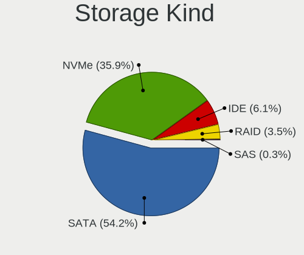
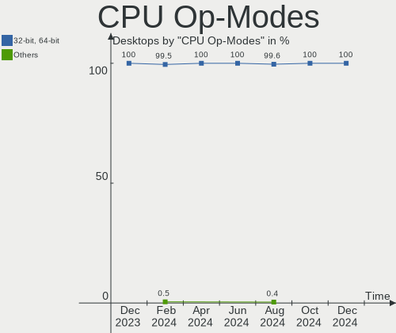

Fedora Hardware Trends (Desktop)
--------------------------------

A project to identify most popular hardware characteristics and track their change
over time based on data collected by Fedora users at https://Linux-Hardware.org.

Anyone can contribute to the study by uploading probes of their computers by
the [hw-probe](https://github.com/linuxhw/hw-probe) tool:

    sudo -E hw-probe -all -upload

Full-feature report is available here: https://linux-hardware.org/?view=trends&formfactor=desktop

Period: Jan, 2021.

Contents
--------

- [ OS                       ](#os)
- [ OS Family                ](#os-family)
- [ Kernel                   ](#kernel)
- [ Kernel Family            ](#kernel-family)
- [ Kernel Major Ver.        ](#kernel-major-ver)
- [ Arch                     ](#arch)
- [ DE                       ](#de)
- [ Display Server           ](#display-server)
- [ Display Manager          ](#display-manager)
- [ OS Lang                  ](#os-lang)
- [ Boot Mode                ](#boot-mode)
- [ Filesystem               ](#filesystem)
- [ Part. scheme             ](#part-scheme)
- [ Dual Boot with Linux/BSD ](#dual-boot-with-linux/bsd)
- [ Dual Boot (Win)          ](#dual-boot-win)
- [ Country                  ](#country)
- [ City                     ](#city)
- [ Vendor                   ](#vendor)
- [ Model                    ](#model)
- [ Model Family             ](#model-family)
- [ MFG Year                 ](#mfg-year)
- [ Form Factor              ](#form-factor)
- [ Secure Boot              ](#secure-boot)
- [ Coreboot                 ](#coreboot)
- [ RAM Size                 ](#ram-size)
- [ RAM Used                 ](#ram-used)
- [ Has CD-ROM               ](#has-cd-rom)
- [ Total Drives             ](#total-drives)
- [ Has Ethernet             ](#has-ethernet)
- [ Drive Vendor             ](#drive-vendor)
- [ Drive Model              ](#drive-model)
- [ HDD Vendor               ](#hdd-vendor)
- [ SSD Vendor               ](#ssd-vendor)
- [ Drive Kind               ](#drive-kind)
- [ Drive Connector          ](#drive-connector)
- [ Drive Size               ](#drive-size)
- [ Space Total              ](#space-total)
- [ Space Used               ](#space-used)
- [ Malfunc. Drives          ](#malfunc-drives)
- [ Malfunc. Drive Vendor    ](#malfunc-drive-vendor)
- [ Malfunc. HDD Vendor      ](#malfunc-hdd-vendor)
- [ Malfunc. Drive Kind      ](#malfunc-drive-kind)
- [ Failed Drives            ](#failed-drives)
- [ Failed Drive Vendor      ](#failed-drive-vendor)
- [ Drive Status             ](#drive-status)
- [ Storage Vendor           ](#storage-vendor)
- [ Storage Model            ](#storage-model)
- [ Storage Kind             ](#storage-kind)
- [ CPU Vendor               ](#cpu-vendor)
- [ CPU Model                ](#cpu-model)
- [ CPU Model Family         ](#cpu-model-family)
- [ CPU Cores                ](#cpu-cores)
- [ CPU Sockets              ](#cpu-sockets)
- [ CPU Threads              ](#cpu-threads)
- [ CPU Op-Modes             ](#cpu-op-modes)
- [ CPU Microcode            ](#cpu-microcode)
- [ CPU Microarch            ](#cpu-microarch)
- [ GPU Vendor               ](#gpu-vendor)
- [ GPU Model                ](#gpu-model)
- [ GPU Combo                ](#gpu-combo)
- [ GPU Driver               ](#gpu-driver)
- [ GPU Memory               ](#gpu-memory)
- [ Monitor Vendor           ](#monitor-vendor)
- [ Monitor Model            ](#monitor-model)
- [ Monitor Resolution       ](#monitor-resolution)
- [ Monitor Diagonal         ](#monitor-diagonal)
- [ Monitor Width            ](#monitor-width)
- [ Aspect Ratio             ](#aspect-ratio)
- [ Monitor Area             ](#monitor-area)
- [ Pixel Density            ](#pixel-density)
- [ Multiple Monitors        ](#multiple-monitors)
- [ Net Controller Vendor    ](#net-controller-vendor)
- [ Net Controller Model     ](#net-controller-model)
- [ Wireless Vendor          ](#wireless-vendor)
- [ Wireless Model           ](#wireless-model)
- [ Ethernet Vendor          ](#ethernet-vendor)
- [ Ethernet Model           ](#ethernet-model)
- [ Net Controller Kind      ](#net-controller-kind)
- [ Used Controller          ](#used-controller)
- [ NICs                     ](#nics)
- [ Memory Vendor            ](#memory-vendor)
- [ Memory Model             ](#memory-model)
- [ Memory Kind              ](#memory-kind)
- [ Memory Form Factor       ](#memory-form-factor)
- [ Memory Size              ](#memory-size)
- [ Memory Speed             ](#memory-speed)
- [ Sound Vendor             ](#sound-vendor)
- [ Sound Model              ](#sound-model)
- [ Camera Vendor            ](#camera-vendor)
- [ Camera Model             ](#camera-model)
- [ Fingerprint Vendor       ](#fingerprint-vendor)
- [ Fingerprint Model        ](#fingerprint-model)
- [ Chipcard Vendor          ](#chipcard-vendor)
- [ Chipcard Model           ](#chipcard-model)
- [ Printer Vendor           ](#printer-vendor)
- [ Printer Model            ](#printer-model)
- [ Scanner Vendor           ](#scanner-vendor)
- [ Scanner Model            ](#scanner-model)
- [ Bluetooth Vendor         ](#bluetooth-vendor)
- [ Bluetooth Model          ](#bluetooth-model)
- [ Unsupported Devices      ](#unsupported-devices)
- [ Unsupported Device Types ](#unsupported-device-types)

OS
--

Installed operating systems

| Name      | Desktops | Percent |
|-----------|----------|---------|
| Fedora 33 | 95       | 86.36%  |
| Fedora 32 | 12       | 10.91%  |
| Fedora 34 | 1        | 0.91%   |
| Fedora 29 | 1        | 0.91%   |
| Fedora 24 | 1        | 0.91%   |

OS Family
---------

OS without a version

| Name   | Desktops | Percent |
|--------|----------|---------|
| Fedora | 110      | 100%    |

Kernel
------

Version of the Linux kernel

| Version                                              | Desktops | Percent |
|------------------------------------------------------|----------|---------|
| 5.9.16-200.fc33.x86_64                               | 47       | 42.73%  |
| 5.10.9-201.fc33.x86_64                               | 11       | 10%     |
| 5.10.7-200.fc33.x86_64                               | 7        | 6.36%   |
| 5.10.10-200.fc33.x86_64                              | 7        | 6.36%   |
| 5.10.6-200.fc33.x86_64                               | 6        | 5.45%   |
| 5.8.15-301.fc33.x86_64                               | 5        | 4.55%   |
| 5.9.16-100.fc32.x86_64                               | 4        | 3.64%   |
| 5.10.8-200.fc33.x86_64                               | 3        | 2.73%   |
| 5.10.7-100.fc32.x86_64                               | 3        | 2.73%   |
| 5.9.15-200.fc33.x86_64                               | 2        | 1.82%   |
| 5.9.14-200.fc33.x86_64                               | 2        | 1.82%   |
| 5.6.6-300.fc32.x86_64                                | 2        | 1.82%   |
| 5.10.8-100.fc32.x86_64                               | 2        | 1.82%   |
| 5.9.15-100.fc32.x86_64                               | 1        | 0.91%   |
| 5.9.13-200.fc33.x86_64                               | 1        | 0.91%   |
| 5.9.12-200.fc33.x86_64                               | 1        | 0.91%   |
| 5.9.12-100.fc32.x86_64                               | 1        | 0.91%   |
| 5.9.11-200.fc33.x86_64                               | 1        | 0.91%   |
| 5.3.11-100.fc29.x86_64                               | 1        | 0.91%   |
| 5.11.0-0.rc5.20210127git2ab38c17aac1.136.fc34.x86_64 | 1        | 0.91%   |
| 5.10.7-200.fc33.x86_64+debug                         | 1        | 0.91%   |
| 4.11.12-100.fc24.x86_64                              | 1        | 0.91%   |

Kernel Family
-------------

Linux kernel without a distro release

| Version | Desktops | Percent |
|---------|----------|---------|
| 5.9.16  | 51       | 46.36%  |
| 5.10.9  | 11       | 10%     |
| 5.10.7  | 11       | 10%     |
| 5.10.10 | 7        | 6.36%   |
| 5.10.6  | 6        | 5.45%   |
| 5.8.15  | 5        | 4.55%   |
| 5.10.8  | 5        | 4.55%   |
| 5.9.15  | 3        | 2.73%   |
| 5.9.14  | 2        | 1.82%   |
| 5.9.12  | 2        | 1.82%   |
| 5.6.6   | 2        | 1.82%   |
| 5.9.13  | 1        | 0.91%   |
| 5.9.11  | 1        | 0.91%   |
| 5.3.11  | 1        | 0.91%   |
| 5.11.0  | 1        | 0.91%   |
| 4.11.12 | 1        | 0.91%   |

Kernel Major Ver.
-----------------

Linux kernel major version

| Version | Desktops | Percent |
|---------|----------|---------|
| 5.9     | 60       | 54.55%  |
| 5.10    | 40       | 36.36%  |
| 5.8     | 5        | 4.55%   |
| 5.6     | 2        | 1.82%   |
| 5.3     | 1        | 0.91%   |
| 5.11    | 1        | 0.91%   |
| 4.11    | 1        | 0.91%   |

Arch
----

OS architecture (x86_64, i586, etc.)

| Name   | Desktops | Percent |
|--------|----------|---------|
| x86_64 | 110      | 100%    |

DE
--

Desktop Environment

| Name          | Desktops | Percent |
|---------------|----------|---------|
| GNOME         | 84       | 76.36%  |
| KDE           | 10       | 9.09%   |
| KDE5          | 6        | 5.45%   |
| X-Cinnamon    | 3        | 2.73%   |
| GNOME Classic | 2        | 1.82%   |
| XFCE          | 1        | 0.91%   |
| MATE          | 1        | 0.91%   |
| dwm           | 1        | 0.91%   |
| Cinnamon      | 1        | 0.91%   |
| awesome       | 1        | 0.91%   |

Display Server
--------------

X11 or Wayland

| Name    | Desktops | Percent |
|---------|----------|---------|
| Wayland | 56       | 50.91%  |
| X11     | 54       | 49.09%  |

Display Manager
---------------

SDDM, LightDM, etc.

| Name    | Desktops | Percent |
|---------|----------|---------|
| Unknown | 72       | 65.45%  |
| GDM     | 32       | 29.09%  |
| SDDM    | 4        | 3.64%   |
| TDM     | 1        | 0.91%   |
| LightDM | 1        | 0.91%   |

OS Lang
-------

Language

| Lang    | Desktops | Percent |
|---------|----------|---------|
| en_US   | 47       | 42.73%  |
| en_GB   | 12       | 10.91%  |
| fr_FR   | 10       | 9.09%   |
| de_DE   | 5        | 4.55%   |
| ru_RU   | 4        | 3.64%   |
| pt_BR   | 4        | 3.64%   |
| pl_PL   | 4        | 3.64%   |
| en_CA   | 4        | 3.64%   |
| it_IT   | 3        | 2.73%   |
| es_ES   | 2        | 1.82%   |
| es_CL   | 2        | 1.82%   |
| en_AU   | 2        | 1.82%   |
| cs_CZ   | 2        | 1.82%   |
| zh_TW   | 1        | 0.91%   |
| ru_UA   | 1        | 0.91%   |
| nl_NL   | 1        | 0.91%   |
| hu_HU   | 1        | 0.91%   |
| fr_CA   | 1        | 0.91%   |
| es_MX   | 1        | 0.91%   |
| en_NZ   | 1        | 0.91%   |
| en_IN   | 1        | 0.91%   |
| Unknown | 1        | 0.91%   |

Boot Mode
---------

EFI or BIOS

| Mode | Desktops | Percent |
|------|----------|---------|
| EFI  | 59       | 53.64%  |
| BIOS | 51       | 46.36%  |

Filesystem
----------

Type of filesystem

| Type  | Desktops | Percent |
|-------|----------|---------|
| Btrfs | 56       | 50.91%  |
| Ext4  | 48       | 43.64%  |
| Xfs   | 6        | 5.45%   |

Part. scheme
------------

Scheme of partitioning

| Type    | Desktops | Percent |
|---------|----------|---------|
| Unknown | 72       | 65.45%  |
| GPT     | 28       | 25.45%  |
| MBR     | 10       | 9.09%   |

Dual Boot with Linux/BSD
------------------------

Hosting more than one Linux/BSD

| Dual boot | Desktops | Percent |
|-----------|----------|---------|
| No        | 97       | 88.18%  |
| Yes       | 13       | 11.82%  |

Dual Boot (Win)
---------------

Hosting Linux and Windows

| Dual boot | Desktops | Percent |
|-----------|----------|---------|
| No        | 91       | 82.73%  |
| Yes       | 19       | 17.27%  |

Country
-------

Geographic location (country)

| Country        | Desktops | Percent |
|----------------|----------|---------|
| USA            | 29       | 26.36%  |
| France         | 11       | 10%     |
| Germany        | 7        | 6.36%   |
| UK             | 5        | 4.55%   |
| Spain          | 5        | 4.55%   |
| Russia         | 5        | 4.55%   |
| Canada         | 5        | 4.55%   |
| Brazil         | 5        | 4.55%   |
| Poland         | 4        | 3.64%   |
| Netherlands    | 3        | 2.73%   |
| Italy          | 3        | 2.73%   |
| Czech Republic | 3        | 2.73%   |
| Sweden         | 2        | 1.82%   |
| Finland        | 2        | 1.82%   |
| Chile          | 2        | 1.82%   |
| Australia      | 2        | 1.82%   |
| Ukraine        | 1        | 0.91%   |
| Taiwan         | 1        | 0.91%   |
| Switzerland    | 1        | 0.91%   |
| Slovakia       | 1        | 0.91%   |
| Philippines    | 1        | 0.91%   |
| Norway         | 1        | 0.91%   |
| New Zealand    | 1        | 0.91%   |
| Morocco        | 1        | 0.91%   |
| Mexico         | 1        | 0.91%   |
| Kenya          | 1        | 0.91%   |
| Indonesia      | 1        | 0.91%   |
| India          | 1        | 0.91%   |
| Hungary        | 1        | 0.91%   |
| Belgium        | 1        | 0.91%   |
| Belarus        | 1        | 0.91%   |
| Austria        | 1        | 0.91%   |
| Argentina      | 1        | 0.91%   |

City
----

Geographic location (city)

| City              | Desktops | Percent |
|-------------------|----------|---------|
| Paris             | 3        | 2.73%   |
| New York          | 3        | 2.73%   |
| Prague            | 2        | 1.82%   |
| Montreal          | 2        | 1.82%   |
| Zimella           | 1        | 0.91%   |
| Yaroslavl         | 1        | 0.91%   |
| Winnenden         | 1        | 0.91%   |
| West Chester      | 1        | 0.91%   |
| Wellington        | 1        | 0.91%   |
| Wahroonga         | 1        | 0.91%   |
| Vancouver         | 1        | 0.91%   |
| Valencia          | 1        | 0.91%   |
| Ulricehamn        | 1        | 0.91%   |
| Turku             | 1        | 0.91%   |
| Tours             | 1        | 0.91%   |
| Toronto           | 1        | 0.91%   |
| Tandil            | 1        | 0.91%   |
| Taipei            | 1        | 0.91%   |
| Stoneham          | 1        | 0.91%   |
| Scunthorpe        | 1        | 0.91%   |
| Santos            | 1        | 0.91%   |
| Santiago          | 1        | 0.91%   |
| Samara            | 1        | 0.91%   |
| Salto da Divisa   | 1        | 0.91%   |
| Salamanca         | 1        | 0.91%   |
| Saginaw           | 1        | 0.91%   |
| Sacriston         | 1        | 0.91%   |
| Rosny-sous-Bois   | 1        | 0.91%   |
| Rome              | 1        | 0.91%   |
| Rogers            | 1        | 0.91%   |
| Puente Alto       | 1        | 0.91%   |
| Prefailles        | 1        | 0.91%   |
| Pontault-Combault | 1        | 0.91%   |
| Pikeville         | 1        | 0.91%   |
| Piensk            | 1        | 0.91%   |
| Perm              | 1        | 0.91%   |
| Pendleton         | 1        | 0.91%   |
| Pamplona          | 1        | 0.91%   |
| Paisley           | 1        | 0.91%   |
| Norristown        | 1        | 0.91%   |
| Nogent-sur-Marne  | 1        | 0.91%   |
| Newark            | 1        | 0.91%   |
| Nashville         | 1        | 0.91%   |
| Nantes            | 1        | 0.91%   |
| Nairobi           | 1        | 0.91%   |
| Munich            | 1        | 0.91%   |
| Moscow            | 1        | 0.91%   |
| Minneapolis       | 1        | 0.91%   |
| Memphis           | 1        | 0.91%   |
| Marrakesh         | 1        | 0.91%   |
| Marikina City     | 1        | 0.91%   |
| Madrid            | 1        | 0.91%   |
| Macclenny         | 1        | 0.91%   |
| Lyubertsy         | 1        | 0.91%   |
| Lucknow           | 1        | 0.91%   |
| Lubartow          | 1        | 0.91%   |
| Lochearnhead      | 1        | 0.91%   |
| Leipzig           | 1        | 0.91%   |
| Lausanne          | 1        | 0.91%   |
| Langenhagen       | 1        | 0.91%   |

Vendor
------

Motherboard manufacturer

| Name                | Desktops | Percent |
|---------------------|----------|---------|
| ASUSTek Computer    | 34       | 30.91%  |
| Gigabyte Technology | 26       | 23.64%  |
| MSI                 | 16       | 14.55%  |
| Dell                | 8        | 7.27%   |
| ASRock              | 8        | 7.27%   |
| Lenovo              | 6        | 5.45%   |
| Hewlett-Packard     | 5        | 4.55%   |
| Acer                | 2        | 1.82%   |
| Pegatron            | 1        | 0.91%   |
| Fujitsu             | 1        | 0.91%   |
| eMachines           | 1        | 0.91%   |
| ECS                 | 1        | 0.91%   |
| Biostar             | 1        | 0.91%   |

Model
-----

Motherboard model

| Name                                   | Desktops | Percent |
|----------------------------------------|----------|---------|
| ASUS TUF GAMING X570-PLUS              | 3        | 2.73%   |
| ASUS All Series                        | 3        | 2.73%   |
| MSI MS-7B85                            | 2        | 1.82%   |
| MSI MS-7B38                            | 2        | 1.82%   |
| Dell Precision WorkStation T3400       | 2        | 1.82%   |
| ASRock B450M Steel Legend              | 2        | 1.82%   |
| Pegatron KJ379AA-ABA a6400f            | 1        | 0.91%   |
| MSI PPPPP-CCC#MMMMMMMM                 | 1        | 0.91%   |
| MSI MS-7C56                            | 1        | 0.91%   |
| MSI MS-7C02                            | 1        | 0.91%   |
| MSI MS-7B92                            | 1        | 0.91%   |
| MSI MS-7B84                            | 1        | 0.91%   |
| MSI MS-7B79                            | 1        | 0.91%   |
| MSI MS-7B53                            | 1        | 0.91%   |
| MSI MS-7A67                            | 1        | 0.91%   |
| MSI MS-7A44                            | 1        | 0.91%   |
| MSI MS-7A37                            | 1        | 0.91%   |
| MSI MS-7A20                            | 1        | 0.91%   |
| MSI MS-7623                            | 1        | 0.91%   |
| Lenovo ThinkCentre M800 10FW0004US     | 1        | 0.91%   |
| Lenovo ThinkCentre M800 10FW0004CA     | 1        | 0.91%   |
| Lenovo ThinkCentre M75e 5065A11        | 1        | 0.91%   |
| Lenovo Legion T5 28IMB05 90NC00G4MZ    | 1        | 0.91%   |
| Lenovo IdeaCentre 510-15ICB 90HU00F1ID | 1        | 0.91%   |
| Lenovo H520 10094                      | 1        | 0.91%   |
| HP Z600 Workstation                    | 1        | 0.91%   |
| HP xw6600 Workstation                  | 1        | 0.91%   |
| HP ProDesk 600 G2 SFF                  | 1        | 0.91%   |
| HP Pavilion Gaming Desktop 790-00xx    | 1        | 0.91%   |
| HP Pavilion Desktop PC 570-p0XX        | 1        | 0.91%   |
| Gigabyte Z97N-WIFI                     | 1        | 0.91%   |
| Gigabyte Z97-D3H                       | 1        | 0.91%   |
| Gigabyte Z87X-UD4H                     | 1        | 0.91%   |
| Gigabyte Z370 AORUS Gaming K3          | 1        | 0.91%   |
| Gigabyte Z270X-Gaming K5               | 1        | 0.91%   |
| Gigabyte Z270X-Gaming 5                | 1        | 0.91%   |
| Gigabyte Z270-HD3P                     | 1        | 0.91%   |
| Gigabyte X58A-UD5                      | 1        | 0.91%   |
| Gigabyte X570 I AORUS PRO WIFI         | 1        | 0.91%   |
| Gigabyte X570 AORUS ELITE              | 1        | 0.91%   |
| Gigabyte TRX40 DESIGNARE               | 1        | 0.91%   |
| Gigabyte M61PME-S2P                    | 1        | 0.91%   |
| Gigabyte H77N-WIFI                     | 1        | 0.91%   |
| Gigabyte H310M H 2.0                   | 1        | 0.91%   |
| Gigabyte GA-MA770-UD3                  | 1        | 0.91%   |
| Gigabyte GA-A75M-UD2H                  | 1        | 0.91%   |
| Gigabyte GA-890GPA-UD3H                | 1        | 0.91%   |
| Gigabyte GA-78LMT-S2P                  | 1        | 0.91%   |
| Gigabyte G41MT-S2P                     | 1        | 0.91%   |
| Gigabyte B550M AORUS PRO               | 1        | 0.91%   |
| Gigabyte B550M AORUS ELITE             | 1        | 0.91%   |
| Gigabyte B550 AORUS MASTER             | 1        | 0.91%   |
| Gigabyte B450 AORUS M                  | 1        | 0.91%   |
| Gigabyte B250M-D3H                     | 1        | 0.91%   |
| Gigabyte B150M-D3H                     | 1        | 0.91%   |
| Gigabyte AB350M-DS3H V2                | 1        | 0.91%   |
| Fujitsu CELSIUS W530                   | 1        | 0.91%   |
| eMachines EL1358G                      | 1        | 0.91%   |
| ECS MCP61M-M3                          | 1        | 0.91%   |
| Dell XPS 8930                          | 1        | 0.91%   |

Model Family
------------

Motherboard model prefix

| Name                    | Desktops | Percent |
|-------------------------|----------|---------|
| ASUS TUF                | 7        | 6.36%   |
| ASUS ROG                | 5        | 4.55%   |
| ASUS PRIME              | 5        | 4.55%   |
| Lenovo ThinkCentre      | 3        | 2.73%   |
| Dell OptiPlex           | 3        | 2.73%   |
| ASUS All                | 3        | 2.73%   |
| ASRock B450M            | 3        | 2.73%   |
| MSI MS-7B85             | 2        | 1.82%   |
| MSI MS-7B38             | 2        | 1.82%   |
| HP Pavilion             | 2        | 1.82%   |
| Gigabyte Z270X-Gaming   | 2        | 1.82%   |
| Gigabyte X570           | 2        | 1.82%   |
| Gigabyte B550M          | 2        | 1.82%   |
| Dell Precision          | 2        | 1.82%   |
| ASUS P8Z77-V            | 2        | 1.82%   |
| Acer Aspire             | 2        | 1.82%   |
| Pegatron KJ379AA-ABA    | 1        | 0.91%   |
| MSI PPPPP-CCC#MMMMMMMM  | 1        | 0.91%   |
| MSI MS-7C56             | 1        | 0.91%   |
| MSI MS-7C02             | 1        | 0.91%   |
| MSI MS-7B92             | 1        | 0.91%   |
| MSI MS-7B84             | 1        | 0.91%   |
| MSI MS-7B79             | 1        | 0.91%   |
| MSI MS-7B53             | 1        | 0.91%   |
| MSI MS-7A67             | 1        | 0.91%   |
| MSI MS-7A44             | 1        | 0.91%   |
| MSI MS-7A37             | 1        | 0.91%   |
| MSI MS-7A20             | 1        | 0.91%   |
| MSI MS-7623             | 1        | 0.91%   |
| Lenovo Legion           | 1        | 0.91%   |
| Lenovo IdeaCentre       | 1        | 0.91%   |
| Lenovo H520             | 1        | 0.91%   |
| HP Z600                 | 1        | 0.91%   |
| HP xw6600               | 1        | 0.91%   |
| HP ProDesk              | 1        | 0.91%   |
| Gigabyte Z97N-WIFI      | 1        | 0.91%   |
| Gigabyte Z97-D3H        | 1        | 0.91%   |
| Gigabyte Z87X-UD4H      | 1        | 0.91%   |
| Gigabyte Z370           | 1        | 0.91%   |
| Gigabyte Z270-HD3P      | 1        | 0.91%   |
| Gigabyte X58A-UD5       | 1        | 0.91%   |
| Gigabyte TRX40          | 1        | 0.91%   |
| Gigabyte M61PME-S2P     | 1        | 0.91%   |
| Gigabyte H77N-WIFI      | 1        | 0.91%   |
| Gigabyte H310M          | 1        | 0.91%   |
| Gigabyte GA-MA770-UD3   | 1        | 0.91%   |
| Gigabyte GA-A75M-UD2H   | 1        | 0.91%   |
| Gigabyte GA-890GPA-UD3H | 1        | 0.91%   |
| Gigabyte GA-78LMT-S2P   | 1        | 0.91%   |
| Gigabyte G41MT-S2P      | 1        | 0.91%   |
| Gigabyte B550           | 1        | 0.91%   |
| Gigabyte B450           | 1        | 0.91%   |
| Gigabyte B250M-D3H      | 1        | 0.91%   |
| Gigabyte B150M-D3H      | 1        | 0.91%   |
| Gigabyte AB350M-DS3H    | 1        | 0.91%   |
| Fujitsu CELSIUS         | 1        | 0.91%   |
| eMachines EL1358G       | 1        | 0.91%   |
| ECS MCP61M-M3           | 1        | 0.91%   |
| Dell XPS                | 1        | 0.91%   |
| Dell Studio             | 1        | 0.91%   |

MFG Year
--------

Motherboard manufacture year

| Year | Desktops | Percent |
|------|----------|---------|
| 2020 | 24       | 21.82%  |
| 2019 | 16       | 14.55%  |
| 2018 | 9        | 8.18%   |
| 2016 | 8        | 7.27%   |
| 2014 | 8        | 7.27%   |
| 2012 | 8        | 7.27%   |
| 2011 | 8        | 7.27%   |
| 2010 | 7        | 6.36%   |
| 2017 | 6        | 5.45%   |
| 2008 | 5        | 4.55%   |
| 2013 | 4        | 3.64%   |
| 2015 | 3        | 2.73%   |
| 2009 | 3        | 2.73%   |
| 2021 | 1        | 0.91%   |

Form Factor
-----------

Physical design of the computer

| Name    | Desktops | Percent |
|---------|----------|---------|
| Desktop | 110      | 100%    |

Secure Boot
-----------

Enabled or disabled

| State    | Desktops | Percent |
|----------|----------|---------|
| Disabled | 103      | 93.64%  |
| Enabled  | 7        | 6.36%   |

Coreboot
--------

Have coreboot on board

| Used | Desktops | Percent |
|------|----------|---------|
| No   | 110      | 100%    |

RAM Size
--------

Total RAM memory

| Size in GB  | Desktops | Percent |
|-------------|----------|---------|
| 16.01-24.0  | 42       | 38.18%  |
| 32.01-64.0  | 28       | 25.45%  |
| 8.01-16.0   | 15       | 13.64%  |
| 4.01-8.0    | 11       | 10%     |
| 3.01-4.0    | 7        | 6.36%   |
| 64.01-256.0 | 5        | 4.55%   |
| 24.01-32.0  | 1        | 0.91%   |
| 1.01-2.0    | 1        | 0.91%   |

RAM Used
--------

Used RAM memory

| Used GB    | Desktops | Percent |
|------------|----------|---------|
| 2.01-3.0   | 29       | 26.36%  |
| 4.01-8.0   | 26       | 23.64%  |
| 1.01-2.0   | 21       | 19.09%  |
| 3.01-4.0   | 20       | 18.18%  |
| 8.01-16.0  | 12       | 10.91%  |
| 32.01-64.0 | 1        | 0.91%   |
| 16.01-24.0 | 1        | 0.91%   |

Has CD-ROM
----------

Has CD-ROM on board

| Presented | Desktops | Percent |
|-----------|----------|---------|
| Yes       | 55       | 50%     |
| No        | 55       | 50%     |

Total Drives
------------

Number of drives on board

| Drives | Desktops | Percent |
|--------|----------|---------|
| 2      | 35       | 31.82%  |
| 1      | 23       | 20.91%  |
| 3      | 22       | 20%     |
| 4      | 18       | 16.36%  |
| 5      | 8        | 7.27%   |
| 8      | 2        | 1.82%   |
| 9      | 1        | 0.91%   |
| 7      | 1        | 0.91%   |

Has Ethernet
------------

Has Ethernet on board

| Presented | Desktops | Percent |
|-----------|----------|---------|
| Yes       | 110      | 100%    |

Drive Vendor
------------

Hard drive vendors

| Vendor                    | Desktops | Drives | Percent |
|---------------------------|----------|--------|---------|
| WDC                       | 52       | 77     | 22.03%  |
| Samsung Electronics       | 36       | 48     | 15.25%  |
| Seagate                   | 33       | 44     | 13.98%  |
| Toshiba                   | 18       | 22     | 7.63%   |
| Sandisk                   | 14       | 20     | 5.93%   |
| Crucial                   | 12       | 15     | 5.08%   |
| Kingston                  | 10       | 11     | 4.24%   |
| Hitachi                   | 8        | 8      | 3.39%   |
| A-DATA Technology         | 6        | 7      | 2.54%   |
| Phison                    | 5        | 6      | 2.12%   |
| Intel                     | 5        | 5      | 2.12%   |
| Corsair                   | 5        | 5      | 2.12%   |
| Unknown                   | 4        | 4      | 1.69%   |
| SPCC                      | 4        | 4      | 1.69%   |
| Team                      | 3        | 3      | 1.27%   |
| Intenso                   | 3        | 3      | 1.27%   |
| HGST                      | 2        | 3      | 0.85%   |
| China                     | 2        | 2      | 0.85%   |
| XPG                       | 1        | 1      | 0.42%   |
| Verbatim                  | 1        | 1      | 0.42%   |
| Transcend                 | 1        | 1      | 0.42%   |
| OCZ                       | 1        | 1      | 0.42%   |
| Mushkin                   | 1        | 1      | 0.42%   |
| Micron/Crucial Technology | 1        | 1      | 0.42%   |
| Micron Technology         | 1        | 1      | 0.42%   |
| Maxtor                    | 1        | 1      | 0.42%   |
| Lite-On                   | 1        | 1      | 0.42%   |
| KingSpec                  | 1        | 1      | 0.42%   |
| Kingmax                   | 1        | 1      | 0.42%   |
| H/W                       | 1        | 1      | 0.42%   |
| Gigabyte Technology       | 1        | 1      | 0.42%   |
| Apacer                    | 1        | 1      | 0.42%   |

Drive Model
-----------

Hard drive models

| Model                            | Desktops | Percent |
|----------------------------------|----------|---------|
| Toshiba DT01ACA200 2TB           | 8        | 2.8%    |
| Samsung SSD 850 EVO 250GB        | 8        | 2.8%    |
| Crucial CT500MX500SSD1 500GB     | 6        | 2.1%    |
| Sandisk NVMe SSD Drive 500GB     | 4        | 1.4%    |
| Samsung SSD 860 EVO 500GB        | 4        | 1.4%    |
| Samsung SSD 860 EVO 1TB          | 4        | 1.4%    |
| Samsung NVMe SSD Drive 500GB     | 4        | 1.4%    |
| WDC WD30EFRX-68EUZN0 3TB         | 3        | 1.05%   |
| WDC WD20EZRX-00D8PB0 2TB         | 3        | 1.05%   |
| WDC WD1003FZEX-00K3CA0 1TB       | 3        | 1.05%   |
| Seagate ST4000DM004-2CV104 4TB   | 3        | 1.05%   |
| Seagate ST3500418AS 500GB        | 3        | 1.05%   |
| Seagate ST2000DM008-2FR102 2TB   | 3        | 1.05%   |
| Samsung NVMe SSD Drive 250GB     | 3        | 1.05%   |
| Kingston SA400S37480G 480GB SSD  | 3        | 1.05%   |
| WDC WD40EZRZ-00GXCB0 4TB         | 2        | 0.7%    |
| WDC WD40EFRX-68WT0N0 4TB         | 2        | 0.7%    |
| WDC WD3000HLHX-01JJPV0 304GB     | 2        | 0.7%    |
| WDC WD2500BEVT-22ZCT0 250GB      | 2        | 0.7%    |
| WDC WD10EZEX-08WN4A0 1TB         | 2        | 0.7%    |
| WDC WD10EALX-009BA0 1TB          | 2        | 0.7%    |
| WDC WD10EACS-00ZJB0 1TB          | 2        | 0.7%    |
| Unknown SD/MMC/MS PRO 32GB       | 2        | 0.7%    |
| Toshiba HDWD110 1TB              | 2        | 0.7%    |
| Toshiba HDWD105 500GB            | 2        | 0.7%    |
| Team TM8PS7256G 256GB SSD        | 2        | 0.7%    |
| SPCC Solid State Disk 128GB      | 2        | 0.7%    |
| Seagate ST500DM002-1BD142 500GB  | 2        | 0.7%    |
| Seagate ST31000528AS 1TB         | 2        | 0.7%    |
| Seagate ST2000DM006-2DM164 2TB   | 2        | 0.7%    |
| Sandisk NVMe SSD Drive 512GB     | 2        | 0.7%    |
| Sandisk NVMe SSD Drive 1TB       | 2        | 0.7%    |
| Samsung SSD 860 QVO 1TB          | 2        | 0.7%    |
| Samsung SSD 860 EVO 250GB        | 2        | 0.7%    |
| Kingston SUV400S37240G 240GB SSD | 2        | 0.7%    |
| Hitachi HDS722020ALA330 2TB      | 2        | 0.7%    |
| Corsair Force 3 SSD 64GB         | 2        | 0.7%    |
| A-DATA SU800 512GB SSD           | 2        | 0.7%    |
| XPG NVMe SSD Drive 512GB         | 1        | 0.35%   |
| WDC WDS500G2B0C-00PXH0 500GB     | 1        | 0.35%   |
| WDC WDS500G2B0B-00YS70 500GB SSD | 1        | 0.35%   |
| WDC WDS480G2G0A-00JH30 480GB SSD | 1        | 0.35%   |
| WDC WDS250G2B0A-00SM50 250GB SSD | 1        | 0.35%   |
| WDC WDS250G1B0C-00S6U0 250GB     | 1        | 0.35%   |
| WDC WDS240G2G0A-00JH30 240GB SSD | 1        | 0.35%   |
| WDC WDS240G1G0A-00SS50 240GB SSD | 1        | 0.35%   |
| WDC WDS120G2G0B-00EPW0 120GB SSD | 1        | 0.35%   |
| WDC WDS100T3X0C-00SJG0 1TB       | 1        | 0.35%   |
| WDC WD80EMAZ-00WJTA0 8TB         | 1        | 0.35%   |
| WDC WD6400AACS-00G8B1 640GB      | 1        | 0.35%   |
| WDC WD60EZRX-00MVLB1 6TB         | 1        | 0.35%   |
| WDC WD6002FRYZ-01WD5B1 6TB       | 1        | 0.35%   |
| WDC WD5000AAKS-00A7B0 500GB      | 1        | 0.35%   |
| WDC WD5000AACS-00G8B1 500GB      | 1        | 0.35%   |
| WDC WD40EFRX-68N32N0 4TB         | 1        | 0.35%   |
| WDC WD3200LPVX-75V0TT0 320GB     | 1        | 0.35%   |
| WDC WD3200BEVT-22ZCT0 320GB      | 1        | 0.35%   |
| WDC WD3200AAKS-75L9A0 320GB      | 1        | 0.35%   |
| WDC WD30EZRX-00SPEB0 3TB         | 1        | 0.35%   |
| WDC WD30EZRX-00MMMB0 3TB         | 1        | 0.35%   |

HDD Vendor
----------

Hard disk drive vendors

| Vendor              | Desktops | Drives | Percent |
|---------------------|----------|--------|---------|
| WDC                 | 47       | 67     | 42.73%  |
| Seagate             | 30       | 41     | 27.27%  |
| Toshiba             | 16       | 19     | 14.55%  |
| Hitachi             | 8        | 8      | 7.27%   |
| Samsung Electronics | 5        | 5      | 4.55%   |
| HGST                | 2        | 3      | 1.82%   |
| Maxtor              | 1        | 1      | 0.91%   |
| H/W                 | 1        | 1      | 0.91%   |

SSD Vendor
----------

Solid state drive vendors

| Vendor              | Desktops | Drives | Percent |
|---------------------|----------|--------|---------|
| Samsung Electronics | 27       | 33     | 28.72%  |
| Crucial             | 11       | 14     | 11.7%   |
| Kingston            | 10       | 11     | 10.64%  |
| SanDisk             | 9        | 10     | 9.57%   |
| WDC                 | 6        | 7      | 6.38%   |
| A-DATA Technology   | 4        | 5      | 4.26%   |
| Team                | 3        | 3      | 3.19%   |
| SPCC                | 3        | 3      | 3.19%   |
| Intenso             | 3        | 3      | 3.19%   |
| Intel               | 3        | 3      | 3.19%   |
| Corsair             | 3        | 3      | 3.19%   |
| China               | 2        | 2      | 2.13%   |
| Verbatim            | 1        | 1      | 1.06%   |
| Unknown             | 1        | 1      | 1.06%   |
| Transcend           | 1        | 1      | 1.06%   |
| Toshiba             | 1        | 1      | 1.06%   |
| OCZ                 | 1        | 1      | 1.06%   |
| Mushkin             | 1        | 1      | 1.06%   |
| Micron Technology   | 1        | 1      | 1.06%   |
| KingSpec            | 1        | 1      | 1.06%   |
| Kingmax             | 1        | 1      | 1.06%   |
| Apacer              | 1        | 1      | 1.06%   |

Drive Kind
----------

HDD or SSD

| Kind    | Desktops | Drives | Percent |
|---------|----------|--------|---------|
| HDD     | 86       | 145    | 43.65%  |
| SSD     | 71       | 107    | 36.04%  |
| NVMe    | 35       | 43     | 17.77%  |
| Unknown | 5        | 6      | 2.54%   |

Drive Connector
---------------

SATA, SAS, NVMe, etc.

| Type | Desktops | Drives | Percent |
|------|----------|--------|---------|
| SATA | 104      | 244    | 68.87%  |
| NVMe | 35       | 43     | 23.18%  |
| SAS  | 12       | 14     | 7.95%   |

Drive Size
----------

Size of hard drive

| Size in TB | Desktops | Drives | Percent |
|------------|----------|--------|---------|
| 0.01-0.5   | 77       | 120    | 42.31%  |
| 0.51-1.0   | 56       | 71     | 30.77%  |
| 1.01-2.0   | 28       | 33     | 15.38%  |
| 3.01-4.0   | 9        | 11     | 4.95%   |
| 4.01-10.0  | 8        | 12     | 4.4%    |
| 2.01-3.0   | 4        | 5      | 2.2%    |

Space Total
-----------

Amount of disk space available on the file system

| Size in GB     | Desktops | Percent |
|----------------|----------|---------|
| 501-1000       | 25       | 22.73%  |
| More than 3000 | 18       | 16.36%  |
| 251-500        | 16       | 14.55%  |
| 1001-2000      | 16       | 14.55%  |
| 101-250        | 15       | 13.64%  |
| 2001-3000      | 10       | 9.09%   |
| 1-20           | 5        | 4.55%   |
| 51-100         | 3        | 2.73%   |
| Unknown        | 2        | 1.82%   |

Space Used
----------

Amount of used disk space

| Used GB        | Desktops | Percent |
|----------------|----------|---------|
| 101-250        | 21       | 19.09%  |
| 21-50          | 19       | 17.27%  |
| 1-20           | 13       | 11.82%  |
| 1001-2000      | 12       | 10.91%  |
| 501-1000       | 11       | 10%     |
| 51-100         | 10       | 9.09%   |
| 251-500        | 9        | 8.18%   |
| More than 3000 | 8        | 7.27%   |
| 2001-3000      | 5        | 4.55%   |
| Unknown        | 2        | 1.82%   |

Malfunc. Drives
---------------

Drive models with a malfunction

| Model                       | Desktops | Drives | Percent |
|-----------------------------|----------|--------|---------|
| WDC WD10EZEX-00RKKA0 1TB    | 1        | 1      | 25%     |
| WDC WD1002FAEX-00Y9A0 1TB   | 1        | 1      | 25%     |
| Hitachi HDS722020ALA330 2TB | 1        | 1      | 25%     |
| Corsair Force LS SSD 120GB  | 1        | 1      | 25%     |

Malfunc. Drive Vendor
---------------------

Vendors of faulty drives

| Vendor  | Desktops | Drives | Percent |
|---------|----------|--------|---------|
| WDC     | 2        | 2      | 50%     |
| Hitachi | 1        | 1      | 25%     |
| Corsair | 1        | 1      | 25%     |

Malfunc. HDD Vendor
-------------------

Vendors of faulty HDD drives

| Vendor  | Desktops | Drives | Percent |
|---------|----------|--------|---------|
| WDC     | 2        | 2      | 66.67%  |
| Hitachi | 1        | 1      | 33.33%  |

Malfunc. Drive Kind
-------------------

Kinds of faulty drives

| Kind | Desktops | Drives | Percent |
|------|----------|--------|---------|
| HDD  | 3        | 3      | 75%     |
| SSD  | 1        | 1      | 25%     |

Failed Drives
-------------

Failed drive models

Zero info for selected period =(

Failed Drive Vendor
-------------------

Failed drive vendors

Zero info for selected period =(

Drive Status
------------

Number of failed and malfunc. drives

| Status   | Desktops | Drives | Percent |
|----------|----------|--------|---------|
| Detected | 76       | 212    | 64.96%  |
| Works    | 37       | 85     | 31.62%  |
| Malfunc  | 4        | 4      | 3.42%   |

Storage Vendor
--------------

Storage controller vendors

| Vendor                       | Desktops | Percent |
|------------------------------|----------|---------|
| Intel                        | 60       | 37.04%  |
| AMD                          | 47       | 29.01%  |
| Sandisk                      | 10       | 6.17%   |
| Samsung Electronics          | 9        | 5.56%   |
| Phison Electronics           | 7        | 4.32%   |
| ASMedia Technology           | 6        | 3.7%    |
| Nvidia                       | 5        | 3.09%   |
| Marvell Technology Group     | 4        | 2.47%   |
| JMicron Technology           | 4        | 2.47%   |
| ADATA Technology             | 3        | 1.85%   |
| Toshiba America Info Systems | 2        | 1.23%   |
| Micron/Crucial Technology    | 2        | 1.23%   |
| Silicon Motion               | 1        | 0.62%   |
| Silicon Image                | 1        | 0.62%   |
| Lite-On Technology           | 1        | 0.62%   |

Storage Model
-------------

Storage controller models

| Model                                                                            | Desktops | Percent |
|----------------------------------------------------------------------------------|----------|---------|
| AMD FCH SATA Controller [AHCI mode]                                              | 29       | 14.5%   |
| AMD 400 Series Chipset SATA Controller                                           | 13       | 6.5%    |
| Intel 200 Series PCH SATA controller [AHCI mode]                                 | 12       | 6%      |
| Intel Q170/Q150/B150/H170/H110/Z170/CM236 Chipset SATA Controller [AHCI Mode]    | 7        | 3.5%    |
| Samsung NVMe SSD Controller SM981/PM981/PM983                                    | 6        | 3%      |
| Intel SATA Controller [RAID mode]                                                | 6        | 3%      |
| Intel 8 Series/C220 Series Chipset Family 6-port SATA Controller 1 [AHCI mode]   | 6        | 3%      |
| ASMedia ASM1062 Serial ATA Controller                                            | 6        | 3%      |
| AMD SATA controller                                                              | 6        | 3%      |
| Intel 7 Series/C210 Series Chipset Family 6-port SATA Controller [AHCI mode]     | 5        | 2.5%    |
| AMD SB7x0/SB8x0/SB9x0 SATA Controller [IDE mode]                                 | 5        | 2.5%    |
| AMD SB7x0/SB8x0/SB9x0 IDE Controller                                             | 5        | 2.5%    |
| Sandisk WD Blue SN550 NVMe SSD                                                   | 4        | 2%      |
| Sandisk WD Black SN750 / PC SN730 NVMe SSD                                       | 4        | 2%      |
| Phison E16 PCIe4 NVMe Controller                                                 | 4        | 2%      |
| Phison E12 NVMe Controller                                                       | 4        | 2%      |
| Nvidia MCP61 SATA Controller                                                     | 4        | 2%      |
| Intel Cannon Lake PCH SATA AHCI Controller                                       | 4        | 2%      |
| AMD SB7x0/SB8x0/SB9x0 SATA Controller [AHCI mode]                                | 4        | 2%      |
| AMD 300 Series Chipset SATA Controller                                           | 4        | 2%      |
| Nvidia MCP61 IDE                                                                 | 3        | 1.5%    |
| JMicron JMB363 SATA/IDE Controller                                               | 3        | 1.5%    |
| Intel NM10/ICH7 Family SATA Controller [IDE mode]                                | 3        | 1.5%    |
| Intel 6 Series/C200 Series Chipset Family 6 port Desktop SATA AHCI Controller    | 3        | 1.5%    |
| ADATA XPG SX8200 Pro PCIe Gen3x4 M.2 2280 Solid State Drive                      | 3        | 1.5%    |
| Sandisk WD Black 2018 / PC SN720 NVMe SSD                                        | 2        | 1%      |
| Samsung NVMe SSD Controller SM961/PM961/SM963                                    | 2        | 1%      |
| Intel C610/X99 series chipset 6-Port SATA Controller [AHCI mode]                 | 2        | 1%      |
| Intel 82801JI (ICH10 Family) 4 port SATA IDE Controller #1                       | 2        | 1%      |
| Intel 82801JI (ICH10 Family) 2 port SATA IDE Controller #2                       | 2        | 1%      |
| Intel 82801IR/IO/IH (ICH9R/DO/DH) 6 port SATA Controller [AHCI mode]             | 2        | 1%      |
| Intel 82801G (ICH7 Family) IDE Controller                                        | 2        | 1%      |
| Toshiba America Info Systems Toshiba America Info Non-Volatile memory controller | 1        | 0.5%    |
| Toshiba America Info Systems BG3 NVMe SSD Controller                             | 1        | 0.5%    |
| Silicon Motion SM2263EN/SM2263XT SSD Controller                                  | 1        | 0.5%    |
| Silicon Image SiI 3112 [SATALink/SATARaid] Serial ATA Controller                 | 1        | 0.5%    |
| Sandisk WD Blue SN500 / PC SN520 NVMe SSD                                        | 1        | 0.5%    |
| Sandisk WD Black NVMe SSD                                                        | 1        | 0.5%    |
| Samsung Electronics Non-Volatile memory controller                               | 1        | 0.5%    |
| Nvidia CK804 Serial ATA Controller                                               | 1        | 0.5%    |
| Nvidia CK804 IDE                                                                 | 1        | 0.5%    |
| Micron/Crucial P1 NVMe PCIe SSD                                                  | 1        | 0.5%    |
| Micron/Crucial Non-Volatile memory controller                                    | 1        | 0.5%    |
| Marvell Group 88SE9230 PCIe 2.0 x2 4-port SATA 6 Gb/s RAID Controller            | 1        | 0.5%    |
| Marvell Group 88SE91A3 SATA-600 Controller                                       | 1        | 0.5%    |
| Marvell Group 88SE9172 SATA 6Gb/s Controller                                     | 1        | 0.5%    |
| Marvell Group 88SE912x SATA 6Gb/s Controller [IDE mode]                          | 1        | 0.5%    |
| Marvell Group 88SE912x IDE Controller                                            | 1        | 0.5%    |
| Lite-On Non-Volatile memory controller                                           | 1        | 0.5%    |
| JMicron JMB362 SATA Controller                                                   | 1        | 0.5%    |
| Intel SSD 660P Series                                                            | 1        | 0.5%    |
| Intel PCIe Data Center SSD                                                       | 1        | 0.5%    |
| Intel 9 Series Chipset Family SATA Controller [IDE Mode]                         | 1        | 0.5%    |
| Intel 9 Series Chipset Family SATA Controller [AHCI Mode]                        | 1        | 0.5%    |
| Intel 631xESB/632xESB SATA RAID Controller                                       | 1        | 0.5%    |
| Intel 631xESB/632xESB IDE Controller                                             | 1        | 0.5%    |
| Intel 5 Series/3400 Series Chipset 6 port SATA AHCI Controller                   | 1        | 0.5%    |
| Intel 5 Series/3400 Series Chipset 4 port SATA IDE Controller                    | 1        | 0.5%    |
| Intel 400 Series Chipset Family SATA AHCI Controller                             | 1        | 0.5%    |
| AMD X399 Series Chipset SATA Controller                                          | 1        | 0.5%    |

Storage Kind
------------

Kind of storage controller (IDE, SATA, NVMe, SAS, ...)

| Kind | Desktops | Percent |
|------|----------|---------|
| SATA | 90       | 58.06%  |
| NVMe | 35       | 22.58%  |
| IDE  | 21       | 13.55%  |
| RAID | 9        | 5.81%   |

CPU Vendor
----------

Processor vendors

| Vendor | Desktops | Percent |
|--------|----------|---------|
| Intel  | 58       | 52.73%  |
| AMD    | 52       | 47.27%  |

CPU Model
---------

Processor models

| Model                                          | Desktops | Percent |
|------------------------------------------------|----------|---------|
| AMD Ryzen 7 3700X 8-Core Processor             | 6        | 5.45%   |
| AMD Ryzen 5 2600 Six-Core Processor            | 4        | 3.64%   |
| Intel Core i7-3770 CPU @ 3.40GHz               | 3        | 2.73%   |
| AMD Ryzen 7 2700X Eight-Core Processor         | 3        | 2.73%   |
| AMD Ryzen 5 1600 Six-Core Processor            | 3        | 2.73%   |
| AMD Athlon II X2 250 Processor                 | 3        | 2.73%   |
| Intel Core i7-8700 CPU @ 3.20GHz               | 2        | 1.82%   |
| Intel Core i7-7700K CPU @ 4.20GHz              | 2        | 1.82%   |
| Intel Core i7-6700 CPU @ 3.40GHz               | 2        | 1.82%   |
| Intel Core i7-4770 CPU @ 3.40GHz               | 2        | 1.82%   |
| Intel Core i5-7400 CPU @ 3.00GHz               | 2        | 1.82%   |
| Intel Core i5-6500 CPU @ 3.20GHz               | 2        | 1.82%   |
| Intel Core 2 Quad CPU Q9550 @ 2.83GHz          | 2        | 1.82%   |
| Intel Core 2 Duo CPU E8400 @ 3.00GHz           | 2        | 1.82%   |
| AMD Ryzen 9 3900X 12-Core Processor            | 2        | 1.82%   |
| AMD Ryzen 5 PRO 4650G with Radeon Graphics     | 2        | 1.82%   |
| AMD FX-8350 Eight-Core Processor               | 2        | 1.82%   |
| AMD FX-6300 Six-Core Processor                 | 2        | 1.82%   |
| Intel Xeon CPU X5550 @ 2.67GHz                 | 1        | 0.91%   |
| Intel Xeon CPU E5450 @ 3.00GHz                 | 1        | 0.91%   |
| Intel Xeon CPU E3-1246 v3 @ 3.50GHz            | 1        | 0.91%   |
| Intel Xeon CPU E3-1230 v5 @ 3.40GHz            | 1        | 0.91%   |
| Intel Pentium Gold G5400 CPU @ 3.70GHz         | 1        | 0.91%   |
| Intel Pentium Dual-Core CPU E6600 @ 3.06GHz    | 1        | 0.91%   |
| Intel Pentium Dual-Core CPU E5300 @ 2.60GHz    | 1        | 0.91%   |
| Intel Pentium CPU G4620 @ 3.70GHz              | 1        | 0.91%   |
| Intel Pentium CPU G2030 @ 3.00GHz              | 1        | 0.91%   |
| Intel Core i7-9700K CPU @ 3.60GHz              | 1        | 0.91%   |
| Intel Core i7-9700F CPU @ 3.00GHz              | 1        | 0.91%   |
| Intel Core i7-9700 CPU @ 3.00GHz               | 1        | 0.91%   |
| Intel Core i7-8700K CPU @ 3.70GHz              | 1        | 0.91%   |
| Intel Core i7-7700 CPU @ 3.60GHz               | 1        | 0.91%   |
| Intel Core i7-6700K CPU @ 4.00GHz              | 1        | 0.91%   |
| Intel Core i7-5930K CPU @ 3.50GHz              | 1        | 0.91%   |
| Intel Core i7-5820K CPU @ 3.30GHz              | 1        | 0.91%   |
| Intel Core i7-4790 CPU @ 3.60GHz               | 1        | 0.91%   |
| Intel Core i7-4770K CPU @ 3.50GHz              | 1        | 0.91%   |
| Intel Core i7-3770K CPU @ 3.50GHz              | 1        | 0.91%   |
| Intel Core i7 CPU 950 @ 3.07GHz                | 1        | 0.91%   |
| Intel Core i7 CPU 920 @ 2.67GHz                | 1        | 0.91%   |
| Intel Core i5-9400F CPU @ 2.90GHz              | 1        | 0.91%   |
| Intel Core i5-6400 CPU @ 2.70GHz               | 1        | 0.91%   |
| Intel Core i5-4590T CPU @ 2.00GHz              | 1        | 0.91%   |
| Intel Core i5-4590 CPU @ 3.30GHz               | 1        | 0.91%   |
| Intel Core i5-4430 CPU @ 3.00GHz               | 1        | 0.91%   |
| Intel Core i5-3570S CPU @ 3.10GHz              | 1        | 0.91%   |
| Intel Core i5-10400 CPU @ 2.90GHz              | 1        | 0.91%   |
| Intel Core i5 CPU 650 @ 3.20GHz                | 1        | 0.91%   |
| Intel Core i3-9100F CPU @ 3.60GHz              | 1        | 0.91%   |
| Intel Core i3-8350K CPU @ 4.00GHz              | 1        | 0.91%   |
| Intel Core i3-6100 CPU @ 3.70GHz               | 1        | 0.91%   |
| Intel Core i3-3220 CPU @ 3.30GHz               | 1        | 0.91%   |
| Intel Core i3-2130 CPU @ 3.40GHz               | 1        | 0.91%   |
| Intel Core i3-2120 CPU @ 3.30GHz               | 1        | 0.91%   |
| Intel Core i3 CPU 550 @ 3.20GHz                | 1        | 0.91%   |
| Intel Core 2 Duo CPU E7500 @ 2.93GHz           | 1        | 0.91%   |
| Intel Core 2 CPU 6600 @ 2.40GHz                | 1        | 0.91%   |
| AMD Ryzen Threadripper 3960X 24-Core Processor | 1        | 0.91%   |
| AMD Ryzen Threadripper 2950X 16-Core Processor | 1        | 0.91%   |
| AMD Ryzen 9 5900X 12-Core Processor            | 1        | 0.91%   |

CPU Model Family
----------------

Processor model prefix

| Model                   | Desktops | Percent |
|-------------------------|----------|---------|
| Intel Core i7           | 24       | 21.82%  |
| AMD Ryzen 5             | 13       | 11.82%  |
| Intel Core i5           | 12       | 10.91%  |
| AMD Ryzen 7             | 12       | 10.91%  |
| Intel Core i3           | 7        | 6.36%   |
| AMD FX                  | 6        | 5.45%   |
| Intel Xeon              | 4        | 3.64%   |
| AMD Ryzen 9             | 4        | 3.64%   |
| AMD Athlon II X2        | 4        | 3.64%   |
| Intel Core 2 Duo        | 3        | 2.73%   |
| Intel Pentium Dual-Core | 2        | 1.82%   |
| Intel Pentium           | 2        | 1.82%   |
| Intel Core 2 Quad       | 2        | 1.82%   |
| AMD Ryzen Threadripper  | 2        | 1.82%   |
| AMD Ryzen 5 PRO         | 2        | 1.82%   |
| AMD Ryzen 3             | 2        | 1.82%   |
| AMD Phenom II X4        | 2        | 1.82%   |
| Intel Pentium Gold      | 1        | 0.91%   |
| Intel Core 2            | 1        | 0.91%   |
| AMD Ryzen 7 PRO         | 1        | 0.91%   |
| AMD Phenom II X6        | 1        | 0.91%   |
| AMD Athlon 64 X2        | 1        | 0.91%   |
| AMD Athlon 64           | 1        | 0.91%   |
| AMD A8                  | 1        | 0.91%   |

CPU Cores
---------

Number of processor cores

| Number | Desktops | Percent |
|--------|----------|---------|
| 4      | 41       | 37.27%  |
| 6      | 22       | 20%     |
| 2      | 20       | 18.18%  |
| 8      | 17       | 15.45%  |
| 12     | 3        | 2.73%   |
| 3      | 3        | 2.73%   |
| 16     | 2        | 1.82%   |
| 24     | 1        | 0.91%   |
| 1      | 1        | 0.91%   |

CPU Sockets
-----------

Number of sockets

| Number | Desktops | Percent |
|--------|----------|---------|
| 1      | 109      | 99.09%  |
| 2      | 1        | 0.91%   |

CPU Threads
-----------

Threads per core (Hyper-Threading)

| Number | Desktops | Percent |
|--------|----------|---------|
| 2      | 73       | 66.36%  |
| 1      | 37       | 33.64%  |

CPU Op-Modes
------------

CPU Operation Modes (32-bit, 64-bit)

| Op mode        | Desktops | Percent |
|----------------|----------|---------|
| 32-bit, 64-bit | 110      | 100%    |

CPU Microcode
-------------

Microcode number

| Number     | Desktops | Percent |
|------------|----------|---------|
| 0x0800820d | 12       | 10.91%  |
| 0x08701021 | 9        | 8.18%   |
| 0x306c3    | 8        | 7.27%   |
| 0x506e3    | 7        | 6.36%   |
| 0x306a9    | 7        | 6.36%   |
| 0x906e9    | 6        | 5.45%   |
| 0x906ea    | 5        | 4.55%   |
| 0x1067a    | 5        | 4.55%   |
| 0x08701013 | 5        | 4.55%   |
| 0x010000c8 | 5        | 4.55%   |
| Unknown    | 5        | 4.55%   |
| 0x06000852 | 4        | 3.64%   |
| 0x906ed    | 3        | 2.73%   |
| 0x08600106 | 3        | 2.73%   |
| 0x906eb    | 2        | 1.82%   |
| 0x306f2    | 2        | 1.82%   |
| 0x206a7    | 2        | 1.82%   |
| 0x20655    | 2        | 1.82%   |
| 0x106a5    | 2        | 1.82%   |
| 0x08001137 | 2        | 1.82%   |
| 0x0600063e | 2        | 1.82%   |
| 0xa0653    | 1        | 0.91%   |
| 0x6f6      | 1        | 0.91%   |
| 0x106a4    | 1        | 0.91%   |
| 0x10677    | 1        | 0.91%   |
| 0x10676    | 1        | 0.91%   |
| 0x0a201009 | 1        | 0.91%   |
| 0x08301025 | 1        | 0.91%   |
| 0x08101016 | 1        | 0.91%   |
| 0x08001138 | 1        | 0.91%   |
| 0x03000027 | 1        | 0.91%   |
| 0x010000dc | 1        | 0.91%   |
| 0x01000086 | 1        | 0.91%   |

CPU Microarch
-------------

Microarchitecture

| Name        | Desktops | Percent |
|-------------|----------|---------|
| Zen 2       | 18       | 16.36%  |
| KabyLake    | 16       | 14.55%  |
| Zen+        | 12       | 10.91%  |
| Haswell     | 10       | 9.09%   |
| Skylake     | 8        | 7.27%   |
| Penryn      | 8        | 7.27%   |
| K10         | 7        | 6.36%   |
| IvyBridge   | 7        | 6.36%   |
| Zen         | 4        | 3.64%   |
| Piledriver  | 4        | 3.64%   |
| Nehalem     | 3        | 2.73%   |
| Westmere    | 2        | 1.82%   |
| SandyBridge | 2        | 1.82%   |
| K8 Hammer   | 2        | 1.82%   |
| Bulldozer   | 2        | 1.82%   |
| Unknown     | 2        | 1.82%   |
| K10 Llano   | 1        | 0.91%   |
| Core        | 1        | 0.91%   |
| CometLake   | 1        | 0.91%   |

GPU Vendor
----------

Vendors of graphics cards

| Vendor | Desktops | Percent |
|--------|----------|---------|
| Nvidia | 53       | 44.92%  |
| AMD    | 46       | 38.98%  |
| Intel  | 19       | 16.1%   |

GPU Model
---------

Graphics card models

| Model                                                                       | Desktops | Percent |
|-----------------------------------------------------------------------------|----------|---------|
| AMD Ellesmere [Radeon RX 470/480/570/570X/580/580X/590]                     | 9        | 7.63%   |
| AMD Navi 10 [Radeon RX 5600 OEM/5600 XT / 5700/5700 XT]                     | 7        | 5.93%   |
| Nvidia GP107 [GeForce GTX 1050 Ti]                                          | 6        | 5.08%   |
| Intel HD Graphics 530                                                       | 5        | 4.24%   |
| Nvidia GT218 [GeForce 210]                                                  | 4        | 3.39%   |
| Intel Xeon E3-1200 v3/4th Gen Core Processor Integrated Graphics Controller | 4        | 3.39%   |
| Nvidia GP108 [GeForce GT 1030]                                              | 3        | 2.54%   |
| Nvidia GP104 [GeForce GTX 1070]                                             | 3        | 2.54%   |
| Nvidia GM204 [GeForce GTX 970]                                              | 3        | 2.54%   |
| Nvidia GK208B [GeForce GT 730]                                              | 3        | 2.54%   |
| Intel Xeon E3-1200 v2/3rd Gen Core processor Graphics Controller            | 3        | 2.54%   |
| AMD Renoir                                                                  | 3        | 2.54%   |
| AMD Cedar [Radeon HD 5000/6000/7350/8350 Series]                            | 3        | 2.54%   |
| Nvidia TU117 [GeForce GTX 1650]                                             | 2        | 1.69%   |
| Nvidia GP106 [GeForce GTX 1060 6GB]                                         | 2        | 1.69%   |
| Nvidia GP102 [GeForce GTX 1080 Ti]                                          | 2        | 1.69%   |
| Nvidia GK208B [GeForce GT 710]                                              | 2        | 1.69%   |
| Nvidia GF104 [GeForce GTX 460 SE]                                           | 2        | 1.69%   |
| AMD RV620 LE [Radeon HD 3450]                                               | 2        | 1.69%   |
| AMD Pitcairn PRO [Radeon HD 7850 / R7 265 / R9 270 1024SP]                  | 2        | 1.69%   |
| AMD Cape Verde PRO [Radeon HD 7750/8740 / R7 250E]                          | 2        | 1.69%   |
| AMD Baffin [Radeon RX 460/560D / Pro 450/455/460/555/555X/560/560X]         | 2        | 1.69%   |
| Nvidia TU116 [GeForce GTX 1660 Ti]                                          | 1        | 0.85%   |
| Nvidia TU116 [GeForce GTX 1660 SUPER]                                       | 1        | 0.85%   |
| Nvidia TU106 [GeForce RTX 2070 Rev. A]                                      | 1        | 0.85%   |
| Nvidia TU106 [GeForce RTX 2060 SUPER]                                       | 1        | 0.85%   |
| Nvidia TU104 [GeForce RTX 2080 SUPER]                                       | 1        | 0.85%   |
| Nvidia TU104 [GeForce RTX 2070 SUPER]                                       | 1        | 0.85%   |
| Nvidia GT216 [GeForce GT 220]                                               | 1        | 0.85%   |
| Nvidia GP107 [GeForce GTX 1050]                                             | 1        | 0.85%   |
| Nvidia GP106 [GeForce GTX 1060 3GB]                                         | 1        | 0.85%   |
| Nvidia GM206 [GeForce GTX 950]                                              | 1        | 0.85%   |
| Nvidia GM200 [GeForce GTX 980 Ti]                                           | 1        | 0.85%   |
| Nvidia GK107GL [Quadro K600]                                                | 1        | 0.85%   |
| Nvidia GK107 [GeForce GTX 650]                                              | 1        | 0.85%   |
| Nvidia GK107 [GeForce GT 740]                                               | 1        | 0.85%   |
| Nvidia GK106GL [Quadro K4000]                                               | 1        | 0.85%   |
| Nvidia GK106 [GeForce GTX 660]                                              | 1        | 0.85%   |
| Nvidia GK104 [GeForce GTX 760]                                              | 1        | 0.85%   |
| Nvidia GF100GL [Quadro 4000]                                                | 1        | 0.85%   |
| Nvidia GA102 [GeForce RTX 3090]                                             | 1        | 0.85%   |
| Nvidia G98 [GeForce 8400 GS Rev. 2]                                         | 1        | 0.85%   |
| Nvidia C61 [GeForce 6150SE nForce 430]                                      | 1        | 0.85%   |
| Intel Xeon E3-1200 v3 Processor Integrated Graphics Controller              | 1        | 0.85%   |
| Intel UHD Graphics 630 (Desktop)                                            | 1        | 0.85%   |
| Intel UHD Graphics 630 (Desktop 9 Series)                                   | 1        | 0.85%   |
| Intel UHD Graphics 610                                                      | 1        | 0.85%   |
| Intel HD Graphics 630                                                       | 1        | 0.85%   |
| Intel Core Processor Integrated Graphics Controller                         | 1        | 0.85%   |
| Intel 4 Series Chipset Integrated Graphics Controller                       | 1        | 0.85%   |
| AMD Vega 20 [Radeon VII]                                                    | 1        | 0.85%   |
| AMD Vega 10 XL/XT [Radeon RX Vega 56/64]                                    | 1        | 0.85%   |
| AMD Turks PRO [Radeon HD 6570/7570/8550]                                    | 1        | 0.85%   |
| AMD Tobago PRO [Radeon R7 360 / R9 360 OEM]                                 | 1        | 0.85%   |
| AMD Sumo [Radeon HD 6550D]                                                  | 1        | 0.85%   |
| AMD RS780L [Radeon 3000]                                                    | 1        | 0.85%   |
| AMD Redwood XT [Radeon HD 5670/5690/5730]                                   | 1        | 0.85%   |
| AMD Pitcairn XT [Radeon HD 7870 GHz Edition]                                | 1        | 0.85%   |
| AMD Oland XT [Radeon HD 8670 / R7 250/350]                                  | 1        | 0.85%   |
| AMD Oland PRO [Radeon R7 240/340]                                           | 1        | 0.85%   |

GPU Combo
---------

Combinations of graphics cards

| Name           | Desktops | Percent |
|----------------|----------|---------|
| 1 x Nvidia     | 48       | 43.64%  |
| 1 x AMD        | 44       | 40%     |
| 1 x Intel      | 13       | 11.82%  |
| Intel + Nvidia | 2        | 1.82%   |
| 2 x Nvidia     | 1        | 0.91%   |
| Intel + AMD    | 1        | 0.91%   |
| AMD + Nvidia   | 1        | 0.91%   |

GPU Driver
----------

Free vs proprietary

| Driver      | Desktops | Percent |
|-------------|----------|---------|
| Free        | 82       | 74.55%  |
| Proprietary | 27       | 24.55%  |
| Unknown     | 1        | 0.91%   |

GPU Memory
----------

Total video memory

| Size in GB | Desktops | Percent |
|------------|----------|---------|
| Unknown    | 33       | 30%     |
| 1.01-2.0   | 20       | 18.18%  |
| 0.51-1.0   | 15       | 13.64%  |
| 7.01-8.0   | 13       | 11.82%  |
| 0.01-0.5   | 11       | 10%     |
| 3.01-4.0   | 10       | 9.09%   |
| 5.01-6.0   | 4        | 3.64%   |
| 2.01-3.0   | 2        | 1.82%   |
| 8.01-16.0  | 2        | 1.82%   |

Monitor Vendor
--------------

Monitor vendors

| Vendor               | Desktops | Percent |
|----------------------|----------|---------|
| Dell                 | 24       | 17.02%  |
| Samsung Electronics  | 16       | 11.35%  |
| Goldstar             | 14       | 9.93%   |
| Ancor Communications | 13       | 9.22%   |
| Acer                 | 13       | 9.22%   |
| AOC                  | 9        | 6.38%   |
| Philips              | 8        | 5.67%   |
| Iiyama               | 8        | 5.67%   |
| BenQ                 | 5        | 3.55%   |
| Sony                 | 3        | 2.13%   |
| Lenovo               | 3        | 2.13%   |
| Hewlett-Packard      | 3        | 2.13%   |
| SNC                  | 2        | 1.42%   |
| NEC Computers        | 2        | 1.42%   |
| Fujitsu Siemens      | 2        | 1.42%   |
| ASUSTek Computer     | 2        | 1.42%   |
| ViewSonic            | 1        | 0.71%   |
| STD                  | 1        | 0.71%   |
| SENSY                | 1        | 0.71%   |
| ONN                  | 1        | 0.71%   |
| Nixeus               | 1        | 0.71%   |
| MSI                  | 1        | 0.71%   |
| Mi                   | 1        | 0.71%   |
| HVR                  | 1        | 0.71%   |
| Hitachi              | 1        | 0.71%   |
| FUS                  | 1        | 0.71%   |
| Eizo                 | 1        | 0.71%   |
| Compaq Computer      | 1        | 0.71%   |
| Chimei Innolux       | 1        | 0.71%   |
| Belinea              | 1        | 0.71%   |

Monitor Model
-------------

Monitor models

| Model                                                                  | Desktops | Percent |
|------------------------------------------------------------------------|----------|---------|
| Sony TV SNY8002 1920x1080 1600x900mm 72.3-inch                         | 2        | 1.32%   |
| SNC PHOTO 190V SNC1850 1366x768 409x230mm 18.5-inch                    | 2        | 1.32%   |
| Samsung Electronics S24D330 SAM0D92 1920x1080 531x299mm 24.0-inch      | 2        | 1.32%   |
| Goldstar LG ULTRAWIDE GSM59F1 1920x1080 580x240mm 24.7-inch            | 2        | 1.32%   |
| Dell P2411H DELA06D 1920x1080 531x299mm 24.0-inch                      | 2        | 1.32%   |
| Acer V246HL ACR032E 1920x1080 531x299mm 24.0-inch                      | 2        | 1.32%   |
| Acer R271 ACR0496 1920x1080 598x336mm 27.0-inch                        | 2        | 1.32%   |
| ViewSonic VA1938 Series VSC0626 1366x768 410x230mm 18.5-inch           | 1        | 0.66%   |
| STD LED STD0001 1920x1080 480x260mm 21.5-inch                          | 1        | 0.66%   |
| Sony TV XV SNY5C01 1920x1080 1600x900mm 72.3-inch                      | 1        | 0.66%   |
| SENSY PBM_V220W PCK2201 1680x1050 440x270mm 20.3-inch                  | 1        | 0.66%   |
| Samsung Electronics U32R59x SAM0F94 3840x2160 697x392mm 31.5-inch      | 1        | 0.66%   |
| Samsung Electronics SyncMaster SAM041F 2048x1152 510x287mm 23.0-inch   | 1        | 0.66%   |
| Samsung Electronics SyncMaster SAM03F4 1920x1200 518x324mm 24.1-inch   | 1        | 0.66%   |
| Samsung Electronics SMBX2240 SAM0684 1920x1080 477x268mm 21.5-inch     | 1        | 0.66%   |
| Samsung Electronics S32D850 SAM0BCC 1920x1080 710x400mm 32.1-inch      | 1        | 0.66%   |
| Samsung Electronics S27B350 SAM08DC 1920x1080 598x336mm 27.0-inch      | 1        | 0.66%   |
| Samsung Electronics S24F350 SAM0D20 1920x1080 521x293mm 23.5-inch      | 1        | 0.66%   |
| Samsung Electronics S24C750 SAM0A5D 1920x1080 531x299mm 24.0-inch      | 1        | 0.66%   |
| Samsung Electronics S22E450 SAM0C7A 1920x1080 477x268mm 21.5-inch      | 1        | 0.66%   |
| Samsung Electronics S22B300 SAM08A9 1440x900 440x250mm 19.9-inch       | 1        | 0.66%   |
| Samsung Electronics LS27R75 SAM102D 2560x1440 598x336mm 27.0-inch      | 1        | 0.66%   |
| Samsung Electronics LF24T35 SAM707D 1920x1080 528x297mm 23.9-inch      | 1        | 0.66%   |
| Samsung Electronics LCD Monitor SAM0902 1920x1080 1020x570mm 46.0-inch | 1        | 0.66%   |
| Samsung Electronics C49RG9x SAM0F9C 3840x1080 1190x340mm 48.7-inch     | 1        | 0.66%   |
| Samsung Electronics C32JG5x SAM0FDF 2560x1440 697x392mm 31.5-inch      | 1        | 0.66%   |
| Samsung Electronics C32JG5x SAM0FDE 2560x1440 697x392mm 31.5-inch      | 1        | 0.66%   |
| Philips PHL BDM4065 PHL08E1 1920x1080 880x490mm 39.7-inch              | 1        | 0.66%   |
| Philips PHL 328E9Q PHLC180 1920x1080 698x393mm 31.5-inch               | 1        | 0.66%   |
| Philips PHL 276E8V PHLC18F 3840x2160 597x336mm 27.0-inch               | 1        | 0.66%   |
| Philips PHL 275E1 PHLC20C 2560x1440 597x336mm 27.0-inch                | 1        | 0.66%   |
| Philips PHL 243V5 PHLC0D1 1920x1080 521x293mm 23.5-inch                | 1        | 0.66%   |
| Philips PHL 227E6 PHLC0E5 1920x1080 477x268mm 21.5-inch                | 1        | 0.66%   |
| Philips FTV PHL04C3 1920x1080 1440x810mm 65.0-inch                     | 1        | 0.66%   |
| Philips 196V4 PHLC0AF 1366x768 410x230mm 18.5-inch                     | 1        | 0.66%   |
| ONN ONA18HO015 ONN0101 1920x1080 698x393mm 31.5-inch                   | 1        | 0.66%   |
| Nixeus NX-EDG27 NIX2717 2560x1440 598x336mm 27.0-inch                  | 1        | 0.66%   |
| NEC Computers LCD2070NX NEC667B 1600x1200 408x306mm 20.1-inch          | 1        | 0.66%   |
| NEC Computers 20WMGX2 NEC6694 1680x1050 433x270mm 20.1-inch            | 1        | 0.66%   |
| MSI Optix MAG27CQ MSI1462 2560x1440 597x336mm 27.0-inch                | 1        | 0.66%   |
| Mi Monitor XMI3444 3440x1440 797x334mm 34.0-inch                       | 1        | 0.66%   |
| Lenovo T2224zD LEN60CB 1920x1080 476x267mm 21.5-inch                   | 1        | 0.66%   |
| Lenovo LI2215sD LEN65CC 1920x1080 476x267mm 21.5-inch                  | 1        | 0.66%   |
| Lenovo L24i-10 LEN65D6 1920x1080 527x296mm 23.8-inch                   | 1        | 0.66%   |
| Iiyama PLX2783H IVM6648 1920x1080 598x336mm 27.0-inch                  | 1        | 0.66%   |
| Iiyama PLX2283H IVM5638 1920x1080 477x268mm 21.5-inch                  | 1        | 0.66%   |
| Iiyama PLE2482H IVM6121 1920x1080 531x299mm 24.0-inch                  | 1        | 0.66%   |
| Iiyama PLE2200 IVM5600 1680x1050 473x296mm 22.0-inch                   | 1        | 0.66%   |
| Iiyama PL2773H IVM660A 1920x1080 598x336mm 27.0-inch                   | 1        | 0.66%   |
| Iiyama PL2530H IVM6133 1920x1080 540x300mm 24.3-inch                   | 1        | 0.66%   |
| Iiyama PL2482H IVM610D 1920x1080 521x293mm 23.5-inch                   | 1        | 0.66%   |
| Iiyama PL2395W IVM5639 1920x1200 488x297mm 22.5-inch                   | 1        | 0.66%   |
| HVR HTC-VIVE HVRAA01 2160x1200                                         | 1        | 0.66%   |
| Hitachi HISENSE HEC002F 3840x2160 1872x1053mm 84.6-inch                | 1        | 0.66%   |
| Hewlett-Packard LA2306 HWP2949 1920x1080 509x286mm 23.0-inch           | 1        | 0.66%   |
| Hewlett-Packard 2511 HWP293C 1920x1080 553x311mm 25.0-inch             | 1        | 0.66%   |
| Hewlett-Packard 22er HWP331B 1920x1080 476x268mm 21.5-inch             | 1        | 0.66%   |
| Goldstar W2243 GSM56FF 1920x1080 477x268mm 21.5-inch                   | 1        | 0.66%   |
| Goldstar W2242 GSM5678 1680x1050 474x296mm 22.0-inch                   | 1        | 0.66%   |
| Goldstar ULTRAWIDE GSM76FA 2560x1080 798x334mm 34.1-inch               | 1        | 0.66%   |

Monitor Resolution
------------------

Monitor screen resolution

| Resolution         | Desktops | Percent |
|--------------------|----------|---------|
| 1920x1080 (FHD)    | 64       | 48.85%  |
| 2560x1440 (QHD)    | 18       | 13.74%  |
| 3840x2160 (4K)     | 11       | 8.4%    |
| 1280x1024 (SXGA)   | 7        | 5.34%   |
| 1680x1050 (WSXGA+) | 6        | 4.58%   |
| 1366x768 (WXGA)    | 5        | 3.82%   |
| 2560x1080          | 3        | 2.29%   |
| 1920x1200 (WUXGA)  | 3        | 2.29%   |
| 1600x900 (HD+)     | 3        | 2.29%   |
| 3440x1440          | 2        | 1.53%   |
| 1440x900 (WXGA+)   | 2        | 1.53%   |
| 3840x1600          | 1        | 0.76%   |
| 3840x1080          | 1        | 0.76%   |
| 2560x1600          | 1        | 0.76%   |
| 2160x1200          | 1        | 0.76%   |
| 2048x1152          | 1        | 0.76%   |
| 1600x1200          | 1        | 0.76%   |
| 1360x768           | 1        | 0.76%   |

Monitor Diagonal
----------------

Diagonal size in inches

| Inches  | Desktops | Percent |
|---------|----------|---------|
| 27      | 29       | 20.14%  |
| 24      | 21       | 14.58%  |
| 23      | 19       | 13.19%  |
| 21      | 16       | 11.11%  |
| 18      | 8        | 5.56%   |
| 34      | 6        | 4.17%   |
| 20      | 6        | 4.17%   |
| 19      | 6        | 4.17%   |
| 32      | 5        | 3.47%   |
| 31      | 5        | 3.47%   |
| 22      | 4        | 2.78%   |
| Unknown | 4        | 2.78%   |
| 72      | 3        | 2.08%   |
| 25      | 2        | 1.39%   |
| 84      | 1        | 0.69%   |
| 65      | 1        | 0.69%   |
| 48      | 1        | 0.69%   |
| 46      | 1        | 0.69%   |
| 39      | 1        | 0.69%   |
| 37      | 1        | 0.69%   |
| 29      | 1        | 0.69%   |
| 17      | 1        | 0.69%   |
| 15      | 1        | 0.69%   |
| 13      | 1        | 0.69%   |

Monitor Width
-------------

Physical width

| Width in mm | Desktops | Percent |
|-------------|----------|---------|
| 501-600     | 58       | 44.27%  |
| 401-500     | 33       | 25.19%  |
| 701-800     | 11       | 8.4%    |
| 601-700     | 8        | 6.11%   |
| 351-400     | 5        | 3.82%   |
| 1501-2000   | 4        | 3.05%   |
| Unknown     | 4        | 3.05%   |
| 301-350     | 3        | 2.29%   |
| 1001-1500   | 3        | 2.29%   |
| 801-900     | 2        | 1.53%   |

Aspect Ratio
------------

Proportional relationship between the width and the height

| Ratio   | Desktops | Percent |
|---------|----------|---------|
| 16/9    | 88       | 73.95%  |
| 16/10   | 11       | 9.24%   |
| 5/4     | 6        | 5.04%   |
| 21/9    | 6        | 5.04%   |
| Unknown | 3        | 2.52%   |
| 4/3     | 2        | 1.68%   |
| 6/5     | 1        | 0.84%   |
| 32/9    | 1        | 0.84%   |
| 3/2     | 1        | 0.84%   |

Monitor Area
------------

Area in inch

| Area in inch | Desktops | Percent |
|----------------|----------|---------|
| 201-250        | 45       | 32.14%  |
| 301-350        | 29       | 20.71%  |
| 151-200        | 21       | 15%     |
| 351-500        | 15       | 10.71%  |
| 251-300        | 7        | 5%      |
| 141-150        | 7        | 5%      |
| More than 1000 | 5        | 3.57%   |
| 501-1000       | 5        | 3.57%   |
| Unknown        | 4        | 2.86%   |
| 81-90          | 1        | 0.71%   |
| 111-120        | 1        | 0.71%   |

Pixel Density
-------------

Pixels per inch

| Density | Desktops | Percent |
|---------|----------|---------|
| 51-100  | 76       | 59.84%  |
| 101-120 | 33       | 25.98%  |
| 121-160 | 7        | 5.51%   |
| 1-50    | 5        | 3.94%   |
| Unknown | 4        | 3.15%   |
| 161-240 | 2        | 1.57%   |

Multiple Monitors
-----------------

Total monitors connected

| Total | Desktops | Percent |
|-------|----------|---------|
| 1     | 72       | 65.45%  |
| 2     | 32       | 29.09%  |
| 4     | 2        | 1.82%   |
| 3     | 2        | 1.82%   |
| 0     | 2        | 1.82%   |

Net Controller Vendor
---------------------

Controller vendors

| Vendor                          | Desktops | Percent |
|---------------------------------|----------|---------|
| Realtek Semiconductor           | 66       | 40.24%  |
| Intel                           | 52       | 31.71%  |
| Qualcomm Atheros                | 17       | 10.37%  |
| Broadcom Inc. and subsidiaries  | 7        | 4.27%   |
| Nvidia                          | 5        | 3.05%   |
| Ralink Technology               | 2        | 1.22%   |
| Qualcomm Atheros Communications | 2        | 1.22%   |
| Microsoft                       | 2        | 1.22%   |
| Marvell Technology Group        | 2        | 1.22%   |
| Xiaomi                          | 1        | 0.61%   |
| Texas Instruments               | 1        | 0.61%   |
| Ralink                          | 1        | 0.61%   |
| NetGear                         | 1        | 0.61%   |
| Microchip Technology            | 1        | 0.61%   |
| IMC Networks                    | 1        | 0.61%   |
| D-Link System                   | 1        | 0.61%   |
| Broadcom Limited                | 1        | 0.61%   |
| Aquantia                        | 1        | 0.61%   |

Net Controller Model
--------------------

Controller models

| Model                                                                          | Desktops | Percent |
|--------------------------------------------------------------------------------|----------|---------|
| Realtek RTL8111/8168/8411 PCI Express Gigabit Ethernet Controller              | 53       | 29.12%  |
| Intel I211 Gigabit Network Connection                                          | 10       | 5.49%   |
| Intel Ethernet Connection (2) I219-V                                           | 10       | 5.49%   |
| Intel Wi-Fi 6 AX200                                                            | 9        | 4.95%   |
| Qualcomm Atheros AR9287 Wireless Network Adapter (PCI-Express)                 | 6        | 3.3%    |
| Intel Wireless-AC 9260                                                         | 5        | 2.75%   |
| Realtek RTL8822BE 802.11a/b/g/n/ac WiFi adapter                                | 4        | 2.2%    |
| Nvidia MCP61 Ethernet                                                          | 4        | 2.2%    |
| Realtek RTL8188EUS 802.11n Wireless Network Adapter                            | 3        | 1.65%   |
| Intel Ethernet Connection I217-V                                               | 3        | 1.65%   |
| Intel Ethernet Connection (2) I219-LM                                          | 3        | 1.65%   |
| Realtek RTL8192CE PCIe Wireless Network Adapter                                | 2        | 1.1%    |
| Realtek RTL8125 2.5GbE Controller                                              | 2        | 1.1%    |
| Qualcomm Atheros Killer E2500 Gigabit Ethernet Controller                      | 2        | 1.1%    |
| Qualcomm Atheros AR9271 802.11n                                                | 2        | 1.1%    |
| Qualcomm Atheros AR8161 Gigabit Ethernet                                       | 2        | 1.1%    |
| Microsoft Xbox 360 Wireless Adapter                                            | 2        | 1.1%    |
| Intel Wireless 7260                                                            | 2        | 1.1%    |
| Intel I210 Gigabit Network Connection                                          | 2        | 1.1%    |
| Intel Ethernet Controller I225-V                                               | 2        | 1.1%    |
| Intel Ethernet Connection I217-LM                                              | 2        | 1.1%    |
| Intel Ethernet Connection (2) I218-V                                           | 2        | 1.1%    |
| Intel 82574L Gigabit Network Connection                                        | 2        | 1.1%    |
| Broadcom Inc. and subsidiaries BCM4360 802.11ac Wireless Network Adapter       | 2        | 1.1%    |
| Xiaomi Mi/Redmi series (RNDIS)                                                 | 1        | 0.55%   |
| Texas Instruments MSP430 User Experiment                                       | 1        | 0.55%   |
| Realtek RTL88x2bu [AC1200 Techkey]                                             | 1        | 0.55%   |
| Realtek RTL8821CE 802.11ac PCIe Wireless Network Adapter                       | 1        | 0.55%   |
| Realtek RTL8188EE Wireless Network Adapter                                     | 1        | 0.55%   |
| Realtek RTL8153 Gigabit Ethernet Adapter                                       | 1        | 0.55%   |
| Realtek RTL810xE PCI Express Fast Ethernet controller                          | 1        | 0.55%   |
| Realtek 802.11n                                                                | 1        | 0.55%   |
| Realtek 802.11ac NIC                                                           | 1        | 0.55%   |
| Ralink RT5372 Wireless Adapter                                                 | 1        | 0.55%   |
| Ralink MT7601U Wireless Adapter                                                | 1        | 0.55%   |
| Ralink RT2760 Wireless 802.11n 1T/2R                                           | 1        | 0.55%   |
| Qualcomm Atheros QCA6174 802.11ac Wireless Network Adapter                     | 1        | 0.55%   |
| Qualcomm Atheros Killer E2400 Gigabit Ethernet Controller                      | 1        | 0.55%   |
| Qualcomm Atheros AR93xx Wireless Network Adapter                               | 1        | 0.55%   |
| Qualcomm Atheros AR922X Wireless Network Adapter                               | 1        | 0.55%   |
| Qualcomm Atheros AR8152 v2.0 Fast Ethernet                                     | 1        | 0.55%   |
| Qualcomm Atheros AR8151 v1.0 Gigabit Ethernet                                  | 1        | 0.55%   |
| Qualcomm Atheros AR8131 Gigabit Ethernet                                       | 1        | 0.55%   |
| Qualcomm Atheros AR2417 Wireless Network Adapter [AR5007G 802.11bg]            | 1        | 0.55%   |
| Nvidia CK804 Ethernet Controller                                               | 1        | 0.55%   |
| NetGear WN111(v2) RangeMax Next Wireless [Atheros AR9170+AR9101]               | 1        | 0.55%   |
| Microchip HTC Hub Controller                                                   | 1        | 0.55%   |
| Marvell Group Yukon Optima 88E8059 [PCIe Gigabit Ethernet Controller with AVB] | 1        | 0.55%   |
| Marvell Group 88E8057 PCI-E Gigabit Ethernet Controller                        | 1        | 0.55%   |
| Intel Wireless 8265 / 8275                                                     | 1        | 0.55%   |
| Intel Wireless 8260                                                            | 1        | 0.55%   |
| Intel Wireless 3165                                                            | 1        | 0.55%   |
| Intel Ethernet Connection (7) I219-V                                           | 1        | 0.55%   |
| Intel Dual Band Wireless-AC 3168NGW [Stone Peak]                               | 1        | 0.55%   |
| Intel Dual Band Wireless-AC 3165 Plus Bluetooth                                | 1        | 0.55%   |
| Intel Centrino Wireless-N 2230                                                 | 1        | 0.55%   |
| Intel 82599ES 10-Gigabit SFI/SFP+ Network Connection                           | 1        | 0.55%   |
| Intel 82571EB/82571GB Gigabit Ethernet Controller D0/D1 (copper applications)  | 1        | 0.55%   |
| Intel 82567V-2 Gigabit Network Connection                                      | 1        | 0.55%   |
| Intel 82567LM-3 Gigabit Network Connection                                     | 1        | 0.55%   |

Wireless Vendor
---------------

Wireless vendors

| Vendor                          | Desktops | Percent |
|---------------------------------|----------|---------|
| Intel                           | 22       | 37.93%  |
| Realtek Semiconductor           | 12       | 20.69%  |
| Qualcomm Atheros                | 10       | 17.24%  |
| Broadcom Inc. and subsidiaries  | 3        | 5.17%   |
| Ralink Technology               | 2        | 3.45%   |
| Qualcomm Atheros Communications | 2        | 3.45%   |
| Microsoft                       | 2        | 3.45%   |
| Ralink                          | 1        | 1.72%   |
| NetGear                         | 1        | 1.72%   |
| IMC Networks                    | 1        | 1.72%   |
| D-Link System                   | 1        | 1.72%   |
| Broadcom Limited                | 1        | 1.72%   |

Wireless Model
--------------

Wireless models

| Model                                                                    | Desktops | Percent |
|--------------------------------------------------------------------------|----------|---------|
| Intel Wi-Fi 6 AX200                                                      | 9        | 15%     |
| Qualcomm Atheros AR9287 Wireless Network Adapter (PCI-Express)           | 6        | 10%     |
| Intel Wireless-AC 9260                                                   | 5        | 8.33%   |
| Realtek RTL8822BE 802.11a/b/g/n/ac WiFi adapter                          | 4        | 6.67%   |
| Realtek RTL8188EUS 802.11n Wireless Network Adapter                      | 3        | 5%      |
| Realtek RTL8192CE PCIe Wireless Network Adapter                          | 2        | 3.33%   |
| Qualcomm Atheros AR9271 802.11n                                          | 2        | 3.33%   |
| Microsoft Xbox 360 Wireless Adapter                                      | 2        | 3.33%   |
| Intel Wireless 7260                                                      | 2        | 3.33%   |
| Broadcom Inc. and subsidiaries BCM4360 802.11ac Wireless Network Adapter | 2        | 3.33%   |
| Realtek RTL88x2bu [AC1200 Techkey]                                       | 1        | 1.67%   |
| Realtek RTL8821CE 802.11ac PCIe Wireless Network Adapter                 | 1        | 1.67%   |
| Realtek RTL8188EE Wireless Network Adapter                               | 1        | 1.67%   |
| Realtek 802.11n                                                          | 1        | 1.67%   |
| Realtek 802.11ac NIC                                                     | 1        | 1.67%   |
| Ralink RT5372 Wireless Adapter                                           | 1        | 1.67%   |
| Ralink MT7601U Wireless Adapter                                          | 1        | 1.67%   |
| Ralink RT2760 Wireless 802.11n 1T/2R                                     | 1        | 1.67%   |
| Qualcomm Atheros QCA6174 802.11ac Wireless Network Adapter               | 1        | 1.67%   |
| Qualcomm Atheros AR93xx Wireless Network Adapter                         | 1        | 1.67%   |
| Qualcomm Atheros AR922X Wireless Network Adapter                         | 1        | 1.67%   |
| Qualcomm Atheros AR2417 Wireless Network Adapter [AR5007G 802.11bg]      | 1        | 1.67%   |
| NetGear WN111(v2) RangeMax Next Wireless [Atheros AR9170+AR9101]         | 1        | 1.67%   |
| Intel Wireless 8265 / 8275                                               | 1        | 1.67%   |
| Intel Wireless 8260                                                      | 1        | 1.67%   |
| Intel Wireless 3165                                                      | 1        | 1.67%   |
| Intel Dual Band Wireless-AC 3168NGW [Stone Peak]                         | 1        | 1.67%   |
| Intel Dual Band Wireless-AC 3165 Plus Bluetooth                          | 1        | 1.67%   |
| Intel Centrino Wireless-N 2230                                           | 1        | 1.67%   |
| IMC Networks AW-NU222 802.11bgn Wireless Module [Ralink RT2770+RT2720]   | 1        | 1.67%   |
| D-Link System DWA-125 Wireless N 150 Adapter(rev.A2) [Ralink RT3070]     | 1        | 1.67%   |
| Broadcom Limited BCM4321 802.11a/b/g/n                                   | 1        | 1.67%   |
| Broadcom Inc. and subsidiaries Network controller                        | 1        | 1.67%   |

Ethernet Vendor
---------------

Ethernet vendors

| Vendor                         | Desktops | Percent |
|--------------------------------|----------|---------|
| Realtek Semiconductor          | 57       | 48.31%  |
| Intel                          | 40       | 33.9%   |
| Qualcomm Atheros               | 8        | 6.78%   |
| Nvidia                         | 5        | 4.24%   |
| Broadcom Inc. and subsidiaries | 4        | 3.39%   |
| Marvell Technology Group       | 2        | 1.69%   |
| Xiaomi                         | 1        | 0.85%   |
| Aquantia                       | 1        | 0.85%   |

Ethernet Model
--------------

Ethernet models

| Model                                                                          | Desktops | Percent |
|--------------------------------------------------------------------------------|----------|---------|
| Realtek RTL8111/8168/8411 PCI Express Gigabit Ethernet Controller              | 53       | 44.17%  |
| Intel I211 Gigabit Network Connection                                          | 10       | 8.33%   |
| Intel Ethernet Connection (2) I219-V                                           | 10       | 8.33%   |
| Nvidia MCP61 Ethernet                                                          | 4        | 3.33%   |
| Intel Ethernet Connection I217-V                                               | 3        | 2.5%    |
| Intel Ethernet Connection (2) I219-LM                                          | 3        | 2.5%    |
| Realtek RTL8125 2.5GbE Controller                                              | 2        | 1.67%   |
| Qualcomm Atheros Killer E2500 Gigabit Ethernet Controller                      | 2        | 1.67%   |
| Qualcomm Atheros AR8161 Gigabit Ethernet                                       | 2        | 1.67%   |
| Intel I210 Gigabit Network Connection                                          | 2        | 1.67%   |
| Intel Ethernet Controller I225-V                                               | 2        | 1.67%   |
| Intel Ethernet Connection I217-LM                                              | 2        | 1.67%   |
| Intel Ethernet Connection (2) I218-V                                           | 2        | 1.67%   |
| Intel 82574L Gigabit Network Connection                                        | 2        | 1.67%   |
| Xiaomi Mi/Redmi series (RNDIS)                                                 | 1        | 0.83%   |
| Realtek RTL8153 Gigabit Ethernet Adapter                                       | 1        | 0.83%   |
| Realtek RTL810xE PCI Express Fast Ethernet controller                          | 1        | 0.83%   |
| Qualcomm Atheros Killer E2400 Gigabit Ethernet Controller                      | 1        | 0.83%   |
| Qualcomm Atheros AR8152 v2.0 Fast Ethernet                                     | 1        | 0.83%   |
| Qualcomm Atheros AR8151 v1.0 Gigabit Ethernet                                  | 1        | 0.83%   |
| Qualcomm Atheros AR8131 Gigabit Ethernet                                       | 1        | 0.83%   |
| Nvidia CK804 Ethernet Controller                                               | 1        | 0.83%   |
| Marvell Group Yukon Optima 88E8059 [PCIe Gigabit Ethernet Controller with AVB] | 1        | 0.83%   |
| Marvell Group 88E8057 PCI-E Gigabit Ethernet Controller                        | 1        | 0.83%   |
| Intel Ethernet Connection (7) I219-V                                           | 1        | 0.83%   |
| Intel 82599ES 10-Gigabit SFI/SFP+ Network Connection                           | 1        | 0.83%   |
| Intel 82571EB/82571GB Gigabit Ethernet Controller D0/D1 (copper applications)  | 1        | 0.83%   |
| Intel 82567V-2 Gigabit Network Connection                                      | 1        | 0.83%   |
| Intel 82567LM-3 Gigabit Network Connection                                     | 1        | 0.83%   |
| Intel 82567LF-2 Gigabit Network Connection                                     | 1        | 0.83%   |
| Broadcom Inc. and subsidiaries NetXtreme BCM5764M Gigabit Ethernet PCIe        | 1        | 0.83%   |
| Broadcom Inc. and subsidiaries NetXtreme BCM5755 Gigabit Ethernet PCI Express  | 1        | 0.83%   |
| Broadcom Inc. and subsidiaries NetXtreme BCM5754 Gigabit Ethernet PCI Express  | 1        | 0.83%   |
| Broadcom Inc. and subsidiaries NetLink BCM57788 Gigabit Ethernet PCIe          | 1        | 0.83%   |
| Aquantia Sabrent 2.5G Network Adapter                                          | 1        | 0.83%   |

Net Controller Kind
-------------------

Ethernet, WiFi or modem

| Kind     | Desktops | Percent |
|----------|----------|---------|
| Ethernet | 110      | 66.67%  |
| WiFi     | 53       | 32.12%  |
| Modem    | 2        | 1.21%   |

Used Controller
---------------

Currently used network controller

| Kind     | Desktops | Percent |
|----------|----------|---------|
| Ethernet | 104      | 71.23%  |
| WiFi     | 42       | 28.77%  |

NICs
----

Total network controllers on board

| Total | Desktops | Percent |
|-------|----------|---------|
| 1     | 62       | 56.36%  |
| 2     | 38       | 34.55%  |
| 3     | 9        | 8.18%   |
| 5     | 1        | 0.91%   |

Memory Vendor
-------------

Memory module vendors

| Vendor              | Desktops | Percent |
|---------------------|----------|---------|
| G.Skill             | 10       | 23.26%  |
| Kingston            | 8        | 18.6%   |
| Unknown             | 5        | 11.63%  |
| Crucial             | 5        | 11.63%  |
| Corsair             | 5        | 11.63%  |
| SK Hynix            | 3        | 6.98%   |
| Samsung Electronics | 3        | 6.98%   |
| Micron Technology   | 2        | 4.65%   |
| PNY                 | 1        | 2.33%   |
| Patriot             | 1        | 2.33%   |

Memory Model
------------

Memory module models

| Model                                                    | Desktops | Percent |
|----------------------------------------------------------|----------|---------|
| Corsair RAM CMK16GX4M2B3200C16 8GB DIMM DDR4 3266MT/s    | 2        | 4.35%   |
| Unknown RAM Module 8GB DIMM DDR4 3000MT/s                | 1        | 2.17%   |
| Unknown RAM Module 4GB DIMM 800MT/s                      | 1        | 2.17%   |
| Unknown RAM Module 4GB DIMM 1333MT/s                     | 1        | 2.17%   |
| Unknown RAM Module 2GB DIMM 800MT/s                      | 1        | 2.17%   |
| Unknown RAM BLM16G44C19U4B.M8FB1 16GB DIMM DDR4 4400MT/s | 1        | 2.17%   |
| SK Hynix RAM HMT451U6AFR8C-PB 4GB DIMM DDR3 1600MT/s     | 1        | 2.17%   |
| SK Hynix RAM HMT451U6AFR8A-PB 4GB DIMM DDR3 1600MT/s     | 1        | 2.17%   |
| SK Hynix RAM HMT125U6BFR8C-H9 2GB DIMM DDR3 1333MT/s     | 1        | 2.17%   |
| SK Hynix RAM HMA41GU6AFR8N-TF 8192MB DIMM DDR4 2465MT/s  | 1        | 2.17%   |
| Samsung RAM Module 8192MB DIMM DDR4 2133MT/s             | 1        | 2.17%   |
| Samsung RAM M378A1K43CB2-CTD 8GB DIMM DDR4 3200MT/s      | 1        | 2.17%   |
| Samsung RAM M378A1K43BB1-CPB 8GB DIMM DDR4 2133MT/s      | 1        | 2.17%   |
| PNY RAM 8GBF1X08QFHH38-135-K 8GB DIMM DDR4 3200MT/s      | 1        | 2.17%   |
| Patriot RAM PSD416G24002 16GB DIMM DDR4 2400MT/s         | 1        | 2.17%   |
| Micron RAM 4KTF25664AZ-1G6E1 4GB DIMM 1066MT/s           | 1        | 2.17%   |
| Micron RAM 18ASF2G72PDZ-2G1A1 16GB DIMM DDR4 3200MT/s    | 1        | 2.17%   |
| Micron RAM 18ASF2G72AZ-3G2E1Z 16GB DIMM DDR4 3200MT/s    | 1        | 2.17%   |
| Kingston RAM KHX3200C16D4/8GX 8192MB DIMM DDR4 3533MT/s  | 1        | 2.17%   |
| Kingston RAM KHX2133C14D4/8G 8GB DIMM DDR4 2667MT/s      | 1        | 2.17%   |
| Kingston RAM KHX1600C9D3/8G 8192MB DIMM DDR3 1600MT/s    | 1        | 2.17%   |
| Kingston RAM KHX1600C9D3/4GX 4GB DIMM DDR3 2400MT/s      | 1        | 2.17%   |
| Kingston RAM KHX1600C10D3/4G 4096MB DIMM DDR3 1866MT/s   | 1        | 2.17%   |
| Kingston RAM 9905678-029.A00G 8192MB DIMM DDR4 2133MT/s  | 1        | 2.17%   |
| Kingston RAM 9905678-023.A00G 8192MB DIMM DDR4 2134MT/s  | 1        | 2.17%   |
| Kingston RAM 9905403-440.A00LF 4GB DIMM DDR3 1333MT/s    | 1        | 2.17%   |
| G.Skill RAM F4-3600C19-8GTZRB 8GB DIMM DDR4 3600MT/s     | 1        | 2.17%   |
| G.Skill RAM F4-3600C16-16GVKC 16384MB DIMM DDR4 3600MT/s | 1        | 2.17%   |
| G.Skill RAM F4-3600C16-16GTZNC 16GB DIMM DDR4 3600MT/s   | 1        | 2.17%   |
| G.Skill RAM F4-3200C16-8GVK 8GB DIMM DDR4 3200MT/s       | 1        | 2.17%   |
| G.Skill RAM F4-3200C16-8GIS 8192MB DIMM DDR4 3200MT/s    | 1        | 2.17%   |
| G.Skill RAM F4-3200C16-16GVK 16384MB DIMM DDR4 3600MT/s  | 1        | 2.17%   |
| G.Skill RAM F4-3200C14-16GVK 16GB DIMM DDR4 3200MT/s     | 1        | 2.17%   |
| G.Skill RAM F4-3000C16-8GISB 8GB DIMM DDR4 3200MT/s      | 1        | 2.17%   |
| G.Skill RAM F4-2666C19-8GIS 8GB DIMM DDR4 2667MT/s       | 1        | 2.17%   |
| G.Skill RAM F3-1600C11-4GIS 4GB DIMM DDR3 1600MT/s       | 1        | 2.17%   |
| Crucial RAM CT4G4DFS824A.M8FG 4GB DIMM DDR4 2400MT/s     | 1        | 2.17%   |
| Crucial RAM CT102464BD160B.C16 8GB DIMM DDR3 1600MT/s    | 1        | 2.17%   |
| Crucial RAM BLS8G4D30AESBK.M8FE 8GB DIMM DDR4 3600MT/s   | 1        | 2.17%   |
| Crucial RAM BL16G32C16U4B.M16FE 16GB DIMM DDR4 3200MT/s  | 1        | 2.17%   |
| Crucial RAM BL16G26C16U4W.16FD 16GB DIMM DDR4 2667MT/s   | 1        | 2.17%   |
| Corsair RAM VS2GB1333D4 2GB DIMM 1333MT/s                | 1        | 2.17%   |
| Corsair RAM VS2GB1333D3 2GB DIMM 1333MT/s                | 1        | 2.17%   |
| Corsair RAM CMX8GX3M2A1600C9 4GB DIMM DDR3 1800MT/s      | 1        | 2.17%   |
| Corsair RAM CMK64GX4M2D3600C18 32GB DIMM DDR4 3600MT/s   | 1        | 2.17%   |

Memory Kind
-----------

Memory module kinds

| Kind    | Desktops | Percent |
|---------|----------|---------|
| DDR4    | 26       | 66.67%  |
| DDR3    | 8        | 20.51%  |
| Unknown | 4        | 10.26%  |
| SDRAM   | 1        | 2.56%   |

Memory Form Factor
------------------

Physical design of the memory module

| Name | Desktops | Percent |
|------|----------|---------|
| DIMM | 39       | 100%    |

Memory Size
-----------

Memory module size

| Size  | Desktops | Percent |
|-------|----------|---------|
| 8192  | 17       | 43.59%  |
| 16384 | 9        | 23.08%  |
| 4096  | 9        | 23.08%  |
| 2048  | 3        | 7.69%   |
| 32768 | 1        | 2.56%   |

Memory Speed
------------

Memory module speed

| Speed | Desktops | Percent |
|-------|----------|---------|
| 3200  | 8        | 19.05%  |
| 3600  | 6        | 14.29%  |
| 1600  | 4        | 9.52%   |
| 1333  | 4        | 9.52%   |
| 2667  | 3        | 7.14%   |
| 2400  | 3        | 7.14%   |
| 3266  | 2        | 4.76%   |
| 2133  | 2        | 4.76%   |
| 800   | 2        | 4.76%   |
| 4400  | 1        | 2.38%   |
| 3533  | 1        | 2.38%   |
| 3000  | 1        | 2.38%   |
| 2465  | 1        | 2.38%   |
| 2134  | 1        | 2.38%   |
| 1866  | 1        | 2.38%   |
| 1800  | 1        | 2.38%   |
| 1066  | 1        | 2.38%   |

Sound Vendor
------------

Sound card vendors

| Vendor                               | Desktops | Percent |
|--------------------------------------|----------|---------|
| AMD                                  | 65       | 30.09%  |
| Intel                                | 57       | 26.39%  |
| Nvidia                               | 54       | 25%     |
| C-Media Electronics                  | 8        | 3.7%    |
| Creative Labs                        | 5        | 2.31%   |
| Texas Instruments                    | 2        | 0.93%   |
| Sennheiser Communications            | 2        | 0.93%   |
| Logitech                             | 2        | 0.93%   |
| JMTek                                | 2        | 0.93%   |
| GN Netcom                            | 2        | 0.93%   |
| Focusrite-Novation                   | 2        | 0.93%   |
| Yamaha                               | 1        | 0.46%   |
| XMOS                                 | 1        | 0.46%   |
| USB MICROPHONE                       | 1        | 0.46%   |
| Turtle Beach                         | 1        | 0.46%   |
| Thesycon Systemsoftware & Consulting | 1        | 0.46%   |
| SteelSeries ApS                      | 1        | 0.46%   |
| Realtek Semiconductor                | 1        | 0.46%   |
| Plantronics                          | 1        | 0.46%   |
| M-Audio                              | 1        | 0.46%   |
| Lenovo                               | 1        | 0.46%   |
| GYROCOM C&C                          | 1        | 0.46%   |
| Giga-Byte Technology                 | 1        | 0.46%   |
| Cooler Master                        | 1        | 0.46%   |
| BEHRINGER International              | 1        | 0.46%   |
| Apogee Electronics                   | 1        | 0.46%   |

Sound Model
-----------

Sound card models

| Model                                                                      | Desktops | Percent |
|----------------------------------------------------------------------------|----------|---------|
| AMD Starship/Matisse HD Audio Controller                                   | 17       | 6.8%    |
| AMD Family 17h (Models 00h-0fh) HD Audio Controller                        | 15       | 6%      |
| Intel 200 Series PCH HD Audio                                              | 13       | 5.2%    |
| AMD SBx00 Azalia (Intel HDA)                                               | 9        | 3.6%    |
| AMD Ellesmere HDMI Audio [Radeon RX 470/480 / 570/580/590]                 | 9        | 3.6%    |
| AMD Navi 10 HDMI Audio                                                     | 8        | 3.2%    |
| Nvidia GP107GL High Definition Audio Controller                            | 7        | 2.8%    |
| Intel 100 Series/C230 Series Chipset Family HD Audio Controller            | 7        | 2.8%    |
| AMD Oland/Hainan/Cape Verde/Pitcairn HDMI Audio [Radeon HD 7000 Series]    | 7        | 2.8%    |
| Intel 8 Series/C220 Series Chipset High Definition Audio Controller        | 6        | 2.4%    |
| Nvidia GK208 HDMI/DP Audio Controller                                      | 5        | 2%      |
| Intel Xeon E3-1200 v3/4th Gen Core Processor HD Audio Controller           | 5        | 2%      |
| Intel 7 Series/C216 Chipset Family High Definition Audio Controller        | 5        | 2%      |
| Nvidia MCP61 High Definition Audio                                         | 4        | 1.6%    |
| Nvidia High Definition Audio Controller                                    | 4        | 1.6%    |
| Intel Cannon Lake PCH cAVS                                                 | 4        | 1.6%    |
| Intel 6 Series/C200 Series Chipset Family High Definition Audio Controller | 4        | 1.6%    |
| AMD Family 17h (Models 10h-1fh) HD Audio Controller                        | 4        | 1.6%    |
| AMD Baffin HDMI/DP Audio [Radeon RX 550 640SP / RX 560/560X]               | 4        | 1.6%    |
| Nvidia GP108 High Definition Audio Controller                              | 3        | 1.2%    |
| Nvidia GP106 High Definition Audio Controller                              | 3        | 1.2%    |
| Nvidia GP104 High Definition Audio Controller                              | 3        | 1.2%    |
| Nvidia GM204 High Definition Audio Controller                              | 3        | 1.2%    |
| Nvidia GK107 HDMI Audio Controller                                         | 3        | 1.2%    |
| Intel NM10/ICH7 Family High Definition Audio Controller                    | 3        | 1.2%    |
| Intel 82801JI (ICH10 Family) HD Audio Controller                           | 3        | 1.2%    |
| Intel 82801I (ICH9 Family) HD Audio Controller                             | 3        | 1.2%    |
| AMD Renoir Radeon High Definition Audio Controller                         | 3        | 1.2%    |
| AMD Cedar HDMI Audio [Radeon HD 5400/6300/7300 Series]                     | 3        | 1.2%    |
| Nvidia TU116 High Definition Audio Controller                              | 2        | 0.8%    |
| Nvidia TU107 GeForce GTX 1650 High Definition Audio Controller             | 2        | 0.8%    |
| Nvidia TU106 High Definition Audio Controller                              | 2        | 0.8%    |
| Nvidia TU104 HD Audio Controller                                           | 2        | 0.8%    |
| Nvidia GP102 HDMI Audio Controller                                         | 2        | 0.8%    |
| Nvidia GK106 HDMI Audio Controller                                         | 2        | 0.8%    |
| Nvidia GF104 High Definition Audio Controller                              | 2        | 0.8%    |
| JMTek USB PnP Audio Device                                                 | 2        | 0.8%    |
| Intel C610/X99 series chipset HD Audio Controller                          | 2        | 0.8%    |
| Intel 9 Series Chipset Family HD Audio Controller                          | 2        | 0.8%    |
| Intel 5 Series/3400 Series Chipset High Definition Audio                   | 2        | 0.8%    |
| Creative Labs Sound Core3D [Sound Blaster Recon3D / Z-Series]              | 2        | 0.8%    |
| C-Media Electronics CM108 Audio Controller                                 | 2        | 0.8%    |
| AMD RV620 HDMI Audio [Radeon HD 3450/3470/3550/3570]                       | 2        | 0.8%    |
| AMD Juniper HDMI Audio [Radeon HD 5700 Series]                             | 2        | 0.8%    |
| Yamaha Steinberg UR22mkII                                                  | 1        | 0.4%    |
| XMOS D30                                                                   | 1        | 0.4%    |
| USB MICROPHONE                                                             | 1        | 0.4%    |
| Turtle Beach i60 Media Headset                                             | 1        | 0.4%    |
| Turtle Beach i60 Chat Audio                                                | 1        | 0.4%    |
| Thesycon Systemsoftware & Consulting D10                                   | 1        | 0.4%    |
| Texas Instruments SMSL AD18 AMP                                            | 1        | 0.4%    |
| Texas Instruments PCM2704 16-bit stereo audio DAC                          | 1        | 0.4%    |
| SteelSeries ApS SteelSeries Arctis 5                                       | 1        | 0.4%    |
| Sennheiser Communications Sennheiser SCx5 USB MS EUL                       | 1        | 0.4%    |
| Sennheiser Communications Headset [PC 8]                                   | 1        | 0.4%    |
| Realtek Semiconductor TX 384kb Hifi Type_C Audio                           | 1        | 0.4%    |
| Plantronics HD1                                                            | 1        | 0.4%    |
| Nvidia GT216 HDMI Audio Controller                                         | 1        | 0.4%    |
| Nvidia GM206 High Definition Audio Controller                              | 1        | 0.4%    |
| Nvidia GM200 High Definition Audio                                         | 1        | 0.4%    |

Camera Vendor
-------------

Camera device vendors

| Vendor                | Desktops | Percent |
|-----------------------|----------|---------|
| Logitech              | 15       | 62.5%   |
| Microsoft             | 3        | 12.5%   |
| Samsung Electronics   | 1        | 4.17%   |
| Realtek Semiconductor | 1        | 4.17%   |
| Microdia              | 1        | 4.17%   |
| MACROSILICON          | 1        | 4.17%   |
| HD 2MP WEBCAM         | 1        | 4.17%   |
| Creative Technology   | 1        | 4.17%   |

Camera Model
------------

Camera device models

| Model                                   | Desktops | Percent |
|-----------------------------------------|----------|---------|
| Logitech Webcam C270                    | 5        | 20.83%  |
| Logitech HD Pro Webcam C920             | 4        | 16.67%  |
| Samsung Galaxy series, misc. (MTP mode) | 1        | 4.17%   |
| Realtek FULL HD 1080P Webcam            | 1        | 4.17%   |
| Microsoft LifeCam VX-5000               | 1        | 4.17%   |
| Microsoft LifeCam Studio                | 1        | 4.17%   |
| Microsoft LifeCam Cinema                | 1        | 4.17%   |
| Microdia Webcam Vitade AF               | 1        | 4.17%   |
| MACROSILICON USB Video                  | 1        | 4.17%   |
| Logitech Webcam Pro 9000                | 1        | 4.17%   |
| Logitech Webcam C310                    | 1        | 4.17%   |
| Logitech QuickCam Pro 5000              | 1        | 4.17%   |
| Logitech Logitech Webcam C100           | 1        | 4.17%   |
| Logitech Logi 4K Stream Edition         | 1        | 4.17%   |
| Logitech C922 Pro Stream Webcam         | 1        | 4.17%   |
| HD 2MP WEBCAM HD 2MP WEBCAM             | 1        | 4.17%   |
| Creative Live! Cam Sync 1080p           | 1        | 4.17%   |

Fingerprint Vendor
------------------

Fingerprint sensor vendors

Zero info for selected period =(

Fingerprint Model
-----------------

Fingerprint sensor models

Zero info for selected period =(

Chipcard Vendor
---------------

Chipcard module vendors

| Vendor                            | Desktops | Percent |
|-----------------------------------|----------|---------|
| Alcor Micro                       | 2        | 66.67%  |
| VASCO Data Security International | 1        | 33.33%  |

Chipcard Model
--------------

Chipcard module models

| Model                                                           | Desktops | Percent |
|-----------------------------------------------------------------|----------|---------|
| VASCO Data Security International Digipass 905 SmartCard Reader | 1        | 33.33%  |
| Alcor Micro Watchdata W 1981                                    | 1        | 33.33%  |
| Alcor Micro AU9540 Smartcard Reader                             | 1        | 33.33%  |

Printer Vendor
--------------

Printer device vendors

| Vendor          | Desktops | Percent |
|-----------------|----------|---------|
| Hewlett-Packard | 2        | 50%     |
| Seiko Epson     | 1        | 25%     |
| Canon           | 1        | 25%     |

Printer Model
-------------

Printer device models

| Model                   | Desktops | Percent |
|-------------------------|----------|---------|
| Seiko Epson L100 Series | 1        | 25%     |
| HP PhotoSmart 7150      | 1        | 25%     |
| HP DeskJet F300 series  | 1        | 25%     |
| Canon TS3300 series     | 1        | 25%     |

Scanner Vendor
--------------

Scanner device vendors

| Vendor      | Desktops | Percent |
|-------------|----------|---------|
| Seiko Epson | 1        | 100%    |

Scanner Model
-------------

Scanner device models

| Model                                                   | Desktops | Percent |
|---------------------------------------------------------|----------|---------|
| Seiko Epson GT-F720 [GT-S620/Perfection V30/V300 Photo] | 1        | 100%    |

Bluetooth Vendor
----------------

Controller vendors

| Vendor                          | Desktops | Percent |
|---------------------------------|----------|---------|
| Intel                           | 22       | 44.9%   |
| Cambridge Silicon Radio         | 12       | 24.49%  |
| ASUSTek Computer                | 7        | 14.29%  |
| Realtek Semiconductor           | 3        | 6.12%   |
| Qualcomm Atheros Communications | 2        | 4.08%   |
| HTC (High Tech Computer)        | 2        | 4.08%   |
| Dynex                           | 1        | 2.04%   |

Bluetooth Model
---------------

Controller models

| Model                                                                | Desktops | Percent |
|----------------------------------------------------------------------|----------|---------|
| Cambridge Silicon Radio Bluetooth Dongle (HCI mode)                  | 12       | 24.49%  |
| Intel AX200 Bluetooth                                                | 9        | 18.37%  |
| Intel Bluetooth wireless interface                                   | 6        | 12.24%  |
| Intel Wireless-AC 9260 Bluetooth Adapter                             | 5        | 10.2%   |
| ASUS Broadcom BCM20702A0 Bluetooth                                   | 4        | 8.16%   |
| Realtek Bluetooth Radio                                              | 2        | 4.08%   |
| HTC (High Tech Computer) Vive Hub Bluetooth 4.1 (Broadcom BCM920703) | 2        | 4.08%   |
| ASUS Bluetooth Radio                                                 | 2        | 4.08%   |
| Realtek  Bluetooth 4.2 Adapter                                       | 1        | 2.04%   |
| Qualcomm Atheros QCA61x4 Bluetooth 4.0                               | 1        | 2.04%   |
| Qualcomm Atheros AR3011 Bluetooth                                    | 1        | 2.04%   |
| Intel Wireless-AC 3168 Bluetooth                                     | 1        | 2.04%   |
| Intel Bluetooth Device                                               | 1        | 2.04%   |
| Dynex Bluetooth 4.0 Adapter [Broadcom, 1.12, BCM20702A0]             | 1        | 2.04%   |
| ASUS Broadcom BCM20702 Single-Chip Bluetooth 4.0 + LE                | 1        | 2.04%   |

Unsupported Devices
-------------------

Total unsupported devices on board

| Total | Desktops | Percent |
|-------|----------|---------|
| 0     | 97       | 88.18%  |
| 1     | 11       | 10%     |
| 2     | 2        | 1.82%   |

Unsupported Device Types
------------------------

Types of unsupported devices

| Type                  | Desktops | Percent |
|-----------------------|----------|---------|
| Net/wireless          | 4        | 28.57%  |
| Unassigned class      | 2        | 14.29%  |
| Graphics card         | 2        | 14.29%  |
| Chipcard              | 2        | 14.29%  |
| Storage/raid          | 1        | 7.14%   |
| Sound                 | 1        | 7.14%   |
| Multimedia controller | 1        | 7.14%   |
| Bluetooth             | 1        | 7.14%   |

