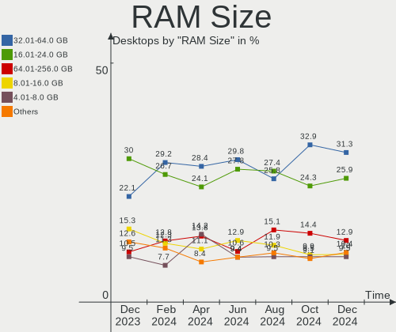
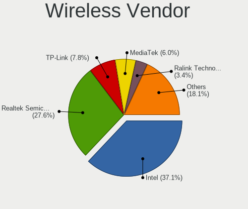
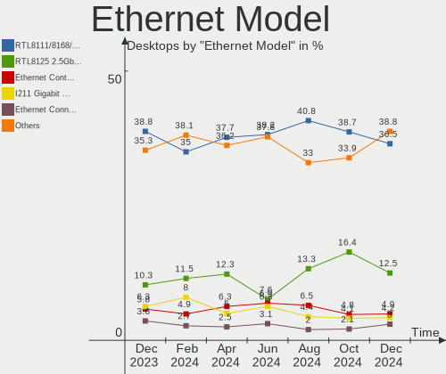
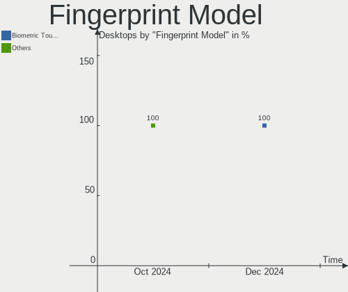

Fedora - Hardware Trends (Desktops)
-----------------------------------

A project to identify most popular hardware characteristics and track their change
over time based on data collected by Linux users at https://Linux-Hardware.org.

Anyone can contribute to this report by the [hw-probe](https://github.com/linuxhw/hw-probe) tool:

    sudo -E hw-probe -all -upload

This report is for one last month. Overall report since the beginning of time: [TestCoverage](https://github.com/linuxhw/TestCoverage)

Period: Sep, 2022.

Contents
--------

* [ System ](#system)
  - [ OS                       ](#os)
  - [ OS Family                ](#os-family)
  - [ Kernel                   ](#kernel)
  - [ Kernel Family            ](#kernel-family)
  - [ Kernel Major Ver.        ](#kernel-major-ver)
  - [ Arch                     ](#arch)
  - [ DE                       ](#de)
  - [ Display Server           ](#display-server)
  - [ Display Manager          ](#display-manager)
  - [ OS Lang                  ](#os-lang)
  - [ Boot Mode                ](#boot-mode)
  - [ Filesystem               ](#filesystem)
  - [ Part. scheme             ](#part-scheme)
  - [ Dual Boot with Linux/BSD ](#dual-boot-with-linuxbsd)
  - [ Dual Boot (Win)          ](#dual-boot-win)

* [ Board ](#board)
  - [ Vendor                   ](#vendor)
  - [ Model                    ](#model)
  - [ Model Family             ](#model-family)
  - [ MFG Year                 ](#mfg-year)
  - [ Form Factor              ](#form-factor)
  - [ Secure Boot              ](#secure-boot)
  - [ Coreboot                 ](#coreboot)
  - [ RAM Size                 ](#ram-size)
  - [ RAM Used                 ](#ram-used)
  - [ Total Drives             ](#total-drives)
  - [ Has CD-ROM               ](#has-cd-rom)
  - [ Has Ethernet             ](#has-ethernet)
  - [ Has WiFi                 ](#has-wifi)
  - [ Has Bluetooth            ](#has-bluetooth)

* [ Location ](#location)
  - [ Country                  ](#country)
  - [ City                     ](#city)

* [ Drives ](#drives)
  - [ Drive Vendor             ](#drive-vendor)
  - [ Drive Model              ](#drive-model)
  - [ HDD Vendor               ](#hdd-vendor)
  - [ SSD Vendor               ](#ssd-vendor)
  - [ Drive Kind               ](#drive-kind)
  - [ Drive Connector          ](#drive-connector)
  - [ Drive Size               ](#drive-size)
  - [ Space Total              ](#space-total)
  - [ Space Used               ](#space-used)
  - [ Malfunc. Drives          ](#malfunc-drives)
  - [ Malfunc. Drive Vendor    ](#malfunc-drive-vendor)
  - [ Malfunc. HDD Vendor      ](#malfunc-hdd-vendor)
  - [ Malfunc. Drive Kind      ](#malfunc-drive-kind)
  - [ Failed Drives            ](#failed-drives)
  - [ Failed Drive Vendor      ](#failed-drive-vendor)
  - [ Drive Status             ](#drive-status)

* [ Storage controller ](#storage-controller)
  - [ Storage Vendor           ](#storage-vendor)
  - [ Storage Model            ](#storage-model)
  - [ Storage Kind             ](#storage-kind)

* [ Processor ](#processor)
  - [ CPU Vendor               ](#cpu-vendor)
  - [ CPU Model                ](#cpu-model)
  - [ CPU Model Family         ](#cpu-model-family)
  - [ CPU Cores                ](#cpu-cores)
  - [ CPU Sockets              ](#cpu-sockets)
  - [ CPU Threads              ](#cpu-threads)
  - [ CPU Op-Modes             ](#cpu-op-modes)
  - [ CPU Microcode            ](#cpu-microcode)
  - [ CPU Microarch            ](#cpu-microarch)

* [ Graphics ](#graphics)
  - [ GPU Vendor               ](#gpu-vendor)
  - [ GPU Model                ](#gpu-model)
  - [ GPU Combo                ](#gpu-combo)
  - [ GPU Driver               ](#gpu-driver)
  - [ GPU Memory               ](#gpu-memory)

* [ Monitor ](#monitor)
  - [ Monitor Vendor           ](#monitor-vendor)
  - [ Monitor Model            ](#monitor-model)
  - [ Monitor Resolution       ](#monitor-resolution)
  - [ Monitor Diagonal         ](#monitor-diagonal)
  - [ Monitor Width            ](#monitor-width)
  - [ Aspect Ratio             ](#aspect-ratio)
  - [ Monitor Area             ](#monitor-area)
  - [ Pixel Density            ](#pixel-density)
  - [ Multiple Monitors        ](#multiple-monitors)

* [ Network ](#network)
  - [ Net Controller Vendor    ](#net-controller-vendor)
  - [ Net Controller Model     ](#net-controller-model)
  - [ Wireless Vendor          ](#wireless-vendor)
  - [ Wireless Model           ](#wireless-model)
  - [ Ethernet Vendor          ](#ethernet-vendor)
  - [ Ethernet Model           ](#ethernet-model)
  - [ Net Controller Kind      ](#net-controller-kind)
  - [ Used Controller          ](#used-controller)
  - [ NICs                     ](#nics)
  - [ IPv6                     ](#ipv6)

* [ Bluetooth ](#bluetooth)
  - [ Bluetooth Vendor         ](#bluetooth-vendor)
  - [ Bluetooth Model          ](#bluetooth-model)

* [ Sound ](#sound)
  - [ Sound Vendor             ](#sound-vendor)
  - [ Sound Model              ](#sound-model)

* [ Memory ](#memory)
  - [ Memory Vendor            ](#memory-vendor)
  - [ Memory Model             ](#memory-model)
  - [ Memory Kind              ](#memory-kind)
  - [ Memory Form Factor       ](#memory-form-factor)
  - [ Memory Size              ](#memory-size)
  - [ Memory Speed             ](#memory-speed)

* [ Printers & scanners ](#printers--scanners)
  - [ Printer Vendor           ](#printer-vendor)
  - [ Printer Model            ](#printer-model)
  - [ Scanner Vendor           ](#scanner-vendor)
  - [ Scanner Model            ](#scanner-model)

* [ Camera ](#camera)
  - [ Camera Vendor            ](#camera-vendor)
  - [ Camera Model             ](#camera-model)

* [ Security ](#security)
  - [ Fingerprint Vendor       ](#fingerprint-vendor)
  - [ Fingerprint Model        ](#fingerprint-model)
  - [ Chipcard Vendor          ](#chipcard-vendor)
  - [ Chipcard Model           ](#chipcard-model)

* [ Unsupported ](#unsupported)
  - [ Unsupported Devices      ](#unsupported-devices)
  - [ Unsupported Device Types ](#unsupported-device-types)

System
------

OS
--

Installed operating systems

| Name      | Desktops | Percent |
|-----------|----------|---------|
| Fedora 36 | 121      | 81.21%  |
| Fedora 37 | 17       | 11.41%  |
| Fedora 35 | 8        | 5.37%   |
| Fedora 38 | 2        | 1.34%   |
| Fedora 34 | 1        | 0.67%   |

OS Family
---------

OS without a version

| Name   | Desktops | Percent |
|--------|----------|---------|
| Fedora | 149      | 100%    |

Kernel
------

Version of the Linux kernel

| Version                                            | Desktops | Percent |
|----------------------------------------------------|----------|---------|
| 5.19.9-200.fc36.x86_64                             | 30       | 20.13%  |
| 5.19.6-200.fc36.x86_64                             | 23       | 15.44%  |
| 5.19.8-200.fc36.x86_64                             | 21       | 14.09%  |
| 5.19.4-200.fc36.x86_64                             | 10       | 6.71%   |
| 5.17.5-300.fc36.x86_64                             | 9        | 6.04%   |
| 5.19.9-300.fc37.x86_64                             | 8        | 5.37%   |
| 5.19.7-200.fc36.x86_64                             | 7        | 4.7%    |
| 5.19.11-200.fc36.x86_64                            | 7        | 4.7%    |
| 5.19.10-200.fc36.x86_64                            | 5        | 3.36%   |
| 5.19.8-300.fc37.x86_64                             | 3        | 2.01%   |
| 5.19.6-100.fc35.x86_64                             | 3        | 2.01%   |
| 5.18.19-200.fc36.x86_64                            | 3        | 2.01%   |
| 5.18.17-200.fc36.x86_64                            | 2        | 1.34%   |
| 6.0.0-0.rc6.41.fc38.x86_64                         | 1        | 0.67%   |
| 6.0.0-0.rc6.20220922gitdc164f4fb00a.43.fc38.x86_64 | 1        | 0.67%   |
| 6.0.0-0.rc5.37.fc38.x86_64                         | 1        | 0.67%   |
| 5.8.15-301.fc33.x86_64                             | 1        | 0.67%   |
| 5.4.212-300.fc36.x86_64                            | 1        | 0.67%   |
| 5.19.8-501.chinfo.fc37.x86_64                      | 1        | 0.67%   |
| 5.19.7-602.inttf.fc36.x86_64                       | 1        | 0.67%   |
| 5.19.7-300.fc37.x86_64                             | 1        | 0.67%   |
| 5.19.6-xm1.0.fc36.x86_64                           | 1        | 0.67%   |
| 5.19.4-100.fc35.x86_64                             | 1        | 0.67%   |
| 5.19.10-602.inttf.fc37.x86_64                      | 1        | 0.67%   |
| 5.19.10-300.fc37.x86_64                            | 1        | 0.67%   |
| 5.18.16-100.fc35.x86_64                            | 1        | 0.67%   |
| 5.18.11-200.fc36.x86_64                            | 1        | 0.67%   |
| 5.18.11-100.fc35.x86_64                            | 1        | 0.67%   |
| 5.16.5-200.fc35.x86_64                             | 1        | 0.67%   |
| 5.16.18-200.fc35.x86_64                            | 1        | 0.67%   |
| 5.11.12-300.fc34.x86_64                            | 1        | 0.67%   |

Kernel Family
-------------

Linux kernel without a distro release

| Version | Desktops | Percent |
|---------|----------|---------|
| 5.19.9  | 38       | 25.5%   |
| 5.19.6  | 27       | 18.12%  |
| 5.19.8  | 25       | 16.78%  |
| 5.19.4  | 11       | 7.38%   |
| 5.19.7  | 9        | 6.04%   |
| 5.17.5  | 9        | 6.04%   |
| 5.19.11 | 7        | 4.7%    |
| 5.19.10 | 7        | 4.7%    |
| 6.0.0   | 3        | 2.01%   |
| 5.18.19 | 3        | 2.01%   |
| 5.18.17 | 2        | 1.34%   |
| 5.18.11 | 2        | 1.34%   |
| 5.8.15  | 1        | 0.67%   |
| 5.4.212 | 1        | 0.67%   |
| 5.18.16 | 1        | 0.67%   |
| 5.16.5  | 1        | 0.67%   |
| 5.16.18 | 1        | 0.67%   |
| 5.11.12 | 1        | 0.67%   |

Kernel Major Ver.
-----------------

Linux kernel major version

| Version | Desktops | Percent |
|---------|----------|---------|
| 5.19    | 124      | 83.22%  |
| 5.17    | 9        | 6.04%   |
| 5.18    | 8        | 5.37%   |
| 6.0     | 3        | 2.01%   |
| 5.16    | 2        | 1.34%   |
| 5.8     | 1        | 0.67%   |
| 5.4     | 1        | 0.67%   |
| 5.11    | 1        | 0.67%   |

Arch
----

OS architecture (x86_64, i586, etc.)

| Name   | Desktops | Percent |
|--------|----------|---------|
| x86_64 | 149      | 100%    |

DE
--

Desktop Environment

| Name          | Desktops | Percent |
|---------------|----------|---------|
| GNOME         | 101      | 67.79%  |
| KDE5          | 26       | 17.45%  |
| XFCE          | 5        | 3.36%   |
| Cinnamon      | 5        | 3.36%   |
| X-Cinnamon    | 3        | 2.01%   |
| MATE          | 3        | 2.01%   |
| Unknown       | 2        | 1.34%   |
| LXQt          | 1        | 0.67%   |
| LXDE          | 1        | 0.67%   |
| i3            | 1        | 0.67%   |
| GNOME Classic | 1        | 0.67%   |

Display Server
--------------

X11 or Wayland

| Name    | Desktops | Percent |
|---------|----------|---------|
| Wayland | 84       | 56.38%  |
| X11     | 60       | 40.27%  |
| Tty     | 5        | 3.36%   |

Display Manager
---------------

SDDM, LightDM, etc.

| Name    | Desktops | Percent |
|---------|----------|---------|
| Unknown | 78       | 52.35%  |
| GDM     | 39       | 26.17%  |
| SDDM    | 16       | 10.74%  |
| LightDM | 15       | 10.07%  |
| LXDM    | 1        | 0.67%   |

OS Lang
-------

Language

| Lang           | Desktops | Percent |
|----------------|----------|---------|
| en_US          | 62       | 41.61%  |
| en_GB          | 12       | 8.05%   |
| ru_RU          | 11       | 7.38%   |
| it_IT          | 11       | 7.38%   |
| de_DE          | 10       | 6.71%   |
| pt_BR          | 9        | 6.04%   |
| en_CA          | 6        | 4.03%   |
| en_AU          | 6        | 4.03%   |
| fr_FR          | 3        | 2.01%   |
| hu_HU          | 2        | 1.34%   |
| pl_PL          | 1        | 0.67%   |
| nn_NO          | 1        | 0.67%   |
| nl_NL          | 1        | 0.67%   |
| nl_BE          | 1        | 0.67%   |
| hu_HU.UTF8     | 1        | 0.67%   |
| es_VE          | 1        | 0.67%   |
| es_MX          | 1        | 0.67%   |
| es_ES          | 1        | 0.67%   |
| es_CO          | 1        | 0.67%   |
| es_CL          | 1        | 0.67%   |
| es_AR          | 1        | 0.67%   |
| en_NZ          | 1        | 0.67%   |
| en_IN          | 1        | 0.67%   |
| en_IE          | 1        | 0.67%   |
| el_GR          | 1        | 0.67%   |
| ca_ES@valencia | 1        | 0.67%   |
| ca_ES          | 1        | 0.67%   |

Boot Mode
---------

EFI or BIOS

| Mode | Desktops | Percent |
|------|----------|---------|
| EFI  | 101      | 67.79%  |
| BIOS | 48       | 32.21%  |

Filesystem
----------

Type of filesystem

| Type  | Desktops | Percent |
|-------|----------|---------|
| Btrfs | 107      | 71.81%  |
| Ext4  | 37       | 24.83%  |
| Xfs   | 5        | 3.36%   |

Part. scheme
------------

Scheme of partitioning

| Type    | Desktops | Percent |
|---------|----------|---------|
| Unknown | 77       | 51.68%  |
| GPT     | 56       | 37.58%  |
| MBR     | 16       | 10.74%  |

Dual Boot with Linux/BSD
------------------------

Hosting more than one Linux/BSD

| Dual boot | Desktops | Percent |
|-----------|----------|---------|
| No        | 123      | 82.55%  |
| Yes       | 26       | 17.45%  |

Dual Boot (Win)
---------------

Hosting Linux and Windows

| Dual boot | Desktops | Percent |
|-----------|----------|---------|
| No        | 109      | 73.15%  |
| Yes       | 40       | 26.85%  |

Board
-----

Vendor
------

Motherboard manufacturer

| Name                | Desktops | Percent |
|---------------------|----------|---------|
| ASUSTek Computer    | 46       | 30.87%  |
| Gigabyte Technology | 30       | 20.13%  |
| MSI                 | 19       | 12.75%  |
| ASRock              | 18       | 12.08%  |
| Dell                | 9        | 6.04%   |
| Hewlett-Packard     | 6        | 4.03%   |
| Lenovo              | 5        | 3.36%   |
| Acer                | 4        | 2.68%   |
| Foxconn             | 3        | 2.01%   |
| BESSTAR Tech        | 3        | 2.01%   |
| Intel               | 2        | 1.34%   |
| Biostar             | 2        | 1.34%   |
| Casper              | 1        | 0.67%   |
| Unknown             | 1        | 0.67%   |

Model
-----

Motherboard model

| Name                                 | Desktops | Percent |
|--------------------------------------|----------|---------|
| ASUS All Series                      | 4        | 2.68%   |
| MSI MS-7C91                          | 3        | 2.01%   |
| MSI MS-7B86                          | 3        | 2.01%   |
| ASUS TUF Gaming B550M-PLUS           | 3        | 2.01%   |
| MSI MS-7C56                          | 2        | 1.34%   |
| Gigabyte A320M-S2H                   | 2        | 1.34%   |
| BESSTAR Tech UM350                   | 2        | 1.34%   |
| ASUS Z170-A                          | 2        | 1.34%   |
| ASUS TUF Gaming B550-PLUS            | 2        | 1.34%   |
| ASUS TUF B350M-PLUS GAMING           | 2        | 1.34%   |
| ASUS ROG STRIX X570-F GAMING         | 2        | 1.34%   |
| ASUS ROG STRIX X570-E GAMING WIFI II | 2        | 1.34%   |
| ASRock A320M-HD                      | 2        | 1.34%   |
| MSI MS-7D22                          | 1        | 0.67%   |
| MSI MS-7D08                          | 1        | 0.67%   |
| MSI MS-7C75                          | 1        | 0.67%   |
| MSI MS-7C37                          | 1        | 0.67%   |
| MSI MS-7C35                          | 1        | 0.67%   |
| MSI MS-7B79                          | 1        | 0.67%   |
| MSI MS-7B33                          | 1        | 0.67%   |
| MSI MS-7A39                          | 1        | 0.67%   |
| MSI MS-7885                          | 1        | 0.67%   |
| MSI MS-7850                          | 1        | 0.67%   |
| MSI MS-7721                          | 1        | 0.67%   |
| Lenovo ThinkCentre M700 10JNS05E00   | 1        | 0.67%   |
| Lenovo ThinkCentre M700 10GSA000AS   | 1        | 0.67%   |
| Lenovo ThinkCentre E73 10AS0035SP    | 1        | 0.67%   |
| Lenovo Legion Y520T-25IKL 90H700C9PB | 1        | 0.67%   |
| Lenovo H530 10130                    | 1        | 0.67%   |
| Intel DP35DP AAD81073-208            | 1        | 0.67%   |
| Intel DH77DF AAG40293-300            | 1        | 0.67%   |
| HP ProLiant ML110 G7                 | 1        | 0.67%   |
| HP ProDesk 600 G2 SFF                | 1        | 0.67%   |
| HP EliteDesk 800 G1 TWR              | 1        | 0.67%   |
| HP Compaq Elite 8300 SFF             | 1        | 0.67%   |
| HP Compaq 8200 Elite CMT PC          | 1        | 0.67%   |
| HP 110-516no                         | 1        | 0.67%   |
| Gigabyte Z97P-D3                     | 1        | 0.67%   |
| Gigabyte Z97-HD3                     | 1        | 0.67%   |
| Gigabyte Z690I AORUS ULTRA DDR4      | 1        | 0.67%   |

Model Family
------------

Motherboard model prefix

| Name               | Desktops | Percent |
|--------------------|----------|---------|
| ASUS TUF           | 10       | 6.71%   |
| ASUS ROG           | 10       | 6.71%   |
| ASUS PRIME         | 8        | 5.37%   |
| ASUS All           | 4        | 2.68%   |
| MSI MS-7C91        | 3        | 2.01%   |
| MSI MS-7B86        | 3        | 2.01%   |
| Lenovo ThinkCentre | 3        | 2.01%   |
| Gigabyte A320M-S2H | 3        | 2.01%   |
| Dell OptiPlex      | 3        | 2.01%   |
| Acer Aspire        | 3        | 2.01%   |
| MSI MS-7C56        | 2        | 1.34%   |
| HP Compaq          | 2        | 1.34%   |
| Gigabyte X570      | 2        | 1.34%   |
| Gigabyte X470      | 2        | 1.34%   |
| Gigabyte B450M     | 2        | 1.34%   |
| Dell XPS           | 2        | 1.34%   |
| Dell Precision     | 2        | 1.34%   |
| BESSTAR Tech UM350 | 2        | 1.34%   |
| ASUS Z170-A        | 2        | 1.34%   |
| ASRock X570        | 2        | 1.34%   |
| ASRock FM2A88X     | 2        | 1.34%   |
| ASRock A320M-HD    | 2        | 1.34%   |
| MSI MS-7D22        | 1        | 0.67%   |
| MSI MS-7D08        | 1        | 0.67%   |
| MSI MS-7C75        | 1        | 0.67%   |
| MSI MS-7C37        | 1        | 0.67%   |
| MSI MS-7C35        | 1        | 0.67%   |
| MSI MS-7B79        | 1        | 0.67%   |
| MSI MS-7B33        | 1        | 0.67%   |
| MSI MS-7A39        | 1        | 0.67%   |
| MSI MS-7885        | 1        | 0.67%   |
| MSI MS-7850        | 1        | 0.67%   |
| MSI MS-7721        | 1        | 0.67%   |
| Lenovo Legion      | 1        | 0.67%   |
| Lenovo H530        | 1        | 0.67%   |
| Intel DP35DP       | 1        | 0.67%   |
| Intel DH77DF       | 1        | 0.67%   |
| HP ProLiant        | 1        | 0.67%   |
| HP ProDesk         | 1        | 0.67%   |
| HP EliteDesk       | 1        | 0.67%   |

MFG Year
--------

Motherboard manufacture year

| Year | Desktops | Percent |
|------|----------|---------|
| 2020 | 21       | 14.09%  |
| 2019 | 20       | 13.42%  |
| 2021 | 14       | 9.4%    |
| 2018 | 14       | 9.4%    |
| 2014 | 14       | 9.4%    |
| 2015 | 11       | 7.38%   |
| 2017 | 10       | 6.71%   |
| 2022 | 8        | 5.37%   |
| 2016 | 8        | 5.37%   |
| 2013 | 8        | 5.37%   |
| 2012 | 7        | 4.7%    |
| 2011 | 4        | 2.68%   |
| 2010 | 4        | 2.68%   |
| 2008 | 4        | 2.68%   |
| 2009 | 1        | 0.67%   |
| 2006 | 1        | 0.67%   |

Form Factor
-----------

Physical design of the computer

| Name    | Desktops | Percent |
|---------|----------|---------|
| Desktop | 149      | 100%    |

Secure Boot
-----------

Enabled or disabled

| State    | Desktops | Percent |
|----------|----------|---------|
| Disabled | 135      | 90.6%   |
| Enabled  | 14       | 9.4%    |

Coreboot
--------

Have coreboot on board

| Used | Desktops | Percent |
|------|----------|---------|
| No   | 149      | 100%    |

RAM Size
--------

Total RAM memory

| Size in GB      | Desktops | Percent |
|-----------------|----------|---------|
| 16.01-24.0      | 43       | 28.86%  |
| 32.01-64.0      | 39       | 26.17%  |
| 8.01-16.0       | 24       | 16.11%  |
| 4.01-8.0        | 17       | 11.41%  |
| 64.01-256.0     | 11       | 7.38%   |
| 3.01-4.0        | 8        | 5.37%   |
| 24.01-32.0      | 4        | 2.68%   |
| More than 256.0 | 1        | 0.67%   |
| 2.01-3.0        | 1        | 0.67%   |
| 1.01-2.0        | 1        | 0.67%   |

RAM Used
--------

Used RAM memory

| Used GB    | Desktops | Percent |
|------------|----------|---------|
| 4.01-8.0   | 45       | 30.2%   |
| 3.01-4.0   | 39       | 26.17%  |
| 2.01-3.0   | 30       | 20.13%  |
| 8.01-16.0  | 19       | 12.75%  |
| 1.01-2.0   | 10       | 6.71%   |
| 32.01-64.0 | 2        | 1.34%   |
| 24.01-32.0 | 2        | 1.34%   |
| 16.01-24.0 | 1        | 0.67%   |
| 0.51-1.0   | 1        | 0.67%   |

Total Drives
------------

Number of drives on board

| Drives | Desktops | Percent |
|--------|----------|---------|
| 2      | 49       | 32.89%  |
| 1      | 35       | 23.49%  |
| 3      | 34       | 22.82%  |
| 4      | 14       | 9.4%    |
| 5      | 10       | 6.71%   |
| 7      | 2        | 1.34%   |
| 6      | 2        | 1.34%   |
| 0      | 2        | 1.34%   |
| 11     | 1        | 0.67%   |

Has CD-ROM
----------

Has CD-ROM on board

| Presented | Desktops | Percent |
|-----------|----------|---------|
| No        | 98       | 65.77%  |
| Yes       | 51       | 34.23%  |

Has Ethernet
------------

Has Ethernet on board

| Presented | Desktops | Percent |
|-----------|----------|---------|
| Yes       | 148      | 99.33%  |
| No        | 1        | 0.67%   |

Has WiFi
--------

Has WiFi module

| Presented | Desktops | Percent |
|-----------|----------|---------|
| Yes       | 84       | 56.38%  |
| No        | 65       | 43.62%  |

Has Bluetooth
-------------

Has Bluetooth module

| Presented | Desktops | Percent |
|-----------|----------|---------|
| No        | 81       | 54.36%  |
| Yes       | 68       | 45.64%  |

Location
--------

Country
-------

Geographic location (country)

| Country             | Desktops | Percent |
|---------------------|----------|---------|
| USA                 | 25       | 16.78%  |
| Italy               | 20       | 13.42%  |
| Germany             | 17       | 11.41%  |
| Brazil              | 12       | 8.05%   |
| Russia              | 9        | 6.04%   |
| Canada              | 7        | 4.7%    |
| Australia           | 6        | 4.03%   |
| UK                  | 5        | 3.36%   |
| Spain               | 5        | 3.36%   |
| Norway              | 4        | 2.68%   |
| Hungary             | 3        | 2.01%   |
| France              | 3        | 2.01%   |
| Belarus             | 3        | 2.01%   |
| Poland              | 2        | 1.34%   |
| Philippines         | 2        | 1.34%   |
| Netherlands         | 2        | 1.34%   |
| Mexico              | 2        | 1.34%   |
| Japan               | 2        | 1.34%   |
| Belgium             | 2        | 1.34%   |
| Venezuela           | 1        | 0.67%   |
| Turkey              | 1        | 0.67%   |
| Trinidad and Tobago | 1        | 0.67%   |
| Sweden              | 1        | 0.67%   |
| Serbia              | 1        | 0.67%   |
| Romania             | 1        | 0.67%   |
| New Zealand         | 1        | 0.67%   |
| Maldives            | 1        | 0.67%   |
| Malaysia            | 1        | 0.67%   |
| Latvia              | 1        | 0.67%   |
| Kenya               | 1        | 0.67%   |
| India               | 1        | 0.67%   |
| Greece              | 1        | 0.67%   |
| Finland             | 1        | 0.67%   |
| Colombia            | 1        | 0.67%   |
| Chile               | 1        | 0.67%   |
| Austria             | 1        | 0.67%   |
| Argentina           | 1        | 0.67%   |

City
----

Geographic location (city)

| City                    | Desktops | Percent |
|-------------------------|----------|---------|
| Berlin                  | 4        | 2.68%   |
| St Petersburg           | 2        | 1.34%   |
| Rome                    | 2        | 1.34%   |
| Pouso Alegre            | 2        | 1.34%   |
| Perth                   | 2        | 1.34%   |
| Moscow                  | 2        | 1.34%   |
| Minsk                   | 2        | 1.34%   |
| Melbourne               | 2        | 1.34%   |
| Manchester              | 2        | 1.34%   |
| Lane Cove               | 2        | 1.34%   |
| Kristiansand            | 2        | 1.34%   |
| Goiânia                | 2        | 1.34%   |
| Frankfurt am Main       | 2        | 1.34%   |
| Zambana                 | 1        | 0.67%   |
| Weston                  | 1        | 0.67%   |
| Werder                  | 1        | 0.67%   |
| Washington              | 1        | 0.67%   |
| Wabasca-Desmarais       | 1        | 0.67%   |
| Vormsund                | 1        | 0.67%   |
| Vinay                   | 1        | 0.67%   |
| Vidnoye                 | 1        | 0.67%   |
| Verona                  | 1        | 0.67%   |
| Vaxjo                   | 1        | 0.67%   |
| Vancouver               | 1        | 0.67%   |
| Tver                    | 1        | 0.67%   |
| Thornton Heath          | 1        | 0.67%   |
| The Hague               | 1        | 0.67%   |
| Terrassa                | 1        | 0.67%   |
| Tarazona                | 1        | 0.67%   |
| Székesfehérvár       | 1        | 0.67%   |
| Spinea                  | 1        | 0.67%   |
| Sibiu                   | 1        | 0.67%   |
| Selma                   | 1        | 0.67%   |
| Saratov                 | 1        | 0.67%   |
| Sao Paulo               | 1        | 0.67%   |
| Santiago de Cali        | 1        | 0.67%   |
| Santiago                | 1        | 0.67%   |
| Sannazzaro de' Burgondi | 1        | 0.67%   |
| San Miguel              | 1        | 0.67%   |
| San Juan                | 1        | 0.67%   |

Drives
------

Drive Vendor
------------

Hard drive vendors

| Vendor                      | Desktops | Drives | Percent |
|-----------------------------|----------|--------|---------|
| Seagate                     | 52       | 75     | 17.11%  |
| Samsung Electronics         | 52       | 78     | 17.11%  |
| WDC                         | 49       | 67     | 16.12%  |
| Kingston                    | 23       | 24     | 7.57%   |
| Toshiba                     | 20       | 22     | 6.58%   |
| Crucial                     | 18       | 20     | 5.92%   |
| SanDisk                     | 14       | 15     | 4.61%   |
| Hitachi                     | 6        | 6      | 1.97%   |
| SPCC                        | 5        | 7      | 1.64%   |
| Phison                      | 5        | 5      | 1.64%   |
| SK hynix                    | 4        | 4      | 1.32%   |
| Silicon Motion              | 4        | 4      | 1.32%   |
| HGST                        | 4        | 4      | 1.32%   |
| China                       | 4        | 5      | 1.32%   |
| A-DATA Technology           | 4        | 4      | 1.32%   |
| Intel                       | 3        | 4      | 0.99%   |
| Patriot                     | 2        | 2      | 0.66%   |
| Netac                       | 2        | 2      | 0.66%   |
| Lexar                       | 2        | 3      | 0.66%   |
| JMicron Technology          | 2        | 2      | 0.66%   |
| Unknown                     | 2        | 2      | 0.66%   |
| Verbatim                    | 1        | 1      | 0.33%   |
| Unknown                     | 1        | 1      | 0.33%   |
| Transcend                   | 1        | 1      | 0.33%   |
| Timetec                     | 1        | 1      | 0.33%   |
| Team                        | 1        | 2      | 0.33%   |
| TCSUNBOW                    | 1        | 1      | 0.33%   |
| SPCC M.2                    | 1        | 1      | 0.33%   |
| SKIHOTAR                    | 1        | 1      | 0.33%   |
| Seagate Technology          | 1        | 1      | 0.33%   |
| Realtek Semiconductor       | 1        | 1      | 0.33%   |
| RCESSD                      | 1        | 1      | 0.33%   |
| Plextor                     | 1        | 1      | 0.33%   |
| OCZ                         | 1        | 2      | 0.33%   |
| MyDigitalSSD                | 1        | 1      | 0.33%   |
| Micron/Crucial Technology   | 1        | 2      | 0.33%   |
| Micron Technology           | 1        | 1      | 0.33%   |
| MAXIO Technology (Hangzhou) | 1        | 1      | 0.33%   |
| LITEONIT                    | 1        | 1      | 0.33%   |
| LITEON                      | 1        | 1      | 0.33%   |

Drive Model
-----------

Hard drive models

| Model                                                 | Desktops | Percent |
|-------------------------------------------------------|----------|---------|
| Samsung NVMe SSD Controller SM981/PM981/PM983 256GB   | 7        | 1.93%   |
| Kingston SA400S37120G 120GB SSD                       | 7        | 1.93%   |
| Seagate ST500DM002-1BD142 500GB                       | 6        | 1.65%   |
| Seagate ST2000DM008-2FR102 2TB                        | 6        | 1.65%   |
| Samsung NVMe SSD Controller PM9A1/PM9A3/980PRO 1024GB | 6        | 1.65%   |
| Kingston SA400S37240G 240GB SSD                       | 6        | 1.65%   |
| Seagate ST1000DM003-1ER162 1TB                        | 5        | 1.38%   |
| Samsung SSD 860 EVO 500GB                             | 5        | 1.38%   |
| WDC WD10EZEX-08WN4A0 1TB                              | 4        | 1.1%    |
| Toshiba HDWD110 1TB                                   | 4        | 1.1%    |
| Seagate ST1000LM024 HN-M101MBB 1TB                    | 4        | 1.1%    |
| Samsung SSD 850 EVO 250GB                             | 4        | 1.1%    |
| Samsung NVMe SSD Drive 1TB                            | 4        | 1.1%    |
| Crucial CT500MX500SSD1 500GB                          | 4        | 1.1%    |
| WDC WD30EFRX-68EUZN0 3TB                              | 3        | 0.83%   |
| WDC WD1002FAEX-00Z3A0 1TB                             | 3        | 0.83%   |
| Toshiba DT01ACA100 1TB                                | 3        | 0.83%   |
| Seagate Expansion Desk 2TB                            | 3        | 0.83%   |
| Samsung SSD 980 PRO 1TB                               | 3        | 0.83%   |
| Samsung SSD 870 EVO 1TB                               | 3        | 0.83%   |
| Crucial CT1000P1SSD8 1TB                              | 3        | 0.83%   |
| WDC WDS500G2B0B-00YS70 500GB SSD                      | 2        | 0.55%   |
| WDC WD5000AAKX-60U6AA0 500GB                          | 2        | 0.55%   |
| WDC WD40EFRX-68N32N0 4TB                              | 2        | 0.55%   |
| WDC WD20EZBX-00AYRA0 2TB                              | 2        | 0.55%   |
| WDC WD10EZRX-00A8LB0 1TB                              | 2        | 0.55%   |
| Toshiba MQ01ABF050 500GB                              | 2        | 0.55%   |
| Toshiba HDWD120 2TB                                   | 2        | 0.55%   |
| SPCC Solid State Disk 128GB                           | 2        | 0.55%   |
| Silicon Motion SM2262/SM2262EN SSD Controller 1024GB  | 2        | 0.55%   |
| Seagate ST500LT012-1DG142 500GB                       | 2        | 0.55%   |
| Seagate ST500DM002-1SB10A 500GB                       | 2        | 0.55%   |
| Seagate ST3000DM001-1CH166 3TB                        | 2        | 0.55%   |
| Seagate ST2000DM001-1CH164 2TB                        | 2        | 0.55%   |
| Seagate ST1000DM010-2EP102 1TB                        | 2        | 0.55%   |
| Seagate ST1000DM003-1CH162 1TB                        | 2        | 0.55%   |
| SanDisk SDSSDH3 1T00 1TB                              | 2        | 0.55%   |
| SanDisk NVMe SSD Drive 1TB                            | 2        | 0.55%   |
| Samsung SSD 970 EVO Plus 500GB                        | 2        | 0.55%   |
| Samsung SSD 970 EVO Plus 250GB                        | 2        | 0.55%   |

HDD Vendor
----------

Hard disk drive vendors

| Vendor              | Desktops | Drives | Percent |
|---------------------|----------|--------|---------|
| Seagate             | 51       | 73     | 39.84%  |
| WDC                 | 42       | 55     | 32.81%  |
| Toshiba             | 17       | 19     | 13.28%  |
| Hitachi             | 6        | 6      | 4.69%   |
| HGST                | 4        | 4      | 3.13%   |
| Samsung Electronics | 3        | 4      | 2.34%   |
| Unknown             | 1        | 1      | 0.78%   |
| JMicron Technology  | 1        | 1      | 0.78%   |
| ExcelStor           | 1        | 1      | 0.78%   |
| Apple               | 1        | 1      | 0.78%   |
| Unknown             | 1        | 1      | 0.78%   |

SSD Vendor
----------

Solid state drive vendors

| Vendor              | Desktops | Drives | Percent |
|---------------------|----------|--------|---------|
| Samsung Electronics | 25       | 31     | 24.04%  |
| Kingston            | 17       | 17     | 16.35%  |
| Crucial             | 15       | 16     | 14.42%  |
| SanDisk             | 8        | 8      | 7.69%   |
| WDC                 | 7        | 7      | 6.73%   |
| SPCC                | 4        | 6      | 3.85%   |
| China               | 4        | 5      | 3.85%   |
| Patriot             | 2        | 2      | 1.92%   |
| Lexar               | 2        | 3      | 1.92%   |
| Intel               | 2        | 2      | 1.92%   |
| A-DATA Technology   | 2        | 2      | 1.92%   |
| Verbatim            | 1        | 1      | 0.96%   |
| Transcend           | 1        | 1      | 0.96%   |
| Team                | 1        | 2      | 0.96%   |
| TCSUNBOW            | 1        | 1      | 0.96%   |
| SPCC M.2            | 1        | 1      | 0.96%   |
| SKIHOTAR            | 1        | 1      | 0.96%   |
| SK hynix            | 1        | 1      | 0.96%   |
| Plextor             | 1        | 1      | 0.96%   |
| OCZ                 | 1        | 2      | 0.96%   |
| MyDigitalSSD        | 1        | 1      | 0.96%   |
| Micron Technology   | 1        | 1      | 0.96%   |
| LITEONIT            | 1        | 1      | 0.96%   |
| LITEON              | 1        | 1      | 0.96%   |
| GOODRAM             | 1        | 1      | 0.96%   |
| Gigabyte Technology | 1        | 1      | 0.96%   |
| Unknown             | 1        | 1      | 0.96%   |

Drive Kind
----------

HDD or SSD

| Kind    | Desktops | Drives | Percent |
|---------|----------|--------|---------|
| HDD     | 100      | 166    | 38.02%  |
| SSD     | 84       | 117    | 31.94%  |
| NVMe    | 72       | 95     | 27.38%  |
| Unknown | 7        | 7      | 2.66%   |

Drive Connector
---------------

SATA, SAS, NVMe, etc.

| Type | Desktops | Drives | Percent |
|------|----------|--------|---------|
| SATA | 131      | 271    | 60.65%  |
| NVMe | 72       | 95     | 33.33%  |
| SAS  | 13       | 19     | 6.02%   |

Drive Size
----------

Size of hard drive

| Size in TB | Desktops | Drives | Percent |
|------------|----------|--------|---------|
| 0.01-0.5   | 80       | 125    | 39.02%  |
| 0.51-1.0   | 67       | 86     | 32.68%  |
| 1.01-2.0   | 29       | 40     | 14.15%  |
| 3.01-4.0   | 13       | 14     | 6.34%   |
| 2.01-3.0   | 8        | 10     | 3.9%    |
| 4.01-10.0  | 8        | 8      | 3.9%    |

Space Total
-----------

Amount of disk space available on the file system

| Size in GB     | Desktops | Percent |
|----------------|----------|---------|
| 1001-2000      | 35       | 23.49%  |
| 501-1000       | 28       | 18.79%  |
| More than 3000 | 25       | 16.78%  |
| 2001-3000      | 18       | 12.08%  |
| 101-250        | 18       | 12.08%  |
| 251-500        | 10       | 6.71%   |
| 1-20           | 10       | 6.71%   |
| Unknown        | 4        | 2.68%   |
| 51-100         | 1        | 0.67%   |

Space Used
----------

Amount of used disk space

| Used GB        | Desktops | Percent |
|----------------|----------|---------|
| 1-20           | 25       | 16.78%  |
| 501-1000       | 24       | 16.11%  |
| 101-250        | 19       | 12.75%  |
| 1001-2000      | 18       | 12.08%  |
| 251-500        | 17       | 11.41%  |
| 21-50          | 14       | 9.4%    |
| More than 3000 | 12       | 8.05%   |
| 51-100         | 12       | 8.05%   |
| 2001-3000      | 4        | 2.68%   |
| Unknown        | 4        | 2.68%   |

Malfunc. Drives
---------------

Drive models with a malfunction

| Model                               | Desktops | Drives | Percent |
|-------------------------------------|----------|--------|---------|
| Seagate ST500LT012-1DG142 500GB     | 2        | 2      | 9.09%   |
| WDC WD800JD-75MSA3 80GB             | 1        | 1      | 4.55%   |
| WDC WD5000AAKX-00U6AA0 500GB        | 1        | 1      | 4.55%   |
| WDC WD5000AADS-00S9B0 500GB         | 1        | 1      | 4.55%   |
| WDC WD40PURZ-85TTDY0 4TB            | 1        | 1      | 4.55%   |
| WDC WD4001FAEX-00MJRA0 4TB          | 1        | 1      | 4.55%   |
| WDC WD10EFRX-68FYTN0 1TB            | 1        | 1      | 4.55%   |
| Toshiba MQ01ABF050 500GB            | 1        | 1      | 4.55%   |
| SK hynix SH920 2.5 7MM 256GB SSD    | 1        | 1      | 4.55%   |
| Seagate ST500LM021-1KJ152 500GB     | 1        | 1      | 4.55%   |
| Seagate ST500DM002-1BD142 500GB     | 1        | 1      | 4.55%   |
| Seagate ST3000DM001-1ER166 3TB      | 1        | 1      | 4.55%   |
| Seagate ST3000DM001-1CH166 3TB      | 1        | 1      | 4.55%   |
| Seagate ST1000VM002-1CT162 1TB      | 1        | 1      | 4.55%   |
| Seagate ST1000LX015-1U7172 1TB      | 1        | 1      | 4.55%   |
| Samsung Electronics SSD 870 EVO 1TB | 1        | 1      | 4.55%   |
| Samsung Electronics HD501LJ 500GB   | 1        | 2      | 4.55%   |
| LITEON IT LCS-256L9S-HP 256GB SSD   | 1        | 1      | 4.55%   |
| Intel SSDSC2BW480A4 480GB           | 1        | 1      | 4.55%   |
| Hitachi HDS721032CLA362 320GB       | 1        | 1      | 4.55%   |
| Crucial CT128MX100SSD1 128GB        | 1        | 1      | 4.55%   |

Malfunc. Drive Vendor
---------------------

Vendors of faulty drives

| Vendor              | Desktops | Drives | Percent |
|---------------------|----------|--------|---------|
| WDC                 | 6        | 6      | 31.58%  |
| Seagate             | 5        | 8      | 26.32%  |
| Samsung Electronics | 2        | 3      | 10.53%  |
| Toshiba             | 1        | 1      | 5.26%   |
| SK hynix            | 1        | 1      | 5.26%   |
| LITEON              | 1        | 1      | 5.26%   |
| Intel               | 1        | 1      | 5.26%   |
| Hitachi             | 1        | 1      | 5.26%   |
| Crucial             | 1        | 1      | 5.26%   |

Malfunc. HDD Vendor
-------------------

Vendors of faulty HDD drives

| Vendor              | Desktops | Drives | Percent |
|---------------------|----------|--------|---------|
| WDC                 | 6        | 6      | 42.86%  |
| Seagate             | 5        | 8      | 35.71%  |
| Toshiba             | 1        | 1      | 7.14%   |
| Samsung Electronics | 1        | 2      | 7.14%   |
| Hitachi             | 1        | 1      | 7.14%   |

Malfunc. Drive Kind
-------------------

Kinds of faulty drives

| Kind | Desktops | Drives | Percent |
|------|----------|--------|---------|
| HDD  | 11       | 18     | 73.33%  |
| SSD  | 4        | 5      | 26.67%  |

Failed Drives
-------------

Failed drive models

Zero info for selected period =(

Failed Drive Vendor
-------------------

Failed drive vendors

Zero info for selected period =(

Drive Status
------------

Number of failed and malfunc. drives

| Status   | Desktops | Drives | Percent |
|----------|----------|--------|---------|
| Detected | 90       | 216    | 51.72%  |
| Works    | 69       | 146    | 39.66%  |
| Malfunc  | 15       | 23     | 8.62%   |

Storage controller
------------------

Storage Vendor
--------------

Storage controller vendors

| Vendor                       | Desktops | Percent |
|------------------------------|----------|---------|
| Intel                        | 76       | 31.8%   |
| AMD                          | 72       | 30.13%  |
| Samsung Electronics          | 36       | 15.06%  |
| SanDisk                      | 10       | 4.18%   |
| Kingston Technology Company  | 7        | 2.93%   |
| Phison Electronics           | 6        | 2.51%   |
| ASMedia Technology           | 6        | 2.51%   |
| Silicon Motion               | 4        | 1.67%   |
| Micron/Crucial Technology    | 4        | 1.67%   |
| Marvell Technology Group     | 4        | 1.67%   |
| Toshiba America Info Systems | 3        | 1.26%   |
| SK hynix                     | 3        | 1.26%   |
| Realtek Semiconductor        | 3        | 1.26%   |
| ADATA Technology             | 2        | 0.84%   |
| Seagate Technology           | 1        | 0.42%   |
| MAXIO Technology (Hangzhou)  | 1        | 0.42%   |
| JMicron Technology           | 1        | 0.42%   |

Storage Model
-------------

Storage controller models

| Model                                                                          | Desktops | Percent |
|--------------------------------------------------------------------------------|----------|---------|
| AMD FCH SATA Controller [AHCI mode]                                            | 39       | 14.18%  |
| Samsung NVMe SSD Controller SM981/PM981/PM983                                  | 20       | 7.27%   |
| AMD 500 Series Chipset SATA Controller                                         | 15       | 5.45%   |
| AMD 400 Series Chipset SATA Controller                                         | 13       | 4.73%   |
| Intel Q170/Q150/B150/H170/H110/Z170/CM236 Chipset SATA Controller [AHCI Mode]  | 12       | 4.36%   |
| Samsung NVMe SSD Controller PM9A1/PM9A3/980PRO                                 | 11       | 4%      |
| Intel 8 Series/C220 Series Chipset Family 6-port SATA Controller 1 [AHCI mode] | 8        | 2.91%   |
| Intel 200 Series PCH SATA controller [AHCI mode]                               | 8        | 2.91%   |
| Intel Alder Lake-S PCH SATA Controller [AHCI Mode]                             | 7        | 2.55%   |
| Intel 6 Series/C200 Series Chipset Family 6 port Desktop SATA AHCI Controller  | 7        | 2.55%   |
| Intel 9 Series Chipset Family SATA Controller [AHCI Mode]                      | 6        | 2.18%   |
| ASMedia ASM1062 Serial ATA Controller                                          | 6        | 2.18%   |
| Intel SATA Controller [RAID mode]                                              | 5        | 1.82%   |
| AMD SB7x0/SB8x0/SB9x0 IDE Controller                                           | 5        | 1.82%   |
| AMD FCH SATA Controller D                                                      | 5        | 1.82%   |
| AMD 300 Series Chipset SATA Controller                                         | 5        | 1.82%   |
| Samsung NVMe SSD Controller SM961/PM961/SM963                                  | 4        | 1.45%   |
| Kingston Company Company Non-Volatile memory controller                        | 4        | 1.45%   |
| Intel Volume Management Device NVMe RAID Controller                            | 4        | 1.45%   |
| Intel 7 Series/C210 Series Chipset Family 6-port SATA Controller [AHCI mode]   | 4        | 1.45%   |
| AMD SB7x0/SB8x0/SB9x0 SATA Controller [AHCI mode]                              | 4        | 1.45%   |
| Phison E12 NVMe Controller                                                     | 3        | 1.09%   |
| Intel Comet Lake SATA AHCI Controller                                          | 3        | 1.09%   |
| AMD FCH IDE Controller                                                         | 3        | 1.09%   |
| SK hynix Non-Volatile memory controller                                        | 2        | 0.73%   |
| Silicon Motion SM2263EN/SM2263XT SSD Controller                                | 2        | 0.73%   |
| Silicon Motion SM2262/SM2262EN SSD Controller                                  | 2        | 0.73%   |
| SanDisk WD Blue SN570 NVMe SSD                                                 | 2        | 0.73%   |
| SanDisk WD Blue SN550 NVMe SSD                                                 | 2        | 0.73%   |
| SanDisk WD Blue SN500 / PC SN520 NVMe SSD                                      | 2        | 0.73%   |
| Samsung NVMe SSD Controller 980                                                | 2        | 0.73%   |
| Realtek Realtek Non-Volatile memory controller                                 | 2        | 0.73%   |
| Phison E16 PCIe4 NVMe Controller                                               | 2        | 0.73%   |
| Micron/Crucial P2 NVMe PCIe SSD                                                | 2        | 0.73%   |
| Micron/Crucial NVMe Controller                                                 | 2        | 0.73%   |
| Kingston Company A2000 NVMe SSD                                                | 2        | 0.73%   |
| Intel NM10/ICH7 Family SATA Controller [IDE mode]                              | 2        | 0.73%   |
| Intel Cannon Lake PCH SATA AHCI Controller                                     | 2        | 0.73%   |
| Intel 82801JI (ICH10 Family) 4 port SATA IDE Controller #1                     | 2        | 0.73%   |
| Intel 82801JI (ICH10 Family) 2 port SATA IDE Controller #2                     | 2        | 0.73%   |

Storage Kind
------------

Kind of storage controller (IDE, SATA, NVMe, SAS, ...)

| Kind | Desktops | Percent |
|------|----------|---------|
| SATA | 133      | 57.08%  |
| NVMe | 72       | 30.9%   |
| IDE  | 14       | 6.01%   |
| RAID | 13       | 5.58%   |
| SAS  | 1        | 0.43%   |

Processor
---------

CPU Vendor
----------

Processor vendors

| Vendor | Desktops | Percent |
|--------|----------|---------|
| Intel  | 76       | 51.01%  |
| AMD    | 73       | 48.99%  |

CPU Model
---------

Processor models

| Model                                         | Desktops | Percent |
|-----------------------------------------------|----------|---------|
| AMD Ryzen 5 3600 6-Core Processor             | 10       | 6.71%   |
| AMD Ryzen 9 5900X 12-Core Processor           | 7        | 4.7%    |
| AMD Ryzen 5 5600X 6-Core Processor            | 6        | 4.03%   |
| AMD Ryzen 7 3700X 8-Core Processor            | 4        | 2.68%   |
| Intel Core i7-4790K CPU @ 4.00GHz             | 3        | 2.01%   |
| Intel Core i5-6500 CPU @ 3.20GHz              | 3        | 2.01%   |
| Intel Core i5-2400 CPU @ 3.10GHz              | 3        | 2.01%   |
| Intel 12th Gen Core i5-12600K                 | 3        | 2.01%   |
| AMD Ryzen 5 5600G with Radeon Graphics        | 3        | 2.01%   |
| AMD Ryzen 5 3600X 6-Core Processor            | 3        | 2.01%   |
| Intel Core i7-6700K CPU @ 4.00GHz             | 2        | 1.34%   |
| Intel Core i7-4790 CPU @ 3.60GHz              | 2        | 1.34%   |
| Intel Core i7-3770 CPU @ 3.40GHz              | 2        | 1.34%   |
| Intel Core i5-7500 CPU @ 3.40GHz              | 2        | 1.34%   |
| Intel Core i5-4460 CPU @ 3.20GHz              | 2        | 1.34%   |
| Intel Core i3-7100 CPU @ 3.90GHz              | 2        | 1.34%   |
| Intel Core i3-4160 CPU @ 3.60GHz              | 2        | 1.34%   |
| Intel 12th Gen Core i5-12400F                 | 2        | 1.34%   |
| Intel 11th Gen Core i7-11700 @ 2.50GHz        | 2        | 1.34%   |
| AMD Ryzen 9 3900X 12-Core Processor           | 2        | 1.34%   |
| AMD Ryzen 7 5800X 8-Core Processor            | 2        | 1.34%   |
| AMD Ryzen 7 2700X Eight-Core Processor        | 2        | 1.34%   |
| AMD Ryzen 5 3550H with Radeon Vega Mobile Gfx | 2        | 1.34%   |
| AMD Ryzen 5 2600 Six-Core Processor           | 2        | 1.34%   |
| AMD Ryzen 3 3200G with Radeon Vega Graphics   | 2        | 1.34%   |
| Intel Xeon CPU E5-2670 0 @ 2.60GHz            | 1        | 0.67%   |
| Intel Xeon CPU E5-2640 v3 @ 2.60GHz           | 1        | 0.67%   |
| Intel Xeon CPU E5-2603 v4 @ 1.70GHz           | 1        | 0.67%   |
| Intel Xeon CPU E31240 @ 3.30GHz               | 1        | 0.67%   |
| Intel Xeon CPU E3-1240 v5 @ 3.50GHz           | 1        | 0.67%   |
| Intel Pentium Gold G5400 CPU @ 3.70GHz        | 1        | 0.67%   |
| Intel Pentium CPU G4400T @ 2.90GHz            | 1        | 0.67%   |
| Intel Core i9-9960X CPU @ 3.10GHz             | 1        | 0.67%   |
| Intel Core i9-10850K CPU @ 3.60GHz            | 1        | 0.67%   |
| Intel Core i7-8700 CPU @ 3.20GHz              | 1        | 0.67%   |
| Intel Core i7-7700K CPU @ 4.20GHz             | 1        | 0.67%   |
| Intel Core i7-6700 CPU @ 3.40GHz              | 1        | 0.67%   |
| Intel Core i7-4770 CPU @ 3.40GHz              | 1        | 0.67%   |
| Intel Core i7-3770K CPU @ 3.50GHz             | 1        | 0.67%   |
| Intel Core i7-2600 CPU @ 3.40GHz              | 1        | 0.67%   |

CPU Model Family
----------------

Processor model prefix

| Model                  | Desktops | Percent |
|------------------------|----------|---------|
| AMD Ryzen 5            | 30       | 20.13%  |
| Intel Core i5          | 26       | 17.45%  |
| Intel Core i7          | 17       | 11.41%  |
| AMD Ryzen 7            | 13       | 8.72%   |
| Intel Core i3          | 10       | 6.71%   |
| AMD Ryzen 9            | 10       | 6.71%   |
| Other                  | 9        | 6.04%   |
| Intel Xeon             | 5        | 3.36%   |
| AMD A10                | 4        | 2.68%   |
| Intel Core 2 Quad      | 3        | 2.01%   |
| AMD A6                 | 3        | 2.01%   |
| Intel Core i9          | 2        | 1.34%   |
| AMD Ryzen Threadripper | 2        | 1.34%   |
| AMD Ryzen 3            | 2        | 1.34%   |
| AMD Phenom II X2       | 2        | 1.34%   |
| AMD A8                 | 2        | 1.34%   |
| Intel Pentium Gold     | 1        | 0.67%   |
| Intel Pentium          | 1        | 0.67%   |
| Intel Core 2 Duo       | 1        | 0.67%   |
| Intel Core 2           | 1        | 0.67%   |
| AMD Phenom II X4       | 1        | 0.67%   |
| AMD Opteron            | 1        | 0.67%   |
| AMD Athlon II X4       | 1        | 0.67%   |
| AMD Athlon II X2       | 1        | 0.67%   |
| AMD A4                 | 1        | 0.67%   |

CPU Cores
---------

Number of processor cores

| Number | Desktops | Percent |
|--------|----------|---------|
| 4      | 51       | 34.23%  |
| 6      | 36       | 24.16%  |
| 2      | 23       | 15.44%  |
| 8      | 17       | 11.41%  |
| 12     | 10       | 6.71%   |
| 16     | 4        | 2.68%   |
| 10     | 4        | 2.68%   |
| 1      | 3        | 2.01%   |
| 32     | 1        | 0.67%   |

CPU Sockets
-----------

Number of sockets

| Number | Desktops | Percent |
|--------|----------|---------|
| 1      | 148      | 99.33%  |
| 2      | 1        | 0.67%   |

CPU Threads
-----------

Threads per core (Hyper-Threading)

| Number | Desktops | Percent |
|--------|----------|---------|
| 2      | 111      | 74.5%   |
| 1      | 38       | 25.5%   |

CPU Op-Modes
------------

CPU Operation Modes (32-bit, 64-bit)

| Op mode        | Desktops | Percent |
|----------------|----------|---------|
| 32-bit, 64-bit | 149      | 100%    |

CPU Microcode
-------------

Microcode number

| Number     | Desktops | Percent |
|------------|----------|---------|
| 0x08701021 | 19       | 12.75%  |
| 0x306c3    | 14       | 9.4%    |
| 0x506e3    | 10       | 6.71%   |
| 0x0a201016 | 10       | 6.71%   |
| 0x906e9    | 7        | 4.7%    |
| 0x90672    | 6        | 4.03%   |
| 0x206a7    | 6        | 4.03%   |
| 0x08108109 | 6        | 4.03%   |
| Unknown    | 6        | 4.03%   |
| 0x306a9    | 5        | 3.36%   |
| 0xa0655    | 3        | 2.01%   |
| 0xa0653    | 3        | 2.01%   |
| 0x906ea    | 3        | 2.01%   |
| 0x0a20120a | 3        | 2.01%   |
| 0x0800820d | 3        | 2.01%   |
| 0x08001137 | 3        | 2.01%   |
| 0x06003106 | 3        | 2.01%   |
| 0xa0671    | 2        | 1.34%   |
| 0x1067a    | 2        | 1.34%   |
| 0x0a50000c | 2        | 1.34%   |
| 0x0a201009 | 2        | 1.34%   |
| 0x0600611a | 2        | 1.34%   |
| 0x06001119 | 2        | 1.34%   |
| 0x00000000 | 2        | 1.34%   |
| 0x906ed    | 1        | 0.67%   |
| 0x90675    | 1        | 0.67%   |
| 0x6fb      | 1        | 0.67%   |
| 0x6f2      | 1        | 0.67%   |
| 0x50654    | 1        | 0.67%   |
| 0x406f1    | 1        | 0.67%   |
| 0x306f2    | 1        | 0.67%   |
| 0x206d7    | 1        | 0.67%   |
| 0x20652    | 1        | 0.67%   |
| 0x10677    | 1        | 0.67%   |
| 0x0a50000d | 1        | 0.67%   |
| 0x0a50000b | 1        | 0.67%   |
| 0x0a201204 | 1        | 0.67%   |
| 0x08701013 | 1        | 0.67%   |
| 0x0830104d | 1        | 0.67%   |
| 0x08008206 | 1        | 0.67%   |

CPU Microarch
-------------

Microarchitecture

| Name             | Desktops | Percent |
|------------------|----------|---------|
| Zen 3            | 21       | 14.09%  |
| Zen 2            | 21       | 14.09%  |
| Haswell          | 16       | 10.74%  |
| Skylake          | 13       | 8.72%   |
| KabyLake         | 12       | 8.05%   |
| Zen+             | 10       | 6.71%   |
| SandyBridge      | 7        | 4.7%    |
| Alderlake Hybrid | 7        | 4.7%    |
| IvyBridge        | 6        | 4.03%   |
| CometLake        | 6        | 4.03%   |
| Zen              | 5        | 3.36%   |
| K10              | 5        | 3.36%   |
| Steamroller      | 4        | 2.68%   |
| Piledriver       | 3        | 2.01%   |
| Penryn           | 3        | 2.01%   |
| Icelake          | 2        | 1.34%   |
| Excavator        | 2        | 1.34%   |
| Core             | 2        | 1.34%   |
| Westmere         | 1        | 0.67%   |
| Jaguar           | 1        | 0.67%   |
| Bulldozer        | 1        | 0.67%   |
| Broadwell        | 1        | 0.67%   |

Graphics
--------

GPU Vendor
----------

Vendors of graphics cards

| Vendor                     | Desktops | Percent |
|----------------------------|----------|---------|
| AMD                        | 74       | 44.85%  |
| Nvidia                     | 61       | 36.97%  |
| Intel                      | 28       | 16.97%  |
| Matrox Electronics Systems | 1        | 0.61%   |
| ASPEED Technology          | 1        | 0.61%   |

GPU Model
---------

Graphics card models

| Model                                                                       | Desktops | Percent |
|-----------------------------------------------------------------------------|----------|---------|
| AMD Ellesmere [Radeon RX 470/480/570/570X/580/580X/590]                     | 13       | 7.78%   |
| AMD Navi 23 [Radeon RX 6600/6600 XT/6600M]                                  | 9        | 5.39%   |
| Nvidia GK208B [GeForce GT 710]                                              | 7        | 4.19%   |
| AMD Navi 10 [Radeon RX 5600 OEM/5600 XT / 5700/5700 XT]                     | 7        | 4.19%   |
| AMD Picasso/Raven 2 [Radeon Vega Series / Radeon Vega Mobile Series]        | 6        | 3.59%   |
| Intel Xeon E3-1200 v3/4th Gen Core Processor Integrated Graphics Controller | 5        | 2.99%   |
| Nvidia GP107 [GeForce GTX 1050 Ti]                                          | 4        | 2.4%    |
| Nvidia GM206 [GeForce GTX 960]                                              | 4        | 2.4%    |
| AMD Cezanne                                                                 | 4        | 2.4%    |
| AMD Cedar [Radeon HD 5000/6000/7350/8350 Series]                            | 4        | 2.4%    |
| Nvidia TU117 [GeForce GTX 1650]                                             | 3        | 1.8%    |
| Nvidia GP106 [GeForce GTX 1060 6GB]                                         | 3        | 1.8%    |
| Intel HD Graphics 630                                                       | 3        | 1.8%    |
| Intel HD Graphics 530                                                       | 3        | 1.8%    |
| Intel 2nd Generation Core Processor Family Integrated Graphics Controller   | 3        | 1.8%    |
| AMD Navi 22 [Radeon RX 6700/6700 XT/6750 XT / 6800M]                        | 3        | 1.8%    |
| AMD Navi 14 [Radeon RX 5500/5500M / Pro 5500M]                              | 3        | 1.8%    |
| Nvidia TU116 [GeForce GTX 1660 SUPER]                                       | 2        | 1.2%    |
| Nvidia GP108 [GeForce GT 1030]                                              | 2        | 1.2%    |
| Nvidia GP107 [GeForce GTX 1050]                                             | 2        | 1.2%    |
| Nvidia GP104 [GeForce GTX 1080]                                             | 2        | 1.2%    |
| Nvidia GP104 [GeForce GTX 1070]                                             | 2        | 1.2%    |
| Nvidia GK106 [GeForce GTX 660]                                              | 2        | 1.2%    |
| Nvidia GA104 [GeForce RTX 3070]                                             | 2        | 1.2%    |
| Nvidia GA104 [GeForce RTX 3070 Ti]                                          | 2        | 1.2%    |
| Intel Xeon E3-1200 v2/3rd Gen Core processor Graphics Controller            | 2        | 1.2%    |
| Intel CoffeeLake-S GT2 [UHD Graphics 630]                                   | 2        | 1.2%    |
| Intel AlderLake-S GT1                                                       | 2        | 1.2%    |
| Intel 4th Generation Core Processor Family Integrated Graphics Controller   | 2        | 1.2%    |
| AMD Wani [Radeon R5/R6/R7 Graphics]                                         | 2        | 1.2%    |
| AMD Navi 21 [Radeon RX 6800/6800 XT / 6900 XT]                              | 2        | 1.2%    |
| AMD Kaveri [Radeon R7 Graphics]                                             | 2        | 1.2%    |
| AMD Baffin [Radeon RX 550 640SP / RX 560/560X]                              | 2        | 1.2%    |
| AMD Baffin [Radeon RX 460/560D / Pro 450/455/460/555/555X/560/560X]         | 2        | 1.2%    |
| Nvidia TU116 [GeForce GTX 1660 Ti]                                          | 1        | 0.6%    |
| Nvidia TU106 [GeForce RTX 2060 Rev. A]                                      | 1        | 0.6%    |
| Nvidia TU104 [GeForce RTX 2060]                                             | 1        | 0.6%    |
| Nvidia GT218 [GeForce 210]                                                  | 1        | 0.6%    |
| Nvidia GT215 [GeForce GT 240]                                               | 1        | 0.6%    |
| Nvidia GP107GL [Quadro P400]                                                | 1        | 0.6%    |

GPU Combo
---------

Combinations of graphics cards

| Name                    | Desktops | Percent |
|-------------------------|----------|---------|
| 1 x AMD                 | 66       | 44.3%   |
| 1 x Nvidia              | 51       | 34.23%  |
| 1 x Intel               | 17       | 11.41%  |
| Intel + Nvidia          | 6        | 4.03%   |
| AMD + Nvidia            | 3        | 2.01%   |
| 2 x AMD                 | 2        | 1.34%   |
| Intel + AMD             | 2        | 1.34%   |
| 2 x Nvidia + 1 x ASPEED | 1        | 0.67%   |
| AMD + Matrox            | 1        | 0.67%   |

GPU Driver
----------

Free vs proprietary

| Driver      | Desktops | Percent |
|-------------|----------|---------|
| Free        | 110      | 73.83%  |
| Proprietary | 36       | 24.16%  |
| Unknown     | 3        | 2.01%   |

GPU Memory
----------

Total video memory

| Size in GB | Desktops | Percent |
|------------|----------|---------|
| Unknown    | 34       | 22.82%  |
| 7.01-8.0   | 33       | 22.15%  |
| 1.01-2.0   | 21       | 14.09%  |
| 3.01-4.0   | 20       | 13.42%  |
| 0.51-1.0   | 17       | 11.41%  |
| 8.01-16.0  | 9        | 6.04%   |
| 0.01-0.5   | 9        | 6.04%   |
| 5.01-6.0   | 6        | 4.03%   |

Monitor
-------

Monitor Vendor
--------------

Monitor vendors

| Vendor               | Desktops | Percent |
|----------------------|----------|---------|
| Samsung Electronics  | 25       | 14.29%  |
| Goldstar             | 20       | 11.43%  |
| Dell                 | 20       | 11.43%  |
| AOC                  | 17       | 9.71%   |
| Hewlett-Packard      | 13       | 7.43%   |
| BenQ                 | 11       | 6.29%   |
| Acer                 | 10       | 5.71%   |
| Philips              | 9        | 5.14%   |
| Ancor Communications | 9        | 5.14%   |
| Lenovo               | 5        | 2.86%   |
| ASUSTek Computer     | 4        | 2.29%   |
| ViewSonic            | 3        | 1.71%   |
| Iiyama               | 3        | 1.71%   |
| Sony                 | 2        | 1.14%   |
| NEC Computers        | 2        | 1.14%   |
| MSI                  | 2        | 1.14%   |
| Medion               | 2        | 1.14%   |
| Gigabyte Technology  | 2        | 1.14%   |
| Vizio                | 1        | 0.57%   |
| Vestel Elektronik    | 1        | 0.57%   |
| Unknown              | 1        | 0.57%   |
| Sharp                | 1        | 0.57%   |
| Sceptre Tech         | 1        | 0.57%   |
| Planar               | 1        | 0.57%   |
| MStar                | 1        | 0.57%   |
| Mi                   | 1        | 0.57%   |
| Kogan                | 1        | 0.57%   |
| HUAWEI               | 1        | 0.57%   |
| GMX                  | 1        | 0.57%   |
| Gateway              | 1        | 0.57%   |
| EXP                  | 1        | 0.57%   |
| CMT                  | 1        | 0.57%   |
| CCE                  | 1        | 0.57%   |
| BDS                  | 1        | 0.57%   |

Monitor Model
-------------

Monitor models

| Model                                                                  | Desktops | Percent |
|------------------------------------------------------------------------|----------|---------|
| Samsung Electronics LCD Monitor SAM0B54 1366x768 609x347mm 27.6-inch   | 2        | 1.05%   |
| Samsung Electronics C27F390 SAM0D32 1920x1080 600x340mm 27.2-inch      | 2        | 1.05%   |
| Samsung Electronics C24F390 SAM0D2C 1920x1080 521x293mm 23.5-inch      | 2        | 1.05%   |
| Goldstar W2442 GSM56D9 1920x1080 531x299mm 24.0-inch                   | 2        | 1.05%   |
| Goldstar LG HDR 4K GSM7706 3840x2160 600x340mm 27.2-inch               | 2        | 1.05%   |
| AOC 27G2G3 AOC2702 1920x1080 598x336mm 27.0-inch                       | 2        | 1.05%   |
| AOC 24B2W1G5 AOC2402 1920x1080 527x296mm 23.8-inch                     | 2        | 1.05%   |
| Vizio M322i-B1 VIZ1005 1920x1080 698x392mm 31.5-inch                   | 1        | 0.52%   |
| ViewSonic XG270QC VSCC438 2560x1440 597x336mm 27.0-inch                | 1        | 0.52%   |
| ViewSonic VX2776 Series VSC3E32 1920x1080 598x336mm 27.0-inch          | 1        | 0.52%   |
| ViewSonic LCD Monitor VA2226w-3 1680x1050                              | 1        | 0.52%   |
| Vestel Elektronik 24W_LCD_TV VES3700 1920x1080 706x398mm 31.9-inch     | 1        | 0.52%   |
| Unknown LCD Monitor FFFF 2288x1287 2550x2550mm 142.0-inch              | 1        | 0.52%   |
| Sony TV SNY4D03 1920x1080 886x498mm 40.0-inch                          | 1        | 0.52%   |
| Sony TV *00 SNYF303 1920x1080 1218x685mm 55.0-inch                     | 1        | 0.52%   |
| Sharp HDMI SHP104C 1400x1050 820x460mm 37.0-inch                       | 1        | 0.52%   |
| Sceptre Tech E20 SPT080D 1600x900 410x280mm 19.5-inch                  | 1        | 0.52%   |
| Samsung Electronics U32J59x SAM0F33 3840x2160 697x392mm 31.5-inch      | 1        | 0.52%   |
| Samsung Electronics U28E590 SAM0C4E 3840x2160 610x350mm 27.7-inch      | 1        | 0.52%   |
| Samsung Electronics U28E590 SAM0C4D 3840x2160 607x345mm 27.5-inch      | 1        | 0.52%   |
| Samsung Electronics U28E510 SAM0D68 3840x2160 608x345mm 27.5-inch      | 1        | 0.52%   |
| Samsung Electronics SyncMaster SAM060C 1920x1080 510x290mm 23.1-inch   | 1        | 0.52%   |
| Samsung Electronics SyncMaster SAM0486 1920x1080                       | 1        | 0.52%   |
| Samsung Electronics SyncMaster SAM034E 1280x1024 376x301mm 19.0-inch   | 1        | 0.52%   |
| Samsung Electronics SyncMaster SAM011E 1280x1024 338x270mm 17.0-inch   | 1        | 0.52%   |
| Samsung Electronics SMB1930HD SAM0708 1360x768 410x230mm 18.5-inch     | 1        | 0.52%   |
| Samsung Electronics S24F350 SAM0D20 1920x1080 521x293mm 23.5-inch      | 1        | 0.52%   |
| Samsung Electronics S24D390 SAM0B65 1920x1080 521x293mm 23.5-inch      | 1        | 0.52%   |
| Samsung Electronics S24C200 SAM09BD 1920x1080 521x293mm 23.5-inch      | 1        | 0.52%   |
| Samsung Electronics S23B370 SAM089B 1920x1080 510x287mm 23.0-inch      | 1        | 0.52%   |
| Samsung Electronics S22E310 SAM0C2D 1920x1080 477x268mm 21.5-inch      | 1        | 0.52%   |
| Samsung Electronics LS32A70 SAM7166 3840x2160 698x393mm 31.5-inch      | 1        | 0.52%   |
| Samsung Electronics LS27A800U SAM71A2 3840x2160 600x340mm 27.2-inch    | 1        | 0.52%   |
| Samsung Electronics LCD Monitor SAM0F14 3840x2160 950x540mm 43.0-inch  | 1        | 0.52%   |
| Samsung Electronics LCD Monitor SAM0902 1920x1080 1020x570mm 46.0-inch | 1        | 0.52%   |
| Samsung Electronics LCD Monitor SAM07C0 1920x1080 480x270mm 21.7-inch  | 1        | 0.52%   |
| Samsung Electronics LC32G7xT SAM7058 2560x1440 698x393mm 31.5-inch     | 1        | 0.52%   |
| Samsung Electronics C32F391 SAM0D35 1920x1080 698x393mm 31.5-inch      | 1        | 0.52%   |
| Samsung Electronics C27HG7x SAM0E16 2560x1440 598x336mm 27.0-inch      | 1        | 0.52%   |
| Samsung Electronics C27F591 SAM0D36 1920x1080 598x336mm 27.0-inch      | 1        | 0.52%   |

Monitor Resolution
------------------

Monitor screen resolution

| Resolution         | Desktops | Percent |
|--------------------|----------|---------|
| 1920x1080 (FHD)    | 85       | 48.85%  |
| 3840x2160 (4K)     | 24       | 13.79%  |
| 2560x1440 (QHD)    | 19       | 10.92%  |
| 3440x1440          | 7        | 4.02%   |
| 1280x1024 (SXGA)   | 6        | 3.45%   |
| 1600x900 (HD+)     | 5        | 2.87%   |
| 1366x768 (WXGA)    | 5        | 2.87%   |
| 2560x1080          | 4        | 2.3%    |
| 1920x1200 (WUXGA)  | 4        | 2.3%    |
| 1440x900 (WXGA+)   | 3        | 1.72%   |
| 2560x1600          | 2        | 1.15%   |
| 1680x1050 (WSXGA+) | 2        | 1.15%   |
| 1600x1200          | 2        | 1.15%   |
| 2288x1287          | 1        | 0.57%   |
| 1920x540           | 1        | 0.57%   |
| 1640x2048          | 1        | 0.57%   |
| 1400x1050          | 1        | 0.57%   |
| 1360x768           | 1        | 0.57%   |
| 1024x768 (XGA)     | 1        | 0.57%   |

Monitor Diagonal
----------------

Diagonal size in inches

| Inches  | Desktops | Percent |
|---------|----------|---------|
| 27      | 40       | 22.22%  |
| 24      | 29       | 16.11%  |
| 21      | 25       | 13.89%  |
| 23      | 21       | 11.67%  |
| 31      | 12       | 6.67%   |
| 34      | 10       | 5.56%   |
| 20      | 6        | 3.33%   |
| 19      | 6        | 3.33%   |
| 18      | 6        | 3.33%   |
| Unknown | 3        | 1.67%   |
| 84      | 2        | 1.11%   |
| 52      | 2        | 1.11%   |
| 32      | 2        | 1.11%   |
| 29      | 2        | 1.11%   |
| 25      | 2        | 1.11%   |
| 17      | 2        | 1.11%   |
| 142     | 1        | 0.56%   |
| 75      | 1        | 0.56%   |
| 54      | 1        | 0.56%   |
| 46      | 1        | 0.56%   |
| 40      | 1        | 0.56%   |
| 37      | 1        | 0.56%   |
| 35      | 1        | 0.56%   |
| 26      | 1        | 0.56%   |
| 22      | 1        | 0.56%   |
| 15      | 1        | 0.56%   |

Monitor Width
-------------

Physical width

| Width in mm    | Desktops | Percent |
|----------------|----------|---------|
| 501-600        | 78       | 45.61%  |
| 401-500        | 38       | 22.22%  |
| 601-700        | 21       | 12.28%  |
| 701-800        | 12       | 7.02%   |
| 351-400        | 4        | 2.34%   |
| 301-350        | 4        | 2.34%   |
| 1001-1500      | 4        | 2.34%   |
| 801-900        | 3        | 1.75%   |
| 1501-2000      | 3        | 1.75%   |
| Unknown        | 3        | 1.75%   |
| More than 2000 | 1        | 0.58%   |

Aspect Ratio
------------

Proportional relationship between the width and the height

| Ratio   | Desktops | Percent |
|---------|----------|---------|
| 16/9    | 121      | 77.56%  |
| 21/9    | 11       | 7.05%   |
| 16/10   | 11       | 7.05%   |
| 5/4     | 5        | 3.21%   |
| 4/3     | 3        | 1.92%   |
| Unknown | 2        | 1.28%   |
| 6/5     | 1        | 0.64%   |
| 1.00    | 1        | 0.64%   |
| 0.80    | 1        | 0.64%   |

Monitor Area
------------

Area in inch²

| Area in inch² | Desktops | Percent |
|----------------|----------|---------|
| 201-250        | 55       | 31.61%  |
| 301-350        | 40       | 22.99%  |
| 351-500        | 26       | 14.94%  |
| 151-200        | 23       | 13.22%  |
| 251-300        | 10       | 5.75%   |
| More than 1000 | 7        | 4.02%   |
| 141-150        | 6        | 3.45%   |
| 501-1000       | 3        | 1.72%   |
| Unknown        | 3        | 1.72%   |
| 101-110        | 1        | 0.57%   |

Pixel Density
-------------

Pixels per inch

| Density | Desktops | Percent |
|---------|----------|---------|
| 51-100  | 99       | 57.89%  |
| 101-120 | 42       | 24.56%  |
| 121-160 | 13       | 7.6%    |
| 1-50    | 7        | 4.09%   |
| 161-240 | 7        | 4.09%   |
| Unknown | 3        | 1.75%   |

Multiple Monitors
-----------------

Total monitors connected

| Total | Desktops | Percent |
|-------|----------|---------|
| 1     | 104      | 69.8%   |
| 2     | 40       | 26.85%  |
| 3     | 3        | 2.01%   |
| 0     | 2        | 1.34%   |

Network
-------

Net Controller Vendor
---------------------

Controller vendors

| Vendor                          | Desktops | Percent |
|---------------------------------|----------|---------|
| Realtek Semiconductor           | 94       | 42.92%  |
| Intel                           | 84       | 38.36%  |
| Qualcomm Atheros                | 11       | 5.02%   |
| TP-Link                         | 6        | 2.74%   |
| Ralink                          | 3        | 1.37%   |
| Samsung Electronics             | 2        | 0.91%   |
| Ralink Technology               | 2        | 0.91%   |
| Microsoft                       | 2        | 0.91%   |
| MediaTek                        | 2        | 0.91%   |
| Xiaomi                          | 1        | 0.46%   |
| Qualcomm Atheros Communications | 1        | 0.46%   |
| Qualcomm                        | 1        | 0.46%   |
| Motorola PCS                    | 1        | 0.46%   |
| Microchip Technology            | 1        | 0.46%   |
| Mellanox Technologies           | 1        | 0.46%   |
| Huawei Technologies             | 1        | 0.46%   |
| DisplayLink                     | 1        | 0.46%   |
| D-Link                          | 1        | 0.46%   |
| Broadcom                        | 1        | 0.46%   |
| Belkin Components               | 1        | 0.46%   |
| Aquantia                        | 1        | 0.46%   |
| ADMtek                          | 1        | 0.46%   |

Net Controller Model
--------------------

Controller models

| Model                                                             | Desktops | Percent |
|-------------------------------------------------------------------|----------|---------|
| Realtek RTL8111/8168/8411 PCI Express Gigabit Ethernet Controller | 69       | 26.34%  |
| Intel Wi-Fi 6 AX200                                               | 21       | 8.02%   |
| Realtek RTL8125 2.5GbE Controller                                 | 20       | 7.63%   |
| Intel I211 Gigabit Network Connection                             | 20       | 7.63%   |
| Intel Ethernet Connection (2) I219-V                              | 10       | 3.82%   |
| Intel Ethernet Controller I225-V                                  | 8        | 3.05%   |
| Intel Wireless 7265                                               | 6        | 2.29%   |
| Intel Wi-Fi 6 AX210/AX211/AX411 160MHz                            | 5        | 1.91%   |
| Qualcomm Atheros AR9485 Wireless Network Adapter                  | 4        | 1.53%   |
| Intel Ethernet Connection (2) I218-V                              | 4        | 1.53%   |
| Intel Dual Band Wireless-AC 3168NGW [Stone Peak]                  | 4        | 1.53%   |
| Intel 82579LM Gigabit Network Connection (Lewisville)             | 4        | 1.53%   |
| Intel 82574L Gigabit Network Connection                           | 4        | 1.53%   |
| Intel Alder Lake-S PCH CNVi WiFi                                  | 3        | 1.15%   |
| TP-Link TL-WN821N v5/v6 [RTL8192EU]                               | 2        | 0.76%   |
| Samsung Galaxy series, misc. (tethering mode)                     | 2        | 0.76%   |
| Realtek RTL8812AE 802.11ac PCIe Wireless Network Adapter          | 2        | 0.76%   |
| Realtek RTL8188FTV 802.11b/g/n 1T1R 2.4G WLAN Adapter             | 2        | 0.76%   |
| Realtek RTL810xE PCI Express Fast Ethernet controller             | 2        | 0.76%   |
| Qualcomm Atheros QCA8171 Gigabit Ethernet                         | 2        | 0.76%   |
| MediaTek MT7921K (RZ608) Wi-Fi 6E 80MHz                           | 2        | 0.76%   |
| Intel Wireless 3165                                               | 2        | 0.76%   |
| Intel Ethernet Connection (2) I219-LM                             | 2        | 0.76%   |
| Intel Ethernet Connection (17) I219-V                             | 2        | 0.76%   |
| Intel Ethernet Connection (10) I219-V                             | 2        | 0.76%   |
| Intel Comet Lake PCH CNVi WiFi                                    | 2        | 0.76%   |
| Xiaomi Mi/Redmi series (RNDIS)                                    | 1        | 0.38%   |
| TP-Link USB 10/100 LAN                                            | 1        | 0.38%   |
| TP-Link Archer T3U [Realtek RTL8812BU]                            | 1        | 0.38%   |
| TP-Link Archer T2U PLUS [RTL8821AU]                               | 1        | 0.38%   |
| TP-Link AC600 wireless Realtek RTL8811AU [Archer T2U Nano]        | 1        | 0.38%   |
| Realtek RTL8822BE 802.11a/b/g/n/ac WiFi adapter                   | 1        | 0.38%   |
| Realtek RTL8821CE 802.11ac PCIe Wireless Network Adapter          | 1        | 0.38%   |
| Realtek RTL8814AU 802.11a/b/g/n/ac Wireless Adapter               | 1        | 0.38%   |
| Realtek RTL8811AU 802.11a/b/g/n/ac WLAN Adapter                   | 1        | 0.38%   |
| Realtek RTL8723BU 802.11b/g/n WLAN Adapter                        | 1        | 0.38%   |
| Realtek RTL8192EE PCIe Wireless Network Adapter                   | 1        | 0.38%   |
| Realtek RTL8188EUS 802.11n Wireless Network Adapter               | 1        | 0.38%   |
| Realtek RTL8188EE Wireless Network Adapter                        | 1        | 0.38%   |
| Realtek RTL8153 Gigabit Ethernet Adapter                          | 1        | 0.38%   |

Wireless Vendor
---------------

Wireless vendors

| Vendor                          | Desktops | Percent |
|---------------------------------|----------|---------|
| Intel                           | 49       | 55.68%  |
| Realtek Semiconductor           | 13       | 14.77%  |
| Qualcomm Atheros                | 8        | 9.09%   |
| TP-Link                         | 5        | 5.68%   |
| Ralink                          | 3        | 3.41%   |
| Ralink Technology               | 2        | 2.27%   |
| Microsoft                       | 2        | 2.27%   |
| MediaTek                        | 2        | 2.27%   |
| Qualcomm Atheros Communications | 1        | 1.14%   |
| D-Link                          | 1        | 1.14%   |
| Broadcom                        | 1        | 1.14%   |
| Belkin Components               | 1        | 1.14%   |

Wireless Model
--------------

Wireless models

| Model                                                               | Desktops | Percent |
|---------------------------------------------------------------------|----------|---------|
| Intel Wi-Fi 6 AX200                                                 | 21       | 23.86%  |
| Intel Wireless 7265                                                 | 6        | 6.82%   |
| Intel Wi-Fi 6 AX210/AX211/AX411 160MHz                              | 5        | 5.68%   |
| Qualcomm Atheros AR9485 Wireless Network Adapter                    | 4        | 4.55%   |
| Intel Dual Band Wireless-AC 3168NGW [Stone Peak]                    | 4        | 4.55%   |
| Intel Alder Lake-S PCH CNVi WiFi                                    | 3        | 3.41%   |
| TP-Link TL-WN821N v5/v6 [RTL8192EU]                                 | 2        | 2.27%   |
| Realtek RTL8812AE 802.11ac PCIe Wireless Network Adapter            | 2        | 2.27%   |
| Realtek RTL8188FTV 802.11b/g/n 1T1R 2.4G WLAN Adapter               | 2        | 2.27%   |
| MediaTek MT7921K (RZ608) Wi-Fi 6E 80MHz                             | 2        | 2.27%   |
| Intel Wireless 3165                                                 | 2        | 2.27%   |
| Intel Comet Lake PCH CNVi WiFi                                      | 2        | 2.27%   |
| TP-Link Archer T3U [Realtek RTL8812BU]                              | 1        | 1.14%   |
| TP-Link Archer T2U PLUS [RTL8821AU]                                 | 1        | 1.14%   |
| TP-Link AC600 wireless Realtek RTL8811AU [Archer T2U Nano]          | 1        | 1.14%   |
| Realtek RTL8822BE 802.11a/b/g/n/ac WiFi adapter                     | 1        | 1.14%   |
| Realtek RTL8821CE 802.11ac PCIe Wireless Network Adapter            | 1        | 1.14%   |
| Realtek RTL8814AU 802.11a/b/g/n/ac Wireless Adapter                 | 1        | 1.14%   |
| Realtek RTL8811AU 802.11a/b/g/n/ac WLAN Adapter                     | 1        | 1.14%   |
| Realtek RTL8723BU 802.11b/g/n WLAN Adapter                          | 1        | 1.14%   |
| Realtek RTL8192EE PCIe Wireless Network Adapter                     | 1        | 1.14%   |
| Realtek RTL8188EUS 802.11n Wireless Network Adapter                 | 1        | 1.14%   |
| Realtek RTL8188EE Wireless Network Adapter                          | 1        | 1.14%   |
| Realtek RTL-8185 IEEE 802.11a/b/g Wireless LAN Controller           | 1        | 1.14%   |
| Ralink RT5370 Wireless Adapter                                      | 1        | 1.14%   |
| Ralink MT7601U Wireless Adapter                                     | 1        | 1.14%   |
| Ralink RT5390R 802.11bgn PCIe Wireless Network Adapter              | 1        | 1.14%   |
| Ralink RT3090 Wireless 802.11n 1T/1R PCIe                           | 1        | 1.14%   |
| Ralink RT2561/RT61 802.11g PCI                                      | 1        | 1.14%   |
| Qualcomm Atheros QCA9565 / AR9565 Wireless Network Adapter          | 1        | 1.14%   |
| Qualcomm Atheros AR9271 802.11n                                     | 1        | 1.14%   |
| Qualcomm Atheros AR93xx Wireless Network Adapter                    | 1        | 1.14%   |
| Qualcomm Atheros AR928X Wireless Network Adapter (PCI-Express)      | 1        | 1.14%   |
| Qualcomm Atheros AR2417 Wireless Network Adapter [AR5007G 802.11bg] | 1        | 1.14%   |
| Microsoft XBOX ACC                                                  | 1        | 1.14%   |
| Microsoft Xbox 360 Wireless Adapter                                 | 1        | 1.14%   |
| Intel Wireless-AC 9260                                              | 1        | 1.14%   |
| Intel Wireless 8260                                                 | 1        | 1.14%   |
| Intel Wireless 7260                                                 | 1        | 1.14%   |
| Intel Wireless 3160                                                 | 1        | 1.14%   |

Ethernet Vendor
---------------

Ethernet vendors

| Vendor                | Desktops | Percent |
|-----------------------|----------|---------|
| Realtek Semiconductor | 91       | 54.49%  |
| Intel                 | 63       | 37.72%  |
| Qualcomm Atheros      | 3        | 1.8%    |
| Samsung Electronics   | 2        | 1.2%    |
| Xiaomi                | 1        | 0.6%    |
| TP-Link               | 1        | 0.6%    |
| Qualcomm              | 1        | 0.6%    |
| Motorola PCS          | 1        | 0.6%    |
| Mellanox Technologies | 1        | 0.6%    |
| DisplayLink           | 1        | 0.6%    |
| Aquantia              | 1        | 0.6%    |
| ADMtek                | 1        | 0.6%    |

Ethernet Model
--------------

Ethernet models

| Model                                                               | Desktops | Percent |
|---------------------------------------------------------------------|----------|---------|
| Realtek RTL8111/8168/8411 PCI Express Gigabit Ethernet Controller   | 69       | 40.12%  |
| Realtek RTL8125 2.5GbE Controller                                   | 20       | 11.63%  |
| Intel I211 Gigabit Network Connection                               | 20       | 11.63%  |
| Intel Ethernet Connection (2) I219-V                                | 10       | 5.81%   |
| Intel Ethernet Controller I225-V                                    | 8        | 4.65%   |
| Intel Ethernet Connection (2) I218-V                                | 4        | 2.33%   |
| Intel 82579LM Gigabit Network Connection (Lewisville)               | 4        | 2.33%   |
| Intel 82574L Gigabit Network Connection                             | 4        | 2.33%   |
| Samsung Galaxy series, misc. (tethering mode)                       | 2        | 1.16%   |
| Realtek RTL810xE PCI Express Fast Ethernet controller               | 2        | 1.16%   |
| Qualcomm Atheros QCA8171 Gigabit Ethernet                           | 2        | 1.16%   |
| Intel Ethernet Connection (2) I219-LM                               | 2        | 1.16%   |
| Intel Ethernet Connection (17) I219-V                               | 2        | 1.16%   |
| Intel Ethernet Connection (10) I219-V                               | 2        | 1.16%   |
| Xiaomi Mi/Redmi series (RNDIS)                                      | 1        | 0.58%   |
| TP-Link USB 10/100 LAN                                              | 1        | 0.58%   |
| Realtek RTL8153 Gigabit Ethernet Adapter                            | 1        | 0.58%   |
| Realtek Killer E2600 Gigabit Ethernet Controller                    | 1        | 0.58%   |
| Qualcomm Mobile Router                                              | 1        | 0.58%   |
| Qualcomm Atheros AR8151 v2.0 Gigabit Ethernet                       | 1        | 0.58%   |
| Motorola PCS Moto G (5) Plus                                        | 1        | 0.58%   |
| Mellanox MT27710 Family [ConnectX-4 Lx]                             | 1        | 0.58%   |
| Intel Ethernet Controller X550                                      | 1        | 0.58%   |
| Intel Ethernet Connection I217-LM                                   | 1        | 0.58%   |
| Intel Ethernet Connection (7) I219-V                                | 1        | 0.58%   |
| Intel Ethernet Connection (5) I219-LM                               | 1        | 0.58%   |
| Intel Ethernet Connection (12) I219-V                               | 1        | 0.58%   |
| Intel Ethernet Connection (11) I219-V                               | 1        | 0.58%   |
| Intel Ethernet Connection (11) I219-LM                              | 1        | 0.58%   |
| Intel 82579V Gigabit Network Connection                             | 1        | 0.58%   |
| Intel 82566DC-2 Gigabit Network Connection                          | 1        | 0.58%   |
| Intel 82557/8/9/0/1 Ethernet Pro 100                                | 1        | 0.58%   |
| DisplayLink USB3.0 Dual Video Dock                                  | 1        | 0.58%   |
| Aquantia AQC113CS NBase-T/IEEE 802.3bz Ethernet Controller [AQtion] | 1        | 0.58%   |
| ADMtek NC100 Network Everywhere Fast Ethernet 10/100                | 1        | 0.58%   |

Net Controller Kind
-------------------

Ethernet, WiFi or modem

| Kind     | Desktops | Percent |
|----------|----------|---------|
| Ethernet | 149      | 63.4%   |
| WiFi     | 84       | 35.74%  |
| Modem    | 2        | 0.85%   |

Used Controller
---------------

Currently used network controller

| Kind     | Desktops | Percent |
|----------|----------|---------|
| Ethernet | 120      | 75.95%  |
| WiFi     | 38       | 24.05%  |

NICs
----

Total network controllers on board

| Total | Desktops | Percent |
|-------|----------|---------|
| 1     | 72       | 48.32%  |
| 2     | 63       | 42.28%  |
| 3     | 13       | 8.72%   |
| 4     | 1        | 0.67%   |

IPv6
----

IPv6 vs IPv4

| Used | Desktops | Percent |
|------|----------|---------|
| No   | 111      | 74.5%   |
| Yes  | 38       | 25.5%   |

Bluetooth
---------

Bluetooth Vendor
----------------

Controller vendors

| Vendor                          | Desktops | Percent |
|---------------------------------|----------|---------|
| Intel                           | 47       | 67.14%  |
| Cambridge Silicon Radio         | 10       | 14.29%  |
| Realtek Semiconductor           | 4        | 5.71%   |
| MediaTek                        | 2        | 2.86%   |
| Toshiba                         | 1        | 1.43%   |
| SINO WEALTH                     | 1        | 1.43%   |
| Qualcomm Atheros Communications | 1        | 1.43%   |
| IMC Networks                    | 1        | 1.43%   |
| Edimax Technology               | 1        | 1.43%   |
| Broadcom                        | 1        | 1.43%   |
| Apple                           | 1        | 1.43%   |

Bluetooth Model
---------------

Controller models

| Model                                               | Desktops | Percent |
|-----------------------------------------------------|----------|---------|
| Intel AX200 Bluetooth                               | 20       | 28.57%  |
| Intel Bluetooth wireless interface                  | 10       | 14.29%  |
| Cambridge Silicon Radio Bluetooth Dongle (HCI mode) | 10       | 14.29%  |
| Intel AX201 Bluetooth                               | 6        | 8.57%   |
| Intel AX210 Bluetooth                               | 5        | 7.14%   |
| Realtek Bluetooth Radio                             | 4        | 5.71%   |
| Intel Wireless-AC 3168 Bluetooth                    | 4        | 5.71%   |
| MediaTek Wireless_Device                            | 2        | 2.86%   |
| Toshiba Bluetooth USB Host Controller               | 1        | 1.43%   |
| SINO WEALTH RK Bluetooth Keyboar                    | 1        | 1.43%   |
| Qualcomm Atheros AR9462 Bluetooth                   | 1        | 1.43%   |
| Intel Wireless-AC 9260 Bluetooth Adapter            | 1        | 1.43%   |
| Intel Centrino Bluetooth Wireless Transceiver       | 1        | 1.43%   |
| IMC Networks Bluetooth USB Host Controller          | 1        | 1.43%   |
| Edimax Bluetooth Adapter                            | 1        | 1.43%   |
| Broadcom BCM20702A0 Bluetooth 4.0                   | 1        | 1.43%   |
| Apple Bluetooth USB Host Controller                 | 1        | 1.43%   |

Sound
-----

Sound Vendor
------------

Sound card vendors

| Vendor                               | Desktops | Percent |
|--------------------------------------|----------|---------|
| AMD                                  | 91       | 31.27%  |
| Intel                                | 72       | 24.74%  |
| Nvidia                               | 60       | 20.62%  |
| C-Media Electronics                  | 11       | 3.78%   |
| Logitech                             | 7        | 2.41%   |
| Creative Labs                        | 4        | 1.37%   |
| Razer USA                            | 3        | 1.03%   |
| ASUSTek Computer                     | 3        | 1.03%   |
| ZOOM                                 | 2        | 0.69%   |
| Texas Instruments                    | 2        | 0.69%   |
| Samson Technologies                  | 2        | 0.69%   |
| Generalplus Technology               | 2        | 0.69%   |
| Focusrite-Novation                   | 2        | 0.69%   |
| Creative Technology                  | 2        | 0.69%   |
| Corsair                              | 2        | 0.69%   |
| XMOS                                 | 1        | 0.34%   |
| Thesycon Systemsoftware & Consulting | 1        | 0.34%   |
| Sony                                 | 1        | 0.34%   |
| Shure                                | 1        | 0.34%   |
| Realtek Semiconductor                | 1        | 0.34%   |
| PreSonus Audio Electronics           | 1        | 0.34%   |
| Nektar                               | 1        | 0.34%   |
| Microsoft                            | 1        | 0.34%   |
| Micro Star International             | 1        | 0.34%   |
| Meridian                             | 1        | 0.34%   |
| Mark of the Unicorn                  | 1        | 0.34%   |
| Lenovo                               | 1        | 0.34%   |
| Kingston Technology                  | 1        | 0.34%   |
| Huawei Technologies                  | 1        | 0.34%   |
| Giga-Byte Technology                 | 1        | 0.34%   |
| Fnatic Gear                          | 1        | 0.34%   |
| FiiO Electronics Technology          | 1        | 0.34%   |
| FIFINE 683 Microphone                | 1        | 0.34%   |
| Elgato Systems                       | 1        | 0.34%   |
| DSEA A/S                             | 1        | 0.34%   |
| Dell                                 | 1        | 0.34%   |
| Cirrus Logic                         | 1        | 0.34%   |
| Cambridge Silicon Radio              | 1        | 0.34%   |
| Blue Microphones                     | 1        | 0.34%   |
| Barco Display Systems                | 1        | 0.34%   |

Sound Model
-----------

Sound card models

| Model                                                                      | Desktops | Percent |
|----------------------------------------------------------------------------|----------|---------|
| AMD Starship/Matisse HD Audio Controller                                   | 37       | 10.54%  |
| AMD Navi 21/23 HDMI/DP Audio Controller                                    | 15       | 4.27%   |
| AMD Ellesmere HDMI Audio [Radeon RX 470/480 / 570/580/590]                 | 13       | 3.7%    |
| Intel 100 Series/C230 Series Chipset Family HD Audio Controller            | 11       | 3.13%   |
| Intel 200 Series PCH HD Audio                                              | 10       | 2.85%   |
| AMD Navi 10 HDMI Audio                                                     | 10       | 2.85%   |
| AMD Family 17h/19h HD Audio Controller                                     | 10       | 2.85%   |
| Intel 8 Series/C220 Series Chipset High Definition Audio Controller        | 9        | 2.56%   |
| AMD Family 17h (Models 00h-0fh) HD Audio Controller                        | 9        | 2.56%   |
| Nvidia GP107GL High Definition Audio Controller                            | 8        | 2.28%   |
| Nvidia GK208 HDMI/DP Audio Controller                                      | 8        | 2.28%   |
| AMD FCH Azalia Controller                                                  | 8        | 2.28%   |
| Nvidia GA104 High Definition Audio Controller                              | 7        | 1.99%   |
| Intel Alder Lake-S HD Audio Controller                                     | 7        | 1.99%   |
| Intel 9 Series Chipset Family HD Audio Controller                          | 7        | 1.99%   |
| Intel Xeon E3-1200 v3/4th Gen Core Processor HD Audio Controller           | 6        | 1.71%   |
| Intel 6 Series/C200 Series Chipset Family High Definition Audio Controller | 6        | 1.71%   |
| AMD Raven/Raven2/Fenghuang HDMI/DP Audio Controller                        | 6        | 1.71%   |
| Nvidia GM206 High Definition Audio Controller                              | 5        | 1.42%   |
| Intel 7 Series/C216 Chipset Family High Definition Audio Controller        | 5        | 1.42%   |
| AMD SBx00 Azalia (Intel HDA)                                               | 5        | 1.42%   |
| AMD Baffin HDMI/DP Audio [Radeon RX 550 640SP / RX 560/560X]               | 5        | 1.42%   |
| Nvidia GP106 High Definition Audio Controller                              | 4        | 1.14%   |
| Nvidia GP104 High Definition Audio Controller                              | 4        | 1.14%   |
| C-Media Electronics Audio Adapter (Unitek Y-247A)                          | 4        | 1.14%   |
| AMD Renoir Radeon High Definition Audio Controller                         | 4        | 1.14%   |
| AMD Cedar HDMI Audio [Radeon HD 5400/6300/7300 Series]                     | 4        | 1.14%   |
| Nvidia TU116 High Definition Audio Controller                              | 3        | 0.85%   |
| Nvidia TU107 GeForce GTX 1650 High Definition Audio Controller             | 3        | 0.85%   |
| Intel Comet Lake PCH cAVS                                                  | 3        | 0.85%   |
| Intel Audio device                                                         | 3        | 0.85%   |
| Creative Labs Sound Core3D [Sound Blaster Recon3D / Z-Series]              | 3        | 0.85%   |
| AMD Oland/Hainan/Cape Verde/Pitcairn HDMI Audio [Radeon HD 7000 Series]    | 3        | 0.85%   |
| AMD Kaveri HDMI/DP Audio Controller                                        | 3        | 0.85%   |
| AMD Kabini HDMI/DP Audio                                                   | 3        | 0.85%   |
| Razer USA Razer Seiren Mini                                                | 2        | 0.57%   |
| Nvidia High Definition Audio Controller                                    | 2        | 0.57%   |
| Nvidia GP108 High Definition Audio Controller                              | 2        | 0.57%   |
| Nvidia GK106 HDMI Audio Controller                                         | 2        | 0.57%   |
| Nvidia GA106 High Definition Audio Controller                              | 2        | 0.57%   |

Memory
------

Memory Vendor
-------------

Memory module vendors

| Vendor              | Desktops | Percent |
|---------------------|----------|---------|
| Corsair             | 14       | 16.67%  |
| Kingston            | 12       | 14.29%  |
| G.Skill             | 12       | 14.29%  |
| Crucial             | 11       | 13.1%   |
| Unknown             | 6        | 7.14%   |
| SK hynix            | 5        | 5.95%   |
| Samsung Electronics | 5        | 5.95%   |
| Micron Technology   | 5        | 5.95%   |
| Team                | 4        | 4.76%   |
| Patriot             | 3        | 3.57%   |
| A-DATA Technology   | 3        | 3.57%   |
| PNY                 | 1        | 1.19%   |
| Nanya Technology    | 1        | 1.19%   |
| GOODRAM             | 1        | 1.19%   |
| Atermiter           | 1        | 1.19%   |

Memory Model
------------

Memory module models

| Model                                                    | Desktops | Percent |
|----------------------------------------------------------|----------|---------|
| G.Skill RAM F4-3200C16-8GIS 8192MB DIMM DDR4 3200MT/s    | 3        | 3.49%   |
| Unknown RAM Module 2GB DIMM 667MT/s                      | 2        | 2.33%   |
| Corsair RAM CMK64GX4M2E3200C16 32GB DIMM DDR4 3200MT/s   | 2        | 2.33%   |
| Corsair RAM CMK16GX4M2B3000C15 8GB DIMM DDR4 3200MT/s    | 2        | 2.33%   |
| Unknown RAM V02L3L84GB52852816 4096MB DIMM DDR3 1333MT/s | 1        | 1.16%   |
| Unknown RAM Module 2GB DIMM SDRAM                        | 1        | 1.16%   |
| Unknown RAM Module 2GB DIMM 800MT/s                      | 1        | 1.16%   |
| Unknown RAM Module 2GB DIMM 533MT/s                      | 1        | 1.16%   |
| Unknown RAM Module 1GB DIMM SDRAM                        | 1        | 1.16%   |
| Team RAM TEAMGROUP-UD4-3600 32GB DIMM DDR4 3600MT/s      | 1        | 1.16%   |
| Team RAM TEAMGROUP-UD4-3200 8GB DIMM DDR4 3200MT/s       | 1        | 1.16%   |
| Team RAM TEAMGROUP-UD4-2400 8GB DIMM DDR4 2400MT/s       | 1        | 1.16%   |
| Team RAM TEAMGROUP-UD3-1600 8GB DIMM DDR3 1600MT/s       | 1        | 1.16%   |
| SK hynix RAM Module 4GB DIMM DDR3 1333MT/s               | 1        | 1.16%   |
| SK hynix RAM HMT451U6BFR8C-PB 4GB DIMM DDR3 1600MT/s     | 1        | 1.16%   |
| SK hynix RAM HMT351U6EFR8C-PB 4GB DIMM DDR3 1800MT/s     | 1        | 1.16%   |
| SK hynix RAM HMAA2GU6CJR8N-XN 16GB DIMM DDR4 3200MT/s    | 1        | 1.16%   |
| SK hynix RAM HMA82GU6MFR8N-TF 16GB DIMM DDR4 2133MT/s    | 1        | 1.16%   |
| Samsung RAM Module 2GB DIMM DDR3 1333MT/s                | 1        | 1.16%   |
| Samsung RAM M393B1G73BH0-CK0 8GB DIMM DDR3 800MT/s       | 1        | 1.16%   |
| Samsung RAM M393A2G40DB0-CPB 16GB DIMM DDR4 2133MT/s     | 1        | 1.16%   |
| Samsung RAM M378B5173QH0-CK0 4GB DIMM DDR3 1866MT/s      | 1        | 1.16%   |
| Samsung RAM M378B1G73BH0-CK0 8GB DIMM DDR3 1600MT/s      | 1        | 1.16%   |
| PNY RAM 8GBF1X08QFHH39-135-K 8GB DIMM DDR4 2933MT/s      | 1        | 1.16%   |
| Patriot RAM PSD44G240082 4GB DIMM DDR4 2400MT/s          | 1        | 1.16%   |
| Patriot RAM 3200 C16 Series 8GB DIMM DDR4 3200MT/s       | 1        | 1.16%   |
| Patriot RAM 1600 CL9 Series 8GB DIMM DDR3 1600MT/s       | 1        | 1.16%   |
| Nanya RAM M2F4G64CB88C7N-DI 4GB DIMM DDR3 1600MT/s       | 1        | 1.16%   |
| Micron RAM 9ASF1G72AZ-2G3B1 8GB DIMM DDR4 2400MT/s       | 1        | 1.16%   |
| Micron RAM 8KTF51264AZ-1G6E1 4GB DIMM DDR3 1600MT/s      | 1        | 1.16%   |
| Micron RAM 16JTF1G64AZ-1G6E1 8GB DIMM DDR3 1600MT/s      | 1        | 1.16%   |
| Micron RAM 16ATF2G64AZ-2G6E1 16GB DIMM DDR4 2667MT/s     | 1        | 1.16%   |
| Micron RAM 16ATF2G64AZ-2G1B1 16GB DIMM DDR4 2133MT/s     | 1        | 1.16%   |
| Kingston RAM KTP9W1-MIE 16GB DIMM DDR4 2666MT/s          | 1        | 1.16%   |
| Kingston RAM KHX3600C17D4/8GX 8GB DIMM DDR4 3600MT/s     | 1        | 1.16%   |
| Kingston RAM KHX3200C16D4/8GX 8GB DIMM DDR4 3600MT/s     | 1        | 1.16%   |
| Kingston RAM KHX3200C16D4/32GX 32GB DIMM DDR4 3200MT/s   | 1        | 1.16%   |
| Kingston RAM KHX2666C16/8G 8GB DIMM DDR4 3466MT/s        | 1        | 1.16%   |
| Kingston RAM KF3600C18D4/16GX 16GB DIMM DDR4 3600MT/s    | 1        | 1.16%   |
| Kingston RAM KF3200C16D4/8GX 8GB DIMM DDR4 3600MT/s      | 1        | 1.16%   |

Memory Kind
-----------

Memory module kinds

| Kind    | Desktops | Percent |
|---------|----------|---------|
| DDR4    | 50       | 67.57%  |
| DDR3    | 18       | 24.32%  |
| Unknown | 4        | 5.41%   |
| SDRAM   | 2        | 2.7%    |

Memory Form Factor
------------------

Physical design of the memory module

| Name   | Desktops | Percent |
|--------|----------|---------|
| DIMM   | 72       | 98.63%  |
| SODIMM | 1        | 1.37%   |

Memory Size
-----------

Memory module size

| Size  | Desktops | Percent |
|-------|----------|---------|
| 8192  | 32       | 41.56%  |
| 16384 | 19       | 24.68%  |
| 4096  | 11       | 14.29%  |
| 32768 | 8        | 10.39%  |
| 2048  | 6        | 7.79%   |
| 1024  | 1        | 1.3%    |

Memory Speed
------------

Memory module speed

| Speed   | Desktops | Percent |
|---------|----------|---------|
| 3200    | 19       | 24.68%  |
| 1600    | 14       | 18.18%  |
| 3600    | 10       | 12.99%  |
| 2400    | 4        | 5.19%   |
| 2133    | 4        | 5.19%   |
| 3466    | 3        | 3.9%    |
| 2667    | 2        | 2.6%    |
| 2666    | 2        | 2.6%    |
| 1800    | 2        | 2.6%    |
| 800     | 2        | 2.6%    |
| 667     | 2        | 2.6%    |
| 3866    | 1        | 1.3%    |
| 3800    | 1        | 1.3%    |
| 3733    | 1        | 1.3%    |
| 3400    | 1        | 1.3%    |
| 3333    | 1        | 1.3%    |
| 3100    | 1        | 1.3%    |
| 3000    | 1        | 1.3%    |
| 2933    | 1        | 1.3%    |
| 2132    | 1        | 1.3%    |
| 1866    | 1        | 1.3%    |
| 1333    | 1        | 1.3%    |
| 533     | 1        | 1.3%    |
| Unknown | 1        | 1.3%    |

Printers & scanners
-------------------

Printer Vendor
--------------

Printer device vendors

| Vendor          | Desktops | Percent |
|-----------------|----------|---------|
| Hewlett-Packard | 2        | 66.67%  |
| Seiko Epson     | 1        | 33.33%  |

Printer Model
-------------

Printer device models

| Model                    | Desktops | Percent |
|--------------------------|----------|---------|
| Seiko Epson L3110 Series | 1        | 33.33%  |
| HP LaserJet 1150         | 1        | 33.33%  |
| HP DeskJet F300 series   | 1        | 33.33%  |

Scanner Vendor
--------------

Scanner device vendors

Zero info for selected period =(

Scanner Model
-------------

Scanner device models

Zero info for selected period =(

Camera
------

Camera Vendor
-------------

Camera device vendors

| Vendor                        | Desktops | Percent |
|-------------------------------|----------|---------|
| Logitech                      | 22       | 55%     |
| Sunplus Innovation Technology | 3        | 7.5%    |
| Microsoft                     | 3        | 7.5%    |
| Microdia                      | 3        | 7.5%    |
| KYE Systems (Mouse Systems)   | 3        | 7.5%    |
| Samsung Electronics           | 1        | 2.5%    |
| Polycom                       | 1        | 2.5%    |
| MacroSilicon                  | 1        | 2.5%    |
| Linux Foundation              | 1        | 2.5%    |
| Hewlett-Packard               | 1        | 2.5%    |
| ARC International             | 1        | 2.5%    |

Camera Model
------------

Camera device models

| Model                                           | Desktops | Percent |
|-------------------------------------------------|----------|---------|
| Logitech Webcam C270                            | 5        | 12.5%   |
| Logitech HD Pro Webcam C920                     | 3        | 7.5%    |
| Sunplus HD 720P webcam                          | 2        | 5%      |
| Microdia Webcam Vitade AF                       | 2        | 5%      |
| Logitech HD Webcam C615                         | 2        | 5%      |
| Logitech HD Webcam C525                         | 2        | 5%      |
| Logitech BRIO 4K Stream Edition                 | 2        | 5%      |
| Sunplus Aukey-PC-LM1E Camera                    | 1        | 2.5%    |
| Samsung Galaxy A5 (MTP)                         | 1        | 2.5%    |
| Polycom Poly Studio P5 webcam                   | 1        | 2.5%    |
| Microsoft Microsoft LifeCam Cinema            | 1        | 2.5%    |
| Microsoft LifeCam VX-5000                       | 1        | 2.5%    |
| Microsoft LifeCam HD-3000                       | 1        | 2.5%    |
| Microdia USB 2.0 Camera                         | 1        | 2.5%    |
| MacroSilicon USB Video                          | 1        | 2.5%    |
| Logitech Webcam Pro 9000                        | 1        | 2.5%    |
| Logitech Webcam C310                            | 1        | 2.5%    |
| Logitech Webcam C300                            | 1        | 2.5%    |
| Logitech QuickCam Pro 9000                      | 1        | 2.5%    |
| Logitech C922 Pro Stream Webcam                 | 1        | 2.5%    |
| Logitech C920 PRO HD Webcam                     | 1        | 2.5%    |
| Logitech C505 HD Webcam                         | 1        | 2.5%    |
| Logitech BRIO Ultra HD Webcam                   | 1        | 2.5%    |
| Linux Foundation EEM Gadget                     | 1        | 2.5%    |
| KYE Systems (Mouse Systems) PC-LM1E Camera      | 1        | 2.5%    |
| KYE Systems (Mouse Systems) Genius WideCam F100 | 1        | 2.5%    |
| KYE Systems (Mouse Systems) FaceCam 1000X       | 1        | 2.5%    |
| HP HD-4110 Webcam                               | 1        | 2.5%    |
| ARC International Camera                        | 1        | 2.5%    |

Security
--------

Fingerprint Vendor
------------------

Fingerprint sensor vendors

| Vendor         | Desktops | Percent |
|----------------|----------|---------|
| DigitalPersona | 1        | 100%    |

Fingerprint Model
-----------------

Fingerprint sensor models

| Model                             | Desktops | Percent |
|-----------------------------------|----------|---------|
| DigitalPersona Fingerprint Reader | 1        | 100%    |

Chipcard Vendor
---------------

Chipcard module vendors

| Vendor      | Desktops | Percent |
|-------------|----------|---------|
| Alcor Micro | 1        | 100%    |

Chipcard Model
--------------

Chipcard module models

| Model                        | Desktops | Percent |
|------------------------------|----------|---------|
| Alcor Micro Watchdata W 1981 | 1        | 100%    |

Unsupported
-----------

Unsupported Devices
-------------------

Total unsupported devices on board

| Total | Desktops | Percent |
|-------|----------|---------|
| 0     | 125      | 83.89%  |
| 1     | 20       | 13.42%  |
| 8     | 1        | 0.67%   |
| 5     | 1        | 0.67%   |
| 3     | 1        | 0.67%   |
| 2     | 1        | 0.67%   |

Unsupported Device Types
------------------------

Types of unsupported devices

| Type                     | Desktops | Percent |
|--------------------------|----------|---------|
| Net/wireless             | 11       | 34.38%  |
| Graphics card            | 6        | 18.75%  |
| Sound                    | 4        | 12.5%   |
| Storage/raid             | 2        | 6.25%   |
| Communication controller | 2        | 6.25%   |
| Camera                   | 2        | 6.25%   |
| Bluetooth                | 2        | 6.25%   |
| Unassigned class         | 1        | 3.13%   |
| Network                  | 1        | 3.13%   |
| Fingerprint reader       | 1        | 3.13%   |

