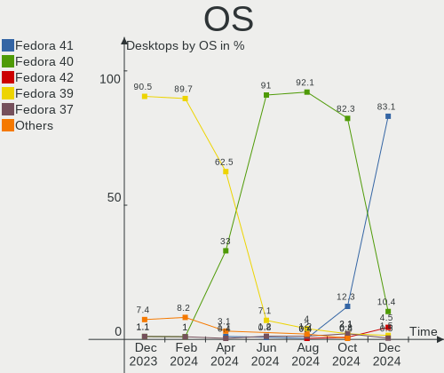
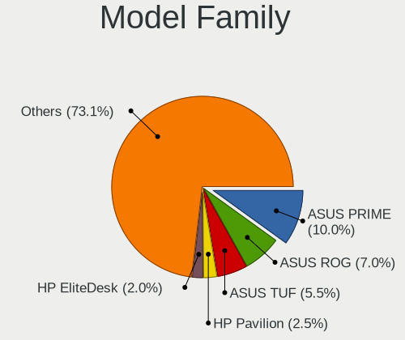
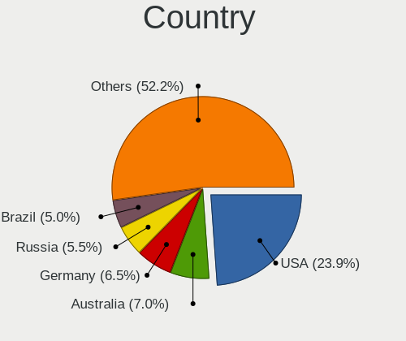
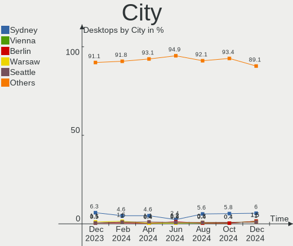
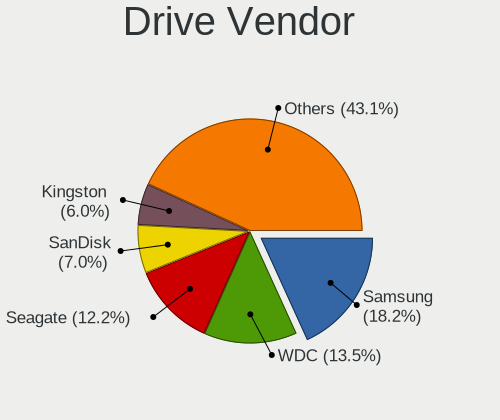
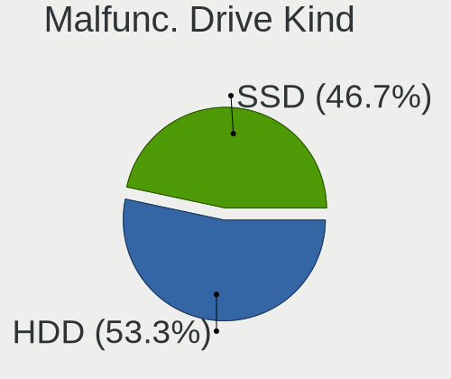
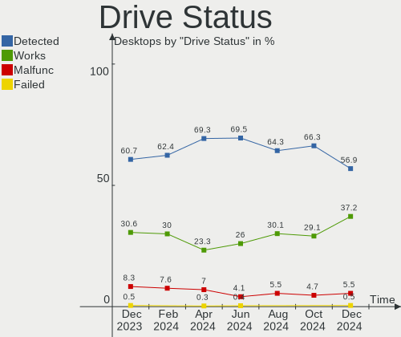

Fedora - Hardware Trends (Desktops)
-----------------------------------

A project to identify most popular hardware characteristics and track their change
over time based on data collected by Linux users at https://Linux-Hardware.org.

Anyone can contribute to this report by the [hw-probe](https://github.com/linuxhw/hw-probe) tool:

    sudo -E hw-probe -all -upload

This report is for one last month. Overall report since the beginning of time: [TestCoverage](https://github.com/linuxhw/TestCoverage)

Period: Nov, 2022.

Contents
--------

* [ System ](#system)
  - [ OS                       ](#os)
  - [ OS Family                ](#os-family)
  - [ Kernel                   ](#kernel)
  - [ Kernel Family            ](#kernel-family)
  - [ Kernel Major Ver.        ](#kernel-major-ver)
  - [ Arch                     ](#arch)
  - [ DE                       ](#de)
  - [ Display Server           ](#display-server)
  - [ Display Manager          ](#display-manager)
  - [ OS Lang                  ](#os-lang)
  - [ Boot Mode                ](#boot-mode)
  - [ Filesystem               ](#filesystem)
  - [ Part. scheme             ](#part-scheme)
  - [ Dual Boot with Linux/BSD ](#dual-boot-with-linuxbsd)
  - [ Dual Boot (Win)          ](#dual-boot-win)

* [ Board ](#board)
  - [ Vendor                   ](#vendor)
  - [ Model                    ](#model)
  - [ Model Family             ](#model-family)
  - [ MFG Year                 ](#mfg-year)
  - [ Form Factor              ](#form-factor)
  - [ Secure Boot              ](#secure-boot)
  - [ Coreboot                 ](#coreboot)
  - [ RAM Size                 ](#ram-size)
  - [ RAM Used                 ](#ram-used)
  - [ Total Drives             ](#total-drives)
  - [ Has CD-ROM               ](#has-cd-rom)
  - [ Has Ethernet             ](#has-ethernet)
  - [ Has WiFi                 ](#has-wifi)
  - [ Has Bluetooth            ](#has-bluetooth)

* [ Location ](#location)
  - [ Country                  ](#country)
  - [ City                     ](#city)

* [ Drives ](#drives)
  - [ Drive Vendor             ](#drive-vendor)
  - [ Drive Model              ](#drive-model)
  - [ HDD Vendor               ](#hdd-vendor)
  - [ SSD Vendor               ](#ssd-vendor)
  - [ Drive Kind               ](#drive-kind)
  - [ Drive Connector          ](#drive-connector)
  - [ Drive Size               ](#drive-size)
  - [ Space Total              ](#space-total)
  - [ Space Used               ](#space-used)
  - [ Malfunc. Drives          ](#malfunc-drives)
  - [ Malfunc. Drive Vendor    ](#malfunc-drive-vendor)
  - [ Malfunc. HDD Vendor      ](#malfunc-hdd-vendor)
  - [ Malfunc. Drive Kind      ](#malfunc-drive-kind)
  - [ Failed Drives            ](#failed-drives)
  - [ Failed Drive Vendor      ](#failed-drive-vendor)
  - [ Drive Status             ](#drive-status)

* [ Storage controller ](#storage-controller)
  - [ Storage Vendor           ](#storage-vendor)
  - [ Storage Model            ](#storage-model)
  - [ Storage Kind             ](#storage-kind)

* [ Processor ](#processor)
  - [ CPU Vendor               ](#cpu-vendor)
  - [ CPU Model                ](#cpu-model)
  - [ CPU Model Family         ](#cpu-model-family)
  - [ CPU Cores                ](#cpu-cores)
  - [ CPU Sockets              ](#cpu-sockets)
  - [ CPU Threads              ](#cpu-threads)
  - [ CPU Op-Modes             ](#cpu-op-modes)
  - [ CPU Microcode            ](#cpu-microcode)
  - [ CPU Microarch            ](#cpu-microarch)

* [ Graphics ](#graphics)
  - [ GPU Vendor               ](#gpu-vendor)
  - [ GPU Model                ](#gpu-model)
  - [ GPU Combo                ](#gpu-combo)
  - [ GPU Driver               ](#gpu-driver)
  - [ GPU Memory               ](#gpu-memory)

* [ Monitor ](#monitor)
  - [ Monitor Vendor           ](#monitor-vendor)
  - [ Monitor Model            ](#monitor-model)
  - [ Monitor Resolution       ](#monitor-resolution)
  - [ Monitor Diagonal         ](#monitor-diagonal)
  - [ Monitor Width            ](#monitor-width)
  - [ Aspect Ratio             ](#aspect-ratio)
  - [ Monitor Area             ](#monitor-area)
  - [ Pixel Density            ](#pixel-density)
  - [ Multiple Monitors        ](#multiple-monitors)

* [ Network ](#network)
  - [ Net Controller Vendor    ](#net-controller-vendor)
  - [ Net Controller Model     ](#net-controller-model)
  - [ Wireless Vendor          ](#wireless-vendor)
  - [ Wireless Model           ](#wireless-model)
  - [ Ethernet Vendor          ](#ethernet-vendor)
  - [ Ethernet Model           ](#ethernet-model)
  - [ Net Controller Kind      ](#net-controller-kind)
  - [ Used Controller          ](#used-controller)
  - [ NICs                     ](#nics)
  - [ IPv6                     ](#ipv6)

* [ Bluetooth ](#bluetooth)
  - [ Bluetooth Vendor         ](#bluetooth-vendor)
  - [ Bluetooth Model          ](#bluetooth-model)

* [ Sound ](#sound)
  - [ Sound Vendor             ](#sound-vendor)
  - [ Sound Model              ](#sound-model)

* [ Memory ](#memory)
  - [ Memory Vendor            ](#memory-vendor)
  - [ Memory Model             ](#memory-model)
  - [ Memory Kind              ](#memory-kind)
  - [ Memory Form Factor       ](#memory-form-factor)
  - [ Memory Size              ](#memory-size)
  - [ Memory Speed             ](#memory-speed)

* [ Printers & scanners ](#printers--scanners)
  - [ Printer Vendor           ](#printer-vendor)
  - [ Printer Model            ](#printer-model)
  - [ Scanner Vendor           ](#scanner-vendor)
  - [ Scanner Model            ](#scanner-model)

* [ Camera ](#camera)
  - [ Camera Vendor            ](#camera-vendor)
  - [ Camera Model             ](#camera-model)

* [ Security ](#security)
  - [ Fingerprint Vendor       ](#fingerprint-vendor)
  - [ Fingerprint Model        ](#fingerprint-model)
  - [ Chipcard Vendor          ](#chipcard-vendor)
  - [ Chipcard Model           ](#chipcard-model)

* [ Unsupported ](#unsupported)
  - [ Unsupported Devices      ](#unsupported-devices)
  - [ Unsupported Device Types ](#unsupported-device-types)

System
------

OS
--

Installed operating systems

| Name      | Desktops | Percent |
|-----------|----------|---------|
| Fedora 37 | 78       | 49.37%  |
| Fedora 36 | 73       | 46.2%   |
| Fedora 35 | 7        | 4.43%   |

OS Family
---------

OS without a version

| Name   | Desktops | Percent |
|--------|----------|---------|
| Fedora | 158      | 100%    |

Kernel
------

Version of the Linux kernel

| Version                                            | Desktops | Percent |
|----------------------------------------------------|----------|---------|
| 6.0.5-200.fc36.x86_64                              | 28       | 17.72%  |
| 6.0.8-300.fc37.x86_64                              | 26       | 16.46%  |
| 6.0.9-300.fc37.x86_64                              | 25       | 15.82%  |
| 6.0.7-200.fc36.x86_64                              | 13       | 8.23%   |
| 6.0.7-301.fc37.x86_64                              | 10       | 6.33%   |
| 5.19.16-301.fc37.x86_64                            | 9        | 5.7%    |
| 6.0.9-200.fc36.x86_64                              | 8        | 5.06%   |
| 6.0.8-200.fc36.x86_64                              | 8        | 5.06%   |
| 5.19.16-200.fc36.x86_64                            | 7        | 4.43%   |
| 5.17.5-300.fc36.x86_64                             | 3        | 1.9%    |
| 6.0.8-100.fc35.x86_64                              | 2        | 1.27%   |
| 6.0.6-300.fc37.x86_64                              | 2        | 1.27%   |
| 6.0.5-300.fc37.x86_64                              | 2        | 1.27%   |
| 6.0.10-300.fc37.x86_64                             | 2        | 1.27%   |
| 5.19.7-300.fc37.x86_64                             | 2        | 1.27%   |
| 6.1.0-0.rc2.20221028git23758867219c.24.fc38.x86_64 | 1        | 0.63%   |
| 6.0.8-201.fsync.fc36.x86_64                        | 1        | 0.63%   |
| 6.0.10-200.fc36.x86_64                             | 1        | 0.63%   |
| 5.19.16-602.inttf.fc36.x86_64                      | 1        | 0.63%   |
| 5.19.16-100.fc35.x86_64                            | 1        | 0.63%   |
| 5.19.15-201.fc36.x86_64                            | 1        | 0.63%   |
| 5.19.14-100.fc35.x86_64                            | 1        | 0.63%   |
| 5.19.11-200.fc36.x86_64                            | 1        | 0.63%   |
| 5.17.11-200.fc35.x86_64                            | 1        | 0.63%   |
| 5.16.18-200.fc35.x86_64                            | 1        | 0.63%   |
| 5.15.11-200.fc35.x86_64                            | 1        | 0.63%   |

Kernel Family
-------------

Linux kernel without a distro release

| Version | Desktops | Percent |
|---------|----------|---------|
| 6.0.8   | 37       | 23.42%  |
| 6.0.9   | 33       | 20.89%  |
| 6.0.5   | 30       | 18.99%  |
| 6.0.7   | 23       | 14.56%  |
| 5.19.16 | 18       | 11.39%  |
| 6.0.10  | 3        | 1.9%    |
| 5.17.5  | 3        | 1.9%    |
| 6.0.6   | 2        | 1.27%   |
| 5.19.7  | 2        | 1.27%   |
| 6.1.0   | 1        | 0.63%   |
| 5.19.15 | 1        | 0.63%   |
| 5.19.14 | 1        | 0.63%   |
| 5.19.11 | 1        | 0.63%   |
| 5.17.11 | 1        | 0.63%   |
| 5.16.18 | 1        | 0.63%   |
| 5.15.11 | 1        | 0.63%   |

Kernel Major Ver.
-----------------

Linux kernel major version

| Version | Desktops | Percent |
|---------|----------|---------|
| 6.0     | 128      | 81.01%  |
| 5.19    | 23       | 14.56%  |
| 5.17    | 4        | 2.53%   |
| 6.1     | 1        | 0.63%   |
| 5.16    | 1        | 0.63%   |
| 5.15    | 1        | 0.63%   |

Arch
----

OS architecture (x86_64, i586, etc.)

| Name   | Desktops | Percent |
|--------|----------|---------|
| x86_64 | 158      | 100%    |

DE
--

Desktop Environment

| Name                         | Desktops | Percent |
|------------------------------|----------|---------|
| GNOME                        | 112      | 70.89%  |
| KDE5                         | 27       | 17.09%  |
| Cinnamon                     | 4        | 2.53%   |
| X-Cinnamon                   | 3        | 1.9%    |
| Unknown                      | 3        | 1.9%    |
| XFCE                         | 2        | 1.27%   |
| MATE                         | 2        | 1.27%   |
| GNOME Classic                | 2        | 1.27%   |
| Pantheon                     | 1        | 0.63%   |
| KDE                          | 1        | 0.63%   |
| ${XDG_CURRENT_DESKTOP:-sway} | 1        | 0.63%   |

Display Server
--------------

X11 or Wayland

| Name    | Desktops | Percent |
|---------|----------|---------|
| Wayland | 95       | 60.13%  |
| X11     | 56       | 35.44%  |
| Tty     | 6        | 3.8%    |
| Unknown | 1        | 0.63%   |

Display Manager
---------------

SDDM, LightDM, etc.

| Name    | Desktops | Percent |
|---------|----------|---------|
| Unknown | 86       | 54.43%  |
| GDM     | 46       | 29.11%  |
| SDDM    | 13       | 8.23%   |
| LightDM | 13       | 8.23%   |

OS Lang
-------

Language

| Lang  | Desktops | Percent |
|-------|----------|---------|
| en_US | 76       | 48.1%   |
| en_GB | 14       | 8.86%   |
| ru_RU | 8        | 5.06%   |
| pt_BR | 7        | 4.43%   |
| fr_FR | 7        | 4.43%   |
| pl_PL | 6        | 3.8%    |
| it_IT | 6        | 3.8%    |
| en_AU | 6        | 3.8%    |
| de_DE | 6        | 3.8%    |
| en_CA | 4        | 2.53%   |
| tr_TR | 2        | 1.27%   |
| pt_PT | 2        | 1.27%   |
| nl_BE | 2        | 1.27%   |
| es_ES | 2        | 1.27%   |
| en_NZ | 2        | 1.27%   |
| ja_JP | 1        | 0.63%   |
| id_ID | 1        | 0.63%   |
| hu_HU | 1        | 0.63%   |
| fi_FI | 1        | 0.63%   |
| es_PE | 1        | 0.63%   |
| en_IN | 1        | 0.63%   |
| cs_CZ | 1        | 0.63%   |
| ar_SA | 1        | 0.63%   |

Boot Mode
---------

EFI or BIOS

| Mode | Desktops | Percent |
|------|----------|---------|
| EFI  | 110      | 69.62%  |
| BIOS | 48       | 30.38%  |

Filesystem
----------

Type of filesystem

| Type    | Desktops | Percent |
|---------|----------|---------|
| Btrfs   | 108      | 68.35%  |
| Ext4    | 43       | 27.22%  |
| Xfs     | 6        | 3.8%    |
| Overlay | 1        | 0.63%   |

Part. scheme
------------

Scheme of partitioning

| Type    | Desktops | Percent |
|---------|----------|---------|
| Unknown | 86       | 54.43%  |
| GPT     | 57       | 36.08%  |
| MBR     | 15       | 9.49%   |

Dual Boot with Linux/BSD
------------------------

Hosting more than one Linux/BSD

| Dual boot | Desktops | Percent |
|-----------|----------|---------|
| No        | 141      | 89.24%  |
| Yes       | 17       | 10.76%  |

Dual Boot (Win)
---------------

Hosting Linux and Windows

| Dual boot | Desktops | Percent |
|-----------|----------|---------|
| No        | 127      | 80.38%  |
| Yes       | 31       | 19.62%  |

Board
-----

Vendor
------

Motherboard manufacturer

| Name                | Desktops | Percent |
|---------------------|----------|---------|
| ASUSTek Computer    | 53       | 33.54%  |
| Gigabyte Technology | 33       | 20.89%  |
| MSI                 | 26       | 16.46%  |
| ASRock              | 12       | 7.59%   |
| Dell                | 10       | 6.33%   |
| Lenovo              | 7        | 4.43%   |
| Hewlett-Packard     | 6        | 3.8%    |
| Foxconn             | 3        | 1.9%    |
| Intel               | 2        | 1.27%   |
| Huanan              | 1        | 0.63%   |
| GALAX               | 1        | 0.63%   |
| Fujitsu             | 1        | 0.63%   |
| Biostar             | 1        | 0.63%   |
| Acer                | 1        | 0.63%   |
| Unknown             | 1        | 0.63%   |

Model
-----

Motherboard model

| Name                                | Desktops | Percent |
|-------------------------------------|----------|---------|
| ASUS All Series                     | 5        | 3.16%   |
| MSI MS-7C02                         | 4        | 2.53%   |
| MSI MS-7A38                         | 3        | 1.9%    |
| ASUS PRIME X370-PRO                 | 3        | 1.9%    |
| ASUS PRIME B550-PLUS                | 3        | 1.9%    |
| MSI MS-7D54                         | 2        | 1.27%   |
| MSI MS-7C84                         | 2        | 1.27%   |
| Gigabyte X570 GAMING X              | 2        | 1.27%   |
| Gigabyte A320M-S2H                  | 2        | 1.27%   |
| Dell OptiPlex 790                   | 2        | 1.27%   |
| Dell OptiPlex 7010                  | 2        | 1.27%   |
| ASUS ROG STRIX X570-E GAMING        | 2        | 1.27%   |
| ASUS ROG STRIX B450-F GAMING II     | 2        | 1.27%   |
| ASUS PRIME Z370-A                   | 2        | 1.27%   |
| MSI s5650br                         | 1        | 0.63%   |
| MSI MS-7D43                         | 1        | 0.63%   |
| MSI MS-7D31                         | 1        | 0.63%   |
| MSI MS-7D22                         | 1        | 0.63%   |
| MSI MS-7D06                         | 1        | 0.63%   |
| MSI MS-7C37                         | 1        | 0.63%   |
| MSI MS-7B98                         | 1        | 0.63%   |
| MSI MS-7B93                         | 1        | 0.63%   |
| MSI MS-7B78                         | 1        | 0.63%   |
| MSI MS-7B00                         | 1        | 0.63%   |
| MSI MS-7885                         | 1        | 0.63%   |
| MSI MS-7817                         | 1        | 0.63%   |
| MSI MS-7758                         | 1        | 0.63%   |
| MSI MS-7640                         | 1        | 0.63%   |
| MSI CQ3321L                         | 1        | 0.63%   |
| Lenovo ThinkCentre M93p 10A8S3C100  | 1        | 0.63%   |
| Lenovo ThinkCentre M920s 10SKS0C100 | 1        | 0.63%   |
| Lenovo ThinkCentre M800 10FXS26A00  | 1        | 0.63%   |
| Lenovo ThinkCentre M720s 10ST0014MB | 1        | 0.63%   |
| Lenovo ThinkCentre A70z 0401G6M     | 1        | 0.63%   |
| Lenovo Legion T5 26AMR5 90RC00FAMH  | 1        | 0.63%   |
| Lenovo H50-50 90B600EUIX            | 1        | 0.63%   |
| Intel DX79SR                        | 1        | 0.63%   |
| Intel DB75EN AAG39650-400           | 1        | 0.63%   |
| Huanan X99-F8                       | 1        | 0.63%   |
| HP Slim Desktop 290-a0xxx           | 1        | 0.63%   |

Model Family
------------

Motherboard model prefix

| Name               | Desktops | Percent |
|--------------------|----------|---------|
| ASUS PRIME         | 16       | 10.13%  |
| ASUS ROG           | 14       | 8.86%   |
| Dell OptiPlex      | 7        | 4.43%   |
| Lenovo ThinkCentre | 5        | 3.16%   |
| ASUS All           | 5        | 3.16%   |
| MSI MS-7C02        | 4        | 2.53%   |
| MSI MS-7A38        | 3        | 1.9%    |
| HP Compaq          | 3        | 1.9%    |
| Gigabyte X570      | 3        | 1.9%    |
| Gigabyte B550      | 3        | 1.9%    |
| Dell Precision     | 3        | 1.9%    |
| ASUS TUF           | 3        | 1.9%    |
| ASUS ProArt        | 3        | 1.9%    |
| MSI MS-7D54        | 2        | 1.27%   |
| MSI MS-7C84        | 2        | 1.27%   |
| Gigabyte B450M     | 2        | 1.27%   |
| Gigabyte B450      | 2        | 1.27%   |
| Gigabyte A320M-S2H | 2        | 1.27%   |
| MSI s5650br        | 1        | 0.63%   |
| MSI MS-7D43        | 1        | 0.63%   |
| MSI MS-7D31        | 1        | 0.63%   |
| MSI MS-7D22        | 1        | 0.63%   |
| MSI MS-7D06        | 1        | 0.63%   |
| MSI MS-7C37        | 1        | 0.63%   |
| MSI MS-7B98        | 1        | 0.63%   |
| MSI MS-7B93        | 1        | 0.63%   |
| MSI MS-7B78        | 1        | 0.63%   |
| MSI MS-7B00        | 1        | 0.63%   |
| MSI MS-7885        | 1        | 0.63%   |
| MSI MS-7817        | 1        | 0.63%   |
| MSI MS-7758        | 1        | 0.63%   |
| MSI MS-7640        | 1        | 0.63%   |
| MSI CQ3321L        | 1        | 0.63%   |
| Lenovo Legion      | 1        | 0.63%   |
| Lenovo H50-50      | 1        | 0.63%   |
| Intel DX79SR       | 1        | 0.63%   |
| Intel DB75EN       | 1        | 0.63%   |
| Huanan X99-F8      | 1        | 0.63%   |
| HP Slim            | 1        | 0.63%   |
| HP ProDesk         | 1        | 0.63%   |

MFG Year
--------

Motherboard manufacture year

| Year | Desktops | Percent |
|------|----------|---------|
| 2021 | 19       | 12.03%  |
| 2019 | 19       | 12.03%  |
| 2018 | 19       | 12.03%  |
| 2020 | 17       | 10.76%  |
| 2012 | 14       | 8.86%   |
| 2017 | 13       | 8.23%   |
| 2014 | 10       | 6.33%   |
| 2013 | 9        | 5.7%    |
| 2022 | 7        | 4.43%   |
| 2015 | 7        | 4.43%   |
| 2016 | 5        | 3.16%   |
| 2011 | 5        | 3.16%   |
| 2009 | 5        | 3.16%   |
| 2010 | 4        | 2.53%   |
| 2008 | 4        | 2.53%   |
| 2007 | 1        | 0.63%   |

Form Factor
-----------

Physical design of the computer

| Name    | Desktops | Percent |
|---------|----------|---------|
| Desktop | 158      | 100%    |

Secure Boot
-----------

Enabled or disabled

| State    | Desktops | Percent |
|----------|----------|---------|
| Disabled | 143      | 90.51%  |
| Enabled  | 15       | 9.49%   |

Coreboot
--------

Have coreboot on board

| Used | Desktops | Percent |
|------|----------|---------|
| No   | 158      | 100%    |

RAM Size
--------

Total RAM memory

| Size in GB  | Desktops | Percent |
|-------------|----------|---------|
| 16.01-24.0  | 49       | 31.01%  |
| 32.01-64.0  | 43       | 27.22%  |
| 8.01-16.0   | 25       | 15.82%  |
| 64.01-256.0 | 15       | 9.49%   |
| 4.01-8.0    | 13       | 8.23%   |
| 3.01-4.0    | 9        | 5.7%    |
| 24.01-32.0  | 3        | 1.9%    |
| 1.01-2.0    | 1        | 0.63%   |

RAM Used
--------

Used RAM memory

| Used GB    | Desktops | Percent |
|------------|----------|---------|
| 4.01-8.0   | 44       | 27.85%  |
| 2.01-3.0   | 40       | 25.32%  |
| 3.01-4.0   | 29       | 18.35%  |
| 8.01-16.0  | 20       | 12.66%  |
| 1.01-2.0   | 18       | 11.39%  |
| 16.01-24.0 | 3        | 1.9%    |
| 0.51-1.0   | 2        | 1.27%   |
| 32.01-64.0 | 1        | 0.63%   |
| 0.01-0.5   | 1        | 0.63%   |

Total Drives
------------

Number of drives on board

| Drives | Desktops | Percent |
|--------|----------|---------|
| 2      | 53       | 33.54%  |
| 1      | 49       | 31.01%  |
| 3      | 27       | 17.09%  |
| 4      | 14       | 8.86%   |
| 5      | 9        | 5.7%    |
| 6      | 3        | 1.9%    |
| 7      | 2        | 1.27%   |
| 15     | 1        | 0.63%   |

Has CD-ROM
----------

Has CD-ROM on board

| Presented | Desktops | Percent |
|-----------|----------|---------|
| No        | 110      | 69.62%  |
| Yes       | 48       | 30.38%  |

Has Ethernet
------------

Has Ethernet on board

| Presented | Desktops | Percent |
|-----------|----------|---------|
| Yes       | 156      | 98.73%  |
| No        | 2        | 1.27%   |

Has WiFi
--------

Has WiFi module

| Presented | Desktops | Percent |
|-----------|----------|---------|
| No        | 87       | 55.06%  |
| Yes       | 71       | 44.94%  |

Has Bluetooth
-------------

Has Bluetooth module

| Presented | Desktops | Percent |
|-----------|----------|---------|
| No        | 91       | 57.59%  |
| Yes       | 67       | 42.41%  |

Location
--------

Country
-------

Geographic location (country)

| Country      | Desktops | Percent |
|--------------|----------|---------|
| USA          | 27       | 17.09%  |
| Italy        | 13       | 8.23%   |
| Germany      | 12       | 7.59%   |
| Brazil       | 10       | 6.33%   |
| Russia       | 9        | 5.7%    |
| Poland       | 7        | 4.43%   |
| Australia    | 7        | 4.43%   |
| Sweden       | 6        | 3.8%    |
| France       | 6        | 3.8%    |
| UK           | 5        | 3.16%   |
| Portugal     | 5        | 3.16%   |
| Spain        | 4        | 2.53%   |
| Netherlands  | 4        | 2.53%   |
| Romania      | 3        | 1.9%    |
| Mexico       | 3        | 1.9%    |
| Greece       | 3        | 1.9%    |
| Canada       | 3        | 1.9%    |
| Belgium      | 3        | 1.9%    |
| Turkey       | 2        | 1.27%   |
| Oman         | 2        | 1.27%   |
| Norway       | 2        | 1.27%   |
| New Zealand  | 2        | 1.27%   |
| Hungary      | 2        | 1.27%   |
| Finland      | 2        | 1.27%   |
| Austria      | 2        | 1.27%   |
| Switzerland  | 1        | 0.63%   |
| Serbia       | 1        | 0.63%   |
| Saudi Arabia | 1        | 0.63%   |
| Peru         | 1        | 0.63%   |
| Nepal        | 1        | 0.63%   |
| Maldives     | 1        | 0.63%   |
| Japan        | 1        | 0.63%   |
| Indonesia    | 1        | 0.63%   |
| India        | 1        | 0.63%   |
| Czechia      | 1        | 0.63%   |
| Colombia     | 1        | 0.63%   |
| Belarus      | 1        | 0.63%   |
| Bangladesh   | 1        | 0.63%   |
| Andorra      | 1        | 0.63%   |

City
----

Geographic location (city)

| City           | Desktops | Percent |
|----------------|----------|---------|
| Moscow         | 4        | 2.53%   |
| Warsaw         | 3        | 1.9%    |
| Stockholm      | 3        | 1.9%    |
| Lane Cove      | 3        | 1.9%    |
| Saratov        | 2        | 1.27%   |
| Sao Paulo      | 2        | 1.27%   |
| Muscat         | 2        | 1.27%   |
| Kristiansand   | 2        | 1.27%   |
| Coimbra        | 2        | 1.27%   |
| Bucharest      | 2        | 1.27%   |
| Bari           | 2        | 1.27%   |
| Auckland       | 2        | 1.27%   |
| Zonguldak      | 1        | 0.63%   |
| Waterbury      | 1        | 0.63%   |
| Wageningen     | 1        | 0.63%   |
| Voronezh       | 1        | 0.63%   |
| Vigo           | 1        | 0.63%   |
| Vienna         | 1        | 0.63%   |
| Veresegyhaz    | 1        | 0.63%   |
| Vaxjo          | 1        | 0.63%   |
| Vantaa         | 1        | 0.63%   |
| Vanderhoof     | 1        | 0.63%   |
| Toluca         | 1        | 0.63%   |
| Toano          | 1        | 0.63%   |
| Tilburg        | 1        | 0.63%   |
| Thornton Heath | 1        | 0.63%   |
| Terrassa       | 1        | 0.63%   |
| Tarneit        | 1        | 0.63%   |
| Tampico        | 1        | 0.63%   |
| Tampa          | 1        | 0.63%   |
| Tacoma         | 1        | 0.63%   |
| Stadtilm       | 1        | 0.63%   |
| St. Cloud      | 1        | 0.63%   |
| St Louis       | 1        | 0.63%   |
| Shinjuku       | 1        | 0.63%   |
| Rome           | 1        | 0.63%   |
| Riyadh         | 1        | 0.63%   |
| Revere         | 1        | 0.63%   |
| Ragusa         | 1        | 0.63%   |
| Pouso Alegre   | 1        | 0.63%   |

Drives
------

Drive Vendor
------------

Hard drive vendors

| Vendor                         | Desktops | Drives | Percent |
|--------------------------------|----------|--------|---------|
| Samsung Electronics            | 66       | 86     | 21.36%  |
| WDC                            | 56       | 78     | 18.12%  |
| Seagate                        | 43       | 57     | 13.92%  |
| Kingston                       | 24       | 28     | 7.77%   |
| SanDisk                        | 23       | 24     | 7.44%   |
| Crucial                        | 18       | 22     | 5.83%   |
| Toshiba                        | 16       | 16     | 5.18%   |
| Intel                          | 8        | 8      | 2.59%   |
| Phison Electronics             | 7        | 8      | 2.27%   |
| Hitachi                        | 7        | 8      | 2.27%   |
| A-DATA Technology              | 6        | 6      | 1.94%   |
| SPCC                           | 4        | 5      | 1.29%   |
| HGST                           | 3        | 4      | 0.97%   |
| Unknown                        | 2        | 4      | 0.65%   |
| Apacer                         | 2        | 2      | 0.65%   |
| ADATA Technology               | 2        | 2      | 0.65%   |
| Verbatim                       | 1        | 1      | 0.32%   |
| Transcend                      | 1        | 1      | 0.32%   |
| Solid State Storage Technology | 1        | 1      | 0.32%   |
| SK hynix                       | 1        | 1      | 0.32%   |
| Silicon Motion                 | 1        | 1      | 0.32%   |
| SABRENT                        | 1        | 1      | 0.32%   |
| RCESSD                         | 1        | 1      | 0.32%   |
| PNY                            | 1        | 1      | 0.32%   |
| Plextor                        | 1        | 1      | 0.32%   |
| Phison                         | 1        | 1      | 0.32%   |
| Patriot                        | 1        | 1      | 0.32%   |
| Micron/Crucial Technology      | 1        | 1      | 0.32%   |
| Lite-On Technology             | 1        | 1      | 0.32%   |
| Lexar                          | 1        | 2      | 0.32%   |
| KIOXIA-EXCERIA                 | 1        | 1      | 0.32%   |
| Intenso                        | 1        | 1      | 0.32%   |
| GOODRAM                        | 1        | 1      | 0.32%   |
| Dell                           | 1        | 1      | 0.32%   |
| Corsair                        | 1        | 1      | 0.32%   |
| China                          | 1        | 1      | 0.32%   |
| ASMT                           | 1        | 1      | 0.32%   |
| Acer                           | 1        | 1      | 0.32%   |

Drive Model
-----------

Hard drive models

| Model                                                | Desktops | Percent |
|------------------------------------------------------|----------|---------|
| Samsung NVMe SSD Controller SM981/PM981/PM983 1TB    | 9        | 2.56%   |
| Kingston SA400S37240G 240GB SSD                      | 9        | 2.56%   |
| Samsung SSD 860 EVO 500GB                            | 6        | 1.7%    |
| Crucial CT1000MX500SSD1 1TB                          | 6        | 1.7%    |
| Phison E12 NVMe Controller 2TB                       | 5        | 1.42%   |
| Kingston SA400S37480G 480GB SSD                      | 5        | 1.42%   |
| WDC WDS500G2B0A-00SM50 500GB SSD                     | 4        | 1.14%   |
| Seagate ST500DM002-1BD142 500GB                      | 4        | 1.14%   |
| Seagate ST1000DM003-1ER162 1TB                       | 4        | 1.14%   |
| Samsung SSD 980 500GB                                | 4        | 1.14%   |
| Samsung SSD 970 EVO Plus 1TB                         | 4        | 1.14%   |
| Samsung SSD 860 EVO 1TB                              | 4        | 1.14%   |
| Samsung NVMe SSD Controller PM9A1/PM9A3/980PRO 250GB | 4        | 1.14%   |
| WDC WD30EFRX-68EUZN0 3TB                             | 3        | 0.85%   |
| WDC WD10EZEX-08WN4A0 1TB                             | 3        | 0.85%   |
| Seagate ST2000DM008-2FR102 2TB                       | 3        | 0.85%   |
| Seagate ST1000DM010-2EP102 1TB                       | 3        | 0.85%   |
| Sandisk WD Blue SN550 NVMe SSD 1TB                   | 3        | 0.85%   |
| Samsung SSD 980 PRO 1TB                              | 3        | 0.85%   |
| Samsung SSD 970 EVO Plus 250GB                       | 3        | 0.85%   |
| Samsung SSD 960 EVO 250GB                            | 3        | 0.85%   |
| Samsung SSD 870 EVO 500GB                            | 3        | 0.85%   |
| Samsung SSD 870 EVO 1TB                              | 3        | 0.85%   |
| Kingston SA400S37120G 120GB SSD                      | 3        | 0.85%   |
| Intel SSD 660P Series 512GB                          | 3        | 0.85%   |
| Crucial CT500MX500SSD1 500GB                         | 3        | 0.85%   |
| WDC WDS100T1X0E-00AFY0 1TB                           | 2        | 0.57%   |
| WDC WD5000AAKX-60U6AA0 500GB                         | 2        | 0.57%   |
| WDC WD20EARX-00PASB0 2TB                             | 2        | 0.57%   |
| WDC WD10EZEX-22MFCA0 1TB                             | 2        | 0.57%   |
| WDC WD10EZEX-00WN4A0 1TB                             | 2        | 0.57%   |
| WDC WD10EZEX-00BN5A0 1TB                             | 2        | 0.57%   |
| Toshiba HDWD110 1TB                                  | 2        | 0.57%   |
| Toshiba DT01ACA200 2TB                               | 2        | 0.57%   |
| Toshiba DT01ACA100 1TB                               | 2        | 0.57%   |
| Seagate ST4000VN008-2DR166 4TB                       | 2        | 0.57%   |
| Seagate ST3500418AS 500GB                            | 2        | 0.57%   |
| Seagate ST2000DM008-2UB102 2TB                       | 2        | 0.57%   |
| Seagate ST2000DM001-1ER164 2TB                       | 2        | 0.57%   |
| Sandisk WD Blue SN500 / PC SN520 NVMe SSD 512GB      | 2        | 0.57%   |

HDD Vendor
----------

Hard disk drive vendors

| Vendor              | Desktops | Drives | Percent |
|---------------------|----------|--------|---------|
| WDC                 | 46       | 63     | 40.35%  |
| Seagate             | 42       | 54     | 36.84%  |
| Toshiba             | 11       | 11     | 9.65%   |
| Hitachi             | 7        | 8      | 6.14%   |
| Samsung Electronics | 4        | 5      | 3.51%   |
| HGST                | 3        | 4      | 2.63%   |
| Unknown             | 1        | 1      | 0.88%   |

SSD Vendor
----------

Solid state drive vendors

| Vendor              | Desktops | Drives | Percent |
|---------------------|----------|--------|---------|
| Samsung Electronics | 34       | 42     | 29.82%  |
| Kingston            | 23       | 24     | 20.18%  |
| Crucial             | 17       | 21     | 14.91%  |
| SanDisk             | 11       | 11     | 9.65%   |
| WDC                 | 7        | 8      | 6.14%   |
| SPCC                | 3        | 4      | 2.63%   |
| Intel               | 3        | 3      | 2.63%   |
| Toshiba             | 2        | 2      | 1.75%   |
| Apacer              | 2        | 2      | 1.75%   |
| A-DATA Technology   | 2        | 2      | 1.75%   |
| Verbatim            | 1        | 1      | 0.88%   |
| Transcend           | 1        | 1      | 0.88%   |
| PNY                 | 1        | 1      | 0.88%   |
| Plextor             | 1        | 1      | 0.88%   |
| Patriot             | 1        | 1      | 0.88%   |
| Lexar               | 1        | 2      | 0.88%   |
| KIOXIA-EXCERIA      | 1        | 1      | 0.88%   |
| GOODRAM             | 1        | 1      | 0.88%   |
| China               | 1        | 1      | 0.88%   |
| Acer                | 1        | 1      | 0.88%   |

Drive Kind
----------

HDD or SSD

| Kind    | Desktops | Drives | Percent |
|---------|----------|--------|---------|
| SSD     | 96       | 130    | 35.42%  |
| HDD     | 88       | 146    | 32.47%  |
| NVMe    | 81       | 97     | 29.89%  |
| Unknown | 6        | 8      | 2.21%   |

Drive Connector
---------------

SATA, SAS, NVMe, etc.

| Type | Desktops | Drives | Percent |
|------|----------|--------|---------|
| SATA | 137      | 273    | 60.35%  |
| NVMe | 81       | 97     | 35.68%  |
| SAS  | 9        | 11     | 3.96%   |

Drive Size
----------

Size of hard drive

| Size in TB | Desktops | Drives | Percent |
|------------|----------|--------|---------|
| 0.01-0.5   | 87       | 127    | 44.62%  |
| 0.51-1.0   | 62       | 83     | 31.79%  |
| 1.01-2.0   | 22       | 28     | 11.28%  |
| 3.01-4.0   | 9        | 10     | 4.62%   |
| 2.01-3.0   | 7        | 17     | 3.59%   |
| 4.01-10.0  | 7        | 10     | 3.59%   |
| 10.01-20.0 | 1        | 1      | 0.51%   |

Space Total
-----------

Amount of disk space available on the file system

| Size in GB     | Desktops | Percent |
|----------------|----------|---------|
| 1001-2000      | 33       | 20.89%  |
| 501-1000       | 29       | 18.35%  |
| More than 3000 | 25       | 15.82%  |
| 101-250        | 22       | 13.92%  |
| 251-500        | 16       | 10.13%  |
| 2001-3000      | 11       | 6.96%   |
| 1-20           | 11       | 6.96%   |
| 51-100         | 5        | 3.16%   |
| Unknown        | 4        | 2.53%   |
| 21-50          | 2        | 1.27%   |

Space Used
----------

Amount of used disk space

| Used GB        | Desktops | Percent |
|----------------|----------|---------|
| 1-20           | 35       | 22.15%  |
| 21-50          | 22       | 13.92%  |
| 501-1000       | 22       | 13.92%  |
| 251-500        | 20       | 12.66%  |
| 101-250        | 15       | 9.49%   |
| 1001-2000      | 15       | 9.49%   |
| 51-100         | 12       | 7.59%   |
| More than 3000 | 10       | 6.33%   |
| Unknown        | 4        | 2.53%   |
| 2001-3000      | 3        | 1.9%    |

Malfunc. Drives
---------------

Drive models with a malfunction

| Model                               | Desktops | Drives | Percent |
|-------------------------------------|----------|--------|---------|
| Seagate ST3500418AS 500GB           | 2        | 2      | 11.76%  |
| Intel SSDSC2CT120A3 120GB           | 2        | 2      | 11.76%  |
| WDC WD5000AAKX-60U6AA0 500GB        | 1        | 1      | 5.88%   |
| WDC WD10EZEX-22MFCA0 1TB            | 1        | 1      | 5.88%   |
| SPCC SPCCSolidStateDisk 128GB SSD   | 1        | 1      | 5.88%   |
| Seagate ST8000NE001-2M7101 8TB      | 1        | 1      | 5.88%   |
| Seagate ST500DM002-1BD142 500GB     | 1        | 4      | 5.88%   |
| Seagate ST32000641AS 2TB            | 1        | 1      | 5.88%   |
| Seagate ST3000DM001-1ER166 3TB      | 1        | 1      | 5.88%   |
| Seagate ST3000DM001-1CH166 3TB      | 1        | 1      | 5.88%   |
| Seagate ST2000DM008-2FR102 2TB      | 1        | 1      | 5.88%   |
| Samsung Electronics SSD 870 EVO 1TB | 1        | 1      | 5.88%   |
| Samsung Electronics HD501LJ 500GB   | 1        | 2      | 5.88%   |
| Intel SSDSA2M080G2GC 80GB           | 1        | 1      | 5.88%   |
| Hitachi HDT721032SLA360 320GB       | 1        | 1      | 5.88%   |

Malfunc. Drive Vendor
---------------------

Vendors of faulty drives

| Vendor              | Desktops | Drives | Percent |
|---------------------|----------|--------|---------|
| Seagate             | 6        | 11     | 40%     |
| Intel               | 3        | 3      | 20%     |
| WDC                 | 2        | 2      | 13.33%  |
| Samsung Electronics | 2        | 3      | 13.33%  |
| SPCC                | 1        | 1      | 6.67%   |
| Hitachi             | 1        | 1      | 6.67%   |

Malfunc. HDD Vendor
-------------------

Vendors of faulty HDD drives

| Vendor              | Desktops | Drives | Percent |
|---------------------|----------|--------|---------|
| Seagate             | 6        | 11     | 60%     |
| WDC                 | 2        | 2      | 20%     |
| Samsung Electronics | 1        | 2      | 10%     |
| Hitachi             | 1        | 1      | 10%     |

Malfunc. Drive Kind
-------------------

Kinds of faulty drives

| Kind | Desktops | Drives | Percent |
|------|----------|--------|---------|
| HDD  | 10       | 16     | 66.67%  |
| SSD  | 5        | 5      | 33.33%  |

Failed Drives
-------------

Failed drive models

Zero info for selected period =(

Failed Drive Vendor
-------------------

Failed drive vendors

Zero info for selected period =(

Drive Status
------------

Number of failed and malfunc. drives

| Status   | Desktops | Drives | Percent |
|----------|----------|--------|---------|
| Detected | 90       | 205    | 52.33%  |
| Works    | 67       | 155    | 38.95%  |
| Malfunc  | 15       | 21     | 8.72%   |

Storage controller
------------------

Storage Vendor
--------------

Storage controller vendors

| Vendor                         | Desktops | Percent |
|--------------------------------|----------|---------|
| Intel                          | 86       | 32.21%  |
| AMD                            | 75       | 28.09%  |
| Samsung Electronics            | 37       | 13.86%  |
| SanDisk                        | 19       | 7.12%   |
| ASMedia Technology             | 14       | 5.24%   |
| Phison Electronics             | 8        | 3%      |
| ADATA Technology               | 6        | 2.25%   |
| Toshiba America Info Systems   | 3        | 1.12%   |
| Kingston Technology Company    | 3        | 1.12%   |
| Seagate Technology             | 2        | 0.75%   |
| Micron/Crucial Technology      | 2        | 0.75%   |
| LSI Logic / Symbios Logic      | 2        | 0.75%   |
| Solid State Storage Technology | 1        | 0.37%   |
| SK hynix                       | 1        | 0.37%   |
| Silicon Motion                 | 1        | 0.37%   |
| Nvidia                         | 1        | 0.37%   |
| MAXIO Technology (Hangzhou)    | 1        | 0.37%   |
| Marvell Technology Group       | 1        | 0.37%   |
| Lite-On Technology             | 1        | 0.37%   |
| JMicron Technology             | 1        | 0.37%   |
| Integrated Technology Express  | 1        | 0.37%   |
| Broadcom / LSI                 | 1        | 0.37%   |

Storage Model
-------------

Storage controller models

| Model                                                                          | Desktops | Percent |
|--------------------------------------------------------------------------------|----------|---------|
| AMD FCH SATA Controller [AHCI mode]                                            | 46       | 14.74%  |
| Samsung NVMe SSD Controller SM981/PM981/PM983                                  | 20       | 6.41%   |
| AMD 400 Series Chipset SATA Controller                                         | 20       | 6.41%   |
| ASMedia ASM1062 Serial ATA Controller                                          | 14       | 4.49%   |
| Intel 8 Series/C220 Series Chipset Family 6-port SATA Controller 1 [AHCI mode] | 11       | 3.53%   |
| Intel 7 Series/C210 Series Chipset Family 6-port SATA Controller [AHCI mode]   | 10       | 3.21%   |
| Intel 200 Series PCH SATA controller [AHCI mode]                               | 10       | 3.21%   |
| AMD 500 Series Chipset SATA Controller                                         | 10       | 3.21%   |
| Samsung NVMe SSD Controller PM9A1/PM9A3/980PRO                                 | 8        | 2.56%   |
| Samsung NVMe SSD Controller 980                                                | 6        | 1.92%   |
| Phison E12 NVMe Controller                                                     | 6        | 1.92%   |
| Intel Alder Lake-S PCH SATA Controller [AHCI Mode]                             | 6        | 1.92%   |
| SanDisk WD PC SN810 / Black SN850 NVMe SSD                                     | 5        | 1.6%    |
| SanDisk WD Blue SN550 NVMe SSD                                                 | 5        | 1.6%    |
| Samsung NVMe SSD Controller SM961/PM961/SM963                                  | 5        | 1.6%    |
| Intel Volume Management Device NVMe RAID Controller                            | 5        | 1.6%    |
| Intel Q170/Q150/B150/H170/H110/Z170/CM236 Chipset SATA Controller [AHCI Mode]  | 5        | 1.6%    |
| Intel Cannon Lake PCH SATA AHCI Controller                                     | 5        | 1.6%    |
| Intel 6 Series/C200 Series Chipset Family 6 port Desktop SATA AHCI Controller  | 5        | 1.6%    |
| AMD SB7x0/SB8x0/SB9x0 SATA Controller [AHCI mode]                              | 5        | 1.6%    |
| AMD SB7x0/SB8x0/SB9x0 IDE Controller                                           | 5        | 1.6%    |
| Intel SATA Controller [RAID mode]                                              | 4        | 1.28%   |
| Intel 9 Series Chipset Family SATA Controller [AHCI Mode]                      | 4        | 1.28%   |
| Intel 500 Series Chipset Family SATA AHCI Controller                           | 4        | 1.28%   |
| AMD X370 Series Chipset SATA Controller                                        | 4        | 1.28%   |
| AMD SATA controller                                                            | 4        | 1.28%   |
| AMD FCH SATA Controller D                                                      | 4        | 1.28%   |
| AMD 300 Series Chipset SATA Controller                                         | 4        | 1.28%   |
| ADATA XPG SX8200 Pro PCIe Gen3x4 M.2 2280 Solid State Drive                    | 4        | 1.28%   |
| SanDisk WD Black 2018/SN750 / PC SN720 NVMe SSD                                | 3        | 0.96%   |
| Intel SSD 660P Series                                                          | 3        | 0.96%   |
| AMD SB7x0/SB8x0/SB9x0 SATA Controller [IDE mode]                               | 3        | 0.96%   |
| SanDisk WD Blue SN500 / PC SN520 NVMe SSD                                      | 2        | 0.64%   |
| SanDisk Non-Volatile memory controller                                         | 2        | 0.64%   |
| Kingston Company A2000 NVMe SSD                                                | 2        | 0.64%   |
| Intel NVMe Optane Memory Series                                                | 2        | 0.64%   |
| Intel NM10/ICH7 Family SATA Controller [IDE mode]                              | 2        | 0.64%   |
| Intel 82801JI (ICH10 Family) SATA AHCI Controller                              | 2        | 0.64%   |
| Intel 82801JD/DO (ICH10 Family) SATA AHCI Controller                           | 2        | 0.64%   |
| Intel 5 Series/3400 Series Chipset 6 port SATA AHCI Controller                 | 2        | 0.64%   |

Storage Kind
------------

Kind of storage controller (IDE, SATA, NVMe, SAS, ...)

| Kind | Desktops | Percent |
|------|----------|---------|
| SATA | 149      | 57.53%  |
| NVMe | 81       | 31.27%  |
| IDE  | 17       | 6.56%   |
| RAID | 10       | 3.86%   |
| SAS  | 1        | 0.39%   |
| SCSI | 1        | 0.39%   |

Processor
---------

CPU Vendor
----------

Processor vendors

| Vendor | Desktops | Percent |
|--------|----------|---------|
| Intel  | 82       | 51.9%   |
| AMD    | 76       | 48.1%   |

CPU Model
---------

Processor models

| Model                                       | Desktops | Percent |
|---------------------------------------------|----------|---------|
| Intel Core i7-8700 CPU @ 3.20GHz            | 4        | 2.53%   |
| Intel Core i7-3770 CPU @ 3.40GHz            | 4        | 2.53%   |
| AMD Ryzen 9 5900X 12-Core Processor         | 4        | 2.53%   |
| AMD Ryzen 9 3900X 12-Core Processor         | 4        | 2.53%   |
| AMD Ryzen 7 5800X 8-Core Processor          | 4        | 2.53%   |
| AMD Ryzen 7 5700G with Radeon Graphics      | 4        | 2.53%   |
| AMD Ryzen 7 3700X 8-Core Processor          | 4        | 2.53%   |
| AMD Ryzen 5 5600G with Radeon Graphics      | 4        | 2.53%   |
| AMD Ryzen 5 3600 6-Core Processor           | 4        | 2.53%   |
| AMD Ryzen 5 2600 Six-Core Processor         | 4        | 2.53%   |
| Intel Core i7-7700K CPU @ 4.20GHz           | 3        | 1.9%    |
| Intel Core i7-6700 CPU @ 3.40GHz            | 3        | 1.9%    |
| Intel Core i5-8400 CPU @ 2.80GHz            | 3        | 1.9%    |
| Intel Core i5-2400 CPU @ 3.10GHz            | 3        | 1.9%    |
| AMD Ryzen 9 7950X 16-Core Processor         | 3        | 1.9%    |
| AMD Ryzen 9 5950X 16-Core Processor         | 3        | 1.9%    |
| AMD Ryzen 5 3600X 6-Core Processor          | 3        | 1.9%    |
| AMD Ryzen 5 3400G with Radeon Vega Graphics | 3        | 1.9%    |
| Intel Core i7-4790K CPU @ 4.00GHz           | 2        | 1.27%   |
| Intel Core i5-6600K CPU @ 3.50GHz           | 2        | 1.27%   |
| Intel Core i5-4690 CPU @ 3.50GHz            | 2        | 1.27%   |
| Intel Core i5-4670 CPU @ 3.40GHz            | 2        | 1.27%   |
| Intel Core i5-4570 CPU @ 3.20GHz            | 2        | 1.27%   |
| Intel Core i5-3470 CPU @ 3.20GHz            | 2        | 1.27%   |
| Intel Core i3-4170 CPU @ 3.70GHz            | 2        | 1.27%   |
| AMD Ryzen 5 1600 Six-Core Processor         | 2        | 1.27%   |
| Intel Xeon W-2275 CPU @ 3.30GHz             | 1        | 0.63%   |
| Intel Xeon CPU E5430 @ 2.66GHz              | 1        | 0.63%   |
| Intel Xeon CPU E5-2678 v3 @ 2.50GHz         | 1        | 0.63%   |
| Intel Xeon CPU E5-2670 v3 @ 2.30GHz         | 1        | 0.63%   |
| Intel Xeon CPU E5-2603 v4 @ 1.70GHz         | 1        | 0.63%   |
| Intel Xeon CPU E5-1650 0 @ 3.20GHz          | 1        | 0.63%   |
| Intel Pentium Gold G5400 CPU @ 3.70GHz      | 1        | 0.63%   |
| Intel Pentium Dual-Core CPU E6500 @ 2.93GHz | 1        | 0.63%   |
| Intel Pentium Dual-Core CPU E5700 @ 3.00GHz | 1        | 0.63%   |
| Intel Pentium Dual CPU E2160 @ 1.80GHz      | 1        | 0.63%   |
| Intel Pentium CPU G3220 @ 3.00GHz           | 1        | 0.63%   |
| Intel Core i7-9700K CPU @ 3.60GHz           | 1        | 0.63%   |
| Intel Core i7-9700 CPU @ 3.00GHz            | 1        | 0.63%   |
| Intel Core i7-8700K CPU @ 3.70GHz           | 1        | 0.63%   |

CPU Model Family
----------------

Processor model prefix

| Model                   | Desktops | Percent |
|-------------------------|----------|---------|
| AMD Ryzen 5             | 27       | 17.09%  |
| Intel Core i5           | 26       | 16.46%  |
| Intel Core i7           | 24       | 15.19%  |
| AMD Ryzen 7             | 19       | 12.03%  |
| AMD Ryzen 9             | 15       | 9.49%   |
| Intel Core i3           | 9        | 5.7%    |
| Other                   | 8        | 5.06%   |
| Intel Xeon              | 6        | 3.8%    |
| AMD FX                  | 5        | 3.16%   |
| Intel Pentium Dual-Core | 2        | 1.27%   |
| Intel Core 2 Quad       | 2        | 1.27%   |
| AMD A4                  | 2        | 1.27%   |
| Intel Pentium Gold      | 1        | 0.63%   |
| Intel Pentium Dual      | 1        | 0.63%   |
| Intel Pentium           | 1        | 0.63%   |
| Intel Core 2 Duo        | 1        | 0.63%   |
| Intel Atom              | 1        | 0.63%   |
| AMD Ryzen Threadripper  | 1        | 0.63%   |
| AMD Ryzen 3 PRO         | 1        | 0.63%   |
| AMD Ryzen 3             | 1        | 0.63%   |
| AMD Phenom II X6        | 1        | 0.63%   |
| AMD Phenom II X2        | 1        | 0.63%   |
| AMD Athlon II X4        | 1        | 0.63%   |
| AMD Athlon II X2        | 1        | 0.63%   |
| AMD A6                  | 1        | 0.63%   |

CPU Cores
---------

Number of processor cores

| Number | Desktops | Percent |
|--------|----------|---------|
| 4      | 53       | 33.54%  |
| 6      | 38       | 24.05%  |
| 8      | 23       | 14.56%  |
| 2      | 18       | 11.39%  |
| 12     | 12       | 7.59%   |
| 16     | 9        | 5.7%    |
| 24     | 1        | 0.63%   |
| 14     | 1        | 0.63%   |
| 10     | 1        | 0.63%   |
| 3      | 1        | 0.63%   |
| 1      | 1        | 0.63%   |

CPU Sockets
-----------

Number of sockets

| Number | Desktops | Percent |
|--------|----------|---------|
| 1      | 158      | 100%    |

CPU Threads
-----------

Threads per core (Hyper-Threading)

| Number | Desktops | Percent |
|--------|----------|---------|
| 2      | 113      | 71.52%  |
| 1      | 45       | 28.48%  |

CPU Op-Modes
------------

CPU Operation Modes (32-bit, 64-bit)

| Op mode        | Desktops | Percent |
|----------------|----------|---------|
| 32-bit, 64-bit | 158      | 100%    |

CPU Microcode
-------------

Microcode number

| Number     | Desktops | Percent |
|------------|----------|---------|
| 0x306c3    | 15       | 9.49%   |
| 0x08701021 | 13       | 8.23%   |
| 0x306a9    | 9        | 5.7%    |
| 0x906ea    | 8        | 5.06%   |
| Unknown    | 8        | 5.06%   |
| 0x0800820d | 7        | 4.43%   |
| 0x506e3    | 6        | 3.8%    |
| 0x206a7    | 6        | 3.8%    |
| 0x0a50000d | 6        | 3.8%    |
| 0x906e9    | 4        | 2.53%   |
| 0x90672    | 4        | 2.53%   |
| 0x1067a    | 4        | 2.53%   |
| 0x0a20120a | 4        | 2.53%   |
| 0x0a201016 | 4        | 2.53%   |
| 0x0a201009 | 4        | 2.53%   |
| 0x08701013 | 4        | 2.53%   |
| 0x08108109 | 4        | 2.53%   |
| 0xa0653    | 3        | 1.9%    |
| 0x906ed    | 3        | 1.9%    |
| 0x0a601203 | 3        | 1.9%    |
| 0x06000822 | 3        | 1.9%    |
| 0xa0671    | 2        | 1.27%   |
| 0x306f2    | 2        | 1.27%   |
| 0x0a50000b | 2        | 1.27%   |
| 0x0a201204 | 2        | 1.27%   |
| 0x08001138 | 2        | 1.27%   |
| 0x010000bf | 2        | 1.27%   |
| 0x906ec    | 1        | 0.63%   |
| 0x90675    | 1        | 0.63%   |
| 0x6fd      | 1        | 0.63%   |
| 0x6fb      | 1        | 0.63%   |
| 0x50657    | 1        | 0.63%   |
| 0x406f1    | 1        | 0.63%   |
| 0x30661    | 1        | 0.63%   |
| 0x206d7    | 1        | 0.63%   |
| 0x20655    | 1        | 0.63%   |
| 0x20652    | 1        | 0.63%   |
| 0x106e5    | 1        | 0.63%   |
| 0x106a5    | 1        | 0.63%   |
| 0x10676    | 1        | 0.63%   |

CPU Microarch
-------------

Microarchitecture

| Name             | Desktops | Percent |
|------------------|----------|---------|
| Zen 3            | 23       | 14.56%  |
| Zen 2            | 19       | 12.03%  |
| KabyLake         | 17       | 10.76%  |
| Haswell          | 17       | 10.76%  |
| Zen+             | 12       | 7.59%   |
| IvyBridge        | 10       | 6.33%   |
| Skylake          | 7        | 4.43%   |
| SandyBridge      | 7        | 4.43%   |
| Zen              | 6        | 3.8%    |
| Piledriver       | 5        | 3.16%   |
| Penryn           | 5        | 3.16%   |
| Alderlake Hybrid | 5        | 3.16%   |
| Unknown          | 5        | 3.16%   |
| K10              | 4        | 2.53%   |
| CometLake        | 3        | 1.9%    |
| Westmere         | 2        | 1.27%   |
| Nehalem          | 2        | 1.27%   |
| Icelake          | 2        | 1.27%   |
| Core             | 2        | 1.27%   |
| Jaguar           | 1        | 0.63%   |
| Excavator        | 1        | 0.63%   |
| Bulldozer        | 1        | 0.63%   |
| Broadwell        | 1        | 0.63%   |
| Bonnell          | 1        | 0.63%   |

Graphics
--------

GPU Vendor
----------

Vendors of graphics cards

| Vendor | Desktops | Percent |
|--------|----------|---------|
| AMD    | 76       | 44.97%  |
| Nvidia | 66       | 39.05%  |
| Intel  | 27       | 15.98%  |

GPU Model
---------

Graphics card models

| Model                                                                       | Desktops | Percent |
|-----------------------------------------------------------------------------|----------|---------|
| AMD Ellesmere [Radeon RX 470/480/570/570X/580/580X/590]                     | 18       | 10.4%   |
| AMD Navi 23 [Radeon RX 6600/6600 XT/6600M]                                  | 11       | 6.36%   |
| Intel Xeon E3-1200 v3/4th Gen Core Processor Integrated Graphics Controller | 6        | 3.47%   |
| AMD Cezanne [Radeon Vega Series / Radeon Vega Mobile Series]                | 5        | 2.89%   |
| Nvidia GP108 [GeForce GT 1030]                                              | 4        | 2.31%   |
| Nvidia GP104 [GeForce GTX 1070]                                             | 4        | 2.31%   |
| AMD Raphael                                                                 | 4        | 2.31%   |
| AMD Navi 22 [Radeon RX 6700/6700 XT/6750 XT / 6800M]                        | 4        | 2.31%   |
| AMD Cedar [Radeon HD 5000/6000/7350/8350 Series]                            | 4        | 2.31%   |
| Nvidia TU106 [GeForce RTX 2060 SUPER]                                       | 3        | 1.73%   |
| Nvidia GM206 [GeForce GTX 960]                                              | 3        | 1.73%   |
| Nvidia GK208B [GeForce GT 730]                                              | 3        | 1.73%   |
| Intel 2nd Generation Core Processor Family Integrated Graphics Controller   | 3        | 1.73%   |
| AMD Vega 10 XL/XT [Radeon RX Vega 56/64]                                    | 3        | 1.73%   |
| AMD Picasso/Raven 2 [Radeon Vega Series / Radeon Vega Mobile Series]        | 3        | 1.73%   |
| AMD Navi 10 [Radeon RX 5600 OEM/5600 XT / 5700/5700 XT]                     | 3        | 1.73%   |
| Nvidia TU116 [GeForce GTX 1660 Ti]                                          | 2        | 1.16%   |
| Nvidia TU104 [GeForce RTX 2070 SUPER]                                       | 2        | 1.16%   |
| Nvidia GP107 [GeForce GTX 1050 Ti]                                          | 2        | 1.16%   |
| Nvidia GP106 [GeForce GTX 1060 6GB]                                         | 2        | 1.16%   |
| Nvidia GP104 [GeForce GTX 1070 Ti]                                          | 2        | 1.16%   |
| Nvidia GF119 [GeForce GT 610]                                               | 2        | 1.16%   |
| Nvidia GA104 [GeForce RTX 3070 Ti]                                          | 2        | 1.16%   |
| Nvidia GA104 [GeForce RTX 3060 Ti Lite Hash Rate]                           | 2        | 1.16%   |
| Intel HD Graphics 530                                                       | 2        | 1.16%   |
| Intel CometLake-S GT2 [UHD Graphics 630]                                    | 2        | 1.16%   |
| Intel CoffeeLake-S GT2 [UHD Graphics 630]                                   | 2        | 1.16%   |
| Intel 4th Generation Core Processor Family Integrated Graphics Controller   | 2        | 1.16%   |
| Intel 4 Series Chipset Integrated Graphics Controller                       | 2        | 1.16%   |
| AMD Raven Ridge [Radeon Vega Series / Radeon Vega Mobile Series]            | 2        | 1.16%   |
| AMD Oland PRO [Radeon R7 240/340 / Radeon 520]                              | 2        | 1.16%   |
| AMD Baffin [Radeon RX 550 640SP / RX 560/560X]                              | 2        | 1.16%   |
| AMD Baffin [Radeon RX 460/560D / Pro 450/455/460/555/555X/560/560X]         | 2        | 1.16%   |
| Nvidia TU117GLM [Quadro T400 Mobile]                                        | 1        | 0.58%   |
| Nvidia TU117 [GeForce GTX 1650]                                             | 1        | 0.58%   |
| Nvidia TU116 [GeForce GTX 1660 SUPER]                                       | 1        | 0.58%   |
| Nvidia TU116 [GeForce GTX 1650 SUPER]                                       | 1        | 0.58%   |
| Nvidia TU106 [GeForce RTX 2060 Rev. A]                                      | 1        | 0.58%   |
| Nvidia TU104GL [Quadro RTX 4000]                                            | 1        | 0.58%   |
| Nvidia TU104 [GeForce RTX 2080]                                             | 1        | 0.58%   |

GPU Combo
---------

Combinations of graphics cards

| Name           | Desktops | Percent |
|----------------|----------|---------|
| 1 x AMD        | 67       | 42.41%  |
| 1 x Nvidia     | 60       | 37.97%  |
| 1 x Intel      | 20       | 12.66%  |
| 2 x AMD        | 4        | 2.53%   |
| Intel + Nvidia | 3        | 1.9%    |
| AMD + Nvidia   | 3        | 1.9%    |
| Intel + AMD    | 1        | 0.63%   |

GPU Driver
----------

Free vs proprietary

| Driver      | Desktops | Percent |
|-------------|----------|---------|
| Free        | 119      | 75.32%  |
| Proprietary | 34       | 21.52%  |
| Unknown     | 5        | 3.16%   |

GPU Memory
----------

Total video memory

| Size in GB | Desktops | Percent |
|------------|----------|---------|
| 7.01-8.0   | 40       | 25.32%  |
| Unknown    | 38       | 24.05%  |
| 1.01-2.0   | 28       | 17.72%  |
| 3.01-4.0   | 19       | 12.03%  |
| 0.01-0.5   | 12       | 7.59%   |
| 0.51-1.0   | 8        | 5.06%   |
| 5.01-6.0   | 6        | 3.8%    |
| 8.01-16.0  | 6        | 3.8%    |
| 2.01-3.0   | 1        | 0.63%   |

Monitor
-------

Monitor Vendor
--------------

Monitor vendors

| Vendor               | Desktops | Percent |
|----------------------|----------|---------|
| Goldstar             | 27       | 15%     |
| Samsung Electronics  | 20       | 11.11%  |
| Dell                 | 20       | 11.11%  |
| Hewlett-Packard      | 13       | 7.22%   |
| Acer                 | 13       | 7.22%   |
| BenQ                 | 11       | 6.11%   |
| AOC                  | 11       | 6.11%   |
| Philips              | 8        | 4.44%   |
| ASUSTek Computer     | 8        | 4.44%   |
| Sceptre Tech         | 7        | 3.89%   |
| ViewSonic            | 4        | 2.22%   |
| Eizo                 | 4        | 2.22%   |
| Ancor Communications | 4        | 2.22%   |
| MSI                  | 3        | 1.67%   |
| Gigabyte Technology  | 3        | 1.67%   |
| Lenovo               | 2        | 1.11%   |
| Iiyama               | 2        | 1.11%   |
| HUAWEI               | 2        | 1.11%   |
| VOXICON              | 1        | 0.56%   |
| Vizio                | 1        | 0.56%   |
| VIE                  | 1        | 0.56%   |
| Unknown              | 1        | 0.56%   |
| Pixio                | 1        | 0.56%   |
| ONN                  | 1        | 0.56%   |
| NEC Computers        | 1        | 0.56%   |
| NCS                  | 1        | 0.56%   |
| MNR                  | 1        | 0.56%   |
| Mi                   | 1        | 0.56%   |
| Insignia             | 1        | 0.56%   |
| HannStar             | 1        | 0.56%   |
| Haier                | 1        | 0.56%   |
| DTV                  | 1        | 0.56%   |
| CHE                  | 1        | 0.56%   |
| CCE                  | 1        | 0.56%   |
| Belinea              | 1        | 0.56%   |
| Arnos Instruments    | 1        | 0.56%   |

Monitor Model
-------------

Monitor models

| Model                                                                  | Desktops | Percent |
|------------------------------------------------------------------------|----------|---------|
| Goldstar HDR 4K GSM7707 3840x2160 600x340mm 27.2-inch                  | 4        | 2.07%   |
| Sceptre Tech Sceptre M25 SPT0A05 1920x1080 597x336mm 27.0-inch         | 2        | 1.04%   |
| Sceptre Tech E20 SPT080D 1600x900 434x236mm 19.4-inch                  | 2        | 1.04%   |
| Samsung Electronics S24F350 SAM0D20 1920x1080 521x293mm 23.5-inch      | 2        | 1.04%   |
| Samsung Electronics C24F390 SAM0D2C 1920x1080 520x290mm 23.4-inch      | 2        | 1.04%   |
| HUAWEI AD80HW HWV2402 1920x1080 527x296mm 23.8-inch                    | 2        | 1.04%   |
| Goldstar LG ULTRAWIDE GSM59F1 2560x1080 670x280mm 28.6-inch            | 2        | 1.04%   |
| Goldstar LG UltraFine GSM5B74                                          | 2        | 1.04%   |
| Dell U2417H DEL40E8 1920x1080 527x296mm 23.8-inch                      | 2        | 1.04%   |
| VOXICON D27QO DUS2700 2560x1440 597x336mm 27.0-inch                    | 1        | 0.52%   |
| Vizio E241i-B1 VIZ1005 1920x1080 521x293mm 23.5-inch                   | 1        | 0.52%   |
| ViewSonic VX3418-2KPC VSC613B 3440x1440 797x334mm 34.0-inch            | 1        | 0.52%   |
| ViewSonic VX2457 VSCB931 1920x1080 521x293mm 23.5-inch                 | 1        | 0.52%   |
| ViewSonic LCD Monitor VA2406M-LED 1920x1080                            | 1        | 0.52%   |
| ViewSonic LCD Monitor VA2226w-3 1680x1050                              | 1        | 0.52%   |
| VIE T215 VIE1919 1920x1080 480x260mm 21.5-inch                         | 1        | 0.52%   |
| Unknown LCD Monitor FFFF 2288x1287 2550x2550mm 142.0-inch              | 1        | 0.52%   |
| Sceptre Tech X246W-1080p SPT2303 1920x1080 521x293mm 23.5-inch         | 1        | 0.52%   |
| Sceptre Tech Sceptre M27 SPT0ACD 1920x1080 598x336mm 27.0-inch         | 1        | 0.52%   |
| Sceptre Tech Sceptre K27 SPT0AA4 1920x1080 597x336mm 27.0-inch         | 1        | 0.52%   |
| Sceptre Tech Sceptre F24 SPT09AB 1920x1080 530x290mm 23.8-inch         | 1        | 0.52%   |
| Sceptre Tech Sceptre E24 SPT099D 1920x1080 521x293mm 23.5-inch         | 1        | 0.52%   |
| Samsung Electronics T22C300 SAM0AB1 1920x1080 477x268mm 21.5-inch      | 1        | 0.52%   |
| Samsung Electronics SyncMaster SAM044C 1680x1050 474x296mm 22.0-inch   | 1        | 0.52%   |
| Samsung Electronics SyncMaster SAM03E1 1440x900 410x257mm 19.1-inch    | 1        | 0.52%   |
| Samsung Electronics SyncMaster SAM01D0 1600x1200 432x324mm 21.3-inch   | 1        | 0.52%   |
| Samsung Electronics S23B370 SAM089B 1920x1080 510x287mm 23.0-inch      | 1        | 0.52%   |
| Samsung Electronics LCD Monitor SyncMaster 1440x900                    | 1        | 0.52%   |
| Samsung Electronics LCD Monitor SAM7032 1920x1080 1210x680mm 54.6-inch | 1        | 0.52%   |
| Samsung Electronics LCD Monitor SAM0A7A 1920x1080 1060x626mm 48.5-inch | 1        | 0.52%   |
| Samsung Electronics LCD Monitor SAM0902 1920x1080 480x270mm 21.7-inch  | 1        | 0.52%   |
| Samsung Electronics LCD Monitor SAM01FF 1360x768 885x498mm 40.0-inch   | 1        | 0.52%   |
| Samsung Electronics LC34G55T SAM711A 3440x1440 798x334mm 34.1-inch     | 1        | 0.52%   |
| Samsung Electronics LC32G7xT SAM7058 2560x1440 698x393mm 31.5-inch     | 1        | 0.52%   |
| Samsung Electronics F27G3xTF SAM710E 1920x1080 600x330mm 27.0-inch     | 1        | 0.52%   |
| Samsung Electronics F24G3xTF SAM710A 1920x1080 527x296mm 23.8-inch     | 1        | 0.52%   |
| Samsung Electronics C49RG9x SAM0F99 3840x1080 1193x336mm 48.8-inch     | 1        | 0.52%   |
| Samsung Electronics C27JG5x SAM0FDD 2560x1440 597x336mm 27.0-inch      | 1        | 0.52%   |
| Samsung Electronics C27F390 SAM0D32 1920x1080 598x336mm 27.0-inch      | 1        | 0.52%   |
| Pixio PX329 PNS0329 2560x1440 697x392mm 31.5-inch                      | 1        | 0.52%   |

Monitor Resolution
------------------

Monitor screen resolution

| Resolution         | Desktops | Percent |
|--------------------|----------|---------|
| 1920x1080 (FHD)    | 78       | 45.35%  |
| 2560x1440 (QHD)    | 27       | 15.7%   |
| 3840x2160 (4K)     | 25       | 14.53%  |
| 3440x1440          | 7        | 4.07%   |
| 1280x1024 (SXGA)   | 6        | 3.49%   |
| 2560x1080          | 4        | 2.33%   |
| 1440x900 (WXGA+)   | 4        | 2.33%   |
| 1360x768           | 4        | 2.33%   |
| 1680x1050 (WSXGA+) | 3        | 1.74%   |
| 1366x768 (WXGA)    | 3        | 1.74%   |
| 3840x1600          | 2        | 1.16%   |
| 1600x900 (HD+)     | 2        | 1.16%   |
| 1600x1200          | 2        | 1.16%   |
| 3840x1080          | 1        | 0.58%   |
| 2560x2880          | 1        | 0.58%   |
| 2288x1287          | 1        | 0.58%   |
| 1920x540           | 1        | 0.58%   |
| 1920x1200 (WUXGA)  | 1        | 0.58%   |

Monitor Diagonal
----------------

Diagonal size in inches

| Inches  | Desktops | Percent |
|---------|----------|---------|
| 27      | 42       | 22.95%  |
| 23      | 29       | 15.85%  |
| 24      | 23       | 12.57%  |
| 21      | 23       | 12.57%  |
| 31      | 14       | 7.65%   |
| 34      | 10       | 5.46%   |
| 19      | 7        | 3.83%   |
| 32      | 5        | 2.73%   |
| 18      | 4        | 2.19%   |
| Unknown | 3        | 1.64%   |
| 54      | 2        | 1.09%   |
| 48      | 2        | 1.09%   |
| 40      | 2        | 1.09%   |
| 37      | 2        | 1.09%   |
| 26      | 2        | 1.09%   |
| 22      | 2        | 1.09%   |
| 142     | 1        | 0.55%   |
| 72      | 1        | 0.55%   |
| 42      | 1        | 0.55%   |
| 39      | 1        | 0.55%   |
| 36      | 1        | 0.55%   |
| 33      | 1        | 0.55%   |
| 29      | 1        | 0.55%   |
| 25      | 1        | 0.55%   |
| 20      | 1        | 0.55%   |
| 15      | 1        | 0.55%   |
| 12      | 1        | 0.55%   |

Monitor Width
-------------

Physical width

| Width in mm    | Desktops | Percent |
|----------------|----------|---------|
| 501-600        | 82       | 47.4%   |
| 401-500        | 32       | 18.5%   |
| 601-700        | 20       | 11.56%  |
| 701-800        | 17       | 9.83%   |
| 351-400        | 5        | 2.89%   |
| 801-900        | 4        | 2.31%   |
| 1001-1500      | 4        | 2.31%   |
| Unknown        | 3        | 1.73%   |
| 901-1000       | 2        | 1.16%   |
| More than 2000 | 1        | 0.58%   |
| 301-350        | 1        | 0.58%   |
| 201-300        | 1        | 0.58%   |
| 1501-2000      | 1        | 0.58%   |

Aspect Ratio
------------

Proportional relationship between the width and the height

| Ratio   | Desktops | Percent |
|---------|----------|---------|
| 16/9    | 121      | 77.56%  |
| 21/9    | 13       | 8.33%   |
| 16/10   | 7        | 4.49%   |
| 5/4     | 5        | 3.21%   |
| 4/3     | 4        | 2.56%   |
| Unknown | 3        | 1.92%   |
| 32/9    | 1        | 0.64%   |
| 1.00    | 1        | 0.64%   |
| 0.89    | 1        | 0.64%   |

Monitor Area
------------

Area in inch

| Area in inch | Desktops | Percent |
|----------------|----------|---------|
| 201-250        | 63       | 35%     |
| 301-350        | 44       | 24.44%  |
| 351-500        | 33       | 18.33%  |
| 151-200        | 17       | 9.44%   |
| 501-1000       | 7        | 3.89%   |
| More than 1000 | 5        | 2.78%   |
| 251-300        | 3        | 1.67%   |
| 141-150        | 3        | 1.67%   |
| Unknown        | 3        | 1.67%   |
| 71-80          | 1        | 0.56%   |
| 101-110        | 1        | 0.56%   |

Pixel Density
-------------

Pixels per inch

| Density | Desktops | Percent |
|---------|----------|---------|
| 51-100  | 86       | 51.81%  |
| 101-120 | 47       | 28.31%  |
| 121-160 | 14       | 8.43%   |
| 161-240 | 10       | 6.02%   |
| 1-50    | 6        | 3.61%   |
| Unknown | 3        | 1.81%   |

Multiple Monitors
-----------------

Total monitors connected

| Total | Desktops | Percent |
|-------|----------|---------|
| 1     | 113      | 71.52%  |
| 2     | 32       | 20.25%  |
| 3     | 8        | 5.06%   |
| 0     | 5        | 3.16%   |

Network
-------

Net Controller Vendor
---------------------

Controller vendors

| Vendor                   | Desktops | Percent |
|--------------------------|----------|---------|
| Realtek Semiconductor    | 97       | 43.11%  |
| Intel                    | 85       | 37.78%  |
| TP-Link                  | 6        | 2.67%   |
| MediaTek                 | 6        | 2.67%   |
| Ralink                   | 5        | 2.22%   |
| Ralink Technology        | 3        | 1.33%   |
| Qualcomm Atheros         | 3        | 1.33%   |
| Aquantia                 | 3        | 1.33%   |
| Xiaomi                   | 2        | 0.89%   |
| Microsoft                | 2        | 0.89%   |
| Google                   | 2        | 0.89%   |
| D-Link                   | 2        | 0.89%   |
| Sitecom Europe           | 1        | 0.44%   |
| OPPO Electronics         | 1        | 0.44%   |
| Marvell Technology Group | 1        | 0.44%   |
| Edimax Technology        | 1        | 0.44%   |
| Conexant Systems         | 1        | 0.44%   |
| Broadcom                 | 1        | 0.44%   |
| ASUSTek Computer         | 1        | 0.44%   |
| ASIX Electronics         | 1        | 0.44%   |
| Arduino SA               | 1        | 0.44%   |

Net Controller Model
--------------------

Controller models

| Model                                                               | Desktops | Percent |
|---------------------------------------------------------------------|----------|---------|
| Realtek RTL8111/8168/8411 PCI Express Gigabit Ethernet Controller   | 76       | 29.92%  |
| Intel I211 Gigabit Network Connection                               | 19       | 7.48%   |
| Intel Wi-Fi 6 AX200                                                 | 16       | 6.3%    |
| Realtek RTL8125 2.5GbE Controller                                   | 13       | 5.12%   |
| Intel Ethernet Controller I225-V                                    | 11       | 4.33%   |
| Intel Ethernet Connection (2) I219-V                                | 8        | 3.15%   |
| Intel Wi-Fi 6 AX210/AX211/AX411 160MHz                              | 7        | 2.76%   |
| Intel 82579LM Gigabit Network Connection (Lewisville)               | 6        | 2.36%   |
| MediaTek MT7922 802.11ax PCI Express Wireless Network Adapter       | 4        | 1.57%   |
| Intel Dual Band Wireless-AC 3168NGW [Stone Peak]                    | 4        | 1.57%   |
| Realtek RTL88x2bu [AC1200 Techkey]                                  | 3        | 1.18%   |
| Intel Ethernet Connection I217-LM                                   | 3        | 1.18%   |
| Intel Ethernet Connection (2) I219-LM                               | 3        | 1.18%   |
| Intel Ethernet Connection (2) I218-V                                | 3        | 1.18%   |
| Intel 82574L Gigabit Network Connection                             | 3        | 1.18%   |
| Realtek RTL8812AE 802.11ac PCIe Wireless Network Adapter            | 2        | 0.79%   |
| Realtek RTL8153 Gigabit Ethernet Adapter                            | 2        | 0.79%   |
| Realtek RTL810xE PCI Express Fast Ethernet controller               | 2        | 0.79%   |
| Ralink RT2561/RT61 802.11g PCI                                      | 2        | 0.79%   |
| Qualcomm Atheros AR9485 Wireless Network Adapter                    | 2        | 0.79%   |
| Intel Tiger Lake PCH CNVi WiFi                                      | 2        | 0.79%   |
| Intel Ethernet Connection (7) I219-V                                | 2        | 0.79%   |
| Intel Alder Lake-S PCH CNVi WiFi                                    | 2        | 0.79%   |
| Intel 82579V Gigabit Network Connection                             | 2        | 0.79%   |
| Intel 82567LM-3 Gigabit Network Connection                          | 2        | 0.79%   |
| Aquantia AQC113CS NBase-T/IEEE 802.3bz Ethernet Controller [AQtion] | 2        | 0.79%   |
| Xiaomi Mi/Redmi series (RNDIS)                                      | 1        | 0.39%   |
| Xiaomi Mi/Redmi series (RNDIS + ADB)                                | 1        | 0.39%   |
| TP-Link TL-WN822N Version 4 RTL8192EU                               | 1        | 0.39%   |
| TP-Link TL-WN722N v2/v3 [Realtek RTL8188EUS]                        | 1        | 0.39%   |
| TP-Link Archer T4U ver.3                                            | 1        | 0.39%   |
| TP-Link Archer T3U [Realtek RTL8812BU]                              | 1        | 0.39%   |
| TP-Link Archer T2U PLUS [RTL8821AU]                                 | 1        | 0.39%   |
| TP-Link 802.11ac WLAN Adapter                                       | 1        | 0.39%   |
| Sitecom Europe WiFi                                                 | 1        | 0.39%   |
| Realtek RTL8822CE 802.11ac PCIe Wireless Network Adapter            | 1        | 0.39%   |
| Realtek RTL8814AU 802.11a/b/g/n/ac Wireless Adapter                 | 1        | 0.39%   |
| Realtek RTL8192CU 802.11n WLAN Adapter                              | 1        | 0.39%   |
| Realtek RTL8169 PCI Gigabit Ethernet Controller                     | 1        | 0.39%   |
| Realtek RTL8150 Fast Ethernet Adapter                               | 1        | 0.39%   |

Wireless Vendor
---------------

Wireless vendors

| Vendor                | Desktops | Percent |
|-----------------------|----------|---------|
| Intel                 | 36       | 49.32%  |
| Realtek Semiconductor | 9        | 12.33%  |
| TP-Link               | 6        | 8.22%   |
| MediaTek              | 6        | 8.22%   |
| Ralink                | 5        | 6.85%   |
| Ralink Technology     | 3        | 4.11%   |
| Qualcomm Atheros      | 2        | 2.74%   |
| Microsoft             | 2        | 2.74%   |
| Sitecom Europe        | 1        | 1.37%   |
| Edimax Technology     | 1        | 1.37%   |
| D-Link                | 1        | 1.37%   |
| ASUSTek Computer      | 1        | 1.37%   |

Wireless Model
--------------

Wireless models

| Model                                                                       | Desktops | Percent |
|-----------------------------------------------------------------------------|----------|---------|
| Intel Wi-Fi 6 AX200                                                         | 16       | 21.92%  |
| Intel Wi-Fi 6 AX210/AX211/AX411 160MHz                                      | 7        | 9.59%   |
| MediaTek MT7922 802.11ax PCI Express Wireless Network Adapter               | 4        | 5.48%   |
| Intel Dual Band Wireless-AC 3168NGW [Stone Peak]                            | 4        | 5.48%   |
| Realtek RTL88x2bu [AC1200 Techkey]                                          | 3        | 4.11%   |
| Realtek RTL8812AE 802.11ac PCIe Wireless Network Adapter                    | 2        | 2.74%   |
| Ralink RT2561/RT61 802.11g PCI                                              | 2        | 2.74%   |
| Qualcomm Atheros AR9485 Wireless Network Adapter                            | 2        | 2.74%   |
| Intel Tiger Lake PCH CNVi WiFi                                              | 2        | 2.74%   |
| Intel Alder Lake-S PCH CNVi WiFi                                            | 2        | 2.74%   |
| TP-Link TL-WN822N Version 4 RTL8192EU                                       | 1        | 1.37%   |
| TP-Link TL-WN722N v2/v3 [Realtek RTL8188EUS]                                | 1        | 1.37%   |
| TP-Link Archer T4U ver.3                                                    | 1        | 1.37%   |
| TP-Link Archer T3U [Realtek RTL8812BU]                                      | 1        | 1.37%   |
| TP-Link Archer T2U PLUS [RTL8821AU]                                         | 1        | 1.37%   |
| TP-Link 802.11ac WLAN Adapter                                               | 1        | 1.37%   |
| Sitecom Europe WiFi                                                         | 1        | 1.37%   |
| Realtek RTL8822CE 802.11ac PCIe Wireless Network Adapter                    | 1        | 1.37%   |
| Realtek RTL8814AU 802.11a/b/g/n/ac Wireless Adapter                         | 1        | 1.37%   |
| Realtek RTL8192CU 802.11n WLAN Adapter                                      | 1        | 1.37%   |
| Realtek 8821CE Wireless LAN 802.11ac PCIe NIC                               | 1        | 1.37%   |
| Ralink RT5572 Wireless Adapter                                              | 1        | 1.37%   |
| Ralink RT5370 Wireless Adapter                                              | 1        | 1.37%   |
| Ralink RT2870/RT3070 Wireless Adapter                                       | 1        | 1.37%   |
| Ralink RT5390 Wireless 802.11n 1T/1R PCIe                                   | 1        | 1.37%   |
| Ralink RT3090 Wireless 802.11n 1T/1R PCIe                                   | 1        | 1.37%   |
| Ralink RT3062 Wireless 802.11n 2T/2R                                        | 1        | 1.37%   |
| Microsoft XBOX ACC                                                          | 1        | 1.37%   |
| Microsoft Wireless XBox Controller Dongle                                   | 1        | 1.37%   |
| MediaTek MT7921K (RZ608) Wi-Fi 6E 80MHz                                     | 1        | 1.37%   |
| MediaTek MT7921 802.11ax PCI Express Wireless Network Adapter               | 1        | 1.37%   |
| Intel Wireless-AC 9260                                                      | 1        | 1.37%   |
| Intel Wireless 8260                                                         | 1        | 1.37%   |
| Intel Wireless 7265                                                         | 1        | 1.37%   |
| Intel Wireless 3160                                                         | 1        | 1.37%   |
| Intel Centrino Wireless-N 2230                                              | 1        | 1.37%   |
| Edimax WiFi                                                                 | 1        | 1.37%   |
| D-Link DWA-131 802.11n Wireless N Nano Adapter (rev.B1) [Realtek RTL8192CU] | 1        | 1.37%   |
| ASUS USB-N53 802.11abgn Network Adapter [Ralink RT3572]                     | 1        | 1.37%   |

Ethernet Vendor
---------------

Ethernet vendors

| Vendor                   | Desktops | Percent |
|--------------------------|----------|---------|
| Realtek Semiconductor    | 94       | 53.41%  |
| Intel                    | 69       | 39.2%   |
| Aquantia                 | 3        | 1.7%    |
| Xiaomi                   | 2        | 1.14%   |
| Google                   | 2        | 1.14%   |
| Qualcomm Atheros         | 1        | 0.57%   |
| OPPO Electronics         | 1        | 0.57%   |
| Marvell Technology Group | 1        | 0.57%   |
| D-Link                   | 1        | 0.57%   |
| Broadcom                 | 1        | 0.57%   |
| ASIX Electronics         | 1        | 0.57%   |

Ethernet Model
--------------

Ethernet models

| Model                                                                         | Desktops | Percent |
|-------------------------------------------------------------------------------|----------|---------|
| Realtek RTL8111/8168/8411 PCI Express Gigabit Ethernet Controller             | 76       | 42.46%  |
| Intel I211 Gigabit Network Connection                                         | 19       | 10.61%  |
| Realtek RTL8125 2.5GbE Controller                                             | 13       | 7.26%   |
| Intel Ethernet Controller I225-V                                              | 11       | 6.15%   |
| Intel Ethernet Connection (2) I219-V                                          | 8        | 4.47%   |
| Intel 82579LM Gigabit Network Connection (Lewisville)                         | 6        | 3.35%   |
| Intel Ethernet Connection I217-LM                                             | 3        | 1.68%   |
| Intel Ethernet Connection (2) I219-LM                                         | 3        | 1.68%   |
| Intel Ethernet Connection (2) I218-V                                          | 3        | 1.68%   |
| Intel 82574L Gigabit Network Connection                                       | 3        | 1.68%   |
| Realtek RTL8153 Gigabit Ethernet Adapter                                      | 2        | 1.12%   |
| Realtek RTL810xE PCI Express Fast Ethernet controller                         | 2        | 1.12%   |
| Intel Ethernet Connection (7) I219-V                                          | 2        | 1.12%   |
| Intel 82579V Gigabit Network Connection                                       | 2        | 1.12%   |
| Intel 82567LM-3 Gigabit Network Connection                                    | 2        | 1.12%   |
| Aquantia AQC113CS NBase-T/IEEE 802.3bz Ethernet Controller [AQtion]           | 2        | 1.12%   |
| Xiaomi Mi/Redmi series (RNDIS)                                                | 1        | 0.56%   |
| Xiaomi Mi/Redmi series (RNDIS + ADB)                                          | 1        | 0.56%   |
| Realtek RTL8169 PCI Gigabit Ethernet Controller                               | 1        | 0.56%   |
| Realtek RTL8150 Fast Ethernet Adapter                                         | 1        | 0.56%   |
| Qualcomm Atheros QCA8171 Gigabit Ethernet                                     | 1        | 0.56%   |
| OPPO SDM665-IDP _SN:18689828                                                  | 1        | 0.56%   |
| Marvell Group 88E8056 PCI-E Gigabit Ethernet Controller                       | 1        | 0.56%   |
| Intel Ethernet Connection I217-V                                              | 1        | 0.56%   |
| Intel Ethernet Connection (7) I219-LM                                         | 1        | 0.56%   |
| Intel Ethernet Connection (5) I219-LM                                         | 1        | 0.56%   |
| Intel Ethernet Connection (10) I219-V                                         | 1        | 0.56%   |
| Intel 82578DC Gigabit Network Connection                                      | 1        | 0.56%   |
| Intel 82571EB/82571GB Gigabit Ethernet Controller D0/D1 (copper applications) | 1        | 0.56%   |
| Intel 82566DM-2 Gigabit Network Connection                                    | 1        | 0.56%   |
| Intel 82546GB Gigabit Ethernet Controller                                     | 1        | 0.56%   |
| Intel 82546EB Gigabit Ethernet Controller (Copper)                            | 1        | 0.56%   |
| Google Pixel 7                                                                | 1        | 0.56%   |
| Google Pixel 6                                                                | 1        | 0.56%   |
| D-Link DUB-1312 Gigabit Ethernet Adapter                                      | 1        | 0.56%   |
| Broadcom NetXtreme BCM5754 Gigabit Ethernet PCI Express                       | 1        | 0.56%   |
| ASIX AX88179 Gigabit Ethernet                                                 | 1        | 0.56%   |
| Aquantia AQC111 NBase-T/IEEE 802.3bz Ethernet Controller [AQtion]             | 1        | 0.56%   |

Net Controller Kind
-------------------

Ethernet, WiFi or modem

| Kind     | Desktops | Percent |
|----------|----------|---------|
| Ethernet | 156      | 68.12%  |
| WiFi     | 71       | 31%     |
| Modem    | 1        | 0.44%   |
| Unknown  | 1        | 0.44%   |

Used Controller
---------------

Currently used network controller

| Kind     | Desktops | Percent |
|----------|----------|---------|
| Ethernet | 130      | 78.31%  |
| WiFi     | 36       | 21.69%  |

NICs
----

Total network controllers on board

| Total | Desktops | Percent |
|-------|----------|---------|
| 1     | 97       | 61.39%  |
| 2     | 49       | 31.01%  |
| 3     | 11       | 6.96%   |
| 4     | 1        | 0.63%   |

IPv6
----

IPv6 vs IPv4

| Used | Desktops | Percent |
|------|----------|---------|
| No   | 112      | 70.89%  |
| Yes  | 46       | 29.11%  |

Bluetooth
---------

Bluetooth Vendor
----------------

Controller vendors

| Vendor                  | Desktops | Percent |
|-------------------------|----------|---------|
| Intel                   | 34       | 50%     |
| Cambridge Silicon Radio | 15       | 22.06%  |
| TP-Link                 | 4        | 5.88%   |
| Realtek Semiconductor   | 4        | 5.88%   |
| MediaTek                | 2        | 2.94%   |
| IMC Networks            | 2        | 2.94%   |
| Foxconn / Hon Hai       | 2        | 2.94%   |
| Broadcom                | 2        | 2.94%   |
| Edimax Technology       | 1        | 1.47%   |
| BUFFALO                 | 1        | 1.47%   |
| Belkin Components       | 1        | 1.47%   |

Bluetooth Model
---------------

Controller models

| Model                                               | Desktops | Percent |
|-----------------------------------------------------|----------|---------|
| Intel AX200 Bluetooth                               | 15       | 22.06%  |
| Cambridge Silicon Radio Bluetooth Dongle (HCI mode) | 15       | 22.06%  |
| Intel AX210 Bluetooth                               | 7        | 10.29%  |
| TP-Link UB500 Adapter                               | 4        | 5.88%   |
| Intel Wireless-AC 3168 Bluetooth                    | 4        | 5.88%   |
| Intel AX201 Bluetooth                               | 4        | 5.88%   |
| Realtek Bluetooth Radio                             | 2        | 2.94%   |
| MediaTek Wireless_Device                            | 2        | 2.94%   |
| Intel Bluetooth wireless interface                  | 2        | 2.94%   |
| Foxconn / Hon Hai Wireless_Device                   | 2        | 2.94%   |
| Broadcom BCM20702A0 Bluetooth 4.0                   | 2        | 2.94%   |
| Realtek  Bluetooth 4.2 Adapter                      | 1        | 1.47%   |
| Realtek Bluetooth 5.1 Radio                         | 1        | 1.47%   |
| Intel Wireless-AC 9260 Bluetooth Adapter            | 1        | 1.47%   |
| Intel Centrino Bluetooth Wireless Transceiver       | 1        | 1.47%   |
| IMC Networks Wireless_Device                        | 1        | 1.47%   |
| IMC Networks Bluetooth Radio                        | 1        | 1.47%   |
| Edimax Bluetooth Adapter                            | 1        | 1.47%   |
| BUFFALO Bluetooth Radio                             | 1        | 1.47%   |
| Belkin Components Bluetooth Mini Dongle             | 1        | 1.47%   |

Sound
-----

Sound Vendor
------------

Sound card vendors

| Vendor                               | Desktops | Percent |
|--------------------------------------|----------|---------|
| AMD                                  | 101      | 32.27%  |
| Intel                                | 77       | 24.6%   |
| Nvidia                               | 65       | 20.77%  |
| C-Media Electronics                  | 7        | 2.24%   |
| SteelSeries ApS                      | 5        | 1.6%    |
| Logitech                             | 5        | 1.6%    |
| Kingston Technology                  | 5        | 1.6%    |
| Razer USA                            | 4        | 1.28%   |
| Micro Star International             | 4        | 1.28%   |
| Creative Labs                        | 4        | 1.28%   |
| JMTek                                | 3        | 0.96%   |
| ASUSTek Computer                     | 3        | 0.96%   |
| Thesycon Systemsoftware & Consulting | 2        | 0.64%   |
| Sony                                 | 2        | 0.64%   |
| Samsung Electronics                  | 2        | 0.64%   |
| Samson Technologies                  | 2        | 0.64%   |
| RODE Microphones                     | 2        | 0.64%   |
| LG Electronics                       | 2        | 0.64%   |
| Focusrite-Novation                   | 2        | 0.64%   |
| VIA Technologies                     | 1        | 0.32%   |
| USB MICROPHONE                       | 1        | 0.32%   |
| Tenx Technology                      | 1        | 0.32%   |
| PreSonus Audio Electronics           | 1        | 0.32%   |
| Hewlett-Packard                      | 1        | 0.32%   |
| GYROCOM C&C                          | 1        | 0.32%   |
| GN Netcom                            | 1        | 0.32%   |
| Giga-Byte Technology                 | 1        | 0.32%   |
| Generalplus Technology               | 1        | 0.32%   |
| Formosa Industrial Computing         | 1        | 0.32%   |
| FiiO Electronics Technology          | 1        | 0.32%   |
| Digidesign                           | 1        | 0.32%   |
| Creative Technology                  | 1        | 0.32%   |
| Corsair                              | 1        | 0.32%   |
| Cambridge Silicon Radio              | 1        | 0.32%   |
| Antlion Audio                        | 1        | 0.32%   |

Sound Model
-----------

Sound card models

| Model                                                                      | Desktops | Percent |
|----------------------------------------------------------------------------|----------|---------|
| AMD Starship/Matisse HD Audio Controller                                   | 34       | 9.04%   |
| AMD Navi 21/23 HDMI/DP Audio Controller                                    | 18       | 4.79%   |
| AMD Family 17h/19h HD Audio Controller                                     | 18       | 4.79%   |
| AMD Ellesmere HDMI Audio [Radeon RX 470/480 / 570/580/590]                 | 18       | 4.79%   |
| AMD Family 17h (Models 00h-0fh) HD Audio Controller                        | 12       | 3.19%   |
| Intel 8 Series/C220 Series Chipset High Definition Audio Controller        | 11       | 2.93%   |
| Intel 7 Series/C216 Chipset Family High Definition Audio Controller        | 11       | 2.93%   |
| Intel 200 Series PCH HD Audio                                              | 11       | 2.93%   |
| AMD Renoir Radeon High Definition Audio Controller                         | 9        | 2.39%   |
| AMD SBx00 Azalia (Intel HDA)                                               | 8        | 2.13%   |
| Nvidia GP104 High Definition Audio Controller                              | 7        | 1.86%   |
| Intel Xeon E3-1200 v3/4th Gen Core Processor HD Audio Controller           | 7        | 1.86%   |
| AMD Baffin HDMI/DP Audio [Radeon RX 550 640SP / RX 560/560X]               | 7        | 1.86%   |
| Intel Alder Lake-S HD Audio Controller                                     | 6        | 1.6%    |
| Intel 100 Series/C230 Series Chipset Family HD Audio Controller            | 6        | 1.6%    |
| Nvidia GK208 HDMI/DP Audio Controller                                      | 5        | 1.33%   |
| Nvidia GA104 High Definition Audio Controller                              | 5        | 1.33%   |
| Intel Cannon Lake PCH cAVS                                                 | 5        | 1.33%   |
| Intel 6 Series/C200 Series Chipset Family High Definition Audio Controller | 5        | 1.33%   |
| AMD Raven/Raven2/Fenghuang HDMI/DP Audio Controller                        | 5        | 1.33%   |
| Nvidia TU116 High Definition Audio Controller                              | 4        | 1.06%   |
| Nvidia TU106 High Definition Audio Controller                              | 4        | 1.06%   |
| Nvidia TU104 HD Audio Controller                                           | 4        | 1.06%   |
| Micro Star International USB Audio                                         | 4        | 1.06%   |
| Kingston Technology HyperX 7.1 Audio                                       | 4        | 1.06%   |
| AMD Rembrandt Radeon High Definition Audio Controller                      | 4        | 1.06%   |
| AMD Oland/Hainan/Cape Verde/Pitcairn HDMI Audio [Radeon HD 7000 Series]    | 4        | 1.06%   |
| AMD Navi 10 HDMI Audio                                                     | 4        | 1.06%   |
| AMD Cedar HDMI Audio [Radeon HD 5400/6300/7300 Series]                     | 4        | 1.06%   |
| Nvidia GP108 High Definition Audio Controller                              | 3        | 0.8%    |
| Nvidia GP106 High Definition Audio Controller                              | 3        | 0.8%    |
| Nvidia GM206 High Definition Audio Controller                              | 3        | 0.8%    |
| Nvidia GK107 HDMI Audio Controller                                         | 3        | 0.8%    |
| Nvidia GK104 HDMI Audio Controller                                         | 3        | 0.8%    |
| Nvidia GF119 HDMI Audio Controller                                         | 3        | 0.8%    |
| Nvidia GA106 High Definition Audio Controller                              | 3        | 0.8%    |
| JMTek USB PnP Audio Device                                                 | 3        | 0.8%    |
| Intel 9 Series Chipset Family HD Audio Controller                          | 3        | 0.8%    |
| Intel 5 Series/3400 Series Chipset High Definition Audio                   | 3        | 0.8%    |
| ASUSTek Computer USB Audio                                                 | 3        | 0.8%    |

Memory
------

Memory Vendor
-------------

Memory module vendors

| Vendor              | Desktops | Percent |
|---------------------|----------|---------|
| Kingston            | 24       | 31.17%  |
| Corsair             | 11       | 14.29%  |
| SK hynix            | 8        | 10.39%  |
| G.Skill             | 8        | 10.39%  |
| Crucial             | 8        | 10.39%  |
| Patriot             | 5        | 6.49%   |
| Unknown             | 4        | 5.19%   |
| Samsung Electronics | 4        | 5.19%   |
| Silicon Power       | 1        | 1.3%    |
| GOODRAM             | 1        | 1.3%    |
| Goldkey             | 1        | 1.3%    |
| Exceleram           | 1        | 1.3%    |
| A-DATA Technology   | 1        | 1.3%    |

Memory Model
------------

Memory module models

| Model                                                   | Desktops | Percent |
|---------------------------------------------------------|----------|---------|
| Kingston RAM KHX2666C16/8G 8GB DIMM DDR4 3466MT/s       | 4        | 4.88%   |
| Corsair RAM CMK16GX4M2B3200C16 8GB DIMM DDR4 3600MT/s   | 3        | 3.66%   |
| SK hynix RAM HMT451U6AFR8C-PB 4GB DIMM DDR3 1600MT/s    | 2        | 2.44%   |
| Patriot RAM 3200 C16 Series 16GB DIMM DDR4 3200MT/s     | 2        | 2.44%   |
| Kingston RAM KHX1600C10D3/8G 8192MB DIMM DDR3 1600MT/s  | 2        | 2.44%   |
| Kingston RAM KF552C40-32 32GB DIMM DDR5 5200MT/s        | 2        | 2.44%   |
| G.Skill RAM F4-3200C16-16GVK 16GB DIMM DDR4 3600MT/s    | 2        | 2.44%   |
| Corsair RAM CMK16GX4M2B3000C15 8GB DIMM DDR4 3200MT/s   | 2        | 2.44%   |
| Unknown RAM Module 4GB DIMM 800MT/s                     | 1        | 1.22%   |
| Unknown RAM Module 4GB DIMM 400MT/s                     | 1        | 1.22%   |
| Unknown RAM Module 4GB DIMM 1600MT/s                    | 1        | 1.22%   |
| Unknown RAM Module 2GB DIMM 800MT/s                     | 1        | 1.22%   |
| Unknown RAM Module 2GB DIMM 667MT/s                     | 1        | 1.22%   |
| SK hynix RAM HYMP125U64CP8-Y5 2GB DIMM DDR2 667MT/s     | 1        | 1.22%   |
| SK hynix RAM HMT451U6BFR8C-PB 4GB DIMM DDR3 1600MT/s    | 1        | 1.22%   |
| SK hynix RAM HMT351U6CFR8C-PB 4096MB DIMM DDR3 1800MT/s | 1        | 1.22%   |
| SK hynix RAM HMT325U6CFR8C-H9 2GB DIMM DDR3 1600MT/s    | 1        | 1.22%   |
| SK hynix RAM HMA82GR7DJR8N-XN 16GB DIMM DDR4 3200MT/s   | 1        | 1.22%   |
| SK hynix RAM HMA81GU6MFR8N-UH 8GB DIMM DDR4 2400MT/s    | 1        | 1.22%   |
| SK hynix RAM HMA81GU6AFR8N-UH 8GB DIMM DDR4 2400MT/s    | 1        | 1.22%   |
| Silicon Power RAM Module 8GB DIMM DDR4 3200MT/s         | 1        | 1.22%   |
| Samsung RAM M393A2G40DB0-CPB 16GB DIMM DDR4 2133MT/s    | 1        | 1.22%   |
| Samsung RAM M378B5273DH0-CH9 4GB DIMM DDR3 2133MT/s     | 1        | 1.22%   |
| Samsung RAM M378B2873EH1-CH9 1GB DIMM DDR3 1334MT/s     | 1        | 1.22%   |
| Samsung RAM M378A2K43CB1-CTD 16GB DIMM DDR4 2667MT/s    | 1        | 1.22%   |
| Patriot RAM PSD38G16002 8GB DIMM DDR3 1600MT/s          | 1        | 1.22%   |
| Patriot RAM 2800 C16 Series 8GB DIMM DDR4 3466MT/s      | 1        | 1.22%   |
| Patriot RAM 1600 CL10 Series 8GB DIMM DDR3 1600MT/s     | 1        | 1.22%   |
| Kingston RAM KHX3000C15/16GX 16GB DIMM DDR4 3333MT/s    | 1        | 1.22%   |
| Kingston RAM KHX2666C15D4/8G 8GB DIMM DDR4 3200MT/s     | 1        | 1.22%   |
| Kingston RAM KHX2133C14D4/8G 8GB DIMM DDR4 2667MT/s     | 1        | 1.22%   |
| Kingston RAM KHX1600C9D3/4GX 4GB DIMM DDR3 2400MT/s     | 1        | 1.22%   |
| Kingston RAM KHX1600C10D3/8GX 8192MB DIMM DDR3 1600MT/s | 1        | 1.22%   |
| Kingston RAM KF556C40-32 32GB DIMM DDR5 4800MT/s        | 1        | 1.22%   |
| Kingston RAM KF556C40-16 16GB DIMM DDR5 5600MT/s        | 1        | 1.22%   |
| Kingston RAM KF552C40-16 16GB DIMM 5200MT/s             | 1        | 1.22%   |
| Kingston RAM KF3600C18D4/16GX 16GB DIMM DDR4 3600MT/s   | 1        | 1.22%   |
| Kingston RAM KF3200C16D4/32GX 32GB DIMM DDR4 3200MT/s   | 1        | 1.22%   |
| Kingston RAM KF3200C16D4/16GX 16GB DIMM DDR4 3200MT/s   | 1        | 1.22%   |
| Kingston RAM KF2933C17S4/8G 8GB SODIMM DDR4 2933MT/s    | 1        | 1.22%   |

Memory Kind
-----------

Memory module kinds

| Kind    | Desktops | Percent |
|---------|----------|---------|
| DDR4    | 43       | 61.43%  |
| DDR3    | 16       | 22.86%  |
| DDR5    | 5        | 7.14%   |
| Unknown | 5        | 7.14%   |
| DDR2    | 1        | 1.43%   |

Memory Form Factor
------------------

Physical design of the memory module

| Name   | Desktops | Percent |
|--------|----------|---------|
| DIMM   | 68       | 97.14%  |
| SODIMM | 2        | 2.86%   |

Memory Size
-----------

Memory module size

| Size  | Desktops | Percent |
|-------|----------|---------|
| 8192  | 27       | 37.5%   |
| 16384 | 18       | 25%     |
| 4096  | 13       | 18.06%  |
| 32768 | 9        | 12.5%   |
| 2048  | 4        | 5.56%   |
| 1024  | 1        | 1.39%   |

Memory Speed
------------

Memory module speed

| Speed | Desktops | Percent |
|-------|----------|---------|
| 3200  | 12       | 15.58%  |
| 1600  | 12       | 15.58%  |
| 3600  | 10       | 12.99%  |
| 3466  | 7        | 9.09%   |
| 2400  | 5        | 6.49%   |
| 2667  | 4        | 5.19%   |
| 2133  | 4        | 5.19%   |
| 5200  | 3        | 3.9%    |
| 1867  | 2        | 2.6%    |
| 800   | 2        | 2.6%    |
| 667   | 2        | 2.6%    |
| 5600  | 1        | 1.3%    |
| 4800  | 1        | 1.3%    |
| 4000  | 1        | 1.3%    |
| 3866  | 1        | 1.3%    |
| 3666  | 1        | 1.3%    |
| 3333  | 1        | 1.3%    |
| 3100  | 1        | 1.3%    |
| 3000  | 1        | 1.3%    |
| 2933  | 1        | 1.3%    |
| 2800  | 1        | 1.3%    |
| 1800  | 1        | 1.3%    |
| 1334  | 1        | 1.3%    |
| 1333  | 1        | 1.3%    |
| 400   | 1        | 1.3%    |

Printers & scanners
-------------------

Printer Vendor
--------------

Printer device vendors

| Vendor                | Desktops | Percent |
|-----------------------|----------|---------|
| Hewlett-Packard       | 5        | 45.45%  |
| Canon                 | 2        | 18.18%  |
| Samsung Electronics   | 1        | 9.09%   |
| Prolific Technology   | 1        | 9.09%   |
| Lexmark International | 1        | 9.09%   |
| Brother Industries    | 1        | 9.09%   |

Printer Model
-------------

Printer device models

| Model                                | Desktops | Percent |
|--------------------------------------|----------|---------|
| Samsung ML-1640 Series Laser Printer | 1        | 9.09%   |
| Prolific PL2305 Parallel Port        | 1        | 9.09%   |
| Lexmark International 2200 series    | 1        | 9.09%   |
| HP Officejet 4630 series             | 1        | 9.09%   |
| HP LaserJet Pro M148-M149            | 1        | 9.09%   |
| HP DeskJet F300 series               | 1        | 9.09%   |
| HP DeskJet 3630 series               | 1        | 9.09%   |
| HP DeskJet 2700 series               | 1        | 9.09%   |
| Canon TS3100 series                  | 1        | 9.09%   |
| Canon TR4500 series                  | 1        | 9.09%   |
| Brother DCP-7055W                    | 1        | 9.09%   |

Scanner Vendor
--------------

Scanner device vendors

| Vendor | Desktops | Percent |
|--------|----------|---------|
| Canon  | 1        | 100%    |

Scanner Model
-------------

Scanner device models

| Model                  | Desktops | Percent |
|------------------------|----------|---------|
| Canon CanoScan LiDE 70 | 1        | 100%    |

Camera
------

Camera Vendor
-------------

Camera device vendors

| Vendor                      | Desktops | Percent |
|-----------------------------|----------|---------|
| Logitech                    | 16       | 36.36%  |
| Microdia                    | 4        | 9.09%   |
| Microsoft                   | 3        | 6.82%   |
| Trust                       | 2        | 4.55%   |
| Realtek Semiconductor       | 2        | 4.55%   |
| LG Electronics              | 2        | 4.55%   |
| KYE Systems (Mouse Systems) | 2        | 4.55%   |
| Hewlett-Packard             | 2        | 4.55%   |
| Chicony Electronics         | 2        | 4.55%   |
| Apple                       | 2        | 4.55%   |
| 2M UVC CAMERA               | 2        | 4.55%   |
| WCM_USB                     | 1        | 2.27%   |
| Samsung Electronics         | 1        | 2.27%   |
| Jieli Technology            | 1        | 2.27%   |
| Cubeternet                  | 1        | 2.27%   |
| ARC International           | 1        | 2.27%   |

Camera Model
------------

Camera device models

| Model                                      | Desktops | Percent |
|--------------------------------------------|----------|---------|
| Logitech HD Webcam C525                    | 4        | 8.89%   |
| Logitech HD Pro Webcam C920                | 4        | 8.89%   |
| Logitech Logi Webcam C920e                 | 2        | 4.44%   |
| LG LG UltraFine Display Camera             | 2        | 4.44%   |
| Apple iPhone 5/5C/5S/6/SE                  | 2        | 4.44%   |
| 2M UVC CAMERA NexiGo N60 FHD Webcam        | 2        | 4.44%   |
| WCM_USB WEB CAM                            | 1        | 2.22%   |
| Trust WB-6250X Webcam                      | 1        | 2.22%   |
| Trust Full HD Webcam                       | 1        | 2.22%   |
| Samsung Galaxy series, misc. (MTP mode)    | 1        | 2.22%   |
| Realtek WEB CAMERA M9 Pro                  | 1        | 2.22%   |
| Realtek USB Camera                         | 1        | 2.22%   |
| Microsoft LifeCam Studio                   | 1        | 2.22%   |
| Microsoft LifeCam HD-3000                  | 1        | 2.22%   |
| Microsoft LifeCam Cinema                   | 1        | 2.22%   |
| Microdia Webcam Vitade AF                  | 1        | 2.22%   |
| Microdia USB Live camera                   | 1        | 2.22%   |
| Microdia Hy-HD-Camera                      | 1        | 2.22%   |
| Microdia Camera                            | 1        | 2.22%   |
| Logitech Webcam C925e                      | 1        | 2.22%   |
| Logitech Webcam C270                       | 1        | 2.22%   |
| Logitech StreamCam                         | 1        | 2.22%   |
| Logitech HD Webcam C615                    | 1        | 2.22%   |
| Logitech C930c                             | 1        | 2.22%   |
| Logitech C920 PRO HD Webcam                | 1        | 2.22%   |
| KYE Systems (Mouse Systems) PC-LM1E Camera | 1        | 2.22%   |
| KYE Systems (Mouse Systems) FaceCam 2020   | 1        | 2.22%   |
| Jieli USB PHY 2.0                          | 1        | 2.22%   |
| HP Webcam HD 2300                          | 1        | 2.22%   |
| HP HD-4110 Webcam                          | 1        | 2.22%   |
| Cubeternet WebCam                          | 1        | 2.22%   |
| Chicony USB 2.0 Camera                     | 1        | 2.22%   |
| Chicony HP IR Camera                       | 1        | 2.22%   |
| Chicony HP HD Camera                       | 1        | 2.22%   |
| ARC International Camera                   | 1        | 2.22%   |

Security
--------

Fingerprint Vendor
------------------

Fingerprint sensor vendors

Zero info for selected period =(

Fingerprint Model
-----------------

Fingerprint sensor models

Zero info for selected period =(

Chipcard Vendor
---------------

Chipcard module vendors

Zero info for selected period =(

Chipcard Model
--------------

Chipcard module models

Zero info for selected period =(

Unsupported
-----------

Unsupported Devices
-------------------

Total unsupported devices on board

| Total | Desktops | Percent |
|-------|----------|---------|
| 0     | 137      | 86.71%  |
| 1     | 18       | 11.39%  |
| 4     | 3        | 1.9%    |

Unsupported Device Types
------------------------

Types of unsupported devices

| Type                     | Desktops | Percent |
|--------------------------|----------|---------|
| Net/wireless             | 9        | 32.14%  |
| Graphics card            | 8        | 28.57%  |
| Sound                    | 3        | 10.71%  |
| Communication controller | 3        | 10.71%  |
| Unassigned class         | 2        | 7.14%   |
| Network                  | 1        | 3.57%   |
| Multimedia controller    | 1        | 3.57%   |
| Camera                   | 1        | 3.57%   |

