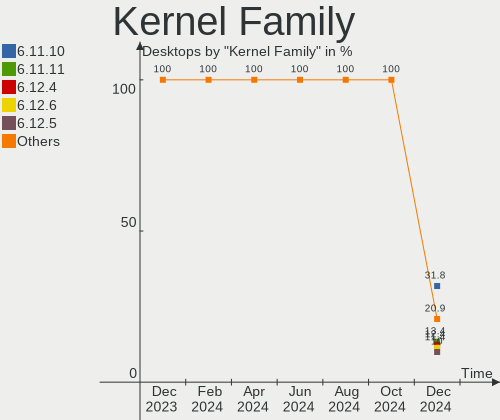
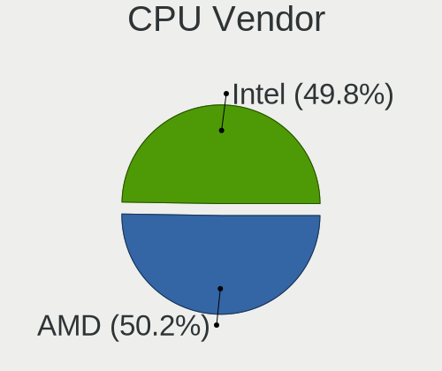
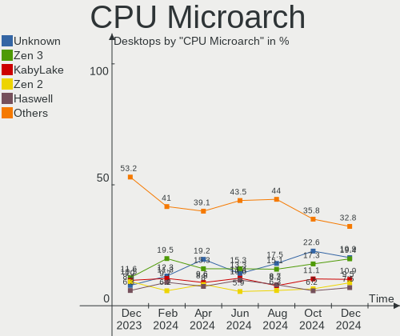
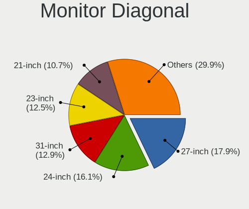
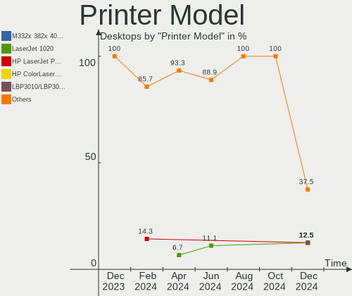
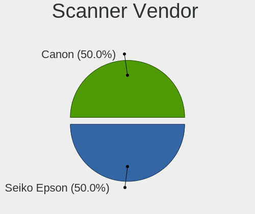

Fedora - Hardware Trends (Desktops)
-----------------------------------

A project to identify most popular hardware characteristics and track their change
over time based on data collected by Linux users at https://Linux-Hardware.org.

Anyone can contribute to this report by the [hw-probe](https://github.com/linuxhw/hw-probe) tool:

    sudo -E hw-probe -all -upload

This report is for one last month. Overall report since the beginning of time: [TestDays](https://github.com/linuxhw/TestDays)

Period: Sep, 2023.

Contents
--------

* [ System ](#system)
  - [ OS                       ](#os)
  - [ OS Family                ](#os-family)
  - [ Kernel                   ](#kernel)
  - [ Kernel Family            ](#kernel-family)
  - [ Kernel Major Ver.        ](#kernel-major-ver)
  - [ Arch                     ](#arch)
  - [ DE                       ](#de)
  - [ Display Server           ](#display-server)
  - [ Display Manager          ](#display-manager)
  - [ OS Lang                  ](#os-lang)
  - [ Boot Mode                ](#boot-mode)
  - [ Filesystem               ](#filesystem)
  - [ Part. scheme             ](#part-scheme)
  - [ Dual Boot with Linux/BSD ](#dual-boot-with-linuxbsd)
  - [ Dual Boot (Win)          ](#dual-boot-win)

* [ Board ](#board)
  - [ Vendor                   ](#vendor)
  - [ Model                    ](#model)
  - [ Model Family             ](#model-family)
  - [ MFG Year                 ](#mfg-year)
  - [ Form Factor              ](#form-factor)
  - [ Secure Boot              ](#secure-boot)
  - [ Coreboot                 ](#coreboot)
  - [ RAM Size                 ](#ram-size)
  - [ RAM Used                 ](#ram-used)
  - [ Total Drives             ](#total-drives)
  - [ Has CD-ROM               ](#has-cd-rom)
  - [ Has Ethernet             ](#has-ethernet)
  - [ Has WiFi                 ](#has-wifi)
  - [ Has Bluetooth            ](#has-bluetooth)

* [ Location ](#location)
  - [ Country                  ](#country)
  - [ City                     ](#city)

* [ Drives ](#drives)
  - [ Drive Vendor             ](#drive-vendor)
  - [ Drive Model              ](#drive-model)
  - [ HDD Vendor               ](#hdd-vendor)
  - [ SSD Vendor               ](#ssd-vendor)
  - [ Drive Kind               ](#drive-kind)
  - [ Drive Connector          ](#drive-connector)
  - [ Drive Size               ](#drive-size)
  - [ Space Total              ](#space-total)
  - [ Space Used               ](#space-used)
  - [ Malfunc. Drives          ](#malfunc-drives)
  - [ Malfunc. Drive Vendor    ](#malfunc-drive-vendor)
  - [ Malfunc. HDD Vendor      ](#malfunc-hdd-vendor)
  - [ Malfunc. Drive Kind      ](#malfunc-drive-kind)
  - [ Failed Drives            ](#failed-drives)
  - [ Failed Drive Vendor      ](#failed-drive-vendor)
  - [ Drive Status             ](#drive-status)

* [ Storage controller ](#storage-controller)
  - [ Storage Vendor           ](#storage-vendor)
  - [ Storage Model            ](#storage-model)
  - [ Storage Kind             ](#storage-kind)

* [ Processor ](#processor)
  - [ CPU Vendor               ](#cpu-vendor)
  - [ CPU Model                ](#cpu-model)
  - [ CPU Model Family         ](#cpu-model-family)
  - [ CPU Cores                ](#cpu-cores)
  - [ CPU Sockets              ](#cpu-sockets)
  - [ CPU Threads              ](#cpu-threads)
  - [ CPU Op-Modes             ](#cpu-op-modes)
  - [ CPU Microcode            ](#cpu-microcode)
  - [ CPU Microarch            ](#cpu-microarch)

* [ Graphics ](#graphics)
  - [ GPU Vendor               ](#gpu-vendor)
  - [ GPU Model                ](#gpu-model)
  - [ GPU Combo                ](#gpu-combo)
  - [ GPU Driver               ](#gpu-driver)
  - [ GPU Memory               ](#gpu-memory)

* [ Monitor ](#monitor)
  - [ Monitor Vendor           ](#monitor-vendor)
  - [ Monitor Model            ](#monitor-model)
  - [ Monitor Resolution       ](#monitor-resolution)
  - [ Monitor Diagonal         ](#monitor-diagonal)
  - [ Monitor Width            ](#monitor-width)
  - [ Aspect Ratio             ](#aspect-ratio)
  - [ Monitor Area             ](#monitor-area)
  - [ Pixel Density            ](#pixel-density)
  - [ Multiple Monitors        ](#multiple-monitors)

* [ Network ](#network)
  - [ Net Controller Vendor    ](#net-controller-vendor)
  - [ Net Controller Model     ](#net-controller-model)
  - [ Wireless Vendor          ](#wireless-vendor)
  - [ Wireless Model           ](#wireless-model)
  - [ Ethernet Vendor          ](#ethernet-vendor)
  - [ Ethernet Model           ](#ethernet-model)
  - [ Net Controller Kind      ](#net-controller-kind)
  - [ Used Controller          ](#used-controller)
  - [ NICs                     ](#nics)
  - [ IPv6                     ](#ipv6)

* [ Bluetooth ](#bluetooth)
  - [ Bluetooth Vendor         ](#bluetooth-vendor)
  - [ Bluetooth Model          ](#bluetooth-model)

* [ Sound ](#sound)
  - [ Sound Vendor             ](#sound-vendor)
  - [ Sound Model              ](#sound-model)

* [ Memory ](#memory)
  - [ Memory Vendor            ](#memory-vendor)
  - [ Memory Model             ](#memory-model)
  - [ Memory Kind              ](#memory-kind)
  - [ Memory Form Factor       ](#memory-form-factor)
  - [ Memory Size              ](#memory-size)
  - [ Memory Speed             ](#memory-speed)

* [ Printers & scanners ](#printers--scanners)
  - [ Printer Vendor           ](#printer-vendor)
  - [ Printer Model            ](#printer-model)
  - [ Scanner Vendor           ](#scanner-vendor)
  - [ Scanner Model            ](#scanner-model)

* [ Camera ](#camera)
  - [ Camera Vendor            ](#camera-vendor)
  - [ Camera Model             ](#camera-model)

* [ Security ](#security)
  - [ Fingerprint Vendor       ](#fingerprint-vendor)
  - [ Fingerprint Model        ](#fingerprint-model)
  - [ Chipcard Vendor          ](#chipcard-vendor)
  - [ Chipcard Model           ](#chipcard-model)

* [ Unsupported ](#unsupported)
  - [ Unsupported Devices      ](#unsupported-devices)
  - [ Unsupported Device Types ](#unsupported-device-types)

System
------

OS
--

Installed operating systems

| Name      | Desktops | Percent |
|-----------|----------|---------|
| Fedora 38 | 160      | 88.4%   |
| Fedora 39 | 9        | 4.97%   |
| Fedora 37 | 7        | 3.87%   |
| Fedora 40 | 4        | 2.21%   |
| Fedora 36 | 1        | 0.55%   |

OS Family
---------

OS without a version

| Name   | Desktops | Percent |
|--------|----------|---------|
| Fedora | 181      | 100%    |

Kernel
------

Version of the Linux kernel

| Version                                                  | Desktops | Percent |
|----------------------------------------------------------|----------|---------|
| 6.4.15-200.fc38.x86_64                                   | 69       | 38.12%  |
| 6.4.13-200.fc38.x86_64                                   | 23       | 12.71%  |
| 6.4.14-200.fc38.x86_64                                   | 19       | 10.5%   |
| 6.2.9-300.fc38.x86_64                                    | 16       | 8.84%   |
| 6.4.12-200.fc38.x86_64                                   | 15       | 8.29%   |
| 6.5.5-200.fc38.x86_64                                    | 10       | 5.52%   |
| 6.5.5-300.fc39.x86_64                                    | 4        | 2.21%   |
| 6.4.13-100.fc37.x86_64                                   | 3        | 1.66%   |
| 6.5.0-0.rc7.20230821gitf7757129e3de.50.fc39.x86_64       | 2        | 1.1%    |
| 6.4.15-100.fc37.x86_64                                   | 2        | 1.1%    |
| 6.4.11-200.fc38.x86_64                                   | 2        | 1.1%    |
| 6.2.14-300.fc38.x86_64                                   | 2        | 1.1%    |
| 6.6.0-0.rc2.20230919git2cf0f7156238.21.fc40.x86_64       | 1        | 0.55%   |
| 6.6.0-0.rc2.20.fc40.x86_64                               | 1        | 0.55%   |
| 6.6.0-0.rc0.20230829git1c59d383390f.59.fc40.x86_64+debug | 1        | 0.55%   |
| 6.5.5-100.fc37.x86_64                                    | 1        | 0.55%   |
| 6.5.4-300.fc39.x86_64                                    | 1        | 0.55%   |
| 6.5.1-300.fc39.x86_64                                    | 1        | 0.55%   |
| 6.5.0-0.rc7.20230823git89bf6209cad6.52.fc40.x86_64       | 1        | 0.55%   |
| 6.4.7-100.fc37.x86_64                                    | 1        | 0.55%   |
| 6.4.4-200.fc38.x86_64                                    | 1        | 0.55%   |
| 6.4.16-200.fc38.x86_64                                   | 1        | 0.55%   |
| 6.2.15-300.fc38.x86_64                                   | 1        | 0.55%   |
| 6.2.15-100.fc36.x86_64                                   | 1        | 0.55%   |
| 6.2.11-300.fc38.x86_64                                   | 1        | 0.55%   |
| 5.15.129-200.fc38.x86_64                                 | 1        | 0.55%   |

Kernel Family
-------------

Linux kernel without a distro release

| Version  | Desktops | Percent |
|----------|----------|---------|
| 6.4.15   | 71       | 39.23%  |
| 6.4.13   | 26       | 14.36%  |
| 6.4.14   | 19       | 10.5%   |
| 6.2.9    | 16       | 8.84%   |
| 6.5.5    | 15       | 8.29%   |
| 6.4.12   | 15       | 8.29%   |
| 6.6.0    | 3        | 1.66%   |
| 6.5.0    | 3        | 1.66%   |
| 6.4.11   | 2        | 1.1%    |
| 6.2.15   | 2        | 1.1%    |
| 6.2.14   | 2        | 1.1%    |
| 6.5.4    | 1        | 0.55%   |
| 6.5.1    | 1        | 0.55%   |
| 6.4.7    | 1        | 0.55%   |
| 6.4.4    | 1        | 0.55%   |
| 6.4.16   | 1        | 0.55%   |
| 6.2.11   | 1        | 0.55%   |
| 5.15.129 | 1        | 0.55%   |

Kernel Major Ver.
-----------------

Linux kernel major version

| Version | Desktops | Percent |
|---------|----------|---------|
| 6.4     | 136      | 75.14%  |
| 6.2     | 21       | 11.6%   |
| 6.5     | 20       | 11.05%  |
| 6.6     | 3        | 1.66%   |
| 5.15    | 1        | 0.55%   |

Arch
----

OS architecture (x86_64, i586, etc.)

| Name   | Desktops | Percent |
|--------|----------|---------|
| x86_64 | 181      | 100%    |

DE
--

Desktop Environment

| Name          | Desktops | Percent |
|---------------|----------|---------|
| GNOME         | 125      | 69.06%  |
| KDE5          | 28       | 15.47%  |
| Cinnamon      | 10       | 5.52%   |
| XFCE          | 3        | 1.66%   |
| GNOME Classic | 3        | 1.66%   |
| Budgie        | 3        | 1.66%   |
| Unknown       | 3        | 1.66%   |
| X-Cinnamon    | 2        | 1.1%    |
| openbox       | 1        | 0.55%   |
| MATE          | 1        | 0.55%   |
| LXQt          | 1        | 0.55%   |
| Hyprland      | 1        | 0.55%   |

Display Server
--------------

X11 or Wayland

| Name    | Desktops | Percent |
|---------|----------|---------|
| Wayland | 118      | 65.19%  |
| X11     | 42       | 23.2%   |
| Tty     | 19       | 10.5%   |
| Unknown | 2        | 1.1%    |

Display Manager
---------------

SDDM, LightDM, etc.

| Name    | Desktops | Percent |
|---------|----------|---------|
| Unknown | 119      | 65.75%  |
| GDM     | 26       | 14.36%  |
| LightDM | 20       | 11.05%  |
| SDDM    | 16       | 8.84%   |

OS Lang
-------

Language

| Lang    | Desktops | Percent |
|---------|----------|---------|
| en_US   | 88       | 48.62%  |
| en_GB   | 15       | 8.29%   |
| en_AU   | 15       | 8.29%   |
| pt_BR   | 10       | 5.52%   |
| ru_RU   | 8        | 4.42%   |
| de_DE   | 8        | 4.42%   |
| fr_FR   | 5        | 2.76%   |
| it_IT   | 4        | 2.21%   |
| es_ES   | 4        | 2.21%   |
| nl_NL   | 3        | 1.66%   |
| en_CA   | 3        | 1.66%   |
| pl_PL   | 2        | 1.1%    |
| es_AR   | 2        | 1.1%    |
| zh_SG   | 1        | 0.55%   |
| zh_CN   | 1        | 0.55%   |
| ko_KR   | 1        | 0.55%   |
| id_ID   | 1        | 0.55%   |
| hr_HR   | 1        | 0.55%   |
| es_MX   | 1        | 0.55%   |
| es_HN   | 1        | 0.55%   |
| es_CO   | 1        | 0.55%   |
| es_CL   | 1        | 0.55%   |
| en_IN   | 1        | 0.55%   |
| en_BW   | 1        | 0.55%   |
| el_GR   | 1        | 0.55%   |
| cs_CZ   | 1        | 0.55%   |
| Unknown | 1        | 0.55%   |

Boot Mode
---------

EFI or BIOS

| Mode | Desktops | Percent |
|------|----------|---------|
| EFI  | 125      | 69.06%  |
| BIOS | 56       | 30.94%  |

Filesystem
----------

Type of filesystem

| Type    | Desktops | Percent |
|---------|----------|---------|
| Btrfs   | 138      | 76.24%  |
| Ext4    | 30       | 16.57%  |
| Xfs     | 12       | 6.63%   |
| Overlay | 1        | 0.55%   |

Part. scheme
------------

Scheme of partitioning

| Type    | Desktops | Percent |
|---------|----------|---------|
| Unknown | 116      | 64.09%  |
| GPT     | 51       | 28.18%  |
| MBR     | 14       | 7.73%   |

Dual Boot with Linux/BSD
------------------------

Hosting more than one Linux/BSD

| Dual boot | Desktops | Percent |
|-----------|----------|---------|
| No        | 164      | 90.61%  |
| Yes       | 17       | 9.39%   |

Dual Boot (Win)
---------------

Hosting Linux and Windows

| Dual boot | Desktops | Percent |
|-----------|----------|---------|
| No        | 150      | 82.87%  |
| Yes       | 31       | 17.13%  |

Board
-----

Vendor
------

Motherboard manufacturer

| Name                | Desktops | Percent |
|---------------------|----------|---------|
| ASUSTek Computer    | 42       | 23.2%   |
| Gigabyte Technology | 32       | 17.68%  |
| MSI                 | 27       | 14.92%  |
| Dell                | 23       | 12.71%  |
| ASRock              | 17       | 9.39%   |
| Hewlett-Packard     | 15       | 8.29%   |
| Lenovo              | 8        | 4.42%   |
| Intel               | 4        | 2.21%   |
| Pegatron            | 3        | 1.66%   |
| Acer                | 2        | 1.1%    |
| Positivo            | 1        | 0.55%   |
| NZXT                | 1        | 0.55%   |
| Kllisre             | 1        | 0.55%   |
| Huanan              | 1        | 0.55%   |
| Fujitsu             | 1        | 0.55%   |
| Apple               | 1        | 0.55%   |
| ANGXUN              | 1        | 0.55%   |
| Unknown             | 1        | 0.55%   |

Model
-----

Motherboard model

| Name                               | Desktops | Percent |
|------------------------------------|----------|---------|
| Dell OptiPlex 7010                 | 5        | 2.76%   |
| ASUS All Series                    | 5        | 2.76%   |
| HP Compaq Elite 8300 SFF           | 3        | 1.66%   |
| MSI MS-7C76                        | 2        | 1.1%    |
| Gigabyte X470 AORUS ULTRA GAMING   | 2        | 1.1%    |
| Dell OptiPlex 3010                 | 2        | 1.1%    |
| ASUS TUF Gaming B550-PLUS          | 2        | 1.1%    |
| ASUS ROG STRIX B450-F GAMING       | 2        | 1.1%    |
| ASUS ROG CROSSHAIR VIII HERO       | 2        | 1.1%    |
| ASUS PRIME X570-PRO                | 2        | 1.1%    |
| ASUS PRIME B550M-A                 | 2        | 1.1%    |
| ASRock B550M Pro4                  | 2        | 1.1%    |
| ASRock B450M Steel Legend          | 2        | 1.1%    |
| Positivo D3400                     | 1        | 0.55%   |
| Pegatron NJ062AA-ABA m9650f        | 1        | 0.55%   |
| Pegatron IPMSB-VH1/HDMI/ODM        | 1        | 0.55%   |
| Pegatron Elite 7200 MT Business PC | 1        | 0.55%   |
| NZXT N7 Z370                       | 1        | 0.55%   |
| MSI MS-7E03                        | 1        | 0.55%   |
| MSI MS-7D74                        | 1        | 0.55%   |
| MSI MS-7D73                        | 1        | 0.55%   |
| MSI MS-7D53                        | 1        | 0.55%   |
| MSI MS-7D43                        | 1        | 0.55%   |
| MSI MS-7D31                        | 1        | 0.55%   |
| MSI MS-7C95                        | 1        | 0.55%   |
| MSI MS-7C91                        | 1        | 0.55%   |
| MSI MS-7C84                        | 1        | 0.55%   |
| MSI MS-7C82                        | 1        | 0.55%   |
| MSI MS-7C75                        | 1        | 0.55%   |
| MSI MS-7C52                        | 1        | 0.55%   |
| MSI MS-7C37                        | 1        | 0.55%   |
| MSI MS-7B89                        | 1        | 0.55%   |
| MSI MS-7B85                        | 1        | 0.55%   |
| MSI MS-7B33                        | 1        | 0.55%   |
| MSI MS-7B18                        | 1        | 0.55%   |
| MSI MS-7B07                        | 1        | 0.55%   |
| MSI MS-7A69                        | 1        | 0.55%   |
| MSI MS-7A38                        | 1        | 0.55%   |
| MSI MS-7996                        | 1        | 0.55%   |
| MSI MS-7885                        | 1        | 0.55%   |

Model Family
------------

Motherboard model prefix

| Name                 | Desktops | Percent |
|----------------------|----------|---------|
| Dell OptiPlex        | 13       | 7.18%   |
| ASUS PRIME           | 12       | 6.63%   |
| ASUS TUF             | 8        | 4.42%   |
| ASUS ROG             | 8        | 4.42%   |
| HP Compaq            | 7        | 3.87%   |
| Lenovo ThinkCentre   | 5        | 2.76%   |
| ASUS All             | 5        | 2.76%   |
| Dell Precision       | 4        | 2.21%   |
| ASRock B450M         | 4        | 2.21%   |
| Gigabyte B550M       | 3        | 1.66%   |
| Dell XPS             | 3        | 1.66%   |
| Dell Inspiron        | 3        | 1.66%   |
| MSI MS-7C76          | 2        | 1.1%    |
| Lenovo IdeaCentre    | 2        | 1.1%    |
| HP OMEN              | 2        | 1.1%    |
| Gigabyte X570        | 2        | 1.1%    |
| Gigabyte X470        | 2        | 1.1%    |
| Gigabyte B450M       | 2        | 1.1%    |
| ASRock B550M         | 2        | 1.1%    |
| Positivo D3400       | 1        | 0.55%   |
| Pegatron NJ062AA-ABA | 1        | 0.55%   |
| Pegatron IPMSB-VH1   | 1        | 0.55%   |
| Pegatron Elite       | 1        | 0.55%   |
| NZXT N7              | 1        | 0.55%   |
| MSI MS-7E03          | 1        | 0.55%   |
| MSI MS-7D74          | 1        | 0.55%   |
| MSI MS-7D73          | 1        | 0.55%   |
| MSI MS-7D53          | 1        | 0.55%   |
| MSI MS-7D43          | 1        | 0.55%   |
| MSI MS-7D31          | 1        | 0.55%   |
| MSI MS-7C95          | 1        | 0.55%   |
| MSI MS-7C91          | 1        | 0.55%   |
| MSI MS-7C84          | 1        | 0.55%   |
| MSI MS-7C82          | 1        | 0.55%   |
| MSI MS-7C75          | 1        | 0.55%   |
| MSI MS-7C52          | 1        | 0.55%   |
| MSI MS-7C37          | 1        | 0.55%   |
| MSI MS-7B89          | 1        | 0.55%   |
| MSI MS-7B85          | 1        | 0.55%   |
| MSI MS-7B33          | 1        | 0.55%   |

MFG Year
--------

Motherboard manufacture year

| Year | Desktops | Percent |
|------|----------|---------|
| 2018 | 23       | 12.71%  |
| 2020 | 21       | 11.6%   |
| 2019 | 19       | 10.5%   |
| 2013 | 14       | 7.73%   |
| 2021 | 13       | 7.18%   |
| 2012 | 13       | 7.18%   |
| 2022 | 12       | 6.63%   |
| 2017 | 11       | 6.08%   |
| 2015 | 9        | 4.97%   |
| 2023 | 8        | 4.42%   |
| 2011 | 8        | 4.42%   |
| 2010 | 8        | 4.42%   |
| 2016 | 5        | 2.76%   |
| 2014 | 5        | 2.76%   |
| 2009 | 5        | 2.76%   |
| 2008 | 4        | 2.21%   |
| 2007 | 2        | 1.1%    |
| 2006 | 1        | 0.55%   |

Form Factor
-----------

Physical design of the computer

| Name    | Desktops | Percent |
|---------|----------|---------|
| Desktop | 181      | 100%    |

Secure Boot
-----------

Enabled or disabled

| State    | Desktops | Percent |
|----------|----------|---------|
| Disabled | 162      | 89.5%   |
| Enabled  | 19       | 10.5%   |

Coreboot
--------

Have coreboot on board

| Used | Desktops | Percent |
|------|----------|---------|
| No   | 181      | 100%    |

RAM Size
--------

Total RAM memory

| Size in GB  | Desktops | Percent |
|-------------|----------|---------|
| 32.01-64.0  | 45       | 24.86%  |
| 16.01-24.0  | 43       | 23.76%  |
| 8.01-16.0   | 29       | 16.02%  |
| 64.01-256.0 | 25       | 13.81%  |
| 4.01-8.0    | 23       | 12.71%  |
| 3.01-4.0    | 8        | 4.42%   |
| 24.01-32.0  | 8        | 4.42%   |

RAM Used
--------

Used RAM memory

| Used GB     | Desktops | Percent |
|-------------|----------|---------|
| 4.01-8.0    | 60       | 33.15%  |
| 2.01-3.0    | 40       | 22.1%   |
| 3.01-4.0    | 32       | 17.68%  |
| 1.01-2.0    | 21       | 11.6%   |
| 8.01-16.0   | 17       | 9.39%   |
| 0.51-1.0    | 6        | 3.31%   |
| 16.01-24.0  | 4        | 2.21%   |
| 64.01-256.0 | 1        | 0.55%   |

Total Drives
------------

Number of drives on board

| Drives | Desktops | Percent |
|--------|----------|---------|
| 1      | 60       | 33.15%  |
| 2      | 54       | 29.83%  |
| 3      | 38       | 20.99%  |
| 5      | 11       | 6.08%   |
| 4      | 11       | 6.08%   |
| 6      | 4        | 2.21%   |
| 7      | 2        | 1.1%    |
| 8      | 1        | 0.55%   |

Has CD-ROM
----------

Has CD-ROM on board

| Presented | Desktops | Percent |
|-----------|----------|---------|
| No        | 122      | 67.4%   |
| Yes       | 59       | 32.6%   |

Has Ethernet
------------

Has Ethernet on board

| Presented | Desktops | Percent |
|-----------|----------|---------|
| Yes       | 178      | 98.34%  |
| No        | 3        | 1.66%   |

Has WiFi
--------

Has WiFi module

| Presented | Desktops | Percent |
|-----------|----------|---------|
| Yes       | 96       | 53.04%  |
| No        | 85       | 46.96%  |

Has Bluetooth
-------------

Has Bluetooth module

| Presented | Desktops | Percent |
|-----------|----------|---------|
| No        | 93       | 51.38%  |
| Yes       | 88       | 48.62%  |

Location
--------

Country
-------

Geographic location (country)

| Country             | Desktops | Percent |
|---------------------|----------|---------|
| USA                 | 46       | 25.41%  |
| Brazil              | 16       | 8.84%   |
| Australia           | 15       | 8.29%   |
| Germany             | 12       | 6.63%   |
| Spain               | 6        | 3.31%   |
| Russia              | 6        | 3.31%   |
| Netherlands         | 6        | 3.31%   |
| Italy               | 6        | 3.31%   |
| Canada              | 6        | 3.31%   |
| France              | 5        | 2.76%   |
| UK                  | 4        | 2.21%   |
| Poland              | 4        | 2.21%   |
| Mexico              | 4        | 2.21%   |
| Belarus             | 4        | 2.21%   |
| Thailand            | 3        | 1.66%   |
| Norway              | 3        | 1.66%   |
| India               | 2        | 1.1%    |
| Czechia             | 2        | 1.1%    |
| Colombia            | 2        | 1.1%    |
| Argentina           | 2        | 1.1%    |
| Ukraine             | 1        | 0.55%   |
| Turkey              | 1        | 0.55%   |
| Trinidad and Tobago | 1        | 0.55%   |
| Taiwan              | 1        | 0.55%   |
| Sweden              | 1        | 0.55%   |
| South Korea         | 1        | 0.55%   |
| Slovenia            | 1        | 0.55%   |
| Singapore           | 1        | 0.55%   |
| Romania             | 1        | 0.55%   |
| Portugal            | 1        | 0.55%   |
| Peru                | 1        | 0.55%   |
| New Zealand         | 1        | 0.55%   |
| Malaysia            | 1        | 0.55%   |
| Kenya               | 1        | 0.55%   |
| Ireland             | 1        | 0.55%   |
| Iran                | 1        | 0.55%   |
| Indonesia           | 1        | 0.55%   |
| Honduras            | 1        | 0.55%   |
| Greece              | 1        | 0.55%   |
| Finland             | 1        | 0.55%   |

City
----

Geographic location (city)

| City           | Desktops | Percent |
|----------------|----------|---------|
| Sydney         | 11       | 6.08%   |
| Minsk          | 4        | 2.21%   |
| The Hague      | 2        | 1.1%    |
| Sunshine West  | 2        | 1.1%    |
| Sao Paulo      | 2        | 1.1%    |
| Rome           | 2        | 1.1%    |
| Palmas         | 2        | 1.1%    |
| Ober-Morlen    | 2        | 1.1%    |
| Nijmegen       | 2        | 1.1%    |
| Cincinnati     | 2        | 1.1%    |
| Berlin         | 2        | 1.1%    |
| Bangkok        | 2        | 1.1%    |
| Zapopan        | 1        | 0.55%   |
| Zagreb         | 1        | 0.55%   |
| Wroclaw        | 1        | 0.55%   |
| Woking         | 1        | 0.55%   |
| Wihan Daeng    | 1        | 0.55%   |
| Wiggins        | 1        | 0.55%   |
| Wadern         | 1        | 0.55%   |
| Vladivostok    | 1        | 0.55%   |
| Virginia Beach | 1        | 0.55%   |
| Viedma         | 1        | 0.55%   |
| Vantaa         | 1        | 0.55%   |
| Valladolid     | 1        | 0.55%   |
| Urai           | 1        | 0.55%   |
| Tunja          | 1        | 0.55%   |
| Tirunelveli    | 1        | 0.55%   |
| Tehran         | 1        | 0.55%   |
| Tegucigalpa    | 1        | 0.55%   |
| Tarsus         | 1        | 0.55%   |
| Tampa          | 1        | 0.55%   |
| Tacoma         | 1        | 0.55%   |
| Stockport      | 1        | 0.55%   |
| Sterling       | 1        | 0.55%   |
| Starokandry    | 1        | 0.55%   |
| St Louis       | 1        | 0.55%   |
| Sofia          | 1        | 0.55%   |
| Skierniewice   | 1        | 0.55%   |
| Singapore      | 1        | 0.55%   |
| Sharon         | 1        | 0.55%   |

Drives
------

Drive Vendor
------------

Hard drive vendors

| Vendor                         | Desktops | Drives | Percent |
|--------------------------------|----------|--------|---------|
| Samsung Electronics            | 56       | 78     | 16.47%  |
| WDC                            | 55       | 77     | 16.18%  |
| Seagate                        | 43       | 59     | 12.65%  |
| Sandisk                        | 27       | 31     | 7.94%   |
| Kingston                       | 21       | 23     | 6.18%   |
| Crucial                        | 19       | 21     | 5.59%   |
| Toshiba                        | 18       | 18     | 5.29%   |
| Micron/Crucial Technology      | 10       | 12     | 2.94%   |
| Intel                          | 10       | 16     | 2.94%   |
| Phison Electronics             | 7        | 7      | 2.06%   |
| Hitachi                        | 7        | 9      | 2.06%   |
| ADATA Technology               | 6        | 7      | 1.76%   |
| Kingston Technology Company    | 4        | 5      | 1.18%   |
| A-DATA Technology              | 4        | 4      | 1.18%   |
| SK hynix                       | 3        | 3      | 0.88%   |
| Silicon Motion                 | 3        | 3      | 0.88%   |
| PNY                            | 3        | 3      | 0.88%   |
| Micron Technology              | 3        | 3      | 0.88%   |
| HGST                           | 3        | 3      | 0.88%   |
| Unknown                        | 2        | 3      | 0.59%   |
| Team                           | 2        | 3      | 0.59%   |
| Realtek Semiconductor          | 2        | 2      | 0.59%   |
| Patriot                        | 2        | 2      | 0.59%   |
| OCZ                            | 2        | 2      | 0.59%   |
| KingSpec                       | 2        | 2      | 0.59%   |
| Emtec                          | 2        | 2      | 0.59%   |
| Corsair                        | 2        | 2      | 0.59%   |
| China                          | 2        | 2      | 0.59%   |
| Vaseky                         | 1        | 1      | 0.29%   |
| T-FORCE                        | 1        | 1      | 0.29%   |
| Solid State Storage Technology | 1        | 1      | 0.29%   |
| SABRENT                        | 1        | 1      | 0.29%   |
| RevuAhn                        | 1        | 1      | 0.29%   |
| NN                             | 1        | 1      | 0.29%   |
| Netac                          | 1        | 1      | 0.29%   |
| Neo                            | 1        | 1      | 0.29%   |
| MAXIO Technology (Hangzhou)    | 1        | 1      | 0.29%   |
| KUIJIA                         | 1        | 1      | 0.29%   |
| KIOXIA-EXCERIA                 | 1        | 1      | 0.29%   |
| KingFast                       | 1        | 1      | 0.29%   |

Drive Model
-----------

Hard drive models

| Model                                                             | Desktops | Percent |
|-------------------------------------------------------------------|----------|---------|
| Samsung NVMe SSD Controller SM981/PM981/PM983 256GB               | 15       | 3.88%   |
| Micron/Crucial P2 NVMe PCIe SSD 1TB                               | 9        | 2.33%   |
| Kingston SA400S37480G 480GB SSD                                   | 9        | 2.33%   |
| Samsung NVMe SSD Controller SM961/PM961/SM963 500GB               | 6        | 1.55%   |
| Samsung NVMe SSD Controller PM9A1/PM9A3/980PRO 1TB                | 6        | 1.55%   |
| Toshiba DT01ACA100 1TB                                            | 5        | 1.29%   |
| Seagate ST2000DM006-2DM164 2TB                                    | 5        | 1.29%   |
| Crucial CT500MX500SSD1 500GB                                      | 5        | 1.29%   |
| ADATA XPG SX8200 Pro PCIe Gen3x4 M.2 2280 Solid State Drive 256GB | 5        | 1.29%   |
| Seagate ST500DM002-1BD142 500GB                                   | 4        | 1.03%   |
| Seagate ST1000DM010-2EP102 1TB                                    | 4        | 1.03%   |
| Seagate ST1000DM003-1ER162 1TB                                    | 4        | 1.03%   |
| Sandisk WD Black SN850 1TB                                        | 4        | 1.03%   |
| Phison E12 NVMe Controller 2TB                                    | 4        | 1.03%   |
| WDC WDS500G2B0A-00SM50 500GB SSD                                  | 3        | 0.78%   |
| WDC WDS100T2B0A-00SM50 1TB SSD                                    | 3        | 0.78%   |
| Seagate ST4000DM004-2CV104 4TB                                    | 3        | 0.78%   |
| Seagate ST2000DM008-2FR102 2TB                                    | 3        | 0.78%   |
| Seagate ST1000DM003-1SB102 1TB                                    | 3        | 0.78%   |
| Sandisk WD Blue SN550 NVMe SSD 512GB                              | 3        | 0.78%   |
| Sandisk WD Black SN750 / PC SN730 NVMe SSD 512GB                  | 3        | 0.78%   |
| Samsung SSD 850 EVO 250GB                                         | 3        | 0.78%   |
| Kingston SV300S37A120G 120GB SSD                                  | 3        | 0.78%   |
| WDC WD6002FFWX-68TZ4N0 6TB                                        | 2        | 0.52%   |
| WDC WD40EZRZ-00GXCB0 4TB                                          | 2        | 0.52%   |
| WDC WD20EARX-00PASB0 2TB                                          | 2        | 0.52%   |
| WDC WD10EZEX-60WN4A0 1TB                                          | 2        | 0.52%   |
| WDC WD10EZEX-08WN4A0 1TB                                          | 2        | 0.52%   |
| WDC WD10EZEX-00BBHA0 1TB                                          | 2        | 0.52%   |
| WDC WD Blue SA510 2.5 250GB                                       | 2        | 0.52%   |
| Toshiba HDWD110 1TB                                               | 2        | 0.52%   |
| Silicon Motion SM2263EN/SM2263XT SSD Controller 512GB             | 2        | 0.52%   |
| Seagate ST6000VN001-2BB186 6TB                                    | 2        | 0.52%   |
| Seagate ST4000VN008-2DR166 4TB                                    | 2        | 0.52%   |
| Sandisk WD_BLACK SN850X 1000GB                                    | 2        | 0.52%   |
| SanDisk SSD PLUS 1000GB                                           | 2        | 0.52%   |
| Samsung SSD 990 PRO 2TB                                           | 2        | 0.52%   |
| Samsung SSD 980 1TB                                               | 2        | 0.52%   |
| Samsung SSD 870 EVO 1TB                                           | 2        | 0.52%   |
| Samsung SSD 860 EVO 500GB                                         | 2        | 0.52%   |

HDD Vendor
----------

Hard disk drive vendors

| Vendor              | Desktops | Drives | Percent |
|---------------------|----------|--------|---------|
| WDC                 | 44       | 64     | 36.97%  |
| Seagate             | 41       | 56     | 34.45%  |
| Toshiba             | 14       | 14     | 11.76%  |
| Samsung Electronics | 7        | 9      | 5.88%   |
| Hitachi             | 7        | 9      | 5.88%   |
| HGST                | 3        | 3      | 2.52%   |
| Unknown             | 1        | 1      | 0.84%   |
| SABRENT             | 1        | 1      | 0.84%   |
| Intenso             | 1        | 1      | 0.84%   |

SSD Vendor
----------

Solid state drive vendors

| Vendor              | Desktops | Drives | Percent |
|---------------------|----------|--------|---------|
| Samsung Electronics | 25       | 29     | 20%     |
| Kingston            | 18       | 20     | 14.4%   |
| Crucial             | 18       | 19     | 14.4%   |
| WDC                 | 13       | 13     | 10.4%   |
| SanDisk             | 10       | 10     | 8%      |
| Intel               | 8        | 11     | 6.4%    |
| A-DATA Technology   | 4        | 4      | 3.2%    |
| PNY                 | 3        | 3      | 2.4%    |
| Toshiba             | 2        | 2      | 1.6%    |
| Team                | 2        | 3      | 1.6%    |
| Patriot             | 2        | 2      | 1.6%    |
| OCZ                 | 2        | 2      | 1.6%    |
| KingSpec            | 2        | 2      | 1.6%    |
| Emtec               | 2        | 2      | 1.6%    |
| Corsair             | 2        | 2      | 1.6%    |
| China               | 2        | 2      | 1.6%    |
| Vaseky              | 1        | 1      | 0.8%    |
| SK hynix            | 1        | 1      | 0.8%    |
| RevuAhn             | 1        | 1      | 0.8%    |
| NN                  | 1        | 1      | 0.8%    |
| Netac               | 1        | 1      | 0.8%    |
| KUIJIA              | 1        | 1      | 0.8%    |
| KIOXIA-EXCERIA      | 1        | 1      | 0.8%    |
| GOODRAM             | 1        | 1      | 0.8%    |
| Apacer              | 1        | 1      | 0.8%    |
| Unknown             | 1        | 1      | 0.8%    |

Drive Kind
----------

HDD or SSD

| Kind    | Desktops | Drives | Percent |
|---------|----------|--------|---------|
| SSD     | 106      | 136    | 35.45%  |
| HDD     | 98       | 158    | 32.78%  |
| NVMe    | 88       | 121    | 29.43%  |
| Unknown | 7        | 8      | 2.34%   |

Drive Connector
---------------

SATA, SAS, NVMe, etc.

| Type | Desktops | Drives | Percent |
|------|----------|--------|---------|
| SATA | 146      | 293    | 60.33%  |
| NVMe | 88       | 121    | 36.36%  |
| SAS  | 8        | 9      | 3.31%   |

Drive Size
----------

Size of hard drive

| Size in TB | Desktops | Drives | Percent |
|------------|----------|--------|---------|
| 0.01-0.5   | 99       | 138    | 45.41%  |
| 0.51-1.0   | 66       | 85     | 30.28%  |
| 1.01-2.0   | 27       | 32     | 12.39%  |
| 3.01-4.0   | 14       | 23     | 6.42%   |
| 4.01-10.0  | 7        | 9      | 3.21%   |
| 2.01-3.0   | 4        | 6      | 1.83%   |
| 10.01-20.0 | 1        | 1      | 0.46%   |

Space Total
-----------

Amount of disk space available on the file system

| Size in GB     | Desktops | Percent |
|----------------|----------|---------|
| 501-1000       | 45       | 24.86%  |
| More than 3000 | 33       | 18.23%  |
| 1001-2000      | 29       | 16.02%  |
| 251-500        | 22       | 12.15%  |
| 101-250        | 22       | 12.15%  |
| 2001-3000      | 12       | 6.63%   |
| 1-20           | 7        | 3.87%   |
| 51-100         | 5        | 2.76%   |
| Unknown        | 4        | 2.21%   |
| 21-50          | 2        | 1.1%    |

Space Used
----------

Amount of used disk space

| Used GB        | Desktops | Percent |
|----------------|----------|---------|
| 1-20           | 41       | 22.65%  |
| 21-50          | 25       | 13.81%  |
| 101-250        | 21       | 11.6%   |
| 51-100         | 20       | 11.05%  |
| 501-1000       | 18       | 9.94%   |
| 251-500        | 17       | 9.39%   |
| More than 3000 | 13       | 7.18%   |
| 1001-2000      | 13       | 7.18%   |
| 2001-3000      | 9        | 4.97%   |
| Unknown        | 4        | 2.21%   |

Malfunc. Drives
---------------

Drive models with a malfunction

| Model                                                           | Desktops | Drives | Percent |
|-----------------------------------------------------------------|----------|--------|---------|
| Intel SSDSC2CT120A3 120GB                                       | 2        | 2      | 12.5%   |
| Crucial CT120M500SSD1 120GB                                     | 2        | 2      | 12.5%   |
| WDC WD5000AVCS-632DY1 500GB                                     | 1        | 1      | 6.25%   |
| WDC WD20EZRZ-22Z5HB0 2TB                                        | 1        | 1      | 6.25%   |
| WDC WD10EZEX-08WN4A0 1TB                                        | 1        | 1      | 6.25%   |
| Seagate ST500DM002-1BD142 500GB                                 | 1        | 1      | 6.25%   |
| Seagate ST3500418AS 500GB                                       | 1        | 1      | 6.25%   |
| Seagate ST2000DM001-1CH164 2TB                                  | 1        | 1      | 6.25%   |
| Samsung Electronics NVMe SSD Controller SM981/PM981/PM983 256GB | 1        | 1      | 6.25%   |
| Samsung Electronics NVMe SSD Controller SM961/PM961/SM963 500GB | 1        | 1      | 6.25%   |
| Samsung Electronics HD103UJ 1TB                                 | 1        | 2      | 6.25%   |
| Intel SSDSC2KG960G8R 960GB                                      | 1        | 1      | 6.25%   |
| Hitachi HDT721010SLA360 1TB                                     | 1        | 1      | 6.25%   |
| Crucial CT1000MX500SSD1 1TB                                     | 1        | 1      | 6.25%   |

Malfunc. Drive Vendor
---------------------

Vendors of faulty drives

| Vendor              | Desktops | Drives | Percent |
|---------------------|----------|--------|---------|
| WDC                 | 3        | 3      | 18.75%  |
| Seagate             | 3        | 3      | 18.75%  |
| Samsung Electronics | 3        | 4      | 18.75%  |
| Intel               | 3        | 3      | 18.75%  |
| Crucial             | 3        | 3      | 18.75%  |
| Hitachi             | 1        | 1      | 6.25%   |

Malfunc. HDD Vendor
-------------------

Vendors of faulty HDD drives

| Vendor              | Desktops | Drives | Percent |
|---------------------|----------|--------|---------|
| WDC                 | 3        | 3      | 37.5%   |
| Seagate             | 3        | 3      | 37.5%   |
| Samsung Electronics | 1        | 2      | 12.5%   |
| Hitachi             | 1        | 1      | 12.5%   |

Malfunc. Drive Kind
-------------------

Kinds of faulty drives

| Kind | Desktops | Drives | Percent |
|------|----------|--------|---------|
| HDD  | 7        | 9      | 46.67%  |
| SSD  | 6        | 6      | 40%     |
| NVMe | 2        | 2      | 13.33%  |

Failed Drives
-------------

Failed drive models

| Model                           | Desktops | Drives | Percent |
|---------------------------------|----------|--------|---------|
| Samsung Electronics SSD 980 1TB | 1        | 2      | 50%     |
| Hitachi HDS721010DLE630 1TB     | 1        | 2      | 50%     |

Failed Drive Vendor
-------------------

Failed drive vendors

| Vendor              | Desktops | Drives | Percent |
|---------------------|----------|--------|---------|
| Samsung Electronics | 1        | 2      | 50%     |
| Hitachi             | 1        | 2      | 50%     |

Drive Status
------------

Number of failed and malfunc. drives

| Status   | Desktops | Drives | Percent |
|----------|----------|--------|---------|
| Detected | 118      | 265    | 60.51%  |
| Works    | 60       | 137    | 30.77%  |
| Malfunc  | 15       | 17     | 7.69%   |
| Failed   | 2        | 4      | 1.03%   |

Storage controller
------------------

Storage Vendor
--------------

Storage controller vendors

| Vendor                         | Desktops | Percent |
|--------------------------------|----------|---------|
| Intel                          | 111      | 37.5%   |
| AMD                            | 67       | 22.64%  |
| Samsung Electronics            | 31       | 10.47%  |
| SanDisk                        | 18       | 6.08%   |
| Micron/Crucial Technology      | 11       | 3.72%   |
| ASMedia Technology             | 11       | 3.72%   |
| Phison Electronics             | 7        | 2.36%   |
| Kingston Technology Company    | 7        | 2.36%   |
| ADATA Technology               | 6        | 2.03%   |
| Silicon Motion                 | 3        | 1.01%   |
| Micron Technology              | 3        | 1.01%   |
| JMicron Technology             | 3        | 1.01%   |
| VIA Technologies               | 2        | 0.68%   |
| Toshiba America Info Systems   | 2        | 0.68%   |
| Seagate Technology             | 2        | 0.68%   |
| Realtek Semiconductor          | 2        | 0.68%   |
| Nvidia                         | 2        | 0.68%   |
| ULi Electronics                | 1        | 0.34%   |
| Solid State Storage Technology | 1        | 0.34%   |
| SK hynix                       | 1        | 0.34%   |
| Silicon Image                  | 1        | 0.34%   |
| MAXIO Technology (Hangzhou)    | 1        | 0.34%   |
| Marvell Technology Group       | 1        | 0.34%   |
| Biwin Storage Technology       | 1        | 0.34%   |
| Adaptec                        | 1        | 0.34%   |

Storage Model
-------------

Storage controller models

| Model                                                                          | Desktops | Percent |
|--------------------------------------------------------------------------------|----------|---------|
| AMD FCH SATA Controller [AHCI mode]                                            | 34       | 10.06%  |
| AMD 400 Series Chipset SATA Controller                                         | 16       | 4.73%   |
| Samsung NVMe SSD Controller SM981/PM981/PM983                                  | 15       | 4.44%   |
| Intel 8 Series/C220 Series Chipset Family 6-port SATA Controller 1 [AHCI mode] | 15       | 4.44%   |
| Intel Q170/Q150/B150/H170/H110/Z170/CM236 Chipset SATA Controller [AHCI Mode]  | 14       | 4.14%   |
| Intel 7 Series/C210 Series Chipset Family 6-port SATA Controller [AHCI mode]   | 13       | 3.85%   |
| AMD 500 Series Chipset SATA Controller                                         | 12       | 3.55%   |
| Micron/Crucial P2 [Nick P2] / P3 / P3 Plus NVMe PCIe SSD (DRAM-less)           | 10       | 2.96%   |
| ASMedia ASM1062 Serial ATA Controller                                          | 10       | 2.96%   |
| Intel 6 Series/C200 Series Chipset Family 6 port Desktop SATA AHCI Controller  | 9        | 2.66%   |
| Intel Alder Lake-S PCH SATA Controller [AHCI Mode]                             | 8        | 2.37%   |
| Samsung NVMe SSD Controller SM961/PM961/SM963                                  | 6        | 1.78%   |
| Samsung NVMe SSD Controller PM9A1/PM9A3/980PRO                                 | 6        | 1.78%   |
| Intel Cannon Lake PCH SATA AHCI Controller                                     | 6        | 1.78%   |
| Intel 200 Series PCH SATA controller [AHCI mode]                               | 6        | 1.78%   |
| AMD SB7x0/SB8x0/SB9x0 SATA Controller [AHCI mode]                              | 6        | 1.78%   |
| Intel SATA Controller [RAID mode]                                              | 5        | 1.48%   |
| AMD SB7x0/SB8x0/SB9x0 IDE Controller                                           | 5        | 1.48%   |
| ADATA XPG SX8200 Pro PCIe Gen3x4 M.2 2280 Solid State Drive                    | 5        | 1.48%   |
| Sandisk Western Digital WD Black SN850X NVMe SSD                               | 4        | 1.18%   |
| SanDisk WD PC SN810 / Black SN850 NVMe SSD                                     | 4        | 1.18%   |
| Phison E12 NVMe Controller                                                     | 4        | 1.18%   |
| Kingston Company Company Non-Volatile memory controller                        | 4        | 1.18%   |
| Intel Comet Lake SATA AHCI Controller                                          | 4        | 1.18%   |
| Intel 500 Series Chipset Family SATA AHCI Controller                           | 4        | 1.18%   |
| SanDisk WD Blue SN550 NVMe SSD                                                 | 3        | 0.89%   |
| SanDisk WD Black SN770 / PC SN740 256GB / PC SN560 (DRAM-less) NVMe SSD        | 3        | 0.89%   |
| SanDisk WD Black SN750 / PC SN730 NVMe SSD                                     | 3        | 0.89%   |
| Samsung NVMe SSD Controller S4LV008[Pascal]                                    | 3        | 0.89%   |
| Samsung NVMe SSD Controller 980                                                | 3        | 0.89%   |
| Micron 2300 NVMe SSD [Santana]                                                 | 3        | 0.89%   |
| Intel Volume Management Device NVMe RAID Controller                            | 3        | 0.89%   |
| AMD SB7x0/SB8x0/SB9x0 SATA Controller [IDE mode]                               | 3        | 0.89%   |
| AMD FCH SATA Controller D                                                      | 3        | 0.89%   |
| Silicon Motion SM2263EN/SM2263XT (DRAM-less) NVMe SSD Controllers              | 2        | 0.59%   |
| Realtek RTS5763DL NVMe SSD Controller (DRAM-less)                              | 2        | 0.59%   |
| Phison PS5013 E13 NVMe Controller                                              | 2        | 0.59%   |
| Kingston Company KC3000/Renegade NVMe SSD                                      | 2        | 0.59%   |
| JMicron JMB363 SATA/IDE Controller                                             | 2        | 0.59%   |
| Intel Optane SSD 900P Series                                                   | 2        | 0.59%   |

Storage Kind
------------

Kind of storage controller (IDE, SATA, NVMe, SAS, ...)

| Kind | Desktops | Percent |
|------|----------|---------|
| SATA | 166      | 57.64%  |
| NVMe | 88       | 30.56%  |
| IDE  | 19       | 6.6%    |
| RAID | 15       | 5.21%   |

Processor
---------

CPU Vendor
----------

Processor vendors

| Vendor | Desktops | Percent |
|--------|----------|---------|
| Intel  | 112      | 61.88%  |
| AMD    | 69       | 38.12%  |

CPU Model
---------

Processor models

| Model                                       | Desktops | Percent |
|---------------------------------------------|----------|---------|
| Intel Core i5-3470 CPU @ 3.20GHz            | 7        | 3.87%   |
| Intel Core i7-4790 CPU @ 3.60GHz            | 4        | 2.21%   |
| Intel Core i5-8400 CPU @ 2.80GHz            | 4        | 2.21%   |
| AMD Ryzen 9 3900X 12-Core Processor         | 4        | 2.21%   |
| AMD Ryzen 7 5800X3D 8-Core Processor        | 4        | 2.21%   |
| AMD Ryzen 7 5700X 8-Core Processor          | 4        | 2.21%   |
| AMD Ryzen 5 5600X 6-Core Processor          | 4        | 2.21%   |
| AMD Ryzen 5 3600 6-Core Processor           | 4        | 2.21%   |
| AMD Ryzen 5 3400G with Radeon Vega Graphics | 4        | 2.21%   |
| AMD Ryzen 5 2600 Six-Core Processor         | 4        | 2.21%   |
| Intel Core i5-3570 CPU @ 3.40GHz            | 3        | 1.66%   |
| AMD Ryzen 9 7950X3D 16-Core Processor       | 3        | 1.66%   |
| AMD Ryzen 7 5800X 8-Core Processor          | 3        | 1.66%   |
| AMD Ryzen 5 5600G with Radeon Graphics      | 3        | 1.66%   |
| Intel Core i5-7500 CPU @ 3.40GHz            | 2        | 1.1%    |
| Intel Core i5-6600 CPU @ 3.30GHz            | 2        | 1.1%    |
| Intel Core i5-6500T CPU @ 2.50GHz           | 2        | 1.1%    |
| Intel Core i5-6500 CPU @ 3.20GHz            | 2        | 1.1%    |
| Intel Core i5-4430 CPU @ 3.00GHz            | 2        | 1.1%    |
| Intel Core i5-2400 CPU @ 3.10GHz            | 2        | 1.1%    |
| Intel Core i5-10600K CPU @ 4.10GHz          | 2        | 1.1%    |
| Intel Core i3-6100T CPU @ 3.20GHz           | 2        | 1.1%    |
| Intel Core i3-4150 CPU @ 3.50GHz            | 2        | 1.1%    |
| Intel Core 2 Quad CPU Q6600 @ 2.40GHz       | 2        | 1.1%    |
| Intel 12th Gen Core i9-12900K               | 2        | 1.1%    |
| Intel 12th Gen Core i5-12400F               | 2        | 1.1%    |
| AMD Ryzen 9 7950X 16-Core Processor         | 2        | 1.1%    |
| AMD Ryzen 7 3700X 8-Core Processor          | 2        | 1.1%    |
| AMD Ryzen 5 2600X Six-Core Processor        | 2        | 1.1%    |
| AMD Phenom II X4 955 Processor              | 2        | 1.1%    |
| Intel Xeon W-2135 CPU @ 3.70GHz             | 1        | 0.55%   |
| Intel Xeon CPU X5680 @ 3.33GHz              | 1        | 0.55%   |
| Intel Xeon CPU E5-2678 v3 @ 2.50GHz         | 1        | 0.55%   |
| Intel Xeon CPU E5-2650 v3 @ 2.30GHz         | 1        | 0.55%   |
| Intel Xeon CPU E5-2630 v2 @ 2.60GHz         | 1        | 0.55%   |
| Intel Xeon CPU E5-2620 v3 @ 2.40GHz         | 1        | 0.55%   |
| Intel Xeon CPU E5-2603 v4 @ 1.70GHz         | 1        | 0.55%   |
| Intel Xeon CPU E5-1607 v3 @ 3.10GHz         | 1        | 0.55%   |
| Intel Xeon CPU E31240 @ 3.30GHz             | 1        | 0.55%   |
| Intel Xeon CPU E3-1265L v3 @ 2.50GHz        | 1        | 0.55%   |

CPU Model Family
----------------

Processor model prefix

| Model                | Desktops | Percent |
|----------------------|----------|---------|
| Intel Core i5        | 41       | 22.65%  |
| AMD Ryzen 5          | 25       | 13.81%  |
| Intel Core i7        | 24       | 13.26%  |
| AMD Ryzen 7          | 16       | 8.84%   |
| Other                | 15       | 8.29%   |
| AMD Ryzen 9          | 12       | 6.63%   |
| Intel Xeon           | 11       | 6.08%   |
| Intel Core i3        | 10       | 5.52%   |
| AMD Phenom II X4     | 6        | 3.31%   |
| Intel Core 2 Quad    | 4        | 2.21%   |
| Intel Core 2 Duo     | 2        | 1.1%    |
| Intel Celeron        | 2        | 1.1%    |
| AMD FX               | 2        | 1.1%    |
| AMD Athlon II X2     | 2        | 1.1%    |
| AMD Athlon 64 X2     | 2        | 1.1%    |
| Intel Pentium Silver | 1        | 0.55%   |
| Intel Pentium Gold   | 1        | 0.55%   |
| Intel Atom           | 1        | 0.55%   |
| AMD Ryzen 7 PRO      | 1        | 0.55%   |
| AMD Ryzen 3          | 1        | 0.55%   |
| AMD Phenom II X2     | 1        | 0.55%   |
| AMD A6               | 1        | 0.55%   |

CPU Cores
---------

Number of processor cores

| Number | Desktops | Percent |
|--------|----------|---------|
| 4      | 72       | 39.78%  |
| 6      | 40       | 22.1%   |
| 8      | 23       | 12.71%  |
| 2      | 22       | 12.15%  |
| 12     | 10       | 5.52%   |
| 16     | 9        | 4.97%   |
| 10     | 2        | 1.1%    |
| 24     | 1        | 0.55%   |
| 14     | 1        | 0.55%   |
| 5      | 1        | 0.55%   |

CPU Sockets
-----------

Number of sockets

| Number | Desktops | Percent |
|--------|----------|---------|
| 1      | 179      | 98.9%   |
| 2      | 2        | 1.1%    |

CPU Threads
-----------

Threads per core (Hyper-Threading)

| Number | Desktops | Percent |
|--------|----------|---------|
| 2      | 117      | 64.64%  |
| 1      | 64       | 35.36%  |

CPU Op-Modes
------------

CPU Operation Modes (32-bit, 64-bit)

| Op mode        | Desktops | Percent |
|----------------|----------|---------|
| 32-bit, 64-bit | 181      | 100%    |

CPU Microcode
-------------

Microcode number

| Number     | Desktops | Percent |
|------------|----------|---------|
| Unknown    | 116      | 64.09%  |
| 0x0a20120a | 9        | 4.97%   |
| 0x0800820d | 7        | 3.87%   |
| 0x0a601203 | 6        | 3.31%   |
| 0x08701021 | 6        | 3.31%   |
| 0x010000c8 | 6        | 3.31%   |
| 0x08108109 | 4        | 2.21%   |
| 0x0a50000d | 3        | 1.66%   |
| 0x0a201016 | 3        | 1.66%   |
| 0x08701030 | 3        | 1.66%   |
| 0x0a50000c | 2        | 1.1%    |
| 0x0a201025 | 2        | 1.1%    |
| 0x08701013 | 2        | 1.1%    |
| 0x06000852 | 2        | 1.1%    |
| 0x706a1    | 1        | 0.55%   |
| 0x0a601201 | 1        | 0.55%   |
| 0x0a201205 | 1        | 0.55%   |
| 0x0a201204 | 1        | 0.55%   |
| 0x0a201009 | 1        | 0.55%   |
| 0x08600103 | 1        | 0.55%   |
| 0x08101013 | 1        | 0.55%   |
| 0x0800111c | 1        | 0.55%   |
| 0x010000b6 | 1        | 0.55%   |
| 0x01000086 | 1        | 0.55%   |

CPU Microarch
-------------

Microarchitecture

| Name             | Desktops | Percent |
|------------------|----------|---------|
| Zen 3            | 22       | 12.15%  |
| Haswell          | 19       | 10.5%   |
| IvyBridge        | 18       | 9.94%   |
| KabyLake         | 16       | 8.84%   |
| Skylake          | 14       | 7.73%   |
| Zen+             | 12       | 6.63%   |
| Zen 2            | 12       | 6.63%   |
| Alderlake Hybrid | 10       | 5.52%   |
| K10              | 9        | 4.97%   |
| SandyBridge      | 8        | 4.42%   |
| Unknown          | 7        | 3.87%   |
| CometLake        | 6        | 3.31%   |
| Penryn           | 4        | 2.21%   |
| Icelake          | 4        | 2.21%   |
| Zen              | 2        | 1.1%    |
| Westmere         | 2        | 1.1%    |
| Piledriver       | 2        | 1.1%    |
| Nehalem          | 2        | 1.1%    |
| K8 Hammer        | 2        | 1.1%    |
| Goldmont plus    | 2        | 1.1%    |
| Core             | 2        | 1.1%    |
| Broadwell        | 2        | 1.1%    |
| Silvermont       | 1        | 0.55%   |
| Gracemont        | 1        | 0.55%   |
| Excavator        | 1        | 0.55%   |
| Bonnell          | 1        | 0.55%   |

Graphics
--------

GPU Vendor
----------

Vendors of graphics cards

| Vendor                     | Desktops | Percent |
|----------------------------|----------|---------|
| Nvidia                     | 74       | 37.76%  |
| AMD                        | 65       | 33.16%  |
| Intel                      | 56       | 28.57%  |
| Matrox Electronics Systems | 1        | 0.51%   |

GPU Model
---------

Graphics card models

| Model                                                                       | Desktops | Percent |
|-----------------------------------------------------------------------------|----------|---------|
| AMD Ellesmere [Radeon RX 470/480/570/570X/580/580X/590]                     | 13       | 6.31%   |
| Intel Xeon E3-1200 v2/3rd Gen Core processor Graphics Controller            | 11       | 5.34%   |
| Intel HD Graphics 530                                                       | 7        | 3.4%    |
| Intel CoffeeLake-S GT2 [UHD Graphics 630]                                   | 7        | 3.4%    |
| AMD Raphael                                                                 | 6        | 2.91%   |
| Nvidia GP107 [GeForce GTX 1050 Ti]                                          | 5        | 2.43%   |
| Nvidia GA106 [GeForce RTX 3060 Lite Hash Rate]                              | 5        | 2.43%   |
| Nvidia GA104 [GeForce RTX 3060 Ti Lite Hash Rate]                           | 5        | 2.43%   |
| Nvidia GM206 [GeForce GTX 960]                                              | 4        | 1.94%   |
| Intel Xeon E3-1200 v3/4th Gen Core Processor Integrated Graphics Controller | 4        | 1.94%   |
| Intel CometLake-S GT2 [UHD Graphics 630]                                    | 4        | 1.94%   |
| AMD Navi 31 [Radeon RX 7900 XT/7900 XTX]                                    | 4        | 1.94%   |
| AMD Navi 23 [Radeon RX 6600/6600 XT/6600M]                                  | 4        | 1.94%   |
| Nvidia GT218 [GeForce 210]                                                  | 3        | 1.46%   |
| Nvidia GP108 [GeForce GT 1030]                                              | 3        | 1.46%   |
| Nvidia GP102 [GeForce GTX 1080 Ti]                                          | 3        | 1.46%   |
| Nvidia GK208B [GeForce GT 710]                                              | 3        | 1.46%   |
| Intel 4th Generation Core Processor Family Integrated Graphics Controller   | 3        | 1.46%   |
| Intel 2nd Generation Core Processor Family Integrated Graphics Controller   | 3        | 1.46%   |
| AMD Polaris 20 XL [Radeon RX 580 2048SP]                                    | 3        | 1.46%   |
| AMD Picasso/Raven 2 [Radeon Vega Series / Radeon Vega Mobile Series]        | 3        | 1.46%   |
| AMD Navi 23 [Radeon RX 6650 XT / 6700S / 6800S]                             | 3        | 1.46%   |
| AMD Navi 22 [Radeon RX 6700/6700 XT/6750 XT / 6800M/6850M XT]               | 3        | 1.46%   |
| AMD Cezanne [Radeon Vega Series / Radeon Vega Mobile Series]                | 3        | 1.46%   |
| Nvidia GF119 [GeForce GT 520]                                               | 2        | 0.97%   |
| Nvidia GA106 [Geforce RTX 3050]                                             | 2        | 0.97%   |
| Nvidia GA102 [GeForce RTX 3080]                                             | 2        | 0.97%   |
| Intel RocketLake-S GT1 [UHD Graphics 750]                                   | 2        | 0.97%   |
| Intel Raptor Lake-S GT1 [UHD Graphics 770]                                  | 2        | 0.97%   |
| Intel HD Graphics 630                                                       | 2        | 0.97%   |
| AMD RV530 [Radeon X1600] (Secondary)                                        | 2        | 0.97%   |
| AMD RV370 [Radeon X300]                                                     | 2        | 0.97%   |
| AMD RV370 [Radeon X300 SE]                                                  | 2        | 0.97%   |
| AMD RS880 [Radeon HD 4200]                                                  | 2        | 0.97%   |
| AMD Navi 21 [Radeon RX 6800/6800 XT / 6900 XT]                              | 2        | 0.97%   |
| AMD Navi 10 [Radeon RX 5600 OEM/5600 XT / 5700/5700 XT]                     | 2        | 0.97%   |
| Nvidia TU117GL [T1000 8GB]                                                  | 1        | 0.49%   |
| Nvidia TU117 [GeForce GTX 1650]                                             | 1        | 0.49%   |
| Nvidia TU116 [GeForce GTX 1660]                                             | 1        | 0.49%   |
| Nvidia TU116 [GeForce GTX 1660 SUPER]                                       | 1        | 0.49%   |

GPU Combo
---------

Combinations of graphics cards

| Name            | Desktops | Percent |
|-----------------|----------|---------|
| 1 x Nvidia      | 64       | 35.36%  |
| 1 x AMD         | 50       | 27.62%  |
| 1 x Intel       | 44       | 24.31%  |
| 2 x AMD         | 10       | 5.52%   |
| Intel + Nvidia  | 8        | 4.42%   |
| Intel + AMD     | 3        | 1.66%   |
| Nvidia + Matrox | 1        | 0.55%   |
| AMD + Nvidia    | 1        | 0.55%   |

GPU Driver
----------

Free vs proprietary

| Driver      | Desktops | Percent |
|-------------|----------|---------|
| Free        | 137      | 75.69%  |
| Proprietary | 36       | 19.89%  |
| Unknown     | 8        | 4.42%   |

GPU Memory
----------

Total video memory

| Size in GB | Desktops | Percent |
|------------|----------|---------|
| Unknown    | 66       | 36.46%  |
| 7.01-8.0   | 31       | 17.13%  |
| 3.01-4.0   | 18       | 9.94%   |
| 1.01-2.0   | 16       | 8.84%   |
| 8.01-16.0  | 16       | 8.84%   |
| 0.01-0.5   | 13       | 7.18%   |
| 0.51-1.0   | 12       | 6.63%   |
| 16.01-24.0 | 5        | 2.76%   |
| 5.01-6.0   | 3        | 1.66%   |
| 2.01-3.0   | 1        | 0.55%   |

Monitor
-------

Monitor Vendor
--------------

Monitor vendors

| Vendor               | Desktops | Percent |
|----------------------|----------|---------|
| Goldstar             | 34       | 17%     |
| Samsung Electronics  | 26       | 13%     |
| Dell                 | 25       | 12.5%   |
| Hewlett-Packard      | 21       | 10.5%   |
| Acer                 | 14       | 7%      |
| BenQ                 | 11       | 5.5%    |
| AOC                  | 11       | 5.5%    |
| Lenovo               | 7        | 3.5%    |
| Philips              | 6        | 3%      |
| ASUSTek Computer     | 5        | 2.5%    |
| Iiyama               | 4        | 2%      |
| Ancor Communications | 4        | 2%      |
| ViewSonic            | 3        | 1.5%    |
| Unknown              | 3        | 1.5%    |
| Sceptre Tech         | 3        | 1.5%    |
| ___                  | 2        | 1%      |
| Sony                 | 2        | 1%      |
| MSI                  | 2        | 1%      |
| GreenWood            | 2        | 1%      |
| Gigabyte Technology  | 2        | 1%      |
| Westinghouse         | 1        | 0.5%    |
| Toshiba              | 1        | 0.5%    |
| QBell                | 1        | 0.5%    |
| LG Electronics       | 1        | 0.5%    |
| Kogan                | 1        | 0.5%    |
| JVC                  | 1        | 0.5%    |
| JINGLITAI            | 1        | 0.5%    |
| IBM                  | 1        | 0.5%    |
| HUAWEI               | 1        | 0.5%    |
| DVL                  | 1        | 0.5%    |
| Belinea              | 1        | 0.5%    |
| BANGHO               | 1        | 0.5%    |
| ALP                  | 1        | 0.5%    |

Monitor Model
-------------

Monitor models

| Model                                                                  | Desktops | Percent |
|------------------------------------------------------------------------|----------|---------|
| Samsung Electronics LCD Monitor SAM0A7A 1920x1080 1060x626mm 48.5-inch | 3        | 1.37%   |
| Goldstar Ultra HD GSM5B09 3840x2160 600x340mm 27.2-inch                | 3        | 1.37%   |
| ___ LCDTV16 ___9000 1360x768                                           | 2        | 0.91%   |
| Unknown LCD Monitor FFFF 2288x1287 2550x2550mm 142.0-inch              | 2        | 0.91%   |
| Samsung Electronics C24F390 SAM0D2C 1920x1080 521x293mm 23.5-inch      | 2        | 0.91%   |
| Philips PHL 223V5 PHLC0CF 1920x1080 477x268mm 21.5-inch                | 2        | 0.91%   |
| Lenovo LEN L1711pC LEN13B7 1280x1024 338x270mm 17.0-inch               | 2        | 0.91%   |
| Hewlett-Packard E243 HPN3468 1920x1080 527x296mm 23.8-inch             | 2        | 0.91%   |
| GreenWood ARZOPA GWD1580 1920x1080 350x200mm 15.9-inch                 | 2        | 0.91%   |
| Goldstar FULL HD GSM5AB9 1920x1080 480x270mm 21.7-inch                 | 2        | 0.91%   |
| Goldstar E1942 GSM4C09 1366x768 410x230mm 18.5-inch                    | 2        | 0.91%   |
| Goldstar 27GL850 GSM5B7F 2560x1440 597x336mm 27.0-inch                 | 2        | 0.91%   |
| Dell S2721DGF DEL41D9 2560x1440 597x336mm 27.0-inch                    | 2        | 0.91%   |
| Dell P2319H DELD0D5 1920x1080 510x290mm 23.1-inch                      | 2        | 0.91%   |
| Dell P1917S DELD093 1280x1024 380x300mm 19.1-inch                      | 2        | 0.91%   |
| BenQ G2411HD BNQ7825 1920x1080 531x299mm 24.0-inch                     | 2        | 0.91%   |
| Acer XB271HU ACR0490 2560x1440 598x336mm 27.0-inch                     | 2        | 0.91%   |
| Westinghouse VR-4090 WDT1985 1920x1080 890x500mm 40.2-inch             | 1        | 0.46%   |
| ViewSonic VA3456-WQHD VSCFC3A 3440x1440 800x335mm 34.1-inch            | 1        | 0.46%   |
| ViewSonic VA2419 Series VSC7B32 1920x1080 527x296mm 23.8-inch          | 1        | 0.46%   |
| ViewSonic TD2220 VSC052C 1920x1080 480x270mm 21.7-inch                 | 1        | 0.46%   |
| Unknown LCDTV16 9000 1360x768 1600x900mm 72.3-inch                     | 1        | 0.46%   |
| Toshiba TV TSB0030 1920x1080 708x398mm 32.0-inch                       | 1        | 0.46%   |
| Sony TV SNYEE01 1920x1080                                              | 1        | 0.46%   |
| Sony TV SNYA102 1920x1080 708x398mm 32.0-inch                          | 1        | 0.46%   |
| Sceptre Tech U65 SPT19A1 3840x2160 575x323mm 26.0-inch                 | 1        | 0.46%   |
| Sceptre Tech Sceptre Y27 SPT0AB9 2560x1440 597x336mm 27.0-inch         | 1        | 0.46%   |
| Sceptre Tech E24 SPT099D 1920x1080 530x300mm 24.0-inch                 | 1        | 0.46%   |
| Samsung Electronics V230IC SAME330 1920x1080 509x286mm 23.0-inch       | 1        | 0.46%   |
| Samsung Electronics U28H75x SAM0DFF 3840x2160 608x345mm 27.5-inch      | 1        | 0.46%   |
| Samsung Electronics U28D590 SAM0B80 3840x2160 607x345mm 27.5-inch      | 1        | 0.46%   |
| Samsung Electronics T27C350 SAM0AC5 1920x1080 598x336mm 27.0-inch      | 1        | 0.46%   |
| Samsung Electronics SyncMaster SAM0526 1920x1080 510x287mm 23.0-inch   | 1        | 0.46%   |
| Samsung Electronics SyncMaster SAM01D3 1440x900 410x260mm 19.1-inch    | 1        | 0.46%   |
| Samsung Electronics SyncMaster SAM01BB 1280x1024 376x301mm 19.0-inch   | 1        | 0.46%   |
| Samsung Electronics SA300/SA350 SAM0789 1366x768 410x230mm 18.5-inch   | 1        | 0.46%   |
| Samsung Electronics S24E391 SAM0C12 1920x1080 521x293mm 23.5-inch      | 1        | 0.46%   |
| Samsung Electronics S24D300 SAM0B43 1920x1080 531x299mm 24.0-inch      | 1        | 0.46%   |
| Samsung Electronics S22C300 SAM0A20 1920x1080 477x268mm 21.5-inch      | 1        | 0.46%   |
| Samsung Electronics LF24T450F SAM7096 1920x1080 527x296mm 23.8-inch    | 1        | 0.46%   |

Monitor Resolution
------------------

Monitor screen resolution

| Resolution         | Desktops | Percent |
|--------------------|----------|---------|
| 1920x1080 (FHD)    | 91       | 46.43%  |
| 2560x1440 (QHD)    | 31       | 15.82%  |
| 3840x2160 (4K)     | 19       | 9.69%   |
| 1280x1024 (SXGA)   | 12       | 6.12%   |
| 3440x1440          | 9        | 4.59%   |
| 1440x900 (WXGA+)   | 6        | 3.06%   |
| 1680x1050 (WSXGA+) | 5        | 2.55%   |
| 1366x768 (WXGA)    | 5        | 2.55%   |
| 1600x900 (HD+)     | 4        | 2.04%   |
| 1360x768           | 3        | 1.53%   |
| 3840x1080          | 2        | 1.02%   |
| 2560x1080          | 2        | 1.02%   |
| 2288x1287          | 2        | 1.02%   |
| 3840x2560          | 1        | 0.51%   |
| 3280x1050          | 1        | 0.51%   |
| 1920x540           | 1        | 0.51%   |
| 1920x1440          | 1        | 0.51%   |
| Unknown            | 1        | 0.51%   |

Monitor Diagonal
----------------

Diagonal size in inches

| Inches  | Desktops | Percent |
|---------|----------|---------|
| 27      | 41       | 19.9%   |
| 24      | 32       | 15.53%  |
| 23      | 24       | 11.65%  |
| 21      | 18       | 8.74%   |
| 19      | 12       | 5.83%   |
| 34      | 11       | 5.34%   |
| 31      | 9        | 4.37%   |
| 18      | 9        | 4.37%   |
| Unknown | 8        | 3.88%   |
| 22      | 6        | 2.91%   |
| 48      | 5        | 2.43%   |
| 72      | 4        | 1.94%   |
| 54      | 4        | 1.94%   |
| 25      | 3        | 1.46%   |
| 20      | 3        | 1.46%   |
| 142     | 2        | 0.97%   |
| 42      | 2        | 0.97%   |
| 32      | 2        | 0.97%   |
| 17      | 2        | 0.97%   |
| 15      | 2        | 0.97%   |
| 65      | 1        | 0.49%   |
| 52      | 1        | 0.49%   |
| 40      | 1        | 0.49%   |
| 33      | 1        | 0.49%   |
| 28      | 1        | 0.49%   |
| 26      | 1        | 0.49%   |
| 16      | 1        | 0.49%   |

Monitor Width
-------------

Physical width

| Width in mm    | Desktops | Percent |
|----------------|----------|---------|
| 501-600        | 94       | 46.77%  |
| 401-500        | 38       | 18.91%  |
| 701-800        | 14       | 6.97%   |
| 601-700        | 12       | 5.97%   |
| 351-400        | 11       | 5.47%   |
| 1001-1500      | 11       | 5.47%   |
| Unknown        | 8        | 3.98%   |
| 301-350        | 4        | 1.99%   |
| 1501-2000      | 4        | 1.99%   |
| More than 2000 | 2        | 1%      |
| 901-1000       | 2        | 1%      |
| 801-900        | 1        | 0.5%    |

Aspect Ratio
------------

Proportional relationship between the width and the height

| Ratio   | Desktops | Percent |
|---------|----------|---------|
| 16/9    | 134      | 72.83%  |
| 16/10   | 17       | 9.24%   |
| 21/9    | 11       | 5.98%   |
| 5/4     | 9        | 4.89%   |
| 32/9    | 3        | 1.63%   |
| Unknown | 3        | 1.63%   |
| 6/5     | 2        | 1.09%   |
| 4/3     | 2        | 1.09%   |
| 1.00    | 2        | 1.09%   |
| 3/2     | 1        | 0.54%   |

Monitor Area
------------

Area in inch

| Area in inch | Desktops | Percent |
|----------------|----------|---------|
| 201-250        | 67       | 33.5%   |
| 301-350        | 41       | 20.5%   |
| 351-500        | 24       | 12%     |
| 151-200        | 22       | 11%     |
| More than 1000 | 15       | 7.5%    |
| 251-300        | 9        | 4.5%    |
| Unknown        | 8        | 4%      |
| 141-150        | 6        | 3%      |
| 501-1000       | 5        | 2.5%    |
| 101-110        | 2        | 1%      |
| 121-130        | 1        | 0.5%    |

Pixel Density
-------------

Pixels per inch

| Density | Desktops | Percent |
|---------|----------|---------|
| 51-100  | 101      | 52.6%   |
| 101-120 | 52       | 27.08%  |
| 1-50    | 15       | 7.81%   |
| 121-160 | 10       | 5.21%   |
| Unknown | 8        | 4.17%   |
| 161-240 | 6        | 3.13%   |

Multiple Monitors
-----------------

Total monitors connected

| Total | Desktops | Percent |
|-------|----------|---------|
| 1     | 125      | 69.06%  |
| 2     | 41       | 22.65%  |
| 0     | 8        | 4.42%   |
| 3     | 6        | 3.31%   |
| 4     | 1        | 0.55%   |

Network
-------

Net Controller Vendor
---------------------

Controller vendors

| Vendor                                | Desktops | Percent |
|---------------------------------------|----------|---------|
| Realtek Semiconductor                 | 104      | 37.82%  |
| Intel                                 | 102      | 37.09%  |
| Qualcomm Atheros                      | 13       | 4.73%   |
| Broadcom                              | 12       | 4.36%   |
| MediaTek                              | 9        | 3.27%   |
| TP-Link                               | 7        | 2.55%   |
| Microsoft                             | 4        | 1.45%   |
| Ralink                                | 3        | 1.09%   |
| Ralink Technology                     | 2        | 0.73%   |
| Nvidia                                | 2        | 0.73%   |
| NetGear                               | 2        | 0.73%   |
| Marvell Technology Group              | 2        | 0.73%   |
| Xiaomi                                | 1        | 0.36%   |
| Tehuti Networks                       | 1        | 0.36%   |
| Samsung Electronics                   | 1        | 0.36%   |
| OPPO Electronics                      | 1        | 0.36%   |
| National Semiconductor                | 1        | 0.36%   |
| Mercucys                              | 1        | 0.36%   |
| Linksys                               | 1        | 0.36%   |
| Hyperkin                              | 1        | 0.36%   |
| Google                                | 1        | 0.36%   |
| Edimax Technology                     | 1        | 0.36%   |
| D-Link                                | 1        | 0.36%   |
| Aquantia                              | 1        | 0.36%   |
| 802.11g Adapter [Linksys WUSB54GC v3] | 1        | 0.36%   |

Net Controller Model
--------------------

Controller models

| Model                                                             | Desktops | Percent |
|-------------------------------------------------------------------|----------|---------|
| Realtek RTL8111/8168/8411 PCI Express Gigabit Ethernet Controller | 74       | 23.72%  |
| Realtek RTL8125 2.5GbE Controller                                 | 20       | 6.41%   |
| Intel Wi-Fi 6 AX200                                               | 14       | 4.49%   |
| Intel I211 Gigabit Network Connection                             | 14       | 4.49%   |
| Intel 82579LM Gigabit Network Connection (Lewisville)             | 12       | 3.85%   |
| Intel Wi-Fi 6 AX210/AX211/AX411 160MHz                            | 8        | 2.56%   |
| Intel Ethernet Controller I225-V                                  | 7        | 2.24%   |
| Intel Ethernet Connection (2) I219-V                              | 7        | 2.24%   |
| Intel Ethernet Connection I217-LM                                 | 5        | 1.6%    |
| Qualcomm Atheros AR8151 v2.0 Gigabit Ethernet                     | 4        | 1.28%   |
| MediaTek MT7922 802.11ax PCI Express Wireless Network Adapter     | 4        | 1.28%   |
| Intel Ethernet Connection (7) I219-V                              | 4        | 1.28%   |
| Intel Ethernet Connection (2) I219-LM                             | 4        | 1.28%   |
| Intel Ethernet Connection (2) I218-V                              | 4        | 1.28%   |
| Intel 82574L Gigabit Network Connection                           | 4        | 1.28%   |
| Qualcomm Atheros AR9485 Wireless Network Adapter                  | 3        | 0.96%   |
| Microsoft Xbox Wireless Adapter for Windows                       | 3        | 0.96%   |
| Intel Wireless-AC 9260                                            | 3        | 0.96%   |
| Intel Dual Band Wireless-AC 3168NGW [Stone Peak]                  | 3        | 0.96%   |
| Intel Comet Lake PCH CNVi WiFi                                    | 3        | 0.96%   |
| Intel Alder Lake-S PCH CNVi WiFi                                  | 3        | 0.96%   |
| Broadcom NetXtreme BCM5761 Gigabit Ethernet PCIe                  | 3        | 0.96%   |
| Broadcom BCM4360 802.11ac Wireless Network Adapter                | 3        | 0.96%   |
| TP-Link 802.11ac WLAN Adapter                                     | 2        | 0.64%   |
| Realtek RTL8821CE 802.11ac PCIe Wireless Network Adapter          | 2        | 0.64%   |
| Realtek RTL8188FTV 802.11b/g/n 1T1R 2.4G WLAN Adapter             | 2        | 0.64%   |
| Realtek RTL8153 Gigabit Ethernet Adapter                          | 2        | 0.64%   |
| Realtek RTL-8100/8101L/8139 PCI Fast Ethernet Adapter             | 2        | 0.64%   |
| Qualcomm Atheros QCA9565 / AR9565 Wireless Network Adapter        | 2        | 0.64%   |
| MediaTek WiFi                                                     | 2        | 0.64%   |
| MediaTek MT7921K (RZ608) Wi-Fi 6E 80MHz                           | 2        | 0.64%   |
| Intel Ethernet Connection I217-V                                  | 2        | 0.64%   |
| Intel Ethernet Connection (14) I219-V                             | 2        | 0.64%   |
| Intel Dual Band Wireless-AC 3165 Plus Bluetooth                   | 2        | 0.64%   |
| Intel 82567LM-3 Gigabit Network Connection                        | 2        | 0.64%   |
| Intel 82546GB Gigabit Ethernet Controller                         | 2        | 0.64%   |
| Intel 700 Series Chipset Family Wi-Fi                             | 2        | 0.64%   |
| Broadcom BCM43602 802.11ac Wireless LAN SoC                       | 2        | 0.64%   |
| Broadcom BCM4352 802.11ac Wireless Network Adapter                | 2        | 0.64%   |
| Xiaomi Mi/Redmi series (RNDIS + ADB)                              | 1        | 0.32%   |

Wireless Vendor
---------------

Wireless vendors

| Vendor                                | Desktops | Percent |
|---------------------------------------|----------|---------|
| Intel                                 | 41       | 39.81%  |
| Realtek Semiconductor                 | 14       | 13.59%  |
| MediaTek                              | 9        | 8.74%   |
| Qualcomm Atheros                      | 8        | 7.77%   |
| Broadcom                              | 8        | 7.77%   |
| TP-Link                               | 7        | 6.8%    |
| Microsoft                             | 4        | 3.88%   |
| Ralink                                | 3        | 2.91%   |
| Ralink Technology                     | 2        | 1.94%   |
| NetGear                               | 2        | 1.94%   |
| Mercucys                              | 1        | 0.97%   |
| Linksys                               | 1        | 0.97%   |
| Edimax Technology                     | 1        | 0.97%   |
| D-Link                                | 1        | 0.97%   |
| 802.11g Adapter [Linksys WUSB54GC v3] | 1        | 0.97%   |

Wireless Model
--------------

Wireless models

| Model                                                         | Desktops | Percent |
|---------------------------------------------------------------|----------|---------|
| Intel Wi-Fi 6 AX200                                           | 14       | 13.59%  |
| Intel Wi-Fi 6 AX210/AX211/AX411 160MHz                        | 8        | 7.77%   |
| MediaTek MT7922 802.11ax PCI Express Wireless Network Adapter | 4        | 3.88%   |
| Qualcomm Atheros AR9485 Wireless Network Adapter              | 3        | 2.91%   |
| Microsoft Xbox Wireless Adapter for Windows                   | 3        | 2.91%   |
| Intel Wireless-AC 9260                                        | 3        | 2.91%   |
| Intel Dual Band Wireless-AC 3168NGW [Stone Peak]              | 3        | 2.91%   |
| Intel Comet Lake PCH CNVi WiFi                                | 3        | 2.91%   |
| Intel Alder Lake-S PCH CNVi WiFi                              | 3        | 2.91%   |
| Broadcom BCM4360 802.11ac Wireless Network Adapter            | 3        | 2.91%   |
| TP-Link 802.11ac WLAN Adapter                                 | 2        | 1.94%   |
| Realtek RTL8821CE 802.11ac PCIe Wireless Network Adapter      | 2        | 1.94%   |
| Realtek RTL8188FTV 802.11b/g/n 1T1R 2.4G WLAN Adapter         | 2        | 1.94%   |
| Qualcomm Atheros QCA9565 / AR9565 Wireless Network Adapter    | 2        | 1.94%   |
| MediaTek WiFi                                                 | 2        | 1.94%   |
| MediaTek MT7921K (RZ608) Wi-Fi 6E 80MHz                       | 2        | 1.94%   |
| Intel Dual Band Wireless-AC 3165 Plus Bluetooth               | 2        | 1.94%   |
| Intel 700 Series Chipset Family Wi-Fi                         | 2        | 1.94%   |
| Broadcom BCM43602 802.11ac Wireless LAN SoC                   | 2        | 1.94%   |
| Broadcom BCM4352 802.11ac Wireless Network Adapter            | 2        | 1.94%   |
| TP-Link TL-WN722N v2/v3 [Realtek RTL8188EUS]                  | 1        | 0.97%   |
| TP-Link Archer T9UH v1 [Realtek RTL8814AU]                    | 1        | 0.97%   |
| TP-Link Archer T4U ver.3                                      | 1        | 0.97%   |
| TP-Link Archer T2U PLUS [RTL8821AU]                           | 1        | 0.97%   |
| TP-Link AC600 wireless Realtek RTL8811AU [Archer T2U Nano]    | 1        | 0.97%   |
| Realtek RTL88x2bu [AC1200 Techkey]                            | 1        | 0.97%   |
| Realtek RTL8822CE 802.11ac PCIe Wireless Network Adapter      | 1        | 0.97%   |
| Realtek RTL8822BE 802.11a/b/g/n/ac WiFi adapter               | 1        | 0.97%   |
| Realtek RTL8821AE 802.11ac PCIe Wireless Network Adapter      | 1        | 0.97%   |
| Realtek RTL8811AU 802.11a/b/g/n/ac WLAN Adapter               | 1        | 0.97%   |
| Realtek RTL8723AE PCIe Wireless Network Adapter               | 1        | 0.97%   |
| Realtek RTL8192CE PCIe Wireless Network Adapter               | 1        | 0.97%   |
| Realtek RTL8188EUS 802.11n Wireless Network Adapter           | 1        | 0.97%   |
| Realtek RTL8188ETV Wireless LAN 802.11n Network Adapter       | 1        | 0.97%   |
| Realtek 802.11ac NIC                                          | 1        | 0.97%   |
| Ralink RT5372 Wireless Adapter                                | 1        | 0.97%   |
| Ralink MT7601U Wireless Adapter                               | 1        | 0.97%   |
| Ralink RT5592 PCIe Wireless Network Adapter                   | 1        | 0.97%   |
| Ralink RT5392 PCIe Wireless Network Adapter                   | 1        | 0.97%   |
| Ralink RT2790 Wireless 802.11n 1T/2R PCIe                     | 1        | 0.97%   |

Ethernet Vendor
---------------

Ethernet vendors

| Vendor                   | Desktops | Percent |
|--------------------------|----------|---------|
| Realtek Semiconductor    | 99       | 49.25%  |
| Intel                    | 82       | 40.8%   |
| Qualcomm Atheros         | 5        | 2.49%   |
| Broadcom                 | 4        | 1.99%   |
| Nvidia                   | 2        | 1%      |
| Marvell Technology Group | 2        | 1%      |
| Xiaomi                   | 1        | 0.5%    |
| Tehuti Networks          | 1        | 0.5%    |
| Samsung Electronics      | 1        | 0.5%    |
| OPPO Electronics         | 1        | 0.5%    |
| National Semiconductor   | 1        | 0.5%    |
| Google                   | 1        | 0.5%    |
| Aquantia                 | 1        | 0.5%    |

Ethernet Model
--------------

Ethernet models

| Model                                                             | Desktops | Percent |
|-------------------------------------------------------------------|----------|---------|
| Realtek RTL8111/8168/8411 PCI Express Gigabit Ethernet Controller | 74       | 35.58%  |
| Realtek RTL8125 2.5GbE Controller                                 | 20       | 9.62%   |
| Intel I211 Gigabit Network Connection                             | 14       | 6.73%   |
| Intel 82579LM Gigabit Network Connection (Lewisville)             | 12       | 5.77%   |
| Intel Ethernet Controller I225-V                                  | 7        | 3.37%   |
| Intel Ethernet Connection (2) I219-V                              | 7        | 3.37%   |
| Intel Ethernet Connection I217-LM                                 | 5        | 2.4%    |
| Qualcomm Atheros AR8151 v2.0 Gigabit Ethernet                     | 4        | 1.92%   |
| Intel Ethernet Connection (7) I219-V                              | 4        | 1.92%   |
| Intel Ethernet Connection (2) I219-LM                             | 4        | 1.92%   |
| Intel Ethernet Connection (2) I218-V                              | 4        | 1.92%   |
| Intel 82574L Gigabit Network Connection                           | 4        | 1.92%   |
| Broadcom NetXtreme BCM5761 Gigabit Ethernet PCIe                  | 3        | 1.44%   |
| Realtek RTL8153 Gigabit Ethernet Adapter                          | 2        | 0.96%   |
| Realtek RTL-8100/8101L/8139 PCI Fast Ethernet Adapter             | 2        | 0.96%   |
| Intel Ethernet Connection I217-V                                  | 2        | 0.96%   |
| Intel Ethernet Connection (14) I219-V                             | 2        | 0.96%   |
| Intel 82567LM-3 Gigabit Network Connection                        | 2        | 0.96%   |
| Intel 82546GB Gigabit Ethernet Controller                         | 2        | 0.96%   |
| Xiaomi Mi/Redmi series (RNDIS + ADB)                              | 1        | 0.48%   |
| Tehuti Networks TN9710P 10GBase-T/NBASE-T Ethernet Adapter        | 1        | 0.48%   |
| Samsung Galaxy series, misc. (tethering mode)                     | 1        | 0.48%   |
| Realtek RTL8150 Fast Ethernet Adapter                             | 1        | 0.48%   |
| Realtek RTL810xE PCI Express Fast Ethernet controller             | 1        | 0.48%   |
| Realtek Realtek Ethernet controller                               | 1        | 0.48%   |
| Realtek Killer E3000 2.5GbE Controller                            | 1        | 0.48%   |
| Qualcomm Atheros AR8131 Gigabit Ethernet                          | 1        | 0.48%   |
| OPPO 8                                                            | 1        | 0.48%   |
| Nvidia MCP61 Ethernet                                             | 1        | 0.48%   |
| Nvidia MCP51 Ethernet Controller                                  | 1        | 0.48%   |
| National DP83815 (MacPhyter) Ethernet Controller                  | 1        | 0.48%   |
| Marvell Group 88E8056 PCI-E Gigabit Ethernet Controller           | 1        | 0.48%   |
| Marvell Group 88E8053 PCI-E Gigabit Ethernet Controller           | 1        | 0.48%   |
| Marvell Group 88E8001 Gigabit Ethernet Controller                 | 1        | 0.48%   |
| Intel I210 Gigabit Network Connection                             | 1        | 0.48%   |
| Intel Ethernet Controller I226-V                                  | 1        | 0.48%   |
| Intel Ethernet Connection (2) I218-LM                             | 1        | 0.48%   |
| Intel Ethernet Connection (17) I219-V                             | 1        | 0.48%   |
| Intel Ethernet Connection (14) I219-LM                            | 1        | 0.48%   |
| Intel Ethernet Connection (11) I219-LM                            | 1        | 0.48%   |

Net Controller Kind
-------------------

Ethernet, WiFi or modem

| Kind     | Desktops | Percent |
|----------|----------|---------|
| Ethernet | 178      | 64.73%  |
| WiFi     | 96       | 34.91%  |
| Unknown  | 1        | 0.36%   |

Used Controller
---------------

Currently used network controller

| Kind     | Desktops | Percent |
|----------|----------|---------|
| Ethernet | 141      | 71.94%  |
| WiFi     | 55       | 28.06%  |

NICs
----

Total network controllers on board

| Total | Desktops | Percent |
|-------|----------|---------|
| 1     | 94       | 51.93%  |
| 2     | 68       | 37.57%  |
| 3     | 12       | 6.63%   |
| 4     | 5        | 2.76%   |
| 5     | 1        | 0.55%   |
| 0     | 1        | 0.55%   |

IPv6
----

IPv6 vs IPv4

| Used | Desktops | Percent |
|------|----------|---------|
| No   | 106      | 58.56%  |
| Yes  | 75       | 41.44%  |

Bluetooth
---------

Bluetooth Vendor
----------------

Controller vendors

| Vendor                          | Desktops | Percent |
|---------------------------------|----------|---------|
| Intel                           | 38       | 40.86%  |
| Realtek Semiconductor           | 14       | 15.05%  |
| Cambridge Silicon Radio         | 11       | 11.83%  |
| ASUSTek Computer                | 7        | 7.53%   |
| MediaTek                        | 5        | 5.38%   |
| Qualcomm Atheros Communications | 4        | 4.3%    |
| TP-Link                         | 3        | 3.23%   |
| Apple                           | 3        | 3.23%   |
| IMC Networks                    | 2        | 2.15%   |
| Broadcom                        | 2        | 2.15%   |
| Realtek                         | 1        | 1.08%   |
| Foxconn / Hon Hai               | 1        | 1.08%   |
| D-Link                          | 1        | 1.08%   |
| Actions                         | 1        | 1.08%   |

Bluetooth Model
---------------

Controller models

| Model                                                 | Desktops | Percent |
|-------------------------------------------------------|----------|---------|
| Intel AX200 Bluetooth                                 | 13       | 13.98%  |
| Realtek Bluetooth Radio                               | 11       | 11.83%  |
| Cambridge Silicon Radio Bluetooth Dongle (HCI mode)   | 11       | 11.83%  |
| Intel AX210 Bluetooth                                 | 7        | 7.53%   |
| MediaTek Wireless_Device                              | 5        | 5.38%   |
| Intel Bluetooth wireless interface                    | 4        | 4.3%    |
| Intel AX201 Bluetooth                                 | 4        | 4.3%    |
| TP-Link UB5A Adapter                                  | 3        | 3.23%   |
| Realtek  Bluetooth 4.2 Adapter                        | 3        | 3.23%   |
| Intel Wireless-AC 9260 Bluetooth Adapter              | 3        | 3.23%   |
| Intel Wireless-AC 3168 Bluetooth                      | 3        | 3.23%   |
| Intel Bluetooth Device                                | 3        | 3.23%   |
| ASUS ASUS USB-BT500                                   | 3        | 3.23%   |
| Qualcomm Atheros Bluetooth USB Host Controller        | 2        | 2.15%   |
| Broadcom BCM20702A0 Bluetooth 4.0                     | 2        | 2.15%   |
| ASUS BCM20702A0                                       | 2        | 2.15%   |
| Apple Bluetooth Host Controller                       | 2        | 2.15%   |
| Realtek Bluetooth Radio                               | 1        | 1.08%   |
| Qualcomm Atheros  Bluetooth Device                    | 1        | 1.08%   |
| Qualcomm Atheros AR9462 Bluetooth                     | 1        | 1.08%   |
| Intel Bluetooth 9460/9560 Jefferson Peak (JfP)        | 1        | 1.08%   |
| IMC Networks Wireless_Device                          | 1        | 1.08%   |
| IMC Networks Bluetooth Radio                          | 1        | 1.08%   |
| Foxconn / Hon Hai Wireless_Device                     | 1        | 1.08%   |
| D-Link DBT-122 Bluetooth adapter                      | 1        | 1.08%   |
| ASUS Qualcomm Bluetooth 4.1                           | 1        | 1.08%   |
| ASUS Broadcom BCM20702 Single-Chip Bluetooth 4.0 + LE | 1        | 1.08%   |
| Apple Built-in Bluetooth 2.0+EDR HCI                  | 1        | 1.08%   |
| Actions general adapter                               | 1        | 1.08%   |

Sound
-----

Sound Vendor
------------

Sound card vendors

| Vendor                                       | Desktops | Percent |
|----------------------------------------------|----------|---------|
| Intel                                        | 110      | 32.16%  |
| AMD                                          | 81       | 23.68%  |
| Nvidia                                       | 71       | 20.76%  |
| C-Media Electronics                          | 10       | 2.92%   |
| Logitech                                     | 8        | 2.34%   |
| Micro Star International                     | 5        | 1.46%   |
| Focusrite-Novation                           | 5        | 1.46%   |
| ASUSTek Computer                             | 5        | 1.46%   |
| SteelSeries ApS                              | 4        | 1.17%   |
| Razer USA                                    | 4        | 1.17%   |
| JMTek                                        | 4        | 1.17%   |
| GN Netcom                                    | 3        | 0.88%   |
| Texas Instruments                            | 2        | 0.58%   |
| Microsoft                                    | 2        | 0.58%   |
| Creative Labs                                | 2        | 0.58%   |
| AKAI Professional M.I.                       | 2        | 0.58%   |
| Zoran Co. Personal Media Division (Nogatech) | 1        | 0.29%   |
| WinChipHead                                  | 1        | 0.29%   |
| ULi Electronics                              | 1        | 0.29%   |
| Turtle Beach                                 | 1        | 0.29%   |
| Sony                                         | 1        | 0.29%   |
| Samson Technologies                          | 1        | 0.29%   |
| Roland                                       | 1        | 0.29%   |
| RODE Microphones                             | 1        | 0.29%   |
| Plantronics                                  | 1        | 0.29%   |
| miniDSP                                      | 1        | 0.29%   |
| MAG Technology                               | 1        | 0.29%   |
| Lenovo                                       | 1        | 0.29%   |
| Kingston Technology                          | 1        | 0.29%   |
| JBL                                          | 1        | 0.29%   |
| Huawei Technologies                          | 1        | 0.29%   |
| Giga-Byte Technology                         | 1        | 0.29%   |
| DSEA A/S                                     | 1        | 0.29%   |
| DCMT Technology                              | 1        | 0.29%   |
| Creative Technology                          | 1        | 0.29%   |
| Cooler Master                                | 1        | 0.29%   |
| BY                                           | 1        | 0.29%   |
| Bose                                         | 1        | 0.29%   |
| BEHRINGER International                      | 1        | 0.29%   |
| Audio-Technica                               | 1        | 0.29%   |

Sound Model
-----------

Sound card models

| Model                                                                      | Desktops | Percent |
|----------------------------------------------------------------------------|----------|---------|
| AMD Starship/Matisse HD Audio Controller                                   | 28       | 7%      |
| AMD Family 17h/19h HD Audio Controller                                     | 16       | 4%      |
| AMD Ellesmere HDMI Audio [Radeon RX 470/480 / 570/580/590]                 | 16       | 4%      |
| Intel 8 Series/C220 Series Chipset High Definition Audio Controller        | 15       | 3.75%   |
| Intel 100 Series/C230 Series Chipset Family HD Audio Controller            | 14       | 3.5%    |
| Intel 7 Series/C216 Chipset Family High Definition Audio Controller        | 13       | 3.25%   |
| AMD Navi 21/23 HDMI/DP Audio Controller                                    | 12       | 3%      |
| Intel 6 Series/C200 Series Chipset Family High Definition Audio Controller | 10       | 2.5%    |
| AMD SBx00 Azalia (Intel HDA)                                               | 10       | 2.5%    |
| Nvidia GA106 High Definition Audio Controller                              | 9        | 2.25%   |
| Intel Cannon Lake PCH cAVS                                                 | 9        | 2.25%   |
| AMD Family 17h (Models 00h-0fh) HD Audio Controller                        | 9        | 2.25%   |
| Intel Xeon E3-1200 v3/4th Gen Core Processor HD Audio Controller           | 8        | 2%      |
| Intel Alder Lake-S HD Audio Controller                                     | 8        | 2%      |
| Nvidia GA104 High Definition Audio Controller                              | 7        | 1.75%   |
| Intel 200 Series PCH HD Audio                                              | 7        | 1.75%   |
| Nvidia GP107GL High Definition Audio Controller                            | 6        | 1.5%    |
| AMD Renoir Radeon High Definition Audio Controller                         | 6        | 1.5%    |
| AMD Rembrandt Radeon High Definition Audio Controller                      | 6        | 1.5%    |
| AMD Navi 31 HDMI/DP Audio                                                  | 6        | 1.5%    |
| Micro Star International USB Audio                                         | 5        | 1.25%   |
| AMD Oland/Hainan/Cape Verde/Pitcairn HDMI Audio [Radeon HD 7000 Series]    | 5        | 1.25%   |
| Nvidia GM206 High Definition Audio Controller                              | 4        | 1%      |
| Nvidia GK208 HDMI/DP Audio Controller                                      | 4        | 1%      |
| Intel Tiger Lake-H HD Audio Controller                                     | 4        | 1%      |
| Intel Comet Lake PCH cAVS                                                  | 4        | 1%      |
| AMD Raven/Raven2/Fenghuang HDMI/DP Audio Controller                        | 4        | 1%      |
| Nvidia TU116 High Definition Audio Controller                              | 3        | 0.75%   |
| Nvidia High Definition Audio Controller                                    | 3        | 0.75%   |
| Nvidia GP108 High Definition Audio Controller                              | 3        | 0.75%   |
| Nvidia GP102 HDMI Audio Controller                                         | 3        | 0.75%   |
| Nvidia GF119 HDMI Audio Controller                                         | 3        | 0.75%   |
| Nvidia GF108 High Definition Audio Controller                              | 3        | 0.75%   |
| Nvidia GA102 High Definition Audio Controller                              | 3        | 0.75%   |
| Intel C610/X99 series chipset HD Audio Controller                          | 3        | 0.75%   |
| Intel 82801JI (ICH10 Family) HD Audio Controller                           | 3        | 0.75%   |
| C-Media Electronics USB Advanced Audio Device                              | 3        | 0.75%   |
| ASUSTek Computer USB Audio                                                 | 3        | 0.75%   |
| AMD Navi 10 HDMI Audio                                                     | 3        | 0.75%   |
| Nvidia TU107 GeForce GTX 1650 High Definition Audio Controller             | 2        | 0.5%    |

Memory
------

Memory Vendor
-------------

Memory module vendors

| Vendor              | Desktops | Percent |
|---------------------|----------|---------|
| Kingston            | 12       | 15.79%  |
| Corsair             | 12       | 15.79%  |
| Unknown             | 11       | 14.47%  |
| G.Skill             | 10       | 13.16%  |
| SK hynix            | 8        | 10.53%  |
| Crucial             | 6        | 7.89%   |
| Samsung Electronics | 3        | 3.95%   |
| Micron Technology   | 3        | 3.95%   |
| Team                | 2        | 2.63%   |
| A-DATA Technology   | 2        | 2.63%   |
| Unknown             | 2        | 2.63%   |
| Unknown (8A02)      | 1        | 1.32%   |
| Smart               | 1        | 1.32%   |
| Patriot             | 1        | 1.32%   |
| Elpida              | 1        | 1.32%   |
| Apacer              | 1        | 1.32%   |

Memory Model
------------

Memory module models

| Model                                                     | Desktops | Percent |
|-----------------------------------------------------------|----------|---------|
| SK hynix RAM HMT351U6CFR8C-PB 4GB DIMM DDR3 1800MT/s      | 3        | 3.61%   |
| Unknown RAM Module 4GB DIMM 1333MT/s                      | 2        | 2.41%   |
| SK hynix RAM HMT451U6AFR8C-PB 4GB DIMM DDR3 1600MT/s      | 2        | 2.41%   |
| Samsung RAM M378B5173DB0-CK0 4GB DIMM DDR3 1600MT/s       | 2        | 2.41%   |
| Kingston RAM KF3200C16D4/16GX 16GB DIMM DDR4 3200MT/s     | 2        | 2.41%   |
| Crucial RAM CT51264BA160B.C16F 4GB DIMM DDR3 1600MT/s     | 2        | 2.41%   |
| Corsair RAM CMK16GX4M2B3200C16 8GB DIMM DDR4 3600MT/s     | 2        | 2.41%   |
| Unknown                                                   | 2        | 2.41%   |
| Unknown RAM Module 8GB DIMM 1600MT/s                      | 1        | 1.2%    |
| Unknown RAM Module 4GB DIMM DDR3 1333MT/s                 | 1        | 1.2%    |
| Unknown RAM Module 4GB DIMM 400MT/s                       | 1        | 1.2%    |
| Unknown RAM Module 2GB SODIMM DDR2 800MT/s                | 1        | 1.2%    |
| Unknown RAM Module 2GB DIMM DDR2 667MT/s                  | 1        | 1.2%    |
| Unknown RAM Module 2GB DIMM DDR2 1067MT/s                 | 1        | 1.2%    |
| Unknown RAM Module 2GB DIMM 800MT/s                       | 1        | 1.2%    |
| Unknown RAM Module 2GB DIMM 667MT/s                       | 1        | 1.2%    |
| Unknown RAM Module 1GB DIMM DDR 333MT/s                   | 1        | 1.2%    |
| Unknown (8A02) RAM DDR3 1333 8G 8GB DIMM DDR3 1333MT/s    | 1        | 1.2%    |
| Team RAM TEAMGROUP-UD4-3600 16GB DIMM DDR4 3733MT/s       | 1        | 1.2%    |
| Team RAM TEAMGROUP-UD4-3000 8GB DIMM DDR4 3200MT/s        | 1        | 1.2%    |
| Smart RAM SH564568FH8N0QHSC 2GB DIMM DDR3 1333MT/s        | 1        | 1.2%    |
| SK hynix RAM HMAA4GU6AJR8N-XN 32GB DIMM DDR4 3200MT/s     | 1        | 1.2%    |
| SK hynix RAM HMA851S6CJR6N-VK 4096MB SODIMM DDR4 2667MT/s | 1        | 1.2%    |
| SK hynix RAM HMA81GU6JJR8N-VK 8GB DIMM DDR4 2667MT/s      | 1        | 1.2%    |
| SK hynix RAM 9905471-006.A00LF 4GB DIMM DDR3 1333MT/s     | 1        | 1.2%    |
| Samsung RAM M393A2G40DB0-CPB 16GB DIMM DDR4 2133MT/s      | 1        | 1.2%    |
| Patriot RAM PSD48G266681 8GB DIMM DDR4 2934MT/s           | 1        | 1.2%    |
| Micron RAM 18JSF1G72PZ-1G9E1 8GB DIMM DDR3 1866MT/s       | 1        | 1.2%    |
| Micron RAM 16ATF4G64AZ-3G2E1 32GB DIMM DDR4 3200MT/s      | 1        | 1.2%    |
| Micron RAM 16ATF2G64AZ-2G1B1 16GB DIMM DDR4 2133MT/s      | 1        | 1.2%    |
| Kingston RAM KHX3200C16D4/8GX 8GB DIMM DDR4 3600MT/s      | 1        | 1.2%    |
| Kingston RAM KHX2666C16/8G 8GB DIMM DDR4 3466MT/s         | 1        | 1.2%    |
| Kingston RAM KHX1600C9D3/4GX 4GB DIMM DDR3 1600MT/s       | 1        | 1.2%    |
| Kingston RAM KF3600C17D4/8GX 8GB DIMM DDR4 3600MT/s       | 1        | 1.2%    |
| Kingston RAM KF3600C16D4/16GX 16GB DIMM DDR4 3600MT/s     | 1        | 1.2%    |
| Kingston RAM 99U5584-016.A00LF 4GB DIMM DDR3 1600MT/s     | 1        | 1.2%    |
| Kingston RAM 99U5584-012.A00LF 4GB DIMM DDR3 1600MT/s     | 1        | 1.2%    |
| Kingston RAM 99U5471-011.A01LF 2GB DIMM DDR3 1333MT/s     | 1        | 1.2%    |
| Kingston RAM 99U5471-002.A00LF 2GB DIMM DDR3 1334MT/s     | 1        | 1.2%    |
| Kingston RAM 99U5471-001.A01LF 2GB DIMM DDR3 1333MT/s     | 1        | 1.2%    |

Memory Kind
-----------

Memory module kinds

| Kind    | Desktops | Percent |
|---------|----------|---------|
| DDR4    | 32       | 50%     |
| DDR3    | 16       | 25%     |
| Unknown | 6        | 9.38%   |
| DDR5    | 4        | 6.25%   |
| DDR2    | 4        | 6.25%   |
| DRAM    | 1        | 1.56%   |
| DDR     | 1        | 1.56%   |

Memory Form Factor
------------------

Physical design of the memory module

| Name   | Desktops | Percent |
|--------|----------|---------|
| DIMM   | 61       | 95.31%  |
| SODIMM | 3        | 4.69%   |

Memory Size
-----------

Memory module size

| Size  | Desktops | Percent |
|-------|----------|---------|
| 8192  | 20       | 29.41%  |
| 16384 | 17       | 25%     |
| 4096  | 14       | 20.59%  |
| 2048  | 10       | 14.71%  |
| 32768 | 6        | 8.82%   |
| 1024  | 1        | 1.47%   |

Memory Speed
------------

Memory module speed

| Speed | Desktops | Percent |
|-------|----------|---------|
| 1600  | 12       | 16%     |
| 3200  | 10       | 13.33%  |
| 1333  | 9        | 12%     |
| 3600  | 7        | 9.33%   |
| 2400  | 3        | 4%      |
| 1800  | 3        | 4%      |
| 800   | 3        | 4%      |
| 4800  | 2        | 2.67%   |
| 3866  | 2        | 2.67%   |
| 2667  | 2        | 2.67%   |
| 2666  | 2        | 2.67%   |
| 2133  | 2        | 2.67%   |
| 667   | 2        | 2.67%   |
| 6000  | 1        | 1.33%   |
| 5800  | 1        | 1.33%   |
| 3733  | 1        | 1.33%   |
| 3666  | 1        | 1.33%   |
| 3534  | 1        | 1.33%   |
| 3466  | 1        | 1.33%   |
| 3400  | 1        | 1.33%   |
| 2934  | 1        | 1.33%   |
| 2800  | 1        | 1.33%   |
| 2733  | 1        | 1.33%   |
| 1867  | 1        | 1.33%   |
| 1866  | 1        | 1.33%   |
| 1334  | 1        | 1.33%   |
| 1067  | 1        | 1.33%   |
| 400   | 1        | 1.33%   |
| 333   | 1        | 1.33%   |

Printers & scanners
-------------------

Printer Vendor
--------------

Printer device vendors

| Vendor             | Desktops | Percent |
|--------------------|----------|---------|
| Hewlett-Packard    | 3        | 33.33%  |
| Dymo-CoStar        | 2        | 22.22%  |
| Canon              | 2        | 22.22%  |
| Pantum             | 1        | 11.11%  |
| Brother Industries | 1        | 11.11%  |

Printer Model
-------------

Printer device models

| Model                                  | Desktops | Percent |
|----------------------------------------|----------|---------|
| Dymo-CoStar DYMO LabelWriter 450 Turbo | 2        | 22.22%  |
| Pantum M6500W-series                   | 1        | 11.11%  |
| HP LaserJet Pro M148-M149              | 1        | 11.11%  |
| HP DeskJet 5650c                       | 1        | 11.11%  |
| HP DeskJet 2700 series                 | 1        | 11.11%  |
| Canon TR4500 series                    | 1        | 11.11%  |
| Canon PIXMA MP250                      | 1        | 11.11%  |
| Brother HL-L2390DW                     | 1        | 11.11%  |

Scanner Vendor
--------------

Scanner device vendors

| Vendor | Desktops | Percent |
|--------|----------|---------|
| Canon  | 1        | 100%    |

Scanner Model
-------------

Scanner device models

| Model                   | Desktops | Percent |
|-------------------------|----------|---------|
| Canon CanoScan LiDE 210 | 1        | 100%    |

Camera
------

Camera Vendor
-------------

Camera device vendors

| Vendor                        | Desktops | Percent |
|-------------------------------|----------|---------|
| Logitech                      | 20       | 42.55%  |
| Microdia                      | 4        | 8.51%   |
| Sunplus Innovation Technology | 3        | 6.38%   |
| Apple                         | 3        | 6.38%   |
| webcamvendor                  | 2        | 4.26%   |
| Trust                         | 2        | 4.26%   |
| Samsung Electronics           | 2        | 4.26%   |
| Realtek Semiconductor         | 2        | 4.26%   |
| Microsoft                     | 2        | 4.26%   |
| Ruision                       | 1        | 2.13%   |
| MacroSilicon                  | 1        | 2.13%   |
| Jieli Technology              | 1        | 2.13%   |
| Cubeternet                    | 1        | 2.13%   |
| Chicony Electronics           | 1        | 2.13%   |
| AVerMedia Technologies        | 1        | 2.13%   |
| ARC International             | 1        | 2.13%   |

Camera Model
------------

Camera device models

| Model                                   | Desktops | Percent |
|-----------------------------------------|----------|---------|
| Logitech Webcam C270                    | 3        | 6.38%   |
| Logitech HD Webcam C615                 | 3        | 6.38%   |
| Apple iPhone 5/5C/5S/6/SE/7/8/X/XR      | 3        | 6.38%   |
| webcamvendor webcamproduct              | 2        | 4.26%   |
| Trust USB Camera                        | 2        | 4.26%   |
| Samsung Galaxy series, misc. (MTP mode) | 2        | 4.26%   |
| Logitech Webcam C170                    | 2        | 4.26%   |
| Logitech StreamCam                      | 2        | 4.26%   |
| Sunplus USB 2.0 Camera                  | 1        | 2.13%   |
| Sunplus Integrated_Webcam_HD            | 1        | 2.13%   |
| Sunplus ezcap U3 capture-04             | 1        | 2.13%   |
| Ruision UVC Camera                      | 1        | 2.13%   |
| Realtek Full HD webcam                  | 1        | 2.13%   |
| Realtek FULL HD 1080P Webcam            | 1        | 2.13%   |
| Microsoft Microsoft LifeCam Cinema    | 1        | 2.13%   |
| Microsoft LifeCam HD-3000               | 1        | 2.13%   |
| Microdia Webcam Vitade AF               | 1        | 2.13%   |
| Microdia USB Live camera                | 1        | 2.13%   |
| Microdia USB 2.0 Camera                 | 1        | 2.13%   |
| Microdia Camera                         | 1        | 2.13%   |
| MacroSilicon USB3. 0 capture            | 1        | 2.13%   |
| Logitech Webcam C260                    | 1        | 2.13%   |
| Logitech Webcam B500                    | 1        | 2.13%   |
| Logitech QuickCam Deluxe for Notebooks  | 1        | 2.13%   |
| Logitech QuickCam Communicate MP/S5500  | 1        | 2.13%   |
| Logitech HD Webcam C910                 | 1        | 2.13%   |
| Logitech HD Webcam C525                 | 1        | 2.13%   |
| Logitech HD Pro Webcam C920             | 1        | 2.13%   |
| Logitech C922 Pro Stream Webcam         | 1        | 2.13%   |
| Logitech C505 HD Webcam                 | 1        | 2.13%   |
| Logitech Brio 500                       | 1        | 2.13%   |
| Jieli USB PHY 2.0                       | 1        | 2.13%   |
| Cubeternet Live Streaming USB Device    | 1        | 2.13%   |
| Chicony HD WebCam (Asus N-series)       | 1        | 2.13%   |
| AVerMedia Live Streamer CAM 313         | 1        | 2.13%   |
| ARC International Camera                | 1        | 2.13%   |

Security
--------

Fingerprint Vendor
------------------

Fingerprint sensor vendors

Zero info for selected period =(

Fingerprint Model
-----------------

Fingerprint sensor models

Zero info for selected period =(

Chipcard Vendor
---------------

Chipcard module vendors

Zero info for selected period =(

Chipcard Model
--------------

Chipcard module models

Zero info for selected period =(

Unsupported
-----------

Unsupported Devices
-------------------

Total unsupported devices on board

| Total | Desktops | Percent |
|-------|----------|---------|
| 0     | 148      | 81.77%  |
| 1     | 31       | 17.13%  |
| 2     | 2        | 1.1%    |

Unsupported Device Types
------------------------

Types of unsupported devices

| Type                  | Desktops | Percent |
|-----------------------|----------|---------|
| Graphics card         | 16       | 45.71%  |
| Net/wireless          | 7        | 20%     |
| Unassigned class      | 4        | 11.43%  |
| Net/ethernet          | 2        | 5.71%   |
| Multimedia controller | 2        | 5.71%   |
| Firewire controller   | 2        | 5.71%   |
| Storage/raid          | 1        | 2.86%   |
| Card reader           | 1        | 2.86%   |

