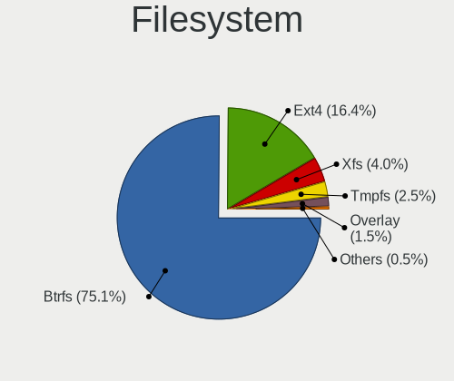
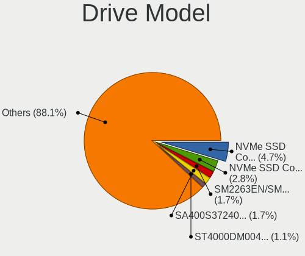
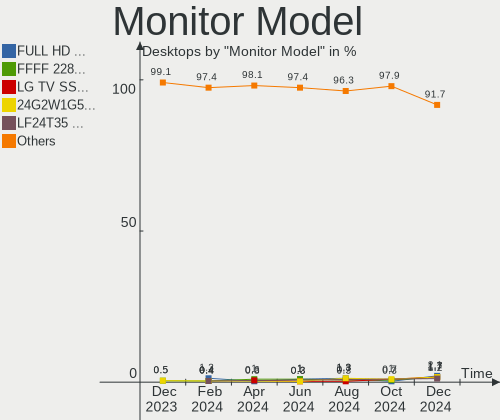
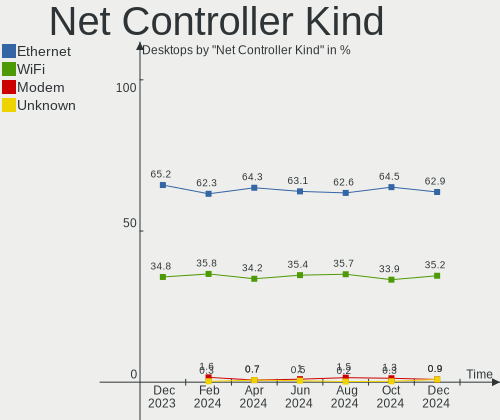
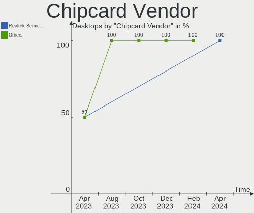

Fedora - Hardware Trends (Desktops)
-----------------------------------

A project to identify most popular hardware characteristics and track their change
over time based on data collected by Linux users at https://Linux-Hardware.org.

Anyone can contribute to this report by the [hw-probe](https://github.com/linuxhw/hw-probe) tool:

    sudo -E hw-probe -all -upload

This report is for one last month. Overall report since the beginning of time: [TestCoverage](https://github.com/linuxhw/TestCoverage)

Period: Jun, 2022.

Contents
--------

* [ System ](#system)
  - [ OS                       ](#os)
  - [ OS Family                ](#os-family)
  - [ Kernel                   ](#kernel)
  - [ Kernel Family            ](#kernel-family)
  - [ Kernel Major Ver.        ](#kernel-major-ver)
  - [ Arch                     ](#arch)
  - [ DE                       ](#de)
  - [ Display Server           ](#display-server)
  - [ Display Manager          ](#display-manager)
  - [ OS Lang                  ](#os-lang)
  - [ Boot Mode                ](#boot-mode)
  - [ Filesystem               ](#filesystem)
  - [ Part. scheme             ](#part-scheme)
  - [ Dual Boot with Linux/BSD ](#dual-boot-with-linuxbsd)
  - [ Dual Boot (Win)          ](#dual-boot-win)

* [ Board ](#board)
  - [ Vendor                   ](#vendor)
  - [ Model                    ](#model)
  - [ Model Family             ](#model-family)
  - [ MFG Year                 ](#mfg-year)
  - [ Form Factor              ](#form-factor)
  - [ Secure Boot              ](#secure-boot)
  - [ Coreboot                 ](#coreboot)
  - [ RAM Size                 ](#ram-size)
  - [ RAM Used                 ](#ram-used)
  - [ Total Drives             ](#total-drives)
  - [ Has CD-ROM               ](#has-cd-rom)
  - [ Has Ethernet             ](#has-ethernet)
  - [ Has WiFi                 ](#has-wifi)
  - [ Has Bluetooth            ](#has-bluetooth)

* [ Location ](#location)
  - [ Country                  ](#country)
  - [ City                     ](#city)

* [ Drives ](#drives)
  - [ Drive Vendor             ](#drive-vendor)
  - [ Drive Model              ](#drive-model)
  - [ HDD Vendor               ](#hdd-vendor)
  - [ SSD Vendor               ](#ssd-vendor)
  - [ Drive Kind               ](#drive-kind)
  - [ Drive Connector          ](#drive-connector)
  - [ Drive Size               ](#drive-size)
  - [ Space Total              ](#space-total)
  - [ Space Used               ](#space-used)
  - [ Malfunc. Drives          ](#malfunc-drives)
  - [ Malfunc. Drive Vendor    ](#malfunc-drive-vendor)
  - [ Malfunc. HDD Vendor      ](#malfunc-hdd-vendor)
  - [ Malfunc. Drive Kind      ](#malfunc-drive-kind)
  - [ Failed Drives            ](#failed-drives)
  - [ Failed Drive Vendor      ](#failed-drive-vendor)
  - [ Drive Status             ](#drive-status)

* [ Storage controller ](#storage-controller)
  - [ Storage Vendor           ](#storage-vendor)
  - [ Storage Model            ](#storage-model)
  - [ Storage Kind             ](#storage-kind)

* [ Processor ](#processor)
  - [ CPU Vendor               ](#cpu-vendor)
  - [ CPU Model                ](#cpu-model)
  - [ CPU Model Family         ](#cpu-model-family)
  - [ CPU Cores                ](#cpu-cores)
  - [ CPU Sockets              ](#cpu-sockets)
  - [ CPU Threads              ](#cpu-threads)
  - [ CPU Op-Modes             ](#cpu-op-modes)
  - [ CPU Microcode            ](#cpu-microcode)
  - [ CPU Microarch            ](#cpu-microarch)

* [ Graphics ](#graphics)
  - [ GPU Vendor               ](#gpu-vendor)
  - [ GPU Model                ](#gpu-model)
  - [ GPU Combo                ](#gpu-combo)
  - [ GPU Driver               ](#gpu-driver)
  - [ GPU Memory               ](#gpu-memory)

* [ Monitor ](#monitor)
  - [ Monitor Vendor           ](#monitor-vendor)
  - [ Monitor Model            ](#monitor-model)
  - [ Monitor Resolution       ](#monitor-resolution)
  - [ Monitor Diagonal         ](#monitor-diagonal)
  - [ Monitor Width            ](#monitor-width)
  - [ Aspect Ratio             ](#aspect-ratio)
  - [ Monitor Area             ](#monitor-area)
  - [ Pixel Density            ](#pixel-density)
  - [ Multiple Monitors        ](#multiple-monitors)

* [ Network ](#network)
  - [ Net Controller Vendor    ](#net-controller-vendor)
  - [ Net Controller Model     ](#net-controller-model)
  - [ Wireless Vendor          ](#wireless-vendor)
  - [ Wireless Model           ](#wireless-model)
  - [ Ethernet Vendor          ](#ethernet-vendor)
  - [ Ethernet Model           ](#ethernet-model)
  - [ Net Controller Kind      ](#net-controller-kind)
  - [ Used Controller          ](#used-controller)
  - [ NICs                     ](#nics)
  - [ IPv6                     ](#ipv6)

* [ Bluetooth ](#bluetooth)
  - [ Bluetooth Vendor         ](#bluetooth-vendor)
  - [ Bluetooth Model          ](#bluetooth-model)

* [ Sound ](#sound)
  - [ Sound Vendor             ](#sound-vendor)
  - [ Sound Model              ](#sound-model)

* [ Memory ](#memory)
  - [ Memory Vendor            ](#memory-vendor)
  - [ Memory Model             ](#memory-model)
  - [ Memory Kind              ](#memory-kind)
  - [ Memory Form Factor       ](#memory-form-factor)
  - [ Memory Size              ](#memory-size)
  - [ Memory Speed             ](#memory-speed)

* [ Printers & scanners ](#printers--scanners)
  - [ Printer Vendor           ](#printer-vendor)
  - [ Printer Model            ](#printer-model)
  - [ Scanner Vendor           ](#scanner-vendor)
  - [ Scanner Model            ](#scanner-model)

* [ Camera ](#camera)
  - [ Camera Vendor            ](#camera-vendor)
  - [ Camera Model             ](#camera-model)

* [ Security ](#security)
  - [ Fingerprint Vendor       ](#fingerprint-vendor)
  - [ Fingerprint Model        ](#fingerprint-model)
  - [ Chipcard Vendor          ](#chipcard-vendor)
  - [ Chipcard Model           ](#chipcard-model)

* [ Unsupported ](#unsupported)
  - [ Unsupported Devices      ](#unsupported-devices)
  - [ Unsupported Device Types ](#unsupported-device-types)

System
------

OS
--

Installed operating systems

| Name      | Desktops | Percent |
|-----------|----------|---------|
| Fedora 36 | 104      | 83.87%  |
| Fedora 35 | 14       | 11.29%  |
| Fedora 34 | 2        | 1.61%   |
| Fedora 33 | 2        | 1.61%   |
| Fedora 37 | 1        | 0.81%   |
| Fedora 30 | 1        | 0.81%   |

OS Family
---------

OS without a version

| Name   | Desktops | Percent |
|--------|----------|---------|
| Fedora | 124      | 100%    |

Kernel
------

Version of the Linux kernel

| Version                                             | Desktops | Percent |
|-----------------------------------------------------|----------|---------|
| 5.18.5-200.fc36.x86_64                              | 28       | 22.58%  |
| 5.17.11-300.fc36.x86_64                             | 16       | 12.9%   |
| 5.17.13-300.fc36.x86_64                             | 15       | 12.1%   |
| 5.17.12-300.fc36.x86_64                             | 15       | 12.1%   |
| 5.18.6-200.fc36.x86_64                              | 8        | 6.45%   |
| 5.17.5-300.fc36.x86_64                              | 6        | 4.84%   |
| 5.18.7-200.fc36.x86_64                              | 4        | 3.23%   |
| 5.17.12-200.fc35.x86_64                             | 4        | 3.23%   |
| 5.17.14-300.fc36.x86_64                             | 3        | 2.42%   |
| 5.18.1-602.inttf.fc36.x86_64                        | 2        | 1.61%   |
| 5.18.1-200.fc36.x86_64                              | 2        | 1.61%   |
| 5.17.11-200.fc35.x86_64                             | 2        | 1.61%   |
| 5.14.18-100.fc33.x86_64                             | 2        | 1.61%   |
| 5.19.0-0.rc1.20220610git874c8ca1e60b.18.fc37.x86_64 | 1        | 0.81%   |
| 5.18.5-gnu                                          | 1        | 0.81%   |
| 5.18.5-201.fsync.fc36.x86_64                        | 1        | 0.81%   |
| 5.18.5-100.fc35.x86_64                              | 1        | 0.81%   |
| 5.18.2-rc1_MY                                       | 1        | 0.81%   |
| 5.17.9-300.fc36.x86_64                              | 1        | 0.81%   |
| 5.17.7-200.fc35.x86_64                              | 1        | 0.81%   |
| 5.17.6-200.fc35.x86_64                              | 1        | 0.81%   |
| 5.17.4-200.fc35.x86_64                              | 1        | 0.81%   |
| 5.17.13-200.fc35.x86_64                             | 1        | 0.81%   |
| 5.17.12-301.fsync.fc36.x86_64                       | 1        | 0.81%   |
| 5.16.18-200.fc35.x86_64                             | 1        | 0.81%   |
| 5.16.12-100.fc34.x86_64                             | 1        | 0.81%   |
| 5.16.11-200.fc35.x86_64                             | 1        | 0.81%   |
| 5.14.10-300.fc35.x86_64                             | 1        | 0.81%   |
| 5.12.8-300.fc34.x86_64                              | 1        | 0.81%   |
| 5.0.9-301.fc30.x86_64                               | 1        | 0.81%   |

Kernel Family
-------------

Linux kernel without a distro release

| Version | Desktops | Percent |
|---------|----------|---------|
| 5.18.5  | 31       | 25%     |
| 5.17.12 | 20       | 16.13%  |
| 5.17.11 | 18       | 14.52%  |
| 5.17.13 | 16       | 12.9%   |
| 5.18.6  | 8        | 6.45%   |
| 5.17.5  | 6        | 4.84%   |
| 5.18.7  | 4        | 3.23%   |
| 5.18.1  | 4        | 3.23%   |
| 5.17.14 | 3        | 2.42%   |
| 5.14.18 | 2        | 1.61%   |
| 5.19.0  | 1        | 0.81%   |
| 5.18.2  | 1        | 0.81%   |
| 5.17.9  | 1        | 0.81%   |
| 5.17.7  | 1        | 0.81%   |
| 5.17.6  | 1        | 0.81%   |
| 5.17.4  | 1        | 0.81%   |
| 5.16.18 | 1        | 0.81%   |
| 5.16.12 | 1        | 0.81%   |
| 5.16.11 | 1        | 0.81%   |
| 5.14.10 | 1        | 0.81%   |
| 5.12.8  | 1        | 0.81%   |
| 5.0.9   | 1        | 0.81%   |

Kernel Major Ver.
-----------------

Linux kernel major version

| Version | Desktops | Percent |
|---------|----------|---------|
| 5.17    | 67       | 54.03%  |
| 5.18    | 48       | 38.71%  |
| 5.16    | 3        | 2.42%   |
| 5.14    | 3        | 2.42%   |
| 5.19    | 1        | 0.81%   |
| 5.12    | 1        | 0.81%   |
| 5.0     | 1        | 0.81%   |

Arch
----

OS architecture (x86_64, i586, etc.)

| Name   | Desktops | Percent |
|--------|----------|---------|
| x86_64 | 124      | 100%    |

DE
--

Desktop Environment

| Name       | Desktops | Percent |
|------------|----------|---------|
| GNOME      | 73       | 58.87%  |
| KDE5       | 29       | 23.39%  |
| Cinnamon   | 8        | 6.45%   |
| XFCE       | 4        | 3.23%   |
| Unknown    | 4        | 3.23%   |
| X-Cinnamon | 3        | 2.42%   |
| MATE       | 1        | 0.81%   |
| LXQt       | 1        | 0.81%   |
| KDE        | 1        | 0.81%   |

Display Server
--------------

X11 or Wayland

| Name    | Desktops | Percent |
|---------|----------|---------|
| Wayland | 66       | 53.23%  |
| X11     | 42       | 33.87%  |
| Tty     | 13       | 10.48%  |
| Unknown | 2        | 1.61%   |
| Web     | 1        | 0.81%   |

Display Manager
---------------

SDDM, LightDM, etc.

| Name    | Desktops | Percent |
|---------|----------|---------|
| Unknown | 74       | 59.68%  |
| GDM     | 25       | 20.16%  |
| LightDM | 13       | 10.48%  |
| SDDM    | 12       | 9.68%   |

OS Lang
-------

Language

| Lang    | Desktops | Percent |
|---------|----------|---------|
| en_US   | 59       | 47.58%  |
| en_AU   | 13       | 10.48%  |
| en_GB   | 10       | 8.06%   |
| ru_RU   | 9        | 7.26%   |
| pt_BR   | 8        | 6.45%   |
| fr_FR   | 4        | 3.23%   |
| pl_PL   | 3        | 2.42%   |
| es_AR   | 2        | 1.61%   |
| de_DE   | 2        | 1.61%   |
| zh_CN   | 1        | 0.81%   |
| tr_TR   | 1        | 0.81%   |
| nl_BE   | 1        | 0.81%   |
| ja_JP   | 1        | 0.81%   |
| it_IT   | 1        | 0.81%   |
| id_ID   | 1        | 0.81%   |
| es_ES   | 1        | 0.81%   |
| en_SG   | 1        | 0.81%   |
| en_NZ   | 1        | 0.81%   |
| en_IN   | 1        | 0.81%   |
| da_DK   | 1        | 0.81%   |
| C       | 1        | 0.81%   |
| ar_SA   | 1        | 0.81%   |
| Unknown | 1        | 0.81%   |

Boot Mode
---------

EFI or BIOS

| Mode | Desktops | Percent |
|------|----------|---------|
| EFI  | 78       | 62.9%   |
| BIOS | 46       | 37.1%   |

Filesystem
----------

Type of filesystem

| Type  | Desktops | Percent |
|-------|----------|---------|
| Btrfs | 89       | 71.77%  |
| Ext4  | 22       | 17.74%  |
| Xfs   | 13       | 10.48%  |

Part. scheme
------------

Scheme of partitioning

| Type    | Desktops | Percent |
|---------|----------|---------|
| Unknown | 71       | 57.26%  |
| GPT     | 39       | 31.45%  |
| MBR     | 14       | 11.29%  |

Dual Boot with Linux/BSD
------------------------

Hosting more than one Linux/BSD

| Dual boot | Desktops | Percent |
|-----------|----------|---------|
| No        | 106      | 85.48%  |
| Yes       | 18       | 14.52%  |

Dual Boot (Win)
---------------

Hosting Linux and Windows

| Dual boot | Desktops | Percent |
|-----------|----------|---------|
| No        | 106      | 85.48%  |
| Yes       | 18       | 14.52%  |

Board
-----

Vendor
------

Motherboard manufacturer

| Name                | Desktops | Percent |
|---------------------|----------|---------|
| ASUSTek Computer    | 42       | 33.87%  |
| Gigabyte Technology | 27       | 21.77%  |
| MSI                 | 17       | 13.71%  |
| ASRock              | 13       | 10.48%  |
| Dell                | 9        | 7.26%   |
| Hewlett-Packard     | 5        | 4.03%   |
| Lenovo              | 3        | 2.42%   |
| Foxconn             | 2        | 1.61%   |
| Unknown             | 2        | 1.61%   |
| System76            | 1        | 0.81%   |
| Positivo            | 1        | 0.81%   |
| Intel               | 1        | 0.81%   |
| BESSTAR Tech        | 1        | 0.81%   |

Model
-----

Motherboard model

| Name                                      | Desktops | Percent |
|-------------------------------------------|----------|---------|
| ASUS CROSSHAIR V FORMULA-Z                | 3        | 2.42%   |
| ASUS TUF Gaming X570-PLUS                 | 2        | 1.61%   |
| ASUS PRIME Z370-A                         | 2        | 1.61%   |
| ASUS All Series                           | 2        | 1.61%   |
| Unknown                                   | 2        | 1.61%   |
| System76 Thelio Mira                      | 1        | 0.81%   |
| Positivo POS-PIH55BO                      | 1        | 0.81%   |
| MSI WC698AA-UUG p6320be                   | 1        | 0.81%   |
| MSI MS-7D18                               | 1        | 0.81%   |
| MSI MS-7D16                               | 1        | 0.81%   |
| MSI MS-7C94                               | 1        | 0.81%   |
| MSI MS-7C91                               | 1        | 0.81%   |
| MSI MS-7C82                               | 1        | 0.81%   |
| MSI MS-7C02                               | 1        | 0.81%   |
| MSI MS-7B93                               | 1        | 0.81%   |
| MSI MS-7B89                               | 1        | 0.81%   |
| MSI MS-7B86                               | 1        | 0.81%   |
| MSI MS-7B79                               | 1        | 0.81%   |
| MSI MS-7B23                               | 1        | 0.81%   |
| MSI MS-7A38                               | 1        | 0.81%   |
| MSI MS-7885                               | 1        | 0.81%   |
| MSI MS-7817                               | 1        | 0.81%   |
| MSI Cubi N JSL (MS-B0A1)                  | 1        | 0.81%   |
| MSI CQ3321L                               | 1        | 0.81%   |
| Lenovo ThinkStation P310 30ATS01E00       | 1        | 0.81%   |
| Lenovo ThinkCentre M93p 10A8S3C100        | 1        | 0.81%   |
| Lenovo ThinkCentre M58p 7220A72           | 1        | 0.81%   |
| Intel X79 V2.4E                           | 1        | 0.81%   |
| HP Victus by 15L Gaming Desktop TG02-0xxx | 1        | 0.81%   |
| HP ProDesk 405 G6 Small Form Factor PC    | 1        | 0.81%   |
| HP EliteDesk 800 G1 USDT                  | 1        | 0.81%   |
| HP Compaq Elite 8300 USDT                 | 1        | 0.81%   |
| HP 110-516no                              | 1        | 0.81%   |
| Gigabyte Z87-HD3                          | 1        | 0.81%   |
| Gigabyte Z690I AORUS ULTRA                | 1        | 0.81%   |
| Gigabyte Z270X-Ultra Gaming               | 1        | 0.81%   |
| Gigabyte Z170-D3H                         | 1        | 0.81%   |
| Gigabyte H87N-WIFI                        | 1        | 0.81%   |
| Gigabyte H77N-WIFI                        | 1        | 0.81%   |
| Gigabyte H61M-S2PV                        | 1        | 0.81%   |
| Gigabyte H61M-S2P                         | 1        | 0.81%   |
| Gigabyte H55M-S2                          | 1        | 0.81%   |
| Gigabyte H410M S2H V3                     | 1        | 0.81%   |
| Gigabyte GB-BSi5-1135G7                   | 1        | 0.81%   |
| Gigabyte GA-MA785G-UD3H                   | 1        | 0.81%   |
| Gigabyte GA-MA69GM-S2H                    | 1        | 0.81%   |
| Gigabyte GA-880GM-UD2H                    | 1        | 0.81%   |
| Gigabyte G41MT-D3                         | 1        | 0.81%   |
| Gigabyte EU1009807_2120317                | 1        | 0.81%   |
| Gigabyte D525TUD                          | 1        | 0.81%   |
| Gigabyte B85M-D3V-A                       | 1        | 0.81%   |
| Gigabyte B85M-D3H                         | 1        | 0.81%   |
| Gigabyte B75M-HD3                         | 1        | 0.81%   |
| Gigabyte B75-D3V                          | 1        | 0.81%   |
| Gigabyte B560M DS3H V2                    | 1        | 0.81%   |
| Gigabyte B460MDS3HV2                      | 1        | 0.81%   |
| Gigabyte B450 GAMING X                    | 1        | 0.81%   |
| Gigabyte B360M AORUS Gaming 3             | 1        | 0.81%   |
| Gigabyte AB350-Gaming 3                   | 1        | 0.81%   |
| Gigabyte 990FXA-UD5 R5                    | 1        | 0.81%   |

Model Family
------------

Motherboard model prefix

| Name                    | Desktops | Percent |
|-------------------------|----------|---------|
| ASUS PRIME              | 10       | 8.06%   |
| ASUS ROG                | 9        | 7.26%   |
| ASUS TUF                | 7        | 5.65%   |
| Dell OptiPlex           | 6        | 4.84%   |
| ASUS CROSSHAIR          | 4        | 3.23%   |
| Dell Precision          | 3        | 2.42%   |
| Lenovo ThinkCentre      | 2        | 1.61%   |
| ASUS ProArt             | 2        | 1.61%   |
| ASUS All                | 2        | 1.61%   |
| ASRock B450M            | 2        | 1.61%   |
| Unknown                 | 2        | 1.61%   |
| System76 Thelio         | 1        | 0.81%   |
| Positivo POS-PIH55BO    | 1        | 0.81%   |
| MSI WC698AA-UUG         | 1        | 0.81%   |
| MSI MS-7D18             | 1        | 0.81%   |
| MSI MS-7D16             | 1        | 0.81%   |
| MSI MS-7C94             | 1        | 0.81%   |
| MSI MS-7C91             | 1        | 0.81%   |
| MSI MS-7C82             | 1        | 0.81%   |
| MSI MS-7C02             | 1        | 0.81%   |
| MSI MS-7B93             | 1        | 0.81%   |
| MSI MS-7B89             | 1        | 0.81%   |
| MSI MS-7B86             | 1        | 0.81%   |
| MSI MS-7B79             | 1        | 0.81%   |
| MSI MS-7B23             | 1        | 0.81%   |
| MSI MS-7A38             | 1        | 0.81%   |
| MSI MS-7885             | 1        | 0.81%   |
| MSI MS-7817             | 1        | 0.81%   |
| MSI Cubi                | 1        | 0.81%   |
| MSI CQ3321L             | 1        | 0.81%   |
| Lenovo ThinkStation     | 1        | 0.81%   |
| Intel X79               | 1        | 0.81%   |
| HP Victus               | 1        | 0.81%   |
| HP ProDesk              | 1        | 0.81%   |
| HP EliteDesk            | 1        | 0.81%   |
| HP Compaq               | 1        | 0.81%   |
| HP 110-516no            | 1        | 0.81%   |
| Gigabyte Z87-HD3        | 1        | 0.81%   |
| Gigabyte Z690I          | 1        | 0.81%   |
| Gigabyte Z270X-Ultra    | 1        | 0.81%   |
| Gigabyte Z170-D3H       | 1        | 0.81%   |
| Gigabyte H87N-WIFI      | 1        | 0.81%   |
| Gigabyte H77N-WIFI      | 1        | 0.81%   |
| Gigabyte H61M-S2PV      | 1        | 0.81%   |
| Gigabyte H61M-S2P       | 1        | 0.81%   |
| Gigabyte H55M-S2        | 1        | 0.81%   |
| Gigabyte H410M          | 1        | 0.81%   |
| Gigabyte GB-BSi5-1135G7 | 1        | 0.81%   |
| Gigabyte GA-MA785G-UD3H | 1        | 0.81%   |
| Gigabyte GA-MA69GM-S2H  | 1        | 0.81%   |
| Gigabyte GA-880GM-UD2H  | 1        | 0.81%   |
| Gigabyte G41MT-D3       | 1        | 0.81%   |
| Gigabyte EU1009807      | 1        | 0.81%   |
| Gigabyte D525TUD        | 1        | 0.81%   |
| Gigabyte B85M-D3V-A     | 1        | 0.81%   |
| Gigabyte B85M-D3H       | 1        | 0.81%   |
| Gigabyte B75M-HD3       | 1        | 0.81%   |
| Gigabyte B75-D3V        | 1        | 0.81%   |
| Gigabyte B560M          | 1        | 0.81%   |
| Gigabyte B460MDS3HV2    | 1        | 0.81%   |

MFG Year
--------

Motherboard manufacture year

| Year | Desktops | Percent |
|------|----------|---------|
| 2021 | 19       | 15.32%  |
| 2020 | 15       | 12.1%   |
| 2012 | 13       | 10.48%  |
| 2019 | 11       | 8.87%   |
| 2018 | 10       | 8.06%   |
| 2017 | 10       | 8.06%   |
| 2013 | 9        | 7.26%   |
| 2015 | 8        | 6.45%   |
| 2010 | 8        | 6.45%   |
| 2014 | 5        | 4.03%   |
| 2022 | 4        | 3.23%   |
| 2016 | 3        | 2.42%   |
| 2011 | 2        | 1.61%   |
| 2009 | 2        | 1.61%   |
| 2008 | 2        | 1.61%   |
| 2007 | 2        | 1.61%   |
| 2006 | 1        | 0.81%   |

Form Factor
-----------

Physical design of the computer

| Name    | Desktops | Percent |
|---------|----------|---------|
| Desktop | 124      | 100%    |

Secure Boot
-----------

Enabled or disabled

| State    | Desktops | Percent |
|----------|----------|---------|
| Disabled | 118      | 95.16%  |
| Enabled  | 6        | 4.84%   |

Coreboot
--------

Have coreboot on board

| Used | Desktops | Percent |
|------|----------|---------|
| No   | 124      | 100%    |

RAM Size
--------

Total RAM memory

| Size in GB  | Desktops | Percent |
|-------------|----------|---------|
| 16.01-24.0  | 39       | 31.45%  |
| 32.01-64.0  | 27       | 21.77%  |
| 4.01-8.0    | 20       | 16.13%  |
| 8.01-16.0   | 20       | 16.13%  |
| 3.01-4.0    | 8        | 6.45%   |
| 64.01-256.0 | 6        | 4.84%   |
| 24.01-32.0  | 3        | 2.42%   |
| 2.01-3.0    | 1        | 0.81%   |

RAM Used
--------

Used RAM memory

| Used GB    | Desktops | Percent |
|------------|----------|---------|
| 2.01-3.0   | 37       | 29.84%  |
| 4.01-8.0   | 29       | 23.39%  |
| 3.01-4.0   | 27       | 21.77%  |
| 1.01-2.0   | 12       | 9.68%   |
| 8.01-16.0  | 10       | 8.06%   |
| 0.51-1.0   | 6        | 4.84%   |
| 16.01-24.0 | 2        | 1.61%   |
| 32.01-64.0 | 1        | 0.81%   |

Total Drives
------------

Number of drives on board

| Drives | Desktops | Percent |
|--------|----------|---------|
| 2      | 36       | 29.03%  |
| 1      | 36       | 29.03%  |
| 3      | 29       | 23.39%  |
| 4      | 13       | 10.48%  |
| 6      | 4        | 3.23%   |
| 5      | 3        | 2.42%   |
| 7      | 2        | 1.61%   |
| 10     | 1        | 0.81%   |

Has CD-ROM
----------

Has CD-ROM on board

| Presented | Desktops | Percent |
|-----------|----------|---------|
| No        | 89       | 71.77%  |
| Yes       | 35       | 28.23%  |

Has Ethernet
------------

Has Ethernet on board

| Presented | Desktops | Percent |
|-----------|----------|---------|
| Yes       | 124      | 100%    |

Has WiFi
--------

Has WiFi module

| Presented | Desktops | Percent |
|-----------|----------|---------|
| Yes       | 68       | 54.84%  |
| No        | 56       | 45.16%  |

Has Bluetooth
-------------

Has Bluetooth module

| Presented | Desktops | Percent |
|-----------|----------|---------|
| No        | 70       | 56.45%  |
| Yes       | 54       | 43.55%  |

Location
--------

Country
-------

Geographic location (country)

| Country      | Desktops | Percent |
|--------------|----------|---------|
| USA          | 31       | 25%     |
| Australia    | 13       | 10.48%  |
| Russia       | 8        | 6.45%   |
| Brazil       | 8        | 6.45%   |
| Poland       | 6        | 4.84%   |
| UK           | 5        | 4.03%   |
| Germany      | 5        | 4.03%   |
| France       | 5        | 4.03%   |
| Norway       | 3        | 2.42%   |
| Belgium      | 3        | 2.42%   |
| Argentina    | 3        | 2.42%   |
| Netherlands  | 2        | 1.61%   |
| Mexico       | 2        | 1.61%   |
| Italy        | 2        | 1.61%   |
| India        | 2        | 1.61%   |
| Greece       | 2        | 1.61%   |
| Bulgaria     | 2        | 1.61%   |
| Belarus      | 2        | 1.61%   |
| Uruguay      | 1        | 0.81%   |
| Ukraine      | 1        | 0.81%   |
| Turkey       | 1        | 0.81%   |
| Thailand     | 1        | 0.81%   |
| Switzerland  | 1        | 0.81%   |
| Sweden       | 1        | 0.81%   |
| Spain        | 1        | 0.81%   |
| Singapore    | 1        | 0.81%   |
| Saudi Arabia | 1        | 0.81%   |
| Romania      | 1        | 0.81%   |
| Puerto Rico  | 1        | 0.81%   |
| New Zealand  | 1        | 0.81%   |
| Japan        | 1        | 0.81%   |
| Israel       | 1        | 0.81%   |
| Ireland      | 1        | 0.81%   |
| Indonesia    | 1        | 0.81%   |
| Hungary      | 1        | 0.81%   |
| Ecuador      | 1        | 0.81%   |
| Denmark      | 1        | 0.81%   |
| China        | 1        | 0.81%   |

City
----

Geographic location (city)

| City                 | Desktops | Percent |
|----------------------|----------|---------|
| Launceston           | 6        | 4.84%   |
| Marietta             | 3        | 2.42%   |
| Warsaw               | 2        | 1.61%   |
| Tucson               | 2        | 1.61%   |
| Saint Paul           | 2        | 1.61%   |
| Paris                | 2        | 1.61%   |
| Minsk                | 2        | 1.61%   |
| Lane Cove            | 2        | 1.61%   |
| Kristiansand         | 2        | 1.61%   |
| Brussels             | 2        | 1.61%   |
| Brisbane             | 2        | 1.61%   |
| Berlin               | 2        | 1.61%   |
| Zaporizhzhya         | 1        | 0.81%   |
| Yakutsk              | 1        | 0.81%   |
| Wetzikon             | 1        | 0.81%   |
| Westlake             | 1        | 0.81%   |
| Westerhoven          | 1        | 0.81%   |
| West Bromwich        | 1        | 0.81%   |
| Viamao               | 1        | 0.81%   |
| Vaxjo                | 1        | 0.81%   |
| Tel Aviv             | 1        | 0.81%   |
| Tampico              | 1        | 0.81%   |
| Słupsk              | 1        | 0.81%   |
| Sydney               | 1        | 0.81%   |
| St. Petersburg       | 1        | 0.81%   |
| St Petersburg        | 1        | 0.81%   |
| St Louis             | 1        | 0.81%   |
| Slantsy              | 1        | 0.81%   |
| Singapore            | 1        | 0.81%   |
| Shimoga              | 1        | 0.81%   |
| Sergiyev Posad       | 1        | 0.81%   |
| Sao Paulo            | 1        | 0.81%   |
| Sao José dos Campos | 1        | 0.81%   |
| San Juan             | 1        | 0.81%   |
| San Jose             | 1        | 0.81%   |
| San Antonio          | 1        | 0.81%   |
| Saitama              | 1        | 0.81%   |
| Saint-Herblain       | 1        | 0.81%   |
| Saint-Benoit         | 1        | 0.81%   |
| Romans-sur-Isère    | 1        | 0.81%   |
| Riyadh               | 1        | 0.81%   |
| Quilmes              | 1        | 0.81%   |
| Puyallup             | 1        | 0.81%   |
| Portsmouth           | 1        | 0.81%   |
| Pilica               | 1        | 0.81%   |
| Phuket               | 1        | 0.81%   |
| Phoenix              | 1        | 0.81%   |
| Perth                | 1        | 0.81%   |
| Pasco                | 1        | 0.81%   |
| Parker               | 1        | 0.81%   |
| Panchkula            | 1        | 0.81%   |
| Orenburg             | 1        | 0.81%   |
| Olney                | 1        | 0.81%   |
| Novosibirsk          | 1        | 0.81%   |
| New York             | 1        | 0.81%   |
| Netphen              | 1        | 0.81%   |
| Nanuque              | 1        | 0.81%   |
| Moscow               | 1        | 0.81%   |
| Montevideo           | 1        | 0.81%   |
| Milan                | 1        | 0.81%   |

Drives
------

Drive Vendor
------------

Hard drive vendors

| Vendor                      | Desktops | Drives | Percent |
|-----------------------------|----------|--------|---------|
| WDC                         | 45       | 73     | 18.15%  |
| Seagate                     | 38       | 47     | 15.32%  |
| Samsung Electronics         | 36       | 50     | 14.52%  |
| SanDisk                     | 19       | 22     | 7.66%   |
| Kingston                    | 15       | 15     | 6.05%   |
| Crucial                     | 15       | 16     | 6.05%   |
| Toshiba                     | 13       | 13     | 5.24%   |
| Hitachi                     | 8        | 9      | 3.23%   |
| A-DATA Technology           | 8        | 8      | 3.23%   |
| Intel                       | 5        | 5      | 2.02%   |
| XPG                         | 3        | 3      | 1.21%   |
| Patriot                     | 3        | 3      | 1.21%   |
| Micron/Crucial Technology   | 3        | 3      | 1.21%   |
| China                       | 3        | 3      | 1.21%   |
| SPCC                        | 2        | 3      | 0.81%   |
| SABRENT                     | 2        | 3      | 0.81%   |
| Realtek Semiconductor       | 2        | 2      | 0.81%   |
| Phison                      | 2        | 2      | 0.81%   |
| OCZ                         | 2        | 2      | 0.81%   |
| Micron Technology           | 2        | 3      | 0.81%   |
| HGST                        | 2        | 2      | 0.81%   |
| WXC-M3                      | 1        | 1      | 0.4%    |
| Unknown                     | 1        | 1      | 0.4%    |
| Transcend                   | 1        | 1      | 0.4%    |
| SSK                         | 1        | 1      | 0.4%    |
| SK hynix                    | 1        | 1      | 0.4%    |
| Realtek                     | 1        | 1      | 0.4%    |
| PNY                         | 1        | 2      | 0.4%    |
| Maxtor                      | 1        | 1      | 0.4%    |
| MAXIO Technology (Hangzhou) | 1        | 1      | 0.4%    |
| Lite-On                     | 1        | 1      | 0.4%    |
| KUIJIA                      | 1        | 1      | 0.4%    |
| KIOXIA                      | 1        | 1      | 0.4%    |
| KingSpec                    | 1        | 1      | 0.4%    |
| KingDian                    | 1        | 1      | 0.4%    |
| H/W                         | 1        | 3      | 0.4%    |
| Gigabyte Technology         | 1        | 1      | 0.4%    |
| ASMT                        | 1        | 1      | 0.4%    |
| Apacer                      | 1        | 1      | 0.4%    |
| ADATA Technology            | 1        | 1      | 0.4%    |
| Unknown                     | 1        | 1      | 0.4%    |

Drive Model
-----------

Hard drive models

| Model                               | Desktops | Percent |
|-------------------------------------|----------|---------|
| SanDisk NVMe SSD Drive 500GB        | 6        | 2.1%    |
| Kingston SA400S37240G 240GB SSD     | 6        | 2.1%    |
| Crucial CT500MX500SSD1 500GB        | 6        | 2.1%    |
| Crucial CT1000MX500SSD1 1TB         | 6        | 2.1%    |
| WDC WD40EFRX-68N32N0 4TB            | 5        | 1.75%   |
| Seagate ST500DM002-1BD142 500GB     | 4        | 1.4%    |
| Seagate ST2000DM008-2FR102 2TB      | 4        | 1.4%    |
| Samsung NVMe SSD Drive 1TB          | 4        | 1.4%    |
| Seagate ST3500418AS 500GB           | 3        | 1.05%   |
| SanDisk NVMe SSD Drive 1TB          | 3        | 1.05%   |
| Samsung SSD 870 QVO 1TB             | 3        | 1.05%   |
| Samsung NVMe SSD Drive 250GB        | 3        | 1.05%   |
| Intel SSDSC2CT120A3 120GB           | 3        | 1.05%   |
| A-DATA SX8200PNP 512GB              | 3        | 1.05%   |
| XPG NVMe SSD Drive 1024GB           | 2        | 0.7%    |
| WDC WDS500G2B0A-00SM50 500GB SSD    | 2        | 0.7%    |
| WDC WD60EFZX-68B3FN0 6TB            | 2        | 0.7%    |
| WDC WD40EZRZ-00GXCB0 4TB            | 2        | 0.7%    |
| WDC WD30EFRX-68EUZN0 3TB            | 2        | 0.7%    |
| WDC WD20EFRX-68EUZN0 2TB            | 2        | 0.7%    |
| WDC WD2003FZEX-00Z4SA0 2TB          | 2        | 0.7%    |
| WDC WD10EZEX-60M2NA0 1TB            | 2        | 0.7%    |
| WDC WD10EZEX-00WN4A0 1TB            | 2        | 0.7%    |
| Toshiba MD04ACA400 4TB              | 2        | 0.7%    |
| Seagate ST500LT012-1DG142 500GB     | 2        | 0.7%    |
| Seagate ST4000DM004-2CV104 4TB      | 2        | 0.7%    |
| Seagate ST2000DM006-2DM164 2TB      | 2        | 0.7%    |
| Seagate ST2000DM001-1E6164 2TB      | 2        | 0.7%    |
| Seagate ST1000LM024 HN-M101MBB 1TB  | 2        | 0.7%    |
| Seagate ST1000DM010-2EP102 1TB      | 2        | 0.7%    |
| Samsung SSD 960 EVO 250GB           | 2        | 0.7%    |
| Samsung SSD 850 EVO 500GB           | 2        | 0.7%    |
| Samsung SSD 850 EVO 250GB           | 2        | 0.7%    |
| Samsung SSD 840 EVO 250GB           | 2        | 0.7%    |
| Samsung NVMe SSD Drive 2TB          | 2        | 0.7%    |
| Samsung HD322HJ 320GB               | 2        | 0.7%    |
| SABRENT Disk 1TB                    | 2        | 0.7%    |
| Micron/Crucial NVMe SSD Drive 500GB | 2        | 0.7%    |
| Kingston NVMe SSD Drive 500GB       | 2        | 0.7%    |
| Kingston NVMe SSD Drive 1TB         | 2        | 0.7%    |
| Hitachi HDS721050CLA362 500GB       | 2        | 0.7%    |
| Hitachi HDS721010CLA332 1TB         | 2        | 0.7%    |
| Crucial CT240BX500SSD1 240GB        | 2        | 0.7%    |
| XPG NVMe SSD Drive 512GB            | 1        | 0.35%   |
| WXC-M3 64GB                         | 1        | 0.35%   |
| WDC WDS500G2B0C-00PXH0 500GB        | 1        | 0.35%   |
| WDC WDS500G2B0B-00YS70 500GB SSD    | 1        | 0.35%   |
| WDC WDS500G1B0A-00H9H0 500GB SSD    | 1        | 0.35%   |
| WDC WDS100T2B0A-00SM50 1TB SSD      | 1        | 0.35%   |
| WDC WD60EFAX-68SHWN0 6TB            | 1        | 0.35%   |
| WDC WD5000AZLX-60K2TA0 500GB        | 1        | 0.35%   |
| WDC WD5000AZLX-00CL5A0 500GB        | 1        | 0.35%   |
| WDC WD5000AVVS-63M8B0 500GB         | 1        | 0.35%   |
| WDC WD5000AVCS-632DY1 500GB         | 1        | 0.35%   |
| WDC WD5000AAKX-07U6AA0 500GB        | 1        | 0.35%   |
| WDC WD5000AAKS-00YGA0 500GB         | 1        | 0.35%   |
| WDC WD5000AADS-00S9B0 500GB         | 1        | 0.35%   |
| WDC WD50 00LPCX-24VHAT0 500GB       | 1        | 0.35%   |
| WDC WD40EZRZ-22GXCB0 4TB            | 1        | 0.35%   |
| WDC WD40EZRZ-00WN9B0 4TB            | 1        | 0.35%   |

HDD Vendor
----------

Hard disk drive vendors

| Vendor              | Desktops | Drives | Percent |
|---------------------|----------|--------|---------|
| WDC                 | 41       | 67     | 38.68%  |
| Seagate             | 38       | 47     | 35.85%  |
| Toshiba             | 11       | 11     | 10.38%  |
| Hitachi             | 8        | 9      | 7.55%   |
| Samsung Electronics | 4        | 4      | 3.77%   |
| HGST                | 2        | 2      | 1.89%   |
| Maxtor              | 1        | 1      | 0.94%   |
| ASMT                | 1        | 1      | 0.94%   |

SSD Vendor
----------

Solid state drive vendors

| Vendor              | Desktops | Drives | Percent |
|---------------------|----------|--------|---------|
| Samsung Electronics | 19       | 23     | 22.62%  |
| Crucial             | 15       | 16     | 17.86%  |
| SanDisk             | 10       | 10     | 11.9%   |
| Kingston            | 9        | 9      | 10.71%  |
| WDC                 | 5        | 5      | 5.95%   |
| Intel               | 5        | 5      | 5.95%   |
| Patriot             | 3        | 3      | 3.57%   |
| China               | 3        | 3      | 3.57%   |
| A-DATA Technology   | 3        | 3      | 3.57%   |
| SPCC                | 2        | 3      | 2.38%   |
| OCZ                 | 2        | 2      | 2.38%   |
| Transcend           | 1        | 1      | 1.19%   |
| PNY                 | 1        | 2      | 1.19%   |
| Micron Technology   | 1        | 1      | 1.19%   |
| KUIJIA              | 1        | 1      | 1.19%   |
| KingSpec            | 1        | 1      | 1.19%   |
| KingDian            | 1        | 1      | 1.19%   |
| Gigabyte Technology | 1        | 1      | 1.19%   |
| Apacer              | 1        | 1      | 1.19%   |

Drive Kind
----------

HDD or SSD

| Kind    | Desktops | Drives | Percent |
|---------|----------|--------|---------|
| HDD     | 81       | 142    | 38.76%  |
| SSD     | 72       | 91     | 34.45%  |
| NVMe    | 51       | 70     | 24.4%   |
| Unknown | 5        | 7      | 2.39%   |

Drive Connector
---------------

SATA, SAS, NVMe, etc.

| Type | Desktops | Drives | Percent |
|------|----------|--------|---------|
| SATA | 108      | 232    | 65.45%  |
| NVMe | 50       | 66     | 30.3%   |
| SAS  | 7        | 12     | 4.24%   |

Drive Size
----------

Size of hard drive

| Size in TB | Desktops | Drives | Percent |
|------------|----------|--------|---------|
| 0.01-0.5   | 80       | 111    | 46.78%  |
| 0.51-1.0   | 45       | 58     | 26.32%  |
| 1.01-2.0   | 19       | 25     | 11.11%  |
| 3.01-4.0   | 15       | 20     | 8.77%   |
| 4.01-10.0  | 7        | 13     | 4.09%   |
| 2.01-3.0   | 4        | 5      | 2.34%   |
| 10.01-20.0 | 1        | 1      | 0.58%   |

Space Total
-----------

Amount of disk space available on the file system

| Size in GB     | Desktops | Percent |
|----------------|----------|---------|
| 501-1000       | 25       | 20.16%  |
| 1001-2000      | 23       | 18.55%  |
| More than 3000 | 21       | 16.94%  |
| 251-500        | 17       | 13.71%  |
| 2001-3000      | 10       | 8.06%   |
| 101-250        | 10       | 8.06%   |
| Unknown        | 7        | 5.65%   |
| 51-100         | 5        | 4.03%   |
| 1-20           | 4        | 3.23%   |
| 21-50          | 2        | 1.61%   |

Space Used
----------

Amount of used disk space

| Used GB        | Desktops | Percent |
|----------------|----------|---------|
| 1-20           | 24       | 19.35%  |
| 21-50          | 19       | 15.32%  |
| 1001-2000      | 17       | 13.71%  |
| 101-250        | 14       | 11.29%  |
| 51-100         | 13       | 10.48%  |
| 251-500        | 12       | 9.68%   |
| 501-1000       | 9        | 7.26%   |
| Unknown        | 7        | 5.65%   |
| More than 3000 | 6        | 4.84%   |
| 2001-3000      | 3        | 2.42%   |

Malfunc. Drives
---------------

Drive models with a malfunction

| Model                             | Desktops | Drives | Percent |
|-----------------------------------|----------|--------|---------|
| Samsung Electronics HD322HJ 320GB | 2        | 2      | 14.29%  |
| Intel SSDSC2CT120A3 120GB         | 2        | 2      | 14.29%  |
| WDC WD3200AAKS-75B3A0 320GB       | 1        | 1      | 7.14%   |
| WDC WD20EFRX-68EUZN0 2TB          | 1        | 1      | 7.14%   |
| WDC WD10EZEX-60ZF5A0 1TB          | 1        | 1      | 7.14%   |
| Toshiba MQ01ABD050 500GB          | 1        | 1      | 7.14%   |
| Toshiba DT01ACA100 1TB            | 1        | 1      | 7.14%   |
| Seagate ST500LT012-1DG142 500GB   | 1        | 1      | 7.14%   |
| Seagate ST3500418AS 500GB         | 1        | 1      | 7.14%   |
| Seagate ST3000DM001-1CH166 3TB    | 1        | 1      | 7.14%   |
| Seagate ST1000DM010-2EP102 1TB    | 1        | 1      | 7.14%   |
| Hitachi HDS721010CLA332 1TB       | 1        | 1      | 7.14%   |

Malfunc. Drive Vendor
---------------------

Vendors of faulty drives

| Vendor              | Desktops | Drives | Percent |
|---------------------|----------|--------|---------|
| Seagate             | 4        | 4      | 30.77%  |
| WDC                 | 2        | 3      | 15.38%  |
| Toshiba             | 2        | 2      | 15.38%  |
| Samsung Electronics | 2        | 2      | 15.38%  |
| Intel               | 2        | 2      | 15.38%  |
| Hitachi             | 1        | 1      | 7.69%   |

Malfunc. HDD Vendor
-------------------

Vendors of faulty HDD drives

| Vendor              | Desktops | Drives | Percent |
|---------------------|----------|--------|---------|
| Seagate             | 4        | 4      | 36.36%  |
| WDC                 | 2        | 3      | 18.18%  |
| Toshiba             | 2        | 2      | 18.18%  |
| Samsung Electronics | 2        | 2      | 18.18%  |
| Hitachi             | 1        | 1      | 9.09%   |

Malfunc. Drive Kind
-------------------

Kinds of faulty drives

| Kind | Desktops | Drives | Percent |
|------|----------|--------|---------|
| HDD  | 10       | 12     | 83.33%  |
| SSD  | 2        | 2      | 16.67%  |

Failed Drives
-------------

Failed drive models

Zero info for selected period =(

Failed Drive Vendor
-------------------

Failed drive vendors

Zero info for selected period =(

Drive Status
------------

Number of failed and malfunc. drives

| Status   | Desktops | Drives | Percent |
|----------|----------|--------|---------|
| Detected | 73       | 197    | 54.07%  |
| Works    | 50       | 99     | 37.04%  |
| Malfunc  | 12       | 14     | 8.89%   |

Storage controller
------------------

Storage Vendor
--------------

Storage controller vendors

| Vendor                       | Desktops | Percent |
|------------------------------|----------|---------|
| Intel                        | 74       | 37.56%  |
| AMD                          | 47       | 23.86%  |
| Samsung Electronics          | 19       | 9.64%   |
| SanDisk                      | 10       | 5.08%   |
| ASMedia Technology           | 8        | 4.06%   |
| ADATA Technology             | 8        | 4.06%   |
| Kingston Technology Company  | 6        | 3.05%   |
| Micron/Crucial Technology    | 3        | 1.52%   |
| JMicron Technology           | 3        | 1.52%   |
| Toshiba America Info Systems | 2        | 1.02%   |
| Silicon Image                | 2        | 1.02%   |
| Realtek Semiconductor        | 2        | 1.02%   |
| Phison Electronics           | 2        | 1.02%   |
| Nvidia                       | 2        | 1.02%   |
| Marvell Technology Group     | 2        | 1.02%   |
| ULi Electronics              | 1        | 0.51%   |
| SK hynix                     | 1        | 0.51%   |
| Micron Technology            | 1        | 0.51%   |
| MAXIO Technology (Hangzhou)  | 1        | 0.51%   |
| Lite-On Technology           | 1        | 0.51%   |
| KIOXIA                       | 1        | 0.51%   |
| Broadcom / LSI               | 1        | 0.51%   |

Storage Model
-------------

Storage controller models

| Model                                                                          | Desktops | Percent |
|--------------------------------------------------------------------------------|----------|---------|
| AMD FCH SATA Controller [AHCI mode]                                            | 26       | 11.11%  |
| Intel 8 Series/C220 Series Chipset Family 6-port SATA Controller 1 [AHCI mode] | 13       | 5.56%   |
| AMD 400 Series Chipset SATA Controller                                         | 13       | 5.56%   |
| AMD 500 Series Chipset SATA Controller                                         | 10       | 4.27%   |
| Samsung NVMe SSD Controller SM981/PM981/PM983                                  | 8        | 3.42%   |
| ASMedia ASM1062 Serial ATA Controller                                          | 8        | 3.42%   |
| AMD SB7x0/SB8x0/SB9x0 SATA Controller [AHCI mode]                              | 8        | 3.42%   |
| Intel Volume Management Device NVMe RAID Controller                            | 7        | 2.99%   |
| ADATA XPG SX8200 Pro PCIe Gen3x4 M.2 2280 Solid State Drive                    | 7        | 2.99%   |
| Intel Alder Lake-S PCH SATA Controller [AHCI Mode]                             | 6        | 2.56%   |
| Intel 500 Series Chipset Family SATA AHCI Controller                           | 6        | 2.56%   |
| Samsung NVMe SSD Controller PM9A1/PM9A3/980PRO                                 | 5        | 2.14%   |
| Intel Q170/Q150/B150/H170/H110/Z170/CM236 Chipset SATA Controller [AHCI Mode]  | 5        | 2.14%   |
| Intel 7 Series/C210 Series Chipset Family 6-port SATA Controller [AHCI mode]   | 5        | 2.14%   |
| Intel 200 Series PCH SATA controller [AHCI mode]                               | 5        | 2.14%   |
| Samsung NVMe SSD Controller SM961/PM961/SM963                                  | 4        | 1.71%   |
| Intel SATA Controller [RAID mode]                                              | 4        | 1.71%   |
| Intel Cannon Lake PCH SATA AHCI Controller                                     | 4        | 1.71%   |
| SanDisk WD Blue SN550 NVMe SSD                                                 | 3        | 1.28%   |
| Samsung NVMe SSD Controller 980                                                | 3        | 1.28%   |
| Kingston Company A2000 NVMe SSD                                                | 3        | 1.28%   |
| Intel NM10/ICH7 Family SATA Controller [AHCI mode]                             | 3        | 1.28%   |
| Intel 5 Series/3400 Series Chipset 6 port SATA AHCI Controller                 | 3        | 1.28%   |
| AMD SB7x0/SB8x0/SB9x0 IDE Controller                                           | 3        | 1.28%   |
| Toshiba America Info Systems BG3 NVMe SSD Controller                           | 2        | 0.85%   |
| Silicon Image SiI 3132 Serial ATA Raid II Controller                           | 2        | 0.85%   |
| SanDisk WD Blue SN570 NVMe SSD                                                 | 2        | 0.85%   |
| SanDisk WD Black SN750 / PC SN730 NVMe SSD                                     | 2        | 0.85%   |
| SanDisk Non-Volatile memory controller                                         | 2        | 0.85%   |
| JMicron JMB363 SATA/IDE Controller                                             | 2        | 0.85%   |
| Intel NM10/ICH7 Family SATA Controller [IDE mode]                              | 2        | 0.85%   |
| Intel 6 Series/C200 Series Chipset Family 6 port Desktop SATA AHCI Controller  | 2        | 0.85%   |
| Intel 400 Series Chipset Family SATA AHCI Controller                           | 2        | 0.85%   |
| AMD FCH SATA Controller D                                                      | 2        | 0.85%   |
| ULi ULi M5288 SATA                                                             | 1        | 0.43%   |
| ULi M5229 IDE                                                                  | 1        | 0.43%   |
| SK hynix Gold P31 SSD                                                          | 1        | 0.43%   |
| SanDisk WD PC SN810 / Black SN850 NVMe SSD                                     | 1        | 0.43%   |
| SanDisk WD Black NVMe SSD                                                      | 1        | 0.43%   |
| Samsung NVMe SSD Controller SM951/PM951                                        | 1        | 0.43%   |
| Realtek RTS5763DL NVMe SSD Controller                                          | 1        | 0.43%   |
| Realtek Realtek Non-Volatile memory controller                                 | 1        | 0.43%   |
| Phison PS5013 E13 NVMe Controller                                              | 1        | 0.43%   |
| Phison E16 PCIe4 NVMe Controller                                               | 1        | 0.43%   |
| Nvidia MCP61 SATA Controller                                                   | 1        | 0.43%   |
| Nvidia MCP55 SATA Controller                                                   | 1        | 0.43%   |
| Nvidia MCP55 IDE                                                               | 1        | 0.43%   |
| Micron/Crucial P2 NVMe PCIe SSD                                                | 1        | 0.43%   |
| Micron/Crucial NVMe Controller                                                 | 1        | 0.43%   |
| Micron/Crucial Non-Volatile memory controller                                  | 1        | 0.43%   |
| Micron Non-Volatile memory controller                                          | 1        | 0.43%   |
| MAXIO (Hangzhou) NVMe SSD Controller MAP1202                                   | 1        | 0.43%   |
| Marvell Group 88SE9215 PCIe 2.0 x1 4-port SATA 6 Gb/s Controller               | 1        | 0.43%   |
| Marvell Group 88SE9172 SATA 6Gb/s Controller                                   | 1        | 0.43%   |
| Lite-On Non-Volatile memory controller                                         | 1        | 0.43%   |
| KIOXIA Non-Volatile memory controller                                          | 1        | 0.43%   |
| Kingston Company U-SNS8154P3 NVMe SSD                                          | 1        | 0.43%   |
| Kingston Company Company Non-Volatile memory controller                        | 1        | 0.43%   |
| Kingston Company OM3PDP3 NVMe SSD                                              | 1        | 0.43%   |
| JMicron JMB58x AHCI SATA controller                                            | 1        | 0.43%   |

Storage Kind
------------

Kind of storage controller (IDE, SATA, NVMe, SAS, ...)

| Kind | Desktops | Percent |
|------|----------|---------|
| SATA | 109      | 57.37%  |
| NVMe | 50       | 26.32%  |
| IDE  | 16       | 8.42%   |
| RAID | 14       | 7.37%   |
| SAS  | 1        | 0.53%   |

Processor
---------

CPU Vendor
----------

Processor vendors

| Vendor | Desktops | Percent |
|--------|----------|---------|
| Intel  | 74       | 59.68%  |
| AMD    | 50       | 40.32%  |

CPU Model
---------

Processor models

| Model                                  | Desktops | Percent |
|----------------------------------------|----------|---------|
| AMD Ryzen 5 5600X 6-Core Processor     | 5        | 4.03%   |
| AMD Ryzen 5 5600G with Radeon Graphics | 5        | 4.03%   |
| Intel Core i7-8700K CPU @ 3.70GHz      | 3        | 2.42%   |
| Intel Core i7-4790 CPU @ 3.60GHz       | 3        | 2.42%   |
| Intel Core i5-10400F CPU @ 2.90GHz     | 3        | 2.42%   |
| Intel Core i5-10400 CPU @ 2.90GHz      | 3        | 2.42%   |
| Intel 12th Gen Core i7-12700K          | 3        | 2.42%   |
| AMD Ryzen 5 3600 6-Core Processor      | 3        | 2.42%   |
| Intel Core i7-6700 CPU @ 3.40GHz       | 2        | 1.61%   |
| Intel Core i7 CPU 860 @ 2.80GHz        | 2        | 1.61%   |
| Intel Core i5-9400F CPU @ 2.90GHz      | 2        | 1.61%   |
| Intel Core i5-6500 CPU @ 3.20GHz       | 2        | 1.61%   |
| Intel Core i5-4590 CPU @ 3.30GHz       | 2        | 1.61%   |
| Intel Core 2 Quad CPU Q6600 @ 2.40GHz  | 2        | 1.61%   |
| Intel 11th Gen Core i5-11400 @ 2.60GHz | 2        | 1.61%   |
| AMD Ryzen 7 5700G with Radeon Graphics | 2        | 1.61%   |
| AMD Ryzen 7 2700X Eight-Core Processor | 2        | 1.61%   |
| AMD Ryzen 7 1700 Eight-Core Processor  | 2        | 1.61%   |
| AMD Ryzen 5 1600 Six-Core Processor    | 2        | 1.61%   |
| AMD FX-8350 Eight-Core Processor       | 2        | 1.61%   |
| AMD FX-6300 Six-Core Processor         | 2        | 1.61%   |
| Intel Xeon W-2225 CPU @ 4.10GHz        | 1        | 0.81%   |
| Intel Xeon CPU X5460 @ 3.16GHz         | 1        | 0.81%   |
| Intel Xeon CPU X3440 @ 2.53GHz         | 1        | 0.81%   |
| Intel Xeon CPU E5-2670 0 @ 2.60GHz     | 1        | 0.81%   |
| Intel Xeon CPU E5-2603 v4 @ 1.70GHz    | 1        | 0.81%   |
| Intel Xeon CPU E3-1230 v5 @ 3.40GHz    | 1        | 0.81%   |
| Intel Pentium Silver N6000 @ 1.10GHz   | 1        | 0.81%   |
| Intel Pentium CPU N4200 @ 1.10GHz      | 1        | 0.81%   |
| Intel Pentium CPU G2020 @ 2.90GHz      | 1        | 0.81%   |
| Intel Core i9-9900K CPU @ 3.60GHz      | 1        | 0.81%   |
| Intel Core i7-9700K CPU @ 3.60GHz      | 1        | 0.81%   |
| Intel Core i7-7700 CPU @ 3.60GHz       | 1        | 0.81%   |
| Intel Core i7-4790T CPU @ 2.70GHz      | 1        | 0.81%   |
| Intel Core i7-4790K CPU @ 4.00GHz      | 1        | 0.81%   |
| Intel Core i7-4770K CPU @ 3.50GHz      | 1        | 0.81%   |
| Intel Core i7-3770 CPU @ 3.40GHz       | 1        | 0.81%   |
| Intel Core i5-7500 CPU @ 3.40GHz       | 1        | 0.81%   |
| Intel Core i5-4690K CPU @ 3.50GHz      | 1        | 0.81%   |
| Intel Core i5-4690 CPU @ 3.50GHz       | 1        | 0.81%   |
| Intel Core i5-4670S CPU @ 3.10GHz      | 1        | 0.81%   |
| Intel Core i5-4670K CPU @ 3.40GHz      | 1        | 0.81%   |
| Intel Core i5-4670 CPU @ 3.40GHz       | 1        | 0.81%   |
| Intel Core i5-4590T CPU @ 2.00GHz      | 1        | 0.81%   |
| Intel Core i5-3570K CPU @ 3.40GHz      | 1        | 0.81%   |
| Intel Core i5-3470S CPU @ 2.90GHz      | 1        | 0.81%   |
| Intel Core i5-3470 CPU @ 3.20GHz       | 1        | 0.81%   |
| Intel Core i5-2320 CPU @ 3.00GHz       | 1        | 0.81%   |
| Intel Core i5 CPU 650 @ 3.20GHz        | 1        | 0.81%   |
| Intel Core i3-8100 CPU @ 3.60GHz       | 1        | 0.81%   |
| Intel Core i3-4340 CPU @ 3.60GHz       | 1        | 0.81%   |
| Intel Core i3-4160 CPU @ 3.60GHz       | 1        | 0.81%   |
| Intel Core i3-3220 CPU @ 3.30GHz       | 1        | 0.81%   |
| Intel Core i3-3210 CPU @ 3.20GHz       | 1        | 0.81%   |
| Intel Core i3-2120 CPU @ 3.30GHz       | 1        | 0.81%   |
| Intel Core i3 CPU 540 @ 3.07GHz        | 1        | 0.81%   |
| Intel Core 2 Duo CPU E8400 @ 3.00GHz   | 1        | 0.81%   |
| Intel Atom CPU D525 @ 1.80GHz          | 1        | 0.81%   |
| Intel Atom CPU D2700 @ 2.13GHz         | 1        | 0.81%   |
| Intel Atom CPU D2550 @ 1.86GHz         | 1        | 0.81%   |

CPU Model Family
----------------

Processor model prefix

| Model                | Desktops | Percent |
|----------------------|----------|---------|
| Intel Core i5        | 24       | 19.35%  |
| AMD Ryzen 5          | 18       | 14.52%  |
| Intel Core i7        | 16       | 12.9%   |
| Other                | 11       | 8.87%   |
| AMD Ryzen 7          | 9        | 7.26%   |
| Intel Core i3        | 7        | 5.65%   |
| Intel Xeon           | 6        | 4.84%   |
| AMD FX               | 6        | 4.84%   |
| AMD Ryzen 9          | 5        | 4.03%   |
| Intel Atom           | 3        | 2.42%   |
| Intel Pentium        | 2        | 1.61%   |
| Intel Core 2 Quad    | 2        | 1.61%   |
| AMD Phenom II X2     | 2        | 1.61%   |
| AMD Athlon 64 X2     | 2        | 1.61%   |
| Intel Pentium Silver | 1        | 0.81%   |
| Intel Core i9        | 1        | 0.81%   |
| Intel Core 2 Duo     | 1        | 0.81%   |
| AMD Ryzen 7 PRO      | 1        | 0.81%   |
| AMD Ryzen 5 PRO      | 1        | 0.81%   |
| AMD Ryzen 3          | 1        | 0.81%   |
| AMD Phenom II X4     | 1        | 0.81%   |
| AMD Athlon Dual Core | 1        | 0.81%   |
| AMD Athlon           | 1        | 0.81%   |
| AMD A6               | 1        | 0.81%   |
| AMD A4               | 1        | 0.81%   |

CPU Cores
---------

Number of processor cores

| Number | Desktops | Percent |
|--------|----------|---------|
| 4      | 45       | 36.29%  |
| 6      | 34       | 27.42%  |
| 2      | 18       | 14.52%  |
| 8      | 15       | 12.1%   |
| 12     | 6        | 4.84%   |
| 16     | 2        | 1.61%   |
| 3      | 2        | 1.61%   |
| 10     | 1        | 0.81%   |
| 1      | 1        | 0.81%   |

CPU Sockets
-----------

Number of sockets

| Number | Desktops | Percent |
|--------|----------|---------|
| 1      | 124      | 100%    |

CPU Threads
-----------

Threads per core (Hyper-Threading)

| Number | Desktops | Percent |
|--------|----------|---------|
| 2      | 87       | 70.16%  |
| 1      | 37       | 29.84%  |

CPU Op-Modes
------------

CPU Operation Modes (32-bit, 64-bit)

| Op mode        | Desktops | Percent |
|----------------|----------|---------|
| 32-bit, 64-bit | 124      | 100%    |

CPU Microcode
-------------

Microcode number

| Number     | Desktops | Percent |
|------------|----------|---------|
| 0x306c3    | 16       | 12.9%   |
| 0x306a9    | 7        | 5.65%   |
| Unknown    | 7        | 5.65%   |
| 0x90672    | 6        | 4.84%   |
| 0x0a50000c | 6        | 4.84%   |
| 0x0a201016 | 6        | 4.84%   |
| 0x906ea    | 5        | 4.03%   |
| 0x506e3    | 5        | 4.03%   |
| 0x08701021 | 5        | 4.03%   |
| 0x06000822 | 5        | 4.03%   |
| 0xa0671    | 4        | 3.23%   |
| 0xa0653    | 3        | 2.42%   |
| 0x106e5    | 3        | 2.42%   |
| 0x08001138 | 3        | 2.42%   |
| 0x08001137 | 3        | 2.42%   |
| 0xa0655    | 2        | 1.61%   |
| 0x906ed    | 2        | 1.61%   |
| 0x906e9    | 2        | 1.61%   |
| 0x6fb      | 2        | 1.61%   |
| 0x30661    | 2        | 1.61%   |
| 0x206a7    | 2        | 1.61%   |
| 0x1067a    | 2        | 1.61%   |
| 0x0a201009 | 2        | 1.61%   |
| 0x010000b6 | 2        | 1.61%   |
| 0x906eb    | 1        | 0.81%   |
| 0x906c0    | 1        | 0.81%   |
| 0x506c9    | 1        | 0.81%   |
| 0x50657    | 1        | 0.81%   |
| 0x406f1    | 1        | 0.81%   |
| 0x206d7    | 1        | 0.81%   |
| 0x20655    | 1        | 0.81%   |
| 0x20652    | 1        | 0.81%   |
| 0x106ca    | 1        | 0.81%   |
| 0x0a50000d | 1        | 0.81%   |
| 0x0a50000b | 1        | 0.81%   |
| 0x08701013 | 1        | 0.81%   |
| 0x08600106 | 1        | 0.81%   |
| 0x08600104 | 1        | 0.81%   |
| 0x08101016 | 1        | 0.81%   |
| 0x0810100b | 1        | 0.81%   |
| 0x0800820d | 1        | 0.81%   |
| 0x0800820b | 1        | 0.81%   |
| 0x08008206 | 1        | 0.81%   |
| 0x0700010b | 1        | 0.81%   |
| 0x06000626 | 1        | 0.81%   |
| 0x010000c6 | 1        | 0.81%   |

CPU Microarch
-------------

Microarchitecture

| Name             | Desktops | Percent |
|------------------|----------|---------|
| Zen 3            | 17       | 13.71%  |
| Haswell          | 16       | 12.9%   |
| KabyLake         | 10       | 8.06%   |
| Zen 2            | 8        | 6.45%   |
| Zen              | 8        | 6.45%   |
| IvyBridge        | 7        | 5.65%   |
| Skylake          | 6        | 4.84%   |
| Piledriver       | 6        | 4.84%   |
| CometLake        | 6        | 4.84%   |
| Alderlake Hybrid | 6        | 4.84%   |
| Icelake          | 4        | 3.23%   |
| Zen+             | 3        | 2.42%   |
| SandyBridge      | 3        | 2.42%   |
| Nehalem          | 3        | 2.42%   |
| K8 Hammer        | 3        | 2.42%   |
| K10              | 3        | 2.42%   |
| Bonnell          | 3        | 2.42%   |
| Westmere         | 2        | 1.61%   |
| Penryn           | 2        | 1.61%   |
| Core             | 2        | 1.61%   |
| Tremont          | 1        | 0.81%   |
| TigerLake        | 1        | 0.81%   |
| Jaguar           | 1        | 0.81%   |
| Goldmont         | 1        | 0.81%   |
| Bulldozer        | 1        | 0.81%   |
| Broadwell        | 1        | 0.81%   |

Graphics
--------

GPU Vendor
----------

Vendors of graphics cards

| Vendor | Desktops | Percent |
|--------|----------|---------|
| AMD    | 54       | 39.42%  |
| Nvidia | 48       | 35.04%  |
| Intel  | 35       | 25.55%  |

GPU Model
---------

Graphics card models

| Model                                                                              | Desktops | Percent |
|------------------------------------------------------------------------------------|----------|---------|
| Intel Xeon E3-1200 v3/4th Gen Core Processor Integrated Graphics Controller        | 7        | 5%      |
| AMD Ellesmere [Radeon RX 470/480/570/570X/580/580X/590]                            | 7        | 5%      |
| AMD Cezanne                                                                        | 7        | 5%      |
| Nvidia GP108 [GeForce GT 1030]                                                     | 4        | 2.86%   |
| Nvidia GM206 [GeForce GTX 960]                                                     | 4        | 2.86%   |
| Intel Xeon E3-1200 v2/3rd Gen Core processor Graphics Controller                   | 4        | 2.86%   |
| Intel AlderLake-S GT1                                                              | 4        | 2.86%   |
| Nvidia TU116 [GeForce GTX 1660]                                                    | 3        | 2.14%   |
| Nvidia TU116 [GeForce GTX 1660 SUPER]                                              | 3        | 2.14%   |
| Nvidia GM107 [GeForce GTX 750 Ti]                                                  | 3        | 2.14%   |
| AMD Navi 22 [Radeon RX 6700/6700 XT/6750 XT / 6800M]                               | 3        | 2.14%   |
| AMD Navi 10 [Radeon RX 5600 OEM/5600 XT / 5700/5700 XT]                            | 3        | 2.14%   |
| AMD Cape Verde XT [Radeon HD 7770/8760 / R7 250X]                                  | 3        | 2.14%   |
| AMD Baffin [Radeon RX 460/560D / Pro 450/455/460/555/555X/560/560X]                | 3        | 2.14%   |
| Nvidia TU106 [GeForce RTX 2060 Rev. A]                                             | 2        | 1.43%   |
| Nvidia TU104 [GeForce RTX 2070 SUPER]                                              | 2        | 1.43%   |
| Nvidia GT218 [GeForce 210]                                                         | 2        | 1.43%   |
| Nvidia GP107 [GeForce GTX 1050 Ti]                                                 | 2        | 1.43%   |
| Nvidia GP106 [GeForce GTX 1060 6GB]                                                | 2        | 1.43%   |
| Nvidia GM204 [GeForce GTX 970]                                                     | 2        | 1.43%   |
| Nvidia GK208B [GeForce GT 710]                                                     | 2        | 1.43%   |
| Intel HD Graphics 630                                                              | 2        | 1.43%   |
| Intel HD Graphics 530                                                              | 2        | 1.43%   |
| Intel CometLake-S GT2 [UHD Graphics 630]                                           | 2        | 1.43%   |
| Intel CoffeeLake-S GT2 [UHD Graphics 630]                                          | 2        | 1.43%   |
| Intel Atom Processor D2xxx/N2xxx Integrated Graphics Controller                    | 2        | 1.43%   |
| AMD Renoir                                                                         | 2        | 1.43%   |
| AMD Navi 24 [Radeon RX 6400 / 6500 XT]                                             | 2        | 1.43%   |
| AMD Navi 23 [Radeon RX 6600/6600 XT/6600M]                                         | 2        | 1.43%   |
| AMD Navi 21 [Radeon RX 6800/6800 XT / 6900 XT]                                     | 2        | 1.43%   |
| AMD Cedar [Radeon HD 5000/6000/7350/8350 Series]                                   | 2        | 1.43%   |
| AMD Bonaire XTX [Radeon R7 260X/360]                                               | 2        | 1.43%   |
| Nvidia TU117 [GeForce GTX 1650]                                                    | 1        | 0.71%   |
| Nvidia TU104 [GeForce RTX 2060]                                                    | 1        | 0.71%   |
| Nvidia GT200b [GeForce GTX 275]                                                    | 1        | 0.71%   |
| Nvidia GP107 [GeForce GTX 1050]                                                    | 1        | 0.71%   |
| Nvidia GP104 [GeForce GTX 1070 Ti]                                                 | 1        | 0.71%   |
| Nvidia GM107GL [Quadro K620]                                                       | 1        | 0.71%   |
| Nvidia GK110 [GeForce GTX 780]                                                     | 1        | 0.71%   |
| Nvidia GK107 [GeForce GTX 650]                                                     | 1        | 0.71%   |
| Nvidia GK107 [GeForce GT 740]                                                      | 1        | 0.71%   |
| Nvidia GK104 [GeForce GTX 760]                                                     | 1        | 0.71%   |
| Nvidia GF119 [GeForce GT 520]                                                      | 1        | 0.71%   |
| Nvidia GF108GL [Quadro 600]                                                        | 1        | 0.71%   |
| Nvidia GF108 [GeForce GT 630]                                                      | 1        | 0.71%   |
| Nvidia GF106 [GeForce GTS 450]                                                     | 1        | 0.71%   |
| Nvidia GA106 [GeForce RTX 3060 Lite Hash Rate]                                     | 1        | 0.71%   |
| Nvidia GA104 [GeForce RTX 3070 Lite Hash Rate]                                     | 1        | 0.71%   |
| Nvidia G92 [GeForce 9800 GT]                                                       | 1        | 0.71%   |
| Intel TigerLake-LP GT2 [Iris Xe Graphics]                                          | 1        | 0.71%   |
| Intel RocketLake-S GT1 [UHD Graphics 750]                                          | 1        | 0.71%   |
| Intel RocketLake-S GT1 [UHD Graphics 730]                                          | 1        | 0.71%   |
| Intel JasperLake [UHD Graphics]                                                    | 1        | 0.71%   |
| Intel IvyBridge GT2 [HD Graphics 4000]                                             | 1        | 0.71%   |
| Intel Celeron N3350/Pentium N4200/Atom E3900 Series Integrated Graphics Controller | 1        | 0.71%   |
| Intel Atom Processor D4xx/D5xx/N4xx/N5xx Integrated Graphics Controller            | 1        | 0.71%   |
| Intel 4th Generation Core Processor Family Integrated Graphics Controller          | 1        | 0.71%   |
| Intel 4 Series Chipset Integrated Graphics Controller                              | 1        | 0.71%   |
| Intel 2nd Generation Core Processor Family Integrated Graphics Controller          | 1        | 0.71%   |
| AMD Venus XT [Radeon HD 8870M / R9 M270X/M370X]                                    | 1        | 0.71%   |

GPU Combo
---------

Combinations of graphics cards

| Name            | Desktops | Percent |
|-----------------|----------|---------|
| 1 x AMD         | 49       | 39.52%  |
| 1 x Nvidia      | 43       | 34.68%  |
| 1 x Intel       | 22       | 17.74%  |
| Intel + Nvidia  | 5        | 4.03%   |
| 2 x AMD         | 2        | 1.61%   |
| Intel + AMD     | 2        | 1.61%   |
| Intel + 2 x AMD | 1        | 0.81%   |

GPU Driver
----------

Free vs proprietary

| Driver      | Desktops | Percent |
|-------------|----------|---------|
| Free        | 90       | 72.58%  |
| Proprietary | 24       | 19.35%  |
| Unknown     | 10       | 8.06%   |

GPU Memory
----------

Total video memory

| Size in GB | Desktops | Percent |
|------------|----------|---------|
| Unknown    | 40       | 32.26%  |
| 1.01-2.0   | 23       | 18.55%  |
| 3.01-4.0   | 13       | 10.48%  |
| 0.51-1.0   | 13       | 10.48%  |
| 7.01-8.0   | 12       | 9.68%   |
| 0.01-0.5   | 10       | 8.06%   |
| 5.01-6.0   | 6        | 4.84%   |
| 8.01-16.0  | 6        | 4.84%   |
| 2.01-3.0   | 1        | 0.81%   |

Monitor
-------

Monitor Vendor
--------------

Monitor vendors

| Vendor               | Desktops | Percent |
|----------------------|----------|---------|
| Dell                 | 22       | 16.54%  |
| Samsung Electronics  | 18       | 13.53%  |
| Goldstar             | 17       | 12.78%  |
| BenQ                 | 10       | 7.52%   |
| Philips              | 7        | 5.26%   |
| AOC                  | 7        | 5.26%   |
| Acer                 | 7        | 5.26%   |
| ViewSonic            | 6        | 4.51%   |
| Hewlett-Packard      | 6        | 4.51%   |
| Sceptre Tech         | 4        | 3.01%   |
| Lenovo               | 4        | 3.01%   |
| Iiyama               | 4        | 3.01%   |
| Unknown              | 2        | 1.5%    |
| RTK                  | 2        | 1.5%    |
| Gigabyte Technology  | 2        | 1.5%    |
| Ancor Communications | 2        | 1.5%    |
| ___                  | 1        | 0.75%   |
| SGT                  | 1        | 0.75%   |
| Packard Bell         | 1        | 0.75%   |
| MSI                  | 1        | 0.75%   |
| Mitsubishi           | 1        | 0.75%   |
| MIT                  | 1        | 0.75%   |
| KTC                  | 1        | 0.75%   |
| Insignia             | 1        | 0.75%   |
| HUAWEI               | 1        | 0.75%   |
| HannStar             | 1        | 0.75%   |
| FOX                  | 1        | 0.75%   |
| CHD                  | 1        | 0.75%   |
| AGO                  | 1        | 0.75%   |

Monitor Model
-------------

Monitor models

| Model                                                                 | Desktops | Percent |
|-----------------------------------------------------------------------|----------|---------|
| Samsung Electronics LCD Monitor SAM0A7A 1920x1080 480x270mm 21.7-inch | 2        | 1.41%   |
| Lenovo LEN L1711pC LEN13B7 1280x1024 338x270mm 17.0-inch              | 2        | 1.41%   |
| Goldstar IPS FULLHD GSM5AB8 1920x1080 480x270mm 21.7-inch             | 2        | 1.41%   |
| Goldstar FULL HD GSM5B55 1920x1080 480x270mm 21.7-inch                | 2        | 1.41%   |
| Dell U2417H DEL40E8 1920x1080 527x296mm 23.8-inch                     | 2        | 1.41%   |
| BenQ GW2480 BNQ78E7 1920x1080 527x296mm 23.8-inch                     | 2        | 1.41%   |
| ___ LCDTV16 ___9000 1360x768                                          | 1        | 0.7%    |
| ViewSonic XG2705-2K VSCD73A 2560x1440 597x336mm 27.0-inch             | 1        | 0.7%    |
| ViewSonic XG2401 SERIES VSCBB31 1920x1080 531x299mm 24.0-inch         | 1        | 0.7%    |
| ViewSonic VX3276-QHD VSCE635 2560x1440 698x393mm 31.5-inch            | 1        | 0.7%    |
| ViewSonic VX2263 Series VSC692F 1920x1080 476x268mm 21.5-inch         | 1        | 0.7%    |
| ViewSonic VA2415-FHD VSC533C 1920x1080 527x296mm 23.8-inch            | 1        | 0.7%    |
| ViewSonic LCD Monitor VA2406M-LED 1920x1080                           | 1        | 0.7%    |
| Unknown LCDTV16 9000 1360x768 1600x900mm 72.3-inch                    | 1        | 0.7%    |
| Unknown LCD Monitor FFFF 2288x1287 2550x2550mm 142.0-inch             | 1        | 0.7%    |
| SGT Monitor SGT2700 2560x1440 601x329mm 27.0-inch                     | 1        | 0.7%    |
| Sceptre Tech Sceptre M25 SPT0A05 1920x1080 597x336mm 27.0-inch        | 1        | 0.7%    |
| Sceptre Tech F27 SPT0ABF 1920x1080 409x230mm 18.5-inch                | 1        | 0.7%    |
| Sceptre Tech E225W-19206C SPT2261 1920x1080 521x293mm 23.5-inch       | 1        | 0.7%    |
| Sceptre Tech E20 SPT080D 1600x900 434x236mm 19.4-inch                 | 1        | 0.7%    |
| Samsung Electronics U28E590 SAM0C4D 3840x2160 607x345mm 27.5-inch     | 1        | 0.7%    |
| Samsung Electronics U28D590 SAM0B80 3840x2160 607x345mm 27.5-inch     | 1        | 0.7%    |
| Samsung Electronics SyncMaster SAM041D 1920x1200 459x296mm 21.5-inch  | 1        | 0.7%    |
| Samsung Electronics SyncMaster SAM03E5 1680x1050 470x300mm 22.0-inch  | 1        | 0.7%    |
| Samsung Electronics SyncMaster SAM01D3 1440x900 408x225mm 18.3-inch   | 1        | 0.7%    |
| Samsung Electronics SMB2030N SAM0634 1600x900 443x249mm 20.0-inch     | 1        | 0.7%    |
| Samsung Electronics SMB1930N SAM0632 1366x768 410x230mm 18.5-inch     | 1        | 0.7%    |
| Samsung Electronics S27R35x SAM1054 1920x1080 598x336mm 27.0-inch     | 1        | 0.7%    |
| Samsung Electronics S24F350 SAM0D20 1920x1080 521x293mm 23.5-inch     | 1        | 0.7%    |
| Samsung Electronics S24B300 SAM08CC 1920x1080 521x293mm 23.5-inch     | 1        | 0.7%    |
| Samsung Electronics LCD Monitor SAM0D3B 3840x2160 890x500mm 40.2-inch | 1        | 0.7%    |
| Samsung Electronics LCD Monitor SAM094E 1920x1080 700x390mm 31.5-inch | 1        | 0.7%    |
| Samsung Electronics LCD Monitor SAM090B 1920x1080 820x460mm 37.0-inch | 1        | 0.7%    |
| Samsung Electronics LCD Monitor SAM065F 1360x768                      | 1        | 0.7%    |
| Samsung Electronics LC32G7xT SAM7058 2560x1440 698x393mm 31.5-inch    | 1        | 0.7%    |
| Samsung Electronics LC24RG50 SAM0F90 1920x1080 532x304mm 24.1-inch    | 1        | 0.7%    |
| RTK TV RTK0001 3840x2160                                              | 1        | 0.7%    |
| RTK LCD Monitor RTK1D1A 1920x1080 1020x570mm 46.0-inch                | 1        | 0.7%    |
| Philips PHL 276E7 PHLC108 1920x1080 598x336mm 27.0-inch               | 1        | 0.7%    |
| Philips PHL 273V7 PHLC156 1920x1080 598x336mm 27.0-inch               | 1        | 0.7%    |
| Philips PHL 272E1GJ PHLC245 1920x1080 598x336mm 27.0-inch             | 1        | 0.7%    |
| Philips PHL 257E7 PHLC102 1920x1080 521x293mm 23.5-inch               | 1        | 0.7%    |
| Philips PHL 243S7 PHL090F 1920x1080 527x296mm 23.8-inch               | 1        | 0.7%    |
| Philips 288P6 PHL08D7 3840x2160 621x341mm 27.9-inch                   | 1        | 0.7%    |
| Philips 196VL PHLC07F 1366x768 409x230mm 18.5-inch                    | 1        | 0.7%    |
| Packard Bell Maestro226DX PKB036D 1920x1080 476x268mm 21.5-inch       | 1        | 0.7%    |
| MSI G241V E2 MSI3BA7 1920x1080 527x296mm 23.8-inch                    | 1        | 0.7%    |
| Mitsubishi RDT234WLM MEL4887 1920x1080 509x286mm 23.0-inch            | 1        | 0.7%    |
| MIT HDMI Matrix MIT2015 3840x2160 520x330mm 24.2-inch                 | 1        | 0.7%    |
| Lenovo LEN T2424pA LEN60C8 1920x1080 527x296mm 23.8-inch              | 1        | 0.7%    |
| Lenovo LEN T22i-10 LEN61A9 1920x1080 476x268mm 21.5-inch              | 1        | 0.7%    |
| Lenovo LEN LT2252pwA LEN0A0C 1680x1050 474x296mm 22.0-inch            | 1        | 0.7%    |
| KTC W9023S5 KTC1852 1360x768 410x230mm 18.5-inch                      | 1        | 0.7%    |
| Insignia NS28ED200NA14 BBY0032 1680x1050 640x384mm 29.4-inch          | 1        | 0.7%    |
| Iiyama PLX2783H IVM6648 1920x1080 598x336mm 27.0-inch                 | 1        | 0.7%    |
| Iiyama PLX2483H IVM6114 1920x1080 531x299mm 24.0-inch                 | 1        | 0.7%    |
| Iiyama PL2773HD IVM6606 1920x1080 598x336mm 27.0-inch                 | 1        | 0.7%    |
| Iiyama PL2495W IVM613C 1920x1200 518x324mm 24.1-inch                  | 1        | 0.7%    |
| Iiyama PL2495W IVM613B 1920x1200 518x324mm 24.1-inch                  | 1        | 0.7%    |
| HUAWEI XWU-CBA HWV62F5 2560x1440 597x336mm 27.0-inch                  | 1        | 0.7%    |

Monitor Resolution
------------------

Monitor screen resolution

| Resolution         | Desktops | Percent |
|--------------------|----------|---------|
| 1920x1080 (FHD)    | 59       | 46.09%  |
| 3840x2160 (4K)     | 16       | 12.5%   |
| 2560x1440 (QHD)    | 16       | 12.5%   |
| 1440x900 (WXGA+)   | 6        | 4.69%   |
| 1280x1024 (SXGA)   | 6        | 4.69%   |
| 1680x1050 (WSXGA+) | 4        | 3.13%   |
| 1600x900 (HD+)     | 4        | 3.13%   |
| 1366x768 (WXGA)    | 4        | 3.13%   |
| 2560x1080          | 3        | 2.34%   |
| 1360x768           | 3        | 2.34%   |
| 3440x1440          | 2        | 1.56%   |
| 1920x1200 (WUXGA)  | 2        | 1.56%   |
| 3840x1080          | 1        | 0.78%   |
| 2288x1287          | 1        | 0.78%   |
| 1920x540           | 1        | 0.78%   |

Monitor Diagonal
----------------

Diagonal size in inches

| Inches  | Desktops | Percent |
|---------|----------|---------|
| 27      | 26       | 19.12%  |
| 24      | 23       | 16.91%  |
| 21      | 18       | 13.24%  |
| 23      | 15       | 11.03%  |
| 31      | 8        | 5.88%   |
| 18      | 7        | 5.15%   |
| 19      | 6        | 4.41%   |
| 22      | 5        | 3.68%   |
| 34      | 4        | 2.94%   |
| 32      | 4        | 2.94%   |
| 48      | 3        | 2.21%   |
| 20      | 3        | 2.21%   |
| Unknown | 3        | 2.21%   |
| 72      | 2        | 1.47%   |
| 54      | 2        | 1.47%   |
| 142     | 1        | 0.74%   |
| 84      | 1        | 0.74%   |
| 49      | 1        | 0.74%   |
| 46      | 1        | 0.74%   |
| 39      | 1        | 0.74%   |
| 17      | 1        | 0.74%   |
| 12      | 1        | 0.74%   |

Monitor Width
-------------

Physical width

| Width in mm    | Desktops | Percent |
|----------------|----------|---------|
| 501-600        | 57       | 44.19%  |
| 401-500        | 31       | 24.03%  |
| 601-700        | 12       | 9.3%    |
| 701-800        | 8        | 6.2%    |
| 1001-1500      | 6        | 4.65%   |
| 351-400        | 5        | 3.88%   |
| 1501-2000      | 3        | 2.33%   |
| Unknown        | 3        | 2.33%   |
| More than 2000 | 1        | 0.78%   |
| 301-350        | 1        | 0.78%   |
| 201-300        | 1        | 0.78%   |
| 901-1000       | 1        | 0.78%   |

Aspect Ratio
------------

Proportional relationship between the width and the height

| Ratio   | Desktops | Percent |
|---------|----------|---------|
| 16/9    | 91       | 76.47%  |
| 16/10   | 12       | 10.08%  |
| 21/9    | 5        | 4.2%    |
| 5/4     | 4        | 3.36%   |
| 6/5     | 2        | 1.68%   |
| 4/3     | 1        | 0.84%   |
| 32/9    | 1        | 0.84%   |
| 1.96    | 1        | 0.84%   |
| 1.00    | 1        | 0.84%   |
| Unknown | 1        | 0.84%   |

Monitor Area
------------

Area in inch²

| Area in inch² | Desktops | Percent |
|----------------|----------|---------|
| 201-250        | 46       | 34.85%  |
| 301-350        | 26       | 19.7%   |
| 151-200        | 18       | 13.64%  |
| 351-500        | 16       | 12.12%  |
| More than 1000 | 8        | 6.06%   |
| 251-300        | 5        | 3.79%   |
| 141-150        | 5        | 3.79%   |
| 501-1000       | 4        | 3.03%   |
| Unknown        | 3        | 2.27%   |
| 71-80          | 1        | 0.76%   |

Pixel Density
-------------

Pixels per inch

| Density | Desktops | Percent |
|---------|----------|---------|
| 51-100  | 76       | 60.32%  |
| 101-120 | 27       | 21.43%  |
| 1-50    | 8        | 6.35%   |
| 121-160 | 7        | 5.56%   |
| 161-240 | 5        | 3.97%   |
| Unknown | 3        | 2.38%   |

Multiple Monitors
-----------------

Total monitors connected

| Total | Desktops | Percent |
|-------|----------|---------|
| 1     | 86       | 69.35%  |
| 2     | 25       | 20.16%  |
| 0     | 9        | 7.26%   |
| 3     | 4        | 3.23%   |

Network
-------

Net Controller Vendor
---------------------

Controller vendors

| Vendor                          | Desktops | Percent |
|---------------------------------|----------|---------|
| Realtek Semiconductor           | 80       | 41.45%  |
| Intel                           | 70       | 36.27%  |
| Qualcomm Atheros                | 7        | 3.63%   |
| Broadcom                        | 5        | 2.59%   |
| TP-Link                         | 4        | 2.07%   |
| Ralink Technology               | 3        | 1.55%   |
| Xiaomi                          | 2        | 1.04%   |
| Ralink                          | 2        | 1.04%   |
| Qualcomm Atheros Communications | 2        | 1.04%   |
| Nvidia                          | 2        | 1.04%   |
| Microsoft                       | 2        | 1.04%   |
| MediaTek                        | 2        | 1.04%   |
| Marvell Technology Group        | 2        | 1.04%   |
| ASUSTek Computer                | 2        | 1.04%   |
| ASIX Electronics                | 2        | 1.04%   |
| Aquantia                        | 2        | 1.04%   |
| NetGear                         | 1        | 0.52%   |
| LSI                             | 1        | 0.52%   |
| InterBiometrics                 | 1        | 0.52%   |
| Apple                           | 1        | 0.52%   |

Net Controller Model
--------------------

Controller models

| Model                                                               | Desktops | Percent |
|---------------------------------------------------------------------|----------|---------|
| Realtek RTL8111/8168/8411 PCI Express Gigabit Ethernet Controller   | 57       | 25.45%  |
| Intel Wi-Fi 6 AX200                                                 | 12       | 5.36%   |
| Realtek RTL8125 2.5GbE Controller                                   | 11       | 4.91%   |
| Intel Ethernet Controller I225-V                                    | 11       | 4.91%   |
| Intel Ethernet Connection (2) I219-V                                | 7        | 3.13%   |
| Intel I211 Gigabit Network Connection                               | 6        | 2.68%   |
| Intel Wi-Fi 6 AX210/AX211/AX411 160MHz                              | 5        | 2.23%   |
| Intel Ethernet Connection I217-LM                                   | 4        | 1.79%   |
| Intel Alder Lake-S PCH CNVi WiFi                                    | 4        | 1.79%   |
| Qualcomm Atheros AR9485 Wireless Network Adapter                    | 3        | 1.34%   |
| Intel Ethernet Connection (7) I219-V                                | 3        | 1.34%   |
| Intel Ethernet Connection (2) I219-LM                               | 3        | 1.34%   |
| Intel Dual Band Wireless-AC 3168NGW [Stone Peak]                    | 3        | 1.34%   |
| Intel 82583V Gigabit Network Connection                             | 3        | 1.34%   |
| Realtek RTL88x2bu [AC1200 Techkey]                                  | 2        | 0.89%   |
| Realtek RTL8822BE 802.11a/b/g/n/ac WiFi adapter                     | 2        | 0.89%   |
| Realtek RTL8188EUS 802.11n Wireless Network Adapter                 | 2        | 0.89%   |
| Realtek RTL8153 Gigabit Ethernet Adapter                            | 2        | 0.89%   |
| Realtek RTL-8110SC/8169SC Gigabit Ethernet                          | 2        | 0.89%   |
| Realtek 802.11ac NIC                                                | 2        | 0.89%   |
| Ralink MT7601U Wireless Adapter                                     | 2        | 0.89%   |
| Qualcomm Atheros AR8161 Gigabit Ethernet                            | 2        | 0.89%   |
| MediaTek MT7921K (RZ608) Wi-Fi 6E 80MHz                             | 2        | 0.89%   |
| Intel Wireless-AC 9260                                              | 2        | 0.89%   |
| Intel Wireless 7260                                                 | 2        | 0.89%   |
| Intel Tiger Lake PCH CNVi WiFi                                      | 2        | 0.89%   |
| Intel Ethernet Connection I217-V                                    | 2        | 0.89%   |
| Intel Ethernet Connection (2) I218-V                                | 2        | 0.89%   |
| Intel 82579LM Gigabit Network Connection (Lewisville)               | 2        | 0.89%   |
| Intel 82574L Gigabit Network Connection                             | 2        | 0.89%   |
| ASIX AX88179 Gigabit Ethernet                                       | 2        | 0.89%   |
| Aquantia AQC113CS NBase-T/IEEE 802.3bz Ethernet Controller [AQtion] | 2        | 0.89%   |
| Xiaomi Mi/Redmi series (RNDIS)                                      | 1        | 0.45%   |
| Xiaomi Mi/Redmi series (RNDIS + ADB)                                | 1        | 0.45%   |
| TP-Link TL-WN823N v2/v3 [Realtek RTL8192EU]                         | 1        | 0.45%   |
| TP-Link TL-WN722N v2/v3 [Realtek RTL8188EUS]                        | 1        | 0.45%   |
| TP-Link Archer T4U ver.3                                            | 1        | 0.45%   |
| TP-Link 802.11ac NIC                                                | 1        | 0.45%   |
| Realtek RTL8852AE 802.11ax PCIe Wireless Network Adapter            | 1        | 0.45%   |
| Realtek RTL8814AU 802.11a/b/g/n/ac Wireless Adapter                 | 1        | 0.45%   |
| Realtek RTL8723AE PCIe Wireless Network Adapter                     | 1        | 0.45%   |
| Realtek RTL8192EU 802.11b/g/n WLAN Adapter                          | 1        | 0.45%   |
| Realtek RTL8192EE PCIe Wireless Network Adapter                     | 1        | 0.45%   |
| Realtek RTL8188CUS 802.11n WLAN Adapter                             | 1        | 0.45%   |
| Realtek RTL8187 Wireless Adapter                                    | 1        | 0.45%   |
| Realtek RTL8169 PCI Gigabit Ethernet Controller                     | 1        | 0.45%   |
| Realtek RTL810xE PCI Express Fast Ethernet controller               | 1        | 0.45%   |
| Realtek RTL-8100/8101L/8139 PCI Fast Ethernet Adapter               | 1        | 0.45%   |
| Ralink RT3072 Wireless Adapter                                      | 1        | 0.45%   |
| Ralink RT5362 PCI 802.11n Wireless Network Adapter                  | 1        | 0.45%   |
| Ralink RT3092 Wireless 802.11n 2T/2R PCIe                           | 1        | 0.45%   |
| Qualcomm Atheros QCA8171 Gigabit Ethernet                           | 1        | 0.45%   |
| Qualcomm Atheros AR9271 802.11n                                     | 1        | 0.45%   |
| Qualcomm Atheros AR5523                                             | 1        | 0.45%   |
| Qualcomm Atheros AR8151 v2.0 Gigabit Ethernet                       | 1        | 0.45%   |
| Qualcomm Atheros AR8131 Gigabit Ethernet                            | 1        | 0.45%   |
| Nvidia MCP61 Ethernet                                               | 1        | 0.45%   |
| Nvidia MCP55 Ethernet                                               | 1        | 0.45%   |
| NetGear WNA3100(v1) Wireless-N 300 [Broadcom BCM43231]              | 1        | 0.45%   |
| Microsoft XBOX ACC                                                  | 1        | 0.45%   |

Wireless Vendor
---------------

Wireless vendors

| Vendor                          | Desktops | Percent |
|---------------------------------|----------|---------|
| Intel                           | 35       | 48.61%  |
| Realtek Semiconductor           | 15       | 20.83%  |
| TP-Link                         | 4        | 5.56%   |
| Ralink Technology               | 3        | 4.17%   |
| Qualcomm Atheros                | 3        | 4.17%   |
| Ralink                          | 2        | 2.78%   |
| Qualcomm Atheros Communications | 2        | 2.78%   |
| Microsoft                       | 2        | 2.78%   |
| MediaTek                        | 2        | 2.78%   |
| Broadcom                        | 2        | 2.78%   |
| NetGear                         | 1        | 1.39%   |
| ASUSTek Computer                | 1        | 1.39%   |

Wireless Model
--------------

Wireless models

| Model                                                    | Desktops | Percent |
|----------------------------------------------------------|----------|---------|
| Intel Wi-Fi 6 AX200                                      | 12       | 16.67%  |
| Intel Wi-Fi 6 AX210/AX211/AX411 160MHz                   | 5        | 6.94%   |
| Intel Alder Lake-S PCH CNVi WiFi                         | 4        | 5.56%   |
| Qualcomm Atheros AR9485 Wireless Network Adapter         | 3        | 4.17%   |
| Intel Dual Band Wireless-AC 3168NGW [Stone Peak]         | 3        | 4.17%   |
| Realtek RTL88x2bu [AC1200 Techkey]                       | 2        | 2.78%   |
| Realtek RTL8822BE 802.11a/b/g/n/ac WiFi adapter          | 2        | 2.78%   |
| Realtek RTL8188EUS 802.11n Wireless Network Adapter      | 2        | 2.78%   |
| Realtek 802.11ac NIC                                     | 2        | 2.78%   |
| Ralink MT7601U Wireless Adapter                          | 2        | 2.78%   |
| MediaTek MT7921K (RZ608) Wi-Fi 6E 80MHz                  | 2        | 2.78%   |
| Intel Wireless-AC 9260                                   | 2        | 2.78%   |
| Intel Wireless 7260                                      | 2        | 2.78%   |
| Intel Tiger Lake PCH CNVi WiFi                           | 2        | 2.78%   |
| TP-Link TL-WN823N v2/v3 [Realtek RTL8192EU]              | 1        | 1.39%   |
| TP-Link TL-WN722N v2/v3 [Realtek RTL8188EUS]             | 1        | 1.39%   |
| TP-Link Archer T4U ver.3                                 | 1        | 1.39%   |
| TP-Link 802.11ac NIC                                     | 1        | 1.39%   |
| Realtek RTL8852AE 802.11ax PCIe Wireless Network Adapter | 1        | 1.39%   |
| Realtek RTL8814AU 802.11a/b/g/n/ac Wireless Adapter      | 1        | 1.39%   |
| Realtek RTL8723AE PCIe Wireless Network Adapter          | 1        | 1.39%   |
| Realtek RTL8192EU 802.11b/g/n WLAN Adapter               | 1        | 1.39%   |
| Realtek RTL8192EE PCIe Wireless Network Adapter          | 1        | 1.39%   |
| Realtek RTL8188CUS 802.11n WLAN Adapter                  | 1        | 1.39%   |
| Realtek RTL8187 Wireless Adapter                         | 1        | 1.39%   |
| Ralink RT3072 Wireless Adapter                           | 1        | 1.39%   |
| Ralink RT5362 PCI 802.11n Wireless Network Adapter       | 1        | 1.39%   |
| Ralink RT3092 Wireless 802.11n 2T/2R PCIe                | 1        | 1.39%   |
| Qualcomm Atheros AR9271 802.11n                          | 1        | 1.39%   |
| Qualcomm Atheros AR5523                                  | 1        | 1.39%   |
| NetGear WNA3100(v1) Wireless-N 300 [Broadcom BCM43231]   | 1        | 1.39%   |
| Microsoft XBOX ACC                                       | 1        | 1.39%   |
| Microsoft Xbox 360 Wireless Adapter                      | 1        | 1.39%   |
| Intel Wireless 8265 / 8275                               | 1        | 1.39%   |
| Intel Wireless 7265                                      | 1        | 1.39%   |
| Intel Wi-Fi 6 AX201 160MHz                               | 1        | 1.39%   |
| Intel Centrino Wireless-N 2230                           | 1        | 1.39%   |
| Intel Cannon Lake PCH CNVi WiFi                          | 1        | 1.39%   |
| Broadcom BCM4360 802.11ac Wireless Network Adapter       | 1        | 1.39%   |
| Broadcom BCM4352 802.11ac Wireless Network Adapter       | 1        | 1.39%   |
| ASUS Realtek 8188EUS [USB-N10 Nano]                      | 1        | 1.39%   |

Ethernet Vendor
---------------

Ethernet vendors

| Vendor                   | Desktops | Percent |
|--------------------------|----------|---------|
| Realtek Semiconductor    | 73       | 50.69%  |
| Intel                    | 52       | 36.11%  |
| Qualcomm Atheros         | 5        | 3.47%   |
| Xiaomi                   | 2        | 1.39%   |
| Nvidia                   | 2        | 1.39%   |
| Marvell Technology Group | 2        | 1.39%   |
| Broadcom                 | 2        | 1.39%   |
| ASIX Electronics         | 2        | 1.39%   |
| Aquantia                 | 2        | 1.39%   |
| ASUSTek Computer         | 1        | 0.69%   |
| Apple                    | 1        | 0.69%   |

Ethernet Model
--------------

Ethernet models

| Model                                                               | Desktops | Percent |
|---------------------------------------------------------------------|----------|---------|
| Realtek RTL8111/8168/8411 PCI Express Gigabit Ethernet Controller   | 57       | 38.26%  |
| Realtek RTL8125 2.5GbE Controller                                   | 11       | 7.38%   |
| Intel Ethernet Controller I225-V                                    | 11       | 7.38%   |
| Intel Ethernet Connection (2) I219-V                                | 7        | 4.7%    |
| Intel I211 Gigabit Network Connection                               | 6        | 4.03%   |
| Intel Ethernet Connection I217-LM                                   | 4        | 2.68%   |
| Intel Ethernet Connection (7) I219-V                                | 3        | 2.01%   |
| Intel Ethernet Connection (2) I219-LM                               | 3        | 2.01%   |
| Intel 82583V Gigabit Network Connection                             | 3        | 2.01%   |
| Realtek RTL8153 Gigabit Ethernet Adapter                            | 2        | 1.34%   |
| Realtek RTL-8110SC/8169SC Gigabit Ethernet                          | 2        | 1.34%   |
| Qualcomm Atheros AR8161 Gigabit Ethernet                            | 2        | 1.34%   |
| Intel Ethernet Connection I217-V                                    | 2        | 1.34%   |
| Intel Ethernet Connection (2) I218-V                                | 2        | 1.34%   |
| Intel 82579LM Gigabit Network Connection (Lewisville)               | 2        | 1.34%   |
| Intel 82574L Gigabit Network Connection                             | 2        | 1.34%   |
| ASIX AX88179 Gigabit Ethernet                                       | 2        | 1.34%   |
| Aquantia AQC113CS NBase-T/IEEE 802.3bz Ethernet Controller [AQtion] | 2        | 1.34%   |
| Xiaomi Mi/Redmi series (RNDIS)                                      | 1        | 0.67%   |
| Xiaomi Mi/Redmi series (RNDIS + ADB)                                | 1        | 0.67%   |
| Realtek RTL8169 PCI Gigabit Ethernet Controller                     | 1        | 0.67%   |
| Realtek RTL810xE PCI Express Fast Ethernet controller               | 1        | 0.67%   |
| Realtek RTL-8100/8101L/8139 PCI Fast Ethernet Adapter               | 1        | 0.67%   |
| Qualcomm Atheros QCA8171 Gigabit Ethernet                           | 1        | 0.67%   |
| Qualcomm Atheros AR8151 v2.0 Gigabit Ethernet                       | 1        | 0.67%   |
| Qualcomm Atheros AR8131 Gigabit Ethernet                            | 1        | 0.67%   |
| Nvidia MCP61 Ethernet                                               | 1        | 0.67%   |
| Nvidia MCP55 Ethernet                                               | 1        | 0.67%   |
| Marvell Group 88E8056 PCI-E Gigabit Ethernet Controller             | 1        | 0.67%   |
| Marvell Group 88E8053 PCI-E Gigabit Ethernet Controller             | 1        | 0.67%   |
| Marvell Group 88E8001 Gigabit Ethernet Controller                   | 1        | 0.67%   |
| Intel I210 Gigabit Network Connection                               | 1        | 0.67%   |
| Intel Ethernet Connection (5) I219-LM                               | 1        | 0.67%   |
| Intel Ethernet Connection (17) I219-V                               | 1        | 0.67%   |
| Intel Ethernet Connection (14) I219-V                               | 1        | 0.67%   |
| Intel Ethernet Connection (13) I219-V                               | 1        | 0.67%   |
| Intel Ethernet Connection (11) I219-V                               | 1        | 0.67%   |
| Intel 82578DC Gigabit Network Connection                            | 1        | 0.67%   |
| Intel 82567LM-3 Gigabit Network Connection                          | 1        | 0.67%   |
| Intel 82546EB Gigabit Ethernet Controller (Copper)                  | 1        | 0.67%   |
| Broadcom NetXtreme II BCM57810 10 Gigabit Ethernet Multi Function   | 1        | 0.67%   |
| Broadcom NetLink BCM57780 Gigabit Ethernet PCIe                     | 1        | 0.67%   |
| ASUS Zenfone GO (ZB500KL) (Debug, RNDIS mode)                       | 1        | 0.67%   |
| Apple iPad 4/Mini1                                                  | 1        | 0.67%   |

Net Controller Kind
-------------------

Ethernet, WiFi or modem

| Kind     | Desktops | Percent |
|----------|----------|---------|
| Ethernet | 123      | 63.4%   |
| WiFi     | 68       | 35.05%  |
| Modem    | 2        | 1.03%   |
| Unknown  | 1        | 0.52%   |

Used Controller
---------------

Currently used network controller

| Kind     | Desktops | Percent |
|----------|----------|---------|
| Ethernet | 91       | 70.54%  |
| WiFi     | 38       | 29.46%  |

NICs
----

Total network controllers on board

| Total | Desktops | Percent |
|-------|----------|---------|
| 1     | 63       | 50.81%  |
| 2     | 47       | 37.9%   |
| 3     | 12       | 9.68%   |
| 9     | 1        | 0.81%   |
| 0     | 1        | 0.81%   |

IPv6
----

IPv6 vs IPv4

| Used | Desktops | Percent |
|------|----------|---------|
| No   | 92       | 74.19%  |
| Yes  | 32       | 25.81%  |

Bluetooth
---------

Bluetooth Vendor
----------------

Controller vendors

| Vendor                  | Desktops | Percent |
|-------------------------|----------|---------|
| Intel                   | 33       | 56.9%   |
| Cambridge Silicon Radio | 11       | 18.97%  |
| Realtek Semiconductor   | 7        | 12.07%  |
| ASUSTek Computer        | 3        | 5.17%   |
| MediaTek                | 2        | 3.45%   |
| TP-Link                 | 1        | 1.72%   |
| Broadcom                | 1        | 1.72%   |

Bluetooth Model
---------------

Controller models

| Model                                               | Desktops | Percent |
|-----------------------------------------------------|----------|---------|
| Intel AX200 Bluetooth                               | 11       | 18.97%  |
| Cambridge Silicon Radio Bluetooth Dongle (HCI mode) | 11       | 18.97%  |
| Realtek Bluetooth Radio                             | 6        | 10.34%  |
| Intel Bluetooth Device                              | 6        | 10.34%  |
| Intel Bluetooth wireless interface                  | 4        | 6.9%    |
| Intel AX210 Bluetooth                               | 4        | 6.9%    |
| Intel Wireless-AC 3168 Bluetooth                    | 3        | 5.17%   |
| MediaTek Wireless_Device                            | 2        | 3.45%   |
| Intel Wireless-AC 9260 Bluetooth Adapter            | 2        | 3.45%   |
| Intel Bluetooth 9460/9560 Jefferson Peak (JfP)      | 2        | 3.45%   |
| ASUS Bluetooth Radio                                | 2        | 3.45%   |
| TP-Link UB500 Adapter                               | 1        | 1.72%   |
| Realtek Bluetooth 5.1 Radio                         | 1        | 1.72%   |
| Intel Centrino Bluetooth Wireless Transceiver       | 1        | 1.72%   |
| Broadcom Bluetooth 2.0+eDR dongle                   | 1        | 1.72%   |
| ASUS BCM20702A0                                     | 1        | 1.72%   |

Sound
-----

Sound Vendor
------------

Sound card vendors

| Vendor                 | Desktops | Percent |
|------------------------|----------|---------|
| Intel                  | 72       | 31.17%  |
| AMD                    | 69       | 29.87%  |
| Nvidia                 | 48       | 20.78%  |
| C-Media Electronics    | 8        | 3.46%   |
| Logitech               | 4        | 1.73%   |
| Creative Labs          | 3        | 1.3%    |
| Kingston Technology    | 2        | 0.87%   |
| Generalplus Technology | 2        | 0.87%   |
| Focusrite-Novation     | 2        | 0.87%   |
| Creative Technology    | 2        | 0.87%   |
| Corsair                | 2        | 0.87%   |
| Trust                  | 1        | 0.43%   |
| Texas Instruments      | 1        | 0.43%   |
| Tenx Technology        | 1        | 0.43%   |
| SteelSeries ApS        | 1        | 0.43%   |
| Sony                   | 1        | 0.43%   |
| Schiit Audio           | 1        | 0.43%   |
| Samson Technologies    | 1        | 0.43%   |
| Razer USA              | 1        | 0.43%   |
| Plantronics            | 1        | 0.43%   |
| Native Instruments     | 1        | 0.43%   |
| M-Audio                | 1        | 0.43%   |
| GN Netcom              | 1        | 0.43%   |
| Giga-Byte Technology   | 1        | 0.43%   |
| FIFINE Microphones     | 1        | 0.43%   |
| Dell                   | 1        | 0.43%   |
| Blue Microphones       | 1        | 0.43%   |
| Astro Gaming           | 1        | 0.43%   |

Sound Model
-----------

Sound card models

| Model                                                                      | Desktops | Percent |
|----------------------------------------------------------------------------|----------|---------|
| Intel 8 Series/C220 Series Chipset High Definition Audio Controller        | 14       | 5.19%   |
| AMD Starship/Matisse HD Audio Controller                                   | 13       | 4.81%   |
| AMD Family 17h/19h HD Audio Controller                                     | 13       | 4.81%   |
| AMD Renoir Radeon High Definition Audio Controller                         | 11       | 4.07%   |
| AMD SBx00 Azalia (Intel HDA)                                               | 9        | 3.33%   |
| AMD Navi 21/23 HDMI/DP Audio Controller                                    | 9        | 3.33%   |
| AMD Family 17h (Models 00h-0fh) HD Audio Controller                        | 9        | 3.33%   |
| Intel Xeon E3-1200 v3/4th Gen Core Processor HD Audio Controller           | 7        | 2.59%   |
| Intel 200 Series PCH HD Audio                                              | 7        | 2.59%   |
| AMD Ellesmere HDMI Audio [Radeon RX 470/480 / 570/580/590]                 | 7        | 2.59%   |
| Nvidia TU116 High Definition Audio Controller                              | 6        | 2.22%   |
| Intel Alder Lake-S HD Audio Controller                                     | 6        | 2.22%   |
| Intel 7 Series/C216 Chipset Family High Definition Audio Controller        | 6        | 2.22%   |
| Intel 5 Series/3400 Series Chipset High Definition Audio                   | 5        | 1.85%   |
| Intel 100 Series/C230 Series Chipset Family HD Audio Controller            | 5        | 1.85%   |
| AMD Oland/Hainan/Cape Verde/Pitcairn HDMI Audio [Radeon HD 7000 Series]    | 5        | 1.85%   |
| Nvidia GP108 High Definition Audio Controller                              | 4        | 1.48%   |
| Nvidia GM206 High Definition Audio Controller                              | 4        | 1.48%   |
| Nvidia GM107 High Definition Audio Controller [GeForce 940MX]              | 4        | 1.48%   |
| Intel Tiger Lake-H HD Audio Controller                                     | 4        | 1.48%   |
| Intel NM10/ICH7 Family High Definition Audio Controller                    | 4        | 1.48%   |
| Intel Cannon Lake PCH cAVS                                                 | 4        | 1.48%   |
| AMD Navi 10 HDMI Audio                                                     | 4        | 1.48%   |
| AMD Baffin HDMI/DP Audio [Radeon RX 550 640SP / RX 560/560X]               | 4        | 1.48%   |
| Nvidia TU104 HD Audio Controller                                           | 3        | 1.11%   |
| Nvidia GP107GL High Definition Audio Controller                            | 3        | 1.11%   |
| Intel 6 Series/C200 Series Chipset Family High Definition Audio Controller | 3        | 1.11%   |
| Nvidia TU106 High Definition Audio Controller                              | 2        | 0.74%   |
| Nvidia High Definition Audio Controller                                    | 2        | 0.74%   |
| Nvidia GP106 High Definition Audio Controller                              | 2        | 0.74%   |
| Nvidia GM204 High Definition Audio Controller                              | 2        | 0.74%   |
| Nvidia GK208 HDMI/DP Audio Controller                                      | 2        | 0.74%   |
| Nvidia GK107 HDMI Audio Controller                                         | 2        | 0.74%   |
| Nvidia GF108 High Definition Audio Controller                              | 2        | 0.74%   |
| Intel Comet Lake PCH-V cAVS                                                | 2        | 0.74%   |
| Intel Comet Lake PCH cAVS                                                  | 2        | 0.74%   |
| Intel Audio device                                                         | 2        | 0.74%   |
| Generalplus Technology IMYB 7.1 Channel                                    | 2        | 0.74%   |
| C-Media Electronics Audio Adapter (Unitek Y-247A)                          | 2        | 0.74%   |
| AMD Tobago HDMI Audio [Radeon R7 360 / R9 360 OEM]                         | 2        | 0.74%   |
| AMD RS880 HDMI Audio [Radeon HD 4200 Series]                               | 2        | 0.74%   |
| AMD FCH Azalia Controller                                                  | 2        | 0.74%   |
| AMD Cedar HDMI Audio [Radeon HD 5400/6300/7300 Series]                     | 2        | 0.74%   |
| AMD Barts HDMI Audio [Radeon HD 6790/6850/6870 / 7720 OEM]                 | 2        | 0.74%   |
| Trust GXT 232 Microphone                                                   | 1        | 0.37%   |
| Texas Instruments PCM2900 Audio Codec                                      | 1        | 0.37%   |
| Tenx Technology TP6911 Audio Headset                                       | 1        | 0.37%   |
| SteelSeries ApS SteelSeries Arctis 9                                       | 1        | 0.37%   |
| Sony DualShock 4 [CUH-ZCT2x]                                               | 1        | 0.37%   |
| Schiit Audio Schiit Hel                                                    | 1        | 0.37%   |
| Samson Technologies GoMic compact condenser mic                            | 1        | 0.37%   |
| Razer USA Razer BlackShark V2 Pro                                          | 1        | 0.37%   |
| Plantronics Blackwire 3220 Series                                          | 1        | 0.37%   |
| Nvidia TU107 GeForce GTX 1650 High Definition Audio Controller             | 1        | 0.37%   |
| Nvidia MCP61 High Definition Audio                                         | 1        | 0.37%   |
| Nvidia MCP55 High Definition Audio                                         | 1        | 0.37%   |
| Nvidia GP104 High Definition Audio Controller                              | 1        | 0.37%   |
| Nvidia GK110 High Definition Audio Controller                              | 1        | 0.37%   |
| Nvidia GK104 HDMI Audio Controller                                         | 1        | 0.37%   |
| Nvidia GF119 HDMI Audio Controller                                         | 1        | 0.37%   |

Memory
------

Memory Vendor
-------------

Memory module vendors

| Vendor              | Desktops | Percent |
|---------------------|----------|---------|
| Crucial             | 12       | 19.35%  |
| Unknown             | 9        | 14.52%  |
| Kingston            | 8        | 12.9%   |
| Samsung Electronics | 7        | 11.29%  |
| Corsair             | 7        | 11.29%  |
| G.Skill             | 6        | 9.68%   |
| SK hynix            | 4        | 6.45%   |
| Team                | 3        | 4.84%   |
| Micron Technology   | 3        | 4.84%   |
| PNY                 | 1        | 1.61%   |
| Goodram             | 1        | 1.61%   |
| AMD                 | 1        | 1.61%   |

Memory Model
------------

Memory module models

| Model                                                         | Desktops | Percent |
|---------------------------------------------------------------|----------|---------|
| Corsair RAM CMK16GX4M2E3200C16 8GB DIMM DDR4 3200MT/s         | 3        | 4.41%   |
| Unknown RAM Module 4GB DIMM 400MT/s                           | 2        | 2.94%   |
| Unknown RAM Module 2GB DIMM 400MT/s                           | 2        | 2.94%   |
| Samsung RAM M378A1K43EB2-CWE 8GB DIMM DDR4 3200MT/s           | 2        | 2.94%   |
| Kingston RAM KHX2666C16/8G 8GB DIMM DDR4 3466MT/s             | 2        | 2.94%   |
| G.Skill RAM F3-14900CL9-4GBSR 4GB DIMM DDR3 1867MT/s          | 2        | 2.94%   |
| Crucial RAM BLS8G3D1609DS1S00. 8192MB DIMM DDR3 1600MT/s      | 2        | 2.94%   |
| Unknown RAM Module 8GB DIMM DDR4 2400MT/s                     | 1        | 1.47%   |
| Unknown RAM Module 8GB DIMM 1600MT/s                          | 1        | 1.47%   |
| Unknown RAM Module 4GB DIMM 800MT/s                           | 1        | 1.47%   |
| Unknown RAM Module 4GB DIMM                                   | 1        | 1.47%   |
| Unknown RAM Module 2GB DIMM DDR2 1067MT/s                     | 1        | 1.47%   |
| Unknown RAM Module 2GB DIMM 667MT/s                           | 1        | 1.47%   |
| Unknown RAM Module 2GB DIMM                                   | 1        | 1.47%   |
| Unknown RAM Module 1GB DIMM DDR 333MT/s                       | 1        | 1.47%   |
| Team RAM TEAMGROUP-UD4-3600 32GB DIMM DDR4 3600MT/s           | 1        | 1.47%   |
| Team RAM TEAMGROUP-UD4-3000 8GB DIMM DDR4 3067MT/s            | 1        | 1.47%   |
| Team RAM Module 8GB DIMM DDR4 3200MT/s                        | 1        | 1.47%   |
| SK hynix RAM Module 8GB DIMM DDR4 3200MT/s                    | 1        | 1.47%   |
| SK hynix RAM HMT451U6BFR8C-PB 4GB DIMM DDR3 1600MT/s          | 1        | 1.47%   |
| SK hynix RAM HMT451S6BFR8A-PB 4096MB SODIMM DDR3 1600MT/s     | 1        | 1.47%   |
| SK hynix RAM HMA81GR7CJR8N-WM 8GB DIMM DDR4 2933MT/s          | 1        | 1.47%   |
| Samsung RAM M471B5173QH0-YK0 4GB SODIMM DDR3 1600MT/s         | 1        | 1.47%   |
| Samsung RAM M471A1K43DB1-CTD 8GB SODIMM DDR4 2667MT/s         | 1        | 1.47%   |
| Samsung RAM M393A2G40DB0-CPB 16GB DIMM DDR4 2133MT/s          | 1        | 1.47%   |
| Samsung RAM M378A1K43CB2-CRC 8GB DIMM DDR4 3500MT/s           | 1        | 1.47%   |
| Samsung RAM M378A1K43BB1-CPB 8GB DIMM DDR4 2733MT/s           | 1        | 1.47%   |
| PNY RAM 8GBF1X08RHJJ40-135-K 8GB DIMM DDR4 3000MT/s           | 1        | 1.47%   |
| Micron RAM 4ATF51264HZ-2G6E1 4GB SODIMM DDR4 2667MT/s         | 1        | 1.47%   |
| Micron RAM 16ATF2G64AZ-2G1B1 16GB DIMM DDR4 2133MT/s          | 1        | 1.47%   |
| Micron RAM 16ATF1G64AZ-2G1B1 8GB DIMM DDR4 2133MT/s           | 1        | 1.47%   |
| Kingston RAM KHX3200C18D4/8G 8GB DIMM DDR4 3333MT/s           | 1        | 1.47%   |
| Kingston RAM KHX3200C16D4/32GX 32GB DIMM DDR4 3200MT/s        | 1        | 1.47%   |
| Kingston RAM KHX2400C15D4/8G 8GB DIMM DDR4 2400MT/s           | 1        | 1.47%   |
| Kingston RAM KHX2400C15/8G 8GB DIMM DDR4 2933MT/s             | 1        | 1.47%   |
| Kingston RAM KF548C38-16 16GB DIMM 4800MT/s                   | 1        | 1.47%   |
| Kingston RAM 99U5471-054.A00LF 8GB DIMM DDR3 1600MT/s         | 1        | 1.47%   |
| Kingston RAM 9905702-021.A00G 8GB DIMM DDR4 2400MT/s          | 1        | 1.47%   |
| Kingston RAM 9905403-559.A00LF 8GB DIMM DDR3 1600MT/s         | 1        | 1.47%   |
| Goodram RAM GR1600D364L11S/4G 4GB DIMM DDR3 1600MT/s          | 1        | 1.47%   |
| G.Skill RAM F4-3200C16-8GTZB 8GB DIMM DDR4 3200MT/s           | 1        | 1.47%   |
| G.Skill RAM F4-3200C16-16GVK 16GB DIMM DDR4 3600MT/s          | 1        | 1.47%   |
| G.Skill RAM F4-3200C16-16GIS 16GB DIMM DDR4 3600MT/s          | 1        | 1.47%   |
| G.Skill RAM F4-2666C19-8GNT 8GB DIMM DDR4 2667MT/s            | 1        | 1.47%   |
| Crucial RAM Module 4GB SODIMM DDR3 1866MT/s                   | 1        | 1.47%   |
| Crucial RAM CT8G4DFRA32A.M4FE 8GB DIMM DDR4 3200MT/s          | 1        | 1.47%   |
| Crucial RAM CT8G4DFD8213.C16FHP 8GB DIMM DDR4 2133MT/s        | 1        | 1.47%   |
| Crucial RAM CT51264BF186DJ.C8F 4GB SODIMM DDR3 1866MT/s       | 1        | 1.47%   |
| Crucial RAM CT51264BA160BJ.M8F 4GB DIMM DDR3 1600MT/s         | 1        | 1.47%   |
| Crucial RAM CT16G4SFD832A.M16FRS 16384MB SODIMM DDR4 3200MT/s | 1        | 1.47%   |
| Crucial RAM CT102464BD160B.C16 8GB DIMM DDR3 1600MT/s         | 1        | 1.47%   |
| Crucial RAM BLS8G4D240FSEK.8FBD 8GB DIMM DDR4 2400MT/s        | 1        | 1.47%   |
| Crucial RAM BLS4G3D1609DS1S00. 4GB DIMM DDR3 1600MT/s         | 1        | 1.47%   |
| Crucial RAM BLE8G3D1869DE1TX0. 8GB DIMM DDR3 1867MT/s         | 1        | 1.47%   |
| Crucial RAM BL8G36C16U4B.M8FE1 8GB DIMM DDR4 3733MT/s         | 1        | 1.47%   |
| Corsair RAM CMZ4GX3M2A1600C9 2GB DIMM DDR3 1600MT/s           | 1        | 1.47%   |
| Corsair RAM CMK8GX4M2B4000C19 4GB DIMM DDR4 2133MT/s          | 1        | 1.47%   |
| Corsair RAM CMK16GX4M2B3200C16 8GB DIMM DDR4 3600MT/s         | 1        | 1.47%   |
| Corsair RAM CMK16GX4M2A2666C16 8GB DIMM DDR4 3200MT/s         | 1        | 1.47%   |
| AMD RAM R538G1601U2S 8GB DIMM DDR3 1600MT/s                   | 1        | 1.47%   |

Memory Kind
-----------

Memory module kinds

| Kind    | Desktops | Percent |
|---------|----------|---------|
| DDR4    | 32       | 59.26%  |
| DDR3    | 13       | 24.07%  |
| Unknown | 7        | 12.96%  |
| DDR2    | 1        | 1.85%   |
| DDR     | 1        | 1.85%   |

Memory Form Factor
------------------

Physical design of the memory module

| Name   | Desktops | Percent |
|--------|----------|---------|
| DIMM   | 50       | 92.59%  |
| SODIMM | 4        | 7.41%   |

Memory Size
-----------

Memory module size

| Size  | Desktops | Percent |
|-------|----------|---------|
| 8192  | 30       | 52.63%  |
| 4096  | 11       | 19.3%   |
| 16384 | 7        | 12.28%  |
| 2048  | 6        | 10.53%  |
| 32768 | 2        | 3.51%   |
| 1024  | 1        | 1.75%   |

Memory Speed
------------

Memory module speed

| Speed   | Desktops | Percent |
|---------|----------|---------|
| 3200    | 11       | 18.64%  |
| 1600    | 11       | 18.64%  |
| 2133    | 5        | 8.47%   |
| 3600    | 4        | 6.78%   |
| 2400    | 3        | 5.08%   |
| 1867    | 3        | 5.08%   |
| 400     | 3        | 5.08%   |
| 3466    | 2        | 3.39%   |
| 2933    | 2        | 3.39%   |
| 2667    | 2        | 3.39%   |
| 4800    | 1        | 1.69%   |
| 3733    | 1        | 1.69%   |
| 3500    | 1        | 1.69%   |
| 3333    | 1        | 1.69%   |
| 3067    | 1        | 1.69%   |
| 3000    | 1        | 1.69%   |
| 2733    | 1        | 1.69%   |
| 1866    | 1        | 1.69%   |
| 1067    | 1        | 1.69%   |
| 800     | 1        | 1.69%   |
| 667     | 1        | 1.69%   |
| 333     | 1        | 1.69%   |
| Unknown | 1        | 1.69%   |

Printers & scanners
-------------------

Printer Vendor
--------------

Printer device vendors

| Vendor             | Desktops | Percent |
|--------------------|----------|---------|
| Brother Industries | 2        | 40%     |
| Kyocera            | 1        | 20%     |
| Hewlett-Packard    | 1        | 20%     |
| Graphtec America   | 1        | 20%     |

Printer Model
-------------

Printer device models

| Model                             | Desktops | Percent |
|-----------------------------------|----------|---------|
| Kyocera ECOSYS M5521cdw           | 1        | 20%     |
| HP DeskJet F300 series            | 1        | 20%     |
| Graphtec America Graphtec Printer | 1        | 20%     |
| Brother HL-L2340D series          | 1        | 20%     |
| Brother DCP-T510W                 | 1        | 20%     |

Scanner Vendor
--------------

Scanner device vendors

Zero info for selected period =(

Scanner Model
-------------

Scanner device models

Zero info for selected period =(

Camera
------

Camera Vendor
-------------

Camera device vendors

| Vendor                        | Desktops | Percent |
|-------------------------------|----------|---------|
| Logitech                      | 9        | 36%     |
| Microsoft                     | 4        | 16%     |
| Sunplus Innovation Technology | 3        | 12%     |
| Creative Technology           | 2        | 8%      |
| Microdia                      | 1        | 4%      |
| Lenovo                        | 1        | 4%      |
| KYE Systems (Mouse Systems)   | 1        | 4%      |
| Hewlett-Packard               | 1        | 4%      |
| FPL-2053-191010               | 1        | 4%      |
| Apple                         | 1        | 4%      |
| A4Tech                        | 1        | 4%      |

Camera Model
------------

Camera device models

| Model                                      | Desktops | Percent |
|--------------------------------------------|----------|---------|
| Logitech HD Pro Webcam C920                | 6        | 24%     |
| Microsoft LifeCam HD-3000                  | 2        | 8%      |
| Sunplus Lihappe8 Webcam L0485A2SP          | 1        | 4%      |
| Sunplus Full HD webcam                     | 1        | 4%      |
| Sunplus ezcap U3 capture-04                | 1        | 4%      |
| Microsoft LifeCam VX-5000                  | 1        | 4%      |
| Microsoft LifeCam VX-500 [1357]            | 1        | 4%      |
| Microdia USB 2.0 Camera                    | 1        | 4%      |
| Logitech Webcam C310                       | 1        | 4%      |
| Logitech HD Webcam C525                    | 1        | 4%      |
| Logitech C922 Pro Stream Webcam            | 1        | 4%      |
| Lenovo 500 RGB Camera                      | 1        | 4%      |
| KYE Systems (Mouse Systems) PC-LM1E Camera | 1        | 4%      |
| HP HD-4110 Webcam                          | 1        | 4%      |
| FPL-2053-191010 T2 Webcam                  | 1        | 4%      |
| Creative Live! Cam Sync 1080p V2           | 1        | 4%      |
| Creative Live! Cam Sync 1080p              | 1        | 4%      |
| Apple iPhone 5/5C/5S/6/SE                  | 1        | 4%      |
| A4Tech REDRAGON Live Camera                | 1        | 4%      |

Security
--------

Fingerprint Vendor
------------------

Fingerprint sensor vendors

Zero info for selected period =(

Fingerprint Model
-----------------

Fingerprint sensor models

Zero info for selected period =(

Chipcard Vendor
---------------

Chipcard module vendors

| Vendor                | Desktops | Percent |
|-----------------------|----------|---------|
| Realtek Semiconductor | 1        | 100%    |

Chipcard Model
--------------

Chipcard module models

| Model                                             | Desktops | Percent |
|---------------------------------------------------|----------|---------|
| Realtek Semiconductor Smart Card Reader Interface | 1        | 100%    |

Unsupported
-----------

Unsupported Devices
-------------------

Total unsupported devices on board

| Total | Desktops | Percent |
|-------|----------|---------|
| 0     | 97       | 78.23%  |
| 1     | 20       | 16.13%  |
| 2     | 6        | 4.84%   |
| 5     | 1        | 0.81%   |

Unsupported Device Types
------------------------

Types of unsupported devices

| Type                     | Desktops | Percent |
|--------------------------|----------|---------|
| Graphics card            | 11       | 32.35%  |
| Net/wireless             | 8        | 23.53%  |
| Multimedia controller    | 3        | 8.82%   |
| Unassigned class         | 2        | 5.88%   |
| Modem                    | 2        | 5.88%   |
| Communication controller | 2        | 5.88%   |
| Storage/raid             | 1        | 2.94%   |
| Sound                    | 1        | 2.94%   |
| Network                  | 1        | 2.94%   |
| Firewire controller      | 1        | 2.94%   |
| Camera                   | 1        | 2.94%   |
| Bluetooth                | 1        | 2.94%   |

