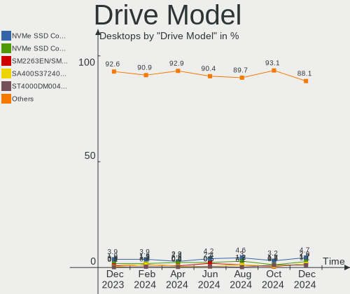
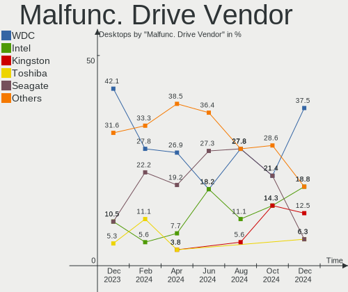
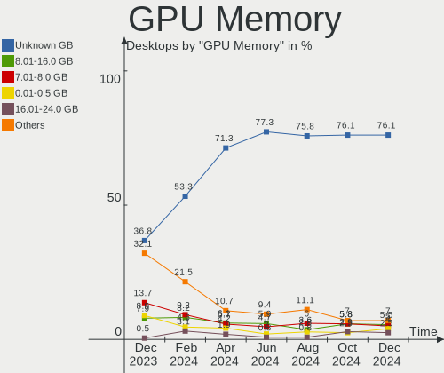
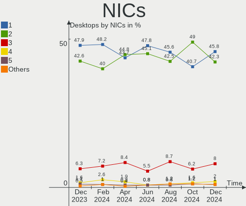
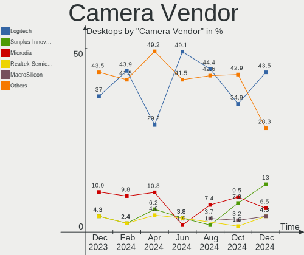

Fedora Hardware Trends (Desktops)
---------------------------------

A project to identify most popular hardware characteristics and track their change
over time based on data collected by Fedora users at https://Linux-Hardware.org.

Anyone can contribute to this report by the [hw-probe](https://github.com/linuxhw/hw-probe) tool:

    sudo -E hw-probe -all -upload

Full-feature report is available here: https://linux-hardware.org/?view=trends&formfactor=desktop

Period: Oct, 2021.

Contents
--------

* [ System ](#system)
  - [ OS                       ](#os)
  - [ OS Family                ](#os-family)
  - [ Kernel                   ](#kernel)
  - [ Kernel Family            ](#kernel-family)
  - [ Kernel Major Ver.        ](#kernel-major-ver)
  - [ Arch                     ](#arch)
  - [ DE                       ](#de)
  - [ Display Server           ](#display-server)
  - [ Display Manager          ](#display-manager)
  - [ OS Lang                  ](#os-lang)
  - [ Boot Mode                ](#boot-mode)
  - [ Filesystem               ](#filesystem)
  - [ Part. scheme             ](#part-scheme)
  - [ Dual Boot with Linux/BSD ](#dual-boot-with-linuxbsd)
  - [ Dual Boot (Win)          ](#dual-boot-win)

* [ Board ](#board)
  - [ Vendor                   ](#vendor)
  - [ Model                    ](#model)
  - [ Model Family             ](#model-family)
  - [ MFG Year                 ](#mfg-year)
  - [ Form Factor              ](#form-factor)
  - [ Secure Boot              ](#secure-boot)
  - [ Coreboot                 ](#coreboot)
  - [ RAM Size                 ](#ram-size)
  - [ RAM Used                 ](#ram-used)
  - [ Total Drives             ](#total-drives)
  - [ Has CD-ROM               ](#has-cd-rom)
  - [ Has Ethernet             ](#has-ethernet)
  - [ Has WiFi                 ](#has-wifi)
  - [ Has Bluetooth            ](#has-bluetooth)

* [ Location ](#location)
  - [ Country                  ](#country)
  - [ City                     ](#city)

* [ Drives ](#drives)
  - [ Drive Vendor             ](#drive-vendor)
  - [ Drive Model              ](#drive-model)
  - [ HDD Vendor               ](#hdd-vendor)
  - [ SSD Vendor               ](#ssd-vendor)
  - [ Drive Kind               ](#drive-kind)
  - [ Drive Connector          ](#drive-connector)
  - [ Drive Size               ](#drive-size)
  - [ Space Total              ](#space-total)
  - [ Space Used               ](#space-used)
  - [ Malfunc. Drives          ](#malfunc-drives)
  - [ Malfunc. Drive Vendor    ](#malfunc-drive-vendor)
  - [ Malfunc. HDD Vendor      ](#malfunc-hdd-vendor)
  - [ Malfunc. Drive Kind      ](#malfunc-drive-kind)
  - [ Failed Drives            ](#failed-drives)
  - [ Failed Drive Vendor      ](#failed-drive-vendor)
  - [ Drive Status             ](#drive-status)

* [ Storage controller ](#storage-controller)
  - [ Storage Vendor           ](#storage-vendor)
  - [ Storage Model            ](#storage-model)
  - [ Storage Kind             ](#storage-kind)

* [ Processor ](#processor)
  - [ CPU Vendor               ](#cpu-vendor)
  - [ CPU Model                ](#cpu-model)
  - [ CPU Model Family         ](#cpu-model-family)
  - [ CPU Cores                ](#cpu-cores)
  - [ CPU Sockets              ](#cpu-sockets)
  - [ CPU Threads              ](#cpu-threads)
  - [ CPU Op-Modes             ](#cpu-op-modes)
  - [ CPU Microcode            ](#cpu-microcode)
  - [ CPU Microarch            ](#cpu-microarch)

* [ Graphics ](#graphics)
  - [ GPU Vendor               ](#gpu-vendor)
  - [ GPU Model                ](#gpu-model)
  - [ GPU Combo                ](#gpu-combo)
  - [ GPU Driver               ](#gpu-driver)
  - [ GPU Memory               ](#gpu-memory)

* [ Monitor ](#monitor)
  - [ Monitor Vendor           ](#monitor-vendor)
  - [ Monitor Model            ](#monitor-model)
  - [ Monitor Resolution       ](#monitor-resolution)
  - [ Monitor Diagonal         ](#monitor-diagonal)
  - [ Monitor Width            ](#monitor-width)
  - [ Aspect Ratio             ](#aspect-ratio)
  - [ Monitor Area             ](#monitor-area)
  - [ Pixel Density            ](#pixel-density)
  - [ Multiple Monitors        ](#multiple-monitors)

* [ Network ](#network)
  - [ Net Controller Vendor    ](#net-controller-vendor)
  - [ Net Controller Model     ](#net-controller-model)
  - [ Wireless Vendor          ](#wireless-vendor)
  - [ Wireless Model           ](#wireless-model)
  - [ Ethernet Vendor          ](#ethernet-vendor)
  - [ Ethernet Model           ](#ethernet-model)
  - [ Net Controller Kind      ](#net-controller-kind)
  - [ Used Controller          ](#used-controller)
  - [ NICs                     ](#nics)
  - [ IPv6                     ](#ipv6)

* [ Bluetooth ](#bluetooth)
  - [ Bluetooth Vendor         ](#bluetooth-vendor)
  - [ Bluetooth Model          ](#bluetooth-model)

* [ Sound ](#sound)
  - [ Sound Vendor             ](#sound-vendor)
  - [ Sound Model              ](#sound-model)

* [ Memory ](#memory)
  - [ Memory Vendor            ](#memory-vendor)
  - [ Memory Model             ](#memory-model)
  - [ Memory Kind              ](#memory-kind)
  - [ Memory Form Factor       ](#memory-form-factor)
  - [ Memory Size              ](#memory-size)
  - [ Memory Speed             ](#memory-speed)

* [ Printers & scanners ](#printers--scanners)
  - [ Printer Vendor           ](#printer-vendor)
  - [ Printer Model            ](#printer-model)
  - [ Scanner Vendor           ](#scanner-vendor)
  - [ Scanner Model            ](#scanner-model)

* [ Camera ](#camera)
  - [ Camera Vendor            ](#camera-vendor)
  - [ Camera Model             ](#camera-model)

* [ Security ](#security)
  - [ Fingerprint Vendor       ](#fingerprint-vendor)
  - [ Fingerprint Model        ](#fingerprint-model)
  - [ Chipcard Vendor          ](#chipcard-vendor)
  - [ Chipcard Model           ](#chipcard-model)

* [ Unsupported ](#unsupported)
  - [ Unsupported Devices      ](#unsupported-devices)
  - [ Unsupported Device Types ](#unsupported-device-types)

System
------

OS
--

Installed operating systems

| Name      | Desktops | Percent |
|-----------|----------|---------|
| Fedora 34 | 66       | 72.53%  |
| Fedora 35 | 17       | 18.68%  |
| Fedora 36 | 3        | 3.3%    |
| Fedora 33 | 2        | 2.2%    |
| Fedora 31 | 1        | 1.1%    |
| Fedora 29 | 1        | 1.1%    |
| Fedora 25 | 1        | 1.1%    |

OS Family
---------

OS without a version

| Name   | Desktops | Percent |
|--------|----------|---------|
| Fedora | 91       | 100%    |

Kernel
------

Version of the Linux kernel

| Version                                                       | Desktops | Percent |
|---------------------------------------------------------------|----------|---------|
| 5.14.9-200.fc34.x86_64                                        | 22       | 24.18%  |
| 5.13.19-200.fc34.x86_64                                       | 11       | 12.09%  |
| 5.14.13-200.fc34.x86_64                                       | 7        | 7.69%   |
| 5.14.11-200.fc34.x86_64                                       | 6        | 6.59%   |
| 5.14.10-300.fc35.x86_64                                       | 6        | 6.59%   |
| 5.14.9-300.fc35.x86_64                                        | 5        | 5.49%   |
| 5.14.12-200.fc34.x86_64                                       | 4        | 4.4%    |
| 5.13.13-200.fc34.x86_64                                       | 3        | 3.3%    |
| 5.11.12-300.fc34.x86_64                                       | 3        | 3.3%    |
| 5.14.10-200.fc34.x86_64                                       | 2        | 2.2%    |
| 5.14.0-60.fc35.x86_64                                         | 2        | 2.2%    |
| 5.13.19-100.fc33.x86_64                                       | 2        | 2.2%    |
| 5.8.18-100.fc31.x86_64                                        | 1        | 1.1%    |
| 5.8.15-301.fc33.x86_64                                        | 1        | 1.1%    |
| 5.4.148-300.fc34.x86_64                                       | 1        | 1.1%    |
| 5.3.6-100.fc29.x86_64                                         | 1        | 1.1%    |
| 5.15.0-0.rc7.20211028git1fc596a56b33.56.vanilla.1.fc35.x86_64 | 1        | 1.1%    |
| 5.15.0-0.rc6.47.fc36.x86_64                                   | 1        | 1.1%    |
| 5.15.0-0.rc4.20211008git1da38549dd64.36.vanilla.1.fc36.x86_64 | 1        | 1.1%    |
| 5.15.0-0.rc4.20211008git1da38549dd64.36.fc36.x86_64           | 1        | 1.1%    |
| 5.14.14-300.fc35.x86_64                                       | 1        | 1.1%    |
| 5.14.14-200.fc34.x86_64                                       | 1        | 1.1%    |
| 5.14.13_MY                                                    | 1        | 1.1%    |
| 5.14.0-0.rc6.46.fc35.x86_64                                   | 1        | 1.1%    |
| 5.13.4-200.fc34.x86_64                                        | 1        | 1.1%    |
| 5.13.19-200.fc34.x86_64+debug                                 | 1        | 1.1%    |
| 5.13.16-200.fc34.x86_64                                       | 1        | 1.1%    |
| 5.13.12-200.fc34.x86_64                                       | 1        | 1.1%    |
| 5.11.16-300.fc34.x86_64                                       | 1        | 1.1%    |
| 4.13.16-100.fc25.x86_64                                       | 1        | 1.1%    |

Kernel Family
-------------

Linux kernel without a distro release

| Version | Desktops | Percent |
|---------|----------|---------|
| 5.14.9  | 27       | 29.67%  |
| 5.13.19 | 14       | 15.38%  |
| 5.14.13 | 8        | 8.79%   |
| 5.14.10 | 8        | 8.79%   |
| 5.14.11 | 6        | 6.59%   |
| 5.15.0  | 4        | 4.4%    |
| 5.14.12 | 4        | 4.4%    |
| 5.14.0  | 3        | 3.3%    |
| 5.13.13 | 3        | 3.3%    |
| 5.11.12 | 3        | 3.3%    |
| 5.14.14 | 2        | 2.2%    |
| 5.8.18  | 1        | 1.1%    |
| 5.8.15  | 1        | 1.1%    |
| 5.4.148 | 1        | 1.1%    |
| 5.3.6   | 1        | 1.1%    |
| 5.13.4  | 1        | 1.1%    |
| 5.13.16 | 1        | 1.1%    |
| 5.13.12 | 1        | 1.1%    |
| 5.11.16 | 1        | 1.1%    |
| 4.13.16 | 1        | 1.1%    |

Kernel Major Ver.
-----------------

Linux kernel major version

| Version | Desktops | Percent |
|---------|----------|---------|
| 5.14    | 58       | 63.74%  |
| 5.13    | 20       | 21.98%  |
| 5.15    | 4        | 4.4%    |
| 5.11    | 4        | 4.4%    |
| 5.8     | 2        | 2.2%    |
| 5.4     | 1        | 1.1%    |
| 5.3     | 1        | 1.1%    |
| 4.13    | 1        | 1.1%    |

Arch
----

OS architecture (x86_64, i586, etc.)

| Name   | Desktops | Percent |
|--------|----------|---------|
| x86_64 | 91       | 100%    |

DE
--

Desktop Environment

| Name          | Desktops | Percent |
|---------------|----------|---------|
| GNOME         | 47       | 51.65%  |
| KDE5          | 19       | 20.88%  |
| Cinnamon      | 9        | 9.89%   |
| Unknown       | 9        | 9.89%   |
| XFCE          | 2        | 2.2%    |
| X-Cinnamon    | 2        | 2.2%    |
| MATE          | 1        | 1.1%    |
| i3            | 1        | 1.1%    |
| GNOME Classic | 1        | 1.1%    |

Display Server
--------------

X11 or Wayland

| Name    | Desktops | Percent |
|---------|----------|---------|
| X11     | 41       | 45.05%  |
| Wayland | 36       | 39.56%  |
| Tty     | 10       | 10.99%  |
| Unknown | 4        | 4.4%    |

Display Manager
---------------

SDDM, LightDM, etc.

| Name    | Desktops | Percent |
|---------|----------|---------|
| Unknown | 46       | 50.55%  |
| GDM     | 21       | 23.08%  |
| LightDM | 13       | 14.29%  |
| SDDM    | 11       | 12.09%  |

OS Lang
-------

Language

| Lang    | Desktops | Percent |
|---------|----------|---------|
| en_US   | 41       | 45.05%  |
| en_AU   | 11       | 12.09%  |
| en_GB   | 5        | 5.49%   |
| ru_RU   | 3        | 3.3%    |
| pt_BR   | 3        | 3.3%    |
| fr_FR   | 3        | 3.3%    |
| it_IT   | 2        | 2.2%    |
| hu_HU   | 2        | 2.2%    |
| fr_CH   | 2        | 2.2%    |
| en_CA   | 2        | 2.2%    |
| Unknown | 2        | 2.2%    |
| pl_PL   | 1        | 1.1%    |
| pa_IN   | 1        | 1.1%    |
| nl_BE   | 1        | 1.1%    |
| es_MX   | 1        | 1.1%    |
| es_ES   | 1        | 1.1%    |
| es_EC   | 1        | 1.1%    |
| es_CO   | 1        | 1.1%    |
| es_AR   | 1        | 1.1%    |
| en_NZ   | 1        | 1.1%    |
| en_IN   | 1        | 1.1%    |
| en_IL   | 1        | 1.1%    |
| de_DE   | 1        | 1.1%    |
| cs_CZ   | 1        | 1.1%    |
| C       | 1        | 1.1%    |
| ar_SA   | 1        | 1.1%    |

Boot Mode
---------

EFI or BIOS

| Mode | Desktops | Percent |
|------|----------|---------|
| EFI  | 50       | 54.95%  |
| BIOS | 41       | 45.05%  |

Filesystem
----------

Type of filesystem

| Type  | Desktops | Percent |
|-------|----------|---------|
| Btrfs | 52       | 57.14%  |
| Ext4  | 25       | 27.47%  |
| Xfs   | 14       | 15.38%  |

Part. scheme
------------

Scheme of partitioning

| Type    | Desktops | Percent |
|---------|----------|---------|
| GPT     | 38       | 41.76%  |
| Unknown | 37       | 40.66%  |
| MBR     | 16       | 17.58%  |

Dual Boot with Linux/BSD
------------------------

Hosting more than one Linux/BSD

| Dual boot | Desktops | Percent |
|-----------|----------|---------|
| No        | 81       | 89.01%  |
| Yes       | 10       | 10.99%  |

Dual Boot (Win)
---------------

Hosting Linux and Windows

| Dual boot | Desktops | Percent |
|-----------|----------|---------|
| No        | 67       | 73.63%  |
| Yes       | 24       | 26.37%  |

Board
-----

Vendor
------

Motherboard manufacturer

| Name                | Desktops | Percent |
|---------------------|----------|---------|
| Gigabyte Technology | 24       | 26.37%  |
| ASUSTek Computer    | 19       | 20.88%  |
| MSI                 | 15       | 16.48%  |
| ASRock              | 10       | 10.99%  |
| Hewlett-Packard     | 5        | 5.49%   |
| Dell                | 5        | 5.49%   |
| Unknown             | 4        | 4.4%    |
| Lenovo              | 2        | 2.2%    |
| Fujitsu             | 2        | 2.2%    |
| Intel               | 1        | 1.1%    |
| Huanan              | 1        | 1.1%    |
| Foxconn             | 1        | 1.1%    |
| AOpen               | 1        | 1.1%    |
| Acer                | 1        | 1.1%    |

Model
-----

Motherboard model

| Name                                | Desktops | Percent |
|-------------------------------------|----------|---------|
| Unknown                             | 4        | 4.4%    |
| MSI MS-7C37                         | 2        | 2.2%    |
| Gigabyte B450 AORUS ELITE V2        | 2        | 2.2%    |
| Gigabyte B450 AORUS ELITE           | 2        | 2.2%    |
| MSI MS-9A45                         | 1        | 1.1%    |
| MSI MS-7C95                         | 1        | 1.1%    |
| MSI MS-7C92                         | 1        | 1.1%    |
| MSI MS-7C56                         | 1        | 1.1%    |
| MSI MS-7C02                         | 1        | 1.1%    |
| MSI MS-7B93                         | 1        | 1.1%    |
| MSI MS-7A69                         | 1        | 1.1%    |
| MSI MS-7A40                         | 1        | 1.1%    |
| MSI MS-7A39                         | 1        | 1.1%    |
| MSI MS-7A38                         | 1        | 1.1%    |
| MSI MS-7A34                         | 1        | 1.1%    |
| MSI MS-7721                         | 1        | 1.1%    |
| MSI Customised Bravo 5 Intel PC     | 1        | 1.1%    |
| Lenovo ThinkStation P620 30E0CTO1WW | 1        | 1.1%    |
| Lenovo ThinkCentre M58p 7220A72     | 1        | 1.1%    |
| Intel H61                           | 1        | 1.1%    |
| Huanan X99-TF                       | 1        | 1.1%    |
| HP ProDesk 600 G1 DM                | 1        | 1.1%    |
| HP ProDesk 400 G3 MT                | 1        | 1.1%    |
| HP EliteDesk 800 G2 DM 65W          | 1        | 1.1%    |
| HP Compaq Pro 6300 SFF              | 1        | 1.1%    |
| HP 810-445qe                        | 1        | 1.1%    |
| Gigabyte Z77-D3H                    | 1        | 1.1%    |
| Gigabyte X79-UP4                    | 1        | 1.1%    |
| Gigabyte X570 AORUS ULTRA           | 1        | 1.1%    |
| Gigabyte X570 AORUS MASTER          | 1        | 1.1%    |
| Gigabyte H61N-USB3                  | 1        | 1.1%    |
| Gigabyte H510M H                    | 1        | 1.1%    |
| Gigabyte H370M-DS3H                 | 1        | 1.1%    |
| Gigabyte H310M H 2.0                | 1        | 1.1%    |
| Gigabyte H310M H                    | 1        | 1.1%    |
| Gigabyte GA-MA785G-UD3H             | 1        | 1.1%    |
| Gigabyte GA-MA780G-UD3H             | 1        | 1.1%    |
| Gigabyte GA-880GM-UD2H              | 1        | 1.1%    |
| Gigabyte G41MT-D3                   | 1        | 1.1%    |
| Gigabyte EP45-DS3L                  | 1        | 1.1%    |
| Gigabyte B85M-D3H                   | 1        | 1.1%    |
| Gigabyte B550I AORUS PRO AX         | 1        | 1.1%    |
| Gigabyte B450 I AORUS PRO WIFI      | 1        | 1.1%    |
| Gigabyte B450 AORUS M               | 1        | 1.1%    |
| Gigabyte B365MHD3                   | 1        | 1.1%    |
| Gigabyte AB350-Gaming               | 1        | 1.1%    |
| Fujitsu ESPRIMO P520                | 1        | 1.1%    |
| Fujitsu ESPRIMO P410                | 1        | 1.1%    |
| Foxconn H81MXV                      | 1        | 1.1%    |
| Dell Precision WorkStation T5500    | 1        | 1.1%    |
| Dell PowerEdge SC1420               | 1        | 1.1%    |
| Dell OptiPlex 9020                  | 1        | 1.1%    |
| Dell OptiPlex 3060                  | 1        | 1.1%    |
| Dell OptiPlex 3020                  | 1        | 1.1%    |
| ASUS TUF Z270 MARK 2                | 1        | 1.1%    |
| ASUS ROG STRIX B560-G GAMING WIFI   | 1        | 1.1%    |
| ASUS ROG STRIX B550-F GAMING        | 1        | 1.1%    |
| ASUS ROG Maximus XIII HERO          | 1        | 1.1%    |
| ASUS ROG Maximus XI FORMULA         | 1        | 1.1%    |
| ASUS ROG CROSSHAIR VIII HERO        | 1        | 1.1%    |

Model Family
------------

Motherboard model prefix

| Name                    | Desktops | Percent |
|-------------------------|----------|---------|
| Gigabyte B450           | 6        | 6.59%   |
| ASUS ROG                | 6        | 6.59%   |
| ASUS PRIME              | 5        | 5.49%   |
| Unknown                 | 4        | 4.4%    |
| Dell OptiPlex           | 3        | 3.3%    |
| MSI MS-7C37             | 2        | 2.2%    |
| HP ProDesk              | 2        | 2.2%    |
| Gigabyte X570           | 2        | 2.2%    |
| Gigabyte H310M          | 2        | 2.2%    |
| Fujitsu ESPRIMO         | 2        | 2.2%    |
| MSI MS-9A45             | 1        | 1.1%    |
| MSI MS-7C95             | 1        | 1.1%    |
| MSI MS-7C92             | 1        | 1.1%    |
| MSI MS-7C56             | 1        | 1.1%    |
| MSI MS-7C02             | 1        | 1.1%    |
| MSI MS-7B93             | 1        | 1.1%    |
| MSI MS-7A69             | 1        | 1.1%    |
| MSI MS-7A40             | 1        | 1.1%    |
| MSI MS-7A39             | 1        | 1.1%    |
| MSI MS-7A38             | 1        | 1.1%    |
| MSI MS-7A34             | 1        | 1.1%    |
| MSI MS-7721             | 1        | 1.1%    |
| MSI Customised          | 1        | 1.1%    |
| Lenovo ThinkStation     | 1        | 1.1%    |
| Lenovo ThinkCentre      | 1        | 1.1%    |
| Intel H61               | 1        | 1.1%    |
| Huanan X99-TF           | 1        | 1.1%    |
| HP EliteDesk            | 1        | 1.1%    |
| HP Compaq               | 1        | 1.1%    |
| HP 810-445qe            | 1        | 1.1%    |
| Gigabyte Z77-D3H        | 1        | 1.1%    |
| Gigabyte X79-UP4        | 1        | 1.1%    |
| Gigabyte H61N-USB3      | 1        | 1.1%    |
| Gigabyte H510M          | 1        | 1.1%    |
| Gigabyte H370M-DS3H     | 1        | 1.1%    |
| Gigabyte GA-MA785G-UD3H | 1        | 1.1%    |
| Gigabyte GA-MA780G-UD3H | 1        | 1.1%    |
| Gigabyte GA-880GM-UD2H  | 1        | 1.1%    |
| Gigabyte G41MT-D3       | 1        | 1.1%    |
| Gigabyte EP45-DS3L      | 1        | 1.1%    |
| Gigabyte B85M-D3H       | 1        | 1.1%    |
| Gigabyte B550I          | 1        | 1.1%    |
| Gigabyte B365MHD3       | 1        | 1.1%    |
| Gigabyte AB350-Gaming   | 1        | 1.1%    |
| Foxconn H81MXV          | 1        | 1.1%    |
| Dell Precision          | 1        | 1.1%    |
| Dell PowerEdge          | 1        | 1.1%    |
| ASUS TUF                | 1        | 1.1%    |
| ASUS P8Z68-V            | 1        | 1.1%    |
| ASUS P8H61-M            | 1        | 1.1%    |
| ASUS M5A97              | 1        | 1.1%    |
| ASUS M5A78L             | 1        | 1.1%    |
| ASUS All                | 1        | 1.1%    |
| ASUS A8R32-MVP          | 1        | 1.1%    |
| ASUS A68HM-PLUS         | 1        | 1.1%    |
| ASRock X570             | 1        | 1.1%    |
| ASRock N68-S3           | 1        | 1.1%    |
| ASRock H97M             | 1        | 1.1%    |
| ASRock G41M-VS3         | 1        | 1.1%    |
| ASRock FM2A88X          | 1        | 1.1%    |

MFG Year
--------

Motherboard manufacture year

| Year    | Desktops | Percent |
|---------|----------|---------|
| 2021    | 17       | 18.68%  |
| 2020    | 16       | 17.58%  |
| 2019    | 10       | 10.99%  |
| 2018    | 10       | 10.99%  |
| 2013    | 6        | 6.59%   |
| 2015    | 5        | 5.49%   |
| 2012    | 5        | 5.49%   |
| 2014    | 4        | 4.4%    |
| 2010    | 4        | 4.4%    |
| 2011    | 3        | 3.3%    |
| 2017    | 2        | 2.2%    |
| 2016    | 2        | 2.2%    |
| 2009    | 2        | 2.2%    |
| 2006    | 2        | 2.2%    |
| Unknown | 2        | 2.2%    |
| 2008    | 1        | 1.1%    |

Form Factor
-----------

Physical design of the computer

| Name    | Desktops | Percent |
|---------|----------|---------|
| Desktop | 91       | 100%    |

Secure Boot
-----------

Enabled or disabled

| State    | Desktops | Percent |
|----------|----------|---------|
| Disabled | 86       | 94.51%  |
| Enabled  | 5        | 5.49%   |

Coreboot
--------

Have coreboot on board

| Used | Desktops | Percent |
|------|----------|---------|
| No   | 91       | 100%    |

RAM Size
--------

Total RAM memory

| Size in GB  | Desktops | Percent |
|-------------|----------|---------|
| 8.01-16.0   | 21       | 23.08%  |
| 32.01-64.0  | 20       | 21.98%  |
| 16.01-24.0  | 20       | 21.98%  |
| 4.01-8.0    | 18       | 19.78%  |
| 3.01-4.0    | 7        | 7.69%   |
| 64.01-256.0 | 3        | 3.3%    |
| 24.01-32.0  | 1        | 1.1%    |
| 2.01-3.0    | 1        | 1.1%    |

RAM Used
--------

Used RAM memory

| Used GB    | Desktops | Percent |
|------------|----------|---------|
| 2.01-3.0   | 25       | 27.47%  |
| 1.01-2.0   | 22       | 24.18%  |
| 3.01-4.0   | 18       | 19.78%  |
| 4.01-8.0   | 11       | 12.09%  |
| 8.01-16.0  | 7        | 7.69%   |
| 0.51-1.0   | 6        | 6.59%   |
| 24.01-32.0 | 1        | 1.1%    |
| 0.01-0.5   | 1        | 1.1%    |

Total Drives
------------

Number of drives on board

| Drives | Desktops | Percent |
|--------|----------|---------|
| 2      | 34       | 37.36%  |
| 1      | 32       | 35.16%  |
| 3      | 11       | 12.09%  |
| 5      | 4        | 4.4%    |
| 4      | 4        | 4.4%    |
| 7      | 3        | 3.3%    |
| 8      | 2        | 2.2%    |
| 6      | 1        | 1.1%    |

Has CD-ROM
----------

Has CD-ROM on board

| Presented | Desktops | Percent |
|-----------|----------|---------|
| No        | 57       | 62.64%  |
| Yes       | 34       | 37.36%  |

Has Ethernet
------------

Has Ethernet on board

| Presented | Desktops | Percent |
|-----------|----------|---------|
| Yes       | 91       | 100%    |

Has WiFi
--------

Has WiFi module

| Presented | Desktops | Percent |
|-----------|----------|---------|
| Yes       | 46       | 50.55%  |
| No        | 45       | 49.45%  |

Has Bluetooth
-------------

Has Bluetooth module

| Presented | Desktops | Percent |
|-----------|----------|---------|
| No        | 59       | 64.84%  |
| Yes       | 32       | 35.16%  |

Location
--------

Country
-------

Geographic location (country)

| Country            | Desktops | Percent |
|--------------------|----------|---------|
| USA                | 14       | 15.38%  |
| Australia          | 11       | 12.09%  |
| Brazil             | 7        | 7.69%   |
| Germany            | 6        | 6.59%   |
| Poland             | 5        | 5.49%   |
| France             | 5        | 5.49%   |
| Switzerland        | 4        | 4.4%    |
| Hungary            | 4        | 4.4%    |
| Canada             | 4        | 4.4%    |
| Austria            | 4        | 4.4%    |
| Russia             | 3        | 3.3%    |
| UK                 | 2        | 2.2%    |
| Italy              | 2        | 2.2%    |
| Israel             | 2        | 2.2%    |
| Belgium            | 2        | 2.2%    |
| Yemen              | 1        | 1.1%    |
| Sweden             | 1        | 1.1%    |
| Spain              | 1        | 1.1%    |
| Romania            | 1        | 1.1%    |
| Norway             | 1        | 1.1%    |
| New Zealand        | 1        | 1.1%    |
| Mexico             | 1        | 1.1%    |
| Kazakhstan         | 1        | 1.1%    |
| India              | 1        | 1.1%    |
| Egypt              | 1        | 1.1%    |
| Ecuador            | 1        | 1.1%    |
| Dominican Republic | 1        | 1.1%    |
| Czechia            | 1        | 1.1%    |
| Colombia           | 1        | 1.1%    |
| Belarus            | 1        | 1.1%    |
| Argentina          | 1        | 1.1%    |

City
----

Geographic location (city)

| City                  | Desktops | Percent |
|-----------------------|----------|---------|
| Sydney                | 10       | 10.99%  |
| Vienna                | 3        | 3.3%    |
| Zurich                | 2        | 2.2%    |
| Rio de Janeiro        | 2        | 2.2%    |
| Rillieux-la-Pape      | 2        | 2.2%    |
| Moscow                | 2        | 2.2%    |
| Gdansk                | 2        | 2.2%    |
| Berlin                | 2        | 2.2%    |
| Warsaw                | 1        | 1.1%    |
| Veresegyhaz           | 1        | 1.1%    |
| Tuxtla Guti?©rrez     | 1        | 1.1%    |
| Tulcea                | 1        | 1.1%    |
| Thrissur              | 1        | 1.1%    |
| Teramo                | 1        | 1.1%    |
| Tauranga              | 1        | 1.1%    |
| Taraz                 | 1        | 1.1%    |
| Tallahassee           | 1        | 1.1%    |
| Sorocaba              | 1        | 1.1%    |
| Somerville            | 1        | 1.1%    |
| Sapucaia do Sul       | 1        | 1.1%    |
| Santos                | 1        | 1.1%    |
| Santo Domingo Este    | 1        | 1.1%    |
| Sanaa                 | 1        | 1.1%    |
| San Giovanni la Punta | 1        | 1.1%    |
| Rokycany              | 1        | 1.1%    |
| Riedseltz             | 1        | 1.1%    |
| Plano                 | 1        | 1.1%    |
| Pflugerville          | 1        | 1.1%    |
| Peta??– Tiqwa         | 1        | 1.1%    |
| O?›wi?™cim            | 1        | 1.1%    |
| Nybro                 | 1        | 1.1%    |
| Moss Point            | 1        | 1.1%    |
| Montreal              | 1        | 1.1%    |
| Minsk                 | 1        | 1.1%    |
| Medell?­n             | 1        | 1.1%    |
| Madrid                | 1        | 1.1%    |
| Lutz                  | 1        | 1.1%    |
| Leverkusen            | 1        | 1.1%    |
| Lausanne              | 1        | 1.1%    |
| Laurel                | 1        | 1.1%    |
| Lafayette             | 1        | 1.1%    |
| Krasnodar             | 1        | 1.1%    |
| Kom??rom              | 1        | 1.1%    |
| Kitchener             | 1        | 1.1%    |
| Kamloops              | 1        | 1.1%    |
| Jambes                | 1        | 1.1%    |
| Houston               | 1        | 1.1%    |
| Hohn                  | 1        | 1.1%    |
| Hodmezovasarhely      | 1        | 1.1%    |
| Hamburg               | 1        | 1.1%    |
| Halstead              | 1        | 1.1%    |
| Haifa                 | 1        | 1.1%    |
| Guayaquil             | 1        | 1.1%    |
| Graz                  | 1        | 1.1%    |
| Friedberg             | 1        | 1.1%    |
| Evans                 | 1        | 1.1%    |
| Espanola              | 1        | 1.1%    |
| Englewood             | 1        | 1.1%    |
| Crewe                 | 1        | 1.1%    |
| Covington             | 1        | 1.1%    |

Drives
------

Drive Vendor
------------

Hard drive vendors

| Vendor                    | Desktops | Drives | Percent |
|---------------------------|----------|--------|---------|
| Samsung Electronics       | 37       | 56     | 21.89%  |
| Seagate                   | 32       | 45     | 18.93%  |
| WDC                       | 25       | 35     | 14.79%  |
| Kingston                  | 19       | 22     | 11.24%  |
| Crucial                   | 10       | 10     | 5.92%   |
| Sandisk                   | 5        | 6      | 2.96%   |
| Intel                     | 5        | 5      | 2.96%   |
| Toshiba                   | 4        | 5      | 2.37%   |
| Hitachi                   | 3        | 4      | 1.78%   |
| Silicon Motion            | 2        | 2      | 1.18%   |
| Phison                    | 2        | 2      | 1.18%   |
| Mushkin                   | 2        | 2      | 1.18%   |
| HGST                      | 2        | 2      | 1.18%   |
| XPG                       | 1        | 1      | 0.59%   |
| TEXTORM                   | 1        | 1      | 0.59%   |
| Team                      | 1        | 1      | 0.59%   |
| SPCC                      | 1        | 1      | 0.59%   |
| SK Hynix                  | 1        | 1      | 0.59%   |
| Realtek Semiconductor     | 1        | 1      | 0.59%   |
| Radeon                    | 1        | 1      | 0.59%   |
| Micron/Crucial Technology | 1        | 1      | 0.59%   |
| Micron Technology         | 1        | 1      | 0.59%   |
| MAXTOR                    | 1        | 1      | 0.59%   |
| MaxDigital                | 1        | 1      | 0.59%   |
| LS600                     | 1        | 1      | 0.59%   |
| LITEON                    | 1        | 1      | 0.59%   |
| KingSpec                  | 1        | 1      | 0.59%   |
| KingFast                  | 1        | 1      | 0.59%   |
| Hewlett-Packard           | 1        | 1      | 0.59%   |
| Gigabyte Technology       | 1        | 1      | 0.59%   |
| Corsair                   | 1        | 1      | 0.59%   |
| China                     | 1        | 1      | 0.59%   |
| AMD                       | 1        | 1      | 0.59%   |
| A-DATA Technology         | 1        | 1      | 0.59%   |

Drive Model
-----------

Hard drive models

| Model                            | Desktops | Percent |
|----------------------------------|----------|---------|
| Kingston SA400S37240G 240GB SSD  | 6        | 2.88%   |
| Seagate ST4000DM004-2CV104 4TB   | 5        | 2.4%    |
| Samsung SSD 860 EVO 500GB        | 4        | 1.92%   |
| Samsung SSD 860 EVO 1TB          | 4        | 1.92%   |
| WDC WD20EZRZ-00Z5HB0 2TB         | 3        | 1.44%   |
| Seagate ST31000524AS 1TB         | 3        | 1.44%   |
| Samsung SSD 970 EVO Plus 500GB   | 3        | 1.44%   |
| Samsung NVMe SSD Drive 500GB     | 3        | 1.44%   |
| Samsung NVMe SSD Drive 1TB       | 3        | 1.44%   |
| WDC WDS500G2B0A-00SM50 500GB SSD | 2        | 0.96%   |
| WDC WDS100T2B0A-00SM50 1TB SSD   | 2        | 0.96%   |
| Seagate ST8000AS0002-1NA17Z 8TB  | 2        | 0.96%   |
| Seagate ST1000DM010-2EP102 1TB   | 2        | 0.96%   |
| Seagate Expansion 1TB            | 2        | 0.96%   |
| Samsung SSD 970 EVO Plus 1TB     | 2        | 0.96%   |
| Samsung SSD 860 EVO 250GB        | 2        | 0.96%   |
| Samsung SSD 850 EVO 250GB        | 2        | 0.96%   |
| Kingston SA400S37480G 480GB SSD  | 2        | 0.96%   |
| Kingston SA2000M8500G 500GB      | 2        | 0.96%   |
| Kingston SA2000M81000G 1TB       | 2        | 0.96%   |
| Intel SSDSC2CT120A3 120GB        | 2        | 0.96%   |
| Crucial CT1000P1SSD8 1TB         | 2        | 0.96%   |
| Crucial CT1000MX500SSD1 1TB      | 2        | 0.96%   |
| XPG NVMe SSD Drive 1024GB        | 1        | 0.48%   |
| WDC WDS500G2B0B-00YS70 500GB SSD | 1        | 0.48%   |
| WDC WDS250G2B0B 250GB SSD        | 1        | 0.48%   |
| WDC WDS200T2B0A-00SM50 2TB SSD   | 1        | 0.48%   |
| WDC WDS100T1B0A-00H9H0 1TB SSD   | 1        | 0.48%   |
| WDC WD80EFZX-68UW8N0 8TB         | 1        | 0.48%   |
| WDC WD7500BPKT-00PK4T0 752GB     | 1        | 0.48%   |
| WDC WD6400AAKS-22A7B2 640GB      | 1        | 0.48%   |
| WDC WD5000BEVT-22A0RT0 500GB     | 1        | 0.48%   |
| WDC WD5000AVCS-632DY1 500GB      | 1        | 0.48%   |
| WDC WD5000AAKX-07U6AA0 500GB     | 1        | 0.48%   |
| WDC WD5000AAKX-001CA0 500GB      | 1        | 0.48%   |
| WDC WD40EFRX-68N32N0 4TB         | 1        | 0.48%   |
| WDC WD2500JS-22NCB1 250GB        | 1        | 0.48%   |
| WDC WD2500BEVT-75A23T0 250GB     | 1        | 0.48%   |
| WDC WD20EZRX-00D8PB0 2TB         | 1        | 0.48%   |
| WDC WD20EFRX-68EUZN0 2TB         | 1        | 0.48%   |
| WDC WD20EFRX-68AX9N0 2TB         | 1        | 0.48%   |
| WDC WD1600AVVS-63L2B0 160GB      | 1        | 0.48%   |
| WDC WD1600AABS-00PRA0 160GB      | 1        | 0.48%   |
| WDC WD15EADS-00P8B0 1TB          | 1        | 0.48%   |
| WDC WD10EZRZ-22HTKB0 1TB         | 1        | 0.48%   |
| WDC WD10EZRZ-00HTKB0 1TB         | 1        | 0.48%   |
| WDC WD10EZRX-00L4HB0 1TB         | 1        | 0.48%   |
| WDC WD10EZEX-60WN4A1 1TB         | 1        | 0.48%   |
| WDC WD10EZEX-08WN4A0 1TB         | 1        | 0.48%   |
| WDC WD10EALX-009BA0 1TB          | 1        | 0.48%   |
| WDC WD easystore 240GB SSD       | 1        | 0.48%   |
| WDC PC SN520 SDAPMUW-256G        | 1        | 0.48%   |
| Toshiba MQ01ABF050 500GB         | 1        | 0.48%   |
| Toshiba MK4055GSX 400GB          | 1        | 0.48%   |
| Toshiba HDWD120 2TB              | 1        | 0.48%   |
| Toshiba DT01ACA200 2TB           | 1        | 0.48%   |
| Toshiba DT01ACA050 500GB         | 1        | 0.48%   |
| TEXTORM B5 120GB                 | 1        | 0.48%   |
| Team T253E2001T 1024GB SSD       | 1        | 0.48%   |
| SPCC M.2 PCIe SSD 256GB          | 1        | 0.48%   |

HDD Vendor
----------

Hard disk drive vendors

| Vendor              | Desktops | Drives | Percent |
|---------------------|----------|--------|---------|
| Seagate             | 32       | 44     | 46.38%  |
| WDC                 | 19       | 25     | 27.54%  |
| Samsung Electronics | 7        | 12     | 10.14%  |
| Toshiba             | 4        | 5      | 5.8%    |
| Hitachi             | 3        | 4      | 4.35%   |
| HGST                | 2        | 2      | 2.9%    |
| MAXTOR              | 1        | 1      | 1.45%   |
| MaxDigital          | 1        | 1      | 1.45%   |

SSD Vendor
----------

Solid state drive vendors

| Vendor              | Desktops | Drives | Percent |
|---------------------|----------|--------|---------|
| Samsung Electronics | 21       | 26     | 30%     |
| Kingston            | 14       | 16     | 20%     |
| WDC                 | 8        | 9      | 11.43%  |
| Crucial             | 7        | 7      | 10%     |
| Intel               | 3        | 3      | 4.29%   |
| SanDisk             | 2        | 2      | 2.86%   |
| Mushkin             | 2        | 2      | 2.86%   |
| TEXTORM             | 1        | 1      | 1.43%   |
| Team                | 1        | 1      | 1.43%   |
| Radeon              | 1        | 1      | 1.43%   |
| Micron Technology   | 1        | 1      | 1.43%   |
| LS600               | 1        | 1      | 1.43%   |
| LITEON              | 1        | 1      | 1.43%   |
| KingSpec            | 1        | 1      | 1.43%   |
| KingFast            | 1        | 1      | 1.43%   |
| Hewlett-Packard     | 1        | 1      | 1.43%   |
| Gigabyte Technology | 1        | 1      | 1.43%   |
| Corsair             | 1        | 1      | 1.43%   |
| China               | 1        | 1      | 1.43%   |
| AMD                 | 1        | 1      | 1.43%   |

Drive Kind
----------

HDD or SSD

| Kind    | Desktops | Drives | Percent |
|---------|----------|--------|---------|
| SSD     | 58       | 78     | 40.28%  |
| HDD     | 51       | 94     | 35.42%  |
| NVMe    | 34       | 44     | 23.61%  |
| Unknown | 1        | 1      | 0.69%   |

Drive Connector
---------------

SATA, SAS, NVMe, etc.

| Type | Desktops | Drives | Percent |
|------|----------|--------|---------|
| SATA | 78       | 168    | 67.24%  |
| NVMe | 34       | 44     | 29.31%  |
| SAS  | 4        | 5      | 3.45%   |

Drive Size
----------

Size of hard drive

| Size in TB | Desktops | Drives | Percent |
|------------|----------|--------|---------|
| 0.01-0.5   | 63       | 93     | 51.22%  |
| 0.51-1.0   | 28       | 43     | 22.76%  |
| 1.01-2.0   | 15       | 16     | 12.2%   |
| 3.01-4.0   | 9        | 11     | 7.32%   |
| 2.01-3.0   | 4        | 4      | 3.25%   |
| 4.01-10.0  | 4        | 5      | 3.25%   |

Space Total
-----------

Amount of disk space available on the file system

| Size in GB     | Desktops | Percent |
|----------------|----------|---------|
| 251-500        | 15       | 16.48%  |
| 501-1000       | 15       | 16.48%  |
| 101-250        | 14       | 15.38%  |
| More than 3000 | 12       | 13.19%  |
| 2001-3000      | 9        | 9.89%   |
| 1001-2000      | 9        | 9.89%   |
| 1-20           | 8        | 8.79%   |
| 51-100         | 4        | 4.4%    |
| Unknown        | 3        | 3.3%    |
| 21-50          | 2        | 2.2%    |

Space Used
----------

Amount of used disk space

| Used GB        | Desktops | Percent |
|----------------|----------|---------|
| 1-20           | 20       | 21.98%  |
| 21-50          | 15       | 16.48%  |
| 501-1000       | 12       | 13.19%  |
| 251-500        | 11       | 12.09%  |
| 101-250        | 9        | 9.89%   |
| 1001-2000      | 8        | 8.79%   |
| More than 3000 | 7        | 7.69%   |
| 51-100         | 5        | 5.49%   |
| Unknown        | 3        | 3.3%    |
| 2001-3000      | 1        | 1.1%    |

Malfunc. Drives
---------------

Drive models with a malfunction

| Model                             | Desktops | Drives | Percent |
|-----------------------------------|----------|--------|---------|
| Intel SSDSC2CT120A3 120GB         | 2        | 2      | 9.52%   |
| WDC WD5000BEVT-22A0RT0 500GB      | 1        | 1      | 4.76%   |
| WDC WD20EFRX-68AX9N0 2TB          | 1        | 1      | 4.76%   |
| WDC WD1600AVVS-63L2B0 160GB       | 1        | 1      | 4.76%   |
| WDC WD10EZEX-60WN4A1 1TB          | 1        | 1      | 4.76%   |
| Seagate ST9250315AS 250GB         | 1        | 1      | 4.76%   |
| Seagate ST500DM002-1SB10A 500GB   | 1        | 1      | 4.76%   |
| Seagate ST500DM002-1BD142 500GB   | 1        | 1      | 4.76%   |
| Seagate ST3500418AS 500GB         | 1        | 1      | 4.76%   |
| Seagate ST31000524AS 1TB          | 1        | 1      | 4.76%   |
| Seagate ST2000DL003-9VT166 2TB    | 1        | 1      | 4.76%   |
| Samsung Electronics SP1614C 160GB | 1        | 1      | 4.76%   |
| Samsung Electronics HM160HI 160GB | 1        | 1      | 4.76%   |
| Samsung Electronics HD501LJ 500GB | 1        | 2      | 4.76%   |
| Samsung Electronics HD103UJ 1TB   | 1        | 1      | 4.76%   |
| Kingston SV300S37A120G 120GB SSD  | 1        | 1      | 4.76%   |
| Kingston SA400S37240G 240GB SSD   | 1        | 1      | 4.76%   |
| HGST HTS725050A7E630 500GB        | 1        | 1      | 4.76%   |
| HGST HTS545050A7E680 500GB        | 1        | 1      | 4.76%   |
| Crucial CT128MX100SSD1 128GB      | 1        | 1      | 4.76%   |

Malfunc. Drive Vendor
---------------------

Vendors of faulty drives

| Vendor              | Desktops | Drives | Percent |
|---------------------|----------|--------|---------|
| Seagate             | 6        | 6      | 28.57%  |
| WDC                 | 4        | 4      | 19.05%  |
| Samsung Electronics | 4        | 5      | 19.05%  |
| Kingston            | 2        | 2      | 9.52%   |
| Intel               | 2        | 2      | 9.52%   |
| HGST                | 2        | 2      | 9.52%   |
| Crucial             | 1        | 1      | 4.76%   |

Malfunc. HDD Vendor
-------------------

Vendors of faulty HDD drives

| Vendor              | Desktops | Drives | Percent |
|---------------------|----------|--------|---------|
| Seagate             | 6        | 6      | 37.5%   |
| WDC                 | 4        | 4      | 25%     |
| Samsung Electronics | 4        | 5      | 25%     |
| HGST                | 2        | 2      | 12.5%   |

Malfunc. Drive Kind
-------------------

Kinds of faulty drives

| Kind | Desktops | Drives | Percent |
|------|----------|--------|---------|
| HDD  | 14       | 17     | 73.68%  |
| SSD  | 5        | 5      | 26.32%  |

Failed Drives
-------------

Failed drive models

| Model                       | Desktops | Drives | Percent |
|-----------------------------|----------|--------|---------|
| Hitachi HDS721010DLE630 1TB | 1        | 2      | 100%    |

Failed Drive Vendor
-------------------

Failed drive vendors

| Vendor  | Desktops | Drives | Percent |
|---------|----------|--------|---------|
| Hitachi | 1        | 2      | 100%    |

Drive Status
------------

Number of failed and malfunc. drives

| Status   | Desktops | Drives | Percent |
|----------|----------|--------|---------|
| Works    | 48       | 88     | 44.86%  |
| Detected | 39       | 105    | 36.45%  |
| Malfunc  | 19       | 22     | 17.76%  |
| Failed   | 1        | 2      | 0.93%   |

Storage controller
------------------

Storage Vendor
--------------

Storage controller vendors

| Vendor                      | Desktops | Percent |
|-----------------------------|----------|---------|
| Intel                       | 48       | 32.88%  |
| AMD                         | 41       | 28.08%  |
| Samsung Electronics         | 16       | 10.96%  |
| Kingston Technology Company | 7        | 4.79%   |
| ASMedia Technology          | 5        | 3.42%   |
| Sandisk                     | 4        | 2.74%   |
| Micron/Crucial Technology   | 4        | 2.74%   |
| Marvell Technology Group    | 4        | 2.74%   |
| Phison Electronics          | 3        | 2.05%   |
| JMicron Technology          | 3        | 2.05%   |
| Silicon Motion              | 2        | 1.37%   |
| Nvidia                      | 2        | 1.37%   |
| VIA Technologies            | 1        | 0.68%   |
| ULi Electronics             | 1        | 0.68%   |
| SK Hynix                    | 1        | 0.68%   |
| Silicon Image               | 1        | 0.68%   |
| Realtek Semiconductor       | 1        | 0.68%   |
| ADATA Technology            | 1        | 0.68%   |
| Adaptec                     | 1        | 0.68%   |

Storage Model
-------------

Storage controller models

| Model                                                                          | Desktops | Percent |
|--------------------------------------------------------------------------------|----------|---------|
| AMD FCH SATA Controller [AHCI mode]                                            | 29       | 15.93%  |
| Samsung NVMe SSD Controller SM981/PM981/PM983                                  | 11       | 6.04%   |
| AMD 400 Series Chipset SATA Controller                                         | 10       | 5.49%   |
| AMD Starship/Matisse Chipset SATA Controller [AHCI mode]                       | 7        | 3.85%   |
| Intel 8 Series/C220 Series Chipset Family 6-port SATA Controller 1 [AHCI mode] | 6        | 3.3%    |
| Intel 200 Series PCH SATA controller [AHCI mode]                               | 6        | 3.3%    |
| AMD SB7x0/SB8x0/SB9x0 SATA Controller [AHCI mode]                              | 5        | 2.75%   |
| AMD SB7x0/SB8x0/SB9x0 IDE Controller                                           | 5        | 2.75%   |
| Kingston Company A2000 NVMe SSD                                                | 4        | 2.2%    |
| Intel Cannon Lake PCH SATA AHCI Controller                                     | 4        | 2.2%    |
| Intel 6 Series/C200 Series Chipset Family 6 port Desktop SATA AHCI Controller  | 4        | 2.2%    |
| Intel 500 Series Chipset Family SATA AHCI Controller                           | 4        | 2.2%    |
| ASMedia ASM1062 Serial ATA Controller                                          | 4        | 2.2%    |
| AMD 300 Series Chipset SATA Controller                                         | 4        | 2.2%    |
| Micron/Crucial P1 NVMe PCIe SSD                                                | 3        | 1.65%   |
| Intel SATA Controller [RAID mode]                                              | 3        | 1.65%   |
| Intel NM10/ICH7 Family SATA Controller [IDE mode]                              | 3        | 1.65%   |
| AMD FCH SATA Controller D                                                      | 3        | 1.65%   |
| Sandisk WD Black SN750 / PC SN730 NVMe SSD                                     | 2        | 1.1%    |
| Samsung NVMe SSD Controller SM961/PM961/SM963                                  | 2        | 1.1%    |
| Samsung NVMe SSD Controller PM9A1/PM9A3/980PRO                                 | 2        | 1.1%    |
| Phison E12 NVMe Controller                                                     | 2        | 1.1%    |
| Marvell Group 88SE9215 PCIe 2.0 x1 4-port SATA 6 Gb/s Controller               | 2        | 1.1%    |
| Marvell Group 88SE9172 SATA 6Gb/s Controller                                   | 2        | 1.1%    |
| Kingston Company Company Non-Volatile memory controller                        | 2        | 1.1%    |
| Intel Q170/Q150/B150/H170/H110/Z170/CM236 Chipset SATA Controller [AHCI Mode]  | 2        | 1.1%    |
| Intel NM10/ICH7 Family SATA Controller [AHCI mode]                             | 2        | 1.1%    |
| Intel 9 Series Chipset Family SATA Controller [AHCI Mode]                      | 2        | 1.1%    |
| Intel 82801G (ICH7 Family) IDE Controller                                      | 2        | 1.1%    |
| VIA VT6421 IDE/SATA Controller                                                 | 1        | 0.55%   |
| ULi ULi M5288 SATA                                                             | 1        | 0.55%   |
| ULi M5229 IDE                                                                  | 1        | 0.55%   |
| SK Hynix Non-Volatile memory controller                                        | 1        | 0.55%   |
| Silicon Motion SM2263EN/SM2263XT SSD Controller                                | 1        | 0.55%   |
| Silicon Motion SM2262/SM2262EN SSD Controller                                  | 1        | 0.55%   |
| Silicon Image SiI 3132 Serial ATA Raid II Controller                           | 1        | 0.55%   |
| Sandisk WD Blue SN550 NVMe SSD                                                 | 1        | 0.55%   |
| Sandisk PC SN520 NVMe SSD                                                      | 1        | 0.55%   |
| Samsung NVMe SSD Controller 980                                                | 1        | 0.55%   |
| Realtek Realtek Non-Volatile memory controller                                 | 1        | 0.55%   |
| Phison E16 PCIe4 NVMe Controller                                               | 1        | 0.55%   |
| Nvidia SATA controller                                                         | 1        | 0.55%   |
| Nvidia MCP78S [GeForce 8200] IDE                                               | 1        | 0.55%   |
| Nvidia MCP61 SATA Controller                                                   | 1        | 0.55%   |
| Nvidia MCP61 IDE                                                               | 1        | 0.55%   |
| Micron/Crucial P2 NVMe PCIe SSD                                                | 1        | 0.55%   |
| Kingston Company HyperX Predator PCIe AHCI SSD                                 | 1        | 0.55%   |
| JMicron JMB368 IDE controller                                                  | 1        | 0.55%   |
| JMicron JMB363 SATA/IDE Controller                                             | 1        | 0.55%   |
| JMicron JMB362 SATA Controller                                                 | 1        | 0.55%   |
| Intel SSD 660P Series                                                          | 1        | 0.55%   |
| Intel NVMe Optane Memory Series                                                | 1        | 0.55%   |
| Intel C610/X99 series chipset sSATA Controller [AHCI mode]                     | 1        | 0.55%   |
| Intel C610/X99 series chipset 6-Port SATA Controller [AHCI mode]               | 1        | 0.55%   |
| Intel C600/X79 series chipset 6-Port SATA AHCI Controller                      | 1        | 0.55%   |
| Intel 82801JI (ICH10 Family) 4 port SATA IDE Controller #1                     | 1        | 0.55%   |
| Intel 82801JI (ICH10 Family) 2 port SATA IDE Controller #2                     | 1        | 0.55%   |
| Intel 82801JD/DO (ICH10 Family) SATA AHCI Controller                           | 1        | 0.55%   |
| Intel 82801ER (ICH5R) SATA Controller                                          | 1        | 0.55%   |
| Intel 82801EB/ER (ICH5/ICH5R) IDE Controller                                   | 1        | 0.55%   |

Storage Kind
------------

Kind of storage controller (IDE, SATA, NVMe, SAS, ...)

| Kind | Desktops | Percent |
|------|----------|---------|
| SATA | 79       | 57.66%  |
| NVMe | 34       | 24.82%  |
| IDE  | 18       | 13.14%  |
| RAID | 6        | 4.38%   |

Processor
---------

CPU Vendor
----------

Processor vendors

| Vendor | Desktops | Percent |
|--------|----------|---------|
| Intel  | 47       | 51.65%  |
| AMD    | 44       | 48.35%  |

CPU Model
---------

Processor models

| Model                                       | Desktops | Percent |
|---------------------------------------------|----------|---------|
| AMD Ryzen 7 2700X Eight-Core Processor      | 3        | 3.3%    |
| AMD Ryzen 5 1600 Six-Core Processor         | 3        | 3.3%    |
| Intel Core i7-4790 CPU @ 3.60GHz            | 2        | 2.2%    |
| Intel Core i5-9400 CPU @ 2.90GHz            | 2        | 2.2%    |
| Intel Core i5-6500 CPU @ 3.20GHz            | 2        | 2.2%    |
| Intel Core i5-3470 CPU @ 3.20GHz            | 2        | 2.2%    |
| Intel Core 2 Duo CPU E8400 @ 3.00GHz        | 2        | 2.2%    |
| Intel Atom CPU D2700 @ 2.13GHz              | 2        | 2.2%    |
| AMD Ryzen 7 3700X 8-Core Processor          | 2        | 2.2%    |
| AMD Ryzen 5 5600G with Radeon Graphics      | 2        | 2.2%    |
| AMD Ryzen 5 3600 6-Core Processor           | 2        | 2.2%    |
| AMD Ryzen 3 2200G with Radeon Vega Graphics | 2        | 2.2%    |
| AMD Ryzen 3 1200 Quad-Core Processor        | 2        | 2.2%    |
| AMD Phenom II X2 570 Processor              | 2        | 2.2%    |
| Intel Xeon CPU X5650 @ 2.67GHz              | 1        | 1.1%    |
| Intel Xeon CPU E5-2678 v3 @ 2.50GHz         | 1        | 1.1%    |
| Intel Xeon CPU 3.00GHz                      | 1        | 1.1%    |
| Intel Pentium Dual-Core CPU E5200 @ 2.50GHz | 1        | 1.1%    |
| Intel Pentium CPU G3220T @ 2.60GHz          | 1        | 1.1%    |
| Intel Core i9-9900K CPU @ 3.60GHz           | 1        | 1.1%    |
| Intel Core i9-10900K CPU @ 3.70GHz          | 1        | 1.1%    |
| Intel Core i7-9700 CPU @ 3.00GHz            | 1        | 1.1%    |
| Intel Core i7-8700K CPU @ 3.70GHz           | 1        | 1.1%    |
| Intel Core i7-7700K CPU @ 4.20GHz           | 1        | 1.1%    |
| Intel Core i7-6700 CPU @ 3.40GHz            | 1        | 1.1%    |
| Intel Core i7-4820K CPU @ 3.70GHz           | 1        | 1.1%    |
| Intel Core i7-4790K CPU @ 4.00GHz           | 1        | 1.1%    |
| Intel Core i5-9400F CPU @ 2.90GHz           | 1        | 1.1%    |
| Intel Core i5-8600K CPU @ 3.60GHz           | 1        | 1.1%    |
| Intel Core i5-7600 CPU @ 3.50GHz            | 1        | 1.1%    |
| Intel Core i5-4590S CPU @ 3.00GHz           | 1        | 1.1%    |
| Intel Core i5-4590 CPU @ 3.30GHz            | 1        | 1.1%    |
| Intel Core i5-4570 CPU @ 3.20GHz            | 1        | 1.1%    |
| Intel Core i5-3570K CPU @ 3.40GHz           | 1        | 1.1%    |
| Intel Core i5-3330 CPU @ 3.00GHz            | 1        | 1.1%    |
| Intel Core i5-2500K CPU @ 3.30GHz           | 1        | 1.1%    |
| Intel Core i5-10600K CPU @ 4.10GHz          | 1        | 1.1%    |
| Intel Core i5-10400F CPU @ 2.90GHz          | 1        | 1.1%    |
| Intel Core i5-10400 CPU @ 2.90GHz           | 1        | 1.1%    |
| Intel Core i5 CPU 750 @ 2.67GHz             | 1        | 1.1%    |
| Intel Core i3-8100T CPU @ 3.10GHz           | 1        | 1.1%    |
| Intel Core i3-4330 CPU @ 3.50GHz            | 1        | 1.1%    |
| Intel Core i3-4150 CPU @ 3.50GHz            | 1        | 1.1%    |
| Intel Core i3-2350M CPU @ 2.30GHz           | 1        | 1.1%    |
| Intel Core i3-2100 CPU @ 3.10GHz            | 1        | 1.1%    |
| Intel Core 2 Quad CPU Q6600 @ 2.40GHz       | 1        | 1.1%    |
| Intel Core 2 Duo CPU E7400 @ 2.80GHz        | 1        | 1.1%    |
| Intel Celeron CPU G540 @ 2.50GHz            | 1        | 1.1%    |
| Intel 11th Gen Core i5-11400 @ 2.60GHz      | 1        | 1.1%    |
| AMD Ryzen Threadripper PRO 3945WX 12-Cores  | 1        | 1.1%    |
| AMD Ryzen 9 5950X 16-Core Processor         | 1        | 1.1%    |
| AMD Ryzen 9 5900X 12-Core Processor         | 1        | 1.1%    |
| AMD Ryzen 9 3950X 16-Core Processor         | 1        | 1.1%    |
| AMD Ryzen 9 3900X 12-Core Processor         | 1        | 1.1%    |
| AMD Ryzen 7 PRO 4750G with Radeon Graphics  | 1        | 1.1%    |
| AMD Ryzen 7 5800X 8-Core Processor          | 1        | 1.1%    |
| AMD Ryzen 7 5700G with Radeon Graphics      | 1        | 1.1%    |
| AMD Ryzen 5 5600X 6-Core Processor          | 1        | 1.1%    |
| AMD Ryzen 5 3600X 6-Core Processor          | 1        | 1.1%    |
| AMD Ryzen 5 3400G with Radeon Vega Graphics | 1        | 1.1%    |

CPU Model Family
----------------

Processor model prefix

| Model                   | Desktops | Percent |
|-------------------------|----------|---------|
| Intel Core i5           | 19       | 20.88%  |
| AMD Ryzen 5             | 13       | 14.29%  |
| Intel Core i7           | 8        | 8.79%   |
| AMD Ryzen 7             | 7        | 7.69%   |
| Intel Core i3           | 5        | 5.49%   |
| AMD Ryzen 3             | 5        | 5.49%   |
| AMD Ryzen 9             | 4        | 4.4%    |
| Intel Xeon              | 3        | 3.3%    |
| Intel Core 2 Duo        | 3        | 3.3%    |
| AMD Phenom II X2        | 3        | 3.3%    |
| Intel Core i9           | 2        | 2.2%    |
| Intel Atom              | 2        | 2.2%    |
| AMD Phenom II X6        | 2        | 2.2%    |
| AMD FX                  | 2        | 2.2%    |
| AMD A8                  | 2        | 2.2%    |
| Other                   | 1        | 1.1%    |
| Intel Pentium Dual-Core | 1        | 1.1%    |
| Intel Pentium           | 1        | 1.1%    |
| Intel Core 2 Quad       | 1        | 1.1%    |
| Intel Celeron           | 1        | 1.1%    |
| AMD Ryzen Threadripper  | 1        | 1.1%    |
| AMD Ryzen 7 PRO         | 1        | 1.1%    |
| AMD Athlon Dual Core    | 1        | 1.1%    |
| AMD Athlon 64 X2        | 1        | 1.1%    |
| AMD Athlon              | 1        | 1.1%    |
| AMD A10                 | 1        | 1.1%    |

CPU Cores
---------

Number of processor cores

| Number | Desktops | Percent |
|--------|----------|---------|
| 4      | 28       | 30.77%  |
| 6      | 22       | 24.18%  |
| 2      | 22       | 24.18%  |
| 8      | 10       | 10.99%  |
| 12     | 5        | 5.49%   |
| 16     | 2        | 2.2%    |
| 10     | 1        | 1.1%    |
| 3      | 1        | 1.1%    |

CPU Sockets
-----------

Number of sockets

| Number | Desktops | Percent |
|--------|----------|---------|
| 1      | 89       | 97.8%   |
| 2      | 2        | 2.2%    |

CPU Threads
-----------

Threads per core (Hyper-Threading)

| Number | Desktops | Percent |
|--------|----------|---------|
| 2      | 55       | 60.44%  |
| 1      | 36       | 39.56%  |

CPU Op-Modes
------------

CPU Operation Modes (32-bit, 64-bit)

| Op mode        | Desktops | Percent |
|----------------|----------|---------|
| 32-bit, 64-bit | 91       | 100%    |

CPU Microcode
-------------

Microcode number

| Number     | Desktops | Percent |
|------------|----------|---------|
| 0x306c3    | 8        | 8.79%   |
| 0x08701021 | 7        | 7.69%   |
| Unknown    | 7        | 7.69%   |
| 0x0800820d | 5        | 5.49%   |
| 0xa0655    | 4        | 4.4%    |
| 0x306a9    | 4        | 4.4%    |
| 0x206a7    | 4        | 4.4%    |
| 0x0a201009 | 4        | 4.4%    |
| 0x08001138 | 4        | 4.4%    |
| 0x906ea    | 3        | 3.3%    |
| 0x506e3    | 3        | 3.3%    |
| 0x1067a    | 3        | 3.3%    |
| 0x906ed    | 2        | 2.2%    |
| 0x906e9    | 2        | 2.2%    |
| 0x30661    | 2        | 2.2%    |
| 0x0a50000c | 2        | 2.2%    |
| 0x06003106 | 2        | 2.2%    |
| 0x010000dc | 2        | 2.2%    |
| 0xf43      | 1        | 1.1%    |
| 0xa0671    | 1        | 1.1%    |
| 0x906eb    | 1        | 1.1%    |
| 0x6fb      | 1        | 1.1%    |
| 0x306f2    | 1        | 1.1%    |
| 0x306e4    | 1        | 1.1%    |
| 0x206c2    | 1        | 1.1%    |
| 0x106e5    | 1        | 1.1%    |
| 0x10676    | 1        | 1.1%    |
| 0x08600106 | 1        | 1.1%    |
| 0x0830104d | 1        | 1.1%    |
| 0x08108109 | 1        | 1.1%    |
| 0x08101016 | 1        | 1.1%    |
| 0x08101013 | 1        | 1.1%    |
| 0x0810100b | 1        | 1.1%    |
| 0x08001137 | 1        | 1.1%    |
| 0x08001126 | 1        | 1.1%    |
| 0x06001119 | 1        | 1.1%    |
| 0x06000822 | 1        | 1.1%    |
| 0x06000817 | 1        | 1.1%    |
| 0x010000c6 | 1        | 1.1%    |
| 0x010000b6 | 1        | 1.1%    |
| 0x00000000 | 1        | 1.1%    |

CPU Microarch
-------------

Microarchitecture

| Name        | Desktops | Percent |
|-------------|----------|---------|
| Zen 2       | 10       | 10.99%  |
| KabyLake    | 10       | 10.99%  |
| Haswell     | 10       | 10.99%  |
| Zen         | 9        | 9.89%   |
| Zen 3       | 7        | 7.69%   |
| Zen+        | 6        | 6.59%   |
| K10         | 5        | 5.49%   |
| IvyBridge   | 5        | 5.49%   |
| SandyBridge | 4        | 4.4%    |
| Penryn      | 4        | 4.4%    |
| CometLake   | 4        | 4.4%    |
| Skylake     | 3        | 3.3%    |
| Piledriver  | 3        | 3.3%    |
| Steamroller | 2        | 2.2%    |
| K8 Hammer   | 2        | 2.2%    |
| Bonnell     | 2        | 2.2%    |
| Westmere    | 1        | 1.1%    |
| NetBurst    | 1        | 1.1%    |
| Nehalem     | 1        | 1.1%    |
| Icelake     | 1        | 1.1%    |
| Core        | 1        | 1.1%    |

Graphics
--------

GPU Vendor
----------

Vendors of graphics cards

| Vendor | Desktops | Percent |
|--------|----------|---------|
| AMD    | 36       | 36.73%  |
| Nvidia | 35       | 35.71%  |
| Intel  | 27       | 27.55%  |

GPU Model
---------

Graphics card models

| Model                                                                       | Desktops | Percent |
|-----------------------------------------------------------------------------|----------|---------|
| AMD Ellesmere [Radeon RX 470/480/570/570X/580/580X/590]                     | 6        | 6.06%   |
| Intel Xeon E3-1200 v3/4th Gen Core Processor Integrated Graphics Controller | 5        | 5.05%   |
| Intel CometLake-S GT2 [UHD Graphics 630]                                    | 5        | 5.05%   |
| Intel CoffeeLake-S GT2 [UHD Graphics 630]                                   | 3        | 3.03%   |
| Intel 4 Series Chipset Integrated Graphics Controller                       | 3        | 3.03%   |
| AMD Navi 10 [Radeon RX 5600 OEM/5600 XT / 5700/5700 XT]                     | 3        | 3.03%   |
| Nvidia TU117 [GeForce GTX 1650]                                             | 2        | 2.02%   |
| Nvidia GT218 [GeForce 210]                                                  | 2        | 2.02%   |
| Nvidia GP106 [GeForce GTX 1060 6GB]                                         | 2        | 2.02%   |
| Nvidia GK208B [GeForce GT 710]                                              | 2        | 2.02%   |
| Nvidia GF119 [GeForce GT 520]                                               | 2        | 2.02%   |
| Nvidia GA104 [GeForce RTX 3060 Ti Lite Hash Rate]                           | 2        | 2.02%   |
| Intel Xeon E3-1200 v2/3rd Gen Core processor Graphics Controller            | 2        | 2.02%   |
| Intel HD Graphics 530                                                       | 2        | 2.02%   |
| Intel Atom Processor D2xxx/N2xxx Integrated Graphics Controller             | 2        | 2.02%   |
| Intel 2nd Generation Core Processor Family Integrated Graphics Controller   | 2        | 2.02%   |
| AMD Renoir                                                                  | 2        | 2.02%   |
| AMD Raven Ridge [Radeon Vega Series / Radeon Vega Mobile Series]            | 2        | 2.02%   |
| AMD Oland XT [Radeon HD 8670 / R5 340X OEM / R7 250/350/350X OEM]           | 2        | 2.02%   |
| AMD Lexa PRO [Radeon 540/540X/550/550X / RX 540X/550/550X]                  | 2        | 2.02%   |
| AMD Cezanne                                                                 | 2        | 2.02%   |
| Nvidia TU106 [GeForce RTX 2070]                                             | 1        | 1.01%   |
| Nvidia TU104 [GeForce RTX 2080 SUPER]                                       | 1        | 1.01%   |
| Nvidia GT216 [GeForce GT 220]                                               | 1        | 1.01%   |
| Nvidia GP108 [GeForce GT 1030]                                              | 1        | 1.01%   |
| Nvidia GP107GL [Quadro P400]                                                | 1        | 1.01%   |
| Nvidia GP107 [GeForce GTX 1050]                                             | 1        | 1.01%   |
| Nvidia GP107 [GeForce GTX 1050 Ti]                                          | 1        | 1.01%   |
| Nvidia GP106 [GeForce GTX 1060 3GB]                                         | 1        | 1.01%   |
| Nvidia GP104 [GeForce GTX 1080]                                             | 1        | 1.01%   |
| Nvidia GP104 [GeForce GTX 1070 Ti]                                          | 1        | 1.01%   |
| Nvidia GM107 [GeForce GTX 750 Ti]                                           | 1        | 1.01%   |
| Nvidia GM107 [GeForce GTX 745]                                              | 1        | 1.01%   |
| Nvidia GK107GL [Quadro K2000]                                               | 1        | 1.01%   |
| Nvidia GK107 [GeForce GT 740]                                               | 1        | 1.01%   |
| Nvidia GF110 [GeForce GTX 570 Rev. 2]                                       | 1        | 1.01%   |
| Nvidia GF108GL [Quadro 600]                                                 | 1        | 1.01%   |
| Nvidia GF108 [GeForce GT 730]                                               | 1        | 1.01%   |
| Nvidia GF108 [GeForce GT 630]                                               | 1        | 1.01%   |
| Nvidia GA104 [GeForce RTX 3070]                                             | 1        | 1.01%   |
| Nvidia GA102 [GeForce RTX 3090]                                             | 1        | 1.01%   |
| Nvidia GA102 [GeForce RTX 3080 Ti]                                          | 1        | 1.01%   |
| Nvidia C77 [GeForce 8200]                                                   | 1        | 1.01%   |
| Nvidia C61 [GeForce 7025 / nForce 630a]                                     | 1        | 1.01%   |
| Intel RocketLake-S GT1 [UHD Graphics 730]                                   | 1        | 1.01%   |
| Intel HD Graphics 630                                                       | 1        | 1.01%   |
| Intel 4th Generation Core Processor Family Integrated Graphics Controller   | 1        | 1.01%   |
| AMD Vega 10 XL/XT [Radeon RX Vega 56/64]                                    | 1        | 1.01%   |
| AMD RV730 XT [Radeon HD 4670]                                               | 1        | 1.01%   |
| AMD RV530 [Radeon X1600] (Secondary)                                        | 1        | 1.01%   |
| AMD RV530 [Radeon X1600 PRO]                                                | 1        | 1.01%   |
| AMD RS880 [Radeon HD 4250]                                                  | 1        | 1.01%   |
| AMD RS880 [Radeon HD 4200]                                                  | 1        | 1.01%   |
| AMD RS780 [Radeon HD 3200]                                                  | 1        | 1.01%   |
| AMD Picasso                                                                 | 1        | 1.01%   |
| AMD Navi 21 [Radeon RX 6800/6800 XT / 6900 XT]                              | 1        | 1.01%   |
| AMD Navi 10 [Radeon Pro W5700]                                              | 1        | 1.01%   |
| AMD Kaveri [Radeon R7 Graphics]                                             | 1        | 1.01%   |
| AMD Curacao XT / Trinidad XT [Radeon R7 370 / R9 270X/370X]                 | 1        | 1.01%   |
| AMD Curacao PRO [Radeon R7 370 / R9 270/370 OEM]                            | 1        | 1.01%   |

GPU Combo
---------

Combinations of graphics cards

| Name           | Desktops | Percent |
|----------------|----------|---------|
| 1 x AMD        | 35       | 38.46%  |
| 1 x Nvidia     | 31       | 34.07%  |
| 1 x Intel      | 21       | 23.08%  |
| Intel + Nvidia | 3        | 3.3%    |
| 2 x AMD        | 1        | 1.1%    |

GPU Driver
----------

Free vs proprietary

| Driver      | Desktops | Percent |
|-------------|----------|---------|
| Free        | 67       | 73.63%  |
| Proprietary | 16       | 17.58%  |
| Unknown     | 8        | 8.79%   |

GPU Memory
----------

Total video memory

| Size in GB | Desktops | Percent |
|------------|----------|---------|
| Unknown    | 36       | 39.56%  |
| 1.01-2.0   | 12       | 13.19%  |
| 3.01-4.0   | 10       | 10.99%  |
| 7.01-8.0   | 9        | 9.89%   |
| 0.01-0.5   | 9        | 9.89%   |
| 0.51-1.0   | 8        | 8.79%   |
| 5.01-6.0   | 3        | 3.3%    |
| 8.01-16.0  | 3        | 3.3%    |
| 2.01-3.0   | 1        | 1.1%    |

Monitor
-------

Monitor Vendor
--------------

Monitor vendors

| Vendor                  | Desktops | Percent |
|-------------------------|----------|---------|
| Samsung Electronics     | 19       | 19.79%  |
| Goldstar                | 12       | 12.5%   |
| Dell                    | 11       | 11.46%  |
| Hewlett-Packard         | 8        | 8.33%   |
| Eizo                    | 5        | 5.21%   |
| AOC                     | 5        | 5.21%   |
| Ancor Communications    | 5        | 5.21%   |
| Acer                    | 5        | 5.21%   |
| BenQ                    | 4        | 4.17%   |
| ViewSonic               | 3        | 3.13%   |
| Philips                 | 3        | 3.13%   |
| Lenovo                  | 2        | 2.08%   |
| Iiyama                  | 2        | 2.08%   |
| HannStar                | 2        | 2.08%   |
| Sony                    | 1        | 1.04%   |
| SAC                     | 1        | 1.04%   |
| RGT                     | 1        | 1.04%   |
| NEW                     | 1        | 1.04%   |
| Insignia                | 1        | 1.04%   |
| HJW                     | 1        | 1.04%   |
| Gigabyte Technology     | 1        | 1.04%   |
| Fujitsu Siemens         | 1        | 1.04%   |
| Chi Mei Optoelectronics | 1        | 1.04%   |
| ASUSTek Computer        | 1        | 1.04%   |

Monitor Model
-------------

Monitor models

| Model                                                                  | Desktops | Percent |
|------------------------------------------------------------------------|----------|---------|
| Samsung Electronics U28E590 SAM0C4D 3840x2160 607x345mm 27.5-inch      | 2        | 2%      |
| Samsung Electronics LCD Monitor SAM0A7A 1920x1080 1060x626mm 48.5-inch | 2        | 2%      |
| Lenovo LEN LT1712p LEN13B7 1280x1024 338x270mm 17.0-inch               | 2        | 2%      |
| Hewlett-Packard 24f HPN3545 1920x1080 527x296mm 23.8-inch              | 2        | 2%      |
| Goldstar FULL HD GSM5B55 1920x1080 480x270mm 21.7-inch                 | 2        | 2%      |
| ViewSonic VX2858 VSCD02F 1920x1080 621x341mm 27.9-inch                 | 1        | 1%      |
| ViewSonic VA2226w-3 VSC2051 1680x1050 495x291mm 22.6-inch              | 1        | 1%      |
| ViewSonic VA1938 Series VSC0626 1366x768 410x230mm 18.5-inch           | 1        | 1%      |
| Sony TV SNYE903 1920x1080 1600x900mm 72.3-inch                         | 1        | 1%      |
| Samsung Electronics SyncMaster SAM041D 1920x1200 459x296mm 21.5-inch   | 1        | 1%      |
| Samsung Electronics SyncMaster SAM036F 1440x900 428x255mm 19.6-inch    | 1        | 1%      |
| Samsung Electronics SyncMaster SAM01D3 1440x900 410x260mm 19.1-inch    | 1        | 1%      |
| Samsung Electronics SMB1930N SAM0632 1366x768 410x230mm 18.5-inch      | 1        | 1%      |
| Samsung Electronics S34J55x SAM0F72 3440x1440 797x333mm 34.0-inch      | 1        | 1%      |
| Samsung Electronics S34J55x SAM0F71 3440x1440 797x333mm 34.0-inch      | 1        | 1%      |
| Samsung Electronics S27H85x SAM0E0F 2560x1440 597x336mm 27.0-inch      | 1        | 1%      |
| Samsung Electronics S24R35x SAM100E 1920x1080 530x300mm 24.0-inch      | 1        | 1%      |
| Samsung Electronics S24F350 SAM0D20 1920x1080 521x293mm 23.5-inch      | 1        | 1%      |
| Samsung Electronics LU28R55 SAM1016 3840x2160 632x360mm 28.6-inch      | 1        | 1%      |
| Samsung Electronics LF27T450F SAM7099 1920x1080 597x336mm 27.0-inch    | 1        | 1%      |
| Samsung Electronics LCD Monitor SAM07D0 1920x1080 700x390mm 31.5-inch  | 1        | 1%      |
| Samsung Electronics LCD Monitor S24D300 3840x1080                      | 1        | 1%      |
| Samsung Electronics LC49G95T SAM7053 3840x1080 1193x336mm 48.8-inch    | 1        | 1%      |
| Samsung Electronics C49HG9x SAM0E5D 3840x1080 1200x340mm 49.1-inch     | 1        | 1%      |
| Samsung Electronics C27F390 SAM0D32 1920x1080 600x340mm 27.2-inch      | 1        | 1%      |
| Samsung Electronics C24F390 SAM0D2C 1920x1080 520x290mm 23.4-inch      | 1        | 1%      |
| SAC LED MONITOR SAC952D 1920x1080 443x249mm 20.0-inch                  | 1        | 1%      |
| RGT LCD Monitor RGT1252 1920x1080 1020x570mm 46.0-inch                 | 1        | 1%      |
| Philips PHL 243V7 PHLC155 1920x1080 530x300mm 24.0-inch                | 1        | 1%      |
| Philips PHL 243S7 PHL090F 1920x1080 527x296mm 23.8-inch                | 1        | 1%      |
| Philips 190BW PHL0874 1680x1050 408x255mm 18.9-inch                    | 1        | 1%      |
| NEW NEWSHOW NEW1560 1366x768 452x254mm 20.4-inch                       | 1        | 1%      |
| Insignia HDMI BBY4000 1920x1080 1152x648mm 52.0-inch                   | 1        | 1%      |
| Iiyama PL2791Q IVM6646 2560x1440 597x336mm 27.0-inch                   | 1        | 1%      |
| Iiyama PL2409HD IVM560C 1920x1080 521x293mm 23.5-inch                  | 1        | 1%      |
| HJW HDMI TO USB HJW0001 1920x1080 708x398mm 32.0-inch                  | 1        | 1%      |
| Hewlett-Packard ZR24w HWP2869 1920x1200 518x324mm 24.1-inch            | 1        | 1%      |
| Hewlett-Packard V270 HPN3521 1920x1080 598x336mm 27.0-inch             | 1        | 1%      |
| Hewlett-Packard V24 HPN36B5 1920x1080 531x299mm 24.0-inch              | 1        | 1%      |
| Hewlett-Packard S2331 HWP2908 1920x1080 509x286mm 23.0-inch            | 1        | 1%      |
| Hewlett-Packard L1910 HWP26E6 1280x1024 380x300mm 19.1-inch            | 1        | 1%      |
| Hewlett-Packard 22bw HWP3048 1920x1080 480x270mm 21.7-inch             | 1        | 1%      |
| HannStar HX191D HSD0DC6 1280x1024 376x301mm 19.0-inch                  | 1        | 1%      |
| HannStar Hanns.G HX191 HSD0013 1280x1024 376x301mm 19.0-inch           | 1        | 1%      |
| Goldstar W2363D GSM5787 1920x1080 510x287mm 23.0-inch                  | 1        | 1%      |
| Goldstar W1942 GSM4B6F 1440x900 408x255mm 18.9-inch                    | 1        | 1%      |
| Goldstar Ultra HD GSM5B09 3840x2160 600x340mm 27.2-inch                | 1        | 1%      |
| Goldstar MP59G GSM5B35 1920x1080 480x270mm 21.7-inch                   | 1        | 1%      |
| Goldstar LG ULTRAWIDE GSM59F1 1920x1080 580x240mm 24.7-inch            | 1        | 1%      |
| Goldstar IPS FULLHD GSM5AB7 1920x1080 480x270mm 21.7-inch              | 1        | 1%      |
| Goldstar 27MP65 GSM5A5F 1920x1080 600x340mm 27.2-inch                  | 1        | 1%      |
| Goldstar 22MP55 GSM5A26 1920x1080 477x268mm 21.5-inch                  | 1        | 1%      |
| Goldstar 22EN33 GSM597C 1920x1080 480x270mm 21.7-inch                  | 1        | 1%      |
| Goldstar 22EA53 GSM59A5 1680x1050 480x270mm 21.7-inch                  | 1        | 1%      |
| Gigabyte Technology AORUS AD27QD GBT2701 2560x1440 609x355mm 27.8-inch | 1        | 1%      |
| Fujitsu Siemens B22W-7 LED FUS0838 1680x1050 474x296mm 22.0-inch       | 1        | 1%      |
| Eizo EV3285 ENC2979 3840x2160 698x393mm 31.5-inch                      | 1        | 1%      |
| Eizo EV2455 ENC2534 1920x1080 520x330mm 24.2-inch                      | 1        | 1%      |
| Eizo EV2450 ENC2530 1920x1080 528x297mm 23.9-inch                      | 1        | 1%      |
| Eizo EV2360 ENC3134 1920x1200 489x298mm 22.5-inch                      | 1        | 1%      |

Monitor Resolution
------------------

Monitor screen resolution

| Resolution         | Desktops | Percent |
|--------------------|----------|---------|
| 1920x1080 (FHD)    | 43       | 46.24%  |
| 2560x1440 (QHD)    | 9        | 9.68%   |
| 3840x2160 (4K)     | 8        | 8.6%    |
| 1280x1024 (SXGA)   | 8        | 8.6%    |
| 1920x1200 (WUXGA)  | 6        | 6.45%   |
| 1680x1050 (WSXGA+) | 4        | 4.3%    |
| 3840x1080          | 3        | 3.23%   |
| 1440x900 (WXGA+)   | 3        | 3.23%   |
| 1366x768 (WXGA)    | 3        | 3.23%   |
| 3440x1440          | 1        | 1.08%   |
| 2560x1080          | 1        | 1.08%   |
| 2048x1152          | 1        | 1.08%   |
| 1600x900 (HD+)     | 1        | 1.08%   |
| 1360x768           | 1        | 1.08%   |
| Unknown            | 1        | 1.08%   |

Monitor Diagonal
----------------

Diagonal size in inches

| Inches  | Desktops | Percent |
|---------|----------|---------|
| 27      | 20       | 21.05%  |
| 23      | 14       | 14.74%  |
| 24      | 12       | 12.63%  |
| 21      | 11       | 11.58%  |
| 19      | 8        | 8.42%   |
| 22      | 5        | 5.26%   |
| 18      | 5        | 5.26%   |
| 48      | 3        | 3.16%   |
| 34      | 2        | 2.11%   |
| 32      | 2        | 2.11%   |
| 31      | 2        | 2.11%   |
| 17      | 2        | 2.11%   |
| Unknown | 2        | 2.11%   |
| 72      | 1        | 1.05%   |
| 54      | 1        | 1.05%   |
| 49      | 1        | 1.05%   |
| 46      | 1        | 1.05%   |
| 28      | 1        | 1.05%   |
| 25      | 1        | 1.05%   |
| 20      | 1        | 1.05%   |

Monitor Width
-------------

Physical width

| Width in mm | Desktops | Percent |
|-------------|----------|---------|
| 501-600     | 42       | 44.68%  |
| 401-500     | 22       | 23.4%   |
| 351-400     | 9        | 9.57%   |
| 601-700     | 7        | 7.45%   |
| 1001-1500   | 6        | 6.38%   |
| 701-800     | 4        | 4.26%   |
| Unknown     | 2        | 2.13%   |
| 301-350     | 1        | 1.06%   |
| 1501-2000   | 1        | 1.06%   |

Aspect Ratio
------------

Proportional relationship between the width and the height

| Ratio   | Desktops | Percent |
|---------|----------|---------|
| 16/9    | 63       | 71.59%  |
| 16/10   | 10       | 11.36%  |
| 5/4     | 7        | 7.95%   |
| 6/5     | 2        | 2.27%   |
| 32/9    | 2        | 2.27%   |
| 21/9    | 2        | 2.27%   |
| Unknown | 2        | 2.27%   |

Monitor Area
------------

Area in inch²

| Area in inch² | Desktops | Percent |
|----------------|----------|---------|
| 201-250        | 38       | 40%     |
| 301-350        | 20       | 21.05%  |
| 151-200        | 14       | 14.74%  |
| 351-500        | 6        | 6.32%   |
| More than 1000 | 4        | 4.21%   |
| 251-300        | 4        | 4.21%   |
| 141-150        | 3        | 3.16%   |
| 501-1000       | 3        | 3.16%   |
| Unknown        | 2        | 2.11%   |
| 121-130        | 1        | 1.05%   |

Pixel Density
-------------

Pixels per inch

| Density | Desktops | Percent |
|---------|----------|---------|
| 51-100  | 52       | 59.09%  |
| 101-120 | 20       | 22.73%  |
| 1-50    | 6        | 6.82%   |
| 121-160 | 6        | 6.82%   |
| 161-240 | 2        | 2.27%   |
| Unknown | 2        | 2.27%   |

Multiple Monitors
-----------------

Total monitors connected

| Total | Desktops | Percent |
|-------|----------|---------|
| 1     | 60       | 65.93%  |
| 2     | 20       | 21.98%  |
| 0     | 10       | 10.99%  |
| 3     | 1        | 1.1%    |

Network
-------

Net Controller Vendor
---------------------

Controller vendors

| Vendor                          | Desktops | Percent |
|---------------------------------|----------|---------|
| Realtek Semiconductor           | 62       | 44.29%  |
| Intel                           | 38       | 27.14%  |
| Ralink Technology               | 6        | 4.29%   |
| Qualcomm Atheros                | 5        | 3.57%   |
| Broadcom                        | 4        | 2.86%   |
| TP-Link                         | 2        | 1.43%   |
| Realtek                         | 2        | 1.43%   |
| Nvidia                          | 2        | 1.43%   |
| ASUSTek Computer                | 2        | 1.43%   |
| Aquantia                        | 2        | 1.43%   |
| Ralink                          | 1        | 0.71%   |
| Qualcomm Atheros Communications | 1        | 0.71%   |
| OPPO Electronics                | 1        | 0.71%   |
| Microsoft                       | 1        | 0.71%   |
| MicroPython                     | 1        | 0.71%   |
| Marvell Technology Group        | 1        | 0.71%   |
| Linksys                         | 1        | 0.71%   |
| INGENICO                        | 1        | 0.71%   |
| DisplayLink                     | 1        | 0.71%   |
| D-Link System                   | 1        | 0.71%   |
| D-Link                          | 1        | 0.71%   |
| Belkin Components               | 1        | 0.71%   |
| ASIX Electronics                | 1        | 0.71%   |
| Arduino SA                      | 1        | 0.71%   |
| Apple                           | 1        | 0.71%   |

Net Controller Model
--------------------

Controller models

| Model                                                                         | Desktops | Percent |
|-------------------------------------------------------------------------------|----------|---------|
| Realtek RTL8111/8168/8411 PCI Express Gigabit Ethernet Controller             | 53       | 32.52%  |
| Intel Wi-Fi 6 AX200                                                           | 12       | 7.36%   |
| Intel I211 Gigabit Network Connection                                         | 7        | 4.29%   |
| Realtek RTL8125 2.5GbE Controller                                             | 5        | 3.07%   |
| Ralink MT7601U Wireless Adapter                                               | 3        | 1.84%   |
| Intel Ethernet Controller I225-V                                              | 3        | 1.84%   |
| Intel Ethernet Connection (2) I219-V                                          | 3        | 1.84%   |
| Intel Dual Band Wireless-AC 3168NGW [Stone Peak]                              | 3        | 1.84%   |
| Intel 82579LM Gigabit Network Connection (Lewisville)                         | 3        | 1.84%   |
| Intel 82574L Gigabit Network Connection                                       | 3        | 1.84%   |
| Realtek RTL88x2bu [AC1200 Techkey]                                            | 2        | 1.23%   |
| Realtek RTL8812AE 802.11ac PCIe Wireless Network Adapter                      | 2        | 1.23%   |
| Realtek RTL8153 Gigabit Ethernet Adapter                                      | 2        | 1.23%   |
| Realtek 802.11n NIC                                                           | 2        | 1.23%   |
| Ralink RT5370 Wireless Adapter                                                | 2        | 1.23%   |
| Intel Wi-Fi 6 AX210/AX211/AX411 160MHz                                        | 2        | 1.23%   |
| Intel Ethernet Connection I217-LM                                             | 2        | 1.23%   |
| Intel Ethernet Connection (7) I219-V                                          | 2        | 1.23%   |
| Broadcom BCM4360 802.11ac Wireless Network Adapter                            | 2        | 1.23%   |
| ASUS USB-N13 802.11n Network Adapter (rev. B1) [Realtek RTL8192CU]            | 2        | 1.23%   |
| TP-Link TL-WN821N v5/v6 [RTL8192EU]                                           | 1        | 0.61%   |
| TP-Link TL-WN722N v2/v3 [Realtek RTL8188EUS]                                  | 1        | 0.61%   |
| Realtek RTL8822BE 802.11a/b/g/n/ac WiFi adapter                               | 1        | 0.61%   |
| Realtek RTL8192EE PCIe Wireless Network Adapter                               | 1        | 0.61%   |
| Realtek RTL8191SEvA Wireless LAN Controller                                   | 1        | 0.61%   |
| Realtek RTL8188EUS 802.11n Wireless Network Adapter                           | 1        | 0.61%   |
| Realtek RTL8188EE Wireless Network Adapter                                    | 1        | 0.61%   |
| Realtek RTL810xE PCI Express Fast Ethernet controller                         | 1        | 0.61%   |
| Realtek RTL-8100/8101L/8139 PCI Fast Ethernet Adapter                         | 1        | 0.61%   |
| Ralink RT2870/RT3070 Wireless Adapter                                         | 1        | 0.61%   |
| Ralink RT2561/RT61 802.11g PCI                                                | 1        | 0.61%   |
| Qualcomm Atheros QCA8171 Gigabit Ethernet                                     | 1        | 0.61%   |
| Qualcomm Atheros AR9271 802.11n                                               | 1        | 0.61%   |
| Qualcomm Atheros AR9485 Wireless Network Adapter                              | 1        | 0.61%   |
| Qualcomm Atheros AR8152 v2.0 Fast Ethernet                                    | 1        | 0.61%   |
| Qualcomm Atheros AR8151 v2.0 Gigabit Ethernet                                 | 1        | 0.61%   |
| Qualcomm Atheros AR8132 Fast Ethernet                                         | 1        | 0.61%   |
| OPPO SDM712-MTP _SN:E0B69F21                                                  | 1        | 0.61%   |
| Nvidia MCP77 Ethernet                                                         | 1        | 0.61%   |
| Nvidia MCP61 Ethernet                                                         | 1        | 0.61%   |
| Microsoft Xbox 360 Wireless Adapter                                           | 1        | 0.61%   |
| MicroPython Board in FS mode                                                  | 1        | 0.61%   |
| Marvell Group 88E8053 PCI-E Gigabit Ethernet Controller                       | 1        | 0.61%   |
| Marvell Group 88E8001 Gigabit Ethernet Controller                             | 1        | 0.61%   |
| Linksys WUSB6300 802.11a/b/g/n/ac Wireless Adapter [Realtek RTL8812AU]        | 1        | 0.61%   |
| Intel Wireless-AC 9260                                                        | 1        | 0.61%   |
| Intel Wireless 8260                                                           | 1        | 0.61%   |
| Intel Tiger Lake PCH CNVi WiFi                                                | 1        | 0.61%   |
| Intel Ethernet Connection (2) I219-LM                                         | 1        | 0.61%   |
| Intel Ethernet Connection (2) I218-V                                          | 1        | 0.61%   |
| Intel Cannon Lake PCH CNVi WiFi                                               | 1        | 0.61%   |
| Intel 82579V Gigabit Network Connection                                       | 1        | 0.61%   |
| Intel 82571EB/82571GB Gigabit Ethernet Controller D0/D1 (copper applications) | 1        | 0.61%   |
| Intel 82567LM-3 Gigabit Network Connection                                    | 1        | 0.61%   |
| Intel 82546EB Gigabit Ethernet Controller (Copper)                            | 1        | 0.61%   |
| Intel 82545GM Gigabit Ethernet Controller                                     | 1        | 0.61%   |
| INGENICO iUC285                                                               | 1        | 0.61%   |
| DisplayLink LAPDOCK                                                           | 1        | 0.61%   |
| D-Link System RTL8139 Ethernet                                                | 1        | 0.61%   |
| D-Link DUB-1312 Gigabit Ethernet Adapter                                      | 1        | 0.61%   |

Wireless Vendor
---------------

Wireless vendors

| Vendor                          | Desktops | Percent |
|---------------------------------|----------|---------|
| Intel                           | 21       | 41.18%  |
| Realtek Semiconductor           | 9        | 17.65%  |
| Ralink Technology               | 6        | 11.76%  |
| Broadcom                        | 3        | 5.88%   |
| TP-Link                         | 2        | 3.92%   |
| Realtek                         | 2        | 3.92%   |
| ASUSTek Computer                | 2        | 3.92%   |
| Ralink                          | 1        | 1.96%   |
| Qualcomm Atheros Communications | 1        | 1.96%   |
| Qualcomm Atheros                | 1        | 1.96%   |
| Microsoft                       | 1        | 1.96%   |
| Linksys                         | 1        | 1.96%   |
| Belkin Components               | 1        | 1.96%   |

Wireless Model
--------------

Wireless models

| Model                                                                  | Desktops | Percent |
|------------------------------------------------------------------------|----------|---------|
| Intel Wi-Fi 6 AX200                                                    | 12       | 23.53%  |
| Ralink MT7601U Wireless Adapter                                        | 3        | 5.88%   |
| Intel Dual Band Wireless-AC 3168NGW [Stone Peak]                       | 3        | 5.88%   |
| Realtek RTL88x2bu [AC1200 Techkey]                                     | 2        | 3.92%   |
| Realtek RTL8812AE 802.11ac PCIe Wireless Network Adapter               | 2        | 3.92%   |
| Realtek 802.11n NIC                                                    | 2        | 3.92%   |
| Ralink RT5370 Wireless Adapter                                         | 2        | 3.92%   |
| Intel Wi-Fi 6 AX210/AX211/AX411 160MHz                                 | 2        | 3.92%   |
| Broadcom BCM4360 802.11ac Wireless Network Adapter                     | 2        | 3.92%   |
| ASUS USB-N13 802.11n Network Adapter (rev. B1) [Realtek RTL8192CU]     | 2        | 3.92%   |
| TP-Link TL-WN821N v5/v6 [RTL8192EU]                                    | 1        | 1.96%   |
| TP-Link TL-WN722N v2/v3 [Realtek RTL8188EUS]                           | 1        | 1.96%   |
| Realtek RTL8822BE 802.11a/b/g/n/ac WiFi adapter                        | 1        | 1.96%   |
| Realtek RTL8192EE PCIe Wireless Network Adapter                        | 1        | 1.96%   |
| Realtek RTL8191SEvA Wireless LAN Controller                            | 1        | 1.96%   |
| Realtek RTL8188EUS 802.11n Wireless Network Adapter                    | 1        | 1.96%   |
| Realtek RTL8188EE Wireless Network Adapter                             | 1        | 1.96%   |
| Ralink RT2870/RT3070 Wireless Adapter                                  | 1        | 1.96%   |
| Ralink RT2561/RT61 802.11g PCI                                         | 1        | 1.96%   |
| Qualcomm Atheros AR9271 802.11n                                        | 1        | 1.96%   |
| Qualcomm Atheros AR9485 Wireless Network Adapter                       | 1        | 1.96%   |
| Microsoft Xbox 360 Wireless Adapter                                    | 1        | 1.96%   |
| Linksys WUSB6300 802.11a/b/g/n/ac Wireless Adapter [Realtek RTL8812AU] | 1        | 1.96%   |
| Intel Wireless-AC 9260                                                 | 1        | 1.96%   |
| Intel Wireless 8260                                                    | 1        | 1.96%   |
| Intel Tiger Lake PCH CNVi WiFi                                         | 1        | 1.96%   |
| Intel Cannon Lake PCH CNVi WiFi                                        | 1        | 1.96%   |
| Broadcom BCM43222 802.11abgn Wireless Network Adapter                  | 1        | 1.96%   |
| Belkin Components F5D7050 Wireless G Adapter v4000 [Zydas ZD1211B]     | 1        | 1.96%   |

Ethernet Vendor
---------------

Ethernet vendors

| Vendor                   | Desktops | Percent |
|--------------------------|----------|---------|
| Realtek Semiconductor    | 59       | 56.73%  |
| Intel                    | 29       | 27.88%  |
| Qualcomm Atheros         | 4        | 3.85%   |
| Nvidia                   | 2        | 1.92%   |
| Aquantia                 | 2        | 1.92%   |
| OPPO Electronics         | 1        | 0.96%   |
| Marvell Technology Group | 1        | 0.96%   |
| DisplayLink              | 1        | 0.96%   |
| D-Link System            | 1        | 0.96%   |
| D-Link                   | 1        | 0.96%   |
| Broadcom                 | 1        | 0.96%   |
| ASIX Electronics         | 1        | 0.96%   |
| Apple                    | 1        | 0.96%   |

Ethernet Model
--------------

Ethernet models

| Model                                                                         | Desktops | Percent |
|-------------------------------------------------------------------------------|----------|---------|
| Realtek RTL8111/8168/8411 PCI Express Gigabit Ethernet Controller             | 53       | 48.62%  |
| Intel I211 Gigabit Network Connection                                         | 7        | 6.42%   |
| Realtek RTL8125 2.5GbE Controller                                             | 5        | 4.59%   |
| Intel Ethernet Controller I225-V                                              | 3        | 2.75%   |
| Intel Ethernet Connection (2) I219-V                                          | 3        | 2.75%   |
| Intel 82579LM Gigabit Network Connection (Lewisville)                         | 3        | 2.75%   |
| Intel 82574L Gigabit Network Connection                                       | 3        | 2.75%   |
| Realtek RTL8153 Gigabit Ethernet Adapter                                      | 2        | 1.83%   |
| Intel Ethernet Connection I217-LM                                             | 2        | 1.83%   |
| Intel Ethernet Connection (7) I219-V                                          | 2        | 1.83%   |
| Realtek RTL810xE PCI Express Fast Ethernet controller                         | 1        | 0.92%   |
| Realtek RTL-8100/8101L/8139 PCI Fast Ethernet Adapter                         | 1        | 0.92%   |
| Qualcomm Atheros QCA8171 Gigabit Ethernet                                     | 1        | 0.92%   |
| Qualcomm Atheros AR8152 v2.0 Fast Ethernet                                    | 1        | 0.92%   |
| Qualcomm Atheros AR8151 v2.0 Gigabit Ethernet                                 | 1        | 0.92%   |
| Qualcomm Atheros AR8132 Fast Ethernet                                         | 1        | 0.92%   |
| OPPO SDM712-MTP _SN:E0B69F21                                                  | 1        | 0.92%   |
| Nvidia MCP77 Ethernet                                                         | 1        | 0.92%   |
| Nvidia MCP61 Ethernet                                                         | 1        | 0.92%   |
| Marvell Group 88E8053 PCI-E Gigabit Ethernet Controller                       | 1        | 0.92%   |
| Marvell Group 88E8001 Gigabit Ethernet Controller                             | 1        | 0.92%   |
| Intel Ethernet Connection (2) I219-LM                                         | 1        | 0.92%   |
| Intel Ethernet Connection (2) I218-V                                          | 1        | 0.92%   |
| Intel 82579V Gigabit Network Connection                                       | 1        | 0.92%   |
| Intel 82571EB/82571GB Gigabit Ethernet Controller D0/D1 (copper applications) | 1        | 0.92%   |
| Intel 82567LM-3 Gigabit Network Connection                                    | 1        | 0.92%   |
| Intel 82546EB Gigabit Ethernet Controller (Copper)                            | 1        | 0.92%   |
| Intel 82545GM Gigabit Ethernet Controller                                     | 1        | 0.92%   |
| DisplayLink LAPDOCK                                                           | 1        | 0.92%   |
| D-Link System RTL8139 Ethernet                                                | 1        | 0.92%   |
| D-Link DUB-1312 Gigabit Ethernet Adapter                                      | 1        | 0.92%   |
| Broadcom NetXtreme BCM5761 Gigabit Ethernet PCIe                              | 1        | 0.92%   |
| ASIX AX88179 Gigabit Ethernet                                                 | 1        | 0.92%   |
| Aquantia AQC111 NBase-T/IEEE 802.3bz Ethernet Controller [AQtion]             | 1        | 0.92%   |
| Aquantia AQC107 NBase-T/IEEE 802.3bz Ethernet Controller [AQtion]             | 1        | 0.92%   |
| Apple iPad 4/Mini1                                                            | 1        | 0.92%   |

Net Controller Kind
-------------------

Ethernet, WiFi or modem

| Kind     | Desktops | Percent |
|----------|----------|---------|
| Ethernet | 91       | 65%     |
| WiFi     | 46       | 32.86%  |
| Modem    | 3        | 2.14%   |

Used Controller
---------------

Currently used network controller

| Kind     | Desktops | Percent |
|----------|----------|---------|
| Ethernet | 81       | 71.68%  |
| WiFi     | 32       | 28.32%  |

NICs
----

Total network controllers on board

| Total | Desktops | Percent |
|-------|----------|---------|
| 1     | 49       | 53.85%  |
| 2     | 34       | 37.36%  |
| 3     | 8        | 8.79%   |

IPv6
----

IPv6 vs IPv4

| Used | Desktops | Percent |
|------|----------|---------|
| No   | 67       | 73.63%  |
| Yes  | 24       | 26.37%  |

Bluetooth
---------

Bluetooth Vendor
----------------

Controller vendors

| Vendor                  | Desktops | Percent |
|-------------------------|----------|---------|
| Intel                   | 21       | 65.63%  |
| Cambridge Silicon Radio | 7        | 21.88%  |
| ASUSTek Computer        | 2        | 6.25%   |
| Broadcom                | 1        | 3.13%   |
| Apple                   | 1        | 3.13%   |

Bluetooth Model
---------------

Controller models

| Model                                               | Desktops | Percent |
|-----------------------------------------------------|----------|---------|
| Intel AX200 Bluetooth                               | 12       | 37.5%   |
| Cambridge Silicon Radio Bluetooth Dongle (HCI mode) | 7        | 21.88%  |
| Intel Wireless-AC 3168 Bluetooth                    | 3        | 9.38%   |
| Intel AX210 Bluetooth                               | 2        | 6.25%   |
| Intel Wireless-AC 9260 Bluetooth Adapter            | 1        | 3.13%   |
| Intel Bluetooth Device                              | 1        | 3.13%   |
| Intel Bluetooth 9460/9560 Jefferson Peak (JfP)      | 1        | 3.13%   |
| Intel AX201 Bluetooth                               | 1        | 3.13%   |
| Broadcom BCM2045 Bluetooth                          | 1        | 3.13%   |
| ASUS Bluetooth Radio                                | 1        | 3.13%   |
| ASUS Bluetooth Device                               | 1        | 3.13%   |
| Apple Bluetooth USB Host Controller                 | 1        | 3.13%   |

Sound
-----

Sound Vendor
------------

Sound card vendors

| Vendor                    | Desktops | Percent |
|---------------------------|----------|---------|
| AMD                       | 50       | 32.68%  |
| Intel                     | 43       | 28.1%   |
| Nvidia                    | 35       | 22.88%  |
| C-Media Electronics       | 5        | 3.27%   |
| Logitech                  | 2        | 1.31%   |
| Generalplus Technology    | 2        | 1.31%   |
| Unknown                   | 1        | 0.65%   |
| ULi Electronics           | 1        | 0.65%   |
| Texas Instruments         | 1        | 0.65%   |
| SteelSeries ApS           | 1        | 0.65%   |
| Sennheiser Communications | 1        | 0.65%   |
| SAVITECH                  | 1        | 0.65%   |
| Realtek Semiconductor     | 1        | 0.65%   |
| Razer USA                 | 1        | 0.65%   |
| Kingston Technology       | 1        | 0.65%   |
| JBL                       | 1        | 0.65%   |
| Focusrite-Novation        | 1        | 0.65%   |
| EGO SYStems               | 1        | 0.65%   |
| Creative Technology       | 1        | 0.65%   |
| Creative Labs             | 1        | 0.65%   |
| Blue Microphones          | 1        | 0.65%   |
| ASUSTek Computer          | 1        | 0.65%   |

Sound Model
-----------

Sound card models

| Model                                                                      | Desktops | Percent |
|----------------------------------------------------------------------------|----------|---------|
| AMD Starship/Matisse HD Audio Controller                                   | 11       | 5.91%   |
| AMD Family 17h (Models 00h-0fh) HD Audio Controller                        | 11       | 5.91%   |
| AMD Family 17h (Models 10h-1fh) HD Audio Controller                        | 9        | 4.84%   |
| Intel 200 Series PCH HD Audio                                              | 7        | 3.76%   |
| Intel Xeon E3-1200 v3/4th Gen Core Processor HD Audio Controller           | 6        | 3.23%   |
| Intel 8 Series/C220 Series Chipset High Definition Audio Controller        | 6        | 3.23%   |
| Intel 6 Series/C200 Series Chipset Family High Definition Audio Controller | 6        | 3.23%   |
| AMD SBx00 Azalia (Intel HDA)                                               | 6        | 3.23%   |
| AMD Ellesmere HDMI Audio [Radeon RX 470/480 / 570/580/590]                 | 6        | 3.23%   |
| AMD Renoir Radeon High Definition Audio Controller                         | 5        | 2.69%   |
| AMD Oland/Hainan/Cape Verde/Pitcairn HDMI Audio [Radeon HD 7000 Series]    | 5        | 2.69%   |
| Intel Cannon Lake PCH cAVS                                                 | 4        | 2.15%   |
| AMD Navi 10 HDMI Audio                                                     | 4        | 2.15%   |
| AMD Baffin HDMI/DP Audio [Radeon RX 550 640SP / RX 560/560X]               | 4        | 2.15%   |
| Nvidia GP107GL High Definition Audio Controller                            | 3        | 1.61%   |
| Nvidia GP106 High Definition Audio Controller                              | 3        | 1.61%   |
| Nvidia GF119 HDMI Audio Controller                                         | 3        | 1.61%   |
| Nvidia GA104 High Definition Audio Controller                              | 3        | 1.61%   |
| Intel NM10/ICH7 Family High Definition Audio Controller                    | 3        | 1.61%   |
| Intel Audio device                                                         | 3        | 1.61%   |
| AMD Raven/Raven2/Fenghuang HDMI/DP Audio Controller                        | 3        | 1.61%   |
| AMD FCH Azalia Controller                                                  | 3        | 1.61%   |
| Nvidia TU107 GeForce GTX 1650 High Definition Audio Controller             | 2        | 1.08%   |
| Nvidia High Definition Audio Controller                                    | 2        | 1.08%   |
| Nvidia GP104 High Definition Audio Controller                              | 2        | 1.08%   |
| Nvidia GM107 High Definition Audio Controller [GeForce 940MX]              | 2        | 1.08%   |
| Nvidia GK208 HDMI/DP Audio Controller                                      | 2        | 1.08%   |
| Nvidia GK107 HDMI Audio Controller                                         | 2        | 1.08%   |
| Nvidia GF108 High Definition Audio Controller                              | 2        | 1.08%   |
| Nvidia GA102 High Definition Audio Controller                              | 2        | 1.08%   |
| Intel 9 Series Chipset Family HD Audio Controller                          | 2        | 1.08%   |
| Intel 82801JI (ICH10 Family) HD Audio Controller                           | 2        | 1.08%   |
| Intel 7 Series/C216 Chipset Family High Definition Audio Controller        | 2        | 1.08%   |
| Intel 100 Series/C230 Series Chipset Family HD Audio Controller            | 2        | 1.08%   |
| Generalplus Technology Usb Audio Device                                    | 2        | 1.08%   |
| AMD RS880 HDMI Audio [Radeon HD 4200 Series]                               | 2        | 1.08%   |
| AMD Cedar HDMI Audio [Radeon HD 5400/6300/7300 Series]                     | 2        | 1.08%   |
| Unknown Realtek USB Audio Rear                                             | 1        | 0.54%   |
| Unknown Realtek USB Audio Front                                            | 1        | 0.54%   |
| ULi Electronics HD Audio Controller                                        | 1        | 0.54%   |
| Texas Instruments PCM2900 Audio Codec                                      | 1        | 0.54%   |
| SteelSeries ApS SteelSeries Arctis 7                                       | 1        | 0.54%   |
| Sennheiser Communications GSP 370                                          | 1        | 0.54%   |
| SAVITECH SA9023 audio controller                                           | 1        | 0.54%   |
| Realtek Semiconductor Realtek Audio USB                                    | 1        | 0.54%   |
| Razer USA Kraken 7.1 V2                                                    | 1        | 0.54%   |
| Nvidia TU106 High Definition Audio Controller                              | 1        | 0.54%   |
| Nvidia TU104 HD Audio Controller                                           | 1        | 0.54%   |
| Nvidia MCP72XE/MCP72P/MCP78U/MCP78S High Definition Audio                  | 1        | 0.54%   |
| Nvidia MCP61 High Definition Audio                                         | 1        | 0.54%   |
| Nvidia GT216 HDMI Audio Controller                                         | 1        | 0.54%   |
| Nvidia GP108 High Definition Audio Controller                              | 1        | 0.54%   |
| Nvidia GF110 High Definition Audio Controller                              | 1        | 0.54%   |
| Logitech Z-10 Speakers                                                     | 1        | 0.54%   |
| Logitech H600 [Wireless Headset]                                           | 1        | 0.54%   |
| Kingston Technology HyperX QuadCast                                        | 1        | 0.54%   |
| JBL Quantum 600                                                            | 1        | 0.54%   |
| Intel Tiger Lake-H HD Audio Controller                                     | 1        | 0.54%   |
| Intel Comet Lake PCH-V Smart Sound Technology Audio Controller             | 1        | 0.54%   |
| Intel C610/X99 series chipset HD Audio Controller                          | 1        | 0.54%   |

Memory
------

Memory Vendor
-------------

Memory module vendors

| Vendor              | Desktops | Percent |
|---------------------|----------|---------|
| Unknown             | 14       | 22.22%  |
| Kingston            | 10       | 15.87%  |
| SK Hynix            | 8        | 12.7%   |
| G.Skill             | 8        | 12.7%   |
| Crucial             | 8        | 12.7%   |
| Samsung Electronics | 7        | 11.11%  |
| Corsair             | 4        | 6.35%   |
| Micron Technology   | 2        | 3.17%   |
| Patriot             | 1        | 1.59%   |
| Apacer              | 1        | 1.59%   |

Memory Model
------------

Memory module models

| Model                                                    | Desktops | Percent |
|----------------------------------------------------------|----------|---------|
| G.Skill RAM F4-3000C16-8GISB 8GB DIMM DDR4 3200MT/s      | 3        | 4.05%   |
| Unknown RAM Module 4GB DIMM SDRAM                        | 2        | 2.7%    |
| Unknown RAM Module 2GB DIMM 667MT/s                      | 2        | 2.7%    |
| Kingston RAM KHX2666C16/8G 8GB DIMM DDR4 3200MT/s        | 2        | 2.7%    |
| Crucial RAM BLS16G4D32AESB.M16FE 16GB DIMM DDR4 3400MT/s | 2        | 2.7%    |
| Unknown RAM Module 8GB DIMM 1600MT/s                     | 1        | 1.35%   |
| Unknown RAM Module 4GB DIMM DDR3 1067MT/s                | 1        | 1.35%   |
| Unknown RAM Module 4GB DIMM DDR3                         | 1        | 1.35%   |
| Unknown RAM Module 4GB DIMM 800MT/s                      | 1        | 1.35%   |
| Unknown RAM Module 4GB DIMM 400MT/s                      | 1        | 1.35%   |
| Unknown RAM Module 4GB DIMM 1333MT/s                     | 1        | 1.35%   |
| Unknown RAM Module 4GB DIMM                              | 1        | 1.35%   |
| Unknown RAM Module 2GB DIMM SDRAM                        | 1        | 1.35%   |
| Unknown RAM Module 2GB DIMM DDR2 1067MT/s                | 1        | 1.35%   |
| Unknown RAM Module 2GB DIMM 800MT/s                      | 1        | 1.35%   |
| Unknown RAM Module 1GB DIMM DDR 333MT/s                  | 1        | 1.35%   |
| Unknown RAM 3460-1664 8GB DIMM DDR3 1600MT/s             | 1        | 1.35%   |
| SK Hynix RAM Module 8GB SODIMM DDR4 2133MT/s             | 1        | 1.35%   |
| SK Hynix RAM Module 8GB Row Of Chips LPDDR3 1600MT/s     | 1        | 1.35%   |
| SK Hynix RAM Module 4GB DIMM DDR4 2133MT/s               | 1        | 1.35%   |
| SK Hynix RAM HMT451U6BFR8C-PB 4GB DIMM DDR3              | 1        | 1.35%   |
| SK Hynix RAM HMT451U6AFR8C-PB 4096MB DIMM DDR3 1600MT/s  | 1        | 1.35%   |
| SK Hynix RAM HMT451S6BFR8A-PB 4GB SODIMM DDR3 1600MT/s   | 1        | 1.35%   |
| SK Hynix RAM HMA851S6CJR6N-VK 4GB SODIMM DDR4 2667MT/s   | 1        | 1.35%   |
| SK Hynix RAM HMA81GU6AFR8N-UH 8GB DIMM DDR4 2400MT/s     | 1        | 1.35%   |
| Samsung RAM Module 8GB DIMM DDR4 2666MT/s                | 1        | 1.35%   |
| Samsung RAM Module 4GB DIMM DDR4 2133MT/s                | 1        | 1.35%   |
| Samsung RAM M471B5773DH0-CH9 2GB SODIMM DDR3 1600MT/s    | 1        | 1.35%   |
| Samsung RAM M393B1K70DH0-CK0 8192MB DIMM DDR3 1600MT/s   | 1        | 1.35%   |
| Samsung RAM M393B1G70BH0-YK0 8192MB DIMM DDR3 1600MT/s   | 1        | 1.35%   |
| Samsung RAM M393A1G40EB1-CPB 8GB DIMM DDR4 2133MT/s      | 1        | 1.35%   |
| Samsung RAM M378B5273CH0-CK0 4GB DIMM DDR3 2000MT/s      | 1        | 1.35%   |
| Samsung RAM M378B1G73QH0-CK0 8192MB DIMM DDR3 1600MT/s   | 1        | 1.35%   |
| Patriot RAM PSD48G266681 8GB DIMM DDR4 2934MT/s          | 1        | 1.35%   |
| Micron RAM Module 8192MB SODIMM DDR3 1333MT/s            | 1        | 1.35%   |
| Micron RAM Module 4096MB SODIMM DDR3 1333MT/s            | 1        | 1.35%   |
| Micron RAM 8KTF51264AZ-1G6E1 4GB DIMM DDR3 1600MT/s      | 1        | 1.35%   |
| Kingston RAM KHX3600C17D4/8GX 8GB DIMM DDR4 3600MT/s     | 1        | 1.35%   |
| Kingston RAM KHX3333C16D4/8GX 8GB DIMM DDR4 3800MT/s     | 1        | 1.35%   |
| Kingston RAM KHX3200C16D4/32GX 32GB DIMM DDR4 3200MT/s   | 1        | 1.35%   |
| Kingston RAM KHX2666C16/16G 16GB DIMM DDR4 3200MT/s      | 1        | 1.35%   |
| Kingston RAM KHX2666C13/16GX 16384MB DIMM DDR4 3200MT/s  | 1        | 1.35%   |
| Kingston RAM KHX2133C14D4/4G 4GB DIMM DDR4 2933MT/s      | 1        | 1.35%   |
| Kingston RAM KHX1600C9D3/4GX 4096MB DIMM DDR3 2400MT/s   | 1        | 1.35%   |
| Kingston RAM KHX1600C10D3/8G 8192MB DIMM 1867MT/s        | 1        | 1.35%   |
| Kingston RAM 99U5471-011.A01LF 2GB DIMM DDR3 1333MT/s    | 1        | 1.35%   |
| Kingston RAM 99U5471-002.A00LF 2GB DIMM DDR3 1333MT/s    | 1        | 1.35%   |
| Kingston RAM 99U5403-465.A00LF 8GB DIMM DDR3 1333MT/s    | 1        | 1.35%   |
| Kingston RAM 99P5471-002.A00LF 2GB DIMM DDR3 1600MT/s    | 1        | 1.35%   |
| Kingston RAM 9905403-439.A00LF 4GB DIMM DDR3 1600MT/s    | 1        | 1.35%   |
| G.Skill RAM F4-4000C18-32GVK 32GB DIMM DDR4 3800MT/s     | 1        | 1.35%   |
| G.Skill RAM F4-3600C19-8GVRB 8192MB DIMM DDR4 2933MT/s   | 1        | 1.35%   |
| G.Skill RAM F4-3600C18-16GVK 16GB DIMM DDR4 3733MT/s     | 1        | 1.35%   |
| G.Skill RAM F4-3200C16-8GIS 8192MB DIMM DDR4 3200MT/s    | 1        | 1.35%   |
| G.Skill RAM F4-2400C15-8GVR 8GB DIMM DDR4 3200MT/s       | 1        | 1.35%   |
| Crucial RAM ST102464BA1339.16F 8GB DIMM DDR3 1333MT/s    | 1        | 1.35%   |
| Crucial RAM CT8G4DFS824A.M8FE 8192MB DIMM DDR4 2933MT/s  | 1        | 1.35%   |
| Crucial RAM CT8G4DFS824A.C8FE 8GB DIMM DDR4 3000MT/s     | 1        | 1.35%   |
| Crucial RAM CT8G4DFRA32A.M4FE 8GB DIMM DDR4 3200MT/s     | 1        | 1.35%   |
| Crucial RAM CT4G4DFS824A.M8FE 4GB DIMM DDR4 2400MT/s     | 1        | 1.35%   |

Memory Kind
-----------

Memory module kinds

| Kind    | Desktops | Percent |
|---------|----------|---------|
| DDR4    | 31       | 52.54%  |
| DDR3    | 16       | 27.12%  |
| Unknown | 7        | 11.86%  |
| SDRAM   | 2        | 3.39%   |
| LPDDR3  | 1        | 1.69%   |
| DDR2    | 1        | 1.69%   |
| DDR     | 1        | 1.69%   |

Memory Form Factor
------------------

Physical design of the memory module

| Name         | Desktops | Percent |
|--------------|----------|---------|
| DIMM         | 53       | 89.83%  |
| SODIMM       | 5        | 8.47%   |
| Row Of Chips | 1        | 1.69%   |

Memory Size
-----------

Memory module size

| Size  | Desktops | Percent |
|-------|----------|---------|
| 8192  | 27       | 42.19%  |
| 4096  | 19       | 29.69%  |
| 2048  | 8        | 12.5%   |
| 16384 | 7        | 10.94%  |
| 32768 | 2        | 3.13%   |
| 1024  | 1        | 1.56%   |

Memory Speed
------------

Memory module speed

| Speed   | Desktops | Percent |
|---------|----------|---------|
| 1600    | 13       | 19.4%   |
| 3200    | 10       | 14.93%  |
| 2400    | 5        | 7.46%   |
| 1333    | 5        | 7.46%   |
| Unknown | 4        | 5.97%   |
| 3600    | 3        | 4.48%   |
| 2933    | 3        | 4.48%   |
| 2133    | 3        | 4.48%   |
| 3800    | 2        | 2.99%   |
| 3400    | 2        | 2.99%   |
| 2667    | 2        | 2.99%   |
| 2666    | 2        | 2.99%   |
| 1067    | 2        | 2.99%   |
| 800     | 2        | 2.99%   |
| 667     | 2        | 2.99%   |
| 3733    | 1        | 1.49%   |
| 3000    | 1        | 1.49%   |
| 2934    | 1        | 1.49%   |
| 2000    | 1        | 1.49%   |
| 1867    | 1        | 1.49%   |
| 400     | 1        | 1.49%   |
| 333     | 1        | 1.49%   |

Printers & scanners
-------------------

Printer Vendor
--------------

Printer device vendors

| Vendor             | Desktops | Percent |
|--------------------|----------|---------|
| Star Micronics     | 1        | 20%     |
| Hewlett-Packard    | 1        | 20%     |
| Dell               | 1        | 20%     |
| Brother Industries | 1        | 20%     |
| Boca Systems       | 1        | 20%     |

Printer Model
-------------

Printer device models

| Model                              | Desktops | Percent |
|------------------------------------|----------|---------|
| Star Micronics TUP592 (STR_T-001)  | 1        | 20%     |
| HP EWS UPD                         | 1        | 20%     |
| Dell B1160w Mono Laser Printer     | 1        | 20%     |
| Brother DCP-7030                   | 1        | 20%     |
| Boca Systems FGL46 Thermal Printer | 1        | 20%     |

Scanner Vendor
--------------

Scanner device vendors

Zero info for selected period =(

Scanner Model
-------------

Scanner device models

Zero info for selected period =(

Camera
------

Camera Vendor
-------------

Camera device vendors

| Vendor                        | Desktops | Percent |
|-------------------------------|----------|---------|
| Logitech                      | 14       | 66.67%  |
| Z-Star Microelectronics       | 1        | 4.76%   |
| WN-5693-210616                | 1        | 4.76%   |
| Sunplus Innovation Technology | 1        | 4.76%   |
| Microsoft                     | 1        | 4.76%   |
| LG Electronics                | 1        | 4.76%   |
| AVerMedia Technologies        | 1        | 4.76%   |
| ARC International             | 1        | 4.76%   |

Camera Model
------------

Camera device models

| Model                           | Desktops | Percent |
|---------------------------------|----------|---------|
| Logitech Webcam C270            | 8        | 38.1%   |
| Logitech HD Webcam C615         | 2        | 9.52%   |
| Z-Star Venus USB2.0 Camera      | 1        | 4.76%   |
| WN-5693-210616 BBA USB CAMERA   | 1        | 4.76%   |
| Sunplus ezcap U3 capture-04     | 1        | 4.76%   |
| Microsoft LifeCam VX-700        | 1        | 4.76%   |
| Logitech Webcam C925e           | 1        | 4.76%   |
| Logitech Webcam C170            | 1        | 4.76%   |
| Logitech C922 Pro Stream Webcam | 1        | 4.76%   |
| Logitech BRIO                   | 1        | 4.76%   |
| LG AN-VC500 Camera              | 1        | 4.76%   |
| AVerMedia USB Device            | 1        | 4.76%   |
| ARC International Camera        | 1        | 4.76%   |

Security
--------

Fingerprint Vendor
------------------

Fingerprint sensor vendors

Zero info for selected period =(

Fingerprint Model
-----------------

Fingerprint sensor models

Zero info for selected period =(

Chipcard Vendor
---------------

Chipcard module vendors

Zero info for selected period =(

Chipcard Model
--------------

Chipcard module models

Zero info for selected period =(

Unsupported
-----------

Unsupported Devices
-------------------

Total unsupported devices on board

| Total | Desktops | Percent |
|-------|----------|---------|
| 0     | 77       | 84.62%  |
| 1     | 12       | 13.19%  |
| 3     | 1        | 1.1%    |
| 2     | 1        | 1.1%    |

Unsupported Device Types
------------------------

Types of unsupported devices

| Type                     | Desktops | Percent |
|--------------------------|----------|---------|
| Graphics card            | 8        | 57.14%  |
| Unassigned class         | 2        | 14.29%  |
| Sound                    | 2        | 14.29%  |
| Net/wireless             | 1        | 7.14%   |
| Communication controller | 1        | 7.14%   |

