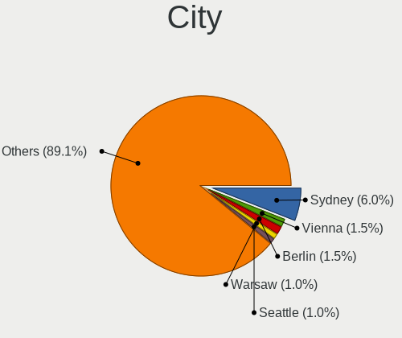
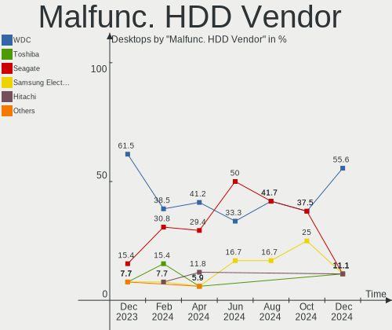
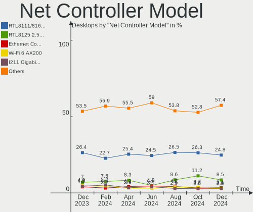
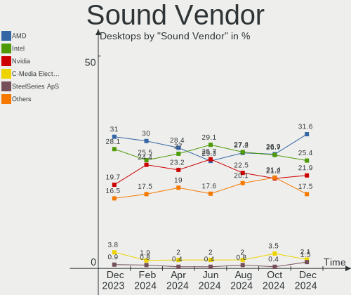

Fedora Hardware Trends (Desktops)
---------------------------------

A project to identify most popular hardware characteristics and track their change
over time based on data collected by Fedora users at https://Linux-Hardware.org.

Anyone can contribute to this report by the [hw-probe](https://github.com/linuxhw/hw-probe) tool:

    sudo -E hw-probe -all -upload

Full-feature report is available here: https://linux-hardware.org/?view=trends

Period: Mar, 2022.

Contents
--------

* [ System ](#system)
  - [ OS                       ](#os)
  - [ OS Family                ](#os-family)
  - [ Kernel                   ](#kernel)
  - [ Kernel Family            ](#kernel-family)
  - [ Kernel Major Ver.        ](#kernel-major-ver)
  - [ Arch                     ](#arch)
  - [ DE                       ](#de)
  - [ Display Server           ](#display-server)
  - [ Display Manager          ](#display-manager)
  - [ OS Lang                  ](#os-lang)
  - [ Boot Mode                ](#boot-mode)
  - [ Filesystem               ](#filesystem)
  - [ Part. scheme             ](#part-scheme)
  - [ Dual Boot with Linux/BSD ](#dual-boot-with-linuxbsd)
  - [ Dual Boot (Win)          ](#dual-boot-win)

* [ Board ](#board)
  - [ Vendor                   ](#vendor)
  - [ Model                    ](#model)
  - [ Model Family             ](#model-family)
  - [ MFG Year                 ](#mfg-year)
  - [ Form Factor              ](#form-factor)
  - [ Secure Boot              ](#secure-boot)
  - [ Coreboot                 ](#coreboot)
  - [ RAM Size                 ](#ram-size)
  - [ RAM Used                 ](#ram-used)
  - [ Total Drives             ](#total-drives)
  - [ Has CD-ROM               ](#has-cd-rom)
  - [ Has Ethernet             ](#has-ethernet)
  - [ Has WiFi                 ](#has-wifi)
  - [ Has Bluetooth            ](#has-bluetooth)

* [ Location ](#location)
  - [ Country                  ](#country)
  - [ City                     ](#city)

* [ Drives ](#drives)
  - [ Drive Vendor             ](#drive-vendor)
  - [ Drive Model              ](#drive-model)
  - [ HDD Vendor               ](#hdd-vendor)
  - [ SSD Vendor               ](#ssd-vendor)
  - [ Drive Kind               ](#drive-kind)
  - [ Drive Connector          ](#drive-connector)
  - [ Drive Size               ](#drive-size)
  - [ Space Total              ](#space-total)
  - [ Space Used               ](#space-used)
  - [ Malfunc. Drives          ](#malfunc-drives)
  - [ Malfunc. Drive Vendor    ](#malfunc-drive-vendor)
  - [ Malfunc. HDD Vendor      ](#malfunc-hdd-vendor)
  - [ Malfunc. Drive Kind      ](#malfunc-drive-kind)
  - [ Failed Drives            ](#failed-drives)
  - [ Failed Drive Vendor      ](#failed-drive-vendor)
  - [ Drive Status             ](#drive-status)

* [ Storage controller ](#storage-controller)
  - [ Storage Vendor           ](#storage-vendor)
  - [ Storage Model            ](#storage-model)
  - [ Storage Kind             ](#storage-kind)

* [ Processor ](#processor)
  - [ CPU Vendor               ](#cpu-vendor)
  - [ CPU Model                ](#cpu-model)
  - [ CPU Model Family         ](#cpu-model-family)
  - [ CPU Cores                ](#cpu-cores)
  - [ CPU Sockets              ](#cpu-sockets)
  - [ CPU Threads              ](#cpu-threads)
  - [ CPU Op-Modes             ](#cpu-op-modes)
  - [ CPU Microcode            ](#cpu-microcode)
  - [ CPU Microarch            ](#cpu-microarch)

* [ Graphics ](#graphics)
  - [ GPU Vendor               ](#gpu-vendor)
  - [ GPU Model                ](#gpu-model)
  - [ GPU Combo                ](#gpu-combo)
  - [ GPU Driver               ](#gpu-driver)
  - [ GPU Memory               ](#gpu-memory)

* [ Monitor ](#monitor)
  - [ Monitor Vendor           ](#monitor-vendor)
  - [ Monitor Model            ](#monitor-model)
  - [ Monitor Resolution       ](#monitor-resolution)
  - [ Monitor Diagonal         ](#monitor-diagonal)
  - [ Monitor Width            ](#monitor-width)
  - [ Aspect Ratio             ](#aspect-ratio)
  - [ Monitor Area             ](#monitor-area)
  - [ Pixel Density            ](#pixel-density)
  - [ Multiple Monitors        ](#multiple-monitors)

* [ Network ](#network)
  - [ Net Controller Vendor    ](#net-controller-vendor)
  - [ Net Controller Model     ](#net-controller-model)
  - [ Wireless Vendor          ](#wireless-vendor)
  - [ Wireless Model           ](#wireless-model)
  - [ Ethernet Vendor          ](#ethernet-vendor)
  - [ Ethernet Model           ](#ethernet-model)
  - [ Net Controller Kind      ](#net-controller-kind)
  - [ Used Controller          ](#used-controller)
  - [ NICs                     ](#nics)
  - [ IPv6                     ](#ipv6)

* [ Bluetooth ](#bluetooth)
  - [ Bluetooth Vendor         ](#bluetooth-vendor)
  - [ Bluetooth Model          ](#bluetooth-model)

* [ Sound ](#sound)
  - [ Sound Vendor             ](#sound-vendor)
  - [ Sound Model              ](#sound-model)

* [ Memory ](#memory)
  - [ Memory Vendor            ](#memory-vendor)
  - [ Memory Model             ](#memory-model)
  - [ Memory Kind              ](#memory-kind)
  - [ Memory Form Factor       ](#memory-form-factor)
  - [ Memory Size              ](#memory-size)
  - [ Memory Speed             ](#memory-speed)

* [ Printers & scanners ](#printers--scanners)
  - [ Printer Vendor           ](#printer-vendor)
  - [ Printer Model            ](#printer-model)
  - [ Scanner Vendor           ](#scanner-vendor)
  - [ Scanner Model            ](#scanner-model)

* [ Camera ](#camera)
  - [ Camera Vendor            ](#camera-vendor)
  - [ Camera Model             ](#camera-model)

* [ Security ](#security)
  - [ Fingerprint Vendor       ](#fingerprint-vendor)
  - [ Fingerprint Model        ](#fingerprint-model)
  - [ Chipcard Vendor          ](#chipcard-vendor)
  - [ Chipcard Model           ](#chipcard-model)

* [ Unsupported ](#unsupported)
  - [ Unsupported Devices      ](#unsupported-devices)
  - [ Unsupported Device Types ](#unsupported-device-types)

System
------

OS
--

Installed operating systems

| Name      | Desktops | Percent |
|-----------|----------|---------|
| Fedora 35 | 89       | 89%     |
| Fedora 36 | 6        | 6%      |
| Fedora 34 | 3        | 3%      |
| Fedora 37 | 1        | 1%      |
| Fedora 33 | 1        | 1%      |

OS Family
---------

OS without a version

| Name   | Desktops | Percent |
|--------|----------|---------|
| Fedora | 100      | 100%    |

Kernel
------

Version of the Linux kernel

| Version                      | Desktops | Percent |
|------------------------------|----------|---------|
| 5.16.16-200.fc35.x86_64      | 23       | 23%     |
| 5.16.12-200.fc35.x86_64      | 22       | 22%     |
| 5.16.15-201.fc35.x86_64      | 10       | 10%     |
| 5.16.11-200.fc35.x86_64      | 10       | 10%     |
| 5.16.18-200.fc35.x86_64      | 5        | 5%      |
| 5.16.14-200.fc35.x86_64      | 4        | 4%      |
| 5.16.13-200.fc35.x86_64      | 4        | 4%      |
| 5.14.10-300.fc35.x86_64      | 4        | 4%      |
| 5.17.1-300.fc36.x86_64       | 2        | 2%      |
| 5.17.0-0.rc7.116.fc36.x86_64 | 2        | 2%      |
| 5.16.9-200.fc35.x86_64       | 2        | 2%      |
| 5.16.12-100.fc34.x86_64      | 2        | 2%      |
| 5.17.0-300.fc36.x86_64       | 1        | 1%      |
| 5.17.0-0.rc6.109.fc37.x86_64 | 1        | 1%      |
| 5.17.0-0.rc5.102.fc36.x86_64 | 1        | 1%      |
| 5.16.7-200.fc35.x86_64       | 1        | 1%      |
| 5.16.17-200.fc35.x86_64      | 1        | 1%      |
| 5.16.11-xm1.0.fc35.x86_64    | 1        | 1%      |
| 5.15.16-200.fc35.x86_64      | 1        | 1%      |
| 5.15.12-100.fc34.x86_64      | 1        | 1%      |
| 5.15.10-200.fc35.x86_64      | 1        | 1%      |
| 5.14.18-100.fc33.x86_64      | 1        | 1%      |

Kernel Family
-------------

Linux kernel without a distro release

| Version | Desktops | Percent |
|---------|----------|---------|
| 5.16.12 | 24       | 24%     |
| 5.16.16 | 23       | 23%     |
| 5.16.11 | 11       | 11%     |
| 5.16.15 | 10       | 10%     |
| 5.17.0  | 5        | 5%      |
| 5.16.18 | 5        | 5%      |
| 5.16.14 | 4        | 4%      |
| 5.16.13 | 4        | 4%      |
| 5.14.10 | 4        | 4%      |
| 5.17.1  | 2        | 2%      |
| 5.16.9  | 2        | 2%      |
| 5.16.7  | 1        | 1%      |
| 5.16.17 | 1        | 1%      |
| 5.15.16 | 1        | 1%      |
| 5.15.12 | 1        | 1%      |
| 5.15.10 | 1        | 1%      |
| 5.14.18 | 1        | 1%      |

Kernel Major Ver.
-----------------

Linux kernel major version

| Version | Desktops | Percent |
|---------|----------|---------|
| 5.16    | 85       | 85%     |
| 5.17    | 7        | 7%      |
| 5.14    | 5        | 5%      |
| 5.15    | 3        | 3%      |

Arch
----

OS architecture (x86_64, i586, etc.)

| Name   | Desktops | Percent |
|--------|----------|---------|
| x86_64 | 100      | 100%    |

DE
--

Desktop Environment

| Name          | Desktops | Percent |
|---------------|----------|---------|
| GNOME         | 80       | 80%     |
| KDE5          | 8        | 8%      |
| XFCE          | 4        | 4%      |
| Cinnamon      | 3        | 3%      |
| Unknown       | 2        | 2%      |
| openbox       | 1        | 1%      |
| KDE           | 1        | 1%      |
| GNOME Classic | 1        | 1%      |

Display Server
--------------

X11 or Wayland

| Name    | Desktops | Percent |
|---------|----------|---------|
| Wayland | 52       | 52%     |
| X11     | 46       | 46%     |
| Web     | 1        | 1%      |
| Unknown | 1        | 1%      |

Display Manager
---------------

SDDM, LightDM, etc.

| Name    | Desktops | Percent |
|---------|----------|---------|
| Unknown | 63       | 63%     |
| GDM     | 25       | 25%     |
| LightDM | 8        | 8%      |
| SDDM    | 4        | 4%      |

OS Lang
-------

Language

| Lang  | Desktops | Percent |
|-------|----------|---------|
| en_US | 34       | 34%     |
| en_GB | 11       | 11%     |
| fr_FR | 8        | 8%      |
| ru_RU | 7        | 7%      |
| pt_BR | 5        | 5%      |
| en_CA | 4        | 4%      |
| en_AU | 3        | 3%      |
| de_DE | 3        | 3%      |
| nl_BE | 2        | 2%      |
| it_IT | 2        | 2%      |
| cs_CZ | 2        | 2%      |
| zh_CN | 1        | 1%      |
| tr_TR | 1        | 1%      |
| sr_RS | 1        | 1%      |
| pl_PL | 1        | 1%      |
| nl_NL | 1        | 1%      |
| nb_NO | 1        | 1%      |
| id_ID | 1        | 1%      |
| hu_HU | 1        | 1%      |
| fr_CH | 1        | 1%      |
| fr_BE | 1        | 1%      |
| fi_FI | 1        | 1%      |
| es_MX | 1        | 1%      |
| es_ES | 1        | 1%      |
| es_CO | 1        | 1%      |
| es_AR | 1        | 1%      |
| en_IE | 1        | 1%      |
| C     | 1        | 1%      |
| bs_BA | 1        | 1%      |
| ar_SA | 1        | 1%      |

Boot Mode
---------

EFI or BIOS

| Mode | Desktops | Percent |
|------|----------|---------|
| EFI  | 68       | 68%     |
| BIOS | 32       | 32%     |

Filesystem
----------

Type of filesystem

| Type    | Desktops | Percent |
|---------|----------|---------|
| Btrfs   | 73       | 73%     |
| Ext4    | 22       | 22%     |
| Xfs     | 4        | 4%      |
| Overlay | 1        | 1%      |

Part. scheme
------------

Scheme of partitioning

| Type    | Desktops | Percent |
|---------|----------|---------|
| Unknown | 63       | 63%     |
| GPT     | 32       | 32%     |
| MBR     | 5        | 5%      |

Dual Boot with Linux/BSD
------------------------

Hosting more than one Linux/BSD

| Dual boot | Desktops | Percent |
|-----------|----------|---------|
| No        | 92       | 92%     |
| Yes       | 8        | 8%      |

Dual Boot (Win)
---------------

Hosting Linux and Windows

| Dual boot | Desktops | Percent |
|-----------|----------|---------|
| No        | 83       | 83%     |
| Yes       | 17       | 17%     |

Board
-----

Vendor
------

Motherboard manufacturer

| Name                | Desktops | Percent |
|---------------------|----------|---------|
| ASUSTek Computer    | 30       | 30%     |
| Gigabyte Technology | 25       | 25%     |
| MSI                 | 15       | 15%     |
| Dell                | 7        | 7%      |
| ASRock              | 6        | 6%      |
| Hewlett-Packard     | 4        | 4%      |
| Lenovo              | 3        | 3%      |
| Acer                | 3        | 3%      |
| MACHINIST           | 1        | 1%      |
| Intel               | 1        | 1%      |
| Gateway             | 1        | 1%      |
| Colorful Technology | 1        | 1%      |
| BESSTAR Tech        | 1        | 1%      |
| ABIT                | 1        | 1%      |
| AAEON               | 1        | 1%      |

Model
-----

Motherboard model

| Name                                | Desktops | Percent |
|-------------------------------------|----------|---------|
| MSI MS-7C37                         | 2        | 2%      |
| MSI MS-7B79                         | 2        | 2%      |
| Gigabyte X570 AORUS MASTER          | 2        | 2%      |
| Dell Precision T3600                | 2        | 2%      |
| ASUS ROG STRIX B550-I GAMING        | 2        | 2%      |
| ASUS ROG STRIX B550-F GAMING        | 2        | 2%      |
| ASUS ROG CROSSHAIR VII HERO         | 2        | 2%      |
| ASUS PRIME B450M-A                  | 2        | 2%      |
| MSI PPPPP-CCC#MMMMMMMM              | 1        | 1%      |
| MSI MS-7D06                         | 1        | 1%      |
| MSI MS-7C92                         | 1        | 1%      |
| MSI MS-7C56                         | 1        | 1%      |
| MSI MS-7B93                         | 1        | 1%      |
| MSI MS-7B85                         | 1        | 1%      |
| MSI MS-7B17                         | 1        | 1%      |
| MSI MS-7A38                         | 1        | 1%      |
| MSI MS-7816                         | 1        | 1%      |
| MSI CQ3321L                         | 1        | 1%      |
| MSI AUTOCONT OFFICEPRO              | 1        | 1%      |
| MACHINIST X99-G7 V1.0               | 1        | 1%      |
| Lenovo ThinkCentre M93p 10A8S3C100  | 1        | 1%      |
| Lenovo ThinkCentre M720s 10ST001QUS | 1        | 1%      |
| Lenovo ThinkCentre M720s 10ST0014MB | 1        | 1%      |
| Intel DH61BE AAG14062-206           | 1        | 1%      |
| HP Z600 Workstation                 | 1        | 1%      |
| HP Z440 Workstation                 | 1        | 1%      |
| HP ProDesk 400 G4 SFF               | 1        | 1%      |
| HP Pavilion Desktop TP01-1xxx       | 1        | 1%      |
| Gigabyte Z68XP-UD3                  | 1        | 1%      |
| Gigabyte Z68MA-D2H-B3               | 1        | 1%      |
| Gigabyte Z170-D3H                   | 1        | 1%      |
| Gigabyte X99-UD4-CF                 | 1        | 1%      |
| Gigabyte X570 I AORUS PRO WIFI      | 1        | 1%      |
| Gigabyte X470 AORUS ULTRA GAMING    | 1        | 1%      |
| Gigabyte M68MT-S2P                  | 1        | 1%      |
| Gigabyte H77N-WIFI                  | 1        | 1%      |
| Gigabyte H61M-USB3V                 | 1        | 1%      |
| Gigabyte H410M H                    | 1        | 1%      |
| Gigabyte H370M-DS3H                 | 1        | 1%      |
| Gigabyte GB-BRR7H-4800              | 1        | 1%      |
| Gigabyte GA-MA780G-UD3H             | 1        | 1%      |
| Gigabyte G1.Sniper Z97              | 1        | 1%      |
| Gigabyte G1.Sniper B5               | 1        | 1%      |
| Gigabyte F2A88XM-D3H                | 1        | 1%      |
| Gigabyte EP45-DS3L                  | 1        | 1%      |
| Gigabyte B85M-D3V-A                 | 1        | 1%      |
| Gigabyte B550 AORUS ELITE           | 1        | 1%      |
| Gigabyte B450M DS3H                 | 1        | 1%      |
| Gigabyte B450 AORUS M               | 1        | 1%      |
| Gigabyte B450 AORUS ELITE           | 1        | 1%      |
| Gigabyte AB350-Gaming 3             | 1        | 1%      |
| Gateway SX2185                      | 1        | 1%      |
| Dell XPS 8700                       | 1        | 1%      |
| Dell Precision Tower 3431           | 1        | 1%      |
| Dell OptiPlex 7010                  | 1        | 1%      |
| Dell OptiPlex 390                   | 1        | 1%      |
| Dell G5 5000                        | 1        | 1%      |
| Colorful C.H110M-K D3 PLUS          | 1        | 1%      |
| BESSTAR Tech UM700                  | 1        | 1%      |
| ASUS TUF Gaming B560M-PLUS WIFI     | 1        | 1%      |

Model Family
------------

Motherboard model prefix

| Name                    | Desktops | Percent |
|-------------------------|----------|---------|
| ASUS ROG                | 12       | 12%     |
| ASUS PRIME              | 7        | 7%      |
| Lenovo ThinkCentre      | 3        | 3%      |
| Gigabyte X570           | 3        | 3%      |
| Dell Precision          | 3        | 3%      |
| ASUS TUF                | 3        | 3%      |
| MSI MS-7C37             | 2        | 2%      |
| MSI MS-7B79             | 2        | 2%      |
| Gigabyte G1.Sniper      | 2        | 2%      |
| Gigabyte B450           | 2        | 2%      |
| Dell OptiPlex           | 2        | 2%      |
| Acer Veriton            | 2        | 2%      |
| MSI PPPPP-CCC#MMMMMMMM  | 1        | 1%      |
| MSI MS-7D06             | 1        | 1%      |
| MSI MS-7C92             | 1        | 1%      |
| MSI MS-7C56             | 1        | 1%      |
| MSI MS-7B93             | 1        | 1%      |
| MSI MS-7B85             | 1        | 1%      |
| MSI MS-7B17             | 1        | 1%      |
| MSI MS-7A38             | 1        | 1%      |
| MSI MS-7816             | 1        | 1%      |
| MSI CQ3321L             | 1        | 1%      |
| MSI AUTOCONT            | 1        | 1%      |
| MACHINIST X99-G7        | 1        | 1%      |
| Intel DH61BE            | 1        | 1%      |
| HP Z600                 | 1        | 1%      |
| HP Z440                 | 1        | 1%      |
| HP ProDesk              | 1        | 1%      |
| HP Pavilion             | 1        | 1%      |
| Gigabyte Z68XP-UD3      | 1        | 1%      |
| Gigabyte Z68MA-D2H-B3   | 1        | 1%      |
| Gigabyte Z170-D3H       | 1        | 1%      |
| Gigabyte X99-UD4-CF     | 1        | 1%      |
| Gigabyte X470           | 1        | 1%      |
| Gigabyte M68MT-S2P      | 1        | 1%      |
| Gigabyte H77N-WIFI      | 1        | 1%      |
| Gigabyte H61M-USB3V     | 1        | 1%      |
| Gigabyte H410M          | 1        | 1%      |
| Gigabyte H370M-DS3H     | 1        | 1%      |
| Gigabyte GB-BRR7H-4800  | 1        | 1%      |
| Gigabyte GA-MA780G-UD3H | 1        | 1%      |
| Gigabyte F2A88XM-D3H    | 1        | 1%      |
| Gigabyte EP45-DS3L      | 1        | 1%      |
| Gigabyte B85M-D3V-A     | 1        | 1%      |
| Gigabyte B550           | 1        | 1%      |
| Gigabyte B450M          | 1        | 1%      |
| Gigabyte AB350-Gaming   | 1        | 1%      |
| Gateway SX2185          | 1        | 1%      |
| Dell XPS                | 1        | 1%      |
| Dell G5                 | 1        | 1%      |
| Colorful C.H110M-K      | 1        | 1%      |
| BESSTAR Tech UM700      | 1        | 1%      |
| ASUS STRIX              | 1        | 1%      |
| ASUS P8Z77-V            | 1        | 1%      |
| ASUS P8Z68-V            | 1        | 1%      |
| ASUS P8P67              | 1        | 1%      |
| ASUS P8H61-MX           | 1        | 1%      |
| ASUS P5Q-PRO            | 1        | 1%      |
| ASUS M5A97              | 1        | 1%      |
| ASUS M5A78L-M           | 1        | 1%      |

MFG Year
--------

Motherboard manufacture year

| Year | Desktops | Percent |
|------|----------|---------|
| 2020 | 18       | 18%     |
| 2018 | 14       | 14%     |
| 2019 | 10       | 10%     |
| 2021 | 9        | 9%      |
| 2012 | 8        | 8%      |
| 2017 | 7        | 7%      |
| 2013 | 6        | 6%      |
| 2010 | 6        | 6%      |
| 2015 | 5        | 5%      |
| 2014 | 5        | 5%      |
| 2011 | 5        | 5%      |
| 2008 | 3        | 3%      |
| 2016 | 2        | 2%      |
| 2022 | 1        | 1%      |
| 2007 | 1        | 1%      |

Form Factor
-----------

Physical design of the computer

| Name    | Desktops | Percent |
|---------|----------|---------|
| Desktop | 100      | 100%    |

Secure Boot
-----------

Enabled or disabled

| State    | Desktops | Percent |
|----------|----------|---------|
| Disabled | 98       | 98%     |
| Enabled  | 2        | 2%      |

Coreboot
--------

Have coreboot on board

| Used | Desktops | Percent |
|------|----------|---------|
| No   | 100      | 100%    |

RAM Size
--------

Total RAM memory

| Size in GB  | Desktops | Percent |
|-------------|----------|---------|
| 16.01-24.0  | 36       | 36%     |
| 32.01-64.0  | 21       | 21%     |
| 8.01-16.0   | 12       | 12%     |
| 64.01-256.0 | 10       | 10%     |
| 4.01-8.0    | 9        | 9%      |
| 3.01-4.0    | 8        | 8%      |
| 24.01-32.0  | 4        | 4%      |

RAM Used
--------

Used RAM memory

| Used GB    | Desktops | Percent |
|------------|----------|---------|
| 2.01-3.0   | 30       | 30%     |
| 3.01-4.0   | 26       | 26%     |
| 4.01-8.0   | 23       | 23%     |
| 1.01-2.0   | 9        | 9%      |
| 8.01-16.0  | 6        | 6%      |
| 16.01-24.0 | 3        | 3%      |
| 32.01-64.0 | 1        | 1%      |
| 24.01-32.0 | 1        | 1%      |
| 0.51-1.0   | 1        | 1%      |

Total Drives
------------

Number of drives on board

| Drives | Desktops | Percent |
|--------|----------|---------|
| 2      | 38       | 38%     |
| 1      | 21       | 21%     |
| 3      | 20       | 20%     |
| 4      | 13       | 13%     |
| 7      | 3        | 3%      |
| 5      | 3        | 3%      |
| 8      | 1        | 1%      |
| 6      | 1        | 1%      |

Has CD-ROM
----------

Has CD-ROM on board

| Presented | Desktops | Percent |
|-----------|----------|---------|
| No        | 67       | 67%     |
| Yes       | 33       | 33%     |

Has Ethernet
------------

Has Ethernet on board

| Presented | Desktops | Percent |
|-----------|----------|---------|
| Yes       | 100      | 100%    |

Has WiFi
--------

Has WiFi module

| Presented | Desktops | Percent |
|-----------|----------|---------|
| No        | 51       | 51%     |
| Yes       | 49       | 49%     |

Has Bluetooth
-------------

Has Bluetooth module

| Presented | Desktops | Percent |
|-----------|----------|---------|
| No        | 53       | 53%     |
| Yes       | 47       | 47%     |

Location
--------

Country
-------

Geographic location (country)

| Country      | Desktops | Percent |
|--------------|----------|---------|
| USA          | 16       | 16%     |
| France       | 9        | 9%      |
| UK           | 6        | 6%      |
| Russia       | 6        | 6%      |
| Brazil       | 6        | 6%      |
| Canada       | 5        | 5%      |
| Belgium      | 5        | 5%      |
| Netherlands  | 4        | 4%      |
| Germany      | 4        | 4%      |
| Sweden       | 3        | 3%      |
| Indonesia    | 3        | 3%      |
| Belarus      | 3        | 3%      |
| Australia    | 3        | 3%      |
| Spain        | 2        | 2%      |
| Poland       | 2        | 2%      |
| Norway       | 2        | 2%      |
| Italy        | 2        | 2%      |
| Czechia      | 2        | 2%      |
| Yemen        | 1        | 1%      |
| Ukraine      | 1        | 1%      |
| Turkey       | 1        | 1%      |
| Switzerland  | 1        | 1%      |
| Slovenia     | 1        | 1%      |
| Saudi Arabia | 1        | 1%      |
| Mexico       | 1        | 1%      |
| Latvia       | 1        | 1%      |
| Kyrgyzstan   | 1        | 1%      |
| Kuwait       | 1        | 1%      |
| Ireland      | 1        | 1%      |
| Hungary      | 1        | 1%      |
| Hong Kong    | 1        | 1%      |
| Colombia     | 1        | 1%      |
| Bulgaria     | 1        | 1%      |
| Austria      | 1        | 1%      |
| Argentina    | 1        | 1%      |

City
----

Geographic location (city)

| City                  | Desktops | Percent |
|-----------------------|----------|---------|
| Minsk                 | 3        | 3%      |
| Jakarta               | 3        | 3%      |
| Sydney                | 2        | 2%      |
| Moscow                | 2        | 2%      |
| Louisville            | 2        | 2%      |
| Brussels              | 2        | 2%      |
| Yekaterinburg         | 1        | 1%      |
| Windsor               | 1        | 1%      |
| Wigan                 | 1        | 1%      |
| Warsaw                | 1        | 1%      |
| Vrchlabi              | 1        | 1%      |
| Vitória              | 1        | 1%      |
| Vienna                | 1        | 1%      |
| Valence               | 1        | 1%      |
| Tseung Kwan O         | 1        | 1%      |
| Trondheim             | 1        | 1%      |
| Thomasville           | 1        | 1%      |
| Strasbourg            | 1        | 1%      |
| Stockholm             | 1        | 1%      |
| Sollentuna            | 1        | 1%      |
| Sautron               | 1        | 1%      |
| Sao Luís             | 1        | 1%      |
| Sao Joao da Boa Vista | 1        | 1%      |
| Santa Ana             | 1        | 1%      |
| Rotterdam             | 1        | 1%      |
| Rostov-on-Don         | 1        | 1%      |
| Rome                  | 1        | 1%      |
| Riyadh                | 1        | 1%      |
| Riga                  | 1        | 1%      |
| Regina                | 1        | 1%      |
| Praha 10              | 1        | 1%      |
| Portland              | 1        | 1%      |
| Pomerode              | 1        | 1%      |
| Oegstgeest            | 1        | 1%      |
| North Bergen          | 1        | 1%      |
| North Bend            | 1        | 1%      |
| Neuchatel             | 1        | 1%      |
| Montefalco            | 1        | 1%      |
| Mirepeix              | 1        | 1%      |
| Mimizan               | 1        | 1%      |
| Milpitas              | 1        | 1%      |
| Midlothian            | 1        | 1%      |
| Mexico City           | 1        | 1%      |
| Medellín             | 1        | 1%      |
| Maribor               | 1        | 1%      |
| Madrid                | 1        | 1%      |
| London                | 1        | 1%      |
| Lodz                  | 1        | 1%      |
| Lille                 | 1        | 1%      |
| Landskrona            | 1        | 1%      |
| Kuwait City           | 1        | 1%      |
| Kristiansand          | 1        | 1%      |
| Kazan’              | 1        | 1%      |
| Irving                | 1        | 1%      |
| Ibb                   | 1        | 1%      |
| Houston               | 1        | 1%      |
| Holland               | 1        | 1%      |
| Hamburg               | 1        | 1%      |
| Goleta                | 1        | 1%      |
| Goiânia              | 1        | 1%      |

Drives
------

Drive Vendor
------------

Hard drive vendors

| Vendor                | Desktops | Drives | Percent |
|-----------------------|----------|--------|---------|
| Samsung Electronics   | 39       | 62     | 20.31%  |
| WDC                   | 31       | 48     | 16.15%  |
| Seagate               | 29       | 47     | 15.1%   |
| Toshiba               | 14       | 15     | 7.29%   |
| Kingston              | 14       | 14     | 7.29%   |
| Crucial               | 11       | 12     | 5.73%   |
| SanDisk               | 8        | 11     | 4.17%   |
| Phison                | 6        | 6      | 3.13%   |
| A-DATA Technology     | 6        | 6      | 3.13%   |
| Hitachi               | 5        | 5      | 2.6%    |
| Intel                 | 4        | 4      | 2.08%   |
| SSK                   | 2        | 2      | 1.04%   |
| SPCC                  | 2        | 2      | 1.04%   |
| Silicon Motion        | 2        | 2      | 1.04%   |
| OCZ                   | 2        | 2      | 1.04%   |
| Corsair               | 2        | 2      | 1.04%   |
| XPG                   | 1        | 1      | 0.52%   |
| Unknown               | 1        | 2      | 0.52%   |
| Transcend             | 1        | 1      | 0.52%   |
| sobetter              | 1        | 1      | 0.52%   |
| Realtek Semiconductor | 1        | 1      | 0.52%   |
| Micron Technology     | 1        | 2      | 0.52%   |
| MAXTOR                | 1        | 1      | 0.52%   |
| MaxDigital            | 1        | 1      | 0.52%   |
| LITEON                | 1        | 1      | 0.52%   |
| LDLC                  | 1        | 1      | 0.52%   |
| Intenso               | 1        | 1      | 0.52%   |
| HGST                  | 1        | 1      | 0.52%   |
| Gigabyte Technology   | 1        | 2      | 0.52%   |
| China                 | 1        | 1      | 0.52%   |
| AMD                   | 1        | 1      | 0.52%   |

Drive Model
-----------

Hard drive models

| Model                            | Desktops | Percent |
|----------------------------------|----------|---------|
| Samsung NVMe SSD Drive 500GB     | 6        | 2.53%   |
| Samsung SSD 860 EVO 500GB        | 5        | 2.11%   |
| Sandisk NVMe SSD Drive 1TB       | 4        | 1.69%   |
| Samsung SSD 860 EVO 1TB          | 4        | 1.69%   |
| Crucial CT1000MX500SSD1 1TB      | 4        | 1.69%   |
| Toshiba HDWD120 2TB              | 3        | 1.27%   |
| Seagate ST4000DM004-2CV104 4TB   | 3        | 1.27%   |
| Sandisk NVMe SSD Drive 500GB     | 3        | 1.27%   |
| Samsung SSD 970 EVO Plus 1TB     | 3        | 1.27%   |
| Samsung NVMe SSD Drive 2TB       | 3        | 1.27%   |
| Samsung NVMe SSD Drive 1TB       | 3        | 1.27%   |
| Kingston SA400S37240G 240GB SSD  | 3        | 1.27%   |
| Crucial CT500MX500SSD1 500GB     | 3        | 1.27%   |
| WDC WDS100T2B0A-00SM50 1TB SSD   | 2        | 0.84%   |
| WDC WD30EFRX-68EUZN0 3TB         | 2        | 0.84%   |
| WDC WD20EZRZ-00Z5HB0 2TB         | 2        | 0.84%   |
| WDC WD20EARS-00MVWB0 2TB         | 2        | 0.84%   |
| WDC WD10EZEX-22MFCA0 1TB         | 2        | 0.84%   |
| Toshiba HDWD110 1TB              | 2        | 0.84%   |
| Seagate ST1000DM003-1ER162 1TB   | 2        | 0.84%   |
| Seagate ST1000DM003-1CH162 1TB   | 2        | 0.84%   |
| Samsung SSD 970 EVO Plus 500GB   | 2        | 0.84%   |
| Samsung SSD 970 EVO 250GB        | 2        | 0.84%   |
| Samsung SSD 860 QVO 1TB          | 2        | 0.84%   |
| Samsung SSD 860 EVO 250GB        | 2        | 0.84%   |
| Samsung SSD 850 EVO 500GB        | 2        | 0.84%   |
| Samsung SSD 850 EVO 250GB        | 2        | 0.84%   |
| Samsung SSD 840 EVO 500GB        | 2        | 0.84%   |
| Kingston SV300S37A120G 120GB SSD | 2        | 0.84%   |
| Kingston SUV400S37240G 240GB SSD | 2        | 0.84%   |
| Kingston SA400S37120G 120GB SSD  | 2        | 0.84%   |
| A-DATA SU650 120GB SSD           | 2        | 0.84%   |
| XPG GAMMIX S11 Pro 256GB         | 1        | 0.42%   |
| WDC WDS500G3X0C-00SJG0 500GB     | 1        | 0.42%   |
| WDC WDS500G2B0A-00SM50 500GB SSD | 1        | 0.42%   |
| WDC WDS500G1B0A-00H9H0 500GB SSD | 1        | 0.42%   |
| WDC WDS240G2G0A-00JH30 240GB SSD | 1        | 0.42%   |
| WDC WD60EFAX-68SHWN0 6TB         | 1        | 0.42%   |
| WDC WD6003FZBX-00GXAB0 6TB       | 1        | 0.42%   |
| WDC WD5000AZLX-21K2TA0 500GB     | 1        | 0.42%   |
| WDC WD5000AVCS-632DY1 500GB      | 1        | 0.42%   |
| WDC WD40EZRZ-00GXCB0 4TB         | 1        | 0.42%   |
| WDC WD40EFRX-68N32N0 4TB         | 1        | 0.42%   |
| WDC WD4003FZEX-00Z4SA0 4TB       | 1        | 0.42%   |
| WDC WD3200BEVT-24A23T0 320GB     | 1        | 0.42%   |
| WDC WD3200AAKS-00B3A0 320GB      | 1        | 0.42%   |
| WDC WD2500BEVT-22A23T0 250GB     | 1        | 0.42%   |
| WDC WD20EZRX-00D8PB0 2TB         | 1        | 0.42%   |
| WDC WD20EFRX-68EUZN0 2TB         | 1        | 0.42%   |
| WDC WD20EFAX-68B2RN1 2TB         | 1        | 0.42%   |
| WDC WD20EARX-00PASB0 2TB         | 1        | 0.42%   |
| WDC WD2003FZEX-00Z4SA0 2TB       | 1        | 0.42%   |
| WDC WD2003FZEX-00SRLA0 2TB       | 1        | 0.42%   |
| WDC WD2002FAEX-007BA0 2TB        | 1        | 0.42%   |
| WDC WD2000F9YZ-09N20L1 2TB       | 1        | 0.42%   |
| WDC WD10SPZX-21Z10T0 1TB         | 1        | 0.42%   |
| WDC WD10EZRX-00L4HB0 1TB         | 1        | 0.42%   |
| WDC WD10EZEX-60WN4A0 1TB         | 1        | 0.42%   |
| WDC WD10EZEX-00ZF5A0 1TB         | 1        | 0.42%   |
| WDC WD10EZEX-00WN4A0 1TB         | 1        | 0.42%   |

HDD Vendor
----------

Hard disk drive vendors

| Vendor              | Desktops | Drives | Percent |
|---------------------|----------|--------|---------|
| Seagate             | 29       | 45     | 39.19%  |
| WDC                 | 24       | 41     | 32.43%  |
| Toshiba             | 10       | 10     | 13.51%  |
| Hitachi             | 5        | 5      | 6.76%   |
| Samsung Electronics | 3        | 4      | 4.05%   |
| MAXTOR              | 1        | 1      | 1.35%   |
| MaxDigital          | 1        | 1      | 1.35%   |
| HGST                | 1        | 1      | 1.35%   |

SSD Vendor
----------

Solid state drive vendors

| Vendor              | Desktops | Drives | Percent |
|---------------------|----------|--------|---------|
| Samsung Electronics | 20       | 29     | 28.17%  |
| Kingston            | 13       | 13     | 18.31%  |
| Crucial             | 10       | 10     | 14.08%  |
| WDC                 | 5        | 5      | 7.04%   |
| A-DATA Technology   | 5        | 5      | 7.04%   |
| Toshiba             | 3        | 4      | 4.23%   |
| SPCC                | 2        | 2      | 2.82%   |
| SanDisk             | 2        | 2      | 2.82%   |
| OCZ                 | 2        | 2      | 2.82%   |
| Intel               | 2        | 2      | 2.82%   |
| Corsair             | 2        | 2      | 2.82%   |
| Transcend           | 1        | 1      | 1.41%   |
| LITEON              | 1        | 1      | 1.41%   |
| Intenso             | 1        | 1      | 1.41%   |
| China               | 1        | 1      | 1.41%   |
| AMD                 | 1        | 1      | 1.41%   |

Drive Kind
----------

HDD or SSD

| Kind    | Desktops | Drives | Percent |
|---------|----------|--------|---------|
| HDD     | 64       | 108    | 36.57%  |
| SSD     | 63       | 81     | 36%     |
| NVMe    | 40       | 59     | 22.86%  |
| Unknown | 8        | 10     | 4.57%   |

Drive Connector
---------------

SATA, SAS, NVMe, etc.

| Type | Desktops | Drives | Percent |
|------|----------|--------|---------|
| SATA | 90       | 189    | 65.22%  |
| NVMe | 40       | 59     | 28.99%  |
| SAS  | 8        | 10     | 5.8%    |

Drive Size
----------

Size of hard drive

| Size in TB | Desktops | Drives | Percent |
|------------|----------|--------|---------|
| 0.01-0.5   | 62       | 89     | 45.59%  |
| 0.51-1.0   | 38       | 50     | 27.94%  |
| 1.01-2.0   | 17       | 25     | 12.5%   |
| 3.01-4.0   | 10       | 13     | 7.35%   |
| 4.01-10.0  | 6        | 8      | 4.41%   |
| 2.01-3.0   | 3        | 4      | 2.21%   |

Space Total
-----------

Amount of disk space available on the file system

| Size in GB     | Desktops | Percent |
|----------------|----------|---------|
| 1001-2000      | 22       | 22%     |
| 501-1000       | 21       | 21%     |
| More than 3000 | 20       | 20%     |
| 251-500        | 20       | 20%     |
| 101-250        | 7        | 7%      |
| 2001-3000      | 5        | 5%      |
| Unknown        | 3        | 3%      |
| 21-50          | 1        | 1%      |
| 51-100         | 1        | 1%      |

Space Used
----------

Amount of used disk space

| Used GB        | Desktops | Percent |
|----------------|----------|---------|
| 101-250        | 21       | 21%     |
| 251-500        | 18       | 18%     |
| 1-20           | 12       | 12%     |
| 501-1000       | 11       | 11%     |
| 21-50          | 10       | 10%     |
| 51-100         | 9        | 9%      |
| 1001-2000      | 6        | 6%      |
| More than 3000 | 5        | 5%      |
| 2001-3000      | 5        | 5%      |
| Unknown        | 3        | 3%      |

Malfunc. Drives
---------------

Drive models with a malfunction

| Model                             | Desktops | Drives | Percent |
|-----------------------------------|----------|--------|---------|
| WDC WD3200BEVT-24A23T0 320GB      | 1        | 1      | 8.33%   |
| WDC WD20EZRX-00D8PB0 2TB          | 1        | 1      | 8.33%   |
| Seagate ST9750420AS 752GB         | 1        | 1      | 8.33%   |
| Seagate ST9500325AS 500GB         | 1        | 1      | 8.33%   |
| Seagate ST500DM009-2F110A 500GB   | 1        | 1      | 8.33%   |
| Seagate ST500DM002-1BD142 500GB   | 1        | 3      | 8.33%   |
| Seagate ST3500418AS 500GB         | 1        | 1      | 8.33%   |
| Seagate ST3000DM001-1CH166 3TB    | 1        | 1      | 8.33%   |
| Samsung Electronics HD501LJ 500GB | 1        | 2      | 8.33%   |
| MAXTOR 6Y080M0 81GB               | 1        | 1      | 8.33%   |
| Intel SSDPEKKW256G7 256GB         | 1        | 1      | 8.33%   |
| Corsair Force LS SSD 480GB        | 1        | 1      | 8.33%   |

Malfunc. Drive Vendor
---------------------

Vendors of faulty drives

| Vendor              | Desktops | Drives | Percent |
|---------------------|----------|--------|---------|
| Seagate             | 5        | 8      | 45.45%  |
| WDC                 | 2        | 2      | 18.18%  |
| Samsung Electronics | 1        | 2      | 9.09%   |
| MAXTOR              | 1        | 1      | 9.09%   |
| Intel               | 1        | 1      | 9.09%   |
| Corsair             | 1        | 1      | 9.09%   |

Malfunc. HDD Vendor
-------------------

Vendors of faulty HDD drives

| Vendor              | Desktops | Drives | Percent |
|---------------------|----------|--------|---------|
| Seagate             | 5        | 8      | 55.56%  |
| WDC                 | 2        | 2      | 22.22%  |
| Samsung Electronics | 1        | 2      | 11.11%  |
| MAXTOR              | 1        | 1      | 11.11%  |

Malfunc. Drive Kind
-------------------

Kinds of faulty drives

| Kind | Desktops | Drives | Percent |
|------|----------|--------|---------|
| HDD  | 9        | 13     | 81.82%  |
| NVMe | 1        | 1      | 9.09%   |
| SSD  | 1        | 1      | 9.09%   |

Failed Drives
-------------

Failed drive models

Zero info for selected period =(

Failed Drive Vendor
-------------------

Failed drive vendors

Zero info for selected period =(

Drive Status
------------

Number of failed and malfunc. drives

| Status   | Desktops | Drives | Percent |
|----------|----------|--------|---------|
| Detected | 65       | 156    | 57.52%  |
| Works    | 37       | 87     | 32.74%  |
| Malfunc  | 11       | 15     | 9.73%   |

Storage controller
------------------

Storage Vendor
--------------

Storage controller vendors

| Vendor                       | Desktops | Percent |
|------------------------------|----------|---------|
| Intel                        | 56       | 34.36%  |
| AMD                          | 42       | 25.77%  |
| Samsung Electronics          | 23       | 14.11%  |
| Sandisk                      | 7        | 4.29%   |
| Phison Electronics           | 6        | 3.68%   |
| Marvell Technology Group     | 6        | 3.68%   |
| ASMedia Technology           | 6        | 3.68%   |
| JMicron Technology           | 4        | 2.45%   |
| Silicon Motion               | 2        | 1.23%   |
| Micron/Crucial Technology    | 2        | 1.23%   |
| ADATA Technology             | 2        | 1.23%   |
| VIA Technologies             | 1        | 0.61%   |
| Toshiba America Info Systems | 1        | 0.61%   |
| Silicon Image                | 1        | 0.61%   |
| Realtek Semiconductor        | 1        | 0.61%   |
| Nvidia                       | 1        | 0.61%   |
| Micron Technology            | 1        | 0.61%   |
| Kingston Technology Company  | 1        | 0.61%   |

Storage Model
-------------

Storage controller models

| Model                                                                                   | Desktops | Percent |
|-----------------------------------------------------------------------------------------|----------|---------|
| AMD FCH SATA Controller [AHCI mode]                                                     | 23       | 12.11%  |
| Samsung NVMe SSD Controller SM981/PM981/PM983                                           | 16       | 8.42%   |
| AMD 400 Series Chipset SATA Controller                                                  | 12       | 6.32%   |
| AMD 500 Series Chipset SATA Controller                                                  | 11       | 5.79%   |
| Intel Cannon Lake PCH SATA AHCI Controller                                              | 8        | 4.21%   |
| Intel 8 Series/C220 Series Chipset Family 6-port SATA Controller 1 [AHCI mode]          | 6        | 3.16%   |
| Intel 6 Series/C200 Series Chipset Family 6 port Desktop SATA AHCI Controller           | 6        | 3.16%   |
| ASMedia ASM1062 Serial ATA Controller                                                   | 6        | 3.16%   |
| Sandisk WD Blue SN550 NVMe SSD                                                          | 5        | 2.63%   |
| Samsung NVMe SSD Controller PM9A1/PM9A3/980PRO                                          | 4        | 2.11%   |
| Phison E12 NVMe Controller                                                              | 4        | 2.11%   |
| Intel SATA Controller [RAID mode]                                                       | 4        | 2.11%   |
| Intel Q170/Q150/B150/H170/H110/Z170/CM236 Chipset SATA Controller [AHCI Mode]           | 4        | 2.11%   |
| Intel Comet Lake SATA AHCI Controller                                                   | 4        | 2.11%   |
| Intel 200 Series PCH SATA controller [AHCI mode]                                        | 4        | 2.11%   |
| Marvell Group 88SE9215 PCIe 2.0 x1 4-port SATA 6 Gb/s Controller                        | 3        | 1.58%   |
| Marvell Group 88SE9172 SATA 6Gb/s Controller                                            | 3        | 1.58%   |
| Intel 500 Series Chipset Family SATA AHCI Controller                                    | 3        | 1.58%   |
| Silicon Motion SM2263EN/SM2263XT SSD Controller                                         | 2        | 1.05%   |
| Sandisk WD Black SN750 / PC SN730 NVMe SSD                                              | 2        | 1.05%   |
| Samsung NVMe SSD Controller 980                                                         | 2        | 1.05%   |
| Phison E16 PCIe4 NVMe Controller                                                        | 2        | 1.05%   |
| Micron/Crucial P2 NVMe PCIe SSD                                                         | 2        | 1.05%   |
| JMicron JMB368 IDE controller                                                           | 2        | 1.05%   |
| JMicron JMB362 SATA Controller                                                          | 2        | 1.05%   |
| Intel C602 chipset 4-Port SATA Storage Control Unit                                     | 2        | 1.05%   |
| Intel C600/X79 series chipset 6-Port SATA AHCI Controller                               | 2        | 1.05%   |
| Intel 7 Series/C210 Series Chipset Family 6-port SATA Controller [AHCI mode]            | 2        | 1.05%   |
| Intel 6 Series/C200 Series Chipset Family Desktop SATA Controller (IDE mode, ports 4-5) | 2        | 1.05%   |
| Intel 6 Series/C200 Series Chipset Family Desktop SATA Controller (IDE mode, ports 0-3) | 2        | 1.05%   |
| Intel 5 Series/3400 Series Chipset 6 port SATA AHCI Controller                          | 2        | 1.05%   |
| AMD SB7x0/SB8x0/SB9x0 SATA Controller [AHCI mode]                                       | 2        | 1.05%   |
| AMD SB7x0/SB8x0/SB9x0 IDE Controller                                                    | 2        | 1.05%   |
| ADATA XPG SX8200 Pro PCIe Gen3x4 M.2 2280 Solid State Drive                             | 2        | 1.05%   |
| VIA VT6421 IDE/SATA Controller                                                          | 1        | 0.53%   |
| Toshiba America Info Systems Toshiba America Info Non-Volatile memory controller        | 1        | 0.53%   |
| Silicon Image SiI 3132 Serial ATA Raid II Controller                                    | 1        | 0.53%   |
| Sandisk WD Blue SN570 NVMe SSD                                                          | 1        | 0.53%   |
| Sandisk WD Black 2018/SN750 / PC SN720 NVMe SSD                                         | 1        | 0.53%   |
| Samsung NVMe SSD Controller SM961/PM961/SM963                                           | 1        | 0.53%   |
| Samsung NVMe SSD Controller SM951/PM951                                                 | 1        | 0.53%   |
| Realtek RTS5763DL NVMe SSD Controller                                                   | 1        | 0.53%   |
| Nvidia MCP61 SATA Controller                                                            | 1        | 0.53%   |
| Micron Non-Volatile memory controller                                                   | 1        | 0.53%   |
| Kingston Company A2000 NVMe SSD                                                         | 1        | 0.53%   |
| Intel Volume Management Device NVMe RAID Controller                                     | 1        | 0.53%   |
| Intel SSD 660P Series                                                                   | 1        | 0.53%   |
| Intel SSD 600P Series                                                                   | 1        | 0.53%   |
| Intel NM10/ICH7 Family SATA Controller [IDE mode]                                       | 1        | 0.53%   |
| Intel C610/X99 series chipset sSATA Controller [RAID mode]                              | 1        | 0.53%   |
| Intel C600/X79 series chipset SATA RAID Controller                                      | 1        | 0.53%   |
| Intel Alder Lake-S PCH SATA Controller [AHCI Mode]                                      | 1        | 0.53%   |
| Intel 9 Series Chipset Family SATA Controller [AHCI Mode]                               | 1        | 0.53%   |
| Intel 82801JI (ICH10 Family) SATA AHCI Controller                                       | 1        | 0.53%   |
| Intel 82801JI (ICH10 Family) 4 port SATA IDE Controller #1                              | 1        | 0.53%   |
| Intel 82801JI (ICH10 Family) 2 port SATA IDE Controller #2                              | 1        | 0.53%   |
| Intel 82801IB (ICH9) 2 port SATA Controller [IDE mode]                                  | 1        | 0.53%   |
| Intel 82801I (ICH9 Family) 2 port SATA Controller [IDE mode]                            | 1        | 0.53%   |
| Intel 82801G (ICH7 Family) IDE Controller                                               | 1        | 0.53%   |
| Intel 400 Series Chipset Family SATA AHCI Controller                                    | 1        | 0.53%   |

Storage Kind
------------

Kind of storage controller (IDE, SATA, NVMe, SAS, ...)

| Kind | Desktops | Percent |
|------|----------|---------|
| SATA | 87       | 59.59%  |
| NVMe | 40       | 27.4%   |
| IDE  | 9        | 6.16%   |
| RAID | 8        | 5.48%   |
| SAS  | 2        | 1.37%   |

Processor
---------

CPU Vendor
----------

Processor vendors

| Vendor | Desktops | Percent |
|--------|----------|---------|
| Intel  | 56       | 56%     |
| AMD    | 44       | 44%     |

CPU Model
---------

Processor models

| Model                                       | Desktops | Percent |
|---------------------------------------------|----------|---------|
| Intel Core i7-8700 CPU @ 3.20GHz            | 4        | 4%      |
| AMD Ryzen 5 5600X 6-Core Processor          | 4        | 4%      |
| AMD Ryzen 9 5900X 12-Core Processor         | 3        | 3%      |
| AMD Ryzen 9 3900X 12-Core Processor         | 3        | 3%      |
| AMD Ryzen 7 2700X Eight-Core Processor      | 3        | 3%      |
| Intel Core i9-9900K CPU @ 3.60GHz           | 2        | 2%      |
| Intel Core i5-9600K CPU @ 3.70GHz           | 2        | 2%      |
| Intel Core i5-4460 CPU @ 3.20GHz            | 2        | 2%      |
| Intel Core i5-10400F CPU @ 2.90GHz          | 2        | 2%      |
| Intel Core i3-10100F CPU @ 3.60GHz          | 2        | 2%      |
| AMD Ryzen 9 3950X 16-Core Processor         | 2        | 2%      |
| AMD Ryzen 7 3700X 8-Core Processor          | 2        | 2%      |
| AMD Ryzen 5 3600X 6-Core Processor          | 2        | 2%      |
| Intel Xeon CPU X5675 @ 3.07GHz              | 1        | 1%      |
| Intel Xeon CPU E5-2680 0 @ 2.70GHz          | 1        | 1%      |
| Intel Xeon CPU E5-2673 v3 @ 2.40GHz         | 1        | 1%      |
| Intel Xeon CPU E5-1620 0 @ 3.60GHz          | 1        | 1%      |
| Intel Xeon CPU E5-1603 v3 @ 2.80GHz         | 1        | 1%      |
| Intel Xeon CPU E3-1240 V2 @ 3.40GHz         | 1        | 1%      |
| Intel Pentium Dual-Core CPU E5200 @ 2.50GHz | 1        | 1%      |
| Intel Pentium CPU G4600 @ 3.60GHz           | 1        | 1%      |
| Intel Core i7-8700K CPU @ 3.70GHz           | 1        | 1%      |
| Intel Core i7-7700K CPU @ 4.20GHz           | 1        | 1%      |
| Intel Core i7-7700 CPU @ 3.60GHz            | 1        | 1%      |
| Intel Core i7-5930K CPU @ 3.50GHz           | 1        | 1%      |
| Intel Core i7-4790K CPU @ 4.00GHz           | 1        | 1%      |
| Intel Core i7-4790 CPU @ 3.60GHz            | 1        | 1%      |
| Intel Core i7-3770K CPU @ 3.50GHz           | 1        | 1%      |
| Intel Core i7-2600K CPU @ 3.40GHz           | 1        | 1%      |
| Intel Core i7-2600 CPU @ 3.40GHz            | 1        | 1%      |
| Intel Core i7-10700K CPU @ 3.80GHz          | 1        | 1%      |
| Intel Core i7-10700 CPU @ 2.90GHz           | 1        | 1%      |
| Intel Core i5-7600K CPU @ 3.80GHz           | 1        | 1%      |
| Intel Core i5-7500 CPU @ 3.40GHz            | 1        | 1%      |
| Intel Core i5-6500 CPU @ 3.20GHz            | 1        | 1%      |
| Intel Core i5-4690 CPU @ 3.50GHz            | 1        | 1%      |
| Intel Core i5-4570S CPU @ 2.90GHz           | 1        | 1%      |
| Intel Core i5-3570K CPU @ 3.40GHz           | 1        | 1%      |
| Intel Core i5-3570 CPU @ 3.40GHz            | 1        | 1%      |
| Intel Core i5-2500K CPU @ 3.30GHz           | 1        | 1%      |
| Intel Core i5-2320 CPU @ 3.00GHz            | 1        | 1%      |
| Intel Core i5 CPU 650 @ 3.20GHz             | 1        | 1%      |
| Intel Core i3-6300 CPU @ 3.80GHz            | 1        | 1%      |
| Intel Core i3-4160 CPU @ 3.60GHz            | 1        | 1%      |
| Intel Core i3-3220 CPU @ 3.30GHz            | 1        | 1%      |
| Intel Core i3-2130 CPU @ 3.40GHz            | 1        | 1%      |
| Intel Core i3-2120 CPU @ 3.30GHz            | 1        | 1%      |
| Intel Core i3-2100 CPU @ 3.10GHz            | 1        | 1%      |
| Intel Core i3 CPU 540 @ 3.07GHz             | 1        | 1%      |
| Intel Core 2 Duo CPU E8500 @ 3.16GHz        | 1        | 1%      |
| Intel Core 2 Duo CPU E8200 @ 2.66GHz        | 1        | 1%      |
| Intel Core 2 Duo CPU E7400 @ 2.80GHz        | 1        | 1%      |
| Intel 12th Gen Core i9-12900K               | 1        | 1%      |
| Intel 11th Gen Core i7-11700 @ 2.50GHz      | 1        | 1%      |
| Intel 11th Gen Core i5-11400 @ 2.60GHz      | 1        | 1%      |
| AMD Ryzen 9 5950X 16-Core Processor         | 1        | 1%      |
| AMD Ryzen 7 5800X 8-Core Processor          | 1        | 1%      |
| AMD Ryzen 7 5700G with Radeon Graphics      | 1        | 1%      |
| AMD Ryzen 7 4800U with Radeon Graphics      | 1        | 1%      |
| AMD Ryzen 7 3800X 8-Core Processor          | 1        | 1%      |

CPU Model Family
----------------

Processor model prefix

| Model                   | Desktops | Percent |
|-------------------------|----------|---------|
| Intel Core i5           | 16       | 16%     |
| Intel Core i7           | 15       | 15%     |
| AMD Ryzen 5             | 13       | 13%     |
| AMD Ryzen 7             | 12       | 12%     |
| Intel Core i3           | 9        | 9%      |
| AMD Ryzen 9             | 9        | 9%      |
| Intel Xeon              | 6        | 6%      |
| Other                   | 3        | 3%      |
| Intel Core 2 Duo        | 3        | 3%      |
| Intel Core i9           | 2        | 2%      |
| AMD Phenom II X4        | 2        | 2%      |
| Intel Pentium Dual-Core | 1        | 1%      |
| Intel Pentium           | 1        | 1%      |
| AMD Ryzen 3 PRO         | 1        | 1%      |
| AMD Ryzen 3             | 1        | 1%      |
| AMD Phenom II X2        | 1        | 1%      |
| AMD FX                  | 1        | 1%      |
| AMD A8                  | 1        | 1%      |
| AMD A6                  | 1        | 1%      |
| AMD A4                  | 1        | 1%      |
| AMD A10                 | 1        | 1%      |

CPU Cores
---------

Number of processor cores

| Number | Desktops | Percent |
|--------|----------|---------|
| 4      | 32       | 32%     |
| 6      | 21       | 21%     |
| 8      | 17       | 17%     |
| 2      | 17       | 17%     |
| 12     | 8        | 8%      |
| 16     | 4        | 4%      |
| 1      | 1        | 1%      |

CPU Sockets
-----------

Number of sockets

| Number | Desktops | Percent |
|--------|----------|---------|
| 1      | 99       | 99%     |
| 2      | 1        | 1%      |

CPU Threads
-----------

Threads per core (Hyper-Threading)

| Number | Desktops | Percent |
|--------|----------|---------|
| 2      | 74       | 74%     |
| 1      | 26       | 26%     |

CPU Op-Modes
------------

CPU Operation Modes (32-bit, 64-bit)

| Op mode        | Desktops | Percent |
|----------------|----------|---------|
| 32-bit, 64-bit | 100      | 100%    |

CPU Microcode
-------------

Microcode number

| Number     | Desktops | Percent |
|------------|----------|---------|
| 0x08701021 | 11       | 11%     |
| 0x306c3    | 7        | 7%      |
| 0x206a7    | 6        | 6%      |
| 0x906ea    | 5        | 5%      |
| 0x906e9    | 5        | 5%      |
| 0x0a201016 | 5        | 5%      |
| 0x306a9    | 4        | 4%      |
| 0x0a201009 | 4        | 4%      |
| Unknown    | 4        | 4%      |
| 0xa0655    | 3        | 3%      |
| 0xa0653    | 3        | 3%      |
| 0x906ed    | 3        | 3%      |
| 0x306f2    | 3        | 3%      |
| 0x08108109 | 3        | 3%      |
| 0x0800820d | 3        | 3%      |
| 0x08001138 | 3        | 3%      |
| 0xa0671    | 2        | 2%      |
| 0x506e3    | 2        | 2%      |
| 0x206d7    | 2        | 2%      |
| 0x1067a    | 2        | 2%      |
| 0x10676    | 2        | 2%      |
| 0x06001119 | 2        | 2%      |
| 0x906ec    | 1        | 1%      |
| 0x206c2    | 1        | 1%      |
| 0x20655    | 1        | 1%      |
| 0x20652    | 1        | 1%      |
| 0x0a50000c | 1        | 1%      |
| 0x08701013 | 1        | 1%      |
| 0x08600103 | 1        | 1%      |
| 0x08101016 | 1        | 1%      |
| 0x0800820b | 1        | 1%      |
| 0x08008206 | 1        | 1%      |
| 0x07000106 | 1        | 1%      |
| 0x06003106 | 1        | 1%      |
| 0x0600081c | 1        | 1%      |
| 0x010000c8 | 1        | 1%      |
| 0x010000c6 | 1        | 1%      |
| 0x00000000 | 1        | 1%      |

CPU Microarch
-------------

Microarchitecture

| Name        | Desktops | Percent |
|-------------|----------|---------|
| KabyLake    | 14       | 14%     |
| Zen 2       | 13       | 13%     |
| Zen 3       | 10       | 10%     |
| Haswell     | 10       | 10%     |
| Zen+        | 9        | 9%      |
| SandyBridge | 9        | 9%      |
| CometLake   | 6        | 6%      |
| IvyBridge   | 5        | 5%      |
| Zen         | 4        | 4%      |
| Penryn      | 4        | 4%      |
| Westmere    | 3        | 3%      |
| Piledriver  | 3        | 3%      |
| K10         | 3        | 3%      |
| Skylake     | 2        | 2%      |
| Icelake     | 2        | 2%      |
| Steamroller | 1        | 1%      |
| Jaguar      | 1        | 1%      |
| Unknown     | 1        | 1%      |

Graphics
--------

GPU Vendor
----------

Vendors of graphics cards

| Vendor | Desktops | Percent |
|--------|----------|---------|
| Nvidia | 51       | 48.11%  |
| AMD    | 36       | 33.96%  |
| Intel  | 19       | 17.92%  |

GPU Model
---------

Graphics card models

| Model                                                                       | Desktops | Percent |
|-----------------------------------------------------------------------------|----------|---------|
| AMD Ellesmere [Radeon RX 470/480/570/570X/580/580X/590]                     | 9        | 8.41%   |
| Nvidia GP107 [GeForce GTX 1050 Ti]                                          | 5        | 4.67%   |
| AMD Navi 10 [Radeon RX 5600 OEM/5600 XT / 5700/5700 XT]                     | 5        | 4.67%   |
| Nvidia GK208B [GeForce GT 710]                                              | 4        | 3.74%   |
| Intel CoffeeLake-S GT2 [UHD Graphics 630]                                   | 4        | 3.74%   |
| Nvidia GM206 [GeForce GTX 960]                                              | 3        | 2.8%    |
| Intel Xeon E3-1200 v3/4th Gen Core Processor Integrated Graphics Controller | 3        | 2.8%    |
| Intel 2nd Generation Core Processor Family Integrated Graphics Controller   | 3        | 2.8%    |
| AMD Picasso/Raven 2 [Radeon Vega Series / Radeon Vega Mobile Series]        | 3        | 2.8%    |
| AMD Baffin [Radeon RX 460/560D / Pro 450/455/460/555/555X/560/560X]         | 3        | 2.8%    |
| Nvidia TU104 [GeForce RTX 2070 SUPER]                                       | 2        | 1.87%   |
| Nvidia TU102 [GeForce RTX 2080 Ti Rev. A]                                   | 2        | 1.87%   |
| Nvidia GT218 [GeForce 210]                                                  | 2        | 1.87%   |
| Nvidia GP106 [GeForce GTX 1060 3GB]                                         | 2        | 1.87%   |
| AMD Navi 23 [Radeon RX 6600/6600 XT/6600M]                                  | 2        | 1.87%   |
| AMD Navi 21 [Radeon RX 6800/6800 XT / 6900 XT]                              | 2        | 1.87%   |
| AMD Lexa PRO [Radeon 540/540X/550/550X / RX 540X/550/550X]                  | 2        | 1.87%   |
| Nvidia TU117GLM [Quadro T400 Mobile]                                        | 1        | 0.93%   |
| Nvidia TU106 [GeForce RTX 2070 Rev. A]                                      | 1        | 0.93%   |
| Nvidia TU106 [GeForce RTX 2060 SUPER]                                       | 1        | 0.93%   |
| Nvidia TU106 [GeForce RTX 2060 Rev. A]                                      | 1        | 0.93%   |
| Nvidia TU104 [GeForce RTX 2080 SUPER]                                       | 1        | 0.93%   |
| Nvidia GP108 [GeForce GT 1030]                                              | 1        | 0.93%   |
| Nvidia GP107GL [Quadro P400]                                                | 1        | 0.93%   |
| Nvidia GP107 [GeForce GTX 1050]                                             | 1        | 0.93%   |
| Nvidia GP107 [GeForce GTX 1050 3GB]                                         | 1        | 0.93%   |
| Nvidia GP106 [GeForce GTX 1060 6GB]                                         | 1        | 0.93%   |
| Nvidia GP104 [GeForce GTX 1080]                                             | 1        | 0.93%   |
| Nvidia GP104 [GeForce GTX 1070]                                             | 1        | 0.93%   |
| Nvidia GP102 [GeForce GTX 1080 Ti]                                          | 1        | 0.93%   |
| Nvidia GM204 [GeForce GTX 970]                                              | 1        | 0.93%   |
| Nvidia GM200 [GeForce GTX 980 Ti]                                           | 1        | 0.93%   |
| Nvidia GM107GL [Quadro K620]                                                | 1        | 0.93%   |
| Nvidia GM107GL [Quadro K2200]                                               | 1        | 0.93%   |
| Nvidia GM107 [GeForce GTX 750 Ti]                                           | 1        | 0.93%   |
| Nvidia GK208B [GeForce GT 730]                                              | 1        | 0.93%   |
| Nvidia GK110 [GeForce GTX 780]                                              | 1        | 0.93%   |
| Nvidia GK107 [GeForce GTX 650]                                              | 1        | 0.93%   |
| Nvidia GK104 [GeForce GTX 680]                                              | 1        | 0.93%   |
| Nvidia GF119 [GeForce GT 610]                                               | 1        | 0.93%   |
| Nvidia GF116 [GeForce GTX 550 Ti]                                           | 1        | 0.93%   |
| Nvidia GF108 [GeForce GT 730]                                               | 1        | 0.93%   |
| Nvidia GF106 [GeForce GTS 450]                                              | 1        | 0.93%   |
| Nvidia GA104 [GeForce RTX 3060]                                             | 1        | 0.93%   |
| Nvidia GA104 [GeForce RTX 3060 Ti]                                          | 1        | 0.93%   |
| Nvidia GA102 [GeForce RTX 3090]                                             | 1        | 0.93%   |
| Nvidia G96CGL [Quadro FX 580]                                               | 1        | 0.93%   |
| Nvidia G96C [GeForce 9500 GT]                                               | 1        | 0.93%   |
| Nvidia G92 [GeForce 8800 GT]                                                | 1        | 0.93%   |
| Intel Xeon E3-1200 v2/3rd Gen Core processor Graphics Controller            | 1        | 0.93%   |
| Intel RocketLake-S GT1 [UHD Graphics 750]                                   | 1        | 0.93%   |
| Intel RocketLake-S GT1 [UHD Graphics 730]                                   | 1        | 0.93%   |
| Intel IvyBridge GT2 [HD Graphics 4000]                                      | 1        | 0.93%   |
| Intel HD Graphics 630                                                       | 1        | 0.93%   |
| Intel HD Graphics 530                                                       | 1        | 0.93%   |
| Intel CometLake-S GT2 [UHD Graphics 630]                                    | 1        | 0.93%   |
| Intel 4th Generation Core Processor Family Integrated Graphics Controller   | 1        | 0.93%   |
| Intel 4 Series Chipset Integrated Graphics Controller                       | 1        | 0.93%   |
| AMD Turks PRO [Radeon HD 6570/7570/8550 / R5 230]                           | 1        | 0.93%   |
| AMD Tahiti PRO [Radeon HD 7950/8950 OEM / R9 280]                           | 1        | 0.93%   |

GPU Combo
---------

Combinations of graphics cards

| Name               | Desktops | Percent |
|--------------------|----------|---------|
| 1 x Nvidia         | 48       | 48%     |
| 1 x AMD            | 36       | 36%     |
| 1 x Intel          | 13       | 13%     |
| Intel + Nvidia     | 2        | 2%      |
| Intel + 2 x Nvidia | 1        | 1%      |

GPU Driver
----------

Free vs proprietary

| Driver      | Desktops | Percent |
|-------------|----------|---------|
| Free        | 70       | 70%     |
| Proprietary | 30       | 30%     |

GPU Memory
----------

Total video memory

| Size in GB | Desktops | Percent |
|------------|----------|---------|
| Unknown    | 34       | 34%     |
| 7.01-8.0   | 16       | 16%     |
| 3.01-4.0   | 13       | 13%     |
| 1.01-2.0   | 12       | 12%     |
| 0.51-1.0   | 9        | 9%      |
| 8.01-16.0  | 6        | 6%      |
| 0.01-0.5   | 6        | 6%      |
| 2.01-3.0   | 3        | 3%      |
| 5.01-6.0   | 1        | 1%      |

Monitor
-------

Monitor Vendor
--------------

Monitor vendors

| Vendor               | Desktops | Percent |
|----------------------|----------|---------|
| Samsung Electronics  | 25       | 21.19%  |
| Goldstar             | 14       | 11.86%  |
| Acer                 | 13       | 11.02%  |
| AOC                  | 10       | 8.47%   |
| Dell                 | 9        | 7.63%   |
| BenQ                 | 7        | 5.93%   |
| Ancor Communications | 7        | 5.93%   |
| Philips              | 5        | 4.24%   |
| Hewlett-Packard      | 5        | 4.24%   |
| ViewSonic            | 3        | 2.54%   |
| Lenovo               | 3        | 2.54%   |
| Iiyama               | 3        | 2.54%   |
| ASUSTek Computer     | 2        | 1.69%   |
| Unknown              | 1        | 0.85%   |
| TCT                  | 1        | 0.85%   |
| Sony                 | 1        | 0.85%   |
| Sharp                | 1        | 0.85%   |
| LG Electronics       | 1        | 0.85%   |
| HannStar             | 1        | 0.85%   |
| Eizo                 | 1        | 0.85%   |
| Daewoo               | 1        | 0.85%   |
| Belinea              | 1        | 0.85%   |
| Arnos Instruments    | 1        | 0.85%   |
| AMT International    | 1        | 0.85%   |
| AGO                  | 1        | 0.85%   |

Monitor Model
-------------

Monitor models

| Model                                                                  | Desktops | Percent |
|------------------------------------------------------------------------|----------|---------|
| Samsung Electronics SyncMaster SAM0304 1680x1050 494x320mm 23.2-inch   | 2        | 1.59%   |
| Samsung Electronics C27F390 SAM0D32 1920x1080 598x336mm 27.0-inch      | 2        | 1.59%   |
| Goldstar W2442 GSM56D9 1920x1080 531x299mm 24.0-inch                   | 2        | 1.59%   |
| Goldstar Ultra HD GSM5B09 3840x2160 600x340mm 27.2-inch                | 2        | 1.59%   |
| Goldstar 27GL850 GSM5B7F 2560x1440 597x336mm 27.0-inch                 | 2        | 1.59%   |
| AOC 2470W AOC2470 1920x1080 521x293mm 23.5-inch                        | 2        | 1.59%   |
| Ancor Communications ASUS PB287Q ACI28A3 3840x2160 621x341mm 27.9-inch | 2        | 1.59%   |
| ViewSonic VX3211-4K VSCC336 3840x2160 698x393mm 31.5-inch              | 1        | 0.79%   |
| ViewSonic VA2349 Series VSC702E 1920x1080 509x286mm 23.0-inch          | 1        | 0.79%   |
| ViewSonic VA2226w-3 VSC2051 1680x1050 490x290mm 22.4-inch              | 1        | 0.79%   |
| Unknown LCD Monitor SAMSUNG                                            | 1        | 0.79%   |
| TCT DP1080P60 TCT0270 2560x1600 480x270mm 21.7-inch                    | 1        | 0.79%   |
| Sony TV SNYAB03 1920x1080                                              | 1        | 0.79%   |
| Sharp HDMI SHP101E 1920x540                                            | 1        | 0.79%   |
| Samsung Electronics U28E850 SAM0CCE 3840x2160 608x345mm 27.5-inch      | 1        | 0.79%   |
| Samsung Electronics U28E590 SAM0C4D 3840x2160 607x345mm 27.5-inch      | 1        | 0.79%   |
| Samsung Electronics U28E510 SAM0D63 3840x2160 607x345mm 27.5-inch      | 1        | 0.79%   |
| Samsung Electronics T22B300 SAM092B 1920x1080 477x268mm 21.5-inch      | 1        | 0.79%   |
| Samsung Electronics SyncMaster SAM044C 1680x1050 474x296mm 22.0-inch   | 1        | 0.79%   |
| Samsung Electronics SyncMaster SAM036F 1440x900 428x255mm 19.6-inch    | 1        | 0.79%   |
| Samsung Electronics SMB1930N SAM0632 1366x768 410x230mm 18.5-inch      | 1        | 0.79%   |
| Samsung Electronics SMB1630N SAM0630 1366x768 344x194mm 15.5-inch      | 1        | 0.79%   |
| Samsung Electronics S24F350 SAM0D20 1920x1080 521x293mm 23.5-inch      | 1        | 0.79%   |
| Samsung Electronics S24D390 SAM0B65 1920x1080 521x293mm 23.5-inch      | 1        | 0.79%   |
| Samsung Electronics S24D332 SAM0F5E 1920x1080 530x300mm 24.0-inch      | 1        | 0.79%   |
| Samsung Electronics S23B300 SAM08AD 1920x1080 510x287mm 23.0-inch      | 1        | 0.79%   |
| Samsung Electronics S22F350 SAM0D1A 1920x1080 477x268mm 21.5-inch      | 1        | 0.79%   |
| Samsung Electronics S22D300 SAM0B3B 1920x1080 477x268mm 21.5-inch      | 1        | 0.79%   |
| Samsung Electronics LU28R55 SAM1016 3840x2160 632x360mm 28.6-inch      | 1        | 0.79%   |
| Samsung Electronics LCD Monitor SAM0FEE 3840x2160 700x390mm 31.5-inch  | 1        | 0.79%   |
| Samsung Electronics LCD Monitor SAM0A7A 1920x1080 480x270mm 21.7-inch  | 1        | 0.79%   |
| Samsung Electronics LC32G7xT SAM7058 2560x1440 698x393mm 31.5-inch     | 1        | 0.79%   |
| Samsung Electronics C49HG9x SAM0E5D 3840x1080 1196x336mm 48.9-inch     | 1        | 0.79%   |
| Samsung Electronics C34H89x SAM0E25 3440x1440 797x333mm 34.0-inch      | 1        | 0.79%   |
| Samsung Electronics C32R50x SAM7000 1920x1080 698x393mm 31.5-inch      | 1        | 0.79%   |
| Samsung Electronics C24F390 SAM0D2C 1920x1080 521x293mm 23.5-inch      | 1        | 0.79%   |
| Philips PHL 272E1GJ PHLC245 1920x1080 598x336mm 27.0-inch              | 1        | 0.79%   |
| Philips PHL 247E6 PHLC0E7 1920x1080 521x293mm 23.5-inch                | 1        | 0.79%   |
| Philips PHL 241V8 PHLC212 1920x1080 527x296mm 23.8-inch                | 1        | 0.79%   |
| Philips FTV PHL01EA 1920x1080 1440x810mm 65.0-inch                     | 1        | 0.79%   |
| Philips 196VL PHLC07F 1366x768 409x230mm 18.5-inch                     | 1        | 0.79%   |
| LG Electronics LCD Monitor LG ULTRAWIDE                                | 1        | 0.79%   |
| Lenovo Q24i-1L LEN66C0 1920x1080 527x296mm 23.8-inch                   | 1        | 0.79%   |
| Lenovo LEN LI1921wA LEN0EAB 1366x768 410x230mm 18.5-inch               | 1        | 0.79%   |
| Lenovo LEN L27q-10 LEN65CE 2560x1440 597x336mm 27.0-inch               | 1        | 0.79%   |
| Iiyama PLX2783H IVM6611 1920x1080 598x336mm 27.0-inch                  | 1        | 0.79%   |
| Iiyama PLE2403WS IVM5604 1920x1200 519x324mm 24.1-inch                 | 1        | 0.79%   |
| Iiyama PL3493WQ IVM7612 3440x1440 800x345mm 34.3-inch                  | 1        | 0.79%   |
| Hewlett-Packard ZR2440w HWP2956 1920x1200 518x324mm 24.1-inch          | 1        | 0.79%   |
| Hewlett-Packard Z30i HWP3099 2560x1600 641x400mm 29.7-inch             | 1        | 0.79%   |
| Hewlett-Packard VH240a HPN3499 1920x1080 527x296mm 23.8-inch           | 1        | 0.79%   |
| Hewlett-Packard P222va HWP322B 1920x1080 477x268mm 21.5-inch           | 1        | 0.79%   |
| Hewlett-Packard 24uh HWP3221 1920x1080 531x299mm 24.0-inch             | 1        | 0.79%   |
| HannStar Hanns.G HA191 HSD4C41 1280x1024 376x301mm 19.0-inch           | 1        | 0.79%   |
| Goldstar ULTRAWIDE GSM76FC 3840x1600 874x366mm 37.3-inch               | 1        | 0.79%   |
| Goldstar ULTRAGEAR GSM7766 2560x1440 697x392mm 31.5-inch               | 1        | 0.79%   |
| Goldstar ULTRAGEAR GSM5BB4 2560x1440 597x336mm 27.0-inch               | 1        | 0.79%   |
| Goldstar MP59G GSM5B33 1920x1080 480x270mm 21.7-inch                   | 1        | 0.79%   |
| Goldstar M2280A GSM57EC 1920x1080 476x268mm 21.5-inch                  | 1        | 0.79%   |
| Goldstar LG HDR 4K GSM7707 3840x2160 600x340mm 27.2-inch               | 1        | 0.79%   |

Monitor Resolution
------------------

Monitor screen resolution

| Resolution         | Desktops | Percent |
|--------------------|----------|---------|
| 1920x1080 (FHD)    | 53       | 44.54%  |
| 2560x1440 (QHD)    | 18       | 15.13%  |
| 3840x2160 (4K)     | 15       | 12.61%  |
| 1680x1050 (WSXGA+) | 7        | 5.88%   |
| 1366x768 (WXGA)    | 7        | 5.88%   |
| 1280x1024 (SXGA)   | 4        | 3.36%   |
| 3440x1440          | 2        | 1.68%   |
| 1920x1200 (WUXGA)  | 2        | 1.68%   |
| 1600x900 (HD+)     | 2        | 1.68%   |
| Unknown            | 2        | 1.68%   |
| 6784x2160          | 1        | 0.84%   |
| 4480x1080          | 1        | 0.84%   |
| 3840x1600          | 1        | 0.84%   |
| 3840x1080          | 1        | 0.84%   |
| 2560x1600          | 1        | 0.84%   |
| 1600x1200          | 1        | 0.84%   |
| 1440x900 (WXGA+)   | 1        | 0.84%   |

Monitor Diagonal
----------------

Diagonal size in inches

| Inches  | Desktops | Percent |
|---------|----------|---------|
| 27      | 28       | 23.53%  |
| 24      | 19       | 15.97%  |
| 23      | 17       | 14.29%  |
| 21      | 14       | 11.76%  |
| 31      | 6        | 5.04%   |
| 18      | 6        | 5.04%   |
| 22      | 5        | 4.2%    |
| 19      | 4        | 3.36%   |
| 20      | 3        | 2.52%   |
| 37      | 2        | 1.68%   |
| 34      | 2        | 1.68%   |
| 15      | 2        | 1.68%   |
| Unknown | 2        | 1.68%   |
| 84      | 1        | 0.84%   |
| 72      | 1        | 0.84%   |
| 65      | 1        | 0.84%   |
| 49      | 1        | 0.84%   |
| 48      | 1        | 0.84%   |
| 29      | 1        | 0.84%   |
| 28      | 1        | 0.84%   |
| 25      | 1        | 0.84%   |
| 12      | 1        | 0.84%   |

Monitor Width
-------------

Physical width

| Width in mm | Desktops | Percent |
|-------------|----------|---------|
| 501-600     | 55       | 47.83%  |
| 401-500     | 29       | 25.22%  |
| 601-700     | 13       | 11.3%   |
| 351-400     | 4        | 3.48%   |
| 1001-1500   | 3        | 2.61%   |
| 801-900     | 2        | 1.74%   |
| 701-800     | 2        | 1.74%   |
| 301-350     | 2        | 1.74%   |
| 1501-2000   | 2        | 1.74%   |
| Unknown     | 2        | 1.74%   |
| 201-300     | 1        | 0.87%   |

Aspect Ratio
------------

Proportional relationship between the width and the height

| Ratio   | Desktops | Percent |
|---------|----------|---------|
| 16/9    | 83       | 76.85%  |
| 16/10   | 11       | 10.19%  |
| 5/4     | 4        | 3.7%    |
| 21/9    | 3        | 2.78%   |
| 4/3     | 2        | 1.85%   |
| 3/2     | 2        | 1.85%   |
| Unknown | 2        | 1.85%   |
| 32/9    | 1        | 0.93%   |

Monitor Area
------------

Area in inch²

| Area in inch² | Desktops | Percent |
|----------------|----------|---------|
| 201-250        | 41       | 35.65%  |
| 301-350        | 28       | 24.35%  |
| 151-200        | 13       | 11.3%   |
| 351-500        | 11       | 9.57%   |
| 251-300        | 7        | 6.09%   |
| 141-150        | 5        | 4.35%   |
| More than 1000 | 3        | 2.61%   |
| 101-110        | 2        | 1.74%   |
| 501-1000       | 2        | 1.74%   |
| Unknown        | 2        | 1.74%   |
| 71-80          | 1        | 0.87%   |

Pixel Density
-------------

Pixels per inch

| Density | Desktops | Percent |
|---------|----------|---------|
| 51-100  | 63       | 57.27%  |
| 101-120 | 28       | 25.45%  |
| 121-160 | 10       | 9.09%   |
| 161-240 | 5        | 4.55%   |
| 1-50    | 2        | 1.82%   |
| Unknown | 2        | 1.82%   |

Multiple Monitors
-----------------

Total monitors connected

| Total | Desktops | Percent |
|-------|----------|---------|
| 1     | 72       | 72%     |
| 2     | 24       | 24%     |
| 3     | 2        | 2%      |
| 0     | 2        | 2%      |

Network
-------

Net Controller Vendor
---------------------

Controller vendors

| Vendor                   | Desktops | Percent |
|--------------------------|----------|---------|
| Realtek Semiconductor    | 54       | 38.03%  |
| Intel                    | 53       | 37.32%  |
| Qualcomm Atheros         | 10       | 7.04%   |
| Broadcom                 | 5        | 3.52%   |
| TP-Link                  | 4        | 2.82%   |
| Ralink                   | 2        | 1.41%   |
| Xilinx                   | 1        | 0.7%    |
| Xiaomi                   | 1        | 0.7%    |
| Winbond Electronics      | 1        | 0.7%    |
| Unknown                  | 1        | 0.7%    |
| Samsung Electronics      | 1        | 0.7%    |
| Ralink Technology        | 1        | 0.7%    |
| Nvidia                   | 1        | 0.7%    |
| Microsoft                | 1        | 0.7%    |
| Marvell Technology Group | 1        | 0.7%    |
| ICS Advent               | 1        | 0.7%    |
| D-Link System            | 1        | 0.7%    |
| Belkin Components        | 1        | 0.7%    |
| ASIX Electronics         | 1        | 0.7%    |
| Aquantia                 | 1        | 0.7%    |

Net Controller Model
--------------------

Controller models

| Model                                                                                     | Desktops | Percent |
|-------------------------------------------------------------------------------------------|----------|---------|
| Realtek RTL8111/8168/8411 PCI Express Gigabit Ethernet Controller                         | 41       | 24.55%  |
| Intel Wi-Fi 6 AX200                                                                       | 14       | 8.38%   |
| Intel I211 Gigabit Network Connection                                                     | 11       | 6.59%   |
| Realtek RTL8125 2.5GbE Controller                                                         | 9        | 5.39%   |
| Intel Ethernet Controller I225-V                                                          | 8        | 4.79%   |
| Intel Ethernet Connection (7) I219-V                                                      | 7        | 4.19%   |
| Intel Wi-Fi 6 AX210/AX211/AX411 160MHz                                                    | 5        | 2.99%   |
| Intel Ethernet Connection (2) I219-V                                                      | 4        | 2.4%    |
| Intel 82579LM Gigabit Network Connection (Lewisville)                                     | 4        | 2.4%    |
| Intel Wireless-AC 9260                                                                    | 3        | 1.8%    |
| Broadcom BCM4360 802.11ac Wireless Network Adapter                                        | 3        | 1.8%    |
| TP-Link 802.11ac WLAN Adapter                                                             | 2        | 1.2%    |
| Realtek RTL8153 Gigabit Ethernet Adapter                                                  | 2        | 1.2%    |
| Qualcomm Atheros QCA8171 Gigabit Ethernet                                                 | 2        | 1.2%    |
| Qualcomm Atheros Killer E220x Gigabit Ethernet Controller                                 | 2        | 1.2%    |
| Qualcomm Atheros AR9462 Wireless Network Adapter                                          | 2        | 1.2%    |
| Qualcomm Atheros AR93xx Wireless Network Adapter                                          | 2        | 1.2%    |
| Intel 82579V Gigabit Network Connection                                                   | 2        | 1.2%    |
| Xilinx Smart JTAG Cable                                                                   | 1        | 0.6%    |
| Xiaomi Mi/Redmi series (RNDIS)                                                            | 1        | 0.6%    |
| Winbond Virtual Com Port                                                                  | 1        | 0.6%    |
| Unknown Ceton InfiniTV Network                                                            | 1        | 0.6%    |
| TP-Link TL-WN823N v2/v3 [Realtek RTL8192EU]                                               | 1        | 0.6%    |
| TP-Link TL-WN821N v5/v6 [RTL8192EU]                                                       | 1        | 0.6%    |
| Samsung Galaxy series, misc. (tethering mode)                                             | 1        | 0.6%    |
| Realtek RTL8822BE 802.11a/b/g/n/ac WiFi adapter                                           | 1        | 0.6%    |
| Realtek RTL8723AE PCIe Wireless Network Adapter                                           | 1        | 0.6%    |
| Realtek RTL8192EU 802.11b/g/n WLAN Adapter                                                | 1        | 0.6%    |
| Realtek RTL8192CU 802.11n WLAN Adapter                                                    | 1        | 0.6%    |
| Realtek RTL8192CE PCIe Wireless Network Adapter                                           | 1        | 0.6%    |
| Realtek RTL8188EUS 802.11n Wireless Network Adapter                                       | 1        | 0.6%    |
| Realtek Killer E2600 Gigabit Ethernet Controller                                          | 1        | 0.6%    |
| Ralink RT5370 Wireless Adapter                                                            | 1        | 0.6%    |
| Ralink RT5390 Wireless 802.11n 1T/1R PCIe                                                 | 1        | 0.6%    |
| Ralink RT2500 Wireless 802.11bg                                                           | 1        | 0.6%    |
| Qualcomm Atheros QCA9377 802.11ac Wireless Network Adapter                                | 1        | 0.6%    |
| Qualcomm Atheros AR9485 Wireless Network Adapter                                          | 1        | 0.6%    |
| Qualcomm Atheros AR8121/AR8113/AR8114 Gigabit or Fast Ethernet                            | 1        | 0.6%    |
| Nvidia MCP61 Ethernet                                                                     | 1        | 0.6%    |
| Microsoft Xbox 360 Wireless Adapter                                                       | 1        | 0.6%    |
| Marvell Group 88E8056 PCI-E Gigabit Ethernet Controller                                   | 1        | 0.6%    |
| Intel Wireless 8260                                                                       | 1        | 0.6%    |
| Intel Wireless 7265                                                                       | 1        | 0.6%    |
| Intel Tiger Lake PCH CNVi WiFi                                                            | 1        | 0.6%    |
| Intel I210 Gigabit Network Connection                                                     | 1        | 0.6%    |
| Intel Ethernet Connection I217-V                                                          | 1        | 0.6%    |
| Intel Ethernet Connection I217-LM                                                         | 1        | 0.6%    |
| Intel Ethernet Connection (7) I219-LM                                                     | 1        | 0.6%    |
| Intel Ethernet Connection (2) I218-V                                                      | 1        | 0.6%    |
| Intel Ethernet Connection (2) I218-LM                                                     | 1        | 0.6%    |
| Intel Dual Band Wireless-AC 3168NGW [Stone Peak]                                          | 1        | 0.6%    |
| Intel Centrino Wireless-N 2230                                                            | 1        | 0.6%    |
| Intel Cannon Lake PCH CNVi WiFi                                                           | 1        | 0.6%    |
| Intel 82574L Gigabit Network Connection                                                   | 1        | 0.6%    |
| Intel 82540EM Gigabit Ethernet Controller                                                 | 1        | 0.6%    |
| ICS Advent DM9601 Fast Ethernet Adapter                                                   | 1        | 0.6%    |
| D-Link System DWA-125 Wireless N 150 Adapter(rev.A2) [Ralink RT3070]                      | 1        | 0.6%    |
| Broadcom NetXtreme BCM5764M Gigabit Ethernet PCIe                                         | 1        | 0.6%    |
| Broadcom BCM4352 802.11ac Wireless Network Adapter                                        | 1        | 0.6%    |
| Belkin Components F7D2101 802.11n Surf & Share Wireless Adapter v1000 [Realtek RTL8192SU] | 1        | 0.6%    |

Wireless Vendor
---------------

Wireless vendors

| Vendor                | Desktops | Percent |
|-----------------------|----------|---------|
| Intel                 | 28       | 53.85%  |
| Realtek Semiconductor | 5        | 9.62%   |
| Qualcomm Atheros      | 5        | 9.62%   |
| TP-Link               | 4        | 7.69%   |
| Broadcom              | 4        | 7.69%   |
| Ralink                | 2        | 3.85%   |
| Ralink Technology     | 1        | 1.92%   |
| Microsoft             | 1        | 1.92%   |
| D-Link System         | 1        | 1.92%   |
| Belkin Components     | 1        | 1.92%   |

Wireless Model
--------------

Wireless models

| Model                                                                                     | Desktops | Percent |
|-------------------------------------------------------------------------------------------|----------|---------|
| Intel Wi-Fi 6 AX200                                                                       | 14       | 25.93%  |
| Intel Wi-Fi 6 AX210/AX211/AX411 160MHz                                                    | 5        | 9.26%   |
| Intel Wireless-AC 9260                                                                    | 3        | 5.56%   |
| Broadcom BCM4360 802.11ac Wireless Network Adapter                                        | 3        | 5.56%   |
| TP-Link 802.11ac WLAN Adapter                                                             | 2        | 3.7%    |
| Qualcomm Atheros AR9462 Wireless Network Adapter                                          | 2        | 3.7%    |
| Qualcomm Atheros AR93xx Wireless Network Adapter                                          | 2        | 3.7%    |
| TP-Link TL-WN823N v2/v3 [Realtek RTL8192EU]                                               | 1        | 1.85%   |
| TP-Link TL-WN821N v5/v6 [RTL8192EU]                                                       | 1        | 1.85%   |
| Realtek RTL8822BE 802.11a/b/g/n/ac WiFi adapter                                           | 1        | 1.85%   |
| Realtek RTL8723AE PCIe Wireless Network Adapter                                           | 1        | 1.85%   |
| Realtek RTL8192EU 802.11b/g/n WLAN Adapter                                                | 1        | 1.85%   |
| Realtek RTL8192CU 802.11n WLAN Adapter                                                    | 1        | 1.85%   |
| Realtek RTL8192CE PCIe Wireless Network Adapter                                           | 1        | 1.85%   |
| Realtek RTL8188EUS 802.11n Wireless Network Adapter                                       | 1        | 1.85%   |
| Ralink RT5370 Wireless Adapter                                                            | 1        | 1.85%   |
| Ralink RT5390 Wireless 802.11n 1T/1R PCIe                                                 | 1        | 1.85%   |
| Ralink RT2500 Wireless 802.11bg                                                           | 1        | 1.85%   |
| Qualcomm Atheros QCA9377 802.11ac Wireless Network Adapter                                | 1        | 1.85%   |
| Qualcomm Atheros AR9485 Wireless Network Adapter                                          | 1        | 1.85%   |
| Microsoft Xbox 360 Wireless Adapter                                                       | 1        | 1.85%   |
| Intel Wireless 8260                                                                       | 1        | 1.85%   |
| Intel Wireless 7265                                                                       | 1        | 1.85%   |
| Intel Tiger Lake PCH CNVi WiFi                                                            | 1        | 1.85%   |
| Intel Dual Band Wireless-AC 3168NGW [Stone Peak]                                          | 1        | 1.85%   |
| Intel Centrino Wireless-N 2230                                                            | 1        | 1.85%   |
| Intel Cannon Lake PCH CNVi WiFi                                                           | 1        | 1.85%   |
| D-Link System DWA-125 Wireless N 150 Adapter(rev.A2) [Ralink RT3070]                      | 1        | 1.85%   |
| Broadcom BCM4352 802.11ac Wireless Network Adapter                                        | 1        | 1.85%   |
| Belkin Components F7D2101 802.11n Surf & Share Wireless Adapter v1000 [Realtek RTL8192SU] | 1        | 1.85%   |

Ethernet Vendor
---------------

Ethernet vendors

| Vendor                   | Desktops | Percent |
|--------------------------|----------|---------|
| Realtek Semiconductor    | 52       | 47.71%  |
| Intel                    | 42       | 38.53%  |
| Qualcomm Atheros         | 5        | 4.59%   |
| Xilinx                   | 1        | 0.92%   |
| Xiaomi                   | 1        | 0.92%   |
| Unknown                  | 1        | 0.92%   |
| Samsung Electronics      | 1        | 0.92%   |
| Nvidia                   | 1        | 0.92%   |
| Marvell Technology Group | 1        | 0.92%   |
| ICS Advent               | 1        | 0.92%   |
| Broadcom                 | 1        | 0.92%   |
| ASIX Electronics         | 1        | 0.92%   |
| Aquantia                 | 1        | 0.92%   |

Ethernet Model
--------------

Ethernet models

| Model                                                             | Desktops | Percent |
|-------------------------------------------------------------------|----------|---------|
| Realtek RTL8111/8168/8411 PCI Express Gigabit Ethernet Controller | 41       | 36.61%  |
| Intel I211 Gigabit Network Connection                             | 11       | 9.82%   |
| Realtek RTL8125 2.5GbE Controller                                 | 9        | 8.04%   |
| Intel Ethernet Controller I225-V                                  | 8        | 7.14%   |
| Intel Ethernet Connection (7) I219-V                              | 7        | 6.25%   |
| Intel Ethernet Connection (2) I219-V                              | 4        | 3.57%   |
| Intel 82579LM Gigabit Network Connection (Lewisville)             | 4        | 3.57%   |
| Realtek RTL8153 Gigabit Ethernet Adapter                          | 2        | 1.79%   |
| Qualcomm Atheros QCA8171 Gigabit Ethernet                         | 2        | 1.79%   |
| Qualcomm Atheros Killer E220x Gigabit Ethernet Controller         | 2        | 1.79%   |
| Intel 82579V Gigabit Network Connection                           | 2        | 1.79%   |
| Xilinx Smart JTAG Cable                                           | 1        | 0.89%   |
| Xiaomi Mi/Redmi series (RNDIS)                                    | 1        | 0.89%   |
| Unknown Ceton InfiniTV Network                                    | 1        | 0.89%   |
| Samsung Galaxy series, misc. (tethering mode)                     | 1        | 0.89%   |
| Realtek Killer E2600 Gigabit Ethernet Controller                  | 1        | 0.89%   |
| Qualcomm Atheros AR8121/AR8113/AR8114 Gigabit or Fast Ethernet    | 1        | 0.89%   |
| Nvidia MCP61 Ethernet                                             | 1        | 0.89%   |
| Marvell Group 88E8056 PCI-E Gigabit Ethernet Controller           | 1        | 0.89%   |
| Intel I210 Gigabit Network Connection                             | 1        | 0.89%   |
| Intel Ethernet Connection I217-V                                  | 1        | 0.89%   |
| Intel Ethernet Connection I217-LM                                 | 1        | 0.89%   |
| Intel Ethernet Connection (7) I219-LM                             | 1        | 0.89%   |
| Intel Ethernet Connection (2) I218-V                              | 1        | 0.89%   |
| Intel Ethernet Connection (2) I218-LM                             | 1        | 0.89%   |
| Intel 82574L Gigabit Network Connection                           | 1        | 0.89%   |
| Intel 82540EM Gigabit Ethernet Controller                         | 1        | 0.89%   |
| ICS Advent DM9601 Fast Ethernet Adapter                           | 1        | 0.89%   |
| Broadcom NetXtreme BCM5764M Gigabit Ethernet PCIe                 | 1        | 0.89%   |
| ASIX AX88179 Gigabit Ethernet                                     | 1        | 0.89%   |
| Aquantia Ethernet controller                                      | 1        | 0.89%   |

Net Controller Kind
-------------------

Ethernet, WiFi or modem

| Kind     | Desktops | Percent |
|----------|----------|---------|
| Ethernet | 99       | 66.44%  |
| WiFi     | 49       | 32.89%  |
| Modem    | 1        | 0.67%   |

Used Controller
---------------

Currently used network controller

| Kind     | Desktops | Percent |
|----------|----------|---------|
| Ethernet | 82       | 72.57%  |
| WiFi     | 31       | 27.43%  |

NICs
----

Total network controllers on board

| Total | Desktops | Percent |
|-------|----------|---------|
| 1     | 53       | 53%     |
| 2     | 37       | 37%     |
| 3     | 8        | 8%      |
| 0     | 2        | 2%      |

IPv6
----

IPv6 vs IPv4

| Used | Desktops | Percent |
|------|----------|---------|
| No   | 72       | 72%     |
| Yes  | 28       | 28%     |

Bluetooth
---------

Bluetooth Vendor
----------------

Controller vendors

| Vendor                          | Desktops | Percent |
|---------------------------------|----------|---------|
| Intel                           | 26       | 53.06%  |
| Cambridge Silicon Radio         | 8        | 16.33%  |
| ASUSTek Computer                | 5        | 10.2%   |
| Broadcom                        | 4        | 8.16%   |
| Qualcomm Atheros Communications | 2        | 4.08%   |
| TP-Link                         | 1        | 2.04%   |
| Lite-On Technology              | 1        | 2.04%   |
| Belkin Components               | 1        | 2.04%   |
| Apple                           | 1        | 2.04%   |

Bluetooth Model
---------------

Controller models

| Model                                                 | Desktops | Percent |
|-------------------------------------------------------|----------|---------|
| Intel AX200 Bluetooth                                 | 13       | 26.53%  |
| Cambridge Silicon Radio Bluetooth Dongle (HCI mode)   | 8        | 16.33%  |
| Intel AX210 Bluetooth                                 | 5        | 10.2%   |
| Intel Bluetooth Device                                | 3        | 6.12%   |
| Broadcom BCM20702A0 Bluetooth 4.0                     | 3        | 6.12%   |
| ASUS Bluetooth Adapter                                | 2        | 4.08%   |
| TP-Link UB500 Adapter                                 | 1        | 2.04%   |
| Qualcomm Atheros  Bluetooth Device                    | 1        | 2.04%   |
| Qualcomm Atheros AR3012 Bluetooth 4.0                 | 1        | 2.04%   |
| Lite-On Bluetooth Device                              | 1        | 2.04%   |
| Intel Wireless-AC 3168 Bluetooth                      | 1        | 2.04%   |
| Intel Centrino Bluetooth Wireless Transceiver         | 1        | 2.04%   |
| Intel Bluetooth wireless interface                    | 1        | 2.04%   |
| Intel Bluetooth 9460/9560 Jefferson Peak (JfP)        | 1        | 2.04%   |
| Intel AX201 Bluetooth                                 | 1        | 2.04%   |
| Broadcom BCM920702 Bluetooth 4.0 Zero Touch Dongle    | 1        | 2.04%   |
| Belkin Components F8T065BF Mini Bluetooth 4.0 Adapter | 1        | 2.04%   |
| ASUS Broadcom BCM20702A0 Bluetooth                    | 1        | 2.04%   |
| ASUS Bluetooth Radio                                  | 1        | 2.04%   |
| ASUS ASUS USB-BT500                                   | 1        | 2.04%   |
| Apple Bluetooth USB Host Controller                   | 1        | 2.04%   |

Sound
-----

Sound Vendor
------------

Sound card vendors

| Vendor                               | Desktops | Percent |
|--------------------------------------|----------|---------|
| Intel                                | 55       | 27.78%  |
| AMD                                  | 52       | 26.26%  |
| Nvidia                               | 49       | 24.75%  |
| C-Media Electronics                  | 4        | 2.02%   |
| SteelSeries ApS                      | 3        | 1.52%   |
| Sony                                 | 3        | 1.52%   |
| Realtek Semiconductor                | 3        | 1.52%   |
| Logitech                             | 3        | 1.52%   |
| Plantronics                          | 2        | 1.01%   |
| Kingston Technology                  | 2        | 1.01%   |
| JMTek                                | 2        | 1.01%   |
| Focusrite-Novation                   | 2        | 1.01%   |
| Creative Labs                        | 2        | 1.01%   |
| Thesycon Systemsoftware & Consulting | 1        | 0.51%   |
| Texas Instruments                    | 1        | 0.51%   |
| Tenx Technology                      | 1        | 0.51%   |
| ShareWave                            | 1        | 0.51%   |
| Sennheiser Communications            | 1        | 0.51%   |
| Schiit Audio                         | 1        | 0.51%   |
| Samson Technologies                  | 1        | 0.51%   |
| Microdia                             | 1        | 0.51%   |
| Micro Star International             | 1        | 0.51%   |
| Meizu                                | 1        | 0.51%   |
| GN Netcom                            | 1        | 0.51%   |
| Generalplus Technology               | 1        | 0.51%   |
| Corsair                              | 1        | 0.51%   |
| Cooler Master                        | 1        | 0.51%   |
| ASUSTek Computer                     | 1        | 0.51%   |
| Apogee Electronics                   | 1        | 0.51%   |

Sound Model
-----------

Sound card models

| Model                                                                      | Desktops | Percent |
|----------------------------------------------------------------------------|----------|---------|
| AMD Starship/Matisse HD Audio Controller                                   | 21       | 9.13%   |
| AMD Family 17h (Models 00h-0fh) HD Audio Controller                        | 9        | 3.91%   |
| AMD Ellesmere HDMI Audio [Radeon RX 470/480 / 570/580/590]                 | 9        | 3.91%   |
| Nvidia GP107GL High Definition Audio Controller                            | 8        | 3.48%   |
| Intel 6 Series/C200 Series Chipset Family High Definition Audio Controller | 8        | 3.48%   |
| Intel Cannon Lake PCH cAVS                                                 | 7        | 3.04%   |
| Intel 8 Series/C220 Series Chipset High Definition Audio Controller        | 7        | 3.04%   |
| AMD Family 17h/19h HD Audio Controller                                     | 6        | 2.61%   |
| Nvidia GK208 HDMI/DP Audio Controller                                      | 5        | 2.17%   |
| AMD Navi 21/23 HDMI/DP Audio Controller                                    | 5        | 2.17%   |
| AMD Navi 10 HDMI Audio                                                     | 5        | 2.17%   |
| AMD Baffin HDMI/DP Audio [Radeon RX 550 640SP / RX 560/560X]               | 5        | 2.17%   |
| Intel Comet Lake PCH cAVS                                                  | 4        | 1.74%   |
| Intel 7 Series/C216 Chipset Family High Definition Audio Controller        | 4        | 1.74%   |
| Intel 200 Series PCH HD Audio                                              | 4        | 1.74%   |
| Intel 100 Series/C230 Series Chipset Family HD Audio Controller            | 4        | 1.74%   |
| AMD FCH Azalia Controller                                                  | 4        | 1.74%   |
| Nvidia TU106 High Definition Audio Controller                              | 3        | 1.3%    |
| Nvidia TU104 HD Audio Controller                                           | 3        | 1.3%    |
| Nvidia GP106 High Definition Audio Controller                              | 3        | 1.3%    |
| Nvidia GM206 High Definition Audio Controller                              | 3        | 1.3%    |
| Nvidia GM107 High Definition Audio Controller [GeForce 940MX]              | 3        | 1.3%    |
| Intel Xeon E3-1200 v3/4th Gen Core Processor HD Audio Controller           | 3        | 1.3%    |
| Intel 82801JI (ICH10 Family) HD Audio Controller                           | 3        | 1.3%    |
| AMD SBx00 Azalia (Intel HDA)                                               | 3        | 1.3%    |
| AMD Raven/Raven2/Fenghuang HDMI/DP Audio Controller                        | 3        | 1.3%    |
| Sony Wireless Controller                                                   | 2        | 0.87%   |
| Nvidia TU102 High Definition Audio Controller                              | 2        | 0.87%   |
| Nvidia High Definition Audio Controller                                    | 2        | 0.87%   |
| Nvidia GP104 High Definition Audio Controller                              | 2        | 0.87%   |
| Nvidia GF119 HDMI Audio Controller                                         | 2        | 0.87%   |
| Nvidia GA104 High Definition Audio Controller                              | 2        | 0.87%   |
| Intel Tiger Lake-H HD Audio Controller                                     | 2        | 0.87%   |
| Intel C610/X99 series chipset HD Audio Controller                          | 2        | 0.87%   |
| Intel C600/X79 series chipset High Definition Audio Controller             | 2        | 0.87%   |
| Intel 5 Series/3400 Series Chipset High Definition Audio                   | 2        | 0.87%   |
| AMD Renoir Radeon High Definition Audio Controller                         | 2        | 0.87%   |
| Thesycon Systemsoftware & Consulting D30 Pro                               | 1        | 0.43%   |
| Texas Instruments PCM2902 Audio Codec                                      | 1        | 0.43%   |
| Tenx Technology TP6911 Audio Headset                                       | 1        | 0.43%   |
| SteelSeries ApS SteelSeries GameDAC                                        | 1        | 0.43%   |
| SteelSeries ApS SteelSeries Arctis 7                                       | 1        | 0.43%   |
| SteelSeries ApS Arctis 7 wireless adapter                                  | 1        | 0.43%   |
| Sony DualShock 4 [CUH-ZCT2x]                                               | 1        | 0.43%   |
| ShareWave Usb Audio Device                                                 | 1        | 0.43%   |
| Sennheiser Communications GSP 370                                          | 1        | 0.43%   |
| Schiit Audio Schiit Modi 3+                                                | 1        | 0.43%   |
| Samson Technologies GoMic compact condenser microphone                     | 1        | 0.43%   |
| Realtek Semiconductor USB Condenser Microphone                             | 1        | 0.43%   |
| Realtek Semiconductor USB Audio                                            | 1        | 0.43%   |
| Realtek Semiconductor Realtek Audio USB                                    | 1        | 0.43%   |
| Plantronics RIG 800HD                                                      | 1        | 0.43%   |
| Plantronics HD1                                                            | 1        | 0.43%   |
| Nvidia TU107 GeForce GTX 1650 High Definition Audio Controller             | 1        | 0.43%   |
| Nvidia MCP61 High Definition Audio                                         | 1        | 0.43%   |
| Nvidia GP108 High Definition Audio Controller                              | 1        | 0.43%   |
| Nvidia GP102 HDMI Audio Controller                                         | 1        | 0.43%   |
| Nvidia GM204 High Definition Audio Controller                              | 1        | 0.43%   |
| Nvidia GM200 High Definition Audio                                         | 1        | 0.43%   |
| Nvidia GK110 High Definition Audio Controller                              | 1        | 0.43%   |

Memory
------

Memory Vendor
-------------

Memory module vendors

| Vendor              | Desktops | Percent |
|---------------------|----------|---------|
| Corsair             | 9        | 19.57%  |
| Kingston            | 8        | 17.39%  |
| G.Skill             | 8        | 17.39%  |
| Crucial             | 6        | 13.04%  |
| Unknown             | 3        | 6.52%   |
| SK Hynix            | 3        | 6.52%   |
| Micron Technology   | 3        | 6.52%   |
| Samsung Electronics | 2        | 4.35%   |
| V-GeN               | 1        | 2.17%   |
| Team                | 1        | 2.17%   |
| Mushkin             | 1        | 2.17%   |
| GOODRAM             | 1        | 2.17%   |

Memory Model
------------

Memory module models

| Model                                                    | Desktops | Percent |
|----------------------------------------------------------|----------|---------|
| SK Hynix RAM HMT451U6AFR8C-PB 4GB DIMM DDR3 1600MT/s     | 2        | 4.26%   |
| Kingston RAM 99U5471-054.A00LF 8GB DIMM DDR3 1600MT/s    | 2        | 4.26%   |
| V-GeN RAM D4H8GL32A8TS 8GB DIMM DDR4 3200MT/s            | 1        | 2.13%   |
| Unknown RAM Module 2GB DIMM 800MT/s                      | 1        | 2.13%   |
| Unknown RAM Module 2GB DIMM 667MT/s                      | 1        | 2.13%   |
| Unknown RAM 3600 C18 Series 16GB DIMM DDR4 2933MT/s      | 1        | 2.13%   |
| Team RAM TEAMGROUP-UD4-3200 8GB DIMM DDR4 3200MT/s       | 1        | 2.13%   |
| SK Hynix RAM HMT325U6EFR8C-PB 2GB DIMM DDR3 1600MT/s     | 1        | 2.13%   |
| SK Hynix RAM HMA41GR7AFR4N-TF 8192MB DIMM DDR4 2133MT/s  | 1        | 2.13%   |
| Samsung RAM M386B4G70DM0-CMA4 32GB DIMM DDR3 1867MT/s    | 1        | 2.13%   |
| Samsung RAM M378B5273CH0-CH9 4096MB DIMM DDR3 1867MT/s   | 1        | 2.13%   |
| Mushkin RAM MR[A/B]4U266GHHF8G 8GB DIMM DDR4 2133MT/s    | 1        | 2.13%   |
| Micron RAM 8ATF1G64AZ-2G6E1 8GB DIMM DDR4 2667MT/s       | 1        | 2.13%   |
| Micron RAM 16JTF51264AZ-1G4D1 4GB DIMM DDR3 1333MT/s     | 1        | 2.13%   |
| Micron RAM 16ATF2G64AZ-2G1B1 16GB DIMM DDR4 2133MT/s     | 1        | 2.13%   |
| Kingston RAM Module 8GB DIMM DDR4 2133MT/s               | 1        | 2.13%   |
| Kingston RAM KHX3200C20S4/32GX 32GB SODIMM DDR4 3200MT/s | 1        | 2.13%   |
| Kingston RAM CBD26D4S9S8K1C-8 8GB SODIMM DDR4 2667MT/s   | 1        | 2.13%   |
| Kingston RAM 99U5702-095.A00G 8192MB DIMM DDR4 2667MT/s  | 1        | 2.13%   |
| Kingston RAM 99U5471-012.A00LF 4GB DIMM DDR3 1600MT/s    | 1        | 2.13%   |
| Kingston RAM 9905402-670.A00LF 4GB DIMM DDR3 1333MT/s    | 1        | 2.13%   |
| GOODRAM RAM GR1600D364L11S/4G 4GB DIMM DDR3 1600MT/s     | 1        | 2.13%   |
| G.Skill RAM F4-4000C18-16GTZN 16GB DIMM DDR4 4000MT/s    | 1        | 2.13%   |
| G.Skill RAM F4-3600C18-32GVK 32GB DIMM DDR4 3600MT/s     | 1        | 2.13%   |
| G.Skill RAM F4-3200C16-16GVK 16GB DIMM DDR4 3600MT/s     | 1        | 2.13%   |
| G.Skill RAM F4-3200C14-16GVK 16GB DIMM DDR4 3200MT/s     | 1        | 2.13%   |
| G.Skill RAM F4-3000C16-8GISB 8GB DIMM DDR4 3200MT/s      | 1        | 2.13%   |
| G.Skill RAM F4-2666C15-16GVR 16GB DIMM DDR4 2666MT/s     | 1        | 2.13%   |
| G.Skill RAM F3-2133C9-8GTX 8GB DIMM DDR3 2133MT/s        | 1        | 2.13%   |
| G.Skill RAM F3-12800CL9-2GBRL0 2GB DIMM DDR3 1333MT/s    | 1        | 2.13%   |
| Crucial RAM CT51264BA160BJ.M8F 4GB DIMM DDR3 1600MT/s    | 1        | 2.13%   |
| Crucial RAM CT102464BD160B.M16 8GB DIMM DDR3 1600MT/s    | 1        | 2.13%   |
| Crucial RAM CT102464BD160B.C16 8GB DIMM DDR3 1600MT/s    | 1        | 2.13%   |
| Crucial RAM BLS8G3D1609DS1S00. 8192MB DIMM DDR3 1600MT/s | 1        | 2.13%   |
| Crucial RAM BLS16G4D240FSC.16FAD 16GB DIMM DDR4 2400MT/s | 1        | 2.13%   |
| Crucial RAM BL8G32C16U4B.M8FE 8192MB DIMM DDR4 3600MT/s  | 1        | 2.13%   |
| Corsair RAM CMZ16GX3M2A1600C10 8GB DIMM DDR3 1600MT/s    | 1        | 2.13%   |
| Corsair RAM CMX4GX3M2A1600C9 2GB DIMM DDR3 1600MT/s      | 1        | 2.13%   |
| Corsair RAM CMW16GX4M2C3200C16 8GB DIMM DDR4 3266MT/s    | 1        | 2.13%   |
| Corsair RAM CML4GX3M2A1600C9 2GB DIMM DDR3 1333MT/s      | 1        | 2.13%   |
| Corsair RAM CMK64GX4M4B3200C16 16GB DIMM DDR4 3200MT/s   | 1        | 2.13%   |
| Corsair RAM CMK32GX4M2D3600C18 16GB DIMM DDR4 3600MT/s   | 1        | 2.13%   |
| Corsair RAM CMK16GX4M2B3200C16 8192MB DIMM DDR4 3600MT/s | 1        | 2.13%   |
| Corsair RAM CMK16GX4M2B3000C15 8GB DIMM DDR4 3000MT/s    | 1        | 2.13%   |
| Corsair RAM CM4X16GC3200C16K2E 16GB DIMM DDR4 3200MT/s   | 1        | 2.13%   |

Memory Kind
-----------

Memory module kinds

| Kind    | Desktops | Percent |
|---------|----------|---------|
| DDR4    | 25       | 62.5%   |
| DDR3    | 13       | 32.5%   |
| Unknown | 2        | 5%      |

Memory Form Factor
------------------

Physical design of the memory module

| Name   | Desktops | Percent |
|--------|----------|---------|
| DIMM   | 38       | 95%     |
| SODIMM | 2        | 5%      |

Memory Size
-----------

Memory module size

| Size  | Desktops | Percent |
|-------|----------|---------|
| 8192  | 17       | 39.53%  |
| 16384 | 10       | 23.26%  |
| 4096  | 6        | 13.95%  |
| 2048  | 6        | 13.95%  |
| 32768 | 4        | 9.3%    |

Memory Speed
------------

Memory module speed

| Speed | Desktops | Percent |
|-------|----------|---------|
| 1600  | 10       | 23.26%  |
| 3200  | 7        | 16.28%  |
| 3600  | 6        | 13.95%  |
| 2133  | 5        | 11.63%  |
| 2667  | 3        | 6.98%   |
| 1333  | 3        | 6.98%   |
| 1867  | 2        | 4.65%   |
| 4000  | 1        | 2.33%   |
| 3466  | 1        | 2.33%   |
| 3266  | 1        | 2.33%   |
| 2666  | 1        | 2.33%   |
| 2400  | 1        | 2.33%   |
| 800   | 1        | 2.33%   |
| 667   | 1        | 2.33%   |

Printers & scanners
-------------------

Printer Vendor
--------------

Printer device vendors

| Vendor              | Desktops | Percent |
|---------------------|----------|---------|
| Hewlett-Packard     | 2        | 40%     |
| Seiko Epson         | 1        | 20%     |
| Samsung Electronics | 1        | 20%     |
| Kyocera             | 1        | 20%     |

Printer Model
-------------

Printer device models

| Model                       | Desktops | Percent |
|-----------------------------|----------|---------|
| Seiko Epson WF-2510 Series  | 1        | 20%     |
| Samsung M2070 Series        | 1        | 20%     |
| Kyocera ECOSYS M5521cdw     | 1        | 20%     |
| HP DeskJet F300 series      | 1        | 20%     |
| HP DeskJet F2492 All-in-One | 1        | 20%     |

Scanner Vendor
--------------

Scanner device vendors

| Vendor      | Desktops | Percent |
|-------------|----------|---------|
| Seiko Epson | 1        | 100%    |

Scanner Model
-------------

Scanner device models

| Model                                 | Desktops | Percent |
|---------------------------------------|----------|---------|
| Seiko Epson GT-X770 [Perfection V500] | 1        | 100%    |

Camera
------

Camera Vendor
-------------

Camera device vendors

| Vendor                 | Desktops | Percent |
|------------------------|----------|---------|
| Logitech               | 10       | 45.45%  |
| Apple                  | 2        | 9.09%   |
| Trust                  | 1        | 4.55%   |
| Sonix Technology       | 1        | 4.55%   |
| Microsoft              | 1        | 4.55%   |
| Microdia               | 1        | 4.55%   |
| MacroSilicon           | 1        | 4.55%   |
| Jieli Technology       | 1        | 4.55%   |
| Huawei Technologies    | 1        | 4.55%   |
| Genesys Logic          | 1        | 4.55%   |
| Generalplus Technology | 1        | 4.55%   |
| Creative Technology    | 1        | 4.55%   |

Camera Model
------------

Camera device models

| Model                               | Desktops | Percent |
|-------------------------------------|----------|---------|
| Logitech Webcam C270                | 4        | 18.18%  |
| Logitech HD Pro Webcam C920         | 2        | 9.09%   |
| Apple iPhone 5/5C/5S/6/SE           | 2        | 9.09%   |
| Trust Full HD Webcam                | 1        | 4.55%   |
| Sonix USB Camera                    | 1        | 4.55%   |
| Microsoft LifeCam Cinema            | 1        | 4.55%   |
| Microdia Webcam Vitade AF           | 1        | 4.55%   |
| MacroSilicon MiraBox Capture        | 1        | 4.55%   |
| Logitech Webcam C170                | 1        | 4.55%   |
| Logitech StreamCam                  | 1        | 4.55%   |
| Logitech HD Webcam C525             | 1        | 4.55%   |
| Logitech C922 Pro Stream Webcam     | 1        | 4.55%   |
| Jieli USB PHY 2.0                   | 1        | 4.55%   |
| Huawei UVC Camera                   | 1        | 4.55%   |
| Genesys Logic Camera                | 1        | 4.55%   |
| Generalplus GENERAL WEBCAM          | 1        | 4.55%   |
| Creative Live! Cam Sync HD [VF0770] | 1        | 4.55%   |

Security
--------

Fingerprint Vendor
------------------

Fingerprint sensor vendors

Zero info for selected period =(

Fingerprint Model
-----------------

Fingerprint sensor models

Zero info for selected period =(

Chipcard Vendor
---------------

Chipcard module vendors

Zero info for selected period =(

Chipcard Model
--------------

Chipcard module models

Zero info for selected period =(

Unsupported
-----------

Unsupported Devices
-------------------

Total unsupported devices on board

| Total | Desktops | Percent |
|-------|----------|---------|
| 0     | 92       | 92%     |
| 1     | 8        | 8%      |

Unsupported Device Types
------------------------

Types of unsupported devices

| Type             | Desktops | Percent |
|------------------|----------|---------|
| Net/wireless     | 3        | 37.5%   |
| Unassigned class | 2        | 25%     |
| Graphics card    | 1        | 12.5%   |
| Camera           | 1        | 12.5%   |
| Bluetooth        | 1        | 12.5%   |

