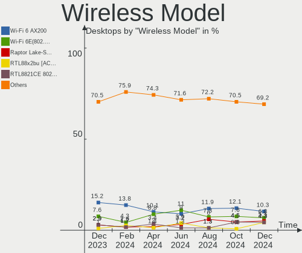
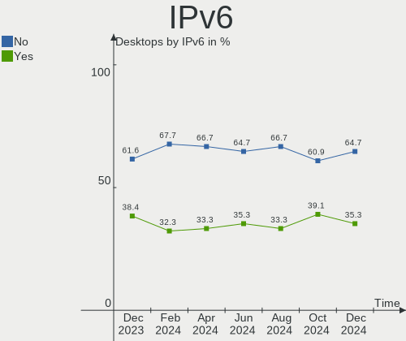

Fedora Hardware Trends (Desktops)
---------------------------------

A project to identify most popular hardware characteristics and track their change
over time based on data collected by Fedora users at https://Linux-Hardware.org.

Anyone can contribute to this report by the [hw-probe](https://github.com/linuxhw/hw-probe) tool:

    sudo -E hw-probe -all -upload

Full-feature report is available here: https://linux-hardware.org/?view=trends&formfactor=desktop

Period: Aug, 2021.

Contents
--------

* [ System ](#system)
  - [ OS                       ](#os)
  - [ OS Family                ](#os-family)
  - [ Kernel                   ](#kernel)
  - [ Kernel Family            ](#kernel-family)
  - [ Kernel Major Ver.        ](#kernel-major-ver)
  - [ Arch                     ](#arch)
  - [ DE                       ](#de)
  - [ Display Server           ](#display-server)
  - [ Display Manager          ](#display-manager)
  - [ OS Lang                  ](#os-lang)
  - [ Boot Mode                ](#boot-mode)
  - [ Filesystem               ](#filesystem)
  - [ Part. scheme             ](#part-scheme)
  - [ Dual Boot with Linux/BSD ](#dual-boot-with-linuxbsd)
  - [ Dual Boot (Win)          ](#dual-boot-win)

* [ Board ](#board)
  - [ Vendor                   ](#vendor)
  - [ Model                    ](#model)
  - [ Model Family             ](#model-family)
  - [ MFG Year                 ](#mfg-year)
  - [ Form Factor              ](#form-factor)
  - [ Secure Boot              ](#secure-boot)
  - [ Coreboot                 ](#coreboot)
  - [ RAM Size                 ](#ram-size)
  - [ RAM Used                 ](#ram-used)
  - [ Total Drives             ](#total-drives)
  - [ Has CD-ROM               ](#has-cd-rom)
  - [ Has Ethernet             ](#has-ethernet)
  - [ Has WiFi                 ](#has-wifi)
  - [ Has Bluetooth            ](#has-bluetooth)

* [ Location ](#location)
  - [ Country                  ](#country)
  - [ City                     ](#city)

* [ Drives ](#drives)
  - [ Drive Vendor             ](#drive-vendor)
  - [ Drive Model              ](#drive-model)
  - [ HDD Vendor               ](#hdd-vendor)
  - [ SSD Vendor               ](#ssd-vendor)
  - [ Drive Kind               ](#drive-kind)
  - [ Drive Connector          ](#drive-connector)
  - [ Drive Size               ](#drive-size)
  - [ Space Total              ](#space-total)
  - [ Space Used               ](#space-used)
  - [ Malfunc. Drives          ](#malfunc-drives)
  - [ Malfunc. Drive Vendor    ](#malfunc-drive-vendor)
  - [ Malfunc. HDD Vendor      ](#malfunc-hdd-vendor)
  - [ Malfunc. Drive Kind      ](#malfunc-drive-kind)
  - [ Failed Drives            ](#failed-drives)
  - [ Failed Drive Vendor      ](#failed-drive-vendor)
  - [ Drive Status             ](#drive-status)

* [ Storage controller ](#storage-controller)
  - [ Storage Vendor           ](#storage-vendor)
  - [ Storage Model            ](#storage-model)
  - [ Storage Kind             ](#storage-kind)

* [ Processor ](#processor)
  - [ CPU Vendor               ](#cpu-vendor)
  - [ CPU Model                ](#cpu-model)
  - [ CPU Model Family         ](#cpu-model-family)
  - [ CPU Cores                ](#cpu-cores)
  - [ CPU Sockets              ](#cpu-sockets)
  - [ CPU Threads              ](#cpu-threads)
  - [ CPU Op-Modes             ](#cpu-op-modes)
  - [ CPU Microcode            ](#cpu-microcode)
  - [ CPU Microarch            ](#cpu-microarch)

* [ Graphics ](#graphics)
  - [ GPU Vendor               ](#gpu-vendor)
  - [ GPU Model                ](#gpu-model)
  - [ GPU Combo                ](#gpu-combo)
  - [ GPU Driver               ](#gpu-driver)
  - [ GPU Memory               ](#gpu-memory)

* [ Monitor ](#monitor)
  - [ Monitor Vendor           ](#monitor-vendor)
  - [ Monitor Model            ](#monitor-model)
  - [ Monitor Resolution       ](#monitor-resolution)
  - [ Monitor Diagonal         ](#monitor-diagonal)
  - [ Monitor Width            ](#monitor-width)
  - [ Aspect Ratio             ](#aspect-ratio)
  - [ Monitor Area             ](#monitor-area)
  - [ Pixel Density            ](#pixel-density)
  - [ Multiple Monitors        ](#multiple-monitors)

* [ Network ](#network)
  - [ Net Controller Vendor    ](#net-controller-vendor)
  - [ Net Controller Model     ](#net-controller-model)
  - [ Wireless Vendor          ](#wireless-vendor)
  - [ Wireless Model           ](#wireless-model)
  - [ Ethernet Vendor          ](#ethernet-vendor)
  - [ Ethernet Model           ](#ethernet-model)
  - [ Net Controller Kind      ](#net-controller-kind)
  - [ Used Controller          ](#used-controller)
  - [ NICs                     ](#nics)
  - [ IPv6                     ](#ipv6)

* [ Bluetooth ](#bluetooth)
  - [ Bluetooth Vendor         ](#bluetooth-vendor)
  - [ Bluetooth Model          ](#bluetooth-model)

* [ Sound ](#sound)
  - [ Sound Vendor             ](#sound-vendor)
  - [ Sound Model              ](#sound-model)

* [ Memory ](#memory)
  - [ Memory Vendor            ](#memory-vendor)
  - [ Memory Model             ](#memory-model)
  - [ Memory Kind              ](#memory-kind)
  - [ Memory Form Factor       ](#memory-form-factor)
  - [ Memory Size              ](#memory-size)
  - [ Memory Speed             ](#memory-speed)

* [ Printers & scanners ](#printers--scanners)
  - [ Printer Vendor           ](#printer-vendor)
  - [ Printer Model            ](#printer-model)
  - [ Scanner Vendor           ](#scanner-vendor)
  - [ Scanner Model            ](#scanner-model)

* [ Camera ](#camera)
  - [ Camera Vendor            ](#camera-vendor)
  - [ Camera Model             ](#camera-model)

* [ Security ](#security)
  - [ Fingerprint Vendor       ](#fingerprint-vendor)
  - [ Fingerprint Model        ](#fingerprint-model)
  - [ Chipcard Vendor          ](#chipcard-vendor)
  - [ Chipcard Model           ](#chipcard-model)

* [ Unsupported ](#unsupported)
  - [ Unsupported Devices      ](#unsupported-devices)
  - [ Unsupported Device Types ](#unsupported-device-types)

System
------

OS
--

Installed operating systems

| Name      | Desktops | Percent |
|-----------|----------|---------|
| Fedora 34 | 101      | 82.11%  |
| Fedora 33 | 13       | 10.57%  |
| Fedora 32 | 4        | 3.25%   |
| Fedora 36 | 2        | 1.63%   |
| Fedora 35 | 2        | 1.63%   |
| Fedora 30 | 1        | 0.81%   |

OS Family
---------

OS without a version

| Name   | Desktops | Percent |
|--------|----------|---------|
| Fedora | 123      | 100%    |

Kernel
------

Version of the Linux kernel

| Version                                             | Desktops | Percent |
|-----------------------------------------------------|----------|---------|
| 5.13.12-200.fc34.x86_64                             | 27       | 21.95%  |
| 5.13.9-200.fc34.x86_64                              | 15       | 12.2%   |
| 5.13.6-200.fc34.x86_64                              | 15       | 12.2%   |
| 5.13.8-200.fc34.x86_64                              | 14       | 11.38%  |
| 5.13.10-200.fc34.x86_64                             | 9        | 7.32%   |
| 5.13.7-200.fc34.x86_64                              | 8        | 6.5%    |
| 5.13.4-200.fc34.x86_64                              | 4        | 3.25%   |
| 5.13.9-100.fc33.x86_64                              | 3        | 2.44%   |
| 5.11.12-300.fc34.x86_64                             | 3        | 2.44%   |
| 5.14.0-0.rc5.20210813gitf8e6dfc64f61.46.fc36.x86_64 | 2        | 1.63%   |
| 5.13.5-200.fc34.x86_64                              | 2        | 1.63%   |
| 5.12.18-200.fc33.x86_64                             | 2        | 1.63%   |
| 5.11.22-100.fc32.x86_64                             | 2        | 1.63%   |
| 5.9.14-100.fc32.x86_64                              | 1        | 0.81%   |
| 5.9.10-200.fc33.x86_64                              | 1        | 0.81%   |
| 5.8.15-301.fc33.x86_64                              | 1        | 0.81%   |
| 5.6.6-300.fc32.x86_64                               | 1        | 0.81%   |
| 5.6.13-100.fc30.x86_64                              | 1        | 0.81%   |
| 5.14.0-0.rc6.46.fc35.x86_64                         | 1        | 0.81%   |
| 5.13.8-xm1cacule.0.fc34.x86_64                      | 1        | 0.81%   |
| 5.13.6-100.fc33.x86_64                              | 1        | 0.81%   |
| 5.13.5-100.fc33.x86_64                              | 1        | 0.81%   |
| 5.13.4-201.fsync.fc34.x86_64                        | 1        | 0.81%   |
| 5.13.12-100.fc33.x86_64                             | 1        | 0.81%   |
| 5.13.10-100.fc33.x86_64                             | 1        | 0.81%   |
| 5.12.15-200.fc33.x86_64                             | 1        | 0.81%   |
| 5.12.14-300.fc34.x86_64+debug                       | 1        | 0.81%   |
| 5.12.13-300.fc34.x86_64                             | 1        | 0.81%   |
| 5.12.12-300.fc34.x86_64                             | 1        | 0.81%   |
| 5.11.11-200.fc33.x86_64                             | 1        | 0.81%   |

Kernel Family
-------------

Linux kernel without a distro release

| Version | Desktops | Percent |
|---------|----------|---------|
| 5.13.12 | 28       | 22.76%  |
| 5.13.9  | 18       | 14.63%  |
| 5.13.6  | 16       | 13.01%  |
| 5.13.8  | 15       | 12.2%   |
| 5.13.10 | 10       | 8.13%   |
| 5.13.7  | 8        | 6.5%    |
| 5.13.4  | 5        | 4.07%   |
| 5.14.0  | 3        | 2.44%   |
| 5.13.5  | 3        | 2.44%   |
| 5.11.12 | 3        | 2.44%   |
| 5.12.18 | 2        | 1.63%   |
| 5.11.22 | 2        | 1.63%   |
| 5.9.14  | 1        | 0.81%   |
| 5.9.10  | 1        | 0.81%   |
| 5.8.15  | 1        | 0.81%   |
| 5.6.6   | 1        | 0.81%   |
| 5.6.13  | 1        | 0.81%   |
| 5.12.15 | 1        | 0.81%   |
| 5.12.14 | 1        | 0.81%   |
| 5.12.13 | 1        | 0.81%   |
| 5.12.12 | 1        | 0.81%   |
| 5.11.11 | 1        | 0.81%   |

Kernel Major Ver.
-----------------

Linux kernel major version

| Version | Desktops | Percent |
|---------|----------|---------|
| 5.13    | 103      | 83.74%  |
| 5.12    | 6        | 4.88%   |
| 5.11    | 6        | 4.88%   |
| 5.14    | 3        | 2.44%   |
| 5.9     | 2        | 1.63%   |
| 5.6     | 2        | 1.63%   |
| 5.8     | 1        | 0.81%   |

Arch
----

OS architecture (x86_64, i586, etc.)

| Name   | Desktops | Percent |
|--------|----------|---------|
| x86_64 | 123      | 100%    |

DE
--

Desktop Environment

| Name       | Desktops | Percent |
|------------|----------|---------|
| GNOME      | 79       | 64.23%  |
| Cinnamon   | 13       | 10.57%  |
| KDE5       | 8        | 6.5%    |
| KDE        | 7        | 5.69%   |
| X-Cinnamon | 5        | 4.07%   |
| Unknown    | 5        | 4.07%   |
| MATE       | 4        | 3.25%   |
| NsCDE      | 1        | 0.81%   |
| LXDE       | 1        | 0.81%   |

Display Server
--------------

X11 or Wayland

| Name    | Desktops | Percent |
|---------|----------|---------|
| Wayland | 65       | 52.85%  |
| X11     | 45       | 36.59%  |
| Tty     | 12       | 9.76%   |
| Unknown | 1        | 0.81%   |

Display Manager
---------------

SDDM, LightDM, etc.

| Name    | Desktops | Percent |
|---------|----------|---------|
| Unknown | 57       | 46.34%  |
| GDM     | 41       | 33.33%  |
| LightDM | 11       | 8.94%   |
| SDDM    | 8        | 6.5%    |
| TDM     | 5        | 4.07%   |
| KDM     | 1        | 0.81%   |

OS Lang
-------

Language

| Lang  | Desktops | Percent |
|-------|----------|---------|
| en_US | 45       | 36.59%  |
| en_GB | 14       | 11.38%  |
| en_AU | 13       | 10.57%  |
| ru_RU | 7        | 5.69%   |
| pt_BR | 7        | 5.69%   |
| fr_FR | 5        | 4.07%   |
| de_DE | 5        | 4.07%   |
| en_CA | 4        | 3.25%   |
| pl_PL | 3        | 2.44%   |
| es_ES | 3        | 2.44%   |
| nl_BE | 2        | 1.63%   |
| ja_JP | 2        | 1.63%   |
| fi_FI | 2        | 1.63%   |
| en_ZA | 2        | 1.63%   |
| zh_CN | 1        | 0.81%   |
| sk_SK | 1        | 0.81%   |
| ru_UA | 1        | 0.81%   |
| es_UY | 1        | 0.81%   |
| es_CO | 1        | 0.81%   |
| en_IN | 1        | 0.81%   |
| da_DK | 1        | 0.81%   |
| ca_ES | 1        | 0.81%   |
| ca_AD | 1        | 0.81%   |

Boot Mode
---------

EFI or BIOS

| Mode | Desktops | Percent |
|------|----------|---------|
| EFI  | 78       | 63.41%  |
| BIOS | 45       | 36.59%  |

Filesystem
----------

Type of filesystem

| Type  | Desktops | Percent |
|-------|----------|---------|
| Btrfs | 67       | 54.47%  |
| Ext4  | 40       | 32.52%  |
| Xfs   | 16       | 13.01%  |

Part. scheme
------------

Scheme of partitioning

| Type    | Desktops | Percent |
|---------|----------|---------|
| Unknown | 57       | 46.34%  |
| GPT     | 47       | 38.21%  |
| MBR     | 19       | 15.45%  |

Dual Boot with Linux/BSD
------------------------

Hosting more than one Linux/BSD

| Dual boot | Desktops | Percent |
|-----------|----------|---------|
| No        | 105      | 85.37%  |
| Yes       | 18       | 14.63%  |

Dual Boot (Win)
---------------

Hosting Linux and Windows

| Dual boot | Desktops | Percent |
|-----------|----------|---------|
| No        | 88       | 71.54%  |
| Yes       | 35       | 28.46%  |

Board
-----

Vendor
------

Motherboard manufacturer

| Name                | Desktops | Percent |
|---------------------|----------|---------|
| ASUSTek Computer    | 33       | 26.83%  |
| Gigabyte Technology | 29       | 23.58%  |
| MSI                 | 17       | 13.82%  |
| ASRock              | 14       | 11.38%  |
| Hewlett-Packard     | 9        | 7.32%   |
| Dell                | 9        | 7.32%   |
| Lenovo              | 2        | 1.63%   |
| Intel               | 2        | 1.63%   |
| Biostar             | 2        | 1.63%   |
| Unknown             | 2        | 1.63%   |
| Fujitsu             | 1        | 0.81%   |
| BESSTAR Tech        | 1        | 0.81%   |
| ASRockRack          | 1        | 0.81%   |
| Acer                | 1        | 0.81%   |

Model
-----

Motherboard model

| Name                                     | Desktops | Percent |
|------------------------------------------|----------|---------|
| MSI MS-7C37                              | 4        | 3.25%   |
| HP Compaq 8100 Elite SFF PC              | 2        | 1.63%   |
| Gigabyte Z170-D3H                        | 2        | 1.63%   |
| Gigabyte B450 I AORUS PRO WIFI           | 2        | 1.63%   |
| Gigabyte B450 AORUS PRO WIFI             | 2        | 1.63%   |
| ASUS SABERTOOTH 990FX R2.0               | 2        | 1.63%   |
| ASUS ROG STRIX X570-E GAMING             | 2        | 1.63%   |
| ASUS ROG STRIX B550-I GAMING             | 2        | 1.63%   |
| ASUS All Series                          | 2        | 1.63%   |
| ASUS A8R32-MVP Deluxe                    | 2        | 1.63%   |
| Unknown                                  | 2        | 1.63%   |
| MSI Z390 Gaming Trident X Plus (MS-B926) | 1        | 0.81%   |
| MSI MS-7D15                              | 1        | 0.81%   |
| MSI MS-7C91                              | 1        | 0.81%   |
| MSI MS-7C90                              | 1        | 0.81%   |
| MSI MS-7C84                              | 1        | 0.81%   |
| MSI MS-7C82                              | 1        | 0.81%   |
| MSI MS-7C35                              | 1        | 0.81%   |
| MSI MS-7B86                              | 1        | 0.81%   |
| MSI MS-7B79                              | 1        | 0.81%   |
| MSI MS-7A44                              | 1        | 0.81%   |
| MSI MS-7A33                              | 1        | 0.81%   |
| MSI MS-7808                              | 1        | 0.81%   |
| MSI MBB-3200G8                           | 1        | 0.81%   |
| Lenovo ThinkStation D20 415579G          | 1        | 0.81%   |
| Lenovo ThinkCentre M58p 7220A72          | 1        | 0.81%   |
| Intel DH61BF AAG81311-101                | 1        | 0.81%   |
| Intel B75                                | 1        | 0.81%   |
| HP ProDesk 400 G1 MT                     | 1        | 0.81%   |
| HP Pavilion Desktop PC 570-p047c         | 1        | 0.81%   |
| HP EliteDesk 800 G2 DM 65W               | 1        | 0.81%   |
| HP EliteDesk 800 G2 DM 35W               | 1        | 0.81%   |
| HP EliteDesk 800 G1 SFF                  | 1        | 0.81%   |
| HP EliteDesk 705 G4 DM 35W (TAA)         | 1        | 0.81%   |
| HP 500-219cx                             | 1        | 0.81%   |
| Gigabyte Z97P-D3                         | 1        | 0.81%   |
| Gigabyte Z97-D3H                         | 1        | 0.81%   |
| Gigabyte Z87X-D3H                        | 1        | 0.81%   |
| Gigabyte Z77MX-D3H                       | 1        | 0.81%   |
| Gigabyte Z390 D                          | 1        | 0.81%   |
| Gigabyte Z270-HD3P                       | 1        | 0.81%   |
| Gigabyte X570 I AORUS PRO WIFI           | 1        | 0.81%   |
| Gigabyte P55-USB3                        | 1        | 0.81%   |
| Gigabyte GA-MA785G-UD3H                  | 1        | 0.81%   |
| Gigabyte GA-990FXA-D3                    | 1        | 0.81%   |
| Gigabyte GA-880GM-UD2H                   | 1        | 0.81%   |
| Gigabyte G41MT-S2P                       | 1        | 0.81%   |
| Gigabyte G33M-DS2R                       | 1        | 0.81%   |
| Gigabyte F2A68HM-S1                      | 1        | 0.81%   |
| Gigabyte EP45-DS3L                       | 1        | 0.81%   |
| Gigabyte B85M-D3V-A                      | 1        | 0.81%   |
| Gigabyte B550M DS3H                      | 1        | 0.81%   |
| Gigabyte B550 AORUS ELITE                | 1        | 0.81%   |
| Gigabyte B450M S2H V2                    | 1        | 0.81%   |
| Gigabyte B450M DS3H                      | 1        | 0.81%   |
| Gigabyte B250M-DS3H                      | 1        | 0.81%   |
| Gigabyte B150M-D3H                       | 1        | 0.81%   |
| Gigabyte 970A-DS3P                       | 1        | 0.81%   |
| Fujitsu ESPRIMO P410                     | 1        | 0.81%   |
| Dell XPS 8700                            | 1        | 0.81%   |

Model Family
------------

Motherboard model prefix

| Name                    | Desktops | Percent |
|-------------------------|----------|---------|
| ASUS ROG                | 13       | 10.57%  |
| Dell OptiPlex           | 6        | 4.88%   |
| ASUS PRIME              | 5        | 4.07%   |
| MSI MS-7C37             | 4        | 3.25%   |
| HP EliteDesk            | 4        | 3.25%   |
| Gigabyte B450           | 4        | 3.25%   |
| ASUS TUF                | 3        | 2.44%   |
| HP Compaq               | 2        | 1.63%   |
| Gigabyte Z170-D3H       | 2        | 1.63%   |
| Gigabyte B450M          | 2        | 1.63%   |
| ASUS SABERTOOTH         | 2        | 1.63%   |
| ASUS All                | 2        | 1.63%   |
| ASUS A8R32-MVP          | 2        | 1.63%   |
| ASRock B450             | 2        | 1.63%   |
| Unknown                 | 2        | 1.63%   |
| MSI Z390                | 1        | 0.81%   |
| MSI MS-7D15             | 1        | 0.81%   |
| MSI MS-7C91             | 1        | 0.81%   |
| MSI MS-7C90             | 1        | 0.81%   |
| MSI MS-7C84             | 1        | 0.81%   |
| MSI MS-7C82             | 1        | 0.81%   |
| MSI MS-7C35             | 1        | 0.81%   |
| MSI MS-7B86             | 1        | 0.81%   |
| MSI MS-7B79             | 1        | 0.81%   |
| MSI MS-7A44             | 1        | 0.81%   |
| MSI MS-7A33             | 1        | 0.81%   |
| MSI MS-7808             | 1        | 0.81%   |
| MSI MBB-3200G8          | 1        | 0.81%   |
| Lenovo ThinkStation     | 1        | 0.81%   |
| Lenovo ThinkCentre      | 1        | 0.81%   |
| Intel DH61BF            | 1        | 0.81%   |
| Intel B75               | 1        | 0.81%   |
| HP ProDesk              | 1        | 0.81%   |
| HP Pavilion             | 1        | 0.81%   |
| HP 500-219cx            | 1        | 0.81%   |
| Gigabyte Z97P-D3        | 1        | 0.81%   |
| Gigabyte Z97-D3H        | 1        | 0.81%   |
| Gigabyte Z87X-D3H       | 1        | 0.81%   |
| Gigabyte Z77MX-D3H      | 1        | 0.81%   |
| Gigabyte Z390           | 1        | 0.81%   |
| Gigabyte Z270-HD3P      | 1        | 0.81%   |
| Gigabyte X570           | 1        | 0.81%   |
| Gigabyte P55-USB3       | 1        | 0.81%   |
| Gigabyte GA-MA785G-UD3H | 1        | 0.81%   |
| Gigabyte GA-990FXA-D3   | 1        | 0.81%   |
| Gigabyte GA-880GM-UD2H  | 1        | 0.81%   |
| Gigabyte G41MT-S2P      | 1        | 0.81%   |
| Gigabyte G33M-DS2R      | 1        | 0.81%   |
| Gigabyte F2A68HM-S1     | 1        | 0.81%   |
| Gigabyte EP45-DS3L      | 1        | 0.81%   |
| Gigabyte B85M-D3V-A     | 1        | 0.81%   |
| Gigabyte B550M          | 1        | 0.81%   |
| Gigabyte B550           | 1        | 0.81%   |
| Gigabyte B250M-DS3H     | 1        | 0.81%   |
| Gigabyte B150M-D3H      | 1        | 0.81%   |
| Gigabyte 970A-DS3P      | 1        | 0.81%   |
| Fujitsu ESPRIMO         | 1        | 0.81%   |
| Dell XPS                | 1        | 0.81%   |
| Dell Vostro             | 1        | 0.81%   |
| Dell Precision          | 1        | 0.81%   |

MFG Year
--------

Motherboard manufacture year

| Year | Desktops | Percent |
|------|----------|---------|
| 2020 | 26       | 21.14%  |
| 2021 | 25       | 20.33%  |
| 2018 | 13       | 10.57%  |
| 2019 | 9        | 7.32%   |
| 2014 | 8        | 6.5%    |
| 2013 | 8        | 6.5%    |
| 2016 | 7        | 5.69%   |
| 2010 | 7        | 5.69%   |
| 2015 | 4        | 3.25%   |
| 2012 | 3        | 2.44%   |
| 2011 | 3        | 2.44%   |
| 2009 | 3        | 2.44%   |
| 2006 | 3        | 2.44%   |
| 2017 | 2        | 1.63%   |
| 2008 | 1        | 0.81%   |
| 2007 | 1        | 0.81%   |

Form Factor
-----------

Physical design of the computer

| Name    | Desktops | Percent |
|---------|----------|---------|
| Desktop | 123      | 100%    |

Secure Boot
-----------

Enabled or disabled

| State    | Desktops | Percent |
|----------|----------|---------|
| Disabled | 117      | 95.12%  |
| Enabled  | 6        | 4.88%   |

Coreboot
--------

Have coreboot on board

| Used | Desktops | Percent |
|------|----------|---------|
| No   | 123      | 100%    |

RAM Size
--------

Total RAM memory

| Size in GB  | Desktops | Percent |
|-------------|----------|---------|
| 16.01-24.0  | 36       | 29.27%  |
| 32.01-64.0  | 33       | 26.83%  |
| 4.01-8.0    | 19       | 15.45%  |
| 8.01-16.0   | 16       | 13.01%  |
| 3.01-4.0    | 8        | 6.5%    |
| 24.01-32.0  | 6        | 4.88%   |
| 64.01-256.0 | 4        | 3.25%   |
| 2.01-3.0    | 1        | 0.81%   |

RAM Used
--------

Used RAM memory

| Used GB    | Desktops | Percent |
|------------|----------|---------|
| 4.01-8.0   | 35       | 28.46%  |
| 3.01-4.0   | 27       | 21.95%  |
| 2.01-3.0   | 26       | 21.14%  |
| 1.01-2.0   | 16       | 13.01%  |
| 0.51-1.0   | 8        | 6.5%    |
| 8.01-16.0  | 6        | 4.88%   |
| 24.01-32.0 | 3        | 2.44%   |
| 16.01-24.0 | 1        | 0.81%   |
| 0.01-0.5   | 1        | 0.81%   |

Total Drives
------------

Number of drives on board

| Drives | Desktops | Percent |
|--------|----------|---------|
| 2      | 39       | 31.71%  |
| 1      | 28       | 22.76%  |
| 3      | 27       | 21.95%  |
| 4      | 15       | 12.2%   |
| 5      | 5        | 4.07%   |
| 8      | 3        | 2.44%   |
| 6      | 3        | 2.44%   |
| 7      | 2        | 1.63%   |
| 9      | 1        | 0.81%   |

Has CD-ROM
----------

Has CD-ROM on board

| Presented | Desktops | Percent |
|-----------|----------|---------|
| No        | 70       | 56.91%  |
| Yes       | 53       | 43.09%  |

Has Ethernet
------------

Has Ethernet on board

| Presented | Desktops | Percent |
|-----------|----------|---------|
| Yes       | 122      | 99.19%  |
| No        | 1        | 0.81%   |

Has WiFi
--------

Has WiFi module

| Presented | Desktops | Percent |
|-----------|----------|---------|
| No        | 70       | 56.91%  |
| Yes       | 53       | 43.09%  |

Has Bluetooth
-------------

Has Bluetooth module

| Presented | Desktops | Percent |
|-----------|----------|---------|
| No        | 66       | 53.66%  |
| Yes       | 57       | 46.34%  |

Location
--------

Country
-------

Geographic location (country)

| Country      | Desktops | Percent |
|--------------|----------|---------|
| USA          | 16       | 13.01%  |
| Australia    | 15       | 12.2%   |
| UK           | 11       | 8.94%   |
| Brazil       | 9        | 7.32%   |
| France       | 7        | 5.69%   |
| Spain        | 6        | 4.88%   |
| Germany      | 6        | 4.88%   |
| Canada       | 6        | 4.88%   |
| Russia       | 4        | 3.25%   |
| Switzerland  | 3        | 2.44%   |
| Poland       | 3        | 2.44%   |
| India        | 3        | 2.44%   |
| Belgium      | 3        | 2.44%   |
| Belarus      | 3        | 2.44%   |
| South Africa | 2        | 1.63%   |
| Slovakia     | 2        | 1.63%   |
| Japan        | 2        | 1.63%   |
| Finland      | 2        | 1.63%   |
| Chile        | 2        | 1.63%   |
| Uruguay      | 1        | 0.81%   |
| Ukraine      | 1        | 0.81%   |
| Slovenia     | 1        | 0.81%   |
| Singapore    | 1        | 0.81%   |
| Serbia       | 1        | 0.81%   |
| Netherlands  | 1        | 0.81%   |
| Italy        | 1        | 0.81%   |
| Indonesia    | 1        | 0.81%   |
| Estonia      | 1        | 0.81%   |
| Egypt        | 1        | 0.81%   |
| Denmark      | 1        | 0.81%   |
| Czechia      | 1        | 0.81%   |
| Cyprus       | 1        | 0.81%   |
| Costa Rica   | 1        | 0.81%   |
| Colombia     | 1        | 0.81%   |
| China        | 1        | 0.81%   |
| Austria      | 1        | 0.81%   |
| Argentina    | 1        | 0.81%   |

City
----

Geographic location (city)

| City               | Desktops | Percent |
|--------------------|----------|---------|
| Sydney             | 9        | 7.32%   |
| Pymble             | 3        | 2.44%   |
| Minsk              | 3        | 2.44%   |
| Zurich             | 2        | 1.63%   |
| Toronto            | 2        | 1.63%   |
| Santiago           | 2        | 1.63%   |
| Moscow             | 2        | 1.63%   |
| Melbourne          | 2        | 1.63%   |
| Bratislava         | 2        | 1.63%   |
| Zgorzelec          | 1        | 0.81%   |
| York               | 1        | 0.81%   |
| Yokohama           | 1        | 0.81%   |
| Yogyakarta         | 1        | 0.81%   |
| Yekaterinburg      | 1        | 0.81%   |
| Worthing           | 1        | 0.81%   |
| Winona             | 1        | 0.81%   |
| Wilhelmshaven      | 1        | 0.81%   |
| Welland            | 1        | 0.81%   |
| Waterville         | 1        | 0.81%   |
| Warsaw             | 1        | 0.81%   |
| Wanstead           | 1        | 0.81%   |
| Vijayawada         | 1        | 0.81%   |
| Vienna             | 1        | 0.81%   |
| Uusikaupunki       | 1        | 0.81%   |
| Tallinn            | 1        | 0.81%   |
| Swansea            | 1        | 0.81%   |
| Sorocaba           | 1        | 0.81%   |
| Singapore          | 1        | 0.81%   |
| Siloam Springs     | 1        | 0.81%   |
| Shenzhen           | 1        | 0.81%   |
| Sesto San Giovanni | 1        | 0.81%   |
| S??vres            | 1        | 0.81%   |
| S??o Paulo         | 1        | 0.81%   |
| Saint Paul         | 1        | 0.81%   |
| Rio de Janeiro     | 1        | 0.81%   |
| Recife             | 1        | 0.81%   |
| Pune               | 1        | 0.81%   |
| Penza              | 1        | 0.81%   |
| P?™erov            | 1        | 0.81%   |
| Paris              | 1        | 0.81%   |
| Palo Alto          | 1        | 0.81%   |
| Palam??s           | 1        | 0.81%   |
| Owatonna           | 1        | 0.81%   |
| Oklahoma City      | 1        | 0.81%   |
| Nuneaton           | 1        | 0.81%   |
| Niter??i           | 1        | 0.81%   |
| Nicoya             | 1        | 0.81%   |
| Nancy              | 1        | 0.81%   |
| Mykytyn Rog        | 1        | 0.81%   |
| Mount Sterling     | 1        | 0.81%   |
| Mions              | 1        | 0.81%   |
| Minas              | 1        | 0.81%   |
| Miami              | 1        | 0.81%   |
| Maple Ridge        | 1        | 0.81%   |
| Madrid             | 1        | 0.81%   |
| London             | 1        | 0.81%   |
| Ljubljana          | 1        | 0.81%   |
| Limassol           | 1        | 0.81%   |
| Laurel             | 1        | 0.81%   |
| Kyogle             | 1        | 0.81%   |

Drives
------

Drive Vendor
------------

Hard drive vendors

| Vendor              | Desktops | Drives | Percent |
|---------------------|----------|--------|---------|
| Seagate             | 47       | 68     | 17.87%  |
| Samsung Electronics | 46       | 71     | 17.49%  |
| WDC                 | 37       | 52     | 14.07%  |
| Kingston            | 21       | 26     | 7.98%   |
| Crucial             | 16       | 16     | 6.08%   |
| Toshiba             | 14       | 19     | 5.32%   |
| Sandisk             | 11       | 11     | 4.18%   |
| Intel               | 11       | 12     | 4.18%   |
| Hitachi             | 9        | 13     | 3.42%   |
| Corsair             | 6        | 6      | 2.28%   |
| A-DATA Technology   | 5        | 5      | 1.9%    |
| Unknown             | 4        | 5      | 1.52%   |
| Phison              | 4        | 4      | 1.52%   |
| KingSpec            | 4        | 4      | 1.52%   |
| Gigabyte Technology | 3        | 3      | 1.14%   |
| Patriot             | 2        | 2      | 0.76%   |
| LITEONIT            | 2        | 2      | 0.76%   |
| V Series            | 1        | 1      | 0.38%   |
| Transcend           | 1        | 1      | 0.38%   |
| SUNEAST             | 1        | 1      | 0.38%   |
| SMART               | 1        | 1      | 0.38%   |
| SK Hynix            | 1        | 2      | 0.38%   |
| Silicon Motion      | 1        | 1      | 0.38%   |
| SABRENT             | 1        | 1      | 0.38%   |
| PNY                 | 1        | 1      | 0.38%   |
| PLEXTOR             | 1        | 2      | 0.38%   |
| PHD 3.0             | 1        | 1      | 0.38%   |
| OCZ                 | 1        | 3      | 0.38%   |
| Mushkin             | 1        | 1      | 0.38%   |
| Micron Technology   | 1        | 1      | 0.38%   |
| MaxDigital          | 1        | 1      | 0.38%   |
| Lite-On             | 1        | 1      | 0.38%   |
| HS-SSD-E100         | 1        | 1      | 0.38%   |
| GOODRAM             | 1        | 1      | 0.38%   |
| CT1000P1            | 1        | 1      | 0.38%   |
| CT1000MX            | 1        | 1      | 0.38%   |
| ASMT                | 1        | 1      | 0.38%   |
| Apple               | 1        | 1      | 0.38%   |

Drive Model
-----------

Hard drive models

| Model                            | Desktops | Percent |
|----------------------------------|----------|---------|
| Samsung SSD 860 EVO 1TB          | 7        | 2.21%   |
| Samsung SSD 850 EVO 250GB        | 6        | 1.89%   |
| Seagate ST3500418AS 500GB        | 5        | 1.58%   |
| Seagate ST2000DM008-2FR102 2TB   | 5        | 1.58%   |
| Samsung SSD 860 EVO 500GB        | 5        | 1.58%   |
| Toshiba DT01ACA100 1TB           | 4        | 1.26%   |
| Seagate ST500DM002-1BD142 500GB  | 4        | 1.26%   |
| Sandisk NVMe SSD Drive 500GB     | 4        | 1.26%   |
| Kingston SV300S37A120G 120GB SSD | 4        | 1.26%   |
| Kingston SA400S37480G 480GB SSD  | 4        | 1.26%   |
| Kingston SA400S37240G 240GB SSD  | 4        | 1.26%   |
| Kingston SA400S37120G 120GB SSD  | 4        | 1.26%   |
| WDC WD10EZEX-00BN5A0 1TB         | 3        | 0.95%   |
| Seagate ST2000DM001-1ER164 2TB   | 3        | 0.95%   |
| Seagate ST1000DM010-2EP102 1TB   | 3        | 0.95%   |
| Samsung SSD 970 PRO 512GB        | 3        | 0.95%   |
| Samsung SSD 850 PRO 256GB        | 3        | 0.95%   |
| Samsung NVMe SSD Drive 500GB     | 3        | 0.95%   |
| Samsung NVMe SSD Drive 250GB     | 3        | 0.95%   |
| KingSpec MT-128 128GB SSD        | 3        | 0.95%   |
| Intel SSDSC2CT120A3 120GB        | 3        | 0.95%   |
| Hitachi HDS721010CLA332 1TB      | 3        | 0.95%   |
| Crucial CT1000MX500SSD1 1TB      | 3        | 0.95%   |
| WDC WDS240G2G0B-00EPW0 240GB SSD | 2        | 0.63%   |
| WDC WDS100T2B0C-00PXH0 1TB       | 2        | 0.63%   |
| WDC WDS100T1X0E-00AFY0 1TB       | 2        | 0.63%   |
| WDC WD40EFRX-68N32N0 4TB         | 2        | 0.63%   |
| WDC WD30EFRX-68EUZN0 3TB         | 2        | 0.63%   |
| WDC WD20EZRZ-00Z5HB0 2TB         | 2        | 0.63%   |
| Unknown SD/MMC/MS PRO 128GB      | 2        | 0.63%   |
| Toshiba HDWD120 2TB              | 2        | 0.63%   |
| Toshiba DT01ACA300 3TB           | 2        | 0.63%   |
| Seagate ST4000DX001-1CE168 4TB   | 2        | 0.63%   |
| Seagate ST4000DM004-2CV104 4TB   | 2        | 0.63%   |
| Seagate ST1000DM003-1ER162 1TB   | 2        | 0.63%   |
| Seagate ST1000DM003-1CH162 1TB   | 2        | 0.63%   |
| Samsung SSD 980 PRO 1TB          | 2        | 0.63%   |
| Samsung SSD 970 EVO Plus 500GB   | 2        | 0.63%   |
| Samsung SSD 970 EVO Plus 250GB   | 2        | 0.63%   |
| Samsung SSD 870 EVO 1TB          | 2        | 0.63%   |
| Samsung SSD 860 QVO 1TB          | 2        | 0.63%   |
| Samsung SSD 850 EVO 500GB        | 2        | 0.63%   |
| Samsung SSD 840 EVO 250GB        | 2        | 0.63%   |
| Samsung NVMe SSD Drive 512GB     | 2        | 0.63%   |
| Samsung HD501LJ 500GB            | 2        | 0.63%   |
| Kingston SA400M8240G 240GB SSD   | 2        | 0.63%   |
| Intel SSDSC2KW256G8 256GB        | 2        | 0.63%   |
| Crucial CT500P1SSD8 500GB        | 2        | 0.63%   |
| Crucial CT500MX500SSD1 500GB     | 2        | 0.63%   |
| Crucial CT240BX500SSD1 240GB     | 2        | 0.63%   |
| Crucial CT1000BX500SSD1 1TB      | 2        | 0.63%   |
| WDC WDS480G2G0A-00JH30 480GB SSD | 1        | 0.32%   |
| WDC WDS250G2X0C-00L350 250GB     | 1        | 0.32%   |
| WDC WDS250G2B0A 250GB SSD        | 1        | 0.32%   |
| WDC WDS200T2B0A-00SM50 2TB SSD   | 1        | 0.32%   |
| WDC WDS100T2B0A-00SM50 1TB SSD   | 1        | 0.32%   |
| WDC WD6401AALS-00L3B2 640GB      | 1        | 0.32%   |
| WDC WD6400AAKS-22A7B2 640GB      | 1        | 0.32%   |
| WDC WD5000AVVS-63ZWB0 500GB      | 1        | 0.32%   |
| WDC WD5000AAKX-003CA0 500GB      | 1        | 0.32%   |

HDD Vendor
----------

Hard disk drive vendors

| Vendor              | Desktops | Drives | Percent |
|---------------------|----------|--------|---------|
| Seagate             | 45       | 64     | 45.45%  |
| WDC                 | 26       | 40     | 26.26%  |
| Toshiba             | 12       | 16     | 12.12%  |
| Hitachi             | 9        | 13     | 9.09%   |
| Samsung Electronics | 3        | 4      | 3.03%   |
| PHD 3.0             | 1        | 1      | 1.01%   |
| MaxDigital          | 1        | 1      | 1.01%   |
| ASMT                | 1        | 1      | 1.01%   |
| Apple               | 1        | 1      | 1.01%   |

SSD Vendor
----------

Solid state drive vendors

| Vendor              | Desktops | Drives | Percent |
|---------------------|----------|--------|---------|
| Samsung Electronics | 30       | 39     | 27.78%  |
| Kingston            | 19       | 24     | 17.59%  |
| Crucial             | 13       | 13     | 12.04%  |
| WDC                 | 7        | 7      | 6.48%   |
| SanDisk             | 6        | 6      | 5.56%   |
| Intel               | 6        | 7      | 5.56%   |
| A-DATA Technology   | 5        | 5      | 4.63%   |
| KingSpec            | 4        | 4      | 3.7%    |
| LITEONIT            | 2        | 2      | 1.85%   |
| V Series            | 1        | 1      | 0.93%   |
| Transcend           | 1        | 1      | 0.93%   |
| Toshiba             | 1        | 1      | 0.93%   |
| SUNEAST             | 1        | 1      | 0.93%   |
| SMART               | 1        | 1      | 0.93%   |
| Seagate             | 1        | 1      | 0.93%   |
| SABRENT             | 1        | 1      | 0.93%   |
| PNY                 | 1        | 1      | 0.93%   |
| Patriot             | 1        | 1      | 0.93%   |
| OCZ                 | 1        | 3      | 0.93%   |
| Mushkin             | 1        | 1      | 0.93%   |
| GOODRAM             | 1        | 1      | 0.93%   |
| Gigabyte Technology | 1        | 1      | 0.93%   |
| CT1000P1            | 1        | 1      | 0.93%   |
| CT1000MX            | 1        | 1      | 0.93%   |
| Corsair             | 1        | 1      | 0.93%   |

Drive Kind
----------

HDD or SSD

| Kind    | Desktops | Drives | Percent |
|---------|----------|--------|---------|
| SSD     | 83       | 125    | 38.43%  |
| HDD     | 74       | 141    | 34.26%  |
| NVMe    | 52       | 69     | 24.07%  |
| Unknown | 7        | 9      | 3.24%   |

Drive Connector
---------------

SATA, SAS, NVMe, etc.

| Type | Desktops | Drives | Percent |
|------|----------|--------|---------|
| SATA | 108      | 258    | 62.43%  |
| NVMe | 52       | 69     | 30.06%  |
| SAS  | 13       | 17     | 7.51%   |

Drive Size
----------

Size of hard drive

| Size in TB | Desktops | Drives | Percent |
|------------|----------|--------|---------|
| 0.01-0.5   | 76       | 127    | 42.94%  |
| 0.51-1.0   | 55       | 77     | 31.07%  |
| 1.01-2.0   | 23       | 25     | 12.99%  |
| 3.01-4.0   | 11       | 18     | 6.21%   |
| 2.01-3.0   | 7        | 9      | 3.95%   |
| 4.01-10.0  | 4        | 8      | 2.26%   |
| 10.01-20.0 | 1        | 2      | 0.56%   |

Space Total
-----------

Amount of disk space available on the file system

| Size in GB     | Desktops | Percent |
|----------------|----------|---------|
| 1001-2000      | 22       | 17.89%  |
| 501-1000       | 22       | 17.89%  |
| 251-500        | 20       | 16.26%  |
| More than 3000 | 17       | 13.82%  |
| 101-250        | 14       | 11.38%  |
| 1-20           | 11       | 8.94%   |
| 2001-3000      | 10       | 8.13%   |
| 51-100         | 7        | 5.69%   |

Space Used
----------

Amount of used disk space

| Used GB        | Desktops | Percent |
|----------------|----------|---------|
| 1-20           | 27       | 21.95%  |
| 101-250        | 19       | 15.45%  |
| 1001-2000      | 18       | 14.63%  |
| 501-1000       | 18       | 14.63%  |
| 21-50          | 16       | 13.01%  |
| 51-100         | 9        | 7.32%   |
| 251-500        | 8        | 6.5%    |
| More than 3000 | 5        | 4.07%   |
| 2001-3000      | 3        | 2.44%   |

Malfunc. Drives
---------------

Drive models with a malfunction

| Model                             | Desktops | Drives | Percent |
|-----------------------------------|----------|--------|---------|
| Seagate ST500DM002-1BD142 500GB   | 3        | 4      | 20%     |
| Intel SSDSC2CT120A3 120GB         | 3        | 3      | 20%     |
| Samsung Electronics HD501LJ 500GB | 2        | 3      | 13.33%  |
| WDC WD30EZRX-00AZ6B0 3TB          | 1        | 1      | 6.67%   |
| Seagate ST4000DM000-1F2168 4TB    | 1        | 1      | 6.67%   |
| Seagate ST31000340NS 1TB          | 1        | 1      | 6.67%   |
| Seagate ST1000DM010-2EP102 1TB    | 1        | 1      | 6.67%   |
| Seagate ST1000DM003-1CH162 1TB    | 1        | 1      | 6.67%   |
| Intel SSDSC2BW240A4 240GB         | 1        | 1      | 6.67%   |
| A-DATA Technology SP900 256GB SSD | 1        | 1      | 6.67%   |

Malfunc. Drive Vendor
---------------------

Vendors of faulty drives

| Vendor              | Desktops | Drives | Percent |
|---------------------|----------|--------|---------|
| Seagate             | 7        | 8      | 46.67%  |
| Intel               | 4        | 4      | 26.67%  |
| Samsung Electronics | 2        | 3      | 13.33%  |
| WDC                 | 1        | 1      | 6.67%   |
| A-DATA Technology   | 1        | 1      | 6.67%   |

Malfunc. HDD Vendor
-------------------

Vendors of faulty HDD drives

| Vendor              | Desktops | Drives | Percent |
|---------------------|----------|--------|---------|
| Seagate             | 7        | 8      | 70%     |
| Samsung Electronics | 2        | 3      | 20%     |
| WDC                 | 1        | 1      | 10%     |

Malfunc. Drive Kind
-------------------

Kinds of faulty drives

| Kind | Desktops | Drives | Percent |
|------|----------|--------|---------|
| HDD  | 10       | 12     | 66.67%  |
| SSD  | 5        | 5      | 33.33%  |

Failed Drives
-------------

Failed drive models

| Model                       | Desktops | Drives | Percent |
|-----------------------------|----------|--------|---------|
| Hitachi HDS721010DLE630 1TB | 1        | 2      | 100%    |

Failed Drive Vendor
-------------------

Failed drive vendors

| Vendor  | Desktops | Drives | Percent |
|---------|----------|--------|---------|
| Hitachi | 1        | 2      | 100%    |

Drive Status
------------

Number of failed and malfunc. drives

| Status   | Desktops | Drives | Percent |
|----------|----------|--------|---------|
| Works    | 64       | 154    | 45.71%  |
| Detected | 61       | 171    | 43.57%  |
| Malfunc  | 14       | 17     | 10%     |
| Failed   | 1        | 2      | 0.71%   |

Storage controller
------------------

Storage Vendor
--------------

Storage controller vendors

| Vendor                         | Desktops | Percent |
|--------------------------------|----------|---------|
| AMD                            | 64       | 31.53%  |
| Intel                          | 59       | 29.06%  |
| Samsung Electronics            | 25       | 12.32%  |
| ASMedia Technology             | 11       | 5.42%   |
| Sandisk                        | 10       | 4.93%   |
| Phison Electronics             | 9        | 4.43%   |
| JMicron Technology             | 4        | 1.97%   |
| Micron/Crucial Technology      | 3        | 1.48%   |
| ULi Electronics                | 2        | 0.99%   |
| Silicon Motion                 | 2        | 0.99%   |
| Silicon Image                  | 2        | 0.99%   |
| Marvell Technology Group       | 2        | 0.99%   |
| Kingston Technology Company    | 2        | 0.99%   |
| Broadcom / LSI                 | 2        | 0.99%   |
| VIA Technologies               | 1        | 0.49%   |
| Toshiba America Info Systems   | 1        | 0.49%   |
| Solid State Storage Technology | 1        | 0.49%   |
| SK Hynix                       | 1        | 0.49%   |
| Micron Technology              | 1        | 0.49%   |
| Lite-On Technology             | 1        | 0.49%   |

Storage Model
-------------

Storage controller models

| Model                                                                          | Desktops | Percent |
|--------------------------------------------------------------------------------|----------|---------|
| AMD FCH SATA Controller [AHCI mode]                                            | 42       | 17.07%  |
| AMD 400 Series Chipset SATA Controller                                         | 18       | 7.32%   |
| Samsung NVMe SSD Controller SM981/PM981/PM983                                  | 14       | 5.69%   |
| ASMedia ASM1062 Serial ATA Controller                                          | 11       | 4.47%   |
| Intel Q170/Q150/B150/H170/H110/Z170/CM236 Chipset SATA Controller [AHCI Mode]  | 10       | 4.07%   |
| Intel 8 Series/C220 Series Chipset Family 6-port SATA Controller 1 [AHCI mode] | 10       | 4.07%   |
| AMD Starship/Matisse Chipset SATA Controller [AHCI mode]                       | 9        | 3.66%   |
| AMD SB7x0/SB8x0/SB9x0 SATA Controller [AHCI mode]                              | 7        | 2.85%   |
| Phison E16 PCIe4 NVMe Controller                                               | 5        | 2.03%   |
| Samsung NVMe SSD Controller PM9A1/PM9A3/980PRO                                 | 4        | 1.63%   |
| Intel 7 Series/C210 Series Chipset Family 6-port SATA Controller [AHCI mode]   | 4        | 1.63%   |
| AMD SB7x0/SB8x0/SB9x0 IDE Controller                                           | 4        | 1.63%   |
| Sandisk WD Blue SN550 NVMe SSD                                                 | 3        | 1.22%   |
| Sandisk WD Black 2018/SN750 / PC SN720 NVMe SSD                                | 3        | 1.22%   |
| Samsung NVMe SSD Controller SM961/PM961/SM963                                  | 3        | 1.22%   |
| Phison E12 NVMe Controller                                                     | 3        | 1.22%   |
| Intel SATA Controller [RAID mode]                                              | 3        | 1.22%   |
| Intel NM10/ICH7 Family SATA Controller [IDE mode]                              | 3        | 1.22%   |
| Intel 9 Series Chipset Family SATA Controller [AHCI Mode]                      | 3        | 1.22%   |
| Intel 6 Series/C200 Series Chipset Family 6 port Desktop SATA AHCI Controller  | 3        | 1.22%   |
| Intel 200 Series PCH SATA controller [AHCI mode]                               | 3        | 1.22%   |
| AMD X370 Series Chipset SATA Controller                                        | 3        | 1.22%   |
| AMD FCH SATA Controller D                                                      | 3        | 1.22%   |
| AMD FCH IDE Controller                                                         | 3        | 1.22%   |
| ULi ULi M5288 SATA                                                             | 2        | 0.81%   |
| ULi M5229 IDE                                                                  | 2        | 0.81%   |
| Silicon Motion SM2263EN/SM2263XT SSD Controller                                | 2        | 0.81%   |
| Silicon Image SiI 3132 Serial ATA Raid II Controller                           | 2        | 0.81%   |
| Sandisk WD Black SN850                                                         | 2        | 0.81%   |
| Sandisk WD Black SN750 / PC SN730 NVMe SSD                                     | 2        | 0.81%   |
| Samsung NVMe SSD Controller SM951/PM951                                        | 2        | 0.81%   |
| Samsung NVMe Controller                                                        | 2        | 0.81%   |
| Micron/Crucial P1 NVMe PCIe SSD                                                | 2        | 0.81%   |
| JMicron JMB368 IDE controller                                                  | 2        | 0.81%   |
| JMicron JMB363 SATA/IDE Controller                                             | 2        | 0.81%   |
| Intel SSD 660P Series                                                          | 2        | 0.81%   |
| Intel Cannon Lake PCH SATA AHCI Controller                                     | 2        | 0.81%   |
| Intel C610/X99 series chipset sSATA Controller [AHCI mode]                     | 2        | 0.81%   |
| Intel C610/X99 series chipset 6-Port SATA Controller [AHCI mode]               | 2        | 0.81%   |
| Intel 82801JI (ICH10 Family) SATA AHCI Controller                              | 2        | 0.81%   |
| Intel 82801JI (ICH10 Family) 4 port SATA IDE Controller #1                     | 2        | 0.81%   |
| Intel 82801JI (ICH10 Family) 2 port SATA IDE Controller #2                     | 2        | 0.81%   |
| Intel 82801G (ICH7 Family) IDE Controller                                      | 2        | 0.81%   |
| Intel 500 Series Chipset Family SATA AHCI Controller                           | 2        | 0.81%   |
| Intel 5 Series/3400 Series Chipset 4 port SATA IDE Controller                  | 2        | 0.81%   |
| Intel 5 Series/3400 Series Chipset 2 port SATA IDE Controller                  | 2        | 0.81%   |
| Intel 400 Series Chipset Family SATA AHCI Controller                           | 2        | 0.81%   |
| AMD 300 Series Chipset SATA Controller                                         | 2        | 0.81%   |
| VIA VT6421 IDE/SATA Controller                                                 | 1        | 0.41%   |
| Toshiba America Info Systems XG4 NVMe SSD Controller                           | 1        | 0.41%   |
| Solid State Storage Non-Volatile memory controller                             | 1        | 0.41%   |
| SK Hynix BC501 NVMe Solid State Drive                                          | 1        | 0.41%   |
| Phison NVMe Storage Controller                                                 | 1        | 0.41%   |
| Micron/Crucial P2 NVMe PCIe SSD                                                | 1        | 0.41%   |
| Micron Non-Volatile memory controller                                          | 1        | 0.41%   |
| Marvell Group MV64460/64461/64462 System Controller, Revision B                | 1        | 0.41%   |
| Marvell Group 88SE9215 PCIe 2.0 x1 4-port SATA 6 Gb/s Controller               | 1        | 0.41%   |
| Lite-On Non-Volatile memory controller                                         | 1        | 0.41%   |
| Kingston Company Company Non-Volatile memory controller                        | 1        | 0.41%   |
| Kingston Company A2000 NVMe SSD                                                | 1        | 0.41%   |

Storage Kind
------------

Kind of storage controller (IDE, SATA, NVMe, SAS, ...)

| Kind | Desktops | Percent |
|------|----------|---------|
| SATA | 112      | 58.64%  |
| NVMe | 52       | 27.23%  |
| IDE  | 18       | 9.42%   |
| RAID | 9        | 4.71%   |

Processor
---------

CPU Vendor
----------

Processor vendors

| Vendor | Desktops | Percent |
|--------|----------|---------|
| AMD    | 66       | 53.66%  |
| Intel  | 57       | 46.34%  |

CPU Model
---------

Processor models

| Model                                           | Desktops | Percent |
|-------------------------------------------------|----------|---------|
| AMD Ryzen 5 3600 6-Core Processor               | 5        | 4.07%   |
| AMD Ryzen 7 3700X 8-Core Processor              | 4        | 3.25%   |
| AMD Ryzen 5 3400G with Radeon Vega Graphics     | 4        | 3.25%   |
| AMD Ryzen 5 2600 Six-Core Processor             | 4        | 3.25%   |
| Intel Core i7-4790 CPU @ 3.60GHz                | 3        | 2.44%   |
| Intel Core i5-6500 CPU @ 3.20GHz                | 3        | 2.44%   |
| AMD Ryzen 9 5950X 16-Core Processor             | 3        | 2.44%   |
| AMD Ryzen 9 5900X 12-Core Processor             | 3        | 2.44%   |
| AMD Ryzen 9 3950X 16-Core Processor             | 3        | 2.44%   |
| AMD Ryzen 9 3900X 12-Core Processor             | 3        | 2.44%   |
| AMD Ryzen 5 5600X 6-Core Processor              | 3        | 2.44%   |
| AMD FX-8350 Eight-Core Processor                | 3        | 2.44%   |
| Intel Core i7-6700K CPU @ 4.00GHz               | 2        | 1.63%   |
| Intel Core i7-4770 CPU @ 3.40GHz                | 2        | 1.63%   |
| Intel Core i5-3570 CPU @ 3.40GHz                | 2        | 1.63%   |
| Intel Core i5 CPU 650 @ 3.20GHz                 | 2        | 1.63%   |
| Intel Core i3-4160 CPU @ 3.60GHz                | 2        | 1.63%   |
| AMD Ryzen 7 3800X 8-Core Processor              | 2        | 1.63%   |
| AMD Ryzen 5 1600 Six-Core Processor             | 2        | 1.63%   |
| AMD Ryzen 3 3200G with Radeon Vega Graphics     | 2        | 1.63%   |
| AMD Ryzen 3 2200G with Radeon Vega Graphics     | 2        | 1.63%   |
| AMD Phenom II X2 570 Processor                  | 2        | 1.63%   |
| AMD Athlon 64 X2 Dual Core Processor 4400+      | 2        | 1.63%   |
| AMD A10-7850K Radeon R7, 12 Compute Cores 4C+8G | 2        | 1.63%   |
| Intel Xeon CPU E5507 @ 2.27GHz                  | 1        | 0.81%   |
| Intel Xeon CPU E5450 @ 3.00GHz                  | 1        | 0.81%   |
| Intel Xeon CPU E5-2640 v3 @ 2.60GHz             | 1        | 0.81%   |
| Intel Xeon CPU E3-1230 v5 @ 3.40GHz             | 1        | 0.81%   |
| Intel Xeon CPU E3-1230 v3 @ 3.30GHz             | 1        | 0.81%   |
| Intel Pentium D CPU 2.80GHz                     | 1        | 0.81%   |
| Intel Core i9-9900KF CPU @ 3.60GHz              | 1        | 0.81%   |
| Intel Core i7-7700 CPU @ 3.60GHz                | 1        | 0.81%   |
| Intel Core i7-6700 CPU @ 3.40GHz                | 1        | 0.81%   |
| Intel Core i7-5820K CPU @ 3.30GHz               | 1        | 0.81%   |
| Intel Core i7 CPU 920 @ 2.67GHz                 | 1        | 0.81%   |
| Intel Core i5-9400F CPU @ 2.90GHz               | 1        | 0.81%   |
| Intel Core i5-8400 CPU @ 2.80GHz                | 1        | 0.81%   |
| Intel Core i5-8350U CPU @ 1.70GHz               | 1        | 0.81%   |
| Intel Core i5-7600K CPU @ 3.80GHz               | 1        | 0.81%   |
| Intel Core i5-7500 CPU @ 3.40GHz                | 1        | 0.81%   |
| Intel Core i5-7400 CPU @ 3.00GHz                | 1        | 0.81%   |
| Intel Core i5-6600K CPU @ 3.50GHz               | 1        | 0.81%   |
| Intel Core i5-6500T CPU @ 2.50GHz               | 1        | 0.81%   |
| Intel Core i5-4590S CPU @ 3.00GHz               | 1        | 0.81%   |
| Intel Core i5-4590 CPU @ 3.30GHz                | 1        | 0.81%   |
| Intel Core i5-4440 CPU @ 3.10GHz                | 1        | 0.81%   |
| Intel Core i5-3570K CPU @ 3.40GHz               | 1        | 0.81%   |
| Intel Core i5-3340S CPU @ 2.80GHz               | 1        | 0.81%   |
| Intel Core i5-3330 CPU @ 3.00GHz                | 1        | 0.81%   |
| Intel Core i5-2500S CPU @ 2.70GHz               | 1        | 0.81%   |
| Intel Core i5-10400F CPU @ 2.90GHz              | 1        | 0.81%   |
| Intel Core i5 CPU 760 @ 2.80GHz                 | 1        | 0.81%   |
| Intel Core i3-4150 CPU @ 3.50GHz                | 1        | 0.81%   |
| Intel Core i3-4130 CPU @ 3.40GHz                | 1        | 0.81%   |
| Intel Core i3-3210 CPU @ 3.20GHz                | 1        | 0.81%   |
| Intel Core i3-10100F CPU @ 3.60GHz              | 1        | 0.81%   |
| Intel Core 2 Quad CPU Q9550 @ 2.83GHz           | 1        | 0.81%   |
| Intel Core 2 Quad CPU Q6600 @ 2.40GHz           | 1        | 0.81%   |
| Intel Core 2 Duo CPU E8500 @ 3.16GHz            | 1        | 0.81%   |
| Intel Core 2 Duo CPU E8400 @ 3.00GHz            | 1        | 0.81%   |

CPU Model Family
----------------

Processor model prefix

| Model                  | Desktops | Percent |
|------------------------|----------|---------|
| Intel Core i5          | 24       | 19.51%  |
| AMD Ryzen 5            | 21       | 17.07%  |
| AMD Ryzen 9            | 12       | 9.76%   |
| AMD Ryzen 7            | 12       | 9.76%   |
| Intel Core i7          | 11       | 8.94%   |
| Intel Core i3          | 6        | 4.88%   |
| Intel Xeon             | 5        | 4.07%   |
| AMD Ryzen 3            | 5        | 4.07%   |
| Intel Core 2 Duo       | 4        | 3.25%   |
| AMD Phenom II X2       | 3        | 2.44%   |
| AMD FX                 | 3        | 2.44%   |
| Other                  | 2        | 1.63%   |
| Intel Core 2 Quad      | 2        | 1.63%   |
| AMD Athlon 64 X2       | 2        | 1.63%   |
| AMD A10                | 2        | 1.63%   |
| Intel Pentium D        | 1        | 0.81%   |
| Intel Core i9          | 1        | 0.81%   |
| Intel Atom             | 1        | 0.81%   |
| AMD Ryzen Threadripper | 1        | 0.81%   |
| AMD Ryzen 5 PRO        | 1        | 0.81%   |
| AMD E                  | 1        | 0.81%   |
| AMD Athlon II X2       | 1        | 0.81%   |
| AMD Athlon             | 1        | 0.81%   |
| AMD A6                 | 1        | 0.81%   |

CPU Cores
---------

Number of processor cores

| Number | Desktops | Percent |
|--------|----------|---------|
| 4      | 52       | 42.28%  |
| 2      | 22       | 17.89%  |
| 6      | 21       | 17.07%  |
| 8      | 14       | 11.38%  |
| 16     | 7        | 5.69%   |
| 12     | 6        | 4.88%   |
| 1      | 1        | 0.81%   |

CPU Sockets
-----------

Number of sockets

| Number | Desktops | Percent |
|--------|----------|---------|
| 1      | 122      | 99.19%  |
| 2      | 1        | 0.81%   |

CPU Threads
-----------

Threads per core (Hyper-Threading)

| Number | Desktops | Percent |
|--------|----------|---------|
| 2      | 80       | 65.04%  |
| 1      | 43       | 34.96%  |

CPU Op-Modes
------------

CPU Operation Modes (32-bit, 64-bit)

| Op mode        | Desktops | Percent |
|----------------|----------|---------|
| 32-bit, 64-bit | 123      | 100%    |

CPU Microcode
-------------

Microcode number

| Number     | Desktops | Percent |
|------------|----------|---------|
| 0x08701021 | 13       | 10.57%  |
| 0x306c3    | 12       | 9.76%   |
| 0x506e3    | 9        | 7.32%   |
| 0x0800820d | 7        | 5.69%   |
| 0x306a9    | 6        | 4.88%   |
| 0x0a201016 | 6        | 4.88%   |
| 0x08108109 | 6        | 4.88%   |
| Unknown    | 6        | 4.88%   |
| 0x1067a    | 5        | 4.07%   |
| 0x906e9    | 4        | 3.25%   |
| 0x0a201009 | 4        | 3.25%   |
| 0x08701013 | 4        | 3.25%   |
| 0xa0671    | 2        | 1.63%   |
| 0xa0653    | 2        | 1.63%   |
| 0x906ea    | 2        | 1.63%   |
| 0x6fb      | 2        | 1.63%   |
| 0x306f2    | 2        | 1.63%   |
| 0x20655    | 2        | 1.63%   |
| 0x106a5    | 2        | 1.63%   |
| 0x08600106 | 2        | 1.63%   |
| 0x08101016 | 2        | 1.63%   |
| 0x0810100b | 2        | 1.63%   |
| 0x08001137 | 2        | 1.63%   |
| 0x06003106 | 2        | 1.63%   |
| 0xf47      | 1        | 0.81%   |
| 0x906ec    | 1        | 0.81%   |
| 0x806ea    | 1        | 0.81%   |
| 0x30661    | 1        | 0.81%   |
| 0x206a7    | 1        | 0.81%   |
| 0x106e5    | 1        | 0.81%   |
| 0x0a50000c | 1        | 0.81%   |
| 0x0700010b | 1        | 0.81%   |
| 0x06001119 | 1        | 0.81%   |
| 0x06000852 | 1        | 0.81%   |
| 0x06000822 | 1        | 0.81%   |
| 0x06000817 | 1        | 0.81%   |
| 0x0500010d | 1        | 0.81%   |
| 0x010000c8 | 1        | 0.81%   |
| 0x010000c6 | 1        | 0.81%   |
| 0x010000b6 | 1        | 0.81%   |
| 0x00000000 | 1        | 0.81%   |

CPU Microarch
-------------

Microarchitecture

| Name        | Desktops | Percent |
|-------------|----------|---------|
| Zen 2       | 20       | 16.26%  |
| Zen+        | 15       | 12.2%   |
| Haswell     | 15       | 12.2%   |
| Zen 3       | 11       | 8.94%   |
| Skylake     | 9        | 7.32%   |
| KabyLake    | 8        | 6.5%    |
| Zen         | 6        | 4.88%   |
| IvyBridge   | 6        | 4.88%   |
| Penryn      | 5        | 4.07%   |
| Piledriver  | 4        | 3.25%   |
| K10         | 4        | 3.25%   |
| Nehalem     | 3        | 2.44%   |
| Westmere    | 2        | 1.63%   |
| Steamroller | 2        | 1.63%   |
| K8 Hammer   | 2        | 1.63%   |
| Icelake     | 2        | 1.63%   |
| Core        | 2        | 1.63%   |
| CometLake   | 2        | 1.63%   |
| SandyBridge | 1        | 0.81%   |
| NetBurst    | 1        | 0.81%   |
| Jaguar      | 1        | 0.81%   |
| Bonnell     | 1        | 0.81%   |
| Bobcat      | 1        | 0.81%   |

Graphics
--------

GPU Vendor
----------

Vendors of graphics cards

| Vendor | Desktops | Percent |
|--------|----------|---------|
| Nvidia | 53       | 40.15%  |
| AMD    | 49       | 37.12%  |
| Intel  | 30       | 22.73%  |

GPU Model
---------

Graphics card models

| Model                                                                       | Desktops | Percent |
|-----------------------------------------------------------------------------|----------|---------|
| AMD Ellesmere [Radeon RX 470/480/570/570X/580/580X/590]                     | 14       | 10.22%  |
| Nvidia GK208B [GeForce GT 710]                                              | 6        | 4.38%   |
| Intel Xeon E3-1200 v2/3rd Gen Core processor Graphics Controller            | 5        | 3.65%   |
| Intel HD Graphics 530                                                       | 5        | 3.65%   |
| AMD Picasso                                                                 | 5        | 3.65%   |
| Nvidia GM204 [GeForce GTX 970]                                              | 4        | 2.92%   |
| Intel Xeon E3-1200 v3/4th Gen Core Processor Integrated Graphics Controller | 4        | 2.92%   |
| Intel 4th Generation Core Processor Family Integrated Graphics Controller   | 4        | 2.92%   |
| Nvidia GP108 [GeForce GT 1030]                                              | 3        | 2.19%   |
| Nvidia GP107 [GeForce GTX 1050 Ti]                                          | 3        | 2.19%   |
| Nvidia GP104 [GeForce GTX 1070]                                             | 3        | 2.19%   |
| Intel 4 Series Chipset Integrated Graphics Controller                       | 3        | 2.19%   |
| AMD Raven Ridge [Radeon Vega Series / Radeon Vega Mobile Series]            | 3        | 2.19%   |
| AMD Navi 10 [Radeon RX 5600 OEM/5600 XT / 5700/5700 XT]                     | 3        | 2.19%   |
| Nvidia TU116 [GeForce GTX 1660 SUPER]                                       | 2        | 1.46%   |
| Nvidia TU106 [GeForce RTX 2060 SUPER]                                       | 2        | 1.46%   |
| Nvidia TU104 [GeForce RTX 2080 SUPER]                                       | 2        | 1.46%   |
| Nvidia GP107 [GeForce GTX 1050]                                             | 2        | 1.46%   |
| Nvidia GK208B [GeForce GT 730]                                              | 2        | 1.46%   |
| Nvidia GF108 [GeForce GT 730]                                               | 2        | 1.46%   |
| Nvidia GA104 [GeForce RTX 3070]                                             | 2        | 1.46%   |
| Intel HD Graphics 630                                                       | 2        | 1.46%   |
| AMD RV530 [Radeon X1600] (Secondary)                                        | 2        | 1.46%   |
| AMD RV530 [Radeon X1600 PRO]                                                | 2        | 1.46%   |
| AMD Renoir                                                                  | 2        | 1.46%   |
| AMD Cedar [Radeon HD 5000/6000/7350/8350 Series]                            | 2        | 1.46%   |
| Nvidia TU117 [GeForce GTX 1650]                                             | 1        | 0.73%   |
| Nvidia TU116 [GeForce GTX 1660]                                             | 1        | 0.73%   |
| Nvidia TU116 [GeForce GTX 1660 Ti]                                          | 1        | 0.73%   |
| Nvidia TU116 [GeForce GTX 1650 SUPER]                                       | 1        | 0.73%   |
| Nvidia TU106 [GeForce GTX 1650]                                             | 1        | 0.73%   |
| Nvidia TU104 [GeForce RTX 2080]                                             | 1        | 0.73%   |
| Nvidia TU104 [GeForce RTX 2060]                                             | 1        | 0.73%   |
| Nvidia GT218 [GeForce G210]                                                 | 1        | 0.73%   |
| Nvidia GT218 [GeForce 210]                                                  | 1        | 0.73%   |
| Nvidia GT200GL [Quadro FX 3800]                                             | 1        | 0.73%   |
| Nvidia GP107GL [Quadro P1000]                                               | 1        | 0.73%   |
| Nvidia GP106 [GeForce GTX 1060 3GB]                                         | 1        | 0.73%   |
| Nvidia GP104 [GeForce GTX 1080]                                             | 1        | 0.73%   |
| Nvidia GM206 [GeForce GTX 960]                                              | 1        | 0.73%   |
| Nvidia GM206 [GeForce GTX 950]                                              | 1        | 0.73%   |
| Nvidia GK107 [GeForce GTX 650]                                              | 1        | 0.73%   |
| Nvidia GK104GL [Quadro K4200]                                               | 1        | 0.73%   |
| Nvidia GK104 [GeForce GTX 760]                                              | 1        | 0.73%   |
| Nvidia GF119 [GeForce GT 520]                                               | 1        | 0.73%   |
| Nvidia GF106 [GeForce GTS 450]                                              | 1        | 0.73%   |
| Nvidia GA106 [GeForce RTX 3060]                                             | 1        | 0.73%   |
| Nvidia G86 [GeForce 8500 GT]                                                | 1        | 0.73%   |
| Intel UHD Graphics 620                                                      | 1        | 0.73%   |
| Intel RocketLake-S GT1 [UHD Graphics 750]                                   | 1        | 0.73%   |
| Intel Core Processor Integrated Graphics Controller                         | 1        | 0.73%   |
| Intel CometLake-S GT2 [UHD Graphics 630]                                    | 1        | 0.73%   |
| Intel Atom Processor D2xxx/N2xxx Integrated Graphics Controller             | 1        | 0.73%   |
| Intel 82G33/G31 Express Integrated Graphics Controller                      | 1        | 0.73%   |
| Intel 2nd Generation Core Processor Family Integrated Graphics Controller   | 1        | 0.73%   |
| AMD Tonga PRO [Radeon R9 285/380]                                           | 1        | 0.73%   |
| AMD Tahiti XT [Radeon HD 7970/8970 OEM / R9 280X]                           | 1        | 0.73%   |
| AMD RS880 [Radeon HD 4250]                                                  | 1        | 0.73%   |
| AMD RS880 [Radeon HD 4200]                                                  | 1        | 0.73%   |
| AMD RS780 [Radeon HD 3200]                                                  | 1        | 0.73%   |

GPU Combo
---------

Combinations of graphics cards

| Name           | Desktops | Percent |
|----------------|----------|---------|
| 1 x Nvidia     | 46       | 37.4%   |
| 1 x AMD        | 45       | 36.59%  |
| 1 x Intel      | 23       | 18.7%   |
| Intel + Nvidia | 4        | 3.25%   |
| 2 x AMD        | 3        | 2.44%   |
| 2 x Nvidia     | 2        | 1.63%   |

GPU Driver
----------

Free vs proprietary

| Driver      | Desktops | Percent |
|-------------|----------|---------|
| Free        | 92       | 74.8%   |
| Proprietary | 30       | 24.39%  |
| Unknown     | 1        | 0.81%   |

GPU Memory
----------

Total video memory

| Size in GB | Desktops | Percent |
|------------|----------|---------|
| Unknown    | 41       | 33.33%  |
| 1.01-2.0   | 20       | 16.26%  |
| 3.01-4.0   | 17       | 13.82%  |
| 7.01-8.0   | 15       | 12.2%   |
| 0.51-1.0   | 14       | 11.38%  |
| 0.01-0.5   | 8        | 6.5%    |
| 5.01-6.0   | 4        | 3.25%   |
| 2.01-3.0   | 2        | 1.63%   |
| 8.01-16.0  | 2        | 1.63%   |

Monitor
-------

Monitor Vendor
--------------

Monitor vendors

| Vendor               | Desktops | Percent |
|----------------------|----------|---------|
| Samsung Electronics  | 23       | 16.55%  |
| Dell                 | 20       | 14.39%  |
| Goldstar             | 19       | 13.67%  |
| AOC                  | 12       | 8.63%   |
| Acer                 | 8        | 5.76%   |
| BenQ                 | 6        | 4.32%   |
| Iiyama               | 5        | 3.6%    |
| Hewlett-Packard      | 5        | 3.6%    |
| Philips              | 4        | 2.88%   |
| ASUSTek Computer     | 4        | 2.88%   |
| ___                  | 3        | 2.16%   |
| MSI                  | 3        | 2.16%   |
| Lenovo               | 3        | 2.16%   |
| Ancor Communications | 3        | 2.16%   |
| ViewSonic            | 2        | 1.44%   |
| Unknown              | 2        | 1.44%   |
| Sceptre Tech         | 2        | 1.44%   |
| eMachines            | 2        | 1.44%   |
| Zoran                | 1        | 0.72%   |
| Vizio                | 1        | 0.72%   |
| Unknown (XXX)        | 1        | 0.72%   |
| Sony                 | 1        | 0.72%   |
| RIS                  | 1        | 0.72%   |
| KTC                  | 1        | 0.72%   |
| Insignia             | 1        | 0.72%   |
| Huion                | 1        | 0.72%   |
| HannStar             | 1        | 0.72%   |
| GKK                  | 1        | 0.72%   |
| Gigabyte Technology  | 1        | 0.72%   |
| Eizo                 | 1        | 0.72%   |
| Apple                | 1        | 0.72%   |

Monitor Model
-------------

Monitor models

| Model                                                                                 | Desktops | Percent |
|---------------------------------------------------------------------------------------|----------|---------|
| ___ Monitor ranges (GTF): 48-62Hz V, 14-68kHz H, max dotclock 150MHz ___9000 1440x900 | 2        | 1.34%   |
| Samsung Electronics SyncMaster SAM01D3 1440x900 410x260mm 19.1-inch                   | 2        | 1.34%   |
| Samsung Electronics LCD Monitor SAM0A7A 1920x1080 1060x626mm 48.5-inch                | 2        | 1.34%   |
| Samsung Electronics LCD Monitor SAM0902 1920x1080 1020x570mm 46.0-inch                | 2        | 1.34%   |
| Goldstar MP59G GSM5B35 1920x1080 480x270mm 21.7-inch                                  | 2        | 1.34%   |
| Goldstar IPS FULLHD GSM5AB8 1920x1080 480x270mm 21.7-inch                             | 2        | 1.34%   |
| eMachines E190HQV EMA0212 1280x1024 440x250mm 19.9-inch                               | 2        | 1.34%   |
| BenQ GL2460 BNQ78CE 1920x1080 531x299mm 24.0-inch                                     | 2        | 1.34%   |
| Acer X223HQ ACR0098 1920x1080 470x270mm 21.3-inch                                     | 2        | 1.34%   |
| ___ LCDTV16 ___0101 1600x1200 1600x900mm 72.3-inch                                    | 1        | 0.67%   |
| Zoran ZORAN ZRN02E9 1280x720 440x250mm 19.9-inch                                      | 1        | 0.67%   |
| Vizio D43-C1 VIZ0098 1920x1080 940x529mm 42.5-inch                                    | 1        | 0.67%   |
| ViewSonic VX3211-4K VSCC336 3840x2160 698x393mm 31.5-inch                             | 1        | 0.67%   |
| ViewSonic VA2226w-3 VSC2051 1680x1050 495x291mm 22.6-inch                             | 1        | 0.67%   |
| Unknown LCDTV16 9000 1360x768 1600x900mm 72.3-inch                                    | 1        | 0.67%   |
| Unknown LCDTV16 0101 1920x1080 1600x900mm 72.3-inch                                   | 1        | 0.67%   |
| Unknown (XXX) KWIN 28 HDMI1 XXX2800 3840x2160 698x393mm 31.5-inch                     | 1        | 0.67%   |
| Sony TV SNY7001 1920x1080 1600x900mm 72.3-inch                                        | 1        | 0.67%   |
| Sceptre Tech E248W-1920 SPT099D 1920x1080 443x249mm 20.0-inch                         | 1        | 0.67%   |
| Sceptre Tech E205W-1600 SPT080D 1600x900 477x268mm 21.5-inch                          | 1        | 0.67%   |
| Samsung Electronics U28E590 SAM0C4C 3840x2160 608x345mm 27.5-inch                     | 1        | 0.67%   |
| Samsung Electronics T27D390S SAM0BF2 1920x1080 597x336mm 27.0-inch                    | 1        | 0.67%   |
| Samsung Electronics SyncMaster SAM05CB 1920x1080 530x300mm 24.0-inch                  | 1        | 0.67%   |
| Samsung Electronics SyncMaster SAM036F 1440x900 428x255mm 19.6-inch                   | 1        | 0.67%   |
| Samsung Electronics SMBX2350 SAM071E 1920x1080 509x286mm 23.0-inch                    | 1        | 0.67%   |
| Samsung Electronics S27B350 SAM08DC 1920x1080 598x336mm 27.0-inch                     | 1        | 0.67%   |
| Samsung Electronics S24R65x SAM1022 1920x1080 527x296mm 23.8-inch                     | 1        | 0.67%   |
| Samsung Electronics S24R35x SAM100E 1920x1080 530x300mm 24.0-inch                     | 1        | 0.67%   |
| Samsung Electronics S24F350 SAM0D20 1920x1080 521x293mm 23.5-inch                     | 1        | 0.67%   |
| Samsung Electronics S22F350 SAM0D1A 1920x1080 480x270mm 21.7-inch                     | 1        | 0.67%   |
| Samsung Electronics S19D300 SAM0B36 1366x768 410x230mm 18.5-inch                      | 1        | 0.67%   |
| Samsung Electronics LU28R55 SAM1017 3840x2160 630x360mm 28.6-inch                     | 1        | 0.67%   |
| Samsung Electronics LCD Monitor SAM0B5C 1920x1080 1212x682mm 54.8-inch                | 1        | 0.67%   |
| Samsung Electronics LC27G5xT SAM707A 2560x1440 698x393mm 31.5-inch                    | 1        | 0.67%   |
| Samsung Electronics C27HG7x SAM0E16 2560x1440 598x336mm 27.0-inch                     | 1        | 0.67%   |
| Samsung Electronics C27F591 SAM0D37 1920x1080 598x336mm 27.0-inch                     | 1        | 0.67%   |
| Samsung Electronics C27F390 SAM0D32 1920x1080 600x340mm 27.2-inch                     | 1        | 0.67%   |
| RIS D185W1-8E RIS0709 1366x768 410x230mm 18.5-inch                                    | 1        | 0.67%   |
| Philips PHL BDM4350 PHL08FA 3840x2160 950x540mm 43.0-inch                             | 1        | 0.67%   |
| Philips PHL 436M6VBP PHLC179 3840x2160 941x529mm 42.5-inch                            | 1        | 0.67%   |
| Philips PHL 223V5 PHLC0CF 1920x1080 480x270mm 21.7-inch                               | 1        | 0.67%   |
| Philips 196VL PHLC07F 1366x768 409x230mm 18.5-inch                                    | 1        | 0.67%   |
| MSI MP271Q MSI30A3 2560x1440 597x336mm 27.0-inch                                      | 1        | 0.67%   |
| MSI MAG271CQR MSI3FA7 2560x1440 597x336mm 27.0-inch                                   | 1        | 0.67%   |
| MSI G27C5 MSI3CA9 1920x1080 598x336mm 27.0-inch                                       | 1        | 0.67%   |
| Lenovo LEN T24i-20 LEN61F7 1920x1080 527x296mm 23.8-inch                              | 1        | 0.67%   |
| Lenovo LEN LT1712p LEN13B7 1280x1024 338x270mm 17.0-inch                              | 1        | 0.67%   |
| Lenovo LEN C32q-20 LEN65F8 2560x1440 698x393mm 31.5-inch                              | 1        | 0.67%   |
| KTC K-7003L KTC1770 1280x1024 338x270mm 17.0-inch                                     | 1        | 0.67%   |
| Insignia NS-32E320A13 BBY3213 1680x1050 698x392mm 31.5-inch                           | 1        | 0.67%   |
| Iiyama PLX2783H IVM6611 1920x1080 598x336mm 27.0-inch                                 | 1        | 0.67%   |
| Iiyama PLX2380H IVM5621 1920x1080 510x290mm 23.1-inch                                 | 1        | 0.67%   |
| Iiyama PLX2283H IVM5638 1920x1080 477x268mm 21.5-inch                                 | 1        | 0.67%   |
| Iiyama PLG2788H IVM6626 1920x1080 600x340mm 27.2-inch                                 | 1        | 0.67%   |
| Iiyama PL1906 IVM483C 1280x1024 376x301mm 19.0-inch                                   | 1        | 0.67%   |
| Huion LCD Monitor HAT1560 1920x1080 340x190mm 15.3-inch                               | 1        | 0.67%   |
| Huion GT-133 HAT1330 1920x1080 294x165mm 13.3-inch                                    | 1        | 0.67%   |
| Hewlett-Packard Z32 HPN3435 3840x2160 697x392mm 31.5-inch                             | 1        | 0.67%   |
| Hewlett-Packard w2408 HWP26CF 1920x1200 518x324mm 24.1-inch                           | 1        | 0.67%   |
| Hewlett-Packard S2032 HWP2932 1600x900 443x249mm 20.0-inch                            | 1        | 0.67%   |

Monitor Resolution
------------------

Monitor screen resolution

| Resolution         | Desktops | Percent |
|--------------------|----------|---------|
| 1920x1080 (FHD)    | 67       | 50.38%  |
| 3840x2160 (4K)     | 17       | 12.78%  |
| 2560x1440 (QHD)    | 17       | 12.78%  |
| 1366x768 (WXGA)    | 6        | 4.51%   |
| 1920x1200 (WUXGA)  | 5        | 3.76%   |
| 1440x900 (WXGA+)   | 5        | 3.76%   |
| 1280x1024 (SXGA)   | 5        | 3.76%   |
| 1680x1050 (WSXGA+) | 3        | 2.26%   |
| 2560x1080          | 2        | 1.5%    |
| 1600x900 (HD+)     | 2        | 1.5%    |
| 1360x768           | 2        | 1.5%    |
| 3440x1440          | 1        | 0.75%   |
| 1280x720 (HD)      | 1        | 0.75%   |

Monitor Diagonal
----------------

Diagonal size in inches

| Inches  | Desktops | Percent |
|---------|----------|---------|
| 27      | 31       | 22.46%  |
| 24      | 25       | 18.12%  |
| 21      | 18       | 13.04%  |
| 23      | 15       | 10.87%  |
| 19      | 10       | 7.25%   |
| 31      | 7        | 5.07%   |
| 18      | 5        | 3.62%   |
| 72      | 3        | 2.17%   |
| 34      | 3        | 2.17%   |
| Unknown | 3        | 2.17%   |
| 48      | 2        | 1.45%   |
| 46      | 2        | 1.45%   |
| 42      | 2        | 1.45%   |
| 25      | 2        | 1.45%   |
| 20      | 2        | 1.45%   |
| 54      | 1        | 0.72%   |
| 43      | 1        | 0.72%   |
| 33      | 1        | 0.72%   |
| 28      | 1        | 0.72%   |
| 26      | 1        | 0.72%   |
| 22      | 1        | 0.72%   |
| 17      | 1        | 0.72%   |
| 15      | 1        | 0.72%   |

Monitor Width
-------------

Physical width

| Width in mm | Desktops | Percent |
|-------------|----------|---------|
| 501-600     | 64       | 49.23%  |
| 401-500     | 31       | 23.85%  |
| 601-700     | 10       | 7.69%   |
| 351-400     | 5        | 3.85%   |
| 1001-1500   | 5        | 3.85%   |
| 701-800     | 4        | 3.08%   |
| 1501-2000   | 3        | 2.31%   |
| 901-1000    | 3        | 2.31%   |
| Unknown     | 3        | 2.31%   |
| 301-350     | 2        | 1.54%   |

Aspect Ratio
------------

Proportional relationship between the width and the height

| Ratio | Desktops | Percent |
|-------|----------|---------|
| 16/9  | 101      | 83.47%  |
| 16/10 | 11       | 9.09%   |
| 5/4   | 5        | 4.13%   |
| 21/9  | 3        | 2.48%   |
| 6/5   | 1        | 0.83%   |

Monitor Area
------------

Area in inch²

| Area in inch² | Desktops | Percent |
|----------------|----------|---------|
| 201-250        | 45       | 33.33%  |
| 301-350        | 32       | 23.7%   |
| 151-200        | 18       | 13.33%  |
| 351-500        | 12       | 8.89%   |
| 251-300        | 8        | 5.93%   |
| More than 1000 | 5        | 3.7%    |
| 141-150        | 5        | 3.7%    |
| 501-1000       | 5        | 3.7%    |
| Unknown        | 3        | 2.22%   |
| 101-110        | 1        | 0.74%   |
| 91-100         | 1        | 0.74%   |

Pixel Density
-------------

Pixels per inch

| Density | Desktops | Percent |
|---------|----------|---------|
| 51-100  | 75       | 57.25%  |
| 101-120 | 31       | 23.66%  |
| 1-50    | 8        | 6.11%   |
| 121-160 | 8        | 6.11%   |
| 161-240 | 6        | 4.58%   |
| Unknown | 3        | 2.29%   |

Multiple Monitors
-----------------

Total monitors connected

| Total | Desktops | Percent |
|-------|----------|---------|
| 1     | 93       | 75.61%  |
| 2     | 21       | 17.07%  |
| 3     | 5        | 4.07%   |
| 0     | 4        | 3.25%   |

Network
-------

Net Controller Vendor
---------------------

Controller vendors

| Vendor                   | Desktops | Percent |
|--------------------------|----------|---------|
| Realtek Semiconductor    | 72       | 43.11%  |
| Intel                    | 68       | 40.72%  |
| Qualcomm Atheros         | 7        | 4.19%   |
| Ralink Technology        | 4        | 2.4%    |
| Marvell Technology Group | 3        | 1.8%    |
| Broadcom                 | 3        | 1.8%    |
| TP-Link                  | 1        | 0.6%    |
| Samsung Electronics      | 1        | 0.6%    |
| Qualcomm                 | 1        | 0.6%    |
| Mellanox Technologies    | 1        | 0.6%    |
| DisplayLink              | 1        | 0.6%    |
| D-Link System            | 1        | 0.6%    |
| Broadcom Limited         | 1        | 0.6%    |
| ASUSTek Computer         | 1        | 0.6%    |
| Arduino SA               | 1        | 0.6%    |
| Aquantia                 | 1        | 0.6%    |

Net Controller Model
--------------------

Controller models

| Model                                                                         | Desktops | Percent |
|-------------------------------------------------------------------------------|----------|---------|
| Realtek RTL8111/8168/8411 PCI Express Gigabit Ethernet Controller             | 59       | 28.1%   |
| Intel Wi-Fi 6 AX200                                                           | 20       | 9.52%   |
| Intel I211 Gigabit Network Connection                                         | 17       | 8.1%    |
| Realtek RTL8125 2.5GbE Controller                                             | 11       | 5.24%   |
| Intel Ethernet Connection (2) I219-V                                          | 7        | 3.33%   |
| Intel Ethernet Controller I225-V                                              | 6        | 2.86%   |
| Intel Dual Band Wireless-AC 3168NGW [Stone Peak]                              | 6        | 2.86%   |
| Realtek RTL8153 Gigabit Ethernet Adapter                                      | 5        | 2.38%   |
| Marvell Group 88E8001 Gigabit Ethernet Controller                             | 3        | 1.43%   |
| Intel Wireless-AC 9260                                                        | 3        | 1.43%   |
| Intel Wireless 8260                                                           | 3        | 1.43%   |
| Intel Ethernet Connection I217-V                                              | 3        | 1.43%   |
| Intel Ethernet Connection I217-LM                                             | 3        | 1.43%   |
| Intel 82571EB/82571GB Gigabit Ethernet Controller D0/D1 (copper applications) | 3        | 1.43%   |
| Realtek RTL-8100/8101L/8139 PCI Fast Ethernet Adapter                         | 2        | 0.95%   |
| Qualcomm Atheros QCA6174 802.11ac Wireless Network Adapter                    | 2        | 0.95%   |
| Qualcomm Atheros AR9287 Wireless Network Adapter (PCI-Express)                | 2        | 0.95%   |
| Marvell Group 88E8053 PCI-E Gigabit Ethernet Controller                       | 2        | 0.95%   |
| Intel Wireless 7260                                                           | 2        | 0.95%   |
| Intel Ethernet Connection (2) I219-LM                                         | 2        | 0.95%   |
| Intel Ethernet Connection (2) I218-V                                          | 2        | 0.95%   |
| Intel 82579LM Gigabit Network Connection (Lewisville)                         | 2        | 0.95%   |
| Intel 82578DM Gigabit Network Connection                                      | 2        | 0.95%   |
| Intel 82567LM-3 Gigabit Network Connection                                    | 2        | 0.95%   |
| TP-Link Archer T3U [Realtek RTL8812BU]                                        | 1        | 0.48%   |
| Samsung WIS09ABGN LinkStick Wireless LAN Adapter                              | 1        | 0.48%   |
| Realtek RTL8822BE 802.11a/b/g/n/ac WiFi adapter                               | 1        | 0.48%   |
| Realtek RTL8821AE 802.11ac PCIe Wireless Network Adapter                      | 1        | 0.48%   |
| Realtek RTL8192EU 802.11b/g/n WLAN Adapter                                    | 1        | 0.48%   |
| Realtek RTL8192CU 802.11n WLAN Adapter                                        | 1        | 0.48%   |
| Realtek RTL8188EUS 802.11n Wireless Network Adapter                           | 1        | 0.48%   |
| Realtek RTL8152 Fast Ethernet Adapter                                         | 1        | 0.48%   |
| Realtek RTL810xE PCI Express Fast Ethernet controller                         | 1        | 0.48%   |
| Realtek 802.11ac NIC                                                          | 1        | 0.48%   |
| Ralink RT5370 Wireless Adapter                                                | 1        | 0.48%   |
| Ralink RT2870/RT3070 Wireless Adapter                                         | 1        | 0.48%   |
| Ralink MT7610U ("Archer T2U" 2.4G+5G WLAN Adapter                             | 1        | 0.48%   |
| Ralink MT7601U Wireless Adapter                                               | 1        | 0.48%   |
| Qualcomm Atheros QCA9565 / AR9565 Wireless Network Adapter                    | 1        | 0.48%   |
| Qualcomm Atheros QCA8171 Gigabit Ethernet                                     | 1        | 0.48%   |
| Qualcomm Atheros AR9462 Wireless Network Adapter                              | 1        | 0.48%   |
| Qualcomm Atheros AR8151 v2.0 Gigabit Ethernet                                 | 1        | 0.48%   |
| Qualcomm Android                                                              | 1        | 0.48%   |
| Mellanox MT27500 Family [ConnectX-3]                                          | 1        | 0.48%   |
| Marvell Group 88E8056 PCI-E Gigabit Ethernet Controller                       | 1        | 0.48%   |
| Intel Wireless 3160                                                           | 1        | 0.48%   |
| Intel Wi-Fi 6 AX210/AX211/AX411 160MHz                                        | 1        | 0.48%   |
| Intel I210 Gigabit Network Connection                                         | 1        | 0.48%   |
| Intel Ethernet Connection (7) I219-V                                          | 1        | 0.48%   |
| Intel Ethernet Connection (12) I219-V                                         | 1        | 0.48%   |
| Intel Ethernet Connection (10) I219-V                                         | 1        | 0.48%   |
| Intel Cannon Lake PCH CNVi WiFi                                               | 1        | 0.48%   |
| Intel 82576 Gigabit Network Connection                                        | 1        | 0.48%   |
| Intel 82574L Gigabit Network Connection                                       | 1        | 0.48%   |
| Intel 82546GB Gigabit Ethernet Controller                                     | 1        | 0.48%   |
| Intel 82546EB Gigabit Ethernet Controller (Copper)                            | 1        | 0.48%   |
| DisplayLink Dell D3100 Docking Station                                        | 1        | 0.48%   |
| D-Link System RTL8139 Ethernet                                                | 1        | 0.48%   |
| Broadcom NetXtreme BCM5754 Gigabit Ethernet PCI Express                       | 1        | 0.48%   |
| Broadcom NetXtreme BCM5751 Gigabit Ethernet PCI Express                       | 1        | 0.48%   |

Wireless Vendor
---------------

Wireless vendors

| Vendor                | Desktops | Percent |
|-----------------------|----------|---------|
| Intel                 | 37       | 66.07%  |
| Qualcomm Atheros      | 6        | 10.71%  |
| Realtek Semiconductor | 5        | 8.93%   |
| Ralink Technology     | 4        | 7.14%   |
| TP-Link               | 1        | 1.79%   |
| Samsung Electronics   | 1        | 1.79%   |
| Broadcom              | 1        | 1.79%   |
| ASUSTek Computer      | 1        | 1.79%   |

Wireless Model
--------------

Wireless models

| Model                                                          | Desktops | Percent |
|----------------------------------------------------------------|----------|---------|
| Intel Wi-Fi 6 AX200                                            | 20       | 35.09%  |
| Intel Dual Band Wireless-AC 3168NGW [Stone Peak]               | 6        | 10.53%  |
| Intel Wireless-AC 9260                                         | 3        | 5.26%   |
| Intel Wireless 8260                                            | 3        | 5.26%   |
| Qualcomm Atheros QCA6174 802.11ac Wireless Network Adapter     | 2        | 3.51%   |
| Qualcomm Atheros AR9287 Wireless Network Adapter (PCI-Express) | 2        | 3.51%   |
| Intel Wireless 7260                                            | 2        | 3.51%   |
| TP-Link Archer T3U [Realtek RTL8812BU]                         | 1        | 1.75%   |
| Samsung WIS09ABGN LinkStick Wireless LAN Adapter               | 1        | 1.75%   |
| Realtek RTL8822BE 802.11a/b/g/n/ac WiFi adapter                | 1        | 1.75%   |
| Realtek RTL8821AE 802.11ac PCIe Wireless Network Adapter       | 1        | 1.75%   |
| Realtek RTL8192EU 802.11b/g/n WLAN Adapter                     | 1        | 1.75%   |
| Realtek RTL8192CU 802.11n WLAN Adapter                         | 1        | 1.75%   |
| Realtek RTL8188EUS 802.11n Wireless Network Adapter            | 1        | 1.75%   |
| Realtek 802.11ac NIC                                           | 1        | 1.75%   |
| Ralink RT5370 Wireless Adapter                                 | 1        | 1.75%   |
| Ralink RT2870/RT3070 Wireless Adapter                          | 1        | 1.75%   |
| Ralink MT7610U ("Archer T2U" 2.4G+5G WLAN Adapter              | 1        | 1.75%   |
| Ralink MT7601U Wireless Adapter                                | 1        | 1.75%   |
| Qualcomm Atheros QCA9565 / AR9565 Wireless Network Adapter     | 1        | 1.75%   |
| Qualcomm Atheros AR9462 Wireless Network Adapter               | 1        | 1.75%   |
| Intel Wireless 3160                                            | 1        | 1.75%   |
| Intel Wi-Fi 6 AX210/AX211/AX411 160MHz                         | 1        | 1.75%   |
| Intel Cannon Lake PCH CNVi WiFi                                | 1        | 1.75%   |
| Broadcom BCM43228 802.11a/b/g/n                                | 1        | 1.75%   |
| ASUS 802.11ac NIC                                              | 1        | 1.75%   |

Ethernet Vendor
---------------

Ethernet vendors

| Vendor                   | Desktops | Percent |
|--------------------------|----------|---------|
| Realtek Semiconductor    | 71       | 51.45%  |
| Intel                    | 54       | 39.13%  |
| Marvell Technology Group | 3        | 2.17%   |
| Qualcomm Atheros         | 2        | 1.45%   |
| Broadcom                 | 2        | 1.45%   |
| Qualcomm                 | 1        | 0.72%   |
| Mellanox Technologies    | 1        | 0.72%   |
| DisplayLink              | 1        | 0.72%   |
| D-Link System            | 1        | 0.72%   |
| Broadcom Limited         | 1        | 0.72%   |
| Aquantia                 | 1        | 0.72%   |

Ethernet Model
--------------

Ethernet models

| Model                                                                         | Desktops | Percent |
|-------------------------------------------------------------------------------|----------|---------|
| Realtek RTL8111/8168/8411 PCI Express Gigabit Ethernet Controller             | 59       | 38.82%  |
| Intel I211 Gigabit Network Connection                                         | 17       | 11.18%  |
| Realtek RTL8125 2.5GbE Controller                                             | 11       | 7.24%   |
| Intel Ethernet Connection (2) I219-V                                          | 7        | 4.61%   |
| Intel Ethernet Controller I225-V                                              | 6        | 3.95%   |
| Realtek RTL8153 Gigabit Ethernet Adapter                                      | 5        | 3.29%   |
| Marvell Group 88E8001 Gigabit Ethernet Controller                             | 3        | 1.97%   |
| Intel Ethernet Connection I217-V                                              | 3        | 1.97%   |
| Intel Ethernet Connection I217-LM                                             | 3        | 1.97%   |
| Intel 82571EB/82571GB Gigabit Ethernet Controller D0/D1 (copper applications) | 3        | 1.97%   |
| Realtek RTL-8100/8101L/8139 PCI Fast Ethernet Adapter                         | 2        | 1.32%   |
| Marvell Group 88E8053 PCI-E Gigabit Ethernet Controller                       | 2        | 1.32%   |
| Intel Ethernet Connection (2) I219-LM                                         | 2        | 1.32%   |
| Intel Ethernet Connection (2) I218-V                                          | 2        | 1.32%   |
| Intel 82579LM Gigabit Network Connection (Lewisville)                         | 2        | 1.32%   |
| Intel 82578DM Gigabit Network Connection                                      | 2        | 1.32%   |
| Intel 82567LM-3 Gigabit Network Connection                                    | 2        | 1.32%   |
| Realtek RTL8152 Fast Ethernet Adapter                                         | 1        | 0.66%   |
| Realtek RTL810xE PCI Express Fast Ethernet controller                         | 1        | 0.66%   |
| Qualcomm Atheros QCA8171 Gigabit Ethernet                                     | 1        | 0.66%   |
| Qualcomm Atheros AR8151 v2.0 Gigabit Ethernet                                 | 1        | 0.66%   |
| Qualcomm Android                                                              | 1        | 0.66%   |
| Mellanox MT27500 Family [ConnectX-3]                                          | 1        | 0.66%   |
| Marvell Group 88E8056 PCI-E Gigabit Ethernet Controller                       | 1        | 0.66%   |
| Intel I210 Gigabit Network Connection                                         | 1        | 0.66%   |
| Intel Ethernet Connection (7) I219-V                                          | 1        | 0.66%   |
| Intel Ethernet Connection (12) I219-V                                         | 1        | 0.66%   |
| Intel Ethernet Connection (10) I219-V                                         | 1        | 0.66%   |
| Intel 82576 Gigabit Network Connection                                        | 1        | 0.66%   |
| Intel 82574L Gigabit Network Connection                                       | 1        | 0.66%   |
| Intel 82546GB Gigabit Ethernet Controller                                     | 1        | 0.66%   |
| Intel 82546EB Gigabit Ethernet Controller (Copper)                            | 1        | 0.66%   |
| DisplayLink Dell D3100 Docking Station                                        | 1        | 0.66%   |
| D-Link System RTL8139 Ethernet                                                | 1        | 0.66%   |
| Broadcom NetXtreme BCM5754 Gigabit Ethernet PCI Express                       | 1        | 0.66%   |
| Broadcom NetXtreme BCM5751 Gigabit Ethernet PCI Express                       | 1        | 0.66%   |
| Broadcom Limited NetXtreme BCM5755 Gigabit Ethernet PCI Express               | 1        | 0.66%   |
| Aquantia AQC111 NBase-T/IEEE 802.3bz Ethernet Controller [AQtion]             | 1        | 0.66%   |

Net Controller Kind
-------------------

Ethernet, WiFi or modem

| Kind     | Desktops | Percent |
|----------|----------|---------|
| Ethernet | 122      | 69.71%  |
| WiFi     | 52       | 29.71%  |
| Modem    | 1        | 0.57%   |

Used Controller
---------------

Currently used network controller

| Kind     | Desktops | Percent |
|----------|----------|---------|
| Ethernet | 114      | 76%     |
| WiFi     | 36       | 24%     |

NICs
----

Total network controllers on board

| Total | Desktops | Percent |
|-------|----------|---------|
| 1     | 62       | 50.41%  |
| 2     | 47       | 38.21%  |
| 3     | 12       | 9.76%   |
| 4     | 2        | 1.63%   |

IPv6
----

IPv6 vs IPv4

| Used | Desktops | Percent |
|------|----------|---------|
| No   | 102      | 82.93%  |
| Yes  | 21       | 17.07%  |

Bluetooth
---------

Bluetooth Vendor
----------------

Controller vendors

| Vendor                          | Desktops | Percent |
|---------------------------------|----------|---------|
| Intel                           | 37       | 62.71%  |
| Cambridge Silicon Radio         | 8        | 13.56%  |
| ASUSTek Computer                | 4        | 6.78%   |
| Broadcom                        | 3        | 5.08%   |
| Realtek Semiconductor           | 2        | 3.39%   |
| Qualcomm Atheros Communications | 2        | 3.39%   |
| IMC Networks                    | 2        | 3.39%   |
| Edimax Technology               | 1        | 1.69%   |

Bluetooth Model
---------------

Controller models

| Model                                                   | Desktops | Percent |
|---------------------------------------------------------|----------|---------|
| Intel AX200 Bluetooth                                   | 20       | 33.9%   |
| Cambridge Silicon Radio Bluetooth Dongle (HCI mode)     | 8        | 13.56%  |
| Intel Wireless-AC 3168 Bluetooth                        | 6        | 10.17%  |
| Intel Bluetooth wireless interface                      | 6        | 10.17%  |
| Intel Bluetooth Device                                  | 4        | 6.78%   |
| Realtek Bluetooth Radio                                 | 2        | 3.39%   |
| Broadcom BCM20702A0 Bluetooth 4.0                       | 2        | 3.39%   |
| ASUS Broadcom BCM20702A0 Bluetooth                      | 2        | 3.39%   |
| Qualcomm Atheros  Bluetooth Device                      | 1        | 1.69%   |
| Qualcomm Atheros QCA61x4 Bluetooth 4.0                  | 1        | 1.69%   |
| Intel Bluetooth 9460/9560 Jefferson Peak (JfP)          | 1        | 1.69%   |
| IMC Networks Bluetooth Radio                            | 1        | 1.69%   |
| IMC Networks Bluetooth Device                           | 1        | 1.69%   |
| Edimax EW-7611ULB 802.11b/g/n and Bluetooth 4.0 Adapter | 1        | 1.69%   |
| Broadcom HP Portable Bumble Bee                         | 1        | 1.69%   |
| ASUS Qualcomm Bluetooth 4.1                             | 1        | 1.69%   |
| ASUS Bluetooth Radio                                    | 1        | 1.69%   |

Sound
-----

Sound Vendor
------------

Sound card vendors

| Vendor                  | Desktops | Percent |
|-------------------------|----------|---------|
| AMD                     | 72       | 34.12%  |
| Intel                   | 57       | 27.01%  |
| Nvidia                  | 51       | 24.17%  |
| C-Media Electronics     | 9        | 4.27%   |
| Logitech                | 4        | 1.9%    |
| Creative Labs           | 3        | 1.42%   |
| ULi Electronics         | 2        | 0.95%   |
| Creative Technology     | 2        | 0.95%   |
| Corsair                 | 2        | 0.95%   |
| VIA Technologies        | 1        | 0.47%   |
| Thermaltake             | 1        | 0.47%   |
| Samson Technologies     | 1        | 0.47%   |
| Medeli Electronics      | 1        | 0.47%   |
| JMTek                   | 1        | 0.47%   |
| iPassion Technology     | 1        | 0.47%   |
| Cambridge Silicon Radio | 1        | 0.47%   |
| Blackstorm Scou         | 1        | 0.47%   |
| ASUSTek Computer        | 1        | 0.47%   |

Sound Model
-----------

Sound card models

| Model                                                                       | Desktops | Percent |
|-----------------------------------------------------------------------------|----------|---------|
| AMD Starship/Matisse HD Audio Controller                                    | 28       | 10.89%  |
| AMD Family 17h (Models 10h-1fh) HD Audio Controller                         | 14       | 5.45%   |
| AMD Ellesmere HDMI Audio [Radeon RX 470/480 / 570/580/590]                  | 14       | 5.45%   |
| Intel 8 Series/C220 Series Chipset High Definition Audio Controller         | 10       | 3.89%   |
| Intel 100 Series/C230 Series Chipset Family HD Audio Controller             | 10       | 3.89%   |
| AMD Family 17h (Models 00h-0fh) HD Audio Controller                         | 9        | 3.5%    |
| Nvidia GK208 HDMI/DP Audio Controller                                       | 8        | 3.11%   |
| AMD Raven/Raven2/Fenghuang HDMI/DP Audio Controller                         | 8        | 3.11%   |
| Nvidia GP107GL High Definition Audio Controller                             | 6        | 2.33%   |
| Intel Xeon E3-1200 v3/4th Gen Core Processor HD Audio Controller            | 6        | 2.33%   |
| AMD SBx00 Azalia (Intel HDA)                                                | 6        | 2.33%   |
| Nvidia TU116 High Definition Audio Controller                               | 5        | 1.95%   |
| AMD FCH Azalia Controller                                                   | 5        | 1.95%   |
| Nvidia TU104 HD Audio Controller                                            | 4        | 1.56%   |
| Nvidia GP104 High Definition Audio Controller                               | 4        | 1.56%   |
| Nvidia GM204 High Definition Audio Controller                               | 4        | 1.56%   |
| Intel 82801JI (ICH10 Family) HD Audio Controller                            | 4        | 1.56%   |
| Intel 7 Series/C216 Chipset Family High Definition Audio Controller         | 4        | 1.56%   |
| Nvidia TU106 High Definition Audio Controller                               | 3        | 1.17%   |
| Nvidia GP108 High Definition Audio Controller                               | 3        | 1.17%   |
| Intel Cannon Lake PCH cAVS                                                  | 3        | 1.17%   |
| Intel 9 Series Chipset Family HD Audio Controller                           | 3        | 1.17%   |
| Intel 6 Series/C200 Series Chipset Family High Definition Audio Controller  | 3        | 1.17%   |
| Intel 5 Series/3400 Series Chipset High Definition Audio                    | 3        | 1.17%   |
| Intel 200 Series PCH HD Audio                                               | 3        | 1.17%   |
| C-Media Electronics USB Audio Device                                        | 3        | 1.17%   |
| AMD Renoir Radeon High Definition Audio Controller                          | 3        | 1.17%   |
| AMD Navi 10 HDMI Audio                                                      | 3        | 1.17%   |
| AMD Baffin HDMI/DP Audio [Radeon RX 550 640SP / RX 560/560X]                | 3        | 1.17%   |
| ULi Electronics HD Audio Controller                                         | 2        | 0.78%   |
| Nvidia High Definition Audio Controller                                     | 2        | 0.78%   |
| Nvidia GM206 High Definition Audio Controller                               | 2        | 0.78%   |
| Nvidia GK104 HDMI Audio Controller                                          | 2        | 0.78%   |
| Nvidia GF119 HDMI Audio Controller                                          | 2        | 0.78%   |
| Nvidia GA104 High Definition Audio Controller                               | 2        | 0.78%   |
| Intel Tiger Lake-H HD Audio Controller                                      | 2        | 0.78%   |
| Intel NM10/ICH7 Family High Definition Audio Controller                     | 2        | 0.78%   |
| Intel Comet Lake PCH-V Smart Sound Technology Audio Controller              | 2        | 0.78%   |
| Intel C610/X99 series chipset HD Audio Controller                           | 2        | 0.78%   |
| Intel 82801JD/DO (ICH10 Family) HD Audio Controller                         | 2        | 0.78%   |
| Creative Labs CA0108/CA10300 [Sound Blaster Audigy Series]                  | 2        | 0.78%   |
| C-Media Electronics Audio Adapter (Unitek Y-247A)                           | 2        | 0.78%   |
| AMD Tobago HDMI Audio [Radeon R7 360 / R9 360 OEM]                          | 2        | 0.78%   |
| AMD RS880 HDMI Audio [Radeon HD 4200 Series]                                | 2        | 0.78%   |
| AMD Oland/Hainan/Cape Verde/Pitcairn HDMI Audio [Radeon HD 7000 Series]     | 2        | 0.78%   |
| AMD Cedar HDMI Audio [Radeon HD 5400/6300/7300 Series]                      | 2        | 0.78%   |
| VIA Technologies VT1720/24 [Envy24PT/HT] PCI Multi-Channel Audio Controller | 1        | 0.39%   |
| Thermaltake Tt eSPORTS SHOCK PRO RGB 7.1                                    | 1        | 0.39%   |
| Samson Technologies GoMic compact condenser mic                             | 1        | 0.39%   |
| Nvidia TU107 GeForce GTX 1650 High Definition Audio Controller              | 1        | 0.39%   |
| Nvidia GP106 High Definition Audio Controller                               | 1        | 0.39%   |
| Nvidia GK107 HDMI Audio Controller                                          | 1        | 0.39%   |
| Nvidia GF108 High Definition Audio Controller                               | 1        | 0.39%   |
| Nvidia GF106 High Definition Audio Controller                               | 1        | 0.39%   |
| Nvidia Audio device                                                         | 1        | 0.39%   |
| Medeli Electronics USB Audio Device                                         | 1        | 0.39%   |
| Logitech Z-10 Speakers                                                      | 1        | 0.39%   |
| Logitech QuickCam Fusion                                                    | 1        | 0.39%   |
| Logitech PRO X Wireless Gaming Headset                                      | 1        | 0.39%   |
| Logitech G633 Gaming Headset                                                | 1        | 0.39%   |

Memory
------

Memory Vendor
-------------

Memory module vendors

| Vendor              | Desktops | Percent |
|---------------------|----------|---------|
| Corsair             | 17       | 23.61%  |
| Unknown             | 9        | 12.5%   |
| Kingston            | 9        | 12.5%   |
| SK Hynix            | 7        | 9.72%   |
| Samsung Electronics | 7        | 9.72%   |
| G.Skill             | 7        | 9.72%   |
| Crucial             | 7        | 9.72%   |
| Micron Technology   | 5        | 6.94%   |
| GOODRAM             | 3        | 4.17%   |
| A-DATA Technology   | 1        | 1.39%   |

Memory Model
------------

Memory module models

| Model                                                      | Desktops | Percent |
|------------------------------------------------------------|----------|---------|
| Corsair RAM CMW16GX4M2C3200C16 8GB DIMM DDR4 3266MT/s      | 3        | 3.75%   |
| Unknown RAM Module 2GB DIMM 667MT/s                        | 2        | 2.5%    |
| Unknown RAM Module 1GB DIMM DDR 333MT/s                    | 2        | 2.5%    |
| SK Hynix RAM HMT451U6AFR8C-PB 4GB DIMM DDR3 1600MT/s       | 2        | 2.5%    |
| Samsung RAM M378B5173DB0-CK0 4GB DIMM DDR3 1600MT/s        | 2        | 2.5%    |
| G.Skill RAM F4-3200C16-8GVKB 8GB DIMM DDR4 3200MT/s        | 2        | 2.5%    |
| Corsair RAM CMK16GX4M2B3000C15 8GB DIMM DDR4 3466MT/s      | 2        | 2.5%    |
| Unknown RAM Module 8GB DIMM 1600MT/s                       | 1        | 1.25%   |
| Unknown RAM Module 4GB DIMM 800MT/s                        | 1        | 1.25%   |
| Unknown RAM Module 4GB DIMM 400MT/s                        | 1        | 1.25%   |
| Unknown RAM Module 4GB DIMM 1333MT/s                       | 1        | 1.25%   |
| Unknown RAM Module 2GB DIMM DDR2 1067MT/s                  | 1        | 1.25%   |
| Unknown RAM Module 2GB DIMM 800MT/s                        | 1        | 1.25%   |
| Unknown RAM Module 2GB DIMM 1333MT/s                       | 1        | 1.25%   |
| SK Hynix RAM Module 8GB SODIMM DDR4 2133MT/s               | 1        | 1.25%   |
| SK Hynix RAM HMT125U7BFR8C-H9 2GB DIMM DDR3 1333MT/s       | 1        | 1.25%   |
| SK Hynix RAM HMT125U6TFR8C-H9 2GB DIMM DDR3 1333MT/s       | 1        | 1.25%   |
| SK Hynix RAM HMT112U7BFR8C-G7 1GB DIMM DDR3 1066MT/s       | 1        | 1.25%   |
| SK Hynix RAM HMA41GR7MFR8N-TF 8GB RIMM DDR4 2133MT/s       | 1        | 1.25%   |
| SK Hynix RAM DMT351E6CFR8C-H9 4GB DIMM DDR3 1333MT/s       | 1        | 1.25%   |
| Samsung RAM Module 8GB SODIMM DDR4 2133MT/s                | 1        | 1.25%   |
| Samsung RAM M393A1G40DB0-CPB 8GB RIMM DDR4 2133MT/s        | 1        | 1.25%   |
| Samsung RAM M378B5673FH0-CF8 2GB DIMM DDR3 1067MT/s        | 1        | 1.25%   |
| Samsung RAM M378B5673EH1-CF8 2GB DIMM DDR3 1066MT/s        | 1        | 1.25%   |
| Samsung RAM M378B1G73QH0-CK0 8192MB DIMM DDR3 1600MT/s     | 1        | 1.25%   |
| Samsung RAM M378A2K43CB1-CTD 16GB DIMM DDR4 2667MT/s       | 1        | 1.25%   |
| Micron RAM M378B1G73QH0 8GB DIMM DDR3 800MT/s              | 1        | 1.25%   |
| Micron RAM 8KTF51264AZ-1G6E1 4GB DIMM DDR3 1600MT/s        | 1        | 1.25%   |
| Micron RAM 8JTF51264AZ-1G6E1 4096MB DIMM DDR3 1600MT/s     | 1        | 1.25%   |
| Micron RAM 8JTF25664AZ-1G4D1 2GB DIMM DDR3 1333MT/s        | 1        | 1.25%   |
| Micron RAM 16JTF1G64AZ-1 8GB DIMM DDR3 933MT/s             | 1        | 1.25%   |
| Micron RAM 16ATF2G64AZ-2G1B1 16GB DIMM DDR4 2133MT/s       | 1        | 1.25%   |
| Kingston RAM KHX3600C18D4/16GX 16GB DIMM DDR4 3600MT/s     | 1        | 1.25%   |
| Kingston RAM KHX3200C16D4/8GX 8GB DIMM DDR4 3533MT/s       | 1        | 1.25%   |
| Kingston RAM KHX2133C14D4/8G 8192MB DIMM DDR4 2667MT/s     | 1        | 1.25%   |
| Kingston RAM KHX2133C14/8G 8GB DIMM DDR4 2400MT/s          | 1        | 1.25%   |
| Kingston RAM KHX1600C10D3/ 8GB DIMM DDR3 1600MT/s          | 1        | 1.25%   |
| Kingston RAM KF3200C16D4/16GX 16GB DIMM DDR4 2400MT/s      | 1        | 1.25%   |
| Kingston RAM CBD32D4S2S8ME-16 16GB SODIMM DDR4 3200MT/s    | 1        | 1.25%   |
| Kingston RAM 99U5471-011.A01LF 2GB DIMM DDR3 1333MT/s      | 1        | 1.25%   |
| Kingston RAM 99U5471-002.A00LF 2GB DIMM DDR3 1333MT/s      | 1        | 1.25%   |
| Kingston RAM 99P5471-002.A00LF 2GB DIMM DDR3 1600MT/s      | 1        | 1.25%   |
| Kingston RAM 9965745-026.A00G 16GB DIMM DDR4 3200MT/s      | 1        | 1.25%   |
| GOODRAM RAM IRX3200D464L16SA/8G 8GB DIMM DDR4 3200MT/s     | 1        | 1.25%   |
| GOODRAM RAM IRX3200D464L16S/8G 8GB DIMM DDR4 3200MT/s      | 1        | 1.25%   |
| GOODRAM RAM GR1600D364L11S/4G 4GB DIMM DDR3 1600MT/s       | 1        | 1.25%   |
| G.Skill RAM F4-3600C16-16GVKC 16384MB DIMM DDR4 3866MT/s   | 1        | 1.25%   |
| G.Skill RAM F4-3600C16-16GTZNC 16GB DIMM DDR4 3600MT/s     | 1        | 1.25%   |
| G.Skill RAM F4-3200C16-8GTZR 8192MB DIMM DDR4 3200MT/s     | 1        | 1.25%   |
| G.Skill RAM F4-3200C16-16GSXFB 16GB DIMM DDR4 3200MT/s     | 1        | 1.25%   |
| G.Skill RAM F4-3000C16-8GISB 8192MB DIMM DDR4 3200MT/s     | 1        | 1.25%   |
| Crucial RAM CT8G4SFS824A.C8FBR1 8GB SODIMM DDR4 2400MT/s   | 1        | 1.25%   |
| Crucial RAM CT51264BA160BJ.M8F 4096MB DIMM DDR3 1600MT/s   | 1        | 1.25%   |
| Crucial RAM CT16G4SFD8266.C16FD1 16GB SODIMM DDR4 2667MT/s | 1        | 1.25%   |
| Crucial RAM CT16G4DFRA32A.C8FE 16GB DIMM DDR4 3200MT/s     | 1        | 1.25%   |
| Crucial RAM BLE8G3D1869DE1TX0. 8GB DIMM DDR3 1866MT/s      | 1        | 1.25%   |
| Crucial RAM BL8G36C16U4R.M8FE1 8GB DIMM DDR4 3200MT/s      | 1        | 1.25%   |
| Crucial RAM BL8G32C16U4W.M8FE 8GB DIMM DDR4 3600MT/s       | 1        | 1.25%   |
| Corsair RAM CMY32GX3M4A1600C9 8GB DIMM 1600MT/s            | 1        | 1.25%   |
| Corsair RAM CMW32GX4M2D3600C18 16GB DIMM DDR4 3600MT/s     | 1        | 1.25%   |

Memory Kind
-----------

Memory module kinds

| Kind    | Desktops | Percent |
|---------|----------|---------|
| DDR4    | 42       | 61.76%  |
| DDR3    | 17       | 25%     |
| Unknown | 6        | 8.82%   |
| DDR     | 2        | 2.94%   |
| DDR2    | 1        | 1.47%   |

Memory Form Factor
------------------

Physical design of the memory module

| Name   | Desktops | Percent |
|--------|----------|---------|
| DIMM   | 63       | 92.65%  |
| SODIMM | 4        | 5.88%   |
| RIMM   | 1        | 1.47%   |

Memory Size
-----------

Memory module size

| Size  | Desktops | Percent |
|-------|----------|---------|
| 8192  | 30       | 42.25%  |
| 16384 | 18       | 25.35%  |
| 2048  | 10       | 14.08%  |
| 4096  | 9        | 12.68%  |
| 1024  | 3        | 4.23%   |
| 32768 | 1        | 1.41%   |

Memory Speed
------------

Memory module speed

| Speed | Desktops | Percent |
|-------|----------|---------|
| 3200  | 16       | 21.33%  |
| 1600  | 11       | 14.67%  |
| 3600  | 7        | 9.33%   |
| 1333  | 6        | 8%      |
| 2667  | 4        | 5.33%   |
| 2133  | 4        | 5.33%   |
| 3266  | 3        | 4%      |
| 2400  | 3        | 4%      |
| 800   | 3        | 4%      |
| 3466  | 2        | 2.67%   |
| 3000  | 2        | 2.67%   |
| 1067  | 2        | 2.67%   |
| 1066  | 2        | 2.67%   |
| 667   | 2        | 2.67%   |
| 333   | 2        | 2.67%   |
| 3866  | 1        | 1.33%   |
| 3533  | 1        | 1.33%   |
| 2800  | 1        | 1.33%   |
| 1866  | 1        | 1.33%   |
| 933   | 1        | 1.33%   |
| 400   | 1        | 1.33%   |

Printers & scanners
-------------------

Printer Vendor
--------------

Printer device vendors

| Vendor             | Desktops | Percent |
|--------------------|----------|---------|
| Hewlett-Packard    | 3        | 60%     |
| Canon              | 1        | 20%     |
| Brother Industries | 1        | 20%     |

Printer Model
-------------

Printer device models

| Model                   | Desktops | Percent |
|-------------------------|----------|---------|
| HP LaserJet P1006       | 1        | 20%     |
| HP ENVY 5000 series     | 1        | 20%     |
| HP Deskjet D2500 series | 1        | 20%     |
| Canon LiDE 300          | 1        | 20%     |
| Brother Printer         | 1        | 20%     |

Scanner Vendor
--------------

Scanner device vendors

| Vendor      | Desktops | Percent |
|-------------|----------|---------|
| Canon       | 3        | 60%     |
| Seiko Epson | 2        | 40%     |

Scanner Model
-------------

Scanner device models

| Model                                                   | Desktops | Percent |
|---------------------------------------------------------|----------|---------|
| Seiko Epson GT-X770 [Perfection V500]                   | 1        | 20%     |
| Seiko Epson GT-F720 [GT-S620/Perfection V30/V300 Photo] | 1        | 20%     |
| Canon CanoScan N1240U/LiDE 30                           | 1        | 20%     |
| Canon CanoScan LiDE 70                                  | 1        | 20%     |
| Canon CanoScan LiDE 200                                 | 1        | 20%     |

Camera
------

Camera Vendor
-------------

Camera device vendors

| Vendor                        | Desktops | Percent |
|-------------------------------|----------|---------|
| Logitech                      | 13       | 40.63%  |
| Microsoft                     | 5        | 15.63%  |
| Sunplus Innovation Technology | 2        | 6.25%   |
| Samsung Electronics           | 2        | 6.25%   |
| Microdia                      | 2        | 6.25%   |
| Z-Star Microelectronics       | 1        | 3.13%   |
| Trust                         | 1        | 3.13%   |
| Realtek Semiconductor         | 1        | 3.13%   |
| INOGENI                       | 1        | 3.13%   |
| HD WEBCAM                     | 1        | 3.13%   |
| Generalplus Technology        | 1        | 3.13%   |
| BUFFALO                       | 1        | 3.13%   |
| AVerMedia Technologies        | 1        | 3.13%   |

Camera Model
------------

Camera device models

| Model                                   | Desktops | Percent |
|-----------------------------------------|----------|---------|
| Logitech HD Pro Webcam C920             | 4        | 11.11%  |
| Samsung Galaxy series, misc. (MTP mode) | 2        | 5.56%   |
| Microsoft LifeCam Cinema                | 2        | 5.56%   |
| Microdia Webcam Vitade AF               | 2        | 5.56%   |
| Logitech Webcam C925e                   | 2        | 5.56%   |
| Logitech Webcam C270                    | 2        | 5.56%   |
| Logitech HD Webcam C525                 | 2        | 5.56%   |
| Z-Star A4 TECH USB2.0 PC Camera J       | 1        | 2.78%   |
| Trust USB Camera                        | 1        | 2.78%   |
| Sunplus ezcap U3 capture-04             | 1        | 2.78%   |
| Sunplus EKACOM-K30                      | 1        | 2.78%   |
| Realtek FULL HD 1080P Webcam            | 1        | 2.78%   |
| Microsoft LifeCam VX-2000               | 1        | 2.78%   |
| Microsoft LifeCam Studio                | 1        | 2.78%   |
| Microsoft LifeCam HD-3000               | 1        | 2.78%   |
| Logitech Webcam C930e                   | 1        | 2.78%   |
| Logitech Webcam C170                    | 1        | 2.78%   |
| Logitech StreamCam                      | 1        | 2.78%   |
| Logitech QuickCam Communicate Deluxe    | 1        | 2.78%   |
| Logitech C922 Pro Stream Webcam         | 1        | 2.78%   |
| Logitech BRIO Ultra HD Webcam           | 1        | 2.78%   |
| INOGENI 1C3E-INOGENI SDI2USB3           | 1        | 2.78%   |
| HD WEBCAM NexiGo N660 FHD Webcam        | 1        | 2.78%   |
| Generalplus 808 Camera                  | 1        | 2.78%   |
| BUFFALO USB 2.0 Camera                  | 1        | 2.78%   |
| BUFFALO BUFFALO BSWHD06M USB Camera     | 1        | 2.78%   |
| AVerMedia Live Streamer CAM 313         | 1        | 2.78%   |

Security
--------

Fingerprint Vendor
------------------

Fingerprint sensor vendors

Zero info for selected period =(

Fingerprint Model
-----------------

Fingerprint sensor models

Zero info for selected period =(

Chipcard Vendor
---------------

Chipcard module vendors

| Vendor  | Desktops | Percent |
|---------|----------|---------|
| OmniKey | 1        | 100%    |

Chipcard Model
--------------

Chipcard module models

| Model                       | Desktops | Percent |
|-----------------------------|----------|---------|
| OmniKey CardMan 3021 / 3121 | 1        | 100%    |

Unsupported
-----------

Unsupported Devices
-------------------

Total unsupported devices on board

| Total | Desktops | Percent |
|-------|----------|---------|
| 0     | 114      | 92.68%  |
| 1     | 9        | 7.32%   |

Unsupported Device Types
------------------------

Types of unsupported devices

| Type                  | Desktops | Percent |
|-----------------------|----------|---------|
| Graphics card         | 3        | 33.33%  |
| Unassigned class      | 2        | 22.22%  |
| Net/wireless          | 2        | 22.22%  |
| Multimedia controller | 1        | 11.11%  |
| Camera                | 1        | 11.11%  |

