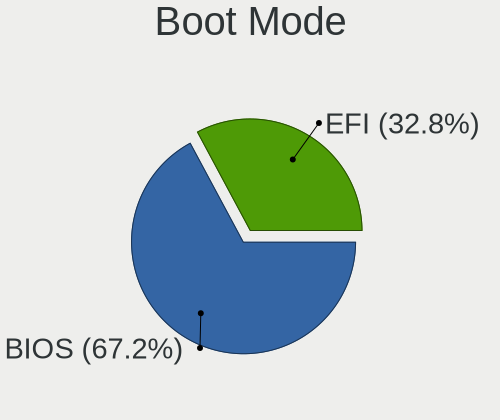
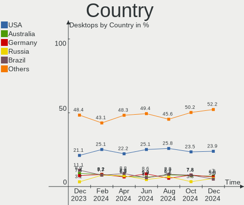
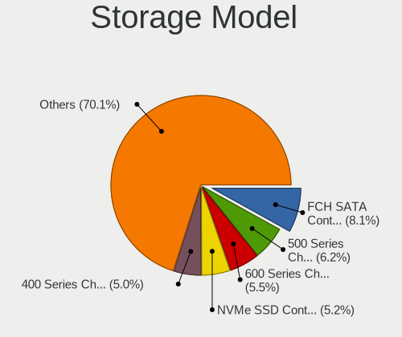
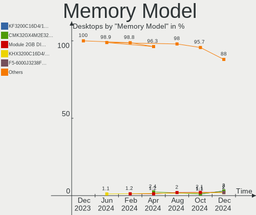
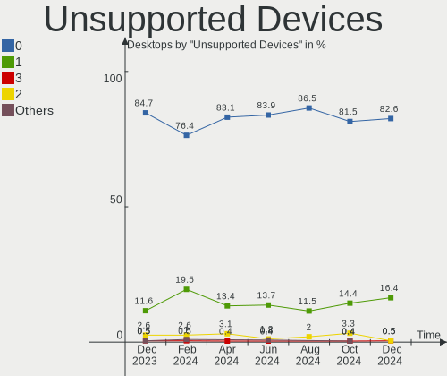

Fedora Hardware Trends (Desktops)
---------------------------------

A project to identify most popular hardware characteristics and track their change
over time based on data collected by Fedora users at https://Linux-Hardware.org.

Anyone can contribute to this report by the [hw-probe](https://github.com/linuxhw/hw-probe) tool:

    sudo -E hw-probe -all -upload

Full-feature report is available here: https://linux-hardware.org/?view=trends

Period: Dec, 2021.

Contents
--------

* [ System ](#system)
  - [ OS                       ](#os)
  - [ OS Family                ](#os-family)
  - [ Kernel                   ](#kernel)
  - [ Kernel Family            ](#kernel-family)
  - [ Kernel Major Ver.        ](#kernel-major-ver)
  - [ Arch                     ](#arch)
  - [ DE                       ](#de)
  - [ Display Server           ](#display-server)
  - [ Display Manager          ](#display-manager)
  - [ OS Lang                  ](#os-lang)
  - [ Boot Mode                ](#boot-mode)
  - [ Filesystem               ](#filesystem)
  - [ Part. scheme             ](#part-scheme)
  - [ Dual Boot with Linux/BSD ](#dual-boot-with-linuxbsd)
  - [ Dual Boot (Win)          ](#dual-boot-win)

* [ Board ](#board)
  - [ Vendor                   ](#vendor)
  - [ Model                    ](#model)
  - [ Model Family             ](#model-family)
  - [ MFG Year                 ](#mfg-year)
  - [ Form Factor              ](#form-factor)
  - [ Secure Boot              ](#secure-boot)
  - [ Coreboot                 ](#coreboot)
  - [ RAM Size                 ](#ram-size)
  - [ RAM Used                 ](#ram-used)
  - [ Total Drives             ](#total-drives)
  - [ Has CD-ROM               ](#has-cd-rom)
  - [ Has Ethernet             ](#has-ethernet)
  - [ Has WiFi                 ](#has-wifi)
  - [ Has Bluetooth            ](#has-bluetooth)

* [ Location ](#location)
  - [ Country                  ](#country)
  - [ City                     ](#city)

* [ Drives ](#drives)
  - [ Drive Vendor             ](#drive-vendor)
  - [ Drive Model              ](#drive-model)
  - [ HDD Vendor               ](#hdd-vendor)
  - [ SSD Vendor               ](#ssd-vendor)
  - [ Drive Kind               ](#drive-kind)
  - [ Drive Connector          ](#drive-connector)
  - [ Drive Size               ](#drive-size)
  - [ Space Total              ](#space-total)
  - [ Space Used               ](#space-used)
  - [ Malfunc. Drives          ](#malfunc-drives)
  - [ Malfunc. Drive Vendor    ](#malfunc-drive-vendor)
  - [ Malfunc. HDD Vendor      ](#malfunc-hdd-vendor)
  - [ Malfunc. Drive Kind      ](#malfunc-drive-kind)
  - [ Failed Drives            ](#failed-drives)
  - [ Failed Drive Vendor      ](#failed-drive-vendor)
  - [ Drive Status             ](#drive-status)

* [ Storage controller ](#storage-controller)
  - [ Storage Vendor           ](#storage-vendor)
  - [ Storage Model            ](#storage-model)
  - [ Storage Kind             ](#storage-kind)

* [ Processor ](#processor)
  - [ CPU Vendor               ](#cpu-vendor)
  - [ CPU Model                ](#cpu-model)
  - [ CPU Model Family         ](#cpu-model-family)
  - [ CPU Cores                ](#cpu-cores)
  - [ CPU Sockets              ](#cpu-sockets)
  - [ CPU Threads              ](#cpu-threads)
  - [ CPU Op-Modes             ](#cpu-op-modes)
  - [ CPU Microcode            ](#cpu-microcode)
  - [ CPU Microarch            ](#cpu-microarch)

* [ Graphics ](#graphics)
  - [ GPU Vendor               ](#gpu-vendor)
  - [ GPU Model                ](#gpu-model)
  - [ GPU Combo                ](#gpu-combo)
  - [ GPU Driver               ](#gpu-driver)
  - [ GPU Memory               ](#gpu-memory)

* [ Monitor ](#monitor)
  - [ Monitor Vendor           ](#monitor-vendor)
  - [ Monitor Model            ](#monitor-model)
  - [ Monitor Resolution       ](#monitor-resolution)
  - [ Monitor Diagonal         ](#monitor-diagonal)
  - [ Monitor Width            ](#monitor-width)
  - [ Aspect Ratio             ](#aspect-ratio)
  - [ Monitor Area             ](#monitor-area)
  - [ Pixel Density            ](#pixel-density)
  - [ Multiple Monitors        ](#multiple-monitors)

* [ Network ](#network)
  - [ Net Controller Vendor    ](#net-controller-vendor)
  - [ Net Controller Model     ](#net-controller-model)
  - [ Wireless Vendor          ](#wireless-vendor)
  - [ Wireless Model           ](#wireless-model)
  - [ Ethernet Vendor          ](#ethernet-vendor)
  - [ Ethernet Model           ](#ethernet-model)
  - [ Net Controller Kind      ](#net-controller-kind)
  - [ Used Controller          ](#used-controller)
  - [ NICs                     ](#nics)
  - [ IPv6                     ](#ipv6)

* [ Bluetooth ](#bluetooth)
  - [ Bluetooth Vendor         ](#bluetooth-vendor)
  - [ Bluetooth Model          ](#bluetooth-model)

* [ Sound ](#sound)
  - [ Sound Vendor             ](#sound-vendor)
  - [ Sound Model              ](#sound-model)

* [ Memory ](#memory)
  - [ Memory Vendor            ](#memory-vendor)
  - [ Memory Model             ](#memory-model)
  - [ Memory Kind              ](#memory-kind)
  - [ Memory Form Factor       ](#memory-form-factor)
  - [ Memory Size              ](#memory-size)
  - [ Memory Speed             ](#memory-speed)

* [ Printers & scanners ](#printers--scanners)
  - [ Printer Vendor           ](#printer-vendor)
  - [ Printer Model            ](#printer-model)
  - [ Scanner Vendor           ](#scanner-vendor)
  - [ Scanner Model            ](#scanner-model)

* [ Camera ](#camera)
  - [ Camera Vendor            ](#camera-vendor)
  - [ Camera Model             ](#camera-model)

* [ Security ](#security)
  - [ Fingerprint Vendor       ](#fingerprint-vendor)
  - [ Fingerprint Model        ](#fingerprint-model)
  - [ Chipcard Vendor          ](#chipcard-vendor)
  - [ Chipcard Model           ](#chipcard-model)

* [ Unsupported ](#unsupported)
  - [ Unsupported Devices      ](#unsupported-devices)
  - [ Unsupported Device Types ](#unsupported-device-types)

System
------

OS
--

Installed operating systems

| Name      | Desktops | Percent |
|-----------|----------|---------|
| Fedora 35 | 72       | 83.72%  |
| Fedora 34 | 12       | 13.95%  |
| Fedora 33 | 2        | 2.33%   |

OS Family
---------

OS without a version

| Name   | Desktops | Percent |
|--------|----------|---------|
| Fedora | 86       | 100%    |

Kernel
------

Version of the Linux kernel

| Version                               | Desktops | Percent |
|---------------------------------------|----------|---------|
| 5.15.6-200.fc35.x86_64                | 28       | 32.56%  |
| 5.15.8-200.fc35.x86_64                | 12       | 13.95%  |
| 5.14.10-300.fc35.x86_64               | 6        | 6.98%   |
| 5.15.8-100.fc34.x86_64                | 5        | 5.81%   |
| 5.15.5-200.fc35.x86_64                | 5        | 5.81%   |
| 5.15.11-200.fc35.x86_64               | 5        | 5.81%   |
| 5.15.10-200.fc35.x86_64               | 5        | 5.81%   |
| 5.15.7-200.fc35.x86_64                | 4        | 4.65%   |
| 5.15.5-100.fc34.x86_64                | 4        | 4.65%   |
| 5.15.4-201.fc35.x86_64                | 2        | 2.33%   |
| 5.14.17-301.fc35.x86_64               | 2        | 2.33%   |
| 5.16.0-0.rc6.41.vanilla.1.fc35.x86_64 | 1        | 1.16%   |
| 5.16.0-0.rc2.18.vanilla.1.fc35.x86_64 | 1        | 1.16%   |
| 5.15.7-100.fc34.x86_64                | 1        | 1.16%   |
| 5.15.6-100.fc34.x86_64                | 1        | 1.16%   |
| 5.15.10-100.fc34.x86_64               | 1        | 1.16%   |
| 5.14.18-301.fsync.fc35.x86_64         | 1        | 1.16%   |
| 5.14.18-100.fc33.x86_64               | 1        | 1.16%   |
| 5.11.17-200.fc33.x86_64               | 1        | 1.16%   |

Kernel Family
-------------

Linux kernel without a distro release

| Version | Desktops | Percent |
|---------|----------|---------|
| 5.15.6  | 29       | 33.72%  |
| 5.15.8  | 17       | 19.77%  |
| 5.15.5  | 9        | 10.47%  |
| 5.15.10 | 6        | 6.98%   |
| 5.14.10 | 6        | 6.98%   |
| 5.15.7  | 5        | 5.81%   |
| 5.15.11 | 5        | 5.81%   |
| 5.16.0  | 2        | 2.33%   |
| 5.15.4  | 2        | 2.33%   |
| 5.14.18 | 2        | 2.33%   |
| 5.14.17 | 2        | 2.33%   |
| 5.11.17 | 1        | 1.16%   |

Kernel Major Ver.
-----------------

Linux kernel major version

| Version | Desktops | Percent |
|---------|----------|---------|
| 5.15    | 73       | 84.88%  |
| 5.14    | 10       | 11.63%  |
| 5.16    | 2        | 2.33%   |
| 5.11    | 1        | 1.16%   |

Arch
----

OS architecture (x86_64, i586, etc.)

| Name   | Desktops | Percent |
|--------|----------|---------|
| x86_64 | 86       | 100%    |

DE
--

Desktop Environment

| Name          | Desktops | Percent |
|---------------|----------|---------|
| GNOME         | 56       | 65.12%  |
| KDE5          | 17       | 19.77%  |
| Cinnamon      | 4        | 4.65%   |
| Unknown       | 4        | 4.65%   |
| X-Cinnamon    | 3        | 3.49%   |
| MATE          | 1        | 1.16%   |
| GNOME Classic | 1        | 1.16%   |

Display Server
--------------

X11 or Wayland

| Name    | Desktops | Percent |
|---------|----------|---------|
| Wayland | 40       | 46.51%  |
| X11     | 39       | 45.35%  |
| Tty     | 6        | 6.98%   |
| Unknown | 1        | 1.16%   |

Display Manager
---------------

SDDM, LightDM, etc.

| Name    | Desktops | Percent |
|---------|----------|---------|
| Unknown | 50       | 58.14%  |
| GDM     | 20       | 23.26%  |
| SDDM    | 9        | 10.47%  |
| LightDM | 7        | 8.14%   |

OS Lang
-------

Language

| Lang  | Desktops | Percent |
|-------|----------|---------|
| en_US | 41       | 47.67%  |
| ru_RU | 10       | 11.63%  |
| es_ES | 4        | 4.65%   |
| en_GB | 4        | 4.65%   |
| en_AU | 4        | 4.65%   |
| ru_UA | 3        | 3.49%   |
| pt_BR | 3        | 3.49%   |
| fr_FR | 3        | 3.49%   |
| de_DE | 3        | 3.49%   |
| pl_PL | 2        | 2.33%   |
| cs_CZ | 2        | 2.33%   |
| sv_SE | 1        | 1.16%   |
| pt_PT | 1        | 1.16%   |
| ja_JP | 1        | 1.16%   |
| it_IT | 1        | 1.16%   |
| es_MX | 1        | 1.16%   |
| es_CO | 1        | 1.16%   |
| en_IE | 1        | 1.16%   |

Boot Mode
---------

EFI or BIOS

| Mode | Desktops | Percent |
|------|----------|---------|
| EFI  | 49       | 56.98%  |
| BIOS | 37       | 43.02%  |

Filesystem
----------

Type of filesystem

| Type  | Desktops | Percent |
|-------|----------|---------|
| Btrfs | 51       | 59.3%   |
| Ext4  | 26       | 30.23%  |
| Xfs   | 9        | 10.47%  |

Part. scheme
------------

Scheme of partitioning

| Type    | Desktops | Percent |
|---------|----------|---------|
| Unknown | 50       | 58.14%  |
| GPT     | 26       | 30.23%  |
| MBR     | 10       | 11.63%  |

Dual Boot with Linux/BSD
------------------------

Hosting more than one Linux/BSD

| Dual boot | Desktops | Percent |
|-----------|----------|---------|
| No        | 78       | 90.7%   |
| Yes       | 8        | 9.3%    |

Dual Boot (Win)
---------------

Hosting Linux and Windows

| Dual boot | Desktops | Percent |
|-----------|----------|---------|
| No        | 67       | 77.91%  |
| Yes       | 19       | 22.09%  |

Board
-----

Vendor
------

Motherboard manufacturer

| Name                | Desktops | Percent |
|---------------------|----------|---------|
| Gigabyte Technology | 24       | 27.91%  |
| ASUSTek Computer    | 22       | 25.58%  |
| MSI                 | 14       | 16.28%  |
| Dell                | 11       | 12.79%  |
| Hewlett-Packard     | 3        | 3.49%   |
| XFX                 | 2        | 2.33%   |
| Lenovo              | 2        | 2.33%   |
| ASRock              | 2        | 2.33%   |
| Supermicro          | 1        | 1.16%   |
| Samsung Electronics | 1        | 1.16%   |
| JINGSHA             | 1        | 1.16%   |
| Intel               | 1        | 1.16%   |
| Gateway             | 1        | 1.16%   |
| Apple               | 1        | 1.16%   |

Model
-----

Motherboard model

| Name                                   | Desktops | Percent |
|----------------------------------------|----------|---------|
| ASUS All Series                        | 3        | 3.49%   |
| MSI MS-7C91                            | 2        | 2.33%   |
| MSI MS-7B10                            | 2        | 2.33%   |
| MSI MS-7A33                            | 2        | 2.33%   |
| Gigabyte B450 AORUS M                  | 2        | 2.33%   |
| ASUS TUF GAMING B550-PLUS              | 2        | 2.33%   |
| XFX nForce 780i 3-Way SLI              | 1        | 1.16%   |
| XFX MI-A78S-8209 Ver1.1                | 1        | 1.16%   |
| Supermicro PIO-617R-TLN4F+-ST031       | 1        | 1.16%   |
| Samsung DeskTop System                 | 1        | 1.16%   |
| MSI MS-7D25                            | 1        | 1.16%   |
| MSI MS-7C95                            | 1        | 1.16%   |
| MSI MS-7C56                            | 1        | 1.16%   |
| MSI MS-7B77                            | 1        | 1.16%   |
| MSI MS-7B07                            | 1        | 1.16%   |
| MSI MS-7A31                            | 1        | 1.16%   |
| MSI MS-7866                            | 1        | 1.16%   |
| MSI MS-7817                            | 1        | 1.16%   |
| Lenovo ThinkCentre M720s 10ST006UGE    | 1        | 1.16%   |
| Lenovo IdeaCentre 710-25ISH 90FB0001US | 1        | 1.16%   |
| Intel Inspire                          | 1        | 1.16%   |
| HP ProDesk 600 G2 SFF                  | 1        | 1.16%   |
| HP EliteDesk 800 G2 DM 65W             | 1        | 1.16%   |
| HP 27-k350xt                           | 1        | 1.16%   |
| Gigabyte Z97P-D3                       | 1        | 1.16%   |
| Gigabyte Z77-D3H                       | 1        | 1.16%   |
| Gigabyte Z690 UD DDR4                  | 1        | 1.16%   |
| Gigabyte Z390 M                        | 1        | 1.16%   |
| Gigabyte Z390 I AORUS PRO WIFI         | 1        | 1.16%   |
| Gigabyte Z270P-D3                      | 1        | 1.16%   |
| Gigabyte Z170-D3H                      | 1        | 1.16%   |
| Gigabyte X570 AORUS PRO                | 1        | 1.16%   |
| Gigabyte X570 AORUS MASTER             | 1        | 1.16%   |
| Gigabyte TRX40 AORUS XTREME            | 1        | 1.16%   |
| Gigabyte TRX40 AORUS MASTER            | 1        | 1.16%   |
| Gigabyte H61M-USB3V                    | 1        | 1.16%   |
| Gigabyte H370HD3                       | 1        | 1.16%   |
| Gigabyte GA-MA785G-UD3H                | 1        | 1.16%   |
| Gigabyte GA-MA780G-UD3H                | 1        | 1.16%   |
| Gigabyte G41MT-D3                      | 1        | 1.16%   |
| Gigabyte F2A88XM-DS2P                  | 1        | 1.16%   |
| Gigabyte EP45-DS3L                     | 1        | 1.16%   |
| Gigabyte B85M-D3V-A                    | 1        | 1.16%   |
| Gigabyte B560M DS3H V2                 | 1        | 1.16%   |
| Gigabyte B450 AORUS ELITE              | 1        | 1.16%   |
| Gigabyte 990FXA-UD3                    | 1        | 1.16%   |
| Gateway SX2185                         | 1        | 1.16%   |
| Dell XPS 8500                          | 1        | 1.16%   |
| Dell Vostro 3900                       | 1        | 1.16%   |
| Dell PowerEdge SC1420                  | 1        | 1.16%   |
| Dell OptiPlex 990                      | 1        | 1.16%   |
| Dell OptiPlex 980                      | 1        | 1.16%   |
| Dell OptiPlex 790                      | 1        | 1.16%   |
| Dell OptiPlex 760                      | 1        | 1.16%   |
| Dell OptiPlex 7010                     | 1        | 1.16%   |
| Dell OptiPlex 5040                     | 1        | 1.16%   |
| Dell OptiPlex 3020                     | 1        | 1.16%   |
| Dell Inspiron 530s                     | 1        | 1.16%   |
| ASUS Z8P                               | 1        | 1.16%   |
| ASUS TUF B365M-PLUS GAMING             | 1        | 1.16%   |

Model Family
------------

Motherboard model prefix

| Name                             | Desktops | Percent |
|----------------------------------|----------|---------|
| ASUS ROG                         | 8        | 9.3%    |
| Dell OptiPlex                    | 7        | 8.14%   |
| Gigabyte B450                    | 3        | 3.49%   |
| ASUS TUF                         | 3        | 3.49%   |
| ASUS All                         | 3        | 3.49%   |
| MSI MS-7C91                      | 2        | 2.33%   |
| MSI MS-7B10                      | 2        | 2.33%   |
| MSI MS-7A33                      | 2        | 2.33%   |
| Gigabyte Z390                    | 2        | 2.33%   |
| Gigabyte X570                    | 2        | 2.33%   |
| Gigabyte TRX40                   | 2        | 2.33%   |
| ASUS PRIME                       | 2        | 2.33%   |
| XFX nForce                       | 1        | 1.16%   |
| XFX MI-A78S-8209                 | 1        | 1.16%   |
| Supermicro PIO-617R-TLN4F+-ST031 | 1        | 1.16%   |
| Samsung DeskTop                  | 1        | 1.16%   |
| MSI MS-7D25                      | 1        | 1.16%   |
| MSI MS-7C95                      | 1        | 1.16%   |
| MSI MS-7C56                      | 1        | 1.16%   |
| MSI MS-7B77                      | 1        | 1.16%   |
| MSI MS-7B07                      | 1        | 1.16%   |
| MSI MS-7A31                      | 1        | 1.16%   |
| MSI MS-7866                      | 1        | 1.16%   |
| MSI MS-7817                      | 1        | 1.16%   |
| Lenovo ThinkCentre               | 1        | 1.16%   |
| Lenovo IdeaCentre                | 1        | 1.16%   |
| Intel Inspire                    | 1        | 1.16%   |
| HP ProDesk                       | 1        | 1.16%   |
| HP EliteDesk                     | 1        | 1.16%   |
| HP 27-k350xt                     | 1        | 1.16%   |
| Gigabyte Z97P-D3                 | 1        | 1.16%   |
| Gigabyte Z77-D3H                 | 1        | 1.16%   |
| Gigabyte Z690                    | 1        | 1.16%   |
| Gigabyte Z270P-D3                | 1        | 1.16%   |
| Gigabyte Z170-D3H                | 1        | 1.16%   |
| Gigabyte H61M-USB3V              | 1        | 1.16%   |
| Gigabyte H370HD3                 | 1        | 1.16%   |
| Gigabyte GA-MA785G-UD3H          | 1        | 1.16%   |
| Gigabyte GA-MA780G-UD3H          | 1        | 1.16%   |
| Gigabyte G41MT-D3                | 1        | 1.16%   |
| Gigabyte F2A88XM-DS2P            | 1        | 1.16%   |
| Gigabyte EP45-DS3L               | 1        | 1.16%   |
| Gigabyte B85M-D3V-A              | 1        | 1.16%   |
| Gigabyte B560M                   | 1        | 1.16%   |
| Gigabyte 990FXA-UD3              | 1        | 1.16%   |
| Gateway SX2185                   | 1        | 1.16%   |
| Dell XPS                         | 1        | 1.16%   |
| Dell Vostro                      | 1        | 1.16%   |
| Dell PowerEdge                   | 1        | 1.16%   |
| Dell Inspiron                    | 1        | 1.16%   |
| ASUS Z8P                         | 1        | 1.16%   |
| ASUS SABERTOOTH                  | 1        | 1.16%   |
| ASUS P8Z68-V                     | 1        | 1.16%   |
| ASUS P6T                         | 1        | 1.16%   |
| ASUS P5G41-M                     | 1        | 1.16%   |
| ASUS M2N-E                       | 1        | 1.16%   |
| ASRock X399                      | 1        | 1.16%   |
| ASRock AD2700-ITX                | 1        | 1.16%   |
| Apple MacPro5                    | 1        | 1.16%   |
| Unknown                          | 1        | 1.16%   |

MFG Year
--------

Motherboard manufacture year

| Year | Desktops | Percent |
|------|----------|---------|
| 2021 | 20       | 23.26%  |
| 2020 | 10       | 11.63%  |
| 2019 | 10       | 11.63%  |
| 2018 | 7        | 8.14%   |
| 2015 | 7        | 8.14%   |
| 2013 | 6        | 6.98%   |
| 2009 | 6        | 6.98%   |
| 2017 | 4        | 4.65%   |
| 2014 | 4        | 4.65%   |
| 2010 | 4        | 4.65%   |
| 2012 | 3        | 3.49%   |
| 2016 | 2        | 2.33%   |
| 2011 | 1        | 1.16%   |
| 2008 | 1        | 1.16%   |
| 2006 | 1        | 1.16%   |

Form Factor
-----------

Physical design of the computer

| Name    | Desktops | Percent |
|---------|----------|---------|
| Desktop | 86       | 100%    |

Secure Boot
-----------

Enabled or disabled

| State    | Desktops | Percent |
|----------|----------|---------|
| Disabled | 81       | 94.19%  |
| Enabled  | 5        | 5.81%   |

Coreboot
--------

Have coreboot on board

| Used | Desktops | Percent |
|------|----------|---------|
| No   | 86       | 100%    |

RAM Size
--------

Total RAM memory

| Size in GB  | Desktops | Percent |
|-------------|----------|---------|
| 16.01-24.0  | 24       | 27.91%  |
| 32.01-64.0  | 21       | 24.42%  |
| 4.01-8.0    | 13       | 15.12%  |
| 8.01-16.0   | 11       | 12.79%  |
| 64.01-256.0 | 8        | 9.3%    |
| 3.01-4.0    | 6        | 6.98%   |
| 24.01-32.0  | 1        | 1.16%   |
| 2.01-3.0    | 1        | 1.16%   |
| 1.01-2.0    | 1        | 1.16%   |

RAM Used
--------

Used RAM memory

| Used GB   | Desktops | Percent |
|-----------|----------|---------|
| 2.01-3.0  | 25       | 29.07%  |
| 4.01-8.0  | 24       | 27.91%  |
| 3.01-4.0  | 16       | 18.6%   |
| 1.01-2.0  | 11       | 12.79%  |
| 8.01-16.0 | 8        | 9.3%    |
| 0.51-1.0  | 2        | 2.33%   |

Total Drives
------------

Number of drives on board

| Drives | Desktops | Percent |
|--------|----------|---------|
| 2      | 27       | 31.4%   |
| 1      | 20       | 23.26%  |
| 3      | 18       | 20.93%  |
| 5      | 9        | 10.47%  |
| 4      | 6        | 6.98%   |
| 6      | 4        | 4.65%   |
| 14     | 1        | 1.16%   |
| 9      | 1        | 1.16%   |

Has CD-ROM
----------

Has CD-ROM on board

| Presented | Desktops | Percent |
|-----------|----------|---------|
| No        | 57       | 66.28%  |
| Yes       | 29       | 33.72%  |

Has Ethernet
------------

Has Ethernet on board

| Presented | Desktops | Percent |
|-----------|----------|---------|
| Yes       | 86       | 100%    |

Has WiFi
--------

Has WiFi module

| Presented | Desktops | Percent |
|-----------|----------|---------|
| No        | 45       | 52.33%  |
| Yes       | 41       | 47.67%  |

Has Bluetooth
-------------

Has Bluetooth module

| Presented | Desktops | Percent |
|-----------|----------|---------|
| No        | 49       | 56.98%  |
| Yes       | 37       | 43.02%  |

Location
--------

Country
-------

Geographic location (country)

| Country     | Desktops | Percent |
|-------------|----------|---------|
| USA         | 22       | 25.58%  |
| Russia      | 8        | 9.3%    |
| Poland      | 5        | 5.81%   |
| Germany     | 5        | 5.81%   |
| Ukraine     | 4        | 4.65%   |
| Spain       | 4        | 4.65%   |
| Australia   | 4        | 4.65%   |
| Romania     | 3        | 3.49%   |
| Brazil      | 3        | 3.49%   |
| Belarus     | 3        | 3.49%   |
| UK          | 2        | 2.33%   |
| Switzerland | 2        | 2.33%   |
| Sweden      | 2        | 2.33%   |
| France      | 2        | 2.33%   |
| Czechia     | 2        | 2.33%   |
| South Korea | 1        | 1.16%   |
| Norway      | 1        | 1.16%   |
| Netherlands | 1        | 1.16%   |
| Mexico      | 1        | 1.16%   |
| Kyrgyzstan  | 1        | 1.16%   |
| Japan       | 1        | 1.16%   |
| Italy       | 1        | 1.16%   |
| Ireland     | 1        | 1.16%   |
| India       | 1        | 1.16%   |
| Hong Kong   | 1        | 1.16%   |
| Greece      | 1        | 1.16%   |
| Colombia    | 1        | 1.16%   |
| Canada      | 1        | 1.16%   |
| Belgium     | 1        | 1.16%   |
| Austria     | 1        | 1.16%   |

City
----

Geographic location (city)

| City                 | Desktops | Percent |
|----------------------|----------|---------|
| Sydney               | 4        | 4.65%   |
| Moscow               | 4        | 4.65%   |
| Minsk                | 3        | 3.49%   |
| Zurich               | 2        | 2.33%   |
| Yekaterinburg        | 1        | 1.16%   |
| Wilmington           | 1        | 1.16%   |
| Willowbrook          | 1        | 1.16%   |
| Warsaw               | 1        | 1.16%   |
| Volgograd            | 1        | 1.16%   |
| Vinnytsia            | 1        | 1.16%   |
| Villavicencio        | 1        | 1.16%   |
| Vienna               | 1        | 1.16%   |
| Valencia             | 1        | 1.16%   |
| Vaellingby           | 1        | 1.16%   |
| Udine                | 1        | 1.16%   |
| Tuxtla Guti?©rrez    | 1        | 1.16%   |
| Tustin               | 1        | 1.16%   |
| Toulouse             | 1        | 1.16%   |
| Timi?™oara           | 1        | 1.16%   |
| Tikhoretsk           | 1        | 1.16%   |
| Temple               | 1        | 1.16%   |
| Sunderland           | 1        | 1.16%   |
| Stuttgart            | 1        | 1.16%   |
| Stavanger            | 1        | 1.16%   |
| Somerville           | 1        | 1.16%   |
| Seoul                | 1        | 1.16%   |
| Seattle              | 1        | 1.16%   |
| S??o Paulo           | 1        | 1.16%   |
| Sanlucar la Mayor    | 1        | 1.16%   |
| San Jose             | 1        | 1.16%   |
| Rudziniec            | 1        | 1.16%   |
| Roznov pod Radhostem | 1        | 1.16%   |
| Roquetas de Mar      | 1        | 1.16%   |
| Regina               | 1        | 1.16%   |
| Pouso Alegre         | 1        | 1.16%   |
| Pompano Beach        | 1        | 1.16%   |
| Philadelphia         | 1        | 1.16%   |
| Peine                | 1        | 1.16%   |
| Nizhniy Novgorod     | 1        | 1.16%   |
| Navahermosa          | 1        | 1.16%   |
| Nachod               | 1        | 1.16%   |
| Morioka              | 1        | 1.16%   |
| Midleton             | 1        | 1.16%   |
| Mesa                 | 1        | 1.16%   |
| Lublin               | 1        | 1.16%   |
| Los Angeles          | 1        | 1.16%   |
| Levittown            | 1        | 1.16%   |
| Lehigh Acres         | 1        | 1.16%   |
| Kyiv                 | 1        | 1.16%   |
| Krakow               | 1        | 1.16%   |
| Knoxville            | 1        | 1.16%   |
| Kharkiv              | 1        | 1.16%   |
| Kansas City          | 1        | 1.16%   |
| Kalamazoo            | 1        | 1.16%   |
| Iasi                 | 1        | 1.16%   |
| Hanover              | 1        | 1.16%   |
| Dniprodzerzhynsk     | 1        | 1.16%   |
| Dallas               | 1        | 1.16%   |
| Cwmbran              | 1        | 1.16%   |
| Curitiba             | 1        | 1.16%   |

Drives
------

Drive Vendor
------------

Hard drive vendors

| Vendor              | Desktops | Drives | Percent |
|---------------------|----------|--------|---------|
| WDC                 | 35       | 54     | 19.34%  |
| Samsung Electronics | 33       | 56     | 18.23%  |
| Seagate             | 32       | 46     | 17.68%  |
| Kingston            | 12       | 13     | 6.63%   |
| Crucial             | 9        | 9      | 4.97%   |
| Toshiba             | 7        | 7      | 3.87%   |
| SanDisk             | 7        | 7      | 3.87%   |
| Intel               | 6        | 6      | 3.31%   |
| A-DATA Technology   | 6        | 8      | 3.31%   |
| SPCC                | 5        | 5      | 2.76%   |
| Phison              | 4        | 7      | 2.21%   |
| Unknown             | 3        | 4      | 1.66%   |
| Micron Technology   | 3        | 3      | 1.66%   |
| GOODRAM             | 3        | 3      | 1.66%   |
| Silicon Motion      | 2        | 2      | 1.1%    |
| Patriot             | 2        | 2      | 1.1%    |
| Hitachi             | 2        | 2      | 1.1%    |
| China               | 2        | 2      | 1.1%    |
| Apacer              | 2        | 2      | 1.1%    |
| SK Hynix            | 1        | 1      | 0.55%   |
| OWC                 | 1        | 1      | 0.55%   |
| MAXTOR              | 1        | 1      | 0.55%   |
| LITEON              | 1        | 1      | 0.55%   |
| Intenso             | 1        | 2      | 0.55%   |
| Dahua               | 1        | 1      | 0.55%   |

Drive Model
-----------

Hard drive models

| Model                                | Desktops | Percent |
|--------------------------------------|----------|---------|
| Samsung NVMe SSD Drive 500GB         | 8        | 3.67%   |
| Samsung SSD 860 EVO 500GB            | 6        | 2.75%   |
| WDC WD30EFRX-68EUZN0 3TB             | 3        | 1.38%   |
| Seagate ST2000DM008-2FR102 2TB       | 3        | 1.38%   |
| Seagate ST1000DM010-2EP102 1TB       | 3        | 1.38%   |
| Seagate ST1000DM003-1CH162 1TB       | 3        | 1.38%   |
| Samsung SSD 870 EVO 1TB              | 3        | 1.38%   |
| Kingston SA400S37480G 480GB SSD      | 3        | 1.38%   |
| WDC WDS100T3X0C-00SJG0 1TB           | 2        | 0.92%   |
| WDC WDS100T2B0A-00SM50 1TB SSD       | 2        | 0.92%   |
| WDC WD40EZRZ-00GXCB0 4TB             | 2        | 0.92%   |
| WDC WD2500AAKX-753CA1 250GB          | 2        | 0.92%   |
| WDC WD20EZRX-00D8PB0 2TB             | 2        | 0.92%   |
| WDC WD10EZEX-08WN4A0 1TB             | 2        | 0.92%   |
| WDC WD1002FAEX-00Z3A0 1TB            | 2        | 0.92%   |
| Toshiba DT01ACA100 1TB               | 2        | 0.92%   |
| Silicon Motion NVMe SSD Drive 1024GB | 2        | 0.92%   |
| Seagate ST500DM002-1BD142 500GB      | 2        | 0.92%   |
| Seagate ST1000DM003-1ER162 1TB       | 2        | 0.92%   |
| SanDisk SSD PLUS 240GB               | 2        | 0.92%   |
| Samsung SSD 970 EVO Plus 500GB       | 2        | 0.92%   |
| Samsung SSD 970 EVO Plus 2TB         | 2        | 0.92%   |
| Samsung SSD 860 EVO 1TB              | 2        | 0.92%   |
| Samsung SSD 850 EVO 250GB            | 2        | 0.92%   |
| Samsung NVMe SSD Drive 2TB           | 2        | 0.92%   |
| Samsung NVMe SSD Drive 250GB         | 2        | 0.92%   |
| Samsung NVMe SSD Drive 1TB           | 2        | 0.92%   |
| Kingston SKC2500M81000G 1TB          | 2        | 0.92%   |
| Kingston SA400S37240G 240GB SSD      | 2        | 0.92%   |
| Intel SSDSC2CT120A3 120GB            | 2        | 0.92%   |
| Crucial CT480BX500SSD1 480GB         | 2        | 0.92%   |
| WDC WDS500G3X0C-00SJG0 500GB         | 1        | 0.46%   |
| WDC WDS250G2B0B-00YS70 250GB SSD     | 1        | 0.46%   |
| WDC WDS240G2G0B-00EPW0 240GB SSD     | 1        | 0.46%   |
| WDC WDS240G2G0A-00JH30 240GB SSD     | 1        | 0.46%   |
| WDC WDS100T1X0E-00AFY0 1TB           | 1        | 0.46%   |
| WDC WD6400AAKS-75A7B0 640GB          | 1        | 0.46%   |
| WDC WD60PURZ-85ZUFY1 6TB             | 1        | 0.46%   |
| WDC WD5000AVCS-632DY1 500GB          | 1        | 0.46%   |
| WDC WD5000AADS-00S9B0 500GB          | 1        | 0.46%   |
| WDC WD3200BEKT-00F3T0 320GB          | 1        | 0.46%   |
| WDC WD3200AAKS-61L9A0 320GB          | 1        | 0.46%   |
| WDC WD30EZRX-00D8PB0 3TB             | 1        | 0.46%   |
| WDC WD30EFRX-68N32N0 3TB             | 1        | 0.46%   |
| WDC WD20EFRX-68EUZN0 2TB             | 1        | 0.46%   |
| WDC WD20EARS-00MVWB0 2TB             | 1        | 0.46%   |
| WDC WD15EARX-00PASB0 1TB             | 1        | 0.46%   |
| WDC WD10EZRX-00L4HB0 1TB             | 1        | 0.46%   |
| WDC WD10EZRX-00A3KB0 1TB             | 1        | 0.46%   |
| WDC WD10EZEX-60WN4A1 1TB             | 1        | 0.46%   |
| WDC WD10EZEX-60WN4A0 1TB             | 1        | 0.46%   |
| WDC WD10EZEX-08M2NA0 1TB             | 1        | 0.46%   |
| WDC WD10EZEX-00WN4A0 1TB             | 1        | 0.46%   |
| WDC WD10EALS-002BA0 1TB              | 1        | 0.46%   |
| WDC WD1003FBYX-01Y7B1 1TB            | 1        | 0.46%   |
| WDC WD1003FBYX-0 1TB                 | 1        | 0.46%   |
| WDC WD1001FALS-00E8B0 1TB            | 1        | 0.46%   |
| WDC WD1001FAES-55W7A0 1TB            | 1        | 0.46%   |
| Unknown SD/MMC 16GB                  | 1        | 0.46%   |
| Unknown MMC Card  32GB               | 1        | 0.46%   |

HDD Vendor
----------

Hard disk drive vendors

| Vendor              | Desktops | Drives | Percent |
|---------------------|----------|--------|---------|
| Seagate             | 30       | 44     | 41.67%  |
| WDC                 | 28       | 45     | 38.89%  |
| Toshiba             | 7        | 7      | 9.72%   |
| Samsung Electronics | 4        | 5      | 5.56%   |
| Hitachi             | 2        | 2      | 2.78%   |
| MAXTOR              | 1        | 1      | 1.39%   |

SSD Vendor
----------

Solid state drive vendors

| Vendor              | Desktops | Drives | Percent |
|---------------------|----------|--------|---------|
| Samsung Electronics | 17       | 26     | 23.61%  |
| Crucial             | 9        | 9      | 12.5%   |
| SanDisk             | 7        | 7      | 9.72%   |
| Kingston            | 7        | 7      | 9.72%   |
| WDC                 | 5        | 5      | 6.94%   |
| A-DATA Technology   | 5        | 7      | 6.94%   |
| SPCC                | 4        | 4      | 5.56%   |
| GOODRAM             | 3        | 3      | 4.17%   |
| Patriot             | 2        | 2      | 2.78%   |
| Micron Technology   | 2        | 2      | 2.78%   |
| Intel               | 2        | 2      | 2.78%   |
| China               | 2        | 2      | 2.78%   |
| Apacer              | 2        | 2      | 2.78%   |
| Seagate             | 1        | 1      | 1.39%   |
| OWC                 | 1        | 1      | 1.39%   |
| LITEON              | 1        | 1      | 1.39%   |
| Intenso             | 1        | 2      | 1.39%   |
| Dahua               | 1        | 1      | 1.39%   |

Drive Kind
----------

HDD or SSD

| Kind    | Desktops | Drives | Percent |
|---------|----------|--------|---------|
| HDD     | 57       | 104    | 38.78%  |
| SSD     | 56       | 84     | 38.1%   |
| NVMe    | 30       | 52     | 20.41%  |
| MMC     | 2        | 2      | 1.36%   |
| Unknown | 2        | 3      | 1.36%   |

Drive Connector
---------------

SATA, SAS, NVMe, etc.

| Type | Desktops | Drives | Percent |
|------|----------|--------|---------|
| SATA | 74       | 187    | 67.89%  |
| NVMe | 30       | 52     | 27.52%  |
| SAS  | 3        | 4      | 2.75%   |
| MMC  | 2        | 2      | 1.83%   |

Drive Size
----------

Size of hard drive

| Size in TB | Desktops | Drives | Percent |
|------------|----------|--------|---------|
| 0.01-0.5   | 57       | 89     | 45.97%  |
| 0.51-1.0   | 36       | 53     | 29.03%  |
| 1.01-2.0   | 14       | 15     | 11.29%  |
| 2.01-3.0   | 8        | 18     | 6.45%   |
| 3.01-4.0   | 5        | 5      | 4.03%   |
| 4.01-10.0  | 3        | 6      | 2.42%   |
| 10.01-20.0 | 1        | 2      | 0.81%   |

Space Total
-----------

Amount of disk space available on the file system

| Size in GB     | Desktops | Percent |
|----------------|----------|---------|
| 501-1000       | 18       | 20.93%  |
| 1001-2000      | 17       | 19.77%  |
| 101-250        | 14       | 16.28%  |
| 251-500        | 10       | 11.63%  |
| 2001-3000      | 8        | 9.3%    |
| More than 3000 | 6        | 6.98%   |
| 1-20           | 4        | 4.65%   |
| 51-100         | 4        | 4.65%   |
| Unknown        | 3        | 3.49%   |
| 21-50          | 2        | 2.33%   |

Space Used
----------

Amount of used disk space

| Used GB   | Desktops | Percent |
|-----------|----------|---------|
| 1-20      | 20       | 23.26%  |
| 251-500   | 14       | 16.28%  |
| 21-50     | 13       | 15.12%  |
| 501-1000  | 11       | 12.79%  |
| 101-250   | 9        | 10.47%  |
| 51-100    | 8        | 9.3%    |
| 1001-2000 | 5        | 5.81%   |
| 2001-3000 | 3        | 3.49%   |
| Unknown   | 3        | 3.49%   |

Malfunc. Drives
---------------

Drive models with a malfunction

| Model                                               | Desktops | Drives | Percent |
|-----------------------------------------------------|----------|--------|---------|
| Intel SSDSC2CT120A3 120GB                           | 2        | 2      | 14.29%  |
| WDC WD2500AAKX-753CA1 250GB                         | 1        | 1      | 7.14%   |
| WDC WD10EZEX-08WN4A0 1TB                            | 1        | 1      | 7.14%   |
| WDC WD1003FBYX-01Y7B1 1TB                           | 1        | 1      | 7.14%   |
| WDC WD1002FAEX-00Z3A0 1TB                           | 1        | 1      | 7.14%   |
| Seagate ST500DM002-1BD142 500GB                     | 1        | 1      | 7.14%   |
| Seagate ST31000524AS 1TB                            | 1        | 1      | 7.14%   |
| Seagate ST3000DM001-1ER166 3TB                      | 1        | 1      | 7.14%   |
| Seagate ST1000DM010-2EP102 1TB                      | 1        | 1      | 7.14%   |
| Samsung Electronics SSD 970 PRO 1TB                 | 1        | 1      | 7.14%   |
| Samsung Electronics HD501LJ 500GB                   | 1        | 2      | 7.14%   |
| Micron Technology MTFDDAK128MAY-1AH1ZABHA 128GB SSD | 1        | 1      | 7.14%   |
| LITEON LMH-128V2M 128GB SSD                         | 1        | 1      | 7.14%   |

Malfunc. Drive Vendor
---------------------

Vendors of faulty drives

| Vendor              | Desktops | Drives | Percent |
|---------------------|----------|--------|---------|
| WDC                 | 4        | 4      | 28.57%  |
| Seagate             | 4        | 4      | 28.57%  |
| Samsung Electronics | 2        | 3      | 14.29%  |
| Intel               | 2        | 2      | 14.29%  |
| Micron Technology   | 1        | 1      | 7.14%   |
| LITEON              | 1        | 1      | 7.14%   |

Malfunc. HDD Vendor
-------------------

Vendors of faulty HDD drives

| Vendor              | Desktops | Drives | Percent |
|---------------------|----------|--------|---------|
| WDC                 | 4        | 4      | 44.44%  |
| Seagate             | 4        | 4      | 44.44%  |
| Samsung Electronics | 1        | 2      | 11.11%  |

Malfunc. Drive Kind
-------------------

Kinds of faulty drives

| Kind | Desktops | Drives | Percent |
|------|----------|--------|---------|
| HDD  | 8        | 10     | 61.54%  |
| SSD  | 4        | 4      | 30.77%  |
| NVMe | 1        | 1      | 7.69%   |

Failed Drives
-------------

Failed drive models

Zero info for selected period =(

Failed Drive Vendor
-------------------

Failed drive vendors

Zero info for selected period =(

Drive Status
------------

Number of failed and malfunc. drives

| Status   | Desktops | Drives | Percent |
|----------|----------|--------|---------|
| Detected | 50       | 144    | 51.02%  |
| Works    | 35       | 86     | 35.71%  |
| Malfunc  | 13       | 15     | 13.27%  |

Storage controller
------------------

Storage Vendor
--------------

Storage controller vendors

| Vendor                        | Desktops | Percent |
|-------------------------------|----------|---------|
| Intel                         | 53       | 40.15%  |
| AMD                           | 31       | 23.48%  |
| Samsung Electronics           | 15       | 11.36%  |
| Kingston Technology Company   | 5        | 3.79%   |
| Sandisk                       | 4        | 3.03%   |
| Phison Electronics            | 4        | 3.03%   |
| Nvidia                        | 3        | 2.27%   |
| Marvell Technology Group      | 3        | 2.27%   |
| ASMedia Technology            | 3        | 2.27%   |
| Silicon Motion                | 2        | 1.52%   |
| JMicron Technology            | 2        | 1.52%   |
| SK Hynix                      | 1        | 0.76%   |
| Micron Technology             | 1        | 0.76%   |
| MAXIO Technology (Hangzhou)   | 1        | 0.76%   |
| LSI Logic / Symbios Logic     | 1        | 0.76%   |
| Integrated Technology Express | 1        | 0.76%   |
| Broadcom / LSI                | 1        | 0.76%   |
| ADATA Technology              | 1        | 0.76%   |

Storage Model
-------------

Storage controller models

| Model                                                                          | Desktops | Percent |
|--------------------------------------------------------------------------------|----------|---------|
| AMD FCH SATA Controller [AHCI mode]                                            | 20       | 12.35%  |
| Samsung NVMe SSD Controller SM981/PM981/PM983                                  | 12       | 7.41%   |
| Intel 8 Series/C220 Series Chipset Family 6-port SATA Controller 1 [AHCI mode] | 9        | 5.56%   |
| Intel Cannon Lake PCH SATA AHCI Controller                                     | 7        | 4.32%   |
| AMD 400 Series Chipset SATA Controller                                         | 7        | 4.32%   |
| AMD Starship/Matisse Chipset SATA Controller [AHCI mode]                       | 6        | 3.7%    |
| Intel Q170/Q150/B150/H170/H110/Z170/CM236 Chipset SATA Controller [AHCI Mode]  | 5        | 3.09%   |
| Intel 6 Series/C200 Series Chipset Family 6 port Desktop SATA AHCI Controller  | 4        | 2.47%   |
| Sandisk WD Black SN750 / PC SN730 NVMe SSD                                     | 3        | 1.85%   |
| Samsung NVMe SSD Controller PM9A1/PM9A3/980PRO                                 | 3        | 1.85%   |
| Intel SSD 660P Series                                                          | 3        | 1.85%   |
| Intel 82801JI (ICH10 Family) 4 port SATA IDE Controller #1                     | 3        | 1.85%   |
| Intel 82801JI (ICH10 Family) 2 port SATA IDE Controller #2                     | 3        | 1.85%   |
| Intel 7 Series/C210 Series Chipset Family 6-port SATA Controller [AHCI mode]   | 3        | 1.85%   |
| Intel 600 Series Chipset Family SATA AHCI Controller                           | 3        | 1.85%   |
| Intel 200 Series PCH SATA controller [AHCI mode]                               | 3        | 1.85%   |
| ASMedia ASM1062 Serial ATA Controller                                          | 3        | 1.85%   |
| AMD X370 Series Chipset SATA Controller                                        | 3        | 1.85%   |
| AMD SB7x0/SB8x0/SB9x0 SATA Controller [AHCI mode]                              | 3        | 1.85%   |
| Silicon Motion SM2262/SM2262EN SSD Controller                                  | 2        | 1.23%   |
| Samsung NVMe SSD Controller SM961/PM961/SM963                                  | 2        | 1.23%   |
| Phison E12 NVMe Controller                                                     | 2        | 1.23%   |
| Nvidia MCP55 SATA Controller                                                   | 2        | 1.23%   |
| Nvidia MCP55 IDE                                                               | 2        | 1.23%   |
| Kingston Company KC2000 NVMe SSD                                               | 2        | 1.23%   |
| Kingston Company A2000 NVMe SSD                                                | 2        | 1.23%   |
| Intel NM10/ICH7 Family SATA Controller [IDE mode]                              | 2        | 1.23%   |
| Intel C600/X79 series chipset 6-Port SATA AHCI Controller                      | 2        | 1.23%   |
| Intel 9 Series Chipset Family SATA Controller [AHCI Mode]                      | 2        | 1.23%   |
| AMD SB7x0/SB8x0/SB9x0 IDE Controller                                           | 2        | 1.23%   |
| SK Hynix BC511                                                                 | 1        | 0.62%   |
| Sandisk WD PC SN810 / Black SN850 NVMe SSD                                     | 1        | 0.62%   |
| Phison PS5013 E13 NVMe Controller                                              | 1        | 0.62%   |
| Phison E16 PCIe4 NVMe Controller                                               | 1        | 0.62%   |
| Nvidia SATA controller                                                         | 1        | 0.62%   |
| Nvidia MCP78S [GeForce 8200] IDE                                               | 1        | 0.62%   |
| Micron 9100 PRO NVMe SSD                                                       | 1        | 0.62%   |
| MAXIO (Hangzhou) NVMe SSD Controller MAP1001                                   | 1        | 0.62%   |
| Marvell Group 88SE9215 PCIe 2.0 x1 4-port SATA 6 Gb/s Controller               | 1        | 0.62%   |
| Marvell Group 88SE9172 SATA 6Gb/s Controller                                   | 1        | 0.62%   |
| Marvell Group 88SE9128 PCIe SATA 6 Gb/s RAID controller with HyperDuo          | 1        | 0.62%   |
| LSI Logic / Symbios Logic SAS2008 PCI-Express Fusion-MPT SAS-2 [Falcon]        | 1        | 0.62%   |
| Kingston Company Company Non-Volatile memory controller                        | 1        | 0.62%   |
| JMicron JMB368 IDE controller                                                  | 1        | 0.62%   |
| JMicron JMB363 SATA/IDE Controller                                             | 1        | 0.62%   |
| Intel Sunrise Point-LP SATA Controller [AHCI mode]                             | 1        | 0.62%   |
| Intel SATA Controller [RAID mode]                                              | 1        | 0.62%   |
| Intel NVMe Optane Memory Series                                                | 1        | 0.62%   |
| Intel NM10/ICH7 Family SATA Controller [AHCI mode]                             | 1        | 0.62%   |
| Intel C610/X99 series chipset 6-Port SATA Controller [AHCI mode]               | 1        | 0.62%   |
| Intel C602 chipset 4-Port SATA Storage Control Unit                            | 1        | 0.62%   |
| Intel 82801JI (ICH10 Family) SATA AHCI Controller                              | 1        | 0.62%   |
| Intel 82801JD/DO (ICH10 Family) SATA AHCI Controller                           | 1        | 0.62%   |
| Intel 82801IR/IO/IH (ICH9R/DO/DH) 4 port SATA Controller [IDE mode]            | 1        | 0.62%   |
| Intel 82801I (ICH9 Family) 2 port SATA Controller [IDE mode]                   | 1        | 0.62%   |
| Intel 82801G (ICH7 Family) IDE Controller                                      | 1        | 0.62%   |
| Intel 82801EB/ER (ICH5/ICH5R) IDE Controller                                   | 1        | 0.62%   |
| Intel 82801EB (ICH5) SATA Controller                                           | 1        | 0.62%   |
| Intel 500 Series Chipset Family SATA AHCI Controller                           | 1        | 0.62%   |
| Intel 5 Series/3400 Series Chipset PT IDER Controller                          | 1        | 0.62%   |

Storage Kind
------------

Kind of storage controller (IDE, SATA, NVMe, SAS, ...)

| Kind | Desktops | Percent |
|------|----------|---------|
| SATA | 76       | 61.29%  |
| NVMe | 30       | 24.19%  |
| IDE  | 14       | 11.29%  |
| SAS  | 3        | 2.42%   |
| RAID | 1        | 0.81%   |

Processor
---------

CPU Vendor
----------

Processor vendors

| Vendor | Desktops | Percent |
|--------|----------|---------|
| Intel  | 53       | 61.63%  |
| AMD    | 33       | 38.37%  |

CPU Model
---------

Processor models

| Model                                          | Desktops | Percent |
|------------------------------------------------|----------|---------|
| Intel Core i5-6500 CPU @ 3.20GHz               | 3        | 3.49%   |
| AMD Ryzen 9 5900X 12-Core Processor            | 3        | 3.49%   |
| AMD Ryzen 5 5600X 6-Core Processor             | 3        | 3.49%   |
| Intel Core i9-9900K CPU @ 3.60GHz              | 2        | 2.33%   |
| Intel Core i7-3770 CPU @ 3.40GHz               | 2        | 2.33%   |
| Intel Core i5-9400 CPU @ 2.90GHz               | 2        | 2.33%   |
| Intel Core i5-4590 CPU @ 3.30GHz               | 2        | 2.33%   |
| Intel Core 2 Duo CPU E7400 @ 2.80GHz           | 2        | 2.33%   |
| Intel 12th Gen Core i5-12600K                  | 2        | 2.33%   |
| AMD Ryzen 9 3900X 12-Core Processor            | 2        | 2.33%   |
| AMD Ryzen 5 5600G with Radeon Graphics         | 2        | 2.33%   |
| Intel Xeon CPU X5680 @ 3.33GHz                 | 1        | 1.16%   |
| Intel Xeon CPU E5540 @ 2.53GHz                 | 1        | 1.16%   |
| Intel Xeon CPU E5-2697 v2 @ 2.70GHz            | 1        | 1.16%   |
| Intel Xeon CPU E5-2673 v3 @ 2.40GHz            | 1        | 1.16%   |
| Intel Xeon CPU 3.00GHz                         | 1        | 1.16%   |
| Intel Pentium CPU G3250 @ 3.20GHz              | 1        | 1.16%   |
| Intel Pentium CPU G3220 @ 3.00GHz              | 1        | 1.16%   |
| Intel Core i9-9900KS CPU @ 4.00GHz             | 1        | 1.16%   |
| Intel Core i7-9700F CPU @ 3.00GHz              | 1        | 1.16%   |
| Intel Core i7-7700 CPU @ 3.60GHz               | 1        | 1.16%   |
| Intel Core i7-4790T CPU @ 2.70GHz              | 1        | 1.16%   |
| Intel Core i7-4790K CPU @ 4.00GHz              | 1        | 1.16%   |
| Intel Core i7-4790 CPU @ 3.60GHz               | 1        | 1.16%   |
| Intel Core i7-4770S CPU @ 3.10GHz              | 1        | 1.16%   |
| Intel Core i7-4770 CPU @ 3.40GHz               | 1        | 1.16%   |
| Intel Core i7-3820 CPU @ 3.60GHz               | 1        | 1.16%   |
| Intel Core i7-2600K CPU @ 3.40GHz              | 1        | 1.16%   |
| Intel Core i7 CPU 920 @ 2.67GHz                | 1        | 1.16%   |
| Intel Core i5-9600K CPU @ 3.70GHz              | 1        | 1.16%   |
| Intel Core i5-8400 CPU @ 2.80GHz               | 1        | 1.16%   |
| Intel Core i5-7400 CPU @ 3.00GHz               | 1        | 1.16%   |
| Intel Core i5-6600T CPU @ 2.70GHz              | 1        | 1.16%   |
| Intel Core i5-6400 CPU @ 2.70GHz               | 1        | 1.16%   |
| Intel Core i5-4690K CPU @ 3.50GHz              | 1        | 1.16%   |
| Intel Core i5-3470 CPU @ 3.20GHz               | 1        | 1.16%   |
| Intel Core i5-2500 CPU @ 3.30GHz               | 1        | 1.16%   |
| Intel Core i5-2400 CPU @ 3.10GHz               | 1        | 1.16%   |
| Intel Core i5 CPU 650 @ 3.20GHz                | 1        | 1.16%   |
| Intel Core i3-7100U CPU @ 2.40GHz              | 1        | 1.16%   |
| Intel Core i3-4160 CPU @ 3.60GHz               | 1        | 1.16%   |
| Intel Core i3-2120 CPU @ 3.30GHz               | 1        | 1.16%   |
| Intel Core 2 Quad CPU Q6600 @ 2.40GHz          | 1        | 1.16%   |
| Intel Core 2 Extreme CPU X9650 @ 3.00GHz       | 1        | 1.16%   |
| Intel Core 2 Duo CPU E8600 @ 3.33GHz           | 1        | 1.16%   |
| Intel Core 2 Duo CPU E8400 @ 3.00GHz           | 1        | 1.16%   |
| Intel Atom CPU D2700 @ 2.13GHz                 | 1        | 1.16%   |
| Intel 12th Gen Core i9-12900K                  | 1        | 1.16%   |
| Intel 11th Gen Core i5-11600K @ 3.90GHz        | 1        | 1.16%   |
| AMD Ryzen Threadripper 3970X 32-Core Processor | 1        | 1.16%   |
| AMD Ryzen Threadripper 3960X 24-Core Processor | 1        | 1.16%   |
| AMD Ryzen Threadripper 2950X 16-Core Processor | 1        | 1.16%   |
| AMD Ryzen 7 5800X 8-Core Processor             | 1        | 1.16%   |
| AMD Ryzen 7 3700X 8-Core Processor             | 1        | 1.16%   |
| AMD Ryzen 7 2700X Eight-Core Processor         | 1        | 1.16%   |
| AMD Ryzen 7 2700 Eight-Core Processor          | 1        | 1.16%   |
| AMD Ryzen 7 1700 Eight-Core Processor          | 1        | 1.16%   |
| AMD Ryzen 5 3600 6-Core Processor              | 1        | 1.16%   |
| AMD Ryzen 5 2600 Six-Core Processor            | 1        | 1.16%   |
| AMD Ryzen 5 2400G with Radeon Vega Graphics    | 1        | 1.16%   |

CPU Model Family
----------------

Processor model prefix

| Model                  | Desktops | Percent |
|------------------------|----------|---------|
| Intel Core i5          | 17       | 19.77%  |
| Intel Core i7          | 12       | 13.95%  |
| AMD Ryzen 5            | 10       | 11.63%  |
| Intel Xeon             | 5        | 5.81%   |
| AMD Ryzen 9            | 5        | 5.81%   |
| AMD Ryzen 7            | 5        | 5.81%   |
| Other                  | 4        | 4.65%   |
| Intel Core 2 Duo       | 4        | 4.65%   |
| Intel Core i9          | 3        | 3.49%   |
| Intel Core i3          | 3        | 3.49%   |
| AMD Ryzen Threadripper | 3        | 3.49%   |
| AMD Ryzen 3            | 3        | 3.49%   |
| Intel Pentium          | 2        | 2.33%   |
| AMD Phenom II X2       | 2        | 2.33%   |
| Intel Core 2 Quad      | 1        | 1.16%   |
| Intel Core 2 Extreme   | 1        | 1.16%   |
| Intel Atom             | 1        | 1.16%   |
| AMD FX                 | 1        | 1.16%   |
| AMD Athlon II X2       | 1        | 1.16%   |
| AMD Athlon 64 X2       | 1        | 1.16%   |
| AMD A8                 | 1        | 1.16%   |
| AMD A6                 | 1        | 1.16%   |

CPU Cores
---------

Number of processor cores

| Number | Desktops | Percent |
|--------|----------|---------|
| 4      | 31       | 36.05%  |
| 2      | 17       | 19.77%  |
| 6      | 15       | 17.44%  |
| 8      | 10       | 11.63%  |
| 12     | 5        | 5.81%   |
| 24     | 3        | 3.49%   |
| 16     | 2        | 2.33%   |
| 10     | 2        | 2.33%   |
| 32     | 1        | 1.16%   |

CPU Sockets
-----------

Number of sockets

| Number | Desktops | Percent |
|--------|----------|---------|
| 1      | 82       | 95.35%  |
| 2      | 4        | 4.65%   |

CPU Threads
-----------

Threads per core (Hyper-Threading)

| Number | Desktops | Percent |
|--------|----------|---------|
| 2      | 53       | 61.63%  |
| 1      | 33       | 38.37%  |

CPU Op-Modes
------------

CPU Operation Modes (32-bit, 64-bit)

| Op mode        | Desktops | Percent |
|----------------|----------|---------|
| 32-bit, 64-bit | 86       | 100%    |

CPU Microcode
-------------

Microcode number

| Number     | Desktops | Percent |
|------------|----------|---------|
| 0x306c3    | 11       | 12.79%  |
| 0x906ed    | 5        | 5.81%   |
| 0x506e3    | 5        | 5.81%   |
| Unknown    | 5        | 5.81%   |
| 0x1067a    | 4        | 4.65%   |
| 0x0a201016 | 4        | 4.65%   |
| 0x08701021 | 4        | 4.65%   |
| 0x90672    | 3        | 3.49%   |
| 0x306a9    | 3        | 3.49%   |
| 0x206a7    | 3        | 3.49%   |
| 0x08001137 | 3        | 3.49%   |
| 0x906ea    | 2        | 2.33%   |
| 0x106a5    | 2        | 2.33%   |
| 0x0a201009 | 2        | 2.33%   |
| 0x0800820b | 2        | 2.33%   |
| 0xf43      | 1        | 1.16%   |
| 0xa0671    | 1        | 1.16%   |
| 0x906ec    | 1        | 1.16%   |
| 0x906e9    | 1        | 1.16%   |
| 0x806e9    | 1        | 1.16%   |
| 0x6fb      | 1        | 1.16%   |
| 0x306f2    | 1        | 1.16%   |
| 0x306e4    | 1        | 1.16%   |
| 0x30661    | 1        | 1.16%   |
| 0x206c2    | 1        | 1.16%   |
| 0x20655    | 1        | 1.16%   |
| 0x10676    | 1        | 1.16%   |
| 0x0a50000c | 1        | 1.16%   |
| 0x0a50000b | 1        | 1.16%   |
| 0x0a201006 | 1        | 1.16%   |
| 0x08301025 | 1        | 1.16%   |
| 0x08108109 | 1        | 1.16%   |
| 0x08101016 | 1        | 1.16%   |
| 0x0810100b | 1        | 1.16%   |
| 0x0800820d | 1        | 1.16%   |
| 0x08008206 | 1        | 1.16%   |
| 0x08001138 | 1        | 1.16%   |
| 0x07000106 | 1        | 1.16%   |
| 0x06003106 | 1        | 1.16%   |
| 0x06000822 | 1        | 1.16%   |
| 0x010000c6 | 1        | 1.16%   |
| 0x010000b6 | 1        | 1.16%   |
| 0x00000000 | 1        | 1.16%   |

CPU Microarch
-------------

Microarchitecture

| Name             | Desktops | Percent |
|------------------|----------|---------|
| Haswell          | 12       | 13.95%  |
| KabyLake         | 11       | 12.79%  |
| Zen 3            | 9        | 10.47%  |
| Zen 2            | 6        | 6.98%   |
| Zen              | 6        | 6.98%   |
| Zen+             | 5        | 5.81%   |
| Skylake          | 5        | 5.81%   |
| SandyBridge      | 5        | 5.81%   |
| Penryn           | 5        | 5.81%   |
| IvyBridge        | 4        | 4.65%   |
| K10              | 3        | 3.49%   |
| Alderlake Hybrid | 3        | 3.49%   |
| Westmere         | 2        | 2.33%   |
| Nehalem          | 2        | 2.33%   |
| Steamroller      | 1        | 1.16%   |
| Piledriver       | 1        | 1.16%   |
| NetBurst         | 1        | 1.16%   |
| K8 Hammer        | 1        | 1.16%   |
| Jaguar           | 1        | 1.16%   |
| Icelake          | 1        | 1.16%   |
| Core             | 1        | 1.16%   |
| Bonnell          | 1        | 1.16%   |

Graphics
--------

GPU Vendor
----------

Vendors of graphics cards

| Vendor            | Desktops | Percent |
|-------------------|----------|---------|
| Nvidia            | 42       | 45.16%  |
| Intel             | 26       | 27.96%  |
| AMD               | 23       | 24.73%  |
| ASPEED Technology | 2        | 2.15%   |

GPU Model
---------

Graphics card models

| Model                                                                       | Desktops | Percent |
|-----------------------------------------------------------------------------|----------|---------|
| Intel Xeon E3-1200 v3/4th Gen Core Processor Integrated Graphics Controller | 6        | 6.25%   |
| Nvidia GK208B [GeForce GT 710]                                              | 5        | 5.21%   |
| Nvidia GP107 [GeForce GTX 1050 Ti]                                          | 4        | 4.17%   |
| Intel HD Graphics 530                                                       | 4        | 4.17%   |
| Intel CoffeeLake-S GT2 [UHD Graphics 630]                                   | 4        | 4.17%   |
| Intel 4 Series Chipset Integrated Graphics Controller                       | 3        | 3.13%   |
| AMD Navi 23 [Radeon RX 6600/6600 XT/6600M]                                  | 3        | 3.13%   |
| AMD Navi 10 [Radeon RX 5600 OEM/5600 XT / 5700/5700 XT]                     | 3        | 3.13%   |
| AMD Ellesmere [Radeon RX 470/480/570/570X/580/580X/590]                     | 3        | 3.13%   |
| Nvidia TU106 [GeForce RTX 2070]                                             | 2        | 2.08%   |
| Nvidia TU106 [GeForce RTX 2060 Rev. A]                                      | 2        | 2.08%   |
| Nvidia GP108 [GeForce GT 1030]                                              | 2        | 2.08%   |
| Intel AlderLake-S GT1                                                       | 2        | 2.08%   |
| Intel 2nd Generation Core Processor Family Integrated Graphics Controller   | 2        | 2.08%   |
| ASPEED Technology ASPEED Graphics Family                                    | 2        | 2.08%   |
| AMD Cezanne                                                                 | 2        | 2.08%   |
| Nvidia TU116 [GeForce GTX 1660 Ti]                                          | 1        | 1.04%   |
| Nvidia TU116 [GeForce GTX 1660 SUPER]                                       | 1        | 1.04%   |
| Nvidia TU102 [GeForce RTX 2080 Ti Rev. A]                                   | 1        | 1.04%   |
| Nvidia GT218 [GeForce 8400 GS Rev. 3]                                       | 1        | 1.04%   |
| Nvidia GT200b [GeForce GTX 285]                                             | 1        | 1.04%   |
| Nvidia GP107GL [Quadro P400]                                                | 1        | 1.04%   |
| Nvidia GP107GL [Quadro P1000]                                               | 1        | 1.04%   |
| Nvidia GP106 [GeForce GTX 1060 6GB]                                         | 1        | 1.04%   |
| Nvidia GP106 [GeForce GTX 1060 3GB]                                         | 1        | 1.04%   |
| Nvidia GP104 [GeForce GTX 1080]                                             | 1        | 1.04%   |
| Nvidia GP104 [GeForce GTX 1070]                                             | 1        | 1.04%   |
| Nvidia GP102 [GeForce GTX 1080 Ti]                                          | 1        | 1.04%   |
| Nvidia GM206 [GeForce GTX 960]                                              | 1        | 1.04%   |
| Nvidia GM206 [GeForce GTX 950]                                              | 1        | 1.04%   |
| Nvidia GM204 [GeForce GTX 970]                                              | 1        | 1.04%   |
| Nvidia GM108M [GeForce 830M]                                                | 1        | 1.04%   |
| Nvidia GM107 [GeForce GTX 750 Ti]                                           | 1        | 1.04%   |
| Nvidia GM107 [GeForce GTX 745]                                              | 1        | 1.04%   |
| Nvidia GK208B [GeForce GT 730]                                              | 1        | 1.04%   |
| Nvidia GK107 [GeForce GT 740]                                               | 1        | 1.04%   |
| Nvidia GK107 [GeForce GT 640]                                               | 1        | 1.04%   |
| Nvidia GK106 [GeForce GTX 660]                                              | 1        | 1.04%   |
| Nvidia GF108 [GeForce GT 730]                                               | 1        | 1.04%   |
| Nvidia GF108 [GeForce GT 430]                                               | 1        | 1.04%   |
| Nvidia GF106 [GeForce GTS 450]                                              | 1        | 1.04%   |
| Nvidia GA106 [GeForce RTX 3060 Lite Hash Rate]                              | 1        | 1.04%   |
| Nvidia G96C [GeForce 9500 GT]                                               | 1        | 1.04%   |
| Nvidia C77 [GeForce 8200]                                                   | 1        | 1.04%   |
| Intel Xeon E3-1200 v2/3rd Gen Core processor Graphics Controller            | 1        | 1.04%   |
| Intel RocketLake-S GT1 [UHD Graphics 750]                                   | 1        | 1.04%   |
| Intel HD Graphics 620                                                       | 1        | 1.04%   |
| Intel Atom Processor D2xxx/N2xxx Integrated Graphics Controller             | 1        | 1.04%   |
| Intel 4th Generation Core Processor Family Integrated Graphics Controller   | 1        | 1.04%   |
| AMD RV710 [Radeon HD 4550]                                                  | 1        | 1.04%   |
| AMD RS880 [Radeon HD 4200]                                                  | 1        | 1.04%   |
| AMD Redwood LE [Radeon HD 5550/5570/5630/6390/6490/7570]                    | 1        | 1.04%   |
| AMD Raven Ridge [Radeon Vega Series / Radeon Vega Mobile Series]            | 1        | 1.04%   |
| AMD Picasso/Raven 2 [Radeon Vega Series / Radeon Vega Mobile Series]        | 1        | 1.04%   |
| AMD Navi 21 [Radeon RX 6800/6800 XT / 6900 XT]                              | 1        | 1.04%   |
| AMD Navi 14 [Radeon RX 5500/5500M / Pro 5500M]                              | 1        | 1.04%   |
| AMD Lexa PRO [Radeon 540/540X/550/550X / RX 540X/550/550X]                  | 1        | 1.04%   |
| AMD Kaveri [Radeon R7 Graphics]                                             | 1        | 1.04%   |
| AMD Kabini [Radeon HD 8400 / R3 Series]                                     | 1        | 1.04%   |
| AMD Curacao PRO [Radeon R7 370 / R9 270/370 OEM]                            | 1        | 1.04%   |

GPU Combo
---------

Combinations of graphics cards

| Name            | Desktops | Percent |
|-----------------|----------|---------|
| 1 x Nvidia      | 34       | 39.53%  |
| 1 x AMD         | 21       | 24.42%  |
| 1 x Intel       | 19       | 22.09%  |
| Intel + Nvidia  | 6        | 6.98%   |
| 2 x AMD         | 2        | 2.33%   |
| Other           | 1        | 1.16%   |
| 2 x Nvidia      | 1        | 1.16%   |
| Nvidia + ASPEED | 1        | 1.16%   |
| 1 x ASPEED      | 1        | 1.16%   |

GPU Driver
----------

Free vs proprietary

| Driver      | Desktops | Percent |
|-------------|----------|---------|
| Free        | 58       | 67.44%  |
| Proprietary | 25       | 29.07%  |
| Unknown     | 3        | 3.49%   |

GPU Memory
----------

Total video memory

| Size in GB | Desktops | Percent |
|------------|----------|---------|
| Unknown    | 41       | 47.67%  |
| 1.01-2.0   | 12       | 13.95%  |
| 7.01-8.0   | 11       | 12.79%  |
| 0.51-1.0   | 7        | 8.14%   |
| 0.01-0.5   | 7        | 8.14%   |
| 3.01-4.0   | 5        | 5.81%   |
| 5.01-6.0   | 2        | 2.33%   |
| 8.01-16.0  | 1        | 1.16%   |

Monitor
-------

Monitor Vendor
--------------

Monitor vendors

| Vendor               | Desktops | Percent |
|----------------------|----------|---------|
| Dell                 | 16       | 16.16%  |
| Samsung Electronics  | 13       | 13.13%  |
| Acer                 | 12       | 12.12%  |
| Goldstar             | 11       | 11.11%  |
| Philips              | 6        | 6.06%   |
| Hewlett-Packard      | 6        | 6.06%   |
| Ancor Communications | 6        | 6.06%   |
| ViewSonic            | 5        | 5.05%   |
| BenQ                 | 5        | 5.05%   |
| ASUSTek Computer     | 4        | 4.04%   |
| AOC                  | 3        | 3.03%   |
| Sony                 | 2        | 2.02%   |
| Lenovo               | 2        | 2.02%   |
| Iiyama               | 2        | 2.02%   |
| PRISM+               | 1        | 1.01%   |
| Panasonic            | 1        | 1.01%   |
| MSI                  | 1        | 1.01%   |
| HannStar             | 1        | 1.01%   |
| Fujitsu Siemens      | 1        | 1.01%   |
| Eizo                 | 1        | 1.01%   |

Monitor Model
-------------

Monitor models

| Model                                                                | Desktops | Percent |
|----------------------------------------------------------------------|----------|---------|
| ViewSonic VX3258 SERIES VSCDE35 2560x1440 697x392mm 31.5-inch        | 1        | 0.93%   |
| ViewSonic VX2336 SERIES VSC402A 1920x1080 510x290mm 23.1-inch        | 1        | 0.93%   |
| ViewSonic VX2260WM VSCFC21 1920x1080 477x268mm 21.5-inch             | 1        | 0.93%   |
| ViewSonic VA2226w-3 VSC2051 1680x1050 495x291mm 22.6-inch            | 1        | 0.93%   |
| ViewSonic VA1926wSERIES VSC5920 1440x900 410x256mm 19.0-inch         | 1        | 0.93%   |
| Sony TV SNYE903 1920x1080 1600x900mm 72.3-inch                       | 1        | 0.93%   |
| Sony TV SNY4502 1920x1080 1600x900mm 72.3-inch                       | 1        | 0.93%   |
| Samsung Electronics SyncMaster SAM05EC 1920x1080 597x336mm 27.0-inch | 1        | 0.93%   |
| Samsung Electronics SyncMaster SAM0587 1920x1200 518x324mm 24.1-inch | 1        | 0.93%   |
| Samsung Electronics SyncMaster SAM04DD 1920x1080 477x268mm 21.5-inch | 1        | 0.93%   |
| Samsung Electronics SyncMaster SAM03E4 1680x1050 474x296mm 22.0-inch | 1        | 0.93%   |
| Samsung Electronics SyncMaster SAM0286 1280x720 372x209mm 16.8-inch  | 1        | 0.93%   |
| Samsung Electronics SMBX2440 SAM068B 1920x1080 530x300mm 24.0-inch   | 1        | 0.93%   |
| Samsung Electronics S24F350 SAM0D20 1920x1080 521x293mm 23.5-inch    | 1        | 0.93%   |
| Samsung Electronics S24E650 SAM0C86 1920x1200 518x324mm 24.1-inch    | 1        | 0.93%   |
| Samsung Electronics S24D300 SAM0B43 1920x1080 531x299mm 24.0-inch    | 1        | 0.93%   |
| Samsung Electronics S22C350 SAM0A32 1920x1080 477x268mm 21.5-inch    | 1        | 0.93%   |
| Samsung Electronics LU28R55 SAM1015 3840x2160 632x360mm 28.6-inch    | 1        | 0.93%   |
| Samsung Electronics LS27R75 SAM102D 2560x1440 598x336mm 27.0-inch    | 1        | 0.93%   |
| Samsung Electronics C32F391 SAM0D35 1920x1080 698x393mm 31.5-inch    | 1        | 0.93%   |
| Samsung Electronics C27HG7x SAM0E16 2560x1440 598x336mm 27.0-inch    | 1        | 0.93%   |
| Samsung Electronics C27F390 SAM0D32 1920x1080 600x340mm 27.2-inch    | 1        | 0.93%   |
| PRISM+ ULTRON 2754C INN0027 1920x1080 598x337mm 27.0-inch            | 1        | 0.93%   |
| Philips PHL 436M6VBP PHLC179 3840x2160 941x529mm 42.5-inch           | 1        | 0.93%   |
| Philips PHL 276E8V PHLC18F 3840x2160 597x336mm 27.0-inch             | 1        | 0.93%   |
| Philips PHL 274E5 PHLC0C8 1920x1080 600x340mm 27.2-inch              | 1        | 0.93%   |
| Philips PHL 272E1GJ PHLC245 1920x1080 598x336mm 27.0-inch            | 1        | 0.93%   |
| Philips PHL 243V5 PHLC0D1 1920x1080 521x293mm 23.5-inch              | 1        | 0.93%   |
| Philips 273EL PHLC07C 1920x1080 598x336mm 27.0-inch                  | 1        | 0.93%   |
| Panasonic TV MEIA096 1920x1080 698x392mm 31.5-inch                   | 1        | 0.93%   |
| MSI STREAMING MSI4456 1920x1080 598x336mm 27.0-inch                  | 1        | 0.93%   |
| Lenovo LT1952p Wide LEN0990 1440x900 408x255mm 18.9-inch             | 1        | 0.93%   |
| Lenovo LEN LT1712p LEN13B7 1280x1024 338x270mm 17.0-inch             | 1        | 0.93%   |
| Iiyama PLX2380H IVM5621 1920x1080 510x290mm 23.1-inch                | 1        | 0.93%   |
| Iiyama PL2282H IVM5632 1920x1080 476x268mm 21.5-inch                 | 1        | 0.93%   |
| Hewlett-Packard ZR2440w HWP2956 1920x1200 518x324mm 24.1-inch        | 1        | 0.93%   |
| Hewlett-Packard Z43 HPN3439 3840x2160 941x529mm 42.5-inch            | 1        | 0.93%   |
| Hewlett-Packard Z32 HPN3435 3840x2160 697x392mm 31.5-inch            | 1        | 0.93%   |
| Hewlett-Packard S2031 HWP2904 1600x900 443x249mm 20.0-inch           | 1        | 0.93%   |
| Hewlett-Packard P19b G4 HPN36A1 1366x768 410x230mm 18.5-inch         | 1        | 0.93%   |
| Hewlett-Packard f1905 HWP264F 1280x1024 340x270mm 17.1-inch          | 1        | 0.93%   |
| Hewlett-Packard All-in-One HWP4227 1920x1080 597x336mm 27.0-inch     | 1        | 0.93%   |
| HannStar Hanns.G Hi221 HSD2469 1680x1050 474x297mm 22.0-inch         | 1        | 0.93%   |
| Goldstar W2442 GSM56D9 1680x1050 530x300mm 24.0-inch                 | 1        | 0.93%   |
| Goldstar ULTRAWIDE GSM76FE 2560x1080 798x334mm 34.1-inch             | 1        | 0.93%   |
| Goldstar LG HDR WFHD GSM5BA0 2560x1080 800x340mm 34.2-inch           | 1        | 0.93%   |
| Goldstar LCD Monitor GSM5807 1920x1080 480x270mm 21.7-inch           | 1        | 0.93%   |
| Goldstar IPS234 GSM58D9 1920x1080 510x290mm 23.1-inch                | 1        | 0.93%   |
| Goldstar IPS FULLHD GSM5AB8 1920x1080 480x270mm 21.7-inch            | 1        | 0.93%   |
| Goldstar HDR WQHD GSM7717 3840x1600 879x366mm 37.5-inch              | 1        | 0.93%   |
| Goldstar HDR 4K GSM7750 3840x2160 697x392mm 31.5-inch                | 1        | 0.93%   |
| Goldstar FULL HD GSM5B55 1920x1080 480x270mm 21.7-inch               | 1        | 0.93%   |
| Goldstar 32inch FHD GSM76F5 1920x1080 698x392mm 31.5-inch            | 1        | 0.93%   |
| Goldstar 32EP950 GSM7763 3840x2160 700x395mm 31.6-inch               | 1        | 0.93%   |
| Fujitsu Siemens B22W-5 ECO FUS07C3 1680x1050 474x296mm 22.0-inch     | 1        | 0.93%   |
| Eizo CS240 ENC2644 1920x1200 519x324mm 24.1-inch                     | 1        | 0.93%   |
| Dell UP2716D DEL40DE 2560x1440 597x336mm 27.0-inch                   | 1        | 0.93%   |
| Dell U3415W DELA0AA 3440x1440 798x335mm 34.1-inch                    | 1        | 0.93%   |
| Dell U2719D DEL415A 2560x1440 597x336mm 27.0-inch                    | 1        | 0.93%   |
| Dell U2713HM DEL407E 2560x1440 597x336mm 27.0-inch                   | 1        | 0.93%   |

Monitor Resolution
------------------

Monitor screen resolution

| Resolution         | Desktops | Percent |
|--------------------|----------|---------|
| 1920x1080 (FHD)    | 48       | 51.06%  |
| 2560x1440 (QHD)    | 11       | 11.7%   |
| 3840x2160 (4K)     | 9        | 9.57%   |
| 1280x1024 (SXGA)   | 7        | 7.45%   |
| 1920x1200 (WUXGA)  | 4        | 4.26%   |
| 1680x1050 (WSXGA+) | 4        | 4.26%   |
| 2560x1080          | 2        | 2.13%   |
| 1600x900 (HD+)     | 2        | 2.13%   |
| 1440x900 (WXGA+)   | 2        | 2.13%   |
| 3840x1600          | 1        | 1.06%   |
| 3840x1080          | 1        | 1.06%   |
| 3440x1440          | 1        | 1.06%   |
| 1366x768 (WXGA)    | 1        | 1.06%   |
| 1280x720 (HD)      | 1        | 1.06%   |

Monitor Diagonal
----------------

Diagonal size in inches

| Inches | Desktops | Percent |
|--------|----------|---------|
| 27     | 20       | 19.61%  |
| 24     | 20       | 19.61%  |
| 21     | 15       | 14.71%  |
| 23     | 11       | 10.78%  |
| 31     | 8        | 7.84%   |
| 19     | 5        | 4.9%    |
| 22     | 4        | 3.92%   |
| 34     | 3        | 2.94%   |
| 17     | 3        | 2.94%   |
| 72     | 2        | 1.96%   |
| 42     | 2        | 1.96%   |
| 20     | 2        | 1.96%   |
| 18     | 2        | 1.96%   |
| 48     | 1        | 0.98%   |
| 37     | 1        | 0.98%   |
| 32     | 1        | 0.98%   |
| 28     | 1        | 0.98%   |
| 16     | 1        | 0.98%   |

Monitor Width
-------------

Physical width

| Width in mm | Desktops | Percent |
|-------------|----------|---------|
| 501-600     | 46       | 46%     |
| 401-500     | 24       | 24%     |
| 601-700     | 11       | 11%     |
| 351-400     | 6        | 6%      |
| 701-800     | 4        | 4%      |
| 301-350     | 3        | 3%      |
| 1501-2000   | 2        | 2%      |
| 901-1000    | 2        | 2%      |
| 801-900     | 1        | 1%      |
| 1001-1500   | 1        | 1%      |

Aspect Ratio
------------

Proportional relationship between the width and the height

| Ratio | Desktops | Percent |
|-------|----------|---------|
| 16/9  | 63       | 71.59%  |
| 16/10 | 12       | 13.64%  |
| 5/4   | 6        | 6.82%   |
| 21/9  | 4        | 4.55%   |
| 6/5   | 2        | 2.27%   |
| 32/9  | 1        | 1.14%   |

Monitor Area
------------

Area in inch²

| Area in inch² | Desktops | Percent |
|----------------|----------|---------|
| 201-250        | 37       | 36.27%  |
| 301-350        | 20       | 19.61%  |
| 351-500        | 13       | 12.75%  |
| 151-200        | 13       | 12.75%  |
| 251-300        | 8        | 7.84%   |
| 141-150        | 4        | 3.92%   |
| 501-1000       | 4        | 3.92%   |
| More than 1000 | 2        | 1.96%   |
| 121-130        | 1        | 0.98%   |

Pixel Density
-------------

Pixels per inch

| Density | Desktops | Percent |
|---------|----------|---------|
| 51-100  | 58       | 61.7%   |
| 101-120 | 24       | 25.53%  |
| 121-160 | 9        | 9.57%   |
| 1-50    | 2        | 2.13%   |
| 161-240 | 1        | 1.06%   |

Multiple Monitors
-----------------

Total monitors connected

| Total | Desktops | Percent |
|-------|----------|---------|
| 1     | 57       | 66.28%  |
| 2     | 25       | 29.07%  |
| 0     | 3        | 3.49%   |
| 4     | 1        | 1.16%   |

Network
-------

Net Controller Vendor
---------------------

Controller vendors

| Vendor                   | Desktops | Percent |
|--------------------------|----------|---------|
| Intel                    | 46       | 35.94%  |
| Realtek Semiconductor    | 45       | 35.16%  |
| Qualcomm Atheros         | 12       | 9.38%   |
| Ralink Technology        | 5        | 3.91%   |
| TP-Link                  | 3        | 2.34%   |
| ASUSTek Computer         | 3        | 2.34%   |
| Nvidia                   | 2        | 1.56%   |
| Broadcom                 | 2        | 1.56%   |
| Xiaomi                   | 1        | 0.78%   |
| Ralink                   | 1        | 0.78%   |
| NetGear                  | 1        | 0.78%   |
| Mellanox Technologies    | 1        | 0.78%   |
| MediaTek                 | 1        | 0.78%   |
| Marvell Technology Group | 1        | 0.78%   |
| Google                   | 1        | 0.78%   |
| Edimax Technology        | 1        | 0.78%   |
| Belkin Components        | 1        | 0.78%   |
| Aquantia                 | 1        | 0.78%   |

Net Controller Model
--------------------

Controller models

| Model                                                             | Desktops | Percent |
|-------------------------------------------------------------------|----------|---------|
| Realtek RTL8111/8168/8411 PCI Express Gigabit Ethernet Controller | 36       | 24.49%  |
| Intel I211 Gigabit Network Connection                             | 10       | 6.8%    |
| Realtek RTL8125 2.5GbE Controller                                 | 7        | 4.76%   |
| Intel Wi-Fi 6 AX200                                               | 7        | 4.76%   |
| Intel Ethernet Connection (7) I219-V                              | 5        | 3.4%    |
| Qualcomm Atheros Killer E2500 Gigabit Ethernet Controller         | 3        | 2.04%   |
| Intel Ethernet Connection (2) I219-V                              | 3        | 2.04%   |
| Intel Ethernet Connection (2) I219-LM                             | 3        | 2.04%   |
| Intel Dual Band Wireless-AC 3168NGW [Stone Peak]                  | 3        | 2.04%   |
| Intel 82579LM Gigabit Network Connection (Lewisville)             | 3        | 2.04%   |
| Intel 82574L Gigabit Network Connection                           | 3        | 2.04%   |
| TP-Link 802.11ac NIC                                              | 2        | 1.36%   |
| Ralink MT7601U Wireless Adapter                                   | 2        | 1.36%   |
| Qualcomm Atheros AR9485 Wireless Network Adapter                  | 2        | 1.36%   |
| Nvidia MCP55 Ethernet                                             | 2        | 1.36%   |
| Intel Wireless-AC 9260                                            | 2        | 1.36%   |
| Intel Wireless 8260                                               | 2        | 1.36%   |
| Intel Ethernet Controller I225-V                                  | 2        | 1.36%   |
| Intel Cannon Lake PCH CNVi WiFi                                   | 2        | 1.36%   |
| Intel 600 Series Chipset Family Wireless-AC 9560                  | 2        | 1.36%   |
| Xiaomi Mi/Redmi series (RNDIS)                                    | 1        | 0.68%   |
| TP-Link TL-WN823N v2/v3 [Realtek RTL8192EU]                       | 1        | 0.68%   |
| Realtek USB 10/100/1G/2.5G LAN                                    | 1        | 0.68%   |
| Realtek RTL8822BE 802.11a/b/g/n/ac WiFi adapter                   | 1        | 0.68%   |
| Realtek RTL8821CE 802.11ac PCIe Wireless Network Adapter          | 1        | 0.68%   |
| Realtek RTL8814AU 802.11a/b/g/n/ac Wireless Adapter               | 1        | 0.68%   |
| Realtek RTL8723BE PCIe Wireless Network Adapter                   | 1        | 0.68%   |
| Realtek RTL8192EE PCIe Wireless Network Adapter                   | 1        | 0.68%   |
| Realtek RTL8192CE PCIe Wireless Network Adapter                   | 1        | 0.68%   |
| Realtek RTL8153 Gigabit Ethernet Adapter                          | 1        | 0.68%   |
| Ralink RT5372 Wireless Adapter                                    | 1        | 0.68%   |
| Ralink RT5370 Wireless Adapter                                    | 1        | 0.68%   |
| Ralink MT7610U ("Archer T2U" 2.4G+5G WLAN Adapter                 | 1        | 0.68%   |
| Ralink RT2561/RT61 802.11g PCI                                    | 1        | 0.68%   |
| Qualcomm Atheros Killer E220x Gigabit Ethernet Controller         | 1        | 0.68%   |
| Qualcomm Atheros AR9462 Wireless Network Adapter                  | 1        | 0.68%   |
| Qualcomm Atheros AR93xx Wireless Network Adapter                  | 1        | 0.68%   |
| Qualcomm Atheros AR9287 Wireless Network Adapter (PCI-Express)    | 1        | 0.68%   |
| Qualcomm Atheros AR9227 Wireless Network Adapter                  | 1        | 0.68%   |
| Qualcomm Atheros AR8161 Gigabit Ethernet                          | 1        | 0.68%   |
| Qualcomm Atheros AR8121/AR8113/AR8114 Gigabit or Fast Ethernet    | 1        | 0.68%   |
| NetGear WN111(v2) RangeMax Next Wireless [Atheros AR9170+AR9101]  | 1        | 0.68%   |
| Mellanox MT27500 Family [ConnectX-3]                              | 1        | 0.68%   |
| MediaTek WiFi                                                     | 1        | 0.68%   |
| Marvell Group 88E8056 PCI-E Gigabit Ethernet Controller           | 1        | 0.68%   |
| Intel Wireless 8265 / 8275                                        | 1        | 0.68%   |
| Intel Wireless 7260                                               | 1        | 0.68%   |
| Intel Wireless 3165                                               | 1        | 0.68%   |
| Intel I350 Gigabit Network Connection                             | 1        | 0.68%   |
| Intel Ethernet Controller 10G X550T                               | 1        | 0.68%   |
| Intel Ethernet Connection (2) I218-V                              | 1        | 0.68%   |
| Intel 82579V Gigabit Network Connection                           | 1        | 0.68%   |
| Intel 82578DM Gigabit Network Connection                          | 1        | 0.68%   |
| Intel 82567LM-3 Gigabit Network Connection                        | 1        | 0.68%   |
| Intel 82562V-2 10/100 Network Connection                          | 1        | 0.68%   |
| Intel 82546EB Gigabit Ethernet Controller (Copper)                | 1        | 0.68%   |
| Intel 82545GM Gigabit Ethernet Controller                         | 1        | 0.68%   |
| Google Nexus/Pixel Device (tether)                                | 1        | 0.68%   |
| Edimax EW-7811Un 802.11n Wireless Adapter [Realtek RTL8188CUS]    | 1        | 0.68%   |
| Broadcom NetXtreme II BCM5708 Gigabit Ethernet                    | 1        | 0.68%   |

Wireless Vendor
---------------

Wireless vendors

| Vendor                | Desktops | Percent |
|-----------------------|----------|---------|
| Intel                 | 21       | 42.86%  |
| Realtek Semiconductor | 6        | 12.24%  |
| Qualcomm Atheros      | 6        | 12.24%  |
| Ralink Technology     | 5        | 10.2%   |
| TP-Link               | 3        | 6.12%   |
| ASUSTek Computer      | 2        | 4.08%   |
| Ralink                | 1        | 2.04%   |
| NetGear               | 1        | 2.04%   |
| MediaTek              | 1        | 2.04%   |
| Edimax Technology     | 1        | 2.04%   |
| Broadcom              | 1        | 2.04%   |
| Belkin Components     | 1        | 2.04%   |

Wireless Model
--------------

Wireless models

| Model                                                                  | Desktops | Percent |
|------------------------------------------------------------------------|----------|---------|
| Intel Wi-Fi 6 AX200                                                    | 7        | 14.29%  |
| Intel Dual Band Wireless-AC 3168NGW [Stone Peak]                       | 3        | 6.12%   |
| TP-Link 802.11ac NIC                                                   | 2        | 4.08%   |
| Ralink MT7601U Wireless Adapter                                        | 2        | 4.08%   |
| Qualcomm Atheros AR9485 Wireless Network Adapter                       | 2        | 4.08%   |
| Intel Wireless-AC 9260                                                 | 2        | 4.08%   |
| Intel Wireless 8260                                                    | 2        | 4.08%   |
| Intel Cannon Lake PCH CNVi WiFi                                        | 2        | 4.08%   |
| Intel 600 Series Chipset Family Wireless-AC 9560                       | 2        | 4.08%   |
| TP-Link TL-WN823N v2/v3 [Realtek RTL8192EU]                            | 1        | 2.04%   |
| Realtek RTL8822BE 802.11a/b/g/n/ac WiFi adapter                        | 1        | 2.04%   |
| Realtek RTL8821CE 802.11ac PCIe Wireless Network Adapter               | 1        | 2.04%   |
| Realtek RTL8814AU 802.11a/b/g/n/ac Wireless Adapter                    | 1        | 2.04%   |
| Realtek RTL8723BE PCIe Wireless Network Adapter                        | 1        | 2.04%   |
| Realtek RTL8192EE PCIe Wireless Network Adapter                        | 1        | 2.04%   |
| Realtek RTL8192CE PCIe Wireless Network Adapter                        | 1        | 2.04%   |
| Ralink RT5372 Wireless Adapter                                         | 1        | 2.04%   |
| Ralink RT5370 Wireless Adapter                                         | 1        | 2.04%   |
| Ralink MT7610U ("Archer T2U" 2.4G+5G WLAN Adapter                      | 1        | 2.04%   |
| Ralink RT2561/RT61 802.11g PCI                                         | 1        | 2.04%   |
| Qualcomm Atheros AR9462 Wireless Network Adapter                       | 1        | 2.04%   |
| Qualcomm Atheros AR93xx Wireless Network Adapter                       | 1        | 2.04%   |
| Qualcomm Atheros AR9287 Wireless Network Adapter (PCI-Express)         | 1        | 2.04%   |
| Qualcomm Atheros AR9227 Wireless Network Adapter                       | 1        | 2.04%   |
| NetGear WN111(v2) RangeMax Next Wireless [Atheros AR9170+AR9101]       | 1        | 2.04%   |
| MediaTek WiFi                                                          | 1        | 2.04%   |
| Intel Wireless 8265 / 8275                                             | 1        | 2.04%   |
| Intel Wireless 7260                                                    | 1        | 2.04%   |
| Intel Wireless 3165                                                    | 1        | 2.04%   |
| Edimax EW-7811Un 802.11n Wireless Adapter [Realtek RTL8188CUS]         | 1        | 2.04%   |
| Broadcom BCM4360 802.11ac Wireless Network Adapter                     | 1        | 2.04%   |
| Belkin Components F5D8053 N Wireless USB Adapter v3000 [Ralink RT2870] | 1        | 2.04%   |
| ASUS USB-AC56 802.11a/b/g/n/ac Wireless Adapter [Realtek RTL8812AU]    | 1        | 2.04%   |
| ASUS AC51 802.11a/b/g/n/ac Wireless Adapter [Mediatek MT7610U]         | 1        | 2.04%   |

Ethernet Vendor
---------------

Ethernet vendors

| Vendor                   | Desktops | Percent |
|--------------------------|----------|---------|
| Realtek Semiconductor    | 42       | 44.21%  |
| Intel                    | 38       | 40%     |
| Qualcomm Atheros         | 6        | 6.32%   |
| Nvidia                   | 2        | 2.11%   |
| Xiaomi                   | 1        | 1.05%   |
| Mellanox Technologies    | 1        | 1.05%   |
| Marvell Technology Group | 1        | 1.05%   |
| Google                   | 1        | 1.05%   |
| Broadcom                 | 1        | 1.05%   |
| ASUSTek Computer         | 1        | 1.05%   |
| Aquantia                 | 1        | 1.05%   |

Ethernet Model
--------------

Ethernet models

| Model                                                             | Desktops | Percent |
|-------------------------------------------------------------------|----------|---------|
| Realtek RTL8111/8168/8411 PCI Express Gigabit Ethernet Controller | 36       | 36.73%  |
| Intel I211 Gigabit Network Connection                             | 10       | 10.2%   |
| Realtek RTL8125 2.5GbE Controller                                 | 7        | 7.14%   |
| Intel Ethernet Connection (7) I219-V                              | 5        | 5.1%    |
| Qualcomm Atheros Killer E2500 Gigabit Ethernet Controller         | 3        | 3.06%   |
| Intel Ethernet Connection (2) I219-V                              | 3        | 3.06%   |
| Intel Ethernet Connection (2) I219-LM                             | 3        | 3.06%   |
| Intel 82579LM Gigabit Network Connection (Lewisville)             | 3        | 3.06%   |
| Intel 82574L Gigabit Network Connection                           | 3        | 3.06%   |
| Nvidia MCP55 Ethernet                                             | 2        | 2.04%   |
| Intel Ethernet Controller I225-V                                  | 2        | 2.04%   |
| Xiaomi Mi/Redmi series (RNDIS)                                    | 1        | 1.02%   |
| Realtek USB 10/100/1G/2.5G LAN                                    | 1        | 1.02%   |
| Realtek RTL8153 Gigabit Ethernet Adapter                          | 1        | 1.02%   |
| Qualcomm Atheros Killer E220x Gigabit Ethernet Controller         | 1        | 1.02%   |
| Qualcomm Atheros AR8161 Gigabit Ethernet                          | 1        | 1.02%   |
| Qualcomm Atheros AR8121/AR8113/AR8114 Gigabit or Fast Ethernet    | 1        | 1.02%   |
| Mellanox MT27500 Family [ConnectX-3]                              | 1        | 1.02%   |
| Marvell Group 88E8056 PCI-E Gigabit Ethernet Controller           | 1        | 1.02%   |
| Intel I350 Gigabit Network Connection                             | 1        | 1.02%   |
| Intel Ethernet Controller 10G X550T                               | 1        | 1.02%   |
| Intel Ethernet Connection (2) I218-V                              | 1        | 1.02%   |
| Intel 82579V Gigabit Network Connection                           | 1        | 1.02%   |
| Intel 82578DM Gigabit Network Connection                          | 1        | 1.02%   |
| Intel 82567LM-3 Gigabit Network Connection                        | 1        | 1.02%   |
| Intel 82562V-2 10/100 Network Connection                          | 1        | 1.02%   |
| Intel 82546EB Gigabit Ethernet Controller (Copper)                | 1        | 1.02%   |
| Intel 82545GM Gigabit Ethernet Controller                         | 1        | 1.02%   |
| Google Nexus/Pixel Device (tether)                                | 1        | 1.02%   |
| Broadcom NetXtreme II BCM5708 Gigabit Ethernet                    | 1        | 1.02%   |
| ASUS USB 10/100/1G/2.5G LAN                                       | 1        | 1.02%   |
| Aquantia AQC111 NBase-T/IEEE 802.3bz Ethernet Controller [AQtion] | 1        | 1.02%   |

Net Controller Kind
-------------------

Ethernet, WiFi or modem

| Kind     | Desktops | Percent |
|----------|----------|---------|
| Ethernet | 85       | 67.46%  |
| WiFi     | 41       | 32.54%  |

Used Controller
---------------

Currently used network controller

| Kind     | Desktops | Percent |
|----------|----------|---------|
| Ethernet | 80       | 74.77%  |
| WiFi     | 27       | 25.23%  |

NICs
----

Total network controllers on board

| Total | Desktops | Percent |
|-------|----------|---------|
| 1     | 45       | 52.33%  |
| 2     | 29       | 33.72%  |
| 3     | 11       | 12.79%  |
| 4     | 1        | 1.16%   |

IPv6
----

IPv6 vs IPv4

| Used | Desktops | Percent |
|------|----------|---------|
| No   | 64       | 74.42%  |
| Yes  | 22       | 25.58%  |

Bluetooth
---------

Bluetooth Vendor
----------------

Controller vendors

| Vendor                          | Desktops | Percent |
|---------------------------------|----------|---------|
| Intel                           | 20       | 51.28%  |
| Cambridge Silicon Radio         | 5        | 12.82%  |
| Broadcom                        | 4        | 10.26%  |
| ASUSTek Computer                | 3        | 7.69%   |
| TP-Link                         | 2        | 5.13%   |
| Apple                           | 2        | 5.13%   |
| Realtek Semiconductor           | 1        | 2.56%   |
| Qualcomm Atheros Communications | 1        | 2.56%   |
| Lite-On Technology              | 1        | 2.56%   |

Bluetooth Model
---------------

Controller models

| Model                                               | Desktops | Percent |
|-----------------------------------------------------|----------|---------|
| Intel AX200 Bluetooth                               | 7        | 17.95%  |
| Intel Bluetooth Device                              | 6        | 15.38%  |
| Cambridge Silicon Radio Bluetooth Dongle (HCI mode) | 5        | 12.82%  |
| Broadcom BCM20702A0 Bluetooth 4.0                   | 4        | 10.26%  |
| Intel Wireless-AC 3168 Bluetooth                    | 3        | 7.69%   |
| TP-Link UB500 Adapter                               | 2        | 5.13%   |
| Intel Wireless-AC 9260 Bluetooth Adapter            | 2        | 5.13%   |
| Intel Bluetooth wireless interface                  | 2        | 5.13%   |
| ASUS Bluetooth Radio                                | 2        | 5.13%   |
| Realtek Bluetooth Radio                             | 1        | 2.56%   |
| Qualcomm Atheros Bluetooth USB Host Controller      | 1        | 2.56%   |
| Lite-On Bluetooth Device                            | 1        | 2.56%   |
| ASUS Broadcom BCM20702A0 Bluetooth                  | 1        | 2.56%   |
| Apple Built-in Bluetooth 2.0+EDR HCI                | 1        | 2.56%   |
| Apple Bluetooth USB Host Controller                 | 1        | 2.56%   |

Sound
-----

Sound Vendor
------------

Sound card vendors

| Vendor                      | Desktops | Percent |
|-----------------------------|----------|---------|
| Intel                       | 47       | 30.32%  |
| Nvidia                      | 40       | 25.81%  |
| AMD                         | 38       | 24.52%  |
| GN Netcom                   | 3        | 1.94%   |
| Creative Labs               | 3        | 1.94%   |
| Texas Instruments           | 2        | 1.29%   |
| Plantronics                 | 2        | 1.29%   |
| Logitech                    | 2        | 1.29%   |
| Giga-Byte Technology        | 2        | 1.29%   |
| C-Media Electronics         | 2        | 1.29%   |
| SteelSeries ApS             | 1        | 0.65%   |
| Sennheiser Communications   | 1        | 0.65%   |
| SAVITECH                    | 1        | 0.65%   |
| Razer USA                   | 1        | 0.65%   |
| Kingston Technology         | 1        | 0.65%   |
| Generalplus Technology      | 1        | 0.65%   |
| Focusrite-Novation          | 1        | 0.65%   |
| FiiO Electronics Technology | 1        | 0.65%   |
| Creative Technology         | 1        | 0.65%   |
| Corsair                     | 1        | 0.65%   |
| Blue Microphones            | 1        | 0.65%   |
| Audio-Technica              | 1        | 0.65%   |
| ASUSTek Computer            | 1        | 0.65%   |
| Arturia                     | 1        | 0.65%   |

Sound Model
-----------

Sound card models

| Model                                                                         | Desktops | Percent |
|-------------------------------------------------------------------------------|----------|---------|
| AMD Starship/Matisse HD Audio Controller                                      | 13       | 7.43%   |
| Intel 8 Series/C220 Series Chipset High Definition Audio Controller           | 9        | 5.14%   |
| Intel Cannon Lake PCH cAVS                                                    | 7        | 4%      |
| AMD Family 17h (Models 00h-0fh) HD Audio Controller                           | 7        | 4%      |
| Nvidia GP107GL High Definition Audio Controller                               | 6        | 3.43%   |
| Nvidia GK208 HDMI/DP Audio Controller                                         | 6        | 3.43%   |
| AMD Family 17h (Models 10h-1fh) HD Audio Controller                           | 5        | 2.86%   |
| Intel Xeon E3-1200 v3/4th Gen Core Processor HD Audio Controller              | 4        | 2.29%   |
| Intel 82801JI (ICH10 Family) HD Audio Controller                              | 4        | 2.29%   |
| Intel 6 Series/C200 Series Chipset Family High Definition Audio Controller    | 4        | 2.29%   |
| Intel 100 Series/C230 Series Chipset Family HD Audio Controller               | 4        | 2.29%   |
| AMD Navi 21 HDMI Audio [Radeon RX 6800/6800 XT / 6900 XT]                     | 4        | 2.29%   |
| AMD Navi 10 HDMI Audio                                                        | 4        | 2.29%   |
| Nvidia TU106 High Definition Audio Controller                                 | 3        | 1.71%   |
| Intel 7 Series/C216 Chipset Family High Definition Audio Controller           | 3        | 1.71%   |
| Intel 200 Series PCH HD Audio                                                 | 3        | 1.71%   |
| AMD SBx00 Azalia (Intel HDA)                                                  | 3        | 1.71%   |
| AMD Ellesmere HDMI Audio [Radeon RX 470/480 / 570/580/590]                    | 3        | 1.71%   |
| Texas Instruments PCM2902 Audio Codec                                         | 2        | 1.14%   |
| Nvidia TU116 High Definition Audio Controller                                 | 2        | 1.14%   |
| Nvidia MCP55 High Definition Audio                                            | 2        | 1.14%   |
| Nvidia GP108 High Definition Audio Controller                                 | 2        | 1.14%   |
| Nvidia GP106 High Definition Audio Controller                                 | 2        | 1.14%   |
| Nvidia GP104 High Definition Audio Controller                                 | 2        | 1.14%   |
| Nvidia GM206 High Definition Audio Controller                                 | 2        | 1.14%   |
| Nvidia GM107 High Definition Audio Controller [GeForce 940MX]                 | 2        | 1.14%   |
| Nvidia GK107 HDMI Audio Controller                                            | 2        | 1.14%   |
| Intel NM10/ICH7 Family High Definition Audio Controller                       | 2        | 1.14%   |
| Intel 9 Series Chipset Family HD Audio Controller                             | 2        | 1.14%   |
| Intel 600 Series Chipset Family Smart Sound Technology (SST) Audio Controller | 2        | 1.14%   |
| GN Netcom Jabra Link 370                                                      | 2        | 1.14%   |
| Giga-Byte Technology USB Audio                                                | 2        | 1.14%   |
| AMD Renoir Radeon High Definition Audio Controller                            | 2        | 1.14%   |
| AMD Raven/Raven2/Fenghuang HDMI/DP Audio Controller                           | 2        | 1.14%   |
| AMD Oland/Hainan/Cape Verde/Pitcairn HDMI Audio [Radeon HD 7000 Series]       | 2        | 1.14%   |
| AMD FCH Azalia Controller                                                     | 2        | 1.14%   |
| AMD Cedar HDMI Audio [Radeon HD 5400/6300/7300 Series]                        | 2        | 1.14%   |
| SteelSeries ApS Arctis Pro Wireless                                           | 1        | 0.57%   |
| Sennheiser Communications GSX 1000 Main Audio                                 | 1        | 0.57%   |
| SAVITECH SA9023 audio controller                                              | 1        | 0.57%   |
| Razer USA Razer USB Sound Card                                                | 1        | 0.57%   |
| Plantronics RIG 800HD                                                         | 1        | 0.57%   |
| Plantronics HD1                                                               | 1        | 0.57%   |
| Nvidia TU102 High Definition Audio Controller                                 | 1        | 0.57%   |
| Nvidia MCP72XE/MCP72P/MCP78U/MCP78S High Definition Audio                     | 1        | 0.57%   |
| Nvidia High Definition Audio Controller                                       | 1        | 0.57%   |
| Nvidia GP102 HDMI Audio Controller                                            | 1        | 0.57%   |
| Nvidia GM204 High Definition Audio Controller                                 | 1        | 0.57%   |
| Nvidia GK106 HDMI Audio Controller                                            | 1        | 0.57%   |
| Nvidia GF119 HDMI Audio Controller                                            | 1        | 0.57%   |
| Nvidia GF108 High Definition Audio Controller                                 | 1        | 0.57%   |
| Nvidia GF106 High Definition Audio Controller                                 | 1        | 0.57%   |
| Nvidia Audio device                                                           | 1        | 0.57%   |
| Logitech Z-10 Speakers                                                        | 1        | 0.57%   |
| Logitech PRO X                                                                | 1        | 0.57%   |
| Kingston Technology HyperX 7.1 Audio                                          | 1        | 0.57%   |
| Intel Tiger Lake-H HD Audio Controller                                        | 1        | 0.57%   |
| Intel Sunrise Point-LP HD Audio                                               | 1        | 0.57%   |
| Intel C610/X99 series chipset HD Audio Controller                             | 1        | 0.57%   |
| Intel C600/X79 series chipset High Definition Audio Controller                | 1        | 0.57%   |

Memory
------

Memory Vendor
-------------

Memory module vendors

| Vendor              | Desktops | Percent |
|---------------------|----------|---------|
| Kingston            | 9        | 20.45%  |
| Unknown             | 6        | 13.64%  |
| SK Hynix            | 6        | 13.64%  |
| G.Skill             | 5        | 11.36%  |
| Corsair             | 5        | 11.36%  |
| Samsung Electronics | 4        | 9.09%   |
| Micron Technology   | 3        | 6.82%   |
| Crucial             | 3        | 6.82%   |
| Patriot             | 1        | 2.27%   |
| GOODRAM             | 1        | 2.27%   |
| GEIL                | 1        | 2.27%   |

Memory Model
------------

Memory module models

| Model                                                    | Desktops | Percent |
|----------------------------------------------------------|----------|---------|
| Unknown RAM Module 2GB DIMM 667MT/s                      | 2        | 4.35%   |
| Kingston RAM KHX3200C16D4/8GX 8192MB DIMM DDR4 3533MT/s  | 2        | 4.35%   |
| Corsair RAM CMK32GX4M2D3600C18 16GB DIMM DDR4 3600MT/s   | 2        | 4.35%   |
| Unknown RAM Module 4GB DIMM 800MT/s                      | 1        | 2.17%   |
| Unknown RAM Module 4GB DIMM 400MT/s                      | 1        | 2.17%   |
| Unknown RAM Module 2GB DIMM DDR2 800MT/s                 | 1        | 2.17%   |
| Unknown RAM Module 2GB DIMM 800MT/s                      | 1        | 2.17%   |
| Unknown RAM Module 1GB DIMM DDR2 800MT/s                 | 1        | 2.17%   |
| Unknown RAM Module 16GB SODIMM DDR4 2667MT/s             | 1        | 2.17%   |
| SK Hynix RAM Module 8GB SODIMM DDR4 2133MT/s             | 1        | 2.17%   |
| SK Hynix RAM Module 4GB DIMM DDR3 1066MT/s               | 1        | 2.17%   |
| SK Hynix RAM HMT351U6CFR8C-H9 4GB DIMM DDR3 1600MT/s     | 1        | 2.17%   |
| SK Hynix RAM HMP125U6EFR8C-S6 2GB DIMM DDR2 800MT/s      | 1        | 2.17%   |
| SK Hynix RAM HMA451U6AFR8N-TF 4GB DIMM DDR4 2133MT/s     | 1        | 2.17%   |
| SK Hynix RAM HMA41GR7MFR4N-TF 8GB DIMM DDR4 2667MT/s     | 1        | 2.17%   |
| Samsung RAM Module 4GB DIMM DDR4 2133MT/s                | 1        | 2.17%   |
| Samsung RAM M378B1G73QH0-CK0 8GB DIMM DDR3 1600MT/s      | 1        | 2.17%   |
| Samsung RAM M378A2K43CB1-CTD 16GB DIMM DDR4 2667MT/s     | 1        | 2.17%   |
| Samsung RAM M378A2G43MX3-CWE 16GB DIMM DDR4 3200MT/s     | 1        | 2.17%   |
| Patriot RAM PSD34G13332 4GB DIMM DDR3 1333MT/s           | 1        | 2.17%   |
| Micron RAM 8ATF1G64AZ-2G3E1 8GB DIMM DDR4 2400MT/s       | 1        | 2.17%   |
| Micron RAM 16HTF25664AZ-800H1 2GB DIMM DDR2 800MT/s      | 1        | 2.17%   |
| Micron RAM 16ATF2G64AZ-2G1B1 16GB DIMM DDR4 2133MT/s     | 1        | 2.17%   |
| Kingston RAM Module 4GB DIMM DDR3 1066MT/s               | 1        | 2.17%   |
| Kingston RAM KHX3200C16D4/16GX 16GB DIMM DDR4 3600MT/s   | 1        | 2.17%   |
| Kingston RAM KHX2400C15D4/32GX 32GB DIMM DDR4 2400MT/s   | 1        | 2.17%   |
| Kingston RAM KF548C38-16 16GB DIMM 4800MT/s              | 1        | 2.17%   |
| Kingston RAM KF3600C16D4/16GX 16GB DIMM DDR4 3600MT/s    | 1        | 2.17%   |
| Kingston RAM 99U5402-056.A00LF 2GB DIMM DDR3 1333MT/s    | 1        | 2.17%   |
| Kingston RAM 99P5474-050.A00LF 4096MB DIMM DDR3 1333MT/s | 1        | 2.17%   |
| GOODRAM RAM GR1600D364L11S/4G 4GB DIMM DDR3 1600MT/s     | 1        | 2.17%   |
| GEIL RAM CL16-16-16 D4-2400 4GB DIMM DDR4 2133MT/s       | 1        | 2.17%   |
| G.Skill RAM F4-4000C19-16GTZSW 16GB DIMM DDR4 3200MT/s   | 1        | 2.17%   |
| G.Skill RAM F4-3600C17-16GTZR 16GB DIMM DDR4 3666MT/s    | 1        | 2.17%   |
| G.Skill RAM F4-3200C16-8GVKB 8GB DIMM DDR4 3200MT/s      | 1        | 2.17%   |
| G.Skill RAM F4-3200C14-16GVK 16GB DIMM DDR4 3200MT/s     | 1        | 2.17%   |
| G.Skill RAM F3-12800CL9-2GBXL 2GB DIMM DDR3 1600MT/s     | 1        | 2.17%   |
| Crucial RAM CT51264BD160B.C16F 4GB DIMM DDR3 1600MT/s    | 1        | 2.17%   |
| Crucial RAM CT51264BA160BJ.M8F 4GB DIMM DDR3 1600MT/s    | 1        | 2.17%   |
| Crucial RAM BLS16G4D32AESE.M16FE 16GB DIMM DDR4 3733MT/s | 1        | 2.17%   |
| Corsair RAM CMW16GX4M2C3000C15 8GB DIMM DDR4 3200MT/s    | 1        | 2.17%   |
| Corsair RAM CMV8GX3M1C160 8GB DIMM DDR3 1600MT/s         | 1        | 2.17%   |
| Corsair RAM CMD32GX4M2C3200C16 16GB DIMM DDR4 3200MT/s   | 1        | 2.17%   |

Memory Kind
-----------

Memory module kinds

| Kind    | Desktops | Percent |
|---------|----------|---------|
| DDR4    | 23       | 60.53%  |
| DDR3    | 8        | 21.05%  |
| Unknown | 5        | 13.16%  |
| DDR2    | 2        | 5.26%   |

Memory Form Factor
------------------

Physical design of the memory module

| Name   | Desktops | Percent |
|--------|----------|---------|
| DIMM   | 36       | 94.74%  |
| SODIMM | 2        | 5.26%   |

Memory Size
-----------

Memory module size

| Size  | Desktops | Percent |
|-------|----------|---------|
| 16384 | 13       | 33.33%  |
| 8192  | 10       | 25.64%  |
| 4096  | 7        | 17.95%  |
| 2048  | 7        | 17.95%  |
| 32768 | 1        | 2.56%   |
| 1024  | 1        | 2.56%   |

Memory Speed
------------

Memory module speed

| Speed | Desktops | Percent |
|-------|----------|---------|
| 3200  | 6        | 15%     |
| 2133  | 5        | 12.5%   |
| 1600  | 5        | 12.5%   |
| 3600  | 4        | 10%     |
| 800   | 4        | 10%     |
| 2667  | 3        | 7.5%    |
| 3533  | 2        | 5%      |
| 2400  | 2        | 5%      |
| 1333  | 2        | 5%      |
| 667   | 2        | 5%      |
| 4800  | 1        | 2.5%    |
| 3733  | 1        | 2.5%    |
| 3666  | 1        | 2.5%    |
| 1066  | 1        | 2.5%    |
| 400   | 1        | 2.5%    |

Printers & scanners
-------------------

Printer Vendor
--------------

Printer device vendors

| Vendor             | Desktops | Percent |
|--------------------|----------|---------|
| Kyocera            | 1        | 33.33%  |
| Canon              | 1        | 33.33%  |
| Brother Industries | 1        | 33.33%  |

Printer Model
-------------

Printer device models

| Model                    | Desktops | Percent |
|--------------------------|----------|---------|
| Kyocera ECOSYS M5521cdw  | 1        | 33.33%  |
| Canon MF4010 series      | 1        | 33.33%  |
| Brother HL-L2340D series | 1        | 33.33%  |

Scanner Vendor
--------------

Scanner device vendors

| Vendor | Desktops | Percent |
|--------|----------|---------|
| Canon  | 1        | 100%    |

Scanner Model
-------------

Scanner device models

| Model                   | Desktops | Percent |
|-------------------------|----------|---------|
| Canon CanoScan LiDE 210 | 1        | 100%    |

Camera
------

Camera Vendor
-------------

Camera device vendors

| Vendor                                 | Desktops | Percent |
|----------------------------------------|----------|---------|
| Logitech                               | 5        | 41.67%  |
| Apple                                  | 2        | 16.67%  |
| Micro Star International               | 1        | 8.33%   |
| KYE Systems (Mouse Systems)            | 1        | 8.33%   |
| Hewlett-Packard                        | 1        | 8.33%   |
| Creative Technology                    | 1        | 8.33%   |
| Cheng Uei Precision Industry (Foxlink) | 1        | 8.33%   |

Camera Model
------------

Camera device models

| Model                                                                | Desktops | Percent |
|----------------------------------------------------------------------|----------|---------|
| Apple iPhone 5/5C/5S/6/SE                                            | 2        | 16.67%  |
| Micro Star International MSI USB Device                              | 1        | 8.33%   |
| Logitech Webcam C270                                                 | 1        | 8.33%   |
| Logitech Webcam C110                                                 | 1        | 8.33%   |
| Logitech HD Webcam C525                                              | 1        | 8.33%   |
| Logitech HD Pro Webcam C920                                          | 1        | 8.33%   |
| Logitech C922 Pro Stream Webcam                                      | 1        | 8.33%   |
| KYE Systems (Mouse Systems) Genius iSlim 330                         | 1        | 8.33%   |
| HP Webcam 1300                                                       | 1        | 8.33%   |
| Creative Live! Cam Sync HD [VF0770]                                  | 1        | 8.33%   |
| Cheng Uei Precision Industry (Foxlink) HP High Definition 1MP Webcam | 1        | 8.33%   |

Security
--------

Fingerprint Vendor
------------------

Fingerprint sensor vendors

Zero info for selected period =(

Fingerprint Model
-----------------

Fingerprint sensor models

Zero info for selected period =(

Chipcard Vendor
---------------

Chipcard module vendors

Zero info for selected period =(

Chipcard Model
--------------

Chipcard module models

Zero info for selected period =(

Unsupported
-----------

Unsupported Devices
-------------------

Total unsupported devices on board

| Total | Desktops | Percent |
|-------|----------|---------|
| 0     | 73       | 84.88%  |
| 1     | 11       | 12.79%  |
| 2     | 2        | 2.33%   |

Unsupported Device Types
------------------------

Types of unsupported devices

| Type                     | Desktops | Percent |
|--------------------------|----------|---------|
| Net/wireless             | 4        | 30.77%  |
| Graphics card            | 4        | 30.77%  |
| Unassigned class         | 2        | 15.38%  |
| Communication controller | 2        | 15.38%  |
| Camera                   | 1        | 7.69%   |

