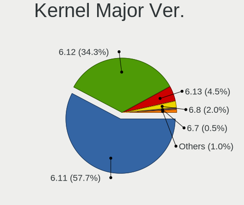

Fedora Hardware Trends (Desktop)
--------------------------------

A project to identify most popular hardware characteristics and track their change
over time based on data collected by Fedora users at https://Linux-Hardware.org.

Anyone can contribute to the study by uploading probes of their computers by
the [hw-probe](https://github.com/linuxhw/hw-probe) tool:

    sudo hw-probe -all -upload

Full-feature report is available here: https://linux-hardware.org/?view=trends&formfactor=desktop

Period: Jan, 2020.

Contents
--------

- [ OS                       ](#os)
- [ OS Family                ](#os-family)
- [ Kernel                   ](#kernel)
- [ Kernel Family            ](#kernel-family)
- [ Kernel Major Ver.        ](#kernel-major-ver)
- [ Arch                     ](#arch)
- [ DE                       ](#de)
- [ Display Server           ](#display-server)
- [ OS Lang                  ](#os-lang)
- [ Boot Mode                ](#boot-mode)
- [ Filesystem               ](#filesystem)
- [ Dual Boot with Linux     ](#dual-boot-with-linux)
- [ Dual Boot (Win)          ](#dual-boot-win)
- [ Country                  ](#country)
- [ City                     ](#city)
- [ Vendor                   ](#vendor)
- [ Model                    ](#model)
- [ Model Family             ](#model-family)
- [ MFG Year                 ](#mfg-year)
- [ Form Factor              ](#form-factor)
- [ Secure Boot              ](#secure-boot)
- [ Coreboot                 ](#coreboot)
- [ RAM Size                 ](#ram-size)
- [ RAM Used                 ](#ram-used)
- [ Drive Vendor             ](#drive-vendor)
- [ Drive Model              ](#drive-model)
- [ Drive Kind               ](#drive-kind)
- [ Drive Connector          ](#drive-connector)
- [ Drive Size               ](#drive-size)
- [ Space Total              ](#space-total)
- [ Space Used               ](#space-used)
- [ Malfunc. Drives          ](#malfunc-drives)
- [ Malfunc. Drive Vendor    ](#malfunc-drive-vendor)
- [ Malfunc. Drive Kind      ](#malfunc-drive-kind)
- [ Failed Drives            ](#failed-drives)
- [ Failed Drive Vendor      ](#failed-drive-vendor)
- [ Drive Status             ](#drive-status)
- [ Storage Vendor           ](#storage-vendor)
- [ Storage Model            ](#storage-model)
- [ Storage Kind             ](#storage-kind)
- [ CPU Vendor               ](#cpu-vendor)
- [ CPU Model                ](#cpu-model)
- [ CPU Model Family         ](#cpu-model-family)
- [ CPU Cores                ](#cpu-cores)
- [ CPU Sockets              ](#cpu-sockets)
- [ CPU Threads              ](#cpu-threads)
- [ CPU Op-Modes             ](#cpu-op-modes)
- [ CPU Microarch            ](#cpu-microarch)
- [ CPU Microcode            ](#cpu-microcode)
- [ GPU Vendor               ](#gpu-vendor)
- [ GPU Model                ](#gpu-model)
- [ GPU Combo                ](#gpu-combo)
- [ GPU Driver               ](#gpu-driver)
- [ GPU Memory               ](#gpu-memory)
- [ Monitor Vendor           ](#monitor-vendor)
- [ Monitor Model            ](#monitor-model)
- [ Monitor Resolution       ](#monitor-resolution)
- [ Monitor Diagonal         ](#monitor-diagonal)
- [ Monitor Width            ](#monitor-width)
- [ Aspect Ratio             ](#aspect-ratio)
- [ Monitor Area             ](#monitor-area)
- [ Pixel Density            ](#pixel-density)
- [ Multiple Monitors        ](#multiple-monitors)
- [ Net Controller Vendor    ](#net-controller-vendor)
- [ Net Controller Model     ](#net-controller-model)
- [ Net Controller Kind      ](#net-controller-kind)
- [ Used Controller          ](#used-controller)
- [ NICs                     ](#nics)
- [ Unsupported Devices      ](#unsupported-devices)
- [ Unsupported Device Types ](#unsupported-device-types)

OS
--

Installed operating systems

| Name      | Computers | Percent |
|-----------|-----------|---------|
| Fedora 31 | 66        | 89.19%  |
| Fedora 32 | 4         | 5.41%   |
| Fedora 30 | 3         | 4.05%   |
| Fedora 29 | 1         | 1.35%   |

OS Family
---------

OS without a version

| Name   | Computers | Percent |
|--------|-----------|---------|
| Fedora | 74        | 100%    |

Kernel
------

Version of the Linux kernel

| Version                            | Computers | Percent |
|------------------------------------|-----------|---------|
| 5.4.12-200.fc31.x86_64             | 15        | 20.27%  |
| 5.3.16-300.fc31.x86_64             | 15        | 20.27%  |
| 5.4.8-200.fc31.x86_64              | 8         | 10.81%  |
| 5.4.10-200.fc31.x86_64             | 8         | 10.81%  |
| 5.4.13-201.fc31.x86_64             | 7         | 9.46%   |
| 5.4.7-200.fc31.x86_64              | 5         | 6.76%   |
| 5.3.7-301.fc31.x86_64              | 4         | 5.41%   |
| 5.5.0-0.rc7.git0.2.fc32.x86_64     | 2         | 2.7%    |
| 5.4.7-100.fc30.x86_64              | 2         | 2.7%    |
| 5.5.0-fsync.rc6.git0.1.fc31.x86_64 | 1         | 1.35%   |
| 5.5.0-0.rc4.git0.1.fc32.x86_64     | 1         | 1.35%   |
| 5.5.0-0.rc2.git1.1.fc32.x86_64     | 1         | 1.35%   |
| 5.4.5-300.fc31.x86_64              | 1         | 1.35%   |
| 5.4.14-200.fc31.x86_64             | 1         | 1.35%   |
| 5.4.10-100.fc30.x86_64             | 1         | 1.35%   |
| 5.3.15-300.fc31.x86_64             | 1         | 1.35%   |
| 5.0.17-200.fc29.x86_64             | 1         | 1.35%   |

Kernel Family
-------------

Linux kernel without a distro release

| Version | Computers | Percent |
|---------|-----------|---------|
| 5.4.12  | 15        | 20.27%  |
| 5.3.16  | 15        | 20.27%  |
| 5.4.10  | 9         | 12.16%  |
| 5.4.8   | 8         | 10.81%  |
| 5.4.7   | 7         | 9.46%   |
| 5.4.13  | 7         | 9.46%   |
| 5.5.0   | 5         | 6.76%   |
| 5.3.7   | 4         | 5.41%   |
| 5.4.5   | 1         | 1.35%   |
| 5.4.14  | 1         | 1.35%   |
| 5.3.15  | 1         | 1.35%   |
| 5.0.17  | 1         | 1.35%   |

Kernel Major Ver.
-----------------

Linux kernel major version

| Version | Computers | Percent |
|---------|-----------|---------|
| 5.4     | 48        | 64.86%  |
| 5.3     | 20        | 27.03%  |
| 5.5     | 5         | 6.76%   |
| 5.0     | 1         | 1.35%   |

Arch
----

OS architecture (x86_64, i586, etc.)

| Name   | Computers | Percent |
|--------|-----------|---------|
| x86_64 | 74        | 100%    |

DE
--

Desktop Environment

| Name          | Computers | Percent |
|---------------|-----------|---------|
| GNOME         | 48        | 64.86%  |
| Unknown       | 7         | 9.46%   |
| KDE5          | 5         | 6.76%   |
| KDE           | 5         | 6.76%   |
| Cinnamon      | 3         | 4.05%   |
| XFCE          | 2         | 2.7%    |
| MATE          | 2         | 2.7%    |
| LXQt          | 1         | 1.35%   |
| GNOME Classic | 1         | 1.35%   |

Display Server
--------------

X11 or Wayland

| Name    | Computers | Percent |
|---------|-----------|---------|
| X11     | 40        | 54.05%  |
| Wayland | 27        | 36.49%  |
| Unknown | 7         | 9.46%   |

OS Lang
-------

Language

| Lang       | Computers | Percent |
|------------|-----------|---------|
| en_US      | 29        | 39.19%  |
| Unknown    | 18        | 24.32%  |
| en_GB      | 7         | 9.46%   |
| de_DE      | 6         | 8.11%   |
| ru_RU      | 2         | 2.7%    |
| en_US.utf8 | 2         | 2.7%    |
| en_CA      | 2         | 2.7%    |
| sv_SE      | 1         | 1.35%   |
| pt_BR      | 1         | 1.35%   |
| pl_PL      | 1         | 1.35%   |
| fr_FR      | 1         | 1.35%   |
| fr_CH      | 1         | 1.35%   |
| fi_FI      | 1         | 1.35%   |
| en_NZ      | 1         | 1.35%   |
| en_GB.utf8 | 1         | 1.35%   |

Boot Mode
---------

EFI or BIOS

| Mode | Computers | Percent |
|------|-----------|---------|
| BIOS | 37        | 50%     |
| EFI  | 37        | 50%     |

Filesystem
----------

Type of filesystem

| Type  | Computers | Percent |
|-------|-----------|---------|
| Ext4  | 63        | 85.14%  |
| Xfs   | 6         | 8.11%   |
| Btrfs | 5         | 6.76%   |

Dual Boot with Linux
--------------------

Hosting more than one Linux

| Dual boot | Computers | Percent |
|-----------|-----------|---------|
| No        | 63        | 85.14%  |
| Yes       | 11        | 14.86%  |

Dual Boot (Win)
---------------

Hosting Linux and Windows

| Dual boot | Computers | Percent |
|-----------|-----------|---------|
| No        | 62        | 83.78%  |
| Yes       | 12        | 16.22%  |

Country
-------

Geographic location (country)

| Country             | Computers | Percent |
|---------------------|-----------|---------|
| USA                 | 23        | 31.08%  |
| Germany             | 8         | 10.81%  |
| Russia              | 7         | 9.46%   |
| UK                  | 5         | 6.76%   |
| Switzerland         | 3         | 4.05%   |
| Poland              | 3         | 4.05%   |
| France              | 3         | 4.05%   |
| Canada              | 3         | 4.05%   |
| Estonia             | 2         | 2.7%    |
| Brazil              | 2         | 2.7%    |
| Ukraine             | 1         | 1.35%   |
| Turkey              | 1         | 1.35%   |
| Trinidad and Tobago | 1         | 1.35%   |
| Thailand            | 1         | 1.35%   |
| Sweden              | 1         | 1.35%   |
| Serbia              | 1         | 1.35%   |
| New Zealand         | 1         | 1.35%   |
| Mexico              | 1         | 1.35%   |
| India               | 1         | 1.35%   |
| Hungary             | 1         | 1.35%   |
| Finland             | 1         | 1.35%   |
| Egypt               | 1         | 1.35%   |
| Bulgaria            | 1         | 1.35%   |
| Austria             | 1         | 1.35%   |
| Argentina           | 1         | 1.35%   |

City
----

Geographic location (city)

| City              | Computers | Percent |
|-------------------|-----------|---------|
| Woodbridge        | 2         | 2.7%    |
| Ufa               | 2         | 2.7%    |
| Tallinn           | 2         | 2.7%    |
| Papillion         | 2         | 2.7%    |
| Dayton            | 2         | 2.7%    |
| Érd              | 1         | 1.35%   |
| Zurich            | 1         | 1.35%   |
| Zapotlanejo       | 1         | 1.35%   |
| Wrocław          | 1         | 1.35%   |
| Westport          | 1         | 1.35%   |
| Werdau            | 1         | 1.35%   |
| Wemyss Bay        | 1         | 1.35%   |
| Warrenton         | 1         | 1.35%   |
| Vienna            | 1         | 1.35%   |
| Tours             | 1         | 1.35%   |
| Toronto           | 1         | 1.35%   |
| Tolyatti          | 1         | 1.35%   |
| Stoke-on-Trent    | 1         | 1.35%   |
| Stockholm         | 1         | 1.35%   |
| Spokane           | 1         | 1.35%   |
| Sofia             | 1         | 1.35%   |
| Sierre            | 1         | 1.35%   |
| Sevastopol        | 1         | 1.35%   |
| Serrana           | 1         | 1.35%   |
| Semiluki          | 1         | 1.35%   |
| Rudno             | 1         | 1.35%   |
| Rio de Janeiro    | 1         | 1.35%   |
| Privas            | 1         | 1.35%   |
| Port Saint Lucie  | 1         | 1.35%   |
| Port of Spain     | 1         | 1.35%   |
| Phoenix           | 1         | 1.35%   |
| Philadelphia      | 1         | 1.35%   |
| Parker            | 1         | 1.35%   |
| Oldenburg         | 1         | 1.35%   |
| Noblesville       | 1         | 1.35%   |
| Nakhon Ratchasima | 1         | 1.35%   |
| Mumbai            | 1         | 1.35%   |
| Moscow            | 1         | 1.35%   |
| Montreal          | 1         | 1.35%   |
| Moncks Corner     | 1         | 1.35%   |
| Minusinsk         | 1         | 1.35%   |
| Marseille         | 1         | 1.35%   |
| Mannheim          | 1         | 1.35%   |
| Lexington         | 1         | 1.35%   |
| Kirchheimbolanden | 1         | 1.35%   |
| Kingston          | 1         | 1.35%   |
| Kenner            | 1         | 1.35%   |
| Kazan’          | 1         | 1.35%   |
| Katowice          | 1         | 1.35%   |
| Istanbul          | 1         | 1.35%   |
| Helsinki          | 1         | 1.35%   |
| Hanover           | 1         | 1.35%   |
| Hainburg          | 1         | 1.35%   |
| Geneva            | 1         | 1.35%   |
| Frankfurt am Main | 1         | 1.35%   |
| Ferndale          | 1         | 1.35%   |
| Eden Prairie      | 1         | 1.35%   |
| East Horsley      | 1         | 1.35%   |
| Ealing            | 1         | 1.35%   |
| Denver            | 1         | 1.35%   |

Vendor
------

Motherboard manufacturer

| Name                | Computers | Percent |
|---------------------|-----------|---------|
| ASUSTek Computer    | 23        | 31.08%  |
| MSI                 | 15        | 20.27%  |
| Gigabyte Technology | 10        | 13.51%  |
| Dell                | 10        | 13.51%  |
| ASRock              | 6         | 8.11%   |
| Intel               | 4         | 5.41%   |
| Lenovo              | 3         | 4.05%   |
| Acer                | 2         | 2.7%    |
| Foxconn             | 1         | 1.35%   |

Model
-----

Motherboard model

| Name                             | Computers | Percent |
|----------------------------------|-----------|---------|
| ASUS PRIME B350-PLUS             | 3         | 4.05%   |
| ASUS All Series                  | 3         | 4.05%   |
| MSI MS-7A39                      | 2         | 2.7%    |
| ASUS ROG STRIX X570-I GAMING     | 2         | 2.7%    |
| MSI MS-7B85                      | 1         | 1.35%   |
| MSI MS-7B17                      | 1         | 1.35%   |
| MSI MS-7B05                      | 1         | 1.35%   |
| MSI MS-7A75                      | 1         | 1.35%   |
| MSI MS-7A40                      | 1         | 1.35%   |
| MSI MS-7A36                      | 1         | 1.35%   |
| MSI MS-7A32                      | 1         | 1.35%   |
| MSI MS-7971                      | 1         | 1.35%   |
| MSI MS-7917                      | 1         | 1.35%   |
| MSI MS-7821                      | 1         | 1.35%   |
| MSI MS-7793                      | 1         | 1.35%   |
| MSI MS-7693                      | 1         | 1.35%   |
| MSI MS-7641                      | 1         | 1.35%   |
| Lenovo ThinkCentre M91p 0266RZ1  | 1         | 1.35%   |
| Lenovo ThinkCentre M55p 8811Y4U  | 1         | 1.35%   |
| Lenovo K450e 10181               | 1         | 1.35%   |
| Intel DQ77MK AAG39642-302        | 1         | 1.35%   |
| Intel DQ57TM AAE70931-403        | 1         | 1.35%   |
| Intel DQ35JO AAD82085-801        | 1         | 1.35%   |
| Intel D54250WYK H13922-303       | 1         | 1.35%   |
| Gigabyte Z170X-Gaming 3          | 1         | 1.35%   |
| Gigabyte Z170N-WIFI              | 1         | 1.35%   |
| Gigabyte X58A-UD5                | 1         | 1.35%   |
| Gigabyte X570 I AORUS PRO WIFI   | 1         | 1.35%   |
| Gigabyte X570 AORUS ULTRA        | 1         | 1.35%   |
| Gigabyte X570 AORUS ELITE        | 1         | 1.35%   |
| Gigabyte H81M-S1                 | 1         | 1.35%   |
| Gigabyte F2A88X-D3H              | 1         | 1.35%   |
| Gigabyte F2A58M-HD2              | 1         | 1.35%   |
| Gigabyte B85M-D3H                | 1         | 1.35%   |
| Foxconn G5322sc                  | 1         | 1.35%   |
| Dell XPS 8700                    | 1         | 1.35%   |
| Dell Vostro 3900                 | 1         | 1.35%   |
| Dell Precision WorkStation T7500 | 1         | 1.35%   |
| Dell Precision Tower 5810        | 1         | 1.35%   |
| Dell OptiPlex 790                | 1         | 1.35%   |
| Dell OptiPlex 755                | 1         | 1.35%   |
| Dell OptiPlex 7020               | 1         | 1.35%   |
| Dell OptiPlex 7010               | 1         | 1.35%   |
| Dell OptiPlex 3040               | 1         | 1.35%   |
| Dell DM061                       | 1         | 1.35%   |
| ASUS Z170I PRO GAMING            | 1         | 1.35%   |
| ASUS TUF X299 MARK 2             | 1         | 1.35%   |
| ASUS TUF GAMING X570-PLUS        | 1         | 1.35%   |
| ASUS SABERTOOTH X79              | 1         | 1.35%   |
| ASUS ROG STRIX Z390-F GAMING     | 1         | 1.35%   |
| ASUS ROG Maximus XI HERO         | 1         | 1.35%   |
| ASUS ROG CROSSHAIR VI HERO       | 1         | 1.35%   |
| ASUS PRIME Z370-A                | 1         | 1.35%   |
| ASUS PRIME Z270-A                | 1         | 1.35%   |
| ASUS PRIME X470-PRO              | 1         | 1.35%   |
| ASUS PRIME X370-PRO              | 1         | 1.35%   |
| ASUS P8P67                       | 1         | 1.35%   |
| ASUS P7H55-M PRO                 | 1         | 1.35%   |
| ASUS M4N68T-M-V2                 | 1         | 1.35%   |
| ASUS H170M-E D3                  | 1         | 1.35%   |

Model Family
------------

Motherboard model prefix

| Name                  | Computers | Percent |
|-----------------------|-----------|---------|
| ASUS PRIME            | 7         | 9.46%   |
| Dell OptiPlex         | 5         | 6.76%   |
| ASUS ROG              | 5         | 6.76%   |
| Gigabyte X570         | 3         | 4.05%   |
| ASUS All              | 3         | 4.05%   |
| MSI MS-7A39           | 2         | 2.7%    |
| Lenovo ThinkCentre    | 2         | 2.7%    |
| Dell Precision        | 2         | 2.7%    |
| ASUS TUF              | 2         | 2.7%    |
| Acer Aspire           | 2         | 2.7%    |
| MSI MS-7B85           | 1         | 1.35%   |
| MSI MS-7B17           | 1         | 1.35%   |
| MSI MS-7B05           | 1         | 1.35%   |
| MSI MS-7A75           | 1         | 1.35%   |
| MSI MS-7A40           | 1         | 1.35%   |
| MSI MS-7A36           | 1         | 1.35%   |
| MSI MS-7A32           | 1         | 1.35%   |
| MSI MS-7971           | 1         | 1.35%   |
| MSI MS-7917           | 1         | 1.35%   |
| MSI MS-7821           | 1         | 1.35%   |
| MSI MS-7793           | 1         | 1.35%   |
| MSI MS-7693           | 1         | 1.35%   |
| MSI MS-7641           | 1         | 1.35%   |
| Lenovo K450e          | 1         | 1.35%   |
| Intel DQ77MK          | 1         | 1.35%   |
| Intel DQ57TM          | 1         | 1.35%   |
| Intel DQ35JO          | 1         | 1.35%   |
| Intel D54250WYK       | 1         | 1.35%   |
| Gigabyte Z170X-Gaming | 1         | 1.35%   |
| Gigabyte Z170N-WIFI   | 1         | 1.35%   |
| Gigabyte X58A-UD5     | 1         | 1.35%   |
| Gigabyte H81M-S1      | 1         | 1.35%   |
| Gigabyte F2A88X-D3H   | 1         | 1.35%   |
| Gigabyte F2A58M-HD2   | 1         | 1.35%   |
| Gigabyte B85M-D3H     | 1         | 1.35%   |
| Foxconn G5322sc       | 1         | 1.35%   |
| Dell XPS              | 1         | 1.35%   |
| Dell Vostro           | 1         | 1.35%   |
| Dell DM061            | 1         | 1.35%   |
| ASUS Z170I            | 1         | 1.35%   |
| ASUS SABERTOOTH       | 1         | 1.35%   |
| ASUS P8P67            | 1         | 1.35%   |
| ASUS P7H55-M          | 1         | 1.35%   |
| ASUS M4N68T-M-V2      | 1         | 1.35%   |
| ASUS H170M-E          | 1         | 1.35%   |
| ASRock Z87            | 1         | 1.35%   |
| ASRock Z270           | 1         | 1.35%   |
| ASRock X79            | 1         | 1.35%   |
| ASRock X570           | 1         | 1.35%   |
| ASRock X470           | 1         | 1.35%   |
| ASRock B450M          | 1         | 1.35%   |

MFG Year
--------

Motherboard manufacture year

| Year | Computers | Percent |
|------|-----------|---------|
| 2019 | 23        | 31.08%  |
| 2018 | 10        | 13.51%  |
| 2014 | 9         | 12.16%  |
| 2016 | 8         | 10.81%  |
| 2011 | 6         | 8.11%   |
| 2015 | 5         | 6.76%   |
| 2017 | 4         | 5.41%   |
| 2013 | 3         | 4.05%   |
| 2012 | 2         | 2.7%    |
| 2008 | 2         | 2.7%    |
| 2010 | 1         | 1.35%   |
| 2007 | 1         | 1.35%   |

Form Factor
-----------

Physical design of the computer

| Name    | Computers | Percent |
|---------|-----------|---------|
| Desktop | 74        | 100%    |

Secure Boot
-----------

Enabled or disabled

| State    | Computers | Percent |
|----------|-----------|---------|
| Disabled | 71        | 95.95%  |
| Enabled  | 3         | 4.05%   |

Coreboot
--------

Have coreboot on board

| Used | Computers | Percent |
|------|-----------|---------|
| No   | 74        | 100%    |

RAM Size
--------

Total RAM memory

| Size in GB  | Computers | Percent |
|-------------|-----------|---------|
| 16.01-24.0  | 25        | 33.78%  |
| 32.01-64.0  | 17        | 22.97%  |
| 8.01-16.0   | 13        | 17.57%  |
| 4.01-8.0    | 9         | 12.16%  |
| 64.01-256.0 | 4         | 5.41%   |
| 3.01-4.0    | 3         | 4.05%   |
| 24.01-32.0  | 3         | 4.05%   |

RAM Used
--------

Used RAM memory

| Used GB    | Computers | Percent |
|------------|-----------|---------|
| 4.01-8.0   | 25        | 33.78%  |
| 2.01-3.0   | 16        | 21.62%  |
| 3.01-4.0   | 11        | 14.86%  |
| 1.01-2.0   | 11        | 14.86%  |
| 8.01-16.0  | 6         | 8.11%   |
| 16.01-24.0 | 4         | 5.41%   |
| 0.01-1.0   | 1         | 1.35%   |

Drive Vendor
------------

Hard drive vendors

| Vendor              | Computers | Drives | Percent |
|---------------------|-----------|--------|---------|
| WDC                 | 27        | 38     | 18.62%  |
| Samsung Electronics | 26        | 41     | 17.93%  |
| Seagate             | 25        | 37     | 17.24%  |
| Crucial             | 8         | 9      | 5.52%   |
| Toshiba             | 7         | 10     | 4.83%   |
| SanDisk             | 7         | 7      | 4.83%   |
| Kingston            | 7         | 10     | 4.83%   |
| Intel               | 6         | 7      | 4.14%   |
| Hitachi             | 6         | 7      | 4.14%   |
| A-DATA Technology   | 5         | 6      | 3.45%   |
| HGST                | 4         | 5      | 2.76%   |
| OCZ                 | 3         | 3      | 2.07%   |
| Generic             | 2         | 2      | 1.38%   |
| USB3.0              | 1         | 1      | 0.69%   |
| SMART               | 1         | 1      | 0.69%   |
| SK Hynix            | 1         | 1      | 0.69%   |
| PNY                 | 1         | 1      | 0.69%   |
| PLEXTOR             | 1         | 1      | 0.69%   |
| Phison              | 1         | 1      | 0.69%   |
| Mushkin             | 1         | 1      | 0.69%   |
| Inateck             | 1         | 1      | 0.69%   |
| GOODRAM             | 1         | 1      | 0.69%   |
| Dogfish             | 1         | 1      | 0.69%   |
| ASMT                | 1         | 1      | 0.69%   |
| ASMedia             | 1         | 1      | 0.69%   |

Drive Model
-----------

Hard drive models

| Model                     | Computers | Percent |
|---------------------------|-----------|---------|
| SSD 860 EVO 500GB         | 5         | 2.84%   |
| ST4000DM004-2CV104 4TB    | 4         | 2.27%   |
| SV300S37A240G 240GB SSD   | 3         | 1.7%    |
| SSD 860 EVO 1TB           | 3         | 1.7%    |
| SSD 850 EVO 500GB         | 3         | 1.7%    |
| SSD 850 EVO 250GB         | 3         | 1.7%    |
| WD5000AAKX-001CA0 500GB   | 2         | 1.14%   |
| WD30EFRX-68EUZN0 3TB      | 2         | 1.14%   |
| WD2003FZEX-00SRLA0 2TB    | 2         | 1.14%   |
| SUV400S37240G 240GB SSD   | 2         | 1.14%   |
| ST3250318AS 250GB         | 2         | 1.14%   |
| ST3250310AS 250GB         | 2         | 1.14%   |
| ST12000NE0007-2GT116 12TB | 2         | 1.14%   |
| ST1000DM003-9YN162 1TB    | 2         | 1.14%   |
| ST1000DM003-1CH162 1TB    | 2         | 1.14%   |
| SSDPE21D480GA 480GB       | 2         | 1.14%   |
| SSD 960 PRO 512GB         | 2         | 1.14%   |
| SSD 960 EVO 250GB         | 2         | 1.14%   |
| SDSSDHII240G 240GB        | 2         | 1.14%   |
| SDSSDA120G 120GB          | 2         | 1.14%   |
| SD/MMC/MS PRO 64GB        | 2         | 1.14%   |
| CT480BX500SSD1 480GB      | 2         | 1.14%   |
| CT275MX300SSD1 275GB      | 2         | 1.14%   |
| WDS250G2X0C-00L350 250GB  | 1         | 0.57%   |
| WDBNCE5000PNC 500GB SSD   | 1         | 0.57%   |
| WD800JD-00LSA0 80GB       | 1         | 0.57%   |
| WD6400AAKS-65A7B2 640GB   | 1         | 0.57%   |
| WD6400AAKS-22A7B2 640GB   | 1         | 0.57%   |
| WD6003FZBX-00GXAB0 6TB    | 1         | 0.57%   |
| WD5001AALS-00L3B2 500GB   | 1         | 0.57%   |
| WD5000BUCT-63LS5Y1 500GB  | 1         | 0.57%   |
| WD5000BPKT-75PK4T0 500GB  | 1         | 0.57%   |
| WD5000AZRX-00A8LB0 500GB  | 1         | 0.57%   |
| WD5000AAKS-00A7B2 500GB   | 1         | 0.57%   |
| WD40EZRZ-00GXCB0 4TB      | 1         | 0.57%   |
| WD30EFRX-68N32N0 3TB      | 1         | 0.57%   |
| WD2500BEVT-35ZCT0 250GB   | 1         | 0.57%   |
| WD2500AAKX-75U6AA0 250GB  | 1         | 0.57%   |
| WD20EZRZ-00Z5HB0 2TB      | 1         | 0.57%   |
| WD20EFRX-68EUZN0 2TB      | 1         | 0.57%   |
| WD1601ABYS-18C0A0 160GB   | 1         | 0.57%   |
| WD1600HLFS-75G6U1 160GB   | 1         | 0.57%   |
| WD10SPZX-00Z10T0 1TB      | 1         | 0.57%   |
| WD10EZRX-00A8LB0 1TB      | 1         | 0.57%   |
| WD10EZEX-75M2NA0 1TB      | 1         | 0.57%   |
| WD10EZEX-08WN4A0 1TB      | 1         | 0.57%   |
| WD10EZEX-08M2NA0 1TB      | 1         | 0.57%   |
| WD10EARX-32N0YB0 1TB      | 1         | 0.57%   |
| WD10EARX-00N0YB0 1TB      | 1         | 0.57%   |
| WD1001FALS-00J7B0 1TB     | 1         | 0.57%   |
| WD1001FAES-75W7A0 1TB     | 1         | 0.57%   |
| VERTEX4 256GB SSD         | 1         | 0.57%   |
| SX6000LNP 1TB             | 1         | 0.57%   |
| SV300S37A120G 120GB SSD   | 1         | 0.57%   |
| SUV400S37960G 960GB SSD   | 1         | 0.57%   |
| SU800 512GB SSD           | 1         | 0.57%   |
| SU800 256GB SSD           | 1         | 0.57%   |
| SU800 128GB SSD           | 1         | 0.57%   |
| ST9320423AS 320GB         | 1         | 0.57%   |
| ST500DM002-1BD142 500GB   | 1         | 0.57%   |

Drive Kind
----------

HDD or SSD

| Kind    | Computers | Drives | Percent |
|---------|-----------|--------|---------|
| HDD     | 53        | 99     | 44.92%  |
| SSD     | 48        | 74     | 40.68%  |
| NVMe    | 13        | 17     | 11.02%  |
| Unknown | 4         | 4      | 3.39%   |

Drive Connector
---------------

SATA, SAS, NVMe, etc.

| Type | Computers | Drives | Percent |
|------|-----------|--------|---------|
| SATA | 72        | 168    | 77.42%  |
| NVMe | 13        | 17     | 13.98%  |
| SAS  | 8         | 9      | 8.6%    |

Drive Size
----------

Size of hard drive

| Size in TB | Computers | Drives | Percent |
|------------|-----------|--------|---------|
| 0.01-0.5   | 55        | 100    | 45.08%  |
| 0.51-1.0   | 35        | 55     | 28.69%  |
| 1.01-2.0   | 13        | 17     | 10.66%  |
| 3.01-4.0   | 8         | 11     | 6.56%   |
| 2.01-3.0   | 5         | 5      | 4.1%    |
| 10.01-20.0 | 3         | 3      | 2.46%   |
| 4.01-10.0  | 3         | 3      | 2.46%   |

Space Total
-----------

Amount of disk space available on the file system

| Size in GB     | Computers | Percent |
|----------------|-----------|---------|
| More than 3000 | 13        | 17.57%  |
| 251-500        | 13        | 17.57%  |
| 101-250        | 11        | 14.86%  |
| 501-1000       | 11        | 14.86%  |
| 1001-2000      | 9         | 12.16%  |
| 2001-3000      | 6         | 8.11%   |
| Unknown        | 5         | 6.76%   |
| 1-20           | 3         | 4.05%   |
| 51-100         | 2         | 2.7%    |
| 21-50          | 1         | 1.35%   |

Space Used
----------

Amount of used disk space

| Used GB        | Computers | Percent |
|----------------|-----------|---------|
| 1-20           | 14        | 18.92%  |
| 251-500        | 11        | 14.86%  |
| 501-1000       | 11        | 14.86%  |
| 101-250        | 10        | 13.51%  |
| 21-50          | 7         | 9.46%   |
| 1001-2000      | 7         | 9.46%   |
| 51-100         | 5         | 6.76%   |
| Unknown        | 5         | 6.76%   |
| More than 3000 | 4         | 5.41%   |

Malfunc. Drives
---------------

Drive models with a malfunction

| Model                  | Computers | Drives | Percent |
|------------------------|-----------|--------|---------|
| ST3250820AS 250GB      | 1         | 1      | 25%     |
| ST1000DM010-2EP102 1TB | 1         | 1      | 25%     |
| CT275MX300SSD1 275GB   | 1         | 1      | 25%     |
| CT128MX100SSD1 128GB   | 1         | 1      | 25%     |

Malfunc. Drive Vendor
---------------------

Vendors of faulty drives

| Vendor  | Computers | Drives | Percent |
|---------|-----------|--------|---------|
| Seagate | 2         | 2      | 50%     |
| Crucial | 2         | 2      | 50%     |

Malfunc. Drive Kind
-------------------

Kinds of faulty drives

| Kind | Computers | Drives | Percent |
|------|-----------|--------|---------|
| SSD  | 2         | 2      | 50%     |
| HDD  | 2         | 2      | 50%     |

Failed Drives
-------------

Failed drive models

Zero info for selected period =(

Failed Drive Vendor
-------------------

Failed drive vendors

Zero info for selected period =(

Drive Status
------------

Number of failed and malfunc. drives

| Status   | Computers | Drives | Percent |
|----------|-----------|--------|---------|
| Detected | 38        | 92     | 48.1%   |
| Works    | 37        | 98     | 46.84%  |
| Malfunc  | 4         | 4      | 5.06%   |

Storage Vendor
--------------

Storage controller vendors

| Vendor                      | Computers | Percent |
|-----------------------------|-----------|---------|
| Intel                       | 49        | 44.14%  |
| AMD                         | 28        | 25.23%  |
| Samsung Electronics         | 10        | 9.01%   |
| Marvell Technology Group    | 7         | 6.31%   |
| ASMedia Technology          | 3         | 2.7%    |
| Phison Electronics          | 2         | 1.8%    |
| LSI Logic / Symbios Logic   | 2         | 1.8%    |
| Kingston Technology Company | 2         | 1.8%    |
| JMicron Technology          | 2         | 1.8%    |
| Silicon Motion              | 1         | 0.9%    |
| Silicon Image               | 1         | 0.9%    |
| Sandisk                     | 1         | 0.9%    |
| Realtek Semiconductor       | 1         | 0.9%    |
| Nvidia                      | 1         | 0.9%    |
| Micron/Crucial Technology   | 1         | 0.9%    |

Storage Model
-------------

Storage controller models

| Model                                                                    | Computers | Percent |
|--------------------------------------------------------------------------|-----------|---------|
| FCH SATA Controller [AHCI mode]                                          | 24        | 17.39%  |
| 8 Series/C220 Series Chipset Family 6-port SATA Controller 1 [AHCI mode] | 11        | 7.97%   |
| Q170/Q150/B150/H170/H110/Z170/CM236 Chipset SATA Controller [AHCI Mode]  | 6         | 4.35%   |
| 300 Series Chipset SATA Controller                                       | 6         | 4.35%   |
| NVMe SSD Controller SM961/PM961                                          | 5         | 3.62%   |
| 200 Series PCH SATA controller [AHCI mode]                               | 5         | 3.62%   |
| SATA Controller [RAID mode]                                              | 4         | 2.9%    |
| NVMe SSD Controller SM981/PM981/PM983                                    | 4         | 2.9%    |
| 400 Series Chipset SATA Controller                                       | 4         | 2.9%    |
| X370 Series Chipset SATA Controller                                      | 3         | 2.17%   |
| ASM1062 Serial ATA Controller                                            | 3         | 2.17%   |
| 88SE9172 SATA 6Gb/s Controller                                           | 3         | 2.17%   |
| 6 Series/C200 Series Chipset Family 6 port Desktop SATA AHCI Controller  | 3         | 2.17%   |
| Optane SSD 900P Series                                                   | 2         | 1.45%   |
| Non-Volatile memory controller                                           | 2         | 1.45%   |
| E12 NVMe Controller                                                      | 2         | 1.45%   |
| Cannon Lake PCH SATA AHCI Controller                                     | 2         | 1.45%   |
| C600/X79 series chipset 6-Port SATA AHCI Controller                      | 2         | 1.45%   |
| 9 Series Chipset Family SATA Controller [AHCI Mode]                      | 2         | 1.45%   |
| 82801JI (ICH10 Family) SATA AHCI Controller                              | 2         | 1.45%   |
| 7 Series/C210 Series Chipset Family 6-port SATA Controller [AHCI mode]   | 2         | 1.45%   |
| WD Black 2018/PC SN720 NVMe SSD                                          | 1         | 0.72%   |
| Volume Management Device NVMe RAID Controller                            | 1         | 0.72%   |
| Technology Company Non-Volatile memory controller                        | 1         | 0.72%   |
| SSD Pro 7600p/760p/E 6100p Series                                        | 1         | 0.72%   |
| SSD 660P Series                                                          | 1         | 0.72%   |
| SSD 600P Series                                                          | 1         | 0.72%   |
| SiI 3132 Serial ATA Raid II Controller                                   | 1         | 0.72%   |
| SB7x0/SB8x0/SB9x0 SATA Controller [IDE mode]                             | 1         | 0.72%   |
| SB7x0/SB8x0/SB9x0 SATA Controller [AHCI mode]                            | 1         | 0.72%   |
| SB7x0/SB8x0/SB9x0 IDE Controller                                         | 1         | 0.72%   |
| SAS2308 PCI-Express Fusion-MPT SAS-2                                     | 1         | 0.72%   |
| SAS1068E PCI-Express Fusion-MPT SAS                                      | 1         | 0.72%   |
| RS690 PCI to PCI Bridge (PCI Express Port 2)                             | 1         | 0.72%   |
| Realtek Non-Volatile memory controller                                   | 1         | 0.72%   |
| P1 NVMe PCIe SSD                                                         | 1         | 0.72%   |
| NVMe SSD Controller SM951/PM951                                          | 1         | 0.72%   |
| NM10/ICH7 Family SATA Controller [IDE mode]                              | 1         | 0.72%   |
| MCP61 SATA Controller                                                    | 1         | 0.72%   |
| MCP61 IDE                                                                | 1         | 0.72%   |
| JMB368 IDE controller                                                    | 1         | 0.72%   |
| JMB363 SATA/IDE Controller                                               | 1         | 0.72%   |
| FCH SATA Controller [IDE mode]                                           | 1         | 0.72%   |
| FCH SATA Controller D                                                    | 1         | 0.72%   |
| FCH IDE Controller                                                       | 1         | 0.72%   |
| C610/X99 series chipset 6-Port SATA Controller [AHCI mode]               | 1         | 0.72%   |
| 92xx SATA 6G Controller                                                  | 1         | 0.72%   |
| 88SE9128 PCIe SATA 6 Gb/s RAID controller with HyperDuo                  | 1         | 0.72%   |
| 88SE9128 PCIe SATA 6 Gb/s RAID controller                                | 1         | 0.72%   |
| 88SE6101/6102 single-port PATA133 interface                              | 1         | 0.72%   |
| 82Q963/Q965 PT IDER Controller                                           | 1         | 0.72%   |
| 82Q35 Express PT IDER Controller                                         | 1         | 0.72%   |
| 82801IR/IO/IH (ICH9R/DO/DH) 4 port SATA Controller [IDE mode]            | 1         | 0.72%   |
| 82801I (ICH9 Family) 2 port SATA Controller [IDE mode]                   | 1         | 0.72%   |
| 82801HR/HO/HH (ICH8R/DO/DH) 2 port SATA Controller [IDE mode]            | 1         | 0.72%   |
| 82801H (ICH8 Family) 4 port SATA Controller [IDE mode]                   | 1         | 0.72%   |
| 82801G (ICH7 Family) IDE Controller                                      | 1         | 0.72%   |
| 8 Series SATA Controller 1 [AHCI mode]                                   | 1         | 0.72%   |
| 5 Series/3400 Series Chipset PT IDER Controller                          | 1         | 0.72%   |
| 5 Series/3400 Series Chipset 6 port SATA AHCI Controller                 | 1         | 0.72%   |

Storage Kind
------------

Kind of storage controller (IDE, SATA, NVMe, SAS, ...)

| Kind | Computers | Percent |
|------|-----------|---------|
| SATA | 65        | 63.11%  |
| NVMe | 20        | 19.42%  |
| IDE  | 10        | 9.71%   |
| RAID | 6         | 5.83%   |
| SAS  | 1         | 0.97%   |
| SCSI | 1         | 0.97%   |

CPU Vendor
----------

Processor vendors

| Vendor | Computers | Percent |
|--------|-----------|---------|
| Intel  | 46        | 62.16%  |
| AMD    | 28        | 37.84%  |

CPU Model
---------

Processor models

| Model                                       | Computers | Percent |
|---------------------------------------------|-----------|---------|
| AMD Ryzen 7 3700X 8-Core Processor          | 4         | 5.41%   |
| AMD Ryzen 7 1700 Eight-Core Processor       | 4         | 5.41%   |
| Intel Core i9-9900K CPU @ 3.60GHz           | 3         | 4.05%   |
| Intel Core i7-7700K CPU @ 4.20GHz           | 3         | 4.05%   |
| Intel Core i7-6700 CPU @ 3.40GHz            | 2         | 2.7%    |
| Intel Core i7-4790 CPU @ 3.60GHz            | 2         | 2.7%    |
| Intel Core i7-4770 CPU @ 3.40GHz            | 2         | 2.7%    |
| Intel Core i5-4460 CPU @ 3.20GHz            | 2         | 2.7%    |
| AMD Ryzen 9 3950X 16-Core Processor         | 2         | 2.7%    |
| AMD Ryzen 9 3900X 12-Core Processor         | 2         | 2.7%    |
| AMD Ryzen 7 1800X Eight-Core Processor      | 2         | 2.7%    |
| Intel Xeon CPU X5680 @ 3.33GHz              | 1         | 1.35%   |
| Intel Xeon CPU W3690 @ 3.47GHz              | 1         | 1.35%   |
| Intel Xeon CPU E5-2689 0 @ 2.60GHz          | 1         | 1.35%   |
| Intel Xeon CPU E5-1603 v3 @ 2.80GHz         | 1         | 1.35%   |
| Intel Pentium Dual-Core CPU E6700 @ 3.20GHz | 1         | 1.35%   |
| Intel Pentium CPU G4400T @ 2.90GHz          | 1         | 1.35%   |
| Intel Core i9-7920X CPU @ 2.90GHz           | 1         | 1.35%   |
| Intel Core i7-8700K CPU @ 3.70GHz           | 1         | 1.35%   |
| Intel Core i7-7740X CPU @ 4.30GHz           | 1         | 1.35%   |
| Intel Core i7-4790K CPU @ 4.00GHz           | 1         | 1.35%   |
| Intel Core i7-4770K CPU @ 3.50GHz           | 1         | 1.35%   |
| Intel Core i7-3930K CPU @ 3.20GHz           | 1         | 1.35%   |
| Intel Core i7-2600K CPU @ 3.40GHz           | 1         | 1.35%   |
| Intel Core i5-7400 CPU @ 3.00GHz            | 1         | 1.35%   |
| Intel Core i5-6600K CPU @ 3.50GHz           | 1         | 1.35%   |
| Intel Core i5-4690K CPU @ 3.50GHz           | 1         | 1.35%   |
| Intel Core i5-4690 CPU @ 3.50GHz            | 1         | 1.35%   |
| Intel Core i5-4590 CPU @ 3.30GHz            | 1         | 1.35%   |
| Intel Core i5-4570 CPU @ 3.20GHz            | 1         | 1.35%   |
| Intel Core i5-4250U CPU @ 1.30GHz           | 1         | 1.35%   |
| Intel Core i5-3570 CPU @ 3.40GHz            | 1         | 1.35%   |
| Intel Core i5-2400S CPU @ 2.50GHz           | 1         | 1.35%   |
| Intel Core i5-2400 CPU @ 3.10GHz            | 1         | 1.35%   |
| Intel Core i5 CPU 760 @ 2.80GHz             | 1         | 1.35%   |
| Intel Core i5 CPU 650 @ 3.20GHz             | 1         | 1.35%   |
| Intel Core i3-9100F CPU @ 3.60GHz           | 1         | 1.35%   |
| Intel Core i3-4150 CPU @ 3.50GHz            | 1         | 1.35%   |
| Intel Core i3-3220 CPU @ 3.30GHz            | 1         | 1.35%   |
| Intel Core 2 Duo CPU E8400 @ 3.00GHz        | 1         | 1.35%   |
| Intel Core 2 Duo CPU E6750 @ 2.66GHz        | 1         | 1.35%   |
| Intel Core 2 CPU 6600 @ 2.40GHz             | 1         | 1.35%   |
| Intel Core 2 CPU 4300 @ 1.80GHz             | 1         | 1.35%   |
| AMD Ryzen 7 2700X Eight-Core Processor      | 1         | 1.35%   |
| AMD Ryzen 7 2700 Eight-Core Processor       | 1         | 1.35%   |
| AMD Ryzen 5 3400G with Radeon Vega Graphics | 1         | 1.35%   |
| AMD Ryzen 5 2600X Six-Core Processor        | 1         | 1.35%   |
| AMD Ryzen 5 2400G with Radeon Vega Graphics | 1         | 1.35%   |
| AMD Ryzen 5 1600 Six-Core Processor         | 1         | 1.35%   |
| AMD Ryzen 3 2200G with Radeon Vega Graphics | 1         | 1.35%   |
| AMD Phenom II X4 965 Processor              | 1         | 1.35%   |
| AMD FX-8350 Eight-Core Processor            | 1         | 1.35%   |
| AMD Athlon X4 860K Quad Core Processor      | 1         | 1.35%   |
| AMD Athlon II X4 645 Processor              | 1         | 1.35%   |
| AMD A8-6600K APU with Radeon HD Graphics    | 1         | 1.35%   |
| AMD A8-6410 APU with AMD Radeon R5 Graphics | 1         | 1.35%   |
| AMD A6-6400K APU with Radeon HD Graphics    | 1         | 1.35%   |

CPU Model Family
----------------

Processor model prefix

| Model                   | Computers | Percent |
|-------------------------|-----------|---------|
| Intel Core i7           | 15        | 20.27%  |
| Intel Core i5           | 14        | 18.92%  |
| AMD Ryzen 7             | 12        | 16.22%  |
| Intel Xeon              | 4         | 5.41%   |
| Intel Core i9           | 4         | 5.41%   |
| AMD Ryzen 9             | 4         | 5.41%   |
| AMD Ryzen 5             | 4         | 5.41%   |
| Intel Core i3           | 3         | 4.05%   |
| Intel Core 2 Duo        | 2         | 2.7%    |
| Intel Core 2            | 2         | 2.7%    |
| AMD A8                  | 2         | 2.7%    |
| Intel Pentium Dual-Core | 1         | 1.35%   |
| Intel Pentium           | 1         | 1.35%   |
| AMD Ryzen 3             | 1         | 1.35%   |
| AMD Phenom II X4        | 1         | 1.35%   |
| AMD FX                  | 1         | 1.35%   |
| AMD Athlon X4           | 1         | 1.35%   |
| AMD Athlon II X4        | 1         | 1.35%   |
| AMD A6                  | 1         | 1.35%   |

CPU Cores
---------

Number of processor cores

| Number | Computers | Percent |
|--------|-----------|---------|
| 4      | 34        | 45.95%  |
| 8      | 16        | 21.62%  |
| 2      | 12        | 16.22%  |
| 6      | 5         | 6.76%   |
| 12     | 4         | 5.41%   |
| 16     | 2         | 2.7%    |
| 1      | 1         | 1.35%   |

CPU Sockets
-----------

Number of sockets

| Number | Computers | Percent |
|--------|-----------|---------|
| 1      | 73        | 98.65%  |
| 2      | 1         | 1.35%   |

CPU Threads
-----------

Threads per core (Hyper-Threading)

| Number | Computers | Percent |
|--------|-----------|---------|
| 2      | 50        | 67.57%  |
| 1      | 24        | 32.43%  |

CPU Op-Modes
------------

CPU Operation Modes (32-bit, 64-bit)

| Op mode        | Computers | Percent |
|----------------|-----------|---------|
| 32-bit, 64-bit | 72        | 97.3%   |
| Unknown        | 2         | 2.7%    |

CPU Microarch
-------------

Microarchitecture

| Name        | Computers | Percent |
|-------------|-----------|---------|
| Haswell     | 15        | 20.27%  |
| Skylake     | 14        | 18.92%  |
| Zen         | 9         | 12.16%  |
| Zen 2       | 8         | 10.81%  |
| SandyBridge | 5         | 6.76%   |
| Core        | 5         | 6.76%   |
| Zen+        | 4         | 5.41%   |
| Westmere    | 3         | 4.05%   |
| Piledriver  | 3         | 4.05%   |
| K10         | 2         | 2.7%    |
| IvyBridge   | 2         | 2.7%    |
| Steamroller | 1         | 1.35%   |
| Puma        | 1         | 1.35%   |
| Nehalem     | 1         | 1.35%   |
| KabyLake    | 1         | 1.35%   |

CPU Microcode
-------------

Microcode number

| Number     | Computers | Percent |
|------------|-----------|---------|
| 0x306c3    | 12        | 16.22%  |
| 0x08701013 | 8         | 10.81%  |
| 0x906e9    | 5         | 6.76%   |
| 0x08001138 | 5         | 6.76%   |
| 0x506e3    | 4         | 5.41%   |
| Unknown    | 4         | 5.41%   |
| 0x0800820d | 3         | 4.05%   |
| 0x306a9    | 2         | 2.7%    |
| 0x206d7    | 2         | 2.7%    |
| 0x206c2    | 2         | 2.7%    |
| 0x06001119 | 2         | 2.7%    |
| 0x010000c8 | 2         | 2.7%    |
| 0x906ed    | 1         | 1.35%   |
| 0x906ec    | 1         | 1.35%   |
| 0x906eb    | 1         | 1.35%   |
| 0x906ea    | 1         | 1.35%   |
| 0x6fb      | 1         | 1.35%   |
| 0x6f6      | 1         | 1.35%   |
| 0x6f2      | 1         | 1.35%   |
| 0x50654    | 1         | 1.35%   |
| 0x40651    | 1         | 1.35%   |
| 0x306f2    | 1         | 1.35%   |
| 0x206a7    | 1         | 1.35%   |
| 0x20655    | 1         | 1.35%   |
| 0x106e5    | 1         | 1.35%   |
| 0x1067a    | 1         | 1.35%   |
| 0x10676    | 1         | 1.35%   |
| 0x08108109 | 1         | 1.35%   |
| 0x08101016 | 1         | 1.35%   |
| 0x0810100b | 1         | 1.35%   |
| 0x08001137 | 1         | 1.35%   |
| 0x0800111c | 1         | 1.35%   |
| 0x07030105 | 1         | 1.35%   |
| 0x06003106 | 1         | 1.35%   |
| 0x06000852 | 1         | 1.35%   |

GPU Vendor
----------

Vendors of graphics cards

| Vendor | Computers | Percent |
|--------|-----------|---------|
| AMD    | 33        | 41.77%  |
| Nvidia | 27        | 34.18%  |
| Intel  | 19        | 24.05%  |

GPU Model
---------

Graphics card models

| Model                                                                 | Computers | Percent |
|-----------------------------------------------------------------------|-----------|---------|
| Ellesmere [Radeon RX 470/480/570/570X/580/580X/590]                   | 11        | 13.58%  |
| Xeon E3-1200 v3/4th Gen Core Processor Integrated Graphics Controller | 6         | 7.41%   |
| Vega 20 [Radeon VII]                                                  | 4         | 4.94%   |
| Navi 10 [Radeon RX 5600 OEM/5600 XT / 5700/5700 XT]                   | 3         | 3.7%    |
| GP106 [GeForce GTX 1060 6GB]                                          | 3         | 3.7%    |
| GM204 [GeForce GTX 970]                                               | 3         | 3.7%    |
| UHD Graphics 630 (Desktop 9 Series)                                   | 2         | 2.47%   |
| Oland [Radeon HD 8570 / R7 240/340 OEM]                               | 2         | 2.47%   |
| HD Graphics 630                                                       | 2         | 2.47%   |
| GT218 [GeForce 210]                                                   | 2         | 2.47%   |
| GP106 [GeForce GTX 1060 3GB]                                          | 2         | 2.47%   |
| GP104 [GeForce GTX 1070]                                              | 2         | 2.47%   |
| Cedar [Radeon HD 5000/6000/7350/8350 Series]                          | 2         | 2.47%   |
| Xeon E3-1200 v2/3rd Gen Core processor Graphics Controller            | 1         | 1.23%   |
| Vega 10 XL/XT [Radeon RX Vega 56/64]                                  | 1         | 1.23%   |
| TU116 [GeForce GTX 1660]                                              | 1         | 1.23%   |
| TU116 [GeForce GTX 1660 Ti]                                           | 1         | 1.23%   |
| TU106 [GeForce RTX 2070]                                              | 1         | 1.23%   |
| TU106 [GeForce RTX 2060 Rev. A]                                       | 1         | 1.23%   |
| TU104 [GeForce RTX 2080 Rev. A]                                       | 1         | 1.23%   |
| TU102 [GeForce RTX 2080 Ti Rev. A]                                    | 1         | 1.23%   |
| RS780L [Radeon 3000]                                                  | 1         | 1.23%   |
| Richland [Radeon HD 8470D]                                            | 1         | 1.23%   |
| Raven Ridge [Radeon Vega Series / Radeon Vega Mobile Series]          | 1         | 1.23%   |
| Picasso                                                               | 1         | 1.23%   |
| Oland PRO [Radeon R7 240/340]                                         | 1         | 1.23%   |
| Lexa PRO [Radeon 540/540X/550/550X / RX 540X/550/550X]                | 1         | 1.23%   |
| Juniper XT [Radeon HD 6770]                                           | 1         | 1.23%   |
| HD Graphics 530                                                       | 1         | 1.23%   |
| HD Graphics 510                                                       | 1         | 1.23%   |
| Haswell-ULT Integrated Graphics Controller                            | 1         | 1.23%   |
| GP107 [GeForce GTX 1050]                                              | 1         | 1.23%   |
| GP104 [GeForce GTX 1060 3GB]                                          | 1         | 1.23%   |
| GP102 [GeForce GTX 1080 Ti]                                           | 1         | 1.23%   |
| GM107 [GeForce GTX 745]                                               | 1         | 1.23%   |
| GK208 [GeForce GT 720]                                                | 1         | 1.23%   |
| GK107 [GeForce GTX 650]                                               | 1         | 1.23%   |
| GK104 [GeForce GTX 770]                                               | 1         | 1.23%   |
| GF108 [GeForce GT 440]                                                | 1         | 1.23%   |
| G96C [GeForce 9400 GT]                                                | 1         | 1.23%   |
| G72 [GeForce 7300 LE]                                                 | 1         | 1.23%   |
| Fiji [Radeon R9 FURY / NANO Series]                                   | 1         | 1.23%   |
| Core Processor Integrated Graphics Controller                         | 1         | 1.23%   |
| Caicos [Radeon HD 6450/7450/8450 / R5 230 OEM]                        | 1         | 1.23%   |
| Barts PRO [Radeon HD 6850]                                            | 1         | 1.23%   |
| Baffin [Radeon RX 550 640SP / RX 560/560X]                            | 1         | 1.23%   |
| 82Q963/Q965 Integrated Graphics Controller                            | 1         | 1.23%   |
| 82Q35 Express Integrated Graphics Controller                          | 1         | 1.23%   |
| 4th Generation Core Processor Family Integrated Graphics Controller   | 1         | 1.23%   |
| 2nd Generation Core Processor Family Integrated Graphics Controller   | 1         | 1.23%   |

GPU Combo
---------

Combinations of graphics cards

| Name           | Computers | Percent |
|----------------|-----------|---------|
| 1 x AMD        | 30        | 40.54%  |
| 1 x Nvidia     | 23        | 31.08%  |
| 1 x Intel      | 15        | 20.27%  |
| Intel + Nvidia | 2         | 2.7%    |
| 2 x Nvidia     | 1         | 1.35%   |
| 2 x AMD        | 1         | 1.35%   |
| Intel + AMD    | 1         | 1.35%   |
| AMD + Nvidia   | 1         | 1.35%   |

GPU Driver
----------

Free vs proprietary

| Driver      | Computers | Percent |
|-------------|-----------|---------|
| Free        | 54        | 72.97%  |
| Proprietary | 18        | 24.32%  |
| Unknown     | 2         | 2.7%    |

GPU Memory
----------

Total video memory

| Size in GB | Computers | Percent |
|------------|-----------|---------|
| Unknown    | 21        | 28.38%  |
| 7.01-8.0   | 15        | 20.27%  |
| 0.51-1.0   | 11        | 14.86%  |
| 1.01-2.0   | 7         | 9.46%   |
| 3.01-4.0   | 6         | 8.11%   |
| 8.01-16.0  | 5         | 6.76%   |
| 5.01-6.0   | 4         | 5.41%   |
| 2.01-3.0   | 3         | 4.05%   |
| 0.01-0.5   | 2         | 2.7%    |

Monitor Vendor
--------------

Monitor vendors

| Vendor               | Computers | Percent |
|----------------------|-----------|---------|
| Dell                 | 18        | 18.95%  |
| Goldstar             | 12        | 12.63%  |
| Acer                 | 12        | 12.63%  |
| Samsung Electronics  | 9         | 9.47%   |
| Ancor Communications | 7         | 7.37%   |
| BenQ                 | 6         | 6.32%   |
| AOC                  | 5         | 5.26%   |
| Philips              | 3         | 3.16%   |
| Lenovo               | 3         | 3.16%   |
| Iiyama               | 3         | 3.16%   |
| ViewSonic            | 2         | 2.11%   |
| Hewlett-Packard      | 2         | 2.11%   |
| HannStar             | 2         | 2.11%   |
| ___                  | 1         | 1.05%   |
| Unknown              | 1         | 1.05%   |
| RTK                  | 1         | 1.05%   |
| PKB                  | 1         | 1.05%   |
| NEC Computers        | 1         | 1.05%   |
| LG Electronics       | 1         | 1.05%   |
| Huion                | 1         | 1.05%   |
| HKC                  | 1         | 1.05%   |
| HannStar Display     | 1         | 1.05%   |
| Belinea              | 1         | 1.05%   |
| ASUSTek Computer     | 1         | 1.05%   |

Monitor Model
-------------

Monitor models

| Model                                               | Computers | Percent |
|-----------------------------------------------------|-----------|---------|
| Ultra HD GSM5B09 3840x2160 600x340mm 27.2-inch      | 2         | 1.96%   |
| U2515H DELD06F 2560x1440 553x311mm 25.0-inch        | 2         | 1.96%   |
| PD3200U BNQ8025 3840x2160 708x399mm 32.0-inch       | 2         | 1.96%   |
| XF270HU ACR0549 2560x1440 597x336mm 27.0-inch       | 1         | 0.98%   |
| X223W ACR0050 1680x1050 474x296mm 22.0-inch         | 1         | 0.98%   |
| X203H ACR009D 1600x900 443x249mm 20.0-inch          | 1         | 0.98%   |
| X183H ACR0068 1366x768 410x230mm 18.5-inch          | 1         | 0.98%   |
| W2343 GSM5701 1920x1080 510x290mm 23.1-inch         | 1         | 0.98%   |
| w2207 HWP26A9 1680x1050 473x296mm 22.0-inch         | 1         | 0.98%   |
| VX2252 Series VSCDC2E 1920x1080 477x268mm 21.5-inch | 1         | 0.98%   |
| VS248 ACI2498 1920x1080 531x299mm 24.0-inch         | 1         | 0.98%   |
| VG2428wm VSCA426 1920x1080 520x290mm 23.4-inch      | 1         | 0.98%   |
| VG240Y ACR0673 1920x1080 527x296mm 23.8-inch        | 1         | 0.98%   |
| VE247 ACI2493 1920x1080 531x299mm 24.0-inch         | 1         | 0.98%   |
| U28E850 SAM0CCB 3840x2160 607x345mm 27.5-inch       | 1         | 0.98%   |
| U2419HC DEL4168 1920x1080 527x296mm 23.8-inch       | 1         | 0.98%   |
| U2419H DEL4148 1920x1080 527x296mm 23.8-inch        | 1         | 0.98%   |
| U2414H DELA0B2 1920x1080 530x300mm 24.0-inch        | 1         | 0.98%   |
| U2414H DELA0A2 1920x1080 527x296mm 23.8-inch        | 1         | 0.98%   |
| U2412M DELA07A 1920x1200 518x324mm 24.1-inch        | 1         | 0.98%   |
| SyncMaster SAM0589 1920x1080 521x293mm 23.5-inch    | 1         | 0.98%   |
| SyncMaster SAM0582 1680x1050 480x270mm 21.7-inch    | 1         | 0.98%   |
| SyncMaster SAM03E3 1680x1050 433x271mm 20.1-inch    | 1         | 0.98%   |
| SyncMaster SAM027F 1680x1050 474x296mm 22.0-inch    | 1         | 0.98%   |
| SE198WFP DELF004 1440x900 408x255mm 18.9-inch       | 1         | 0.98%   |
| SB220Q ACR06AB 1920x1080 476x268mm 21.5-inch        | 1         | 0.98%   |
| S2817Q DEL40EE 3840x2160 621x341mm 27.9-inch        | 1         | 0.98%   |
| S24B300 SAM08CC 1920x1080 521x293mm 23.5-inch       | 1         | 0.98%   |
| S243HL ACRADCF 1920x1080 531x299mm 24.0-inch        | 1         | 0.98%   |
| S242HL ACR0216 1920x1080 531x299mm 24.0-inch        | 1         | 0.98%   |
| S2415H DELA0B5 1920x1080 527x296mm 23.8-inch        | 1         | 0.98%   |
| S2340L DELD058 1920x1080 510x290mm 23.1-inch        | 1         | 0.98%   |
| S232HL ACR0203 1920x1080 510x290mm 23.1-inch        | 1         | 0.98%   |
| ROG PG279Q ACI27EC 2560x1440 598x336mm 27.0-inch    | 1         | 0.98%   |
| ROG PG278QR AUS27B1 2560x1440 600x340mm 27.2-inch   | 1         | 0.98%   |
| PL2530H IVM6132 1920x1080 544x303mm 24.5-inch       | 1         | 0.98%   |
| PL2482H IVM610D 1920x1080 521x293mm 23.5-inch       | 1         | 0.98%   |
| PL2283H IVM562E 1920x1080 496x292mm 22.7-inch       | 1         | 0.98%   |
| PHL BDM4065 PHL08E1 1920x1080 880x490mm 39.7-inch   | 1         | 0.98%   |
| PHL 436M6VBP PHLC179 3840x2160 941x529mm 42.5-inch  | 1         | 0.98%   |
| P2715Q DEL40BD 3840x2160 597x336mm 27.0-inch        | 1         | 0.98%   |
| P2418D DELD0C2 2560x1440 526x296mm 23.8-inch        | 1         | 0.98%   |
| P2414H DELA09A 1920x1080 527x297mm 23.8-inch        | 1         | 0.98%   |
| P2314H DEL4098 1920x1080 509x286mm 23.0-inch        | 1         | 0.98%   |
| P223WA ACR000E 1680x1050 474x296mm 22.0-inch        | 1         | 0.98%   |
| P2210 DEL404D 1680x1050 474x296mm 22.0-inch         | 1         | 0.98%   |
| M227WAP GSM579C 1920x1080 476x268mm 21.5-inch       | 1         | 0.98%   |
| LP2465 HWP2676 1920x1200 520x330mm 24.2-inch        | 1         | 0.98%   |
| LEN T23i-10 LEN61AB 1920x1080 509x286mm 23.0-inch   | 1         | 0.98%   |
| LEN T22i-10 LEN61A9 1920x1080 476x268mm 21.5-inch   | 1         | 0.98%   |
| LEN LT2452pwC LEN1144 1920x1200 518x324mm 24.1-inch | 1         | 0.98%   |
| LCDTV16 ___0101 1600x1200 1600x900mm 72.3-inch      | 1         | 0.98%   |
| LCD1970NX NEC6662 1280x1024 376x301mm 19.0-inch     | 1         | 0.98%   |
| LCD TV 0101 1920x1080 1600x900mm 72.3-inch          | 1         | 0.98%   |
| LCD Monitor SAM07C0 1920x1080 700x390mm 31.5-inch   | 1         | 0.98%   |
| LCD Monitor Maestro226DX 3280x1080                  | 1         | 0.98%   |
| LCD Monitor HW223 1680x1050                         | 1         | 0.98%   |
| LCD Monitor ASUS MG279 2560x1440                    | 1         | 0.98%   |
| LCD Monitor 2D FHD LG TV 1920x1080                  | 1         | 0.98%   |
| LCD Monitor                                         | 1         | 0.98%   |

Monitor Resolution
------------------

Monitor screen resolution

| Resolution         | Computers | Percent |
|--------------------|-----------|---------|
| 1920x1080 (FHD)    | 40        | 44.94%  |
| 2560x1440 (QHD)    | 11        | 12.36%  |
| 3840x2160 (4K)     | 10        | 11.24%  |
| 1680x1050 (WSXGA+) | 10        | 11.24%  |
| 1280x1024 (SXGA)   | 5         | 5.62%   |
| 1920x1200 (WUXGA)  | 3         | 3.37%   |
| 1440x900 (WXGA+)   | 3         | 3.37%   |
| 3840x1080          | 1         | 1.12%   |
| 3440x1440          | 1         | 1.12%   |
| 3280x1080          | 1         | 1.12%   |
| 1600x900 (HD+)     | 1         | 1.12%   |
| 1366x768 (WXGA)    | 1         | 1.12%   |
| 1360x768           | 1         | 1.12%   |
| Unknown            | 1         | 1.12%   |

Monitor Diagonal
----------------

Diagonal size in inches

| Inches  | Computers | Percent |
|---------|-----------|---------|
| 23      | 19        | 20.43%  |
| 27      | 14        | 15.05%  |
| 21      | 12        | 12.9%   |
| 24      | 10        | 10.75%  |
| 22      | 9         | 9.68%   |
| 19      | 5         | 5.38%   |
| 31      | 4         | 4.3%    |
| Unknown | 4         | 4.3%    |
| 18      | 3         | 3.23%   |
| 42      | 2         | 2.15%   |
| 32      | 2         | 2.15%   |
| 25      | 2         | 2.15%   |
| 20      | 2         | 2.15%   |
| 72      | 1         | 1.08%   |
| 48      | 1         | 1.08%   |
| 39      | 1         | 1.08%   |
| 34      | 1         | 1.08%   |
| 17      | 1         | 1.08%   |

Monitor Width
-------------

Physical width

| Width in mm | Computers | Percent |
|-------------|-----------|---------|
| 501-600     | 39        | 44.83%  |
| 401-500     | 25        | 28.74%  |
| 601-700     | 5         | 5.75%   |
| 351-400     | 5         | 5.75%   |
| Unknown     | 4         | 4.6%    |
| 701-800     | 3         | 3.45%   |
| 901-1000    | 2         | 2.3%    |
| 801-900     | 1         | 1.15%   |
| 301-350     | 1         | 1.15%   |
| 1501-2000   | 1         | 1.15%   |
| 1001-1500   | 1         | 1.15%   |

Aspect Ratio
------------

Proportional relationship between the width and the height

| Ratio   | Computers | Percent |
|---------|-----------|---------|
| 16/9    | 55        | 67.07%  |
| 16/10   | 15        | 18.29%  |
| 5/4     | 5         | 6.1%    |
| Unknown | 4         | 4.88%   |
| 32/9    | 1         | 1.22%   |
| 3/2     | 1         | 1.22%   |
| 21/9    | 1         | 1.22%   |

Monitor Area
------------

Area in inch²

| Area in inch² | Computers | Percent |
|----------------|-----------|---------|
| 201-250        | 31        | 34.44%  |
| 151-200        | 19        | 21.11%  |
| 301-350        | 14        | 15.56%  |
| 251-300        | 8         | 8.89%   |
| 351-500        | 7         | 7.78%   |
| 501-1000       | 4         | 4.44%   |
| Unknown        | 4         | 4.44%   |
| 141-150        | 2         | 2.22%   |
| More than 1000 | 1         | 1.11%   |

Pixel Density
-------------

Pixels per inch

| Density | Computers | Percent |
|---------|-----------|---------|
| 51-100  | 48        | 57.83%  |
| 101-120 | 22        | 26.51%  |
| 121-160 | 5         | 6.02%   |
| Unknown | 4         | 4.82%   |
| 161-240 | 3         | 3.61%   |
| 1-50    | 1         | 1.2%    |

Multiple Monitors
-----------------

Total monitors connected

| Total | Computers | Percent |
|-------|-----------|---------|
| 1     | 48        | 64.86%  |
| 2     | 23        | 31.08%  |
| 5     | 1         | 1.35%   |
| 3     | 1         | 1.35%   |
| 0     | 1         | 1.35%   |

Net Controller Vendor
---------------------

Controller vendors

| Vendor                         | Computers | Percent |
|--------------------------------|-----------|---------|
| Intel                          | 26        | 76.47%  |
| NetGear                        | 2         | 5.88%   |
| ASIX Electronics               | 2         | 5.88%   |
| Realtek Semiconductor          | 1         | 2.94%   |
| Nvidia                         | 1         | 2.94%   |
| Broadcom Inc. and subsidiaries | 1         | 2.94%   |
| Arduino SA                     | 1         | 2.94%   |

Net Controller Model
--------------------

Controller models

| Model                                           | Computers | Percent |
|-------------------------------------------------|-----------|---------|
| I211 Gigabit Network Connection                 | 13        | 34.21%  |
| Wi-Fi 6 AX200                                   | 5         | 13.16%  |
| 82579LM Gigabit Network Connection (Lewisville) | 4         | 10.53%  |
| AX88179 Gigabit Ethernet                        | 2         | 5.26%   |
| 82566DM-2 Gigabit Network Connection            | 2         | 5.26%   |
| Wireless Gigabit 17265 Device Driver            | 1         | 2.63%   |
| Wireless 8265 / 8275                            | 1         | 2.63%   |
| WG111v2 54 Mbps Wireless [RealTek RTL8187L]     | 1         | 2.63%   |
| Uno R3 (CDC ACM)                                | 1         | 2.63%   |
| RTL8153 Gigabit Ethernet Adapter                | 1         | 2.63%   |
| Network controller                              | 1         | 2.63%   |
| MCP61 Ethernet                                  | 1         | 2.63%   |
| A6210                                           | 1         | 2.63%   |
| 82579V Gigabit Network Connection               | 1         | 2.63%   |
| 82578DM Gigabit Network Connection              | 1         | 2.63%   |
| 82566DM Gigabit Network Connection              | 1         | 2.63%   |
| 82562V 10/100 Network Connection                | 1         | 2.63%   |

Net Controller Kind
-------------------

Ethernet, WiFi or modem

| Kind     | Computers | Percent |
|----------|-----------|---------|
| Ethernet | 26        | 70.27%  |
| WiFi     | 9         | 24.32%  |
| Modem    | 1         | 2.7%    |
| Unknown  | 1         | 2.7%    |

Used Controller
---------------

Currently used network controller

| Kind     | Computers | Percent |
|----------|-----------|---------|
| Ethernet | 21        | 91.3%   |
| WiFi     | 2         | 8.7%    |

NICs
----

Total network controllers on board

| Total | Computers | Percent |
|-------|-----------|---------|
| 1     | 46        | 62.16%  |
| 2     | 24        | 32.43%  |
| 3     | 4         | 5.41%   |

Unsupported Devices
-------------------

Total unsupported devices on board

| Total | Computers | Percent |
|-------|-----------|---------|
| 0     | 65        | 87.84%  |
| 1     | 9         | 12.16%  |

Unsupported Device Types
------------------------

Types of unsupported devices

| Type                     | Computers | Percent |
|--------------------------|-----------|---------|
| Net/wireless             | 3         | 33.33%  |
| Graphics card            | 3         | 33.33%  |
| Unassigned class         | 1         | 11.11%  |
| Network                  | 1         | 11.11%  |
| Communication controller | 1         | 11.11%  |

