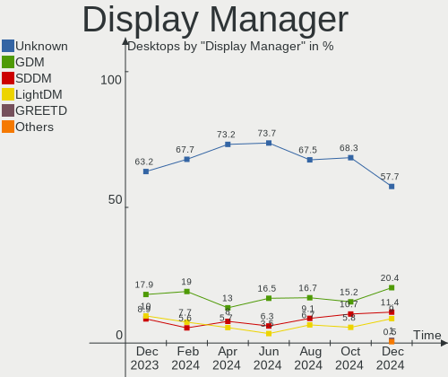
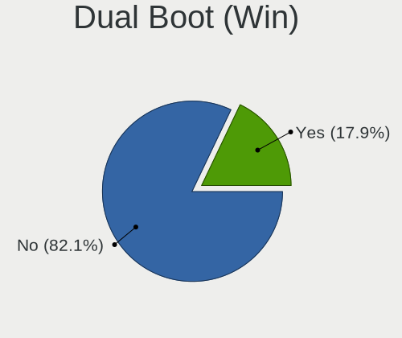

Fedora Hardware Trends (Desktops)
---------------------------------

A project to identify most popular hardware characteristics and track their change
over time based on data collected by Fedora users at https://Linux-Hardware.org.

Anyone can contribute to this report by the [hw-probe](https://github.com/linuxhw/hw-probe) tool:

    sudo -E hw-probe -all -upload

Full-feature report is available here: https://linux-hardware.org/?view=trends&formfactor=desktop

Period: Sep, 2021.

Contents
--------

* [ System ](#system)
  - [ OS                       ](#os)
  - [ OS Family                ](#os-family)
  - [ Kernel                   ](#kernel)
  - [ Kernel Family            ](#kernel-family)
  - [ Kernel Major Ver.        ](#kernel-major-ver)
  - [ Arch                     ](#arch)
  - [ DE                       ](#de)
  - [ Display Server           ](#display-server)
  - [ Display Manager          ](#display-manager)
  - [ OS Lang                  ](#os-lang)
  - [ Boot Mode                ](#boot-mode)
  - [ Filesystem               ](#filesystem)
  - [ Part. scheme             ](#part-scheme)
  - [ Dual Boot with Linux/BSD ](#dual-boot-with-linuxbsd)
  - [ Dual Boot (Win)          ](#dual-boot-win)

* [ Board ](#board)
  - [ Vendor                   ](#vendor)
  - [ Model                    ](#model)
  - [ Model Family             ](#model-family)
  - [ MFG Year                 ](#mfg-year)
  - [ Form Factor              ](#form-factor)
  - [ Secure Boot              ](#secure-boot)
  - [ Coreboot                 ](#coreboot)
  - [ RAM Size                 ](#ram-size)
  - [ RAM Used                 ](#ram-used)
  - [ Total Drives             ](#total-drives)
  - [ Has CD-ROM               ](#has-cd-rom)
  - [ Has Ethernet             ](#has-ethernet)
  - [ Has WiFi                 ](#has-wifi)
  - [ Has Bluetooth            ](#has-bluetooth)

* [ Location ](#location)
  - [ Country                  ](#country)
  - [ City                     ](#city)

* [ Drives ](#drives)
  - [ Drive Vendor             ](#drive-vendor)
  - [ Drive Model              ](#drive-model)
  - [ HDD Vendor               ](#hdd-vendor)
  - [ SSD Vendor               ](#ssd-vendor)
  - [ Drive Kind               ](#drive-kind)
  - [ Drive Connector          ](#drive-connector)
  - [ Drive Size               ](#drive-size)
  - [ Space Total              ](#space-total)
  - [ Space Used               ](#space-used)
  - [ Malfunc. Drives          ](#malfunc-drives)
  - [ Malfunc. Drive Vendor    ](#malfunc-drive-vendor)
  - [ Malfunc. HDD Vendor      ](#malfunc-hdd-vendor)
  - [ Malfunc. Drive Kind      ](#malfunc-drive-kind)
  - [ Failed Drives            ](#failed-drives)
  - [ Failed Drive Vendor      ](#failed-drive-vendor)
  - [ Drive Status             ](#drive-status)

* [ Storage controller ](#storage-controller)
  - [ Storage Vendor           ](#storage-vendor)
  - [ Storage Model            ](#storage-model)
  - [ Storage Kind             ](#storage-kind)

* [ Processor ](#processor)
  - [ CPU Vendor               ](#cpu-vendor)
  - [ CPU Model                ](#cpu-model)
  - [ CPU Model Family         ](#cpu-model-family)
  - [ CPU Cores                ](#cpu-cores)
  - [ CPU Sockets              ](#cpu-sockets)
  - [ CPU Threads              ](#cpu-threads)
  - [ CPU Op-Modes             ](#cpu-op-modes)
  - [ CPU Microcode            ](#cpu-microcode)
  - [ CPU Microarch            ](#cpu-microarch)

* [ Graphics ](#graphics)
  - [ GPU Vendor               ](#gpu-vendor)
  - [ GPU Model                ](#gpu-model)
  - [ GPU Combo                ](#gpu-combo)
  - [ GPU Driver               ](#gpu-driver)
  - [ GPU Memory               ](#gpu-memory)

* [ Monitor ](#monitor)
  - [ Monitor Vendor           ](#monitor-vendor)
  - [ Monitor Model            ](#monitor-model)
  - [ Monitor Resolution       ](#monitor-resolution)
  - [ Monitor Diagonal         ](#monitor-diagonal)
  - [ Monitor Width            ](#monitor-width)
  - [ Aspect Ratio             ](#aspect-ratio)
  - [ Monitor Area             ](#monitor-area)
  - [ Pixel Density            ](#pixel-density)
  - [ Multiple Monitors        ](#multiple-monitors)

* [ Network ](#network)
  - [ Net Controller Vendor    ](#net-controller-vendor)
  - [ Net Controller Model     ](#net-controller-model)
  - [ Wireless Vendor          ](#wireless-vendor)
  - [ Wireless Model           ](#wireless-model)
  - [ Ethernet Vendor          ](#ethernet-vendor)
  - [ Ethernet Model           ](#ethernet-model)
  - [ Net Controller Kind      ](#net-controller-kind)
  - [ Used Controller          ](#used-controller)
  - [ NICs                     ](#nics)
  - [ IPv6                     ](#ipv6)

* [ Bluetooth ](#bluetooth)
  - [ Bluetooth Vendor         ](#bluetooth-vendor)
  - [ Bluetooth Model          ](#bluetooth-model)

* [ Sound ](#sound)
  - [ Sound Vendor             ](#sound-vendor)
  - [ Sound Model              ](#sound-model)

* [ Memory ](#memory)
  - [ Memory Vendor            ](#memory-vendor)
  - [ Memory Model             ](#memory-model)
  - [ Memory Kind              ](#memory-kind)
  - [ Memory Form Factor       ](#memory-form-factor)
  - [ Memory Size              ](#memory-size)
  - [ Memory Speed             ](#memory-speed)

* [ Printers & scanners ](#printers--scanners)
  - [ Printer Vendor           ](#printer-vendor)
  - [ Printer Model            ](#printer-model)
  - [ Scanner Vendor           ](#scanner-vendor)
  - [ Scanner Model            ](#scanner-model)

* [ Camera ](#camera)
  - [ Camera Vendor            ](#camera-vendor)
  - [ Camera Model             ](#camera-model)

* [ Security ](#security)
  - [ Fingerprint Vendor       ](#fingerprint-vendor)
  - [ Fingerprint Model        ](#fingerprint-model)
  - [ Chipcard Vendor          ](#chipcard-vendor)
  - [ Chipcard Model           ](#chipcard-model)

* [ Unsupported ](#unsupported)
  - [ Unsupported Devices      ](#unsupported-devices)
  - [ Unsupported Device Types ](#unsupported-device-types)

System
------

OS
--

Installed operating systems

| Name      | Desktops | Percent |
|-----------|----------|---------|
| Fedora 34 | 76       | 86.36%  |
| Fedora 35 | 5        | 5.68%   |
| Fedora 33 | 4        | 4.55%   |
| Fedora 36 | 1        | 1.14%   |
| Fedora 32 | 1        | 1.14%   |
| Fedora 31 | 1        | 1.14%   |

OS Family
---------

OS without a version

| Name   | Desktops | Percent |
|--------|----------|---------|
| Fedora | 88       | 100%    |

Kernel
------

Version of the Linux kernel

| Version                                            | Desktops | Percent |
|----------------------------------------------------|----------|---------|
| 5.13.16-200.fc34.x86_64                            | 15       | 17.05%  |
| 5.13.14-200.fc34.x86_64                            | 15       | 17.05%  |
| 5.13.12-200.fc34.x86_64                            | 12       | 13.64%  |
| 5.13.19-200.fc34.x86_64                            | 10       | 11.36%  |
| 5.13.15-200.fc34.x86_64                            | 7        | 7.95%   |
| 5.13.13-200.fc34.x86_64                            | 6        | 6.82%   |
| 5.11.12-300.fc34.x86_64                            | 6        | 6.82%   |
| 5.13.4-200.fc34.x86_64                             | 2        | 2.27%   |
| 5.8.18-100.fc31.x86_64                             | 1        | 1.14%   |
| 5.15.0-0.rc0.20210831gitb91db6a0b52e.1.fc36.x86_64 | 1        | 1.14%   |
| 5.14.8-lqx1.0.fc35.x86_64                          | 1        | 1.14%   |
| 5.14.7-300.fc35.x86_64                             | 1        | 1.14%   |
| 5.14.6-300.fc35.x86_64                             | 1        | 1.14%   |
| 5.14.1-300.fc35.x86_64                             | 1        | 1.14%   |
| 5.14.0-60.fc35.x86_64                              | 1        | 1.14%   |
| 5.13.7-100.fc33.x86_64                             | 1        | 1.14%   |
| 5.13.15-100.fc33.x86_64                            | 1        | 1.14%   |
| 5.13.14-zen                                        | 1        | 1.14%   |
| 5.13.10-200.fc34.x86_64                            | 1        | 1.14%   |
| 5.13.10-100.fc33.x86_64                            | 1        | 1.14%   |
| 5.11.22-100.fc32.x86_64                            | 1        | 1.14%   |
| 5.11.20-300.fc34.x86_64                            | 1        | 1.14%   |
| 5.11.11-200.fc33.x86_64                            | 1        | 1.14%   |

Kernel Family
-------------

Linux kernel without a distro release

| Version | Desktops | Percent |
|---------|----------|---------|
| 5.13.14 | 16       | 18.18%  |
| 5.13.16 | 15       | 17.05%  |
| 5.13.12 | 12       | 13.64%  |
| 5.13.19 | 10       | 11.36%  |
| 5.13.15 | 8        | 9.09%   |
| 5.13.13 | 6        | 6.82%   |
| 5.11.12 | 6        | 6.82%   |
| 5.13.4  | 2        | 2.27%   |
| 5.13.10 | 2        | 2.27%   |
| 5.8.18  | 1        | 1.14%   |
| 5.15.0  | 1        | 1.14%   |
| 5.14.8  | 1        | 1.14%   |
| 5.14.7  | 1        | 1.14%   |
| 5.14.6  | 1        | 1.14%   |
| 5.14.1  | 1        | 1.14%   |
| 5.14.0  | 1        | 1.14%   |
| 5.13.7  | 1        | 1.14%   |
| 5.11.22 | 1        | 1.14%   |
| 5.11.20 | 1        | 1.14%   |
| 5.11.11 | 1        | 1.14%   |

Kernel Major Ver.
-----------------

Linux kernel major version

| Version | Desktops | Percent |
|---------|----------|---------|
| 5.13    | 72       | 81.82%  |
| 5.11    | 9        | 10.23%  |
| 5.14    | 5        | 5.68%   |
| 5.8     | 1        | 1.14%   |
| 5.15    | 1        | 1.14%   |

Arch
----

OS architecture (x86_64, i586, etc.)

| Name   | Desktops | Percent |
|--------|----------|---------|
| x86_64 | 88       | 100%    |

DE
--

Desktop Environment

| Name          | Desktops | Percent |
|---------------|----------|---------|
| GNOME         | 55       | 62.5%   |
| Cinnamon      | 6        | 6.82%   |
| Unknown       | 6        | 6.82%   |
| KDE5          | 5        | 5.68%   |
| XFCE          | 3        | 3.41%   |
| GNOME Classic | 3        | 3.41%   |
| X-Cinnamon    | 2        | 2.27%   |
| MATE          | 2        | 2.27%   |
| KDE           | 2        | 2.27%   |
| qtile         | 1        | 1.14%   |
| NsCDE         | 1        | 1.14%   |
| KDE4          | 1        | 1.14%   |
| awesome       | 1        | 1.14%   |

Display Server
--------------

X11 or Wayland

| Name    | Desktops | Percent |
|---------|----------|---------|
| Wayland | 42       | 47.73%  |
| X11     | 35       | 39.77%  |
| Tty     | 9        | 10.23%  |
| Unknown | 2        | 2.27%   |

Display Manager
---------------

SDDM, LightDM, etc.

| Name    | Desktops | Percent |
|---------|----------|---------|
| Unknown | 43       | 48.86%  |
| GDM     | 28       | 31.82%  |
| LightDM | 13       | 14.77%  |
| SDDM    | 4        | 4.55%   |

OS Lang
-------

Language

| Lang    | Desktops | Percent |
|---------|----------|---------|
| en_US   | 34       | 38.64%  |
| en_GB   | 9        | 10.23%  |
| en_AU   | 9        | 10.23%  |
| fr_FR   | 7        | 7.95%   |
| ru_RU   | 6        | 6.82%   |
| pt_BR   | 6        | 6.82%   |
| en_CA   | 3        | 3.41%   |
| es_MX   | 2        | 2.27%   |
| pl_PL   | 1        | 1.14%   |
| ja_JP   | 1        | 1.14%   |
| it_IT   | 1        | 1.14%   |
| hu_HU   | 1        | 1.14%   |
| es_GT   | 1        | 1.14%   |
| es_ES   | 1        | 1.14%   |
| es_CL   | 1        | 1.14%   |
| es_AR   | 1        | 1.14%   |
| en_DK   | 1        | 1.14%   |
| el_GR   | 1        | 1.14%   |
| de_DE   | 1        | 1.14%   |
| Unknown | 1        | 1.14%   |

Boot Mode
---------

EFI or BIOS

| Mode | Desktops | Percent |
|------|----------|---------|
| EFI  | 50       | 56.82%  |
| BIOS | 38       | 43.18%  |

Filesystem
----------

Type of filesystem

| Type  | Desktops | Percent |
|-------|----------|---------|
| Btrfs | 42       | 47.73%  |
| Ext4  | 36       | 40.91%  |
| Xfs   | 10       | 11.36%  |

Part. scheme
------------

Scheme of partitioning

| Type    | Desktops | Percent |
|---------|----------|---------|
| Unknown | 38       | 43.18%  |
| GPT     | 34       | 38.64%  |
| MBR     | 16       | 18.18%  |

Dual Boot with Linux/BSD
------------------------

Hosting more than one Linux/BSD

| Dual boot | Desktops | Percent |
|-----------|----------|---------|
| No        | 74       | 84.09%  |
| Yes       | 14       | 15.91%  |

Dual Boot (Win)
---------------

Hosting Linux and Windows

| Dual boot | Desktops | Percent |
|-----------|----------|---------|
| No        | 64       | 72.73%  |
| Yes       | 24       | 27.27%  |

Board
-----

Vendor
------

Motherboard manufacturer

| Name                | Desktops | Percent |
|---------------------|----------|---------|
| ASUSTek Computer    | 25       | 28.41%  |
| Gigabyte Technology | 18       | 20.45%  |
| ASRock              | 11       | 12.5%   |
| MSI                 | 8        | 9.09%   |
| Hewlett-Packard     | 8        | 9.09%   |
| Dell                | 4        | 4.55%   |
| Lenovo              | 2        | 2.27%   |
| Intel               | 2        | 2.27%   |
| ECS                 | 2        | 2.27%   |
| Acer                | 2        | 2.27%   |
| System76            | 1        | 1.14%   |
| Huanan              | 1        | 1.14%   |
| Fujitsu             | 1        | 1.14%   |
| Foxconn             | 1        | 1.14%   |
| EVGA                | 1        | 1.14%   |
| Apple               | 1        | 1.14%   |

Model
-----

Motherboard model

| Name                                                                  | Desktops | Percent |
|-----------------------------------------------------------------------|----------|---------|
| ASUS All Series                                                       | 5        | 5.68%   |
| MSI MS-7C37                                                           | 2        | 2.27%   |
| ASUS ROG STRIX Z370-H GAMING                                          | 2        | 2.27%   |
| System76 Thelio Mira                                                  | 1        | 1.14%   |
| MSI MS-7C95                                                           | 1        | 1.14%   |
| MSI MS-7C91                                                           | 1        | 1.14%   |
| MSI MS-7C35                                                           | 1        | 1.14%   |
| MSI MS-7B48                                                           | 1        | 1.14%   |
| MSI MS-7A44                                                           | 1        | 1.14%   |
| MSI MS-7816                                                           | 1        | 1.14%   |
| Lenovo ThinkCentre M75s Gen 2 11JB002GPB                              | 1        | 1.14%   |
| Lenovo ThinkCentre M58p 7220A72                                       | 1        | 1.14%   |
| Intel WX307-SCMS                                                      | 1        | 1.14%   |
| Intel DG41RQ AAE54511-201                                             | 1        | 1.14%   |
| Huanan X79 INTEL (INTEL Xeon E5/Corei7 DMI2 - C600/C200 Cipset V2.49P | 1        | 1.14%   |
| HP Z400 Workstation                                                   | 1        | 1.14%   |
| HP Z210 Workstation                                                   | 1        | 1.14%   |
| HP EliteDesk 800 G2 TWR                                               | 1        | 1.14%   |
| HP EliteDesk 800 G2 DM 65W                                            | 1        | 1.14%   |
| HP EliteDesk 800 G2 DM 35W                                            | 1        | 1.14%   |
| HP EliteDesk 800 G1 SFF                                               | 1        | 1.14%   |
| HP 500-219cx                                                          | 1        | 1.14%   |
| HP 280 G2 MT (Non-Legacy)                                             | 1        | 1.14%   |
| Gigabyte Z87MX-D3H                                                    | 1        | 1.14%   |
| Gigabyte Z370N WIFI                                                   | 1        | 1.14%   |
| Gigabyte Z170-D3H                                                     | 1        | 1.14%   |
| Gigabyte X99-Gaming 5                                                 | 1        | 1.14%   |
| Gigabyte TRX40 AORUS MASTER                                           | 1        | 1.14%   |
| Gigabyte H81M-S2H                                                     | 1        | 1.14%   |
| Gigabyte GA-MA785G-UD3H                                               | 1        | 1.14%   |
| Gigabyte GA-MA780G-UD3H                                               | 1        | 1.14%   |
| Gigabyte GA-MA69GM-S2H                                                | 1        | 1.14%   |
| Gigabyte GA-890GPA-UD3H                                               | 1        | 1.14%   |
| Gigabyte GA-880GM-UD2H                                                | 1        | 1.14%   |
| Gigabyte G41MT-D3                                                     | 1        | 1.14%   |
| Gigabyte EP45-DS3L                                                    | 1        | 1.14%   |
| Gigabyte B85M-D3V-A                                                   | 1        | 1.14%   |
| Gigabyte B250M-DS3H                                                   | 1        | 1.14%   |
| Gigabyte B150M-D3H                                                    | 1        | 1.14%   |
| Gigabyte AB350M-DS3H V2                                               | 1        | 1.14%   |
| Gigabyte A320M-S2H                                                    | 1        | 1.14%   |
| Fujitsu ESPRIMO P520                                                  | 1        | 1.14%   |
| Foxconn Pro 3300 Series SFF                                           | 1        | 1.14%   |
| EVGA 111-SS-E172                                                      | 1        | 1.14%   |
| ECS H61H2-CM                                                          | 1        | 1.14%   |
| ECS G41T-M7                                                           | 1        | 1.14%   |
| Dell PowerEdge SC1420                                                 | 1        | 1.14%   |
| Dell OptiPlex 9020                                                    | 1        | 1.14%   |
| Dell OptiPlex 3040                                                    | 1        | 1.14%   |
| Dell OptiPlex 3010                                                    | 1        | 1.14%   |
| ASUS TUF GAMING B550M-PLUS                                            | 1        | 1.14%   |
| ASUS TUF GAMING B550-PLUS                                             | 1        | 1.14%   |
| ASUS SABERTOOTH X79                                                   | 1        | 1.14%   |
| ASUS ROG STRIX X570-E GAMING                                          | 1        | 1.14%   |
| ASUS ROG STRIX B360-I GAMING                                          | 1        | 1.14%   |
| ASUS ROG CROSSHAIR VIII IMPACT                                        | 1        | 1.14%   |
| ASUS PRIME X470-PRO                                                   | 1        | 1.14%   |
| ASUS PRIME X399-A                                                     | 1        | 1.14%   |
| ASUS PRIME B450M-A                                                    | 1        | 1.14%   |
| ASUS P8Z77-V LK                                                       | 1        | 1.14%   |

Model Family
------------

Motherboard model prefix

| Name                    | Desktops | Percent |
|-------------------------|----------|---------|
| ASUS ROG                | 5        | 5.68%   |
| ASUS All                | 5        | 5.68%   |
| HP EliteDesk            | 4        | 4.55%   |
| Dell OptiPlex           | 3        | 3.41%   |
| ASUS PRIME              | 3        | 3.41%   |
| MSI MS-7C37             | 2        | 2.27%   |
| Lenovo ThinkCentre      | 2        | 2.27%   |
| ASUS TUF                | 2        | 2.27%   |
| ASRock Z390             | 2        | 2.27%   |
| Acer Aspire             | 2        | 2.27%   |
| System76 Thelio         | 1        | 1.14%   |
| MSI MS-7C95             | 1        | 1.14%   |
| MSI MS-7C91             | 1        | 1.14%   |
| MSI MS-7C35             | 1        | 1.14%   |
| MSI MS-7B48             | 1        | 1.14%   |
| MSI MS-7A44             | 1        | 1.14%   |
| MSI MS-7816             | 1        | 1.14%   |
| Intel WX307-SCMS        | 1        | 1.14%   |
| Intel DG41RQ            | 1        | 1.14%   |
| Huanan X79              | 1        | 1.14%   |
| HP Z400                 | 1        | 1.14%   |
| HP Z210                 | 1        | 1.14%   |
| HP 500-219cx            | 1        | 1.14%   |
| HP 280                  | 1        | 1.14%   |
| Gigabyte Z87MX-D3H      | 1        | 1.14%   |
| Gigabyte Z370N          | 1        | 1.14%   |
| Gigabyte Z170-D3H       | 1        | 1.14%   |
| Gigabyte X99-Gaming     | 1        | 1.14%   |
| Gigabyte TRX40          | 1        | 1.14%   |
| Gigabyte H81M-S2H       | 1        | 1.14%   |
| Gigabyte GA-MA785G-UD3H | 1        | 1.14%   |
| Gigabyte GA-MA780G-UD3H | 1        | 1.14%   |
| Gigabyte GA-MA69GM-S2H  | 1        | 1.14%   |
| Gigabyte GA-890GPA-UD3H | 1        | 1.14%   |
| Gigabyte GA-880GM-UD2H  | 1        | 1.14%   |
| Gigabyte G41MT-D3       | 1        | 1.14%   |
| Gigabyte EP45-DS3L      | 1        | 1.14%   |
| Gigabyte B85M-D3V-A     | 1        | 1.14%   |
| Gigabyte B250M-DS3H     | 1        | 1.14%   |
| Gigabyte B150M-D3H      | 1        | 1.14%   |
| Gigabyte AB350M-DS3H    | 1        | 1.14%   |
| Gigabyte A320M-S2H      | 1        | 1.14%   |
| Fujitsu ESPRIMO         | 1        | 1.14%   |
| Foxconn Pro             | 1        | 1.14%   |
| EVGA 111-SS-E172        | 1        | 1.14%   |
| ECS H61H2-CM            | 1        | 1.14%   |
| ECS G41T-M7             | 1        | 1.14%   |
| Dell PowerEdge          | 1        | 1.14%   |
| ASUS SABERTOOTH         | 1        | 1.14%   |
| ASUS P8Z77-V            | 1        | 1.14%   |
| ASUS P8Z77-M            | 1        | 1.14%   |
| ASUS P8H61-M            | 1        | 1.14%   |
| ASUS P7H55-M            | 1        | 1.14%   |
| ASUS P5K                | 1        | 1.14%   |
| ASUS H110M-CS           | 1        | 1.14%   |
| ASUS GD30CI             | 1        | 1.14%   |
| ASUS G11CD-K            | 1        | 1.14%   |
| ASUS A8R32-MVP          | 1        | 1.14%   |
| ASRock X570M            | 1        | 1.14%   |
| ASRock X300M-STX        | 1        | 1.14%   |

MFG Year
--------

Motherboard manufacture year

| Year | Desktops | Percent |
|------|----------|---------|
| 2021 | 12       | 13.64%  |
| 2018 | 12       | 13.64%  |
| 2020 | 8        | 9.09%   |
| 2017 | 7        | 7.95%   |
| 2010 | 7        | 7.95%   |
| 2011 | 6        | 6.82%   |
| 2019 | 5        | 5.68%   |
| 2016 | 5        | 5.68%   |
| 2014 | 5        | 5.68%   |
| 2015 | 4        | 4.55%   |
| 2013 | 4        | 4.55%   |
| 2012 | 4        | 4.55%   |
| 2008 | 4        | 4.55%   |
| 2009 | 2        | 2.27%   |
| 2006 | 2        | 2.27%   |
| 2007 | 1        | 1.14%   |

Form Factor
-----------

Physical design of the computer

| Name    | Desktops | Percent |
|---------|----------|---------|
| Desktop | 88       | 100%    |

Secure Boot
-----------

Enabled or disabled

| State    | Desktops | Percent |
|----------|----------|---------|
| Disabled | 85       | 96.59%  |
| Enabled  | 3        | 3.41%   |

Coreboot
--------

Have coreboot on board

| Used | Desktops | Percent |
|------|----------|---------|
| No   | 88       | 100%    |

RAM Size
--------

Total RAM memory

| Size in GB  | Desktops | Percent |
|-------------|----------|---------|
| 16.01-24.0  | 26       | 29.55%  |
| 4.01-8.0    | 16       | 18.18%  |
| 32.01-64.0  | 15       | 17.05%  |
| 8.01-16.0   | 14       | 15.91%  |
| 3.01-4.0    | 8        | 9.09%   |
| 24.01-32.0  | 4        | 4.55%   |
| 64.01-256.0 | 4        | 4.55%   |
| 2.01-3.0    | 1        | 1.14%   |

RAM Used
--------

Used RAM memory

| Used GB    | Desktops | Percent |
|------------|----------|---------|
| 2.01-3.0   | 24       | 27.27%  |
| 4.01-8.0   | 23       | 26.14%  |
| 3.01-4.0   | 14       | 15.91%  |
| 1.01-2.0   | 12       | 13.64%  |
| 8.01-16.0  | 8        | 9.09%   |
| 0.51-1.0   | 5        | 5.68%   |
| 16.01-24.0 | 2        | 2.27%   |

Total Drives
------------

Number of drives on board

| Drives | Desktops | Percent |
|--------|----------|---------|
| 2      | 25       | 28.41%  |
| 1      | 25       | 28.41%  |
| 3      | 20       | 22.73%  |
| 4      | 9        | 10.23%  |
| 5      | 4        | 4.55%   |
| 6      | 3        | 3.41%   |
| 8      | 1        | 1.14%   |
| 0      | 1        | 1.14%   |

Has CD-ROM
----------

Has CD-ROM on board

| Presented | Desktops | Percent |
|-----------|----------|---------|
| No        | 51       | 57.95%  |
| Yes       | 37       | 42.05%  |

Has Ethernet
------------

Has Ethernet on board

| Presented | Desktops | Percent |
|-----------|----------|---------|
| Yes       | 86       | 97.73%  |
| No        | 2        | 2.27%   |

Has WiFi
--------

Has WiFi module

| Presented | Desktops | Percent |
|-----------|----------|---------|
| No        | 49       | 55.68%  |
| Yes       | 39       | 44.32%  |

Has Bluetooth
-------------

Has Bluetooth module

| Presented | Desktops | Percent |
|-----------|----------|---------|
| No        | 58       | 65.91%  |
| Yes       | 30       | 34.09%  |

Location
--------

Country
-------

Geographic location (country)

| Country     | Desktops | Percent |
|-------------|----------|---------|
| USA         | 10       | 11.36%  |
| Australia   | 9        | 10.23%  |
| Brazil      | 8        | 9.09%   |
| Germany     | 6        | 6.82%   |
| France      | 4        | 4.55%   |
| UK          | 3        | 3.41%   |
| Switzerland | 3        | 3.41%   |
| Sweden      | 3        | 3.41%   |
| Canada      | 3        | 3.41%   |
| Belarus     | 3        | 3.41%   |
| Ukraine     | 2        | 2.27%   |
| Spain       | 2        | 2.27%   |
| Russia      | 2        | 2.27%   |
| Poland      | 2        | 2.27%   |
| Mexico      | 2        | 2.27%   |
| Italy       | 2        | 2.27%   |
| Belgium     | 2        | 2.27%   |
| Venezuela   | 1        | 1.14%   |
| Slovenia    | 1        | 1.14%   |
| Slovakia    | 1        | 1.14%   |
| Serbia      | 1        | 1.14%   |
| Portugal    | 1        | 1.14%   |
| Philippines | 1        | 1.14%   |
| Pakistan    | 1        | 1.14%   |
| New Zealand | 1        | 1.14%   |
| Macao       | 1        | 1.14%   |
| Japan       | 1        | 1.14%   |
| Ivory Coast | 1        | 1.14%   |
| Israel      | 1        | 1.14%   |
| India       | 1        | 1.14%   |
| Hungary     | 1        | 1.14%   |
| Guatemala   | 1        | 1.14%   |
| Greece      | 1        | 1.14%   |
| Estonia     | 1        | 1.14%   |
| Denmark     | 1        | 1.14%   |
| Colombia    | 1        | 1.14%   |
| Chile       | 1        | 1.14%   |
| Argentina   | 1        | 1.14%   |
| Albania     | 1        | 1.14%   |

City
----

Geographic location (city)

| City                       | Desktops | Percent |
|----------------------------|----------|---------|
| Sydney                     | 8        | 9.09%   |
| Zurich                     | 3        | 3.41%   |
| Minsk                      | 3        | 3.41%   |
| Paris                      | 2        | 2.27%   |
| Overland Park              | 2        | 2.27%   |
| Krakow                     | 2        | 2.27%   |
| Villa Mar?­a               | 1        | 1.14%   |
| Vila Nova de Gaia          | 1        | 1.14%   |
| Veresegyhaz                | 1        | 1.14%   |
| Ulm                        | 1        | 1.14%   |
| Tuxtla Guti?©rrez          | 1        | 1.14%   |
| Torrington                 | 1        | 1.14%   |
| Tirana                     | 1        | 1.14%   |
| Tel Aviv                   | 1        | 1.14%   |
| Tartu                      | 1        | 1.14%   |
| Taipa                      | 1        | 1.14%   |
| Syeverodonets'k            | 1        | 1.14%   |
| Swansea                    | 1        | 1.14%   |
| Sherwood Park              | 1        | 1.14%   |
| Sesto San Giovanni         | 1        | 1.14%   |
| Seara                      | 1        | 1.14%   |
| Scottsdale                 | 1        | 1.14%   |
| Santa Cruz do Sul          | 1        | 1.14%   |
| Saitama                    | 1        | 1.14%   |
| Rio de Janeiro             | 1        | 1.14%   |
| Resende                    | 1        | 1.14%   |
| Pervomaysk                 | 1        | 1.14%   |
| Padenghe sul Garda         | 1        | 1.14%   |
| Osterhaninge               | 1        | 1.14%   |
| Nepean                     | 1        | 1.14%   |
| Munich                     | 1        | 1.14%   |
| Mount Brydges              | 1        | 1.14%   |
| Moscow                     | 1        | 1.14%   |
| Meridian                   | 1        | 1.14%   |
| Medell?­n                  | 1        | 1.14%   |
| Mayapur                    | 1        | 1.14%   |
| Makati City                | 1        | 1.14%   |
| Macei??                    | 1        | 1.14%   |
| Ljubljana                  | 1        | 1.14%   |
| Las Palmas de Gran Canaria | 1        | 1.14%   |
| La Florida                 | 1        | 1.14%   |
| Klippan                    | 1        | 1.14%   |
| Kirovsk                    | 1        | 1.14%   |
| Ja?©n                      | 1        | 1.14%   |
| Itauna                     | 1        | 1.14%   |
| Islamabad                  | 1        | 1.14%   |
| Irapuato                   | 1        | 1.14%   |
| Henrico                    | 1        | 1.14%   |
| Guatemala City             | 1        | 1.14%   |
| Guarapuava                 | 1        | 1.14%   |
| Guacara                    | 1        | 1.14%   |
| Goi??nia                   | 1        | 1.14%   |
| Glasgow                    | 1        | 1.14%   |
| Freiburg im Breisgau       | 1        | 1.14%   |
| Fleurines                  | 1        | 1.14%   |
| Essex                      | 1        | 1.14%   |
| Enskede-Arsta-Vantoer      | 1        | 1.14%   |
| Dallas                     | 1        | 1.14%   |
| Dachau                     | 1        | 1.14%   |
| Copenhagen                 | 1        | 1.14%   |

Drives
------

Drive Vendor
------------

Hard drive vendors

| Vendor              | Desktops | Drives | Percent |
|---------------------|----------|--------|---------|
| Samsung Electronics | 36       | 55     | 21.43%  |
| Seagate             | 29       | 35     | 17.26%  |
| WDC                 | 28       | 47     | 16.67%  |
| Kingston            | 15       | 17     | 8.93%   |
| Crucial             | 10       | 12     | 5.95%   |
| Toshiba             | 9        | 10     | 5.36%   |
| Intel               | 8        | 8      | 4.76%   |
| Hitachi             | 7        | 8      | 4.17%   |
| SanDisk             | 4        | 4      | 2.38%   |
| SPCC                | 2        | 3      | 1.19%   |
| Micron Technology   | 2        | 2      | 1.19%   |
| GOODRAM             | 2        | 2      | 1.19%   |
| Gigabyte Technology | 2        | 2      | 1.19%   |
| SK Hynix            | 1        | 1      | 0.6%    |
| Phison Electronics  | 1        | 1      | 0.6%    |
| OCZ                 | 1        | 1      | 0.6%    |
| MAXTOR              | 1        | 1      | 0.6%    |
| Magnetic Data       | 1        | 1      | 0.6%    |
| KingSpec            | 1        | 1      | 0.6%    |
| HGST                | 1        | 1      | 0.6%    |
| Hewlett-Packard     | 1        | 1      | 0.6%    |
| Corsair             | 1        | 2      | 0.6%    |
| China               | 1        | 1      | 0.6%    |
| BHT                 | 1        | 1      | 0.6%    |
| ASMT106x            | 1        | 1      | 0.6%    |
| Apple               | 1        | 1      | 0.6%    |
| A-DATA Technology   | 1        | 1      | 0.6%    |

Drive Model
-----------

Hard drive models

| Model                                | Desktops | Percent |
|--------------------------------------|----------|---------|
| Samsung NVMe SSD Drive 500GB         | 7        | 3.38%   |
| Samsung SSD 860 EVO 500GB            | 5        | 2.42%   |
| Kingston SA400S37480G 480GB SSD      | 5        | 2.42%   |
| Kingston SA400S37240G 240GB SSD      | 5        | 2.42%   |
| Toshiba DT01ACA100 1TB               | 4        | 1.93%   |
| Samsung SSD 970 EVO Plus 500GB       | 4        | 1.93%   |
| WDC WD20EZRZ-00Z5HB0 2TB             | 3        | 1.45%   |
| Seagate ST2000DM008-2FR102 2TB       | 3        | 1.45%   |
| Samsung SSD 860 QVO 1TB              | 3        | 1.45%   |
| Samsung SSD 860 EVO 250GB            | 3        | 1.45%   |
| Crucial CT500MX500SSD1 500GB         | 3        | 1.45%   |
| WDC WDS100T2B0C-00PXH0 1TB           | 2        | 0.97%   |
| WDC WD20EZRX-00D8PB0 2TB             | 2        | 0.97%   |
| SPCC Solid State Disk 128GB          | 2        | 0.97%   |
| Seagate ST8000DM004-2CX188 8TB       | 2        | 0.97%   |
| Seagate ST3500312CS 500GB            | 2        | 0.97%   |
| Seagate ST31000528AS 1TB             | 2        | 0.97%   |
| Samsung SSD 970 EVO Plus 1TB         | 2        | 0.97%   |
| Samsung SSD 970 EVO 1TB              | 2        | 0.97%   |
| Samsung SSD 840 EVO 250GB            | 2        | 0.97%   |
| Samsung NVMe SSD Drive 250GB         | 2        | 0.97%   |
| Intel SSDSC2CT120A3 120GB            | 2        | 0.97%   |
| Crucial CT240BX500SSD1 240GB         | 2        | 0.97%   |
| Crucial CT1000MX500SSD1 1TB          | 2        | 0.97%   |
| WDC WDS500G2B0A-00SM50 500GB SSD     | 1        | 0.48%   |
| WDC WDS120G2G0A-00JH30 120GB SSD     | 1        | 0.48%   |
| WDC WDS100T2B0A-00SM50 1TB SSD       | 1        | 0.48%   |
| WDC WDS100T1X0E-00AFY0 1TB           | 1        | 0.48%   |
| WDC WD5000AVVS-63ZWB0 500GB          | 1        | 0.48%   |
| WDC WD5000AAKX-60U6AA0 500GB         | 1        | 0.48%   |
| WDC WD5000AAKX-603CA0 500GB          | 1        | 0.48%   |
| WDC WD5000AAKX-221CA1 500GB          | 1        | 0.48%   |
| WDC WD5000AAKX-07U6AA0 500GB         | 1        | 0.48%   |
| WDC WD5000AAKS-22V1A0 500GB          | 1        | 0.48%   |
| WDC WD5000AAKS-00A7B0 500GB          | 1        | 0.48%   |
| WDC WD40EZRZ-22GXCB0 4TB             | 1        | 0.48%   |
| WDC WD3200AAKS-00B3A0 320GB          | 1        | 0.48%   |
| WDC WD30EZRX-22D8PB0 3TB             | 1        | 0.48%   |
| WDC WD30EFRX-68EUZN0 3TB             | 1        | 0.48%   |
| WDC WD30EFRX-68AX9N0 3TB             | 1        | 0.48%   |
| WDC WD20NPVX-00EA4T0 2TB             | 1        | 0.48%   |
| WDC WD20EFRX-68EUZN0 2TB             | 1        | 0.48%   |
| WDC WD2003FYYS-18W0B0 2TB            | 1        | 0.48%   |
| WDC WD2003FYYS-02W0B0 2TB            | 1        | 0.48%   |
| WDC WD10JFCX-68N6GN0 1TB             | 1        | 0.48%   |
| WDC WD10EZRX-00L4HB0 1TB             | 1        | 0.48%   |
| WDC WD10EZEX-21WN4A0 1TB             | 1        | 0.48%   |
| WDC WD10EZEX-08WN4A0 1TB             | 1        | 0.48%   |
| WDC WD10EZEX-08M2NA0 1TB             | 1        | 0.48%   |
| WDC WD10EZEX-00UD2A0 1TB             | 1        | 0.48%   |
| WDC WD10EZEX-00BN5A0 1TB             | 1        | 0.48%   |
| WDC WD10EARS-22Y5B1 1TB              | 1        | 0.48%   |
| WDC WD10EALX-009BA0 1TB              | 1        | 0.48%   |
| WDC WD10EADS-67M2B0 1TB              | 1        | 0.48%   |
| WDC WD10EADS-00L5B1 1TB              | 1        | 0.48%   |
| WDC WD1003FZEX-0 1TB                 | 1        | 0.48%   |
| WDC WD1003FBYX-01Y7B1 752GB          | 1        | 0.48%   |
| WDC WD1002FAEX-00Y9A0 1TB            | 1        | 0.48%   |
| WDC PC SN520 SDAPNUW-256G-1006 256GB | 1        | 0.48%   |
| Toshiba THNSN5256GPU7 NVMe 256GB     | 1        | 0.48%   |

HDD Vendor
----------

Hard disk drive vendors

| Vendor              | Desktops | Drives | Percent |
|---------------------|----------|--------|---------|
| Seagate             | 28       | 33     | 36.84%  |
| WDC                 | 24       | 39     | 31.58%  |
| Toshiba             | 8        | 8      | 10.53%  |
| Hitachi             | 7        | 8      | 9.21%   |
| Samsung Electronics | 4        | 5      | 5.26%   |
| MAXTOR              | 1        | 1      | 1.32%   |
| Magnetic Data       | 1        | 1      | 1.32%   |
| HGST                | 1        | 1      | 1.32%   |
| Hewlett-Packard     | 1        | 1      | 1.32%   |
| ASMT106x            | 1        | 1      | 1.32%   |

SSD Vendor
----------

Solid state drive vendors

| Vendor              | Desktops | Drives | Percent |
|---------------------|----------|--------|---------|
| Samsung Electronics | 22       | 24     | 30.14%  |
| Kingston            | 15       | 17     | 20.55%  |
| Crucial             | 10       | 12     | 13.7%   |
| SanDisk             | 4        | 4      | 5.48%   |
| Intel               | 4        | 4      | 5.48%   |
| WDC                 | 3        | 3      | 4.11%   |
| SPCC                | 2        | 3      | 2.74%   |
| Micron Technology   | 2        | 2      | 2.74%   |
| GOODRAM             | 2        | 2      | 2.74%   |
| Toshiba             | 1        | 1      | 1.37%   |
| SK Hynix            | 1        | 1      | 1.37%   |
| OCZ                 | 1        | 1      | 1.37%   |
| KingSpec            | 1        | 1      | 1.37%   |
| Gigabyte Technology | 1        | 1      | 1.37%   |
| China               | 1        | 1      | 1.37%   |
| BHT                 | 1        | 1      | 1.37%   |
| Apple               | 1        | 1      | 1.37%   |
| A-DATA Technology   | 1        | 1      | 1.37%   |

Drive Kind
----------

HDD or SSD

| Kind    | Desktops | Drives | Percent |
|---------|----------|--------|---------|
| SSD     | 60       | 80     | 41.67%  |
| HDD     | 58       | 98     | 40.28%  |
| NVMe    | 24       | 40     | 16.67%  |
| Unknown | 2        | 2      | 1.39%   |

Drive Connector
---------------

SATA, SAS, NVMe, etc.

| Type | Desktops | Drives | Percent |
|------|----------|--------|---------|
| SATA | 84       | 177    | 75.68%  |
| NVMe | 24       | 40     | 21.62%  |
| SAS  | 3        | 3      | 2.7%    |

Drive Size
----------

Size of hard drive

| Size in TB | Desktops | Drives | Percent |
|------------|----------|--------|---------|
| 0.01-0.5   | 62       | 90     | 50.41%  |
| 0.51-1.0   | 38       | 54     | 30.89%  |
| 1.01-2.0   | 16       | 24     | 13.01%  |
| 2.01-3.0   | 3        | 5      | 2.44%   |
| 3.01-4.0   | 2        | 2      | 1.63%   |
| 4.01-10.0  | 2        | 3      | 1.63%   |

Space Total
-----------

Amount of disk space available on the file system

| Size in GB     | Desktops | Percent |
|----------------|----------|---------|
| 1001-2000      | 17       | 19.32%  |
| 501-1000       | 17       | 19.32%  |
| 251-500        | 15       | 17.05%  |
| 101-250        | 14       | 15.91%  |
| More than 3000 | 9        | 10.23%  |
| 2001-3000      | 8        | 9.09%   |
| 51-100         | 4        | 4.55%   |
| 1-20           | 2        | 2.27%   |
| Unknown        | 2        | 2.27%   |

Space Used
----------

Amount of used disk space

| Used GB        | Desktops | Percent |
|----------------|----------|---------|
| 1-20           | 14       | 15.91%  |
| 501-1000       | 14       | 15.91%  |
| 251-500        | 13       | 14.77%  |
| 1001-2000      | 11       | 12.5%   |
| 21-50          | 10       | 11.36%  |
| 101-250        | 10       | 11.36%  |
| 51-100         | 10       | 11.36%  |
| More than 3000 | 2        | 2.27%   |
| 2001-3000      | 2        | 2.27%   |
| Unknown        | 2        | 2.27%   |

Malfunc. Drives
---------------

Drive models with a malfunction

| Model                             | Desktops | Drives | Percent |
|-----------------------------------|----------|--------|---------|
| Intel SSDSC2CT120A3 120GB         | 2        | 2      | 14.29%  |
| WDC WD1003FBYX-01Y7B1 752GB       | 1        | 1      | 7.14%   |
| WDC WD1002FAEX-00Y9A0 1TB         | 1        | 1      | 7.14%   |
| Seagate ST500DM002-1BD142 500GB   | 1        | 1      | 7.14%   |
| Seagate ST3500418AS 500GB         | 1        | 1      | 7.14%   |
| Seagate ST31000524AS 1TB          | 1        | 1      | 7.14%   |
| Seagate ST3000DM001-1CH166 3TB    | 1        | 1      | 7.14%   |
| Samsung Electronics HD501LJ 500GB | 1        | 2      | 7.14%   |
| Samsung Electronics HD322HJ 320GB | 1        | 1      | 7.14%   |
| Kingston SA400S37240G 240GB SSD   | 1        | 1      | 7.14%   |
| Hitachi HTS542560K9SA00 64GB      | 1        | 1      | 7.14%   |
| Hitachi HDS721010CLA330 1TB       | 1        | 1      | 7.14%   |
| Hewlett-Packard MB1000CBZQE 1TB   | 1        | 1      | 7.14%   |

Malfunc. Drive Vendor
---------------------

Vendors of faulty drives

| Vendor              | Desktops | Drives | Percent |
|---------------------|----------|--------|---------|
| Seagate             | 4        | 4      | 28.57%  |
| WDC                 | 2        | 2      | 14.29%  |
| Samsung Electronics | 2        | 3      | 14.29%  |
| Intel               | 2        | 2      | 14.29%  |
| Hitachi             | 2        | 2      | 14.29%  |
| Kingston            | 1        | 1      | 7.14%   |
| Hewlett-Packard     | 1        | 1      | 7.14%   |

Malfunc. HDD Vendor
-------------------

Vendors of faulty HDD drives

| Vendor              | Desktops | Drives | Percent |
|---------------------|----------|--------|---------|
| Seagate             | 4        | 4      | 36.36%  |
| WDC                 | 2        | 2      | 18.18%  |
| Samsung Electronics | 2        | 3      | 18.18%  |
| Hitachi             | 2        | 2      | 18.18%  |
| Hewlett-Packard     | 1        | 1      | 9.09%   |

Malfunc. Drive Kind
-------------------

Kinds of faulty drives

| Kind | Desktops | Drives | Percent |
|------|----------|--------|---------|
| HDD  | 10       | 12     | 76.92%  |
| SSD  | 3        | 3      | 23.08%  |

Failed Drives
-------------

Failed drive models

Zero info for selected period =(

Failed Drive Vendor
-------------------

Failed drive vendors

Zero info for selected period =(

Drive Status
------------

Number of failed and malfunc. drives

| Status   | Desktops | Drives | Percent |
|----------|----------|--------|---------|
| Works    | 48       | 115    | 48%     |
| Detected | 39       | 90     | 39%     |
| Malfunc  | 13       | 15     | 13%     |

Storage controller
------------------

Storage Vendor
--------------

Storage controller vendors

| Vendor                       | Desktops | Percent |
|------------------------------|----------|---------|
| Intel                        | 59       | 45.74%  |
| AMD                          | 27       | 20.93%  |
| Samsung Electronics          | 17       | 13.18%  |
| ASMedia Technology           | 7        | 5.43%   |
| Sandisk                      | 4        | 3.1%    |
| Marvell Technology Group     | 4        | 3.1%    |
| Phison Electronics           | 3        | 2.33%   |
| JMicron Technology           | 2        | 1.55%   |
| VIA Technologies             | 1        | 0.78%   |
| ULi Electronics              | 1        | 0.78%   |
| Toshiba America Info Systems | 1        | 0.78%   |
| Silicon Image                | 1        | 0.78%   |
| Nvidia                       | 1        | 0.78%   |
| Adaptec                      | 1        | 0.78%   |

Storage Model
-------------

Storage controller models

| Model                                                                          | Desktops | Percent |
|--------------------------------------------------------------------------------|----------|---------|
| AMD FCH SATA Controller [AHCI mode]                                            | 15       | 9.49%   |
| Intel Q170/Q150/B150/H170/H110/Z170/CM236 Chipset SATA Controller [AHCI Mode]  | 12       | 7.59%   |
| Samsung NVMe SSD Controller SM981/PM981/PM983                                  | 11       | 6.96%   |
| Intel 8 Series/C220 Series Chipset Family 6-port SATA Controller 1 [AHCI mode] | 9        | 5.7%    |
| ASMedia ASM1062 Serial ATA Controller                                          | 6        | 3.8%    |
| AMD Starship/Matisse Chipset SATA Controller [AHCI mode]                       | 6        | 3.8%    |
| Intel 200 Series PCH SATA controller [AHCI mode]                               | 5        | 3.16%   |
| Intel NM10/ICH7 Family SATA Controller [IDE mode]                              | 4        | 2.53%   |
| Intel 6 Series/C200 Series Chipset Family 6 port Desktop SATA AHCI Controller  | 4        | 2.53%   |
| AMD SB7x0/SB8x0/SB9x0 IDE Controller                                           | 4        | 2.53%   |
| Samsung NVMe SSD Controller PM9A1/PM9A3/980PRO                                 | 3        | 1.9%    |
| Intel SATA Controller [RAID mode]                                              | 3        | 1.9%    |
| Intel Cannon Lake PCH SATA AHCI Controller                                     | 3        | 1.9%    |
| Intel 82801G (ICH7 Family) IDE Controller                                      | 3        | 1.9%    |
| AMD SB7x0/SB8x0/SB9x0 SATA Controller [AHCI mode]                              | 3        | 1.9%    |
| AMD 400 Series Chipset SATA Controller                                         | 3        | 1.9%    |
| Sandisk WD Blue SN550 NVMe SSD                                                 | 2        | 1.27%   |
| Samsung NVMe SSD Controller SM961/PM961/SM963                                  | 2        | 1.27%   |
| Phison E12 NVMe Controller                                                     | 2        | 1.27%   |
| Intel SSD 660P Series                                                          | 2        | 1.27%   |
| Intel C610/X99 series chipset sSATA Controller [AHCI mode]                     | 2        | 1.27%   |
| Intel 9 Series Chipset Family SATA Controller [AHCI Mode]                      | 2        | 1.27%   |
| Intel 7 Series/C210 Series Chipset Family 6-port SATA Controller [AHCI mode]   | 2        | 1.27%   |
| Intel 5 Series/3400 Series Chipset 4 port SATA IDE Controller                  | 2        | 1.27%   |
| Intel 5 Series/3400 Series Chipset 2 port SATA IDE Controller                  | 2        | 1.27%   |
| VIA VT6415 PATA IDE Host Controller                                            | 1        | 0.63%   |
| ULi ULi M5288 SATA                                                             | 1        | 0.63%   |
| ULi M5229 IDE                                                                  | 1        | 0.63%   |
| Toshiba America Info Systems NVMe Controller                                   | 1        | 0.63%   |
| Silicon Image SiI 3132 Serial ATA Raid II Controller                           | 1        | 0.63%   |
| Sandisk WD Blue SN500 / PC SN520 NVMe SSD                                      | 1        | 0.63%   |
| Sandisk WD Black SN850                                                         | 1        | 0.63%   |
| Samsung NVMe SSD Controller SM951/PM951                                        | 1        | 0.63%   |
| Samsung NVMe SSD Controller 980                                                | 1        | 0.63%   |
| Samsung Electronics SATA controller                                            | 1        | 0.63%   |
| Phison PS5013 E13 NVMe Controller                                              | 1        | 0.63%   |
| Nvidia MCP61 SATA Controller                                                   | 1        | 0.63%   |
| Nvidia MCP61 IDE                                                               | 1        | 0.63%   |
| Marvell Group 88SE9215 PCIe 2.0 x1 4-port SATA 6 Gb/s Controller               | 1        | 0.63%   |
| Marvell Group 88SE9128 PCIe SATA 6 Gb/s RAID controller with HyperDuo          | 1        | 0.63%   |
| Marvell Group 88SE6111/6121 SATA II / PATA Controller                          | 1        | 0.63%   |
| Marvell Group 88SE6101/6102 single-port PATA133 interface                      | 1        | 0.63%   |
| JMicron JMB368 IDE controller                                                  | 1        | 0.63%   |
| JMicron JMB363 SATA/IDE Controller                                             | 1        | 0.63%   |
| Intel SSD Pro 7600p/760p/E 6100p Series                                        | 1        | 0.63%   |
| Intel NVMe Optane Memory Series                                                | 1        | 0.63%   |
| Intel NM10/ICH7 Family SATA Controller [AHCI mode]                             | 1        | 0.63%   |
| Intel C600/X79 series chipset 6-Port SATA AHCI Controller                      | 1        | 0.63%   |
| Intel 82801JI (ICH10 Family) SATA AHCI Controller                              | 1        | 0.63%   |
| Intel 82801JI (ICH10 Family) 4 port SATA IDE Controller #1                     | 1        | 0.63%   |
| Intel 82801JI (ICH10 Family) 2 port SATA IDE Controller #2                     | 1        | 0.63%   |
| Intel 82801JD/DO (ICH10 Family) SATA AHCI Controller                           | 1        | 0.63%   |
| Intel 82801IR/IO/IH (ICH9R/DO/DH) 6 port SATA Controller [AHCI mode]           | 1        | 0.63%   |
| Intel 82801IB (ICH9) 2 port SATA Controller [IDE mode]                         | 1        | 0.63%   |
| Intel 82801I (ICH9 Family) 2 port SATA Controller [IDE mode]                   | 1        | 0.63%   |
| Intel 82801ER (ICH5R) SATA Controller                                          | 1        | 0.63%   |
| Intel 82801EB/ER (ICH5/ICH5R) IDE Controller                                   | 1        | 0.63%   |
| Intel 631xESB/632xESB/3100 Chipset SATA IDE Controller                         | 1        | 0.63%   |
| Intel 631xESB/632xESB IDE Controller                                           | 1        | 0.63%   |
| Intel 6 Series/C200 Series Chipset Family IDE-r Controller                     | 1        | 0.63%   |

Storage Kind
------------

Kind of storage controller (IDE, SATA, NVMe, SAS, ...)

| Kind | Desktops | Percent |
|------|----------|---------|
| SATA | 71       | 58.68%  |
| NVMe | 24       | 19.83%  |
| IDE  | 21       | 17.36%  |
| RAID | 5        | 4.13%   |

Processor
---------

CPU Vendor
----------

Processor vendors

| Vendor | Desktops | Percent |
|--------|----------|---------|
| Intel  | 58       | 65.91%  |
| AMD    | 30       | 34.09%  |

CPU Model
---------

Processor models

| Model                                          | Desktops | Percent |
|------------------------------------------------|----------|---------|
| Intel Core i5-6500 CPU @ 3.20GHz               | 4        | 4.55%   |
| Intel Core i5-4570 CPU @ 3.20GHz               | 3        | 3.41%   |
| AMD Ryzen 5 5600X 6-Core Processor             | 3        | 3.41%   |
| AMD Ryzen 5 3600 6-Core Processor              | 3        | 3.41%   |
| Intel Core i7-4790 CPU @ 3.60GHz               | 2        | 2.27%   |
| Intel Core 2 Duo CPU E8400 @ 3.00GHz           | 2        | 2.27%   |
| AMD Ryzen 7 3800X 8-Core Processor             | 2        | 2.27%   |
| AMD Ryzen 5 5600G with Radeon Graphics         | 2        | 2.27%   |
| AMD Phenom II X2 570 Processor                 | 2        | 2.27%   |
| Intel Xeon CPU W3550 @ 3.07GHz                 | 1        | 1.14%   |
| Intel Xeon CPU E5-2640 0 @ 2.50GHz             | 1        | 1.14%   |
| Intel Xeon CPU E3-1230 v5 @ 3.40GHz            | 1        | 1.14%   |
| Intel Xeon CPU 5150 @ 2.66GHz                  | 1        | 1.14%   |
| Intel Xeon CPU 3.00GHz                         | 1        | 1.14%   |
| Intel Pentium Dual-Core CPU E5700 @ 3.00GHz    | 1        | 1.14%   |
| Intel Pentium Dual-Core CPU E5200 @ 2.50GHz    | 1        | 1.14%   |
| Intel Pentium CPU G620 @ 2.60GHz               | 1        | 1.14%   |
| Intel Pentium CPU G4560 @ 3.50GHz              | 1        | 1.14%   |
| Intel Core i7-9700K CPU @ 3.60GHz              | 1        | 1.14%   |
| Intel Core i7-8700T CPU @ 2.40GHz              | 1        | 1.14%   |
| Intel Core i7-8700K CPU @ 3.70GHz              | 1        | 1.14%   |
| Intel Core i7-8700 CPU @ 3.20GHz               | 1        | 1.14%   |
| Intel Core i7-8086K CPU @ 4.00GHz              | 1        | 1.14%   |
| Intel Core i7-7700 CPU @ 3.60GHz               | 1        | 1.14%   |
| Intel Core i7-6700T CPU @ 2.80GHz              | 1        | 1.14%   |
| Intel Core i7-6700K CPU @ 4.00GHz              | 1        | 1.14%   |
| Intel Core i7-6700 CPU @ 3.40GHz               | 1        | 1.14%   |
| Intel Core i7-5960X CPU @ 3.00GHz              | 1        | 1.14%   |
| Intel Core i7-5820K CPU @ 3.30GHz              | 1        | 1.14%   |
| Intel Core i7-4790K CPU @ 4.00GHz              | 1        | 1.14%   |
| Intel Core i7-4770K CPU @ 3.50GHz              | 1        | 1.14%   |
| Intel Core i7-4770 CPU @ 3.40GHz               | 1        | 1.14%   |
| Intel Core i7-3820 CPU @ 3.60GHz               | 1        | 1.14%   |
| Intel Core i7-3770 CPU @ 3.40GHz               | 1        | 1.14%   |
| Intel Core i7 CPU 870 @ 2.93GHz                | 1        | 1.14%   |
| Intel Core i7 CPU 860 @ 2.80GHz                | 1        | 1.14%   |
| Intel Core i5-9400F CPU @ 2.90GHz              | 1        | 1.14%   |
| Intel Core i5-8400 CPU @ 2.80GHz               | 1        | 1.14%   |
| Intel Core i5-7500 CPU @ 3.40GHz               | 1        | 1.14%   |
| Intel Core i5-7400 CPU @ 3.00GHz               | 1        | 1.14%   |
| Intel Core i5-6600K CPU @ 3.50GHz              | 1        | 1.14%   |
| Intel Core i5-4590S CPU @ 3.00GHz              | 1        | 1.14%   |
| Intel Core i5-4460 CPU @ 3.20GHz               | 1        | 1.14%   |
| Intel Core i5-3470 CPU @ 3.20GHz               | 1        | 1.14%   |
| Intel Core i5-2500K CPU @ 3.30GHz              | 1        | 1.14%   |
| Intel Core i5-2400 CPU @ 3.10GHz               | 1        | 1.14%   |
| Intel Core i3-6100 CPU @ 3.70GHz               | 1        | 1.14%   |
| Intel Core i3-4160 CPU @ 3.60GHz               | 1        | 1.14%   |
| Intel Core i3-3220 CPU @ 3.30GHz               | 1        | 1.14%   |
| Intel Core i3-2120 CPU @ 3.30GHz               | 1        | 1.14%   |
| Intel Core 2 Quad CPU Q9550 @ 2.83GHz          | 1        | 1.14%   |
| Intel Core 2 Quad CPU Q9300 @ 2.50GHz          | 1        | 1.14%   |
| Intel Core 2 Quad CPU Q6600 @ 2.40GHz          | 1        | 1.14%   |
| Intel Core 2 Duo CPU E7400 @ 2.80GHz           | 1        | 1.14%   |
| Intel Core 2 Duo CPU E6550 @ 2.33GHz           | 1        | 1.14%   |
| Intel Atom CPU D2700 @ 2.13GHz                 | 1        | 1.14%   |
| AMD Ryzen Threadripper 3970X 32-Core Processor | 1        | 1.14%   |
| AMD Ryzen Threadripper 1950X 16-Core Processor | 1        | 1.14%   |
| AMD Ryzen 9 5950X 16-Core Processor            | 1        | 1.14%   |
| AMD Ryzen 9 3900X 12-Core Processor            | 1        | 1.14%   |

CPU Model Family
----------------

Processor model prefix

| Model                   | Desktops | Percent |
|-------------------------|----------|---------|
| Intel Core i7           | 20       | 22.73%  |
| Intel Core i5           | 17       | 19.32%  |
| AMD Ryzen 5             | 12       | 13.64%  |
| Intel Xeon              | 5        | 5.68%   |
| Intel Core i3           | 4        | 4.55%   |
| Intel Core 2 Duo        | 4        | 4.55%   |
| Intel Core 2 Quad       | 3        | 3.41%   |
| AMD Ryzen 7             | 3        | 3.41%   |
| AMD Phenom II X2        | 3        | 3.41%   |
| Intel Pentium Dual-Core | 2        | 2.27%   |
| Intel Pentium           | 2        | 2.27%   |
| AMD Ryzen Threadripper  | 2        | 2.27%   |
| AMD Ryzen 9             | 2        | 2.27%   |
| AMD Phenom II X6        | 2        | 2.27%   |
| AMD A6                  | 2        | 2.27%   |
| Intel Atom              | 1        | 1.14%   |
| AMD Ryzen 7 PRO         | 1        | 1.14%   |
| AMD Athlon Dual Core    | 1        | 1.14%   |
| AMD Athlon 64 X2        | 1        | 1.14%   |
| AMD Athlon              | 1        | 1.14%   |

CPU Cores
---------

Number of processor cores

| Number | Desktops | Percent |
|--------|----------|---------|
| 4      | 36       | 40.91%  |
| 6      | 21       | 23.86%  |
| 2      | 19       | 21.59%  |
| 8      | 6        | 6.82%   |
| 16     | 2        | 2.27%   |
| 1      | 2        | 2.27%   |
| 32     | 1        | 1.14%   |
| 12     | 1        | 1.14%   |

CPU Sockets
-----------

Number of sockets

| Number | Desktops | Percent |
|--------|----------|---------|
| 1      | 86       | 97.73%  |
| 2      | 2        | 2.27%   |

CPU Threads
-----------

Threads per core (Hyper-Threading)

| Number | Desktops | Percent |
|--------|----------|---------|
| 2      | 49       | 55.68%  |
| 1      | 39       | 44.32%  |

CPU Op-Modes
------------

CPU Operation Modes (32-bit, 64-bit)

| Op mode        | Desktops | Percent |
|----------------|----------|---------|
| 32-bit, 64-bit | 88       | 100%    |

CPU Microcode
-------------

Microcode number

| Number     | Desktops | Percent |
|------------|----------|---------|
| 0x506e3    | 10       | 11.36%  |
| 0x306c3    | 10       | 11.36%  |
| 0x08701021 | 7        | 7.95%   |
| 0x906ea    | 6        | 6.82%   |
| 0x1067a    | 5        | 5.68%   |
| Unknown    | 5        | 5.68%   |
| 0x906e9    | 4        | 4.55%   |
| 0x306a9    | 3        | 3.41%   |
| 0x206a7    | 3        | 3.41%   |
| 0x0a201016 | 3        | 3.41%   |
| 0x6fb      | 2        | 2.27%   |
| 0x306f2    | 2        | 2.27%   |
| 0x206d7    | 2        | 2.27%   |
| 0x106e5    | 2        | 2.27%   |
| 0x0a50000c | 2        | 2.27%   |
| 0xf43      | 1        | 1.14%   |
| 0x906ec    | 1        | 1.14%   |
| 0x6f6      | 1        | 1.14%   |
| 0x30661    | 1        | 1.14%   |
| 0x106a5    | 1        | 1.14%   |
| 0x10677    | 1        | 1.14%   |
| 0x10676    | 1        | 1.14%   |
| 0x0a201009 | 1        | 1.14%   |
| 0x08701013 | 1        | 1.14%   |
| 0x08600103 | 1        | 1.14%   |
| 0x08301039 | 1        | 1.14%   |
| 0x08108109 | 1        | 1.14%   |
| 0x08008206 | 1        | 1.14%   |
| 0x08001138 | 1        | 1.14%   |
| 0x08001129 | 1        | 1.14%   |
| 0x0700010b | 1        | 1.14%   |
| 0x0600611a | 1        | 1.14%   |
| 0x03000014 | 1        | 1.14%   |
| 0x010000dc | 1        | 1.14%   |
| 0x010000c6 | 1        | 1.14%   |
| 0x010000b6 | 1        | 1.14%   |
| 0x00000000 | 1        | 1.14%   |

CPU Microarch
-------------

Microarchitecture

| Name        | Desktops | Percent |
|-------------|----------|---------|
| Haswell     | 13       | 14.77%  |
| KabyLake    | 11       | 12.5%   |
| Zen 2       | 10       | 11.36%  |
| Skylake     | 10       | 11.36%  |
| Penryn      | 7        | 7.95%   |
| Zen 3       | 6        | 6.82%   |
| SandyBridge | 6        | 6.82%   |
| K10         | 5        | 5.68%   |
| Nehalem     | 3        | 3.41%   |
| IvyBridge   | 3        | 3.41%   |
| Core        | 3        | 3.41%   |
| Zen+        | 2        | 2.27%   |
| Zen         | 2        | 2.27%   |
| K8 Hammer   | 2        | 2.27%   |
| NetBurst    | 1        | 1.14%   |
| K10 Llano   | 1        | 1.14%   |
| Jaguar      | 1        | 1.14%   |
| Excavator   | 1        | 1.14%   |
| Bonnell     | 1        | 1.14%   |

Graphics
--------

GPU Vendor
----------

Vendors of graphics cards

| Vendor | Desktops | Percent |
|--------|----------|---------|
| Nvidia | 37       | 39.78%  |
| AMD    | 33       | 35.48%  |
| Intel  | 23       | 24.73%  |

GPU Model
---------

Graphics card models

| Model                                                                       | Desktops | Percent |
|-----------------------------------------------------------------------------|----------|---------|
| Intel HD Graphics 530                                                       | 7        | 7.37%   |
| Intel Xeon E3-1200 v3/4th Gen Core Processor Integrated Graphics Controller | 5        | 5.26%   |
| AMD Ellesmere [Radeon RX 470/480/570/570X/580/580X/590]                     | 5        | 5.26%   |
| Nvidia GP104 [GeForce GTX 1070]                                             | 3        | 3.16%   |
| Nvidia GK208B [GeForce GT 710]                                              | 3        | 3.16%   |
| Intel 4 Series Chipset Integrated Graphics Controller                       | 3        | 3.16%   |
| Intel 2nd Generation Core Processor Family Integrated Graphics Controller   | 3        | 3.16%   |
| AMD Navi 10 [Radeon RX 5600 OEM/5600 XT / 5700/5700 XT]                     | 3        | 3.16%   |
| AMD Lexa PRO [Radeon 540/540X/550/550X / RX 540X/550/550X]                  | 3        | 3.16%   |
| Nvidia GT218 [GeForce 210]                                                  | 2        | 2.11%   |
| Nvidia GP106 [GeForce GTX 1060 3GB]                                         | 2        | 2.11%   |
| Nvidia GK208B [GeForce GT 730]                                              | 2        | 2.11%   |
| Nvidia GA106 [GeForce RTX 3060]                                             | 2        | 2.11%   |
| AMD Cezanne                                                                 | 2        | 2.11%   |
| Nvidia TU117 [GeForce GTX 1650]                                             | 1        | 1.05%   |
| Nvidia TU116 [GeForce GTX 1660 Ti]                                          | 1        | 1.05%   |
| Nvidia TU116 [GeForce GTX 1650 SUPER]                                       | 1        | 1.05%   |
| Nvidia TU106 [GeForce RTX 2070 Rev. A]                                      | 1        | 1.05%   |
| Nvidia TU102 [TITAN RTX]                                                    | 1        | 1.05%   |
| Nvidia GP108 [GeForce GT 1030]                                              | 1        | 1.05%   |
| Nvidia GP107 [GeForce GTX 1050]                                             | 1        | 1.05%   |
| Nvidia GP107 [GeForce GTX 1050 Ti]                                          | 1        | 1.05%   |
| Nvidia GP107 [GeForce GTX 1050 3GB]                                         | 1        | 1.05%   |
| Nvidia GP106 [GeForce GTX 1060 6GB]                                         | 1        | 1.05%   |
| Nvidia GM206 [GeForce GTX 960]                                              | 1        | 1.05%   |
| Nvidia GM204 [GeForce GTX 980]                                              | 1        | 1.05%   |
| Nvidia GM204 [GeForce GTX 970]                                              | 1        | 1.05%   |
| Nvidia GM107 [GeForce GTX 750]                                              | 1        | 1.05%   |
| Nvidia GK107 [GeForce GTX 650]                                              | 1        | 1.05%   |
| Nvidia GK106 [GeForce GTX 660]                                              | 1        | 1.05%   |
| Nvidia GK104 [GeForce GTX 770]                                              | 1        | 1.05%   |
| Nvidia GF119 [GeForce GT 610]                                               | 1        | 1.05%   |
| Nvidia GF119 [GeForce GT 520]                                               | 1        | 1.05%   |
| Nvidia GF116 [GeForce GTS 450 Rev. 2]                                       | 1        | 1.05%   |
| Nvidia GF108 [GeForce GT 620]                                               | 1        | 1.05%   |
| Nvidia GF106 [GeForce GTS 450]                                              | 1        | 1.05%   |
| Nvidia G73 [GeForce 7300 GT]                                                | 1        | 1.05%   |
| Nvidia C61 [GeForce 7025 / nForce 630a]                                     | 1        | 1.05%   |
| Intel Xeon E3-1200 v2/3rd Gen Core processor Graphics Controller            | 1        | 1.05%   |
| Intel CometLake-S GT2 [UHD Graphics 630]                                    | 1        | 1.05%   |
| Intel CoffeeLake-S GT2 [UHD Graphics 630]                                   | 1        | 1.05%   |
| Intel Atom Processor D2xxx/N2xxx Integrated Graphics Controller             | 1        | 1.05%   |
| Intel 4th Generation Core Processor Family Integrated Graphics Controller   | 1        | 1.05%   |
| AMD Wani [Radeon R5/R6/R7 Graphics]                                         | 1        | 1.05%   |
| AMD Turks PRO [Radeon HD 7570]                                              | 1        | 1.05%   |
| AMD Sumo [Radeon HD 6530D]                                                  | 1        | 1.05%   |
| AMD RV530 [Radeon X1600] (Secondary)                                        | 1        | 1.05%   |
| AMD RV530 [Radeon X1600 PRO]                                                | 1        | 1.05%   |
| AMD RS880 [Radeon HD 4250]                                                  | 1        | 1.05%   |
| AMD RS880 [Radeon HD 4200]                                                  | 1        | 1.05%   |
| AMD RS780 [Radeon HD 3200]                                                  | 1        | 1.05%   |
| AMD Renoir                                                                  | 1        | 1.05%   |
| AMD Picasso                                                                 | 1        | 1.05%   |
| AMD Oland [Radeon HD 8570 / R5 430 OEM / R7 240/340 / Radeon 520 OEM]       | 1        | 1.05%   |
| AMD Navi 23 [Radeon RX 6600/6600 XT/6600M]                                  | 1        | 1.05%   |
| AMD Navi 22 [Radeon RX 6700/6700 XT / 6800M]                                | 1        | 1.05%   |
| AMD Navi 21 [Radeon RX 6800/6800 XT / 6900 XT]                              | 1        | 1.05%   |
| AMD Lexa XT [Radeon PRO WX 3200]                                            | 1        | 1.05%   |
| AMD Kabini [Radeon HD 8400 / R3 Series]                                     | 1        | 1.05%   |
| AMD Juniper XT [Radeon HD 5770]                                             | 1        | 1.05%   |

GPU Combo
---------

Combinations of graphics cards

| Name           | Desktops | Percent |
|----------------|----------|---------|
| 1 x Nvidia     | 32       | 36.36%  |
| 1 x AMD        | 30       | 34.09%  |
| 1 x Intel      | 18       | 20.45%  |
| Intel + Nvidia | 4        | 4.55%   |
| 2 x AMD        | 2        | 2.27%   |
| Other          | 1        | 1.14%   |
| 2 x Nvidia     | 1        | 1.14%   |

GPU Driver
----------

Free vs proprietary

| Driver      | Desktops | Percent |
|-------------|----------|---------|
| Free        | 68       | 77.27%  |
| Proprietary | 17       | 19.32%  |
| Unknown     | 3        | 3.41%   |

GPU Memory
----------

Total video memory

| Size in GB | Desktops | Percent |
|------------|----------|---------|
| Unknown    | 33       | 37.5%   |
| 1.01-2.0   | 14       | 15.91%  |
| 0.51-1.0   | 10       | 11.36%  |
| 3.01-4.0   | 9        | 10.23%  |
| 0.01-0.5   | 9        | 10.23%  |
| 7.01-8.0   | 6        | 6.82%   |
| 8.01-16.0  | 5        | 5.68%   |
| 5.01-6.0   | 2        | 2.27%   |

Monitor
-------

Monitor Vendor
--------------

Monitor vendors

| Vendor               | Desktops | Percent |
|----------------------|----------|---------|
| Samsung Electronics  | 13       | 13.4%   |
| Dell                 | 12       | 12.37%  |
| Hewlett-Packard      | 10       | 10.31%  |
| Goldstar             | 10       | 10.31%  |
| ViewSonic            | 5        | 5.15%   |
| AOC                  | 5        | 5.15%   |
| Ancor Communications | 5        | 5.15%   |
| Acer                 | 5        | 5.15%   |
| Philips              | 4        | 4.12%   |
| Lenovo               | 4        | 4.12%   |
| Iiyama               | 4        | 4.12%   |
| BenQ                 | 4        | 4.12%   |
| Sony                 | 2        | 2.06%   |
| Eizo                 | 2        | 2.06%   |
| ___                  | 1        | 1.03%   |
| Unknown              | 1        | 1.03%   |
| RTK                  | 1        | 1.03%   |
| Positivo             | 1        | 1.03%   |
| Novatek              | 1        | 1.03%   |
| NEC Computers        | 1        | 1.03%   |
| Mitsubishi           | 1        | 1.03%   |
| Insignia             | 1        | 1.03%   |
| GKK                  | 1        | 1.03%   |
| Envision             | 1        | 1.03%   |
| Element              | 1        | 1.03%   |
| ASUSTek Computer     | 1        | 1.03%   |

Monitor Model
-------------

Monitor models

| Model                                                                   | Desktops | Percent |
|-------------------------------------------------------------------------|----------|---------|
| Samsung Electronics LCD Monitor SAM0A7A 1920x1080 1060x626mm 48.5-inch  | 2        | 1.87%   |
| Philips PHL 223V5 PHLC0CF 1920x1080 480x270mm 21.7-inch                 | 2        | 1.87%   |
| Goldstar MP59G GSM5B35 1920x1080 480x270mm 21.7-inch                    | 2        | 1.87%   |
| AOC 27G2G4 AOC2702 1920x1080 598x336mm 27.0-inch                        | 2        | 1.87%   |
| ___ LCDTV16 ___0101 1600x1200 1600x900mm 72.3-inch                      | 1        | 0.93%   |
| ViewSonic VX3211-4K VSCC336 3840x2160 698x393mm 31.5-inch               | 1        | 0.93%   |
| ViewSonic VX2336 SERIES VSC402A 1920x1080 510x290mm 23.1-inch           | 1        | 0.93%   |
| ViewSonic VA2226w-3 VSC2051 1680x1050 495x291mm 22.6-inch               | 1        | 0.93%   |
| ViewSonic VA1938 Series VSC0626 1366x768 410x230mm 18.5-inch            | 1        | 0.93%   |
| ViewSonic VA1903wSERIES VSC701F 1440x900 408x255mm 18.9-inch            | 1        | 0.93%   |
| Unknown LCD TV 0101 1920x1080 1600x900mm 72.3-inch                      | 1        | 0.93%   |
| Sony TV XV SNY5C01 1920x1080 1600x900mm 72.3-inch                       | 1        | 0.93%   |
| Sony TV SNY9C01 1920x1080 1600x900mm 72.3-inch                          | 1        | 0.93%   |
| Samsung Electronics SyncMaster SAM0587 1920x1200 518x324mm 24.1-inch    | 1        | 0.93%   |
| Samsung Electronics SyncMaster SAM043F 1920x1200 518x324mm 24.1-inch    | 1        | 0.93%   |
| Samsung Electronics SyncMaster SAM02AD 1440x900 410x257mm 19.1-inch     | 1        | 0.93%   |
| Samsung Electronics SyncMaster SAM01D3 1440x900 410x260mm 19.1-inch     | 1        | 0.93%   |
| Samsung Electronics SMB1930N SAM0632 1366x768 410x230mm 18.5-inch       | 1        | 0.93%   |
| Samsung Electronics SA300/350/360 SAM07D6 1920x1080 531x299mm 24.0-inch | 1        | 0.93%   |
| Samsung Electronics S27F350 SAM0D22 1920x1080 598x336mm 27.0-inch       | 1        | 0.93%   |
| Samsung Electronics S22F350 SAM0D1A 1920x1080 480x270mm 21.7-inch       | 1        | 0.93%   |
| Samsung Electronics LCD Monitor SAM04FD 1920x1080                       | 1        | 0.93%   |
| Samsung Electronics LC49G95T SAM7053 3840x1080 1193x336mm 48.8-inch     | 1        | 0.93%   |
| Samsung Electronics C27HG7x SAM0E16 2560x1440 598x336mm 27.0-inch       | 1        | 0.93%   |
| RTK PORPOISE RTKBC32 1920x1080 344x195mm 15.6-inch                      | 1        | 0.93%   |
| Positivo 1410W NON1400 1280x800 303x190mm 14.1-inch                     | 1        | 0.93%   |
| Philips PHL 243V7 PHLC155 1920x1080 530x300mm 24.0-inch                 | 1        | 0.93%   |
| Philips 273ELH PHLC07D 1920x1080 598x336mm 27.0-inch                    | 1        | 0.93%   |
| Novatek MT-200LYON NVT2000 1600x900 410x260mm 19.1-inch                 | 1        | 0.93%   |
| NEC Computers EA271F NEC2DBE 1920x1080 598x336mm 27.0-inch              | 1        | 0.93%   |
| Mitsubishi RDT234WLM MEL4887 1920x1080 509x286mm 23.0-inch              | 1        | 0.93%   |
| Lenovo LEN S27q-10 LEN61E8 2560x1440 597x336mm 27.0-inch                | 1        | 0.93%   |
| Lenovo LEN LT2452pwC LEN1144 1920x1200 518x324mm 24.1-inch              | 1        | 0.93%   |
| Lenovo LEN LT1712p LEN13B7 1280x1024 338x270mm 17.0-inch                | 1        | 0.93%   |
| Lenovo D24-20 LEN66AE 1920x1080 527x296mm 23.8-inch                     | 1        | 0.93%   |
| Insignia NS-19E320A13 BBY0032 1680x1050 640x384mm 29.4-inch             | 1        | 0.93%   |
| Iiyama PLE2482H IVM6121 1920x1080 531x299mm 24.0-inch                   | 1        | 0.93%   |
| Iiyama PLB2403WS IVM5601 1920x1200 519x324mm 24.1-inch                  | 1        | 0.93%   |
| Iiyama PL2481H IVM610E 1920x1080 520x290mm 23.4-inch                    | 1        | 0.93%   |
| Iiyama PL1980 IVM4844 1280x1024 376x301mm 19.0-inch                     | 1        | 0.93%   |
| Hewlett-Packard ZR2440w HWP2956 1920x1200 518x324mm 24.1-inch           | 1        | 0.93%   |
| Hewlett-Packard ZR22w HWP2867 1920x1080 475x267mm 21.5-inch             | 1        | 0.93%   |
| Hewlett-Packard X27i HPN3678 2560x1440 597x336mm 27.0-inch              | 1        | 0.93%   |
| Hewlett-Packard V213a HPN335B 1920x1080 458x258mm 20.7-inch             | 1        | 0.93%   |
| Hewlett-Packard LE2201w HWP2843 1680x1050 473x296mm 22.0-inch           | 1        | 0.93%   |
| Hewlett-Packard L1910 HWP26E6 1280x1024 380x300mm 19.1-inch             | 1        | 0.93%   |
| Hewlett-Packard E221 HWP3060 1920x1080 496x292mm 22.7-inch              | 1        | 0.93%   |
| Hewlett-Packard 32f HPN365A 1920x1080 699x393mm 31.6-inch               | 1        | 0.93%   |
| Hewlett-Packard 24f HPN3545 1920x1080 527x296mm 23.8-inch               | 1        | 0.93%   |
| Hewlett-Packard 23xi HWP3032 1920x1080 510x290mm 23.1-inch              | 1        | 0.93%   |
| Hewlett-Packard 22m HPN3575 1920x1080 476x268mm 21.5-inch               | 1        | 0.93%   |
| Goldstar W2442 GSM56D9 1680x1050 530x300mm 24.0-inch                    | 1        | 0.93%   |
| Goldstar W1946 GSM4BCE 1360x768 406x229mm 18.4-inch                     | 1        | 0.93%   |
| Goldstar ULTRAWIDE GSM76F9 2560x1080 531x298mm 24.0-inch                | 1        | 0.93%   |
| Goldstar M2280A GSM57EC 1920x1080 476x268mm 21.5-inch                   | 1        | 0.93%   |
| Goldstar LG ULTRAWIDE GSM59F1 1920x1080 580x240mm 24.7-inch             | 1        | 0.93%   |
| Goldstar L2000C GSM4E3A 1600x1200 408x306mm 20.1-inch                   | 1        | 0.93%   |
| Goldstar E1940 GSM4BD6 1360x768 406x229mm 18.4-inch                     | 1        | 0.93%   |
| Goldstar 22M45 GSM5A36 1920x1080 480x270mm 21.7-inch                    | 1        | 0.93%   |
| GKK MONITOR GKK0509 1920x1080                                           | 1        | 0.93%   |

Monitor Resolution
------------------

Monitor screen resolution

| Resolution         | Desktops | Percent |
|--------------------|----------|---------|
| 1920x1080 (FHD)    | 49       | 52.69%  |
| 3840x2160 (4K)     | 8        | 8.6%    |
| 2560x1440 (QHD)    | 7        | 7.53%   |
| 1280x1024 (SXGA)   | 5        | 5.38%   |
| 1920x1200 (WUXGA)  | 4        | 4.3%    |
| 1366x768 (WXGA)    | 4        | 4.3%    |
| 1440x900 (WXGA+)   | 3        | 3.23%   |
| 1360x768           | 3        | 3.23%   |
| 2560x1080          | 2        | 2.15%   |
| 1680x1050 (WSXGA+) | 2        | 2.15%   |
| 3840x1080          | 1        | 1.08%   |
| 3440x1440          | 1        | 1.08%   |
| 1920x540           | 1        | 1.08%   |
| 1600x900 (HD+)     | 1        | 1.08%   |
| 1600x1200          | 1        | 1.08%   |
| 1024x768 (XGA)     | 1        | 1.08%   |

Monitor Diagonal
----------------

Diagonal size in inches

| Inches  | Desktops | Percent |
|---------|----------|---------|
| 24      | 20       | 20%     |
| 27      | 19       | 19%     |
| 21      | 14       | 14%     |
| 19      | 9        | 9%      |
| 23      | 8        | 8%      |
| 18      | 6        | 6%      |
| 48      | 4        | 4%      |
| 31      | 4        | 4%      |
| 72      | 3        | 3%      |
| 34      | 3        | 3%      |
| 22      | 3        | 3%      |
| 20      | 2        | 2%      |
| 38      | 1        | 1%      |
| 25      | 1        | 1%      |
| 14      | 1        | 1%      |
| 13      | 1        | 1%      |
| Unknown | 1        | 1%      |

Monitor Width
-------------

Physical width

| Width in mm | Desktops | Percent |
|-------------|----------|---------|
| 501-600     | 40       | 43.96%  |
| 401-500     | 26       | 28.57%  |
| 351-400     | 6        | 6.59%   |
| 601-700     | 5        | 5.49%   |
| 1001-1500   | 4        | 4.4%    |
| 701-800     | 3        | 3.3%    |
| 1501-2000   | 3        | 3.3%    |
| 801-900     | 1        | 1.1%    |
| 301-350     | 1        | 1.1%    |
| 201-300     | 1        | 1.1%    |
| Unknown     | 1        | 1.1%    |

Aspect Ratio
------------

Proportional relationship between the width and the height

| Ratio | Desktops | Percent |
|-------|----------|---------|
| 16/9  | 63       | 70.79%  |
| 16/10 | 12       | 13.48%  |
| 5/4   | 5        | 5.62%   |
| 21/9  | 3        | 3.37%   |
| 4/3   | 2        | 2.25%   |
| 6/5   | 1        | 1.12%   |
| 32/9  | 1        | 1.12%   |
| 3/2   | 1        | 1.12%   |
| 1.96  | 1        | 1.12%   |

Monitor Area
------------

Area in inch²

| Area in inch² | Desktops | Percent |
|----------------|----------|---------|
| 201-250        | 31       | 31.31%  |
| 301-350        | 19       | 19.19%  |
| 151-200        | 15       | 15.15%  |
| 251-300        | 11       | 11.11%  |
| 351-500        | 7        | 7.07%   |
| More than 1000 | 5        | 5.05%   |
| 141-150        | 5        | 5.05%   |
| 501-1000       | 3        | 3.03%   |
| 81-90          | 1        | 1.01%   |
| 91-100         | 1        | 1.01%   |
| Unknown        | 1        | 1.01%   |

Pixel Density
-------------

Pixels per inch

| Density | Desktops | Percent |
|---------|----------|---------|
| 51-100  | 55       | 61.11%  |
| 101-120 | 21       | 23.33%  |
| 1-50    | 7        | 7.78%   |
| 121-160 | 5        | 5.56%   |
| 161-240 | 1        | 1.11%   |
| Unknown | 1        | 1.11%   |

Multiple Monitors
-----------------

Total monitors connected

| Total | Desktops | Percent |
|-------|----------|---------|
| 1     | 61       | 69.32%  |
| 2     | 19       | 21.59%  |
| 3     | 4        | 4.55%   |
| 0     | 4        | 4.55%   |

Network
-------

Net Controller Vendor
---------------------

Controller vendors

| Vendor                          | Desktops | Percent |
|---------------------------------|----------|---------|
| Realtek Semiconductor           | 53       | 41.73%  |
| Intel                           | 41       | 32.28%  |
| Qualcomm Atheros                | 8        | 6.3%    |
| Ralink Technology               | 6        | 4.72%   |
| Broadcom                        | 4        | 3.15%   |
| Xiaomi                          | 2        | 1.57%   |
| TP-Link                         | 2        | 1.57%   |
| Microsoft                       | 2        | 1.57%   |
| Ralink                          | 1        | 0.79%   |
| Qualcomm Atheros Communications | 1        | 0.79%   |
| Nvidia                          | 1        | 0.79%   |
| Motorola PCS                    | 1        | 0.79%   |
| Marvell Technology Group        | 1        | 0.79%   |
| InterBiometrics                 | 1        | 0.79%   |
| ASUSTek Computer                | 1        | 0.79%   |
| Aquantia                        | 1        | 0.79%   |
| Accton Technology               | 1        | 0.79%   |

Net Controller Model
--------------------

Controller models

| Model                                                                         | Desktops | Percent |
|-------------------------------------------------------------------------------|----------|---------|
| Realtek RTL8111/8168/8411 PCI Express Gigabit Ethernet Controller             | 40       | 27.03%  |
| Intel Wi-Fi 6 AX200                                                           | 11       | 7.43%   |
| Intel I211 Gigabit Network Connection                                         | 8        | 5.41%   |
| Intel Ethernet Connection (2) I219-V                                          | 7        | 4.73%   |
| Realtek RTL8125 2.5GbE Controller                                             | 6        | 4.05%   |
| Ralink RT2870/RT3070 Wireless Adapter                                         | 3        | 2.03%   |
| Intel Ethernet Connection (7) I219-V                                          | 3        | 2.03%   |
| Intel Ethernet Connection (2) I219-LM                                         | 3        | 2.03%   |
| Intel Ethernet Connection (2) I218-V                                          | 3        | 2.03%   |
| Intel 82574L Gigabit Network Connection                                       | 3        | 2.03%   |
| Realtek RTL8192EU 802.11b/g/n WLAN Adapter                                    | 2        | 1.35%   |
| Ralink MT7601U Wireless Adapter                                               | 2        | 1.35%   |
| Qualcomm Atheros QCA9377 802.11ac Wireless Network Adapter                    | 2        | 1.35%   |
| Qualcomm Atheros Killer E220x Gigabit Ethernet Controller                     | 2        | 1.35%   |
| Intel Ethernet Connection I217-LM                                             | 2        | 1.35%   |
| Broadcom BCM4360 802.11ac Wireless Network Adapter                            | 2        | 1.35%   |
| Xiaomi Mi/Redmi series (RNDIS)                                                | 1        | 0.68%   |
| Xiaomi MediaTek MT7601U [MI WiFi]                                             | 1        | 0.68%   |
| TP-Link Archer T4U ver.3                                                      | 1        | 0.68%   |
| TP-Link 802.11ac NIC                                                          | 1        | 0.68%   |
| Realtek RTL88x2bu [AC1200 Techkey]                                            | 1        | 0.68%   |
| Realtek RTL8814AU 802.11a/b/g/n/ac Wireless Adapter                           | 1        | 0.68%   |
| Realtek RTL8811AU 802.11a/b/g/n/ac WLAN Adapter                               | 1        | 0.68%   |
| Realtek RTL8192CE PCIe Wireless Network Adapter                               | 1        | 0.68%   |
| Realtek RTL8188EUS 802.11n Wireless Network Adapter                           | 1        | 0.68%   |
| Realtek RTL8188EE Wireless Network Adapter                                    | 1        | 0.68%   |
| Realtek RTL8169 PCI Gigabit Ethernet Controller                               | 1        | 0.68%   |
| Realtek RTL8153 Gigabit Ethernet Adapter                                      | 1        | 0.68%   |
| Realtek RTL810xE PCI Express Fast Ethernet controller                         | 1        | 0.68%   |
| Realtek RTL-8110SC/8169SC Gigabit Ethernet                                    | 1        | 0.68%   |
| Realtek RTL-8100/8101L/8139 PCI Fast Ethernet Adapter                         | 1        | 0.68%   |
| Realtek 802.11ac NIC                                                          | 1        | 0.68%   |
| Ralink RT5370 Wireless Adapter                                                | 1        | 0.68%   |
| Ralink RT2561/RT61 802.11g PCI                                                | 1        | 0.68%   |
| Qualcomm Atheros TP-Link TL-WN821N v2 / TL-WN822N v1 802.11n [Atheros AR9170] | 1        | 0.68%   |
| Qualcomm Atheros Attansic L1 Gigabit Ethernet                                 | 1        | 0.68%   |
| Qualcomm Atheros AR93xx Wireless Network Adapter                              | 1        | 0.68%   |
| Qualcomm Atheros AR9287 Wireless Network Adapter (PCI-Express)                | 1        | 0.68%   |
| Qualcomm Atheros AR8152 v2.0 Fast Ethernet                                    | 1        | 0.68%   |
| Nvidia MCP61 Ethernet                                                         | 1        | 0.68%   |
| Motorola PCS moto e5                                                          | 1        | 0.68%   |
| Microsoft XBOX ACC                                                            | 1        | 0.68%   |
| Microsoft SideWinder Game Pad                                                 | 1        | 0.68%   |
| Marvell Group 88E8053 PCI-E Gigabit Ethernet Controller                       | 1        | 0.68%   |
| Marvell Group 88E8001 Gigabit Ethernet Controller                             | 1        | 0.68%   |
| InterBiometrics Io                                                            | 1        | 0.68%   |
| Intel Wireless 8265 / 8275                                                    | 1        | 0.68%   |
| Intel Wireless 8260                                                           | 1        | 0.68%   |
| Intel Wireless 7260                                                           | 1        | 0.68%   |
| Intel Ethernet Connection I217-V                                              | 1        | 0.68%   |
| Intel Dual Band Wireless-AC 3168NGW [Stone Peak]                              | 1        | 0.68%   |
| Intel Cannon Lake PCH CNVi WiFi                                               | 1        | 0.68%   |
| Intel 82579V Gigabit Network Connection                                       | 1        | 0.68%   |
| Intel 82579LM Gigabit Network Connection (Lewisville)                         | 1        | 0.68%   |
| Intel 82567V-2 Gigabit Network Connection                                     | 1        | 0.68%   |
| Intel 82567LM-3 Gigabit Network Connection                                    | 1        | 0.68%   |
| Intel 82566DC-2 Gigabit Network Connection                                    | 1        | 0.68%   |
| Intel 82546EB Gigabit Ethernet Controller (Copper)                            | 1        | 0.68%   |
| Intel 82545GM Gigabit Ethernet Controller                                     | 1        | 0.68%   |
| Intel 80003ES2LAN Gigabit Ethernet Controller (Copper)                        | 1        | 0.68%   |

Wireless Vendor
---------------

Wireless vendors

| Vendor                          | Desktops | Percent |
|---------------------------------|----------|---------|
| Intel                           | 16       | 35.56%  |
| Realtek Semiconductor           | 9        | 20%     |
| Ralink Technology               | 6        | 13.33%  |
| Qualcomm Atheros                | 4        | 8.89%   |
| Broadcom                        | 3        | 6.67%   |
| TP-Link                         | 2        | 4.44%   |
| Xiaomi                          | 1        | 2.22%   |
| Ralink                          | 1        | 2.22%   |
| Qualcomm Atheros Communications | 1        | 2.22%   |
| Microsoft                       | 1        | 2.22%   |
| ASUSTek Computer                | 1        | 2.22%   |

Wireless Model
--------------

Wireless models

| Model                                                                         | Desktops | Percent |
|-------------------------------------------------------------------------------|----------|---------|
| Intel Wi-Fi 6 AX200                                                           | 11       | 24.44%  |
| Ralink RT2870/RT3070 Wireless Adapter                                         | 3        | 6.67%   |
| Realtek RTL8192EU 802.11b/g/n WLAN Adapter                                    | 2        | 4.44%   |
| Ralink MT7601U Wireless Adapter                                               | 2        | 4.44%   |
| Qualcomm Atheros QCA9377 802.11ac Wireless Network Adapter                    | 2        | 4.44%   |
| Broadcom BCM4360 802.11ac Wireless Network Adapter                            | 2        | 4.44%   |
| Xiaomi MediaTek MT7601U [MI WiFi]                                             | 1        | 2.22%   |
| TP-Link Archer T4U ver.3                                                      | 1        | 2.22%   |
| TP-Link 802.11ac NIC                                                          | 1        | 2.22%   |
| Realtek RTL88x2bu [AC1200 Techkey]                                            | 1        | 2.22%   |
| Realtek RTL8814AU 802.11a/b/g/n/ac Wireless Adapter                           | 1        | 2.22%   |
| Realtek RTL8811AU 802.11a/b/g/n/ac WLAN Adapter                               | 1        | 2.22%   |
| Realtek RTL8192CE PCIe Wireless Network Adapter                               | 1        | 2.22%   |
| Realtek RTL8188EUS 802.11n Wireless Network Adapter                           | 1        | 2.22%   |
| Realtek RTL8188EE Wireless Network Adapter                                    | 1        | 2.22%   |
| Realtek 802.11ac NIC                                                          | 1        | 2.22%   |
| Ralink RT5370 Wireless Adapter                                                | 1        | 2.22%   |
| Ralink RT2561/RT61 802.11g PCI                                                | 1        | 2.22%   |
| Qualcomm Atheros TP-Link TL-WN821N v2 / TL-WN822N v1 802.11n [Atheros AR9170] | 1        | 2.22%   |
| Qualcomm Atheros AR93xx Wireless Network Adapter                              | 1        | 2.22%   |
| Qualcomm Atheros AR9287 Wireless Network Adapter (PCI-Express)                | 1        | 2.22%   |
| Microsoft XBOX ACC                                                            | 1        | 2.22%   |
| Intel Wireless 8265 / 8275                                                    | 1        | 2.22%   |
| Intel Wireless 8260                                                           | 1        | 2.22%   |
| Intel Wireless 7260                                                           | 1        | 2.22%   |
| Intel Dual Band Wireless-AC 3168NGW [Stone Peak]                              | 1        | 2.22%   |
| Intel Cannon Lake PCH CNVi WiFi                                               | 1        | 2.22%   |
| Broadcom BCM43228 802.11a/b/g/n                                               | 1        | 2.22%   |
| ASUS N10 Nano 802.11n Network Adapter [Realtek RTL8192CU]                     | 1        | 2.22%   |

Ethernet Vendor
---------------

Ethernet vendors

| Vendor                   | Desktops | Percent |
|--------------------------|----------|---------|
| Realtek Semiconductor    | 50       | 52.08%  |
| Intel                    | 35       | 36.46%  |
| Qualcomm Atheros         | 4        | 4.17%   |
| Xiaomi                   | 1        | 1.04%   |
| Nvidia                   | 1        | 1.04%   |
| Motorola PCS             | 1        | 1.04%   |
| Marvell Technology Group | 1        | 1.04%   |
| Broadcom                 | 1        | 1.04%   |
| Aquantia                 | 1        | 1.04%   |
| Accton Technology        | 1        | 1.04%   |

Ethernet Model
--------------

Ethernet models

| Model                                                             | Desktops | Percent |
|-------------------------------------------------------------------|----------|---------|
| Realtek RTL8111/8168/8411 PCI Express Gigabit Ethernet Controller | 40       | 39.6%   |
| Intel I211 Gigabit Network Connection                             | 8        | 7.92%   |
| Intel Ethernet Connection (2) I219-V                              | 7        | 6.93%   |
| Realtek RTL8125 2.5GbE Controller                                 | 6        | 5.94%   |
| Intel Ethernet Connection (7) I219-V                              | 3        | 2.97%   |
| Intel Ethernet Connection (2) I219-LM                             | 3        | 2.97%   |
| Intel Ethernet Connection (2) I218-V                              | 3        | 2.97%   |
| Intel 82574L Gigabit Network Connection                           | 3        | 2.97%   |
| Qualcomm Atheros Killer E220x Gigabit Ethernet Controller         | 2        | 1.98%   |
| Intel Ethernet Connection I217-LM                                 | 2        | 1.98%   |
| Xiaomi Mi/Redmi series (RNDIS)                                    | 1        | 0.99%   |
| Realtek RTL8169 PCI Gigabit Ethernet Controller                   | 1        | 0.99%   |
| Realtek RTL8153 Gigabit Ethernet Adapter                          | 1        | 0.99%   |
| Realtek RTL810xE PCI Express Fast Ethernet controller             | 1        | 0.99%   |
| Realtek RTL-8110SC/8169SC Gigabit Ethernet                        | 1        | 0.99%   |
| Realtek RTL-8100/8101L/8139 PCI Fast Ethernet Adapter             | 1        | 0.99%   |
| Qualcomm Atheros Attansic L1 Gigabit Ethernet                     | 1        | 0.99%   |
| Qualcomm Atheros AR8152 v2.0 Fast Ethernet                        | 1        | 0.99%   |
| Nvidia MCP61 Ethernet                                             | 1        | 0.99%   |
| Motorola PCS moto e5                                              | 1        | 0.99%   |
| Marvell Group 88E8053 PCI-E Gigabit Ethernet Controller           | 1        | 0.99%   |
| Marvell Group 88E8001 Gigabit Ethernet Controller                 | 1        | 0.99%   |
| Intel Ethernet Connection I217-V                                  | 1        | 0.99%   |
| Intel 82579V Gigabit Network Connection                           | 1        | 0.99%   |
| Intel 82579LM Gigabit Network Connection (Lewisville)             | 1        | 0.99%   |
| Intel 82567V-2 Gigabit Network Connection                         | 1        | 0.99%   |
| Intel 82567LM-3 Gigabit Network Connection                        | 1        | 0.99%   |
| Intel 82566DC-2 Gigabit Network Connection                        | 1        | 0.99%   |
| Intel 82546EB Gigabit Ethernet Controller (Copper)                | 1        | 0.99%   |
| Intel 82545GM Gigabit Ethernet Controller                         | 1        | 0.99%   |
| Intel 80003ES2LAN Gigabit Ethernet Controller (Copper)            | 1        | 0.99%   |
| Broadcom NetXtreme BCM5764M Gigabit Ethernet PCIe                 | 1        | 0.99%   |
| Aquantia AQC111 NBase-T/IEEE 802.3bz Ethernet Controller [AQtion] | 1        | 0.99%   |
| Accton SMC2-1211TX                                                | 1        | 0.99%   |

Net Controller Kind
-------------------

Ethernet, WiFi or modem

| Kind     | Desktops | Percent |
|----------|----------|---------|
| Ethernet | 86       | 67.72%  |
| WiFi     | 39       | 30.71%  |
| Modem    | 1        | 0.79%   |
| Unknown  | 1        | 0.79%   |

Used Controller
---------------

Currently used network controller

| Kind     | Desktops | Percent |
|----------|----------|---------|
| Ethernet | 80       | 77.67%  |
| WiFi     | 23       | 22.33%  |

NICs
----

Total network controllers on board

| Total | Desktops | Percent |
|-------|----------|---------|
| 1     | 57       | 64.77%  |
| 2     | 24       | 27.27%  |
| 3     | 6        | 6.82%   |
| 4     | 1        | 1.14%   |

IPv6
----

IPv6 vs IPv4

| Used | Desktops | Percent |
|------|----------|---------|
| No   | 67       | 76.14%  |
| Yes  | 21       | 23.86%  |

Bluetooth
---------

Bluetooth Vendor
----------------

Controller vendors

| Vendor                  | Desktops | Percent |
|-------------------------|----------|---------|
| Intel                   | 15       | 50%     |
| Cambridge Silicon Radio | 9        | 30%     |
| IMC Networks            | 2        | 6.67%   |
| Broadcom                | 2        | 6.67%   |
| Realtek Semiconductor   | 1        | 3.33%   |
| ASUSTek Computer        | 1        | 3.33%   |

Bluetooth Model
---------------

Controller models

| Model                                               | Desktops | Percent |
|-----------------------------------------------------|----------|---------|
| Intel AX200 Bluetooth                               | 11       | 36.67%  |
| Cambridge Silicon Radio Bluetooth Dongle (HCI mode) | 9        | 30%     |
| Intel Bluetooth wireless interface                  | 2        | 6.67%   |
| IMC Networks Bluetooth Device                       | 2        | 6.67%   |
| Realtek Bluetooth Radio                             | 1        | 3.33%   |
| Intel Bluetooth Device                              | 1        | 3.33%   |
| Intel Bluetooth 9460/9560 Jefferson Peak (JfP)      | 1        | 3.33%   |
| Broadcom HP Portable Bumble Bee                     | 1        | 3.33%   |
| Broadcom BCM20702A0 Bluetooth 4.0                   | 1        | 3.33%   |
| ASUS Broadcom BCM20702A0 Bluetooth                  | 1        | 3.33%   |

Sound
-----

Sound Vendor
------------

Sound card vendors

| Vendor                  | Desktops | Percent |
|-------------------------|----------|---------|
| Intel                   | 52       | 32.3%   |
| AMD                     | 39       | 24.22%  |
| Nvidia                  | 36       | 22.36%  |
| C-Media Electronics     | 8        | 4.97%   |
| Plantronics             | 3        | 1.86%   |
| Logitech                | 3        | 1.86%   |
| Creative Labs           | 3        | 1.86%   |
| Corsair                 | 3        | 1.86%   |
| Generalplus Technology  | 2        | 1.24%   |
| Creative Technology     | 2        | 1.24%   |
| Xilinx                  | 1        | 0.62%   |
| ULi Electronics         | 1        | 0.62%   |
| SteelSeries ApS         | 1        | 0.62%   |
| RODE Microphones        | 1        | 0.62%   |
| Mark of the Unicorn     | 1        | 0.62%   |
| GN Netcom               | 1        | 0.62%   |
| Giga-Byte Technology    | 1        | 0.62%   |
| Cambridge Silicon Radio | 1        | 0.62%   |
| BEHRINGER International | 1        | 0.62%   |
| Alesis                  | 1        | 0.62%   |

Sound Model
-----------

Sound card models

| Model                                                                      | Desktops | Percent |
|----------------------------------------------------------------------------|----------|---------|
| AMD Starship/Matisse HD Audio Controller                                   | 13       | 6.91%   |
| Intel 100 Series/C230 Series Chipset Family HD Audio Controller            | 12       | 6.38%   |
| Intel 8 Series/C220 Series Chipset High Definition Audio Controller        | 7        | 3.72%   |
| Intel 6 Series/C200 Series Chipset Family High Definition Audio Controller | 6        | 3.19%   |
| AMD Ellesmere HDMI Audio [Radeon RX 470/480 / 570/580/590]                 | 6        | 3.19%   |
| Nvidia GK208 HDMI/DP Audio Controller                                      | 5        | 2.66%   |
| Intel 200 Series PCH HD Audio                                              | 5        | 2.66%   |
| AMD SBx00 Azalia (Intel HDA)                                               | 5        | 2.66%   |
| Intel Xeon E3-1200 v3/4th Gen Core Processor HD Audio Controller           | 4        | 2.13%   |
| Intel NM10/ICH7 Family High Definition Audio Controller                    | 4        | 2.13%   |
| AMD Family 17h (Models 10h-1fh) HD Audio Controller                        | 4        | 2.13%   |
| AMD Baffin HDMI/DP Audio [Radeon RX 550 640SP / RX 560/560X]               | 4        | 2.13%   |
| Nvidia GP107GL High Definition Audio Controller                            | 3        | 1.6%    |
| Nvidia GP106 High Definition Audio Controller                              | 3        | 1.6%    |
| Nvidia GP104 High Definition Audio Controller                              | 3        | 1.6%    |
| Intel Cannon Lake PCH cAVS                                                 | 3        | 1.6%    |
| C-Media Electronics Redragon Gaming Headset                                | 3        | 1.6%    |
| AMD Renoir Radeon High Definition Audio Controller                         | 3        | 1.6%    |
| AMD Navi 21 HDMI Audio [Radeon RX 6800/6800 XT / 6900 XT]                  | 3        | 1.6%    |
| AMD Navi 10 HDMI Audio                                                     | 3        | 1.6%    |
| AMD Family 17h (Models 00h-0fh) HD Audio Controller                        | 3        | 1.6%    |
| Nvidia TU116 High Definition Audio Controller                              | 2        | 1.06%   |
| Nvidia High Definition Audio Controller                                    | 2        | 1.06%   |
| Nvidia GM204 High Definition Audio Controller                              | 2        | 1.06%   |
| Nvidia GF119 HDMI Audio Controller                                         | 2        | 1.06%   |
| Nvidia Audio device                                                        | 2        | 1.06%   |
| Intel C610/X99 series chipset HD Audio Controller                          | 2        | 1.06%   |
| Intel 9 Series Chipset Family HD Audio Controller                          | 2        | 1.06%   |
| Intel 82801JI (ICH10 Family) HD Audio Controller                           | 2        | 1.06%   |
| Intel 82801I (ICH9 Family) HD Audio Controller                             | 2        | 1.06%   |
| Intel 7 Series/C216 Chipset Family High Definition Audio Controller        | 2        | 1.06%   |
| Intel 5 Series/3400 Series Chipset High Definition Audio                   | 2        | 1.06%   |
| Generalplus Technology Usb Audio Device                                    | 2        | 1.06%   |
| Creative Labs Sound Core3D [Sound Blaster Recon3D / Z-Series]              | 2        | 1.06%   |
| AMD RS880 HDMI Audio [Radeon HD 4200 Series]                               | 2        | 1.06%   |
| AMD Kabini HDMI/DP Audio                                                   | 2        | 1.06%   |
| AMD FCH Azalia Controller                                                  | 2        | 1.06%   |
| AMD Cedar HDMI Audio [Radeon HD 5400/6300/7300 Series]                     | 2        | 1.06%   |
| Xilinx RME Hammerfall DSP                                                  | 1        | 0.53%   |
| ULi Electronics HD Audio Controller                                        | 1        | 0.53%   |
| SteelSeries ApS SteelSeries Arctis 7                                       | 1        | 0.53%   |
| RODE Microphones RODE NT-USB Mini                                          | 1        | 0.53%   |
| Plantronics BT600                                                          | 1        | 0.53%   |
| Plantronics Blackwire 315.1                                                | 1        | 0.53%   |
| Plantronics Audio 478 USB                                                  | 1        | 0.53%   |
| Nvidia TU107 GeForce GTX 1650 High Definition Audio Controller             | 1        | 0.53%   |
| Nvidia TU106 High Definition Audio Controller                              | 1        | 0.53%   |
| Nvidia TU102 High Definition Audio Controller                              | 1        | 0.53%   |
| Nvidia MCP61 High Definition Audio                                         | 1        | 0.53%   |
| Nvidia GP108 High Definition Audio Controller                              | 1        | 0.53%   |
| Nvidia GM206 High Definition Audio Controller                              | 1        | 0.53%   |
| Nvidia GM107 High Definition Audio Controller [GeForce 940MX]              | 1        | 0.53%   |
| Nvidia GK107 HDMI Audio Controller                                         | 1        | 0.53%   |
| Nvidia GK106 HDMI Audio Controller                                         | 1        | 0.53%   |
| Nvidia GK104 HDMI Audio Controller                                         | 1        | 0.53%   |
| Nvidia GF116 High Definition Audio Controller                              | 1        | 0.53%   |
| Nvidia GF108 High Definition Audio Controller                              | 1        | 0.53%   |
| Nvidia GF106 High Definition Audio Controller                              | 1        | 0.53%   |
| Mark of the Unicorn Multimedia audio controller                            | 1        | 0.53%   |
| Logitech Z-10 Speakers                                                     | 1        | 0.53%   |

Memory
------

Memory Vendor
-------------

Memory module vendors

| Vendor              | Desktops | Percent |
|---------------------|----------|---------|
| Kingston            | 12       | 18.18%  |
| Unknown             | 11       | 16.67%  |
| G.Skill             | 11       | 16.67%  |
| Corsair             | 6        | 9.09%   |
| Samsung Electronics | 5        | 7.58%   |
| SK Hynix            | 4        | 6.06%   |
| Micron Technology   | 4        | 6.06%   |
| Crucial             | 4        | 6.06%   |
| Nanya Technology    | 2        | 3.03%   |
| Team                | 1        | 1.52%   |
| Smart               | 1        | 1.52%   |
| pqi                 | 1        | 1.52%   |
| GOODRAM             | 1        | 1.52%   |
| Elpida              | 1        | 1.52%   |
| A-DATA Technology   | 1        | 1.52%   |
| Unknown             | 1        | 1.52%   |

Memory Model
------------

Memory module models

| Model                                                     | Desktops | Percent |
|-----------------------------------------------------------|----------|---------|
| Unknown RAM Module 2GB DIMM DDR2 800MT/s                  | 2        | 2.86%   |
| Unknown RAM Module 2GB DIMM 667MT/s                       | 2        | 2.86%   |
| Kingston RAM Module 2GB DIMM DDR3 1333MT/s                | 2        | 2.86%   |
| Kingston RAM KHX1600C9D3/4GX 4096MB DIMM DDR3 2400MT/s    | 2        | 2.86%   |
| Unknown RAM Module 8GB DIMM DDR 1333MT/s                  | 1        | 1.43%   |
| Unknown RAM Module 8GB DIMM 1600MT/s                      | 1        | 1.43%   |
| Unknown RAM Module 4GB DIMM SDRAM                         | 1        | 1.43%   |
| Unknown RAM Module 4GB DIMM 800MT/s                       | 1        | 1.43%   |
| Unknown RAM Module 4GB DIMM 400MT/s                       | 1        | 1.43%   |
| Unknown RAM Module 2GB DIMM DDR2 1067MT/s                 | 1        | 1.43%   |
| Unknown RAM Module 2GB DIMM 800MT/s                       | 1        | 1.43%   |
| Unknown RAM Module 1GB DIMM DDR2 800MT/s                  | 1        | 1.43%   |
| Unknown RAM Module 1GB DIMM DDR 333MT/s                   | 1        | 1.43%   |
| Team RAM TEAMGROUP-UD4-3200 8192MB DIMM DDR4 3200MT/s     | 1        | 1.43%   |
| Smart RAM SH564128FH8N6TNSQG 4096MB DIMM DDR3 1600MT/s    | 1        | 1.43%   |
| SK Hynix RAM Module 8GB SODIMM DDR4 2133MT/s              | 1        | 1.43%   |
| SK Hynix RAM Module 2GB DIMM DDR3 1333MT/s                | 1        | 1.43%   |
| SK Hynix RAM HMT41GU6BFR8A-PB 8192MB DIMM DDR3 1600MT/s   | 1        | 1.43%   |
| SK Hynix RAM HMA41GU6AFR8N-TF 8GB DIMM DDR4 2133MT/s      | 1        | 1.43%   |
| Samsung RAM M471A1K43EB1-CWE 8GB SODIMM DDR4 3200MT/s     | 1        | 1.43%   |
| Samsung RAM M393B5170GB0 4GB DIMM DDR3 1866MT/s           | 1        | 1.43%   |
| Samsung RAM M393A2K43BB1-CTD 16GB DIMM DDR4 2666MT/s      | 1        | 1.43%   |
| Samsung RAM M378A5244CB0-CRC 4096MB DIMM DDR4 2400MT/s    | 1        | 1.43%   |
| Samsung RAM M378A1G43DB0-CPB 8192MB DIMM DDR4 2133MT/s    | 1        | 1.43%   |
| pqi RAM Module 1GB DIMM DDR2 667MT/s                      | 1        | 1.43%   |
| Nanya RAM NT4GC72B8PG0NF-DI 4GB DIMM DDR3 1600MT/s        | 1        | 1.43%   |
| Nanya RAM NT4GC64B88B1NF-DI 4GB DIMM DDR3 1600MT/s        | 1        | 1.43%   |
| Micron RAM 8KTF51264AZ-1G6E1 4GB DIMM DDR3 1600MT/s       | 1        | 1.43%   |
| Micron RAM 8ATF2G64AZ-3G2E1 16GB DIMM DDR4 3200MT/s       | 1        | 1.43%   |
| Micron RAM 16ATF2G64AZ-2G1B1 16GB DIMM DDR4 2133MT/s      | 1        | 1.43%   |
| Micron RAM 16ATF1G64AZ-2G1A1 8GB DIMM 2133MT/s            | 1        | 1.43%   |
| Kingston RAM KP4T2F-PSB 4096MB DIMM DDR3 1600MT/s         | 1        | 1.43%   |
| Kingston RAM KHX3466C19D4/16G 16GB DIMM DDR4 3467MT/s     | 1        | 1.43%   |
| Kingston RAM KHX2400C15/8G 8GB DIMM DDR4 2933MT/s         | 1        | 1.43%   |
| Kingston RAM KHX1866C10D3/8GX 8192MB DIMM DDR3 1600MT/s   | 1        | 1.43%   |
| Kingston RAM KHX1600C10D3/8G 8192MB DIMM DDR3 1867MT/s    | 1        | 1.43%   |
| Kingston RAM 9965745-020.A00G 32GB DIMM DDR4 3600MT/s     | 1        | 1.43%   |
| Kingston RAM 9905702-017.A00G 8192MB DIMM DDR4 2933MT/s   | 1        | 1.43%   |
| Kingston RAM 9905678-024.A00G 4GB DIMM DDR4 2133MT/s      | 1        | 1.43%   |
| GOODRAM RAM GR1600D364L11S/4G 4GB DIMM DDR3 1600MT/s      | 1        | 1.43%   |
| G.Skill RAM F4-3600C17-16GTZR 16384MB DIMM DDR4 3666MT/s  | 1        | 1.43%   |
| G.Skill RAM F4-3200C16-8GVKB 8192MB DIMM DDR4 3200MT/s    | 1        | 1.43%   |
| G.Skill RAM F4-3200C16-16GTZ 16384MB DIMM DDR4 2933MT/s   | 1        | 1.43%   |
| G.Skill RAM F4-3200C16-16GIS 16GB DIMM DDR4 3600MT/s      | 1        | 1.43%   |
| G.Skill RAM F4-3200C14-16GVK 16GB DIMM DDR4 3200MT/s      | 1        | 1.43%   |
| G.Skill RAM F4-3000C16-16GTZR 16384MB DIMM DDR4 3000MT/s  | 1        | 1.43%   |
| G.Skill RAM F4-2666C15-8GVR 8GB DIMM DDR4 2800MT/s        | 1        | 1.43%   |
| G.Skill RAM F4-2666C15-4GRR 4GB DIMM DDR4 2667MT/s        | 1        | 1.43%   |
| G.Skill RAM F4-2400C15-8GFX 8GB DIMM DDR4 2400MT/s        | 1        | 1.43%   |
| G.Skill RAM F4-2133C15-8GNT 8GB DIMM DDR4 2133MT/s        | 1        | 1.43%   |
| G.Skill RAM F3-1600C11-4GIS 4GB DIMM DDR3 1600MT/s        | 1        | 1.43%   |
| G.Skill RAM F3-12800CL9-2GBXL 2GB DIMM DDR3 1600MT/s      | 1        | 1.43%   |
| Elpida RAM Module 2GB DIMM DDR3 1333MT/s                  | 1        | 1.43%   |
| Crucial RAM CT51264BA160BJ.M8F 4096MB DIMM DDR3 1600MT/s  | 1        | 1.43%   |
| Crucial RAM CT16G4DFRA32A.C8FE 16GB DIMM DDR4 3200MT/s    | 1        | 1.43%   |
| Crucial RAM BL8G36C16U4B.M8FE1 8GB DIMM DDR4 3733MT/s     | 1        | 1.43%   |
| Crucial RAM BL8G30C15U4B.M8FE 8GB DIMM DDR4 3000MT/s      | 1        | 1.43%   |
| Corsair RAM Module 8GB SODIMM DDR4 2133MT/s               | 1        | 1.43%   |
| Corsair RAM CMX8GX3M2A1333C9 4GB DIMM DDR3 1333MT/s       | 1        | 1.43%   |
| Corsair RAM CMW32GX4M2C3200C16 16384MB DIMM DDR4 3200MT/s | 1        | 1.43%   |

Memory Kind
-----------

Memory module kinds

| Kind    | Desktops | Percent |
|---------|----------|---------|
| DDR4    | 29       | 52.73%  |
| DDR3    | 14       | 25.45%  |
| Unknown | 5        | 9.09%   |
| DDR2    | 4        | 7.27%   |
| DDR     | 2        | 3.64%   |
| SDRAM   | 1        | 1.82%   |

Memory Form Factor
------------------

Physical design of the memory module

| Name   | Desktops | Percent |
|--------|----------|---------|
| DIMM   | 52       | 94.55%  |
| SODIMM | 3        | 5.45%   |

Memory Size
-----------

Memory module size

| Size  | Desktops | Percent |
|-------|----------|---------|
| 8192  | 21       | 35%     |
| 4096  | 15       | 25%     |
| 2048  | 10       | 16.67%  |
| 16384 | 9        | 15%     |
| 1024  | 3        | 5%      |
| 32768 | 2        | 3.33%   |

Memory Speed
------------

Memory module speed

| Speed   | Desktops | Percent |
|---------|----------|---------|
| 1600    | 10       | 16.67%  |
| 3200    | 8        | 13.33%  |
| 2133    | 6        | 10%     |
| 2400    | 4        | 6.67%   |
| 1333    | 4        | 6.67%   |
| 800     | 4        | 6.67%   |
| 3600    | 3        | 5%      |
| 667     | 3        | 5%      |
| 3000    | 2        | 3.33%   |
| 2933    | 2        | 3.33%   |
| 3733    | 1        | 1.67%   |
| 3666    | 1        | 1.67%   |
| 3467    | 1        | 1.67%   |
| 3266    | 1        | 1.67%   |
| 2800    | 1        | 1.67%   |
| 2667    | 1        | 1.67%   |
| 2666    | 1        | 1.67%   |
| 2132    | 1        | 1.67%   |
| 1867    | 1        | 1.67%   |
| 1866    | 1        | 1.67%   |
| 1067    | 1        | 1.67%   |
| 400     | 1        | 1.67%   |
| 333     | 1        | 1.67%   |
| Unknown | 1        | 1.67%   |

Printers & scanners
-------------------

Printer Vendor
--------------

Printer device vendors

| Vendor             | Desktops | Percent |
|--------------------|----------|---------|
| Hewlett-Packard    | 2        | 33.33%  |
| Brother Industries | 2        | 33.33%  |
| Xerox              | 1        | 16.67%  |
| Seiko Epson        | 1        | 16.67%  |

Printer Model
-------------

Printer device models

| Model                            | Desktops | Percent |
|----------------------------------|----------|---------|
| Xerox Phaser 3010                | 1        | 16.67%  |
| Seiko Epson PX-045A Series       | 1        | 16.67%  |
| HP LaserJet Professional P 1102w | 1        | 16.67%  |
| HP DeskJet 2600 series           | 1        | 16.67%  |
| Brother Printer                  | 1        | 16.67%  |
| Brother HL-L2340D series         | 1        | 16.67%  |

Scanner Vendor
--------------

Scanner device vendors

| Vendor          | Desktops | Percent |
|-----------------|----------|---------|
| Seiko Epson     | 1        | 50%     |
| Hewlett-Packard | 1        | 50%     |

Scanner Model
-------------

Scanner device models

| Model                                       | Desktops | Percent |
|---------------------------------------------|----------|---------|
| Seiko Epson GT-F670 [Perfection V200 Photo] | 1        | 50%     |
| HP ScanJet G4050                            | 1        | 50%     |

Camera
------

Camera Vendor
-------------

Camera device vendors

| Vendor                        | Desktops | Percent |
|-------------------------------|----------|---------|
| Logitech                      | 11       | 45.83%  |
| Microdia                      | 3        | 12.5%   |
| Realtek Semiconductor         | 2        | 8.33%   |
| Microsoft                     | 2        | 8.33%   |
| Z-Star Microelectronics       | 1        | 4.17%   |
| Unknown                       | 1        | 4.17%   |
| Trust                         | 1        | 4.17%   |
| Sunplus Innovation Technology | 1        | 4.17%   |
| Jieli Technology              | 1        | 4.17%   |
| Creative Technology           | 1        | 4.17%   |

Camera Model
------------

Camera device models

| Model                               | Desktops | Percent |
|-------------------------------------|----------|---------|
| Microsoft LifeCam Cinema            | 2        | 8.33%   |
| Microdia USB 2.0 Camera             | 2        | 8.33%   |
| Logitech Webcam C270                | 2        | 8.33%   |
| Logitech HD Webcam C615             | 2        | 8.33%   |
| Logitech HD Pro Webcam C920         | 2        | 8.33%   |
| Z-Star Venus USB2.0 Camera          | 1        | 4.17%   |
| Unknown HD Camera                   | 1        | 4.17%   |
| Trust Widescreen 3MP Webcam         | 1        | 4.17%   |
| Sunplus ezcap U3 capture-04         | 1        | 4.17%   |
| Realtek USB Camera                  | 1        | 4.17%   |
| Realtek NexiGo N960E FHD Webcam     | 1        | 4.17%   |
| Microdia Webcam Vitade AF           | 1        | 4.17%   |
| Logitech QuickCam Pro for Notebooks | 1        | 4.17%   |
| Logitech QuickCam Pro 9000          | 1        | 4.17%   |
| Logitech HD Webcam C525             | 1        | 4.17%   |
| Logitech C922 Pro Stream Webcam     | 1        | 4.17%   |
| Logitech BRIO                       | 1        | 4.17%   |
| Jieli USB PHY 2.0                   | 1        | 4.17%   |
| Creative Live! Cam Sync 1080p       | 1        | 4.17%   |

Security
--------

Fingerprint Vendor
------------------

Fingerprint sensor vendors

Zero info for selected period =(

Fingerprint Model
-----------------

Fingerprint sensor models

Zero info for selected period =(

Chipcard Vendor
---------------

Chipcard module vendors

Zero info for selected period =(

Chipcard Model
--------------

Chipcard module models

Zero info for selected period =(

Unsupported
-----------

Unsupported Devices
-------------------

Total unsupported devices on board

| Total | Desktops | Percent |
|-------|----------|---------|
| 0     | 77       | 87.5%   |
| 1     | 9        | 10.23%  |
| 2     | 2        | 2.27%   |

Unsupported Device Types
------------------------

Types of unsupported devices

| Type                  | Desktops | Percent |
|-----------------------|----------|---------|
| Net/wireless          | 5        | 38.46%  |
| Unassigned class      | 3        | 23.08%  |
| Graphics card         | 3        | 23.08%  |
| Sound                 | 1        | 7.69%   |
| Multimedia controller | 1        | 7.69%   |

