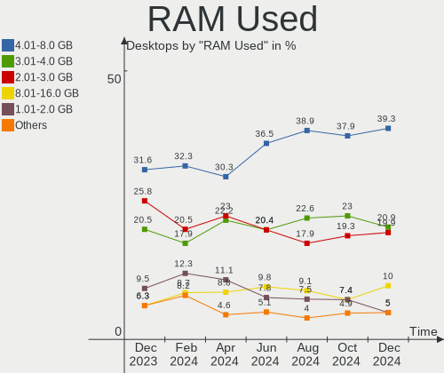

Fedora - Hardware Trends (Desktops)
-----------------------------------

A project to identify most popular hardware characteristics and track their change
over time based on data collected by Linux users at https://Linux-Hardware.org.

Anyone can contribute to this report by the [hw-probe](https://github.com/linuxhw/hw-probe) tool:

    sudo -E hw-probe -all -upload

This report is for one last month. Overall report since the beginning of time: [TestCoverage](https://github.com/linuxhw/TestCoverage)

Period: Oct, 2022.

Contents
--------

* [ System ](#system)
  - [ OS                       ](#os)
  - [ OS Family                ](#os-family)
  - [ Kernel                   ](#kernel)
  - [ Kernel Family            ](#kernel-family)
  - [ Kernel Major Ver.        ](#kernel-major-ver)
  - [ Arch                     ](#arch)
  - [ DE                       ](#de)
  - [ Display Server           ](#display-server)
  - [ Display Manager          ](#display-manager)
  - [ OS Lang                  ](#os-lang)
  - [ Boot Mode                ](#boot-mode)
  - [ Filesystem               ](#filesystem)
  - [ Part. scheme             ](#part-scheme)
  - [ Dual Boot with Linux/BSD ](#dual-boot-with-linuxbsd)
  - [ Dual Boot (Win)          ](#dual-boot-win)

* [ Board ](#board)
  - [ Vendor                   ](#vendor)
  - [ Model                    ](#model)
  - [ Model Family             ](#model-family)
  - [ MFG Year                 ](#mfg-year)
  - [ Form Factor              ](#form-factor)
  - [ Secure Boot              ](#secure-boot)
  - [ Coreboot                 ](#coreboot)
  - [ RAM Size                 ](#ram-size)
  - [ RAM Used                 ](#ram-used)
  - [ Total Drives             ](#total-drives)
  - [ Has CD-ROM               ](#has-cd-rom)
  - [ Has Ethernet             ](#has-ethernet)
  - [ Has WiFi                 ](#has-wifi)
  - [ Has Bluetooth            ](#has-bluetooth)

* [ Location ](#location)
  - [ Country                  ](#country)
  - [ City                     ](#city)

* [ Drives ](#drives)
  - [ Drive Vendor             ](#drive-vendor)
  - [ Drive Model              ](#drive-model)
  - [ HDD Vendor               ](#hdd-vendor)
  - [ SSD Vendor               ](#ssd-vendor)
  - [ Drive Kind               ](#drive-kind)
  - [ Drive Connector          ](#drive-connector)
  - [ Drive Size               ](#drive-size)
  - [ Space Total              ](#space-total)
  - [ Space Used               ](#space-used)
  - [ Malfunc. Drives          ](#malfunc-drives)
  - [ Malfunc. Drive Vendor    ](#malfunc-drive-vendor)
  - [ Malfunc. HDD Vendor      ](#malfunc-hdd-vendor)
  - [ Malfunc. Drive Kind      ](#malfunc-drive-kind)
  - [ Failed Drives            ](#failed-drives)
  - [ Failed Drive Vendor      ](#failed-drive-vendor)
  - [ Drive Status             ](#drive-status)

* [ Storage controller ](#storage-controller)
  - [ Storage Vendor           ](#storage-vendor)
  - [ Storage Model            ](#storage-model)
  - [ Storage Kind             ](#storage-kind)

* [ Processor ](#processor)
  - [ CPU Vendor               ](#cpu-vendor)
  - [ CPU Model                ](#cpu-model)
  - [ CPU Model Family         ](#cpu-model-family)
  - [ CPU Cores                ](#cpu-cores)
  - [ CPU Sockets              ](#cpu-sockets)
  - [ CPU Threads              ](#cpu-threads)
  - [ CPU Op-Modes             ](#cpu-op-modes)
  - [ CPU Microcode            ](#cpu-microcode)
  - [ CPU Microarch            ](#cpu-microarch)

* [ Graphics ](#graphics)
  - [ GPU Vendor               ](#gpu-vendor)
  - [ GPU Model                ](#gpu-model)
  - [ GPU Combo                ](#gpu-combo)
  - [ GPU Driver               ](#gpu-driver)
  - [ GPU Memory               ](#gpu-memory)

* [ Monitor ](#monitor)
  - [ Monitor Vendor           ](#monitor-vendor)
  - [ Monitor Model            ](#monitor-model)
  - [ Monitor Resolution       ](#monitor-resolution)
  - [ Monitor Diagonal         ](#monitor-diagonal)
  - [ Monitor Width            ](#monitor-width)
  - [ Aspect Ratio             ](#aspect-ratio)
  - [ Monitor Area             ](#monitor-area)
  - [ Pixel Density            ](#pixel-density)
  - [ Multiple Monitors        ](#multiple-monitors)

* [ Network ](#network)
  - [ Net Controller Vendor    ](#net-controller-vendor)
  - [ Net Controller Model     ](#net-controller-model)
  - [ Wireless Vendor          ](#wireless-vendor)
  - [ Wireless Model           ](#wireless-model)
  - [ Ethernet Vendor          ](#ethernet-vendor)
  - [ Ethernet Model           ](#ethernet-model)
  - [ Net Controller Kind      ](#net-controller-kind)
  - [ Used Controller          ](#used-controller)
  - [ NICs                     ](#nics)
  - [ IPv6                     ](#ipv6)

* [ Bluetooth ](#bluetooth)
  - [ Bluetooth Vendor         ](#bluetooth-vendor)
  - [ Bluetooth Model          ](#bluetooth-model)

* [ Sound ](#sound)
  - [ Sound Vendor             ](#sound-vendor)
  - [ Sound Model              ](#sound-model)

* [ Memory ](#memory)
  - [ Memory Vendor            ](#memory-vendor)
  - [ Memory Model             ](#memory-model)
  - [ Memory Kind              ](#memory-kind)
  - [ Memory Form Factor       ](#memory-form-factor)
  - [ Memory Size              ](#memory-size)
  - [ Memory Speed             ](#memory-speed)

* [ Printers & scanners ](#printers--scanners)
  - [ Printer Vendor           ](#printer-vendor)
  - [ Printer Model            ](#printer-model)
  - [ Scanner Vendor           ](#scanner-vendor)
  - [ Scanner Model            ](#scanner-model)

* [ Camera ](#camera)
  - [ Camera Vendor            ](#camera-vendor)
  - [ Camera Model             ](#camera-model)

* [ Security ](#security)
  - [ Fingerprint Vendor       ](#fingerprint-vendor)
  - [ Fingerprint Model        ](#fingerprint-model)
  - [ Chipcard Vendor          ](#chipcard-vendor)
  - [ Chipcard Model           ](#chipcard-model)

* [ Unsupported ](#unsupported)
  - [ Unsupported Devices      ](#unsupported-devices)
  - [ Unsupported Device Types ](#unsupported-device-types)

System
------

OS
--

Installed operating systems

| Name      | Desktops | Percent |
|-----------|----------|---------|
| Fedora 36 | 98       | 76.56%  |
| Fedora 37 | 24       | 18.75%  |
| Fedora 35 | 5        | 3.91%   |
| Fedora 38 | 1        | 0.78%   |

OS Family
---------

OS without a version

| Name   | Desktops | Percent |
|--------|----------|---------|
| Fedora | 128      | 100%    |

Kernel
------

Version of the Linux kernel

| Version                                            | Desktops | Percent |
|----------------------------------------------------|----------|---------|
| 5.19.16-200.fc36.x86_64                            | 31       | 24.22%  |
| 5.19.12-200.fc36.x86_64                            | 15       | 11.72%  |
| 5.19.14-200.fc36.x86_64                            | 14       | 10.94%  |
| 5.19.15-201.fc36.x86_64                            | 12       | 9.38%   |
| 5.19.13-200.fc36.x86_64                            | 9        | 7.03%   |
| 5.19.13-300.fc37.x86_64                            | 8        | 6.25%   |
| 6.0.5-200.fc36.x86_64                              | 5        | 3.91%   |
| 5.17.5-300.fc36.x86_64                             | 5        | 3.91%   |
| 5.19.16-301.fc37.x86_64                            | 3        | 2.34%   |
| 5.19.11-200.fc36.x86_64                            | 3        | 2.34%   |
| 5.19.16-300.fc37.x86_64                            | 2        | 1.56%   |
| 5.19.16-100.fc35.x86_64                            | 2        | 1.56%   |
| 5.19.12-300.fc37.x86_64                            | 2        | 1.56%   |
| 6.1.0-0.rc0.20221014git9c9155a3509a.11.fc38.x86_64 | 1        | 0.78%   |
| 6.1.0-0.rc0.20221011git60bb8154d1d7.8.fc38.x86_64  | 1        | 0.78%   |
| 6.0.5-300.fc37.x86_64                              | 1        | 0.78%   |
| 6.0.3-300.fc37.x86_64                              | 1        | 0.78%   |
| 6.0.2-301.fc37.x86_64                              | 1        | 0.78%   |
| 5.19.9-200.fc36.x86_64                             | 1        | 0.78%   |
| 5.19.8-xm1.0.fc36.x86_64                           | 1        | 0.78%   |
| 5.19.7-300.fc37.x86_64                             | 1        | 0.78%   |
| 5.19.6-100.fc35.x86_64                             | 1        | 0.78%   |
| 5.19.16-602.inttf.fc37.x86_64                      | 1        | 0.78%   |
| 5.19.15-301.fc37.x86_64                            | 1        | 0.78%   |
| 5.19.14-602.inttf.fc37.x86_64                      | 1        | 0.78%   |
| 5.19.14-300.fc37.x86_64                            | 1        | 0.78%   |
| 5.19.14-100.fc35.x86_64                            | 1        | 0.78%   |
| 5.19.13-100.fc35.x86_64                            | 1        | 0.78%   |
| 5.19.12-xm1.0.fc36.x86_64                          | 1        | 0.78%   |
| 5.16.18-200.fc35.x86_64                            | 1        | 0.78%   |

Kernel Family
-------------

Linux kernel without a distro release

| Version | Desktops | Percent |
|---------|----------|---------|
| 5.19.16 | 39       | 30.47%  |
| 5.19.13 | 18       | 14.06%  |
| 5.19.12 | 18       | 14.06%  |
| 5.19.14 | 17       | 13.28%  |
| 5.19.15 | 13       | 10.16%  |
| 6.0.5   | 6        | 4.69%   |
| 5.17.5  | 5        | 3.91%   |
| 5.19.11 | 3        | 2.34%   |
| 6.1.0   | 2        | 1.56%   |
| 6.0.3   | 1        | 0.78%   |
| 6.0.2   | 1        | 0.78%   |
| 5.19.9  | 1        | 0.78%   |
| 5.19.8  | 1        | 0.78%   |
| 5.19.7  | 1        | 0.78%   |
| 5.19.6  | 1        | 0.78%   |
| 5.16.18 | 1        | 0.78%   |

Kernel Major Ver.
-----------------

Linux kernel major version

| Version | Desktops | Percent |
|---------|----------|---------|
| 5.19    | 112      | 87.5%   |
| 6.0     | 8        | 6.25%   |
| 5.17    | 5        | 3.91%   |
| 6.1     | 2        | 1.56%   |
| 5.16    | 1        | 0.78%   |

Arch
----

OS architecture (x86_64, i586, etc.)

| Name   | Desktops | Percent |
|--------|----------|---------|
| x86_64 | 128      | 100%    |

DE
--

Desktop Environment

| Name          | Desktops | Percent |
|---------------|----------|---------|
| GNOME         | 86       | 67.19%  |
| KDE5          | 25       | 19.53%  |
| Cinnamon      | 7        | 5.47%   |
| Unknown       | 4        | 3.13%   |
| MATE          | 2        | 1.56%   |
| LXQt          | 2        | 1.56%   |
| XFCE          | 1        | 0.78%   |
| GNOME Classic | 1        | 0.78%   |

Display Server
--------------

X11 or Wayland

| Name    | Desktops | Percent |
|---------|----------|---------|
| Wayland | 69       | 53.91%  |
| X11     | 48       | 37.5%   |
| Tty     | 8        | 6.25%   |
| Unknown | 3        | 2.34%   |

Display Manager
---------------

SDDM, LightDM, etc.

| Name    | Desktops | Percent |
|---------|----------|---------|
| Unknown | 68       | 53.13%  |
| GDM     | 36       | 28.13%  |
| SDDM    | 14       | 10.94%  |
| LightDM | 10       | 7.81%   |

OS Lang
-------

Language

| Lang  | Desktops | Percent |
|-------|----------|---------|
| en_US | 61       | 47.66%  |
| en_GB | 14       | 10.94%  |
| en_AU | 12       | 9.38%   |
| it_IT | 11       | 8.59%   |
| ru_RU | 5        | 3.91%   |
| fr_FR | 4        | 3.13%   |
| es_ES | 4        | 3.13%   |
| pt_BR | 3        | 2.34%   |
| pl_PL | 2        | 1.56%   |
| de_DE | 2        | 1.56%   |
| sv_SE | 1        | 0.78%   |
| nb_NO | 1        | 0.78%   |
| hu_HU | 1        | 0.78%   |
| es_PE | 1        | 0.78%   |
| en_PH | 1        | 0.78%   |
| en_IN | 1        | 0.78%   |
| en_CA | 1        | 0.78%   |
| de_CH | 1        | 0.78%   |
| cs_CZ | 1        | 0.78%   |
| ar_SA | 1        | 0.78%   |

Boot Mode
---------

EFI or BIOS

| Mode | Desktops | Percent |
|------|----------|---------|
| EFI  | 80       | 62.5%   |
| BIOS | 48       | 37.5%   |

Filesystem
----------

Type of filesystem

| Type  | Desktops | Percent |
|-------|----------|---------|
| Btrfs | 99       | 77.34%  |
| Ext4  | 21       | 16.41%  |
| Xfs   | 8        | 6.25%   |

Part. scheme
------------

Scheme of partitioning

| Type    | Desktops | Percent |
|---------|----------|---------|
| Unknown | 64       | 50%     |
| GPT     | 48       | 37.5%   |
| MBR     | 16       | 12.5%   |

Dual Boot with Linux/BSD
------------------------

Hosting more than one Linux/BSD

| Dual boot | Desktops | Percent |
|-----------|----------|---------|
| No        | 109      | 85.16%  |
| Yes       | 19       | 14.84%  |

Dual Boot (Win)
---------------

Hosting Linux and Windows

| Dual boot | Desktops | Percent |
|-----------|----------|---------|
| No        | 99       | 77.34%  |
| Yes       | 29       | 22.66%  |

Board
-----

Vendor
------

Motherboard manufacturer

| Name                | Desktops | Percent |
|---------------------|----------|---------|
| ASUSTek Computer    | 39       | 30.47%  |
| Gigabyte Technology | 28       | 21.88%  |
| MSI                 | 25       | 19.53%  |
| ASRock              | 10       | 7.81%   |
| Hewlett-Packard     | 7        | 5.47%   |
| Dell                | 4        | 3.13%   |
| Lenovo              | 3        | 2.34%   |
| BESSTAR Tech        | 3        | 2.34%   |
| Acer                | 2        | 1.56%   |
| Unknown             | 2        | 1.56%   |
| Shuttle             | 1        | 0.78%   |
| Pegatron            | 1        | 0.78%   |
| NZXT                | 1        | 0.78%   |
| Intel               | 1        | 0.78%   |
| Huanan              | 1        | 0.78%   |

Model
-----

Motherboard model

| Name                                                            | Desktops | Percent |
|-----------------------------------------------------------------|----------|---------|
| Gigabyte B450 AORUS ELITE                                       | 3        | 2.34%   |
| MSI MS-7C84                                                     | 2        | 1.56%   |
| MSI MS-7C52                                                     | 2        | 1.56%   |
| MSI MS-7C37                                                     | 2        | 1.56%   |
| Gigabyte B550M DS3H                                             | 2        | 1.56%   |
| ASUS PRIME Z270-A                                               | 2        | 1.56%   |
| ASUS PRIME B450-PLUS                                            | 2        | 1.56%   |
| Unknown                                                         | 2        | 1.56%   |
| Shuttle SH67H                                                   | 1        | 0.78%   |
| Pegatron h8-1503                                                | 1        | 0.78%   |
| NZXT N7 B550                                                    | 1        | 0.78%   |
| MSI MS-7D14                                                     | 1        | 0.78%   |
| MSI MS-7C95                                                     | 1        | 0.78%   |
| MSI MS-7C91                                                     | 1        | 0.78%   |
| MSI MS-7C83                                                     | 1        | 0.78%   |
| MSI MS-7C77                                                     | 1        | 0.78%   |
| MSI MS-7B89                                                     | 1        | 0.78%   |
| MSI MS-7B86                                                     | 1        | 0.78%   |
| MSI MS-7B79                                                     | 1        | 0.78%   |
| MSI MS-7B10                                                     | 1        | 0.78%   |
| MSI MS-7B07                                                     | 1        | 0.78%   |
| MSI MS-7A93                                                     | 1        | 0.78%   |
| MSI MS-7A65                                                     | 1        | 0.78%   |
| MSI MS-7A34                                                     | 1        | 0.78%   |
| MSI MS-7A33                                                     | 1        | 0.78%   |
| MSI MS-7A12                                                     | 1        | 0.78%   |
| MSI MS-7917                                                     | 1        | 0.78%   |
| MSI MS-7885                                                     | 1        | 0.78%   |
| MSI MS-7817                                                     | 1        | 0.78%   |
| MSI MS-7721                                                     | 1        | 0.78%   |
| Lenovo ThinkStation P500 30A6S3SH00                             | 1        | 0.78%   |
| Lenovo ThinkStation P340 30DJS2SA00                             | 1        | 0.78%   |
| Lenovo ThinkCentre M93p 10A8S3C100                              | 1        | 0.78%   |
| Intel DG41TY AAE47335-302                                       | 1        | 0.78%   |
| Huanan X79 (INTEL Xeon E5/Core i7 DMI2 - C600/C200 Cipset V2.49 | 1        | 0.78%   |
| HP Z800 Workstation                                             | 1        | 0.78%   |
| HP Slim Desktop 290-a0xxx                                       | 1        | 0.78%   |
| HP ProLiant ML350 G6                                            | 1        | 0.78%   |
| HP Pavilion Gaming Desktop 690-00xx                             | 1        | 0.78%   |
| HP Compaq 8000 Elite CMT PC                                     | 1        | 0.78%   |

Model Family
------------

Motherboard model prefix

| Name                | Desktops | Percent |
|---------------------|----------|---------|
| ASUS PRIME          | 13       | 10.16%  |
| ASUS TUF            | 11       | 8.59%   |
| ASUS ROG            | 7        | 5.47%   |
| Gigabyte B450       | 3        | 2.34%   |
| MSI MS-7C84         | 2        | 1.56%   |
| MSI MS-7C52         | 2        | 1.56%   |
| MSI MS-7C37         | 2        | 1.56%   |
| Lenovo ThinkStation | 2        | 1.56%   |
| HP Compaq           | 2        | 1.56%   |
| Gigabyte B550M      | 2        | 1.56%   |
| Gigabyte B450M      | 2        | 1.56%   |
| Dell OptiPlex       | 2        | 1.56%   |
| ASRock X570         | 2        | 1.56%   |
| Acer Veriton        | 2        | 1.56%   |
| Unknown             | 2        | 1.56%   |
| Shuttle SH67H       | 1        | 0.78%   |
| Pegatron h8-1503    | 1        | 0.78%   |
| NZXT N7             | 1        | 0.78%   |
| MSI MS-7D14         | 1        | 0.78%   |
| MSI MS-7C95         | 1        | 0.78%   |
| MSI MS-7C91         | 1        | 0.78%   |
| MSI MS-7C83         | 1        | 0.78%   |
| MSI MS-7C77         | 1        | 0.78%   |
| MSI MS-7B89         | 1        | 0.78%   |
| MSI MS-7B86         | 1        | 0.78%   |
| MSI MS-7B79         | 1        | 0.78%   |
| MSI MS-7B10         | 1        | 0.78%   |
| MSI MS-7B07         | 1        | 0.78%   |
| MSI MS-7A93         | 1        | 0.78%   |
| MSI MS-7A65         | 1        | 0.78%   |
| MSI MS-7A34         | 1        | 0.78%   |
| MSI MS-7A33         | 1        | 0.78%   |
| MSI MS-7A12         | 1        | 0.78%   |
| MSI MS-7917         | 1        | 0.78%   |
| MSI MS-7885         | 1        | 0.78%   |
| MSI MS-7817         | 1        | 0.78%   |
| MSI MS-7721         | 1        | 0.78%   |
| Lenovo ThinkCentre  | 1        | 0.78%   |
| Intel DG41TY        | 1        | 0.78%   |
| Huanan X79          | 1        | 0.78%   |

MFG Year
--------

Motherboard manufacture year

| Year | Desktops | Percent |
|------|----------|---------|
| 2020 | 22       | 17.19%  |
| 2018 | 19       | 14.84%  |
| 2019 | 12       | 9.38%   |
| 2021 | 11       | 8.59%   |
| 2014 | 10       | 7.81%   |
| 2015 | 8        | 6.25%   |
| 2017 | 7        | 5.47%   |
| 2013 | 7        | 5.47%   |
| 2022 | 6        | 4.69%   |
| 2009 | 6        | 4.69%   |
| 2012 | 5        | 3.91%   |
| 2016 | 4        | 3.13%   |
| 2011 | 3        | 2.34%   |
| 2010 | 3        | 2.34%   |
| 2008 | 2        | 1.56%   |
| 2006 | 2        | 1.56%   |
| 2007 | 1        | 0.78%   |

Form Factor
-----------

Physical design of the computer

| Name    | Desktops | Percent |
|---------|----------|---------|
| Desktop | 128      | 100%    |

Secure Boot
-----------

Enabled or disabled

| State    | Desktops | Percent |
|----------|----------|---------|
| Disabled | 117      | 91.41%  |
| Enabled  | 11       | 8.59%   |

Coreboot
--------

Have coreboot on board

| Used | Desktops | Percent |
|------|----------|---------|
| No   | 128      | 100%    |

RAM Size
--------

Total RAM memory

| Size in GB  | Desktops | Percent |
|-------------|----------|---------|
| 16.01-24.0  | 44       | 34.38%  |
| 32.01-64.0  | 30       | 23.44%  |
| 8.01-16.0   | 17       | 13.28%  |
| 64.01-256.0 | 13       | 10.16%  |
| 24.01-32.0  | 9        | 7.03%   |
| 4.01-8.0    | 8        | 6.25%   |
| 3.01-4.0    | 7        | 5.47%   |

RAM Used
--------

Used RAM memory

| Used GB     | Desktops | Percent |
|-------------|----------|---------|
| 4.01-8.0    | 37       | 28.91%  |
| 3.01-4.0    | 32       | 25%     |
| 2.01-3.0    | 22       | 17.19%  |
| 8.01-16.0   | 17       | 13.28%  |
| 1.01-2.0    | 12       | 9.38%   |
| 0.51-1.0    | 4        | 3.13%   |
| 24.01-32.0  | 1        | 0.78%   |
| 64.01-256.0 | 1        | 0.78%   |
| 16.01-24.0  | 1        | 0.78%   |
| 0.01-0.5    | 1        | 0.78%   |

Total Drives
------------

Number of drives on board

| Drives | Desktops | Percent |
|--------|----------|---------|
| 2      | 39       | 30.47%  |
| 1      | 35       | 27.34%  |
| 3      | 27       | 21.09%  |
| 4      | 13       | 10.16%  |
| 6      | 7        | 5.47%   |
| 5      | 5        | 3.91%   |
| 11     | 1        | 0.78%   |
| 7      | 1        | 0.78%   |

Has CD-ROM
----------

Has CD-ROM on board

| Presented | Desktops | Percent |
|-----------|----------|---------|
| No        | 98       | 76.56%  |
| Yes       | 30       | 23.44%  |

Has Ethernet
------------

Has Ethernet on board

| Presented | Desktops | Percent |
|-----------|----------|---------|
| Yes       | 127      | 99.22%  |
| No        | 1        | 0.78%   |

Has WiFi
--------

Has WiFi module

| Presented | Desktops | Percent |
|-----------|----------|---------|
| No        | 73       | 57.03%  |
| Yes       | 55       | 42.97%  |

Has Bluetooth
-------------

Has Bluetooth module

| Presented | Desktops | Percent |
|-----------|----------|---------|
| No        | 75       | 58.59%  |
| Yes       | 53       | 41.41%  |

Location
--------

Country
-------

Geographic location (country)

| Country      | Desktops | Percent |
|--------------|----------|---------|
| USA          | 33       | 25.78%  |
| Italy        | 16       | 12.5%   |
| Australia    | 11       | 8.59%   |
| Brazil       | 8        | 6.25%   |
| UK           | 7        | 5.47%   |
| Russia       | 5        | 3.91%   |
| France       | 5        | 3.91%   |
| Spain        | 4        | 3.13%   |
| Poland       | 4        | 3.13%   |
| Norway       | 4        | 3.13%   |
| Germany      | 4        | 3.13%   |
| Sweden       | 2        | 1.56%   |
| Serbia       | 2        | 1.56%   |
| Philippines  | 2        | 1.56%   |
| Finland      | 2        | 1.56%   |
| Czechia      | 2        | 1.56%   |
| Belarus      | 2        | 1.56%   |
| Switzerland  | 1        | 0.78%   |
| Saudi Arabia | 1        | 0.78%   |
| Romania      | 1        | 0.78%   |
| Puerto Rico  | 1        | 0.78%   |
| Portugal     | 1        | 0.78%   |
| Peru         | 1        | 0.78%   |
| Lithuania    | 1        | 0.78%   |
| Israel       | 1        | 0.78%   |
| India        | 1        | 0.78%   |
| Hungary      | 1        | 0.78%   |
| Hong Kong    | 1        | 0.78%   |
| Greece       | 1        | 0.78%   |
| Canada       | 1        | 0.78%   |
| Belgium      | 1        | 0.78%   |
| Algeria      | 1        | 0.78%   |

City
----

Geographic location (city)

| City            | Desktops | Percent |
|-----------------|----------|---------|
| Milan           | 4        | 3.13%   |
| Lane Cove       | 4        | 3.13%   |
| Kristiansand    | 3        | 2.34%   |
| Warsaw          | 2        | 1.56%   |
| Sandy Bay       | 2        | 1.56%   |
| Porto Alegre    | 2        | 1.56%   |
| Moscow          | 2        | 1.56%   |
| Minsk           | 2        | 1.56%   |
| Melbourne       | 2        | 1.56%   |
| Helsinki        | 2        | 1.56%   |
| Wil             | 1        | 0.78%   |
| Westlake        | 1        | 0.78%   |
| Vitry-sur-Seine | 1        | 0.78%   |
| Verona          | 1        | 0.78%   |
| Vercelli        | 1        | 0.78%   |
| Vaxjo           | 1        | 0.78%   |
| Urbandale       | 1        | 0.78%   |
| Turin           | 1        | 0.78%   |
| Tuckerton       | 1        | 0.78%   |
| Trondheim       | 1        | 0.78%   |
| Trivandrum      | 1        | 0.78%   |
| Tottenham       | 1        | 0.78%   |
| Tolentino       | 1        | 0.78%   |
| Thornton Heath  | 1        | 0.78%   |
| Tacoma          | 1        | 0.78%   |
| Sterling        | 1        | 0.78%   |
| Staffanstorp    | 1        | 0.78%   |
| St Petersburg   | 1        | 0.78%   |
| Southlake       | 1        | 0.78%   |
| Sigmaringendorf | 1        | 0.78%   |
| Šiauliai       | 1        | 0.78%   |
| Seville         | 1        | 0.78%   |
| Seattle         | 1        | 0.78%   |
| Sao Paulo       | 1        | 0.78%   |
| San Juan        | 1        | 0.78%   |
| Salisbury       | 1        | 0.78%   |
| Sabadell        | 1        | 0.78%   |
| Roswell         | 1        | 0.78%   |
| Roquetas de Mar | 1        | 0.78%   |
| Rome            | 1        | 0.78%   |

Drives
------

Drive Vendor
------------

Hard drive vendors

| Vendor                      | Desktops | Drives | Percent |
|-----------------------------|----------|--------|---------|
| WDC                         | 43       | 60     | 16.23%  |
| Samsung Electronics         | 40       | 63     | 15.09%  |
| Seagate                     | 39       | 41     | 14.72%  |
| Kingston                    | 24       | 26     | 9.06%   |
| Sandisk                     | 16       | 17     | 6.04%   |
| Crucial                     | 13       | 15     | 4.91%   |
| Hitachi                     | 9        | 11     | 3.4%    |
| Toshiba                     | 8        | 8      | 3.02%   |
| Intel                       | 7        | 8      | 2.64%   |
| Phison Electronics          | 6        | 7      | 2.26%   |
| Micron/Crucial Technology   | 6        | 8      | 2.26%   |
| Phison                      | 4        | 4      | 1.51%   |
| HGST                        | 4        | 5      | 1.51%   |
| A-DATA Technology           | 4        | 4      | 1.51%   |
| Unknown                     | 3        | 3      | 1.13%   |
| China                       | 3        | 3      | 1.13%   |
| SPCC                        | 2        | 3      | 0.75%   |
| Silicon Motion              | 2        | 2      | 0.75%   |
| PNY                         | 2        | 2      | 0.75%   |
| Patriot                     | 2        | 2      | 0.75%   |
| Micron Technology           | 2        | 2      | 0.75%   |
| MAXIO Technology (Hangzhou) | 2        | 3      | 0.75%   |
| LITEON                      | 2        | 2      | 0.75%   |
| Lexar                       | 2        | 2      | 0.75%   |
| Fujitsu                     | 2        | 2      | 0.75%   |
| Corsair                     | 2        | 3      | 0.75%   |
| XPG                         | 1        | 1      | 0.38%   |
| Transcend                   | 1        | 1      | 0.38%   |
| Team                        | 1        | 2      | 0.38%   |
| Smartbuy                    | 1        | 1      | 0.38%   |
| SK hynix                    | 1        | 1      | 0.38%   |
| SAGE                        | 1        | 1      | 0.38%   |
| Ramsta                      | 1        | 1      | 0.38%   |
| Plextor                     | 1        | 1      | 0.38%   |
| Mushkin                     | 1        | 1      | 0.38%   |
| Maxtor                      | 1        | 1      | 0.38%   |
| KUIJIA                      | 1        | 1      | 0.38%   |
| KingSpec                    | 1        | 1      | 0.38%   |
| Hewlett-Packard             | 1        | 2      | 0.38%   |
| ASMT                        | 1        | 2      | 0.38%   |

Drive Model
-----------

Hard drive models

| Model                                                 | Desktops | Percent |
|-------------------------------------------------------|----------|---------|
| Samsung NVMe SSD Controller SM981/PM981/PM983 500GB   | 10       | 3.29%   |
| Kingston SA400S37240G 240GB SSD                       | 8        | 2.63%   |
| Samsung SSD 860 EVO 500GB                             | 7        | 2.3%    |
| Seagate ST2000DM008-2FR102 2TB                        | 4        | 1.32%   |
| Phison E12 NVMe Controller 2TB                        | 4        | 1.32%   |
| Micron/Crucial P2 NVMe PCIe SSD 500GB                 | 4        | 1.32%   |
| WDC WD10EZEX-60WN4A0 1TB                              | 3        | 0.99%   |
| WDC WD10EZEX-08WN4A0 1TB                              | 3        | 0.99%   |
| Seagate ST1000DM003-1ER162 1TB                        | 3        | 0.99%   |
| Sandisk WD Black SN750 / PC SN730 NVMe SSD 1TB        | 3        | 0.99%   |
| Samsung SSD 980 1TB                                   | 3        | 0.99%   |
| Samsung SSD 850 EVO 500GB                             | 3        | 0.99%   |
| Samsung SSD 850 EVO 250GB                             | 3        | 0.99%   |
| Kingston SA400S37480G 480GB SSD                       | 3        | 0.99%   |
| Crucial CT500MX500SSD1 500GB                          | 3        | 0.99%   |
| WDC WDS500G2B0A-00SM50 500GB SSD                      | 2        | 0.66%   |
| WDC WDS100T2B0A-00SM50 1TB SSD                        | 2        | 0.66%   |
| WDC WD30EZRZ-00WN9B0 3TB                              | 2        | 0.66%   |
| WDC WD10EZEX-00BN5A0 1TB                              | 2        | 0.66%   |
| Toshiba DT01ACA100 1TB                                | 2        | 0.66%   |
| Silicon Motion SM2263EN/SM2263XT SSD Controller 256GB | 2        | 0.66%   |
| Seagate ST3500413AS 500GB                             | 2        | 0.66%   |
| Seagate ST2000DM008-2UB102 2TB                        | 2        | 0.66%   |
| Seagate ST2000DM006-2DM164 2TB                        | 2        | 0.66%   |
| Seagate ST2000DM001-1CH164 2TB                        | 2        | 0.66%   |
| Seagate ST1000DM003-1SB10C 1TB                        | 2        | 0.66%   |
| Seagate BUP Slim SL 1TB                               | 2        | 0.66%   |
| SanDisk SSD PLUS 480GB                                | 2        | 0.66%   |
| Samsung SSD 870 QVO 2TB                               | 2        | 0.66%   |
| Samsung SSD 870 EVO 500GB                             | 2        | 0.66%   |
| Samsung SSD 860 EVO 2TB                               | 2        | 0.66%   |
| Samsung SSD 860 EVO 250GB                             | 2        | 0.66%   |
| Samsung SSD 860 EVO 1TB                               | 2        | 0.66%   |
| MAXIO (Hangzhou) NVMe SSD Controller MAP1202 512GB    | 2        | 0.66%   |
| Kingston SV300S37A120G 120GB SSD                      | 2        | 0.66%   |
| Kingston SA400S37960G 960GB SSD                       | 2        | 0.66%   |
| Kingston SA400S37120G 120GB SSD                       | 2        | 0.66%   |
| Intel SSDSC2CT120A3 120GB                             | 2        | 0.66%   |
| Crucial CT240BX500SSD1 240GB                          | 2        | 0.66%   |
| XPG GAMMIX S70 BLADE 2TB                              | 1        | 0.33%   |

HDD Vendor
----------

Hard disk drive vendors

| Vendor              | Desktops | Drives | Percent |
|---------------------|----------|--------|---------|
| Seagate             | 39       | 41     | 38.24%  |
| WDC                 | 36       | 45     | 35.29%  |
| Hitachi             | 9        | 11     | 8.82%   |
| Toshiba             | 6        | 6      | 5.88%   |
| HGST                | 4        | 5      | 3.92%   |
| Fujitsu             | 2        | 2      | 1.96%   |
| Unknown             | 1        | 1      | 0.98%   |
| Samsung Electronics | 1        | 2      | 0.98%   |
| SAGE                | 1        | 1      | 0.98%   |
| Maxtor              | 1        | 1      | 0.98%   |
| Hewlett-Packard     | 1        | 2      | 0.98%   |
| ASMT                | 1        | 2      | 0.98%   |

SSD Vendor
----------

Solid state drive vendors

| Vendor              | Desktops | Drives | Percent |
|---------------------|----------|--------|---------|
| Samsung Electronics | 28       | 37     | 25.45%  |
| Kingston            | 20       | 22     | 18.18%  |
| Crucial             | 12       | 14     | 10.91%  |
| WDC                 | 8        | 11     | 7.27%   |
| SanDisk             | 7        | 8      | 6.36%   |
| Intel               | 5        | 5      | 4.55%   |
| China               | 3        | 3      | 2.73%   |
| A-DATA Technology   | 3        | 3      | 2.73%   |
| SPCC                | 2        | 3      | 1.82%   |
| PNY                 | 2        | 2      | 1.82%   |
| Micron Technology   | 2        | 2      | 1.82%   |
| LITEON              | 2        | 2      | 1.82%   |
| Lexar               | 2        | 2      | 1.82%   |
| Corsair             | 2        | 3      | 1.82%   |
| Unknown             | 1        | 1      | 0.91%   |
| Transcend           | 1        | 1      | 0.91%   |
| Toshiba             | 1        | 1      | 0.91%   |
| Team                | 1        | 2      | 0.91%   |
| Smartbuy            | 1        | 1      | 0.91%   |
| SK hynix            | 1        | 1      | 0.91%   |
| Plextor             | 1        | 1      | 0.91%   |
| Patriot             | 1        | 1      | 0.91%   |
| Mushkin             | 1        | 1      | 0.91%   |
| KUIJIA              | 1        | 1      | 0.91%   |
| KingSpec            | 1        | 1      | 0.91%   |
| ALLIED              | 1        | 1      | 0.91%   |

Drive Kind
----------

HDD or SSD

| Kind | Desktops | Drives | Percent |
|------|----------|--------|---------|
| SSD  | 85       | 130    | 37.44%  |
| HDD  | 80       | 119    | 35.24%  |
| NVMe | 62       | 76     | 27.31%  |

Drive Connector
---------------

SATA, SAS, NVMe, etc.

| Type | Desktops | Drives | Percent |
|------|----------|--------|---------|
| SATA | 106      | 234    | 59.22%  |
| NVMe | 62       | 76     | 34.64%  |
| SAS  | 11       | 15     | 6.15%   |

Drive Size
----------

Size of hard drive

| Size in TB | Desktops | Drives | Percent |
|------------|----------|--------|---------|
| 0.01-0.5   | 78       | 124    | 44.57%  |
| 0.51-1.0   | 49       | 67     | 28%     |
| 1.01-2.0   | 25       | 29     | 14.29%  |
| 4.01-10.0  | 9        | 11     | 5.14%   |
| 3.01-4.0   | 7        | 8      | 4%      |
| 2.01-3.0   | 6        | 9      | 3.43%   |
| 10.01-20.0 | 1        | 1      | 0.57%   |

Space Total
-----------

Amount of disk space available on the file system

| Size in GB     | Desktops | Percent |
|----------------|----------|---------|
| More than 3000 | 26       | 20.31%  |
| 1001-2000      | 26       | 20.31%  |
| 501-1000       | 25       | 19.53%  |
| 2001-3000      | 15       | 11.72%  |
| 101-250        | 13       | 10.16%  |
| 251-500        | 10       | 7.81%   |
| 1-20           | 7        | 5.47%   |
| 51-100         | 4        | 3.13%   |
| Unknown        | 2        | 1.56%   |

Space Used
----------

Amount of used disk space

| Used GB        | Desktops | Percent |
|----------------|----------|---------|
| 1-20           | 24       | 18.75%  |
| 501-1000       | 19       | 14.84%  |
| 21-50          | 16       | 12.5%   |
| 251-500        | 14       | 10.94%  |
| 51-100         | 14       | 10.94%  |
| 101-250        | 13       | 10.16%  |
| 1001-2000      | 11       | 8.59%   |
| 2001-3000      | 9        | 7.03%   |
| More than 3000 | 6        | 4.69%   |
| Unknown        | 2        | 1.56%   |

Malfunc. Drives
---------------

Drive models with a malfunction

| Model                                     | Desktops | Drives | Percent |
|-------------------------------------------|----------|--------|---------|
| Intel SSDSC2CT120A3 120GB                 | 2        | 2      | 11.11%  |
| WDC WD40EFRX-68WT0N0 4TB                  | 1        | 1      | 5.56%   |
| WDC WD15EARS-00MVWB0 1TB                  | 1        | 1      | 5.56%   |
| WDC WD10EZEX-00MFCA0 1TB                  | 1        | 1      | 5.56%   |
| Toshiba MK3263GSX 320GB                   | 1        | 1      | 5.56%   |
| Seagate ST3500620AS 500GB                 | 1        | 1      | 5.56%   |
| Seagate ST3320620AS 320GB                 | 1        | 1      | 5.56%   |
| Seagate ST32000641AS 2TB                  | 1        | 1      | 5.56%   |
| Seagate ST3000DM001-1CH166 3TB            | 1        | 1      | 5.56%   |
| Seagate ST2000DM001-1CH164 2TB            | 1        | 1      | 5.56%   |
| Samsung Electronics HD501LJ 500GB         | 1        | 2      | 5.56%   |
| Maxtor 6B200M0 208GB                      | 1        | 1      | 5.56%   |
| LITEON IT LCS-256L9S-11 2.5 7mm 256GB SSD | 1        | 1      | 5.56%   |
| Intel SSDSC2BF180A4H 180GB                | 1        | 1      | 5.56%   |
| HGST HTS545050A7E680 500GB                | 1        | 1      | 5.56%   |
| Corsair Force LE200 SSD 240GB             | 1        | 1      | 5.56%   |
| Corsair Force 3 SSD 120GB                 | 1        | 1      | 5.56%   |

Malfunc. Drive Vendor
---------------------

Vendors of faulty drives

| Vendor              | Desktops | Drives | Percent |
|---------------------|----------|--------|---------|
| Seagate             | 5        | 5      | 27.78%  |
| WDC                 | 3        | 3      | 16.67%  |
| Intel               | 3        | 3      | 16.67%  |
| Corsair             | 2        | 2      | 11.11%  |
| Toshiba             | 1        | 1      | 5.56%   |
| Samsung Electronics | 1        | 2      | 5.56%   |
| Maxtor              | 1        | 1      | 5.56%   |
| LITEON              | 1        | 1      | 5.56%   |
| HGST                | 1        | 1      | 5.56%   |

Malfunc. HDD Vendor
-------------------

Vendors of faulty HDD drives

| Vendor              | Desktops | Drives | Percent |
|---------------------|----------|--------|---------|
| Seagate             | 5        | 5      | 41.67%  |
| WDC                 | 3        | 3      | 25%     |
| Toshiba             | 1        | 1      | 8.33%   |
| Samsung Electronics | 1        | 2      | 8.33%   |
| Maxtor              | 1        | 1      | 8.33%   |
| HGST                | 1        | 1      | 8.33%   |

Malfunc. Drive Kind
-------------------

Kinds of faulty drives

| Kind | Desktops | Drives | Percent |
|------|----------|--------|---------|
| HDD  | 11       | 13     | 64.71%  |
| SSD  | 6        | 6      | 35.29%  |

Failed Drives
-------------

Failed drive models

Zero info for selected period =(

Failed Drive Vendor
-------------------

Failed drive vendors

Zero info for selected period =(

Drive Status
------------

Number of failed and malfunc. drives

| Status   | Desktops | Drives | Percent |
|----------|----------|--------|---------|
| Detected | 67       | 174    | 47.52%  |
| Works    | 58       | 132    | 41.13%  |
| Malfunc  | 16       | 19     | 11.35%  |

Storage controller
------------------

Storage Vendor
--------------

Storage controller vendors

| Vendor                       | Desktops | Percent |
|------------------------------|----------|---------|
| AMD                          | 64       | 30.92%  |
| Intel                        | 63       | 30.43%  |
| Samsung Electronics          | 19       | 9.18%   |
| SanDisk                      | 13       | 6.28%   |
| Phison Electronics           | 12       | 5.8%    |
| Micron/Crucial Technology    | 7        | 3.38%   |
| Kingston Technology Company  | 4        | 1.93%   |
| Silicon Motion               | 3        | 1.45%   |
| Marvell Technology Group     | 3        | 1.45%   |
| LSI Logic / Symbios Logic    | 3        | 1.45%   |
| ASMedia Technology           | 3        | 1.45%   |
| MAXIO Technology (Hangzhou)  | 2        | 0.97%   |
| VIA Technologies             | 1        | 0.48%   |
| Unknown                      | 1        | 0.48%   |
| ULi Electronics              | 1        | 0.48%   |
| Toshiba America Info Systems | 1        | 0.48%   |
| Silicon Image                | 1        | 0.48%   |
| Nvidia                       | 1        | 0.48%   |
| JMicron Technology           | 1        | 0.48%   |
| Hewlett-Packard              | 1        | 0.48%   |
| ADATA Technology             | 1        | 0.48%   |
| Adaptec                      | 1        | 0.48%   |
| Unknown                      | 1        | 0.48%   |

Storage Model
-------------

Storage controller models

| Model                                                                          | Desktops | Percent |
|--------------------------------------------------------------------------------|----------|---------|
| AMD FCH SATA Controller [AHCI mode]                                            | 41       | 15.83%  |
| AMD 400 Series Chipset SATA Controller                                         | 17       | 6.56%   |
| Samsung NVMe SSD Controller SM981/PM981/PM983                                  | 15       | 5.79%   |
| AMD 500 Series Chipset SATA Controller                                         | 11       | 4.25%   |
| Phison E12 NVMe Controller                                                     | 7        | 2.7%    |
| Intel 7 Series/C210 Series Chipset Family 6-port SATA Controller [AHCI mode]   | 7        | 2.7%    |
| Intel Volume Management Device NVMe RAID Controller                            | 6        | 2.32%   |
| Intel Alder Lake-S PCH SATA Controller [AHCI Mode]                             | 6        | 2.32%   |
| AMD SB7x0/SB8x0/SB9x0 IDE Controller                                           | 6        | 2.32%   |
| Micron/Crucial P2 NVMe PCIe SSD                                                | 5        | 1.93%   |
| Intel 8 Series/C220 Series Chipset Family 6-port SATA Controller 1 [AHCI mode] | 5        | 1.93%   |
| Intel 200 Series PCH SATA controller [AHCI mode]                               | 5        | 1.93%   |
| AMD SB7x0/SB8x0/SB9x0 SATA Controller [AHCI mode]                              | 5        | 1.93%   |
| SanDisk WD Black SN750 / PC SN730 NVMe SSD                                     | 4        | 1.54%   |
| SanDisk Non-Volatile memory controller                                         | 4        | 1.54%   |
| Intel SATA Controller [RAID mode]                                              | 4        | 1.54%   |
| Intel Q170/Q150/B150/H170/H110/Z170/CM236 Chipset SATA Controller [AHCI Mode]  | 4        | 1.54%   |
| Intel Comet Lake SATA AHCI Controller                                          | 4        | 1.54%   |
| Intel Cannon Lake PCH SATA AHCI Controller                                     | 4        | 1.54%   |
| Silicon Motion SM2263EN/SM2263XT SSD Controller                                | 3        | 1.16%   |
| Samsung NVMe SSD Controller 980                                                | 3        | 1.16%   |
| Kingston Company Company Non-Volatile memory controller                        | 3        | 1.16%   |
| Intel C610/X99 series chipset 6-Port SATA Controller [AHCI mode]               | 3        | 1.16%   |
| Intel 9 Series Chipset Family SATA Controller [AHCI Mode]                      | 3        | 1.16%   |
| Intel 400 Series Chipset Family SATA AHCI Controller                           | 3        | 1.16%   |
| ASMedia ASM1062 Serial ATA Controller                                          | 3        | 1.16%   |
| AMD FCH SATA Controller D                                                      | 3        | 1.16%   |
| SanDisk WD PC SN810 / Black SN850 NVMe SSD                                     | 2        | 0.77%   |
| SanDisk WD Blue SN550 NVMe SSD                                                 | 2        | 0.77%   |
| Samsung NVMe SSD Controller PM9A1/PM9A3/980PRO                                 | 2        | 0.77%   |
| Phison PS5013 E13 NVMe Controller                                              | 2        | 0.77%   |
| Phison E16 PCIe4 NVMe Controller                                               | 2        | 0.77%   |
| MAXIO (Hangzhou) NVMe SSD Controller MAP1202                                   | 2        | 0.77%   |
| Intel SSD 660P Series                                                          | 2        | 0.77%   |
| Intel NM10/ICH7 Family SATA Controller [IDE mode]                              | 2        | 0.77%   |
| Intel C610/X99 series chipset sSATA Controller [AHCI mode]                     | 2        | 0.77%   |
| Intel 6 Series/C200 Series Chipset Family 6 port Desktop SATA AHCI Controller  | 2        | 0.77%   |
| AMD X370 Series Chipset SATA Controller                                        | 2        | 0.77%   |
| AMD SB7x0/SB8x0/SB9x0 SATA Controller [IDE mode]                               | 2        | 0.77%   |
| AMD FCH RAID Controller                                                        | 2        | 0.77%   |

Storage Kind
------------

Kind of storage controller (IDE, SATA, NVMe, SAS, ...)

| Kind | Desktops | Percent |
|------|----------|---------|
| SATA | 113      | 52.56%  |
| NVMe | 62       | 28.84%  |
| IDE  | 20       | 9.3%    |
| RAID | 18       | 8.37%   |
| SAS  | 1        | 0.47%   |
| SCSI | 1        | 0.47%   |

Processor
---------

CPU Vendor
----------

Processor vendors

| Vendor | Desktops | Percent |
|--------|----------|---------|
| AMD    | 65       | 50.78%  |
| Intel  | 63       | 49.22%  |

CPU Model
---------

Processor models

| Model                                  | Desktops | Percent |
|----------------------------------------|----------|---------|
| AMD Ryzen 5 3600 6-Core Processor      | 5        | 3.91%   |
| AMD Ryzen 7 2700X Eight-Core Processor | 4        | 3.13%   |
| AMD Ryzen 5 5600X 6-Core Processor     | 4        | 3.13%   |
| Intel Core i5-2400 CPU @ 3.10GHz       | 3        | 2.34%   |
| AMD Ryzen 9 5950X 16-Core Processor    | 3        | 2.34%   |
| AMD Ryzen 9 5900X 12-Core Processor    | 3        | 2.34%   |
| AMD Ryzen 7 5800X 8-Core Processor     | 3        | 2.34%   |
| AMD Ryzen 7 5700G with Radeon Graphics | 3        | 2.34%   |
| AMD Ryzen 7 3700X 8-Core Processor     | 3        | 2.34%   |
| AMD Ryzen 5 5600G with Radeon Graphics | 3        | 2.34%   |
| Intel Xeon CPU X5650 @ 2.67GHz         | 2        | 1.56%   |
| Intel Core i7-6700K CPU @ 4.00GHz      | 2        | 1.56%   |
| Intel Core i7-4790K CPU @ 4.00GHz      | 2        | 1.56%   |
| Intel Core i7-10700K CPU @ 3.80GHz     | 2        | 1.56%   |
| Intel Core 2 Duo CPU E8500 @ 3.16GHz   | 2        | 1.56%   |
| Intel 12th Gen Core i7-12700K          | 2        | 1.56%   |
| Intel 12th Gen Core i7-12700           | 2        | 1.56%   |
| Intel 12th Gen Core i3-12100F          | 2        | 1.56%   |
| AMD Ryzen 9 3900X 12-Core Processor    | 2        | 1.56%   |
| AMD Ryzen 5 2600X Six-Core Processor   | 2        | 1.56%   |
| AMD FX-8350 Eight-Core Processor       | 2        | 1.56%   |
| Intel Xeon W-1250 CPU @ 3.30GHz        | 1        | 0.78%   |
| Intel Xeon CPU E5450 @ 3.00GHz         | 1        | 0.78%   |
| Intel Xeon CPU E5-2690 0 @ 2.90GHz     | 1        | 0.78%   |
| Intel Xeon CPU E5-2689 0 @ 2.60GHz     | 1        | 0.78%   |
| Intel Xeon CPU E5-2603 v4 @ 1.70GHz    | 1        | 0.78%   |
| Intel Xeon CPU E5-1650 v2 @ 3.50GHz    | 1        | 0.78%   |
| Intel Xeon CPU E5-1630 v3 @ 3.70GHz    | 1        | 0.78%   |
| Intel Pentium Dual CPU E2160 @ 1.80GHz | 1        | 0.78%   |
| Intel Pentium CPU G3258 @ 3.20GHz      | 1        | 0.78%   |
| Intel Pentium CPU G3220 @ 3.00GHz      | 1        | 0.78%   |
| Intel Genuine CPU 0000 @ 2.70GHz       | 1        | 0.78%   |
| Intel Core i9-9900K CPU @ 3.60GHz      | 1        | 0.78%   |
| Intel Core i9-10900X CPU @ 3.70GHz     | 1        | 0.78%   |
| Intel Core i7-9700K CPU @ 3.60GHz      | 1        | 0.78%   |
| Intel Core i7-7700K CPU @ 4.20GHz      | 1        | 0.78%   |
| Intel Core i7-7700 CPU @ 3.60GHz       | 1        | 0.78%   |
| Intel Core i7-6700 CPU @ 3.40GHz       | 1        | 0.78%   |
| Intel Core i7-5820K CPU @ 3.30GHz      | 1        | 0.78%   |
| Intel Core i7-3770K CPU @ 3.50GHz      | 1        | 0.78%   |

CPU Model Family
----------------

Processor model prefix

| Model              | Desktops | Percent |
|--------------------|----------|---------|
| AMD Ryzen 5        | 23       | 17.97%  |
| AMD Ryzen 7        | 18       | 14.06%  |
| Intel Core i5      | 16       | 12.5%   |
| Intel Core i7      | 13       | 10.16%  |
| Intel Xeon         | 9        | 7.03%   |
| AMD Ryzen 9        | 9        | 7.03%   |
| Other              | 7        | 5.47%   |
| AMD FX             | 5        | 3.91%   |
| Intel Core i3      | 4        | 3.13%   |
| Intel Core 2 Quad  | 3        | 2.34%   |
| Intel Core 2 Duo   | 3        | 2.34%   |
| Intel Pentium      | 2        | 1.56%   |
| Intel Core i9      | 2        | 1.56%   |
| AMD Phenom II X2   | 2        | 1.56%   |
| AMD A8             | 2        | 1.56%   |
| AMD A4             | 2        | 1.56%   |
| Intel Pentium Dual | 1        | 0.78%   |
| Intel Genuine      | 1        | 0.78%   |
| Intel Celeron      | 1        | 0.78%   |
| Intel Atom         | 1        | 0.78%   |
| AMD Ryzen 7 PRO    | 1        | 0.78%   |
| AMD Ryzen 3        | 1        | 0.78%   |
| AMD Athlon 64 X2   | 1        | 0.78%   |
| AMD A6             | 1        | 0.78%   |

CPU Cores
---------

Number of processor cores

| Number | Desktops | Percent |
|--------|----------|---------|
| 4      | 37       | 28.91%  |
| 6      | 29       | 22.66%  |
| 8      | 25       | 19.53%  |
| 2      | 17       | 13.28%  |
| 12     | 11       | 8.59%   |
| 16     | 4        | 3.13%   |
| 3      | 3        | 2.34%   |
| 10     | 1        | 0.78%   |
| 1      | 1        | 0.78%   |

CPU Sockets
-----------

Number of sockets

| Number | Desktops | Percent |
|--------|----------|---------|
| 1      | 126      | 98.44%  |
| 2      | 2        | 1.56%   |

CPU Threads
-----------

Threads per core (Hyper-Threading)

| Number | Desktops | Percent |
|--------|----------|---------|
| 2      | 94       | 73.44%  |
| 1      | 34       | 26.56%  |

CPU Op-Modes
------------

CPU Operation Modes (32-bit, 64-bit)

| Op mode        | Desktops | Percent |
|----------------|----------|---------|
| 32-bit, 64-bit | 128      | 100%    |

CPU Microcode
-------------

Microcode number

| Number     | Desktops | Percent |
|------------|----------|---------|
| 0x306c3    | 8        | 6.25%   |
| 0x08701021 | 8        | 6.25%   |
| 0x506e3    | 5        | 3.91%   |
| 0x0a201016 | 5        | 3.91%   |
| 0x0800820d | 5        | 3.91%   |
| Unknown    | 5        | 3.91%   |
| 0xa0653    | 4        | 3.13%   |
| 0x306a9    | 4        | 3.13%   |
| 0x0a201204 | 4        | 3.13%   |
| 0x08701013 | 4        | 3.13%   |
| 0xa0655    | 3        | 2.34%   |
| 0x906e9    | 3        | 2.34%   |
| 0x90672    | 3        | 2.34%   |
| 0x206a7    | 3        | 2.34%   |
| 0x0a50000d | 3        | 2.34%   |
| 0x0a50000c | 3        | 2.34%   |
| 0x08108109 | 3        | 2.34%   |
| 0x06000822 | 3        | 2.34%   |
| 0x906ea    | 2        | 1.56%   |
| 0x90675    | 2        | 1.56%   |
| 0x6fd      | 2        | 1.56%   |
| 0x306f2    | 2        | 1.56%   |
| 0x206d7    | 2        | 1.56%   |
| 0x206c2    | 2        | 1.56%   |
| 0x1067a    | 2        | 1.56%   |
| 0x10677    | 2        | 1.56%   |
| 0x0a50000b | 2        | 1.56%   |
| 0x0a201205 | 2        | 1.56%   |
| 0x0a201009 | 2        | 1.56%   |
| 0x08001138 | 2        | 1.56%   |
| 0x0600081c | 2        | 1.56%   |
| 0x00000000 | 2        | 1.56%   |
| 0xa0671    | 1        | 0.78%   |
| 0x906ed    | 1        | 0.78%   |
| 0x906ec    | 1        | 0.78%   |
| 0x6fb      | 1        | 0.78%   |
| 0x506e8    | 1        | 0.78%   |
| 0x50657    | 1        | 0.78%   |
| 0x406f1    | 1        | 0.78%   |
| 0x306e4    | 1        | 0.78%   |

CPU Microarch
-------------

Microarchitecture

| Name             | Desktops | Percent |
|------------------|----------|---------|
| Zen 3            | 23       | 17.97%  |
| Zen 2            | 13       | 10.16%  |
| Haswell          | 11       | 8.59%   |
| Zen+             | 10       | 7.81%   |
| Skylake          | 7        | 5.47%   |
| Piledriver       | 7        | 5.47%   |
| KabyLake         | 7        | 5.47%   |
| CometLake        | 7        | 5.47%   |
| SandyBridge      | 6        | 4.69%   |
| Zen              | 5        | 3.91%   |
| Penryn           | 5        | 3.91%   |
| IvyBridge        | 5        | 3.91%   |
| Alderlake Hybrid | 5        | 3.91%   |
| Core             | 3        | 2.34%   |
| Westmere         | 2        | 1.56%   |
| K10              | 2        | 1.56%   |
| Unknown          | 2        | 1.56%   |
| Steamroller      | 1        | 0.78%   |
| Silvermont       | 1        | 0.78%   |
| K8 Hammer        | 1        | 0.78%   |
| Jaguar           | 1        | 0.78%   |
| Icelake          | 1        | 0.78%   |
| Excavator        | 1        | 0.78%   |
| Broadwell        | 1        | 0.78%   |
| Bonnell          | 1        | 0.78%   |

Graphics
--------

GPU Vendor
----------

Vendors of graphics cards

| Vendor | Desktops | Percent |
|--------|----------|---------|
| Nvidia | 72       | 51.06%  |
| AMD    | 53       | 37.59%  |
| Intel  | 16       | 11.35%  |

GPU Model
---------

Graphics card models

| Model                                                                       | Desktops | Percent |
|-----------------------------------------------------------------------------|----------|---------|
| AMD Ellesmere [Radeon RX 470/480/570/570X/580/580X/590]                     | 10       | 6.76%   |
| AMD Navi 22 [Radeon RX 6700/6700 XT/6750 XT / 6800M]                        | 7        | 4.73%   |
| Nvidia GM206 [GeForce GTX 960]                                              | 6        | 4.05%   |
| Nvidia GM204 [GeForce GTX 970]                                              | 6        | 4.05%   |
| Nvidia TU116 [GeForce GTX 1660 SUPER]                                       | 5        | 3.38%   |
| Nvidia GP106 [GeForce GTX 1060 6GB]                                         | 4        | 2.7%    |
| Nvidia GP104 [GeForce GTX 1080]                                             | 4        | 2.7%    |
| Intel Xeon E3-1200 v3/4th Gen Core Processor Integrated Graphics Controller | 4        | 2.7%    |
| AMD Cezanne                                                                 | 4        | 2.7%    |
| Nvidia TU117 [GeForce GTX 1650]                                             | 3        | 2.03%   |
| Nvidia TU106 [GeForce RTX 2060 SUPER]                                       | 3        | 2.03%   |
| Nvidia GP107 [GeForce GTX 1050 Ti]                                          | 3        | 2.03%   |
| Nvidia GP104 [GeForce GTX 1070]                                             | 3        | 2.03%   |
| Nvidia GM107 [GeForce GTX 750 Ti]                                           | 3        | 2.03%   |
| Nvidia GK208B [GeForce GT 710]                                              | 3        | 2.03%   |
| Intel HD Graphics 530                                                       | 3        | 2.03%   |
| AMD Picasso/Raven 2 [Radeon Vega Series / Radeon Vega Mobile Series]        | 3        | 2.03%   |
| AMD Navi 23 [Radeon RX 6600/6600 XT/6600M]                                  | 3        | 2.03%   |
| AMD Baffin [Radeon RX 460/560D / Pro 450/455/460/555/555X/560/560X]         | 3        | 2.03%   |
| Nvidia TU106 [GeForce RTX 2070]                                             | 2        | 1.35%   |
| Nvidia GP107 [GeForce GTX 1050]                                             | 2        | 1.35%   |
| Nvidia GF108 [GeForce GT 730]                                               | 2        | 1.35%   |
| Nvidia GA104 [GeForce RTX 3070 Ti]                                          | 2        | 1.35%   |
| Nvidia GA102 [GeForce RTX 3080 12GB]                                        | 2        | 1.35%   |
| Intel 4 Series Chipset Integrated Graphics Controller                       | 2        | 1.35%   |
| AMD Curacao XT / Trinidad XT [Radeon R7 370 / R9 270X/370X]                 | 2        | 1.35%   |
| AMD Caicos PRO [Radeon HD 7450]                                             | 2        | 1.35%   |
| Nvidia TU116 [GeForce GTX 1650 SUPER]                                       | 1        | 0.68%   |
| Nvidia TU106 [GeForce RTX 2060 Rev. A]                                      | 1        | 0.68%   |
| Nvidia TU106 [GeForce RTX 2060 12GB]                                        | 1        | 0.68%   |
| Nvidia TU104 [GeForce RTX 2060]                                             | 1        | 0.68%   |
| Nvidia GT218 [GeForce 210]                                                  | 1        | 0.68%   |
| Nvidia GP108 [GeForce GT 1030]                                              | 1        | 0.68%   |
| Nvidia GM107GL [Quadro K620]                                                | 1        | 0.68%   |
| Nvidia GM107 [GeForce GTX 750]                                              | 1        | 0.68%   |
| Nvidia GK208B [GeForce GT 730]                                              | 1        | 0.68%   |
| Nvidia GK107GL [Quadro K2000]                                               | 1        | 0.68%   |
| Nvidia GF119 [GeForce GT 610]                                               | 1        | 0.68%   |
| Nvidia GF108 [GeForce GT 440]                                               | 1        | 0.68%   |
| Nvidia GF106 [GeForce GTS 450]                                              | 1        | 0.68%   |

GPU Combo
---------

Combinations of graphics cards

| Name           | Desktops | Percent |
|----------------|----------|---------|
| 1 x Nvidia     | 64       | 50%     |
| 1 x AMD        | 44       | 34.38%  |
| 1 x Intel      | 7        | 5.47%   |
| 2 x AMD        | 4        | 3.13%   |
| Intel + Nvidia | 3        | 2.34%   |
| AMD + Nvidia   | 3        | 2.34%   |
| 2 x Nvidia     | 2        | 1.56%   |
| Intel + AMD    | 1        | 0.78%   |

GPU Driver
----------

Free vs proprietary

| Driver      | Desktops | Percent |
|-------------|----------|---------|
| Free        | 70       | 54.69%  |
| Proprietary | 50       | 39.06%  |
| Unknown     | 8        | 6.25%   |

GPU Memory
----------

Total video memory

| Size in GB | Desktops | Percent |
|------------|----------|---------|
| Unknown    | 33       | 25.78%  |
| 1.01-2.0   | 25       | 19.53%  |
| 7.01-8.0   | 21       | 16.41%  |
| 3.01-4.0   | 16       | 12.5%   |
| 8.01-16.0  | 10       | 7.81%   |
| 0.01-0.5   | 9        | 7.03%   |
| 5.01-6.0   | 8        | 6.25%   |
| 0.51-1.0   | 6        | 4.69%   |

Monitor
-------

Monitor Vendor
--------------

Monitor vendors

| Vendor               | Desktops | Percent |
|----------------------|----------|---------|
| Goldstar             | 23       | 16.91%  |
| Samsung Electronics  | 18       | 13.24%  |
| Dell                 | 14       | 10.29%  |
| Acer                 | 13       | 9.56%   |
| BenQ                 | 11       | 8.09%   |
| Ancor Communications | 7        | 5.15%   |
| AOC                  | 6        | 4.41%   |
| Philips              | 5        | 3.68%   |
| Lenovo               | 5        | 3.68%   |
| ViewSonic            | 4        | 2.94%   |
| MSI                  | 4        | 2.94%   |
| Hewlett-Packard      | 3        | 2.21%   |
| ASUSTek Computer     | 3        | 2.21%   |
| Vizio                | 2        | 1.47%   |
| Unknown              | 2        | 1.47%   |
| Eizo                 | 2        | 1.47%   |
| Belinea              | 2        | 1.47%   |
| Vestel Elektronik    | 1        | 0.74%   |
| Unknown (XXX)        | 1        | 0.74%   |
| Sceptre Tech         | 1        | 0.74%   |
| Panasonic            | 1        | 0.74%   |
| NEC Computers        | 1        | 0.74%   |
| MiTAC                | 1        | 0.74%   |
| Mi                   | 1        | 0.74%   |
| LG Electronics       | 1        | 0.74%   |
| Iiyama               | 1        | 0.74%   |
| HannStar             | 1        | 0.74%   |
| FUS                  | 1        | 0.74%   |
| Fujitsu Siemens      | 1        | 0.74%   |

Monitor Model
-------------

Monitor models

| Model                                                                  | Desktops | Percent |
|------------------------------------------------------------------------|----------|---------|
| Unknown LCD Monitor FFFF 2288x1287 2550x2550mm 142.0-inch              | 2        | 1.32%   |
| Samsung Electronics S24R35x SAM100E 1920x1080 521x293mm 23.5-inch      | 2        | 1.32%   |
| Samsung Electronics LCD Monitor SAM0C44 3840x2160 890x500mm 40.2-inch  | 2        | 1.32%   |
| Goldstar ULTRAWIDE GSM59F1 2560x1080 798x334mm 34.1-inch               | 2        | 1.32%   |
| Goldstar ULTRAGEAR GSM5BD3 2560x1440 697x392mm 31.5-inch               | 2        | 1.32%   |
| Goldstar Ultra HD GSM5B09 3840x2160 600x340mm 27.2-inch                | 2        | 1.32%   |
| Goldstar LG HDR 4K GSM7707 3840x2160 600x340mm 27.2-inch               | 2        | 1.32%   |
| Goldstar IPS FULLHD GSM5AB8 1920x1080 480x270mm 21.7-inch              | 2        | 1.32%   |
| Goldstar FULL HD GSM5B55 1920x1080 480x270mm 21.7-inch                 | 2        | 1.32%   |
| AOC 24V2W1G5 AOC2402 1920x1080 527x296mm 23.8-inch                     | 2        | 1.32%   |
| Vizio M220MV VIZ0062 1920x1080 509x286mm 23.0-inch                     | 1        | 0.66%   |
| Vizio E390-A1 VIZ0098 1920x1080 850x480mm 38.4-inch                    | 1        | 0.66%   |
| ViewSonic VX2458-mhd VSC0437 1920x1080 521x293mm 23.5-inch             | 1        | 0.66%   |
| ViewSonic VA2465 SERIES VSCB730 1920x1080 521x293mm 23.5-inch          | 1        | 0.66%   |
| ViewSonic VA2419 Series VSC7B32 1920x1080 527x296mm 23.8-inch          | 1        | 0.66%   |
| ViewSonic LCD Monitor VA2226w-3 1680x1050                              | 1        | 0.66%   |
| Vestel Elektronik 50UHD_LCD_TV VES3700 3840x2160 1872x1053mm 84.6-inch | 1        | 0.66%   |
| Unknown (XXX) HDMI XXX0029 1920x1080 1152x648mm 52.0-inch              | 1        | 0.66%   |
| Sceptre Tech Sceptre M27 SPT0ACD 1920x1080 598x336mm 27.0-inch         | 1        | 0.66%   |
| Sceptre Tech Sceptre M25 SPT0A05 1920x1080 597x336mm 27.0-inch         | 1        | 0.66%   |
| Sceptre Tech Sceptre K27 SPT0AA4 1920x1080 597x336mm 27.0-inch         | 1        | 0.66%   |
| Samsung Electronics U28H75x SAM0DFF 3840x2160 608x345mm 27.5-inch      | 1        | 0.66%   |
| Samsung Electronics U28E590 SAM0C4D 3840x2160 607x345mm 27.5-inch      | 1        | 0.66%   |
| Samsung Electronics T23C350 SAM0ABC 1920x1080 510x287mm 23.0-inch      | 1        | 0.66%   |
| Samsung Electronics T22C300 SAM0AB1 1920x1080 477x268mm 21.5-inch      | 1        | 0.66%   |
| Samsung Electronics SyncMaster SAM0320 1680x1050 474x296mm 22.0-inch   | 1        | 0.66%   |
| Samsung Electronics SyncMaster SAM01D3 1440x900 408x225mm 18.3-inch    | 1        | 0.66%   |
| Samsung Electronics S27C230 SAM0A86 1920x1080 598x336mm 27.0-inch      | 1        | 0.66%   |
| Samsung Electronics S24E370 SAM0CF0 1920x1080 521x293mm 23.5-inch      | 1        | 0.66%   |
| Samsung Electronics S24D332 SAM0F5E 1920x1080 531x299mm 24.0-inch      | 1        | 0.66%   |
| Samsung Electronics Odyssey G50A SAM7181 2560x1440 597x336mm 27.0-inch | 1        | 0.66%   |
| Samsung Electronics LCD Monitor SAM7106 1920x1080 1210x680mm 54.6-inch | 1        | 0.66%   |
| Samsung Electronics LCD Monitor SAM0A7C 1366x768 698x393mm 31.5-inch   | 1        | 0.66%   |
| Samsung Electronics LC24RG50 SAM0F91 1920x1080 532x304mm 24.1-inch     | 1        | 0.66%   |
| Samsung Electronics C27F390 SAM0D32 1920x1080 598x336mm 27.0-inch      | 1        | 0.66%   |
| Samsung Electronics C24F390 SAM0D2C 1920x1080 520x290mm 23.4-inch      | 1        | 0.66%   |
| Philips PHL 288P6L PHL08F2 3840x2160 621x341mm 27.9-inch               | 1        | 0.66%   |
| Philips PHL 279C9 PHLC22C 3840x2160 597x336mm 27.0-inch                | 1        | 0.66%   |
| Philips PHL 273V5 PHLC0D2 1920x1080 598x336mm 27.0-inch                | 1        | 0.66%   |
| Philips PHL 272E1GJ PHLC245 1920x1080 598x336mm 27.0-inch              | 1        | 0.66%   |

Monitor Resolution
------------------

Monitor screen resolution

| Resolution         | Desktops | Percent |
|--------------------|----------|---------|
| 1920x1080 (FHD)    | 67       | 49.26%  |
| 3840x2160 (4K)     | 23       | 16.91%  |
| 2560x1440 (QHD)    | 17       | 12.5%   |
| 1280x1024 (SXGA)   | 7        | 5.15%   |
| 3440x1440          | 5        | 3.68%   |
| 1680x1050 (WSXGA+) | 5        | 3.68%   |
| 1920x1200 (WUXGA)  | 3        | 2.21%   |
| 1440x900 (WXGA+)   | 3        | 2.21%   |
| 2560x1080          | 2        | 1.47%   |
| 2288x1287          | 2        | 1.47%   |
| 1366x768 (WXGA)    | 1        | 0.74%   |
| 1360x768           | 1        | 0.74%   |

Monitor Diagonal
----------------

Diagonal size in inches

| Inches  | Desktops | Percent |
|---------|----------|---------|
| 27      | 31       | 21.99%  |
| 24      | 28       | 19.86%  |
| 23      | 18       | 12.77%  |
| 21      | 14       | 9.93%   |
| 31      | 11       | 7.8%    |
| 19      | 7        | 4.96%   |
| 34      | 5        | 3.55%   |
| 84      | 4        | 2.84%   |
| 22      | 4        | 2.84%   |
| Unknown | 4        | 2.84%   |
| 142     | 2        | 1.42%   |
| 42      | 2        | 1.42%   |
| 26      | 2        | 1.42%   |
| 18      | 2        | 1.42%   |
| 17      | 2        | 1.42%   |
| 65      | 1        | 0.71%   |
| 54      | 1        | 0.71%   |
| 52      | 1        | 0.71%   |
| 35      | 1        | 0.71%   |
| 33      | 1        | 0.71%   |

Monitor Width
-------------

Physical width

| Width in mm    | Desktops | Percent |
|----------------|----------|---------|
| 501-600        | 69       | 50.36%  |
| 401-500        | 21       | 15.33%  |
| 601-700        | 18       | 13.14%  |
| 701-800        | 6        | 4.38%   |
| 351-400        | 5        | 3.65%   |
| 1501-2000      | 4        | 2.92%   |
| Unknown        | 4        | 2.92%   |
| 1001-1500      | 3        | 2.19%   |
| More than 2000 | 2        | 1.46%   |
| 301-350        | 2        | 1.46%   |
| 901-1000       | 2        | 1.46%   |
| 801-900        | 1        | 0.73%   |

Aspect Ratio
------------

Proportional relationship between the width and the height

| Ratio   | Desktops | Percent |
|---------|----------|---------|
| 16/9    | 95       | 74.22%  |
| 16/10   | 14       | 10.94%  |
| 5/4     | 6        | 4.69%   |
| 21/9    | 6        | 4.69%   |
| Unknown | 4        | 3.13%   |
| 1.00    | 2        | 1.56%   |
| 6/5     | 1        | 0.78%   |

Monitor Area
------------

Area in inch²

| Area in inch² | Desktops | Percent |
|----------------|----------|---------|
| 201-250        | 51       | 37.23%  |
| 301-350        | 32       | 23.36%  |
| 351-500        | 18       | 13.14%  |
| More than 1000 | 9        | 6.57%   |
| 251-300        | 9        | 6.57%   |
| 151-200        | 9        | 6.57%   |
| Unknown        | 4        | 2.92%   |
| 141-150        | 3        | 2.19%   |
| 501-1000       | 2        | 1.46%   |

Pixel Density
-------------

Pixels per inch

| Density | Desktops | Percent |
|---------|----------|---------|
| 51-100  | 79       | 62.2%   |
| 101-120 | 25       | 19.69%  |
| 121-160 | 8        | 6.3%    |
| 1-50    | 6        | 4.72%   |
| 161-240 | 5        | 3.94%   |
| Unknown | 4        | 3.15%   |

Multiple Monitors
-----------------

Total monitors connected

| Total | Desktops | Percent |
|-------|----------|---------|
| 1     | 86       | 67.19%  |
| 2     | 30       | 23.44%  |
| 0     | 7        | 5.47%   |
| 3     | 5        | 3.91%   |

Network
-------

Net Controller Vendor
---------------------

Controller vendors

| Vendor                   | Desktops | Percent |
|--------------------------|----------|---------|
| Realtek Semiconductor    | 81       | 44.26%  |
| Intel                    | 67       | 36.61%  |
| Qualcomm Atheros         | 7        | 3.83%   |
| Broadcom                 | 5        | 2.73%   |
| TP-Link                  | 4        | 2.19%   |
| MediaTek                 | 3        | 1.64%   |
| Microsoft                | 2        | 1.09%   |
| Mellanox Technologies    | 2        | 1.09%   |
| Marvell Technology Group | 2        | 1.09%   |
| Xiaomi                   | 1        | 0.55%   |
| STMicroelectronics       | 1        | 0.55%   |
| Sitecom Europe           | 1        | 0.55%   |
| Ralink Technology        | 1        | 0.55%   |
| Nvidia                   | 1        | 0.55%   |
| Linksys                  | 1        | 0.55%   |
| Edimax Technology        | 1        | 0.55%   |
| D-Link                   | 1        | 0.55%   |
| BUFFALO                  | 1        | 0.55%   |
| ASIX Electronics         | 1        | 0.55%   |

Net Controller Model
--------------------

Controller models

| Model                                                             | Desktops | Percent |
|-------------------------------------------------------------------|----------|---------|
| Realtek RTL8111/8168/8411 PCI Express Gigabit Ethernet Controller | 64       | 31.07%  |
| Intel Wi-Fi 6 AX200                                               | 11       | 5.34%   |
| Intel Ethernet Controller I225-V                                  | 11       | 5.34%   |
| Realtek RTL8125 2.5GbE Controller                                 | 10       | 4.85%   |
| Intel I211 Gigabit Network Connection                             | 8        | 3.88%   |
| Intel Ethernet Connection (2) I219-V                              | 7        | 3.4%    |
| Intel Wireless-AC 9260                                            | 5        | 2.43%   |
| Intel Wi-Fi 6 AX210/AX211/AX411 160MHz                            | 4        | 1.94%   |
| Intel Wireless 7265                                               | 3        | 1.46%   |
| Intel Ethernet Connection (2) I218-V                              | 3        | 1.46%   |
| Realtek RTL810xE PCI Express Fast Ethernet controller             | 2        | 0.97%   |
| Microsoft XBOX ACC                                                | 2        | 0.97%   |
| MediaTek MT7921K (RZ608) Wi-Fi 6E 80MHz                           | 2        | 0.97%   |
| Marvell Group 88E8001 Gigabit Ethernet Controller                 | 2        | 0.97%   |
| Intel Ethernet Connection (7) I219-V                              | 2        | 0.97%   |
| Intel 82599ES 10-Gigabit SFI/SFP+ Network Connection              | 2        | 0.97%   |
| Intel 82579LM Gigabit Network Connection (Lewisville)             | 2        | 0.97%   |
| Intel 82567LM-3 Gigabit Network Connection                        | 2        | 0.97%   |
| Xiaomi Mi/Redmi series (RNDIS)                                    | 1        | 0.49%   |
| TP-Link TL-WN823N v2/v3 [Realtek RTL8192EU]                       | 1        | 0.49%   |
| TP-Link Archer T3U [Realtek RTL8812BU]                            | 1        | 0.49%   |
| TP-Link 802.11ac WLAN Adapter                                     | 1        | 0.49%   |
| TP-Link 802.11ac NIC                                              | 1        | 0.49%   |
| STMicroelectronics Virtual COM Port                               | 1        | 0.49%   |
| Sitecom Europe WiFi                                               | 1        | 0.49%   |
| Realtek USB 10/100/1G/2.5G LAN                                    | 1        | 0.49%   |
| Realtek RTL88x2bu [AC1200 Techkey]                                | 1        | 0.49%   |
| Realtek RTL8821CE 802.11ac PCIe Wireless Network Adapter          | 1        | 0.49%   |
| Realtek RTL8812AU 802.11a/b/g/n/ac 2T2R DB WLAN Adapter           | 1        | 0.49%   |
| Realtek RTL8723BE PCIe Wireless Network Adapter                   | 1        | 0.49%   |
| Realtek RTL8192EE PCIe Wireless Network Adapter                   | 1        | 0.49%   |
| Realtek RTL8187 Wireless Adapter                                  | 1        | 0.49%   |
| Realtek RTL8153 Gigabit Ethernet Adapter                          | 1        | 0.49%   |
| Realtek RTL-8100/8101L/8139 PCI Fast Ethernet Adapter             | 1        | 0.49%   |
| Realtek Killer E3000 2.5GbE Controller                            | 1        | 0.49%   |
| Ralink RT3072 Wireless Adapter                                    | 1        | 0.49%   |
| Qualcomm Atheros QCA8171 Gigabit Ethernet                         | 1        | 0.49%   |
| Qualcomm Atheros Killer E2500 Gigabit Ethernet Controller         | 1        | 0.49%   |
| Qualcomm Atheros Killer E2400 Gigabit Ethernet Controller         | 1        | 0.49%   |
| Qualcomm Atheros Killer E220x Gigabit Ethernet Controller         | 1        | 0.49%   |

Wireless Vendor
---------------

Wireless vendors

| Vendor                | Desktops | Percent |
|-----------------------|----------|---------|
| Intel                 | 31       | 54.39%  |
| Realtek Semiconductor | 6        | 10.53%  |
| TP-Link               | 4        | 7.02%   |
| Qualcomm Atheros      | 3        | 5.26%   |
| MediaTek              | 3        | 5.26%   |
| Broadcom              | 3        | 5.26%   |
| Microsoft             | 2        | 3.51%   |
| Sitecom Europe        | 1        | 1.75%   |
| Ralink Technology     | 1        | 1.75%   |
| Linksys               | 1        | 1.75%   |
| Edimax Technology     | 1        | 1.75%   |
| BUFFALO               | 1        | 1.75%   |

Wireless Model
--------------

Wireless models

| Model                                                                  | Desktops | Percent |
|------------------------------------------------------------------------|----------|---------|
| Intel Wi-Fi 6 AX200                                                    | 11       | 19.3%   |
| Intel Wireless-AC 9260                                                 | 5        | 8.77%   |
| Intel Wi-Fi 6 AX210/AX211/AX411 160MHz                                 | 4        | 7.02%   |
| Intel Wireless 7265                                                    | 3        | 5.26%   |
| Microsoft XBOX ACC                                                     | 2        | 3.51%   |
| MediaTek MT7921K (RZ608) Wi-Fi 6E 80MHz                                | 2        | 3.51%   |
| TP-Link TL-WN823N v2/v3 [Realtek RTL8192EU]                            | 1        | 1.75%   |
| TP-Link Archer T3U [Realtek RTL8812BU]                                 | 1        | 1.75%   |
| TP-Link 802.11ac WLAN Adapter                                          | 1        | 1.75%   |
| TP-Link 802.11ac NIC                                                   | 1        | 1.75%   |
| Sitecom Europe WiFi                                                    | 1        | 1.75%   |
| Realtek RTL88x2bu [AC1200 Techkey]                                     | 1        | 1.75%   |
| Realtek RTL8821CE 802.11ac PCIe Wireless Network Adapter               | 1        | 1.75%   |
| Realtek RTL8812AU 802.11a/b/g/n/ac 2T2R DB WLAN Adapter                | 1        | 1.75%   |
| Realtek RTL8723BE PCIe Wireless Network Adapter                        | 1        | 1.75%   |
| Realtek RTL8192EE PCIe Wireless Network Adapter                        | 1        | 1.75%   |
| Realtek RTL8187 Wireless Adapter                                       | 1        | 1.75%   |
| Ralink RT3072 Wireless Adapter                                         | 1        | 1.75%   |
| Qualcomm Atheros AR9485 Wireless Network Adapter                       | 1        | 1.75%   |
| Qualcomm Atheros AR93xx Wireless Network Adapter                       | 1        | 1.75%   |
| Qualcomm Atheros AR9287 Wireless Network Adapter (PCI-Express)         | 1        | 1.75%   |
| MediaTek MT7922 802.11ax PCI Express Wireless Network Adapter          | 1        | 1.75%   |
| Linksys WUSB6300 802.11a/b/g/n/ac Wireless Adapter [Realtek RTL8812AU] | 1        | 1.75%   |
| Intel Wireless 8260                                                    | 1        | 1.75%   |
| Intel Wireless 7260                                                    | 1        | 1.75%   |
| Intel Wireless 3160                                                    | 1        | 1.75%   |
| Intel Tiger Lake PCH CNVi WiFi                                         | 1        | 1.75%   |
| Intel Dual Band Wireless-AC 3168NGW [Stone Peak]                       | 1        | 1.75%   |
| Intel Comet Lake PCH CNVi WiFi                                         | 1        | 1.75%   |
| Intel Centrino Wireless-N 2230                                         | 1        | 1.75%   |
| Intel Alder Lake-S PCH CNVi WiFi                                       | 1        | 1.75%   |
| Edimax EW-7811Un 802.11n Wireless Adapter [Realtek RTL8188CUS]         | 1        | 1.75%   |
| BUFFALO WLI-UC-G300HP Wireless LAN Adapter                             | 1        | 1.75%   |
| Broadcom Network controller                                            | 1        | 1.75%   |
| Broadcom BCM4352 802.11ac Wireless Network Adapter                     | 1        | 1.75%   |
| Broadcom BCM43228 802.11a/b/g/n                                        | 1        | 1.75%   |

Ethernet Vendor
---------------

Ethernet vendors

| Vendor                   | Desktops | Percent |
|--------------------------|----------|---------|
| Realtek Semiconductor    | 77       | 54.61%  |
| Intel                    | 49       | 34.75%  |
| Qualcomm Atheros         | 5        | 3.55%   |
| Mellanox Technologies    | 2        | 1.42%   |
| Marvell Technology Group | 2        | 1.42%   |
| Broadcom                 | 2        | 1.42%   |
| Xiaomi                   | 1        | 0.71%   |
| Nvidia                   | 1        | 0.71%   |
| D-Link                   | 1        | 0.71%   |
| ASIX Electronics         | 1        | 0.71%   |

Ethernet Model
--------------

Ethernet models

| Model                                                             | Desktops | Percent |
|-------------------------------------------------------------------|----------|---------|
| Realtek RTL8111/8168/8411 PCI Express Gigabit Ethernet Controller | 64       | 43.24%  |
| Intel Ethernet Controller I225-V                                  | 11       | 7.43%   |
| Realtek RTL8125 2.5GbE Controller                                 | 10       | 6.76%   |
| Intel I211 Gigabit Network Connection                             | 8        | 5.41%   |
| Intel Ethernet Connection (2) I219-V                              | 7        | 4.73%   |
| Intel Ethernet Connection (2) I218-V                              | 3        | 2.03%   |
| Realtek RTL810xE PCI Express Fast Ethernet controller             | 2        | 1.35%   |
| Marvell Group 88E8001 Gigabit Ethernet Controller                 | 2        | 1.35%   |
| Intel Ethernet Connection (7) I219-V                              | 2        | 1.35%   |
| Intel 82599ES 10-Gigabit SFI/SFP+ Network Connection              | 2        | 1.35%   |
| Intel 82579LM Gigabit Network Connection (Lewisville)             | 2        | 1.35%   |
| Intel 82567LM-3 Gigabit Network Connection                        | 2        | 1.35%   |
| Xiaomi Mi/Redmi series (RNDIS)                                    | 1        | 0.68%   |
| Realtek USB 10/100/1G/2.5G LAN                                    | 1        | 0.68%   |
| Realtek RTL8153 Gigabit Ethernet Adapter                          | 1        | 0.68%   |
| Realtek RTL-8100/8101L/8139 PCI Fast Ethernet Adapter             | 1        | 0.68%   |
| Realtek Killer E3000 2.5GbE Controller                            | 1        | 0.68%   |
| Qualcomm Atheros QCA8171 Gigabit Ethernet                         | 1        | 0.68%   |
| Qualcomm Atheros Killer E2500 Gigabit Ethernet Controller         | 1        | 0.68%   |
| Qualcomm Atheros Killer E2400 Gigabit Ethernet Controller         | 1        | 0.68%   |
| Qualcomm Atheros Killer E220x Gigabit Ethernet Controller         | 1        | 0.68%   |
| Qualcomm Atheros AR8161 Gigabit Ethernet                          | 1        | 0.68%   |
| Nvidia MCP51 Ethernet Controller                                  | 1        | 0.68%   |
| Mellanox MT27710 Family [ConnectX-4 Lx]                           | 1        | 0.68%   |
| Mellanox MT27500 Family [ConnectX-3]                              | 1        | 0.68%   |
| Marvell Group 88E8055 PCI-E Gigabit Ethernet Controller           | 1        | 0.68%   |
| Marvell Group 88E8053 PCI-E Gigabit Ethernet Controller           | 1        | 0.68%   |
| Intel Ethernet Connection I217-V                                  | 1        | 0.68%   |
| Intel Ethernet Connection I217-LM                                 | 1        | 0.68%   |
| Intel Ethernet Connection (2) I219-LM                             | 1        | 0.68%   |
| Intel Ethernet Connection (2) I218-LM                             | 1        | 0.68%   |
| Intel Ethernet Connection (17) I219-V                             | 1        | 0.68%   |
| Intel Ethernet Connection (12) I219-V                             | 1        | 0.68%   |
| Intel Ethernet Connection (11) I219-V                             | 1        | 0.68%   |
| Intel Ethernet Connection (11) I219-LM                            | 1        | 0.68%   |
| Intel 82575EB Gigabit Network Connection                          | 1        | 0.68%   |
| Intel 82574L Gigabit Network Connection                           | 1        | 0.68%   |
| Intel 82572EI Gigabit Ethernet Controller (Copper)                | 1        | 0.68%   |
| Intel 82562V-2 10/100 Network Connection                          | 1        | 0.68%   |
| Intel 82546GB Gigabit Ethernet Controller                         | 1        | 0.68%   |

Net Controller Kind
-------------------

Ethernet, WiFi or modem

| Kind     | Desktops | Percent |
|----------|----------|---------|
| Ethernet | 127      | 69.4%   |
| WiFi     | 55       | 30.05%  |
| Modem    | 1        | 0.55%   |

Used Controller
---------------

Currently used network controller

| Kind     | Desktops | Percent |
|----------|----------|---------|
| Ethernet | 104      | 76.47%  |
| WiFi     | 32       | 23.53%  |

NICs
----

Total network controllers on board

| Total | Desktops | Percent |
|-------|----------|---------|
| 1     | 72       | 56.25%  |
| 2     | 43       | 33.59%  |
| 3     | 11       | 8.59%   |
| 4     | 2        | 1.56%   |

IPv6
----

IPv6 vs IPv4

| Used | Desktops | Percent |
|------|----------|---------|
| No   | 99       | 77.34%  |
| Yes  | 29       | 22.66%  |

Bluetooth
---------

Bluetooth Vendor
----------------

Controller vendors

| Vendor                  | Desktops | Percent |
|-------------------------|----------|---------|
| Intel                   | 29       | 54.72%  |
| Cambridge Silicon Radio | 9        | 16.98%  |
| TP-Link                 | 3        | 5.66%   |
| Realtek Semiconductor   | 3        | 5.66%   |
| Broadcom                | 3        | 5.66%   |
| MediaTek                | 2        | 3.77%   |
| IMC Networks            | 1        | 1.89%   |
| Foxconn / Hon Hai       | 1        | 1.89%   |
| Belkin Components       | 1        | 1.89%   |
| ASUSTek Computer        | 1        | 1.89%   |

Bluetooth Model
---------------

Controller models

| Model                                                 | Desktops | Percent |
|-------------------------------------------------------|----------|---------|
| Intel AX200 Bluetooth                                 | 10       | 18.87%  |
| Cambridge Silicon Radio Bluetooth Dongle (HCI mode)   | 9        | 16.98%  |
| Intel Wireless-AC 9260 Bluetooth Adapter              | 5        | 9.43%   |
| Intel Bluetooth wireless interface                    | 5        | 9.43%   |
| Intel AX210 Bluetooth                                 | 4        | 7.55%   |
| TP-Link TPuLink UB500 Adapter                         | 3        | 5.66%   |
| Intel AX201 Bluetooth                                 | 3        | 5.66%   |
| Realtek  Bluetooth 4.2 Adapter                        | 2        | 3.77%   |
| MediaTek Wireless_Device                              | 2        | 3.77%   |
| Broadcom BCM20702A0 Bluetooth 4.0                     | 2        | 3.77%   |
| Realtek Bluetooth Radio                               | 1        | 1.89%   |
| Intel Wireless-AC 3168 Bluetooth                      | 1        | 1.89%   |
| Intel Centrino Bluetooth Wireless Transceiver         | 1        | 1.89%   |
| IMC Networks BCM20702A0                               | 1        | 1.89%   |
| Foxconn / Hon Hai Wireless_Device                     | 1        | 1.89%   |
| Broadcom HP Portable Bumble Bee                       | 1        | 1.89%   |
| Belkin Components F8T065BF Mini Bluetooth 4.0 Adapter | 1        | 1.89%   |
| ASUS Broadcom BCM20702A0 Bluetooth                    | 1        | 1.89%   |

Sound
-----

Sound Vendor
------------

Sound card vendors

| Vendor                 | Desktops | Percent |
|------------------------|----------|---------|
| AMD                    | 76       | 29.23%  |
| Nvidia                 | 70       | 26.92%  |
| Intel                  | 60       | 23.08%  |
| C-Media Electronics    | 12       | 4.62%   |
| Logitech               | 5        | 1.92%   |
| Corsair                | 5        | 1.92%   |
| SteelSeries ApS        | 3        | 1.15%   |
| Kingston Technology    | 3        | 1.15%   |
| Generalplus Technology | 3        | 1.15%   |
| Creative Labs          | 3        | 1.15%   |
| ASUSTek Computer       | 3        | 1.15%   |
| Texas Instruments      | 2        | 0.77%   |
| Sony                   | 2        | 0.77%   |
| Focusrite-Novation     | 2        | 0.77%   |
| XMOS                   | 1        | 0.38%   |
| Line6                  | 1        | 0.38%   |
| JMTek                  | 1        | 0.38%   |
| Goldvish               | 1        | 0.38%   |
| Elgato Systems         | 1        | 0.38%   |
| EasyPass Industrial    | 1        | 0.38%   |
| DSEA A/S               | 1        | 0.38%   |
| Dell                   | 1        | 0.38%   |
| DCMT Technology        | 1        | 0.38%   |
| Creative Technology    | 1        | 0.38%   |
| Bose                   | 1        | 0.38%   |

Sound Model
-----------

Sound card models

| Model                                                                             | Desktops | Percent |
|-----------------------------------------------------------------------------------|----------|---------|
| AMD Starship/Matisse HD Audio Controller                                          | 27       | 8.77%   |
| AMD Family 17h/19h HD Audio Controller                                            | 13       | 4.22%   |
| AMD Navi 21/23 HDMI/DP Audio Controller                                           | 12       | 3.9%    |
| AMD Family 17h (Models 00h-0fh) HD Audio Controller                               | 11       | 3.57%   |
| AMD Ellesmere HDMI Audio [Radeon RX 470/480 / 570/580/590]                        | 10       | 3.25%   |
| AMD Renoir Radeon High Definition Audio Controller                                | 9        | 2.92%   |
| Intel 7 Series/C216 Chipset Family High Definition Audio Controller               | 8        | 2.6%    |
| Nvidia GP104 High Definition Audio Controller                                     | 7        | 2.27%   |
| AMD SBx00 Azalia (Intel HDA)                                                      | 7        | 2.27%   |
| Nvidia TU116 High Definition Audio Controller                                     | 6        | 1.95%   |
| Nvidia TU106 High Definition Audio Controller                                     | 6        | 1.95%   |
| Nvidia GM206 High Definition Audio Controller                                     | 6        | 1.95%   |
| Nvidia GM204 High Definition Audio Controller                                     | 6        | 1.95%   |
| Intel Alder Lake-S HD Audio Controller                                            | 6        | 1.95%   |
| Nvidia GP107GL High Definition Audio Controller                                   | 5        | 1.62%   |
| Nvidia GM107 High Definition Audio Controller [GeForce 940MX]                     | 5        | 1.62%   |
| Intel 8 Series/C220 Series Chipset High Definition Audio Controller               | 5        | 1.62%   |
| Intel 200 Series PCH HD Audio                                                     | 5        | 1.62%   |
| Intel 100 Series/C230 Series Chipset Family HD Audio Controller                   | 5        | 1.62%   |
| Nvidia GP106 High Definition Audio Controller                                     | 4        | 1.3%    |
| Nvidia GK208 HDMI/DP Audio Controller                                             | 4        | 1.3%    |
| Nvidia GA104 High Definition Audio Controller                                     | 4        | 1.3%    |
| Intel Comet Lake PCH cAVS                                                         | 4        | 1.3%    |
| Intel Cannon Lake PCH cAVS                                                        | 4        | 1.3%    |
| Intel 9 Series Chipset Family HD Audio Controller                                 | 4        | 1.3%    |
| AMD Raven/Raven2/Fenghuang HDMI/DP Audio Controller                               | 4        | 1.3%    |
| AMD Oland/Hainan/Cape Verde/Pitcairn HDMI Audio [Radeon HD 7000 Series]           | 4        | 1.3%    |
| AMD FCH Azalia Controller                                                         | 4        | 1.3%    |
| AMD Baffin HDMI/DP Audio [Radeon RX 550 640SP / RX 560/560X]                      | 4        | 1.3%    |
| Nvidia TU107 GeForce GTX 1650 High Definition Audio Controller                    | 3        | 0.97%   |
| Nvidia GF119 HDMI Audio Controller                                                | 3        | 0.97%   |
| Nvidia GA102 High Definition Audio Controller                                     | 3        | 0.97%   |
| Intel Xeon E3-1200 v3/4th Gen Core Processor HD Audio Controller                  | 3        | 0.97%   |
| Intel Comet Lake PCH-V cAVS                                                       | 3        | 0.97%   |
| Intel C610/X99 series chipset HD Audio Controller                                 | 3        | 0.97%   |
| Intel 6 Series/C200 Series Chipset Family High Definition Audio Controller        | 3        | 0.97%   |
| Generalplus Technology USB Audio Device                                           | 3        | 0.97%   |
| C-Media Electronics Audio Adapter (Unitek Y-247A)                                 | 3        | 0.97%   |
| AMD Caicos HDMI Audio [Radeon HD 6450 / 7450/8450/8490 OEM / R5 230/235/235X OEM] | 3        | 0.97%   |
| SteelSeries ApS SteelSeries Arctis 5                                              | 2        | 0.65%   |

Memory
------

Memory Vendor
-------------

Memory module vendors

| Vendor              | Desktops | Percent |
|---------------------|----------|---------|
| Corsair             | 15       | 21.74%  |
| Unknown             | 11       | 15.94%  |
| Kingston            | 9        | 13.04%  |
| G.Skill             | 7        | 10.14%  |
| Crucial             | 6        | 8.7%    |
| Samsung Electronics | 5        | 7.25%   |
| Micron Technology   | 5        | 7.25%   |
| Elpida              | 3        | 4.35%   |
| A-DATA Technology   | 3        | 4.35%   |
| Patriot             | 2        | 2.9%    |
| Team                | 1        | 1.45%   |
| SK hynix            | 1        | 1.45%   |
| GOODRAM             | 1        | 1.45%   |

Memory Model
------------

Memory module models

| Model                                                     | Desktops | Percent |
|-----------------------------------------------------------|----------|---------|
| Unknown RAM Module 2GB DIMM 667MT/s                       | 2        | 2.74%   |
| Samsung RAM M393A2G40DB0-CPB 16GB DIMM DDR4 2133MT/s      | 2        | 2.74%   |
| Kingston RAM KHX3200C16D4/8GX 8GB DIMM DDR4 3600MT/s      | 2        | 2.74%   |
| G.Skill RAM F4-3200C16-8GVKB 8GB DIMM DDR4 3866MT/s       | 2        | 2.74%   |
| Corsair RAM CMK16GX4M2B3200C16 8192MB DIMM DDR4 3600MT/s  | 2        | 2.74%   |
| Corsair RAM CMK16GX4M2B3000C15 8GB DIMM DDR4 3200MT/s     | 2        | 2.74%   |
| Unknown RAM Module 8GB DIMM DDR3 1333MT/s                 | 1        | 1.37%   |
| Unknown RAM Module 4GB DIMM SDRAM                         | 1        | 1.37%   |
| Unknown RAM Module 4GB DIMM DDR3 1333MT/s                 | 1        | 1.37%   |
| Unknown RAM Module 4GB DIMM 800MT/s                       | 1        | 1.37%   |
| Unknown RAM Module 4GB DIMM 400MT/s                       | 1        | 1.37%   |
| Unknown RAM Module 4GB DIMM 1333MT/s                      | 1        | 1.37%   |
| Unknown RAM Module 2GB DIMM 1333MT/s                      | 1        | 1.37%   |
| Unknown RAM Module 1GB DIMM DDR 333MT/s                   | 1        | 1.37%   |
| Unknown RAM Module 16GB DIMM DDR4 2400MT/s                | 1        | 1.37%   |
| Unknown RAM Module 16GB DIMM DDR3 1333MT/s                | 1        | 1.37%   |
| Unknown RAM CL18-22-22 D4-3600 16384MB DIMM DDR4 3600MT/s | 1        | 1.37%   |
| Team RAM TEAMGROUP-UD4-3600 16GB DIMM DDR4 3600MT/s       | 1        | 1.37%   |
| SK hynix RAM HMA82GU6DJR8N-WM 16GB DIMM DDR4 2933MT/s     | 1        | 1.37%   |
| Samsung RAM M378B5173DB0-CK0 4GB DIMM DDR3 1600MT/s       | 1        | 1.37%   |
| Samsung RAM M378B2873EH1-CH9 1GB DIMM DDR3 1334MT/s       | 1        | 1.37%   |
| Samsung RAM M378A2K43DB1-CVF 16GB DIMM DDR4 2933MT/s      | 1        | 1.37%   |
| Patriot RAM 3200 C16 Series 8GB DIMM DDR4 3200MT/s        | 1        | 1.37%   |
| Patriot RAM 2666 C16 Series 4096MB DIMM DDR4 2667MT/s     | 1        | 1.37%   |
| Micron RAM Module 16GB DIMM DDR4 2133MT/s                 | 1        | 1.37%   |
| Micron RAM 8JTF51264AZ-1G6E1 4GB DIMM DDR3 1600MT/s       | 1        | 1.37%   |
| Micron RAM 16JTF1G64AZ-1G6E1 8GB DIMM DDR3 1600MT/s       | 1        | 1.37%   |
| Micron RAM 16ATF2G64AZ-2G1B1 16GB DIMM DDR4 2133MT/s      | 1        | 1.37%   |
| Micron RAM 16ATF1G64HZ-2G1B1 8GB SODIMM DDR4 2133MT/s     | 1        | 1.37%   |
| Kingston RAM KHX3000C15/16GX 16GB DIMM DDR4 3333MT/s      | 1        | 1.37%   |
| Kingston RAM KHX1600C10D3/8G 8GB DIMM DDR3 1600MT/s       | 1        | 1.37%   |
| Kingston RAM KF552C40-32 32GB DIMM 5200MT/s               | 1        | 1.37%   |
| Kingston RAM KF552C40-16 16GB DIMM DDR5 5200MT/s          | 1        | 1.37%   |
| Kingston RAM KF3200C16D4/16GX 16GB DIMM DDR4 3200MT/s     | 1        | 1.37%   |
| Kingston RAM CBD26D4S9S8K2A-8 8GB SODIMM DDR4 2667MT/s    | 1        | 1.37%   |
| Kingston RAM 99U5471-054.A00LF 8GB DIMM DDR3 1600MT/s     | 1        | 1.37%   |
| GOODRAM RAM GR1600D364L11S/4G 4GB DIMM DDR3 1600MT/s      | 1        | 1.37%   |
| G.Skill RAM F4-3600C18-8GTZRX 8GB DIMM DDR4 3600MT/s      | 1        | 1.37%   |
| G.Skill RAM F4-3200C16-8GIS 8GB DIMM DDR4 3200MT/s        | 1        | 1.37%   |
| G.Skill RAM F4-3000C15-8GVRB 8GB DIMM DDR4 2133MT/s       | 1        | 1.37%   |

Memory Kind
-----------

Memory module kinds

| Kind    | Desktops | Percent |
|---------|----------|---------|
| DDR4    | 40       | 64.52%  |
| DDR3    | 12       | 19.35%  |
| Unknown | 4        | 6.45%   |
| SDRAM   | 2        | 3.23%   |
| DDR5    | 2        | 3.23%   |
| DDR2    | 1        | 1.61%   |
| DDR     | 1        | 1.61%   |

Memory Form Factor
------------------

Physical design of the memory module

| Name   | Desktops | Percent |
|--------|----------|---------|
| DIMM   | 59       | 96.72%  |
| SODIMM | 2        | 3.28%   |

Memory Size
-----------

Memory module size

| Size  | Desktops | Percent |
|-------|----------|---------|
| 8192  | 27       | 42.19%  |
| 16384 | 15       | 23.44%  |
| 4096  | 10       | 15.63%  |
| 32768 | 5        | 7.81%   |
| 2048  | 4        | 6.25%   |
| 1024  | 3        | 4.69%   |

Memory Speed
------------

Memory module speed

| Speed   | Desktops | Percent |
|---------|----------|---------|
| 3600    | 12       | 18.18%  |
| 1600    | 7        | 10.61%  |
| 2133    | 6        | 9.09%   |
| 1333    | 6        | 9.09%   |
| 3200    | 5        | 7.58%   |
| 667     | 3        | 4.55%   |
| 5200    | 2        | 3.03%   |
| 3866    | 2        | 3.03%   |
| 3800    | 2        | 3.03%   |
| 3466    | 2        | 3.03%   |
| 3333    | 2        | 3.03%   |
| 3000    | 2        | 3.03%   |
| 2667    | 2        | 3.03%   |
| 2400    | 2        | 3.03%   |
| 3733    | 1        | 1.52%   |
| 3266    | 1        | 1.52%   |
| 2933    | 1        | 1.52%   |
| 2666    | 1        | 1.52%   |
| 1867    | 1        | 1.52%   |
| 1334    | 1        | 1.52%   |
| 800     | 1        | 1.52%   |
| 533     | 1        | 1.52%   |
| 400     | 1        | 1.52%   |
| 333     | 1        | 1.52%   |
| Unknown | 1        | 1.52%   |

Printers & scanners
-------------------

Printer Vendor
--------------

Printer device vendors

| Vendor             | Desktops | Percent |
|--------------------|----------|---------|
| Hewlett-Packard    | 4        | 66.67%  |
| Brother Industries | 2        | 33.33%  |

Printer Model
-------------

Printer device models

| Model                     | Desktops | Percent |
|---------------------------|----------|---------|
| HP LaserJet 1010          | 1        | 16.67%  |
| HP ENVY Photo 7800 series | 1        | 16.67%  |
| HP DeskJet F300 series    | 1        | 16.67%  |
| HP DeskJet 5650c          | 1        | 16.67%  |
| Brother HL-2230 series    | 1        | 16.67%  |
| Brother DCP-L2510D series | 1        | 16.67%  |

Scanner Vendor
--------------

Scanner device vendors

Zero info for selected period =(

Scanner Model
-------------

Scanner device models

Zero info for selected period =(

Camera
------

Camera Vendor
-------------

Camera device vendors

| Vendor                        | Desktops | Percent |
|-------------------------------|----------|---------|
| Logitech                      | 13       | 35.14%  |
| Apple                         | 4        | 10.81%  |
| Microdia                      | 3        | 8.11%   |
| Razer USA                     | 2        | 5.41%   |
| Microsoft                     | 2        | 5.41%   |
| KYE Systems (Mouse Systems)   | 2        | 5.41%   |
| Hewlett-Packard               | 2        | 5.41%   |
| Sunplus Innovation Technology | 1        | 2.7%    |
| Sonix Technology              | 1        | 2.7%    |
| LG Electronics                | 1        | 2.7%    |
| Huawei Technologies           | 1        | 2.7%    |
| Generalplus Technology        | 1        | 2.7%    |
| Cubeternet                    | 1        | 2.7%    |
| Creative Technology           | 1        | 2.7%    |
| AVerMedia Technologies        | 1        | 2.7%    |
| 2M UVC CAMERA                 | 1        | 2.7%    |

Camera Model
------------

Camera device models

| Model                                                               | Desktops | Percent |
|---------------------------------------------------------------------|----------|---------|
| Logitech HD Webcam C525                                             | 4        | 10.81%  |
| Logitech Webcam C270                                                | 3        | 8.11%   |
| Apple iPhone 5/5C/5S/6/SE                                           | 3        | 8.11%   |
| Razer USA Gaming Webcam [Kiyo]                                      | 2        | 5.41%   |
| Microdia USB 2.0 Camera                                             | 2        | 5.41%   |
| Logitech HD Pro Webcam C920                                         | 2        | 5.41%   |
| Sunplus Full HD webcam                                              | 1        | 2.7%    |
| Sonix USB Camera                                                    | 1        | 2.7%    |
| Microsoft LifeCam HD-3000                                           | 1        | 2.7%    |
| Microsoft LifeCam Cinema                                            | 1        | 2.7%    |
| Microdia JOYACCESS JA-Webcam                                        | 1        | 2.7%    |
| Logitech Webcam C310                                                | 1        | 2.7%    |
| Logitech Logi 4K Stream Edition                                     | 1        | 2.7%    |
| Logitech C922 Pro Stream Webcam                                     | 1        | 2.7%    |
| Logitech C920 PRO HD Webcam                                         | 1        | 2.7%    |
| LG Optimus (Various Models) MTP Mode                                | 1        | 2.7%    |
| KYE Systems (Mouse Systems) iSlim 320                               | 1        | 2.7%    |
| KYE Systems (Mouse Systems) Eye 320                                 | 1        | 2.7%    |
| Huawei HiCamera                                                     | 1        | 2.7%    |
| HP Webcam 3110                                                      | 1        | 2.7%    |
| HP HD-4110 Webcam                                                   | 1        | 2.7%    |
| Generalplus GENERAL WEBCAM                                          | 1        | 2.7%    |
| Cubeternet EtronTech CMOS based eSP570 WebCam [Onyx Titanium TC101] | 1        | 2.7%    |
| Creative Live! Cam Sync 1080p V2                                    | 1        | 2.7%    |
| AVerMedia Live Streamer CAM 313                                     | 1        | 2.7%    |
| Apple iPhone 4S                                                     | 1        | 2.7%    |
| 2M UVC CAMERA NexiGo N60 FHD Webcam                                 | 1        | 2.7%    |

Security
--------

Fingerprint Vendor
------------------

Fingerprint sensor vendors

Zero info for selected period =(

Fingerprint Model
-----------------

Fingerprint sensor models

Zero info for selected period =(

Chipcard Vendor
---------------

Chipcard module vendors

Zero info for selected period =(

Chipcard Model
--------------

Chipcard module models

Zero info for selected period =(

Unsupported
-----------

Unsupported Devices
-------------------

Total unsupported devices on board

| Total | Desktops | Percent |
|-------|----------|---------|
| 0     | 101      | 78.91%  |
| 1     | 21       | 16.41%  |
| 2     | 3        | 2.34%   |
| 5     | 1        | 0.78%   |
| 4     | 1        | 0.78%   |
| 3     | 1        | 0.78%   |

Unsupported Device Types
------------------------

Types of unsupported devices

| Type                     | Desktops | Percent |
|--------------------------|----------|---------|
| Graphics card            | 11       | 34.38%  |
| Storage/raid             | 4        | 12.5%   |
| Net/wireless             | 4        | 12.5%   |
| Unassigned class         | 3        | 9.38%   |
| Sound                    | 3        | 9.38%   |
| Multimedia controller    | 3        | 9.38%   |
| Camera                   | 2        | 6.25%   |
| Communication controller | 1        | 3.13%   |
| Bluetooth                | 1        | 3.13%   |

