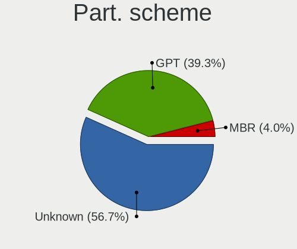
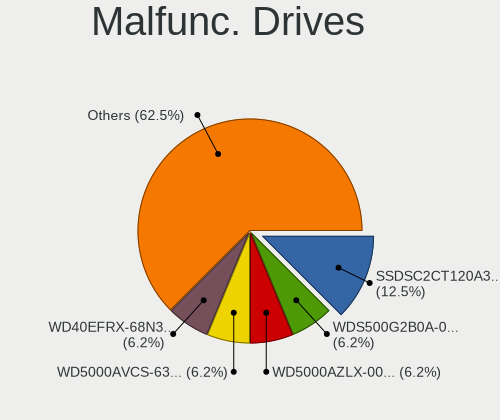
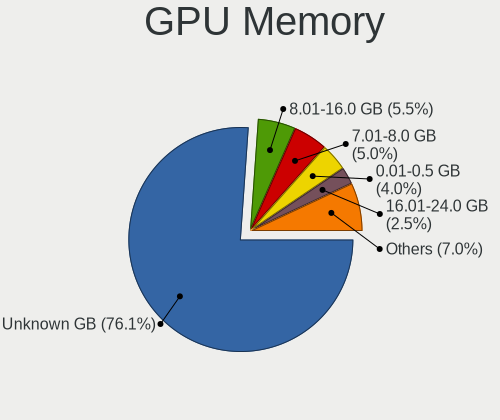
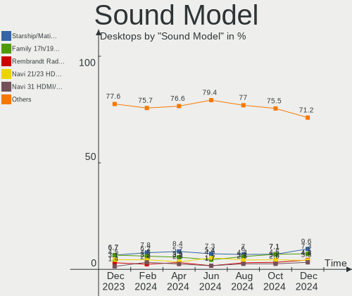

Fedora Hardware Trends (Desktop)
--------------------------------

A project to identify most popular hardware characteristics and track their change
over time based on data collected by Fedora users at https://Linux-Hardware.org.

Anyone can contribute to the study by uploading probes of their computers by
the [hw-probe](https://github.com/linuxhw/hw-probe) tool:

    sudo -E hw-probe -all -upload

Full-feature report is available here: https://linux-hardware.org/?view=trends&formfactor=desktop

Period: Feb, 2021.

Contents
--------

- [ OS                       ](#os)
- [ OS Family                ](#os-family)
- [ Kernel                   ](#kernel)
- [ Kernel Family            ](#kernel-family)
- [ Kernel Major Ver.        ](#kernel-major-ver)
- [ Arch                     ](#arch)
- [ DE                       ](#de)
- [ Display Server           ](#display-server)
- [ Display Manager          ](#display-manager)
- [ OS Lang                  ](#os-lang)
- [ Boot Mode                ](#boot-mode)
- [ Filesystem               ](#filesystem)
- [ Part. scheme             ](#part-scheme)
- [ Dual Boot with Linux/BSD ](#dual-boot-with-linux/bsd)
- [ Dual Boot (Win)          ](#dual-boot-win)
- [ Country                  ](#country)
- [ City                     ](#city)
- [ Vendor                   ](#vendor)
- [ Model                    ](#model)
- [ Model Family             ](#model-family)
- [ MFG Year                 ](#mfg-year)
- [ Form Factor              ](#form-factor)
- [ Secure Boot              ](#secure-boot)
- [ Coreboot                 ](#coreboot)
- [ RAM Size                 ](#ram-size)
- [ RAM Used                 ](#ram-used)
- [ Has CD-ROM               ](#has-cd-rom)
- [ Total Drives             ](#total-drives)
- [ Has Ethernet             ](#has-ethernet)
- [ Drive Vendor             ](#drive-vendor)
- [ Drive Model              ](#drive-model)
- [ HDD Vendor               ](#hdd-vendor)
- [ SSD Vendor               ](#ssd-vendor)
- [ Drive Kind               ](#drive-kind)
- [ Drive Connector          ](#drive-connector)
- [ Drive Size               ](#drive-size)
- [ Space Total              ](#space-total)
- [ Space Used               ](#space-used)
- [ Malfunc. Drives          ](#malfunc-drives)
- [ Malfunc. Drive Vendor    ](#malfunc-drive-vendor)
- [ Malfunc. HDD Vendor      ](#malfunc-hdd-vendor)
- [ Malfunc. Drive Kind      ](#malfunc-drive-kind)
- [ Failed Drives            ](#failed-drives)
- [ Failed Drive Vendor      ](#failed-drive-vendor)
- [ Drive Status             ](#drive-status)
- [ Storage Vendor           ](#storage-vendor)
- [ Storage Model            ](#storage-model)
- [ Storage Kind             ](#storage-kind)
- [ CPU Vendor               ](#cpu-vendor)
- [ CPU Model                ](#cpu-model)
- [ CPU Model Family         ](#cpu-model-family)
- [ CPU Cores                ](#cpu-cores)
- [ CPU Sockets              ](#cpu-sockets)
- [ CPU Threads              ](#cpu-threads)
- [ CPU Op-Modes             ](#cpu-op-modes)
- [ CPU Microcode            ](#cpu-microcode)
- [ CPU Microarch            ](#cpu-microarch)
- [ GPU Vendor               ](#gpu-vendor)
- [ GPU Model                ](#gpu-model)
- [ GPU Combo                ](#gpu-combo)
- [ GPU Driver               ](#gpu-driver)
- [ GPU Memory               ](#gpu-memory)
- [ Monitor Vendor           ](#monitor-vendor)
- [ Monitor Model            ](#monitor-model)
- [ Monitor Resolution       ](#monitor-resolution)
- [ Monitor Diagonal         ](#monitor-diagonal)
- [ Monitor Width            ](#monitor-width)
- [ Aspect Ratio             ](#aspect-ratio)
- [ Monitor Area             ](#monitor-area)
- [ Pixel Density            ](#pixel-density)
- [ Multiple Monitors        ](#multiple-monitors)
- [ Net Controller Vendor    ](#net-controller-vendor)
- [ Net Controller Model     ](#net-controller-model)
- [ Wireless Vendor          ](#wireless-vendor)
- [ Wireless Model           ](#wireless-model)
- [ Ethernet Vendor          ](#ethernet-vendor)
- [ Ethernet Model           ](#ethernet-model)
- [ Net Controller Kind      ](#net-controller-kind)
- [ Used Controller          ](#used-controller)
- [ NICs                     ](#nics)
- [ Memory Vendor            ](#memory-vendor)
- [ Memory Model             ](#memory-model)
- [ Memory Kind              ](#memory-kind)
- [ Memory Form Factor       ](#memory-form-factor)
- [ Memory Size              ](#memory-size)
- [ Memory Speed             ](#memory-speed)
- [ Sound Vendor             ](#sound-vendor)
- [ Sound Model              ](#sound-model)
- [ Camera Vendor            ](#camera-vendor)
- [ Camera Model             ](#camera-model)
- [ Fingerprint Vendor       ](#fingerprint-vendor)
- [ Fingerprint Model        ](#fingerprint-model)
- [ Chipcard Vendor          ](#chipcard-vendor)
- [ Chipcard Model           ](#chipcard-model)
- [ Printer Vendor           ](#printer-vendor)
- [ Printer Model            ](#printer-model)
- [ Scanner Vendor           ](#scanner-vendor)
- [ Scanner Model            ](#scanner-model)
- [ Bluetooth Vendor         ](#bluetooth-vendor)
- [ Bluetooth Model          ](#bluetooth-model)
- [ Unsupported Devices      ](#unsupported-devices)
- [ Unsupported Device Types ](#unsupported-device-types)

OS
--

Installed operating systems

| Name      | Desktops | Percent |
|-----------|----------|---------|
| Fedora 33 | 80       | 81.63%  |
| Fedora 32 | 12       | 12.24%  |
| Fedora 34 | 3        | 3.06%   |
| Fedora 31 | 1        | 1.02%   |
| Fedora 30 | 1        | 1.02%   |
| Fedora 27 | 1        | 1.02%   |

OS Family
---------

OS without a version

| Name   | Desktops | Percent |
|--------|----------|---------|
| Fedora | 98       | 100%    |

Kernel
------

Version of the Linux kernel

| Version                                              | Desktops | Percent |
|------------------------------------------------------|----------|---------|
| 5.10.15-200.fc33.x86_64                              | 18       | 18.37%  |
| 5.10.16-200.fc33.x86_64                              | 13       | 13.27%  |
| 5.10.13-200.fc33.x86_64                              | 10       | 10.2%   |
| 5.10.12-200.fc33.x86_64                              | 10       | 10.2%   |
| 5.10.11-200.fc33.x86_64                              | 10       | 10.2%   |
| 5.10.14-200.fc33.x86_64                              | 7        | 7.14%   |
| 5.10.16-100.fc32.x86_64                              | 5        | 5.1%    |
| 5.8.15-301.fc33.x86_64                               | 3        | 3.06%   |
| 5.10.15-100.fc32.x86_64                              | 3        | 3.06%   |
| 5.10.13-100.fc32.x86_64                              | 3        | 3.06%   |
| 5.11.0-156.fc34.x86_64                               | 2        | 2.04%   |
| 5.10.18-200.fc33.x86_64                              | 2        | 2.04%   |
| 5.10.10-200.fc33.x86_64                              | 2        | 2.04%   |
| 5.9.16-200.fc33.x86_64                               | 1        | 1.02%   |
| 5.9.16-100.fc32.x86_64                               | 1        | 1.02%   |
| 5.8.18-100.fc31.x86_64                               | 1        | 1.02%   |
| 5.6.13-100.fc30.i686                                 | 1        | 1.02%   |
| 5.11.2-300.fc34.x86_64                               | 1        | 1.02%   |
| 5.11.0-0.rc7.20210212git291009f656e8.151.fc33.x86_64 | 1        | 1.02%   |
| 5.10.2-200.rt20.1.fc33.ccrma.x86_64+rt               | 1        | 1.02%   |
| 5.10.17-200.fc33.x86_64                              | 1        | 1.02%   |
| 5.10.16-xanmod1                                      | 1        | 1.02%   |
| 4.18.19-100.fc27.x86_64                              | 1        | 1.02%   |

Kernel Family
-------------

Linux kernel without a distro release

| Version | Desktops | Percent |
|---------|----------|---------|
| 5.10.15 | 21       | 21.43%  |
| 5.10.16 | 19       | 19.39%  |
| 5.10.13 | 13       | 13.27%  |
| 5.10.12 | 10       | 10.2%   |
| 5.10.11 | 10       | 10.2%   |
| 5.10.14 | 7        | 7.14%   |
| 5.8.15  | 3        | 3.06%   |
| 5.11.0  | 3        | 3.06%   |
| 5.9.16  | 2        | 2.04%   |
| 5.10.18 | 2        | 2.04%   |
| 5.10.10 | 2        | 2.04%   |
| 5.8.18  | 1        | 1.02%   |
| 5.6.13  | 1        | 1.02%   |
| 5.11.2  | 1        | 1.02%   |
| 5.10.2  | 1        | 1.02%   |
| 5.10.17 | 1        | 1.02%   |
| 4.18.19 | 1        | 1.02%   |

Kernel Major Ver.
-----------------

Linux kernel major version

| Version | Desktops | Percent |
|---------|----------|---------|
| 5.10    | 86       | 87.76%  |
| 5.8     | 4        | 4.08%   |
| 5.11    | 4        | 4.08%   |
| 5.9     | 2        | 2.04%   |
| 5.6     | 1        | 1.02%   |
| 4.18    | 1        | 1.02%   |

Arch
----

OS architecture (x86_64, i586, etc.)

| Name   | Desktops | Percent |
|--------|----------|---------|
| x86_64 | 97       | 98.98%  |
| i686   | 1        | 1.02%   |

DE
--

Desktop Environment

| Name          | Desktops | Percent |
|---------------|----------|---------|
| GNOME         | 68       | 69.39%  |
| Cinnamon      | 6        | 6.12%   |
| Unknown       | 6        | 6.12%   |
| KDE5          | 5        | 5.1%    |
| KDE           | 5        | 5.1%    |
| X-Cinnamon    | 2        | 2.04%   |
| MATE          | 2        | 2.04%   |
| XFCE          | 1        | 1.02%   |
| LXQt          | 1        | 1.02%   |
| LXDE          | 1        | 1.02%   |
| GNOME Classic | 1        | 1.02%   |

Display Server
--------------

X11 or Wayland

| Name    | Desktops | Percent |
|---------|----------|---------|
| X11     | 50       | 51.02%  |
| Wayland | 40       | 40.82%  |
| Tty     | 6        | 6.12%   |
| Unknown | 2        | 2.04%   |

Display Manager
---------------

SDDM, LightDM, etc.

| Name    | Desktops | Percent |
|---------|----------|---------|
| Unknown | 63       | 64.29%  |
| GDM     | 18       | 18.37%  |
| TDM     | 7        | 7.14%   |
| SDDM    | 5        | 5.1%    |
| LightDM | 5        | 5.1%    |

OS Lang
-------

Language

| Lang  | Desktops | Percent |
|-------|----------|---------|
| en_US | 42       | 42.86%  |
| pt_BR | 7        | 7.14%   |
| en_GB | 7        | 7.14%   |
| de_DE | 7        | 7.14%   |
| en_AU | 6        | 6.12%   |
| en_NZ | 3        | 3.06%   |
| tr_TR | 2        | 2.04%   |
| ru_RU | 2        | 2.04%   |
| pl_PL | 2        | 2.04%   |
| it_IT | 2        | 2.04%   |
| fr_FR | 2        | 2.04%   |
| es_ES | 2        | 2.04%   |
| en_CA | 2        | 2.04%   |
| nl_BE | 1        | 1.02%   |
| mn_MN | 1        | 1.02%   |
| ja_JP | 1        | 1.02%   |
| it_CH | 1        | 1.02%   |
| hu_HU | 1        | 1.02%   |
| fr_CA | 1        | 1.02%   |
| fi_FI | 1        | 1.02%   |
| es_MX | 1        | 1.02%   |
| es_CO | 1        | 1.02%   |
| es_AR | 1        | 1.02%   |
| en_IN | 1        | 1.02%   |
| el_GR | 1        | 1.02%   |

Boot Mode
---------

EFI or BIOS

| Mode | Desktops | Percent |
|------|----------|---------|
| EFI  | 52       | 53.06%  |
| BIOS | 46       | 46.94%  |

Filesystem
----------

Type of filesystem

| Type  | Desktops | Percent |
|-------|----------|---------|
| Btrfs | 47       | 47.96%  |
| Ext4  | 43       | 43.88%  |
| Xfs   | 8        | 8.16%   |

Part. scheme
------------

Scheme of partitioning

| Type    | Desktops | Percent |
|---------|----------|---------|
| Unknown | 59       | 60.2%   |
| GPT     | 23       | 23.47%  |
| MBR     | 16       | 16.33%  |

Dual Boot with Linux/BSD
------------------------

Hosting more than one Linux/BSD

| Dual boot | Desktops | Percent |
|-----------|----------|---------|
| No        | 91       | 92.86%  |
| Yes       | 7        | 7.14%   |

Dual Boot (Win)
---------------

Hosting Linux and Windows

| Dual boot | Desktops | Percent |
|-----------|----------|---------|
| No        | 76       | 77.55%  |
| Yes       | 22       | 22.45%  |

Country
-------

Geographic location (country)

| Country        | Desktops | Percent |
|----------------|----------|---------|
| USA            | 20       | 20.41%  |
| Brazil         | 11       | 11.22%  |
| Germany        | 8        | 8.16%   |
| Australia      | 6        | 6.12%   |
| Switzerland    | 4        | 4.08%   |
| Turkey         | 3        | 3.06%   |
| Poland         | 3        | 3.06%   |
| Netherlands    | 3        | 3.06%   |
| Canada         | 3        | 3.06%   |
| New Zealand    | 2        | 2.04%   |
| Morocco        | 2        | 2.04%   |
| Lithuania      | 2        | 2.04%   |
| Italy          | 2        | 2.04%   |
| France         | 2        | 2.04%   |
| Finland        | 2        | 2.04%   |
| Colombia       | 2        | 2.04%   |
| Belgium        | 2        | 2.04%   |
| Ukraine        | 1        | 1.02%   |
| UK             | 1        | 1.02%   |
| Thailand       | 1        | 1.02%   |
| Taiwan         | 1        | 1.02%   |
| Spain          | 1        | 1.02%   |
| Russia         | 1        | 1.02%   |
| Portugal       | 1        | 1.02%   |
| Norway         | 1        | 1.02%   |
| Mongolia       | 1        | 1.02%   |
| Mexico         | 1        | 1.02%   |
| Kazakhstan     | 1        | 1.02%   |
| Japan          | 1        | 1.02%   |
| India          | 1        | 1.02%   |
| Hungary        | 1        | 1.02%   |
| Greece         | 1        | 1.02%   |
| Czech Republic | 1        | 1.02%   |
| China          | 1        | 1.02%   |
| Chile          | 1        | 1.02%   |
| Bulgaria       | 1        | 1.02%   |
| Argentina      | 1        | 1.02%   |
| Unknown        | 1        | 1.02%   |

City
----

Geographic location (city)

| City                   | Desktops | Percent |
|------------------------|----------|---------|
| Sydney                 | 5        | 5.1%    |
| Zimella                | 2        | 2.04%   |
| Longview               | 2        | 2.04%   |
| Istanbul               | 2        | 2.04%   |
| Espoo                  | 2        | 2.04%   |
| Auckland               | 2        | 2.04%   |
| Amsterdam              | 2        | 2.04%   |
| Šiauliai              | 1        | 1.02%   |
| Zurich                 | 1        | 1.02%   |
| Zofingen               | 1        | 1.02%   |
| Wuppertal              | 1        | 1.02%   |
| Wrocław               | 1        | 1.02%   |
| West Union             | 1        | 1.02%   |
| West Chester           | 1        | 1.02%   |
| Vitória               | 1        | 1.02%   |
| Varna                  | 1        | 1.02%   |
| Uxbridge               | 1        | 1.02%   |
| Ulan Bator             | 1        | 1.02%   |
| Tangier                | 1        | 1.02%   |
| Taipei                 | 1        | 1.02%   |
| São Paulo             | 1        | 1.02%   |
| South Milwaukee        | 1        | 1.02%   |
| Sopron                 | 1        | 1.02%   |
| Sint-Niklaas           | 1        | 1.02%   |
| Secaucus               | 1        | 1.02%   |
| Salsipuedes            | 1        | 1.02%   |
| Saint Marys            | 1        | 1.02%   |
| Rzeszów               | 1        | 1.02%   |
| Ribeirão Preto        | 1        | 1.02%   |
| Quilpué               | 1        | 1.02%   |
| Prague                 | 1        | 1.02%   |
| Porto                  | 1        | 1.02%   |
| Poelitz                | 1        | 1.02%   |
| Piensk                 | 1        | 1.02%   |
| Philadelphia           | 1        | 1.02%   |
| Paris                  | 1        | 1.02%   |
| Ottawa                 | 1        | 1.02%   |
| Nur-Sultan             | 1        | 1.02%   |
| Norderstedt            | 1        | 1.02%   |
| Niterói               | 1        | 1.02%   |
| New York               | 1        | 1.02%   |
| New Delhi              | 1        | 1.02%   |
| Nanning                | 1        | 1.02%   |
| Munich                 | 1        | 1.02%   |
| Mortsel                | 1        | 1.02%   |
| Montesson              | 1        | 1.02%   |
| Monschau               | 1        | 1.02%   |
| Milton                 | 1        | 1.02%   |
| Medellín              | 1        | 1.02%   |
| Marabá                | 1        | 1.02%   |
| Madrid                 | 1        | 1.02%   |
| Lancaster              | 1        | 1.02%   |
| Krasnoyarsk            | 1        | 1.02%   |
| Kharkiv                | 1        | 1.02%   |
| Kaunas                 | 1        | 1.02%   |
| Joinville              | 1        | 1.02%   |
| Jijoca de Jericoacoara | 1        | 1.02%   |
| Itajaí                | 1        | 1.02%   |
| Igoumenitsa            | 1        | 1.02%   |
| Hixson                 | 1        | 1.02%   |

Vendor
------

Motherboard manufacturer

| Name                | Desktops | Percent |
|---------------------|----------|---------|
| Gigabyte Technology | 24       | 24.49%  |
| ASUSTek Computer    | 24       | 24.49%  |
| ASRock              | 15       | 15.31%  |
| MSI                 | 9        | 9.18%   |
| Dell                | 9        | 9.18%   |
| Lenovo              | 4        | 4.08%   |
| Pegatron            | 2        | 2.04%   |
| Intel               | 2        | 2.04%   |
| Acer                | 2        | 2.04%   |
| Supermicro          | 1        | 1.02%   |
| Packard Bell        | 1        | 1.02%   |
| Hewlett-Packard     | 1        | 1.02%   |
| EVGA                | 1        | 1.02%   |
| eMachines           | 1        | 1.02%   |
| AMD                 | 1        | 1.02%   |
| Unknown             | 1        | 1.02%   |

Model
-----

Motherboard model

| Name                                    | Desktops | Percent |
|-----------------------------------------|----------|---------|
| Dell OptiPlex 390                       | 3        | 3.06%   |
| MSI MS-7A38                             | 2        | 2.04%   |
| Gigabyte B450M DS3H                     | 2        | 2.04%   |
| ASUS All Series                         | 2        | 2.04%   |
| ASRock H97M Pro4                        | 2        | 2.04%   |
| ASRock G41M-VS3                         | 2        | 2.04%   |
| Supermicro X8SIL                        | 1        | 1.02%   |
| Pegatron h8-1024ch                      | 1        | 1.02%   |
| Pegatron 100-5155                       | 1        | 1.02%   |
| Packard Bell ixtreme M3720              | 1        | 1.02%   |
| MSI MS-7B85                             | 1        | 1.02%   |
| MSI MS-7A93                             | 1        | 1.02%   |
| MSI MS-7A59                             | 1        | 1.02%   |
| MSI MS-7A40                             | 1        | 1.02%   |
| MSI MS-7A34                             | 1        | 1.02%   |
| MSI MS-7640                             | 1        | 1.02%   |
| MSI MS-7636                             | 1        | 1.02%   |
| Lenovo ThinkCentre M910t 10MNS04E4X     | 1        | 1.02%   |
| Lenovo ThinkCentre M58p 7220A72         | 1        | 1.02%   |
| Lenovo Legion T5 28IMB05 90NC00G4MZ     | 1        | 1.02%   |
| Lenovo IdeaCentre 510S-07ICB 90K8002PMW | 1        | 1.02%   |
| Intel X99 V102                          | 1        | 1.02%   |
| Intel H61                               | 1        | 1.02%   |
| HP EliteDesk 705 G3 Desktop Mini        | 1        | 1.02%   |
| Gigabyte Z97X-UD3H-BK                   | 1        | 1.02%   |
| Gigabyte Z97-D3H                        | 1        | 1.02%   |
| Gigabyte Z490 VISION D                  | 1        | 1.02%   |
| Gigabyte Z370M DS3H                     | 1        | 1.02%   |
| Gigabyte Z270-HD3P                      | 1        | 1.02%   |
| Gigabyte X570 I AORUS PRO WIFI          | 1        | 1.02%   |
| Gigabyte X570 AORUS ULTRA               | 1        | 1.02%   |
| Gigabyte H77N-WIFI                      | 1        | 1.02%   |
| Gigabyte H61M-S2P                       | 1        | 1.02%   |
| Gigabyte H110M-S2V                      | 1        | 1.02%   |
| Gigabyte G41MT-D3                       | 1        | 1.02%   |
| Gigabyte G31M-S2L                       | 1        | 1.02%   |
| Gigabyte G31M-ES2C                      | 1        | 1.02%   |
| Gigabyte F2A75M-HD2                     | 1        | 1.02%   |
| Gigabyte D525TUD                        | 1        | 1.02%   |
| Gigabyte B75M-D3H                       | 1        | 1.02%   |
| Gigabyte B250M-D3H                      | 1        | 1.02%   |
| Gigabyte AB350M-DS3H V2                 | 1        | 1.02%   |
| Gigabyte AB350-Gaming 3                 | 1        | 1.02%   |
| Gigabyte A520M DS3H                     | 1        | 1.02%   |
| Gigabyte A320M-S2H                      | 1        | 1.02%   |
| Gigabyte 970A-DS3P                      | 1        | 1.02%   |
| EVGA X299 MICRO                         | 1        | 1.02%   |
| eMachines EL1358G                       | 1        | 1.02%   |
| Dell XPS 8700                           | 1        | 1.02%   |
| Dell Vostro 3470                        | 1        | 1.02%   |
| Dell Studio XPS 8100                    | 1        | 1.02%   |
| Dell Studio 540                         | 1        | 1.02%   |
| Dell OptiPlex 780                       | 1        | 1.02%   |
| Dell OptiPlex 580                       | 1        | 1.02%   |
| ASUS Z77-A                              | 1        | 1.02%   |
| ASUS TUF Z390-PLUS GAMING               | 1        | 1.02%   |
| ASUS TUF GAMING X570-PRO                | 1        | 1.02%   |
| ASUS STRIX B250F GAMING                 | 1        | 1.02%   |
| ASUS SABERTOOTH Z77                     | 1        | 1.02%   |
| ASUS ROG STRIX B550-E GAMING            | 1        | 1.02%   |

Model Family
------------

Motherboard model prefix

| Name                  | Desktops | Percent |
|-----------------------|----------|---------|
| Dell OptiPlex         | 5        | 5.1%    |
| ASUS ROG              | 4        | 4.08%   |
| ASUS PRIME            | 4        | 4.08%   |
| MSI MS-7A38           | 2        | 2.04%   |
| Lenovo ThinkCentre    | 2        | 2.04%   |
| Gigabyte X570         | 2        | 2.04%   |
| Gigabyte B450M        | 2        | 2.04%   |
| Dell Studio           | 2        | 2.04%   |
| ASUS TUF              | 2        | 2.04%   |
| ASUS P8H61-M          | 2        | 2.04%   |
| ASUS All              | 2        | 2.04%   |
| ASRock H97M           | 2        | 2.04%   |
| ASRock G41M-VS3       | 2        | 2.04%   |
| Supermicro X8SIL      | 1        | 1.02%   |
| Pegatron h8-1024ch    | 1        | 1.02%   |
| Pegatron 100-5155     | 1        | 1.02%   |
| Packard Bell ixtreme  | 1        | 1.02%   |
| MSI MS-7B85           | 1        | 1.02%   |
| MSI MS-7A93           | 1        | 1.02%   |
| MSI MS-7A59           | 1        | 1.02%   |
| MSI MS-7A40           | 1        | 1.02%   |
| MSI MS-7A34           | 1        | 1.02%   |
| MSI MS-7640           | 1        | 1.02%   |
| MSI MS-7636           | 1        | 1.02%   |
| Lenovo Legion         | 1        | 1.02%   |
| Lenovo IdeaCentre     | 1        | 1.02%   |
| Intel X99             | 1        | 1.02%   |
| Intel H61             | 1        | 1.02%   |
| HP EliteDesk          | 1        | 1.02%   |
| Gigabyte Z97X-UD3H-BK | 1        | 1.02%   |
| Gigabyte Z97-D3H      | 1        | 1.02%   |
| Gigabyte Z490         | 1        | 1.02%   |
| Gigabyte Z370M        | 1        | 1.02%   |
| Gigabyte Z270-HD3P    | 1        | 1.02%   |
| Gigabyte H77N-WIFI    | 1        | 1.02%   |
| Gigabyte H61M-S2P     | 1        | 1.02%   |
| Gigabyte H110M-S2V    | 1        | 1.02%   |
| Gigabyte G41MT-D3     | 1        | 1.02%   |
| Gigabyte G31M-S2L     | 1        | 1.02%   |
| Gigabyte G31M-ES2C    | 1        | 1.02%   |
| Gigabyte F2A75M-HD2   | 1        | 1.02%   |
| Gigabyte D525TUD      | 1        | 1.02%   |
| Gigabyte B75M-D3H     | 1        | 1.02%   |
| Gigabyte B250M-D3H    | 1        | 1.02%   |
| Gigabyte AB350M-DS3H  | 1        | 1.02%   |
| Gigabyte AB350-Gaming | 1        | 1.02%   |
| Gigabyte A520M        | 1        | 1.02%   |
| Gigabyte A320M-S2H    | 1        | 1.02%   |
| Gigabyte 970A-DS3P    | 1        | 1.02%   |
| EVGA X299             | 1        | 1.02%   |
| eMachines EL1358G     | 1        | 1.02%   |
| Dell XPS              | 1        | 1.02%   |
| Dell Vostro           | 1        | 1.02%   |
| ASUS Z77-A            | 1        | 1.02%   |
| ASUS STRIX            | 1        | 1.02%   |
| ASUS SABERTOOTH       | 1        | 1.02%   |
| ASUS P5QL-E           | 1        | 1.02%   |
| ASUS P5Q-PRO          | 1        | 1.02%   |
| ASUS Maximus          | 1        | 1.02%   |
| ASUS M5A97            | 1        | 1.02%   |

MFG Year
--------

Motherboard manufacture year

| Year | Desktops | Percent |
|------|----------|---------|
| 2019 | 13       | 13.27%  |
| 2011 | 12       | 12.24%  |
| 2020 | 11       | 11.22%  |
| 2018 | 9        | 9.18%   |
| 2013 | 9        | 9.18%   |
| 2021 | 8        | 8.16%   |
| 2012 | 8        | 8.16%   |
| 2015 | 6        | 6.12%   |
| 2009 | 5        | 5.1%    |
| 2017 | 4        | 4.08%   |
| 2016 | 4        | 4.08%   |
| 2014 | 3        | 3.06%   |
| 2010 | 3        | 3.06%   |
| 2008 | 2        | 2.04%   |
| 2007 | 1        | 1.02%   |

Form Factor
-----------

Physical design of the computer

| Name    | Desktops | Percent |
|---------|----------|---------|
| Desktop | 98       | 100%    |

Secure Boot
-----------

Enabled or disabled

| State    | Desktops | Percent |
|----------|----------|---------|
| Disabled | 95       | 96.94%  |
| Enabled  | 3        | 3.06%   |

Coreboot
--------

Have coreboot on board

| Used | Desktops | Percent |
|------|----------|---------|
| No   | 98       | 100%    |

RAM Size
--------

Total RAM memory

| Size in GB  | Desktops | Percent |
|-------------|----------|---------|
| 16.01-24.0  | 28       | 28.57%  |
| 4.01-8.0    | 17       | 17.35%  |
| 8.01-16.0   | 16       | 16.33%  |
| 32.01-64.0  | 15       | 15.31%  |
| 3.01-4.0    | 15       | 15.31%  |
| 64.01-256.0 | 4        | 4.08%   |
| 24.01-32.0  | 2        | 2.04%   |
| 1.01-2.0    | 1        | 1.02%   |

RAM Used
--------

Used RAM memory

| Used GB   | Desktops | Percent |
|-----------|----------|---------|
| 2.01-3.0  | 33       | 33.67%  |
| 4.01-8.0  | 25       | 25.51%  |
| 1.01-2.0  | 19       | 19.39%  |
| 3.01-4.0  | 17       | 17.35%  |
| 8.01-16.0 | 3        | 3.06%   |
| 0.51-1.0  | 1        | 1.02%   |

Has CD-ROM
----------

Has CD-ROM on board

| Presented | Desktops | Percent |
|-----------|----------|---------|
| No        | 57       | 58.16%  |
| Yes       | 41       | 41.84%  |

Total Drives
------------

Number of drives on board

| Drives | Desktops | Percent |
|--------|----------|---------|
| 1      | 33       | 33.67%  |
| 2      | 31       | 31.63%  |
| 3      | 21       | 21.43%  |
| 4      | 7        | 7.14%   |
| 5      | 3        | 3.06%   |
| 14     | 1        | 1.02%   |
| 8      | 1        | 1.02%   |
| 7      | 1        | 1.02%   |

Has Ethernet
------------

Has Ethernet on board

| Presented | Desktops | Percent |
|-----------|----------|---------|
| Yes       | 96       | 97.96%  |
| No        | 2        | 2.04%   |

Drive Vendor
------------

Hard drive vendors

| Vendor              | Desktops | Drives | Percent |
|---------------------|----------|--------|---------|
| WDC                 | 38       | 48     | 20.65%  |
| Seagate             | 37       | 56     | 20.11%  |
| Samsung Electronics | 29       | 44     | 15.76%  |
| Kingston            | 15       | 15     | 8.15%   |
| Toshiba             | 10       | 10     | 5.43%   |
| Sandisk             | 9        | 10     | 4.89%   |
| Crucial             | 8        | 8      | 4.35%   |
| Patriot             | 4        | 5      | 2.17%   |
| Intel               | 4        | 4      | 2.17%   |
| A-DATA Technology   | 3        | 3      | 1.63%   |
| Silicon Motion      | 2        | 2      | 1.09%   |
| Phison              | 2        | 2      | 1.09%   |
| KingSpec            | 2        | 2      | 1.09%   |
| Intenso             | 2        | 2      | 1.09%   |
| Hitachi             | 2        | 2      | 1.09%   |
| Corsair             | 2        | 2      | 1.09%   |
| Unknown             | 1        | 1      | 0.54%   |
| Team                | 1        | 1      | 0.54%   |
| SPCC                | 1        | 1      | 0.54%   |
| PLEXTOR             | 1        | 1      | 0.54%   |
| OCZ                 | 1        | 1      | 0.54%   |
| Micron Technology   | 1        | 1      | 0.54%   |
| LITEON              | 1        | 1      | 0.54%   |
| Leven               | 1        | 1      | 0.54%   |
| KingDian            | 1        | 1      | 0.54%   |
| JMicron             | 1        | 1      | 0.54%   |
| JAMESDONKEY         | 1        | 1      | 0.54%   |
| HGST                | 1        | 1      | 0.54%   |
| China               | 1        | 1      | 0.54%   |
| ASMT                | 1        | 1      | 0.54%   |
| Apacer              | 1        | 1      | 0.54%   |

Drive Model
-----------

Hard drive models

| Model                                | Desktops | Percent |
|--------------------------------------|----------|---------|
| WDC WD10EZEX-08WN4A0 1TB             | 3        | 1.41%   |
| WDC WD10EADX-22TDHB0 1TB             | 3        | 1.41%   |
| Seagate ST3000DM008-2DM166 3TB       | 3        | 1.41%   |
| Seagate ST1000LM024 HN-M101MBB 1TB   | 3        | 1.41%   |
| Seagate Backup+ Hub BK 6TB           | 3        | 1.41%   |
| Samsung SSD 860 EVO 1TB              | 3        | 1.41%   |
| Samsung HD103SJ 1TB                  | 3        | 1.41%   |
| Kingston SA400S37240G 240GB SSD      | 3        | 1.41%   |
| Kingston SA400S37120G 120GB SSD      | 3        | 1.41%   |
| WDC WDS100T2B0A-00SM50 1TB SSD       | 2        | 0.94%   |
| WDC WD20EZRZ-00Z5HB0 2TB             | 2        | 0.94%   |
| WDC WD20EFRX-68EUZN0 2TB             | 2        | 0.94%   |
| WDC WD10EZEX-60WN4A0 1TB             | 2        | 0.94%   |
| Toshiba HDWD110 1TB                  | 2        | 0.94%   |
| Toshiba DT01ACA100 1TB               | 2        | 0.94%   |
| Silicon Motion NVMe SSD Drive 1024GB | 2        | 0.94%   |
| Seagate ST3500312CS 500GB            | 2        | 0.94%   |
| Seagate ST31000528AS 1TB             | 2        | 0.94%   |
| Sandisk NVMe SSD Drive 512GB         | 2        | 0.94%   |
| Sandisk NVMe SSD Drive 1TB           | 2        | 0.94%   |
| Samsung SSD 970 EVO 1TB              | 2        | 0.94%   |
| Samsung SSD 850 EVO 500GB            | 2        | 0.94%   |
| Samsung NVMe SSD Drive 512GB         | 2        | 0.94%   |
| Samsung NVMe SSD Drive 500GB         | 2        | 0.94%   |
| Patriot Burst 480GB SSD              | 2        | 0.94%   |
| Kingston SA400S37480G 480GB SSD      | 2        | 0.94%   |
| Crucial CT500MX500SSD1 500GB         | 2        | 0.94%   |
| WDC WDS100T2B0C-00PXH0 1TB           | 1        | 0.47%   |
| WDC WDBNCE2500PNC-WRSN 250GB SSD     | 1        | 0.47%   |
| WDC WD800BD-22MRA1 80GB              | 1        | 0.47%   |
| WDC WD6400AAKS-22A7B2 640GB          | 1        | 0.47%   |
| WDC WD60EMAZ-11LW3B0 6TB             | 1        | 0.47%   |
| WDC WD5000BEVT-22A0RT0 500GB         | 1        | 0.47%   |
| WDC WD5000AVVS-63H0B1 500GB          | 1        | 0.47%   |
| WDC WD5000AAKX-00ERMA0 500GB         | 1        | 0.47%   |
| WDC WD5000AAKX-001CA0 500GB          | 1        | 0.47%   |
| WDC WD5000AAKS-75A7B0 500GB          | 1        | 0.47%   |
| WDC WD5000AAKS-00TMA0 500GB          | 1        | 0.47%   |
| WDC WD5000AACS-00G8B1 500GB          | 1        | 0.47%   |
| WDC WD40EZRZ-00GXCB0 4TB             | 1        | 0.47%   |
| WDC WD40EFRX-68N32N0 4TB             | 1        | 0.47%   |
| WDC WD4005FZBX-00K5WB0 4TB           | 1        | 0.47%   |
| WDC WD4000YR-01PLB0 400GB            | 1        | 0.47%   |
| WDC WD3200AAKS-75L9A0 320GB          | 1        | 0.47%   |
| WDC WD3200AAJS-22L7A0 320GB          | 1        | 0.47%   |
| WDC WD3200AAJS-00YZCA0 320GB         | 1        | 0.47%   |
| WDC WD30EZRZ-00Z5HB0 3TB             | 1        | 0.47%   |
| WDC WD2500BPVT-24ZEST0 250GB         | 1        | 0.47%   |
| WDC WD2500BEVT-22ZCT0 250GB          | 1        | 0.47%   |
| WDC WD20EZRX-00D8PB0 2TB             | 1        | 0.47%   |
| WDC WD20EZAZ-00GGJB0 2TB             | 1        | 0.47%   |
| WDC WD20EFAX-68FB5N0 2TB             | 1        | 0.47%   |
| WDC WD10EZEX-22BN5A0 1TB             | 1        | 0.47%   |
| WDC WD10EURX-63FH1Y0 1TB             | 1        | 0.47%   |
| WDC WD10EADS-00M2B0 1TB              | 1        | 0.47%   |
| WDC WD1003FZEX-00MK2A0 1TB           | 1        | 0.47%   |
| WDC WD1003FZEX-00K3CA0 1TB           | 1        | 0.47%   |
| WDC WD1001FAES-75W7A0 1TB            | 1        | 0.47%   |
| WDC PC SA530 SDASB8Y1T00 1TB SSD     | 1        | 0.47%   |
| Unknown FM-25S2S-60GBP2 64GB SSD     | 1        | 0.47%   |

HDD Vendor
----------

Hard disk drive vendors

| Vendor              | Desktops | Drives | Percent |
|---------------------|----------|--------|---------|
| WDC                 | 36       | 43     | 41.86%  |
| Seagate             | 35       | 48     | 40.7%   |
| Toshiba             | 7        | 7      | 8.14%   |
| Samsung Electronics | 5        | 8      | 5.81%   |
| Hitachi             | 2        | 2      | 2.33%   |
| HGST                | 1        | 1      | 1.16%   |

SSD Vendor
----------

Solid state drive vendors

| Vendor              | Desktops | Drives | Percent |
|---------------------|----------|--------|---------|
| Samsung Electronics | 15       | 21     | 21.13%  |
| Kingston            | 13       | 13     | 18.31%  |
| Crucial             | 6        | 6      | 8.45%   |
| WDC                 | 4        | 4      | 5.63%   |
| SanDisk             | 4        | 4      | 5.63%   |
| Patriot             | 4        | 5      | 5.63%   |
| A-DATA Technology   | 3        | 3      | 4.23%   |
| Seagate             | 2        | 2      | 2.82%   |
| KingSpec            | 2        | 2      | 2.82%   |
| Intel               | 2        | 2      | 2.82%   |
| Corsair             | 2        | 2      | 2.82%   |
| Unknown             | 1        | 1      | 1.41%   |
| Toshiba             | 1        | 1      | 1.41%   |
| Team                | 1        | 1      | 1.41%   |
| SPCC                | 1        | 1      | 1.41%   |
| OCZ                 | 1        | 1      | 1.41%   |
| Micron Technology   | 1        | 1      | 1.41%   |
| LITEON              | 1        | 1      | 1.41%   |
| Leven               | 1        | 1      | 1.41%   |
| KingDian            | 1        | 1      | 1.41%   |
| JMicron             | 1        | 1      | 1.41%   |
| Intenso             | 1        | 1      | 1.41%   |
| China               | 1        | 1      | 1.41%   |
| ASMT                | 1        | 1      | 1.41%   |
| Apacer              | 1        | 1      | 1.41%   |

Drive Kind
----------

HDD or SSD

| Kind    | Desktops | Drives | Percent |
|---------|----------|--------|---------|
| HDD     | 67       | 109    | 42.68%  |
| SSD     | 57       | 78     | 36.31%  |
| NVMe    | 28       | 35     | 17.83%  |
| Unknown | 5        | 8      | 3.18%   |

Drive Connector
---------------

SATA, SAS, NVMe, etc.

| Type | Desktops | Drives | Percent |
|------|----------|--------|---------|
| SATA | 91       | 175    | 71.65%  |
| NVMe | 28       | 35     | 22.05%  |
| SAS  | 8        | 20     | 6.3%    |

Drive Size
----------

Size of hard drive

| Size in TB | Desktops | Drives | Percent |
|------------|----------|--------|---------|
| 0.01-0.5   | 66       | 89     | 48.18%  |
| 0.51-1.0   | 42       | 58     | 30.66%  |
| 1.01-2.0   | 12       | 15     | 8.76%   |
| 2.01-3.0   | 6        | 6      | 4.38%   |
| 4.01-10.0  | 6        | 8      | 4.38%   |
| 3.01-4.0   | 5        | 11     | 3.65%   |

Space Total
-----------

Amount of disk space available on the file system

| Size in GB     | Desktops | Percent |
|----------------|----------|---------|
| 1001-2000      | 19       | 19.39%  |
| 251-500        | 16       | 16.33%  |
| 501-1000       | 16       | 16.33%  |
| More than 3000 | 15       | 15.31%  |
| 101-250        | 13       | 13.27%  |
| 2001-3000      | 6        | 6.12%   |
| 51-100         | 4        | 4.08%   |
| Unknown        | 4        | 4.08%   |
| 1-20           | 3        | 3.06%   |
| 21-50          | 2        | 2.04%   |

Space Used
----------

Amount of used disk space

| Used GB        | Desktops | Percent |
|----------------|----------|---------|
| 101-250        | 17       | 17.35%  |
| 251-500        | 16       | 16.33%  |
| 21-50          | 15       | 15.31%  |
| 1-20           | 11       | 11.22%  |
| 1001-2000      | 9        | 9.18%   |
| 51-100         | 9        | 9.18%   |
| 501-1000       | 7        | 7.14%   |
| More than 3000 | 6        | 6.12%   |
| 2001-3000      | 4        | 4.08%   |
| Unknown        | 4        | 4.08%   |

Malfunc. Drives
---------------

Drive models with a malfunction

| Model                            | Desktops | Drives | Percent |
|----------------------------------|----------|--------|---------|
| WDC WD20EZRX-00D8PB0 2TB         | 1        | 2      | 11.11%  |
| WDC WD1001FAES-75W7A0 1TB        | 1        | 1      | 11.11%  |
| Unknown FM-25S2S-60GBP2 64GB SSD | 1        | 1      | 11.11%  |
| Toshiba MQ01ABD100 1TB           | 1        | 1      | 11.11%  |
| Seagate ST3320620AS 320GB        | 1        | 1      | 11.11%  |
| Samsung Electronics HD080HJ 80GB | 1        | 1      | 11.11%  |
| OCZ VERTEX4 128GB SSD            | 1        | 1      | 11.11%  |
| Kingston SHFS37A120G 120GB SSD   | 1        | 1      | 11.11%  |
| Hitachi HTS543225L9A300 250GB    | 1        | 1      | 11.11%  |

Malfunc. Drive Vendor
---------------------

Vendors of faulty drives

| Vendor              | Desktops | Drives | Percent |
|---------------------|----------|--------|---------|
| WDC                 | 2        | 3      | 22.22%  |
| Unknown             | 1        | 1      | 11.11%  |
| Toshiba             | 1        | 1      | 11.11%  |
| Seagate             | 1        | 1      | 11.11%  |
| Samsung Electronics | 1        | 1      | 11.11%  |
| OCZ                 | 1        | 1      | 11.11%  |
| Kingston            | 1        | 1      | 11.11%  |
| Hitachi             | 1        | 1      | 11.11%  |

Malfunc. HDD Vendor
-------------------

Vendors of faulty HDD drives

| Vendor              | Desktops | Drives | Percent |
|---------------------|----------|--------|---------|
| WDC                 | 2        | 3      | 33.33%  |
| Toshiba             | 1        | 1      | 16.67%  |
| Seagate             | 1        | 1      | 16.67%  |
| Samsung Electronics | 1        | 1      | 16.67%  |
| Hitachi             | 1        | 1      | 16.67%  |

Malfunc. Drive Kind
-------------------

Kinds of faulty drives

| Kind | Desktops | Drives | Percent |
|------|----------|--------|---------|
| HDD  | 5        | 7      | 62.5%   |
| SSD  | 3        | 3      | 37.5%   |

Failed Drives
-------------

Failed drive models

| Model                     | Desktops | Drives | Percent |
|---------------------------|----------|--------|---------|
| Seagate ST3320613AS 320GB | 1        | 1      | 100%    |

Failed Drive Vendor
-------------------

Failed drive vendors

| Vendor  | Desktops | Drives | Percent |
|---------|----------|--------|---------|
| Seagate | 1        | 1      | 100%    |

Drive Status
------------

Number of failed and malfunc. drives

| Status   | Desktops | Drives | Percent |
|----------|----------|--------|---------|
| Detected | 63       | 144    | 57.27%  |
| Works    | 38       | 75     | 34.55%  |
| Malfunc  | 8        | 10     | 7.27%   |
| Failed   | 1        | 1      | 0.91%   |

Storage Vendor
--------------

Storage controller vendors

| Vendor                       | Desktops | Percent |
|------------------------------|----------|---------|
| Intel                        | 60       | 44.44%  |
| AMD                          | 37       | 27.41%  |
| Samsung Electronics          | 11       | 8.15%   |
| Sandisk                      | 6        | 4.44%   |
| JMicron Technology           | 3        | 2.22%   |
| ASMedia Technology           | 3        | 2.22%   |
| Silicon Motion               | 2        | 1.48%   |
| Phison Electronics           | 2        | 1.48%   |
| Nvidia                       | 2        | 1.48%   |
| Micron/Crucial Technology    | 2        | 1.48%   |
| Kingston Technology Company  | 2        | 1.48%   |
| Toshiba America Info Systems | 1        | 0.74%   |
| Silicon Image                | 1        | 0.74%   |
| Marvell Technology Group     | 1        | 0.74%   |
| Lite-On Technology           | 1        | 0.74%   |
| KIOXIA                       | 1        | 0.74%   |

Storage Model
-------------

Storage controller models

| Model                                                                                   | Desktops | Percent |
|-----------------------------------------------------------------------------------------|----------|---------|
| AMD FCH SATA Controller [AHCI mode]                                                     | 27       | 14.75%  |
| Intel 200 Series PCH SATA controller [AHCI mode]                                        | 9        | 4.92%   |
| Samsung NVMe SSD Controller SM981/PM981/PM983                                           | 8        | 4.37%   |
| AMD 400 Series Chipset SATA Controller                                                  | 8        | 4.37%   |
| Intel 6 Series/C200 Series Chipset Family Desktop SATA Controller (IDE mode, ports 4-5) | 7        | 3.83%   |
| Intel 6 Series/C200 Series Chipset Family Desktop SATA Controller (IDE mode, ports 0-3) | 7        | 3.83%   |
| Intel NM10/ICH7 Family SATA Controller [IDE mode]                                       | 6        | 3.28%   |
| AMD SB7x0/SB8x0/SB9x0 IDE Controller                                                    | 6        | 3.28%   |
| Intel 7 Series/C210 Series Chipset Family 6-port SATA Controller [AHCI mode]            | 5        | 2.73%   |
| AMD SB7x0/SB8x0/SB9x0 SATA Controller [IDE mode]                                        | 5        | 2.73%   |
| AMD 300 Series Chipset SATA Controller                                                  | 5        | 2.73%   |
| Sandisk WD Blue SN550 NVMe SSD                                                          | 4        | 2.19%   |
| Intel SATA Controller [RAID mode]                                                       | 4        | 2.19%   |
| Intel 9 Series Chipset Family SATA Controller [AHCI Mode]                               | 4        | 2.19%   |
| Intel 82801G (ICH7 Family) IDE Controller                                               | 4        | 2.19%   |
| Intel 400 Series Chipset Family SATA AHCI Controller                                    | 4        | 2.19%   |
| Intel Cannon Lake PCH SATA AHCI Controller                                              | 3        | 1.64%   |
| Intel 82801JI (ICH10 Family) 4 port SATA IDE Controller #1                              | 3        | 1.64%   |
| Intel 82801JI (ICH10 Family) 2 port SATA IDE Controller #2                              | 3        | 1.64%   |
| ASMedia ASM1062 Serial ATA Controller                                                   | 3        | 1.64%   |
| AMD SB7x0/SB8x0/SB9x0 SATA Controller [AHCI mode]                                       | 3        | 1.64%   |
| AMD FCH SATA Controller D                                                               | 3        | 1.64%   |
| Silicon Motion SM2262/SM2262EN SSD Controller                                           | 2        | 1.09%   |
| Samsung NVMe SSD Controller SM961/PM961/SM963                                           | 2        | 1.09%   |
| Kingston Company A2000 NVMe SSD                                                         | 2        | 1.09%   |
| JMicron JMB363 SATA/IDE Controller                                                      | 2        | 1.09%   |
| Intel SSD 660P Series                                                                   | 2        | 1.09%   |
| Intel 8 Series/C220 Series Chipset Family 6-port SATA Controller 1 [AHCI mode]          | 2        | 1.09%   |
| Intel 6 Series/C200 Series Chipset Family 6 port Desktop SATA AHCI Controller           | 2        | 1.09%   |
| Intel 5 Series/3400 Series Chipset 4 port SATA IDE Controller                           | 2        | 1.09%   |
| Intel 5 Series/3400 Series Chipset 2 port SATA IDE Controller                           | 2        | 1.09%   |
| Intel 4 Series Chipset PT IDER Controller                                               | 2        | 1.09%   |
| AMD SATA controller                                                                     | 2        | 1.09%   |
| Toshiba America Info Systems XG6 NVMe SSD Controller                                    | 1        | 0.55%   |
| Silicon Image SiI 3132 Serial ATA Raid II Controller                                    | 1        | 0.55%   |
| Sandisk WD Black SN750 / PC SN730 NVMe SSD                                              | 1        | 0.55%   |
| Sandisk WD Black NVMe SSD                                                               | 1        | 0.55%   |
| Sandisk WD Black 2018/SN750 / PC SN720 NVMe SSD                                         | 1        | 0.55%   |
| Samsung NVMe SSD Controller SM951/PM951                                                 | 1        | 0.55%   |
| Samsung NVMe SSD Controller PM9A1/980PRO                                                | 1        | 0.55%   |
| Phison E16 PCIe4 NVMe Controller                                                        | 1        | 0.55%   |
| Phison E12 NVMe Controller                                                              | 1        | 0.55%   |
| Nvidia MCP73 IDE Controller                                                             | 1        | 0.55%   |
| Nvidia MCP61 SATA Controller                                                            | 1        | 0.55%   |
| Nvidia GeForce 7100/nForce 630i SATA                                                    | 1        | 0.55%   |
| Micron/Crucial P1 NVMe PCIe SSD                                                         | 1        | 0.55%   |
| Micron/Crucial Non-Volatile memory controller                                           | 1        | 0.55%   |
| Marvell Group 88SE6111/6121 SATA II / PATA Controller                                   | 1        | 0.55%   |
| Lite-On Non-Volatile memory controller                                                  | 1        | 0.55%   |
| KIOXIA NVMe SSD                                                                         | 1        | 0.55%   |
| JMicron JMB368 IDE controller                                                           | 1        | 0.55%   |
| Intel Q170/Q150/B150/H170/H110/Z170/CM236 Chipset SATA Controller [AHCI Mode]           | 1        | 0.55%   |
| Intel NM10/ICH7 Family SATA Controller [AHCI mode]                                      | 1        | 0.55%   |
| Intel C610/X99 series chipset 6-Port SATA Controller [AHCI mode]                        | 1        | 0.55%   |
| Intel Atom Processor E3800 Series SATA IDE Controller                                   | 1        | 0.55%   |
| Intel 82801JD/DO (ICH10 Family) SATA AHCI Controller                                    | 1        | 0.55%   |
| Intel 82801JD/DO (ICH10 Family) 4-port SATA IDE Controller                              | 1        | 0.55%   |
| Intel 82801JD/DO (ICH10 Family) 2-port SATA IDE Controller                              | 1        | 0.55%   |
| Intel 82801IR/IO/IH (ICH9R/DO/DH) 4 port SATA Controller [IDE mode]                     | 1        | 0.55%   |
| Intel 82801I (ICH9 Family) 2 port SATA Controller [IDE mode]                            | 1        | 0.55%   |

Storage Kind
------------

Kind of storage controller (IDE, SATA, NVMe, SAS, ...)

| Kind | Desktops | Percent |
|------|----------|---------|
| SATA | 73       | 52.9%   |
| IDE  | 33       | 23.91%  |
| NVMe | 28       | 20.29%  |
| RAID | 4        | 2.9%    |

CPU Vendor
----------

Processor vendors

| Vendor | Desktops | Percent |
|--------|----------|---------|
| Intel  | 60       | 61.22%  |
| AMD    | 38       | 38.78%  |

CPU Model
---------

Processor models

| Model                                       | Desktops | Percent |
|---------------------------------------------|----------|---------|
| Intel Core i7-7700 CPU @ 3.60GHz            | 3        | 3.06%   |
| Intel Core 2 Duo CPU E8400 @ 3.00GHz        | 3        | 3.06%   |
| AMD FX-6300 Six-Core Processor              | 3        | 3.06%   |
| Intel Pentium Dual-Core CPU E5200 @ 2.50GHz | 2        | 2.04%   |
| Intel Core i7-4790K CPU @ 4.00GHz           | 2        | 2.04%   |
| Intel Core i7-3770K CPU @ 3.50GHz           | 2        | 2.04%   |
| Intel Core i5-7400 CPU @ 3.00GHz            | 2        | 2.04%   |
| Intel Core i5-3570K CPU @ 3.40GHz           | 2        | 2.04%   |
| Intel Core i5-10400 CPU @ 2.90GHz           | 2        | 2.04%   |
| Intel Core i5 CPU 650 @ 3.20GHz             | 2        | 2.04%   |
| Intel Core i3-2100 CPU @ 3.10GHz            | 2        | 2.04%   |
| AMD Ryzen 9 5900X 12-Core Processor         | 2        | 2.04%   |
| AMD Ryzen 7 5800X 8-Core Processor          | 2        | 2.04%   |
| AMD Ryzen 7 3700X 8-Core Processor          | 2        | 2.04%   |
| AMD Ryzen 5 3600X 6-Core Processor          | 2        | 2.04%   |
| AMD Ryzen 5 3600 6-Core Processor           | 2        | 2.04%   |
| Intel Xeon CPU X3440 @ 2.53GHz              | 1        | 1.02%   |
| Intel Xeon CPU X3363 @ 2.83GHz              | 1        | 1.02%   |
| Intel Xeon CPU L3110 @ 3.00GHz              | 1        | 1.02%   |
| Intel Xeon CPU E5-2678 v3 @ 2.50GHz         | 1        | 1.02%   |
| Intel Xeon CPU E3-1230 V2 @ 3.30GHz         | 1        | 1.02%   |
| Intel Pentium CPU G645 @ 2.90GHz            | 1        | 1.02%   |
| Intel Core i9-7900X CPU @ 3.30GHz           | 1        | 1.02%   |
| Intel Core i9-10900X CPU @ 3.70GHz          | 1        | 1.02%   |
| Intel Core i7-9700K CPU @ 3.60GHz           | 1        | 1.02%   |
| Intel Core i7-4790 CPU @ 3.60GHz            | 1        | 1.02%   |
| Intel Core i7-4770S CPU @ 3.10GHz           | 1        | 1.02%   |
| Intel Core i7-3770 CPU @ 3.40GHz            | 1        | 1.02%   |
| Intel Core i7-2600 CPU @ 3.40GHz            | 1        | 1.02%   |
| Intel Core i7-10700K CPU @ 3.80GHz          | 1        | 1.02%   |
| Intel Core i5-9400F CPU @ 2.90GHz           | 1        | 1.02%   |
| Intel Core i5-9400 CPU @ 2.90GHz            | 1        | 1.02%   |
| Intel Core i5-8400 CPU @ 2.80GHz            | 1        | 1.02%   |
| Intel Core i5-7600K CPU @ 3.80GHz           | 1        | 1.02%   |
| Intel Core i5-4690 CPU @ 3.50GHz            | 1        | 1.02%   |
| Intel Core i5-4460 CPU @ 3.20GHz            | 1        | 1.02%   |
| Intel Core i5-3470 CPU @ 3.20GHz            | 1        | 1.02%   |
| Intel Core i5-2310 CPU @ 2.90GHz            | 1        | 1.02%   |
| Intel Core i5-10600KF CPU @ 4.10GHz         | 1        | 1.02%   |
| Intel Core i3-6100 CPU @ 3.70GHz            | 1        | 1.02%   |
| Intel Core i3-4330 CPU @ 3.50GHz            | 1        | 1.02%   |
| Intel Core i3-3240 CPU @ 3.40GHz            | 1        | 1.02%   |
| Intel Core i3-3220 CPU @ 3.30GHz            | 1        | 1.02%   |
| Intel Core i3-3210 CPU @ 3.20GHz            | 1        | 1.02%   |
| Intel Core i3-2120 CPU @ 3.30GHz            | 1        | 1.02%   |
| Intel Core i3 CPU 540 @ 3.07GHz             | 1        | 1.02%   |
| Intel Core 2 Quad CPU Q9400 @ 2.66GHz       | 1        | 1.02%   |
| Intel Core 2 Quad CPU Q8200 @ 2.33GHz       | 1        | 1.02%   |
| Intel Core 2 Quad CPU Q6600 @ 2.40GHz       | 1        | 1.02%   |
| Intel Core 2 Duo CPU E7500 @ 2.93GHz        | 1        | 1.02%   |
| Intel Core 2 Duo CPU E4600 @ 2.40GHz        | 1        | 1.02%   |
| Intel Core 2 CPU 6600 @ 2.40GHz             | 1        | 1.02%   |
| Intel Celeron CPU J1900 @ 1.99GHz           | 1        | 1.02%   |
| Intel Atom CPU D525 @ 1.80GHz               | 1        | 1.02%   |
| AMD Ryzen 9 3950X 16-Core Processor         | 1        | 1.02%   |
| AMD Ryzen 9 3900XT 12-Core Processor        | 1        | 1.02%   |
| AMD Ryzen 7 3800X 8-Core Processor          | 1        | 1.02%   |
| AMD Ryzen 7 2700X Eight-Core Processor      | 1        | 1.02%   |
| AMD Ryzen 7 2700 Eight-Core Processor       | 1        | 1.02%   |
| AMD Ryzen 7 1700X Eight-Core Processor      | 1        | 1.02%   |

CPU Model Family
----------------

Processor model prefix

| Model                   | Desktops | Percent |
|-------------------------|----------|---------|
| Intel Core i5           | 17       | 17.35%  |
| Intel Core i7           | 13       | 13.27%  |
| Intel Core i3           | 9        | 9.18%   |
| AMD Ryzen 7             | 9        | 9.18%   |
| AMD Ryzen 5             | 8        | 8.16%   |
| Intel Xeon              | 5        | 5.1%    |
| Intel Core 2 Duo        | 5        | 5.1%    |
| AMD FX                  | 5        | 5.1%    |
| AMD Ryzen 9             | 4        | 4.08%   |
| Intel Core 2 Quad       | 3        | 3.06%   |
| Intel Pentium Dual-Core | 2        | 2.04%   |
| Intel Core i9           | 2        | 2.04%   |
| AMD Ryzen 3             | 2        | 2.04%   |
| AMD Athlon II X2        | 2        | 2.04%   |
| AMD A8                  | 2        | 2.04%   |
| Intel Pentium           | 1        | 1.02%   |
| Intel Core 2            | 1        | 1.02%   |
| Intel Celeron           | 1        | 1.02%   |
| Intel Atom              | 1        | 1.02%   |
| AMD PRO A10             | 1        | 1.02%   |
| AMD Phenom II X6        | 1        | 1.02%   |
| AMD Phenom II X4        | 1        | 1.02%   |
| AMD Athlon              | 1        | 1.02%   |
| AMD A6                  | 1        | 1.02%   |
| AMD A10                 | 1        | 1.02%   |

CPU Cores
---------

Number of processor cores

| Number | Desktops | Percent |
|--------|----------|---------|
| 4      | 33       | 33.67%  |
| 2      | 30       | 30.61%  |
| 6      | 13       | 13.27%  |
| 8      | 11       | 11.22%  |
| 12     | 4        | 4.08%   |
| 3      | 3        | 3.06%   |
| 10     | 2        | 2.04%   |
| 16     | 1        | 1.02%   |
| 1      | 1        | 1.02%   |

CPU Sockets
-----------

Number of sockets

| Number | Desktops | Percent |
|--------|----------|---------|
| 1      | 98       | 100%    |

CPU Threads
-----------

Threads per core (Hyper-Threading)

| Number | Desktops | Percent |
|--------|----------|---------|
| 2      | 65       | 66.33%  |
| 1      | 33       | 33.67%  |

CPU Op-Modes
------------

CPU Operation Modes (32-bit, 64-bit)

| Op mode        | Desktops | Percent |
|----------------|----------|---------|
| 32-bit, 64-bit | 98       | 100%    |

CPU Microcode
-------------

Microcode number

| Number     | Desktops | Percent |
|------------|----------|---------|
| 0x306a9    | 9        | 9.18%   |
| 0x1067a    | 8        | 8.16%   |
| 0x306c3    | 7        | 7.14%   |
| 0x08701021 | 7        | 7.14%   |
| 0x906e9    | 5        | 5.1%    |
| 0x206a7    | 5        | 5.1%    |
| 0x06000852 | 5        | 5.1%    |
| Unknown    | 5        | 5.1%    |
| 0x0a201009 | 4        | 4.08%   |
| 0x0800820d | 4        | 4.08%   |
| 0x08701013 | 3        | 3.06%   |
| 0x010000c8 | 3        | 3.06%   |
| 0xa0655    | 2        | 2.04%   |
| 0xa0653    | 2        | 2.04%   |
| 0x20655    | 2        | 2.04%   |
| 0x08101016 | 2        | 2.04%   |
| 0x08001138 | 2        | 2.04%   |
| 0x08001137 | 2        | 2.04%   |
| 0x06003106 | 2        | 2.04%   |
| 0x06001119 | 2        | 2.04%   |
| 0x906ed    | 1        | 1.02%   |
| 0x906ec    | 1        | 1.02%   |
| 0x906ea    | 1        | 1.02%   |
| 0x6fd      | 1        | 1.02%   |
| 0x6fb      | 1        | 1.02%   |
| 0x6f6      | 1        | 1.02%   |
| 0x506e3    | 1        | 1.02%   |
| 0x50657    | 1        | 1.02%   |
| 0x50654    | 1        | 1.02%   |
| 0x306f2    | 1        | 1.02%   |
| 0x20652    | 1        | 1.02%   |
| 0x106e5    | 1        | 1.02%   |
| 0x106ca    | 1        | 1.02%   |
| 0x10677    | 1        | 1.02%   |
| 0x10676    | 1        | 1.02%   |
| 0x0600611a | 1        | 1.02%   |
| 0x010000dc | 1        | 1.02%   |

CPU Microarch
-------------

Microarchitecture

| Name        | Desktops | Percent |
|-------------|----------|---------|
| Zen 2       | 10       | 10.2%   |
| Penryn      | 10       | 10.2%   |
| KabyLake    | 10       | 10.2%   |
| IvyBridge   | 10       | 10.2%   |
| Haswell     | 8        | 8.16%   |
| Piledriver  | 7        | 7.14%   |
| Zen         | 6        | 6.12%   |
| SandyBridge | 6        | 6.12%   |
| Zen+        | 4        | 4.08%   |
| K10         | 4        | 4.08%   |
| CometLake   | 4        | 4.08%   |
| Unknown     | 4        | 4.08%   |
| Westmere    | 3        | 3.06%   |
| Skylake     | 3        | 3.06%   |
| Core        | 3        | 3.06%   |
| Steamroller | 2        | 2.04%   |
| Silvermont  | 1        | 1.02%   |
| Nehalem     | 1        | 1.02%   |
| Excavator   | 1        | 1.02%   |
| Bonnell     | 1        | 1.02%   |

GPU Vendor
----------

Vendors of graphics cards

| Vendor                     | Desktops | Percent |
|----------------------------|----------|---------|
| Nvidia                     | 37       | 35.58%  |
| AMD                        | 35       | 33.65%  |
| Intel                      | 31       | 29.81%  |
| Matrox Electronics Systems | 1        | 0.96%   |

GPU Model
---------

Graphics card models

| Model                                                                       | Desktops | Percent |
|-----------------------------------------------------------------------------|----------|---------|
| AMD Ellesmere [Radeon RX 470/480/570/570X/580/580X/590]                     | 9        | 8.65%   |
| Intel 2nd Generation Core Processor Family Integrated Graphics Controller   | 6        | 5.77%   |
| Intel Xeon E3-1200 v2/3rd Gen Core processor Graphics Controller            | 5        | 4.81%   |
| Nvidia GP107 [GeForce GTX 1050 Ti]                                          | 4        | 3.85%   |
| Intel Xeon E3-1200 v3/4th Gen Core Processor Integrated Graphics Controller | 4        | 3.85%   |
| Intel 4 Series Chipset Integrated Graphics Controller                       | 4        | 3.85%   |
| AMD Navi 10 [Radeon RX 5600 OEM/5600 XT / 5700/5700 XT]                     | 4        | 3.85%   |
| AMD Baffin [Radeon RX 460/560D / Pro 450/455/460/555/555X/560/560X]         | 4        | 3.85%   |
| Nvidia GP106 [GeForce GTX 1060 3GB]                                         | 3        | 2.88%   |
| Intel CometLake-S GT2 [UHD Graphics 630]                                    | 3        | 2.88%   |
| AMD Baffin [Radeon RX 550 640SP / RX 560/560X]                              | 3        | 2.88%   |
| Nvidia GP106 [GeForce GTX 1060 6GB]                                         | 2        | 1.92%   |
| Nvidia GP104 [GeForce GTX 1070]                                             | 2        | 1.92%   |
| Nvidia GM204 [GeForce GTX 970]                                              | 2        | 1.92%   |
| Nvidia GK208B [GeForce GT 710]                                              | 2        | 1.92%   |
| Intel HD Graphics 630                                                       | 2        | 1.92%   |
| AMD Navi 21 [Radeon RX 6800/6800 XT / 6900 XT]                              | 2        | 1.92%   |
| Nvidia TU116 [GeForce GTX 1660]                                             | 1        | 0.96%   |
| Nvidia TU116 [GeForce GTX 1660 Ti]                                          | 1        | 0.96%   |
| Nvidia TU116 [GeForce GTX 1660 SUPER]                                       | 1        | 0.96%   |
| Nvidia TU116 [GeForce GTX 1650]                                             | 1        | 0.96%   |
| Nvidia TU116 [GeForce GTX 1650 SUPER]                                       | 1        | 0.96%   |
| Nvidia GT218 [GeForce 210]                                                  | 1        | 0.96%   |
| Nvidia GP107 [GeForce GTX 1050]                                             | 1        | 0.96%   |
| Nvidia GP104 [GeForce GTX 1080]                                             | 1        | 0.96%   |
| Nvidia GP102 [TITAN X]                                                      | 1        | 0.96%   |
| Nvidia GP102 [GeForce GTX 1080 Ti]                                          | 1        | 0.96%   |
| Nvidia GK208B [GeForce GT 730]                                              | 1        | 0.96%   |
| Nvidia GK107 [GeForce GTX 650]                                              | 1        | 0.96%   |
| Nvidia GK107 [GeForce GT 740]                                               | 1        | 0.96%   |
| Nvidia GK104 [GeForce GTX 660 Ti]                                           | 1        | 0.96%   |
| Nvidia GF119 [GeForce GT 520]                                               | 1        | 0.96%   |
| Nvidia GF108 [GeForce GT 630]                                               | 1        | 0.96%   |
| Nvidia GF104 [GeForce GTX 460]                                              | 1        | 0.96%   |
| Nvidia GA104 [GeForce RTX 3070]                                             | 1        | 0.96%   |
| Nvidia G84 [GeForce 8400 GS]                                                | 1        | 0.96%   |
| Nvidia G71 [GeForce 7950 GT]                                                | 1        | 0.96%   |
| Nvidia C73 [GeForce 7100 / nForce 630i]                                     | 1        | 0.96%   |
| Nvidia C61 [GeForce 6150SE nForce 430]                                      | 1        | 0.96%   |
| Matrox Electronics Systems MGA G200eW WPCM450                               | 1        | 0.96%   |
| Intel HD Graphics 530                                                       | 1        | 0.96%   |
| Intel Core Processor Integrated Graphics Controller                         | 1        | 0.96%   |
| Intel CoffeeLake-S GT2 [UHD Graphics 630]                                   | 1        | 0.96%   |
| Intel Atom Processor Z36xxx/Z37xxx Series Graphics & Display                | 1        | 0.96%   |
| Intel Atom Processor D4xx/D5xx/N4xx/N5xx Integrated Graphics Controller     | 1        | 0.96%   |
| Intel 82G33/G31 Express Integrated Graphics Controller                      | 1        | 0.96%   |
| Intel 82945G/GZ Integrated Graphics Controller                              | 1        | 0.96%   |
| AMD Wani [Radeon R5/R6/R7 Graphics]                                         | 1        | 0.96%   |
| AMD Vega 20 [Radeon VII]                                                    | 1        | 0.96%   |
| AMD Turks XT [Radeon HD 6670/7670]                                          | 1        | 0.96%   |
| AMD Tonga XT / Amethyst XT [Radeon R9 380X / R9 M295X]                      | 1        | 0.96%   |
| AMD Tobago PRO [Radeon R7 360 / R9 360 OEM]                                 | 1        | 0.96%   |
| AMD RV770 [Radeon HD 4850]                                                  | 1        | 0.96%   |
| AMD RV620 LE [Radeon HD 3450]                                               | 1        | 0.96%   |
| AMD RS880M [Mobility Radeon HD 4225/4250]                                   | 1        | 0.96%   |
| AMD Raven Ridge [Radeon Vega Series / Radeon Vega Mobile Series]            | 1        | 0.96%   |
| AMD Navi 14 [Radeon RX 5500/5500M / Pro 5500M]                              | 1        | 0.96%   |
| AMD Cedar [Radeon HD 7350/8350 / R5 220]                                    | 1        | 0.96%   |
| AMD Cedar [Radeon HD 5000/6000/7350/8350 Series]                            | 1        | 0.96%   |
| AMD Caicos [Radeon HD 6450/7450/8450 / R5 230 OEM]                          | 1        | 0.96%   |

GPU Combo
---------

Combinations of graphics cards

| Name           | Desktops | Percent |
|----------------|----------|---------|
| 1 x Nvidia     | 34       | 34.69%  |
| 1 x AMD        | 34       | 34.69%  |
| 1 x Intel      | 26       | 26.53%  |
| Intel + Nvidia | 2        | 2.04%   |
| 1 x Matrox     | 1        | 1.02%   |
| Intel + AMD    | 1        | 1.02%   |

GPU Driver
----------

Free vs proprietary

| Driver      | Desktops | Percent |
|-------------|----------|---------|
| Free        | 75       | 76.53%  |
| Proprietary | 20       | 20.41%  |
| Unknown     | 3        | 3.06%   |

GPU Memory
----------

Total video memory

| Size in GB | Desktops | Percent |
|------------|----------|---------|
| Unknown    | 40       | 40.82%  |
| 3.01-4.0   | 12       | 12.24%  |
| 1.01-2.0   | 12       | 12.24%  |
| 7.01-8.0   | 11       | 11.22%  |
| 0.51-1.0   | 7        | 7.14%   |
| 0.01-0.5   | 6        | 6.12%   |
| 5.01-6.0   | 5        | 5.1%    |
| 8.01-16.0  | 4        | 4.08%   |
| 2.01-3.0   | 1        | 1.02%   |

Monitor Vendor
--------------

Monitor vendors

| Vendor               | Desktops | Percent |
|----------------------|----------|---------|
| Samsung Electronics  | 21       | 18.42%  |
| Goldstar             | 19       | 16.67%  |
| Dell                 | 16       | 14.04%  |
| Acer                 | 7        | 6.14%   |
| Ancor Communications | 6        | 5.26%   |
| ViewSonic            | 5        | 4.39%   |
| Iiyama               | 4        | 3.51%   |
| Hewlett-Packard      | 4        | 3.51%   |
| BenQ                 | 4        | 3.51%   |
| AOC                  | 4        | 3.51%   |
| Lenovo               | 3        | 2.63%   |
| Gateway              | 3        | 2.63%   |
| ___                  | 1        | 0.88%   |
| Vizio                | 1        | 0.88%   |
| Vestel Elektronik    | 1        | 0.88%   |
| Valve                | 1        | 0.88%   |
| Toshiba              | 1        | 0.88%   |
| SNC                  | 1        | 0.88%   |
| Sceptre Tech         | 1        | 0.88%   |
| RTK                  | 1        | 0.88%   |
| Philips              | 1        | 0.88%   |
| Panasonic            | 1        | 0.88%   |
| NEC Computers        | 1        | 0.88%   |
| Matrox               | 1        | 0.88%   |
| LG Electronics       | 1        | 0.88%   |
| HPN                  | 1        | 0.88%   |
| Eizo                 | 1        | 0.88%   |
| Compaq Computer      | 1        | 0.88%   |
| Belinea              | 1        | 0.88%   |
| ASUSTek Computer     | 1        | 0.88%   |

Monitor Model
-------------

Monitor models

| Model                                                                                 | Desktops | Percent |
|---------------------------------------------------------------------------------------|----------|---------|
| Samsung Electronics SyncMaster SAM01D3 1440x900 410x260mm 19.1-inch                   | 2        | 1.6%    |
| Samsung Electronics LCD Monitor SAM0F13 3840x2160 1872x1053mm 84.6-inch               | 2        | 1.6%    |
| Goldstar Ultra HD GSM5B09 3840x2160 600x340mm 27.2-inch                               | 2        | 1.6%    |
| Goldstar HD GSM5ACB 1366x768 410x230mm 18.5-inch                                      | 2        | 1.6%    |
| Gateway FPD2275W GWY08ED 1680x1050 473x296mm 22.0-inch                                | 2        | 1.6%    |
| Dell U2412M DELA07A 1920x1200 518x324mm 24.1-inch                                     | 2        | 1.6%    |
| Dell SE2216H DELF071 1920x1080 476x268mm 21.5-inch                                    | 2        | 1.6%    |
| Ancor Communications ASUS PB278 ACI27A3 2560x1440 597x336mm 27.0-inch                 | 2        | 1.6%    |
| Acer V246HL ACR032E 1920x1080 531x299mm 24.0-inch                                     | 2        | 1.6%    |
| ___ Monitor ranges (GTF): 48-62Hz V, 14-68kHz H, max dotclock 150MHz ___9000 1440x900 | 1        | 0.8%    |
| Vizio VO37LFHDTV10A VIZ0043 1920x1080 820x460mm 37.0-inch                             | 1        | 0.8%    |
| ViewSonic VX2263 Series VSC692F 1920x1080 476x268mm 21.5-inch                         | 1        | 0.8%    |
| ViewSonic VX2257 VSCB731 1920x1080 477x268mm 21.5-inch                                | 1        | 0.8%    |
| ViewSonic VX2250 SERIES VSCCB25 1920x1080 477x268mm 21.5-inch                         | 1        | 0.8%    |
| ViewSonic VA2349 Series VSC702E 1920x1080 509x286mm 23.0-inch                         | 1        | 0.8%    |
| ViewSonic VA2226w-3 VSC2051 1680x1050 495x291mm 22.6-inch                             | 1        | 0.8%    |
| Vestel Elektronik 50UHD_LCD_TV VES3700 3840x2160 1872x1053mm 84.6-inch                | 1        | 0.8%    |
| Valve Index HMD VLV91A8                                                               | 1        | 0.8%    |
| Toshiba TV TSB0214 1920x1080 1433x809mm 64.8-inch                                     | 1        | 0.8%    |
| SNC PHOTO 190V SNC1850 1366x768 409x230mm 18.5-inch                                   | 1        | 0.8%    |
| Sceptre Tech Sceptre L24 SPT098C 1920x1080 530x300mm 24.0-inch                        | 1        | 0.8%    |
| Samsung Electronics U28H75x SAM0DFE 3840x2160 608x345mm 27.5-inch                     | 1        | 0.8%    |
| Samsung Electronics U28E590 SAM0C4C 3840x2160 608x345mm 27.5-inch                     | 1        | 0.8%    |
| Samsung Electronics SyncMaster SAM0472 1440x900 367x229mm 17.0-inch                   | 1        | 0.8%    |
| Samsung Electronics SyncMaster SAM0248 1280x1024 376x301mm 19.0-inch                  | 1        | 0.8%    |
| Samsung Electronics SMT27A550 SAM07B6 1920x1080 598x336mm 27.0-inch                   | 1        | 0.8%    |
| Samsung Electronics SMS22A450 SAM0835 1680x1050 470x300mm 22.0-inch                   | 1        | 0.8%    |
| Samsung Electronics SMB2430L SAM0645 1920x1080 521x293mm 23.5-inch                    | 1        | 0.8%    |
| Samsung Electronics SMB1930N SAM0632 1366x768 410x230mm 18.5-inch                     | 1        | 0.8%    |
| Samsung Electronics S24R65x SAM1022 1920x1080 527x296mm 23.8-inch                     | 1        | 0.8%    |
| Samsung Electronics S24F350 SAM0D20 1920x1080 521x293mm 23.5-inch                     | 1        | 0.8%    |
| Samsung Electronics S24E450 SAM0C82 1920x1080 530x300mm 24.0-inch                     | 1        | 0.8%    |
| Samsung Electronics S22E390 SAM0C17 1920x1080 477x268mm 21.5-inch                     | 1        | 0.8%    |
| Samsung Electronics S22D300 SAM0B3B 1920x1080 477x268mm 21.5-inch                     | 1        | 0.8%    |
| Samsung Electronics LU28R55 SAM1018 3840x2160 632x360mm 28.6-inch                     | 1        | 0.8%    |
| Samsung Electronics LS27R75 SAM102D 2560x1440 598x336mm 27.0-inch                     | 1        | 0.8%    |
| Samsung Electronics LCD Monitor SAM0F14 3840x2160 1872x1053mm 84.6-inch               | 1        | 0.8%    |
| Samsung Electronics LCD Monitor SAM0A7A 1920x1080 1060x626mm 48.5-inch                | 1        | 0.8%    |
| Samsung Electronics C27F390 SAM0D32 1920x1080 600x340mm 27.2-inch                     | 1        | 0.8%    |
| Samsung Electronics C24FG70 SAM0D58 1920x1080 532x304mm 24.1-inch                     | 1        | 0.8%    |
| RTK LCD Monitor RTK1D1A 1920x1080 1020x570mm 46.0-inch                                | 1        | 0.8%    |
| Philips LCD Monitor PHL08D7 1920x1080 620x340mm 27.8-inch                             | 1        | 0.8%    |
| Panasonic TV MEIC13C 1920x540 708x398mm 32.0-inch                                     | 1        | 0.8%    |
| NEC Computers LCD4000 NEC6608 1280x768 872x523mm 40.0-inch                            | 1        | 0.8%    |
| Matrox LCD Monitor MTX0A03 3840x1200                                                  | 1        | 0.8%    |
| LG Electronics LCD Monitor LG ULTRAWIDE                                               | 1        | 0.8%    |
| Lenovo T24i-10 LEN61A6 1920x1080 527x296mm 23.8-inch                                  | 1        | 0.8%    |
| Lenovo LEN L27i-28 LEN65E0 1920x1080 598x336mm 27.0-inch                              | 1        | 0.8%    |
| Lenovo L2251p Wide LEN0A0C 1680x1050 474x296mm 22.0-inch                              | 1        | 0.8%    |
| Iiyama PLX2283H IVM5638 1920x1080 477x268mm 21.5-inch                                 | 1        | 0.8%    |
| Iiyama PL2783Q IVM661F 2560x1440 597x336mm 27.0-inch                                  | 1        | 0.8%    |
| Iiyama PL2735M IVM660F 1920x1080 598x336mm 27.0-inch                                  | 1        | 0.8%    |
| Iiyama PL2209HD IVM560B 1920x1080 478x269mm 21.6-inch                                 | 1        | 0.8%    |
| HPN LCD Monitor HP V28 4K 3840x2160                                                   | 1        | 0.8%    |
| Hewlett-Packard w2448h HWP2814 1920x1200 518x324mm 24.1-inch                          | 1        | 0.8%    |
| Hewlett-Packard TouchSmart HWP4109 1600x900 440x250mm 19.9-inch                       | 1        | 0.8%    |
| Hewlett-Packard L2445m HWP287F 1920x1200 518x324mm 24.1-inch                          | 1        | 0.8%    |
| Hewlett-Packard 22cwa HWP3183 1920x1080 476x268mm 21.5-inch                           | 1        | 0.8%    |
| Goldstar W2234 GSM56B8 1680x1050 474x296mm 22.0-inch                                  | 1        | 0.8%    |
| Goldstar ULTRAWIDE GSM5AFB 2560x1080 798x334mm 34.1-inch                              | 1        | 0.8%    |

Monitor Resolution
------------------

Monitor screen resolution

| Resolution         | Desktops | Percent |
|--------------------|----------|---------|
| 1920x1080 (FHD)    | 41       | 36.94%  |
| 3840x2160 (4K)     | 16       | 14.41%  |
| 2560x1440 (QHD)    | 10       | 9.01%   |
| 1680x1050 (WSXGA+) | 8        | 7.21%   |
| 1280x1024 (SXGA)   | 7        | 6.31%   |
| 1440x900 (WXGA+)   | 5        | 4.5%    |
| 1920x1200 (WUXGA)  | 4        | 3.6%    |
| 1600x900 (HD+)     | 4        | 3.6%    |
| 1366x768 (WXGA)    | 4        | 3.6%    |
| 2560x1080          | 3        | 2.7%    |
| Unknown            | 2        | 1.8%    |
| 4480x1080          | 1        | 0.9%    |
| 3840x1200          | 1        | 0.9%    |
| 3440x1440          | 1        | 0.9%    |
| 1920x540           | 1        | 0.9%    |
| 1280x960           | 1        | 0.9%    |
| 1280x768           | 1        | 0.9%    |
| 1024x768 (XGA)     | 1        | 0.9%    |

Monitor Diagonal
----------------

Diagonal size in inches

| Inches  | Desktops | Percent |
|---------|----------|---------|
| 27      | 19       | 16.38%  |
| 21      | 17       | 14.66%  |
| 24      | 16       | 13.79%  |
| 23      | 12       | 10.34%  |
| 19      | 9        | 7.76%   |
| 22      | 7        | 6.03%   |
| Unknown | 5        | 4.31%   |
| 84      | 4        | 3.45%   |
| 18      | 4        | 3.45%   |
| 34      | 3        | 2.59%   |
| 20      | 3        | 2.59%   |
| 48      | 2        | 1.72%   |
| 31      | 2        | 1.72%   |
| 17      | 2        | 1.72%   |
| 64      | 1        | 0.86%   |
| 46      | 1        | 0.86%   |
| 41      | 1        | 0.86%   |
| 40      | 1        | 0.86%   |
| 32      | 1        | 0.86%   |
| 29      | 1        | 0.86%   |
| 28      | 1        | 0.86%   |
| 25      | 1        | 0.86%   |
| 16      | 1        | 0.86%   |
| 15      | 1        | 0.86%   |
| 13      | 1        | 0.86%   |

Monitor Width
-------------

Physical width

| Width in mm | Desktops | Percent |
|-------------|----------|---------|
| 501-600     | 40       | 35.4%   |
| 401-500     | 35       | 30.97%  |
| 601-700     | 9        | 7.96%   |
| 351-400     | 6        | 5.31%   |
| Unknown     | 5        | 4.42%   |
| 701-800     | 4        | 3.54%   |
| 1501-2000   | 4        | 3.54%   |
| 1001-1500   | 4        | 3.54%   |
| 301-350     | 3        | 2.65%   |
| 801-900     | 1        | 0.88%   |
| 201-300     | 1        | 0.88%   |
| 901-1000    | 1        | 0.88%   |

Aspect Ratio
------------

Proportional relationship between the width and the height

| Ratio   | Desktops | Percent |
|---------|----------|---------|
| 16/9    | 74       | 69.81%  |
| 16/10   | 15       | 14.15%  |
| 5/4     | 6        | 5.66%   |
| 21/9    | 4        | 3.77%   |
| 4/3     | 3        | 2.83%   |
| Unknown | 3        | 2.83%   |
| 3.20    | 1        | 0.94%   |

Monitor Area
------------

Area in inch²

| Area in inch² | Desktops | Percent |
|----------------|----------|---------|
| 201-250        | 34       | 30.36%  |
| 301-350        | 20       | 17.86%  |
| 151-200        | 18       | 16.07%  |
| 251-300        | 9        | 8.04%   |
| More than 1000 | 7        | 6.25%   |
| 351-500        | 7        | 6.25%   |
| 141-150        | 5        | 4.46%   |
| Unknown        | 5        | 4.46%   |
| 501-1000       | 3        | 2.68%   |
| 131-140        | 1        | 0.89%   |
| 121-130        | 1        | 0.89%   |
| 111-120        | 1        | 0.89%   |
| 91-100         | 1        | 0.89%   |

Pixel Density
-------------

Pixels per inch

| Density | Desktops | Percent |
|---------|----------|---------|
| 51-100  | 59       | 55.66%  |
| 101-120 | 26       | 24.53%  |
| 121-160 | 7        | 6.6%    |
| 161-240 | 5        | 4.72%   |
| Unknown | 5        | 4.72%   |
| 1-50    | 4        | 3.77%   |

Multiple Monitors
-----------------

Total monitors connected

| Total | Desktops | Percent |
|-------|----------|---------|
| 1     | 67       | 68.37%  |
| 2     | 25       | 25.51%  |
| 0     | 4        | 4.08%   |
| 3     | 2        | 2.04%   |

Net Controller Vendor
---------------------

Controller vendors

| Vendor                          | Desktops | Percent |
|---------------------------------|----------|---------|
| Realtek Semiconductor           | 61       | 43.88%  |
| Intel                           | 36       | 25.9%   |
| Qualcomm Atheros                | 12       | 8.63%   |
| Ralink Technology               | 7        | 5.04%   |
| Ralink                          | 4        | 2.88%   |
| Broadcom Inc. and subsidiaries  | 4        | 2.88%   |
| ZTE WCDMA Technologies MSM      | 1        | 0.72%   |
| vivo                            | 1        | 0.72%   |
| TP-Link                         | 1        | 0.72%   |
| Toshiba                         | 1        | 0.72%   |
| Samsung Electronics             | 1        | 0.72%   |
| Qualcomm Atheros Communications | 1        | 0.72%   |
| Nvidia                          | 1        | 0.72%   |
| Microsoft                       | 1        | 0.72%   |
| Marvell Technology Group        | 1        | 0.72%   |
| ICS Advent                      | 1        | 0.72%   |
| Broadcom Limited                | 1        | 0.72%   |
| ASUSTek Computer                | 1        | 0.72%   |
| ASIX Electronics                | 1        | 0.72%   |
| Aquantia                        | 1        | 0.72%   |
| Accton Technology               | 1        | 0.72%   |

Net Controller Model
--------------------

Controller models

| Model                                                                        | Desktops | Percent |
|------------------------------------------------------------------------------|----------|---------|
| Realtek RTL8111/8168/8411 PCI Express Gigabit Ethernet Controller            | 49       | 31.21%  |
| Intel Wi-Fi 6 AX200                                                          | 11       | 7.01%   |
| Intel I211 Gigabit Network Connection                                        | 7        | 4.46%   |
| Intel Ethernet Connection (2) I219-V                                         | 7        | 4.46%   |
| Realtek RTL810xE PCI Express Fast Ethernet controller                        | 6        | 3.82%   |
| Intel Ethernet Controller I225-V                                             | 4        | 2.55%   |
| Ralink MT7601U Wireless Adapter                                              | 3        | 1.91%   |
| Realtek RTL88x2bu [AC1200 Techkey]                                           | 2        | 1.27%   |
| Realtek RTL-8185 IEEE 802.11a/b/g Wireless LAN Controller                    | 2        | 1.27%   |
| Realtek 802.11ac NIC                                                         | 2        | 1.27%   |
| Ralink RT2870/RT3070 Wireless Adapter                                        | 2        | 1.27%   |
| Qualcomm Atheros AR9287 Wireless Network Adapter (PCI-Express)               | 2        | 1.27%   |
| Qualcomm Atheros AR8152 v2.0 Fast Ethernet                                   | 2        | 1.27%   |
| Qualcomm Atheros AR8121/AR8113/AR8114 Gigabit or Fast Ethernet               | 2        | 1.27%   |
| Intel Wireless-AC 9260                                                       | 2        | 1.27%   |
| Intel Ethernet Connection I217-V                                             | 2        | 1.27%   |
| Intel Ethernet Connection (2) I218-V                                         | 2        | 1.27%   |
| Intel Dual Band Wireless-AC 3168NGW [Stone Peak]                             | 2        | 1.27%   |
| Intel 82579V Gigabit Network Connection                                      | 2        | 1.27%   |
| ZTE WCDMA MSM K3772-Z                                                        | 1        | 0.64%   |
| vivo 1904                                                                    | 1        | 0.64%   |
| TP-Link Archer T9UH v1 [Realtek RTL8814AU]                                   | 1        | 0.64%   |
| Toshiba WLM-20U2/GN-1080 802.11abgn Wireless Adapter [Atheros AR7010+AR9280] | 1        | 0.64%   |
| Samsung Galaxy series, misc. (tethering mode)                                | 1        | 0.64%   |
| Realtek RTL8192CE PCIe Wireless Network Adapter                              | 1        | 0.64%   |
| Realtek RTL8188EUS 802.11n Wireless Network Adapter                          | 1        | 0.64%   |
| Realtek RTL8188CE 802.11b/g/n WiFi Adapter                                   | 1        | 0.64%   |
| Realtek RTL8169 PCI Gigabit Ethernet Controller                              | 1        | 0.64%   |
| Realtek RTL8125 2.5GbE Controller                                            | 1        | 0.64%   |
| Realtek Killer E3000 2.5GbE Controller                                       | 1        | 0.64%   |
| Ralink RT5372 Wireless Adapter                                               | 1        | 0.64%   |
| Ralink RT5370 Wireless Adapter                                               | 1        | 0.64%   |
| Ralink RT5392 PCIe Wireless Network Adapter                                  | 1        | 0.64%   |
| Ralink RT3090 Wireless 802.11n 1T/1R PCIe                                    | 1        | 0.64%   |
| Ralink RT2760 Wireless 802.11n 1T/2R                                         | 1        | 0.64%   |
| Ralink RT2561/RT61 rev B 802.11g                                             | 1        | 0.64%   |
| Qualcomm Atheros QCA9565 / AR9565 Wireless Network Adapter                   | 1        | 0.64%   |
| Qualcomm Atheros QCA8171 Gigabit Ethernet                                    | 1        | 0.64%   |
| Qualcomm Atheros Killer E220x Gigabit Ethernet Controller                    | 1        | 0.64%   |
| Qualcomm Atheros AR9271 802.11n                                              | 1        | 0.64%   |
| Qualcomm Atheros AR9485 Wireless Network Adapter                             | 1        | 0.64%   |
| Qualcomm Atheros AR9462 Wireless Network Adapter                             | 1        | 0.64%   |
| Qualcomm Atheros AR928X Wireless Network Adapter (PCI-Express)               | 1        | 0.64%   |
| Nvidia MCP61 Ethernet                                                        | 1        | 0.64%   |
| Microsoft Wireless XBox Controller Dongle                                    | 1        | 0.64%   |
| Marvell Group 88E8056 PCI-E Gigabit Ethernet Controller                      | 1        | 0.64%   |
| Intel Ethernet Connection (7) I219-V                                         | 1        | 0.64%   |
| Intel Ethernet Connection (2) I219-LM                                        | 1        | 0.64%   |
| Intel Ethernet Connection (11) I219-V                                        | 1        | 0.64%   |
| Intel Dual Band Wireless-AC 3165 Plus Bluetooth                              | 1        | 0.64%   |
| Intel Comet Lake PCH CNVi WiFi                                               | 1        | 0.64%   |
| Intel Centrino Wireless-N 2230                                               | 1        | 0.64%   |
| Intel 82578DC Gigabit Network Connection                                     | 1        | 0.64%   |
| Intel 82574L Gigabit Network Connection                                      | 1        | 0.64%   |
| Intel 82567LM-3 Gigabit Network Connection                                   | 1        | 0.64%   |
| ICS Advent DM9601 Fast Ethernet Adapter                                      | 1        | 0.64%   |
| Broadcom Limited NetXtreme BCM5761 Gigabit Ethernet PCIe                     | 1        | 0.64%   |
| Broadcom Inc. and subsidiaries NetXtreme BCM5762 Gigabit Ethernet PCIe       | 1        | 0.64%   |
| Broadcom Inc. and subsidiaries Network controller                            | 1        | 0.64%   |
| Broadcom Inc. and subsidiaries NetLink BCM57780 Gigabit Ethernet PCIe        | 1        | 0.64%   |

Wireless Vendor
---------------

Wireless vendors

| Vendor                          | Desktops | Percent |
|---------------------------------|----------|---------|
| Intel                           | 18       | 35.29%  |
| Realtek Semiconductor           | 8        | 15.69%  |
| Ralink Technology               | 7        | 13.73%  |
| Qualcomm Atheros                | 6        | 11.76%  |
| Ralink                          | 4        | 7.84%   |
| Broadcom Inc. and subsidiaries  | 2        | 3.92%   |
| ZTE WCDMA Technologies MSM      | 1        | 1.96%   |
| TP-Link                         | 1        | 1.96%   |
| Toshiba                         | 1        | 1.96%   |
| Qualcomm Atheros Communications | 1        | 1.96%   |
| Microsoft                       | 1        | 1.96%   |
| ASUSTek Computer                | 1        | 1.96%   |

Wireless Model
--------------

Wireless models

| Model                                                                        | Desktops | Percent |
|------------------------------------------------------------------------------|----------|---------|
| Intel Wi-Fi 6 AX200                                                          | 11       | 21.15%  |
| Ralink MT7601U Wireless Adapter                                              | 3        | 5.77%   |
| Realtek RTL88x2bu [AC1200 Techkey]                                           | 2        | 3.85%   |
| Realtek RTL-8185 IEEE 802.11a/b/g Wireless LAN Controller                    | 2        | 3.85%   |
| Realtek 802.11ac NIC                                                         | 2        | 3.85%   |
| Ralink RT2870/RT3070 Wireless Adapter                                        | 2        | 3.85%   |
| Qualcomm Atheros AR9287 Wireless Network Adapter (PCI-Express)               | 2        | 3.85%   |
| Intel Wireless-AC 9260                                                       | 2        | 3.85%   |
| Intel Dual Band Wireless-AC 3168NGW [Stone Peak]                             | 2        | 3.85%   |
| ZTE WCDMA MSM K3772-Z                                                        | 1        | 1.92%   |
| TP-Link Archer T9UH v1 [Realtek RTL8814AU]                                   | 1        | 1.92%   |
| Toshiba WLM-20U2/GN-1080 802.11abgn Wireless Adapter [Atheros AR7010+AR9280] | 1        | 1.92%   |
| Realtek RTL8192CE PCIe Wireless Network Adapter                              | 1        | 1.92%   |
| Realtek RTL8188EUS 802.11n Wireless Network Adapter                          | 1        | 1.92%   |
| Realtek RTL8188CE 802.11b/g/n WiFi Adapter                                   | 1        | 1.92%   |
| Ralink RT5372 Wireless Adapter                                               | 1        | 1.92%   |
| Ralink RT5370 Wireless Adapter                                               | 1        | 1.92%   |
| Ralink RT5392 PCIe Wireless Network Adapter                                  | 1        | 1.92%   |
| Ralink RT3090 Wireless 802.11n 1T/1R PCIe                                    | 1        | 1.92%   |
| Ralink RT2760 Wireless 802.11n 1T/2R                                         | 1        | 1.92%   |
| Ralink RT2561/RT61 rev B 802.11g                                             | 1        | 1.92%   |
| Qualcomm Atheros QCA9565 / AR9565 Wireless Network Adapter                   | 1        | 1.92%   |
| Qualcomm Atheros AR9271 802.11n                                              | 1        | 1.92%   |
| Qualcomm Atheros AR9485 Wireless Network Adapter                             | 1        | 1.92%   |
| Qualcomm Atheros AR9462 Wireless Network Adapter                             | 1        | 1.92%   |
| Qualcomm Atheros AR928X Wireless Network Adapter (PCI-Express)               | 1        | 1.92%   |
| Microsoft Wireless XBox Controller Dongle                                    | 1        | 1.92%   |
| Intel Dual Band Wireless-AC 3165 Plus Bluetooth                              | 1        | 1.92%   |
| Intel Comet Lake PCH CNVi WiFi                                               | 1        | 1.92%   |
| Intel Centrino Wireless-N 2230                                               | 1        | 1.92%   |
| Broadcom Inc. and subsidiaries Network controller                            | 1        | 1.92%   |
| Broadcom Inc. and subsidiaries BCM4360 802.11ac Wireless Network Adapter     | 1        | 1.92%   |
| ASUS 802.11ac NIC                                                            | 1        | 1.92%   |

Ethernet Vendor
---------------

Ethernet vendors

| Vendor                         | Desktops | Percent |
|--------------------------------|----------|---------|
| Realtek Semiconductor          | 57       | 55.88%  |
| Intel                          | 28       | 27.45%  |
| Qualcomm Atheros               | 6        | 5.88%   |
| Broadcom Inc. and subsidiaries | 2        | 1.96%   |
| vivo                           | 1        | 0.98%   |
| Samsung Electronics            | 1        | 0.98%   |
| Nvidia                         | 1        | 0.98%   |
| Marvell Technology Group       | 1        | 0.98%   |
| ICS Advent                     | 1        | 0.98%   |
| Broadcom Limited               | 1        | 0.98%   |
| ASIX Electronics               | 1        | 0.98%   |
| Aquantia                       | 1        | 0.98%   |
| Accton Technology              | 1        | 0.98%   |

Ethernet Model
--------------

Ethernet models

| Model                                                                  | Desktops | Percent |
|------------------------------------------------------------------------|----------|---------|
| Realtek RTL8111/8168/8411 PCI Express Gigabit Ethernet Controller      | 49       | 46.67%  |
| Intel I211 Gigabit Network Connection                                  | 7        | 6.67%   |
| Intel Ethernet Connection (2) I219-V                                   | 7        | 6.67%   |
| Realtek RTL810xE PCI Express Fast Ethernet controller                  | 6        | 5.71%   |
| Intel Ethernet Controller I225-V                                       | 4        | 3.81%   |
| Qualcomm Atheros AR8152 v2.0 Fast Ethernet                             | 2        | 1.9%    |
| Qualcomm Atheros AR8121/AR8113/AR8114 Gigabit or Fast Ethernet         | 2        | 1.9%    |
| Intel Ethernet Connection I217-V                                       | 2        | 1.9%    |
| Intel Ethernet Connection (2) I218-V                                   | 2        | 1.9%    |
| Intel 82579V Gigabit Network Connection                                | 2        | 1.9%    |
| vivo 1904                                                              | 1        | 0.95%   |
| Samsung Galaxy series, misc. (tethering mode)                          | 1        | 0.95%   |
| Realtek RTL8169 PCI Gigabit Ethernet Controller                        | 1        | 0.95%   |
| Realtek RTL8125 2.5GbE Controller                                      | 1        | 0.95%   |
| Realtek Killer E3000 2.5GbE Controller                                 | 1        | 0.95%   |
| Qualcomm Atheros QCA8171 Gigabit Ethernet                              | 1        | 0.95%   |
| Qualcomm Atheros Killer E220x Gigabit Ethernet Controller              | 1        | 0.95%   |
| Nvidia MCP61 Ethernet                                                  | 1        | 0.95%   |
| Marvell Group 88E8056 PCI-E Gigabit Ethernet Controller                | 1        | 0.95%   |
| Intel Ethernet Connection (7) I219-V                                   | 1        | 0.95%   |
| Intel Ethernet Connection (2) I219-LM                                  | 1        | 0.95%   |
| Intel Ethernet Connection (11) I219-V                                  | 1        | 0.95%   |
| Intel 82578DC Gigabit Network Connection                               | 1        | 0.95%   |
| Intel 82574L Gigabit Network Connection                                | 1        | 0.95%   |
| Intel 82567LM-3 Gigabit Network Connection                             | 1        | 0.95%   |
| ICS Advent DM9601 Fast Ethernet Adapter                                | 1        | 0.95%   |
| Broadcom Limited NetXtreme BCM5761 Gigabit Ethernet PCIe               | 1        | 0.95%   |
| Broadcom Inc. and subsidiaries NetXtreme BCM5762 Gigabit Ethernet PCIe | 1        | 0.95%   |
| Broadcom Inc. and subsidiaries NetLink BCM57780 Gigabit Ethernet PCIe  | 1        | 0.95%   |
| ASIX AX88179 Gigabit Ethernet                                          | 1        | 0.95%   |
| Aquantia AQC107 NBase-T/IEEE 802.3bz Ethernet Controller [AQtion]      | 1        | 0.95%   |
| Accton SMC2-1211TX                                                     | 1        | 0.95%   |

Net Controller Kind
-------------------

Ethernet, WiFi or modem

| Kind     | Desktops | Percent |
|----------|----------|---------|
| Ethernet | 96       | 65.75%  |
| WiFi     | 50       | 34.25%  |

Used Controller
---------------

Currently used network controller

| Kind     | Desktops | Percent |
|----------|----------|---------|
| Ethernet | 93       | 73.81%  |
| WiFi     | 33       | 26.19%  |

NICs
----

Total network controllers on board

| Total | Desktops | Percent |
|-------|----------|---------|
| 1     | 58       | 59.18%  |
| 2     | 30       | 30.61%  |
| 3     | 6        | 6.12%   |
| 0     | 3        | 3.06%   |
| 4     | 1        | 1.02%   |

Memory Vendor
-------------

Memory module vendors

| Vendor              | Desktops | Percent |
|---------------------|----------|---------|
| Kingston            | 9        | 20%     |
| Unknown             | 8        | 17.78%  |
| Corsair             | 7        | 15.56%  |
| G.Skill             | 4        | 8.89%   |
| SK Hynix            | 3        | 6.67%   |
| Transcend           | 2        | 4.44%   |
| Samsung Electronics | 2        | 4.44%   |
| Patriot             | 2        | 4.44%   |
| Micron Technology   | 2        | 4.44%   |
| zApacer             | 1        | 2.22%   |
| Neo Forza           | 1        | 2.22%   |
| Golden Empire       | 1        | 2.22%   |
| CSX                 | 1        | 2.22%   |
| Crucial             | 1        | 2.22%   |
| A-DATA Technology   | 1        | 2.22%   |

Memory Model
------------

Memory module models

| Model                                                       | Desktops | Percent |
|-------------------------------------------------------------|----------|---------|
| Unknown RAM Module 2GB DIMM 400MT/s                         | 2        | 4.08%   |
| Kingston RAM Module 4GB DIMM DDR3 1600MT/s                  | 2        | 4.08%   |
| Kingston RAM KHX1866C10D3/ 4GB DIMM DDR3 1866MT/s           | 2        | 4.08%   |
| G.Skill RAM F4-3200C16-8GIS 8192MB DIMM DDR4 3200MT/s       | 2        | 4.08%   |
| zApacer RAM Module 4GB DIMM DDR2 800MT/s                    | 1        | 2.04%   |
| Unknown RAM Module 8GB DIMM DDR4 2133MT/s                   | 1        | 2.04%   |
| Unknown RAM Module 2GB DIMM DDR2 1067MT/s                   | 1        | 2.04%   |
| Unknown RAM Module 2GB DIMM 800MT/s                         | 1        | 2.04%   |
| Unknown RAM Module 2GB DIMM 667MT/s                         | 1        | 2.04%   |
| Unknown RAM Module 1GB DIMM DDR2 667MT/s                    | 1        | 2.04%   |
| Unknown RAM DMT325U6BFR8C-H9 2GB DIMM DDR3 1066MT/s         | 1        | 2.04%   |
| Unknown RAM 1866 CL9 Seri 4GB DIMM DDR3 800MT/s             | 1        | 2.04%   |
| Transcend RAM TS512MSK64W6H 4GB DIMM DDR3 1600MT/s          | 1        | 2.04%   |
| Transcend RAM JM1600KLH-8G 8GB DIMM DDR3 1600MT/s           | 1        | 2.04%   |
| SK Hynix RAM HMA81GU6DJR8N-VK 8GB DIMM DDR4 2666MT/s        | 1        | 2.04%   |
| SK Hynix RAM HMA42GR7AFR4N-TF 16GB DIMM DDR4 2133MT/s       | 1        | 2.04%   |
| SK Hynix RAM DMT351E6CFR8C-H9 4096MB DIMM DDR3 1333MT/s     | 1        | 2.04%   |
| Samsung RAM M393A2G40DB0-CPB 16GB DIMM DDR4 2133MT/s        | 1        | 2.04%   |
| Samsung RAM M378B5673FH0-CF8 2GB DIMM DDR3 1067MT/s         | 1        | 2.04%   |
| Samsung RAM M378B5673EH1-CH9 2GB DIMM DDR3 1333MT/s         | 1        | 2.04%   |
| Samsung RAM M378B5273CH0-CK0 4096MB DIMM DDR3 2000MT/s      | 1        | 2.04%   |
| Patriot RAM PSD34G160081 4GB DIMM DDR3 1600MT/s             | 1        | 2.04%   |
| Patriot RAM 4400 C19 Series 8GB DIMM DDR4 4266MT/s          | 1        | 2.04%   |
| Neo Forza RAM NMUD340C81-1600D 4GB DIMM 1066MT/s            | 1        | 2.04%   |
| Micron RAM 18KSF1G72PDZ-1G6N1 8GB DIMM DDR3 1333MT/s        | 1        | 2.04%   |
| Micron RAM 16JTF51264AZ-1G4D1 4096MB DIMM DDR3 1333MT/s     | 1        | 2.04%   |
| Kingston RAM KHX3733C19D4/16GX 16GB DIMM DDR4 3600MT/s      | 1        | 2.04%   |
| Kingston RAM KHX1600C9D3/4GX 4GB DIMM DDR3 2400MT/s         | 1        | 2.04%   |
| Kingston RAM HX313C9F/4G 4GB DIMM DDR3 1333MT/s             | 1        | 2.04%   |
| Kingston RAM 99U5474-026.A 4GB DIMM DDR3 667MT/s            | 1        | 2.04%   |
| Kingston RAM 9905701-141.A00G 16GB DIMM DDR4 3200MT/s       | 1        | 2.04%   |
| Kingston RAM 9905471-011.A00LF 4GB DIMM DDR3 1600MT/s       | 1        | 2.04%   |
| Golden Empire RAM CL16-18-18 D4-3200 8GB DIMM DDR4 2666MT/s | 1        | 2.04%   |
| G.Skill RAM F4-3600C19-16GVRB 16GB DIMM DDR4 3600MT/s       | 1        | 2.04%   |
| G.Skill RAM F4-3200C16-8GTZB 8GB DIMM DDR4 3200MT/s         | 1        | 2.04%   |
| CSX RAM V01D3LF8GB52852816 8GB DIMM DDR3 1600MT/s           | 1        | 2.04%   |
| Crucial RAM CT102464BD160B.C16 8GB DIMM DDR3 1600MT/s       | 1        | 2.04%   |
| Corsair RAM CMZ8GX3M2A1866C9 4GB DIMM DDR3 1867MT/s         | 1        | 2.04%   |
| Corsair RAM CMX4GX3M2A1600C9 2048MB DIMM 1600MT/s           | 1        | 2.04%   |
| Corsair RAM CMW64GX4M2D3600C18 32GB DIMM DDR4 3600MT/s      | 1        | 2.04%   |
| Corsair RAM CML16GX3M2A1600C9 8GB DIMM DDR3 2133MT/s        | 1        | 2.04%   |
| Corsair RAM CMK64GX4M2D3600C18 32GB DIMM DDR4 3600MT/s      | 1        | 2.04%   |
| Corsair RAM CMK32GX4M2B3000C15 16384MB DIMM DDR4 3000MT/s   | 1        | 2.04%   |
| Corsair RAM CMK16GX4M2B3200C16 8GB DIMM DDR4 3266MT/s       | 1        | 2.04%   |
| A-DATA RAM Module 8GB DIMM DDR4 2400MT/s                    | 1        | 2.04%   |

Memory Kind
-----------

Memory module kinds

| Kind    | Desktops | Percent |
|---------|----------|---------|
| DDR3    | 19       | 45.24%  |
| DDR4    | 16       | 38.1%   |
| Unknown | 4        | 9.52%   |
| DDR2    | 3        | 7.14%   |

Memory Form Factor
------------------

Physical design of the memory module

| Name | Desktops | Percent |
|------|----------|---------|
| DIMM | 41       | 100%    |

Memory Size
-----------

Memory module size

| Size  | Desktops | Percent |
|-------|----------|---------|
| 8192  | 16       | 37.21%  |
| 4096  | 12       | 27.91%  |
| 2048  | 7        | 16.28%  |
| 16384 | 5        | 11.63%  |
| 32768 | 2        | 4.65%   |
| 1024  | 1        | 2.33%   |

Memory Speed
------------

Memory module speed

| Speed | Desktops | Percent |
|-------|----------|---------|
| 1600  | 9        | 18.75%  |
| 1333  | 5        | 10.42%  |
| 3600  | 4        | 8.33%   |
| 3200  | 4        | 8.33%   |
| 2133  | 3        | 6.25%   |
| 800   | 3        | 6.25%   |
| 667   | 3        | 6.25%   |
| 2666  | 2        | 4.17%   |
| 2400  | 2        | 4.17%   |
| 1866  | 2        | 4.17%   |
| 1067  | 2        | 4.17%   |
| 1066  | 2        | 4.17%   |
| 400   | 2        | 4.17%   |
| 4266  | 1        | 2.08%   |
| 3266  | 1        | 2.08%   |
| 3000  | 1        | 2.08%   |
| 2000  | 1        | 2.08%   |
| 1867  | 1        | 2.08%   |

Sound Vendor
------------

Sound card vendors

| Vendor                 | Desktops | Percent |
|------------------------|----------|---------|
| Intel                  | 58       | 35.37%  |
| AMD                    | 44       | 26.83%  |
| Nvidia                 | 36       | 21.95%  |
| C-Media Electronics    | 7        | 4.27%   |
| GYROCOM C&C            | 3        | 1.83%   |
| GN Netcom              | 2        | 1.22%   |
| Generalplus Technology | 2        | 1.22%   |
| XMOS                   | 1        | 0.61%   |
| Valve Software         | 1        | 0.61%   |
| Realtek Semiconductor  | 1        | 0.61%   |
| Razer USA              | 1        | 0.61%   |
| Plantronics            | 1        | 0.61%   |
| NAD Electronics        | 1        | 0.61%   |
| Kingston Technology    | 1        | 0.61%   |
| JMTek                  | 1        | 0.61%   |
| Creative Labs          | 1        | 0.61%   |
| Cooler Master          | 1        | 0.61%   |
| ASUSTek Computer       | 1        | 0.61%   |
| Allen&Heath            | 1        | 0.61%   |

Sound Model
-----------

Sound card models

| Model                                                                      | Desktops | Percent |
|----------------------------------------------------------------------------|----------|---------|
| AMD Starship/Matisse HD Audio Controller                                   | 14       | 7.18%   |
| Intel 6 Series/C200 Series Chipset Family High Definition Audio Controller | 10       | 5.13%   |
| Intel 200 Series PCH HD Audio                                              | 9        | 4.62%   |
| AMD Ellesmere HDMI Audio [Radeon RX 470/480 / 570/580/590]                 | 9        | 4.62%   |
| AMD Family 17h (Models 00h-0fh) HD Audio Controller                        | 8        | 4.1%    |
| Intel NM10/ICH7 Family High Definition Audio Controller                    | 7        | 3.59%   |
| AMD SBx00 Azalia (Intel HDA)                                               | 7        | 3.59%   |
| AMD Baffin HDMI/DP Audio [Radeon RX 550 640SP / RX 560/560X]               | 7        | 3.59%   |
| Intel 7 Series/C216 Chipset Family High Definition Audio Controller        | 6        | 3.08%   |
| Nvidia TU116 High Definition Audio Controller                              | 5        | 2.56%   |
| Nvidia GP107GL High Definition Audio Controller                            | 5        | 2.56%   |
| Nvidia GP106 High Definition Audio Controller                              | 5        | 2.56%   |
| Intel 9 Series Chipset Family HD Audio Controller                          | 5        | 2.56%   |
| AMD Navi 10 HDMI Audio                                                     | 5        | 2.56%   |
| Intel Xeon E3-1200 v3/4th Gen Core Processor HD Audio Controller           | 4        | 2.05%   |
| AMD FCH Azalia Controller                                                  | 4        | 2.05%   |
| Nvidia GP104 High Definition Audio Controller                              | 3        | 1.54%   |
| Nvidia GK208 HDMI/DP Audio Controller                                      | 3        | 1.54%   |
| Intel Cannon Lake PCH cAVS                                                 | 3        | 1.54%   |
| Intel 82801JI (ICH10 Family) HD Audio Controller                           | 3        | 1.54%   |
| Intel 5 Series/3400 Series Chipset High Definition Audio                   | 3        | 1.54%   |
| Nvidia GP102 HDMI Audio Controller                                         | 2        | 1.03%   |
| Nvidia GM204 High Definition Audio Controller                              | 2        | 1.03%   |
| Nvidia GK107 HDMI Audio Controller                                         | 2        | 1.03%   |
| Intel Comet Lake PCH cAVS                                                  | 2        | 1.03%   |
| Intel Audio device                                                         | 2        | 1.03%   |
| Intel 82801JD/DO (ICH10 Family) HD Audio Controller                        | 2        | 1.03%   |
| Intel 8 Series/C220 Series Chipset High Definition Audio Controller        | 2        | 1.03%   |
| GYROCOM C&C Fiio E10                                                       | 2        | 1.03%   |
| Generalplus Technology USB Audio Device                                    | 2        | 1.03%   |
| AMD Family 17h (Models 10h-1fh) HD Audio Controller                        | 2        | 1.03%   |
| AMD Cedar HDMI Audio [Radeon HD 5400/6300/7300 Series]                     | 2        | 1.03%   |
| AMD Audio device                                                           | 2        | 1.03%   |
| XMOS USB HiRes Audio F-20                                                  | 1        | 0.51%   |
| Valve Software Valve VR Radio & HMD Mic                                    | 1        | 0.51%   |
| Realtek Semiconductor TX-Hifi Type_C Audio                                 | 1        | 0.51%   |
| Razer USA Kraken 7.1 Chroma                                                | 1        | 0.51%   |
| Plantronics BT600                                                          | 1        | 0.51%   |
| Nvidia TU106 High Definition Audio Controller                              | 1        | 0.51%   |
| Nvidia MCP73 High Definition Audio                                         | 1        | 0.51%   |
| Nvidia MCP61 High Definition Audio                                         | 1        | 0.51%   |
| Nvidia High Definition Audio Controller                                    | 1        | 0.51%   |
| Nvidia GK104 HDMI Audio Controller                                         | 1        | 0.51%   |
| Nvidia GF119 HDMI Audio Controller                                         | 1        | 0.51%   |
| Nvidia GF108 High Definition Audio Controller                              | 1        | 0.51%   |
| Nvidia GF104 High Definition Audio Controller                              | 1        | 0.51%   |
| Nvidia GA104 High Definition Audio Controller                              | 1        | 0.51%   |
| NAD Electronics USB Audio                                                  | 1        | 0.51%   |
| Kingston Technology HyperX QuadCast                                        | 1        | 0.51%   |
| JMTek KLIM Talk                                                            | 1        | 0.51%   |
| Intel C610/X99 series chipset HD Audio Controller                          | 1        | 0.51%   |
| Intel Atom Processor Z36xxx/Z37xxx Series High Definition Audio Controller | 1        | 0.51%   |
| Intel 82801I (ICH9 Family) HD Audio Controller                             | 1        | 0.51%   |
| Intel 100 Series/C230 Series Chipset Family HD Audio Controller            | 1        | 0.51%   |
| GYROCOM C&C Audiotrak ProDigy CUBE                                         | 1        | 0.51%   |
| GN Netcom Jabra Link 370                                                   | 1        | 0.51%   |
| GN Netcom Jabra EVOLVE Link MS                                             | 1        | 0.51%   |
| GN Netcom Jabra EVOLVE 65                                                  | 1        | 0.51%   |
| Creative Labs Sound Core3D [Sound Blaster Recon3D / Z-Series]              | 1        | 0.51%   |
| Cooler Master Sirus Headset                                                | 1        | 0.51%   |

Camera Vendor
-------------

Camera device vendors

| Vendor                        | Desktops | Percent |
|-------------------------------|----------|---------|
| Logitech                      | 13       | 44.83%  |
| Trust                         | 2        | 6.9%    |
| Sunplus Innovation Technology | 2        | 6.9%    |
| Microsoft                     | 2        | 6.9%    |
| GEMBIRD                       | 2        | 6.9%    |
| Chicony Electronics           | 2        | 6.9%    |
| Valve Software                | 1        | 3.45%   |
| Samsung Electronics           | 1        | 3.45%   |
| Realtek Semiconductor         | 1        | 3.45%   |
| Aveo Technology               | 1        | 3.45%   |
| Arkmicro Technologies         | 1        | 3.45%   |
| ARC International             | 1        | 3.45%   |

Camera Model
------------

Camera device models

| Model                           | Desktops | Percent |
|---------------------------------|----------|---------|
| Logitech HD Pro Webcam C920     | 3        | 10.34%  |
| Trust USB Camera                | 2        | 6.9%    |
| Logitech Webcam C270            | 2        | 6.9%    |
| Logitech C922 Pro Stream Webcam | 2        | 6.9%    |
| GEMBIRD USB2.0 PC CAMERA        | 2        | 6.9%    |
| Valve Software 3D Camera        | 1        | 3.45%   |
| Sunplus SPCA2281 Web Camera     | 1        | 3.45%   |
| Sunplus Sandberg USB Webcam Pro | 1        | 3.45%   |
| Samsung Galaxy (PTP mode)       | 1        | 3.45%   |
| Realtek Full HD webcam          | 1        | 3.45%   |
| Microsoft LifeCam HD-5000       | 1        | 3.45%   |
| Microsoft LifeCam HD-3000       | 1        | 3.45%   |
| Logitech Webcam C925e           | 1        | 3.45%   |
| Logitech Webcam C210            | 1        | 3.45%   |
| Logitech Webcam C170            | 1        | 3.45%   |
| Logitech QuickCam E 3500        | 1        | 3.45%   |
| Logitech Logi 4K Stream Edition | 1        | 3.45%   |
| Logitech HD Webcam C525         | 1        | 3.45%   |
| Chicony HP WebCam               | 1        | 3.45%   |
| Chicony CNF7166                 | 1        | 3.45%   |
| Aveo USB2.0 Camera              | 1        | 3.45%   |
| Arkmicro Webcam Carrefour       | 1        | 3.45%   |
| ARC International Camera        | 1        | 3.45%   |

Fingerprint Vendor
------------------

Fingerprint sensor vendors

Zero info for selected period =(

Fingerprint Model
-----------------

Fingerprint sensor models

Zero info for selected period =(

Chipcard Vendor
---------------

Chipcard module vendors

| Vendor                            | Desktops | Percent |
|-----------------------------------|----------|---------|
| VASCO Data Security International | 1        | 50%     |
| Gemalto (was Gemplus)             | 1        | 50%     |

Chipcard Model
--------------

Chipcard module models

| Model                                                           | Desktops | Percent |
|-----------------------------------------------------------------|----------|---------|
| VASCO Data Security International Digipass 905 SmartCard Reader | 1        | 50%     |
| Gemalto (was Gemplus) GemPC Twin SmartCard Reader               | 1        | 50%     |

Printer Vendor
--------------

Printer device vendors

| Vendor             | Desktops | Percent |
|--------------------|----------|---------|
| Canon              | 2        | 40%     |
| Brother Industries | 2        | 40%     |
| Hewlett-Packard    | 1        | 20%     |

Printer Model
-------------

Printer device models

| Model                   | Desktops | Percent |
|-------------------------|----------|---------|
| Canon TS3300 series     | 2        | 40%     |
| HP DeskJet 895c         | 1        | 20%     |
| Brother HL-5150D series | 1        | 20%     |
| Brother HL-2240D series | 1        | 20%     |

Scanner Vendor
--------------

Scanner device vendors

| Vendor         | Desktops | Percent |
|----------------|----------|---------|
| Seiko Epson    | 1        | 50%     |
| Mustek Systems | 1        | 50%     |

Scanner Model
-------------

Scanner device models

| Model                                 | Desktops | Percent |
|---------------------------------------|----------|---------|
| Seiko Epson GT-X770 [Perfection V500] | 1        | 50%     |
| Mustek Systems BearPaw 2448 TA Plus   | 1        | 50%     |

Bluetooth Vendor
----------------

Controller vendors

| Vendor                          | Desktops | Percent |
|---------------------------------|----------|---------|
| Intel                           | 17       | 47.22%  |
| Cambridge Silicon Radio         | 10       | 27.78%  |
| Qualcomm Atheros Communications | 3        | 8.33%   |
| ASUSTek Computer                | 2        | 5.56%   |
| Realtek Semiconductor           | 1        | 2.78%   |
| HTC (High Tech Computer)        | 1        | 2.78%   |
| Broadcom                        | 1        | 2.78%   |
| Apple                           | 1        | 2.78%   |

Bluetooth Model
---------------

Controller models

| Model                                                                | Desktops | Percent |
|----------------------------------------------------------------------|----------|---------|
| Intel AX200 Bluetooth                                                | 10       | 27.78%  |
| Cambridge Silicon Radio Bluetooth Dongle (HCI mode)                  | 10       | 27.78%  |
| Intel Wireless-AC 9260 Bluetooth Adapter                             | 2        | 5.56%   |
| Intel Wireless-AC 3168 Bluetooth                                     | 2        | 5.56%   |
| ASUS Broadcom BCM20702A0 Bluetooth                                   | 2        | 5.56%   |
| Realtek Bluetooth Radio                                              | 1        | 2.78%   |
| Qualcomm Atheros  Bluetooth Device                                   | 1        | 2.78%   |
| Qualcomm Atheros Bluetooth USB Host Controller                       | 1        | 2.78%   |
| Qualcomm Atheros AR3011 Bluetooth                                    | 1        | 2.78%   |
| Intel Centrino Bluetooth Wireless Transceiver                        | 1        | 2.78%   |
| Intel Bluetooth wireless interface                                   | 1        | 2.78%   |
| Intel Bluetooth Device                                               | 1        | 2.78%   |
| HTC (High Tech Computer) Vive Hub Bluetooth 4.1 (Broadcom BCM920703) | 1        | 2.78%   |
| Broadcom BCM20702A0 Bluetooth 4.0                                    | 1        | 2.78%   |
| Apple Bluetooth USB Host Controller                                  | 1        | 2.78%   |

Unsupported Devices
-------------------

Total unsupported devices on board

| Total | Desktops | Percent |
|-------|----------|---------|
| 0     | 84       | 85.71%  |
| 1     | 13       | 13.27%  |
| 2     | 1        | 1.02%   |

Unsupported Device Types
------------------------

Types of unsupported devices

| Type             | Desktops | Percent |
|------------------|----------|---------|
| Net/wireless     | 5        | 33.33%  |
| Graphics card    | 5        | 33.33%  |
| Unassigned class | 1        | 6.67%   |
| Sound            | 1        | 6.67%   |
| Chipcard         | 1        | 6.67%   |
| Camera           | 1        | 6.67%   |
| Bluetooth        | 1        | 6.67%   |

