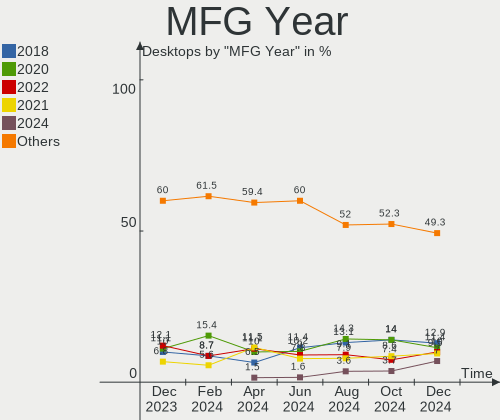
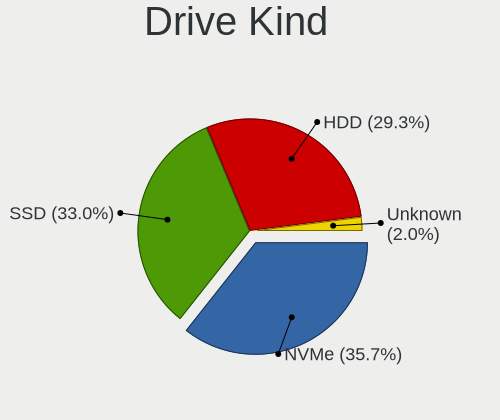
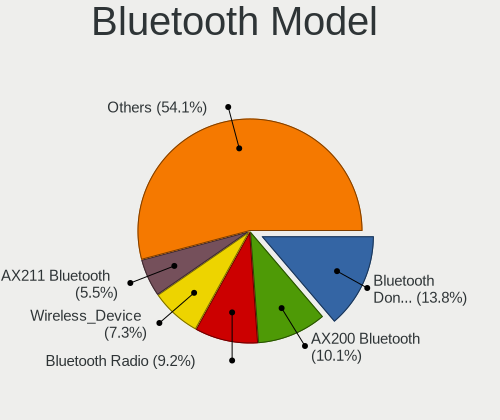
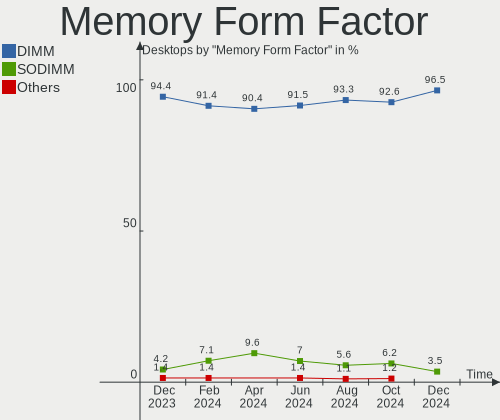

Fedora - Hardware Trends (Desktops)
-----------------------------------

A project to identify most popular hardware characteristics and track their change
over time based on data collected by Linux users at https://Linux-Hardware.org.

Anyone can contribute to this report by the [hw-probe](https://github.com/linuxhw/hw-probe) tool:

    sudo -E hw-probe -all -upload

This report is for one last month. Overall report since the beginning of time: [TestDays](https://github.com/linuxhw/TestDays)

Period: Mar, 2023.

Contents
--------

* [ System ](#system)
  - [ OS                       ](#os)
  - [ OS Family                ](#os-family)
  - [ Kernel                   ](#kernel)
  - [ Kernel Family            ](#kernel-family)
  - [ Kernel Major Ver.        ](#kernel-major-ver)
  - [ Arch                     ](#arch)
  - [ DE                       ](#de)
  - [ Display Server           ](#display-server)
  - [ Display Manager          ](#display-manager)
  - [ OS Lang                  ](#os-lang)
  - [ Boot Mode                ](#boot-mode)
  - [ Filesystem               ](#filesystem)
  - [ Part. scheme             ](#part-scheme)
  - [ Dual Boot with Linux/BSD ](#dual-boot-with-linuxbsd)
  - [ Dual Boot (Win)          ](#dual-boot-win)

* [ Board ](#board)
  - [ Vendor                   ](#vendor)
  - [ Model                    ](#model)
  - [ Model Family             ](#model-family)
  - [ MFG Year                 ](#mfg-year)
  - [ Form Factor              ](#form-factor)
  - [ Secure Boot              ](#secure-boot)
  - [ Coreboot                 ](#coreboot)
  - [ RAM Size                 ](#ram-size)
  - [ RAM Used                 ](#ram-used)
  - [ Total Drives             ](#total-drives)
  - [ Has CD-ROM               ](#has-cd-rom)
  - [ Has Ethernet             ](#has-ethernet)
  - [ Has WiFi                 ](#has-wifi)
  - [ Has Bluetooth            ](#has-bluetooth)

* [ Location ](#location)
  - [ Country                  ](#country)
  - [ City                     ](#city)

* [ Drives ](#drives)
  - [ Drive Vendor             ](#drive-vendor)
  - [ Drive Model              ](#drive-model)
  - [ HDD Vendor               ](#hdd-vendor)
  - [ SSD Vendor               ](#ssd-vendor)
  - [ Drive Kind               ](#drive-kind)
  - [ Drive Connector          ](#drive-connector)
  - [ Drive Size               ](#drive-size)
  - [ Space Total              ](#space-total)
  - [ Space Used               ](#space-used)
  - [ Malfunc. Drives          ](#malfunc-drives)
  - [ Malfunc. Drive Vendor    ](#malfunc-drive-vendor)
  - [ Malfunc. HDD Vendor      ](#malfunc-hdd-vendor)
  - [ Malfunc. Drive Kind      ](#malfunc-drive-kind)
  - [ Failed Drives            ](#failed-drives)
  - [ Failed Drive Vendor      ](#failed-drive-vendor)
  - [ Drive Status             ](#drive-status)

* [ Storage controller ](#storage-controller)
  - [ Storage Vendor           ](#storage-vendor)
  - [ Storage Model            ](#storage-model)
  - [ Storage Kind             ](#storage-kind)

* [ Processor ](#processor)
  - [ CPU Vendor               ](#cpu-vendor)
  - [ CPU Model                ](#cpu-model)
  - [ CPU Model Family         ](#cpu-model-family)
  - [ CPU Cores                ](#cpu-cores)
  - [ CPU Sockets              ](#cpu-sockets)
  - [ CPU Threads              ](#cpu-threads)
  - [ CPU Op-Modes             ](#cpu-op-modes)
  - [ CPU Microcode            ](#cpu-microcode)
  - [ CPU Microarch            ](#cpu-microarch)

* [ Graphics ](#graphics)
  - [ GPU Vendor               ](#gpu-vendor)
  - [ GPU Model                ](#gpu-model)
  - [ GPU Combo                ](#gpu-combo)
  - [ GPU Driver               ](#gpu-driver)
  - [ GPU Memory               ](#gpu-memory)

* [ Monitor ](#monitor)
  - [ Monitor Vendor           ](#monitor-vendor)
  - [ Monitor Model            ](#monitor-model)
  - [ Monitor Resolution       ](#monitor-resolution)
  - [ Monitor Diagonal         ](#monitor-diagonal)
  - [ Monitor Width            ](#monitor-width)
  - [ Aspect Ratio             ](#aspect-ratio)
  - [ Monitor Area             ](#monitor-area)
  - [ Pixel Density            ](#pixel-density)
  - [ Multiple Monitors        ](#multiple-monitors)

* [ Network ](#network)
  - [ Net Controller Vendor    ](#net-controller-vendor)
  - [ Net Controller Model     ](#net-controller-model)
  - [ Wireless Vendor          ](#wireless-vendor)
  - [ Wireless Model           ](#wireless-model)
  - [ Ethernet Vendor          ](#ethernet-vendor)
  - [ Ethernet Model           ](#ethernet-model)
  - [ Net Controller Kind      ](#net-controller-kind)
  - [ Used Controller          ](#used-controller)
  - [ NICs                     ](#nics)
  - [ IPv6                     ](#ipv6)

* [ Bluetooth ](#bluetooth)
  - [ Bluetooth Vendor         ](#bluetooth-vendor)
  - [ Bluetooth Model          ](#bluetooth-model)

* [ Sound ](#sound)
  - [ Sound Vendor             ](#sound-vendor)
  - [ Sound Model              ](#sound-model)

* [ Memory ](#memory)
  - [ Memory Vendor            ](#memory-vendor)
  - [ Memory Model             ](#memory-model)
  - [ Memory Kind              ](#memory-kind)
  - [ Memory Form Factor       ](#memory-form-factor)
  - [ Memory Size              ](#memory-size)
  - [ Memory Speed             ](#memory-speed)

* [ Printers & scanners ](#printers--scanners)
  - [ Printer Vendor           ](#printer-vendor)
  - [ Printer Model            ](#printer-model)
  - [ Scanner Vendor           ](#scanner-vendor)
  - [ Scanner Model            ](#scanner-model)

* [ Camera ](#camera)
  - [ Camera Vendor            ](#camera-vendor)
  - [ Camera Model             ](#camera-model)

* [ Security ](#security)
  - [ Fingerprint Vendor       ](#fingerprint-vendor)
  - [ Fingerprint Model        ](#fingerprint-model)
  - [ Chipcard Vendor          ](#chipcard-vendor)
  - [ Chipcard Model           ](#chipcard-model)

* [ Unsupported ](#unsupported)
  - [ Unsupported Devices      ](#unsupported-devices)
  - [ Unsupported Device Types ](#unsupported-device-types)

System
------

OS
--

Installed operating systems

| Name      | Desktops | Percent |
|-----------|----------|---------|
| Fedora 37 | 128      | 82.58%  |
| Fedora 38 | 15       | 9.68%   |
| Fedora 36 | 9        | 5.81%   |
| Fedora 35 | 2        | 1.29%   |
| Fedora 39 | 1        | 0.65%   |

OS Family
---------

OS without a version

| Name   | Desktops | Percent |
|--------|----------|---------|
| Fedora | 155      | 100%    |

Kernel
------

Version of the Linux kernel

| Version                                            | Desktops | Percent |
|----------------------------------------------------|----------|---------|
| 6.1.18-200.fc37.x86_64                             | 33       | 21.29%  |
| 6.1.14-200.fc37.x86_64                             | 25       | 16.13%  |
| 6.2.7-200.fc37.x86_64                              | 21       | 13.55%  |
| 6.1.15-200.fc37.x86_64                             | 16       | 10.32%  |
| 6.1.13-200.fc37.x86_64                             | 8        | 5.16%   |
| 6.2.8-200.fc37.x86_64                              | 6        | 3.87%   |
| 6.2.6-300.fc38.x86_64                              | 4        | 2.58%   |
| 6.0.7-301.fc37.x86_64                              | 4        | 2.58%   |
| 6.2.8-300.fc38.x86_64                              | 3        | 1.94%   |
| 6.2.7-300.fc38.x86_64                              | 2        | 1.29%   |
| 6.2.6-200.fc37.x86_64                              | 2        | 1.29%   |
| 6.2.2-300.fc38.x86_64                              | 2        | 1.29%   |
| 6.1.14-603.inttf.fc37.x86_64                       | 2        | 1.29%   |
| 6.1.12-200.fc37.x86_64                             | 2        | 1.29%   |
| 5.17.5-300.fc36.x86_64                             | 2        | 1.29%   |
| 6.3.0-0.rc2.20230315git6015b1aca1a2.25.fc39.x86_64 | 1        | 0.65%   |
| 6.2.8-100.fc36.x86_64                              | 1        | 0.65%   |
| 6.2.7_tkg_pds                                      | 1        | 0.65%   |
| 6.2.7-250.vanilla.fc37.x86_64                      | 1        | 0.65%   |
| 6.2.7-100.fc36.x86_64                              | 1        | 0.65%   |
| 6.2.5-300.fc38.x86_64                              | 1        | 0.65%   |
| 6.2.3-300.fc38.x86_64                              | 1        | 0.65%   |
| 6.2.2-300.fc37.x86_64                              | 1        | 0.65%   |
| 6.2.1-cb1.0.fc37.x86_64                            | 1        | 0.65%   |
| 6.2.1-300.fc38.x86_64                              | 1        | 0.65%   |
| 6.1.8-200.fc37.x86_64                              | 1        | 0.65%   |
| 6.1.18_tkg_ws_will                                 | 1        | 0.65%   |
| 6.1.18-603.inttf.fc37.x86_64                       | 1        | 0.65%   |
| 6.1.14-100.fc36.x86_64                             | 1        | 0.65%   |
| 6.1.11-200.fc37.x86_64                             | 1        | 0.65%   |
| 6.1.10-200.fc37.x86_64                             | 1        | 0.65%   |
| 6.0.7-200.fc36.x86_64                              | 1        | 0.65%   |
| 6.0.12-100.fc35.x86_64                             | 1        | 0.65%   |
| 6.0.11-300.fc37.x86_64                             | 1        | 0.65%   |
| 5.19.16-200.fc36.x86_64                            | 1        | 0.65%   |
| 5.18.19-200.fc36.x86_64                            | 1        | 0.65%   |
| 5.18.15-200.fc36.x86_64                            | 1        | 0.65%   |
| 5.14.10-300.fc35.x86_64                            | 1        | 0.65%   |

Kernel Family
-------------

Linux kernel without a distro release

| Version | Desktops | Percent |
|---------|----------|---------|
| 6.1.18  | 35       | 22.58%  |
| 6.1.14  | 28       | 18.06%  |
| 6.2.7   | 26       | 16.77%  |
| 6.1.15  | 16       | 10.32%  |
| 6.2.8   | 10       | 6.45%   |
| 6.1.13  | 8        | 5.16%   |
| 6.2.6   | 6        | 3.87%   |
| 6.0.7   | 5        | 3.23%   |
| 6.2.2   | 3        | 1.94%   |
| 6.2.1   | 2        | 1.29%   |
| 6.1.12  | 2        | 1.29%   |
| 5.17.5  | 2        | 1.29%   |
| 6.3.0   | 1        | 0.65%   |
| 6.2.5   | 1        | 0.65%   |
| 6.2.3   | 1        | 0.65%   |
| 6.1.8   | 1        | 0.65%   |
| 6.1.11  | 1        | 0.65%   |
| 6.1.10  | 1        | 0.65%   |
| 6.0.12  | 1        | 0.65%   |
| 6.0.11  | 1        | 0.65%   |
| 5.19.16 | 1        | 0.65%   |
| 5.18.19 | 1        | 0.65%   |
| 5.18.15 | 1        | 0.65%   |
| 5.14.10 | 1        | 0.65%   |

Kernel Major Ver.
-----------------

Linux kernel major version

| Version | Desktops | Percent |
|---------|----------|---------|
| 6.1     | 92       | 59.35%  |
| 6.2     | 49       | 31.61%  |
| 6.0     | 7        | 4.52%   |
| 5.18    | 2        | 1.29%   |
| 5.17    | 2        | 1.29%   |
| 6.3     | 1        | 0.65%   |
| 5.19    | 1        | 0.65%   |
| 5.14    | 1        | 0.65%   |

Arch
----

OS architecture (x86_64, i586, etc.)

| Name   | Desktops | Percent |
|--------|----------|---------|
| x86_64 | 155      | 100%    |

DE
--

Desktop Environment

| Name          | Desktops | Percent |
|---------------|----------|---------|
| GNOME         | 95       | 61.29%  |
| KDE5          | 35       | 22.58%  |
| Cinnamon      | 6        | 3.87%   |
| Unknown       | 6        | 3.87%   |
| XFCE          | 4        | 2.58%   |
| X-Cinnamon    | 3        | 1.94%   |
| GNOME Classic | 2        | 1.29%   |
| qtile         | 1        | 0.65%   |
| MATE          | 1        | 0.65%   |
| LXQt          | 1        | 0.65%   |
| bspwm         | 1        | 0.65%   |

Display Server
--------------

X11 or Wayland

| Name    | Desktops | Percent |
|---------|----------|---------|
| Wayland | 95       | 61.29%  |
| X11     | 50       | 32.26%  |
| Tty     | 7        | 4.52%   |
| Unknown | 3        | 1.94%   |

Display Manager
---------------

SDDM, LightDM, etc.

| Name    | Desktops | Percent |
|---------|----------|---------|
| Unknown | 97       | 62.58%  |
| GDM     | 32       | 20.65%  |
| SDDM    | 13       | 8.39%   |
| LightDM | 13       | 8.39%   |

OS Lang
-------

Language

| Lang    | Desktops | Percent |
|---------|----------|---------|
| en_US   | 75       | 48.39%  |
| pt_BR   | 13       | 8.39%   |
| ru_RU   | 10       | 6.45%   |
| en_AU   | 8        | 5.16%   |
| en_CA   | 7        | 4.52%   |
| de_DE   | 7        | 4.52%   |
| en_GB   | 6        | 3.87%   |
| fr_FR   | 4        | 2.58%   |
| it_IT   | 3        | 1.94%   |
| Unknown | 3        | 1.94%   |
| es_ES   | 2        | 1.29%   |
| en_NZ   | 2        | 1.29%   |
| th_TH   | 1        | 0.65%   |
| sv_SE   | 1        | 0.65%   |
| pl_PL   | 1        | 0.65%   |
| nl_NL   | 1        | 0.65%   |
| nl_BE   | 1        | 0.65%   |
| ko_KR   | 1        | 0.65%   |
| fr_CA   | 1        | 0.65%   |
| fi_FI   | 1        | 0.65%   |
| es_MX   | 1        | 0.65%   |
| es_CO   | 1        | 0.65%   |
| es_CL   | 1        | 0.65%   |
| es_AR   | 1        | 0.65%   |
| en_IL   | 1        | 0.65%   |
| de_CH   | 1        | 0.65%   |
| de_AT   | 1        | 0.65%   |

Boot Mode
---------

EFI or BIOS

| Mode | Desktops | Percent |
|------|----------|---------|
| EFI  | 112      | 72.26%  |
| BIOS | 43       | 27.74%  |

Filesystem
----------

Type of filesystem

| Type  | Desktops | Percent |
|-------|----------|---------|
| Btrfs | 120      | 77.42%  |
| Ext4  | 29       | 18.71%  |
| Xfs   | 6        | 3.87%   |

Part. scheme
------------

Scheme of partitioning

| Type    | Desktops | Percent |
|---------|----------|---------|
| Unknown | 91       | 58.71%  |
| GPT     | 52       | 33.55%  |
| MBR     | 12       | 7.74%   |

Dual Boot with Linux/BSD
------------------------

Hosting more than one Linux/BSD

| Dual boot | Desktops | Percent |
|-----------|----------|---------|
| No        | 136      | 87.74%  |
| Yes       | 19       | 12.26%  |

Dual Boot (Win)
---------------

Hosting Linux and Windows

| Dual boot | Desktops | Percent |
|-----------|----------|---------|
| No        | 129      | 83.23%  |
| Yes       | 26       | 16.77%  |

Board
-----

Vendor
------

Motherboard manufacturer

| Name                | Desktops | Percent |
|---------------------|----------|---------|
| ASUSTek Computer    | 42       | 27.1%   |
| MSI                 | 32       | 20.65%  |
| Gigabyte Technology | 24       | 15.48%  |
| ASRock              | 16       | 10.32%  |
| Dell                | 10       | 6.45%   |
| Lenovo              | 6        | 3.87%   |
| Acer                | 4        | 2.58%   |
| Huanan              | 3        | 1.94%   |
| Hewlett-Packard     | 3        | 1.94%   |
| AZW                 | 2        | 1.29%   |
| ZOTAC               | 1        | 0.65%   |
| Win element         | 1        | 0.65%   |
| System76            | 1        | 0.65%   |
| Shuttle             | 1        | 0.65%   |
| Pegatron            | 1        | 0.65%   |
| PCWare              | 1        | 0.65%   |
| Packard Bell        | 1        | 0.65%   |
| NZXT                | 1        | 0.65%   |
| Medion              | 1        | 0.65%   |
| Itautec             | 1        | 0.65%   |
| Intel               | 1        | 0.65%   |
| BESSTAR Tech        | 1        | 0.65%   |
| Unknown             | 1        | 0.65%   |

Model
-----

Motherboard model

| Name                         | Desktops | Percent |
|------------------------------|----------|---------|
| Dell OptiPlex 7010           | 3        | 1.94%   |
| ASUS All Series              | 3        | 1.94%   |
| MSI MS-7C82                  | 2        | 1.29%   |
| MSI MS-7C52                  | 2        | 1.29%   |
| MSI MS-7B89                  | 2        | 1.29%   |
| MSI MS-7A34                  | 2        | 1.29%   |
| Dell OptiPlex 7060           | 2        | 1.29%   |
| ASUS Z170 PRO GAMING         | 2        | 1.29%   |
| ASUS TUF Gaming X570-PLUS    | 2        | 1.29%   |
| ASUS TUF Gaming B550M-PLUS   | 2        | 1.29%   |
| ASUS PRIME B550M-A           | 2        | 1.29%   |
| ASRock X570 Phantom Gaming 4 | 2        | 1.29%   |
| ASRock B450M-HDV R4.0        | 2        | 1.29%   |
| ZOTAC H67ITX-C-E             | 1        | 0.65%   |
| Win element M600             | 1        | 0.65%   |
| System76 Thelio Mira         | 1        | 0.65%   |
| Shuttle SH570                | 1        | 0.65%   |
| Pegatron 320-1030            | 1        | 0.65%   |
| PCWare IPMH310G              | 1        | 0.65%   |
| Packard Bell IMEDIA S3840    | 1        | 0.65%   |
| NZXT N7 B550                 | 1        | 0.65%   |
| MSI p6-2315ed                | 1        | 0.65%   |
| MSI MS-7E06                  | 1        | 0.65%   |
| MSI MS-7D77                  | 1        | 0.65%   |
| MSI MS-7D40                  | 1        | 0.65%   |
| MSI MS-7D14                  | 1        | 0.65%   |
| MSI MS-7C95                  | 1        | 0.65%   |
| MSI MS-7C94                  | 1        | 0.65%   |
| MSI MS-7C92                  | 1        | 0.65%   |
| MSI MS-7C91                  | 1        | 0.65%   |
| MSI MS-7C56                  | 1        | 0.65%   |
| MSI MS-7C39                  | 1        | 0.65%   |
| MSI MS-7C37                  | 1        | 0.65%   |
| MSI MS-7B93                  | 1        | 0.65%   |
| MSI MS-7B86                  | 1        | 0.65%   |
| MSI MS-7B79                  | 1        | 0.65%   |
| MSI MS-7B51                  | 1        | 0.65%   |
| MSI MS-7B48                  | 1        | 0.65%   |
| MSI MS-7B10                  | 1        | 0.65%   |
| MSI MS-7A39                  | 1        | 0.65%   |

Model Family
------------

Motherboard model prefix

| Name                | Desktops | Percent |
|---------------------|----------|---------|
| ASUS TUF            | 11       | 7.1%    |
| ASUS PRIME          | 10       | 6.45%   |
| Dell OptiPlex       | 6        | 3.87%   |
| ASUS ROG            | 4        | 2.58%   |
| ASUS All            | 3        | 1.94%   |
| Acer Veriton        | 3        | 1.94%   |
| MSI MS-7C82         | 2        | 1.29%   |
| MSI MS-7C52         | 2        | 1.29%   |
| MSI MS-7B89         | 2        | 1.29%   |
| MSI MS-7A34         | 2        | 1.29%   |
| Lenovo ThinkCentre  | 2        | 1.29%   |
| Gigabyte X570       | 2        | 1.29%   |
| Dell Inspiron       | 2        | 1.29%   |
| ASUS Z170           | 2        | 1.29%   |
| ASUS P8P67          | 2        | 1.29%   |
| ASRock X570         | 2        | 1.29%   |
| ASRock B450M-HDV    | 2        | 1.29%   |
| ZOTAC H67ITX-C-E    | 1        | 0.65%   |
| Win element M600    | 1        | 0.65%   |
| System76 Thelio     | 1        | 0.65%   |
| Shuttle SH570       | 1        | 0.65%   |
| Pegatron 320-1030   | 1        | 0.65%   |
| PCWare IPMH310G     | 1        | 0.65%   |
| Packard Bell IMEDIA | 1        | 0.65%   |
| NZXT N7             | 1        | 0.65%   |
| MSI p6-2315ed       | 1        | 0.65%   |
| MSI MS-7E06         | 1        | 0.65%   |
| MSI MS-7D77         | 1        | 0.65%   |
| MSI MS-7D40         | 1        | 0.65%   |
| MSI MS-7D14         | 1        | 0.65%   |
| MSI MS-7C95         | 1        | 0.65%   |
| MSI MS-7C94         | 1        | 0.65%   |
| MSI MS-7C92         | 1        | 0.65%   |
| MSI MS-7C91         | 1        | 0.65%   |
| MSI MS-7C56         | 1        | 0.65%   |
| MSI MS-7C39         | 1        | 0.65%   |
| MSI MS-7C37         | 1        | 0.65%   |
| MSI MS-7B93         | 1        | 0.65%   |
| MSI MS-7B86         | 1        | 0.65%   |
| MSI MS-7B79         | 1        | 0.65%   |

MFG Year
--------

Motherboard manufacture year

| Year    | Desktops | Percent |
|---------|----------|---------|
| 2019    | 24       | 15.48%  |
| 2020    | 19       | 12.26%  |
| 2022    | 17       | 10.97%  |
| 2018    | 15       | 9.68%   |
| 2017    | 14       | 9.03%   |
| 2013    | 12       | 7.74%   |
| 2012    | 11       | 7.1%    |
| 2015    | 9        | 5.81%   |
| 2021    | 8        | 5.16%   |
| 2014    | 6        | 3.87%   |
| 2010    | 5        | 3.23%   |
| 2011    | 4        | 2.58%   |
| 2023    | 2        | 1.29%   |
| 2008    | 2        | 1.29%   |
| 2007    | 2        | 1.29%   |
| 2006    | 2        | 1.29%   |
| 2016    | 1        | 0.65%   |
| 2009    | 1        | 0.65%   |
| Unknown | 1        | 0.65%   |

Form Factor
-----------

Physical design of the computer

| Name    | Desktops | Percent |
|---------|----------|---------|
| Desktop | 155      | 100%    |

Secure Boot
-----------

Enabled or disabled

| State    | Desktops | Percent |
|----------|----------|---------|
| Disabled | 138      | 89.03%  |
| Enabled  | 17       | 10.97%  |

Coreboot
--------

Have coreboot on board

| Used | Desktops | Percent |
|------|----------|---------|
| No   | 155      | 100%    |

RAM Size
--------

Total RAM memory

| Size in GB      | Desktops | Percent |
|-----------------|----------|---------|
| 16.01-24.0      | 47       | 30.32%  |
| 32.01-64.0      | 43       | 27.74%  |
| 8.01-16.0       | 19       | 12.26%  |
| 64.01-256.0     | 14       | 9.03%   |
| 4.01-8.0        | 11       | 7.1%    |
| 24.01-32.0      | 11       | 7.1%    |
| 3.01-4.0        | 8        | 5.16%   |
| More than 256.0 | 1        | 0.65%   |
| 2.01-3.0        | 1        | 0.65%   |

RAM Used
--------

Used RAM memory

| Used GB     | Desktops | Percent |
|-------------|----------|---------|
| 4.01-8.0    | 61       | 39.35%  |
| 2.01-3.0    | 31       | 20%     |
| 3.01-4.0    | 29       | 18.71%  |
| 1.01-2.0    | 13       | 8.39%   |
| 8.01-16.0   | 10       | 6.45%   |
| 24.01-32.0  | 3        | 1.94%   |
| 0.51-1.0    | 3        | 1.94%   |
| 16.01-24.0  | 2        | 1.29%   |
| 32.01-64.0  | 1        | 0.65%   |
| 64.01-256.0 | 1        | 0.65%   |
| 0.01-0.5    | 1        | 0.65%   |

Total Drives
------------

Number of drives on board

| Drives | Desktops | Percent |
|--------|----------|---------|
| 2      | 55       | 35.48%  |
| 1      | 43       | 27.74%  |
| 3      | 27       | 17.42%  |
| 4      | 15       | 9.68%   |
| 5      | 10       | 6.45%   |
| 6      | 3        | 1.94%   |
| 10     | 1        | 0.65%   |
| 8      | 1        | 0.65%   |

Has CD-ROM
----------

Has CD-ROM on board

| Presented | Desktops | Percent |
|-----------|----------|---------|
| No        | 100      | 64.52%  |
| Yes       | 55       | 35.48%  |

Has Ethernet
------------

Has Ethernet on board

| Presented | Desktops | Percent |
|-----------|----------|---------|
| Yes       | 154      | 99.35%  |
| No        | 1        | 0.65%   |

Has WiFi
--------

Has WiFi module

| Presented | Desktops | Percent |
|-----------|----------|---------|
| No        | 81       | 52.26%  |
| Yes       | 74       | 47.74%  |

Has Bluetooth
-------------

Has Bluetooth module

| Presented | Desktops | Percent |
|-----------|----------|---------|
| No        | 78       | 50.32%  |
| Yes       | 77       | 49.68%  |

Location
--------

Country
-------

Geographic location (country)

| Country             | Desktops | Percent |
|---------------------|----------|---------|
| USA                 | 37       | 23.87%  |
| Brazil              | 17       | 10.97%  |
| Russia              | 10       | 6.45%   |
| Germany             | 9        | 5.81%   |
| Australia           | 8        | 5.16%   |
| Canada              | 7        | 4.52%   |
| Italy               | 5        | 3.23%   |
| Spain               | 4        | 2.58%   |
| Poland              | 4        | 2.58%   |
| France              | 4        | 2.58%   |
| Colombia            | 4        | 2.58%   |
| UK                  | 3        | 1.94%   |
| Thailand            | 3        | 1.94%   |
| Netherlands         | 3        | 1.94%   |
| Finland             | 3        | 1.94%   |
| Belarus             | 3        | 1.94%   |
| Switzerland         | 2        | 1.29%   |
| Sweden              | 2        | 1.29%   |
| Norway              | 2        | 1.29%   |
| New Zealand         | 2        | 1.29%   |
| Belgium             | 2        | 1.29%   |
| Austria             | 2        | 1.29%   |
| Trinidad and Tobago | 1        | 0.65%   |
| South Korea         | 1        | 0.65%   |
| South Africa        | 1        | 0.65%   |
| Slovenia            | 1        | 0.65%   |
| Romania             | 1        | 0.65%   |
| Réunion            | 1        | 0.65%   |
| Portugal            | 1        | 0.65%   |
| North Macedonia     | 1        | 0.65%   |
| Malaysia            | 1        | 0.65%   |
| Israel              | 1        | 0.65%   |
| India               | 1        | 0.65%   |
| Hungary             | 1        | 0.65%   |
| Dominican Republic  | 1        | 0.65%   |
| Denmark             | 1        | 0.65%   |
| Czechia             | 1        | 0.65%   |
| Costa Rica          | 1        | 0.65%   |
| Chile               | 1        | 0.65%   |
| Argentina           | 1        | 0.65%   |

City
----

Geographic location (city)

| City                  | Desktops | Percent |
|-----------------------|----------|---------|
| Sydney                | 7        | 4.52%   |
| Moscow                | 3        | 1.94%   |
| Vienna                | 2        | 1.29%   |
| Sao Paulo             | 2        | 1.29%   |
| Munich                | 2        | 1.29%   |
| Minsk                 | 2        | 1.29%   |
| Los Alamos            | 2        | 1.29%   |
| Kristiansand          | 2        | 1.29%   |
| Helsinki              | 2        | 1.29%   |
| Bangkok               | 2        | 1.29%   |
| Yeongdeungpo-gu       | 1        | 0.65%   |
| Yekaterinburg         | 1        | 0.65%   |
| Wroclaw               | 1        | 0.65%   |
| Willowbrook           | 1        | 0.65%   |
| Westlake              | 1        | 0.65%   |
| Wallisellen           | 1        | 0.65%   |
| Waiblingen            | 1        | 0.65%   |
| Volgograd             | 1        | 0.65%   |
| Villecloye            | 1        | 0.65%   |
| Vaasa                 | 1        | 0.65%   |
| Uster                 | 1        | 0.65%   |
| Uppsala               | 1        | 0.65%   |
| Toronto               | 1        | 0.65%   |
| Toms River            | 1        | 0.65%   |
| Timișoara            | 1        | 0.65%   |
| Tacoma                | 1        | 0.65%   |
| Sycamore              | 1        | 0.65%   |
| Swidnica              | 1        | 0.65%   |
| Subang Jaya           | 1        | 0.65%   |
| Stockholm             | 1        | 0.65%   |
| Spring Hill           | 1        | 0.65%   |
| Songkhla              | 1        | 0.65%   |
| Skopje                | 1        | 0.65%   |
| Simmerath             | 1        | 0.65%   |
| Seattle               | 1        | 0.65%   |
| Scarborough           | 1        | 0.65%   |
| Sao Vicente           | 1        | 0.65%   |
| Santo Domingo         | 1        | 0.65%   |
| San Giovanni Lupatoto | 1        | 0.65%   |
| San Carlos            | 1        | 0.65%   |

Drives
------

Drive Vendor
------------

Hard drive vendors

| Vendor                      | Desktops | Drives | Percent |
|-----------------------------|----------|--------|---------|
| Samsung Electronics         | 54       | 77     | 17.76%  |
| WDC                         | 50       | 70     | 16.45%  |
| Seagate                     | 41       | 51     | 13.49%  |
| SanDisk                     | 22       | 33     | 7.24%   |
| Kingston                    | 20       | 23     | 6.58%   |
| Crucial                     | 19       | 19     | 6.25%   |
| Toshiba                     | 15       | 18     | 4.93%   |
| Phison Electronics          | 9        | 9      | 2.96%   |
| Realtek Semiconductor       | 4        | 5      | 1.32%   |
| Intel                       | 4        | 4      | 1.32%   |
| Hitachi                     | 4        | 4      | 1.32%   |
| HGST                        | 4        | 4      | 1.32%   |
| A-DATA Technology           | 4        | 4      | 1.32%   |
| Silicon Motion              | 3        | 3      | 0.99%   |
| Micron/Crucial Technology   | 3        | 3      | 0.99%   |
| Kingston Technology Company | 3        | 3      | 0.99%   |
| Apacer                      | 3        | 3      | 0.99%   |
| SK hynix                    | 2        | 2      | 0.66%   |
| SABRENT                     | 2        | 2      | 0.66%   |
| PNY                         | 2        | 2      | 0.66%   |
| Micron Technology           | 2        | 2      | 0.66%   |
| MAXIO Technology (Hangzhou) | 2        | 2      | 0.66%   |
| HS-SSD-C100                 | 2        | 2      | 0.66%   |
| Corsair                     | 2        | 2      | 0.66%   |
| China                       | 2        | 5      | 0.66%   |
| ASMT                        | 2        | 2      | 0.66%   |
| ADATA Technology            | 2        | 2      | 0.66%   |
| 2.5"                        | 2        | 3      | 0.66%   |
| Unknown                     | 2        | 2      | 0.66%   |
| XrayDisk                    | 1        | 1      | 0.33%   |
| Verbatim                    | 1        | 1      | 0.33%   |
| Vaseky                      | 1        | 1      | 0.33%   |
| Unknown                     | 1        | 1      | 0.33%   |
| SPCC                        | 1        | 1      | 0.33%   |
| Seagate Technology          | 1        | 1      | 0.33%   |
| Patriot                     | 1        | 1      | 0.33%   |
| Netac                       | 1        | 1      | 0.33%   |
| Maxtor                      | 1        | 1      | 0.33%   |
| LITEON                      | 1        | 1      | 0.33%   |
| Lenovo                      | 1        | 1      | 0.33%   |

Drive Model
-----------

Hard drive models

| Model                                                  | Desktops | Percent |
|--------------------------------------------------------|----------|---------|
| Samsung NVMe SSD Controller SM981/PM981/PM983 250GB    | 11       | 3.11%   |
| Samsung SSD 850 EVO 250GB                              | 8        | 2.26%   |
| Samsung NVMe SSD Controller PM9A1/PM9A3/980PRO 1TB     | 6        | 1.69%   |
| Seagate ST1000DM010-2EP102 1TB                         | 5        | 1.41%   |
| Phison E12 NVMe Controller 256GB                       | 5        | 1.41%   |
| WDC WDS500G2B0A-00SM50 500GB SSD                       | 4        | 1.13%   |
| Samsung SSD 860 EVO 500GB                              | 4        | 1.13%   |
| Kingston SA400S37480G 480GB SSD                        | 4        | 1.13%   |
| Kingston SA400S37120G 120GB SSD                        | 4        | 1.13%   |
| Crucial CT1000MX500SSD1 1TB                            | 4        | 1.13%   |
| WDC WD40EZRZ-00GXCB0 4TB                               | 3        | 0.85%   |
| WDC WD40EZAZ-00SF3B0 4TB                               | 3        | 0.85%   |
| WDC WD10EZEX-08WN4A0 1TB                               | 3        | 0.85%   |
| Seagate ST500DM002-1BD142 500GB                        | 3        | 0.85%   |
| Seagate ST2000LX001-1RG174 2TB                         | 3        | 0.85%   |
| Seagate ST2000DM008-2FR102 2TB                         | 3        | 0.85%   |
| Seagate ST2000DM001-1ER164 2TB                         | 3        | 0.85%   |
| SanDisk NVMe SSD Drive 500GB                           | 3        | 0.85%   |
| Samsung SSD 980 500GB                                  | 3        | 0.85%   |
| Samsung SSD 970 EVO Plus 1TB                           | 3        | 0.85%   |
| Samsung SSD 860 EVO 250GB                              | 3        | 0.85%   |
| Samsung SSD 850 EVO 1TB                                | 3        | 0.85%   |
| Kingston SA400S37240G 240GB SSD                        | 3        | 0.85%   |
| Crucial CT500MX500SSD1 500GB                           | 3        | 0.85%   |
| WDC WDS100T2B0A-00SM50 1TB SSD                         | 2        | 0.56%   |
| WDC WD5000AAKX-08U6AA0 500GB                           | 2        | 0.56%   |
| WDC WD40EFRX-68N32N0 4TB                               | 2        | 0.56%   |
| WDC WD30EFRX-68EUZN0 3TB                               | 2        | 0.56%   |
| WDC WD10EZEX-60WN4A0 1TB                               | 2        | 0.56%   |
| WDC WD10EZEX-00WN4A0 1TB                               | 2        | 0.56%   |
| WDC WD10EZEX-00BN5A0 1TB                               | 2        | 0.56%   |
| Toshiba HDWD130 3TB                                    | 2        | 0.56%   |
| Toshiba DT01ACA200 2TB                                 | 2        | 0.56%   |
| Silicon Motion SM2263EN/SM2263XT SSD Controller 1024GB | 2        | 0.56%   |
| Seagate ST4000DM004-2CV104 4TB                         | 2        | 0.56%   |
| Seagate ST4000DM000-1F2168 4TB                         | 2        | 0.56%   |
| Seagate ST2000DM006-2DM164 2TB                         | 2        | 0.56%   |
| Sandisk WD Black SN750 / PC SN730 NVMe SSD 1TB         | 2        | 0.56%   |
| SanDisk SDSSDH3 1T02 1TB                               | 2        | 0.56%   |
| Samsung SSD 980 PRO 500GB                              | 2        | 0.56%   |

HDD Vendor
----------

Hard disk drive vendors

| Vendor              | Desktops | Drives | Percent |
|---------------------|----------|--------|---------|
| Seagate             | 41       | 49     | 37.61%  |
| WDC                 | 39       | 55     | 35.78%  |
| Toshiba             | 11       | 14     | 10.09%  |
| Hitachi             | 4        | 4      | 3.67%   |
| HGST                | 4        | 4      | 3.67%   |
| Samsung Electronics | 3        | 3      | 2.75%   |
| SABRENT             | 2        | 2      | 1.83%   |
| ASMT                | 2        | 2      | 1.83%   |
| Maxtor              | 1        | 1      | 0.92%   |
| Intenso             | 1        | 1      | 0.92%   |
| IET                 | 1        | 1      | 0.92%   |

SSD Vendor
----------

Solid state drive vendors

| Vendor              | Desktops | Drives | Percent |
|---------------------|----------|--------|---------|
| Samsung Electronics | 28       | 35     | 24.14%  |
| Crucial             | 19       | 19     | 16.38%  |
| Kingston            | 13       | 14     | 11.21%  |
| SanDisk             | 12       | 13     | 10.34%  |
| WDC                 | 11       | 13     | 9.48%   |
| A-DATA Technology   | 4        | 4      | 3.45%   |
| Toshiba             | 3        | 3      | 2.59%   |
| Apacer              | 3        | 3      | 2.59%   |
| PNY                 | 2        | 2      | 1.72%   |
| Intel               | 2        | 2      | 1.72%   |
| Corsair             | 2        | 2      | 1.72%   |
| China               | 2        | 5      | 1.72%   |
| 2.5"                | 2        | 3      | 1.72%   |
| Verbatim            | 1        | 1      | 0.86%   |
| Vaseky              | 1        | 1      | 0.86%   |
| SK hynix            | 1        | 1      | 0.86%   |
| Seagate             | 1        | 1      | 0.86%   |
| Patriot             | 1        | 1      | 0.86%   |
| Micron Technology   | 1        | 1      | 0.86%   |
| LITEON              | 1        | 1      | 0.86%   |
| Lenovo              | 1        | 1      | 0.86%   |
| KUIJIA              | 1        | 1      | 0.86%   |
| KIOXIA-EXCERIA      | 1        | 1      | 0.86%   |
| KingDian            | 1        | 1      | 0.86%   |
| JMicron Technology  | 1        | 1      | 0.86%   |
| HS-SSD-C100         | 1        | 1      | 0.86%   |

Drive Kind
----------

HDD or SSD

| Kind    | Desktops | Drives | Percent |
|---------|----------|--------|---------|
| SSD     | 101      | 131    | 37.41%  |
| HDD     | 87       | 136    | 32.22%  |
| NVMe    | 76       | 105    | 28.15%  |
| Unknown | 6        | 7      | 2.22%   |

Drive Connector
---------------

SATA, SAS, NVMe, etc.

| Type | Desktops | Drives | Percent |
|------|----------|--------|---------|
| SATA | 131      | 263    | 60.37%  |
| NVMe | 76       | 105    | 35.02%  |
| SAS  | 10       | 11     | 4.61%   |

Drive Size
----------

Size of hard drive

| Size in TB | Desktops | Drives | Percent |
|------------|----------|--------|---------|
| 0.01-0.5   | 84       | 119    | 41.18%  |
| 0.51-1.0   | 68       | 83     | 33.33%  |
| 1.01-2.0   | 26       | 29     | 12.75%  |
| 3.01-4.0   | 12       | 15     | 5.88%   |
| 2.01-3.0   | 6        | 7      | 2.94%   |
| 4.01-10.0  | 6        | 9      | 2.94%   |
| 10.01-20.0 | 2        | 5      | 0.98%   |

Space Total
-----------

Amount of disk space available on the file system

| Size in GB     | Desktops | Percent |
|----------------|----------|---------|
| 1001-2000      | 30       | 19.35%  |
| 501-1000       | 30       | 19.35%  |
| More than 3000 | 26       | 16.77%  |
| 2001-3000      | 19       | 12.26%  |
| 101-250        | 19       | 12.26%  |
| 251-500        | 13       | 8.39%   |
| Unknown        | 12       | 7.74%   |
| 51-100         | 3        | 1.94%   |
| 1-20           | 2        | 1.29%   |
| 21-50          | 1        | 0.65%   |

Space Used
----------

Amount of used disk space

| Used GB        | Desktops | Percent |
|----------------|----------|---------|
| 21-50          | 21       | 13.55%  |
| 251-500        | 20       | 12.9%   |
| 1-20           | 19       | 12.26%  |
| 501-1000       | 19       | 12.26%  |
| 101-250        | 17       | 10.97%  |
| 1001-2000      | 16       | 10.32%  |
| 51-100         | 16       | 10.32%  |
| Unknown        | 12       | 7.74%   |
| More than 3000 | 8        | 5.16%   |
| 2001-3000      | 7        | 4.52%   |

Malfunc. Drives
---------------

Drive models with a malfunction

| Model                            | Desktops | Drives | Percent |
|----------------------------------|----------|--------|---------|
| WDC WD10EZEX-00BN5A0 1TB         | 2        | 2      | 11.11%  |
| WDC WDS480G2G0A-00JH30 480GB SSD | 1        | 1      | 5.56%   |
| WDC WD5000AAKX-603CA0 500GB      | 1        | 1      | 5.56%   |
| WDC WD10EADS-00L5B1 1TB          | 1        | 1      | 5.56%   |
| Toshiba MQ01ABD050 500GB         | 1        | 1      | 5.56%   |
| Toshiba HDWA120 2TB              | 1        | 1      | 5.56%   |
| Seagate ST500DM002-1BD142 500GB  | 1        | 1      | 5.56%   |
| Seagate ST3320620AS 320GB        | 1        | 1      | 5.56%   |
| Seagate ST3000DM008-2DM166 3TB   | 1        | 1      | 5.56%   |
| Seagate ST3000DM001-1CH166 3TB   | 1        | 1      | 5.56%   |
| Seagate ST1000LX015-1U7172 1TB   | 1        | 1      | 5.56%   |
| Seagate ST1000DX002-2DV162 1TB   | 1        | 1      | 5.56%   |
| SanDisk SSD PLUS 240 GB          | 1        | 1      | 5.56%   |
| Intel SSDSC2CT120A3 120GB        | 1        | 1      | 5.56%   |
| Hitachi HDT725050VLA380 500GB    | 1        | 1      | 5.56%   |
| Crucial CT750MX300SSD1 752GB     | 1        | 1      | 5.56%   |
| Corsair Force GS 240GB SSD       | 1        | 1      | 5.56%   |

Malfunc. Drive Vendor
---------------------

Vendors of faulty drives

| Vendor  | Desktops | Drives | Percent |
|---------|----------|--------|---------|
| WDC     | 5        | 5      | 29.41%  |
| Seagate | 5        | 6      | 29.41%  |
| Toshiba | 2        | 2      | 11.76%  |
| SanDisk | 1        | 1      | 5.88%   |
| Intel   | 1        | 1      | 5.88%   |
| Hitachi | 1        | 1      | 5.88%   |
| Crucial | 1        | 1      | 5.88%   |
| Corsair | 1        | 1      | 5.88%   |

Malfunc. HDD Vendor
-------------------

Vendors of faulty HDD drives

| Vendor  | Desktops | Drives | Percent |
|---------|----------|--------|---------|
| Seagate | 5        | 6      | 41.67%  |
| WDC     | 4        | 4      | 33.33%  |
| Toshiba | 2        | 2      | 16.67%  |
| Hitachi | 1        | 1      | 8.33%   |

Malfunc. Drive Kind
-------------------

Kinds of faulty drives

| Kind | Desktops | Drives | Percent |
|------|----------|--------|---------|
| HDD  | 11       | 13     | 68.75%  |
| SSD  | 5        | 5      | 31.25%  |

Failed Drives
-------------

Failed drive models

Zero info for selected period =(

Failed Drive Vendor
-------------------

Failed drive vendors

Zero info for selected period =(

Drive Status
------------

Number of failed and malfunc. drives

| Status   | Desktops | Drives | Percent |
|----------|----------|--------|---------|
| Detected | 101      | 237    | 57.71%  |
| Works    | 60       | 124    | 34.29%  |
| Malfunc  | 14       | 18     | 8%      |

Storage controller
------------------

Storage Vendor
--------------

Storage controller vendors

| Vendor                       | Desktops | Percent |
|------------------------------|----------|---------|
| Intel                        | 87       | 32.22%  |
| AMD                          | 64       | 23.7%   |
| Samsung Electronics          | 33       | 12.22%  |
| SanDisk                      | 14       | 5.19%   |
| Kingston Technology Company  | 12       | 4.44%   |
| Phison Electronics           | 10       | 3.7%    |
| ASMedia Technology           | 10       | 3.7%    |
| Marvell Technology Group     | 9        | 3.33%   |
| Realtek Semiconductor        | 4        | 1.48%   |
| JMicron Technology           | 4        | 1.48%   |
| Silicon Motion               | 3        | 1.11%   |
| Micron/Crucial Technology    | 3        | 1.11%   |
| Nvidia                       | 2        | 0.74%   |
| MAXIO Technology (Hangzhou)  | 2        | 0.74%   |
| ADATA Technology             | 2        | 0.74%   |
| ULi Electronics              | 1        | 0.37%   |
| Toshiba America Info Systems | 1        | 0.37%   |
| SK hynix                     | 1        | 0.37%   |
| Silicon Image                | 1        | 0.37%   |
| Seagate Technology           | 1        | 0.37%   |
| Micron Technology            | 1        | 0.37%   |
| LSI Logic / Symbios Logic    | 1        | 0.37%   |
| KIOXIA                       | 1        | 0.37%   |
| Broadcom / LSI               | 1        | 0.37%   |
| Adaptec                      | 1        | 0.37%   |
| 3ware                        | 1        | 0.37%   |

Storage Model
-------------

Storage controller models

| Model                                                                          | Desktops | Percent |
|--------------------------------------------------------------------------------|----------|---------|
| AMD FCH SATA Controller [AHCI mode]                                            | 39       | 12.58%  |
| Samsung NVMe SSD Controller SM981/PM981/PM983                                  | 16       | 5.16%   |
| AMD 500 Series Chipset SATA Controller                                         | 16       | 5.16%   |
| Samsung NVMe SSD Controller PM9A1/PM9A3/980PRO                                 | 11       | 3.55%   |
| Intel 200 Series PCH SATA controller [AHCI mode]                               | 11       | 3.55%   |
| Intel Q170/Q150/B150/H170/H110/Z170/CM236 Chipset SATA Controller [AHCI Mode]  | 9        | 2.9%    |
| Intel 8 Series/C220 Series Chipset Family 6-port SATA Controller 1 [AHCI mode] | 9        | 2.9%    |
| Intel 7 Series/C210 Series Chipset Family 6-port SATA Controller [AHCI mode]   | 9        | 2.9%    |
| ASMedia ASM1062 Serial ATA Controller                                          | 9        | 2.9%    |
| AMD 400 Series Chipset SATA Controller                                         | 9        | 2.9%    |
| Phison E12 NVMe Controller                                                     | 7        | 2.26%   |
| Kingston Company Company Non-Volatile memory controller                        | 6        | 1.94%   |
| Intel Cannon Lake PCH SATA AHCI Controller                                     | 6        | 1.94%   |
| Intel 500 Series Chipset Family SATA AHCI Controller                           | 6        | 1.94%   |
| Marvell Group 88SE9172 SATA 6Gb/s Controller                                   | 5        | 1.61%   |
| Intel Alder Lake-S PCH SATA Controller [AHCI Mode]                             | 5        | 1.61%   |
| Intel 6 Series/C200 Series Chipset Family 6 port Desktop SATA AHCI Controller  | 5        | 1.61%   |
| Samsung NVMe SSD Controller SM961/PM961/SM963                                  | 4        | 1.29%   |
| Samsung NVMe SSD Controller 980                                                | 4        | 1.29%   |
| Kingston Company A2000 NVMe SSD                                                | 4        | 1.29%   |
| Intel C600/X79 series chipset 6-Port SATA AHCI Controller                      | 4        | 1.29%   |
| AMD SB7x0/SB8x0/SB9x0 IDE Controller                                           | 4        | 1.29%   |
| AMD FCH SATA Controller D                                                      | 4        | 1.29%   |
| AMD 300 Series Chipset SATA Controller                                         | 4        | 1.29%   |
| SanDisk WD Blue SN570 NVMe SSD 1TB                                             | 3        | 0.97%   |
| SanDisk WD Black SN750 / PC SN730 NVMe SSD                                     | 3        | 0.97%   |
| Realtek NVMe Controller                                                        | 3        | 0.97%   |
| Intel Volume Management Device NVMe RAID Controller                            | 3        | 0.97%   |
| Intel SATA Controller [RAID mode]                                              | 3        | 0.97%   |
| Intel C610/X99 series chipset sSATA Controller [AHCI mode]                     | 3        | 0.97%   |
| Intel C610/X99 series chipset 6-Port SATA Controller [AHCI mode]               | 3        | 0.97%   |
| AMD X370 Series Chipset SATA Controller                                        | 3        | 0.97%   |
| Silicon Motion SM2263EN/SM2263XT SSD Controller                                | 2        | 0.65%   |
| SanDisk WD Blue SN550 NVMe SSD                                                 | 2        | 0.65%   |
| SanDisk NVMe Controller                                                        | 2        | 0.65%   |
| SanDisk Non-Volatile memory controller                                         | 2        | 0.65%   |
| MAXIO (Hangzhou) NVMe SSD Controller MAP1202                                   | 2        | 0.65%   |
| Marvell Group 88SE9128 PCIe SATA 6 Gb/s RAID controller with HyperDuo          | 2        | 0.65%   |
| Intel SSD 660P Series                                                          | 2        | 0.65%   |
| Intel C602 chipset 4-Port SATA Storage Control Unit                            | 2        | 0.65%   |

Storage Kind
------------

Kind of storage controller (IDE, SATA, NVMe, SAS, ...)

| Kind | Desktops | Percent |
|------|----------|---------|
| SATA | 142      | 57.49%  |
| NVMe | 76       | 30.77%  |
| IDE  | 16       | 6.48%   |
| RAID | 10       | 4.05%   |
| SAS  | 3        | 1.21%   |

Processor
---------

CPU Vendor
----------

Processor vendors

| Vendor | Desktops | Percent |
|--------|----------|---------|
| Intel  | 88       | 56.77%  |
| AMD    | 67       | 43.23%  |

CPU Model
---------

Processor models

| Model                                      | Desktops | Percent |
|--------------------------------------------|----------|---------|
| AMD Ryzen 5 5600G with Radeon Graphics     | 7        | 4.52%   |
| AMD Ryzen 5 3600 6-Core Processor          | 7        | 4.52%   |
| Intel Core i7-3770 CPU @ 3.40GHz           | 4        | 2.58%   |
| Intel Core i7-8700 CPU @ 3.20GHz           | 3        | 1.94%   |
| Intel Core i7-7700K CPU @ 4.20GHz          | 3        | 1.94%   |
| Intel 11th Gen Core i7-11700K @ 3.60GHz    | 3        | 1.94%   |
| AMD Ryzen 9 5900X 12-Core Processor        | 3        | 1.94%   |
| AMD Ryzen 7 5800X 8-Core Processor         | 3        | 1.94%   |
| AMD Ryzen 7 5700G with Radeon Graphics     | 3        | 1.94%   |
| AMD Ryzen 7 3700X 8-Core Processor         | 3        | 1.94%   |
| AMD Ryzen 7 2700X Eight-Core Processor     | 3        | 1.94%   |
| Intel Core i7-6700K CPU @ 4.00GHz          | 2        | 1.29%   |
| Intel Core i7-4790 CPU @ 3.60GHz           | 2        | 1.29%   |
| Intel Core i5-9400F CPU @ 2.90GHz          | 2        | 1.29%   |
| Intel Core i5-8600K CPU @ 3.60GHz          | 2        | 1.29%   |
| Intel Core i5-6500 CPU @ 3.20GHz           | 2        | 1.29%   |
| Intel Core i5-4590 CPU @ 3.30GHz           | 2        | 1.29%   |
| Intel Core i5-10400 CPU @ 2.90GHz          | 2        | 1.29%   |
| Intel Core i3-3220 CPU @ 3.30GHz           | 2        | 1.29%   |
| Intel 12th Gen Core i7-12700K              | 2        | 1.29%   |
| AMD Ryzen 9 6900HX with Radeon Graphics    | 2        | 1.29%   |
| AMD Ryzen 7 5800X3D 8-Core Processor       | 2        | 1.29%   |
| AMD Ryzen 5 7600X 6-Core Processor         | 2        | 1.29%   |
| AMD Ryzen 5 3600XT 6-Core Processor        | 2        | 1.29%   |
| AMD Ryzen 5 3600X 6-Core Processor         | 2        | 1.29%   |
| AMD Ryzen 5 1600 Six-Core Processor        | 2        | 1.29%   |
| AMD FX-6300 Six-Core Processor             | 2        | 1.29%   |
| AMD Athlon 64 X2 Dual Core Processor 4400+ | 2        | 1.29%   |
| AMD A4-5300 APU with Radeon HD Graphics    | 2        | 1.29%   |
| Intel Xeon CPU X3470 @ 2.93GHz             | 1        | 0.65%   |
| Intel Xeon CPU E5-2680 0 @ 2.70GHz         | 1        | 0.65%   |
| Intel Xeon CPU E5-2678 v3 @ 2.50GHz        | 1        | 0.65%   |
| Intel Xeon CPU E5-2650 v4 @ 2.20GHz        | 1        | 0.65%   |
| Intel Xeon CPU E5-2650 v2 @ 2.60GHz        | 1        | 0.65%   |
| Intel Xeon CPU E5-2640 0 @ 2.50GHz         | 1        | 0.65%   |
| Intel Xeon CPU E5-2630L v3 @ 1.80GHz       | 1        | 0.65%   |
| Intel Xeon CPU E5-2603 v4 @ 1.70GHz        | 1        | 0.65%   |
| Intel Xeon CPU E5-2420 0 @ 1.90GHz         | 1        | 0.65%   |
| Intel Xeon CPU E3-1225 V2 @ 3.20GHz        | 1        | 0.65%   |
| Intel Pentium Dual CPU E2160 @ 1.80GHz     | 1        | 0.65%   |

CPU Model Family
----------------

Processor model prefix

| Model                  | Desktops | Percent |
|------------------------|----------|---------|
| AMD Ryzen 5            | 27       | 17.42%  |
| Intel Core i7          | 25       | 16.13%  |
| Intel Core i5          | 22       | 14.19%  |
| AMD Ryzen 7            | 18       | 11.61%  |
| Other                  | 11       | 7.1%    |
| Intel Xeon             | 10       | 6.45%   |
| Intel Core i3          | 10       | 6.45%   |
| AMD Ryzen 9            | 7        | 4.52%   |
| AMD FX                 | 4        | 2.58%   |
| AMD A4                 | 3        | 1.94%   |
| Intel Core i9          | 2        | 1.29%   |
| Intel Core 2 Quad      | 2        | 1.29%   |
| Intel Celeron          | 2        | 1.29%   |
| AMD Athlon 64 X2       | 2        | 1.29%   |
| Intel Pentium Dual     | 1        | 0.65%   |
| Intel Pentium          | 1        | 0.65%   |
| Intel Core 2           | 1        | 0.65%   |
| Intel Atom             | 1        | 0.65%   |
| AMD Ryzen Threadripper | 1        | 0.65%   |
| AMD Ryzen 5 PRO        | 1        | 0.65%   |
| AMD Ryzen 3            | 1        | 0.65%   |
| AMD Athlon             | 1        | 0.65%   |
| AMD A6                 | 1        | 0.65%   |
| AMD A10                | 1        | 0.65%   |

CPU Cores
---------

Number of processor cores

| Number | Desktops | Percent |
|--------|----------|---------|
| 6      | 43       | 27.74%  |
| 4      | 42       | 27.1%   |
| 8      | 32       | 20.65%  |
| 2      | 19       | 12.26%  |
| 12     | 9        | 5.81%   |
| 16     | 3        | 1.94%   |
| 3      | 2        | 1.29%   |
| 1      | 2        | 1.29%   |
| 24     | 1        | 0.65%   |
| 14     | 1        | 0.65%   |
| 10     | 1        | 0.65%   |

CPU Sockets
-----------

Number of sockets

| Number | Desktops | Percent |
|--------|----------|---------|
| 1      | 153      | 98.71%  |
| 2      | 2        | 1.29%   |

CPU Threads
-----------

Threads per core (Hyper-Threading)

| Number | Desktops | Percent |
|--------|----------|---------|
| 2      | 117      | 75.48%  |
| 1      | 38       | 24.52%  |

CPU Op-Modes
------------

CPU Operation Modes (32-bit, 64-bit)

| Op mode        | Desktops | Percent |
|----------------|----------|---------|
| 32-bit, 64-bit | 155      | 100%    |

CPU Microcode
-------------

Microcode number

| Number     | Desktops | Percent |
|------------|----------|---------|
| Unknown    | 40       | 25.81%  |
| 0x08701021 | 13       | 8.39%   |
| 0x506e3    | 7        | 4.52%   |
| 0x306a9    | 7        | 4.52%   |
| 0x0a50000d | 7        | 4.52%   |
| 0x906ea    | 6        | 3.87%   |
| 0x306c3    | 6        | 3.87%   |
| 0x0a50000c | 4        | 2.58%   |
| 0x0a20120a | 4        | 2.58%   |
| 0x0a201016 | 4        | 2.58%   |
| 0xa0655    | 3        | 1.94%   |
| 0x306f2    | 3        | 1.94%   |
| 0x0a601203 | 3        | 1.94%   |
| 0x0800820d | 3        | 1.94%   |
| 0xa0653    | 2        | 1.29%   |
| 0x906e9    | 2        | 1.29%   |
| 0x90672    | 2        | 1.29%   |
| 0x206d7    | 2        | 1.29%   |
| 0x206a7    | 2        | 1.29%   |
| 0x106e5    | 2        | 1.29%   |
| 0x08701013 | 2        | 1.29%   |
| 0x08001138 | 2        | 1.29%   |
| 0x06000822 | 2        | 1.29%   |
| 0xb06f2    | 1        | 0.65%   |
| 0xb0671    | 1        | 0.65%   |
| 0xa0671    | 1        | 0.65%   |
| 0x906ed    | 1        | 0.65%   |
| 0x906a4    | 1        | 0.65%   |
| 0x90675    | 1        | 0.65%   |
| 0x706a8    | 1        | 0.65%   |
| 0x6fd      | 1        | 0.65%   |
| 0x6fb      | 1        | 0.65%   |
| 0x406f1    | 1        | 0.65%   |
| 0x30678    | 1        | 0.65%   |
| 0x0a601201 | 1        | 0.65%   |
| 0x0a404102 | 1        | 0.65%   |
| 0x0a201009 | 1        | 0.65%   |
| 0x0a201005 | 1        | 0.65%   |
| 0x08701030 | 1        | 0.65%   |
| 0x08600106 | 1        | 0.65%   |

CPU Microarch
-------------

Microarchitecture

| Name             | Desktops | Percent |
|------------------|----------|---------|
| Zen 3            | 22       | 14.19%  |
| KabyLake         | 20       | 12.9%   |
| Zen 2            | 17       | 10.97%  |
| Haswell          | 14       | 9.03%   |
| IvyBridge        | 13       | 8.39%   |
| Alderlake Hybrid | 8        | 5.16%   |
| Skylake          | 7        | 4.52%   |
| Unknown          | 7        | 4.52%   |
| SandyBridge      | 6        | 3.87%   |
| Piledriver       | 6        | 3.87%   |
| Zen+             | 5        | 3.23%   |
| Zen              | 5        | 3.23%   |
| CometLake        | 5        | 3.23%   |
| Icelake          | 3        | 1.94%   |
| Core             | 3        | 1.94%   |
| Nehalem          | 2        | 1.29%   |
| K8 Hammer        | 2        | 1.29%   |
| Broadwell        | 2        | 1.29%   |
| Westmere         | 1        | 0.65%   |
| Steamroller      | 1        | 0.65%   |
| Silvermont       | 1        | 0.65%   |
| Puma             | 1        | 0.65%   |
| Penryn           | 1        | 0.65%   |
| K10 Llano        | 1        | 0.65%   |
| Goldmont plus    | 1        | 0.65%   |
| Bonnell          | 1        | 0.65%   |

Graphics
--------

GPU Vendor
----------

Vendors of graphics cards

| Vendor | Desktops | Percent |
|--------|----------|---------|
| AMD    | 81       | 48.8%   |
| Nvidia | 53       | 31.93%  |
| Intel  | 32       | 19.28%  |

GPU Model
---------

Graphics card models

| Model                                                                       | Desktops | Percent |
|-----------------------------------------------------------------------------|----------|---------|
| AMD Ellesmere [Radeon RX 470/480/570/570X/580/580X/590]                     | 16       | 9.2%    |
| AMD Navi 22 [Radeon RX 6700/6700 XT/6750 XT / 6800M/6850M XT]               | 8        | 4.6%    |
| AMD Cezanne [Radeon Vega Series / Radeon Vega Mobile Series]                | 8        | 4.6%    |
| AMD Navi 23 [Radeon RX 6600/6600 XT/6600M]                                  | 7        | 4.02%   |
| Intel Xeon E3-1200 v3/4th Gen Core Processor Integrated Graphics Controller | 5        | 2.87%   |
| Intel CoffeeLake-S GT2 [UHD Graphics 630]                                   | 5        | 2.87%   |
| AMD Navi 10 [Radeon RX 5600 OEM/5600 XT / 5700/5700 XT]                     | 5        | 2.87%   |
| AMD Raphael                                                                 | 4        | 2.3%    |
| AMD Navi 24 [Radeon RX 6400/6500 XT/6500M]                                  | 4        | 2.3%    |
| Nvidia GK208B [GeForce GT 710]                                              | 3        | 1.72%   |
| Intel 4th Generation Core Processor Family Integrated Graphics Controller   | 3        | 1.72%   |
| Nvidia GP108 [GeForce GT 1030]                                              | 2        | 1.15%   |
| Nvidia GP107 [GeForce GTX 1050 Ti]                                          | 2        | 1.15%   |
| Nvidia GP106 [GeForce GTX 1060 6GB]                                         | 2        | 1.15%   |
| Nvidia GP106 [GeForce GTX 1060 3GB]                                         | 2        | 1.15%   |
| Nvidia GP104 [GeForce GTX 1080]                                             | 2        | 1.15%   |
| Nvidia GP104 [GeForce GTX 1070]                                             | 2        | 1.15%   |
| Nvidia GM107 [GeForce GTX 750 Ti]                                           | 2        | 1.15%   |
| Nvidia GK106 [GeForce GTX 660]                                              | 2        | 1.15%   |
| Nvidia GA106 [GeForce RTX 3060]                                             | 2        | 1.15%   |
| Intel RocketLake-S GT1 [UHD Graphics 750]                                   | 2        | 1.15%   |
| Intel IvyBridge GT2 [HD Graphics 4000]                                      | 2        | 1.15%   |
| Intel HD Graphics 530                                                       | 2        | 1.15%   |
| Intel CometLake-S GT2 [UHD Graphics 630]                                    | 2        | 1.15%   |
| Intel AlderLake-S GT1                                                       | 2        | 1.15%   |
| AMD Rembrandt [Radeon 680M]                                                 | 2        | 1.15%   |
| AMD Raven Ridge [Radeon Vega Series / Radeon Vega Mobile Series]            | 2        | 1.15%   |
| AMD Navi 31 [Radeon RX 7900 XT/7900 XTX]                                    | 2        | 1.15%   |
| AMD Navi 14 [Radeon RX 5500/5500M / Pro 5500M]                              | 2        | 1.15%   |
| AMD Cedar [Radeon HD 5000/6000/7350/8350 Series]                            | 2        | 1.15%   |
| AMD Caicos PRO [Radeon HD 7450]                                             | 2        | 1.15%   |
| Nvidia TU117 [GeForce GTX 1630]                                             | 1        | 0.57%   |
| Nvidia TU116 [GeForce GTX 1660]                                             | 1        | 0.57%   |
| Nvidia TU116 [GeForce GTX 1660 Ti]                                          | 1        | 0.57%   |
| Nvidia TU116 [GeForce GTX 1660 SUPER]                                       | 1        | 0.57%   |
| Nvidia TU116 [GeForce GTX 1650]                                             | 1        | 0.57%   |
| Nvidia TU106 [GeForce RTX 2070]                                             | 1        | 0.57%   |
| Nvidia TU106 [GeForce RTX 2070 Rev. A]                                      | 1        | 0.57%   |
| Nvidia TU106 [GeForce RTX 2060 SUPER]                                       | 1        | 0.57%   |
| Nvidia TU106 [GeForce RTX 2060 Rev. A]                                      | 1        | 0.57%   |

GPU Combo
---------

Combinations of graphics cards

| Name                     | Desktops | Percent |
|--------------------------|----------|---------|
| 1 x AMD                  | 70       | 45.16%  |
| 1 x Nvidia               | 45       | 29.03%  |
| 1 x Intel                | 26       | 16.77%  |
| 2 x AMD                  | 5        | 3.23%   |
| AMD + Nvidia             | 4        | 2.58%   |
| Intel + Nvidia           | 2        | 1.29%   |
| 3 x AMD                  | 1        | 0.65%   |
| 2 x Nvidia               | 1        | 0.65%   |
| Intel + AMD + 1 x Nvidia | 1        | 0.65%   |

GPU Driver
----------

Free vs proprietary

| Driver      | Desktops | Percent |
|-------------|----------|---------|
| Free        | 122      | 78.71%  |
| Proprietary | 27       | 17.42%  |
| Unknown     | 6        | 3.87%   |

GPU Memory
----------

Total video memory

| Size in GB | Desktops | Percent |
|------------|----------|---------|
| Unknown    | 42       | 27.1%   |
| 7.01-8.0   | 28       | 18.06%  |
| 3.01-4.0   | 20       | 12.9%   |
| 1.01-2.0   | 16       | 10.32%  |
| 8.01-16.0  | 15       | 9.68%   |
| 0.01-0.5   | 13       | 8.39%   |
| 0.51-1.0   | 10       | 6.45%   |
| 5.01-6.0   | 6        | 3.87%   |
| 2.01-3.0   | 3        | 1.94%   |
| 16.01-24.0 | 2        | 1.29%   |

Monitor
-------

Monitor Vendor
--------------

Monitor vendors

| Vendor               | Desktops | Percent |
|----------------------|----------|---------|
| Samsung Electronics  | 25       | 14.71%  |
| Goldstar             | 24       | 14.12%  |
| Dell                 | 22       | 12.94%  |
| Hewlett-Packard      | 14       | 8.24%   |
| AOC                  | 12       | 7.06%   |
| Acer                 | 11       | 6.47%   |
| Ancor Communications | 9        | 5.29%   |
| BenQ                 | 8        | 4.71%   |
| ASUSTek Computer     | 7        | 4.12%   |
| Philips              | 6        | 3.53%   |
| ViewSonic            | 5        | 2.94%   |
| Lenovo               | 4        | 2.35%   |
| NEC Computers        | 2        | 1.18%   |
| MSI                  | 2        | 1.18%   |
| Gigabyte Technology  | 2        | 1.18%   |
| Vizio                | 1        | 0.59%   |
| Unknown (XXX)        | 1        | 0.59%   |
| Unknown              | 1        | 0.59%   |
| Sony                 | 1        | 0.59%   |
| Sceptre Tech         | 1        | 0.59%   |
| RTK                  | 1        | 0.59%   |
| NCS                  | 1        | 0.59%   |
| MSW                  | 1        | 0.59%   |
| Medion               | 1        | 0.59%   |
| Iiyama               | 1        | 0.59%   |
| Hitachi              | 1        | 0.59%   |
| GDH                  | 1        | 0.59%   |
| Element              | 1        | 0.59%   |
| Denver               | 1        | 0.59%   |
| CVT                  | 1        | 0.59%   |
| CHD                  | 1        | 0.59%   |
| ASRock               | 1        | 0.59%   |

Monitor Model
-------------

Monitor models

| Model                                                                   | Desktops | Percent |
|-------------------------------------------------------------------------|----------|---------|
| AOC 27B2G5 AOC2702 1920x1080 598x336mm 27.0-inch                        | 5        | 2.81%   |
| Samsung Electronics S24F350 SAM0D20 1920x1080 521x293mm 23.5-inch       | 2        | 1.12%   |
| Samsung Electronics S24D332 SAM0F5E 1920x1080 531x299mm 24.0-inch       | 2        | 1.12%   |
| Samsung Electronics C34H89x SAM0E25 3440x1440 797x333mm 34.0-inch       | 2        | 1.12%   |
| Goldstar ULTRAGEAR GSM5B71 1920x1080 597x336mm 27.0-inch                | 2        | 1.12%   |
| Goldstar HDR 4K GSM7707 3840x2160 600x340mm 27.2-inch                   | 2        | 1.12%   |
| Goldstar FULL HD GSM5B55 1920x1080 480x270mm 21.7-inch                  | 2        | 1.12%   |
| Goldstar 23MP55 GSM5A23 1920x1080 510x290mm 23.1-inch                   | 2        | 1.12%   |
| Gigabyte Technology M27Q GBT270D 2560x1440 596x335mm 26.9-inch          | 2        | 1.12%   |
| BenQ BL2411 BNQ8011 1920x1200 518x324mm 24.1-inch                       | 2        | 1.12%   |
| AOC 2460G5 AOC2460 1920x1080 531x299mm 24.0-inch                        | 2        | 1.12%   |
| Ancor Communications ASUS PB277 ACI27B5 1920x1080 597x336mm 27.0-inch   | 2        | 1.12%   |
| Vizio M55Q6-J01 VIZ1039 3840x2160 1209x680mm 54.6-inch                  | 1        | 0.56%   |
| ViewSonic XG2405 VSC0D39 1920x1080 527x296mm 23.8-inch                  | 1        | 0.56%   |
| ViewSonic VX3276-FHD VSCE735 1920x1080 698x393mm 31.5-inch              | 1        | 0.56%   |
| ViewSonic VX2753 SERIES VSC7228 1920x1080 597x336mm 27.0-inch           | 1        | 0.56%   |
| ViewSonic VX2363 Series VSC6B2F 1920x1080 509x286mm 23.0-inch           | 1        | 0.56%   |
| ViewSonic VP2768a VSC7A3A 2560x1440 597x336mm 27.0-inch                 | 1        | 0.56%   |
| Unknown LCD Monitor FFFF 2288x1287 2550x2550mm 142.0-inch               | 1        | 0.56%   |
| Unknown (XXX) Union TV XXX2841 1920x1080 1209x680mm 54.6-inch           | 1        | 0.56%   |
| Sony TV *00 SNY7C04 3840x2160 952x535mm 43.0-inch                       | 1        | 0.56%   |
| Sceptre Tech Sceptre Y27 SPT0AB9 2560x1440 597x336mm 27.0-inch          | 1        | 0.56%   |
| Samsung Electronics U28E590 SAM0C4D 3840x2160 607x345mm 27.5-inch       | 1        | 0.56%   |
| Samsung Electronics T24B350 SAM093E 1920x1080 531x299mm 24.0-inch       | 1        | 0.56%   |
| Samsung Electronics SyncMaster SAM027E 1680x1050 474x296mm 22.0-inch    | 1        | 0.56%   |
| Samsung Electronics SyncMaster SAM022B 1280x1024 338x270mm 17.0-inch    | 1        | 0.56%   |
| Samsung Electronics SyncMaster SAM01D3 1440x900 408x225mm 18.3-inch     | 1        | 0.56%   |
| Samsung Electronics SA300/SA350 SAM078D 1600x900 443x249mm 20.0-inch    | 1        | 0.56%   |
| Samsung Electronics S24D390 SAM0B65 1920x1080 521x293mm 23.5-inch       | 1        | 0.56%   |
| Samsung Electronics S24C300 SAM0A2A 1920x1080 521x293mm 23.5-inch       | 1        | 0.56%   |
| Samsung Electronics S23B550 SAM0919 1920x1080 510x287mm 23.0-inch       | 1        | 0.56%   |
| Samsung Electronics S22F350 SAM0D1A 1920x1080 477x268mm 21.5-inch       | 1        | 0.56%   |
| Samsung Electronics S22D300 SAM0B3F 1920x1080 477x268mm 21.5-inch       | 1        | 0.56%   |
| Samsung Electronics LS32A70 SAM7165 3840x2160 698x393mm 31.5-inch       | 1        | 0.56%   |
| Samsung Electronics LF24T370F SAM711C 1920x1080 527x296mm 23.8-inch     | 1        | 0.56%   |
| Samsung Electronics LCD Monitor SAM7103 3840x2160 700x390mm 31.5-inch   | 1        | 0.56%   |
| Samsung Electronics LCD Monitor SAM0FB9 3840x2160 1872x1053mm 84.6-inch | 1        | 0.56%   |
| Samsung Electronics LCD Monitor SAM0D3B 3840x2160 1020x570mm 46.0-inch  | 1        | 0.56%   |
| Samsung Electronics LCD Monitor SAM0C3C 1366x768 609x347mm 27.6-inch    | 1        | 0.56%   |
| Samsung Electronics LCD Monitor SAM0A7D 1920x1080 1060x626mm 48.5-inch  | 1        | 0.56%   |

Monitor Resolution
------------------

Monitor screen resolution

| Resolution         | Desktops | Percent |
|--------------------|----------|---------|
| 1920x1080 (FHD)    | 69       | 43.4%   |
| 3840x2160 (4K)     | 25       | 15.72%  |
| 2560x1440 (QHD)    | 19       | 11.95%  |
| 3440x1440          | 10       | 6.29%   |
| 1600x900 (HD+)     | 7        | 4.4%    |
| 1920x1200 (WUXGA)  | 5        | 3.14%   |
| 2560x1080          | 4        | 2.52%   |
| 1680x1050 (WSXGA+) | 4        | 2.52%   |
| 1366x768 (WXGA)    | 4        | 2.52%   |
| 1440x900 (WXGA+)   | 3        | 1.89%   |
| 1280x1024 (SXGA)   | 3        | 1.89%   |
| 3840x1080          | 1        | 0.63%   |
| 3200x1080          | 1        | 0.63%   |
| 2560x1600          | 1        | 0.63%   |
| 2288x1287          | 1        | 0.63%   |
| 1920x540           | 1        | 0.63%   |
| Unknown            | 1        | 0.63%   |

Monitor Diagonal
----------------

Diagonal size in inches

| Inches  | Desktops | Percent |
|---------|----------|---------|
| 27      | 37       | 22.16%  |
| 24      | 32       | 19.16%  |
| 23      | 22       | 13.17%  |
| 34      | 11       | 6.59%   |
| 21      | 11       | 6.59%   |
| 31      | 10       | 5.99%   |
| 20      | 5        | 2.99%   |
| 19      | 5        | 2.99%   |
| 22      | 4        | 2.4%    |
| 48      | 3        | 1.8%    |
| Unknown | 3        | 1.8%    |
| 84      | 2        | 1.2%    |
| 32      | 2        | 1.2%    |
| 29      | 2        | 1.2%    |
| 25      | 2        | 1.2%    |
| 18      | 2        | 1.2%    |
| 142     | 1        | 0.6%    |
| 69      | 1        | 0.6%    |
| 65      | 1        | 0.6%    |
| 54      | 1        | 0.6%    |
| 52      | 1        | 0.6%    |
| 43      | 1        | 0.6%    |
| 42      | 1        | 0.6%    |
| 40      | 1        | 0.6%    |
| 39      | 1        | 0.6%    |
| 38      | 1        | 0.6%    |
| 35      | 1        | 0.6%    |
| 26      | 1        | 0.6%    |
| 17      | 1        | 0.6%    |
| 12      | 1        | 0.6%    |

Monitor Width
-------------

Physical width

| Width in mm    | Desktops | Percent |
|----------------|----------|---------|
| 501-600        | 84       | 52.83%  |
| 401-500        | 26       | 16.35%  |
| 601-700        | 14       | 8.81%   |
| 701-800        | 13       | 8.18%   |
| 1001-1500      | 6        | 3.77%   |
| 801-900        | 3        | 1.89%   |
| 1501-2000      | 3        | 1.89%   |
| 901-1000       | 3        | 1.89%   |
| Unknown        | 3        | 1.89%   |
| More than 2000 | 1        | 0.63%   |
| 351-400        | 1        | 0.63%   |
| 301-350        | 1        | 0.63%   |
| 201-300        | 1        | 0.63%   |

Aspect Ratio
------------

Proportional relationship between the width and the height

| Ratio   | Desktops | Percent |
|---------|----------|---------|
| 16/9    | 109      | 73.15%  |
| 16/10   | 17       | 11.41%  |
| 21/9    | 14       | 9.4%    |
| Unknown | 3        | 2.01%   |
| 5/4     | 2        | 1.34%   |
| 4/3     | 1        | 0.67%   |
| 32/9    | 1        | 0.67%   |
| 1.96    | 1        | 0.67%   |
| 1.00    | 1        | 0.67%   |

Monitor Area
------------

Area in inch²

| Area in inch² | Desktops | Percent |
|----------------|----------|---------|
| 201-250        | 53       | 32.72%  |
| 301-350        | 38       | 23.46%  |
| 351-500        | 24       | 14.81%  |
| 251-300        | 14       | 8.64%   |
| 151-200        | 11       | 6.79%   |
| More than 1000 | 8        | 4.94%   |
| 501-1000       | 7        | 4.32%   |
| 141-150        | 3        | 1.85%   |
| Unknown        | 3        | 1.85%   |
| 71-80          | 1        | 0.62%   |

Pixel Density
-------------

Pixels per inch

| Density | Desktops | Percent |
|---------|----------|---------|
| 51-100  | 92       | 60.93%  |
| 101-120 | 36       | 23.84%  |
| 1-50    | 7        | 4.64%   |
| 121-160 | 7        | 4.64%   |
| 161-240 | 6        | 3.97%   |
| Unknown | 3        | 1.99%   |

Multiple Monitors
-----------------

Total monitors connected

| Total | Desktops | Percent |
|-------|----------|---------|
| 1     | 107      | 69.03%  |
| 2     | 34       | 21.94%  |
| 0     | 10       | 6.45%   |
| 3     | 4        | 2.58%   |

Network
-------

Net Controller Vendor
---------------------

Controller vendors

| Vendor                          | Desktops | Percent |
|---------------------------------|----------|---------|
| Realtek Semiconductor           | 92       | 39.66%  |
| Intel                           | 88       | 37.93%  |
| Qualcomm Atheros                | 12       | 5.17%   |
| MediaTek                        | 8        | 3.45%   |
| Broadcom                        | 5        | 2.16%   |
| TP-Link                         | 3        | 1.29%   |
| Ralink Technology               | 3        | 1.29%   |
| Xiaomi                          | 2        | 0.86%   |
| Ralink                          | 2        | 0.86%   |
| Qualcomm Atheros Communications | 2        | 0.86%   |
| Nvidia                          | 2        | 0.86%   |
| NetGear                         | 2        | 0.86%   |
| Zoom Telephonics                | 1        | 0.43%   |
| Microsoft                       | 1        | 0.43%   |
| Mellanox Technologies           | 1        | 0.43%   |
| Marvell Technology Group        | 1        | 0.43%   |
| InterBiometrics                 | 1        | 0.43%   |
| ICS Advent                      | 1        | 0.43%   |
| Huawei Technologies             | 1        | 0.43%   |
| HMD Global                      | 1        | 0.43%   |
| D-Link                          | 1        | 0.43%   |
| Aquantia                        | 1        | 0.43%   |
| Adafruit                        | 1        | 0.43%   |

Net Controller Model
--------------------

Controller models

| Model                                                             | Desktops | Percent |
|-------------------------------------------------------------------|----------|---------|
| Realtek RTL8111/8168/8411 PCI Express Gigabit Ethernet Controller | 67       | 25.67%  |
| Realtek RTL8125 2.5GbE Controller                                 | 19       | 7.28%   |
| Intel Wi-Fi 6 AX200                                               | 18       | 6.9%    |
| Intel Ethernet Connection (2) I219-V                              | 14       | 5.36%   |
| Intel I211 Gigabit Network Connection                             | 9        | 3.45%   |
| Intel Ethernet Controller I225-V                                  | 7        | 2.68%   |
| Intel 82579LM Gigabit Network Connection (Lewisville)             | 7        | 2.68%   |
| Intel Wi-Fi 6 AX210/AX211/AX411 160MHz                            | 5        | 1.92%   |
| MediaTek MT7921K (RZ608) Wi-Fi 6E 80MHz                           | 4        | 1.53%   |
| Intel 82579V Gigabit Network Connection                           | 4        | 1.53%   |
| Qualcomm Atheros AR8151 v2.0 Gigabit Ethernet                     | 3        | 1.15%   |
| MediaTek MT7922 802.11ax PCI Express Wireless Network Adapter     | 3        | 1.15%   |
| Intel Ethernet Connection I217-LM                                 | 3        | 1.15%   |
| Intel Ethernet Connection (7) I219-LM                             | 3        | 1.15%   |
| Intel Ethernet Connection (2) I218-V                              | 3        | 1.15%   |
| Intel Dual Band Wireless-AC 3168NGW [Stone Peak]                  | 3        | 1.15%   |
| Xiaomi Mi/Redmi series (RNDIS)                                    | 2        | 0.77%   |
| Realtek RTL8153 Gigabit Ethernet Adapter                          | 2        | 0.77%   |
| Ralink RT5390 Wireless 802.11n 1T/1R PCIe                         | 2        | 0.77%   |
| Qualcomm Atheros AR9271 802.11n                                   | 2        | 0.77%   |
| Qualcomm Atheros AR9485 Wireless Network Adapter                  | 2        | 0.77%   |
| Intel Wireless-AC 9260                                            | 2        | 0.77%   |
| Intel Wireless 7265                                               | 2        | 0.77%   |
| Intel Tiger Lake PCH CNVi WiFi                                    | 2        | 0.77%   |
| Intel I210 Gigabit Network Connection                             | 2        | 0.77%   |
| Intel Ethernet Connection I217-V                                  | 2        | 0.77%   |
| Intel Ethernet Connection (14) I219-V                             | 2        | 0.77%   |
| Intel Alder Lake-S PCH CNVi WiFi                                  | 2        | 0.77%   |
| Intel 82574L Gigabit Network Connection                           | 2        | 0.77%   |
| Intel 700 Series Chipset Family Wi-Fi                             | 2        | 0.77%   |
| Zoom Telephonics V.92 56K Mini External Modem Model 3095          | 1        | 0.38%   |
| TP-Link Archer T9UH v1 [Realtek RTL8814AU]                        | 1        | 0.38%   |
| TP-Link Archer T4U ver.3                                          | 1        | 0.38%   |
| TP-Link AC600 wireless Realtek RTL8811AU [Archer T2U Nano]        | 1        | 0.38%   |
| Realtek RTL8821AE 802.11ac PCIe Wireless Network Adapter          | 1        | 0.38%   |
| Realtek RTL8813AE 802.11ac PCIe Wireless Network Adapter          | 1        | 0.38%   |
| Realtek RTL8192EU 802.11b/g/n WLAN Adapter                        | 1        | 0.38%   |
| Realtek RTL8192EE PCIe Wireless Network Adapter                   | 1        | 0.38%   |
| Realtek RTL8192CU 802.11n WLAN Adapter                            | 1        | 0.38%   |
| Realtek RTL8192CE PCIe Wireless Network Adapter                   | 1        | 0.38%   |

Wireless Vendor
---------------

Wireless vendors

| Vendor                          | Desktops | Percent |
|---------------------------------|----------|---------|
| Intel                           | 41       | 52.56%  |
| Realtek Semiconductor           | 8        | 10.26%  |
| MediaTek                        | 8        | 10.26%  |
| Qualcomm Atheros                | 5        | 6.41%   |
| TP-Link                         | 3        | 3.85%   |
| Ralink Technology               | 3        | 3.85%   |
| Broadcom                        | 3        | 3.85%   |
| Ralink                          | 2        | 2.56%   |
| Qualcomm Atheros Communications | 2        | 2.56%   |
| NetGear                         | 2        | 2.56%   |
| Microsoft                       | 1        | 1.28%   |

Wireless Model
--------------

Wireless models

| Model                                                            | Desktops | Percent |
|------------------------------------------------------------------|----------|---------|
| Intel Wi-Fi 6 AX200                                              | 18       | 23.08%  |
| Intel Wi-Fi 6 AX210/AX211/AX411 160MHz                           | 5        | 6.41%   |
| MediaTek MT7921K (RZ608) Wi-Fi 6E 80MHz                          | 4        | 5.13%   |
| MediaTek MT7922 802.11ax PCI Express Wireless Network Adapter    | 3        | 3.85%   |
| Intel Dual Band Wireless-AC 3168NGW [Stone Peak]                 | 3        | 3.85%   |
| Ralink RT5390 Wireless 802.11n 1T/1R PCIe                        | 2        | 2.56%   |
| Qualcomm Atheros AR9271 802.11n                                  | 2        | 2.56%   |
| Qualcomm Atheros AR9485 Wireless Network Adapter                 | 2        | 2.56%   |
| Intel Wireless-AC 9260                                           | 2        | 2.56%   |
| Intel Wireless 7265                                              | 2        | 2.56%   |
| Intel Tiger Lake PCH CNVi WiFi                                   | 2        | 2.56%   |
| Intel Alder Lake-S PCH CNVi WiFi                                 | 2        | 2.56%   |
| Intel 700 Series Chipset Family Wi-Fi                            | 2        | 2.56%   |
| TP-Link Archer T9UH v1 [Realtek RTL8814AU]                       | 1        | 1.28%   |
| TP-Link Archer T4U ver.3                                         | 1        | 1.28%   |
| TP-Link AC600 wireless Realtek RTL8811AU [Archer T2U Nano]       | 1        | 1.28%   |
| Realtek RTL8821AE 802.11ac PCIe Wireless Network Adapter         | 1        | 1.28%   |
| Realtek RTL8813AE 802.11ac PCIe Wireless Network Adapter         | 1        | 1.28%   |
| Realtek RTL8192EU 802.11b/g/n WLAN Adapter                       | 1        | 1.28%   |
| Realtek RTL8192EE PCIe Wireless Network Adapter                  | 1        | 1.28%   |
| Realtek RTL8192CU 802.11n WLAN Adapter                           | 1        | 1.28%   |
| Realtek RTL8192CE PCIe Wireless Network Adapter                  | 1        | 1.28%   |
| Realtek 802.11ac WLAN Adapter                                    | 1        | 1.28%   |
| Realtek 802.11ac NIC                                             | 1        | 1.28%   |
| Ralink RT5370 Wireless Adapter                                   | 1        | 1.28%   |
| Ralink RT3072 Wireless Adapter                                   | 1        | 1.28%   |
| Ralink MT7601U Wireless Adapter                                  | 1        | 1.28%   |
| Qualcomm Atheros QCA9377 802.11ac Wireless Network Adapter       | 1        | 1.28%   |
| Qualcomm Atheros QCA6174 802.11ac Wireless Network Adapter       | 1        | 1.28%   |
| Qualcomm Atheros AR9462 Wireless Network Adapter                 | 1        | 1.28%   |
| NetGear WN111(v2) RangeMax Next Wireless [Atheros AR9170+AR9101] | 1        | 1.28%   |
| NetGear A6100 AC600 DB Wireless Adapter [Realtek RTL8811AU]      | 1        | 1.28%   |
| Microsoft XBOX ACC                                               | 1        | 1.28%   |
| MediaTek MT7921 802.11ax PCI Express Wireless Network Adapter    | 1        | 1.28%   |
| Intel Wireless 8265 / 8275                                       | 1        | 1.28%   |
| Intel Wireless 7260                                              | 1        | 1.28%   |
| Intel WiFi Link 5100                                             | 1        | 1.28%   |
| Intel Centrino Wireless-N 2230                                   | 1        | 1.28%   |
| Intel Alder Lake-P PCH CNVi WiFi                                 | 1        | 1.28%   |
| Broadcom BCM4360 802.11ac Wireless Network Adapter               | 1        | 1.28%   |

Ethernet Vendor
---------------

Ethernet vendors

| Vendor                   | Desktops | Percent |
|--------------------------|----------|---------|
| Realtek Semiconductor    | 87       | 50.88%  |
| Intel                    | 64       | 37.43%  |
| Qualcomm Atheros         | 7        | 4.09%   |
| Xiaomi                   | 2        | 1.17%   |
| Nvidia                   | 2        | 1.17%   |
| Broadcom                 | 2        | 1.17%   |
| Mellanox Technologies    | 1        | 0.58%   |
| Marvell Technology Group | 1        | 0.58%   |
| ICS Advent               | 1        | 0.58%   |
| Huawei Technologies      | 1        | 0.58%   |
| HMD Global               | 1        | 0.58%   |
| D-Link                   | 1        | 0.58%   |
| Aquantia                 | 1        | 0.58%   |

Ethernet Model
--------------

Ethernet models

| Model                                                             | Desktops | Percent |
|-------------------------------------------------------------------|----------|---------|
| Realtek RTL8111/8168/8411 PCI Express Gigabit Ethernet Controller | 67       | 37.22%  |
| Realtek RTL8125 2.5GbE Controller                                 | 19       | 10.56%  |
| Intel Ethernet Connection (2) I219-V                              | 14       | 7.78%   |
| Intel I211 Gigabit Network Connection                             | 9        | 5%      |
| Intel Ethernet Controller I225-V                                  | 7        | 3.89%   |
| Intel 82579LM Gigabit Network Connection (Lewisville)             | 7        | 3.89%   |
| Intel 82579V Gigabit Network Connection                           | 4        | 2.22%   |
| Qualcomm Atheros AR8151 v2.0 Gigabit Ethernet                     | 3        | 1.67%   |
| Intel Ethernet Connection I217-LM                                 | 3        | 1.67%   |
| Intel Ethernet Connection (7) I219-LM                             | 3        | 1.67%   |
| Intel Ethernet Connection (2) I218-V                              | 3        | 1.67%   |
| Xiaomi Mi/Redmi series (RNDIS)                                    | 2        | 1.11%   |
| Realtek RTL8153 Gigabit Ethernet Adapter                          | 2        | 1.11%   |
| Intel I210 Gigabit Network Connection                             | 2        | 1.11%   |
| Intel Ethernet Connection I217-V                                  | 2        | 1.11%   |
| Intel Ethernet Connection (14) I219-V                             | 2        | 1.11%   |
| Intel 82574L Gigabit Network Connection                           | 2        | 1.11%   |
| Realtek RTL8150 Fast Ethernet Adapter                             | 1        | 0.56%   |
| Realtek RTL810xE PCI Express Fast Ethernet controller             | 1        | 0.56%   |
| Realtek RTL-8100/8101L/8139 PCI Fast Ethernet Adapter             | 1        | 0.56%   |
| Realtek Realtek Ethernet controller                               | 1        | 0.56%   |
| Qualcomm Atheros QCA8171 Gigabit Ethernet                         | 1        | 0.56%   |
| Qualcomm Atheros Killer E2500 Gigabit Ethernet Controller         | 1        | 0.56%   |
| Qualcomm Atheros Killer E220x Gigabit Ethernet Controller         | 1        | 0.56%   |
| Qualcomm Atheros AR8161 Gigabit Ethernet                          | 1        | 0.56%   |
| Nvidia MCP51 Ethernet Controller                                  | 1        | 0.56%   |
| Nvidia CK804 Ethernet Controller                                  | 1        | 0.56%   |
| Mellanox MT27500 Family [ConnectX-3]                              | 1        | 0.56%   |
| Marvell Group 88E8053 PCI-E Gigabit Ethernet Controller           | 1        | 0.56%   |
| Marvell Group 88E8001 Gigabit Ethernet Controller                 | 1        | 0.56%   |
| Intel NM10/ICH7 Family LAN Controller                             | 1        | 0.56%   |
| Intel I350 Gigabit Network Connection                             | 1        | 0.56%   |
| Intel Ethernet Controller X550                                    | 1        | 0.56%   |
| Intel Ethernet Connection (7) I219-V                              | 1        | 0.56%   |
| Intel Ethernet Connection (14) I219-LM                            | 1        | 0.56%   |
| Intel 82576 Gigabit Network Connection                            | 1        | 0.56%   |
| Intel 82575EB Gigabit Network Connection                          | 1        | 0.56%   |
| Intel 82562V-2 10/100 Network Connection                          | 1        | 0.56%   |
| Intel 82546GB Gigabit Ethernet Controller                         | 1        | 0.56%   |
| ICS Advent DM9601 Fast Ethernet Adapter                           | 1        | 0.56%   |

Net Controller Kind
-------------------

Ethernet, WiFi or modem

| Kind     | Desktops | Percent |
|----------|----------|---------|
| Ethernet | 154      | 66.67%  |
| WiFi     | 74       | 32.03%  |
| Modem    | 3        | 1.3%    |

Used Controller
---------------

Currently used network controller

| Kind     | Desktops | Percent |
|----------|----------|---------|
| Ethernet | 127      | 77.91%  |
| WiFi     | 36       | 22.09%  |

NICs
----

Total network controllers on board

| Total | Desktops | Percent |
|-------|----------|---------|
| 1     | 78       | 50.32%  |
| 2     | 66       | 42.58%  |
| 3     | 8        | 5.16%   |
| 4     | 2        | 1.29%   |
| 5     | 1        | 0.65%   |

IPv6
----

IPv6 vs IPv4

| Used | Desktops | Percent |
|------|----------|---------|
| No   | 106      | 68.39%  |
| Yes  | 49       | 31.61%  |

Bluetooth
---------

Bluetooth Vendor
----------------

Controller vendors

| Vendor                          | Desktops | Percent |
|---------------------------------|----------|---------|
| Intel                           | 37       | 46.84%  |
| Cambridge Silicon Radio         | 16       | 20.25%  |
| MediaTek                        | 6        | 7.59%   |
| Realtek Semiconductor           | 5        | 6.33%   |
| Broadcom                        | 5        | 6.33%   |
| ASUSTek Computer                | 3        | 3.8%    |
| TP-Link                         | 2        | 2.53%   |
| Qualcomm Atheros Communications | 2        | 2.53%   |
| IMC Networks                    | 2        | 2.53%   |
| Toshiba                         | 1        | 1.27%   |

Bluetooth Model
---------------

Controller models

| Model                                               | Desktops | Percent |
|-----------------------------------------------------|----------|---------|
| Intel AX200 Bluetooth                               | 16       | 20.25%  |
| Cambridge Silicon Radio Bluetooth Dongle (HCI mode) | 16       | 20.25%  |
| MediaTek Wireless_Device                            | 6        | 7.59%   |
| Intel AX201 Bluetooth                               | 5        | 6.33%   |
| Realtek Bluetooth Radio                             | 4        | 5.06%   |
| Intel Bluetooth wireless interface                  | 4        | 5.06%   |
| Intel AX210 Bluetooth                               | 4        | 5.06%   |
| Broadcom BCM20702A0 Bluetooth 4.0                   | 4        | 5.06%   |
| Intel Wireless-AC 3168 Bluetooth                    | 3        | 3.8%    |
| TP-Link UB500 Adapter                               | 2        | 2.53%   |
| Intel Wireless-AC 9260 Bluetooth Adapter            | 2        | 2.53%   |
| Intel Bluetooth Device                              | 2        | 2.53%   |
| ASUS ASUS USB-BT500                                 | 2        | 2.53%   |
| Toshiba Atheros AR3012 Bluetooth                    | 1        | 1.27%   |
| Realtek RTL8821A Bluetooth                          | 1        | 1.27%   |
| Qualcomm Atheros  Bluetooth Device                  | 1        | 1.27%   |
| Qualcomm Atheros AR3011 Bluetooth                   | 1        | 1.27%   |
| Intel Centrino Bluetooth Wireless Transceiver       | 1        | 1.27%   |
| IMC Networks Wireless_Device                        | 1        | 1.27%   |
| IMC Networks Bluetooth Device                       | 1        | 1.27%   |
| Broadcom HP Portable Valentine                      | 1        | 1.27%   |
| ASUS Bluetooth Adapter                              | 1        | 1.27%   |

Sound
-----

Sound Vendor
------------

Sound card vendors

| Vendor                                          | Desktops | Percent |
|-------------------------------------------------|----------|---------|
| AMD                                             | 90       | 31.25%  |
| Intel                                           | 85       | 29.51%  |
| Nvidia                                          | 51       | 17.71%  |
| C-Media Electronics                             | 11       | 3.82%   |
| JMTek                                           | 6        | 2.08%   |
| Texas Instruments                               | 4        | 1.39%   |
| Kingston Technology                             | 4        | 1.39%   |
| Creative Labs                                   | 4        | 1.39%   |
| Corsair                                         | 4        | 1.39%   |
| Logitech                                        | 3        | 1.04%   |
| Realtek Semiconductor                           | 2        | 0.69%   |
| Razer USA                                       | 2        | 0.69%   |
| Plantronics                                     | 2        | 0.69%   |
| ASUSTek Computer                                | 2        | 0.69%   |
| Yamaha                                          | 1        | 0.35%   |
| USB Audio                                       | 1        | 0.35%   |
| ULi Electronics                                 | 1        | 0.35%   |
| Thesycon Systemsoftware & Consulting            | 1        | 0.35%   |
| SteelSeries ApS                                 | 1        | 0.35%   |
| Samson Technologies                             | 1        | 0.35%   |
| PAAD cubik                                      | 1        | 0.35%   |
| NZXT                                            | 1        | 0.35%   |
| Microsoft                                       | 1        | 0.35%   |
| M-Audio                                         | 1        | 0.35%   |
| Licensed by Sony Computer Entertainment America | 1        | 0.35%   |
| KTMicro                                         | 1        | 0.35%   |
| GYROCOM C&C                                     | 1        | 0.35%   |
| Generalplus Technology                          | 1        | 0.35%   |
| Focusrite-Novation                              | 1        | 0.35%   |
| Creative Technology                             | 1        | 0.35%   |
| Cambridge Silicon Radio                         | 1        | 0.35%   |
| Apogee Electronics                              | 1        | 0.35%   |

Sound Model
-----------

Sound card models

| Model                                                                      | Desktops | Percent |
|----------------------------------------------------------------------------|----------|---------|
| AMD Starship/Matisse HD Audio Controller                                   | 28       | 8.02%   |
| AMD Navi 21/23 HDMI/DP Audio Controller                                    | 21       | 6.02%   |
| AMD Family 17h/19h HD Audio Controller                                     | 20       | 5.73%   |
| AMD Ellesmere HDMI Audio [Radeon RX 470/480 / 570/580/590]                 | 17       | 4.87%   |
| AMD Renoir Radeon High Definition Audio Controller                         | 12       | 3.44%   |
| Intel 8 Series/C220 Series Chipset High Definition Audio Controller        | 11       | 3.15%   |
| Intel 200 Series PCH HD Audio                                              | 11       | 3.15%   |
| Intel 7 Series/C216 Chipset Family High Definition Audio Controller        | 10       | 2.87%   |
| Intel 100 Series/C230 Series Chipset Family HD Audio Controller            | 10       | 2.87%   |
| AMD Navi 10 HDMI Audio                                                     | 7        | 2.01%   |
| AMD Family 17h (Models 00h-0fh) HD Audio Controller                        | 7        | 2.01%   |
| Intel Xeon E3-1200 v3/4th Gen Core Processor HD Audio Controller           | 6        | 1.72%   |
| Intel Cannon Lake PCH cAVS                                                 | 6        | 1.72%   |
| AMD Rembrandt Radeon High Definition Audio Controller                      | 6        | 1.72%   |
| Nvidia GP104 High Definition Audio Controller                              | 5        | 1.43%   |
| JMTek USB PnP Audio Device                                                 | 5        | 1.43%   |
| Intel 6 Series/C200 Series Chipset Family High Definition Audio Controller | 5        | 1.43%   |
| AMD FCH Azalia Controller                                                  | 5        | 1.43%   |
| Nvidia TU116 High Definition Audio Controller                              | 4        | 1.15%   |
| Nvidia GP106 High Definition Audio Controller                              | 4        | 1.15%   |
| Nvidia GA106 High Definition Audio Controller                              | 4        | 1.15%   |
| Nvidia GA102 High Definition Audio Controller                              | 4        | 1.15%   |
| Intel C610/X99 series chipset HD Audio Controller                          | 4        | 1.15%   |
| Intel Alder Lake-S HD Audio Controller                                     | 4        | 1.15%   |
| Nvidia TU106 High Definition Audio Controller                              | 3        | 0.86%   |
| Nvidia GP107GL High Definition Audio Controller                            | 3        | 0.86%   |
| Nvidia GK208 HDMI/DP Audio Controller                                      | 3        | 0.86%   |
| Kingston Technology HyperX 7.1 Audio                                       | 3        | 0.86%   |
| Intel Tiger Lake-H HD Audio Controller                                     | 3        | 0.86%   |
| Intel Smart Sound Technology (SST) Audio Controller                        | 3        | 0.86%   |
| Intel C600/X79 series chipset High Definition Audio Controller             | 3        | 0.86%   |
| Intel 5 Series/3400 Series Chipset High Definition Audio                   | 3        | 0.86%   |
| C-Media Electronics Blue Snowball                                          | 3        | 0.86%   |
| AMD SBx00 Azalia (Intel HDA)                                               | 3        | 0.86%   |
| AMD Baffin HDMI/DP Audio [Radeon RX 550 640SP / RX 560/560X]               | 3        | 0.86%   |
| Nvidia High Definition Audio Controller                                    | 2        | 0.57%   |
| Nvidia GP108 High Definition Audio Controller                              | 2        | 0.57%   |
| Nvidia GM204 High Definition Audio Controller                              | 2        | 0.57%   |
| Nvidia GM107 High Definition Audio Controller [GeForce 940MX]              | 2        | 0.57%   |
| Nvidia GK106 HDMI Audio Controller                                         | 2        | 0.57%   |

Memory
------

Memory Vendor
-------------

Memory module vendors

| Vendor              | Desktops | Percent |
|---------------------|----------|---------|
| Corsair             | 15       | 20%     |
| G.Skill             | 9        | 12%     |
| Crucial             | 9        | 12%     |
| Samsung Electronics | 8        | 10.67%  |
| Kingston            | 7        | 9.33%   |
| Unknown             | 5        | 6.67%   |
| SK hynix            | 3        | 4%      |
| Patriot             | 2        | 2.67%   |
| GeIL                | 2        | 2.67%   |
| AMD                 | 2        | 2.67%   |
| Unknown             | 2        | 2.67%   |
| Unknown (ABCD)      | 1        | 1.33%   |
| Unknown (0x0C97)    | 1        | 1.33%   |
| Unifosa             | 1        | 1.33%   |
| Smart               | 1        | 1.33%   |
| PNY                 | 1        | 1.33%   |
| Nanya Technology    | 1        | 1.33%   |
| Micron Technology   | 1        | 1.33%   |
| GOODRAM             | 1        | 1.33%   |
| EVGA                | 1        | 1.33%   |
| Elpida              | 1        | 1.33%   |
| Apacer              | 1        | 1.33%   |

Memory Model
------------

Memory module models

| Model                                                         | Desktops | Percent |
|---------------------------------------------------------------|----------|---------|
| Corsair RAM CMK16GX4M2A2666C16 8GB DIMM DDR4 3400MT/s         | 3        | 3.66%   |
| Samsung RAM M378A2K43CB1-CTD 16GB DIMM DDR4 3200MT/s          | 2        | 2.44%   |
| G.Skill RAM F4-3200C16-8GVKB 8GB DIMM DDR4 3866MT/s           | 2        | 2.44%   |
| G.Skill RAM F4-3200C16-16GVK 16GB DIMM DDR4 3600MT/s          | 2        | 2.44%   |
| Corsair RAM CMK16GX4M2B3000C15 8GB DIMM DDR4 3200MT/s         | 2        | 2.44%   |
| Unknown                                                       | 2        | 2.44%   |
| Unknown RAM Module 4GB DIMM DDR3 1333MT/s                     | 1        | 1.22%   |
| Unknown RAM Module 4GB DIMM 400MT/s                           | 1        | 1.22%   |
| Unknown RAM Module 32GB DIMM DDR4 3200MT/s                    | 1        | 1.22%   |
| Unknown RAM Module 2GB SODIMM DDR2 800MT/s                    | 1        | 1.22%   |
| Unknown RAM Module 1GB DIMM DDR 333MT/s                       | 1        | 1.22%   |
| Unknown (ABCD) RAM 123456789012345678 1GB DIMM DDR3 2400MT/s  | 1        | 1.22%   |
| Unknown (0x0C97) RAM TXU16G2M3200C16X 16GB DIMM DDR4 2667MT/s | 1        | 1.22%   |
| Unifosa RAM Module 4GB DIMM DDR3 1333MT/s                     | 1        | 1.22%   |
| Unifosa RAM Module 2GB DIMM DDR3 1333MT/s                     | 1        | 1.22%   |
| Smart RAM SH564128FH8N0TNSDR 4GB DIMM DDR3 1600MT/s           | 1        | 1.22%   |
| SK hynix RAM HMT451U6BFR8C-PB 4GB DIMM DDR3 1600MT/s          | 1        | 1.22%   |
| SK hynix RAM HMT451U6AFR8C-PB 4GB DIMM DDR3 1600MT/s          | 1        | 1.22%   |
| SK hynix RAM HMT41GU6BFR8C-PB 8GB DIMM DDR3 1600MT/s          | 1        | 1.22%   |
| SK hynix RAM HMT351U6CFR8C-PB 4GB DIMM DDR3 1600MT/s          | 1        | 1.22%   |
| Samsung RAM M471A5244CB0-CWE 4GB SODIMM DDR4 3200MT/s         | 1        | 1.22%   |
| Samsung RAM M393A2G40DB0-CPB 16GB DIMM DDR4 2133MT/s          | 1        | 1.22%   |
| Samsung RAM M391B5273DH0-CK0 4GB DIMM DDR3 1600MT/s           | 1        | 1.22%   |
| Samsung RAM M378B5773CH0-CH9 2GB DIMM DDR3 1867MT/s           | 1        | 1.22%   |
| Samsung RAM M378B5173DB0-CK0 4GB DIMM DDR3 1600MT/s           | 1        | 1.22%   |
| Samsung RAM M378A5244CB0-CWE 4GB DIMM DDR4 3200MT/s           | 1        | 1.22%   |
| PNY RAM 16GF2X08QFHH36-135-K 16GB DIMM DDR4 3200MT/s          | 1        | 1.22%   |
| Patriot RAM PSD48G266681 8GB DIMM DDR4 2934MT/s               | 1        | 1.22%   |
| Patriot RAM 3600 C17 Series 8GB DIMM DDR4 2133MT/s            | 1        | 1.22%   |
| Nanya RAM NT4GC64B88B1NF-DI 4GB DIMM DDR3 1600MT/s            | 1        | 1.22%   |
| Micron RAM 16ATF2G64AZ-2G1B1 16GB DIMM DDR4 2133MT/s          | 1        | 1.22%   |
| Kingston RAM KVT8FP-HYC 4GB DIMM DDR3 1600MT/s                | 1        | 1.22%   |
| Kingston RAM KHX3200C16D4/8GX 8GB DIMM DDR4 3600MT/s          | 1        | 1.22%   |
| Kingston RAM KHX3000C15D4/8GX 8GB DIMM DDR4 3400MT/s          | 1        | 1.22%   |
| Kingston RAM KHX2133C14D4/8G 8GB DIMM DDR4 2667MT/s           | 1        | 1.22%   |
| Kingston RAM KF548C38-32 32GB DIMM 4800MT/s                   | 1        | 1.22%   |
| Kingston RAM KF548C38-16 16GB DIMM DDR5 4800MT/s              | 1        | 1.22%   |
| Kingston RAM 99U5471-054.A00LF 8GB DIMM DDR3 1600MT/s         | 1        | 1.22%   |
| GOODRAM RAM GR1600D364L11S/4G 4GB DIMM DDR3 1600MT/s          | 1        | 1.22%   |
| GeIL RAM SUPER FRAME 8GB DIMM DDR4 3200MT/s                   | 1        | 1.22%   |

Memory Kind
-----------

Memory module kinds

| Kind    | Desktops | Percent |
|---------|----------|---------|
| DDR4    | 41       | 61.19%  |
| DDR3    | 16       | 23.88%  |
| DDR5    | 4        | 5.97%   |
| DDR2    | 2        | 2.99%   |
| SDRAM   | 1        | 1.49%   |
| LPDDR4  | 1        | 1.49%   |
| DDR     | 1        | 1.49%   |
| Unknown | 1        | 1.49%   |

Memory Form Factor
------------------

Physical design of the memory module

| Name   | Desktops | Percent |
|--------|----------|---------|
| DIMM   | 64       | 95.52%  |
| SODIMM | 3        | 4.48%   |

Memory Size
-----------

Memory module size

| Size  | Desktops | Percent |
|-------|----------|---------|
| 8192  | 29       | 39.73%  |
| 16384 | 18       | 24.66%  |
| 4096  | 16       | 21.92%  |
| 32768 | 5        | 6.85%   |
| 2048  | 3        | 4.11%   |
| 1024  | 2        | 2.74%   |

Memory Speed
------------

Memory module speed

| Speed | Desktops | Percent |
|-------|----------|---------|
| 1600  | 14       | 18.67%  |
| 3200  | 12       | 16%     |
| 3600  | 6        | 8%      |
| 4800  | 4        | 5.33%   |
| 3400  | 4        | 5.33%   |
| 2667  | 4        | 5.33%   |
| 2133  | 4        | 5.33%   |
| 1333  | 4        | 5.33%   |
| 3866  | 3        | 4%      |
| 2400  | 3        | 4%      |
| 3666  | 2        | 2.67%   |
| 3466  | 2        | 2.67%   |
| 3800  | 1        | 1.33%   |
| 3733  | 1        | 1.33%   |
| 3066  | 1        | 1.33%   |
| 3000  | 1        | 1.33%   |
| 2934  | 1        | 1.33%   |
| 2933  | 1        | 1.33%   |
| 2800  | 1        | 1.33%   |
| 2666  | 1        | 1.33%   |
| 1867  | 1        | 1.33%   |
| 800   | 1        | 1.33%   |
| 667   | 1        | 1.33%   |
| 400   | 1        | 1.33%   |
| 333   | 1        | 1.33%   |

Printers & scanners
-------------------

Printer Vendor
--------------

Printer device vendors

| Vendor              | Desktops | Percent |
|---------------------|----------|---------|
| Brother Industries  | 3        | 33.33%  |
| Seiko Epson         | 2        | 22.22%  |
| Hewlett-Packard     | 2        | 22.22%  |
| Samsung Electronics | 1        | 11.11%  |
| Canon               | 1        | 11.11%  |

Printer Model
-------------

Printer device models

| Model                           | Desktops | Percent |
|---------------------------------|----------|---------|
| Seiko Epson WP-4020 Series      | 1        | 11.11%  |
| Seiko Epson WF-2860 Series      | 1        | 11.11%  |
| Samsung M2070 Series            | 1        | 11.11%  |
| HP DeskJet F300 series          | 1        | 11.11%  |
| HP DeskJet 5650c                | 1        | 11.11%  |
| Canon TS5100 series             | 1        | 11.11%  |
| Brother HL-L2320D series        | 1        | 11.11%  |
| Brother HL-2270DW Laser Printer | 1        | 11.11%  |
| Brother HL-2030 Laser Printer   | 1        | 11.11%  |

Scanner Vendor
--------------

Scanner device vendors

| Vendor      | Desktops | Percent |
|-------------|----------|---------|
| Seiko Epson | 4        | 100%    |

Scanner Model
-------------

Scanner device models

| Model                                                    | Desktops | Percent |
|----------------------------------------------------------|----------|---------|
| Seiko Epson GT-X770 [Perfection V500]                    | 2        | 50%     |
| Seiko Epson GT-F500/GT-F550 [Perfection 2480/2580 PHOTO] | 1        | 25%     |
| Seiko Epson GT-6600U [Perfection 610]                    | 1        | 25%     |

Camera
------

Camera Vendor
-------------

Camera device vendors

| Vendor                                 | Desktops | Percent |
|----------------------------------------|----------|---------|
| Logitech                               | 26       | 60.47%  |
| Sunplus Innovation Technology          | 2        | 4.65%   |
| Samsung Electronics                    | 2        | 4.65%   |
| Microsoft                              | 2        | 4.65%   |
| Microdia                               | 2        | 4.65%   |
| Z-Star Microelectronics                | 1        | 2.33%   |
| webcam                                 | 1        | 2.33%   |
| WaveRider Communications               | 1        | 2.33%   |
| Sony Ericsson Mobile Communications AB | 1        | 2.33%   |
| DigitalPersona                         | 1        | 2.33%   |
| Cubeternet                             | 1        | 2.33%   |
| Chicony Electronics                    | 1        | 2.33%   |
| AVerMedia Technologies                 | 1        | 2.33%   |
| Anker PowerConf C200                   | 1        | 2.33%   |

Camera Model
------------

Camera device models

| Model                                     | Desktops | Percent |
|-------------------------------------------|----------|---------|
| Logitech Webcam C270                      | 6        | 13.95%  |
| Logitech BRIO Ultra HD Webcam             | 3        | 6.98%   |
| Samsung Galaxy A5 (MTP)                   | 2        | 4.65%   |
| Logitech Webcam C310                      | 2        | 4.65%   |
| Logitech HD Webcam C615                   | 2        | 4.65%   |
| Logitech HD Pro Webcam C920               | 2        | 4.65%   |
| Logitech C922 Pro Stream Webcam           | 2        | 4.65%   |
| Z-Star Venus USB2.0 Camera                | 1        | 2.33%   |
| webcam webcam                             | 1        | 2.33%   |
| WaveRider USB 2.0 Camera                  | 1        | 2.33%   |
| Sunplus NexiGo N930AF FHD Webcam          | 1        | 2.33%   |
| Sunplus Aukey-PC-LM1E Camera              | 1        | 2.33%   |
| Sony Ericsson Mobile AB XQ-CC54           | 1        | 2.33%   |
| Microsoft Microsoft LifeCam Cinema      | 1        | 2.33%   |
| Microsoft LifeCam VX-2000                 | 1        | 2.33%   |
| Microdia Lenovo EasyCamera                | 1        | 2.33%   |
| Microdia AUKEY PC-LM3                     | 1        | 2.33%   |
| Logitech Webcam C930e                     | 1        | 2.33%   |
| Logitech Webcam C260                      | 1        | 2.33%   |
| Logitech Webcam C250                      | 1        | 2.33%   |
| Logitech Webcam C210                      | 1        | 2.33%   |
| Logitech Webcam C200                      | 1        | 2.33%   |
| Logitech QuickCam E 3500                  | 1        | 2.33%   |
| Logitech Portable Webcam C905             | 1        | 2.33%   |
| Logitech HD Webcam C525                   | 1        | 2.33%   |
| Logitech C920 PRO HD Webcam               | 1        | 2.33%   |
| DigitalPersona Civil PIV Sensor           | 1        | 2.33%   |
| Cubeternet WebCam                         | 1        | 2.33%   |
| Chicony HP High Definition 1MP Webcam     | 1        | 2.33%   |
| AVerMedia Live Streamer CAM 313           | 1        | 2.33%   |
| Anker PowerConf C200 Anker PowerConf C200 | 1        | 2.33%   |

Security
--------

Fingerprint Vendor
------------------

Fingerprint sensor vendors

| Vendor                | Desktops | Percent |
|-----------------------|----------|---------|
| LighTuning Technology | 1        | 50%     |
| DigitalPersona        | 1        | 50%     |

Fingerprint Model
-----------------

Fingerprint sensor models

| Model                             | Desktops | Percent |
|-----------------------------------|----------|---------|
| LighTuning Fingerprint Sensor     | 1        | 50%     |
| DigitalPersona Fingerprint Reader | 1        | 50%     |

Chipcard Vendor
---------------

Chipcard module vendors

| Vendor                   | Desktops | Percent |
|--------------------------|----------|---------|
| Reiner SCT Kartensysteme | 1        | 100%    |

Chipcard Model
--------------

Chipcard module models

| Model                                                                      | Desktops | Percent |
|----------------------------------------------------------------------------|----------|---------|
| Reiner SCT Kartensysteme cyberJack RFID basis contactless smartcard reader | 1        | 100%    |

Unsupported
-----------

Unsupported Devices
-------------------

Total unsupported devices on board

| Total | Desktops | Percent |
|-------|----------|---------|
| 0     | 132      | 85.16%  |
| 1     | 18       | 11.61%  |
| 2     | 3        | 1.94%   |
| 3     | 2        | 1.29%   |

Unsupported Device Types
------------------------

Types of unsupported devices

| Type                     | Desktops | Percent |
|--------------------------|----------|---------|
| Graphics card            | 10       | 38.46%  |
| Net/wireless             | 5        | 19.23%  |
| Unassigned class         | 4        | 15.38%  |
| Multimedia controller    | 2        | 7.69%   |
| Sound                    | 1        | 3.85%   |
| Network                  | 1        | 3.85%   |
| Net/ethernet             | 1        | 3.85%   |
| Fingerprint reader       | 1        | 3.85%   |
| Communication controller | 1        | 3.85%   |

