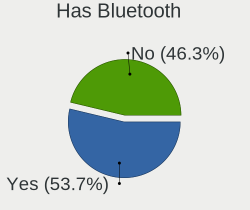
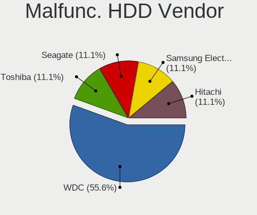

Fedora - Hardware Trends (Desktops)
-----------------------------------

A project to identify most popular hardware characteristics and track their change
over time based on data collected by Linux users at https://Linux-Hardware.org.

Anyone can contribute to this report by the [hw-probe](https://github.com/linuxhw/hw-probe) tool:

    sudo -E hw-probe -all -upload

This report is for one last month. Overall report since the beginning of time: [TestDays](https://github.com/linuxhw/TestDays)

Period: Oct, 2023.

Contents
--------

* [ System ](#system)
  - [ OS                       ](#os)
  - [ OS Family                ](#os-family)
  - [ Kernel                   ](#kernel)
  - [ Kernel Family            ](#kernel-family)
  - [ Kernel Major Ver.        ](#kernel-major-ver)
  - [ Arch                     ](#arch)
  - [ DE                       ](#de)
  - [ Display Server           ](#display-server)
  - [ Display Manager          ](#display-manager)
  - [ OS Lang                  ](#os-lang)
  - [ Boot Mode                ](#boot-mode)
  - [ Filesystem               ](#filesystem)
  - [ Part. scheme             ](#part-scheme)
  - [ Dual Boot with Linux/BSD ](#dual-boot-with-linuxbsd)
  - [ Dual Boot (Win)          ](#dual-boot-win)

* [ Board ](#board)
  - [ Vendor                   ](#vendor)
  - [ Model                    ](#model)
  - [ Model Family             ](#model-family)
  - [ MFG Year                 ](#mfg-year)
  - [ Form Factor              ](#form-factor)
  - [ Secure Boot              ](#secure-boot)
  - [ Coreboot                 ](#coreboot)
  - [ RAM Size                 ](#ram-size)
  - [ RAM Used                 ](#ram-used)
  - [ Total Drives             ](#total-drives)
  - [ Has CD-ROM               ](#has-cd-rom)
  - [ Has Ethernet             ](#has-ethernet)
  - [ Has WiFi                 ](#has-wifi)
  - [ Has Bluetooth            ](#has-bluetooth)

* [ Location ](#location)
  - [ Country                  ](#country)
  - [ City                     ](#city)

* [ Drives ](#drives)
  - [ Drive Vendor             ](#drive-vendor)
  - [ Drive Model              ](#drive-model)
  - [ HDD Vendor               ](#hdd-vendor)
  - [ SSD Vendor               ](#ssd-vendor)
  - [ Drive Kind               ](#drive-kind)
  - [ Drive Connector          ](#drive-connector)
  - [ Drive Size               ](#drive-size)
  - [ Space Total              ](#space-total)
  - [ Space Used               ](#space-used)
  - [ Malfunc. Drives          ](#malfunc-drives)
  - [ Malfunc. Drive Vendor    ](#malfunc-drive-vendor)
  - [ Malfunc. HDD Vendor      ](#malfunc-hdd-vendor)
  - [ Malfunc. Drive Kind      ](#malfunc-drive-kind)
  - [ Failed Drives            ](#failed-drives)
  - [ Failed Drive Vendor      ](#failed-drive-vendor)
  - [ Drive Status             ](#drive-status)

* [ Storage controller ](#storage-controller)
  - [ Storage Vendor           ](#storage-vendor)
  - [ Storage Model            ](#storage-model)
  - [ Storage Kind             ](#storage-kind)

* [ Processor ](#processor)
  - [ CPU Vendor               ](#cpu-vendor)
  - [ CPU Model                ](#cpu-model)
  - [ CPU Model Family         ](#cpu-model-family)
  - [ CPU Cores                ](#cpu-cores)
  - [ CPU Sockets              ](#cpu-sockets)
  - [ CPU Threads              ](#cpu-threads)
  - [ CPU Op-Modes             ](#cpu-op-modes)
  - [ CPU Microcode            ](#cpu-microcode)
  - [ CPU Microarch            ](#cpu-microarch)

* [ Graphics ](#graphics)
  - [ GPU Vendor               ](#gpu-vendor)
  - [ GPU Model                ](#gpu-model)
  - [ GPU Combo                ](#gpu-combo)
  - [ GPU Driver               ](#gpu-driver)
  - [ GPU Memory               ](#gpu-memory)

* [ Monitor ](#monitor)
  - [ Monitor Vendor           ](#monitor-vendor)
  - [ Monitor Model            ](#monitor-model)
  - [ Monitor Resolution       ](#monitor-resolution)
  - [ Monitor Diagonal         ](#monitor-diagonal)
  - [ Monitor Width            ](#monitor-width)
  - [ Aspect Ratio             ](#aspect-ratio)
  - [ Monitor Area             ](#monitor-area)
  - [ Pixel Density            ](#pixel-density)
  - [ Multiple Monitors        ](#multiple-monitors)

* [ Network ](#network)
  - [ Net Controller Vendor    ](#net-controller-vendor)
  - [ Net Controller Model     ](#net-controller-model)
  - [ Wireless Vendor          ](#wireless-vendor)
  - [ Wireless Model           ](#wireless-model)
  - [ Ethernet Vendor          ](#ethernet-vendor)
  - [ Ethernet Model           ](#ethernet-model)
  - [ Net Controller Kind      ](#net-controller-kind)
  - [ Used Controller          ](#used-controller)
  - [ NICs                     ](#nics)
  - [ IPv6                     ](#ipv6)

* [ Bluetooth ](#bluetooth)
  - [ Bluetooth Vendor         ](#bluetooth-vendor)
  - [ Bluetooth Model          ](#bluetooth-model)

* [ Sound ](#sound)
  - [ Sound Vendor             ](#sound-vendor)
  - [ Sound Model              ](#sound-model)

* [ Memory ](#memory)
  - [ Memory Vendor            ](#memory-vendor)
  - [ Memory Model             ](#memory-model)
  - [ Memory Kind              ](#memory-kind)
  - [ Memory Form Factor       ](#memory-form-factor)
  - [ Memory Size              ](#memory-size)
  - [ Memory Speed             ](#memory-speed)

* [ Printers & scanners ](#printers--scanners)
  - [ Printer Vendor           ](#printer-vendor)
  - [ Printer Model            ](#printer-model)
  - [ Scanner Vendor           ](#scanner-vendor)
  - [ Scanner Model            ](#scanner-model)

* [ Camera ](#camera)
  - [ Camera Vendor            ](#camera-vendor)
  - [ Camera Model             ](#camera-model)

* [ Security ](#security)
  - [ Fingerprint Vendor       ](#fingerprint-vendor)
  - [ Fingerprint Model        ](#fingerprint-model)
  - [ Chipcard Vendor          ](#chipcard-vendor)
  - [ Chipcard Model           ](#chipcard-model)

* [ Unsupported ](#unsupported)
  - [ Unsupported Devices      ](#unsupported-devices)
  - [ Unsupported Device Types ](#unsupported-device-types)

System
------

OS
--

Installed operating systems

| Name      | Desktops | Percent |
|-----------|----------|---------|
| Fedora 38 | 157      | 90.75%  |
| Fedora 39 | 12       | 6.94%   |
| Fedora 37 | 4        | 2.31%   |

OS Family
---------

OS without a version

| Name   | Desktops | Percent |
|--------|----------|---------|
| Fedora | 173      | 100%    |

Kernel
------

Version of the Linux kernel

| Version                  | Desktops | Percent |
|--------------------------|----------|---------|
| 6.5.5-200.fc38.x86_64    | 49       | 28.32%  |
| 6.5.6-200.fc38.x86_64    | 40       | 23.12%  |
| 6.5.7-200.fc38.x86_64    | 31       | 17.92%  |
| 6.2.9-300.fc38.x86_64    | 14       | 8.09%   |
| 6.5.8-200.fc38.x86_64    | 13       | 7.51%   |
| 6.4.15-200.fc38.x86_64   | 5        | 2.89%   |
| 6.5.6-300.fc39.x86_64    | 4        | 2.31%   |
| 6.5.8-300.fc39.x86_64    | 2        | 1.16%   |
| 6.5.7-300.fc39.x86_64    | 2        | 1.16%   |
| 6.5.5-300.fc39.x86_64    | 2        | 1.16%   |
| 6.5.5-100.fc37.x86_64    | 2        | 1.16%   |
| 6.5.2-301.fc39.x86_64    | 2        | 1.16%   |
| 6.4.7-100.fc37.x86_64    | 1        | 0.58%   |
| 6.4.4-200.fc38.x86_64    | 1        | 0.58%   |
| 6.4.13-200.fc38.x86_64   | 1        | 0.58%   |
| 6.2.15-300.fc38.x86_64   | 1        | 0.58%   |
| 6.1.14-200.fc37.x86_64   | 1        | 0.58%   |
| 6.0.8-lqx1.0.fc38.x86_64 | 1        | 0.58%   |
| 6.0.7-301.fc37.x86_64    | 1        | 0.58%   |

Kernel Family
-------------

Linux kernel without a distro release

| Version | Desktops | Percent |
|---------|----------|---------|
| 6.5.5   | 53       | 30.64%  |
| 6.5.6   | 44       | 25.43%  |
| 6.5.7   | 33       | 19.08%  |
| 6.5.8   | 15       | 8.67%   |
| 6.2.9   | 14       | 8.09%   |
| 6.4.15  | 5        | 2.89%   |
| 6.5.2   | 2        | 1.16%   |
| 6.4.7   | 1        | 0.58%   |
| 6.4.4   | 1        | 0.58%   |
| 6.4.13  | 1        | 0.58%   |
| 6.2.15  | 1        | 0.58%   |
| 6.1.14  | 1        | 0.58%   |
| 6.0.8   | 1        | 0.58%   |
| 6.0.7   | 1        | 0.58%   |

Kernel Major Ver.
-----------------

Linux kernel major version

| Version | Desktops | Percent |
|---------|----------|---------|
| 6.5     | 147      | 84.97%  |
| 6.2     | 15       | 8.67%   |
| 6.4     | 8        | 4.62%   |
| 6.0     | 2        | 1.16%   |
| 6.1     | 1        | 0.58%   |

Arch
----

OS architecture (x86_64, i586, etc.)

| Name   | Desktops | Percent |
|--------|----------|---------|
| x86_64 | 173      | 100%    |

DE
--

Desktop Environment

| Name          | Desktops | Percent |
|---------------|----------|---------|
| GNOME         | 119      | 68.79%  |
| KDE5          | 30       | 17.34%  |
| Cinnamon      | 9        | 5.2%    |
| X-Cinnamon    | 3        | 1.73%   |
| GNOME Classic | 3        | 1.73%   |
| Unknown       | 3        | 1.73%   |
| MATE          | 2        | 1.16%   |
| XFCE          | 1        | 0.58%   |
| sway          | 1        | 0.58%   |
| LXQt          | 1        | 0.58%   |
| i3            | 1        | 0.58%   |

Display Server
--------------

X11 or Wayland

| Name    | Desktops | Percent |
|---------|----------|---------|
| Wayland | 114      | 65.9%   |
| X11     | 45       | 26.01%  |
| Tty     | 11       | 6.36%   |
| Unknown | 3        | 1.73%   |

Display Manager
---------------

SDDM, LightDM, etc.

| Name    | Desktops | Percent |
|---------|----------|---------|
| Unknown | 107      | 61.85%  |
| GDM     | 38       | 21.97%  |
| LightDM | 16       | 9.25%   |
| SDDM    | 12       | 6.94%   |

OS Lang
-------

Language

| Lang    | Desktops | Percent |
|---------|----------|---------|
| en_US   | 82       | 47.4%   |
| en_GB   | 14       | 8.09%   |
| en_AU   | 11       | 6.36%   |
| de_DE   | 11       | 6.36%   |
| ru_RU   | 10       | 5.78%   |
| es_ES   | 7        | 4.05%   |
| en_CA   | 6        | 3.47%   |
| pt_BR   | 5        | 2.89%   |
| it_IT   | 3        | 1.73%   |
| nl_BE   | 2        | 1.16%   |
| fr_FR   | 2        | 1.16%   |
| es_AR   | 2        | 1.16%   |
| en_NZ   | 2        | 1.16%   |
| de_AT   | 2        | 1.16%   |
| cs_CZ   | 2        | 1.16%   |
| zh_TW   | 1        | 0.58%   |
| tr_TR   | 1        | 0.58%   |
| pt_PT   | 1        | 0.58%   |
| pl_PL   | 1        | 0.58%   |
| lv_LV   | 1        | 0.58%   |
| fr_CA   | 1        | 0.58%   |
| es_MX   | 1        | 0.58%   |
| es_GT   | 1        | 0.58%   |
| en_DK   | 1        | 0.58%   |
| de_CH   | 1        | 0.58%   |
| ar_EG   | 1        | 0.58%   |
| Unknown | 1        | 0.58%   |

Boot Mode
---------

EFI or BIOS

| Mode | Desktops | Percent |
|------|----------|---------|
| EFI  | 124      | 71.68%  |
| BIOS | 49       | 28.32%  |

Filesystem
----------

Type of filesystem

| Type  | Desktops | Percent |
|-------|----------|---------|
| Btrfs | 131      | 75.72%  |
| Ext4  | 34       | 19.65%  |
| Xfs   | 7        | 4.05%   |
| Zfs   | 1        | 0.58%   |

Part. scheme
------------

Scheme of partitioning

| Type    | Desktops | Percent |
|---------|----------|---------|
| Unknown | 104      | 60.12%  |
| GPT     | 57       | 32.95%  |
| MBR     | 12       | 6.94%   |

Dual Boot with Linux/BSD
------------------------

Hosting more than one Linux/BSD

| Dual boot | Desktops | Percent |
|-----------|----------|---------|
| No        | 155      | 89.6%   |
| Yes       | 18       | 10.4%   |

Dual Boot (Win)
---------------

Hosting Linux and Windows

| Dual boot | Desktops | Percent |
|-----------|----------|---------|
| No        | 144      | 83.24%  |
| Yes       | 29       | 16.76%  |

Board
-----

Vendor
------

Motherboard manufacturer

| Name                                 | Desktops | Percent |
|--------------------------------------|----------|---------|
| ASUSTek Computer                     | 39       | 22.54%  |
| Gigabyte Technology                  | 34       | 19.65%  |
| MSI                                  | 32       | 18.5%   |
| ASRock                               | 21       | 12.14%  |
| Hewlett-Packard                      | 14       | 8.09%   |
| Dell                                 | 11       | 6.36%   |
| Lenovo                               | 4        | 2.31%   |
| Supermicro                           | 2        | 1.16%   |
| Shenzhen Meigao Electronic Equipment | 2        | 1.16%   |
| Intel                                | 2        | 1.16%   |
| Acer                                 | 2        | 1.16%   |
| Techvision                           | 1        | 0.58%   |
| Pegatron                             | 1        | 0.58%   |
| Packard Bell                         | 1        | 0.58%   |
| Medion                               | 1        | 0.58%   |
| MACHINIST                            | 1        | 0.58%   |
| LattePanda                           | 1        | 0.58%   |
| AZW                                  | 1        | 0.58%   |
| ANGXUN                               | 1        | 0.58%   |
| AMI                                  | 1        | 0.58%   |
| Unknown                              | 1        | 0.58%   |

Model
-----

Motherboard model

| Name                                          | Desktops | Percent |
|-----------------------------------------------|----------|---------|
| MSI MS-7C56                                   | 3        | 1.73%   |
| ASUS ROG STRIX X670E-I GAMING WIFI            | 3        | 1.73%   |
| MSI MS-7C95                                   | 2        | 1.16%   |
| MSI MS-7C91                                   | 2        | 1.16%   |
| MSI MS-7C37                                   | 2        | 1.16%   |
| HP Z420 Workstation                           | 2        | 1.16%   |
| HP Pavilion Desktop 590-p0xxx                 | 2        | 1.16%   |
| Gigabyte X570 I AORUS PRO WIFI                | 2        | 1.16%   |
| Gigabyte GA-MA780G-UD3H                       | 2        | 1.16%   |
| Gigabyte F2A55M-DS2                           | 2        | 1.16%   |
| Dell OptiPlex 9020                            | 2        | 1.16%   |
| ASUS ROG STRIX X670E-E GAMING WIFI            | 2        | 1.16%   |
| Techvision TVI7309X                           | 1        | 0.58%   |
| Supermicro X8SAX                              | 1        | 0.58%   |
| Supermicro H8DM8-2                            | 1        | 0.58%   |
| Shenzhen Meigao Electronic Equipment UM560 XT | 1        | 0.58%   |
| Shenzhen Meigao Electronic Equipment HX90G    | 1        | 0.58%   |
| Pegatron IPM41-D3                             | 1        | 0.58%   |
| Packard Bell IMEDIA S3840                     | 1        | 0.58%   |
| MSI Vortex G25 8RE                            | 1        | 0.58%   |
| MSI PPPPP-CCC#MMMMMMMM                        | 1        | 0.58%   |
| MSI MS-7E27                                   | 1        | 0.58%   |
| MSI MS-7D78                                   | 1        | 0.58%   |
| MSI MS-7D76                                   | 1        | 0.58%   |
| MSI MS-7D67                                   | 1        | 0.58%   |
| MSI MS-7D52                                   | 1        | 0.58%   |
| MSI MS-7D30                                   | 1        | 0.58%   |
| MSI MS-7D24                                   | 1        | 0.58%   |
| MSI MS-7C92                                   | 1        | 0.58%   |
| MSI MS-7C51                                   | 1        | 0.58%   |
| MSI MS-7C09                                   | 1        | 0.58%   |
| MSI MS-7C02                                   | 1        | 0.58%   |
| MSI MS-7B89                                   | 1        | 0.58%   |
| MSI MS-7B84                                   | 1        | 0.58%   |
| MSI MS-7B79                                   | 1        | 0.58%   |
| MSI MS-7B78                                   | 1        | 0.58%   |
| MSI MS-7B07                                   | 1        | 0.58%   |
| MSI MS-7A40                                   | 1        | 0.58%   |
| MSI MS-7A33                                   | 1        | 0.58%   |
| MSI MS-7A12                                   | 1        | 0.58%   |

Model Family
------------

Motherboard model prefix

| Name                                       | Desktops | Percent |
|--------------------------------------------|----------|---------|
| ASUS ROG                                   | 13       | 7.51%   |
| ASUS TUF                                   | 8        | 4.62%   |
| ASUS PRIME                                 | 8        | 4.62%   |
| Dell OptiPlex                              | 5        | 2.89%   |
| MSI MS-7C56                                | 3        | 1.73%   |
| Lenovo ThinkCentre                         | 3        | 1.73%   |
| HP Pavilion                                | 3        | 1.73%   |
| Gigabyte X570                              | 3        | 1.73%   |
| ASRock B550                                | 3        | 1.73%   |
| MSI MS-7C95                                | 2        | 1.16%   |
| MSI MS-7C91                                | 2        | 1.16%   |
| MSI MS-7C37                                | 2        | 1.16%   |
| HP Z420                                    | 2        | 1.16%   |
| HP Z240                                    | 2        | 1.16%   |
| HP EliteDesk                               | 2        | 1.16%   |
| Gigabyte GA-MA780G-UD3H                    | 2        | 1.16%   |
| Gigabyte F2A55M-DS2                        | 2        | 1.16%   |
| Gigabyte B550M                             | 2        | 1.16%   |
| Gigabyte B550                              | 2        | 1.16%   |
| Gigabyte B450M                             | 2        | 1.16%   |
| Dell XPS                                   | 2        | 1.16%   |
| Dell Precision                             | 2        | 1.16%   |
| ASRock B365M                               | 2        | 1.16%   |
| Acer Aspire                                | 2        | 1.16%   |
| Techvision TVI7309X                        | 1        | 0.58%   |
| Supermicro X8SAX                           | 1        | 0.58%   |
| Supermicro H8DM8-2                         | 1        | 0.58%   |
| Shenzhen Meigao Electronic Equipment UM560 | 1        | 0.58%   |
| Shenzhen Meigao Electronic Equipment HX90G | 1        | 0.58%   |
| Pegatron IPM41-D3                          | 1        | 0.58%   |
| Packard Bell IMEDIA                        | 1        | 0.58%   |
| MSI Vortex                                 | 1        | 0.58%   |
| MSI PPPPP-CCC#MMMMMMMM                     | 1        | 0.58%   |
| MSI MS-7E27                                | 1        | 0.58%   |
| MSI MS-7D78                                | 1        | 0.58%   |
| MSI MS-7D76                                | 1        | 0.58%   |
| MSI MS-7D67                                | 1        | 0.58%   |
| MSI MS-7D52                                | 1        | 0.58%   |
| MSI MS-7D30                                | 1        | 0.58%   |
| MSI MS-7D24                                | 1        | 0.58%   |

MFG Year
--------

Motherboard manufacture year

| Year | Desktops | Percent |
|------|----------|---------|
| 2020 | 22       | 12.72%  |
| 2018 | 22       | 12.72%  |
| 2022 | 19       | 10.98%  |
| 2019 | 18       | 10.4%   |
| 2021 | 14       | 8.09%   |
| 2012 | 12       | 6.94%   |
| 2017 | 10       | 5.78%   |
| 2023 | 9        | 5.2%    |
| 2016 | 7        | 4.05%   |
| 2015 | 7        | 4.05%   |
| 2014 | 7        | 4.05%   |
| 2010 | 6        | 3.47%   |
| 2013 | 5        | 2.89%   |
| 2011 | 5        | 2.89%   |
| 2009 | 5        | 2.89%   |
| 2008 | 3        | 1.73%   |
| 2007 | 1        | 0.58%   |
| 2006 | 1        | 0.58%   |

Form Factor
-----------

Physical design of the computer

| Name    | Desktops | Percent |
|---------|----------|---------|
| Desktop | 173      | 100%    |

Secure Boot
-----------

Enabled or disabled

| State    | Desktops | Percent |
|----------|----------|---------|
| Disabled | 155      | 89.6%   |
| Enabled  | 18       | 10.4%   |

Coreboot
--------

Have coreboot on board

| Used | Desktops | Percent |
|------|----------|---------|
| No   | 173      | 100%    |

RAM Size
--------

Total RAM memory

| Size in GB  | Desktops | Percent |
|-------------|----------|---------|
| 16.01-24.0  | 40       | 23.12%  |
| 32.01-64.0  | 37       | 21.39%  |
| 8.01-16.0   | 29       | 16.76%  |
| 64.01-256.0 | 27       | 15.61%  |
| 3.01-4.0    | 18       | 10.4%   |
| 4.01-8.0    | 14       | 8.09%   |
| 24.01-32.0  | 7        | 4.05%   |
| 2.01-3.0    | 1        | 0.58%   |

RAM Used
--------

Used RAM memory

| Used GB     | Desktops | Percent |
|-------------|----------|---------|
| 4.01-8.0    | 56       | 32.37%  |
| 3.01-4.0    | 38       | 21.97%  |
| 2.01-3.0    | 31       | 17.92%  |
| 8.01-16.0   | 21       | 12.14%  |
| 1.01-2.0    | 20       | 11.56%  |
| 0.51-1.0    | 3        | 1.73%   |
| 32.01-64.0  | 1        | 0.58%   |
| 24.01-32.0  | 1        | 0.58%   |
| 64.01-256.0 | 1        | 0.58%   |
| 16.01-24.0  | 1        | 0.58%   |

Total Drives
------------

Number of drives on board

| Drives | Desktops | Percent |
|--------|----------|---------|
| 2      | 58       | 33.53%  |
| 1      | 52       | 30.06%  |
| 3      | 34       | 19.65%  |
| 4      | 13       | 7.51%   |
| 6      | 6        | 3.47%   |
| 5      | 6        | 3.47%   |
| 7      | 2        | 1.16%   |
| 410    | 1        | 0.58%   |
| 9      | 1        | 0.58%   |

Has CD-ROM
----------

Has CD-ROM on board

| Presented | Desktops | Percent |
|-----------|----------|---------|
| No        | 121      | 69.94%  |
| Yes       | 52       | 30.06%  |

Has Ethernet
------------

Has Ethernet on board

| Presented | Desktops | Percent |
|-----------|----------|---------|
| Yes       | 171      | 98.84%  |
| No        | 2        | 1.16%   |

Has WiFi
--------

Has WiFi module

| Presented | Desktops | Percent |
|-----------|----------|---------|
| Yes       | 106      | 61.27%  |
| No        | 67       | 38.73%  |

Has Bluetooth
-------------

Has Bluetooth module

| Presented | Desktops | Percent |
|-----------|----------|---------|
| No        | 89       | 51.45%  |
| Yes       | 84       | 48.55%  |

Location
--------

Country
-------

Geographic location (country)

| Country     | Desktops | Percent |
|-------------|----------|---------|
| USA         | 39       | 22.54%  |
| Germany     | 17       | 9.83%   |
| Brazil      | 11       | 6.36%   |
| Australia   | 11       | 6.36%   |
| Spain       | 8        | 4.62%   |
| Canada      | 8        | 4.62%   |
| Russia      | 6        | 3.47%   |
| Italy       | 6        | 3.47%   |
| UK          | 5        | 2.89%   |
| Belarus     | 4        | 2.31%   |
| Argentina   | 4        | 2.31%   |
| Sweden      | 3        | 1.73%   |
| France      | 3        | 1.73%   |
| Bulgaria    | 3        | 1.73%   |
| Belgium     | 3        | 1.73%   |
| Austria     | 3        | 1.73%   |
| Norway      | 2        | 1.16%   |
| New Zealand | 2        | 1.16%   |
| Netherlands | 2        | 1.16%   |
| Mexico      | 2        | 1.16%   |
| Latvia      | 2        | 1.16%   |
| India       | 2        | 1.16%   |
| Denmark     | 2        | 1.16%   |
| Czechia     | 2        | 1.16%   |
| Colombia    | 2        | 1.16%   |
| Vietnam     | 1        | 0.58%   |
| Venezuela   | 1        | 0.58%   |
| Turkey      | 1        | 0.58%   |
| Thailand    | 1        | 0.58%   |
| Taiwan      | 1        | 0.58%   |
| Switzerland | 1        | 0.58%   |
| Slovenia    | 1        | 0.58%   |
| Portugal    | 1        | 0.58%   |
| Poland      | 1        | 0.58%   |
| Kosovo      | 1        | 0.58%   |
| Kenya       | 1        | 0.58%   |
| Kazakhstan  | 1        | 0.58%   |
| Japan       | 1        | 0.58%   |
| Israel      | 1        | 0.58%   |
| Ireland     | 1        | 0.58%   |

City
----

Geographic location (city)

| City            | Desktops | Percent |
|-----------------|----------|---------|
| Sydney          | 8        | 4.62%   |
| Minsk           | 4        | 2.31%   |
| Sao Paulo       | 3        | 1.73%   |
| Van Nuys        | 2        | 1.16%   |
| Seattle         | 2        | 1.16%   |
| San Jose        | 2        | 1.16%   |
| Rostov-on-Don   | 2        | 1.16%   |
| Riga            | 2        | 1.16%   |
| Ober-Morlen     | 2        | 1.16%   |
| Montreal        | 2        | 1.16%   |
| Kolkata         | 2        | 1.16%   |
| Houston         | 2        | 1.16%   |
| Chicago         | 2        | 1.16%   |
| Buenos Aires    | 2        | 1.16%   |
| Zurich          | 1        | 0.58%   |
| Wroclaw         | 1        | 0.58%   |
| Worcester       | 1        | 0.58%   |
| Winnipeg        | 1        | 0.58%   |
| Wilhelmshaven   | 1        | 0.58%   |
| Viry-Châtillon | 1        | 0.58%   |
| Vienna          | 1        | 0.58%   |
| Velaux          | 1        | 0.58%   |
| Västerås      | 1        | 0.58%   |
| Varna           | 1        | 0.58%   |
| Valencia        | 1        | 0.58%   |
| Ulm             | 1        | 0.58%   |
| Toronto         | 1        | 0.58%   |
| Thunder Bay     | 1        | 0.58%   |
| Thousand Oaks   | 1        | 0.58%   |
| Tandil          | 1        | 0.58%   |
| Taipei          | 1        | 0.58%   |
| Sundbyberg      | 1        | 0.58%   |
| Stockholm       | 1        | 0.58%   |
| Stezzano        | 1        | 0.58%   |
| St Albans       | 1        | 0.58%   |
| Spokane Valley  | 1        | 0.58%   |
| Somerville      | 1        | 0.58%   |
| Sofia           | 1        | 0.58%   |
| Soddy-Daisy     | 1        | 0.58%   |
| Smidary         | 1        | 0.58%   |

Drives
------

Drive Vendor
------------

Hard drive vendors

| Vendor                       | Desktops | Drives | Percent |
|------------------------------|----------|--------|---------|
| Samsung Electronics          | 62       | 88     | 18.13%  |
| WDC                          | 49       | 66     | 14.33%  |
| Seagate                      | 42       | 49     | 12.28%  |
| Crucial                      | 18       | 18     | 5.26%   |
| Kingston                     | 16       | 20     | 4.68%   |
| SanDisk                      | 15       | 19     | 4.39%   |
| Toshiba                      | 11       | 12     | 3.22%   |
| Phison Electronics           | 11       | 13     | 3.22%   |
| Intel                        | 9        | 12     | 2.63%   |
| Micron/Crucial Technology    | 8        | 9      | 2.34%   |
| Hitachi                      | 8        | 8      | 2.34%   |
| Kingston Technology Company  | 7        | 8      | 2.05%   |
| HGST                         | 7        | 7      | 2.05%   |
| Silicon Motion               | 5        | 5      | 1.46%   |
| Realtek Semiconductor        | 5        | 5      | 1.46%   |
| Unknown                      | 4        | 4      | 1.17%   |
| Hewlett-Packard              | 4        | 4      | 1.17%   |
| A-DATA Technology            | 4        | 4      | 1.17%   |
| ADATA Technology             | 3        | 3      | 0.88%   |
| XrayDisk                     | 2        | 2      | 0.58%   |
| T-FORCE                      | 2        | 2      | 0.58%   |
| SPCC                         | 2        | 2      | 0.58%   |
| SK hynix                     | 2        | 2      | 0.58%   |
| PNY                          | 2        | 3      | 0.58%   |
| Patriot                      | 2        | 2      | 0.58%   |
| Mushkin                      | 2        | 2      | 0.58%   |
| Micron Technology            | 2        | 2      | 0.58%   |
| MAXIO Technology (Hangzhou)  | 2        | 2      | 0.58%   |
| Intenso                      | 2        | 2      | 0.58%   |
| ASMT                         | 2        | 2      | 0.58%   |
| Apacer                       | 2        | 3      | 0.58%   |
| AMD                          | 2        | 4      | 0.58%   |
| Transcend                    | 1        | 1      | 0.29%   |
| Team                         | 1        | 2      | 0.29%   |
| Smartbuy                     | 1        | 1      | 0.29%   |
| Shenzhen Longsys Electronics | 1        | 1      | 0.29%   |
| SABRENT                      | 1        | 1      | 0.29%   |
| OCZ                          | 1        | 1      | 0.29%   |
| Netac                        | 1        | 1      | 0.29%   |
| Maxtor                       | 1        | 1      | 0.29%   |

Drive Model
-----------

Hard drive models

| Model                                                 | Desktops | Percent |
|-------------------------------------------------------|----------|---------|
| Samsung NVMe SSD Controller SM981/PM981/PM983 1TB     | 21       | 5.48%   |
| Samsung NVMe SSD Controller PM9A1/PM9A3/980PRO 1TB    | 8        | 2.09%   |
| Seagate ST2000DM008-2FR102 2TB                        | 6        | 1.57%   |
| Samsung SSD 870 EVO 1TB                               | 5        | 1.31%   |
| Samsung SSD 860 EVO 1TB                               | 5        | 1.31%   |
| Phison E12 NVMe Controller 1TB                        | 5        | 1.31%   |
| Micron/Crucial P2 NVMe PCIe SSD 500GB                 | 5        | 1.31%   |
| Kingston SA400S37480G 480GB SSD                       | 5        | 1.31%   |
| Kingston SA400S37240G 240GB SSD                       | 5        | 1.31%   |
| Silicon Motion SM2263EN/SM2263XT SSD Controller 256GB | 4        | 1.04%   |
| Seagate ST2000DM006-2DM164 2TB                        | 4        | 1.04%   |
| Samsung SSD 990 PRO 1TB                               | 4        | 1.04%   |
| Samsung SSD 850 EVO 250GB                             | 4        | 1.04%   |
| Crucial CT500MX500SSD1 500GB                          | 4        | 1.04%   |
| Crucial CT1000MX500SSD1 1TB                           | 4        | 1.04%   |
| WDC WDS500G2B0A-00SM50 500GB SSD                      | 3        | 0.78%   |
| WDC WD40EFRX-68N32N0 4TB                              | 3        | 0.78%   |
| Unknown SD/MMC/MS PRO 16GB                            | 3        | 0.78%   |
| Seagate ST500DM002-1BD142 500GB                       | 3        | 0.78%   |
| Sandisk WD Blue SN550 NVMe SSD 1TB                    | 3        | 0.78%   |
| Samsung SSD 980 500GB                                 | 3        | 0.78%   |
| Samsung SSD 840 EVO 120GB                             | 3        | 0.78%   |
| Micron/Crucial P1 NVMe PCIe SSD 1TB                   | 3        | 0.78%   |
| Kingston Company SNV2S2000G 2TB                       | 3        | 0.78%   |
| Kingston Company SNV2S1000G 1TB                       | 3        | 0.78%   |
| WDC WDS120G2G0A-00JH30 120GB SSD                      | 2        | 0.52%   |
| WDC WDS100T2B0A-00SM50 1TB SSD                        | 2        | 0.52%   |
| WDC WD5000AVCS-632DY1 500GB                           | 2        | 0.52%   |
| WDC WD40EZRZ-22GXCB0 4TB                              | 2        | 0.52%   |
| WDC WD30EZRX-00MMMB0 3TB                              | 2        | 0.52%   |
| WDC WD20EZRX-00DC0B0 2TB                              | 2        | 0.52%   |
| WDC WD20EZRX-00D8PB0 2TB                              | 2        | 0.52%   |
| WDC WD10EZEX-60M2NA0 1TB                              | 2        | 0.52%   |
| WDC WD10EZEX-08WN4A0 1TB                              | 2        | 0.52%   |
| Toshiba THNSNJ256GCSU 256GB SSD                       | 2        | 0.52%   |
| Toshiba DT01ACA100 1TB                                | 2        | 0.52%   |
| Seagate ST250DM000-1BD141 250GB                       | 2        | 0.52%   |
| Seagate ST1000DM010-2EP102 1TB                        | 2        | 0.52%   |
| Seagate ST1000DM003-1SB102 1TB                        | 2        | 0.52%   |
| Seagate ST1000DM003-1CH162 1TB                        | 2        | 0.52%   |

HDD Vendor
----------

Hard disk drive vendors

| Vendor              | Desktops | Drives | Percent |
|---------------------|----------|--------|---------|
| WDC                 | 42       | 57     | 36.52%  |
| Seagate             | 40       | 46     | 34.78%  |
| Hitachi             | 8        | 8      | 6.96%   |
| Toshiba             | 7        | 8      | 6.09%   |
| HGST                | 7        | 7      | 6.09%   |
| Samsung Electronics | 5        | 6      | 4.35%   |
| Unknown             | 3        | 3      | 2.61%   |
| Maxtor              | 1        | 1      | 0.87%   |
| Maxone              | 1        | 1      | 0.87%   |
| Apple               | 1        | 1      | 0.87%   |

SSD Vendor
----------

Solid state drive vendors

| Vendor              | Desktops | Drives | Percent |
|---------------------|----------|--------|---------|
| Samsung Electronics | 29       | 34     | 22.31%  |
| Crucial             | 18       | 18     | 13.85%  |
| Kingston            | 13       | 15     | 10%     |
| SanDisk             | 9        | 10     | 6.92%   |
| WDC                 | 8        | 9      | 6.15%   |
| Intel               | 5        | 6      | 3.85%   |
| Toshiba             | 4        | 4      | 3.08%   |
| Hewlett-Packard     | 4        | 4      | 3.08%   |
| A-DATA Technology   | 4        | 4      | 3.08%   |
| SPCC                | 2        | 2      | 1.54%   |
| PNY                 | 2        | 3      | 1.54%   |
| Patriot             | 2        | 2      | 1.54%   |
| Mushkin             | 2        | 2      | 1.54%   |
| Micron Technology   | 2        | 2      | 1.54%   |
| Intenso             | 2        | 2      | 1.54%   |
| Apacer              | 2        | 3      | 1.54%   |
| XrayDisk            | 1        | 1      | 0.77%   |
| Transcend           | 1        | 1      | 0.77%   |
| Team                | 1        | 2      | 0.77%   |
| T-FORCE             | 1        | 1      | 0.77%   |
| Smartbuy            | 1        | 1      | 0.77%   |
| SABRENT             | 1        | 1      | 0.77%   |
| OCZ                 | 1        | 1      | 0.77%   |
| Netac               | 1        | 1      | 0.77%   |
| LITEONIT            | 1        | 1      | 0.77%   |
| LITEON              | 1        | 1      | 0.77%   |
| KUIJIA              | 1        | 1      | 0.77%   |
| GSemi               | 1        | 1      | 0.77%   |
| Gigabyte Technology | 1        | 1      | 0.77%   |
| FreeNAS             | 1        | 36     | 0.77%   |
| FreeBSD             | 1        | 372    | 0.77%   |
| Emtec               | 1        | 1      | 0.77%   |
| CT1000P1            | 1        | 1      | 0.77%   |
| Corsair             | 1        | 2      | 0.77%   |
| Colorful            | 1        | 1      | 0.77%   |
| China               | 1        | 1      | 0.77%   |
| ASMT                | 1        | 1      | 0.77%   |
| ASMedia             | 1        | 4      | 0.77%   |

Drive Kind
----------

HDD or SSD

| Kind    | Desktops | Drives | Percent |
|---------|----------|--------|---------|
| SSD     | 104      | 553    | 34.44%  |
| HDD     | 99       | 138    | 32.78%  |
| NVMe    | 94       | 127    | 31.13%  |
| Unknown | 4        | 4      | 1.32%   |
| MMC     | 1        | 1      | 0.33%   |

Drive Connector
---------------

SATA, SAS, NVMe, etc.

| Type | Desktops | Drives | Percent |
|------|----------|--------|---------|
| SATA | 132      | 681    | 55.23%  |
| NVMe | 93       | 125    | 38.91%  |
| SAS  | 13       | 16     | 5.44%   |
| MMC  | 1        | 1      | 0.42%   |

Drive Size
----------

Size of hard drive

| Size in TB | Desktops | Drives | Percent |
|------------|----------|--------|---------|
| 0.01-0.5   | 93       | 546    | 45.59%  |
| 0.51-1.0   | 56       | 73     | 27.45%  |
| 1.01-2.0   | 28       | 37     | 13.73%  |
| 3.01-4.0   | 15       | 18     | 7.35%   |
| 2.01-3.0   | 6        | 7      | 2.94%   |
| 4.01-10.0  | 5        | 6      | 2.45%   |
| 10.01-20.0 | 1        | 4      | 0.49%   |

Space Total
-----------

Amount of disk space available on the file system

| Size in GB     | Desktops | Percent |
|----------------|----------|---------|
| More than 3000 | 36       | 20.81%  |
| 501-1000       | 32       | 18.5%   |
| 1001-2000      | 31       | 17.92%  |
| 101-250        | 24       | 13.87%  |
| 251-500        | 16       | 9.25%   |
| 2001-3000      | 14       | 8.09%   |
| Unknown        | 10       | 5.78%   |
| 1-20           | 7        | 4.05%   |
| 51-100         | 3        | 1.73%   |

Space Used
----------

Amount of used disk space

| Used GB        | Desktops | Percent |
|----------------|----------|---------|
| 1-20           | 35       | 20.23%  |
| 21-50          | 22       | 12.72%  |
| 101-250        | 20       | 11.56%  |
| 51-100         | 19       | 10.98%  |
| 1001-2000      | 18       | 10.4%   |
| 251-500        | 17       | 9.83%   |
| 501-1000       | 15       | 8.67%   |
| More than 3000 | 12       | 6.94%   |
| Unknown        | 10       | 5.78%   |
| 2001-3000      | 5        | 2.89%   |

Malfunc. Drives
---------------

Drive models with a malfunction

| Model                             | Desktops | Drives | Percent |
|-----------------------------------|----------|--------|---------|
| WDC WD5000AVCS-632DY1 500GB       | 1        | 1      | 5.88%   |
| WDC WD5000AAKX-00ERMA0 500GB      | 1        | 1      | 5.88%   |
| WDC WD5000AAKS-00UU3A0 500GB      | 1        | 1      | 5.88%   |
| WDC WD30EZRX-00SPEB0 3TB          | 1        | 1      | 5.88%   |
| WDC WD30EFRX-68AX9N0 3TB          | 1        | 1      | 5.88%   |
| WDC WD20EZRX-00D8PB0 2TB          | 1        | 1      | 5.88%   |
| WDC WD20EARS-00J2GB0 2TB          | 1        | 1      | 5.88%   |
| Seagate ST500DM002-1BD142 500GB   | 1        | 1      | 5.88%   |
| Samsung Electronics HD501LJ 500GB | 1        | 2      | 5.88%   |
| Maxtor STM3320820AS 320GB         | 1        | 1      | 5.88%   |
| Intel SSDSC2CT120A3 120GB         | 1        | 1      | 5.88%   |
| Hitachi HTS545025B9SA00 250GB     | 1        | 1      | 5.88%   |
| Hitachi HTS543232A7A384 320GB     | 1        | 1      | 5.88%   |
| Hitachi HDP725025GLA380 250GB     | 1        | 1      | 5.88%   |
| HGST HTS545050A7E680 500GB        | 1        | 1      | 5.88%   |
| Crucial CT120M500SSD1 120GB       | 1        | 1      | 5.88%   |
| China SSD 512GB                   | 1        | 1      | 5.88%   |

Malfunc. Drive Vendor
---------------------

Vendors of faulty drives

| Vendor              | Desktops | Drives | Percent |
|---------------------|----------|--------|---------|
| WDC                 | 6        | 7      | 37.5%   |
| Hitachi             | 3        | 3      | 18.75%  |
| Seagate             | 1        | 1      | 6.25%   |
| Samsung Electronics | 1        | 2      | 6.25%   |
| Maxtor              | 1        | 1      | 6.25%   |
| Intel               | 1        | 1      | 6.25%   |
| HGST                | 1        | 1      | 6.25%   |
| Crucial             | 1        | 1      | 6.25%   |
| China               | 1        | 1      | 6.25%   |

Malfunc. HDD Vendor
-------------------

Vendors of faulty HDD drives

| Vendor              | Desktops | Drives | Percent |
|---------------------|----------|--------|---------|
| WDC                 | 6        | 7      | 46.15%  |
| Hitachi             | 3        | 3      | 23.08%  |
| Seagate             | 1        | 1      | 7.69%   |
| Samsung Electronics | 1        | 2      | 7.69%   |
| Maxtor              | 1        | 1      | 7.69%   |
| HGST                | 1        | 1      | 7.69%   |

Malfunc. Drive Kind
-------------------

Kinds of faulty drives

| Kind | Desktops | Drives | Percent |
|------|----------|--------|---------|
| HDD  | 11       | 15     | 78.57%  |
| SSD  | 3        | 3      | 21.43%  |

Failed Drives
-------------

Failed drive models

Zero info for selected period =(

Failed Drive Vendor
-------------------

Failed drive vendors

Zero info for selected period =(

Drive Status
------------

Number of failed and malfunc. drives

| Status   | Desktops | Drives | Percent |
|----------|----------|--------|---------|
| Detected | 110      | 264    | 59.46%  |
| Works    | 61       | 541    | 32.97%  |
| Malfunc  | 14       | 18     | 7.57%   |

Storage controller
------------------

Storage Vendor
--------------

Storage controller vendors

| Vendor                       | Desktops | Percent |
|------------------------------|----------|---------|
| AMD                          | 88       | 30.66%  |
| Intel                        | 80       | 27.87%  |
| Samsung Electronics          | 40       | 13.94%  |
| ASMedia Technology           | 13       | 4.53%   |
| Phison Electronics           | 11       | 3.83%   |
| Kingston Technology Company  | 11       | 3.83%   |
| Micron/Crucial Technology    | 8        | 2.79%   |
| SanDisk                      | 6        | 2.09%   |
| Silicon Motion               | 5        | 1.74%   |
| Realtek Semiconductor        | 5        | 1.74%   |
| ADATA Technology             | 3        | 1.05%   |
| SK hynix                     | 2        | 0.7%    |
| Seagate Technology           | 2        | 0.7%    |
| MAXIO Technology (Hangzhou)  | 2        | 0.7%    |
| JMicron Technology           | 2        | 0.7%    |
| VIA Technologies             | 1        | 0.35%   |
| ULi Electronics              | 1        | 0.35%   |
| Silicon Image                | 1        | 0.35%   |
| Shenzhen Longsys Electronics | 1        | 0.35%   |
| Nvidia                       | 1        | 0.35%   |
| Marvell Technology Group     | 1        | 0.35%   |
| KIOXIA                       | 1        | 0.35%   |
| Hosin Global Electronics     | 1        | 0.35%   |
| Broadcom / LSI               | 1        | 0.35%   |

Storage Model
-------------

Storage controller models

| Model                                                                          | Desktops | Percent |
|--------------------------------------------------------------------------------|----------|---------|
| AMD FCH SATA Controller [AHCI mode]                                            | 56       | 15.91%  |
| Samsung NVMe SSD Controller SM981/PM981/PM983                                  | 21       | 5.97%   |
| AMD 500 Series Chipset SATA Controller                                         | 19       | 5.4%    |
| AMD 400 Series Chipset SATA Controller                                         | 16       | 4.55%   |
| ASMedia ASM1062 Serial ATA Controller                                          | 12       | 3.41%   |
| Intel Alder Lake-S PCH SATA Controller [AHCI Mode]                             | 10       | 2.84%   |
| Intel 200 Series PCH SATA controller [AHCI mode]                               | 10       | 2.84%   |
| Samsung NVMe SSD Controller PM9A1/PM9A3/980PRO                                 | 8        | 2.27%   |
| Samsung NVMe SSD Controller 980 (DRAM-less)                                    | 7        | 1.99%   |
| Intel Q170/Q150/B150/H170/H110/Z170/CM236 Chipset SATA Controller [AHCI Mode]  | 7        | 1.99%   |
| Intel 8 Series/C220 Series Chipset Family 6-port SATA Controller 1 [AHCI mode] | 7        | 1.99%   |
| Samsung NVMe SSD Controller S4LV008[Pascal]                                    | 6        | 1.7%    |
| Intel Volume Management Device NVMe RAID Controller                            | 6        | 1.7%    |
| Intel 7 Series/C210 Series Chipset Family 6-port SATA Controller [AHCI mode]   | 6        | 1.7%    |
| Phison E12 NVMe Controller                                                     | 5        | 1.42%   |
| Micron/Crucial P2 [Nick P2] / P3 / P3 Plus NVMe PCIe SSD (DRAM-less)           | 5        | 1.42%   |
| Kingston Company NV2 NVMe SSD SM2267XT                                         | 5        | 1.42%   |
| Intel SATA Controller [RAID mode]                                              | 5        | 1.42%   |
| Intel Cannon Lake PCH SATA AHCI Controller                                     | 5        | 1.42%   |
| AMD FCH SATA Controller D                                                      | 5        | 1.42%   |
| Silicon Motion SM2263EN/SM2263XT (DRAM-less) NVMe SSD Controllers              | 4        | 1.14%   |
| Realtek RTS5765DL NVMe SSD Controller (DRAM-less)                              | 4        | 1.14%   |
| Intel C600/X79 series chipset SATA RAID Controller                             | 4        | 1.14%   |
| AMD SB7x0/SB8x0/SB9x0 SATA Controller [AHCI mode]                              | 4        | 1.14%   |
| AMD SB7x0/SB8x0/SB9x0 IDE Controller                                           | 4        | 1.14%   |
| SanDisk Ultra 3D / WD Blue SN550 NVMe SSD                                      | 3        | 0.85%   |
| Micron/Crucial P1 NVMe PCIe SSD[Frampton]                                      | 3        | 0.85%   |
| Kingston Company KC3000/FURY Renegade NVMe SSD E18                             | 3        | 0.85%   |
| Intel NM10/ICH7 Family SATA Controller [IDE mode]                              | 3        | 0.85%   |
| Intel C602 chipset 4-Port SATA Storage Control Unit                            | 3        | 0.85%   |
| Intel C600/X79 series chipset IDE-r Controller                                 | 3        | 0.85%   |
| AMD X370 Series Chipset SATA Controller                                        | 3        | 0.85%   |
| AMD FCH IDE Controller                                                         | 3        | 0.85%   |
| AMD 300 Series Chipset SATA Controller                                         | 3        | 0.85%   |
| Seagate FireCuda 530 SSD                                                       | 2        | 0.57%   |
| Sandisk WD Black SN850X NVMe SSD                                               | 2        | 0.57%   |
| Phison E16 PCIe4 NVMe Controller                                               | 2        | 0.57%   |
| Intel SSD 670p Series [Keystone Harbor]                                        | 2        | 0.57%   |
| Intel SSD 660P Series                                                          | 2        | 0.57%   |
| Intel NM10/ICH7 Family SATA Controller [AHCI mode]                             | 2        | 0.57%   |

Storage Kind
------------

Kind of storage controller (IDE, SATA, NVMe, SAS, ...)

| Kind | Desktops | Percent |
|------|----------|---------|
| SATA | 150      | 52.08%  |
| NVMe | 93       | 32.29%  |
| IDE  | 24       | 8.33%   |
| RAID | 17       | 5.9%    |
| SAS  | 3        | 1.04%   |
| SCSI | 1        | 0.35%   |

Processor
---------

CPU Vendor
----------

Processor vendors

| Vendor | Desktops | Percent |
|--------|----------|---------|
| AMD    | 90       | 52.02%  |
| Intel  | 83       | 47.98%  |

CPU Model
---------

Processor models

| Model                                      | Desktops | Percent |
|--------------------------------------------|----------|---------|
| AMD Ryzen 7 5700G with Radeon Graphics     | 6        | 3.47%   |
| AMD Ryzen 7 2700X Eight-Core Processor     | 5        | 2.89%   |
| AMD Ryzen 9 7950X3D 16-Core Processor      | 4        | 2.31%   |
| AMD Ryzen 9 7950X 16-Core Processor        | 4        | 2.31%   |
| AMD Ryzen 9 5950X 16-Core Processor        | 4        | 2.31%   |
| AMD Ryzen 7 3700X 8-Core Processor         | 4        | 2.31%   |
| AMD Ryzen 5 5600X 6-Core Processor         | 4        | 2.31%   |
| AMD Ryzen 5 3600 6-Core Processor          | 4        | 2.31%   |
| Intel Core i5-9400F CPU @ 2.90GHz          | 3        | 1.73%   |
| Intel Core i5-8400 CPU @ 2.80GHz           | 3        | 1.73%   |
| AMD Ryzen 7 5800X3D 8-Core Processor       | 3        | 1.73%   |
| AMD Ryzen 5 5600 6-Core Processor          | 3        | 1.73%   |
| Intel Xeon CPU E5-1620 v2 @ 3.70GHz        | 2        | 1.16%   |
| Intel Core i7-8700 CPU @ 3.20GHz           | 2        | 1.16%   |
| Intel Core i7-6700 CPU @ 3.40GHz           | 2        | 1.16%   |
| Intel Core i7-3770 CPU @ 3.40GHz           | 2        | 1.16%   |
| Intel Core i5-6500 CPU @ 3.20GHz           | 2        | 1.16%   |
| Intel Core i5-3470 CPU @ 3.20GHz           | 2        | 1.16%   |
| Intel Core i3-4160 CPU @ 3.60GHz           | 2        | 1.16%   |
| Intel Core i3-3220 CPU @ 3.30GHz           | 2        | 1.16%   |
| Intel 12th Gen Core i7-12700K              | 2        | 1.16%   |
| Intel 12th Gen Core i7-12700               | 2        | 1.16%   |
| AMD Ryzen 7 PRO 4750G with Radeon Graphics | 2        | 1.16%   |
| AMD Ryzen 7 7700X 8-Core Processor         | 2        | 1.16%   |
| AMD Ryzen 7 5800X 8-Core Processor         | 2        | 1.16%   |
| AMD Ryzen 7 5700X 8-Core Processor         | 2        | 1.16%   |
| AMD Ryzen 7 1700 Eight-Core Processor      | 2        | 1.16%   |
| AMD Ryzen 5 7600X 6-Core Processor         | 2        | 1.16%   |
| AMD Ryzen 5 5600G with Radeon Graphics     | 2        | 1.16%   |
| AMD A4-4000 APU with Radeon HD Graphics    | 2        | 1.16%   |
| Intel Xeon CPU E5606 @ 2.13GHz             | 1        | 0.58%   |
| Intel Xeon CPU E5-2699 v3 @ 2.30GHz        | 1        | 0.58%   |
| Intel Xeon CPU E5-2680 v3 @ 2.50GHz        | 1        | 0.58%   |
| Intel Xeon CPU E5-2678 v3 @ 2.50GHz        | 1        | 0.58%   |
| Intel Xeon CPU E5-2670 0 @ 2.60GHz         | 1        | 0.58%   |
| Intel Xeon CPU E5-2666 v3 @ 2.90GHz        | 1        | 0.58%   |
| Intel Xeon CPU E5-2603 v4 @ 1.70GHz        | 1        | 0.58%   |
| Intel Xeon CPU E3-1230 v5 @ 3.40GHz        | 1        | 0.58%   |
| Intel Pentium Gold G5420 CPU @ 3.80GHz     | 1        | 0.58%   |
| Intel Pentium Gold G5400 CPU @ 3.70GHz     | 1        | 0.58%   |

CPU Model Family
----------------

Processor model prefix

| Model                   | Desktops | Percent |
|-------------------------|----------|---------|
| AMD Ryzen 7             | 30       | 17.34%  |
| Intel Core i5           | 22       | 12.72%  |
| AMD Ryzen 5             | 22       | 12.72%  |
| AMD Ryzen 9             | 16       | 9.25%   |
| Other                   | 13       | 7.51%   |
| Intel Core i7           | 13       | 7.51%   |
| Intel Xeon              | 10       | 5.78%   |
| Intel Core i3           | 8        | 4.62%   |
| Intel Celeron           | 7        | 4.05%   |
| AMD A10                 | 4        | 2.31%   |
| AMD Ryzen 3             | 3        | 1.73%   |
| Intel Pentium Gold      | 2        | 1.16%   |
| Intel Core 2 Quad       | 2        | 1.16%   |
| Intel Core 2 Duo        | 2        | 1.16%   |
| Intel Atom              | 2        | 1.16%   |
| AMD Ryzen 7 PRO         | 2        | 1.16%   |
| AMD Ryzen 5 PRO         | 2        | 1.16%   |
| AMD Phenom II X6        | 2        | 1.16%   |
| AMD A4                  | 2        | 1.16%   |
| Intel Pentium Dual-Core | 1        | 0.58%   |
| Intel Core 2            | 1        | 0.58%   |
| AMD Six-Core Opteron    | 1        | 0.58%   |
| AMD Ryzen Threadripper  | 1        | 0.58%   |
| AMD Phenom II X4        | 1        | 0.58%   |
| AMD Phenom II X2        | 1        | 0.58%   |
| AMD FX                  | 1        | 0.58%   |
| AMD Athlon 64 X2        | 1        | 0.58%   |
| AMD Athlon              | 1        | 0.58%   |

CPU Cores
---------

Number of processor cores

| Number | Desktops | Percent |
|--------|----------|---------|
| 4      | 42       | 24.28%  |
| 6      | 37       | 21.39%  |
| 8      | 34       | 19.65%  |
| 2      | 25       | 14.45%  |
| 16     | 14       | 8.09%   |
| 12     | 10       | 5.78%   |
| 10     | 3        | 1.73%   |
| 1      | 3        | 1.73%   |
| 24     | 2        | 1.16%   |
| 36     | 1        | 0.58%   |
| 14     | 1        | 0.58%   |
| 3      | 1        | 0.58%   |

CPU Sockets
-----------

Number of sockets

| Number | Desktops | Percent |
|--------|----------|---------|
| 1      | 170      | 98.27%  |
| 2      | 3        | 1.73%   |

CPU Threads
-----------

Threads per core (Hyper-Threading)

| Number | Desktops | Percent |
|--------|----------|---------|
| 2      | 128      | 73.99%  |
| 1      | 45       | 26.01%  |

CPU Op-Modes
------------

CPU Operation Modes (32-bit, 64-bit)

| Op mode        | Desktops | Percent |
|----------------|----------|---------|
| 32-bit, 64-bit | 173      | 100%    |

CPU Microcode
-------------

Microcode number

| Number     | Desktops | Percent |
|------------|----------|---------|
| Unknown    | 93       | 53.76%  |
| 0x0a601203 | 12       | 6.94%   |
| 0x0a20120a | 9        | 5.2%    |
| 0x0a50000d | 6        | 3.47%   |
| 0x0800820d | 6        | 3.47%   |
| 0x08701021 | 4        | 2.31%   |
| 0x08701030 | 3        | 1.73%   |
| 0x06001119 | 3        | 1.73%   |
| 0x0a50000c | 2        | 1.16%   |
| 0x0a20120e | 2        | 1.16%   |
| 0x0a201205 | 2        | 1.16%   |
| 0x0a201016 | 2        | 1.16%   |
| 0x08701013 | 2        | 1.16%   |
| 0x08600109 | 2        | 1.16%   |
| 0x08108109 | 2        | 1.16%   |
| 0x0810100b | 2        | 1.16%   |
| 0x08001137 | 2        | 1.16%   |
| 0x06003106 | 2        | 1.16%   |
| 0x010000c8 | 2        | 1.16%   |
| 0x506e3    | 1        | 0.58%   |
| 0x20652    | 1        | 0.58%   |
| 0x0a704101 | 1        | 0.58%   |
| 0x0a601206 | 1        | 0.58%   |
| 0x0a50000b | 1        | 0.58%   |
| 0x0a201204 | 1        | 0.58%   |
| 0x0a201009 | 1        | 0.58%   |
| 0x08600106 | 1        | 0.58%   |
| 0x08101016 | 1        | 0.58%   |
| 0x08001129 | 1        | 0.58%   |
| 0x0800111c | 1        | 0.58%   |
| 0x06003104 | 1        | 0.58%   |
| 0x06000852 | 1        | 0.58%   |
| 0x010000dc | 1        | 0.58%   |
| 0x010000bf | 1        | 0.58%   |

CPU Microarch
-------------

Microarchitecture

| Name             | Desktops | Percent |
|------------------|----------|---------|
| Zen 3            | 31       | 17.92%  |
| KabyLake         | 17       | 9.83%   |
| Unknown          | 16       | 9.25%   |
| Zen 2            | 15       | 8.67%   |
| Haswell          | 12       | 6.94%   |
| Alderlake Hybrid | 12       | 6.94%   |
| IvyBridge        | 9        | 5.2%    |
| Zen+             | 8        | 4.62%   |
| Zen              | 7        | 4.05%   |
| Skylake          | 7        | 4.05%   |
| SandyBridge      | 5        | 2.89%   |
| Penryn           | 5        | 2.89%   |
| K10              | 5        | 2.89%   |
| Piledriver       | 4        | 2.31%   |
| Westmere         | 3        | 1.73%   |
| Steamroller      | 3        | 1.73%   |
| Tremont          | 2        | 1.16%   |
| Silvermont       | 2        | 1.16%   |
| IceLake          | 2        | 1.16%   |
| Core             | 2        | 1.16%   |
| Bonnell          | 2        | 1.16%   |
| K8 Hammer        | 1        | 0.58%   |
| Goldmont plus    | 1        | 0.58%   |
| CometLake        | 1        | 0.58%   |
| Broadwell        | 1        | 0.58%   |

Graphics
--------

GPU Vendor
----------

Vendors of graphics cards

| Vendor | Desktops | Percent |
|--------|----------|---------|
| AMD    | 85       | 46.45%  |
| Nvidia | 62       | 33.88%  |
| Intel  | 36       | 19.67%  |

GPU Model
---------

Graphics card models

| Model                                                                       | Desktops | Percent |
|-----------------------------------------------------------------------------|----------|---------|
| AMD Cezanne [Radeon Vega Series / Radeon Vega Mobile Series]                | 10       | 5.21%   |
| AMD Raphael                                                                 | 9        | 4.69%   |
| AMD Navi 21 [Radeon RX 6800/6800 XT / 6900 XT]                              | 8        | 4.17%   |
| AMD Navi 23 [Radeon RX 6600/6600 XT/6600M]                                  | 7        | 3.65%   |
| AMD Ellesmere [Radeon RX 470/480/570/570X/580/580X/590]                     | 6        | 3.13%   |
| Intel Xeon E3-1200 v3/4th Gen Core Processor Integrated Graphics Controller | 5        | 2.6%    |
| AMD Navi 22 [Radeon RX 6700/6700 XT/6750 XT / 6800M/6850M XT]               | 5        | 2.6%    |
| AMD Navi 10 [Radeon RX 5600 OEM/5600 XT / 5700/5700 XT]                     | 5        | 2.6%    |
| Nvidia GK208B [GeForce GT 710]                                              | 4        | 2.08%   |
| Nvidia GF119 [GeForce GT 610]                                               | 4        | 2.08%   |
| Intel CoffeeLake-S GT2 [UHD Graphics 630]                                   | 4        | 2.08%   |
| Nvidia TU116 [GeForce GTX 1660]                                             | 3        | 1.56%   |
| Nvidia GP107 [GeForce GTX 1050 Ti]                                          | 3        | 1.56%   |
| Nvidia GP106 [GeForce GTX 1060 6GB]                                         | 3        | 1.56%   |
| Nvidia GF106 [GeForce GTS 450]                                              | 3        | 1.56%   |
| Nvidia GA104 [GeForce RTX 3070]                                             | 3        | 1.56%   |
| Nvidia GA104 [GeForce RTX 3060 Ti]                                          | 3        | 1.56%   |
| Intel HD Graphics 530                                                       | 3        | 1.56%   |
| Intel AlderLake-S GT1                                                       | 3        | 1.56%   |
| AMD Renoir [Radeon RX Vega 6 (Ryzen 4000/5000 Mobile Series)]               | 3        | 1.56%   |
| AMD Raven Ridge [Radeon Vega Series / Radeon Vega Mobile Series]            | 3        | 1.56%   |
| AMD Navi 31 [Radeon RX 7900 XT/7900 XTX]                                    | 3        | 1.56%   |
| Nvidia TU106 [GeForce RTX 2060 SUPER]                                       | 2        | 1.04%   |
| Nvidia GT218 [GeForce 210]                                                  | 2        | 1.04%   |
| Nvidia GP106 [GeForce GTX 1060 3GB]                                         | 2        | 1.04%   |
| Nvidia GP104 [GeForce GTX 1070]                                             | 2        | 1.04%   |
| Nvidia GF106 [GeForce GTS 450 OEM]                                          | 2        | 1.04%   |
| Intel Xeon E3-1200 v2/3rd Gen Core processor Graphics Controller            | 2        | 1.04%   |
| Intel JasperLake [UHD Graphics]                                             | 2        | 1.04%   |
| Intel CoffeeLake-S GT1 [UHD Graphics 610]                                   | 2        | 1.04%   |
| Intel Atom Processor Z36xxx/Z37xxx Series Graphics & Display                | 2        | 1.04%   |
| AMD Turks PRO [Radeon HD 6570/7570/8550 / R5 230]                           | 2        | 1.04%   |
| AMD RV710 [Radeon HD 4350/4550]                                             | 2        | 1.04%   |
| AMD Picasso/Raven 2 [Radeon Vega Series / Radeon Vega Mobile Series]        | 2        | 1.04%   |
| AMD Navi 33 [Radeon RX 7700S/7600/7600S/7600M XT/PRO W7600]                 | 2        | 1.04%   |
| AMD Navi 24 [Radeon RX 6400/6500 XT/6500M]                                  | 2        | 1.04%   |
| AMD Kaveri [Radeon R7 Graphics]                                             | 2        | 1.04%   |
| Nvidia TU117GL [T400 4GB]                                                   | 1        | 0.52%   |
| Nvidia TU117 [GeForce GTX 1650]                                             | 1        | 0.52%   |
| Nvidia TU116 [GeForce GTX 1650 SUPER]                                       | 1        | 0.52%   |

GPU Combo
---------

Combinations of graphics cards

| Name            | Desktops | Percent |
|-----------------|----------|---------|
| 1 x AMD         | 72       | 41.62%  |
| 1 x Nvidia      | 56       | 32.37%  |
| 1 x Intel       | 29       | 16.76%  |
| 2 x AMD         | 8        | 4.62%   |
| Intel + Nvidia  | 4        | 2.31%   |
| AMD + Nvidia    | 2        | 1.16%   |
| Intel + 2 x AMD | 1        | 0.58%   |
| Intel + AMD     | 1        | 0.58%   |

GPU Driver
----------

Free vs proprietary

| Driver      | Desktops | Percent |
|-------------|----------|---------|
| Free        | 136      | 78.61%  |
| Proprietary | 34       | 19.65%  |
| Unknown     | 3        | 1.73%   |

GPU Memory
----------

Total video memory

| Size in GB | Desktops | Percent |
|------------|----------|---------|
| Unknown    | 51       | 29.48%  |
| 7.01-8.0   | 27       | 15.61%  |
| 1.01-2.0   | 21       | 12.14%  |
| 0.51-1.0   | 19       | 10.98%  |
| 0.01-0.5   | 18       | 10.4%   |
| 8.01-16.0  | 14       | 8.09%   |
| 3.01-4.0   | 11       | 6.36%   |
| 5.01-6.0   | 5        | 2.89%   |
| 16.01-24.0 | 5        | 2.89%   |
| 2.01-3.0   | 2        | 1.16%   |

Monitor
-------

Monitor Vendor
--------------

Monitor vendors

| Vendor               | Desktops | Percent |
|----------------------|----------|---------|
| Samsung Electronics  | 38       | 19.1%   |
| Goldstar             | 36       | 18.09%  |
| Dell                 | 17       | 8.54%   |
| Hewlett-Packard      | 12       | 6.03%   |
| Acer                 | 12       | 6.03%   |
| AOC                  | 11       | 5.53%   |
| Philips              | 7        | 3.52%   |
| Lenovo               | 7        | 3.52%   |
| ASUSTek Computer     | 7        | 3.52%   |
| BenQ                 | 6        | 3.02%   |
| Ancor Communications | 5        | 2.51%   |
| MSI                  | 4        | 2.01%   |
| Iiyama               | 4        | 2.01%   |
| ViewSonic            | 3        | 1.51%   |
| Sceptre Tech         | 3        | 1.51%   |
| Gigabyte Technology  | 3        | 1.51%   |
| Unknown              | 2        | 1.01%   |
| RTK                  | 2        | 1.01%   |
| Panasonic            | 2        | 1.01%   |
| ___                  | 1        | 0.5%    |
| Vizio                | 1        | 0.5%    |
| VIE                  | 1        | 0.5%    |
| Sony                 | 1        | 0.5%    |
| PPC                  | 1        | 0.5%    |
| OOO                  | 1        | 0.5%    |
| IPS                  | 1        | 0.5%    |
| Huion                | 1        | 0.5%    |
| HUAWEI               | 1        | 0.5%    |
| HKC                  | 1        | 0.5%    |
| HannStar             | 1        | 0.5%    |
| Fujitsu Siemens      | 1        | 0.5%    |
| FMX                  | 1        | 0.5%    |
| Envision             | 1        | 0.5%    |
| Eizo                 | 1        | 0.5%    |
| Compal               | 1        | 0.5%    |
| Casper               | 1        | 0.5%    |
| Belinea              | 1        | 0.5%    |

Monitor Model
-------------

Monitor models

| Model                                                                    | Desktops | Percent |
|--------------------------------------------------------------------------|----------|---------|
| Unknown LCD Monitor FFFF 2288x1287 2550x2550mm 142.0-inch                | 2        | 0.96%   |
| Samsung Electronics S24F350 SAM0D20 1920x1080 521x293mm 23.5-inch        | 2        | 0.96%   |
| Samsung Electronics LCD Monitor SAM7016 3840x2160 950x540mm 43.0-inch    | 2        | 0.96%   |
| Samsung Electronics LC49G95T SAM7053 3840x1080 1193x336mm 48.8-inch      | 2        | 0.96%   |
| Samsung Electronics C24F390 SAM0D2C 1920x1080 521x293mm 23.5-inch        | 2        | 0.96%   |
| Hewlett-Packard 20fi HWP306F 1600x900 443x249mm 20.0-inch                | 2        | 0.96%   |
| Goldstar W2442 GSM56D9 1920x1080 531x299mm 24.0-inch                     | 2        | 0.96%   |
| Goldstar Ultra HD GSM5B09 3840x2160 600x340mm 27.2-inch                  | 2        | 0.96%   |
| Goldstar LG TV SSCR2 GSMC0C8 3840x2160                                   | 2        | 0.96%   |
| Goldstar LG IPS FULLHD GSM5AB8 1920x1080 480x270mm 21.7-inch             | 2        | 0.96%   |
| Gigabyte Technology M27Q GBT270D 2560x1440 596x335mm 26.9-inch           | 2        | 0.96%   |
| Dell U2412M DELA07B 1920x1200 518x324mm 24.1-inch                        | 2        | 0.96%   |
| Dell S2421HN DEL41F1 1920x1080 527x296mm 23.8-inch                       | 2        | 0.96%   |
| ASUSTek Computer VG245 AUS24A1 1920x1080 531x299mm 24.0-inch             | 2        | 0.96%   |
| AOC Q27P2W AOC2702 2560x1440 597x336mm 27.0-inch                         | 2        | 0.96%   |
| ___ LCD TV ___9000 1360x768                                              | 1        | 0.48%   |
| Vizio M437-G0 VIZ1033 3840x2160 1210x680mm 54.6-inch                     | 1        | 0.48%   |
| ViewSonic VX2433wm VSC3822 1920x1080 520x290mm 23.4-inch                 | 1        | 0.48%   |
| ViewSonic VX2257 VSCB731 1920x1080 477x268mm 21.5-inch                   | 1        | 0.48%   |
| ViewSonic VP2468a VSCA93A 1920x1080 527x296mm 23.8-inch                  | 1        | 0.48%   |
| VIE 2380 VIEE003 1920x1080 473x296mm 22.0-inch                           | 1        | 0.48%   |
| Sony KLV-S23A10 SNY3300 1280x768                                         | 1        | 0.48%   |
| Sceptre Tech Sceptre M27 SPT0ACD 1920x1080 598x336mm 27.0-inch           | 1        | 0.48%   |
| Sceptre Tech Sceptre F27 SPT0AD7 1920x1080 600x330mm 27.0-inch           | 1        | 0.48%   |
| Sceptre Tech E20 SPT080D 1600x900 410x280mm 19.5-inch                    | 1        | 0.48%   |
| Samsung Electronics U32J59x SAM0F33 3840x2160 697x392mm 31.5-inch        | 1        | 0.48%   |
| Samsung Electronics T24C550 SAM0AA1 1920x1080 521x293mm 23.5-inch        | 1        | 0.48%   |
| Samsung Electronics SyncMaster SAM0498 1600x900 443x249mm 20.0-inch      | 1        | 0.48%   |
| Samsung Electronics SyncMaster SAM041F 2048x1152 510x287mm 23.0-inch     | 1        | 0.48%   |
| Samsung Electronics SyncMaster SAM01D3 1440x900 408x225mm 18.3-inch      | 1        | 0.48%   |
| Samsung Electronics SMS22A350H SAM07D2 1920x1080 477x268mm 21.5-inch     | 1        | 0.48%   |
| Samsung Electronics SE790C SAM0C63 2560x1080 700x310mm 30.1-inch         | 1        | 0.48%   |
| Samsung Electronics SA300/SA350 SAM0795 1920x1080 521x293mm 23.5-inch    | 1        | 0.48%   |
| Samsung Electronics SA300/SA350 SAM078F 1920x1080 477x268mm 21.5-inch    | 1        | 0.48%   |
| Samsung Electronics S34J55x SAM0F70 3440x1440 797x333mm 34.0-inch        | 1        | 0.48%   |
| Samsung Electronics S27E310 SAM0C31 1920x1080 598x336mm 27.0-inch        | 1        | 0.48%   |
| Samsung Electronics S27B350 SAM08DC 1920x1080 598x336mm 27.0-inch        | 1        | 0.48%   |
| Samsung Electronics S24E310 SAM0C2F 1920x1080 521x293mm 23.5-inch        | 1        | 0.48%   |
| Samsung Electronics S22F350 SAM0D1A 1920x1080 477x268mm 21.5-inch        | 1        | 0.48%   |
| Samsung Electronics Odyssey G95SC SAME028 3840x1080 1193x336mm 48.8-inch | 1        | 0.48%   |

Monitor Resolution
------------------

Monitor screen resolution

| Resolution         | Desktops | Percent |
|--------------------|----------|---------|
| 1920x1080 (FHD)    | 102      | 53.13%  |
| 3840x2160 (4K)     | 27       | 14.06%  |
| 2560x1440 (QHD)    | 20       | 10.42%  |
| 1600x900 (HD+)     | 7        | 3.65%   |
| 1280x1024 (SXGA)   | 6        | 3.13%   |
| 3840x1080          | 5        | 2.6%    |
| 2560x1080          | 5        | 2.6%    |
| 1920x1200 (WUXGA)  | 5        | 2.6%    |
| 3440x1440          | 3        | 1.56%   |
| 1680x1050 (WSXGA+) | 3        | 1.56%   |
| 2288x1287          | 2        | 1.04%   |
| 1440x900 (WXGA+)   | 2        | 1.04%   |
| 2560x1600          | 1        | 0.52%   |
| 2048x1152          | 1        | 0.52%   |
| 1366x768 (WXGA)    | 1        | 0.52%   |
| 1360x768           | 1        | 0.52%   |
| 1280x768           | 1        | 0.52%   |

Monitor Diagonal
----------------

Diagonal size in inches

| Inches  | Desktops | Percent |
|---------|----------|---------|
| 27      | 46       | 23.12%  |
| 23      | 33       | 16.58%  |
| 24      | 27       | 13.57%  |
| 21      | 24       | 12.06%  |
| 31      | 14       | 7.04%   |
| 34      | 8        | 4.02%   |
| 19      | 6        | 3.02%   |
| 84      | 5        | 2.51%   |
| 48      | 5        | 2.51%   |
| 20      | 5        | 2.51%   |
| 72      | 3        | 1.51%   |
| 22      | 3        | 1.51%   |
| 18      | 3        | 1.51%   |
| 142     | 2        | 1.01%   |
| 54      | 2        | 1.01%   |
| 15      | 2        | 1.01%   |
| Unknown | 2        | 1.01%   |
| 69      | 1        | 0.5%    |
| 47      | 1        | 0.5%    |
| 36      | 1        | 0.5%    |
| 33      | 1        | 0.5%    |
| 32      | 1        | 0.5%    |
| 30      | 1        | 0.5%    |
| 29      | 1        | 0.5%    |
| 26      | 1        | 0.5%    |
| 17      | 1        | 0.5%    |

Monitor Width
-------------

Physical width

| Width in mm    | Desktops | Percent |
|----------------|----------|---------|
| 501-600        | 92       | 49.46%  |
| 401-500        | 35       | 18.82%  |
| 601-700        | 19       | 10.22%  |
| 701-800        | 11       | 5.91%   |
| 1501-2000      | 9        | 4.84%   |
| 1001-1500      | 8        | 4.3%    |
| 351-400        | 5        | 2.69%   |
| 301-350        | 3        | 1.61%   |
| More than 2000 | 2        | 1.08%   |
| Unknown        | 2        | 1.08%   |

Aspect Ratio
------------

Proportional relationship between the width and the height

| Ratio | Desktops | Percent |
|-------|----------|---------|
| 16/9  | 139      | 79.43%  |
| 16/10 | 14       | 8%      |
| 21/9  | 9        | 5.14%   |
| 32/9  | 5        | 2.86%   |
| 6/5   | 3        | 1.71%   |
| 5/4   | 3        | 1.71%   |
| 1.00  | 2        | 1.14%   |

Monitor Area
------------

Area in inch²

| Area in inch² | Desktops | Percent |
|----------------|----------|---------|
| 201-250        | 68       | 34.87%  |
| 301-350        | 48       | 24.62%  |
| 351-500        | 25       | 12.82%  |
| 151-200        | 18       | 9.23%   |
| More than 1000 | 13       | 6.67%   |
| 251-300        | 9        | 4.62%   |
| 501-1000       | 7        | 3.59%   |
| 141-150        | 3        | 1.54%   |
| Unknown        | 2        | 1.03%   |
| 101-110        | 1        | 0.51%   |
| 91-100         | 1        | 0.51%   |

Pixel Density
-------------

Pixels per inch

| Density | Desktops | Percent |
|---------|----------|---------|
| 51-100  | 121      | 68.36%  |
| 101-120 | 38       | 21.47%  |
| 121-160 | 11       | 6.21%   |
| 1-50    | 4        | 2.26%   |
| Unknown | 2        | 1.13%   |
| 161-240 | 1        | 0.56%   |

Multiple Monitors
-----------------

Total monitors connected

| Total | Desktops | Percent |
|-------|----------|---------|
| 1     | 124      | 71.68%  |
| 2     | 37       | 21.39%  |
| 0     | 8        | 4.62%   |
| 3     | 2        | 1.16%   |
| 5     | 1        | 0.58%   |
| 4     | 1        | 0.58%   |

Network
-------

Net Controller Vendor
---------------------

Controller vendors

| Vendor                   | Desktops | Percent |
|--------------------------|----------|---------|
| Realtek Semiconductor    | 110      | 41.98%  |
| Intel                    | 84       | 32.06%  |
| MediaTek                 | 15       | 5.73%   |
| Qualcomm Atheros         | 11       | 4.2%    |
| TP-Link                  | 8        | 3.05%   |
| Broadcom                 | 6        | 2.29%   |
| Ralink Technology        | 3        | 1.15%   |
| Microsoft                | 3        | 1.15%   |
| Aquantia                 | 3        | 1.15%   |
| DisplayLink              | 2        | 0.76%   |
| D-Link                   | 2        | 0.76%   |
| Wacom                    | 1        | 0.38%   |
| VIA Technologies         | 1        | 0.38%   |
| Samsung Electronics      | 1        | 0.38%   |
| Ralink                   | 1        | 0.38%   |
| Motorola PCS             | 1        | 0.38%   |
| Marvell Technology Group | 1        | 0.38%   |
| Linksys                  | 1        | 0.38%   |
| IMC Networks             | 1        | 0.38%   |
| Hewlett-Packard          | 1        | 0.38%   |
| Google                   | 1        | 0.38%   |
| D-Link System            | 1        | 0.38%   |
| Broadcom Limited         | 1        | 0.38%   |
| ASUSTek Computer         | 1        | 0.38%   |
| 3Com                     | 1        | 0.38%   |
| Unknown                  | 1        | 0.38%   |

Net Controller Model
--------------------

Controller models

| Model                                                             | Desktops | Percent |
|-------------------------------------------------------------------|----------|---------|
| Realtek RTL8111/8168/8411 PCI Express Gigabit Ethernet Controller | 82       | 25.95%  |
| Realtek RTL8125 2.5GbE Controller                                 | 20       | 6.33%   |
| Intel I211 Gigabit Network Connection                             | 16       | 5.06%   |
| Intel Ethernet Controller I225-V                                  | 15       | 4.75%   |
| Intel Wi-Fi 6 AX200                                               | 13       | 4.11%   |
| MediaTek MT7922 802.11ax PCI Express Wireless Network Adapter     | 9        | 2.85%   |
| Intel Wi-Fi 6 AX210/AX211/AX411 160MHz                            | 9        | 2.85%   |
| Intel Ethernet Connection (2) I219-V                              | 8        | 2.53%   |
| Intel Dual Band Wireless-AC 3168NGW [Stone Peak]                  | 8        | 2.53%   |
| Realtek RTL8821CE 802.11ac PCIe Wireless Network Adapter          | 5        | 1.58%   |
| MediaTek MT7921K (RZ608) Wi-Fi 6E 80MHz                           | 5        | 1.58%   |
| Realtek RTL8188EUS 802.11n Wireless Network Adapter               | 4        | 1.27%   |
| Intel Ethernet Connection I217-LM                                 | 4        | 1.27%   |
| Intel Alder Lake-S PCH CNVi WiFi                                  | 4        | 1.27%   |
| Intel 82579LM Gigabit Network Connection (Lewisville)             | 4        | 1.27%   |
| Qualcomm Atheros QCA6174 802.11ac Wireless Network Adapter        | 3        | 0.95%   |
| Qualcomm Atheros AR8151 v2.0 Gigabit Ethernet                     | 3        | 0.95%   |
| Intel Ethernet Connection (2) I219-LM                             | 3        | 0.95%   |
| Intel 82574L Gigabit Network Connection                           | 3        | 0.95%   |
| Broadcom BCM4360 802.11ac Dual Band Wireless Network Adapter      | 3        | 0.95%   |
| TP-Link TL-WN722N v2/v3 [Realtek RTL8188EUS]                      | 2        | 0.63%   |
| TP-Link Archer T2U PLUS [RTL8821AU]                               | 2        | 0.63%   |
| Realtek RTL8192CU 802.11n WLAN Adapter                            | 2        | 0.63%   |
| Realtek RTL8169 PCI Gigabit Ethernet Controller                   | 2        | 0.63%   |
| Realtek RTL8153 Gigabit Ethernet Adapter                          | 2        | 0.63%   |
| Qualcomm Atheros AR9485 Wireless Network Adapter                  | 2        | 0.63%   |
| Microsoft Wireless XBox Controller Dongle                         | 2        | 0.63%   |
| Intel Wireless-AC 9260                                            | 2        | 0.63%   |
| Intel I210 Gigabit Network Connection                             | 2        | 0.63%   |
| Intel Ethernet Controller I226-V                                  | 2        | 0.63%   |
| Intel Ethernet Connection (7) I219-V                              | 2        | 0.63%   |
| Intel Ethernet Connection (2) I218-V                              | 2        | 0.63%   |
| Intel 82579V Gigabit Network Connection                           | 2        | 0.63%   |
| Broadcom BCM4352 802.11ac Dual Band Wireless Network Adapter      | 2        | 0.63%   |
| Aquantia AQC107 NBase-T/IEEE 802.3bz Ethernet Controller [AQtion] | 2        | 0.63%   |
| Wacom ACK-40401 [Wireless Accessory Kit]                          | 1        | 0.32%   |
| VIA VT6105/VT6106S [Rhine-III]                                    | 1        | 0.32%   |
| TP-Link TL-WN821N v5/v6 [RTL8192EU]                               | 1        | 0.32%   |
| TP-Link Archer T9UH v1 [Realtek RTL8814AU]                        | 1        | 0.32%   |
| TP-Link 802.11ac WLAN Adapter                                     | 1        | 0.32%   |

Wireless Vendor
---------------

Wireless vendors

| Vendor                | Desktops | Percent |
|-----------------------|----------|---------|
| Intel                 | 41       | 37.27%  |
| Realtek Semiconductor | 20       | 18.18%  |
| MediaTek              | 15       | 13.64%  |
| TP-Link               | 8        | 7.27%   |
| Qualcomm Atheros      | 7        | 6.36%   |
| Broadcom              | 6        | 5.45%   |
| Ralink Technology     | 3        | 2.73%   |
| Microsoft             | 3        | 2.73%   |
| Wacom                 | 1        | 0.91%   |
| Ralink                | 1        | 0.91%   |
| Linksys               | 1        | 0.91%   |
| IMC Networks          | 1        | 0.91%   |
| D-Link System         | 1        | 0.91%   |
| D-Link                | 1        | 0.91%   |
| ASUSTek Computer      | 1        | 0.91%   |

Wireless Model
--------------

Wireless models

| Model                                                                                         | Desktops | Percent |
|-----------------------------------------------------------------------------------------------|----------|---------|
| Intel Wi-Fi 6 AX200                                                                           | 13       | 11.61%  |
| MediaTek MT7922 802.11ax PCI Express Wireless Network Adapter                                 | 9        | 8.04%   |
| Intel Wi-Fi 6 AX210/AX211/AX411 160MHz                                                        | 9        | 8.04%   |
| Intel Dual Band Wireless-AC 3168NGW [Stone Peak]                                              | 8        | 7.14%   |
| Realtek RTL8821CE 802.11ac PCIe Wireless Network Adapter                                      | 5        | 4.46%   |
| MediaTek MT7921K (RZ608) Wi-Fi 6E 80MHz                                                       | 5        | 4.46%   |
| Realtek RTL8188EUS 802.11n Wireless Network Adapter                                           | 4        | 3.57%   |
| Intel Alder Lake-S PCH CNVi WiFi                                                              | 4        | 3.57%   |
| Qualcomm Atheros QCA6174 802.11ac Wireless Network Adapter                                    | 3        | 2.68%   |
| Broadcom BCM4360 802.11ac Dual Band Wireless Network Adapter                                  | 3        | 2.68%   |
| TP-Link TL-WN722N v2/v3 [Realtek RTL8188EUS]                                                  | 2        | 1.79%   |
| TP-Link Archer T2U PLUS [RTL8821AU]                                                           | 2        | 1.79%   |
| Realtek RTL8192CU 802.11n WLAN Adapter                                                        | 2        | 1.79%   |
| Qualcomm Atheros AR9485 Wireless Network Adapter                                              | 2        | 1.79%   |
| Microsoft Wireless XBox Controller Dongle                                                     | 2        | 1.79%   |
| Intel Wireless-AC 9260                                                                        | 2        | 1.79%   |
| Broadcom BCM4352 802.11ac Dual Band Wireless Network Adapter                                  | 2        | 1.79%   |
| Wacom ACK-40401 [Wireless Accessory Kit]                                                      | 1        | 0.89%   |
| TP-Link TL-WN821N v5/v6 [RTL8192EU]                                                           | 1        | 0.89%   |
| TP-Link Archer T9UH v1 [Realtek RTL8814AU]                                                    | 1        | 0.89%   |
| TP-Link 802.11ac WLAN Adapter                                                                 | 1        | 0.89%   |
| TP-Link 802.11ac NIC                                                                          | 1        | 0.89%   |
| Realtek RTL88x2bu [AC1200 Techkey]                                                            | 1        | 0.89%   |
| Realtek RTL8852BE PCIe 802.11ax Wireless Network Controller                                   | 1        | 0.89%   |
| Realtek RTL8852AE 802.11ax PCIe Wireless Network Adapter                                      | 1        | 0.89%   |
| Realtek RTL8822CE 802.11ac PCIe Wireless Network Adapter                                      | 1        | 0.89%   |
| Realtek RTL8821AE 802.11ac PCIe Wireless Network Adapter                                      | 1        | 0.89%   |
| Realtek RTL8814AU 802.11a/b/g/n/ac Wireless Adapter                                           | 1        | 0.89%   |
| Realtek RTL8192EE PCIe Wireless Network Adapter                                               | 1        | 0.89%   |
| Realtek RTL8188EE Wireless Network Adapter                                                    | 1        | 0.89%   |
| Realtek Realtek 8812AU/8821AU 802.11ac WLAN Adapter [USB Wireless Dual-Band Adapter 2.4/5Ghz] | 1        | 0.89%   |
| Realtek 802.11ac NIC                                                                          | 1        | 0.89%   |
| Ralink RT5370 Wireless Adapter                                                                | 1        | 0.89%   |
| Ralink MT7610U ("Archer T2U" 2.4G+5G WLAN Adapter                                             | 1        | 0.89%   |
| Ralink MT7601U Wireless Adapter                                                               | 1        | 0.89%   |
| Ralink RT3090 Wireless 802.11n 1T/1R PCIe                                                     | 1        | 0.89%   |
| Qualcomm Atheros AR93xx Wireless Network Adapter                                              | 1        | 0.89%   |
| Qualcomm Atheros AR9285 Wireless Network Adapter (PCI-Express)                                | 1        | 0.89%   |
| Microsoft Xbox 360 Wireless Adapter                                                           | 1        | 0.89%   |
| MediaTek MT7921 802.11ax PCI Express Wireless Network Adapter                                 | 1        | 0.89%   |

Ethernet Vendor
---------------

Ethernet vendors

| Vendor                   | Desktops | Percent |
|--------------------------|----------|---------|
| Realtek Semiconductor    | 105      | 55.26%  |
| Intel                    | 66       | 34.74%  |
| Qualcomm Atheros         | 6        | 3.16%   |
| Aquantia                 | 3        | 1.58%   |
| DisplayLink              | 2        | 1.05%   |
| VIA Technologies         | 1        | 0.53%   |
| Samsung Electronics      | 1        | 0.53%   |
| Marvell Technology Group | 1        | 0.53%   |
| Hewlett-Packard          | 1        | 0.53%   |
| Google                   | 1        | 0.53%   |
| D-Link                   | 1        | 0.53%   |
| Broadcom Limited         | 1        | 0.53%   |
| 3Com                     | 1        | 0.53%   |

Ethernet Model
--------------

Ethernet models

| Model                                                             | Desktops | Percent |
|-------------------------------------------------------------------|----------|---------|
| Realtek RTL8111/8168/8411 PCI Express Gigabit Ethernet Controller | 82       | 40.59%  |
| Realtek RTL8125 2.5GbE Controller                                 | 20       | 9.9%    |
| Intel I211 Gigabit Network Connection                             | 16       | 7.92%   |
| Intel Ethernet Controller I225-V                                  | 15       | 7.43%   |
| Intel Ethernet Connection (2) I219-V                              | 8        | 3.96%   |
| Intel Ethernet Connection I217-LM                                 | 4        | 1.98%   |
| Intel 82579LM Gigabit Network Connection (Lewisville)             | 4        | 1.98%   |
| Qualcomm Atheros AR8151 v2.0 Gigabit Ethernet                     | 3        | 1.49%   |
| Intel Ethernet Connection (2) I219-LM                             | 3        | 1.49%   |
| Intel 82574L Gigabit Network Connection                           | 3        | 1.49%   |
| Realtek RTL8169 PCI Gigabit Ethernet Controller                   | 2        | 0.99%   |
| Realtek RTL8153 Gigabit Ethernet Adapter                          | 2        | 0.99%   |
| Intel I210 Gigabit Network Connection                             | 2        | 0.99%   |
| Intel Ethernet Controller I226-V                                  | 2        | 0.99%   |
| Intel Ethernet Connection (7) I219-V                              | 2        | 0.99%   |
| Intel Ethernet Connection (2) I218-V                              | 2        | 0.99%   |
| Intel 82579V Gigabit Network Connection                           | 2        | 0.99%   |
| Aquantia AQC107 NBase-T/IEEE 802.3bz Ethernet Controller [AQtion] | 2        | 0.99%   |
| VIA VT6105/VT6106S [Rhine-III]                                    | 1        | 0.5%    |
| Samsung Galaxy series, misc. (tethering mode)                     | 1        | 0.5%    |
| Realtek RTL8152 Fast Ethernet Adapter                             | 1        | 0.5%    |
| Realtek RTL-8100/8101L/8139 PCI Fast Ethernet Adapter             | 1        | 0.5%    |
| Realtek Killer E3000 2.5GbE Controller                            | 1        | 0.5%    |
| Qualcomm Atheros Killer E2500 Gigabit Ethernet Controller         | 1        | 0.5%    |
| Qualcomm Atheros Killer E2400 Gigabit Ethernet Controller         | 1        | 0.5%    |
| Qualcomm Atheros Killer E220x Gigabit Ethernet Controller         | 1        | 0.5%    |
| Marvell Group 88E8053 PCI-E Gigabit Ethernet Controller           | 1        | 0.5%    |
| Marvell Group 88E8001 Gigabit Ethernet Controller                 | 1        | 0.5%    |
| Intel Ethernet Connection I217-V                                  | 1        | 0.5%    |
| Intel Ethernet Connection (7) I219-LM                             | 1        | 0.5%    |
| Intel Ethernet Connection (14) I219-V                             | 1        | 0.5%    |
| Intel 82599ES 10-Gigabit SFI/SFP+ Network Connection              | 1        | 0.5%    |
| Intel 82575EB Gigabit Network Connection                          | 1        | 0.5%    |
| Intel 82567LM-3 Gigabit Network Connection                        | 1        | 0.5%    |
| Intel 82557/8/9/0/1 Ethernet Pro 100                              | 1        | 0.5%    |
| Intel 82546GB Gigabit Ethernet Controller                         | 1        | 0.5%    |
| Intel 82546EB Gigabit Ethernet Controller (Copper)                | 1        | 0.5%    |
| HP L2311c LAN7500 Ethernet                                        | 1        | 0.5%    |
| Google Pixel 8 Pro                                                | 1        | 0.5%    |
| DisplayLink USB3.0 Dual Video Dock                                | 1        | 0.5%    |

Net Controller Kind
-------------------

Ethernet, WiFi or modem

| Kind     | Desktops | Percent |
|----------|----------|---------|
| Ethernet | 170      | 61.59%  |
| WiFi     | 104      | 37.68%  |
| Modem    | 1        | 0.36%   |
| Unknown  | 1        | 0.36%   |

Used Controller
---------------

Currently used network controller

| Kind     | Desktops | Percent |
|----------|----------|---------|
| Ethernet | 131      | 69.68%  |
| WiFi     | 57       | 30.32%  |

NICs
----

Total network controllers on board

| Total | Desktops | Percent |
|-------|----------|---------|
| 2     | 80       | 46.24%  |
| 1     | 76       | 43.93%  |
| 3     | 10       | 5.78%   |
| 4     | 5        | 2.89%   |
| 5     | 1        | 0.58%   |
| 0     | 1        | 0.58%   |

IPv6
----

IPv6 vs IPv4

| Used | Desktops | Percent |
|------|----------|---------|
| No   | 111      | 64.16%  |
| Yes  | 62       | 35.84%  |

Bluetooth
---------

Bluetooth Vendor
----------------

Controller vendors

| Vendor                          | Desktops | Percent |
|---------------------------------|----------|---------|
| Intel                           | 40       | 44.44%  |
| Realtek Semiconductor           | 12       | 13.33%  |
| MediaTek                        | 12       | 13.33%  |
| Cambridge Silicon Radio         | 8        | 8.89%   |
| TP-Link                         | 4        | 4.44%   |
| Qualcomm Atheros Communications | 4        | 4.44%   |
| Foxconn / Hon Hai               | 4        | 4.44%   |
| ASUSTek Computer                | 2        | 2.22%   |
| Realtek                         | 1        | 1.11%   |
| Mobile Action Technology        | 1        | 1.11%   |
| IMC Networks                    | 1        | 1.11%   |
| Actions                         | 1        | 1.11%   |

Bluetooth Model
---------------

Controller models

| Model                                               | Desktops | Percent |
|-----------------------------------------------------|----------|---------|
| Intel AX200 Bluetooth                               | 13       | 14.44%  |
| MediaTek Wireless_Device                            | 12       | 13.33%  |
| Realtek Bluetooth Radio                             | 9        | 10%     |
| Intel AX210 Bluetooth                               | 9        | 10%     |
| Intel Wireless-AC 3168 Bluetooth                    | 8        | 8.89%   |
| Cambridge Silicon Radio Bluetooth Dongle (HCI mode) | 8        | 8.89%   |
| TP-Link UB500 Adapter                               | 4        | 4.44%   |
| Intel AX201 Bluetooth                               | 4        | 4.44%   |
| Foxconn / Hon Hai Wireless_Device                   | 4        | 4.44%   |
| Realtek  Bluetooth 4.2 Adapter                      | 3        | 3.33%   |
| Qualcomm Atheros  Bluetooth Device                  | 2        | 2.22%   |
| Intel Wireless-AC 9260 Bluetooth Adapter            | 2        | 2.22%   |
| Intel Bluetooth Device                              | 2        | 2.22%   |
| Realtek Bluetooth Radio                             | 1        | 1.11%   |
| Qualcomm Atheros QCA61x4 Bluetooth 4.0              | 1        | 1.11%   |
| Qualcomm Atheros Bluetooth USB Host Controller      | 1        | 1.11%   |
| Mobile Action MA-730/MA-730G Bluetooth Adapter      | 1        | 1.11%   |
| Intel Centrino Bluetooth Wireless Transceiver       | 1        | 1.11%   |
| Intel Bluetooth wireless interface                  | 1        | 1.11%   |
| IMC Networks Wireless_Device                        | 1        | 1.11%   |
| ASUS BCM20702A0                                     | 1        | 1.11%   |
| ASUS ASUS USB-BT500                                 | 1        | 1.11%   |
| Actions general adapter                             | 1        | 1.11%   |

Sound
-----

Sound Vendor
------------

Sound card vendors

| Vendor                   | Desktops | Percent |
|--------------------------|----------|---------|
| AMD                      | 104      | 33.33%  |
| Intel                    | 80       | 25.64%  |
| Nvidia                   | 61       | 19.55%  |
| C-Media Electronics      | 11       | 3.53%   |
| Logitech                 | 6        | 1.92%   |
| Kingston Technology      | 6        | 1.92%   |
| ASUSTek Computer         | 6        | 1.92%   |
| SteelSeries ApS          | 4        | 1.28%   |
| Micro Star International | 4        | 1.28%   |
| Creative Labs            | 3        | 0.96%   |
| SAVITECH                 | 2        | 0.64%   |
| RODE Microphones         | 2        | 0.64%   |
| Plantronics              | 2        | 0.64%   |
| JMTek                    | 2        | 0.64%   |
| Hewlett-Packard          | 2        | 0.64%   |
| Generalplus Technology   | 2        | 0.64%   |
| Focusrite-Novation       | 2        | 0.64%   |
| XMOS                     | 1        | 0.32%   |
| ULi Electronics          | 1        | 0.32%   |
| TerraTec Electronic      | 1        | 0.32%   |
| Razer USA                | 1        | 0.32%   |
| M-Audio                  | 1        | 0.32%   |
| Jieli Technology         | 1        | 0.32%   |
| JBL                      | 1        | 0.32%   |
| EVGA                     | 1        | 0.32%   |
| AudioQuest               | 1        | 0.32%   |
| Audio-Technica           | 1        | 0.32%   |
| Astro Gaming             | 1        | 0.32%   |
| AKAI Professional M.I.   | 1        | 0.32%   |
| Unknown                  | 1        | 0.32%   |

Sound Model
-----------

Sound card models

| Model                                                                      | Desktops | Percent |
|----------------------------------------------------------------------------|----------|---------|
| AMD Family 17h/19h HD Audio Controller                                     | 30       | 7.75%   |
| AMD Starship/Matisse HD Audio Controller                                   | 28       | 7.24%   |
| AMD Navi 21/23 HDMI/DP Audio Controller                                    | 22       | 5.68%   |
| AMD Renoir Radeon High Definition Audio Controller                         | 16       | 4.13%   |
| Intel Alder Lake-S HD Audio Controller                                     | 10       | 2.58%   |
| Intel 200 Series PCH HD Audio                                              | 10       | 2.58%   |
| AMD Rembrandt Radeon High Definition Audio Controller                      | 10       | 2.58%   |
| Nvidia GA104 High Definition Audio Controller                              | 9        | 2.33%   |
| Intel 8 Series/C220 Series Chipset High Definition Audio Controller        | 9        | 2.33%   |
| AMD Family 17h (Models 00h-0fh) HD Audio Controller                        | 9        | 2.33%   |
| Intel 7 Series/C216 Chipset Family High Definition Audio Controller        | 7        | 1.81%   |
| Intel 100 Series/C230 Series Chipset Family HD Audio Controller            | 7        | 1.81%   |
| AMD Ellesmere HDMI Audio [Radeon RX 470/480 / 570/580/590]                 | 7        | 1.81%   |
| Intel Cannon Lake PCH cAVS                                                 | 6        | 1.55%   |
| ASUSTek Computer USB Audio                                                 | 6        | 1.55%   |
| AMD SBx00 Azalia (Intel HDA)                                               | 6        | 1.55%   |
| AMD Navi 31 HDMI/DP Audio                                                  | 6        | 1.55%   |
| AMD Navi 10 HDMI Audio                                                     | 6        | 1.55%   |
| AMD FCH Azalia Controller                                                  | 6        | 1.55%   |
| Nvidia GP107GL High Definition Audio Controller                            | 5        | 1.29%   |
| Nvidia GP106 High Definition Audio Controller                              | 5        | 1.29%   |
| Nvidia GF119 HDMI Audio Controller                                         | 5        | 1.29%   |
| Nvidia GF106 High Definition Audio Controller                              | 5        | 1.29%   |
| Intel Xeon E3-1200 v3/4th Gen Core Processor HD Audio Controller           | 5        | 1.29%   |
| AMD Raven/Raven2/Fenghuang HDMI/DP Audio Controller                        | 5        | 1.29%   |
| Nvidia TU116 High Definition Audio Controller                              | 4        | 1.03%   |
| Nvidia GK208 HDMI/DP Audio Controller                                      | 4        | 1.03%   |
| Micro Star International USB Audio                                         | 4        | 1.03%   |
| Intel NM10/ICH7 Family High Definition Audio Controller                    | 4        | 1.03%   |
| Intel 6 Series/C200 Series Chipset Family High Definition Audio Controller | 4        | 1.03%   |
| Nvidia TU106 High Definition Audio Controller                              | 3        | 0.78%   |
| Nvidia High Definition Audio Controller                                    | 3        | 0.78%   |
| Nvidia GP104 High Definition Audio Controller                              | 3        | 0.78%   |
| Intel C610/X99 series chipset HD Audio Controller                          | 3        | 0.78%   |
| Intel C600/X79 series chipset High Definition Audio Controller             | 3        | 0.78%   |
| Intel 82801JI (ICH10 Family) HD Audio Controller                           | 3        | 0.78%   |
| C-Media Electronics Audio Adapter (Unitek Y-247A)                          | 3        | 0.78%   |
| AMD Turks HDMI Audio [Radeon HD 6500/6600 / 6700M Series]                  | 3        | 0.78%   |
| RODE Microphones RODE NT-USB Mini                                          | 2        | 0.52%   |
| Nvidia TU107 GeForce GTX 1650 High Definition Audio Controller             | 2        | 0.52%   |

Memory
------

Memory Vendor
-------------

Memory module vendors

| Vendor              | Desktops | Percent |
|---------------------|----------|---------|
| Corsair             | 13       | 16.67%  |
| G.Skill             | 12       | 15.38%  |
| Unknown             | 11       | 14.1%   |
| Kingston            | 9        | 11.54%  |
| Crucial             | 8        | 10.26%  |
| Samsung Electronics | 6        | 7.69%   |
| Micron Technology   | 4        | 5.13%   |
| A-DATA Technology   | 3        | 3.85%   |
| SK hynix            | 2        | 2.56%   |
| Patriot             | 2        | 2.56%   |
| Unknown             | 2        | 2.56%   |
| Unknown (ABCD)      | 1        | 1.28%   |
| Unknown (09D5)      | 1        | 1.28%   |
| Silicon Power       | 1        | 1.28%   |
| Ramaxel Technology  | 1        | 1.28%   |
| Nanya Technology    | 1        | 1.28%   |
| Apacer              | 1        | 1.28%   |

Memory Model
------------

Memory module models

| Model                                                          | Desktops | Percent |
|----------------------------------------------------------------|----------|---------|
| Unknown RAM Module 2GB DIMM 667MT/s                            | 2        | 2.41%   |
| G.Skill RAM F5-6000J3636F16G 16GB DIMM DDR5 6400MT/s           | 2        | 2.41%   |
| Unknown                                                        | 2        | 2.41%   |
| Unknown RAM Module 4GB DIMM DDR3 1333MT/s                      | 1        | 1.2%    |
| Unknown RAM Module 4GB DIMM DDR2 266MT/s                       | 1        | 1.2%    |
| Unknown RAM Module 4GB DIMM 800MT/s                            | 1        | 1.2%    |
| Unknown RAM Module 4GB DIMM 667MT/s                            | 1        | 1.2%    |
| Unknown RAM Module 2GB DIMM DDR2 266MT/s                       | 1        | 1.2%    |
| Unknown RAM Module 2GB DIMM DDR2                               | 1        | 1.2%    |
| Unknown RAM Module 2GB DIMM DDR 1333MT/s                       | 1        | 1.2%    |
| Unknown RAM Module 2GB DIMM 800MT/s                            | 1        | 1.2%    |
| Unknown RAM Module 2GB DIMM 400MT/s                            | 1        | 1.2%    |
| Unknown RAM Module 1GB DIMM DDR 333MT/s                        | 1        | 1.2%    |
| Unknown RAM Module 1GB DIMM 667MT/s                            | 1        | 1.2%    |
| Unknown RAM 3600 C18 Series 16GB DIMM DDR4 2933MT/s            | 1        | 1.2%    |
| Unknown (ABCD) RAM 123456789012345678 2GB DIMM LPDDR4 2400MT/s | 1        | 1.2%    |
| Unknown (09D5) RAM Module 8GB DIMM DDR4 2400MT/s               | 1        | 1.2%    |
| SK hynix RAM HMT351U6EFR8A-PB 8GB DIMM DDR3 1600MT/s           | 1        | 1.2%    |
| SK hynix RAM HMT112U6TFR8C-H9 1GB DIMM DDR3 1333MT/s           | 1        | 1.2%    |
| Silicon Power RAM Module 16GB DIMM DDR4 2667MT/s               | 1        | 1.2%    |
| Samsung RAM Module 8GB DIMM DDR4 2133MT/s                      | 1        | 1.2%    |
| Samsung RAM M471A1K43CB1-CWE 8GB SODIMM DDR4 3200MT/s          | 1        | 1.2%    |
| Samsung RAM M393A2G40DB0-CPB 16GB DIMM DDR4 2133MT/s           | 1        | 1.2%    |
| Samsung RAM M378B5673EH1-CH9 2GB DIMM DDR3 1333MT/s            | 1        | 1.2%    |
| Samsung RAM M378B1G73EB0-CK0 8GB DIMM DDR3 1600MT/s            | 1        | 1.2%    |
| Samsung RAM M378A5244CB0-CRC 4GB DIMM DDR4 3066MT/s            | 1        | 1.2%    |
| Ramaxel RAM RMUA5090KB78HAF2133 8GB DIMM DDR4 2400MT/s         | 1        | 1.2%    |
| Patriot RAM PSD44G240082 4GB DIMM DDR4 2400MT/s                | 1        | 1.2%    |
| Patriot RAM 3200 C16 Series 8GB DIMM DDR4 3266MT/s             | 1        | 1.2%    |
| Nanya RAM M2F8G64CB8HC5N-DI 8GB DIMM DDR3 1600MT/s             | 1        | 1.2%    |
| Micron RAM Module 8GB DIMM DDR4 2133MT/s                       | 1        | 1.2%    |
| Micron RAM 8JTF51264AZ-1G6E1 4GB DIMM DDR3 1600MT/s            | 1        | 1.2%    |
| Micron RAM 8JTF25664AZ-1G6M1 2GB DIMM DDR3 1600MT/s            | 1        | 1.2%    |
| Micron RAM 16ATF2G64AZ-2G1B1 16GB DIMM DDR4 2133MT/s           | 1        | 1.2%    |
| Kingston RAM KTW149-ELF 1GB DIMM DDR3 1333MT/s                 | 1        | 1.2%    |
| Kingston RAM KHX3200C16D4/8GX 8GB DIMM DDR4 3733MT/s           | 1        | 1.2%    |
| Kingston RAM KHX2666C13/16GX 16GB DIMM DDR4 3200MT/s           | 1        | 1.2%    |
| Kingston RAM KF560C36-32 32GB DIMM DDR5 4800MT/s               | 1        | 1.2%    |
| Kingston RAM KF548C38-32 32GB DIMM DDR5 4800MT/s               | 1        | 1.2%    |
| Kingston RAM KF3200C16D4/16GX 16GB DIMM DDR4 3200MT/s          | 1        | 1.2%    |

Memory Kind
-----------

Memory module kinds

| Kind    | Desktops | Percent |
|---------|----------|---------|
| DDR4    | 35       | 51.47%  |
| DDR3    | 12       | 17.65%  |
| DDR5    | 9        | 13.24%  |
| Unknown | 5        | 7.35%   |
| DDR2    | 2        | 2.94%   |
| DDR     | 2        | 2.94%   |
| SDRAM   | 1        | 1.47%   |
| LPDDR4  | 1        | 1.47%   |
| DRAM    | 1        | 1.47%   |

Memory Form Factor
------------------

Physical design of the memory module

| Name   | Desktops | Percent |
|--------|----------|---------|
| DIMM   | 63       | 94.03%  |
| SODIMM | 4        | 5.97%   |

Memory Size
-----------

Memory module size

| Size  | Desktops | Percent |
|-------|----------|---------|
| 16384 | 22       | 29.73%  |
| 8192  | 20       | 27.03%  |
| 4096  | 10       | 13.51%  |
| 2048  | 10       | 13.51%  |
| 32768 | 8        | 10.81%  |
| 1024  | 3        | 4.05%   |
| 49152 | 1        | 1.35%   |

Memory Speed
------------

Memory module speed

| Speed   | Desktops | Percent |
|---------|----------|---------|
| 3200    | 12       | 16%     |
| 1600    | 9        | 12%     |
| 1333    | 7        | 9.33%   |
| 4800    | 6        | 8%      |
| 3600    | 5        | 6.67%   |
| 2400    | 5        | 6.67%   |
| 2133    | 4        | 5.33%   |
| 3000    | 3        | 4%      |
| 6400    | 2        | 2.67%   |
| 3733    | 2        | 2.67%   |
| 3666    | 2        | 2.67%   |
| 2733    | 2        | 2.67%   |
| 800     | 2        | 2.67%   |
| 667     | 2        | 2.67%   |
| 5600    | 1        | 1.33%   |
| 4000    | 1        | 1.33%   |
| 3534    | 1        | 1.33%   |
| 3266    | 1        | 1.33%   |
| 3066    | 1        | 1.33%   |
| 2667    | 1        | 1.33%   |
| 2666    | 1        | 1.33%   |
| 2472    | 1        | 1.33%   |
| 400     | 1        | 1.33%   |
| 333     | 1        | 1.33%   |
| 266     | 1        | 1.33%   |
| Unknown | 1        | 1.33%   |

Printers & scanners
-------------------

Printer Vendor
--------------

Printer device vendors

| Vendor             | Desktops | Percent |
|--------------------|----------|---------|
| Hewlett-Packard    | 2        | 40%     |
| Seiko Epson        | 1        | 20%     |
| Canon              | 1        | 20%     |
| Brother Industries | 1        | 20%     |

Printer Model
-------------

Printer device models

| Model                 | Desktops | Percent |
|-----------------------|----------|---------|
| Seiko Epson AL-M310DN | 1        | 20%     |
| HP LaserJet P1102     | 1        | 20%     |
| HP DeskJet 35xx       | 1        | 20%     |
| Canon MF3010          | 1        | 20%     |
| Brother DCP-L3550CDW  | 1        | 20%     |

Scanner Vendor
--------------

Scanner device vendors

| Vendor      | Desktops | Percent |
|-------------|----------|---------|
| Canon       | 4        | 66.67%  |
| Seiko Epson | 2        | 33.33%  |

Scanner Model
-------------

Scanner device models

| Model                                         | Desktops | Percent |
|-----------------------------------------------|----------|---------|
| Seiko Epson GT-X770 [Perfection V500]         | 1        | 16.67%  |
| Seiko Epson GT-8300UF [Perfection 1660 PHOTO] | 1        | 16.67%  |
| Canon CanoScan LiDE 700F                      | 1        | 16.67%  |
| Canon CanoScan LiDE 220                       | 1        | 16.67%  |
| Canon CanoScan LiDE 210                       | 1        | 16.67%  |
| Canon CanoScan LiDE 110                       | 1        | 16.67%  |

Camera
------

Camera Vendor
-------------

Camera device vendors

| Vendor                        | Desktops | Percent |
|-------------------------------|----------|---------|
| Logitech                      | 15       | 45.45%  |
| Microsoft                     | 4        | 12.12%  |
| Z-Star Microelectronics       | 2        | 6.06%   |
| Samsung Electronics           | 2        | 6.06%   |
| Microdia                      | 2        | 6.06%   |
| MacroSilicon                  | 2        | 6.06%   |
| Sunplus Innovation Technology | 1        | 3.03%   |
| Razer USA                     | 1        | 3.03%   |
| HD 2MP WEBCAM                 | 1        | 3.03%   |
| Generalplus Technology        | 1        | 3.03%   |
| Chicony Electronics           | 1        | 3.03%   |
| Apple                         | 1        | 3.03%   |

Camera Model
------------

Camera device models

| Model                                         | Desktops | Percent |
|-----------------------------------------------|----------|---------|
| Logitech Webcam C270                          | 4        | 12.12%  |
| Logitech C922 Pro Stream Webcam               | 3        | 9.09%   |
| Samsung Galaxy series, misc. (MTP mode)       | 2        | 6.06%   |
| Microsoft LifeCam HD-3000                     | 2        | 6.06%   |
| Z-Star Venus USB2.0 Camera                    | 1        | 3.03%   |
| Z-Star Vega USB 2.0 Camera                    | 1        | 3.03%   |
| Sunplus Full HD webcam                        | 1        | 3.03%   |
| Razer USA Razer Kiyo Pro Ultra                | 1        | 3.03%   |
| Microsoft Modern Webcam                       | 1        | 3.03%   |
| Microsoft LifeCam VX-2000                     | 1        | 3.03%   |
| Microdia Webcam Vitade AF                     | 1        | 3.03%   |
| Microdia Sonix USB 2.0 Camera                 | 1        | 3.03%   |
| MacroSilicon USB Video                        | 1        | 3.03%   |
| MacroSilicon MS210x Video Grabber [EasierCAP] | 1        | 3.03%   |
| Logitech Webcam C310                          | 1        | 3.03%   |
| Logitech QuickCam Communicate MP/S5500        | 1        | 3.03%   |
| Logitech HD Webcam C910                       | 1        | 3.03%   |
| Logitech HD Webcam C615                       | 1        | 3.03%   |
| Logitech HD Webcam C525                       | 1        | 3.03%   |
| Logitech HD Pro Webcam C920                   | 1        | 3.03%   |
| Logitech C920 PRO HD Webcam                   | 1        | 3.03%   |
| Logitech C505 HD Webcam                       | 1        | 3.03%   |
| HD 2MP WEBCAM HD 2MP WEBCAM                   | 1        | 3.03%   |
| Generalplus GENERAL WEBCAM                    | 1        | 3.03%   |
| Chicony HP 720p HD Monitor Webcam             | 1        | 3.03%   |
| Apple iPhone 5/5C/5S/6/SE/7/8/X               | 1        | 3.03%   |

Security
--------

Fingerprint Vendor
------------------

Fingerprint sensor vendors

Zero info for selected period =(

Fingerprint Model
-----------------

Fingerprint sensor models

Zero info for selected period =(

Chipcard Vendor
---------------

Chipcard module vendors

| Vendor                            | Desktops | Percent |
|-----------------------------------|----------|---------|
| VASCO Data Security International | 1        | 50%     |
| Aladdin Knowledge Systems         | 1        | 50%     |

Chipcard Model
--------------

Chipcard module models

| Model                                                           | Desktops | Percent |
|-----------------------------------------------------------------|----------|---------|
| VASCO Data Security International Digipass 905 SmartCard Reader | 1        | 50%     |
| Aladdin Knowledge Systems Token JC                              | 1        | 50%     |

Unsupported
-----------

Unsupported Devices
-------------------

Total unsupported devices on board

| Total | Desktops | Percent |
|-------|----------|---------|
| 0     | 151      | 87.28%  |
| 1     | 18       | 10.4%   |
| 3     | 2        | 1.16%   |
| 6     | 1        | 0.58%   |
| 2     | 1        | 0.58%   |

Unsupported Device Types
------------------------

Types of unsupported devices

| Type                     | Desktops | Percent |
|--------------------------|----------|---------|
| Net/wireless             | 10       | 35.71%  |
| Graphics card            | 7        | 25%     |
| Unassigned class         | 3        | 10.71%  |
| Camera                   | 3        | 10.71%  |
| Sound                    | 2        | 7.14%   |
| Communication controller | 2        | 7.14%   |
| Net/ethernet             | 1        | 3.57%   |

