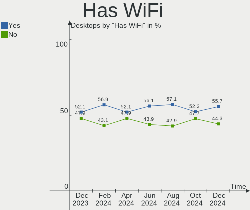
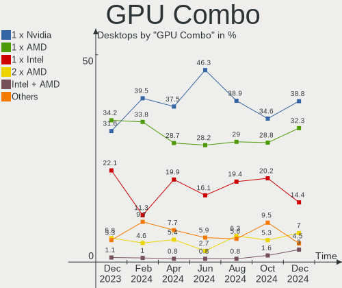

Fedora - Hardware Trends (Desktops)
-----------------------------------

A project to identify most popular hardware characteristics and track their change
over time based on data collected by Linux users at https://Linux-Hardware.org.

Anyone can contribute to this report by the [hw-probe](https://github.com/linuxhw/hw-probe) tool:

    sudo -E hw-probe -all -upload

This report is for one last month. Overall report since the beginning of time: [TestDays](https://github.com/linuxhw/TestDays)

Period: Jan, 2024.

Contents
--------

* [ System ](#system)
  - [ OS                       ](#os)
  - [ OS Family                ](#os-family)
  - [ Kernel                   ](#kernel)
  - [ Kernel Family            ](#kernel-family)
  - [ Kernel Major Ver.        ](#kernel-major-ver)
  - [ Arch                     ](#arch)
  - [ DE                       ](#de)
  - [ Display Server           ](#display-server)
  - [ Display Manager          ](#display-manager)
  - [ OS Lang                  ](#os-lang)
  - [ Boot Mode                ](#boot-mode)
  - [ Filesystem               ](#filesystem)
  - [ Part. scheme             ](#part-scheme)
  - [ Dual Boot with Linux/BSD ](#dual-boot-with-linuxbsd)
  - [ Dual Boot (Win)          ](#dual-boot-win)

* [ Board ](#board)
  - [ Vendor                   ](#vendor)
  - [ Model                    ](#model)
  - [ Model Family             ](#model-family)
  - [ MFG Year                 ](#mfg-year)
  - [ Form Factor              ](#form-factor)
  - [ Secure Boot              ](#secure-boot)
  - [ Coreboot                 ](#coreboot)
  - [ RAM Size                 ](#ram-size)
  - [ RAM Used                 ](#ram-used)
  - [ Total Drives             ](#total-drives)
  - [ Has CD-ROM               ](#has-cd-rom)
  - [ Has Ethernet             ](#has-ethernet)
  - [ Has WiFi                 ](#has-wifi)
  - [ Has Bluetooth            ](#has-bluetooth)

* [ Location ](#location)
  - [ Country                  ](#country)
  - [ City                     ](#city)

* [ Drives ](#drives)
  - [ Drive Vendor             ](#drive-vendor)
  - [ Drive Model              ](#drive-model)
  - [ HDD Vendor               ](#hdd-vendor)
  - [ SSD Vendor               ](#ssd-vendor)
  - [ Drive Kind               ](#drive-kind)
  - [ Drive Connector          ](#drive-connector)
  - [ Drive Size               ](#drive-size)
  - [ Space Total              ](#space-total)
  - [ Space Used               ](#space-used)
  - [ Malfunc. Drives          ](#malfunc-drives)
  - [ Malfunc. Drive Vendor    ](#malfunc-drive-vendor)
  - [ Malfunc. HDD Vendor      ](#malfunc-hdd-vendor)
  - [ Malfunc. Drive Kind      ](#malfunc-drive-kind)
  - [ Failed Drives            ](#failed-drives)
  - [ Failed Drive Vendor      ](#failed-drive-vendor)
  - [ Drive Status             ](#drive-status)

* [ Storage controller ](#storage-controller)
  - [ Storage Vendor           ](#storage-vendor)
  - [ Storage Model            ](#storage-model)
  - [ Storage Kind             ](#storage-kind)

* [ Processor ](#processor)
  - [ CPU Vendor               ](#cpu-vendor)
  - [ CPU Model                ](#cpu-model)
  - [ CPU Model Family         ](#cpu-model-family)
  - [ CPU Cores                ](#cpu-cores)
  - [ CPU Sockets              ](#cpu-sockets)
  - [ CPU Threads              ](#cpu-threads)
  - [ CPU Op-Modes             ](#cpu-op-modes)
  - [ CPU Microcode            ](#cpu-microcode)
  - [ CPU Microarch            ](#cpu-microarch)

* [ Graphics ](#graphics)
  - [ GPU Vendor               ](#gpu-vendor)
  - [ GPU Model                ](#gpu-model)
  - [ GPU Combo                ](#gpu-combo)
  - [ GPU Driver               ](#gpu-driver)
  - [ GPU Memory               ](#gpu-memory)

* [ Monitor ](#monitor)
  - [ Monitor Vendor           ](#monitor-vendor)
  - [ Monitor Model            ](#monitor-model)
  - [ Monitor Resolution       ](#monitor-resolution)
  - [ Monitor Diagonal         ](#monitor-diagonal)
  - [ Monitor Width            ](#monitor-width)
  - [ Aspect Ratio             ](#aspect-ratio)
  - [ Monitor Area             ](#monitor-area)
  - [ Pixel Density            ](#pixel-density)
  - [ Multiple Monitors        ](#multiple-monitors)

* [ Network ](#network)
  - [ Net Controller Vendor    ](#net-controller-vendor)
  - [ Net Controller Model     ](#net-controller-model)
  - [ Wireless Vendor          ](#wireless-vendor)
  - [ Wireless Model           ](#wireless-model)
  - [ Ethernet Vendor          ](#ethernet-vendor)
  - [ Ethernet Model           ](#ethernet-model)
  - [ Net Controller Kind      ](#net-controller-kind)
  - [ Used Controller          ](#used-controller)
  - [ NICs                     ](#nics)
  - [ IPv6                     ](#ipv6)

* [ Bluetooth ](#bluetooth)
  - [ Bluetooth Vendor         ](#bluetooth-vendor)
  - [ Bluetooth Model          ](#bluetooth-model)

* [ Sound ](#sound)
  - [ Sound Vendor             ](#sound-vendor)
  - [ Sound Model              ](#sound-model)

* [ Memory ](#memory)
  - [ Memory Vendor            ](#memory-vendor)
  - [ Memory Model             ](#memory-model)
  - [ Memory Kind              ](#memory-kind)
  - [ Memory Form Factor       ](#memory-form-factor)
  - [ Memory Size              ](#memory-size)
  - [ Memory Speed             ](#memory-speed)

* [ Printers & scanners ](#printers--scanners)
  - [ Printer Vendor           ](#printer-vendor)
  - [ Printer Model            ](#printer-model)
  - [ Scanner Vendor           ](#scanner-vendor)
  - [ Scanner Model            ](#scanner-model)

* [ Camera ](#camera)
  - [ Camera Vendor            ](#camera-vendor)
  - [ Camera Model             ](#camera-model)

* [ Security ](#security)
  - [ Fingerprint Vendor       ](#fingerprint-vendor)
  - [ Fingerprint Model        ](#fingerprint-model)
  - [ Chipcard Vendor          ](#chipcard-vendor)
  - [ Chipcard Model           ](#chipcard-model)

* [ Unsupported ](#unsupported)
  - [ Unsupported Devices      ](#unsupported-devices)
  - [ Unsupported Device Types ](#unsupported-device-types)

System
------

OS
--

Installed operating systems

| Name      | Desktops | Percent |
|-----------|----------|---------|
| Fedora 39 | 185      | 91.13%  |
| Fedora 38 | 13       | 6.4%    |
| Fedora 40 | 3        | 1.48%   |
| Fedora 35 | 1        | 0.49%   |
| Fedora 34 | 1        | 0.49%   |

OS Family
---------

OS without a version

| Name   | Desktops | Percent |
|--------|----------|---------|
| Fedora | 203      | 100%    |

Kernel
------

Version of the Linux kernel

| Version                                                 | Desktops | Percent |
|---------------------------------------------------------|----------|---------|
| 6.6.9-200.fc39.x86_64                                   | 63       | 31.03%  |
| 6.6.11-200.fc39.x86_64                                  | 33       | 16.26%  |
| 6.6.13-200.fc39.x86_64                                  | 23       | 11.33%  |
| 6.6.8-200.fc39.x86_64                                   | 21       | 10.34%  |
| 6.6.12-200.fc39.x86_64                                  | 18       | 8.87%   |
| 6.5.6-300.fc39.x86_64                                   | 15       | 7.39%   |
| 6.6.9-100.fc38.x86_64                                   | 5        | 2.46%   |
| 6.6.12-201.fsync.fc39.x86_64                            | 4        | 1.97%   |
| 6.6.8-100.fc38.x86_64                                   | 3        | 1.48%   |
| 6.6.11-100.fc38.x86_64                                  | 3        | 1.48%   |
| 6.8.0-0.rc0.20240112git70d201a40823.5.fc40.x86_64       | 2        | 0.99%   |
| 6.7.1-0.rc1.250.vanilla.fc39.x86_64                     | 1        | 0.49%   |
| 6.7.0-rc4-b11-773688a6cb24b0b3c2ba40354d883348a2befa38+ | 1        | 0.49%   |
| 6.7.0-367.vanilla.fc39.x86_64                           | 1        | 0.49%   |
| 6.6.7-200.fc39.x86_64                                   | 1        | 0.49%   |
| 6.6.6-200.fc39.x86_64                                   | 1        | 0.49%   |
| 6.6.4-100.fc38.x86_64                                   | 1        | 0.49%   |
| 6.6.3-200.fc39.x86_64                                   | 1        | 0.49%   |
| 6.6.14-200.fc39.x86_64                                  | 1        | 0.49%   |
| 6.6.13-201.fsync.fc39.x86_64                            | 1        | 0.49%   |
| 6.5.12-200.fc38.x86_64                                  | 1        | 0.49%   |
| 6.2.15-300.fc38.x86_64                                  | 1        | 0.49%   |
| 6.0.12-100.fc35.x86_64                                  | 1        | 0.49%   |
| 5.17.12-100.fc34.x86_64                                 | 1        | 0.49%   |

Kernel Family
-------------

Linux kernel without a distro release

| Version | Desktops | Percent |
|---------|----------|---------|
| 6.6.9   | 68       | 33.5%   |
| 6.6.11  | 36       | 17.73%  |
| 6.6.8   | 24       | 11.82%  |
| 6.6.13  | 24       | 11.82%  |
| 6.6.12  | 22       | 10.84%  |
| 6.5.6   | 15       | 7.39%   |
| 6.8.0   | 2        | 0.99%   |
| 6.7.0   | 2        | 0.99%   |
| 6.7.1   | 1        | 0.49%   |
| 6.6.7   | 1        | 0.49%   |
| 6.6.6   | 1        | 0.49%   |
| 6.6.4   | 1        | 0.49%   |
| 6.6.3   | 1        | 0.49%   |
| 6.6.14  | 1        | 0.49%   |
| 6.5.12  | 1        | 0.49%   |
| 6.2.15  | 1        | 0.49%   |
| 6.0.12  | 1        | 0.49%   |
| 5.17.12 | 1        | 0.49%   |

Kernel Major Ver.
-----------------

Linux kernel major version

| Version | Desktops | Percent |
|---------|----------|---------|
| 6.6     | 179      | 88.18%  |
| 6.5     | 16       | 7.88%   |
| 6.7     | 3        | 1.48%   |
| 6.8     | 2        | 0.99%   |
| 6.2     | 1        | 0.49%   |
| 6.0     | 1        | 0.49%   |
| 5.17    | 1        | 0.49%   |

Arch
----

OS architecture (x86_64, i586, etc.)

| Name   | Desktops | Percent |
|--------|----------|---------|
| x86_64 | 203      | 100%    |

DE
--

Desktop Environment

| Name          | Desktops | Percent |
|---------------|----------|---------|
| GNOME         | 126      | 62.07%  |
| KDE5          | 47       | 23.15%  |
| Cinnamon      | 11       | 5.42%   |
| XFCE          | 4        | 1.97%   |
| X-Cinnamon    | 4        | 1.97%   |
| Budgie        | 3        | 1.48%   |
| Unknown       | 2        | 0.99%   |
| WindowMaker   | 1        | 0.49%   |
| LXQt          | 1        | 0.49%   |
| LXDE          | 1        | 0.49%   |
| i3            | 1        | 0.49%   |
| GNOME Classic | 1        | 0.49%   |
| bspwm         | 1        | 0.49%   |

Display Server
--------------

X11 or Wayland

| Name    | Desktops | Percent |
|---------|----------|---------|
| Wayland | 129      | 63.55%  |
| X11     | 58       | 28.57%  |
| Tty     | 14       | 6.9%    |
| Unknown | 2        | 0.99%   |

Display Manager
---------------

SDDM, LightDM, etc.

| Name    | Desktops | Percent |
|---------|----------|---------|
| Unknown | 131      | 64.53%  |
| GDM     | 34       | 16.75%  |
| SDDM    | 20       | 9.85%   |
| LightDM | 17       | 8.37%   |
| LXDM    | 1        | 0.49%   |

OS Lang
-------

Language

| Lang    | Desktops | Percent |
|---------|----------|---------|
| en_US   | 101      | 49.75%  |
| en_AU   | 17       | 8.37%   |
| ru_RU   | 12       | 5.91%   |
| de_DE   | 12       | 5.91%   |
| en_GB   | 11       | 5.42%   |
| fr_FR   | 8        | 3.94%   |
| pt_BR   | 6        | 2.96%   |
| it_IT   | 5        | 2.46%   |
| zh_CN   | 4        | 1.97%   |
| pl_PL   | 4        | 1.97%   |
| es_MX   | 4        | 1.97%   |
| es_ES   | 2        | 0.99%   |
| en_NZ   | 2        | 0.99%   |
| en_CA   | 2        | 0.99%   |
| de_AT   | 2        | 0.99%   |
| cs_CZ   | 2        | 0.99%   |
| sv_SE   | 1        | 0.49%   |
| hu_HU   | 1        | 0.49%   |
| fr_CA   | 1        | 0.49%   |
| fr_BE   | 1        | 0.49%   |
| es_SV   | 1        | 0.49%   |
| es_EC   | 1        | 0.49%   |
| es_CO   | 1        | 0.49%   |
| en_IE   | 1        | 0.49%   |
| Unknown | 1        | 0.49%   |

Boot Mode
---------

EFI or BIOS

| Mode | Desktops | Percent |
|------|----------|---------|
| EFI  | 129      | 63.55%  |
| BIOS | 74       | 36.45%  |

Filesystem
----------

Type of filesystem

| Type  | Desktops | Percent |
|-------|----------|---------|
| Btrfs | 155      | 76.35%  |
| Ext4  | 40       | 19.7%   |
| Xfs   | 8        | 3.94%   |

Part. scheme
------------

Scheme of partitioning

| Type    | Desktops | Percent |
|---------|----------|---------|
| Unknown | 129      | 63.55%  |
| GPT     | 62       | 30.54%  |
| MBR     | 12       | 5.91%   |

Dual Boot with Linux/BSD
------------------------

Hosting more than one Linux/BSD

| Dual boot | Desktops | Percent |
|-----------|----------|---------|
| No        | 183      | 90.15%  |
| Yes       | 20       | 9.85%   |

Dual Boot (Win)
---------------

Hosting Linux and Windows

| Dual boot | Desktops | Percent |
|-----------|----------|---------|
| No        | 162      | 79.8%   |
| Yes       | 41       | 20.2%   |

Board
-----

Vendor
------

Motherboard manufacturer

| Name                                 | Desktops | Percent |
|--------------------------------------|----------|---------|
| ASUSTek Computer                     | 69       | 33.99%  |
| MSI                                  | 41       | 20.2%   |
| Gigabyte Technology                  | 32       | 15.76%  |
| ASRock                               | 19       | 9.36%   |
| Hewlett-Packard                      | 12       | 5.91%   |
| Dell                                 | 9        | 4.43%   |
| Lenovo                               | 5        | 2.46%   |
| Intel                                | 2        | 0.99%   |
| Fujitsu                              | 2        | 0.99%   |
| Foxconn                              | 2        | 0.99%   |
| Shenzhen Meigao Electronic Equipment | 1        | 0.49%   |
| Pegatron                             | 1        | 0.49%   |
| Huanan                               | 1        | 0.49%   |
| GEEKOM                               | 1        | 0.49%   |
| ECS                                  | 1        | 0.49%   |
| Biostar                              | 1        | 0.49%   |
| Apple                                | 1        | 0.49%   |
| AMI                                  | 1        | 0.49%   |
| AMD                                  | 1        | 0.49%   |
| Unknown                              | 1        | 0.49%   |

Model
-----

Motherboard model

| Name                                                | Desktops | Percent |
|-----------------------------------------------------|----------|---------|
| ASUS All Series                                     | 8        | 3.94%   |
| MSI MS-7D46                                         | 2        | 0.99%   |
| MSI MS-7C95                                         | 2        | 0.99%   |
| MSI MS-7C37                                         | 2        | 0.99%   |
| MSI MS-7885                                         | 2        | 0.99%   |
| MSI MS-7817                                         | 2        | 0.99%   |
| Gigabyte J1900M-D2P                                 | 2        | 0.99%   |
| Gigabyte B550I AORUS PRO AX                         | 2        | 0.99%   |
| Foxconn Pro3500 Series                              | 2        | 0.99%   |
| Dell OptiPlex 9020                                  | 2        | 0.99%   |
| ASUS TUF Gaming X570-PLUS                           | 2        | 0.99%   |
| ASUS TUF Gaming B550-PLUS                           | 2        | 0.99%   |
| ASUS ROG STRIX B550-F GAMING                        | 2        | 0.99%   |
| ASUS PRIME Z690M-PLUS D4                            | 2        | 0.99%   |
| ASUS PRIME B550-PLUS                                | 2        | 0.99%   |
| ASUS PRIME B450M-A II                               | 2        | 0.99%   |
| ASRock X670E Pro RS                                 | 2        | 0.99%   |
| ASRock X570 Phantom Gaming 4                        | 2        | 0.99%   |
| Shenzhen Meigao Electronic Equipment Mercury series | 1        | 0.49%   |
| Pegatron Pavilion P6000 Series                      | 1        | 0.49%   |
| MSI MS-7D98                                         | 1        | 0.49%   |
| MSI MS-7D93                                         | 1        | 0.49%   |
| MSI MS-7D77                                         | 1        | 0.49%   |
| MSI MS-7D73                                         | 1        | 0.49%   |
| MSI MS-7D70                                         | 1        | 0.49%   |
| MSI MS-7D32                                         | 1        | 0.49%   |
| MSI MS-7D29                                         | 1        | 0.49%   |
| MSI MS-7C99                                         | 1        | 0.49%   |
| MSI MS-7C94                                         | 1        | 0.49%   |
| MSI MS-7C91                                         | 1        | 0.49%   |
| MSI MS-7C84                                         | 1        | 0.49%   |
| MSI MS-7C83                                         | 1        | 0.49%   |
| MSI MS-7C56                                         | 1        | 0.49%   |
| MSI MS-7C51                                         | 1        | 0.49%   |
| MSI MS-7C35                                         | 1        | 0.49%   |
| MSI MS-7C13                                         | 1        | 0.49%   |
| MSI MS-7C02                                         | 1        | 0.49%   |
| MSI MS-7B93                                         | 1        | 0.49%   |
| MSI MS-7B79                                         | 1        | 0.49%   |
| MSI MS-7B48                                         | 1        | 0.49%   |

Model Family
------------

Motherboard model prefix

| Name                                         | Desktops | Percent |
|----------------------------------------------|----------|---------|
| ASUS PRIME                                   | 22       | 10.84%  |
| ASUS TUF                                     | 11       | 5.42%   |
| ASUS ROG                                     | 10       | 4.93%   |
| ASUS All                                     | 8        | 3.94%   |
| Dell OptiPlex                                | 6        | 2.96%   |
| Lenovo ThinkCentre                           | 3        | 1.48%   |
| Gigabyte B650                                | 3        | 1.48%   |
| Gigabyte B550                                | 3        | 1.48%   |
| ASRock B550                                  | 3        | 1.48%   |
| MSI MS-7D46                                  | 2        | 0.99%   |
| MSI MS-7C95                                  | 2        | 0.99%   |
| MSI MS-7C37                                  | 2        | 0.99%   |
| MSI MS-7885                                  | 2        | 0.99%   |
| MSI MS-7817                                  | 2        | 0.99%   |
| HP Slim                                      | 2        | 0.99%   |
| HP Pavilion                                  | 2        | 0.99%   |
| HP EliteDesk                                 | 2        | 0.99%   |
| Gigabyte J1900M-D2P                          | 2        | 0.99%   |
| Gigabyte B550I                               | 2        | 0.99%   |
| Gigabyte A320M-S2H                           | 2        | 0.99%   |
| Fujitsu ESPRIMO                              | 2        | 0.99%   |
| Foxconn Pro3500                              | 2        | 0.99%   |
| Dell Precision                               | 2        | 0.99%   |
| ASUS P8Z77-V                                 | 2        | 0.99%   |
| ASUS P5Q                                     | 2        | 0.99%   |
| ASRock X670E                                 | 2        | 0.99%   |
| ASRock X570                                  | 2        | 0.99%   |
| Shenzhen Meigao Electronic Equipment Mercury | 1        | 0.49%   |
| Pegatron Pavilion                            | 1        | 0.49%   |
| MSI MS-7D98                                  | 1        | 0.49%   |
| MSI MS-7D93                                  | 1        | 0.49%   |
| MSI MS-7D77                                  | 1        | 0.49%   |
| MSI MS-7D73                                  | 1        | 0.49%   |
| MSI MS-7D70                                  | 1        | 0.49%   |
| MSI MS-7D32                                  | 1        | 0.49%   |
| MSI MS-7D29                                  | 1        | 0.49%   |
| MSI MS-7C99                                  | 1        | 0.49%   |
| MSI MS-7C94                                  | 1        | 0.49%   |
| MSI MS-7C91                                  | 1        | 0.49%   |
| MSI MS-7C84                                  | 1        | 0.49%   |

MFG Year
--------

Motherboard manufacture year

| Year | Desktops | Percent |
|------|----------|---------|
| 2020 | 31       | 15.27%  |
| 2022 | 25       | 12.32%  |
| 2018 | 19       | 9.36%   |
| 2023 | 16       | 7.88%   |
| 2019 | 16       | 7.88%   |
| 2021 | 15       | 7.39%   |
| 2012 | 15       | 7.39%   |
| 2017 | 10       | 4.93%   |
| 2014 | 10       | 4.93%   |
| 2013 | 9        | 4.43%   |
| 2009 | 8        | 3.94%   |
| 2008 | 6        | 2.96%   |
| 2015 | 5        | 2.46%   |
| 2010 | 5        | 2.46%   |
| 2016 | 4        | 1.97%   |
| 2011 | 4        | 1.97%   |
| 2007 | 2        | 0.99%   |
| 2006 | 2        | 0.99%   |
| 2005 | 1        | 0.49%   |

Form Factor
-----------

Physical design of the computer

| Name    | Desktops | Percent |
|---------|----------|---------|
| Desktop | 203      | 100%    |

Secure Boot
-----------

Enabled or disabled

| State    | Desktops | Percent |
|----------|----------|---------|
| Disabled | 180      | 88.67%  |
| Enabled  | 23       | 11.33%  |

Coreboot
--------

Have coreboot on board

| Used | Desktops | Percent |
|------|----------|---------|
| No   | 203      | 100%    |

RAM Size
--------

Total RAM memory

| Size in GB  | Desktops | Percent |
|-------------|----------|---------|
| 32.01-64.0  | 60       | 29.56%  |
| 16.01-24.0  | 46       | 22.66%  |
| 64.01-256.0 | 25       | 12.32%  |
| 8.01-16.0   | 23       | 11.33%  |
| 4.01-8.0    | 19       | 9.36%   |
| 24.01-32.0  | 16       | 7.88%   |
| 3.01-4.0    | 11       | 5.42%   |
| 1.01-2.0    | 2        | 0.99%   |
| 2.01-3.0    | 1        | 0.49%   |

RAM Used
--------

Used RAM memory

| Used GB    | Desktops | Percent |
|------------|----------|---------|
| 4.01-8.0   | 78       | 38.42%  |
| 2.01-3.0   | 39       | 19.21%  |
| 3.01-4.0   | 37       | 18.23%  |
| 1.01-2.0   | 19       | 9.36%   |
| 8.01-16.0  | 12       | 5.91%   |
| 0.51-1.0   | 11       | 5.42%   |
| 16.01-24.0 | 5        | 2.46%   |
| 32.01-64.0 | 1        | 0.49%   |
| 24.01-32.0 | 1        | 0.49%   |

Total Drives
------------

Number of drives on board

| Drives | Desktops | Percent |
|--------|----------|---------|
| 2      | 60       | 29.56%  |
| 1      | 60       | 29.56%  |
| 3      | 39       | 19.21%  |
| 5      | 20       | 9.85%   |
| 4      | 18       | 8.87%   |
| 7      | 2        | 0.99%   |
| 6      | 2        | 0.99%   |
| 11     | 1        | 0.49%   |
| 8      | 1        | 0.49%   |

Has CD-ROM
----------

Has CD-ROM on board

| Presented | Desktops | Percent |
|-----------|----------|---------|
| No        | 147      | 72.41%  |
| Yes       | 56       | 27.59%  |

Has Ethernet
------------

Has Ethernet on board

| Presented | Desktops | Percent |
|-----------|----------|---------|
| Yes       | 198      | 97.54%  |
| No        | 5        | 2.46%   |

Has WiFi
--------

Has WiFi module

| Presented | Desktops | Percent |
|-----------|----------|---------|
| Yes       | 115      | 56.65%  |
| No        | 88       | 43.35%  |

Has Bluetooth
-------------

Has Bluetooth module

| Presented | Desktops | Percent |
|-----------|----------|---------|
| No        | 103      | 50.74%  |
| Yes       | 100      | 49.26%  |

Location
--------

Country
-------

Geographic location (country)

| Country     | Desktops | Percent |
|-------------|----------|---------|
| USA         | 58       | 28.57%  |
| Germany     | 19       | 9.36%   |
| Australia   | 17       | 8.37%   |
| Russia      | 13       | 6.4%    |
| France      | 8        | 3.94%   |
| Brazil      | 8        | 3.94%   |
| Poland      | 6        | 2.96%   |
| Italy       | 6        | 2.96%   |
| UK          | 5        | 2.46%   |
| Mexico      | 5        | 2.46%   |
| Czechia     | 5        | 2.46%   |
| Colombia    | 5        | 2.46%   |
| Spain       | 4        | 1.97%   |
| Switzerland | 3        | 1.48%   |
| New Zealand | 3        | 1.48%   |
| Belgium     | 3        | 1.48%   |
| Austria     | 3        | 1.48%   |
| Romania     | 2        | 0.99%   |
| Puerto Rico | 2        | 0.99%   |
| Netherlands | 2        | 0.99%   |
| Malaysia    | 2        | 0.99%   |
| Indonesia   | 2        | 0.99%   |
| Canada      | 2        | 0.99%   |
| Argentina   | 2        | 0.99%   |
| Turkey      | 1        | 0.49%   |
| Taiwan      | 1        | 0.49%   |
| Sweden      | 1        | 0.49%   |
| Slovakia    | 1        | 0.49%   |
| Portugal    | 1        | 0.49%   |
| Norway      | 1        | 0.49%   |
| Latvia      | 1        | 0.49%   |
| India       | 1        | 0.49%   |
| Hungary     | 1        | 0.49%   |
| Hong Kong   | 1        | 0.49%   |
| Finland     | 1        | 0.49%   |
| El Salvador | 1        | 0.49%   |
| Ecuador     | 1        | 0.49%   |
| China       | 1        | 0.49%   |
| Chile       | 1        | 0.49%   |
| Bulgaria    | 1        | 0.49%   |

City
----

Geographic location (city)

| City                   | Desktops | Percent |
|------------------------|----------|---------|
| Sydney                 | 12       | 5.91%   |
| Moscow                 | 5        | 2.46%   |
| Stuttgart              | 3        | 1.48%   |
| Denver                 | 3        | 1.48%   |
| Adelaide               | 3        | 1.48%   |
| Seattle                | 2        | 0.99%   |
| Roseburg               | 2        | 0.99%   |
| Rio de Janeiro         | 2        | 0.99%   |
| Paulinia               | 2        | 0.99%   |
| Ober-Morlen            | 2        | 0.99%   |
| Moyock                 | 2        | 0.99%   |
| Mexico City            | 2        | 0.99%   |
| Kuala Lumpur           | 2        | 0.99%   |
| Columbus               | 2        | 0.99%   |
| Bogotá                | 2        | 0.99%   |
| Berlin                 | 2        | 0.99%   |
| Auckland               | 2        | 0.99%   |
| Żywiec                | 1        | 0.49%   |
| Zurich                 | 1        | 0.49%   |
| Yaroslavl              | 1        | 0.49%   |
| Woodland               | 1        | 0.49%   |
| Wilmington             | 1        | 0.49%   |
| Weilmuenster           | 1        | 0.49%   |
| Wasilla                | 1        | 0.49%   |
| Warsaw                 | 1        | 0.49%   |
| Voronezh               | 1        | 0.49%   |
| Vladikavkaz            | 1        | 0.49%   |
| Vittoria               | 1        | 0.49%   |
| Valencia               | 1        | 0.49%   |
| Valdosta               | 1        | 0.49%   |
| Ulm                    | 1        | 0.49%   |
| Turin                  | 1        | 0.49%   |
| Tunja                  | 1        | 0.49%   |
| Toa Baja               | 1        | 0.49%   |
| Tlalnepantla           | 1        | 0.49%   |
| Timișoara             | 1        | 0.49%   |
| Tesson                 | 1        | 0.49%   |
| Tepatitlán de Morelos | 1        | 0.49%   |
| Tauranga               | 1        | 0.49%   |
| Taranto                | 1        | 0.49%   |

Drives
------

Drive Vendor
------------

Hard drive vendors

| Vendor                      | Desktops | Drives | Percent |
|-----------------------------|----------|--------|---------|
| Samsung Electronics         | 79       | 124    | 19.85%  |
| WDC                         | 63       | 86     | 15.83%  |
| Seagate                     | 53       | 72     | 13.32%  |
| Sandisk                     | 27       | 35     | 6.78%   |
| Kingston                    | 22       | 25     | 5.53%   |
| Crucial                     | 18       | 18     | 4.52%   |
| Toshiba                     | 15       | 17     | 3.77%   |
| Micron/Crucial Technology   | 12       | 16     | 3.02%   |
| Phison Electronics          | 9        | 10     | 2.26%   |
| Intel                       | 9        | 11     | 2.26%   |
| Hitachi                     | 8        | 11     | 2.01%   |
| SK hynix                    | 7        | 9      | 1.76%   |
| MAXIO Technology (Hangzhou) | 7        | 7      | 1.76%   |
| Kingston Technology Company | 6        | 6      | 1.51%   |
| Unknown                     | 4        | 7      | 1.01%   |
| Silicon Motion              | 4        | 4      | 1.01%   |
| PNY                         | 4        | 5      | 1.01%   |
| Micron Technology           | 4        | 4      | 1.01%   |
| A-DATA Technology           | 4        | 4      | 1.01%   |
| Team                        | 3        | 4      | 0.75%   |
| ADATA Technology            | 3        | 3      | 0.75%   |
| SPCC                        | 2        | 2      | 0.5%    |
| Netac                       | 2        | 2      | 0.5%    |
| Maxtor                      | 2        | 2      | 0.5%    |
| HGST                        | 2        | 3      | 0.5%    |
| China                       | 2        | 2      | 0.5%    |
| Apacer                      | 2        | 2      | 0.5%    |
| Unknown                     | 2        | 2      | 0.5%    |
| V7                          | 1        | 1      | 0.25%   |
| Transcend                   | 1        | 1      | 0.25%   |
| T-FORCE                     | 1        | 1      | 0.25%   |
| Smartbuy                    | 1        | 1      | 0.25%   |
| SD                          | 1        | 1      | 0.25%   |
| LITEONIT                    | 1        | 1      | 0.25%   |
| Lite-On Technology          | 1        | 1      | 0.25%   |
| Lexar                       | 1        | 1      | 0.25%   |
| KIOXIA                      | 1        | 1      | 0.25%   |
| Intenso                     | 1        | 1      | 0.25%   |
| Hewlett-Packard             | 1        | 1      | 0.25%   |
| G-DRIVE                     | 1        | 1      | 0.25%   |

Drive Model
-----------

Hard drive models

| Model                                                 | Desktops | Percent |
|-------------------------------------------------------|----------|---------|
| Samsung NVMe SSD Controller SM981/PM981/PM983 1TB     | 21       | 4.38%   |
| Samsung SSD 850 EVO 250GB                             | 9        | 1.88%   |
| Samsung NVMe SSD Controller PM9A1/PM9A3/980PRO 2TB    | 9        | 1.88%   |
| Micron/Crucial P2 NVMe PCIe SSD 1TB                   | 8        | 1.67%   |
| Samsung SSD 980 1TB                                   | 6        | 1.25%   |
| Samsung SSD 860 EVO 500GB                             | 6        | 1.25%   |
| Samsung SSD 860 EVO 1TB                               | 6        | 1.25%   |
| Samsung NVMe SSD Controller SM961/PM961/SM963 256GB   | 6        | 1.25%   |
| MAXIO (Hangzhou) NVMe SSD Controller MAP1202 512GB    | 6        | 1.25%   |
| Sandisk WD_BLACK SN850X 1000GB                        | 5        | 1.04%   |
| Kingston SA400S37480G 480GB SSD                       | 5        | 1.04%   |
| Toshiba DT01ACA100 1TB                                | 4        | 0.83%   |
| Seagate ST500DM002-1BD142 500GB                       | 4        | 0.83%   |
| Seagate ST2000DM008-2FR102 2TB                        | 4        | 0.83%   |
| Seagate ST2000DM006-2DM164 2TB                        | 4        | 0.83%   |
| Sandisk WD_BLACK SN770 1TB                            | 4        | 0.83%   |
| Phison E16 PCIe4 NVMe Controller 2TB                  | 4        | 0.83%   |
| Kingston Company SNV2S1000G 1TB                       | 4        | 0.83%   |
| WDC WDS500G2B0A-00SM50 500GB SSD                      | 3        | 0.63%   |
| WDC WD5000AVCS-632DY1 500GB                           | 3        | 0.63%   |
| WDC WD10EZEX-08WN4A0 1TB                              | 3        | 0.63%   |
| Toshiba DT01ACA200 2TB                                | 3        | 0.63%   |
| Silicon Motion SM2263EN/SM2263XT SSD Controller 128GB | 3        | 0.63%   |
| Seagate ST4000VN006-3CW104 4TB                        | 3        | 0.63%   |
| Seagate ST4000DM004-2CV104 4TB                        | 3        | 0.63%   |
| Sandisk WD Black 2018/SN750 / PC SN720 NVMe SSD 1TB   | 3        | 0.63%   |
| Samsung SSD 870 QVO 1TB                               | 3        | 0.63%   |
| Samsung SSD 870 EVO 1TB                               | 3        | 0.63%   |
| Samsung SSD 860 EVO 2TB                               | 3        | 0.63%   |
| Samsung SSD 850 EVO 500GB                             | 3        | 0.63%   |
| Kingston SA400S37120G 120GB SSD                       | 3        | 0.63%   |
| Crucial CT240BX500SSD1 240GB                          | 3        | 0.63%   |
| Crucial CT1000MX500SSD1 1TB                           | 3        | 0.63%   |
| WDC WDS240G2G0A-00JH30 240GB SSD                      | 2        | 0.42%   |
| WDC WD5000AAKS-00UU3A0 500GB                          | 2        | 0.42%   |
| WDC WD40EZRZ-00GXCB0 4TB                              | 2        | 0.42%   |
| WDC WD30EZRX-00D8PB0 3TB                              | 2        | 0.42%   |
| WDC WD10EZEX-00WN4A0 1TB                              | 2        | 0.42%   |
| SPCC Solid State Disk 512GB                           | 2        | 0.42%   |
| SK hynix SHPP41-2000GM 2TB                            | 2        | 0.42%   |

HDD Vendor
----------

Hard disk drive vendors

| Vendor              | Desktops | Drives | Percent |
|---------------------|----------|--------|---------|
| Seagate             | 52       | 70     | 37.41%  |
| WDC                 | 50       | 68     | 35.97%  |
| Toshiba             | 15       | 17     | 10.79%  |
| Samsung Electronics | 8        | 11     | 5.76%   |
| Hitachi             | 8        | 11     | 5.76%   |
| Maxtor              | 2        | 2      | 1.44%   |
| HGST                | 2        | 3      | 1.44%   |
| Unknown             | 1        | 1      | 0.72%   |
| External            | 1        | 2      | 0.72%   |

SSD Vendor
----------

Solid state drive vendors

| Vendor              | Desktops | Drives | Percent |
|---------------------|----------|--------|---------|
| Samsung Electronics | 46       | 56     | 31.08%  |
| WDC                 | 18       | 18     | 12.16%  |
| Crucial             | 18       | 18     | 12.16%  |
| Kingston            | 14       | 15     | 9.46%   |
| SanDisk             | 7        | 7      | 4.73%   |
| SK hynix            | 4        | 5      | 2.7%    |
| PNY                 | 4        | 5      | 2.7%    |
| Intel               | 4        | 4      | 2.7%    |
| A-DATA Technology   | 4        | 4      | 2.7%    |
| Team                | 3        | 4      | 2.03%   |
| Micron Technology   | 3        | 3      | 2.03%   |
| SPCC                | 2        | 2      | 1.35%   |
| China               | 2        | 2      | 1.35%   |
| Apacer              | 2        | 2      | 1.35%   |
| V7                  | 1        | 1      | 0.68%   |
| Transcend           | 1        | 1      | 0.68%   |
| Smartbuy            | 1        | 1      | 0.68%   |
| SD                  | 1        | 1      | 0.68%   |
| Netac               | 1        | 1      | 0.68%   |
| LITEONIT            | 1        | 1      | 0.68%   |
| Lexar               | 1        | 1      | 0.68%   |
| Intenso             | 1        | 1      | 0.68%   |
| Hewlett-Packard     | 1        | 1      | 0.68%   |
| Fanxiang            | 1        | 1      | 0.68%   |
| Digma               | 1        | 1      | 0.68%   |
| DEXP                | 1        | 1      | 0.68%   |
| Corsair             | 1        | 1      | 0.68%   |
| ASMT                | 1        | 1      | 0.68%   |
| ADATA SU            | 1        | 1      | 0.68%   |
| Acer                | 1        | 1      | 0.68%   |
| 2.5                 | 1        | 1      | 0.68%   |

Drive Kind
----------

HDD or SSD

| Kind    | Desktops | Drives | Percent |
|---------|----------|--------|---------|
| SSD     | 123      | 162    | 35.04%  |
| HDD     | 111      | 185    | 31.62%  |
| NVMe    | 108      | 158    | 30.77%  |
| Unknown | 9        | 12     | 2.56%   |

Drive Connector
---------------

SATA, SAS, NVMe, etc.

| Type | Desktops | Drives | Percent |
|------|----------|--------|---------|
| SATA | 166      | 342    | 58.25%  |
| NVMe | 107      | 157    | 37.54%  |
| SAS  | 12       | 18     | 4.21%   |

Drive Size
----------

Size of hard drive

| Size in TB | Desktops | Drives | Percent |
|------------|----------|--------|---------|
| 0.01-0.5   | 103      | 148    | 40.55%  |
| 0.51-1.0   | 80       | 107    | 31.5%   |
| 1.01-2.0   | 37       | 50     | 14.57%  |
| 3.01-4.0   | 17       | 20     | 6.69%   |
| 4.01-10.0  | 10       | 13     | 3.94%   |
| 2.01-3.0   | 5        | 6      | 1.97%   |
| 10.01-20.0 | 2        | 3      | 0.79%   |

Space Total
-----------

Amount of disk space available on the file system

| Size in GB     | Desktops | Percent |
|----------------|----------|---------|
| 1001-2000      | 43       | 21.18%  |
| 501-1000       | 40       | 19.7%   |
| More than 3000 | 39       | 19.21%  |
| 251-500        | 23       | 11.33%  |
| 101-250        | 17       | 8.37%   |
| 2001-3000      | 13       | 6.4%    |
| Unknown        | 12       | 5.91%   |
| 51-100         | 10       | 4.93%   |
| 1-20           | 5        | 2.46%   |
| 21-50          | 1        | 0.49%   |

Space Used
----------

Amount of used disk space

| Used GB        | Desktops | Percent |
|----------------|----------|---------|
| 1-20           | 35       | 17.24%  |
| 101-250        | 30       | 14.78%  |
| 21-50          | 27       | 13.3%   |
| 51-100         | 22       | 10.84%  |
| 251-500        | 20       | 9.85%   |
| More than 3000 | 17       | 8.37%   |
| 1001-2000      | 15       | 7.39%   |
| 501-1000       | 15       | 7.39%   |
| Unknown        | 12       | 5.91%   |
| 2001-3000      | 10       | 4.93%   |

Malfunc. Drives
---------------

Drive models with a malfunction

| Model                                          | Desktops | Drives | Percent |
|------------------------------------------------|----------|--------|---------|
| Intel SSDSC2CT120A3 120GB                      | 2        | 2      | 10%     |
| WDC WDS240G2G0B-00EPW0 240GB SSD               | 1        | 1      | 5%      |
| WDC WD6400AAKS-65A7B2 640GB                    | 1        | 1      | 5%      |
| WDC WD5000AVDS-63U7B1 500GB                    | 1        | 2      | 5%      |
| WDC WD5000AVCS-632DY1 500GB                    | 1        | 1      | 5%      |
| WDC WD5000AAKX-00ERMA0 500GB                   | 1        | 1      | 5%      |
| WDC WD40EFRX-68N32N0 4TB                       | 1        | 1      | 5%      |
| WDC WD3200AAKS-22B3A0 320GB                    | 1        | 1      | 5%      |
| Toshiba MQ01ABD050 500GB                       | 1        | 1      | 5%      |
| Toshiba DT01ACA200 2TB                         | 1        | 2      | 5%      |
| SK hynix SHGS31-500GS-2 500GB SSD              | 1        | 1      | 5%      |
| Seagate ST1000DX001-1NS162 1TB                 | 1        | 1      | 5%      |
| Samsung Electronics HD501LJ 500GB              | 1        | 2      | 5%      |
| Samsung Electronics HD103UJ 1TB                | 1        | 2      | 5%      |
| Micron/Crucial Technology P1 NVMe PCIe SSD 1TB | 1        | 1      | 5%      |
| Maxtor 6Y080L0 82GB                            | 1        | 1      | 5%      |
| Hitachi HUS724030ALE641 3TB                    | 1        | 1      | 5%      |
| Hitachi HDS721010CLA332 1TB                    | 1        | 1      | 5%      |
| Crucial CT120M500SSD1 120GB                    | 1        | 1      | 5%      |

Malfunc. Drive Vendor
---------------------

Vendors of faulty drives

| Vendor                    | Desktops | Drives | Percent |
|---------------------------|----------|--------|---------|
| WDC                       | 6        | 8      | 31.58%  |
| Toshiba                   | 2        | 3      | 10.53%  |
| Samsung Electronics       | 2        | 4      | 10.53%  |
| Intel                     | 2        | 2      | 10.53%  |
| Hitachi                   | 2        | 2      | 10.53%  |
| SK hynix                  | 1        | 1      | 5.26%   |
| Seagate                   | 1        | 1      | 5.26%   |
| Micron/Crucial Technology | 1        | 1      | 5.26%   |
| Maxtor                    | 1        | 1      | 5.26%   |
| Crucial                   | 1        | 1      | 5.26%   |

Malfunc. HDD Vendor
-------------------

Vendors of faulty HDD drives

| Vendor              | Desktops | Drives | Percent |
|---------------------|----------|--------|---------|
| WDC                 | 6        | 7      | 42.86%  |
| Toshiba             | 2        | 3      | 14.29%  |
| Samsung Electronics | 2        | 4      | 14.29%  |
| Hitachi             | 2        | 2      | 14.29%  |
| Seagate             | 1        | 1      | 7.14%   |
| Maxtor              | 1        | 1      | 7.14%   |

Malfunc. Drive Kind
-------------------

Kinds of faulty drives

| Kind | Desktops | Drives | Percent |
|------|----------|--------|---------|
| HDD  | 13       | 18     | 68.42%  |
| SSD  | 5        | 5      | 26.32%  |
| NVMe | 1        | 1      | 5.26%   |

Failed Drives
-------------

Failed drive models

Zero info for selected period =(

Failed Drive Vendor
-------------------

Failed drive vendors

Zero info for selected period =(

Drive Status
------------

Number of failed and malfunc. drives

| Status   | Desktops | Drives | Percent |
|----------|----------|--------|---------|
| Detected | 136      | 352    | 62.1%   |
| Works    | 65       | 141    | 29.68%  |
| Malfunc  | 18       | 24     | 8.22%   |

Storage controller
------------------

Storage Vendor
--------------

Storage controller vendors

| Vendor                      | Desktops | Percent |
|-----------------------------|----------|---------|
| Intel                       | 102      | 29.39%  |
| AMD                         | 97       | 27.95%  |
| Samsung Electronics         | 43       | 12.39%  |
| SanDisk                     | 23       | 6.63%   |
| Kingston Technology Company | 14       | 4.03%   |
| Micron/Crucial Technology   | 12       | 3.46%   |
| ASMedia Technology          | 12       | 3.46%   |
| Phison Electronics          | 9        | 2.59%   |
| MAXIO Technology (Hangzhou) | 7        | 2.02%   |
| Silicon Motion              | 4        | 1.15%   |
| JMicron Technology          | 4        | 1.15%   |
| SK hynix                    | 3        | 0.86%   |
| Marvell Technology Group    | 3        | 0.86%   |
| ADATA Technology            | 3        | 0.86%   |
| Solidigm                    | 2        | 0.58%   |
| Nvidia                      | 2        | 0.58%   |
| VIA Technologies            | 1        | 0.29%   |
| ULi Electronics             | 1        | 0.29%   |
| Silicon Image               | 1        | 0.29%   |
| Netac Technology            | 1        | 0.29%   |
| Micron Technology           | 1        | 0.29%   |
| Lite-On Technology          | 1        | 0.29%   |
| KIOXIA                      | 1        | 0.29%   |

Storage Model
-------------

Storage controller models

| Model                                                                          | Desktops | Percent |
|--------------------------------------------------------------------------------|----------|---------|
| AMD FCH SATA Controller [AHCI mode]                                            | 30       | 7.32%   |
| AMD 500 Series Chipset SATA Controller                                         | 29       | 7.07%   |
| Samsung NVMe SSD Controller SM981/PM981/PM983                                  | 21       | 5.12%   |
| AMD 600 Series Chipset SATA Controller                                         | 19       | 4.63%   |
| Intel Alder Lake-S PCH SATA Controller [AHCI Mode]                             | 15       | 3.66%   |
| ASMedia ASM1061/ASM1062 Serial ATA Controller                                  | 11       | 2.68%   |
| AMD 400 Series Chipset SATA Controller                                         | 11       | 2.68%   |
| Intel Volume Management Device NVMe RAID Controller                            | 10       | 2.44%   |
| Intel 8 Series/C220 Series Chipset Family 6-port SATA Controller 1 [AHCI mode] | 10       | 2.44%   |
| Intel 7 Series/C210 Series Chipset Family 6-port SATA Controller [AHCI mode]   | 10       | 2.44%   |
| Samsung NVMe SSD Controller PM9A1/PM9A3/980PRO                                 | 9        | 2.2%    |
| Samsung NVMe SSD Controller 980 (DRAM-less)                                    | 9        | 2.2%    |
| Micron/Crucial P2 [Nick P2] / P3 / P3 Plus NVMe PCIe SSD (DRAM-less)           | 8        | 1.95%   |
| Sandisk WD Black SN850X NVMe SSD                                               | 7        | 1.71%   |
| Intel 200 Series PCH SATA controller [AHCI mode]                               | 7        | 1.71%   |
| SanDisk WD Black SN770 / PC SN740 256GB / PC SN560 (DRAM-less) NVMe SSD        | 6        | 1.46%   |
| Samsung NVMe SSD Controller SM961/PM961/SM963                                  | 6        | 1.46%   |
| MAXIO (Hangzhou) NVMe SSD Controller MAP1202 (DRAM-less)                       | 6        | 1.46%   |
| Kingston Company NV2 NVMe SSD SM2267XT (DRAM-less)                             | 6        | 1.46%   |
| Intel Cannon Lake PCH SATA AHCI Controller                                     | 6        | 1.46%   |
| Intel SATA Controller [RAID mode]                                              | 5        | 1.22%   |
| Intel Q170/Q150/B150/H170/H110/Z170/CM236 Chipset SATA Controller [AHCI Mode]  | 5        | 1.22%   |
| Intel 6 Series/C200 Series Chipset Family 6 port Desktop SATA AHCI Controller  | 5        | 1.22%   |
| AMD SB7x0/SB8x0/SB9x0 SATA Controller [AHCI mode]                              | 5        | 1.22%   |
| Phison E16 PCIe4 NVMe Controller                                               | 4        | 0.98%   |
| Kingston Company KC3000/FURY Renegade NVMe SSD E18                             | 4        | 0.98%   |
| Intel C610/X99 series chipset sSATA Controller [AHCI mode]                     | 4        | 0.98%   |
| AMD X370 Series Chipset SATA Controller                                        | 4        | 0.98%   |
| AMD SB7x0/SB8x0/SB9x0 IDE Controller                                           | 4        | 0.98%   |
| AMD FCH SATA Controller D                                                      | 4        | 0.98%   |
| Silicon Motion SM2263EN/SM2263XT (DRAM-less) NVMe SSD Controllers              | 3        | 0.73%   |
| SanDisk Extreme Pro / WD Black 2018/SN750/PC SN720 NVMe SSD                    | 3        | 0.73%   |
| Micron/Crucial P5 Plus NVMe PCIe SSD                                           | 3        | 0.73%   |
| Intel Raptor Lake SATA AHCI Controller                                         | 3        | 0.73%   |
| Intel NM10/ICH7 Family SATA Controller [IDE mode]                              | 3        | 0.73%   |
| Intel C610/X99 series chipset 6-Port SATA Controller [AHCI mode]               | 3        | 0.73%   |
| Intel 9 Series Chipset Family SATA Controller [AHCI Mode]                      | 3        | 0.73%   |
| SK hynix Platinum P41/PC801 NVMe Solid State Drive                             | 2        | 0.49%   |
| SanDisk WD PC SN810 / Black SN850 NVMe SSD                                     | 2        | 0.49%   |
| SanDisk WD Green SN350 240GB (DRAM-less) / SN560E NVMe SSD                     | 2        | 0.49%   |

Storage Kind
------------

Kind of storage controller (IDE, SATA, NVMe, SAS, ...)

| Kind | Desktops | Percent |
|------|----------|---------|
| SATA | 183      | 54.63%  |
| NVMe | 107      | 31.94%  |
| IDE  | 25       | 7.46%   |
| RAID | 19       | 5.67%   |
| SAS  | 1        | 0.3%    |

Processor
---------

CPU Vendor
----------

Processor vendors

| Vendor | Desktops | Percent |
|--------|----------|---------|
| AMD    | 103      | 50.74%  |
| Intel  | 100      | 49.26%  |

CPU Model
---------

Processor models

| Model                                  | Desktops | Percent |
|----------------------------------------|----------|---------|
| AMD Ryzen 7 3700X 8-Core Processor     | 7        | 3.45%   |
| AMD Ryzen 5 5600X 6-Core Processor     | 7        | 3.45%   |
| AMD Ryzen 5 3600 6-Core Processor      | 7        | 3.45%   |
| AMD Ryzen 7 5800X 8-Core Processor     | 6        | 2.96%   |
| AMD Ryzen 7 5700G with Radeon Graphics | 5        | 2.46%   |
| AMD Ryzen 5 5600G with Radeon Graphics | 5        | 2.46%   |
| Intel Core i5-4590 CPU @ 3.30GHz       | 4        | 1.97%   |
| Intel 12th Gen Core i7-12700K          | 4        | 1.97%   |
| AMD Ryzen 7 5700X 8-Core Processor     | 4        | 1.97%   |
| Intel Core i5-8400 CPU @ 2.80GHz       | 3        | 1.48%   |
| AMD Ryzen 9 7950X3D 16-Core Processor  | 3        | 1.48%   |
| AMD Ryzen 9 7950X 16-Core Processor    | 3        | 1.48%   |
| AMD Ryzen 9 3900X 12-Core Processor    | 3        | 1.48%   |
| AMD Ryzen 7 7800X3D 8-Core Processor   | 3        | 1.48%   |
| AMD Ryzen 7 7700 8-Core Processor      | 3        | 1.48%   |
| Intel Core i7-8700K CPU @ 3.70GHz      | 2        | 0.99%   |
| Intel Core i7-8700 CPU @ 3.20GHz       | 2        | 0.99%   |
| Intel Core i7-3770K CPU @ 3.50GHz      | 2        | 0.99%   |
| Intel Core i7-3770 CPU @ 3.40GHz       | 2        | 0.99%   |
| Intel Core i5-6500 CPU @ 3.20GHz       | 2        | 0.99%   |
| Intel Core i5-3470 CPU @ 3.20GHz       | 2        | 0.99%   |
| Intel Core i3-10100F CPU @ 3.60GHz     | 2        | 0.99%   |
| Intel Core 2 Quad CPU Q9400 @ 2.66GHz  | 2        | 0.99%   |
| Intel Core 2 Duo CPU E8400 @ 3.00GHz   | 2        | 0.99%   |
| Intel Celeron CPU J1900 @ 1.99GHz      | 2        | 0.99%   |
| Intel 13th Gen Core i7-13700K          | 2        | 0.99%   |
| Intel 12th Gen Core i9-12900K          | 2        | 0.99%   |
| AMD Ryzen 9 7900 12-Core Processor     | 2        | 0.99%   |
| AMD Ryzen 9 5950X 16-Core Processor    | 2        | 0.99%   |
| AMD Ryzen 9 5900X 12-Core Processor    | 2        | 0.99%   |
| AMD Ryzen 7 1700 Eight-Core Processor  | 2        | 0.99%   |
| AMD Ryzen 5 7600X 6-Core Processor     | 2        | 0.99%   |
| AMD Ryzen 5 7600 6-Core Processor      | 2        | 0.99%   |
| AMD Ryzen 5 2600 Six-Core Processor    | 2        | 0.99%   |
| AMD Phenom II X4 955 Processor         | 2        | 0.99%   |
| Intel Xeon CPU X5690 @ 3.47GHz         | 1        | 0.49%   |
| Intel Xeon CPU E5-2650 v3 @ 2.30GHz    | 1        | 0.49%   |
| Intel Xeon CPU E5-2603 v4 @ 1.70GHz    | 1        | 0.49%   |
| Intel Xeon CPU E5-1620 v3 @ 3.50GHz    | 1        | 0.49%   |
| Intel Xeon CPU E5-1620 v2 @ 3.70GHz    | 1        | 0.49%   |

CPU Model Family
----------------

Processor model prefix

| Model                   | Desktops | Percent |
|-------------------------|----------|---------|
| AMD Ryzen 7             | 34       | 16.75%  |
| AMD Ryzen 5             | 29       | 14.29%  |
| Intel Core i5           | 26       | 12.81%  |
| Intel Core i7           | 23       | 11.33%  |
| Other                   | 20       | 9.85%   |
| AMD Ryzen 9             | 17       | 8.37%   |
| Intel Core i3           | 8        | 3.94%   |
| Intel Xeon              | 6        | 2.96%   |
| Intel Core 2 Quad       | 5        | 2.46%   |
| Intel Celeron           | 4        | 1.97%   |
| Intel Core 2 Duo        | 3        | 1.48%   |
| AMD Ryzen Threadripper  | 3        | 1.48%   |
| AMD Phenom II X4        | 3        | 1.48%   |
| Intel Pentium           | 2        | 0.99%   |
| AMD Ryzen 5 PRO         | 2        | 0.99%   |
| AMD FX                  | 2        | 0.99%   |
| AMD Athlon 64 X2        | 2        | 0.99%   |
| AMD A6                  | 2        | 0.99%   |
| Intel Pentium Dual-Core | 1        | 0.49%   |
| Intel Core 2            | 1        | 0.49%   |
| Intel Atom              | 1        | 0.49%   |
| AMD Sempron             | 1        | 0.49%   |
| AMD Phenom II X2        | 1        | 0.49%   |
| AMD Phenom              | 1        | 0.49%   |
| AMD Athlon II X4        | 1        | 0.49%   |
| AMD Athlon II X3        | 1        | 0.49%   |
| AMD Athlon II X2        | 1        | 0.49%   |
| AMD Athlon              | 1        | 0.49%   |
| AMD A8                  | 1        | 0.49%   |
| AMD A4                  | 1        | 0.49%   |

CPU Cores
---------

Number of processor cores

| Number | Desktops | Percent |
|--------|----------|---------|
| 4      | 54       | 26.6%   |
| 6      | 46       | 22.66%  |
| 8      | 39       | 19.21%  |
| 2      | 22       | 10.84%  |
| 12     | 15       | 7.39%   |
| 16     | 14       | 6.9%    |
| 10     | 4        | 1.97%   |
| 1      | 3        | 1.48%   |
| 32     | 2        | 0.99%   |
| 14     | 2        | 0.99%   |
| 3      | 2        | 0.99%   |

CPU Sockets
-----------

Number of sockets

| Number | Desktops | Percent |
|--------|----------|---------|
| 1      | 202      | 99.51%  |
| 2      | 1        | 0.49%   |

CPU Threads
-----------

Threads per core (Hyper-Threading)

| Number | Desktops | Percent |
|--------|----------|---------|
| 2      | 146      | 71.92%  |
| 1      | 57       | 28.08%  |

CPU Op-Modes
------------

CPU Operation Modes (32-bit, 64-bit)

| Op mode        | Desktops | Percent |
|----------------|----------|---------|
| 32-bit, 64-bit | 203      | 100%    |

CPU Microcode
-------------

Microcode number

| Number     | Desktops | Percent |
|------------|----------|---------|
| Unknown    | 107      | 52.71%  |
| 0x08701021 | 14       | 6.9%    |
| 0x0a601206 | 11       | 5.42%   |
| 0x0a20120a | 7        | 3.45%   |
| 0x0a50000d | 6        | 2.96%   |
| 0x0a201016 | 6        | 2.96%   |
| 0x010000c8 | 6        | 2.96%   |
| 0x0a601203 | 5        | 2.46%   |
| 0x0a20120e | 4        | 1.97%   |
| 0x08701030 | 4        | 1.97%   |
| 0x0a201205 | 3        | 1.48%   |
| 0x0800820d | 3        | 1.48%   |
| 0x0a50000f | 2        | 0.99%   |
| 0x0a50000c | 2        | 0.99%   |
| 0x0830107b | 2        | 0.99%   |
| 0x08101016 | 2        | 0.99%   |
| 0x08001138 | 2        | 0.99%   |
| 0x06001119 | 2        | 0.99%   |
| 0x306c3    | 1        | 0.49%   |
| 0x0a50000b | 1        | 0.49%   |
| 0x0a404102 | 1        | 0.49%   |
| 0x0a20102b | 1        | 0.49%   |
| 0x0a201025 | 1        | 0.49%   |
| 0x0a201009 | 1        | 0.49%   |
| 0x08701013 | 1        | 0.49%   |
| 0x08600106 | 1        | 0.49%   |
| 0x08001137 | 1        | 0.49%   |
| 0x08001129 | 1        | 0.49%   |
| 0x0600611a | 1        | 0.49%   |
| 0x06000852 | 1        | 0.49%   |
| 0x0600081c | 1        | 0.49%   |
| 0x010000db | 1        | 0.49%   |
| 0x0100008d | 1        | 0.49%   |

CPU Microarch
-------------

Microarchitecture

| Name             | Desktops | Percent |
|------------------|----------|---------|
| Zen 3            | 35       | 17.24%  |
| Zen 2            | 22       | 10.84%  |
| Unknown          | 21       | 10.34%  |
| Alderlake Hybrid | 18       | 8.87%   |
| Haswell          | 17       | 8.37%   |
| KabyLake         | 14       | 6.9%    |
| IvyBridge        | 14       | 6.9%    |
| Penryn           | 8        | 3.94%   |
| K10              | 8        | 3.94%   |
| Zen              | 6        | 2.96%   |
| Skylake          | 5        | 2.46%   |
| CometLake        | 5        | 2.46%   |
| SandyBridge      | 4        | 1.97%   |
| Piledriver       | 4        | 1.97%   |
| Zen+             | 3        | 1.48%   |
| K8 Hammer        | 3        | 1.48%   |
| Broadwell        | 3        | 1.48%   |
| Westmere         | 2        | 0.99%   |
| Silvermont       | 2        | 0.99%   |
| Nehalem          | 2        | 0.99%   |
| Excavator        | 2        | 0.99%   |
| Core             | 2        | 0.99%   |
| Icelake          | 1        | 0.49%   |
| Goldmont plus    | 1        | 0.49%   |
| Bonnell          | 1        | 0.49%   |

Graphics
--------

GPU Vendor
----------

Vendors of graphics cards

| Vendor           | Desktops | Percent |
|------------------|----------|---------|
| Nvidia           | 90       | 39.65%  |
| AMD              | 84       | 37%     |
| Intel            | 52       | 22.91%  |
| VIA Technologies | 1        | 0.44%   |

GPU Model
---------

Graphics card models

| Model                                                                       | Desktops | Percent |
|-----------------------------------------------------------------------------|----------|---------|
| AMD Raphael                                                                 | 13       | 5.44%   |
| AMD Navi 22 [Radeon RX 6700/6700 XT/6750 XT / 6800M/6850M XT]               | 8        | 3.35%   |
| AMD Navi 21 [Radeon RX 6800/6800 XT / 6900 XT]                              | 8        | 3.35%   |
| AMD Ellesmere [Radeon RX 470/480/570/570X/580/580X/590]                     | 8        | 3.35%   |
| Intel Xeon E3-1200 v3/4th Gen Core Processor Integrated Graphics Controller | 7        | 2.93%   |
| Intel CoffeeLake-S GT2 [UHD Graphics 630]                                   | 7        | 2.93%   |
| AMD Navi 31 [Radeon RX 7900 XT/7900 XTX/7900M]                              | 7        | 2.93%   |
| AMD Cezanne [Radeon Vega Series / Radeon Vega Mobile Series]                | 7        | 2.93%   |
| Intel Xeon E3-1200 v2/3rd Gen Core processor Graphics Controller            | 6        | 2.51%   |
| Intel AlderLake-S GT1                                                       | 6        | 2.51%   |
| Nvidia GP108 [GeForce GT 1030]                                              | 5        | 2.09%   |
| AMD Navi 32 [Radeon RX 7700 XT / 7800 XT]                                   | 5        | 2.09%   |
| Nvidia GK208B [GeForce GT 710]                                              | 4        | 1.67%   |
| AMD Navi 23 [Radeon RX 6600/6600 XT/6600M]                                  | 4        | 1.67%   |
| AMD Navi 10 [Radeon RX 5600 OEM/5600 XT / 5700/5700 XT]                     | 4        | 1.67%   |
| Nvidia GP107 [GeForce GTX 1050 Ti]                                          | 3        | 1.26%   |
| Nvidia GP104 [GeForce GTX 1070]                                             | 3        | 1.26%   |
| Nvidia GF119 [GeForce GT 610]                                               | 3        | 1.26%   |
| Nvidia GA106 [GeForce RTX 3060 Lite Hash Rate]                              | 3        | 1.26%   |
| Nvidia GA106 [Geforce RTX 3050]                                             | 3        | 1.26%   |
| Intel DG2 [Arc A750]                                                        | 3        | 1.26%   |
| Nvidia TU117 [GeForce GTX 1650]                                             | 2        | 0.84%   |
| Nvidia TU116 [GeForce GTX 1660 Ti]                                          | 2        | 0.84%   |
| Nvidia TU116 [GeForce GTX 1660 SUPER]                                       | 2        | 0.84%   |
| Nvidia TU116 [GeForce GTX 1650]                                             | 2        | 0.84%   |
| Nvidia TU106 [GeForce RTX 2060 Rev. A]                                      | 2        | 0.84%   |
| Nvidia TU106 [GeForce GTX 1650]                                             | 2        | 0.84%   |
| Nvidia GP104 [GeForce GTX 1070 Ti]                                          | 2        | 0.84%   |
| Nvidia GM206 [GeForce GTX 960]                                              | 2        | 0.84%   |
| Nvidia GM107 [GeForce GTX 750 Ti]                                           | 2        | 0.84%   |
| Nvidia GK104 [GeForce GTX 680]                                              | 2        | 0.84%   |
| Nvidia GF119 [GeForce GT 520]                                               | 2        | 0.84%   |
| Nvidia GF108GL [Quadro 600]                                                 | 2        | 0.84%   |
| Nvidia GF108 [GeForce GT 730]                                               | 2        | 0.84%   |
| Nvidia GA104 [GeForce RTX 3060 Ti Lite Hash Rate]                           | 2        | 0.84%   |
| Nvidia GA102 [GeForce RTX 3090]                                             | 2        | 0.84%   |
| Nvidia GA102 [GeForce RTX 3080]                                             | 2        | 0.84%   |
| Nvidia AD106 [GeForce RTX 4060 Ti]                                          | 2        | 0.84%   |
| Nvidia AD104 [GeForce RTX 4070]                                             | 2        | 0.84%   |
| Intel Raptor Lake-S GT1 [UHD Graphics 770]                                  | 2        | 0.84%   |

GPU Combo
---------

Combinations of graphics cards

| Name           | Desktops | Percent |
|----------------|----------|---------|
| 1 x Nvidia     | 76       | 37.44%  |
| 1 x AMD        | 64       | 31.53%  |
| 1 x Intel      | 32       | 15.76%  |
| 2 x AMD        | 11       | 5.42%   |
| Intel + Nvidia | 7        | 3.45%   |
| AMD + Nvidia   | 5        | 2.46%   |
| Intel + AMD    | 4        | 1.97%   |
| 2 x Intel      | 2        | 0.99%   |
| 2 x Nvidia     | 1        | 0.49%   |
| 1 x VIA        | 1        | 0.49%   |

GPU Driver
----------

Free vs proprietary

| Driver      | Desktops | Percent |
|-------------|----------|---------|
| Free        | 139      | 68.47%  |
| Proprietary | 49       | 24.14%  |
| Unknown     | 15       | 7.39%   |

GPU Memory
----------

Total video memory

| Size in GB | Desktops | Percent |
|------------|----------|---------|
| Unknown    | 72       | 35.47%  |
| 7.01-8.0   | 25       | 12.32%  |
| 8.01-16.0  | 25       | 12.32%  |
| 3.01-4.0   | 23       | 11.33%  |
| 1.01-2.0   | 18       | 8.87%   |
| 0.01-0.5   | 13       | 6.4%    |
| 0.51-1.0   | 12       | 5.91%   |
| 16.01-24.0 | 7        | 3.45%   |
| 5.01-6.0   | 6        | 2.96%   |
| 2.01-3.0   | 2        | 0.99%   |

Monitor
-------

Monitor Vendor
--------------

Monitor vendors

| Vendor               | Desktops | Percent |
|----------------------|----------|---------|
| Samsung Electronics  | 40       | 17.17%  |
| Dell                 | 38       | 16.31%  |
| Goldstar             | 27       | 11.59%  |
| Hewlett-Packard      | 17       | 7.3%    |
| Acer                 | 15       | 6.44%   |
| Philips              | 11       | 4.72%   |
| AOC                  | 9        | 3.86%   |
| Ancor Communications | 8        | 3.43%   |
| MSI                  | 7        | 3%      |
| ASUSTek Computer     | 7        | 3%      |
| BenQ                 | 5        | 2.15%   |
| Mi                   | 4        | 1.72%   |
| ViewSonic            | 3        | 1.29%   |
| Unknown              | 3        | 1.29%   |
| HannStar             | 3        | 1.29%   |
| Gigabyte Technology  | 3        | 1.29%   |
| VIE                  | 2        | 0.86%   |
| Sony                 | 2        | 0.86%   |
| Sceptre Tech         | 2        | 0.86%   |
| Panasonic            | 2        | 0.86%   |
| NEC Computers        | 2        | 0.86%   |
| Lenovo               | 2        | 0.86%   |
| Iiyama               | 2        | 0.86%   |
| Eizo                 | 2        | 0.86%   |
| AOpen                | 2        | 0.86%   |
| ___                  | 1        | 0.43%   |
| Vestel Elektronik    | 1        | 0.43%   |
| SANSUI               | 1        | 0.43%   |
| SAC                  | 1        | 0.43%   |
| RTK                  | 1        | 0.43%   |
| NTS                  | 1        | 0.43%   |
| Medion Akoya         | 1        | 0.43%   |
| Medion               | 1        | 0.43%   |
| Insignia             | 1        | 0.43%   |
| HKC                  | 1        | 0.43%   |
| Fujitsu Siemens      | 1        | 0.43%   |
| eMachines            | 1        | 0.43%   |
| DSC                  | 1        | 0.43%   |
| Compal               | 1        | 0.43%   |
| CHO                  | 1        | 0.43%   |

Monitor Model
-------------

Monitor models

| Model                                                                 | Desktops | Percent |
|-----------------------------------------------------------------------|----------|---------|
| Unknown LCD Monitor FFFF 2288x1287 2550x2550mm 142.0-inch             | 3        | 1.16%   |
| Dell S2721DGF DEL41D9 2560x1440 597x336mm 27.0-inch                   | 3        | 1.16%   |
| Sceptre Tech Sceptre M24 SPT604D 1920x1080 526x296mm 23.8-inch        | 2        | 0.78%   |
| Samsung Electronics C24F390 SAM0D2C 1920x1080 521x293mm 23.5-inch     | 2        | 0.78%   |
| Philips PHL 276E8V PHLC18F 3840x2160 597x336mm 27.0-inch              | 2        | 0.78%   |
| Mi Monitor XMI3444 3440x1440 797x334mm 34.0-inch                      | 2        | 0.78%   |
| Hewlett-Packard Z27i HWP3095 2560x1440 600x340mm 27.2-inch            | 2        | 0.78%   |
| Goldstar Ultra HD GSM5B09 3840x2160 600x340mm 27.2-inch               | 2        | 0.78%   |
| Goldstar TV SSCR2 GSM81CD 3840x2160                                   | 2        | 0.78%   |
| Goldstar HDR 4K GSM7707 3840x2160 600x340mm 27.2-inch                 | 2        | 0.78%   |
| Dell S2719DGF DELD0E6 2560x1440 600x340mm 27.2-inch                   | 2        | 0.78%   |
| Dell P1917S DELD093 1280x1024 380x300mm 19.1-inch                     | 2        | 0.78%   |
| AOC 27G2G8 AOC2702 1920x1080 598x336mm 27.0-inch                      | 2        | 0.78%   |
| Ancor Communications ASUS VP228 ACI22C3 1920x1080 476x268mm 21.5-inch | 2        | 0.78%   |
| Ancor Communications ASUS MG279 ACI27A7 2560x1440 597x336mm 27.0-inch | 2        | 0.78%   |
| Acer XZ322QU S ACR09CA 2560x1440 697x392mm 31.5-inch                  | 2        | 0.78%   |
| ___ LCDTV16 ___9000 1360x768                                          | 1        | 0.39%   |
| ViewSonic VX2757 VSCF931 1920x1080 598x336mm 27.0-inch                | 1        | 0.39%   |
| ViewSonic VA2226w-3 VSC2051 1680x1050 490x290mm 22.4-inch             | 1        | 0.39%   |
| ViewSonic VA2215-FHD VSC513C 1920x1080 479x260mm 21.5-inch            | 1        | 0.39%   |
| VIE HORIZONZPRO27 VIE2700 1920x1080 598x336mm 27.0-inch               | 1        | 0.39%   |
| VIE H238F165 VIE2023 1920x1080 527x296mm 23.8-inch                    | 1        | 0.39%   |
| Vestel Elektronik 32FHD_LCD_TV VES3700 1920x1080 700x400mm 31.7-inch  | 1        | 0.39%   |
| Sony TV SNY7702 1920x1080 708x398mm 32.0-inch                         | 1        | 0.39%   |
| Sony TV *30 SNYB905 3840x2160 1107x623mm 50.0-inch                    | 1        | 0.39%   |
| Sceptre Tech Sceptre F24 SPT09AB 1920x1080 530x290mm 23.8-inch        | 1        | 0.39%   |
| Sceptre Tech Sceptre E24 SPT099D 1920x1080 521x293mm 23.5-inch        | 1        | 0.39%   |
| SANSUI ES-27X3 XEC2380 1920x1080 600x340mm 27.2-inch                  | 1        | 0.39%   |
| Samsung Electronics U28E590 SAM0C4E 3840x2160 608x345mm 27.5-inch     | 1        | 0.39%   |
| Samsung Electronics U28E590 SAM0C4D 3840x2160 607x345mm 27.5-inch     | 1        | 0.39%   |
| Samsung Electronics U28E590 SAM0C4C 3840x2160 608x345mm 27.5-inch     | 1        | 0.39%   |
| Samsung Electronics SyncMaster SAM060B 1920x1080 510x290mm 23.1-inch  | 1        | 0.39%   |
| Samsung Electronics SyncMaster SAM0526 1920x1080 510x287mm 23.0-inch  | 1        | 0.39%   |
| Samsung Electronics SyncMaster SAM0471 1360x768 344x194mm 15.5-inch   | 1        | 0.39%   |
| Samsung Electronics SyncMaster SAM044C 1680x1050 474x296mm 22.0-inch  | 1        | 0.39%   |
| Samsung Electronics SyncMaster SAM03E1 1440x900 410x260mm 19.1-inch   | 1        | 0.39%   |
| Samsung Electronics SyncMaster SAM0370 1680x1050 459x296mm 21.5-inch  | 1        | 0.39%   |
| Samsung Electronics SyncMaster SAM0304 1680x1050 494x320mm 23.2-inch  | 1        | 0.39%   |
| Samsung Electronics SyncMaster SAM026F 1280x1024 376x301mm 19.0-inch  | 1        | 0.39%   |
| Samsung Electronics SyncMaster SAM01D3 1440x900 408x225mm 18.3-inch   | 1        | 0.39%   |

Monitor Resolution
------------------

Monitor screen resolution

| Resolution         | Desktops | Percent |
|--------------------|----------|---------|
| 1920x1080 (FHD)    | 96       | 41.56%  |
| 3840x2160 (4K)     | 39       | 16.88%  |
| 2560x1440 (QHD)    | 33       | 14.29%  |
| 1280x1024 (SXGA)   | 12       | 5.19%   |
| 3440x1440          | 9        | 3.9%    |
| 1680x1050 (WSXGA+) | 9        | 3.9%    |
| 1440x900 (WXGA+)   | 7        | 3.03%   |
| 2560x1080          | 4        | 1.73%   |
| 1366x768 (WXGA)    | 4        | 1.73%   |
| 2288x1287          | 3        | 1.3%    |
| 1920x1200 (WUXGA)  | 3        | 1.3%    |
| 1600x900 (HD+)     | 3        | 1.3%    |
| 3840x1600          | 2        | 0.87%   |
| 3840x1080          | 2        | 0.87%   |
| 1600x1200          | 2        | 0.87%   |
| 2200x1650          | 1        | 0.43%   |
| 1360x768           | 1        | 0.43%   |
| 1280x720 (HD)      | 1        | 0.43%   |

Monitor Diagonal
----------------

Diagonal size in inches

| Inches  | Desktops | Percent |
|---------|----------|---------|
| 27      | 57       | 24.05%  |
| 23      | 35       | 14.77%  |
| 24      | 28       | 11.81%  |
| 31      | 22       | 9.28%   |
| 21      | 19       | 8.02%   |
| 34      | 12       | 5.06%   |
| 19      | 11       | 4.64%   |
| Unknown | 7        | 2.95%   |
| 22      | 6        | 2.53%   |
| 20      | 6        | 2.53%   |
| 18      | 5        | 2.11%   |
| 84      | 4        | 1.69%   |
| 142     | 3        | 1.27%   |
| 48      | 3        | 1.27%   |
| 17      | 3        | 1.27%   |
| 37      | 2        | 0.84%   |
| 32      | 2        | 0.84%   |
| 85      | 1        | 0.42%   |
| 72      | 1        | 0.42%   |
| 63      | 1        | 0.42%   |
| 60      | 1        | 0.42%   |
| 46      | 1        | 0.42%   |
| 42      | 1        | 0.42%   |
| 41      | 1        | 0.42%   |
| 33      | 1        | 0.42%   |
| 28      | 1        | 0.42%   |
| 25      | 1        | 0.42%   |
| 16      | 1        | 0.42%   |
| 15      | 1        | 0.42%   |

Monitor Width
-------------

Physical width

| Width in mm    | Desktops | Percent |
|----------------|----------|---------|
| 501-600        | 105      | 46.46%  |
| 401-500        | 41       | 18.14%  |
| 601-700        | 27       | 11.95%  |
| 701-800        | 15       | 6.64%   |
| 351-400        | 8        | 3.54%   |
| Unknown        | 7        | 3.1%    |
| 1501-2000      | 6        | 2.65%   |
| 1001-1500      | 6        | 2.65%   |
| 301-350        | 4        | 1.77%   |
| More than 2000 | 3        | 1.33%   |
| 801-900        | 2        | 0.88%   |
| 901-1000       | 2        | 0.88%   |

Aspect Ratio
------------

Proportional relationship between the width and the height

| Ratio   | Desktops | Percent |
|---------|----------|---------|
| 16/9    | 155      | 73.46%  |
| 16/10   | 20       | 9.48%   |
| 21/9    | 15       | 7.11%   |
| 5/4     | 10       | 4.74%   |
| 1.00    | 3        | 1.42%   |
| Unknown | 3        | 1.42%   |
| 4/3     | 2        | 0.95%   |
| 32/9    | 2        | 0.95%   |
| 3/2     | 1        | 0.47%   |

Monitor Area
------------

Area in inch²

| Area in inch² | Desktops | Percent |
|----------------|----------|---------|
| 201-250        | 73       | 31.47%  |
| 301-350        | 57       | 24.57%  |
| 351-500        | 37       | 15.95%  |
| 151-200        | 25       | 10.78%  |
| More than 1000 | 12       | 5.17%   |
| 501-1000       | 7        | 3.02%   |
| Unknown        | 7        | 3.02%   |
| 251-300        | 6        | 2.59%   |
| 141-150        | 6        | 2.59%   |
| 121-130        | 1        | 0.43%   |
| 101-110        | 1        | 0.43%   |

Pixel Density
-------------

Pixels per inch

| Density | Desktops | Percent |
|---------|----------|---------|
| 51-100  | 130      | 60.47%  |
| 101-120 | 46       | 21.4%   |
| 121-160 | 17       | 7.91%   |
| 161-240 | 8        | 3.72%   |
| 1-50    | 7        | 3.26%   |
| Unknown | 7        | 3.26%   |

Multiple Monitors
-----------------

Total monitors connected

| Total | Desktops | Percent |
|-------|----------|---------|
| 1     | 144      | 70.94%  |
| 2     | 40       | 19.7%   |
| 3     | 10       | 4.93%   |
| 0     | 7        | 3.45%   |
| 6     | 1        | 0.49%   |
| 4     | 1        | 0.49%   |

Network
-------

Net Controller Vendor
---------------------

Controller vendors

| Vendor                          | Desktops | Percent |
|---------------------------------|----------|---------|
| Realtek Semiconductor           | 141      | 46.38%  |
| Intel                           | 97       | 31.91%  |
| MediaTek                        | 15       | 4.93%   |
| Qualcomm Atheros                | 11       | 3.62%   |
| Microsoft                       | 5        | 1.64%   |
| Broadcom                        | 4        | 1.32%   |
| TP-Link                         | 3        | 0.99%   |
| Ralink Technology               | 3        | 0.99%   |
| Qualcomm Atheros Communications | 3        | 0.99%   |
| Ralink                          | 2        | 0.66%   |
| Mellanox Technologies           | 2        | 0.66%   |
| Marvell Technology Group        | 2        | 0.66%   |
| DisplayLink                     | 2        | 0.66%   |
| D-Link                          | 2        | 0.66%   |
| VIA Technologies                | 1        | 0.33%   |
| Qualcomm                        | 1        | 0.33%   |
| Nvidia                          | 1        | 0.33%   |
| NetGear                         | 1        | 0.33%   |
| Motorola PCS                    | 1        | 0.33%   |
| Mercucys                        | 1        | 0.33%   |
| Lenovo                          | 1        | 0.33%   |
| Hyperkin                        | 1        | 0.33%   |
| Huawei Technologies             | 1        | 0.33%   |
| Holtek Semiconductor            | 1        | 0.33%   |
| Google                          | 1        | 0.33%   |
| Aquantia                        | 1        | 0.33%   |

Net Controller Model
--------------------

Controller models

| Model                                                                  | Desktops | Percent |
|------------------------------------------------------------------------|----------|---------|
| Realtek RTL8111/8168/8211/8411 PCI Express Gigabit Ethernet Controller | 95       | 27.14%  |
| Realtek RTL8125 2.5GbE Controller                                      | 35       | 10%     |
| Intel Wi-Fi 6 AX200                                                    | 18       | 5.14%   |
| MediaTek MT7922 802.11ax PCI Express Wireless Network Adapter          | 11       | 3.14%   |
| Intel Ethernet Controller I225-V                                       | 11       | 3.14%   |
| Intel I211 Gigabit Network Connection                                  | 10       | 2.86%   |
| Intel Wi-Fi 6E(802.11ax) AX210/AX1675* 2x2 [Typhoon Peak]              | 9        | 2.57%   |
| Intel Ethernet Connection (17) I219-V                                  | 7        | 2%      |
| Intel Alder Lake-S PCH CNVi WiFi                                       | 7        | 2%      |
| Realtek RTL8821CE 802.11ac PCIe Wireless Network Adapter               | 6        | 1.71%   |
| Intel Ethernet Connection (2) I218-V                                   | 5        | 1.43%   |
| Intel Dual Band Wireless-AC 3168NGW [Stone Peak]                       | 5        | 1.43%   |
| Qualcomm Atheros AR9485 Wireless Network Adapter                       | 4        | 1.14%   |
| Intel Wi-Fi 5(802.11ac) Wireless-AC 9x6x [Thunder Peak]                | 4        | 1.14%   |
| Intel Ethernet Connection I217-LM                                      | 4        | 1.14%   |
| Realtek RTL8852CE PCIe 802.11ax Wireless Network Controller            | 3        | 0.86%   |
| Qualcomm Atheros AR9271 802.11n                                        | 3        | 0.86%   |
| Microsoft Xbox Wireless Adapter for Windows                            | 3        | 0.86%   |
| Intel Raptor Lake-S PCH CNVi WiFi                                      | 3        | 0.86%   |
| Intel Ethernet Connection (2) I219-V                                   | 3        | 0.86%   |
| Intel 82579V Gigabit Network Connection                                | 3        | 0.86%   |
| Intel 82574L Gigabit Network Connection                                | 3        | 0.86%   |
| Realtek RTL8852BE PCIe 802.11ax Wireless Network Controller            | 2        | 0.57%   |
| Realtek RTL8822BE 802.11a/b/g/n/ac WiFi adapter                        | 2        | 0.57%   |
| Realtek RTL8188EUS 802.11n Wireless Network Adapter                    | 2        | 0.57%   |
| Realtek RTL8153 Gigabit Ethernet Adapter                               | 2        | 0.57%   |
| Realtek RTL810xE PCI Express Fast Ethernet controller                  | 2        | 0.57%   |
| Microsoft Xbox 360 Wireless Adapter                                    | 2        | 0.57%   |
| MediaTek MT7921K (RZ608) Wi-Fi 6E 80MHz                                | 2        | 0.57%   |
| Intel Wireless 7265                                                    | 2        | 0.57%   |
| Intel Ethernet Connection (2) I219-LM                                  | 2        | 0.57%   |
| Intel Ethernet Connection (11) I219-V                                  | 2        | 0.57%   |
| Intel 82579LM Gigabit Network Connection (Lewisville)                  | 2        | 0.57%   |
| Intel 82575EB Gigabit Network Connection                               | 2        | 0.57%   |
| Intel 82567LM-3 Gigabit Network Connection                             | 2        | 0.57%   |
| Intel 82546GB Gigabit Ethernet Controller                              | 2        | 0.57%   |
| VIA VT6102/VT6103 [Rhine-II]                                           | 1        | 0.29%   |
| TP-Link Archer T3U [Realtek RTL8812BU]                                 | 1        | 0.29%   |
| TP-Link Archer T2U PLUS [RTL8821AU]                                    | 1        | 0.29%   |
| TP-Link 802.11ac NIC                                                   | 1        | 0.29%   |

Wireless Vendor
---------------

Wireless vendors

| Vendor                          | Desktops | Percent |
|---------------------------------|----------|---------|
| Intel                           | 51       | 42.86%  |
| Realtek Semiconductor           | 24       | 20.17%  |
| MediaTek                        | 15       | 12.61%  |
| Qualcomm Atheros                | 6        | 5.04%   |
| Microsoft                       | 5        | 4.2%    |
| TP-Link                         | 3        | 2.52%   |
| Ralink Technology               | 3        | 2.52%   |
| Qualcomm Atheros Communications | 3        | 2.52%   |
| Broadcom                        | 3        | 2.52%   |
| Ralink                          | 2        | 1.68%   |
| D-Link                          | 2        | 1.68%   |
| NetGear                         | 1        | 0.84%   |
| Mercucys                        | 1        | 0.84%   |

Wireless Model
--------------

Wireless models

| Model                                                                                         | Desktops | Percent |
|-----------------------------------------------------------------------------------------------|----------|---------|
| Intel Wi-Fi 6 AX200                                                                           | 18       | 15.13%  |
| MediaTek MT7922 802.11ax PCI Express Wireless Network Adapter                                 | 11       | 9.24%   |
| Intel Wi-Fi 6E(802.11ax) AX210/AX1675* 2x2 [Typhoon Peak]                                     | 9        | 7.56%   |
| Intel Alder Lake-S PCH CNVi WiFi                                                              | 7        | 5.88%   |
| Realtek RTL8821CE 802.11ac PCIe Wireless Network Adapter                                      | 6        | 5.04%   |
| Intel Dual Band Wireless-AC 3168NGW [Stone Peak]                                              | 5        | 4.2%    |
| Qualcomm Atheros AR9485 Wireless Network Adapter                                              | 4        | 3.36%   |
| Intel Wi-Fi 5(802.11ac) Wireless-AC 9x6x [Thunder Peak]                                       | 4        | 3.36%   |
| Realtek RTL8852CE PCIe 802.11ax Wireless Network Controller                                   | 3        | 2.52%   |
| Qualcomm Atheros AR9271 802.11n                                                               | 3        | 2.52%   |
| Microsoft Xbox Wireless Adapter for Windows                                                   | 3        | 2.52%   |
| Intel Raptor Lake-S PCH CNVi WiFi                                                             | 3        | 2.52%   |
| Realtek RTL8852BE PCIe 802.11ax Wireless Network Controller                                   | 2        | 1.68%   |
| Realtek RTL8822BE 802.11a/b/g/n/ac WiFi adapter                                               | 2        | 1.68%   |
| Realtek RTL8188EUS 802.11n Wireless Network Adapter                                           | 2        | 1.68%   |
| Microsoft Xbox 360 Wireless Adapter                                                           | 2        | 1.68%   |
| MediaTek MT7921K (RZ608) Wi-Fi 6E 80MHz                                                       | 2        | 1.68%   |
| Intel Wireless 7265                                                                           | 2        | 1.68%   |
| TP-Link Archer T3U [Realtek RTL8812BU]                                                        | 1        | 0.84%   |
| TP-Link Archer T2U PLUS [RTL8821AU]                                                           | 1        | 0.84%   |
| TP-Link 802.11ac NIC                                                                          | 1        | 0.84%   |
| Realtek RTL88x2bu [AC1200 Techkey]                                                            | 1        | 0.84%   |
| Realtek RTL8822CE 802.11ac PCIe Wireless Network Adapter                                      | 1        | 0.84%   |
| Realtek RTL8821AE 802.11ac PCIe Wireless Network Adapter                                      | 1        | 0.84%   |
| Realtek RTL8812AU-VS 802.11a/b/g/n/ac 2T2R DB WLAN Adapter                                    | 1        | 0.84%   |
| Realtek RTL8812AE 802.11ac PCIe Wireless Network Adapter                                      | 1        | 0.84%   |
| Realtek RTL8192CU 802.11n WLAN Adapter                                                        | 1        | 0.84%   |
| Realtek RTL8188CE 802.11b/g/n WiFi Adapter                                                    | 1        | 0.84%   |
| Realtek Realtek 8812AU/8821AU 802.11ac WLAN Adapter [USB Wireless Dual-Band Adapter 2.4/5Ghz] | 1        | 0.84%   |
| Realtek 802.11ac WLAN Adapter                                                                 | 1        | 0.84%   |
| Ralink RT5372 Wireless Adapter                                                                | 1        | 0.84%   |
| Ralink MT7610U ("Archer T2U" 2.4G+5G WLAN Adapter                                             | 1        | 0.84%   |
| Ralink MT7601U Wireless Adapter                                                               | 1        | 0.84%   |
| Ralink RT5390R 802.11bgn PCIe Wireless Network Adapter                                        | 1        | 0.84%   |
| Ralink RT3090 Wireless 802.11n 1T/1R PCIe                                                     | 1        | 0.84%   |
| Qualcomm Atheros AR9287 Wireless Network Adapter (PCI-Express)                                | 1        | 0.84%   |
| Qualcomm Atheros AR922X Wireless Network Adapter                                              | 1        | 0.84%   |
| NetGear On Networks N300MA 802.11bgn [Realtek RTL8192CU]                                      | 1        | 0.84%   |
| Mercucys 802.11n NIC                                                                          | 1        | 0.84%   |
| MediaTek WiFi                                                                                 | 1        | 0.84%   |

Ethernet Vendor
---------------

Ethernet vendors

| Vendor                   | Desktops | Percent |
|--------------------------|----------|---------|
| Realtek Semiconductor    | 135      | 61.09%  |
| Intel                    | 67       | 30.32%  |
| Qualcomm Atheros         | 5        | 2.26%   |
| Mellanox Technologies    | 2        | 0.9%    |
| Marvell Technology Group | 2        | 0.9%    |
| DisplayLink              | 2        | 0.9%    |
| VIA Technologies         | 1        | 0.45%   |
| Qualcomm                 | 1        | 0.45%   |
| Nvidia                   | 1        | 0.45%   |
| Motorola PCS             | 1        | 0.45%   |
| Lenovo                   | 1        | 0.45%   |
| Google                   | 1        | 0.45%   |
| Broadcom                 | 1        | 0.45%   |
| Aquantia                 | 1        | 0.45%   |

Ethernet Model
--------------

Ethernet models

| Model                                                                  | Desktops | Percent |
|------------------------------------------------------------------------|----------|---------|
| Realtek RTL8111/8168/8211/8411 PCI Express Gigabit Ethernet Controller | 95       | 41.67%  |
| Realtek RTL8125 2.5GbE Controller                                      | 35       | 15.35%  |
| Intel Ethernet Controller I225-V                                       | 11       | 4.82%   |
| Intel I211 Gigabit Network Connection                                  | 10       | 4.39%   |
| Intel Ethernet Connection (17) I219-V                                  | 7        | 3.07%   |
| Intel Ethernet Connection (2) I218-V                                   | 5        | 2.19%   |
| Intel Ethernet Connection I217-LM                                      | 4        | 1.75%   |
| Intel Ethernet Connection (2) I219-V                                   | 3        | 1.32%   |
| Intel 82579V Gigabit Network Connection                                | 3        | 1.32%   |
| Intel 82574L Gigabit Network Connection                                | 3        | 1.32%   |
| Realtek RTL8153 Gigabit Ethernet Adapter                               | 2        | 0.88%   |
| Realtek RTL810xE PCI Express Fast Ethernet controller                  | 2        | 0.88%   |
| Intel Ethernet Connection (2) I219-LM                                  | 2        | 0.88%   |
| Intel Ethernet Connection (11) I219-V                                  | 2        | 0.88%   |
| Intel 82579LM Gigabit Network Connection (Lewisville)                  | 2        | 0.88%   |
| Intel 82575EB Gigabit Network Connection                               | 2        | 0.88%   |
| Intel 82567LM-3 Gigabit Network Connection                             | 2        | 0.88%   |
| Intel 82546GB Gigabit Ethernet Controller                              | 2        | 0.88%   |
| VIA VT6102/VT6103 [Rhine-II]                                           | 1        | 0.44%   |
| Realtek RTL8169 PCI Gigabit Ethernet Controller                        | 1        | 0.44%   |
| Realtek RTL-8100/8101L/8139 PCI Fast Ethernet Adapter                  | 1        | 0.44%   |
| Realtek Killer E3000 2.5GbE Controller                                 | 1        | 0.44%   |
| Qualcomm Redmi 9T                                                      | 1        | 0.44%   |
| Qualcomm Atheros Killer E2500 Gigabit Ethernet Controller              | 1        | 0.44%   |
| Qualcomm Atheros Killer E2400 Gigabit Ethernet Controller              | 1        | 0.44%   |
| Qualcomm Atheros Killer E220x Gigabit Ethernet Controller              | 1        | 0.44%   |
| Qualcomm Atheros AR8151 v2.0 Gigabit Ethernet                          | 1        | 0.44%   |
| Qualcomm Atheros AR8121/AR8113/AR8114 Gigabit or Fast Ethernet         | 1        | 0.44%   |
| Nvidia MCP61 Ethernet                                                  | 1        | 0.44%   |
| Motorola PCS moto g52                                                  | 1        | 0.44%   |
| Mellanox MT27710 Family [ConnectX-4 Lx]                                | 1        | 0.44%   |
| Mellanox MT27500 Family [ConnectX-3]                                   | 1        | 0.44%   |
| Marvell Group 88E8056 PCI-E Gigabit Ethernet Controller                | 1        | 0.44%   |
| Marvell Group 88E8053 PCI-E Gigabit Ethernet Controller                | 1        | 0.44%   |
| Marvell Group 88E8001 Gigabit Ethernet Controller                      | 1        | 0.44%   |
| Lenovo USB-C to LAN                                                    | 1        | 0.44%   |
| Intel NM10/ICH7 Family LAN Controller                                  | 1        | 0.44%   |
| Intel I210 Gigabit Network Connection                                  | 1        | 0.44%   |
| Intel Ethernet Controller X550                                         | 1        | 0.44%   |
| Intel Ethernet Connection (7) I219-V                                   | 1        | 0.44%   |

Net Controller Kind
-------------------

Ethernet, WiFi or modem

| Kind     | Desktops | Percent |
|----------|----------|---------|
| Ethernet | 198      | 62.66%  |
| WiFi     | 115      | 36.39%  |
| Unknown  | 2        | 0.63%   |
| Modem    | 1        | 0.32%   |

Used Controller
---------------

Currently used network controller

| Kind     | Desktops | Percent |
|----------|----------|---------|
| Ethernet | 151      | 71.23%  |
| WiFi     | 61       | 28.77%  |

NICs
----

Total network controllers on board

| Total | Desktops | Percent |
|-------|----------|---------|
| 1     | 94       | 46.31%  |
| 2     | 88       | 43.35%  |
| 3     | 14       | 6.9%    |
| 4     | 3        | 1.48%   |
| 5     | 2        | 0.99%   |
| 0     | 2        | 0.99%   |

IPv6
----

IPv6 vs IPv4

| Used | Desktops | Percent |
|------|----------|---------|
| No   | 124      | 61.08%  |
| Yes  | 79       | 38.92%  |

Bluetooth
---------

Bluetooth Vendor
----------------

Controller vendors

| Vendor                     | Desktops | Percent |
|----------------------------|----------|---------|
| Intel                      | 46       | 44.23%  |
| Realtek Semiconductor      | 13       | 12.5%   |
| Cambridge Silicon Radio    | 13       | 12.5%   |
| MediaTek                   | 9        | 8.65%   |
| IMC Networks               | 6        | 5.77%   |
| ASUSTek Computer           | 6        | 5.77%   |
| Foxconn / Hon Hai          | 4        | 3.85%   |
| TP-Link                    | 2        | 1.92%   |
| Realtek                    | 1        | 0.96%   |
| Integrated System Solution | 1        | 0.96%   |
| Edimax Technology          | 1        | 0.96%   |
| Apple                      | 1        | 0.96%   |
| Actions                    | 1        | 0.96%   |

Bluetooth Model
---------------

Controller models

| Model                                                 | Desktops | Percent |
|-------------------------------------------------------|----------|---------|
| Intel AX200 Bluetooth                                 | 14       | 13.46%  |
| Cambridge Silicon Radio Bluetooth Dongle (HCI mode)   | 13       | 12.5%   |
| Realtek Bluetooth Radio                               | 11       | 10.58%  |
| MediaTek Wireless_Device                              | 9        | 8.65%   |
| Intel AX210 Bluetooth                                 | 9        | 8.65%   |
| Intel Bluetooth Device                                | 7        | 6.73%   |
| Intel Wireless-AC 3168 Bluetooth                      | 5        | 4.81%   |
| IMC Networks Bluetooth Radio                          | 5        | 4.81%   |
| Intel Wireless-AC 9260 Bluetooth Adapter              | 4        | 3.85%   |
| Foxconn / Hon Hai Wireless_Device                     | 4        | 3.85%   |
| ASUS ASUS USB-BT500                                   | 4        | 3.85%   |
| Intel Bluetooth wireless interface                    | 3        | 2.88%   |
| Intel AX201 Bluetooth                                 | 3        | 2.88%   |
| TP-Link UB500 Adapter                                 | 2        | 1.92%   |
| Realtek  Bluetooth 4.2 Adapter                        | 2        | 1.92%   |
| Realtek Bluetooth Radio                               | 1        | 0.96%   |
| Intel Bluetooth 9460/9560 Jefferson Peak (JfP)        | 1        | 0.96%   |
| Integrated System Solution Bluetooth Device           | 1        | 0.96%   |
| IMC Networks Wireless_Device                          | 1        | 0.96%   |
| Edimax Bluetooth Adapter                              | 1        | 0.96%   |
| ASUS Broadcom BCM20702 Single-Chip Bluetooth 4.0 + LE | 1        | 0.96%   |
| ASUS Bluetooth Radio                                  | 1        | 0.96%   |
| Apple Bluetooth USB Host Controller                   | 1        | 0.96%   |
| Actions general adapter                               | 1        | 0.96%   |

Sound
-----

Sound Vendor
------------

Sound card vendors

| Vendor                      | Desktops | Percent |
|-----------------------------|----------|---------|
| AMD                         | 117      | 30.15%  |
| Intel                       | 100      | 25.77%  |
| Nvidia                      | 89       | 22.94%  |
| SteelSeries ApS             | 9        | 2.32%   |
| C-Media Electronics         | 9        | 2.32%   |
| Logitech                    | 5        | 1.29%   |
| Micro Star International    | 4        | 1.03%   |
| ASUSTek Computer            | 4        | 1.03%   |
| Plantronics                 | 3        | 0.77%   |
| Kingston Technology         | 3        | 0.77%   |
| JMTek                       | 3        | 0.77%   |
| Generalplus Technology      | 3        | 0.77%   |
| Texas Instruments           | 2        | 0.52%   |
| Tenx Technology             | 2        | 0.52%   |
| RODE Microphones            | 2        | 0.52%   |
| Realtek Semiconductor       | 2        | 0.52%   |
| Razer USA                   | 2        | 0.52%   |
| Mark of the Unicorn         | 2        | 0.52%   |
| GN Netcom                   | 2        | 0.52%   |
| FIFINE Microphones          | 2        | 0.52%   |
| VIA Technologies            | 1        | 0.26%   |
| Valve Software              | 1        | 0.26%   |
| Trust                       | 1        | 0.26%   |
| Telink                      | 1        | 0.26%   |
| Solid State Logic           | 1        | 0.26%   |
| Setek Elektronik            | 1        | 0.26%   |
| Samson Technologies         | 1        | 0.26%   |
| ONN                         | 1        | 0.26%   |
| Nordic Semiconductor ASA    | 1        | 0.26%   |
| miniDSP                     | 1        | 0.26%   |
| M-Audio                     | 1        | 0.26%   |
| Hewlett-Packard             | 1        | 0.26%   |
| Goldvish                    | 1        | 0.26%   |
| Giga-Byte Technology        | 1        | 0.26%   |
| Focusrite-Novation          | 1        | 0.26%   |
| FiiO Electronics Technology | 1        | 0.26%   |
| Elite Silicon               | 1        | 0.26%   |
| Dell                        | 1        | 0.26%   |
| CMTECK                      | 1        | 0.26%   |
| Blue Microphones            | 1        | 0.26%   |

Sound Model
-----------

Sound card models

| Model                                                                      | Desktops | Percent |
|----------------------------------------------------------------------------|----------|---------|
| AMD Starship/Matisse HD Audio Controller                                   | 42       | 8.96%   |
| AMD Family 17h/19h HD Audio Controller                                     | 32       | 6.82%   |
| AMD Navi 21/23 HDMI/DP Audio Controller                                    | 22       | 4.69%   |
| Intel Alder Lake-S HD Audio Controller                                     | 15       | 3.2%    |
| AMD Rembrandt Radeon High Definition Audio Controller                      | 14       | 2.99%   |
| AMD Renoir Radeon High Definition Audio Controller                         | 13       | 2.77%   |
| AMD Navi 31 HDMI/DP Audio                                                  | 12       | 2.56%   |
| Intel 8 Series/C220 Series Chipset High Definition Audio Controller        | 11       | 2.35%   |
| AMD Ellesmere HDMI Audio [Radeon RX 470/480 / 570/580/590]                 | 10       | 2.13%   |
| Intel 7 Series/C216 Chipset Family High Definition Audio Controller        | 9        | 1.92%   |
| Nvidia TU116 High Definition Audio Controller                              | 8        | 1.71%   |
| Intel 200 Series PCH HD Audio                                              | 8        | 1.71%   |
| Nvidia Audio device                                                        | 7        | 1.49%   |
| Intel Xeon E3-1200 v3/4th Gen Core Processor HD Audio Controller           | 7        | 1.49%   |
| Intel 6 Series/C200 Series Chipset Family High Definition Audio Controller | 7        | 1.49%   |
| AMD SBx00 Azalia (Intel HDA)                                               | 7        | 1.49%   |
| AMD Family 17h (Models 00h-0fh) HD Audio Controller                        | 7        | 1.49%   |
| Nvidia TU106 High Definition Audio Controller                              | 6        | 1.28%   |
| Nvidia GF119 HDMI Audio Controller                                         | 6        | 1.28%   |
| Nvidia GA106 High Definition Audio Controller                              | 6        | 1.28%   |
| Intel Cannon Lake PCH cAVS                                                 | 6        | 1.28%   |
| AMD Navi 10 HDMI Audio                                                     | 6        | 1.28%   |
| Nvidia GP108 High Definition Audio Controller                              | 5        | 1.07%   |
| Nvidia GP104 High Definition Audio Controller                              | 5        | 1.07%   |
| Nvidia GA104 High Definition Audio Controller                              | 5        | 1.07%   |
| Intel 100 Series/C230 Series Chipset Family HD Audio Controller            | 5        | 1.07%   |
| Nvidia GK208 HDMI/DP Audio Controller                                      | 4        | 0.85%   |
| Nvidia GA102 High Definition Audio Controller                              | 4        | 0.85%   |
| Micro Star International USB Audio                                         | 4        | 0.85%   |
| Intel Raptor Lake High Definition Audio Controller                         | 4        | 0.85%   |
| Intel NM10/ICH7 Family High Definition Audio Controller                    | 4        | 0.85%   |
| Intel DG2 Audio Controller                                                 | 4        | 0.85%   |
| Intel 9 Series Chipset Family HD Audio Controller                          | 4        | 0.85%   |
| Intel 82801JI (ICH10 Family) HD Audio Controller                           | 4        | 0.85%   |
| ASUSTek Computer USB Audio                                                 | 4        | 0.85%   |
| Nvidia TU107 GeForce GTX 1650 High Definition Audio Controller             | 3        | 0.64%   |
| Nvidia TU104 HD Audio Controller                                           | 3        | 0.64%   |
| Nvidia GP107GL High Definition Audio Controller                            | 3        | 0.64%   |
| Nvidia GM107 High Definition Audio Controller [GeForce 940MX]              | 3        | 0.64%   |
| Nvidia GF108 High Definition Audio Controller                              | 3        | 0.64%   |

Memory
------

Memory Vendor
-------------

Memory module vendors

| Vendor                               | Desktops | Percent |
|--------------------------------------|----------|---------|
| G.Skill                              | 15       | 20%     |
| Unknown                              | 14       | 18.67%  |
| Corsair                              | 13       | 17.33%  |
| Crucial                              | 7        | 9.33%   |
| Kingston                             | 6        | 8%      |
| Samsung Electronics                  | 5        | 6.67%   |
| Team                                 | 3        | 4%      |
| Wodposit                             | 1        | 1.33%   |
| V-GeN                                | 1        | 1.33%   |
| Unknown (ABCD)                       | 1        | 1.33%   |
| Smart                                | 1        | 1.33%   |
| SK hynix                             | 1        | 1.33%   |
| Patriot Memory                       | 1        | 1.33%   |
| Patriot                              | 1        | 1.33%   |
| Micron Technology                    | 1        | 1.33%   |
| Lexar                                | 1        | 1.33%   |
| Kingmax                              | 1        | 1.33%   |
| Chun Well Technology Holding Limited | 1        | 1.33%   |
| Atermiter                            | 1        | 1.33%   |

Memory Model
------------

Memory module models

| Model                                                          | Desktops | Percent |
|----------------------------------------------------------------|----------|---------|
| Unknown RAM Module 4GB DIMM DDR3 1333MT/s                      | 2        | 2.5%    |
| Unknown RAM Module 4GB DIMM 1333MT/s                           | 2        | 2.5%    |
| Unknown RAM Module 2GB DIMM 667MT/s                            | 2        | 2.5%    |
| Team RAM TEAMGROUP-UD4-3200 16GB DIMM DDR4 3733MT/s            | 2        | 2.5%    |
| Samsung RAM M471B1G73DB0-YK0 8GB SODIMM DDR3 1600MT/s          | 2        | 2.5%    |
| G.Skill RAM F4-3200C16-16GVK 16GB DIMM DDR4 3600MT/s           | 2        | 2.5%    |
| Corsair RAM CMK32GX4M2E3200C16 16GB DIMM DDR4 3534MT/s         | 2        | 2.5%    |
| Wodposit RAM WPBH32D408SWM-16G 16GB SODIMM DDR4 3200MT/s       | 1        | 1.25%   |
| V-GeN RAM D3R4GL16B8R 4GB DIMM DDR3 1600MT/s                   | 1        | 1.25%   |
| Unknown RAM Module 8GB DIMM DDR3 1333MT/s                      | 1        | 1.25%   |
| Unknown RAM Module 8GB DIMM 1333MT/s                           | 1        | 1.25%   |
| Unknown RAM Module 8GB DIMM                                    | 1        | 1.25%   |
| Unknown RAM Module 4GB DIMM 667MT/s                            | 1        | 1.25%   |
| Unknown RAM Module 4GB DIMM 400MT/s                            | 1        | 1.25%   |
| Unknown RAM Module 2GB DIMM DDR2 800MT/s                       | 1        | 1.25%   |
| Unknown RAM Module 2GB DIMM DDR2 667MT/s                       | 1        | 1.25%   |
| Unknown RAM Module 2GB DIMM DDR2 1067MT/s                      | 1        | 1.25%   |
| Unknown RAM Module 1GB DIMM DDR 333MT/s                        | 1        | 1.25%   |
| Unknown RAM Module 1GB DIMM 667MT/s                            | 1        | 1.25%   |
| Unknown (ABCD) RAM 123456789012345678 2GB DIMM LPDDR4 2400MT/s | 1        | 1.25%   |
| Team RAM TEAMGROUP-UD4-3200 16GB DIMM DDR4 3800MT/s            | 1        | 1.25%   |
| Smart RAM SH564568FH8N6PHSF 2GB DIMM DDR3 1333MT/s             | 1        | 1.25%   |
| SK hynix RAM HMCG88AGBUA081N 32GB DIMM DDR5 5600MT/s           | 1        | 1.25%   |
| Samsung RAM M393A2G40DB0-CPB 16GB DIMM DDR4 2133MT/s           | 1        | 1.25%   |
| Samsung RAM M378B5273EBO-YKO 8GB SODIMM DDR3 1600MT/s          | 1        | 1.25%   |
| Samsung RAM M378B1G73QH0-CK0 8GB DIMM DDR3 1600MT/s            | 1        | 1.25%   |
| Samsung RAM M378A2K43BB1-CRC 16GB DIMM DDR4 3200MT/s           | 1        | 1.25%   |
| Patriot RAM PSD48G266681 8GB DIMM DDR4 2934MT/s                | 1        | 1.25%   |
| Patriot Memory RAM 3200 C16 Series 8GB DIMM DDR4 3400MT/s      | 1        | 1.25%   |
| Micron RAM 36ASF2G72PZ-2G1A2 16GB RIMM 2133MT/s                | 1        | 1.25%   |
| Lexar RAM LD4AU008G-H3200GST 8GB DIMM DDR4 3200MT/s            | 1        | 1.25%   |
| Kingston RAM KHX3600C17D4/8GX 8GB DIMM DDR4 3600MT/s           | 1        | 1.25%   |
| Kingston RAM KHX1600C10D3/8G 8GB DIMM DDR3 1600MT/s            | 1        | 1.25%   |
| Kingston RAM KF560C36-32 32GB DIMM DDR5 4800MT/s               | 1        | 1.25%   |
| Kingston RAM HX316C10F/8 8GB DIMM DDR3 1600MT/s                | 1        | 1.25%   |
| Kingston RAM 99U5471-020.A00LF 4GB DIMM DDR3 1600MT/s          | 1        | 1.25%   |
| Kingston RAM 9905474-025.A00LF 2GB DIMM DDR3 1333MT/s          | 1        | 1.25%   |
| Kingmax RAM KLDE88F-B8MN5 2GB DIMM DDR2 800MT/s                | 1        | 1.25%   |
| Kingmax RAM KLDE88F-B8KU5 2GB DIMM DDR2 800MT/s                | 1        | 1.25%   |
| G.Skill RAM F5-6000J3636F16G 16GB DIMM DDR5 6400MT/s           | 1        | 1.25%   |

Memory Kind
-----------

Memory module kinds

| Kind    | Desktops | Percent |
|---------|----------|---------|
| DDR4    | 34       | 47.22%  |
| DDR3    | 14       | 19.44%  |
| DDR5    | 10       | 13.89%  |
| Unknown | 7        | 9.72%   |
| DDR2    | 4        | 5.56%   |
| LPDDR4  | 1        | 1.39%   |
| DRAM    | 1        | 1.39%   |
| DDR     | 1        | 1.39%   |

Memory Form Factor
------------------

Physical design of the memory module

| Name   | Desktops | Percent |
|--------|----------|---------|
| DIMM   | 67       | 93.06%  |
| SODIMM | 4        | 5.56%   |
| RIMM   | 1        | 1.39%   |

Memory Size
-----------

Memory module size

| Size  | Desktops | Percent |
|-------|----------|---------|
| 8192  | 24       | 32%     |
| 16384 | 21       | 28%     |
| 32768 | 10       | 13.33%  |
| 4096  | 10       | 13.33%  |
| 2048  | 8        | 10.67%  |
| 1024  | 2        | 2.67%   |

Memory Speed
------------

Memory module speed

| Speed   | Desktops | Percent |
|---------|----------|---------|
| 1600    | 11       | 14.67%  |
| 1333    | 8        | 10.67%  |
| 3733    | 6        | 8%      |
| 3600    | 5        | 6.67%   |
| 3200    | 5        | 6.67%   |
| 2133    | 4        | 5.33%   |
| 6000    | 3        | 4%      |
| 4800    | 3        | 4%      |
| 2400    | 3        | 4%      |
| 667     | 3        | 4%      |
| 5600    | 2        | 2.67%   |
| 3866    | 2        | 2.67%   |
| 3800    | 2        | 2.67%   |
| 3534    | 2        | 2.67%   |
| 800     | 2        | 2.67%   |
| 6400    | 1        | 1.33%   |
| 5800    | 1        | 1.33%   |
| 4000    | 1        | 1.33%   |
| 3466    | 1        | 1.33%   |
| 3400    | 1        | 1.33%   |
| 3000    | 1        | 1.33%   |
| 2934    | 1        | 1.33%   |
| 2733    | 1        | 1.33%   |
| 2667    | 1        | 1.33%   |
| 2666    | 1        | 1.33%   |
| 1067    | 1        | 1.33%   |
| 400     | 1        | 1.33%   |
| 333     | 1        | 1.33%   |
| Unknown | 1        | 1.33%   |

Printers & scanners
-------------------

Printer Vendor
--------------

Printer device vendors

| Vendor             | Desktops | Percent |
|--------------------|----------|---------|
| Hewlett-Packard    | 3        | 37.5%   |
| Brother Industries | 3        | 37.5%   |
| Seiko Epson        | 1        | 12.5%   |
| SAT                | 1        | 12.5%   |

Printer Model
-------------

Printer device models

| Model                           | Desktops | Percent |
|---------------------------------|----------|---------|
| Seiko Epson L300 Series         | 1        | 12.5%   |
| SAT SAT38TUSE                   | 1        | 12.5%   |
| HP ENVY Photo 7800 series       | 1        | 12.5%   |
| HP DeskJet 5810 series          | 1        | 12.5%   |
| HP DeskJet 2700 series          | 1        | 12.5%   |
| Brother MFC-L2710DW series      | 1        | 12.5%   |
| Brother HL-3040CN series        | 1        | 12.5%   |
| Brother HL-2270DW Laser Printer | 1        | 12.5%   |

Scanner Vendor
--------------

Scanner device vendors

Zero info for selected period =(

Scanner Model
-------------

Scanner device models

Zero info for selected period =(

Camera
------

Camera Vendor
-------------

Camera device vendors

| Vendor                                 | Desktops | Percent |
|----------------------------------------|----------|---------|
| Logitech                               | 19       | 40.43%  |
| Razer USA                              | 3        | 6.38%   |
| Microdia                               | 3        | 6.38%   |
| Trust                                  | 2        | 4.26%   |
| ARC International                      | 2        | 4.26%   |
| webcamvendor                           | 1        | 2.13%   |
| Valve Software                         | 1        | 2.13%   |
| Sunplus Innovation Technology          | 1        | 2.13%   |
| Spreadtrum Communications              | 1        | 2.13%   |
| Sonix Technology                       | 1        | 2.13%   |
| Samsung Electronics                    | 1        | 2.13%   |
| Realtek Semiconductor                  | 1        | 2.13%   |
| Owon                                   | 1        | 2.13%   |
| Jieli Technology                       | 1        | 2.13%   |
| Insta360                               | 1        | 2.13%   |
| Generalplus Technology                 | 1        | 2.13%   |
| GEMBIRD                                | 1        | 2.13%   |
| Fuzhou Rockchip Electronics Company    | 1        | 2.13%   |
| eMeet                                  | 1        | 2.13%   |
| Creative Technology                    | 1        | 2.13%   |
| Chicony Electronics                    | 1        | 2.13%   |
| Cheng Uei Precision Industry (Foxlink) | 1        | 2.13%   |
| Bison Electronics                      | 1        | 2.13%   |

Camera Model
------------

Camera device models

| Model                                                                | Desktops | Percent |
|----------------------------------------------------------------------|----------|---------|
| Razer USA Razer Kiyo Pro                                             | 3        | 6.12%   |
| Logitech BRIO Ultra HD Webcam                                        | 3        | 6.12%   |
| Microdia USB 2.0 Camera                                              | 2        | 4.08%   |
| Logitech Webcam C310                                                 | 2        | 4.08%   |
| Logitech Webcam C170                                                 | 2        | 4.08%   |
| Logitech HD Webcam C510                                              | 2        | 4.08%   |
| Logitech C920 PRO HD Webcam                                          | 2        | 4.08%   |
| ARC International Camera                                             | 2        | 4.08%   |
| webcamvendor webcamproduct                                           | 1        | 2.04%   |
| Valve Software 3D Camera                                             | 1        | 2.04%   |
| Trust USB Camera                                                     | 1        | 2.04%   |
| Trust Full HD Webcam                                                 | 1        | 2.04%   |
| Sunplus FHD Camera Microphone                                        | 1        | 2.04%   |
| Spreadtrum Spreadtrum Phone                                          | 1        | 2.04%   |
| Sonix GENERAL WEBCAM                                                 | 1        | 2.04%   |
| Samsung Galaxy series, misc. (MTP mode)                              | 1        | 2.04%   |
| Realtek Thronmax Webcam Mic                                          | 1        | 2.04%   |
| Realtek Thronmax StreamGo Webcam                                     | 1        | 2.04%   |
| Owon USB CAMERA                                                      | 1        | 2.04%   |
| Microdia Integrated Camera                                           | 1        | 2.04%   |
| Logitech Webcam C270                                                 | 1        | 2.04%   |
| Logitech Webcam C110                                                 | 1        | 2.04%   |
| Logitech QuickCam Communicate MP/S5500                               | 1        | 2.04%   |
| Logitech HD Webcam C615                                              | 1        | 2.04%   |
| Logitech HD Webcam C525                                              | 1        | 2.04%   |
| Logitech HD Pro Webcam C920                                          | 1        | 2.04%   |
| Logitech C922 Pro Stream Webcam                                      | 1        | 2.04%   |
| Logitech B525 HD Webcam                                              | 1        | 2.04%   |
| Jieli USB PHY 2.0                                                    | 1        | 2.04%   |
| Insta360 Insta360 Link                                               | 1        | 2.04%   |
| Generalplus GENERAL WEBCAM                                           | 1        | 2.04%   |
| GEMBIRD Generic UVC 1.00 camera [AppoTech AX2311]                    | 1        | 2.04%   |
| Fuzhou Rockchip Company Q78                                          | 1        | 2.04%   |
| eMeet HD Webcam C960                                                 | 1        | 2.04%   |
| Creative Live! Cam Chat HD [VF0700]                                  | 1        | 2.04%   |
| Chicony HP IR Camera                                                 | 1        | 2.04%   |
| Chicony HP Display Camera                                            | 1        | 2.04%   |
| Cheng Uei Precision Industry (Foxlink) HP High Definition 1MP Webcam | 1        | 2.04%   |
| Bison BisonCam, NB Pro                                               | 1        | 2.04%   |

Security
--------

Fingerprint Vendor
------------------

Fingerprint sensor vendors

Zero info for selected period =(

Fingerprint Model
-----------------

Fingerprint sensor models

Zero info for selected period =(

Chipcard Vendor
---------------

Chipcard module vendors

Zero info for selected period =(

Chipcard Model
--------------

Chipcard module models

Zero info for selected period =(

Unsupported
-----------

Unsupported Devices
-------------------

Total unsupported devices on board

| Total | Desktops | Percent |
|-------|----------|---------|
| 0     | 168      | 82.76%  |
| 1     | 31       | 15.27%  |
| 2     | 2        | 0.99%   |
| 4     | 1        | 0.49%   |
| 3     | 1        | 0.49%   |

Unsupported Device Types
------------------------

Types of unsupported devices

| Type                  | Desktops | Percent |
|-----------------------|----------|---------|
| Graphics card         | 24       | 60%     |
| Unassigned class      | 5        | 12.5%   |
| Net/wireless          | 4        | 10%     |
| Sound                 | 2        | 5%      |
| Multimedia controller | 2        | 5%      |
| Camera                | 2        | 5%      |
| Net/ethernet          | 1        | 2.5%    |

