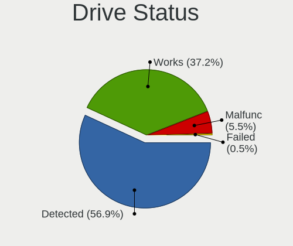
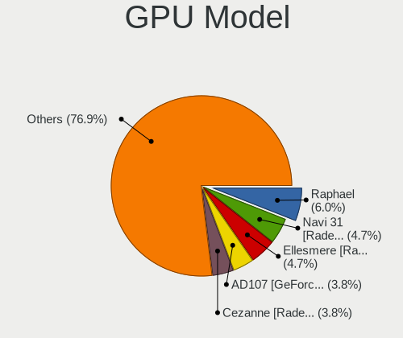
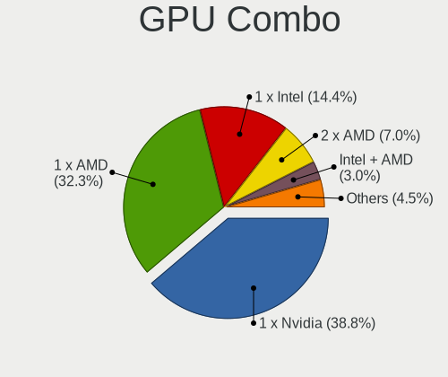
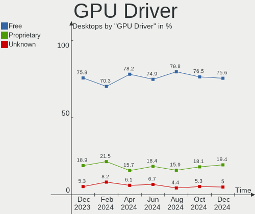
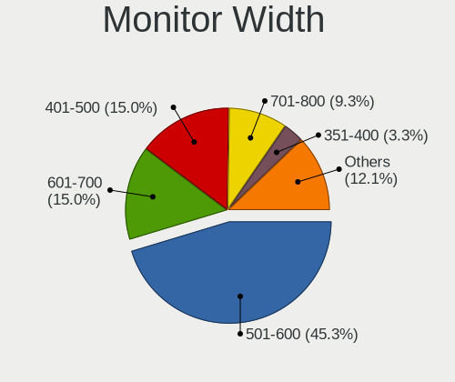
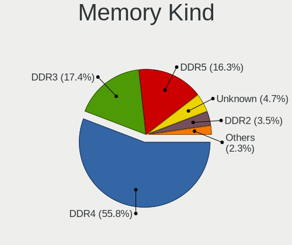

Fedora Hardware Trends (Desktop)
--------------------------------

A project to identify most popular hardware characteristics and track their change
over time based on data collected by Fedora users at https://Linux-Hardware.org.

Anyone can contribute to the study by uploading probes of their computers by
the [hw-probe](https://github.com/linuxhw/hw-probe) tool:

    sudo -E hw-probe -all -upload

Full-feature report is available here: https://linux-hardware.org/?view=trends&formfactor=desktop

Period: Nov, 2020.

Contents
--------

- [ OS                       ](#os)
- [ OS Family                ](#os-family)
- [ Kernel                   ](#kernel)
- [ Kernel Family            ](#kernel-family)
- [ Kernel Major Ver.        ](#kernel-major-ver)
- [ Arch                     ](#arch)
- [ DE                       ](#de)
- [ Display Server           ](#display-server)
- [ Display Manager          ](#display-manager)
- [ OS Lang                  ](#os-lang)
- [ Boot Mode                ](#boot-mode)
- [ Filesystem               ](#filesystem)
- [ Part. scheme             ](#part-scheme)
- [ Dual Boot with Linux/BSD ](#dual-boot-with-linux/bsd)
- [ Dual Boot (Win)          ](#dual-boot-win)
- [ Country                  ](#country)
- [ City                     ](#city)
- [ Vendor                   ](#vendor)
- [ Model                    ](#model)
- [ Model Family             ](#model-family)
- [ MFG Year                 ](#mfg-year)
- [ Form Factor              ](#form-factor)
- [ Secure Boot              ](#secure-boot)
- [ Coreboot                 ](#coreboot)
- [ RAM Size                 ](#ram-size)
- [ RAM Used                 ](#ram-used)
- [ Has CD-ROM               ](#has-cd-rom)
- [ Total Drives             ](#total-drives)
- [ Has Ethernet             ](#has-ethernet)
- [ Drive Vendor             ](#drive-vendor)
- [ Drive Model              ](#drive-model)
- [ HDD Vendor               ](#hdd-vendor)
- [ SSD Vendor               ](#ssd-vendor)
- [ Drive Kind               ](#drive-kind)
- [ Drive Connector          ](#drive-connector)
- [ Drive Size               ](#drive-size)
- [ Space Total              ](#space-total)
- [ Space Used               ](#space-used)
- [ Malfunc. Drives          ](#malfunc-drives)
- [ Malfunc. Drive Vendor    ](#malfunc-drive-vendor)
- [ Malfunc. HDD Vendor      ](#malfunc-hdd-vendor)
- [ Malfunc. Drive Kind      ](#malfunc-drive-kind)
- [ Failed Drives            ](#failed-drives)
- [ Failed Drive Vendor      ](#failed-drive-vendor)
- [ Drive Status             ](#drive-status)
- [ Storage Vendor           ](#storage-vendor)
- [ Storage Model            ](#storage-model)
- [ Storage Kind             ](#storage-kind)
- [ CPU Vendor               ](#cpu-vendor)
- [ CPU Model                ](#cpu-model)
- [ CPU Model Family         ](#cpu-model-family)
- [ CPU Cores                ](#cpu-cores)
- [ CPU Sockets              ](#cpu-sockets)
- [ CPU Threads              ](#cpu-threads)
- [ CPU Op-Modes             ](#cpu-op-modes)
- [ CPU Microcode            ](#cpu-microcode)
- [ CPU Microarch            ](#cpu-microarch)
- [ GPU Vendor               ](#gpu-vendor)
- [ GPU Model                ](#gpu-model)
- [ GPU Combo                ](#gpu-combo)
- [ GPU Driver               ](#gpu-driver)
- [ GPU Memory               ](#gpu-memory)
- [ Monitor Vendor           ](#monitor-vendor)
- [ Monitor Model            ](#monitor-model)
- [ Monitor Resolution       ](#monitor-resolution)
- [ Monitor Diagonal         ](#monitor-diagonal)
- [ Monitor Width            ](#monitor-width)
- [ Aspect Ratio             ](#aspect-ratio)
- [ Monitor Area             ](#monitor-area)
- [ Pixel Density            ](#pixel-density)
- [ Multiple Monitors        ](#multiple-monitors)
- [ Net Controller Vendor    ](#net-controller-vendor)
- [ Net Controller Model     ](#net-controller-model)
- [ Wireless Vendor          ](#wireless-vendor)
- [ Wireless Model           ](#wireless-model)
- [ Ethernet Vendor          ](#ethernet-vendor)
- [ Ethernet Model           ](#ethernet-model)
- [ Net Controller Kind      ](#net-controller-kind)
- [ Used Controller          ](#used-controller)
- [ NICs                     ](#nics)
- [ Memory Vendor            ](#memory-vendor)
- [ Memory Model             ](#memory-model)
- [ Memory Kind              ](#memory-kind)
- [ Memory Form Factor       ](#memory-form-factor)
- [ Memory Size              ](#memory-size)
- [ Memory Speed             ](#memory-speed)
- [ Sound Vendor             ](#sound-vendor)
- [ Sound Model              ](#sound-model)
- [ Camera Vendor            ](#camera-vendor)
- [ Camera Model             ](#camera-model)
- [ Fingerprint Vendor       ](#fingerprint-vendor)
- [ Fingerprint Model        ](#fingerprint-model)
- [ Chipcard Vendor          ](#chipcard-vendor)
- [ Chipcard Model           ](#chipcard-model)
- [ Printer Vendor           ](#printer-vendor)
- [ Printer Model            ](#printer-model)
- [ Scanner Vendor           ](#scanner-vendor)
- [ Scanner Model            ](#scanner-model)
- [ Bluetooth Vendor         ](#bluetooth-vendor)
- [ Bluetooth Model          ](#bluetooth-model)
- [ Unsupported Devices      ](#unsupported-devices)
- [ Unsupported Device Types ](#unsupported-device-types)

OS
--

Installed operating systems

| Name      | Desktops | Percent |
|-----------|----------|---------|
| Fedora 33 | 104      | 81.25%  |
| Fedora 32 | 16       | 12.5%   |
| Fedora 31 | 5        | 3.91%   |
| Fedora 34 | 1        | 0.78%   |
| Fedora 30 | 1        | 0.78%   |
| Fedora 29 | 1        | 0.78%   |

OS Family
---------

OS without a version

| Name   | Desktops | Percent |
|--------|----------|---------|
| Fedora | 128      | 100%    |

Kernel
------

Version of the Linux kernel

| Version                                             | Desktops | Percent |
|-----------------------------------------------------|----------|---------|
| 5.8.18-300.fc33.x86_64                              | 28       | 21.88%  |
| 5.9.8-200.fc33.x86_64                               | 24       | 18.75%  |
| 5.9.10-200.fc33.x86_64                              | 14       | 10.94%  |
| 5.8.17-300.fc33.x86_64                              | 13       | 10.16%  |
| 5.8.16-300.fc33.x86_64                              | 11       | 8.59%   |
| 5.8.18-200.fc32.x86_64                              | 6        | 4.69%   |
| 5.8.15-301.fc33.x86_64                              | 6        | 4.69%   |
| 5.9.9-200.fc33.x86_64                               | 3        | 2.34%   |
| 5.8.17-200.fc32.x86_64                              | 3        | 2.34%   |
| 5.9.8-100.fc32.x86_64                               | 2        | 1.56%   |
| 5.8.18-100.fc31.x86_64                              | 2        | 1.56%   |
| 5.8.16-200.fc32.x86_64                              | 2        | 1.56%   |
| 5.9.9-100.fc32.x86_64                               | 1        | 0.78%   |
| 5.9.2-300.fc33.x86_64                               | 1        | 0.78%   |
| 5.9.11-200.fc33.x86_64                              | 1        | 0.78%   |
| 5.8.17-100.fc31.x86_64                              | 1        | 0.78%   |
| 5.8.15-201.fc32.x86_64                              | 1        | 0.78%   |
| 5.8.15-101.fc31.x86_64                              | 1        | 0.78%   |
| 5.8.13-200.fc32.x86_64                              | 1        | 0.78%   |
| 5.8.13-100.fc31.x86_64                              | 1        | 0.78%   |
| 5.6.13-100.fc30.x86_64                              | 1        | 0.78%   |
| 5.10.0-rc4+                                         | 1        | 0.78%   |
| 5.10.0-rc3                                          | 1        | 0.78%   |
| 5.10.0-0.rc3.68.vanilla.1.fc32.x86_64               | 1        | 0.78%   |
| 5.10.0-0.rc2.62.vanilla.1.fc33.x86_64               | 1        | 0.78%   |
| 5.10.0-0.rc1.20201028gited8780e3f2ec.57.fc34.x86_64 | 1        | 0.78%   |

Kernel Family
-------------

Linux kernel without a distro release

| Version | Desktops | Percent |
|---------|----------|---------|
| 5.8.18  | 36       | 28.13%  |
| 5.9.8   | 26       | 20.31%  |
| 5.8.17  | 17       | 13.28%  |
| 5.9.10  | 14       | 10.94%  |
| 5.8.16  | 13       | 10.16%  |
| 5.8.15  | 8        | 6.25%   |
| 5.10.0  | 5        | 3.91%   |
| 5.9.9   | 4        | 3.13%   |
| 5.8.13  | 2        | 1.56%   |
| 5.9.2   | 1        | 0.78%   |
| 5.9.11  | 1        | 0.78%   |
| 5.6.13  | 1        | 0.78%   |

Kernel Major Ver.
-----------------

Linux kernel major version

| Version | Desktops | Percent |
|---------|----------|---------|
| 5.8     | 76       | 59.38%  |
| 5.9     | 46       | 35.94%  |
| 5.10    | 5        | 3.91%   |
| 5.6     | 1        | 0.78%   |

Arch
----

OS architecture (x86_64, i586, etc.)

| Name   | Desktops | Percent |
|--------|----------|---------|
| x86_64 | 128      | 100%    |

DE
--

Desktop Environment

| Name          | Desktops | Percent |
|---------------|----------|---------|
| GNOME         | 85       | 66.41%  |
| KDE5          | 10       | 7.81%   |
| KDE           | 9        | 7.03%   |
| XFCE          | 5        | 3.91%   |
| Cinnamon      | 4        | 3.13%   |
| X-Cinnamon    | 3        | 2.34%   |
| MATE          | 3        | 2.34%   |
| Deepin        | 3        | 2.34%   |
| Unknown       | 3        | 2.34%   |
| LXQt          | 2        | 1.56%   |
| GNOME Classic | 1        | 0.78%   |

Display Server
--------------

X11 or Wayland

| Name    | Desktops | Percent |
|---------|----------|---------|
| X11     | 65       | 50.78%  |
| Wayland | 56       | 43.75%  |
| Tty     | 6        | 4.69%   |
| Unknown | 1        | 0.78%   |

Display Manager
---------------

SDDM, LightDM, etc.

| Name    | Desktops | Percent |
|---------|----------|---------|
| Unknown | 76       | 59.38%  |
| GDM     | 32       | 25%     |
| SDDM    | 11       | 8.59%   |
| TDM     | 6        | 4.69%   |
| LightDM | 2        | 1.56%   |
| KDM     | 1        | 0.78%   |

OS Lang
-------

Language

| Lang           | Desktops | Percent |
|----------------|----------|---------|
| en_US          | 57       | 44.53%  |
| en_GB          | 9        | 7.03%   |
| en_CA          | 8        | 6.25%   |
| de_DE          | 8        | 6.25%   |
| fr_FR          | 7        | 5.47%   |
| en_AU          | 4        | 3.13%   |
| pt_BR          | 3        | 2.34%   |
| ru_RU          | 2        | 1.56%   |
| it_IT          | 2        | 1.56%   |
| es_CO          | 2        | 1.56%   |
| en_US.utf8     | 2        | 1.56%   |
| en_IN          | 2        | 1.56%   |
| zh_CN          | 1        | 0.78%   |
| uk_UA.utf8     | 1        | 0.78%   |
| uk_UA          | 1        | 0.78%   |
| sv_SE          | 1        | 0.78%   |
| sk_SK          | 1        | 0.78%   |
| pl_PL          | 1        | 0.78%   |
| lb_LU          | 1        | 0.78%   |
| ko_KR          | 1        | 0.78%   |
| ja_JP          | 1        | 0.78%   |
| hu_HU          | 1        | 0.78%   |
| es_MX          | 1        | 0.78%   |
| es_ES          | 1        | 0.78%   |
| en_PH          | 1        | 0.78%   |
| en_NZ          | 1        | 0.78%   |
| en_IL          | 1        | 0.78%   |
| de_CH          | 1        | 0.78%   |
| de_AT.utf8     | 1        | 0.78%   |
| de_AT          | 1        | 0.78%   |
| da_DK          | 1        | 0.78%   |
| ca_ES@valencia | 1        | 0.78%   |
| ca_ES          | 1        | 0.78%   |
| Unknown        | 1        | 0.78%   |

Boot Mode
---------

EFI or BIOS

| Mode | Desktops | Percent |
|------|----------|---------|
| EFI  | 79       | 61.72%  |
| BIOS | 49       | 38.28%  |

Filesystem
----------

Type of filesystem

| Type  | Desktops | Percent |
|-------|----------|---------|
| Ext4  | 66       | 51.56%  |
| Btrfs | 53       | 41.41%  |
| Xfs   | 8        | 6.25%   |
| Ext3  | 1        | 0.78%   |

Part. scheme
------------

Scheme of partitioning

| Type    | Desktops | Percent |
|---------|----------|---------|
| Unknown | 78       | 60.94%  |
| GPT     | 34       | 26.56%  |
| MBR     | 16       | 12.5%   |

Dual Boot with Linux/BSD
------------------------

Hosting more than one Linux/BSD

| Dual boot | Desktops | Percent |
|-----------|----------|---------|
| No        | 119      | 92.97%  |
| Yes       | 9        | 7.03%   |

Dual Boot (Win)
---------------

Hosting Linux and Windows

| Dual boot | Desktops | Percent |
|-----------|----------|---------|
| No        | 110      | 85.94%  |
| Yes       | 18       | 14.06%  |

Country
-------

Geographic location (country)

| Country            | Desktops | Percent |
|--------------------|----------|---------|
| USA                | 29       | 22.66%  |
| Germany            | 10       | 7.81%   |
| France             | 10       | 7.81%   |
| Canada             | 10       | 7.81%   |
| UK                 | 5        | 3.91%   |
| Italy              | 5        | 3.91%   |
| Australia          | 5        | 3.91%   |
| Spain              | 4        | 3.13%   |
| Brazil             | 4        | 3.13%   |
| Austria            | 4        | 3.13%   |
| Romania            | 3        | 2.34%   |
| Poland             | 3        | 2.34%   |
| Ukraine            | 2        | 1.56%   |
| Switzerland        | 2        | 1.56%   |
| Singapore          | 2        | 1.56%   |
| Russia             | 2        | 1.56%   |
| Netherlands        | 2        | 1.56%   |
| Israel             | 2        | 1.56%   |
| Taiwan             | 1        | 0.78%   |
| Sweden             | 1        | 0.78%   |
| Slovakia           | 1        | 0.78%   |
| Philippines        | 1        | 0.78%   |
| Norway             | 1        | 0.78%   |
| New Zealand        | 1        | 0.78%   |
| Morocco            | 1        | 0.78%   |
| Mexico             | 1        | 0.78%   |
| Luxembourg         | 1        | 0.78%   |
| Lithuania          | 1        | 0.78%   |
| Korea, Republic of | 1        | 0.78%   |
| Japan              | 1        | 0.78%   |
| Iran               | 1        | 0.78%   |
| India              | 1        | 0.78%   |
| Iceland            | 1        | 0.78%   |
| Hungary            | 1        | 0.78%   |
| Denmark            | 1        | 0.78%   |
| Czech Republic     | 1        | 0.78%   |
| Colombia           | 1        | 0.78%   |
| China              | 1        | 0.78%   |
| Belarus            | 1        | 0.78%   |
| Argentina          | 1        | 0.78%   |
| Andorra            | 1        | 0.78%   |
| Algeria            | 1        | 0.78%   |

City
----

Geographic location (city)

| City          | Desktops | Percent |
|---------------|----------|---------|
| Vienna        | 3        | 2.34%   |
| Bucharest     | 3        | 2.34%   |
| Wahroonga     | 2        | 1.56%   |
| Toronto       | 2        | 1.56%   |
| Singapore     | 2        | 1.56%   |
| Miami         | 2        | 1.56%   |
| London        | 2        | 1.56%   |
| Charlotte     | 2        | 1.56%   |
| Berlin        | 2        | 1.56%   |
| Ystad         | 1        | 0.78%   |
| Woodbridge    | 1        | 0.78%   |
| Westerly      | 1        | 0.78%   |
| Wateringen    | 1        | 0.78%   |
| Warsaw        | 1        | 0.78%   |
| Voronezh      | 1        | 0.78%   |
| Vancouver     | 1        | 0.78%   |
| Valencia      | 1        | 0.78%   |
| Treviso       | 1        | 0.78%   |
| Tours         | 1        | 0.78%   |
| Toulouse      | 1        | 0.78%   |
| Tel Aviv      | 1        | 0.78%   |
| Tehran        | 1        | 0.78%   |
| Taipei        | 1        | 0.78%   |
| Sydney        | 1        | 0.78%   |
| Sumaré       | 1        | 0.78%   |
| Stavanger     | 1        | 0.78%   |
| Shlissel'burg | 1        | 0.78%   |
| Sergnano      | 1        | 0.78%   |
| Seattle       | 1        | 0.78%   |
| Schellerten   | 1        | 0.78%   |
| Saint Paul    | 1        | 0.78%   |
| Saginaw       | 1        | 0.78%   |
| Rural Valley  | 1        | 0.78%   |
| Rostock       | 1        | 0.78%   |
| Rogers        | 1        | 0.78%   |
| Reykjavik     | 1        | 0.78%   |
| Regina        | 1        | 0.78%   |
| Québec       | 1        | 0.78%   |
| Phoenix       | 1        | 0.78%   |
| Paris         | 1        | 0.78%   |
| Pals          | 1        | 0.78%   |
| Oxford        | 1        | 0.78%   |
| Ottawa        | 1        | 0.78%   |
| Oststeinbek   | 1        | 0.78%   |
| Orlando       | 1        | 0.78%   |
| Oakland       | 1        | 0.78%   |
| Niterói      | 1        | 0.78%   |
| Newark        | 1        | 0.78%   |
| Nantes        | 1        | 0.78%   |
| Nagoya        | 1        | 0.78%   |
| Mérignac     | 1        | 0.78%   |
| Mykolayiv     | 1        | 0.78%   |
| Mount Royal   | 1        | 0.78%   |
| Montpellier   | 1        | 0.78%   |
| Mississauga   | 1        | 0.78%   |
| Minsk         | 1        | 0.78%   |
| Melbourne     | 1        | 0.78%   |
| Mauzac        | 1        | 0.78%   |
| Marseille     | 1        | 0.78%   |
| Manitowoc     | 1        | 0.78%   |

Vendor
------

Motherboard manufacturer

| Name                | Desktops | Percent |
|---------------------|----------|---------|
| ASUSTek Computer    | 36       | 28.13%  |
| Gigabyte Technology | 25       | 19.53%  |
| MSI                 | 18       | 14.06%  |
| ASRock              | 14       | 10.94%  |
| Dell                | 8        | 6.25%   |
| Unknown             | 7        | 5.47%   |
| Hewlett-Packard     | 6        | 4.69%   |
| Lenovo              | 5        | 3.91%   |
| Shuttle             | 2        | 1.56%   |
| ECS                 | 2        | 1.56%   |
| Nvidia              | 1        | 0.78%   |
| NEXCOM              | 1        | 0.78%   |
| Gateway             | 1        | 0.78%   |
| Apple               | 1        | 0.78%   |
| Acer                | 1        | 0.78%   |

Model
-----

Motherboard model

| Name                                   | Desktops | Percent |
|----------------------------------------|----------|---------|
| Unknown                                | 7        | 5.47%   |
| ASUS All Series                        | 3        | 2.34%   |
| Shuttle XH61V                          | 2        | 1.56%   |
| MSI MS-7C84                            | 2        | 1.56%   |
| MSI MS-7C37                            | 2        | 1.56%   |
| MSI MS-7B79                            | 2        | 1.56%   |
| MSI MS-7758                            | 2        | 1.56%   |
| Gigabyte AB350-Gaming 3                | 2        | 1.56%   |
| Dell OptiPlex 3020                     | 2        | 1.56%   |
| ASUS Z170 PRO GAMING                   | 2        | 1.56%   |
| ASUS TUF GAMING X570-PLUS              | 2        | 1.56%   |
| ASUS PRIME B350-PLUS                   | 2        | 1.56%   |
| Nvidia NFORCE 680i LT SLI              | 1        | 0.78%   |
| NEXCOM ASG                             | 1        | 0.78%   |
| MSI MS-7C79                            | 1        | 0.78%   |
| MSI MS-7C56                            | 1        | 0.78%   |
| MSI MS-7C52                            | 1        | 0.78%   |
| MSI MS-7B86                            | 1        | 0.78%   |
| MSI MS-7B24                            | 1        | 0.78%   |
| MSI MS-7B17                            | 1        | 0.78%   |
| MSI MS-7B09                            | 1        | 0.78%   |
| MSI MS-7A40                            | 1        | 0.78%   |
| MSI MS-7A39                            | 1        | 0.78%   |
| MSI MS-7823                            | 1        | 0.78%   |
| Lenovo ThinkStation P620 30E0CTO1WW    | 1        | 0.78%   |
| Lenovo ThinkCentre M92p 3209E2M        | 1        | 0.78%   |
| Lenovo ThinkCentre M58p 7220A72        | 1        | 0.78%   |
| Lenovo ThinkCentre Edge72 3484FQG      | 1        | 0.78%   |
| Lenovo IdeaCentre 720-18APR 90HY0006US | 1        | 0.78%   |
| HP Z440 Workstation                    | 1        | 0.78%   |
| HP Slim Desktop 290-p0xxx              | 1        | 0.78%   |
| HP Pavilion Desktop 590-a0xxx          | 1        | 0.78%   |
| HP EliteDesk 800 G4 DM 65W             | 1        | 0.78%   |
| HP EliteDesk 800 G1 TWR                | 1        | 0.78%   |
| HP Compaq 8000 Elite SFF PC            | 1        | 0.78%   |
| Gigabyte Z77X-D3H                      | 1        | 0.78%   |
| Gigabyte Z77-DS3H                      | 1        | 0.78%   |
| Gigabyte Z270X-UD5                     | 1        | 0.78%   |
| Gigabyte X570 UD                       | 1        | 0.78%   |
| Gigabyte X570 AORUS ULTRA              | 1        | 0.78%   |
| Gigabyte X570 AORUS ELITE WIFI         | 1        | 0.78%   |
| Gigabyte X399 AORUS PRO                | 1        | 0.78%   |
| Gigabyte P35-DS3R                      | 1        | 0.78%   |
| Gigabyte H77N-WIFI                     | 1        | 0.78%   |
| Gigabyte H77-D3H                       | 1        | 0.78%   |
| Gigabyte H61M-S2PV                     | 1        | 0.78%   |
| Gigabyte H310M H 2.0                   | 1        | 0.78%   |
| Gigabyte GA-78LMT-USB3                 | 1        | 0.78%   |
| Gigabyte GA-78LMT-S2P                  | 1        | 0.78%   |
| Gigabyte B550M DS3H                    | 1        | 0.78%   |
| Gigabyte B450M S2H                     | 1        | 0.78%   |
| Gigabyte B450 AORUS ELITE              | 1        | 0.78%   |
| Gigabyte B360M-DS3H                    | 1        | 0.78%   |
| Gigabyte B360M-D3H                     | 1        | 0.78%   |
| Gigabyte B250-HD3P                     | 1        | 0.78%   |
| Gigabyte B150M-D3H                     | 1        | 0.78%   |
| Gigabyte 990XA-UD3                     | 1        | 0.78%   |
| Gigabyte 970-GAMING                    | 1        | 0.78%   |
| Gateway SX2185                         | 1        | 0.78%   |
| ECS KJ377AA-ABA m8400f                 | 1        | 0.78%   |

Model Family
------------

Motherboard model prefix

| Name                   | Desktops | Percent |
|------------------------|----------|---------|
| ASUS PRIME             | 8        | 6.25%   |
| Unknown                | 7        | 5.47%   |
| ASUS TUF               | 5        | 3.91%   |
| Dell OptiPlex          | 4        | 3.13%   |
| Lenovo ThinkCentre     | 3        | 2.34%   |
| Gigabyte X570          | 3        | 2.34%   |
| Dell Inspiron          | 3        | 2.34%   |
| ASUS ROG               | 3        | 2.34%   |
| ASUS All               | 3        | 2.34%   |
| Shuttle XH61V          | 2        | 1.56%   |
| MSI MS-7C84            | 2        | 1.56%   |
| MSI MS-7C37            | 2        | 1.56%   |
| MSI MS-7B79            | 2        | 1.56%   |
| MSI MS-7758            | 2        | 1.56%   |
| HP EliteDesk           | 2        | 1.56%   |
| Gigabyte AB350-Gaming  | 2        | 1.56%   |
| ASUS Z170              | 2        | 1.56%   |
| ASUS M5A97             | 2        | 1.56%   |
| ASRock B450            | 2        | 1.56%   |
| Nvidia NFORCE          | 1        | 0.78%   |
| NEXCOM ASG             | 1        | 0.78%   |
| MSI MS-7C79            | 1        | 0.78%   |
| MSI MS-7C56            | 1        | 0.78%   |
| MSI MS-7C52            | 1        | 0.78%   |
| MSI MS-7B86            | 1        | 0.78%   |
| MSI MS-7B24            | 1        | 0.78%   |
| MSI MS-7B17            | 1        | 0.78%   |
| MSI MS-7B09            | 1        | 0.78%   |
| MSI MS-7A40            | 1        | 0.78%   |
| MSI MS-7A39            | 1        | 0.78%   |
| MSI MS-7823            | 1        | 0.78%   |
| Lenovo ThinkStation    | 1        | 0.78%   |
| Lenovo IdeaCentre      | 1        | 0.78%   |
| HP Z440                | 1        | 0.78%   |
| HP Slim                | 1        | 0.78%   |
| HP Pavilion            | 1        | 0.78%   |
| HP Compaq              | 1        | 0.78%   |
| Gigabyte Z77X-D3H      | 1        | 0.78%   |
| Gigabyte Z77-DS3H      | 1        | 0.78%   |
| Gigabyte Z270X-UD5     | 1        | 0.78%   |
| Gigabyte X399          | 1        | 0.78%   |
| Gigabyte P35-DS3R      | 1        | 0.78%   |
| Gigabyte H77N-WIFI     | 1        | 0.78%   |
| Gigabyte H77-D3H       | 1        | 0.78%   |
| Gigabyte H61M-S2PV     | 1        | 0.78%   |
| Gigabyte H310M         | 1        | 0.78%   |
| Gigabyte GA-78LMT-USB3 | 1        | 0.78%   |
| Gigabyte GA-78LMT-S2P  | 1        | 0.78%   |
| Gigabyte B550M         | 1        | 0.78%   |
| Gigabyte B450M         | 1        | 0.78%   |
| Gigabyte B450          | 1        | 0.78%   |
| Gigabyte B360M-DS3H    | 1        | 0.78%   |
| Gigabyte B360M-D3H     | 1        | 0.78%   |
| Gigabyte B250-HD3P     | 1        | 0.78%   |
| Gigabyte B150M-D3H     | 1        | 0.78%   |
| Gigabyte 990XA-UD3     | 1        | 0.78%   |
| Gigabyte 970-GAMING    | 1        | 0.78%   |
| Gateway SX2185         | 1        | 0.78%   |
| ECS KJ377AA-ABA        | 1        | 0.78%   |
| ECS 945GCT-M3          | 1        | 0.78%   |

MFG Year
--------

Motherboard manufacture year

| Year    | Desktops | Percent |
|---------|----------|---------|
| 2020    | 30       | 23.44%  |
| 2018    | 25       | 19.53%  |
| 2019    | 21       | 16.41%  |
| 2013    | 9        | 7.03%   |
| 2012    | 9        | 7.03%   |
| 2014    | 7        | 5.47%   |
| 2017    | 6        | 4.69%   |
| 2009    | 5        | 3.91%   |
| 2008    | 5        | 3.91%   |
| 2016    | 4        | 3.13%   |
| 2015    | 4        | 3.13%   |
| 2011    | 1        | 0.78%   |
| 2007    | 1        | 0.78%   |
| Unknown | 1        | 0.78%   |

Form Factor
-----------

Physical design of the computer

| Name    | Desktops | Percent |
|---------|----------|---------|
| Desktop | 128      | 100%    |

Secure Boot
-----------

Enabled or disabled

| State    | Desktops | Percent |
|----------|----------|---------|
| Disabled | 122      | 95.31%  |
| Enabled  | 6        | 4.69%   |

Coreboot
--------

Have coreboot on board

| Used | Desktops | Percent |
|------|----------|---------|
| No   | 128      | 100%    |

RAM Size
--------

Total RAM memory

| Size in GB  | Desktops | Percent |
|-------------|----------|---------|
| 16.01-24.0  | 38       | 29.69%  |
| 32.01-64.0  | 27       | 21.09%  |
| 8.01-16.0   | 27       | 21.09%  |
| 4.01-8.0    | 14       | 10.94%  |
| 3.01-4.0    | 10       | 7.81%   |
| 64.01-256.0 | 6        | 4.69%   |
| 24.01-32.0  | 4        | 3.13%   |
| 2.01-3.0    | 1        | 0.78%   |
| 1.01-2.0    | 1        | 0.78%   |

RAM Used
--------

Used RAM memory

| Used GB    | Desktops | Percent |
|------------|----------|---------|
| 2.01-3.0   | 38       | 29.69%  |
| 4.01-8.0   | 32       | 25%     |
| 1.01-2.0   | 27       | 21.09%  |
| 3.01-4.0   | 20       | 15.63%  |
| 8.01-16.0  | 6        | 4.69%   |
| 0.01-1.0   | 3        | 2.34%   |
| 16.01-24.0 | 2        | 1.56%   |

Has CD-ROM
----------

Has CD-ROM on board

| Presented | Desktops | Percent |
|-----------|----------|---------|
| No        | 70       | 54.69%  |
| Yes       | 58       | 45.31%  |

Total Drives
------------

Number of drives on board

| Drives | Desktops | Percent |
|--------|----------|---------|
| 1      | 44       | 34.38%  |
| 2      | 38       | 29.69%  |
| 3      | 24       | 18.75%  |
| 4      | 14       | 10.94%  |
| 5      | 4        | 3.13%   |
| 6      | 2        | 1.56%   |
| 7      | 1        | 0.78%   |
| 0      | 1        | 0.78%   |

Has Ethernet
------------

Has Ethernet on board

| Presented | Desktops | Percent |
|-----------|----------|---------|
| Yes       | 126      | 98.44%  |
| No        | 2        | 1.56%   |

Drive Vendor
------------

Hard drive vendors

| Vendor                    | Desktops | Drives | Percent |
|---------------------------|----------|--------|---------|
| WDC                       | 49       | 65     | 20.76%  |
| Samsung Electronics       | 48       | 68     | 20.34%  |
| Seagate                   | 40       | 47     | 16.95%  |
| Toshiba                   | 15       | 16     | 6.36%   |
| Kingston                  | 13       | 14     | 5.51%   |
| Crucial                   | 13       | 15     | 5.51%   |
| SanDisk                   | 8        | 8      | 3.39%   |
| Intel                     | 6        | 8      | 2.54%   |
| Hitachi                   | 6        | 6      | 2.54%   |
| Phison                    | 5        | 6      | 2.12%   |
| OCZ                       | 3        | 3      | 1.27%   |
| Micron/Crucial Technology | 3        | 3      | 1.27%   |
| A-DATA Technology         | 3        | 3      | 1.27%   |
| Transcend                 | 2        | 2      | 0.85%   |
| Team                      | 2        | 2      | 0.85%   |
| SPCC                      | 2        | 2      | 0.85%   |
| China                     | 2        | 2      | 0.85%   |
| Unknown (583)             | 1        | 1      | 0.42%   |
| Unknown                   | 1        | 1      | 0.42%   |
| SK Hynix                  | 1        | 1      | 0.42%   |
| Silicon Motion            | 1        | 1      | 0.42%   |
| PLEXTOR                   | 1        | 2      | 0.42%   |
| Patriot                   | 1        | 1      | 0.42%   |
| LDLC                      | 1        | 1      | 0.42%   |
| KingDian                  | 1        | 1      | 0.42%   |
| Intenso                   | 1        | 1      | 0.42%   |
| HGST                      | 1        | 2      | 0.42%   |
| GOODRAM                   | 1        | 1      | 0.42%   |
| Golden-Memory             | 1        | 1      | 0.42%   |
| Gigabyte Technology       | 1        | 1      | 0.42%   |
| Elite                     | 1        | 2      | 0.42%   |
| ASMT109x                  | 1        | 1      | 0.42%   |
| ASMT                      | 1        | 1      | 0.42%   |

Drive Model
-----------

Hard drive models

| Model                               | Desktops | Percent |
|-------------------------------------|----------|---------|
| Samsung SSD 850 EVO 250GB           | 9        | 3.26%   |
| Samsung SSD 850 EVO 500GB           | 7        | 2.54%   |
| WDC WD10EZEX-08WN4A0 1TB            | 5        | 1.81%   |
| Samsung NVMe SSD Drive 500GB        | 5        | 1.81%   |
| Samsung SSD 860 EVO 500GB           | 4        | 1.45%   |
| Kingston SA400S37240G 240GB SSD     | 4        | 1.45%   |
| Crucial CT500MX500SSD1 500GB        | 4        | 1.45%   |
| WDC WD40EZRZ-00GXCB0 4TB            | 3        | 1.09%   |
| Toshiba MQ01ABD075 752GB            | 3        | 1.09%   |
| Seagate ST500DM002-1BD142 500GB     | 3        | 1.09%   |
| Seagate ST1000DM003-1CH162 1TB      | 3        | 1.09%   |
| Samsung SSD 970 EVO Plus 500GB      | 3        | 1.09%   |
| Samsung SSD 860 EVO 250GB           | 3        | 1.09%   |
| WDC WD40EZRZ-22GXCB0 4TB            | 2        | 0.72%   |
| WDC WD2500BEVT-22ZCT0 250GB         | 2        | 0.72%   |
| WDC WD20EZRZ-00Z5HB0 2TB            | 2        | 0.72%   |
| WDC WD20EARX-00PASB0 2TB            | 2        | 0.72%   |
| WDC WD10EADS-00L5B1 1TB             | 2        | 0.72%   |
| Toshiba DT01ACA200 2TB              | 2        | 0.72%   |
| Toshiba DT01ACA050 500GB            | 2        | 0.72%   |
| Seagate ST3750528AS 752GB           | 2        | 0.72%   |
| Seagate ST2000LM003 HN-M201RAD 2TB  | 2        | 0.72%   |
| Seagate ST2000DX002-2DV164 2TB      | 2        | 0.72%   |
| Seagate ST2000DM008-2FR102 2TB      | 2        | 0.72%   |
| Seagate ST2000DM001-9YN164 2TB      | 2        | 0.72%   |
| Seagate ST1000DX001-1NS162 1TB      | 2        | 0.72%   |
| Seagate Backup+ Hub BK 8TB          | 2        | 0.72%   |
| Samsung SSD 860 QVO 1TB             | 2        | 0.72%   |
| Samsung SSD 860 EVO 1TB             | 2        | 0.72%   |
| Samsung SSD 840 Series 120GB        | 2        | 0.72%   |
| Samsung NVMe SSD Drive 250GB        | 2        | 0.72%   |
| Samsung NVMe SSD Drive 1TB          | 2        | 0.72%   |
| Samsung HD103SJ 1TB                 | 2        | 0.72%   |
| Phison NVMe SSD Drive 1024GB        | 2        | 0.72%   |
| OCZ VERTEX2 120GB SSD               | 2        | 0.72%   |
| Micron/Crucial NVMe SSD Drive 500GB | 2        | 0.72%   |
| Kingston SUV400S37240G 240GB SSD    | 2        | 0.72%   |
| Intel NVMe SSD Drive 1024GB         | 2        | 0.72%   |
| Hitachi HTS545050B9A300 500GB       | 2        | 0.72%   |
| Crucial CT1000P1SSD8 1TB            | 2        | 0.72%   |
| WDC WDS500G3X0C-00SJG0 500GB        | 1        | 0.36%   |
| WDC WDS500G2B0C-00PXH0 500GB        | 1        | 0.36%   |
| WDC WDS500G1B0C-00S6U0 500GB        | 1        | 0.36%   |
| WDC WDS250G2B0C-00PXH0 250GB        | 1        | 0.36%   |
| WDC WDS250G2B0B-00YS70 250GB SSD    | 1        | 0.36%   |
| WDC WDS250G2B0A 250GB SSD           | 1        | 0.36%   |
| WDC WDS250G1B0A-00H9H0 250GB SSD    | 1        | 0.36%   |
| WDC WD80EZAZ-11TDBA0 8TB            | 1        | 0.36%   |
| WDC WD80EMAZ-00WJTA0 8TB            | 1        | 0.36%   |
| WDC WD80EFAX-68LHPN0 8TB            | 1        | 0.36%   |
| WDC WD7501AALS-00J7B0 752GB         | 1        | 0.36%   |
| WDC WD6400AAKS-75A7B2 640GB         | 1        | 0.36%   |
| WDC WD6002FFWX-68TZ4N0 6TB          | 1        | 0.36%   |
| WDC WD5000AAKX-60U6AA0 500GB        | 1        | 0.36%   |
| WDC WD5000AAKX-00ERMA0 500GB        | 1        | 0.36%   |
| WDC WD5000AAKX-001CA0 500GB         | 1        | 0.36%   |
| WDC WD5000AAKS-00TMA0 500GB         | 1        | 0.36%   |
| WDC WD5000AAKS-00A7B0 500GB         | 1        | 0.36%   |
| WDC WD5000AADS-00M2B0 500GB         | 1        | 0.36%   |
| WDC WD5000AADS-00L4B1 500GB         | 1        | 0.36%   |

HDD Vendor
----------

Hard disk drive vendors

| Vendor              | Desktops | Drives | Percent |
|---------------------|----------|--------|---------|
| WDC                 | 44       | 58     | 40%     |
| Seagate             | 35       | 40     | 31.82%  |
| Toshiba             | 15       | 16     | 13.64%  |
| Samsung Electronics | 6        | 7      | 5.45%   |
| Hitachi             | 6        | 6      | 5.45%   |
| Unknown (583)       | 1        | 1      | 0.91%   |
| Intenso             | 1        | 1      | 0.91%   |
| HGST                | 1        | 2      | 0.91%   |
| ASMT109x            | 1        | 1      | 0.91%   |

SSD Vendor
----------

Solid state drive vendors

| Vendor              | Desktops | Drives | Percent |
|---------------------|----------|--------|---------|
| Samsung Electronics | 31       | 42     | 36.05%  |
| Kingston            | 13       | 14     | 15.12%  |
| Crucial             | 10       | 12     | 11.63%  |
| SanDisk             | 8        | 8      | 9.3%    |
| WDC                 | 3        | 3      | 3.49%   |
| OCZ                 | 3        | 3      | 3.49%   |
| A-DATA Technology   | 3        | 3      | 3.49%   |
| Transcend           | 2        | 2      | 2.33%   |
| Intel               | 2        | 2      | 2.33%   |
| China               | 2        | 2      | 2.33%   |
| Team                | 1        | 1      | 1.16%   |
| SPCC                | 1        | 1      | 1.16%   |
| Seagate             | 1        | 1      | 1.16%   |
| PLEXTOR             | 1        | 2      | 1.16%   |
| Patriot             | 1        | 1      | 1.16%   |
| KingDian            | 1        | 1      | 1.16%   |
| GOODRAM             | 1        | 1      | 1.16%   |
| Golden-Memory       | 1        | 1      | 1.16%   |
| ASMT                | 1        | 1      | 1.16%   |

Drive Kind
----------

HDD or SSD

| Kind    | Desktops | Drives | Percent |
|---------|----------|--------|---------|
| HDD     | 88       | 132    | 42.72%  |
| SSD     | 73       | 101    | 35.44%  |
| NVMe    | 38       | 47     | 18.45%  |
| Unknown | 7        | 9      | 3.4%    |

Drive Connector
---------------

SATA, SAS, NVMe, etc.

| Type | Desktops | Drives | Percent |
|------|----------|--------|---------|
| SATA | 112      | 225    | 68.71%  |
| NVMe | 38       | 47     | 23.31%  |
| SAS  | 13       | 17     | 7.98%   |

Drive Size
----------

Size of hard drive

| Size in TB | Desktops | Drives | Percent |
|------------|----------|--------|---------|
| 0.01-0.5   | 80       | 118    | 45.45%  |
| 0.51-1.0   | 53       | 65     | 30.11%  |
| 1.01-2.0   | 26       | 28     | 14.77%  |
| 3.01-4.0   | 8        | 10     | 4.55%   |
| 4.01-10.0  | 5        | 8      | 2.84%   |
| 2.01-3.0   | 4        | 4      | 2.27%   |

Space Total
-----------

Amount of disk space available on the file system

| Size in GB     | Desktops | Percent |
|----------------|----------|---------|
| 1001-2000      | 23       | 17.97%  |
| 501-1000       | 22       | 17.19%  |
| 251-500        | 21       | 16.41%  |
| 101-250        | 21       | 16.41%  |
| More than 3000 | 20       | 15.63%  |
| 2001-3000      | 8        | 6.25%   |
| Unknown        | 7        | 5.47%   |
| 1-20           | 5        | 3.91%   |
| 51-100         | 1        | 0.78%   |

Space Used
----------

Amount of used disk space

| Used GB        | Desktops | Percent |
|----------------|----------|---------|
| 51-100         | 21       | 16.41%  |
| 251-500        | 19       | 14.84%  |
| 21-50          | 17       | 13.28%  |
| 1-20           | 16       | 12.5%   |
| 1001-2000      | 13       | 10.16%  |
| 501-1000       | 13       | 10.16%  |
| 101-250        | 12       | 9.38%   |
| Unknown        | 7        | 5.47%   |
| More than 3000 | 5        | 3.91%   |
| 2001-3000      | 5        | 3.91%   |

Malfunc. Drives
---------------

Drive models with a malfunction

| Model                             | Desktops | Drives | Percent |
|-----------------------------------|----------|--------|---------|
| WDC WD5000AAKS-00TMA0 500GB       | 1        | 1      | 8.33%   |
| WDC WD2500JS-22NCB1 250GB         | 1        | 1      | 8.33%   |
| WDC WD20EFRX-68AX9N0 2TB          | 1        | 1      | 8.33%   |
| Toshiba HDWD105 500GB             | 1        | 1      | 8.33%   |
| Seagate ST3360320AS 360GB         | 1        | 2      | 8.33%   |
| Seagate ST3250310AS 250GB         | 1        | 1      | 8.33%   |
| Seagate ST2000DM006-2DM164 2TB    | 1        | 1      | 8.33%   |
| Samsung Electronics HD103SI 1TB   | 1        | 1      | 8.33%   |
| Hitachi HUA722020ALA331 2TB       | 1        | 1      | 8.33%   |
| Hitachi HTS545050B9A300 500GB     | 1        | 1      | 8.33%   |
| Crucial CT120M500SSD1 120GB       | 1        | 1      | 8.33%   |
| A-DATA Technology SP900 128GB SSD | 1        | 1      | 8.33%   |

Malfunc. Drive Vendor
---------------------

Vendors of faulty drives

| Vendor              | Desktops | Drives | Percent |
|---------------------|----------|--------|---------|
| WDC                 | 3        | 3      | 25%     |
| Seagate             | 3        | 4      | 25%     |
| Hitachi             | 2        | 2      | 16.67%  |
| Toshiba             | 1        | 1      | 8.33%   |
| Samsung Electronics | 1        | 1      | 8.33%   |
| Crucial             | 1        | 1      | 8.33%   |
| A-DATA Technology   | 1        | 1      | 8.33%   |

Malfunc. HDD Vendor
-------------------

Vendors of faulty HDD drives

| Vendor              | Desktops | Drives | Percent |
|---------------------|----------|--------|---------|
| WDC                 | 3        | 3      | 30%     |
| Seagate             | 3        | 4      | 30%     |
| Hitachi             | 2        | 2      | 20%     |
| Toshiba             | 1        | 1      | 10%     |
| Samsung Electronics | 1        | 1      | 10%     |

Malfunc. Drive Kind
-------------------

Kinds of faulty drives

| Kind | Desktops | Drives | Percent |
|------|----------|--------|---------|
| HDD  | 10       | 11     | 83.33%  |
| SSD  | 2        | 2      | 16.67%  |

Failed Drives
-------------

Failed drive models

| Model                             | Desktops | Drives | Percent |
|-----------------------------------|----------|--------|---------|
| Samsung Electronics HD321HJ 320GB | 1        | 2      | 100%    |

Failed Drive Vendor
-------------------

Failed drive vendors

| Vendor              | Desktops | Drives | Percent |
|---------------------|----------|--------|---------|
| Samsung Electronics | 1        | 2      | 100%    |

Drive Status
------------

Number of failed and malfunc. drives

| Status   | Desktops | Drives | Percent |
|----------|----------|--------|---------|
| Detected | 80       | 182    | 57.14%  |
| Works    | 47       | 92     | 33.57%  |
| Malfunc  | 12       | 13     | 8.57%   |
| Failed   | 1        | 2      | 0.71%   |

Storage Vendor
--------------

Storage controller vendors

| Vendor                    | Desktops | Percent |
|---------------------------|----------|---------|
| Intel                     | 70       | 39.11%  |
| AMD                       | 53       | 29.61%  |
| Samsung Electronics       | 17       | 9.5%    |
| ASMedia Technology        | 9        | 5.03%   |
| Phison Electronics        | 7        | 3.91%   |
| Micron/Crucial Technology | 5        | 2.79%   |
| Sandisk                   | 3        | 1.68%   |
| Marvell Technology Group  | 3        | 1.68%   |
| JMicron Technology        | 3        | 1.68%   |
| Silicon Motion            | 2        | 1.12%   |
| Nvidia                    | 2        | 1.12%   |
| SK Hynix                  | 1        | 0.56%   |
| Silicon Image             | 1        | 0.56%   |
| Seagate Technology        | 1        | 0.56%   |
| LSI Logic / Symbios Logic | 1        | 0.56%   |
| 3ware                     | 1        | 0.56%   |

Storage Model
-------------

Storage controller models

| Model                                                                                   | Desktops | Percent |
|-----------------------------------------------------------------------------------------|----------|---------|
| AMD FCH SATA Controller [AHCI mode]                                                     | 39       | 17.26%  |
| Samsung Electronics NVMe SSD Controller SM981/PM981/PM983                               | 14       | 6.19%   |
| Intel Q170/Q150/B150/H170/H110/Z170/CM236 Chipset SATA Controller [AHCI Mode]           | 11       | 4.87%   |
| Intel 7 Series/C210 Series Chipset Family 6-port SATA Controller [AHCI mode]            | 10       | 4.42%   |
| ASMedia Technology ASM1062 Serial ATA Controller                                        | 9        | 3.98%   |
| AMD 400 Series Chipset SATA Controller                                                  | 9        | 3.98%   |
| AMD 300 Series Chipset SATA Controller                                                  | 9        | 3.98%   |
| Intel Cannon Lake PCH SATA AHCI Controller                                              | 8        | 3.54%   |
| Intel 8 Series/C220 Series Chipset Family 6-port SATA Controller 1 [AHCI mode]          | 8        | 3.54%   |
| Intel 200 Series PCH SATA controller [AHCI mode]                                        | 7        | 3.1%    |
| AMD SB7x0/SB8x0/SB9x0 SATA Controller [AHCI mode]                                       | 5        | 2.21%   |
| AMD SATA controller                                                                     | 5        | 2.21%   |
| Samsung Electronics NVMe SSD Controller SM961/PM961                                     | 4        | 1.77%   |
| Phison Electronics E12 NVMe Controller                                                  | 4        | 1.77%   |
| Micron/Crucial Technology Non-Volatile memory controller                                | 4        | 1.77%   |
| Intel SSD 660P Series                                                                   | 4        | 1.77%   |
| AMD SB7x0/SB8x0/SB9x0 IDE Controller                                                    | 4        | 1.77%   |
| Intel 82801IR/IO/IH (ICH9R/DO/DH) 4 port SATA Controller [IDE mode]                     | 3        | 1.33%   |
| Intel 82801I (ICH9 Family) 2 port SATA Controller [IDE mode]                            | 3        | 1.33%   |
| Intel 82801G (ICH7 Family) IDE Controller                                               | 3        | 1.33%   |
| Intel 6 Series/C200 Series Chipset Family 6 port Desktop SATA AHCI Controller           | 3        | 1.33%   |
| AMD SB7x0/SB8x0/SB9x0 SATA Controller [IDE mode]                                        | 3        | 1.33%   |
| Silicon Motion Non-Volatile memory controller                                           | 2        | 0.88%   |
| Phison Electronics E16 PCIe4 NVMe Controller                                            | 2        | 0.88%   |
| JMicron Technology JMB363 SATA/IDE Controller                                           | 2        | 0.88%   |
| Intel NM10/ICH7 Family SATA Controller [IDE mode]                                       | 2        | 0.88%   |
| Intel 82801JD/DO (ICH10 Family) SATA AHCI Controller                                    | 2        | 0.88%   |
| Intel 82801IR/IO/IH (ICH9R/DO/DH) 6 port SATA Controller [AHCI mode]                    | 2        | 0.88%   |
| Intel 6 Series/C200 Series Chipset Family Desktop SATA Controller (IDE mode, ports 4-5) | 2        | 0.88%   |
| Intel 6 Series/C200 Series Chipset Family Desktop SATA Controller (IDE mode, ports 0-3) | 2        | 0.88%   |
| Intel 5 Series/3400 Series Chipset 6 port SATA AHCI Controller                          | 2        | 0.88%   |
| Intel 4 Series Chipset PT IDER Controller                                               | 2        | 0.88%   |
| AMD X399 Series Chipset SATA Controller                                                 | 2        | 0.88%   |
| AMD FCH SATA Controller D                                                               | 2        | 0.88%   |
| SK Hynix BC501 NVMe Solid State Drive 512GB                                             | 1        | 0.44%   |
| Silicon Image SiI 3132 Serial ATA Raid II Controller                                    | 1        | 0.44%   |
| Seagate Technology Non-Volatile memory controller                                       | 1        | 0.44%   |
| Sandisk WD Blue SN550 NVMe SSD                                                          | 1        | 0.44%   |
| Sandisk WD Black 2019/PC SN750 NVMe SSD                                                 | 1        | 0.44%   |
| Sandisk WD Black 2018 / PC SN520 NVMe SSD                                               | 1        | 0.44%   |
| Phison Electronics PS5013 E13 NVMe Controller                                           | 1        | 0.44%   |
| Nvidia MCP61 SATA Controller                                                            | 1        | 0.44%   |
| Nvidia MCP61 IDE                                                                        | 1        | 0.44%   |
| Nvidia MCP55 SATA Controller                                                            | 1        | 0.44%   |
| Nvidia MCP55 IDE                                                                        | 1        | 0.44%   |
| Micron/Crucial Technology P1 NVMe PCIe SSD                                              | 1        | 0.44%   |
| Marvell Technology Group 88SE9172 SATA 6Gb/s Controller                                 | 1        | 0.44%   |
| Marvell Technology Group 88SE9123 PCIe SATA 6.0 Gb/s controller                         | 1        | 0.44%   |
| Marvell Technology Group 88SE6111/6121 SATA II / PATA Controller                        | 1        | 0.44%   |
| LSI Logic / Symbios Logic SAS2308 PCI-Express Fusion-MPT SAS-2                          | 1        | 0.44%   |
| JMicron Technology JMB368 IDE controller                                                | 1        | 0.44%   |
| Intel Sunrise Point-LP SATA Controller [AHCI mode]                                      | 1        | 0.44%   |
| Intel NM10/ICH7 Family SATA Controller [AHCI mode]                                      | 1        | 0.44%   |
| Intel C610/X99 series chipset sSATA Controller [RAID mode]                              | 1        | 0.44%   |
| Intel C600/X79 series chipset SATA RAID Controller                                      | 1        | 0.44%   |
| Intel C600/X79 series chipset 6-Port SATA AHCI Controller                               | 1        | 0.44%   |
| Intel Atom Processor E3800 Series SATA AHCI Controller                                  | 1        | 0.44%   |
| Intel 82801JI (ICH10 Family) SATA AHCI Controller                                       | 1        | 0.44%   |
| Intel 8 Series/C220 Series Chipset Family 4-port SATA Controller 1 [IDE mode]           | 1        | 0.44%   |
| Intel 8 Series/C220 Series Chipset Family 2-port SATA Controller 2 [IDE mode]           | 1        | 0.44%   |

Storage Kind
------------

Kind of storage controller (IDE, SATA, NVMe, SAS, ...)

| Kind | Desktops | Percent |
|------|----------|---------|
| SATA | 111      | 63.43%  |
| NVMe | 38       | 21.71%  |
| IDE  | 21       | 12%     |
| RAID | 4        | 2.29%   |
| SAS  | 1        | 0.57%   |

CPU Vendor
----------

Processor vendors

| Vendor | Desktops | Percent |
|--------|----------|---------|
| Intel  | 73       | 57.03%  |
| AMD    | 55       | 42.97%  |

CPU Model
---------

Processor models

| Model                                       | Desktops | Percent |
|---------------------------------------------|----------|---------|
| AMD Ryzen 7 3700X 8-Core Processor          | 6        | 4.69%   |
| AMD Ryzen 5 3600 6-Core Processor           | 6        | 4.69%   |
| AMD Ryzen 9 3900X 12-Core Processor         | 5        | 3.91%   |
| Intel Core i7-6700K CPU @ 4.00GHz           | 4        | 3.13%   |
| Intel Core 2 Duo CPU E8400 @ 3.00GHz        | 4        | 3.13%   |
| AMD Ryzen 5 2400G with Radeon Vega Graphics | 4        | 3.13%   |
| AMD Ryzen 5 1600 Six-Core Processor         | 3        | 2.34%   |
| AMD FX-6300 Six-Core Processor              | 3        | 2.34%   |
| Intel Core i9-9900K CPU @ 3.60GHz           | 2        | 1.56%   |
| Intel Core i7-8700 CPU @ 3.20GHz            | 2        | 1.56%   |
| Intel Core i7-7700K CPU @ 4.20GHz           | 2        | 1.56%   |
| Intel Core i7-4790 CPU @ 3.60GHz            | 2        | 1.56%   |
| Intel Core i5-8400 CPU @ 2.80GHz            | 2        | 1.56%   |
| Intel Core i5-4570 CPU @ 3.20GHz            | 2        | 1.56%   |
| Intel Core i5-4460 CPU @ 3.20GHz            | 2        | 1.56%   |
| Intel Core i5-3570 CPU @ 3.40GHz            | 2        | 1.56%   |
| Intel Core i5-3470 CPU @ 3.20GHz            | 2        | 1.56%   |
| Intel Core i5-3450 CPU @ 3.10GHz            | 2        | 1.56%   |
| Intel Core i3-2120 CPU @ 3.30GHz            | 2        | 1.56%   |
| Intel Core 2 Quad CPU Q6600 @ 2.40GHz       | 2        | 1.56%   |
| AMD Ryzen 7 2700 Eight-Core Processor       | 2        | 1.56%   |
| AMD Ryzen 7 1700X Eight-Core Processor      | 2        | 1.56%   |
| AMD Ryzen 5 3400G with Radeon Vega Graphics | 2        | 1.56%   |
| Intel Xeon CPU X5472 @ 3.00GHz              | 1        | 0.78%   |
| Intel Xeon CPU E5-2678 v3 @ 2.50GHz         | 1        | 0.78%   |
| Intel Xeon CPU E5-2620 v2 @ 2.10GHz         | 1        | 0.78%   |
| Intel Xeon CPU E5-1630 v3 @ 3.70GHz         | 1        | 0.78%   |
| Intel Xeon CPU E3-1230 v5 @ 3.40GHz         | 1        | 0.78%   |
| Intel Xeon CPU E3-1230 V2 @ 3.30GHz         | 1        | 0.78%   |
| Intel Pentium D CPU 3.00GHz                 | 1        | 0.78%   |
| Intel Pentium CPU G4560 @ 3.50GHz           | 1        | 0.78%   |
| Intel Pentium CPU G3250 @ 3.20GHz           | 1        | 0.78%   |
| Intel Core i9-7900X CPU @ 3.30GHz           | 1        | 0.78%   |
| Intel Core i7-9700K CPU @ 3.60GHz           | 1        | 0.78%   |
| Intel Core i7-4790K CPU @ 4.00GHz           | 1        | 0.78%   |
| Intel Core i7-4770 CPU @ 3.40GHz            | 1        | 0.78%   |
| Intel Core i7-3770S CPU @ 3.10GHz           | 1        | 0.78%   |
| Intel Core i7-3770K CPU @ 3.50GHz           | 1        | 0.78%   |
| Intel Core i7-3770 CPU @ 3.40GHz            | 1        | 0.78%   |
| Intel Core i7-10700 CPU @ 2.90GHz           | 1        | 0.78%   |
| Intel Core i7 CPU 870 @ 2.93GHz             | 1        | 0.78%   |
| Intel Core i5-9400 CPU @ 2.90GHz            | 1        | 0.78%   |
| Intel Core i5-8500 CPU @ 3.00GHz            | 1        | 0.78%   |
| Intel Core i5-7400 CPU @ 3.00GHz            | 1        | 0.78%   |
| Intel Core i5-6600 CPU @ 3.30GHz            | 1        | 0.78%   |
| Intel Core i5-6500 CPU @ 3.20GHz            | 1        | 0.78%   |
| Intel Core i5-6400 CPU @ 2.70GHz            | 1        | 0.78%   |
| Intel Core i5-4590S CPU @ 3.00GHz           | 1        | 0.78%   |
| Intel Core i5-3570K CPU @ 3.40GHz           | 1        | 0.78%   |
| Intel Core i5-3470S CPU @ 2.90GHz           | 1        | 0.78%   |
| Intel Core i5-10400 CPU @ 2.90GHz           | 1        | 0.78%   |
| Intel Core i5 CPU 650 @ 3.20GHz             | 1        | 0.78%   |
| Intel Core i3-9100F CPU @ 3.60GHz           | 1        | 0.78%   |
| Intel Core i3-8300 CPU @ 3.70GHz            | 1        | 0.78%   |
| Intel Core i3-8100 CPU @ 3.60GHz            | 1        | 0.78%   |
| Intel Core i3-7100U CPU @ 2.40GHz           | 1        | 0.78%   |
| Intel Core i3-7100 CPU @ 3.90GHz            | 1        | 0.78%   |
| Intel Core i3-3220 CPU @ 3.30GHz            | 1        | 0.78%   |
| Intel Core 2 Quad CPU Q9450 @ 2.66GHz       | 1        | 0.78%   |
| Intel Core 2 Duo CPU E8500 @ 3.16GHz        | 1        | 0.78%   |

CPU Model Family
----------------

Processor model prefix

| Model                  | Desktops | Percent |
|------------------------|----------|---------|
| Intel Core i5          | 23       | 17.97%  |
| AMD Ryzen 5            | 19       | 14.84%  |
| Intel Core i7          | 18       | 14.06%  |
| AMD Ryzen 7            | 13       | 10.16%  |
| Intel Core i3          | 8        | 6.25%   |
| AMD FX                 | 8        | 6.25%   |
| Intel Xeon             | 6        | 4.69%   |
| AMD Ryzen 9            | 6        | 4.69%   |
| Intel Core 2 Duo       | 5        | 3.91%   |
| Intel Core i9          | 3        | 2.34%   |
| Intel Core 2 Quad      | 3        | 2.34%   |
| Intel Celeron          | 3        | 2.34%   |
| AMD Ryzen Threadripper | 3        | 2.34%   |
| Intel Pentium          | 2        | 1.56%   |
| AMD Ryzen 3            | 2        | 1.56%   |
| Intel Pentium D        | 1        | 0.78%   |
| Intel Core 2           | 1        | 0.78%   |
| AMD Phenom             | 1        | 0.78%   |
| AMD E2                 | 1        | 0.78%   |
| AMD A8                 | 1        | 0.78%   |
| AMD A6                 | 1        | 0.78%   |

CPU Cores
---------

Number of processor cores

| Number | Desktops | Percent |
|--------|----------|---------|
| 4      | 54       | 42.19%  |
| 2      | 22       | 17.19%  |
| 6      | 21       | 16.41%  |
| 8      | 18       | 14.06%  |
| 12     | 8        | 6.25%   |
| 3      | 3        | 2.34%   |
| 32     | 1        | 0.78%   |
| 10     | 1        | 0.78%   |

CPU Sockets
-----------

Number of sockets

| Number | Desktops | Percent |
|--------|----------|---------|
| 1      | 127      | 99.22%  |
| 2      | 1        | 0.78%   |

CPU Threads
-----------

Threads per core (Hyper-Threading)

| Number | Desktops | Percent |
|--------|----------|---------|
| 2      | 80       | 62.5%   |
| 1      | 48       | 37.5%   |

CPU Op-Modes
------------

CPU Operation Modes (32-bit, 64-bit)

| Op mode        | Desktops | Percent |
|----------------|----------|---------|
| 32-bit, 64-bit | 128      | 100%    |

CPU Microcode
-------------

Microcode number

| Number     | Desktops | Percent |
|------------|----------|---------|
| 0x08701021 | 12       | 9.38%   |
| 0x306c3    | 10       | 7.81%   |
| 0x306a9    | 10       | 7.81%   |
| Unknown    | 10       | 7.81%   |
| 0x506e3    | 7        | 5.47%   |
| 0x06000852 | 7        | 5.47%   |
| 0x08701013 | 6        | 4.69%   |
| 0x906ea    | 5        | 3.91%   |
| 0x906e9    | 5        | 3.91%   |
| 0x1067a    | 5        | 3.91%   |
| 0x0800820d | 5        | 3.91%   |
| 0x08001137 | 5        | 3.91%   |
| 0x906eb    | 4        | 3.13%   |
| 0x08108109 | 3        | 2.34%   |
| 0x08101016 | 3        | 2.34%   |
| 0x08001138 | 3        | 2.34%   |
| 0xa0655    | 2        | 1.56%   |
| 0x6fb      | 2        | 1.56%   |
| 0x306f2    | 2        | 1.56%   |
| 0x206a7    | 2        | 1.56%   |
| 0xf65      | 1        | 0.78%   |
| 0x906ed    | 1        | 0.78%   |
| 0x906ec    | 1        | 0.78%   |
| 0x806e9    | 1        | 0.78%   |
| 0x6fd      | 1        | 0.78%   |
| 0x6f6      | 1        | 0.78%   |
| 0x306e4    | 1        | 0.78%   |
| 0x30678    | 1        | 0.78%   |
| 0x20655    | 1        | 0.78%   |
| 0x106e5    | 1        | 0.78%   |
| 0x10677    | 1        | 0.78%   |
| 0x10676    | 1        | 0.78%   |
| 0x08301039 | 1        | 0.78%   |
| 0x0810100b | 1        | 0.78%   |
| 0x0800111c | 1        | 0.78%   |
| 0x0700010f | 1        | 0.78%   |
| 0x06006705 | 1        | 0.78%   |
| 0x0600063e | 1        | 0.78%   |
| 0x03000027 | 1        | 0.78%   |
| 0x01000083 | 1        | 0.78%   |

CPU Microarch
-------------

Microarchitecture

| Name        | Desktops | Percent |
|-------------|----------|---------|
| Zen 2       | 20       | 15.63%  |
| KabyLake    | 19       | 14.84%  |
| IvyBridge   | 14       | 10.94%  |
| Zen         | 13       | 10.16%  |
| Haswell     | 12       | 9.38%   |
| Zen+        | 9        | 7.03%   |
| Skylake     | 9        | 7.03%   |
| Piledriver  | 7        | 5.47%   |
| Penryn      | 7        | 5.47%   |
| Core        | 4        | 3.13%   |
| SandyBridge | 2        | 1.56%   |
| CometLake   | 2        | 1.56%   |
| Westmere    | 1        | 0.78%   |
| Silvermont  | 1        | 0.78%   |
| NetBurst    | 1        | 0.78%   |
| Nehalem     | 1        | 0.78%   |
| K10 Llano   | 1        | 0.78%   |
| K10         | 1        | 0.78%   |
| Jaguar      | 1        | 0.78%   |
| Excavator   | 1        | 0.78%   |
| Bulldozer   | 1        | 0.78%   |
| Unknown     | 1        | 0.78%   |

GPU Vendor
----------

Vendors of graphics cards

| Vendor  | Desktops | Percent |
|---------|----------|---------|
| Nvidia  | 52       | 37.68%  |
| AMD     | 50       | 36.23%  |
| Intel   | 35       | 25.36%  |
| Red Hat | 1        | 0.72%   |

GPU Model
---------

Graphics card models

| Model                                                                       | Desktops | Percent |
|-----------------------------------------------------------------------------|----------|---------|
| Intel Xeon E3-1200 v2/3rd Gen Core processor Graphics Controller            | 7        | 4.93%   |
| Intel Xeon E3-1200 v3/4th Gen Core Processor Integrated Graphics Controller | 6        | 4.23%   |
| AMD Navi 10 [Radeon RX 5600 OEM/5600 XT / 5700/5700 XT]                     | 6        | 4.23%   |
| AMD Ellesmere [Radeon RX 470/480/570/570X/580/580X/590]                     | 6        | 4.23%   |
| Nvidia GP106 [GeForce GTX 1060 6GB]                                         | 5        | 3.52%   |
| AMD Raven Ridge [Radeon Vega Series / Radeon Vega Mobile Series]            | 4        | 2.82%   |
| AMD Baffin [Radeon RX 550 640SP / RX 560/560X]                              | 4        | 2.82%   |
| Nvidia GT218 [GeForce 210]                                                  | 3        | 2.11%   |
| Nvidia GP108 [GeForce GT 1030]                                              | 3        | 2.11%   |
| Nvidia GP107 [GeForce GTX 1050 Ti]                                          | 3        | 2.11%   |
| Nvidia GP106 [GeForce GTX 1060 3GB]                                         | 3        | 2.11%   |
| Intel HD Graphics 530                                                       | 3        | 2.11%   |
| AMD Picasso                                                                 | 3        | 2.11%   |
| AMD Hawaii PRO [Radeon R9 290/390]                                          | 3        | 2.11%   |
| AMD Baffin [Radeon RX 460/560D / Pro 450/455/460/555/555X/560/560X]         | 3        | 2.11%   |
| Nvidia TU117 [GeForce GTX 1650]                                             | 2        | 1.41%   |
| Nvidia TU116 [GeForce GTX 1660]                                             | 2        | 1.41%   |
| Nvidia GP104 [GeForce GTX 1070]                                             | 2        | 1.41%   |
| Nvidia GP102 [GeForce GTX 1080 Ti]                                          | 2        | 1.41%   |
| Nvidia GM206 [GeForce GTX 960]                                              | 2        | 1.41%   |
| Nvidia GM107 [GeForce GTX 750 Ti]                                           | 2        | 1.41%   |
| Nvidia GK208B [GeForce GT 710]                                              | 2        | 1.41%   |
| Nvidia GF104 [GeForce GTX 460]                                              | 2        | 1.41%   |
| Intel UHD Graphics 630 (Desktop)                                            | 2        | 1.41%   |
| Intel UHD Graphics 630 (Desktop 9 Series)                                   | 2        | 1.41%   |
| Intel UHD Graphics                                                          | 2        | 1.41%   |
| Intel HD Graphics 630                                                       | 2        | 1.41%   |
| Intel 4 Series Chipset Integrated Graphics Controller                       | 2        | 1.41%   |
| AMD Vega 10 XL/XT [Radeon RX Vega 56/64]                                    | 2        | 1.41%   |
| AMD RV620 LE [Radeon HD 3450]                                               | 2        | 1.41%   |
| AMD Navi 14 [Radeon RX 5500/5500M / Pro 5500M]                              | 2        | 1.41%   |
| AMD Lexa PRO [Radeon 540/540X/550/550X / RX 540X/550/550X]                  | 2        | 1.41%   |
| Red Hat Virtio GPU                                                          | 1        | 0.7%    |
| Nvidia TU116 [GeForce GTX 1650 SUPER]                                       | 1        | 0.7%    |
| Nvidia TU106 [GeForce RTX 2060 SUPER]                                       | 1        | 0.7%    |
| Nvidia TU106 [GeForce RTX 2060 Rev. A]                                      | 1        | 0.7%    |
| Nvidia TU104 [GeForce RTX 2080 SUPER]                                       | 1        | 0.7%    |
| Nvidia GT218 [NVS 300]                                                      | 1        | 0.7%    |
| Nvidia GT218 [GeForce 8400 GS Rev. 3]                                       | 1        | 0.7%    |
| Nvidia GP107GL [Quadro P620]                                                | 1        | 0.7%    |
| Nvidia GP107 [GeForce GTX 1050]                                             | 1        | 0.7%    |
| Nvidia GP104 [GeForce GTX 1080]                                             | 1        | 0.7%    |
| Nvidia GM206 [GeForce GTX 950]                                              | 1        | 0.7%    |
| Nvidia GM200 [GeForce GTX 980 Ti]                                           | 1        | 0.7%    |
| Nvidia GM107GL [Quadro K620]                                                | 1        | 0.7%    |
| Nvidia GK107 [GeForce GTX 650]                                              | 1        | 0.7%    |
| Nvidia GK106 [GeForce GTX 650 Ti]                                           | 1        | 0.7%    |
| Nvidia GK104 [GeForce GTX 770]                                              | 1        | 0.7%    |
| Nvidia GF119 [GeForce GT 610]                                               | 1        | 0.7%    |
| Nvidia GF114 [GeForce GTX 560]                                              | 1        | 0.7%    |
| Nvidia GF108 [GeForce GT 730]                                               | 1        | 0.7%    |
| Nvidia G96GL [Quadro FX 380]                                                | 1        | 0.7%    |
| Nvidia G92 [GeForce 8800 GT]                                                | 1        | 0.7%    |
| Nvidia C61 [GeForce 6150SE nForce 430]                                      | 1        | 0.7%    |
| Intel UHD Graphics 610                                                      | 1        | 0.7%    |
| Intel HD Graphics 620                                                       | 1        | 0.7%    |
| Intel HD Graphics 610                                                       | 1        | 0.7%    |
| Intel Core Processor Integrated Graphics Controller                         | 1        | 0.7%    |
| Intel Atom Processor Z36xxx/Z37xxx Series Graphics & Display                | 1        | 0.7%    |
| Intel 8th Gen Core Processor Gaussian Mixture Model                         | 1        | 0.7%    |

GPU Combo
---------

Combinations of graphics cards

| Name           | Desktops | Percent |
|----------------|----------|---------|
| 1 x Nvidia     | 48       | 37.5%   |
| 1 x AMD        | 48       | 37.5%   |
| 1 x Intel      | 27       | 21.09%  |
| 2 x Nvidia     | 2        | 1.56%   |
| Intel + Nvidia | 2        | 1.56%   |
| 1 x Red Hat    | 1        | 0.78%   |

GPU Driver
----------

Free vs proprietary

| Driver      | Desktops | Percent |
|-------------|----------|---------|
| Free        | 97       | 75.78%  |
| Proprietary | 28       | 21.88%  |
| Unknown     | 3        | 2.34%   |

GPU Memory
----------

Total video memory

| Size in GB | Desktops | Percent |
|------------|----------|---------|
| Unknown    | 48       | 37.5%   |
| 1.01-2.0   | 23       | 17.97%  |
| 7.01-8.0   | 15       | 11.72%  |
| 0.51-1.0   | 12       | 9.38%   |
| 0.01-0.5   | 10       | 7.81%   |
| 3.01-4.0   | 9        | 7.03%   |
| 5.01-6.0   | 6        | 4.69%   |
| 2.01-3.0   | 4        | 3.13%   |
| 8.01-16.0  | 1        | 0.78%   |

Monitor Vendor
--------------

Monitor vendors

| Vendor               | Desktops | Percent |
|----------------------|----------|---------|
| Dell                 | 29       | 20.28%  |
| Samsung Electronics  | 17       | 11.89%  |
| Goldstar             | 15       | 10.49%  |
| Acer                 | 14       | 9.79%   |
| Hewlett-Packard      | 8        | 5.59%   |
| AOC                  | 8        | 5.59%   |
| Iiyama               | 7        | 4.9%    |
| BenQ                 | 7        | 4.9%    |
| Philips              | 6        | 4.2%    |
| Ancor Communications | 6        | 4.2%    |
| Lenovo               | 5        | 3.5%    |
| HannStar             | 3        | 2.1%    |
| ViewSonic            | 2        | 1.4%    |
| Unknown              | 2        | 1.4%    |
| SNC                  | 2        | 1.4%    |
| Sceptre Tech         | 2        | 1.4%    |
| Eizo                 | 2        | 1.4%    |
| ___                  | 1        | 0.7%    |
| WYT                  | 1        | 0.7%    |
| Sony                 | 1        | 0.7%    |
| RHT                  | 1        | 0.7%    |
| RAT                  | 1        | 0.7%    |
| Insignia             | 1        | 0.7%    |
| HKC                  | 1        | 0.7%    |
| ASUSTek Computer     | 1        | 0.7%    |

Monitor Model
-------------

Monitor models

| Model                                                                                 | Desktops | Percent |
|---------------------------------------------------------------------------------------|----------|---------|
| Dell U2412M DELA07A 1920x1200 518x324mm 24.1-inch                                     | 3        | 1.86%   |
| SNC PHOTO 190V SNC1850 1366x768 409x230mm 18.5-inch                                   | 2        | 1.24%   |
| Philips PHL 276E8V PHLC18F 3840x2160 597x336mm 27.0-inch                              | 2        | 1.24%   |
| Iiyama PLE2483H IVM6113 1920x1080 531x299mm 24.0-inch                                 | 2        | 1.24%   |
| Goldstar W1943 GSM4BAD 1024x768 410x230mm 18.5-inch                                   | 2        | 1.24%   |
| Goldstar LG ULTRAWIDE GSM59F1 1920x1080 580x240mm 24.7-inch                           | 2        | 1.24%   |
| BenQ GL2450H BNQ78A7 1920x1080 530x300mm 24.0-inch                                    | 2        | 1.24%   |
| AOC 24B1W AOC2401 1920x1080 521x293mm 23.5-inch                                       | 2        | 1.24%   |
| AOC 2200W AOC2200 1920x1080 476x268mm 21.5-inch                                       | 2        | 1.24%   |
| Acer S232HL ACR0203 1920x1080 510x290mm 23.1-inch                                     | 2        | 1.24%   |
| ___ Monitor ranges (GTF): 48-62Hz V, 14-68kHz H, max dotclock 150MHz ___9000 1440x900 | 1        | 0.62%   |
| WYT MNT-ANALOG WYT0323 1280x1024 330x270mm 16.8-inch                                  | 1        | 0.62%   |
| ViewSonic XG2401 SERIES VSCBB31 1920x1080 531x299mm 24.0-inch                         | 1        | 0.62%   |
| ViewSonic VG2433mh VSC6A34 1920x1080 521x293mm 23.5-inch                              | 1        | 0.62%   |
| Unknown LCDTV16 9000 1360x768 1600x900mm 72.3-inch                                    | 1        | 0.62%   |
| Unknown LCD Monitor FFFF 2288x1287 2550x2550mm 142.0-inch                             | 1        | 0.62%   |
| Sony TV SNY2501 1360x768 710x400mm 32.1-inch                                          | 1        | 0.62%   |
| Sceptre Tech E248W-1920 SPT099D 1920x1080 443x249mm 20.0-inch                         | 1        | 0.62%   |
| Sceptre Tech C32 SPT0CB3 1920x1080 544x303mm 24.5-inch                                | 1        | 0.62%   |
| Samsung Electronics U32H75x SAM0E02 3840x2160 697x392mm 31.5-inch                     | 1        | 0.62%   |
| Samsung Electronics U28E590 SAM0C4C 3840x2160 608x345mm 27.5-inch                     | 1        | 0.62%   |
| Samsung Electronics SyncMaster SAM0425 1920x1200 518x324mm 24.1-inch                  | 1        | 0.62%   |
| Samsung Electronics SyncMaster SAM041F 2048x1152 510x287mm 23.0-inch                  | 1        | 0.62%   |
| Samsung Electronics SyncMaster SAM0350 1440x900 428x255mm 19.6-inch                   | 1        | 0.62%   |
| Samsung Electronics SyncMaster SAM02F8 1440x900 408x225mm 18.3-inch                   | 1        | 0.62%   |
| Samsung Electronics SyncMaster SAM0255 1680x1050 474x296mm 22.0-inch                  | 1        | 0.62%   |
| Samsung Electronics SMS22A100 SAM0868 1920x1080 477x268mm 21.5-inch                   | 1        | 0.62%   |
| Samsung Electronics SA300/SA350 SAM0793 1920x1080 531x299mm 24.0-inch                 | 1        | 0.62%   |
| Samsung Electronics S24F350 SAM0D20 1920x1080 521x293mm 23.5-inch                     | 1        | 0.62%   |
| Samsung Electronics S23B550 SAM0919 1920x1080 510x287mm 23.0-inch                     | 1        | 0.62%   |
| Samsung Electronics S22E450 SAM0C92 1920x1080 477x268mm 21.5-inch                     | 1        | 0.62%   |
| Samsung Electronics LS32R75 SAM0F92 3840x2160 697x392mm 31.5-inch                     | 1        | 0.62%   |
| Samsung Electronics LCD Monitor SMT27A550 1920x1080                                   | 1        | 0.62%   |
| Samsung Electronics LCD Monitor SAM0C39 1920x1080 1050x590mm 47.4-inch                | 1        | 0.62%   |
| Samsung Electronics LCD Monitor CF791 3440x1440                                       | 1        | 0.62%   |
| Samsung Electronics LC32G5xT SAM7088 2560x1440 698x393mm 31.5-inch                    | 1        | 0.62%   |
| Samsung Electronics C27HG7x SAM0E16 2560x1440 598x336mm 27.0-inch                     | 1        | 0.62%   |
| Samsung Electronics C24F390 SAM0D2C 1920x1080 520x290mm 23.4-inch                     | 1        | 0.62%   |
| RHT QEMU Monitor RHT1234 2048x1152 260x190mm 12.7-inch                                | 1        | 0.62%   |
| RAT VGA RAT0215 1920x1080 368x207mm 16.6-inch                                         | 1        | 0.62%   |
| Philips PHL 346B1C PHL093E 3440x1440 797x334mm 34.0-inch                              | 1        | 0.62%   |
| Philips PHL 227E6 PHLC0E5 1920x1080 477x268mm 21.5-inch                               | 1        | 0.62%   |
| Philips PHL 223V5 PHLC0CF 1920x1080 480x270mm 21.7-inch                               | 1        | 0.62%   |
| Philips 227E4QH PHLC0AA 1920x1080 477x268mm 21.5-inch                                 | 1        | 0.62%   |
| Lenovo X24q-10 LEN61A4 2560x1440 527x296mm 23.8-inch                                  | 1        | 0.62%   |
| Lenovo LEN S22e-19 LEN61C9 1920x1080 476x268mm 21.5-inch                              | 1        | 0.62%   |
| Lenovo LEN LT2423wC LEN60A8 1920x1080 531x299mm 24.0-inch                             | 1        | 0.62%   |
| Lenovo LEN L27i-28 LEN65E0 1920x1080 598x336mm 27.0-inch                              | 1        | 0.62%   |
| Lenovo LEN L22e-20 LEN65DE 1920x1080 476x268mm 21.5-inch                              | 1        | 0.62%   |
| Insignia DX-15L150A11 BBY1511 1360x768 340x190mm 15.3-inch                            | 1        | 0.62%   |
| Iiyama PLE431 IVM46AC 1280x1024 340x270mm 17.1-inch                                   | 1        | 0.62%   |
| Iiyama PLE2483H-DP IVM611E 1920x1080 531x299mm 24.0-inch                              | 1        | 0.62%   |
| Iiyama PLE2403WS IVM5604 1920x1200 519x324mm 24.1-inch                                | 1        | 0.62%   |
| Iiyama PLE1700 IVM46DF 1280x1024 338x270mm 17.0-inch                                  | 1        | 0.62%   |
| Iiyama PL2483H IVM6138 1920x1080 531x299mm 24.0-inch                                  | 1        | 0.62%   |
| Iiyama PL2480H IVM610B 1920x1080 520x290mm 23.4-inch                                  | 1        | 0.62%   |
| Iiyama PL2283H IVM562E 1920x1080 496x292mm 22.7-inch                                  | 1        | 0.62%   |
| HKC Checksum: 0x2a (valid) HKC2160 1920x1080 360x270mm 17.7-inch                      | 1        | 0.62%   |
| Hewlett-Packard Z24i G2 HPN3483 1920x1200 518x324mm 24.1-inch                         | 1        | 0.62%   |
| Hewlett-Packard w2207 HWP26A9 1680x1050 473x296mm 22.0-inch                           | 1        | 0.62%   |

Monitor Resolution
------------------

Monitor screen resolution

| Resolution         | Desktops | Percent |
|--------------------|----------|---------|
| 1920x1080 (FHD)    | 67       | 46.53%  |
| 2560x1440 (QHD)    | 14       | 9.72%   |
| 3840x2160 (4K)     | 11       | 7.64%   |
| 1920x1200 (WUXGA)  | 9        | 6.25%   |
| 1280x1024 (SXGA)   | 9        | 6.25%   |
| 1680x1050 (WSXGA+) | 7        | 4.86%   |
| 1440x900 (WXGA+)   | 7        | 4.86%   |
| 1360x768           | 5        | 3.47%   |
| 3440x1440          | 3        | 2.08%   |
| 2560x1080          | 3        | 2.08%   |
| 1600x900 (HD+)     | 3        | 2.08%   |
| 1366x768 (WXGA)    | 3        | 2.08%   |
| 2048x1152          | 2        | 1.39%   |
| 2288x1287          | 1        | 0.69%   |

Monitor Diagonal
----------------

Diagonal size in inches

| Inches  | Desktops | Percent |
|---------|----------|---------|
| 24      | 32       | 21.05%  |
| 27      | 25       | 16.45%  |
| 23      | 25       | 16.45%  |
| 21      | 15       | 9.87%   |
| 19      | 11       | 7.24%   |
| 18      | 7        | 4.61%   |
| 34      | 5        | 3.29%   |
| 31      | 5        | 3.29%   |
| 22      | 5        | 3.29%   |
| 20      | 5        | 3.29%   |
| 25      | 3        | 1.97%   |
| 17      | 3        | 1.97%   |
| Unknown | 3        | 1.97%   |
| 16      | 2        | 1.32%   |
| 142     | 1        | 0.66%   |
| 72      | 1        | 0.66%   |
| 47      | 1        | 0.66%   |
| 40      | 1        | 0.66%   |
| 32      | 1        | 0.66%   |
| 15      | 1        | 0.66%   |

Monitor Width
-------------

Physical width

| Width in mm    | Desktops | Percent |
|----------------|----------|---------|
| 501-600        | 74       | 52.11%  |
| 401-500        | 36       | 25.35%  |
| 351-400        | 8        | 5.63%   |
| 601-700        | 7        | 4.93%   |
| 701-800        | 6        | 4.23%   |
| 301-350        | 4        | 2.82%   |
| Unknown        | 3        | 2.11%   |
| More than 2000 | 1        | 0.7%    |
| 801-900        | 1        | 0.7%    |
| 1501-2000      | 1        | 0.7%    |
| 1001-1500      | 1        | 0.7%    |

Aspect Ratio
------------

Proportional relationship between the width and the height

| Ratio   | Desktops | Percent |
|---------|----------|---------|
| 16/9    | 96       | 69.57%  |
| 16/10   | 23       | 16.67%  |
| 5/4     | 8        | 5.8%    |
| 21/9    | 5        | 3.62%   |
| Unknown | 2        | 1.45%   |
| 6/5     | 1        | 0.72%   |
| 4/3     | 1        | 0.72%   |
| 2.00    | 1        | 0.72%   |
| 1.00    | 1        | 0.72%   |

Monitor Area
------------

Area in inch²

| Area in inch² | Desktops | Percent |
|----------------|----------|---------|
| 201-250        | 55       | 36.91%  |
| 151-200        | 27       | 18.12%  |
| 301-350        | 25       | 16.78%  |
| 251-300        | 13       | 8.72%   |
| 351-500        | 11       | 7.38%   |
| 141-150        | 8        | 5.37%   |
| Unknown        | 3        | 2.01%   |
| More than 1000 | 2        | 1.34%   |
| 501-1000       | 2        | 1.34%   |
| 131-140        | 1        | 0.67%   |
| 111-120        | 1        | 0.67%   |
| 91-100         | 1        | 0.67%   |

Pixel Density
-------------

Pixels per inch

| Density | Desktops | Percent |
|---------|----------|---------|
| 51-100  | 86       | 62.77%  |
| 101-120 | 29       | 21.17%  |
| 121-160 | 9        | 6.57%   |
| 161-240 | 6        | 4.38%   |
| 1-50    | 4        | 2.92%   |
| Unknown | 3        | 2.19%   |

Multiple Monitors
-----------------

Total monitors connected

| Total | Desktops | Percent |
|-------|----------|---------|
| 1     | 94       | 73.44%  |
| 2     | 29       | 22.66%  |
| 4     | 2        | 1.56%   |
| 0     | 2        | 1.56%   |
| 3     | 1        | 0.78%   |

Net Controller Vendor
---------------------

Controller vendors

| Vendor                                | Desktops | Percent |
|---------------------------------------|----------|---------|
| Realtek Semiconductor                 | 76       | 44.19%  |
| Intel                                 | 57       | 33.14%  |
| Qualcomm Atheros                      | 17       | 9.88%   |
| Ralink Technology                     | 5        | 2.91%   |
| Nvidia                                | 2        | 1.16%   |
| Broadcom Inc. and subsidiaries        | 2        | 1.16%   |
| 802.11g Adapter [Linksys WUSB54GC v3] | 2        | 1.16%   |
| Wilocity                              | 1        | 0.58%   |
| Samsung Electronics                   | 1        | 0.58%   |
| NXP Semiconductors                    | 1        | 0.58%   |
| Microsoft                             | 1        | 0.58%   |
| Marvell Technology Group              | 1        | 0.58%   |
| Linksys                               | 1        | 0.58%   |
| Lenovo                                | 1        | 0.58%   |
| Edimax Technology                     | 1        | 0.58%   |
| D-Link System                         | 1        | 0.58%   |
| ASUSTek Computer                      | 1        | 0.58%   |
| Aquantia                              | 1        | 0.58%   |

Net Controller Model
--------------------

Controller models

| Model                                                             | Desktops | Percent |
|-------------------------------------------------------------------|----------|---------|
| Realtek RTL8111/8168/8411 PCI Express Gigabit Ethernet Controller | 68       | 35.05%  |
| Intel I211 Gigabit Network Connection                             | 11       | 5.67%   |
| Intel Wi-Fi 6 AX200                                               | 10       | 5.15%   |
| Intel Ethernet Connection (2) I219-V                              | 10       | 5.15%   |
| Intel Dual Band Wireless-AC 3168NGW [Stone Peak]                  | 5        | 2.58%   |
| Realtek RTL8125 2.5GbE Controller                                 | 4        | 2.06%   |
| Intel Ethernet Connection (7) I219-V                              | 4        | 2.06%   |
| Qualcomm Atheros AR9462 Wireless Network Adapter                  | 3        | 1.55%   |
| Qualcomm Atheros AR8161 Gigabit Ethernet                          | 3        | 1.55%   |
| Intel Ethernet Controller I225-V                                  | 3        | 1.55%   |
| Realtek RTL8821CE 802.11ac PCIe Wireless Network Adapter          | 2        | 1.03%   |
| Realtek RTL8192CE PCIe Wireless Network Adapter                   | 2        | 1.03%   |
| Realtek RTL810xE PCI Express Fast Ethernet controller             | 2        | 1.03%   |
| Ralink RT2870/RT3070 Wireless Adapter                             | 2        | 1.03%   |
| Ralink MT7601U Wireless Adapter                                   | 2        | 1.03%   |
| Qualcomm Atheros AR8151 v2.0 Gigabit Ethernet                     | 2        | 1.03%   |
| Intel Wireless-AC 9260                                            | 2        | 1.03%   |
| Intel Ethernet Connection I217-LM                                 | 2        | 1.03%   |
| Intel 82567LM-3 Gigabit Network Connection                        | 2        | 1.03%   |
| Wilocity Wil6200 802.11ad Wireless Network Adapter                | 1        | 0.52%   |
| Samsung GT-I9070 (network tethering, USB debugging enabled)       | 1        | 0.52%   |
| Realtek RTL8821AE 802.11ac PCIe Wireless Network Adapter          | 1        | 0.52%   |
| Realtek RTL8192EU 802.11b/g/n WLAN Adapter                        | 1        | 0.52%   |
| Realtek RTL8192CU 802.11n WLAN Adapter                            | 1        | 0.52%   |
| Realtek RTL8188CE 802.11b/g/n WiFi Adapter                        | 1        | 0.52%   |
| Realtek RTL8153 Gigabit Ethernet Adapter                          | 1        | 0.52%   |
| Realtek RTL8152 Fast Ethernet Adapter                             | 1        | 0.52%   |
| Realtek RTL-8100/8101L/8139 PCI Fast Ethernet Adapter             | 1        | 0.52%   |
| Ralink MT7610U ("Archer T2U" 2.4G+5G WLAN Adapter                 | 1        | 0.52%   |
| Qualcomm Atheros QCA9565 / AR9565 Wireless Network Adapter        | 1        | 0.52%   |
| Qualcomm Atheros QCA6174 802.11ac Wireless Network Adapter        | 1        | 0.52%   |
| Qualcomm Atheros Killer E2400 Gigabit Ethernet Controller         | 1        | 0.52%   |
| Qualcomm Atheros AR9485 Wireless Network Adapter                  | 1        | 0.52%   |
| Qualcomm Atheros AR928X Wireless Network Adapter (PCI-Express)    | 1        | 0.52%   |
| Qualcomm Atheros AR922X Wireless Network Adapter                  | 1        | 0.52%   |
| Qualcomm Atheros AR9227 Wireless Network Adapter                  | 1        | 0.52%   |
| Qualcomm Atheros AR8152 v2.0 Fast Ethernet                        | 1        | 0.52%   |
| Qualcomm Atheros AR8121/AR8113/AR8114 Gigabit or Fast Ethernet    | 1        | 0.52%   |
| NXP Semiconductors openSPOT2                                      | 1        | 0.52%   |
| Nvidia MCP61 Ethernet                                             | 1        | 0.52%   |
| Nvidia MCP55 Ethernet                                             | 1        | 0.52%   |
| Microsoft Xbox 360 Wireless Adapter                               | 1        | 0.52%   |
| Marvell Group 88E8056 PCI-E Gigabit Ethernet Controller           | 1        | 0.52%   |
| Linksys WUSB54GC v1 802.11g Adapter [Ralink RT73]                 | 1        | 0.52%   |
| Lenovo Android                                                    | 1        | 0.52%   |
| Intel Wireless-AC 9560 [Jefferson Peak]                           | 1        | 0.52%   |
| Intel Wireless 8260                                               | 1        | 0.52%   |
| Intel Wireless 7260                                               | 1        | 0.52%   |
| Intel Wireless 3165                                               | 1        | 0.52%   |
| Intel Wireless 3160                                               | 1        | 0.52%   |
| Intel Ethernet Connection I217-V                                  | 1        | 0.52%   |
| Intel Ethernet Connection (7) I219-LM                             | 1        | 0.52%   |
| Intel Ethernet Connection (2) I218-V                              | 1        | 0.52%   |
| Intel Ethernet Connection (2) I218-LM                             | 1        | 0.52%   |
| Intel Ethernet Connection (11) I219-V                             | 1        | 0.52%   |
| Intel Ethernet 10G 2P X520 Adapter                                | 1        | 0.52%   |
| Intel Comet Lake PCH CNVi WiFi                                    | 1        | 0.52%   |
| Intel Centrino Wireless-N 2230                                    | 1        | 0.52%   |
| Intel 82580 Gigabit Network Connection                            | 1        | 0.52%   |
| Intel 82579V Gigabit Network Connection                           | 1        | 0.52%   |

Wireless Vendor
---------------

Wireless vendors

| Vendor                                | Desktops | Percent |
|---------------------------------------|----------|---------|
| Intel                                 | 24       | 44.44%  |
| Qualcomm Atheros                      | 9        | 16.67%  |
| Realtek Semiconductor                 | 8        | 14.81%  |
| Ralink Technology                     | 5        | 9.26%   |
| 802.11g Adapter [Linksys WUSB54GC v3] | 2        | 3.7%    |
| Wilocity                              | 1        | 1.85%   |
| Microsoft                             | 1        | 1.85%   |
| Linksys                               | 1        | 1.85%   |
| Edimax Technology                     | 1        | 1.85%   |
| Broadcom Inc. and subsidiaries        | 1        | 1.85%   |
| ASUSTek Computer                      | 1        | 1.85%   |

Wireless Model
--------------

Wireless models

| Model                                                                                               | Desktops | Percent |
|-----------------------------------------------------------------------------------------------------|----------|---------|
| Intel Wi-Fi 6 AX200                                                                                 | 10       | 18.52%  |
| Intel Dual Band Wireless-AC 3168NGW [Stone Peak]                                                    | 5        | 9.26%   |
| Qualcomm Atheros AR9462 Wireless Network Adapter                                                    | 3        | 5.56%   |
| Realtek RTL8821CE 802.11ac PCIe Wireless Network Adapter                                            | 2        | 3.7%    |
| Realtek RTL8192CE PCIe Wireless Network Adapter                                                     | 2        | 3.7%    |
| Ralink RT2870/RT3070 Wireless Adapter                                                               | 2        | 3.7%    |
| Ralink MT7601U Wireless Adapter                                                                     | 2        | 3.7%    |
| Intel Wireless-AC 9260                                                                              | 2        | 3.7%    |
| Wilocity Wil6200 802.11ad Wireless Network Adapter                                                  | 1        | 1.85%   |
| Realtek RTL8821AE 802.11ac PCIe Wireless Network Adapter                                            | 1        | 1.85%   |
| Realtek RTL8192EU 802.11b/g/n WLAN Adapter                                                          | 1        | 1.85%   |
| Realtek RTL8192CU 802.11n WLAN Adapter                                                              | 1        | 1.85%   |
| Realtek RTL8188CE 802.11b/g/n WiFi Adapter                                                          | 1        | 1.85%   |
| Ralink MT7610U ("Archer T2U" 2.4G+5G WLAN Adapter                                                   | 1        | 1.85%   |
| Qualcomm Atheros QCA9565 / AR9565 Wireless Network Adapter                                          | 1        | 1.85%   |
| Qualcomm Atheros QCA6174 802.11ac Wireless Network Adapter                                          | 1        | 1.85%   |
| Qualcomm Atheros AR9485 Wireless Network Adapter                                                    | 1        | 1.85%   |
| Qualcomm Atheros AR928X Wireless Network Adapter (PCI-Express)                                      | 1        | 1.85%   |
| Qualcomm Atheros AR922X Wireless Network Adapter                                                    | 1        | 1.85%   |
| Qualcomm Atheros AR9227 Wireless Network Adapter                                                    | 1        | 1.85%   |
| Microsoft Xbox 360 Wireless Adapter                                                                 | 1        | 1.85%   |
| Linksys WUSB54GC v1 802.11g Adapter [Ralink RT73]                                                   | 1        | 1.85%   |
| Intel Wireless-AC 9560 [Jefferson Peak]                                                             | 1        | 1.85%   |
| Intel Wireless 8260                                                                                 | 1        | 1.85%   |
| Intel Wireless 7260                                                                                 | 1        | 1.85%   |
| Intel Wireless 3165                                                                                 | 1        | 1.85%   |
| Intel Wireless 3160                                                                                 | 1        | 1.85%   |
| Intel Comet Lake PCH CNVi WiFi                                                                      | 1        | 1.85%   |
| Intel Centrino Wireless-N 2230                                                                      | 1        | 1.85%   |
| Edimax AC600 USB                                                                                    | 1        | 1.85%   |
| Broadcom Inc. and subsidiaries BCM4352 802.11ac Wireless Network Adapter                            | 1        | 1.85%   |
| ASUS 802.11ac WLAN                                                                                  | 1        | 1.85%   |
| 802.11g Adapter [Linksys WUSB54GC v3] WUSB54GC v3 802.11g Adapter [Ralink RT2070L]                  | 1        | 1.85%   |
| 802.11g Adapter [Linksys WUSB54GC v3] WUSB100 v2 RangePlus Wireless Network Adapter [Ralink RT3070] | 1        | 1.85%   |

Ethernet Vendor
---------------

Ethernet vendors

| Vendor                         | Desktops | Percent |
|--------------------------------|----------|---------|
| Realtek Semiconductor          | 75       | 55.97%  |
| Intel                          | 43       | 32.09%  |
| Qualcomm Atheros               | 8        | 5.97%   |
| Nvidia                         | 2        | 1.49%   |
| Samsung Electronics            | 1        | 0.75%   |
| Marvell Technology Group       | 1        | 0.75%   |
| Lenovo                         | 1        | 0.75%   |
| D-Link System                  | 1        | 0.75%   |
| Broadcom Inc. and subsidiaries | 1        | 0.75%   |
| Aquantia                       | 1        | 0.75%   |

Ethernet Model
--------------

Ethernet models

| Model                                                                         | Desktops | Percent |
|-------------------------------------------------------------------------------|----------|---------|
| Realtek RTL8111/8168/8411 PCI Express Gigabit Ethernet Controller             | 68       | 48.92%  |
| Intel I211 Gigabit Network Connection                                         | 11       | 7.91%   |
| Intel Ethernet Connection (2) I219-V                                          | 10       | 7.19%   |
| Realtek RTL8125 2.5GbE Controller                                             | 4        | 2.88%   |
| Intel Ethernet Connection (7) I219-V                                          | 4        | 2.88%   |
| Qualcomm Atheros AR8161 Gigabit Ethernet                                      | 3        | 2.16%   |
| Intel Ethernet Controller I225-V                                              | 3        | 2.16%   |
| Realtek RTL810xE PCI Express Fast Ethernet controller                         | 2        | 1.44%   |
| Qualcomm Atheros AR8151 v2.0 Gigabit Ethernet                                 | 2        | 1.44%   |
| Intel Ethernet Connection I217-LM                                             | 2        | 1.44%   |
| Intel 82567LM-3 Gigabit Network Connection                                    | 2        | 1.44%   |
| Samsung GT-I9070 (network tethering, USB debugging enabled)                   | 1        | 0.72%   |
| Realtek RTL8153 Gigabit Ethernet Adapter                                      | 1        | 0.72%   |
| Realtek RTL8152 Fast Ethernet Adapter                                         | 1        | 0.72%   |
| Realtek RTL-8100/8101L/8139 PCI Fast Ethernet Adapter                         | 1        | 0.72%   |
| Qualcomm Atheros Killer E2400 Gigabit Ethernet Controller                     | 1        | 0.72%   |
| Qualcomm Atheros AR8152 v2.0 Fast Ethernet                                    | 1        | 0.72%   |
| Qualcomm Atheros AR8121/AR8113/AR8114 Gigabit or Fast Ethernet                | 1        | 0.72%   |
| Nvidia MCP61 Ethernet                                                         | 1        | 0.72%   |
| Nvidia MCP55 Ethernet                                                         | 1        | 0.72%   |
| Marvell Group 88E8056 PCI-E Gigabit Ethernet Controller                       | 1        | 0.72%   |
| Lenovo Android                                                                | 1        | 0.72%   |
| Intel Ethernet Connection I217-V                                              | 1        | 0.72%   |
| Intel Ethernet Connection (7) I219-LM                                         | 1        | 0.72%   |
| Intel Ethernet Connection (2) I218-V                                          | 1        | 0.72%   |
| Intel Ethernet Connection (2) I218-LM                                         | 1        | 0.72%   |
| Intel Ethernet Connection (11) I219-V                                         | 1        | 0.72%   |
| Intel Ethernet 10G 2P X520 Adapter                                            | 1        | 0.72%   |
| Intel 82580 Gigabit Network Connection                                        | 1        | 0.72%   |
| Intel 82579V Gigabit Network Connection                                       | 1        | 0.72%   |
| Intel 82579LM Gigabit Network Connection (Lewisville)                         | 1        | 0.72%   |
| Intel 82578DM Gigabit Network Connection                                      | 1        | 0.72%   |
| Intel 82574L Gigabit Network Connection                                       | 1        | 0.72%   |
| Intel 82571EB/82571GB Gigabit Ethernet Controller (Copper)                    | 1        | 0.72%   |
| Intel 82557/8/9/0/1 Ethernet Pro 100                                          | 1        | 0.72%   |
| Intel 80003ES2LAN Gigabit Ethernet Controller (Copper)                        | 1        | 0.72%   |
| D-Link System DGE-528T Gigabit Ethernet Adapter                               | 1        | 0.72%   |
| Broadcom Inc. and subsidiaries NetXtreme BCM5754 Gigabit Ethernet PCI Express | 1        | 0.72%   |
| Aquantia AQC107 NBase-T/IEEE 802.3bz Ethernet Controller [AQtion]             | 1        | 0.72%   |

Net Controller Kind
-------------------

Ethernet, WiFi or modem

| Kind     | Desktops | Percent |
|----------|----------|---------|
| Ethernet | 126      | 71.59%  |
| WiFi     | 49       | 27.84%  |
| Modem    | 1        | 0.57%   |

Used Controller
---------------

Currently used network controller

| Kind     | Desktops | Percent |
|----------|----------|---------|
| Ethernet | 116      | 73.89%  |
| WiFi     | 41       | 26.11%  |

NICs
----

Total network controllers on board

| Total | Desktops | Percent |
|-------|----------|---------|
| 1     | 76       | 59.38%  |
| 2     | 42       | 32.81%  |
| 3     | 4        | 3.13%   |
| 0     | 2        | 1.56%   |
| 8     | 1        | 0.78%   |
| 6     | 1        | 0.78%   |
| 5     | 1        | 0.78%   |
| 4     | 1        | 0.78%   |

Memory Vendor
-------------

Memory module vendors

| Vendor              | Desktops | Percent |
|---------------------|----------|---------|
| Corsair             | 13       | 23.21%  |
| Kingston            | 8        | 14.29%  |
| G.Skill             | 8        | 14.29%  |
| Unknown             | 7        | 12.5%   |
| Crucial             | 4        | 7.14%   |
| SK Hynix            | 3        | 5.36%   |
| Samsung Electronics | 3        | 5.36%   |
| Patriot             | 3        | 5.36%   |
| Micron Technology   | 3        | 5.36%   |
| ELPIDA              | 2        | 3.57%   |
| Unknown (9B)        | 1        | 1.79%   |
| Team                | 1        | 1.79%   |

Memory Model
------------

Memory module models

| Model                                                        | Desktops | Percent |
|--------------------------------------------------------------|----------|---------|
| Corsair RAM CMK16GX4M2B3200C16 8192MB DIMM DDR4 3266MT/s     | 3        | 5.17%   |
| Unknown RAM Module 4GB DIMM 1333MT/s                         | 2        | 3.45%   |
| Crucial RAM CT102464BD160B.C16 8GB DIMM DDR3 1600MT/s        | 2        | 3.45%   |
| Unknown RAM Module 8GB DIMM DDR4 2400MT/s                    | 1        | 1.72%   |
| Unknown RAM Module 2GB DIMM DDR2 800MT/s                     | 1        | 1.72%   |
| Unknown RAM Module 2GB DIMM DDR2 1067MT/s                    | 1        | 1.72%   |
| Unknown RAM Module 1GB DIMM DDR2 533MT/s                     | 1        | 1.72%   |
| Unknown RAM 4400 C19 Series 8GB DIMM DDR4 2133MT/s           | 1        | 1.72%   |
| Unknown (9B) RAM CT102464BF160B.M16 8GB SODIMM DDR3 1600MT/s | 1        | 1.72%   |
| Team RAM TEAMGROUP-UD4-3600 16384MB DIMM DDR4 3600MT/s       | 1        | 1.72%   |
| SK Hynix RAM Module 8GB SODIMM DDR4 2667MT/s                 | 1        | 1.72%   |
| SK Hynix RAM HMT125U6TFR8C-H9 2GB DIMM DDR3 1333MT/s         | 1        | 1.72%   |
| SK Hynix RAM HMA41GR7AFR8N-TF 8GB DIMM DDR4 2133MT/s         | 1        | 1.72%   |
| Samsung RAM M471A1G43EB1-CPB 8GB SODIMM DDR4 2133MT/s        | 1        | 1.72%   |
| Samsung RAM M393A4K40DB3-CWE 32GB DIMM DDR4 3200MT/s         | 1        | 1.72%   |
| Samsung RAM M378B2873EH1-CH9 1GB DIMM DDR3 1334MT/s          | 1        | 1.72%   |
| Patriot RAM PSD22G80026 2GB DIMM DDR2 800MT/s                | 1        | 1.72%   |
| Patriot RAM 3200 C16 Series 8192MB DIMM DDR4 3200MT/s        | 1        | 1.72%   |
| Patriot RAM 2666 C16 Series 8GB DIMM DDR4 2667MT/s           | 1        | 1.72%   |
| Micron RAM TEAMGROUP-UD4-2400 16GB DIMM DDR4 2400MT/s        | 1        | 1.72%   |
| Micron RAM 8KTF51264AZ-1G6E1 4GB DIMM DDR3 1600MT/s          | 1        | 1.72%   |
| Micron RAM 8JTF12864AZ-1G4F1 1GB DIMM DDR3 1333MT/s          | 1        | 1.72%   |
| Kingston RAM KHX3200C16D4/8GX 8GB DIMM DDR4 3533MT/s         | 1        | 1.72%   |
| Kingston RAM KHX2400C15/8G 8GB DIMM DDR4 2933MT/s            | 1        | 1.72%   |
| Kingston RAM KHX2133C14/8G 8192MB DIMM DDR4 2133MT/s         | 1        | 1.72%   |
| Kingston RAM KHX1866C10D3/8G 8GB DIMM DDR3 1904MT/s          | 1        | 1.72%   |
| Kingston RAM KHX1600C9D3/4GX 4096MB DIMM DDR3 2400MT/s       | 1        | 1.72%   |
| Kingston RAM 99U5471-055.A00LF 8192MB DIMM DDR3 1600MT/s     | 1        | 1.72%   |
| Kingston RAM 9905471-065.A00LF 8192MB DIMM DDR3 1600MT/s     | 1        | 1.72%   |
| Kingston RAM 9905471-064.A 8GB DIMM DDR3 800MT/s             | 1        | 1.72%   |
| Kingston RAM 9905471-011.A00LF 4GB DIMM DDR3 1600MT/s        | 1        | 1.72%   |
| G.Skill RAM F4-3600C16-16GVKC 16GB DIMM DDR4 3600MT/s        | 1        | 1.72%   |
| G.Skill RAM F4-3200C16-8GTZB 8GB DIMM DDR4 3200MT/s          | 1        | 1.72%   |
| G.Skill RAM F4-3200C16-32GTZN 32GB DIMM DDR4 3200MT/s        | 1        | 1.72%   |
| G.Skill RAM F4-3200C16-16GVK 16384MB DIMM DDR4 3600MT/s      | 1        | 1.72%   |
| G.Skill RAM F4-3200C16-16GTZKW 16GB DIMM DDR4 3200MT/s       | 1        | 1.72%   |
| G.Skill RAM F4-3200C14-16GVK 16GB DIMM DDR4 3200MT/s         | 1        | 1.72%   |
| G.Skill RAM F4-2400C15-16GIS 16GB DIMM DDR4 2400MT/s         | 1        | 1.72%   |
| G.Skill RAM F4-2133C15-8GRR 8GB DIMM DDR4 2133MT/s           | 1        | 1.72%   |
| G.Skill RAM F3-14900CL8-4 4GB DIMM DDR3 800MT/s              | 1        | 1.72%   |
| ELPIDA RAM EBJ21UE8BDS0-DJ-F 2048MB SODIMM DDR3 1334MT/s     | 1        | 1.72%   |
| Elpida RAM EBJ21UE8BBF0-AE-F 2GB DIMM DDR3 1066MT/s          | 1        | 1.72%   |
| Crucial RAM CT8G4DFS8213.C8FBD1 8GB DIMM DDR4 2133MT/s       | 1        | 1.72%   |
| Crucial RAM CT102464BF160B.M16 8GB SODIMM DDR3 1600MT/s      | 1        | 1.72%   |
| Corsair RAM Module 16GB DIMM DDR4 3000MT/s                   | 1        | 1.72%   |
| Corsair RAM CMZ8GX3M2A1600C9 4GB DIMM DDR3 1600MT/s          | 1        | 1.72%   |
| Corsair RAM CMZ16GX3M2A1600C9 8192MB DIMM DDR3 1600MT/s      | 1        | 1.72%   |
| Corsair RAM CMK64GX4M2E3200C16 32GB DIMM DDR4 3200MT/s       | 1        | 1.72%   |
| Corsair RAM CMK32GX4M4A2666C16 8GB DIMM DDR4 2667MT/s        | 1        | 1.72%   |
| Corsair RAM CMK32GX4M2B3000C15 16384MB DIMM DDR4 3000MT/s    | 1        | 1.72%   |
| Corsair RAM CMK16GX4M2A2666C16 8GB DIMM DDR4 3200MT/s        | 1        | 1.72%   |
| Corsair RAM CMK16GX4M1D3000C16 16GB DIMM DDR4 3000MT/s       | 1        | 1.72%   |
| Corsair RAM CMK16GX4M1B3000C15 16GB DIMM DDR4 3400MT/s       | 1        | 1.72%   |
| Corsair RAM CMK16GX4M1A2666C16 16GB DIMM DDR4 2667MT/s       | 1        | 1.72%   |

Memory Kind
-----------

Memory module kinds

| Kind    | Desktops | Percent |
|---------|----------|---------|
| DDR4    | 32       | 60.38%  |
| DDR3    | 15       | 28.3%   |
| DDR2    | 4        | 7.55%   |
| Unknown | 2        | 3.77%   |

Memory Form Factor
------------------

Physical design of the memory module

| Name   | Desktops | Percent |
|--------|----------|---------|
| DIMM   | 48       | 90.57%  |
| SODIMM | 5        | 9.43%   |

Memory Size
-----------

Memory module size

| Size  | Desktops | Percent |
|-------|----------|---------|
| 8192  | 24       | 42.86%  |
| 16384 | 14       | 25%     |
| 4096  | 7        | 12.5%   |
| 2048  | 6        | 10.71%  |
| 32768 | 3        | 5.36%   |
| 1024  | 2        | 3.57%   |

Memory Speed
------------

Memory module speed

| Speed | Desktops | Percent |
|-------|----------|---------|
| 1600  | 9        | 15.79%  |
| 3200  | 8        | 14.04%  |
| 2133  | 7        | 12.28%  |
| 2667  | 4        | 7.02%   |
| 2400  | 4        | 7.02%   |
| 1333  | 4        | 7.02%   |
| 800   | 4        | 7.02%   |
| 3600  | 3        | 5.26%   |
| 3266  | 3        | 5.26%   |
| 3000  | 3        | 5.26%   |
| 1334  | 2        | 3.51%   |
| 3533  | 1        | 1.75%   |
| 3400  | 1        | 1.75%   |
| 2933  | 1        | 1.75%   |
| 1067  | 1        | 1.75%   |
| 1066  | 1        | 1.75%   |
| 533   | 1        | 1.75%   |

Sound Vendor
------------

Sound card vendors

| Vendor                | Desktops | Percent |
|-----------------------|----------|---------|
| Intel                 | 69       | 32.24%  |
| AMD                   | 69       | 32.24%  |
| Nvidia                | 51       | 23.83%  |
| C-Media Electronics   | 10       | 4.67%   |
| Logitech              | 2        | 0.93%   |
| JMTek                 | 2        | 0.93%   |
| Corsair               | 2        | 0.93%   |
| Unknown               | 1        | 0.47%   |
| Plantronics           | 1        | 0.47%   |
| GYROCOM C&C           | 1        | 0.47%   |
| GN Netcom             | 1        | 0.47%   |
| Focusrite-Novation    | 1        | 0.47%   |
| Creative Technology   | 1        | 0.47%   |
| Blue Microphones      | 1        | 0.47%   |
| Barco Display Systems | 1        | 0.47%   |
| B & W Group           | 1        | 0.47%   |

Sound Model
-----------

Sound card models

| Model                                                                      | Desktops | Percent |
|----------------------------------------------------------------------------|----------|---------|
| AMD Starship/Matisse HD Audio Controller                                   | 20       | 7.69%   |
| AMD Family 17h (Models 00h-0fh) HD Audio Controller                        | 15       | 5.77%   |
| Intel 100 Series/C230 Series Chipset Family HD Audio Controller            | 11       | 4.23%   |
| Intel 7 Series/C216 Chipset Family High Definition Audio Controller        | 10       | 3.85%   |
| AMD Baffin HDMI/DP Audio [Radeon RX 550 640SP / RX 560/560X]               | 9        | 3.46%   |
| Nvidia GP106 High Definition Audio Controller                              | 8        | 3.08%   |
| Intel 8 Series/C220 Series Chipset High Definition Audio Controller        | 8        | 3.08%   |
| AMD SBx00 Azalia (Intel HDA)                                               | 8        | 3.08%   |
| AMD Navi 10 HDMI Audio                                                     | 8        | 3.08%   |
| Intel Cannon Lake PCH cAVS                                                 | 7        | 2.69%   |
| Intel 200 Series PCH HD Audio                                              | 7        | 2.69%   |
| AMD Raven/Raven2/Fenghuang HDMI/DP Audio Controller                        | 7        | 2.69%   |
| AMD Family 17h (Models 10h-1fh) HD Audio Controller                        | 7        | 2.69%   |
| Intel Xeon E3-1200 v3/4th Gen Core Processor HD Audio Controller           | 6        | 2.31%   |
| AMD Ellesmere HDMI Audio [Radeon RX 470/480 / 570/580/590]                 | 6        | 2.31%   |
| Nvidia High Definition Audio Controller                                    | 5        | 1.92%   |
| Nvidia GP107GL High Definition Audio Controller                            | 5        | 1.92%   |
| Intel 82801I (ICH9 Family) HD Audio Controller                             | 5        | 1.92%   |
| Intel 6 Series/C200 Series Chipset Family High Definition Audio Controller | 5        | 1.92%   |
| Nvidia TU116 High Definition Audio Controller                              | 3        | 1.15%   |
| Nvidia GP108 High Definition Audio Controller                              | 3        | 1.15%   |
| Nvidia GP104 High Definition Audio Controller                              | 3        | 1.15%   |
| Nvidia GM206 High Definition Audio Controller                              | 3        | 1.15%   |
| Nvidia GM107 High Definition Audio Controller [GeForce 940MX]              | 3        | 1.15%   |
| AMD Oland/Hainan/Cape Verde/Pitcairn HDMI Audio [Radeon HD 7000 Series]    | 3        | 1.15%   |
| AMD Hawaii HDMI Audio [Radeon R9 290/290X / 390/390X]                      | 3        | 1.15%   |
| Nvidia TU107 GeForce GTX 1650 High Definition Audio Controller             | 2        | 0.77%   |
| Nvidia TU106 High Definition Audio Controller                              | 2        | 0.77%   |
| Nvidia GP102 HDMI Audio Controller                                         | 2        | 0.77%   |
| Nvidia GK208 HDMI/DP Audio Controller                                      | 2        | 0.77%   |
| Nvidia GF104 High Definition Audio Controller                              | 2        | 0.77%   |
| JMTek USB PnP Audio Device                                                 | 2        | 0.77%   |
| Intel NM10/ICH7 Family High Definition Audio Controller                    | 2        | 0.77%   |
| Intel Comet Lake PCH cAVS                                                  | 2        | 0.77%   |
| Intel C610/X99 series chipset HD Audio Controller                          | 2        | 0.77%   |
| Intel 82801JD/DO (ICH10 Family) HD Audio Controller                        | 2        | 0.77%   |
| Intel 5 Series/3400 Series Chipset High Definition Audio                   | 2        | 0.77%   |
| C-Media Electronics CM108 Audio Controller                                 | 2        | 0.77%   |
| C-Media Electronics Auna Mic CM900                                         | 2        | 0.77%   |
| C-Media Electronics Audio Adapter (Unitek Y-247A)                          | 2        | 0.77%   |
| AMD Vega 10 HDMI Audio [Radeon Vega 56/64]                                 | 2        | 0.77%   |
| AMD Tobago HDMI Audio [Radeon R7 360 / R9 360 OEM]                         | 2        | 0.77%   |
| AMD Tahiti HDMI Audio [Radeon HD 7870 XT / 7950/7970]                      | 2        | 0.77%   |
| AMD RV620 HDMI Audio [Radeon HD 3450/3470/3550/3570]                       | 2        | 0.77%   |
| AMD FCH Azalia Controller                                                  | 2        | 0.77%   |
| Unknown Realtek USB Audio Rear                                             | 1        | 0.38%   |
| Unknown Realtek USB Audio Front                                            | 1        | 0.38%   |
| Plantronics C320-M                                                         | 1        | 0.38%   |
| Nvidia TU104 HD Audio Controller                                           | 1        | 0.38%   |
| Nvidia MCP61 High Definition Audio                                         | 1        | 0.38%   |
| Nvidia MCP55 High Definition Audio                                         | 1        | 0.38%   |
| Nvidia GM200 High Definition Audio                                         | 1        | 0.38%   |
| Nvidia GK107 HDMI Audio Controller                                         | 1        | 0.38%   |
| Nvidia GK106 HDMI Audio Controller                                         | 1        | 0.38%   |
| Nvidia GK104 HDMI Audio Controller                                         | 1        | 0.38%   |
| Nvidia GF119 HDMI Audio Controller                                         | 1        | 0.38%   |
| Nvidia GF114 HDMI Audio Controller                                         | 1        | 0.38%   |
| Nvidia GF108 High Definition Audio Controller                              | 1        | 0.38%   |
| Logitech V20 portable speakers (USB powered)                               | 1        | 0.38%   |
| Logitech USB Headset                                                       | 1        | 0.38%   |

Camera Vendor
-------------

Camera device vendors

| Vendor                      | Desktops | Percent |
|-----------------------------|----------|---------|
| Logitech                    | 15       | 41.67%  |
| Microsoft                   | 4        | 11.11%  |
| Samsung Electronics         | 3        | 8.33%   |
| Microdia                    | 3        | 8.33%   |
| Realtek Semiconductor       | 2        | 5.56%   |
| Trust                       | 1        | 2.78%   |
| SJ-180517-N                 | 1        | 2.78%   |
| MacroSilicon                | 1        | 2.78%   |
| KYE Systems (Mouse Systems) | 1        | 2.78%   |
| Intel                       | 1        | 2.78%   |
| Hewlett-Packard             | 1        | 2.78%   |
| Creative Technology         | 1        | 2.78%   |
| Apple                       | 1        | 2.78%   |
| Alcor Micro                 | 1        | 2.78%   |

Camera Model
------------

Camera device models

| Model                                           | Desktops | Percent |
|-------------------------------------------------|----------|---------|
| Logitech Webcam C270                            | 4        | 11.11%  |
| Samsung Galaxy A5 (MTP)                         | 3        | 8.33%   |
| Microsoft LifeCam HD-3000                       | 3        | 8.33%   |
| Logitech Webcam C310                            | 3        | 8.33%   |
| Microdia Webcam Vitade AF                       | 2        | 5.56%   |
| Logitech HD Webcam C615                         | 2        | 5.56%   |
| Logitech HD Pro Webcam C920                     | 2        | 5.56%   |
| Trust USB Camera                                | 1        | 2.78%   |
| SJ-180517-N 1080P Webcam                        | 1        | 2.78%   |
| Realtek Web Camera                              | 1        | 2.78%   |
| Realtek Streaming Webcam                        | 1        | 2.78%   |
| Microsoft LifeCam HD-5000                       | 1        | 2.78%   |
| Microdia Defender G-Lens 2577 HD720p Camera     | 1        | 2.78%   |
| MacroSilicon USB Video                          | 1        | 2.78%   |
| Logitech Webcam C930e                           | 1        | 2.78%   |
| Logitech Webcam C200                            | 1        | 2.78%   |
| Logitech QuickCam Pro 9000                      | 1        | 2.78%   |
| Logitech Quickcam 3000 For Business             | 1        | 2.78%   |
| KYE Systems (Mouse Systems) Genius WideCam F100 | 1        | 2.78%   |
| Intel RealSense Camera SR300                    | 1        | 2.78%   |
| HP Webcam HD 2300                               | 1        | 2.78%   |
| Creative Live! Cam Sync 1080p                   | 1        | 2.78%   |
| Apple iPhone 5/5C/5S/6/SE                       | 1        | 2.78%   |
| Alcor Micro USB 2.0 PC Camera                   | 1        | 2.78%   |

Fingerprint Vendor
------------------

Fingerprint sensor vendors

Zero info for selected period =(

Fingerprint Model
-----------------

Fingerprint sensor models

Zero info for selected period =(

Chipcard Vendor
---------------

Chipcard module vendors

| Vendor                | Desktops | Percent |
|-----------------------|----------|---------|
| Gemalto (was Gemplus) | 1        | 50%     |
| Alcor Micro           | 1        | 50%     |

Chipcard Model
--------------

Chipcard module models

| Model                               | Desktops | Percent |
|-------------------------------------|----------|---------|
| Gemalto (was Gemplus) GemPC433-Swap | 1        | 50%     |
| Alcor Micro AU9540 Smartcard Reader | 1        | 50%     |

Printer Vendor
--------------

Printer device vendors

| Vendor              | Desktops | Percent |
|---------------------|----------|---------|
| Samsung Electronics | 1        | 20%     |
| Prolific Technology | 1        | 20%     |
| Hewlett-Packard     | 1        | 20%     |
| Canon               | 1        | 20%     |
| Brother Industries  | 1        | 20%     |

Printer Model
-------------

Printer device models

| Model                               | Desktops | Percent |
|-------------------------------------|----------|---------|
| Samsung ML-2010P Mono Laser Printer | 1        | 20%     |
| Prolific PL2305 Parallel Port       | 1        | 20%     |
| HP Deskjet 3510 series              | 1        | 20%     |
| Canon PIXMA iP4600 Printer          | 1        | 20%     |
| Brother DCP-J140W                   | 1        | 20%     |

Scanner Vendor
--------------

Scanner device vendors

| Vendor      | Desktops | Percent |
|-------------|----------|---------|
| UMAX        | 1        | 50%     |
| Seiko Epson | 1        | 50%     |

Scanner Model
-------------

Scanner device models

| Model                                                   | Desktops | Percent |
|---------------------------------------------------------|----------|---------|
| UMAX Astra 2200/2200SU                                  | 1        | 50%     |
| Seiko Epson GT-F720 [GT-S620/Perfection V30/V300 Photo] | 1        | 50%     |

Bluetooth Vendor
----------------

Controller vendors

| Vendor                          | Desktops | Percent |
|---------------------------------|----------|---------|
| Intel                           | 21       | 46.67%  |
| Cambridge Silicon Radio         | 7        | 15.56%  |
| Realtek Semiconductor           | 6        | 13.33%  |
| ASUSTek Computer                | 4        | 8.89%   |
| Toshiba                         | 1        | 2.22%   |
| Qualcomm Atheros Communications | 1        | 2.22%   |
| Lite-On Technology              | 1        | 2.22%   |
| Integrated System Solution      | 1        | 2.22%   |
| Creative Technology             | 1        | 2.22%   |
| Broadcom                        | 1        | 2.22%   |
| Apple                           | 1        | 2.22%   |

Bluetooth Model
---------------

Controller models

| Model                                               | Desktops | Percent |
|-----------------------------------------------------|----------|---------|
| Intel AX200 Bluetooth                               | 8        | 17.78%  |
| Cambridge Silicon Radio Bluetooth Dongle (HCI mode) | 7        | 15.56%  |
| Realtek Bluetooth Radio                             | 5        | 11.11%  |
| Intel Wireless-AC 3168 Bluetooth                    | 5        | 11.11%  |
| Intel Bluetooth wireless interface                  | 4        | 8.89%   |
| Toshiba Atheros AR3012 Bluetooth                    | 1        | 2.22%   |
| Realtek  Bluetooth 4.2 Adapter                      | 1        | 2.22%   |
| Qualcomm Atheros AR9462 Bluetooth                   | 1        | 2.22%   |
| Lite-On Bluetooth Device                            | 1        | 2.22%   |
| Intel Wireless-AC 9260 Bluetooth Adapter            | 1        | 2.22%   |
| Intel Centrino Bluetooth Wireless Transceiver       | 1        | 2.22%   |
| Intel Bluetooth Device                              | 1        | 2.22%   |
| Intel Bluetooth 9460/9560 Jefferson Peak (JfP)      | 1        | 2.22%   |
| Integrated System Solution Bluetooth Device         | 1        | 2.22%   |
| Creative Bluetooth Audio W2                         | 1        | 2.22%   |
| Broadcom BCM20702A0 Bluetooth 4.0                   | 1        | 2.22%   |
| ASUS Broadcom BCM20702A0 Bluetooth                  | 1        | 2.22%   |
| ASUS Bluetooth Radio                                | 1        | 2.22%   |
| ASUS Bluetooth Device                               | 1        | 2.22%   |
| ASUS BCM20702A0                                     | 1        | 2.22%   |
| Apple Bluetooth HCI MacBookPro (HID mode)           | 1        | 2.22%   |

Unsupported Devices
-------------------

Total unsupported devices on board

| Total | Desktops | Percent |
|-------|----------|---------|
| 0     | 115      | 89.84%  |
| 1     | 13       | 10.16%  |

Unsupported Device Types
------------------------

Types of unsupported devices

| Type                     | Desktops | Percent |
|--------------------------|----------|---------|
| Net/wireless             | 3        | 23.08%  |
| Unassigned class         | 2        | 15.38%  |
| Network                  | 2        | 15.38%  |
| Graphics card            | 2        | 15.38%  |
| Communication controller | 2        | 15.38%  |
| Multimedia controller    | 1        | 7.69%   |
| Chipcard                 | 1        | 7.69%   |

