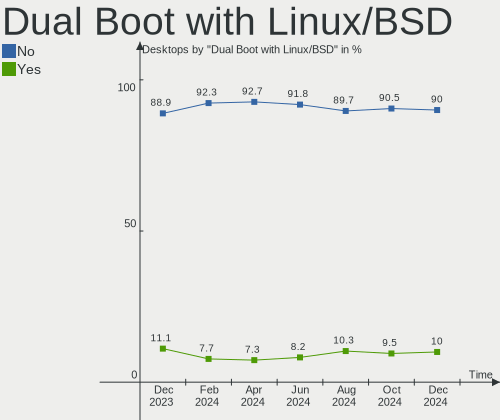
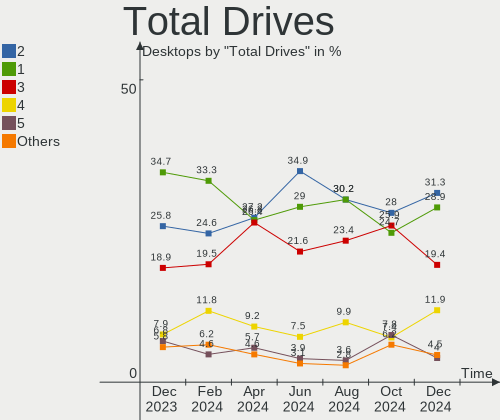
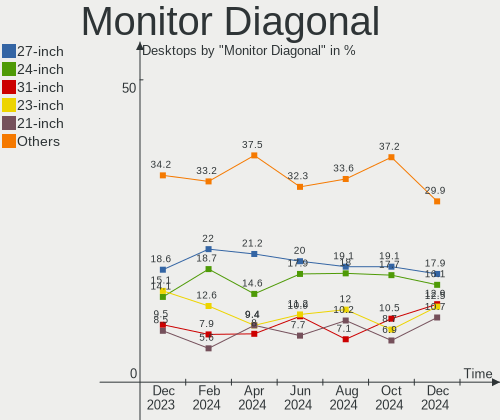
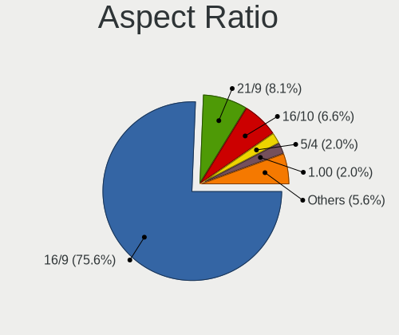
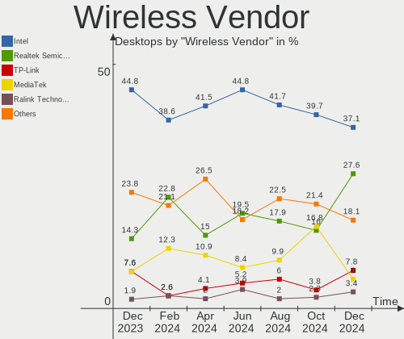
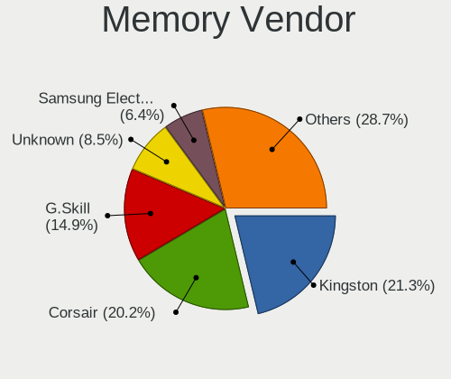

Fedora - Hardware Trends (Desktops)
-----------------------------------

A project to identify most popular hardware characteristics and track their change
over time based on data collected by Linux users at https://Linux-Hardware.org.

Anyone can contribute to this report by the [hw-probe](https://github.com/linuxhw/hw-probe) tool:

    sudo -E hw-probe -all -upload

This report is for one last month. Overall report since the beginning of time: [TestCoverage](https://github.com/linuxhw/TestCoverage)

Period: Dec, 2022.

Contents
--------

* [ System ](#system)
  - [ OS                       ](#os)
  - [ OS Family                ](#os-family)
  - [ Kernel                   ](#kernel)
  - [ Kernel Family            ](#kernel-family)
  - [ Kernel Major Ver.        ](#kernel-major-ver)
  - [ Arch                     ](#arch)
  - [ DE                       ](#de)
  - [ Display Server           ](#display-server)
  - [ Display Manager          ](#display-manager)
  - [ OS Lang                  ](#os-lang)
  - [ Boot Mode                ](#boot-mode)
  - [ Filesystem               ](#filesystem)
  - [ Part. scheme             ](#part-scheme)
  - [ Dual Boot with Linux/BSD ](#dual-boot-with-linuxbsd)
  - [ Dual Boot (Win)          ](#dual-boot-win)

* [ Board ](#board)
  - [ Vendor                   ](#vendor)
  - [ Model                    ](#model)
  - [ Model Family             ](#model-family)
  - [ MFG Year                 ](#mfg-year)
  - [ Form Factor              ](#form-factor)
  - [ Secure Boot              ](#secure-boot)
  - [ Coreboot                 ](#coreboot)
  - [ RAM Size                 ](#ram-size)
  - [ RAM Used                 ](#ram-used)
  - [ Total Drives             ](#total-drives)
  - [ Has CD-ROM               ](#has-cd-rom)
  - [ Has Ethernet             ](#has-ethernet)
  - [ Has WiFi                 ](#has-wifi)
  - [ Has Bluetooth            ](#has-bluetooth)

* [ Location ](#location)
  - [ Country                  ](#country)
  - [ City                     ](#city)

* [ Drives ](#drives)
  - [ Drive Vendor             ](#drive-vendor)
  - [ Drive Model              ](#drive-model)
  - [ HDD Vendor               ](#hdd-vendor)
  - [ SSD Vendor               ](#ssd-vendor)
  - [ Drive Kind               ](#drive-kind)
  - [ Drive Connector          ](#drive-connector)
  - [ Drive Size               ](#drive-size)
  - [ Space Total              ](#space-total)
  - [ Space Used               ](#space-used)
  - [ Malfunc. Drives          ](#malfunc-drives)
  - [ Malfunc. Drive Vendor    ](#malfunc-drive-vendor)
  - [ Malfunc. HDD Vendor      ](#malfunc-hdd-vendor)
  - [ Malfunc. Drive Kind      ](#malfunc-drive-kind)
  - [ Failed Drives            ](#failed-drives)
  - [ Failed Drive Vendor      ](#failed-drive-vendor)
  - [ Drive Status             ](#drive-status)

* [ Storage controller ](#storage-controller)
  - [ Storage Vendor           ](#storage-vendor)
  - [ Storage Model            ](#storage-model)
  - [ Storage Kind             ](#storage-kind)

* [ Processor ](#processor)
  - [ CPU Vendor               ](#cpu-vendor)
  - [ CPU Model                ](#cpu-model)
  - [ CPU Model Family         ](#cpu-model-family)
  - [ CPU Cores                ](#cpu-cores)
  - [ CPU Sockets              ](#cpu-sockets)
  - [ CPU Threads              ](#cpu-threads)
  - [ CPU Op-Modes             ](#cpu-op-modes)
  - [ CPU Microcode            ](#cpu-microcode)
  - [ CPU Microarch            ](#cpu-microarch)

* [ Graphics ](#graphics)
  - [ GPU Vendor               ](#gpu-vendor)
  - [ GPU Model                ](#gpu-model)
  - [ GPU Combo                ](#gpu-combo)
  - [ GPU Driver               ](#gpu-driver)
  - [ GPU Memory               ](#gpu-memory)

* [ Monitor ](#monitor)
  - [ Monitor Vendor           ](#monitor-vendor)
  - [ Monitor Model            ](#monitor-model)
  - [ Monitor Resolution       ](#monitor-resolution)
  - [ Monitor Diagonal         ](#monitor-diagonal)
  - [ Monitor Width            ](#monitor-width)
  - [ Aspect Ratio             ](#aspect-ratio)
  - [ Monitor Area             ](#monitor-area)
  - [ Pixel Density            ](#pixel-density)
  - [ Multiple Monitors        ](#multiple-monitors)

* [ Network ](#network)
  - [ Net Controller Vendor    ](#net-controller-vendor)
  - [ Net Controller Model     ](#net-controller-model)
  - [ Wireless Vendor          ](#wireless-vendor)
  - [ Wireless Model           ](#wireless-model)
  - [ Ethernet Vendor          ](#ethernet-vendor)
  - [ Ethernet Model           ](#ethernet-model)
  - [ Net Controller Kind      ](#net-controller-kind)
  - [ Used Controller          ](#used-controller)
  - [ NICs                     ](#nics)
  - [ IPv6                     ](#ipv6)

* [ Bluetooth ](#bluetooth)
  - [ Bluetooth Vendor         ](#bluetooth-vendor)
  - [ Bluetooth Model          ](#bluetooth-model)

* [ Sound ](#sound)
  - [ Sound Vendor             ](#sound-vendor)
  - [ Sound Model              ](#sound-model)

* [ Memory ](#memory)
  - [ Memory Vendor            ](#memory-vendor)
  - [ Memory Model             ](#memory-model)
  - [ Memory Kind              ](#memory-kind)
  - [ Memory Form Factor       ](#memory-form-factor)
  - [ Memory Size              ](#memory-size)
  - [ Memory Speed             ](#memory-speed)

* [ Printers & scanners ](#printers--scanners)
  - [ Printer Vendor           ](#printer-vendor)
  - [ Printer Model            ](#printer-model)
  - [ Scanner Vendor           ](#scanner-vendor)
  - [ Scanner Model            ](#scanner-model)

* [ Camera ](#camera)
  - [ Camera Vendor            ](#camera-vendor)
  - [ Camera Model             ](#camera-model)

* [ Security ](#security)
  - [ Fingerprint Vendor       ](#fingerprint-vendor)
  - [ Fingerprint Model        ](#fingerprint-model)
  - [ Chipcard Vendor          ](#chipcard-vendor)
  - [ Chipcard Model           ](#chipcard-model)

* [ Unsupported ](#unsupported)
  - [ Unsupported Devices      ](#unsupported-devices)
  - [ Unsupported Device Types ](#unsupported-device-types)

System
------

OS
--

Installed operating systems

| Name      | Desktops | Percent |
|-----------|----------|---------|
| Fedora 37 | 135      | 85.44%  |
| Fedora 36 | 16       | 10.13%  |
| Fedora 35 | 4        | 2.53%   |
| Fedora 33 | 2        | 1.27%   |
| Fedora 38 | 1        | 0.63%   |

OS Family
---------

OS without a version

| Name   | Desktops | Percent |
|--------|----------|---------|
| Fedora | 158      | 100%    |

Kernel
------

Version of the Linux kernel

| Version                          | Desktops | Percent |
|----------------------------------|----------|---------|
| 6.0.12-300.fc37.x86_64           | 43       | 27.22%  |
| 6.0.11-300.fc37.x86_64           | 30       | 18.99%  |
| 6.0.10-300.fc37.x86_64           | 19       | 12.03%  |
| 6.0.15-300.fc37.x86_64           | 18       | 11.39%  |
| 6.0.14-300.fc37.x86_64           | 8        | 5.06%   |
| 6.0.7-301.fc37.x86_64            | 5        | 3.16%   |
| 6.0.13-300.fc37.x86_64           | 5        | 3.16%   |
| 6.0.12-200.fc36.x86_64           | 4        | 2.53%   |
| 6.0.10-200.fc36.x86_64           | 4        | 2.53%   |
| 6.0.5-200.fc36.x86_64            | 3        | 1.9%    |
| 6.0.15-200.fc36.x86_64           | 3        | 1.9%    |
| 6.0.9-300.fc37.x86_64            | 2        | 1.27%   |
| 6.0.8-300.fc37.x86_64            | 2        | 1.27%   |
| 6.0.10-100.fc35.x86_64           | 2        | 1.27%   |
| 6.2.0-0.rc1.14.fc38.x86_64+debug | 1        | 0.63%   |
| 6.0.9-100.fc35.x86_64            | 1        | 0.63%   |
| 6.0.7-200.fc36.x86_64            | 1        | 0.63%   |
| 6.0.13-602.inttf.fc37.x86_64     | 1        | 0.63%   |
| 6.0.11-200.fc36.x86_64           | 1        | 0.63%   |
| 6.0.11-100.fc35.x86_64           | 1        | 0.63%   |
| 6.0.10-602.inttf.fc37.x86_64     | 1        | 0.63%   |
| 6.0.10-301.fsync.fc37.x86_64     | 1        | 0.63%   |
| 5.14.18-100.fc33.x86_64          | 1        | 0.63%   |
| 5.11.20-200.fc33.x86_64          | 1        | 0.63%   |

Kernel Family
-------------

Linux kernel without a distro release

| Version | Desktops | Percent |
|---------|----------|---------|
| 6.0.12  | 47       | 29.75%  |
| 6.0.11  | 32       | 20.25%  |
| 6.0.10  | 27       | 17.09%  |
| 6.0.15  | 21       | 13.29%  |
| 6.0.14  | 8        | 5.06%   |
| 6.0.7   | 6        | 3.8%    |
| 6.0.13  | 6        | 3.8%    |
| 6.0.9   | 3        | 1.9%    |
| 6.0.5   | 3        | 1.9%    |
| 6.0.8   | 2        | 1.27%   |
| 6.2.0   | 1        | 0.63%   |
| 5.14.18 | 1        | 0.63%   |
| 5.11.20 | 1        | 0.63%   |

Kernel Major Ver.
-----------------

Linux kernel major version

| Version | Desktops | Percent |
|---------|----------|---------|
| 6.0     | 155      | 98.1%   |
| 6.2     | 1        | 0.63%   |
| 5.14    | 1        | 0.63%   |
| 5.11    | 1        | 0.63%   |

Arch
----

OS architecture (x86_64, i586, etc.)

| Name   | Desktops | Percent |
|--------|----------|---------|
| x86_64 | 158      | 100%    |

DE
--

Desktop Environment

| Name          | Desktops | Percent |
|---------------|----------|---------|
| GNOME         | 105      | 66.46%  |
| KDE5          | 39       | 24.68%  |
| XFCE          | 5        | 3.16%   |
| Cinnamon      | 4        | 2.53%   |
| Unknown       | 2        | 1.27%   |
| X-Cinnamon    | 1        | 0.63%   |
| LXDE          | 1        | 0.63%   |
| GNOME Classic | 1        | 0.63%   |

Display Server
--------------

X11 or Wayland

| Name    | Desktops | Percent |
|---------|----------|---------|
| Wayland | 95       | 60.13%  |
| X11     | 55       | 34.81%  |
| Tty     | 6        | 3.8%    |
| Unknown | 2        | 1.27%   |

Display Manager
---------------

SDDM, LightDM, etc.

| Name    | Desktops | Percent |
|---------|----------|---------|
| Unknown | 85       | 53.8%   |
| GDM     | 41       | 25.95%  |
| SDDM    | 19       | 12.03%  |
| LightDM | 12       | 7.59%   |
| LXDM    | 1        | 0.63%   |

OS Lang
-------

Language

| Lang  | Desktops | Percent |
|-------|----------|---------|
| en_US | 80       | 50.63%  |
| en_GB | 13       | 8.23%   |
| pt_BR | 10       | 6.33%   |
| ru_RU | 9        | 5.7%    |
| en_AU | 9        | 5.7%    |
| pl_PL | 6        | 3.8%    |
| fr_FR | 4        | 2.53%   |
| es_ES | 4        | 2.53%   |
| en_CA | 4        | 2.53%   |
| de_DE | 4        | 2.53%   |
| it_IT | 3        | 1.9%    |
| sv_SE | 2        | 1.27%   |
| cs_CZ | 2        | 1.27%   |
| C     | 2        | 1.27%   |
| sr_RS | 1        | 0.63%   |
| hu_HU | 1        | 0.63%   |
| fi_FI | 1        | 0.63%   |
| es_PE | 1        | 0.63%   |
| en_IE | 1        | 0.63%   |
| ca_ES | 1        | 0.63%   |

Boot Mode
---------

EFI or BIOS

| Mode | Desktops | Percent |
|------|----------|---------|
| EFI  | 113      | 71.52%  |
| BIOS | 45       | 28.48%  |

Filesystem
----------

Type of filesystem

| Type  | Desktops | Percent |
|-------|----------|---------|
| Btrfs | 118      | 74.68%  |
| Ext4  | 33       | 20.89%  |
| Xfs   | 6        | 3.8%    |
| F2fs  | 1        | 0.63%   |

Part. scheme
------------

Scheme of partitioning

| Type    | Desktops | Percent |
|---------|----------|---------|
| Unknown | 82       | 51.9%   |
| GPT     | 64       | 40.51%  |
| MBR     | 12       | 7.59%   |

Dual Boot with Linux/BSD
------------------------

Hosting more than one Linux/BSD

| Dual boot | Desktops | Percent |
|-----------|----------|---------|
| No        | 136      | 86.08%  |
| Yes       | 22       | 13.92%  |

Dual Boot (Win)
---------------

Hosting Linux and Windows

| Dual boot | Desktops | Percent |
|-----------|----------|---------|
| No        | 126      | 79.75%  |
| Yes       | 32       | 20.25%  |

Board
-----

Vendor
------

Motherboard manufacturer

| Name                                 | Desktops | Percent |
|--------------------------------------|----------|---------|
| ASUSTek Computer                     | 50       | 31.65%  |
| Gigabyte Technology                  | 31       | 19.62%  |
| MSI                                  | 27       | 17.09%  |
| ASRock                               | 14       | 8.86%   |
| Dell                                 | 10       | 6.33%   |
| Hewlett-Packard                      | 8        | 5.06%   |
| Intel                                | 4        | 2.53%   |
| Lenovo                               | 3        | 1.9%    |
| Acer                                 | 2        | 1.27%   |
| Shuttle                              | 1        | 0.63%   |
| Shenzhen Meigao Electronic Equipment | 1        | 0.63%   |
| Positivo                             | 1        | 0.63%   |
| MAXSUN                               | 1        | 0.63%   |
| MACHINIST                            | 1        | 0.63%   |
| Itautec                              | 1        | 0.63%   |
| BESSTAR Tech                         | 1        | 0.63%   |
| Apple                                | 1        | 0.63%   |
| Unknown                              | 1        | 0.63%   |

Model
-----

Motherboard model

| Name                                       | Desktops | Percent |
|--------------------------------------------|----------|---------|
| MSI MS-7C56                                | 3        | 1.9%    |
| ASUS ROG STRIX B450-F GAMING               | 3        | 1.9%    |
| ASUS All Series                            | 3        | 1.9%    |
| Gigabyte GA-78LMT-USB3 6.0                 | 2        | 1.27%   |
| Dell OptiPlex 7010                         | 2        | 1.27%   |
| ASUS TUF Gaming B550-PLUS                  | 2        | 1.27%   |
| ASUS ROG STRIX X670E-F GAMING WIFI         | 2        | 1.27%   |
| ASUS ROG STRIX X570-E GAMING               | 2        | 1.27%   |
| ASUS ROG STRIX B550-F GAMING               | 2        | 1.27%   |
| ASUS ROG CROSSHAIR VIII IMPACT             | 2        | 1.27%   |
| ASUS PRIME X670E-PRO WIFI                  | 2        | 1.27%   |
| ASRock X79 Extreme6                        | 2        | 1.27%   |
| ASRock X670E Steel Legend                  | 2        | 1.27%   |
| Shuttle SH570                              | 1        | 0.63%   |
| Shenzhen Meigao Electronic Equipment HX90G | 1        | 0.63%   |
| Positivo POS-PIQ57BQ                       | 1        | 0.63%   |
| MSI VENGEANCE a7200                        | 1        | 0.63%   |
| MSI NS898AA-ABG s5160a                     | 1        | 0.63%   |
| MSI MS-7D77                                | 1        | 0.63%   |
| MSI MS-7D75                                | 1        | 0.63%   |
| MSI MS-7D43                                | 1        | 0.63%   |
| MSI MS-7D25                                | 1        | 0.63%   |
| MSI MS-7D22                                | 1        | 0.63%   |
| MSI MS-7D13                                | 1        | 0.63%   |
| MSI MS-7C94                                | 1        | 0.63%   |
| MSI MS-7C91                                | 1        | 0.63%   |
| MSI MS-7B98                                | 1        | 0.63%   |
| MSI MS-7B93                                | 1        | 0.63%   |
| MSI MS-7B85                                | 1        | 0.63%   |
| MSI MS-7B78                                | 1        | 0.63%   |
| MSI MS-7A69                                | 1        | 0.63%   |
| MSI MS-7A40                                | 1        | 0.63%   |
| MSI MS-7A38                                | 1        | 0.63%   |
| MSI MS-7A33                                | 1        | 0.63%   |
| MSI MS-7A31                                | 1        | 0.63%   |
| MSI MS-7924                                | 1        | 0.63%   |
| MSI MS-7918                                | 1        | 0.63%   |
| MSI MS-7885                                | 1        | 0.63%   |
| MSI MS-7866                                | 1        | 0.63%   |
| MSI MS-7721                                | 1        | 0.63%   |

Model Family
------------

Motherboard model prefix

| Name                                       | Desktops | Percent |
|--------------------------------------------|----------|---------|
| ASUS ROG                                   | 15       | 9.49%   |
| ASUS PRIME                                 | 13       | 8.23%   |
| ASUS TUF                                   | 10       | 6.33%   |
| Dell OptiPlex                              | 6        | 3.8%    |
| MSI MS-7C56                                | 3        | 1.9%    |
| HP Pavilion                                | 3        | 1.9%    |
| ASUS All                                   | 3        | 1.9%    |
| HP EliteDesk                               | 2        | 1.27%   |
| Gigabyte X570                              | 2        | 1.27%   |
| Gigabyte GA-78LMT-USB3                     | 2        | 1.27%   |
| Gigabyte B365M                             | 2        | 1.27%   |
| Dell Inspiron                              | 2        | 1.27%   |
| ASRock X79                                 | 2        | 1.27%   |
| ASRock X670E                               | 2        | 1.27%   |
| Acer Aspire                                | 2        | 1.27%   |
| Shuttle SH570                              | 1        | 0.63%   |
| Shenzhen Meigao Electronic Equipment HX90G | 1        | 0.63%   |
| Positivo POS-PIQ57BQ                       | 1        | 0.63%   |
| MSI VENGEANCE                              | 1        | 0.63%   |
| MSI NS898AA-ABG                            | 1        | 0.63%   |
| MSI MS-7D77                                | 1        | 0.63%   |
| MSI MS-7D75                                | 1        | 0.63%   |
| MSI MS-7D43                                | 1        | 0.63%   |
| MSI MS-7D25                                | 1        | 0.63%   |
| MSI MS-7D22                                | 1        | 0.63%   |
| MSI MS-7D13                                | 1        | 0.63%   |
| MSI MS-7C94                                | 1        | 0.63%   |
| MSI MS-7C91                                | 1        | 0.63%   |
| MSI MS-7B98                                | 1        | 0.63%   |
| MSI MS-7B93                                | 1        | 0.63%   |
| MSI MS-7B85                                | 1        | 0.63%   |
| MSI MS-7B78                                | 1        | 0.63%   |
| MSI MS-7A69                                | 1        | 0.63%   |
| MSI MS-7A40                                | 1        | 0.63%   |
| MSI MS-7A38                                | 1        | 0.63%   |
| MSI MS-7A33                                | 1        | 0.63%   |
| MSI MS-7A31                                | 1        | 0.63%   |
| MSI MS-7924                                | 1        | 0.63%   |
| MSI MS-7918                                | 1        | 0.63%   |
| MSI MS-7885                                | 1        | 0.63%   |

MFG Year
--------

Motherboard manufacture year

| Year | Desktops | Percent |
|------|----------|---------|
| 2022 | 21       | 13.29%  |
| 2021 | 21       | 13.29%  |
| 2020 | 18       | 11.39%  |
| 2018 | 17       | 10.76%  |
| 2012 | 14       | 8.86%   |
| 2019 | 13       | 8.23%   |
| 2013 | 13       | 8.23%   |
| 2017 | 11       | 6.96%   |
| 2014 | 8        | 5.06%   |
| 2015 | 4        | 2.53%   |
| 2011 | 4        | 2.53%   |
| 2010 | 4        | 2.53%   |
| 2009 | 4        | 2.53%   |
| 2008 | 2        | 1.27%   |
| 2006 | 2        | 1.27%   |
| 2016 | 1        | 0.63%   |
| 2007 | 1        | 0.63%   |

Form Factor
-----------

Physical design of the computer

| Name    | Desktops | Percent |
|---------|----------|---------|
| Desktop | 158      | 100%    |

Secure Boot
-----------

Enabled or disabled

| State    | Desktops | Percent |
|----------|----------|---------|
| Disabled | 148      | 93.67%  |
| Enabled  | 10       | 6.33%   |

Coreboot
--------

Have coreboot on board

| Used | Desktops | Percent |
|------|----------|---------|
| No   | 158      | 100%    |

RAM Size
--------

Total RAM memory

| Size in GB  | Desktops | Percent |
|-------------|----------|---------|
| 16.01-24.0  | 45       | 28.48%  |
| 32.01-64.0  | 39       | 24.68%  |
| 8.01-16.0   | 25       | 15.82%  |
| 64.01-256.0 | 19       | 12.03%  |
| 24.01-32.0  | 13       | 8.23%   |
| 4.01-8.0    | 9        | 5.7%    |
| 3.01-4.0    | 7        | 4.43%   |
| 1.01-2.0    | 1        | 0.63%   |

RAM Used
--------

Used RAM memory

| Used GB    | Desktops | Percent |
|------------|----------|---------|
| 4.01-8.0   | 43       | 27.22%  |
| 3.01-4.0   | 39       | 24.68%  |
| 2.01-3.0   | 35       | 22.15%  |
| 8.01-16.0  | 20       | 12.66%  |
| 1.01-2.0   | 11       | 6.96%   |
| 0.51-1.0   | 5        | 3.16%   |
| 16.01-24.0 | 4        | 2.53%   |
| 32.01-64.0 | 1        | 0.63%   |

Total Drives
------------

Number of drives on board

| Drives | Desktops | Percent |
|--------|----------|---------|
| 2      | 53       | 33.54%  |
| 1      | 46       | 29.11%  |
| 3      | 33       | 20.89%  |
| 4      | 17       | 10.76%  |
| 5      | 4        | 2.53%   |
| 7      | 2        | 1.27%   |
| 6      | 2        | 1.27%   |
| 12     | 1        | 0.63%   |

Has CD-ROM
----------

Has CD-ROM on board

| Presented | Desktops | Percent |
|-----------|----------|---------|
| No        | 108      | 68.35%  |
| Yes       | 50       | 31.65%  |

Has Ethernet
------------

Has Ethernet on board

| Presented | Desktops | Percent |
|-----------|----------|---------|
| Yes       | 157      | 99.37%  |
| No        | 1        | 0.63%   |

Has WiFi
--------

Has WiFi module

| Presented | Desktops | Percent |
|-----------|----------|---------|
| Yes       | 84       | 53.16%  |
| No        | 74       | 46.84%  |

Has Bluetooth
-------------

Has Bluetooth module

| Presented | Desktops | Percent |
|-----------|----------|---------|
| No        | 80       | 50.63%  |
| Yes       | 78       | 49.37%  |

Location
--------

Country
-------

Geographic location (country)

| Country      | Desktops | Percent |
|--------------|----------|---------|
| USA          | 42       | 26.58%  |
| Brazil       | 12       | 7.59%   |
| Poland       | 9        | 5.7%    |
| Australia    | 9        | 5.7%    |
| Russia       | 8        | 5.06%   |
| Germany      | 8        | 5.06%   |
| UK           | 6        | 3.8%    |
| France       | 6        | 3.8%    |
| Spain        | 5        | 3.16%   |
| Italy        | 5        | 3.16%   |
| Romania      | 4        | 2.53%   |
| Canada       | 4        | 2.53%   |
| Sweden       | 3        | 1.9%    |
| Vietnam      | 2        | 1.27%   |
| Switzerland  | 2        | 1.27%   |
| Singapore    | 2        | 1.27%   |
| Saudi Arabia | 2        | 1.27%   |
| Norway       | 2        | 1.27%   |
| Netherlands  | 2        | 1.27%   |
| Indonesia    | 2        | 1.27%   |
| Hungary      | 2        | 1.27%   |
| Czechia      | 2        | 1.27%   |
| Belgium      | 2        | 1.27%   |
| Austria      | 2        | 1.27%   |
| UAE          | 1        | 0.63%   |
| Turkey       | 1        | 0.63%   |
| Thailand     | 1        | 0.63%   |
| South Korea  | 1        | 0.63%   |
| Slovenia     | 1        | 0.63%   |
| Portugal     | 1        | 0.63%   |
| Peru         | 1        | 0.63%   |
| Malaysia     | 1        | 0.63%   |
| Latvia       | 1        | 0.63%   |
| Kazakhstan   | 1        | 0.63%   |
| Japan        | 1        | 0.63%   |
| Greece       | 1        | 0.63%   |
| Finland      | 1        | 0.63%   |
| Costa Rica   | 1        | 0.63%   |
| Belarus      | 1        | 0.63%   |

City
----

Geographic location (city)

| City                     | Desktops | Percent |
|--------------------------|----------|---------|
| Sydney                   | 6        | 3.8%    |
| Warsaw                   | 3        | 1.9%    |
| Palmas                   | 3        | 1.9%    |
| Vienna                   | 2        | 1.27%   |
| Singapore                | 2        | 1.27%   |
| Santa Clara              | 2        | 1.27%   |
| Rochester                | 2        | 1.27%   |
| Porto Alegre             | 2        | 1.27%   |
| Kristiansand             | 2        | 1.27%   |
| Ho Chi Minh City         | 2        | 1.27%   |
| Hamburg                  | 2        | 1.27%   |
| Budapest                 | 2        | 1.27%   |
| Zurich                   | 1        | 0.63%   |
| York                     | 1        | 0.63%   |
| Yogyakarta               | 1        | 0.63%   |
| Yekaterinburg            | 1        | 0.63%   |
| Wroclaw                  | 1        | 0.63%   |
| Winnipeg                 | 1        | 0.63%   |
| Westford                 | 1        | 0.63%   |
| Waterville               | 1        | 0.63%   |
| Waren                    | 1        | 0.63%   |
| Wallisellen              | 1        | 0.63%   |
| Volgograd                | 1        | 0.63%   |
| Vinhedo                  | 1        | 0.63%   |
| Villeneuve-Saint-Germain | 1        | 0.63%   |
| Villa                    | 1        | 0.63%   |
| Vassar                   | 1        | 0.63%   |
| Valparaiso de Goias      | 1        | 0.63%   |
| Ufa                      | 1        | 0.63%   |
| Tokyo                    | 1        | 0.63%   |
| Timișoara               | 1        | 0.63%   |
| Thrapston                | 1        | 0.63%   |
| Taranto                  | 1        | 0.63%   |
| Stoutland                | 1        | 0.63%   |
| Stevenage                | 1        | 0.63%   |
| Stadskanaal              | 1        | 0.63%   |
| St Petersburg            | 1        | 0.63%   |
| Spring Hill              | 1        | 0.63%   |
| Sigtuna                  | 1        | 0.63%   |
| Sao Paulo                | 1        | 0.63%   |

Drives
------

Drive Vendor
------------

Hard drive vendors

| Vendor                         | Desktops | Drives | Percent |
|--------------------------------|----------|--------|---------|
| Samsung Electronics            | 66       | 84     | 21.02%  |
| WDC                            | 55       | 79     | 17.52%  |
| Seagate                        | 55       | 70     | 17.52%  |
| Kingston                       | 24       | 27     | 7.64%   |
| Sandisk                        | 21       | 23     | 6.69%   |
| Toshiba                        | 16       | 19     | 5.1%    |
| Crucial                        | 13       | 13     | 4.14%   |
| Phison Electronics             | 5        | 6      | 1.59%   |
| Intel                          | 5        | 5      | 1.59%   |
| Hitachi                        | 4        | 6      | 1.27%   |
| Apacer                         | 4        | 4      | 1.27%   |
| Micron/Crucial Technology      | 3        | 3      | 0.96%   |
| HGST                           | 3        | 3      | 0.96%   |
| Unknown                        | 2        | 2      | 0.64%   |
| SPCC                           | 2        | 3      | 0.64%   |
| SK hynix                       | 2        | 2      | 0.64%   |
| Realtek Semiconductor          | 2        | 2      | 0.64%   |
| Corsair                        | 2        | 4      | 0.64%   |
| China                          | 2        | 2      | 0.64%   |
| ADATA Technology               | 2        | 2      | 0.64%   |
| A-DATA Technology              | 2        | 2      | 0.64%   |
| Verbatim                       | 1        | 1      | 0.32%   |
| USB3.0                         | 1        | 1      | 0.32%   |
| Team                           | 1        | 1      | 0.32%   |
| Super Talent                   | 1        | 1      | 0.32%   |
| Solid State Storage Technology | 1        | 1      | 0.32%   |
| SABRENT                        | 1        | 1      | 0.32%   |
| PNY                            | 1        | 1      | 0.32%   |
| Plextor                        | 1        | 1      | 0.32%   |
| Patriot                        | 1        | 1      | 0.32%   |
| OWC                            | 1        | 1      | 0.32%   |
| Netac                          | 1        | 1      | 0.32%   |
| Mercury                        | 1        | 1      | 0.32%   |
| LITEON                         | 1        | 1      | 0.32%   |
| Lite-On Technology             | 1        | 1      | 0.32%   |
| LDLC                           | 1        | 1      | 0.32%   |
| KUIJIA                         | 1        | 1      | 0.32%   |
| KingSpec                       | 1        | 1      | 0.32%   |
| KingFast                       | 1        | 1      | 0.32%   |
| KingDian                       | 1        | 1      | 0.32%   |

Drive Model
-----------

Hard drive models

| Model                                               | Desktops | Percent |
|-----------------------------------------------------|----------|---------|
| Samsung NVMe SSD Controller SM981/PM981/PM983 500GB | 17       | 4.71%   |
| Samsung NVMe SSD Controller PM9A1/PM9A3/980PRO 2TB  | 10       | 2.77%   |
| Seagate ST2000DM008-2FR102 2TB                      | 9        | 2.49%   |
| Seagate ST1000DM010-2EP102 1TB                      | 9        | 2.49%   |
| Kingston SA400S37240G 240GB SSD                     | 8        | 2.22%   |
| Samsung SSD 970 EVO Plus 2TB                        | 6        | 1.66%   |
| WDC WDS500G2B0A-00SM50 500GB SSD                    | 4        | 1.11%   |
| Toshiba DT01ACA200 2TB                              | 4        | 1.11%   |
| Seagate ST500DM002-1BD142 500GB                     | 4        | 1.11%   |
| Seagate ST1000DM003-1ER162 1TB                      | 4        | 1.11%   |
| Samsung SSD 850 EVO 250GB                           | 4        | 1.11%   |
| Crucial CT1000MX500SSD1 1TB                         | 4        | 1.11%   |
| WDC WD1002FAEX-00Z3A0 1TB                           | 3        | 0.83%   |
| Seagate ST31000524AS 1TB                            | 3        | 0.83%   |
| Seagate ST2000DM006-2DM164 2TB                      | 3        | 0.83%   |
| Samsung SSD 980 PRO 1TB                             | 3        | 0.83%   |
| Samsung SSD 970 EVO Plus 500GB                      | 3        | 0.83%   |
| Samsung SSD 870 QVO 2TB                             | 3        | 0.83%   |
| Phison E16 PCIe4 NVMe Controller 512GB              | 3        | 0.83%   |
| Kingston SA400S37120G 120GB SSD                     | 3        | 0.83%   |
| WDC WDS200T1X0E-00AFY0 2TB                          | 2        | 0.55%   |
| WDC WDS100T2B0A-00SM50 1TB SSD                      | 2        | 0.55%   |
| WDC WD10EZEX-60WN4A0 1TB                            | 2        | 0.55%   |
| WDC WD10EZEX-21WN4A0 1TB                            | 2        | 0.55%   |
| WDC WD10EZEX-08WN4A0 1TB                            | 2        | 0.55%   |
| WDC WD10EFRX-68PJCN0 1TB                            | 2        | 0.55%   |
| Seagate ST31000528AS 1TB                            | 2        | 0.55%   |
| Seagate ST2000DM001-1CH164 2TB                      | 2        | 0.55%   |
| Seagate ST1000LM035-1RK172 1TB                      | 2        | 0.55%   |
| Sandisk WD_BLACK SN750 SE 1TB                       | 2        | 0.55%   |
| Sandisk WD Blue SN570 500GB                         | 2        | 0.55%   |
| SanDisk SDSSDH31000G 1TB                            | 2        | 0.55%   |
| SanDisk SDSSDA240G 240GB                            | 2        | 0.55%   |
| Samsung SSD 870 EVO 500GB                           | 2        | 0.55%   |
| Samsung SSD 860 QVO 1TB                             | 2        | 0.55%   |
| Samsung SSD 860 EVO 500GB                           | 2        | 0.55%   |
| Samsung SSD 860 EVO 250GB                           | 2        | 0.55%   |
| Samsung SSD 840 PRO Series 256GB                    | 2        | 0.55%   |
| Samsung NVMe SSD Controller SM961/PM961/SM963 256GB | 2        | 0.55%   |
| Micron/Crucial P2 NVMe PCIe SSD 500GB               | 2        | 0.55%   |

HDD Vendor
----------

Hard disk drive vendors

| Vendor              | Desktops | Drives | Percent |
|---------------------|----------|--------|---------|
| Seagate             | 54       | 69     | 45.38%  |
| WDC                 | 42       | 58     | 35.29%  |
| Toshiba             | 11       | 14     | 9.24%   |
| Hitachi             | 4        | 6      | 3.36%   |
| Samsung Electronics | 3        | 3      | 2.52%   |
| HGST                | 3        | 3      | 2.52%   |
| USB3.0              | 1        | 1      | 0.84%   |
| Unknown             | 1        | 1      | 0.84%   |

SSD Vendor
----------

Solid state drive vendors

| Vendor              | Desktops | Drives | Percent |
|---------------------|----------|--------|---------|
| Samsung Electronics | 24       | 26     | 23.3%   |
| Kingston            | 17       | 20     | 16.5%   |
| WDC                 | 12       | 12     | 11.65%  |
| Crucial             | 12       | 12     | 11.65%  |
| SanDisk             | 8        | 8      | 7.77%   |
| Toshiba             | 3        | 3      | 2.91%   |
| Apacer              | 3        | 3      | 2.91%   |
| Intel               | 2        | 2      | 1.94%   |
| China               | 2        | 2      | 1.94%   |
| A-DATA Technology   | 2        | 2      | 1.94%   |
| Verbatim            | 1        | 1      | 0.97%   |
| Unknown             | 1        | 1      | 0.97%   |
| Super Talent        | 1        | 1      | 0.97%   |
| SPCC                | 1        | 1      | 0.97%   |
| SK hynix            | 1        | 1      | 0.97%   |
| PNY                 | 1        | 1      | 0.97%   |
| Plextor             | 1        | 1      | 0.97%   |
| Patriot             | 1        | 1      | 0.97%   |
| OWC                 | 1        | 1      | 0.97%   |
| Netac               | 1        | 1      | 0.97%   |
| Mercury             | 1        | 1      | 0.97%   |
| LITEON              | 1        | 1      | 0.97%   |
| KUIJIA              | 1        | 1      | 0.97%   |
| KingSpec            | 1        | 1      | 0.97%   |
| KingFast            | 1        | 1      | 0.97%   |
| KingDian            | 1        | 1      | 0.97%   |
| Corsair             | 1        | 2      | 0.97%   |
| AMD                 | 1        | 1      | 0.97%   |

Drive Kind
----------

HDD or SSD

| Kind    | Desktops | Drives | Percent |
|---------|----------|--------|---------|
| HDD     | 91       | 155    | 33.46%  |
| NVMe    | 89       | 117    | 32.72%  |
| SSD     | 88       | 109    | 32.35%  |
| Unknown | 4        | 4      | 1.47%   |

Drive Connector
---------------

SATA, SAS, NVMe, etc.

| Type | Desktops | Drives | Percent |
|------|----------|--------|---------|
| SATA | 126      | 255    | 55.75%  |
| NVMe | 88       | 116    | 38.94%  |
| SAS  | 12       | 14     | 5.31%   |

Drive Size
----------

Size of hard drive

| Size in TB | Desktops | Drives | Percent |
|------------|----------|--------|---------|
| 0.01-0.5   | 84       | 110    | 41.79%  |
| 0.51-1.0   | 61       | 82     | 30.35%  |
| 1.01-2.0   | 29       | 38     | 14.43%  |
| 3.01-4.0   | 9        | 10     | 4.48%   |
| 4.01-10.0  | 9        | 9      | 4.48%   |
| 2.01-3.0   | 7        | 10     | 3.48%   |
| 10.01-20.0 | 2        | 5      | 1%      |

Space Total
-----------

Amount of disk space available on the file system

| Size in GB     | Desktops | Percent |
|----------------|----------|---------|
| More than 3000 | 27       | 17.09%  |
| 1001-2000      | 26       | 16.46%  |
| 251-500        | 25       | 15.82%  |
| 501-1000       | 24       | 15.19%  |
| 2001-3000      | 16       | 10.13%  |
| 101-250        | 16       | 10.13%  |
| 1-20           | 8        | 5.06%   |
| Unknown        | 8        | 5.06%   |
| 51-100         | 6        | 3.8%    |
| 21-50          | 2        | 1.27%   |

Space Used
----------

Amount of used disk space

| Used GB        | Desktops | Percent |
|----------------|----------|---------|
| 1-20           | 26       | 16.46%  |
| 501-1000       | 24       | 15.19%  |
| 101-250        | 23       | 14.56%  |
| 251-500        | 17       | 10.76%  |
| 21-50          | 16       | 10.13%  |
| 1001-2000      | 16       | 10.13%  |
| 51-100         | 16       | 10.13%  |
| Unknown        | 8        | 5.06%   |
| 2001-3000      | 7        | 4.43%   |
| More than 3000 | 5        | 3.16%   |

Malfunc. Drives
---------------

Drive models with a malfunction

| Model                                 | Desktops | Drives | Percent |
|---------------------------------------|----------|--------|---------|
| WDC WD5000AVVS-63H0B1 500GB           | 1        | 1      | 3.85%   |
| WDC WD5000AAKX-603CA0 500GB           | 1        | 1      | 3.85%   |
| WDC WD40EZRZ-00WN9B0 4TB              | 1        | 1      | 3.85%   |
| WDC WD3200AAKS-00UU3A0 320GB          | 1        | 1      | 3.85%   |
| WDC WD3200AAJS-65M0A0 320GB           | 1        | 1      | 3.85%   |
| WDC WD30EFRX-68AX9N0 3TB              | 1        | 1      | 3.85%   |
| WDC WD140EDFZ-11A0VA0 14TB            | 1        | 2      | 3.85%   |
| WDC WD10EZEX-60WN4A0 1TB              | 1        | 2      | 3.85%   |
| SK hynix HFS256G39TND-N210A 256GB SSD | 1        | 1      | 3.85%   |
| Seagate ST6000DM003-2CY186 6TB        | 1        | 1      | 3.85%   |
| Seagate ST31000528AS 1TB              | 1        | 1      | 3.85%   |
| Seagate ST31000524AS 1TB              | 1        | 1      | 3.85%   |
| Seagate ST31000340NS 1TB              | 1        | 1      | 3.85%   |
| Seagate ST3000DM001-1CH166 3TB        | 1        | 1      | 3.85%   |
| Seagate ST2000DM001-1ER164 2TB        | 1        | 1      | 3.85%   |
| Seagate ST1000VM002-1CT162 1TB        | 1        | 1      | 3.85%   |
| Seagate ST1000DM003-1ER162 1TB        | 1        | 1      | 3.85%   |
| Samsung Electronics HD642JJ 640GB     | 1        | 1      | 3.85%   |
| Samsung Electronics HD103SI 1TB       | 1        | 1      | 3.85%   |
| Kingston SA400S37480G 480GB SSD       | 1        | 1      | 3.85%   |
| Intel SSDSC2CT120A3 120GB             | 1        | 1      | 3.85%   |
| Intel SSDSC2BF180A4H 180GB            | 1        | 1      | 3.85%   |
| Crucial CT240M500SSD1 240GB           | 1        | 1      | 3.85%   |
| Crucial CT1050MX300SSD4 1050GB        | 1        | 1      | 3.85%   |
| AMD R5SL960G 960GB SSD                | 1        | 1      | 3.85%   |
| A-DATA Technology SU630 480GB SSD     | 1        | 1      | 3.85%   |

Malfunc. Drive Vendor
---------------------

Vendors of faulty drives

| Vendor              | Desktops | Drives | Percent |
|---------------------|----------|--------|---------|
| WDC                 | 7        | 10     | 29.17%  |
| Seagate             | 7        | 8      | 29.17%  |
| Samsung Electronics | 2        | 2      | 8.33%   |
| Intel               | 2        | 2      | 8.33%   |
| Crucial             | 2        | 2      | 8.33%   |
| SK hynix            | 1        | 1      | 4.17%   |
| Kingston            | 1        | 1      | 4.17%   |
| AMD                 | 1        | 1      | 4.17%   |
| A-DATA Technology   | 1        | 1      | 4.17%   |

Malfunc. HDD Vendor
-------------------

Vendors of faulty HDD drives

| Vendor              | Desktops | Drives | Percent |
|---------------------|----------|--------|---------|
| WDC                 | 7        | 10     | 43.75%  |
| Seagate             | 7        | 8      | 43.75%  |
| Samsung Electronics | 2        | 2      | 12.5%   |

Malfunc. Drive Kind
-------------------

Kinds of faulty drives

| Kind | Desktops | Drives | Percent |
|------|----------|--------|---------|
| HDD  | 14       | 20     | 63.64%  |
| SSD  | 8        | 8      | 36.36%  |

Failed Drives
-------------

Failed drive models

| Model                 | Desktops | Drives | Percent |
|-----------------------|----------|--------|---------|
| SPCC M.2 PCIe SSD 2TB | 1        | 1      | 100%    |

Failed Drive Vendor
-------------------

Failed drive vendors

| Vendor | Desktops | Drives | Percent |
|--------|----------|--------|---------|
| SPCC   | 1        | 1      | 100%    |

Drive Status
------------

Number of failed and malfunc. drives

| Status   | Desktops | Drives | Percent |
|----------|----------|--------|---------|
| Detected | 94       | 203    | 51.65%  |
| Works    | 67       | 153    | 36.81%  |
| Malfunc  | 20       | 28     | 10.99%  |
| Failed   | 1        | 1      | 0.55%   |

Storage controller
------------------

Storage Vendor
--------------

Storage controller vendors

| Vendor                         | Desktops | Percent |
|--------------------------------|----------|---------|
| Intel                          | 84       | 30.66%  |
| AMD                            | 72       | 26.28%  |
| Samsung Electronics            | 44       | 16.06%  |
| SanDisk                        | 18       | 6.57%   |
| Phison Electronics             | 8        | 2.92%   |
| Kingston Technology Company    | 7        | 2.55%   |
| ASMedia Technology             | 6        | 2.19%   |
| Micron/Crucial Technology      | 4        | 1.46%   |
| Marvell Technology Group       | 4        | 1.46%   |
| Silicon Motion                 | 3        | 1.09%   |
| JMicron Technology             | 3        | 1.09%   |
| VIA Technologies               | 2        | 0.73%   |
| Toshiba America Info Systems   | 2        | 0.73%   |
| Silicon Image                  | 2        | 0.73%   |
| Realtek Semiconductor          | 2        | 0.73%   |
| Broadcom / LSI                 | 2        | 0.73%   |
| ADATA Technology               | 2        | 0.73%   |
| ULi Electronics                | 1        | 0.36%   |
| Solid State Storage Technology | 1        | 0.36%   |
| SK hynix                       | 1        | 0.36%   |
| MAXIO Technology (Hangzhou)    | 1        | 0.36%   |
| LSI Logic / Symbios Logic      | 1        | 0.36%   |
| Lite-On Technology             | 1        | 0.36%   |
| Integrated Technology Express  | 1        | 0.36%   |
| Biwin Storage Technology       | 1        | 0.36%   |
| Adaptec                        | 1        | 0.36%   |

Storage Model
-------------

Storage controller models

| Model                                                                          | Desktops | Percent |
|--------------------------------------------------------------------------------|----------|---------|
| AMD FCH SATA Controller [AHCI mode]                                            | 32       | 10.09%  |
| Samsung NVMe SSD Controller SM981/PM981/PM983                                  | 27       | 8.52%   |
| AMD 500 Series Chipset SATA Controller                                         | 15       | 4.73%   |
| Samsung NVMe SSD Controller PM9A1/PM9A3/980PRO                                 | 14       | 4.42%   |
| AMD 400 Series Chipset SATA Controller                                         | 13       | 4.1%    |
| AMD SATA controller                                                            | 11       | 3.47%   |
| Sandisk Non-Volatile memory controller                                         | 9        | 2.84%   |
| Intel 8 Series/C220 Series Chipset Family 6-port SATA Controller 1 [AHCI mode] | 9        | 2.84%   |
| Intel Alder Lake-S PCH SATA Controller [AHCI Mode]                             | 8        | 2.52%   |
| Intel SATA Controller [RAID mode]                                              | 7        | 2.21%   |
| Intel 7 Series/C210 Series Chipset Family 6-port SATA Controller [AHCI mode]   | 7        | 2.21%   |
| Intel 200 Series PCH SATA controller [AHCI mode]                               | 7        | 2.21%   |
| ASMedia ASM1062 Serial ATA Controller                                          | 6        | 1.89%   |
| Intel Volume Management Device NVMe RAID Controller                            | 5        | 1.58%   |
| Intel Cannon Lake PCH SATA AHCI Controller                                     | 5        | 1.58%   |
| Intel C600/X79 series chipset 6-Port SATA AHCI Controller                      | 5        | 1.58%   |
| AMD SB7x0/SB8x0/SB9x0 IDE Controller                                           | 5        | 1.58%   |
| Kingston Company Company Non-Volatile memory controller                        | 4        | 1.26%   |
| Intel 500 Series Chipset Family SATA AHCI Controller                           | 4        | 1.26%   |
| AMD FCH SATA Controller D                                                      | 4        | 1.26%   |
| SanDisk WD PC SN810 / Black SN850 NVMe SSD                                     | 3        | 0.95%   |
| Samsung NVMe SSD Controller 980                                                | 3        | 0.95%   |
| Phison E16 PCIe4 NVMe Controller                                               | 3        | 0.95%   |
| Intel NM10/ICH7 Family SATA Controller [IDE mode]                              | 3        | 0.95%   |
| Intel 9 Series Chipset Family SATA Controller [AHCI Mode]                      | 3        | 0.95%   |
| Intel 6 Series/C200 Series Chipset Family 6 port Desktop SATA AHCI Controller  | 3        | 0.95%   |
| AMD X370 Series Chipset SATA Controller                                        | 3        | 0.95%   |
| AMD SB7x0/SB8x0/SB9x0 SATA Controller [AHCI mode]                              | 3        | 0.95%   |
| Silicon Motion SM2263EN/SM2263XT SSD Controller                                | 2        | 0.63%   |
| SanDisk WD Blue SN570 NVMe SSD                                                 | 2        | 0.63%   |
| SanDisk WD Black SN750 / PC SN730 NVMe SSD                                     | 2        | 0.63%   |
| SanDisk WD Black 2018/SN750 / PC SN720 NVMe SSD                                | 2        | 0.63%   |
| Samsung NVMe SSD Controller SM961/PM961/SM963                                  | 2        | 0.63%   |
| Phison E12 NVMe Controller                                                     | 2        | 0.63%   |
| Micron/Crucial P2 NVMe PCIe SSD                                                | 2        | 0.63%   |
| Micron/Crucial P1 NVMe PCIe SSD                                                | 2        | 0.63%   |
| Marvell Group 88SE9215 PCIe 2.0 x1 4-port SATA 6 Gb/s Controller               | 2        | 0.63%   |
| Marvell Group 88SE9172 SATA 6Gb/s Controller                                   | 2        | 0.63%   |
| Kingston Company SNVS2000G [NV1 NVMe PCIe SSD 2TB]                             | 2        | 0.63%   |
| JMicron JMB363 SATA/IDE Controller                                             | 2        | 0.63%   |

Storage Kind
------------

Kind of storage controller (IDE, SATA, NVMe, SAS, ...)

| Kind | Desktops | Percent |
|------|----------|---------|
| SATA | 133      | 49.44%  |
| NVMe | 87       | 32.34%  |
| IDE  | 24       | 8.92%   |
| RAID | 20       | 7.43%   |
| SAS  | 3        | 1.12%   |
| SCSI | 2        | 0.74%   |

Processor
---------

CPU Vendor
----------

Processor vendors

| Vendor | Desktops | Percent |
|--------|----------|---------|
| Intel  | 82       | 51.9%   |
| AMD    | 76       | 48.1%   |

CPU Model
---------

Processor models

| Model                                       | Desktops | Percent |
|---------------------------------------------|----------|---------|
| AMD Ryzen 5 3600 6-Core Processor           | 9        | 5.7%    |
| Intel Core i7-3770 CPU @ 3.40GHz            | 5        | 3.16%   |
| AMD Ryzen 5 7600X 6-Core Processor          | 5        | 3.16%   |
| AMD Ryzen 5 5600X 6-Core Processor          | 5        | 3.16%   |
| AMD Ryzen 5 5600G with Radeon Graphics      | 5        | 3.16%   |
| AMD Ryzen 9 7950X 16-Core Processor         | 4        | 2.53%   |
| AMD Ryzen 9 5950X 16-Core Processor         | 3        | 1.9%    |
| AMD Ryzen 9 5900X 12-Core Processor         | 3        | 1.9%    |
| AMD Ryzen 7 5800X 8-Core Processor          | 3        | 1.9%    |
| Intel Core i7-9700K CPU @ 3.60GHz           | 2        | 1.27%   |
| Intel Core i7-9700 CPU @ 3.00GHz            | 2        | 1.27%   |
| Intel Core i7-6700 CPU @ 3.40GHz            | 2        | 1.27%   |
| Intel Core i7-4770K CPU @ 3.50GHz           | 2        | 1.27%   |
| Intel Core i7-4770 CPU @ 3.40GHz            | 2        | 1.27%   |
| Intel Core i7-3820 CPU @ 3.60GHz            | 2        | 1.27%   |
| Intel Core i5-8400 CPU @ 2.80GHz            | 2        | 1.27%   |
| Intel Core i5-4460 CPU @ 3.20GHz            | 2        | 1.27%   |
| Intel Core 2 Quad CPU Q9400 @ 2.66GHz       | 2        | 1.27%   |
| Intel 12th Gen Core i9-12900K               | 2        | 1.27%   |
| Intel 12th Gen Core i7-12700K               | 2        | 1.27%   |
| Intel 12th Gen Core i7-12700                | 2        | 1.27%   |
| Intel 11th Gen Core i7-11700K @ 3.60GHz     | 2        | 1.27%   |
| AMD Ryzen 9 5900HX with Radeon Graphics     | 2        | 1.27%   |
| AMD Ryzen 9 3900X 12-Core Processor         | 2        | 1.27%   |
| AMD Ryzen 7 5800X3D 8-Core Processor        | 2        | 1.27%   |
| AMD Ryzen 7 3800X 8-Core Processor          | 2        | 1.27%   |
| AMD Ryzen 7 3700X 8-Core Processor          | 2        | 1.27%   |
| AMD Ryzen 5 3600X 6-Core Processor          | 2        | 1.27%   |
| AMD Ryzen 5 2600 Six-Core Processor         | 2        | 1.27%   |
| Intel Xeon CPU X5680 @ 3.33GHz              | 1        | 0.63%   |
| Intel Xeon CPU X5450 @ 3.00GHz              | 1        | 0.63%   |
| Intel Xeon CPU E5345 @ 2.33GHz              | 1        | 0.63%   |
| Intel Xeon CPU E5-2666 v3 @ 2.90GHz         | 1        | 0.63%   |
| Intel Xeon CPU E5-2650 0 @ 2.00GHz          | 1        | 0.63%   |
| Intel Xeon CPU E5-2603 v4 @ 1.70GHz         | 1        | 0.63%   |
| Intel Xeon CPU E5-1620 0 @ 3.60GHz          | 1        | 0.63%   |
| Intel Pentium Dual-Core CPU E5300 @ 2.60GHz | 1        | 0.63%   |
| Intel Pentium Dual-Core CPU E5200 @ 2.50GHz | 1        | 0.63%   |
| Intel Pentium CPU G2020 @ 2.90GHz           | 1        | 0.63%   |
| Intel Genuine CPU @ 1.66GHz                 | 1        | 0.63%   |

CPU Model Family
----------------

Processor model prefix

| Model                   | Desktops | Percent |
|-------------------------|----------|---------|
| AMD Ryzen 5             | 31       | 19.62%  |
| Intel Core i7           | 25       | 15.82%  |
| Intel Core i5           | 18       | 11.39%  |
| AMD Ryzen 9             | 17       | 10.76%  |
| AMD Ryzen 7             | 14       | 8.86%   |
| Other                   | 13       | 8.23%   |
| Intel Core i3           | 8        | 5.06%   |
| Intel Xeon              | 7        | 4.43%   |
| AMD FX                  | 5        | 3.16%   |
| Intel Core 2 Quad       | 4        | 2.53%   |
| Intel Pentium Dual-Core | 2        | 1.27%   |
| AMD A10                 | 2        | 1.27%   |
| Intel Pentium           | 1        | 0.63%   |
| Intel Genuine           | 1        | 0.63%   |
| Intel Core i9           | 1        | 0.63%   |
| Intel Celeron           | 1        | 0.63%   |
| Intel Atom              | 1        | 0.63%   |
| AMD Ryzen 3             | 1        | 0.63%   |
| AMD PRO A10             | 1        | 0.63%   |
| AMD Phenom II X4        | 1        | 0.63%   |
| AMD Athlon II X4        | 1        | 0.63%   |
| AMD Athlon 64 X2        | 1        | 0.63%   |
| AMD A8                  | 1        | 0.63%   |
| AMD A4                  | 1        | 0.63%   |

CPU Cores
---------

Number of processor cores

| Number | Desktops | Percent |
|--------|----------|---------|
| 4      | 44       | 27.85%  |
| 6      | 40       | 25.32%  |
| 8      | 27       | 17.09%  |
| 2      | 17       | 10.76%  |
| 16     | 11       | 6.96%   |
| 12     | 11       | 6.96%   |
| 10     | 3        | 1.9%    |
| 3      | 2        | 1.27%   |
| 24     | 1        | 0.63%   |
| 14     | 1        | 0.63%   |
| 1      | 1        | 0.63%   |

CPU Sockets
-----------

Number of sockets

| Number | Desktops | Percent |
|--------|----------|---------|
| 1      | 156      | 98.73%  |
| 2      | 2        | 1.27%   |

CPU Threads
-----------

Threads per core (Hyper-Threading)

| Number | Desktops | Percent |
|--------|----------|---------|
| 2      | 117      | 74.05%  |
| 1      | 41       | 25.95%  |

CPU Op-Modes
------------

CPU Operation Modes (32-bit, 64-bit)

| Op mode        | Desktops | Percent |
|----------------|----------|---------|
| 32-bit, 64-bit | 158      | 100%    |

CPU Microcode
-------------

Microcode number

| Number     | Desktops | Percent |
|------------|----------|---------|
| 0x08701021 | 15       | 9.49%   |
| 0x306c3    | 11       | 6.96%   |
| 0x306a9    | 11       | 6.96%   |
| 0x0a601203 | 8        | 5.06%   |
| 0x90672    | 6        | 3.8%    |
| 0x0a201016 | 6        | 3.8%    |
| 0x906ed    | 5        | 3.16%   |
| 0x906ea    | 5        | 3.16%   |
| 0x206d7    | 5        | 3.16%   |
| 0x1067a    | 5        | 3.16%   |
| 0x0a50000d | 5        | 3.16%   |
| 0x0a50000c | 5        | 3.16%   |
| 0x0a20120a | 5        | 3.16%   |
| Unknown    | 5        | 3.16%   |
| 0xa0655    | 4        | 2.53%   |
| 0xa0671    | 3        | 1.9%    |
| 0x506e3    | 3        | 1.9%    |
| 0x206a7    | 3        | 1.9%    |
| 0x0a601201 | 3        | 1.9%    |
| 0x08701013 | 3        | 1.9%    |
| 0x0800820d | 3        | 1.9%    |
| 0x06001119 | 3        | 1.9%    |
| 0x06000822 | 3        | 1.9%    |
| 0xb0671    | 2        | 1.27%   |
| 0xa0653    | 2        | 1.27%   |
| 0x906e9    | 2        | 1.27%   |
| 0x10676    | 2        | 1.27%   |
| 0x0a201009 | 2        | 1.27%   |
| 0x906eb    | 1        | 0.63%   |
| 0x90675    | 1        | 0.63%   |
| 0x6fb      | 1        | 0.63%   |
| 0x406f1    | 1        | 0.63%   |
| 0x306f2    | 1        | 0.63%   |
| 0x30678    | 1        | 0.63%   |
| 0x30661    | 1        | 0.63%   |
| 0x206c2    | 1        | 0.63%   |
| 0x20652    | 1        | 0.63%   |
| 0x106e5    | 1        | 0.63%   |
| 0x106ca    | 1        | 0.63%   |
| 0x0a201205 | 1        | 0.63%   |

CPU Microarch
-------------

Microarchitecture

| Name             | Desktops | Percent |
|------------------|----------|---------|
| Zen 3            | 26       | 16.46%  |
| Zen 2            | 19       | 12.03%  |
| KabyLake         | 13       | 8.23%   |
| Haswell          | 12       | 7.59%   |
| Unknown          | 12       | 7.59%   |
| IvyBridge        | 11       | 6.96%   |
| Alderlake Hybrid | 9        | 5.7%    |
| SandyBridge      | 8        | 5.06%   |
| Piledriver       | 7        | 4.43%   |
| Penryn           | 7        | 4.43%   |
| CometLake        | 6        | 3.8%    |
| Zen+             | 4        | 2.53%   |
| Skylake          | 4        | 2.53%   |
| Zen              | 3        | 1.9%    |
| Icelake          | 3        | 1.9%    |
| Westmere         | 2        | 1.27%   |
| Bonnell          | 2        | 1.27%   |
| Steamroller      | 1        | 0.63%   |
| Silvermont       | 1        | 0.63%   |
| Nehalem          | 1        | 0.63%   |
| K8 Hammer        | 1        | 0.63%   |
| K10 Llano        | 1        | 0.63%   |
| K10              | 1        | 0.63%   |
| Excavator        | 1        | 0.63%   |
| Core             | 1        | 0.63%   |
| Bulldozer        | 1        | 0.63%   |
| Broadwell        | 1        | 0.63%   |

Graphics
--------

GPU Vendor
----------

Vendors of graphics cards

| Vendor | Desktops | Percent |
|--------|----------|---------|
| Nvidia | 70       | 41.42%  |
| AMD    | 66       | 39.05%  |
| Intel  | 33       | 19.53%  |

GPU Model
---------

Graphics card models

| Model                                                                       | Desktops | Percent |
|-----------------------------------------------------------------------------|----------|---------|
| AMD Ellesmere [Radeon RX 470/480/570/570X/580/580X/590]                     | 13       | 7.3%    |
| AMD Raphael                                                                 | 10       | 5.62%   |
| AMD Cezanne [Radeon Vega Series / Radeon Vega Mobile Series]                | 7        | 3.93%   |
| AMD Navi 23 [Radeon RX 6600/6600 XT/6600M]                                  | 6        | 3.37%   |
| Nvidia GP107 [GeForce GTX 1050 Ti]                                          | 5        | 2.81%   |
| Nvidia GA106 [GeForce RTX 3060 Lite Hash Rate]                              | 5        | 2.81%   |
| AMD Navi 22 [Radeon RX 6700/6700 XT/6750 XT / 6800M]                        | 5        | 2.81%   |
| Nvidia GP106 [GeForce GTX 1060 6GB]                                         | 4        | 2.25%   |
| Intel CoffeeLake-S GT2 [UHD Graphics 630]                                   | 4        | 2.25%   |
| Intel AlderLake-S GT1                                                       | 4        | 2.25%   |
| AMD Navi 21 [Radeon RX 6800/6800 XT / 6900 XT]                              | 4        | 2.25%   |
| Nvidia TU117 [GeForce GTX 1650]                                             | 3        | 1.69%   |
| Nvidia TU104 [GeForce RTX 2070 SUPER]                                       | 3        | 1.69%   |
| Nvidia GT218 [GeForce 210]                                                  | 3        | 1.69%   |
| Nvidia GM206 [GeForce GTX 960]                                              | 3        | 1.69%   |
| Nvidia GA104 [GeForce RTX 3070 Lite Hash Rate]                              | 3        | 1.69%   |
| Intel IvyBridge GT2 [HD Graphics 4000]                                      | 3        | 1.69%   |
| AMD Navi 10 [Radeon RX 5600 OEM/5600 XT / 5700/5700 XT]                     | 3        | 1.69%   |
| Nvidia TU116 [GeForce GTX 1660]                                             | 2        | 1.12%   |
| Nvidia TU116 [GeForce GTX 1660 Ti]                                          | 2        | 1.12%   |
| Nvidia GP108 [GeForce GT 1030]                                              | 2        | 1.12%   |
| Nvidia GP106 [GeForce GTX 1060 3GB]                                         | 2        | 1.12%   |
| Nvidia GP102 [GeForce GTX 1080 Ti]                                          | 2        | 1.12%   |
| Nvidia GM206 [GeForce GTX 950]                                              | 2        | 1.12%   |
| Nvidia GK104 [GeForce GTX 760]                                              | 2        | 1.12%   |
| Nvidia GF108 [GeForce GT 630]                                               | 2        | 1.12%   |
| Nvidia GF106 [GeForce GTS 450]                                              | 2        | 1.12%   |
| Nvidia GA104 [GeForce RTX 3060 Ti Lite Hash Rate]                           | 2        | 1.12%   |
| Nvidia GA102 [GeForce RTX 3080]                                             | 2        | 1.12%   |
| Intel Xeon E3-1200 v3/4th Gen Core Processor Integrated Graphics Controller | 2        | 1.12%   |
| Intel Xeon E3-1200 v2/3rd Gen Core processor Graphics Controller            | 2        | 1.12%   |
| Intel RocketLake-S GT1 [UHD Graphics 750]                                   | 2        | 1.12%   |
| Intel HD Graphics 630                                                       | 2        | 1.12%   |
| Intel 82G33/G31 Express Integrated Graphics Controller                      | 2        | 1.12%   |
| Intel 4th Generation Core Processor Family Integrated Graphics Controller   | 2        | 1.12%   |
| Intel 2nd Generation Core Processor Family Integrated Graphics Controller   | 2        | 1.12%   |
| AMD RS780L [Radeon 3000]                                                    | 2        | 1.12%   |
| AMD Navi 23 [Radeon RX 6650 XT]                                             | 2        | 1.12%   |
| AMD Cape Verde XT [Radeon HD 7770/8760 / R7 250X]                           | 2        | 1.12%   |
| Nvidia TU116 [GeForce GTX 1650]                                             | 1        | 0.56%   |

GPU Combo
---------

Combinations of graphics cards

| Name           | Desktops | Percent |
|----------------|----------|---------|
| 1 x Nvidia     | 62       | 39.24%  |
| 1 x AMD        | 55       | 34.81%  |
| 1 x Intel      | 25       | 15.82%  |
| 2 x AMD        | 8        | 5.06%   |
| Intel + Nvidia | 4        | 2.53%   |
| AMD + Nvidia   | 3        | 1.9%    |
| 2 x Intel      | 1        | 0.63%   |

GPU Driver
----------

Free vs proprietary

| Driver      | Desktops | Percent |
|-------------|----------|---------|
| Free        | 118      | 74.68%  |
| Proprietary | 35       | 22.15%  |
| Unknown     | 5        | 3.16%   |

GPU Memory
----------

Total video memory

| Size in GB | Desktops | Percent |
|------------|----------|---------|
| Unknown    | 46       | 29.11%  |
| 7.01-8.0   | 33       | 20.89%  |
| 8.01-16.0  | 17       | 10.76%  |
| 3.01-4.0   | 16       | 10.13%  |
| 0.51-1.0   | 14       | 8.86%   |
| 0.01-0.5   | 14       | 8.86%   |
| 1.01-2.0   | 11       | 6.96%   |
| 5.01-6.0   | 5        | 3.16%   |
| 2.01-3.0   | 1        | 0.63%   |
| 16.01-24.0 | 1        | 0.63%   |

Monitor
-------

Monitor Vendor
--------------

Monitor vendors

| Vendor               | Desktops | Percent |
|----------------------|----------|---------|
| Samsung Electronics  | 33       | 18.54%  |
| Dell                 | 27       | 15.17%  |
| Goldstar             | 21       | 11.8%   |
| Hewlett-Packard      | 19       | 10.67%  |
| Philips              | 9        | 5.06%   |
| Acer                 | 9        | 5.06%   |
| AOC                  | 7        | 3.93%   |
| ASUSTek Computer     | 6        | 3.37%   |
| BenQ                 | 5        | 2.81%   |
| MSI                  | 4        | 2.25%   |
| Lenovo               | 4        | 2.25%   |
| Ancor Communications | 4        | 2.25%   |
| Sceptre Tech         | 3        | 1.69%   |
| Iiyama               | 3        | 1.69%   |
| Vizio                | 2        | 1.12%   |
| Sony                 | 2        | 1.12%   |
| Pixio                | 2        | 1.12%   |
| Gigabyte Technology  | 2        | 1.12%   |
| Valve                | 1        | 0.56%   |
| USR                  | 1        | 0.56%   |
| Unknown              | 1        | 0.56%   |
| Sharp                | 1        | 0.56%   |
| Mi                   | 1        | 0.56%   |
| JRY                  | 1        | 0.56%   |
| InnoView             | 1        | 0.56%   |
| HVR                  | 1        | 0.56%   |
| Hitachi              | 1        | 0.56%   |
| GMX                  | 1        | 0.56%   |
| GDH                  | 1        | 0.56%   |
| FUR                  | 1        | 0.56%   |
| Eizo                 | 1        | 0.56%   |
| Belinea              | 1        | 0.56%   |
| ASR                  | 1        | 0.56%   |
| Unknown              | 1        | 0.56%   |

Monitor Model
-------------

Monitor models

| Model                                                                  | Desktops | Percent |
|------------------------------------------------------------------------|----------|---------|
| Samsung Electronics U28E590 SAM0C4D 3840x2160 607x345mm 27.5-inch      | 2        | 1.05%   |
| Samsung Electronics C27F390 SAM0D32 1920x1080 598x336mm 27.0-inch      | 2        | 1.05%   |
| Hewlett-Packard 2511 HWP293E 1920x1080 550x310mm 24.9-inch             | 2        | 1.05%   |
| Hewlett-Packard 24f HPN3545 1920x1080 527x296mm 23.8-inch              | 2        | 1.05%   |
| Hewlett-Packard 2311 HWP293B 1920x1080 509x286mm 23.0-inch             | 2        | 1.05%   |
| Goldstar HDR WFHD GSM7714 2560x1080 798x334mm 34.1-inch                | 2        | 1.05%   |
| Goldstar HDR 4K GSM774F 3840x2160 697x392mm 31.5-inch                  | 2        | 1.05%   |
| Goldstar HDR 4K GSM7707 3840x2160 600x340mm 27.2-inch                  | 2        | 1.05%   |
| Dell U2713HM DEL407F 1920x1080 597x336mm 27.0-inch                     | 2        | 1.05%   |
| Dell U2515H DELD06F 2560x1440 553x311mm 25.0-inch                      | 2        | 1.05%   |
| Dell U2414H DELA0A4 1920x1080 527x296mm 23.8-inch                      | 2        | 1.05%   |
| AOC 24G2W1G5 AOC2402 1920x1080 527x296mm 23.8-inch                     | 2        | 1.05%   |
| Ancor Communications VS248 ACI2498 1920x1080 531x299mm 24.0-inch       | 2        | 1.05%   |
| Vizio M65Q6-J09 VIZ1039 3840x2160 1428x803mm 64.5-inch                 | 1        | 0.53%   |
| Vizio E321VL VIZ0083 1366x768 700x390mm 31.5-inch                      | 1        | 0.53%   |
| Valve Index HMD VLV91A8 0x17                                           | 1        | 0.53%   |
| USR GSV26 PASS USR0100 1920x1080 708x398mm 32.0-inch                   | 1        | 0.53%   |
| Unknown LCD Monitor FFFF 2288x1287 2550x2550mm 142.0-inch              | 1        | 0.53%   |
| Sony TV SNY02A2 1360x768                                               | 1        | 0.53%   |
| Sony BM320 SNY050A 1920x1080 708x399mm 32.0-inch                       | 1        | 0.53%   |
| Sharp LCD SHP0FFC 1600x1200                                            | 1        | 0.53%   |
| Sceptre Tech U65 SPT19A1 3840x2160 575x323mm 26.0-inch                 | 1        | 0.53%   |
| Sceptre Tech Sceptre M25 SPT0A05 1920x1080 560x300mm 25.0-inch         | 1        | 0.53%   |
| Sceptre Tech E16 SPT0673 1366x768 413x234mm 18.7-inch                  | 1        | 0.53%   |
| Samsung Electronics U28E590 SAM0C4E 3840x2160 608x345mm 27.5-inch      | 1        | 0.53%   |
| Samsung Electronics SyncMaster SAM048D 1680x1050 459x296mm 21.5-inch   | 1        | 0.53%   |
| Samsung Electronics SyncMaster SAM044C 1680x1050 474x296mm 22.0-inch   | 1        | 0.53%   |
| Samsung Electronics SyncMaster SAM03F5 1920x1200                       | 1        | 0.53%   |
| Samsung Electronics SyncMaster SAM01D3 1440x900 408x225mm 18.3-inch    | 1        | 0.53%   |
| Samsung Electronics SMS27A850 SAM083C 2560x1440 518x324mm 24.1-inch    | 1        | 0.53%   |
| Samsung Electronics SMS27A650 SAM082E 1920x1080 598x336mm 27.0-inch    | 1        | 0.53%   |
| Samsung Electronics SMS27A550H SAM07CC 1920x1080 598x336mm 27.0-inch   | 1        | 0.53%   |
| Samsung Electronics S24D330 SAM0D92 1920x1080 531x299mm 24.0-inch      | 1        | 0.53%   |
| Samsung Electronics S24D300 SAM0B43 1920x1080 531x299mm 24.0-inch      | 1        | 0.53%   |
| Samsung Electronics S23C350 SAM0A36 1920x1080 510x287mm 23.0-inch      | 1        | 0.53%   |
| Samsung Electronics S22C350 SAM0A32 1920x1080 477x268mm 21.5-inch      | 1        | 0.53%   |
| Samsung Electronics S22C300 SAM0A1D 1920x1080 477x268mm 21.5-inch      | 1        | 0.53%   |
| Samsung Electronics S22B350 SAM08F1 1920x1080 477x268mm 21.5-inch      | 1        | 0.53%   |
| Samsung Electronics Odyssey G50A SAM7181 2560x1440 597x336mm 27.0-inch | 1        | 0.53%   |
| Samsung Electronics LU28R55 SAM1018 3840x2160 632x360mm 28.6-inch      | 1        | 0.53%   |

Monitor Resolution
------------------

Monitor screen resolution

| Resolution         | Desktops | Percent |
|--------------------|----------|---------|
| 1920x1080 (FHD)    | 82       | 46.33%  |
| 3840x2160 (4K)     | 33       | 18.64%  |
| 2560x1440 (QHD)    | 23       | 12.99%  |
| 1680x1050 (WSXGA+) | 6        | 3.39%   |
| 3440x1440          | 5        | 2.82%   |
| 1280x1024 (SXGA)   | 5        | 2.82%   |
| 2560x1080          | 4        | 2.26%   |
| 1366x768 (WXGA)    | 4        | 2.26%   |
| 1920x1200 (WUXGA)  | 2        | 1.13%   |
| 1600x900 (HD+)     | 2        | 1.13%   |
| 1600x1200          | 2        | 1.13%   |
| 1440x900 (WXGA+)   | 2        | 1.13%   |
| Unknown            | 2        | 1.13%   |
| 3120x1600          | 1        | 0.56%   |
| 2560x1600          | 1        | 0.56%   |
| 2288x1287          | 1        | 0.56%   |
| 2160x1200          | 1        | 0.56%   |
| 1360x768           | 1        | 0.56%   |

Monitor Diagonal
----------------

Diagonal size in inches

| Inches  | Desktops | Percent |
|---------|----------|---------|
| 27      | 46       | 25.7%   |
| 24      | 27       | 15.08%  |
| 23      | 20       | 11.17%  |
| 31      | 15       | 8.38%   |
| 21      | 12       | 6.7%    |
| 34      | 8        | 4.47%   |
| Unknown | 7        | 3.91%   |
| 19      | 6        | 3.35%   |
| 25      | 5        | 2.79%   |
| 20      | 5        | 2.79%   |
| 84      | 3        | 1.68%   |
| 42      | 3        | 1.68%   |
| 28      | 3        | 1.68%   |
| 22      | 3        | 1.68%   |
| 18      | 3        | 1.68%   |
| 54      | 2        | 1.12%   |
| 32      | 2        | 1.12%   |
| 26      | 2        | 1.12%   |
| 142     | 1        | 0.56%   |
| 69      | 1        | 0.56%   |
| 52      | 1        | 0.56%   |
| 48      | 1        | 0.56%   |
| 36      | 1        | 0.56%   |
| 29      | 1        | 0.56%   |
| 15      | 1        | 0.56%   |

Monitor Width
-------------

Physical width

| Width in mm    | Desktops | Percent |
|----------------|----------|---------|
| 501-600        | 90       | 51.72%  |
| 601-700        | 25       | 14.37%  |
| 401-500        | 23       | 13.22%  |
| 701-800        | 11       | 6.32%   |
| Unknown        | 7        | 4.02%   |
| 351-400        | 5        | 2.87%   |
| 1501-2000      | 4        | 2.3%    |
| 1001-1500      | 4        | 2.3%    |
| 901-1000       | 3        | 1.72%   |
| More than 2000 | 1        | 0.57%   |
| 301-350        | 1        | 0.57%   |

Aspect Ratio
------------

Proportional relationship between the width and the height

| Ratio   | Desktops | Percent |
|---------|----------|---------|
| 16/9    | 128      | 79.5%   |
| 16/10   | 14       | 8.7%    |
| 21/9    | 9        | 5.59%   |
| 5/4     | 4        | 2.48%   |
| 4/3     | 2        | 1.24%   |
| Unknown | 2        | 1.24%   |
| 6/5     | 1        | 0.62%   |
| 1.00    | 1        | 0.62%   |

Monitor Area
------------

Area in inch²

| Area in inch² | Desktops | Percent |
|----------------|----------|---------|
| 201-250        | 51       | 28.49%  |
| 301-350        | 46       | 25.7%   |
| 351-500        | 27       | 15.08%  |
| 251-300        | 16       | 8.94%   |
| 151-200        | 16       | 8.94%   |
| More than 1000 | 9        | 5.03%   |
| Unknown        | 7        | 3.91%   |
| 501-1000       | 4        | 2.23%   |
| 141-150        | 2        | 1.12%   |
| 101-110        | 1        | 0.56%   |

Pixel Density
-------------

Pixels per inch

| Density | Desktops | Percent |
|---------|----------|---------|
| 51-100  | 98       | 57.65%  |
| 101-120 | 32       | 18.82%  |
| 121-160 | 17       | 10%     |
| 1-50    | 8        | 4.71%   |
| 161-240 | 8        | 4.71%   |
| Unknown | 7        | 4.12%   |

Multiple Monitors
-----------------

Total monitors connected

| Total | Desktops | Percent |
|-------|----------|---------|
| 1     | 113      | 71.52%  |
| 2     | 35       | 22.15%  |
| 3     | 6        | 3.8%    |
| 0     | 4        | 2.53%   |

Network
-------

Net Controller Vendor
---------------------

Controller vendors

| Vendor                          | Desktops | Percent |
|---------------------------------|----------|---------|
| Realtek Semiconductor           | 92       | 38.82%  |
| Intel                           | 86       | 36.29%  |
| MediaTek                        | 13       | 5.49%   |
| Qualcomm Atheros                | 9        | 3.8%    |
| TP-Link                         | 7        | 2.95%   |
| Broadcom                        | 6        | 2.53%   |
| Ralink                          | 5        | 2.11%   |
| Ralink Technology               | 2        | 0.84%   |
| Google                          | 2        | 0.84%   |
| D-Link                          | 2        | 0.84%   |
| Xiaomi                          | 1        | 0.42%   |
| Samsung Electronics             | 1        | 0.42%   |
| Qualcomm Atheros Communications | 1        | 0.42%   |
| OnePlus Technology (Shenzhen)   | 1        | 0.42%   |
| Microsoft                       | 1        | 0.42%   |
| Microchip Technology            | 1        | 0.42%   |
| Mellanox Technologies           | 1        | 0.42%   |
| Marvell Technology Group        | 1        | 0.42%   |
| InterBiometrics                 | 1        | 0.42%   |
| Broadcom Limited                | 1        | 0.42%   |
| Bose                            | 1        | 0.42%   |
| ASIX Electronics                | 1        | 0.42%   |
| Aquantia                        | 1        | 0.42%   |

Net Controller Model
--------------------

Controller models

| Model                                                             | Desktops | Percent |
|-------------------------------------------------------------------|----------|---------|
| Realtek RTL8111/8168/8411 PCI Express Gigabit Ethernet Controller | 62       | 22.79%  |
| Realtek RTL8125 2.5GbE Controller                                 | 23       | 8.46%   |
| Intel Wi-Fi 6 AX200                                               | 17       | 6.25%   |
| Intel Ethernet Controller I225-V                                  | 16       | 5.88%   |
| Intel I211 Gigabit Network Connection                             | 14       | 5.15%   |
| MediaTek MT7922 802.11ax PCI Express Wireless Network Adapter     | 8        | 2.94%   |
| Intel 82579LM Gigabit Network Connection (Lewisville)             | 7        | 2.57%   |
| Intel Wi-Fi 6 AX210/AX211/AX411 160MHz                            | 6        | 2.21%   |
| MediaTek MT7921K (RZ608) Wi-Fi 6E 80MHz                           | 5        | 1.84%   |
| Intel Ethernet Connection (7) I219-V                              | 5        | 1.84%   |
| Intel Ethernet Connection (2) I219-V                              | 5        | 1.84%   |
| Intel Alder Lake-S PCH CNVi WiFi                                  | 5        | 1.84%   |
| Intel Wireless-AC 9260                                            | 4        | 1.47%   |
| Intel Dual Band Wireless-AC 3168NGW [Stone Peak]                  | 3        | 1.1%    |
| Intel 82574L Gigabit Network Connection                           | 3        | 1.1%    |
| TP-Link TL-WN823N v2/v3 [Realtek RTL8192EU]                       | 2        | 0.74%   |
| TP-Link Archer T2U PLUS [RTL8821AU]                               | 2        | 0.74%   |
| Realtek RTL8153 Gigabit Ethernet Adapter                          | 2        | 0.74%   |
| Realtek RTL8152 Fast Ethernet Adapter                             | 2        | 0.74%   |
| Realtek RTL810xE PCI Express Fast Ethernet controller             | 2        | 0.74%   |
| Realtek RTL-8110SC/8169SC Gigabit Ethernet                        | 2        | 0.74%   |
| Ralink MT7610U ("Archer T2U" 2.4G+5G WLAN Adapter                 | 2        | 0.74%   |
| Qualcomm Atheros Killer E220x Gigabit Ethernet Controller         | 2        | 0.74%   |
| Qualcomm Atheros AR8151 v2.0 Gigabit Ethernet                     | 2        | 0.74%   |
| Intel Wireless 8260                                               | 2        | 0.74%   |
| Intel Tiger Lake PCH CNVi WiFi                                    | 2        | 0.74%   |
| Intel Ethernet Connection I217-LM                                 | 2        | 0.74%   |
| Intel Ethernet Connection (2) I218-V                              | 2        | 0.74%   |
| Intel 82579V Gigabit Network Connection                           | 2        | 0.74%   |
| Broadcom NetLink BCM57781 Gigabit Ethernet PCIe                   | 2        | 0.74%   |
| Xiaomi Mi/Redmi series (RNDIS)                                    | 1        | 0.37%   |
| TP-Link TL-WN722N v2/v3 [Realtek RTL8188EUS]                      | 1        | 0.37%   |
| TP-Link Archer T4U ver.3                                          | 1        | 0.37%   |
| TP-Link 802.11ac NIC                                              | 1        | 0.37%   |
| Samsung Galaxy series, misc. (tethering mode)                     | 1        | 0.37%   |
| Realtek RTL88x2bu [AC1200 Techkey]                                | 1        | 0.37%   |
| Realtek RTL8822CE 802.11ac PCIe Wireless Network Adapter          | 1        | 0.37%   |
| Realtek RTL8822BE 802.11a/b/g/n/ac WiFi adapter                   | 1        | 0.37%   |
| Realtek RTL8821CE 802.11ac PCIe Wireless Network Adapter          | 1        | 0.37%   |
| Realtek RTL8812AE 802.11ac PCIe Wireless Network Adapter          | 1        | 0.37%   |

Wireless Vendor
---------------

Wireless vendors

| Vendor                          | Desktops | Percent |
|---------------------------------|----------|---------|
| Intel                           | 39       | 45.35%  |
| MediaTek                        | 13       | 15.12%  |
| Realtek Semiconductor           | 11       | 12.79%  |
| TP-Link                         | 7        | 8.14%   |
| Ralink                          | 5        | 5.81%   |
| Qualcomm Atheros                | 4        | 4.65%   |
| Ralink Technology               | 2        | 2.33%   |
| Qualcomm Atheros Communications | 1        | 1.16%   |
| Microsoft                       | 1        | 1.16%   |
| D-Link                          | 1        | 1.16%   |
| Broadcom Limited                | 1        | 1.16%   |
| Broadcom                        | 1        | 1.16%   |

Wireless Model
--------------

Wireless models

| Model                                                                                | Desktops | Percent |
|--------------------------------------------------------------------------------------|----------|---------|
| Intel Wi-Fi 6 AX200                                                                  | 17       | 19.54%  |
| MediaTek MT7922 802.11ax PCI Express Wireless Network Adapter                        | 8        | 9.2%    |
| Intel Wi-Fi 6 AX210/AX211/AX411 160MHz                                               | 6        | 6.9%    |
| MediaTek MT7921K (RZ608) Wi-Fi 6E 80MHz                                              | 5        | 5.75%   |
| Intel Alder Lake-S PCH CNVi WiFi                                                     | 5        | 5.75%   |
| Intel Wireless-AC 9260                                                               | 4        | 4.6%    |
| Intel Dual Band Wireless-AC 3168NGW [Stone Peak]                                     | 3        | 3.45%   |
| TP-Link TL-WN823N v2/v3 [Realtek RTL8192EU]                                          | 2        | 2.3%    |
| TP-Link Archer T2U PLUS [RTL8821AU]                                                  | 2        | 2.3%    |
| Ralink MT7610U ("Archer T2U" 2.4G+5G WLAN Adapter                                    | 2        | 2.3%    |
| Intel Wireless 8260                                                                  | 2        | 2.3%    |
| Intel Tiger Lake PCH CNVi WiFi                                                       | 2        | 2.3%    |
| TP-Link TL-WN722N v2/v3 [Realtek RTL8188EUS]                                         | 1        | 1.15%   |
| TP-Link Archer T4U ver.3                                                             | 1        | 1.15%   |
| TP-Link 802.11ac NIC                                                                 | 1        | 1.15%   |
| Realtek RTL88x2bu [AC1200 Techkey]                                                   | 1        | 1.15%   |
| Realtek RTL8822CE 802.11ac PCIe Wireless Network Adapter                             | 1        | 1.15%   |
| Realtek RTL8822BE 802.11a/b/g/n/ac WiFi adapter                                      | 1        | 1.15%   |
| Realtek RTL8821CE 802.11ac PCIe Wireless Network Adapter                             | 1        | 1.15%   |
| Realtek RTL8812AE 802.11ac PCIe Wireless Network Adapter                             | 1        | 1.15%   |
| Realtek RTL8192EU 802.11b/g/n WLAN Adapter                                           | 1        | 1.15%   |
| Realtek RTL8192CU 802.11n WLAN Adapter                                               | 1        | 1.15%   |
| Realtek RTL8188FTV 802.11b/g/n 1T1R 2.4G WLAN Adapter                                | 1        | 1.15%   |
| Realtek RTL8188EE Wireless Network Adapter                                           | 1        | 1.15%   |
| Realtek RTL8188CUS 802.11n WLAN Adapter                                              | 1        | 1.15%   |
| Realtek RTL8188CE 802.11b/g/n WiFi Adapter                                           | 1        | 1.15%   |
| Ralink RT3060 Wireless 802.11n 1T/1R                                                 | 1        | 1.15%   |
| Ralink RT2800 802.11n PCI                                                            | 1        | 1.15%   |
| Ralink RT2790 Wireless 802.11n 1T/2R PCIe                                            | 1        | 1.15%   |
| Ralink RT2561/RT61 rev B 802.11g                                                     | 1        | 1.15%   |
| Ralink RT2561/RT61 802.11g PCI                                                       | 1        | 1.15%   |
| Qualcomm Atheros QCA9565 / AR9565 Wireless Network Adapter                           | 1        | 1.15%   |
| Qualcomm Atheros TP-Link TL-WN821N v3 / TL-WN822N v2 802.11n [Atheros AR7010+AR9287] | 1        | 1.15%   |
| Qualcomm Atheros AR9462 Wireless Network Adapter                                     | 1        | 1.15%   |
| Qualcomm Atheros AR93xx Wireless Network Adapter                                     | 1        | 1.15%   |
| Qualcomm Atheros AR928X Wireless Network Adapter (PCI-Express)                       | 1        | 1.15%   |
| Microsoft XBOX ACC                                                                   | 1        | 1.15%   |
| Intel WLAN controller                                                                | 1        | 1.15%   |
| D-Link DWA-171 AC600 DB Wireless Adapter(rev.A1) [Realtek RTL8811AU]                 | 1        | 1.15%   |
| Broadcom Limited BCM4352 802.11ac Wireless Network Adapter                           | 1        | 1.15%   |

Ethernet Vendor
---------------

Ethernet vendors

| Vendor                        | Desktops | Percent |
|-------------------------------|----------|---------|
| Realtek Semiconductor         | 89       | 51.45%  |
| Intel                         | 64       | 36.99%  |
| Qualcomm Atheros              | 5        | 2.89%   |
| Broadcom                      | 5        | 2.89%   |
| Google                        | 2        | 1.16%   |
| Xiaomi                        | 1        | 0.58%   |
| Samsung Electronics           | 1        | 0.58%   |
| OnePlus Technology (Shenzhen) | 1        | 0.58%   |
| Mellanox Technologies         | 1        | 0.58%   |
| Marvell Technology Group      | 1        | 0.58%   |
| D-Link                        | 1        | 0.58%   |
| ASIX Electronics              | 1        | 0.58%   |
| Aquantia                      | 1        | 0.58%   |

Ethernet Model
--------------

Ethernet models

| Model                                                             | Desktops | Percent |
|-------------------------------------------------------------------|----------|---------|
| Realtek RTL8111/8168/8411 PCI Express Gigabit Ethernet Controller | 62       | 34.07%  |
| Realtek RTL8125 2.5GbE Controller                                 | 23       | 12.64%  |
| Intel Ethernet Controller I225-V                                  | 16       | 8.79%   |
| Intel I211 Gigabit Network Connection                             | 14       | 7.69%   |
| Intel 82579LM Gigabit Network Connection (Lewisville)             | 7        | 3.85%   |
| Intel Ethernet Connection (7) I219-V                              | 5        | 2.75%   |
| Intel Ethernet Connection (2) I219-V                              | 5        | 2.75%   |
| Intel 82574L Gigabit Network Connection                           | 3        | 1.65%   |
| Realtek RTL8153 Gigabit Ethernet Adapter                          | 2        | 1.1%    |
| Realtek RTL8152 Fast Ethernet Adapter                             | 2        | 1.1%    |
| Realtek RTL810xE PCI Express Fast Ethernet controller             | 2        | 1.1%    |
| Realtek RTL-8110SC/8169SC Gigabit Ethernet                        | 2        | 1.1%    |
| Qualcomm Atheros Killer E220x Gigabit Ethernet Controller         | 2        | 1.1%    |
| Qualcomm Atheros AR8151 v2.0 Gigabit Ethernet                     | 2        | 1.1%    |
| Intel Ethernet Connection I217-LM                                 | 2        | 1.1%    |
| Intel Ethernet Connection (2) I218-V                              | 2        | 1.1%    |
| Intel 82579V Gigabit Network Connection                           | 2        | 1.1%    |
| Broadcom NetLink BCM57781 Gigabit Ethernet PCIe                   | 2        | 1.1%    |
| Xiaomi Mi/Redmi series (RNDIS)                                    | 1        | 0.55%   |
| Samsung Galaxy series, misc. (tethering mode)                     | 1        | 0.55%   |
| Realtek RTL-8100/8101L/8139 PCI Fast Ethernet Adapter             | 1        | 0.55%   |
| Qualcomm Atheros QCA8171 Gigabit Ethernet                         | 1        | 0.55%   |
| OnePlus (Shenzhen) OnePlus                                        | 1        | 0.55%   |
| Mellanox MT27500 Family [ConnectX-3]                              | 1        | 0.55%   |
| Marvell Group 88E8053 PCI-E Gigabit Ethernet Controller           | 1        | 0.55%   |
| Marvell Group 88E8001 Gigabit Ethernet Controller                 | 1        | 0.55%   |
| Intel I210 Gigabit Network Connection                             | 1        | 0.55%   |
| Intel Ethernet Connection I217-V                                  | 1        | 0.55%   |
| Intel Ethernet Connection (2) I219-LM                             | 1        | 0.55%   |
| Intel Ethernet Connection (14) I219-LM                            | 1        | 0.55%   |
| Intel Ethernet Connection (11) I219-V                             | 1        | 0.55%   |
| Intel Ethernet Connection (10) I219-V                             | 1        | 0.55%   |
| Intel 82578DM Gigabit Network Connection                          | 1        | 0.55%   |
| Intel 82578DC Gigabit Network Connection                          | 1        | 0.55%   |
| Intel 82575EB Gigabit Network Connection                          | 1        | 0.55%   |
| Intel 82557/8/9/0/1 Ethernet Pro 100                              | 1        | 0.55%   |
| Intel 82546EB Gigabit Ethernet Controller (Copper)                | 1        | 0.55%   |
| Google Pixel 6 Pro                                                | 1        | 0.55%   |
| Google Nexus/Pixel Device (tether)                                | 1        | 0.55%   |
| D-Link DUB-1312 Gigabit Ethernet Adapter                          | 1        | 0.55%   |

Net Controller Kind
-------------------

Ethernet, WiFi or modem

| Kind     | Desktops | Percent |
|----------|----------|---------|
| Ethernet | 156      | 64.2%   |
| WiFi     | 84       | 34.57%  |
| Modem    | 3        | 1.23%   |

Used Controller
---------------

Currently used network controller

| Kind     | Desktops | Percent |
|----------|----------|---------|
| Ethernet | 123      | 71.1%   |
| WiFi     | 50       | 28.9%   |

NICs
----

Total network controllers on board

| Total | Desktops | Percent |
|-------|----------|---------|
| 1     | 78       | 49.37%  |
| 2     | 67       | 42.41%  |
| 3     | 11       | 6.96%   |
| 5     | 1        | 0.63%   |
| 0     | 1        | 0.63%   |

IPv6
----

IPv6 vs IPv4

| Used | Desktops | Percent |
|------|----------|---------|
| No   | 113      | 71.52%  |
| Yes  | 45       | 28.48%  |

Bluetooth
---------

Bluetooth Vendor
----------------

Controller vendors

| Vendor                          | Desktops | Percent |
|---------------------------------|----------|---------|
| Intel                           | 35       | 43.75%  |
| Cambridge Silicon Radio         | 16       | 20%     |
| MediaTek                        | 9        | 11.25%  |
| Realtek Semiconductor           | 7        | 8.75%   |
| TP-Link                         | 4        | 5%      |
| Broadcom                        | 3        | 3.75%   |
| Foxconn / Hon Hai               | 2        | 2.5%    |
| Qualcomm Atheros Communications | 1        | 1.25%   |
| HTC (High Tech Computer)        | 1        | 1.25%   |
| Belkin Components               | 1        | 1.25%   |
| ASUSTek Computer                | 1        | 1.25%   |

Bluetooth Model
---------------

Controller models

| Model                                                                | Desktops | Percent |
|----------------------------------------------------------------------|----------|---------|
| Cambridge Silicon Radio Bluetooth Dongle (HCI mode)                  | 16       | 19.75%  |
| Intel AX200 Bluetooth                                                | 15       | 18.52%  |
| MediaTek Wireless_Device                                             | 9        | 11.11%  |
| Intel AX201 Bluetooth                                                | 8        | 9.88%   |
| Realtek Bluetooth Radio                                              | 6        | 7.41%   |
| Intel AX210 Bluetooth                                                | 5        | 6.17%   |
| TP-Link UB500 Adapter                                                | 4        | 4.94%   |
| Intel Wireless-AC 9260 Bluetooth Adapter                             | 4        | 4.94%   |
| Intel Wireless-AC 3168 Bluetooth                                     | 3        | 3.7%    |
| Foxconn / Hon Hai Wireless_Device                                    | 2        | 2.47%   |
| Realtek  Bluetooth 4.2 Adapter                                       | 1        | 1.23%   |
| Qualcomm Atheros AR9462 Bluetooth                                    | 1        | 1.23%   |
| Intel Bluetooth wireless interface                                   | 1        | 1.23%   |
| HTC (High Tech Computer) Vive Hub Bluetooth 4.1 (Broadcom BCM920703) | 1        | 1.23%   |
| Broadcom BCM92046DG-CL1ROM Bluetooth 2.1 Adapter                     | 1        | 1.23%   |
| Broadcom BCM20702A0 Bluetooth 4.0                                    | 1        | 1.23%   |
| Broadcom BCM20702A0 Bluetooth                                        | 1        | 1.23%   |
| Belkin Components Bluetooth Mini Dongle                              | 1        | 1.23%   |
| ASUS Bluetooth Device                                                | 1        | 1.23%   |

Sound
-----

Sound Vendor
------------

Sound card vendors

| Vendor                   | Desktops | Percent |
|--------------------------|----------|---------|
| AMD                      | 90       | 29.22%  |
| Intel                    | 79       | 25.65%  |
| Nvidia                   | 68       | 22.08%  |
| C-Media Electronics      | 13       | 4.22%   |
| Focusrite-Novation       | 4        | 1.3%    |
| Razer USA                | 3        | 0.97%   |
| Logitech                 | 3        | 0.97%   |
| Creative Labs            | 3        | 0.97%   |
| Corsair                  | 3        | 0.97%   |
| VIA Technologies         | 2        | 0.65%   |
| Trust                    | 2        | 0.65%   |
| Texas Instruments        | 2        | 0.65%   |
| SteelSeries ApS          | 2        | 0.65%   |
| Sony                     | 2        | 0.65%   |
| RODE Microphones         | 2        | 0.65%   |
| Plantronics              | 2        | 0.65%   |
| miniDSP                  | 2        | 0.65%   |
| GN Netcom                | 2        | 0.65%   |
| Giga-Byte Technology     | 2        | 0.65%   |
| Generalplus Technology   | 2        | 0.65%   |
| ZOOM                     | 1        | 0.32%   |
| XMOS                     | 1        | 0.32%   |
| Studiologic              | 1        | 0.32%   |
| Solid State Logic        | 1        | 0.32%   |
| Samsung Electronics      | 1        | 0.32%   |
| Samson Technologies      | 1        | 0.32%   |
| Micro Star International | 1        | 0.32%   |
| M-Audio                  | 1        | 0.32%   |
| LG Electronics           | 1        | 0.32%   |
| Kingston Technology      | 1        | 0.32%   |
| iConnectivity            | 1        | 0.32%   |
| Goldvish                 | 1        | 0.32%   |
| Dell                     | 1        | 0.32%   |
| Creative Technology      | 1        | 0.32%   |
| Cooler Master            | 1        | 0.32%   |
| Cambridge Audio          | 1        | 0.32%   |
| Blue Microphones         | 1        | 0.32%   |
| ASUSTek Computer         | 1        | 0.32%   |
| Asahi Kasei Microsystems | 1        | 0.32%   |
| Antlion Audio            | 1        | 0.32%   |

Sound Model
-----------

Sound card models

| Model                                                                      | Desktops | Percent |
|----------------------------------------------------------------------------|----------|---------|
| AMD Starship/Matisse HD Audio Controller                                   | 35       | 9.51%   |
| AMD Family 17h/19h HD Audio Controller                                     | 20       | 5.43%   |
| AMD Navi 21/23 HDMI/DP Audio Controller                                    | 19       | 5.16%   |
| AMD Ellesmere HDMI Audio [Radeon RX 470/480 / 570/580/590]                 | 13       | 3.53%   |
| AMD Renoir Radeon High Definition Audio Controller                         | 10       | 2.72%   |
| AMD Rembrandt Radeon High Definition Audio Controller                      | 10       | 2.72%   |
| Intel 8 Series/C220 Series Chipset High Definition Audio Controller        | 9        | 2.45%   |
| Intel 7 Series/C216 Chipset Family High Definition Audio Controller        | 9        | 2.45%   |
| Intel Alder Lake-S HD Audio Controller                                     | 8        | 2.17%   |
| Intel 200 Series PCH HD Audio                                              | 8        | 2.17%   |
| Nvidia GA104 High Definition Audio Controller                              | 7        | 1.9%    |
| Nvidia GP106 High Definition Audio Controller                              | 6        | 1.63%   |
| Nvidia GA106 High Definition Audio Controller                              | 6        | 1.63%   |
| Intel Cannon Lake PCH cAVS                                                 | 6        | 1.63%   |
| AMD Family 17h (Models 00h-0fh) HD Audio Controller                        | 6        | 1.63%   |
| Nvidia TU116 High Definition Audio Controller                              | 5        | 1.36%   |
| Nvidia GP107GL High Definition Audio Controller                            | 5        | 1.36%   |
| Nvidia GM206 High Definition Audio Controller                              | 5        | 1.36%   |
| Intel C600/X79 series chipset High Definition Audio Controller             | 5        | 1.36%   |
| Intel 6 Series/C200 Series Chipset Family High Definition Audio Controller | 5        | 1.36%   |
| AMD SBx00 Azalia (Intel HDA)                                               | 5        | 1.36%   |
| AMD FCH Azalia Controller                                                  | 5        | 1.36%   |
| Nvidia TU104 HD Audio Controller                                           | 4        | 1.09%   |
| Intel Audio device                                                         | 4        | 1.09%   |
| AMD Navi 10 HDMI Audio                                                     | 4        | 1.09%   |
| Nvidia TU107 GeForce GTX 1650 High Definition Audio Controller             | 3        | 0.82%   |
| Nvidia TU106 High Definition Audio Controller                              | 3        | 0.82%   |
| Nvidia High Definition Audio Controller                                    | 3        | 0.82%   |
| Nvidia GK104 HDMI Audio Controller                                         | 3        | 0.82%   |
| Nvidia GF106 High Definition Audio Controller                              | 3        | 0.82%   |
| Nvidia GA102 High Definition Audio Controller                              | 3        | 0.82%   |
| Intel Xeon E3-1200 v3/4th Gen Core Processor HD Audio Controller           | 3        | 0.82%   |
| Intel Tiger Lake-H HD Audio Controller                                     | 3        | 0.82%   |
| Intel NM10/ICH7 Family High Definition Audio Controller                    | 3        | 0.82%   |
| Intel Comet Lake PCH cAVS                                                  | 3        | 0.82%   |
| C-Media Electronics Audio Adapter (Unitek Y-247A)                          | 3        | 0.82%   |
| AMD Oland/Hainan/Cape Verde/Pitcairn HDMI Audio [Radeon HD 7000 Series]    | 3        | 0.82%   |
| AMD Baffin HDMI/DP Audio [Radeon RX 550 640SP / RX 560/560X]               | 3        | 0.82%   |
| Texas Instruments PCM2902 Audio Codec                                      | 2        | 0.54%   |
| Nvidia GP108 High Definition Audio Controller                              | 2        | 0.54%   |

Memory
------

Memory Vendor
-------------

Memory module vendors

| Vendor              | Desktops | Percent |
|---------------------|----------|---------|
| Kingston            | 15       | 17.65%  |
| G.Skill             | 14       | 16.47%  |
| Corsair             | 9        | 10.59%  |
| Unknown             | 8        | 9.41%   |
| Crucial             | 8        | 9.41%   |
| Samsung Electronics | 6        | 7.06%   |
| SK hynix            | 4        | 4.71%   |
| Unknown             | 4        | 4.71%   |
| Micron Technology   | 3        | 3.53%   |
| A-DATA Technology   | 3        | 3.53%   |
| Team                | 2        | 2.35%   |
| Nanya Technology    | 2        | 2.35%   |
| Smart               | 1        | 1.18%   |
| Silicon Power       | 1        | 1.18%   |
| Qimonda             | 1        | 1.18%   |
| Patriot             | 1        | 1.18%   |
| GOODRAM             | 1        | 1.18%   |
| Apacer              | 1        | 1.18%   |
| AMD                 | 1        | 1.18%   |

Memory Model
------------

Memory module models

| Model                                                    | Desktops | Percent |
|----------------------------------------------------------|----------|---------|
| Unknown                                                  | 4        | 4.3%    |
| Samsung RAM M378B5773DH0-CK0 2GB DIMM DDR3 1600MT/s      | 2        | 2.15%   |
| Corsair RAM CMK32GX4M2D3600C18 16GB DIMM DDR4 3600MT/s   | 2        | 2.15%   |
| Unknown RAM Module 8GB DIMM DDR3 1600MT/s                | 1        | 1.08%   |
| Unknown RAM Module 8GB DIMM 1600MT/s                     | 1        | 1.08%   |
| Unknown RAM Module 4GB DIMM DDR3 1333MT/s                | 1        | 1.08%   |
| Unknown RAM Module 4GB DIMM 400MT/s                      | 1        | 1.08%   |
| Unknown RAM Module 2GB DIMM DDR3 1333MT/s                | 1        | 1.08%   |
| Unknown RAM Module 2GB DIMM DDR2 800MT/s                 | 1        | 1.08%   |
| Unknown RAM Module 1GB DIMM DDR 333MT/s                  | 1        | 1.08%   |
| Unknown RAM 3200 C18 Series 16384MB DIMM DDR4 2400MT/s   | 1        | 1.08%   |
| Team RAM TEAMGROUP-UD3-1600 8GB DIMM DDR3 1600MT/s       | 1        | 1.08%   |
| Team RAM TEAMGROUP-UD3-1333 4GB DIMM DDR3 1333MT/s       | 1        | 1.08%   |
| Smart RAM SH564128FH8N0TNSDR 4GB DIMM DDR3 1600MT/s      | 1        | 1.08%   |
| SK hynix RAM Module 4GB DIMM DDR3 1066MT/s               | 1        | 1.08%   |
| SK hynix RAM HYMP151F72CP4N3-Y5 4GB FB-DIMM DDR2 667MT/s | 1        | 1.08%   |
| SK hynix RAM HYMP125U64CP8-S6 2GB DIMM DDR2 49926MT/s    | 1        | 1.08%   |
| SK hynix RAM HMT325U6CFR8C-PB 2GB DIMM DDR3 1600MT/s     | 1        | 1.08%   |
| Silicon Power RAM Module 8GB DIMM DDR4 3200MT/s          | 1        | 1.08%   |
| Samsung RAM M395T5750GZ4-CE66 2GB FB-DIMM DDR2 667MT/s   | 1        | 1.08%   |
| Samsung RAM M395T5160QZ4-CE65 4GB FB-DIMM DDR2 667MT/s   | 1        | 1.08%   |
| Samsung RAM M395T5160DZ4-CE66 4GB FB-DIMM DDR2 667MT/s   | 1        | 1.08%   |
| Samsung RAM M395T5160CZ4-CE66 4GB FB-DIMM DDR2 667MT/s   | 1        | 1.08%   |
| Samsung RAM M393A2G40DB0-CPB 16GB DIMM DDR4 2133MT/s     | 1        | 1.08%   |
| Samsung RAM M378B5173QH0-CK0 4GB DIMM DDR3 1600MT/s      | 1        | 1.08%   |
| Qimonda RAM 72T128420HFN3SB 1GB FB-DIMM DDR2 667MT/s     | 1        | 1.08%   |
| Patriot RAM 1600 CL10 Series 8GB DIMM DDR3 1600MT/s      | 1        | 1.08%   |
| Nanya RAM NT2GC64B8HC0NF-CG 2GB DIMM DDR3 1333MT/s       | 1        | 1.08%   |
| Nanya RAM Module 2GB DIMM DDR2 800MT/s                   | 1        | 1.08%   |
| Micron RAM 18HF12872FD667D6D4 1GB FB-DIMM DDR2 667MT/s   | 1        | 1.08%   |
| Micron RAM 16ATF2G64AZ-2G1B1 16GB DIMM DDR4 2133MT/s     | 1        | 1.08%   |
| Micron RAM 16ATF1G64AZ-2G1A2 8GB DIMM DDR4 2400MT/s      | 1        | 1.08%   |
| Kingston RAM Module 8GB DIMM DDR3 1333MT/s               | 1        | 1.08%   |
| Kingston RAM Module 4GB DIMM DDR3 1066MT/s               | 1        | 1.08%   |
| Kingston RAM KHX3200C16D4/8GX 8GB DIMM DDR4 3600MT/s     | 1        | 1.08%   |
| Kingston RAM KHX316C10FW/4G 4GB DIMM DDR3 1600MT/s       | 1        | 1.08%   |
| Kingston RAM KHX2666C16/8G 8GB DIMM DDR4 3466MT/s        | 1        | 1.08%   |
| Kingston RAM KHX1600C10D3/8G 8192MB DIMM DDR3 1600MT/s   | 1        | 1.08%   |
| Kingston RAM KF560C36-16 16GB DIMM DDR5 4800MT/s         | 1        | 1.08%   |
| Kingston RAM KF556C36-16 16GB DIMM DDR5 5600MT/s         | 1        | 1.08%   |

Memory Kind
-----------

Memory module kinds

| Kind    | Desktops | Percent |
|---------|----------|---------|
| DDR4    | 32       | 43.24%  |
| DDR3    | 21       | 28.38%  |
| DDR5    | 11       | 14.86%  |
| DDR2    | 5        | 6.76%   |
| SDRAM   | 2        | 2.7%    |
| Unknown | 2        | 2.7%    |
| DDR     | 1        | 1.35%   |

Memory Form Factor
------------------

Physical design of the memory module

| Name    | Desktops | Percent |
|---------|----------|---------|
| DIMM    | 69       | 95.83%  |
| FB-DIMM | 2        | 2.78%   |
| SODIMM  | 1        | 1.39%   |

Memory Size
-----------

Memory module size

| Size  | Desktops | Percent |
|-------|----------|---------|
| 8192  | 29       | 39.73%  |
| 16384 | 18       | 24.66%  |
| 4096  | 11       | 15.07%  |
| 2048  | 7        | 9.59%   |
| 32768 | 6        | 8.22%   |
| 1024  | 2        | 2.74%   |

Memory Speed
------------

Memory module speed

| Speed | Desktops | Percent |
|-------|----------|---------|
| 1600  | 16       | 20.25%  |
| 4800  | 9        | 11.39%  |
| 3600  | 8        | 10.13%  |
| 3200  | 8        | 10.13%  |
| 1333  | 6        | 7.59%   |
| 2666  | 3        | 3.8%    |
| 2400  | 3        | 3.8%    |
| 2133  | 3        | 3.8%    |
| 3466  | 2        | 2.53%   |
| 2667  | 2        | 2.53%   |
| 800   | 2        | 2.53%   |
| 667   | 2        | 2.53%   |
| 49926 | 1        | 1.27%   |
| 5600  | 1        | 1.27%   |
| 5200  | 1        | 1.27%   |
| 4133  | 1        | 1.27%   |
| 3866  | 1        | 1.27%   |
| 3666  | 1        | 1.27%   |
| 3400  | 1        | 1.27%   |
| 3000  | 1        | 1.27%   |
| 2800  | 1        | 1.27%   |
| 1867  | 1        | 1.27%   |
| 1866  | 1        | 1.27%   |
| 1800  | 1        | 1.27%   |
| 1066  | 1        | 1.27%   |
| 400   | 1        | 1.27%   |
| 333   | 1        | 1.27%   |

Printers & scanners
-------------------

Printer Vendor
--------------

Printer device vendors

| Vendor                | Desktops | Percent |
|-----------------------|----------|---------|
| Brother Industries    | 2        | 28.57%  |
| Samsung Electronics   | 1        | 14.29%  |
| Prolific Technology   | 1        | 14.29%  |
| Lexmark International | 1        | 14.29%  |
| Hewlett-Packard       | 1        | 14.29%  |
| Canon                 | 1        | 14.29%  |

Printer Model
-------------

Printer device models

| Model                         | Desktops | Percent |
|-------------------------------|----------|---------|
| Samsung ML-2855 Series        | 1        | 14.29%  |
| Prolific PL2305 Parallel Port | 1        | 14.29%  |
| Lexmark International B2236dw | 1        | 14.29%  |
| HP DeskJet F300 series        | 1        | 14.29%  |
| Canon LiDE 400                | 1        | 14.29%  |
| Brother MFC-7460DN            | 1        | 14.29%  |
| Brother HL-L2300D series      | 1        | 14.29%  |

Scanner Vendor
--------------

Scanner device vendors

| Vendor | Desktops | Percent |
|--------|----------|---------|
| Canon  | 1        | 100%    |

Scanner Model
-------------

Scanner device models

| Model                   | Desktops | Percent |
|-------------------------|----------|---------|
| Canon CanoScan LiDE 210 | 1        | 100%    |

Camera
------

Camera Vendor
-------------

Camera device vendors

| Vendor                      | Desktops | Percent |
|-----------------------------|----------|---------|
| Logitech                    | 13       | 37.14%  |
| Microdia                    | 3        | 8.57%   |
| Samsung Electronics         | 2        | 5.71%   |
| Microsoft                   | 2        | 5.71%   |
| Apple                       | 2        | 5.71%   |
| Trust                       | 1        | 2.86%   |
| SN0002                      | 1        | 2.86%   |
| Smartronix                  | 1        | 2.86%   |
| SJ-180517-N                 | 1        | 2.86%   |
| LG Electronics              | 1        | 2.86%   |
| KYE Systems (Mouse Systems) | 1        | 2.86%   |
| Huawei Technologies         | 1        | 2.86%   |
| HD 2MP WEBCAM               | 1        | 2.86%   |
| Cubeternet                  | 1        | 2.86%   |
| ASUSTek Computer            | 1        | 2.86%   |
| ARC International           | 1        | 2.86%   |
| Anker PowerConf C200        | 1        | 2.86%   |
| A4Tech                      | 1        | 2.86%   |

Camera Model
------------

Camera device models

| Model                                           | Desktops | Percent |
|-------------------------------------------------|----------|---------|
| Microdia Webcam Vitade AF                       | 3        | 8.57%   |
| Samsung Galaxy A5 (MTP)                         | 2        | 5.71%   |
| Logitech Webcam C930e                           | 2        | 5.71%   |
| Logitech Webcam C270                            | 2        | 5.71%   |
| Logitech HD Webcam C525                         | 2        | 5.71%   |
| Logitech HD Pro Webcam C920                     | 2        | 5.71%   |
| Logitech C922 Pro Stream Webcam                 | 2        | 5.71%   |
| Apple iPhone5/5C/5S/6                           | 2        | 5.71%   |
| Trust Full HD Webcam                            | 1        | 2.86%   |
| SN0002 1080P Web Camera                         | 1        | 2.86%   |
| Smartronix webcam                               | 1        | 2.86%   |
| SJ-180517-N 1080P Webcam                        | 1        | 2.86%   |
| Microsoft Microsoft LifeCam Cinema            | 1        | 2.86%   |
| Microsoft LifeCam Studio                        | 1        | 2.86%   |
| Logitech Webcam C925e                           | 1        | 2.86%   |
| Logitech Webcam C250                            | 1        | 2.86%   |
| Logitech HD Webcam C510                         | 1        | 2.86%   |
| LG LG UltraFine Display Camera                  | 1        | 2.86%   |
| KYE Systems (Mouse Systems) Genius WideCam F100 | 1        | 2.86%   |
| Huawei UVC Camera                               | 1        | 2.86%   |
| HD 2MP WEBCAM HD 2MP WEBCAM                     | 1        | 2.86%   |
| Cubeternet Live Streaming USB Device            | 1        | 2.86%   |
| ASUS CU4K30 UVC UHD Video                       | 1        | 2.86%   |
| ARC International Camera                        | 1        | 2.86%   |
| Anker PowerConf C200                            | 1        | 2.86%   |
| A4Tech FHD 1080P PC Camera                      | 1        | 2.86%   |

Security
--------

Fingerprint Vendor
------------------

Fingerprint sensor vendors

Zero info for selected period =(

Fingerprint Model
-----------------

Fingerprint sensor models

Zero info for selected period =(

Chipcard Vendor
---------------

Chipcard module vendors

Zero info for selected period =(

Chipcard Model
--------------

Chipcard module models

Zero info for selected period =(

Unsupported
-----------

Unsupported Devices
-------------------

Total unsupported devices on board

| Total | Desktops | Percent |
|-------|----------|---------|
| 0     | 129      | 81.65%  |
| 1     | 26       | 16.46%  |
| 3     | 3        | 1.9%    |

Unsupported Device Types
------------------------

Types of unsupported devices

| Type                  | Desktops | Percent |
|-----------------------|----------|---------|
| Graphics card         | 8        | 25%     |
| Net/wireless          | 6        | 18.75%  |
| Multimedia controller | 6        | 18.75%  |
| Camera                | 4        | 12.5%   |
| Sound                 | 3        | 9.38%   |
| Storage/raid          | 2        | 6.25%   |
| Unassigned class      | 1        | 3.13%   |
| Net/ethernet          | 1        | 3.13%   |
| Modem                 | 1        | 3.13%   |

