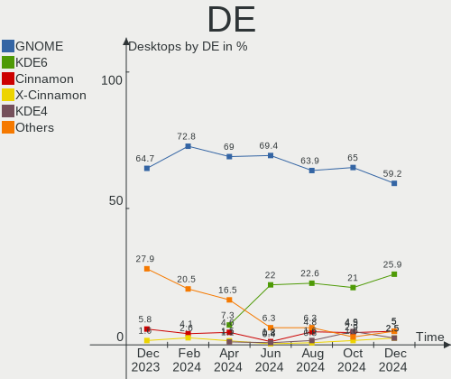
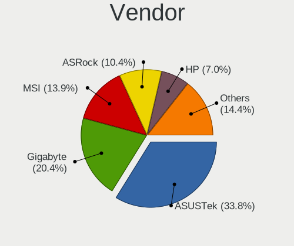

Fedora - Hardware Trends (Desktops)
-----------------------------------

A project to identify most popular hardware characteristics and track their change
over time based on data collected by Linux users at https://Linux-Hardware.org.

Anyone can contribute to this report by the [hw-probe](https://github.com/linuxhw/hw-probe) tool:

    sudo -E hw-probe -all -upload

This report is for one last month. Overall report since the beginning of time: [TestCoverage](https://github.com/linuxhw/TestCoverage)

Period: Aug, 2022.

Contents
--------

* [ System ](#system)
  - [ OS                       ](#os)
  - [ OS Family                ](#os-family)
  - [ Kernel                   ](#kernel)
  - [ Kernel Family            ](#kernel-family)
  - [ Kernel Major Ver.        ](#kernel-major-ver)
  - [ Arch                     ](#arch)
  - [ DE                       ](#de)
  - [ Display Server           ](#display-server)
  - [ Display Manager          ](#display-manager)
  - [ OS Lang                  ](#os-lang)
  - [ Boot Mode                ](#boot-mode)
  - [ Filesystem               ](#filesystem)
  - [ Part. scheme             ](#part-scheme)
  - [ Dual Boot with Linux/BSD ](#dual-boot-with-linuxbsd)
  - [ Dual Boot (Win)          ](#dual-boot-win)

* [ Board ](#board)
  - [ Vendor                   ](#vendor)
  - [ Model                    ](#model)
  - [ Model Family             ](#model-family)
  - [ MFG Year                 ](#mfg-year)
  - [ Form Factor              ](#form-factor)
  - [ Secure Boot              ](#secure-boot)
  - [ Coreboot                 ](#coreboot)
  - [ RAM Size                 ](#ram-size)
  - [ RAM Used                 ](#ram-used)
  - [ Total Drives             ](#total-drives)
  - [ Has CD-ROM               ](#has-cd-rom)
  - [ Has Ethernet             ](#has-ethernet)
  - [ Has WiFi                 ](#has-wifi)
  - [ Has Bluetooth            ](#has-bluetooth)

* [ Location ](#location)
  - [ Country                  ](#country)
  - [ City                     ](#city)

* [ Drives ](#drives)
  - [ Drive Vendor             ](#drive-vendor)
  - [ Drive Model              ](#drive-model)
  - [ HDD Vendor               ](#hdd-vendor)
  - [ SSD Vendor               ](#ssd-vendor)
  - [ Drive Kind               ](#drive-kind)
  - [ Drive Connector          ](#drive-connector)
  - [ Drive Size               ](#drive-size)
  - [ Space Total              ](#space-total)
  - [ Space Used               ](#space-used)
  - [ Malfunc. Drives          ](#malfunc-drives)
  - [ Malfunc. Drive Vendor    ](#malfunc-drive-vendor)
  - [ Malfunc. HDD Vendor      ](#malfunc-hdd-vendor)
  - [ Malfunc. Drive Kind      ](#malfunc-drive-kind)
  - [ Failed Drives            ](#failed-drives)
  - [ Failed Drive Vendor      ](#failed-drive-vendor)
  - [ Drive Status             ](#drive-status)

* [ Storage controller ](#storage-controller)
  - [ Storage Vendor           ](#storage-vendor)
  - [ Storage Model            ](#storage-model)
  - [ Storage Kind             ](#storage-kind)

* [ Processor ](#processor)
  - [ CPU Vendor               ](#cpu-vendor)
  - [ CPU Model                ](#cpu-model)
  - [ CPU Model Family         ](#cpu-model-family)
  - [ CPU Cores                ](#cpu-cores)
  - [ CPU Sockets              ](#cpu-sockets)
  - [ CPU Threads              ](#cpu-threads)
  - [ CPU Op-Modes             ](#cpu-op-modes)
  - [ CPU Microcode            ](#cpu-microcode)
  - [ CPU Microarch            ](#cpu-microarch)

* [ Graphics ](#graphics)
  - [ GPU Vendor               ](#gpu-vendor)
  - [ GPU Model                ](#gpu-model)
  - [ GPU Combo                ](#gpu-combo)
  - [ GPU Driver               ](#gpu-driver)
  - [ GPU Memory               ](#gpu-memory)

* [ Monitor ](#monitor)
  - [ Monitor Vendor           ](#monitor-vendor)
  - [ Monitor Model            ](#monitor-model)
  - [ Monitor Resolution       ](#monitor-resolution)
  - [ Monitor Diagonal         ](#monitor-diagonal)
  - [ Monitor Width            ](#monitor-width)
  - [ Aspect Ratio             ](#aspect-ratio)
  - [ Monitor Area             ](#monitor-area)
  - [ Pixel Density            ](#pixel-density)
  - [ Multiple Monitors        ](#multiple-monitors)

* [ Network ](#network)
  - [ Net Controller Vendor    ](#net-controller-vendor)
  - [ Net Controller Model     ](#net-controller-model)
  - [ Wireless Vendor          ](#wireless-vendor)
  - [ Wireless Model           ](#wireless-model)
  - [ Ethernet Vendor          ](#ethernet-vendor)
  - [ Ethernet Model           ](#ethernet-model)
  - [ Net Controller Kind      ](#net-controller-kind)
  - [ Used Controller          ](#used-controller)
  - [ NICs                     ](#nics)
  - [ IPv6                     ](#ipv6)

* [ Bluetooth ](#bluetooth)
  - [ Bluetooth Vendor         ](#bluetooth-vendor)
  - [ Bluetooth Model          ](#bluetooth-model)

* [ Sound ](#sound)
  - [ Sound Vendor             ](#sound-vendor)
  - [ Sound Model              ](#sound-model)

* [ Memory ](#memory)
  - [ Memory Vendor            ](#memory-vendor)
  - [ Memory Model             ](#memory-model)
  - [ Memory Kind              ](#memory-kind)
  - [ Memory Form Factor       ](#memory-form-factor)
  - [ Memory Size              ](#memory-size)
  - [ Memory Speed             ](#memory-speed)

* [ Printers & scanners ](#printers--scanners)
  - [ Printer Vendor           ](#printer-vendor)
  - [ Printer Model            ](#printer-model)
  - [ Scanner Vendor           ](#scanner-vendor)
  - [ Scanner Model            ](#scanner-model)

* [ Camera ](#camera)
  - [ Camera Vendor            ](#camera-vendor)
  - [ Camera Model             ](#camera-model)

* [ Security ](#security)
  - [ Fingerprint Vendor       ](#fingerprint-vendor)
  - [ Fingerprint Model        ](#fingerprint-model)
  - [ Chipcard Vendor          ](#chipcard-vendor)
  - [ Chipcard Model           ](#chipcard-model)

* [ Unsupported ](#unsupported)
  - [ Unsupported Devices      ](#unsupported-devices)
  - [ Unsupported Device Types ](#unsupported-device-types)

System
------

OS
--

Installed operating systems

| Name      | Desktops | Percent |
|-----------|----------|---------|
| Fedora 36 | 105      | 91.3%   |
| Fedora 35 | 5        | 4.35%   |
| Fedora 34 | 2        | 1.74%   |
| Fedora 37 | 1        | 0.87%   |
| Fedora 33 | 1        | 0.87%   |
| Fedora 30 | 1        | 0.87%   |

OS Family
---------

OS without a version

| Name   | Desktops | Percent |
|--------|----------|---------|
| Fedora | 115      | 100%    |

Kernel
------

Version of the Linux kernel

| Version                      | Desktops | Percent |
|------------------------------|----------|---------|
| 5.18.16-200.fc36.x86_64      | 31       | 26.96%  |
| 5.18.18-200.fc36.x86_64      | 19       | 16.52%  |
| 5.18.13-200.fc36.x86_64      | 17       | 14.78%  |
| 5.18.19-200.fc36.x86_64      | 8        | 6.96%   |
| 5.18.17-200.fc36.x86_64      | 8        | 6.96%   |
| 5.18.15-200.fc36.x86_64      | 8        | 6.96%   |
| 5.19.4-200.fc36.x86_64       | 4        | 3.48%   |
| 5.17.5-300.fc36.x86_64       | 4        | 3.48%   |
| 5.18.5-200.fc36.x86_64       | 2        | 1.74%   |
| 5.17.12-100.fc34.x86_64      | 2        | 1.74%   |
| 5.6.13-100.fc30.x86_64       | 1        | 0.87%   |
| 5.19.3-603.inttf.fc36.x86_64 | 1        | 0.87%   |
| 5.19.2-300.fc36.x86_64       | 1        | 0.87%   |
| 5.19.0-65.fc37.x86_64        | 1        | 0.87%   |
| 5.18.18-100.fc35.x86_64      | 1        | 0.87%   |
| 5.18.11-200.fc36.x86_64      | 1        | 0.87%   |
| 5.18.11-100.fc35.x86_64      | 1        | 0.87%   |
| 5.18.10-100.fc35.x86_64      | 1        | 0.87%   |
| 5.16.18-200.fc35.x86_64      | 1        | 0.87%   |
| 5.16.15-201.fc35.x86_64      | 1        | 0.87%   |
| 5.14.18-100.fc33.x86_64      | 1        | 0.87%   |
| 5.11.12-300.fc34.x86_64      | 1        | 0.87%   |

Kernel Family
-------------

Linux kernel without a distro release

| Version | Desktops | Percent |
|---------|----------|---------|
| 5.18.16 | 31       | 26.96%  |
| 5.18.18 | 20       | 17.39%  |
| 5.18.13 | 17       | 14.78%  |
| 5.18.19 | 8        | 6.96%   |
| 5.18.17 | 8        | 6.96%   |
| 5.18.15 | 8        | 6.96%   |
| 5.19.4  | 4        | 3.48%   |
| 5.17.5  | 4        | 3.48%   |
| 5.18.5  | 2        | 1.74%   |
| 5.18.11 | 2        | 1.74%   |
| 5.17.12 | 2        | 1.74%   |
| 5.6.13  | 1        | 0.87%   |
| 5.19.3  | 1        | 0.87%   |
| 5.19.2  | 1        | 0.87%   |
| 5.19.0  | 1        | 0.87%   |
| 5.18.10 | 1        | 0.87%   |
| 5.16.18 | 1        | 0.87%   |
| 5.16.15 | 1        | 0.87%   |
| 5.14.18 | 1        | 0.87%   |
| 5.11.12 | 1        | 0.87%   |

Kernel Major Ver.
-----------------

Linux kernel major version

| Version | Desktops | Percent |
|---------|----------|---------|
| 5.18    | 97       | 84.35%  |
| 5.19    | 7        | 6.09%   |
| 5.17    | 6        | 5.22%   |
| 5.16    | 2        | 1.74%   |
| 5.6     | 1        | 0.87%   |
| 5.14    | 1        | 0.87%   |
| 5.11    | 1        | 0.87%   |

Arch
----

OS architecture (x86_64, i586, etc.)

| Name   | Desktops | Percent |
|--------|----------|---------|
| x86_64 | 115      | 100%    |

DE
--

Desktop Environment

| Name          | Desktops | Percent |
|---------------|----------|---------|
| GNOME         | 75       | 65.22%  |
| KDE5          | 26       | 22.61%  |
| Cinnamon      | 5        | 4.35%   |
| X-Cinnamon    | 3        | 2.61%   |
| Unknown       | 2        | 1.74%   |
| MATE          | 1        | 0.87%   |
| i3            | 1        | 0.87%   |
| GNOME Classic | 1        | 0.87%   |
| awesome       | 1        | 0.87%   |

Display Server
--------------

X11 or Wayland

| Name    | Desktops | Percent |
|---------|----------|---------|
| Wayland | 63       | 54.78%  |
| X11     | 42       | 36.52%  |
| Tty     | 10       | 8.7%    |

Display Manager
---------------

SDDM, LightDM, etc.

| Name    | Desktops | Percent |
|---------|----------|---------|
| Unknown | 75       | 65.22%  |
| GDM     | 18       | 15.65%  |
| SDDM    | 12       | 10.43%  |
| LightDM | 10       | 8.7%    |

OS Lang
-------

Language

| Lang    | Desktops | Percent |
|---------|----------|---------|
| en_US   | 56       | 48.7%   |
| en_GB   | 11       | 9.57%   |
| en_AU   | 9        | 7.83%   |
| ru_RU   | 7        | 6.09%   |
| de_DE   | 4        | 3.48%   |
| pt_BR   | 3        | 2.61%   |
| nl_NL   | 3        | 2.61%   |
| fr_FR   | 3        | 2.61%   |
| en_NZ   | 3        | 2.61%   |
| en_CA   | 3        | 2.61%   |
| nl_BE   | 2        | 1.74%   |
| zh_CN   | 1        | 0.87%   |
| pt_PT   | 1        | 0.87%   |
| pl_PL   | 1        | 0.87%   |
| es_MX   | 1        | 0.87%   |
| es_ES   | 1        | 0.87%   |
| es_CR   | 1        | 0.87%   |
| en_SG   | 1        | 0.87%   |
| en_IN   | 1        | 0.87%   |
| Default | 1        | 0.87%   |
| cs_CZ   | 1        | 0.87%   |
| ar_SA   | 1        | 0.87%   |

Boot Mode
---------

EFI or BIOS

| Mode | Desktops | Percent |
|------|----------|---------|
| EFI  | 75       | 65.22%  |
| BIOS | 40       | 34.78%  |

Filesystem
----------

Type of filesystem

| Type  | Desktops | Percent |
|-------|----------|---------|
| Btrfs | 88       | 76.52%  |
| Ext4  | 22       | 19.13%  |
| Xfs   | 5        | 4.35%   |

Part. scheme
------------

Scheme of partitioning

| Type    | Desktops | Percent |
|---------|----------|---------|
| Unknown | 71       | 61.74%  |
| GPT     | 36       | 31.3%   |
| MBR     | 8        | 6.96%   |

Dual Boot with Linux/BSD
------------------------

Hosting more than one Linux/BSD

| Dual boot | Desktops | Percent |
|-----------|----------|---------|
| No        | 99       | 86.09%  |
| Yes       | 16       | 13.91%  |

Dual Boot (Win)
---------------

Hosting Linux and Windows

| Dual boot | Desktops | Percent |
|-----------|----------|---------|
| No        | 95       | 82.61%  |
| Yes       | 20       | 17.39%  |

Board
-----

Vendor
------

Motherboard manufacturer

| Name                | Desktops | Percent |
|---------------------|----------|---------|
| Gigabyte Technology | 30       | 26.09%  |
| ASUSTek Computer    | 29       | 25.22%  |
| MSI                 | 18       | 15.65%  |
| ASRock              | 14       | 12.17%  |
| Dell                | 8        | 6.96%   |
| Hewlett-Packard     | 6        | 5.22%   |
| Lenovo              | 5        | 4.35%   |
| MACHINIST           | 1        | 0.87%   |
| Huanan              | 1        | 0.87%   |
| Foxconn             | 1        | 0.87%   |
| ECS                 | 1        | 0.87%   |
| BESSTAR Tech        | 1        | 0.87%   |

Model
-----

Motherboard model

| Name                                 | Desktops | Percent |
|--------------------------------------|----------|---------|
| ASUS All Series                      | 6        | 5.22%   |
| MSI MS-7C37                          | 2        | 1.74%   |
| Gigabyte GA-78LMT-USB3 6.0           | 2        | 1.74%   |
| Gigabyte B550M DS3H                  | 2        | 1.74%   |
| Dell XPS 8940                        | 2        | 1.74%   |
| ASUS TUF Gaming X570-PLUS            | 2        | 1.74%   |
| ASUS TUF Gaming B550-PLUS            | 2        | 1.74%   |
| MSI MS-7D54                          | 1        | 0.87%   |
| MSI MS-7D22                          | 1        | 0.87%   |
| MSI MS-7C92                          | 1        | 0.87%   |
| MSI MS-7C82                          | 1        | 0.87%   |
| MSI MS-7C04                          | 1        | 0.87%   |
| MSI MS-7B85                          | 1        | 0.87%   |
| MSI MS-7B51                          | 1        | 0.87%   |
| MSI MS-7B47                          | 1        | 0.87%   |
| MSI MS-7A33                          | 1        | 0.87%   |
| MSI MS-7A12                          | 1        | 0.87%   |
| MSI MS-7917                          | 1        | 0.87%   |
| MSI MS-7885                          | 1        | 0.87%   |
| MSI MS-7821                          | 1        | 0.87%   |
| MSI MS-7817                          | 1        | 0.87%   |
| MSI MS-7758                          | 1        | 0.87%   |
| MSI MS-7693                          | 1        | 0.87%   |
| MACHINIST X99-RS9 V2.0               | 1        | 0.87%   |
| Lenovo ThinkCentre M93p 10A8S3C100   | 1        | 0.87%   |
| Lenovo ThinkCentre M93p 10A8S18X00   | 1        | 0.87%   |
| Lenovo ThinkCentre M83 10ANS01B00    | 1        | 0.87%   |
| Lenovo ThinkCentre M720s 10ST0014MB  | 1        | 0.87%   |
| Lenovo H530 10130                    | 1        | 0.87%   |
| Huanan X99-BD4 V1.33                 | 1        | 0.87%   |
| HP Z238 Microtower Workstation       | 1        | 0.87%   |
| HP Z210 Workstation                  | 1        | 0.87%   |
| HP Z2 Tower G5 Workstation           | 1        | 0.87%   |
| HP ProDesk 600 G2 SFF                | 1        | 0.87%   |
| HP Pavilion Gaming Desktop TG01-1xxx | 1        | 0.87%   |
| HP EliteDesk 705 G4 DM 35W (TAA)     | 1        | 0.87%   |
| Gigabyte Z87-HD3                     | 1        | 0.87%   |
| Gigabyte Z690I AORUS ULTRA DDR4      | 1        | 0.87%   |
| Gigabyte Z68MA-D2H-B3                | 1        | 0.87%   |
| Gigabyte Z390 GAMING X               | 1        | 0.87%   |
| Gigabyte Z170-D3H                    | 1        | 0.87%   |
| Gigabyte X570S AORUS ELITE AX        | 1        | 0.87%   |
| Gigabyte X570 I AORUS PRO WIFI       | 1        | 0.87%   |
| Gigabyte X570 AORUS PRO              | 1        | 0.87%   |
| Gigabyte X470 AORUS GAMING 7 WIFI    | 1        | 0.87%   |
| Gigabyte M68MT-S2P                   | 1        | 0.87%   |
| Gigabyte H81M-S                      | 1        | 0.87%   |
| Gigabyte H77N-WIFI                   | 1        | 0.87%   |
| Gigabyte H370HD3                     | 1        | 0.87%   |
| Gigabyte GA-MA785G-UD3H              | 1        | 0.87%   |
| Gigabyte GA-MA780G-UD3H              | 1        | 0.87%   |
| Gigabyte G1.Sniper B5                | 1        | 0.87%   |
| Gigabyte EP45-DS3P                   | 1        | 0.87%   |
| Gigabyte B550M AORUS PRO-P           | 1        | 0.87%   |
| Gigabyte B550I AORUS PRO AX          | 1        | 0.87%   |
| Gigabyte B550 GAMING X V2            | 1        | 0.87%   |
| Gigabyte B550 AORUS ELITE V2         | 1        | 0.87%   |
| Gigabyte B450M DS3H                  | 1        | 0.87%   |
| Gigabyte B150M-D3H                   | 1        | 0.87%   |
| Gigabyte AX370-Gaming 5              | 1        | 0.87%   |

Model Family
------------

Motherboard model prefix

| Name                    | Desktops | Percent |
|-------------------------|----------|---------|
| ASUS ROG                | 7        | 6.09%   |
| ASUS TUF                | 6        | 5.22%   |
| ASUS All                | 6        | 5.22%   |
| Lenovo ThinkCentre      | 4        | 3.48%   |
| Gigabyte B550M          | 3        | 2.61%   |
| MSI MS-7C37             | 2        | 1.74%   |
| Gigabyte X570           | 2        | 1.74%   |
| Gigabyte GA-78LMT-USB3  | 2        | 1.74%   |
| Gigabyte B550           | 2        | 1.74%   |
| Dell XPS                | 2        | 1.74%   |
| Dell Precision          | 2        | 1.74%   |
| Dell OptiPlex           | 2        | 1.74%   |
| ASUS PRIME              | 2        | 1.74%   |
| ASUS P8H77-V            | 2        | 1.74%   |
| ASRock B450M            | 2        | 1.74%   |
| MSI MS-7D54             | 1        | 0.87%   |
| MSI MS-7D22             | 1        | 0.87%   |
| MSI MS-7C92             | 1        | 0.87%   |
| MSI MS-7C82             | 1        | 0.87%   |
| MSI MS-7C04             | 1        | 0.87%   |
| MSI MS-7B85             | 1        | 0.87%   |
| MSI MS-7B51             | 1        | 0.87%   |
| MSI MS-7B47             | 1        | 0.87%   |
| MSI MS-7A33             | 1        | 0.87%   |
| MSI MS-7A12             | 1        | 0.87%   |
| MSI MS-7917             | 1        | 0.87%   |
| MSI MS-7885             | 1        | 0.87%   |
| MSI MS-7821             | 1        | 0.87%   |
| MSI MS-7817             | 1        | 0.87%   |
| MSI MS-7758             | 1        | 0.87%   |
| MSI MS-7693             | 1        | 0.87%   |
| MACHINIST X99-RS9       | 1        | 0.87%   |
| Lenovo H530             | 1        | 0.87%   |
| Huanan X99-BD4          | 1        | 0.87%   |
| HP Z238                 | 1        | 0.87%   |
| HP Z210                 | 1        | 0.87%   |
| HP Z2                   | 1        | 0.87%   |
| HP ProDesk              | 1        | 0.87%   |
| HP Pavilion             | 1        | 0.87%   |
| HP EliteDesk            | 1        | 0.87%   |
| Gigabyte Z87-HD3        | 1        | 0.87%   |
| Gigabyte Z690I          | 1        | 0.87%   |
| Gigabyte Z68MA-D2H-B3   | 1        | 0.87%   |
| Gigabyte Z390           | 1        | 0.87%   |
| Gigabyte Z170-D3H       | 1        | 0.87%   |
| Gigabyte X570S          | 1        | 0.87%   |
| Gigabyte X470           | 1        | 0.87%   |
| Gigabyte M68MT-S2P      | 1        | 0.87%   |
| Gigabyte H81M-S         | 1        | 0.87%   |
| Gigabyte H77N-WIFI      | 1        | 0.87%   |
| Gigabyte H370HD3        | 1        | 0.87%   |
| Gigabyte GA-MA785G-UD3H | 1        | 0.87%   |
| Gigabyte GA-MA780G-UD3H | 1        | 0.87%   |
| Gigabyte G1.Sniper      | 1        | 0.87%   |
| Gigabyte EP45-DS3P      | 1        | 0.87%   |
| Gigabyte B550I          | 1        | 0.87%   |
| Gigabyte B450M          | 1        | 0.87%   |
| Gigabyte B150M-D3H      | 1        | 0.87%   |
| Gigabyte AX370-Gaming   | 1        | 0.87%   |
| Gigabyte A320M-S2H      | 1        | 0.87%   |

MFG Year
--------

Motherboard manufacture year

| Year | Desktops | Percent |
|------|----------|---------|
| 2020 | 19       | 16.52%  |
| 2014 | 14       | 12.17%  |
| 2018 | 13       | 11.3%   |
| 2019 | 12       | 10.43%  |
| 2012 | 10       | 8.7%    |
| 2017 | 9        | 7.83%   |
| 2021 | 7        | 6.09%   |
| 2015 | 6        | 5.22%   |
| 2013 | 6        | 5.22%   |
| 2022 | 4        | 3.48%   |
| 2016 | 3        | 2.61%   |
| 2011 | 3        | 2.61%   |
| 2008 | 3        | 2.61%   |
| 2010 | 2        | 1.74%   |
| 2009 | 2        | 1.74%   |
| 2007 | 2        | 1.74%   |

Form Factor
-----------

Physical design of the computer

| Name    | Desktops | Percent |
|---------|----------|---------|
| Desktop | 115      | 100%    |

Secure Boot
-----------

Enabled or disabled

| State    | Desktops | Percent |
|----------|----------|---------|
| Disabled | 108      | 93.91%  |
| Enabled  | 7        | 6.09%   |

Coreboot
--------

Have coreboot on board

| Used | Desktops | Percent |
|------|----------|---------|
| No   | 115      | 100%    |

RAM Size
--------

Total RAM memory

| Size in GB  | Desktops | Percent |
|-------------|----------|---------|
| 16.01-24.0  | 42       | 36.52%  |
| 32.01-64.0  | 37       | 32.17%  |
| 8.01-16.0   | 13       | 11.3%   |
| 4.01-8.0    | 8        | 6.96%   |
| 3.01-4.0    | 6        | 5.22%   |
| 64.01-256.0 | 5        | 4.35%   |
| 24.01-32.0  | 2        | 1.74%   |
| 1.01-2.0    | 2        | 1.74%   |

RAM Used
--------

Used RAM memory

| Used GB    | Desktops | Percent |
|------------|----------|---------|
| 4.01-8.0   | 38       | 33.04%  |
| 3.01-4.0   | 24       | 20.87%  |
| 2.01-3.0   | 20       | 17.39%  |
| 1.01-2.0   | 14       | 12.17%  |
| 8.01-16.0  | 14       | 12.17%  |
| 16.01-24.0 | 2        | 1.74%   |
| 0.51-1.0   | 2        | 1.74%   |
| 32.01-64.0 | 1        | 0.87%   |

Total Drives
------------

Number of drives on board

| Drives | Desktops | Percent |
|--------|----------|---------|
| 2      | 46       | 40%     |
| 1      | 27       | 23.48%  |
| 3      | 16       | 13.91%  |
| 4      | 15       | 13.04%  |
| 6      | 7        | 6.09%   |
| 5      | 3        | 2.61%   |
| 9      | 1        | 0.87%   |

Has CD-ROM
----------

Has CD-ROM on board

| Presented | Desktops | Percent |
|-----------|----------|---------|
| No        | 77       | 66.96%  |
| Yes       | 38       | 33.04%  |

Has Ethernet
------------

Has Ethernet on board

| Presented | Desktops | Percent |
|-----------|----------|---------|
| Yes       | 114      | 99.13%  |
| No        | 1        | 0.87%   |

Has WiFi
--------

Has WiFi module

| Presented | Desktops | Percent |
|-----------|----------|---------|
| Yes       | 65       | 56.52%  |
| No        | 50       | 43.48%  |

Has Bluetooth
-------------

Has Bluetooth module

| Presented | Desktops | Percent |
|-----------|----------|---------|
| Yes       | 58       | 50.43%  |
| No        | 57       | 49.57%  |

Location
--------

Country
-------

Geographic location (country)

| Country                | Desktops | Percent |
|------------------------|----------|---------|
| USA                    | 29       | 25.22%  |
| Russia                 | 9        | 7.83%   |
| Germany                | 9        | 7.83%   |
| Australia              | 9        | 7.83%   |
| UK                     | 6        | 5.22%   |
| Netherlands            | 6        | 5.22%   |
| Brazil                 | 6        | 5.22%   |
| Canada                 | 5        | 4.35%   |
| France                 | 4        | 3.48%   |
| Poland                 | 3        | 2.61%   |
| New Zealand            | 3        | 2.61%   |
| Sweden                 | 2        | 1.74%   |
| Norway                 | 2        | 1.74%   |
| Italy                  | 2        | 1.74%   |
| India                  | 2        | 1.74%   |
| Belgium                | 2        | 1.74%   |
| Belarus                | 2        | 1.74%   |
| Spain                  | 1        | 0.87%   |
| South Africa           | 1        | 0.87%   |
| Saudi Arabia           | 1        | 0.87%   |
| Romania                | 1        | 0.87%   |
| Mexico                 | 1        | 0.87%   |
| Malaysia               | 1        | 0.87%   |
| Indonesia              | 1        | 0.87%   |
| Czechia                | 1        | 0.87%   |
| Costa Rica             | 1        | 0.87%   |
| Colombia               | 1        | 0.87%   |
| China                  | 1        | 0.87%   |
| Bosnia and Herzegovina | 1        | 0.87%   |
| Argentina              | 1        | 0.87%   |
| Andorra                | 1        | 0.87%   |

City
----

Geographic location (city)

| City                | Desktops | Percent |
|---------------------|----------|---------|
| Moscow              | 4        | 3.48%   |
| Berlin              | 3        | 2.61%   |
| Warsaw              | 2        | 1.74%   |
| Sydney              | 2        | 1.74%   |
| Portland            | 2        | 1.74%   |
| Lane Cove           | 2        | 1.74%   |
| Kristiansand        | 2        | 1.74%   |
| Kansas City         | 2        | 1.74%   |
| Chicago             | 2        | 1.74%   |
| Brisbane            | 2        | 1.74%   |
| Belo Horizonte      | 2        | 1.74%   |
| Auckland            | 2        | 1.74%   |
| Assen               | 2        | 1.74%   |
| Antwerp             | 2        | 1.74%   |
| Amsterdam           | 2        | 1.74%   |
| Yekaterinburg       | 1        | 0.87%   |
| Woodstock           | 1        | 0.87%   |
| Winnipeg            | 1        | 0.87%   |
| Vitória            | 1        | 0.87%   |
| Toronto             | 1        | 0.87%   |
| Thornton Heath      | 1        | 0.87%   |
| Surabaya            | 1        | 0.87%   |
| Stuttgart           | 1        | 0.87%   |
| Strabane            | 1        | 0.87%   |
| Sollentuna          | 1        | 0.87%   |
| Sheboygan           | 1        | 0.87%   |
| Shanxi              | 1        | 0.87%   |
| Shah Alam           | 1        | 0.87%   |
| Sautron             | 1        | 0.87%   |
| Santiago del Estero | 1        | 0.87%   |
| Sandusky            | 1        | 0.87%   |
| San Jose            | 1        | 0.87%   |
| Samastipur          | 1        | 0.87%   |
| Samara              | 1        | 0.87%   |
| Salisbury           | 1        | 0.87%   |
| Riyadh              | 1        | 0.87%   |
| Rio de Janeiro      | 1        | 0.87%   |
| Reading             | 1        | 0.87%   |
| Purmerend           | 1        | 0.87%   |
| Poulsbo             | 1        | 0.87%   |
| Porto Alegre        | 1        | 0.87%   |
| Pipe Creek          | 1        | 0.87%   |
| Petrozavodsk        | 1        | 0.87%   |
| Pessano Con Bornago | 1        | 0.87%   |
| Perth               | 1        | 0.87%   |
| Pensacola           | 1        | 0.87%   |
| Papillion           | 1        | 0.87%   |
| Palowice            | 1        | 0.87%   |
| Palmerston North    | 1        | 0.87%   |
| Ourense             | 1        | 0.87%   |
| Orenburg            | 1        | 0.87%   |
| Novosibirsk         | 1        | 0.87%   |
| Nova Topola         | 1        | 0.87%   |
| New York            | 1        | 0.87%   |
| Morganton           | 1        | 0.87%   |
| Moreno Valley       | 1        | 0.87%   |
| Minsk               | 1        | 0.87%   |
| Meylan              | 1        | 0.87%   |
| Mexico City         | 1        | 0.87%   |
| Melbourne           | 1        | 0.87%   |

Drives
------

Drive Vendor
------------

Hard drive vendors

| Vendor                    | Desktops | Drives | Percent |
|---------------------------|----------|--------|---------|
| WDC                       | 46       | 62     | 20%     |
| Seagate                   | 42       | 65     | 18.26%  |
| Samsung Electronics       | 32       | 46     | 13.91%  |
| SanDisk                   | 15       | 16     | 6.52%   |
| Kingston                  | 15       | 17     | 6.52%   |
| Crucial                   | 14       | 18     | 6.09%   |
| Hitachi                   | 8        | 9      | 3.48%   |
| Toshiba                   | 6        | 6      | 2.61%   |
| Phison                    | 4        | 4      | 1.74%   |
| Micron/Crucial Technology | 4        | 4      | 1.74%   |
| A-DATA Technology         | 4        | 4      | 1.74%   |
| Silicon Motion            | 3        | 3      | 1.3%    |
| Intel                     | 3        | 3      | 1.3%    |
| XPG                       | 2        | 2      | 0.87%   |
| Unknown                   | 2        | 3      | 0.87%   |
| PNY                       | 2        | 2      | 0.87%   |
| Plextor                   | 2        | 2      | 0.87%   |
| Hewlett-Packard           | 2        | 2      | 0.87%   |
| XSTAR                     | 1        | 1      | 0.43%   |
| Verbatim                  | 1        | 1      | 0.43%   |
| Transcend                 | 1        | 1      | 0.43%   |
| Team                      | 1        | 1      | 0.43%   |
| SK hynix                  | 1        | 1      | 0.43%   |
| SABRENT                   | 1        | 1      | 0.43%   |
| RSH-339                   | 1        | 1      | 0.43%   |
| Phison Electronics        | 1        | 1      | 0.43%   |
| Patriot                   | 1        | 1      | 0.43%   |
| OCZ                       | 1        | 2      | 0.43%   |
| Netac                     | 1        | 1      | 0.43%   |
| Maxtor                    | 1        | 1      | 0.43%   |
| Leven                     | 1        | 1      | 0.43%   |
| KIOXIA-EXCERIA            | 1        | 1      | 0.43%   |
| KIOXIA                    | 1        | 1      | 0.43%   |
| JMicron Technology        | 1        | 1      | 0.43%   |
| Intenso                   | 1        | 2      | 0.43%   |
| HGST                      | 1        | 1      | 0.43%   |
| GOODRAM                   | 1        | 1      | 0.43%   |
| Gigabyte Technology       | 1        | 1      | 0.43%   |
| G-DRIVE                   | 1        | 1      | 0.43%   |
| Fujitsu                   | 1        | 1      | 0.43%   |
| ELECOM                    | 1        | 1      | 0.43%   |
| ASMT                      | 1        | 1      | 0.43%   |

Drive Model
-----------

Hard drive models

| Model                                | Desktops | Percent |
|--------------------------------------|----------|---------|
| SanDisk NVMe SSD Drive 1TB           | 7        | 2.55%   |
| Samsung NVMe SSD Drive 500GB         | 5        | 1.82%   |
| WDC WDS500G2B0A-00SM50 500GB SSD     | 4        | 1.46%   |
| WDC WD10EZEX-08M2NA0 1TB             | 4        | 1.46%   |
| Seagate ST500DM002-1BD142 500GB      | 4        | 1.46%   |
| Seagate ST2000DM008-2FR102 2TB       | 4        | 1.46%   |
| Samsung NVMe SSD Drive 1TB           | 4        | 1.46%   |
| WDC WD40EZRZ-00GXCB0 4TB             | 3        | 1.09%   |
| WDC WD30EFRX-68EUZN0 3TB             | 3        | 1.09%   |
| Seagate ST2000DM006-2DM164 2TB       | 3        | 1.09%   |
| Seagate ST1000DM010-2EP102 1TB       | 3        | 1.09%   |
| Samsung NVMe SSD Drive 2TB           | 3        | 1.09%   |
| Micron/Crucial NVMe SSD Drive 1TB    | 3        | 1.09%   |
| Kingston SA400S37240G 240GB SSD      | 3        | 1.09%   |
| Crucial CT250MX500SSD1 250GB         | 3        | 1.09%   |
| Crucial CT1000MX500SSD1 1TB          | 3        | 1.09%   |
| WDC WDS500G2B0B-00YS70 500GB SSD     | 2        | 0.73%   |
| WDC WD10EZEX-00WN4A0 1TB             | 2        | 0.73%   |
| Toshiba KBG30ZMS128G 128GB NVMe SSD  | 2        | 0.73%   |
| Silicon Motion NVMe SSD Drive 1024GB | 2        | 0.73%   |
| Seagate ST31000528AS 1TB             | 2        | 0.73%   |
| Seagate ST3000DM008-2DM166 3TB       | 2        | 0.73%   |
| Seagate BUP Portable 5TB             | 2        | 0.73%   |
| Seagate Backup+ Hub BK 8TB           | 2        | 0.73%   |
| SanDisk NVMe SSD Drive 500GB         | 2        | 0.73%   |
| Samsung SSD 980 PRO 1TB              | 2        | 0.73%   |
| Samsung SSD 970 EVO 250GB            | 2        | 0.73%   |
| Samsung SSD 870 QVO 2TB              | 2        | 0.73%   |
| Samsung SSD 860 EVO 500GB            | 2        | 0.73%   |
| Samsung SSD 850 EVO 500GB            | 2        | 0.73%   |
| Samsung SSD 850 EVO 1TB              | 2        | 0.73%   |
| Samsung NVMe SSD Drive 250GB         | 2        | 0.73%   |
| Kingston SA400S37480G 480GB SSD      | 2        | 0.73%   |
| Kingston SA400S37120G 120GB SSD      | 2        | 0.73%   |
| Hitachi HUA723030ALA641 3TB          | 2        | 0.73%   |
| Crucial CT500MX500SSD1 500GB         | 2        | 0.73%   |
| XSTAR SSD 1TB                        | 1        | 0.36%   |
| XPG NVMe SSD Drive 256GB             | 1        | 0.36%   |
| XPG GAMMIX S11 Pro 1TB               | 1        | 0.36%   |
| WDC WDS250G2B0B-00YS70 250GB SSD     | 1        | 0.36%   |
| WDC WDS250G2B0A-00SM50 250GB SSD     | 1        | 0.36%   |
| WDC WDS200T1X0E-00AFY0 2TB           | 1        | 0.36%   |
| WDC WDS100T2B0C-00PXH0 1TB           | 1        | 0.36%   |
| WDC WDS100T2B0A-00SM50 1TB SSD       | 1        | 0.36%   |
| WDC WDS100T1X0E-00AFY0 1TB           | 1        | 0.36%   |
| WDC WD82PURX-64GVLY0 8TB             | 1        | 0.36%   |
| WDC WD6400BPVT-75HXZT1 640GB         | 1        | 0.36%   |
| WDC WD62PURZ-85B3AY0 6TB             | 1        | 0.36%   |
| WDC WD60EFAX-68SHWN0 6TB             | 1        | 0.36%   |
| WDC WD5000LPLX-08ZNTT0 500GB         | 1        | 0.36%   |
| WDC WD5000AZLX-00CL5A0 500GB         | 1        | 0.36%   |
| WDC WD5000AVCS-632DY1 500GB          | 1        | 0.36%   |
| WDC WD5000AUDX-63WNHY0 500GB         | 1        | 0.36%   |
| WDC WD5000AAKX-08U6AA0 500GB         | 1        | 0.36%   |
| WDC WD5000AAKX-003CA0 500GB          | 1        | 0.36%   |
| WDC WD5000AAKX-001CA0 500GB          | 1        | 0.36%   |
| WDC WD40PURX-64GVNY0 4TB             | 1        | 0.36%   |
| WDC WD40EFRX-68WT0N0 4TB             | 1        | 0.36%   |
| WDC WD3200AAKS-00L9A0 320GB          | 1        | 0.36%   |
| WDC WD3200AAJS-65B4A0 320GB          | 1        | 0.36%   |

HDD Vendor
----------

Hard disk drive vendors

| Vendor              | Desktops | Drives | Percent |
|---------------------|----------|--------|---------|
| Seagate             | 39       | 58     | 40.21%  |
| WDC                 | 37       | 50     | 38.14%  |
| Hitachi             | 8        | 9      | 8.25%   |
| Toshiba             | 3        | 3      | 3.09%   |
| Samsung Electronics | 3        | 4      | 3.09%   |
| SABRENT             | 1        | 1      | 1.03%   |
| RSH-339             | 1        | 1      | 1.03%   |
| Maxtor              | 1        | 1      | 1.03%   |
| HGST                | 1        | 1      | 1.03%   |
| Hewlett-Packard     | 1        | 1      | 1.03%   |
| Fujitsu             | 1        | 1      | 1.03%   |
| ASMT                | 1        | 1      | 1.03%   |

SSD Vendor
----------

Solid state drive vendors

| Vendor              | Desktops | Drives | Percent |
|---------------------|----------|--------|---------|
| Samsung Electronics | 14       | 15     | 17.5%   |
| Crucial             | 14       | 18     | 17.5%   |
| Kingston            | 13       | 13     | 16.25%  |
| WDC                 | 9        | 9      | 11.25%  |
| SanDisk             | 5        | 5      | 6.25%   |
| A-DATA Technology   | 4        | 4      | 5%      |
| Seagate             | 3        | 3      | 3.75%   |
| PNY                 | 2        | 2      | 2.5%    |
| Plextor             | 2        | 2      | 2.5%    |
| XSTAR               | 1        | 1      | 1.25%   |
| Verbatim            | 1        | 1      | 1.25%   |
| Transcend           | 1        | 1      | 1.25%   |
| Team                | 1        | 1      | 1.25%   |
| Patriot             | 1        | 1      | 1.25%   |
| OCZ                 | 1        | 2      | 1.25%   |
| Netac               | 1        | 1      | 1.25%   |
| Leven               | 1        | 1      | 1.25%   |
| KIOXIA-EXCERIA      | 1        | 1      | 1.25%   |
| JMicron Technology  | 1        | 1      | 1.25%   |
| Intenso             | 1        | 2      | 1.25%   |
| Intel               | 1        | 1      | 1.25%   |
| GOODRAM             | 1        | 1      | 1.25%   |
| Gigabyte Technology | 1        | 1      | 1.25%   |

Drive Kind
----------

HDD or SSD

| Kind    | Desktops | Drives | Percent |
|---------|----------|--------|---------|
| HDD     | 75       | 131    | 37.69%  |
| SSD     | 67       | 87     | 33.67%  |
| NVMe    | 52       | 70     | 26.13%  |
| Unknown | 5        | 6      | 2.51%   |

Drive Connector
---------------

SATA, SAS, NVMe, etc.

| Type | Desktops | Drives | Percent |
|------|----------|--------|---------|
| SATA | 100      | 206    | 59.52%  |
| NVMe | 52       | 70     | 30.95%  |
| SAS  | 16       | 18     | 9.52%   |

Drive Size
----------

Size of hard drive

| Size in TB | Desktops | Drives | Percent |
|------------|----------|--------|---------|
| 0.01-0.5   | 66       | 102    | 43.14%  |
| 0.51-1.0   | 40       | 56     | 26.14%  |
| 1.01-2.0   | 19       | 26     | 12.42%  |
| 4.01-10.0  | 11       | 13     | 7.19%   |
| 2.01-3.0   | 9        | 11     | 5.88%   |
| 3.01-4.0   | 8        | 10     | 5.23%   |

Space Total
-----------

Amount of disk space available on the file system

| Size in GB     | Desktops | Percent |
|----------------|----------|---------|
| More than 3000 | 25       | 21.74%  |
| 501-1000       | 22       | 19.13%  |
| 251-500        | 17       | 14.78%  |
| 1001-2000      | 17       | 14.78%  |
| 2001-3000      | 10       | 8.7%    |
| 101-250        | 10       | 8.7%    |
| 1-20           | 6        | 5.22%   |
| Unknown        | 5        | 4.35%   |
| 51-100         | 2        | 1.74%   |
| 21-50          | 1        | 0.87%   |

Space Used
----------

Amount of used disk space

| Used GB        | Desktops | Percent |
|----------------|----------|---------|
| 501-1000       | 20       | 17.39%  |
| 1-20           | 15       | 13.04%  |
| 21-50          | 14       | 12.17%  |
| 51-100         | 14       | 12.17%  |
| 251-500        | 13       | 11.3%   |
| 101-250        | 12       | 10.43%  |
| 1001-2000      | 10       | 8.7%    |
| More than 3000 | 6        | 5.22%   |
| 2001-3000      | 6        | 5.22%   |
| Unknown        | 5        | 4.35%   |

Malfunc. Drives
---------------

Drive models with a malfunction

| Model                               | Desktops | Drives | Percent |
|-------------------------------------|----------|--------|---------|
| Seagate ST500DM002-1BD142 500GB     | 2        | 4      | 15.38%  |
| WDC WD10EZEX-75M2NA0 1TB            | 1        | 1      | 7.69%   |
| WDC WD10EARS-00Y5B1 1TB             | 1        | 1      | 7.69%   |
| WDC WD10EADS-65M2B1 1TB             | 1        | 1      | 7.69%   |
| WDC WD1003FBYX-01Y7B1 1TB           | 1        | 1      | 7.69%   |
| Seagate ST3500418AS 500GB           | 1        | 1      | 7.69%   |
| Seagate ST3000DM001-1CH166 3TB      | 1        | 1      | 7.69%   |
| Seagate ST2000DX001-1CM164 2TB      | 1        | 1      | 7.69%   |
| Samsung Electronics SSD 870 EVO 1TB | 1        | 1      | 7.69%   |
| Samsung Electronics HD501LJ 500GB   | 1        | 2      | 7.69%   |
| Kingston SUV400S37480G 480GB SSD    | 1        | 1      | 7.69%   |
| Intel SSDSC2CT120A3 120GB           | 1        | 1      | 7.69%   |

Malfunc. Drive Vendor
---------------------

Vendors of faulty drives

| Vendor              | Desktops | Drives | Percent |
|---------------------|----------|--------|---------|
| WDC                 | 4        | 4      | 33.33%  |
| Seagate             | 4        | 7      | 33.33%  |
| Samsung Electronics | 2        | 3      | 16.67%  |
| Kingston            | 1        | 1      | 8.33%   |
| Intel               | 1        | 1      | 8.33%   |

Malfunc. HDD Vendor
-------------------

Vendors of faulty HDD drives

| Vendor              | Desktops | Drives | Percent |
|---------------------|----------|--------|---------|
| WDC                 | 4        | 4      | 44.44%  |
| Seagate             | 4        | 7      | 44.44%  |
| Samsung Electronics | 1        | 2      | 11.11%  |

Malfunc. Drive Kind
-------------------

Kinds of faulty drives

| Kind | Desktops | Drives | Percent |
|------|----------|--------|---------|
| HDD  | 9        | 13     | 75%     |
| SSD  | 3        | 3      | 25%     |

Failed Drives
-------------

Failed drive models

Zero info for selected period =(

Failed Drive Vendor
-------------------

Failed drive vendors

Zero info for selected period =(

Drive Status
------------

Number of failed and malfunc. drives

| Status   | Desktops | Drives | Percent |
|----------|----------|--------|---------|
| Detected | 77       | 190    | 57.89%  |
| Works    | 44       | 88     | 33.08%  |
| Malfunc  | 12       | 16     | 9.02%   |

Storage controller
------------------

Storage Vendor
--------------

Storage controller vendors

| Vendor                        | Desktops | Percent |
|-------------------------------|----------|---------|
| Intel                         | 67       | 36.61%  |
| AMD                           | 47       | 25.68%  |
| Samsung Electronics           | 20       | 10.93%  |
| SanDisk                       | 13       | 7.1%    |
| ASMedia Technology            | 6        | 3.28%   |
| Phison Electronics            | 5        | 2.73%   |
| Toshiba America Info Systems  | 4        | 2.19%   |
| Silicon Motion                | 4        | 2.19%   |
| Micron/Crucial Technology     | 4        | 2.19%   |
| Kingston Technology Company   | 3        | 1.64%   |
| JMicron Technology            | 2        | 1.09%   |
| ADATA Technology              | 2        | 1.09%   |
| SK hynix                      | 1        | 0.55%   |
| Seagate Technology            | 1        | 0.55%   |
| Nvidia                        | 1        | 0.55%   |
| Netac Technology              | 1        | 0.55%   |
| Marvell Technology Group      | 1        | 0.55%   |
| Integrated Technology Express | 1        | 0.55%   |

Storage Model
-------------

Storage controller models

| Model                                                                                   | Desktops | Percent |
|-----------------------------------------------------------------------------------------|----------|---------|
| AMD FCH SATA Controller [AHCI mode]                                                     | 27       | 12.22%  |
| AMD 500 Series Chipset SATA Controller                                                  | 13       | 5.88%   |
| Samsung NVMe SSD Controller SM981/PM981/PM983                                           | 12       | 5.43%   |
| Intel 8 Series/C220 Series Chipset Family 6-port SATA Controller 1 [AHCI mode]          | 12       | 5.43%   |
| Intel Cannon Lake PCH SATA AHCI Controller                                              | 7        | 3.17%   |
| Samsung NVMe SSD Controller PM9A1/PM9A3/980PRO                                          | 6        | 2.71%   |
| Intel Q170/Q150/B150/H170/H110/Z170/CM236 Chipset SATA Controller [AHCI Mode]           | 6        | 2.71%   |
| ASMedia ASM1062 Serial ATA Controller                                                   | 6        | 2.71%   |
| AMD SB7x0/SB8x0/SB9x0 IDE Controller                                                    | 6        | 2.71%   |
| AMD 400 Series Chipset SATA Controller                                                  | 6        | 2.71%   |
| SanDisk WD Blue SN550 NVMe SSD                                                          | 5        | 2.26%   |
| Intel 9 Series Chipset Family SATA Controller [AHCI Mode]                               | 5        | 2.26%   |
| SanDisk Non-Volatile memory controller                                                  | 4        | 1.81%   |
| Samsung NVMe SSD Controller 980                                                         | 4        | 1.81%   |
| Phison E12 NVMe Controller                                                              | 4        | 1.81%   |
| AMD 300 Series Chipset SATA Controller                                                  | 4        | 1.81%   |
| Toshiba America Info Systems XG6 NVMe SSD Controller                                    | 3        | 1.36%   |
| SanDisk WD PC SN810 / Black SN850 NVMe SSD                                              | 3        | 1.36%   |
| Intel SATA Controller [RAID mode]                                                       | 3        | 1.36%   |
| Intel Alder Lake-S PCH SATA Controller [AHCI Mode]                                      | 3        | 1.36%   |
| Intel 7 Series/C210 Series Chipset Family 6-port SATA Controller [AHCI mode]            | 3        | 1.36%   |
| Intel 6 Series/C200 Series Chipset Family 6 port Desktop SATA AHCI Controller           | 3        | 1.36%   |
| Intel 200 Series PCH SATA controller [AHCI mode]                                        | 3        | 1.36%   |
| AMD X370 Series Chipset SATA Controller                                                 | 3        | 1.36%   |
| AMD SB7x0/SB8x0/SB9x0 SATA Controller [IDE mode]                                        | 3        | 1.36%   |
| AMD SB7x0/SB8x0/SB9x0 SATA Controller [AHCI mode]                                       | 3        | 1.36%   |
| Silicon Motion SM2263EN/SM2263XT SSD Controller                                         | 2        | 0.9%    |
| Silicon Motion SM2262/SM2262EN SSD Controller                                           | 2        | 0.9%    |
| SanDisk WD Black 2018/SN750 / PC SN720 NVMe SSD                                         | 2        | 0.9%    |
| Micron/Crucial P1 NVMe PCIe SSD                                                         | 2        | 0.9%    |
| Kingston Company Company Non-Volatile memory controller                                 | 2        | 0.9%    |
| Intel Volume Management Device NVMe RAID Controller                                     | 2        | 0.9%    |
| Intel SSD 660P Series                                                                   | 2        | 0.9%    |
| Intel NM10/ICH7 Family SATA Controller [IDE mode]                                       | 2        | 0.9%    |
| Intel Comet Lake PCH-H RAID                                                             | 2        | 0.9%    |
| Intel C600/X79 series chipset 6-Port SATA AHCI Controller                               | 2        | 0.9%    |
| Intel 82801G (ICH7 Family) IDE Controller                                               | 2        | 0.9%    |
| Intel 6 Series/C200 Series Chipset Family Desktop SATA Controller (IDE mode, ports 4-5) | 2        | 0.9%    |
| Intel 6 Series/C200 Series Chipset Family Desktop SATA Controller (IDE mode, ports 0-3) | 2        | 0.9%    |
| Intel 400 Series Chipset Family SATA AHCI Controller                                    | 2        | 0.9%    |
| AMD FCH IDE Controller                                                                  | 2        | 0.9%    |
| ADATA XPG SX8200 Pro PCIe Gen3x4 M.2 2280 Solid State Drive                             | 2        | 0.9%    |
| Toshiba America Info Systems Toshiba America Info Non-Volatile memory controller        | 1        | 0.45%   |
| SK hynix Gold P31 SSD                                                                   | 1        | 0.45%   |
| Seagate FireCuda 530 SSD                                                                | 1        | 0.45%   |
| Samsung NVMe SSD Controller SM961/PM961/SM963                                           | 1        | 0.45%   |
| Phison E16 PCIe4 NVMe Controller                                                        | 1        | 0.45%   |
| Nvidia MCP61 SATA Controller                                                            | 1        | 0.45%   |
| Netac Non-Volatile memory controller                                                    | 1        | 0.45%   |
| Micron/Crucial P2 NVMe PCIe SSD                                                         | 1        | 0.45%   |
| Micron/Crucial Non-Volatile memory controller                                           | 1        | 0.45%   |
| Marvell Group 88SE9128 PCIe SATA 6 Gb/s RAID controller with HyperDuo                   | 1        | 0.45%   |
| Kingston Company OM3PDP3 NVMe SSD                                                       | 1        | 0.45%   |
| JMicron JMB58x AHCI SATA controller                                                     | 1        | 0.45%   |
| JMicron JMB363 SATA/IDE Controller                                                      | 1        | 0.45%   |
| Intel NM10/ICH7 Family SATA Controller [AHCI mode]                                      | 1        | 0.45%   |
| Intel Comet Lake SATA AHCI Controller                                                   | 1        | 0.45%   |
| Intel C610/X99 series chipset 6-Port SATA Controller [AHCI mode]                        | 1        | 0.45%   |
| Intel C600/X79 series chipset SATA RAID Controller                                      | 1        | 0.45%   |
| Intel 82Q35 Express PT IDER Controller                                                  | 1        | 0.45%   |

Storage Kind
------------

Kind of storage controller (IDE, SATA, NVMe, SAS, ...)

| Kind | Desktops | Percent |
|------|----------|---------|
| SATA | 100      | 55.56%  |
| NVMe | 52       | 28.89%  |
| IDE  | 19       | 10.56%  |
| RAID | 9        | 5%      |

Processor
---------

CPU Vendor
----------

Processor vendors

| Vendor | Desktops | Percent |
|--------|----------|---------|
| Intel  | 67       | 58.26%  |
| AMD    | 48       | 41.74%  |

CPU Model
---------

Processor models

| Model                                       | Desktops | Percent |
|---------------------------------------------|----------|---------|
| AMD Ryzen 9 5900X 12-Core Processor         | 5        | 4.35%   |
| AMD Ryzen 5 5600X 6-Core Processor          | 5        | 4.35%   |
| Intel Core i7-4790K CPU @ 4.00GHz           | 4        | 3.48%   |
| Intel Core i5-4570 CPU @ 3.20GHz            | 4        | 3.48%   |
| AMD Ryzen 7 3700X 8-Core Processor          | 3        | 2.61%   |
| AMD Ryzen 5 5600G with Radeon Graphics      | 3        | 2.61%   |
| AMD Ryzen 5 2400G with Radeon Vega Graphics | 3        | 2.61%   |
| Intel Core i7-8700 CPU @ 3.20GHz            | 2        | 1.74%   |
| Intel Core i7-10700 CPU @ 2.90GHz           | 2        | 1.74%   |
| Intel Core i5-9600K CPU @ 3.70GHz           | 2        | 1.74%   |
| Intel Core i5-6500 CPU @ 3.20GHz            | 2        | 1.74%   |
| Intel Core i5-4690 CPU @ 3.50GHz            | 2        | 1.74%   |
| Intel Core i5-2400 CPU @ 3.10GHz            | 2        | 1.74%   |
| Intel Core i5-10400F CPU @ 2.90GHz          | 2        | 1.74%   |
| AMD Ryzen 7 5700X 8-Core Processor          | 2        | 1.74%   |
| AMD Ryzen 7 5700G with Radeon Graphics      | 2        | 1.74%   |
| AMD Ryzen 7 2700 Eight-Core Processor       | 2        | 1.74%   |
| AMD Ryzen 5 3600 6-Core Processor           | 2        | 1.74%   |
| AMD Ryzen 5 2600 Six-Core Processor         | 2        | 1.74%   |
| AMD FX-6300 Six-Core Processor              | 2        | 1.74%   |
| Intel Xeon CPU E5-2666 v3 @ 2.90GHz         | 1        | 0.87%   |
| Intel Xeon CPU E5-2665 0 @ 2.40GHz          | 1        | 0.87%   |
| Intel Xeon CPU E5-2650 v3 @ 2.30GHz         | 1        | 0.87%   |
| Intel Xeon CPU E5-2603 v4 @ 1.70GHz         | 1        | 0.87%   |
| Intel Xeon CPU E5-1620 v2 @ 3.70GHz         | 1        | 0.87%   |
| Intel Xeon CPU E3-1225 v5 @ 3.30GHz         | 1        | 0.87%   |
| Intel Pentium CPU G2020 @ 2.90GHz           | 1        | 0.87%   |
| Intel Core i9-10900K CPU @ 3.70GHz          | 1        | 0.87%   |
| Intel Core i7-8700K CPU @ 3.70GHz           | 1        | 0.87%   |
| Intel Core i7-8086K CPU @ 4.00GHz           | 1        | 0.87%   |
| Intel Core i7-7700K CPU @ 4.20GHz           | 1        | 0.87%   |
| Intel Core i7-6700T CPU @ 2.80GHz           | 1        | 0.87%   |
| Intel Core i7-6700K CPU @ 4.00GHz           | 1        | 0.87%   |
| Intel Core i7-4790 CPU @ 3.60GHz            | 1        | 0.87%   |
| Intel Core i7-4770K CPU @ 3.50GHz           | 1        | 0.87%   |
| Intel Core i7-3820 CPU @ 3.60GHz            | 1        | 0.87%   |
| Intel Core i7-3770 CPU @ 3.40GHz            | 1        | 0.87%   |
| Intel Core i7-2600K CPU @ 3.40GHz           | 1        | 0.87%   |
| Intel Core i7-2600 CPU @ 3.40GHz            | 1        | 0.87%   |
| Intel Core i5-9400F CPU @ 2.90GHz           | 1        | 0.87%   |
| Intel Core i5-8400 CPU @ 2.80GHz            | 1        | 0.87%   |
| Intel Core i5-4570S CPU @ 2.90GHz           | 1        | 0.87%   |
| Intel Core i5-4460 CPU @ 3.20GHz            | 1        | 0.87%   |
| Intel Core i5-3570K CPU @ 3.40GHz           | 1        | 0.87%   |
| Intel Core i5-2320 CPU @ 3.00GHz            | 1        | 0.87%   |
| Intel Core i5-10500 CPU @ 3.10GHz           | 1        | 0.87%   |
| Intel Core i5-10400 CPU @ 2.90GHz           | 1        | 0.87%   |
| Intel Core i3-8100 CPU @ 3.60GHz            | 1        | 0.87%   |
| Intel Core i3-6100 CPU @ 3.70GHz            | 1        | 0.87%   |
| Intel Core i3-4150 CPU @ 3.50GHz            | 1        | 0.87%   |
| Intel Core i3-4130 CPU @ 3.40GHz            | 1        | 0.87%   |
| Intel Core i3-4030U CPU @ 1.90GHz           | 1        | 0.87%   |
| Intel Core i3-3240 CPU @ 3.40GHz            | 1        | 0.87%   |
| Intel Core i3-3220 CPU @ 3.30GHz            | 1        | 0.87%   |
| Intel Core i3-10105 CPU @ 3.70GHz           | 1        | 0.87%   |
| Intel Core 2 Quad CPU Q9400 @ 2.66GHz       | 1        | 0.87%   |
| Intel Core 2 Quad CPU Q6600 @ 2.40GHz       | 1        | 0.87%   |
| Intel Core 2 Duo CPU E8400 @ 3.00GHz        | 1        | 0.87%   |
| Intel Core 2 Duo CPU E7600 @ 3.06GHz        | 1        | 0.87%   |
| Intel Core 2 Duo CPU E4500 @ 2.20GHz        | 1        | 0.87%   |

CPU Model Family
----------------

Processor model prefix

| Model             | Desktops | Percent |
|-------------------|----------|---------|
| Intel Core i5     | 22       | 19.13%  |
| Intel Core i7     | 19       | 16.52%  |
| AMD Ryzen 5       | 17       | 14.78%  |
| AMD Ryzen 7       | 12       | 10.43%  |
| Intel Core i3     | 8        | 6.96%   |
| AMD Ryzen 9       | 8        | 6.96%   |
| Intel Xeon        | 6        | 5.22%   |
| Other             | 3        | 2.61%   |
| Intel Core 2 Duo  | 3        | 2.61%   |
| Intel Core 2 Quad | 2        | 1.74%   |
| AMD Phenom II X2  | 2        | 1.74%   |
| AMD FX            | 2        | 1.74%   |
| Intel Pentium     | 1        | 0.87%   |
| Intel Core i9     | 1        | 0.87%   |
| Intel Celeron     | 1        | 0.87%   |
| Intel Atom        | 1        | 0.87%   |
| AMD PRO A10       | 1        | 0.87%   |
| AMD Phenom II X6  | 1        | 0.87%   |
| AMD Phenom II X4  | 1        | 0.87%   |
| AMD Athlon II X2  | 1        | 0.87%   |
| AMD Athlon        | 1        | 0.87%   |
| AMD A8            | 1        | 0.87%   |
| AMD A4            | 1        | 0.87%   |

CPU Cores
---------

Number of processor cores

| Number | Desktops | Percent |
|--------|----------|---------|
| 4      | 37       | 32.17%  |
| 6      | 28       | 24.35%  |
| 2      | 18       | 15.65%  |
| 8      | 15       | 13.04%  |
| 12     | 9        | 7.83%   |
| 10     | 4        | 3.48%   |
| 3      | 2        | 1.74%   |
| 16     | 1        | 0.87%   |
| 1      | 1        | 0.87%   |

CPU Sockets
-----------

Number of sockets

| Number | Desktops | Percent |
|--------|----------|---------|
| 1      | 114      | 99.13%  |
| 2      | 1        | 0.87%   |

CPU Threads
-----------

Threads per core (Hyper-Threading)

| Number | Desktops | Percent |
|--------|----------|---------|
| 2      | 81       | 70.43%  |
| 1      | 34       | 29.57%  |

CPU Op-Modes
------------

CPU Operation Modes (32-bit, 64-bit)

| Op mode        | Desktops | Percent |
|----------------|----------|---------|
| 32-bit, 64-bit | 115      | 100%    |

CPU Microcode
-------------

Microcode number

| Number     | Desktops | Percent |
|------------|----------|---------|
| 0x306c3    | 15       | 13.04%  |
| 0x906ea    | 6        | 5.22%   |
| 0x506e3    | 6        | 5.22%   |
| 0x08701021 | 6        | 5.22%   |
| 0x306a9    | 5        | 4.35%   |
| 0x206a7    | 5        | 4.35%   |
| 0xa0655    | 4        | 3.48%   |
| 0xa0653    | 4        | 3.48%   |
| 0x0a201016 | 4        | 3.48%   |
| 0x08101016 | 4        | 3.48%   |
| 0x0800820d | 4        | 3.48%   |
| Unknown    | 4        | 3.48%   |
| 0x90672    | 3        | 2.61%   |
| 0x0a50000c | 3        | 2.61%   |
| 0x0a20120a | 3        | 2.61%   |
| 0x306f2    | 2        | 1.74%   |
| 0x206d7    | 2        | 1.74%   |
| 0x1067a    | 2        | 1.74%   |
| 0x0a201205 | 2        | 1.74%   |
| 0x08008204 | 2        | 1.74%   |
| 0x010000c8 | 2        | 1.74%   |
| 0x906ed    | 1        | 0.87%   |
| 0x906ec    | 1        | 0.87%   |
| 0x906eb    | 1        | 0.87%   |
| 0x906e9    | 1        | 0.87%   |
| 0x6fd      | 1        | 0.87%   |
| 0x6fb      | 1        | 0.87%   |
| 0x406f1    | 1        | 0.87%   |
| 0x40651    | 1        | 0.87%   |
| 0x306e4    | 1        | 0.87%   |
| 0x30661    | 1        | 0.87%   |
| 0x10676    | 1        | 0.87%   |
| 0x0a50000d | 1        | 0.87%   |
| 0x0a50000b | 1        | 0.87%   |
| 0x0a201204 | 1        | 0.87%   |
| 0x0a201009 | 1        | 0.87%   |
| 0x0a201006 | 1        | 0.87%   |
| 0x08701013 | 1        | 0.87%   |
| 0x08600106 | 1        | 0.87%   |
| 0x08001138 | 1        | 0.87%   |
| 0x08001126 | 1        | 0.87%   |
| 0x0600611a | 1        | 0.87%   |
| 0x06003104 | 1        | 0.87%   |
| 0x06000852 | 1        | 0.87%   |
| 0x06000822 | 1        | 0.87%   |
| 0x010000c6 | 1        | 0.87%   |
| 0x010000bf | 1        | 0.87%   |
| 0x00000000 | 1        | 0.87%   |

CPU Microarch
-------------

Microarchitecture

| Name             | Desktops | Percent |
|------------------|----------|---------|
| Haswell          | 20       | 17.39%  |
| Zen 3            | 18       | 15.65%  |
| KabyLake         | 10       | 8.7%    |
| Zen 2            | 8        | 6.96%   |
| CometLake        | 8        | 6.96%   |
| SandyBridge      | 7        | 6.09%   |
| Zen+             | 6        | 5.22%   |
| Zen              | 6        | 5.22%   |
| Skylake          | 6        | 5.22%   |
| IvyBridge        | 6        | 5.22%   |
| K10              | 5        | 4.35%   |
| Piledriver       | 3        | 2.61%   |
| Penryn           | 3        | 2.61%   |
| Alderlake Hybrid | 3        | 2.61%   |
| Core             | 2        | 1.74%   |
| Steamroller      | 1        | 0.87%   |
| Excavator        | 1        | 0.87%   |
| Broadwell        | 1        | 0.87%   |
| Bonnell          | 1        | 0.87%   |

Graphics
--------

GPU Vendor
----------

Vendors of graphics cards

| Vendor | Desktops | Percent |
|--------|----------|---------|
| Nvidia | 47       | 36.72%  |
| AMD    | 47       | 36.72%  |
| Intel  | 34       | 26.56%  |

GPU Model
---------

Graphics card models

| Model                                                                       | Desktops | Percent |
|-----------------------------------------------------------------------------|----------|---------|
| Intel Xeon E3-1200 v3/4th Gen Core Processor Integrated Graphics Controller | 9        | 6.98%   |
| AMD Navi 23 [Radeon RX 6600/6600 XT/6600M]                                  | 7        | 5.43%   |
| AMD Ellesmere [Radeon RX 470/480/570/570X/580/580X/590]                     | 7        | 5.43%   |
| Intel CometLake-S GT2 [UHD Graphics 630]                                    | 5        | 3.88%   |
| Intel CoffeeLake-S GT2 [UHD Graphics 630]                                   | 5        | 3.88%   |
| AMD Cezanne                                                                 | 5        | 3.88%   |
| Nvidia GK208B [GeForce GT 710]                                              | 4        | 3.1%    |
| AMD Navi 22 [Radeon RX 6700/6700 XT/6750 XT / 6800M]                        | 4        | 3.1%    |
| Nvidia TU116 [GeForce GTX 1660 Ti]                                          | 3        | 2.33%   |
| Nvidia GM204 [GeForce GTX 970]                                              | 3        | 2.33%   |
| Intel HD Graphics 530                                                       | 3        | 2.33%   |
| Nvidia GP108 [GeForce GT 1030]                                              | 2        | 1.55%   |
| Nvidia GP106 [GeForce GTX 1060 6GB]                                         | 2        | 1.55%   |
| Nvidia GP104 [GeForce GTX 1080]                                             | 2        | 1.55%   |
| Nvidia GM206 [GeForce GTX 960]                                              | 2        | 1.55%   |
| Nvidia GM107 [GeForce GTX 750 Ti]                                           | 2        | 1.55%   |
| Nvidia GF119 [GeForce GT 610]                                               | 2        | 1.55%   |
| Nvidia GF116 [GeForce GTX 550 Ti]                                           | 2        | 1.55%   |
| Intel AlderLake-S GT1                                                       | 2        | 1.55%   |
| Intel 4th Generation Core Processor Family Integrated Graphics Controller   | 2        | 1.55%   |
| AMD Raven Ridge [Radeon Vega Series / Radeon Vega Mobile Series]            | 2        | 1.55%   |
| AMD Navi 21 [Radeon RX 6800/6800 XT / 6900 XT]                              | 2        | 1.55%   |
| AMD Lexa PRO [Radeon 540/540X/550/550X / RX 540X/550/550X]                  | 2        | 1.55%   |
| AMD Baffin [Radeon RX 460/560D / Pro 450/455/460/555/555X/560/560X]         | 2        | 1.55%   |
| Nvidia TU117 [GeForce GTX 1650]                                             | 1        | 0.78%   |
| Nvidia TU116 [GeForce GTX 1660]                                             | 1        | 0.78%   |
| Nvidia TU106 [GeForce RTX 2070]                                             | 1        | 0.78%   |
| Nvidia TU106 [GeForce GTX 1650]                                             | 1        | 0.78%   |
| Nvidia TU104 [GeForce RTX 2060]                                             | 1        | 0.78%   |
| Nvidia NV41GL [Quadro FX 1400]                                              | 1        | 0.78%   |
| Nvidia GT218 [GeForce 210]                                                  | 1        | 0.78%   |
| Nvidia GP107 [GeForce GTX 1050]                                             | 1        | 0.78%   |
| Nvidia GP107 [GeForce GTX 1050 Ti]                                          | 1        | 0.78%   |
| Nvidia GP102 [GeForce GTX 1080 Ti]                                          | 1        | 0.78%   |
| Nvidia GM107 [GeForce GTX 750]                                              | 1        | 0.78%   |
| Nvidia GM107 [GeForce GTX 745]                                              | 1        | 0.78%   |
| Nvidia GK110B [GeForce GTX 780 Ti]                                          | 1        | 0.78%   |
| Nvidia GK107 [GeForce GT 740]                                               | 1        | 0.78%   |
| Nvidia GK104 [GeForce GTX 770]                                              | 1        | 0.78%   |
| Nvidia GF108 [GeForce GT 730]                                               | 1        | 0.78%   |
| Nvidia GF108 [GeForce GT 630]                                               | 1        | 0.78%   |
| Nvidia GA106 [GeForce RTX 3060]                                             | 1        | 0.78%   |
| Nvidia GA106 [GeForce RTX 3060 Lite Hash Rate]                              | 1        | 0.78%   |
| Nvidia GA104 [GeForce RTX 3060]                                             | 1        | 0.78%   |
| Nvidia GA102 [GeForce RTX 3080 12GB]                                        | 1        | 0.78%   |
| Nvidia G92 [GeForce 9800 GT]                                                | 1        | 0.78%   |
| Nvidia G84 [GeForce 8600 GT]                                                | 1        | 0.78%   |
| Intel Xeon E3-1200 v2/3rd Gen Core processor Graphics Controller            | 1        | 0.78%   |
| Intel IvyBridge GT2 [HD Graphics 4000]                                      | 1        | 0.78%   |
| Intel HD Graphics P530                                                      | 1        | 0.78%   |
| Intel HD Graphics 630                                                       | 1        | 0.78%   |
| Intel Haswell-ULT Integrated Graphics Controller                            | 1        | 0.78%   |
| Intel Atom Processor D2xxx/N2xxx Integrated Graphics Controller             | 1        | 0.78%   |
| Intel 82945G/GZ Integrated Graphics Controller                              | 1        | 0.78%   |
| Intel 2nd Generation Core Processor Family Integrated Graphics Controller   | 1        | 0.78%   |
| AMD Wani [Radeon R5/R6/R7 Graphics]                                         | 1        | 0.78%   |
| AMD Vega 10 XL/XT [Radeon RX Vega 56/64]                                    | 1        | 0.78%   |
| AMD Turks XT [Radeon HD 6670/7670]                                          | 1        | 0.78%   |
| AMD Turks PRO [Radeon HD 7570]                                              | 1        | 0.78%   |
| AMD RV790 [Radeon HD 4890]                                                  | 1        | 0.78%   |

GPU Combo
---------

Combinations of graphics cards

| Name           | Desktops | Percent |
|----------------|----------|---------|
| 1 x AMD        | 44       | 38.26%  |
| 1 x Nvidia     | 38       | 33.04%  |
| 1 x Intel      | 24       | 20.87%  |
| Intel + Nvidia | 5        | 4.35%   |
| AMD + Nvidia   | 2        | 1.74%   |
| 2 x Nvidia     | 1        | 0.87%   |
| 2 x AMD        | 1        | 0.87%   |

GPU Driver
----------

Free vs proprietary

| Driver      | Desktops | Percent |
|-------------|----------|---------|
| Free        | 85       | 73.91%  |
| Proprietary | 24       | 20.87%  |
| Unknown     | 6        | 5.22%   |

GPU Memory
----------

Total video memory

| Size in GB | Desktops | Percent |
|------------|----------|---------|
| Unknown    | 41       | 35.65%  |
| 7.01-8.0   | 16       | 13.91%  |
| 1.01-2.0   | 15       | 13.04%  |
| 3.01-4.0   | 11       | 9.57%   |
| 0.51-1.0   | 9        | 7.83%   |
| 0.01-0.5   | 9        | 7.83%   |
| 8.01-16.0  | 8        | 6.96%   |
| 5.01-6.0   | 6        | 5.22%   |

Monitor
-------

Monitor Vendor
--------------

Monitor vendors

| Vendor               | Desktops | Percent |
|----------------------|----------|---------|
| Samsung Electronics  | 18       | 14.75%  |
| Dell                 | 18       | 14.75%  |
| Goldstar             | 13       | 10.66%  |
| Acer                 | 13       | 10.66%  |
| Hewlett-Packard      | 7        | 5.74%   |
| BenQ                 | 7        | 5.74%   |
| AOC                  | 7        | 5.74%   |
| Ancor Communications | 6        | 4.92%   |
| ViewSonic            | 3        | 2.46%   |
| Philips              | 3        | 2.46%   |
| Iiyama               | 3        | 2.46%   |
| Lenovo               | 2        | 1.64%   |
| ASUSTek Computer     | 2        | 1.64%   |
| Westinghouse         | 1        | 0.82%   |
| Vizio                | 1        | 0.82%   |
| SKK                  | 1        | 0.82%   |
| Sceptre Tech         | 1        | 0.82%   |
| Panasonic            | 1        | 0.82%   |
| NEC Computers        | 1        | 0.82%   |
| MSI                  | 1        | 0.82%   |
| LG Electronics       | 1        | 0.82%   |
| LDLC                 | 1        | 0.82%   |
| KTC                  | 1        | 0.82%   |
| Insignia             | 1        | 0.82%   |
| Hitachi              | 1        | 0.82%   |
| HannStar             | 1        | 0.82%   |
| Gigabyte Technology  | 1        | 0.82%   |
| Gateway              | 1        | 0.82%   |
| Element              | 1        | 0.82%   |
| Eizo                 | 1        | 0.82%   |
| CLB                  | 1        | 0.82%   |
| Belinea              | 1        | 0.82%   |
| AU Optronics         | 1        | 0.82%   |

Monitor Model
-------------

Monitor models

| Model                                                                 | Desktops | Percent |
|-----------------------------------------------------------------------|----------|---------|
| Samsung Electronics S34J55x SAM0F72 1720x1440                         | 2        | 1.52%   |
| Goldstar FULL HD GSM5B55 1920x1080 480x270mm 21.7-inch                | 2        | 1.52%   |
| AOC 24G2W1G4 AOC2402 1920x1080 527x296mm 23.8-inch                    | 2        | 1.52%   |
| Westinghouse EW32S5KW WDT1B8B 1366x768 1150x650mm 52.0-inch           | 1        | 0.76%   |
| Vizio E321VL VIZ0067 1920x1080 698x393mm 31.5-inch                    | 1        | 0.76%   |
| ViewSonic XG270QC VSCC438 2560x1440 597x336mm 27.0-inch               | 1        | 0.76%   |
| ViewSonic VA1938 Series VSC0626 1366x768 410x230mm 18.5-inch          | 1        | 0.76%   |
| ViewSonic LCD Monitor VA2226w-3 1680x1050                             | 1        | 0.76%   |
| SKK SKK SKK0001 1920x1080 708x398mm 32.0-inch                         | 1        | 0.76%   |
| Sceptre Tech C32 SPT0CB3 1920x1080 544x303mm 24.5-inch                | 1        | 0.76%   |
| Samsung Electronics U32J59x SAM0F35 3840x2160 697x392mm 31.5-inch     | 1        | 0.76%   |
| Samsung Electronics U28E590 SAM0C4E 3840x2160 610x350mm 27.7-inch     | 1        | 0.76%   |
| Samsung Electronics U28E590 SAM0C4D 3840x2160 607x345mm 27.5-inch     | 1        | 0.76%   |
| Samsung Electronics SMBX2450 SAM0722 1920x1080 531x299mm 24.0-inch    | 1        | 0.76%   |
| Samsung Electronics SMB2330H SAM064A 1920x1080 509x286mm 23.0-inch    | 1        | 0.76%   |
| Samsung Electronics S24R65x SAM1027 1920x1080 527x296mm 23.8-inch     | 1        | 0.76%   |
| Samsung Electronics S24R65x SAM1022 1920x1080 527x296mm 23.8-inch     | 1        | 0.76%   |
| Samsung Electronics S24D391 SAM0B87 1920x1080 521x293mm 23.5-inch     | 1        | 0.76%   |
| Samsung Electronics S24D300 SAM0B45 1920x1080 521x293mm 23.5-inch     | 1        | 0.76%   |
| Samsung Electronics S23B350 SAM08D5 1920x1080 510x287mm 23.0-inch     | 1        | 0.76%   |
| Samsung Electronics S23A950D SAM079B 1920x1080 509x286mm 23.0-inch    | 1        | 0.76%   |
| Samsung Electronics NC241 SAM09F0 1920x1080 520x290mm 23.4-inch       | 1        | 0.76%   |
| Samsung Electronics LF24T450F SAM7095 1920x1080 527x296mm 23.8-inch   | 1        | 0.76%   |
| Samsung Electronics LCD Monitor SAM723F 3840x2160 950x540mm 43.0-inch | 1        | 0.76%   |
| Samsung Electronics LCD Monitor SAM0B7C 1920x1080 480x270mm 21.7-inch | 1        | 0.76%   |
| Samsung Electronics LCD Monitor SAM0902 1920x1080 890x500mm 40.2-inch | 1        | 0.76%   |
| Samsung Electronics LC32G5xT SAM7089 2560x1440 700x400mm 31.7-inch    | 1        | 0.76%   |
| Samsung Electronics C49RG9x SAM0F9C 3840x1080 1193x336mm 48.8-inch    | 1        | 0.76%   |
| Samsung Electronics C32R50x SAM7000 1920x1080 698x393mm 31.5-inch     | 1        | 0.76%   |
| Samsung Electronics C32HG7x SAM0E14 2560x1440 697x392mm 31.5-inch     | 1        | 0.76%   |
| Philips PHL 288P6L PHL08F2 3840x2160 621x341mm 27.9-inch              | 1        | 0.76%   |
| Philips PHL 273V5 PHLC0D2 1920x1080 598x336mm 27.0-inch               | 1        | 0.76%   |
| Philips 247EL PHLC084 1920x1080 521x293mm 23.5-inch                   | 1        | 0.76%   |
| Philips 197EL PHLC08B 1366x768 410x230mm 18.5-inch                    | 1        | 0.76%   |
| Panasonic TV MEIC135 1920x1080 698x392mm 31.5-inch                    | 1        | 0.76%   |
| NEC Computers PA272W NEC6948 2560x1440 596x335mm 26.9-inch            | 1        | 0.76%   |
| MSI MAG321CURV MSI3DA2 3840x2160 700x390mm 31.5-inch                  | 1        | 0.76%   |
| LG Electronics LCD Monitor 24M45 2944x1080                            | 1        | 0.76%   |
| Lenovo LEN LI2223swA LEN65A6 1920x1080 476x268mm 21.5-inch            | 1        | 0.76%   |
| Lenovo LEN L1711pC LEN13B7 1280x1024 360x300mm 18.4-inch              | 1        | 0.76%   |
| LDLC RS32 LDL3200 2560x1440 700x390mm 31.5-inch                       | 1        | 0.76%   |
| KTC 42'display KTC4200 1920x1080 930x523mm 42.0-inch                  | 1        | 0.76%   |
| Insignia NS-40D510NA17 BBY4063 1920x1080 885x498mm 40.0-inch          | 1        | 0.76%   |
| Iiyama PLX2783H IVM6611 1920x1080 598x336mm 27.0-inch                 | 1        | 0.76%   |
| Iiyama PLX2380H IVM5621 1920x1080 509x286mm 23.0-inch                 | 1        | 0.76%   |
| Iiyama PL2474H IVM6137 1920x1080 521x293mm 23.5-inch                  | 1        | 0.76%   |
| Hitachi HDIT22D HIT8D02 1680x1050 474x296mm 22.0-inch                 | 1        | 0.76%   |
| Hewlett-Packard ZR2440w HWP2956 1920x1200 518x324mm 24.1-inch         | 1        | 0.76%   |
| Hewlett-Packard V222vb HPN3781 1920x1080 477x268mm 21.5-inch          | 1        | 0.76%   |
| Hewlett-Packard P22h G4 HPN365C 1920x1080 476x268mm 21.5-inch         | 1        | 0.76%   |
| Hewlett-Packard M27f FHD HPN370A 1920x1080 597x336mm 27.0-inch        | 1        | 0.76%   |
| Hewlett-Packard L1906 HWP265E 1280x1024 376x301mm 19.0-inch           | 1        | 0.76%   |
| Hewlett-Packard 27wm HWP3355 1920x1080 598x336mm 27.0-inch            | 1        | 0.76%   |
| Hewlett-Packard 24uh HWP3221 1920x1080 531x299mm 24.0-inch            | 1        | 0.76%   |
| HannStar HP222 HSD3FB8 1680x1050 474x296mm 22.0-inch                  | 1        | 0.76%   |
| Goldstar W2442 GSM56D9 1920x1080 531x299mm 24.0-inch                  | 1        | 0.76%   |
| Goldstar W1952 GSM4B78 1440x900 408x255mm 18.9-inch                   | 1        | 0.76%   |
| Goldstar W1943 GSM4BAD 1360x768 406x229mm 18.4-inch                   | 1        | 0.76%   |
| Goldstar ULTRAGEAR GSM5B72 1920x1080 531x298mm 24.0-inch              | 1        | 0.76%   |
| Goldstar Ultra HD GSM5B09 3840x2160 600x340mm 27.2-inch               | 1        | 0.76%   |

Monitor Resolution
------------------

Monitor screen resolution

| Resolution         | Desktops | Percent |
|--------------------|----------|---------|
| 1920x1080 (FHD)    | 64       | 52.46%  |
| 2560x1440 (QHD)    | 15       | 12.3%   |
| 3840x2160 (4K)     | 11       | 9.02%   |
| 3440x1440          | 7        | 5.74%   |
| 1280x1024 (SXGA)   | 7        | 5.74%   |
| 1680x1050 (WSXGA+) | 5        | 4.1%    |
| 1366x768 (WXGA)    | 5        | 4.1%    |
| 1440x900 (WXGA+)   | 2        | 1.64%   |
| 3840x1080          | 1        | 0.82%   |
| 2944x1080          | 1        | 0.82%   |
| 1920x1200 (WUXGA)  | 1        | 0.82%   |
| 1600x900 (HD+)     | 1        | 0.82%   |
| 1360x768           | 1        | 0.82%   |
| Unknown            | 1        | 0.82%   |

Monitor Diagonal
----------------

Diagonal size in inches

| Inches  | Desktops | Percent |
|---------|----------|---------|
| 24      | 22       | 17.74%  |
| 23      | 21       | 16.94%  |
| 27      | 18       | 14.52%  |
| 31      | 11       | 8.87%   |
| 21      | 11       | 8.87%   |
| 34      | 6        | 4.84%   |
| 19      | 6        | 4.84%   |
| 18      | 6        | 4.84%   |
| 22      | 4        | 3.23%   |
| 40      | 2        | 1.61%   |
| 32      | 2        | 1.61%   |
| 26      | 2        | 1.61%   |
| Unknown | 2        | 1.61%   |
| 54      | 1        | 0.81%   |
| 52      | 1        | 0.81%   |
| 48      | 1        | 0.81%   |
| 44      | 1        | 0.81%   |
| 43      | 1        | 0.81%   |
| 38      | 1        | 0.81%   |
| 35      | 1        | 0.81%   |
| 25      | 1        | 0.81%   |
| 20      | 1        | 0.81%   |
| 17      | 1        | 0.81%   |
| 13      | 1        | 0.81%   |

Monitor Width
-------------

Physical width

| Width in mm | Desktops | Percent |
|-------------|----------|---------|
| 501-600     | 59       | 49.17%  |
| 401-500     | 21       | 17.5%   |
| 601-700     | 13       | 10.83%  |
| 701-800     | 8        | 6.67%   |
| 351-400     | 6        | 5%      |
| 801-900     | 4        | 3.33%   |
| 1001-1500   | 3        | 2.5%    |
| 301-350     | 2        | 1.67%   |
| 901-1000    | 2        | 1.67%   |
| Unknown     | 2        | 1.67%   |

Aspect Ratio
------------

Proportional relationship between the width and the height

| Ratio   | Desktops | Percent |
|---------|----------|---------|
| 16/9    | 86       | 76.79%  |
| 16/10   | 9        | 8.04%   |
| 21/9    | 7        | 6.25%   |
| 5/4     | 6        | 5.36%   |
| Unknown | 2        | 1.79%   |
| 6/5     | 1        | 0.89%   |
| 32/9    | 1        | 0.89%   |

Monitor Area
------------

Area in inch²

| Area in inch² | Desktops | Percent |
|----------------|----------|---------|
| 201-250        | 47       | 39.5%   |
| 351-500        | 19       | 15.97%  |
| 301-350        | 19       | 15.97%  |
| 151-200        | 13       | 10.92%  |
| 501-1000       | 6        | 5.04%   |
| 251-300        | 5        | 4.2%    |
| 141-150        | 5        | 4.2%    |
| More than 1000 | 2        | 1.68%   |
| Unknown        | 2        | 1.68%   |
| 81-90          | 1        | 0.84%   |

Pixel Density
-------------

Pixels per inch

| Density | Desktops | Percent |
|---------|----------|---------|
| 51-100  | 77       | 64.71%  |
| 101-120 | 28       | 23.53%  |
| 121-160 | 8        | 6.72%   |
| 1-50    | 4        | 3.36%   |
| Unknown | 2        | 1.68%   |

Multiple Monitors
-----------------

Total monitors connected

| Total | Desktops | Percent |
|-------|----------|---------|
| 1     | 83       | 72.17%  |
| 2     | 24       | 20.87%  |
| 0     | 4        | 3.48%   |
| 3     | 3        | 2.61%   |
| 4     | 1        | 0.87%   |

Network
-------

Net Controller Vendor
---------------------

Controller vendors

| Vendor                            | Desktops | Percent |
|-----------------------------------|----------|---------|
| Realtek Semiconductor             | 68       | 40.48%  |
| Intel                             | 65       | 38.69%  |
| Qualcomm Atheros                  | 9        | 5.36%   |
| Qualcomm Atheros Communications   | 4        | 2.38%   |
| TP-Link                           | 3        | 1.79%   |
| Microsoft                         | 3        | 1.79%   |
| MediaTek                          | 3        | 1.79%   |
| Broadcom                          | 2        | 1.19%   |
| Xiaomi                            | 1        | 0.6%    |
| Sundance Technology Inc / IC Plus | 1        | 0.6%    |
| Realtek                           | 1        | 0.6%    |
| Ralink Technology                 | 1        | 0.6%    |
| Ralink                            | 1        | 0.6%    |
| Nvidia                            | 1        | 0.6%    |
| Motorola PCS                      | 1        | 0.6%    |
| HMD Global                        | 1        | 0.6%    |
| Davicom Semiconductor             | 1        | 0.6%    |
| Belkin Components                 | 1        | 0.6%    |
| ASUSTek Computer                  | 1        | 0.6%    |

Net Controller Model
--------------------

Controller models

| Model                                                                                | Desktops | Percent |
|--------------------------------------------------------------------------------------|----------|---------|
| Realtek RTL8111/8168/8411 PCI Express Gigabit Ethernet Controller                    | 50       | 25.64%  |
| Intel Wi-Fi 6 AX200                                                                  | 13       | 6.67%   |
| Realtek RTL8125 2.5GbE Controller                                                    | 11       | 5.64%   |
| Intel I211 Gigabit Network Connection                                                | 10       | 5.13%   |
| Intel Ethernet Controller I225-V                                                     | 6        | 3.08%   |
| Intel Ethernet Connection (2) I219-V                                                 | 6        | 3.08%   |
| Intel Ethernet Connection (2) I218-V                                                 | 6        | 3.08%   |
| Intel Ethernet Connection (7) I219-V                                                 | 5        | 2.56%   |
| Realtek RTL8188EUS 802.11n Wireless Network Adapter                                  | 3        | 1.54%   |
| Qualcomm Atheros AR9271 802.11n                                                      | 3        | 1.54%   |
| MediaTek MT7921K (RZ608) Wi-Fi 6E 80MHz                                              | 3        | 1.54%   |
| Intel Wireless-AC 9260                                                               | 3        | 1.54%   |
| Intel Wi-Fi 6 AX210/AX211/AX411 160MHz                                               | 3        | 1.54%   |
| Intel Ethernet Connection I217-LM                                                    | 3        | 1.54%   |
| Intel Dual Band Wireless-AC 3168NGW [Stone Peak]                                     | 3        | 1.54%   |
| Intel 82579LM Gigabit Network Connection (Lewisville)                                | 3        | 1.54%   |
| Realtek RTL8821CE 802.11ac PCIe Wireless Network Adapter                             | 2        | 1.03%   |
| Realtek RTL8192EU 802.11b/g/n WLAN Adapter                                           | 2        | 1.03%   |
| Realtek Killer E2600 Gigabit Ethernet Controller                                     | 2        | 1.03%   |
| Qualcomm Atheros Killer E220x Gigabit Ethernet Controller                            | 2        | 1.03%   |
| Microsoft XBOX ACC                                                                   | 2        | 1.03%   |
| Intel Wireless 8265 / 8275                                                           | 2        | 1.03%   |
| Intel Ethernet Connection (2) I219-LM                                                | 2        | 1.03%   |
| Intel Comet Lake PCH CNVi WiFi                                                       | 2        | 1.03%   |
| Intel Alder Lake-S PCH CNVi WiFi                                                     | 2        | 1.03%   |
| Xiaomi Mi/Redmi series (RNDIS)                                                       | 1        | 0.51%   |
| TP-Link TL-WN821N v5/v6 [RTL8192EU]                                                  | 1        | 0.51%   |
| TP-Link Archer T1U 802.11a/n/ac Wireless Adapter [MediaTek MT7610U]                  | 1        | 0.51%   |
| TP-Link 802.11ac WLAN Adapter                                                        | 1        | 0.51%   |
| Sundance Inc / IC Plus IC Plus IP100A Integrated 10/100 Ethernet MAC + PHY           | 1        | 0.51%   |
| Realtek RTL88x2bu [AC1200 Techkey]                                                   | 1        | 0.51%   |
| Realtek RTL8821AE 802.11ac PCIe Wireless Network Adapter                             | 1        | 0.51%   |
| Realtek RTL8812AU 802.11a/b/g/n/ac 2T2R DB WLAN Adapter                              | 1        | 0.51%   |
| Realtek RTL8812AE 802.11ac PCIe Wireless Network Adapter                             | 1        | 0.51%   |
| Realtek RTL8188FTV 802.11b/g/n 1T1R 2.4G WLAN Adapter                                | 1        | 0.51%   |
| Realtek RTL8169 PCI Gigabit Ethernet Controller                                      | 1        | 0.51%   |
| Realtek RTL8153 Gigabit Ethernet Adapter                                             | 1        | 0.51%   |
| Realtek RTL810xE PCI Express Fast Ethernet controller                                | 1        | 0.51%   |
| Realtek RTL-8100/8101L/8139 PCI Fast Ethernet Adapter                                | 1        | 0.51%   |
| Realtek 802.11ac NIC                                                                 | 1        | 0.51%   |
| Realtek 802.11ac NIC                                                                 | 1        | 0.51%   |
| Ralink MT7601U Wireless Adapter                                                      | 1        | 0.51%   |
| Ralink RT2561/RT61 802.11g PCI                                                       | 1        | 0.51%   |
| Qualcomm Atheros QCA8171 Gigabit Ethernet                                            | 1        | 0.51%   |
| Qualcomm Atheros QCA6174 802.11ac Wireless Network Adapter                           | 1        | 0.51%   |
| Qualcomm Atheros Killer E2500 Gigabit Ethernet Controller                            | 1        | 0.51%   |
| Qualcomm Atheros TP-Link TL-WN821N v3 / TL-WN822N v2 802.11n [Atheros AR7010+AR9287] | 1        | 0.51%   |
| Qualcomm Atheros AR9485 Wireless Network Adapter                                     | 1        | 0.51%   |
| Qualcomm Atheros AR9287 Wireless Network Adapter (PCI-Express)                       | 1        | 0.51%   |
| Qualcomm Atheros AR9227 Wireless Network Adapter                                     | 1        | 0.51%   |
| Qualcomm Atheros AR8161 Gigabit Ethernet                                             | 1        | 0.51%   |
| Nvidia MCP61 Ethernet                                                                | 1        | 0.51%   |
| Motorola PCS Moto E (4) Plus                                                         | 1        | 0.51%   |
| Microsoft Wireless XBox Controller Dongle                                            | 1        | 0.51%   |
| Intel Wireless 3165                                                                  | 1        | 0.51%   |
| Intel Ethernet Connection I217-V                                                     | 1        | 0.51%   |
| Intel Ethernet Connection (12) I219-V                                                | 1        | 0.51%   |
| Intel Ethernet Connection (11) I219-LM                                               | 1        | 0.51%   |
| Intel Ethernet Connection (10) I219-V                                                | 1        | 0.51%   |
| Intel Centrino Wireless-N 2230                                                       | 1        | 0.51%   |

Wireless Vendor
---------------

Wireless vendors

| Vendor                          | Desktops | Percent |
|---------------------------------|----------|---------|
| Intel                           | 31       | 46.27%  |
| Realtek Semiconductor           | 13       | 19.4%   |
| Qualcomm Atheros Communications | 4        | 5.97%   |
| Qualcomm Atheros                | 4        | 5.97%   |
| TP-Link                         | 3        | 4.48%   |
| Microsoft                       | 3        | 4.48%   |
| MediaTek                        | 3        | 4.48%   |
| Realtek                         | 1        | 1.49%   |
| Ralink Technology               | 1        | 1.49%   |
| Ralink                          | 1        | 1.49%   |
| Broadcom                        | 1        | 1.49%   |
| Belkin Components               | 1        | 1.49%   |
| ASUSTek Computer                | 1        | 1.49%   |

Wireless Model
--------------

Wireless models

| Model                                                                                | Desktops | Percent |
|--------------------------------------------------------------------------------------|----------|---------|
| Intel Wi-Fi 6 AX200                                                                  | 13       | 19.4%   |
| Realtek RTL8188EUS 802.11n Wireless Network Adapter                                  | 3        | 4.48%   |
| Qualcomm Atheros AR9271 802.11n                                                      | 3        | 4.48%   |
| MediaTek MT7921K (RZ608) Wi-Fi 6E 80MHz                                              | 3        | 4.48%   |
| Intel Wireless-AC 9260                                                               | 3        | 4.48%   |
| Intel Wi-Fi 6 AX210/AX211/AX411 160MHz                                               | 3        | 4.48%   |
| Intel Dual Band Wireless-AC 3168NGW [Stone Peak]                                     | 3        | 4.48%   |
| Realtek RTL8821CE 802.11ac PCIe Wireless Network Adapter                             | 2        | 2.99%   |
| Realtek RTL8192EU 802.11b/g/n WLAN Adapter                                           | 2        | 2.99%   |
| Microsoft XBOX ACC                                                                   | 2        | 2.99%   |
| Intel Wireless 8265 / 8275                                                           | 2        | 2.99%   |
| Intel Comet Lake PCH CNVi WiFi                                                       | 2        | 2.99%   |
| Intel Alder Lake-S PCH CNVi WiFi                                                     | 2        | 2.99%   |
| TP-Link TL-WN821N v5/v6 [RTL8192EU]                                                  | 1        | 1.49%   |
| TP-Link Archer T1U 802.11a/n/ac Wireless Adapter [MediaTek MT7610U]                  | 1        | 1.49%   |
| TP-Link 802.11ac WLAN Adapter                                                        | 1        | 1.49%   |
| Realtek RTL88x2bu [AC1200 Techkey]                                                   | 1        | 1.49%   |
| Realtek RTL8821AE 802.11ac PCIe Wireless Network Adapter                             | 1        | 1.49%   |
| Realtek RTL8812AU 802.11a/b/g/n/ac 2T2R DB WLAN Adapter                              | 1        | 1.49%   |
| Realtek RTL8812AE 802.11ac PCIe Wireless Network Adapter                             | 1        | 1.49%   |
| Realtek RTL8188FTV 802.11b/g/n 1T1R 2.4G WLAN Adapter                                | 1        | 1.49%   |
| Realtek 802.11ac NIC                                                                 | 1        | 1.49%   |
| Realtek 802.11ac NIC                                                                 | 1        | 1.49%   |
| Ralink MT7601U Wireless Adapter                                                      | 1        | 1.49%   |
| Ralink RT2561/RT61 802.11g PCI                                                       | 1        | 1.49%   |
| Qualcomm Atheros QCA6174 802.11ac Wireless Network Adapter                           | 1        | 1.49%   |
| Qualcomm Atheros TP-Link TL-WN821N v3 / TL-WN822N v2 802.11n [Atheros AR7010+AR9287] | 1        | 1.49%   |
| Qualcomm Atheros AR9485 Wireless Network Adapter                                     | 1        | 1.49%   |
| Qualcomm Atheros AR9287 Wireless Network Adapter (PCI-Express)                       | 1        | 1.49%   |
| Qualcomm Atheros AR9227 Wireless Network Adapter                                     | 1        | 1.49%   |
| Microsoft Wireless XBox Controller Dongle                                            | 1        | 1.49%   |
| Intel Wireless 3165                                                                  | 1        | 1.49%   |
| Intel Centrino Wireless-N 2230                                                       | 1        | 1.49%   |
| Intel Cannon Lake PCH CNVi WiFi                                                      | 1        | 1.49%   |
| Broadcom BCM4360 802.11ac Wireless Network Adapter                                   | 1        | 1.49%   |
| Belkin Components F5D8053 N Wireless USB Adapter v1000/v4000 [Ralink RT2870]         | 1        | 1.49%   |
| ASUS USB-N10 802.11n Network Adapter [Realtek RTL8188SU]                             | 1        | 1.49%   |

Ethernet Vendor
---------------

Ethernet vendors

| Vendor                            | Desktops | Percent |
|-----------------------------------|----------|---------|
| Realtek Semiconductor             | 65       | 51.59%  |
| Intel                             | 49       | 38.89%  |
| Qualcomm Atheros                  | 5        | 3.97%   |
| Xiaomi                            | 1        | 0.79%   |
| Sundance Technology Inc / IC Plus | 1        | 0.79%   |
| Nvidia                            | 1        | 0.79%   |
| Motorola PCS                      | 1        | 0.79%   |
| HMD Global                        | 1        | 0.79%   |
| Davicom Semiconductor             | 1        | 0.79%   |
| Broadcom                          | 1        | 0.79%   |

Ethernet Model
--------------

Ethernet models

| Model                                                                      | Desktops | Percent |
|----------------------------------------------------------------------------|----------|---------|
| Realtek RTL8111/8168/8411 PCI Express Gigabit Ethernet Controller          | 50       | 39.06%  |
| Realtek RTL8125 2.5GbE Controller                                          | 11       | 8.59%   |
| Intel I211 Gigabit Network Connection                                      | 10       | 7.81%   |
| Intel Ethernet Controller I225-V                                           | 6        | 4.69%   |
| Intel Ethernet Connection (2) I219-V                                       | 6        | 4.69%   |
| Intel Ethernet Connection (2) I218-V                                       | 6        | 4.69%   |
| Intel Ethernet Connection (7) I219-V                                       | 5        | 3.91%   |
| Intel Ethernet Connection I217-LM                                          | 3        | 2.34%   |
| Intel 82579LM Gigabit Network Connection (Lewisville)                      | 3        | 2.34%   |
| Realtek Killer E2600 Gigabit Ethernet Controller                           | 2        | 1.56%   |
| Qualcomm Atheros Killer E220x Gigabit Ethernet Controller                  | 2        | 1.56%   |
| Intel Ethernet Connection (2) I219-LM                                      | 2        | 1.56%   |
| Xiaomi Mi/Redmi series (RNDIS)                                             | 1        | 0.78%   |
| Sundance Inc / IC Plus IC Plus IP100A Integrated 10/100 Ethernet MAC + PHY | 1        | 0.78%   |
| Realtek RTL8169 PCI Gigabit Ethernet Controller                            | 1        | 0.78%   |
| Realtek RTL8153 Gigabit Ethernet Adapter                                   | 1        | 0.78%   |
| Realtek RTL810xE PCI Express Fast Ethernet controller                      | 1        | 0.78%   |
| Realtek RTL-8100/8101L/8139 PCI Fast Ethernet Adapter                      | 1        | 0.78%   |
| Qualcomm Atheros QCA8171 Gigabit Ethernet                                  | 1        | 0.78%   |
| Qualcomm Atheros Killer E2500 Gigabit Ethernet Controller                  | 1        | 0.78%   |
| Qualcomm Atheros AR8161 Gigabit Ethernet                                   | 1        | 0.78%   |
| Nvidia MCP61 Ethernet                                                      | 1        | 0.78%   |
| Motorola PCS Moto E (4) Plus                                               | 1        | 0.78%   |
| Intel Ethernet Connection I217-V                                           | 1        | 0.78%   |
| Intel Ethernet Connection (12) I219-V                                      | 1        | 0.78%   |
| Intel Ethernet Connection (11) I219-LM                                     | 1        | 0.78%   |
| Intel Ethernet Connection (10) I219-V                                      | 1        | 0.78%   |
| Intel 82579V Gigabit Network Connection                                    | 1        | 0.78%   |
| Intel 82574L Gigabit Network Connection                                    | 1        | 0.78%   |
| Intel 82566DM-2 Gigabit Network Connection                                 | 1        | 0.78%   |
| Intel 82546EB Gigabit Ethernet Controller (Copper)                         | 1        | 0.78%   |
| HMD Global TA-1032                                                         | 1        | 0.78%   |
| Davicom DM9102 Fast Ethernet Controller                                    | 1        | 0.78%   |
| Broadcom NetLink BCM57780 Gigabit Ethernet PCIe                            | 1        | 0.78%   |

Net Controller Kind
-------------------

Ethernet, WiFi or modem

| Kind     | Desktops | Percent |
|----------|----------|---------|
| Ethernet | 114      | 63.69%  |
| WiFi     | 65       | 36.31%  |

Used Controller
---------------

Currently used network controller

| Kind     | Desktops | Percent |
|----------|----------|---------|
| Ethernet | 94       | 72.87%  |
| WiFi     | 35       | 27.13%  |

NICs
----

Total network controllers on board

| Total | Desktops | Percent |
|-------|----------|---------|
| 1     | 60       | 52.17%  |
| 2     | 48       | 41.74%  |
| 3     | 6        | 5.22%   |
| 0     | 1        | 0.87%   |

IPv6
----

IPv6 vs IPv4

| Used | Desktops | Percent |
|------|----------|---------|
| No   | 85       | 73.91%  |
| Yes  | 30       | 26.09%  |

Bluetooth
---------

Bluetooth Vendor
----------------

Controller vendors

| Vendor                  | Desktops | Percent |
|-------------------------|----------|---------|
| Intel                   | 30       | 51.72%  |
| Cambridge Silicon Radio | 10       | 17.24%  |
| ASUSTek Computer        | 6        | 10.34%  |
| Realtek Semiconductor   | 4        | 6.9%    |
| MediaTek                | 3        | 5.17%   |
| TP-Link                 | 2        | 3.45%   |
| Broadcom                | 2        | 3.45%   |
| Kensington              | 1        | 1.72%   |

Bluetooth Model
---------------

Controller models

| Model                                               | Desktops | Percent |
|-----------------------------------------------------|----------|---------|
| Intel AX200 Bluetooth                               | 12       | 20.69%  |
| Cambridge Silicon Radio Bluetooth Dongle (HCI mode) | 10       | 17.24%  |
| Intel AX201 Bluetooth                               | 4        | 6.9%    |
| Realtek Bluetooth Radio                             | 3        | 5.17%   |
| MediaTek Wireless_Device                            | 3        | 5.17%   |
| Intel Wireless-AC 9260 Bluetooth Adapter            | 3        | 5.17%   |
| Intel Wireless-AC 3168 Bluetooth                    | 3        | 5.17%   |
| Intel Bluetooth wireless interface                  | 3        | 5.17%   |
| Intel AX210 Bluetooth                               | 3        | 5.17%   |
| ASUS Broadcom BCM20702A0 Bluetooth                  | 3        | 5.17%   |
| TP-Link UB500 Adapter                               | 2        | 3.45%   |
| ASUS Bluetooth Radio                                | 2        | 3.45%   |
| Realtek  Bluetooth 4.2 Adapter                      | 1        | 1.72%   |
| Kensington Bluetooth EDR Dongle                     | 1        | 1.72%   |
| Intel Centrino Bluetooth Wireless Transceiver       | 1        | 1.72%   |
| Intel Bluetooth 9460/9560 Jefferson Peak (JfP)      | 1        | 1.72%   |
| Broadcom BCM92046DG-CL1ROM Bluetooth 2.1 Adapter    | 1        | 1.72%   |
| Broadcom BCM20702A0 Bluetooth 4.0                   | 1        | 1.72%   |
| ASUS Qualcomm Bluetooth 4.1                         | 1        | 1.72%   |

Sound
-----

Sound Vendor
------------

Sound card vendors

| Vendor                    | Desktops | Percent |
|---------------------------|----------|---------|
| Intel                     | 65       | 29.82%  |
| AMD                       | 61       | 27.98%  |
| Nvidia                    | 44       | 20.18%  |
| C-Media Electronics       | 12       | 5.5%    |
| JMTek                     | 3        | 1.38%   |
| XMOS                      | 2        | 0.92%   |
| Texas Instruments         | 2        | 0.92%   |
| Realtek Semiconductor     | 2        | 0.92%   |
| Logitech                  | 2        | 0.92%   |
| GN Netcom                 | 2        | 0.92%   |
| Creative Technology       | 2        | 0.92%   |
| Creative Labs             | 2        | 0.92%   |
| ASUSTek Computer          | 2        | 0.92%   |
| Tenx Technology           | 1        | 0.46%   |
| SteelSeries ApS           | 1        | 0.46%   |
| Sennheiser Communications | 1        | 0.46%   |
| Samson Technologies       | 1        | 0.46%   |
| Razer USA                 | 1        | 0.46%   |
| Pro-Ject                  | 1        | 0.46%   |
| Plantronics               | 1        | 0.46%   |
| ONN                       | 1        | 0.46%   |
| Midiplus                  | 1        | 0.46%   |
| Micro Star International  | 1        | 0.46%   |
| Meridian                  | 1        | 0.46%   |
| Kingston Technology       | 1        | 0.46%   |
| GYROCOM C&C               | 1        | 0.46%   |
| Giga-Byte Technology      | 1        | 0.46%   |
| Cooler Master             | 1        | 0.46%   |
| Cisco Systems             | 1        | 0.46%   |
| Astro Gaming              | 1        | 0.46%   |

Sound Model
-----------

Sound card models

| Model                                                                      | Desktops | Percent |
|----------------------------------------------------------------------------|----------|---------|
| AMD Starship/Matisse HD Audio Controller                                   | 20       | 7.55%   |
| AMD Navi 21/23 HDMI/DP Audio Controller                                    | 15       | 5.66%   |
| Intel 8 Series/C220 Series Chipset High Definition Audio Controller        | 13       | 4.91%   |
| Intel Xeon E3-1200 v3/4th Gen Core Processor HD Audio Controller           | 11       | 4.15%   |
| AMD Family 17h/19h HD Audio Controller                                     | 10       | 3.77%   |
| AMD Family 17h (Models 00h-0fh) HD Audio Controller                        | 8        | 3.02%   |
| AMD Ellesmere HDMI Audio [Radeon RX 470/480 / 570/580/590]                 | 7        | 2.64%   |
| Intel Cannon Lake PCH cAVS                                                 | 6        | 2.26%   |
| Intel 9 Series Chipset Family HD Audio Controller                          | 6        | 2.26%   |
| Intel 6 Series/C200 Series Chipset Family High Definition Audio Controller | 6        | 2.26%   |
| Intel 100 Series/C230 Series Chipset Family HD Audio Controller            | 6        | 2.26%   |
| AMD SBx00 Azalia (Intel HDA)                                               | 6        | 2.26%   |
| AMD Renoir Radeon High Definition Audio Controller                         | 6        | 2.26%   |
| AMD Baffin HDMI/DP Audio [Radeon RX 550 640SP / RX 560/560X]               | 5        | 1.89%   |
| Nvidia TU116 High Definition Audio Controller                              | 4        | 1.51%   |
| Nvidia GM107 High Definition Audio Controller [GeForce 940MX]              | 4        | 1.51%   |
| Nvidia GK208 HDMI/DP Audio Controller                                      | 4        | 1.51%   |
| Intel Comet Lake PCH cAVS                                                  | 4        | 1.51%   |
| Intel 7 Series/C216 Chipset Family High Definition Audio Controller        | 4        | 1.51%   |
| Nvidia GM204 High Definition Audio Controller                              | 3        | 1.13%   |
| Nvidia GF119 HDMI Audio Controller                                         | 3        | 1.13%   |
| JMTek USB PnP Audio Device                                                 | 3        | 1.13%   |
| Intel Comet Lake PCH-V cAVS                                                | 3        | 1.13%   |
| Intel C600/X79 series chipset High Definition Audio Controller             | 3        | 1.13%   |
| Intel Alder Lake-S HD Audio Controller                                     | 3        | 1.13%   |
| Intel 200 Series PCH HD Audio                                              | 3        | 1.13%   |
| C-Media Electronics Blue Snowball                                          | 3        | 1.13%   |
| XMOS iFi (by AMR) HD USB Audio                                             | 2        | 0.75%   |
| Texas Instruments PCM2902 Audio Codec                                      | 2        | 0.75%   |
| Nvidia TU106 High Definition Audio Controller                              | 2        | 0.75%   |
| Nvidia GP108 High Definition Audio Controller                              | 2        | 0.75%   |
| Nvidia GP107GL High Definition Audio Controller                            | 2        | 0.75%   |
| Nvidia GP106 High Definition Audio Controller                              | 2        | 0.75%   |
| Nvidia GP104 High Definition Audio Controller                              | 2        | 0.75%   |
| Nvidia GM206 High Definition Audio Controller                              | 2        | 0.75%   |
| Nvidia GF116 High Definition Audio Controller                              | 2        | 0.75%   |
| Nvidia GA106 High Definition Audio Controller                              | 2        | 0.75%   |
| Intel NM10/ICH7 Family High Definition Audio Controller                    | 2        | 0.75%   |
| Intel 82801JI (ICH10 Family) HD Audio Controller                           | 2        | 0.75%   |
| ASUSTek Computer USB Audio                                                 | 2        | 0.75%   |
| AMD Turks HDMI Audio [Radeon HD 6500/6600 / 6700M Series]                  | 2        | 0.75%   |
| AMD Raven/Raven2/Fenghuang HDMI/DP Audio Controller                        | 2        | 0.75%   |
| AMD Juniper HDMI Audio [Radeon HD 5700 Series]                             | 2        | 0.75%   |
| AMD FCH Azalia Controller                                                  | 2        | 0.75%   |
| Tenx Technology TP6911 Audio Headset                                       | 1        | 0.38%   |
| SteelSeries ApS Arctis Pro Wireless                                        | 1        | 0.38%   |
| Sennheiser Communications EPOS GSX 300                                     | 1        | 0.38%   |
| Samson Technologies Q1U dynamic microphone                                 | 1        | 0.38%   |
| Realtek Semiconductor USB Audio                                            | 1        | 0.38%   |
| Realtek Semiconductor Realtek USB2.0 Audio                                 | 1        | 0.38%   |
| Razer USA Kraken Tournament Edition                                        | 1        | 0.38%   |
| Pro-Ject Pre Box S2 Digital                                                | 1        | 0.38%   |
| Plantronics Blackwire 5220 Series                                          | 1        | 0.38%   |
| ONN 100009002                                                              | 1        | 0.38%   |
| Nvidia TU107 GeForce GTX 1650 High Definition Audio Controller             | 1        | 0.38%   |
| Nvidia TU104 HD Audio Controller                                           | 1        | 0.38%   |
| Nvidia MCP61 High Definition Audio                                         | 1        | 0.38%   |
| Nvidia High Definition Audio Controller                                    | 1        | 0.38%   |
| Nvidia GP102 HDMI Audio Controller                                         | 1        | 0.38%   |
| Nvidia GK110 High Definition Audio Controller                              | 1        | 0.38%   |

Memory
------

Memory Vendor
-------------

Memory module vendors

| Vendor              | Desktops | Percent |
|---------------------|----------|---------|
| Kingston            | 11       | 22%     |
| G.Skill             | 9        | 18%     |
| Crucial             | 7        | 14%     |
| Corsair             | 6        | 12%     |
| Unknown             | 3        | 6%      |
| SK hynix            | 3        | 6%      |
| Micron Technology   | 3        | 6%      |
| Team                | 2        | 4%      |
| Samsung Electronics | 2        | 4%      |
| A-DATA Technology   | 2        | 4%      |
| Ramaxel Technology  | 1        | 2%      |
| AMD                 | 1        | 2%      |

Memory Model
------------

Memory module models

| Model                                                     | Desktops | Percent |
|-----------------------------------------------------------|----------|---------|
| Unknown RAM Module 2GB DIMM 667MT/s                       | 2        | 3.92%   |
| G.Skill RAM F4-3200C16-16GVK 16GB DIMM DDR4 3600MT/s      | 2        | 3.92%   |
| Unknown RAM Module 1GB DIMM 667MT/s                       | 1        | 1.96%   |
| Team RAM TEAMGROUP-UD4-3200 32GB DIMM DDR4 3200MT/s       | 1        | 1.96%   |
| Team RAM TEAMGROUP-UD4-3000 8GB DIMM DDR4 3067MT/s        | 1        | 1.96%   |
| SK hynix RAM Module 4GB DIMM DDR3 1600MT/s                | 1        | 1.96%   |
| SK hynix RAM HMT451U6AFR8C-PB 4GB DIMM DDR3               | 1        | 1.96%   |
| SK hynix RAM HMA82GU6DJR8N-XN 16GB DIMM DDR4 3200MT/s     | 1        | 1.96%   |
| Samsung RAM M393A2G40DB0-CPB 16GB DIMM DDR4 2133MT/s      | 1        | 1.96%   |
| Samsung RAM M378B5673EH1-CH9 2GB DIMM DDR3 1333MT/s       | 1        | 1.96%   |
| Ramaxel RAM RMR5030MN68F9F1600 4GB DIMM DDR3 1600MT/s     | 1        | 1.96%   |
| Micron RAM Module 16GB SODIMM DDR4 2400MT/s               | 1        | 1.96%   |
| Micron RAM 16JTF25664AZ-1G4F1 2GB DIMM DDR3 1333MT/s      | 1        | 1.96%   |
| Micron RAM 16ATF2G64AZ-2G1B1 16GB DIMM DDR4 2133MT/s      | 1        | 1.96%   |
| Kingston RAM KHX3200C16D4/16GX 16GB DIMM DDR4 3600MT/s    | 1        | 1.96%   |
| Kingston RAM KHX2133C14D4/4G 4GB DIMM DDR4 2933MT/s       | 1        | 1.96%   |
| Kingston RAM KHX1866C10D3/8G 8GB DIMM DDR3 1867MT/s       | 1        | 1.96%   |
| Kingston RAM KHX1600C9D3/4GX 4GB DIMM DDR3 2400MT/s       | 1        | 1.96%   |
| Kingston RAM KF552C40-16 16GB DIMM 5200MT/s               | 1        | 1.96%   |
| Kingston RAM KF3200C16D4/16GX 16GB DIMM DDR4 3200MT/s     | 1        | 1.96%   |
| Kingston RAM CBD32D4S2S8MF-16 16GB SODIMM DDR4 3200MT/s   | 1        | 1.96%   |
| Kingston RAM 99U5471-054.A00LF 8GB DIMM DDR3 1600MT/s     | 1        | 1.96%   |
| Kingston RAM 99U5471-052.A00LF 8GB DIMM DDR3 1333MT/s     | 1        | 1.96%   |
| Kingston RAM 9905403-496.A00LF 4GB DIMM DDR3 1600MT/s     | 1        | 1.96%   |
| Kingston RAM 9905402-670.A00LF 4GB DIMM DDR3 1333MT/s     | 1        | 1.96%   |
| G.Skill RAM F4-3200C16-8GTZKW 8GB DIMM DDR4 3200MT/s      | 1        | 1.96%   |
| G.Skill RAM F4-3200C14-8GFX 8GB DIMM DDR4 3733MT/s        | 1        | 1.96%   |
| G.Skill RAM F4-3200C14-16GVK 16GB DIMM DDR4 3200MT/s      | 1        | 1.96%   |
| G.Skill RAM F4-2666C19-8GVR 8GB DIMM DDR4 2666MT/s        | 1        | 1.96%   |
| G.Skill RAM F4-2666C15-8GVR 8GB DIMM DDR4 2800MT/s        | 1        | 1.96%   |
| G.Skill RAM F3-1600C11-4GRSL 4GB SODIMM DDR3 1600MT/s     | 1        | 1.96%   |
| G.Skill RAM F3-12800CL9-2GBXL 2GB DIMM DDR3 1600MT/s      | 1        | 1.96%   |
| Crucial RAM CT51264BD160BJ.M8F 4GB DIMM DDR3 1600MT/s     | 1        | 1.96%   |
| Crucial RAM CT51264BA160B.C16F 4GB DIMM DDR3 1600MT/s     | 1        | 1.96%   |
| Crucial RAM CT16G4DFD8266.M16FR 16GB DIMM DDR4 2667MT/s   | 1        | 1.96%   |
| Crucial RAM CT102464BD160B.C16 8GB DIMM DDR3 1600MT/s     | 1        | 1.96%   |
| Crucial RAM BLS8G3D1609DS1S00. 8GB DIMM DDR3 1600MT/s     | 1        | 1.96%   |
| Crucial RAM BL8G36C16U4BL.M8FE1 8GB DIMM DDR4 3600MT/s    | 1        | 1.96%   |
| Crucial RAM BL16G36C16U4B.M8FB1 16GB DIMM DDR4 3800MT/s   | 1        | 1.96%   |
| Crucial RAM BL16G36C16U4B.M16FE1 16GB DIMM DDR4 3600MT/s  | 1        | 1.96%   |
| Corsair RAM CMX16GX3M2A1600C11 8GB DIMM DDR3 1600MT/s     | 1        | 1.96%   |
| Corsair RAM CMV8GX3M1A1600C11 8GB DIMM DDR3 1600MT/s      | 1        | 1.96%   |
| Corsair RAM CMK32GX4M2B3200C16 16GB DIMM DDR4 3400MT/s    | 1        | 1.96%   |
| Corsair RAM CMK32GX4M2A2666C16 16384MB DIMM DDR4 3100MT/s | 1        | 1.96%   |
| Corsair RAM CMK32GX4M2A2400C16 16GB DIMM DDR4 2400MT/s    | 1        | 1.96%   |
| Corsair RAM CMK16GX4M2B3200C16 8GB DIMM DDR4 3600MT/s     | 1        | 1.96%   |
| AMD RAM R9S432G3206U2K 16GB DIMM DDR4 3200MT/s            | 1        | 1.96%   |
| A-DATA RAM Module 16GB DIMM DDR4 2666MT/s                 | 1        | 1.96%   |
| A-DATA RAM DDR4 3000 8GB DIMM DDR4 3000MT/s               | 1        | 1.96%   |

Memory Kind
-----------

Memory module kinds

| Kind    | Desktops | Percent |
|---------|----------|---------|
| DDR4    | 26       | 57.78%  |
| DDR3    | 14       | 31.11%  |
| Unknown | 4        | 8.89%   |
| SDRAM   | 1        | 2.22%   |

Memory Form Factor
------------------

Physical design of the memory module

| Name   | Desktops | Percent |
|--------|----------|---------|
| DIMM   | 41       | 93.18%  |
| SODIMM | 3        | 6.82%   |

Memory Size
-----------

Memory module size

| Size  | Desktops | Percent |
|-------|----------|---------|
| 16384 | 20       | 44.44%  |
| 8192  | 11       | 24.44%  |
| 4096  | 8        | 17.78%  |
| 2048  | 4        | 8.89%   |
| 32768 | 1        | 2.22%   |
| 1024  | 1        | 2.22%   |

Memory Speed
------------

Memory module speed

| Speed | Desktops | Percent |
|-------|----------|---------|
| 1600  | 11       | 23.4%   |
| 3200  | 7        | 14.89%  |
| 3600  | 6        | 12.77%  |
| 2400  | 3        | 6.38%   |
| 2133  | 3        | 6.38%   |
| 667   | 3        | 6.38%   |
| 2666  | 2        | 4.26%   |
| 1333  | 2        | 4.26%   |
| 5200  | 1        | 2.13%   |
| 3800  | 1        | 2.13%   |
| 3733  | 1        | 2.13%   |
| 3400  | 1        | 2.13%   |
| 3100  | 1        | 2.13%   |
| 3067  | 1        | 2.13%   |
| 3000  | 1        | 2.13%   |
| 2933  | 1        | 2.13%   |
| 2800  | 1        | 2.13%   |
| 2667  | 1        | 2.13%   |

Printers & scanners
-------------------

Printer Vendor
--------------

Printer device vendors

| Vendor              | Desktops | Percent |
|---------------------|----------|---------|
| Brother Industries  | 4        | 40%     |
| Canon               | 2        | 20%     |
| Seiko Epson         | 1        | 10%     |
| Samsung Electronics | 1        | 10%     |
| Kyocera             | 1        | 10%     |
| Hewlett-Packard     | 1        | 10%     |

Printer Model
-------------

Printer device models

| Model                      | Desktops | Percent |
|----------------------------|----------|---------|
| Seiko Epson L300 Series    | 1        | 10%     |
| Samsung M2070 Series       | 1        | 10%     |
| Kyocera ECOSYS M5521cdw    | 1        | 10%     |
| HP DeskJet F300 series     | 1        | 10%     |
| Canon TR4500 series        | 1        | 10%     |
| Canon CanoScan LiDE 300    | 1        | 10%     |
| Brother MFC-9330CDW        | 1        | 10%     |
| Brother HL-1110 series     | 1        | 10%     |
| Brother DCP-L2530DW series | 1        | 10%     |
| Brother DCP-7055W          | 1        | 10%     |

Scanner Vendor
--------------

Scanner device vendors

| Vendor      | Desktops | Percent |
|-------------|----------|---------|
| Seiko Epson | 2        | 100%    |

Scanner Model
-------------

Scanner device models

| Model                                                   | Desktops | Percent |
|---------------------------------------------------------|----------|---------|
| Seiko Epson GT-X770 [Perfection V500]                   | 1        | 50%     |
| Seiko Epson GT-F720 [GT-S620/Perfection V30/V300 Photo] | 1        | 50%     |

Camera
------

Camera Vendor
-------------

Camera device vendors

| Vendor                        | Desktops | Percent |
|-------------------------------|----------|---------|
| Logitech                      | 10       | 35.71%  |
| Microsoft                     | 3        | 10.71%  |
| Sunplus Innovation Technology | 2        | 7.14%   |
| Generalplus Technology        | 2        | 7.14%   |
| webcam                        | 1        | 3.57%   |
| Samsung Electronics           | 1        | 3.57%   |
| Razer USA                     | 1        | 3.57%   |
| Polycom                       | 1        | 3.57%   |
| Microdia                      | 1        | 3.57%   |
| Lenovo                        | 1        | 3.57%   |
| KYE Systems (Mouse Systems)   | 1        | 3.57%   |
| Huawei Technologies           | 1        | 3.57%   |
| Cubeternet                    | 1        | 3.57%   |
| Chicony Electronics           | 1        | 3.57%   |
| Apple                         | 1        | 3.57%   |

Camera Model
------------

Camera device models

| Model                                      | Desktops | Percent |
|--------------------------------------------|----------|---------|
| Logitech HD Pro Webcam C920                | 3        | 10.71%  |
| Generalplus GENERAL WEBCAM                 | 2        | 7.14%   |
| webcam webcam                              | 1        | 3.57%   |
| Sunplus HD 720P webcam                     | 1        | 3.57%   |
| Sunplus Depstech webcam MIC                | 1        | 3.57%   |
| Samsung Galaxy series, misc. (MTP mode)    | 1        | 3.57%   |
| Razer USA Razer Kiyo Pro                   | 1        | 3.57%   |
| Polycom Poly Studio P5 webcam              | 1        | 3.57%   |
| Microsoft Microsoft LifeCam Cinema       | 1        | 3.57%   |
| Microsoft LifeCam VX-500 [1357]            | 1        | 3.57%   |
| Microsoft LifeCam VX-2000                  | 1        | 3.57%   |
| Microdia Webcam Vitade AF                  | 1        | 3.57%   |
| Logitech Webcam C925e                      | 1        | 3.57%   |
| Logitech Webcam C310                       | 1        | 3.57%   |
| Logitech Webcam C110                       | 1        | 3.57%   |
| Logitech HD Webcam C615                    | 1        | 3.57%   |
| Logitech HD Webcam C525                    | 1        | 3.57%   |
| Logitech C922 Pro Stream Webcam            | 1        | 3.57%   |
| Logitech BRIO Ultra HD Webcam              | 1        | 3.57%   |
| Lenovo FHD Webcam Audio                    | 1        | 3.57%   |
| KYE Systems (Mouse Systems) PC-LM1E Camera | 1        | 3.57%   |
| Huawei UVC Camera                          | 1        | 3.57%   |
| Cubeternet Live Streaming USB Device       | 1        | 3.57%   |
| Chicony FHD User Facing                    | 1        | 3.57%   |
| Apple iPod Touch 5.Gen [A1421]             | 1        | 3.57%   |

Security
--------

Fingerprint Vendor
------------------

Fingerprint sensor vendors

Zero info for selected period =(

Fingerprint Model
-----------------

Fingerprint sensor models

Zero info for selected period =(

Chipcard Vendor
---------------

Chipcard module vendors

| Vendor           | Desktops | Percent |
|------------------|----------|---------|
| Yubico.com       | 1        | 33.33%  |
| SCM Microsystems | 1        | 33.33%  |
| Aktiv            | 1        | 33.33%  |

Chipcard Model
--------------

Chipcard module models

| Model                                                  | Desktops | Percent |
|--------------------------------------------------------|----------|---------|
| Yubico.com Yubikey 4/5 CCID                            | 1        | 33.33%  |
| SCM Microsystems SCR331-LC1 / SCR3310 SmartCard Reader | 1        | 33.33%  |
| Aktiv Rutoken lite                                     | 1        | 33.33%  |

Unsupported
-----------

Unsupported Devices
-------------------

Total unsupported devices on board

| Total | Desktops | Percent |
|-------|----------|---------|
| 0     | 97       | 84.35%  |
| 1     | 17       | 14.78%  |
| 3     | 1        | 0.87%   |

Unsupported Device Types
------------------------

Types of unsupported devices

| Type                  | Desktops | Percent |
|-----------------------|----------|---------|
| Net/wireless          | 8        | 44.44%  |
| Graphics card         | 7        | 38.89%  |
| Unassigned class      | 1        | 5.56%   |
| Sound                 | 1        | 5.56%   |
| Multimedia controller | 1        | 5.56%   |

