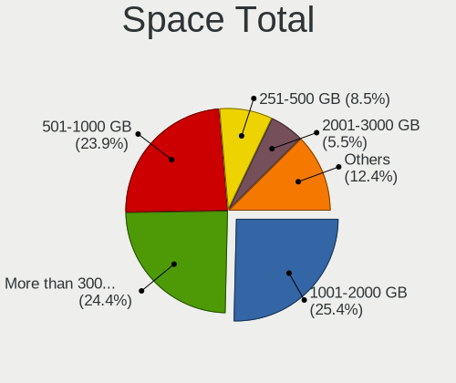
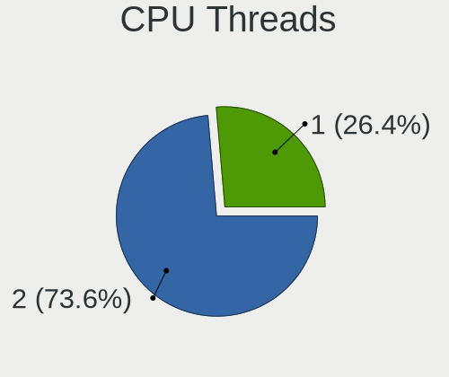
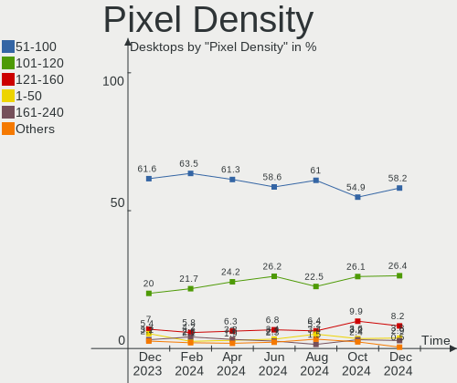
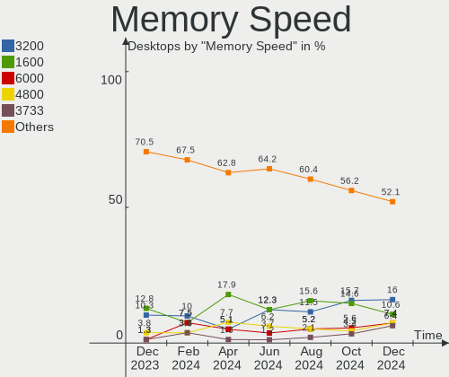

Fedora Hardware Trends (Desktops)
---------------------------------

A project to identify most popular hardware characteristics and track their change
over time based on data collected by Fedora users at https://Linux-Hardware.org.

Anyone can contribute to this report by the [hw-probe](https://github.com/linuxhw/hw-probe) tool:

    sudo -E hw-probe -all -upload

Full-feature report is available here: https://linux-hardware.org/?view=trends&formfactor=desktop

Period: Jul, 2021.

Contents
--------

* [ System ](#system)
  - [ OS                       ](#os)
  - [ OS Family                ](#os-family)
  - [ Kernel                   ](#kernel)
  - [ Kernel Family            ](#kernel-family)
  - [ Kernel Major Ver.        ](#kernel-major-ver)
  - [ Arch                     ](#arch)
  - [ DE                       ](#de)
  - [ Display Server           ](#display-server)
  - [ Display Manager          ](#display-manager)
  - [ OS Lang                  ](#os-lang)
  - [ Boot Mode                ](#boot-mode)
  - [ Filesystem               ](#filesystem)
  - [ Part. scheme             ](#part-scheme)
  - [ Dual Boot with Linux/BSD ](#dual-boot-with-linuxbsd)
  - [ Dual Boot (Win)          ](#dual-boot-win)

* [ Board ](#board)
  - [ Vendor                   ](#vendor)
  - [ Model                    ](#model)
  - [ Model Family             ](#model-family)
  - [ MFG Year                 ](#mfg-year)
  - [ Form Factor              ](#form-factor)
  - [ Secure Boot              ](#secure-boot)
  - [ Coreboot                 ](#coreboot)
  - [ RAM Size                 ](#ram-size)
  - [ RAM Used                 ](#ram-used)
  - [ Total Drives             ](#total-drives)
  - [ Has CD-ROM               ](#has-cd-rom)
  - [ Has Ethernet             ](#has-ethernet)
  - [ Has WiFi                 ](#has-wifi)
  - [ Has Bluetooth            ](#has-bluetooth)

* [ Location ](#location)
  - [ Country                  ](#country)
  - [ City                     ](#city)

* [ Drives ](#drives)
  - [ Drive Vendor             ](#drive-vendor)
  - [ Drive Model              ](#drive-model)
  - [ HDD Vendor               ](#hdd-vendor)
  - [ SSD Vendor               ](#ssd-vendor)
  - [ Drive Kind               ](#drive-kind)
  - [ Drive Connector          ](#drive-connector)
  - [ Drive Size               ](#drive-size)
  - [ Space Total              ](#space-total)
  - [ Space Used               ](#space-used)
  - [ Malfunc. Drives          ](#malfunc-drives)
  - [ Malfunc. Drive Vendor    ](#malfunc-drive-vendor)
  - [ Malfunc. HDD Vendor      ](#malfunc-hdd-vendor)
  - [ Malfunc. Drive Kind      ](#malfunc-drive-kind)
  - [ Failed Drives            ](#failed-drives)
  - [ Failed Drive Vendor      ](#failed-drive-vendor)
  - [ Drive Status             ](#drive-status)

* [ Storage controller ](#storage-controller)
  - [ Storage Vendor           ](#storage-vendor)
  - [ Storage Model            ](#storage-model)
  - [ Storage Kind             ](#storage-kind)

* [ Processor ](#processor)
  - [ CPU Vendor               ](#cpu-vendor)
  - [ CPU Model                ](#cpu-model)
  - [ CPU Model Family         ](#cpu-model-family)
  - [ CPU Cores                ](#cpu-cores)
  - [ CPU Sockets              ](#cpu-sockets)
  - [ CPU Threads              ](#cpu-threads)
  - [ CPU Op-Modes             ](#cpu-op-modes)
  - [ CPU Microcode            ](#cpu-microcode)
  - [ CPU Microarch            ](#cpu-microarch)

* [ Graphics ](#graphics)
  - [ GPU Vendor               ](#gpu-vendor)
  - [ GPU Model                ](#gpu-model)
  - [ GPU Combo                ](#gpu-combo)
  - [ GPU Driver               ](#gpu-driver)
  - [ GPU Memory               ](#gpu-memory)

* [ Monitor ](#monitor)
  - [ Monitor Vendor           ](#monitor-vendor)
  - [ Monitor Model            ](#monitor-model)
  - [ Monitor Resolution       ](#monitor-resolution)
  - [ Monitor Diagonal         ](#monitor-diagonal)
  - [ Monitor Width            ](#monitor-width)
  - [ Aspect Ratio             ](#aspect-ratio)
  - [ Monitor Area             ](#monitor-area)
  - [ Pixel Density            ](#pixel-density)
  - [ Multiple Monitors        ](#multiple-monitors)

* [ Network ](#network)
  - [ Net Controller Vendor    ](#net-controller-vendor)
  - [ Net Controller Model     ](#net-controller-model)
  - [ Wireless Vendor          ](#wireless-vendor)
  - [ Wireless Model           ](#wireless-model)
  - [ Ethernet Vendor          ](#ethernet-vendor)
  - [ Ethernet Model           ](#ethernet-model)
  - [ Net Controller Kind      ](#net-controller-kind)
  - [ Used Controller          ](#used-controller)
  - [ NICs                     ](#nics)
  - [ IPv6                     ](#ipv6)

* [ Bluetooth ](#bluetooth)
  - [ Bluetooth Vendor         ](#bluetooth-vendor)
  - [ Bluetooth Model          ](#bluetooth-model)

* [ Sound ](#sound)
  - [ Sound Vendor             ](#sound-vendor)
  - [ Sound Model              ](#sound-model)

* [ Memory ](#memory)
  - [ Memory Vendor            ](#memory-vendor)
  - [ Memory Model             ](#memory-model)
  - [ Memory Kind              ](#memory-kind)
  - [ Memory Form Factor       ](#memory-form-factor)
  - [ Memory Size              ](#memory-size)
  - [ Memory Speed             ](#memory-speed)

* [ Printers & scanners ](#printers--scanners)
  - [ Printer Vendor           ](#printer-vendor)
  - [ Printer Model            ](#printer-model)
  - [ Scanner Vendor           ](#scanner-vendor)
  - [ Scanner Model            ](#scanner-model)

* [ Camera ](#camera)
  - [ Camera Vendor            ](#camera-vendor)
  - [ Camera Model             ](#camera-model)

* [ Security ](#security)
  - [ Fingerprint Vendor       ](#fingerprint-vendor)
  - [ Fingerprint Model        ](#fingerprint-model)
  - [ Chipcard Vendor          ](#chipcard-vendor)
  - [ Chipcard Model           ](#chipcard-model)

* [ Unsupported ](#unsupported)
  - [ Unsupported Devices      ](#unsupported-devices)
  - [ Unsupported Device Types ](#unsupported-device-types)

System
------

OS
--

Installed operating systems

| Name      | Desktops | Percent |
|-----------|----------|---------|
| Fedora 34 | 87       | 86.14%  |
| Fedora 33 | 8        | 7.92%   |
| Fedora 35 | 2        | 1.98%   |
| Fedora 32 | 2        | 1.98%   |
| Fedora 31 | 2        | 1.98%   |

OS Family
---------

OS without a version

| Name   | Desktops | Percent |
|--------|----------|---------|
| Fedora | 101      | 100%    |

Kernel
------

Version of the Linux kernel

| Version                                             | Desktops | Percent |
|-----------------------------------------------------|----------|---------|
| 5.12.13-300.fc34.x86_64                             | 30       | 29.7%   |
| 5.12.15-300.fc34.x86_64                             | 16       | 15.84%  |
| 5.12.14-300.fc34.x86_64                             | 14       | 13.86%  |
| 5.13.4-200.fc34.x86_64                              | 11       | 10.89%  |
| 5.13.1-300.fc34.x86_64                              | 3        | 2.97%   |
| 5.12.17-300.fc34.x86_64                             | 3        | 2.97%   |
| 5.12.12-300.fc34.x86_64                             | 3        | 2.97%   |
| 5.13.5-200.fc34.x86_64                              | 2        | 1.98%   |
| 5.13.4-100.fc33.x86_64                              | 2        | 1.98%   |
| 5.12.15-200.fc33.x86_64                             | 2        | 1.98%   |
| 5.12.13-200.fc33.x86_64                             | 2        | 1.98%   |
| 5.11.22-100.fc32.x86_64                             | 2        | 1.98%   |
| 5.11.12-300.fc34.x86_64                             | 2        | 1.98%   |
| 5.8.18-100.fc31.x86_64                              | 1        | 0.99%   |
| 5.3.7-301.fc31.x86_64                               | 1        | 0.99%   |
| 5.13.6-200.fc34.x86_64                              | 1        | 0.99%   |
| 5.13.0-xm1.1.fc34.x86_64                            | 1        | 0.99%   |
| 5.13.0-58.fc35.x86_64                               | 1        | 0.99%   |
| 5.13.0-0.rc7.20210623git0c18f29aae7c.53.fc35.x86_64 | 1        | 0.99%   |
| 5.12.8-300.fc34.x86_64                              | 1        | 0.99%   |
| 5.11.11-200.fc33.x86_64                             | 1        | 0.99%   |
| 5.10.47-1.fc32.qubes.x86_64                         | 1        | 0.99%   |

Kernel Family
-------------

Linux kernel without a distro release

| Version | Desktops | Percent |
|---------|----------|---------|
| 5.12.13 | 32       | 31.68%  |
| 5.12.15 | 18       | 17.82%  |
| 5.12.14 | 14       | 13.86%  |
| 5.13.4  | 13       | 12.87%  |
| 5.13.1  | 3        | 2.97%   |
| 5.13.0  | 3        | 2.97%   |
| 5.12.17 | 3        | 2.97%   |
| 5.12.12 | 3        | 2.97%   |
| 5.13.5  | 2        | 1.98%   |
| 5.11.22 | 2        | 1.98%   |
| 5.11.12 | 2        | 1.98%   |
| 5.8.18  | 1        | 0.99%   |
| 5.3.7   | 1        | 0.99%   |
| 5.13.6  | 1        | 0.99%   |
| 5.12.8  | 1        | 0.99%   |
| 5.11.11 | 1        | 0.99%   |
| 5.10.47 | 1        | 0.99%   |

Kernel Major Ver.
-----------------

Linux kernel major version

| Version | Desktops | Percent |
|---------|----------|---------|
| 5.12    | 71       | 70.3%   |
| 5.13    | 22       | 21.78%  |
| 5.11    | 5        | 4.95%   |
| 5.8     | 1        | 0.99%   |
| 5.3     | 1        | 0.99%   |
| 5.10    | 1        | 0.99%   |

Arch
----

OS architecture (x86_64, i586, etc.)

| Name   | Desktops | Percent |
|--------|----------|---------|
| x86_64 | 101      | 100%    |

DE
--

Desktop Environment

| Name          | Desktops | Percent |
|---------------|----------|---------|
| GNOME         | 66       | 65.35%  |
| Unknown       | 9        | 8.91%   |
| KDE           | 8        | 7.92%   |
| KDE5          | 7        | 6.93%   |
| Cinnamon      | 4        | 3.96%   |
| X-Cinnamon    | 2        | 1.98%   |
| GNOME Classic | 2        | 1.98%   |
| MATE          | 1        | 0.99%   |
| i3            | 1        | 0.99%   |
| Deepin        | 1        | 0.99%   |

Display Server
--------------

X11 or Wayland

| Name    | Desktops | Percent |
|---------|----------|---------|
| X11     | 50       | 49.5%   |
| Wayland | 43       | 42.57%  |
| Tty     | 6        | 5.94%   |
| Unknown | 2        | 1.98%   |

Display Manager
---------------

SDDM, LightDM, etc.

| Name    | Desktops | Percent |
|---------|----------|---------|
| Unknown | 60       | 59.41%  |
| GDM     | 30       | 29.7%   |
| SDDM    | 5        | 4.95%   |
| LightDM | 4        | 3.96%   |
| TDM     | 1        | 0.99%   |
| KDM     | 1        | 0.99%   |

OS Lang
-------

Language

| Lang    | Desktops | Percent |
|---------|----------|---------|
| en_US   | 48       | 47.52%  |
| en_AU   | 9        | 8.91%   |
| ru_RU   | 6        | 5.94%   |
| pt_BR   | 6        | 5.94%   |
| en_GB   | 6        | 5.94%   |
| fr_FR   | 5        | 4.95%   |
| de_DE   | 3        | 2.97%   |
| en_SG   | 2        | 1.98%   |
| en_CA   | 2        | 1.98%   |
| sk_SK   | 1        | 0.99%   |
| ru_UA   | 1        | 0.99%   |
| pl_PL   | 1        | 0.99%   |
| nl_BE   | 1        | 0.99%   |
| ja_JP   | 1        | 0.99%   |
| it_IT   | 1        | 0.99%   |
| es_MX   | 1        | 0.99%   |
| es_ES   | 1        | 0.99%   |
| es_EC   | 1        | 0.99%   |
| en_ZA   | 1        | 0.99%   |
| en_NZ   | 1        | 0.99%   |
| da_DK   | 1        | 0.99%   |
| C       | 1        | 0.99%   |
| Unknown | 1        | 0.99%   |

Boot Mode
---------

EFI or BIOS

| Mode | Desktops | Percent |
|------|----------|---------|
| EFI  | 58       | 57.43%  |
| BIOS | 43       | 42.57%  |

Filesystem
----------

Type of filesystem

| Type  | Desktops | Percent |
|-------|----------|---------|
| Btrfs | 58       | 57.43%  |
| Ext4  | 35       | 34.65%  |
| Xfs   | 8        | 7.92%   |

Part. scheme
------------

Scheme of partitioning

| Type    | Desktops | Percent |
|---------|----------|---------|
| Unknown | 51       | 50.5%   |
| GPT     | 37       | 36.63%  |
| MBR     | 13       | 12.87%  |

Dual Boot with Linux/BSD
------------------------

Hosting more than one Linux/BSD

| Dual boot | Desktops | Percent |
|-----------|----------|---------|
| No        | 88       | 87.13%  |
| Yes       | 13       | 12.87%  |

Dual Boot (Win)
---------------

Hosting Linux and Windows

| Dual boot | Desktops | Percent |
|-----------|----------|---------|
| No        | 82       | 81.19%  |
| Yes       | 19       | 18.81%  |

Board
-----

Vendor
------

Motherboard manufacturer

| Name                | Desktops | Percent |
|---------------------|----------|---------|
| ASUSTek Computer    | 28       | 27.72%  |
| Gigabyte Technology | 22       | 21.78%  |
| ASRock              | 11       | 10.89%  |
| MSI                 | 10       | 9.9%    |
| Dell                | 7        | 6.93%   |
| Hewlett-Packard     | 6        | 5.94%   |
| Lenovo              | 2        | 1.98%   |
| Fujitsu             | 2        | 1.98%   |
| EVGA                | 2        | 1.98%   |
| Acer                | 2        | 1.98%   |
| Unknown             | 2        | 1.98%   |
| SYWZ                | 1        | 0.99%   |
| Intel               | 1        | 0.99%   |
| Google              | 1        | 0.99%   |
| Chuwi               | 1        | 0.99%   |
| Biostar             | 1        | 0.99%   |
| AMD                 | 1        | 0.99%   |
| Alienware           | 1        | 0.99%   |

Model
-----

Motherboard model

| Name                                     | Desktops | Percent |
|------------------------------------------|----------|---------|
| ASUS All Series                          | 4        | 3.96%   |
| MSI MS-7C37                              | 2        | 1.98%   |
| Dell OptiPlex 9020                       | 2        | 1.98%   |
| ASUS TUF GAMING B550-PLUS                | 2        | 1.98%   |
| ASUS ROG STRIX X570-F GAMING             | 2        | 1.98%   |
| ASUS ROG STRIX X570-E GAMING             | 2        | 1.98%   |
| Unknown                                  | 2        | 1.98%   |
| SYWZ S200 Series                         | 1        | 0.99%   |
| MSI MS-7C36                              | 1        | 0.99%   |
| MSI MS-7C02                              | 1        | 0.99%   |
| MSI MS-7B98                              | 1        | 0.99%   |
| MSI MS-7B89                              | 1        | 0.99%   |
| MSI MS-7A38                              | 1        | 0.99%   |
| MSI MS-7996                              | 1        | 0.99%   |
| MSI MPG H410 Trident 3 (MS-B932)         | 1        | 0.99%   |
| MSI Cubi N 8GL (MS-B171)                 | 1        | 0.99%   |
| Lenovo ThinkCentre M82 27423K1           | 1        | 0.99%   |
| Lenovo Legion T5 26AMR5 90RB000EUS       | 1        | 0.99%   |
| Intel H81                                | 1        | 0.99%   |
| HP EliteDesk 805 G6 Small Form Factor PC | 1        | 0.99%   |
| HP EliteDesk 800 G4 SFF                  | 1        | 0.99%   |
| HP EliteDesk 800 G2 DM 65W               | 1        | 0.99%   |
| HP Compaq 8000 Elite SFF PC              | 1        | 0.99%   |
| HP Compaq 6200 Pro SFF PC                | 1        | 0.99%   |
| HP 500-219cx                             | 1        | 0.99%   |
| Google Panther                           | 1        | 0.99%   |
| Gigabyte Z270-Gaming K3                  | 1        | 0.99%   |
| Gigabyte X570 AORUS PRO WIFI             | 1        | 0.99%   |
| Gigabyte X570 AORUS ELITE WIFI           | 1        | 0.99%   |
| Gigabyte X470 AORUS ULTRA GAMING         | 1        | 0.99%   |
| Gigabyte Q87M-D2H                        | 1        | 0.99%   |
| Gigabyte P31-ES3G                        | 1        | 0.99%   |
| Gigabyte M61PME-S2P                      | 1        | 0.99%   |
| Gigabyte H97M-DS3P                       | 1        | 0.99%   |
| Gigabyte H61N-USB3                       | 1        | 0.99%   |
| Gigabyte GA-MA785G-UD3H                  | 1        | 0.99%   |
| Gigabyte GA-MA780G-UD3H                  | 1        | 0.99%   |
| Gigabyte GA-990FXA-UD3                   | 1        | 0.99%   |
| Gigabyte GA-890GPA-UD3H                  | 1        | 0.99%   |
| Gigabyte G41MT-D3                        | 1        | 0.99%   |
| Gigabyte G41M-Combo                      | 1        | 0.99%   |
| Gigabyte G33M-DS2R                       | 1        | 0.99%   |
| Gigabyte F2A78M-HD2                      | 1        | 0.99%   |
| Gigabyte EP45-DS3L                       | 1        | 0.99%   |
| Gigabyte B560M AORUS PRO AX              | 1        | 0.99%   |
| Gigabyte B550 AORUS ELITE                | 1        | 0.99%   |
| Gigabyte B450 AORUS M                    | 1        | 0.99%   |
| Gigabyte B450 AORUS ELITE                | 1        | 0.99%   |
| Fujitsu ESPRIMO P500                     | 1        | 0.99%   |
| Fujitsu ESPRIMO P410                     | 1        | 0.99%   |
| EVGA 140-SS-E177                         | 1        | 0.99%   |
| EVGA 111-KS-E272                         | 1        | 0.99%   |
| Dell XPS 8930                            | 1        | 0.99%   |
| Dell OptiPlex 3050                       | 1        | 0.99%   |
| Dell OptiPlex 3020M                      | 1        | 0.99%   |
| Dell Inspiron 580                        | 1        | 0.99%   |
| Dell Inspiron 3847                       | 1        | 0.99%   |
| Chuwi LarkBox Pro                        | 1        | 0.99%   |
| Biostar X370GTN                          | 1        | 0.99%   |
| ASUS Z170-A                              | 1        | 0.99%   |

Model Family
------------

Motherboard model prefix

| Name                    | Desktops | Percent |
|-------------------------|----------|---------|
| ASUS ROG                | 6        | 5.94%   |
| Dell OptiPlex           | 4        | 3.96%   |
| ASUS All                | 4        | 3.96%   |
| HP EliteDesk            | 3        | 2.97%   |
| ASUS TUF                | 3        | 2.97%   |
| MSI MS-7C37             | 2        | 1.98%   |
| HP Compaq               | 2        | 1.98%   |
| Gigabyte X570           | 2        | 1.98%   |
| Gigabyte B450           | 2        | 1.98%   |
| Fujitsu ESPRIMO         | 2        | 1.98%   |
| Dell Inspiron           | 2        | 1.98%   |
| ASUS PRIME              | 2        | 1.98%   |
| ASRock X399             | 2        | 1.98%   |
| Acer Aspire             | 2        | 1.98%   |
| Unknown                 | 2        | 1.98%   |
| SYWZ S200               | 1        | 0.99%   |
| MSI MS-7C36             | 1        | 0.99%   |
| MSI MS-7C02             | 1        | 0.99%   |
| MSI MS-7B98             | 1        | 0.99%   |
| MSI MS-7B89             | 1        | 0.99%   |
| MSI MS-7A38             | 1        | 0.99%   |
| MSI MS-7996             | 1        | 0.99%   |
| MSI MPG                 | 1        | 0.99%   |
| MSI Cubi                | 1        | 0.99%   |
| Lenovo ThinkCentre      | 1        | 0.99%   |
| Lenovo Legion           | 1        | 0.99%   |
| Intel H81               | 1        | 0.99%   |
| HP 500-219cx            | 1        | 0.99%   |
| Google Panther          | 1        | 0.99%   |
| Gigabyte Z270-Gaming    | 1        | 0.99%   |
| Gigabyte X470           | 1        | 0.99%   |
| Gigabyte Q87M-D2H       | 1        | 0.99%   |
| Gigabyte P31-ES3G       | 1        | 0.99%   |
| Gigabyte M61PME-S2P     | 1        | 0.99%   |
| Gigabyte H97M-DS3P      | 1        | 0.99%   |
| Gigabyte H61N-USB3      | 1        | 0.99%   |
| Gigabyte GA-MA785G-UD3H | 1        | 0.99%   |
| Gigabyte GA-MA780G-UD3H | 1        | 0.99%   |
| Gigabyte GA-990FXA-UD3  | 1        | 0.99%   |
| Gigabyte GA-890GPA-UD3H | 1        | 0.99%   |
| Gigabyte G41MT-D3       | 1        | 0.99%   |
| Gigabyte G41M-Combo     | 1        | 0.99%   |
| Gigabyte G33M-DS2R      | 1        | 0.99%   |
| Gigabyte F2A78M-HD2     | 1        | 0.99%   |
| Gigabyte EP45-DS3L      | 1        | 0.99%   |
| Gigabyte B560M          | 1        | 0.99%   |
| Gigabyte B550           | 1        | 0.99%   |
| EVGA 140-SS-E177        | 1        | 0.99%   |
| EVGA 111-KS-E272        | 1        | 0.99%   |
| Dell XPS                | 1        | 0.99%   |
| Chuwi LarkBox           | 1        | 0.99%   |
| Biostar X370GTN         | 1        | 0.99%   |
| ASUS Z170-A             | 1        | 0.99%   |
| ASUS P8Z77-V            | 1        | 0.99%   |
| ASUS P8B75-M            | 1        | 0.99%   |
| ASUS P6X58D             | 1        | 0.99%   |
| ASUS P5LD2              | 1        | 0.99%   |
| ASUS Maximus            | 1        | 0.99%   |
| ASUS M5A97              | 1        | 0.99%   |
| ASUS M5A78L-M           | 1        | 0.99%   |

MFG Year
--------

Motherboard manufacture year

| Year    | Desktops | Percent |
|---------|----------|---------|
| 2020    | 17       | 16.83%  |
| 2019    | 15       | 14.85%  |
| 2021    | 14       | 13.86%  |
| 2018    | 9        | 8.91%   |
| 2015    | 8        | 7.92%   |
| 2014    | 7        | 6.93%   |
| 2010    | 6        | 5.94%   |
| 2013    | 4        | 3.96%   |
| 2012    | 4        | 3.96%   |
| 2017    | 3        | 2.97%   |
| 2016    | 3        | 2.97%   |
| 2011    | 3        | 2.97%   |
| 2009    | 3        | 2.97%   |
| 2008    | 2        | 1.98%   |
| 2007    | 1        | 0.99%   |
| 2006    | 1        | 0.99%   |
| Unknown | 1        | 0.99%   |

Form Factor
-----------

Physical design of the computer

| Name    | Desktops | Percent |
|---------|----------|---------|
| Desktop | 101      | 100%    |

Secure Boot
-----------

Enabled or disabled

| State    | Desktops | Percent |
|----------|----------|---------|
| Disabled | 97       | 96.04%  |
| Enabled  | 4        | 3.96%   |

Coreboot
--------

Have coreboot on board

| Used | Desktops | Percent |
|------|----------|---------|
| No   | 100      | 99.01%  |
| Yes  | 1        | 0.99%   |

RAM Size
--------

Total RAM memory

| Size in GB  | Desktops | Percent |
|-------------|----------|---------|
| 32.01-64.0  | 27       | 26.73%  |
| 8.01-16.0   | 21       | 20.79%  |
| 16.01-24.0  | 20       | 19.8%   |
| 4.01-8.0    | 12       | 11.88%  |
| 64.01-256.0 | 9        | 8.91%   |
| 3.01-4.0    | 7        | 6.93%   |
| 2.01-3.0    | 2        | 1.98%   |
| 1.01-2.0    | 2        | 1.98%   |
| 24.01-32.0  | 1        | 0.99%   |

RAM Used
--------

Used RAM memory

| Used GB    | Desktops | Percent |
|------------|----------|---------|
| 4.01-8.0   | 29       | 28.71%  |
| 2.01-3.0   | 23       | 22.77%  |
| 3.01-4.0   | 16       | 15.84%  |
| 1.01-2.0   | 14       | 13.86%  |
| 8.01-16.0  | 7        | 6.93%   |
| 0.51-1.0   | 7        | 6.93%   |
| 16.01-24.0 | 2        | 1.98%   |
| 0.01-0.5   | 2        | 1.98%   |
| 32.01-64.0 | 1        | 0.99%   |

Total Drives
------------

Number of drives on board

| Drives | Desktops | Percent |
|--------|----------|---------|
| 1      | 27       | 26.73%  |
| 2      | 25       | 24.75%  |
| 3      | 24       | 23.76%  |
| 4      | 15       | 14.85%  |
| 6      | 4        | 3.96%   |
| 5      | 3        | 2.97%   |
| 8      | 1        | 0.99%   |
| 7      | 1        | 0.99%   |
| 0      | 1        | 0.99%   |

Has CD-ROM
----------

Has CD-ROM on board

| Presented | Desktops | Percent |
|-----------|----------|---------|
| No        | 65       | 64.36%  |
| Yes       | 36       | 35.64%  |

Has Ethernet
------------

Has Ethernet on board

| Presented | Desktops | Percent |
|-----------|----------|---------|
| Yes       | 98       | 97.03%  |
| No        | 3        | 2.97%   |

Has WiFi
--------

Has WiFi module

| Presented | Desktops | Percent |
|-----------|----------|---------|
| No        | 51       | 50.5%   |
| Yes       | 50       | 49.5%   |

Has Bluetooth
-------------

Has Bluetooth module

| Presented | Desktops | Percent |
|-----------|----------|---------|
| No        | 60       | 59.41%  |
| Yes       | 41       | 40.59%  |

Location
--------

Country
-------

Geographic location (country)

| Country      | Desktops | Percent |
|--------------|----------|---------|
| USA          | 27       | 26.73%  |
| Australia    | 9        | 8.91%   |
| Brazil       | 7        | 6.93%   |
| Germany      | 6        | 5.94%   |
| Russia       | 5        | 4.95%   |
| France       | 4        | 3.96%   |
| Switzerland  | 3        | 2.97%   |
| Canada       | 3        | 2.97%   |
| Belgium      | 3        | 2.97%   |
| Ukraine      | 2        | 1.98%   |
| UK           | 2        | 1.98%   |
| Sweden       | 2        | 1.98%   |
| Norway       | 2        | 1.98%   |
| Mexico       | 2        | 1.98%   |
| Malaysia     | 2        | 1.98%   |
| UAE          | 1        | 0.99%   |
| Turkey       | 1        | 0.99%   |
| Spain        | 1        | 0.99%   |
| South Africa | 1        | 0.99%   |
| Slovakia     | 1        | 0.99%   |
| Poland       | 1        | 0.99%   |
| Pakistan     | 1        | 0.99%   |
| New Zealand  | 1        | 0.99%   |
| Netherlands  | 1        | 0.99%   |
| Martinique   | 1        | 0.99%   |
| Kuwait       | 1        | 0.99%   |
| Japan        | 1        | 0.99%   |
| Italy        | 1        | 0.99%   |
| Iran         | 1        | 0.99%   |
| India        | 1        | 0.99%   |
| Hungary      | 1        | 0.99%   |
| Estonia      | 1        | 0.99%   |
| Ecuador      | 1        | 0.99%   |
| Denmark      | 1        | 0.99%   |
| Czechia      | 1        | 0.99%   |
| Belarus      | 1        | 0.99%   |
| Austria      | 1        | 0.99%   |

City
----

Geographic location (city)

| City                | Desktops | Percent |
|---------------------|----------|---------|
| Sydney              | 8        | 7.92%   |
| Riverside           | 3        | 2.97%   |
| Zurich              | 2        | 1.98%   |
| Overland Park       | 2        | 1.98%   |
| Kota Kinabalu       | 2        | 1.98%   |
| Zuidwolde           | 1        | 0.99%   |
| Zhukovskiy          | 1        | 0.99%   |
| Winnipeg            | 1        | 0.99%   |
| Waterloo            | 1        | 0.99%   |
| Wallingford         | 1        | 0.99%   |
| Ufa                 | 1        | 0.99%   |
| Tallinn             | 1        | 0.99%   |
| São Paulo          | 1        | 0.99%   |
| St Petersburg       | 1        | 0.99%   |
| Spanga              | 1        | 0.99%   |
| Santa Ana           | 1        | 0.99%   |
| Sant'Elpidio a Mare | 1        | 0.99%   |
| San Diego           | 1        | 0.99%   |
| Saitama             | 1        | 0.99%   |
| Saint Paul          | 1        | 0.99%   |
| Reutov              | 1        | 0.99%   |
| Remilly             | 1        | 0.99%   |
| Raleigh             | 1        | 0.99%   |
| Prague              | 1        | 0.99%   |
| Pflugerville        | 1        | 0.99%   |
| Palmas              | 1        | 0.99%   |
| Oslo                | 1        | 0.99%   |
| Orlando             | 1        | 0.99%   |
| Oetingen            | 1        | 0.99%   |
| Newport             | 1        | 0.99%   |
| New York            | 1        | 0.99%   |
| Munich              | 1        | 0.99%   |
| Monterrey           | 1        | 0.99%   |
| Minsk               | 1        | 0.99%   |
| Miami               | 1        | 0.99%   |
| Maidenhead          | 1        | 0.99%   |
| Lyon                | 1        | 0.99%   |
| Luhansk             | 1        | 0.99%   |
| Lugano              | 1        | 0.99%   |
| Lebanon             | 1        | 0.99%   |
| Kitchener           | 1        | 0.99%   |
| Khondāb            | 1        | 0.99%   |
| Kharkiv             | 1        | 0.99%   |
| Kew                 | 1        | 0.99%   |
| Kastrup             | 1        | 0.99%   |
| Karachi             | 1        | 0.99%   |
| Januaria            | 1        | 0.99%   |
| Jambes              | 1        | 0.99%   |
| Istanbul            | 1        | 0.99%   |
| Indaiatuba          | 1        | 0.99%   |
| Houston             | 1        | 0.99%   |
| Honolulu            | 1        | 0.99%   |
| Hohenau             | 1        | 0.99%   |
| Hoeviksnaes         | 1        | 0.99%   |
| Hodmezovasarhely    | 1        | 0.99%   |
| Heilbronn           | 1        | 0.99%   |
| Hawalli             | 1        | 0.99%   |
| Guayaquil           | 1        | 0.99%   |
| Guadalajara         | 1        | 0.99%   |
| Graz                | 1        | 0.99%   |

Drives
------

Drive Vendor
------------

Hard drive vendors

| Vendor              | Desktops | Drives | Percent |
|---------------------|----------|--------|---------|
| WDC                 | 38       | 49     | 18.36%  |
| Seagate             | 36       | 53     | 17.39%  |
| Samsung Electronics | 35       | 56     | 16.91%  |
| Crucial             | 15       | 18     | 7.25%   |
| SanDisk             | 9        | 9      | 4.35%   |
| Toshiba             | 8        | 9      | 3.86%   |
| Kingston            | 8        | 10     | 3.86%   |
| Micron Technology   | 5        | 5      | 2.42%   |
| Hitachi             | 5        | 5      | 2.42%   |
| SK Hynix            | 4        | 4      | 1.93%   |
| PNY                 | 4        | 5      | 1.93%   |
| Phison              | 4        | 4      | 1.93%   |
| Intel               | 4        | 4      | 1.93%   |
| Gigabyte Technology | 3        | 3      | 1.45%   |
| Corsair             | 3        | 3      | 1.45%   |
| Unknown             | 2        | 2      | 0.97%   |
| HGST                | 2        | 2      | 0.97%   |
| A-DATA Technology   | 2        | 2      | 0.97%   |
| XPG                 | 1        | 1      | 0.48%   |
| Verbatim            | 1        | 1      | 0.48%   |
| USB 3.0             | 1        | 1      | 0.48%   |
| Union Memory        | 1        | 1      | 0.48%   |
| Team                | 1        | 1      | 0.48%   |
| SPCC                | 1        | 1      | 0.48%   |
| Phison Electronics  | 1        | 1      | 0.48%   |
| OWC                 | 1        | 1      | 0.48%   |
| Maxtor              | 1        | 1      | 0.48%   |
| LITEONIT            | 1        | 1      | 0.48%   |
| KLEVV               | 1        | 1      | 0.48%   |
| KingSpec            | 1        | 1      | 0.48%   |
| Intenso             | 1        | 1      | 0.48%   |
| Inateck             | 1        | 1      | 0.48%   |
| HS-SSD-E100         | 1        | 1      | 0.48%   |
| Hoodisk             | 1        | 1      | 0.48%   |
| Hewlett-Packard     | 1        | 1      | 0.48%   |
| DOGFISH             | 1        | 1      | 0.48%   |
| CT1000P1            | 1        | 1      | 0.48%   |
| China               | 1        | 1      | 0.48%   |

Drive Model
-----------

Hard drive models

| Model                            | Desktops | Percent |
|----------------------------------|----------|---------|
| Seagate ST2000DM008-2FR102 2TB   | 5        | 2.05%   |
| Seagate ST500DM002-1BD142 500GB  | 4        | 1.64%   |
| Samsung SSD 860 EVO 1TB          | 4        | 1.64%   |
| Samsung SSD 850 EVO 250GB        | 4        | 1.64%   |
| Samsung SSD 850 EVO 500GB        | 3        | 1.23%   |
| Samsung SSD 840 EVO 250GB        | 3        | 1.23%   |
| Samsung HD501LJ 500GB            | 3        | 1.23%   |
| Crucial CT500MX500SSD1 500GB     | 3        | 1.23%   |
| WDC WD40EZRZ-00GXCB0 4TB         | 2        | 0.82%   |
| WDC WD20EZRZ-00Z5HB0 2TB         | 2        | 0.82%   |
| WDC WD10EZEX-08M2NA0 1TB         | 2        | 0.82%   |
| SK Hynix NVMe SSD Drive 1TB      | 2        | 0.82%   |
| Seagate ST4000DM004-2CV104 4TB   | 2        | 0.82%   |
| Seagate ST3500630AS 500GB        | 2        | 0.82%   |
| Seagate ST3500418AS 500GB        | 2        | 0.82%   |
| Seagate ST3160812AS 160GB        | 2        | 0.82%   |
| Sandisk NVMe SSD Drive 500GB     | 2        | 0.82%   |
| Samsung SSD 860 EVO 500GB        | 2        | 0.82%   |
| Samsung SSD 860 EVO 250GB        | 2        | 0.82%   |
| Samsung SSD 850 PRO 1TB          | 2        | 0.82%   |
| Samsung SSD 840 EVO 120GB        | 2        | 0.82%   |
| Samsung NVMe SSD Drive 500GB     | 2        | 0.82%   |
| Samsung NVMe SSD Drive 1TB       | 2        | 0.82%   |
| Samsung HD502HI 500GB            | 2        | 0.82%   |
| PNY CS900 240GB SSD              | 2        | 0.82%   |
| Kingston SA400S37480G 480GB SSD  | 2        | 0.82%   |
| Intel SSDSC2CT120A3 120GB        | 2        | 0.82%   |
| Gigabyte GP-GSTFS31480GNTD 480GB | 2        | 0.82%   |
| Crucial CT250MX500SSD1 250GB     | 2        | 0.82%   |
| Crucial CT1000BX500SSD1 1TB      | 2        | 0.82%   |
| A-DATA SU650 120GB SSD           | 2        | 0.82%   |
| XPG NVMe SSD Drive 512GB         | 1        | 0.41%   |
| WDC WDS500G2B0B-00YS70 500GB SSD | 1        | 0.41%   |
| WDC WDS500G2B0A-00SM50 500GB SSD | 1        | 0.41%   |
| WDC WDS480G2G0B-00EPW0 480GB SSD | 1        | 0.41%   |
| WDC WDS200T2G0A-00JH30 2TB SSD   | 1        | 0.41%   |
| WDC WDS200T2B0A-00SM50 2TB SSD   | 1        | 0.41%   |
| WDC WDS100T2B0C-00PXH0 1TB       | 1        | 0.41%   |
| WDC WD60EFAX-68SHWN0 6TB         | 1        | 0.41%   |
| WDC WD5000LPVX-75V0TT0 500GB     | 1        | 0.41%   |
| WDC WD5000AAKX-001CA0 500GB      | 1        | 0.41%   |
| WDC WD5000AAKS-22V1A0 500GB      | 1        | 0.41%   |
| WDC WD40PURZ-85TTDY0 4TB         | 1        | 0.41%   |
| WDC WD40 EFRX-68N32N0 4TB        | 1        | 0.41%   |
| WDC WD3200AAKS-75L9A0 320GB      | 1        | 0.41%   |
| WDC WD3200AAKS-00L9A0 320GB      | 1        | 0.41%   |
| WDC WD3200AAKS-00B3A0 320GB      | 1        | 0.41%   |
| WDC WD3200AAJS-00RYA0 320GB      | 1        | 0.41%   |
| WDC WD30EZRX-00MMMB0 3TB         | 1        | 0.41%   |
| WDC WD2500AAKS-00F0A0 250GB      | 1        | 0.41%   |
| WDC WD20EZRX-00D8PB0 2TB         | 1        | 0.41%   |
| WDC WD20EFRX-68AX9N0 2TB         | 1        | 0.41%   |
| WDC WD2003FYPS-27Y2B0 2TB        | 1        | 0.41%   |
| WDC WD1600AABS-00PRA0 160GB      | 1        | 0.41%   |
| WDC WD120EMFZ-11A6JA0 12TB       | 1        | 0.41%   |
| WDC WD10SPZX-21Z10T0 1TB         | 1        | 0.41%   |
| WDC WD10JPLX-00MBPT0 1TB         | 1        | 0.41%   |
| WDC WD10EZRZ-00HTKB0 1TB         | 1        | 0.41%   |
| WDC WD10EZRX-00L4HB0 1TB         | 1        | 0.41%   |
| WDC WD10EZEX-75WN4A0 1TB         | 1        | 0.41%   |

HDD Vendor
----------

Hard disk drive vendors

| Vendor              | Desktops | Drives | Percent |
|---------------------|----------|--------|---------|
| Seagate             | 36       | 52     | 40%     |
| WDC                 | 31       | 40     | 34.44%  |
| Toshiba             | 7        | 8      | 7.78%   |
| Samsung Electronics | 7        | 8      | 7.78%   |
| Hitachi             | 5        | 5      | 5.56%   |
| HGST                | 2        | 2      | 2.22%   |
| Inateck             | 1        | 1      | 1.11%   |
| Hewlett-Packard     | 1        | 1      | 1.11%   |

SSD Vendor
----------

Solid state drive vendors

| Vendor              | Desktops | Drives | Percent |
|---------------------|----------|--------|---------|
| Samsung Electronics | 26       | 38     | 31.33%  |
| Crucial             | 13       | 16     | 15.66%  |
| Kingston            | 6        | 7      | 7.23%   |
| WDC                 | 5        | 6      | 6.02%   |
| Micron Technology   | 5        | 5      | 6.02%   |
| SanDisk             | 4        | 4      | 4.82%   |
| PNY                 | 4        | 5      | 4.82%   |
| SK Hynix            | 2        | 2      | 2.41%   |
| Intel               | 2        | 2      | 2.41%   |
| Gigabyte Technology | 2        | 2      | 2.41%   |
| A-DATA Technology   | 2        | 2      | 2.41%   |
| Verbatim            | 1        | 1      | 1.2%    |
| Team                | 1        | 1      | 1.2%    |
| OWC                 | 1        | 1      | 1.2%    |
| Maxtor              | 1        | 1      | 1.2%    |
| LITEONIT            | 1        | 1      | 1.2%    |
| KLEVV               | 1        | 1      | 1.2%    |
| KingSpec            | 1        | 1      | 1.2%    |
| Intenso             | 1        | 1      | 1.2%    |
| Hoodisk             | 1        | 1      | 1.2%    |
| DOGFISH             | 1        | 1      | 1.2%    |
| CT1000P1            | 1        | 1      | 1.2%    |
| China               | 1        | 1      | 1.2%    |

Drive Kind
----------

HDD or SSD

| Kind    | Desktops | Drives | Percent |
|---------|----------|--------|---------|
| SSD     | 67       | 101    | 39.64%  |
| HDD     | 67       | 117    | 39.64%  |
| NVMe    | 30       | 40     | 17.75%  |
| Unknown | 4        | 4      | 2.37%   |
| MMC     | 1        | 1      | 0.59%   |

Drive Connector
---------------

SATA, SAS, NVMe, etc.

| Type | Desktops | Drives | Percent |
|------|----------|--------|---------|
| SATA | 95       | 208    | 69.34%  |
| NVMe | 30       | 40     | 21.9%   |
| SAS  | 11       | 14     | 8.03%   |
| MMC  | 1        | 1      | 0.73%   |

Drive Size
----------

Size of hard drive

| Size in TB | Desktops | Drives | Percent |
|------------|----------|--------|---------|
| 0.01-0.5   | 73       | 108    | 46.2%   |
| 0.51-1.0   | 43       | 59     | 27.22%  |
| 1.01-2.0   | 21       | 24     | 13.29%  |
| 3.01-4.0   | 10       | 12     | 6.33%   |
| 2.01-3.0   | 5        | 7      | 3.16%   |
| 4.01-10.0  | 4        | 5      | 2.53%   |
| 10.01-20.0 | 2        | 3      | 1.27%   |

Space Total
-----------

Amount of disk space available on the file system

| Size in GB     | Desktops | Percent |
|----------------|----------|---------|
| 501-1000       | 20       | 19.8%   |
| More than 3000 | 18       | 17.82%  |
| 251-500        | 16       | 15.84%  |
| 101-250        | 14       | 13.86%  |
| 1001-2000      | 13       | 12.87%  |
| 2001-3000      | 8        | 7.92%   |
| Unknown        | 6        | 5.94%   |
| 51-100         | 3        | 2.97%   |
| 1-20           | 2        | 1.98%   |
| 21-50          | 1        | 0.99%   |

Space Used
----------

Amount of used disk space

| Used GB        | Desktops | Percent |
|----------------|----------|---------|
| 101-250        | 17       | 16.83%  |
| 1-20           | 17       | 16.83%  |
| 21-50          | 13       | 12.87%  |
| 251-500        | 12       | 11.88%  |
| 501-1000       | 11       | 10.89%  |
| 1001-2000      | 9        | 8.91%   |
| More than 3000 | 6        | 5.94%   |
| 51-100         | 6        | 5.94%   |
| Unknown        | 6        | 5.94%   |
| 2001-3000      | 4        | 3.96%   |

Malfunc. Drives
---------------

Drive models with a malfunction

| Model                             | Desktops | Drives | Percent |
|-----------------------------------|----------|--------|---------|
| Seagate ST3500630AS 500GB         | 2        | 2      | 11.11%  |
| Intel SSDSC2CT120A3 120GB         | 2        | 2      | 11.11%  |
| WDC WD60EFAX-68SHWN0 6TB          | 1        | 1      | 5.56%   |
| WDC WD30EZRX-00MMMB0 3TB          | 1        | 1      | 5.56%   |
| WDC WD20EFRX-68AX9N0 2TB          | 1        | 1      | 5.56%   |
| WDC WD1003FBYX-01Y7B1 1TB         | 1        | 1      | 5.56%   |
| Verbatim SATA-III SSD 256GB       | 1        | 1      | 5.56%   |
| Toshiba HDWQ140 4TB               | 1        | 1      | 5.56%   |
| Seagate ST500DM002-1BD142 500GB   | 1        | 1      | 5.56%   |
| Seagate ST3160812AS 160GB         | 1        | 1      | 5.56%   |
| Seagate ST1000DX001-1CM162 1TB    | 1        | 1      | 5.56%   |
| SanDisk SSD U100 64GB             | 1        | 1      | 5.56%   |
| Samsung Electronics SP2004C 200GB | 1        | 1      | 5.56%   |
| Samsung Electronics HD501LJ 500GB | 1        | 2      | 5.56%   |
| Crucial CT275MX300SSD1 275GB      | 1        | 1      | 5.56%   |
| Crucial CT128MX100SSD1 128GB      | 1        | 1      | 5.56%   |

Malfunc. Drive Vendor
---------------------

Vendors of faulty drives

| Vendor              | Desktops | Drives | Percent |
|---------------------|----------|--------|---------|
| Seagate             | 5        | 5      | 27.78%  |
| WDC                 | 4        | 4      | 22.22%  |
| Samsung Electronics | 2        | 3      | 11.11%  |
| Intel               | 2        | 2      | 11.11%  |
| Crucial             | 2        | 2      | 11.11%  |
| Verbatim            | 1        | 1      | 5.56%   |
| Toshiba             | 1        | 1      | 5.56%   |
| SanDisk             | 1        | 1      | 5.56%   |

Malfunc. HDD Vendor
-------------------

Vendors of faulty HDD drives

| Vendor              | Desktops | Drives | Percent |
|---------------------|----------|--------|---------|
| Seagate             | 5        | 5      | 41.67%  |
| WDC                 | 4        | 4      | 33.33%  |
| Samsung Electronics | 2        | 3      | 16.67%  |
| Toshiba             | 1        | 1      | 8.33%   |

Malfunc. Drive Kind
-------------------

Kinds of faulty drives

| Kind | Desktops | Drives | Percent |
|------|----------|--------|---------|
| HDD  | 11       | 13     | 64.71%  |
| SSD  | 6        | 6      | 35.29%  |

Failed Drives
-------------

Failed drive models

Zero info for selected period =(

Failed Drive Vendor
-------------------

Failed drive vendors

Zero info for selected period =(

Drive Status
------------

Number of failed and malfunc. drives

| Status   | Desktops | Drives | Percent |
|----------|----------|--------|---------|
| Detected | 57       | 140    | 47.9%   |
| Works    | 46       | 104    | 38.66%  |
| Malfunc  | 16       | 19     | 13.45%  |

Storage controller
------------------

Storage Vendor
--------------

Storage controller vendors

| Vendor                       | Desktops | Percent |
|------------------------------|----------|---------|
| Intel                        | 53       | 35.57%  |
| AMD                          | 44       | 29.53%  |
| Phison Electronics           | 10       | 6.71%   |
| Sandisk                      | 8        | 5.37%   |
| ASMedia Technology           | 8        | 5.37%   |
| Samsung Electronics          | 7        | 4.7%    |
| Marvell Technology Group     | 3        | 2.01%   |
| JMicron Technology           | 3        | 2.01%   |
| SK Hynix                     | 2        | 1.34%   |
| Micron/Crucial Technology    | 2        | 1.34%   |
| Kingston Technology Company  | 2        | 1.34%   |
| Union Memory (Shenzhen)      | 1        | 0.67%   |
| ULi Electronics              | 1        | 0.67%   |
| Toshiba America Info Systems | 1        | 0.67%   |
| Silicon Image                | 1        | 0.67%   |
| Nvidia                       | 1        | 0.67%   |
| LSI Logic / Symbios Logic    | 1        | 0.67%   |
| ADATA Technology             | 1        | 0.67%   |

Storage Model
-------------

Storage controller models

| Model                                                                            | Desktops | Percent |
|----------------------------------------------------------------------------------|----------|---------|
| AMD FCH SATA Controller [AHCI mode]                                              | 28       | 15.05%  |
| Intel 8 Series/C220 Series Chipset Family 6-port SATA Controller 1 [AHCI mode]   | 9        | 4.84%   |
| ASMedia ASM1062 Serial ATA Controller                                            | 8        | 4.3%    |
| AMD 400 Series Chipset SATA Controller                                           | 8        | 4.3%    |
| AMD Starship/Matisse Chipset SATA Controller [AHCI mode]                         | 7        | 3.76%   |
| Samsung NVMe SSD Controller SM981/PM981/PM983                                    | 6        | 3.23%   |
| AMD SB7x0/SB8x0/SB9x0 SATA Controller [AHCI mode]                                | 6        | 3.23%   |
| AMD SB7x0/SB8x0/SB9x0 IDE Controller                                             | 6        | 3.23%   |
| Phison E16 PCIe4 NVMe Controller                                                 | 5        | 2.69%   |
| Intel 6 Series/C200 Series Chipset Family 6 port Desktop SATA AHCI Controller    | 5        | 2.69%   |
| Intel 200 Series PCH SATA controller [AHCI mode]                                 | 5        | 2.69%   |
| Intel Q170/Q150/B150/H170/H110/Z170/CM236 Chipset SATA Controller [AHCI Mode]    | 4        | 2.15%   |
| Intel NM10/ICH7 Family SATA Controller [IDE mode]                                | 4        | 2.15%   |
| AMD X399 Series Chipset SATA Controller                                          | 4        | 2.15%   |
| AMD FCH SATA Controller D                                                        | 4        | 2.15%   |
| Sandisk WD Blue SN550 NVMe SSD                                                   | 3        | 1.61%   |
| Sandisk WD Black 2018/SN750 / PC SN720 NVMe SSD                                  | 3        | 1.61%   |
| Phison E12 NVMe Controller                                                       | 3        | 1.61%   |
| Intel SATA Controller [RAID mode]                                                | 3        | 1.61%   |
| Intel 7 Series/C210 Series Chipset Family 6-port SATA Controller [AHCI mode]     | 3        | 1.61%   |
| AMD SB7x0/SB8x0/SB9x0 SATA Controller [IDE mode]                                 | 3        | 1.61%   |
| SK Hynix NVMe SSD Controller                                                     | 2        | 1.08%   |
| JMicron JMB368 IDE controller                                                    | 2        | 1.08%   |
| Intel Celeron/Pentium Silver Processor SATA Controller                           | 2        | 1.08%   |
| Intel Cannon Lake PCH SATA AHCI Controller                                       | 2        | 1.08%   |
| Intel 82801JI (ICH10 Family) SATA AHCI Controller                                | 2        | 1.08%   |
| Intel 82801G (ICH7 Family) IDE Controller                                        | 2        | 1.08%   |
| Union Memory (Shenzhen) NVMe 256G SSD device                                     | 1        | 0.54%   |
| ULi ULi M5288 SATA                                                               | 1        | 0.54%   |
| ULi M5229 IDE                                                                    | 1        | 0.54%   |
| Toshiba America Info Systems XG6 NVMe SSD Controller                             | 1        | 0.54%   |
| Silicon Image SiI 3132 Serial ATA Raid II Controller                             | 1        | 0.54%   |
| Sandisk WD Blue SN500 / PC SN520 NVMe SSD                                        | 1        | 0.54%   |
| Sandisk WD Black SN750 / PC SN730 NVMe SSD                                       | 1        | 0.54%   |
| Samsung NVMe SSD Controller SM961/PM961/SM963                                    | 1        | 0.54%   |
| Samsung NVMe SSD Controller SM951/PM951                                          | 1        | 0.54%   |
| Samsung NVMe SSD Controller PM9A1/PM9A3/980PRO                                   | 1        | 0.54%   |
| Phison PS5013 E13 NVMe Controller                                                | 1        | 0.54%   |
| Phison NVMe Storage Controller                                                   | 1        | 0.54%   |
| Nvidia MCP61 SATA Controller                                                     | 1        | 0.54%   |
| Nvidia MCP61 IDE                                                                 | 1        | 0.54%   |
| Micron/Crucial P2 NVMe PCIe SSD                                                  | 1        | 0.54%   |
| Micron/Crucial P1 NVMe PCIe SSD                                                  | 1        | 0.54%   |
| Marvell Group 88SE9215 PCIe 2.0 x1 4-port SATA 6 Gb/s Controller                 | 1        | 0.54%   |
| Marvell Group 88SE9172 SATA III 6Gb/s RAID Controller                            | 1        | 0.54%   |
| Marvell Group 88SE9123 PCIe SATA 6.0 Gb/s controller                             | 1        | 0.54%   |
| LSI Logic / Symbios Logic SAS2308 PCI-Express Fusion-MPT SAS-2                   | 1        | 0.54%   |
| Kingston Company Company Non-Volatile memory controller                          | 1        | 0.54%   |
| Kingston Company A2000 NVMe SSD                                                  | 1        | 0.54%   |
| JMicron JMB363 SATA/IDE Controller                                               | 1        | 0.54%   |
| Intel Sunrise Point-LP SATA Controller [AHCI mode]                               | 1        | 0.54%   |
| Intel SSD 660P Series                                                            | 1        | 0.54%   |
| Intel NVMe Optane Memory Series                                                  | 1        | 0.54%   |
| Intel NM10/ICH7 Family SATA Controller [AHCI mode]                               | 1        | 0.54%   |
| Intel C610/X99 series chipset 6-Port SATA Controller [AHCI mode]                 | 1        | 0.54%   |
| Intel Atom/Celeron/Pentium Processor x5-E8000/J3xxx/N3xxx Series SATA Controller | 1        | 0.54%   |
| Intel 9 Series Chipset Family SATA Controller [AHCI Mode]                        | 1        | 0.54%   |
| Intel 82801JI (ICH10 Family) 4 port SATA IDE Controller #1                       | 1        | 0.54%   |
| Intel 82801JI (ICH10 Family) 2 port SATA IDE Controller #2                       | 1        | 0.54%   |
| Intel 82801JD/DO (ICH10 Family) SATA AHCI Controller                             | 1        | 0.54%   |

Storage Kind
------------

Kind of storage controller (IDE, SATA, NVMe, SAS, ...)

| Kind | Desktops | Percent |
|------|----------|---------|
| SATA | 87       | 61.7%   |
| NVMe | 30       | 21.28%  |
| IDE  | 19       | 13.48%  |
| RAID | 4        | 2.84%   |
| SAS  | 1        | 0.71%   |

Processor
---------

CPU Vendor
----------

Processor vendors

| Vendor | Desktops | Percent |
|--------|----------|---------|
| Intel  | 55       | 54.46%  |
| AMD    | 46       | 45.54%  |

CPU Model
---------

Processor models

| Model                                          | Desktops | Percent |
|------------------------------------------------|----------|---------|
| Intel Core i7-4790 CPU @ 3.60GHz               | 3        | 2.97%   |
| AMD Ryzen Threadripper 1950X 16-Core Processor | 3        | 2.97%   |
| AMD Ryzen 9 3900X 12-Core Processor            | 3        | 2.97%   |
| AMD Ryzen 7 5800X 8-Core Processor             | 3        | 2.97%   |
| AMD Ryzen 7 3700X 8-Core Processor             | 3        | 2.97%   |
| AMD Ryzen 5 3400G with Radeon Vega Graphics    | 3        | 2.97%   |
| Intel Core i7-8700 CPU @ 3.20GHz               | 2        | 1.98%   |
| Intel Core i7-6700K CPU @ 4.00GHz              | 2        | 1.98%   |
| AMD Ryzen 9 3900XT 12-Core Processor           | 2        | 1.98%   |
| AMD Ryzen 5 5600X 6-Core Processor             | 2        | 1.98%   |
| AMD Ryzen 5 3600 6-Core Processor              | 2        | 1.98%   |
| AMD Ryzen 5 2600 Six-Core Processor            | 2        | 1.98%   |
| AMD FX-8320 Eight-Core Processor               | 2        | 1.98%   |
| Intel Xeon CPU E3-1245 v3 @ 3.40GHz            | 1        | 0.99%   |
| Intel Xeon CPU E3-1220 V2 @ 3.10GHz            | 1        | 0.99%   |
| Intel Pentium Dual-Core CPU E5700 @ 3.00GHz    | 1        | 0.99%   |
| Intel Pentium D CPU 2.66GHz                    | 1        | 0.99%   |
| Intel Pentium CPU G4560 @ 3.50GHz              | 1        | 0.99%   |
| Intel Core i9-9900K CPU @ 3.60GHz              | 1        | 0.99%   |
| Intel Core i7-9800X CPU @ 3.80GHz              | 1        | 0.99%   |
| Intel Core i7-8650U CPU @ 1.90GHz              | 1        | 0.99%   |
| Intel Core i7-8086K CPU @ 4.00GHz              | 1        | 0.99%   |
| Intel Core i7-7700 CPU @ 3.60GHz               | 1        | 0.99%   |
| Intel Core i7-6800K CPU @ 3.40GHz              | 1        | 0.99%   |
| Intel Core i7-6700 CPU @ 3.40GHz               | 1        | 0.99%   |
| Intel Core i7-4790K CPU @ 4.00GHz              | 1        | 0.99%   |
| Intel Core i7-4770K CPU @ 3.50GHz              | 1        | 0.99%   |
| Intel Core i7-4770 CPU @ 3.40GHz               | 1        | 0.99%   |
| Intel Core i7-3770K CPU @ 3.50GHz              | 1        | 0.99%   |
| Intel Core i7-2600K CPU @ 3.40GHz              | 1        | 0.99%   |
| Intel Core i7-10700K CPU @ 3.80GHz             | 1        | 0.99%   |
| Intel Core i7-10700F CPU @ 2.90GHz             | 1        | 0.99%   |
| Intel Core i7-10510U CPU @ 1.80GHz             | 1        | 0.99%   |
| Intel Core i7 CPU 950 @ 3.07GHz                | 1        | 0.99%   |
| Intel Core i5-8500 CPU @ 3.00GHz               | 1        | 0.99%   |
| Intel Core i5-7500 CPU @ 3.40GHz               | 1        | 0.99%   |
| Intel Core i5-6500 CPU @ 3.20GHz               | 1        | 0.99%   |
| Intel Core i5-4590T CPU @ 2.00GHz              | 1        | 0.99%   |
| Intel Core i5-4590S CPU @ 3.00GHz              | 1        | 0.99%   |
| Intel Core i5-4440 CPU @ 3.10GHz               | 1        | 0.99%   |
| Intel Core i5-4430 CPU @ 3.00GHz               | 1        | 0.99%   |
| Intel Core i5-3570 CPU @ 3.40GHz               | 1        | 0.99%   |
| Intel Core i5-3330 CPU @ 3.00GHz               | 1        | 0.99%   |
| Intel Core i5-2400 CPU @ 3.10GHz               | 1        | 0.99%   |
| Intel Core i5 CPU 750 @ 2.67GHz                | 1        | 0.99%   |
| Intel Core i3-6100 CPU @ 3.70GHz               | 1        | 0.99%   |
| Intel Core i3-4150 CPU @ 3.50GHz               | 1        | 0.99%   |
| Intel Core i3-3240 CPU @ 3.40GHz               | 1        | 0.99%   |
| Intel Core i3-2120 CPU @ 3.30GHz               | 1        | 0.99%   |
| Intel Core 2 Quad CPU Q9650 @ 3.00GHz          | 1        | 0.99%   |
| Intel Core 2 Quad CPU Q9550 @ 2.83GHz          | 1        | 0.99%   |
| Intel Core 2 Quad CPU Q6600 @ 2.40GHz          | 1        | 0.99%   |
| Intel Core 2 Duo CPU E8400 @ 3.00GHz           | 1        | 0.99%   |
| Intel Core 2 Duo CPU E7400 @ 2.80GHz           | 1        | 0.99%   |
| Intel Core 2 Duo CPU E6550 @ 2.33GHz           | 1        | 0.99%   |
| Intel Celeron N4000 CPU @ 1.10GHz              | 1        | 0.99%   |
| Intel Celeron J4125 CPU @ 2.00GHz              | 1        | 0.99%   |
| Intel Celeron CPU J3160 @ 1.60GHz              | 1        | 0.99%   |
| Intel Celeron CPU G540 @ 2.50GHz               | 1        | 0.99%   |
| Intel Celeron 2955U @ 1.40GHz                  | 1        | 0.99%   |

CPU Model Family
----------------

Processor model prefix

| Model                   | Desktops | Percent |
|-------------------------|----------|---------|
| Intel Core i7           | 22       | 21.78%  |
| AMD Ryzen 5             | 12       | 11.88%  |
| Intel Core i5           | 11       | 10.89%  |
| AMD Ryzen 9             | 8        | 7.92%   |
| AMD Ryzen 7             | 7        | 6.93%   |
| AMD FX                  | 6        | 5.94%   |
| Intel Celeron           | 5        | 4.95%   |
| Intel Core i3           | 4        | 3.96%   |
| AMD Ryzen Threadripper  | 4        | 3.96%   |
| Intel Core 2 Quad       | 3        | 2.97%   |
| Intel Core 2 Duo        | 3        | 2.97%   |
| Intel Xeon              | 2        | 1.98%   |
| AMD Phenom II X2        | 2        | 1.98%   |
| Intel Pentium Dual-Core | 1        | 0.99%   |
| Intel Pentium D         | 1        | 0.99%   |
| Intel Pentium           | 1        | 0.99%   |
| Intel Core i9           | 1        | 0.99%   |
| Intel Atom              | 1        | 0.99%   |
| AMD Ryzen 7 PRO         | 1        | 0.99%   |
| AMD Ryzen 3             | 1        | 0.99%   |
| AMD Phenom II X6        | 1        | 0.99%   |
| AMD Athlon X2           | 1        | 0.99%   |
| AMD Athlon 64 X2        | 1        | 0.99%   |
| AMD Athlon              | 1        | 0.99%   |
| AMD A10                 | 1        | 0.99%   |

CPU Cores
---------

Number of processor cores

| Number | Desktops | Percent |
|--------|----------|---------|
| 4      | 41       | 40.59%  |
| 2      | 20       | 19.8%   |
| 6      | 14       | 13.86%  |
| 8      | 13       | 12.87%  |
| 12     | 6        | 5.94%   |
| 16     | 5        | 4.95%   |
| 3      | 1        | 0.99%   |
| 1      | 1        | 0.99%   |

CPU Sockets
-----------

Number of sockets

| Number | Desktops | Percent |
|--------|----------|---------|
| 1      | 101      | 100%    |

CPU Threads
-----------

Threads per core (Hyper-Threading)

| Number | Desktops | Percent |
|--------|----------|---------|
| 2      | 69       | 68.32%  |
| 1      | 32       | 31.68%  |

CPU Op-Modes
------------

CPU Operation Modes (32-bit, 64-bit)

| Op mode        | Desktops | Percent |
|----------------|----------|---------|
| 32-bit, 64-bit | 101      | 100%    |

CPU Microcode
-------------

Microcode number

| Number     | Desktops | Percent |
|------------|----------|---------|
| 0x306c3    | 10       | 9.9%    |
| 0x08701021 | 10       | 9.9%    |
| Unknown    | 8        | 7.92%   |
| 0x506e3    | 5        | 4.95%   |
| 0x1067a    | 5        | 4.95%   |
| 0x0a201009 | 5        | 4.95%   |
| 0x306a9    | 4        | 3.96%   |
| 0x206a7    | 4        | 3.96%   |
| 0x0800820d | 4        | 3.96%   |
| 0x906ea    | 3        | 2.97%   |
| 0x906e9    | 3        | 2.97%   |
| 0x08108109 | 3        | 2.97%   |
| 0xa0655    | 2        | 1.98%   |
| 0x6fb      | 2        | 1.98%   |
| 0x0a201016 | 2        | 1.98%   |
| 0x08001137 | 2        | 1.98%   |
| 0x08001129 | 2        | 1.98%   |
| 0x06000817 | 2        | 1.98%   |
| 0x00000000 | 2        | 1.98%   |
| 0xf47      | 1        | 0.99%   |
| 0x906ed    | 1        | 0.99%   |
| 0x806ea    | 1        | 0.99%   |
| 0x706a8    | 1        | 0.99%   |
| 0x706a1    | 1        | 0.99%   |
| 0x50654    | 1        | 0.99%   |
| 0x406f1    | 1        | 0.99%   |
| 0x406c4    | 1        | 0.99%   |
| 0x40651    | 1        | 0.99%   |
| 0x30661    | 1        | 0.99%   |
| 0x106e5    | 1        | 0.99%   |
| 0x106a5    | 1        | 0.99%   |
| 0x08701013 | 1        | 0.99%   |
| 0x08600104 | 1        | 0.99%   |
| 0x08108102 | 1        | 0.99%   |
| 0x08101016 | 1        | 0.99%   |
| 0x0800820b | 1        | 0.99%   |
| 0x06001119 | 1        | 0.99%   |
| 0x06000852 | 1        | 0.99%   |
| 0x06000822 | 1        | 0.99%   |
| 0x0600081c | 1        | 0.99%   |
| 0x06000629 | 1        | 0.99%   |
| 0x010000c6 | 1        | 0.99%   |

CPU Microarch
-------------

Microarchitecture

| Name          | Desktops | Percent |
|---------------|----------|---------|
| Zen 2         | 13       | 12.87%  |
| Haswell       | 13       | 12.87%  |
| KabyLake      | 10       | 9.9%    |
| Zen+          | 9        | 8.91%   |
| Zen 3         | 7        | 6.93%   |
| Skylake       | 6        | 5.94%   |
| Piledriver    | 6        | 5.94%   |
| Zen           | 5        | 4.95%   |
| Penryn        | 5        | 4.95%   |
| IvyBridge     | 5        | 4.95%   |
| SandyBridge   | 4        | 3.96%   |
| K10           | 4        | 3.96%   |
| Nehalem       | 2        | 1.98%   |
| Goldmont plus | 2        | 1.98%   |
| Core          | 2        | 1.98%   |
| CometLake     | 2        | 1.98%   |
| Silvermont    | 1        | 0.99%   |
| NetBurst      | 1        | 0.99%   |
| K8 Hammer     | 1        | 0.99%   |
| Bulldozer     | 1        | 0.99%   |
| Broadwell     | 1        | 0.99%   |
| Bonnell       | 1        | 0.99%   |

Graphics
--------

GPU Vendor
----------

Vendors of graphics cards

| Vendor | Desktops | Percent |
|--------|----------|---------|
| Nvidia | 43       | 38.74%  |
| AMD    | 37       | 33.33%  |
| Intel  | 31       | 27.93%  |

GPU Model
---------

Graphics card models

| Model                                                                                    | Desktops | Percent |
|------------------------------------------------------------------------------------------|----------|---------|
| Intel Xeon E3-1200 v3/4th Gen Core Processor Integrated Graphics Controller              | 7        | 6.19%   |
| AMD Ellesmere [Radeon RX 470/480/570/570X/580/580X/590]                                  | 7        | 6.19%   |
| AMD Navi 10 [Radeon RX 5600 OEM/5600 XT / 5700/5700 XT]                                  | 6        | 5.31%   |
| Nvidia GK208B [GeForce GT 710]                                                           | 5        | 4.42%   |
| Nvidia GP107 [GeForce GTX 1050 Ti]                                                       | 4        | 3.54%   |
| Intel CometLake-S GT2 [UHD Graphics 630]                                                 | 4        | 3.54%   |
| AMD Picasso                                                                              | 4        | 3.54%   |
| Nvidia GP106 [GeForce GTX 1060 6GB]                                                      | 3        | 2.65%   |
| Nvidia GA104 [GeForce RTX 3070]                                                          | 3        | 2.65%   |
| Intel HD Graphics 530                                                                    | 3        | 2.65%   |
| Nvidia TU116 [GeForce GTX 1660 SUPER]                                                    | 2        | 1.77%   |
| Nvidia TU102 [GeForce RTX 2080 Ti Rev. A]                                                | 2        | 1.77%   |
| Nvidia GM107 [GeForce GTX 750 Ti]                                                        | 2        | 1.77%   |
| Nvidia GM107 [GeForce GTX 745]                                                           | 2        | 1.77%   |
| Nvidia GK208B [GeForce GT 730]                                                           | 2        | 1.77%   |
| Nvidia GA106 [GeForce RTX 3060]                                                          | 2        | 1.77%   |
| Intel Xeon E3-1200 v2/3rd Gen Core processor Graphics Controller                         | 2        | 1.77%   |
| Intel HD Graphics 630                                                                    | 2        | 1.77%   |
| Intel GeminiLake [UHD Graphics 600]                                                      | 2        | 1.77%   |
| Intel 4 Series Chipset Integrated Graphics Controller                                    | 2        | 1.77%   |
| Intel 2nd Generation Core Processor Family Integrated Graphics Controller                | 2        | 1.77%   |
| AMD Cedar [Radeon HD 5000/6000/7350/8350 Series]                                         | 2        | 1.77%   |
| AMD Baffin [Radeon RX 460/560D / Pro 450/455/460/555/555X/560/560X]                      | 2        | 1.77%   |
| Nvidia TU117 [GeForce GTX 1650]                                                          | 1        | 0.88%   |
| Nvidia TU104 [GeForce RTX 2080 SUPER]                                                    | 1        | 0.88%   |
| Nvidia GT218 [GeForce 8400 GS Rev. 3]                                                    | 1        | 0.88%   |
| Nvidia GP107 [GeForce GTX 1050]                                                          | 1        | 0.88%   |
| Nvidia GP104 [GeForce GTX 1080]                                                          | 1        | 0.88%   |
| Nvidia GP104 [GeForce GTX 1070]                                                          | 1        | 0.88%   |
| Nvidia GP102 [TITAN Xp]                                                                  | 1        | 0.88%   |
| Nvidia GM107GL [Quadro K2200]                                                            | 1        | 0.88%   |
| Nvidia GK208 [GeForce GT 630 Rev. 2]                                                     | 1        | 0.88%   |
| Nvidia GK104 [GeForce GTX 770]                                                           | 1        | 0.88%   |
| Nvidia GK104 [GeForce GTX 670]                                                           | 1        | 0.88%   |
| Nvidia GF119 [GeForce GT 610]                                                            | 1        | 0.88%   |
| Nvidia GF116 [GeForce GTS 450 Rev. 2]                                                    | 1        | 0.88%   |
| Nvidia GF108GL [Quadro 600]                                                              | 1        | 0.88%   |
| Nvidia GA102 [GeForce RTX 3090]                                                          | 1        | 0.88%   |
| Nvidia G86 [GeForce 8500 GT]                                                             | 1        | 0.88%   |
| Nvidia C61 [GeForce 6150SE nForce 430]                                                   | 1        | 0.88%   |
| Intel Xeon E3-1200 v3 Processor Integrated Graphics Controller                           | 1        | 0.88%   |
| Intel UHD Graphics 620                                                                   | 1        | 0.88%   |
| Intel Haswell-ULT Integrated Graphics Controller                                         | 1        | 0.88%   |
| Intel Atom/Celeron/Pentium Processor x5-E8000/J3xxx/N3xxx Integrated Graphics Controller | 1        | 0.88%   |
| Intel Atom Processor D2xxx/N2xxx Integrated Graphics Controller                          | 1        | 0.88%   |
| Intel 82G33/G31 Express Integrated Graphics Controller                                   | 1        | 0.88%   |
| Intel 4th Generation Core Processor Family Integrated Graphics Controller                | 1        | 0.88%   |
| AMD Vega 10 XL/XT [Radeon RX Vega 56/64]                                                 | 1        | 0.88%   |
| AMD Turks XT [Radeon HD 6670/7670]                                                       | 1        | 0.88%   |
| AMD Trinity [Radeon HD 7660D]                                                            | 1        | 0.88%   |
| AMD RV710 [Radeon HD 4350/4550]                                                          | 1        | 0.88%   |
| AMD RV635 [Radeon HD 3650/3750/4570/4580]                                                | 1        | 0.88%   |
| AMD RV530 [Radeon X1600] (Secondary)                                                     | 1        | 0.88%   |
| AMD RV530 [Radeon X1600 PRO]                                                             | 1        | 0.88%   |
| AMD RS880 [Radeon HD 4200]                                                               | 1        | 0.88%   |
| AMD RS780 [Radeon HD 3200]                                                               | 1        | 0.88%   |
| AMD Renoir                                                                               | 1        | 0.88%   |
| AMD Raven Ridge [Radeon Vega Series / Radeon Vega Mobile Series]                         | 1        | 0.88%   |
| AMD Oland [Radeon HD 8570 / R5 430 OEM / R7 240/340 / Radeon 520 OEM]                    | 1        | 0.88%   |
| AMD Oland XT [Radeon HD 8670 / R5 340X OEM / R7 250/350/350X OEM]                        | 1        | 0.88%   |

GPU Combo
---------

Combinations of graphics cards

| Name           | Desktops | Percent |
|----------------|----------|---------|
| 1 x Nvidia     | 38       | 37.62%  |
| 1 x AMD        | 32       | 31.68%  |
| 1 x Intel      | 22       | 21.78%  |
| Intel + Nvidia | 3        | 2.97%   |
| 2 x AMD        | 2        | 1.98%   |
| Other          | 1        | 0.99%   |
| 2 x Nvidia     | 1        | 0.99%   |
| Intel + AMD    | 1        | 0.99%   |
| AMD + Nvidia   | 1        | 0.99%   |

GPU Driver
----------

Free vs proprietary

| Driver      | Desktops | Percent |
|-------------|----------|---------|
| Free        | 74       | 73.27%  |
| Proprietary | 22       | 21.78%  |
| Unknown     | 5        | 4.95%   |

GPU Memory
----------

Total video memory

| Size in GB | Desktops | Percent |
|------------|----------|---------|
| Unknown    | 42       | 41.58%  |
| 1.01-2.0   | 18       | 17.82%  |
| 7.01-8.0   | 11       | 10.89%  |
| 3.01-4.0   | 8        | 7.92%   |
| 0.51-1.0   | 8        | 7.92%   |
| 0.01-0.5   | 5        | 4.95%   |
| 5.01-6.0   | 4        | 3.96%   |
| 8.01-16.0  | 4        | 3.96%   |
| 16.01-24.0 | 1        | 0.99%   |

Monitor
-------

Monitor Vendor
--------------

Monitor vendors

| Vendor               | Desktops | Percent |
|----------------------|----------|---------|
| Samsung Electronics  | 19       | 17.59%  |
| Goldstar             | 19       | 17.59%  |
| Dell                 | 18       | 16.67%  |
| Hewlett-Packard      | 7        | 6.48%   |
| BenQ                 | 6        | 5.56%   |
| AOC                  | 6        | 5.56%   |
| Ancor Communications | 5        | 4.63%   |
| Acer                 | 5        | 4.63%   |
| Philips              | 4        | 3.7%    |
| ViewSonic            | 2        | 1.85%   |
| Sceptre Tech         | 2        | 1.85%   |
| MSI                  | 2        | 1.85%   |
| ___                  | 1        | 0.93%   |
| Unknown              | 1        | 0.93%   |
| Pixio                | 1        | 0.93%   |
| NEC Computers        | 1        | 0.93%   |
| Mitsubishi           | 1        | 0.93%   |
| Mi                   | 1        | 0.93%   |
| Lenovo               | 1        | 0.93%   |
| HYO                  | 1        | 0.93%   |
| Hitachi              | 1        | 0.93%   |
| HannStar             | 1        | 0.93%   |
| GKK                  | 1        | 0.93%   |
| CHE                  | 1        | 0.93%   |
| ASUSTek Computer     | 1        | 0.93%   |

Monitor Model
-------------

Monitor models

| Model                                                                   | Desktops | Percent |
|-------------------------------------------------------------------------|----------|---------|
| Goldstar FULL HD GSM5B55 1920x1080 480x270mm 21.7-inch                  | 3        | 2.48%   |
| Samsung Electronics C49RG9x SAM0F9C 3840x1080 1190x340mm 48.7-inch      | 2        | 1.65%   |
| MSI G27C5 MSI3CA9 1920x1080 598x336mm 27.0-inch                         | 2        | 1.65%   |
| Goldstar LG FULL HD GSM5ABB 1920x1080 480x270mm 21.7-inch               | 2        | 1.65%   |
| Dell S2716DG DELA0D1 2560x1440 598x336mm 27.0-inch                      | 2        | 1.65%   |
| Dell 2408WFP DELA02C 1920x1200 519x324mm 24.1-inch                      | 2        | 1.65%   |
| AOC 2460 AOC2460 1920x1080 531x299mm 24.0-inch                          | 2        | 1.65%   |
| ___ LCDTV16 ___0101 1600x1200 1600x900mm 72.3-inch                      | 1        | 0.83%   |
| ViewSonic VA2226w-3 VSC2051 1680x1050 495x291mm 22.6-inch               | 1        | 0.83%   |
| ViewSonic VA1938 Series VSC0626 1366x768 410x230mm 18.5-inch            | 1        | 0.83%   |
| Unknown LCDTV16 0101 1920x1080 1600x900mm 72.3-inch                     | 1        | 0.83%   |
| Sceptre Tech E275W-1920 SPT0ABF 1920x1080 443x249mm 20.0-inch           | 1        | 0.83%   |
| Sceptre Tech E248W-1920 SPT099D 1920x1080 443x249mm 20.0-inch           | 1        | 0.83%   |
| Samsung Electronics U32R59x SAM0F96 3840x2160 697x392mm 31.5-inch       | 1        | 0.83%   |
| Samsung Electronics SyncMaster SAM060D 1920x1080 531x299mm 24.0-inch    | 1        | 0.83%   |
| Samsung Electronics SyncMaster SAM037C 1680x1050 474x296mm 22.0-inch    | 1        | 0.83%   |
| Samsung Electronics SyncMaster SAM036F 1440x900 428x255mm 19.6-inch     | 1        | 0.83%   |
| Samsung Electronics SyncMaster SAM01D3 1440x900 410x260mm 19.1-inch     | 1        | 0.83%   |
| Samsung Electronics SyncMaster SAM0108 1280x1024 312x234mm 15.4-inch    | 1        | 0.83%   |
| Samsung Electronics SMS27A850 SAM083C 2560x1440 518x324mm 24.1-inch     | 1        | 0.83%   |
| Samsung Electronics SME1920N SAM06A3 1366x768 410x230mm 18.5-inch       | 1        | 0.83%   |
| Samsung Electronics SMB2440L SAM069E 1920x1080 521x293mm 23.5-inch      | 1        | 0.83%   |
| Samsung Electronics SMB2430L SAM0645 1920x1080 521x293mm 23.5-inch      | 1        | 0.83%   |
| Samsung Electronics SA300/SA350 SAM0789 1366x768 410x230mm 18.5-inch    | 1        | 0.83%   |
| Samsung Electronics SA300/350/360 SAM07D6 1920x1080 531x299mm 24.0-inch | 1        | 0.83%   |
| Samsung Electronics S24E390 SAM0C1A 1920x1080 520x290mm 23.4-inch       | 1        | 0.83%   |
| Samsung Electronics S24C650 SAM0B13 1920x1200 518x324mm 24.1-inch       | 1        | 0.83%   |
| Samsung Electronics LCD Monitor SAM08FE 1920x1080                       | 1        | 0.83%   |
| Samsung Electronics LCD Monitor S27B350 1920x1080                       | 1        | 0.83%   |
| Samsung Electronics C34J79x SAM0F1D 3440x1440 797x333mm 34.0-inch       | 1        | 0.83%   |
| Samsung Electronics C27JG5x SAM0FDD 2560x1440 600x340mm 27.2-inch       | 1        | 0.83%   |
| Samsung Electronics C27F390 SAM0D32 1920x1080 600x340mm 27.2-inch       | 1        | 0.83%   |
| Pixio PX329 PNS0329 2560x1440 697x392mm 31.5-inch                       | 1        | 0.83%   |
| Philips PHL 276E7 PHLC108 1920x1080 598x336mm 27.0-inch                 | 1        | 0.83%   |
| Philips PHL 272V8 PHLC21A 1920x1080 598x336mm 27.0-inch                 | 1        | 0.83%   |
| Philips PHL 246E7 PHLC107 1920x1080 521x293mm 23.5-inch                 | 1        | 0.83%   |
| Philips 220SW PHL086F 1680x1050 474x296mm 22.0-inch                     | 1        | 0.83%   |
| NEC Computers LCD52VM NEC6657 1024x768 304x228mm 15.0-inch              | 1        | 0.83%   |
| MSI MAG271C MSI3FA6 1920x1080 598x336mm 27.0-inch                       | 1        | 0.83%   |
| Mitsubishi RDT234WLM MEL4887 1920x1080 509x286mm 23.0-inch              | 1        | 0.83%   |
| Mi Redmi Monitor XMI23C3 1920x1080 527x293mm 23.7-inch                  | 1        | 0.83%   |
| Lenovo LEN LT1712p LEN13B7 1280x1024 338x270mm 17.0-inch                | 1        | 0.83%   |
| HYO DUAL-DVI HYO049B 2560x1440 597x336mm 27.0-inch                      | 1        | 0.83%   |
| Hitachi HISENSE HEC002F 3840x2160 1872x1053mm 84.6-inch                 | 1        | 0.83%   |
| Hewlett-Packard ZR2740w HWP2957 2560x1440 597x336mm 27.0-inch           | 1        | 0.83%   |
| Hewlett-Packard ZR22w HWP2867 1920x1080 475x267mm 21.5-inch             | 1        | 0.83%   |
| Hewlett-Packard Z24s HWP316F 3840x2160 527x296mm 23.8-inch              | 1        | 0.83%   |
| Hewlett-Packard V24b HPN3540 1920x1080 521x293mm 23.5-inch              | 1        | 0.83%   |
| Hewlett-Packard S2331 HWP2908 1920x1080 509x286mm 23.0-inch             | 1        | 0.83%   |
| Hewlett-Packard LA2206 HWP2948 1920x1080 476x268mm 21.5-inch            | 1        | 0.83%   |
| Hewlett-Packard 27fw HPN354A 1920x1080 598x336mm 27.0-inch              | 1        | 0.83%   |
| HannStar Hanns.G HX191 HSD0013 1280x1024 376x301mm 19.0-inch            | 1        | 0.83%   |
| Goldstar W2043 GSM4E9D 1600x900 443x249mm 20.0-inch                     | 1        | 0.83%   |
| Goldstar LG FULL HD GSM5AB9 1680x1050 480x270mm 21.7-inch               | 1        | 0.83%   |
| Goldstar L177WSB GSM448D 1440x900 370x232mm 17.2-inch                   | 1        | 0.83%   |
| Goldstar IPS FULLHD GSM5AB8 1920x1080 480x270mm 21.7-inch               | 1        | 0.83%   |
| Goldstar IPS FULLHD GSM5AB7 1920x1080 480x270mm 21.7-inch               | 1        | 0.83%   |
| Goldstar HDR WFHD GSM7714 2560x1080 798x334mm 34.1-inch                 | 1        | 0.83%   |
| Goldstar HDR 4K GSM7750 3840x2160 697x392mm 31.5-inch                   | 1        | 0.83%   |
| Goldstar HDR 4K GSM7706 3840x2160 600x340mm 27.2-inch                   | 1        | 0.83%   |

Monitor Resolution
------------------

Monitor screen resolution

| Resolution         | Desktops | Percent |
|--------------------|----------|---------|
| 1920x1080 (FHD)    | 45       | 42.45%  |
| 2560x1440 (QHD)    | 14       | 13.21%  |
| 3840x2160 (4K)     | 13       | 12.26%  |
| 1440x900 (WXGA+)   | 6        | 5.66%   |
| 1920x1200 (WUXGA)  | 5        | 4.72%   |
| 1280x1024 (SXGA)   | 4        | 3.77%   |
| 3440x1440          | 3        | 2.83%   |
| 1680x1050 (WSXGA+) | 3        | 2.83%   |
| 1600x900 (HD+)     | 3        | 2.83%   |
| 1366x768 (WXGA)    | 3        | 2.83%   |
| 3840x1080          | 2        | 1.89%   |
| 2560x1080          | 2        | 1.89%   |
| 1600x1200          | 1        | 0.94%   |
| 1360x768           | 1        | 0.94%   |
| 1024x768 (XGA)     | 1        | 0.94%   |

Monitor Diagonal
----------------

Diagonal size in inches

| Inches  | Desktops | Percent |
|---------|----------|---------|
| 27      | 20       | 17.54%  |
| 24      | 18       | 15.79%  |
| 23      | 16       | 14.04%  |
| 21      | 16       | 14.04%  |
| 19      | 7        | 6.14%   |
| 18      | 6        | 5.26%   |
| 34      | 5        | 4.39%   |
| 31      | 4        | 3.51%   |
| 22      | 3        | 2.63%   |
| 20      | 3        | 2.63%   |
| 15      | 3        | 2.63%   |
| Unknown | 3        | 2.63%   |
| 48      | 2        | 1.75%   |
| 32      | 2        | 1.75%   |
| 25      | 2        | 1.75%   |
| 84      | 1        | 0.88%   |
| 72      | 1        | 0.88%   |
| 33      | 1        | 0.88%   |
| 17      | 1        | 0.88%   |

Monitor Width
-------------

Physical width

| Width in mm | Desktops | Percent |
|-------------|----------|---------|
| 501-600     | 48       | 46.6%   |
| 401-500     | 27       | 26.21%  |
| 701-800     | 8        | 7.77%   |
| 351-400     | 6        | 5.83%   |
| 601-700     | 4        | 3.88%   |
| 301-350     | 3        | 2.91%   |
| Unknown     | 3        | 2.91%   |
| 1501-2000   | 2        | 1.94%   |
| 1001-1500   | 2        | 1.94%   |

Aspect Ratio
------------

Proportional relationship between the width and the height

| Ratio   | Desktops | Percent |
|---------|----------|---------|
| 16/9    | 71       | 70.3%   |
| 16/10   | 15       | 14.85%  |
| 21/9    | 5        | 4.95%   |
| 5/4     | 4        | 3.96%   |
| 4/3     | 2        | 1.98%   |
| 32/9    | 2        | 1.98%   |
| 6/5     | 1        | 0.99%   |
| Unknown | 1        | 0.99%   |

Monitor Area
------------

Area in inch²

| Area in inch² | Desktops | Percent |
|----------------|----------|---------|
| 201-250        | 36       | 33.03%  |
| 301-350        | 20       | 18.35%  |
| 151-200        | 16       | 14.68%  |
| 251-300        | 12       | 11.01%  |
| 351-500        | 11       | 10.09%  |
| 141-150        | 3        | 2.75%   |
| Unknown        | 3        | 2.75%   |
| More than 1000 | 2        | 1.83%   |
| 501-1000       | 2        | 1.83%   |
| 131-140        | 1        | 0.92%   |
| 111-120        | 1        | 0.92%   |
| 101-110        | 1        | 0.92%   |
| 91-100         | 1        | 0.92%   |

Pixel Density
-------------

Pixels per inch

| Density | Desktops | Percent |
|---------|----------|---------|
| 51-100  | 59       | 57.84%  |
| 101-120 | 29       | 28.43%  |
| 121-160 | 7        | 6.86%   |
| 161-240 | 3        | 2.94%   |
| Unknown | 3        | 2.94%   |
| 1-50    | 1        | 0.98%   |

Multiple Monitors
-----------------

Total monitors connected

| Total | Desktops | Percent |
|-------|----------|---------|
| 1     | 57       | 56.44%  |
| 2     | 31       | 30.69%  |
| 0     | 11       | 10.89%  |
| 3     | 2        | 1.98%   |

Network
-------

Net Controller Vendor
---------------------

Controller vendors

| Vendor                   | Desktops | Percent |
|--------------------------|----------|---------|
| Realtek Semiconductor    | 58       | 39.19%  |
| Intel                    | 54       | 36.49%  |
| Qualcomm Atheros         | 11       | 7.43%   |
| Broadcom                 | 7        | 4.73%   |
| TP-Link                  | 4        | 2.7%    |
| Ralink Technology        | 4        | 2.7%    |
| Marvell Technology Group | 3        | 2.03%   |
| Aquantia                 | 2        | 1.35%   |
| Xiaomi                   | 1        | 0.68%   |
| Wilocity                 | 1        | 0.68%   |
| Ralink                   | 1        | 0.68%   |
| NetGear                  | 1        | 0.68%   |
| Apple                    | 1        | 0.68%   |

Net Controller Model
--------------------

Controller models

| Model                                                             | Desktops | Percent |
|-------------------------------------------------------------------|----------|---------|
| Realtek RTL8111/8168/8411 PCI Express Gigabit Ethernet Controller | 50       | 28.74%  |
| Intel I211 Gigabit Network Connection                             | 14       | 8.05%   |
| Intel Wi-Fi 6 AX200                                               | 12       | 6.9%    |
| Realtek RTL8125 2.5GbE Controller                                 | 10       | 5.75%   |
| Intel Dual Band Wireless-AC 3168NGW [Stone Peak]                  | 6        | 3.45%   |
| Intel Ethernet Connection (2) I219-V                              | 5        | 2.87%   |
| Realtek RTL8153 Gigabit Ethernet Adapter                          | 3        | 1.72%   |
| Qualcomm Atheros QCA6174 802.11ac Wireless Network Adapter        | 3        | 1.72%   |
| Qualcomm Atheros AR9287 Wireless Network Adapter (PCI-Express)    | 3        | 1.72%   |
| Intel Ethernet Connection I217-LM                                 | 3        | 1.72%   |
| TP-Link Archer T4U ver.3                                          | 2        | 1.15%   |
| Realtek RTL88x2bu [AC1200 Techkey]                                | 2        | 1.15%   |
| Qualcomm Atheros Killer E2500 Gigabit Ethernet Controller         | 2        | 1.15%   |
| Marvell Group 88E8053 PCI-E Gigabit Ethernet Controller           | 2        | 1.15%   |
| Intel Wireless 8260                                               | 2        | 1.15%   |
| Intel Ethernet Connection I217-V                                  | 2        | 1.15%   |
| Intel Ethernet Connection (7) I219-V                              | 2        | 1.15%   |
| Intel 82579V Gigabit Network Connection                           | 2        | 1.15%   |
| Intel 82579LM Gigabit Network Connection (Lewisville)             | 2        | 1.15%   |
| Intel 82574L Gigabit Network Connection                           | 2        | 1.15%   |
| Broadcom BCM4352 802.11ac Wireless Network Adapter                | 2        | 1.15%   |
| Broadcom BCM43228 802.11a/b/g/n                                   | 2        | 1.15%   |
| Aquantia AQC107 NBase-T/IEEE 802.3bz Ethernet Controller [AQtion] | 2        | 1.15%   |
| Xiaomi Mi/Redmi series (RNDIS)                                    | 1        | 0.57%   |
| Wilocity Wil6200 802.11ad Wireless Network Adapter                | 1        | 0.57%   |
| TP-Link TL-WN823N v2/v3 [Realtek RTL8192EU]                       | 1        | 0.57%   |
| TP-Link AC600 wireless Realtek RTL8811AU [Archer T2U Nano]        | 1        | 0.57%   |
| Realtek RTL8812AE 802.11ac PCIe Wireless Network Adapter          | 1        | 0.57%   |
| Realtek RTL8192EE PCIe Wireless Network Adapter                   | 1        | 0.57%   |
| Realtek RTL8192CE PCIe Wireless Network Adapter                   | 1        | 0.57%   |
| Realtek RTL8191SU 802.11n WLAN Adapter                            | 1        | 0.57%   |
| Realtek RTL8188CE 802.11b/g/n WiFi Adapter                        | 1        | 0.57%   |
| Ralink RT5572 Wireless Adapter                                    | 1        | 0.57%   |
| Ralink RT5370 Wireless Adapter                                    | 1        | 0.57%   |
| Ralink MT7610U ("Archer T2U" 2.4G+5G WLAN Adapter                 | 1        | 0.57%   |
| Ralink MT7601U Wireless Adapter                                   | 1        | 0.57%   |
| Ralink RT2760 Wireless 802.11n 1T/2R                              | 1        | 0.57%   |
| Qualcomm Atheros QCA9565 / AR9565 Wireless Network Adapter        | 1        | 0.57%   |
| Qualcomm Atheros Killer E2400 Gigabit Ethernet Controller         | 1        | 0.57%   |
| Qualcomm Atheros AR9462 Wireless Network Adapter                  | 1        | 0.57%   |
| Qualcomm Atheros AR93xx Wireless Network Adapter                  | 1        | 0.57%   |
| Qualcomm Atheros AR8151 v1.0 Gigabit Ethernet                     | 1        | 0.57%   |
| NetGear A6210                                                     | 1        | 0.57%   |
| Marvell Group 88E8056 PCI-E Gigabit Ethernet Controller           | 1        | 0.57%   |
| Marvell Group 88E8001 Gigabit Ethernet Controller                 | 1        | 0.57%   |
| Intel Wireless-AC 9260                                            | 1        | 0.57%   |
| Intel Wireless 7260                                               | 1        | 0.57%   |
| Intel Gemini Lake PCH CNVi WiFi                                   | 1        | 0.57%   |
| Intel Ethernet Controller I225-V                                  | 1        | 0.57%   |
| Intel Ethernet Connection (7) I219-LM                             | 1        | 0.57%   |
| Intel Ethernet Connection (2) I219-LM                             | 1        | 0.57%   |
| Intel Ethernet Connection (2) I218-V                              | 1        | 0.57%   |
| Intel Ethernet Connection (12) I219-V                             | 1        | 0.57%   |
| Intel 82583V Gigabit Network Connection                           | 1        | 0.57%   |
| Intel 82567V-2 Gigabit Network Connection                         | 1        | 0.57%   |
| Intel 82567LM-3 Gigabit Network Connection                        | 1        | 0.57%   |
| Intel 82546GB Gigabit Ethernet Controller                         | 1        | 0.57%   |
| Intel 82546EB Gigabit Ethernet Controller (Copper)                | 1        | 0.57%   |
| Broadcom NetXtreme BCM5761 Gigabit Ethernet PCIe                  | 1        | 0.57%   |
| Broadcom NetLink BCM57788 Gigabit Ethernet PCIe                   | 1        | 0.57%   |

Wireless Vendor
---------------

Wireless vendors

| Vendor                | Desktops | Percent |
|-----------------------|----------|---------|
| Intel                 | 23       | 42.59%  |
| Qualcomm Atheros      | 9        | 16.67%  |
| Realtek Semiconductor | 7        | 12.96%  |
| TP-Link               | 4        | 7.41%   |
| Ralink Technology     | 4        | 7.41%   |
| Broadcom              | 4        | 7.41%   |
| Wilocity              | 1        | 1.85%   |
| Ralink                | 1        | 1.85%   |
| NetGear               | 1        | 1.85%   |

Wireless Model
--------------

Wireless models

| Model                                                          | Desktops | Percent |
|----------------------------------------------------------------|----------|---------|
| Intel Wi-Fi 6 AX200                                            | 12       | 22.22%  |
| Intel Dual Band Wireless-AC 3168NGW [Stone Peak]               | 6        | 11.11%  |
| Qualcomm Atheros QCA6174 802.11ac Wireless Network Adapter     | 3        | 5.56%   |
| Qualcomm Atheros AR9287 Wireless Network Adapter (PCI-Express) | 3        | 5.56%   |
| TP-Link Archer T4U ver.3                                       | 2        | 3.7%    |
| Realtek RTL88x2bu [AC1200 Techkey]                             | 2        | 3.7%    |
| Intel Wireless 8260                                            | 2        | 3.7%    |
| Broadcom BCM4352 802.11ac Wireless Network Adapter             | 2        | 3.7%    |
| Broadcom BCM43228 802.11a/b/g/n                                | 2        | 3.7%    |
| Wilocity Wil6200 802.11ad Wireless Network Adapter             | 1        | 1.85%   |
| TP-Link TL-WN823N v2/v3 [Realtek RTL8192EU]                    | 1        | 1.85%   |
| TP-Link AC600 wireless Realtek RTL8811AU [Archer T2U Nano]     | 1        | 1.85%   |
| Realtek RTL8812AE 802.11ac PCIe Wireless Network Adapter       | 1        | 1.85%   |
| Realtek RTL8192EE PCIe Wireless Network Adapter                | 1        | 1.85%   |
| Realtek RTL8192CE PCIe Wireless Network Adapter                | 1        | 1.85%   |
| Realtek RTL8191SU 802.11n WLAN Adapter                         | 1        | 1.85%   |
| Realtek RTL8188CE 802.11b/g/n WiFi Adapter                     | 1        | 1.85%   |
| Ralink RT5572 Wireless Adapter                                 | 1        | 1.85%   |
| Ralink RT5370 Wireless Adapter                                 | 1        | 1.85%   |
| Ralink MT7610U ("Archer T2U" 2.4G+5G WLAN Adapter              | 1        | 1.85%   |
| Ralink MT7601U Wireless Adapter                                | 1        | 1.85%   |
| Ralink RT2760 Wireless 802.11n 1T/2R                           | 1        | 1.85%   |
| Qualcomm Atheros QCA9565 / AR9565 Wireless Network Adapter     | 1        | 1.85%   |
| Qualcomm Atheros AR9462 Wireless Network Adapter               | 1        | 1.85%   |
| Qualcomm Atheros AR93xx Wireless Network Adapter               | 1        | 1.85%   |
| NetGear A6210                                                  | 1        | 1.85%   |
| Intel Wireless-AC 9260                                         | 1        | 1.85%   |
| Intel Wireless 7260                                            | 1        | 1.85%   |
| Intel Gemini Lake PCH CNVi WiFi                                | 1        | 1.85%   |

Ethernet Vendor
---------------

Ethernet vendors

| Vendor                   | Desktops | Percent |
|--------------------------|----------|---------|
| Realtek Semiconductor    | 56       | 50%     |
| Intel                    | 42       | 37.5%   |
| Qualcomm Atheros         | 4        | 3.57%   |
| Marvell Technology Group | 3        | 2.68%   |
| Broadcom                 | 3        | 2.68%   |
| Aquantia                 | 2        | 1.79%   |
| Xiaomi                   | 1        | 0.89%   |
| Apple                    | 1        | 0.89%   |

Ethernet Model
--------------

Ethernet models

| Model                                                             | Desktops | Percent |
|-------------------------------------------------------------------|----------|---------|
| Realtek RTL8111/8168/8411 PCI Express Gigabit Ethernet Controller | 50       | 41.67%  |
| Intel I211 Gigabit Network Connection                             | 14       | 11.67%  |
| Realtek RTL8125 2.5GbE Controller                                 | 10       | 8.33%   |
| Intel Ethernet Connection (2) I219-V                              | 5        | 4.17%   |
| Realtek RTL8153 Gigabit Ethernet Adapter                          | 3        | 2.5%    |
| Intel Ethernet Connection I217-LM                                 | 3        | 2.5%    |
| Qualcomm Atheros Killer E2500 Gigabit Ethernet Controller         | 2        | 1.67%   |
| Marvell Group 88E8053 PCI-E Gigabit Ethernet Controller           | 2        | 1.67%   |
| Intel Ethernet Connection I217-V                                  | 2        | 1.67%   |
| Intel Ethernet Connection (7) I219-V                              | 2        | 1.67%   |
| Intel 82579V Gigabit Network Connection                           | 2        | 1.67%   |
| Intel 82579LM Gigabit Network Connection (Lewisville)             | 2        | 1.67%   |
| Intel 82574L Gigabit Network Connection                           | 2        | 1.67%   |
| Aquantia AQC107 NBase-T/IEEE 802.3bz Ethernet Controller [AQtion] | 2        | 1.67%   |
| Xiaomi Mi/Redmi series (RNDIS)                                    | 1        | 0.83%   |
| Qualcomm Atheros Killer E2400 Gigabit Ethernet Controller         | 1        | 0.83%   |
| Qualcomm Atheros AR8151 v1.0 Gigabit Ethernet                     | 1        | 0.83%   |
| Marvell Group 88E8056 PCI-E Gigabit Ethernet Controller           | 1        | 0.83%   |
| Marvell Group 88E8001 Gigabit Ethernet Controller                 | 1        | 0.83%   |
| Intel Ethernet Controller I225-V                                  | 1        | 0.83%   |
| Intel Ethernet Connection (7) I219-LM                             | 1        | 0.83%   |
| Intel Ethernet Connection (2) I219-LM                             | 1        | 0.83%   |
| Intel Ethernet Connection (2) I218-V                              | 1        | 0.83%   |
| Intel Ethernet Connection (12) I219-V                             | 1        | 0.83%   |
| Intel 82583V Gigabit Network Connection                           | 1        | 0.83%   |
| Intel 82567V-2 Gigabit Network Connection                         | 1        | 0.83%   |
| Intel 82567LM-3 Gigabit Network Connection                        | 1        | 0.83%   |
| Intel 82546GB Gigabit Ethernet Controller                         | 1        | 0.83%   |
| Intel 82546EB Gigabit Ethernet Controller (Copper)                | 1        | 0.83%   |
| Broadcom NetXtreme BCM5761 Gigabit Ethernet PCIe                  | 1        | 0.83%   |
| Broadcom NetLink BCM57788 Gigabit Ethernet PCIe                   | 1        | 0.83%   |
| Broadcom NetLink BCM57781 Gigabit Ethernet PCIe                   | 1        | 0.83%   |
| Apple iPad 4/Mini1                                                | 1        | 0.83%   |

Net Controller Kind
-------------------

Ethernet, WiFi or modem

| Kind     | Desktops | Percent |
|----------|----------|---------|
| Ethernet | 98       | 66.22%  |
| WiFi     | 50       | 33.78%  |

Used Controller
---------------

Currently used network controller

| Kind     | Desktops | Percent |
|----------|----------|---------|
| Ethernet | 91       | 71.65%  |
| WiFi     | 36       | 28.35%  |

NICs
----

Total network controllers on board

| Total | Desktops | Percent |
|-------|----------|---------|
| 1     | 50       | 49.5%   |
| 2     | 39       | 38.61%  |
| 3     | 7        | 6.93%   |
| 0     | 2        | 1.98%   |
| 6     | 1        | 0.99%   |
| 5     | 1        | 0.99%   |
| 4     | 1        | 0.99%   |

IPv6
----

IPv6 vs IPv4

| Used | Desktops | Percent |
|------|----------|---------|
| No   | 70       | 69.31%  |
| Yes  | 31       | 30.69%  |

Bluetooth
---------

Bluetooth Vendor
----------------

Controller vendors

| Vendor                          | Desktops | Percent |
|---------------------------------|----------|---------|
| Intel                           | 24       | 55.81%  |
| Cambridge Silicon Radio         | 7        | 16.28%  |
| Broadcom                        | 4        | 9.3%    |
| ASUSTek Computer                | 4        | 9.3%    |
| Qualcomm Atheros Communications | 2        | 4.65%   |
| Realtek Semiconductor           | 1        | 2.33%   |
| Lite-On Technology              | 1        | 2.33%   |

Bluetooth Model
---------------

Controller models

| Model                                               | Desktops | Percent |
|-----------------------------------------------------|----------|---------|
| Intel AX200 Bluetooth                               | 13       | 30.23%  |
| Cambridge Silicon Radio Bluetooth Dongle (HCI mode) | 7        | 16.28%  |
| Intel Wireless-AC 3168 Bluetooth                    | 6        | 13.95%  |
| Intel Bluetooth wireless interface                  | 3        | 6.98%   |
| Broadcom BCM20702A0 Bluetooth 4.0                   | 2        | 4.65%   |
| ASUS BCM20702A0                                     | 2        | 4.65%   |
| Realtek Bluetooth Radio                             | 1        | 2.33%   |
| Qualcomm Atheros QCA61x4 Bluetooth 4.0              | 1        | 2.33%   |
| Qualcomm Atheros AR9462 Bluetooth                   | 1        | 2.33%   |
| Lite-On Bluetooth Device                            | 1        | 2.33%   |
| Intel Wireless-AC 9260 Bluetooth Adapter            | 1        | 2.33%   |
| Intel Bluetooth 9460/9560 Jefferson Peak (JfP)      | 1        | 2.33%   |
| Broadcom HP Portable Bumble Bee                     | 1        | 2.33%   |
| Broadcom BCM2045 Bluetooth                          | 1        | 2.33%   |
| ASUS Bluetooth Device                               | 1        | 2.33%   |
| ASUS ASUS USB-BT500                                 | 1        | 2.33%   |

Sound
-----

Sound Vendor
------------

Sound card vendors

| Vendor                  | Desktops | Percent |
|-------------------------|----------|---------|
| Intel                   | 52       | 29.71%  |
| AMD                     | 52       | 29.71%  |
| Nvidia                  | 41       | 23.43%  |
| C-Media Electronics     | 6        | 3.43%   |
| Kingston Technology     | 3        | 1.71%   |
| Focusrite-Novation      | 3        | 1.71%   |
| Xilinx                  | 1        | 0.57%   |
| ULi Electronics         | 1        | 0.57%   |
| Sony                    | 1        | 0.57%   |
| Schiit Audio            | 1        | 0.57%   |
| Razer USA               | 1        | 0.57%   |
| Plantronics             | 1        | 0.57%   |
| Meridian                | 1        | 0.57%   |
| Logitech                | 1        | 0.57%   |
| GYROCOM C&C             | 1        | 0.57%   |
| Griffin Technology      | 1        | 0.57%   |
| GN Netcom               | 1        | 0.57%   |
| Generalplus Technology  | 1        | 0.57%   |
| FIFINE Microphones      | 1        | 0.57%   |
| Creative Technology     | 1        | 0.57%   |
| Creative Labs           | 1        | 0.57%   |
| Conexant Systems        | 1        | 0.57%   |
| BEHRINGER International | 1        | 0.57%   |
| Apogee Electronics      | 1        | 0.57%   |

Sound Model
-----------

Sound card models

| Model                                                                      | Desktops | Percent |
|----------------------------------------------------------------------------|----------|---------|
| AMD Starship/Matisse HD Audio Controller                                   | 19       | 8.92%   |
| Intel 8 Series/C220 Series Chipset High Definition Audio Controller        | 11       | 5.16%   |
| Intel Xeon E3-1200 v3/4th Gen Core Processor HD Audio Controller           | 9        | 4.23%   |
| AMD SBx00 Azalia (Intel HDA)                                               | 9        | 4.23%   |
| Nvidia GK208 HDMI/DP Audio Controller                                      | 8        | 3.76%   |
| AMD Family 17h (Models 00h-0fh) HD Audio Controller                        | 8        | 3.76%   |
| AMD Ellesmere HDMI Audio [Radeon RX 470/480 / 570/580/590]                 | 8        | 3.76%   |
| Intel 200 Series PCH HD Audio                                              | 7        | 3.29%   |
| AMD Navi 10 HDMI Audio                                                     | 6        | 2.82%   |
| AMD Family 17h (Models 10h-1fh) HD Audio Controller                        | 6        | 2.82%   |
| Nvidia GP107GL High Definition Audio Controller                            | 5        | 2.35%   |
| Nvidia GM107 High Definition Audio Controller [GeForce 940MX]              | 5        | 2.35%   |
| Intel 6 Series/C200 Series Chipset Family High Definition Audio Controller | 5        | 2.35%   |
| AMD Raven/Raven2/Fenghuang HDMI/DP Audio Controller                        | 5        | 2.35%   |
| Intel NM10/ICH7 Family High Definition Audio Controller                    | 4        | 1.88%   |
| Intel 7 Series/C216 Chipset Family High Definition Audio Controller        | 4        | 1.88%   |
| Intel 100 Series/C230 Series Chipset Family HD Audio Controller            | 4        | 1.88%   |
| Nvidia GP106 High Definition Audio Controller                              | 3        | 1.41%   |
| Nvidia GA104 High Definition Audio Controller                              | 3        | 1.41%   |
| Intel Cannon Lake PCH cAVS                                                 | 3        | 1.41%   |
| Intel 82801JI (ICH10 Family) HD Audio Controller                           | 3        | 1.41%   |
| AMD Baffin HDMI/DP Audio [Radeon RX 550 640SP / RX 560/560X]               | 3        | 1.41%   |
| Nvidia TU116 High Definition Audio Controller                              | 2        | 0.94%   |
| Nvidia TU102 High Definition Audio Controller                              | 2        | 0.94%   |
| Nvidia GP104 High Definition Audio Controller                              | 2        | 0.94%   |
| Nvidia GK104 HDMI Audio Controller                                         | 2        | 0.94%   |
| Kingston Technology HyperX 7.1 Audio                                       | 2        | 0.94%   |
| Intel Celeron/Pentium Silver Processor High Definition Audio               | 2        | 0.94%   |
| C-Media Electronics USB Audio Device                                       | 2        | 0.94%   |
| AMD Oland/Hainan/Cape Verde/Pitcairn HDMI Audio [Radeon HD 7000 Series]    | 2        | 0.94%   |
| AMD Cedar HDMI Audio [Radeon HD 5400/6300/7300 Series]                     | 2        | 0.94%   |
| Xilinx RME Hammerfall DSP                                                  | 1        | 0.47%   |
| ULi Electronics HD Audio Controller                                        | 1        | 0.47%   |
| Sony CEVCECM                                                               | 1        | 0.47%   |
| Schiit Audio Schiit Unison Modius                                          | 1        | 0.47%   |
| Razer USA Razer Seiren X                                                   | 1        | 0.47%   |
| Plantronics Audio 478 USB                                                  | 1        | 0.47%   |
| Nvidia TU107 GeForce GTX 1650 High Definition Audio Controller             | 1        | 0.47%   |
| Nvidia TU104 HD Audio Controller                                           | 1        | 0.47%   |
| Nvidia MCP61 High Definition Audio                                         | 1        | 0.47%   |
| Nvidia High Definition Audio Controller                                    | 1        | 0.47%   |
| Nvidia GP102 HDMI Audio Controller                                         | 1        | 0.47%   |
| Nvidia GF119 HDMI Audio Controller                                         | 1        | 0.47%   |
| Nvidia GF116 High Definition Audio Controller                              | 1        | 0.47%   |
| Nvidia GF108 High Definition Audio Controller                              | 1        | 0.47%   |
| Nvidia GA102 High Definition Audio Controller                              | 1        | 0.47%   |
| Nvidia Audio device                                                        | 1        | 0.47%   |
| Meridian Explorer² USB DAC                                              | 1        | 0.47%   |
| Logitech Z-10 Speakers                                                     | 1        | 0.47%   |
| Kingston Technology HyperX Cloud Alpha S                                   | 1        | 0.47%   |
| Intel Sunrise Point-LP HD Audio                                            | 1        | 0.47%   |
| Intel Haswell-ULT HD Audio Controller                                      | 1        | 0.47%   |
| Intel Comet Lake PCH-V Smart Sound Technology Audio Controller             | 1        | 0.47%   |
| Intel C610/X99 series chipset HD Audio Controller                          | 1        | 0.47%   |
| Intel Audio device                                                         | 1        | 0.47%   |
| Intel 9 Series Chipset Family HD Audio Controller                          | 1        | 0.47%   |
| Intel 82801JD/DO (ICH10 Family) HD Audio Controller                        | 1        | 0.47%   |
| Intel 82801I (ICH9 Family) HD Audio Controller                             | 1        | 0.47%   |
| Intel 8 Series HD Audio Controller                                         | 1        | 0.47%   |
| Intel 5 Series/3400 Series Chipset High Definition Audio                   | 1        | 0.47%   |

Memory
------

Memory Vendor
-------------

Memory module vendors

| Vendor              | Desktops | Percent |
|---------------------|----------|---------|
| Corsair             | 17       | 28.81%  |
| Unknown             | 10       | 16.95%  |
| Kingston            | 10       | 16.95%  |
| G.Skill             | 6        | 10.17%  |
| SK Hynix            | 4        | 6.78%   |
| Samsung Electronics | 4        | 6.78%   |
| Micron Technology   | 2        | 3.39%   |
| Unknown (ABCD)      | 1        | 1.69%   |
| Teikon              | 1        | 1.69%   |
| Silicon Power       | 1        | 1.69%   |
| Nanya Technology    | 1        | 1.69%   |
| GOODRAM             | 1        | 1.69%   |
| Elpida              | 1        | 1.69%   |

Memory Model
------------

Memory module models

| Model                                                          | Desktops | Percent |
|----------------------------------------------------------------|----------|---------|
| Unknown RAM Module 2GB DIMM 667MT/s                            | 3        | 4.62%   |
| Corsair RAM CMK16GX4M2B3200C16 8GB DIMM DDR4 3600MT/s          | 3        | 4.62%   |
| Unknown RAM Module 8GB DIMM                                    | 1        | 1.54%   |
| Unknown RAM Module 512MB DIMM SDRAM                            | 1        | 1.54%   |
| Unknown RAM Module 4GB DIMM DDR3 1067MT/s                      | 1        | 1.54%   |
| Unknown RAM Module 4GB DIMM 400MT/s                            | 1        | 1.54%   |
| Unknown RAM Module 2GB SODIMM DDR3 1600MT/s                    | 1        | 1.54%   |
| Unknown RAM Module 2GB DIMM SDRAM                              | 1        | 1.54%   |
| Unknown RAM Module 2GB DIMM 800MT/s                            | 1        | 1.54%   |
| Unknown RAM Module 2GB DIMM 400MT/s                            | 1        | 1.54%   |
| Unknown RAM Module 1GB DIMM DDR 333MT/s                        | 1        | 1.54%   |
| Unknown (ABCD) RAM 123456789012345678 2GB DIMM LPDDR4 2133MT/s | 1        | 1.54%   |
| Teikon RAM TMT351U6EFR8C-PBHJ 4GB DIMM DDR3 1600MT/s           | 1        | 1.54%   |
| SK Hynix RAM Module 8GB SODIMM DDR4 2133MT/s                   | 1        | 1.54%   |
| SK Hynix RAM HMT451U6AFR8C-PB 4096MB DIMM DDR3 1600MT/s        | 1        | 1.54%   |
| SK Hynix RAM HMT351U6CFR8C-PB 4096MB DIMM DDR3 1800MT/s        | 1        | 1.54%   |
| SK Hynix RAM HMT325U7BFR8C-H9 2GB DIMM DDR3 1333MT/s           | 1        | 1.54%   |
| SK Hynix RAM HMT125U7TFR8C-H9 2GB DIMM DDR3 1333MT/s           | 1        | 1.54%   |
| Silicon Power RAM SP008GBLTU160N02 8GB DIMM DDR3 1600MT/s      | 1        | 1.54%   |
| Silicon Power RAM DCLT8GN128S 8GB DIMM DDR3 1600MT/s           | 1        | 1.54%   |
| Samsung RAM Module 8GB DIMM DDR3 1600MT/s                      | 1        | 1.54%   |
| Samsung RAM Module 16GB DIMM DDR4 3200MT/s                     | 1        | 1.54%   |
| Samsung RAM M471A1K43CB1-CTD 8192MB SODIMM DDR4 2667MT/s       | 1        | 1.54%   |
| Samsung RAM M378A1G44AB0-CWE 8192MB DIMM DDR4 3200MT/s         | 1        | 1.54%   |
| Nanya RAM M2F2G64CB88B7N-CG 2GB DIMM DDR3 1333MT/s             | 1        | 1.54%   |
| Micron RAM 8KTF51264AZ-1G6E1 4GB DIMM DDR3 1600MT/s            | 1        | 1.54%   |
| Micron RAM 8JTF51264AZ-1G6E1 4GB DIMM DDR3 1600MT/s            | 1        | 1.54%   |
| Kingston RAM KHX3200C16D4/16GX 16384MB DIMM DDR4 3600MT/s      | 1        | 1.54%   |
| Kingston RAM KHX3000C16D4/32GX 32GB DIMM DDR4 2400MT/s         | 1        | 1.54%   |
| Kingston RAM KHX2666C16/8G 8GB DIMM DDR4 3200MT/s              | 1        | 1.54%   |
| Kingston RAM KHX2133C14D4/8G 8GB DIMM DDR4 2667MT/s            | 1        | 1.54%   |
| Kingston RAM KHX1600C10D3/8G 8GB DIMM DDR3 1867MT/s            | 1        | 1.54%   |
| Kingston RAM K531R8-HYA 4GB DIMM DDR3 1600MT/s                 | 1        | 1.54%   |
| Kingston RAM CL16-18-18 D4-3200 8GB DIMM DDR4 3200MT/s         | 1        | 1.54%   |
| Kingston RAM 99U5474-010.A00LF 2GB DIMM DDR3 1333MT/s          | 1        | 1.54%   |
| Kingston RAM 99U5403-465.A00LF 8GB DIMM DDR3 1333MT/s          | 1        | 1.54%   |
| Kingston RAM 99P5471-004.A01LF 4GB DIMM DDR3 1333MT/s          | 1        | 1.54%   |
| Kingston RAM 9905743-043.A00G 16GB DIMM DDR4 3200MT/s          | 1        | 1.54%   |
| GOODRAM RAM GR1600D364L11S/4G 4GB DIMM DDR3 1600MT/s           | 1        | 1.54%   |
| G.Skill RAM F4-3600C19-16GVRB 16GB DIMM DDR4 3600MT/s          | 1        | 1.54%   |
| G.Skill RAM F4-3600C16-16GTZNC 16GB DIMM DDR4 3600MT/s         | 1        | 1.54%   |
| G.Skill RAM F4-3200C14-16GVK 16GB DIMM DDR4 3200MT/s           | 1        | 1.54%   |
| G.Skill RAM F4-2666C15-8GVR 8GB DIMM DDR4 2800MT/s             | 1        | 1.54%   |
| G.Skill RAM F3-2133C9-8GXH 8GB DIMM DDR3 2133MT/s              | 1        | 1.54%   |
| G.Skill RAM F3-1600C9-8GRSL 8GB DIMM DDR3 1600MT/s             | 1        | 1.54%   |
| Elpida RAM EBJ21EE8BDFA-DJ-F 2GB DIMM DDR3 1333MT/s            | 1        | 1.54%   |
| Corsair RAM CMZ4GX3M2A1600C9 2GB DIMM DDR3 1600MT/s            | 1        | 1.54%   |
| Corsair RAM CMZ32GX3M4X1866C10 8GB DIMM DDR3 1333MT/s          | 1        | 1.54%   |
| Corsair RAM CMZ16GX3M2A1866C9 8192MB DIMM DDR3 1867MT/s        | 1        | 1.54%   |
| Corsair RAM CMY32GX3M4A1600C9 8GB DIMM 1600MT/s                | 1        | 1.54%   |
| Corsair RAM CMW64GX4M2D3600C18 32GB DIMM DDR4 3600MT/s         | 1        | 1.54%   |
| Corsair RAM CMV4GX3M1A160 4GB DIMM DDR3 1600MT/s               | 1        | 1.54%   |
| Corsair RAM CMU16GX4M2C3000C16 8GB DIMM DDR4 2133MT/s          | 1        | 1.54%   |
| Corsair RAM CMT64GX4M4E3200C16 16GB DIMM DDR4 3200MT/s         | 1        | 1.54%   |
| Corsair RAM CMK8GX4M1A2666C16 8GB DIMM DDR4 3000MT/s           | 1        | 1.54%   |
| Corsair RAM CMK32GX4M2B3000C15 16384MB DIMM DDR4 3000MT/s      | 1        | 1.54%   |
| Corsair RAM CMK32GX4M1D3000C16 32GB DIMM DDR4 3000MT/s         | 1        | 1.54%   |
| Corsair RAM CMK16GX4M2B3000C15 8GB DIMM DDR4 3466MT/s          | 1        | 1.54%   |
| Corsair RAM CMK16GX4M2A2666C16 8192MB DIMM DDR4 3200MT/s       | 1        | 1.54%   |
| Corsair RAM CMK16GX4M2A2133C13 8192MB DIMM DDR4 2400MT/s       | 1        | 1.54%   |

Memory Kind
-----------

Memory module kinds

| Kind    | Desktops | Percent |
|---------|----------|---------|
| DDR4    | 24       | 46.15%  |
| DDR3    | 19       | 36.54%  |
| Unknown | 6        | 11.54%  |
| SDRAM   | 1        | 1.92%   |
| LPDDR4  | 1        | 1.92%   |
| DDR     | 1        | 1.92%   |

Memory Form Factor
------------------

Physical design of the memory module

| Name   | Desktops | Percent |
|--------|----------|---------|
| DIMM   | 49       | 94.23%  |
| SODIMM | 3        | 5.77%   |

Memory Size
-----------

Memory module size

| Size  | Desktops | Percent |
|-------|----------|---------|
| 8192  | 21       | 37.5%   |
| 2048  | 11       | 19.64%  |
| 16384 | 10       | 17.86%  |
| 4096  | 9        | 16.07%  |
| 32768 | 3        | 5.36%   |
| 1024  | 1        | 1.79%   |
| 512   | 1        | 1.79%   |

Memory Speed
------------

Memory module speed

| Speed   | Desktops | Percent |
|---------|----------|---------|
| 1600    | 12       | 20.69%  |
| 3600    | 7        | 12.07%  |
| 3200    | 7        | 12.07%  |
| 1333    | 6        | 10.34%  |
| 3000    | 4        | 6.9%    |
| 2400    | 3        | 5.17%   |
| 2133    | 3        | 5.17%   |
| 667     | 3        | 5.17%   |
| 2667    | 2        | 3.45%   |
| 1867    | 2        | 3.45%   |
| Unknown | 2        | 3.45%   |
| 3466    | 1        | 1.72%   |
| 2800    | 1        | 1.72%   |
| 1800    | 1        | 1.72%   |
| 1067    | 1        | 1.72%   |
| 800     | 1        | 1.72%   |
| 400     | 1        | 1.72%   |
| 333     | 1        | 1.72%   |

Printers & scanners
-------------------

Printer Vendor
--------------

Printer device vendors

| Vendor              | Desktops | Percent |
|---------------------|----------|---------|
| Hewlett-Packard     | 3        | 50%     |
| Prolific Technology | 1        | 16.67%  |
| Dymo-CoStar         | 1        | 16.67%  |
| Brother Industries  | 1        | 16.67%  |

Printer Model
-------------

Printer device models

| Model                            | Desktops | Percent |
|----------------------------------|----------|---------|
| Prolific PL2305 Parallel Port    | 1        | 16.67%  |
| HP Ink Tank 310 series           | 1        | 16.67%  |
| HP DeskJet 5150c                 | 1        | 16.67%  |
| HP DeskJet 4530 series           | 1        | 16.67%  |
| Dymo-CoStar DYMO LabelWriter 4XL | 1        | 16.67%  |
| Brother MFC-9330CDW              | 1        | 16.67%  |

Scanner Vendor
--------------

Scanner device vendors

| Vendor      | Desktops | Percent |
|-------------|----------|---------|
| Seiko Epson | 2        | 100%    |

Scanner Model
-------------

Scanner device models

| Model                                       | Desktops | Percent |
|---------------------------------------------|----------|---------|
| Seiko Epson GT-X820 [Perfection V600 Photo] | 1        | 50%     |
| Seiko Epson GT-F670 [Perfection V200 Photo] | 1        | 50%     |

Camera
------

Camera Vendor
-------------

Camera device vendors

| Vendor                      | Desktops | Percent |
|-----------------------------|----------|---------|
| Logitech                    | 11       | 50%     |
| Samsung Electronics         | 2        | 9.09%   |
| Microsoft                   | 2        | 9.09%   |
| Z-Star Microelectronics     | 1        | 4.55%   |
| Sony                        | 1        | 4.55%   |
| KYE Systems (Mouse Systems) | 1        | 4.55%   |
| Hewlett-Packard             | 1        | 4.55%   |
| GEMBIRD                     | 1        | 4.55%   |
| ARC International           | 1        | 4.55%   |
| Alcorlink                   | 1        | 4.55%   |

Camera Model
------------

Camera device models

| Model                                           | Desktops | Percent |
|-------------------------------------------------|----------|---------|
| Logitech Webcam C270                            | 4        | 18.18%  |
| Samsung Galaxy A5 (MTP)                         | 2        | 9.09%   |
| Microsoft LifeCam Cinema                        | 2        | 9.09%   |
| Z-Star Vimicro USB Camera (Altair)              | 1        | 4.55%   |
| Sony CEVCECM                                    | 1        | 4.55%   |
| Logitech Webcam C120                            | 1        | 4.55%   |
| Logitech QuickCam Pro for Notebooks             | 1        | 4.55%   |
| Logitech QuickCam Pro 9000                      | 1        | 4.55%   |
| Logitech Logi 4K Stream Edition                 | 1        | 4.55%   |
| Logitech HD Webcam C525                         | 1        | 4.55%   |
| Logitech HD Pro Webcam C920                     | 1        | 4.55%   |
| Logitech C922 Pro Stream Webcam                 | 1        | 4.55%   |
| KYE Systems (Mouse Systems) Genius WideCam F100 | 1        | 4.55%   |
| HP HD-4110 Webcam                               | 1        | 4.55%   |
| GEMBIRD USB2.0 PC CAMERA                        | 1        | 4.55%   |
| ARC International Camera                        | 1        | 4.55%   |
| Alcorlink USB 2.0 Camera                        | 1        | 4.55%   |

Security
--------

Fingerprint Vendor
------------------

Fingerprint sensor vendors

Zero info for selected period =(

Fingerprint Model
-----------------

Fingerprint sensor models

Zero info for selected period =(

Chipcard Vendor
---------------

Chipcard module vendors

| Vendor                | Desktops | Percent |
|-----------------------|----------|---------|
| Realtek Semiconductor | 1        | 100%    |

Chipcard Model
--------------

Chipcard module models

| Model                                             | Desktops | Percent |
|---------------------------------------------------|----------|---------|
| Realtek Semiconductor Smart Card Reader Interface | 1        | 100%    |

Unsupported
-----------

Unsupported Devices
-------------------

Total unsupported devices on board

| Total | Desktops | Percent |
|-------|----------|---------|
| 0     | 87       | 86.14%  |
| 1     | 13       | 12.87%  |
| 2     | 1        | 0.99%   |

Unsupported Device Types
------------------------

Types of unsupported devices

| Type             | Desktops | Percent |
|------------------|----------|---------|
| Net/wireless     | 5        | 35.71%  |
| Graphics card    | 5        | 35.71%  |
| Unassigned class | 2        | 14.29%  |
| Sound            | 1        | 7.14%   |
| Bluetooth        | 1        | 7.14%   |

