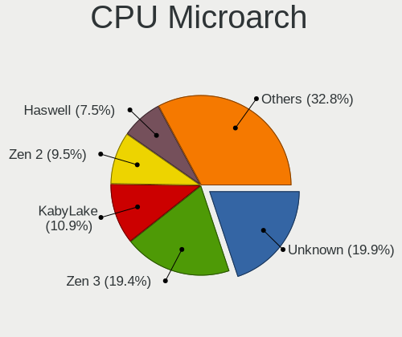
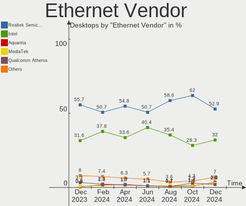
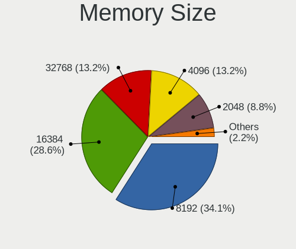

Fedora - Hardware Trends (Desktops)
-----------------------------------

A project to identify most popular hardware characteristics and track their change
over time based on data collected by Linux users at https://Linux-Hardware.org.

Anyone can contribute to this report by the [hw-probe](https://github.com/linuxhw/hw-probe) tool:

    sudo -E hw-probe -all -upload

This report is for one last month. Overall report since the beginning of time: [TestDays](https://github.com/linuxhw/TestDays)

Period: Aug, 2023.

Contents
--------

* [ System ](#system)
  - [ OS                       ](#os)
  - [ OS Family                ](#os-family)
  - [ Kernel                   ](#kernel)
  - [ Kernel Family            ](#kernel-family)
  - [ Kernel Major Ver.        ](#kernel-major-ver)
  - [ Arch                     ](#arch)
  - [ DE                       ](#de)
  - [ Display Server           ](#display-server)
  - [ Display Manager          ](#display-manager)
  - [ OS Lang                  ](#os-lang)
  - [ Boot Mode                ](#boot-mode)
  - [ Filesystem               ](#filesystem)
  - [ Part. scheme             ](#part-scheme)
  - [ Dual Boot with Linux/BSD ](#dual-boot-with-linuxbsd)
  - [ Dual Boot (Win)          ](#dual-boot-win)

* [ Board ](#board)
  - [ Vendor                   ](#vendor)
  - [ Model                    ](#model)
  - [ Model Family             ](#model-family)
  - [ MFG Year                 ](#mfg-year)
  - [ Form Factor              ](#form-factor)
  - [ Secure Boot              ](#secure-boot)
  - [ Coreboot                 ](#coreboot)
  - [ RAM Size                 ](#ram-size)
  - [ RAM Used                 ](#ram-used)
  - [ Total Drives             ](#total-drives)
  - [ Has CD-ROM               ](#has-cd-rom)
  - [ Has Ethernet             ](#has-ethernet)
  - [ Has WiFi                 ](#has-wifi)
  - [ Has Bluetooth            ](#has-bluetooth)

* [ Location ](#location)
  - [ Country                  ](#country)
  - [ City                     ](#city)

* [ Drives ](#drives)
  - [ Drive Vendor             ](#drive-vendor)
  - [ Drive Model              ](#drive-model)
  - [ HDD Vendor               ](#hdd-vendor)
  - [ SSD Vendor               ](#ssd-vendor)
  - [ Drive Kind               ](#drive-kind)
  - [ Drive Connector          ](#drive-connector)
  - [ Drive Size               ](#drive-size)
  - [ Space Total              ](#space-total)
  - [ Space Used               ](#space-used)
  - [ Malfunc. Drives          ](#malfunc-drives)
  - [ Malfunc. Drive Vendor    ](#malfunc-drive-vendor)
  - [ Malfunc. HDD Vendor      ](#malfunc-hdd-vendor)
  - [ Malfunc. Drive Kind      ](#malfunc-drive-kind)
  - [ Failed Drives            ](#failed-drives)
  - [ Failed Drive Vendor      ](#failed-drive-vendor)
  - [ Drive Status             ](#drive-status)

* [ Storage controller ](#storage-controller)
  - [ Storage Vendor           ](#storage-vendor)
  - [ Storage Model            ](#storage-model)
  - [ Storage Kind             ](#storage-kind)

* [ Processor ](#processor)
  - [ CPU Vendor               ](#cpu-vendor)
  - [ CPU Model                ](#cpu-model)
  - [ CPU Model Family         ](#cpu-model-family)
  - [ CPU Cores                ](#cpu-cores)
  - [ CPU Sockets              ](#cpu-sockets)
  - [ CPU Threads              ](#cpu-threads)
  - [ CPU Op-Modes             ](#cpu-op-modes)
  - [ CPU Microcode            ](#cpu-microcode)
  - [ CPU Microarch            ](#cpu-microarch)

* [ Graphics ](#graphics)
  - [ GPU Vendor               ](#gpu-vendor)
  - [ GPU Model                ](#gpu-model)
  - [ GPU Combo                ](#gpu-combo)
  - [ GPU Driver               ](#gpu-driver)
  - [ GPU Memory               ](#gpu-memory)

* [ Monitor ](#monitor)
  - [ Monitor Vendor           ](#monitor-vendor)
  - [ Monitor Model            ](#monitor-model)
  - [ Monitor Resolution       ](#monitor-resolution)
  - [ Monitor Diagonal         ](#monitor-diagonal)
  - [ Monitor Width            ](#monitor-width)
  - [ Aspect Ratio             ](#aspect-ratio)
  - [ Monitor Area             ](#monitor-area)
  - [ Pixel Density            ](#pixel-density)
  - [ Multiple Monitors        ](#multiple-monitors)

* [ Network ](#network)
  - [ Net Controller Vendor    ](#net-controller-vendor)
  - [ Net Controller Model     ](#net-controller-model)
  - [ Wireless Vendor          ](#wireless-vendor)
  - [ Wireless Model           ](#wireless-model)
  - [ Ethernet Vendor          ](#ethernet-vendor)
  - [ Ethernet Model           ](#ethernet-model)
  - [ Net Controller Kind      ](#net-controller-kind)
  - [ Used Controller          ](#used-controller)
  - [ NICs                     ](#nics)
  - [ IPv6                     ](#ipv6)

* [ Bluetooth ](#bluetooth)
  - [ Bluetooth Vendor         ](#bluetooth-vendor)
  - [ Bluetooth Model          ](#bluetooth-model)

* [ Sound ](#sound)
  - [ Sound Vendor             ](#sound-vendor)
  - [ Sound Model              ](#sound-model)

* [ Memory ](#memory)
  - [ Memory Vendor            ](#memory-vendor)
  - [ Memory Model             ](#memory-model)
  - [ Memory Kind              ](#memory-kind)
  - [ Memory Form Factor       ](#memory-form-factor)
  - [ Memory Size              ](#memory-size)
  - [ Memory Speed             ](#memory-speed)

* [ Printers & scanners ](#printers--scanners)
  - [ Printer Vendor           ](#printer-vendor)
  - [ Printer Model            ](#printer-model)
  - [ Scanner Vendor           ](#scanner-vendor)
  - [ Scanner Model            ](#scanner-model)

* [ Camera ](#camera)
  - [ Camera Vendor            ](#camera-vendor)
  - [ Camera Model             ](#camera-model)

* [ Security ](#security)
  - [ Fingerprint Vendor       ](#fingerprint-vendor)
  - [ Fingerprint Model        ](#fingerprint-model)
  - [ Chipcard Vendor          ](#chipcard-vendor)
  - [ Chipcard Model           ](#chipcard-model)

* [ Unsupported ](#unsupported)
  - [ Unsupported Devices      ](#unsupported-devices)
  - [ Unsupported Device Types ](#unsupported-device-types)

System
------

OS
--

Installed operating systems

| Name      | Desktops | Percent |
|-----------|----------|---------|
| Fedora 38 | 151      | 88.82%  |
| Fedora 37 | 11       | 6.47%   |
| Fedora 39 | 2        | 1.18%   |
| Fedora 36 | 2        | 1.18%   |
| Fedora 35 | 2        | 1.18%   |
| Fedora 40 | 1        | 0.59%   |
| Fedora 33 | 1        | 0.59%   |

OS Family
---------

OS without a version

| Name   | Desktops | Percent |
|--------|----------|---------|
| Fedora | 170      | 100%    |

Kernel
------

Version of the Linux kernel

| Version                                                | Desktops | Percent |
|--------------------------------------------------------|----------|---------|
| 6.4.11-200.fc38.x86_64                                 | 35       | 20.59%  |
| 6.4.7-200.fc38.x86_64                                  | 21       | 12.35%  |
| 6.4.6-200.fc38.x86_64                                  | 19       | 11.18%  |
| 6.4.10-200.fc38.x86_64                                 | 17       | 10%     |
| 6.2.9-300.fc38.x86_64                                  | 15       | 8.82%   |
| 6.4.9-200.fc38.x86_64                                  | 12       | 7.06%   |
| 6.4.12-200.fc38.x86_64                                 | 12       | 7.06%   |
| 6.4.8-200.fc38.x86_64                                  | 5        | 2.94%   |
| 6.4.4-200.fc38.x86_64                                  | 4        | 2.35%   |
| 6.3.11-200.fc38.x86_64                                 | 3        | 1.76%   |
| 6.4.4-100.fc37.x86_64                                  | 2        | 1.18%   |
| 6.3.12-200.fc38.x86_64                                 | 2        | 1.18%   |
| 6.3.12-100.fc37.x86_64                                 | 2        | 1.18%   |
| 6.2.15-300.fc38.x86_64                                 | 2        | 1.18%   |
| 6.1.13-200.fc37.x86_64                                 | 2        | 1.18%   |
| 6.0.12-100.fc35.x86_64                                 | 2        | 1.18%   |
| 6.5.0-0.rc7.20230821gitf7757129e3de.50.fc40.x86_64     | 1        | 0.59%   |
| 6.5.0-0.rc7.20230821gitf7757129e3de.50.fc39.x86_64     | 1        | 0.59%   |
| 6.5.0-0.rc7.20230820gt706a7415.249.vanilla.fc38.x86_64 | 1        | 0.59%   |
| 6.5.0-0.rc4.30.fc39.x86_64                             | 1        | 0.59%   |
| 6.4.9-100.fc37.x86_64                                  | 1        | 0.59%   |
| 6.4.12-100.fc37.x86_64                                 | 1        | 0.59%   |
| 6.4.11-100.fc37.x86_64                                 | 1        | 0.59%   |
| 6.4.10-100.fc37.x86_64                                 | 1        | 0.59%   |
| 6.3.8-200.fc38.x86_64                                  | 1        | 0.59%   |
| 6.2.6-300.fc38.x86_64                                  | 1        | 0.59%   |
| 6.2.15-703.inttf.fc38.x86_64                           | 1        | 0.59%   |
| 6.2.15-100.fc36.x86_64                                 | 1        | 0.59%   |
| 6.1.7-200.fc37.x86_64                                  | 1        | 0.59%   |
| 5.17.5-300.fc36.x86_64                                 | 1        | 0.59%   |
| 5.14.18-100.fc33.x86_64                                | 1        | 0.59%   |

Kernel Family
-------------

Linux kernel without a distro release

| Version | Desktops | Percent |
|---------|----------|---------|
| 6.4.11  | 36       | 21.18%  |
| 6.4.7   | 21       | 12.35%  |
| 6.4.6   | 19       | 11.18%  |
| 6.4.10  | 18       | 10.59%  |
| 6.2.9   | 15       | 8.82%   |
| 6.4.9   | 13       | 7.65%   |
| 6.4.12  | 13       | 7.65%   |
| 6.4.4   | 6        | 3.53%   |
| 6.4.8   | 5        | 2.94%   |
| 6.5.0   | 4        | 2.35%   |
| 6.3.12  | 4        | 2.35%   |
| 6.2.15  | 4        | 2.35%   |
| 6.3.11  | 3        | 1.76%   |
| 6.1.13  | 2        | 1.18%   |
| 6.0.12  | 2        | 1.18%   |
| 6.3.8   | 1        | 0.59%   |
| 6.2.6   | 1        | 0.59%   |
| 6.1.7   | 1        | 0.59%   |
| 5.17.5  | 1        | 0.59%   |
| 5.14.18 | 1        | 0.59%   |

Kernel Major Ver.
-----------------

Linux kernel major version

| Version | Desktops | Percent |
|---------|----------|---------|
| 6.4     | 131      | 77.06%  |
| 6.2     | 20       | 11.76%  |
| 6.3     | 8        | 4.71%   |
| 6.5     | 4        | 2.35%   |
| 6.1     | 3        | 1.76%   |
| 6.0     | 2        | 1.18%   |
| 5.17    | 1        | 0.59%   |
| 5.14    | 1        | 0.59%   |

Arch
----

OS architecture (x86_64, i586, etc.)

| Name   | Desktops | Percent |
|--------|----------|---------|
| x86_64 | 170      | 100%    |

DE
--

Desktop Environment

| Name          | Desktops | Percent |
|---------------|----------|---------|
| GNOME         | 115      | 67.65%  |
| KDE5          | 37       | 21.76%  |
| Cinnamon      | 5        | 2.94%   |
| Xpra          | 3        | 1.76%   |
| XFCE          | 3        | 1.76%   |
| GNOME Classic | 2        | 1.18%   |
| Unknown       | 2        | 1.18%   |
| X-Cinnamon    | 1        | 0.59%   |
| Hyprland      | 1        | 0.59%   |
| Budgie        | 1        | 0.59%   |

Display Server
--------------

X11 or Wayland

| Name    | Desktops | Percent |
|---------|----------|---------|
| Wayland | 121      | 71.18%  |
| X11     | 39       | 22.94%  |
| Tty     | 9        | 5.29%   |
| Unknown | 1        | 0.59%   |

Display Manager
---------------

SDDM, LightDM, etc.

| Name    | Desktops | Percent |
|---------|----------|---------|
| Unknown | 104      | 61.18%  |
| GDM     | 35       | 20.59%  |
| SDDM    | 18       | 10.59%  |
| LightDM | 13       | 7.65%   |

OS Lang
-------

Language

| Lang  | Desktops | Percent |
|-------|----------|---------|
| en_US | 80       | 47.06%  |
| en_GB | 12       | 7.06%   |
| en_CA | 9        | 5.29%   |
| en_AU | 9        | 5.29%   |
| ru_RU | 8        | 4.71%   |
| de_DE | 6        | 3.53%   |
| pt_BR | 5        | 2.94%   |
| it_IT | 5        | 2.94%   |
| fr_FR | 5        | 2.94%   |
| es_MX | 4        | 2.35%   |
| es_ES | 3        | 1.76%   |
| sr_RS | 2        | 1.18%   |
| pl_PL | 2        | 1.18%   |
| nl_BE | 2        | 1.18%   |
| de_AT | 2        | 1.18%   |
| zh_SG | 1        | 0.59%   |
| zh_CN | 1        | 0.59%   |
| tr_TR | 1        | 0.59%   |
| ia_FR | 1        | 0.59%   |
| hu_HU | 1        | 0.59%   |
| gl_ES | 1        | 0.59%   |
| fi_FI | 1        | 0.59%   |
| es_BO | 1        | 0.59%   |
| es_AR | 1        | 0.59%   |
| en_ZA | 1        | 0.59%   |
| en_PH | 1        | 0.59%   |
| en_NZ | 1        | 0.59%   |
| en_IN | 1        | 0.59%   |
| en_DK | 1        | 0.59%   |
| el_GR | 1        | 0.59%   |
| de_CH | 1        | 0.59%   |

Boot Mode
---------

EFI or BIOS

| Mode | Desktops | Percent |
|------|----------|---------|
| EFI  | 117      | 68.82%  |
| BIOS | 53       | 31.18%  |

Filesystem
----------

Type of filesystem

| Type  | Desktops | Percent |
|-------|----------|---------|
| Btrfs | 130      | 76.47%  |
| Ext4  | 37       | 21.76%  |
| Xfs   | 2        | 1.18%   |
| Ext3  | 1        | 0.59%   |

Part. scheme
------------

Scheme of partitioning

| Type    | Desktops | Percent |
|---------|----------|---------|
| Unknown | 102      | 60%     |
| GPT     | 61       | 35.88%  |
| MBR     | 7        | 4.12%   |

Dual Boot with Linux/BSD
------------------------

Hosting more than one Linux/BSD

| Dual boot | Desktops | Percent |
|-----------|----------|---------|
| No        | 149      | 87.65%  |
| Yes       | 21       | 12.35%  |

Dual Boot (Win)
---------------

Hosting Linux and Windows

| Dual boot | Desktops | Percent |
|-----------|----------|---------|
| No        | 142      | 83.53%  |
| Yes       | 28       | 16.47%  |

Board
-----

Vendor
------

Motherboard manufacturer

| Name                | Desktops | Percent |
|---------------------|----------|---------|
| ASUSTek Computer    | 42       | 24.71%  |
| Gigabyte Technology | 37       | 21.76%  |
| MSI                 | 30       | 17.65%  |
| ASRock              | 14       | 8.24%   |
| Dell                | 11       | 6.47%   |
| Hewlett-Packard     | 8        | 4.71%   |
| Lenovo              | 6        | 3.53%   |
| Unknown             | 4        | 2.35%   |
| Fujitsu             | 3        | 1.76%   |
| AZW                 | 3        | 1.76%   |
| Acer                | 3        | 1.76%   |
| Intel               | 2        | 1.18%   |
| Pegatron            | 1        | 0.59%   |
| Packard Bell        | 1        | 0.59%   |
| Medion              | 1        | 0.59%   |
| LattePanda          | 1        | 0.59%   |
| Huanan              | 1        | 0.59%   |
| Gateway             | 1        | 0.59%   |
| Acidanthera         | 1        | 0.59%   |

Model
-----

Motherboard model

| Name                                | Desktops | Percent |
|-------------------------------------|----------|---------|
| ASUS All Series                     | 5        | 2.94%   |
| Unknown                             | 4        | 2.35%   |
| MSI MS-7D22                         | 3        | 1.76%   |
| MSI MS-7B48                         | 2        | 1.18%   |
| MSI MPG H410 Trident 3 (MS-B932)    | 2        | 1.18%   |
| HP Compaq 6005 Pro SFF PC           | 2        | 1.18%   |
| Gigabyte B550 AORUS ELITE AX V2     | 2        | 1.18%   |
| Gigabyte B450M DS3H                 | 2        | 1.18%   |
| Gigabyte AB350-Gaming               | 2        | 1.18%   |
| Dell OptiPlex 3040                  | 2        | 1.18%   |
| AZW GTR                             | 2        | 1.18%   |
| ASUS TUF Gaming B660-PLUS WIFI D4   | 2        | 1.18%   |
| ASUS ROG STRIX X670E-I GAMING WIFI  | 2        | 1.18%   |
| Pegatron NJ062AA-ABA m9650f         | 1        | 0.59%   |
| Packard Bell ISTART D9281           | 1        | 0.59%   |
| MSI MS-7E06                         | 1        | 0.59%   |
| MSI MS-7D77                         | 1        | 0.59%   |
| MSI MS-7D76                         | 1        | 0.59%   |
| MSI MS-7D46                         | 1        | 0.59%   |
| MSI MS-7D43                         | 1        | 0.59%   |
| MSI MS-7C94                         | 1        | 0.59%   |
| MSI MS-7C92                         | 1        | 0.59%   |
| MSI MS-7C91                         | 1        | 0.59%   |
| MSI MS-7C56                         | 1        | 0.59%   |
| MSI MS-7C51                         | 1        | 0.59%   |
| MSI MS-7C37                         | 1        | 0.59%   |
| MSI MS-7B86                         | 1        | 0.59%   |
| MSI MS-7B77                         | 1        | 0.59%   |
| MSI MS-7B29                         | 1        | 0.59%   |
| MSI MS-7B17                         | 1        | 0.59%   |
| MSI MS-7B07                         | 1        | 0.59%   |
| MSI MS-7A69                         | 1        | 0.59%   |
| MSI MS-7A38                         | 1        | 0.59%   |
| MSI MS-7A15                         | 1        | 0.59%   |
| MSI MS-7966                         | 1        | 0.59%   |
| MSI MS-7885                         | 1        | 0.59%   |
| MSI MS-7693                         | 1        | 0.59%   |
| MSI MS-7388                         | 1        | 0.59%   |
| Medion MS-7800                      | 1        | 0.59%   |
| Lenovo ThinkStation P620 30E1S36700 | 1        | 0.59%   |

Model Family
------------

Motherboard model prefix

| Name                  | Desktops | Percent |
|-----------------------|----------|---------|
| ASUS TUF              | 12       | 7.06%   |
| Dell OptiPlex         | 8        | 4.71%   |
| ASUS ROG              | 7        | 4.12%   |
| ASUS PRIME            | 7        | 4.12%   |
| HP Compaq             | 6        | 3.53%   |
| ASUS All              | 5        | 2.94%   |
| Gigabyte B550         | 4        | 2.35%   |
| Unknown               | 4        | 2.35%   |
| MSI MS-7D22           | 3        | 1.76%   |
| Lenovo ThinkStation   | 3        | 1.76%   |
| Gigabyte B450M        | 3        | 1.76%   |
| Gigabyte AB350-Gaming | 3        | 1.76%   |
| Acer Veriton          | 3        | 1.76%   |
| MSI MS-7B48           | 2        | 1.18%   |
| MSI MPG               | 2        | 1.18%   |
| Lenovo ThinkCentre    | 2        | 1.18%   |
| Gigabyte X570         | 2        | 1.18%   |
| Gigabyte B450         | 2        | 1.18%   |
| AZW GTR               | 2        | 1.18%   |
| Pegatron NJ062AA-ABA  | 1        | 0.59%   |
| Packard Bell ISTART   | 1        | 0.59%   |
| MSI MS-7E06           | 1        | 0.59%   |
| MSI MS-7D77           | 1        | 0.59%   |
| MSI MS-7D76           | 1        | 0.59%   |
| MSI MS-7D46           | 1        | 0.59%   |
| MSI MS-7D43           | 1        | 0.59%   |
| MSI MS-7C94           | 1        | 0.59%   |
| MSI MS-7C92           | 1        | 0.59%   |
| MSI MS-7C91           | 1        | 0.59%   |
| MSI MS-7C56           | 1        | 0.59%   |
| MSI MS-7C51           | 1        | 0.59%   |
| MSI MS-7C37           | 1        | 0.59%   |
| MSI MS-7B86           | 1        | 0.59%   |
| MSI MS-7B77           | 1        | 0.59%   |
| MSI MS-7B29           | 1        | 0.59%   |
| MSI MS-7B17           | 1        | 0.59%   |
| MSI MS-7B07           | 1        | 0.59%   |
| MSI MS-7A69           | 1        | 0.59%   |
| MSI MS-7A38           | 1        | 0.59%   |
| MSI MS-7A15           | 1        | 0.59%   |

MFG Year
--------

Motherboard manufacture year

| Year | Desktops | Percent |
|------|----------|---------|
| 2020 | 23       | 13.53%  |
| 2018 | 20       | 11.76%  |
| 2021 | 19       | 11.18%  |
| 2022 | 18       | 10.59%  |
| 2017 | 12       | 7.06%   |
| 2012 | 12       | 7.06%   |
| 2019 | 9        | 5.29%   |
| 2016 | 8        | 4.71%   |
| 2023 | 7        | 4.12%   |
| 2011 | 7        | 4.12%   |
| 2010 | 7        | 4.12%   |
| 2015 | 6        | 3.53%   |
| 2014 | 6        | 3.53%   |
| 2013 | 5        | 2.94%   |
| 2009 | 5        | 2.94%   |
| 2008 | 3        | 1.76%   |
| 2007 | 3        | 1.76%   |

Form Factor
-----------

Physical design of the computer

| Name    | Desktops | Percent |
|---------|----------|---------|
| Desktop | 170      | 100%    |

Secure Boot
-----------

Enabled or disabled

| State    | Desktops | Percent |
|----------|----------|---------|
| Disabled | 154      | 90.59%  |
| Enabled  | 16       | 9.41%   |

Coreboot
--------

Have coreboot on board

| Used | Desktops | Percent |
|------|----------|---------|
| No   | 170      | 100%    |

RAM Size
--------

Total RAM memory

| Size in GB  | Desktops | Percent |
|-------------|----------|---------|
| 16.01-24.0  | 62       | 36.47%  |
| 32.01-64.0  | 31       | 18.24%  |
| 64.01-256.0 | 24       | 14.12%  |
| 8.01-16.0   | 17       | 10%     |
| 4.01-8.0    | 16       | 9.41%   |
| 24.01-32.0  | 13       | 7.65%   |
| 3.01-4.0    | 5        | 2.94%   |
| 2.01-3.0    | 1        | 0.59%   |
| 1.01-2.0    | 1        | 0.59%   |

RAM Used
--------

Used RAM memory

| Used GB    | Desktops | Percent |
|------------|----------|---------|
| 4.01-8.0   | 53       | 31.18%  |
| 2.01-3.0   | 37       | 21.76%  |
| 3.01-4.0   | 33       | 19.41%  |
| 8.01-16.0  | 22       | 12.94%  |
| 1.01-2.0   | 17       | 10%     |
| 16.01-24.0 | 4        | 2.35%   |
| 0.51-1.0   | 2        | 1.18%   |
| 32.01-64.0 | 1        | 0.59%   |
| 24.01-32.0 | 1        | 0.59%   |

Total Drives
------------

Number of drives on board

| Drives | Desktops | Percent |
|--------|----------|---------|
| 2      | 54       | 31.76%  |
| 1      | 49       | 28.82%  |
| 3      | 36       | 21.18%  |
| 4      | 21       | 12.35%  |
| 5      | 6        | 3.53%   |
| 6      | 2        | 1.18%   |
| 8      | 1        | 0.59%   |
| 7      | 1        | 0.59%   |

Has CD-ROM
----------

Has CD-ROM on board

| Presented | Desktops | Percent |
|-----------|----------|---------|
| No        | 126      | 74.12%  |
| Yes       | 44       | 25.88%  |

Has Ethernet
------------

Has Ethernet on board

| Presented | Desktops | Percent |
|-----------|----------|---------|
| Yes       | 170      | 100%    |

Has WiFi
--------

Has WiFi module

| Presented | Desktops | Percent |
|-----------|----------|---------|
| Yes       | 99       | 58.24%  |
| No        | 71       | 41.76%  |

Has Bluetooth
-------------

Has Bluetooth module

| Presented | Desktops | Percent |
|-----------|----------|---------|
| Yes       | 87       | 51.18%  |
| No        | 83       | 48.82%  |

Location
--------

Country
-------

Geographic location (country)

| Country      | Desktops | Percent |
|--------------|----------|---------|
| USA          | 35       | 20.59%  |
| Germany      | 12       | 7.06%   |
| Brazil       | 11       | 6.47%   |
| Canada       | 10       | 5.88%   |
| Australia    | 9        | 5.29%   |
| Russia       | 8        | 4.71%   |
| Italy        | 8        | 4.71%   |
| Mexico       | 6        | 3.53%   |
| France       | 6        | 3.53%   |
| UK           | 5        | 2.94%   |
| Spain        | 4        | 2.35%   |
| Switzerland  | 3        | 1.76%   |
| Poland       | 3        | 1.76%   |
| Norway       | 3        | 1.76%   |
| Netherlands  | 3        | 1.76%   |
| Colombia     | 3        | 1.76%   |
| Belgium      | 3        | 1.76%   |
| Turkey       | 2        | 1.18%   |
| Sweden       | 2        | 1.18%   |
| India        | 2        | 1.18%   |
| Czechia      | 2        | 1.18%   |
| Croatia      | 2        | 1.18%   |
| Austria      | 2        | 1.18%   |
| Vietnam      | 1        | 0.59%   |
| Venezuela    | 1        | 0.59%   |
| Ukraine      | 1        | 0.59%   |
| Thailand     | 1        | 0.59%   |
| South Africa | 1        | 0.59%   |
| Singapore    | 1        | 0.59%   |
| Serbia       | 1        | 0.59%   |
| Saudi Arabia | 1        | 0.59%   |
| Réunion     | 1        | 0.59%   |
| Philippines  | 1        | 0.59%   |
| Oman         | 1        | 0.59%   |
| New Zealand  | 1        | 0.59%   |
| Morocco      | 1        | 0.59%   |
| Malaysia     | 1        | 0.59%   |
| Luxembourg   | 1        | 0.59%   |
| Japan        | 1        | 0.59%   |
| Hungary      | 1        | 0.59%   |

City
----

Geographic location (city)

| City                   | Desktops | Percent |
|------------------------|----------|---------|
| Sydney                 | 5        | 2.94%   |
| Vero Beach             | 3        | 1.76%   |
| Sao Paulo              | 3        | 1.76%   |
| Melbourne              | 3        | 1.76%   |
| Verona                 | 2        | 1.18%   |
| Seattle                | 2        | 1.18%   |
| Regina                 | 2        | 1.18%   |
| Prague                 | 2        | 1.18%   |
| Palmas                 | 2        | 1.18%   |
| Nepean                 | 2        | 1.18%   |
| London                 | 2        | 1.18%   |
| Brussels               | 2        | 1.18%   |
| Zwaag                  | 1        | 0.59%   |
| Zurich                 | 1        | 0.59%   |
| Zagreb                 | 1        | 0.59%   |
| Yeysk                  | 1        | 0.59%   |
| Warsaw                 | 1        | 0.59%   |
| Voronezh               | 1        | 0.59%   |
| Vladikavkaz            | 1        | 0.59%   |
| Visbek                 | 1        | 0.59%   |
| Vigo                   | 1        | 0.59%   |
| Vienna                 | 1        | 0.59%   |
| Vancouver              | 1        | 0.59%   |
| Valencia               | 1        | 0.59%   |
| Valby                  | 1        | 0.59%   |
| Uster                  | 1        | 0.59%   |
| Ulm                    | 1        | 0.59%   |
| Tunja                  | 1        | 0.59%   |
| Troisdorf              | 1        | 0.59%   |
| Traunreut              | 1        | 0.59%   |
| Trabzon                | 1        | 0.59%   |
| Toronto                | 1        | 0.59%   |
| Tornareccio            | 1        | 0.59%   |
| Tampa                  | 1        | 0.59%   |
| Tacoma                 | 1        | 0.59%   |
| Spokane                | 1        | 0.59%   |
| South Bend             | 1        | 0.59%   |
| Somerville             | 1        | 0.59%   |
| Singapore              | 1        | 0.59%   |
| Santiago de Compostela | 1        | 0.59%   |

Drives
------

Drive Vendor
------------

Hard drive vendors

| Vendor                      | Desktops | Drives | Percent |
|-----------------------------|----------|--------|---------|
| Samsung Electronics         | 59       | 81     | 17.4%   |
| Seagate                     | 57       | 69     | 16.81%  |
| WDC                         | 51       | 68     | 15.04%  |
| SanDisk                     | 18       | 24     | 5.31%   |
| Kingston                    | 16       | 19     | 4.72%   |
| Crucial                     | 16       | 17     | 4.72%   |
| Toshiba                     | 15       | 16     | 4.42%   |
| Phison Electronics          | 9        | 9      | 2.65%   |
| Hitachi                     | 9        | 9      | 2.65%   |
| Silicon Motion              | 7        | 7      | 2.06%   |
| Micron/Crucial Technology   | 5        | 6      | 1.47%   |
| Kingston Technology Company | 5        | 5      | 1.47%   |
| HGST                        | 5        | 8      | 1.47%   |
| China                       | 5        | 5      | 1.47%   |
| Patriot                     | 4        | 4      | 1.18%   |
| Intel                       | 4        | 4      | 1.18%   |
| Team                        | 3        | 3      | 0.88%   |
| SPCC                        | 3        | 3      | 0.88%   |
| SK hynix                    | 3        | 3      | 0.88%   |
| ADATA Technology            | 3        | 3      | 0.88%   |
| Transcend                   | 2        | 3      | 0.59%   |
| Realtek Semiconductor       | 2        | 2      | 0.59%   |
| OCZ                         | 2        | 2      | 0.59%   |
| MAXIO Technology (Hangzhou) | 2        | 2      | 0.59%   |
| Lexar                       | 2        | 2      | 0.59%   |
| Intenso                     | 2        | 2      | 0.59%   |
| AMD                         | 2        | 2      | 0.59%   |
| A-DATA Technology           | 2        | 2      | 0.59%   |
| XrayDisk                    | 1        | 1      | 0.29%   |
| Unknown                     | 1        | 1      | 0.29%   |
| Supersonic                  | 1        | 1      | 0.29%   |
| Seagate Technology          | 1        | 1      | 0.29%   |
| S3+                         | 1        | 1      | 0.29%   |
| Quaroni                     | 1        | 1      | 0.29%   |
| PNY                         | 1        | 1      | 0.29%   |
| OSCOO                       | 1        | 1      | 0.29%   |
| Netac                       | 1        | 1      | 0.29%   |
| Mushkin                     | 1        | 1      | 0.29%   |
| Micron Technology           | 1        | 1      | 0.29%   |
| LITEONIT                    | 1        | 1      | 0.29%   |

Drive Model
-----------

Hard drive models

| Model                                                 | Desktops | Percent |
|-------------------------------------------------------|----------|---------|
| Samsung NVMe SSD Controller SM981/PM981/PM983 500GB   | 15       | 3.88%   |
| Seagate ST2000DM008-2FR102 2TB                        | 7        | 1.81%   |
| Seagate ST2000DM006-2DM164 2TB                        | 7        | 1.81%   |
| Samsung NVMe SSD Controller PM9A1/PM9A3/980PRO 1024GB | 7        | 1.81%   |
| Phison E12 NVMe Controller 256GB                      | 7        | 1.81%   |
| WDC WD10EZEX-08WN4A0 1TB                              | 6        | 1.55%   |
| Kingston SA400S37480G 480GB SSD                       | 6        | 1.55%   |
| Seagate ST1000DM010-2EP102 1TB                        | 5        | 1.29%   |
| Samsung SSD 860 EVO 1TB                               | 5        | 1.29%   |
| Samsung NVMe SSD Controller SM961/PM961/SM963 1024GB  | 5        | 1.29%   |
| Micron/Crucial P2 NVMe PCIe SSD 1TB                   | 5        | 1.29%   |
| Toshiba HDWD120 2TB                                   | 4        | 1.03%   |
| Silicon Motion SM2263EN/SM2263XT SSD Controller 256GB | 4        | 1.03%   |
| Samsung SSD 860 EVO 500GB                             | 4        | 1.03%   |
| Samsung SSD 850 EVO 250GB                             | 4        | 1.03%   |
| Crucial CT500MX500SSD1 500GB                          | 4        | 1.03%   |
| Crucial CT1000MX500SSD1 1TB                           | 4        | 1.03%   |
| WDC WDS500G2B0A-00SM50 500GB SSD                      | 3        | 0.78%   |
| WDC WD1003FZEX-00K3CA0 1TB                            | 3        | 0.78%   |
| Silicon Motion SM2262/SM2262EN SSD Controller 1024GB  | 3        | 0.78%   |
| Seagate ST500DM002-1BD142 500GB                       | 3        | 0.78%   |
| Seagate ST3320820AS 320GB                             | 3        | 0.78%   |
| Seagate ST1000DM003-1CH162 1TB                        | 3        | 0.78%   |
| Sandisk WD Blue SN550 NVMe SSD 250GB                  | 3        | 0.78%   |
| Sandisk WD Black 2018/SN750 / PC SN720 NVMe SSD 512GB | 3        | 0.78%   |
| Samsung SSD 870 EVO 500GB                             | 3        | 0.78%   |
| Samsung SSD 870 EVO 1TB                               | 3        | 0.78%   |
| Samsung SSD 860 EVO 2TB                               | 3        | 0.78%   |
| WDC WDS240G2G0A-00JH30 240GB SSD                      | 2        | 0.52%   |
| WDC WDS120G2G0A-00JH30 120GB SSD                      | 2        | 0.52%   |
| WDC WD5000AAKX-08U6AA0 500GB                          | 2        | 0.52%   |
| WDC WD5000AAKX-00ERMA0 500GB                          | 2        | 0.52%   |
| Toshiba DT01ACA100 1TB                                | 2        | 0.52%   |
| Seagate ST4000DM004-2CV104 4TB                        | 2        | 0.52%   |
| Seagate ST1000LM049-2GH172 1TB                        | 2        | 0.52%   |
| Seagate ST1000DM003-1ER162 1TB                        | 2        | 0.52%   |
| Sandisk WD Green SN350 1TB                            | 2        | 0.52%   |
| SanDisk SDSSDH3 1T00 1TB                              | 2        | 0.52%   |
| Samsung SSD 990 PRO 1TB                               | 2        | 0.52%   |
| Samsung SSD 980 500GB                                 | 2        | 0.52%   |

HDD Vendor
----------

Hard disk drive vendors

| Vendor              | Desktops | Drives | Percent |
|---------------------|----------|--------|---------|
| Seagate             | 55       | 66     | 43.31%  |
| WDC                 | 44       | 57     | 34.65%  |
| Toshiba             | 11       | 12     | 8.66%   |
| Hitachi             | 9        | 9      | 7.09%   |
| HGST                | 5        | 8      | 3.94%   |
| Samsung Electronics | 3        | 3      | 2.36%   |

SSD Vendor
----------

Solid state drive vendors

| Vendor              | Desktops | Drives | Percent |
|---------------------|----------|--------|---------|
| Samsung Electronics | 32       | 41     | 25.6%   |
| Crucial             | 16       | 17     | 12.8%   |
| Kingston            | 13       | 15     | 10.4%   |
| WDC                 | 10       | 11     | 8%      |
| SanDisk             | 6        | 7      | 4.8%    |
| China               | 5        | 5      | 4%      |
| Patriot             | 4        | 4      | 3.2%    |
| Toshiba             | 3        | 3      | 2.4%    |
| Team                | 3        | 3      | 2.4%    |
| SPCC                | 3        | 3      | 2.4%    |
| Transcend           | 2        | 3      | 1.6%    |
| OCZ                 | 2        | 2      | 1.6%    |
| Lexar               | 2        | 2      | 1.6%    |
| Intel               | 2        | 2      | 1.6%    |
| AMD                 | 2        | 2      | 1.6%    |
| A-DATA Technology   | 2        | 2      | 1.6%    |
| XrayDisk            | 1        | 1      | 0.8%    |
| Supersonic          | 1        | 1      | 0.8%    |
| SK hynix            | 1        | 1      | 0.8%    |
| S3+                 | 1        | 1      | 0.8%    |
| Quaroni             | 1        | 1      | 0.8%    |
| PNY                 | 1        | 1      | 0.8%    |
| OSCOO               | 1        | 1      | 0.8%    |
| Mushkin             | 1        | 1      | 0.8%    |
| LITEONIT            | 1        | 1      | 0.8%    |
| KingSpec            | 1        | 1      | 0.8%    |
| Intenso             | 1        | 1      | 0.8%    |
| HS-SSD-C100         | 1        | 1      | 0.8%    |
| HPE                 | 1        | 1      | 0.8%    |
| GOODRAM             | 1        | 1      | 0.8%    |
| Gigabyte Technology | 1        | 1      | 0.8%    |
| Fanxiang            | 1        | 1      | 0.8%    |
| Emtec               | 1        | 1      | 0.8%    |
| Corsair             | 1        | 1      | 0.8%    |

Drive Kind
----------

HDD or SSD

| Kind    | Desktops | Drives | Percent |
|---------|----------|--------|---------|
| HDD     | 105      | 155    | 34.54%  |
| SSD     | 102      | 140    | 33.55%  |
| NVMe    | 89       | 103    | 29.28%  |
| Unknown | 7        | 7      | 2.3%    |
| MMC     | 1        | 1      | 0.33%   |

Drive Connector
---------------

SATA, SAS, NVMe, etc.

| Type | Desktops | Drives | Percent |
|------|----------|--------|---------|
| SATA | 145      | 293    | 59.67%  |
| NVMe | 89       | 103    | 36.63%  |
| SAS  | 8        | 9      | 3.29%   |
| MMC  | 1        | 1      | 0.41%   |

Drive Size
----------

Size of hard drive

| Size in TB | Desktops | Drives | Percent |
|------------|----------|--------|---------|
| 0.01-0.5   | 91       | 134    | 42.13%  |
| 0.51-1.0   | 66       | 88     | 30.56%  |
| 1.01-2.0   | 37       | 44     | 17.13%  |
| 3.01-4.0   | 12       | 13     | 5.56%   |
| 4.01-10.0  | 6        | 8      | 2.78%   |
| 2.01-3.0   | 3        | 6      | 1.39%   |
| 10.01-20.0 | 1        | 2      | 0.46%   |

Space Total
-----------

Amount of disk space available on the file system

| Size in GB     | Desktops | Percent |
|----------------|----------|---------|
| 501-1000       | 41       | 24.12%  |
| 1001-2000      | 33       | 19.41%  |
| More than 3000 | 24       | 14.12%  |
| 251-500        | 23       | 13.53%  |
| 2001-3000      | 17       | 10%     |
| 101-250        | 15       | 8.82%   |
| 1-20           | 7        | 4.12%   |
| Unknown        | 6        | 3.53%   |
| 51-100         | 3        | 1.76%   |
| 21-50          | 1        | 0.59%   |

Space Used
----------

Amount of used disk space

| Used GB        | Desktops | Percent |
|----------------|----------|---------|
| 1-20           | 33       | 19.41%  |
| 21-50          | 23       | 13.53%  |
| 501-1000       | 23       | 13.53%  |
| 251-500        | 21       | 12.35%  |
| 101-250        | 19       | 11.18%  |
| 51-100         | 16       | 9.41%   |
| 1001-2000      | 14       | 8.24%   |
| 2001-3000      | 8        | 4.71%   |
| More than 3000 | 7        | 4.12%   |
| Unknown        | 6        | 3.53%   |

Malfunc. Drives
---------------

Drive models with a malfunction

| Model                                                          | Desktops | Drives | Percent |
|----------------------------------------------------------------|----------|--------|---------|
| WDC WD5000AVCS-632DY1 500GB                                    | 1        | 1      | 5.26%   |
| WDC WD5000AAKX-603CA0 500GB                                    | 1        | 1      | 5.26%   |
| WDC WD40PURX-64GVNY0 4TB                                       | 1        | 1      | 5.26%   |
| WDC WD2500BEVT-80A23T0 250GB                                   | 1        | 1      | 5.26%   |
| SPCC Solid State Disk 128GB                                    | 1        | 1      | 5.26%   |
| Seagate ST31000528AS 1TB                                       | 1        | 1      | 5.26%   |
| Seagate ST1000LM014-1EJ164 1TB                                 | 1        | 1      | 5.26%   |
| Seagate ST1000DM003-1ER162 1TB                                 | 1        | 1      | 5.26%   |
| Samsung Electronics SSD 870 EVO 500GB                          | 1        | 1      | 5.26%   |
| Samsung Electronics SSD 870 EVO 2TB                            | 1        | 1      | 5.26%   |
| Samsung Electronics SSD 870 EVO 1TB                            | 1        | 1      | 5.26%   |
| Samsung Electronics HD160HJ 160GB                              | 1        | 1      | 5.26%   |
| MAXIO Technology (Hangzhou) NVMe SSD Controller MAP1202 1024GB | 1        | 1      | 5.26%   |
| Kingston SHPM2280P2 240G SSD                                   | 1        | 1      | 5.26%   |
| Kingston SA400S37480G 480GB SSD                                | 1        | 1      | 5.26%   |
| Intel SSDSC2CT120A3 120GB                                      | 1        | 1      | 5.26%   |
| HPE MK001920GWUGK 2TB SSD                                      | 1        | 1      | 5.26%   |
| Hitachi HTS547550A9E384 500GB                                  | 1        | 1      | 5.26%   |
| Hitachi HDS721050DLE630 500GB                                  | 1        | 1      | 5.26%   |

Malfunc. Drive Vendor
---------------------

Vendors of faulty drives

| Vendor                      | Desktops | Drives | Percent |
|-----------------------------|----------|--------|---------|
| WDC                         | 4        | 4      | 21.05%  |
| Samsung Electronics         | 4        | 4      | 21.05%  |
| Seagate                     | 3        | 3      | 15.79%  |
| Kingston                    | 2        | 2      | 10.53%  |
| Hitachi                     | 2        | 2      | 10.53%  |
| SPCC                        | 1        | 1      | 5.26%   |
| MAXIO Technology (Hangzhou) | 1        | 1      | 5.26%   |
| Intel                       | 1        | 1      | 5.26%   |
| HPE                         | 1        | 1      | 5.26%   |

Malfunc. HDD Vendor
-------------------

Vendors of faulty HDD drives

| Vendor              | Desktops | Drives | Percent |
|---------------------|----------|--------|---------|
| WDC                 | 4        | 4      | 40%     |
| Seagate             | 3        | 3      | 30%     |
| Hitachi             | 2        | 2      | 20%     |
| Samsung Electronics | 1        | 1      | 10%     |

Malfunc. Drive Kind
-------------------

Kinds of faulty drives

| Kind | Desktops | Drives | Percent |
|------|----------|--------|---------|
| HDD  | 9        | 10     | 52.94%  |
| SSD  | 7        | 8      | 41.18%  |
| NVMe | 1        | 1      | 5.88%   |

Failed Drives
-------------

Failed drive models

Zero info for selected period =(

Failed Drive Vendor
-------------------

Failed drive vendors

Zero info for selected period =(

Drive Status
------------

Number of failed and malfunc. drives

| Status   | Desktops | Drives | Percent |
|----------|----------|--------|---------|
| Detected | 107      | 244    | 57.53%  |
| Works    | 62       | 143    | 33.33%  |
| Malfunc  | 17       | 19     | 9.14%   |

Storage controller
------------------

Storage Vendor
--------------

Storage controller vendors

| Vendor                           | Desktops | Percent |
|----------------------------------|----------|---------|
| Intel                            | 94       | 34.18%  |
| AMD                              | 70       | 25.45%  |
| Samsung Electronics              | 34       | 12.36%  |
| Sandisk                          | 13       | 4.73%   |
| ASMedia Technology               | 11       | 4%      |
| Phison Electronics               | 9        | 3.27%   |
| Kingston Technology Company      | 9        | 3.27%   |
| Silicon Motion                   | 7        | 2.55%   |
| Micron/Crucial Technology        | 5        | 1.82%   |
| JMicron Technology               | 3        | 1.09%   |
| ADATA Technology                 | 3        | 1.09%   |
| SK hynix                         | 2        | 0.73%   |
| Seagate Technology               | 2        | 0.73%   |
| Realtek Semiconductor            | 2        | 0.73%   |
| MAXIO Technology (Hangzhou)      | 2        | 0.73%   |
| Marvell Technology Group         | 2        | 0.73%   |
| Toshiba America Info Systems     | 1        | 0.36%   |
| Silicon Integrated Systems [SiS] | 1        | 0.36%   |
| Silicon Image                    | 1        | 0.36%   |
| Nvidia                           | 1        | 0.36%   |
| Netac Technology                 | 1        | 0.36%   |
| Micron Technology                | 1        | 0.36%   |
| KIOXIA                           | 1        | 0.36%   |

Storage Model
-------------

Storage controller models

| Model                                                                          | Desktops | Percent |
|--------------------------------------------------------------------------------|----------|---------|
| AMD FCH SATA Controller [AHCI mode]                                            | 37       | 11.82%  |
| Samsung NVMe SSD Controller SM981/PM981/PM983                                  | 15       | 4.79%   |
| AMD 500 Series Chipset SATA Controller                                         | 15       | 4.79%   |
| Intel Q170/Q150/B150/H170/H110/Z170/CM236 Chipset SATA Controller [AHCI Mode]  | 14       | 4.47%   |
| AMD 400 Series Chipset SATA Controller                                         | 13       | 4.15%   |
| ASMedia ASM1062 Serial ATA Controller                                          | 11       | 3.51%   |
| Samsung NVMe SSD Controller PM9A1/PM9A3/980PRO                                 | 8        | 2.56%   |
| Intel 7 Series/C210 Series Chipset Family 6-port SATA Controller [AHCI mode]   | 8        | 2.56%   |
| Intel 500 Series Chipset Family SATA AHCI Controller                           | 8        | 2.56%   |
| Intel 200 Series PCH SATA controller [AHCI mode]                               | 8        | 2.56%   |
| Phison E12 NVMe Controller                                                     | 7        | 2.24%   |
| Intel Cannon Lake PCH SATA AHCI Controller                                     | 7        | 2.24%   |
| Intel Alder Lake-S PCH SATA Controller [AHCI Mode]                             | 7        | 2.24%   |
| Intel 8 Series/C220 Series Chipset Family 6-port SATA Controller 1 [AHCI mode] | 6        | 1.92%   |
| AMD SB7x0/SB8x0/SB9x0 SATA Controller [AHCI mode]                              | 6        | 1.92%   |
| Samsung NVMe SSD Controller SM961/PM961/SM963                                  | 5        | 1.6%    |
| Samsung NVMe SSD Controller 980                                                | 5        | 1.6%    |
| Micron/Crucial P2 [Nick P2] / P3 / P3 Plus NVMe PCIe SSD (DRAM-less)           | 5        | 1.6%    |
| AMD 300 Series Chipset SATA Controller                                         | 5        | 1.6%    |
| Silicon Motion SM2263EN/SM2263XT (DRAM-less) NVMe SSD Controllers              | 4        | 1.28%   |
| Kingston Company Company Non-Volatile memory controller                        | 4        | 1.28%   |
| Intel 6 Series/C200 Series Chipset Family 6 port Desktop SATA AHCI Controller  | 4        | 1.28%   |
| Intel 400 Series Chipset Family SATA AHCI Controller                           | 4        | 1.28%   |
| AMD SB7x0/SB8x0/SB9x0 IDE Controller                                           | 4        | 1.28%   |
| AMD FCH SATA Controller D                                                      | 4        | 1.28%   |
| Silicon Motion SM2262/SM2262EN SSD Controller                                  | 3        | 0.96%   |
| SanDisk WD Blue SN550 NVMe SSD                                                 | 3        | 0.96%   |
| SanDisk WD Black 2018/SN750 / PC SN720 NVMe SSD                                | 3        | 0.96%   |
| Kingston Company KC3000/Renegade NVMe SSD                                      | 3        | 0.96%   |
| Intel Volume Management Device NVMe RAID Controller                            | 3        | 0.96%   |
| Intel SATA Controller [RAID mode]                                              | 3        | 0.96%   |
| Intel Comet Lake SATA AHCI Controller                                          | 3        | 0.96%   |
| Intel 9 Series Chipset Family SATA Controller [AHCI Mode]                      | 3        | 0.96%   |
| Intel 7 Series/C210 Series Chipset Family 4-port SATA Controller [IDE mode]    | 3        | 0.96%   |
| Intel 7 Series/C210 Series Chipset Family 2-port SATA Controller [IDE mode]    | 3        | 0.96%   |
| Sandisk Western Digital WD Black SN850X NVMe SSD                               | 2        | 0.64%   |
| SanDisk WD Green SN350 NVMe SSD 1 TB (DRAM-less)                               | 2        | 0.64%   |
| Samsung NVMe SSD Controller S4LV008[Pascal]                                    | 2        | 0.64%   |
| Realtek RTS5765DL NVMe SSD Controller (DRAM-less)                              | 2        | 0.64%   |
| MAXIO (Hangzhou) NVMe SSD Controller MAP1202                                   | 2        | 0.64%   |

Storage Kind
------------

Kind of storage controller (IDE, SATA, NVMe, SAS, ...)

| Kind | Desktops | Percent |
|------|----------|---------|
| SATA | 153      | 57.09%  |
| NVMe | 89       | 33.21%  |
| IDE  | 17       | 6.34%   |
| RAID | 9        | 3.36%   |

Processor
---------

CPU Vendor
----------

Processor vendors

| Vendor | Desktops | Percent |
|--------|----------|---------|
| Intel  | 98       | 57.65%  |
| AMD    | 72       | 42.35%  |

CPU Model
---------

Processor models

| Model                                       | Desktops | Percent |
|---------------------------------------------|----------|---------|
| AMD Ryzen 5 3600 6-Core Processor           | 6        | 3.53%   |
| Intel Core i7-3770 CPU @ 3.40GHz            | 5        | 2.94%   |
| Intel 12th Gen Core i5-12400                | 5        | 2.94%   |
| AMD Ryzen 5 5600X 6-Core Processor          | 5        | 2.94%   |
| AMD Ryzen 5 5600G with Radeon Graphics      | 5        | 2.94%   |
| Intel Core i9-10850K CPU @ 3.60GHz          | 3        | 1.76%   |
| Intel Core i7-4790 CPU @ 3.60GHz            | 3        | 1.76%   |
| Intel Core i5-6500 CPU @ 3.20GHz            | 3        | 1.76%   |
| Intel Core i5-10400F CPU @ 2.90GHz          | 3        | 1.76%   |
| AMD Ryzen 9 3900X 12-Core Processor         | 3        | 1.76%   |
| AMD Ryzen 5 3400G with Radeon Vega Graphics | 3        | 1.76%   |
| Intel Core i7-9700K CPU @ 3.60GHz           | 2        | 1.18%   |
| Intel Core i7-8700K CPU @ 3.70GHz           | 2        | 1.18%   |
| Intel Core i7-8700 CPU @ 3.20GHz            | 2        | 1.18%   |
| Intel Core i7-7700 CPU @ 3.60GHz            | 2        | 1.18%   |
| Intel Core i7-6700K CPU @ 4.00GHz           | 2        | 1.18%   |
| Intel Core i7-6700 CPU @ 3.40GHz            | 2        | 1.18%   |
| Intel Core i7-4790K CPU @ 4.00GHz           | 2        | 1.18%   |
| Intel Core i7-10700 CPU @ 2.90GHz           | 2        | 1.18%   |
| Intel Core i5-7500 CPU @ 3.40GHz            | 2        | 1.18%   |
| Intel Core i5-6500T CPU @ 2.50GHz           | 2        | 1.18%   |
| Intel Core i5-6400T CPU @ 2.20GHz           | 2        | 1.18%   |
| Intel Core i5-3470 CPU @ 3.20GHz            | 2        | 1.18%   |
| Intel Core i5-10400 CPU @ 2.90GHz           | 2        | 1.18%   |
| Intel Core i3-2120 CPU @ 3.30GHz            | 2        | 1.18%   |
| Intel Celeron N5105 @ 2.00GHz               | 2        | 1.18%   |
| AMD Ryzen 9 7950X 16-Core Processor         | 2        | 1.18%   |
| AMD Ryzen 9 7900 12-Core Processor          | 2        | 1.18%   |
| AMD Ryzen 9 6900HX with Radeon Graphics     | 2        | 1.18%   |
| AMD Ryzen 7 7700X 8-Core Processor          | 2        | 1.18%   |
| AMD Ryzen 7 5800X3D 8-Core Processor        | 2        | 1.18%   |
| AMD Ryzen 7 5800X 8-Core Processor          | 2        | 1.18%   |
| AMD Ryzen 7 5700G with Radeon Graphics      | 2        | 1.18%   |
| AMD Ryzen 7 3700X 8-Core Processor          | 2        | 1.18%   |
| AMD Ryzen 5 2600 Six-Core Processor         | 2        | 1.18%   |
| AMD Phenom II X4 B97 Processor              | 2        | 1.18%   |
| Intel Xeon W-2155 CPU @ 3.30GHz             | 1        | 0.59%   |
| Intel Xeon CPU X5690 @ 3.47GHz              | 1        | 0.59%   |
| Intel Xeon CPU E5-2690 v3 @ 2.60GHz         | 1        | 0.59%   |
| Intel Xeon CPU E5-2680 v4 @ 2.40GHz         | 1        | 0.59%   |

CPU Model Family
----------------

Processor model prefix

| Model                   | Desktops | Percent |
|-------------------------|----------|---------|
| Intel Core i7           | 30       | 17.65%  |
| AMD Ryzen 5             | 29       | 17.06%  |
| Intel Core i5           | 24       | 14.12%  |
| AMD Ryzen 7             | 13       | 7.65%   |
| AMD Ryzen 9             | 12       | 7.06%   |
| Other                   | 11       | 6.47%   |
| Intel Xeon              | 9        | 5.29%   |
| Intel Core i3           | 8        | 4.71%   |
| Intel Core i9           | 6        | 3.53%   |
| AMD Phenom II X4        | 4        | 2.35%   |
| AMD FX                  | 4        | 2.35%   |
| Intel Core 2 Duo        | 3        | 1.76%   |
| Intel Core 2 Quad       | 2        | 1.18%   |
| Intel Celeron           | 2        | 1.18%   |
| AMD Ryzen Threadripper  | 2        | 1.18%   |
| AMD Ryzen 3             | 2        | 1.18%   |
| AMD A10                 | 2        | 1.18%   |
| Intel Pentium Silver    | 1        | 0.59%   |
| Intel Pentium Dual      | 1        | 0.59%   |
| Intel Atom              | 1        | 0.59%   |
| AMD Turion 64 X2 Mobile | 1        | 0.59%   |
| AMD Phenom II X6        | 1        | 0.59%   |
| AMD A8                  | 1        | 0.59%   |
| AMD A6                  | 1        | 0.59%   |

CPU Cores
---------

Number of processor cores

| Number | Desktops | Percent |
|--------|----------|---------|
| 4      | 57       | 33.53%  |
| 6      | 50       | 29.41%  |
| 8      | 24       | 14.12%  |
| 2      | 18       | 10.59%  |
| 12     | 9        | 5.29%   |
| 10     | 6        | 3.53%   |
| 16     | 4        | 2.35%   |
| 32     | 1        | 0.59%   |
| 14     | 1        | 0.59%   |

CPU Sockets
-----------

Number of sockets

| Number | Desktops | Percent |
|--------|----------|---------|
| 1      | 170      | 100%    |

CPU Threads
-----------

Threads per core (Hyper-Threading)

| Number | Desktops | Percent |
|--------|----------|---------|
| 2      | 128      | 75.29%  |
| 1      | 42       | 24.71%  |

CPU Op-Modes
------------

CPU Operation Modes (32-bit, 64-bit)

| Op mode        | Desktops | Percent |
|----------------|----------|---------|
| 32-bit, 64-bit | 170      | 100%    |

CPU Microcode
-------------

Microcode number

| Number     | Desktops | Percent |
|------------|----------|---------|
| Unknown    | 95       | 55.88%  |
| 0x0a601203 | 9        | 5.29%   |
| 0x0a20120a | 6        | 3.53%   |
| 0x08701021 | 6        | 3.53%   |
| 0x08701030 | 5        | 2.94%   |
| 0x0a50000d | 4        | 2.35%   |
| 0x0a50000c | 4        | 2.35%   |
| 0x0a201016 | 4        | 2.35%   |
| 0x08108109 | 3        | 1.76%   |
| 0x0800820d | 3        | 1.76%   |
| 0x08001138 | 3        | 1.76%   |
| 0x0a404102 | 2        | 1.18%   |
| 0x0a008204 | 2        | 1.18%   |
| 0x08600106 | 2        | 1.18%   |
| 0x06000852 | 2        | 1.18%   |
| 0x010000c8 | 2        | 1.18%   |
| 0x010000b6 | 2        | 1.18%   |
| 0xa0671    | 1        | 0.59%   |
| 0x906ec    | 1        | 0.59%   |
| 0x906ea    | 1        | 0.59%   |
| 0x306a9    | 1        | 0.59%   |
| 0x10676    | 1        | 0.59%   |
| 0x0a201009 | 1        | 0.59%   |
| 0x08701013 | 1        | 0.59%   |
| 0x08600104 | 1        | 0.59%   |
| 0x08001129 | 1        | 0.59%   |
| 0x0700010f | 1        | 0.59%   |
| 0x06003106 | 1        | 0.59%   |
| 0x0600081c | 1        | 0.59%   |
| 0x06000626 | 1        | 0.59%   |
| 0x03000027 | 1        | 0.59%   |
| 0x010000bf | 1        | 0.59%   |
| 0x00000000 | 1        | 0.59%   |

CPU Microarch
-------------

Microarchitecture

| Name             | Desktops | Percent |
|------------------|----------|---------|
| Zen 3            | 20       | 11.76%  |
| KabyLake         | 16       | 9.41%   |
| Zen 2            | 15       | 8.82%   |
| Skylake          | 15       | 8.82%   |
| CometLake        | 14       | 8.24%   |
| Unknown          | 13       | 7.65%   |
| IvyBridge        | 12       | 7.06%   |
| Haswell          | 11       | 6.47%   |
| Alderlake Hybrid | 8        | 4.71%   |
| Zen+             | 6        | 3.53%   |
| K10              | 5        | 2.94%   |
| Zen              | 4        | 2.35%   |
| SandyBridge      | 4        | 2.35%   |
| Piledriver       | 4        | 2.35%   |
| Penryn           | 4        | 2.35%   |
| Icelake          | 3        | 1.76%   |
| Westmere         | 2        | 1.18%   |
| Tremont          | 2        | 1.18%   |
| Core             | 2        | 1.18%   |
| Broadwell        | 2        | 1.18%   |
| Steamroller      | 1        | 0.59%   |
| Nehalem          | 1        | 0.59%   |
| K8 Hammer        | 1        | 0.59%   |
| K10 Llano        | 1        | 0.59%   |
| Jaguar           | 1        | 0.59%   |
| Goldmont plus    | 1        | 0.59%   |
| Bulldozer        | 1        | 0.59%   |
| Bonnell          | 1        | 0.59%   |

Graphics
--------

GPU Vendor
----------

Vendors of graphics cards

| Vendor                           | Desktops | Percent |
|----------------------------------|----------|---------|
| Nvidia                           | 66       | 35.87%  |
| AMD                              | 66       | 35.87%  |
| Intel                            | 51       | 27.72%  |
| Silicon Integrated Systems [SiS] | 1        | 0.54%   |

GPU Model
---------

Graphics card models

| Model                                                                       | Desktops | Percent |
|-----------------------------------------------------------------------------|----------|---------|
| AMD Ellesmere [Radeon RX 470/480/570/570X/580/580X/590]                     | 10       | 5.26%   |
| Intel HD Graphics 530                                                       | 8        | 4.21%   |
| AMD Raphael                                                                 | 8        | 4.21%   |
| AMD Cezanne [Radeon Vega Series / Radeon Vega Mobile Series]                | 7        | 3.68%   |
| Intel CometLake-S GT2 [UHD Graphics 630]                                    | 6        | 3.16%   |
| Nvidia GA106 [GeForce RTX 3060 Lite Hash Rate]                              | 5        | 2.63%   |
| AMD Navi 21 [Radeon RX 6800/6800 XT / 6900 XT]                              | 5        | 2.63%   |
| Nvidia GP107 [GeForce GTX 1050 Ti]                                          | 4        | 2.11%   |
| Nvidia GP104 [GeForce GTX 1070]                                             | 4        | 2.11%   |
| Intel Xeon E3-1200 v2/3rd Gen Core processor Graphics Controller            | 4        | 2.11%   |
| Intel CoffeeLake-S GT2 [UHD Graphics 630]                                   | 4        | 2.11%   |
| Intel Alder Lake-S GT1 [UHD Graphics 730]                                   | 4        | 2.11%   |
| AMD Navi 22 [Radeon RX 6700/6700 XT/6750 XT / 6800M/6850M XT]               | 4        | 2.11%   |
| AMD Navi 10 [Radeon RX 5600 OEM/5600 XT / 5700/5700 XT]                     | 4        | 2.11%   |
| Nvidia TU117 [GeForce GTX 1650]                                             | 3        | 1.58%   |
| Nvidia GP106 [GeForce GTX 1060 3GB]                                         | 3        | 1.58%   |
| Intel Xeon E3-1200 v3/4th Gen Core Processor Integrated Graphics Controller | 3        | 1.58%   |
| Intel 2nd Generation Core Processor Family Integrated Graphics Controller   | 3        | 1.58%   |
| AMD Picasso/Raven 2 [Radeon Vega Series / Radeon Vega Mobile Series]        | 3        | 1.58%   |
| AMD Navi 31 [Radeon RX 7900 XT/7900 XTX]                                    | 3        | 1.58%   |
| AMD Navi 23 [Radeon RX 6600/6600 XT/6600M]                                  | 3        | 1.58%   |
| Nvidia TU116 [GeForce GTX 1650 SUPER]                                       | 2        | 1.05%   |
| Nvidia TU104 [GeForce RTX 2060]                                             | 2        | 1.05%   |
| Nvidia TU102 [GeForce RTX 2080 Ti Rev. A]                                   | 2        | 1.05%   |
| Nvidia GP108 [GeForce GT 1030]                                              | 2        | 1.05%   |
| Nvidia GP104 [GeForce GTX 1080]                                             | 2        | 1.05%   |
| Nvidia GP104 [GeForce GTX 1060 6GB]                                         | 2        | 1.05%   |
| Nvidia GM204 [GeForce GTX 970]                                              | 2        | 1.05%   |
| Nvidia GK208B [GeForce GT 710]                                              | 2        | 1.05%   |
| Nvidia GF108 [GeForce GT 730]                                               | 2        | 1.05%   |
| Nvidia GA106 [Geforce RTX 3050]                                             | 2        | 1.05%   |
| Nvidia GA104 [GeForce RTX 3060 Ti Lite Hash Rate]                           | 2        | 1.05%   |
| Nvidia GA102 [GeForce RTX 3080]                                             | 2        | 1.05%   |
| Intel JasperLake [UHD Graphics]                                             | 2        | 1.05%   |
| Intel IvyBridge GT2 [HD Graphics 4000]                                      | 2        | 1.05%   |
| Intel 4th Generation Core Processor Family Integrated Graphics Controller   | 2        | 1.05%   |
| Intel 4 Series Chipset Integrated Graphics Controller                       | 2        | 1.05%   |
| AMD Renoir                                                                  | 2        | 1.05%   |
| AMD Rembrandt [Radeon 680M]                                                 | 2        | 1.05%   |
| AMD Navi 14 [Radeon RX 5500/5500M / Pro 5500M]                              | 2        | 1.05%   |

GPU Combo
---------

Combinations of graphics cards

| Name           | Desktops | Percent |
|----------------|----------|---------|
| 1 x AMD        | 57       | 33.53%  |
| 1 x Nvidia     | 54       | 31.76%  |
| 1 x Intel      | 39       | 22.94%  |
| Intel + Nvidia | 9        | 5.29%   |
| 2 x AMD        | 6        | 3.53%   |
| AMD + Nvidia   | 2        | 1.18%   |
| 2 x Nvidia     | 1        | 0.59%   |
| 1 x SiS        | 1        | 0.59%   |
| Intel + AMD    | 1        | 0.59%   |

GPU Driver
----------

Free vs proprietary

| Driver      | Desktops | Percent |
|-------------|----------|---------|
| Free        | 124      | 72.94%  |
| Proprietary | 40       | 23.53%  |
| Unknown     | 6        | 3.53%   |

GPU Memory
----------

Total video memory

| Size in GB | Desktops | Percent |
|------------|----------|---------|
| Unknown    | 59       | 34.71%  |
| 7.01-8.0   | 30       | 17.65%  |
| 3.01-4.0   | 21       | 12.35%  |
| 8.01-16.0  | 15       | 8.82%   |
| 0.01-0.5   | 13       | 7.65%   |
| 1.01-2.0   | 11       | 6.47%   |
| 0.51-1.0   | 8        | 4.71%   |
| 2.01-3.0   | 6        | 3.53%   |
| 16.01-24.0 | 4        | 2.35%   |
| 5.01-6.0   | 2        | 1.18%   |
| 4.01-5.0   | 1        | 0.59%   |

Monitor
-------

Monitor Vendor
--------------

Monitor vendors

| Vendor               | Desktops | Percent |
|----------------------|----------|---------|
| Samsung Electronics  | 32       | 16.58%  |
| Goldstar             | 28       | 14.51%  |
| Dell                 | 26       | 13.47%  |
| Hewlett-Packard      | 18       | 9.33%   |
| Acer                 | 12       | 6.22%   |
| Philips              | 10       | 5.18%   |
| BenQ                 | 7        | 3.63%   |
| Ancor Communications | 7        | 3.63%   |
| AOC                  | 6        | 3.11%   |
| ASUSTek Computer     | 5        | 2.59%   |
| Sony                 | 4        | 2.07%   |
| Lenovo               | 4        | 2.07%   |
| ViewSonic            | 3        | 1.55%   |
| Gigabyte Technology  | 3        | 1.55%   |
| Unknown              | 3        | 1.55%   |
| Unknown              | 2        | 1.04%   |
| Sceptre Tech         | 2        | 1.04%   |
| MSI                  | 2        | 1.04%   |
| Iiyama               | 2        | 1.04%   |
| Eizo                 | 2        | 1.04%   |
| Denver               | 2        | 1.04%   |
| AU Optronics         | 2        | 1.04%   |
| ___                  | 1        | 0.52%   |
| Unknown (XXX)        | 1        | 0.52%   |
| Toshiba              | 1        | 0.52%   |
| RTK                  | 1        | 0.52%   |
| Mi                   | 1        | 0.52%   |
| HVR                  | 1        | 0.52%   |
| HGC                  | 1        | 0.52%   |
| Gateway              | 1        | 0.52%   |
| DSC                  | 1        | 0.52%   |
| CVT                  | 1        | 0.52%   |
| Apple                | 1        | 0.52%   |

Monitor Model
-------------

Monitor models

| Model                                                                 | Desktops | Percent |
|-----------------------------------------------------------------------|----------|---------|
| Goldstar 27GL850 GSM5B7F 2560x1440 597x336mm 27.0-inch                | 4        | 1.95%   |
| Unknown                                                               | 3        | 1.46%   |
| Unknown LCD Monitor FFFF 2288x1287 2550x2550mm 142.0-inch             | 2        | 0.98%   |
| Samsung Electronics S27R35A SAM7126 1920x1080 598x336mm 27.0-inch     | 2        | 0.98%   |
| Samsung Electronics LCD Monitor SAM0902 1920x1080 480x270mm 21.7-inch | 2        | 0.98%   |
| Philips PHL 288P6L PHL08F2 3840x2160 621x341mm 27.9-inch              | 2        | 0.98%   |
| Lenovo L197 Wide LEN1152 1440x900 410x257mm 19.1-inch                 | 2        | 0.98%   |
| Hewlett-Packard LA2006 HWP2944 1600x900 443x249mm 20.0-inch           | 2        | 0.98%   |
| Goldstar ULTRAGEAR GSM774B 3440x1440 800x335mm 34.1-inch              | 2        | 0.98%   |
| Goldstar Ultra HD GSM5B09 3840x2160 600x340mm 27.2-inch               | 2        | 0.98%   |
| Goldstar HDR 4K GSM7706 3840x2160 600x340mm 27.2-inch                 | 2        | 0.98%   |
| Goldstar FULL HD GSM5BDE 1920x1080 480x270mm 21.7-inch                | 2        | 0.98%   |
| AU Optronics LCD Monitor 5760x1080                                    | 2        | 0.98%   |
| AOC 27G2WG3 AOC2702 1920x1080 598x336mm 27.0-inch                     | 2        | 0.98%   |
| Acer G276HL ACR0300 1920x1080 600x340mm 27.2-inch                     | 2        | 0.98%   |
| Acer EB222Q ACR0518 1920x1080 477x268mm 21.5-inch                     | 2        | 0.98%   |
| ___ LCDTV16 ___9000 1360x768                                          | 1        | 0.49%   |
| ViewSonic VX2768-PC-mhd VSC083A 1920x1080 598x336mm 27.0-inch         | 1        | 0.49%   |
| ViewSonic VG2239 Series VSCC42B 1920x1080 477x268mm 21.5-inch         | 1        | 0.49%   |
| ViewSonic VA2259 Series VSC5E32 1920x1080 476x268mm 21.5-inch         | 1        | 0.49%   |
| Unknown (XXX) Beyond TV XXX2851 1920x1080 1209x680mm 54.6-inch        | 1        | 0.49%   |
| Toshiba TV TSB0030 1920x1080 708x398mm 32.0-inch                      | 1        | 0.49%   |
| Sony TV SNYEE01 1920x1080                                             | 1        | 0.49%   |
| Sony TV SNYA102 1920x1080 708x398mm 32.0-inch                         | 1        | 0.49%   |
| Sony TV SNY7802 1920x1080 708x398mm 32.0-inch                         | 1        | 0.49%   |
| Sony TV *00 SNY2905 3840x2160                                         | 1        | 0.49%   |
| Sceptre Tech Sceptre N43 SPT110C 3840x2160 575x323mm 26.0-inch        | 1        | 0.49%   |
| Sceptre Tech Sceptre L27 SPT0AB8 1920x1080 597x336mm 27.0-inch        | 1        | 0.49%   |
| Samsung Electronics U28E570 SAM0D71 3840x2160 608x345mm 27.5-inch     | 1        | 0.49%   |
| Samsung Electronics T24C300 SAM0A9B 1920x1080 531x299mm 24.0-inch     | 1        | 0.49%   |
| Samsung Electronics T22C300 SAM0AB1 1920x1080 477x268mm 21.5-inch     | 1        | 0.49%   |
| Samsung Electronics T22B300 SAM092D 1920x1080 477x268mm 21.5-inch     | 1        | 0.49%   |
| Samsung Electronics SyncMaster SAM03E1 1440x900 410x257mm 19.1-inch   | 1        | 0.49%   |
| Samsung Electronics S27F350 SAM0D22 1920x1080 598x336mm 27.0-inch     | 1        | 0.49%   |
| Samsung Electronics S27E510 SAM0C5F 1920x1080 598x336mm 27.0-inch     | 1        | 0.49%   |
| Samsung Electronics S27D360 SAM0B27 1920x1080 598x336mm 27.0-inch     | 1        | 0.49%   |
| Samsung Electronics S24E370 SAM0CF0 1920x1080 521x293mm 23.5-inch     | 1        | 0.49%   |
| Samsung Electronics S24D332 SAM0F5E 1920x1080 531x299mm 24.0-inch     | 1        | 0.49%   |
| Samsung Electronics S24B300 SAM08CB 1920x1080 521x293mm 23.5-inch     | 1        | 0.49%   |
| Samsung Electronics S23A700 SAM085F 1920x1080 509x286mm 23.0-inch     | 1        | 0.49%   |

Monitor Resolution
------------------

Monitor screen resolution

| Resolution         | Desktops | Percent |
|--------------------|----------|---------|
| 1920x1080 (FHD)    | 79       | 43.89%  |
| 3840x2160 (4K)     | 36       | 20%     |
| 2560x1440 (QHD)    | 17       | 9.44%   |
| 1680x1050 (WSXGA+) | 8        | 4.44%   |
| 3440x1440          | 7        | 3.89%   |
| 1920x1200 (WUXGA)  | 4        | 2.22%   |
| 1440x900 (WXGA+)   | 4        | 2.22%   |
| 1600x900 (HD+)     | 3        | 1.67%   |
| 1366x768 (WXGA)    | 3        | 1.67%   |
| 1280x1024 (SXGA)   | 3        | 1.67%   |
| Unknown            | 3        | 1.67%   |
| 5760x1080          | 2        | 1.11%   |
| 2560x1080          | 2        | 1.11%   |
| 2288x1287          | 2        | 1.11%   |
| 2560x1600          | 1        | 0.56%   |
| 2200x1650          | 1        | 0.56%   |
| 2160x1200          | 1        | 0.56%   |
| 14320x2640         | 1        | 0.56%   |
| 1360x768           | 1        | 0.56%   |
| 1280x960           | 1        | 0.56%   |
| 1024x768 (XGA)     | 1        | 0.56%   |

Monitor Diagonal
----------------

Diagonal size in inches

| Inches  | Desktops | Percent |
|---------|----------|---------|
| 27      | 46       | 23.96%  |
| 21      | 26       | 13.54%  |
| 24      | 23       | 11.98%  |
| 23      | 21       | 10.94%  |
| 31      | 12       | 6.25%   |
| 34      | 9        | 4.69%   |
| Unknown | 9        | 4.69%   |
| 20      | 6        | 3.13%   |
| 22      | 5        | 2.6%    |
| 19      | 5        | 2.6%    |
| 84      | 3        | 1.56%   |
| 54      | 3        | 1.56%   |
| 32      | 3        | 1.56%   |
| 26      | 3        | 1.56%   |
| 18      | 3        | 1.56%   |
| 142     | 2        | 1.04%   |
| 72      | 2        | 1.04%   |
| 17      | 2        | 1.04%   |
| 65      | 1        | 0.52%   |
| 57      | 1        | 0.52%   |
| 52      | 1        | 0.52%   |
| 43      | 1        | 0.52%   |
| 40      | 1        | 0.52%   |
| 36      | 1        | 0.52%   |
| 35      | 1        | 0.52%   |
| 29      | 1        | 0.52%   |
| 15      | 1        | 0.52%   |

Monitor Width
-------------

Physical width

| Width in mm    | Desktops | Percent |
|----------------|----------|---------|
| 501-600        | 82       | 44.09%  |
| 401-500        | 43       | 23.12%  |
| 601-700        | 18       | 9.68%   |
| 701-800        | 14       | 7.53%   |
| Unknown        | 9        | 4.84%   |
| 1501-2000      | 5        | 2.69%   |
| 1001-1500      | 5        | 2.69%   |
| 301-350        | 3        | 1.61%   |
| More than 2000 | 2        | 1.08%   |
| 801-900        | 2        | 1.08%   |
| 351-400        | 2        | 1.08%   |
| 901-1000       | 1        | 0.54%   |

Aspect Ratio
------------

Proportional relationship between the width and the height

| Ratio   | Desktops | Percent |
|---------|----------|---------|
| 16/9    | 122      | 73.94%  |
| 16/10   | 20       | 12.12%  |
| 21/9    | 10       | 6.06%   |
| Unknown | 5        | 3.03%   |
| 5/4     | 4        | 2.42%   |
| 1.00    | 2        | 1.21%   |
| 4/3     | 1        | 0.61%   |
| 0.56    | 1        | 0.61%   |

Monitor Area
------------

Area in inch²

| Area in inch² | Desktops | Percent |
|----------------|----------|---------|
| 201-250        | 54       | 29.03%  |
| 301-350        | 47       | 25.27%  |
| 351-500        | 26       | 13.98%  |
| 151-200        | 20       | 10.75%  |
| More than 1000 | 13       | 6.99%   |
| Unknown        | 9        | 4.84%   |
| 251-300        | 8        | 4.3%    |
| 141-150        | 5        | 2.69%   |
| 501-1000       | 3        | 1.61%   |
| 101-110        | 1        | 0.54%   |

Pixel Density
-------------

Pixels per inch

| Density | Desktops | Percent |
|---------|----------|---------|
| 51-100  | 95       | 53.67%  |
| 101-120 | 45       | 25.42%  |
| 121-160 | 12       | 6.78%   |
| Unknown | 9        | 5.08%   |
| 1-50    | 8        | 4.52%   |
| 161-240 | 8        | 4.52%   |

Multiple Monitors
-----------------

Total monitors connected

| Total | Desktops | Percent |
|-------|----------|---------|
| 1     | 117      | 68.82%  |
| 2     | 33       | 19.41%  |
| 3     | 10       | 5.88%   |
| 0     | 10       | 5.88%   |

Network
-------

Net Controller Vendor
---------------------

Controller vendors

| Vendor                          | Desktops | Percent |
|---------------------------------|----------|---------|
| Realtek Semiconductor           | 101      | 39.45%  |
| Intel                           | 88       | 34.38%  |
| Qualcomm Atheros                | 13       | 5.08%   |
| MediaTek                        | 9        | 3.52%   |
| Broadcom                        | 9        | 3.52%   |
| TP-Link                         | 8        | 3.13%   |
| Ralink                          | 4        | 1.56%   |
| Ralink Technology               | 3        | 1.17%   |
| Qualcomm Atheros Communications | 3        | 1.17%   |
| NetGear                         | 3        | 1.17%   |
| Google                          | 2        | 0.78%   |
| Aquantia                        | 2        | 0.78%   |
| ZyDAS                           | 1        | 0.39%   |
| Samsung Electronics             | 1        | 0.39%   |
| Nvidia                          | 1        | 0.39%   |
| Microsoft                       | 1        | 0.39%   |
| ICS Advent                      | 1        | 0.39%   |
| Fitbit                          | 1        | 0.39%   |
| D-Link System                   | 1        | 0.39%   |
| D-Link                          | 1        | 0.39%   |
| ASIX Electronics                | 1        | 0.39%   |
| 3Com                            | 1        | 0.39%   |
| Unknown                         | 1        | 0.39%   |

Net Controller Model
--------------------

Controller models

| Model                                                             | Desktops | Percent |
|-------------------------------------------------------------------|----------|---------|
| Realtek RTL8111/8168/8411 PCI Express Gigabit Ethernet Controller | 77       | 25.93%  |
| Intel Wi-Fi 6 AX200                                               | 21       | 7.07%   |
| Realtek RTL8125 2.5GbE Controller                                 | 18       | 6.06%   |
| Intel Ethernet Controller I225-V                                  | 15       | 5.05%   |
| Intel I211 Gigabit Network Connection                             | 6        | 2.02%   |
| MediaTek MT7922 802.11ax PCI Express Wireless Network Adapter     | 5        | 1.68%   |
| Intel Ethernet Connection (2) I219-V                              | 5        | 1.68%   |
| Realtek 802.11ac NIC                                              | 4        | 1.35%   |
| Intel Ethernet Connection (7) I219-V                              | 4        | 1.35%   |
| Intel Ethernet Connection (2) I218-V                              | 4        | 1.35%   |
| Intel Dual Band Wireless-AC 3168NGW [Stone Peak]                  | 4        | 1.35%   |
| Intel 82579LM Gigabit Network Connection (Lewisville)             | 4        | 1.35%   |
| Realtek RTL8153 Gigabit Ethernet Adapter                          | 3        | 1.01%   |
| Intel Wireless-AC 9260                                            | 3        | 1.01%   |
| Intel Wi-Fi 6 AX210/AX211/AX411 160MHz                            | 3        | 1.01%   |
| Intel Ethernet Connection (10) I219-V                             | 3        | 1.01%   |
| Intel Alder Lake-S PCH CNVi WiFi                                  | 3        | 1.01%   |
| Intel 82579V Gigabit Network Connection                           | 3        | 1.01%   |
| Intel 82567LM-3 Gigabit Network Connection                        | 3        | 1.01%   |
| Broadcom NetXtreme BCM5761 Gigabit Ethernet PCIe                  | 3        | 1.01%   |
| TP-Link Archer T9UH v1 [Realtek RTL8814AU]                        | 2        | 0.67%   |
| Realtek RTL8192EU 802.11b/g/n WLAN Adapter                        | 2        | 0.67%   |
| Ralink RT2790 Wireless 802.11n 1T/2R PCIe                         | 2        | 0.67%   |
| Qualcomm Atheros Killer E2500 Gigabit Ethernet Controller         | 2        | 0.67%   |
| Qualcomm Atheros Killer E2400 Gigabit Ethernet Controller         | 2        | 0.67%   |
| Qualcomm Atheros AR9271 802.11n                                   | 2        | 0.67%   |
| Qualcomm Atheros AR93xx Wireless Network Adapter                  | 2        | 0.67%   |
| Qualcomm Atheros AR8151 v2.0 Gigabit Ethernet                     | 2        | 0.67%   |
| NetGear A6210                                                     | 2        | 0.67%   |
| MediaTek MT7921 802.11ax PCI Express Wireless Network Adapter     | 2        | 0.67%   |
| Intel Wireless 8265 / 8275                                        | 2        | 0.67%   |
| Intel Wireless 8260                                               | 2        | 0.67%   |
| Intel Wireless 7265                                               | 2        | 0.67%   |
| Intel Wi-Fi 6 AX201 160MHz                                        | 2        | 0.67%   |
| Intel Ethernet Connection I217-LM                                 | 2        | 0.67%   |
| Intel Ethernet Connection (2) I219-LM                             | 2        | 0.67%   |
| Intel Ethernet Connection (14) I219-V                             | 2        | 0.67%   |
| Intel Ethernet Connection (12) I219-V                             | 2        | 0.67%   |
| Intel 82574L Gigabit Network Connection                           | 2        | 0.67%   |
| Intel 82546GB Gigabit Ethernet Controller                         | 2        | 0.67%   |

Wireless Vendor
---------------

Wireless vendors

| Vendor                          | Desktops | Percent |
|---------------------------------|----------|---------|
| Intel                           | 48       | 46.15%  |
| Realtek Semiconductor           | 13       | 12.5%   |
| MediaTek                        | 9        | 8.65%   |
| TP-Link                         | 8        | 7.69%   |
| Qualcomm Atheros                | 7        | 6.73%   |
| Ralink                          | 4        | 3.85%   |
| Ralink Technology               | 3        | 2.88%   |
| Qualcomm Atheros Communications | 3        | 2.88%   |
| NetGear                         | 3        | 2.88%   |
| Broadcom                        | 3        | 2.88%   |
| ZyDAS                           | 1        | 0.96%   |
| Microsoft                       | 1        | 0.96%   |
| D-Link System                   | 1        | 0.96%   |

Wireless Model
--------------

Wireless models

| Model                                                                         | Desktops | Percent |
|-------------------------------------------------------------------------------|----------|---------|
| Intel Wi-Fi 6 AX200                                                           | 21       | 20.19%  |
| MediaTek MT7922 802.11ax PCI Express Wireless Network Adapter                 | 5        | 4.81%   |
| Realtek 802.11ac NIC                                                          | 4        | 3.85%   |
| Intel Dual Band Wireless-AC 3168NGW [Stone Peak]                              | 4        | 3.85%   |
| Intel Wireless-AC 9260                                                        | 3        | 2.88%   |
| Intel Wi-Fi 6 AX210/AX211/AX411 160MHz                                        | 3        | 2.88%   |
| Intel Alder Lake-S PCH CNVi WiFi                                              | 3        | 2.88%   |
| TP-Link Archer T9UH v1 [Realtek RTL8814AU]                                    | 2        | 1.92%   |
| Realtek RTL8192EU 802.11b/g/n WLAN Adapter                                    | 2        | 1.92%   |
| Ralink RT2790 Wireless 802.11n 1T/2R PCIe                                     | 2        | 1.92%   |
| Qualcomm Atheros AR9271 802.11n                                               | 2        | 1.92%   |
| Qualcomm Atheros AR93xx Wireless Network Adapter                              | 2        | 1.92%   |
| NetGear A6210                                                                 | 2        | 1.92%   |
| MediaTek MT7921 802.11ax PCI Express Wireless Network Adapter                 | 2        | 1.92%   |
| Intel Wireless 8265 / 8275                                                    | 2        | 1.92%   |
| Intel Wireless 8260                                                           | 2        | 1.92%   |
| Intel Wireless 7265                                                           | 2        | 1.92%   |
| Intel Wi-Fi 6 AX201 160MHz                                                    | 2        | 1.92%   |
| ZyDAS 802.11bg                                                                | 1        | 0.96%   |
| TP-Link TL-WN823N v2/v3 [Realtek RTL8192EU]                                   | 1        | 0.96%   |
| TP-Link TL-WN722N v2/v3 [Realtek RTL8188EUS]                                  | 1        | 0.96%   |
| TP-Link RTL8812AU Archer T4U 802.11ac                                         | 1        | 0.96%   |
| TP-Link Archer T4U ver.3                                                      | 1        | 0.96%   |
| TP-Link Archer T3U [Realtek RTL8812BU]                                        | 1        | 0.96%   |
| TP-Link 802.11ac NIC                                                          | 1        | 0.96%   |
| Realtek RTL88x2bu [AC1200 Techkey]                                            | 1        | 0.96%   |
| Realtek RTL8852BE PCIe 802.11ax Wireless Network Controller                   | 1        | 0.96%   |
| Realtek RTL8821CE 802.11ac PCIe Wireless Network Adapter                      | 1        | 0.96%   |
| Realtek RTL8723BU 802.11b/g/n WLAN Adapter                                    | 1        | 0.96%   |
| Realtek RTL8192EE PCIe Wireless Network Adapter                               | 1        | 0.96%   |
| Realtek RTL8188FTV 802.11b/g/n 1T1R 2.4G WLAN Adapter                         | 1        | 0.96%   |
| Realtek 802.11ax WLAN Adapter                                                 | 1        | 0.96%   |
| Ralink RT5372 Wireless Adapter                                                | 1        | 0.96%   |
| Ralink RT5370 Wireless Adapter                                                | 1        | 0.96%   |
| Ralink RT2070 Wireless Adapter                                                | 1        | 0.96%   |
| Ralink RT5392 PCIe Wireless Network Adapter                                   | 1        | 0.96%   |
| Ralink RT2800 802.11n PCI                                                     | 1        | 0.96%   |
| Qualcomm Atheros QCA9565 / AR9565 Wireless Network Adapter                    | 1        | 0.96%   |
| Qualcomm Atheros QCA6174 802.11ac Wireless Network Adapter                    | 1        | 0.96%   |
| Qualcomm Atheros TP-Link TL-WN322G v3 / TL-WN422G v2 802.11g [Atheros AR9271] | 1        | 0.96%   |

Ethernet Vendor
---------------

Ethernet vendors

| Vendor                | Desktops | Percent |
|-----------------------|----------|---------|
| Realtek Semiconductor | 97       | 52.43%  |
| Intel                 | 64       | 34.59%  |
| Qualcomm Atheros      | 8        | 4.32%   |
| Broadcom              | 6        | 3.24%   |
| Google                | 2        | 1.08%   |
| Aquantia              | 2        | 1.08%   |
| Samsung Electronics   | 1        | 0.54%   |
| Nvidia                | 1        | 0.54%   |
| ICS Advent            | 1        | 0.54%   |
| D-Link                | 1        | 0.54%   |
| ASIX Electronics      | 1        | 0.54%   |
| 3Com                  | 1        | 0.54%   |

Ethernet Model
--------------

Ethernet models

| Model                                                             | Desktops | Percent |
|-------------------------------------------------------------------|----------|---------|
| Realtek RTL8111/8168/8411 PCI Express Gigabit Ethernet Controller | 77       | 40.31%  |
| Realtek RTL8125 2.5GbE Controller                                 | 18       | 9.42%   |
| Intel Ethernet Controller I225-V                                  | 15       | 7.85%   |
| Intel I211 Gigabit Network Connection                             | 6        | 3.14%   |
| Intel Ethernet Connection (2) I219-V                              | 5        | 2.62%   |
| Intel Ethernet Connection (7) I219-V                              | 4        | 2.09%   |
| Intel Ethernet Connection (2) I218-V                              | 4        | 2.09%   |
| Intel 82579LM Gigabit Network Connection (Lewisville)             | 4        | 2.09%   |
| Realtek RTL8153 Gigabit Ethernet Adapter                          | 3        | 1.57%   |
| Intel Ethernet Connection (10) I219-V                             | 3        | 1.57%   |
| Intel 82579V Gigabit Network Connection                           | 3        | 1.57%   |
| Intel 82567LM-3 Gigabit Network Connection                        | 3        | 1.57%   |
| Broadcom NetXtreme BCM5761 Gigabit Ethernet PCIe                  | 3        | 1.57%   |
| Qualcomm Atheros Killer E2500 Gigabit Ethernet Controller         | 2        | 1.05%   |
| Qualcomm Atheros Killer E2400 Gigabit Ethernet Controller         | 2        | 1.05%   |
| Qualcomm Atheros AR8151 v2.0 Gigabit Ethernet                     | 2        | 1.05%   |
| Intel Ethernet Connection I217-LM                                 | 2        | 1.05%   |
| Intel Ethernet Connection (2) I219-LM                             | 2        | 1.05%   |
| Intel Ethernet Connection (14) I219-V                             | 2        | 1.05%   |
| Intel Ethernet Connection (12) I219-V                             | 2        | 1.05%   |
| Intel 82574L Gigabit Network Connection                           | 2        | 1.05%   |
| Intel 82546GB Gigabit Ethernet Controller                         | 2        | 1.05%   |
| Google Pixel 6                                                    | 2        | 1.05%   |
| Aquantia AQC107 NBase-T/IEEE 802.3bz Ethernet Controller [AQtion] | 2        | 1.05%   |
| Samsung Galaxy series, misc. (tethering mode)                     | 1        | 0.52%   |
| Realtek RTL8169 PCI Gigabit Ethernet Controller                   | 1        | 0.52%   |
| Realtek RTL8152 Fast Ethernet Adapter                             | 1        | 0.52%   |
| Realtek RTL810xE PCI Express Fast Ethernet controller             | 1        | 0.52%   |
| Realtek RTL-8100/8101L/8139 PCI Fast Ethernet Adapter             | 1        | 0.52%   |
| Qualcomm Atheros Killer E220x Gigabit Ethernet Controller         | 1        | 0.52%   |
| Qualcomm Atheros AR8161 Gigabit Ethernet                          | 1        | 0.52%   |
| Nvidia MCP51 Ethernet Controller                                  | 1        | 0.52%   |
| Intel Ethernet Connection (17) I219-V                             | 1        | 0.52%   |
| Intel Ethernet Connection (11) I219-V                             | 1        | 0.52%   |
| Intel Ethernet Connection (11) I219-LM                            | 1        | 0.52%   |
| Intel 82583V Gigabit Network Connection                           | 1        | 0.52%   |
| Intel 82567V-2 Gigabit Network Connection                         | 1        | 0.52%   |
| Intel 82540EM Gigabit Ethernet Controller                         | 1        | 0.52%   |
| ICS Advent DM9601 Fast Ethernet Adapter                           | 1        | 0.52%   |
| D-Link DUB-1312 Gigabit Ethernet Adapter                          | 1        | 0.52%   |

Net Controller Kind
-------------------

Ethernet, WiFi or modem

| Kind     | Desktops | Percent |
|----------|----------|---------|
| Ethernet | 171      | 62.87%  |
| WiFi     | 99       | 36.4%   |
| Modem    | 2        | 0.74%   |

Used Controller
---------------

Currently used network controller

| Kind     | Desktops | Percent |
|----------|----------|---------|
| Ethernet | 129      | 70.49%  |
| WiFi     | 54       | 29.51%  |

NICs
----

Total network controllers on board

| Total | Desktops | Percent |
|-------|----------|---------|
| 1     | 85       | 50%     |
| 2     | 78       | 45.88%  |
| 3     | 4        | 2.35%   |
| 4     | 2        | 1.18%   |
| 5     | 1        | 0.59%   |

IPv6
----

IPv6 vs IPv4

| Used | Desktops | Percent |
|------|----------|---------|
| No   | 126      | 74.12%  |
| Yes  | 44       | 25.88%  |

Bluetooth
---------

Bluetooth Vendor
----------------

Controller vendors

| Vendor                          | Desktops | Percent |
|---------------------------------|----------|---------|
| Intel                           | 47       | 51.09%  |
| Cambridge Silicon Radio         | 13       | 14.13%  |
| Realtek Semiconductor           | 7        | 7.61%   |
| TP-Link                         | 6        | 6.52%   |
| MediaTek                        | 4        | 4.35%   |
| ASUSTek Computer                | 4        | 4.35%   |
| Qualcomm Atheros Communications | 2        | 2.17%   |
| IMC Networks                    | 2        | 2.17%   |
| Broadcom                        | 2        | 2.17%   |
| Lite-On Technology              | 1        | 1.09%   |
| HTC (High Tech Computer)        | 1        | 1.09%   |
| Hewlett-Packard                 | 1        | 1.09%   |
| Foxconn / Hon Hai               | 1        | 1.09%   |
| D-Link                          | 1        | 1.09%   |

Bluetooth Model
---------------

Controller models

| Model                                                                | Desktops | Percent |
|----------------------------------------------------------------------|----------|---------|
| Intel AX200 Bluetooth                                                | 21       | 22.83%  |
| Cambridge Silicon Radio Bluetooth Dongle (HCI mode)                  | 13       | 14.13%  |
| Realtek Bluetooth Radio                                              | 7        | 7.61%   |
| Intel Bluetooth wireless interface                                   | 7        | 7.61%   |
| TP-Link UB5A Adapter                                                 | 6        | 6.52%   |
| Intel AX201 Bluetooth                                                | 6        | 6.52%   |
| Intel Bluetooth Device                                               | 5        | 5.43%   |
| MediaTek Wireless_Device                                             | 4        | 4.35%   |
| Intel Wireless-AC 9260 Bluetooth Adapter                             | 3        | 3.26%   |
| Intel AX210 Bluetooth                                                | 3        | 3.26%   |
| IMC Networks Wireless_Device                                         | 2        | 2.17%   |
| ASUS ASUS USB-BT500                                                  | 2        | 2.17%   |
| Qualcomm Atheros QCA61x4 Bluetooth 4.0                               | 1        | 1.09%   |
| Qualcomm Atheros AR9462 Bluetooth                                    | 1        | 1.09%   |
| Lite-On Bluetooth Device                                             | 1        | 1.09%   |
| Intel Centrino Bluetooth Wireless Transceiver                        | 1        | 1.09%   |
| Intel Bluetooth 9460/9560 Jefferson Peak (JfP)                       | 1        | 1.09%   |
| HTC (High Tech Computer) Vive Hub Bluetooth 4.1 (Broadcom BCM920703) | 1        | 1.09%   |
| HP Bluetooth 2.0 Interface [Broadcom BCM2045]                        | 1        | 1.09%   |
| Foxconn / Hon Hai Wireless_Device                                    | 1        | 1.09%   |
| D-Link DBT-122 Bluetooth adapter                                     | 1        | 1.09%   |
| Broadcom Bluetooth 3.0 USB Dongle                                    | 1        | 1.09%   |
| Broadcom BCM20702A0 Bluetooth 4.0                                    | 1        | 1.09%   |
| ASUS Broadcom BCM20702 Single-Chip Bluetooth 4.0 + LE                | 1        | 1.09%   |
| ASUS BCM20702A0                                                      | 1        | 1.09%   |

Sound
-----

Sound Vendor
------------

Sound card vendors

| Vendor                           | Desktops | Percent |
|----------------------------------|----------|---------|
| Intel                            | 96       | 30.97%  |
| AMD                              | 79       | 25.48%  |
| Nvidia                           | 65       | 20.97%  |
| C-Media Electronics              | 12       | 3.87%   |
| Logitech                         | 6        | 1.94%   |
| Generalplus Technology           | 5        | 1.61%   |
| Razer USA                        | 4        | 1.29%   |
| JMTek                            | 4        | 1.29%   |
| ASUSTek Computer                 | 4        | 1.29%   |
| GN Netcom                        | 3        | 0.97%   |
| Texas Instruments                | 2        | 0.65%   |
| Tenx Technology                  | 2        | 0.65%   |
| Setek Elektronik                 | 2        | 0.65%   |
| Micro Star International         | 2        | 0.65%   |
| Hewlett-Packard                  | 2        | 0.65%   |
| fifine Microphones               | 2        | 0.65%   |
| Creative Labs                    | 2        | 0.65%   |
| WinChipHead                      | 1        | 0.32%   |
| TEAC                             | 1        | 0.32%   |
| SteelSeries ApS                  | 1        | 0.32%   |
| Sony                             | 1        | 0.32%   |
| Silicon Integrated Systems [SiS] | 1        | 0.32%   |
| Nordic Semiconductor ASA         | 1        | 0.32%   |
| Native Instruments               | 1        | 0.32%   |
| KTMicro                          | 1        | 0.32%   |
| Kingston Technology              | 1        | 0.32%   |
| Jieli Technology                 | 1        | 0.32%   |
| Focusrite-Novation               | 1        | 0.32%   |
| ESI                              | 1        | 0.32%   |
| DCMT Technology                  | 1        | 0.32%   |
| Cambridge Silicon Radio          | 1        | 0.32%   |
| Audio-Technica                   | 1        | 0.32%   |
| Antlion Audio                    | 1        | 0.32%   |
| Alesis                           | 1        | 0.32%   |
| AKAI Professional M.I.           | 1        | 0.32%   |

Sound Model
-----------

Sound card models

| Model                                                                      | Desktops | Percent |
|----------------------------------------------------------------------------|----------|---------|
| AMD Starship/Matisse HD Audio Controller                                   | 22       | 5.91%   |
| AMD Family 17h/19h HD Audio Controller                                     | 21       | 5.65%   |
| AMD Navi 21/23 HDMI/DP Audio Controller                                    | 15       | 4.03%   |
| Intel 100 Series/C230 Series Chipset Family HD Audio Controller            | 14       | 3.76%   |
| Intel 7 Series/C216 Chipset Family High Definition Audio Controller        | 11       | 2.96%   |
| AMD Renoir Radeon High Definition Audio Controller                         | 11       | 2.96%   |
| AMD Ellesmere HDMI Audio [Radeon RX 470/480 / 570/580/590]                 | 11       | 2.96%   |
| AMD Rembrandt Radeon High Definition Audio Controller                      | 10       | 2.69%   |
| Intel 200 Series PCH HD Audio                                              | 9        | 2.42%   |
| Nvidia GP104 High Definition Audio Controller                              | 8        | 2.15%   |
| Intel Cannon Lake PCH cAVS                                                 | 8        | 2.15%   |
| AMD SBx00 Azalia (Intel HDA)                                               | 8        | 2.15%   |
| Nvidia GA106 High Definition Audio Controller                              | 7        | 1.88%   |
| Intel Alder Lake-S HD Audio Controller                                     | 7        | 1.88%   |
| Intel 8 Series/C220 Series Chipset High Definition Audio Controller        | 7        | 1.88%   |
| Nvidia GP107GL High Definition Audio Controller                            | 6        | 1.61%   |
| Nvidia GA102 High Definition Audio Controller                              | 6        | 1.61%   |
| AMD Navi 10 HDMI Audio                                                     | 6        | 1.61%   |
| AMD Family 17h (Models 00h-0fh) HD Audio Controller                        | 6        | 1.61%   |
| Intel Smart Sound Technology (SST) Audio Controller                        | 5        | 1.34%   |
| Intel 6 Series/C200 Series Chipset Family High Definition Audio Controller | 5        | 1.34%   |
| Generalplus Technology USB Audio Device                                    | 5        | 1.34%   |
| Nvidia TU116 High Definition Audio Controller                              | 4        | 1.08%   |
| Nvidia TU107 GeForce GTX 1650 High Definition Audio Controller             | 4        | 1.08%   |
| Nvidia GP106 High Definition Audio Controller                              | 4        | 1.08%   |
| Intel Xeon E3-1200 v3/4th Gen Core Processor HD Audio Controller           | 4        | 1.08%   |
| Intel Comet Lake PCH-V cAVS                                                | 4        | 1.08%   |
| Intel Comet Lake PCH cAVS                                                  | 4        | 1.08%   |
| C-Media Electronics Audio Adapter (Unitek Y-247A)                          | 4        | 1.08%   |
| ASUSTek Computer USB Audio                                                 | 4        | 1.08%   |
| AMD Navi 31 HDMI/DP Audio                                                  | 4        | 1.08%   |
| AMD FCH Azalia Controller                                                  | 4        | 1.08%   |
| AMD Baffin HDMI/DP Audio [Radeon RX 550 640SP / RX 560/560X]               | 4        | 1.08%   |
| Nvidia GM204 High Definition Audio Controller                              | 3        | 0.81%   |
| JMTek USB PnP Audio Device                                                 | 3        | 0.81%   |
| Intel Tiger Lake-H HD Audio Controller                                     | 3        | 0.81%   |
| Intel C610/X99 series chipset HD Audio Controller                          | 3        | 0.81%   |
| Intel 82801JD/DO (ICH10 Family) HD Audio Controller                        | 3        | 0.81%   |
| C-Media Electronics KLIM Mantis Audio 7.1                                  | 3        | 0.81%   |
| AMD Raven/Raven2/Fenghuang HDMI/DP Audio Controller                        | 3        | 0.81%   |

Memory
------

Memory Vendor
-------------

Memory module vendors

| Vendor              | Desktops | Percent |
|---------------------|----------|---------|
| G.Skill             | 14       | 17.72%  |
| Corsair             | 13       | 16.46%  |
| Kingston            | 12       | 15.19%  |
| Unknown             | 7        | 8.86%   |
| Crucial             | 6        | 7.59%   |
| Samsung Electronics | 4        | 5.06%   |
| Micron Technology   | 4        | 5.06%   |
| A-DATA Technology   | 4        | 5.06%   |
| SK hynix            | 3        | 3.8%    |
| Team                | 2        | 2.53%   |
| Unknown             | 2        | 2.53%   |
| Unknown (0x5846)    | 1        | 1.27%   |
| Smart               | 1        | 1.27%   |
| Sesame              | 1        | 1.27%   |
| Patriot             | 1        | 1.27%   |
| Mushkin             | 1        | 1.27%   |
| Lexar               | 1        | 1.27%   |
| GOODRAM             | 1        | 1.27%   |
| Apacer              | 1        | 1.27%   |

Memory Model
------------

Memory module models

| Model                                                         | Desktops | Percent |
|---------------------------------------------------------------|----------|---------|
| Corsair RAM CML16GX3M2A1600C10 8GB DIMM DDR3 1600MT/s         | 2        | 2.41%   |
| Unknown                                                       | 2        | 2.41%   |
| Unknown RAM Module 8GB DIMM 667MT/s                           | 1        | 1.2%    |
| Unknown RAM Module 4GB DIMM 400MT/s                           | 1        | 1.2%    |
| Unknown RAM Module 2GB DIMM DDR2 667MT/s                      | 1        | 1.2%    |
| Unknown RAM Module 2GB DIMM 800MT/s                           | 1        | 1.2%    |
| Unknown RAM Module 2GB DIMM 667MT/s                           | 1        | 1.2%    |
| Unknown RAM Module 2GB DIMM 400MT/s                           | 1        | 1.2%    |
| Unknown RAM Module 2GB DIMM                                   | 1        | 1.2%    |
| Unknown (0x5846) RAM DDR4 NB 8G 2666 8GB SODIMM DDR4 2667MT/s | 1        | 1.2%    |
| Team RAM TEAMGROUP-UD4-3000 8GB DIMM DDR4 3200MT/s            | 1        | 1.2%    |
| Team RAM TEAMGROUP-UD4-2400 16GB DIMM DDR4 3007MT/s           | 1        | 1.2%    |
| Smart RAM SH564568FH8N0QHSC 2GB DIMM DDR3 1333MT/s            | 1        | 1.2%    |
| SK hynix RAM HMT351U6CFR8C-PB 4GB DIMM DDR3 1800MT/s          | 1        | 1.2%    |
| SK hynix RAM HMA82GR7DJR8N-XN 16GB DIMM DDR4 3200MT/s         | 1        | 1.2%    |
| SK hynix RAM HMA42GR7AFR4N-TF 16GB RIMM 2133MT/s              | 1        | 1.2%    |
| Sesame RAM S949A4UUH-ITR 16GB DIMM DDR4 2400MT/s              | 1        | 1.2%    |
| Samsung RAM M471A1K43CB1-CTD 8GB SODIMM DDR4 2667MT/s         | 1        | 1.2%    |
| Samsung RAM M393A2G40DB0-CPB 16GB DIMM DDR4 2133MT/s          | 1        | 1.2%    |
| Samsung RAM M378A4G43AB2-CVF 32GB DIMM DDR4 2933MT/s          | 1        | 1.2%    |
| Samsung RAM M378A1K43CB2-CTD 8192MB DIMM DDR4 3266MT/s        | 1        | 1.2%    |
| Patriot RAM 213C1 V3 Series 8GB DIMM DDR3 1333MT/s            | 1        | 1.2%    |
| Mushkin RAM MRX4U320GJJM32G 32GB DIMM DDR4 3200MT/s           | 1        | 1.2%    |
| Micron RAM 8ATF2G64HZ-3G2E2 16GB SODIMM DDR4 3200MT/s         | 1        | 1.2%    |
| Micron RAM 18ASF2G72PDZ-3G2E1 16GB DIMM DDR4 3200MT/s         | 1        | 1.2%    |
| Micron RAM 16JTF51264AZ-1G6M 4GB DIMM DDR3 1600MT/s           | 1        | 1.2%    |
| Micron RAM 16JTF25664AY-1G1D1 2GB DIMM DDR3 1067MT/s          | 1        | 1.2%    |
| Lexar RAM LD4AU008G-H3200GST 8GB DIMM DDR4 3200MT/s           | 1        | 1.2%    |
| Kingston RAM Module 8GB DIMM DDR4 2133MT/s                    | 1        | 1.2%    |
| Kingston RAM KHX3200C16D4/8GX 8192MB DIMM DDR4 3600MT/s       | 1        | 1.2%    |
| Kingston RAM KHX2400C15/16G 16GB DIMM DDR4 3334MT/s           | 1        | 1.2%    |
| Kingston RAM KHX2133C14D4/8G 8GB DIMM DDR4 2667MT/s           | 1        | 1.2%    |
| Kingston RAM KHX2133C14/8G 8192MB DIMM DDR4 2400MT/s          | 1        | 1.2%    |
| Kingston RAM KHX1600C9D3/4GX 4GB DIMM DDR3 1600MT/s           | 1        | 1.2%    |
| Kingston RAM KF556C36-16 16GB DIMM DDR5 6400MT/s              | 1        | 1.2%    |
| Kingston RAM KF3600C18D4/16GX 16GB DIMM DDR4 3600MT/s         | 1        | 1.2%    |
| Kingston RAM KF3200C16D4/8GX 8192MB DIMM DDR4 3600MT/s        | 1        | 1.2%    |
| Kingston RAM K9CXF2-MIF 8GB DIMM DDR4 3200MT/s                | 1        | 1.2%    |
| Kingston RAM 99U5734-036.A00G 16GB DIMM DDR4 2667MT/s         | 1        | 1.2%    |
| Kingston RAM 9905701-131.A00G 16GB DIMM DDR4 2400MT/s         | 1        | 1.2%    |

Memory Kind
-----------

Memory module kinds

| Kind    | Desktops | Percent |
|---------|----------|---------|
| DDR4    | 45       | 65.22%  |
| DDR3    | 10       | 14.49%  |
| DDR5    | 6        | 8.7%    |
| Unknown | 6        | 8.7%    |
| DRAM    | 1        | 1.45%   |
| DDR2    | 1        | 1.45%   |

Memory Form Factor
------------------

Physical design of the memory module

| Name   | Desktops | Percent |
|--------|----------|---------|
| DIMM   | 62       | 89.86%  |
| SODIMM | 6        | 8.7%    |
| RIMM   | 1        | 1.45%   |

Memory Size
-----------

Memory module size

| Size  | Desktops | Percent |
|-------|----------|---------|
| 8192  | 31       | 41.33%  |
| 16384 | 22       | 29.33%  |
| 32768 | 8        | 10.67%  |
| 4096  | 7        | 9.33%   |
| 2048  | 7        | 9.33%   |

Memory Speed
------------

Memory module speed

| Speed   | Desktops | Percent |
|---------|----------|---------|
| 3200    | 18       | 23.08%  |
| 3600    | 7        | 8.97%   |
| 1600    | 7        | 8.97%   |
| 2667    | 6        | 7.69%   |
| 2400    | 6        | 7.69%   |
| 2133    | 3        | 3.85%   |
| 667     | 3        | 3.85%   |
| 6000    | 2        | 2.56%   |
| 4800    | 2        | 2.56%   |
| 2933    | 2        | 2.56%   |
| 1333    | 2        | 2.56%   |
| 400     | 2        | 2.56%   |
| 6400    | 1        | 1.28%   |
| 5600    | 1        | 1.28%   |
| 3866    | 1        | 1.28%   |
| 3733    | 1        | 1.28%   |
| 3533    | 1        | 1.28%   |
| 3466    | 1        | 1.28%   |
| 3400    | 1        | 1.28%   |
| 3334    | 1        | 1.28%   |
| 3266    | 1        | 1.28%   |
| 3100    | 1        | 1.28%   |
| 3007    | 1        | 1.28%   |
| 2800    | 1        | 1.28%   |
| 2666    | 1        | 1.28%   |
| 1867    | 1        | 1.28%   |
| 1800    | 1        | 1.28%   |
| 1067    | 1        | 1.28%   |
| 800     | 1        | 1.28%   |
| Unknown | 1        | 1.28%   |

Printers & scanners
-------------------

Printer Vendor
--------------

Printer device vendors

| Vendor          | Desktops | Percent |
|-----------------|----------|---------|
| Hewlett-Packard | 1        | 33.33%  |
| Dymo-CoStar     | 1        | 33.33%  |
| Canon           | 1        | 33.33%  |

Printer Model
-------------

Printer device models

| Model                       | Desktops | Percent |
|-----------------------------|----------|---------|
| HP ENVY Photo 7800 series   | 1        | 33.33%  |
| Dymo-CoStar LabelWriter 400 | 1        | 33.33%  |
| Canon TR4500 series         | 1        | 33.33%  |

Scanner Vendor
--------------

Scanner device vendors

| Vendor      | Desktops | Percent |
|-------------|----------|---------|
| Seiko Epson | 1        | 50%     |
| Canon       | 1        | 50%     |

Scanner Model
-------------

Scanner device models

| Model                                 | Desktops | Percent |
|---------------------------------------|----------|---------|
| Seiko Epson GT-X770 [Perfection V500] | 1        | 50%     |
| Canon CanoScan LiDE 210               | 1        | 50%     |

Camera
------

Camera Vendor
-------------

Camera device vendors

| Vendor                        | Desktops | Percent |
|-------------------------------|----------|---------|
| Logitech                      | 18       | 42.86%  |
| Microdia                      | 4        | 9.52%   |
| Microsoft                     | 3        | 7.14%   |
| Unknown                       | 3        | 7.14%   |
| Sunplus Innovation Technology | 2        | 4.76%   |
| Z-Star Microelectronics       | 1        | 2.38%   |
| XHT-211220-ZW                 | 1        | 2.38%   |
| Sonix Technology              | 1        | 2.38%   |
| Samsung Electronics           | 1        | 2.38%   |
| Realtek Semiconductor         | 1        | 2.38%   |
| Razer USA                     | 1        | 2.38%   |
| Generalplus Technology        | 1        | 2.38%   |
| Cubeternet                    | 1        | 2.38%   |
| AVerMedia Technologies        | 1        | 2.38%   |
| Asuscom Network               | 1        | 2.38%   |
| Apple                         | 1        | 2.38%   |
| 2M UVC CAMERA                 | 1        | 2.38%   |

Camera Model
------------

Camera device models

| Model                                   | Desktops | Percent |
|-----------------------------------------|----------|---------|
| Logitech HD Pro Webcam C920             | 4        | 9.52%   |
| Unknown                                 | 3        | 7.14%   |
| Logitech Webcam C270                    | 2        | 4.76%   |
| Logitech HD Webcam C525                 | 2        | 4.76%   |
| Logitech C922 Pro Stream Webcam         | 2        | 4.76%   |
| Z-Star Lenovo IdeaCentre Web Camera     | 1        | 2.38%   |
| XHT-211220-ZW Photry PC230A QHD Webcam  | 1        | 2.38%   |
| Sunplus HD 720P webcam                  | 1        | 2.38%   |
| Sunplus Aukey-PC-LM1E Camera            | 1        | 2.38%   |
| Sonix HDF Webcam USB                    | 1        | 2.38%   |
| Samsung Galaxy series, misc. (MTP mode) | 1        | 2.38%   |
| Realtek FULL HD 1080P Webcam            | 1        | 2.38%   |
| Razer USA Gaming Webcam [Kiyo]          | 1        | 2.38%   |
| Microsoft Microsoft LifeCam Cinema    | 1        | 2.38%   |
| Microsoft LifeCam VX-5000               | 1        | 2.38%   |
| Microsoft LifeCam Cinema                | 1        | 2.38%   |
| Microdia Webcam Vitade AF               | 1        | 2.38%   |
| Microdia Sonix USB 2.0 Camera           | 1        | 2.38%   |
| Microdia Integrated Camera              | 1        | 2.38%   |
| Microdia GC02M2                         | 1        | 2.38%   |
| Logitech Webcam C310                    | 1        | 2.38%   |
| Logitech Webcam B500                    | 1        | 2.38%   |
| Logitech QuickCam E 3500                | 1        | 2.38%   |
| Logitech HD Webcam C910                 | 1        | 2.38%   |
| Logitech HD Webcam B910                 | 1        | 2.38%   |
| Logitech C505 HD Webcam                 | 1        | 2.38%   |
| Logitech BRIO Ultra HD Webcam           | 1        | 2.38%   |
| Logitech B525 HD Webcam                 | 1        | 2.38%   |
| Generalplus CAMERA - UVC                | 1        | 2.38%   |
| Cubeternet GL-UPC822 UVC WebCam         | 1        | 2.38%   |
| AVerMedia Live Streamer CAM 313         | 1        | 2.38%   |
| Asuscom Network HD 1080P PC-Camera      | 1        | 2.38%   |
| Apple iPhone 5/5C/5S/6/SE/7/8/X         | 1        | 2.38%   |
| 2M UVC CAMERA Web Camera                | 1        | 2.38%   |

Security
--------

Fingerprint Vendor
------------------

Fingerprint sensor vendors

| Vendor                | Desktops | Percent |
|-----------------------|----------|---------|
| LighTuning Technology | 2        | 66.67%  |
| AuthenTec             | 1        | 33.33%  |

Fingerprint Model
-----------------

Fingerprint sensor models

| Model                         | Desktops | Percent |
|-------------------------------|----------|---------|
| LighTuning Fingerprint Sensor | 2        | 66.67%  |
| AuthenTec Fingerprint Sensor  | 1        | 33.33%  |

Chipcard Vendor
---------------

Chipcard module vendors

| Vendor | Desktops | Percent |
|--------|----------|---------|
| Cherry | 1        | 100%    |

Chipcard Model
--------------

Chipcard module models

| Model                      | Desktops | Percent |
|----------------------------|----------|---------|
| Cherry Smart Terminal XX44 | 1        | 100%    |

Unsupported
-----------

Unsupported Devices
-------------------

Total unsupported devices on board

| Total | Desktops | Percent |
|-------|----------|---------|
| 0     | 138      | 81.18%  |
| 1     | 30       | 17.65%  |
| 4     | 1        | 0.59%   |
| 2     | 1        | 0.59%   |

Unsupported Device Types
------------------------

Types of unsupported devices

| Type                  | Desktops | Percent |
|-----------------------|----------|---------|
| Graphics card         | 16       | 47.06%  |
| Net/wireless          | 6        | 17.65%  |
| Unassigned class      | 3        | 8.82%   |
| Fingerprint reader    | 3        | 8.82%   |
| Sound                 | 2        | 5.88%   |
| Bluetooth             | 2        | 5.88%   |
| Multimedia controller | 1        | 2.94%   |
| Camera                | 1        | 2.94%   |

