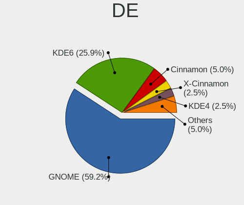
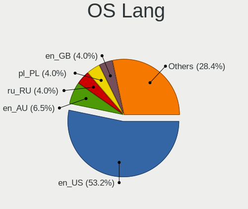
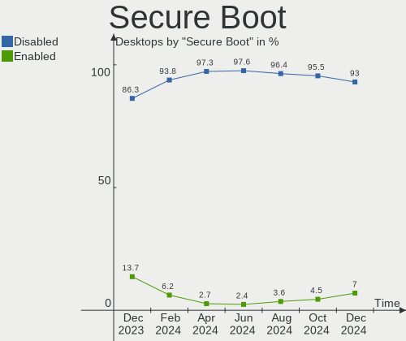
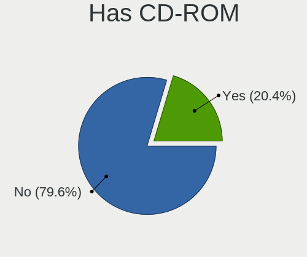
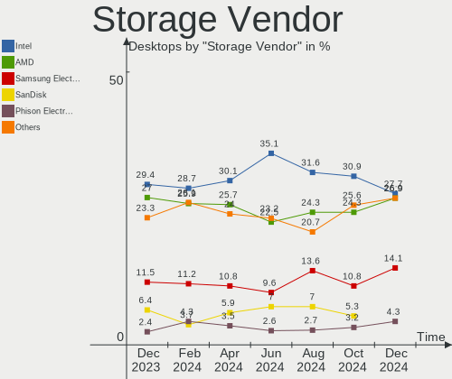
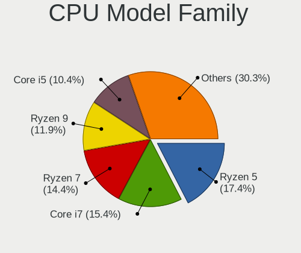
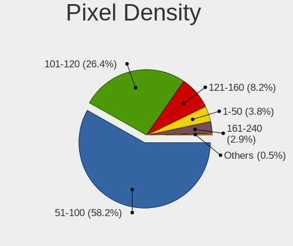

Fedora Hardware Trends (Desktop)
--------------------------------

A project to identify most popular hardware characteristics and track their change
over time based on data collected by Fedora users at https://Linux-Hardware.org.

Anyone can contribute to the study by uploading probes of their computers by
the [hw-probe](https://github.com/linuxhw/hw-probe) tool:

    sudo -E hw-probe -all -upload

Full-feature report is available here: https://linux-hardware.org/?view=trends&formfactor=desktop

Period: May, 2021.

Contents
--------

- [ OS                       ](#os)
- [ OS Family                ](#os-family)
- [ Kernel                   ](#kernel)
- [ Kernel Family            ](#kernel-family)
- [ Kernel Major Ver.        ](#kernel-major-ver)
- [ Arch                     ](#arch)
- [ DE                       ](#de)
- [ Display Server           ](#display-server)
- [ Display Manager          ](#display-manager)
- [ OS Lang                  ](#os-lang)
- [ Boot Mode                ](#boot-mode)
- [ Filesystem               ](#filesystem)
- [ Part. scheme             ](#part-scheme)
- [ Dual Boot with Linux/BSD ](#dual-boot-with-linux/bsd)
- [ Dual Boot (Win)          ](#dual-boot-win)
- [ Country                  ](#country)
- [ City                     ](#city)
- [ Vendor                   ](#vendor)
- [ Model                    ](#model)
- [ Model Family             ](#model-family)
- [ MFG Year                 ](#mfg-year)
- [ Form Factor              ](#form-factor)
- [ Secure Boot              ](#secure-boot)
- [ Coreboot                 ](#coreboot)
- [ RAM Size                 ](#ram-size)
- [ RAM Used                 ](#ram-used)
- [ Has CD-ROM               ](#has-cd-rom)
- [ Total Drives             ](#total-drives)
- [ Has Ethernet             ](#has-ethernet)
- [ Has WiFi                 ](#has-wifi)
- [ Has Bluetooth            ](#has-bluetooth)
- [ Drive Vendor             ](#drive-vendor)
- [ Drive Model              ](#drive-model)
- [ HDD Vendor               ](#hdd-vendor)
- [ SSD Vendor               ](#ssd-vendor)
- [ Drive Kind               ](#drive-kind)
- [ Drive Connector          ](#drive-connector)
- [ Drive Size               ](#drive-size)
- [ Space Total              ](#space-total)
- [ Space Used               ](#space-used)
- [ Malfunc. Drives          ](#malfunc-drives)
- [ Malfunc. Drive Vendor    ](#malfunc-drive-vendor)
- [ Malfunc. HDD Vendor      ](#malfunc-hdd-vendor)
- [ Malfunc. Drive Kind      ](#malfunc-drive-kind)
- [ Failed Drives            ](#failed-drives)
- [ Failed Drive Vendor      ](#failed-drive-vendor)
- [ Drive Status             ](#drive-status)
- [ Storage Vendor           ](#storage-vendor)
- [ Storage Model            ](#storage-model)
- [ Storage Kind             ](#storage-kind)
- [ CPU Vendor               ](#cpu-vendor)
- [ CPU Model                ](#cpu-model)
- [ CPU Model Family         ](#cpu-model-family)
- [ CPU Cores                ](#cpu-cores)
- [ CPU Sockets              ](#cpu-sockets)
- [ CPU Threads              ](#cpu-threads)
- [ CPU Op-Modes             ](#cpu-op-modes)
- [ CPU Microcode            ](#cpu-microcode)
- [ CPU Microarch            ](#cpu-microarch)
- [ GPU Vendor               ](#gpu-vendor)
- [ GPU Model                ](#gpu-model)
- [ GPU Combo                ](#gpu-combo)
- [ GPU Driver               ](#gpu-driver)
- [ GPU Memory               ](#gpu-memory)
- [ Monitor Vendor           ](#monitor-vendor)
- [ Monitor Model            ](#monitor-model)
- [ Monitor Resolution       ](#monitor-resolution)
- [ Monitor Diagonal         ](#monitor-diagonal)
- [ Monitor Width            ](#monitor-width)
- [ Aspect Ratio             ](#aspect-ratio)
- [ Monitor Area             ](#monitor-area)
- [ Pixel Density            ](#pixel-density)
- [ Multiple Monitors        ](#multiple-monitors)
- [ Net Controller Vendor    ](#net-controller-vendor)
- [ Net Controller Model     ](#net-controller-model)
- [ Wireless Vendor          ](#wireless-vendor)
- [ Wireless Model           ](#wireless-model)
- [ Ethernet Vendor          ](#ethernet-vendor)
- [ Ethernet Model           ](#ethernet-model)
- [ Net Controller Kind      ](#net-controller-kind)
- [ Used Controller          ](#used-controller)
- [ NICs                     ](#nics)
- [ IPv6                     ](#ipv6)
- [ Memory Vendor            ](#memory-vendor)
- [ Memory Model             ](#memory-model)
- [ Memory Kind              ](#memory-kind)
- [ Memory Form Factor       ](#memory-form-factor)
- [ Memory Size              ](#memory-size)
- [ Memory Speed             ](#memory-speed)
- [ Sound Vendor             ](#sound-vendor)
- [ Sound Model              ](#sound-model)
- [ Camera Vendor            ](#camera-vendor)
- [ Camera Model             ](#camera-model)
- [ Fingerprint Vendor       ](#fingerprint-vendor)
- [ Fingerprint Model        ](#fingerprint-model)
- [ Chipcard Vendor          ](#chipcard-vendor)
- [ Chipcard Model           ](#chipcard-model)
- [ Printer Vendor           ](#printer-vendor)
- [ Printer Model            ](#printer-model)
- [ Scanner Vendor           ](#scanner-vendor)
- [ Scanner Model            ](#scanner-model)
- [ Bluetooth Vendor         ](#bluetooth-vendor)
- [ Bluetooth Model          ](#bluetooth-model)
- [ Unsupported Devices      ](#unsupported-devices)
- [ Unsupported Device Types ](#unsupported-device-types)

OS
--

Installed operating systems

| Name      | Desktops | Percent |
|-----------|----------|---------|
| Fedora 34 | 92       | 79.31%  |
| Fedora 33 | 21       | 18.1%   |
| Fedora 35 | 2        | 1.72%   |
| Fedora 32 | 1        | 0.86%   |

OS Family
---------

OS without a version

| Name   | Desktops | Percent |
|--------|----------|---------|
| Fedora | 116      | 100%    |

Kernel
------

Version of the Linux kernel

| Version                                             | Desktops | Percent |
|-----------------------------------------------------|----------|---------|
| 5.11.17-300.fc34.x86_64                             | 15       | 12.93%  |
| 5.11.20-300.fc34.x86_64                             | 13       | 11.21%  |
| 5.11.19-300.fc34.x86_64                             | 13       | 11.21%  |
| 5.11.18-300.fc34.x86_64                             | 12       | 10.34%  |
| 5.11.16-300.fc34.x86_64                             | 11       | 9.48%   |
| 5.12.7-300.fc34.x86_64                              | 9        | 7.76%   |
| 5.12.6-300.fc34.x86_64                              | 8        | 6.9%    |
| 5.11.12-300.fc34.x86_64                             | 6        | 5.17%   |
| 5.11.17-200.fc33.x86_64                             | 5        | 4.31%   |
| 5.11.20-200.fc33.x86_64                             | 4        | 3.45%   |
| 5.11.19-200.fc33.x86_64                             | 3        | 2.59%   |
| 5.12.6-200.fc33.x86_64                              | 2        | 1.72%   |
| 5.12.5-300.fc34.x86_64                              | 2        | 1.72%   |
| 5.11.18-200.fc33.x86_64                             | 2        | 1.72%   |
| 5.9.13-200.fc33.x86_64                              | 1        | 0.86%   |
| 5.13.0-0.rc2.20210521git79a106fc6585.22.fc35.x86_64 | 1        | 0.86%   |
| 5.13.0-0.rc2.19.fc35.x86_64                         | 1        | 0.86%   |
| 5.12.7-200.fc33.x86_64                              | 1        | 0.86%   |
| 5.12.2-300.fc34.x86_64                              | 1        | 0.86%   |
| 5.11.8-200.fc33.x86_64                              | 1        | 0.86%   |
| 5.11.21-300.fc34.x86_64                             | 1        | 0.86%   |
| 5.11.19-100.fc32.x86_64                             | 1        | 0.86%   |
| 5.11.16-200.fc33.x86_64                             | 1        | 0.86%   |
| 5.11.15-300.fc34.x86_64                             | 1        | 0.86%   |
| 5.11.13-200.fc33.x86_64                             | 1        | 0.86%   |

Kernel Family
-------------

Linux kernel without a distro release

| Version | Desktops | Percent |
|---------|----------|---------|
| 5.11.17 | 20       | 17.24%  |
| 5.11.20 | 17       | 14.66%  |
| 5.11.19 | 17       | 14.66%  |
| 5.11.18 | 14       | 12.07%  |
| 5.11.16 | 12       | 10.34%  |
| 5.12.7  | 10       | 8.62%   |
| 5.12.6  | 10       | 8.62%   |
| 5.11.12 | 6        | 5.17%   |
| 5.13.0  | 2        | 1.72%   |
| 5.12.5  | 2        | 1.72%   |
| 5.9.13  | 1        | 0.86%   |
| 5.12.2  | 1        | 0.86%   |
| 5.11.8  | 1        | 0.86%   |
| 5.11.21 | 1        | 0.86%   |
| 5.11.15 | 1        | 0.86%   |
| 5.11.13 | 1        | 0.86%   |

Kernel Major Ver.
-----------------

Linux kernel major version

| Version | Desktops | Percent |
|---------|----------|---------|
| 5.11    | 90       | 77.59%  |
| 5.12    | 23       | 19.83%  |
| 5.13    | 2        | 1.72%   |
| 5.9     | 1        | 0.86%   |

Arch
----

OS architecture (x86_64, i586, etc.)

| Name   | Desktops | Percent |
|--------|----------|---------|
| x86_64 | 116      | 100%    |

DE
--

Desktop Environment

| Name            | Desktops | Percent |
|-----------------|----------|---------|
| GNOME           | 85       | 73.28%  |
| KDE5            | 7        | 6.03%   |
| KDE             | 7        | 6.03%   |
| Cinnamon        | 5        | 4.31%   |
| Unknown         | 3        | 2.59%   |
| XFCE            | 2        | 1.72%   |
| X-Cinnamon      | 2        | 1.72%   |
| Deepin          | 2        | 1.72%   |
| MATE            | 1        | 0.86%   |
| LXDE            | 1        | 0.86%   |
| GNOME Flashback | 1        | 0.86%   |

Display Server
--------------

X11 or Wayland

| Name    | Desktops | Percent |
|---------|----------|---------|
| Wayland | 66       | 56.9%   |
| X11     | 43       | 37.07%  |
| Tty     | 5        | 4.31%   |
| Unknown | 2        | 1.72%   |

Display Manager
---------------

SDDM, LightDM, etc.

| Name    | Desktops | Percent |
|---------|----------|---------|
| Unknown | 74       | 63.79%  |
| GDM     | 30       | 25.86%  |
| TDM     | 5        | 4.31%   |
| SDDM    | 4        | 3.45%   |
| LightDM | 3        | 2.59%   |

OS Lang
-------

Language

| Lang  | Desktops | Percent |
|-------|----------|---------|
| en_US | 57       | 49.14%  |
| en_GB | 9        | 7.76%   |
| en_CA | 9        | 7.76%   |
| en_AU | 6        | 5.17%   |
| de_DE | 6        | 5.17%   |
| ru_RU | 5        | 4.31%   |
| pt_BR | 5        | 4.31%   |
| it_IT | 3        | 2.59%   |
| nl_BE | 2        | 1.72%   |
| es_ES | 2        | 1.72%   |
| tr_TR | 1        | 0.86%   |
| pl_PL | 1        | 0.86%   |
| nl_NL | 1        | 0.86%   |
| ja_JP | 1        | 0.86%   |
| hu_HU | 1        | 0.86%   |
| fr_FR | 1        | 0.86%   |
| fi_FI | 1        | 0.86%   |
| es_UY | 1        | 0.86%   |
| es_US | 1        | 0.86%   |
| en_IN | 1        | 0.86%   |
| cs_CZ | 1        | 0.86%   |
| C     | 1        | 0.86%   |

Boot Mode
---------

EFI or BIOS

| Mode | Desktops | Percent |
|------|----------|---------|
| EFI  | 75       | 64.66%  |
| BIOS | 41       | 35.34%  |

Filesystem
----------

Type of filesystem

| Type                | Desktops | Percent |
|---------------------|----------|---------|
| Btrfs               | 72       | 62.07%  |
| Ext4                | 33       | 28.45%  |
| Xfs                 | 8        | 6.9%    |
| Zfs                 | 2        | 1.72%   |
| Fuse.fuse-overlayfs | 1        | 0.86%   |

Part. scheme
------------

Scheme of partitioning

| Type    | Desktops | Percent |
|---------|----------|---------|
| Unknown | 76       | 65.52%  |
| GPT     | 29       | 25%     |
| MBR     | 11       | 9.48%   |

Dual Boot with Linux/BSD
------------------------

Hosting more than one Linux/BSD

| Dual boot | Desktops | Percent |
|-----------|----------|---------|
| No        | 100      | 86.21%  |
| Yes       | 16       | 13.79%  |

Dual Boot (Win)
---------------

Hosting Linux and Windows

| Dual boot | Desktops | Percent |
|-----------|----------|---------|
| No        | 92       | 79.31%  |
| Yes       | 24       | 20.69%  |

Country
-------

Geographic location (country)

| Country                | Desktops | Percent |
|------------------------|----------|---------|
| USA                    | 21       | 18.1%   |
| Germany                | 10       | 8.62%   |
| Canada                 | 9        | 7.76%   |
| Russia                 | 7        | 6.03%   |
| Brazil                 | 7        | 6.03%   |
| Australia              | 7        | 6.03%   |
| UK                     | 5        | 4.31%   |
| Switzerland            | 5        | 4.31%   |
| Sweden                 | 4        | 3.45%   |
| Spain                  | 4        | 3.45%   |
| Italy                  | 4        | 3.45%   |
| France                 | 4        | 3.45%   |
| Turkey                 | 3        | 2.59%   |
| Poland                 | 2        | 1.72%   |
| India                  | 2        | 1.72%   |
| Belgium                | 2        | 1.72%   |
| Belarus                | 2        | 1.72%   |
| Uruguay                | 1        | 0.86%   |
| Romania                | 1        | 0.86%   |
| Portugal               | 1        | 0.86%   |
| Peru                   | 1        | 0.86%   |
| Norway                 | 1        | 0.86%   |
| Netherlands            | 1        | 0.86%   |
| Jordan                 | 1        | 0.86%   |
| Japan                  | 1        | 0.86%   |
| Hungary                | 1        | 0.86%   |
| Hong Kong              | 1        | 0.86%   |
| Greece                 | 1        | 0.86%   |
| Finland                | 1        | 0.86%   |
| Czechia                | 1        | 0.86%   |
| Croatia                | 1        | 0.86%   |
| China                  | 1        | 0.86%   |
| Chile                  | 1        | 0.86%   |
| Bosnia and Herzegovina | 1        | 0.86%   |
| Argentina              | 1        | 0.86%   |

City
----

Geographic location (city)

| City               | Desktops | Percent |
|--------------------|----------|---------|
| St Petersburg      | 3        | 2.59%   |
| Istanbul           | 3        | 2.59%   |
| Sydney             | 2        | 1.72%   |
| Naples             | 2        | 1.72%   |
| Chipping Norton    | 2        | 1.72%   |
| Chatel-Saint-Denis | 2        | 1.72%   |
| Örebro            | 1        | 0.86%   |
| Zurich             | 1        | 0.86%   |
| Zuccoli            | 1        | 0.86%   |
| Zagreb             | 1        | 0.86%   |
| Wroclaw            | 1        | 0.86%   |
| Woodstock          | 1        | 0.86%   |
| Woodbridge         | 1        | 0.86%   |
| Winnipeg           | 1        | 0.86%   |
| West Henrietta     | 1        | 0.86%   |
| Watsonville        | 1        | 0.86%   |
| Vila Velha         | 1        | 0.86%   |
| Vijayawada         | 1        | 0.86%   |
| Veresegyhaz        | 1        | 0.86%   |
| Ufa                | 1        | 0.86%   |
| Trumann            | 1        | 0.86%   |
| Tours              | 1        | 0.86%   |
| Toronto            | 1        | 0.86%   |
| Tallahassee        | 1        | 0.86%   |
| Tahara             | 1        | 0.86%   |
| Sylva              | 1        | 0.86%   |
| Stade              | 1        | 0.86%   |
| Spanga             | 1        | 0.86%   |
| Shanghai           | 1        | 0.86%   |
| Semsales           | 1        | 0.86%   |
| Santo André       | 1        | 0.86%   |
| San Jose           | 1        | 0.86%   |
| San Carlos         | 1        | 0.86%   |
| Saint-Lary-Soulan  | 1        | 0.86%   |
| Rostov-on-Don      | 1        | 0.86%   |
| Rokycany           | 1        | 0.86%   |
| Rancagua           | 1        | 0.86%   |
| Queens             | 1        | 0.86%   |
| Powell River       | 1        | 0.86%   |
| Porto Alegre       | 1        | 0.86%   |
| Pordenone          | 1        | 0.86%   |
| Perth              | 1        | 0.86%   |
| Perama             | 1        | 0.86%   |
| Palma              | 1        | 0.86%   |
| Palaiseau          | 1        | 0.86%   |
| New Westminster    | 1        | 0.86%   |
| Munich             | 1        | 0.86%   |
| Montreal           | 1        | 0.86%   |
| Mississauga        | 1        | 0.86%   |
| Minsk              | 1        | 0.86%   |
| Milan              | 1        | 0.86%   |
| Mengerskirchen     | 1        | 0.86%   |
| Manchester         | 1        | 0.86%   |
| Madrid             | 1        | 0.86%   |
| Louisville         | 1        | 0.86%   |
| Lochearnhead       | 1        | 0.86%   |
| Llanes             | 1        | 0.86%   |
| Lisbon             | 1        | 0.86%   |
| Lima               | 1        | 0.86%   |
| Lille              | 1        | 0.86%   |

Vendor
------

Motherboard manufacturer

| Name                | Desktops | Percent |
|---------------------|----------|---------|
| ASUSTek Computer    | 31       | 26.72%  |
| Gigabyte Technology | 28       | 24.14%  |
| MSI                 | 13       | 11.21%  |
| ASRock              | 12       | 10.34%  |
| Hewlett-Packard     | 10       | 8.62%   |
| Dell                | 5        | 4.31%   |
| Unknown             | 3        | 2.59%   |
| Lenovo              | 2        | 1.72%   |
| Intel               | 2        | 1.72%   |
| Huanan              | 2        | 1.72%   |
| Fujitsu             | 2        | 1.72%   |
| Biostar             | 2        | 1.72%   |
| Acer                | 2        | 1.72%   |
| Pegatron            | 1        | 0.86%   |
| Alienware           | 1        | 0.86%   |

Model
-----

Motherboard model

| Name                                | Desktops | Percent |
|-------------------------------------|----------|---------|
| Gigabyte A320M-S2H                  | 3        | 2.59%   |
| ASUS All Series                     | 3        | 2.59%   |
| Unknown                             | 3        | 2.59%   |
| MSI MS-7C37                         | 2        | 1.72%   |
| Gigabyte 970A-DS3P                  | 2        | 1.72%   |
| Dell OptiPlex 7040                  | 2        | 1.72%   |
| ASUS ROG Maximus XI FORMULA         | 2        | 1.72%   |
| Pegatron p7-1030                    | 1        | 0.86%   |
| MSI Pro 3130 Small Form Factor PC   | 1        | 0.86%   |
| MSI MS-7D18                         | 1        | 0.86%   |
| MSI MS-7C90                         | 1        | 0.86%   |
| MSI MS-7C35                         | 1        | 0.86%   |
| MSI MS-7C02                         | 1        | 0.86%   |
| MSI MS-7A40                         | 1        | 0.86%   |
| MSI MS-7A39                         | 1        | 0.86%   |
| MSI MS-7995                         | 1        | 0.86%   |
| MSI MS-7978                         | 1        | 0.86%   |
| MSI MS-7816                         | 1        | 0.86%   |
| MSI MS-7581                         | 1        | 0.86%   |
| Lenovo ThinkCentre M720s 10ST007HUK | 1        | 0.86%   |
| Lenovo ThinkCentre M58 8820AJG      | 1        | 0.86%   |
| Intel H61                           | 1        | 0.86%   |
| Intel DH87RL AAG74240-400           | 1        | 0.86%   |
| Huanan X79 VAA1                     | 1        | 0.86%   |
| Huanan X58                          | 1        | 0.86%   |
| HP Z220 SFF Workstation             | 1        | 0.86%   |
| HP xw6600 Workstation               | 1        | 0.86%   |
| HP Slim Desktop S01-pF1xxx          | 1        | 0.86%   |
| HP ProDesk 600 G1 DM                | 1        | 0.86%   |
| HP ProDesk 400 G1 MT                | 1        | 0.86%   |
| HP EliteDesk 800 G2 DM 65W          | 1        | 0.86%   |
| HP EliteDesk 800 G1 USDT            | 1        | 0.86%   |
| HP Compaq dc5850 Small Form Factor  | 1        | 0.86%   |
| HP Compaq 8200 Elite CMT PC         | 1        | 0.86%   |
| HP Compaq 6200 Pro SFF PC           | 1        | 0.86%   |
| Gigabyte Z97N-Gaming 5              | 1        | 0.86%   |
| Gigabyte Z97-HD3                    | 1        | 0.86%   |
| Gigabyte Z390 M GAMING              | 1        | 0.86%   |
| Gigabyte Z390 AORUS ULTRA           | 1        | 0.86%   |
| Gigabyte Z370N WIFI                 | 1        | 0.86%   |
| Gigabyte Z170-Gaming K3             | 1        | 0.86%   |
| Gigabyte Z170-D3H                   | 1        | 0.86%   |
| Gigabyte X570 AORUS ELITE WIFI      | 1        | 0.86%   |
| Gigabyte X470 AORUS GAMING 5 WIFI   | 1        | 0.86%   |
| Gigabyte H87-HD3                    | 1        | 0.86%   |
| Gigabyte H77N-WIFI                  | 1        | 0.86%   |
| Gigabyte H61M-S2PH                  | 1        | 0.86%   |
| Gigabyte H61M-S2P                   | 1        | 0.86%   |
| Gigabyte H370 WIFI                  | 1        | 0.86%   |
| Gigabyte H310M H                    | 1        | 0.86%   |
| Gigabyte G41MT-D3                   | 1        | 0.86%   |
| Gigabyte F2A88XN-WIFI               | 1        | 0.86%   |
| Gigabyte B75M-D3P                   | 1        | 0.86%   |
| Gigabyte B450M DS3H WIFI            | 1        | 0.86%   |
| Gigabyte B450 AORUS M               | 1        | 0.86%   |
| Gigabyte B360M-DS3H                 | 1        | 0.86%   |
| Gigabyte B360M-D3H                  | 1        | 0.86%   |
| Gigabyte B150M-D3H                  | 1        | 0.86%   |
| Fujitsu ESPRIMO P520                | 1        | 0.86%   |
| Fujitsu ESPRIMO P410                | 1        | 0.86%   |

Model Family
------------

Motherboard model prefix

| Name                  | Desktops | Percent |
|-----------------------|----------|---------|
| ASUS ROG              | 8        | 6.9%    |
| ASUS PRIME            | 5        | 4.31%   |
| Dell OptiPlex         | 4        | 3.45%   |
| HP Compaq             | 3        | 2.59%   |
| Gigabyte A320M-S2H    | 3        | 2.59%   |
| ASUS All              | 3        | 2.59%   |
| Unknown               | 3        | 2.59%   |
| MSI MS-7C37           | 2        | 1.72%   |
| Lenovo ThinkCentre    | 2        | 1.72%   |
| HP ProDesk            | 2        | 1.72%   |
| HP EliteDesk          | 2        | 1.72%   |
| Gigabyte Z390         | 2        | 1.72%   |
| Gigabyte 970A-DS3P    | 2        | 1.72%   |
| Fujitsu ESPRIMO       | 2        | 1.72%   |
| ASRock X570           | 2        | 1.72%   |
| ASRock B450M          | 2        | 1.72%   |
| Pegatron p7-1030      | 1        | 0.86%   |
| MSI Pro               | 1        | 0.86%   |
| MSI MS-7D18           | 1        | 0.86%   |
| MSI MS-7C90           | 1        | 0.86%   |
| MSI MS-7C35           | 1        | 0.86%   |
| MSI MS-7C02           | 1        | 0.86%   |
| MSI MS-7A40           | 1        | 0.86%   |
| MSI MS-7A39           | 1        | 0.86%   |
| MSI MS-7995           | 1        | 0.86%   |
| MSI MS-7978           | 1        | 0.86%   |
| MSI MS-7816           | 1        | 0.86%   |
| MSI MS-7581           | 1        | 0.86%   |
| Intel H61             | 1        | 0.86%   |
| Intel DH87RL          | 1        | 0.86%   |
| Huanan X79            | 1        | 0.86%   |
| Huanan X58            | 1        | 0.86%   |
| HP Z220               | 1        | 0.86%   |
| HP xw6600             | 1        | 0.86%   |
| HP Slim               | 1        | 0.86%   |
| Gigabyte Z97N-Gaming  | 1        | 0.86%   |
| Gigabyte Z97-HD3      | 1        | 0.86%   |
| Gigabyte Z370N        | 1        | 0.86%   |
| Gigabyte Z170-Gaming  | 1        | 0.86%   |
| Gigabyte Z170-D3H     | 1        | 0.86%   |
| Gigabyte X570         | 1        | 0.86%   |
| Gigabyte X470         | 1        | 0.86%   |
| Gigabyte H87-HD3      | 1        | 0.86%   |
| Gigabyte H77N-WIFI    | 1        | 0.86%   |
| Gigabyte H61M-S2PH    | 1        | 0.86%   |
| Gigabyte H61M-S2P     | 1        | 0.86%   |
| Gigabyte H370         | 1        | 0.86%   |
| Gigabyte H310M        | 1        | 0.86%   |
| Gigabyte G41MT-D3     | 1        | 0.86%   |
| Gigabyte F2A88XN-WIFI | 1        | 0.86%   |
| Gigabyte B75M-D3P     | 1        | 0.86%   |
| Gigabyte B450M        | 1        | 0.86%   |
| Gigabyte B450         | 1        | 0.86%   |
| Gigabyte B360M-DS3H   | 1        | 0.86%   |
| Gigabyte B360M-D3H    | 1        | 0.86%   |
| Gigabyte B150M-D3H    | 1        | 0.86%   |
| Dell Studio           | 1        | 0.86%   |
| Biostar TB350-BTC     | 1        | 0.86%   |
| Biostar H81MLC        | 1        | 0.86%   |
| ASUS Z77-A            | 1        | 0.86%   |

MFG Year
--------

Motherboard manufacture year

| Year | Desktops | Percent |
|------|----------|---------|
| 2019 | 20       | 17.24%  |
| 2020 | 19       | 16.38%  |
| 2018 | 13       | 11.21%  |
| 2021 | 12       | 10.34%  |
| 2012 | 8        | 6.9%    |
| 2015 | 7        | 6.03%   |
| 2014 | 7        | 6.03%   |
| 2013 | 7        | 6.03%   |
| 2016 | 6        | 5.17%   |
| 2011 | 5        | 4.31%   |
| 2009 | 4        | 3.45%   |
| 2017 | 3        | 2.59%   |
| 2010 | 3        | 2.59%   |
| 2008 | 1        | 0.86%   |
| 2006 | 1        | 0.86%   |

Form Factor
-----------

Physical design of the computer

| Name    | Desktops | Percent |
|---------|----------|---------|
| Desktop | 116      | 100%    |

Secure Boot
-----------

Enabled or disabled

| State    | Desktops | Percent |
|----------|----------|---------|
| Disabled | 111      | 95.69%  |
| Enabled  | 5        | 4.31%   |

Coreboot
--------

Have coreboot on board

| Used | Desktops | Percent |
|------|----------|---------|
| No   | 116      | 100%    |

RAM Size
--------

Total RAM memory

| Size in GB  | Desktops | Percent |
|-------------|----------|---------|
| 16.01-24.0  | 34       | 29.31%  |
| 8.01-16.0   | 29       | 25%     |
| 32.01-64.0  | 19       | 16.38%  |
| 3.01-4.0    | 11       | 9.48%   |
| 4.01-8.0    | 10       | 8.62%   |
| 64.01-256.0 | 10       | 8.62%   |
| 24.01-32.0  | 3        | 2.59%   |

RAM Used
--------

Used RAM memory

| Used GB    | Desktops | Percent |
|------------|----------|---------|
| 4.01-8.0   | 36       | 31.03%  |
| 2.01-3.0   | 26       | 22.41%  |
| 3.01-4.0   | 21       | 18.1%   |
| 1.01-2.0   | 21       | 18.1%   |
| 8.01-16.0  | 7        | 6.03%   |
| 16.01-24.0 | 2        | 1.72%   |
| 0.51-1.0   | 2        | 1.72%   |
| 0.01-0.5   | 1        | 0.86%   |

Has CD-ROM
----------

Has CD-ROM on board

| Presented | Desktops | Percent |
|-----------|----------|---------|
| No        | 69       | 59.48%  |
| Yes       | 47       | 40.52%  |

Total Drives
------------

Number of drives on board

| Drives | Desktops | Percent |
|--------|----------|---------|
| 3      | 32       | 27.59%  |
| 1      | 30       | 25.86%  |
| 2      | 25       | 21.55%  |
| 4      | 15       | 12.93%  |
| 5      | 8        | 6.9%    |
| 12     | 2        | 1.72%   |
| 9      | 1        | 0.86%   |
| 8      | 1        | 0.86%   |
| 6      | 1        | 0.86%   |
| 0      | 1        | 0.86%   |

Has Ethernet
------------

Has Ethernet on board

| Presented | Desktops | Percent |
|-----------|----------|---------|
| Yes       | 115      | 99.14%  |
| No        | 1        | 0.86%   |

Has WiFi
--------

Has WiFi module

| Presented | Desktops | Percent |
|-----------|----------|---------|
| No        | 62       | 53.45%  |
| Yes       | 54       | 46.55%  |

Has Bluetooth
-------------

Has Bluetooth module

| Presented | Desktops | Percent |
|-----------|----------|---------|
| No        | 69       | 59.48%  |
| Yes       | 47       | 40.52%  |

Drive Vendor
------------

Hard drive vendors

| Vendor                    | Desktops | Drives | Percent |
|---------------------------|----------|--------|---------|
| Samsung Electronics       | 43       | 72     | 18.22%  |
| Seagate                   | 41       | 62     | 17.37%  |
| WDC                       | 36       | 55     | 15.25%  |
| Toshiba                   | 17       | 18     | 7.2%    |
| Kingston                  | 13       | 13     | 5.51%   |
| Crucial                   | 13       | 15     | 5.51%   |
| Sandisk                   | 11       | 11     | 4.66%   |
| Hitachi                   | 9        | 13     | 3.81%   |
| Intel                     | 6        | 7      | 2.54%   |
| Phison                    | 4        | 5      | 1.69%   |
| OCZ                       | 4        | 6      | 1.69%   |
| A-DATA Technology         | 4        | 4      | 1.69%   |
| XPG                       | 3        | 4      | 1.27%   |
| Unknown                   | 3        | 3      | 1.27%   |
| Transcend                 | 2        | 2      | 0.85%   |
| Team                      | 2        | 2      | 0.85%   |
| SPCC                      | 2        | 2      | 0.85%   |
| Micron/Crucial Technology | 2        | 2      | 0.85%   |
| Micron Technology         | 2        | 2      | 0.85%   |
| HGST                      | 2        | 10     | 0.85%   |
| Corsair                   | 2        | 2      | 0.85%   |
| Ugreen                    | 1        | 1      | 0.42%   |
| SSK                       | 1        | 1      | 0.42%   |
| Smartbuy                  | 1        | 1      | 0.42%   |
| SK Hynix                  | 1        | 1      | 0.42%   |
| Silicon Motion            | 1        | 1      | 0.42%   |
| SABRENT                   | 1        | 1      | 0.42%   |
| PNY                       | 1        | 1      | 0.42%   |
| Mushkin                   | 1        | 1      | 0.42%   |
| MAXTOR                    | 1        | 1      | 0.42%   |
| maxone                    | 1        | 1      | 0.42%   |
| Lexar                     | 1        | 1      | 0.42%   |
| KingSpec                  | 1        | 1      | 0.42%   |
| KingFast                  | 1        | 1      | 0.42%   |
| Fujitsu                   | 1        | 1      | 0.42%   |
| Apple                     | 1        | 1      | 0.42%   |

Drive Model
-----------

Hard drive models

| Model                             | Desktops | Percent |
|-----------------------------------|----------|---------|
| Seagate ST500DM002-1BD142 500GB   | 6        | 2.06%   |
| Samsung NVMe SSD Drive 1TB        | 6        | 2.06%   |
| Samsung SSD 860 EVO 1TB           | 5        | 1.72%   |
| Samsung NVMe SSD Drive 500GB      | 5        | 1.72%   |
| Sandisk NVMe SSD Drive 500GB      | 4        | 1.37%   |
| Crucial CT500MX500SSD1 500GB      | 4        | 1.37%   |
| WDC WD10EZEX-08WN4A0 1TB          | 3        | 1.03%   |
| Toshiba DT01ACA100 1TB            | 3        | 1.03%   |
| Seagate ST2000DM008-2FR102 2TB    | 3        | 1.03%   |
| Seagate ST1000DM003-1CH162 1TB    | 3        | 1.03%   |
| Samsung SSD 860 EVO 500GB         | 3        | 1.03%   |
| Samsung SSD 860 EVO 250GB         | 3        | 1.03%   |
| Samsung SSD 850 EVO 500GB         | 3        | 1.03%   |
| Samsung SSD 850 EVO 250GB         | 3        | 1.03%   |
| Samsung SSD 840 EVO 250GB         | 3        | 1.03%   |
| Samsung NVMe SSD Drive 250GB      | 3        | 1.03%   |
| WDC WDS500G2B0B-00YS70 500GB SSD  | 2        | 0.69%   |
| WDC WDS100T2B0C-00PXH0 1TB        | 2        | 0.69%   |
| WDC WD40EZRZ-22GXCB0 4TB          | 2        | 0.69%   |
| WDC WD30EZRX-00MMMB0 3TB          | 2        | 0.69%   |
| WDC WD20EZRZ-00Z5HB0 2TB          | 2        | 0.69%   |
| WDC WD1001FALS-00J7B1 1TB         | 2        | 0.69%   |
| Transcend TS120GSSD220S 120GB     | 2        | 0.69%   |
| Toshiba TR200 240GB SSD           | 2        | 0.69%   |
| Toshiba DT01ACA200 2TB            | 2        | 0.69%   |
| SPCC Solid State Disk 240GB       | 2        | 0.69%   |
| Seagate ST3500413AS 500GB         | 2        | 0.69%   |
| Seagate ST2000DM001-9YN164 2TB    | 2        | 0.69%   |
| Seagate ST1000DM010-2EP102 1TB    | 2        | 0.69%   |
| Seagate ST1000DM003-1SB102 1TB    | 2        | 0.69%   |
| Seagate Backup+ Hub BK 8TB        | 2        | 0.69%   |
| Sandisk NVMe SSD Drive 1TB        | 2        | 0.69%   |
| Samsung SSD 970 EVO 500GB         | 2        | 0.69%   |
| Samsung SSD 860 QVO 1TB           | 2        | 0.69%   |
| Samsung NVMe SSD Drive 512GB      | 2        | 0.69%   |
| Samsung NVMe SSD Drive 2TB        | 2        | 0.69%   |
| Phison NVMe SSD Drive 2TB         | 2        | 0.69%   |
| Phison NVMe SSD Drive 1024GB      | 2        | 0.69%   |
| Micron/Crucial NVMe SSD Drive 1TB | 2        | 0.69%   |
| Kingston SA400S37120G 120GB SSD   | 2        | 0.69%   |
| Kingston SA2000M81000G 1TB        | 2        | 0.69%   |
| Intel NVMe SSD Drive 1024GB       | 2        | 0.69%   |
| Hitachi HDS722020ALA330 2TB       | 2        | 0.69%   |
| Hitachi HDS721050CLA362 500GB     | 2        | 0.69%   |
| Crucial CT480BX500SSD1 480GB      | 2        | 0.69%   |
| Crucial CT250MX500SSD1 250GB      | 2        | 0.69%   |
| XPG NVMe SSD Drive 512GB          | 1        | 0.34%   |
| XPG NVMe SSD Drive 256GB          | 1        | 0.34%   |
| XPG NVMe SSD Drive 1024GB         | 1        | 0.34%   |
| WDC WDS500G3XHC-00SJG0 500GB      | 1        | 0.34%   |
| WDC WDS500G2B0A-00SM50 500GB SSD  | 1        | 0.34%   |
| WDC WDS250G2X0C-00L350 250GB      | 1        | 0.34%   |
| WDC WDS250G2B0B-00YS70 250GB SSD  | 1        | 0.34%   |
| WDC WDS250G1B0B-00AS40 250GB SSD  | 1        | 0.34%   |
| WDC WDS250G1B0A-00H9H0 250GB SSD  | 1        | 0.34%   |
| WDC WDS240G2G0B-00EPW0 240GB SSD  | 1        | 0.34%   |
| WDC WDS240G2G0A-00JH30 240GB SSD  | 1        | 0.34%   |
| WDC WDS120G2G0B-00EPW0 120GB SSD  | 1        | 0.34%   |
| WDC WD8004FRYZ-01VAEB0 8TB        | 1        | 0.34%   |
| WDC WD6002FZWX-00GBGB0 6TB        | 1        | 0.34%   |

HDD Vendor
----------

Hard disk drive vendors

| Vendor              | Desktops | Drives | Percent |
|---------------------|----------|--------|---------|
| Seagate             | 38       | 57     | 38.38%  |
| WDC                 | 30       | 42     | 30.3%   |
| Toshiba             | 11       | 11     | 11.11%  |
| Hitachi             | 9        | 13     | 9.09%   |
| Samsung Electronics | 7        | 7      | 7.07%   |
| HGST                | 2        | 10     | 2.02%   |
| MAXTOR              | 1        | 1      | 1.01%   |
| Fujitsu             | 1        | 1      | 1.01%   |

SSD Vendor
----------

Solid state drive vendors

| Vendor              | Desktops | Drives | Percent |
|---------------------|----------|--------|---------|
| Samsung Electronics | 30       | 41     | 30%     |
| Crucial             | 12       | 14     | 12%     |
| WDC                 | 8        | 9      | 8%      |
| Kingston            | 8        | 8      | 8%      |
| Toshiba             | 5        | 5      | 5%      |
| SanDisk             | 5        | 5      | 5%      |
| OCZ                 | 4        | 6      | 4%      |
| A-DATA Technology   | 4        | 4      | 4%      |
| Unknown             | 2        | 2      | 2%      |
| Transcend           | 2        | 2      | 2%      |
| Team                | 2        | 2      | 2%      |
| SPCC                | 2        | 2      | 2%      |
| Micron Technology   | 2        | 2      | 2%      |
| Corsair             | 2        | 2      | 2%      |
| Smartbuy            | 1        | 1      | 1%      |
| SK Hynix            | 1        | 1      | 1%      |
| Seagate             | 1        | 1      | 1%      |
| SABRENT             | 1        | 1      | 1%      |
| PNY                 | 1        | 1      | 1%      |
| Mushkin             | 1        | 1      | 1%      |
| maxone              | 1        | 1      | 1%      |
| Lexar               | 1        | 1      | 1%      |
| KingSpec            | 1        | 1      | 1%      |
| KingFast            | 1        | 1      | 1%      |
| Intel               | 1        | 1      | 1%      |
| Apple               | 1        | 1      | 1%      |

Drive Kind
----------

HDD or SSD

| Kind    | Desktops | Drives | Percent |
|---------|----------|--------|---------|
| SSD     | 79       | 116    | 39.11%  |
| HDD     | 78       | 142    | 38.61%  |
| NVMe    | 40       | 61     | 19.8%   |
| Unknown | 5        | 6      | 2.48%   |

Drive Connector
---------------

SATA, SAS, NVMe, etc.

| Type | Desktops | Drives | Percent |
|------|----------|--------|---------|
| SATA | 109      | 252    | 68.13%  |
| NVMe | 40       | 61     | 25%     |
| SAS  | 11       | 12     | 6.88%   |

Drive Size
----------

Size of hard drive

| Size in TB | Desktops | Drives | Percent |
|------------|----------|--------|---------|
| 0.01-0.5   | 82       | 134    | 49.4%   |
| 0.51-1.0   | 44       | 63     | 26.51%  |
| 1.01-2.0   | 22       | 26     | 13.25%  |
| 4.01-10.0  | 10       | 25     | 6.02%   |
| 3.01-4.0   | 4        | 5      | 2.41%   |
| 2.01-3.0   | 4        | 5      | 2.41%   |

Space Total
-----------

Amount of disk space available on the file system

| Size in GB     | Desktops | Percent |
|----------------|----------|---------|
| 101-250        | 22       | 18.97%  |
| 251-500        | 21       | 18.1%   |
| 1001-2000      | 16       | 13.79%  |
| 501-1000       | 15       | 12.93%  |
| More than 3000 | 14       | 12.07%  |
| 2001-3000      | 12       | 10.34%  |
| 1-20           | 7        | 6.03%   |
| Unknown        | 4        | 3.45%   |
| 51-100         | 3        | 2.59%   |
| 21-50          | 2        | 1.72%   |

Space Used
----------

Amount of used disk space

| Used GB        | Desktops | Percent |
|----------------|----------|---------|
| 21-50          | 21       | 18.1%   |
| 1-20           | 21       | 18.1%   |
| 501-1000       | 18       | 15.52%  |
| 251-500        | 15       | 12.93%  |
| 51-100         | 13       | 11.21%  |
| 101-250        | 12       | 10.34%  |
| 1001-2000      | 7        | 6.03%   |
| Unknown        | 4        | 3.45%   |
| More than 3000 | 3        | 2.59%   |
| 2001-3000      | 2        | 1.72%   |

Malfunc. Drives
---------------

Drive models with a malfunction

| Model                             | Desktops | Drives | Percent |
|-----------------------------------|----------|--------|---------|
| Seagate ST500DM002-1BD142 500GB   | 3        | 4      | 20%     |
| WDC WD5000AAKX-00ERMA0 500GB      | 1        | 1      | 6.67%   |
| WDC WD15EARS-00Z5B1 1TB           | 1        | 1      | 6.67%   |
| Toshiba DT01ACA200 2TB            | 1        | 1      | 6.67%   |
| Seagate ST500LT012-9WS142 500GB   | 1        | 1      | 6.67%   |
| Seagate ST1000DM003-1CH162 1TB    | 1        | 1      | 6.67%   |
| SanDisk SD7SB3Q128G1001 128GB SSD | 1        | 1      | 6.67%   |
| Samsung Electronics SP2514N 250GB | 1        | 1      | 6.67%   |
| Samsung Electronics HM160HI 160GB | 1        | 1      | 6.67%   |
| Samsung Electronics HD501LJ 500GB | 1        | 1      | 6.67%   |
| Intel SSDPEKKW128G7 128GB         | 1        | 1      | 6.67%   |
| Hitachi HTS543225L9A300 250GB     | 1        | 1      | 6.67%   |
| Hitachi HDS721050CLA362 500GB     | 1        | 1      | 6.67%   |

Malfunc. Drive Vendor
---------------------

Vendors of faulty drives

| Vendor              | Desktops | Drives | Percent |
|---------------------|----------|--------|---------|
| Seagate             | 5        | 6      | 33.33%  |
| Samsung Electronics | 3        | 3      | 20%     |
| WDC                 | 2        | 2      | 13.33%  |
| Hitachi             | 2        | 2      | 13.33%  |
| Toshiba             | 1        | 1      | 6.67%   |
| SanDisk             | 1        | 1      | 6.67%   |
| Intel               | 1        | 1      | 6.67%   |

Malfunc. HDD Vendor
-------------------

Vendors of faulty HDD drives

| Vendor              | Desktops | Drives | Percent |
|---------------------|----------|--------|---------|
| Seagate             | 5        | 6      | 38.46%  |
| Samsung Electronics | 3        | 3      | 23.08%  |
| WDC                 | 2        | 2      | 15.38%  |
| Hitachi             | 2        | 2      | 15.38%  |
| Toshiba             | 1        | 1      | 7.69%   |

Malfunc. Drive Kind
-------------------

Kinds of faulty drives

| Kind | Desktops | Drives | Percent |
|------|----------|--------|---------|
| HDD  | 11       | 14     | 84.62%  |
| NVMe | 1        | 1      | 7.69%   |
| SSD  | 1        | 1      | 7.69%   |

Failed Drives
-------------

Failed drive models

Zero info for selected period =(

Failed Drive Vendor
-------------------

Failed drive vendors

Zero info for selected period =(

Drive Status
------------

Number of failed and malfunc. drives

| Status   | Desktops | Drives | Percent |
|----------|----------|--------|---------|
| Detected | 78       | 221    | 60.47%  |
| Works    | 38       | 88     | 29.46%  |
| Malfunc  | 13       | 16     | 10.08%  |

Storage Vendor
--------------

Storage controller vendors

| Vendor                       | Desktops | Percent |
|------------------------------|----------|---------|
| Intel                        | 79       | 45.14%  |
| AMD                          | 36       | 20.57%  |
| Samsung Electronics          | 15       | 8.57%   |
| Sandisk                      | 9        | 5.14%   |
| ASMedia Technology           | 6        | 3.43%   |
| Kingston Technology Company  | 5        | 2.86%   |
| Phison Electronics           | 4        | 2.29%   |
| Micron/Crucial Technology    | 3        | 1.71%   |
| JMicron Technology           | 3        | 1.71%   |
| ADATA Technology             | 3        | 1.71%   |
| Toshiba America Info Systems | 2        | 1.14%   |
| Marvell Technology Group     | 2        | 1.14%   |
| ULi Electronics              | 1        | 0.57%   |
| Silicon Motion               | 1        | 0.57%   |
| Silicon Image                | 1        | 0.57%   |
| Seagate Technology           | 1        | 0.57%   |
| Nvidia                       | 1        | 0.57%   |
| LSI Logic / Symbios Logic    | 1        | 0.57%   |
| Broadcom / LSI               | 1        | 0.57%   |
| Adaptec                      | 1        | 0.57%   |

Storage Model
-------------

Storage controller models

| Model                                                                                   | Desktops | Percent |
|-----------------------------------------------------------------------------------------|----------|---------|
| AMD FCH SATA Controller [AHCI mode]                                                     | 27       | 12.68%  |
| Samsung NVMe SSD Controller SM981/PM981/PM983                                           | 12       | 5.63%   |
| Intel 8 Series/C220 Series Chipset Family 6-port SATA Controller 1 [AHCI mode]          | 11       | 5.16%   |
| Intel 200 Series PCH SATA controller [AHCI mode]                                        | 10       | 4.69%   |
| Intel Q170/Q150/B150/H170/H110/Z170/CM236 Chipset SATA Controller [AHCI Mode]           | 9        | 4.23%   |
| Intel Cannon Lake PCH SATA AHCI Controller                                              | 8        | 3.76%   |
| AMD 400 Series Chipset SATA Controller                                                  | 7        | 3.29%   |
| Sandisk WD Blue SN550 NVMe SSD                                                          | 6        | 2.82%   |
| Intel SATA Controller [RAID mode]                                                       | 6        | 2.82%   |
| Intel 6 Series/C200 Series Chipset Family 6 port Desktop SATA AHCI Controller           | 6        | 2.82%   |
| ASMedia ASM1062 Serial ATA Controller                                                   | 6        | 2.82%   |
| Intel 7 Series/C210 Series Chipset Family 6-port SATA Controller [AHCI mode]            | 5        | 2.35%   |
| Intel 9 Series Chipset Family SATA Controller [AHCI Mode]                               | 4        | 1.88%   |
| Intel 6 Series/C200 Series Chipset Family Desktop SATA Controller (IDE mode, ports 4-5) | 4        | 1.88%   |
| Intel 6 Series/C200 Series Chipset Family Desktop SATA Controller (IDE mode, ports 0-3) | 4        | 1.88%   |
| AMD SB7x0/SB8x0/SB9x0 IDE Controller                                                    | 4        | 1.88%   |
| Samsung NVMe SSD Controller PM9A1/PM9A3/980PRO                                          | 3        | 1.41%   |
| Kingston Company A2000 NVMe SSD                                                         | 3        | 1.41%   |
| AMD Starship/Matisse Chipset SATA Controller [AHCI mode]                                | 3        | 1.41%   |
| AMD SB7x0/SB8x0/SB9x0 SATA Controller [IDE mode]                                        | 3        | 1.41%   |
| AMD SB7x0/SB8x0/SB9x0 SATA Controller [AHCI mode]                                       | 3        | 1.41%   |
| AMD FCH SATA Controller D                                                               | 3        | 1.41%   |
| AMD 300 Series Chipset SATA Controller                                                  | 3        | 1.41%   |
| ADATA XPG SX8200 Pro PCIe Gen3x4 M.2 2280 Solid State Drive                             | 3        | 1.41%   |
| Sandisk WD Black 2018/SN750 / PC SN720 NVMe SSD                                         | 2        | 0.94%   |
| Phison E16 PCIe4 NVMe Controller                                                        | 2        | 0.94%   |
| Phison E12 NVMe Controller                                                              | 2        | 0.94%   |
| Kingston Company U-SNS8154P3 NVMe SSD                                                   | 2        | 0.94%   |
| JMicron JMB363 SATA/IDE Controller                                                      | 2        | 0.94%   |
| Intel SSD 660P Series                                                                   | 2        | 0.94%   |
| Intel NM10/ICH7 Family SATA Controller [IDE mode]                                       | 2        | 0.94%   |
| Intel 82801JI (ICH10 Family) SATA AHCI Controller                                       | 2        | 0.94%   |
| Intel 5 Series/3400 Series Chipset 4 port SATA IDE Controller                           | 2        | 0.94%   |
| Intel 5 Series/3400 Series Chipset 2 port SATA IDE Controller                           | 2        | 0.94%   |
| Intel 400 Series Chipset Family SATA AHCI Controller                                    | 2        | 0.94%   |
| ULi ULi M5288 SATA                                                                      | 1        | 0.47%   |
| ULi M5229 IDE                                                                           | 1        | 0.47%   |
| Toshiba America Info Systems XG6 NVMe SSD Controller                                    | 1        | 0.47%   |
| Toshiba America Info Systems XG4 NVMe SSD Controller                                    | 1        | 0.47%   |
| Silicon Motion SM2263EN/SM2263XT SSD Controller                                         | 1        | 0.47%   |
| Silicon Image SiI 3132 Serial ATA Raid II Controller                                    | 1        | 0.47%   |
| Seagate FireCuda 520 SSD                                                                | 1        | 0.47%   |
| Sandisk WD Black SN750 / PC SN730 NVMe SSD                                              | 1        | 0.47%   |
| Samsung NVMe SSD Controller SM961/PM961/SM963                                           | 1        | 0.47%   |
| Samsung NVMe SSD Controller SM951/PM951                                                 | 1        | 0.47%   |
| Nvidia SATA controller                                                                  | 1        | 0.47%   |
| Nvidia MCP78S [GeForce 8200] IDE                                                        | 1        | 0.47%   |
| Micron/Crucial P1 NVMe PCIe SSD                                                         | 1        | 0.47%   |
| Micron/Crucial NVMe Controller                                                          | 1        | 0.47%   |
| Micron/Crucial Non-Volatile memory controller                                           | 1        | 0.47%   |
| Marvell Group 88SE9215 PCIe 2.0 x1 4-port SATA 6 Gb/s Controller                        | 1        | 0.47%   |
| Marvell Group 88SE9172 SATA 6Gb/s Controller                                            | 1        | 0.47%   |
| LSI Logic / Symbios Logic SAS2008 PCI-Express Fusion-MPT SAS-2 [Falcon]                 | 1        | 0.47%   |
| JMicron JMB361 AHCI/IDE                                                                 | 1        | 0.47%   |
| Intel SSD Pro 7600p/760p/E 6100p Series                                                 | 1        | 0.47%   |
| Intel SSD 600P Series                                                                   | 1        | 0.47%   |
| Intel Optane SSD 900P Series                                                            | 1        | 0.47%   |
| Intel C610/X99 series chipset sSATA Controller [AHCI mode]                              | 1        | 0.47%   |
| Intel C610/X99 series chipset 6-Port SATA Controller [AHCI mode]                        | 1        | 0.47%   |
| Intel C600/X79 series chipset 6-Port SATA AHCI Controller                               | 1        | 0.47%   |

Storage Kind
------------

Kind of storage controller (IDE, SATA, NVMe, SAS, ...)

| Kind | Desktops | Percent |
|------|----------|---------|
| SATA | 99       | 58.58%  |
| NVMe | 40       | 23.67%  |
| IDE  | 19       | 11.24%  |
| RAID | 8        | 4.73%   |
| SAS  | 2        | 1.18%   |
| SCSI | 1        | 0.59%   |

CPU Vendor
----------

Processor vendors

| Vendor | Desktops | Percent |
|--------|----------|---------|
| Intel  | 78       | 67.24%  |
| AMD    | 38       | 32.76%  |

CPU Model
---------

Processor models

| Model                                           | Desktops | Percent |
|-------------------------------------------------|----------|---------|
| Intel Core i5-8400 CPU @ 2.80GHz                | 6        | 5.17%   |
| AMD Ryzen 9 3900X 12-Core Processor             | 5        | 4.31%   |
| Intel Core i5-6500 CPU @ 3.20GHz                | 4        | 3.45%   |
| AMD Ryzen 5 3600 6-Core Processor               | 4        | 3.45%   |
| Intel Core i5-2400 CPU @ 3.10GHz                | 3        | 2.59%   |
| Intel Core i9-9900K CPU @ 3.60GHz               | 2        | 1.72%   |
| Intel Core i7-9700K CPU @ 3.60GHz               | 2        | 1.72%   |
| Intel Core i7-9700 CPU @ 3.00GHz                | 2        | 1.72%   |
| Intel Core i7-7700K CPU @ 4.20GHz               | 2        | 1.72%   |
| Intel Core i7-6700 CPU @ 3.40GHz                | 2        | 1.72%   |
| Intel Core i7-4770K CPU @ 3.50GHz               | 2        | 1.72%   |
| Intel Core i5-4690K CPU @ 3.50GHz               | 2        | 1.72%   |
| Intel Core i5-4590 CPU @ 3.30GHz                | 2        | 1.72%   |
| Intel Core i5-4570 CPU @ 3.20GHz                | 2        | 1.72%   |
| Intel Core i5-3330 CPU @ 3.00GHz                | 2        | 1.72%   |
| AMD Ryzen 7 5800X 8-Core Processor              | 2        | 1.72%   |
| AMD Ryzen 5 2600 Six-Core Processor             | 2        | 1.72%   |
| AMD A10-7850K Radeon R7, 12 Compute Cores 4C+8G | 2        | 1.72%   |
| Intel Xeon CPU X5660 @ 2.80GHz                  | 1        | 0.86%   |
| Intel Xeon CPU E5472 @ 3.00GHz                  | 1        | 0.86%   |
| Intel Xeon CPU E5450 @ 3.00GHz                  | 1        | 0.86%   |
| Intel Xeon CPU E5-2695 v2 @ 2.40GHz             | 1        | 0.86%   |
| Intel Xeon CPU E5-2640 0 @ 2.50GHz              | 1        | 0.86%   |
| Intel Xeon CPU E3-1241 v3 @ 3.50GHz             | 1        | 0.86%   |
| Intel Xeon CPU E3-1240 v3 @ 3.40GHz             | 1        | 0.86%   |
| Intel Xeon CPU E3-1240 V2 @ 3.40GHz             | 1        | 0.86%   |
| Intel Xeon CPU E3-1231 v3 @ 3.40GHz             | 1        | 0.86%   |
| Intel Pentium Dual-Core CPU E5700 @ 3.00GHz     | 1        | 0.86%   |
| Intel Pentium CPU G6950 @ 2.80GHz               | 1        | 0.86%   |
| Intel Pentium CPU G620 @ 2.60GHz                | 1        | 0.86%   |
| Intel Pentium CPU G2010 @ 2.80GHz               | 1        | 0.86%   |
| Intel Core i9-10900X CPU @ 3.70GHz              | 1        | 0.86%   |
| Intel Core i7-8700K CPU @ 3.70GHz               | 1        | 0.86%   |
| Intel Core i7-8700 CPU @ 3.20GHz                | 1        | 0.86%   |
| Intel Core i7-7700 CPU @ 3.60GHz                | 1        | 0.86%   |
| Intel Core i7-6700T CPU @ 2.80GHz               | 1        | 0.86%   |
| Intel Core i7-5930K CPU @ 3.50GHz               | 1        | 0.86%   |
| Intel Core i7-4790 CPU @ 3.60GHz                | 1        | 0.86%   |
| Intel Core i7-3770K CPU @ 3.50GHz               | 1        | 0.86%   |
| Intel Core i7-10700K CPU @ 3.80GHz              | 1        | 0.86%   |
| Intel Core i7 CPU 920 @ 2.67GHz                 | 1        | 0.86%   |
| Intel Core i7 CPU 860 @ 2.80GHz                 | 1        | 0.86%   |
| Intel Core i5-9400 CPU @ 2.90GHz                | 1        | 0.86%   |
| Intel Core i5-7600K CPU @ 3.80GHz               | 1        | 0.86%   |
| Intel Core i5-6400 CPU @ 2.70GHz                | 1        | 0.86%   |
| Intel Core i5-4570S CPU @ 2.90GHz               | 1        | 0.86%   |
| Intel Core i5-3570K CPU @ 3.40GHz               | 1        | 0.86%   |
| Intel Core i5-3470 CPU @ 3.20GHz                | 1        | 0.86%   |
| Intel Core i5-10600K CPU @ 4.10GHz              | 1        | 0.86%   |
| Intel Core i5-10400F CPU @ 2.90GHz              | 1        | 0.86%   |
| Intel Core i3-8100 CPU @ 3.60GHz                | 1        | 0.86%   |
| Intel Core i3-6300 CPU @ 3.80GHz                | 1        | 0.86%   |
| Intel Core i3-4150 CPU @ 3.50GHz                | 1        | 0.86%   |
| Intel Core i3-4130 CPU @ 3.40GHz                | 1        | 0.86%   |
| Intel Core i3-3250 CPU @ 3.50GHz                | 1        | 0.86%   |
| Intel Core i3-3220 CPU @ 3.30GHz                | 1        | 0.86%   |
| Intel Core i3-3210 CPU @ 3.20GHz                | 1        | 0.86%   |
| Intel Core i3-2100 CPU @ 3.10GHz                | 1        | 0.86%   |
| Intel Core i3 CPU 540 @ 3.07GHz                 | 1        | 0.86%   |
| Intel Core 2 Quad CPU Q6600 @ 2.40GHz           | 1        | 0.86%   |

CPU Model Family
----------------

Processor model prefix

| Model                   | Desktops | Percent |
|-------------------------|----------|---------|
| Intel Core i5           | 29       | 25%     |
| Intel Core i7           | 20       | 17.24%  |
| AMD Ryzen 5             | 11       | 9.48%   |
| Intel Xeon              | 9        | 7.76%   |
| Intel Core i3           | 9        | 7.76%   |
| AMD Ryzen 9             | 8        | 6.9%    |
| AMD Ryzen 7             | 6        | 5.17%   |
| Intel Pentium           | 3        | 2.59%   |
| Intel Core i9           | 3        | 2.59%   |
| AMD FX                  | 3        | 2.59%   |
| AMD A10                 | 3        | 2.59%   |
| Intel Core 2 Duo        | 2        | 1.72%   |
| AMD Athlon Dual Core    | 2        | 1.72%   |
| Intel Pentium Dual-Core | 1        | 0.86%   |
| Intel Core 2 Quad       | 1        | 0.86%   |
| Intel Celeron           | 1        | 0.86%   |
| AMD Ryzen 3             | 1        | 0.86%   |
| AMD Phenom II X6        | 1        | 0.86%   |
| AMD Phenom II X4        | 1        | 0.86%   |
| AMD Athlon 64 X2        | 1        | 0.86%   |
| AMD A6                  | 1        | 0.86%   |

CPU Cores
---------

Number of processor cores

| Number | Desktops | Percent |
|--------|----------|---------|
| 4      | 46       | 39.66%  |
| 6      | 24       | 20.69%  |
| 2      | 21       | 18.1%   |
| 8      | 14       | 12.07%  |
| 12     | 7        | 6.03%   |
| 24     | 1        | 0.86%   |
| 16     | 1        | 0.86%   |
| 10     | 1        | 0.86%   |
| 1      | 1        | 0.86%   |

CPU Sockets
-----------

Number of sockets

| Number | Desktops | Percent |
|--------|----------|---------|
| 1      | 114      | 98.28%  |
| 2      | 2        | 1.72%   |

CPU Threads
-----------

Threads per core (Hyper-Threading)

| Number | Desktops | Percent |
|--------|----------|---------|
| 2      | 65       | 56.03%  |
| 1      | 51       | 43.97%  |

CPU Op-Modes
------------

CPU Operation Modes (32-bit, 64-bit)

| Op mode        | Desktops | Percent |
|----------------|----------|---------|
| 32-bit, 64-bit | 116      | 100%    |

CPU Microcode
-------------

Microcode number

| Number     | Desktops | Percent |
|------------|----------|---------|
| 0x306c3    | 14       | 12.07%  |
| 0x306a9    | 10       | 8.62%   |
| 0x506e3    | 9        | 7.76%   |
| 0x906ea    | 8        | 6.9%    |
| Unknown    | 8        | 6.9%    |
| 0x08701021 | 6        | 5.17%   |
| 0x08701013 | 6        | 5.17%   |
| 0x906ed    | 5        | 4.31%   |
| 0x206a7    | 5        | 4.31%   |
| 0x906e9    | 4        | 3.45%   |
| 0x0a201009 | 4        | 3.45%   |
| 0xa0655    | 3        | 2.59%   |
| 0x1067a    | 3        | 2.59%   |
| 0x08001138 | 3        | 2.59%   |
| 0x20655    | 2        | 1.72%   |
| 0x10676    | 2        | 1.72%   |
| 0x0800820d | 2        | 1.72%   |
| 0x06003106 | 2        | 1.72%   |
| 0x06000852 | 2        | 1.72%   |
| 0xa0653    | 1        | 0.86%   |
| 0x906ec    | 1        | 0.86%   |
| 0x906eb    | 1        | 0.86%   |
| 0x6fb      | 1        | 0.86%   |
| 0x50657    | 1        | 0.86%   |
| 0x306f2    | 1        | 0.86%   |
| 0x206d7    | 1        | 0.86%   |
| 0x206c2    | 1        | 0.86%   |
| 0x106e5    | 1        | 0.86%   |
| 0x106a4    | 1        | 0.86%   |
| 0x08108109 | 1        | 0.86%   |
| 0x08108102 | 1        | 0.86%   |
| 0x0810100b | 1        | 0.86%   |
| 0x0600611a | 1        | 0.86%   |
| 0x06001119 | 1        | 0.86%   |
| 0x06000629 | 1        | 0.86%   |
| 0x010000c8 | 1        | 0.86%   |
| 0x010000bf | 1        | 0.86%   |

CPU Microarch
-------------

Microarchitecture

| Name        | Desktops | Percent |
|-------------|----------|---------|
| KabyLake    | 20       | 17.24%  |
| Haswell     | 16       | 13.79%  |
| Zen 2       | 12       | 10.34%  |
| IvyBridge   | 11       | 9.48%   |
| Skylake     | 10       | 8.62%   |
| Zen+        | 6        | 5.17%   |
| SandyBridge | 6        | 5.17%   |
| Penryn      | 5        | 4.31%   |
| Zen 3       | 4        | 3.45%   |
| Zen         | 4        | 3.45%   |
| CometLake   | 4        | 3.45%   |
| Westmere    | 3        | 2.59%   |
| Piledriver  | 3        | 2.59%   |
| K8 Hammer   | 3        | 2.59%   |
| Steamroller | 2        | 1.72%   |
| Nehalem     | 2        | 1.72%   |
| K10         | 2        | 1.72%   |
| Excavator   | 1        | 0.86%   |
| Core        | 1        | 0.86%   |
| Bulldozer   | 1        | 0.86%   |

GPU Vendor
----------

Vendors of graphics cards

| Vendor            | Desktops | Percent |
|-------------------|----------|---------|
| Nvidia            | 56       | 44.8%   |
| AMD               | 38       | 30.4%   |
| Intel             | 30       | 24%     |
| ASPEED Technology | 1        | 0.8%    |

GPU Model
---------

Graphics card models

| Model                                                                       | Desktops | Percent |
|-----------------------------------------------------------------------------|----------|---------|
| AMD Ellesmere [Radeon RX 470/480/570/570X/580/580X/590]                     | 8        | 6.3%    |
| Intel Xeon E3-1200 v2/3rd Gen Core processor Graphics Controller            | 6        | 4.72%   |
| Intel Xeon E3-1200 v3/4th Gen Core Processor Integrated Graphics Controller | 5        | 3.94%   |
| Nvidia GM204 [GeForce GTX 970]                                              | 4        | 3.15%   |
| Nvidia GK208B [GeForce GT 710]                                              | 4        | 3.15%   |
| Intel HD Graphics 530                                                       | 4        | 3.15%   |
| Intel CometLake-S GT2 [UHD Graphics 630]                                    | 4        | 3.15%   |
| Intel 2nd Generation Core Processor Family Integrated Graphics Controller   | 4        | 3.15%   |
| Nvidia GP106 [GeForce GTX 1060 6GB]                                         | 3        | 2.36%   |
| Nvidia GP106 [GeForce GTX 1060 3GB]                                         | 3        | 2.36%   |
| AMD Navi 10 [Radeon RX 5600 OEM/5600 XT / 5700/5700 XT]                     | 3        | 2.36%   |
| AMD Baffin [Radeon RX 550 640SP / RX 560/560X]                              | 3        | 2.36%   |
| Nvidia TU117 [GeForce GTX 1650]                                             | 2        | 1.57%   |
| Nvidia TU116 [GeForce GTX 1660]                                             | 2        | 1.57%   |
| Nvidia TU106 [GeForce RTX 2060 Rev. A]                                      | 2        | 1.57%   |
| Nvidia TU104 [GeForce RTX 2070 SUPER]                                       | 2        | 1.57%   |
| Nvidia TU102 [GeForce RTX 2080 Ti Rev. A]                                   | 2        | 1.57%   |
| Nvidia GP107 [GeForce GTX 1050 Ti]                                          | 2        | 1.57%   |
| Nvidia GP104 [GeForce GTX 1080]                                             | 2        | 1.57%   |
| Nvidia GP104 [GeForce GTX 1070]                                             | 2        | 1.57%   |
| Nvidia GP102 [GeForce GTX 1080 Ti]                                          | 2        | 1.57%   |
| Nvidia GM107 [GeForce GTX 750 Ti]                                           | 2        | 1.57%   |
| Nvidia GF116 [GeForce GTX 550 Ti]                                           | 2        | 1.57%   |
| Intel CoffeeLake-S GT2 [UHD Graphics 630]                                   | 2        | 1.57%   |
| Intel 4 Series Chipset Integrated Graphics Controller                       | 2        | 1.57%   |
| AMD Picasso                                                                 | 2        | 1.57%   |
| AMD Navi 21 [Radeon RX 6800/6800 XT / 6900 XT]                              | 2        | 1.57%   |
| AMD Lexa PRO [Radeon 540/540X/550/550X / RX 540X/550/550X]                  | 2        | 1.57%   |
| AMD Kaveri [Radeon R7 Graphics]                                             | 2        | 1.57%   |
| Nvidia TU116 [GeForce GTX 1660 Ti]                                          | 1        | 0.79%   |
| Nvidia TU116 [GeForce GTX 1660 SUPER]                                       | 1        | 0.79%   |
| Nvidia TU106 [GeForce RTX 2070]                                             | 1        | 0.79%   |
| Nvidia TU106 [GeForce RTX 2070 Rev. A]                                      | 1        | 0.79%   |
| Nvidia TU106 [GeForce RTX 2060 SUPER]                                       | 1        | 0.79%   |
| Nvidia TU104 [GeForce RTX 2060]                                             | 1        | 0.79%   |
| Nvidia GT218 [GeForce 310]                                                  | 1        | 0.79%   |
| Nvidia GT200 [GeForce GTX 260]                                              | 1        | 0.79%   |
| Nvidia GP107 [GeForce GTX 1050]                                             | 1        | 0.79%   |
| Nvidia GP104 [GeForce GTX 1070 Ti]                                          | 1        | 0.79%   |
| Nvidia GM206 [GeForce GTX 960]                                              | 1        | 0.79%   |
| Nvidia GM206 [GeForce GTX 950]                                              | 1        | 0.79%   |
| Nvidia GK110 [GeForce GTX 780]                                              | 1        | 0.79%   |
| Nvidia GK104 [GeForce GTX 770]                                              | 1        | 0.79%   |
| Nvidia GK104 [GeForce GTX 670]                                              | 1        | 0.79%   |
| Nvidia GF119 [GeForce GT 610]                                               | 1        | 0.79%   |
| Nvidia GF116 [GeForce GTS 450 Rev. 2]                                       | 1        | 0.79%   |
| Nvidia GF106 [GeForce GTS 450]                                              | 1        | 0.79%   |
| Nvidia GA104 [GeForce RTX 3060 Ti]                                          | 1        | 0.79%   |
| Nvidia C77 [GeForce 8200]                                                   | 1        | 0.79%   |
| Intel HD Graphics 630                                                       | 1        | 0.79%   |
| Intel Comet Lake UHD Graphics                                               | 1        | 0.79%   |
| Intel 4th Generation Core Processor Family Integrated Graphics Controller   | 1        | 0.79%   |
| ASPEED Technology ASPEED Graphics Family                                    | 1        | 0.79%   |
| AMD Wani [Radeon R5/R6/R7 Graphics]                                         | 1        | 0.79%   |
| AMD Vega 20 [Radeon VII]                                                    | 1        | 0.79%   |
| AMD Tobago PRO [Radeon R7 360 / R9 360 OEM]                                 | 1        | 0.79%   |
| AMD Tahiti XT [Radeon HD 7970/8970 OEM / R9 280X]                           | 1        | 0.79%   |
| AMD RV710 [Radeon HD 4350/4550]                                             | 1        | 0.79%   |
| AMD RV620 LE [Radeon HD 3450]                                               | 1        | 0.79%   |
| AMD RV530 [Radeon X1600] (Secondary)                                        | 1        | 0.79%   |

GPU Combo
---------

Combinations of graphics cards

| Name           | Desktops | Percent |
|----------------|----------|---------|
| 1 x Nvidia     | 52       | 44.83%  |
| 1 x AMD        | 33       | 28.45%  |
| 1 x Intel      | 23       | 19.83%  |
| Intel + Nvidia | 3        | 2.59%   |
| 2 x AMD        | 2        | 1.72%   |
| Intel + AMD    | 1        | 0.86%   |
| 1 x ASPEED     | 1        | 0.86%   |
| AMD + Nvidia   | 1        | 0.86%   |

GPU Driver
----------

Free vs proprietary

| Driver      | Desktops | Percent |
|-------------|----------|---------|
| Free        | 88       | 75.86%  |
| Proprietary | 27       | 23.28%  |
| Unknown     | 1        | 0.86%   |

GPU Memory
----------

Total video memory

| Size in GB | Desktops | Percent |
|------------|----------|---------|
| Unknown    | 38       | 32.76%  |
| 1.01-2.0   | 19       | 16.38%  |
| 7.01-8.0   | 15       | 12.93%  |
| 3.01-4.0   | 11       | 9.48%   |
| 0.01-0.5   | 8        | 6.9%    |
| 5.01-6.0   | 7        | 6.03%   |
| 8.01-16.0  | 7        | 6.03%   |
| 0.51-1.0   | 7        | 6.03%   |
| 2.01-3.0   | 4        | 3.45%   |

Monitor Vendor
--------------

Monitor vendors

| Vendor               | Desktops | Percent |
|----------------------|----------|---------|
| Goldstar             | 22       | 17.05%  |
| Samsung Electronics  | 19       | 14.73%  |
| Dell                 | 14       | 10.85%  |
| Acer                 | 14       | 10.85%  |
| BenQ                 | 9        | 6.98%   |
| Ancor Communications | 9        | 6.98%   |
| Iiyama               | 6        | 4.65%   |
| Hewlett-Packard      | 6        | 4.65%   |
| AOC                  | 5        | 3.88%   |
| Philips              | 3        | 2.33%   |
| Lenovo               | 3        | 2.33%   |
| Vizio                | 2        | 1.55%   |
| ASUSTek Computer     | 2        | 1.55%   |
| ViewSonic            | 1        | 0.78%   |
| Vestel Elektronik    | 1        | 0.78%   |
| Unknown              | 1        | 0.78%   |
| UGD                  | 1        | 0.78%   |
| Sony                 | 1        | 0.78%   |
| Sceptre Tech         | 1        | 0.78%   |
| RIS                  | 1        | 0.78%   |
| NEC Computers        | 1        | 0.78%   |
| Mi                   | 1        | 0.78%   |
| Medion Akoya         | 1        | 0.78%   |
| IPS                  | 1        | 0.78%   |
| IBM                  | 1        | 0.78%   |
| Envision Peripherals | 1        | 0.78%   |
| Belinea              | 1        | 0.78%   |
| Apple                | 1        | 0.78%   |

Monitor Model
-------------

Monitor models

| Model                                                                   | Desktops | Percent |
|-------------------------------------------------------------------------|----------|---------|
| Goldstar LG ULTRAWIDE GSM59F1 1920x1080 580x240mm 24.7-inch             | 3        | 2.19%   |
| Samsung Electronics C49HG9x SAM0E5D 3840x1080 1200x340mm 49.1-inch      | 2        | 1.46%   |
| Goldstar HDR WFHD GSM7715 2560x1080 798x334mm 34.1-inch                 | 2        | 1.46%   |
| BenQ GW2480 BNQ78E7 1920x1080 527x296mm 23.8-inch                       | 2        | 1.46%   |
| Acer G246HL ACR02FF 1920x1080 531x299mm 24.0-inch                       | 2        | 1.46%   |
| Vizio V405-H9 VIZ1039 3840x2160 870x480mm 39.1-inch                     | 1        | 0.73%   |
| Vizio E190VA VIZ0067 1360x768 410x230mm 18.5-inch                       | 1        | 0.73%   |
| ViewSonic VP2365 SERIES VSC7C28 1920x1080 509x286mm 23.0-inch           | 1        | 0.73%   |
| Vestel Elektronik 50UHD_LCD_TV VES3700 3840x2160 1872x1053mm 84.6-inch  | 1        | 0.73%   |
| Unknown LCD Monitor VTK FI24D 7680x1440                                 | 1        | 0.73%   |
| Unknown LCD Monitor VTK FI24D                                           | 1        | 0.73%   |
| UGD Artist13.3pro UGD1302 1920x1080 293x165mm 13.2-inch                 | 1        | 0.73%   |
| Sony TV SNYAB03 1920x1080 1600x900mm 72.3-inch                          | 1        | 0.73%   |
| Sceptre Tech E248W-1920 SPT099D 1920x1080 443x249mm 20.0-inch           | 1        | 0.73%   |
| Samsung Electronics U32R59x SAM0F96 3840x2160 697x392mm 31.5-inch       | 1        | 0.73%   |
| Samsung Electronics SyncMaster SAM036F 1440x900 428x255mm 19.6-inch     | 1        | 0.73%   |
| Samsung Electronics SyncMaster SAM01D3 1440x900 410x260mm 19.1-inch     | 1        | 0.73%   |
| Samsung Electronics SyncMaster SAM01BB 1280x1024 376x301mm 19.0-inch    | 1        | 0.73%   |
| Samsung Electronics SMT27A550 SAM07B8 1920x1080 598x336mm 27.0-inch     | 1        | 0.73%   |
| Samsung Electronics SMBX2440 SAM068B 1920x1080 530x300mm 24.0-inch      | 1        | 0.73%   |
| Samsung Electronics S32D850 SAM0BCC 1920x1080 710x400mm 32.1-inch       | 1        | 0.73%   |
| Samsung Electronics S24R65x SAM1022 1920x1080 527x296mm 23.8-inch       | 1        | 0.73%   |
| Samsung Electronics S24F350 SAM0D20 1920x1080 521x293mm 23.5-inch       | 1        | 0.73%   |
| Samsung Electronics S24D391 SAM0B87 1920x1080 521x293mm 23.5-inch       | 1        | 0.73%   |
| Samsung Electronics S22F350 SAM0D1A 1920x1080 480x270mm 21.7-inch       | 1        | 0.73%   |
| Samsung Electronics S22C200 SAM09B7 1920x1080 477x268mm 21.5-inch       | 1        | 0.73%   |
| Samsung Electronics LU28R55 SAM1015 3840x2160 632x360mm 28.6-inch       | 1        | 0.73%   |
| Samsung Electronics LCD Monitor SAM0F9F 3840x2160 1872x1053mm 84.6-inch | 1        | 0.73%   |
| Samsung Electronics LCD Monitor SAM0666 1920x1080 886x498mm 40.0-inch   | 1        | 0.73%   |
| Samsung Electronics C27R504 SAM0F9D 1920x1080 598x336mm 27.0-inch       | 1        | 0.73%   |
| Samsung Electronics C27F398 SAM0D44 1920x1080 598x336mm 27.0-inch       | 1        | 0.73%   |
| RIS photo24 RIS0902 1920x1080 521x293mm 23.5-inch                       | 1        | 0.73%   |
| Philips PHL 274E5 PHLC0C8 1920x1080 600x340mm 27.2-inch                 | 1        | 0.73%   |
| Philips PHL 243V7 PHLC155 1920x1080 530x300mm 24.0-inch                 | 1        | 0.73%   |
| Philips PHL 223V5LH PHLC114 1920x1080 477x268mm 21.5-inch               | 1        | 0.73%   |
| Philips PHL 193V5 PHLC0CD 1366x768 410x230mm 18.5-inch                  | 1        | 0.73%   |
| NEC Computers EA193Mi NEC6957 1280x1024 375x300mm 18.9-inch             | 1        | 0.73%   |
| Mi Monitor XMI3444 3440x1440 797x334mm 34.0-inch                        | 1        | 0.73%   |
| Medion Akoya MD20491 MEC5201 1920x1080 521x293mm 23.5-inch              | 1        | 0.73%   |
| Lenovo LEN S22e-19 LEN61C9 1920x1080 476x268mm 21.5-inch                | 1        | 0.73%   |
| Lenovo LEN LT1712p LEN13B7 1280x1024 338x270mm 17.0-inch                | 1        | 0.73%   |
| Lenovo LEN G34w-10 LEN66A1 3440x1440 797x334mm 34.0-inch                | 1        | 0.73%   |
| Lenovo L2251p Wide LEN0A0C 1680x1050 474x296mm 22.0-inch                | 1        | 0.73%   |
| IPS XIAJING19 IPS1900 1440x900 341x256mm 16.8-inch                      | 1        | 0.73%   |
| Iiyama PLX2783H IVM6648 1920x1080 598x336mm 27.0-inch                   | 1        | 0.73%   |
| Iiyama PLG2488H IVM6124 1920x1080 531x299mm 24.0-inch                   | 1        | 0.73%   |
| Iiyama PLE2208HDS IVM560A 1920x1080 477x268mm 21.5-inch                 | 1        | 0.73%   |
| Iiyama PL2792Q IVM6637 2560x1440 597x336mm 27.0-inch                    | 1        | 0.73%   |
| Iiyama PL2283H IVM562E 1920x1080 496x292mm 22.7-inch                    | 1        | 0.73%   |
| Iiyama PL2201W IVM5602 1680x1050 490x320mm 23.0-inch                    | 1        | 0.73%   |
| IBM E74 IBM18BC 1280x1024 306x230mm 15.1-inch                           | 1        | 0.73%   |
| Hewlett-Packard ZR2740w HWP2957 2560x1440 597x336mm 27.0-inch           | 1        | 0.73%   |
| Hewlett-Packard LCD Monitor Pavilion32                                  | 1        | 0.73%   |
| Hewlett-Packard LA1951 HWP285B 1280x960 380x300mm 19.1-inch             | 1        | 0.73%   |
| Hewlett-Packard 24w HPN3431 1920x1080 527x296mm 23.8-inch               | 1        | 0.73%   |
| Hewlett-Packard 22er HWP331B 1920x1080 476x268mm 21.5-inch              | 1        | 0.73%   |
| Hewlett-Packard 21kd HWP332A 1920x1080 458x258mm 20.7-inch              | 1        | 0.73%   |
| Goldstar W2442 GSM56D9 1680x1050 530x300mm 24.0-inch                    | 1        | 0.73%   |
| Goldstar W1943 GSM4BAD 1024x768 410x230mm 18.5-inch                     | 1        | 0.73%   |
| Goldstar ULTRAWIDE GSM76E3 3440x1440 800x335mm 34.1-inch                | 1        | 0.73%   |

Monitor Resolution
------------------

Monitor screen resolution

| Resolution         | Desktops | Percent |
|--------------------|----------|---------|
| 1920x1080 (FHD)    | 62       | 50%     |
| 2560x1440 (QHD)    | 10       | 8.06%   |
| 3840x2160 (4K)     | 8        | 6.45%   |
| 2560x1080          | 8        | 6.45%   |
| 1680x1050 (WSXGA+) | 5        | 4.03%   |
| 1280x1024 (SXGA)   | 5        | 4.03%   |
| 3440x1440          | 4        | 3.23%   |
| 1440x900 (WXGA+)   | 4        | 3.23%   |
| 1920x1200 (WUXGA)  | 3        | 2.42%   |
| 1366x768 (WXGA)    | 3        | 2.42%   |
| 3840x1080          | 2        | 1.61%   |
| 1360x768           | 2        | 1.61%   |
| Unknown            | 2        | 1.61%   |
| 7680x1440          | 1        | 0.81%   |
| 2560x1600          | 1        | 0.81%   |
| 2288x1287          | 1        | 0.81%   |
| 1600x900 (HD+)     | 1        | 0.81%   |
| 1600x1200          | 1        | 0.81%   |
| 1280x960           | 1        | 0.81%   |

Monitor Diagonal
----------------

Diagonal size in inches

| Inches  | Desktops | Percent |
|---------|----------|---------|
| 24      | 26       | 20.16%  |
| 27      | 22       | 17.05%  |
| 23      | 18       | 13.95%  |
| 21      | 11       | 8.53%   |
| 34      | 10       | 7.75%   |
| 19      | 7        | 5.43%   |
| 18      | 5        | 3.88%   |
| 22      | 4        | 3.1%    |
| Unknown | 4        | 3.1%    |
| 31      | 3        | 2.33%   |
| 20      | 3        | 2.33%   |
| 84      | 2        | 1.55%   |
| 72      | 2        | 1.55%   |
| 49      | 2        | 1.55%   |
| 28      | 2        | 1.55%   |
| 42      | 1        | 0.78%   |
| 40      | 1        | 0.78%   |
| 32      | 1        | 0.78%   |
| 30      | 1        | 0.78%   |
| 17      | 1        | 0.78%   |
| 16      | 1        | 0.78%   |
| 15      | 1        | 0.78%   |
| 13      | 1        | 0.78%   |

Monitor Width
-------------

Physical width

| Width in mm | Desktops | Percent |
|-------------|----------|---------|
| 501-600     | 57       | 46.34%  |
| 401-500     | 27       | 21.95%  |
| 701-800     | 11       | 8.94%   |
| 601-700     | 7        | 5.69%   |
| 351-400     | 5        | 4.07%   |
| 1501-2000   | 4        | 3.25%   |
| Unknown     | 4        | 3.25%   |
| 301-350     | 3        | 2.44%   |
| 1001-1500   | 2        | 1.63%   |
| 801-900     | 1        | 0.81%   |
| 201-300     | 1        | 0.81%   |
| 901-1000    | 1        | 0.81%   |

Aspect Ratio
------------

Proportional relationship between the width and the height

| Ratio   | Desktops | Percent |
|---------|----------|---------|
| 16/9    | 81       | 68.07%  |
| 16/10   | 12       | 10.08%  |
| 21/9    | 11       | 9.24%   |
| 5/4     | 6        | 5.04%   |
| Unknown | 4        | 3.36%   |
| 4/3     | 2        | 1.68%   |
| 32/9    | 2        | 1.68%   |
| 3/2     | 1        | 0.84%   |

Monitor Area
------------

Area in inch²

| Area in inch² | Desktops | Percent |
|----------------|----------|---------|
| 201-250        | 47       | 37.3%   |
| 301-350        | 22       | 17.46%  |
| 351-500        | 16       | 12.7%   |
| 151-200        | 15       | 11.9%   |
| 251-300        | 6        | 4.76%   |
| 141-150        | 5        | 3.97%   |
| More than 1000 | 4        | 3.17%   |
| 501-1000       | 4        | 3.17%   |
| Unknown        | 4        | 3.17%   |
| 71-80          | 1        | 0.79%   |
| 131-140        | 1        | 0.79%   |
| 101-110        | 1        | 0.79%   |

Pixel Density
-------------

Pixels per inch

| Density | Desktops | Percent |
|---------|----------|---------|
| 51-100  | 79       | 65.83%  |
| 101-120 | 29       | 24.17%  |
| 121-160 | 4        | 3.33%   |
| Unknown | 4        | 3.33%   |
| 1-50    | 2        | 1.67%   |
| 161-240 | 2        | 1.67%   |

Multiple Monitors
-----------------

Total monitors connected

| Total | Desktops | Percent |
|-------|----------|---------|
| 1     | 86       | 74.14%  |
| 2     | 24       | 20.69%  |
| 3     | 3        | 2.59%   |
| 0     | 3        | 2.59%   |

Net Controller Vendor
---------------------

Controller vendors

| Vendor                   | Desktops | Percent |
|--------------------------|----------|---------|
| Realtek Semiconductor    | 65       | 40.63%  |
| Intel                    | 65       | 40.63%  |
| Qualcomm Atheros         | 7        | 4.38%   |
| Ralink Technology        | 5        | 3.13%   |
| Aquantia                 | 5        | 3.13%   |
| D-Link                   | 2        | 1.25%   |
| Broadcom Limited         | 2        | 1.25%   |
| Broadcom                 | 2        | 1.25%   |
| TP-Link                  | 1        | 0.63%   |
| Nvidia                   | 1        | 0.63%   |
| Microchip Technology     | 1        | 0.63%   |
| Marvell Technology Group | 1        | 0.63%   |
| Huawei Technologies      | 1        | 0.63%   |
| D-Link System            | 1        | 0.63%   |
| Adafruit                 | 1        | 0.63%   |

Net Controller Model
--------------------

Controller models

| Model                                                                        | Desktops | Percent |
|------------------------------------------------------------------------------|----------|---------|
| Realtek RTL8111/8168/8411 PCI Express Gigabit Ethernet Controller            | 54       | 28.42%  |
| Intel Wi-Fi 6 AX200                                                          | 14       | 7.37%   |
| Intel Ethernet Connection (2) I219-V                                         | 12       | 6.32%   |
| Intel I211 Gigabit Network Connection                                        | 9        | 4.74%   |
| Intel Ethernet Connection (7) I219-V                                         | 7        | 3.68%   |
| Realtek RTL8125 2.5GbE Controller                                            | 5        | 2.63%   |
| Intel Dual Band Wireless-AC 3168NGW [Stone Peak]                             | 5        | 2.63%   |
| Intel Wireless 8260                                                          | 4        | 2.11%   |
| Intel Ethernet Connection (2) I219-LM                                        | 4        | 2.11%   |
| Intel Cannon Lake PCH CNVi WiFi                                              | 4        | 2.11%   |
| Intel 82579LM Gigabit Network Connection (Lewisville)                        | 4        | 2.11%   |
| Ralink MT7601U Wireless Adapter                                              | 3        | 1.58%   |
| Intel Ethernet Connection I217-LM                                            | 3        | 1.58%   |
| Intel Ethernet Connection (2) I218-V                                         | 3        | 1.58%   |
| Aquantia AQC107 NBase-T/IEEE 802.3bz Ethernet Controller [AQtion]            | 3        | 1.58%   |
| Realtek RTL8812AE 802.11ac PCIe Wireless Network Adapter                     | 2        | 1.05%   |
| Realtek RTL810xE PCI Express Fast Ethernet controller                        | 2        | 1.05%   |
| Qualcomm Atheros Killer E2400 Gigabit Ethernet Controller                    | 2        | 1.05%   |
| Qualcomm Atheros Killer E220x Gigabit Ethernet Controller                    | 2        | 1.05%   |
| Intel Wireless-AC 9260                                                       | 2        | 1.05%   |
| Intel Wireless 8265 / 8275                                                   | 2        | 1.05%   |
| Intel Ethernet Controller I225-V                                             | 2        | 1.05%   |
| Aquantia AQC111 NBase-T/IEEE 802.3bz Ethernet Controller [AQtion]            | 2        | 1.05%   |
| TP-Link TL-WN722N v2/v3 [Realtek RTL8188EUS]                                 | 1        | 0.53%   |
| Realtek RTL88x2bu [AC1200 Techkey]                                           | 1        | 0.53%   |
| Realtek RTL8822BE 802.11a/b/g/n/ac WiFi adapter                              | 1        | 0.53%   |
| Realtek RTL8821CE 802.11ac PCIe Wireless Network Adapter                     | 1        | 0.53%   |
| Realtek RTL8192CE PCIe Wireless Network Adapter                              | 1        | 0.53%   |
| Realtek RTL8169 PCI Gigabit Ethernet Controller                              | 1        | 0.53%   |
| Realtek RTL-8100/8101L/8139 PCI Fast Ethernet Adapter                        | 1        | 0.53%   |
| Ralink RT2870/RT3070 Wireless Adapter                                        | 1        | 0.53%   |
| Ralink MT7610U ("Archer T2U" 2.4G+5G WLAN Adapter                            | 1        | 0.53%   |
| Qualcomm Atheros QCA8171 Gigabit Ethernet                                    | 1        | 0.53%   |
| Qualcomm Atheros AR922X Wireless Network Adapter                             | 1        | 0.53%   |
| Qualcomm Atheros AR8121/AR8113/AR8114 Gigabit or Fast Ethernet               | 1        | 0.53%   |
| Nvidia MCP77 Ethernet                                                        | 1        | 0.53%   |
| Microchip MCP2200 USB Serial Port Emulator                                   | 1        | 0.53%   |
| Marvell Group 88E8053 PCI-E Gigabit Ethernet Controller                      | 1        | 0.53%   |
| Marvell Group 88E8001 Gigabit Ethernet Controller                            | 1        | 0.53%   |
| Intel Wireless 7265                                                          | 1        | 0.53%   |
| Intel Wireless 7260                                                          | 1        | 0.53%   |
| Intel Wireless 3165                                                          | 1        | 0.53%   |
| Intel Ultimate N WiFi Link 5300                                              | 1        | 0.53%   |
| Intel Tiger Lake PCH CNVi WiFi                                               | 1        | 0.53%   |
| Intel I210 Gigabit Network Connection                                        | 1        | 0.53%   |
| Intel Ethernet Connection I217-V                                             | 1        | 0.53%   |
| Intel Ethernet Connection (12) I219-V                                        | 1        | 0.53%   |
| Intel Centrino Wireless-N 2230                                               | 1        | 0.53%   |
| Intel Centrino Wireless-N 1030 [Rainbow Peak]                                | 1        | 0.53%   |
| Intel 82579V Gigabit Network Connection                                      | 1        | 0.53%   |
| Intel 82574L Gigabit Network Connection                                      | 1        | 0.53%   |
| Intel 82571EB/82571GB Gigabit Ethernet Controller (Copper)                   | 1        | 0.53%   |
| Intel 82567LM-3 Gigabit Network Connection                                   | 1        | 0.53%   |
| Intel 82567LF-2 Gigabit Network Connection                                   | 1        | 0.53%   |
| Huawei RNE-L21                                                               | 1        | 0.53%   |
| D-Link System DWA-125 Wireless N 150 Adapter(rev.A2) [Ralink RT3070]         | 1        | 0.53%   |
| D-Link DWA-160 802.11abgn Xtreme N Dual Band Adapter(rev.B2) [Ralink RT5572] | 1        | 0.53%   |
| D-Link DUB-1312                                                              | 1        | 0.53%   |
| Broadcom NetXtreme BCM5755 Gigabit Ethernet PCI Express                      | 1        | 0.53%   |
| Broadcom Limited NetXtreme BCM5754 Gigabit Ethernet PCI Express              | 1        | 0.53%   |

Wireless Vendor
---------------

Wireless vendors

| Vendor                | Desktops | Percent |
|-----------------------|----------|---------|
| Intel                 | 38       | 69.09%  |
| Realtek Semiconductor | 6        | 10.91%  |
| Ralink Technology     | 5        | 9.09%   |
| TP-Link               | 1        | 1.82%   |
| Qualcomm Atheros      | 1        | 1.82%   |
| D-Link System         | 1        | 1.82%   |
| D-Link                | 1        | 1.82%   |
| Broadcom Limited      | 1        | 1.82%   |
| Broadcom              | 1        | 1.82%   |

Wireless Model
--------------

Wireless models

| Model                                                                        | Desktops | Percent |
|------------------------------------------------------------------------------|----------|---------|
| Intel Wi-Fi 6 AX200                                                          | 14       | 25.45%  |
| Intel Dual Band Wireless-AC 3168NGW [Stone Peak]                             | 5        | 9.09%   |
| Intel Wireless 8260                                                          | 4        | 7.27%   |
| Intel Cannon Lake PCH CNVi WiFi                                              | 4        | 7.27%   |
| Ralink MT7601U Wireless Adapter                                              | 3        | 5.45%   |
| Realtek RTL8812AE 802.11ac PCIe Wireless Network Adapter                     | 2        | 3.64%   |
| Intel Wireless-AC 9260                                                       | 2        | 3.64%   |
| Intel Wireless 8265 / 8275                                                   | 2        | 3.64%   |
| TP-Link TL-WN722N v2/v3 [Realtek RTL8188EUS]                                 | 1        | 1.82%   |
| Realtek RTL88x2bu [AC1200 Techkey]                                           | 1        | 1.82%   |
| Realtek RTL8822BE 802.11a/b/g/n/ac WiFi adapter                              | 1        | 1.82%   |
| Realtek RTL8821CE 802.11ac PCIe Wireless Network Adapter                     | 1        | 1.82%   |
| Realtek RTL8192CE PCIe Wireless Network Adapter                              | 1        | 1.82%   |
| Ralink RT2870/RT3070 Wireless Adapter                                        | 1        | 1.82%   |
| Ralink MT7610U ("Archer T2U" 2.4G+5G WLAN Adapter                            | 1        | 1.82%   |
| Qualcomm Atheros AR922X Wireless Network Adapter                             | 1        | 1.82%   |
| Intel Wireless 7265                                                          | 1        | 1.82%   |
| Intel Wireless 7260                                                          | 1        | 1.82%   |
| Intel Wireless 3165                                                          | 1        | 1.82%   |
| Intel Ultimate N WiFi Link 5300                                              | 1        | 1.82%   |
| Intel Tiger Lake PCH CNVi WiFi                                               | 1        | 1.82%   |
| Intel Centrino Wireless-N 2230                                               | 1        | 1.82%   |
| Intel Centrino Wireless-N 1030 [Rainbow Peak]                                | 1        | 1.82%   |
| D-Link System DWA-125 Wireless N 150 Adapter(rev.A2) [Ralink RT3070]         | 1        | 1.82%   |
| D-Link DWA-160 802.11abgn Xtreme N Dual Band Adapter(rev.B2) [Ralink RT5572] | 1        | 1.82%   |
| Broadcom Limited BCM4321 802.11a/b/g/n                                       | 1        | 1.82%   |
| Broadcom BCM43228 802.11a/b/g/n                                              | 1        | 1.82%   |

Ethernet Vendor
---------------

Ethernet vendors

| Vendor                   | Desktops | Percent |
|--------------------------|----------|---------|
| Realtek Semiconductor    | 62       | 48.82%  |
| Intel                    | 48       | 37.8%   |
| Qualcomm Atheros         | 6        | 4.72%   |
| Aquantia                 | 5        | 3.94%   |
| Nvidia                   | 1        | 0.79%   |
| Marvell Technology Group | 1        | 0.79%   |
| Huawei Technologies      | 1        | 0.79%   |
| D-Link                   | 1        | 0.79%   |
| Broadcom Limited         | 1        | 0.79%   |
| Broadcom                 | 1        | 0.79%   |

Ethernet Model
--------------

Ethernet models

| Model                                                             | Desktops | Percent |
|-------------------------------------------------------------------|----------|---------|
| Realtek RTL8111/8168/8411 PCI Express Gigabit Ethernet Controller | 54       | 40.6%   |
| Intel Ethernet Connection (2) I219-V                              | 12       | 9.02%   |
| Intel I211 Gigabit Network Connection                             | 9        | 6.77%   |
| Intel Ethernet Connection (7) I219-V                              | 7        | 5.26%   |
| Realtek RTL8125 2.5GbE Controller                                 | 5        | 3.76%   |
| Intel Ethernet Connection (2) I219-LM                             | 4        | 3.01%   |
| Intel 82579LM Gigabit Network Connection (Lewisville)             | 4        | 3.01%   |
| Intel Ethernet Connection I217-LM                                 | 3        | 2.26%   |
| Intel Ethernet Connection (2) I218-V                              | 3        | 2.26%   |
| Aquantia AQC107 NBase-T/IEEE 802.3bz Ethernet Controller [AQtion] | 3        | 2.26%   |
| Realtek RTL810xE PCI Express Fast Ethernet controller             | 2        | 1.5%    |
| Qualcomm Atheros Killer E2400 Gigabit Ethernet Controller         | 2        | 1.5%    |
| Qualcomm Atheros Killer E220x Gigabit Ethernet Controller         | 2        | 1.5%    |
| Intel Ethernet Controller I225-V                                  | 2        | 1.5%    |
| Aquantia AQC111 NBase-T/IEEE 802.3bz Ethernet Controller [AQtion] | 2        | 1.5%    |
| Realtek RTL8169 PCI Gigabit Ethernet Controller                   | 1        | 0.75%   |
| Realtek RTL-8100/8101L/8139 PCI Fast Ethernet Adapter             | 1        | 0.75%   |
| Qualcomm Atheros QCA8171 Gigabit Ethernet                         | 1        | 0.75%   |
| Qualcomm Atheros AR8121/AR8113/AR8114 Gigabit or Fast Ethernet    | 1        | 0.75%   |
| Nvidia MCP77 Ethernet                                             | 1        | 0.75%   |
| Marvell Group 88E8053 PCI-E Gigabit Ethernet Controller           | 1        | 0.75%   |
| Marvell Group 88E8001 Gigabit Ethernet Controller                 | 1        | 0.75%   |
| Intel I210 Gigabit Network Connection                             | 1        | 0.75%   |
| Intel Ethernet Connection I217-V                                  | 1        | 0.75%   |
| Intel Ethernet Connection (12) I219-V                             | 1        | 0.75%   |
| Intel 82579V Gigabit Network Connection                           | 1        | 0.75%   |
| Intel 82574L Gigabit Network Connection                           | 1        | 0.75%   |
| Intel 82571EB/82571GB Gigabit Ethernet Controller (Copper)        | 1        | 0.75%   |
| Intel 82567LM-3 Gigabit Network Connection                        | 1        | 0.75%   |
| Intel 82567LF-2 Gigabit Network Connection                        | 1        | 0.75%   |
| Huawei RNE-L21                                                    | 1        | 0.75%   |
| D-Link DUB-1312                                                   | 1        | 0.75%   |
| Broadcom NetXtreme BCM5755 Gigabit Ethernet PCI Express           | 1        | 0.75%   |
| Broadcom Limited NetXtreme BCM5754 Gigabit Ethernet PCI Express   | 1        | 0.75%   |

Net Controller Kind
-------------------

Ethernet, WiFi or modem

| Kind     | Desktops | Percent |
|----------|----------|---------|
| Ethernet | 115      | 67.25%  |
| WiFi     | 54       | 31.58%  |
| Modem    | 2        | 1.17%   |

Used Controller
---------------

Currently used network controller

| Kind     | Desktops | Percent |
|----------|----------|---------|
| Ethernet | 108      | 70.13%  |
| WiFi     | 46       | 29.87%  |

NICs
----

Total network controllers on board

| Total | Desktops | Percent |
|-------|----------|---------|
| 1     | 59       | 50.86%  |
| 2     | 44       | 37.93%  |
| 3     | 10       | 8.62%   |
| 5     | 1        | 0.86%   |
| 4     | 1        | 0.86%   |
| 0     | 1        | 0.86%   |

IPv6
----

IPv6 vs IPv4

| Used | Desktops | Percent |
|------|----------|---------|
| No   | 89       | 76.72%  |
| Yes  | 27       | 23.28%  |

Memory Vendor
-------------

Memory module vendors

| Vendor              | Desktops | Percent |
|---------------------|----------|---------|
| Kingston            | 12       | 22.22%  |
| Unknown             | 10       | 18.52%  |
| Corsair             | 8        | 14.81%  |
| Micron Technology   | 5        | 9.26%   |
| Crucial             | 5        | 9.26%   |
| G.Skill             | 4        | 7.41%   |
| SK Hynix            | 3        | 5.56%   |
| Samsung Electronics | 3        | 5.56%   |
| Sesame              | 1        | 1.85%   |
| Ramaxel Technology  | 1        | 1.85%   |
| Patriot             | 1        | 1.85%   |
| Elpida              | 1        | 1.85%   |

Memory Model
------------

Memory module models

| Model                                                     | Desktops | Percent |
|-----------------------------------------------------------|----------|---------|
| Corsair RAM CMK16GX4M2Z3200C16 8GB DIMM DDR4 3200MT/s     | 2        | 3.39%   |
| Unknown RAM Module 8GB DIMM DDR3 1333MT/s                 | 1        | 1.69%   |
| Unknown RAM Module 4GB DIMM DDR3 1333MT/s                 | 1        | 1.69%   |
| Unknown RAM Module 4GB DIMM                               | 1        | 1.69%   |
| Unknown RAM Module 2GB DIMM DDR3 1067MT/s                 | 1        | 1.69%   |
| Unknown RAM Module 2GB DIMM DDR2 667MT/s                  | 1        | 1.69%   |
| Unknown RAM Module 2GB DIMM DDR2 1067MT/s                 | 1        | 1.69%   |
| Unknown RAM Module 2GB DIMM DDR 1333MT/s                  | 1        | 1.69%   |
| Unknown RAM Module 2GB DIMM 400MT/s                       | 1        | 1.69%   |
| Unknown RAM Module 1GB DIMM DDR2 1066MT/s                 | 1        | 1.69%   |
| Unknown RAM Module 1GB DIMM DDR 333MT/s                   | 1        | 1.69%   |
| SK Hynix RAM Module 8GB SODIMM DDR4 2133MT/s              | 1        | 1.69%   |
| SK Hynix RAM HMT451U6AFR8C-PB 4GB DIMM DDR3 1600MT/s      | 1        | 1.69%   |
| SK Hynix RAM HMT125U6TFR8C-H9 2GB DIMM DDR3 1333MT/s      | 1        | 1.69%   |
| Sesame RAM S939A2SGS-ITR 8GB SODIMM DDR3 1600MT/s         | 1        | 1.69%   |
| Samsung RAM M393B2G70DB0 16GB DIMM DDR3 1866MT/s          | 1        | 1.69%   |
| Samsung RAM M378B5773TB0-CK0 2GB DIMM DDR3 1333MT/s       | 1        | 1.69%   |
| Samsung RAM M378B5173DB0-CK0 4GB DIMM DDR3 1600MT/s       | 1        | 1.69%   |
| Ramaxel RAM RMUA5110ME78HAF-2666 8GB DIMM DDR4 2667MT/s   | 1        | 1.69%   |
| Patriot RAM 2400 C16 Series 8GB DIMM DDR4 2400MT/s        | 1        | 1.69%   |
| Micron RAM 8ATF51264AZ-2G1B1 4GB DIMM DDR4 2133MT/s       | 1        | 1.69%   |
| Micron RAM 8ATF1G64AZ-2G3E1 8GB DIMM DDR4 2400MT/s        | 1        | 1.69%   |
| Micron RAM 4ATF51264AZ-2G6E1 4GB DIMM DDR4 2667MT/s       | 1        | 1.69%   |
| Micron RAM 4ATF51264AZ-2G3B1 4096MB DIMM DDR4 2800MT/s    | 1        | 1.69%   |
| Micron RAM 18KSF1G72AZ-1G6E1 8GB DIMM DDR3 1600MT/s       | 1        | 1.69%   |
| Micron RAM 16ATF2G64AZ-2G1B1 16GB DIMM DDR4 2133MT/s      | 1        | 1.69%   |
| Kingston RAM Module 8GB DIMM DDR4 2133MT/s                | 1        | 1.69%   |
| Kingston RAM KHX3600C17D4/8GX 8GB DIMM DDR4 3600MT/s      | 1        | 1.69%   |
| Kingston RAM KHX3333C16D4/8GX 8GB DIMM DDR4 3800MT/s      | 1        | 1.69%   |
| Kingston RAM KHX3000C15D4/8GX 8GB DIMM DDR4 3400MT/s      | 1        | 1.69%   |
| Kingston RAM KHX2666C16/8G 8GB DIMM DDR4 3200MT/s         | 1        | 1.69%   |
| Kingston RAM KHX2400C11D3/4GX 4GB DIMM DDR3 2400MT/s      | 1        | 1.69%   |
| Kingston RAM KHX2133C14/8G 8GB DIMM DDR4 2400MT/s         | 1        | 1.69%   |
| Kingston RAM KHX1866C10D3/4G 4GB DIMM DDR3 1866MT/s       | 1        | 1.69%   |
| Kingston RAM KHX1600C10D3/8G 8GB DIMM DDR3 1867MT/s       | 1        | 1.69%   |
| Kingston RAM 99U5471-037.A00LF 8GB DIMM DDR3 1600MT/s     | 1        | 1.69%   |
| Kingston RAM 99U5428-082.A00LF 8GB SODIMM DDR3 1600MT/s   | 1        | 1.69%   |
| Kingston RAM 99U5403-050.A 4GB DIMM DDR3 667MT/s          | 1        | 1.69%   |
| Kingston RAM 9905471-011.A00LF 4GB DIMM DDR3 1600MT/s     | 1        | 1.69%   |
| G.Skill RAM F4-3600C19-16GVRB 16GB DIMM DDR4 3600MT/s     | 1        | 1.69%   |
| G.Skill RAM F4-2800C14-16GVK 16GB DIMM DDR4 2800MT/s      | 1        | 1.69%   |
| G.Skill RAM F3-12800CL9-4GBXL 4GB DIMM DDR3 1600MT/s      | 1        | 1.69%   |
| G.Skill RAM F2-6400CL5-2GBNT 2GB DIMM DDR2 667MT/s        | 1        | 1.69%   |
| Elpida RAM Module 2GB DIMM DDR3 1067MT/s                  | 1        | 1.69%   |
| Crucial RAM CT8G4DFS824A.C8FBD1 8GB DIMM DDR4 2400MT/s    | 1        | 1.69%   |
| Crucial RAM CT25664AA667.M16FH 2GB DIMM DDR2 667MT/s      | 1        | 1.69%   |
| Crucial RAM CT102464BD160B.C16 8GB DIMM DDR3 1600MT/s     | 1        | 1.69%   |
| Crucial RAM BLS8G4D30AESCK.M8FE 8GB DIMM DDR4 3533MT/s    | 1        | 1.69%   |
| Crucial RAM BLS4G3D1609DS 4GB DIMM DDR3 1600MT/s          | 1        | 1.69%   |
| Crucial RAM BLE4G4D32AEEA.K8FD 4GB DIMM DDR4 2400MT/s     | 1        | 1.69%   |
| Corsair RAM CMZ8GX3M2A1866C9 4096MB DIMM DDR3 1867MT/s    | 1        | 1.69%   |
| Corsair RAM CMY8GX3M2B2133C9 4GB DIMM DDR3 1600MT/s       | 1        | 1.69%   |
| Corsair RAM CMW32GX4M2C3200C16 16384MB DIMM DDR4 3200MT/s | 1        | 1.69%   |
| Corsair RAM CMK8GX4M1A2400C16 8192MB DIMM DDR4 2800MT/s   | 1        | 1.69%   |
| Corsair RAM CMK32GX4M2A2666C16 16GB DIMM DDR4 3100MT/s    | 1        | 1.69%   |
| Corsair RAM CMK16GX4M2B3200C16 8GB DIMM DDR4 3600MT/s     | 1        | 1.69%   |
| Corsair RAM CMK16GX4M2B2800C14 8GB DIMM DDR4 2133MT/s     | 1        | 1.69%   |
| Corsair RAM CMK16GX4M1E3200C16 16GB DIMM DDR4 3000MT/s    | 1        | 1.69%   |

Memory Kind
-----------

Memory module kinds

| Kind    | Desktops | Percent |
|---------|----------|---------|
| DDR4    | 21       | 46.67%  |
| DDR3    | 17       | 37.78%  |
| DDR2    | 3        | 6.67%   |
| DDR     | 2        | 4.44%   |
| Unknown | 2        | 4.44%   |

Memory Form Factor
------------------

Physical design of the memory module

| Name   | Desktops | Percent |
|--------|----------|---------|
| DIMM   | 42       | 93.33%  |
| SODIMM | 3        | 6.67%   |

Memory Size
-----------

Memory module size

| Size  | Desktops | Percent |
|-------|----------|---------|
| 8192  | 21       | 42%     |
| 4096  | 13       | 26%     |
| 16384 | 7        | 14%     |
| 2048  | 7        | 14%     |
| 1024  | 2        | 4%      |

Memory Speed
------------

Memory module speed

| Speed   | Desktops | Percent |
|---------|----------|---------|
| 1600    | 11       | 20%     |
| 2133    | 6        | 10.91%  |
| 2400    | 5        | 9.09%   |
| 1333    | 5        | 9.09%   |
| 3200    | 4        | 7.27%   |
| 3600    | 3        | 5.45%   |
| 2800    | 3        | 5.45%   |
| 2667    | 2        | 3.64%   |
| 1867    | 2        | 3.64%   |
| 1067    | 2        | 3.64%   |
| 667     | 2        | 3.64%   |
| 3800    | 1        | 1.82%   |
| 3533    | 1        | 1.82%   |
| 3400    | 1        | 1.82%   |
| 3100    | 1        | 1.82%   |
| 3000    | 1        | 1.82%   |
| 1866    | 1        | 1.82%   |
| 1066    | 1        | 1.82%   |
| 400     | 1        | 1.82%   |
| 333     | 1        | 1.82%   |
| Unknown | 1        | 1.82%   |

Sound Vendor
------------

Sound card vendors

| Vendor                     | Desktops | Percent |
|----------------------------|----------|---------|
| Intel                      | 77       | 36.15%  |
| Nvidia                     | 55       | 25.82%  |
| AMD                        | 49       | 23%     |
| C-Media Electronics        | 6        | 2.82%   |
| Razer USA                  | 3        | 1.41%   |
| Yamaha                     | 2        | 0.94%   |
| Samson Technologies        | 2        | 0.94%   |
| Logitech                   | 2        | 0.94%   |
| Kingston Technology        | 2        | 0.94%   |
| Creative Technology        | 2        | 0.94%   |
| Creative Labs              | 2        | 0.94%   |
| ULi Electronics            | 1        | 0.47%   |
| Tenx Technology            | 1        | 0.47%   |
| SteelSeries ApS            | 1        | 0.47%   |
| RODE Microphones           | 1        | 0.47%   |
| PreSonus Audio Electronics | 1        | 0.47%   |
| iCreate Technologies       | 1        | 0.47%   |
| GYROCOM C&C                | 1        | 0.47%   |
| Focusrite-Novation         | 1        | 0.47%   |
| Corsair                    | 1        | 0.47%   |
| Blue Microphones           | 1        | 0.47%   |
| AKAI                       | 1        | 0.47%   |

Sound Model
-----------

Sound card models

| Model                                                                      | Desktops | Percent |
|----------------------------------------------------------------------------|----------|---------|
| AMD Starship/Matisse HD Audio Controller                                   | 15       | 6.3%    |
| Intel Cannon Lake PCH cAVS                                                 | 10       | 4.2%    |
| Intel 6 Series/C200 Series Chipset Family High Definition Audio Controller | 10       | 4.2%    |
| Intel 200 Series PCH HD Audio                                              | 10       | 4.2%    |
| Intel 100 Series/C230 Series Chipset Family HD Audio Controller            | 10       | 4.2%    |
| Intel 8 Series/C220 Series Chipset High Definition Audio Controller        | 9        | 3.78%   |
| AMD Ellesmere HDMI Audio [Radeon RX 470/480 / 570/580/590]                 | 8        | 3.36%   |
| AMD Family 17h (Models 00h-0fh) HD Audio Controller                        | 7        | 2.94%   |
| Nvidia GP106 High Definition Audio Controller                              | 6        | 2.52%   |
| Intel 7 Series/C216 Chipset Family High Definition Audio Controller        | 6        | 2.52%   |
| AMD SBx00 Azalia (Intel HDA)                                               | 6        | 2.52%   |
| AMD Baffin HDMI/DP Audio [Radeon RX 550 640SP / RX 560/560X]               | 6        | 2.52%   |
| Nvidia TU106 High Definition Audio Controller                              | 5        | 2.1%    |
| Nvidia GP104 High Definition Audio Controller                              | 5        | 2.1%    |
| Intel Xeon E3-1200 v3/4th Gen Core Processor HD Audio Controller           | 5        | 2.1%    |
| Nvidia TU116 High Definition Audio Controller                              | 4        | 1.68%   |
| Nvidia GM204 High Definition Audio Controller                              | 4        | 1.68%   |
| Nvidia GK208 HDMI/DP Audio Controller                                      | 4        | 1.68%   |
| Intel 9 Series Chipset Family HD Audio Controller                          | 4        | 1.68%   |
| Nvidia TU104 HD Audio Controller                                           | 3        | 1.26%   |
| Nvidia GP107GL High Definition Audio Controller                            | 3        | 1.26%   |
| Nvidia GF116 High Definition Audio Controller                              | 3        | 1.26%   |
| Intel Comet Lake PCH-V Smart Sound Technology Audio Controller             | 3        | 1.26%   |
| Intel 82801JI (ICH10 Family) HD Audio Controller                           | 3        | 1.26%   |
| Intel 5 Series/3400 Series Chipset High Definition Audio                   | 3        | 1.26%   |
| AMD Raven/Raven2/Fenghuang HDMI/DP Audio Controller                        | 3        | 1.26%   |
| AMD Navi 10 HDMI Audio                                                     | 3        | 1.26%   |
| AMD FCH Azalia Controller                                                  | 3        | 1.26%   |
| AMD Family 17h (Models 10h-1fh) HD Audio Controller                        | 3        | 1.26%   |
| Razer USA Kraken 7.1 V2                                                    | 2        | 0.84%   |
| Nvidia TU107 GeForce GTX 1650 High Definition Audio Controller             | 2        | 0.84%   |
| Nvidia TU102 High Definition Audio Controller                              | 2        | 0.84%   |
| Nvidia GP102 HDMI Audio Controller                                         | 2        | 0.84%   |
| Nvidia GM206 High Definition Audio Controller                              | 2        | 0.84%   |
| Nvidia GM107 High Definition Audio Controller [GeForce 940MX]              | 2        | 0.84%   |
| Nvidia GK104 HDMI Audio Controller                                         | 2        | 0.84%   |
| Kingston Technology HyperX 7.1 Audio                                       | 2        | 0.84%   |
| Intel NM10/ICH7 Family High Definition Audio Controller                    | 2        | 0.84%   |
| C-Media Electronics USB Audio Device                                       | 2        | 0.84%   |
| C-Media Electronics CM108 Audio Controller                                 | 2        | 0.84%   |
| AMD Oland/Hainan/Cape Verde/Pitcairn HDMI Audio [Radeon HD 7000 Series]    | 2        | 0.84%   |
| AMD Navi 21 HDMI Audio [Radeon RX 6800/6800 XT / 6900 XT]                  | 2        | 0.84%   |
| AMD Kaveri HDMI/DP Audio Controller                                        | 2        | 0.84%   |
| AMD Juniper HDMI Audio [Radeon HD 5700 Series]                             | 2        | 0.84%   |
| Yamaha Steinberg UR44C                                                     | 1        | 0.42%   |
| Yamaha Steinberg UR22mkII                                                  | 1        | 0.42%   |
| ULi Electronics HD Audio Controller                                        | 1        | 0.42%   |
| Tenx Technology USB AUDIO                                                  | 1        | 0.42%   |
| SteelSeries ApS SteelSeries Arctis 7                                       | 1        | 0.42%   |
| Samson Technologies Meteorite condenser microphone                         | 1        | 0.42%   |
| Samson Technologies Meteor condenser microphone                            | 1        | 0.42%   |
| RODE Microphones RODE NT-USB                                               | 1        | 0.42%   |
| Razer USA RZ04-0318 Gaming Headset [Kraken Ultimate]                       | 1        | 0.42%   |
| PreSonus Audio Electronics PreSonus AudioBox iOne                          | 1        | 0.42%   |
| Nvidia MCP72XE/MCP72P/MCP78U/MCP78S High Definition Audio                  | 1        | 0.42%   |
| Nvidia High Definition Audio Controller                                    | 1        | 0.42%   |
| Nvidia GK110 High Definition Audio Controller                              | 1        | 0.42%   |
| Nvidia GF119 HDMI Audio Controller                                         | 1        | 0.42%   |
| Nvidia GF106 High Definition Audio Controller                              | 1        | 0.42%   |
| Nvidia GA104 High Definition Audio Controller                              | 1        | 0.42%   |

Camera Vendor
-------------

Camera device vendors

| Vendor                  | Desktops | Percent |
|-------------------------|----------|---------|
| Logitech                | 13       | 39.39%  |
| PC-LM1E                 | 4        | 12.12%  |
| Razer USA               | 2        | 6.06%   |
| Microdia                | 2        | 6.06%   |
| ARC International       | 2        | 6.06%   |
| Z-Star Microelectronics | 1        | 3.03%   |
| Unknown                 | 1        | 3.03%   |
| Samsung Electronics     | 1        | 3.03%   |
| Microsoft               | 1        | 3.03%   |
| Lenovo                  | 1        | 3.03%   |
| Jieli Technology        | 1        | 3.03%   |
| eMPIA Technology        | 1        | 3.03%   |
| Creative Technology     | 1        | 3.03%   |
| Apple                   | 1        | 3.03%   |
| Alcor Micro             | 1        | 3.03%   |

Camera Model
------------

Camera device models

| Model                           | Desktops | Percent |
|---------------------------------|----------|---------|
| PC-LM1E PC-LM1E                 | 4        | 12.12%  |
| Logitech Webcam C270            | 4        | 12.12%  |
| Logitech HD Pro Webcam C920     | 3        | 9.09%   |
| Razer USA Gaming Webcam [Kiyo]  | 2        | 6.06%   |
| Logitech Webcam C310            | 2        | 6.06%   |
| Logitech StreamCam              | 2        | 6.06%   |
| ARC International Camera        | 2        | 6.06%   |
| Z-Star Venus USB2.0 Camera      | 1        | 3.03%   |
| Unknown HD 720P                 | 1        | 3.03%   |
| Samsung Galaxy (debugging mode) | 1        | 3.03%   |
| Microsoft LifeCam HD-3000       | 1        | 3.03%   |
| Microdia Webcam Vitade AF       | 1        | 3.03%   |
| Microdia Integrated Camera      | 1        | 3.03%   |
| Logitech HD Webcam C525         | 1        | 3.03%   |
| Logitech HD Webcam C510         | 1        | 3.03%   |
| Lenovo FHD Webcam               | 1        | 3.03%   |
| Jieli USB PHY 2.0               | 1        | 3.03%   |
| eMPIA DEF-299S Camera           | 1        | 3.03%   |
| Creative Live! Cam Sync 1080p   | 1        | 3.03%   |
| Apple iPhone 5/5C/5S/6/SE       | 1        | 3.03%   |
| Alcor Micro USB 2.0 PC Camera   | 1        | 3.03%   |

Fingerprint Vendor
------------------

Fingerprint sensor vendors

Zero info for selected period =(

Fingerprint Model
-----------------

Fingerprint sensor models

Zero info for selected period =(

Chipcard Vendor
---------------

Chipcard module vendors

| Vendor      | Desktops | Percent |
|-------------|----------|---------|
| Cherry      | 1        | 50%     |
| Alcor Micro | 1        | 50%     |

Chipcard Model
--------------

Chipcard module models

| Model                                       | Desktops | Percent |
|---------------------------------------------|----------|---------|
| Cherry SmartCard Reader Keyboard KC 1000 SC | 1        | 50%     |
| Alcor Micro AU9540 Smartcard Reader         | 1        | 50%     |

Printer Vendor
--------------

Printer device vendors

| Vendor              | Desktops | Percent |
|---------------------|----------|---------|
| Hewlett-Packard     | 4        | 57.14%  |
| Brother Industries  | 2        | 28.57%  |
| Samsung Electronics | 1        | 14.29%  |

Printer Model
-------------

Printer device models

| Model                      | Desktops | Percent |
|----------------------------|----------|---------|
| HP OfficeJet 6950          | 2        | 28.57%  |
| Samsung M2070 Series       | 1        | 14.29%  |
| HP OfficeJet 3830 series   | 1        | 14.29%  |
| HP ColorLaserJet M253-M254 | 1        | 14.29%  |
| Brother HL-5370DW series   | 1        | 14.29%  |
| Brother DCP-7040           | 1        | 14.29%  |

Scanner Vendor
--------------

Scanner device vendors

| Vendor      | Desktops | Percent |
|-------------|----------|---------|
| Seiko Epson | 2        | 50%     |
| Canon       | 2        | 50%     |

Scanner Model
-------------

Scanner device models

| Model                                                   | Desktops | Percent |
|---------------------------------------------------------|----------|---------|
| Seiko Epson GT-F720 [GT-S620/Perfection V30/V300 Photo] | 1        | 25%     |
| Seiko Epson GT-9300UF [Perfection 2400 PHOTO]           | 1        | 25%     |
| Canon CanoScan LiDE 220                                 | 1        | 25%     |
| Canon CanoScan 4400F                                    | 1        | 25%     |

Bluetooth Vendor
----------------

Controller vendors

| Vendor                     | Desktops | Percent |
|----------------------------|----------|---------|
| Intel                      | 35       | 74.47%  |
| Cambridge Silicon Radio    | 4        | 8.51%   |
| Realtek Semiconductor      | 3        | 6.38%   |
| ASUSTek Computer           | 3        | 6.38%   |
| Integrated System Solution | 1        | 2.13%   |
| Broadcom                   | 1        | 2.13%   |

Bluetooth Model
---------------

Controller models

| Model                                               | Desktops | Percent |
|-----------------------------------------------------|----------|---------|
| Intel AX200 Bluetooth                               | 12       | 25.53%  |
| Intel Bluetooth wireless interface                  | 6        | 12.77%  |
| Intel Wireless-AC 3168 Bluetooth                    | 5        | 10.64%  |
| Intel Bluetooth Device                              | 4        | 8.51%   |
| Intel Bluetooth 9460/9560 Jefferson Peak (JfP)      | 4        | 8.51%   |
| Cambridge Silicon Radio Bluetooth Dongle (HCI mode) | 4        | 8.51%   |
| Realtek Bluetooth Radio                             | 3        | 6.38%   |
| Intel Wireless-AC 9260 Bluetooth Adapter            | 3        | 6.38%   |
| ASUS Broadcom BCM20702A0 Bluetooth                  | 2        | 4.26%   |
| Intel Centrino Bluetooth Wireless Transceiver       | 1        | 2.13%   |
| Integrated System Solution Bluetooth Device         | 1        | 2.13%   |
| Broadcom BCM20702A0 Bluetooth 4.0                   | 1        | 2.13%   |
| ASUS BCM20702A0                                     | 1        | 2.13%   |

Unsupported Devices
-------------------

Total unsupported devices on board

| Total | Desktops | Percent |
|-------|----------|---------|
| 0     | 107      | 92.24%  |
| 1     | 9        | 7.76%   |

Unsupported Device Types
------------------------

Types of unsupported devices

| Type                     | Desktops | Percent |
|--------------------------|----------|---------|
| Graphics card            | 3        | 33.33%  |
| Net/wireless             | 2        | 22.22%  |
| Unassigned class         | 1        | 11.11%  |
| Communication controller | 1        | 11.11%  |
| Chipcard                 | 1        | 11.11%  |
| Camera                   | 1        | 11.11%  |

