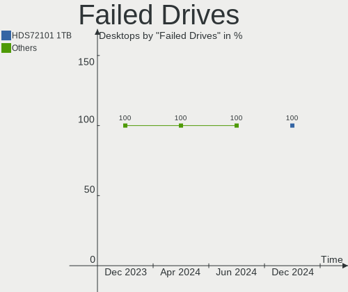
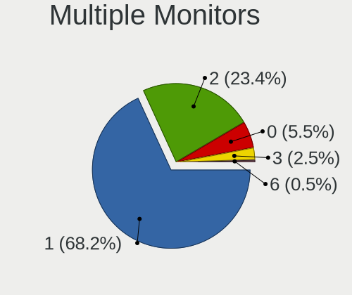

Fedora Hardware Trends (Desktop)
--------------------------------

A project to identify most popular hardware characteristics and track their change
over time based on data collected by Fedora users at https://Linux-Hardware.org.

Anyone can contribute to the study by uploading probes of their computers by
the [hw-probe](https://github.com/linuxhw/hw-probe) tool:

    sudo hw-probe -all -upload

Full-feature report is available here: https://linux-hardware.org/?view=trends&formfactor=desktop

Period: Apr, 2020.

Contents
--------

- [ OS                       ](#os)
- [ OS Family                ](#os-family)
- [ Kernel                   ](#kernel)
- [ Kernel Family            ](#kernel-family)
- [ Kernel Major Ver.        ](#kernel-major-ver)
- [ Arch                     ](#arch)
- [ DE                       ](#de)
- [ Display Server           ](#display-server)
- [ Display Manager          ](#display-manager)
- [ OS Lang                  ](#os-lang)
- [ Boot Mode                ](#boot-mode)
- [ Filesystem               ](#filesystem)
- [ Dual Boot with Linux/BSD ](#dual-boot-with-linux/bsd)
- [ Dual Boot (Win)          ](#dual-boot-win)
- [ Country                  ](#country)
- [ City                     ](#city)
- [ Vendor                   ](#vendor)
- [ Model                    ](#model)
- [ Model Family             ](#model-family)
- [ MFG Year                 ](#mfg-year)
- [ Form Factor              ](#form-factor)
- [ Secure Boot              ](#secure-boot)
- [ Coreboot                 ](#coreboot)
- [ RAM Size                 ](#ram-size)
- [ RAM Used                 ](#ram-used)
- [ Drive Vendor             ](#drive-vendor)
- [ Drive Model              ](#drive-model)
- [ Drive Kind               ](#drive-kind)
- [ Drive Connector          ](#drive-connector)
- [ Drive Size               ](#drive-size)
- [ Space Total              ](#space-total)
- [ Space Used               ](#space-used)
- [ Malfunc. Drives          ](#malfunc-drives)
- [ Malfunc. Drive Vendor    ](#malfunc-drive-vendor)
- [ Malfunc. Drive Kind      ](#malfunc-drive-kind)
- [ Failed Drives            ](#failed-drives)
- [ Failed Drive Vendor      ](#failed-drive-vendor)
- [ Drive Status             ](#drive-status)
- [ Storage Vendor           ](#storage-vendor)
- [ Storage Model            ](#storage-model)
- [ Storage Kind             ](#storage-kind)
- [ CPU Vendor               ](#cpu-vendor)
- [ CPU Model                ](#cpu-model)
- [ CPU Model Family         ](#cpu-model-family)
- [ CPU Cores                ](#cpu-cores)
- [ CPU Sockets              ](#cpu-sockets)
- [ CPU Threads              ](#cpu-threads)
- [ CPU Op-Modes             ](#cpu-op-modes)
- [ CPU Microarch            ](#cpu-microarch)
- [ CPU Microcode            ](#cpu-microcode)
- [ GPU Vendor               ](#gpu-vendor)
- [ GPU Model                ](#gpu-model)
- [ GPU Combo                ](#gpu-combo)
- [ GPU Driver               ](#gpu-driver)
- [ GPU Memory               ](#gpu-memory)
- [ Monitor Vendor           ](#monitor-vendor)
- [ Monitor Model            ](#monitor-model)
- [ Monitor Resolution       ](#monitor-resolution)
- [ Monitor Diagonal         ](#monitor-diagonal)
- [ Monitor Width            ](#monitor-width)
- [ Aspect Ratio             ](#aspect-ratio)
- [ Monitor Area             ](#monitor-area)
- [ Pixel Density            ](#pixel-density)
- [ Multiple Monitors        ](#multiple-monitors)
- [ Net Controller Vendor    ](#net-controller-vendor)
- [ Net Controller Model     ](#net-controller-model)
- [ Net Controller Kind      ](#net-controller-kind)
- [ Used Controller          ](#used-controller)
- [ NICs                     ](#nics)
- [ Unsupported Devices      ](#unsupported-devices)
- [ Unsupported Device Types ](#unsupported-device-types)

OS
--

Installed operating systems

| Name      | Computers | Percent |
|-----------|-----------|---------|
| Fedora 31 | 59        | 76.62%  |
| Fedora 32 | 15        | 19.48%  |
| Fedora 30 | 2         | 2.6%    |
| Fedora 29 | 1         | 1.3%    |

OS Family
---------

OS without a version

| Name   | Computers | Percent |
|--------|-----------|---------|
| Fedora | 77        | 100%    |

Kernel
------

Version of the Linux kernel

| Version                  | Computers | Percent |
|--------------------------|-----------|---------|
| 5.5.15-200.fc31.x86_64   | 14        | 18.18%  |
| 5.5.13-200.fc31.x86_64   | 11        | 14.29%  |
| 5.5.17-200.fc31.x86_64   | 9         | 11.69%  |
| 5.6.7-300.fc32.x86_64    | 7         | 9.09%   |
| 5.5.11-200.fc31.x86_64   | 7         | 9.09%   |
| 5.6.6-200.fc31.x86_64    | 5         | 6.49%   |
| 5.5.16-200.fc31.x86_64   | 5         | 6.49%   |
| 5.6.0-300.fc32.x86_64    | 2         | 2.6%    |
| 5.5.18-200.fc31.x86_64   | 2         | 2.6%    |
| 5.6.6-300.fc32.x86_64    | 1         | 1.3%    |
| 5.6.5-300.fc32.x86_64    | 1         | 1.3%    |
| 5.6.4-300.fc32.x86_64    | 1         | 1.3%    |
| 5.6.3-300.fc32.x86_64    | 1         | 1.3%    |
| 5.6.2-301.fc32.x86_64    | 1         | 1.3%    |
| 5.5.8-200.fc31.x86_64    | 1         | 1.3%    |
| 5.5.10-100.fc30.x86_64   | 1         | 1.3%    |
| 5.5.10-100.fc30.i686     | 1         | 1.3%    |
| 5.4.18-200.fc31.x86_64   | 1         | 1.3%    |
| 5.3.7-301.fc31.x86_64    | 1         | 1.3%    |
| 5.3.16-300.fc31.x86_64   | 1         | 1.3%    |
| 5.3.11-300.fc31.x86_64   | 1         | 1.3%    |
| 5.3.11-100.fc29.x86_64   | 1         | 1.3%    |
| 5.1.8-300.fc30.x86_64    | 1         | 1.3%    |
| 4.19.114-300.fc31.x86_64 | 1         | 1.3%    |

Kernel Family
-------------

Linux kernel without a distro release

| Version  | Computers | Percent |
|----------|-----------|---------|
| 5.5.15   | 14        | 18.18%  |
| 5.5.13   | 11        | 14.29%  |
| 5.5.17   | 9         | 11.69%  |
| 5.6.7    | 7         | 9.09%   |
| 5.5.11   | 7         | 9.09%   |
| 5.6.6    | 6         | 7.79%   |
| 5.5.16   | 5         | 6.49%   |
| 5.6.0    | 2         | 2.6%    |
| 5.5.18   | 2         | 2.6%    |
| 5.5.10   | 2         | 2.6%    |
| 5.3.11   | 2         | 2.6%    |
| 5.6.5    | 1         | 1.3%    |
| 5.6.4    | 1         | 1.3%    |
| 5.6.3    | 1         | 1.3%    |
| 5.6.2    | 1         | 1.3%    |
| 5.5.8    | 1         | 1.3%    |
| 5.4.18   | 1         | 1.3%    |
| 5.3.7    | 1         | 1.3%    |
| 5.3.16   | 1         | 1.3%    |
| 5.1.8    | 1         | 1.3%    |
| 4.19.114 | 1         | 1.3%    |

Kernel Major Ver.
-----------------

Linux kernel major version

| Version | Computers | Percent |
|---------|-----------|---------|
| 5.5     | 51        | 66.23%  |
| 5.6     | 19        | 24.68%  |
| 5.3     | 4         | 5.19%   |
| 5.4     | 1         | 1.3%    |
| 5.1     | 1         | 1.3%    |
| 4.19    | 1         | 1.3%    |

Arch
----

OS architecture (x86_64, i586, etc.)

| Name   | Computers | Percent |
|--------|-----------|---------|
| x86_64 | 76        | 98.7%   |
| i686   | 1         | 1.3%    |

DE
--

Desktop Environment

| Name       | Computers | Percent |
|------------|-----------|---------|
| GNOME      | 51        | 66.23%  |
| KDE        | 10        | 12.99%  |
| KDE5       | 5         | 6.49%   |
| Cinnamon   | 4         | 5.19%   |
| X-Cinnamon | 2         | 2.6%    |
| XFCE       | 1         | 1.3%    |
| MATE       | 1         | 1.3%    |
| LXDE       | 1         | 1.3%    |
| Deepin     | 1         | 1.3%    |
| Unknown    | 1         | 1.3%    |

Display Server
--------------

X11 or Wayland

| Name    | Computers | Percent |
|---------|-----------|---------|
| X11     | 43        | 55.84%  |
| Wayland | 29        | 37.66%  |
| Tty     | 4         | 5.19%   |
| Unknown | 1         | 1.3%    |

Display Manager
---------------

SDDM, LightDM, etc.

| Name    | Computers | Percent |
|---------|-----------|---------|
| Unknown | 50        | 64.94%  |
| GDM     | 16        | 20.78%  |
| SDDM    | 6         | 7.79%   |
| LightDM | 4         | 5.19%   |
| XDM     | 1         | 1.3%    |

OS Lang
-------

Language

| Lang       | Computers | Percent |
|------------|-----------|---------|
| en_US      | 34        | 44.16%  |
| en_GB      | 7         | 9.09%   |
| en_AU      | 7         | 9.09%   |
| de_DE      | 4         | 5.19%   |
| pl_PL      | 3         | 3.9%    |
| fr_FR      | 3         | 3.9%    |
| en_US.utf8 | 3         | 3.9%    |
| ru_RU      | 2         | 2.6%    |
| ja_JP      | 2         | 2.6%    |
| sv_SE      | 1         | 1.3%    |
| pt_BR      | 1         | 1.3%    |
| it_IT      | 1         | 1.3%    |
| hu_HU      | 1         | 1.3%    |
| fr_CH      | 1         | 1.3%    |
| es_ES      | 1         | 1.3%    |
| en_IE      | 1         | 1.3%    |
| en_GB.utf8 | 1         | 1.3%    |
| en_CA      | 1         | 1.3%    |
| de_AT      | 1         | 1.3%    |
| cv_RU      | 1         | 1.3%    |
| cs_CZ      | 1         | 1.3%    |

Boot Mode
---------

EFI or BIOS

| Mode | Computers | Percent |
|------|-----------|---------|
| BIOS | 46        | 59.74%  |
| EFI  | 31        | 40.26%  |

Filesystem
----------

Type of filesystem

| Type  | Computers | Percent |
|-------|-----------|---------|
| Ext4  | 67        | 87.01%  |
| Xfs   | 5         | 6.49%   |
| Btrfs | 5         | 6.49%   |

Dual Boot with Linux/BSD
------------------------

Hosting more than one Linux/BSD

| Dual boot | Computers | Percent |
|-----------|-----------|---------|
| No        | 64        | 83.12%  |
| Yes       | 13        | 16.88%  |

Dual Boot (Win)
---------------

Hosting Linux and Windows

| Dual boot | Computers | Percent |
|-----------|-----------|---------|
| No        | 65        | 84.42%  |
| Yes       | 12        | 15.58%  |

Country
-------

Geographic location (country)

| Country             | Computers | Percent |
|---------------------|-----------|---------|
| USA                 | 19        | 24.68%  |
| Germany             | 8         | 10.39%  |
| Australia           | 7         | 9.09%   |
| UK                  | 5         | 6.49%   |
| Poland              | 5         | 6.49%   |
| Sweden              | 4         | 5.19%   |
| Russia              | 3         | 3.9%    |
| France              | 3         | 3.9%    |
| Brazil              | 3         | 3.9%    |
| Japan               | 2         | 2.6%    |
| Italy               | 2         | 2.6%    |
| Canada              | 2         | 2.6%    |
| Ukraine             | 1         | 1.3%    |
| Trinidad and Tobago | 1         | 1.3%    |
| Switzerland         | 1         | 1.3%    |
| Spain               | 1         | 1.3%    |
| Romania             | 1         | 1.3%    |
| Portugal            | 1         | 1.3%    |
| Norway              | 1         | 1.3%    |
| Macedonia           | 1         | 1.3%    |
| Ireland             | 1         | 1.3%    |
| Hungary             | 1         | 1.3%    |
| Czech Republic      | 1         | 1.3%    |
| Colombia            | 1         | 1.3%    |
| Belarus             | 1         | 1.3%    |
| Austria             | 1         | 1.3%    |

City
----

Geographic location (city)

| City                       | Computers | Percent |
|----------------------------|-----------|---------|
| Hornsby                    | 4         | 5.19%   |
| Wrocław                   | 3         | 3.9%    |
| Pflugerville               | 2         | 2.6%    |
| Nizhniy Novgorod           | 2         | 2.6%    |
| Denver                     | 2         | 2.6%    |
| Berlin                     | 2         | 2.6%    |
| Ytterby                    | 1         | 1.3%    |
| Vienna                     | 1         | 1.3%    |
| Vialonga                   | 1         | 1.3%    |
| Vancouver                  | 1         | 1.3%    |
| Uberlândia                | 1         | 1.3%    |
| The Bronx                  | 1         | 1.3%    |
| São Paulo                 | 1         | 1.3%    |
| Sydney                     | 1         | 1.3%    |
| Stockholm                  | 1         | 1.3%    |
| Staten Island              | 1         | 1.3%    |
| Skopje                     | 1         | 1.3%    |
| Seligenstadt               | 1         | 1.3%    |
| Saitama                    | 1         | 1.3%    |
| Sainte-Geneviève-des-Bois | 1         | 1.3%    |
| Ruda Śląska              | 1         | 1.3%    |
| Rubeshibecho-fujimi        | 1         | 1.3%    |
| Rostov-on-Don              | 1         | 1.3%    |
| Ross on Wye                | 1         | 1.3%    |
| Regina                     | 1         | 1.3%    |
| Rambouillet                | 1         | 1.3%    |
| Port of Spain              | 1         | 1.3%    |
| Porsgrunn                  | 1         | 1.3%    |
| Pompano Beach              | 1         | 1.3%    |
| Piensk                     | 1         | 1.3%    |
| Olten                      | 1         | 1.3%    |
| Olocau                     | 1         | 1.3%    |
| Oldham                     | 1         | 1.3%    |
| Oakland                    | 1         | 1.3%    |
| Norwich                    | 1         | 1.3%    |
| Nantes                     | 1         | 1.3%    |
| Mukilteo                   | 1         | 1.3%    |
| Monza                      | 1         | 1.3%    |
| Monroe                     | 1         | 1.3%    |
| Minsk                      | 1         | 1.3%    |
| Mesa                       | 1         | 1.3%    |
| Medellín                  | 1         | 1.3%    |
| Matelica                   | 1         | 1.3%    |
| Lund                       | 1         | 1.3%    |
| Khmelnytskyi               | 1         | 1.3%    |
| Kelsterbach                | 1         | 1.3%    |
| Karlsfeld                  | 1         | 1.3%    |
| Huntsville                 | 1         | 1.3%    |
| Hronov                     | 1         | 1.3%    |
| Gramado                    | 1         | 1.3%    |
| Galloway                   | 1         | 1.3%    |
| Gallatin                   | 1         | 1.3%    |
| Fot                        | 1         | 1.3%    |
| Durham                     | 1         | 1.3%    |
| Dublin                     | 1         | 1.3%    |
| Denham Springs             | 1         | 1.3%    |
| Dallas                     | 1         | 1.3%    |
| Cologne                    | 1         | 1.3%    |
| Bucharest                  | 1         | 1.3%    |
| Brisbane                   | 1         | 1.3%    |

Vendor
------

Motherboard manufacturer

| Name                | Computers | Percent |
|---------------------|-----------|---------|
| ASUSTek Computer    | 24        | 31.17%  |
| Gigabyte Technology | 14        | 18.18%  |
| MSI                 | 11        | 14.29%  |
| Dell                | 10        | 12.99%  |
| ASRock              | 5         | 6.49%   |
| Lenovo              | 3         | 3.9%    |
| Hewlett-Packard     | 3         | 3.9%    |
| Shuttle             | 1         | 1.3%    |
| MCJ                 | 1         | 1.3%    |
| Intel               | 1         | 1.3%    |
| Gateway             | 1         | 1.3%    |
| Fujitsu             | 1         | 1.3%    |
| Foxconn             | 1         | 1.3%    |
| ABIT                | 1         | 1.3%    |

Model
-----

Motherboard model

| Name                              | Computers | Percent |
|-----------------------------------|-----------|---------|
| ASUS All Series                   | 4         | 5.19%   |
| Dell OptiPlex 9020                | 3         | 3.9%    |
| MSI MS-7B89                       | 2         | 2.6%    |
| ASUS PRIME X370-PRO               | 2         | 2.6%    |
| Shuttle XH61V                     | 1         | 1.3%    |
| MSI MS-7C37                       | 1         | 1.3%    |
| MSI MS-7C08                       | 1         | 1.3%    |
| MSI MS-7C00                       | 1         | 1.3%    |
| MSI MS-7B79                       | 1         | 1.3%    |
| MSI MS-7A34                       | 1         | 1.3%    |
| MSI MS-7916                       | 1         | 1.3%    |
| MSI MS-7821                       | 1         | 1.3%    |
| MSI MS-7816                       | 1         | 1.3%    |
| MSI MS-7758                       | 1         | 1.3%    |
| MCJ H55M-P33                      | 1         | 1.3%    |
| Lenovo ThinkCentre M58p 9965A1U   | 1         | 1.3%    |
| Lenovo ThinkCentre M58p 7220A72   | 1         | 1.3%    |
| Lenovo ThinkCentre E73 10AS002RUK | 1         | 1.3%    |
| Intel DH55TC AAE70932-206         | 1         | 1.3%    |
| HP Z600 Workstation               | 1         | 1.3%    |
| HP Pavilion Desktop 590-a0xxx     | 1         | 1.3%    |
| HP Compaq 6200 Pro MT PC          | 1         | 1.3%    |
| Gigabyte Z270-HD3P                | 1         | 1.3%    |
| Gigabyte X570 AORUS ELITE         | 1         | 1.3%    |
| Gigabyte X399 AORUS XTREME        | 1         | 1.3%    |
| Gigabyte H77N-WIFI                | 1         | 1.3%    |
| Gigabyte H55M-S2H                 | 1         | 1.3%    |
| Gigabyte GA-990FXA-UD3            | 1         | 1.3%    |
| Gigabyte G31M-ES2L                | 1         | 1.3%    |
| Gigabyte F2A58M-HD2               | 1         | 1.3%    |
| Gigabyte B450M DS3H               | 1         | 1.3%    |
| Gigabyte B450 AORUS ELITE         | 1         | 1.3%    |
| Gigabyte B360M AORUS Gaming 3     | 1         | 1.3%    |
| Gigabyte AX370M-DS3H              | 1         | 1.3%    |
| Gigabyte 990FXA-UD3               | 1         | 1.3%    |
| Gigabyte 970A-DS3P                | 1         | 1.3%    |
| Gateway SX2185                    | 1         | 1.3%    |
| Fujitsu ESPRIMO P520              | 1         | 1.3%    |
| Foxconn p6-2170ef                 | 1         | 1.3%    |
| Dell Precision WorkStation T3400  | 1         | 1.3%    |
| Dell OptiPlex 745                 | 1         | 1.3%    |
| Dell OptiPlex 7040                | 1         | 1.3%    |
| Dell OptiPlex 7010                | 1         | 1.3%    |
| Dell OptiPlex 3020M               | 1         | 1.3%    |
| Dell Inspiron 660                 | 1         | 1.3%    |
| Dell Inspiron 580                 | 1         | 1.3%    |
| ASUS Z170I PRO GAMING             | 1         | 1.3%    |
| ASUS TUF Z370-PRO GAMING          | 1         | 1.3%    |
| ASUS ROG STRIX Z390-I GAMING      | 1         | 1.3%    |
| ASUS ROG STRIX X470-F GAMING      | 1         | 1.3%    |
| ASUS PRIME X570-PRO               | 1         | 1.3%    |
| ASUS PRIME X470-PRO               | 1         | 1.3%    |
| ASUS PRIME B365M-K                | 1         | 1.3%    |
| ASUS PRIME A320M-K                | 1         | 1.3%    |
| ASUS P8Z68-V LX                   | 1         | 1.3%    |
| ASUS P8H61-M LE/CSM               | 1         | 1.3%    |
| ASUS P7P55D-E LX                  | 1         | 1.3%    |
| ASUS P6T                          | 1         | 1.3%    |
| ASUS P5KPL/1600                   | 1         | 1.3%    |
| ASUS M5A97 R2.0                   | 1         | 1.3%    |

Model Family
------------

Motherboard model prefix

| Name                   | Computers | Percent |
|------------------------|-----------|---------|
| Dell OptiPlex          | 7         | 9.09%   |
| ASUS PRIME             | 6         | 7.79%   |
| ASUS All               | 4         | 5.19%   |
| Lenovo ThinkCentre     | 3         | 3.9%    |
| MSI MS-7B89            | 2         | 2.6%    |
| Dell Inspiron          | 2         | 2.6%    |
| ASUS ROG               | 2         | 2.6%    |
| ASUS M5A78L-M          | 2         | 2.6%    |
| Shuttle XH61V          | 1         | 1.3%    |
| MSI MS-7C37            | 1         | 1.3%    |
| MSI MS-7C08            | 1         | 1.3%    |
| MSI MS-7C00            | 1         | 1.3%    |
| MSI MS-7B79            | 1         | 1.3%    |
| MSI MS-7A34            | 1         | 1.3%    |
| MSI MS-7916            | 1         | 1.3%    |
| MSI MS-7821            | 1         | 1.3%    |
| MSI MS-7816            | 1         | 1.3%    |
| MSI MS-7758            | 1         | 1.3%    |
| MCJ H55M-P33           | 1         | 1.3%    |
| Intel DH55TC           | 1         | 1.3%    |
| HP Z600                | 1         | 1.3%    |
| HP Pavilion            | 1         | 1.3%    |
| HP Compaq              | 1         | 1.3%    |
| Gigabyte Z270-HD3P     | 1         | 1.3%    |
| Gigabyte X570          | 1         | 1.3%    |
| Gigabyte X399          | 1         | 1.3%    |
| Gigabyte H77N-WIFI     | 1         | 1.3%    |
| Gigabyte H55M-S2H      | 1         | 1.3%    |
| Gigabyte GA-990FXA-UD3 | 1         | 1.3%    |
| Gigabyte G31M-ES2L     | 1         | 1.3%    |
| Gigabyte F2A58M-HD2    | 1         | 1.3%    |
| Gigabyte B450M         | 1         | 1.3%    |
| Gigabyte B450          | 1         | 1.3%    |
| Gigabyte B360M         | 1         | 1.3%    |
| Gigabyte AX370M-DS3H   | 1         | 1.3%    |
| Gigabyte 990FXA-UD3    | 1         | 1.3%    |
| Gigabyte 970A-DS3P     | 1         | 1.3%    |
| Gateway SX2185         | 1         | 1.3%    |
| Fujitsu ESPRIMO        | 1         | 1.3%    |
| Foxconn p6-2170ef      | 1         | 1.3%    |
| Dell Precision         | 1         | 1.3%    |
| ASUS Z170I             | 1         | 1.3%    |
| ASUS TUF               | 1         | 1.3%    |
| ASUS P8Z68-V           | 1         | 1.3%    |
| ASUS P8H61-M           | 1         | 1.3%    |
| ASUS P7P55D-E          | 1         | 1.3%    |
| ASUS P6T               | 1         | 1.3%    |
| ASUS P5KPL             | 1         | 1.3%    |
| ASUS M5A97             | 1         | 1.3%    |
| ASUS ITX-220           | 1         | 1.3%    |
| ASUS CROSSHAIR         | 1         | 1.3%    |
| ASRock X470            | 1         | 1.3%    |
| ASRock H97M            | 1         | 1.3%    |
| ASRock G41M-VS3        | 1         | 1.3%    |
| ASRock C               | 1         | 1.3%    |
| ASRock 960GC-GS        | 1         | 1.3%    |
| ABIT KN9               | 1         | 1.3%    |

MFG Year
--------

Motherboard manufacture year

| Year | Computers | Percent |
|------|-----------|---------|
| 2019 | 22        | 28.57%  |
| 2018 | 10        | 12.99%  |
| 2015 | 6         | 7.79%   |
| 2016 | 5         | 6.49%   |
| 2014 | 5         | 6.49%   |
| 2013 | 5         | 6.49%   |
| 2012 | 5         | 6.49%   |
| 2011 | 5         | 6.49%   |
| 2010 | 5         | 6.49%   |
| 2009 | 4         | 5.19%   |
| 2017 | 2         | 2.6%    |
| 2020 | 1         | 1.3%    |
| 2008 | 1         | 1.3%    |
| 2007 | 1         | 1.3%    |

Form Factor
-----------

Physical design of the computer

| Name    | Computers | Percent |
|---------|-----------|---------|
| Desktop | 77        | 100%    |

Secure Boot
-----------

Enabled or disabled

| State    | Computers | Percent |
|----------|-----------|---------|
| Disabled | 77        | 100%    |

Coreboot
--------

Have coreboot on board

| Used | Computers | Percent |
|------|-----------|---------|
| No   | 77        | 100%    |

RAM Size
--------

Total RAM memory

| Size in GB  | Computers | Percent |
|-------------|-----------|---------|
| 16.01-24.0  | 25        | 32.47%  |
| 8.01-16.0   | 19        | 24.68%  |
| 4.01-8.0    | 8         | 10.39%  |
| 32.01-64.0  | 8         | 10.39%  |
| 3.01-4.0    | 8         | 10.39%  |
| 24.01-32.0  | 4         | 5.19%   |
| 64.01-256.0 | 3         | 3.9%    |
| 2.01-3.0    | 2         | 2.6%    |

RAM Used
--------

Used RAM memory

| Used GB   | Computers | Percent |
|-----------|-----------|---------|
| 4.01-8.0  | 20        | 25.97%  |
| 2.01-3.0  | 20        | 25.97%  |
| 1.01-2.0  | 17        | 22.08%  |
| 3.01-4.0  | 16        | 20.78%  |
| 8.01-16.0 | 2         | 2.6%    |
| 0.01-1.0  | 2         | 2.6%    |

Drive Vendor
------------

Hard drive vendors

| Vendor              | Computers | Drives | Percent |
|---------------------|-----------|--------|---------|
| WDC                 | 37        | 50     | 22.42%  |
| Seagate             | 36        | 44     | 21.82%  |
| Samsung Electronics | 25        | 25     | 15.15%  |
| Kingston            | 16        | 19     | 9.7%    |
| Hitachi             | 10        | 12     | 6.06%   |
| Crucial             | 9         | 9      | 5.45%   |
| Toshiba             | 7         | 7      | 4.24%   |
| Intel               | 5         | 5      | 3.03%   |
| A-DATA Technology   | 4         | 6      | 2.42%   |
| SanDisk             | 3         | 3      | 1.82%   |
| SK Hynix            | 2         | 2      | 1.21%   |
| Unknown             | 1         | 1      | 0.61%   |
| Team                | 1         | 1      | 0.61%   |
| PNY                 | 1         | 1      | 0.61%   |
| PLEXTOR             | 1         | 1      | 0.61%   |
| Lexar               | 1         | 1      | 0.61%   |
| LaCie               | 1         | 1      | 0.61%   |
| Intenso             | 1         | 1      | 0.61%   |
| ICY BOX             | 1         | 1      | 0.61%   |
| HGST                | 1         | 1      | 0.61%   |
| Fujitsu             | 1         | 1      | 0.61%   |
| Corsair             | 1         | 1      | 0.61%   |

Drive Model
-----------

Hard drive models

| Model                        | Computers | Percent |
|------------------------------|-----------|---------|
| SA400S37480G 480GB SSD       | 4         | 2.09%   |
| WD40EFRX-68N32N0 4TB         | 3         | 1.57%   |
| SV300S37A120G 120GB SSD      | 3         | 1.57%   |
| ST31000528AS 1TB             | 3         | 1.57%   |
| SA400S37120G 120GB SSD       | 3         | 1.57%   |
| CT500MX500SSD1 500GB         | 3         | 1.57%   |
| WDS240G2G0A-00JH30 240GB SSD | 2         | 1.05%   |
| WDS120G2G0A-00JH30 120GB SSD | 2         | 1.05%   |
| WD40EZRZ-00GXCB0 4TB         | 2         | 1.05%   |
| WD1500HLFS-01G6U3 150GB      | 2         | 1.05%   |
| WD10EZEX-00BN5A0 1TB         | 2         | 1.05%   |
| SV300S37A240G 240GB SSD      | 2         | 1.05%   |
| ST6000DM003-2CY186 6TB       | 2         | 1.05%   |
| ST31000524AS 1TB             | 2         | 1.05%   |
| ST1000DM003-1ER162 1TB       | 2         | 1.05%   |
| ST1000DM003-1CH162 1TB       | 2         | 1.05%   |
| SSDSC2KW256G8 256GB          | 2         | 1.05%   |
| SSD 860 EVO 500GB            | 2         | 1.05%   |
| SSD 850 PRO 512GB            | 2         | 1.05%   |
| SSD 850 EVO 250GB            | 2         | 1.05%   |
| SA400S37240G 240GB SSD       | 2         | 1.05%   |
| MQ01ABD075 752GB             | 2         | 1.05%   |
| HD502HJ 500GB                | 2         | 1.05%   |
| Expansion 1TB                | 2         | 1.05%   |
| CT525MX300SSD1 528GB         | 2         | 1.05%   |
| WDS500G2B0A-00SM50 500GB SSD | 1         | 0.52%   |
| WDS100T2B0B-00YS70 1TB SSD   | 1         | 0.52%   |
| WD800JD-60LSA0 80GB          | 1         | 0.52%   |
| WD5000BEVT-00ZAT0 500GB      | 1         | 0.52%   |
| WD5000AAKX-75U6AA0 500GB     | 1         | 0.52%   |
| WD5000AAKX-753CA1 500GB      | 1         | 0.52%   |
| WD5000AAKX-07U6AA0 500GB     | 1         | 0.52%   |
| WD40PURX-64GVNY0 4TB         | 1         | 0.52%   |
| WD40EZRX-00SPEB0 4TB         | 1         | 0.52%   |
| WD400JB-00FMA0 40GB          | 1         | 0.52%   |
| WD30EFRX-68EUZN0 3TB         | 1         | 0.52%   |
| WD30EFRX-68AX9N0 3TB         | 1         | 0.52%   |
| WD2500JS-22NCB1 250GB        | 1         | 0.52%   |
| WD2500BEVT-22ZCT0 250GB      | 1         | 0.52%   |
| WD2500AAKX-75U6AA0 250GB     | 1         | 0.52%   |
| WD20EZRZ-00Z5HB0 2TB         | 1         | 0.52%   |
| WD20EZRX-22D8PB0 2TB         | 1         | 0.52%   |
| WD20EZAZ-00GGJB0 2TB         | 1         | 0.52%   |
| WD20EFRX-68EUZN0 2TB         | 1         | 0.52%   |
| WD20EARS-42S0XB0 2TB         | 1         | 0.52%   |
| WD2003FZEX-00Z4SA0 2TB       | 1         | 0.52%   |
| WD2003FYYS-02W0B1 2TB        | 1         | 0.52%   |
| WD1600AVVS-63L2B0 160GB      | 1         | 0.52%   |
| WD1600AAJS-08L7A0 160GB      | 1         | 0.52%   |
| WD15EADS-00P8B0 1TB          | 1         | 0.52%   |
| WD10SPZX-24Z10 1TB           | 1         | 0.52%   |
| WD10EZRX-00D8PB0 1TB         | 1         | 0.52%   |
| WD10EZEX-75M2NA0 1TB         | 1         | 0.52%   |
| WD10EZEX-21M2NA0 1TB         | 1         | 0.52%   |
| WD10EZEX-08WN4A0 1TB         | 1         | 0.52%   |
| WD10EZEX-08M2NA0 1TB         | 1         | 0.52%   |
| WD10EZEX-00ZF5A0 1TB         | 1         | 0.52%   |
| WD10EZEX-00WN4A0 1TB         | 1         | 0.52%   |
| WD10EARX-22N0YB0 1TB         | 1         | 0.52%   |
| WD10EADS-00L5B1 1TB          | 1         | 0.52%   |

Drive Kind
----------

HDD or SSD

| Kind    | Computers | Drives | Percent |
|---------|-----------|--------|---------|
| HDD     | 64        | 116    | 51.61%  |
| SSD     | 51        | 68     | 41.13%  |
| NVMe    | 7         | 7      | 5.65%   |
| Unknown | 2         | 2      | 1.61%   |

Drive Connector
---------------

SATA, SAS, NVMe, etc.

| Type | Computers | Drives | Percent |
|------|-----------|--------|---------|
| SATA | 77        | 179    | 84.62%  |
| SAS  | 7         | 7      | 7.69%   |
| NVMe | 7         | 7      | 7.69%   |

Drive Size
----------

Size of hard drive

| Size in TB | Computers | Drives | Percent |
|------------|-----------|--------|---------|
| 0.01-0.5   | 59        | 100    | 44.36%  |
| 0.51-1.0   | 44        | 59     | 33.08%  |
| 1.01-2.0   | 12        | 14     | 9.02%   |
| 3.01-4.0   | 11        | 11     | 8.27%   |
| 4.01-10.0  | 4         | 5      | 3.01%   |
| 2.01-3.0   | 3         | 4      | 2.26%   |

Space Total
-----------

Amount of disk space available on the file system

| Size in GB     | Computers | Percent |
|----------------|-----------|---------|
| 501-1000       | 23        | 29.87%  |
| 101-250        | 15        | 19.48%  |
| More than 3000 | 13        | 16.88%  |
| 251-500        | 10        | 12.99%  |
| 1001-2000      | 6         | 7.79%   |
| 51-100         | 6         | 7.79%   |
| 2001-3000      | 3         | 3.9%    |
| 1-20           | 1         | 1.3%    |

Space Used
----------

Amount of used disk space

| Used GB        | Computers | Percent |
|----------------|-----------|---------|
| 21-50          | 16        | 20.78%  |
| 51-100         | 13        | 16.88%  |
| 101-250        | 12        | 15.58%  |
| 251-500        | 10        | 12.99%  |
| 501-1000       | 8         | 10.39%  |
| 1-20           | 7         | 9.09%   |
| 1001-2000      | 6         | 7.79%   |
| More than 3000 | 3         | 3.9%    |
| 2001-3000      | 2         | 2.6%    |

Malfunc. Drives
---------------

Drive models with a malfunction

| Model                   | Computers | Drives | Percent |
|-------------------------|-----------|--------|---------|
| ST31000528AS 1TB        | 2         | 2      | 12.5%   |
| WD5000AAKX-753CA1 500GB | 1         | 1      | 6.25%   |
| WD400JB-00FMA0 40GB     | 1         | 1      | 6.25%   |
| WD2003FYYS-02W0B1 2TB   | 1         | 1      | 6.25%   |
| WD1600AVVS-63L2B0 160GB | 1         | 1      | 6.25%   |
| WD10EZEX-00WN4A0 1TB    | 1         | 1      | 6.25%   |
| WD1001FALS-00E8B0 1TB   | 1         | 1      | 6.25%   |
| ST31000524AS 1TB        | 1         | 1      | 6.25%   |
| ST31000333AS 1TB        | 1         | 1      | 6.25%   |
| MQ01ABD075 752GB        | 1         | 1      | 6.25%   |
| MHZ2500BT G1 500GB      | 1         | 1      | 6.25%   |
| HTS723232A7A364 320GB   | 1         | 1      | 6.25%   |
| HTS542516K9SA00 160GB   | 1         | 1      | 6.25%   |
| HDT721016SLA380 160GB   | 1         | 1      | 6.25%   |
| HDS721010DLE630 1TB     | 1         | 2      | 6.25%   |

Malfunc. Drive Vendor
---------------------

Vendors of faulty drives

| Vendor  | Computers | Drives | Percent |
|---------|-----------|--------|---------|
| WDC     | 5         | 6      | 38.46%  |
| Seagate | 3         | 4      | 23.08%  |
| Hitachi | 3         | 5      | 23.08%  |
| Toshiba | 1         | 1      | 7.69%   |
| Fujitsu | 1         | 1      | 7.69%   |

Malfunc. Drive Kind
-------------------

Kinds of faulty drives

| Kind | Computers | Drives | Percent |
|------|-----------|--------|---------|
| HDD  | 11        | 17     | 100%    |

Failed Drives
-------------

Failed drive models

| Model                   | Computers | Drives | Percent |
|-------------------------|-----------|--------|---------|
| WD5000BEVT-00ZAT0 500GB | 1         | 1      | 100%    |

Failed Drive Vendor
-------------------

Failed drive vendors

| Vendor | Computers | Drives | Percent |
|--------|-----------|--------|---------|
| WDC    | 1         | 1      | 100%    |

Drive Status
------------

Number of failed and malfunc. drives

| Status   | Computers | Drives | Percent |
|----------|-----------|--------|---------|
| Detected | 47        | 107    | 52.81%  |
| Works    | 30        | 68     | 33.71%  |
| Malfunc  | 11        | 17     | 12.36%  |
| Failed   | 1         | 1      | 1.12%   |

Storage Vendor
--------------

Storage controller vendors

| Vendor                    | Computers | Percent |
|---------------------------|-----------|---------|
| Intel                     | 50        | 48.08%  |
| AMD                       | 28        | 26.92%  |
| Samsung Electronics       | 7         | 6.73%   |
| Marvell Technology Group  | 4         | 3.85%   |
| ASMedia Technology        | 4         | 3.85%   |
| JMicron Technology        | 3         | 2.88%   |
| VIA Technologies          | 1         | 0.96%   |
| SK Hynix                  | 1         | 0.96%   |
| Silicon Motion            | 1         | 0.96%   |
| Phison Electronics        | 1         | 0.96%   |
| Nvidia                    | 1         | 0.96%   |
| Micron/Crucial Technology | 1         | 0.96%   |
| LSI Logic / Symbios Logic | 1         | 0.96%   |
| ADATA Technology          | 1         | 0.96%   |

Storage Model
-------------

Storage controller models

| Model                                                                    | Computers | Percent |
|--------------------------------------------------------------------------|-----------|---------|
| FCH SATA Controller [AHCI mode]                                          | 20        | 14.39%  |
| 8 Series/C220 Series Chipset Family 6-port SATA Controller 1 [AHCI mode] | 9         | 6.47%   |
| 400 Series Chipset SATA Controller                                       | 8         | 5.76%   |
| SB7x0/SB8x0/SB9x0 IDE Controller                                         | 5         | 3.6%    |
| SATA Controller [RAID mode]                                              | 5         | 3.6%    |
| NVMe SSD Controller SM981/PM981/PM983                                    | 5         | 3.6%    |
| 6 Series/C200 Series Chipset Family 6 port Desktop SATA AHCI Controller  | 5         | 3.6%    |
| X370 Series Chipset SATA Controller                                      | 4         | 2.88%   |
| SB7x0/SB8x0/SB9x0 SATA Controller [AHCI mode]                            | 4         | 2.88%   |
| NM10/ICH7 Family SATA Controller [IDE mode]                              | 4         | 2.88%   |
| ASM1062 Serial ATA Controller                                            | 4         | 2.88%   |
| 7 Series/C210 Series Chipset Family 6-port SATA Controller [AHCI mode]   | 4         | 2.88%   |
| 200 Series PCH SATA controller [AHCI mode]                               | 4         | 2.88%   |
| SB7x0/SB8x0/SB9x0 SATA Controller [IDE mode]                             | 3         | 2.16%   |
| Cannon Lake PCH SATA AHCI Controller                                     | 3         | 2.16%   |
| 9 Series Chipset Family SATA Controller [AHCI Mode]                      | 3         | 2.16%   |
| 82801G (ICH7 Family) IDE Controller                                      | 3         | 2.16%   |
| 5 Series/3400 Series Chipset 4 port SATA IDE Controller                  | 3         | 2.16%   |
| Q170/Q150/B150/H170/H110/Z170/CM236 Chipset SATA Controller [AHCI Mode]  | 2         | 1.44%   |
| JMB368 IDE controller                                                    | 2         | 1.44%   |
| 82801JD/DO (ICH10 Family) SATA AHCI Controller                           | 2         | 1.44%   |
| 5 Series/3400 Series Chipset 6 port SATA AHCI Controller                 | 2         | 1.44%   |
| 5 Series/3400 Series Chipset 2 port SATA IDE Controller                  | 2         | 1.44%   |
| 4 Series Chipset PT IDER Controller                                      | 2         | 1.44%   |
| XPG SX8200 Pro PCIe Gen3x4 M.2 2280 Solid State Drive                    | 1         | 0.72%   |
| X399 Series Chipset SATA Controller                                      | 1         | 0.72%   |
| VT6421 IDE/SATA Controller                                               | 1         | 0.72%   |
| SSD Pro 7600p/760p/E 6100p Series                                        | 1         | 0.72%   |
| SSD 660P Series                                                          | 1         | 0.72%   |
| SAS1064ET PCI-Express Fusion-MPT SAS                                     | 1         | 0.72%   |
| P1 NVMe PCIe SSD                                                         | 1         | 0.72%   |
| NVMe SSD Optane Series Controller                                        | 1         | 0.72%   |
| NVMe SSD Controller SM961/PM961                                          | 1         | 0.72%   |
| NVMe SSD Controller SM951/PM951                                          | 1         | 0.72%   |
| Non-Volatile memory controller                                           | 1         | 0.72%   |
| MCP55 SATA Controller                                                    | 1         | 0.72%   |
| MCP55 IDE                                                                | 1         | 0.72%   |
| JMB363 SATA/IDE Controller                                               | 1         | 0.72%   |
| JMB361 AHCI/IDE                                                          | 1         | 0.72%   |
| FCH SATA Controller [IDE mode]                                           | 1         | 0.72%   |
| FCH SATA Controller D                                                    | 1         | 0.72%   |
| FCH IDE Controller                                                       | 1         | 0.72%   |
| E12 NVMe Controller                                                      | 1         | 0.72%   |
| C610/X99 series chipset sSATA Controller [AHCI mode]                     | 1         | 0.72%   |
| BC501 NVMe Solid State Drive 512GB                                       | 1         | 0.72%   |
| 88SE9230 PCIe SATA 6Gb/s Controller                                      | 1         | 0.72%   |
| 88SE9172 SATA III 6Gb/s RAID Controller                                  | 1         | 0.72%   |
| 88SE9172 SATA 6Gb/s Controller                                           | 1         | 0.72%   |
| 88SE9120 SATA 6Gb/s Controller                                           | 1         | 0.72%   |
| 82801JI (ICH10 Family) SATA AHCI Controller                              | 1         | 0.72%   |
| 82801IR/IO/IH (ICH9R/DO/DH) 6 port SATA Controller [AHCI mode]           | 1         | 0.72%   |
| 82801HR/HO/HH (ICH8R/DO/DH) 2 port SATA Controller [IDE mode]            | 1         | 0.72%   |
| 82801H (ICH8 Family) 4 port SATA Controller [IDE mode]                   | 1         | 0.72%   |
| 5 Series/3400 Series Chipset PT IDER Controller                          | 1         | 0.72%   |
| 300 Series Chipset SATA Controller                                       | 1         | 0.72%   |

Storage Kind
------------

Kind of storage controller (IDE, SATA, NVMe, SAS, ...)

| Kind | Computers | Percent |
|------|-----------|---------|
| SATA | 65        | 60.75%  |
| IDE  | 20        | 18.69%  |
| NVMe | 15        | 14.02%  |
| RAID | 6         | 5.61%   |
| SCSI | 1         | 0.93%   |

CPU Vendor
----------

Processor vendors

| Vendor | Computers | Percent |
|--------|-----------|---------|
| Intel  | 48        | 62.34%  |
| AMD    | 29        | 37.66%  |

CPU Model
---------

Processor models

| Model                                          | Computers | Percent |
|------------------------------------------------|-----------|---------|
| Intel Core i5-9400F CPU @ 2.90GHz              | 4         | 5.19%   |
| Intel Core 2 Duo CPU E8400 @ 3.00GHz           | 3         | 3.9%    |
| AMD Ryzen 7 2700X Eight-Core Processor         | 3         | 3.9%    |
| Intel Core i7-4790 CPU @ 3.60GHz               | 2         | 2.6%    |
| Intel Core i7-4770 CPU @ 3.40GHz               | 2         | 2.6%    |
| Intel Core i5-4670K CPU @ 3.40GHz              | 2         | 2.6%    |
| Intel Core i3-3220 CPU @ 3.30GHz               | 2         | 2.6%    |
| AMD Ryzen 7 2700 Eight-Core Processor          | 2         | 2.6%    |
| AMD Ryzen 5 3600 6-Core Processor              | 2         | 2.6%    |
| AMD Ryzen 3 2200G with Radeon Vega Graphics    | 2         | 2.6%    |
| AMD FX-8350 Eight-Core Processor               | 2         | 2.6%    |
| Intel Xeon CPU E5640 @ 2.67GHz                 | 1         | 1.3%    |
| Intel Xeon CPU E3-1231 v3 @ 3.40GHz            | 1         | 1.3%    |
| Intel Pentium Dual-Core CPU E5200 @ 2.50GHz    | 1         | 1.3%    |
| Intel Core i7-5820K CPU @ 3.30GHz              | 1         | 1.3%    |
| Intel Core i7-4790K CPU @ 4.00GHz              | 1         | 1.3%    |
| Intel Core i7-4770K CPU @ 3.50GHz              | 1         | 1.3%    |
| Intel Core i7-3770S CPU @ 3.10GHz              | 1         | 1.3%    |
| Intel Core i7-3770 CPU @ 3.40GHz               | 1         | 1.3%    |
| Intel Core i7-2600K CPU @ 3.40GHz              | 1         | 1.3%    |
| Intel Core i7 CPU 920 @ 2.67GHz                | 1         | 1.3%    |
| Intel Core i7 CPU 870 @ 2.93GHz                | 1         | 1.3%    |
| Intel Core i5-9600K CPU @ 3.70GHz              | 1         | 1.3%    |
| Intel Core i5-8600K CPU @ 3.60GHz              | 1         | 1.3%    |
| Intel Core i5-7400 CPU @ 3.00GHz               | 1         | 1.3%    |
| Intel Core i5-6600K CPU @ 3.50GHz              | 1         | 1.3%    |
| Intel Core i5-6500 CPU @ 3.20GHz               | 1         | 1.3%    |
| Intel Core i5-4590T CPU @ 2.00GHz              | 1         | 1.3%    |
| Intel Core i5-4570 CPU @ 3.20GHz               | 1         | 1.3%    |
| Intel Core i5-4430S CPU @ 2.70GHz              | 1         | 1.3%    |
| Intel Core i5-3330 CPU @ 3.00GHz               | 1         | 1.3%    |
| Intel Core i5-2400 CPU @ 3.10GHz               | 1         | 1.3%    |
| Intel Core i5-2320 CPU @ 3.00GHz               | 1         | 1.3%    |
| Intel Core i5 CPU 750 @ 2.67GHz                | 1         | 1.3%    |
| Intel Core i3-8350K CPU @ 4.00GHz              | 1         | 1.3%    |
| Intel Core i3-4150 CPU @ 3.50GHz               | 1         | 1.3%    |
| Intel Core i3 CPU 550 @ 3.20GHz                | 1         | 1.3%    |
| Intel Core i3 CPU 540 @ 3.07GHz                | 1         | 1.3%    |
| Intel Core i3 CPU 530 @ 2.93GHz                | 1         | 1.3%    |
| Intel Core 2 Duo CPU E7400 @ 2.80GHz           | 1         | 1.3%    |
| Intel Core 2 Duo CPU E7300 @ 2.66GHz           | 1         | 1.3%    |
| Intel Core 2 CPU 6400 @ 2.13GHz                | 1         | 1.3%    |
| Intel Celeron CPU G540 @ 2.50GHz               | 1         | 1.3%    |
| Intel Celeron CPU 220 @ 1.20GHz                | 1         | 1.3%    |
| AMD Ryzen Threadripper 1950X 16-Core Processor | 1         | 1.3%    |
| AMD Ryzen 7 3800X 8-Core Processor             | 1         | 1.3%    |
| AMD Ryzen 7 3700X 8-Core Processor             | 1         | 1.3%    |
| AMD Ryzen 7 1800X Eight-Core Processor         | 1         | 1.3%    |
| AMD Ryzen 7 1700 Eight-Core Processor          | 1         | 1.3%    |
| AMD Ryzen 5 3600X 6-Core Processor             | 1         | 1.3%    |
| AMD Ryzen 5 2600 Six-Core Processor            | 1         | 1.3%    |
| AMD Ryzen 5 1600 Six-Core Processor            | 1         | 1.3%    |
| AMD Phenom II X4 955 Processor                 | 1         | 1.3%    |
| AMD FX-8300 Eight-Core Processor               | 1         | 1.3%    |
| AMD FX-8120 Eight-Core Processor               | 1         | 1.3%    |
| AMD FX-6100 Six-Core Processor                 | 1         | 1.3%    |
| AMD FX-4100 Quad-Core Processor                | 1         | 1.3%    |
| AMD E2-9000 RADEON R2, 4 COMPUTE CORES 2C+2G   | 1         | 1.3%    |
| AMD Athlon X4 950 Quad Core Processor          | 1         | 1.3%    |
| AMD Athlon 64 X2 Dual Core Processor 6000+     | 1         | 1.3%    |

CPU Model Family
----------------

Processor model prefix

| Model                   | Computers | Percent |
|-------------------------|-----------|---------|
| Intel Core i5           | 18        | 23.38%  |
| Intel Core i7           | 12        | 15.58%  |
| AMD Ryzen 7             | 9         | 11.69%  |
| Intel Core i3           | 7         | 9.09%   |
| AMD FX                  | 6         | 7.79%   |
| Intel Core 2 Duo        | 5         | 6.49%   |
| AMD Ryzen 5             | 5         | 6.49%   |
| Intel Xeon              | 2         | 2.6%    |
| Intel Celeron           | 2         | 2.6%    |
| AMD Ryzen 3             | 2         | 2.6%    |
| AMD A6                  | 2         | 2.6%    |
| Intel Pentium Dual-Core | 1         | 1.3%    |
| Intel Core 2            | 1         | 1.3%    |
| AMD Ryzen Threadripper  | 1         | 1.3%    |
| AMD Phenom II X4        | 1         | 1.3%    |
| AMD E2                  | 1         | 1.3%    |
| AMD Athlon X4           | 1         | 1.3%    |
| AMD Athlon 64 X2        | 1         | 1.3%    |

CPU Cores
---------

Number of processor cores

| Number | Computers | Percent |
|--------|-----------|---------|
| 4      | 33        | 42.86%  |
| 2      | 18        | 23.38%  |
| 6      | 12        | 15.58%  |
| 8      | 10        | 12.99%  |
| 1      | 2         | 2.6%    |
| 16     | 1         | 1.3%    |
| 3      | 1         | 1.3%    |

CPU Sockets
-----------

Number of sockets

| Number | Computers | Percent |
|--------|-----------|---------|
| 1      | 76        | 98.7%   |
| 2      | 1         | 1.3%    |

CPU Threads
-----------

Threads per core (Hyper-Threading)

| Number | Computers | Percent |
|--------|-----------|---------|
| 2      | 43        | 55.84%  |
| 1      | 34        | 44.16%  |

CPU Op-Modes
------------

CPU Operation Modes (32-bit, 64-bit)

| Op mode        | Computers | Percent |
|----------------|-----------|---------|
| 32-bit, 64-bit | 77        | 100%    |

CPU Microarch
-------------

Microarchitecture

| Name        | Computers | Percent |
|-------------|-----------|---------|
| Haswell     | 14        | 18.18%  |
| Skylake     | 10        | 12.99%  |
| Core        | 7         | 9.09%   |
| Zen+        | 6         | 7.79%   |
| Zen         | 6         | 7.79%   |
| Zen 2       | 5         | 6.49%   |
| IvyBridge   | 5         | 6.49%   |
| Westmere    | 4         | 5.19%   |
| SandyBridge | 4         | 5.19%   |
| Piledriver  | 4         | 5.19%   |
| Nehalem     | 3         | 3.9%    |
| Bulldozer   | 3         | 3.9%    |
| Excavator   | 2         | 2.6%    |
| Penryn      | 1         | 1.3%    |
| K8 Hammer   | 1         | 1.3%    |
| K10         | 1         | 1.3%    |
| Jaguar      | 1         | 1.3%    |

CPU Microcode
-------------

Microcode number

| Number     | Computers | Percent |
|------------|-----------|---------|
| 0x306c3    | 13        | 16.88%  |
| 0x0800820d | 6         | 7.79%   |
| 0x306a9    | 5         | 6.49%   |
| 0x08701013 | 5         | 6.49%   |
| 0x906ea    | 4         | 5.19%   |
| 0x206a7    | 4         | 5.19%   |
| 0x1067a    | 4         | 5.19%   |
| 0x06000852 | 3         | 3.9%    |
| Unknown    | 3         | 3.9%    |
| 0x906ed    | 2         | 2.6%    |
| 0x506e3    | 2         | 2.6%    |
| 0x106e5    | 2         | 2.6%    |
| 0x10676    | 2         | 2.6%    |
| 0x0810100b | 2         | 2.6%    |
| 0x08001137 | 2         | 2.6%    |
| 0x0600063e | 2         | 2.6%    |
| 0x906eb    | 1         | 1.3%    |
| 0x906e9    | 1         | 1.3%    |
| 0x6f6      | 1         | 1.3%    |
| 0x306f2    | 1         | 1.3%    |
| 0x206c2    | 1         | 1.3%    |
| 0x20655    | 1         | 1.3%    |
| 0x20652    | 1         | 1.3%    |
| 0x106a4    | 1         | 1.3%    |
| 0x10661    | 1         | 1.3%    |
| 0x08001138 | 1         | 1.3%    |
| 0x08001129 | 1         | 1.3%    |
| 0x0700010f | 1         | 1.3%    |
| 0x06006705 | 1         | 1.3%    |
| 0x0600611a | 1         | 1.3%    |
| 0x06001119 | 1         | 1.3%    |
| 0x010000c8 | 1         | 1.3%    |

GPU Vendor
----------

Vendors of graphics cards

| Vendor | Computers | Percent |
|--------|-----------|---------|
| Nvidia | 32        | 39.02%  |
| AMD    | 31        | 37.8%   |
| Intel  | 19        | 23.17%  |

GPU Model
---------

Graphics card models

| Model                                                                 | Computers | Percent |
|-----------------------------------------------------------------------|-----------|---------|
| Ellesmere [Radeon RX 470/480/570/570X/580/580X/590]                   | 7         | 8.54%   |
| Xeon E3-1200 v3/4th Gen Core Processor Integrated Graphics Controller | 4         | 4.88%   |
| GK208B [GeForce GT 710]                                               | 4         | 4.88%   |
| Xeon E3-1200 v2/3rd Gen Core processor Graphics Controller            | 3         | 3.66%   |
| Baffin [Radeon RX 460/560D / Pro 450/455/460/555/555X/560/560X]       | 3         | 3.66%   |
| 4 Series Chipset Integrated Graphics Controller                       | 3         | 3.66%   |
| TU116 [GeForce GTX 1660]                                              | 2         | 2.44%   |
| Raven Ridge [Radeon Vega Series / Radeon Vega Mobile Series]          | 2         | 2.44%   |
| Navi 10 [Radeon RX 5600 OEM/5600 XT / 5700/5700 XT]                   | 2         | 2.44%   |
| GP108 [GeForce GT 1030]                                               | 2         | 2.44%   |
| GP107 [GeForce GTX 1050 Ti]                                           | 2         | 2.44%   |
| GP106 [GeForce GTX 1060 6GB]                                          | 2         | 2.44%   |
| Core Processor Integrated Graphics Controller                         | 2         | 2.44%   |
| Baffin [Radeon RX 550 640SP / RX 560/560X]                            | 2         | 2.44%   |
| 2nd Generation Core Processor Family Integrated Graphics Controller   | 2         | 2.44%   |
| Vega 10 XL/XT [Radeon RX Vega 56/64]                                  | 1         | 1.22%   |
| UHD Graphics 630 (Desktop)                                            | 1         | 1.22%   |
| Turks [Radeon HD 7600 Series]                                         | 1         | 1.22%   |
| Turks XT [Radeon HD 6670/7670]                                        | 1         | 1.22%   |
| Turks PRO [Radeon HD 7570]                                            | 1         | 1.22%   |
| TU117 [GeForce GTX 1650]                                              | 1         | 1.22%   |
| TU106 [GeForce RTX 2070 Rev. A]                                       | 1         | 1.22%   |
| TU106 [GeForce RTX 2060 SUPER]                                        | 1         | 1.22%   |
| Tahiti PRO [Radeon HD 7950/8950 OEM / R9 280]                         | 1         | 1.22%   |
| Stoney [Radeon R2/R3/R4/R5 Graphics]                                  | 1         | 1.22%   |
| RV790 [Radeon HD 4890]                                                | 1         | 1.22%   |
| RV740 PRO [Radeon HD 4770]                                            | 1         | 1.22%   |
| RV620 LE [Radeon HD 3450]                                             | 1         | 1.22%   |
| RS780L [Radeon 3000]                                                  | 1         | 1.22%   |
| Richland [Radeon HD 8470D]                                            | 1         | 1.22%   |
| Oland XT [Radeon HD 8670 / R7 250/350]                                | 1         | 1.22%   |
| Navi 14 [Radeon RX 5500/5500M / Pro 5500M]                            | 1         | 1.22%   |
| Kabini [Radeon HD 8400 / R3 Series]                                   | 1         | 1.22%   |
| HD Graphics 530                                                       | 1         | 1.22%   |
| GT218 [GeForce 210]                                                   | 1         | 1.22%   |
| GP107 [GeForce GTX 1050]                                              | 1         | 1.22%   |
| GP106 [GeForce GTX 1060 3GB]                                          | 1         | 1.22%   |
| GP104 [GeForce GTX 1080]                                              | 1         | 1.22%   |
| GP104 [GeForce GTX 1070 Ti]                                           | 1         | 1.22%   |
| GM204 [GeForce GTX 970]                                               | 1         | 1.22%   |
| GM107GL [Quadro K620]                                                 | 1         | 1.22%   |
| GK208B [GeForce GT 720]                                               | 1         | 1.22%   |
| GK107 [GeForce GT 640]                                                | 1         | 1.22%   |
| GK104 [GeForce GTX 760]                                               | 1         | 1.22%   |
| GF119 [NVS 310]                                                       | 1         | 1.22%   |
| GF119 [GeForce GT 620 OEM]                                            | 1         | 1.22%   |
| GF119 [GeForce GT 520]                                                | 1         | 1.22%   |
| GF116 [GeForce GTS 450 Rev. 2]                                        | 1         | 1.22%   |
| G98 [GeForce 8400 GS Rev. 2]                                          | 1         | 1.22%   |
| G96C [GeForce 9500 GT]                                                | 1         | 1.22%   |
| G92 [GeForce GTS 250]                                                 | 1         | 1.22%   |
| Caicos [Radeon HD 6450/7450/8450 / R5 230 OEM]                        | 1         | 1.22%   |
| 82Q963/Q965 Integrated Graphics Controller                            | 1         | 1.22%   |
| 82945G/GZ Integrated Graphics Controller                              | 1         | 1.22%   |
| 4th Generation Core Processor Family Integrated Graphics Controller   | 1         | 1.22%   |

GPU Combo
---------

Combinations of graphics cards

| Name           | Computers | Percent |
|----------------|-----------|---------|
| 1 x Nvidia     | 30        | 38.96%  |
| 1 x AMD        | 30        | 38.96%  |
| 1 x Intel      | 15        | 19.48%  |
| Intel + Nvidia | 1         | 1.3%    |
| Intel + AMD    | 1         | 1.3%    |

GPU Driver
----------

Free vs proprietary

| Driver      | Computers | Percent |
|-------------|-----------|---------|
| Free        | 60        | 77.92%  |
| Proprietary | 15        | 19.48%  |
| Unknown     | 2         | 2.6%    |

GPU Memory
----------

Total video memory

| Size in GB | Computers | Percent |
|------------|-----------|---------|
| Unknown    | 27        | 35.06%  |
| 7.01-8.0   | 13        | 16.88%  |
| 1.01-2.0   | 11        | 14.29%  |
| 0.51-1.0   | 10        | 12.99%  |
| 3.01-4.0   | 8         | 10.39%  |
| 0.01-0.5   | 5         | 6.49%   |
| 2.01-3.0   | 2         | 2.6%    |
| 5.01-6.0   | 1         | 1.3%    |

Monitor Vendor
--------------

Monitor vendors

| Vendor               | Computers | Percent |
|----------------------|-----------|---------|
| Samsung Electronics  | 12        | 14.12%  |
| Goldstar             | 12        | 14.12%  |
| Dell                 | 12        | 14.12%  |
| Ancor Communications | 9         | 10.59%  |
| BenQ                 | 5         | 5.88%   |
| AOC                  | 5         | 5.88%   |
| Acer                 | 5         | 5.88%   |
| Philips              | 4         | 4.71%   |
| Hewlett-Packard      | 4         | 4.71%   |
| Iiyama               | 3         | 3.53%   |
| Sony                 | 2         | 2.35%   |
| Lenovo               | 2         | 2.35%   |
| VOXICON              | 1         | 1.18%   |
| SNC                  | 1         | 1.18%   |
| Sceptre Tech         | 1         | 1.18%   |
| Onkyo                | 1         | 1.18%   |
| NEC Computers        | 1         | 1.18%   |
| MSI                  | 1         | 1.18%   |
| Mitsubishi           | 1         | 1.18%   |
| Insignia             | 1         | 1.18%   |
| HannStar             | 1         | 1.18%   |
| Achieva Shimian      | 1         | 1.18%   |

Monitor Model
-------------

Monitor models

| Model                                                      | Computers | Percent |
|------------------------------------------------------------|-----------|---------|
| 2757M AOC2757 1920x1080 598x336mm 27.0-inch                | 2         | 2.22%   |
| Z24i HWP309F 1920x1200 518x324mm 24.1-inch                 | 1         | 1.11%   |
| X243HQ ACR00AC 1920x1080 521x293mm 23.5-inch               | 1         | 1.11%   |
| VS24A ACI24D1 1920x1200 518x324mm 24.1-inch                | 1         | 1.11%   |
| VS248 ACI2498 1920x1080 531x299mm 24.0-inch                | 1         | 1.11%   |
| VE248 ACI2494 1920x1080 531x299mm 24.0-inch                | 1         | 1.11%   |
| U2879G6 AOC2879 3840x2160 621x341mm 27.9-inch              | 1         | 1.11%   |
| U2713HM DEL4080 2560x1440 597x336mm 27.0-inch              | 1         | 1.11%   |
| U2414H DELA0B2 1920x1080 530x300mm 24.0-inch               | 1         | 1.11%   |
| U2414H DELA0A2 1920x1080 527x296mm 23.8-inch               | 1         | 1.11%   |
| U2410 DELF015 1920x1200 520x320mm 24.0-inch                | 1         | 1.11%   |
| TV SNYFF00 1360x768 1600x900mm 72.3-inch                   | 1         | 1.11%   |
| TV SNYE903 1920x1080 1600x900mm 72.3-inch                  | 1         | 1.11%   |
| SyncMaster SAM041F 2048x1152 510x287mm 23.0-inch           | 1         | 1.11%   |
| SyncMaster SAM034E 1280x1024 376x301mm 19.0-inch           | 1         | 1.11%   |
| SyncMaster SAM01D3 1440x900 410x260mm 19.1-inch            | 1         | 1.11%   |
| SyncMaster SAM0115 1280x1024 376x301mm 19.0-inch           | 1         | 1.11%   |
| SyncMaster SAM002D 1280x1024 352x264mm 17.3-inch           | 1         | 1.11%   |
| SMS24A450 SAM0839 1920x1200 518x324mm 24.1-inch            | 1         | 1.11%   |
| SMB2220N SAM06A2 1920x1080 477x268mm 21.5-inch             | 1         | 1.11%   |
| SMB1930N SAM0632 1366x768 410x230mm 18.5-inch              | 1         | 1.11%   |
| SA230 ACR057E 1920x1080 509x286mm 23.0-inch                | 1         | 1.11%   |
| S273HL ACR00DB 1920x1080 600x340mm 27.2-inch               | 1         | 1.11%   |
| S22B300 SAM08C8 1920x1080 480x270mm 21.7-inch              | 1         | 1.11%   |
| S2231 HWP2905 1920x1080 477x268mm 21.5-inch                | 1         | 1.11%   |
| RL2450H BNQ7F0E 1920x1080 531x298mm 24.0-inch              | 1         | 1.11%   |
| RDT234WLM MEL4887 1920x1080 509x286mm 23.0-inch            | 1         | 1.11%   |
| QHD270 QHD270 QHD270 ACH00FA 2560x1440 597x336mm 27.0-inch | 1         | 1.11%   |
| PLX2283H IVM5638 1920x1080 477x268mm 21.5-inch             | 1         | 1.11%   |
| PL2530H IVM6132 1920x1080 544x303mm 24.5-inch              | 1         | 1.11%   |
| PL2390 IVM562D 1920x1080 509x286mm 23.0-inch               | 1         | 1.11%   |
| PHOTO 190V SNC1850 1366x768 409x230mm 18.5-inch            | 1         | 1.11%   |
| PHL 284E5 PHLC0DE 1920x1080 621x341mm 27.9-inch            | 1         | 1.11%   |
| PHL 240V5A PHLC10C 1920x1080 527x296mm 23.8-inch           | 1         | 1.11%   |
| PHL 223V5 PHLC0CF 1920x1080 480x270mm 21.7-inch            | 1         | 1.11%   |
| PB248 ACI24A3 1920x1200 518x324mm 24.1-inch                | 1         | 1.11%   |
| P2717H DEL40F6 1920x1080 598x336mm 27.0-inch               | 1         | 1.11%   |
| P2715Q DEL40BD 3840x2160 597x336mm 27.0-inch               | 1         | 1.11%   |
| P2419H DELD0DA 1920x1080 527x296mm 23.8-inch               | 1         | 1.11%   |
| P2418D DELD0C1 2560x1440 526x296mm 23.8-inch               | 1         | 1.11%   |
| P2319H DELD0D7 1920x1080 509x286mm 23.0-inch               | 1         | 1.11%   |
| P206HL ACR01A8 1600x900 440x250mm 19.9-inch                | 1         | 1.11%   |
| P1917S DELD091 1280x1024 375x300mm 18.9-inch               | 1         | 1.11%   |
| P190S DEL405B 1280x1024 380x300mm 19.1-inch                | 1         | 1.11%   |
| P190S DEL405A 1280x1024 376x301mm 19.0-inch                | 1         | 1.11%   |
| Optix MAG27CQ MSI1462 2560x1440 597x336mm 27.0-inch        | 1         | 1.11%   |
| NS-19E320A13 BBY0032 1680x1050 640x384mm 29.4-inch         | 1         | 1.11%   |
| MP59G GSM5B34 1920x1080 480x270mm 21.7-inch                | 1         | 1.11%   |
| LG ULTRAWIDE GSM59F2 1920x1080 800x340mm 34.2-inch         | 1         | 1.11%   |
| LG ULTRAWIDE GSM59F1 1920x1080 580x240mm 24.7-inch         | 1         | 1.11%   |
| LG FULL HD GSM5ABB 1920x1080 480x270mm 21.7-inch           | 1         | 1.11%   |
| LEN T23i-10 LEN61AB 1920x1080 509x286mm 23.0-inch          | 1         | 1.11%   |
| LE1901w HWP2842 1440x900 410x256mm 19.0-inch               | 1         | 1.11%   |
| LCD2490WUXi2 NEC678B 1920x1200 480x300mm 22.3-inch         | 1         | 1.11%   |
| LCD Monitor SAM02B9 1360x768                               | 1         | 1.11%   |
| LCD Monitor GSM5807 1920x1080 480x270mm 21.7-inch          | 1         | 1.11%   |
| LCD Monitor C24FG7x 3840x1080                              | 1         | 1.11%   |
| LCD Monitor C24F390                                        | 1         | 1.11%   |
| LA2306 HWP294A 1920x1080 510x287mm 23.0-inch               | 1         | 1.11%   |
| L24q-10 LEN65CF 2560x1440 527x296mm 23.8-inch              | 1         | 1.11%   |

Monitor Resolution
------------------

Monitor screen resolution

| Resolution        | Computers | Percent |
|-------------------|-----------|---------|
| 1920x1080 (FHD)   | 40        | 47.62%  |
| 1280x1024 (SXGA)  | 9         | 10.71%  |
| 1920x1200 (WUXGA) | 7         | 8.33%   |
| 2560x1440 (QHD)   | 5         | 5.95%   |
| 3840x2160 (4K)    | 4         | 4.76%   |
| 1600x900 (HD+)    | 4         | 4.76%   |
| 1360x768          | 4         | 4.76%   |
| 2560x1080         | 2         | 2.38%   |
| 1440x900 (WXGA+)  | 2         | 2.38%   |
| 1366x768 (WXGA)   | 2         | 2.38%   |
| 3840x1080         | 1         | 1.19%   |
| 2048x1152         | 1         | 1.19%   |
| 1600x1200         | 1         | 1.19%   |
| 1024x768 (XGA)    | 1         | 1.19%   |
| Unknown           | 1         | 1.19%   |

Monitor Diagonal
----------------

Diagonal size in inches

| Inches  | Computers | Percent |
|---------|-----------|---------|
| 23      | 19        | 22.62%  |
| 24      | 13        | 15.48%  |
| 27      | 11        | 13.1%   |
| 21      | 11        | 13.1%   |
| 19      | 9         | 10.71%  |
| 18      | 6         | 7.14%   |
| 72      | 3         | 3.57%   |
| 20      | 2         | 2.38%   |
| Unknown | 2         | 2.38%   |
| 34      | 1         | 1.19%   |
| 29      | 1         | 1.19%   |
| 28      | 1         | 1.19%   |
| 26      | 1         | 1.19%   |
| 25      | 1         | 1.19%   |
| 22      | 1         | 1.19%   |
| 17      | 1         | 1.19%   |
| 15      | 1         | 1.19%   |

Monitor Width
-------------

Physical width

| Width in mm | Computers | Percent |
|-------------|-----------|---------|
| 501-600     | 41        | 49.4%   |
| 401-500     | 21        | 25.3%   |
| 351-400     | 9         | 10.84%  |
| 601-700     | 5         | 6.02%   |
| 1501-2000   | 3         | 3.61%   |
| Unknown     | 2         | 2.41%   |
| 701-800     | 1         | 1.2%    |
| 301-350     | 1         | 1.2%    |

Aspect Ratio
------------

Proportional relationship between the width and the height

| Ratio   | Computers | Percent |
|---------|-----------|---------|
| 16/9    | 57        | 72.15%  |
| 16/10   | 9         | 11.39%  |
| 5/4     | 7         | 8.86%   |
| 4/3     | 3         | 3.8%    |
| 21/9    | 2         | 2.53%   |
| Unknown | 1         | 1.27%   |

Monitor Area
------------

Area in inch²

| Area in inch² | Computers | Percent |
|----------------|-----------|---------|
| 201-250        | 30        | 35.29%  |
| 151-200        | 21        | 24.71%  |
| 301-350        | 12        | 14.12%  |
| 251-300        | 9         | 10.59%  |
| 141-150        | 5         | 5.88%   |
| More than 1000 | 3         | 3.53%   |
| 351-500        | 2         | 2.35%   |
| Unknown        | 2         | 2.35%   |
| 101-110        | 1         | 1.18%   |

Pixel Density
-------------

Pixels per inch

| Density | Computers | Percent |
|---------|-----------|---------|
| 51-100  | 52        | 65.82%  |
| 101-120 | 16        | 20.25%  |
| 121-160 | 4         | 5.06%   |
| 1-50    | 3         | 3.8%    |
| 161-240 | 2         | 2.53%   |
| Unknown | 2         | 2.53%   |

Multiple Monitors
-----------------

Total monitors connected

| Total | Computers | Percent |
|-------|-----------|---------|
| 1     | 58        | 75.32%  |
| 2     | 16        | 20.78%  |
| 0     | 2         | 2.6%    |
| 3     | 1         | 1.3%    |

Net Controller Vendor
---------------------

Controller vendors

| Vendor                | Computers | Percent |
|-----------------------|-----------|---------|
| Intel                 | 17        | 73.91%  |
| Realtek Semiconductor | 2         | 8.7%    |
| Samsung Electronics   | 1         | 4.35%   |
| Nvidia                | 1         | 4.35%   |
| Mellanox Technologies | 1         | 4.35%   |
| Edimax Technology     | 1         | 4.35%   |

Net Controller Model
--------------------

Controller models

| Model                                               | Computers | Percent |
|-----------------------------------------------------|-----------|---------|
| I211 Gigabit Network Connection                     | 8         | 32%     |
| Wi-Fi 6 AX200                                       | 2         | 8%      |
| RTL8153 Gigabit Ethernet Adapter                    | 2         | 8%      |
| I210 Gigabit Network Connection                     | 2         | 8%      |
| 82579LM Gigabit Network Connection (Lewisville)     | 2         | 8%      |
| 82567LM-3 Gigabit Network Connection                | 2         | 8%      |
| Wireless 8265 / 8275                                | 1         | 4%      |
| RTL8811AU AC600 USB                                 | 1         | 4%      |
| MT26448 [ConnectX EN 10GigE, PCIe 2.0 5GT/s]        | 1         | 4%      |
| MCP55 Ethernet                                      | 1         | 4%      |
| GT-I9070 (network tethering, USB debugging enabled) | 1         | 4%      |
| 82578DC Gigabit Network Connection                  | 1         | 4%      |
| 82574L Gigabit Network Connection                   | 1         | 4%      |

Net Controller Kind
-------------------

Ethernet, WiFi or modem

| Kind     | Computers | Percent |
|----------|-----------|---------|
| Ethernet | 19        | 79.17%  |
| WiFi     | 4         | 16.67%  |
| Modem    | 1         | 4.17%   |

Used Controller
---------------

Currently used network controller

| Kind     | Computers | Percent |
|----------|-----------|---------|
| Ethernet | 12        | 100%    |

NICs
----

Total network controllers on board

| Total | Computers | Percent |
|-------|-----------|---------|
| 1     | 47        | 61.04%  |
| 2     | 22        | 28.57%  |
| 3     | 7         | 9.09%   |
| 5     | 1         | 1.3%    |

Unsupported Devices
-------------------

Total unsupported devices on board

| Total | Computers | Percent |
|-------|-----------|---------|
| 0     | 68        | 88.31%  |
| 1     | 8         | 10.39%  |
| 2     | 1         | 1.3%    |

Unsupported Device Types
------------------------

Types of unsupported devices

| Type               | Computers | Percent |
|--------------------|-----------|---------|
| Net/wireless       | 3         | 30%     |
| Network            | 2         | 20%     |
| Graphics card      | 2         | 20%     |
| Unassigned class   | 1         | 10%     |
| Fingerprint reader | 1         | 10%     |
| Camera             | 1         | 10%     |

