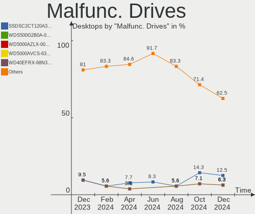
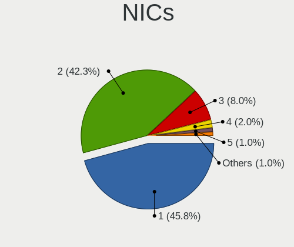

Fedora Hardware Trends (Desktops)
---------------------------------

A project to identify most popular hardware characteristics and track their change
over time based on data collected by Fedora users at https://Linux-Hardware.org.

Anyone can contribute to this report by the [hw-probe](https://github.com/linuxhw/hw-probe) tool:

    sudo -E hw-probe -all -upload

Full-feature report is available here: https://linux-hardware.org/?view=trends

Period: Jan, 2022.

Contents
--------

* [ System ](#system)
  - [ OS                       ](#os)
  - [ OS Family                ](#os-family)
  - [ Kernel                   ](#kernel)
  - [ Kernel Family            ](#kernel-family)
  - [ Kernel Major Ver.        ](#kernel-major-ver)
  - [ Arch                     ](#arch)
  - [ DE                       ](#de)
  - [ Display Server           ](#display-server)
  - [ Display Manager          ](#display-manager)
  - [ OS Lang                  ](#os-lang)
  - [ Boot Mode                ](#boot-mode)
  - [ Filesystem               ](#filesystem)
  - [ Part. scheme             ](#part-scheme)
  - [ Dual Boot with Linux/BSD ](#dual-boot-with-linuxbsd)
  - [ Dual Boot (Win)          ](#dual-boot-win)

* [ Board ](#board)
  - [ Vendor                   ](#vendor)
  - [ Model                    ](#model)
  - [ Model Family             ](#model-family)
  - [ MFG Year                 ](#mfg-year)
  - [ Form Factor              ](#form-factor)
  - [ Secure Boot              ](#secure-boot)
  - [ Coreboot                 ](#coreboot)
  - [ RAM Size                 ](#ram-size)
  - [ RAM Used                 ](#ram-used)
  - [ Total Drives             ](#total-drives)
  - [ Has CD-ROM               ](#has-cd-rom)
  - [ Has Ethernet             ](#has-ethernet)
  - [ Has WiFi                 ](#has-wifi)
  - [ Has Bluetooth            ](#has-bluetooth)

* [ Location ](#location)
  - [ Country                  ](#country)
  - [ City                     ](#city)

* [ Drives ](#drives)
  - [ Drive Vendor             ](#drive-vendor)
  - [ Drive Model              ](#drive-model)
  - [ HDD Vendor               ](#hdd-vendor)
  - [ SSD Vendor               ](#ssd-vendor)
  - [ Drive Kind               ](#drive-kind)
  - [ Drive Connector          ](#drive-connector)
  - [ Drive Size               ](#drive-size)
  - [ Space Total              ](#space-total)
  - [ Space Used               ](#space-used)
  - [ Malfunc. Drives          ](#malfunc-drives)
  - [ Malfunc. Drive Vendor    ](#malfunc-drive-vendor)
  - [ Malfunc. HDD Vendor      ](#malfunc-hdd-vendor)
  - [ Malfunc. Drive Kind      ](#malfunc-drive-kind)
  - [ Failed Drives            ](#failed-drives)
  - [ Failed Drive Vendor      ](#failed-drive-vendor)
  - [ Drive Status             ](#drive-status)

* [ Storage controller ](#storage-controller)
  - [ Storage Vendor           ](#storage-vendor)
  - [ Storage Model            ](#storage-model)
  - [ Storage Kind             ](#storage-kind)

* [ Processor ](#processor)
  - [ CPU Vendor               ](#cpu-vendor)
  - [ CPU Model                ](#cpu-model)
  - [ CPU Model Family         ](#cpu-model-family)
  - [ CPU Cores                ](#cpu-cores)
  - [ CPU Sockets              ](#cpu-sockets)
  - [ CPU Threads              ](#cpu-threads)
  - [ CPU Op-Modes             ](#cpu-op-modes)
  - [ CPU Microcode            ](#cpu-microcode)
  - [ CPU Microarch            ](#cpu-microarch)

* [ Graphics ](#graphics)
  - [ GPU Vendor               ](#gpu-vendor)
  - [ GPU Model                ](#gpu-model)
  - [ GPU Combo                ](#gpu-combo)
  - [ GPU Driver               ](#gpu-driver)
  - [ GPU Memory               ](#gpu-memory)

* [ Monitor ](#monitor)
  - [ Monitor Vendor           ](#monitor-vendor)
  - [ Monitor Model            ](#monitor-model)
  - [ Monitor Resolution       ](#monitor-resolution)
  - [ Monitor Diagonal         ](#monitor-diagonal)
  - [ Monitor Width            ](#monitor-width)
  - [ Aspect Ratio             ](#aspect-ratio)
  - [ Monitor Area             ](#monitor-area)
  - [ Pixel Density            ](#pixel-density)
  - [ Multiple Monitors        ](#multiple-monitors)

* [ Network ](#network)
  - [ Net Controller Vendor    ](#net-controller-vendor)
  - [ Net Controller Model     ](#net-controller-model)
  - [ Wireless Vendor          ](#wireless-vendor)
  - [ Wireless Model           ](#wireless-model)
  - [ Ethernet Vendor          ](#ethernet-vendor)
  - [ Ethernet Model           ](#ethernet-model)
  - [ Net Controller Kind      ](#net-controller-kind)
  - [ Used Controller          ](#used-controller)
  - [ NICs                     ](#nics)
  - [ IPv6                     ](#ipv6)

* [ Bluetooth ](#bluetooth)
  - [ Bluetooth Vendor         ](#bluetooth-vendor)
  - [ Bluetooth Model          ](#bluetooth-model)

* [ Sound ](#sound)
  - [ Sound Vendor             ](#sound-vendor)
  - [ Sound Model              ](#sound-model)

* [ Memory ](#memory)
  - [ Memory Vendor            ](#memory-vendor)
  - [ Memory Model             ](#memory-model)
  - [ Memory Kind              ](#memory-kind)
  - [ Memory Form Factor       ](#memory-form-factor)
  - [ Memory Size              ](#memory-size)
  - [ Memory Speed             ](#memory-speed)

* [ Printers & scanners ](#printers--scanners)
  - [ Printer Vendor           ](#printer-vendor)
  - [ Printer Model            ](#printer-model)
  - [ Scanner Vendor           ](#scanner-vendor)
  - [ Scanner Model            ](#scanner-model)

* [ Camera ](#camera)
  - [ Camera Vendor            ](#camera-vendor)
  - [ Camera Model             ](#camera-model)

* [ Security ](#security)
  - [ Fingerprint Vendor       ](#fingerprint-vendor)
  - [ Fingerprint Model        ](#fingerprint-model)
  - [ Chipcard Vendor          ](#chipcard-vendor)
  - [ Chipcard Model           ](#chipcard-model)

* [ Unsupported ](#unsupported)
  - [ Unsupported Devices      ](#unsupported-devices)
  - [ Unsupported Device Types ](#unsupported-device-types)

System
------

OS
--

Installed operating systems

| Name      | Desktops | Percent |
|-----------|----------|---------|
| Fedora 35 | 85       | 90.43%  |
| Fedora 34 | 7        | 7.45%   |
| Fedora 33 | 2        | 2.13%   |

OS Family
---------

OS without a version

| Name   | Desktops | Percent |
|--------|----------|---------|
| Fedora | 94       | 100%    |

Kernel
------

Version of the Linux kernel

| Version                          | Desktops | Percent |
|----------------------------------|----------|---------|
| 5.15.12-200.fc35.x86_64          | 20       | 21.28%  |
| 5.15.16-200.fc35.x86_64          | 14       | 14.89%  |
| 5.15.14-200.fc35.x86_64          | 13       | 13.83%  |
| 5.15.13-200.fc35.x86_64          | 10       | 10.64%  |
| 5.15.15-200.fc35.x86_64          | 7        | 7.45%   |
| 5.15.11-200.fc35.x86_64          | 5        | 5.32%   |
| 5.14.10-300.fc35.x86_64          | 5        | 5.32%   |
| 5.15.12-100.fc34.x86_64          | 4        | 4.26%   |
| 5.15.17-200.fc35.x86_64          | 2        | 2.13%   |
| 5.14.18-100.fc33.x86_64          | 2        | 2.13%   |
| 5.8.15-301.fc33.x86_64           | 1        | 1.06%   |
| 5.16.4-200.fc35.x86_64           | 1        | 1.06%   |
| 5.16.2-225.vanilla.1.fc35.x86_64 | 1        | 1.06%   |
| 5.16.2-200.fc35.x86_64           | 1        | 1.06%   |
| 5.15.6-200.fc35.x86_64           | 1        | 1.06%   |
| 5.15.5-1.fc25.qubes.x86_64       | 1        | 1.06%   |
| 5.15.13-100.fc34.x86_64          | 1        | 1.06%   |
| 5.15.10-200.fc35.x86_64          | 1        | 1.06%   |
| 5.15.10-100.fc34.x86_64          | 1        | 1.06%   |
| 5.14.20-300.fc35.x86_64          | 1        | 1.06%   |
| 5.11.13-300.fc34.x86_64          | 1        | 1.06%   |
| 5.10.15-200.fc33.x86_64          | 1        | 1.06%   |

Kernel Family
-------------

Linux kernel without a distro release

| Version | Desktops | Percent |
|---------|----------|---------|
| 5.15.12 | 24       | 25.53%  |
| 5.15.16 | 14       | 14.89%  |
| 5.15.14 | 13       | 13.83%  |
| 5.15.13 | 11       | 11.7%   |
| 5.15.15 | 7        | 7.45%   |
| 5.15.11 | 5        | 5.32%   |
| 5.14.10 | 5        | 5.32%   |
| 5.16.2  | 2        | 2.13%   |
| 5.15.17 | 2        | 2.13%   |
| 5.15.10 | 2        | 2.13%   |
| 5.14.18 | 2        | 2.13%   |
| 5.8.15  | 1        | 1.06%   |
| 5.16.4  | 1        | 1.06%   |
| 5.15.6  | 1        | 1.06%   |
| 5.15.5  | 1        | 1.06%   |
| 5.14.20 | 1        | 1.06%   |
| 5.11.13 | 1        | 1.06%   |
| 5.10.15 | 1        | 1.06%   |

Kernel Major Ver.
-----------------

Linux kernel major version

| Version | Desktops | Percent |
|---------|----------|---------|
| 5.15    | 80       | 85.11%  |
| 5.14    | 8        | 8.51%   |
| 5.16    | 3        | 3.19%   |
| 5.8     | 1        | 1.06%   |
| 5.11    | 1        | 1.06%   |
| 5.10    | 1        | 1.06%   |

Arch
----

OS architecture (x86_64, i586, etc.)

| Name   | Desktops | Percent |
|--------|----------|---------|
| x86_64 | 94       | 100%    |

DE
--

Desktop Environment

| Name          | Desktops | Percent |
|---------------|----------|---------|
| GNOME         | 72       | 76.6%   |
| KDE5          | 8        | 8.51%   |
| Unknown       | 6        | 6.38%   |
| Cinnamon      | 5        | 5.32%   |
| X-Cinnamon    | 1        | 1.06%   |
| KDE           | 1        | 1.06%   |
| GNOME Classic | 1        | 1.06%   |

Display Server
--------------

X11 or Wayland

| Name    | Desktops | Percent |
|---------|----------|---------|
| Wayland | 52       | 55.32%  |
| X11     | 33       | 35.11%  |
| Tty     | 5        | 5.32%   |
| Unknown | 4        | 4.26%   |

Display Manager
---------------

SDDM, LightDM, etc.

| Name    | Desktops | Percent |
|---------|----------|---------|
| Unknown | 47       | 50%     |
| GDM     | 34       | 36.17%  |
| SDDM    | 7        | 7.45%   |
| LightDM | 6        | 6.38%   |

OS Lang
-------

Language

| Lang    | Desktops | Percent |
|---------|----------|---------|
| en_US   | 40       | 42.55%  |
| en_AU   | 7        | 7.45%   |
| pt_BR   | 6        | 6.38%   |
| en_GB   | 6        | 6.38%   |
| pl_PL   | 4        | 4.26%   |
| fr_FR   | 4        | 4.26%   |
| ru_RU   | 3        | 3.19%   |
| de_DE   | 3        | 3.19%   |
| nl_BE   | 2        | 2.13%   |
| es_CO   | 2        | 2.13%   |
| C       | 2        | 2.13%   |
| tr_TR   | 1        | 1.06%   |
| sr_RS   | 1        | 1.06%   |
| nl_NL   | 1        | 1.06%   |
| ja_JP   | 1        | 1.06%   |
| it_IT   | 1        | 1.06%   |
| fr_CH   | 1        | 1.06%   |
| es_MX   | 1        | 1.06%   |
| es_ES   | 1        | 1.06%   |
| en_NZ   | 1        | 1.06%   |
| en_IE   | 1        | 1.06%   |
| en_CA   | 1        | 1.06%   |
| el_GR   | 1        | 1.06%   |
| de_AT   | 1        | 1.06%   |
| cs_CZ   | 1        | 1.06%   |
| Unknown | 1        | 1.06%   |

Boot Mode
---------

EFI or BIOS

| Mode | Desktops | Percent |
|------|----------|---------|
| EFI  | 57       | 60.64%  |
| BIOS | 37       | 39.36%  |

Filesystem
----------

Type of filesystem

| Type    | Desktops | Percent |
|---------|----------|---------|
| Btrfs   | 58       | 61.7%   |
| Ext4    | 26       | 27.66%  |
| Xfs     | 9        | 9.57%   |
| Overlay | 1        | 1.06%   |

Part. scheme
------------

Scheme of partitioning

| Type    | Desktops | Percent |
|---------|----------|---------|
| Unknown | 47       | 50%     |
| GPT     | 34       | 36.17%  |
| MBR     | 13       | 13.83%  |

Dual Boot with Linux/BSD
------------------------

Hosting more than one Linux/BSD

| Dual boot | Desktops | Percent |
|-----------|----------|---------|
| No        | 77       | 81.91%  |
| Yes       | 17       | 18.09%  |

Dual Boot (Win)
---------------

Hosting Linux and Windows

| Dual boot | Desktops | Percent |
|-----------|----------|---------|
| No        | 65       | 69.15%  |
| Yes       | 29       | 30.85%  |

Board
-----

Vendor
------

Motherboard manufacturer

| Name                | Desktops | Percent |
|---------------------|----------|---------|
| Gigabyte Technology | 29       | 30.85%  |
| ASUSTek Computer    | 21       | 22.34%  |
| MSI                 | 17       | 18.09%  |
| Dell                | 6        | 6.38%   |
| ASRock              | 6        | 6.38%   |
| Lenovo              | 4        | 4.26%   |
| Hewlett-Packard     | 3        | 3.19%   |
| Fujitsu             | 2        | 2.13%   |
| Unknown             | 2        | 2.13%   |
| XFX                 | 1        | 1.06%   |
| PCWare              | 1        | 1.06%   |
| BESSTAR Tech        | 1        | 1.06%   |
| Acer                | 1        | 1.06%   |

Model
-----

Motherboard model

| Name                                | Desktops | Percent |
|-------------------------------------|----------|---------|
| MSI MS-7B86                         | 2        | 2.13%   |
| MSI MS-7B85                         | 2        | 2.13%   |
| Gigabyte Z390 AORUS MASTER          | 2        | 2.13%   |
| ASUS All Series                     | 2        | 2.13%   |
| Unknown                             | 2        | 2.13%   |
| XFX nForce 780i 3-Way SLI           | 1        | 1.06%   |
| PCWare IPMH110G                     | 1        | 1.06%   |
| MSI MS-7D25                         | 1        | 1.06%   |
| MSI MS-7C95                         | 1        | 1.06%   |
| MSI MS-7C94                         | 1        | 1.06%   |
| MSI MS-7C84                         | 1        | 1.06%   |
| MSI MS-7B89                         | 1        | 1.06%   |
| MSI MS-7B79                         | 1        | 1.06%   |
| MSI MS-7B33                         | 1        | 1.06%   |
| MSI MS-7B10                         | 1        | 1.06%   |
| MSI MS-7A69                         | 1        | 1.06%   |
| MSI MS-7A37                         | 1        | 1.06%   |
| MSI MS-7A34                         | 1        | 1.06%   |
| MSI MS-7A20                         | 1        | 1.06%   |
| MSI MS-7922                         | 1        | 1.06%   |
| Lenovo ThinkStation P620 30E1S36700 | 1        | 1.06%   |
| Lenovo ThinkCentre M93p 10AAS1AG00  | 1        | 1.06%   |
| Lenovo ThinkCentre M720s 10ST0014MB | 1        | 1.06%   |
| Lenovo H30-05 90BJ001FCK            | 1        | 1.06%   |
| HP XL509AV#279                      | 1        | 1.06%   |
| HP Compaq 8200 Elite CMT PC         | 1        | 1.06%   |
| HP Compaq 6200 Pro SFF PC           | 1        | 1.06%   |
| Gigabyte Z590 AORUS MASTER          | 1        | 1.06%   |
| Gigabyte Z490 AORUS MASTER          | 1        | 1.06%   |
| Gigabyte Z370P D3                   | 1        | 1.06%   |
| Gigabyte Z270-HD3P                  | 1        | 1.06%   |
| Gigabyte X570S AERO G               | 1        | 1.06%   |
| Gigabyte X399 AORUS PRO             | 1        | 1.06%   |
| Gigabyte TRX40 AORUS XTREME         | 1        | 1.06%   |
| Gigabyte P55A-UD7                   | 1        | 1.06%   |
| Gigabyte H97-D3H                    | 1        | 1.06%   |
| Gigabyte H81M-S2H                   | 1        | 1.06%   |
| Gigabyte H77N-WIFI                  | 1        | 1.06%   |
| Gigabyte H110M-H-CF                 | 1        | 1.06%   |
| Gigabyte GB-BRR7H-4800              | 1        | 1.06%   |
| Gigabyte GA-A55M-DS2                | 1        | 1.06%   |
| Gigabyte GA-880GM-UD2H              | 1        | 1.06%   |
| Gigabyte G41MT-D3                   | 1        | 1.06%   |
| Gigabyte F2A88XM-D3H                | 1        | 1.06%   |
| Gigabyte F2A68HM-H                  | 1        | 1.06%   |
| Gigabyte F2A68HM-DS2                | 1        | 1.06%   |
| Gigabyte EP45-DS3L                  | 1        | 1.06%   |
| Gigabyte D525TUD                    | 1        | 1.06%   |
| Gigabyte B85M-D3V-A                 | 1        | 1.06%   |
| Gigabyte B75M-D3V                   | 1        | 1.06%   |
| Gigabyte B550 AORUS PRO AC          | 1        | 1.06%   |
| Gigabyte B450 AORUS M               | 1        | 1.06%   |
| Gigabyte B250M-D3H                  | 1        | 1.06%   |
| Gigabyte AB350-Gaming 3             | 1        | 1.06%   |
| Fujitsu ESPRIMO D538                | 1        | 1.06%   |
| Fujitsu CELSIUS W530                | 1        | 1.06%   |
| Dell XPS 630i                       | 1        | 1.06%   |
| Dell Precision T3610                | 1        | 1.06%   |
| Dell Precision 3650 Tower           | 1        | 1.06%   |
| Dell OptiPlex 5090                  | 1        | 1.06%   |

Model Family
------------

Motherboard model prefix

| Name                   | Desktops | Percent |
|------------------------|----------|---------|
| ASUS PRIME             | 6        | 6.38%   |
| ASUS ROG               | 4        | 4.26%   |
| Dell OptiPlex          | 3        | 3.19%   |
| ASUS TUF               | 3        | 3.19%   |
| MSI MS-7B86            | 2        | 2.13%   |
| MSI MS-7B85            | 2        | 2.13%   |
| Lenovo ThinkCentre     | 2        | 2.13%   |
| HP Compaq              | 2        | 2.13%   |
| Gigabyte Z390          | 2        | 2.13%   |
| Dell Precision         | 2        | 2.13%   |
| ASUS Maximus           | 2        | 2.13%   |
| ASUS All               | 2        | 2.13%   |
| Unknown                | 2        | 2.13%   |
| XFX nForce             | 1        | 1.06%   |
| PCWare IPMH110G        | 1        | 1.06%   |
| MSI MS-7D25            | 1        | 1.06%   |
| MSI MS-7C95            | 1        | 1.06%   |
| MSI MS-7C94            | 1        | 1.06%   |
| MSI MS-7C84            | 1        | 1.06%   |
| MSI MS-7B89            | 1        | 1.06%   |
| MSI MS-7B79            | 1        | 1.06%   |
| MSI MS-7B33            | 1        | 1.06%   |
| MSI MS-7B10            | 1        | 1.06%   |
| MSI MS-7A69            | 1        | 1.06%   |
| MSI MS-7A37            | 1        | 1.06%   |
| MSI MS-7A34            | 1        | 1.06%   |
| MSI MS-7A20            | 1        | 1.06%   |
| MSI MS-7922            | 1        | 1.06%   |
| Lenovo ThinkStation    | 1        | 1.06%   |
| Lenovo H30-05          | 1        | 1.06%   |
| HP XL509AV#279         | 1        | 1.06%   |
| Gigabyte Z590          | 1        | 1.06%   |
| Gigabyte Z490          | 1        | 1.06%   |
| Gigabyte Z370P         | 1        | 1.06%   |
| Gigabyte Z270-HD3P     | 1        | 1.06%   |
| Gigabyte X570S         | 1        | 1.06%   |
| Gigabyte X399          | 1        | 1.06%   |
| Gigabyte TRX40         | 1        | 1.06%   |
| Gigabyte P55A-UD7      | 1        | 1.06%   |
| Gigabyte H97-D3H       | 1        | 1.06%   |
| Gigabyte H81M-S2H      | 1        | 1.06%   |
| Gigabyte H77N-WIFI     | 1        | 1.06%   |
| Gigabyte H110M-H-CF    | 1        | 1.06%   |
| Gigabyte GB-BRR7H-4800 | 1        | 1.06%   |
| Gigabyte GA-A55M-DS2   | 1        | 1.06%   |
| Gigabyte GA-880GM-UD2H | 1        | 1.06%   |
| Gigabyte G41MT-D3      | 1        | 1.06%   |
| Gigabyte F2A88XM-D3H   | 1        | 1.06%   |
| Gigabyte F2A68HM-H     | 1        | 1.06%   |
| Gigabyte F2A68HM-DS2   | 1        | 1.06%   |
| Gigabyte EP45-DS3L     | 1        | 1.06%   |
| Gigabyte D525TUD       | 1        | 1.06%   |
| Gigabyte B85M-D3V-A    | 1        | 1.06%   |
| Gigabyte B75M-D3V      | 1        | 1.06%   |
| Gigabyte B550          | 1        | 1.06%   |
| Gigabyte B450          | 1        | 1.06%   |
| Gigabyte B250M-D3H     | 1        | 1.06%   |
| Gigabyte AB350-Gaming  | 1        | 1.06%   |
| Fujitsu ESPRIMO        | 1        | 1.06%   |
| Fujitsu CELSIUS        | 1        | 1.06%   |

MFG Year
--------

Motherboard manufacture year

| Year    | Desktops | Percent |
|---------|----------|---------|
| 2021    | 12       | 12.77%  |
| 2019    | 12       | 12.77%  |
| 2018    | 11       | 11.7%   |
| 2020    | 10       | 10.64%  |
| 2017    | 10       | 10.64%  |
| 2014    | 8        | 8.51%   |
| 2016    | 7        | 7.45%   |
| 2012    | 6        | 6.38%   |
| 2015    | 5        | 5.32%   |
| 2010    | 4        | 4.26%   |
| 2011    | 3        | 3.19%   |
| 2013    | 2        | 2.13%   |
| 2008    | 2        | 2.13%   |
| 2009    | 1        | 1.06%   |
| Unknown | 1        | 1.06%   |

Form Factor
-----------

Physical design of the computer

| Name    | Desktops | Percent |
|---------|----------|---------|
| Desktop | 94       | 100%    |

Secure Boot
-----------

Enabled or disabled

| State    | Desktops | Percent |
|----------|----------|---------|
| Disabled | 90       | 95.74%  |
| Enabled  | 4        | 4.26%   |

Coreboot
--------

Have coreboot on board

| Used | Desktops | Percent |
|------|----------|---------|
| No   | 94       | 100%    |

RAM Size
--------

Total RAM memory

| Size in GB  | Desktops | Percent |
|-------------|----------|---------|
| 16.01-24.0  | 35       | 37.23%  |
| 32.01-64.0  | 17       | 18.09%  |
| 64.01-256.0 | 11       | 11.7%   |
| 4.01-8.0    | 10       | 10.64%  |
| 8.01-16.0   | 10       | 10.64%  |
| 3.01-4.0    | 8        | 8.51%   |
| 24.01-32.0  | 3        | 3.19%   |

RAM Used
--------

Used RAM memory

| Used GB    | Desktops | Percent |
|------------|----------|---------|
| 4.01-8.0   | 24       | 25.53%  |
| 2.01-3.0   | 22       | 23.4%   |
| 1.01-2.0   | 17       | 18.09%  |
| 3.01-4.0   | 16       | 17.02%  |
| 8.01-16.0  | 9        | 9.57%   |
| 0.51-1.0   | 3        | 3.19%   |
| 16.01-24.0 | 2        | 2.13%   |
| 24.01-32.0 | 1        | 1.06%   |

Total Drives
------------

Number of drives on board

| Drives | Desktops | Percent |
|--------|----------|---------|
| 2      | 24       | 25.53%  |
| 1      | 23       | 24.47%  |
| 3      | 22       | 23.4%   |
| 4      | 11       | 11.7%   |
| 5      | 5        | 5.32%   |
| 6      | 4        | 4.26%   |
| 7      | 2        | 2.13%   |
| 27     | 1        | 1.06%   |
| 8      | 1        | 1.06%   |
| 0      | 1        | 1.06%   |

Has CD-ROM
----------

Has CD-ROM on board

| Presented | Desktops | Percent |
|-----------|----------|---------|
| No        | 70       | 74.47%  |
| Yes       | 24       | 25.53%  |

Has Ethernet
------------

Has Ethernet on board

| Presented | Desktops | Percent |
|-----------|----------|---------|
| Yes       | 92       | 97.87%  |
| No        | 2        | 2.13%   |

Has WiFi
--------

Has WiFi module

| Presented | Desktops | Percent |
|-----------|----------|---------|
| No        | 48       | 51.06%  |
| Yes       | 46       | 48.94%  |

Has Bluetooth
-------------

Has Bluetooth module

| Presented | Desktops | Percent |
|-----------|----------|---------|
| No        | 54       | 57.45%  |
| Yes       | 40       | 42.55%  |

Location
--------

Country
-------

Geographic location (country)

| Country     | Desktops | Percent |
|-------------|----------|---------|
| USA         | 22       | 23.4%   |
| Australia   | 9        | 9.57%   |
| UK          | 7        | 7.45%   |
| Brazil      | 6        | 6.38%   |
| Poland      | 5        | 5.32%   |
| France      | 5        | 5.32%   |
| Netherlands | 4        | 4.26%   |
| Czechia     | 4        | 4.26%   |
| Germany     | 3        | 3.19%   |
| Turkey      | 2        | 2.13%   |
| Spain       | 2        | 2.13%   |
| Russia      | 2        | 2.13%   |
| India       | 2        | 2.13%   |
| Colombia    | 2        | 2.13%   |
| Canada      | 2        | 2.13%   |
| Belgium     | 2        | 2.13%   |
| Belarus     | 2        | 2.13%   |
| Ukraine     | 1        | 1.06%   |
| Thailand    | 1        | 1.06%   |
| Switzerland | 1        | 1.06%   |
| Sweden      | 1        | 1.06%   |
| Mexico      | 1        | 1.06%   |
| Japan       | 1        | 1.06%   |
| Italy       | 1        | 1.06%   |
| Ireland     | 1        | 1.06%   |
| Greece      | 1        | 1.06%   |
| Bolivia     | 1        | 1.06%   |
| Austria     | 1        | 1.06%   |
| Argentina   | 1        | 1.06%   |
| Algeria     | 1        | 1.06%   |

City
----

Geographic location (city)

| City            | Desktops | Percent |
|-----------------|----------|---------|
| Sydney          | 6        | 6.38%   |
| Minsk           | 2        | 2.13%   |
| Madrid          | 2        | 2.13%   |
| Brisbane        | 2        | 2.13%   |
| Zl?­n           | 1        | 1.06%   |
| Zgorzelec       | 1        | 1.06%   |
| Zeven           | 1        | 1.06%   |
| Zaporizhzhya    | 1        | 1.06%   |
| Winchester      | 1        | 1.06%   |
| Willowbrook     | 1        | 1.06%   |
| Wateringen      | 1        | 1.06%   |
| Warsaw          | 1        | 1.06%   |
| Waldorf         | 1        | 1.06%   |
| Villavicencio   | 1        | 1.06%   |
| Vienna          | 1        | 1.06%   |
| Valkenswaard    | 1        | 1.06%   |
| Vaellingby      | 1        | 1.06%   |
| St Petersburg   | 1        | 1.06%   |
| St Louis        | 1        | 1.06%   |
| Southampton     | 1        | 1.06%   |
| Saint Paul      | 1        | 1.06%   |
| Royal Oak       | 1        | 1.06%   |
| Rio de Janeiro  | 1        | 1.06%   |
| Raleigh         | 1        | 1.06%   |
| Pune            | 1        | 1.06%   |
| Prague          | 1        | 1.06%   |
| Pouso Alegre    | 1        | 1.06%   |
| Port Orange     | 1        | 1.06%   |
| Pennsville      | 1        | 1.06%   |
| P??trai         | 1        | 1.06%   |
| Paris           | 1        | 1.06%   |
| Paragould       | 1        | 1.06%   |
| Pantin          | 1        | 1.06%   |
| Oregon City     | 1        | 1.06%   |
| Omaha           | 1        | 1.06%   |
| Olathe          | 1        | 1.06%   |
| Nowa Sarzyna    | 1        | 1.06%   |
| Novy Jicin      | 1        | 1.06%   |
| Nottingham      | 1        | 1.06%   |
| Nieuw-Buinen    | 1        | 1.06%   |
| Newark on Trent | 1        | 1.06%   |
| Naucalpan       | 1        | 1.06%   |
| Moscow          | 1        | 1.06%   |
| Morioka         | 1        | 1.06%   |
| Montgomery      | 1        | 1.06%   |
| Merrillville    | 1        | 1.06%   |
| Mechelen        | 1        | 1.06%   |
| Martigny-Ville  | 1        | 1.06%   |
| Maple Ridge     | 1        | 1.06%   |
| Legnaro         | 1        | 1.06%   |
| Krakow          | 1        | 1.06%   |
| Kapellen        | 1        | 1.06%   |
| Jaworzno        | 1        | 1.06%   |
| Jatai           | 1        | 1.06%   |
| Istanbul        | 1        | 1.06%   |
| Islington       | 1        | 1.06%   |
| Houston         | 1        | 1.06%   |
| Guararapes      | 1        | 1.06%   |
| Elmhurst        | 1        | 1.06%   |
| Dublin          | 1        | 1.06%   |

Drives
------

Drive Vendor
------------

Hard drive vendors

| Vendor                    | Desktops | Drives | Percent |
|---------------------------|----------|--------|---------|
| Samsung Electronics       | 38       | 60     | 19.39%  |
| Seagate                   | 34       | 65     | 17.35%  |
| WDC                       | 29       | 44     | 14.8%   |
| Crucial                   | 15       | 18     | 7.65%   |
| Kingston                  | 10       | 11     | 5.1%    |
| SanDisk                   | 9        | 9      | 4.59%   |
| Toshiba                   | 8        | 8      | 4.08%   |
| Phison                    | 6        | 7      | 3.06%   |
| Intel                     | 6        | 6      | 3.06%   |
| Hitachi                   | 6        | 7      | 3.06%   |
| A-DATA Technology         | 5        | 5      | 2.55%   |
| Patriot                   | 4        | 5      | 2.04%   |
| HGST                      | 4        | 5      | 2.04%   |
| Micron/Crucial Technology | 3        | 3      | 1.53%   |
| Verbatim                  | 2        | 2      | 1.02%   |
| Lexar                     | 2        | 3      | 1.02%   |
| Hewlett-Packard           | 2        | 2      | 1.02%   |
| XPG                       | 1        | 1      | 0.51%   |
| Unknown                   | 1        | 2      | 0.51%   |
| SPCC                      | 1        | 1      | 0.51%   |
| SK Hynix                  | 1        | 1      | 0.51%   |
| Silicon Motion            | 1        | 1      | 0.51%   |
| SABRENT                   | 1        | 1      | 0.51%   |
| LDLC                      | 1        | 1      | 0.51%   |
| KIOXIA                    | 1        | 1      | 0.51%   |
| KingSpec                  | 1        | 1      | 0.51%   |
| Corsair                   | 1        | 1      | 0.51%   |
| China                     | 1        | 2      | 0.51%   |
| BIWIN                     | 1        | 1      | 0.51%   |
| Apacer                    | 1        | 1      | 0.51%   |

Drive Model
-----------

Hard drive models

| Model                               | Desktops | Percent |
|-------------------------------------|----------|---------|
| Samsung NVMe SSD Drive 500GB        | 7        | 3.03%   |
| Samsung SSD 860 EVO 500GB           | 6        | 2.6%    |
| Samsung SSD 850 EVO 500GB           | 5        | 2.16%   |
| Seagate ST3500418AS 500GB           | 4        | 1.73%   |
| Kingston SA400S37480G 480GB SSD     | 4        | 1.73%   |
| Seagate ST2000DM008-2FR102 2TB      | 3        | 1.3%    |
| Seagate ST1000DM010-2EP102 1TB      | 3        | 1.3%    |
| Samsung NVMe SSD Drive 1TB          | 3        | 1.3%    |
| Crucial CT500MX500SSD1 500GB        | 3        | 1.3%    |
| WDC WDS500G2B0A-00SM50 500GB SSD    | 2        | 0.87%   |
| WDC WDS240G2G0B-00EPW0 240GB SSD    | 2        | 0.87%   |
| WDC WD10EZRX-00D8PB0 1TB            | 2        | 0.87%   |
| WDC WD10EZEX-00WN4A0 1TB            | 2        | 0.87%   |
| Verbatim Vi550 S3 SSD 512GB         | 2        | 0.87%   |
| Toshiba HDWD110 1TB                 | 2        | 0.87%   |
| Seagate ST6000VN0033-2EE110 6TB     | 2        | 0.87%   |
| Seagate ST4000DM004-2CV104 4TB      | 2        | 0.87%   |
| Seagate ST31000333AS 1TB            | 2        | 0.87%   |
| Seagate ST1000DM003-1CH162 1TB      | 2        | 0.87%   |
| Seagate Expansion 1TB               | 2        | 0.87%   |
| Samsung SSD 870 QVO 2TB             | 2        | 0.87%   |
| Samsung SSD 860 EVO 1TB             | 2        | 0.87%   |
| Samsung SSD 830 Series 256GB        | 2        | 0.87%   |
| Samsung NVMe SSD Drive 2TB          | 2        | 0.87%   |
| Samsung NVMe SSD Drive 250GB        | 2        | 0.87%   |
| Micron/Crucial NVMe SSD Drive 500GB | 2        | 0.87%   |
| Kingston SA400S37240G 240GB SSD     | 2        | 0.87%   |
| Intel SSDSC2CT120A3 120GB           | 2        | 0.87%   |
| Hitachi HUA721010KLA330 1TB         | 2        | 0.87%   |
| HGST HTS721010A9E630 1TB            | 2        | 0.87%   |
| Crucial CT500P5SSD8 500GB           | 2        | 0.87%   |
| A-DATA SU630 240GB SSD              | 2        | 0.87%   |
| XPG GAMMIX S11 Pro 2TB              | 1        | 0.43%   |
| WDC WDS500G2X0C-00L350 500GB        | 1        | 0.43%   |
| WDC WDS120G2G0A-00JH30 120GB SSD    | 1        | 0.43%   |
| WDC WDS100T3X0C-00SJG0 1TB          | 1        | 0.43%   |
| WDC WDBNCE0010PNC 1TB SSD           | 1        | 0.43%   |
| WDC WD7500AACS-00D6B1 752GB         | 1        | 0.43%   |
| WDC WD6400BPVT-75HXZT3 640GB        | 1        | 0.43%   |
| WDC WD6400AAKS-65A7B2 640GB         | 1        | 0.43%   |
| WDC WD60EZRZ-00RWYB1 6TB            | 1        | 0.43%   |
| WDC WD5000AAKX-08U6AA0 500GB        | 1        | 0.43%   |
| WDC WD5000AAKS-00UU3A0 500GB        | 1        | 0.43%   |
| WDC WD5000AACS-00G8B1 500GB         | 1        | 0.43%   |
| WDC WD40PURZ-85TTDY0 4TB            | 1        | 0.43%   |
| WDC WD40EZRZ-00GXCB0 4TB            | 1        | 0.43%   |
| WDC WD40EZRX-00SPEB0 4TB            | 1        | 0.43%   |
| WDC WD3200AAJS-60Z0A0 320GB         | 1        | 0.43%   |
| WDC WD20EZAZ-00GGJB0 2TB            | 1        | 0.43%   |
| WDC WD20EFRX-68EUZN0 2TB            | 1        | 0.43%   |
| WDC WD181KRYZ-01AGBB0 18TB          | 1        | 0.43%   |
| WDC WD15EARS-00S0XB0 1TB            | 1        | 0.43%   |
| WDC WD10JPCX-24UE4T0 1TB            | 1        | 0.43%   |
| WDC WD10EZEX-60WN4A1 1TB            | 1        | 0.43%   |
| WDC WD10EZEX-08WN4A0 1TB            | 1        | 0.43%   |
| WDC WD10EZEX-08M2NA0 1TB            | 1        | 0.43%   |
| WDC WD10EZEX-00BN5A0 1TB            | 1        | 0.43%   |
| WDC WD10EFRX-68JCSN0 1TB            | 1        | 0.43%   |
| WDC WD10EARS-003BB1 1TB             | 1        | 0.43%   |
| WDC WD10EALX-009BA0 1TB             | 1        | 0.43%   |

HDD Vendor
----------

Hard disk drive vendors

| Vendor              | Desktops | Drives | Percent |
|---------------------|----------|--------|---------|
| Seagate             | 30       | 61     | 41.67%  |
| WDC                 | 24       | 36     | 33.33%  |
| Toshiba             | 6        | 6      | 8.33%   |
| Hitachi             | 6        | 7      | 8.33%   |
| HGST                | 4        | 5      | 5.56%   |
| Samsung Electronics | 1        | 1      | 1.39%   |
| Hewlett-Packard     | 1        | 1      | 1.39%   |

SSD Vendor
----------

Solid state drive vendors

| Vendor              | Desktops | Drives | Percent |
|---------------------|----------|--------|---------|
| Samsung Electronics | 24       | 34     | 29.63%  |
| Crucial             | 12       | 15     | 14.81%  |
| Kingston            | 8        | 9      | 9.88%   |
| WDC                 | 6        | 6      | 7.41%   |
| SanDisk             | 6        | 6      | 7.41%   |
| Intel               | 6        | 6      | 7.41%   |
| Patriot             | 4        | 5      | 4.94%   |
| A-DATA Technology   | 4        | 4      | 4.94%   |
| Verbatim            | 2        | 2      | 2.47%   |
| Toshiba             | 1        | 1      | 1.23%   |
| SPCC                | 1        | 1      | 1.23%   |
| Seagate             | 1        | 1      | 1.23%   |
| SABRENT             | 1        | 1      | 1.23%   |
| Lexar               | 1        | 1      | 1.23%   |
| KingSpec            | 1        | 1      | 1.23%   |
| China               | 1        | 2      | 1.23%   |
| BIWIN               | 1        | 1      | 1.23%   |
| Apacer              | 1        | 1      | 1.23%   |

Drive Kind
----------

HDD or SSD

| Kind    | Desktops | Drives | Percent |
|---------|----------|--------|---------|
| SSD     | 66       | 97     | 38.82%  |
| HDD     | 57       | 117    | 33.53%  |
| NVMe    | 41       | 53     | 24.12%  |
| Unknown | 6        | 8      | 3.53%   |

Drive Connector
---------------

SATA, SAS, NVMe, etc.

| Type | Desktops | Drives | Percent |
|------|----------|--------|---------|
| SATA | 81       | 210    | 61.36%  |
| NVMe | 41       | 53     | 31.06%  |
| SAS  | 10       | 12     | 7.58%   |

Drive Size
----------

Size of hard drive

| Size in TB | Desktops | Drives | Percent |
|------------|----------|--------|---------|
| 0.01-0.5   | 61       | 91     | 44.85%  |
| 0.51-1.0   | 45       | 62     | 33.09%  |
| 1.01-2.0   | 14       | 17     | 10.29%  |
| 4.01-10.0  | 7        | 30     | 5.15%   |
| 3.01-4.0   | 6        | 9      | 4.41%   |
| 10.01-20.0 | 2        | 3      | 1.47%   |
| 2.01-3.0   | 1        | 2      | 0.74%   |

Space Total
-----------

Amount of disk space available on the file system

| Size in GB     | Desktops | Percent |
|----------------|----------|---------|
| 1001-2000      | 23       | 24.47%  |
| 251-500        | 16       | 17.02%  |
| More than 3000 | 12       | 12.77%  |
| 501-1000       | 11       | 11.7%   |
| 1-20           | 10       | 10.64%  |
| 2001-3000      | 9        | 9.57%   |
| 101-250        | 6        | 6.38%   |
| Unknown        | 4        | 4.26%   |
| 51-100         | 3        | 3.19%   |

Space Used
----------

Amount of used disk space

| Used GB        | Desktops | Percent |
|----------------|----------|---------|
| 1-20           | 26       | 27.66%  |
| 501-1000       | 15       | 15.96%  |
| 251-500        | 10       | 10.64%  |
| 1001-2000      | 10       | 10.64%  |
| 21-50          | 9        | 9.57%   |
| 51-100         | 7        | 7.45%   |
| More than 3000 | 5        | 5.32%   |
| 101-250        | 5        | 5.32%   |
| Unknown        | 4        | 4.26%   |
| 2001-3000      | 3        | 3.19%   |

Malfunc. Drives
---------------

Drive models with a malfunction

| Model                               | Desktops | Drives | Percent |
|-------------------------------------|----------|--------|---------|
| Seagate ST3500418AS 500GB           | 3        | 3      | 21.43%  |
| Intel SSDSC2CT120A3 120GB           | 2        | 2      | 14.29%  |
| WDC WDS240G2G0B-00EPW0 240GB SSD    | 1        | 1      | 7.14%   |
| WDC WD5000AAKS-00UU3A0 500GB        | 1        | 1      | 7.14%   |
| WDC WD15EARS-00S0XB0 1TB            | 1        | 1      | 7.14%   |
| WDC WD10EALX-009BA0 1TB             | 1        | 1      | 7.14%   |
| Seagate ST31000528AS 1TB            | 1        | 1      | 7.14%   |
| Seagate ST2000DM001-1CH164 2TB      | 1        | 1      | 7.14%   |
| SanDisk SD6PP4M-256G-1006 256GB SSD | 1        | 1      | 7.14%   |
| Crucial CT275MX300SSD1 275GB        | 1        | 1      | 7.14%   |
| Crucial CT240M500SSD1 240GB         | 1        | 1      | 7.14%   |

Malfunc. Drive Vendor
---------------------

Vendors of faulty drives

| Vendor  | Desktops | Drives | Percent |
|---------|----------|--------|---------|
| Seagate | 5        | 5      | 35.71%  |
| WDC     | 4        | 4      | 28.57%  |
| Intel   | 2        | 2      | 14.29%  |
| Crucial | 2        | 2      | 14.29%  |
| SanDisk | 1        | 1      | 7.14%   |

Malfunc. HDD Vendor
-------------------

Vendors of faulty HDD drives

| Vendor  | Desktops | Drives | Percent |
|---------|----------|--------|---------|
| Seagate | 5        | 5      | 62.5%   |
| WDC     | 3        | 3      | 37.5%   |

Malfunc. Drive Kind
-------------------

Kinds of faulty drives

| Kind | Desktops | Drives | Percent |
|------|----------|--------|---------|
| HDD  | 8        | 8      | 57.14%  |
| SSD  | 6        | 6      | 42.86%  |

Failed Drives
-------------

Failed drive models

Zero info for selected period =(

Failed Drive Vendor
-------------------

Failed drive vendors

Zero info for selected period =(

Drive Status
------------

Number of failed and malfunc. drives

| Status   | Desktops | Drives | Percent |
|----------|----------|--------|---------|
| Detected | 51       | 155    | 45.95%  |
| Works    | 46       | 106    | 41.44%  |
| Malfunc  | 14       | 14     | 12.61%  |

Storage controller
------------------

Storage Vendor
--------------

Storage controller vendors

| Vendor                       | Desktops | Percent |
|------------------------------|----------|---------|
| Intel                        | 56       | 37.33%  |
| AMD                          | 35       | 23.33%  |
| Samsung Electronics          | 21       | 14%     |
| Phison Electronics           | 7        | 4.67%   |
| Sandisk                      | 5        | 3.33%   |
| Micron/Crucial Technology    | 5        | 3.33%   |
| JMicron Technology           | 3        | 2%      |
| Silicon Motion               | 2        | 1.33%   |
| Nvidia                       | 2        | 1.33%   |
| Marvell Technology Group     | 2        | 1.33%   |
| Kingston Technology Company  | 2        | 1.33%   |
| ASMedia Technology           | 2        | 1.33%   |
| ADATA Technology             | 2        | 1.33%   |
| Toshiba America Info Systems | 1        | 0.67%   |
| SK Hynix                     | 1        | 0.67%   |
| Micron Technology            | 1        | 0.67%   |
| LSI Logic / Symbios Logic    | 1        | 0.67%   |
| KIOXIA                       | 1        | 0.67%   |
| Adaptec                      | 1        | 0.67%   |

Storage Model
-------------

Storage controller models

| Model                                                                                   | Desktops | Percent |
|-----------------------------------------------------------------------------------------|----------|---------|
| AMD FCH SATA Controller [AHCI mode]                                                     | 25       | 14.29%  |
| Samsung NVMe SSD Controller SM981/PM981/PM983                                           | 15       | 8.57%   |
| Intel 200 Series PCH SATA controller [AHCI mode]                                        | 10       | 5.71%   |
| AMD 400 Series Chipset SATA Controller                                                  | 9        | 5.14%   |
| Intel Cannon Lake PCH SATA AHCI Controller                                              | 8        | 4.57%   |
| Phison E12 NVMe Controller                                                              | 7        | 4%      |
| Intel 8 Series/C220 Series Chipset Family 6-port SATA Controller 1 [AHCI mode]          | 7        | 4%      |
| Intel Q170/Q150/B150/H170/H110/Z170/CM236 Chipset SATA Controller [AHCI Mode]           | 5        | 2.86%   |
| AMD Starship/Matisse Chipset SATA Controller [AHCI mode]                                | 5        | 2.86%   |
| AMD 300 Series Chipset SATA Controller                                                  | 5        | 2.86%   |
| Intel SATA Controller [RAID mode]                                                       | 4        | 2.29%   |
| Intel 7 Series/C210 Series Chipset Family 6-port SATA Controller [AHCI mode]            | 4        | 2.29%   |
| Samsung NVMe SSD Controller PM9A1/PM9A3/980PRO                                          | 3        | 1.71%   |
| Samsung NVMe SSD Controller 980                                                         | 3        | 1.71%   |
| Micron/Crucial P2 NVMe PCIe SSD                                                         | 3        | 1.71%   |
| Intel 9 Series Chipset Family SATA Controller [AHCI Mode]                               | 3        | 1.71%   |
| AMD FCH IDE Controller                                                                  | 3        | 1.71%   |
| Sandisk WD Black SN750 / PC SN730 NVMe SSD                                              | 2        | 1.14%   |
| Intel NM10/ICH7 Family SATA Controller [AHCI mode]                                      | 2        | 1.14%   |
| Intel 6 Series/C200 Series Chipset Family Desktop SATA Controller (IDE mode, ports 4-5) | 2        | 1.14%   |
| Intel 6 Series/C200 Series Chipset Family Desktop SATA Controller (IDE mode, ports 0-3) | 2        | 1.14%   |
| Intel 500 Series Chipset Family SATA AHCI Controller                                    | 2        | 1.14%   |
| ASMedia ASM1062 Serial ATA Controller                                                   | 2        | 1.14%   |
| ADATA XPG SX8200 Pro PCIe Gen3x4 M.2 2280 Solid State Drive                             | 2        | 1.14%   |
| Toshiba America Info Systems Toshiba America Info Non-Volatile memory controller        | 1        | 0.57%   |
| SK Hynix Non-Volatile memory controller                                                 | 1        | 0.57%   |
| Silicon Motion SM2263EN/SM2263XT SSD Controller                                         | 1        | 0.57%   |
| Silicon Motion SM2262/SM2262EN SSD Controller                                           | 1        | 0.57%   |
| Sandisk WD Blue SN550 NVMe SSD                                                          | 1        | 0.57%   |
| Sandisk WD Black 2018/SN750 / PC SN720 NVMe SSD                                         | 1        | 0.57%   |
| Sandisk Non-Volatile memory controller                                                  | 1        | 0.57%   |
| Samsung NVMe SSD Controller SM961/PM961/SM963                                           | 1        | 0.57%   |
| Nvidia MCP55 SATA Controller                                                            | 1        | 0.57%   |
| Nvidia MCP55 IDE                                                                        | 1        | 0.57%   |
| Nvidia MCP51 Serial ATA Controller                                                      | 1        | 0.57%   |
| Nvidia MCP51 IDE                                                                        | 1        | 0.57%   |
| Micron/Crucial NVMe Controller                                                          | 1        | 0.57%   |
| Micron/Crucial Non-Volatile memory controller                                           | 1        | 0.57%   |
| Micron Non-Volatile memory controller                                                   | 1        | 0.57%   |
| Marvell Group 88SS9183 PCIe SSD Controller                                              | 1        | 0.57%   |
| Marvell Group 88SE9215 PCIe 2.0 x1 4-port SATA 6 Gb/s Controller                        | 1        | 0.57%   |
| LSI Logic / Symbios Logic SAS3008 PCI-Express Fusion-MPT SAS-3                          | 1        | 0.57%   |
| LSI Logic / Symbios Logic SAS2008 PCI-Express Fusion-MPT SAS-2 [Falcon]                 | 1        | 0.57%   |
| KIOXIA Non-Volatile memory controller                                                   | 1        | 0.57%   |
| Kingston Company OM3PDP3 NVMe SSD                                                       | 1        | 0.57%   |
| Kingston Company KC2000 NVMe SSD                                                        | 1        | 0.57%   |
| JMicron JMB368 IDE controller                                                           | 1        | 0.57%   |
| JMicron JMB363 SATA/IDE Controller                                                      | 1        | 0.57%   |
| JMicron JMB362 SATA Controller                                                          | 1        | 0.57%   |
| Intel NM10/ICH7 Family SATA Controller [IDE mode]                                       | 1        | 0.57%   |
| Intel Comet Lake SATA AHCI Controller                                                   | 1        | 0.57%   |
| Intel C610/X99 series chipset sSATA Controller [AHCI mode]                              | 1        | 0.57%   |
| Intel C610/X99 series chipset 6-Port SATA Controller [AHCI mode]                        | 1        | 0.57%   |
| Intel C600/X79 series chipset IDE-r Controller                                          | 1        | 0.57%   |
| Intel C600/X79 series chipset 6-Port SATA AHCI Controller                               | 1        | 0.57%   |
| Intel Alder Lake-S PCH SATA Controller [AHCI Mode]                                      | 1        | 0.57%   |
| Intel 82801JI (ICH10 Family) 4 port SATA IDE Controller #1                              | 1        | 0.57%   |
| Intel 82801JI (ICH10 Family) 2 port SATA IDE Controller #2                              | 1        | 0.57%   |
| Intel 6 Series/C200 Series Chipset Family 6 port Desktop SATA AHCI Controller           | 1        | 0.57%   |
| Intel 500 Series Chipset Family SATA RAID Controller                                    | 1        | 0.57%   |

Storage Kind
------------

Kind of storage controller (IDE, SATA, NVMe, SAS, ...)

| Kind | Desktops | Percent |
|------|----------|---------|
| SATA | 83       | 58.04%  |
| NVMe | 41       | 28.67%  |
| IDE  | 12       | 8.39%   |
| RAID | 6        | 4.2%    |
| SAS  | 1        | 0.7%    |

Processor
---------

CPU Vendor
----------

Processor vendors

| Vendor | Desktops | Percent |
|--------|----------|---------|
| Intel  | 59       | 62.77%  |
| AMD    | 35       | 37.23%  |

CPU Model
---------

Processor models

| Model                                           | Desktops | Percent |
|-------------------------------------------------|----------|---------|
| AMD Ryzen 7 3700X 8-Core Processor              | 5        | 5.32%   |
| Intel Core i9-9900K CPU @ 3.60GHz               | 4        | 4.26%   |
| Intel Core i7-8700 CPU @ 3.20GHz                | 3        | 3.19%   |
| AMD Ryzen 5 2600X Six-Core Processor            | 3        | 3.19%   |
| Intel Core i5-9400F CPU @ 2.90GHz               | 2        | 2.13%   |
| Intel Core i5-8400 CPU @ 2.80GHz                | 2        | 2.13%   |
| Intel Core i5-7400 CPU @ 3.00GHz                | 2        | 2.13%   |
| Intel Core i5-4460 CPU @ 3.20GHz                | 2        | 2.13%   |
| Intel Core i5-2400 CPU @ 3.10GHz                | 2        | 2.13%   |
| Intel Core i3-6100 CPU @ 3.70GHz                | 2        | 2.13%   |
| AMD Ryzen 7 5800X 8-Core Processor              | 2        | 2.13%   |
| AMD Ryzen 5 5600X 6-Core Processor              | 2        | 2.13%   |
| AMD Ryzen 5 3600 6-Core Processor               | 2        | 2.13%   |
| Intel Xeon CPU E5-1650 v2 @ 3.50GHz             | 1        | 1.06%   |
| Intel Xeon CPU E5-1620 v2 @ 3.70GHz             | 1        | 1.06%   |
| Intel Xeon CPU E3-1246 v3 @ 3.50GHz             | 1        | 1.06%   |
| Intel Xeon CPU E3-1231 v3 @ 3.40GHz             | 1        | 1.06%   |
| Intel Pentium Gold G5400 CPU @ 3.70GHz          | 1        | 1.06%   |
| Intel Pentium CPU G4600 @ 3.60GHz               | 1        | 1.06%   |
| Intel Core i9-7900X CPU @ 3.30GHz               | 1        | 1.06%   |
| Intel Core i9-10900K CPU @ 3.70GHz              | 1        | 1.06%   |
| Intel Core i7-9700F CPU @ 3.00GHz               | 1        | 1.06%   |
| Intel Core i7-7700K CPU @ 4.20GHz               | 1        | 1.06%   |
| Intel Core i7-6700 CPU @ 3.40GHz                | 1        | 1.06%   |
| Intel Core i7-5820K CPU @ 3.30GHz               | 1        | 1.06%   |
| Intel Core i7-4790K CPU @ 4.00GHz               | 1        | 1.06%   |
| Intel Core i7-4790 CPU @ 3.60GHz                | 1        | 1.06%   |
| Intel Core i7-3770 CPU @ 3.40GHz                | 1        | 1.06%   |
| Intel Core i7-10875H CPU @ 2.30GHz              | 1        | 1.06%   |
| Intel Core i7 CPU 870 @ 2.93GHz                 | 1        | 1.06%   |
| Intel Core i5-7600K CPU @ 3.80GHz               | 1        | 1.06%   |
| Intel Core i5-6500 CPU @ 3.20GHz                | 1        | 1.06%   |
| Intel Core i5-6400T CPU @ 2.20GHz               | 1        | 1.06%   |
| Intel Core i5-4690S CPU @ 3.20GHz               | 1        | 1.06%   |
| Intel Core i5-4590T CPU @ 2.00GHz               | 1        | 1.06%   |
| Intel Core i5-4570S CPU @ 2.90GHz               | 1        | 1.06%   |
| Intel Core i5-3570K CPU @ 3.40GHz               | 1        | 1.06%   |
| Intel Core i5-3330 CPU @ 3.00GHz                | 1        | 1.06%   |
| Intel Core i5-2400S CPU @ 2.50GHz               | 1        | 1.06%   |
| Intel Core i5-2320 CPU @ 3.00GHz                | 1        | 1.06%   |
| Intel Core i5-10500 CPU @ 3.10GHz               | 1        | 1.06%   |
| Intel Core i5-10400 CPU @ 2.90GHz               | 1        | 1.06%   |
| Intel Core i3-7100 CPU @ 3.90GHz                | 1        | 1.06%   |
| Intel Core i3-4160 CPU @ 3.60GHz                | 1        | 1.06%   |
| Intel Core i3-3220 CPU @ 3.30GHz                | 1        | 1.06%   |
| Intel Core 2 Quad CPU Q9550 @ 2.83GHz           | 1        | 1.06%   |
| Intel Core 2 Quad CPU Q6600 @ 2.40GHz           | 1        | 1.06%   |
| Intel Core 2 Extreme CPU X9650 @ 3.00GHz        | 1        | 1.06%   |
| Intel Core 2 Duo CPU E7400 @ 2.80GHz            | 1        | 1.06%   |
| Intel Atom CPU D525 @ 1.80GHz                   | 1        | 1.06%   |
| Intel Atom CPU D2700 @ 2.13GHz                  | 1        | 1.06%   |
| Intel 12th Gen Core i5-12600K                   | 1        | 1.06%   |
| Intel 11th Gen Core i7-11700K @ 3.60GHz         | 1        | 1.06%   |
| AMD Ryzen Threadripper PRO 3975WX 32-Cores      | 1        | 1.06%   |
| AMD Ryzen Threadripper 3970X 32-Core Processor  | 1        | 1.06%   |
| AMD Ryzen Threadripper 2970WX 24-Core Processor | 1        | 1.06%   |
| AMD Ryzen 9 5950X 16-Core Processor             | 1        | 1.06%   |
| AMD Ryzen 9 5900X 12-Core Processor             | 1        | 1.06%   |
| AMD Ryzen 7 5700G with Radeon Graphics          | 1        | 1.06%   |
| AMD Ryzen 7 4800U with Radeon Graphics          | 1        | 1.06%   |

CPU Model Family
----------------

Processor model prefix

| Model                  | Desktops | Percent |
|------------------------|----------|---------|
| Intel Core i5          | 22       | 23.4%   |
| Intel Core i7          | 12       | 12.77%  |
| AMD Ryzen 7            | 12       | 12.77%  |
| AMD Ryzen 5            | 12       | 12.77%  |
| Intel Core i9          | 6        | 6.38%   |
| Intel Core i3          | 5        | 5.32%   |
| Intel Xeon             | 4        | 4.26%   |
| AMD Ryzen Threadripper | 3        | 3.19%   |
| Other                  | 2        | 2.13%   |
| Intel Core 2 Quad      | 2        | 2.13%   |
| Intel Atom             | 2        | 2.13%   |
| AMD Ryzen 9            | 2        | 2.13%   |
| AMD A4                 | 2        | 2.13%   |
| Intel Pentium Gold     | 1        | 1.06%   |
| Intel Pentium          | 1        | 1.06%   |
| Intel Core 2 Extreme   | 1        | 1.06%   |
| Intel Core 2 Duo       | 1        | 1.06%   |
| AMD Phenom II X2       | 1        | 1.06%   |
| AMD Athlon X4          | 1        | 1.06%   |
| AMD A6                 | 1        | 1.06%   |
| AMD A10                | 1        | 1.06%   |

CPU Cores
---------

Number of processor cores

| Number | Desktops | Percent |
|--------|----------|---------|
| 4      | 29       | 30.85%  |
| 6      | 23       | 24.47%  |
| 8      | 18       | 19.15%  |
| 2      | 15       | 15.96%  |
| 10     | 3        | 3.19%   |
| 32     | 2        | 2.13%   |
| 24     | 1        | 1.06%   |
| 16     | 1        | 1.06%   |
| 12     | 1        | 1.06%   |
| 1      | 1        | 1.06%   |

CPU Sockets
-----------

Number of sockets

| Number | Desktops | Percent |
|--------|----------|---------|
| 1      | 94       | 100%    |

CPU Threads
-----------

Threads per core (Hyper-Threading)

| Number | Desktops | Percent |
|--------|----------|---------|
| 2      | 63       | 67.02%  |
| 1      | 31       | 32.98%  |

CPU Op-Modes
------------

CPU Operation Modes (32-bit, 64-bit)

| Op mode        | Desktops | Percent |
|----------------|----------|---------|
| 32-bit, 64-bit | 94       | 100%    |

CPU Microcode
-------------

Microcode number

| Number     | Desktops | Percent |
|------------|----------|---------|
| 0x306c3    | 10       | 10.64%  |
| Unknown    | 9        | 9.57%   |
| 0x08701021 | 8        | 8.51%   |
| 0x906ea    | 7        | 7.45%   |
| 0x506e3    | 5        | 5.32%   |
| 0x0800820d | 5        | 5.32%   |
| 0x906ec    | 4        | 4.26%   |
| 0x906e9    | 4        | 4.26%   |
| 0x0a201016 | 4        | 4.26%   |
| 0x306a9    | 3        | 3.19%   |
| 0xa0653    | 2        | 2.13%   |
| 0x306e4    | 2        | 2.13%   |
| 0x206a7    | 2        | 2.13%   |
| 0xa0655    | 1        | 1.06%   |
| 0x906ed    | 1        | 1.06%   |
| 0x90672    | 1        | 1.06%   |
| 0x6fb      | 1        | 1.06%   |
| 0x306f2    | 1        | 1.06%   |
| 0x30661    | 1        | 1.06%   |
| 0x106e5    | 1        | 1.06%   |
| 0x106ca    | 1        | 1.06%   |
| 0x1067a    | 1        | 1.06%   |
| 0x10677    | 1        | 1.06%   |
| 0x10676    | 1        | 1.06%   |
| 0x0a50000c | 1        | 1.06%   |
| 0x0a201204 | 1        | 1.06%   |
| 0x0a201009 | 1        | 1.06%   |
| 0x08701013 | 1        | 1.06%   |
| 0x08600106 | 1        | 1.06%   |
| 0x08600103 | 1        | 1.06%   |
| 0x0830104d | 1        | 1.06%   |
| 0x08301039 | 1        | 1.06%   |
| 0x0800820c | 1        | 1.06%   |
| 0x0800820b | 1        | 1.06%   |
| 0x08001138 | 1        | 1.06%   |
| 0x08001136 | 1        | 1.06%   |
| 0x07030105 | 1        | 1.06%   |
| 0x06003106 | 1        | 1.06%   |
| 0x06003104 | 1        | 1.06%   |
| 0x06001119 | 1        | 1.06%   |
| 0x03000027 | 1        | 1.06%   |
| 0x010000b6 | 1        | 1.06%   |

CPU Microarch
-------------

Microarchitecture

| Name             | Desktops | Percent |
|------------------|----------|---------|
| KabyLake         | 19       | 20.21%  |
| Zen 2            | 13       | 13.83%  |
| Haswell          | 11       | 11.7%   |
| Zen+             | 7        | 7.45%   |
| Zen 3            | 7        | 7.45%   |
| Skylake          | 6        | 6.38%   |
| IvyBridge        | 6        | 6.38%   |
| SandyBridge      | 4        | 4.26%   |
| CometLake        | 4        | 4.26%   |
| Penryn           | 3        | 3.19%   |
| Zen              | 2        | 2.13%   |
| Steamroller      | 2        | 2.13%   |
| Bonnell          | 2        | 2.13%   |
| Puma             | 1        | 1.06%   |
| Piledriver       | 1        | 1.06%   |
| Nehalem          | 1        | 1.06%   |
| K10 Llano        | 1        | 1.06%   |
| K10              | 1        | 1.06%   |
| Core             | 1        | 1.06%   |
| Alderlake Hybrid | 1        | 1.06%   |
| Unknown          | 1        | 1.06%   |

Graphics
--------

GPU Vendor
----------

Vendors of graphics cards

| Vendor | Desktops | Percent |
|--------|----------|---------|
| Nvidia | 38       | 37.25%  |
| AMD    | 35       | 34.31%  |
| Intel  | 29       | 28.43%  |

GPU Model
---------

Graphics card models

| Model                                                                       | Desktops | Percent |
|-----------------------------------------------------------------------------|----------|---------|
| AMD Ellesmere [Radeon RX 470/480/570/570X/580/580X/590]                     | 9        | 8.57%   |
| AMD Navi 10 [Radeon RX 5600 OEM/5600 XT / 5700/5700 XT]                     | 6        | 5.71%   |
| Intel HD Graphics 630                                                       | 4        | 3.81%   |
| Nvidia GP106 [GeForce GTX 1060 6GB]                                         | 3        | 2.86%   |
| Nvidia GK208B [GeForce GT 710]                                              | 3        | 2.86%   |
| Intel Xeon E3-1200 v3/4th Gen Core Processor Integrated Graphics Controller | 3        | 2.86%   |
| Intel HD Graphics 530                                                       | 3        | 2.86%   |
| Intel CometLake-S GT2 [UHD Graphics 630]                                    | 3        | 2.86%   |
| Intel CoffeeLake-S GT2 [UHD Graphics 630]                                   | 3        | 2.86%   |
| Intel 2nd Generation Core Processor Family Integrated Graphics Controller   | 3        | 2.86%   |
| AMD Navi 21 [Radeon RX 6800/6800 XT / 6900 XT]                              | 3        | 2.86%   |
| Nvidia TU116 [GeForce GTX 1660]                                             | 2        | 1.9%    |
| Nvidia TU116 [GeForce GTX 1660 SUPER]                                       | 2        | 1.9%    |
| Nvidia TU104 [GeForce RTX 2080 SUPER]                                       | 2        | 1.9%    |
| Nvidia GP108 [GeForce GT 1030]                                              | 2        | 1.9%    |
| Nvidia GP107 [GeForce GTX 1050]                                             | 2        | 1.9%    |
| Nvidia GP107 [GeForce GTX 1050 Ti]                                          | 2        | 1.9%    |
| Nvidia GP104 [GeForce GTX 1070]                                             | 2        | 1.9%    |
| Nvidia GM107 [GeForce GTX 750 Ti]                                           | 2        | 1.9%    |
| AMD Tobago PRO [Radeon R7 360 / R9 360 OEM]                                 | 2        | 1.9%    |
| AMD Renoir                                                                  | 2        | 1.9%    |
| Nvidia TU116 [GeForce GTX 1660 Ti]                                          | 1        | 0.95%   |
| Nvidia TU116 [GeForce GTX 1650 SUPER]                                       | 1        | 0.95%   |
| Nvidia TU106 [GeForce RTX 2070]                                             | 1        | 0.95%   |
| Nvidia TU106 [GeForce RTX 2060 Rev. A]                                      | 1        | 0.95%   |
| Nvidia TU104 [GeForce RTX 2060]                                             | 1        | 0.95%   |
| Nvidia TU102 [GeForce RTX 2080 Ti Rev. A]                                   | 1        | 0.95%   |
| Nvidia GT200b [GeForce GTX 285]                                             | 1        | 0.95%   |
| Nvidia GP107GL [Quadro P1000]                                               | 1        | 0.95%   |
| Nvidia GP102 [GeForce GTX 1080 Ti]                                          | 1        | 0.95%   |
| Nvidia GM204 [GeForce GTX 980]                                              | 1        | 0.95%   |
| Nvidia GM204 [GeForce GTX 970]                                              | 1        | 0.95%   |
| Nvidia GM107GL [Quadro K620]                                                | 1        | 0.95%   |
| Nvidia GM107 [GeForce GTX 750]                                              | 1        | 0.95%   |
| Nvidia GK104 [GeForce GTX 760]                                              | 1        | 0.95%   |
| Nvidia GF108 [GeForce GT 730]                                               | 1        | 0.95%   |
| Nvidia GA102 [GeForce RTX 3080 Lite Hash Rate]                              | 1        | 0.95%   |
| Nvidia G92 [GeForce 9800 GT]                                                | 1        | 0.95%   |
| Intel Xeon E3-1200 v3 Processor Integrated Graphics Controller              | 1        | 0.95%   |
| Intel Xeon E3-1200 v2/3rd Gen Core processor Graphics Controller            | 1        | 0.95%   |
| Intel RocketLake-S GT1 [UHD Graphics 750]                                   | 1        | 0.95%   |
| Intel IvyBridge GT2 [HD Graphics 4000]                                      | 1        | 0.95%   |
| Intel CoffeeLake-S GT1 [UHD Graphics 610]                                   | 1        | 0.95%   |
| Intel Atom Processor D4xx/D5xx/N4xx/N5xx Integrated Graphics Controller     | 1        | 0.95%   |
| Intel Atom Processor D2xxx/N2xxx Integrated Graphics Controller             | 1        | 0.95%   |
| Intel AlderLake-S GT1                                                       | 1        | 0.95%   |
| Intel 4th Generation Core Processor Family Integrated Graphics Controller   | 1        | 0.95%   |
| Intel 4 Series Chipset Integrated Graphics Controller                       | 1        | 0.95%   |
| AMD Vega 10 XL/XT [Radeon RX Vega 56/64]                                    | 1        | 0.95%   |
| AMD Tonga PRO [Radeon R9 285/380]                                           | 1        | 0.95%   |
| AMD RV530 [Radeon X1600] (Secondary)                                        | 1        | 0.95%   |
| AMD RV530 [Radeon X1600 PRO]                                                | 1        | 0.95%   |
| AMD RS880 [Radeon HD 4250]                                                  | 1        | 0.95%   |
| AMD Richland [Radeon HD 8370D]                                              | 1        | 0.95%   |
| AMD Pitcairn XT [Radeon HD 7870 GHz Edition]                                | 1        | 0.95%   |
| AMD Pitcairn PRO [Radeon HD 7850 / R7 265 / R9 270 1024SP]                  | 1        | 0.95%   |
| AMD Navi 23 [Radeon RX 6600/6600 XT/6600M]                                  | 1        | 0.95%   |
| AMD Navi 23 WKS-XL [Radeon PRO W6600]                                       | 1        | 0.95%   |
| AMD Navi 22 [Radeon RX 6700/6700 XT / 6800M]                                | 1        | 0.95%   |
| AMD Mullins [Radeon R4/R5 Graphics]                                         | 1        | 0.95%   |

GPU Combo
---------

Combinations of graphics cards

| Name            | Desktops | Percent |
|-----------------|----------|---------|
| 1 x Nvidia      | 34       | 36.17%  |
| 1 x AMD         | 33       | 35.11%  |
| 1 x Intel       | 20       | 21.28%  |
| Intel + Nvidia  | 3        | 3.19%   |
| Other           | 1        | 1.06%   |
| 2 x Nvidia      | 1        | 1.06%   |
| 2 x AMD         | 1        | 1.06%   |
| Intel + 2 x AMD | 1        | 1.06%   |

GPU Driver
----------

Free vs proprietary

| Driver      | Desktops | Percent |
|-------------|----------|---------|
| Free        | 71       | 75.53%  |
| Proprietary | 20       | 21.28%  |
| Unknown     | 3        | 3.19%   |

GPU Memory
----------

Total video memory

| Size in GB | Desktops | Percent |
|------------|----------|---------|
| Unknown    | 40       | 42.55%  |
| 7.01-8.0   | 15       | 15.96%  |
| 1.01-2.0   | 12       | 12.77%  |
| 3.01-4.0   | 6        | 6.38%   |
| 0.01-0.5   | 6        | 6.38%   |
| 5.01-6.0   | 5        | 5.32%   |
| 8.01-16.0  | 5        | 5.32%   |
| 0.51-1.0   | 5        | 5.32%   |

Monitor
-------

Monitor Vendor
--------------

Monitor vendors

| Vendor               | Desktops | Percent |
|----------------------|----------|---------|
| Dell                 | 15       | 14.71%  |
| Samsung Electronics  | 14       | 13.73%  |
| Goldstar             | 9        | 8.82%   |
| Acer                 | 8        | 7.84%   |
| AOC                  | 6        | 5.88%   |
| ViewSonic            | 5        | 4.9%    |
| Lenovo               | 4        | 3.92%   |
| BenQ                 | 4        | 3.92%   |
| Philips              | 3        | 2.94%   |
| Iiyama               | 3        | 2.94%   |
| Hewlett-Packard      | 3        | 2.94%   |
| ASUSTek Computer     | 3        | 2.94%   |
| Ancor Communications | 3        | 2.94%   |
| ___                  | 2        | 1.96%   |
| Unknown              | 2        | 1.96%   |
| MSI                  | 2        | 1.96%   |
| HannStar             | 2        | 1.96%   |
| Fujitsu Siemens      | 2        | 1.96%   |
| Valve                | 1        | 0.98%   |
| Unknown (XXX)        | 1        | 0.98%   |
| Toshiba              | 1        | 0.98%   |
| SHX                  | 1        | 0.98%   |
| Pixio                | 1        | 0.98%   |
| Panasonic            | 1        | 0.98%   |
| ONN                  | 1        | 0.98%   |
| Mi                   | 1        | 0.98%   |
| Insignia             | 1        | 0.98%   |
| Haier                | 1        | 0.98%   |
| Eizo                 | 1        | 0.98%   |
| Belinea              | 1        | 0.98%   |

Monitor Model
-------------

Monitor models

| Model                                                                   | Desktops | Percent |
|-------------------------------------------------------------------------|----------|---------|
| Goldstar HDR 4K GSM7707 3840x2160 600x340mm 27.2-inch                   | 3        | 2.63%   |
| ___ LCDTV16 ___0101 1360x768                                            | 2        | 1.75%   |
| Unknown LCDTV16 0101 1920x1080 1600x900mm 72.3-inch                     | 2        | 1.75%   |
| ___ LCDTV16 ___9000 1360x768                                            | 1        | 0.88%   |
| ViewSonic XG2401 SERIES VSCBB31 1920x1080 531x299mm 24.0-inch           | 1        | 0.88%   |
| ViewSonic VX2739wm VSC3F24 1920x1080 598x336mm 27.0-inch                | 1        | 0.88%   |
| ViewSonic VX2276 Series VSC2F32 1920x1080 476x268mm 21.5-inch           | 1        | 0.88%   |
| ViewSonic VX2025wm VSCE51D 1680x1050 433x271mm 20.1-inch                | 1        | 0.88%   |
| ViewSonic NX1932w VSC6020 1440x900 410x230mm 18.5-inch                  | 1        | 0.88%   |
| Valve Index HMD VLV91A8                                                 | 1        | 0.88%   |
| Unknown LCDTV16 9000 1360x768 1600x900mm 72.3-inch                      | 1        | 0.88%   |
| Unknown (XXX) HDMI XXX0029 1920x1080 1152x648mm 52.0-inch               | 1        | 0.88%   |
| Toshiba TV TSB0212 1920x1080                                            | 1        | 0.88%   |
| SHX SHX SHX0030 1920x1080 708x398mm 32.0-inch                           | 1        | 0.88%   |
| Samsung Electronics U32H75x SAM0E02 3840x2160 697x392mm 31.5-inch       | 1        | 0.88%   |
| Samsung Electronics U28E590 SAM0C4D 3840x2160 607x345mm 27.5-inch       | 1        | 0.88%   |
| Samsung Electronics SyncMaster SAM02E3 1440x900 367x229mm 17.0-inch     | 1        | 0.88%   |
| Samsung Electronics SyncMaster SAM01D0 1600x1200 432x324mm 21.3-inch    | 1        | 0.88%   |
| Samsung Electronics SA300/SA350 SAM078B 1600x900 443x249mm 20.0-inch    | 1        | 0.88%   |
| Samsung Electronics S34J55x SAM0F70 3440x1440 797x333mm 34.0-inch       | 1        | 0.88%   |
| Samsung Electronics S27R35x SAM1053 1920x1080 598x336mm 27.0-inch       | 1        | 0.88%   |
| Samsung Electronics S24R65x SAM1027 1920x1080 527x296mm 23.8-inch       | 1        | 0.88%   |
| Samsung Electronics S24R65x SAM1022 1920x1080 527x296mm 23.8-inch       | 1        | 0.88%   |
| Samsung Electronics S24E650 SAM0CB8 1920x1080 521x293mm 23.5-inch       | 1        | 0.88%   |
| Samsung Electronics S24E650 SAM0CB7 1920x1080 521x293mm 23.5-inch       | 1        | 0.88%   |
| Samsung Electronics S24D332 SAM0F5E 1920x1080 531x299mm 24.0-inch       | 1        | 0.88%   |
| Samsung Electronics LCD Monitor SAM0F13 3840x2160 1872x1053mm 84.6-inch | 1        | 0.88%   |
| Samsung Electronics LCD Monitor SAM0A7A 1920x1080 1060x626mm 48.5-inch  | 1        | 0.88%   |
| Samsung Electronics LC24RG50 SAM0F91 1920x1080 532x304mm 24.1-inch      | 1        | 0.88%   |
| Samsung Electronics C24F390 SAM0D2D 1920x1080 521x293mm 23.5-inch       | 1        | 0.88%   |
| Pixio PX7 Prime HYC2700 2560x1440 530x280mm 23.6-inch                   | 1        | 0.88%   |
| Philips PHL 276E8V PHLC18F 3840x2160 600x340mm 27.2-inch                | 1        | 0.88%   |
| Philips PHL 272E1GJ PHLC245 1920x1080 598x336mm 27.0-inch               | 1        | 0.88%   |
| Philips 247E4 PHLC0C0 1920x1080 521x293mm 23.5-inch                     | 1        | 0.88%   |
| Panasonic TV MEIA296 3840x2160 698x392mm 31.5-inch                      | 1        | 0.88%   |
| ONN ONA24HB19T01 ONN0101 1920x1080 517x323mm 24.0-inch                  | 1        | 0.88%   |
| MSI MAG272CQR MSI3CA6 2560x1440 598x336mm 27.0-inch                     | 1        | 0.88%   |
| MSI G273 MSI3CA7 1920x1080 597x336mm 27.0-inch                          | 1        | 0.88%   |
| Mi Monitor XMI3444 3440x1440 800x330mm 34.1-inch                        | 1        | 0.88%   |
| Lenovo X1 LEN60E2 3840x2160 596x335mm 26.9-inch                         | 1        | 0.88%   |
| Lenovo Q27q-10 LEN65F4 2560x1440 597x336mm 27.0-inch                    | 1        | 0.88%   |
| Lenovo L24e-30 LEN66BC 1920x1080 527x296mm 23.8-inch                    | 1        | 0.88%   |
| Lenovo D24-20 LEN66AE 1920x1080 527x296mm 23.8-inch                     | 1        | 0.88%   |
| Insignia NS-32D310NA21 BBY0050 1680x1050 708x398mm 32.0-inch            | 1        | 0.88%   |
| Iiyama PLX2783H IVM6611 1920x1080 598x336mm 27.0-inch                   | 1        | 0.88%   |
| Iiyama PLX2283H IVM5638 1920x1080 477x268mm 21.5-inch                   | 1        | 0.88%   |
| Iiyama PL2282H IVM5632 1920x1080 476x268mm 21.5-inch                    | 1        | 0.88%   |
| Hewlett-Packard LA1751 HWP2859 1280x1024 340x270mm 17.1-inch            | 1        | 0.88%   |
| Hewlett-Packard E223 HPN345E 1920x1080 476x268mm 21.5-inch              | 1        | 0.88%   |
| Hewlett-Packard E223 HPN345C 1920x1080 476x268mm 21.5-inch              | 1        | 0.88%   |
| Hewlett-Packard 25xi HWP3035 1920x1080 553x311mm 25.0-inch              | 1        | 0.88%   |
| Hewlett-Packard 24f HPN3545 1920x1080 527x296mm 23.8-inch               | 1        | 0.88%   |
| HannStar HZ201D HSD66EF 1600x900 442x249mm 20.0-inch                    | 1        | 0.88%   |
| HannStar HL229DPB HSD6325 1920x1080 477x268mm 21.5-inch                 | 1        | 0.88%   |
| Haier MTK 5380 HRE5305 1440x900 560x420mm 27.6-inch                     | 1        | 0.88%   |
| Goldstar ULTRAWIDE GSM76F9 2560x1080 531x298mm 24.0-inch                | 1        | 0.88%   |
| Goldstar ULTRAWIDE GSM76E4 3440x1440 800x335mm 34.1-inch                | 1        | 0.88%   |
| Goldstar ULTRAWIDE GSM76E3 3440x1440 800x335mm 34.1-inch                | 1        | 0.88%   |
| Goldstar ULTRAWIDE GSM59F1 2560x1080 677x290mm 29.0-inch                | 1        | 0.88%   |
| Goldstar Ultra HD GSM5B09 3840x2160 600x340mm 27.2-inch                 | 1        | 0.88%   |

Monitor Resolution
------------------

Monitor screen resolution

| Resolution         | Desktops | Percent |
|--------------------|----------|---------|
| 1920x1080 (FHD)    | 49       | 47.12%  |
| 2560x1440 (QHD)    | 15       | 14.42%  |
| 3840x2160 (4K)     | 12       | 11.54%  |
| 3440x1440          | 4        | 3.85%   |
| 1920x1200 (WUXGA)  | 4        | 3.85%   |
| 1600x900 (HD+)     | 3        | 2.88%   |
| 1440x900 (WXGA+)   | 3        | 2.88%   |
| 1280x1024 (SXGA)   | 3        | 2.88%   |
| 2560x1080          | 2        | 1.92%   |
| 1680x1050 (WSXGA+) | 2        | 1.92%   |
| 1360x768           | 2        | 1.92%   |
| Unknown            | 2        | 1.92%   |
| 5760x1200          | 1        | 0.96%   |
| 1600x1200          | 1        | 0.96%   |
| 1280x960           | 1        | 0.96%   |

Monitor Diagonal
----------------

Diagonal size in inches

| Inches  | Desktops | Percent |
|---------|----------|---------|
| 27      | 23       | 21.5%   |
| 24      | 21       | 19.63%  |
| 21      | 15       | 14.02%  |
| 23      | 11       | 10.28%  |
| 34      | 7        | 6.54%   |
| 20      | 4        | 3.74%   |
| 72      | 3        | 2.8%    |
| 31      | 3        | 2.8%    |
| 19      | 3        | 2.8%    |
| Unknown | 3        | 2.8%    |
| 84      | 2        | 1.87%   |
| 32      | 2        | 1.87%   |
| 25      | 2        | 1.87%   |
| 17      | 2        | 1.87%   |
| 52      | 1        | 0.93%   |
| 48      | 1        | 0.93%   |
| 40      | 1        | 0.93%   |
| 26      | 1        | 0.93%   |
| 22      | 1        | 0.93%   |
| 18      | 1        | 0.93%   |

Monitor Width
-------------

Physical width

| Width in mm | Desktops | Percent |
|-------------|----------|---------|
| 501-600     | 53       | 51.46%  |
| 401-500     | 21       | 20.39%  |
| 701-800     | 9        | 8.74%   |
| 1501-2000   | 5        | 4.85%   |
| 601-700     | 4        | 3.88%   |
| 351-400     | 4        | 3.88%   |
| Unknown     | 3        | 2.91%   |
| 1001-1500   | 2        | 1.94%   |
| 801-900     | 1        | 0.97%   |
| 301-350     | 1        | 0.97%   |

Aspect Ratio
------------

Proportional relationship between the width and the height

| Ratio   | Desktops | Percent |
|---------|----------|---------|
| 16/9    | 74       | 76.29%  |
| 16/10   | 9        | 9.28%   |
| 21/9    | 6        | 6.19%   |
| 5/4     | 4        | 4.12%   |
| 4/3     | 2        | 2.06%   |
| Unknown | 2        | 2.06%   |

Monitor Area
------------

Area in inch²

| Area in inch² | Desktops | Percent |
|----------------|----------|---------|
| 201-250        | 32       | 30.77%  |
| 301-350        | 23       | 22.12%  |
| 351-500        | 12       | 11.54%  |
| 151-200        | 12       | 11.54%  |
| 251-300        | 10       | 9.62%   |
| More than 1000 | 7        | 6.73%   |
| Unknown        | 3        | 2.88%   |
| 141-150        | 2        | 1.92%   |
| 501-1000       | 2        | 1.92%   |
| 131-140        | 1        | 0.96%   |

Pixel Density
-------------

Pixels per inch

| Density | Desktops | Percent |
|---------|----------|---------|
| 51-100  | 52       | 53.06%  |
| 101-120 | 27       | 27.55%  |
| 161-240 | 7        | 7.14%   |
| 1-50    | 5        | 5.1%    |
| 121-160 | 4        | 4.08%   |
| Unknown | 3        | 3.06%   |

Multiple Monitors
-----------------

Total monitors connected

| Total | Desktops | Percent |
|-------|----------|---------|
| 1     | 65       | 69.15%  |
| 2     | 20       | 21.28%  |
| 0     | 6        | 6.38%   |
| 3     | 3        | 3.19%   |

Network
-------

Net Controller Vendor
---------------------

Controller vendors

| Vendor                | Desktops | Percent |
|-----------------------|----------|---------|
| Realtek Semiconductor | 54       | 41.54%  |
| Intel                 | 54       | 41.54%  |
| TP-Link               | 5        | 3.85%   |
| Ralink Technology     | 3        | 2.31%   |
| Aquantia              | 3        | 2.31%   |
| Qualcomm Atheros      | 2        | 1.54%   |
| Nvidia                | 2        | 1.54%   |
| Wilocity              | 1        | 0.77%   |
| Samsung Electronics   | 1        | 0.77%   |
| Microsoft             | 1        | 0.77%   |
| Mellanox Technologies | 1        | 0.77%   |
| Linksys               | 1        | 0.77%   |
| Google                | 1        | 0.77%   |
| Broadcom              | 1        | 0.77%   |

Net Controller Model
--------------------

Controller models

| Model                                                                  | Desktops | Percent |
|------------------------------------------------------------------------|----------|---------|
| Realtek RTL8111/8168/8411 PCI Express Gigabit Ethernet Controller      | 43       | 28.67%  |
| Intel Wi-Fi 6 AX200                                                    | 10       | 6.67%   |
| Intel I211 Gigabit Network Connection                                  | 8        | 5.33%   |
| Intel Ethernet Connection (2) I219-V                                   | 8        | 5.33%   |
| Realtek RTL8125 2.5GbE Controller                                      | 5        | 3.33%   |
| Intel Ethernet Connection (7) I219-V                                   | 5        | 3.33%   |
| Intel 82579LM Gigabit Network Connection (Lewisville)                  | 5        | 3.33%   |
| Intel Wireless-AC 9260                                                 | 4        | 2.67%   |
| Intel Ethernet Controller I225-V                                       | 4        | 2.67%   |
| Intel Dual Band Wireless-AC 3168NGW [Stone Peak]                       | 4        | 2.67%   |
| Intel Cannon Lake PCH CNVi WiFi                                        | 4        | 2.67%   |
| Intel Ethernet Connection I217-LM                                      | 3        | 2%      |
| TP-Link TL-WN722N v2/v3 [Realtek RTL8188EUS]                           | 2        | 1.33%   |
| Realtek RTL8188EUS 802.11n Wireless Network Adapter                    | 2        | 1.33%   |
| Realtek 802.11ac NIC                                                   | 2        | 1.33%   |
| Intel Ethernet Connection (2) I218-V                                   | 2        | 1.33%   |
| Intel Ethernet Connection (14) I219-LM                                 | 2        | 1.33%   |
| Aquantia AQC107 NBase-T/IEEE 802.3bz Ethernet Controller [AQtion]      | 2        | 1.33%   |
| Wilocity Wil6200 802.11ad Wireless Network Adapter                     | 1        | 0.67%   |
| TP-Link TL-WN823N v2/v3 [Realtek RTL8192EU]                            | 1        | 0.67%   |
| TP-Link Archer T2U PLUS [RTL8821AU]                                    | 1        | 0.67%   |
| TP-Link 802.11ac NIC                                                   | 1        | 0.67%   |
| Samsung Galaxy series, misc. (tethering mode)                          | 1        | 0.67%   |
| Realtek RTL8822BE 802.11a/b/g/n/ac WiFi adapter                        | 1        | 0.67%   |
| Realtek RTL8821CE 802.11ac PCIe Wireless Network Adapter               | 1        | 0.67%   |
| Realtek RTL8812AE 802.11ac PCIe Wireless Network Adapter               | 1        | 0.67%   |
| Realtek RTL8192EU 802.11b/g/n WLAN Adapter                             | 1        | 0.67%   |
| Realtek RTL8192EE PCIe Wireless Network Adapter                        | 1        | 0.67%   |
| Realtek RTL810xE PCI Express Fast Ethernet controller                  | 1        | 0.67%   |
| Ralink RT5372 Wireless Adapter                                         | 1        | 0.67%   |
| Ralink RT5370 Wireless Adapter                                         | 1        | 0.67%   |
| Ralink RT2070 Wireless Adapter                                         | 1        | 0.67%   |
| Qualcomm Atheros QCA6174 802.11ac Wireless Network Adapter             | 1        | 0.67%   |
| Qualcomm Atheros Killer E2500 Gigabit Ethernet Controller              | 1        | 0.67%   |
| Nvidia MCP55 Ethernet                                                  | 1        | 0.67%   |
| Nvidia MCP51 Ethernet Controller                                       | 1        | 0.67%   |
| Microsoft XBOX ACC                                                     | 1        | 0.67%   |
| Mellanox MT26448 [ConnectX EN 10GigE, PCIe 2.0 5GT/s]                  | 1        | 0.67%   |
| Linksys WUSB6300 802.11a/b/g/n/ac Wireless Adapter [Realtek RTL8812AU] | 1        | 0.67%   |
| Intel Wireless 8260                                                    | 1        | 0.67%   |
| Intel Wireless 7260                                                    | 1        | 0.67%   |
| Intel Wi-Fi 6 AX210/AX211/AX411 160MHz                                 | 1        | 0.67%   |
| Intel Ethernet Controller 10G X550T                                    | 1        | 0.67%   |
| Intel Ethernet Connection I217-V                                       | 1        | 0.67%   |
| Intel Comet Lake PCH CNVi WiFi                                         | 1        | 0.67%   |
| Intel Centrino Wireless-N 2230                                         | 1        | 0.67%   |
| Intel Alder Lake-S PCH CNVi WiFi                                       | 1        | 0.67%   |
| Intel 82579V Gigabit Network Connection                                | 1        | 0.67%   |
| Intel 82572EI Gigabit Ethernet Controller (Copper)                     | 1        | 0.67%   |
| Intel 82546EB Gigabit Ethernet Controller (Copper)                     | 1        | 0.67%   |
| Google Nexus/Pixel Device (tether+ debug)                              | 1        | 0.67%   |
| Broadcom BCM4352 802.11ac Wireless Network Adapter                     | 1        | 0.67%   |
| Aquantia AQC111 NBase-T/IEEE 802.3bz Ethernet Controller [AQtion]      | 1        | 0.67%   |

Wireless Vendor
---------------

Wireless vendors

| Vendor                | Desktops | Percent |
|-----------------------|----------|---------|
| Intel                 | 28       | 56%     |
| Realtek Semiconductor | 9        | 18%     |
| TP-Link               | 5        | 10%     |
| Ralink Technology     | 3        | 6%      |
| Wilocity              | 1        | 2%      |
| Qualcomm Atheros      | 1        | 2%      |
| Microsoft             | 1        | 2%      |
| Linksys               | 1        | 2%      |
| Broadcom              | 1        | 2%      |

Wireless Model
--------------

Wireless models

| Model                                                                  | Desktops | Percent |
|------------------------------------------------------------------------|----------|---------|
| Intel Wi-Fi 6 AX200                                                    | 10       | 20%     |
| Intel Wireless-AC 9260                                                 | 4        | 8%      |
| Intel Dual Band Wireless-AC 3168NGW [Stone Peak]                       | 4        | 8%      |
| Intel Cannon Lake PCH CNVi WiFi                                        | 4        | 8%      |
| TP-Link TL-WN722N v2/v3 [Realtek RTL8188EUS]                           | 2        | 4%      |
| Realtek RTL8188EUS 802.11n Wireless Network Adapter                    | 2        | 4%      |
| Realtek 802.11ac NIC                                                   | 2        | 4%      |
| Wilocity Wil6200 802.11ad Wireless Network Adapter                     | 1        | 2%      |
| TP-Link TL-WN823N v2/v3 [Realtek RTL8192EU]                            | 1        | 2%      |
| TP-Link Archer T2U PLUS [RTL8821AU]                                    | 1        | 2%      |
| TP-Link 802.11ac NIC                                                   | 1        | 2%      |
| Realtek RTL8822BE 802.11a/b/g/n/ac WiFi adapter                        | 1        | 2%      |
| Realtek RTL8821CE 802.11ac PCIe Wireless Network Adapter               | 1        | 2%      |
| Realtek RTL8812AE 802.11ac PCIe Wireless Network Adapter               | 1        | 2%      |
| Realtek RTL8192EU 802.11b/g/n WLAN Adapter                             | 1        | 2%      |
| Realtek RTL8192EE PCIe Wireless Network Adapter                        | 1        | 2%      |
| Ralink RT5372 Wireless Adapter                                         | 1        | 2%      |
| Ralink RT5370 Wireless Adapter                                         | 1        | 2%      |
| Ralink RT2070 Wireless Adapter                                         | 1        | 2%      |
| Qualcomm Atheros QCA6174 802.11ac Wireless Network Adapter             | 1        | 2%      |
| Microsoft XBOX ACC                                                     | 1        | 2%      |
| Linksys WUSB6300 802.11a/b/g/n/ac Wireless Adapter [Realtek RTL8812AU] | 1        | 2%      |
| Intel Wireless 8260                                                    | 1        | 2%      |
| Intel Wireless 7260                                                    | 1        | 2%      |
| Intel Wi-Fi 6 AX210/AX211/AX411 160MHz                                 | 1        | 2%      |
| Intel Comet Lake PCH CNVi WiFi                                         | 1        | 2%      |
| Intel Centrino Wireless-N 2230                                         | 1        | 2%      |
| Intel Alder Lake-S PCH CNVi WiFi                                       | 1        | 2%      |
| Broadcom BCM4352 802.11ac Wireless Network Adapter                     | 1        | 2%      |

Ethernet Vendor
---------------

Ethernet vendors

| Vendor                | Desktops | Percent |
|-----------------------|----------|---------|
| Realtek Semiconductor | 49       | 50.52%  |
| Intel                 | 40       | 41.24%  |
| Aquantia              | 3        | 3.09%   |
| Nvidia                | 2        | 2.06%   |
| Samsung Electronics   | 1        | 1.03%   |
| Qualcomm Atheros      | 1        | 1.03%   |
| Mellanox Technologies | 1        | 1.03%   |

Ethernet Model
--------------

Ethernet models

| Model                                                             | Desktops | Percent |
|-------------------------------------------------------------------|----------|---------|
| Realtek RTL8111/8168/8411 PCI Express Gigabit Ethernet Controller | 43       | 43.43%  |
| Intel I211 Gigabit Network Connection                             | 8        | 8.08%   |
| Intel Ethernet Connection (2) I219-V                              | 8        | 8.08%   |
| Realtek RTL8125 2.5GbE Controller                                 | 5        | 5.05%   |
| Intel Ethernet Connection (7) I219-V                              | 5        | 5.05%   |
| Intel 82579LM Gigabit Network Connection (Lewisville)             | 5        | 5.05%   |
| Intel Ethernet Controller I225-V                                  | 4        | 4.04%   |
| Intel Ethernet Connection I217-LM                                 | 3        | 3.03%   |
| Intel Ethernet Connection (2) I218-V                              | 2        | 2.02%   |
| Intel Ethernet Connection (14) I219-LM                            | 2        | 2.02%   |
| Aquantia AQC107 NBase-T/IEEE 802.3bz Ethernet Controller [AQtion] | 2        | 2.02%   |
| Samsung Galaxy series, misc. (tethering mode)                     | 1        | 1.01%   |
| Realtek RTL810xE PCI Express Fast Ethernet controller             | 1        | 1.01%   |
| Qualcomm Atheros Killer E2500 Gigabit Ethernet Controller         | 1        | 1.01%   |
| Nvidia MCP55 Ethernet                                             | 1        | 1.01%   |
| Nvidia MCP51 Ethernet Controller                                  | 1        | 1.01%   |
| Mellanox MT26448 [ConnectX EN 10GigE, PCIe 2.0 5GT/s]             | 1        | 1.01%   |
| Intel Ethernet Controller 10G X550T                               | 1        | 1.01%   |
| Intel Ethernet Connection I217-V                                  | 1        | 1.01%   |
| Intel 82579V Gigabit Network Connection                           | 1        | 1.01%   |
| Intel 82572EI Gigabit Ethernet Controller (Copper)                | 1        | 1.01%   |
| Intel 82546EB Gigabit Ethernet Controller (Copper)                | 1        | 1.01%   |
| Aquantia AQC111 NBase-T/IEEE 802.3bz Ethernet Controller [AQtion] | 1        | 1.01%   |

Net Controller Kind
-------------------

Ethernet, WiFi or modem

| Kind     | Desktops | Percent |
|----------|----------|---------|
| Ethernet | 92       | 66.19%  |
| WiFi     | 46       | 33.09%  |
| Modem    | 1        | 0.72%   |

Used Controller
---------------

Currently used network controller

| Kind     | Desktops | Percent |
|----------|----------|---------|
| Ethernet | 85       | 69.11%  |
| WiFi     | 38       | 30.89%  |

NICs
----

Total network controllers on board

| Total | Desktops | Percent |
|-------|----------|---------|
| 1     | 51       | 54.26%  |
| 2     | 33       | 35.11%  |
| 3     | 7        | 7.45%   |
| 0     | 2        | 2.13%   |
| 4     | 1        | 1.06%   |

IPv6
----

IPv6 vs IPv4

| Used | Desktops | Percent |
|------|----------|---------|
| No   | 64       | 68.09%  |
| Yes  | 30       | 31.91%  |

Bluetooth
---------

Bluetooth Vendor
----------------

Controller vendors

| Vendor                  | Desktops | Percent |
|-------------------------|----------|---------|
| Intel                   | 27       | 67.5%   |
| Cambridge Silicon Radio | 6        | 15%     |
| Realtek Semiconductor   | 3        | 7.5%    |
| ASUSTek Computer        | 3        | 7.5%    |
| Belkin Components       | 1        | 2.5%    |

Bluetooth Model
---------------

Controller models

| Model                                               | Desktops | Percent |
|-----------------------------------------------------|----------|---------|
| Intel Bluetooth Device                              | 13       | 32.5%   |
| Cambridge Silicon Radio Bluetooth Dongle (HCI mode) | 6        | 15%     |
| Intel Wireless-AC 9260 Bluetooth Adapter            | 4        | 10%     |
| Intel Wireless-AC 3168 Bluetooth                    | 4        | 10%     |
| Intel Bluetooth 9460/9560 Jefferson Peak (JfP)      | 4        | 10%     |
| Realtek Bluetooth Radio                             | 3        | 7.5%    |
| Intel Centrino Bluetooth Wireless Transceiver       | 1        | 2.5%    |
| Intel AX210 Bluetooth                               | 1        | 2.5%    |
| Belkin Components F8T012 Bluetooth Adapter          | 1        | 2.5%    |
| ASUS Bluetooth Radio                                | 1        | 2.5%    |
| ASUS Bluetooth Device                               | 1        | 2.5%    |
| ASUS ASUS USB-BT500                                 | 1        | 2.5%    |

Sound
-----

Sound Vendor
------------

Sound card vendors

| Vendor                  | Desktops | Percent |
|-------------------------|----------|---------|
| Intel                   | 55       | 30.39%  |
| AMD                     | 43       | 23.76%  |
| Nvidia                  | 38       | 20.99%  |
| Logitech                | 3        | 1.66%   |
| Kingston Technology     | 3        | 1.66%   |
| C-Media Electronics     | 3        | 1.66%   |
| Unknown                 | 2        | 1.1%    |
| RODE Microphones        | 2        | 1.1%    |
| JMTek                   | 2        | 1.1%    |
| GN Netcom               | 2        | 1.1%    |
| Focusrite-Novation      | 2        | 1.1%    |
| Unknown                 | 2        | 1.1%    |
| Valve Software          | 1        | 0.55%   |
| Tenx Technology         | 1        | 0.55%   |
| SAVITECH                | 1        | 0.55%   |
| Roland                  | 1        | 0.55%   |
| RME                     | 1        | 0.55%   |
| Razer USA               | 1        | 0.55%   |
| Quanta                  | 1        | 0.55%   |
| OLKB                    | 1        | 0.55%   |
| Microsoft               | 1        | 0.55%   |
| Mark of the Unicorn     | 1        | 0.55%   |
| Lenovo                  | 1        | 0.55%   |
| GYROCOM C&C             | 1        | 0.55%   |
| Giga-Byte Technology    | 1        | 0.55%   |
| Generalplus Technology  | 1        | 0.55%   |
| Digidesign              | 1        | 0.55%   |
| Creative Technology     | 1        | 0.55%   |
| Creative Labs           | 1        | 0.55%   |
| Corsair                 | 1        | 0.55%   |
| Cooler Master           | 1        | 0.55%   |
| Cambridge Silicon Radio | 1        | 0.55%   |
| Best Buy                | 1        | 0.55%   |
| Barco Display Systems   | 1        | 0.55%   |
| Audio-Technica          | 1        | 0.55%   |
| Apogee Electronics      | 1        | 0.55%   |

Sound Model
-----------

Sound card models

| Model                                                                      | Desktops | Percent |
|----------------------------------------------------------------------------|----------|---------|
| AMD Starship/Matisse HD Audio Controller                                   | 16       | 7.66%   |
| Intel Cannon Lake PCH cAVS                                                 | 10       | 4.78%   |
| Intel 200 Series PCH HD Audio                                              | 10       | 4.78%   |
| AMD Family 17h (Models 00h-0fh) HD Audio Controller                        | 9        | 4.31%   |
| AMD Ellesmere HDMI Audio [Radeon RX 470/480 / 570/580/590]                 | 9        | 4.31%   |
| Intel 8 Series/C220 Series Chipset High Definition Audio Controller        | 7        | 3.35%   |
| Nvidia TU116 High Definition Audio Controller                              | 6        | 2.87%   |
| AMD Navi 21 HDMI Audio [Radeon RX 6800/6800 XT / 6900 XT]                  | 6        | 2.87%   |
| AMD Navi 10 HDMI Audio                                                     | 6        | 2.87%   |
| Nvidia GP107GL High Definition Audio Controller                            | 5        | 2.39%   |
| Intel 7 Series/C216 Chipset Family High Definition Audio Controller        | 5        | 2.39%   |
| Intel 100 Series/C230 Series Chipset Family HD Audio Controller            | 5        | 2.39%   |
| Nvidia GM107 High Definition Audio Controller [GeForce 940MX]              | 4        | 1.91%   |
| Intel 6 Series/C200 Series Chipset Family High Definition Audio Controller | 4        | 1.91%   |
| AMD FCH Azalia Controller                                                  | 4        | 1.91%   |
| Nvidia TU104 HD Audio Controller                                           | 3        | 1.44%   |
| Nvidia GP106 High Definition Audio Controller                              | 3        | 1.44%   |
| Nvidia GK208 HDMI/DP Audio Controller                                      | 3        | 1.44%   |
| Intel Xeon E3-1200 v3/4th Gen Core Processor HD Audio Controller           | 3        | 1.44%   |
| Intel 9 Series Chipset Family HD Audio Controller                          | 3        | 1.44%   |
| AMD Renoir Radeon High Definition Audio Controller                         | 3        | 1.44%   |
| Nvidia GP108 High Definition Audio Controller                              | 2        | 0.96%   |
| Nvidia GP104 High Definition Audio Controller                              | 2        | 0.96%   |
| Nvidia GM204 High Definition Audio Controller                              | 2        | 0.96%   |
| JMTek USB PnP Audio Device                                                 | 2        | 0.96%   |
| Intel NM10/ICH7 Family High Definition Audio Controller                    | 2        | 0.96%   |
| Intel Audio device                                                         | 2        | 0.96%   |
| C-Media Electronics Audio Adapter (Unitek Y-247A)                          | 2        | 0.96%   |
| AMD Tobago HDMI Audio [Radeon R7 360 / R9 360 OEM]                         | 2        | 0.96%   |
| AMD Oland/Hainan/Cape Verde/Pitcairn HDMI Audio [Radeon HD 7000 Series]    | 2        | 0.96%   |
| AMD Family 17h (Models 10h-1fh) HD Audio Controller                        | 2        | 0.96%   |
| Unknown                                                                    | 2        | 0.96%   |
| Valve Software Valve VR Radio & HMD Mic                                    | 1        | 0.48%   |
| Unknown USB Midi                                                           | 1        | 0.48%   |
| Unknown Realtek USB Audio Rear                                             | 1        | 0.48%   |
| Unknown Realtek USB Audio Front                                            | 1        | 0.48%   |
| Tenx Technology USB AUDIO                                                  | 1        | 0.48%   |
| SAVITECH FiiO USB DAC K1                                                   | 1        | 0.48%   |
| Roland EDIROL UA-25EX                                                      | 1        | 0.48%   |
| RODE Microphones RODE VideoMic NTG                                         | 1        | 0.48%   |
| RODE Microphones RODE NT-USB                                               | 1        | 0.48%   |
| RME ADI-2 Pro (55395196)                                                   | 1        | 0.48%   |
| Razer USA Megalodon                                                        | 1        | 0.48%   |
| Quanta USB Audio                                                           | 1        | 0.48%   |
| OLKB Planck                                                                | 1        | 0.48%   |
| Nvidia TU106 High Definition Audio Controller                              | 1        | 0.48%   |
| Nvidia TU102 High Definition Audio Controller                              | 1        | 0.48%   |
| Nvidia MCP55 High Definition Audio                                         | 1        | 0.48%   |
| Nvidia MCP51 High Definition Audio                                         | 1        | 0.48%   |
| Nvidia GP102 HDMI Audio Controller                                         | 1        | 0.48%   |
| Nvidia GK104 HDMI Audio Controller                                         | 1        | 0.48%   |
| Nvidia GF119 HDMI Audio Controller                                         | 1        | 0.48%   |
| Nvidia GA102 High Definition Audio Controller                              | 1        | 0.48%   |
| Microsoft LifeChat LX-3000 Headset                                         | 1        | 0.48%   |
| Mark of the Unicorn M4                                                     | 1        | 0.48%   |
| Logitech [G533 Wireless Headset Dongle]                                    | 1        | 0.48%   |
| Logitech Logitech USB Microphone                                           | 1        | 0.48%   |
| Logitech G433 Gaming Headset                                               | 1        | 0.48%   |
| Lenovo X1                                                                  | 1        | 0.48%   |
| Kingston Technology HyperX SoloCast                                        | 1        | 0.48%   |

Memory
------

Memory Vendor
-------------

Memory module vendors

| Vendor              | Desktops | Percent |
|---------------------|----------|---------|
| Kingston            | 11       | 20.75%  |
| Crucial             | 11       | 20.75%  |
| Corsair             | 11       | 20.75%  |
| Unknown             | 9        | 16.98%  |
| G.Skill             | 3        | 5.66%   |
| TIMETEC             | 1        | 1.89%   |
| Team                | 1        | 1.89%   |
| SK Hynix            | 1        | 1.89%   |
| Samsung Electronics | 1        | 1.89%   |
| Ramaxel Technology  | 1        | 1.89%   |
| Patriot             | 1        | 1.89%   |
| Micron Technology   | 1        | 1.89%   |
| GOODRAM             | 1        | 1.89%   |

Memory Model
------------

Memory module models

| Model                                                      | Desktops | Percent |
|------------------------------------------------------------|----------|---------|
| Unknown RAM Module 4GB DIMM DDR3 1333MT/s                  | 2        | 3.51%   |
| Kingston RAM KHX2666C16/8G 8GB DIMM DDR4 3200MT/s          | 2        | 3.51%   |
| Corsair RAM CMK16GX4M2B3200C16 8GB DIMM DDR4 3600MT/s      | 2        | 3.51%   |
| Unknown RAM Module 8GB DIMM 1600MT/s                       | 1        | 1.75%   |
| Unknown RAM Module 4GB DIMM 800MT/s                        | 1        | 1.75%   |
| Unknown RAM Module 4GB DIMM 400MT/s                        | 1        | 1.75%   |
| Unknown RAM Module 2GB DIMM 800MT/s                        | 1        | 1.75%   |
| Unknown RAM Module 2GB DIMM 400MT/s                        | 1        | 1.75%   |
| Unknown RAM Module 2GB DIMM 1333MT/s                       | 1        | 1.75%   |
| Unknown RAM 3600 C17 Series 8GB DIMM DDR4 3200MT/s         | 1        | 1.75%   |
| Unknown RAM 3000 C16 Series 8192MB DIMM DDR4 2133MT/s      | 1        | 1.75%   |
| TIMETEC RAM UD4-3600 32GB DIMM DDR4 3600MT/s               | 1        | 1.75%   |
| Timetec RAM 36NU1R8-8G 8GB DIMM DDR4 3600MT/s              | 1        | 1.75%   |
| Team RAM TEAMGROUP-UD4-3200 8GB DIMM DDR4 3200MT/s         | 1        | 1.75%   |
| SK Hynix RAM HMA81GU6CJR8N-VK 8GB DIMM DDR4 2667MT/s       | 1        | 1.75%   |
| Samsung RAM M378B1G73EB0-CK0 8GB DIMM DDR3 1600MT/s        | 1        | 1.75%   |
| Ramaxel RAM RMR5030MN68F9F1600 4GB DIMM DDR3 1600MT/s      | 1        | 1.75%   |
| Patriot RAM 3200 C16 Series 16GB DIMM DDR4 3200MT/s        | 1        | 1.75%   |
| Micron RAM 16ATF4G64AZ-3G2E1 32GB DIMM DDR4 3200MT/s       | 1        | 1.75%   |
| Kingston RAM KHX3200C16D4/8GX 8192MB DIMM DDR4 3533MT/s    | 1        | 1.75%   |
| Kingston RAM KHX1600C10D3/8G 8192MB DIMM DDR3 1867MT/s     | 1        | 1.75%   |
| Kingston RAM KF3600C16D4/16GX 16GB DIMM DDR4 3600MT/s      | 1        | 1.75%   |
| Kingston RAM CBD32D4S2S8ME-16 16GB SODIMM DDR4 3200MT/s    | 1        | 1.75%   |
| Kingston RAM 99U5474-028.A00LF 4GB DIMM DDR3 1600MT/s      | 1        | 1.75%   |
| Kingston RAM 99U5469-046.A00LF 8GB DIMM DDR3 1600MT/s      | 1        | 1.75%   |
| Kingston RAM 9965525-037.A00LF 8GB DIMM DDR3 1333MT/s      | 1        | 1.75%   |
| Kingston RAM 9905678-041.A00G 4GB DIMM DDR4 2187MT/s       | 1        | 1.75%   |
| Kingston RAM 9905678-023.A00G 8GB DIMM DDR4 2134MT/s       | 1        | 1.75%   |
| GOODRAM RAM GR1600D364L11S/4G 4GB DIMM DDR3 1600MT/s       | 1        | 1.75%   |
| G.Skill RAM F4-3200C16-8GTZR 8GB DIMM DDR4 3200MT/s        | 1        | 1.75%   |
| G.Skill RAM F4-2400C15-8GIS 8GB DIMM DDR4 2400MT/s         | 1        | 1.75%   |
| G.Skill RAM F3-2133C9-4GX 4GB DIMM DDR3 1600MT/s           | 1        | 1.75%   |
| Crucial RAM CT8G4DFS8266.M8FD 8GB DIMM DDR4 2667MT/s       | 1        | 1.75%   |
| Crucial RAM CT51264BA160BJ.M8F 4GB DIMM DDR3 1600MT/s      | 1        | 1.75%   |
| Crucial RAM CT16G4SFD832A.M16FRS 16GB SODIMM DDR4 3200MT/s | 1        | 1.75%   |
| Crucial RAM CT16G4DFRA266.C8FE 16GB DIMM DDR4 2667MT/s     | 1        | 1.75%   |
| Crucial RAM CT16G4DFRA266.C16FP 16384MB DIMM DDR4 2666MT/s | 1        | 1.75%   |
| Crucial RAM CT16G4DFD824A.C16FDD 16GB DIMM DDR4 2400MT/s   | 1        | 1.75%   |
| Crucial RAM CT102464BD160B.C16 8GB DIMM DDR3 1600MT/s      | 1        | 1.75%   |
| Crucial RAM BLS8G4D26BFSTK.8FD 8GB DIMM DDR4 2667MT/s      | 1        | 1.75%   |
| Crucial RAM BLS16G4D32AESE.M16FE 16GB DIMM DDR4 3733MT/s   | 1        | 1.75%   |
| Crucial RAM BLS16G4D32AESB.M16FE 16GB DIMM DDR4 3400MT/s   | 1        | 1.75%   |
| Crucial RAM BLM8G40C18U4B.M8FE1 8GB DIMM DDR4 4000MT/s     | 1        | 1.75%   |
| Corsair RAM Module 16GB DIMM DDR4 2933MT/s                 | 1        | 1.75%   |
| Corsair RAM CMX4GX3M2A1600C9 2GB DIMM DDR3 1600MT/s        | 1        | 1.75%   |
| Corsair RAM CMW16GX4M2C3000C15 8GB DIMM DDR4 3200MT/s      | 1        | 1.75%   |
| Corsair RAM CMU16GX4M2C3200C16 8GB DIMM DDR4 3200MT/s      | 1        | 1.75%   |
| Corsair RAM CML16GX3M2A1600C9 8GB DIMM DDR3 2133MT/s       | 1        | 1.75%   |
| Corsair RAM CMK16GX4M4A2666C16 4GB DIMM DDR4 2802MT/s      | 1        | 1.75%   |
| Corsair RAM CMK16GX4M4A2666C15 4GB DIMM DDR4 2800MT/s      | 1        | 1.75%   |
| Corsair RAM CMK16GX4M2D3600C18 8GB DIMM DDR4 3600MT/s      | 1        | 1.75%   |
| Corsair RAM CMK16GX4M2A2666C16 8GB DIMM DDR4 3200MT/s      | 1        | 1.75%   |
| Corsair RAM CMK16GX4M1A2400C16 16GB DIMM DDR4 2400MT/s     | 1        | 1.75%   |
| Corsair RAM CMH16GX4M2E3200C16 8GB DIMM DDR4 3200MT/s      | 1        | 1.75%   |

Memory Kind
-----------

Memory module kinds

| Kind    | Desktops | Percent |
|---------|----------|---------|
| DDR4    | 34       | 69.39%  |
| DDR3    | 10       | 20.41%  |
| Unknown | 5        | 10.2%   |

Memory Form Factor
------------------

Physical design of the memory module

| Name   | Desktops | Percent |
|--------|----------|---------|
| DIMM   | 48       | 97.96%  |
| SODIMM | 1        | 2.04%   |

Memory Size
-----------

Memory module size

| Size  | Desktops | Percent |
|-------|----------|---------|
| 8192  | 25       | 49.02%  |
| 16384 | 9        | 17.65%  |
| 4096  | 8        | 15.69%  |
| 32768 | 5        | 9.8%    |
| 2048  | 4        | 7.84%   |

Memory Speed
------------

Memory module speed

| Speed | Desktops | Percent |
|-------|----------|---------|
| 3200  | 11       | 20.75%  |
| 1600  | 8        | 15.09%  |
| 3600  | 7        | 13.21%  |
| 2667  | 4        | 7.55%   |
| 1333  | 4        | 7.55%   |
| 2400  | 3        | 5.66%   |
| 800   | 2        | 3.77%   |
| 400   | 2        | 3.77%   |
| 4000  | 1        | 1.89%   |
| 3733  | 1        | 1.89%   |
| 3533  | 1        | 1.89%   |
| 3400  | 1        | 1.89%   |
| 2933  | 1        | 1.89%   |
| 2802  | 1        | 1.89%   |
| 2800  | 1        | 1.89%   |
| 2666  | 1        | 1.89%   |
| 2187  | 1        | 1.89%   |
| 2134  | 1        | 1.89%   |
| 2133  | 1        | 1.89%   |
| 1867  | 1        | 1.89%   |

Printers & scanners
-------------------

Printer Vendor
--------------

Printer device vendors

| Vendor             | Desktops | Percent |
|--------------------|----------|---------|
| Brother Industries | 2        | 100%    |

Printer Model
-------------

Printer device models

| Model                         | Desktops | Percent |
|-------------------------------|----------|---------|
| Brother Printer               | 1        | 50%     |
| Brother HL-1440 Laser Printer | 1        | 50%     |

Scanner Vendor
--------------

Scanner device vendors

| Vendor      | Desktops | Percent |
|-------------|----------|---------|
| Seiko Epson | 2        | 100%    |

Scanner Model
-------------

Scanner device models

| Model                                       | Desktops | Percent |
|---------------------------------------------|----------|---------|
| Seiko Epson GT-X770 [Perfection V500]       | 1        | 50%     |
| Seiko Epson GT-X750 [Perfection 4490 Photo] | 1        | 50%     |

Camera
------

Camera Vendor
-------------

Camera device vendors

| Vendor                        | Desktops | Percent |
|-------------------------------|----------|---------|
| Logitech                      | 12       | 52.17%  |
| Sunplus Innovation Technology | 2        | 8.7%    |
| Microsoft                     | 2        | 8.7%    |
| Trust                         | 1        | 4.35%   |
| Samsung Electronics           | 1        | 4.35%   |
| Quanta                        | 1        | 4.35%   |
| Lenovo                        | 1        | 4.35%   |
| Jieli Technology              | 1        | 4.35%   |
| Guillemot                     | 1        | 4.35%   |
| Generalplus Technology        | 1        | 4.35%   |

Camera Model
------------

Camera device models

| Model                               | Desktops | Percent |
|-------------------------------------|----------|---------|
| Logitech Webcam C270                | 3        | 13.04%  |
| Logitech HD Pro Webcam C920         | 3        | 13.04%  |
| Microsoft LifeCam HD-3000           | 2        | 8.7%    |
| Logitech HD Webcam C615             | 2        | 8.7%    |
| Trust USB Camera                    | 1        | 4.35%   |
| Sunplus HD 720P webcam              | 1        | 4.35%   |
| Sunplus ezcap U3 capture-04         | 1        | 4.35%   |
| Samsung Galaxy A5 (MTP)             | 1        | 4.35%   |
| Quanta HD Camera                    | 1        | 4.35%   |
| Logitech Webcam C310                | 1        | 4.35%   |
| Logitech QuickCam E 3500            | 1        | 4.35%   |
| Logitech C920 PRO HD Webcam         | 1        | 4.35%   |
| Logitech BRIO                       | 1        | 4.35%   |
| Lenovo FULL HD 1080P Webcam         | 1        | 4.35%   |
| Jieli USB PHY 2.0                   | 1        | 4.35%   |
| Guillemot Hercules Dualpix Exchange | 1        | 4.35%   |
| Generalplus GENERAL WEBCAM          | 1        | 4.35%   |

Security
--------

Fingerprint Vendor
------------------

Fingerprint sensor vendors

Zero info for selected period =(

Fingerprint Model
-----------------

Fingerprint sensor models

Zero info for selected period =(

Chipcard Vendor
---------------

Chipcard module vendors

Zero info for selected period =(

Chipcard Model
--------------

Chipcard module models

Zero info for selected period =(

Unsupported
-----------

Unsupported Devices
-------------------

Total unsupported devices on board

| Total | Desktops | Percent |
|-------|----------|---------|
| 0     | 86       | 91.49%  |
| 1     | 7        | 7.45%   |
| 5     | 1        | 1.06%   |

Unsupported Device Types
------------------------

Types of unsupported devices

| Type                     | Desktops | Percent |
|--------------------------|----------|---------|
| Graphics card            | 4        | 33.33%  |
| Net/wireless             | 2        | 16.67%  |
| Unassigned class         | 1        | 8.33%   |
| Sound                    | 1        | 8.33%   |
| Firewire controller      | 1        | 8.33%   |
| Communication controller | 1        | 8.33%   |
| Camera                   | 1        | 8.33%   |
| Bluetooth                | 1        | 8.33%   |

