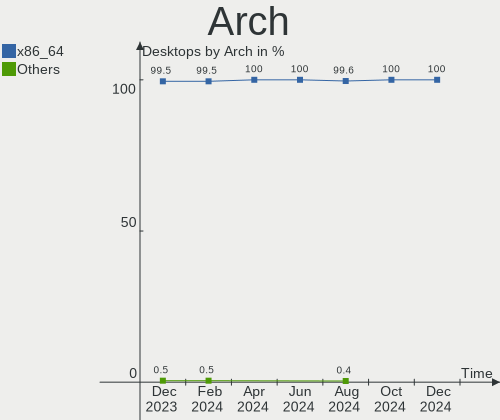
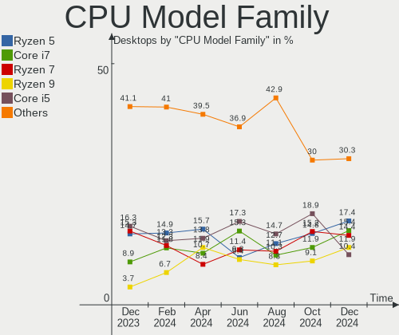
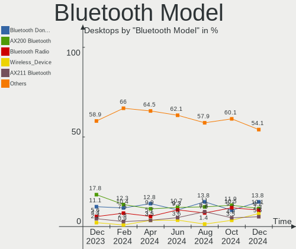

Fedora Hardware Trends (Desktop)
--------------------------------

A project to identify most popular hardware characteristics and track their change
over time based on data collected by Fedora users at https://Linux-Hardware.org.

Anyone can contribute to the study by uploading probes of their computers by
the [hw-probe](https://github.com/linuxhw/hw-probe) tool:

    sudo -E hw-probe -all -upload

Full-feature report is available here: https://linux-hardware.org/?view=trends&formfactor=desktop

Period: Mar, 2021.

Contents
--------

- [ OS                       ](#os)
- [ OS Family                ](#os-family)
- [ Kernel                   ](#kernel)
- [ Kernel Family            ](#kernel-family)
- [ Kernel Major Ver.        ](#kernel-major-ver)
- [ Arch                     ](#arch)
- [ DE                       ](#de)
- [ Display Server           ](#display-server)
- [ Display Manager          ](#display-manager)
- [ OS Lang                  ](#os-lang)
- [ Boot Mode                ](#boot-mode)
- [ Filesystem               ](#filesystem)
- [ Part. scheme             ](#part-scheme)
- [ Dual Boot with Linux/BSD ](#dual-boot-with-linux/bsd)
- [ Dual Boot (Win)          ](#dual-boot-win)
- [ Country                  ](#country)
- [ City                     ](#city)
- [ Vendor                   ](#vendor)
- [ Model                    ](#model)
- [ Model Family             ](#model-family)
- [ MFG Year                 ](#mfg-year)
- [ Form Factor              ](#form-factor)
- [ Secure Boot              ](#secure-boot)
- [ Coreboot                 ](#coreboot)
- [ RAM Size                 ](#ram-size)
- [ RAM Used                 ](#ram-used)
- [ Has CD-ROM               ](#has-cd-rom)
- [ Total Drives             ](#total-drives)
- [ Has Ethernet             ](#has-ethernet)
- [ Has WiFi                 ](#has-wifi)
- [ Has Bluetooth            ](#has-bluetooth)
- [ Drive Vendor             ](#drive-vendor)
- [ Drive Model              ](#drive-model)
- [ HDD Vendor               ](#hdd-vendor)
- [ SSD Vendor               ](#ssd-vendor)
- [ Drive Kind               ](#drive-kind)
- [ Drive Connector          ](#drive-connector)
- [ Drive Size               ](#drive-size)
- [ Space Total              ](#space-total)
- [ Space Used               ](#space-used)
- [ Malfunc. Drives          ](#malfunc-drives)
- [ Malfunc. Drive Vendor    ](#malfunc-drive-vendor)
- [ Malfunc. HDD Vendor      ](#malfunc-hdd-vendor)
- [ Malfunc. Drive Kind      ](#malfunc-drive-kind)
- [ Failed Drives            ](#failed-drives)
- [ Failed Drive Vendor      ](#failed-drive-vendor)
- [ Drive Status             ](#drive-status)
- [ Storage Vendor           ](#storage-vendor)
- [ Storage Model            ](#storage-model)
- [ Storage Kind             ](#storage-kind)
- [ CPU Vendor               ](#cpu-vendor)
- [ CPU Model                ](#cpu-model)
- [ CPU Model Family         ](#cpu-model-family)
- [ CPU Cores                ](#cpu-cores)
- [ CPU Sockets              ](#cpu-sockets)
- [ CPU Threads              ](#cpu-threads)
- [ CPU Op-Modes             ](#cpu-op-modes)
- [ CPU Microcode            ](#cpu-microcode)
- [ CPU Microarch            ](#cpu-microarch)
- [ GPU Vendor               ](#gpu-vendor)
- [ GPU Model                ](#gpu-model)
- [ GPU Combo                ](#gpu-combo)
- [ GPU Driver               ](#gpu-driver)
- [ GPU Memory               ](#gpu-memory)
- [ Monitor Vendor           ](#monitor-vendor)
- [ Monitor Model            ](#monitor-model)
- [ Monitor Resolution       ](#monitor-resolution)
- [ Monitor Diagonal         ](#monitor-diagonal)
- [ Monitor Width            ](#monitor-width)
- [ Aspect Ratio             ](#aspect-ratio)
- [ Monitor Area             ](#monitor-area)
- [ Pixel Density            ](#pixel-density)
- [ Multiple Monitors        ](#multiple-monitors)
- [ Net Controller Vendor    ](#net-controller-vendor)
- [ Net Controller Model     ](#net-controller-model)
- [ Wireless Vendor          ](#wireless-vendor)
- [ Wireless Model           ](#wireless-model)
- [ Ethernet Vendor          ](#ethernet-vendor)
- [ Ethernet Model           ](#ethernet-model)
- [ Net Controller Kind      ](#net-controller-kind)
- [ Used Controller          ](#used-controller)
- [ NICs                     ](#nics)
- [ IPv6                     ](#ipv6)
- [ Memory Vendor            ](#memory-vendor)
- [ Memory Model             ](#memory-model)
- [ Memory Kind              ](#memory-kind)
- [ Memory Form Factor       ](#memory-form-factor)
- [ Memory Size              ](#memory-size)
- [ Memory Speed             ](#memory-speed)
- [ Sound Vendor             ](#sound-vendor)
- [ Sound Model              ](#sound-model)
- [ Camera Vendor            ](#camera-vendor)
- [ Camera Model             ](#camera-model)
- [ Fingerprint Vendor       ](#fingerprint-vendor)
- [ Fingerprint Model        ](#fingerprint-model)
- [ Chipcard Vendor          ](#chipcard-vendor)
- [ Chipcard Model           ](#chipcard-model)
- [ Printer Vendor           ](#printer-vendor)
- [ Printer Model            ](#printer-model)
- [ Scanner Vendor           ](#scanner-vendor)
- [ Scanner Model            ](#scanner-model)
- [ Bluetooth Vendor         ](#bluetooth-vendor)
- [ Bluetooth Model          ](#bluetooth-model)
- [ Unsupported Devices      ](#unsupported-devices)
- [ Unsupported Device Types ](#unsupported-device-types)

OS
--

Installed operating systems

| Name      | Desktops | Percent |
|-----------|----------|---------|
| Fedora 33 | 103      | 78.63%  |
| Fedora 34 | 12       | 9.16%   |
| Fedora 32 | 9        | 6.87%   |
| Fedora 31 | 3        | 2.29%   |
| Fedora 30 | 2        | 1.53%   |
| Fedora 29 | 1        | 0.76%   |
| Fedora 28 | 1        | 0.76%   |

OS Family
---------

OS without a version

| Name   | Desktops | Percent |
|--------|----------|---------|
| Fedora | 131      | 100%    |

Kernel
------

Version of the Linux kernel

| Version                            | Desktops | Percent |
|------------------------------------|----------|---------|
| 5.10.19-200.fc33.x86_64            | 20       | 15.27%  |
| 5.10.23-200.fc33.x86_64            | 16       | 12.21%  |
| 5.10.22-200.fc33.x86_64            | 15       | 11.45%  |
| 5.11.7-200.fc33.x86_64             | 10       | 7.63%   |
| 5.10.21-200.fc33.x86_64            | 7        | 5.34%   |
| 5.11.8-200.fc33.x86_64             | 6        | 4.58%   |
| 5.11.10-200.fc33.x86_64            | 5        | 3.82%   |
| 5.10.18-200.fc33.x86_64            | 5        | 3.82%   |
| 5.8.15-301.fc33.x86_64             | 4        | 3.05%   |
| 5.11.9-300.fc34.x86_64             | 3        | 2.29%   |
| 5.11.3-300.fc34.x86_64             | 3        | 2.29%   |
| 5.10.20-200.fc33.x86_64            | 3        | 2.29%   |
| 5.9.16-200.fc33.x86_64             | 2        | 1.53%   |
| 5.9.16-100.fc32.x86_64             | 2        | 1.53%   |
| 5.8.18-100.fc31.x86_64             | 2        | 1.53%   |
| 5.11.8-300.fc34.x86_64             | 2        | 1.53%   |
| 5.11.3-50.fc33.x86_64              | 2        | 1.53%   |
| 5.11.10-300.fc34.x86_64            | 2        | 1.53%   |
| 5.10.22-100.fc32.x86_64            | 2        | 1.53%   |
| 5.10.21-100.fc32.x86_64            | 2        | 1.53%   |
| 5.10.12-200.fc33.x86_64            | 2        | 1.53%   |
| 5.6.19-300.fc32.x86_64             | 1        | 0.76%   |
| 5.6.13-100.fc30.x86_64             | 1        | 0.76%   |
| 5.6.13-100.fc30.i686               | 1        | 0.76%   |
| 5.5.8-200.fc31.x86_64              | 1        | 0.76%   |
| 5.11.6-300.fc34.x86_64             | 1        | 0.76%   |
| 5.11.5-50.fc33.x86_64              | 1        | 0.76%   |
| 5.11.2-300.fc34.x86_64             | 1        | 0.76%   |
| 5.10.7-201.performance.fc33.x86_64 | 1        | 0.76%   |
| 5.10.7-200.fc33.x86_64             | 1        | 0.76%   |
| 5.10.19-100.fc32.x86_64            | 1        | 0.76%   |
| 5.10.16-200.fc33.x86_64            | 1        | 0.76%   |
| 5.10.15-200.fc33.x86_64            | 1        | 0.76%   |
| 5.10.13-200.fc33.x86_64            | 1        | 0.76%   |
| 5.10.13-100.fc32.x86_64            | 1        | 0.76%   |
| 5.0.16-100.fc28.x86_64             | 1        | 0.76%   |
| 4.20.3-200.fc29.x86_64             | 1        | 0.76%   |

Kernel Family
-------------

Linux kernel without a distro release

| Version | Desktops | Percent |
|---------|----------|---------|
| 5.10.19 | 21       | 16.03%  |
| 5.10.22 | 17       | 12.98%  |
| 5.10.23 | 16       | 12.21%  |
| 5.11.7  | 10       | 7.63%   |
| 5.10.21 | 9        | 6.87%   |
| 5.11.8  | 8        | 6.11%   |
| 5.11.10 | 7        | 5.34%   |
| 5.11.3  | 5        | 3.82%   |
| 5.10.18 | 5        | 3.82%   |
| 5.9.16  | 4        | 3.05%   |
| 5.8.15  | 4        | 3.05%   |
| 5.11.9  | 3        | 2.29%   |
| 5.10.20 | 3        | 2.29%   |
| 5.8.18  | 2        | 1.53%   |
| 5.6.13  | 2        | 1.53%   |
| 5.10.7  | 2        | 1.53%   |
| 5.10.13 | 2        | 1.53%   |
| 5.10.12 | 2        | 1.53%   |
| 5.6.19  | 1        | 0.76%   |
| 5.5.8   | 1        | 0.76%   |
| 5.11.6  | 1        | 0.76%   |
| 5.11.5  | 1        | 0.76%   |
| 5.11.2  | 1        | 0.76%   |
| 5.10.16 | 1        | 0.76%   |
| 5.10.15 | 1        | 0.76%   |
| 5.0.16  | 1        | 0.76%   |
| 4.20.3  | 1        | 0.76%   |

Kernel Major Ver.
-----------------

Linux kernel major version

| Version | Desktops | Percent |
|---------|----------|---------|
| 5.10    | 79       | 60.31%  |
| 5.11    | 36       | 27.48%  |
| 5.8     | 6        | 4.58%   |
| 5.9     | 4        | 3.05%   |
| 5.6     | 3        | 2.29%   |
| 5.5     | 1        | 0.76%   |
| 5.0     | 1        | 0.76%   |
| 4.20    | 1        | 0.76%   |

Arch
----

OS architecture (x86_64, i586, etc.)

| Name   | Desktops | Percent |
|--------|----------|---------|
| x86_64 | 130      | 99.24%  |
| i686   | 1        | 0.76%   |

DE
--

Desktop Environment

| Name          | Desktops | Percent |
|---------------|----------|---------|
| GNOME         | 81       | 61.83%  |
| Unknown       | 12       | 9.16%   |
| KDE           | 10       | 7.63%   |
| KDE5          | 9        | 6.87%   |
| Cinnamon      | 6        | 4.58%   |
| XFCE          | 5        | 3.82%   |
| X-Cinnamon    | 4        | 3.05%   |
| MATE          | 1        | 0.76%   |
| LXDE          | 1        | 0.76%   |
| i3            | 1        | 0.76%   |
| GNOME Classic | 1        | 0.76%   |

Display Server
--------------

X11 or Wayland

| Name    | Desktops | Percent |
|---------|----------|---------|
| X11     | 71       | 54.2%   |
| Wayland | 44       | 33.59%  |
| Tty     | 11       | 8.4%    |
| Unknown | 5        | 3.82%   |

Display Manager
---------------

SDDM, LightDM, etc.

| Name    | Desktops | Percent |
|---------|----------|---------|
| Unknown | 82       | 62.6%   |
| GDM     | 30       | 22.9%   |
| SDDM    | 8        | 6.11%   |
| TDM     | 6        | 4.58%   |
| LightDM | 4        | 3.05%   |
| KDM     | 1        | 0.76%   |

OS Lang
-------

Language

| Lang    | Desktops | Percent |
|---------|----------|---------|
| en_US   | 56       | 42.75%  |
| ru_RU   | 14       | 10.69%  |
| en_GB   | 13       | 9.92%   |
| pt_BR   | 7        | 5.34%   |
| fr_FR   | 6        | 4.58%   |
| en_AU   | 6        | 4.58%   |
| Unknown | 4        | 3.05%   |
| it_IT   | 3        | 2.29%   |
| en_CA   | 3        | 2.29%   |
| de_DE   | 3        | 2.29%   |
| pl_PL   | 2        | 1.53%   |
| fr_CH   | 2        | 1.53%   |
| ru_UA   | 1        | 0.76%   |
| nl_BE   | 1        | 0.76%   |
| hu_HU   | 1        | 0.76%   |
| fr_CA   | 1        | 0.76%   |
| fr_BE   | 1        | 0.76%   |
| es_CO   | 1        | 0.76%   |
| en_NZ   | 1        | 0.76%   |
| en_IE   | 1        | 0.76%   |
| en_AT   | 1        | 0.76%   |
| en_001  | 1        | 0.76%   |
| el_GR   | 1        | 0.76%   |
| da_DK   | 1        | 0.76%   |

Boot Mode
---------

EFI or BIOS

| Mode | Desktops | Percent |
|------|----------|---------|
| EFI  | 77       | 58.78%  |
| BIOS | 54       | 41.22%  |

Filesystem
----------

Type of filesystem

| Type    | Desktops | Percent |
|---------|----------|---------|
| Btrfs   | 63       | 48.09%  |
| Ext4    | 54       | 41.22%  |
| Xfs     | 13       | 9.92%   |
| Unknown | 1        | 0.76%   |

Part. scheme
------------

Scheme of partitioning

| Type    | Desktops | Percent |
|---------|----------|---------|
| Unknown | 74       | 56.49%  |
| GPT     | 41       | 31.3%   |
| MBR     | 16       | 12.21%  |

Dual Boot with Linux/BSD
------------------------

Hosting more than one Linux/BSD

| Dual boot | Desktops | Percent |
|-----------|----------|---------|
| No        | 117      | 89.31%  |
| Yes       | 14       | 10.69%  |

Dual Boot (Win)
---------------

Hosting Linux and Windows

| Dual boot | Desktops | Percent |
|-----------|----------|---------|
| No        | 108      | 82.44%  |
| Yes       | 23       | 17.56%  |

Country
-------

Geographic location (country)

| Country     | Desktops | Percent |
|-------------|----------|---------|
| USA         | 25       | 19.08%  |
| Russia      | 16       | 12.21%  |
| Germany     | 10       | 7.63%   |
| Brazil      | 10       | 7.63%   |
| France      | 6        | 4.58%   |
| Australia   | 6        | 4.58%   |
| UK          | 5        | 3.82%   |
| Ukraine     | 4        | 3.05%   |
| Netherlands | 4        | 3.05%   |
| Canada      | 4        | 3.05%   |
| Switzerland | 3        | 2.29%   |
| Poland      | 3        | 2.29%   |
| Italy       | 3        | 2.29%   |
| India       | 3        | 2.29%   |
| Belgium     | 3        | 2.29%   |
| Sweden      | 2        | 1.53%   |
| Czechia     | 2        | 1.53%   |
| Austria     | 2        | 1.53%   |
| Turkey      | 1        | 0.76%   |
| Slovakia    | 1        | 0.76%   |
| Romania     | 1        | 0.76%   |
| Portugal    | 1        | 0.76%   |
| New Zealand | 1        | 0.76%   |
| Morocco     | 1        | 0.76%   |
| Japan       | 1        | 0.76%   |
| Ireland     | 1        | 0.76%   |
| Iraq        | 1        | 0.76%   |
| Iran        | 1        | 0.76%   |
| Iceland     | 1        | 0.76%   |
| Hungary     | 1        | 0.76%   |
| Greece      | 1        | 0.76%   |
| Denmark     | 1        | 0.76%   |
| Cyprus      | 1        | 0.76%   |
| Colombia    | 1        | 0.76%   |
| Chile       | 1        | 0.76%   |
| Bolivia     | 1        | 0.76%   |
| Belarus     | 1        | 0.76%   |
| Andorra     | 1        | 0.76%   |

City
----

Geographic location (city)

| City              | Desktops | Percent |
|-------------------|----------|---------|
| Moscow            | 5        | 3.82%   |
| St Petersburg     | 3        | 2.29%   |
| Hamburg           | 3        | 2.29%   |
| Sydney            | 2        | 1.53%   |
| Rillieux-la-Pape  | 2        | 1.53%   |
| Porto Alegre      | 2        | 1.53%   |
| Marietta          | 2        | 1.53%   |
| Kharkiv           | 2        | 1.53%   |
| Chipping Norton   | 2        | 1.53%   |
| Zurich            | 1        | 0.76%   |
| Zelenograd        | 1        | 0.76%   |
| Wroclaw           | 1        | 0.76%   |
| Weiterstadt       | 1        | 0.76%   |
| Wautoma           | 1        | 0.76%   |
| Washington        | 1        | 0.76%   |
| Vienna            | 1        | 0.76%   |
| Vidnoye           | 1        | 0.76%   |
| Veresegyhaz       | 1        | 0.76%   |
| Vendome           | 1        | 0.76%   |
| Valparaíso       | 1        | 0.76%   |
| Trieste           | 1        | 0.76%   |
| Toulouse          | 1        | 0.76%   |
| Thurso            | 1        | 0.76%   |
| Tehran            | 1        | 0.76%   |
| Stockholm         | 1        | 0.76%   |
| Srednyaya Akhtuba | 1        | 0.76%   |
| Spring            | 1        | 0.76%   |
| Sint-Niklaas      | 1        | 0.76%   |
| Sherwood Park     | 1        | 0.76%   |
| Semsales          | 1        | 0.76%   |
| San Diego         | 1        | 0.76%   |
| Salt Lake City    | 1        | 0.76%   |
| Sacramento        | 1        | 0.76%   |
| Rome              | 1        | 0.76%   |
| Rio Claro         | 1        | 0.76%   |
| Ribeirão Preto   | 1        | 0.76%   |
| Reykjavik         | 1        | 0.76%   |
| Reading           | 1        | 0.76%   |
| Pryor             | 1        | 0.76%   |
| Poços de Caldas  | 1        | 0.76%   |
| Pouso Alegre      | 1        | 0.76%   |
| Portland          | 1        | 0.76%   |
| Paris             | 1        | 0.76%   |
| Palhoca           | 1        | 0.76%   |
| Osaka             | 1        | 0.76%   |
| Odessa            | 1        | 0.76%   |
| Novosibirsk       | 1        | 0.76%   |
| North Tonawanda   | 1        | 0.76%   |
| Norderstedt       | 1        | 0.76%   |
| Nizhniy Novgorod  | 1        | 0.76%   |
| New Rochelle      | 1        | 0.76%   |
| Munich            | 1        | 0.76%   |
| Minsk             | 1        | 0.76%   |
| Meknes            | 1        | 0.76%   |
| Medianeira        | 1        | 0.76%   |
| Marseille         | 1        | 0.76%   |
| Manly             | 1        | 0.76%   |
| Mangalore         | 1        | 0.76%   |
| Luhansk           | 1        | 0.76%   |
| Lucknow           | 1        | 0.76%   |

Vendor
------

Motherboard manufacturer

| Name                | Desktops | Percent |
|---------------------|----------|---------|
| ASUSTek Computer    | 37       | 28.24%  |
| Gigabyte Technology | 28       | 21.37%  |
| MSI                 | 23       | 17.56%  |
| ASRock              | 13       | 9.92%   |
| Hewlett-Packard     | 10       | 7.63%   |
| Dell                | 6        | 4.58%   |
| Intel               | 4        | 3.05%   |
| Fujitsu             | 2        | 1.53%   |
| ECS                 | 2        | 1.53%   |
| Acer                | 2        | 1.53%   |
| Lenovo              | 1        | 0.76%   |
| Foxconn             | 1        | 0.76%   |
| AZW                 | 1        | 0.76%   |
| Alienware           | 1        | 0.76%   |

Model
-----

Motherboard model

| Name                              | Desktops | Percent |
|-----------------------------------|----------|---------|
| ASUS All Series                   | 6        | 4.58%   |
| MSI MS-7C52                       | 2        | 1.53%   |
| MSI MS-7B86                       | 2        | 1.53%   |
| MSI MS-7B78                       | 2        | 1.53%   |
| MSI MS-7641                       | 2        | 1.53%   |
| Gigabyte B450 AORUS ELITE V2      | 2        | 1.53%   |
| ASUS ROG STRIX X570-F GAMING      | 2        | 1.53%   |
| ASUS PRIME A320M-K                | 2        | 1.53%   |
| ASUS P8Z77-V PRO                  | 2        | 1.53%   |
| MSI MS-9A45                       | 1        | 0.76%   |
| MSI MS-7C91                       | 1        | 0.76%   |
| MSI MS-7C84                       | 1        | 0.76%   |
| MSI MS-7C75                       | 1        | 0.76%   |
| MSI MS-7C37                       | 1        | 0.76%   |
| MSI MS-7C02                       | 1        | 0.76%   |
| MSI MS-7B98                       | 1        | 0.76%   |
| MSI MS-7B85                       | 1        | 0.76%   |
| MSI MS-7B84                       | 1        | 0.76%   |
| MSI MS-7B79                       | 1        | 0.76%   |
| MSI MS-7B10                       | 1        | 0.76%   |
| MSI MS-7A44                       | 1        | 0.76%   |
| MSI MS-7A32                       | 1        | 0.76%   |
| MSI MS-7816                       | 1        | 0.76%   |
| MSI MS-7596                       | 1        | 0.76%   |
| Lenovo ThinkCentre M58p 7220A72   | 1        | 0.76%   |
| Intel X99 V1.0                    | 1        | 0.76%   |
| Intel UNLOCK INSTALL              | 1        | 0.76%   |
| Intel DQ77MK AAG39642-500         | 1        | 0.76%   |
| Intel DH87RL AAG74240-403         | 1        | 0.76%   |
| HP Z820 Workstation               | 1        | 0.76%   |
| HP xw8600 Workstation             | 1        | 0.76%   |
| HP xw6600 Workstation             | 1        | 0.76%   |
| HP Slim Desktop S01-pF1xxx        | 1        | 0.76%   |
| HP ProDesk 600 G1 DM              | 1        | 0.76%   |
| HP ProDesk 400 G5 Desktop Mini    | 1        | 0.76%   |
| HP ProDesk 400 G1 MT              | 1        | 0.76%   |
| HP EliteDesk 800 G1 SFF           | 1        | 0.76%   |
| HP Compaq Pro 6300 MT             | 1        | 0.76%   |
| HP Compaq 6000 Pro SFF PC         | 1        | 0.76%   |
| Gigabyte Z77X-UP5 TH-CF           | 1        | 0.76%   |
| Gigabyte Z390 M GAMING            | 1        | 0.76%   |
| Gigabyte Z170-D3H                 | 1        | 0.76%   |
| Gigabyte X570 AORUS MASTER        | 1        | 0.76%   |
| Gigabyte X470 AORUS GAMING 7 WIFI | 1        | 0.76%   |
| Gigabyte X299 UD4                 | 1        | 0.76%   |
| Gigabyte H87-HD3                  | 1        | 0.76%   |
| Gigabyte H77M-D3H                 | 1        | 0.76%   |
| Gigabyte H67MA-D2H                | 1        | 0.76%   |
| Gigabyte H61M-S2P                 | 1        | 0.76%   |
| Gigabyte H61M-DS2                 | 1        | 0.76%   |
| Gigabyte GA-MA780G-UD3H           | 1        | 0.76%   |
| Gigabyte GA-M55SLI-S4             | 1        | 0.76%   |
| Gigabyte GA-78LMT-S2PT            | 1        | 0.76%   |
| Gigabyte G41MT-D3                 | 1        | 0.76%   |
| Gigabyte G31M-ES2C                | 1        | 0.76%   |
| Gigabyte EP43T-UD3L               | 1        | 0.76%   |
| Gigabyte D525TUD                  | 1        | 0.76%   |
| Gigabyte B75M-D3P                 | 1        | 0.76%   |
| Gigabyte B550I AORUS PRO AX       | 1        | 0.76%   |
| Gigabyte B550 VISION D            | 1        | 0.76%   |

Model Family
------------

Motherboard model prefix

| Name                    | Desktops | Percent |
|-------------------------|----------|---------|
| ASUS ROG                | 9        | 6.87%   |
| ASUS All                | 6        | 4.58%   |
| ASUS PRIME              | 4        | 3.05%   |
| HP ProDesk              | 3        | 2.29%   |
| Gigabyte B450           | 3        | 2.29%   |
| Dell Precision          | 3        | 2.29%   |
| ASUS P8Z77-V            | 3        | 2.29%   |
| MSI MS-7C52             | 2        | 1.53%   |
| MSI MS-7B86             | 2        | 1.53%   |
| MSI MS-7B78             | 2        | 1.53%   |
| MSI MS-7641             | 2        | 1.53%   |
| HP Compaq               | 2        | 1.53%   |
| ASUS SABERTOOTH         | 2        | 1.53%   |
| MSI MS-9A45             | 1        | 0.76%   |
| MSI MS-7C91             | 1        | 0.76%   |
| MSI MS-7C84             | 1        | 0.76%   |
| MSI MS-7C75             | 1        | 0.76%   |
| MSI MS-7C37             | 1        | 0.76%   |
| MSI MS-7C02             | 1        | 0.76%   |
| MSI MS-7B98             | 1        | 0.76%   |
| MSI MS-7B85             | 1        | 0.76%   |
| MSI MS-7B84             | 1        | 0.76%   |
| MSI MS-7B79             | 1        | 0.76%   |
| MSI MS-7B10             | 1        | 0.76%   |
| MSI MS-7A44             | 1        | 0.76%   |
| MSI MS-7A32             | 1        | 0.76%   |
| MSI MS-7816             | 1        | 0.76%   |
| MSI MS-7596             | 1        | 0.76%   |
| Lenovo ThinkCentre      | 1        | 0.76%   |
| Intel X99               | 1        | 0.76%   |
| Intel UNLOCK            | 1        | 0.76%   |
| Intel DQ77MK            | 1        | 0.76%   |
| Intel DH87RL            | 1        | 0.76%   |
| HP Z820                 | 1        | 0.76%   |
| HP xw8600               | 1        | 0.76%   |
| HP xw6600               | 1        | 0.76%   |
| HP Slim                 | 1        | 0.76%   |
| HP EliteDesk            | 1        | 0.76%   |
| Gigabyte Z77X-UP5       | 1        | 0.76%   |
| Gigabyte Z390           | 1        | 0.76%   |
| Gigabyte Z170-D3H       | 1        | 0.76%   |
| Gigabyte X570           | 1        | 0.76%   |
| Gigabyte X470           | 1        | 0.76%   |
| Gigabyte X299           | 1        | 0.76%   |
| Gigabyte H87-HD3        | 1        | 0.76%   |
| Gigabyte H77M-D3H       | 1        | 0.76%   |
| Gigabyte H67MA-D2H      | 1        | 0.76%   |
| Gigabyte H61M-S2P       | 1        | 0.76%   |
| Gigabyte H61M-DS2       | 1        | 0.76%   |
| Gigabyte GA-MA780G-UD3H | 1        | 0.76%   |
| Gigabyte GA-M55SLI-S4   | 1        | 0.76%   |
| Gigabyte GA-78LMT-S2PT  | 1        | 0.76%   |
| Gigabyte G41MT-D3       | 1        | 0.76%   |
| Gigabyte G31M-ES2C      | 1        | 0.76%   |
| Gigabyte EP43T-UD3L     | 1        | 0.76%   |
| Gigabyte D525TUD        | 1        | 0.76%   |
| Gigabyte B75M-D3P       | 1        | 0.76%   |
| Gigabyte B550I          | 1        | 0.76%   |
| Gigabyte B550           | 1        | 0.76%   |
| Gigabyte B450M          | 1        | 0.76%   |

MFG Year
--------

Motherboard manufacture year

| Year | Desktops | Percent |
|------|----------|---------|
| 2020 | 27       | 20.61%  |
| 2019 | 17       | 12.98%  |
| 2018 | 12       | 9.16%   |
| 2014 | 11       | 8.4%    |
| 2021 | 9        | 6.87%   |
| 2013 | 9        | 6.87%   |
| 2012 | 8        | 6.11%   |
| 2015 | 7        | 5.34%   |
| 2016 | 6        | 4.58%   |
| 2017 | 5        | 3.82%   |
| 2008 | 5        | 3.82%   |
| 2011 | 4        | 3.05%   |
| 2010 | 4        | 3.05%   |
| 2009 | 4        | 3.05%   |
| 2007 | 2        | 1.53%   |
| 2006 | 1        | 0.76%   |

Form Factor
-----------

Physical design of the computer

| Name    | Desktops | Percent |
|---------|----------|---------|
| Desktop | 131      | 100%    |

Secure Boot
-----------

Enabled or disabled

| State    | Desktops | Percent |
|----------|----------|---------|
| Disabled | 126      | 96.18%  |
| Enabled  | 5        | 3.82%   |

Coreboot
--------

Have coreboot on board

| Used | Desktops | Percent |
|------|----------|---------|
| No   | 131      | 100%    |

RAM Size
--------

Total RAM memory

| Size in GB  | Desktops | Percent |
|-------------|----------|---------|
| 16.01-24.0  | 46       | 35.11%  |
| 32.01-64.0  | 29       | 22.14%  |
| 8.01-16.0   | 16       | 12.21%  |
| 3.01-4.0    | 14       | 10.69%  |
| 4.01-8.0    | 11       | 8.4%    |
| 64.01-256.0 | 10       | 7.63%   |
| 24.01-32.0  | 2        | 1.53%   |
| 2.01-3.0    | 2        | 1.53%   |
| 1.01-2.0    | 1        | 0.76%   |

RAM Used
--------

Used RAM memory

| Used GB    | Desktops | Percent |
|------------|----------|---------|
| 2.01-3.0   | 31       | 23.66%  |
| 4.01-8.0   | 29       | 22.14%  |
| 3.01-4.0   | 29       | 22.14%  |
| 1.01-2.0   | 25       | 19.08%  |
| 8.01-16.0  | 11       | 8.4%    |
| 16.01-24.0 | 5        | 3.82%   |
| 0.01-0.5   | 1        | 0.76%   |

Has CD-ROM
----------

Has CD-ROM on board

| Presented | Desktops | Percent |
|-----------|----------|---------|
| No        | 73       | 55.73%  |
| Yes       | 58       | 44.27%  |

Total Drives
------------

Number of drives on board

| Drives | Desktops | Percent |
|--------|----------|---------|
| 2      | 42       | 32.06%  |
| 1      | 37       | 28.24%  |
| 3      | 21       | 16.03%  |
| 4      | 16       | 12.21%  |
| 5      | 8        | 6.11%   |
| 6      | 5        | 3.82%   |
| 9      | 1        | 0.76%   |
| 7      | 1        | 0.76%   |

Has Ethernet
------------

Has Ethernet on board

| Presented | Desktops | Percent |
|-----------|----------|---------|
| Yes       | 130      | 99.24%  |
| No        | 1        | 0.76%   |

Has WiFi
--------

Has WiFi module

| Presented | Desktops | Percent |
|-----------|----------|---------|
| No        | 81       | 61.83%  |
| Yes       | 50       | 38.17%  |

Has Bluetooth
-------------

Has Bluetooth module

| Presented | Desktops | Percent |
|-----------|----------|---------|
| No        | 88       | 67.18%  |
| Yes       | 43       | 32.82%  |

Drive Vendor
------------

Hard drive vendors

| Vendor                | Desktops | Drives | Percent |
|-----------------------|----------|--------|---------|
| Samsung Electronics   | 53       | 101    | 22.18%  |
| WDC                   | 51       | 77     | 21.34%  |
| Seagate               | 41       | 53     | 17.15%  |
| Kingston              | 18       | 21     | 7.53%   |
| Toshiba               | 17       | 20     | 7.11%   |
| Crucial               | 7        | 7      | 2.93%   |
| Intel                 | 5        | 5      | 2.09%   |
| A-DATA Technology     | 5        | 5      | 2.09%   |
| SanDisk               | 4        | 4      | 1.67%   |
| Phison                | 4        | 4      | 1.67%   |
| Hitachi               | 3        | 5      | 1.26%   |
| HGST                  | 3        | 4      | 1.26%   |
| Unknown               | 2        | 2      | 0.84%   |
| SK Hynix              | 2        | 2      | 0.84%   |
| Silicon Motion        | 2        | 2      | 0.84%   |
| PNY                   | 2        | 2      | 0.84%   |
| PLEXTOR               | 2        | 2      | 0.84%   |
| Micron Technology     | 2        | 2      | 0.84%   |
| Corsair               | 2        | 2      | 0.84%   |
| Team                  | 1        | 1      | 0.42%   |
| SPCC                  | 1        | 1      | 0.42%   |
| SATADOM               | 1        | 1      | 0.42%   |
| Realtek Semiconductor | 1        | 1      | 0.42%   |
| PNY USB               | 1        | 1      | 0.42%   |
| OCZ                   | 1        | 1      | 0.42%   |
| MAXTOR                | 1        | 1      | 0.42%   |
| LITEON                | 1        | 1      | 0.42%   |
| Lite-On               | 1        | 1      | 0.42%   |
| KingSpec              | 1        | 1      | 0.42%   |
| JMicron               | 1        | 4      | 0.42%   |
| Hewlett-Packard       | 1        | 1      | 0.42%   |
| BIWIN                 | 1        | 1      | 0.42%   |
| AMD                   | 1        | 1      | 0.42%   |

Drive Model
-----------

Hard drive models

| Model                            | Desktops | Percent |
|----------------------------------|----------|---------|
| Samsung SSD 860 EVO 500GB        | 9        | 2.93%   |
| Samsung SSD 850 EVO 250GB        | 8        | 2.61%   |
| Samsung SSD 860 EVO 1TB          | 7        | 2.28%   |
| Samsung NVMe SSD Drive 500GB     | 6        | 1.95%   |
| Samsung SSD 850 EVO 500GB        | 5        | 1.63%   |
| Samsung NVMe SSD Drive 1TB       | 5        | 1.63%   |
| WDC WD10EZEX-08WN4A0 1TB         | 4        | 1.3%    |
| Toshiba DT01ACA200 2TB           | 4        | 1.3%    |
| Toshiba DT01ACA100 1TB           | 4        | 1.3%    |
| Seagate ST500DM002-1BD142 500GB  | 4        | 1.3%    |
| Kingston SA400S37240G 240GB SSD  | 4        | 1.3%    |
| WDC WD10EFRX-68JCSN0 1TB         | 3        | 0.98%   |
| WDC WD1003FZEX-00K3CA0 1TB       | 3        | 0.98%   |
| Seagate ST1000DM010-2EP102 1TB   | 3        | 0.98%   |
| Samsung SSD 970 EVO Plus 1TB     | 3        | 0.98%   |
| Samsung SSD 870 QVO 1TB          | 3        | 0.98%   |
| Kingston SA400S37480G 480GB SSD  | 3        | 0.98%   |
| Kingston SA400S37120G 120GB SSD  | 3        | 0.98%   |
| WDC WDS500G2B0A-00SM50 500GB SSD | 2        | 0.65%   |
| WDC WD5000AAKX-75U6AA0 500GB     | 2        | 0.65%   |
| WDC WD20EZRX-00D8PB0 2TB         | 2        | 0.65%   |
| WDC WD10EZEX-00BN5A0 1TB         | 2        | 0.65%   |
| WDC WD10EFRX-68FYTN0 1TB         | 2        | 0.65%   |
| WDC WD10EADS-00L5B1 1TB          | 2        | 0.65%   |
| Toshiba NVMe SSD Drive 256GB     | 2        | 0.65%   |
| Toshiba HDWD110 1TB              | 2        | 0.65%   |
| Toshiba DT01ACA300 3TB           | 2        | 0.65%   |
| Seagate ST8000DM004-2CX188 8TB   | 2        | 0.65%   |
| Seagate ST3500418AS 500GB        | 2        | 0.65%   |
| Seagate ST3320613AS 320GB        | 2        | 0.65%   |
| Seagate ST3000DM008-2DM166 3TB   | 2        | 0.65%   |
| Seagate ST3000DM001-1ER166 3TB   | 2        | 0.65%   |
| Samsung SSD 970 PRO 512GB        | 2        | 0.65%   |
| Samsung SSD 970 EVO 500GB        | 2        | 0.65%   |
| Samsung SSD 960 EVO 500GB        | 2        | 0.65%   |
| Samsung SSD 870 EVO 1TB          | 2        | 0.65%   |
| Samsung SSD 860 EVO 250GB        | 2        | 0.65%   |
| Samsung SSD 850 EVO 1TB          | 2        | 0.65%   |
| Samsung SSD 840 EVO 250GB        | 2        | 0.65%   |
| Samsung SSD 830 Series 256GB     | 2        | 0.65%   |
| Samsung NVMe SSD Drive 250GB     | 2        | 0.65%   |
| Kingston SV300S37A240G 240GB SSD | 2        | 0.65%   |
| WDC WDS500G3X0C-00SJG0 500GB     | 1        | 0.33%   |
| WDC WDS500G1R0A-68A4W0 500GB SSD | 1        | 0.33%   |
| WDC WDS250G1B0B-00AS40 250GB SSD | 1        | 0.33%   |
| WDC WDS240G2G0A-00JH30 240GB SSD | 1        | 0.33%   |
| WDC WDS100T3X0C-00SJG0 1TB       | 1        | 0.33%   |
| WDC WDS100T1X0E-00AFY0 1TB       | 1        | 0.33%   |
| WDC WD800BD-22MRA1 80GB          | 1        | 0.33%   |
| WDC WD60EFRX-68MYMN0 6TB         | 1        | 0.33%   |
| WDC WD6003FZBX-00K5WB0 6TB       | 1        | 0.33%   |
| WDC WD5000AAKX-22ERMA0 500GB     | 1        | 0.33%   |
| WDC WD5000AAKX-07U6AA0 500GB     | 1        | 0.33%   |
| WDC WD5000AAKX-003CA0 500GB      | 1        | 0.33%   |
| WDC WD5000AAKS-60A7B0 500GB      | 1        | 0.33%   |
| WDC WD5000AAJS-00TKA0 500GB      | 1        | 0.33%   |
| WDC WD40EZRZ-22GXCB0 4TB         | 1        | 0.33%   |
| WDC WD40EZRZ-19GXCB0 4TB         | 1        | 0.33%   |
| WDC WD40EFRX-68N32N0 4TB         | 1        | 0.33%   |
| WDC WD40EFAX-68JH4N0 4TB         | 1        | 0.33%   |

HDD Vendor
----------

Hard disk drive vendors

| Vendor              | Desktops | Drives | Percent |
|---------------------|----------|--------|---------|
| WDC                 | 47       | 69     | 40.52%  |
| Seagate             | 40       | 51     | 34.48%  |
| Toshiba             | 15       | 17     | 12.93%  |
| Samsung Electronics | 6        | 6      | 5.17%   |
| Hitachi             | 3        | 5      | 2.59%   |
| HGST                | 3        | 4      | 2.59%   |
| MAXTOR              | 1        | 1      | 0.86%   |
| JMicron             | 1        | 3      | 0.86%   |

SSD Vendor
----------

Solid state drive vendors

| Vendor              | Desktops | Drives | Percent |
|---------------------|----------|--------|---------|
| Samsung Electronics | 38       | 62     | 40%     |
| Kingston            | 16       | 19     | 16.84%  |
| Crucial             | 6        | 6      | 6.32%   |
| WDC                 | 5        | 5      | 5.26%   |
| A-DATA Technology   | 5        | 5      | 5.26%   |
| SanDisk             | 3        | 3      | 3.16%   |
| Intel               | 3        | 3      | 3.16%   |
| Seagate             | 2        | 2      | 2.11%   |
| PNY                 | 2        | 2      | 2.11%   |
| PLEXTOR             | 2        | 2      | 2.11%   |
| Toshiba             | 1        | 1      | 1.05%   |
| Team                | 1        | 1      | 1.05%   |
| SPCC                | 1        | 1      | 1.05%   |
| SK Hynix            | 1        | 1      | 1.05%   |
| PNY USB             | 1        | 1      | 1.05%   |
| OCZ                 | 1        | 1      | 1.05%   |
| Micron Technology   | 1        | 1      | 1.05%   |
| LITEON              | 1        | 1      | 1.05%   |
| KingSpec            | 1        | 1      | 1.05%   |
| Hewlett-Packard     | 1        | 1      | 1.05%   |
| Corsair             | 1        | 1      | 1.05%   |
| BIWIN               | 1        | 1      | 1.05%   |
| AMD                 | 1        | 1      | 1.05%   |

Drive Kind
----------

HDD or SSD

| Kind    | Desktops | Drives | Percent |
|---------|----------|--------|---------|
| HDD     | 92       | 156    | 41.26%  |
| SSD     | 88       | 122    | 39.46%  |
| NVMe    | 39       | 55     | 17.49%  |
| Unknown | 4        | 4      | 1.79%   |

Drive Connector
---------------

SATA, SAS, NVMe, etc.

| Type | Desktops | Drives | Percent |
|------|----------|--------|---------|
| SATA | 127      | 274    | 74.27%  |
| NVMe | 39       | 55     | 22.81%  |
| SAS  | 5        | 8      | 2.92%   |

Drive Size
----------

Size of hard drive

| Size in TB | Desktops | Drives | Percent |
|------------|----------|--------|---------|
| 0.01-0.5   | 99       | 136    | 49.25%  |
| 0.51-1.0   | 57       | 73     | 28.36%  |
| 1.01-2.0   | 20       | 27     | 9.95%   |
| 2.01-3.0   | 9        | 14     | 4.48%   |
| 3.01-4.0   | 8        | 13     | 3.98%   |
| 4.01-10.0  | 8        | 15     | 3.98%   |

Space Total
-----------

Amount of disk space available on the file system

| Size in GB     | Desktops | Percent |
|----------------|----------|---------|
| 251-500        | 23       | 17.56%  |
| More than 3000 | 22       | 16.79%  |
| 1001-2000      | 21       | 16.03%  |
| 501-1000       | 20       | 15.27%  |
| 101-250        | 16       | 12.21%  |
| Unknown        | 11       | 8.4%    |
| 2001-3000      | 8        | 6.11%   |
| 51-100         | 5        | 3.82%   |
| 1-20           | 4        | 3.05%   |
| 21-50          | 1        | 0.76%   |

Space Used
----------

Amount of used disk space

| Used GB        | Desktops | Percent |
|----------------|----------|---------|
| 21-50          | 22       | 16.79%  |
| 101-250        | 22       | 16.79%  |
| 501-1000       | 19       | 14.5%   |
| 251-500        | 14       | 10.69%  |
| 51-100         | 13       | 9.92%   |
| 1-20           | 12       | 9.16%   |
| Unknown        | 11       | 8.4%    |
| 1001-2000      | 9        | 6.87%   |
| 2001-3000      | 5        | 3.82%   |
| More than 3000 | 4        | 3.05%   |

Malfunc. Drives
---------------

Drive models with a malfunction

| Model                               | Desktops | Drives | Percent |
|-------------------------------------|----------|--------|---------|
| WDC WD4004FZWX-00GBGB0 4TB          | 1        | 1      | 3.7%    |
| WDC WD3200AAJS-00L7A0 320GB         | 1        | 1      | 3.7%    |
| WDC WD20EZRZ-00Z5HB0 2TB            | 1        | 4      | 3.7%    |
| WDC WD2002FAEX-007BA0 2TB           | 1        | 1      | 3.7%    |
| WDC WD10EZEX-08WN4A0 1TB            | 1        | 1      | 3.7%    |
| WDC WD10EARS-22Y5B1 1TB             | 1        | 1      | 3.7%    |
| WDC WD10EADS-00L5B1 1TB             | 1        | 1      | 3.7%    |
| WDC WD1002FAEX-00Z3A0 1TB           | 1        | 1      | 3.7%    |
| Toshiba MK1237GSX 120GB             | 1        | 1      | 3.7%    |
| Toshiba HDWN160 6TB                 | 1        | 1      | 3.7%    |
| Toshiba DT01ACA300 3TB              | 1        | 1      | 3.7%    |
| Toshiba DT01ACA200 2TB              | 1        | 1      | 3.7%    |
| Toshiba DT01ACA100 1TB              | 1        | 1      | 3.7%    |
| Seagate ST500DM002-1BD142 500GB     | 1        | 1      | 3.7%    |
| Seagate ST3320613AS 320GB           | 1        | 1      | 3.7%    |
| Seagate ST3000DM001-1ER166 3TB      | 1        | 1      | 3.7%    |
| Seagate ST1000DM010-2EP102 1TB      | 1        | 1      | 3.7%    |
| Samsung Electronics SSD 970 PRO 1TB | 1        | 1      | 3.7%    |
| Samsung Electronics HM160HI 160GB   | 1        | 1      | 3.7%    |
| Samsung Electronics HD252HJ 250GB   | 1        | 1      | 3.7%    |
| Kingston SV300S37A240G 240GB SSD    | 1        | 1      | 3.7%    |
| Intel SSDPEKKF128G7 128GB           | 1        | 1      | 3.7%    |
| Hitachi HDP725050GLA360 500GB       | 1        | 1      | 3.7%    |
| HGST HTS725050A7E630 500GB          | 1        | 1      | 3.7%    |
| BIWIN SSD 128GB                     | 1        | 1      | 3.7%    |
| A-DATA Technology SU650 120GB SSD   | 1        | 1      | 3.7%    |
| A-DATA Technology SP900 128GB SSD   | 1        | 1      | 3.7%    |

Malfunc. Drive Vendor
---------------------

Vendors of faulty drives

| Vendor              | Desktops | Drives | Percent |
|---------------------|----------|--------|---------|
| WDC                 | 8        | 11     | 29.63%  |
| Toshiba             | 5        | 5      | 18.52%  |
| Seagate             | 4        | 4      | 14.81%  |
| Samsung Electronics | 3        | 3      | 11.11%  |
| A-DATA Technology   | 2        | 2      | 7.41%   |
| Kingston            | 1        | 1      | 3.7%    |
| Intel               | 1        | 1      | 3.7%    |
| Hitachi             | 1        | 1      | 3.7%    |
| HGST                | 1        | 1      | 3.7%    |
| BIWIN               | 1        | 1      | 3.7%    |

Malfunc. HDD Vendor
-------------------

Vendors of faulty HDD drives

| Vendor              | Desktops | Drives | Percent |
|---------------------|----------|--------|---------|
| WDC                 | 8        | 11     | 38.1%   |
| Toshiba             | 5        | 5      | 23.81%  |
| Seagate             | 4        | 4      | 19.05%  |
| Samsung Electronics | 2        | 2      | 9.52%   |
| Hitachi             | 1        | 1      | 4.76%   |
| HGST                | 1        | 1      | 4.76%   |

Malfunc. Drive Kind
-------------------

Kinds of faulty drives

| Kind | Desktops | Drives | Percent |
|------|----------|--------|---------|
| HDD  | 16       | 24     | 72.73%  |
| SSD  | 4        | 4      | 18.18%  |
| NVMe | 2        | 2      | 9.09%   |

Failed Drives
-------------

Failed drive models

Zero info for selected period =(

Failed Drive Vendor
-------------------

Failed drive vendors

Zero info for selected period =(

Drive Status
------------

Number of failed and malfunc. drives

| Status   | Desktops | Drives | Percent |
|----------|----------|--------|---------|
| Detected | 75       | 183    | 49.02%  |
| Works    | 56       | 124    | 36.6%   |
| Malfunc  | 22       | 30     | 14.38%  |

Storage Vendor
--------------

Storage controller vendors

| Vendor                       | Desktops | Percent |
|------------------------------|----------|---------|
| Intel                        | 80       | 40.61%  |
| AMD                          | 51       | 25.89%  |
| Samsung Electronics          | 23       | 11.68%  |
| ASMedia Technology           | 8        | 4.06%   |
| JMicron Technology           | 7        | 3.55%   |
| Phison Electronics           | 5        | 2.54%   |
| Marvell Technology Group     | 5        | 2.54%   |
| Sandisk                      | 4        | 2.03%   |
| Toshiba America Info Systems | 2        | 1.02%   |
| Silicon Motion               | 2        | 1.02%   |
| Micron Technology            | 2        | 1.02%   |
| Kingston Technology Company  | 2        | 1.02%   |
| VIA Technologies             | 1        | 0.51%   |
| SK Hynix                     | 1        | 0.51%   |
| Realtek Semiconductor        | 1        | 0.51%   |
| Nvidia                       | 1        | 0.51%   |
| Lite-On Technology           | 1        | 0.51%   |
| Broadcom / LSI               | 1        | 0.51%   |

Storage Model
-------------

Storage controller models

| Model                                                                          | Desktops | Percent |
|--------------------------------------------------------------------------------|----------|---------|
| AMD FCH SATA Controller [AHCI mode]                                            | 34       | 13.77%  |
| Samsung NVMe SSD Controller SM981/PM981/PM983                                  | 19       | 7.69%   |
| AMD 400 Series Chipset SATA Controller                                         | 19       | 7.69%   |
| Intel 8 Series/C220 Series Chipset Family 6-port SATA Controller 1 [AHCI mode] | 14       | 5.67%   |
| Intel SATA Controller [RAID mode]                                              | 8        | 3.24%   |
| Intel 7 Series/C210 Series Chipset Family 6-port SATA Controller [AHCI mode]   | 8        | 3.24%   |
| ASMedia ASM1062 Serial ATA Controller                                          | 8        | 3.24%   |
| Intel Cannon Lake PCH SATA AHCI Controller                                     | 7        | 2.83%   |
| Intel 6 Series/C200 Series Chipset Family 6 port Desktop SATA AHCI Controller  | 7        | 2.83%   |
| AMD Starship/Matisse Chipset SATA Controller [AHCI mode]                       | 6        | 2.43%   |
| AMD SB7x0/SB8x0/SB9x0 IDE Controller                                           | 6        | 2.43%   |
| Intel Q170/Q150/B150/H170/H110/Z170/CM236 Chipset SATA Controller [AHCI Mode]  | 5        | 2.02%   |
| Intel 200 Series PCH SATA controller [AHCI mode]                               | 5        | 2.02%   |
| AMD SB7x0/SB8x0/SB9x0 SATA Controller [AHCI mode]                              | 5        | 2.02%   |
| Intel NM10/ICH7 Family SATA Controller [IDE mode]                              | 4        | 1.62%   |
| AMD SB7x0/SB8x0/SB9x0 SATA Controller [IDE mode]                               | 4        | 1.62%   |
| Samsung NVMe SSD Controller SM961/PM961/SM963                                  | 3        | 1.21%   |
| Phison E12 NVMe Controller                                                     | 3        | 1.21%   |
| Marvell Group 88SE9172 SATA 6Gb/s Controller                                   | 3        | 1.21%   |
| JMicron JMB363 SATA/IDE Controller                                             | 3        | 1.21%   |
| Intel 9 Series Chipset Family SATA Controller [AHCI Mode]                      | 3        | 1.21%   |
| Intel 82801G (ICH7 Family) IDE Controller                                      | 3        | 1.21%   |
| Intel 4 Series Chipset PT IDER Controller                                      | 3        | 1.21%   |
| AMD FCH SATA Controller D                                                      | 3        | 1.21%   |
| AMD FCH IDE Controller                                                         | 3        | 1.21%   |
| Toshiba America Info Systems XG4 NVMe SSD Controller                           | 2        | 0.81%   |
| Sandisk WD Black SN750 / PC SN730 NVMe SSD                                     | 2        | 0.81%   |
| Samsung NVMe SSD Controller PM9A1/980PRO                                       | 2        | 0.81%   |
| Phison E16 PCIe4 NVMe Controller                                               | 2        | 0.81%   |
| Kingston Company A2000 NVMe SSD                                                | 2        | 0.81%   |
| JMicron JMB368 IDE controller                                                  | 2        | 0.81%   |
| JMicron JMB362 SATA Controller                                                 | 2        | 0.81%   |
| Intel NM10/ICH7 Family SATA Controller [AHCI mode]                             | 2        | 0.81%   |
| Intel 82801JI (ICH10 Family) SATA AHCI Controller                              | 2        | 0.81%   |
| Intel 82801JI (ICH10 Family) 4 port SATA IDE Controller #1                     | 2        | 0.81%   |
| Intel 82801JI (ICH10 Family) 2 port SATA IDE Controller #2                     | 2        | 0.81%   |
| Intel 82801JD/DO (ICH10 Family) SATA AHCI Controller                           | 2        | 0.81%   |
| Intel 631xESB/632xESB SATA RAID Controller                                     | 2        | 0.81%   |
| VIA VT6415 PATA IDE Host Controller                                            | 1        | 0.4%    |
| SK Hynix BC501 NVMe Solid State Drive 512GB                                    | 1        | 0.4%    |
| Silicon Motion SM2263EN/SM2263XT SSD Controller                                | 1        | 0.4%    |
| Silicon Motion SM2262/SM2262EN SSD Controller                                  | 1        | 0.4%    |
| Sandisk WD Blue SN550 NVMe SSD                                                 | 1        | 0.4%    |
| Sandisk WD Black SN850                                                         | 1        | 0.4%    |
| Realtek Realtek Non-Volatile memory controller                                 | 1        | 0.4%    |
| Nvidia CK804 Serial ATA Controller                                             | 1        | 0.4%    |
| Nvidia CK804 IDE                                                               | 1        | 0.4%    |
| Micron Non-Volatile memory controller                                          | 1        | 0.4%    |
| Micron 9100 PRO NVMe SSD                                                       | 1        | 0.4%    |
| Marvell Group 88SE9215 PCIe 2.0 x1 4-port SATA 6 Gb/s Controller               | 1        | 0.4%    |
| Marvell Group 88SE6111/6121 SATA II / PATA Controller                          | 1        | 0.4%    |
| Lite-On M8Pe Series NVMe SSD                                                   | 1        | 0.4%    |
| Intel Volume Management Device NVMe RAID Controller                            | 1        | 0.4%    |
| Intel SSD 660P Series                                                          | 1        | 0.4%    |
| Intel SSD 600P Series                                                          | 1        | 0.4%    |
| Intel Comet Lake SATA AHCI Controller                                          | 1        | 0.4%    |
| Intel Celeron/Pentium Silver Processor SATA Controller                         | 1        | 0.4%    |
| Intel C610/X99 series chipset sSATA Controller [AHCI mode]                     | 1        | 0.4%    |
| Intel C602 chipset 4-Port SATA Storage Control Unit                            | 1        | 0.4%    |
| Intel C600/X79 series chipset SATA RAID Controller                             | 1        | 0.4%    |

Storage Kind
------------

Kind of storage controller (IDE, SATA, NVMe, SAS, ...)

| Kind | Desktops | Percent |
|------|----------|---------|
| SATA | 111      | 58.73%  |
| NVMe | 39       | 20.63%  |
| IDE  | 27       | 14.29%  |
| RAID | 11       | 5.82%   |
| SAS  | 1        | 0.53%   |

CPU Vendor
----------

Processor vendors

| Vendor | Desktops | Percent |
|--------|----------|---------|
| Intel  | 79       | 60.31%  |
| AMD    | 52       | 39.69%  |

CPU Model
---------

Processor models

| Model                                       | Desktops | Percent |
|---------------------------------------------|----------|---------|
| AMD Ryzen 5 3600 6-Core Processor           | 6        | 4.58%   |
| AMD Ryzen 9 3900X 12-Core Processor         | 5        | 3.82%   |
| Intel Core i5-3470 CPU @ 3.20GHz            | 4        | 3.05%   |
| Intel Core 2 Duo CPU E8400 @ 3.00GHz        | 4        | 3.05%   |
| AMD Ryzen 7 3700X 8-Core Processor          | 4        | 3.05%   |
| AMD Ryzen 7 2700X Eight-Core Processor      | 4        | 3.05%   |
| Intel Core i9-9900K CPU @ 3.60GHz           | 3        | 2.29%   |
| Intel Core i5-4570 CPU @ 3.20GHz            | 3        | 2.29%   |
| AMD Ryzen 5 2600 Six-Core Processor         | 3        | 2.29%   |
| Intel Pentium Dual-Core CPU E5200 @ 2.50GHz | 2        | 1.53%   |
| Intel Core i7-7700K CPU @ 4.20GHz           | 2        | 1.53%   |
| Intel Core i7-6700K CPU @ 4.00GHz           | 2        | 1.53%   |
| Intel Core i7-3770K CPU @ 3.50GHz           | 2        | 1.53%   |
| Intel Core i7-3770 CPU @ 3.40GHz            | 2        | 1.53%   |
| Intel Core i5-9400F CPU @ 2.90GHz           | 2        | 1.53%   |
| Intel Core i5-4590 CPU @ 3.30GHz            | 2        | 1.53%   |
| Intel Core i5-3570K CPU @ 3.40GHz           | 2        | 1.53%   |
| AMD Ryzen 7 2700 Eight-Core Processor       | 2        | 1.53%   |
| AMD Ryzen 5 5600X 6-Core Processor          | 2        | 1.53%   |
| AMD Ryzen 5 3600X 6-Core Processor          | 2        | 1.53%   |
| AMD Ryzen 5 2600X Six-Core Processor        | 2        | 1.53%   |
| AMD FX-6300 Six-Core Processor              | 2        | 1.53%   |
| Intel Xeon W-2175 CPU @ 2.50GHz             | 1        | 0.76%   |
| Intel Xeon CPU E5450 @ 3.00GHz              | 1        | 0.76%   |
| Intel Xeon CPU E5430 @ 2.66GHz              | 1        | 0.76%   |
| Intel Xeon CPU E5-2670 v2 @ 2.50GHz         | 1        | 0.76%   |
| Intel Xeon CPU E5-2630L v3 @ 1.80GHz        | 1        | 0.76%   |
| Intel Xeon CPU E3-1240 v3 @ 3.40GHz         | 1        | 0.76%   |
| Intel Xeon CPU E3-1230 v5 @ 3.40GHz         | 1        | 0.76%   |
| Intel Xeon CPU E3-1226 v3 @ 3.30GHz         | 1        | 0.76%   |
| Intel Pentium CPU G3260 @ 3.30GHz           | 1        | 0.76%   |
| Intel Pentium CPU G3220T @ 2.60GHz          | 1        | 0.76%   |
| Intel Pentium CPU G2120 @ 3.10GHz           | 1        | 0.76%   |
| Intel Core i7-9700K CPU @ 3.60GHz           | 1        | 0.76%   |
| Intel Core i7-8700K CPU @ 3.70GHz           | 1        | 0.76%   |
| Intel Core i7-8700 CPU @ 3.20GHz            | 1        | 0.76%   |
| Intel Core i7-7820X CPU @ 3.60GHz           | 1        | 0.76%   |
| Intel Core i7-6800K CPU @ 3.40GHz           | 1        | 0.76%   |
| Intel Core i7-4790K CPU @ 4.00GHz           | 1        | 0.76%   |
| Intel Core i7-4790 CPU @ 3.60GHz            | 1        | 0.76%   |
| Intel Core i7-4770K CPU @ 3.50GHz           | 1        | 0.76%   |
| Intel Core i7-2600K CPU @ 3.40GHz           | 1        | 0.76%   |
| Intel Core i7-2600 CPU @ 3.40GHz            | 1        | 0.76%   |
| Intel Core i7 CPU 920 @ 2.67GHz             | 1        | 0.76%   |
| Intel Core i5-9500T CPU @ 2.20GHz           | 1        | 0.76%   |
| Intel Core i5-6600K CPU @ 3.50GHz           | 1        | 0.76%   |
| Intel Core i5-6600 CPU @ 3.30GHz            | 1        | 0.76%   |
| Intel Core i5-6500 CPU @ 3.20GHz            | 1        | 0.76%   |
| Intel Core i5-4690 CPU @ 3.50GHz            | 1        | 0.76%   |
| Intel Core i5-4670 CPU @ 3.40GHz            | 1        | 0.76%   |
| Intel Core i5-4440 CPU @ 3.10GHz            | 1        | 0.76%   |
| Intel Core i5-2320 CPU @ 3.00GHz            | 1        | 0.76%   |
| Intel Core i5-2300 CPU @ 2.80GHz            | 1        | 0.76%   |
| Intel Core i5-10400 CPU @ 2.90GHz           | 1        | 0.76%   |
| Intel Core i3-7300 CPU @ 4.00GHz            | 1        | 0.76%   |
| Intel Core i3-6100 CPU @ 3.70GHz            | 1        | 0.76%   |
| Intel Core i3-4170 CPU @ 3.70GHz            | 1        | 0.76%   |
| Intel Core i3-4130 CPU @ 3.40GHz            | 1        | 0.76%   |
| Intel Core i3-2120 CPU @ 3.30GHz            | 1        | 0.76%   |
| Intel Core 2 Quad CPU Q9500 @ 2.83GHz       | 1        | 0.76%   |

CPU Model Family
----------------

Processor model prefix

| Model                   | Desktops | Percent |
|-------------------------|----------|---------|
| Intel Core i5           | 23       | 17.56%  |
| Intel Core i7           | 19       | 14.5%   |
| AMD Ryzen 5             | 18       | 13.74%  |
| AMD Ryzen 7             | 10       | 7.63%   |
| Intel Xeon              | 8        | 6.11%   |
| AMD Ryzen 9             | 8        | 6.11%   |
| Intel Core 2 Duo        | 6        | 4.58%   |
| Intel Core i3           | 5        | 3.82%   |
| Intel Celeron           | 4        | 3.05%   |
| AMD FX                  | 4        | 3.05%   |
| Intel Pentium           | 3        | 2.29%   |
| Intel Core i9           | 3        | 2.29%   |
| AMD A10                 | 3        | 2.29%   |
| Intel Pentium Dual-Core | 2        | 1.53%   |
| Intel Core 2 Quad       | 2        | 1.53%   |
| Intel Core 2            | 2        | 1.53%   |
| Intel Atom              | 2        | 1.53%   |
| AMD Ryzen 3             | 2        | 1.53%   |
| AMD Phenom II X4        | 2        | 1.53%   |
| AMD Ryzen 5 PRO         | 1        | 0.76%   |
| AMD Phenom II X2        | 1        | 0.76%   |
| AMD E                   | 1        | 0.76%   |
| AMD Athlon II X2        | 1        | 0.76%   |
| AMD Athlon 64           | 1        | 0.76%   |

CPU Cores
---------

Number of processor cores

| Number | Desktops | Percent |
|--------|----------|---------|
| 4      | 46       | 35.11%  |
| 2      | 29       | 22.14%  |
| 6      | 24       | 18.32%  |
| 8      | 18       | 13.74%  |
| 12     | 6        | 4.58%   |
| 16     | 2        | 1.53%   |
| 3      | 2        | 1.53%   |
| 1      | 2        | 1.53%   |
| 20     | 1        | 0.76%   |
| 14     | 1        | 0.76%   |

CPU Sockets
-----------

Number of sockets

| Number | Desktops | Percent |
|--------|----------|---------|
| 1      | 128      | 97.71%  |
| 2      | 3        | 2.29%   |

CPU Threads
-----------

Threads per core (Hyper-Threading)

| Number | Desktops | Percent |
|--------|----------|---------|
| 2      | 77       | 58.78%  |
| 1      | 54       | 41.22%  |

CPU Op-Modes
------------

CPU Operation Modes (32-bit, 64-bit)

| Op mode        | Desktops | Percent |
|----------------|----------|---------|
| 32-bit, 64-bit | 131      | 100%    |

CPU Microcode
-------------

Microcode number

| Number     | Desktops | Percent |
|------------|----------|---------|
| 0x306c3    | 16       | 12.21%  |
| 0x08701021 | 16       | 12.21%  |
| 0x306a9    | 12       | 9.16%   |
| 0x0800820d | 10       | 7.63%   |
| Unknown    | 9        | 6.87%   |
| 0x506e3    | 7        | 5.34%   |
| 0x1067a    | 6        | 4.58%   |
| 0x906ea    | 5        | 3.82%   |
| 0x206a7    | 5        | 3.82%   |
| 0x10676    | 4        | 3.05%   |
| 0x906ec    | 3        | 2.29%   |
| 0x906e9    | 3        | 2.29%   |
| 0x0a201009 | 3        | 2.29%   |
| 0x06000852 | 3        | 2.29%   |
| 0x010000c8 | 3        | 2.29%   |
| 0xa0653    | 2        | 1.53%   |
| 0x6f6      | 2        | 1.53%   |
| 0x50654    | 2        | 1.53%   |
| 0x08701013 | 2        | 1.53%   |
| 0x08108109 | 2        | 1.53%   |
| 0x06003106 | 2        | 1.53%   |
| 0x706a1    | 1        | 0.76%   |
| 0x6fd      | 1        | 0.76%   |
| 0x6fb      | 1        | 0.76%   |
| 0x406f1    | 1        | 0.76%   |
| 0x406c4    | 1        | 0.76%   |
| 0x306f2    | 1        | 0.76%   |
| 0x306e4    | 1        | 0.76%   |
| 0x106ca    | 1        | 0.76%   |
| 0x106a4    | 1        | 0.76%   |
| 0x08600103 | 1        | 0.76%   |
| 0x08101016 | 1        | 0.76%   |
| 0x06001119 | 1        | 0.76%   |
| 0x0600081c | 1        | 0.76%   |
| 0x05000119 | 1        | 0.76%   |

CPU Microarch
-------------

Microarchitecture

| Name          | Desktops | Percent |
|---------------|----------|---------|
| Zen 2         | 20       | 15.27%  |
| Haswell       | 18       | 13.74%  |
| Zen+          | 14       | 10.69%  |
| IvyBridge     | 13       | 9.92%   |
| KabyLake      | 12       | 9.16%   |
| Penryn        | 10       | 7.63%   |
| Skylake       | 9        | 6.87%   |
| SandyBridge   | 5        | 3.82%   |
| Piledriver    | 5        | 3.82%   |
| K10           | 4        | 3.05%   |
| Core          | 4        | 3.05%   |
| Zen 3         | 3        | 2.29%   |
| Zen           | 2        | 1.53%   |
| Steamroller   | 2        | 1.53%   |
| CometLake     | 2        | 1.53%   |
| Bonnell       | 2        | 1.53%   |
| Silvermont    | 1        | 0.76%   |
| Nehalem       | 1        | 0.76%   |
| K8 Hammer     | 1        | 0.76%   |
| Goldmont plus | 1        | 0.76%   |
| Broadwell     | 1        | 0.76%   |
| Bobcat        | 1        | 0.76%   |

GPU Vendor
----------

Vendors of graphics cards

| Vendor | Desktops | Percent |
|--------|----------|---------|
| Nvidia | 61       | 44.53%  |
| AMD    | 44       | 32.12%  |
| Intel  | 32       | 23.36%  |

GPU Model
---------

Graphics card models

| Model                                                                                    | Desktops | Percent |
|------------------------------------------------------------------------------------------|----------|---------|
| Intel Xeon E3-1200 v3/4th Gen Core Processor Integrated Graphics Controller              | 10       | 7.19%   |
| Nvidia GP106 [GeForce GTX 1060 6GB]                                                      | 9        | 6.47%   |
| AMD Ellesmere [Radeon RX 470/480/570/570X/580/580X/590]                                  | 9        | 6.47%   |
| Nvidia GK208B [GeForce GT 710]                                                           | 6        | 4.32%   |
| AMD Navi 10 [Radeon RX 5600 OEM/5600 XT / 5700/5700 XT]                                  | 6        | 4.32%   |
| Nvidia GP107 [GeForce GTX 1050 Ti]                                                       | 4        | 2.88%   |
| Intel CometLake-S GT2 [UHD Graphics 630]                                                 | 4        | 2.88%   |
| Nvidia GP102 [GeForce GTX 1080 Ti]                                                       | 3        | 2.16%   |
| Nvidia GM204 [GeForce GTX 970]                                                           | 3        | 2.16%   |
| Nvidia GM107 [GeForce GTX 750 Ti]                                                        | 3        | 2.16%   |
| Intel HD Graphics 530                                                                    | 3        | 2.16%   |
| AMD Cedar [Radeon HD 5000/6000/7350/8350 Series]                                         | 3        | 2.16%   |
| Nvidia GT218 [GeForce 210]                                                               | 2        | 1.44%   |
| Nvidia GP108 [GeForce GT 1030]                                                           | 2        | 1.44%   |
| Nvidia GP107GL [Quadro P400]                                                             | 2        | 1.44%   |
| Nvidia GP106 [GeForce GTX 1060 3GB]                                                      | 2        | 1.44%   |
| Nvidia GF108 [GeForce GT 630]                                                            | 2        | 1.44%   |
| Intel HD Graphics 630                                                                    | 2        | 1.44%   |
| Intel 4 Series Chipset Integrated Graphics Controller                                    | 2        | 1.44%   |
| AMD Tonga PRO [Radeon R9 285/380]                                                        | 2        | 1.44%   |
| AMD Picasso                                                                              | 2        | 1.44%   |
| Nvidia TU117 [GeForce GTX 1650]                                                          | 1        | 0.72%   |
| Nvidia TU116 [GeForce GTX 1660]                                                          | 1        | 0.72%   |
| Nvidia TU116 [GeForce GTX 1660 Ti]                                                       | 1        | 0.72%   |
| Nvidia TU116 [GeForce GTX 1660 SUPER]                                                    | 1        | 0.72%   |
| Nvidia TU106 [GeForce RTX 2070]                                                          | 1        | 0.72%   |
| Nvidia TU106 [GeForce RTX 2060 Rev. A]                                                   | 1        | 0.72%   |
| Nvidia TU102 [GeForce RTX 2080 Ti Rev. A]                                                | 1        | 0.72%   |
| Nvidia GT218 [GeForce G210]                                                              | 1        | 0.72%   |
| Nvidia GT216 [GeForce GT 220]                                                            | 1        | 0.72%   |
| Nvidia GP107GL [Quadro P620]                                                             | 1        | 0.72%   |
| Nvidia GP107 [GeForce GTX 1050]                                                          | 1        | 0.72%   |
| Nvidia GP104 [GeForce GTX 1080]                                                          | 1        | 0.72%   |
| Nvidia GP104 [GeForce GTX 1070]                                                          | 1        | 0.72%   |
| Nvidia GM200 [GeForce GTX 980 Ti]                                                        | 1        | 0.72%   |
| Nvidia GK208B [GeForce GT 730]                                                           | 1        | 0.72%   |
| Nvidia GK107 [GeForce GTX 650]                                                           | 1        | 0.72%   |
| Nvidia GK106 [GeForce GTX 650 Ti]                                                        | 1        | 0.72%   |
| Nvidia GK104 [GeForce GTX 670]                                                           | 1        | 0.72%   |
| Nvidia GF119 [GeForce GT 520]                                                            | 1        | 0.72%   |
| Nvidia GF108 [GeForce GT 730]                                                            | 1        | 0.72%   |
| Nvidia GF106 [GeForce GTS 450]                                                           | 1        | 0.72%   |
| Nvidia GA106 [GeForce RTX 3060]                                                          | 1        | 0.72%   |
| Nvidia G94 [GeForce 9600 GT]                                                             | 1        | 0.72%   |
| Nvidia G84 [GeForce 8400 GS]                                                             | 1        | 0.72%   |
| Nvidia G71 [GeForce 7950 GT]                                                             | 1        | 0.72%   |
| Intel Xeon E3-1200 v3 Processor Integrated Graphics Controller                           | 1        | 0.72%   |
| Intel Xeon E3-1200 v2/3rd Gen Core processor Graphics Controller                         | 1        | 0.72%   |
| Intel GeminiLake [UHD Graphics 600]                                                      | 1        | 0.72%   |
| Intel Comet Lake UHD Graphics                                                            | 1        | 0.72%   |
| Intel Atom/Celeron/Pentium Processor x5-E8000/J3xxx/N3xxx Integrated Graphics Controller | 1        | 0.72%   |
| Intel Atom Processor D4xx/D5xx/N4xx/N5xx Integrated Graphics Controller                  | 1        | 0.72%   |
| Intel Atom Processor D2xxx/N2xxx Integrated Graphics Controller                          | 1        | 0.72%   |
| Intel 82G33/G31 Express Integrated Graphics Controller                                   | 1        | 0.72%   |
| Intel 82945G/GZ Integrated Graphics Controller                                           | 1        | 0.72%   |
| Intel 4th Generation Core Processor Family Integrated Graphics Controller                | 1        | 0.72%   |
| Intel 2nd Generation Core Processor Family Integrated Graphics Controller                | 1        | 0.72%   |
| AMD Wrestler [Radeon HD 6320]                                                            | 1        | 0.72%   |
| AMD Vega 10 XL/XT [Radeon RX Vega 56/64]                                                 | 1        | 0.72%   |
| AMD Trinity [Radeon HD 7660D]                                                            | 1        | 0.72%   |

GPU Combo
---------

Combinations of graphics cards

| Name         | Desktops | Percent |
|--------------|----------|---------|
| 1 x Nvidia   | 59       | 45.04%  |
| 1 x AMD      | 43       | 32.82%  |
| 1 x Intel    | 27       | 20.61%  |
| 2 x Nvidia   | 1        | 0.76%   |
| AMD + Nvidia | 1        | 0.76%   |

GPU Driver
----------

Free vs proprietary

| Driver      | Desktops | Percent |
|-------------|----------|---------|
| Free        | 90       | 68.7%   |
| Proprietary | 36       | 27.48%  |
| Unknown     | 5        | 3.82%   |

GPU Memory
----------

Total video memory

| Size in GB | Desktops | Percent |
|------------|----------|---------|
| Unknown    | 46       | 35.11%  |
| 1.01-2.0   | 20       | 15.27%  |
| 0.51-1.0   | 15       | 11.45%  |
| 3.01-4.0   | 12       | 9.16%   |
| 5.01-6.0   | 11       | 8.4%    |
| 0.01-0.5   | 11       | 8.4%    |
| 7.01-8.0   | 9        | 6.87%   |
| 8.01-16.0  | 4        | 3.05%   |
| 2.01-3.0   | 3        | 2.29%   |

Monitor Vendor
--------------

Monitor vendors

| Vendor               | Desktops | Percent |
|----------------------|----------|---------|
| Samsung Electronics  | 28       | 18.67%  |
| Dell                 | 24       | 16%     |
| Goldstar             | 20       | 13.33%  |
| Philips              | 12       | 8%      |
| AOC                  | 8        | 5.33%   |
| Acer                 | 8        | 5.33%   |
| Ancor Communications | 6        | 4%      |
| Hewlett-Packard      | 5        | 3.33%   |
| BenQ                 | 5        | 3.33%   |
| ASUSTek Computer     | 5        | 3.33%   |
| ViewSonic            | 4        | 2.67%   |
| ___                  | 2        | 1.33%   |
| Iiyama               | 2        | 1.33%   |
| Gateway              | 2        | 1.33%   |
| Unknown              | 1        | 0.67%   |
| TVT                  | 1        | 0.67%   |
| SNC                  | 1        | 0.67%   |
| Sceptre Tech         | 1        | 0.67%   |
| RZR                  | 1        | 0.67%   |
| NEW                  | 1        | 0.67%   |
| NEC Computers        | 1        | 0.67%   |
| MSI                  | 1        | 0.67%   |
| Medion Akoya         | 1        | 0.67%   |
| LG Electronics       | 1        | 0.67%   |
| IOD                  | 1        | 0.67%   |
| Insignia             | 1        | 0.67%   |
| HannStar             | 1        | 0.67%   |
| Gigabyte Technology  | 1        | 0.67%   |
| Fujitsu Siemens      | 1        | 0.67%   |
| Element              | 1        | 0.67%   |
| Eizo                 | 1        | 0.67%   |
| Compaq Computer      | 1        | 0.67%   |
| Belinea              | 1        | 0.67%   |

Monitor Model
-------------

Monitor models

| Model                                                                                 | Desktops | Percent |
|---------------------------------------------------------------------------------------|----------|---------|
| Samsung Electronics C27HG7x SAM0E16 2560x1440 598x336mm 27.0-inch                     | 3        | 1.91%   |
| Samsung Electronics SyncMaster SAM01D3 1440x900 410x260mm 19.1-inch                   | 2        | 1.27%   |
| Goldstar ULTRAWIDE GSM76FA 2560x1080 798x334mm 34.1-inch                              | 2        | 1.27%   |
| Dell U2515H DELD070 2560x1440 553x311mm 25.0-inch                                     | 2        | 1.27%   |
| Dell U2412M DELA07B 1920x1200 518x324mm 24.1-inch                                     | 2        | 1.27%   |
| Dell P2317H DEL40F4 1920x1080 509x286mm 23.0-inch                                     | 2        | 1.27%   |
| AOC 24B1W AOC2401 1920x1080 521x293mm 23.5-inch                                       | 2        | 1.27%   |
| Ancor Communications ASUS PB278 ACI27A3 2560x1440 597x336mm 27.0-inch                 | 2        | 1.27%   |
| ___ Monitor ranges (GTF): 48-62Hz V, 14-68kHz H, max dotclock 150MHz ___9000 1440x900 | 1        | 0.64%   |
| ___ LCDTV16 ___0101 1600x1200 1600x900mm 72.3-inch                                    | 1        | 0.64%   |
| ViewSonic VX2770 SERIES VSC3A2C 1920x1080 597x336mm 27.0-inch                         | 1        | 0.64%   |
| ViewSonic VX2250 SERIES VSCCB25 1920x1080 477x268mm 21.5-inch                         | 1        | 0.64%   |
| ViewSonic VX2239 SERIES VSC5225 1920x1080 480x270mm 21.7-inch                         | 1        | 0.64%   |
| ViewSonic VA2026w VSC5020 1680x1050 433x271mm 20.1-inch                               | 1        | 0.64%   |
| Unknown LCDTV16 0101 1920x1080 1600x900mm 72.3-inch                                   | 1        | 0.64%   |
| TVT T920 TVT005E 1280x1024 376x301mm 19.0-inch                                        | 1        | 0.64%   |
| SNC PHOTO 190V SNC1850 1366x768 409x230mm 18.5-inch                                   | 1        | 0.64%   |
| Sceptre Tech E275W-1920 SPT0ABF 1920x1080 443x249mm 20.0-inch                         | 1        | 0.64%   |
| Samsung Electronics U32H85x SAM0E3A 3840x2160 697x392mm 31.5-inch                     | 1        | 0.64%   |
| Samsung Electronics U28E590 SAM0C4D 3840x2160 607x345mm 27.5-inch                     | 1        | 0.64%   |
| Samsung Electronics SyncMaster SAM0587 1920x1200 518x324mm 24.1-inch                  | 1        | 0.64%   |
| Samsung Electronics SyncMaster SAM052A 1920x1080 510x287mm 23.0-inch                  | 1        | 0.64%   |
| Samsung Electronics SyncMaster SAM03E5 1680x1050 470x300mm 22.0-inch                  | 1        | 0.64%   |
| Samsung Electronics SyncMaster SAM0230 1280x1024 376x301mm 19.0-inch                  | 1        | 0.64%   |
| Samsung Electronics SMFX2490HD SAM074A 1920x1080 530x300mm 24.0-inch                  | 1        | 0.64%   |
| Samsung Electronics SMB2430L SAM0645 1920x1080 521x293mm 23.5-inch                    | 1        | 0.64%   |
| Samsung Electronics SA300/SA350 SAM0795 1920x1080 521x293mm 23.5-inch                 | 1        | 0.64%   |
| Samsung Electronics S24R65x SAM1022 1920x1080 527x296mm 23.8-inch                     | 1        | 0.64%   |
| Samsung Electronics S24R35x SAM100E 1920x1080 530x300mm 24.0-inch                     | 1        | 0.64%   |
| Samsung Electronics S23C550 SAM0A42 1920x1080 510x287mm 23.0-inch                     | 1        | 0.64%   |
| Samsung Electronics LCD Monitor SAM7004 3840x2160 1872x1053mm 84.6-inch               | 1        | 0.64%   |
| Samsung Electronics LCD Monitor SAM7002 3840x2160 1210x680mm 54.6-inch                | 1        | 0.64%   |
| Samsung Electronics LCD Monitor SAM0F9F 3840x2160 1872x1053mm 84.6-inch               | 1        | 0.64%   |
| Samsung Electronics LCD Monitor SAM0C01 3840x2160 890x500mm 40.2-inch                 | 1        | 0.64%   |
| Samsung Electronics LCD Monitor SAM0A7A 1920x1080 1060x626mm 48.5-inch                | 1        | 0.64%   |
| Samsung Electronics LCD Monitor SAM0509 1920x1080                                     | 1        | 0.64%   |
| Samsung Electronics C49RG9x SAM0F9C 3840x1080 1190x340mm 48.7-inch                    | 1        | 0.64%   |
| Samsung Electronics C32F391 SAM0D34 1920x1080 698x393mm 31.5-inch                     | 1        | 0.64%   |
| Samsung Electronics C27F591 SAM0D38 1920x1080 598x336mm 27.0-inch                     | 1        | 0.64%   |
| Samsung Electronics C27F591 SAM0D37 1920x1080 598x336mm 27.0-inch                     | 1        | 0.64%   |
| Samsung Electronics C27F398 SAM0D44 1920x1080 598x336mm 27.0-inch                     | 1        | 0.64%   |
| Samsung Electronics C27F390 SAM0D32 1920x1080 600x340mm 27.2-inch                     | 1        | 0.64%   |
| Samsung Electronics C24F390 SAM0D2D 1920x1080 521x293mm 23.5-inch                     | 1        | 0.64%   |
| Samsung Electronics C24F390 SAM0D2C 1920x1080 520x290mm 23.4-inch                     | 1        | 0.64%   |
| RZR RZ39-0276 RZR1401 2560x1440 597x336mm 27.0-inch                                   | 1        | 0.64%   |
| Philips PHL 346B1C PHL093E 3440x1440 797x334mm 34.0-inch                              | 1        | 0.64%   |
| Philips PHL 275E1 PHLC20C 2560x1440 597x336mm 27.0-inch                               | 1        | 0.64%   |
| Philips PHL 271B8Q PHL091B 1920x1080 598x336mm 27.0-inch                              | 1        | 0.64%   |
| Philips PHL 246V5 PHLC0C5 1920x1080 530x300mm 24.0-inch                               | 1        | 0.64%   |
| Philips PHL 243V5 PHLC0D1 1920x1080 521x293mm 23.5-inch                               | 1        | 0.64%   |
| Philips PHL 234E5 PHLC0C7 1920x1080 509x286mm 23.0-inch                               | 1        | 0.64%   |
| Philips LCD Monitor PHL 274E5 1920x1080                                               | 1        | 0.64%   |
| Philips FTV PHL04C3 1920x1080 1440x810mm 65.0-inch                                    | 1        | 0.64%   |
| Philips 273EL PHLC07C 1920x1080 598x336mm 27.0-inch                                   | 1        | 0.64%   |
| Philips 220BW PHL0869 1680x1050 474x296mm 22.0-inch                                   | 1        | 0.64%   |
| Philips 190P PHL0841 1280x1024 376x301mm 19.0-inch                                    | 1        | 0.64%   |
| Philips 190CW PHLC023 1440x900 408x255mm 18.9-inch                                    | 1        | 0.64%   |
| NEW NEWSHOW NEW2150 1920x1080 480x260mm 21.5-inch                                     | 1        | 0.64%   |
| NEC Computers LCD2090UXi NEC66B0 1600x1200 408x306mm 20.1-inch                        | 1        | 0.64%   |
| MSI MPG27CQ MSI3FA3 2560x1440 597x336mm 27.0-inch                                     | 1        | 0.64%   |

Monitor Resolution
------------------

Monitor screen resolution

| Resolution         | Desktops | Percent |
|--------------------|----------|---------|
| 1920x1080 (FHD)    | 65       | 45.14%  |
| 2560x1440 (QHD)    | 19       | 13.19%  |
| 3840x2160 (4K)     | 11       | 7.64%   |
| 1680x1050 (WSXGA+) | 8        | 5.56%   |
| 1920x1200 (WUXGA)  | 7        | 4.86%   |
| 1440x900 (WXGA+)   | 7        | 4.86%   |
| 1280x1024 (SXGA)   | 7        | 4.86%   |
| 2560x1080          | 5        | 3.47%   |
| 3440x1440          | 3        | 2.08%   |
| 1366x768 (WXGA)    | 3        | 2.08%   |
| 3840x1200          | 1        | 0.69%   |
| 3840x1080          | 1        | 0.69%   |
| 2560x1600          | 1        | 0.69%   |
| 2048x1152          | 1        | 0.69%   |
| 1600x1200          | 1        | 0.69%   |
| 1360x768           | 1        | 0.69%   |
| 1280x720 (HD)      | 1        | 0.69%   |
| 1024x768 (XGA)     | 1        | 0.69%   |
| Unknown            | 1        | 0.69%   |

Monitor Diagonal
----------------

Diagonal size in inches

| Inches  | Desktops | Percent |
|---------|----------|---------|
| 27      | 26       | 17.69%  |
| 24      | 24       | 16.33%  |
| 23      | 18       | 12.24%  |
| 21      | 17       | 11.56%  |
| 19      | 10       | 6.8%    |
| 34      | 8        | 5.44%   |
| 22      | 6        | 4.08%   |
| 31      | 5        | 3.4%    |
| 18      | 5        | 3.4%    |
| Unknown | 4        | 2.72%   |
| 84      | 3        | 2.04%   |
| 32      | 3        | 2.04%   |
| 25      | 3        | 2.04%   |
| 20      | 3        | 2.04%   |
| 48      | 2        | 1.36%   |
| 40      | 2        | 1.36%   |
| 16      | 2        | 1.36%   |
| 72      | 1        | 0.68%   |
| 65      | 1        | 0.68%   |
| 33      | 1        | 0.68%   |
| 30      | 1        | 0.68%   |
| 15      | 1        | 0.68%   |
| 13      | 1        | 0.68%   |

Monitor Width
-------------

Physical width

| Width in mm | Desktops | Percent |
|-------------|----------|---------|
| 501-600     | 66       | 46.48%  |
| 401-500     | 35       | 24.65%  |
| 701-800     | 12       | 8.45%   |
| 601-700     | 7        | 4.93%   |
| 351-400     | 6        | 4.23%   |
| 1501-2000   | 4        | 2.82%   |
| Unknown     | 4        | 2.82%   |
| 1001-1500   | 3        | 2.11%   |
| 801-900     | 2        | 1.41%   |
| 301-350     | 2        | 1.41%   |
| 201-300     | 1        | 0.7%    |

Aspect Ratio
------------

Proportional relationship between the width and the height

| Ratio   | Desktops | Percent |
|---------|----------|---------|
| 16/9    | 93       | 68.89%  |
| 16/10   | 22       | 16.3%   |
| 21/9    | 8        | 5.93%   |
| 5/4     | 5        | 3.7%    |
| 4/3     | 4        | 2.96%   |
| Unknown | 2        | 1.48%   |
| 32/9    | 1        | 0.74%   |

Monitor Area
------------

Area in inch²

| Area in inch² | Desktops | Percent |
|----------------|----------|---------|
| 201-250        | 49       | 34.03%  |
| 301-350        | 26       | 18.06%  |
| 151-200        | 18       | 12.5%   |
| 351-500        | 17       | 11.81%  |
| 251-300        | 13       | 9.03%   |
| More than 1000 | 6        | 4.17%   |
| 141-150        | 4        | 2.78%   |
| Unknown        | 4        | 2.78%   |
| 501-1000       | 3        | 2.08%   |
| 121-130        | 2        | 1.39%   |
| 111-120        | 1        | 0.69%   |
| 91-100         | 1        | 0.69%   |

Pixel Density
-------------

Pixels per inch

| Density | Desktops | Percent |
|---------|----------|---------|
| 51-100  | 83       | 60.14%  |
| 101-120 | 40       | 28.99%  |
| 121-160 | 5        | 3.62%   |
| Unknown | 4        | 2.9%    |
| 1-50    | 3        | 2.17%   |
| 161-240 | 3        | 2.17%   |

Multiple Monitors
-----------------

Total monitors connected

| Total | Desktops | Percent |
|-------|----------|---------|
| 1     | 92       | 70.23%  |
| 2     | 33       | 25.19%  |
| 0     | 5        | 3.82%   |
| 3     | 1        | 0.76%   |

Net Controller Vendor
---------------------

Controller vendors

| Vendor                          | Desktops | Percent |
|---------------------------------|----------|---------|
| Intel                           | 68       | 38.86%  |
| Realtek Semiconductor           | 67       | 38.29%  |
| Qualcomm Atheros                | 16       | 9.14%   |
| Ralink Technology               | 5        | 2.86%   |
| Broadcom Inc. and subsidiaries  | 4        | 2.29%   |
| Ralink                          | 2        | 1.14%   |
| D-Link                          | 2        | 1.14%   |
| Xiaomi                          | 1        | 0.57%   |
| Qualcomm Atheros Communications | 1        | 0.57%   |
| Nvidia                          | 1        | 0.57%   |
| NetGear                         | 1        | 0.57%   |
| Motorola PCS                    | 1        | 0.57%   |
| Microsoft                       | 1        | 0.57%   |
| IMC Networks                    | 1        | 0.57%   |
| ICS Advent                      | 1        | 0.57%   |
| ASUSTek Computer                | 1        | 0.57%   |
| Arduino SA                      | 1        | 0.57%   |
| Aquantia                        | 1        | 0.57%   |

Net Controller Model
--------------------

Controller models

| Model                                                                                         | Desktops | Percent |
|-----------------------------------------------------------------------------------------------|----------|---------|
| Realtek RTL8111/8168/8411 PCI Express Gigabit Ethernet Controller                             | 53       | 26.5%   |
| Intel I211 Gigabit Network Connection                                                         | 17       | 8.5%    |
| Intel Wi-Fi 6 AX200                                                                           | 13       | 6.5%    |
| Intel Ethernet Connection (2) I219-V                                                          | 9        | 4.5%    |
| Realtek RTL8125 2.5GbE Controller                                                             | 8        | 4%      |
| Intel Wireless-AC 9260                                                                        | 5        | 2.5%    |
| Realtek RTL810xE PCI Express Fast Ethernet controller                                         | 4        | 2%      |
| Intel Ethernet Connection I217-LM                                                             | 4        | 2%      |
| Intel Ethernet Connection (7) I219-V                                                          | 4        | 2%      |
| Intel 82579V Gigabit Network Connection                                                       | 4        | 2%      |
| Intel 82574L Gigabit Network Connection                                                       | 4        | 2%      |
| Ralink MT7601U Wireless Adapter                                                               | 3        | 1.5%    |
| Qualcomm Atheros Killer E220x Gigabit Ethernet Controller                                     | 3        | 1.5%    |
| Intel 82579LM Gigabit Network Connection (Lewisville)                                         | 3        | 1.5%    |
| Intel 82567LM-3 Gigabit Network Connection                                                    | 3        | 1.5%    |
| Realtek RTL8192CE PCIe Wireless Network Adapter                                               | 2        | 1%      |
| Ralink RT5370 Wireless Adapter                                                                | 2        | 1%      |
| Qualcomm Atheros QCA8171 Gigabit Ethernet                                                     | 2        | 1%      |
| Qualcomm Atheros AR9485 Wireless Network Adapter                                              | 2        | 1%      |
| Qualcomm Atheros AR93xx Wireless Network Adapter                                              | 2        | 1%      |
| Qualcomm Atheros AR8151 v2.0 Gigabit Ethernet                                                 | 2        | 1%      |
| Qualcomm Atheros AR8121/AR8113/AR8114 Gigabit or Fast Ethernet                                | 2        | 1%      |
| Intel Wireless 3165                                                                           | 2        | 1%      |
| Intel I210 Gigabit Network Connection                                                         | 2        | 1%      |
| Intel Ethernet Connection (2) I218-V                                                          | 2        | 1%      |
| Intel Dual Band Wireless-AC 3168NGW [Stone Peak]                                              | 2        | 1%      |
| Broadcom Inc. and subsidiaries NetXtreme BCM5755 Gigabit Ethernet PCI Express                 | 2        | 1%      |
| Broadcom Inc. and subsidiaries BCM4360 802.11ac Wireless Network Adapter                      | 2        | 1%      |
| Xiaomi Mi/Redmi series (RNDIS)                                                                | 1        | 0.5%    |
| Realtek RTL8821CE 802.11ac PCIe Wireless Network Adapter                                      | 1        | 0.5%    |
| Realtek RTL8821AE 802.11ac PCIe Wireless Network Adapter                                      | 1        | 0.5%    |
| Realtek RTL8814AU 802.11a/b/g/n/ac Wireless Adapter                                           | 1        | 0.5%    |
| Realtek RTL8191SEvA Wireless LAN Controller                                                   | 1        | 0.5%    |
| Realtek RTL8188EUS 802.11n Wireless Network Adapter                                           | 1        | 0.5%    |
| Realtek Realtek 8812AU/8821AU 802.11ac WLAN Adapter [USB Wireless Dual-Band Adapter 2.4/5Ghz] | 1        | 0.5%    |
| Ralink RT2870/RT3070 Wireless Adapter                                                         | 1        | 0.5%    |
| Ralink RT2760 Wireless 802.11n 1T/2R                                                          | 1        | 0.5%    |
| Ralink RT2561/RT61 802.11g PCI                                                                | 1        | 0.5%    |
| Qualcomm Atheros Killer E2500 Gigabit Ethernet Controller                                     | 1        | 0.5%    |
| Qualcomm Atheros AR9271 802.11n                                                               | 1        | 0.5%    |
| Qualcomm Atheros Attansic L1 Gigabit Ethernet                                                 | 1        | 0.5%    |
| Qualcomm Atheros AR9462 Wireless Network Adapter                                              | 1        | 0.5%    |
| Qualcomm Atheros AR8152 v2.0 Fast Ethernet                                                    | 1        | 0.5%    |
| Nvidia CK804 Ethernet Controller                                                              | 1        | 0.5%    |
| NetGear A6100 AC600 DB Wireless Adapter [Realtek RTL8811AU]                                   | 1        | 0.5%    |
| Motorola PCS XT1025                                                                           | 1        | 0.5%    |
| Microsoft Wireless XBox Controller Dongle                                                     | 1        | 0.5%    |
| Intel Wireless-AC 9560 [Jefferson Peak]                                                       | 1        | 0.5%    |
| Intel Wireless 7260                                                                           | 1        | 0.5%    |
| Intel Ethernet Controller I225-V                                                              | 1        | 0.5%    |
| Intel Ethernet Controller 10-Gigabit X540-AT2                                                 | 1        | 0.5%    |
| Intel Ethernet Connection I217-V                                                              | 1        | 0.5%    |
| Intel Ethernet Connection (7) I219-LM                                                         | 1        | 0.5%    |
| Intel Ethernet Connection (5) I219-LM                                                         | 1        | 0.5%    |
| Intel Ethernet 10G 2P X520 Adapter                                                            | 1        | 0.5%    |
| Intel 82575EB Gigabit Network Connection                                                      | 1        | 0.5%    |
| Intel 82571EB/82571GB Gigabit Ethernet Controller (Copper)                                    | 1        | 0.5%    |
| Intel 82562V 10/100 Network Connection                                                        | 1        | 0.5%    |
| IMC Networks AW-NU137 802.11bgn Wireless Module [Atheros AR9271]                              | 1        | 0.5%    |
| ICS Advent USB 10/100 LAN                                                                     | 1        | 0.5%    |

Wireless Vendor
---------------

Wireless vendors

| Vendor                          | Desktops | Percent |
|---------------------------------|----------|---------|
| Intel                           | 24       | 46.15%  |
| Realtek Semiconductor           | 8        | 15.38%  |
| Ralink Technology               | 5        | 9.62%   |
| Qualcomm Atheros                | 5        | 9.62%   |
| Ralink                          | 2        | 3.85%   |
| Broadcom Inc. and subsidiaries  | 2        | 3.85%   |
| Qualcomm Atheros Communications | 1        | 1.92%   |
| NetGear                         | 1        | 1.92%   |
| Microsoft                       | 1        | 1.92%   |
| IMC Networks                    | 1        | 1.92%   |
| D-Link                          | 1        | 1.92%   |
| ASUSTek Computer                | 1        | 1.92%   |

Wireless Model
--------------

Wireless models

| Model                                                                                         | Desktops | Percent |
|-----------------------------------------------------------------------------------------------|----------|---------|
| Intel Wi-Fi 6 AX200                                                                           | 13       | 24.53%  |
| Intel Wireless-AC 9260                                                                        | 5        | 9.43%   |
| Ralink MT7601U Wireless Adapter                                                               | 3        | 5.66%   |
| Realtek RTL8192CE PCIe Wireless Network Adapter                                               | 2        | 3.77%   |
| Ralink RT5370 Wireless Adapter                                                                | 2        | 3.77%   |
| Qualcomm Atheros AR9485 Wireless Network Adapter                                              | 2        | 3.77%   |
| Qualcomm Atheros AR93xx Wireless Network Adapter                                              | 2        | 3.77%   |
| Intel Wireless 3165                                                                           | 2        | 3.77%   |
| Intel Dual Band Wireless-AC 3168NGW [Stone Peak]                                              | 2        | 3.77%   |
| Broadcom Inc. and subsidiaries BCM4360 802.11ac Wireless Network Adapter                      | 2        | 3.77%   |
| Realtek RTL8821CE 802.11ac PCIe Wireless Network Adapter                                      | 1        | 1.89%   |
| Realtek RTL8821AE 802.11ac PCIe Wireless Network Adapter                                      | 1        | 1.89%   |
| Realtek RTL8814AU 802.11a/b/g/n/ac Wireless Adapter                                           | 1        | 1.89%   |
| Realtek RTL8191SEvA Wireless LAN Controller                                                   | 1        | 1.89%   |
| Realtek RTL8188EUS 802.11n Wireless Network Adapter                                           | 1        | 1.89%   |
| Realtek Realtek 8812AU/8821AU 802.11ac WLAN Adapter [USB Wireless Dual-Band Adapter 2.4/5Ghz] | 1        | 1.89%   |
| Ralink RT2870/RT3070 Wireless Adapter                                                         | 1        | 1.89%   |
| Ralink RT2760 Wireless 802.11n 1T/2R                                                          | 1        | 1.89%   |
| Ralink RT2561/RT61 802.11g PCI                                                                | 1        | 1.89%   |
| Qualcomm Atheros AR9271 802.11n                                                               | 1        | 1.89%   |
| Qualcomm Atheros AR9462 Wireless Network Adapter                                              | 1        | 1.89%   |
| NetGear A6100 AC600 DB Wireless Adapter [Realtek RTL8811AU]                                   | 1        | 1.89%   |
| Microsoft Wireless XBox Controller Dongle                                                     | 1        | 1.89%   |
| Intel Wireless-AC 9560 [Jefferson Peak]                                                       | 1        | 1.89%   |
| Intel Wireless 7260                                                                           | 1        | 1.89%   |
| IMC Networks AW-NU137 802.11bgn Wireless Module [Atheros AR9271]                              | 1        | 1.89%   |
| D-Link DWA-131 Wireless N Nano Adapter (Rev. E1) [Realtek RTL8192EU]                          | 1        | 1.89%   |
| ASUS USB-N14 802.11b/g/n (2x2) Wireless Adapter [Ralink RT5372]                               | 1        | 1.89%   |

Ethernet Vendor
---------------

Ethernet vendors

| Vendor                         | Desktops | Percent |
|--------------------------------|----------|---------|
| Realtek Semiconductor          | 65       | 46.43%  |
| Intel                          | 55       | 39.29%  |
| Qualcomm Atheros               | 12       | 8.57%   |
| Broadcom Inc. and subsidiaries | 2        | 1.43%   |
| Xiaomi                         | 1        | 0.71%   |
| Nvidia                         | 1        | 0.71%   |
| Motorola PCS                   | 1        | 0.71%   |
| ICS Advent                     | 1        | 0.71%   |
| D-Link                         | 1        | 0.71%   |
| Aquantia                       | 1        | 0.71%   |

Ethernet Model
--------------

Ethernet models

| Model                                                                         | Desktops | Percent |
|-------------------------------------------------------------------------------|----------|---------|
| Realtek RTL8111/8168/8411 PCI Express Gigabit Ethernet Controller             | 53       | 36.3%   |
| Intel I211 Gigabit Network Connection                                         | 17       | 11.64%  |
| Intel Ethernet Connection (2) I219-V                                          | 9        | 6.16%   |
| Realtek RTL8125 2.5GbE Controller                                             | 8        | 5.48%   |
| Realtek RTL810xE PCI Express Fast Ethernet controller                         | 4        | 2.74%   |
| Intel Ethernet Connection I217-LM                                             | 4        | 2.74%   |
| Intel Ethernet Connection (7) I219-V                                          | 4        | 2.74%   |
| Intel 82579V Gigabit Network Connection                                       | 4        | 2.74%   |
| Intel 82574L Gigabit Network Connection                                       | 4        | 2.74%   |
| Qualcomm Atheros Killer E220x Gigabit Ethernet Controller                     | 3        | 2.05%   |
| Intel 82579LM Gigabit Network Connection (Lewisville)                         | 3        | 2.05%   |
| Intel 82567LM-3 Gigabit Network Connection                                    | 3        | 2.05%   |
| Qualcomm Atheros QCA8171 Gigabit Ethernet                                     | 2        | 1.37%   |
| Qualcomm Atheros AR8151 v2.0 Gigabit Ethernet                                 | 2        | 1.37%   |
| Qualcomm Atheros AR8121/AR8113/AR8114 Gigabit or Fast Ethernet                | 2        | 1.37%   |
| Intel I210 Gigabit Network Connection                                         | 2        | 1.37%   |
| Intel Ethernet Connection (2) I218-V                                          | 2        | 1.37%   |
| Broadcom Inc. and subsidiaries NetXtreme BCM5755 Gigabit Ethernet PCI Express | 2        | 1.37%   |
| Xiaomi Mi/Redmi series (RNDIS)                                                | 1        | 0.68%   |
| Qualcomm Atheros Killer E2500 Gigabit Ethernet Controller                     | 1        | 0.68%   |
| Qualcomm Atheros Attansic L1 Gigabit Ethernet                                 | 1        | 0.68%   |
| Qualcomm Atheros AR8152 v2.0 Fast Ethernet                                    | 1        | 0.68%   |
| Nvidia CK804 Ethernet Controller                                              | 1        | 0.68%   |
| Motorola PCS XT1025                                                           | 1        | 0.68%   |
| Intel Ethernet Controller I225-V                                              | 1        | 0.68%   |
| Intel Ethernet Controller 10-Gigabit X540-AT2                                 | 1        | 0.68%   |
| Intel Ethernet Connection I217-V                                              | 1        | 0.68%   |
| Intel Ethernet Connection (7) I219-LM                                         | 1        | 0.68%   |
| Intel Ethernet Connection (5) I219-LM                                         | 1        | 0.68%   |
| Intel Ethernet 10G 2P X520 Adapter                                            | 1        | 0.68%   |
| Intel 82575EB Gigabit Network Connection                                      | 1        | 0.68%   |
| Intel 82571EB/82571GB Gigabit Ethernet Controller (Copper)                    | 1        | 0.68%   |
| Intel 82562V 10/100 Network Connection                                        | 1        | 0.68%   |
| ICS Advent USB 10/100 LAN                                                     | 1        | 0.68%   |
| D-Link DUB-1312 Gigabit Ethernet Adapter                                      | 1        | 0.68%   |
| Aquantia AQC111 NBase-T/IEEE 802.3bz Ethernet Controller [AQtion]             | 1        | 0.68%   |

Net Controller Kind
-------------------

Ethernet, WiFi or modem

| Kind     | Desktops | Percent |
|----------|----------|---------|
| Ethernet | 130      | 71.82%  |
| WiFi     | 50       | 27.62%  |
| Modem    | 1        | 0.55%   |

Used Controller
---------------

Currently used network controller

| Kind     | Desktops | Percent |
|----------|----------|---------|
| Ethernet | 125      | 78.13%  |
| WiFi     | 35       | 21.88%  |

NICs
----

Total network controllers on board

| Total | Desktops | Percent |
|-------|----------|---------|
| 1     | 80       | 61.07%  |
| 2     | 41       | 31.3%   |
| 3     | 9        | 6.87%   |
| 5     | 1        | 0.76%   |

IPv6
----

IPv6 vs IPv4

| Used | Desktops | Percent |
|------|----------|---------|
| No   | 97       | 74.05%  |
| Yes  | 34       | 25.95%  |

Memory Vendor
-------------

Memory module vendors

| Vendor              | Desktops | Percent |
|---------------------|----------|---------|
| Kingston            | 19       | 27.54%  |
| Unknown             | 12       | 17.39%  |
| Corsair             | 9        | 13.04%  |
| Micron Technology   | 6        | 8.7%    |
| SK Hynix            | 5        | 7.25%   |
| G.Skill             | 5        | 7.25%   |
| Samsung Electronics | 4        | 5.8%    |
| GeIL                | 3        | 4.35%   |
| Qumo                | 1        | 1.45%   |
| GOODRAM             | 1        | 1.45%   |
| 2C080905DF3FF3B0    | 1        | 1.45%   |
| 2C080905DF3FF383    | 1        | 1.45%   |
| 2C080905DF3FF343    | 1        | 1.45%   |
| 2C080905DF3FF327    | 1        | 1.45%   |

Memory Model
------------

Memory module models

| Model                                                     | Desktops | Percent |
|-----------------------------------------------------------|----------|---------|
| Unknown RAM Module 2GB DIMM 400MT/s                       | 3        | 4.11%   |
| Kingston RAM KHX1866C10D3/8G 8GB DIMM DDR3 2133MT/s       | 2        | 2.74%   |
| Kingston RAM 99U5584-005.A00LF 4GB DIMM DDR3 1600MT/s     | 2        | 2.74%   |
| Corsair RAM CMZ16GX3M4A1600C9 4GB DIMM DDR3 1600MT/s      | 2        | 2.74%   |
| Unknown RAM Module 4GB DIMM DDR3 1600MT/s                 | 1        | 1.37%   |
| Unknown RAM Module 4GB DIMM 400MT/s                       | 1        | 1.37%   |
| Unknown RAM Module 4GB DIMM 1333MT/s                      | 1        | 1.37%   |
| Unknown RAM Module 4096MB DIMM SDRAM 667MT/s              | 1        | 1.37%   |
| Unknown RAM Module 2GB DIMM DDR2 800MT/s                  | 1        | 1.37%   |
| Unknown RAM Module 2GB DIMM DDR2 667MT/s                  | 1        | 1.37%   |
| Unknown RAM Module 2GB DIMM DDR2 1067MT/s                 | 1        | 1.37%   |
| Unknown RAM Module 2GB DIMM 667MT/s                       | 1        | 1.37%   |
| Unknown RAM Module 2048MB DIMM SDRAM 667MT/s              | 1        | 1.37%   |
| Unknown RAM Module 1GB DIMM DDR2 800MT/s                  | 1        | 1.37%   |
| Unknown RAM Module 16GB DIMM DDR4 2666MT/s                | 1        | 1.37%   |
| SK Hynix RAM Module 8GB SODIMM DDR4 2667MT/s              | 1        | 1.37%   |
| SK Hynix RAM HYMP525F72CP4D3-Y5 2GB FB-DIMM DDR2 667MT/s  | 1        | 1.37%   |
| SK Hynix RAM HMT451U6AFR8C-PB 4096MB DIMM DDR3 1600MT/s   | 1        | 1.37%   |
| SK Hynix RAM HMT451S6BFR8A-PB 4096MB SODIMM DDR3 1600MT/s | 1        | 1.37%   |
| SK Hynix RAM HMT41GU7BFR8A-PB 8GB DIMM DDR3 1600MT/s      | 1        | 1.37%   |
| Samsung RAM M471B5773DH0-CH9 2048MB SODIMM DDR3 1600MT/s  | 1        | 1.37%   |
| Samsung RAM M378B5173EB0-CK0 4GB DIMM DDR3 1600MT/s       | 1        | 1.37%   |
| Samsung RAM M378B1G73EB0-YK0 8GB DIMM DDR3 1600MT/s       | 1        | 1.37%   |
| Samsung RAM M378A1G43EB1-CPB 8192MB DIMM DDR4 2133MT/s    | 1        | 1.37%   |
| Qumo RAM QUM3U-8G1600C11 8GB DIMM DDR3 1600MT/s           | 1        | 1.37%   |
| Micron RAM Module 8GB SODIMM DDR4 2667MT/s                | 1        | 1.37%   |
| Micron RAM 18ASF4G72AZ-3G2B1 32GB DIMM DDR4 3200MT/s      | 1        | 1.37%   |
| Micron RAM 18ASF2G72PDZ-2G6J1 16GB DIMM DDR4 2666MT/s     | 1        | 1.37%   |
| Micron RAM 16KTF1G64AZ-1G6P1 8GB DIMM DDR3 1600MT/s       | 1        | 1.37%   |
| Micron RAM 16JTF1G64AZ-1G6D1 8GB DIMM DDR3 1600MT/s       | 1        | 1.37%   |
| Micron RAM 16ATF2G64AZ-2G1B1 16GB DIMM DDR4 2133MT/s      | 1        | 1.37%   |
| Kingston RAM KHX4133C19D4/8GX 8GB DIMM DDR4 4133MT/s      | 1        | 1.37%   |
| Kingston RAM KHX3200C18D4/8G 8GB DIMM DDR4 3333MT/s       | 1        | 1.37%   |
| Kingston RAM KHX3200C16D4/8GX 8GB DIMM DDR4 3533MT/s      | 1        | 1.37%   |
| Kingston RAM KHX3200C16D4/16GX 16GB DIMM DDR4 3600MT/s    | 1        | 1.37%   |
| Kingston RAM KHX2666C15D4/8G 8GB DIMM DDR4 2667MT/s       | 1        | 1.37%   |
| Kingston RAM KHX2400C15/8G 8GB DIMM DDR4 2933MT/s         | 1        | 1.37%   |
| Kingston RAM KHX2400C15/16G 16384MB DIMM DDR4 3334MT/s    | 1        | 1.37%   |
| Kingston RAM KHX2400C11D3/8GX 8192MB DIMM DDR3 2400MT/s   | 1        | 1.37%   |
| Kingston RAM KHX1600C9D3/8G 8GB DIMM DDR3 1600MT/s        | 1        | 1.37%   |
| Kingston RAM KHX1600C9D3/4GX 4GB DIMM DDR3 2400MT/s       | 1        | 1.37%   |
| Kingston RAM KHX1600C9D3/4G 4096MB DIMM DDR3 1866MT/s     | 1        | 1.37%   |
| Kingston RAM 99U5584-003.A00LF 4GB DIMM DDR3 1600MT/s     | 1        | 1.37%   |
| Kingston RAM 99U5471-054.A00LF 8GB DIMM DDR3 1600MT/s     | 1        | 1.37%   |
| Kingston RAM 99U5428-018.A00LF 8GB DIMM DDR3 1600MT/s     | 1        | 1.37%   |
| Kingston RAM 9965669-032.A00G 16GB DIMM DDR4 2666MT/s     | 1        | 1.37%   |
| Kingston RAM 9905678-023.A00G 8192MB DIMM DDR4 2134MT/s   | 1        | 1.37%   |
| GOODRAM RAM GR1333D364L9/4G 4GB DIMM DDR3 1600MT/s        | 1        | 1.37%   |
| GeIL RAM CL9-9-9 DDR3-1333 4GB DIMM DDR3 1333MT/s         | 1        | 1.37%   |
| GEIL RAM CL16-18-18 D4-3466 8GB DIMM DDR4 3467MT/s        | 1        | 1.37%   |
| GeIL RAM CL10-11-11 D3-2133 4GB DIMM DDR3 2133MT/s        | 1        | 1.37%   |
| G.Skill RAM F4-3600C17-16GTZR 16GB DIMM DDR4 3666MT/s     | 1        | 1.37%   |
| G.Skill RAM F4-3600C15-8GTZ 8GB DIMM DDR4 3800MT/s        | 1        | 1.37%   |
| G.Skill RAM F4-3200C16-16GVK 16384MB DIMM DDR4 3600MT/s   | 1        | 1.37%   |
| G.Skill RAM F4-3200C14-16GTZR 16GB DIMM DDR4 3533MT/s     | 1        | 1.37%   |
| G.Skill RAM F3-2133C11-8GXL 8GB DIMM DDR3 2132MT/s        | 1        | 1.37%   |
| G.Skill RAM F3-2133C10-8GXM 8GB DIMM DDR3 2132MT/s        | 1        | 1.37%   |
| Corsair RAM CMW64GX4M4C3200C16 16GB DIMM DDR4 3200MT/s    | 1        | 1.37%   |
| Corsair RAM CMW32GX4M2C3200C16 16GB DIMM DDR4 3200MT/s    | 1        | 1.37%   |
| Corsair RAM CMV8GX3M1A1333C9 8GB DIMM DDR3 1333MT/s       | 1        | 1.37%   |

Memory Kind
-----------

Memory module kinds

| Kind    | Desktops | Percent |
|---------|----------|---------|
| DDR4    | 24       | 41.38%  |
| DDR3    | 23       | 39.66%  |
| DDR2    | 5        | 8.62%   |
| Unknown | 5        | 8.62%   |
| SDRAM   | 1        | 1.72%   |

Memory Form Factor
------------------

Physical design of the memory module

| Name    | Desktops | Percent |
|---------|----------|---------|
| DIMM    | 54       | 93.1%   |
| SODIMM  | 3        | 5.17%   |
| FB-DIMM | 1        | 1.72%   |

Memory Size
-----------

Memory module size

| Size  | Desktops | Percent |
|-------|----------|---------|
| 8192  | 24       | 38.71%  |
| 16384 | 13       | 20.97%  |
| 4096  | 13       | 20.97%  |
| 2048  | 10       | 16.13%  |
| 32768 | 1        | 1.61%   |
| 1024  | 1        | 1.61%   |

Memory Speed
------------

Memory module speed

| Speed | Desktops | Percent |
|-------|----------|---------|
| 1600  | 17       | 26.98%  |
| 2133  | 6        | 9.52%   |
| 667   | 4        | 6.35%   |
| 3600  | 3        | 4.76%   |
| 3200  | 3        | 4.76%   |
| 2666  | 3        | 4.76%   |
| 1333  | 3        | 4.76%   |
| 800   | 3        | 4.76%   |
| 400   | 3        | 4.76%   |
| 3533  | 2        | 3.17%   |
| 2667  | 2        | 3.17%   |
| 2400  | 2        | 3.17%   |
| 4133  | 1        | 1.59%   |
| 3800  | 1        | 1.59%   |
| 3666  | 1        | 1.59%   |
| 3467  | 1        | 1.59%   |
| 3400  | 1        | 1.59%   |
| 3334  | 1        | 1.59%   |
| 3333  | 1        | 1.59%   |
| 2933  | 1        | 1.59%   |
| 2134  | 1        | 1.59%   |
| 2132  | 1        | 1.59%   |
| 1866  | 1        | 1.59%   |
| 1067  | 1        | 1.59%   |

Sound Vendor
------------

Sound card vendors

| Vendor                                          | Desktops | Percent |
|-------------------------------------------------|----------|---------|
| Intel                                           | 75       | 31.12%  |
| AMD                                             | 67       | 27.8%   |
| Nvidia                                          | 58       | 24.07%  |
| Logitech                                        | 8        | 3.32%   |
| Texas Instruments                               | 4        | 1.66%   |
| C-Media Electronics                             | 4        | 1.66%   |
| Razer USA                                       | 3        | 1.24%   |
| GN Netcom                                       | 3        | 1.24%   |
| Focusrite-Novation                              | 3        | 1.24%   |
| Creative Labs                                   | 3        | 1.24%   |
| Corsair                                         | 3        | 1.24%   |
| SteelSeries ApS                                 | 2        | 0.83%   |
| RODE Microphones                                | 1        | 0.41%   |
| Licensed by Sony Computer Entertainment America | 1        | 0.41%   |
| Kingston Technology                             | 1        | 0.41%   |
| JMTek                                           | 1        | 0.41%   |
| iCreate Technologies                            | 1        | 0.41%   |
| GYROCOM C&C                                     | 1        | 0.41%   |
| Cooler Master                                   | 1        | 0.41%   |
| ASUSTek Computer                                | 1        | 0.41%   |

Sound Model
-----------

Sound card models

| Model                                                                      | Desktops | Percent |
|----------------------------------------------------------------------------|----------|---------|
| AMD Starship/Matisse HD Audio Controller                                   | 22       | 8%      |
| Intel 8 Series/C220 Series Chipset High Definition Audio Controller        | 13       | 4.73%   |
| Nvidia GP106 High Definition Audio Controller                              | 11       | 4%      |
| AMD Family 17h (Models 00h-0fh) HD Audio Controller                        | 11       | 4%      |
| Intel Xeon E3-1200 v3/4th Gen Core Processor HD Audio Controller           | 9        | 3.27%   |
| Intel 7 Series/C216 Chipset Family High Definition Audio Controller        | 9        | 3.27%   |
| AMD Ellesmere HDMI Audio [Radeon RX 470/480 / 570/580/590]                 | 9        | 3.27%   |
| Nvidia GP107GL High Definition Audio Controller                            | 8        | 2.91%   |
| Intel Cannon Lake PCH cAVS                                                 | 8        | 2.91%   |
| Intel 6 Series/C200 Series Chipset Family High Definition Audio Controller | 8        | 2.91%   |
| Nvidia GK208 HDMI/DP Audio Controller                                      | 7        | 2.55%   |
| Intel 200 Series PCH HD Audio                                              | 7        | 2.55%   |
| AMD SBx00 Azalia (Intel HDA)                                               | 7        | 2.55%   |
| Intel 100 Series/C230 Series Chipset Family HD Audio Controller            | 6        | 2.18%   |
| AMD Navi 10 HDMI Audio                                                     | 6        | 2.18%   |
| Intel NM10/ICH7 Family High Definition Audio Controller                    | 5        | 1.82%   |
| AMD Family 17h (Models 10h-1fh) HD Audio Controller                        | 5        | 1.82%   |
| Intel 82801JI (ICH10 Family) HD Audio Controller                           | 4        | 1.45%   |
| AMD Baffin HDMI/DP Audio [Radeon RX 550 640SP / RX 560/560X]               | 4        | 1.45%   |
| Texas Instruments PCM2902 Audio Codec                                      | 3        | 1.09%   |
| Nvidia TU116 High Definition Audio Controller                              | 3        | 1.09%   |
| Nvidia High Definition Audio Controller                                    | 3        | 1.09%   |
| Nvidia GP102 HDMI Audio Controller                                         | 3        | 1.09%   |
| Nvidia GM204 High Definition Audio Controller                              | 3        | 1.09%   |
| Nvidia GM107 High Definition Audio Controller [GeForce 940MX]              | 3        | 1.09%   |
| Nvidia GF108 High Definition Audio Controller                              | 3        | 1.09%   |
| Intel 9 Series Chipset Family HD Audio Controller                          | 3        | 1.09%   |
| Intel 82801JD/DO (ICH10 Family) HD Audio Controller                        | 3        | 1.09%   |
| AMD Tonga HDMI Audio [Radeon R9 285/380]                                   | 3        | 1.09%   |
| AMD Raven/Raven2/Fenghuang HDMI/DP Audio Controller                        | 3        | 1.09%   |
| AMD FCH Azalia Controller                                                  | 3        | 1.09%   |
| AMD Cedar HDMI Audio [Radeon HD 5400/6300/7300 Series]                     | 3        | 1.09%   |
| Nvidia GP108 High Definition Audio Controller                              | 2        | 0.73%   |
| Nvidia GP104 High Definition Audio Controller                              | 2        | 0.73%   |
| Logitech PRO X                                                             | 2        | 0.73%   |
| Focusrite-Novation Scarlett Solo (3rd Gen.)                                | 2        | 0.73%   |
| AMD Oland/Hainan/Cape Verde/Pitcairn HDMI Audio [Radeon HD 7000 Series]    | 2        | 0.73%   |
| Texas Instruments PCM2900B Audio CODEC                                     | 1        | 0.36%   |
| SteelSeries ApS SteelSeries Arctis 7                                       | 1        | 0.36%   |
| SteelSeries ApS Arctis Pro Wireless                                        | 1        | 0.36%   |
| RODE Microphones RODE NT-USB Mini                                          | 1        | 0.36%   |
| Razer USA Razer USB Audio Enhancer                                         | 1        | 0.36%   |
| Razer USA Kraken 7.1 V2                                                    | 1        | 0.36%   |
| Razer USA Kraken 7.1 Chroma                                                | 1        | 0.36%   |
| Nvidia TU107 GeForce GTX 1650 High Definition Audio Controller             | 1        | 0.36%   |
| Nvidia TU106 High Definition Audio Controller                              | 1        | 0.36%   |
| Nvidia TU102 High Definition Audio Controller                              | 1        | 0.36%   |
| Nvidia GT216 HDMI Audio Controller                                         | 1        | 0.36%   |
| Nvidia GM200 High Definition Audio                                         | 1        | 0.36%   |
| Nvidia GK107 HDMI Audio Controller                                         | 1        | 0.36%   |
| Nvidia GK106 HDMI Audio Controller                                         | 1        | 0.36%   |
| Nvidia GK104 HDMI Audio Controller                                         | 1        | 0.36%   |
| Nvidia GF119 HDMI Audio Controller                                         | 1        | 0.36%   |
| Nvidia GF106 High Definition Audio Controller                              | 1        | 0.36%   |
| Nvidia CK804 AC'97 Audio Controller                                        | 1        | 0.36%   |
| Nvidia Audio device                                                        | 1        | 0.36%   |
| Logitech USB Headset                                                       | 1        | 0.36%   |
| Logitech Headset H390                                                      | 1        | 0.36%   |
| Logitech G933 Wireless Headset Dongle                                      | 1        | 0.36%   |
| Logitech G635 Gaming Headset                                               | 1        | 0.36%   |

Camera Vendor
-------------

Camera device vendors

| Vendor                  | Desktops | Percent |
|-------------------------|----------|---------|
| Logitech                | 5        | 29.41%  |
| Microsoft               | 3        | 17.65%  |
| Z-Star Microelectronics | 2        | 11.76%  |
| YGTek                   | 1        | 5.88%   |
| Trust                   | 1        | 5.88%   |
| SHENZHEN Fullhan        | 1        | 5.88%   |
| Samsung Electronics     | 1        | 5.88%   |
| OmniVision Technologies | 1        | 5.88%   |
| GEMBIRD                 | 1        | 5.88%   |
| ASUSTek Computer        | 1        | 5.88%   |

Camera Model
------------

Camera device models

| Model                                             | Desktops | Percent |
|---------------------------------------------------|----------|---------|
| Microsoft LifeCam HD-3000                         | 2        | 11.76%  |
| Z-Star Venus USB2.0 Camera                        | 1        | 5.88%   |
| Z-Star Sirius USB 2.0 Camera                      | 1        | 5.88%   |
| YGTek webcam                                      | 1        | 5.88%   |
| Trust USB Camera                                  | 1        | 5.88%   |
| SHENZHEN Fullhan webcam                           | 1        | 5.88%   |
| Samsung Galaxy A5 (MTP)                           | 1        | 5.88%   |
| OmniVision Monitor Webcam                         | 1        | 5.88%   |
| Microsoft LifeCam Cinema                          | 1        | 5.88%   |
| Logitech Webcam C270                              | 1        | 5.88%   |
| Logitech Webcam C170                              | 1        | 5.88%   |
| Logitech HD Webcam C525                           | 1        | 5.88%   |
| Logitech HD Webcam B910                           | 1        | 5.88%   |
| Logitech HD Pro Webcam C920                       | 1        | 5.88%   |
| GEMBIRD Generic UVC 1.00 camera [AppoTech AX2311] | 1        | 5.88%   |
| ASUS GC21 Video                                   | 1        | 5.88%   |

Fingerprint Vendor
------------------

Fingerprint sensor vendors

Zero info for selected period =(

Fingerprint Model
-----------------

Fingerprint sensor models

Zero info for selected period =(

Chipcard Vendor
---------------

Chipcard module vendors

| Vendor                            | Desktops | Percent |
|-----------------------------------|----------|---------|
| VASCO Data Security International | 1        | 100%    |

Chipcard Model
--------------

Chipcard module models

| Model                                                           | Desktops | Percent |
|-----------------------------------------------------------------|----------|---------|
| VASCO Data Security International Digipass 905 SmartCard Reader | 1        | 100%    |

Printer Vendor
--------------

Printer device vendors

| Vendor             | Desktops | Percent |
|--------------------|----------|---------|
| Hewlett-Packard    | 4        | 66.67%  |
| Brother Industries | 2        | 33.33%  |

Printer Model
-------------

Printer device models

| Model                           | Desktops | Percent |
|---------------------------------|----------|---------|
| HP OfficeJet 6950               | 1        | 16.67%  |
| HP LaserJet 200 colorMFP M276n  | 1        | 16.67%  |
| HP DeskJet F4100 Printer series | 1        | 16.67%  |
| HP DeskJet 895c                 | 1        | 16.67%  |
| Brother HL-5250DN Printer       | 1        | 16.67%  |
| Brother HL-1110 series          | 1        | 16.67%  |

Scanner Vendor
--------------

Scanner device vendors

Zero info for selected period =(

Scanner Model
-------------

Scanner device models

Zero info for selected period =(

Bluetooth Vendor
----------------

Controller vendors

| Vendor                  | Desktops | Percent |
|-------------------------|----------|---------|
| Intel                   | 22       | 50%     |
| Cambridge Silicon Radio | 11       | 25%     |
| Broadcom                | 4        | 9.09%   |
| ASUSTek Computer        | 3        | 6.82%   |
| Realtek Semiconductor   | 1        | 2.27%   |
| Lite-On Technology      | 1        | 2.27%   |
| IMC Networks            | 1        | 2.27%   |
| Foxconn / Hon Hai       | 1        | 2.27%   |

Bluetooth Model
---------------

Controller models

| Model                                               | Desktops | Percent |
|-----------------------------------------------------|----------|---------|
| Intel AX200 Bluetooth                               | 11       | 25%     |
| Cambridge Silicon Radio Bluetooth Dongle (HCI mode) | 11       | 25%     |
| Intel Wireless-AC 9260 Bluetooth Adapter            | 5        | 11.36%  |
| Intel Bluetooth wireless interface                  | 3        | 6.82%   |
| Broadcom BCM20702A0 Bluetooth 4.0                   | 3        | 6.82%   |
| Intel Bluetooth Device                              | 2        | 4.55%   |
| ASUS Bluetooth Adapter                              | 2        | 4.55%   |
| Realtek  Bluetooth 4.2 Adapter                      | 1        | 2.27%   |
| Lite-On Bluetooth Device                            | 1        | 2.27%   |
| Intel Bluetooth 9460/9560 Jefferson Peak (JfP)      | 1        | 2.27%   |
| IMC Networks Bluetooth Radio                        | 1        | 2.27%   |
| Foxconn / Hon Hai Bluetooth USB Host Controller     | 1        | 2.27%   |
| Broadcom Bluetooth Device                           | 1        | 2.27%   |
| ASUS ASUS USB-BT500                                 | 1        | 2.27%   |

Unsupported Devices
-------------------

Total unsupported devices on board

| Total | Desktops | Percent |
|-------|----------|---------|
| 0     | 113      | 86.26%  |
| 1     | 17       | 12.98%  |
| 2     | 1        | 0.76%   |

Unsupported Device Types
------------------------

Types of unsupported devices

| Type                  | Desktops | Percent |
|-----------------------|----------|---------|
| Graphics card         | 6        | 35.29%  |
| Net/wireless          | 5        | 29.41%  |
| Unassigned class      | 1        | 5.88%   |
| Sound                 | 1        | 5.88%   |
| Multimedia controller | 1        | 5.88%   |
| Chipcard              | 1        | 5.88%   |
| Card reader           | 1        | 5.88%   |
| Camera                | 1        | 5.88%   |

