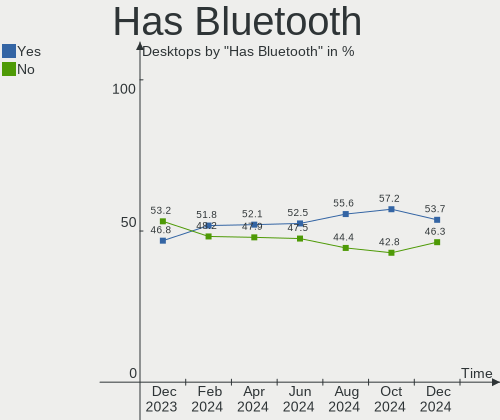

Fedora - Hardware Trends (Desktops)
-----------------------------------

A project to identify most popular hardware characteristics and track their change
over time based on data collected by Linux users at https://Linux-Hardware.org.

Anyone can contribute to this report by the [hw-probe](https://github.com/linuxhw/hw-probe) tool:

    sudo -E hw-probe -all -upload

This report is for one last month. Overall report since the beginning of time: [TestCoverage](https://github.com/linuxhw/TestCoverage)

Period: Jan, 2023.

Contents
--------

* [ System ](#system)
  - [ OS                       ](#os)
  - [ OS Family                ](#os-family)
  - [ Kernel                   ](#kernel)
  - [ Kernel Family            ](#kernel-family)
  - [ Kernel Major Ver.        ](#kernel-major-ver)
  - [ Arch                     ](#arch)
  - [ DE                       ](#de)
  - [ Display Server           ](#display-server)
  - [ Display Manager          ](#display-manager)
  - [ OS Lang                  ](#os-lang)
  - [ Boot Mode                ](#boot-mode)
  - [ Filesystem               ](#filesystem)
  - [ Part. scheme             ](#part-scheme)
  - [ Dual Boot with Linux/BSD ](#dual-boot-with-linuxbsd)
  - [ Dual Boot (Win)          ](#dual-boot-win)

* [ Board ](#board)
  - [ Vendor                   ](#vendor)
  - [ Model                    ](#model)
  - [ Model Family             ](#model-family)
  - [ MFG Year                 ](#mfg-year)
  - [ Form Factor              ](#form-factor)
  - [ Secure Boot              ](#secure-boot)
  - [ Coreboot                 ](#coreboot)
  - [ RAM Size                 ](#ram-size)
  - [ RAM Used                 ](#ram-used)
  - [ Total Drives             ](#total-drives)
  - [ Has CD-ROM               ](#has-cd-rom)
  - [ Has Ethernet             ](#has-ethernet)
  - [ Has WiFi                 ](#has-wifi)
  - [ Has Bluetooth            ](#has-bluetooth)

* [ Location ](#location)
  - [ Country                  ](#country)
  - [ City                     ](#city)

* [ Drives ](#drives)
  - [ Drive Vendor             ](#drive-vendor)
  - [ Drive Model              ](#drive-model)
  - [ HDD Vendor               ](#hdd-vendor)
  - [ SSD Vendor               ](#ssd-vendor)
  - [ Drive Kind               ](#drive-kind)
  - [ Drive Connector          ](#drive-connector)
  - [ Drive Size               ](#drive-size)
  - [ Space Total              ](#space-total)
  - [ Space Used               ](#space-used)
  - [ Malfunc. Drives          ](#malfunc-drives)
  - [ Malfunc. Drive Vendor    ](#malfunc-drive-vendor)
  - [ Malfunc. HDD Vendor      ](#malfunc-hdd-vendor)
  - [ Malfunc. Drive Kind      ](#malfunc-drive-kind)
  - [ Failed Drives            ](#failed-drives)
  - [ Failed Drive Vendor      ](#failed-drive-vendor)
  - [ Drive Status             ](#drive-status)

* [ Storage controller ](#storage-controller)
  - [ Storage Vendor           ](#storage-vendor)
  - [ Storage Model            ](#storage-model)
  - [ Storage Kind             ](#storage-kind)

* [ Processor ](#processor)
  - [ CPU Vendor               ](#cpu-vendor)
  - [ CPU Model                ](#cpu-model)
  - [ CPU Model Family         ](#cpu-model-family)
  - [ CPU Cores                ](#cpu-cores)
  - [ CPU Sockets              ](#cpu-sockets)
  - [ CPU Threads              ](#cpu-threads)
  - [ CPU Op-Modes             ](#cpu-op-modes)
  - [ CPU Microcode            ](#cpu-microcode)
  - [ CPU Microarch            ](#cpu-microarch)

* [ Graphics ](#graphics)
  - [ GPU Vendor               ](#gpu-vendor)
  - [ GPU Model                ](#gpu-model)
  - [ GPU Combo                ](#gpu-combo)
  - [ GPU Driver               ](#gpu-driver)
  - [ GPU Memory               ](#gpu-memory)

* [ Monitor ](#monitor)
  - [ Monitor Vendor           ](#monitor-vendor)
  - [ Monitor Model            ](#monitor-model)
  - [ Monitor Resolution       ](#monitor-resolution)
  - [ Monitor Diagonal         ](#monitor-diagonal)
  - [ Monitor Width            ](#monitor-width)
  - [ Aspect Ratio             ](#aspect-ratio)
  - [ Monitor Area             ](#monitor-area)
  - [ Pixel Density            ](#pixel-density)
  - [ Multiple Monitors        ](#multiple-monitors)

* [ Network ](#network)
  - [ Net Controller Vendor    ](#net-controller-vendor)
  - [ Net Controller Model     ](#net-controller-model)
  - [ Wireless Vendor          ](#wireless-vendor)
  - [ Wireless Model           ](#wireless-model)
  - [ Ethernet Vendor          ](#ethernet-vendor)
  - [ Ethernet Model           ](#ethernet-model)
  - [ Net Controller Kind      ](#net-controller-kind)
  - [ Used Controller          ](#used-controller)
  - [ NICs                     ](#nics)
  - [ IPv6                     ](#ipv6)

* [ Bluetooth ](#bluetooth)
  - [ Bluetooth Vendor         ](#bluetooth-vendor)
  - [ Bluetooth Model          ](#bluetooth-model)

* [ Sound ](#sound)
  - [ Sound Vendor             ](#sound-vendor)
  - [ Sound Model              ](#sound-model)

* [ Memory ](#memory)
  - [ Memory Vendor            ](#memory-vendor)
  - [ Memory Model             ](#memory-model)
  - [ Memory Kind              ](#memory-kind)
  - [ Memory Form Factor       ](#memory-form-factor)
  - [ Memory Size              ](#memory-size)
  - [ Memory Speed             ](#memory-speed)

* [ Printers & scanners ](#printers--scanners)
  - [ Printer Vendor           ](#printer-vendor)
  - [ Printer Model            ](#printer-model)
  - [ Scanner Vendor           ](#scanner-vendor)
  - [ Scanner Model            ](#scanner-model)

* [ Camera ](#camera)
  - [ Camera Vendor            ](#camera-vendor)
  - [ Camera Model             ](#camera-model)

* [ Security ](#security)
  - [ Fingerprint Vendor       ](#fingerprint-vendor)
  - [ Fingerprint Model        ](#fingerprint-model)
  - [ Chipcard Vendor          ](#chipcard-vendor)
  - [ Chipcard Model           ](#chipcard-model)

* [ Unsupported ](#unsupported)
  - [ Unsupported Devices      ](#unsupported-devices)
  - [ Unsupported Device Types ](#unsupported-device-types)

System
------

OS
--

Installed operating systems

| Name      | Desktops | Percent |
|-----------|----------|---------|
| Fedora 37 | 113      | 91.13%  |
| Fedora 36 | 10       | 8.06%   |
| Fedora 28 | 1        | 0.81%   |

OS Family
---------

OS without a version

| Name   | Desktops | Percent |
|--------|----------|---------|
| Fedora | 124      | 100%    |

Kernel
------

Version of the Linux kernel

| Version                 | Desktops | Percent |
|-------------------------|----------|---------|
| 6.0.15-300.fc37.x86_64  | 28       | 22.58%  |
| 6.1.6-200.fc37.x86_64   | 18       | 14.52%  |
| 6.1.7-200.fc37.x86_64   | 14       | 11.29%  |
| 6.0.7-301.fc37.x86_64   | 10       | 8.06%   |
| 6.1.5-200.fc37.x86_64   | 9        | 7.26%   |
| 6.0.17-300.fc37.x86_64  | 9        | 7.26%   |
| 6.0.16-300.fc37.x86_64  | 8        | 6.45%   |
| 6.0.18-300.fc37.x86_64  | 7        | 5.65%   |
| 6.1.8-200.fc37.x86_64   | 3        | 2.42%   |
| 6.1.7-100.fc36.x86_64   | 2        | 1.61%   |
| 6.0.12-300.fc37.x86_64  | 2        | 1.61%   |
| 6.0.11-300.fc37.x86_64  | 2        | 1.61%   |
| 6.1.6-100.fc36.x86_64   | 1        | 0.81%   |
| 6.1.5-xm1.0.fc37.x86_64 | 1        | 0.81%   |
| 6.1.2-200.fc37.x86_64   | 1        | 0.81%   |
| 6.0.7-200.fc36.x86_64   | 1        | 0.81%   |
| 6.0.18-200.fc36.x86_64  | 1        | 0.81%   |
| 6.0.17-200.fc36.x86_64  | 1        | 0.81%   |
| 6.0.16-200.fc36.x86_64  | 1        | 0.81%   |
| 6.0.15-200.fc36.x86_64  | 1        | 0.81%   |
| 6.0.11-200.fc36.x86_64  | 1        | 0.81%   |
| 5.18.16-200.fc36.x86_64 | 1        | 0.81%   |
| 5.17.12-100.fc34.x86_64 | 1        | 0.81%   |
| 5.0.16-100.fc28.x86_64  | 1        | 0.81%   |

Kernel Family
-------------

Linux kernel without a distro release

| Version | Desktops | Percent |
|---------|----------|---------|
| 6.0.15  | 29       | 23.39%  |
| 6.1.6   | 19       | 15.32%  |
| 6.1.7   | 16       | 12.9%   |
| 6.0.7   | 11       | 8.87%   |
| 6.1.5   | 10       | 8.06%   |
| 6.0.17  | 10       | 8.06%   |
| 6.0.16  | 9        | 7.26%   |
| 6.0.18  | 8        | 6.45%   |
| 6.1.8   | 3        | 2.42%   |
| 6.0.11  | 3        | 2.42%   |
| 6.0.12  | 2        | 1.61%   |
| 6.1.2   | 1        | 0.81%   |
| 5.18.16 | 1        | 0.81%   |
| 5.17.12 | 1        | 0.81%   |
| 5.0.16  | 1        | 0.81%   |

Kernel Major Ver.
-----------------

Linux kernel major version

| Version | Desktops | Percent |
|---------|----------|---------|
| 6.0     | 72       | 58.06%  |
| 6.1     | 49       | 39.52%  |
| 5.18    | 1        | 0.81%   |
| 5.17    | 1        | 0.81%   |
| 5.0     | 1        | 0.81%   |

Arch
----

OS architecture (x86_64, i586, etc.)

| Name   | Desktops | Percent |
|--------|----------|---------|
| x86_64 | 124      | 100%    |

DE
--

Desktop Environment

| Name          | Desktops | Percent |
|---------------|----------|---------|
| GNOME         | 83       | 66.94%  |
| KDE5          | 27       | 21.77%  |
| Cinnamon      | 4        | 3.23%   |
| X-Cinnamon    | 3        | 2.42%   |
| XFCE          | 2        | 1.61%   |
| MATE          | 2        | 1.61%   |
| i3            | 1        | 0.81%   |
| GNOME Classic | 1        | 0.81%   |
| Unknown       | 1        | 0.81%   |

Display Server
--------------

X11 or Wayland

| Name    | Desktops | Percent |
|---------|----------|---------|
| Wayland | 79       | 63.71%  |
| X11     | 40       | 32.26%  |
| Tty     | 4        | 3.23%   |
| Unknown | 1        | 0.81%   |

Display Manager
---------------

SDDM, LightDM, etc.

| Name    | Desktops | Percent |
|---------|----------|---------|
| Unknown | 66       | 53.23%  |
| GDM     | 34       | 27.42%  |
| SDDM    | 14       | 11.29%  |
| LightDM | 10       | 8.06%   |

OS Lang
-------

Language

| Lang    | Desktops | Percent |
|---------|----------|---------|
| en_US   | 59       | 47.58%  |
| en_GB   | 12       | 9.68%   |
| ru_RU   | 8        | 6.45%   |
| pl_PL   | 6        | 4.84%   |
| en_AU   | 6        | 4.84%   |
| de_DE   | 6        | 4.84%   |
| pt_BR   | 5        | 4.03%   |
| en_CA   | 5        | 4.03%   |
| it_IT   | 3        | 2.42%   |
| fr_FR   | 3        | 2.42%   |
| en_NZ   | 2        | 1.61%   |
| Unknown | 2        | 1.61%   |
| ru_UA   | 1        | 0.81%   |
| fi_FI   | 1        | 0.81%   |
| es_UY   | 1        | 0.81%   |
| es_ES   | 1        | 0.81%   |
| en_IE   | 1        | 0.81%   |
| de_CH   | 1        | 0.81%   |
| de_AT   | 1        | 0.81%   |

Boot Mode
---------

EFI or BIOS

| Mode | Desktops | Percent |
|------|----------|---------|
| EFI  | 80       | 64.52%  |
| BIOS | 44       | 35.48%  |

Filesystem
----------

Type of filesystem

| Type  | Desktops | Percent |
|-------|----------|---------|
| Btrfs | 92       | 74.19%  |
| Ext4  | 26       | 20.97%  |
| Xfs   | 5        | 4.03%   |
| F2fs  | 1        | 0.81%   |

Part. scheme
------------

Scheme of partitioning

| Type    | Desktops | Percent |
|---------|----------|---------|
| Unknown | 65       | 52.42%  |
| GPT     | 51       | 41.13%  |
| MBR     | 8        | 6.45%   |

Dual Boot with Linux/BSD
------------------------

Hosting more than one Linux/BSD

| Dual boot | Desktops | Percent |
|-----------|----------|---------|
| No        | 109      | 87.9%   |
| Yes       | 15       | 12.1%   |

Dual Boot (Win)
---------------

Hosting Linux and Windows

| Dual boot | Desktops | Percent |
|-----------|----------|---------|
| No        | 98       | 79.03%  |
| Yes       | 26       | 20.97%  |

Board
-----

Vendor
------

Motherboard manufacturer

| Name                | Desktops | Percent |
|---------------------|----------|---------|
| ASUSTek Computer    | 47       | 37.9%   |
| Gigabyte Technology | 24       | 19.35%  |
| ASRock              | 16       | 12.9%   |
| MSI                 | 11       | 8.87%   |
| Dell                | 11       | 8.87%   |
| Hewlett-Packard     | 4        | 3.23%   |
| Positivo            | 2        | 1.61%   |
| Lenovo              | 2        | 1.61%   |
| Acer                | 2        | 1.61%   |
| Pegatron            | 1        | 0.81%   |
| Intel               | 1        | 0.81%   |
| ECS                 | 1        | 0.81%   |
| AZW                 | 1        | 0.81%   |
| Unknown             | 1        | 0.81%   |

Model
-----

Motherboard model

| Name                                  | Desktops | Percent |
|---------------------------------------|----------|---------|
| ASUS All Series                       | 4        | 3.23%   |
| MSI MS-7C37                           | 2        | 1.61%   |
| Gigabyte J1900M-D2P                   | 2        | 1.61%   |
| Gigabyte B550M DS3H                   | 2        | 1.61%   |
| Gigabyte B550I AORUS PRO AX           | 2        | 1.61%   |
| Dell OptiPlex 7010                    | 2        | 1.61%   |
| ASUS TUF Gaming X570-PLUS             | 2        | 1.61%   |
| ASUS ROG Strix GA15DH_G15DH           | 2        | 1.61%   |
| ASUS ROG STRIX B450-F GAMING II       | 2        | 1.61%   |
| ASUS ProArt X670E-CREATOR WIFI        | 2        | 1.61%   |
| ASUS PRIME X370-PRO                   | 2        | 1.61%   |
| ASUS PRIME B550M-A                    | 2        | 1.61%   |
| ASUS PRIME B450M-A II                 | 2        | 1.61%   |
| Positivo POS-PIQ57BQ                  | 1        | 0.81%   |
| Positivo POS-EIB85CZ                  | 1        | 0.81%   |
| Pegatron 420-1010br                   | 1        | 0.81%   |
| MSI MS-7D25                           | 1        | 0.81%   |
| MSI MS-7D22                           | 1        | 0.81%   |
| MSI MS-7C84                           | 1        | 0.81%   |
| MSI MS-7C56                           | 1        | 0.81%   |
| MSI MS-7C35                           | 1        | 0.81%   |
| MSI MS-7B93                           | 1        | 0.81%   |
| MSI MS-7B86                           | 1        | 0.81%   |
| MSI MS-7A38                           | 1        | 0.81%   |
| MSI MS-7885                           | 1        | 0.81%   |
| Lenovo Legion T730-28ICO 90JF00AXUS   | 1        | 0.81%   |
| Lenovo IdeaCentre 3 07IAB7 90SM006CMW | 1        | 0.81%   |
| Intel Quint B M4D3A-G41               | 1        | 0.81%   |
| HP Z800 Workstation                   | 1        | 0.81%   |
| HP Z2 SFF G5 Workstation              | 1        | 0.81%   |
| HP Slim Desktop 290-a0xxx             | 1        | 0.81%   |
| HP Compaq 6005 Pro SFF PC             | 1        | 0.81%   |
| Gigabyte Z87-D3HP                     | 1        | 0.81%   |
| Gigabyte Z77X-D3H                     | 1        | 0.81%   |
| Gigabyte Z690 UD DDR4                 | 1        | 0.81%   |
| Gigabyte Z370 AORUS Gaming 5          | 1        | 0.81%   |
| Gigabyte Z170-D3H                     | 1        | 0.81%   |
| Gigabyte X570 AORUS ULTRA             | 1        | 0.81%   |
| Gigabyte X570 AORUS MASTER            | 1        | 0.81%   |
| Gigabyte H97M-D3H                     | 1        | 0.81%   |

Model Family
------------

Motherboard model prefix

| Name                 | Desktops | Percent |
|----------------------|----------|---------|
| ASUS ROG             | 11       | 8.87%   |
| ASUS PRIME           | 11       | 8.87%   |
| ASUS TUF             | 6        | 4.84%   |
| Dell OptiPlex        | 5        | 4.03%   |
| ASUS All             | 4        | 3.23%   |
| Gigabyte B550M       | 3        | 2.42%   |
| Dell Precision       | 3        | 2.42%   |
| Dell Inspiron        | 3        | 2.42%   |
| ASUS ProArt          | 3        | 2.42%   |
| MSI MS-7C37          | 2        | 1.61%   |
| Gigabyte X570        | 2        | 1.61%   |
| Gigabyte J1900M-D2P  | 2        | 1.61%   |
| Gigabyte B550I       | 2        | 1.61%   |
| ASUS SABERTOOTH      | 2        | 1.61%   |
| ASUS M5A78L-M        | 2        | 1.61%   |
| Acer Aspire          | 2        | 1.61%   |
| Positivo POS-PIQ57BQ | 1        | 0.81%   |
| Positivo POS-EIB85CZ | 1        | 0.81%   |
| Pegatron 420-1010br  | 1        | 0.81%   |
| MSI MS-7D25          | 1        | 0.81%   |
| MSI MS-7D22          | 1        | 0.81%   |
| MSI MS-7C84          | 1        | 0.81%   |
| MSI MS-7C56          | 1        | 0.81%   |
| MSI MS-7C35          | 1        | 0.81%   |
| MSI MS-7B93          | 1        | 0.81%   |
| MSI MS-7B86          | 1        | 0.81%   |
| MSI MS-7A38          | 1        | 0.81%   |
| MSI MS-7885          | 1        | 0.81%   |
| Lenovo Legion        | 1        | 0.81%   |
| Lenovo IdeaCentre    | 1        | 0.81%   |
| Intel Quint          | 1        | 0.81%   |
| HP Z800              | 1        | 0.81%   |
| HP Z2                | 1        | 0.81%   |
| HP Slim              | 1        | 0.81%   |
| HP Compaq            | 1        | 0.81%   |
| Gigabyte Z87-D3HP    | 1        | 0.81%   |
| Gigabyte Z77X-D3H    | 1        | 0.81%   |
| Gigabyte Z690        | 1        | 0.81%   |
| Gigabyte Z370        | 1        | 0.81%   |
| Gigabyte Z170-D3H    | 1        | 0.81%   |

MFG Year
--------

Motherboard manufacture year

| Year | Desktops | Percent |
|------|----------|---------|
| 2019 | 23       | 18.55%  |
| 2020 | 18       | 14.52%  |
| 2013 | 11       | 8.87%   |
| 2021 | 10       | 8.06%   |
| 2012 | 10       | 8.06%   |
| 2015 | 9        | 7.26%   |
| 2018 | 7        | 5.65%   |
| 2017 | 7        | 5.65%   |
| 2014 | 7        | 5.65%   |
| 2022 | 6        | 4.84%   |
| 2010 | 5        | 4.03%   |
| 2009 | 5        | 4.03%   |
| 2011 | 4        | 3.23%   |
| 2016 | 2        | 1.61%   |

Form Factor
-----------

Physical design of the computer

| Name    | Desktops | Percent |
|---------|----------|---------|
| Desktop | 124      | 100%    |

Secure Boot
-----------

Enabled or disabled

| State    | Desktops | Percent |
|----------|----------|---------|
| Disabled | 114      | 91.94%  |
| Enabled  | 10       | 8.06%   |

Coreboot
--------

Have coreboot on board

| Used | Desktops | Percent |
|------|----------|---------|
| No   | 124      | 100%    |

RAM Size
--------

Total RAM memory

| Size in GB  | Desktops | Percent |
|-------------|----------|---------|
| 16.01-24.0  | 39       | 31.45%  |
| 32.01-64.0  | 35       | 28.23%  |
| 8.01-16.0   | 16       | 12.9%   |
| 4.01-8.0    | 11       | 8.87%   |
| 3.01-4.0    | 8        | 6.45%   |
| 24.01-32.0  | 8        | 6.45%   |
| 64.01-256.0 | 6        | 4.84%   |
| 1.01-2.0    | 1        | 0.81%   |

RAM Used
--------

Used RAM memory

| Used GB     | Desktops | Percent |
|-------------|----------|---------|
| 4.01-8.0    | 33       | 26.61%  |
| 2.01-3.0    | 29       | 23.39%  |
| 3.01-4.0    | 26       | 20.97%  |
| 8.01-16.0   | 17       | 13.71%  |
| 1.01-2.0    | 13       | 10.48%  |
| 0.51-1.0    | 3        | 2.42%   |
| 32.01-64.0  | 1        | 0.81%   |
| 64.01-256.0 | 1        | 0.81%   |
| 0.01-0.5    | 1        | 0.81%   |

Total Drives
------------

Number of drives on board

| Drives | Desktops | Percent |
|--------|----------|---------|
| 2      | 41       | 33.06%  |
| 1      | 33       | 26.61%  |
| 3      | 26       | 20.97%  |
| 4      | 14       | 11.29%  |
| 5      | 3        | 2.42%   |
| 8      | 2        | 1.61%   |
| 18     | 1        | 0.81%   |
| 13     | 1        | 0.81%   |
| 9      | 1        | 0.81%   |
| 7      | 1        | 0.81%   |
| 6      | 1        | 0.81%   |

Has CD-ROM
----------

Has CD-ROM on board

| Presented | Desktops | Percent |
|-----------|----------|---------|
| No        | 88       | 70.97%  |
| Yes       | 36       | 29.03%  |

Has Ethernet
------------

Has Ethernet on board

| Presented | Desktops | Percent |
|-----------|----------|---------|
| Yes       | 124      | 100%    |

Has WiFi
--------

Has WiFi module

| Presented | Desktops | Percent |
|-----------|----------|---------|
| No        | 63       | 50.81%  |
| Yes       | 61       | 49.19%  |

Has Bluetooth
-------------

Has Bluetooth module

| Presented | Desktops | Percent |
|-----------|----------|---------|
| Yes       | 65       | 52.42%  |
| No        | 59       | 47.58%  |

Location
--------

Country
-------

Geographic location (country)

| Country      | Desktops | Percent |
|--------------|----------|---------|
| USA          | 26       | 20.97%  |
| Germany      | 10       | 8.06%   |
| UK           | 8        | 6.45%   |
| Brazil       | 8        | 6.45%   |
| Russia       | 6        | 4.84%   |
| Poland       | 6        | 4.84%   |
| Australia    | 6        | 4.84%   |
| Canada       | 5        | 4.03%   |
| Netherlands  | 4        | 3.23%   |
| France       | 4        | 3.23%   |
| Italy        | 3        | 2.42%   |
| Turkey       | 2        | 1.61%   |
| Thailand     | 2        | 1.61%   |
| Switzerland  | 2        | 1.61%   |
| Sweden       | 2        | 1.61%   |
| Norway       | 2        | 1.61%   |
| New Zealand  | 2        | 1.61%   |
| Belarus      | 2        | 1.61%   |
| Austria      | 2        | 1.61%   |
| Uruguay      | 1        | 0.81%   |
| Ukraine      | 1        | 0.81%   |
| Uganda       | 1        | 0.81%   |
| Taiwan       | 1        | 0.81%   |
| Spain        | 1        | 0.81%   |
| Slovakia     | 1        | 0.81%   |
| Saudi Arabia | 1        | 0.81%   |
| Romania      | 1        | 0.81%   |
| Portugal     | 1        | 0.81%   |
| Philippines  | 1        | 0.81%   |
| Mexico       | 1        | 0.81%   |
| Latvia       | 1        | 0.81%   |
| Japan        | 1        | 0.81%   |
| Ireland      | 1        | 0.81%   |
| Indonesia    | 1        | 0.81%   |
| India        | 1        | 0.81%   |
| Finland      | 1        | 0.81%   |
| Ecuador      | 1        | 0.81%   |
| Denmark      | 1        | 0.81%   |
| Czechia      | 1        | 0.81%   |
| Belgium      | 1        | 0.81%   |

City
----

Geographic location (city)

| City               | Desktops | Percent |
|--------------------|----------|---------|
| Sydney             | 5        | 4.03%   |
| London             | 3        | 2.42%   |
| Seattle            | 2        | 1.61%   |
| Palmas             | 2        | 1.61%   |
| Minsk              | 2        | 1.61%   |
| Kristiansand       | 2        | 1.61%   |
| Berlin             | 2        | 1.61%   |
| Yekaterinburg      | 1        | 0.81%   |
| Wroclaw            | 1        | 0.81%   |
| Willowbrook        | 1        | 0.81%   |
| Westlake           | 1        | 0.81%   |
| Warsaw             | 1        | 0.81%   |
| Vologda            | 1        | 0.81%   |
| Vitória           | 1        | 0.81%   |
| Villeurbanne       | 1        | 0.81%   |
| Vigliano Biellese  | 1        | 0.81%   |
| Verona             | 1        | 0.81%   |
| Vancouver          | 1        | 0.81%   |
| Uster              | 1        | 0.81%   |
| Torun              | 1        | 0.81%   |
| Torrejón de Ardoz | 1        | 0.81%   |
| Tikhoretsk         | 1        | 0.81%   |
| Teresina           | 1        | 0.81%   |
| Surabaya           | 1        | 0.81%   |
| Streefkerk         | 1        | 0.81%   |
| Slough             | 1        | 0.81%   |
| Shafter            | 1        | 0.81%   |
| Secaucus           | 1        | 0.81%   |
| Saratov            | 1        | 0.81%   |
| Sao Paulo          | 1        | 0.81%   |
| Sankt Augustin     | 1        | 0.81%   |
| Round Lake         | 1        | 0.81%   |
| Riverside          | 1        | 0.81%   |
| Riga               | 1        | 0.81%   |
| Rheinberg          | 1        | 0.81%   |
| Ragusa             | 1        | 0.81%   |
| Quito              | 1        | 0.81%   |
| Princeton          | 1        | 0.81%   |
| Prague             | 1        | 0.81%   |
| Portland           | 1        | 0.81%   |

Drives
------

Drive Vendor
------------

Hard drive vendors

| Vendor                         | Desktops | Drives | Percent |
|--------------------------------|----------|--------|---------|
| Samsung Electronics            | 55       | 70     | 21.65%  |
| WDC                            | 41       | 56     | 16.14%  |
| Seagate                        | 36       | 49     | 14.17%  |
| Crucial                        | 21       | 23     | 8.27%   |
| Sandisk                        | 16       | 18     | 6.3%    |
| Kingston                       | 13       | 16     | 5.12%   |
| Toshiba                        | 11       | 17     | 4.33%   |
| Intel                          | 9        | 11     | 3.54%   |
| Hitachi                        | 7        | 9      | 2.76%   |
| Micron/Crucial Technology      | 6        | 7      | 2.36%   |
| Phison Electronics             | 5        | 5      | 1.97%   |
| China                          | 4        | 6      | 1.57%   |
| Silicon Motion                 | 3        | 4      | 1.18%   |
| Micron Technology              | 3        | 3      | 1.18%   |
| HGST                           | 3        | 11     | 1.18%   |
| Apacer                         | 3        | 3      | 1.18%   |
| SPCC                           | 2        | 2      | 0.79%   |
| GOODRAM                        | 2        | 3      | 0.79%   |
| XSTAR                          | 1        | 1      | 0.39%   |
| Unknown                        | 1        | 3      | 0.39%   |
| Solid State Storage Technology | 1        | 1      | 0.39%   |
| Realtek Semiconductor          | 1        | 1      | 0.39%   |
| Phison                         | 1        | 1      | 0.39%   |
| OCZ                            | 1        | 1      | 0.39%   |
| Mushkin                        | 1        | 1      | 0.39%   |
| LT                             | 1        | 1      | 0.39%   |
| Lexar                          | 1        | 1      | 0.39%   |
| Kingston Technology Company    | 1        | 1      | 0.39%   |
| HS-SSD-C100                    | 1        | 1      | 0.39%   |
| Gigabyte Technology            | 1        | 1      | 0.39%   |
| BIWIN                          | 1        | 1      | 0.39%   |
| AMD                            | 1        | 1      | 0.39%   |

Drive Model
-----------

Hard drive models

| Model                                                 | Desktops | Percent |
|-------------------------------------------------------|----------|---------|
| Samsung NVMe SSD Controller SM981/PM981/PM983 500GB   | 8        | 2.73%   |
| Samsung SSD 870 EVO 500GB                             | 4        | 1.37%   |
| Samsung NVMe SSD Controller PM9A1/PM9A3/980PRO 512GB  | 4        | 1.37%   |
| Crucial CT1000MX500SSD1 1TB                           | 4        | 1.37%   |
| WDC WD20EZRX-00D8PB0 2TB                              | 3        | 1.02%   |
| Seagate ST500DM002-1BD142 500GB                       | 3        | 1.02%   |
| Seagate ST1000DM003-1SB102 1TB                        | 3        | 1.02%   |
| Sandisk WD Black SN750 / PC SN730 NVMe SSD 1TB        | 3        | 1.02%   |
| Samsung SSD 870 EVO 1TB                               | 3        | 1.02%   |
| Samsung SSD 850 EVO 500GB                             | 3        | 1.02%   |
| Samsung SSD 850 EVO 250GB                             | 3        | 1.02%   |
| Micron/Crucial P2 NVMe PCIe SSD 500GB                 | 3        | 1.02%   |
| Kingston SA400S37240G 240GB SSD                       | 3        | 1.02%   |
| Crucial CT1000BX500SSD1 1TB                           | 3        | 1.02%   |
| WDC WD5000LPLX-08ZNTT0 500GB                          | 2        | 0.68%   |
| WDC WD10EZEX-60WN4A1 1TB                              | 2        | 0.68%   |
| WDC WD10EZEX-60WN4A0 1TB                              | 2        | 0.68%   |
| WDC WD10EZEX-08WN4A0 1TB                              | 2        | 0.68%   |
| WDC WD10EZEX-08M2NA0 1TB                              | 2        | 0.68%   |
| Toshiba DT01ACA300 3TB                                | 2        | 0.68%   |
| Toshiba DT01ACA100 1TB                                | 2        | 0.68%   |
| Silicon Motion SM2263EN/SM2263XT SSD Controller 512GB | 2        | 0.68%   |
| Seagate ST4000DM005-2DP166 4TB                        | 2        | 0.68%   |
| Seagate ST3500413AS 500GB                             | 2        | 0.68%   |
| Seagate ST2000DM008-2UB102 2TB                        | 2        | 0.68%   |
| Seagate ST1000DM003-1SB10C 1TB                        | 2        | 0.68%   |
| Samsung SSD 870 QVO 2TB                               | 2        | 0.68%   |
| Samsung SSD 860 EVO 1TB                               | 2        | 0.68%   |
| Samsung SSD 840 PRO Series 128GB                      | 2        | 0.68%   |
| Samsung NVMe SSD Controller SM961/PM961/SM963 256GB   | 2        | 0.68%   |
| Phison E16 PCIe4 NVMe Controller 2TB                  | 2        | 0.68%   |
| Phison E12 NVMe Controller 1TB                        | 2        | 0.68%   |
| Micron/Crucial P1 NVMe PCIe SSD 1TB                   | 2        | 0.68%   |
| Kingston SA400S37960G 960GB SSD                       | 2        | 0.68%   |
| Intel SSDSC2CT120A3 120GB                             | 2        | 0.68%   |
| Intel SSD 660P Series 512GB                           | 2        | 0.68%   |
| Hitachi HTS547575A9E384 752GB                         | 2        | 0.68%   |
| Crucial CT500MX500SSD1 500GB                          | 2        | 0.68%   |
| Crucial CT250MX500SSD1 250GB                          | 2        | 0.68%   |
| XSTAR SSD 1TB                                         | 1        | 0.34%   |

HDD Vendor
----------

Hard disk drive vendors

| Vendor              | Desktops | Drives | Percent |
|---------------------|----------|--------|---------|
| WDC                 | 36       | 49     | 37.89%  |
| Seagate             | 36       | 49     | 37.89%  |
| Toshiba             | 9        | 15     | 9.47%   |
| Hitachi             | 7        | 9      | 7.37%   |
| Samsung Electronics | 4        | 6      | 4.21%   |
| HGST                | 3        | 11     | 3.16%   |

SSD Vendor
----------

Solid state drive vendors

| Vendor              | Desktops | Drives | Percent |
|---------------------|----------|--------|---------|
| Samsung Electronics | 31       | 33     | 33.7%   |
| Crucial             | 19       | 21     | 20.65%  |
| Kingston            | 11       | 13     | 11.96%  |
| Intel               | 5        | 5      | 5.43%   |
| WDC                 | 4        | 4      | 4.35%   |
| SanDisk             | 4        | 4      | 4.35%   |
| China               | 4        | 6      | 4.35%   |
| SPCC                | 2        | 2      | 2.17%   |
| GOODRAM             | 2        | 3      | 2.17%   |
| Apacer              | 2        | 2      | 2.17%   |
| XSTAR               | 1        | 1      | 1.09%   |
| Toshiba             | 1        | 1      | 1.09%   |
| OCZ                 | 1        | 1      | 1.09%   |
| Mushkin             | 1        | 1      | 1.09%   |
| Micron Technology   | 1        | 1      | 1.09%   |
| Lexar               | 1        | 1      | 1.09%   |
| BIWIN               | 1        | 1      | 1.09%   |
| AMD                 | 1        | 1      | 1.09%   |

Drive Kind
----------

HDD or SSD

| Kind    | Desktops | Drives | Percent |
|---------|----------|--------|---------|
| HDD     | 75       | 139    | 35.89%  |
| SSD     | 71       | 101    | 33.97%  |
| NVMe    | 60       | 84     | 28.71%  |
| Unknown | 3        | 5      | 1.44%   |

Drive Connector
---------------

SATA, SAS, NVMe, etc.

| Type | Desktops | Drives | Percent |
|------|----------|--------|---------|
| SATA | 103      | 229    | 60.59%  |
| NVMe | 60       | 84     | 35.29%  |
| SAS  | 7        | 16     | 4.12%   |

Drive Size
----------

Size of hard drive

| Size in TB | Desktops | Drives | Percent |
|------------|----------|--------|---------|
| 0.01-0.5   | 67       | 107    | 41.88%  |
| 0.51-1.0   | 47       | 61     | 29.38%  |
| 1.01-2.0   | 16       | 18     | 10%     |
| 3.01-4.0   | 12       | 19     | 7.5%    |
| 4.01-10.0  | 10       | 12     | 6.25%   |
| 2.01-3.0   | 7        | 9      | 4.38%   |
| 10.01-20.0 | 1        | 14     | 0.63%   |

Space Total
-----------

Amount of disk space available on the file system

| Size in GB     | Desktops | Percent |
|----------------|----------|---------|
| 501-1000       | 23       | 18.55%  |
| 1001-2000      | 22       | 17.74%  |
| More than 3000 | 19       | 15.32%  |
| 251-500        | 18       | 14.52%  |
| 2001-3000      | 12       | 9.68%   |
| 1-20           | 10       | 8.06%   |
| Unknown        | 8        | 6.45%   |
| 101-250        | 7        | 5.65%   |
| 51-100         | 5        | 4.03%   |

Space Used
----------

Amount of used disk space

| Used GB        | Desktops | Percent |
|----------------|----------|---------|
| 1-20           | 23       | 18.55%  |
| 501-1000       | 19       | 15.32%  |
| 251-500        | 15       | 12.1%   |
| 101-250        | 14       | 11.29%  |
| 1001-2000      | 13       | 10.48%  |
| 21-50          | 11       | 8.87%   |
| More than 3000 | 9        | 7.26%   |
| 51-100         | 9        | 7.26%   |
| Unknown        | 8        | 6.45%   |
| 2001-3000      | 3        | 2.42%   |

Malfunc. Drives
---------------

Drive models with a malfunction

| Model                                 | Desktops | Drives | Percent |
|---------------------------------------|----------|--------|---------|
| Samsung Electronics SSD 870 EVO 1TB   | 2        | 2      | 9.09%   |
| Intel SSDSC2CT120A3 120GB             | 2        | 2      | 9.09%   |
| WDC WD3200BPVT-80JJ5T0 320GB          | 1        | 1      | 4.55%   |
| WDC WD3200AAKS-00V1A0 320GB           | 1        | 1      | 4.55%   |
| WDC WD2500BEVT-80A23T0 250GB          | 1        | 1      | 4.55%   |
| WDC WD20EZRX-22D8PB0 2TB              | 1        | 1      | 4.55%   |
| WDC WD20EZRX-00D8PB0 2TB              | 1        | 1      | 4.55%   |
| WDC WD10EZEX-08WN4A0 1TB              | 1        | 1      | 4.55%   |
| WDC WD1002FAEX-00Y9A0 1TB             | 1        | 1      | 4.55%   |
| Toshiba MK7559GSXP 752GB              | 1        | 1      | 4.55%   |
| Seagate ST500LM021-1KJ152 500GB       | 1        | 1      | 4.55%   |
| Seagate ST500DM002-1BD142 500GB       | 1        | 1      | 4.55%   |
| Seagate ST3500320AS 500GB             | 1        | 1      | 4.55%   |
| Seagate ST3000DM001-1CH166 3TB        | 1        | 1      | 4.55%   |
| Seagate ST2000DM001-1CH164 2TB        | 1        | 1      | 4.55%   |
| Samsung Electronics SSD 870 EVO 500GB | 1        | 1      | 4.55%   |
| Samsung Electronics HD502IJ 500GB     | 1        | 1      | 4.55%   |
| Samsung Electronics HD322HJ 320GB     | 1        | 3      | 4.55%   |
| Crucial CT275MX300SSD1 275GB          | 1        | 1      | 4.55%   |
| AMD R5SL960G 960GB SSD                | 1        | 1      | 4.55%   |

Malfunc. Drive Vendor
---------------------

Vendors of faulty drives

| Vendor              | Desktops | Drives | Percent |
|---------------------|----------|--------|---------|
| WDC                 | 6        | 7      | 30%     |
| Seagate             | 5        | 5      | 25%     |
| Samsung Electronics | 4        | 7      | 20%     |
| Intel               | 2        | 2      | 10%     |
| Toshiba             | 1        | 1      | 5%      |
| Crucial             | 1        | 1      | 5%      |
| AMD                 | 1        | 1      | 5%      |

Malfunc. HDD Vendor
-------------------

Vendors of faulty HDD drives

| Vendor              | Desktops | Drives | Percent |
|---------------------|----------|--------|---------|
| WDC                 | 6        | 7      | 42.86%  |
| Seagate             | 5        | 5      | 35.71%  |
| Samsung Electronics | 2        | 4      | 14.29%  |
| Toshiba             | 1        | 1      | 7.14%   |

Malfunc. Drive Kind
-------------------

Kinds of faulty drives

| Kind | Desktops | Drives | Percent |
|------|----------|--------|---------|
| HDD  | 12       | 17     | 66.67%  |
| SSD  | 6        | 7      | 33.33%  |

Failed Drives
-------------

Failed drive models

| Model                    | Desktops | Drives | Percent |
|--------------------------|----------|--------|---------|
| Seagate ST31000528AS 1TB | 1        | 1      | 100%    |

Failed Drive Vendor
-------------------

Failed drive vendors

| Vendor  | Desktops | Drives | Percent |
|---------|----------|--------|---------|
| Seagate | 1        | 1      | 100%    |

Drive Status
------------

Number of failed and malfunc. drives

| Status   | Desktops | Drives | Percent |
|----------|----------|--------|---------|
| Detected | 71       | 190    | 50%     |
| Works    | 52       | 114    | 36.62%  |
| Malfunc  | 18       | 24     | 12.68%  |
| Failed   | 1        | 1      | 0.7%    |

Storage controller
------------------

Storage Vendor
--------------

Storage controller vendors

| Vendor                         | Desktops | Percent |
|--------------------------------|----------|---------|
| Intel                          | 67       | 32.68%  |
| AMD                            | 57       | 27.8%   |
| Samsung Electronics            | 24       | 11.71%  |
| SanDisk                        | 13       | 6.34%   |
| Micron/Crucial Technology      | 8        | 3.9%    |
| ASMedia Technology             | 8        | 3.9%    |
| Phison Electronics             | 6        | 2.93%   |
| Silicon Motion                 | 4        | 1.95%   |
| Kingston Technology Company    | 4        | 1.95%   |
| Marvell Technology Group       | 3        | 1.46%   |
| Nvidia                         | 2        | 0.98%   |
| Micron Technology              | 2        | 0.98%   |
| JMicron Technology             | 2        | 0.98%   |
| Toshiba America Info Systems   | 1        | 0.49%   |
| Solid State Storage Technology | 1        | 0.49%   |
| Realtek Semiconductor          | 1        | 0.49%   |
| Hewlett-Packard                | 1        | 0.49%   |
| Broadcom / LSI                 | 1        | 0.49%   |

Storage Model
-------------

Storage controller models

| Model                                                                                   | Desktops | Percent |
|-----------------------------------------------------------------------------------------|----------|---------|
| AMD FCH SATA Controller [AHCI mode]                                                     | 29       | 12.13%  |
| Samsung NVMe SSD Controller SM981/PM981/PM983                                           | 12       | 5.02%   |
| AMD 500 Series Chipset SATA Controller                                                  | 12       | 5.02%   |
| AMD 400 Series Chipset SATA Controller                                                  | 12       | 5.02%   |
| Intel 7 Series/C210 Series Chipset Family 6-port SATA Controller [AHCI mode]            | 9        | 3.77%   |
| Samsung NVMe SSD Controller PM9A1/PM9A3/980PRO                                          | 8        | 3.35%   |
| Intel Alder Lake-S PCH SATA Controller [AHCI Mode]                                      | 8        | 3.35%   |
| Intel 8 Series/C220 Series Chipset Family 6-port SATA Controller 1 [AHCI mode]          | 8        | 3.35%   |
| ASMedia ASM1062 Serial ATA Controller                                                   | 8        | 3.35%   |
| AMD SB7x0/SB8x0/SB9x0 SATA Controller [AHCI mode]                                       | 5        | 2.09%   |
| AMD SB7x0/SB8x0/SB9x0 IDE Controller                                                    | 5        | 2.09%   |
| SanDisk Non-Volatile memory controller                                                  | 4        | 1.67%   |
| Samsung NVMe SSD Controller SM961/PM961/SM963                                           | 4        | 1.67%   |
| Intel Volume Management Device NVMe RAID Controller                                     | 4        | 1.67%   |
| Intel SATA Controller [RAID mode]                                                       | 4        | 1.67%   |
| Intel Q170/Q150/B150/H170/H110/Z170/CM236 Chipset SATA Controller [AHCI Mode]           | 4        | 1.67%   |
| Intel Cannon Lake PCH SATA AHCI Controller                                              | 4        | 1.67%   |
| Intel 6 Series/C200 Series Chipset Family 6 port Desktop SATA AHCI Controller           | 4        | 1.67%   |
| Intel 200 Series PCH SATA controller [AHCI mode]                                        | 4        | 1.67%   |
| AMD 300 Series Chipset SATA Controller                                                  | 4        | 1.67%   |
| Silicon Motion SM2263EN/SM2263XT SSD Controller                                         | 3        | 1.26%   |
| SanDisk WD Black SN750 / PC SN730 NVMe SSD                                              | 3        | 1.26%   |
| Phison E12 NVMe Controller                                                              | 3        | 1.26%   |
| Micron/Crucial P2 NVMe PCIe SSD                                                         | 3        | 1.26%   |
| Micron/Crucial P1 NVMe PCIe SSD                                                         | 3        | 1.26%   |
| Intel Non-Volatile memory controller                                                    | 3        | 1.26%   |
| Intel 9 Series Chipset Family SATA Controller [AHCI Mode]                               | 3        | 1.26%   |
| AMD X370 Series Chipset SATA Controller                                                 | 3        | 1.26%   |
| SanDisk WD Blue SN550 NVMe SSD                                                          | 2        | 0.84%   |
| SanDisk WD Blue SN500 / PC SN520 NVMe SSD                                               | 2        | 0.84%   |
| Phison E16 PCIe4 NVMe Controller                                                        | 2        | 0.84%   |
| Micron/Crucial P5 Plus NVMe PCIe SSD                                                    | 2        | 0.84%   |
| Micron Non-Volatile memory controller                                                   | 2        | 0.84%   |
| Marvell Group 88SE9172 SATA 6Gb/s Controller                                            | 2        | 0.84%   |
| Kingston Company Company Non-Volatile memory controller                                 | 2        | 0.84%   |
| Kingston Company A2000 NVMe SSD                                                         | 2        | 0.84%   |
| Intel SSD 660P Series                                                                   | 2        | 0.84%   |
| Intel NM10/ICH7 Family SATA Controller [IDE mode]                                       | 2        | 0.84%   |
| Intel Atom Processor E3800 Series SATA AHCI Controller                                  | 2        | 0.84%   |
| Intel 6 Series/C200 Series Chipset Family Desktop SATA Controller (IDE mode, ports 4-5) | 2        | 0.84%   |

Storage Kind
------------

Kind of storage controller (IDE, SATA, NVMe, SAS, ...)

| Kind | Desktops | Percent |
|------|----------|---------|
| SATA | 110      | 55.84%  |
| NVMe | 60       | 30.46%  |
| IDE  | 16       | 8.12%   |
| RAID | 10       | 5.08%   |
| SAS  | 1        | 0.51%   |

Processor
---------

CPU Vendor
----------

Processor vendors

| Vendor | Desktops | Percent |
|--------|----------|---------|
| Intel  | 65       | 52.42%  |
| AMD    | 59       | 47.58%  |

CPU Model
---------

Processor models

| Model                                  | Desktops | Percent |
|----------------------------------------|----------|---------|
| Intel Core i7-3770 CPU @ 3.40GHz       | 6        | 4.84%   |
| AMD Ryzen 5 5600X 6-Core Processor     | 4        | 3.23%   |
| AMD Ryzen 5 3600 6-Core Processor      | 4        | 3.23%   |
| Intel Core i7-6700 CPU @ 3.40GHz       | 3        | 2.42%   |
| AMD Ryzen 9 3900X 12-Core Processor    | 3        | 2.42%   |
| AMD Ryzen 7 3800X 8-Core Processor     | 3        | 2.42%   |
| AMD Ryzen 7 3700X 8-Core Processor     | 3        | 2.42%   |
| AMD Ryzen 5 5600G with Radeon Graphics | 3        | 2.42%   |
| AMD Ryzen 5 3600X 6-Core Processor     | 3        | 2.42%   |
| Intel Core i7-9700K CPU @ 3.60GHz      | 2        | 1.61%   |
| Intel Core i7-4770 CPU @ 3.40GHz       | 2        | 1.61%   |
| Intel Celeron CPU J1900 @ 1.99GHz      | 2        | 1.61%   |
| Intel 12th Gen Core i7-12700           | 2        | 1.61%   |
| AMD Ryzen 9 7950X 16-Core Processor    | 2        | 1.61%   |
| AMD Ryzen 9 5950X 16-Core Processor    | 2        | 1.61%   |
| AMD Ryzen 9 5900X 12-Core Processor    | 2        | 1.61%   |
| AMD Ryzen 7 5800X3D 8-Core Processor   | 2        | 1.61%   |
| AMD Ryzen 7 5700G with Radeon Graphics | 2        | 1.61%   |
| AMD Ryzen 7 1700 Eight-Core Processor  | 2        | 1.61%   |
| AMD Ryzen 5 5500                       | 2        | 1.61%   |
| AMD Ryzen 5 1600X Six-Core Processor   | 2        | 1.61%   |
| AMD Phenom II X6 1090T Processor       | 2        | 1.61%   |
| Intel Xeon W-2225 CPU @ 4.10GHz        | 1        | 0.81%   |
| Intel Xeon CPU X5570 @ 2.93GHz         | 1        | 0.81%   |
| Intel Xeon CPU E5-2690 0 @ 2.90GHz     | 1        | 0.81%   |
| Intel Xeon CPU E5-2665 0 @ 2.40GHz     | 1        | 0.81%   |
| Intel Xeon CPU E5-2603 v4 @ 1.70GHz    | 1        | 0.81%   |
| Intel Xeon CPU E3-1230 v3 @ 3.30GHz    | 1        | 0.81%   |
| Intel Pentium CPU G3260 @ 3.30GHz      | 1        | 0.81%   |
| Intel Pentium CPU G3220 @ 3.00GHz      | 1        | 0.81%   |
| Intel Pentium CPU G2020 @ 2.90GHz      | 1        | 0.81%   |
| Intel Core i9-9900K CPU @ 3.60GHz      | 1        | 0.81%   |
| Intel Core i7-9700F CPU @ 3.00GHz      | 1        | 0.81%   |
| Intel Core i7-8700 CPU @ 3.20GHz       | 1        | 0.81%   |
| Intel Core i7-4790K CPU @ 4.00GHz      | 1        | 0.81%   |
| Intel Core i7-4770K CPU @ 3.50GHz      | 1        | 0.81%   |
| Intel Core i7-3770K CPU @ 3.50GHz      | 1        | 0.81%   |
| Intel Core i7-10700 CPU @ 2.90GHz      | 1        | 0.81%   |
| Intel Core i5-8500 CPU @ 3.00GHz       | 1        | 0.81%   |
| Intel Core i5-7600K CPU @ 3.80GHz      | 1        | 0.81%   |

CPU Model Family
----------------

Processor model prefix

| Model             | Desktops | Percent |
|-------------------|----------|---------|
| AMD Ryzen 5       | 22       | 17.74%  |
| Intel Core i7     | 19       | 15.32%  |
| AMD Ryzen 7       | 13       | 10.48%  |
| Intel Core i5     | 12       | 9.68%   |
| AMD Ryzen 9       | 11       | 8.87%   |
| Other             | 9        | 7.26%   |
| Intel Core i3     | 7        | 5.65%   |
| Intel Xeon        | 6        | 4.84%   |
| Intel Pentium     | 3        | 2.42%   |
| Intel Celeron     | 3        | 2.42%   |
| AMD Phenom II X6  | 3        | 2.42%   |
| AMD FX            | 3        | 2.42%   |
| Intel Core 2 Duo  | 2        | 1.61%   |
| Intel Atom        | 2        | 1.61%   |
| AMD Phenom II X4  | 2        | 1.61%   |
| AMD A4            | 2        | 1.61%   |
| Intel Core i9     | 1        | 0.81%   |
| Intel Core 2 Quad | 1        | 0.81%   |
| AMD Ryzen 5 PRO   | 1        | 0.81%   |
| AMD A8            | 1        | 0.81%   |
| AMD A10           | 1        | 0.81%   |

CPU Cores
---------

Number of processor cores

| Number | Desktops | Percent |
|--------|----------|---------|
| 4      | 35       | 28.23%  |
| 6      | 30       | 24.19%  |
| 8      | 21       | 16.94%  |
| 2      | 17       | 13.71%  |
| 12     | 9        | 7.26%   |
| 16     | 7        | 5.65%   |
| 10     | 2        | 1.61%   |
| 3      | 2        | 1.61%   |
| 1      | 1        | 0.81%   |

CPU Sockets
-----------

Number of sockets

| Number | Desktops | Percent |
|--------|----------|---------|
| 1      | 122      | 98.39%  |
| 2      | 2        | 1.61%   |

CPU Threads
-----------

Threads per core (Hyper-Threading)

| Number | Desktops | Percent |
|--------|----------|---------|
| 2      | 91       | 73.39%  |
| 1      | 33       | 26.61%  |

CPU Op-Modes
------------

CPU Operation Modes (32-bit, 64-bit)

| Op mode        | Desktops | Percent |
|----------------|----------|---------|
| 32-bit, 64-bit | 124      | 100%    |

CPU Microcode
-------------

Microcode number

| Number     | Desktops | Percent |
|------------|----------|---------|
| 0x08701021 | 14       | 11.29%  |
| 0x306a9    | 12       | 9.68%   |
| 0x306c3    | 10       | 8.06%   |
| 0x90672    | 7        | 5.65%   |
| 0x506e3    | 4        | 3.23%   |
| 0x0a50000b | 4        | 3.23%   |
| 0x08701013 | 4        | 3.23%   |
| Unknown    | 4        | 3.23%   |
| 0x906ed    | 3        | 2.42%   |
| 0x906ea    | 3        | 2.42%   |
| 0x206a7    | 3        | 2.42%   |
| 0x0a50000d | 3        | 2.42%   |
| 0x0a201205 | 3        | 2.42%   |
| 0x0a201016 | 3        | 2.42%   |
| 0x30678    | 2        | 1.61%   |
| 0x206d7    | 2        | 1.61%   |
| 0x0a601203 | 2        | 1.61%   |
| 0x0a20120a | 2        | 1.61%   |
| 0x0a201204 | 2        | 1.61%   |
| 0x0800820d | 2        | 1.61%   |
| 0x08001138 | 2        | 1.61%   |
| 0x08001137 | 2        | 1.61%   |
| 0x010000bf | 2        | 1.61%   |
| 0x010000b6 | 2        | 1.61%   |
| 0xa0671    | 1        | 0.81%   |
| 0xa0655    | 1        | 0.81%   |
| 0xa0653    | 1        | 0.81%   |
| 0x906ec    | 1        | 0.81%   |
| 0x906eb    | 1        | 0.81%   |
| 0x906e9    | 1        | 0.81%   |
| 0x90675    | 1        | 0.81%   |
| 0x6fd      | 1        | 0.81%   |
| 0x6fb      | 1        | 0.81%   |
| 0x506c9    | 1        | 0.81%   |
| 0x50657    | 1        | 0.81%   |
| 0x406f1    | 1        | 0.81%   |
| 0x30661    | 1        | 0.81%   |
| 0x20655    | 1        | 0.81%   |
| 0x106e5    | 1        | 0.81%   |
| 0x106c2    | 1        | 0.81%   |

CPU Microarch
-------------

Microarchitecture

| Name             | Desktops | Percent |
|------------------|----------|---------|
| Zen 2            | 19       | 15.32%  |
| Zen 3            | 18       | 14.52%  |
| IvyBridge        | 12       | 9.68%   |
| Haswell          | 11       | 8.87%   |
| KabyLake         | 9        | 7.26%   |
| Alderlake Hybrid | 8        | 6.45%   |
| Skylake          | 5        | 4.03%   |
| SandyBridge      | 5        | 4.03%   |
| K10              | 5        | 4.03%   |
| Zen              | 4        | 3.23%   |
| Zen+             | 3        | 2.42%   |
| Piledriver       | 3        | 2.42%   |
| Unknown          | 3        | 2.42%   |
| Silvermont       | 2        | 1.61%   |
| Nehalem          | 2        | 1.61%   |
| Excavator        | 2        | 1.61%   |
| Core             | 2        | 1.61%   |
| CometLake        | 2        | 1.61%   |
| Bonnell          | 2        | 1.61%   |
| Westmere         | 1        | 0.81%   |
| Steamroller      | 1        | 0.81%   |
| Penryn           | 1        | 0.81%   |
| Icelake          | 1        | 0.81%   |
| Goldmont         | 1        | 0.81%   |
| Bulldozer        | 1        | 0.81%   |
| Broadwell        | 1        | 0.81%   |

Graphics
--------

GPU Vendor
----------

Vendors of graphics cards

| Vendor | Desktops | Percent |
|--------|----------|---------|
| AMD    | 59       | 44.36%  |
| Nvidia | 49       | 36.84%  |
| Intel  | 25       | 18.8%   |

GPU Model
---------

Graphics card models

| Model                                                                       | Desktops | Percent |
|-----------------------------------------------------------------------------|----------|---------|
| AMD Ellesmere [Radeon RX 470/480/570/570X/580/580X/590]                     | 14       | 10.14%  |
| AMD Navi 23 [Radeon RX 6600/6600 XT/6600M]                                  | 7        | 5.07%   |
| AMD Navi 22 [Radeon RX 6700/6700 XT/6750 XT / 6800M]                        | 6        | 4.35%   |
| AMD Navi 10 [Radeon RX 5600 OEM/5600 XT / 5700/5700 XT]                     | 5        | 3.62%   |
| Nvidia TU116 [GeForce GTX 1660 Ti]                                          | 4        | 2.9%    |
| AMD Navi 21 [Radeon RX 6800/6800 XT / 6900 XT]                              | 4        | 2.9%    |
| Nvidia GM204 [GeForce GTX 970]                                              | 3        | 2.17%   |
| Intel Xeon E3-1200 v3/4th Gen Core Processor Integrated Graphics Controller | 3        | 2.17%   |
| Intel AlderLake-S GT1                                                       | 3        | 2.17%   |
| AMD Cezanne [Radeon Vega Series / Radeon Vega Mobile Series]                | 3        | 2.17%   |
| AMD Baffin [Radeon RX 550 640SP / RX 560/560X]                              | 3        | 2.17%   |
| Nvidia TU104 [GeForce RTX 2080 SUPER]                                       | 2        | 1.45%   |
| Nvidia GP106 [GeForce GTX 1060 6GB]                                         | 2        | 1.45%   |
| Nvidia GP104 [GeForce GTX 1070]                                             | 2        | 1.45%   |
| Nvidia GM206 [GeForce GTX 960]                                              | 2        | 1.45%   |
| Nvidia GM107 [GeForce GTX 750 Ti]                                           | 2        | 1.45%   |
| Nvidia GK208B [GeForce GT 710]                                              | 2        | 1.45%   |
| Nvidia GA104 [GeForce RTX 3060 Ti Lite Hash Rate]                           | 2        | 1.45%   |
| Nvidia GA102 [GeForce RTX 3080]                                             | 2        | 1.45%   |
| Intel Xeon E3-1200 v2/3rd Gen Core processor Graphics Controller            | 2        | 1.45%   |
| Intel HD Graphics 530                                                       | 2        | 1.45%   |
| Intel CoffeeLake-S GT2 [UHD Graphics 630]                                   | 2        | 1.45%   |
| Intel Atom Processor Z36xxx/Z37xxx Series Graphics & Display                | 2        | 1.45%   |
| Intel 4th Generation Core Processor Family Integrated Graphics Controller   | 2        | 1.45%   |
| Intel 4 Series Chipset Integrated Graphics Controller                       | 2        | 1.45%   |
| AMD Raphael                                                                 | 2        | 1.45%   |
| AMD Caicos PRO [Radeon HD 7450]                                             | 2        | 1.45%   |
| Nvidia TU106 [GeForce RTX 2070]                                             | 1        | 0.72%   |
| Nvidia TU106 [GeForce RTX 2060 Rev. A]                                      | 1        | 0.72%   |
| Nvidia TU104GL [Quadro RTX 4000]                                            | 1        | 0.72%   |
| Nvidia TU104 [GeForce RTX 2070 SUPER]                                       | 1        | 0.72%   |
| Nvidia GT218 [GeForce 210]                                                  | 1        | 0.72%   |
| Nvidia GP107GL [Quadro P620]                                                | 1        | 0.72%   |
| Nvidia GP107GL [Quadro P400]                                                | 1        | 0.72%   |
| Nvidia GP107 [GeForce GTX 1050 Ti]                                          | 1        | 0.72%   |
| Nvidia GP106 [GeForce GTX 1060 3GB]                                         | 1        | 0.72%   |
| Nvidia GP104 [GeForce GTX 1070 Ti]                                          | 1        | 0.72%   |
| Nvidia GP102 [GeForce GTX 1080 Ti]                                          | 1        | 0.72%   |
| Nvidia GM107 [GeForce GTX 750]                                              | 1        | 0.72%   |
| Nvidia GK208B [GeForce GT 730]                                              | 1        | 0.72%   |

GPU Combo
---------

Combinations of graphics cards

| Name           | Desktops | Percent |
|----------------|----------|---------|
| 1 x AMD        | 53       | 42.74%  |
| 1 x Nvidia     | 42       | 33.87%  |
| 1 x Intel      | 16       | 12.9%   |
| Intel + Nvidia | 4        | 3.23%   |
| 2 x AMD        | 3        | 2.42%   |
| 2 x Intel      | 2        | 1.61%   |
| AMD + Nvidia   | 2        | 1.61%   |
| 2 x Nvidia     | 1        | 0.81%   |
| Intel + AMD    | 1        | 0.81%   |

GPU Driver
----------

Free vs proprietary

| Driver      | Desktops | Percent |
|-------------|----------|---------|
| Free        | 89       | 71.77%  |
| Proprietary | 29       | 23.39%  |
| Unknown     | 6        | 4.84%   |

GPU Memory
----------

Total video memory

| Size in GB | Desktops | Percent |
|------------|----------|---------|
| Unknown    | 36       | 29.03%  |
| 7.01-8.0   | 29       | 23.39%  |
| 3.01-4.0   | 13       | 10.48%  |
| 1.01-2.0   | 13       | 10.48%  |
| 8.01-16.0  | 12       | 9.68%   |
| 5.01-6.0   | 8        | 6.45%   |
| 0.51-1.0   | 7        | 5.65%   |
| 0.01-0.5   | 5        | 4.03%   |
| 2.01-3.0   | 1        | 0.81%   |

Monitor
-------

Monitor Vendor
--------------

Monitor vendors

| Vendor               | Desktops | Percent |
|----------------------|----------|---------|
| Dell                 | 34       | 24.29%  |
| Samsung Electronics  | 15       | 10.71%  |
| Goldstar             | 12       | 8.57%   |
| Hewlett-Packard      | 10       | 7.14%   |
| Acer                 | 8        | 5.71%   |
| BenQ                 | 7        | 5%      |
| AOC                  | 7        | 5%      |
| Philips              | 6        | 4.29%   |
| Lenovo               | 6        | 4.29%   |
| Ancor Communications | 6        | 4.29%   |
| ASUSTek Computer     | 4        | 2.86%   |
| Sceptre Tech         | 3        | 2.14%   |
| Gigabyte Technology  | 3        | 2.14%   |
| NEC Computers        | 2        | 1.43%   |
| MSI                  | 2        | 1.43%   |
| Iiyama               | 2        | 1.43%   |
| Westinghouse         | 1        | 0.71%   |
| USR                  | 1        | 0.71%   |
| Unknown              | 1        | 0.71%   |
| Toshiba              | 1        | 0.71%   |
| Sony                 | 1        | 0.71%   |
| Skyworth             | 1        | 0.71%   |
| Packard Bell         | 1        | 0.71%   |
| ONN                  | 1        | 0.71%   |
| MStar                | 1        | 0.71%   |
| Mi                   | 1        | 0.71%   |
| HGC                  | 1        | 0.71%   |
| HannStar             | 1        | 0.71%   |
| Eizo                 | 1        | 0.71%   |

Monitor Model
-------------

Monitor models

| Model                                                                   | Desktops | Percent |
|-------------------------------------------------------------------------|----------|---------|
| Philips PHL 276E8V PHLC18F 3840x2160 597x336mm 27.0-inch                | 2        | 1.31%   |
| Lenovo LEN C32q-20 LEN65F8 2560x1440 698x393mm 31.5-inch                | 2        | 1.31%   |
| Goldstar LG ULTRAWIDE GSM59F1 2560x1080 670x280mm 28.6-inch             | 2        | 1.31%   |
| Dell U2415 DELA0BA 1920x1200 518x324mm 24.1-inch                        | 2        | 1.31%   |
| Dell S3221QS DELD107 3840x2160 697x392mm 31.5-inch                      | 2        | 1.31%   |
| Westinghouse DWM40F3G1 WDT1EC8 1920x1080 880x490mm 39.7-inch            | 1        | 0.65%   |
| USR GSV26 PASS USR0100 1920x1080 708x398mm 32.0-inch                    | 1        | 0.65%   |
| Unknown LCD Monitor FFFF 2288x1287 2550x2550mm 142.0-inch               | 1        | 0.65%   |
| Toshiba TV TSB0109 1920x1080                                            | 1        | 0.65%   |
| Sony TV XV SNY5C01 1920x1080                                            | 1        | 0.65%   |
| Skyworth UHD SII9687 1920x540 708x398mm 32.0-inch                       | 1        | 0.65%   |
| Sceptre Tech Sceptre M25 SPT0A05 1920x1080 597x336mm 27.0-inch          | 1        | 0.65%   |
| Sceptre Tech Sceptre B34 SPT0D52 2560x1080 797x334mm 34.0-inch          | 1        | 0.65%   |
| Sceptre Tech E24 SPT099D 1920x1080 521x293mm 23.5-inch                  | 1        | 0.65%   |
| Samsung Electronics U32R59x SAM0F96 3840x2160 697x392mm 31.5-inch       | 1        | 0.65%   |
| Samsung Electronics U32D970 SAM0BDE 3840x2160 698x393mm 31.5-inch       | 1        | 0.65%   |
| Samsung Electronics SyncMaster SAM037B 1680x1050 474x296mm 22.0-inch    | 1        | 0.65%   |
| Samsung Electronics SyncMaster SAM01D0 1600x1200 432x324mm 21.3-inch    | 1        | 0.65%   |
| Samsung Electronics SME1920 SAM06B8 1366x768 410x230mm 18.5-inch        | 1        | 0.65%   |
| Samsung Electronics S34J55x SAM0F72 3440x1440 797x333mm 34.0-inch       | 1        | 0.65%   |
| Samsung Electronics S24E370 SAM0CF0 1920x1080 521x293mm 23.5-inch       | 1        | 0.65%   |
| Samsung Electronics LCD Monitor SAM7225 3840x2160 1872x1053mm 84.6-inch | 1        | 0.65%   |
| Samsung Electronics LCD Monitor SAM0C05 3840x2160 890x500mm 40.2-inch   | 1        | 0.65%   |
| Samsung Electronics LCD Monitor SAM0B60 1920x1080 887x500mm 40.1-inch   | 1        | 0.65%   |
| Samsung Electronics LC27G5xT SAM707A 2560x1440 597x336mm 27.0-inch      | 1        | 0.65%   |
| Samsung Electronics CF791 SAM0DC4 3440x1440 797x333mm 34.0-inch         | 1        | 0.65%   |
| Samsung Electronics C49RG9x SAM0F9C 3840x1080 1193x336mm 48.8-inch      | 1        | 0.65%   |
| Samsung Electronics C24FG7x SAM0E43 1920x1080 532x304mm 24.1-inch       | 1        | 0.65%   |
| Samsung Electronics C24FG70 SAM0D58 1920x1080 532x304mm 24.1-inch       | 1        | 0.65%   |
| Philips PHL 272E1GJ PHLC245 1920x1080 598x336mm 27.0-inch               | 1        | 0.65%   |
| Philips PHL 240B7QPT PHL0904 1920x1200 520x320mm 24.0-inch              | 1        | 0.65%   |
| Philips FTV PHL01EA 1920x1080 640x360mm 28.9-inch                       | 1        | 0.65%   |
| Philips 273EL PHLC07C 1920x1080 598x336mm 27.0-inch                     | 1        | 0.65%   |
| Packard Bell Viseo 230Ws PKB00C1 1920x1080 509x286mm 23.0-inch          | 1        | 0.65%   |
| ONN 100002487 ONN0101 1920x1080 517x323mm 24.0-inch                     | 1        | 0.65%   |
| NEC Computers LCD1770NX NEC6665 1280x1024 338x270mm 17.0-inch           | 1        | 0.65%   |
| NEC Computers E243WMi NEC2B07 1920x1080 543x317mm 24.8-inch             | 1        | 0.65%   |
| NEC Computers E243WMi NEC2B06 1920x1080 543x317mm 24.8-inch             | 1        | 0.65%   |
| MStar Demo MST0030 1920x1080 708x398mm 32.0-inch                        | 1        | 0.65%   |
| MSI MAG241C MSI3EA2 1920x1080 521x293mm 23.5-inch                       | 1        | 0.65%   |

Monitor Resolution
------------------

Monitor screen resolution

| Resolution         | Desktops | Percent |
|--------------------|----------|---------|
| 1920x1080 (FHD)    | 60       | 44.78%  |
| 2560x1440 (QHD)    | 18       | 13.43%  |
| 3840x2160 (4K)     | 14       | 10.45%  |
| 3440x1440          | 8        | 5.97%   |
| 1280x1024 (SXGA)   | 7        | 5.22%   |
| 1920x1200 (WUXGA)  | 5        | 3.73%   |
| 1680x1050 (WSXGA+) | 4        | 2.99%   |
| 2560x1080          | 3        | 2.24%   |
| 1600x900 (HD+)     | 2        | 1.49%   |
| 1600x1200          | 2        | 1.49%   |
| 1440x900 (WXGA+)   | 2        | 1.49%   |
| 1366x768 (WXGA)    | 2        | 1.49%   |
| 3840x1600          | 1        | 0.75%   |
| 3840x1080          | 1        | 0.75%   |
| 2560x1600          | 1        | 0.75%   |
| 2288x1287          | 1        | 0.75%   |
| 1920x540           | 1        | 0.75%   |
| 1360x768           | 1        | 0.75%   |
| 1280x720 (HD)      | 1        | 0.75%   |

Monitor Diagonal
----------------

Diagonal size in inches

| Inches  | Desktops | Percent |
|---------|----------|---------|
| 24      | 30       | 20.69%  |
| 27      | 27       | 18.62%  |
| 23      | 16       | 11.03%  |
| 31      | 11       | 7.59%   |
| 21      | 11       | 7.59%   |
| 34      | 9        | 6.21%   |
| 19      | 7        | 4.83%   |
| 22      | 5        | 3.45%   |
| 18      | 4        | 2.76%   |
| 32      | 3        | 2.07%   |
| 20      | 3        | 2.07%   |
| 72      | 2        | 1.38%   |
| 25      | 2        | 1.38%   |
| 17      | 2        | 1.38%   |
| 142     | 1        | 0.69%   |
| 84      | 1        | 0.69%   |
| 65      | 1        | 0.69%   |
| 54      | 1        | 0.69%   |
| 52      | 1        | 0.69%   |
| 48      | 1        | 0.69%   |
| 42      | 1        | 0.69%   |
| 40      | 1        | 0.69%   |
| 39      | 1        | 0.69%   |
| 37      | 1        | 0.69%   |
| 35      | 1        | 0.69%   |
| 29      | 1        | 0.69%   |
| Unknown | 1        | 0.69%   |

Monitor Width
-------------

Physical width

| Width in mm    | Desktops | Percent |
|----------------|----------|---------|
| 501-600        | 67       | 48.2%   |
| 401-500        | 24       | 17.27%  |
| 601-700        | 14       | 10.07%  |
| 701-800        | 11       | 7.91%   |
| 351-400        | 6        | 4.32%   |
| 801-900        | 5        | 3.6%    |
| 1001-1500      | 4        | 2.88%   |
| 1501-2000      | 3        | 2.16%   |
| 301-350        | 2        | 1.44%   |
| More than 2000 | 1        | 0.72%   |
| 901-1000       | 1        | 0.72%   |
| Unknown        | 1        | 0.72%   |

Aspect Ratio
------------

Proportional relationship between the width and the height

| Ratio   | Desktops | Percent |
|---------|----------|---------|
| 16/9    | 84       | 68.29%  |
| 16/10   | 15       | 12.2%   |
| 21/9    | 11       | 8.94%   |
| 5/4     | 8        | 6.5%    |
| 4/3     | 2        | 1.63%   |
| 32/9    | 1        | 0.81%   |
| 1.00    | 1        | 0.81%   |
| Unknown | 1        | 0.81%   |

Monitor Area
------------

Area in inch²

| Area in inch² | Desktops | Percent |
|----------------|----------|---------|
| 201-250        | 43       | 30.28%  |
| 301-350        | 27       | 19.01%  |
| 351-500        | 23       | 16.2%   |
| 151-200        | 16       | 11.27%  |
| 251-300        | 15       | 10.56%  |
| More than 1000 | 7        | 4.93%   |
| 141-150        | 5        | 3.52%   |
| 501-1000       | 5        | 3.52%   |
| Unknown        | 1        | 0.7%    |

Pixel Density
-------------

Pixels per inch

| Density | Desktops | Percent |
|---------|----------|---------|
| 51-100  | 73       | 58.4%   |
| 101-120 | 33       | 26.4%   |
| 121-160 | 7        | 5.6%    |
| 1-50    | 6        | 4.8%    |
| 161-240 | 5        | 4%      |
| Unknown | 1        | 0.8%    |

Multiple Monitors
-----------------

Total monitors connected

| Total | Desktops | Percent |
|-------|----------|---------|
| 1     | 76       | 61.29%  |
| 2     | 37       | 29.84%  |
| 0     | 7        | 5.65%   |
| 3     | 4        | 3.23%   |

Network
-------

Net Controller Vendor
---------------------

Controller vendors

| Vendor                | Desktops | Percent |
|-----------------------|----------|---------|
| Realtek Semiconductor | 74       | 40%     |
| Intel                 | 68       | 36.76%  |
| Qualcomm Atheros      | 8        | 4.32%   |
| Broadcom              | 5        | 2.7%    |
| TP-Link               | 4        | 2.16%   |
| Aquantia              | 4        | 2.16%   |
| Ralink                | 3        | 1.62%   |
| MediaTek              | 3        | 1.62%   |
| Samsung Electronics   | 2        | 1.08%   |
| Nvidia                | 2        | 1.08%   |
| Huawei Technologies   | 2        | 1.08%   |
| D-Link                | 2        | 1.08%   |
| Ralink Technology     | 1        | 0.54%   |
| Qualcomm              | 1        | 0.54%   |
| OPPO Electronics      | 1        | 0.54%   |
| NetGear               | 1        | 0.54%   |
| Motorola PCS          | 1        | 0.54%   |
| Microsoft             | 1        | 0.54%   |
| ICS Advent            | 1        | 0.54%   |
| AboCom Systems        | 1        | 0.54%   |

Net Controller Model
--------------------

Controller models

| Model                                                               | Desktops | Percent |
|---------------------------------------------------------------------|----------|---------|
| Realtek RTL8111/8168/8411 PCI Express Gigabit Ethernet Controller   | 58       | 27.36%  |
| Intel Wi-Fi 6 AX200                                                 | 14       | 6.6%    |
| Intel I211 Gigabit Network Connection                               | 13       | 6.13%   |
| Realtek RTL8125 2.5GbE Controller                                   | 10       | 4.72%   |
| Intel Ethernet Controller I225-V                                    | 7        | 3.3%    |
| Intel Ethernet Connection (2) I219-V                                | 6        | 2.83%   |
| Intel Ethernet Connection (7) I219-V                                | 4        | 1.89%   |
| Intel 82579LM Gigabit Network Connection (Lewisville)               | 4        | 1.89%   |
| Intel Ethernet Connection (2) I218-V                                | 3        | 1.42%   |
| Intel Dual Band Wireless-AC 3168NGW [Stone Peak]                    | 3        | 1.42%   |
| Intel Alder Lake-S PCH CNVi WiFi                                    | 3        | 1.42%   |
| Aquantia AQC113CS NBase-T/IEEE 802.3bz Ethernet Controller [AQtion] | 3        | 1.42%   |
| Samsung Galaxy series, misc. (tethering mode)                       | 2        | 0.94%   |
| Realtek RTL8188FTV 802.11b/g/n 1T1R 2.4G WLAN Adapter               | 2        | 0.94%   |
| Realtek RTL8188EUS 802.11n Wireless Network Adapter                 | 2        | 0.94%   |
| Realtek 802.11ac NIC                                                | 2        | 0.94%   |
| Qualcomm Atheros AR93xx Wireless Network Adapter                    | 2        | 0.94%   |
| MediaTek MT7922 802.11ax PCI Express Wireless Network Adapter       | 2        | 0.94%   |
| Intel Wireless-AC 9260                                              | 2        | 0.94%   |
| Intel Ethernet Connection I217-V                                    | 2        | 0.94%   |
| Intel Cannon Lake PCH CNVi WiFi                                     | 2        | 0.94%   |
| Intel 82579V Gigabit Network Connection                             | 2        | 0.94%   |
| Intel 82575EB Gigabit Network Connection                            | 2        | 0.94%   |
| TP-Link TL-WN823N v2/v3 [Realtek RTL8192EU]                         | 1        | 0.47%   |
| TP-Link TL-WN822N Version 4 RTL8192EU                               | 1        | 0.47%   |
| TP-Link TL-WN722N v2/v3 [Realtek RTL8188EUS]                        | 1        | 0.47%   |
| TP-Link 802.11ac NIC                                                | 1        | 0.47%   |
| Realtek RTL8822CE 802.11ac PCIe Wireless Network Adapter            | 1        | 0.47%   |
| Realtek RTL8822BE 802.11a/b/g/n/ac WiFi adapter                     | 1        | 0.47%   |
| Realtek RTL8821CE 802.11ac PCIe Wireless Network Adapter            | 1        | 0.47%   |
| Realtek RTL8812AU 802.11a/b/g/n/ac 2T2R DB WLAN Adapter             | 1        | 0.47%   |
| Realtek RTL8153 Gigabit Ethernet Adapter                            | 1        | 0.47%   |
| Realtek RTL810xE PCI Express Fast Ethernet controller               | 1        | 0.47%   |
| Realtek Killer E3000 2.5GbE Controller                              | 1        | 0.47%   |
| Ralink MT7601U Wireless Adapter                                     | 1        | 0.47%   |
| Ralink RT5390 Wireless 802.11n 1T/1R PCIe                           | 1        | 0.47%   |
| Ralink RT3090 Wireless 802.11n 1T/1R PCIe                           | 1        | 0.47%   |
| Ralink RT2790 Wireless 802.11n 1T/2R PCIe                           | 1        | 0.47%   |
| Qualcomm Atheros QCA9565 / AR9565 Wireless Network Adapter          | 1        | 0.47%   |
| Qualcomm Atheros QCA8171 Gigabit Ethernet                           | 1        | 0.47%   |

Wireless Vendor
---------------

Wireless vendors

| Vendor                | Desktops | Percent |
|-----------------------|----------|---------|
| Intel                 | 31       | 48.44%  |
| Realtek Semiconductor | 10       | 15.63%  |
| Qualcomm Atheros      | 6        | 9.38%   |
| TP-Link               | 4        | 6.25%   |
| Ralink                | 3        | 4.69%   |
| MediaTek              | 3        | 4.69%   |
| Broadcom              | 3        | 4.69%   |
| Ralink Technology     | 1        | 1.56%   |
| Microsoft             | 1        | 1.56%   |
| D-Link                | 1        | 1.56%   |
| AboCom Systems        | 1        | 1.56%   |

Wireless Model
--------------

Wireless models

| Model                                                         | Desktops | Percent |
|---------------------------------------------------------------|----------|---------|
| Intel Wi-Fi 6 AX200                                           | 14       | 21.88%  |
| Intel Dual Band Wireless-AC 3168NGW [Stone Peak]              | 3        | 4.69%   |
| Intel Alder Lake-S PCH CNVi WiFi                              | 3        | 4.69%   |
| Realtek RTL8188FTV 802.11b/g/n 1T1R 2.4G WLAN Adapter         | 2        | 3.13%   |
| Realtek RTL8188EUS 802.11n Wireless Network Adapter           | 2        | 3.13%   |
| Realtek 802.11ac NIC                                          | 2        | 3.13%   |
| Qualcomm Atheros AR93xx Wireless Network Adapter              | 2        | 3.13%   |
| MediaTek MT7922 802.11ax PCI Express Wireless Network Adapter | 2        | 3.13%   |
| Intel Wireless-AC 9260                                        | 2        | 3.13%   |
| Intel Cannon Lake PCH CNVi WiFi                               | 2        | 3.13%   |
| TP-Link TL-WN823N v2/v3 [Realtek RTL8192EU]                   | 1        | 1.56%   |
| TP-Link TL-WN822N Version 4 RTL8192EU                         | 1        | 1.56%   |
| TP-Link TL-WN722N v2/v3 [Realtek RTL8188EUS]                  | 1        | 1.56%   |
| TP-Link 802.11ac NIC                                          | 1        | 1.56%   |
| Realtek RTL8822CE 802.11ac PCIe Wireless Network Adapter      | 1        | 1.56%   |
| Realtek RTL8822BE 802.11a/b/g/n/ac WiFi adapter               | 1        | 1.56%   |
| Realtek RTL8821CE 802.11ac PCIe Wireless Network Adapter      | 1        | 1.56%   |
| Realtek RTL8812AU 802.11a/b/g/n/ac 2T2R DB WLAN Adapter       | 1        | 1.56%   |
| Ralink MT7601U Wireless Adapter                               | 1        | 1.56%   |
| Ralink RT5390 Wireless 802.11n 1T/1R PCIe                     | 1        | 1.56%   |
| Ralink RT3090 Wireless 802.11n 1T/1R PCIe                     | 1        | 1.56%   |
| Ralink RT2790 Wireless 802.11n 1T/2R PCIe                     | 1        | 1.56%   |
| Qualcomm Atheros QCA9565 / AR9565 Wireless Network Adapter    | 1        | 1.56%   |
| Qualcomm Atheros QCA6174 802.11ac Wireless Network Adapter    | 1        | 1.56%   |
| Qualcomm Atheros AR9485 Wireless Network Adapter              | 1        | 1.56%   |
| Qualcomm Atheros AR9227 Wireless Network Adapter              | 1        | 1.56%   |
| Microsoft Wireless XBox Controller Dongle                     | 1        | 1.56%   |
| MediaTek MT7921K (RZ608) Wi-Fi 6E 80MHz                       | 1        | 1.56%   |
| Intel Wireless 8265 / 8275                                    | 1        | 1.56%   |
| Intel Wireless 8260                                           | 1        | 1.56%   |
| Intel Wireless 7260                                           | 1        | 1.56%   |
| Intel Wireless 3165                                           | 1        | 1.56%   |
| Intel Wi-Fi 6 AX210/AX211/AX411 160MHz                        | 1        | 1.56%   |
| Intel Centrino Wireless-N 2230                                | 1        | 1.56%   |
| Intel Centrino Wireless-N 1000 [Condor Peak]                  | 1        | 1.56%   |
| D-Link 802.11ac NIC                                           | 1        | 1.56%   |
| Broadcom BCM43602 802.11ac Wireless LAN SoC                   | 1        | 1.56%   |
| Broadcom BCM4360 802.11ac Wireless Network Adapter            | 1        | 1.56%   |
| Broadcom BCM43142 802.11b/g/n                                 | 1        | 1.56%   |
| AboCom Systems 802.11n/b/g Mini Wireless LAN USB2.0 Adapter   | 1        | 1.56%   |

Ethernet Vendor
---------------

Ethernet vendors

| Vendor                | Desktops | Percent |
|-----------------------|----------|---------|
| Realtek Semiconductor | 71       | 48.97%  |
| Intel                 | 54       | 37.24%  |
| Aquantia              | 4        | 2.76%   |
| Qualcomm Atheros      | 3        | 2.07%   |
| Samsung Electronics   | 2        | 1.38%   |
| Nvidia                | 2        | 1.38%   |
| Broadcom              | 2        | 1.38%   |
| Qualcomm              | 1        | 0.69%   |
| OPPO Electronics      | 1        | 0.69%   |
| NetGear               | 1        | 0.69%   |
| Motorola PCS          | 1        | 0.69%   |
| ICS Advent            | 1        | 0.69%   |
| Huawei Technologies   | 1        | 0.69%   |
| D-Link                | 1        | 0.69%   |

Ethernet Model
--------------

Ethernet models

| Model                                                               | Desktops | Percent |
|---------------------------------------------------------------------|----------|---------|
| Realtek RTL8111/8168/8411 PCI Express Gigabit Ethernet Controller   | 58       | 39.46%  |
| Intel I211 Gigabit Network Connection                               | 13       | 8.84%   |
| Realtek RTL8125 2.5GbE Controller                                   | 10       | 6.8%    |
| Intel Ethernet Controller I225-V                                    | 7        | 4.76%   |
| Intel Ethernet Connection (2) I219-V                                | 6        | 4.08%   |
| Intel Ethernet Connection (7) I219-V                                | 4        | 2.72%   |
| Intel 82579LM Gigabit Network Connection (Lewisville)               | 4        | 2.72%   |
| Intel Ethernet Connection (2) I218-V                                | 3        | 2.04%   |
| Aquantia AQC113CS NBase-T/IEEE 802.3bz Ethernet Controller [AQtion] | 3        | 2.04%   |
| Samsung Galaxy series, misc. (tethering mode)                       | 2        | 1.36%   |
| Intel Ethernet Connection I217-V                                    | 2        | 1.36%   |
| Intel 82579V Gigabit Network Connection                             | 2        | 1.36%   |
| Intel 82575EB Gigabit Network Connection                            | 2        | 1.36%   |
| Realtek RTL8153 Gigabit Ethernet Adapter                            | 1        | 0.68%   |
| Realtek RTL810xE PCI Express Fast Ethernet controller               | 1        | 0.68%   |
| Realtek Killer E3000 2.5GbE Controller                              | 1        | 0.68%   |
| Qualcomm Atheros QCA8171 Gigabit Ethernet                           | 1        | 0.68%   |
| Qualcomm Atheros Killer E2400 Gigabit Ethernet Controller           | 1        | 0.68%   |
| Qualcomm Atheros AR8161 Gigabit Ethernet                            | 1        | 0.68%   |
| Qualcomm Android                                                    | 1        | 0.68%   |
| OPPO SDM710-MTP _SN:2396E2D4                                        | 1        | 0.68%   |
| Nvidia MCP79 Ethernet                                               | 1        | 0.68%   |
| Nvidia MCP61 Ethernet                                               | 1        | 0.68%   |
| NetGear LB1120-100NAS                                               | 1        | 0.68%   |
| Motorola PCS motorola one 5G ace                                    | 1        | 0.68%   |
| Intel I350 Gigabit Network Connection                               | 1        | 0.68%   |
| Intel Ethernet controller                                           | 1        | 0.68%   |
| Intel Ethernet Connection I217-LM                                   | 1        | 0.68%   |
| Intel Ethernet Connection (7) I219-LM                               | 1        | 0.68%   |
| Intel Ethernet Connection (5) I219-LM                               | 1        | 0.68%   |
| Intel Ethernet Connection (14) I219-V                               | 1        | 0.68%   |
| Intel Ethernet Connection (11) I219-LM                              | 1        | 0.68%   |
| Intel Ethernet Connection (10) I219-V                               | 1        | 0.68%   |
| Intel 82578DM Gigabit Network Connection                            | 1        | 0.68%   |
| Intel 82578DC Gigabit Network Connection                            | 1        | 0.68%   |
| Intel 82567LM-3 Gigabit Network Connection                          | 1        | 0.68%   |
| Intel 82546GB Gigabit Ethernet Controller                           | 1        | 0.68%   |
| Intel 82546EB Gigabit Ethernet Controller (Copper)                  | 1        | 0.68%   |
| ICS Advent DM9601 Fast Ethernet Adapter                             | 1        | 0.68%   |
| Huawei E353/E3131                                                   | 1        | 0.68%   |

Net Controller Kind
-------------------

Ethernet, WiFi or modem

| Kind     | Desktops | Percent |
|----------|----------|---------|
| Ethernet | 124      | 67.03%  |
| WiFi     | 60       | 32.43%  |
| Modem    | 1        | 0.54%   |

Used Controller
---------------

Currently used network controller

| Kind     | Desktops | Percent |
|----------|----------|---------|
| Ethernet | 95       | 73.64%  |
| WiFi     | 34       | 26.36%  |

NICs
----

Total network controllers on board

| Total | Desktops | Percent |
|-------|----------|---------|
| 1     | 68       | 54.84%  |
| 2     | 44       | 35.48%  |
| 3     | 9        | 7.26%   |
| 4     | 3        | 2.42%   |

IPv6
----

IPv6 vs IPv4

| Used | Desktops | Percent |
|------|----------|---------|
| No   | 75       | 60.48%  |
| Yes  | 49       | 39.52%  |

Bluetooth
---------

Bluetooth Vendor
----------------

Controller vendors

| Vendor                          | Desktops | Percent |
|---------------------------------|----------|---------|
| Intel                           | 31       | 44.29%  |
| Cambridge Silicon Radio         | 15       | 21.43%  |
| TP-Link                         | 7        | 10%     |
| Realtek Semiconductor           | 5        | 7.14%   |
| ASUSTek Computer                | 3        | 4.29%   |
| Qualcomm Atheros Communications | 2        | 2.86%   |
| IMC Networks                    | 2        | 2.86%   |
| Foxconn / Hon Hai               | 2        | 2.86%   |
| SIN                             | 1        | 1.43%   |
| MediaTek                        | 1        | 1.43%   |
| Apple                           | 1        | 1.43%   |

Bluetooth Model
---------------

Controller models

| Model                                               | Desktops | Percent |
|-----------------------------------------------------|----------|---------|
| Cambridge Silicon Radio Bluetooth Dongle (HCI mode) | 15       | 21.43%  |
| Intel AX200 Bluetooth                               | 14       | 20%     |
| TP-Link TPuLink UB500 Adapter                       | 7        | 10%     |
| Intel Bluetooth wireless interface                  | 4        | 5.71%   |
| Realtek Bluetooth Radio                             | 3        | 4.29%   |
| Intel Wireless-AC 3168 Bluetooth                    | 3        | 4.29%   |
| Intel Bluetooth 9460/9560 Jefferson Peak (JfP)      | 3        | 4.29%   |
| Intel Wireless-AC 9260 Bluetooth Adapter            | 2        | 2.86%   |
| Intel Bluetooth Device                              | 2        | 2.86%   |
| Intel AX210 Bluetooth                               | 2        | 2.86%   |
| IMC Networks Bluetooth Radio                        | 2        | 2.86%   |
| Foxconn / Hon Hai Wireless_Device                   | 2        | 2.86%   |
| SIN Bluetooth Keyboard                              | 1        | 1.43%   |
| Realtek RTL8822BE Bluetooth 4.2 Adapter             | 1        | 1.43%   |
| Realtek  Bluetooth 4.2 Adapter                      | 1        | 1.43%   |
| Qualcomm Atheros  Bluetooth Device                  | 1        | 1.43%   |
| Qualcomm Atheros AR9462 Bluetooth                   | 1        | 1.43%   |
| MediaTek Wireless_Device                            | 1        | 1.43%   |
| Intel Centrino Bluetooth Wireless Transceiver       | 1        | 1.43%   |
| ASUS Broadcom BCM20702A0 Bluetooth                  | 1        | 1.43%   |
| ASUS Bluetooth Adapter                              | 1        | 1.43%   |
| ASUS ASUS USB-BT500                                 | 1        | 1.43%   |
| Apple Bluetooth Host Controller                     | 1        | 1.43%   |

Sound
-----

Sound Vendor
------------

Sound card vendors

| Vendor                                          | Desktops | Percent |
|-------------------------------------------------|----------|---------|
| AMD                                             | 75       | 32.19%  |
| Intel                                           | 61       | 26.18%  |
| Nvidia                                          | 49       | 21.03%  |
| C-Media Electronics                             | 6        | 2.58%   |
| Kingston Technology                             | 4        | 1.72%   |
| Realtek Semiconductor                           | 3        | 1.29%   |
| Razer USA                                       | 3        | 1.29%   |
| Creative Technology                             | 3        | 1.29%   |
| Creative Labs                                   | 3        | 1.29%   |
| ASUSTek Computer                                | 3        | 1.29%   |
| SteelSeries ApS                                 | 2        | 0.86%   |
| Medeli Electronics                              | 2        | 0.86%   |
| Logitech                                        | 2        | 0.86%   |
| Dell                                            | 2        | 0.86%   |
| VIA Technologies                                | 1        | 0.43%   |
| Texas Instruments                               | 1        | 0.43%   |
| Tenx Technology                                 | 1        | 0.43%   |
| Samson Technologies                             | 1        | 0.43%   |
| RME                                             | 1        | 0.43%   |
| Meridian                                        | 1        | 0.43%   |
| Licensed by Sony Computer Entertainment America | 1        | 0.43%   |
| JMTek                                           | 1        | 0.43%   |
| GN Netcom                                       | 1        | 0.43%   |
| Generalplus Technology                          | 1        | 0.43%   |
| Focusrite-Novation                              | 1        | 0.43%   |
| FiiO Electronics Technology                     | 1        | 0.43%   |
| Corsair                                         | 1        | 0.43%   |
| Comtrue-inc                                     | 1        | 0.43%   |
| Apple                                           | 1        | 0.43%   |

Sound Model
-----------

Sound card models

| Model                                                                      | Desktops | Percent |
|----------------------------------------------------------------------------|----------|---------|
| AMD Starship/Matisse HD Audio Controller                                   | 29       | 10.18%  |
| AMD Navi 21/23 HDMI/DP Audio Controller                                    | 17       | 5.96%   |
| AMD Ellesmere HDMI Audio [Radeon RX 470/480 / 570/580/590]                 | 15       | 5.26%   |
| AMD Family 17h/19h HD Audio Controller                                     | 12       | 4.21%   |
| Intel 7 Series/C216 Chipset Family High Definition Audio Controller        | 9        | 3.16%   |
| Intel Alder Lake-S HD Audio Controller                                     | 8        | 2.81%   |
| Intel 8 Series/C220 Series Chipset High Definition Audio Controller        | 8        | 2.81%   |
| AMD Renoir Radeon High Definition Audio Controller                         | 8        | 2.81%   |
| Intel 6 Series/C200 Series Chipset Family High Definition Audio Controller | 6        | 2.11%   |
| AMD SBx00 Azalia (Intel HDA)                                               | 6        | 2.11%   |
| AMD Navi 10 HDMI Audio                                                     | 6        | 2.11%   |
| AMD Family 17h (Models 00h-0fh) HD Audio Controller                        | 6        | 2.11%   |
| Intel Cannon Lake PCH cAVS                                                 | 5        | 1.75%   |
| Intel 200 Series PCH HD Audio                                              | 5        | 1.75%   |
| Nvidia TU116 High Definition Audio Controller                              | 4        | 1.4%    |
| Nvidia TU104 HD Audio Controller                                           | 4        | 1.4%    |
| Nvidia GK104 HDMI Audio Controller                                         | 4        | 1.4%    |
| Intel Xeon E3-1200 v3/4th Gen Core Processor HD Audio Controller           | 4        | 1.4%    |
| Intel 100 Series/C230 Series Chipset Family HD Audio Controller            | 4        | 1.4%    |
| AMD Baffin HDMI/DP Audio [Radeon RX 550 640SP / RX 560/560X]               | 4        | 1.4%    |
| Nvidia GP107GL High Definition Audio Controller                            | 3        | 1.05%   |
| Nvidia GP106 High Definition Audio Controller                              | 3        | 1.05%   |
| Nvidia GP104 High Definition Audio Controller                              | 3        | 1.05%   |
| Nvidia GM204 High Definition Audio Controller                              | 3        | 1.05%   |
| Nvidia GM107 High Definition Audio Controller [GeForce 940MX]              | 3        | 1.05%   |
| Nvidia GK208 HDMI/DP Audio Controller                                      | 3        | 1.05%   |
| Nvidia GA104 High Definition Audio Controller                              | 3        | 1.05%   |
| Kingston Technology HyperX 7.1 Audio                                       | 3        | 1.05%   |
| Intel 9 Series Chipset Family HD Audio Controller                          | 3        | 1.05%   |
| AMD Rembrandt Radeon High Definition Audio Controller                      | 3        | 1.05%   |
| Nvidia TU106 High Definition Audio Controller                              | 2        | 0.7%    |
| Nvidia GM206 High Definition Audio Controller                              | 2        | 0.7%    |
| Nvidia GK107 HDMI Audio Controller                                         | 2        | 0.7%    |
| Nvidia GK106 HDMI Audio Controller                                         | 2        | 0.7%    |
| Nvidia GA102 High Definition Audio Controller                              | 2        | 0.7%    |
| Intel NM10/ICH7 Family High Definition Audio Controller                    | 2        | 0.7%    |
| Intel Audio device                                                         | 2        | 0.7%    |
| Intel Atom Processor Z36xxx/Z37xxx Series High Definition Audio Controller | 2        | 0.7%    |
| Intel 5 Series/3400 Series Chipset High Definition Audio                   | 2        | 0.7%    |
| Dell AC511 Sound Bar                                                       | 2        | 0.7%    |

Memory
------

Memory Vendor
-------------

Memory module vendors

| Vendor              | Desktops | Percent |
|---------------------|----------|---------|
| Kingston            | 16       | 22.86%  |
| Unknown             | 8        | 11.43%  |
| Corsair             | 7        | 10%     |
| G.Skill             | 6        | 8.57%   |
| Team                | 4        | 5.71%   |
| Crucial             | 4        | 5.71%   |
| SK hynix            | 3        | 4.29%   |
| Samsung Electronics | 3        | 4.29%   |
| Ramaxel Technology  | 3        | 4.29%   |
| Unifosa             | 2        | 2.86%   |
| Micron Technology   | 2        | 2.86%   |
| Gold Key            | 2        | 2.86%   |
| A-DATA Technology   | 2        | 2.86%   |
| Smart               | 1        | 1.43%   |
| Silicon Power       | 1        | 1.43%   |
| Patriot             | 1        | 1.43%   |
| Nanya Technology    | 1        | 1.43%   |
| GOODRAM             | 1        | 1.43%   |
| Apacer              | 1        | 1.43%   |
| AMD                 | 1        | 1.43%   |
| Unknown             | 1        | 1.43%   |

Memory Model
------------

Memory module models

| Model                                                     | Desktops | Percent |
|-----------------------------------------------------------|----------|---------|
| Kingston RAM KHX3200C16D4/8GX 8GB DIMM DDR4 3600MT/s      | 3        | 4.11%   |
| Unknown RAM Module 4GB DIMM DDR3 1333MT/s                 | 2        | 2.74%   |
| Team RAM TEAMGROUP-UD3-1600 4GB DIMM DDR3 1600MT/s        | 2        | 2.74%   |
| Kingston RAM KHX1600C9D3/4GX 4GB DIMM DDR3 2400MT/s       | 2        | 2.74%   |
| Kingston RAM KF560C40-16 16GB DIMM DDR5 4800MT/s          | 2        | 2.74%   |
| Kingston RAM 99U5471-020.A00LF 4GB DIMM DDR3 1600MT/s     | 2        | 2.74%   |
| Unknown RAM Module 8GB DIMM DDR3 1600MT/s                 | 1        | 1.37%   |
| Unknown RAM Module 4GB DIMM DDR2 533MT/s                  | 1        | 1.37%   |
| Unknown RAM Module 4GB DIMM 800MT/s                       | 1        | 1.37%   |
| Unknown RAM Module 4GB DIMM 667MT/s                       | 1        | 1.37%   |
| Unknown RAM Module 4GB DIMM 400MT/s                       | 1        | 1.37%   |
| Unknown RAM Module 2GB DIMM DDR3 1333MT/s                 | 1        | 1.37%   |
| Unknown RAM Module 2GB DIMM DDR2 800MT/s                  | 1        | 1.37%   |
| Unifosa RAM GU512303EP0202 2GB DIMM DDR3 1333MT/s         | 1        | 1.37%   |
| Unifosa RAM GU332G0ALEPR8H2C6F 2GB SODIMM DDR2 800MT/s    | 1        | 1.37%   |
| Team RAM TEAMGROUP-UD4-3600 8GB DIMM DDR4 3600MT/s        | 1        | 1.37%   |
| Team RAM TEAMGROUP-UD4-3600 16GB DIMM DDR4 3733MT/s       | 1        | 1.37%   |
| Smart RAM SH564568FH8N0QHSC 2GB DIMM DDR3 1333MT/s        | 1        | 1.37%   |
| SK hynix RAM Module 16GB DIMM DDR4 3200MT/s               | 1        | 1.37%   |
| SK hynix RAM HMT451U6AFR8C-PB 4GB DIMM DDR3 1600MT/s      | 1        | 1.37%   |
| SK hynix RAM HMT451S6AFR8A-PB 4096MB SODIMM DDR3 1600MT/s | 1        | 1.37%   |
| Silicon Power RAM Module 8GB DIMM DDR4 3200MT/s           | 1        | 1.37%   |
| Samsung RAM M471B5173DB0-YK0 4GB SODIMM DDR3 1600MT/s     | 1        | 1.37%   |
| Samsung RAM M393A2G40DB0-CPB 16GB DIMM DDR4 2133MT/s      | 1        | 1.37%   |
| Samsung RAM M378B5273DH0-CK0 4GB DIMM DDR3 2200MT/s       | 1        | 1.37%   |
| Ramaxel RAM RMUA5200MR78HAF-3200 8GB DIMM DDR4 3200MT/s   | 1        | 1.37%   |
| Ramaxel RAM RMUA5180ME78HBF-2666 16GB DIMM DDR4 2667MT/s  | 1        | 1.37%   |
| Ramaxel RAM RMR5030EF68F9W1600 4GB DIMM DDR3 1600MT/s     | 1        | 1.37%   |
| Patriot RAM 3600 C18 Series 16GB DIMM DDR4 3600MT/s       | 1        | 1.37%   |
| Patriot RAM 3200 C16 Series 32GB DIMM DDR4 3266MT/s       | 1        | 1.37%   |
| Nanya RAM NT4GC64B88B1NF-DI 4GB DIMM DDR3 1600MT/s        | 1        | 1.37%   |
| Micron RAM 8ATF1G64AZ-3G2J1 8GB DIMM DDR4 3200MT/s        | 1        | 1.37%   |
| Micron RAM 16ATF2G64AZ-2G1B1 16GB DIMM DDR4 2133MT/s      | 1        | 1.37%   |
| Kingston RAM KHX3600C18D4/16GX 16GB DIMM DDR4 3600MT/s    | 1        | 1.37%   |
| Kingston RAM KHX2666C16/8G 8GB DIMM DDR4 3466MT/s         | 1        | 1.37%   |
| Kingston RAM KHX1866C10D3/ 8GB DIMM DDR3 1866MT/s         | 1        | 1.37%   |
| Kingston RAM KF3600C18D4/16GX 16GB DIMM DDR4 3600MT/s     | 1        | 1.37%   |
| Kingston RAM 99U5471-054.A00LF 8GB DIMM DDR3 1600MT/s     | 1        | 1.37%   |
| Kingston RAM 99U5471-052.A00LF 8GB DIMM DDR3 1333MT/s     | 1        | 1.37%   |
| Kingston RAM 99U5403-034.A00LF 4GB DIMM DDR3 1333MT/s     | 1        | 1.37%   |

Memory Kind
-----------

Memory module kinds

| Kind    | Desktops | Percent |
|---------|----------|---------|
| DDR4    | 28       | 50%     |
| DDR3    | 20       | 35.71%  |
| DDR5    | 3        | 5.36%   |
| DDR2    | 3        | 5.36%   |
| Unknown | 2        | 3.57%   |

Memory Form Factor
------------------

Physical design of the memory module

| Name   | Desktops | Percent |
|--------|----------|---------|
| DIMM   | 54       | 96.43%  |
| SODIMM | 2        | 3.57%   |

Memory Size
-----------

Memory module size

| Size  | Desktops | Percent |
|-------|----------|---------|
| 8192  | 22       | 36.67%  |
| 4096  | 16       | 26.67%  |
| 16384 | 12       | 20%     |
| 32768 | 5        | 8.33%   |
| 2048  | 5        | 8.33%   |

Memory Speed
------------

Memory module speed

| Speed | Desktops | Percent |
|-------|----------|---------|
| 1600  | 12       | 17.91%  |
| 3600  | 10       | 14.93%  |
| 3200  | 8        | 11.94%  |
| 1333  | 6        | 8.96%   |
| 4800  | 3        | 4.48%   |
| 2400  | 3        | 4.48%   |
| 2133  | 3        | 4.48%   |
| 1800  | 3        | 4.48%   |
| 800   | 3        | 4.48%   |
| 3733  | 2        | 2.99%   |
| 3400  | 2        | 2.99%   |
| 2667  | 2        | 2.99%   |
| 1866  | 2        | 2.99%   |
| 3866  | 1        | 1.49%   |
| 3466  | 1        | 1.49%   |
| 3266  | 1        | 1.49%   |
| 3000  | 1        | 1.49%   |
| 2200  | 1        | 1.49%   |
| 667   | 1        | 1.49%   |
| 533   | 1        | 1.49%   |
| 400   | 1        | 1.49%   |

Printers & scanners
-------------------

Printer Vendor
--------------

Printer device vendors

| Vendor              | Desktops | Percent |
|---------------------|----------|---------|
| Seiko Epson         | 1        | 25%     |
| Prolific Technology | 1        | 25%     |
| Hewlett-Packard     | 1        | 25%     |
| Brother Industries  | 1        | 25%     |

Printer Model
-------------

Printer device models

| Model                         | Desktops | Percent |
|-------------------------------|----------|---------|
| Seiko Epson L300 Series       | 1        | 25%     |
| Prolific PL2305 Parallel Port | 1        | 25%     |
| HP DeskJet F300 series        | 1        | 25%     |
| Brother HL-L2350DW series     | 1        | 25%     |

Scanner Vendor
--------------

Scanner device vendors

Zero info for selected period =(

Scanner Model
-------------

Scanner device models

Zero info for selected period =(

Camera
------

Camera Vendor
-------------

Camera device vendors

| Vendor                        | Desktops | Percent |
|-------------------------------|----------|---------|
| Logitech                      | 17       | 53.13%  |
| Microsoft                     | 3        | 9.38%   |
| Samsung Electronics           | 2        | 6.25%   |
| Microdia                      | 2        | 6.25%   |
| Sunplus Innovation Technology | 1        | 3.13%   |
| Nikon                         | 1        | 3.13%   |
| MacroSilicon                  | 1        | 3.13%   |
| KYE Systems (Mouse Systems)   | 1        | 3.13%   |
| Integrated Technology Express | 1        | 3.13%   |
| Chicony Electronics           | 1        | 3.13%   |
| Arkmicro Technologies         | 1        | 3.13%   |
| 2M UVC CAMERA                 | 1        | 3.13%   |

Camera Model
------------

Camera device models

| Model                                  | Desktops | Percent |
|----------------------------------------|----------|---------|
| Logitech HD Pro Webcam C920            | 5        | 15.63%  |
| Logitech Webcam C270                   | 4        | 12.5%   |
| Samsung Galaxy A5 (MTP)                | 2        | 6.25%   |
| Logitech C922 Pro Stream Webcam        | 2        | 6.25%   |
| Sunplus FHD Camera Microphone          | 1        | 3.13%   |
| Nikon DSC D3200                        | 1        | 3.13%   |
| Microsoft Xbox NUI Camera              | 1        | 3.13%   |
| Microsoft Microsoft LifeCam Cinema   | 1        | 3.13%   |
| Microsoft LifeCam Cinema               | 1        | 3.13%   |
| Microdia USB 2.0 Camera                | 1        | 3.13%   |
| Microdia JOYACCESS JA-Webcam           | 1        | 3.13%   |
| MacroSilicon USB Video                 | 1        | 3.13%   |
| Logitech Webcam C925e                  | 1        | 3.13%   |
| Logitech Webcam C110                   | 1        | 3.13%   |
| Logitech HD Webcam C525                | 1        | 3.13%   |
| Logitech C920 PRO HD Webcam            | 1        | 3.13%   |
| Logitech BRIO Ultra HD Webcam          | 1        | 3.13%   |
| Logitech Brio 500                      | 1        | 3.13%   |
| KYE Systems (Mouse Systems) eFace 2025 | 1        | 3.13%   |
| Integrated Express HDMI to U3          | 1        | 3.13%   |
| Chicony HP High Definition 1MP Webcam  | 1        | 3.13%   |
| Arkmicro USB2.0 PC CAMERA              | 1        | 3.13%   |
| 2M UVC CAMERA NexiGo N660 FHD Webcam   | 1        | 3.13%   |

Security
--------

Fingerprint Vendor
------------------

Fingerprint sensor vendors

| Vendor                | Desktops | Percent |
|-----------------------|----------|---------|
| Microsoft             | 1        | 25%     |
| LighTuning Technology | 1        | 25%     |
| Elan Microelectronics | 1        | 25%     |
| AuthenTec             | 1        | 25%     |

Fingerprint Model
-----------------

Fingerprint sensor models

| Model                                       | Desktops | Percent |
|---------------------------------------------|----------|---------|
| Microsoft Fingerprint Reader                | 1        | 25%     |
| LighTuning Fingerprint Sensor               | 1        | 25%     |
| Elan fingerprint sensor [FeinTech FPS00200] | 1        | 25%     |
| AuthenTec AES1600                           | 1        | 25%     |

Chipcard Vendor
---------------

Chipcard module vendors

Zero info for selected period =(

Chipcard Model
--------------

Chipcard module models

Zero info for selected period =(

Unsupported
-----------

Unsupported Devices
-------------------

Total unsupported devices on board

| Total | Desktops | Percent |
|-------|----------|---------|
| 0     | 103      | 83.06%  |
| 1     | 18       | 14.52%  |
| 2     | 2        | 1.61%   |
| 6     | 1        | 0.81%   |

Unsupported Device Types
------------------------

Types of unsupported devices

| Type               | Desktops | Percent |
|--------------------|----------|---------|
| Graphics card      | 9        | 37.5%   |
| Net/wireless       | 6        | 25%     |
| Fingerprint reader | 4        | 16.67%  |
| Sound              | 2        | 8.33%   |
| Unassigned class   | 1        | 4.17%   |
| Tv card            | 1        | 4.17%   |
| Net/ethernet       | 1        | 4.17%   |

